# Parent Section Magnitude-Probability Distributions

Only fault sections with at least one triggered aftershock are plotted. Sections are sorted by total supraseismogenic trigger rate (decreasing)

## Table Of Contents

* [Tank Canyon](#tank-canyon)
* [Garlock (Central)](#garlock-central)
* [Little Lake](#little-lake)
* [Owl Lake](#owl-lake)
* [Garlock (West)](#garlock-west)
* [Garlock (East)](#garlock-east)
* [Death Valley (So)](#death-valley-so)
* [Panamint Valley](#panamint-valley)
* [San Andreas (Mojave N)](#san-andreas-mojave-n)
* [San Andreas (Big Bend)](#san-andreas-big-bend)
* [San Andreas (Mojave S)](#san-andreas-mojave-s)
* [San Andreas (Carrizo) rev](#san-andreas-carrizo-rev)
* [Blackwater](#blackwater)
* [San Andreas (Cholame) rev](#san-andreas-cholame-rev)
* [San Andreas (Parkfield)](#san-andreas-parkfield)
* [Death Valley (Black Mtns Frontal)](#death-valley-black-mtns-frontal)
* [Hunter Mountain-Saline Valley](#hunter-mountain-saline-valley)
* [San Andreas (San Bernardino N)](#san-andreas-san-bernardino-n)
* [Cucamonga](#cucamonga)
* [Pleito](#pleito)
* [San Cayetano](#san-cayetano)
* [Death Valley (No)](#death-valley-no)
* [Gravel Hills-Harper Lk](#gravel-hills-harper-lk)
* [San Andreas (San Bernardino S)](#san-andreas-san-bernardino-s)
* [Cleghorn](#cleghorn)
* [Pitas Point (Lower West)](#pitas-point-lower-west)
* [Red Mountain](#red-mountain)
* [San Andreas (Coachella) rev](#san-andreas-coachella-rev)
* [Santa Ynez (West)](#santa-ynez-west)
* [San Andreas (San Gorgonio Pass-Garnet HIll)](#san-andreas-san-gorgonio-pass-garnet-hill)
* [San Jacinto (San Bernardino)](#san-jacinto-san-bernardino)
* [Santa Ynez (East)](#santa-ynez-east)
* [Pitas Point (Lower)-Montalvo](#pitas-point-lower-montalvo)
* [Lenwood-Lockhart-Old Woman Springs](#lenwood-lockhart-old-woman-springs)
* [So Sierra Nevada](#so-sierra-nevada)
* [Death Valley (Fish Lake Valley)](#death-valley-fish-lake-valley)
* [Santa Susana alt 1](#santa-susana-alt-1)
* [San Juan](#san-juan)
* [Sierra Madre](#sierra-madre)
* [San Jacinto (Stepovers Combined)](#san-jacinto-stepovers-combined)
* [Raymond](#raymond)
* [Oak Ridge (Onshore)](#oak-ridge-onshore)
* [San Jacinto (San Jacinto Valley) rev](#san-jacinto-san-jacinto-valley-rev)
* [Mission Ridge-Arroyo Parida-Santa Ana](#mission-ridge-arroyo-parida-santa-ana)
* [Clamshell-Sawpit](#clamshell-sawpit)
* [Elysian Park (Upper)](#elysian-park-upper)
* [Ventura-Pitas Point](#ventura-pitas-point)
* [Chino alt 1](#chino-alt-1)
* [Helendale-So Lockhart](#helendale-so-lockhart)
* [Channel Islands Thrust](#channel-islands-thrust)
* [Calico-Hidalgo](#calico-hidalgo)
* [Elsinore (Stepovers Combined)](#elsinore-stepovers-combined)
* [Simi-Santa Rosa](#simi-santa-rosa)
* [Whittier alt 1](#whittier-alt-1)
* [Santa Cruz Island](#santa-cruz-island)
* [Elsinore (Glen Ivy) rev](#elsinore-glen-ivy-rev)
* [Los Alamos 2011 CFM](#los-alamos-2011-cfm)
* [San Jose](#san-jose)
* [Verdugo](#verdugo)
* [San Jacinto (Anza) rev](#san-jacinto-anza-rev)
* [Independence rev 2011](#independence-rev-2011)
* [Hollywood](#hollywood)
* [North Frontal  (West)](#north-frontal--west)
* [San Gabriel](#san-gabriel)
* [Pinto Mtn](#pinto-mtn)
* [Santa Rosa Island](#santa-rosa-island)
* [Hayward (No) 2011 CFM](#hayward-no-2011-cfm)
* [Mono Lake 2011 CFM](#mono-lake-2011-cfm)
* [Imperial](#imperial)
* [Great Valley 12](#great-valley-12)
* [Calaveras (Central) 2011 CFM](#calaveras-central-2011-cfm)
* [San Jacinto (Clark) rev](#san-jacinto-clark-rev)
* [Newport-Inglewood (Offshore)](#newport-inglewood-offshore)
* [Hayward (So) 2011 CFM](#hayward-so-2011-cfm)
* [Concord 2011 CFM](#concord-2011-cfm)
* [Anacapa-Dume alt 1](#anacapa-dume-alt-1)
* [Sierra Madre (San Fernando)](#sierra-madre-san-fernando)
* [Green Valley 2011 CFM](#green-valley-2011-cfm)
* [San Andreas (Creeping Section) 2011 CFM](#san-andreas-creeping-section-2011-cfm)
* [Deep Springs](#deep-springs)
* [Santa Monica alt 1](#santa-monica-alt-1)
* [Elsinore (Temecula) rev](#elsinore-temecula-rev)
* [Holser alt 1](#holser-alt-1)
* [San Jacinto (Superstition Mtn)](#san-jacinto-superstition-mtn)
* [Great Valley 10 (Panoche)](#great-valley-10-panoche)
* [Hosgri](#hosgri)
* [Great Valley 08 (Quinto)](#great-valley-08-quinto)
* [San Joaquin Hills](#san-joaquin-hills)
* [Johnson Valley (No) 2011 rev](#johnson-valley-no-2011-rev)
* [San Gregorio (North) 2011 CFM](#san-gregorio-north-2011-cfm)
* [Great Valley 11](#great-valley-11)
* [Rose Canyon](#rose-canyon)
* [Puente Hills](#puente-hills)
* [Great Valley 14 (Kettleman Hills)](#great-valley-14-kettleman-hills)
* [Los Osos 2011](#los-osos-2011)
* [San Gregorio (South) 2011 CFM](#san-gregorio-south-2011-cfm)
* [Emerson-Copper Mtn 2011](#emerson-copper-mtn-2011)
* [Palos Verdes](#palos-verdes)
* [Calaveras (No) 2011 CFM](#calaveras-no-2011-cfm)
* [Rodgers Creek - Healdsburg 2011 CFM](#rodgers-creek---healdsburg-2011-cfm)
* [Casmalia 2011 CFM](#casmalia-2011-cfm)
* [San Jacinto (Coyote Creek)](#san-jacinto-coyote-creek)
* [San Jacinto (Borrego)](#san-jacinto-borrego)
* [Hat Creek-McArthur-Mayfield](#hat-creek-mcarthur-mayfield)
* [Coronado Bank alt1](#coronado-bank-alt1)
* [Newport-Inglewood alt 1](#newport-inglewood-alt-1)
* [Great Valley 09 (Laguna Seca)](#great-valley-09-laguna-seca)
* [North Frontal  (East)](#north-frontal--east)
* [Calaveras (So) 2011 CFM](#calaveras-so-2011-cfm)
* [Honey Lake 2011 CFM](#honey-lake-2011-cfm)
* [Robinson Creek](#robinson-creek)
* [Round Valley](#round-valley)
* [San Luis Range 2011 CFM](#san-luis-range-2011-cfm)
* [Great Valley 04b Gordon Valley](#great-valley-04b-gordon-valley)
* [White Mountains](#white-mountains)
* [Malibu Coast alt 1](#malibu-coast-alt-1)
* [Great Valley 07 (Orestimba)](#great-valley-07-orestimba)
* [Hunting Creek - Berryessa 2011 CFM](#hunting-creek---berryessa-2011-cfm)
* [Earthquake Valley](#earthquake-valley)
* [Ortigalita (South)](#ortigalita-south)
* [Great Valley 04a Trout Creek](#great-valley-04a-trout-creek)
* [Maacama 2011 CFM](#maacama-2011-cfm)
* [West Napa 2011 CFM](#west-napa-2011-cfm)
* [Bartlett Springs 2011 CFM](#bartlett-springs-2011-cfm)
* [Rinconada 2011 CFM](#rinconada-2011-cfm)
* [Elsinore (Coyote Mountains)](#elsinore-coyote-mountains)
* [Ortigalita (North)](#ortigalita-north)
* [Little Salmon (Onshore)](#little-salmon-onshore)
* [Greenville (No) 2011 CFM](#greenville-no-2011-cfm)
* [Great Valley 03 Mysterious Ridge](#great-valley-03-mysterious-ridge)
* [Lions Head 2011 CFM](#lions-head-2011-cfm)
* [Hartley Springs 2011 CFM](#hartley-springs-2011-cfm)
* [Point Reyes 2011 CFM](#point-reyes-2011-cfm)
* [Burnt Mtn](#burnt-mtn)
* [Pisgah-Bullion Mtn-Mesquite Lk](#pisgah-bullion-mtn-mesquite-lk)
* [Gillem - Big Crack 2011 CFM](#gillem---big-crack-2011-cfm)
* [Likely 2011 CFM](#likely-2011-cfm)
* [Collayami 2011 CFM](#collayami-2011-cfm)
* [West Tahoe](#west-tahoe)
* [Elsinore (Julian)](#elsinore-julian)

## Tank Canyon
*[(top)](#table-of-contents)*

| 1 Week | 1 Month | 1 Year | 10 Year |
|-----|-----|-----|-----|
|  |  |  |  |

| Magnitude | 1 wk TI Prob | 1 wk TD Prob | 1 wk ETAS Prob | 1 wk ETAS/TD Gain | 1 wk ETAS Triggered Only | 1 mo TI Prob | 1 mo TD Prob | 1 mo ETAS Prob | 1 mo ETAS/TD Gain | 1 mo ETAS Triggered Only | 1 yr TI Prob | 1 yr TD Prob | 1 yr ETAS Prob | 1 yr ETAS/TD Gain | 1 yr ETAS Triggered Only | 10 yr TI Prob | 10 yr TD Prob | 10 yr ETAS Prob | 10 yr ETAS/TD Gain | 10 yr ETAS Triggered Only |
|-----|-----|-----|-----|-----|-----|-----|-----|-----|-----|-----|-----|-----|-----|-----|-----|-----|-----|-----|-----|-----|
| 6.0 | 2.7748038E-5 | 3.5073965E-5 | 0.020750195 | 591.6124 | 0.020715848 | 1.18914744E-4 | 1.5031699E-4 | 0.02776327 | 184.69814 | 0.027617104 | 0.0014468255 | 0.0018300817 | 0.043496333 | 23.767426 | 0.04174264 | 0.014374418 | 0.018297758 | 0.074053526 | 4.047137 | 0.05679499 |
| 6.1 | 2.7748038E-5 | 3.5073965E-5 | 0.020750195 | 591.6124 | 0.020715848 | 1.18914744E-4 | 1.5031699E-4 | 0.02776327 | 184.69814 | 0.027617104 | 0.0014468255 | 0.0018300817 | 0.043496333 | 23.767426 | 0.04174264 | 0.014374418 | 0.018297758 | 0.074053526 | 4.047137 | 0.05679499 |
| 6.2 | 2.7748038E-5 | 3.5073965E-5 | 0.020750195 | 591.6124 | 0.020715848 | 1.18914744E-4 | 1.5031699E-4 | 0.02776327 | 184.69814 | 0.027617104 | 0.0014468255 | 0.0018300817 | 0.043496333 | 23.767426 | 0.04174264 | 0.014374418 | 0.018297758 | 0.074053526 | 4.047137 | 0.05679499 |
| 6.3 | 2.7748038E-5 | 3.5073965E-5 | 0.020750195 | 591.6124 | 0.020715848 | 1.18914744E-4 | 1.5031699E-4 | 0.02776327 | 184.69814 | 0.027617104 | 0.0014468255 | 0.0018300817 | 0.043496333 | 23.767426 | 0.04174264 | 0.014374418 | 0.018297758 | 0.074053526 | 4.047137 | 0.05679499 |

## Garlock (Central)
*[(top)](#table-of-contents)*

| 1 Week | 1 Month | 1 Year | 10 Year |
|-----|-----|-----|-----|
|  |  | 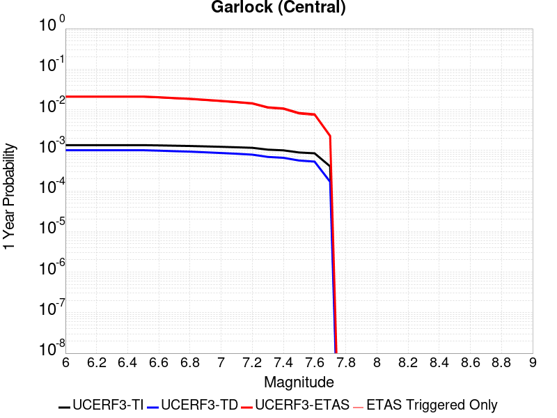 |  |

| Magnitude | 1 wk TI Prob | 1 wk TD Prob | 1 wk ETAS Prob | 1 wk ETAS/TD Gain | 1 wk ETAS Triggered Only | 1 mo TI Prob | 1 mo TD Prob | 1 mo ETAS Prob | 1 mo ETAS/TD Gain | 1 mo ETAS Triggered Only | 1 yr TI Prob | 1 yr TD Prob | 1 yr ETAS Prob | 1 yr ETAS/TD Gain | 1 yr ETAS Triggered Only | 10 yr TI Prob | 10 yr TD Prob | 10 yr ETAS Prob | 10 yr ETAS/TD Gain | 10 yr ETAS Triggered Only |
|-----|-----|-----|-----|-----|-----|-----|-----|-----|-----|-----|-----|-----|-----|-----|-----|-----|-----|-----|-----|-----|
| 6.0 | 2.575808E-5 | 1.9313613E-5 | 0.011768733 | 609.3491 | 0.011749647 | 1.10387096E-4 | 8.277037E-5 | 0.014801819 | 178.82993 | 0.014720267 | 0.0013431342 | 0.0010073289 | 0.021301195 | 21.14622 | 0.02031433 | 0.013350452 | 0.0100695705 | 0.035573628 | 3.5327852 | 0.025763486 |
| 6.1 | 2.575808E-5 | 1.9313613E-5 | 0.011768733 | 609.3491 | 0.011749647 | 1.10387096E-4 | 8.277037E-5 | 0.014801819 | 178.82993 | 0.014720267 | 0.0013431342 | 0.0010073289 | 0.021301195 | 21.14622 | 0.02031433 | 0.013350452 | 0.0100695705 | 0.035573628 | 3.5327852 | 0.025763486 |
| 6.2 | 2.575808E-5 | 1.9313613E-5 | 0.011768733 | 609.3491 | 0.011749647 | 1.10387096E-4 | 8.277037E-5 | 0.014801819 | 178.82993 | 0.014720267 | 0.0013431342 | 0.0010073289 | 0.021301195 | 21.14622 | 0.02031433 | 0.013350452 | 0.0100695705 | 0.035573628 | 3.5327852 | 0.025763486 |
| 6.3 | 2.575808E-5 | 1.9313613E-5 | 0.011768733 | 609.3491 | 0.011749647 | 1.10387096E-4 | 8.277037E-5 | 0.014801819 | 178.82993 | 0.014720267 | 0.0013431342 | 0.0010073289 | 0.021301195 | 21.14622 | 0.02031433 | 0.013350452 | 0.0100695705 | 0.035573628 | 3.5327852 | 0.025763486 |
| 6.4 | 2.575808E-5 | 1.9313613E-5 | 0.011768733 | 609.3491 | 0.011749647 | 1.10387096E-4 | 8.277037E-5 | 0.014801819 | 178.82993 | 0.014720267 | 0.0013431342 | 0.0010073289 | 0.021301195 | 21.14622 | 0.02031433 | 0.013350452 | 0.0100695705 | 0.035573628 | 3.5327852 | 0.025763486 |
| 6.5 | 2.575808E-5 | 1.9313613E-5 | 0.011768733 | 609.3491 | 0.011749647 | 1.10387096E-4 | 8.277037E-5 | 0.014801819 | 178.82993 | 0.014720267 | 0.0013431342 | 0.0010073289 | 0.021301195 | 21.14622 | 0.02031433 | 0.013350452 | 0.0100695705 | 0.035573628 | 3.5327852 | 0.025763486 |
| 6.6 | 2.540234E-5 | 1.885198E-5 | 0.01128224 | 598.4645 | 0.011263601 | 1.0886263E-4 | 8.0792066E-5 | 0.014208209 | 175.86143 | 0.014128557 | 0.0013245966 | 9.83265E-4 | 0.02047236 | 20.820799 | 0.019508278 | 0.013167289 | 0.009831364 | 0.034325216 | 3.4913993 | 0.024737053 |
| 6.7 | 2.4966947E-5 | 1.8286464E-5 | 0.010795643 | 590.36255 | 0.010777554 | 1.06996806E-4 | 7.8368575E-5 | 0.013596045 | 173.48848 | 0.013518736 | 0.0013019076 | 9.5378514E-4 | 0.019614045 | 20.564426 | 0.018678075 | 0.012943068 | 0.009539624 | 0.03297322 | 3.4564486 | 0.023659296 |
| 6.8 | 2.4548952E-5 | 1.7797542E-5 | 0.010378555 | 583.14545 | 0.010360942 | 1.0520555E-4 | 7.627332E-5 | 0.013053631 | 171.14284 | 0.012978348 | 0.001280125 | 9.282974E-4 | 0.018810874 | 20.263844 | 0.017899193 | 0.012727758 | 0.009286596 | 0.031739186 | 3.4177413 | 0.022663051 |
| 6.9 | 2.3994342E-5 | 1.7148153E-5 | 0.009710742 | 566.285 | 0.00969376 | 1.0282884E-4 | 7.349039E-5 | 0.012214704 | 166.20819 | 0.012142107 | 0.0012512221 | 8.944436E-4 | 0.01764051 | 19.722328 | 0.016761059 | 0.012442005 | 0.0089510605 | 0.02998711 | 3.350118 | 0.021226045 |
| 7.0 | 2.343005E-5 | 1.6491087E-5 | 0.009124431 | 553.2946 | 0.00910809 | 1.0041064E-4 | 7.067455E-5 | 0.0115085635 | 162.83888 | 0.011438698 | 0.0012218138 | 8.601883E-4 | 0.016632555 | 19.335947 | 0.015785946 | 0.01215118 | 0.008610493 | 0.028444627 | 3.3034844 | 0.0200064 |
| 7.1 | 2.2814058E-5 | 1.5782754E-5 | 0.008580331 | 543.65234 | 0.008564684 | 9.777087E-5 | 6.763899E-5 | 0.010811258 | 159.83766 | 0.010744345 | 0.0011897103 | 8.2325895E-4 | 0.015609834 | 18.961025 | 0.014798759 | 0.011833611 | 0.00824334 | 0.026884213 | 3.2613251 | 0.018795813 |
| 7.2 | 2.2145266E-5 | 1.5027377E-5 | 0.007981844 | 531.1535 | 0.007966937 | 9.490483E-5 | 6.440182E-5 | 0.010059411 | 156.1976 | 0.009995652 | 0.0011548538 | 7.8387547E-4 | 0.014506189 | 18.505732 | 0.013733079 | 0.011488707 | 0.007851825 | 0.025134236 | 3.2010694 | 0.017419184 |
| 7.3 | 1.9954436E-5 | 1.3199953E-5 | 0.0064102127 | 485.62387 | 0.006397097 | 8.551621E-5 | 5.657036E-5 | 0.008059282 | 142.46474 | 0.008003164 | 0.0010406625 | 6.8859005E-4 | 0.011730239 | 17.035154 | 0.011049257 | 0.010358025 | 0.006900618 | 0.020787772 | 3.0124507 | 0.013983649 |
| 7.4 | 1.918037E-5 | 1.2553606E-5 | 0.00603221 | 480.5161 | 0.0060197315 | 8.2198996E-5 | 5.3800417E-5 | 0.007573532 | 140.77087 | 0.0075201364 | 0.0010003132 | 6.5488677E-4 | 0.011018095 | 16.824427 | 0.010369999 | 0.009958224 | 0.006564366 | 0.019604476 | 2.9864995 | 0.0131262755 |
| 7.5 | 1.6994161E-5 | 1.0764553E-5 | 0.0046568364 | 432.60846 | 0.004646122 | 7.283008E-5 | 4.613333E-5 | 0.00586031 | 127.029854 | 0.0058144447 | 8.863455E-4 | 5.615903E-4 | 0.008490863 | 15.11932 | 0.007933728 | 0.008828186 | 0.005632708 | 0.015596073 | 2.768841 | 0.010019804 |
| 7.6 | 1.621788E-5 | 1.012848E-5 | 0.004357333 | 430.206 | 0.0043472485 | 6.950335E-5 | 4.34074E-5 | 0.0054742135 | 126.11245 | 0.0054310416 | 8.458747E-4 | 5.2841863E-4 | 0.0079269055 | 15.0011835 | 0.007402398 | 0.0084266225 | 0.005301458 | 0.014604498 | 2.754808 | 0.009352623 |
| 7.7 | 7.713584E-6 | 3.2171508E-6 | 0.0012349336 | 383.8594 | 0.0012317204 | 3.3057797E-5 | 1.378779E-5 | 0.0015171905 | 110.03871 | 0.0015034234 | 4.0240434E-4 | 1.6786634E-4 | 0.0022535918 | 13.424917 | 0.0020860755 | 0.0040167645 | 0.0016902693 | 0.0044147624 | 2.611869 | 0.002729106 |

## Little Lake
*[(top)](#table-of-contents)*

| 1 Week | 1 Month | 1 Year | 10 Year |
|-----|-----|-----|-----|
|  |  |  |  |

| Magnitude | 1 wk TI Prob | 1 wk TD Prob | 1 wk ETAS Prob | 1 wk ETAS/TD Gain | 1 wk ETAS Triggered Only | 1 mo TI Prob | 1 mo TD Prob | 1 mo ETAS Prob | 1 mo ETAS/TD Gain | 1 mo ETAS Triggered Only | 1 yr TI Prob | 1 yr TD Prob | 1 yr ETAS Prob | 1 yr ETAS/TD Gain | 1 yr ETAS Triggered Only | 10 yr TI Prob | 10 yr TD Prob | 10 yr ETAS Prob | 10 yr ETAS/TD Gain | 10 yr ETAS Triggered Only |
|-----|-----|-----|-----|-----|-----|-----|-----|-----|-----|-----|-----|-----|-----|-----|-----|-----|-----|-----|-----|-----|
| 6.0 | 1.27106505E-5 | 1.3900362E-5 | 0.011434326 | 822.5919 | 0.011420584 | 5.447308E-5 | 5.957219E-5 | 0.0145646315 | 244.48708 | 0.014505923 | 6.630079E-4 | 7.25151E-4 | 0.020870896 | 28.78145 | 0.020160366 | 0.006610333 | 0.0072377534 | 0.032775808 | 4.5284505 | 0.02572424 |
| 6.1 | 1.27106505E-5 | 1.3900362E-5 | 0.011434326 | 822.5919 | 0.011420584 | 5.447308E-5 | 5.957219E-5 | 0.0145646315 | 244.48708 | 0.014505923 | 6.630079E-4 | 7.25151E-4 | 0.020870896 | 28.78145 | 0.020160366 | 0.006610333 | 0.0072377534 | 0.032775808 | 4.5284505 | 0.02572424 |
| 6.2 | 1.27106505E-5 | 1.3900362E-5 | 0.011434326 | 822.5919 | 0.011420584 | 5.447308E-5 | 5.957219E-5 | 0.0145646315 | 244.48708 | 0.014505923 | 6.630079E-4 | 7.25151E-4 | 0.020870896 | 28.78145 | 0.020160366 | 0.006610333 | 0.0072377534 | 0.032775808 | 4.5284505 | 0.02572424 |
| 6.3 | 1.27106505E-5 | 1.3900362E-5 | 0.011434326 | 822.5919 | 0.011420584 | 5.447308E-5 | 5.957219E-5 | 0.0145646315 | 244.48708 | 0.014505923 | 6.630079E-4 | 7.25151E-4 | 0.020870896 | 28.78145 | 0.020160366 | 0.006610333 | 0.0072377534 | 0.032775808 | 4.5284505 | 0.02572424 |
| 6.4 | 1.27106505E-5 | 1.3900362E-5 | 0.011434326 | 822.5919 | 0.011420584 | 5.447308E-5 | 5.957219E-5 | 0.0145646315 | 244.48708 | 0.014505923 | 6.630079E-4 | 7.25151E-4 | 0.020870896 | 28.78145 | 0.020160366 | 0.006610333 | 0.0072377534 | 0.032775808 | 4.5284505 | 0.02572424 |
| 6.5 | 1.27106505E-5 | 1.3900362E-5 | 0.011434326 | 822.5919 | 0.011420584 | 5.447308E-5 | 5.957219E-5 | 0.0145646315 | 244.48708 | 0.014505923 | 6.630079E-4 | 7.25151E-4 | 0.020870896 | 28.78145 | 0.020160366 | 0.006610333 | 0.0072377534 | 0.032775808 | 4.5284505 | 0.02572424 |
| 6.6 | 1.08505255E-5 | 1.1856941E-5 | 0.009717578 | 819.5688 | 0.009705836 | 4.6501424E-5 | 5.0815026E-5 | 0.012382487 | 243.67766 | 0.012332299 | 5.6600774E-4 | 6.1859656E-4 | 0.017686076 | 28.59065 | 0.017078046 | 0.005645683 | 0.006178476 | 0.02787943 | 4.5123477 | 0.021835867 |
| 6.7 | 7.97625E-6 | 8.706619E-6 | 0.007078962 | 813.0552 | 0.007070317 | 3.4183482E-5 | 3.7314083E-5 | 0.009021292 | 241.76643 | 0.008984313 | 4.161044E-4 | 4.5429895E-4 | 0.013001276 | 28.618328 | 0.01255268 | 0.004153261 | 0.0045429897 | 0.020605825 | 4.5357413 | 0.016136141 |
| 6.8 | 7.97625E-6 | 8.706619E-6 | 0.007078962 | 813.0552 | 0.007070317 | 3.4183482E-5 | 3.7314083E-5 | 0.009021292 | 241.76643 | 0.008984313 | 4.161044E-4 | 4.5429895E-4 | 0.013001276 | 28.618328 | 0.01255268 | 0.004153261 | 0.0045429897 | 0.020605825 | 4.5357413 | 0.016136141 |

## Owl Lake
*[(top)](#table-of-contents)*

| 1 Week | 1 Month | 1 Year | 10 Year |
|-----|-----|-----|-----|
|  |  |  |  |

| Magnitude | 1 wk TI Prob | 1 wk TD Prob | 1 wk ETAS Prob | 1 wk ETAS/TD Gain | 1 wk ETAS Triggered Only | 1 mo TI Prob | 1 mo TD Prob | 1 mo ETAS Prob | 1 mo ETAS/TD Gain | 1 mo ETAS Triggered Only | 1 yr TI Prob | 1 yr TD Prob | 1 yr ETAS Prob | 1 yr ETAS/TD Gain | 1 yr ETAS Triggered Only | 10 yr TI Prob | 10 yr TD Prob | 10 yr ETAS Prob | 10 yr ETAS/TD Gain | 10 yr ETAS Triggered Only |
|-----|-----|-----|-----|-----|-----|-----|-----|-----|-----|-----|-----|-----|-----|-----|-----|-----|-----|-----|-----|-----|
| 6.0 | 3.637175E-5 | 4.988367E-5 | 0.004375784 | 87.719765 | 0.0043261163 | 1.5586962E-4 | 2.1378716E-4 | 0.0063408897 | 29.659824 | 0.0061284127 | 0.0018960608 | 0.0026025574 | 0.012454764 | 4.785587 | 0.009877915 | 0.018799646 | 0.025995217 | 0.03961242 | 1.5238348 | 0.013980631 |
| 6.1 | 3.637175E-5 | 4.988367E-5 | 0.004375784 | 87.719765 | 0.0043261163 | 1.5586962E-4 | 2.1378716E-4 | 0.0063408897 | 29.659824 | 0.0061284127 | 0.0018960608 | 0.0026025574 | 0.012454764 | 4.785587 | 0.009877915 | 0.018799646 | 0.025995217 | 0.03961242 | 1.5238348 | 0.013980631 |
| 6.2 | 3.637175E-5 | 4.988367E-5 | 0.004375784 | 87.719765 | 0.0043261163 | 1.5586962E-4 | 2.1378716E-4 | 0.0063408897 | 29.659824 | 0.0061284127 | 0.0018960608 | 0.0026025574 | 0.012454764 | 4.785587 | 0.009877915 | 0.018799646 | 0.025995217 | 0.03961242 | 1.5238348 | 0.013980631 |
| 6.3 | 3.637175E-5 | 4.988367E-5 | 0.004375784 | 87.719765 | 0.0043261163 | 1.5586962E-4 | 2.1378716E-4 | 0.0063408897 | 29.659824 | 0.0061284127 | 0.0018960608 | 0.0026025574 | 0.012454764 | 4.785587 | 0.009877915 | 0.018799646 | 0.025995217 | 0.03961242 | 1.5238348 | 0.013980631 |
| 6.4 | 3.637175E-5 | 4.988367E-5 | 0.004375784 | 87.719765 | 0.0043261163 | 1.5586962E-4 | 2.1378716E-4 | 0.0063408897 | 29.659824 | 0.0061284127 | 0.0018960608 | 0.0026025574 | 0.012454764 | 4.785587 | 0.009877915 | 0.018799646 | 0.025995217 | 0.03961242 | 1.5238348 | 0.013980631 |
| 6.5 | 3.637175E-5 | 4.988367E-5 | 0.004375784 | 87.719765 | 0.0043261163 | 1.5586962E-4 | 2.1378716E-4 | 0.0063408897 | 29.659824 | 0.0061284127 | 0.0018960608 | 0.0026025574 | 0.012454764 | 4.785587 | 0.009877915 | 0.018799646 | 0.025995217 | 0.03961242 | 1.5238348 | 0.013980631 |

## Garlock (West)
*[(top)](#table-of-contents)*

| 1 Week | 1 Month | 1 Year | 10 Year |
|-----|-----|-----|-----|
|  |  |  |  |

| Magnitude | 1 wk TI Prob | 1 wk TD Prob | 1 wk ETAS Prob | 1 wk ETAS/TD Gain | 1 wk ETAS Triggered Only | 1 mo TI Prob | 1 mo TD Prob | 1 mo ETAS Prob | 1 mo ETAS/TD Gain | 1 mo ETAS Triggered Only | 1 yr TI Prob | 1 yr TD Prob | 1 yr ETAS Prob | 1 yr ETAS/TD Gain | 1 yr ETAS Triggered Only | 10 yr TI Prob | 10 yr TD Prob | 10 yr ETAS Prob | 10 yr ETAS/TD Gain | 10 yr ETAS Triggered Only |
|-----|-----|-----|-----|-----|-----|-----|-----|-----|-----|-----|-----|-----|-----|-----|-----|-----|-----|-----|-----|-----|
| 6.0 | 2.516656E-5 | 1.8065048E-5 | 0.005442971 | 301.29846 | 0.005425004 | 1.07852225E-4 | 7.741977E-5 | 0.006875507 | 88.80816 | 0.006798614 | 0.0013123099 | 9.42255E-4 | 0.010298129 | 10.929237 | 0.009364698 | 0.013045873 | 0.009421492 | 0.021180058 | 2.2480578 | 0.011870404 |
| 6.1 | 2.516656E-5 | 1.8065048E-5 | 0.005442971 | 301.29846 | 0.005425004 | 1.07852225E-4 | 7.741977E-5 | 0.006875507 | 88.80816 | 0.006798614 | 0.0013123099 | 9.42255E-4 | 0.010298129 | 10.929237 | 0.009364698 | 0.013045873 | 0.009421492 | 0.021180058 | 2.2480578 | 0.011870404 |
| 6.2 | 2.516656E-5 | 1.8065048E-5 | 0.005442971 | 301.29846 | 0.005425004 | 1.07852225E-4 | 7.741977E-5 | 0.006875507 | 88.80816 | 0.006798614 | 0.0013123099 | 9.42255E-4 | 0.010298129 | 10.929237 | 0.009364698 | 0.013045873 | 0.009421492 | 0.021180058 | 2.2480578 | 0.011870404 |
| 6.3 | 2.516656E-5 | 1.8065048E-5 | 0.005442971 | 301.29846 | 0.005425004 | 1.07852225E-4 | 7.741977E-5 | 0.006875507 | 88.80816 | 0.006798614 | 0.0013123099 | 9.42255E-4 | 0.010298129 | 10.929237 | 0.009364698 | 0.013045873 | 0.009421492 | 0.021180058 | 2.2480578 | 0.011870404 |
| 6.4 | 2.516656E-5 | 1.8065048E-5 | 0.005442971 | 301.29846 | 0.005425004 | 1.07852225E-4 | 7.741977E-5 | 0.006875507 | 88.80816 | 0.006798614 | 0.0013123099 | 9.42255E-4 | 0.010298129 | 10.929237 | 0.009364698 | 0.013045873 | 0.009421492 | 0.021180058 | 2.2480578 | 0.011870404 |
| 6.5 | 2.516656E-5 | 1.8065048E-5 | 0.005442971 | 301.29846 | 0.005425004 | 1.07852225E-4 | 7.741977E-5 | 0.006875507 | 88.80816 | 0.006798614 | 0.0013123099 | 9.42255E-4 | 0.010298129 | 10.929237 | 0.009364698 | 0.013045873 | 0.009421492 | 0.021180058 | 2.2480578 | 0.011870404 |
| 6.6 | 2.498869E-5 | 1.7877663E-5 | 0.0054427846 | 304.4461 | 0.005425004 | 1.07089996E-4 | 7.6616736E-5 | 0.0068747094 | 89.72856 | 0.006798614 | 0.0013030408 | 9.3248655E-4 | 0.010288452 | 11.033352 | 0.009364698 | 0.012954267 | 0.009324339 | 0.021084059 | 2.2611854 | 0.011870404 |
| 6.7 | 2.4627925E-5 | 1.7497801E-5 | 0.005436369 | 310.6887 | 0.005418966 | 1.0554398E-4 | 7.498886E-5 | 0.0068670553 | 91.57435 | 0.006792576 | 0.0012842404 | 9.1268384E-4 | 0.010262802 | 11.244641 | 0.00935866 | 0.012768441 | 0.009128104 | 0.020878188 | 2.2872427 | 0.011858328 |
| 6.8 | 2.4270235E-5 | 1.716136E-5 | 0.0054330155 | 316.58423 | 0.005415947 | 1.04011146E-4 | 7.354704E-5 | 0.0068626045 | 93.30905 | 0.006789557 | 0.0012656 | 8.9514436E-4 | 0.010242411 | 11.442189 | 0.009355641 | 0.012584164 | 0.0089538675 | 0.020703025 | 2.3121881 | 0.011855309 |
| 6.9 | 2.3913764E-5 | 1.6823105E-5 | 0.0054296604 | 322.75018 | 0.0054129283 | 1.0248353E-4 | 7.2097464E-5 | 0.0068581463 | 95.12326 | 0.006786538 | 0.0012470228 | 8.775101E-4 | 0.010221926 | 11.648784 | 0.009352623 | 0.012400482 | 0.00877859 | 0.020526834 | 2.3382838 | 0.0118522905 |
| 7.0 | 2.3579369E-5 | 1.6492264E-5 | 0.005414237 | 328.2895 | 0.0053978334 | 1.0105052E-4 | 7.067965E-5 | 0.0068416446 | 96.79794 | 0.0067714434 | 0.0012295957 | 8.6026196E-4 | 0.010189757 | 11.844947 | 0.009337528 | 0.012228143 | 0.008607132 | 0.020342443 | 2.3634403 | 0.011837196 |
| 7.1 | 2.3205374E-5 | 1.6105636E-5 | 0.0054017766 | 335.39667 | 0.005385758 | 9.944781E-5 | 6.902276E-5 | 0.006815849 | 98.74784 | 0.006747292 | 0.0012101046 | 8.401051E-4 | 0.010124543 | 12.051518 | 0.009292244 | 0.0120353615 | 0.008406721 | 0.02009052 | 2.3898165 | 0.011782855 |
| 7.2 | 2.2799322E-5 | 1.5676578E-5 | 0.005356067 | 341.66043 | 0.005340474 | 9.770772E-5 | 6.718404E-5 | 0.006747611 | 100.43472 | 0.0066808756 | 0.0011889422 | 8.177357E-4 | 0.009975689 | 12.199162 | 0.009165449 | 0.011826012 | 0.008184515 | 0.019700263 | 2.4070165 | 0.011610776 |
| 7.3 | 1.8228246E-5 | 1.1798695E-5 | 0.0051952275 | 440.32224 | 0.00518349 | 7.811871E-5 | 5.0565202E-5 | 0.0065469583 | 129.47557 | 0.0064967214 | 9.506803E-4 | 6.1551924E-4 | 0.009500774 | 15.43538 | 0.008890728 | 0.0094662355 | 0.006171021 | 0.017359113 | 2.813005 | 0.011257563 |
| 7.4 | 1.7670916E-5 | 1.132978E-5 | 0.00500759 | 441.98477 | 0.004996317 | 7.5730306E-5 | 4.8555645E-5 | 0.0062883655 | 129.50844 | 0.006240113 | 9.216264E-4 | 5.9106643E-4 | 0.009090344 | 15.379566 | 0.008504305 | 0.009178135 | 0.0059269792 | 0.016631652 | 2.8060925 | 0.010768497 |
| 7.5 | 1.6994161E-5 | 1.0764553E-5 | 0.0046568364 | 432.60846 | 0.004646122 | 7.283008E-5 | 4.613333E-5 | 0.00586031 | 127.029854 | 0.0058144447 | 8.863455E-4 | 5.615903E-4 | 0.008490863 | 15.11932 | 0.007933728 | 0.008828186 | 0.005632708 | 0.015596073 | 2.768841 | 0.010019804 |
| 7.6 | 1.621788E-5 | 1.012848E-5 | 0.004357333 | 430.206 | 0.0043472485 | 6.950335E-5 | 4.34074E-5 | 0.0054742135 | 126.11245 | 0.0054310416 | 8.458747E-4 | 5.2841863E-4 | 0.0079269055 | 15.0011835 | 0.007402398 | 0.0084266225 | 0.005301458 | 0.014604498 | 2.754808 | 0.009352623 |
| 7.7 | 7.713584E-6 | 3.2171508E-6 | 0.0012349336 | 383.8594 | 0.0012317204 | 3.3057797E-5 | 1.378779E-5 | 0.0015171905 | 110.03871 | 0.0015034234 | 4.0240434E-4 | 1.6786634E-4 | 0.0022535918 | 13.424917 | 0.0020860755 | 0.0040167645 | 0.0016902693 | 0.0044147624 | 2.611869 | 0.002729106 |

## Garlock (East)
*[(top)](#table-of-contents)*

| 1 Week | 1 Month | 1 Year | 10 Year |
|-----|-----|-----|-----|
|  |  |  |  |

| Magnitude | 1 wk TI Prob | 1 wk TD Prob | 1 wk ETAS Prob | 1 wk ETAS/TD Gain | 1 wk ETAS Triggered Only | 1 mo TI Prob | 1 mo TD Prob | 1 mo ETAS Prob | 1 mo ETAS/TD Gain | 1 mo ETAS Triggered Only | 1 yr TI Prob | 1 yr TD Prob | 1 yr ETAS Prob | 1 yr ETAS/TD Gain | 1 yr ETAS Triggered Only | 10 yr TI Prob | 10 yr TD Prob | 10 yr ETAS Prob | 10 yr ETAS/TD Gain | 10 yr ETAS Triggered Only |
|-----|-----|-----|-----|-----|-----|-----|-----|-----|-----|-----|-----|-----|-----|-----|-----|-----|-----|-----|-----|-----|
| 6.0 | 2.2327951E-5 | 1.8303952E-5 | 0.0044892463 | 245.26105 | 0.0044710245 | 9.5687705E-5 | 7.8444085E-5 | 0.0057505546 | 73.307686 | 0.0056725554 | 0.0011643751 | 9.548048E-4 | 0.009215739 | 9.65196 | 0.008268829 | 0.0115829315 | 0.0096519785 | 0.020543762 | 2.1284509 | 0.010997935 |
| 6.1 | 2.2327951E-5 | 1.8303952E-5 | 0.0044892463 | 245.26105 | 0.0044710245 | 9.5687705E-5 | 7.8444085E-5 | 0.0057505546 | 73.307686 | 0.0056725554 | 0.0011643751 | 9.548048E-4 | 0.009215739 | 9.65196 | 0.008268829 | 0.0115829315 | 0.0096519785 | 0.020543762 | 2.1284509 | 0.010997935 |
| 6.2 | 2.2327951E-5 | 1.8303952E-5 | 0.0044892463 | 245.26105 | 0.0044710245 | 9.5687705E-5 | 7.8444085E-5 | 0.0057505546 | 73.307686 | 0.0056725554 | 0.0011643751 | 9.548048E-4 | 0.009215739 | 9.65196 | 0.008268829 | 0.0115829315 | 0.0096519785 | 0.020543762 | 2.1284509 | 0.010997935 |
| 6.3 | 2.2327951E-5 | 1.8303952E-5 | 0.0044892463 | 245.26105 | 0.0044710245 | 9.5687705E-5 | 7.8444085E-5 | 0.0057505546 | 73.307686 | 0.0056725554 | 0.0011643751 | 9.548048E-4 | 0.009215739 | 9.65196 | 0.008268829 | 0.0115829315 | 0.0096519785 | 0.020543762 | 2.1284509 | 0.010997935 |
| 6.4 | 2.2327951E-5 | 1.8303952E-5 | 0.0044892463 | 245.26105 | 0.0044710245 | 9.5687705E-5 | 7.8444085E-5 | 0.0057505546 | 73.307686 | 0.0056725554 | 0.0011643751 | 9.548048E-4 | 0.009215739 | 9.65196 | 0.008268829 | 0.0115829315 | 0.0096519785 | 0.020543762 | 2.1284509 | 0.010997935 |
| 6.5 | 2.2327951E-5 | 1.8303952E-5 | 0.0044892463 | 245.26105 | 0.0044710245 | 9.5687705E-5 | 7.8444085E-5 | 0.0057505546 | 73.307686 | 0.0056725554 | 0.0011643751 | 9.548048E-4 | 0.009215739 | 9.65196 | 0.008268829 | 0.0115829315 | 0.0096519785 | 0.020543762 | 2.1284509 | 0.010997935 |
| 6.6 | 2.222123E-5 | 1.816971E-5 | 0.0044830753 | 246.73344 | 0.0044649867 | 9.523036E-5 | 7.7868805E-5 | 0.0057379077 | 73.68687 | 0.00566048 | 0.0011588129 | 9.4780687E-4 | 0.009187686 | 9.693627 | 0.008247697 | 0.011527888 | 0.009581773 | 0.020438448 | 2.133055 | 0.010961708 |
| 6.7 | 2.2076227E-5 | 1.798404E-5 | 0.0044768527 | 248.93474 | 0.0044589485 | 9.4608964E-5 | 7.707312E-5 | 0.005728061 | 74.319824 | 0.0056514232 | 0.0011512554 | 9.381278E-4 | 0.009166023 | 9.770548 | 0.008235621 | 0.011453095 | 0.009485973 | 0.020319777 | 2.1420867 | 0.010937557 |
| 6.8 | 2.1962227E-5 | 1.7854036E-5 | 0.0044676666 | 250.23286 | 0.004449892 | 9.4120434E-5 | 7.651599E-5 | 0.0057184505 | 74.73537 | 0.005642366 | 0.0011453138 | 9.313506E-4 | 0.0091442205 | 9.818237 | 0.008220526 | 0.01139429 | 0.00941876 | 0.020223394 | 2.1471398 | 0.010907368 |
| 6.9 | 1.1702579E-5 | 6.6732687E-6 | 0.0039282274 | 588.6512 | 0.0039215805 | 5.0152947E-5 | 2.8599494E-5 | 0.004910058 | 171.68338 | 0.004881598 | 6.10441E-4 | 3.481581E-4 | 0.0070991367 | 20.390554 | 0.0067533297 | 0.0060876687 | 0.0034954504 | 0.012027188 | 3.440812 | 0.008561664 |
| 7.0 | 1.153538E-5 | 6.4796777E-6 | 0.0038555812 | 595.0267 | 0.0038491264 | 4.9436403E-5 | 2.7769835E-5 | 0.0048126294 | 173.30421 | 0.0047849924 | 6.01722E-4 | 3.3806017E-4 | 0.006965373 | 20.603945 | 0.006629554 | 0.006000953 | 0.0033946347 | 0.011776802 | 3.4692397 | 0.008410718 |
| 7.1 | 1.135938E-5 | 6.273818E-6 | 0.0036561284 | 582.7597 | 0.0036498774 | 4.868215E-5 | 2.6887597E-5 | 0.0045793005 | 170.31274 | 0.0045525352 | 5.925439E-4 | 3.2732222E-4 | 0.0066378233 | 20.279171 | 0.0063125673 | 0.0059096646 | 0.0032873498 | 0.011294294 | 3.4356837 | 0.008033353 |
| 7.2 | 1.1168294E-5 | 6.048814E-6 | 0.0033660894 | 556.4875 | 0.003360061 | 4.786324E-5 | 2.5923315E-5 | 0.0042281547 | 163.10239 | 0.0042023403 | 5.825791E-4 | 3.1558552E-4 | 0.0061463034 | 19.475872 | 0.0058325585 | 0.005810542 | 0.0031701238 | 0.010555075 | 3.3295465 | 0.007408436 |
| 7.3 | 1.0952553E-5 | 5.8686815E-6 | 0.0031576054 | 538.0434 | 0.0031517553 | 4.693867E-5 | 2.5151334E-5 | 0.0039556897 | 157.27554 | 0.003930637 | 5.713284E-4 | 3.0618932E-4 | 0.0057627303 | 18.820807 | 0.005458212 | 0.0056986175 | 0.0030760262 | 0.009968094 | 3.2405748 | 0.0069133327 |
| 7.4 | 1.0735812E-5 | 5.691247E-6 | 0.0029672375 | 521.3686 | 0.0029615632 | 4.6009813E-5 | 2.4390914E-5 | 0.0037285185 | 152.86505 | 0.003704218 | 5.600255E-4 | 2.9693378E-4 | 0.0054607764 | 18.390553 | 0.0051653767 | 0.0055861627 | 0.0029833042 | 0.009508803 | 3.187339 | 0.006545024 |
| 7.5 | 9.0273E-6 | 4.284415E-6 | 0.0018126114 | 423.0709 | 0.0018083346 | 3.8687853E-5 | 1.8361723E-5 | 0.0022764744 | 123.97934 | 0.002258154 | 4.709228E-4 | 2.2354414E-4 | 0.0032931021 | 14.731328 | 0.0030702443 | 0.004699261 | 0.0022480614 | 0.0061337166 | 2.7284472 | 0.00389441 |
| 7.6 | 8.549585E-6 | 3.885532E-6 | 0.0016008894 | 412.01294 | 0.0015970101 | 3.6640562E-5 | 1.6652246E-5 | 0.0020000513 | 120.106995 | 0.001983432 | 4.4600753E-4 | 2.027353E-4 | 0.0029192148 | 14.399144 | 0.0027170302 | 0.0044511347 | 0.0020396118 | 0.005489228 | 2.6913102 | 0.0034566664 |
| 7.7 | 7.713584E-6 | 3.2171508E-6 | 0.0012349336 | 383.8594 | 0.0012317204 | 3.3057797E-5 | 1.378779E-5 | 0.0015171905 | 110.03871 | 0.0015034234 | 4.0240434E-4 | 1.6786634E-4 | 0.0022535918 | 13.424917 | 0.0020860755 | 0.0040167645 | 0.0016902693 | 0.0044147624 | 2.611869 | 0.002729106 |

## Death Valley (So)
*[(top)](#table-of-contents)*

| 1 Week | 1 Month | 1 Year | 10 Year |
|-----|-----|-----|-----|
|  |  |  |  |

| Magnitude | 1 wk TI Prob | 1 wk TD Prob | 1 wk ETAS Prob | 1 wk ETAS/TD Gain | 1 wk ETAS Triggered Only | 1 mo TI Prob | 1 mo TD Prob | 1 mo ETAS Prob | 1 mo ETAS/TD Gain | 1 mo ETAS Triggered Only | 1 yr TI Prob | 1 yr TD Prob | 1 yr ETAS Prob | 1 yr ETAS/TD Gain | 1 yr ETAS Triggered Only | 10 yr TI Prob | 10 yr TD Prob | 10 yr ETAS Prob | 10 yr ETAS/TD Gain | 10 yr ETAS Triggered Only |
|-----|-----|-----|-----|-----|-----|-----|-----|-----|-----|-----|-----|-----|-----|-----|-----|-----|-----|-----|-----|-----|
| 6.0 | 4.4658216E-5 | 6.228887E-5 | 0.0020908786 | 33.56745 | 0.002028716 | 1.9137832E-4 | 2.669324E-4 | 0.0032397774 | 12.137071 | 0.0029736387 | 0.0023275411 | 0.0032461619 | 0.008406807 | 2.5897684 | 0.005177452 | 0.023033133 | 0.032094594 | 0.039721094 | 1.2376257 | 0.007879388 |
| 6.1 | 4.4658216E-5 | 6.228887E-5 | 0.0020908786 | 33.56745 | 0.002028716 | 1.9137832E-4 | 2.669324E-4 | 0.0032397774 | 12.137071 | 0.0029736387 | 0.0023275411 | 0.0032461619 | 0.008406807 | 2.5897684 | 0.005177452 | 0.023033133 | 0.032094594 | 0.039721094 | 1.2376257 | 0.007879388 |
| 6.2 | 4.4658216E-5 | 6.228887E-5 | 0.0020908786 | 33.56745 | 0.002028716 | 1.9137832E-4 | 2.669324E-4 | 0.0032397774 | 12.137071 | 0.0029736387 | 0.0023275411 | 0.0032461619 | 0.008406807 | 2.5897684 | 0.005177452 | 0.023033133 | 0.032094594 | 0.039721094 | 1.2376257 | 0.007879388 |
| 6.3 | 4.4658216E-5 | 6.228887E-5 | 0.0020908786 | 33.56745 | 0.002028716 | 1.9137832E-4 | 2.669324E-4 | 0.0032397774 | 12.137071 | 0.0029736387 | 0.0023275411 | 0.0032461619 | 0.008406807 | 2.5897684 | 0.005177452 | 0.023033133 | 0.032094594 | 0.039721094 | 1.2376257 | 0.007879388 |
| 6.4 | 4.4658216E-5 | 6.228887E-5 | 0.0020908786 | 33.56745 | 0.002028716 | 1.9137832E-4 | 2.669324E-4 | 0.0032397774 | 12.137071 | 0.0029736387 | 0.0023275411 | 0.0032461619 | 0.008406807 | 2.5897684 | 0.005177452 | 0.023033133 | 0.032094594 | 0.039721094 | 1.2376257 | 0.007879388 |
| 6.5 | 4.4658216E-5 | 6.228887E-5 | 0.0020908786 | 33.56745 | 0.002028716 | 1.9137832E-4 | 2.669324E-4 | 0.0032397774 | 12.137071 | 0.0029736387 | 0.0023275411 | 0.0032461619 | 0.008406807 | 2.5897684 | 0.005177452 | 0.023033133 | 0.032094594 | 0.039721094 | 1.2376257 | 0.007879388 |
| 6.6 | 3.6853275E-5 | 5.1089468E-5 | 0.0017566936 | 34.38465 | 0.0017056912 | 1.5793304E-4 | 2.1894388E-4 | 0.002712028 | 12.386864 | 0.0024936302 | 0.0019211388 | 0.0026635646 | 0.0070142886 | 2.6334217 | 0.0043623433 | 0.019046152 | 0.026430551 | 0.032837857 | 1.2424204 | 0.0065812515 |
| 6.7 | 2.9971921E-5 | 4.1332314E-5 | 0.0014209229 | 34.378014 | 0.0013796476 | 1.2844476E-4 | 1.7713365E-4 | 0.0021813433 | 12.314674 | 0.0020045645 | 0.0015626932 | 0.0021557007 | 0.0056199776 | 2.6070306 | 0.003471761 | 0.015517498 | 0.021467837 | 0.026661167 | 1.2419121 | 0.005307266 |
| 6.8 | 2.8134293E-5 | 3.8737995E-5 | 0.0013338056 | 34.431458 | 0.0012951178 | 1.2056997E-4 | 1.6601657E-4 | 0.00205253 | 12.363404 | 0.0018868266 | 0.0014669509 | 0.0020206098 | 0.005301574 | 2.6237493 | 0.0032876066 | 0.014573049 | 0.020142367 | 0.025041005 | 1.2432007 | 0.004999336 |
| 6.9 | 5.6768154E-6 | 7.307913E-6 | 6.768593E-5 | 9.262004 | 6.0378454E-5 | 2.4328981E-5 | 3.1319494E-5 | 1.2490316E-4 | 3.9880326 | 9.35866E-5 | 2.961651E-4 | 3.8129094E-4 | 5.2010844E-4 | 1.3640723 | 1.3887044E-4 | 0.0029577068 | 0.003810565 | 0.0040240916 | 1.0560354 | 2.1434351E-4 |
| 7.0 | 5.556207E-6 | 7.1531585E-6 | 6.451228E-5 | 9.018712 | 5.7359528E-5 | 2.3812097E-5 | 3.0656276E-5 | 1.1820235E-4 | 3.855731 | 8.754875E-5 | 2.8987371E-4 | 3.7321905E-4 | 4.999665E-4 | 1.339606 | 1.2679475E-4 | 0.002894959 | 0.003730121 | 0.0039316346 | 1.0540233 | 2.0226781E-4 |
| 7.1 | 5.418659E-6 | 6.9768143E-6 | 5.829814E-5 | 8.355983 | 5.1321684E-5 | 2.3222618E-5 | 2.9900531E-5 | 1.11409005E-4 | 3.7259874 | 8.151091E-5 | 2.826987E-4 | 3.64021E-4 | 4.8171612E-4 | 1.3233196 | 1.1773798E-4 | 0.0028233933 | 0.003638446 | 0.0038249383 | 1.051256 | 1.871732E-4 |
| 7.2 | 5.263499E-6 | 6.7766255E-6 | 5.809796E-5 | 8.573288 | 5.1321684E-5 | 2.2557659E-5 | 2.90426E-5 | 1.0753231E-4 | 3.7025719 | 7.849199E-5 | 2.7460488E-4 | 3.5357912E-4 | 4.682576E-4 | 1.3243362 | 1.14719056E-4 | 0.002742658 | 0.003534366 | 0.0037058364 | 1.0485152 | 1.720786E-4 |
| 7.3 | 5.0913163E-6 | 6.5556187E-6 | 5.4858065E-5 | 8.368099 | 4.830276E-5 | 2.1819744E-5 | 2.8095446E-5 | 1.0356639E-4 | 3.686234 | 7.5473064E-5 | 2.65623E-4 | 3.420512E-4 | 4.5069525E-4 | 1.317625 | 1.0868121E-4 | 0.0026530572 | 0.0034194465 | 0.0035758938 | 1.0457522 | 1.5698398E-4 |
| 7.4 | 5.018449E-6 | 6.4618785E-6 | 5.1745425E-5 | 8.007799 | 4.528384E-5 | 2.1507461E-5 | 2.7693712E-5 | 9.7127006E-5 | 3.5071864 | 6.943522E-5 | 2.6182187E-4 | 3.371616E-4 | 4.3675245E-4 | 1.2953802 | 9.962445E-5 | 0.0026151363 | 0.0033706997 | 0.0035151194 | 1.0428456 | 1.4490829E-4 |
| 7.5 | 4.993322E-6 | 6.430145E-6 | 5.1713694E-5 | 8.042384 | 4.528384E-5 | 2.1399776E-5 | 2.7557713E-5 | 9.699102E-5 | 3.5195599 | 6.943522E-5 | 2.6051112E-4 | 3.3550634E-4 | 4.3509735E-4 | 1.296838 | 9.962445E-5 | 0.0026020592 | 0.003354197 | 0.0034986192 | 1.0430572 | 1.4490829E-4 |
| 7.6 | 4.882584E-6 | 6.2884383E-6 | 5.157199E-5 | 8.201081 | 4.528384E-5 | 2.0925192E-5 | 2.6950413E-5 | 9.638376E-5 | 3.576337 | 6.943522E-5 | 2.5473442E-4 | 3.2811466E-4 | 4.2770643E-4 | 1.3035272 | 9.962445E-5 | 0.0025444264 | 0.0032805006 | 0.0034159066 | 1.041276 | 1.3585151E-4 |
| 7.7 | 4.8153906E-6 | 6.202069E-6 | 4.846672E-5 | 7.8146057 | 4.2264917E-5 | 2.0637224E-5 | 2.6580266E-5 | 8.393827E-5 | 3.157917 | 5.7359528E-5 | 2.5122924E-4 | 3.2360948E-4 | 4.111299E-4 | 1.2704507 | 8.754875E-5 | 0.002509454 | 0.0032355804 | 0.0033589557 | 1.0381309 | 1.2377583E-4 |
| 7.8 | 4.8153906E-6 | 6.202069E-6 | 4.846672E-5 | 7.8146057 | 4.2264917E-5 | 2.0637224E-5 | 2.6580266E-5 | 8.393827E-5 | 3.157917 | 5.7359528E-5 | 2.5122924E-4 | 3.2360948E-4 | 4.111299E-4 | 1.2704507 | 8.754875E-5 | 0.002509454 | 0.0032355804 | 0.0033589557 | 1.0381309 | 1.2377583E-4 |

## Panamint Valley
*[(top)](#table-of-contents)*

| 1 Week | 1 Month | 1 Year | 10 Year |
|-----|-----|-----|-----|
|  |  |  |  |

| Magnitude | 1 wk TI Prob | 1 wk TD Prob | 1 wk ETAS Prob | 1 wk ETAS/TD Gain | 1 wk ETAS Triggered Only | 1 mo TI Prob | 1 mo TD Prob | 1 mo ETAS Prob | 1 mo ETAS/TD Gain | 1 mo ETAS Triggered Only | 1 yr TI Prob | 1 yr TD Prob | 1 yr ETAS Prob | 1 yr ETAS/TD Gain | 1 yr ETAS Triggered Only | 10 yr TI Prob | 10 yr TD Prob | 10 yr ETAS Prob | 10 yr ETAS/TD Gain | 10 yr ETAS Triggered Only |
|-----|-----|-----|-----|-----|-----|-----|-----|-----|-----|-----|-----|-----|-----|-----|-----|-----|-----|-----|-----|-----|
| 6.0 | 2.4839064E-5 | 2.5506472E-5 | 0.0022292638 | 87.399925 | 0.0022038135 | 1.0644879E-4 | 1.09309134E-4 | 0.0029498048 | 26.985895 | 0.0028408063 | 0.0012952434 | 0.0013300732 | 0.0057348525 | 4.3116817 | 0.004410646 | 0.0128772 | 0.013225966 | 0.019446107 | 1.4702976 | 0.0063035106 |
| 6.1 | 2.4839064E-5 | 2.5506472E-5 | 0.0022292638 | 87.399925 | 0.0022038135 | 1.0644879E-4 | 1.09309134E-4 | 0.0029498048 | 26.985895 | 0.0028408063 | 0.0012952434 | 0.0013300732 | 0.0057348525 | 4.3116817 | 0.004410646 | 0.0128772 | 0.013225966 | 0.019446107 | 1.4702976 | 0.0063035106 |
| 6.2 | 2.4839064E-5 | 2.5506472E-5 | 0.0022292638 | 87.399925 | 0.0022038135 | 1.0644879E-4 | 1.09309134E-4 | 0.0029498048 | 26.985895 | 0.0028408063 | 0.0012952434 | 0.0013300732 | 0.0057348525 | 4.3116817 | 0.004410646 | 0.0128772 | 0.013225966 | 0.019446107 | 1.4702976 | 0.0063035106 |
| 6.3 | 2.4839064E-5 | 2.5506472E-5 | 0.0022292638 | 87.399925 | 0.0022038135 | 1.0644879E-4 | 1.09309134E-4 | 0.0029498048 | 26.985895 | 0.0028408063 | 0.0012952434 | 0.0013300732 | 0.0057348525 | 4.3116817 | 0.004410646 | 0.0128772 | 0.013225966 | 0.019446107 | 1.4702976 | 0.0063035106 |
| 6.4 | 2.4839064E-5 | 2.5506472E-5 | 0.0022292638 | 87.399925 | 0.0022038135 | 1.0644879E-4 | 1.09309134E-4 | 0.0029498048 | 26.985895 | 0.0028408063 | 0.0012952434 | 0.0013300732 | 0.0057348525 | 4.3116817 | 0.004410646 | 0.0128772 | 0.013225966 | 0.019446107 | 1.4702976 | 0.0063035106 |
| 6.5 | 2.4839064E-5 | 2.5506472E-5 | 0.0022292638 | 87.399925 | 0.0022038135 | 1.0644879E-4 | 1.09309134E-4 | 0.0029498048 | 26.985895 | 0.0028408063 | 0.0012952434 | 0.0013300732 | 0.0057348525 | 4.3116817 | 0.004410646 | 0.0128772 | 0.013225966 | 0.019446107 | 1.4702976 | 0.0063035106 |
| 6.6 | 2.151644E-5 | 2.1799351E-5 | 0.0018391511 | 84.36725 | 0.0018173914 | 9.221006E-5 | 9.34227E-5 | 0.0024389063 | 26.106144 | 0.0023457028 | 0.0011220792 | 0.001136874 | 0.004818788 | 4.23863 | 0.0036861044 | 0.011164304 | 0.0113152405 | 0.01647291 | 1.4558163 | 0.005216698 |
| 6.7 | 2.0301508E-5 | 2.043303E-5 | 0.0017170329 | 84.03223 | 0.0016966345 | 8.7003566E-5 | 8.7567445E-5 | 0.0022760946 | 25.992476 | 0.0021887189 | 0.0010587536 | 0.001065658 | 0.004458327 | 4.183637 | 0.003396288 | 0.010537235 | 0.01061009 | 0.015374181 | 1.4490153 | 0.0048151817 |
| 6.8 | 1.782843E-5 | 1.789433E-5 | 0.0014911022 | 83.32819 | 0.0014732343 | 7.640532E-5 | 7.668799E-5 | 0.0019663887 | 25.641417 | 0.0018898456 | 9.298377E-4 | 9.3332166E-4 | 0.0038679917 | 4.1443286 | 0.0029374117 | 0.009259567 | 0.009298533 | 0.013416935 | 1.4429088 | 0.0041570566 |
| 6.9 | 1.6185495E-5 | 1.6192123E-5 | 0.0013263833 | 81.91534 | 0.0013102124 | 6.936456E-5 | 6.939322E-5 | 0.0017477977 | 25.186865 | 0.0016785209 | 8.4418635E-4 | 8.4458006E-4 | 0.0034507262 | 4.08573 | 0.002608349 | 0.008409866 | 0.008418168 | 0.012082223 | 1.4352556 | 0.0036951613 |
| 7.0 | 1.4473978E-5 | 1.4401701E-5 | 0.0011706324 | 81.28432 | 0.0011562473 | 6.202986E-5 | 6.172037E-5 | 0.0015559949 | 25.210394 | 0.0014943667 | 7.5495185E-4 | 7.512313E-4 | 0.0030469054 | 4.055882 | 0.0022974 | 0.0075239222 | 0.007491346 | 0.010730354 | 1.4323666 | 0.0032634553 |
| 7.1 | 1.29175705E-5 | 1.2765824E-5 | 0.0010089976 | 79.03896 | 9.962445E-4 | 5.535984E-5 | 5.470978E-5 | 0.001346738 | 24.616037 | 0.0012920989 | 6.737976E-4 | 6.659326E-4 | 0.0026540777 | 3.9855049 | 0.00198947 | 0.0067175827 | 0.0066437623 | 0.009477691 | 1.4265547 | 0.0028528818 |
| 7.2 | 1.1461888E-5 | 1.1226499E-5 | 9.0179866E-4 | 80.32768 | 8.9058216E-4 | 4.9121452E-5 | 4.8112932E-5 | 0.0011892108 | 24.717072 | 0.0011411527 | 5.978896E-4 | 5.856619E-4 | 0.0023356115 | 3.987986 | 0.0017509751 | 0.005962835 | 0.005845547 | 0.008357614 | 1.4297403 | 0.0025268383 |
| 7.3 | 1.011261E-5 | 9.918427E-6 | 7.7973603E-4 | 78.61489 | 7.6982524E-4 | 4.3339038E-5 | 4.25071E-5 | 0.0010356904 | 24.365116 | 9.932255E-4 | 5.2752503E-4 | 5.1744515E-4 | 0.0020200906 | 3.9039705 | 0.0015034234 | 0.005262745 | 0.005166732 | 0.0073471456 | 1.4220102 | 0.0021917378 |
| 7.4 | 4.3367913E-6 | 4.4250473E-6 | 2.821647E-4 | 63.76535 | 2.7774088E-4 | 1.8586115E-5 | 1.896443E-5 | 3.4802075E-4 | 18.351236 | 3.2906258E-4 | 2.2626246E-4 | 2.3088178E-4 | 6.775792E-4 | 2.934745 | 4.4680055E-4 | 0.0022603222 | 0.0023078213 | 0.0029734634 | 1.2884288 | 6.671819E-4 |
| 7.5 | 3.7993927E-6 | 3.8762123E-6 | 2.6048365E-4 | 67.20056 | 2.5660841E-4 | 1.628301E-5 | 1.6612312E-5 | 3.1849954E-4 | 19.1725 | 3.0189226E-4 | 1.9822762E-4 | 2.0225039E-4 | 6.157591E-4 | 3.0445387 | 4.135924E-4 | 0.001980509 | 0.002022061 | 0.0026276375 | 1.2994847 | 6.0680346E-4 |
| 7.6 | 3.2998898E-6 | 3.365071E-6 | 2.297835E-4 | 68.28489 | 2.264192E-4 | 1.4142308E-5 | 1.4421733E-5 | 2.8612086E-4 | 19.839561 | 2.7170303E-4 | 1.7216899E-4 | 1.755846E-4 | 5.5288366E-4 | 3.1488163 | 3.7736533E-4 | 0.0017203566 | 0.001755846 | 0.0022982978 | 1.3089405 | 5.4340606E-4 |

## San Andreas (Mojave N)
*[(top)](#table-of-contents)*

| 1 Week | 1 Month | 1 Year | 10 Year |
|-----|-----|-----|-----|
|  |  |  |  |

| Magnitude | 1 wk TI Prob | 1 wk TD Prob | 1 wk ETAS Prob | 1 wk ETAS/TD Gain | 1 wk ETAS Triggered Only | 1 mo TI Prob | 1 mo TD Prob | 1 mo ETAS Prob | 1 mo ETAS/TD Gain | 1 mo ETAS Triggered Only | 1 yr TI Prob | 1 yr TD Prob | 1 yr ETAS Prob | 1 yr ETAS/TD Gain | 1 yr ETAS Triggered Only | 10 yr TI Prob | 10 yr TD Prob | 10 yr ETAS Prob | 10 yr ETAS/TD Gain | 10 yr ETAS Triggered Only |
|-----|-----|-----|-----|-----|-----|-----|-----|-----|-----|-----|-----|-----|-----|-----|-----|-----|-----|-----|-----|-----|
| 6.0 | 1.0523762E-4 | 4.3662923E-4 | 0.0011306782 | 2.5895615 | 6.943522E-4 | 4.5094037E-4 | 0.0018700866 | 0.002852415 | 1.5252849 | 9.841687E-4 | 0.005476387 | 0.022559863 | 0.024268385 | 1.0757328 | 0.0017479562 | 0.053433806 | 0.19573303 | 0.19787696 | 1.0109534 | 0.0026657088 |
| 6.1 | 1.0523762E-4 | 4.3662923E-4 | 0.0011306782 | 2.5895615 | 6.943522E-4 | 4.5094037E-4 | 0.0018700866 | 0.002852415 | 1.5252849 | 9.841687E-4 | 0.005476387 | 0.022559863 | 0.024268385 | 1.0757328 | 0.0017479562 | 0.053433806 | 0.19573303 | 0.19787696 | 1.0109534 | 0.0026657088 |
| 6.2 | 1.0523762E-4 | 4.3662923E-4 | 0.0011306782 | 2.5895615 | 6.943522E-4 | 4.5094037E-4 | 0.0018700866 | 0.002852415 | 1.5252849 | 9.841687E-4 | 0.005476387 | 0.022559863 | 0.024268385 | 1.0757328 | 0.0017479562 | 0.053433806 | 0.19573303 | 0.19787696 | 1.0109534 | 0.0026657088 |
| 6.3 | 1.0523762E-4 | 4.3662923E-4 | 0.0011306782 | 2.5895615 | 6.943522E-4 | 4.5094037E-4 | 0.0018700866 | 0.002852415 | 1.5252849 | 9.841687E-4 | 0.005476387 | 0.022559863 | 0.024268385 | 1.0757328 | 0.0017479562 | 0.053433806 | 0.19573303 | 0.19787696 | 1.0109534 | 0.0026657088 |
| 6.4 | 1.0523762E-4 | 4.3662923E-4 | 0.0011306782 | 2.5895615 | 6.943522E-4 | 4.5094037E-4 | 0.0018700866 | 0.002852415 | 1.5252849 | 9.841687E-4 | 0.005476387 | 0.022559863 | 0.024268385 | 1.0757328 | 0.0017479562 | 0.053433806 | 0.19573303 | 0.19787696 | 1.0109534 | 0.0026657088 |
| 6.5 | 1.0523762E-4 | 4.3662923E-4 | 0.0011306782 | 2.5895615 | 6.943522E-4 | 4.5094037E-4 | 0.0018700866 | 0.002852415 | 1.5252849 | 9.841687E-4 | 0.005476387 | 0.022559863 | 0.024268385 | 1.0757328 | 0.0017479562 | 0.053433806 | 0.19573303 | 0.19787696 | 1.0109534 | 0.0026657088 |
| 6.6 | 1.05157305E-4 | 4.3648225E-4 | 0.0011305314 | 2.590097 | 6.943522E-4 | 4.5059633E-4 | 0.0018694578 | 0.0028517866 | 1.5254619 | 9.841687E-4 | 0.005472219 | 0.022552364 | 0.024260899 | 1.0757586 | 0.0017479562 | 0.053394135 | 0.19567315 | 0.19781484 | 1.0109452 | 0.0026626897 |
| 6.7 | 1.0507546E-4 | 4.363306E-4 | 0.0011303799 | 2.59065 | 6.943522E-4 | 4.5024566E-4 | 0.0018688086 | 0.0028481248 | 1.5240324 | 9.811498E-4 | 0.0054679713 | 0.022544624 | 0.024247272 | 1.0755234 | 0.0017419184 | 0.053353705 | 0.1956114 | 0.19774838 | 1.0109246 | 0.002656652 |
| 6.8 | 1.0495169E-4 | 4.3606028E-4 | 0.0011301097 | 2.5916364 | 6.943522E-4 | 4.4971542E-4 | 0.0018676518 | 0.0028469693 | 1.5243576 | 9.811498E-4 | 0.005461548 | 0.022530831 | 0.024230553 | 1.0754398 | 0.0017388994 | 0.053292558 | 0.19550118 | 0.19763117 | 1.010895 | 0.002647595 |
| 6.9 | 1.01919264E-4 | 4.2973462E-4 | 0.0010724888 | 2.4957001 | 6.430305E-4 | 4.367237E-4 | 0.0018405803 | 0.0027566436 | 1.4977036 | 9.1775245E-4 | 0.0053041554 | 0.022207966 | 0.023790173 | 1.071245 | 0.0016181425 | 0.051793266 | 0.19291273 | 0.1949058 | 1.0103315 | 0.0024694786 |
| 7.0 | 1.0166431E-4 | 4.2917405E-4 | 0.0010689109 | 2.4906235 | 6.4001157E-4 | 4.356314E-4 | 0.0018381812 | 0.0027512333 | 1.496715 | 9.1473357E-4 | 0.0052909213 | 0.022179354 | 0.023755703 | 1.0710728 | 0.0016121047 | 0.0516671 | 0.19268334 | 0.19466968 | 1.0103089 | 0.002460422 |
| 7.1 | 1.01401034E-4 | 4.2859098E-4 | 0.0010683283 | 2.4926522 | 6.4001157E-4 | 4.3450345E-4 | 0.0018356858 | 0.0027487401 | 1.4973915 | 9.1473357E-4 | 0.005277255 | 0.02214959 | 0.023723036 | 1.0710372 | 0.0016090857 | 0.051536802 | 0.19244485 | 0.19442445 | 1.0102867 | 0.002451365 |
| 7.2 | 1.0108741E-4 | 4.278926E-4 | 0.0010676304 | 2.4950895 | 6.4001157E-4 | 4.3315982E-4 | 0.001832697 | 0.002745754 | 1.4982041 | 9.1473357E-4 | 0.0052609756 | 0.022113942 | 0.023678588 | 1.0707538 | 0.001600029 | 0.051381566 | 0.19215985 | 0.1941304 | 1.0102547 | 0.0024392894 |
| 7.3 | 1.00634395E-4 | 4.2664207E-4 | 0.0010663806 | 2.4994736 | 6.4001157E-4 | 4.3121897E-4 | 0.001827345 | 0.0027343803 | 1.4963678 | 9.086957E-4 | 0.0052374597 | 0.022050105 | 0.023608947 | 1.0706955 | 0.0015939912 | 0.051157285 | 0.1916488 | 0.19360352 | 1.0101995 | 0.002418157 |
| 7.4 | 1.0012071E-4 | 4.2521826E-4 | 0.0010649577 | 2.5044966 | 6.4001157E-4 | 4.290182E-4 | 0.0018212516 | 0.0027282923 | 1.4980315 | 9.086957E-4 | 0.0052107936 | 0.021977417 | 0.023533422 | 1.0708003 | 0.0015909722 | 0.050902903 | 0.19106553 | 0.19301434 | 1.0101997 | 0.0024091003 |
| 7.5 | 9.339507E-5 | 4.0500556E-4 | 0.0010055278 | 2.4827507 | 6.007656E-4 | 4.002032E-4 | 0.0017347414 | 0.002581587 | 1.4881682 | 8.483172E-4 | 0.0048615932 | 0.020944512 | 0.02240758 | 1.0698545 | 0.0014943667 | 0.047566023 | 0.18278176 | 0.1846321 | 1.0101233 | 0.0022641919 |
| 7.6 | 9.106496E-5 | 3.9784564E-4 | 9.772482E-4 | 2.45635 | 5.7963317E-4 | 3.9022003E-4 | 0.0017040963 | 0.002523844 | 1.4810454 | 8.2114694E-4 | 0.0047405837 | 0.020578498 | 0.022009587 | 1.069543 | 0.0014611585 | 0.046407226 | 0.17986235 | 0.18168217 | 1.0101178 | 0.0022189082 |
| 7.7 | 8.313271E-5 | 3.7445044E-4 | 8.965285E-4 | 2.3942513 | 5.222736E-4 | 3.5623438E-4 | 0.0016039569 | 0.0023514489 | 1.46603 | 7.486928E-4 | 0.004328531 | 0.019381423 | 0.020684004 | 1.0672077 | 0.001328326 | 0.042451844 | 0.17016967 | 0.17183311 | 1.0097753 | 0.0020045645 |
| 7.8 | 5.726896E-5 | 2.6506177E-4 | 6.121458E-4 | 2.309446 | 3.471761E-4 | 2.4541531E-4 | 0.0011355855 | 0.0016361575 | 1.4408053 | 5.011411E-4 | 0.0029838376 | 0.013756123 | 0.014604681 | 1.0616858 | 8.6039293E-4 | 0.0294409 | 0.12299887 | 0.12415058 | 1.0093635 | 0.0013132313 |
| 7.9 | 2.148629E-5 | 1.04210856E-4 | 2.1891796E-4 | 2.1007211 | 1.14719056E-4 | 9.208085E-5 | 4.46556E-4 | 6.366632E-4 | 1.4257187 | 1.9019212E-4 | 0.0011205077 | 0.005425832 | 0.0057531088 | 1.0603184 | 3.2906258E-4 | 0.011148746 | 0.049493838 | 0.049955826 | 1.0093343 | 4.8604654E-4 |
| 8.0 | 6.3800603E-6 | 3.136937E-5 | 5.5519995E-5 | 1.7698791 | 2.415138E-5 | 2.7342829E-5 | 1.3443502E-4 | 1.7669426E-4 | 1.3143469 | 4.2264917E-5 | 3.3284808E-4 | 0.0016358347 | 0.0017021423 | 1.0405345 | 6.6416294E-5 | 0.0033234998 | 0.015136539 | 0.015231682 | 1.0062857 | 9.660552E-5 |
| 8.1 | 2.2240692E-6 | 1.29589735E-5 | 1.899674E-5 | 1.465914 | 6.037845E-6 | 9.531691E-6 | 5.5538447E-5 | 6.7613466E-5 | 1.2174174 | 1.207569E-5 | 1.1604215E-4 | 6.7617896E-4 | 6.9428026E-4 | 1.02677 | 1.8113536E-5 | 0.0011598158 | 0.0061071273 | 0.006143133 | 1.0058957 | 3.6227073E-5 |

## San Andreas (Big Bend)
*[(top)](#table-of-contents)*

| 1 Week | 1 Month | 1 Year | 10 Year |
|-----|-----|-----|-----|
|  |  |  |  |

| Magnitude | 1 wk TI Prob | 1 wk TD Prob | 1 wk ETAS Prob | 1 wk ETAS/TD Gain | 1 wk ETAS Triggered Only | 1 mo TI Prob | 1 mo TD Prob | 1 mo ETAS Prob | 1 mo ETAS/TD Gain | 1 mo ETAS Triggered Only | 1 yr TI Prob | 1 yr TD Prob | 1 yr ETAS Prob | 1 yr ETAS/TD Gain | 1 yr ETAS Triggered Only | 10 yr TI Prob | 10 yr TD Prob | 10 yr ETAS Prob | 10 yr ETAS/TD Gain | 10 yr ETAS Triggered Only |
|-----|-----|-----|-----|-----|-----|-----|-----|-----|-----|-----|-----|-----|-----|-----|-----|-----|-----|-----|-----|-----|
| 6.0 | 1.0734612E-4 | 4.329521E-4 | 0.0010726866 | 2.4776103 | 6.4001157E-4 | 4.5997367E-4 | 0.0018543553 | 0.0027734193 | 1.4956245 | 9.207714E-4 | 0.005585809 | 0.0223732 | 0.023955138 | 1.0707068 | 0.0016181425 | 0.054474745 | 0.19450675 | 0.19650319 | 1.0102642 | 0.0024785355 |
| 6.1 | 1.0734612E-4 | 4.329521E-4 | 0.0010726866 | 2.4776103 | 6.4001157E-4 | 4.5997367E-4 | 0.0018543553 | 0.0027734193 | 1.4956245 | 9.207714E-4 | 0.005585809 | 0.0223732 | 0.023955138 | 1.0707068 | 0.0016181425 | 0.054474745 | 0.19450675 | 0.19650319 | 1.0102642 | 0.0024785355 |
| 6.2 | 1.0734612E-4 | 4.329521E-4 | 0.0010726866 | 2.4776103 | 6.4001157E-4 | 4.5997367E-4 | 0.0018543553 | 0.0027734193 | 1.4956245 | 9.207714E-4 | 0.005585809 | 0.0223732 | 0.023955138 | 1.0707068 | 0.0016181425 | 0.054474745 | 0.19450675 | 0.19650319 | 1.0102642 | 0.0024785355 |
| 6.3 | 1.0734612E-4 | 4.329521E-4 | 0.0010726866 | 2.4776103 | 6.4001157E-4 | 4.5997367E-4 | 0.0018543553 | 0.0027734193 | 1.4956245 | 9.207714E-4 | 0.005585809 | 0.0223732 | 0.023955138 | 1.0707068 | 0.0016181425 | 0.054474745 | 0.19450675 | 0.19650319 | 1.0102642 | 0.0024785355 |
| 6.4 | 1.0734612E-4 | 4.329521E-4 | 0.0010726866 | 2.4776103 | 6.4001157E-4 | 4.5997367E-4 | 0.0018543553 | 0.0027734193 | 1.4956245 | 9.207714E-4 | 0.005585809 | 0.0223732 | 0.023955138 | 1.0707068 | 0.0016181425 | 0.054474745 | 0.19450675 | 0.19650319 | 1.0102642 | 0.0024785355 |
| 6.5 | 1.0734612E-4 | 4.329521E-4 | 0.0010726866 | 2.4776103 | 6.4001157E-4 | 4.5997367E-4 | 0.0018543553 | 0.0027734193 | 1.4956245 | 9.207714E-4 | 0.005585809 | 0.0223732 | 0.023955138 | 1.0707068 | 0.0016181425 | 0.054474745 | 0.19450675 | 0.19650319 | 1.0102642 | 0.0024785355 |
| 6.6 | 1.0724574E-4 | 4.3276677E-4 | 0.0010725014 | 2.4782434 | 6.4001157E-4 | 4.595436E-4 | 0.0018535622 | 0.002772627 | 1.495837 | 9.207714E-4 | 0.0055806 | 0.022363741 | 0.023945695 | 1.0707375 | 0.0016181425 | 0.054425213 | 0.19443108 | 0.19642772 | 1.010269 | 0.0024785355 |
| 6.7 | 1.0708281E-4 | 4.324658E-4 | 0.0010722006 | 2.4792726 | 6.4001157E-4 | 4.588456E-4 | 0.0018522742 | 0.0027683268 | 1.4945556 | 9.1775245E-4 | 0.005572145 | 0.022348382 | 0.02392741 | 1.0706551 | 0.0016151236 | 0.054344814 | 0.19430833 | 0.19630283 | 1.0102646 | 0.0024755166 |
| 6.8 | 1.0689705E-4 | 4.320727E-4 | 0.0010718078 | 2.480619 | 6.4001157E-4 | 4.580498E-4 | 0.0018505919 | 0.002766646 | 1.495006 | 9.1775245E-4 | 0.0055625057 | 0.022328319 | 0.023904428 | 1.0705879 | 0.0016121047 | 0.054253142 | 0.19414698 | 0.19613458 | 1.0102376 | 0.0024664598 |
| 6.9 | 1.06647094E-4 | 4.3154295E-4 | 0.0010712784 | 2.4824374 | 6.4001157E-4 | 4.5697892E-4 | 0.0018483247 | 0.0027643808 | 1.4956143 | 9.1775245E-4 | 0.0055495338 | 0.022301283 | 0.023874484 | 1.070543 | 0.0016090857 | 0.054129772 | 0.19392996 | 0.19591565 | 1.0102392 | 0.0024634409 |
| 7.0 | 1.0639214E-4 | 4.3100046E-4 | 0.0010677186 | 2.4773026 | 6.369927E-4 | 4.5588662E-4 | 0.001846003 | 0.002759048 | 1.4946064 | 9.1473357E-4 | 0.005536303 | 0.022273595 | 0.023840938 | 1.0703677 | 0.001603048 | 0.054003917 | 0.19370714 | 0.19568852 | 1.0102288 | 0.002457403 |
| 7.1 | 9.878347E-5 | 4.1491815E-4 | 0.0010063815 | 2.425494 | 5.917088E-4 | 4.2328905E-4 | 0.0017771729 | 0.0026179554 | 1.4731011 | 8.422794E-4 | 0.005141373 | 0.02145213 | 0.02291444 | 1.0681661 | 0.0014943667 | 0.05024037 | 0.18707013 | 0.18891567 | 1.0098655 | 0.0022702299 |
| 7.2 | 9.8447454E-5 | 4.1419562E-4 | 0.0010056593 | 2.4279816 | 5.917088E-4 | 4.2184943E-4 | 0.0017740804 | 0.0026148655 | 1.4739273 | 8.422794E-4 | 0.0051239277 | 0.021415222 | 0.022871679 | 1.0680103 | 0.0014883288 | 0.05007382 | 0.18677177 | 0.18861061 | 1.0098455 | 0.002261173 |
| 7.3 | 9.7971046E-5 | 4.1292782E-4 | 0.0010043923 | 2.4323678 | 5.917088E-4 | 4.1980835E-4 | 0.0017686546 | 0.002603417 | 1.471976 | 8.362416E-4 | 0.0050991946 | 0.021350458 | 0.022801101 | 1.0679444 | 0.001482291 | 0.049837634 | 0.1862459 | 0.18807365 | 1.0098137 | 0.0022460783 |
| 7.4 | 9.740844E-5 | 4.113638E-4 | 0.0010028293 | 2.437816 | 5.917088E-4 | 4.1739794E-4 | 0.0017619608 | 0.002596729 | 1.4737723 | 8.362416E-4 | 0.0050699846 | 0.021270558 | 0.022718364 | 1.0680662 | 0.001479272 | 0.049558636 | 0.18560115 | 0.18742296 | 1.0098158 | 0.0022370217 |
| 7.5 | 9.6629556E-5 | 4.0913856E-4 | 9.9457E-4 | 2.4308877 | 5.85671E-4 | 4.1406092E-4 | 0.0017524367 | 0.002578172 | 1.4711926 | 8.271848E-4 | 0.005029545 | 0.021156862 | 0.022584151 | 1.0674623 | 0.0014581396 | 0.04917225 | 0.18468793 | 0.18648966 | 1.0097555 | 0.0022098513 |
| 7.6 | 9.57783E-5 | 4.0665545E-4 | 9.860529E-4 | 2.424787 | 5.7963317E-4 | 4.1041384E-4 | 0.0017418092 | 0.002561526 | 1.4706122 | 8.2114694E-4 | 0.004985346 | 0.021029979 | 0.022448588 | 1.0674565 | 0.0014490829 | 0.048749782 | 0.18367083 | 0.18546249 | 1.0097547 | 0.0021947566 |
| 7.7 | 8.018139E-5 | 3.5930445E-4 | 8.693191E-4 | 2.4194498 | 5.1019795E-4 | 3.4358926E-4 | 0.0015391231 | 0.002268578 | 1.4739418 | 7.3057925E-4 | 0.004175178 | 0.018605733 | 0.019873792 | 1.0681542 | 0.0012920989 | 0.040976003 | 0.16405721 | 0.16569 | 1.0099527 | 0.0019532428 |
| 7.8 | 5.450103E-5 | 2.5067478E-4 | 5.856912E-4 | 2.3364584 | 3.351004E-4 | 2.3355494E-4 | 0.0010739786 | 0.0015564874 | 1.4492723 | 4.8302763E-4 | 0.0028398235 | 0.013015171 | 0.013834569 | 1.0629572 | 8.302037E-4 | 0.028038062 | 0.116878085 | 0.11799784 | 1.0095805 | 0.0012679475 |
| 7.9 | 2.0202247E-5 | 9.5990974E-5 | 1.9862449E-4 | 2.0691996 | 1.0264337E-4 | 8.6578184E-5 | 4.1133902E-4 | 5.833468E-4 | 1.4181656 | 1.720786E-4 | 0.0010535796 | 0.004999033 | 0.005299416 | 1.0600883 | 3.0189226E-4 | 0.010485985 | 0.04582507 | 0.04626004 | 1.0094919 | 4.558573E-4 |
| 8.0 | 6.3800603E-6 | 3.136937E-5 | 5.5519995E-5 | 1.7698791 | 2.415138E-5 | 2.7342829E-5 | 1.3443502E-4 | 1.7669426E-4 | 1.3143469 | 4.2264917E-5 | 3.3284808E-4 | 0.0016358347 | 0.0017021423 | 1.0405345 | 6.6416294E-5 | 0.0033234998 | 0.015136539 | 0.015231682 | 1.0062857 | 9.660552E-5 |
| 8.1 | 2.2240692E-6 | 1.29589735E-5 | 1.899674E-5 | 1.465914 | 6.037845E-6 | 9.531691E-6 | 5.5538447E-5 | 6.7613466E-5 | 1.2174174 | 1.207569E-5 | 1.1604215E-4 | 6.7617896E-4 | 6.9428026E-4 | 1.02677 | 1.8113536E-5 | 0.0011598158 | 0.0061071273 | 0.006143133 | 1.0058957 | 3.6227073E-5 |

## San Andreas (Mojave S)
*[(top)](#table-of-contents)*

| 1 Week | 1 Month | 1 Year | 10 Year |
|-----|-----|-----|-----|
|  |  |  |  |

| Magnitude | 1 wk TI Prob | 1 wk TD Prob | 1 wk ETAS Prob | 1 wk ETAS/TD Gain | 1 wk ETAS Triggered Only | 1 mo TI Prob | 1 mo TD Prob | 1 mo ETAS Prob | 1 mo ETAS/TD Gain | 1 mo ETAS Triggered Only | 1 yr TI Prob | 1 yr TD Prob | 1 yr ETAS Prob | 1 yr ETAS/TD Gain | 1 yr ETAS Triggered Only | 10 yr TI Prob | 10 yr TD Prob | 10 yr ETAS Prob | 10 yr ETAS/TD Gain | 10 yr ETAS Triggered Only |
|-----|-----|-----|-----|-----|-----|-----|-----|-----|-----|-----|-----|-----|-----|-----|-----|-----|-----|-----|-----|-----|
| 6.0 | 1.2943693E-4 | 5.2341627E-4 | 0.0011178327 | 2.1356478 | 5.9472775E-4 | 5.5461173E-4 | 0.0022414345 | 0.003081826 | 1.3749347 | 8.422794E-4 | 0.0067315125 | 0.026976345 | 0.028427461 | 1.0537922 | 0.0014913478 | 0.0653122 | 0.22817664 | 0.22993119 | 1.0076895 | 0.0022732487 |
| 6.1 | 1.2943693E-4 | 5.2341627E-4 | 0.0011178327 | 2.1356478 | 5.9472775E-4 | 5.5461173E-4 | 0.0022414345 | 0.003081826 | 1.3749347 | 8.422794E-4 | 0.0067315125 | 0.026976345 | 0.028427461 | 1.0537922 | 0.0014913478 | 0.0653122 | 0.22817664 | 0.22993119 | 1.0076895 | 0.0022732487 |
| 6.2 | 1.2943693E-4 | 5.2341627E-4 | 0.0011178327 | 2.1356478 | 5.9472775E-4 | 5.5461173E-4 | 0.0022414345 | 0.003081826 | 1.3749347 | 8.422794E-4 | 0.0067315125 | 0.026976345 | 0.028427461 | 1.0537922 | 0.0014913478 | 0.0653122 | 0.22817664 | 0.22993119 | 1.0076895 | 0.0022732487 |
| 6.3 | 1.2943693E-4 | 5.2341627E-4 | 0.0011178327 | 2.1356478 | 5.9472775E-4 | 5.5461173E-4 | 0.0022414345 | 0.003081826 | 1.3749347 | 8.422794E-4 | 0.0067315125 | 0.026976345 | 0.028427461 | 1.0537922 | 0.0014913478 | 0.0653122 | 0.22817664 | 0.22993119 | 1.0076895 | 0.0022732487 |
| 6.4 | 1.2943693E-4 | 5.2341627E-4 | 0.0011178327 | 2.1356478 | 5.9472775E-4 | 5.5461173E-4 | 0.0022414345 | 0.003081826 | 1.3749347 | 8.422794E-4 | 0.0067315125 | 0.026976345 | 0.028427461 | 1.0537922 | 0.0014913478 | 0.0653122 | 0.22817664 | 0.22993119 | 1.0076895 | 0.0022732487 |
| 6.5 | 1.2943693E-4 | 5.2341627E-4 | 0.0011178327 | 2.1356478 | 5.9472775E-4 | 5.5461173E-4 | 0.0022414345 | 0.003081826 | 1.3749347 | 8.422794E-4 | 0.0067315125 | 0.026976345 | 0.028427461 | 1.0537922 | 0.0014913478 | 0.0653122 | 0.22817664 | 0.22993119 | 1.0076895 | 0.0022732487 |
| 6.6 | 1.2919602E-4 | 5.22933E-4 | 0.0011173498 | 2.1366975 | 5.9472775E-4 | 5.535797E-4 | 0.0022393672 | 0.0030767482 | 1.3739364 | 8.3926046E-4 | 0.006719025 | 0.0269518 | 0.028400015 | 1.0537336 | 0.0014883288 | 0.06519468 | 0.2279908 | 0.22974344 | 1.0076873 | 0.0022702299 |
| 6.7 | 1.287887E-4 | 5.2211765E-4 | 0.0011165348 | 2.1384737 | 5.9472775E-4 | 5.518348E-4 | 0.0022358787 | 0.0030702504 | 1.3731741 | 8.362416E-4 | 0.0066979113 | 0.026910376 | 0.028355716 | 1.0537094 | 0.0014853099 | 0.06499596 | 0.22767708 | 0.2294281 | 1.0076908 | 0.002267211 |
| 6.8 | 1.2835562E-4 | 5.210589E-4 | 0.0011124595 | 2.1349974 | 5.917088E-4 | 5.499795E-4 | 0.002231349 | 0.0030627125 | 1.3725834 | 8.3322264E-4 | 0.0066754622 | 0.02685659 | 0.028296134 | 1.0536011 | 0.001479272 | 0.06478462 | 0.22727028 | 0.22901756 | 1.007688 | 0.002261173 |
| 6.9 | 1.278557E-4 | 5.198382E-4 | 0.0011112394 | 2.137664 | 5.917088E-4 | 5.4783793E-4 | 0.0022261261 | 0.003057494 | 1.3734595 | 8.3322264E-4 | 0.0066495477 | 0.02679457 | 0.028234206 | 1.0537286 | 0.001479272 | 0.06454061 | 0.22680105 | 0.22854939 | 1.0077087 | 0.002261173 |
| 7.0 | 1.2736667E-4 | 5.1865564E-4 | 0.0011100576 | 2.1402595 | 5.917088E-4 | 5.457429E-4 | 0.0022210667 | 0.0030524388 | 1.374312 | 8.3322264E-4 | 0.0066241967 | 0.026734486 | 0.02817421 | 1.0538527 | 0.001479272 | 0.06430185 | 0.22634536 | 0.22809006 | 1.0077081 | 0.0022551352 |
| 7.1 | 1.2686207E-4 | 5.1743153E-4 | 0.0011058168 | 2.137127 | 5.8868993E-4 | 5.4358126E-4 | 0.0022158294 | 0.0030441936 | 1.3738393 | 8.302037E-4 | 0.006598038 | 0.026672287 | 0.028109165 | 1.0538716 | 0.0014762532 | 0.06405542 | 0.22587313 | 0.22761422 | 1.0077082 | 0.0022490975 |
| 7.2 | 1.2627966E-4 | 5.1603396E-4 | 0.00110442 | 2.1402082 | 5.8868993E-4 | 5.4108625E-4 | 0.0022098501 | 0.0030382194 | 1.374853 | 8.302037E-4 | 0.0065678447 | 0.026601272 | 0.028032377 | 1.0537984 | 0.0014702153 | 0.06377091 | 0.22533216 | 0.22706978 | 1.0077114 | 0.0022430595 |
| 7.3 | 1.1602937E-4 | 4.828936E-4 | 0.0010441421 | 2.162261 | 5.615196E-4 | 4.971739E-4 | 0.0020680462 | 0.0028664062 | 1.3860456 | 8.000145E-4 | 0.006036306 | 0.024914496 | 0.02629215 | 1.0552953 | 0.0014128558 | 0.05874951 | 0.21248999 | 0.21418986 | 1.0079998 | 0.0021585296 |
| 7.4 | 1.1524662E-4 | 4.805332E-4 | 0.001041783 | 2.167973 | 5.615196E-4 | 4.938206E-4 | 0.0020579463 | 0.0028563144 | 1.3879441 | 8.000145E-4 | 0.0059957043 | 0.024794336 | 0.026169218 | 1.0554514 | 0.0014098368 | 0.058364958 | 0.21155837 | 0.21325311 | 1.0080107 | 0.002149473 |
| 7.5 | 9.4520525E-5 | 4.1331907E-4 | 9.2028844E-4 | 2.226581 | 5.07179E-4 | 4.0502506E-4 | 0.0017702914 | 0.002487523 | 1.4051489 | 7.185036E-4 | 0.0049200356 | 0.021363411 | 0.022607224 | 1.0582217 | 0.0012709664 | 0.048125222 | 0.18482538 | 0.18639301 | 1.0084816 | 0.0019230538 |
| 7.6 | 8.245433E-5 | 3.7524698E-4 | 8.3395105E-4 | 2.2224057 | 4.5887622E-4 | 3.5332784E-4 | 0.00160733 | 0.0022583692 | 1.4050438 | 6.5208727E-4 | 0.004293284 | 0.019415388 | 0.02056991 | 1.0594642 | 0.0011773799 | 0.042112812 | 0.16915758 | 0.1706525 | 1.0088375 | 0.0017992778 |
| 7.7 | 7.414645E-5 | 3.5051344E-4 | 7.579251E-4 | 2.1623285 | 4.0755456E-4 | 3.1773178E-4 | 0.0015014539 | 0.00208926 | 1.3914912 | 5.8868993E-4 | 0.0038615242 | 0.018148331 | 0.019179849 | 1.0568382 | 0.0010505851 | 0.037951093 | 0.15877695 | 0.16011785 | 1.0084451 | 0.0015939912 |
| 7.8 | 6.36853E-5 | 3.084882E-4 | 6.7366514E-4 | 2.183763 | 3.6528963E-4 | 2.7290845E-4 | 0.0013215367 | 0.00184915 | 1.3992422 | 5.283115E-4 | 0.0033175983 | 0.015991475 | 0.016894553 | 1.0564723 | 9.1775245E-4 | 0.03268505 | 0.14064915 | 0.14183995 | 1.0084664 | 0.0013856855 |
| 7.9 | 2.148629E-5 | 1.04210856E-4 | 2.1891796E-4 | 2.1007211 | 1.14719056E-4 | 9.208085E-5 | 4.46556E-4 | 6.366632E-4 | 1.4257187 | 1.9019212E-4 | 0.0011205077 | 0.005425832 | 0.0057531088 | 1.0603184 | 3.2906258E-4 | 0.011148746 | 0.049493838 | 0.049955826 | 1.0093343 | 4.8604654E-4 |
| 8.0 | 6.3800603E-6 | 3.136937E-5 | 5.5519995E-5 | 1.7698791 | 2.415138E-5 | 2.7342829E-5 | 1.3443502E-4 | 1.7669426E-4 | 1.3143469 | 4.2264917E-5 | 3.3284808E-4 | 0.0016358347 | 0.0017021423 | 1.0405345 | 6.6416294E-5 | 0.0033234998 | 0.015136539 | 0.015231682 | 1.0062857 | 9.660552E-5 |
| 8.1 | 2.2240692E-6 | 1.29589735E-5 | 1.899674E-5 | 1.465914 | 6.037845E-6 | 9.531691E-6 | 5.5538447E-5 | 6.7613466E-5 | 1.2174174 | 1.207569E-5 | 1.1604215E-4 | 6.7617896E-4 | 6.9428026E-4 | 1.02677 | 1.8113536E-5 | 0.0011598158 | 0.0061071273 | 0.006143133 | 1.0058957 | 3.6227073E-5 |

## San Andreas (Carrizo) rev
*[(top)](#table-of-contents)*

| 1 Week | 1 Month | 1 Year | 10 Year |
|-----|-----|-----|-----|
|  |  |  |  |

| Magnitude | 1 wk TI Prob | 1 wk TD Prob | 1 wk ETAS Prob | 1 wk ETAS/TD Gain | 1 wk ETAS Triggered Only | 1 mo TI Prob | 1 mo TD Prob | 1 mo ETAS Prob | 1 mo ETAS/TD Gain | 1 mo ETAS Triggered Only | 1 yr TI Prob | 1 yr TD Prob | 1 yr ETAS Prob | 1 yr ETAS/TD Gain | 1 yr ETAS Triggered Only | 10 yr TI Prob | 10 yr TD Prob | 10 yr ETAS Prob | 10 yr ETAS/TD Gain | 10 yr ETAS Triggered Only |
|-----|-----|-----|-----|-----|-----|-----|-----|-----|-----|-----|-----|-----|-----|-----|-----|-----|-----|-----|-----|-----|
| 6.0 | 1.1113902E-4 | 4.4923634E-4 | 0.0010165388 | 2.2628152 | 5.6755746E-4 | 4.7622315E-4 | 0.0019240503 | 0.0027225255 | 1.4149971 | 8.000145E-4 | 0.005782614 | 0.023205092 | 0.024576316 | 1.0590914 | 0.001403799 | 0.05634437 | 0.20058148 | 0.20227809 | 1.0084585 | 0.0021223025 |
| 6.1 | 1.1113902E-4 | 4.4923634E-4 | 0.0010165388 | 2.2628152 | 5.6755746E-4 | 4.7622315E-4 | 0.0019240503 | 0.0027225255 | 1.4149971 | 8.000145E-4 | 0.005782614 | 0.023205092 | 0.024576316 | 1.0590914 | 0.001403799 | 0.05634437 | 0.20058148 | 0.20227809 | 1.0084585 | 0.0021223025 |
| 6.2 | 1.1113902E-4 | 4.4923634E-4 | 0.0010165388 | 2.2628152 | 5.6755746E-4 | 4.7622315E-4 | 0.0019240503 | 0.0027225255 | 1.4149971 | 8.000145E-4 | 0.005782614 | 0.023205092 | 0.024576316 | 1.0590914 | 0.001403799 | 0.05634437 | 0.20058148 | 0.20227809 | 1.0084585 | 0.0021223025 |
| 6.3 | 1.1113902E-4 | 4.4923634E-4 | 0.0010165388 | 2.2628152 | 5.6755746E-4 | 4.7622315E-4 | 0.0019240503 | 0.0027225255 | 1.4149971 | 8.000145E-4 | 0.005782614 | 0.023205092 | 0.024576316 | 1.0590914 | 0.001403799 | 0.05634437 | 0.20058148 | 0.20227809 | 1.0084585 | 0.0021223025 |
| 6.4 | 1.1113902E-4 | 4.4923634E-4 | 0.0010165388 | 2.2628152 | 5.6755746E-4 | 4.7622315E-4 | 0.0019240503 | 0.0027225255 | 1.4149971 | 8.000145E-4 | 0.005782614 | 0.023205092 | 0.024576316 | 1.0590914 | 0.001403799 | 0.05634437 | 0.20058148 | 0.20227809 | 1.0084585 | 0.0021223025 |
| 6.5 | 1.1113902E-4 | 4.4923634E-4 | 0.0010165388 | 2.2628152 | 5.6755746E-4 | 4.7622315E-4 | 0.0019240503 | 0.0027225255 | 1.4149971 | 8.000145E-4 | 0.005782614 | 0.023205092 | 0.024576316 | 1.0590914 | 0.001403799 | 0.05634437 | 0.20058148 | 0.20227809 | 1.0084585 | 0.0021223025 |
| 6.6 | 1.1099849E-4 | 4.4896975E-4 | 0.0010162723 | 2.2635655 | 5.6755746E-4 | 4.7562108E-4 | 0.0019229094 | 0.0027213856 | 1.4152437 | 8.000145E-4 | 0.005775322 | 0.023191497 | 0.02456274 | 1.059127 | 0.001403799 | 0.056275163 | 0.20047371 | 0.20217055 | 1.0084641 | 0.0021223025 |
| 6.7 | 1.1077418E-4 | 4.4854544E-4 | 0.0010158484 | 2.2647612 | 5.6755746E-4 | 4.7466008E-4 | 0.0019210937 | 0.002719571 | 1.415637 | 8.000145E-4 | 0.0057636844 | 0.023169862 | 0.024541134 | 1.0591835 | 0.001403799 | 0.056164686 | 0.20030232 | 0.20199953 | 1.0084732 | 0.0021223025 |
| 6.8 | 1.105471E-4 | 4.4803345E-4 | 0.0010153366 | 2.2662072 | 5.6755746E-4 | 4.7368725E-4 | 0.0019189026 | 0.002717382 | 1.4161124 | 8.000145E-4 | 0.0057519027 | 0.023143753 | 0.024515064 | 1.0592518 | 0.001403799 | 0.056052838 | 0.20009586 | 0.2017911 | 1.0084721 | 0.0021192837 |
| 6.9 | 1.1025541E-4 | 4.473621E-4 | 0.0010146657 | 2.2681081 | 5.6755746E-4 | 4.7243762E-4 | 0.0019160297 | 0.0027145112 | 1.4167376 | 8.000145E-4 | 0.0057367687 | 0.023109518 | 0.024480877 | 1.0593417 | 0.001403799 | 0.055909142 | 0.19982636 | 0.20152216 | 1.0084864 | 0.0021192837 |
| 7.0 | 1.0991533E-4 | 4.4657878E-4 | 0.0010138828 | 2.2703335 | 5.6755746E-4 | 4.7098065E-4 | 0.0019126774 | 0.0027111617 | 1.4174694 | 8.000145E-4 | 0.0057191234 | 0.023069572 | 0.024440985 | 1.0594469 | 0.001403799 | 0.055741582 | 0.19951206 | 0.20120852 | 1.0085031 | 0.0021192837 |
| 7.1 | 1.09542365E-4 | 4.457076E-4 | 0.0010130121 | 2.2728176 | 5.6755746E-4 | 4.693828E-4 | 0.0019089493 | 0.0027074367 | 1.4182863 | 8.000145E-4 | 0.0056997715 | 0.023025142 | 0.024396619 | 1.0595642 | 0.001403799 | 0.05555778 | 0.19916314 | 0.20086034 | 1.0085217 | 0.0021192837 |
| 7.2 | 1.05608764E-4 | 4.3706578E-4 | 9.9834E-4 | 2.2841868 | 5.615196E-4 | 4.5253045E-4 | 0.0018719663 | 0.0026644566 | 1.4233465 | 7.9397665E-4 | 0.005495649 | 0.022584237 | 0.02394748 | 1.0603626 | 0.0013947423 | 0.053617116 | 0.19563848 | 0.19733101 | 1.0086513 | 0.002104189 |
| 7.3 | 1.0511766E-4 | 4.3558737E-4 | 9.968624E-4 | 2.2885475 | 5.615196E-4 | 4.5042645E-4 | 0.0018656392 | 0.002652108 | 1.4215546 | 7.879388E-4 | 0.0054701613 | 0.0225088 | 0.023866247 | 1.0603074 | 0.0013887044 | 0.053374548 | 0.195048 | 0.19673449 | 1.0086465 | 0.0020951324 |
| 7.4 | 1.04579514E-4 | 4.3395188E-4 | 9.952278E-4 | 2.293406 | 5.615196E-4 | 4.481209E-4 | 0.00185864 | 0.0026451142 | 1.423145 | 7.879388E-4 | 0.005442232 | 0.022425342 | 0.023779955 | 1.0604054 | 0.0013856855 | 0.053108674 | 0.19439563 | 0.19608104 | 1.00867 | 0.0020921133 |
| 7.5 | 8.967509E-5 | 3.841574E-4 | 9.303725E-4 | 2.4218524 | 5.46425E-4 | 3.842652E-4 | 0.0016455129 | 0.0024170852 | 1.4688948 | 7.728442E-4 | 0.004668397 | 0.019879378 | 0.021196092 | 1.0662352 | 0.0013434206 | 0.045715354 | 0.17451581 | 0.17619297 | 1.0096104 | 0.002031735 |
| 7.6 | 8.902246E-5 | 3.822647E-4 | 9.2546304E-4 | 2.4210005 | 5.4340606E-4 | 3.8146903E-4 | 0.0016374114 | 0.0024059762 | 1.4693779 | 7.6982524E-4 | 0.004634499 | 0.019782541 | 0.021093467 | 1.0662668 | 0.0013373827 | 0.0453903 | 0.17373076 | 0.17539954 | 1.0096055 | 0.0020196592 |
| 7.7 | 7.776459E-5 | 3.4746045E-4 | 8.5144537E-4 | 2.4504814 | 5.0416007E-4 | 3.3323426E-4 | 0.0014884217 | 0.0022088701 | 1.4840353 | 7.215225E-4 | 0.0040495815 | 0.017998766 | 0.019243892 | 1.0691785 | 0.0012679475 | 0.039765768 | 0.15920663 | 0.16081591 | 1.0101081 | 0.0019139969 |
| 7.8 | 5.2312953E-5 | 2.3975673E-4 | 5.717586E-4 | 2.3847446 | 3.320815E-4 | 2.2417911E-4 | 0.0010272242 | 0.001503724 | 1.4638712 | 4.7698978E-4 | 0.0027259644 | 0.012452538 | 0.013251535 | 1.0641633 | 8.0907124E-4 | 0.026927674 | 0.112169944 | 0.1132635 | 1.0097492 | 0.0012317204 |
| 7.9 | 1.9307261E-5 | 9.060563E-5 | 1.932397E-4 | 2.132756 | 1.0264337E-4 | 8.274278E-5 | 3.8826585E-4 | 5.572599E-4 | 1.4352534 | 1.6905967E-4 | 0.0010069277 | 0.0047193347 | 0.0050077834 | 1.0611206 | 2.8981658E-4 | 0.010023774 | 0.04339103 | 0.043809783 | 1.0096506 | 4.377438E-4 |
| 8.0 | 6.3800603E-6 | 3.136937E-5 | 5.5519995E-5 | 1.7698791 | 2.415138E-5 | 2.7342829E-5 | 1.3443502E-4 | 1.7669426E-4 | 1.3143469 | 4.2264917E-5 | 3.3284808E-4 | 0.0016358347 | 0.0017021423 | 1.0405345 | 6.6416294E-5 | 0.0033234998 | 0.015136539 | 0.015231682 | 1.0062857 | 9.660552E-5 |
| 8.1 | 2.2240692E-6 | 1.29589735E-5 | 1.899674E-5 | 1.465914 | 6.037845E-6 | 9.531691E-6 | 5.5538447E-5 | 6.7613466E-5 | 1.2174174 | 1.207569E-5 | 1.1604215E-4 | 6.7617896E-4 | 6.9428026E-4 | 1.02677 | 1.8113536E-5 | 0.0011598158 | 0.0061071273 | 0.006143133 | 1.0058957 | 3.6227073E-5 |

## Blackwater
*[(top)](#table-of-contents)*

| 1 Week | 1 Month | 1 Year | 10 Year |
|-----|-----|-----|-----|
|  |  | 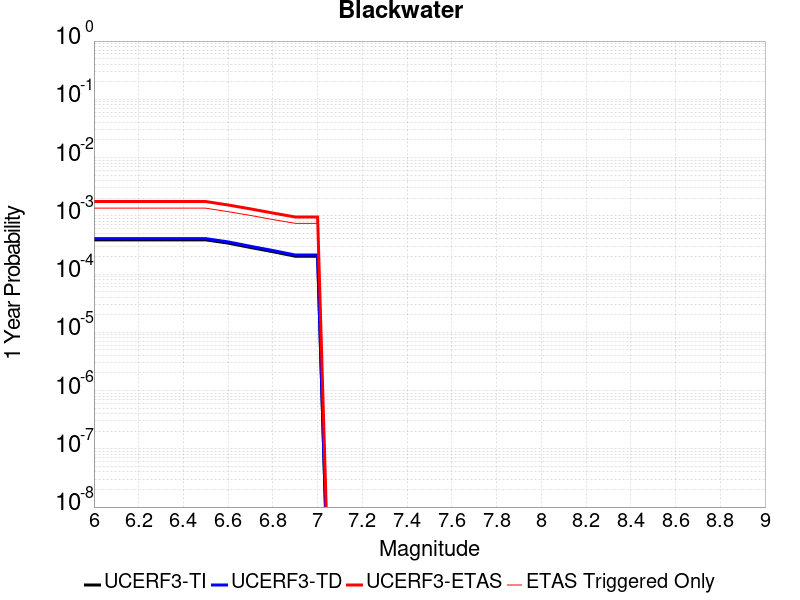 |  |

| Magnitude | 1 wk TI Prob | 1 wk TD Prob | 1 wk ETAS Prob | 1 wk ETAS/TD Gain | 1 wk ETAS Triggered Only | 1 mo TI Prob | 1 mo TD Prob | 1 mo ETAS Prob | 1 mo ETAS/TD Gain | 1 mo ETAS Triggered Only | 1 yr TI Prob | 1 yr TD Prob | 1 yr ETAS Prob | 1 yr ETAS/TD Gain | 1 yr ETAS Triggered Only | 10 yr TI Prob | 10 yr TD Prob | 10 yr ETAS Prob | 10 yr ETAS/TD Gain | 10 yr ETAS Triggered Only |
|-----|-----|-----|-----|-----|-----|-----|-----|-----|-----|-----|-----|-----|-----|-----|-----|-----|-----|-----|-----|-----|
| 6.0 | 7.413326E-6 | 7.774191E-6 | 6.991021E-4 | 89.92603 | 6.9133326E-4 | 3.177101E-5 | 3.3317654E-5 | 9.359454E-4 | 28.091576 | 9.0265786E-4 | 3.867434E-4 | 4.0558857E-4 | 0.0018389953 | 4.5341396 | 0.0014339882 | 0.0038607102 | 0.0040506064 | 0.006016984 | 1.4854528 | 0.0019743755 |
| 6.1 | 7.413326E-6 | 7.774191E-6 | 6.991021E-4 | 89.92603 | 6.9133326E-4 | 3.177101E-5 | 3.3317654E-5 | 9.359454E-4 | 28.091576 | 9.0265786E-4 | 3.867434E-4 | 4.0558857E-4 | 0.0018389953 | 4.5341396 | 0.0014339882 | 0.0038607102 | 0.0040506064 | 0.006016984 | 1.4854528 | 0.0019743755 |
| 6.2 | 7.413326E-6 | 7.774191E-6 | 6.991021E-4 | 89.92603 | 6.9133326E-4 | 3.177101E-5 | 3.3317654E-5 | 9.359454E-4 | 28.091576 | 9.0265786E-4 | 3.867434E-4 | 4.0558857E-4 | 0.0018389953 | 4.5341396 | 0.0014339882 | 0.0038607102 | 0.0040506064 | 0.006016984 | 1.4854528 | 0.0019743755 |
| 6.3 | 7.413326E-6 | 7.774191E-6 | 6.991021E-4 | 89.92603 | 6.9133326E-4 | 3.177101E-5 | 3.3317654E-5 | 9.359454E-4 | 28.091576 | 9.0265786E-4 | 3.867434E-4 | 4.0558857E-4 | 0.0018389953 | 4.5341396 | 0.0014339882 | 0.0038607102 | 0.0040506064 | 0.006016984 | 1.4854528 | 0.0019743755 |
| 6.4 | 7.413326E-6 | 7.774191E-6 | 6.991021E-4 | 89.92603 | 6.9133326E-4 | 3.177101E-5 | 3.3317654E-5 | 9.359454E-4 | 28.091576 | 9.0265786E-4 | 3.867434E-4 | 4.0558857E-4 | 0.0018389953 | 4.5341396 | 0.0014339882 | 0.0038607102 | 0.0040506064 | 0.006016984 | 1.4854528 | 0.0019743755 |
| 6.5 | 7.413326E-6 | 7.774191E-6 | 6.991021E-4 | 89.92603 | 6.9133326E-4 | 3.177101E-5 | 3.3317654E-5 | 9.359454E-4 | 28.091576 | 9.0265786E-4 | 3.867434E-4 | 4.0558857E-4 | 0.0018389953 | 4.5341396 | 0.0014339882 | 0.0038607102 | 0.0040506064 | 0.006016984 | 1.4854528 | 0.0019743755 |
| 6.6 | 6.51988E-6 | 6.8357062E-6 | 5.8042706E-4 | 84.911064 | 5.735953E-4 | 2.7942044E-5 | 2.9295676E-5 | 7.960796E-4 | 27.173962 | 7.6680636E-4 | 3.4014127E-4 | 3.5663793E-4 | 0.0016120619 | 4.5201635 | 0.0012558718 | 0.0033962112 | 0.0035627622 | 0.005295466 | 1.4863373 | 0.0017388994 |
| 6.7 | 5.474748E-6 | 5.7374127E-6 | 5.0989457E-4 | 88.87187 | 5.0416007E-4 | 2.3462993E-5 | 2.4588799E-5 | 6.8873545E-4 | 28.01013 | 6.64163E-4 | 2.856245E-4 | 2.993487E-4 | 0.0014129977 | 4.72024 | 0.0011139824 | 0.0028525768 | 0.0029915334 | 0.0045145387 | 1.5091051 | 0.0015275748 |
| 6.8 | 4.643409E-6 | 4.8641823E-6 | 4.275113E-4 | 87.88965 | 4.2264917E-4 | 1.9900172E-5 | 2.0846448E-5 | 5.732978E-4 | 27.500982 | 5.524628E-4 | 2.4225765E-4 | 2.5379687E-4 | 0.0011954617 | 4.710309 | 9.4190385E-4 | 0.0024199372 | 0.0025371225 | 0.0038409994 | 1.5139196 | 0.0013071935 |
| 6.9 | 3.883733E-6 | 4.0671357E-6 | 3.5426073E-4 | 87.10325 | 3.50195E-4 | 1.6644462E-5 | 1.7430582E-5 | 4.7629882E-4 | 27.325468 | 4.5887622E-4 | 2.0262749E-4 | 2.1221735E-4 | 0.0010180987 | 4.797434 | 8.0605235E-4 | 0.0020244285 | 0.0021221733 | 0.0032187293 | 1.5167136 | 0.0010988879 |
| 7.0 | 3.883733E-6 | 4.0671357E-6 | 3.5426073E-4 | 87.10325 | 3.50195E-4 | 1.6644462E-5 | 1.7430582E-5 | 4.7629882E-4 | 27.325468 | 4.5887622E-4 | 2.0262749E-4 | 2.1221735E-4 | 0.0010180987 | 4.797434 | 8.0605235E-4 | 0.0020244285 | 0.0021221733 | 0.0032187293 | 1.5167136 | 0.0010988879 |

## San Andreas (Cholame) rev
*[(top)](#table-of-contents)*

| 1 Week | 1 Month | 1 Year | 10 Year |
|-----|-----|-----|-----|
|  |  |  | 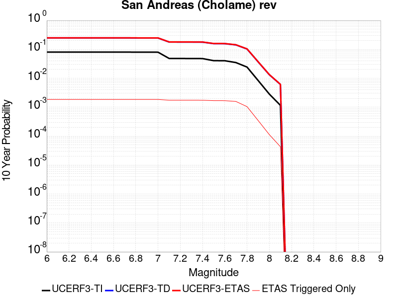 |

| Magnitude | 1 wk TI Prob | 1 wk TD Prob | 1 wk ETAS Prob | 1 wk ETAS/TD Gain | 1 wk ETAS Triggered Only | 1 mo TI Prob | 1 mo TD Prob | 1 mo ETAS Prob | 1 mo ETAS/TD Gain | 1 mo ETAS Triggered Only | 1 yr TI Prob | 1 yr TD Prob | 1 yr ETAS Prob | 1 yr ETAS/TD Gain | 1 yr ETAS Triggered Only | 10 yr TI Prob | 10 yr TD Prob | 10 yr ETAS Prob | 10 yr ETAS/TD Gain | 10 yr ETAS Triggered Only |
|-----|-----|-----|-----|-----|-----|-----|-----|-----|-----|-----|-----|-----|-----|-----|-----|-----|-----|-----|-----|-----|
| 6.0 | 1.6051916E-4 | 5.7249254E-4 | 0.00109145 | 1.9064876 | 5.192547E-4 | 6.877579E-4 | 0.0024516056 | 0.0031593132 | 1.288671 | 7.094468E-4 | 0.00834135 | 0.029507428 | 0.030691084 | 1.0401138 | 0.0012196447 | 0.080351114 | 0.2474813 | 0.24890117 | 1.0057373 | 0.0018868266 |
| 6.1 | 1.6051916E-4 | 5.7249254E-4 | 0.00109145 | 1.9064876 | 5.192547E-4 | 6.877579E-4 | 0.0024516056 | 0.0031593132 | 1.288671 | 7.094468E-4 | 0.00834135 | 0.029507428 | 0.030691084 | 1.0401138 | 0.0012196447 | 0.080351114 | 0.2474813 | 0.24890117 | 1.0057373 | 0.0018868266 |
| 6.2 | 1.6051916E-4 | 5.7249254E-4 | 0.00109145 | 1.9064876 | 5.192547E-4 | 6.877579E-4 | 0.0024516056 | 0.0031593132 | 1.288671 | 7.094468E-4 | 0.00834135 | 0.029507428 | 0.030691084 | 1.0401138 | 0.0012196447 | 0.080351114 | 0.2474813 | 0.24890117 | 1.0057373 | 0.0018868266 |
| 6.3 | 1.6051916E-4 | 5.7249254E-4 | 0.00109145 | 1.9064876 | 5.192547E-4 | 6.877579E-4 | 0.0024516056 | 0.0031593132 | 1.288671 | 7.094468E-4 | 0.00834135 | 0.029507428 | 0.030691084 | 1.0401138 | 0.0012196447 | 0.080351114 | 0.2474813 | 0.24890117 | 1.0057373 | 0.0018868266 |
| 6.4 | 1.6051916E-4 | 5.7249254E-4 | 0.00109145 | 1.9064876 | 5.192547E-4 | 6.877579E-4 | 0.0024516056 | 0.0031593132 | 1.288671 | 7.094468E-4 | 0.00834135 | 0.029507428 | 0.030691084 | 1.0401138 | 0.0012196447 | 0.080351114 | 0.2474813 | 0.24890117 | 1.0057373 | 0.0018868266 |
| 6.5 | 1.6051916E-4 | 5.7249254E-4 | 0.00109145 | 1.9064876 | 5.192547E-4 | 6.877579E-4 | 0.0024516056 | 0.0031593132 | 1.288671 | 7.094468E-4 | 0.00834135 | 0.029507428 | 0.030691084 | 1.0401138 | 0.0012196447 | 0.080351114 | 0.2474813 | 0.24890117 | 1.0057373 | 0.0018868266 |
| 6.6 | 1.6029834E-4 | 5.7202484E-4 | 0.0010909825 | 1.9072292 | 5.192547E-4 | 6.86812E-4 | 0.002449605 | 0.003157314 | 1.2889074 | 7.094468E-4 | 0.0083299205 | 0.029483816 | 0.0306675 | 1.040147 | 0.0012196447 | 0.08024513 | 0.24731047 | 0.24873067 | 1.0057425 | 0.0018868266 |
| 6.7 | 1.6007364E-4 | 5.7155016E-4 | 0.0010905081 | 1.9079832 | 5.192547E-4 | 6.858495E-4 | 0.0024475744 | 0.0031552848 | 1.2891476 | 7.094468E-4 | 0.008318293 | 0.029459693 | 0.030643407 | 1.0401808 | 0.0012196447 | 0.08013727 | 0.2471372 | 0.24855772 | 1.0057479 | 0.0018868266 |
| 6.8 | 1.5980547E-4 | 5.708367E-4 | 0.001089795 | 1.9091185 | 5.192547E-4 | 6.8470073E-4 | 0.0024445227 | 0.0031522352 | 1.2895095 | 7.094468E-4 | 0.008304413 | 0.029423568 | 0.030607326 | 1.0402316 | 0.0012196447 | 0.08000852 | 0.2468793 | 0.24830031 | 1.0057559 | 0.0018868266 |
| 6.9 | 1.5943033E-4 | 5.6985184E-4 | 0.0010888106 | 1.9106907 | 5.192547E-4 | 6.830939E-4 | 0.0024403096 | 0.0031480251 | 1.2900106 | 7.094468E-4 | 0.008284999 | 0.029373717 | 0.030557537 | 1.040302 | 0.0012196447 | 0.0798284 | 0.24652228 | 0.24794395 | 1.005767 | 0.0018868266 |
| 7.0 | 1.5906857E-4 | 5.6890905E-4 | 0.0010878684 | 1.9122008 | 5.192547E-4 | 6.815443E-4 | 0.0024362765 | 0.003143995 | 1.2904918 | 7.094468E-4 | 0.008266276 | 0.029325863 | 0.030509742 | 1.0403697 | 0.0012196447 | 0.079654664 | 0.24617939 | 0.24760172 | 1.0057776 | 0.0018868266 |
| 7.1 | 9.4986666E-5 | 3.9541177E-4 | 8.8428386E-4 | 2.236362 | 4.890655E-4 | 4.070222E-4 | 0.0016936905 | 0.00236577 | 1.3968136 | 6.7321974E-4 | 0.0049442407 | 0.020456197 | 0.021603577 | 1.0560896 | 0.001171342 | 0.048356738 | 0.17850818 | 0.17997634 | 1.0082247 | 0.0017872022 |
| 7.2 | 9.465065E-5 | 3.9454125E-4 | 8.8341377E-4 | 2.239091 | 4.890655E-4 | 4.0558254E-4 | 0.0016899646 | 0.0023620466 | 1.39769 | 6.7321974E-4 | 0.0049267923 | 0.020411683 | 0.021559117 | 1.0562146 | 0.001171342 | 0.048189856 | 0.1781604 | 0.17962672 | 1.0082303 | 0.0017841833 |
| 7.3 | 9.4370014E-5 | 3.9359776E-4 | 8.8247075E-4 | 2.2420623 | 4.890655E-4 | 4.043802E-4 | 0.0016859263 | 0.002358011 | 1.3986442 | 6.7321974E-4 | 0.00491222 | 0.020363439 | 0.021510929 | 1.0563505 | 0.001171342 | 0.048050456 | 0.17778328 | 0.17925026 | 1.0082515 | 0.0017841833 |
| 7.4 | 9.400309E-5 | 3.9239938E-4 | 8.8127295E-4 | 2.245857 | 4.890655E-4 | 4.0280816E-4 | 0.0016807971 | 0.0023528852 | 1.3998628 | 6.7321974E-4 | 0.004893167 | 0.020302156 | 0.021449719 | 1.0565242 | 0.001171342 | 0.04786817 | 0.17730153 | 0.17876938 | 1.0082788 | 0.0017841833 |
| 7.5 | 7.9358346E-5 | 3.4328582E-4 | 8.231297E-4 | 2.397797 | 4.800087E-4 | 3.4006286E-4 | 0.0014705557 | 0.002133742 | 1.4509766 | 6.64163E-4 | 0.0041324073 | 0.017785678 | 0.018912464 | 1.0633537 | 0.0011471906 | 0.040564027 | 0.15729399 | 0.15876192 | 1.0093324 | 0.0017419184 |
| 7.6 | 7.898946E-5 | 3.4216905E-4 | 8.220135E-4 | 2.4023607 | 4.800087E-4 | 3.3848232E-4 | 0.0014657748 | 0.0021289643 | 1.4524498 | 6.64163E-4 | 0.0041132374 | 0.01772842 | 0.018852308 | 1.0633947 | 0.0011441717 | 0.040379323 | 0.15682538 | 0.15828903 | 1.009333 | 0.0017358805 |
| 7.7 | 6.8013156E-5 | 3.0816178E-4 | 7.548246E-4 | 2.4494429 | 4.4680055E-4 | 2.914524E-4 | 0.0013201776 | 0.0019412546 | 1.4704497 | 6.2189804E-4 | 0.0035426598 | 0.015981914 | 0.017045416 | 1.066544 | 0.0010807742 | 0.03486713 | 0.14234997 | 0.14375849 | 1.0098947 | 0.0016422939 |
| 7.8 | 4.7216392E-5 | 2.1851076E-4 | 5.173188E-4 | 2.3674753 | 2.9887335E-4 | 2.0234026E-4 | 9.36238E-4 | 0.0013524593 | 1.4445678 | 4.1661132E-4 | 0.0024607095 | 0.011356776 | 0.012064135 | 1.0622852 | 7.1548467E-4 | 0.024336396 | 0.10266637 | 0.10366057 | 1.0096837 | 0.0011079446 |
| 7.9 | 1.604325E-5 | 7.688082E-5 | 1.5536677E-4 | 2.0208783 | 7.849199E-5 | 6.875498E-5 | 3.29461E-4 | 4.5621398E-4 | 1.3847283 | 1.2679475E-4 | 8.367703E-4 | 0.0040061846 | 0.004231697 | 1.056291 | 2.264192E-4 | 0.008336265 | 0.036792822 | 0.037135947 | 1.0093259 | 3.5623286E-4 |
| 8.0 | 5.458507E-6 | 2.769139E-5 | 4.5804423E-5 | 1.6541035 | 1.8113536E-5 | 2.3393392E-5 | 1.1867371E-4 | 1.458408E-4 | 1.2289225 | 2.7170303E-5 | 2.847773E-4 | 0.0014442017 | 0.0014954492 | 1.035485 | 5.1321684E-5 | 0.0028441267 | 0.013304143 | 0.01338457 | 1.0060452 | 8.151091E-5 |
| 8.1 | 2.2240692E-6 | 1.29589735E-5 | 1.899674E-5 | 1.465914 | 6.037845E-6 | 9.531691E-6 | 5.5538447E-5 | 6.7613466E-5 | 1.2174174 | 1.207569E-5 | 1.1604215E-4 | 6.7617896E-4 | 6.9428026E-4 | 1.02677 | 1.8113536E-5 | 0.0011598158 | 0.0061071273 | 0.006143133 | 1.0058957 | 3.6227073E-5 |

## San Andreas (Parkfield)
*[(top)](#table-of-contents)*

| 1 Week | 1 Month | 1 Year | 10 Year |
|-----|-----|-----|-----|
|  |  |  |  |

| Magnitude | 1 wk TI Prob | 1 wk TD Prob | 1 wk ETAS Prob | 1 wk ETAS/TD Gain | 1 wk ETAS Triggered Only | 1 mo TI Prob | 1 mo TD Prob | 1 mo ETAS Prob | 1 mo ETAS/TD Gain | 1 mo ETAS Triggered Only | 1 yr TI Prob | 1 yr TD Prob | 1 yr ETAS Prob | 1 yr ETAS/TD Gain | 1 yr ETAS Triggered Only | 10 yr TI Prob | 10 yr TD Prob | 10 yr ETAS Prob | 10 yr ETAS/TD Gain | 10 yr ETAS Triggered Only |
|-----|-----|-----|-----|-----|-----|-----|-----|-----|-----|-----|-----|-----|-----|-----|-----|-----|-----|-----|-----|-----|
| 6.0 | 7.723521E-4 | 0.0013466828 | 0.0018742828 | 1.3917775 | 5.283115E-4 | 0.0033058827 | 0.0057641217 | 0.0064904895 | 1.1260154 | 7.3057925E-4 | 0.03951393 | 0.06891971 | 0.07006092 | 1.0165585 | 0.0012256826 | 0.3317935 | 0.5395069 | 0.54036605 | 1.0015924 | 0.0018656942 |
| 6.1 | 1.4269065E-4 | 5.017429E-4 | 9.3323225E-4 | 1.859981 | 4.3170594E-4 | 6.11388E-4 | 0.002148918 | 0.0027393554 | 1.2747602 | 5.917088E-4 | 0.007418273 | 0.02591448 | 0.026911374 | 1.0384686 | 0.0010234148 | 0.0717547 | 0.22093078 | 0.22217026 | 1.0056102 | 0.0015909722 |
| 6.2 | 1.4269065E-4 | 5.017429E-4 | 9.3323225E-4 | 1.859981 | 4.3170594E-4 | 6.11388E-4 | 0.002148918 | 0.0027393554 | 1.2747602 | 5.917088E-4 | 0.007418273 | 0.02591448 | 0.026911374 | 1.0384686 | 0.0010234148 | 0.0717547 | 0.22093078 | 0.22217026 | 1.0056102 | 0.0015909722 |
| 6.3 | 1.4269065E-4 | 5.017429E-4 | 9.3323225E-4 | 1.859981 | 4.3170594E-4 | 6.11388E-4 | 0.002148918 | 0.0027393554 | 1.2747602 | 5.917088E-4 | 0.007418273 | 0.02591448 | 0.026911374 | 1.0384686 | 0.0010234148 | 0.0717547 | 0.22093078 | 0.22217026 | 1.0056102 | 0.0015909722 |
| 6.4 | 1.4269065E-4 | 5.017429E-4 | 9.3323225E-4 | 1.859981 | 4.3170594E-4 | 6.11388E-4 | 0.002148918 | 0.0027393554 | 1.2747602 | 5.917088E-4 | 0.007418273 | 0.02591448 | 0.026911374 | 1.0384686 | 0.0010234148 | 0.0717547 | 0.22093078 | 0.22217026 | 1.0056102 | 0.0015909722 |
| 6.5 | 1.4269065E-4 | 5.017429E-4 | 9.3323225E-4 | 1.859981 | 4.3170594E-4 | 6.11388E-4 | 0.002148918 | 0.0027393554 | 1.2747602 | 5.917088E-4 | 0.007418273 | 0.02591448 | 0.026911374 | 1.0384686 | 0.0010234148 | 0.0717547 | 0.22093078 | 0.22217026 | 1.0056102 | 0.0015909722 |
| 6.6 | 1.4257019E-4 | 5.015525E-4 | 9.330419E-4 | 1.8603076 | 4.3170594E-4 | 6.10872E-4 | 0.0021481037 | 0.0027385415 | 1.2748647 | 5.917088E-4 | 0.0074120336 | 0.025904845 | 0.026901748 | 1.0384833 | 0.0010234148 | 0.07169635 | 0.22085924 | 0.22209883 | 1.0056126 | 0.0015909722 |
| 6.7 | 1.4246788E-4 | 5.013712E-4 | 9.328607E-4 | 1.8606187 | 4.3170594E-4 | 6.1043375E-4 | 0.002147328 | 0.0027377661 | 1.2749642 | 5.917088E-4 | 0.007406734 | 0.025895536 | 0.02689245 | 1.0384974 | 0.0010234148 | 0.07164679 | 0.22079132 | 0.22203101 | 1.0056148 | 0.0015909722 |
| 6.8 | 1.4238524E-4 | 5.0115754E-4 | 9.3264715E-4 | 1.8609859 | 4.3170594E-4 | 6.1007973E-4 | 0.0021464138 | 0.0027368525 | 1.2750815 | 5.917088E-4 | 0.007402453 | 0.025884695 | 0.02688162 | 1.038514 | 0.0010234148 | 0.07160675 | 0.22071254 | 0.22195238 | 1.0056174 | 0.0015909722 |
| 6.9 | 1.4226006E-4 | 5.008332E-4 | 9.3232293E-4 | 1.8615438 | 4.3170594E-4 | 6.095435E-4 | 0.0021450259 | 0.0027354655 | 1.2752599 | 5.917088E-4 | 0.007395969 | 0.025868258 | 0.0268652 | 1.0385392 | 0.0010234148 | 0.0715461 | 0.22059278 | 0.2218328 | 1.0056213 | 0.0015909722 |
| 7.0 | 1.421111E-4 | 5.0044054E-4 | 9.3193044E-4 | 1.86222 | 4.3170594E-4 | 6.089054E-4 | 0.002143346 | 0.0027337866 | 1.2754761 | 5.917088E-4 | 0.0073882528 | 0.025848212 | 0.026845174 | 1.0385698 | 0.0010234148 | 0.07147392 | 0.22044773 | 0.22168797 | 1.0056261 | 0.0015909722 |
| 7.1 | 7.911531E-5 | 3.2991724E-4 | 7.313015E-4 | 2.216621 | 4.015167E-4 | 3.3902156E-4 | 0.0014133246 | 0.0019680213 | 1.3924766 | 5.5548176E-4 | 0.0041197776 | 0.017099971 | 0.01805841 | 1.0560491 | 9.75112E-4 | 0.04044234 | 0.15168123 | 0.15294637 | 1.0083407 | 0.0014913478 |
| 7.2 | 7.90033E-5 | 3.296154E-4 | 7.3099975E-4 | 2.2177355 | 4.015167E-4 | 3.3854163E-4 | 0.0014120324 | 0.0019667298 | 1.3928362 | 5.5548176E-4 | 0.004113957 | 0.017084487 | 0.018042939 | 1.0561007 | 9.75112E-4 | 0.040386252 | 0.15155983 | 0.15282515 | 1.0083487 | 0.0014913478 |
| 7.3 | 7.893314E-5 | 3.2935737E-4 | 7.307418E-4 | 2.21869 | 4.015167E-4 | 3.3824102E-4 | 0.0014109277 | 0.0019656257 | 1.3931441 | 5.5548176E-4 | 0.0041103107 | 0.017071247 | 0.018029714 | 1.0561451 | 9.75112E-4 | 0.04035112 | 0.15145631 | 0.15272179 | 1.0083554 | 0.0014913478 |
| 7.4 | 7.878637E-5 | 3.2884022E-4 | 7.302249E-4 | 2.220607 | 4.015167E-4 | 3.3761217E-4 | 0.0014087138 | 0.001963413 | 1.393763 | 5.5548176E-4 | 0.004102683 | 0.017044716 | 0.018003207 | 1.0562339 | 9.75112E-4 | 0.04027762 | 0.15124616 | 0.15251195 | 1.0083691 | 0.0014913478 |
| 7.5 | 6.8967216E-5 | 2.9620552E-4 | 6.915672E-4 | 2.3347547 | 3.9547886E-4 | 2.9554032E-4 | 0.001268987 | 0.0018177336 | 1.432429 | 5.4944394E-4 | 0.0035922674 | 0.015367592 | 0.016318802 | 1.061897 | 9.6605526E-4 | 0.035347503 | 0.13755313 | 0.13882631 | 1.009256 | 0.0014762532 |
| 7.6 | 6.8796966E-5 | 2.9566285E-4 | 6.9102476E-4 | 2.3372054 | 3.9547886E-4 | 2.948108E-4 | 0.0012666635 | 0.0018154115 | 1.4332231 | 5.4944394E-4 | 0.003583415 | 0.015339702 | 0.016290938 | 1.0620114 | 9.6605526E-4 | 0.0352618 | 0.13732228 | 0.1385932 | 1.009255 | 0.0014732343 |
| 7.7 | 5.8142083E-5 | 2.6259638E-4 | 6.3080824E-4 | 2.402197 | 3.6830857E-4 | 2.4915655E-4 | 0.0011250726 | 0.001637712 | 1.4556501 | 5.1321683E-4 | 0.0030292615 | 0.0136374645 | 0.014533768 | 1.0657237 | 9.086957E-4 | 0.029882994 | 0.122926764 | 0.12414211 | 1.0098867 | 0.0013856855 |
| 7.8 | 3.7720634E-5 | 1.7457761E-4 | 4.0095727E-4 | 2.296728 | 2.264192E-4 | 1.6164983E-4 | 7.480669E-4 | 0.0010617999 | 1.4193918 | 3.1396796E-4 | 0.0019663102 | 0.009085932 | 0.009630383 | 1.0599225 | 5.4944394E-4 | 0.019490024 | 0.08308776 | 0.08387666 | 1.0094948 | 8.6039293E-4 |
| 7.9 | 1.41195915E-5 | 6.798084E-5 | 1.283552E-4 | 1.8881083 | 6.0378454E-5 | 6.051113E-5 | 2.9132722E-4 | 3.939407E-4 | 1.3522276 | 1.0264337E-4 | 7.36474E-4 | 0.0035434929 | 0.003733011 | 1.0534835 | 1.9019212E-4 | 0.00734038 | 0.03258086 | 0.032878757 | 1.0091434 | 3.079301E-4 |
| 8.0 | 5.0866283E-6 | 2.564328E-5 | 4.375635E-5 | 1.7063477 | 1.8113536E-5 | 2.1799653E-5 | 1.09896864E-4 | 1.340456E-4 | 1.2197399 | 2.415138E-5 | 2.6537845E-4 | 0.0013374792 | 0.0013857174 | 1.0360664 | 4.830276E-5 | 0.0026506176 | 0.012337761 | 0.012412302 | 1.0060418 | 7.5473064E-5 |
| 8.1 | 2.2154293E-6 | 1.2907957E-5 | 1.8945724E-5 | 1.4677554 | 6.037845E-6 | 9.494662E-6 | 5.5319815E-5 | 6.739484E-5 | 1.2182766 | 1.207569E-5 | 1.1559138E-4 | 6.7351875E-4 | 6.916201E-4 | 1.0268757 | 1.8113536E-5 | 0.0011553128 | 0.0060832473 | 0.0061162533 | 1.0054257 | 3.3208147E-5 |

## Death Valley (Black Mtns Frontal)
*[(top)](#table-of-contents)*

| 1 Week | 1 Month | 1 Year | 10 Year |
|-----|-----|-----|-----|
|  |  |  |  |

| Magnitude | 1 wk TI Prob | 1 wk TD Prob | 1 wk ETAS Prob | 1 wk ETAS/TD Gain | 1 wk ETAS Triggered Only | 1 mo TI Prob | 1 mo TD Prob | 1 mo ETAS Prob | 1 mo ETAS/TD Gain | 1 mo ETAS Triggered Only | 1 yr TI Prob | 1 yr TD Prob | 1 yr ETAS Prob | 1 yr ETAS/TD Gain | 1 yr ETAS Triggered Only | 10 yr TI Prob | 10 yr TD Prob | 10 yr ETAS Prob | 10 yr ETAS/TD Gain | 10 yr ETAS Triggered Only |
|-----|-----|-----|-----|-----|-----|-----|-----|-----|-----|-----|-----|-----|-----|-----|-----|-----|-----|-----|-----|-----|
| 6.0 | 3.897727E-5 | 4.947383E-5 | 6.230408E-4 | 12.59334 | 5.735953E-4 | 1.6703474E-4 | 2.1201522E-4 | 0.0010058235 | 4.74411 | 7.9397665E-4 | 0.0020317512 | 0.0025785444 | 0.0038612895 | 1.4974686 | 0.001286061 | 0.020132754 | 0.025518417 | 0.027242362 | 1.0675569 | 0.0017690887 |
| 6.1 | 3.897727E-5 | 4.947383E-5 | 6.230408E-4 | 12.59334 | 5.735953E-4 | 1.6703474E-4 | 2.1201522E-4 | 0.0010058235 | 4.74411 | 7.9397665E-4 | 0.0020317512 | 0.0025785444 | 0.0038612895 | 1.4974686 | 0.001286061 | 0.020132754 | 0.025518417 | 0.027242362 | 1.0675569 | 0.0017690887 |
| 6.2 | 3.897727E-5 | 4.947383E-5 | 6.230408E-4 | 12.59334 | 5.735953E-4 | 1.6703474E-4 | 2.1201522E-4 | 0.0010058235 | 4.74411 | 7.9397665E-4 | 0.0020317512 | 0.0025785444 | 0.0038612895 | 1.4974686 | 0.001286061 | 0.020132754 | 0.025518417 | 0.027242362 | 1.0675569 | 0.0017690887 |
| 6.3 | 3.897727E-5 | 4.947383E-5 | 6.230408E-4 | 12.59334 | 5.735953E-4 | 1.6703474E-4 | 2.1201522E-4 | 0.0010058235 | 4.74411 | 7.9397665E-4 | 0.0020317512 | 0.0025785444 | 0.0038612895 | 1.4974686 | 0.001286061 | 0.020132754 | 0.025518417 | 0.027242362 | 1.0675569 | 0.0017690887 |
| 6.4 | 3.897727E-5 | 4.947383E-5 | 6.230408E-4 | 12.59334 | 5.735953E-4 | 1.6703474E-4 | 2.1201522E-4 | 0.0010058235 | 4.74411 | 7.9397665E-4 | 0.0020317512 | 0.0025785444 | 0.0038612895 | 1.4974686 | 0.001286061 | 0.020132754 | 0.025518417 | 0.027242362 | 1.0675569 | 0.0017690887 |
| 6.5 | 3.897727E-5 | 4.947383E-5 | 6.230408E-4 | 12.59334 | 5.735953E-4 | 1.6703474E-4 | 2.1201522E-4 | 0.0010058235 | 4.74411 | 7.9397665E-4 | 0.0020317512 | 0.0025785444 | 0.0038612895 | 1.4974686 | 0.001286061 | 0.020132754 | 0.025518417 | 0.027242362 | 1.0675569 | 0.0017690887 |
| 6.6 | 3.4230983E-5 | 4.342495E-5 | 5.234128E-4 | 12.053274 | 4.800087E-4 | 1.4669597E-4 | 1.8609542E-4 | 8.591899E-4 | 4.616932 | 6.7321974E-4 | 0.0017845602 | 0.0022636733 | 0.00336911 | 1.4883375 | 0.0011079446 | 0.017702973 | 0.022437919 | 0.02396073 | 1.0678678 | 0.001557764 |
| 6.7 | 3.1676747E-5 | 4.019097E-5 | 4.8093597E-4 | 11.966269 | 4.407627E-4 | 1.3575044E-4 | 1.7223743E-4 | 7.8497315E-4 | 4.557506 | 6.128413E-4 | 0.0016515085 | 0.0020952902 | 0.0031045103 | 1.4816612 | 0.001011339 | 0.016392887 | 0.020786978 | 0.02216751 | 1.0664133 | 0.0014098368 |
| 6.8 | 2.9047482E-5 | 3.684629E-5 | 4.2325415E-4 | 11.487022 | 3.864221E-4 | 1.2448327E-4 | 1.5790488E-4 | 7.102805E-4 | 4.498154 | 5.524628E-4 | 0.00151453 | 0.0019211107 | 0.0028310737 | 1.4736651 | 9.117146E-4 | 0.015042495 | 0.019076241 | 0.02032 | 1.0651994 | 0.0012679475 |
| 6.9 | 2.5887868E-5 | 3.279623E-5 | 3.6486684E-4 | 11.125267 | 3.320815E-4 | 1.10943285E-4 | 1.4054945E-4 | 6.295462E-4 | 4.479179 | 4.890655E-4 | 0.0013498975 | 0.0017101576 | 0.0025148315 | 1.4705261 | 8.0605235E-4 | 0.01341727 | 0.01700073 | 0.018107645 | 1.0651098 | 0.0011260582 |
| 7.0 | 2.244997E-5 | 2.8405042E-5 | 2.940627E-4 | 10.352482 | 2.6566518E-4 | 9.621061E-5 | 1.2173196E-4 | 5.262183E-4 | 4.3227625 | 4.0453562E-4 | 0.0011707348 | 0.0014813873 | 0.0021656675 | 1.4619186 | 6.8529544E-4 | 0.011645862 | 0.014745472 | 0.015700256 | 1.064751 | 9.6907414E-4 |
| 7.1 | 1.989245E-5 | 2.5153167E-5 | 2.4854782E-4 | 9.881372 | 2.2340027E-4 | 8.525057E-5 | 1.07796564E-4 | 4.5191663E-4 | 4.1923103 | 3.441572E-4 | 0.0010374314 | 0.0013119389 | 0.0018757368 | 1.429744 | 5.645385E-4 | 0.010326017 | 0.013071986 | 0.013882399 | 1.0619961 | 8.2114694E-4 |
| 7.2 | 1.8805691E-5 | 2.3778988E-5 | 2.4113625E-4 | 10.140728 | 2.1736242E-4 | 8.059333E-5 | 1.0190769E-4 | 4.3697396E-4 | 4.287939 | 3.351004E-4 | 9.807821E-4 | 0.0012403254 | 0.0017860726 | 1.4400033 | 5.46425E-4 | 0.009764646 | 0.012364016 | 0.013136249 | 1.0624582 | 7.8190095E-4 |
| 7.3 | 6.7321266E-6 | 8.65193E-6 | 6.6010965E-5 | 7.6296225 | 5.7359528E-5 | 2.8851653E-5 | 3.707942E-5 | 1.2764374E-4 | 3.4424417 | 9.056768E-5 | 3.5121225E-4 | 4.5139133E-4 | 5.84164E-4 | 1.2941408 | 1.3283259E-4 | 0.0035065769 | 0.004508958 | 0.0046952874 | 1.0413243 | 1.871732E-4 |
| 7.4 | 6.319214E-6 | 8.125558E-6 | 5.9446826E-5 | 7.3160295 | 5.1321684E-5 | 2.7082066E-5 | 3.48236E-5 | 1.1633167E-4 | 3.3405988 | 8.151091E-5 | 3.2967425E-4 | 4.2393777E-4 | 5.4162584E-4 | 1.277607 | 1.1773798E-4 | 0.003291856 | 0.0042355005 | 0.0044038445 | 1.0397458 | 1.6905967E-4 |
| 7.5 | 6.0176867E-6 | 7.741697E-6 | 5.9062982E-5 | 7.629204 | 5.1321684E-5 | 2.578983E-5 | 3.317852E-5 | 1.11667905E-4 | 3.3656685 | 7.849199E-5 | 3.1394596E-4 | 4.0391652E-4 | 5.185892E-4 | 1.283902 | 1.14719056E-4 | 0.0031350278 | 0.004036032 | 0.004195389 | 1.0394837 | 1.6000289E-4 |
| 7.6 | 5.6024205E-6 | 7.211712E-6 | 5.8533027E-5 | 8.1163845 | 5.1321684E-5 | 2.4010153E-5 | 3.0907213E-5 | 1.0637794E-4 | 3.4418485 | 7.5473064E-5 | 2.9228439E-4 | 3.762732E-4 | 4.879313E-4 | 1.2967474 | 1.1170014E-4 | 0.0029190024 | 0.0037605667 | 0.0039079376 | 1.0391885 | 1.479272E-4 |
| 7.7 | 5.132066E-6 | 6.6084267E-6 | 4.8873066E-5 | 7.395567 | 4.2264917E-5 | 2.1994381E-5 | 2.8321763E-5 | 8.567967E-5 | 3.0252237 | 5.7359528E-5 | 2.677487E-4 | 3.4480577E-4 | 4.3232433E-4 | 1.25382 | 8.754875E-5 | 0.0026742632 | 0.00344691 | 0.0035702593 | 1.0357854 | 1.2377583E-4 |
| 7.8 | 4.8153906E-6 | 6.202069E-6 | 4.846672E-5 | 7.8146057 | 4.2264917E-5 | 2.0637224E-5 | 2.6580266E-5 | 8.393827E-5 | 3.157917 | 5.7359528E-5 | 2.5122924E-4 | 3.2360948E-4 | 4.111299E-4 | 1.2704507 | 8.754875E-5 | 0.002509454 | 0.0032355804 | 0.0033589557 | 1.0381309 | 1.2377583E-4 |

## Hunter Mountain-Saline Valley
*[(top)](#table-of-contents)*

| 1 Week | 1 Month | 1 Year | 10 Year |
|-----|-----|-----|-----|
|  |  |  |  |

| Magnitude | 1 wk TI Prob | 1 wk TD Prob | 1 wk ETAS Prob | 1 wk ETAS/TD Gain | 1 wk ETAS Triggered Only | 1 mo TI Prob | 1 mo TD Prob | 1 mo ETAS Prob | 1 mo ETAS/TD Gain | 1 mo ETAS Triggered Only | 1 yr TI Prob | 1 yr TD Prob | 1 yr ETAS Prob | 1 yr ETAS/TD Gain | 1 yr ETAS Triggered Only | 10 yr TI Prob | 10 yr TD Prob | 10 yr ETAS Prob | 10 yr ETAS/TD Gain | 10 yr ETAS Triggered Only |
|-----|-----|-----|-----|-----|-----|-----|-----|-----|-----|-----|-----|-----|-----|-----|-----|-----|-----|-----|-----|-----|
| 6.0 | 2.6350473E-5 | 3.0151663E-5 | 5.7656015E-4 | 19.122004 | 5.46425E-4 | 1.12925714E-4 | 1.2921583E-4 | 8.44608E-4 | 6.536413 | 7.1548467E-4 | 0.0013740034 | 0.0015722114 | 0.0025729178 | 1.6364962 | 0.0010022823 | 0.01365539 | 0.015625311 | 0.017036892 | 1.0903394 | 0.0014339882 |
| 6.1 | 2.6350473E-5 | 3.0151663E-5 | 5.7656015E-4 | 19.122004 | 5.46425E-4 | 1.12925714E-4 | 1.2921583E-4 | 8.44608E-4 | 6.536413 | 7.1548467E-4 | 0.0013740034 | 0.0015722114 | 0.0025729178 | 1.6364962 | 0.0010022823 | 0.01365539 | 0.015625311 | 0.017036892 | 1.0903394 | 0.0014339882 |
| 6.2 | 2.6350473E-5 | 3.0151663E-5 | 5.7656015E-4 | 19.122004 | 5.46425E-4 | 1.12925714E-4 | 1.2921583E-4 | 8.44608E-4 | 6.536413 | 7.1548467E-4 | 0.0013740034 | 0.0015722114 | 0.0025729178 | 1.6364962 | 0.0010022823 | 0.01365539 | 0.015625311 | 0.017036892 | 1.0903394 | 0.0014339882 |
| 6.3 | 2.6350473E-5 | 3.0151663E-5 | 5.7656015E-4 | 19.122004 | 5.46425E-4 | 1.12925714E-4 | 1.2921583E-4 | 8.44608E-4 | 6.536413 | 7.1548467E-4 | 0.0013740034 | 0.0015722114 | 0.0025729178 | 1.6364962 | 0.0010022823 | 0.01365539 | 0.015625311 | 0.017036892 | 1.0903394 | 0.0014339882 |
| 6.4 | 2.6350473E-5 | 3.0151663E-5 | 5.7656015E-4 | 19.122004 | 5.46425E-4 | 1.12925714E-4 | 1.2921583E-4 | 8.44608E-4 | 6.536413 | 7.1548467E-4 | 0.0013740034 | 0.0015722114 | 0.0025729178 | 1.6364962 | 0.0010022823 | 0.01365539 | 0.015625311 | 0.017036892 | 1.0903394 | 0.0014339882 |
| 6.5 | 2.6350473E-5 | 3.0151663E-5 | 5.7656015E-4 | 19.122004 | 5.46425E-4 | 1.12925714E-4 | 1.2921583E-4 | 8.44608E-4 | 6.536413 | 7.1548467E-4 | 0.0013740034 | 0.0015722114 | 0.0025729178 | 1.6364962 | 0.0010022823 | 0.01365539 | 0.015625311 | 0.017036892 | 1.0903394 | 0.0014339882 |
| 6.6 | 2.3915805E-5 | 2.727318E-5 | 5.465137E-4 | 20.038504 | 5.192547E-4 | 1.0249228E-4 | 1.1688063E-4 | 7.9304026E-4 | 6.7850447 | 6.762387E-4 | 0.0012471292 | 0.0014222359 | 0.0023688294 | 1.6655672 | 9.479417E-4 | 0.012401534 | 0.014145577 | 0.015484875 | 1.0946796 | 0.0013585151 |
| 6.7 | 2.1143418E-5 | 2.4001838E-5 | 4.919236E-4 | 20.495247 | 4.6793302E-4 | 9.06115E-5 | 1.0286176E-4 | 7.0356554E-4 | 6.839914 | 6.007656E-4 | 0.0011026367 | 0.0012517641 | 0.00211108 | 1.6864839 | 8.6039293E-4 | 0.010971815 | 0.012461145 | 0.013680498 | 1.0978525 | 0.0012347393 |
| 6.8 | 1.8590634E-5 | 2.0984402E-5 | 4.6173786E-4 | 22.00386 | 4.407627E-4 | 7.967171E-5 | 8.993084E-5 | 6.42344E-4 | 7.1426444 | 5.524628E-4 | 9.6957135E-4 | 0.0010944982 | 0.001878559 | 1.7163655 | 7.849199E-4 | 0.00965352 | 0.010904897 | 0.012021661 | 1.1024095 | 0.001129077 |
| 6.9 | 1.6592752E-5 | 1.863061E-5 | 4.5636622E-4 | 24.495506 | 4.377438E-4 | 7.110986E-5 | 7.984381E-5 | 6.232065E-4 | 7.80532 | 5.4340606E-4 | 8.6541864E-4 | 9.7180397E-4 | 0.0017318331 | 1.7820808 | 7.607685E-4 | 0.008620561 | 0.009689213 | 0.010765495 | 1.1110804 | 0.0010868121 |
| 7.0 | 1.4621345E-5 | 1.6318016E-5 | 4.268848E-4 | 26.160336 | 4.1057347E-4 | 6.2661406E-5 | 6.993326E-5 | 5.740581E-4 | 8.208656 | 5.0416007E-4 | 7.6263555E-4 | 8.512428E-4 | 0.0015721511 | 1.8468891 | 7.215225E-4 | 0.0076002358 | 0.008493364 | 0.009523053 | 1.1212345 | 0.0010385094 |
| 7.1 | 1.4214311E-5 | 1.5853855E-5 | 4.1434533E-4 | 26.135303 | 3.984978E-4 | 6.0917053E-5 | 6.79441E-5 | 5.5697636E-4 | 8.197567 | 4.890655E-4 | 7.414127E-4 | 8.2704343E-4 | 0.0015298707 | 1.8498069 | 7.0340896E-4 | 0.0073894397 | 0.0082531925 | 0.0092621725 | 1.1222533 | 0.0010173769 |
| 7.2 | 5.322531E-6 | 5.4705556E-6 | 3.1038007E-4 | 56.736477 | 3.0491117E-4 | 2.2810646E-5 | 2.3445109E-5 | 3.8268848E-4 | 16.322742 | 3.592518E-4 | 2.7768422E-4 | 2.8542118E-4 | 8.0754573E-4 | 2.8293126 | 5.222736E-4 | 0.0027733748 | 0.002851954 | 0.0036195838 | 1.2691592 | 7.6982524E-4 |
| 7.3 | 4.9197506E-6 | 5.0347303E-6 | 2.9786874E-4 | 59.1628 | 2.928355E-4 | 2.1084476E-5 | 2.1577318E-5 | 3.6874594E-4 | 17.089516 | 3.471761E-4 | 2.5667323E-4 | 2.6268652E-4 | 7.516235E-4 | 2.8612947 | 4.890655E-4 | 0.0025637697 | 0.0026251655 | 0.003350816 | 1.2764208 | 7.275604E-4 |
| 7.4 | 4.3367913E-6 | 4.4250473E-6 | 2.821647E-4 | 63.76535 | 2.7774088E-4 | 1.8586115E-5 | 1.896443E-5 | 3.4802075E-4 | 18.351236 | 3.2906258E-4 | 2.2626246E-4 | 2.3088178E-4 | 6.775792E-4 | 2.934745 | 4.4680055E-4 | 0.0022603222 | 0.0023078213 | 0.0029734634 | 1.2884288 | 6.671819E-4 |
| 7.5 | 3.7993927E-6 | 3.8762123E-6 | 2.6048365E-4 | 67.20056 | 2.5660841E-4 | 1.628301E-5 | 1.6612312E-5 | 3.1849954E-4 | 19.1725 | 3.0189226E-4 | 1.9822762E-4 | 2.0225039E-4 | 6.157591E-4 | 3.0445387 | 4.135924E-4 | 0.001980509 | 0.002022061 | 0.0026276375 | 1.2994847 | 6.0680346E-4 |
| 7.6 | 3.2998898E-6 | 3.365071E-6 | 2.297835E-4 | 68.28489 | 2.264192E-4 | 1.4142308E-5 | 1.4421733E-5 | 2.8612086E-4 | 19.839561 | 2.7170303E-4 | 1.7216899E-4 | 1.755846E-4 | 5.5288366E-4 | 3.1488163 | 3.7736533E-4 | 0.0017203566 | 0.001755846 | 0.0022982978 | 1.3089405 | 5.4340606E-4 |

## San Andreas (San Bernardino N)
*[(top)](#table-of-contents)*

| 1 Week | 1 Month | 1 Year | 10 Year |
|-----|-----|-----|-----|
|  |  |  |  |

| Magnitude | 1 wk TI Prob | 1 wk TD Prob | 1 wk ETAS Prob | 1 wk ETAS/TD Gain | 1 wk ETAS Triggered Only | 1 mo TI Prob | 1 mo TD Prob | 1 mo ETAS Prob | 1 mo ETAS/TD Gain | 1 mo ETAS Triggered Only | 1 yr TI Prob | 1 yr TD Prob | 1 yr ETAS Prob | 1 yr ETAS/TD Gain | 1 yr ETAS Triggered Only | 10 yr TI Prob | 10 yr TD Prob | 10 yr ETAS Prob | 10 yr ETAS/TD Gain | 10 yr ETAS Triggered Only |
|-----|-----|-----|-----|-----|-----|-----|-----|-----|-----|-----|-----|-----|-----|-----|-----|-----|-----|-----|-----|-----|
| 6.0 | 1.0995041E-4 | 4.016633E-4 | 6.943812E-4 | 1.7287643 | 2.928355E-4 | 4.7113094E-4 | 0.0017203542 | 0.0021814548 | 1.2680265 | 4.6189516E-4 | 0.0057209437 | 0.020758318 | 0.021580156 | 1.0395908 | 8.3926046E-4 | 0.055758867 | 0.17985137 | 0.18089622 | 1.0058095 | 0.0012739854 |
| 6.1 | 1.0995041E-4 | 4.016633E-4 | 6.943812E-4 | 1.7287643 | 2.928355E-4 | 4.7113094E-4 | 0.0017203542 | 0.0021814548 | 1.2680265 | 4.6189516E-4 | 0.0057209437 | 0.020758318 | 0.021580156 | 1.0395908 | 8.3926046E-4 | 0.055758867 | 0.17985137 | 0.18089622 | 1.0058095 | 0.0012739854 |
| 6.2 | 1.0995041E-4 | 4.016633E-4 | 6.943812E-4 | 1.7287643 | 2.928355E-4 | 4.7113094E-4 | 0.0017203542 | 0.0021814548 | 1.2680265 | 4.6189516E-4 | 0.0057209437 | 0.020758318 | 0.021580156 | 1.0395908 | 8.3926046E-4 | 0.055758867 | 0.17985137 | 0.18089622 | 1.0058095 | 0.0012739854 |
| 6.3 | 1.0995041E-4 | 4.016633E-4 | 6.943812E-4 | 1.7287643 | 2.928355E-4 | 4.7113094E-4 | 0.0017203542 | 0.0021814548 | 1.2680265 | 4.6189516E-4 | 0.0057209437 | 0.020758318 | 0.021580156 | 1.0395908 | 8.3926046E-4 | 0.055758867 | 0.17985137 | 0.18089622 | 1.0058095 | 0.0012739854 |
| 6.4 | 1.0995041E-4 | 4.016633E-4 | 6.943812E-4 | 1.7287643 | 2.928355E-4 | 4.7113094E-4 | 0.0017203542 | 0.0021814548 | 1.2680265 | 4.6189516E-4 | 0.0057209437 | 0.020758318 | 0.021580156 | 1.0395908 | 8.3926046E-4 | 0.055758867 | 0.17985137 | 0.18089622 | 1.0058095 | 0.0012739854 |
| 6.5 | 1.0995041E-4 | 4.016633E-4 | 6.943812E-4 | 1.7287643 | 2.928355E-4 | 4.7113094E-4 | 0.0017203542 | 0.0021814548 | 1.2680265 | 4.6189516E-4 | 0.0057209437 | 0.020758318 | 0.021580156 | 1.0395908 | 8.3926046E-4 | 0.055758867 | 0.17985137 | 0.18089622 | 1.0058095 | 0.0012739854 |
| 6.6 | 1.09829954E-4 | 4.014158E-4 | 6.9413375E-4 | 1.7292138 | 2.928355E-4 | 4.7061488E-4 | 0.0017192949 | 0.0021803959 | 1.2681919 | 4.6189516E-4 | 0.0057146936 | 0.020745667 | 0.021567516 | 1.0396155 | 8.3926046E-4 | 0.05569951 | 0.17974973 | 0.18079472 | 1.0058136 | 0.0012739854 |
| 6.7 | 1.0968671E-4 | 4.0112622E-4 | 6.938442E-4 | 1.7297405 | 2.928355E-4 | 4.7000122E-4 | 0.0017180555 | 0.002179157 | 1.2683858 | 4.6189516E-4 | 0.005707261 | 0.020730862 | 0.021552725 | 1.0396444 | 8.3926046E-4 | 0.05562892 | 0.17963059 | 0.18067575 | 1.0058182 | 0.0012739854 |
| 6.8 | 9.6153904E-5 | 3.6562132E-4 | 6.342072E-4 | 1.7346013 | 2.6868412E-4 | 4.1202307E-4 | 0.0015660744 | 0.001979019 | 1.2636814 | 4.135924E-4 | 0.0050048484 | 0.018912675 | 0.019632397 | 1.0380551 | 7.335982E-4 | 0.048936214 | 0.16500922 | 0.16595703 | 1.005744 | 0.0011351149 |
| 6.9 | 9.59246E-5 | 3.6505362E-4 | 6.3363963E-4 | 1.735744 | 2.6868412E-4 | 4.1104064E-4 | 0.0015636444 | 0.0019765901 | 1.2640918 | 4.135924E-4 | 0.0049929423 | 0.0188836 | 0.019603347 | 1.0381148 | 7.335982E-4 | 0.048822403 | 0.164772 | 0.16572009 | 1.0057539 | 0.0011351149 |
| 7.0 | 9.5669224E-5 | 3.64425E-4 | 6.3301116E-4 | 1.7370137 | 2.6868412E-4 | 4.0994651E-4 | 0.0015609534 | 0.0019739002 | 1.2645478 | 4.135924E-4 | 0.004979682 | 0.018851407 | 0.019571176 | 1.0381812 | 7.335982E-4 | 0.048695635 | 0.16450974 | 0.16545813 | 1.0057648 | 0.0011351149 |
| 7.1 | 9.5384006E-5 | 3.6372882E-4 | 6.323152E-4 | 1.7384248 | 2.6868412E-4 | 4.0872456E-4 | 0.0015579734 | 0.0019709214 | 1.2650546 | 4.135924E-4 | 0.0049648727 | 0.018815754 | 0.019535549 | 1.0382549 | 7.335982E-4 | 0.04855404 | 0.16421874 | 0.16516744 | 1.0057771 | 0.0011351149 |
| 7.2 | 7.876192E-5 | 3.2410742E-4 | 5.685609E-4 | 1.754236 | 2.4453274E-4 | 3.375074E-4 | 0.0013883485 | 0.0017591605 | 1.2670885 | 3.7132748E-4 | 0.0041014124 | 0.01678248 | 0.01742956 | 1.0385569 | 6.5812515E-4 | 0.040265374 | 0.14711435 | 0.14799494 | 1.0059857 | 0.0010324715 |
| 7.3 | 7.8294186E-5 | 3.2266052E-4 | 5.6711433E-4 | 1.7576193 | 2.4453274E-4 | 3.3550337E-4 | 0.0013821543 | 0.0017529685 | 1.2682872 | 3.7132748E-4 | 0.004077105 | 0.016708223 | 0.017352385 | 1.0385535 | 6.551062E-4 | 0.040031098 | 0.14649805 | 0.14737669 | 1.0059977 | 0.0010294527 |
| 7.4 | 7.778049E-5 | 3.210994E-4 | 5.655536E-4 | 1.7613039 | 2.4453274E-4 | 3.3330236E-4 | 0.0013754707 | 0.0017462875 | 1.2695926 | 3.7132748E-4 | 0.0040504076 | 0.016628098 | 0.017269341 | 1.0385638 | 6.5208727E-4 | 0.039773732 | 0.14583014 | 0.1467069 | 1.0060121 | 0.0010264337 |
| 7.5 | 5.9146343E-5 | 2.6189696E-4 | 4.8523874E-4 | 1.8527849 | 2.2340027E-4 | 2.534597E-4 | 0.0011219733 | 0.0014597132 | 1.3010231 | 3.3811934E-4 | 0.0030815054 | 0.01358183 | 0.014165503 | 1.0429745 | 5.917088E-4 | 0.03039124 | 0.120311 | 0.12110772 | 1.0066221 | 9.056768E-4 |
| 7.6 | 4.7335114E-5 | 2.2432729E-4 | 4.05422E-4 | 1.807279 | 1.8113536E-4 | 2.02849E-4 | 9.6108246E-4 | 0.0012385565 | 1.2887098 | 2.7774088E-4 | 0.0024668893 | 0.011644533 | 0.012145806 | 1.0430479 | 5.07179E-4 | 0.024396837 | 0.10364283 | 0.104354516 | 1.0068667 | 7.9397665E-4 |
| 7.7 | 3.8561506E-5 | 1.9188043E-4 | 3.5788934E-4 | 1.8651683 | 1.6604074E-4 | 1.6525312E-4 | 8.22116E-4 | 0.0010815299 | 1.3155441 | 2.5962736E-4 | 0.0020101 | 0.009968772 | 0.010435029 | 1.0467718 | 4.7095193E-4 | 0.01992015 | 0.08914556 | 0.08978901 | 1.007218 | 7.064279E-4 |
| 7.8 | 3.2975342E-5 | 1.6895565E-4 | 3.1987627E-4 | 1.893256 | 1.5094613E-4 | 1.4131523E-4 | 7.23923E-4 | 9.682787E-4 | 1.3375438 | 2.4453274E-4 | 0.0017191551 | 0.008783187 | 0.009217085 | 1.049401 | 4.377438E-4 | 0.017059162 | 0.07850971 | 0.07911061 | 1.0076537 | 6.5208727E-4 |
| 7.9 | 2.148629E-5 | 1.04210856E-4 | 2.1891796E-4 | 2.1007211 | 1.14719056E-4 | 9.208085E-5 | 4.46556E-4 | 6.366632E-4 | 1.4257187 | 1.9019212E-4 | 0.0011205077 | 0.005425832 | 0.0057531088 | 1.0603184 | 3.2906258E-4 | 0.011148746 | 0.049493838 | 0.049955826 | 1.0093343 | 4.8604654E-4 |
| 8.0 | 6.3800603E-6 | 3.136937E-5 | 5.5519995E-5 | 1.7698791 | 2.415138E-5 | 2.7342829E-5 | 1.3443502E-4 | 1.7669426E-4 | 1.3143469 | 4.2264917E-5 | 3.3284808E-4 | 0.0016358347 | 0.0017021423 | 1.0405345 | 6.6416294E-5 | 0.0033234998 | 0.015136539 | 0.015231682 | 1.0062857 | 9.660552E-5 |
| 8.1 | 2.2240692E-6 | 1.29589735E-5 | 1.899674E-5 | 1.465914 | 6.037845E-6 | 9.531691E-6 | 5.5538447E-5 | 6.7613466E-5 | 1.2174174 | 1.207569E-5 | 1.1604215E-4 | 6.7617896E-4 | 6.9428026E-4 | 1.02677 | 1.8113536E-5 | 0.0011598158 | 0.0061071273 | 0.006143133 | 1.0058957 | 3.6227073E-5 |

## Cucamonga
*[(top)](#table-of-contents)*

| 1 Week | 1 Month | 1 Year | 10 Year |
|-----|-----|-----|-----|
|  |  |  |  |

| Magnitude | 1 wk TI Prob | 1 wk TD Prob | 1 wk ETAS Prob | 1 wk ETAS/TD Gain | 1 wk ETAS Triggered Only | 1 mo TI Prob | 1 mo TD Prob | 1 mo ETAS Prob | 1 mo ETAS/TD Gain | 1 mo ETAS Triggered Only | 1 yr TI Prob | 1 yr TD Prob | 1 yr ETAS Prob | 1 yr ETAS/TD Gain | 1 yr ETAS Triggered Only | 10 yr TI Prob | 10 yr TD Prob | 10 yr ETAS Prob | 10 yr ETAS/TD Gain | 10 yr ETAS Triggered Only |
|-----|-----|-----|-----|-----|-----|-----|-----|-----|-----|-----|-----|-----|-----|-----|-----|-----|-----|-----|-----|-----|
| 6.0 | 9.287573E-5 | 1.8282168E-4 | 3.8203414E-4 | 2.0896544 | 1.992489E-4 | 3.9797812E-4 | 7.831635E-4 | 0.0011149849 | 1.4236937 | 3.320815E-4 | 0.0048346235 | 0.009502821 | 0.010193565 | 1.0726883 | 6.9737114E-4 | 0.047307868 | 0.09186649 | 0.09291926 | 1.0114597 | 0.0011592663 |
| 6.1 | 9.287573E-5 | 1.8282168E-4 | 3.8203414E-4 | 2.0896544 | 1.992489E-4 | 3.9797812E-4 | 7.831635E-4 | 0.0011149849 | 1.4236937 | 3.320815E-4 | 0.0048346235 | 0.009502821 | 0.010193565 | 1.0726883 | 6.9737114E-4 | 0.047307868 | 0.09186649 | 0.09291926 | 1.0114597 | 0.0011592663 |
| 6.2 | 9.287573E-5 | 1.8282168E-4 | 3.8203414E-4 | 2.0896544 | 1.992489E-4 | 3.9797812E-4 | 7.831635E-4 | 0.0011149849 | 1.4236937 | 3.320815E-4 | 0.0048346235 | 0.009502821 | 0.010193565 | 1.0726883 | 6.9737114E-4 | 0.047307868 | 0.09186649 | 0.09291926 | 1.0114597 | 0.0011592663 |
| 6.3 | 9.287573E-5 | 1.8282168E-4 | 3.8203414E-4 | 2.0896544 | 1.992489E-4 | 3.9797812E-4 | 7.831635E-4 | 0.0011149849 | 1.4236937 | 3.320815E-4 | 0.0048346235 | 0.009502821 | 0.010193565 | 1.0726883 | 6.9737114E-4 | 0.047307868 | 0.09186649 | 0.09291926 | 1.0114597 | 0.0011592663 |
| 6.4 | 9.287573E-5 | 1.8282168E-4 | 3.8203414E-4 | 2.0896544 | 1.992489E-4 | 3.9797812E-4 | 7.831635E-4 | 0.0011149849 | 1.4236937 | 3.320815E-4 | 0.0048346235 | 0.009502821 | 0.010193565 | 1.0726883 | 6.9737114E-4 | 0.047307868 | 0.09186649 | 0.09291926 | 1.0114597 | 0.0011592663 |
| 6.5 | 9.287573E-5 | 1.8282168E-4 | 3.8203414E-4 | 2.0896544 | 1.992489E-4 | 3.9797812E-4 | 7.831635E-4 | 0.0011149849 | 1.4236937 | 3.320815E-4 | 0.0048346235 | 0.009502821 | 0.010193565 | 1.0726883 | 6.9737114E-4 | 0.047307868 | 0.09186649 | 0.09291926 | 1.0114597 | 0.0011592663 |

## Pleito
*[(top)](#table-of-contents)*

| 1 Week | 1 Month | 1 Year | 10 Year |
|-----|-----|-----|-----|
|  | 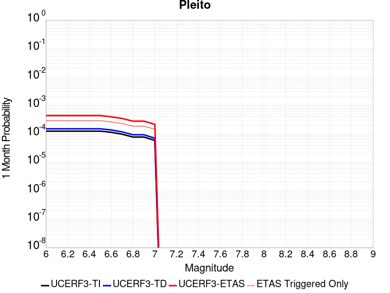 |  |  |

| Magnitude | 1 wk TI Prob | 1 wk TD Prob | 1 wk ETAS Prob | 1 wk ETAS/TD Gain | 1 wk ETAS Triggered Only | 1 mo TI Prob | 1 mo TD Prob | 1 mo ETAS Prob | 1 mo ETAS/TD Gain | 1 mo ETAS Triggered Only | 1 yr TI Prob | 1 yr TD Prob | 1 yr ETAS Prob | 1 yr ETAS/TD Gain | 1 yr ETAS Triggered Only | 10 yr TI Prob | 10 yr TD Prob | 10 yr ETAS Prob | 10 yr ETAS/TD Gain | 10 yr ETAS Triggered Only |
|-----|-----|-----|-----|-----|-----|-----|-----|-----|-----|-----|-----|-----|-----|-----|-----|-----|-----|-----|-----|-----|
| 6.0 | 2.8975299E-5 | 3.5014233E-5 | 1.8293626E-4 | 5.2246256 | 1.479272E-4 | 1.2417394E-4 | 1.5005456E-4 | 4.1869836E-4 | 2.7903073 | 2.6868412E-4 | 0.0015107692 | 0.0018257706 | 0.0024013321 | 1.315243 | 5.766142E-4 | 0.015005396 | 0.018145941 | 0.019213032 | 1.0588061 | 0.0010868121 |
| 6.1 | 2.8975299E-5 | 3.5014233E-5 | 1.8293626E-4 | 5.2246256 | 1.479272E-4 | 1.2417394E-4 | 1.5005456E-4 | 4.1869836E-4 | 2.7903073 | 2.6868412E-4 | 0.0015107692 | 0.0018257706 | 0.0024013321 | 1.315243 | 5.766142E-4 | 0.015005396 | 0.018145941 | 0.019213032 | 1.0588061 | 0.0010868121 |
| 6.2 | 2.8975299E-5 | 3.5014233E-5 | 1.8293626E-4 | 5.2246256 | 1.479272E-4 | 1.2417394E-4 | 1.5005456E-4 | 4.1869836E-4 | 2.7903073 | 2.6868412E-4 | 0.0015107692 | 0.0018257706 | 0.0024013321 | 1.315243 | 5.766142E-4 | 0.015005396 | 0.018145941 | 0.019213032 | 1.0588061 | 0.0010868121 |
| 6.3 | 2.8975299E-5 | 3.5014233E-5 | 1.8293626E-4 | 5.2246256 | 1.479272E-4 | 1.2417394E-4 | 1.5005456E-4 | 4.1869836E-4 | 2.7903073 | 2.6868412E-4 | 0.0015107692 | 0.0018257706 | 0.0024013321 | 1.315243 | 5.766142E-4 | 0.015005396 | 0.018145941 | 0.019213032 | 1.0588061 | 0.0010868121 |
| 6.4 | 2.8975299E-5 | 3.5014233E-5 | 1.8293626E-4 | 5.2246256 | 1.479272E-4 | 1.2417394E-4 | 1.5005456E-4 | 4.1869836E-4 | 2.7903073 | 2.6868412E-4 | 0.0015107692 | 0.0018257706 | 0.0024013321 | 1.315243 | 5.766142E-4 | 0.015005396 | 0.018145941 | 0.019213032 | 1.0588061 | 0.0010868121 |
| 6.5 | 2.8975299E-5 | 3.5014233E-5 | 1.8293626E-4 | 5.2246256 | 1.479272E-4 | 1.2417394E-4 | 1.5005456E-4 | 4.1869836E-4 | 2.7903073 | 2.6868412E-4 | 0.0015107692 | 0.0018257706 | 0.0024013321 | 1.315243 | 5.766142E-4 | 0.015005396 | 0.018145941 | 0.019213032 | 1.0588061 | 0.0010868121 |
| 6.6 | 2.6446418E-5 | 3.190913E-5 | 1.7077514E-4 | 5.351921 | 1.3887044E-4 | 1.1333687E-4 | 1.367484E-4 | 3.7521066E-4 | 2.743803 | 2.3849489E-4 | 0.0013790029 | 0.0016640209 | 0.0021944672 | 1.3187737 | 5.3133036E-4 | 0.013704768 | 0.016553096 | 0.017550664 | 1.0602647 | 0.001014358 |
| 6.7 | 2.26497E-5 | 2.7271499E-5 | 1.5406279E-4 | 5.6492233 | 1.2679475E-4 | 9.706653E-5 | 1.1687469E-4 | 3.3119315E-4 | 2.8337457 | 2.1434351E-4 | 0.0011811443 | 0.0014223875 | 0.001889655 | 1.3285092 | 4.6793302E-4 | 0.01174886 | 0.0141689 | 0.015040912 | 1.0615441 | 8.8454434E-4 |
| 6.8 | 1.799965E-5 | 2.159839E-5 | 1.3933383E-4 | 6.451121 | 1.1773798E-4 | 7.713908E-5 | 9.256323E-5 | 2.7670045E-4 | 2.9893131 | 1.8415428E-4 | 9.387636E-4 | 0.0011267258 | 0.0015127124 | 1.3425738 | 3.864221E-4 | 0.009348078 | 0.011244575 | 0.011984848 | 1.0658339 | 7.486928E-4 |
| 6.9 | 1.799965E-5 | 2.159839E-5 | 1.3933383E-4 | 6.451121 | 1.1773798E-4 | 7.713908E-5 | 9.256323E-5 | 2.7670045E-4 | 2.9893131 | 1.8415428E-4 | 9.387636E-4 | 0.0011267258 | 0.0015127124 | 1.3425738 | 3.864221E-4 | 0.009348078 | 0.011244575 | 0.011984848 | 1.0658339 | 7.486928E-4 |
| 7.0 | 1.3666451E-5 | 1.6355421E-5 | 1.0390275E-4 | 6.3528013 | 8.754875E-5 | 5.8569192E-5 | 7.009466E-5 | 2.1197408E-4 | 3.0241115 | 1.4188937E-4 | 7.128466E-4 | 8.5340254E-4 | 0.0011580535 | 1.3569839 | 3.0491117E-4 | 0.0071056425 | 0.008534024 | 0.009129662 | 1.0697957 | 6.007656E-4 |

## San Cayetano
*[(top)](#table-of-contents)*

| 1 Week | 1 Month | 1 Year | 10 Year |
|-----|-----|-----|-----|
|  |  |  |  |

| Magnitude | 1 wk TI Prob | 1 wk TD Prob | 1 wk ETAS Prob | 1 wk ETAS/TD Gain | 1 wk ETAS Triggered Only | 1 mo TI Prob | 1 mo TD Prob | 1 mo ETAS Prob | 1 mo ETAS/TD Gain | 1 mo ETAS Triggered Only | 1 yr TI Prob | 1 yr TD Prob | 1 yr ETAS Prob | 1 yr ETAS/TD Gain | 1 yr ETAS Triggered Only | 10 yr TI Prob | 10 yr TD Prob | 10 yr ETAS Prob | 10 yr ETAS/TD Gain | 10 yr ETAS Triggered Only |
|-----|-----|-----|-----|-----|-----|-----|-----|-----|-----|-----|-----|-----|-----|-----|-----|-----|-----|-----|-----|-----|
| 6.0 | 8.1875E-5 | 1.8670029E-4 | 4.28169E-4 | 2.2933495 | 2.4151382E-4 | 3.5084566E-4 | 7.9996156E-4 | 0.001140827 | 1.4261022 | 3.4113825E-4 | 0.004263182 | 0.009708474 | 0.010300417 | 1.0609719 | 5.977467E-4 | 0.041823186 | 0.09218576 | 0.09302712 | 1.0091269 | 9.2680927E-4 |
| 6.1 | 8.1875E-5 | 1.8670029E-4 | 4.28169E-4 | 2.2933495 | 2.4151382E-4 | 3.5084566E-4 | 7.9996156E-4 | 0.001140827 | 1.4261022 | 3.4113825E-4 | 0.004263182 | 0.009708474 | 0.010300417 | 1.0609719 | 5.977467E-4 | 0.041823186 | 0.09218576 | 0.09302712 | 1.0091269 | 9.2680927E-4 |
| 6.2 | 8.1875E-5 | 1.8670029E-4 | 4.28169E-4 | 2.2933495 | 2.4151382E-4 | 3.5084566E-4 | 7.9996156E-4 | 0.001140827 | 1.4261022 | 3.4113825E-4 | 0.004263182 | 0.009708474 | 0.010300417 | 1.0609719 | 5.977467E-4 | 0.041823186 | 0.09218576 | 0.09302712 | 1.0091269 | 9.2680927E-4 |
| 6.3 | 8.1875E-5 | 1.8670029E-4 | 4.28169E-4 | 2.2933495 | 2.4151382E-4 | 3.5084566E-4 | 7.9996156E-4 | 0.001140827 | 1.4261022 | 3.4113825E-4 | 0.004263182 | 0.009708474 | 0.010300417 | 1.0609719 | 5.977467E-4 | 0.041823186 | 0.09218576 | 0.09302712 | 1.0091269 | 9.2680927E-4 |
| 6.4 | 8.1875E-5 | 1.8670029E-4 | 4.28169E-4 | 2.2933495 | 2.4151382E-4 | 3.5084566E-4 | 7.9996156E-4 | 0.001140827 | 1.4261022 | 3.4113825E-4 | 0.004263182 | 0.009708474 | 0.010300417 | 1.0609719 | 5.977467E-4 | 0.041823186 | 0.09218576 | 0.09302712 | 1.0091269 | 9.2680927E-4 |
| 6.5 | 8.1875E-5 | 1.8670029E-4 | 4.28169E-4 | 2.2933495 | 2.4151382E-4 | 3.5084566E-4 | 7.9996156E-4 | 0.001140827 | 1.4261022 | 3.4113825E-4 | 0.004263182 | 0.009708474 | 0.010300417 | 1.0609719 | 5.977467E-4 | 0.041823186 | 0.09218576 | 0.09302712 | 1.0091269 | 9.2680927E-4 |
| 6.6 | 8.1875E-5 | 1.8670029E-4 | 4.28169E-4 | 2.2933495 | 2.4151382E-4 | 3.5084566E-4 | 7.9996156E-4 | 0.001140827 | 1.4261022 | 3.4113825E-4 | 0.004263182 | 0.009708474 | 0.010300417 | 1.0609719 | 5.977467E-4 | 0.041823186 | 0.09218576 | 0.09302712 | 1.0091269 | 9.2680927E-4 |
| 6.7 | 5.4643962E-5 | 1.3262422E-4 | 3.0166146E-4 | 2.2745578 | 1.6905967E-4 | 2.341674E-4 | 5.6833174E-4 | 8.187599E-4 | 1.4406374 | 2.5057056E-4 | 0.0028472608 | 0.006909191 | 0.0073529044 | 1.0642208 | 4.4680055E-4 | 0.028110553 | 0.06647811 | 0.067126304 | 1.0097505 | 6.943522E-4 |
| 6.8 | 5.4643962E-5 | 1.3262422E-4 | 3.0166146E-4 | 2.2745578 | 1.6905967E-4 | 2.341674E-4 | 5.6833174E-4 | 8.187599E-4 | 1.4406374 | 2.5057056E-4 | 0.0028472608 | 0.006909191 | 0.0073529044 | 1.0642208 | 4.4680055E-4 | 0.028110553 | 0.06647811 | 0.067126304 | 1.0097505 | 6.943522E-4 |
| 6.9 | 4.9065253E-5 | 1.1962955E-4 | 2.7055762E-4 | 2.2616286 | 1.5094613E-4 | 2.102627E-4 | 5.1266217E-4 | 7.3293055E-4 | 1.4296559 | 2.2038135E-4 | 0.002556943 | 0.006235295 | 0.0066283075 | 1.0630304 | 3.9547886E-4 | 0.02527722 | 0.06024073 | 0.060828004 | 1.0097487 | 6.24917E-4 |
| 7.0 | 3.8281665E-5 | 9.1909E-5 | 1.9756157E-4 | 2.1495347 | 1.0566229E-4 | 1.6405396E-4 | 3.938957E-4 | 5.538356E-4 | 1.4060463 | 1.6000289E-4 | 0.0019955272 | 0.0047956803 | 0.0050901156 | 1.061396 | 2.958544E-4 | 0.019777026 | 0.04680347 | 0.04726389 | 1.0098373 | 4.8302763E-4 |
| 7.1 | 3.8281665E-5 | 9.1909E-5 | 1.9756157E-4 | 2.1495347 | 1.0566229E-4 | 1.6405396E-4 | 3.938957E-4 | 5.538356E-4 | 1.4060463 | 1.6000289E-4 | 0.0019955272 | 0.0047956803 | 0.0050901156 | 1.061396 | 2.958544E-4 | 0.019777026 | 0.04680347 | 0.04726389 | 1.0098373 | 4.8302763E-4 |

## Death Valley (No)
*[(top)](#table-of-contents)*

| 1 Week | 1 Month | 1 Year | 10 Year |
|-----|-----|-----|-----|
|  |  |  |  |

| Magnitude | 1 wk TI Prob | 1 wk TD Prob | 1 wk ETAS Prob | 1 wk ETAS/TD Gain | 1 wk ETAS Triggered Only | 1 mo TI Prob | 1 mo TD Prob | 1 mo ETAS Prob | 1 mo ETAS/TD Gain | 1 mo ETAS Triggered Only | 1 yr TI Prob | 1 yr TD Prob | 1 yr ETAS Prob | 1 yr ETAS/TD Gain | 1 yr ETAS Triggered Only | 10 yr TI Prob | 10 yr TD Prob | 10 yr ETAS Prob | 10 yr ETAS/TD Gain | 10 yr ETAS Triggered Only |
|-----|-----|-----|-----|-----|-----|-----|-----|-----|-----|-----|-----|-----|-----|-----|-----|-----|-----|-----|-----|-----|
| 6.0 | 4.5975892E-5 | 5.9477E-5 | 3.7342627E-4 | 6.278499 | 3.1396796E-4 | 1.9702465E-4 | 2.548782E-4 | 7.106193E-4 | 2.7880743 | 4.558573E-4 | 0.0023961363 | 0.003099011 | 0.003794221 | 1.2243328 | 6.9737114E-4 | 0.02370464 | 0.030588351 | 0.031510223 | 1.030138 | 9.509606E-4 |
| 6.1 | 4.5975892E-5 | 5.9477E-5 | 3.7342627E-4 | 6.278499 | 3.1396796E-4 | 1.9702465E-4 | 2.548782E-4 | 7.106193E-4 | 2.7880743 | 4.558573E-4 | 0.0023961363 | 0.003099011 | 0.003794221 | 1.2243328 | 6.9737114E-4 | 0.02370464 | 0.030588351 | 0.031510223 | 1.030138 | 9.509606E-4 |
| 6.2 | 4.5975892E-5 | 5.9477E-5 | 3.7342627E-4 | 6.278499 | 3.1396796E-4 | 1.9702465E-4 | 2.548782E-4 | 7.106193E-4 | 2.7880743 | 4.558573E-4 | 0.0023961363 | 0.003099011 | 0.003794221 | 1.2243328 | 6.9737114E-4 | 0.02370464 | 0.030588351 | 0.031510223 | 1.030138 | 9.509606E-4 |
| 6.3 | 4.5975892E-5 | 5.9477E-5 | 3.7342627E-4 | 6.278499 | 3.1396796E-4 | 1.9702465E-4 | 2.548782E-4 | 7.106193E-4 | 2.7880743 | 4.558573E-4 | 0.0023961363 | 0.003099011 | 0.003794221 | 1.2243328 | 6.9737114E-4 | 0.02370464 | 0.030588351 | 0.031510223 | 1.030138 | 9.509606E-4 |
| 6.4 | 4.5975892E-5 | 5.9477E-5 | 3.7342627E-4 | 6.278499 | 3.1396796E-4 | 1.9702465E-4 | 2.548782E-4 | 7.106193E-4 | 2.7880743 | 4.558573E-4 | 0.0023961363 | 0.003099011 | 0.003794221 | 1.2243328 | 6.9737114E-4 | 0.02370464 | 0.030588351 | 0.031510223 | 1.030138 | 9.509606E-4 |
| 6.5 | 4.5975892E-5 | 5.9477E-5 | 3.7342627E-4 | 6.278499 | 3.1396796E-4 | 1.9702465E-4 | 2.548782E-4 | 7.106193E-4 | 2.7880743 | 4.558573E-4 | 0.0023961363 | 0.003099011 | 0.003794221 | 1.2243328 | 6.9737114E-4 | 0.02370464 | 0.030588351 | 0.031510223 | 1.030138 | 9.509606E-4 |
| 6.6 | 4.1757343E-5 | 5.400243E-5 | 3.166345E-4 | 5.863338 | 2.6264627E-4 | 1.7894777E-4 | 2.3142013E-4 | 6.298257E-4 | 2.7215683 | 3.984978E-4 | 0.002176512 | 0.0028141933 | 0.00342531 | 1.2171552 | 6.128413E-4 | 0.021553177 | 0.02781613 | 0.028637914 | 1.0295435 | 8.4529835E-4 |
| 6.7 | 3.751902E-5 | 4.847215E-5 | 2.809179E-4 | 5.79545 | 2.3245704E-4 | 1.607859E-4 | 2.0772294E-4 | 5.608635E-4 | 2.7000558 | 3.5321395E-4 | 0.0019558107 | 0.0025263957 | 0.0030714404 | 1.21574 | 5.46425E-4 | 0.019386867 | 0.025007667 | 0.025746468 | 1.0295429 | 7.577496E-4 |
| 6.8 | 3.358376E-5 | 4.333242E-5 | 2.4257269E-4 | 5.597949 | 1.992489E-4 | 1.4392247E-4 | 1.8569885E-4 | 4.845167E-4 | 2.6091528 | 2.9887335E-4 | 0.0017508477 | 0.0022588398 | 0.0027347521 | 1.2106888 | 4.7698978E-4 | 0.017371172 | 0.022389125 | 0.023050223 | 1.0295277 | 6.762387E-4 |
| 6.9 | 2.9934512E-5 | 3.8558388E-5 | 2.0761153E-4 | 5.3843417 | 1.6905967E-4 | 1.2828446E-4 | 1.6524145E-4 | 4.2180746E-4 | 2.5526736 | 2.5660841E-4 | 0.0015607442 | 0.002010258 | 0.0024320576 | 1.2098236 | 4.2264917E-4 | 0.0154982805 | 0.019950643 | 0.020533506 | 1.0292152 | 5.9472775E-4 |
| 7.0 | 2.6778222E-5 | 3.444248E-5 | 1.8236459E-4 | 5.294758 | 1.479272E-4 | 1.1475876E-4 | 1.4760396E-4 | 3.800267E-4 | 2.5746374 | 2.3245704E-4 | 0.0013962924 | 0.001795896 | 0.0021786105 | 1.2131051 | 3.8340318E-4 | 0.013875516 | 0.017843472 | 0.018374216 | 1.0297445 | 5.403871E-4 |
| 7.1 | 2.3953568E-5 | 3.076199E-5 | 1.6359049E-4 | 5.3179426 | 1.3283259E-4 | 1.0265411E-4 | 1.3183212E-4 | 3.4916587E-4 | 2.6485648 | 2.1736242E-4 | 0.0012490972 | 0.0016041726 | 0.0019507918 | 1.2160735 | 3.471761E-4 | 0.012420994 | 0.015955374 | 0.016436635 | 1.030163 | 4.890655E-4 |
| 7.2 | 2.121599E-5 | 2.720663E-5 | 1.4796025E-4 | 5.4383893 | 1.2075691E-4 | 9.09225E-5 | 1.16596304E-4 | 3.1582196E-4 | 2.708679 | 1.992489E-4 | 0.0011064193 | 0.0014189329 | 0.00173547 | 1.2230811 | 3.1698687E-4 | 0.0110092675 | 0.0141279865 | 0.014565499 | 1.0309677 | 4.437816E-4 |
| 7.3 | 1.8611821E-5 | 2.3849978E-5 | 1.264909E-4 | 5.3036065 | 1.0264337E-4 | 7.976251E-5 | 1.0221185E-4 | 2.7427284E-4 | 2.6833763 | 1.720786E-4 | 9.706759E-4 | 0.0012440139 | 0.0015214093 | 1.2229842 | 2.7774088E-4 | 0.009664469 | 0.0123994695 | 0.012787064 | 1.031259 | 3.9245994E-4 |
| 7.4 | 6.786848E-6 | 8.734327E-6 | 6.307446E-5 | 7.2214446 | 5.4340606E-5 | 2.9086168E-5 | 3.7432535E-5 | 1.219592E-4 | 3.258107 | 8.4529835E-5 | 3.5406655E-4 | 4.5568874E-4 | 5.7639065E-4 | 1.2648779 | 1.2075691E-4 | 0.0035350295 | 0.004551757 | 0.0047260574 | 1.038293 | 1.750975E-4 |
| 7.5 | 6.183793E-6 | 7.958103E-6 | 5.927938E-5 | 7.4489336 | 5.1321684E-5 | 2.65017E-5 | 3.410595E-5 | 1.1259526E-4 | 3.3013377 | 7.849199E-5 | 3.2261043E-4 | 4.1520374E-4 | 5.2987516E-4 | 1.2761811 | 1.14719056E-4 | 0.003221425 | 0.0041484893 | 0.0043078284 | 1.038409 | 1.6000289E-4 |
| 7.6 | 5.6024205E-6 | 7.211712E-6 | 5.8533027E-5 | 8.1163845 | 5.1321684E-5 | 2.4010153E-5 | 3.0907213E-5 | 1.0637794E-4 | 3.4418485 | 7.5473064E-5 | 2.9228439E-4 | 3.762732E-4 | 4.879313E-4 | 1.2967474 | 1.1170014E-4 | 0.0029190024 | 0.0037605667 | 0.0039079376 | 1.0391885 | 1.479272E-4 |
| 7.7 | 5.132066E-6 | 6.6084267E-6 | 4.8873066E-5 | 7.395567 | 4.2264917E-5 | 2.1994381E-5 | 2.8321763E-5 | 8.567967E-5 | 3.0252237 | 5.7359528E-5 | 2.677487E-4 | 3.4480577E-4 | 4.3232433E-4 | 1.25382 | 8.754875E-5 | 0.0026742632 | 0.00344691 | 0.0035702593 | 1.0357854 | 1.2377583E-4 |
| 7.8 | 4.8153906E-6 | 6.202069E-6 | 4.846672E-5 | 7.8146057 | 4.2264917E-5 | 2.0637224E-5 | 2.6580266E-5 | 8.393827E-5 | 3.157917 | 5.7359528E-5 | 2.5122924E-4 | 3.2360948E-4 | 4.111299E-4 | 1.2704507 | 8.754875E-5 | 0.002509454 | 0.0032355804 | 0.0033589557 | 1.0381309 | 1.2377583E-4 |

## Gravel Hills-Harper Lk
*[(top)](#table-of-contents)*

| 1 Week | 1 Month | 1 Year | 10 Year |
|-----|-----|-----|-----|
|  |  |  |  |

| Magnitude | 1 wk TI Prob | 1 wk TD Prob | 1 wk ETAS Prob | 1 wk ETAS/TD Gain | 1 wk ETAS Triggered Only | 1 mo TI Prob | 1 mo TD Prob | 1 mo ETAS Prob | 1 mo ETAS/TD Gain | 1 mo ETAS Triggered Only | 1 yr TI Prob | 1 yr TD Prob | 1 yr ETAS Prob | 1 yr ETAS/TD Gain | 1 yr ETAS Triggered Only | 10 yr TI Prob | 10 yr TD Prob | 10 yr ETAS Prob | 10 yr ETAS/TD Gain | 10 yr ETAS Triggered Only |
|-----|-----|-----|-----|-----|-----|-----|-----|-----|-----|-----|-----|-----|-----|-----|-----|-----|-----|-----|-----|-----|
| 6.0 | 1.0695174E-5 | 1.1443446E-5 | 2.3484117E-4 | 20.521893 | 2.2340027E-4 | 4.583565E-5 | 4.904268E-5 | 3.7507032E-4 | 7.6478353 | 3.2604364E-4 | 5.5790617E-4 | 5.9697754E-4 | 0.0011189394 | 1.8743409 | 5.222736E-4 | 0.0055650757 | 0.005958305 | 0.006699536 | 1.124403 | 7.456739E-4 |
| 6.1 | 1.0695174E-5 | 1.1443446E-5 | 2.3484117E-4 | 20.521893 | 2.2340027E-4 | 4.583565E-5 | 4.904268E-5 | 3.7507032E-4 | 7.6478353 | 3.2604364E-4 | 5.5790617E-4 | 5.9697754E-4 | 0.0011189394 | 1.8743409 | 5.222736E-4 | 0.0055650757 | 0.005958305 | 0.006699536 | 1.124403 | 7.456739E-4 |
| 6.2 | 1.0695174E-5 | 1.1443446E-5 | 2.3484117E-4 | 20.521893 | 2.2340027E-4 | 4.583565E-5 | 4.904268E-5 | 3.7507032E-4 | 7.6478353 | 3.2604364E-4 | 5.5790617E-4 | 5.9697754E-4 | 0.0011189394 | 1.8743409 | 5.222736E-4 | 0.0055650757 | 0.005958305 | 0.006699536 | 1.124403 | 7.456739E-4 |
| 6.3 | 1.0695174E-5 | 1.1443446E-5 | 2.3484117E-4 | 20.521893 | 2.2340027E-4 | 4.583565E-5 | 4.904268E-5 | 3.7507032E-4 | 7.6478353 | 3.2604364E-4 | 5.5790617E-4 | 5.9697754E-4 | 0.0011189394 | 1.8743409 | 5.222736E-4 | 0.0055650757 | 0.005958305 | 0.006699536 | 1.124403 | 7.456739E-4 |
| 6.4 | 1.0695174E-5 | 1.1443446E-5 | 2.3484117E-4 | 20.521893 | 2.2340027E-4 | 4.583565E-5 | 4.904268E-5 | 3.7507032E-4 | 7.6478353 | 3.2604364E-4 | 5.5790617E-4 | 5.9697754E-4 | 0.0011189394 | 1.8743409 | 5.222736E-4 | 0.0055650757 | 0.005958305 | 0.006699536 | 1.124403 | 7.456739E-4 |
| 6.5 | 1.0695174E-5 | 1.1443446E-5 | 2.3484117E-4 | 20.521893 | 2.2340027E-4 | 4.583565E-5 | 4.904268E-5 | 3.7507032E-4 | 7.6478353 | 3.2604364E-4 | 5.5790617E-4 | 5.9697754E-4 | 0.0011189394 | 1.8743409 | 5.222736E-4 | 0.0055650757 | 0.005958305 | 0.006699536 | 1.124403 | 7.456739E-4 |
| 6.6 | 9.406204E-6 | 1.0059137E-5 | 1.9421156E-4 | 19.306982 | 1.8415428E-4 | 4.0311683E-5 | 4.3110133E-5 | 3.2385782E-4 | 7.5123367 | 2.807598E-4 | 4.906842E-4 | 5.247856E-4 | 9.74369E-4 | 1.8566992 | 4.4981946E-4 | 0.0048960214 | 0.005239992 | 0.005873647 | 1.1209267 | 6.369927E-4 |
| 6.7 | 7.8983985E-6 | 8.44031E-6 | 1.4730958E-4 | 17.4531 | 1.3887044E-4 | 3.384984E-5 | 3.6172514E-5 | 2.6258352E-4 | 7.2592006 | 2.264192E-4 | 4.1204385E-4 | 4.4035696E-4 | 8.145385E-4 | 1.8497232 | 3.743464E-4 | 0.004112807 | 0.0043993196 | 0.0049132844 | 1.1168282 | 5.1623577E-4 |
| 6.8 | 6.69903E-6 | 7.1536347E-6 | 1.15834075E-4 | 16.192337 | 1.0868121E-4 | 2.8709812E-5 | 3.0658328E-5 | 2.1480696E-4 | 7.0064797 | 1.8415428E-4 | 3.494859E-4 | 3.7324644E-4 | 6.8106165E-4 | 1.8246969 | 3.079301E-4 | 0.003489368 | 0.00373063 | 0.004157718 | 1.1144814 | 4.2868702E-4 |
| 6.9 | 5.603049E-6 | 5.978078E-6 | 1.0258302E-4 | 17.159866 | 9.660552E-5 | 2.4012847E-5 | 2.5620335E-5 | 1.8260028E-4 | 7.1271625 | 1.5698398E-4 | 2.9231719E-4 | 3.1192758E-4 | 5.775099E-4 | 1.851423 | 2.6566518E-4 | 0.0029193296 | 0.003119276 | 0.003483426 | 1.1167419 | 3.6528963E-4 |
| 7.0 | 5.603049E-6 | 5.978078E-6 | 1.0258302E-4 | 17.159866 | 9.660552E-5 | 2.4012847E-5 | 2.5620335E-5 | 1.8260028E-4 | 7.1271625 | 1.5698398E-4 | 2.9231719E-4 | 3.1192758E-4 | 5.775099E-4 | 1.851423 | 2.6566518E-4 | 0.0029193296 | 0.003119276 | 0.003483426 | 1.1167419 | 3.6528963E-4 |

## San Andreas (San Bernardino S)
*[(top)](#table-of-contents)*

| 1 Week | 1 Month | 1 Year | 10 Year |
|-----|-----|-----|-----|
|  |  |  |  |

| Magnitude | 1 wk TI Prob | 1 wk TD Prob | 1 wk ETAS Prob | 1 wk ETAS/TD Gain | 1 wk ETAS Triggered Only | 1 mo TI Prob | 1 mo TD Prob | 1 mo ETAS Prob | 1 mo ETAS/TD Gain | 1 mo ETAS Triggered Only | 1 yr TI Prob | 1 yr TD Prob | 1 yr ETAS Prob | 1 yr ETAS/TD Gain | 1 yr ETAS Triggered Only | 10 yr TI Prob | 10 yr TD Prob | 10 yr ETAS Prob | 10 yr ETAS/TD Gain | 10 yr ETAS Triggered Only |
|-----|-----|-----|-----|-----|-----|-----|-----|-----|-----|-----|-----|-----|-----|-----|-----|-----|-----|-----|-----|-----|
| 6.0 | 8.432835E-5 | 3.0557657E-4 | 4.926926E-4 | 1.6123375 | 1.871732E-4 | 3.6135715E-4 | 0.0013090015 | 0.0015924087 | 1.2165065 | 2.8377873E-4 | 0.004390651 | 0.015828904 | 0.016319143 | 1.030971 | 4.9812224E-4 | 0.043049086 | 0.14053506 | 0.14117074 | 1.0045234 | 7.39636E-4 |
| 6.1 | 8.432835E-5 | 3.0557657E-4 | 4.926926E-4 | 1.6123375 | 1.871732E-4 | 3.6135715E-4 | 0.0013090015 | 0.0015924087 | 1.2165065 | 2.8377873E-4 | 0.004390651 | 0.015828904 | 0.016319143 | 1.030971 | 4.9812224E-4 | 0.043049086 | 0.14053506 | 0.14117074 | 1.0045234 | 7.39636E-4 |
| 6.2 | 8.432835E-5 | 3.0557657E-4 | 4.926926E-4 | 1.6123375 | 1.871732E-4 | 3.6135715E-4 | 0.0013090015 | 0.0015924087 | 1.2165065 | 2.8377873E-4 | 0.004390651 | 0.015828904 | 0.016319143 | 1.030971 | 4.9812224E-4 | 0.043049086 | 0.14053506 | 0.14117074 | 1.0045234 | 7.39636E-4 |
| 6.3 | 8.432835E-5 | 3.0557657E-4 | 4.926926E-4 | 1.6123375 | 1.871732E-4 | 3.6135715E-4 | 0.0013090015 | 0.0015924087 | 1.2165065 | 2.8377873E-4 | 0.004390651 | 0.015828904 | 0.016319143 | 1.030971 | 4.9812224E-4 | 0.043049086 | 0.14053506 | 0.14117074 | 1.0045234 | 7.39636E-4 |
| 6.4 | 8.432835E-5 | 3.0557657E-4 | 4.926926E-4 | 1.6123375 | 1.871732E-4 | 3.6135715E-4 | 0.0013090015 | 0.0015924087 | 1.2165065 | 2.8377873E-4 | 0.004390651 | 0.015828904 | 0.016319143 | 1.030971 | 4.9812224E-4 | 0.043049086 | 0.14053506 | 0.14117074 | 1.0045234 | 7.39636E-4 |
| 6.5 | 8.432835E-5 | 3.0557657E-4 | 4.926926E-4 | 1.6123375 | 1.871732E-4 | 3.6135715E-4 | 0.0013090015 | 0.0015924087 | 1.2165065 | 2.8377873E-4 | 0.004390651 | 0.015828904 | 0.016319143 | 1.030971 | 4.9812224E-4 | 0.043049086 | 0.14053506 | 0.14117074 | 1.0045234 | 7.39636E-4 |
| 6.6 | 8.422796E-5 | 3.053887E-4 | 4.9250474E-4 | 1.6127143 | 1.871732E-4 | 3.6092702E-4 | 0.0013081972 | 0.0015916047 | 1.2166398 | 2.8377873E-4 | 0.0043854355 | 0.015819253 | 0.016309496 | 1.0309902 | 4.9812224E-4 | 0.04299896 | 0.14045276 | 0.1410885 | 1.0045265 | 7.39636E-4 |
| 6.7 | 8.4024105E-5 | 3.050066E-4 | 4.921227E-4 | 1.6134822 | 1.871732E-4 | 3.600536E-4 | 0.0013065612 | 0.0015899691 | 1.2169113 | 2.8377873E-4 | 0.004374844 | 0.015799625 | 0.016289877 | 1.0310293 | 4.9812224E-4 | 0.042897146 | 0.14028531 | 0.14092119 | 1.0045327 | 7.39636E-4 |
| 6.8 | 8.383834E-5 | 3.0460325E-4 | 4.9171946E-4 | 1.6142948 | 1.871732E-4 | 3.592577E-4 | 0.0013048343 | 0.0015882427 | 1.2171988 | 2.8377873E-4 | 0.004365193 | 0.015778905 | 0.016269166 | 1.0310707 | 4.9812224E-4 | 0.042804368 | 0.14010844 | 0.14074445 | 1.0045394 | 7.39636E-4 |
| 6.9 | 8.269897E-5 | 3.0217436E-4 | 4.89291E-4 | 1.619234 | 1.871732E-4 | 3.54376E-4 | 0.0012944351 | 0.0015778465 | 1.218946 | 2.8377873E-4 | 0.004305995 | 0.015654119 | 0.01614147 | 1.0311326 | 4.951033E-4 | 0.042235088 | 0.13903125 | 0.13966545 | 1.0045615 | 7.3661713E-4 |
| 7.0 | 8.240144E-5 | 3.0153047E-4 | 4.8864726E-4 | 1.6205567 | 1.871732E-4 | 3.5310123E-4 | 0.0012916784 | 0.0015750906 | 1.2194139 | 2.8377873E-4 | 0.004290536 | 0.015621036 | 0.016108405 | 1.0311996 | 4.951033E-4 | 0.042086378 | 0.13874839 | 0.13938281 | 1.0045724 | 7.3661713E-4 |
| 7.1 | 8.209429E-5 | 3.0086326E-4 | 4.8798014E-4 | 1.6219333 | 1.871732E-4 | 3.5178522E-4 | 0.0012888217 | 0.0015722347 | 1.2199008 | 2.8377873E-4 | 0.0042745764 | 0.015586754 | 0.016074141 | 1.0312693 | 4.951033E-4 | 0.041932825 | 0.13845524 | 0.13908987 | 1.0045836 | 7.3661713E-4 |
| 7.2 | 6.547198E-5 | 2.6130548E-4 | 4.242847E-4 | 1.6237115 | 1.6302182E-4 | 2.80564E-4 | 0.0011194341 | 0.0013606776 | 1.2155048 | 2.4151382E-4 | 0.003410517 | 0.013550194 | 0.013964138 | 1.0305489 | 4.1963023E-4 | 0.03358648 | 0.12084773 | 0.121405095 | 1.0046121 | 6.3397374E-4 |
| 7.3 | 6.498085E-5 | 2.5983856E-4 | 4.2281803E-4 | 1.6272335 | 1.6302182E-4 | 2.7845963E-4 | 0.0011131528 | 0.0013543979 | 1.2167222 | 2.4151382E-4 | 0.0033849762 | 0.013474667 | 0.013888643 | 1.0307225 | 4.1963023E-4 | 0.033338774 | 0.12019604 | 0.12075381 | 1.0046406 | 6.3397374E-4 |
| 7.4 | 5.658229E-5 | 2.4132969E-4 | 4.0431216E-4 | 1.675352 | 1.6302182E-4 | 2.4247299E-4 | 0.0010338924 | 0.0012751565 | 1.2333552 | 2.4151382E-4 | 0.0029481123 | 0.0125208525 | 0.012935229 | 1.0330949 | 4.1963023E-4 | 0.02909307 | 0.111656904 | 0.11222009 | 1.0050439 | 6.3397374E-4 |
| 7.5 | 5.1594427E-5 | 2.278611E-4 | 3.848093E-4 | 1.6887889 | 1.5698398E-4 | 2.2110023E-4 | 9.7621355E-4 | 0.0012084437 | 1.2378887 | 2.3245704E-4 | 0.002688572 | 0.011826312 | 0.012226064 | 1.0338019 | 4.0453562E-4 | 0.026562763 | 0.10549111 | 0.1060312 | 1.0051198 | 6.037845E-4 |
| 7.6 | 3.6604233E-5 | 1.7518568E-4 | 3.019582E-4 | 1.7236466 | 1.2679475E-4 | 1.5686586E-4 | 7.5060193E-4 | 9.406513E-4 | 1.253196 | 1.9019212E-4 | 0.0019081688 | 0.009104266 | 0.009439307 | 1.0368004 | 3.3811934E-4 | 0.018918669 | 0.08175703 | 0.08222552 | 1.0057303 | 5.1019795E-4 |
| 7.7 | 2.7987022E-5 | 1.432022E-4 | 2.5790482E-4 | 1.8009838 | 1.14719056E-4 | 1.1993887E-4 | 6.13598E-4 | 7.88588E-4 | 1.2851869 | 1.750975E-4 | 0.0014592775 | 0.0074482826 | 0.007750923 | 1.0406322 | 3.0491117E-4 | 0.01449732 | 0.06712321 | 0.06752312 | 1.0059578 | 4.2868702E-4 |
| 7.8 | 2.2592892E-5 | 1.21067766E-4 | 2.2068016E-4 | 1.822782 | 9.962445E-5 | 9.682308E-5 | 5.1877514E-4 | 6.7869504E-4 | 1.3082644 | 1.6000289E-4 | 0.0011781835 | 0.0063007227 | 0.0065767136 | 1.0438031 | 2.7774088E-4 | 0.011719566 | 0.05660409 | 0.05696864 | 1.0064403 | 3.864221E-4 |
| 7.9 | 1.2843913E-5 | 6.366969E-5 | 1.3913795E-4 | 2.185309 | 7.5473064E-5 | 5.504418E-5 | 2.7284448E-4 | 3.9658655E-4 | 1.4535259 | 1.2377583E-4 | 6.699568E-4 | 0.003317339 | 0.0035159271 | 1.0598636 | 1.992489E-4 | 0.0066794064 | 0.030455248 | 0.030712822 | 1.0084574 | 2.6566518E-4 |
| 8.0 | 6.3800603E-6 | 3.136937E-5 | 5.5519995E-5 | 1.7698791 | 2.415138E-5 | 2.7342829E-5 | 1.3443502E-4 | 1.7669426E-4 | 1.3143469 | 4.2264917E-5 | 3.3284808E-4 | 0.0016358347 | 0.0017021423 | 1.0405345 | 6.6416294E-5 | 0.0033234998 | 0.015136539 | 0.015231682 | 1.0062857 | 9.660552E-5 |
| 8.1 | 2.2240692E-6 | 1.29589735E-5 | 1.899674E-5 | 1.465914 | 6.037845E-6 | 9.531691E-6 | 5.5538447E-5 | 6.7613466E-5 | 1.2174174 | 1.207569E-5 | 1.1604215E-4 | 6.7617896E-4 | 6.9428026E-4 | 1.02677 | 1.8113536E-5 | 0.0011598158 | 0.0061071273 | 0.006143133 | 1.0058957 | 3.6227073E-5 |

## Cleghorn
*[(top)](#table-of-contents)*

| 1 Week | 1 Month | 1 Year | 10 Year |
|-----|-----|-----|-----|
|  |  |  |  |

| Magnitude | 1 wk TI Prob | 1 wk TD Prob | 1 wk ETAS Prob | 1 wk ETAS/TD Gain | 1 wk ETAS Triggered Only | 1 mo TI Prob | 1 mo TD Prob | 1 mo ETAS Prob | 1 mo ETAS/TD Gain | 1 mo ETAS Triggered Only | 1 yr TI Prob | 1 yr TD Prob | 1 yr ETAS Prob | 1 yr ETAS/TD Gain | 1 yr ETAS Triggered Only | 10 yr TI Prob | 10 yr TD Prob | 10 yr ETAS Prob | 10 yr ETAS/TD Gain | 10 yr ETAS Triggered Only |
|-----|-----|-----|-----|-----|-----|-----|-----|-----|-----|-----|-----|-----|-----|-----|-----|-----|-----|-----|-----|-----|
| 6.0 | 5.4416636E-5 | 8.607012E-5 | 1.8266733E-4 | 2.1223083 | 9.660552E-5 | 2.331933E-4 | 3.6884286E-4 | 5.227511E-4 | 1.4172733 | 1.5396505E-4 | 0.0028354323 | 0.0044848183 | 0.0048244265 | 1.075724 | 3.4113825E-4 | 0.027995259 | 0.04426744 | 0.04487335 | 1.0136875 | 6.3397374E-4 |
| 6.1 | 5.4416636E-5 | 8.607012E-5 | 1.8266733E-4 | 2.1223083 | 9.660552E-5 | 2.331933E-4 | 3.6884286E-4 | 5.227511E-4 | 1.4172733 | 1.5396505E-4 | 0.0028354323 | 0.0044848183 | 0.0048244265 | 1.075724 | 3.4113825E-4 | 0.027995259 | 0.04426744 | 0.04487335 | 1.0136875 | 6.3397374E-4 |
| 6.2 | 5.4416636E-5 | 8.607012E-5 | 1.8266733E-4 | 2.1223083 | 9.660552E-5 | 2.331933E-4 | 3.6884286E-4 | 5.227511E-4 | 1.4172733 | 1.5396505E-4 | 0.0028354323 | 0.0044848183 | 0.0048244265 | 1.075724 | 3.4113825E-4 | 0.027995259 | 0.04426744 | 0.04487335 | 1.0136875 | 6.3397374E-4 |
| 6.3 | 5.4416636E-5 | 8.607012E-5 | 1.8266733E-4 | 2.1223083 | 9.660552E-5 | 2.331933E-4 | 3.6884286E-4 | 5.227511E-4 | 1.4172733 | 1.5396505E-4 | 0.0028354323 | 0.0044848183 | 0.0048244265 | 1.075724 | 3.4113825E-4 | 0.027995259 | 0.04426744 | 0.04487335 | 1.0136875 | 6.3397374E-4 |
| 6.4 | 5.4416636E-5 | 8.607012E-5 | 1.8266733E-4 | 2.1223083 | 9.660552E-5 | 2.331933E-4 | 3.6884286E-4 | 5.227511E-4 | 1.4172733 | 1.5396505E-4 | 0.0028354323 | 0.0044848183 | 0.0048244265 | 1.075724 | 3.4113825E-4 | 0.027995259 | 0.04426744 | 0.04487335 | 1.0136875 | 6.3397374E-4 |
| 6.5 | 5.4416636E-5 | 8.607012E-5 | 1.8266733E-4 | 2.1223083 | 9.660552E-5 | 2.331933E-4 | 3.6884286E-4 | 5.227511E-4 | 1.4172733 | 1.5396505E-4 | 0.0028354323 | 0.0044848183 | 0.0048244265 | 1.075724 | 3.4113825E-4 | 0.027995259 | 0.04426744 | 0.04487335 | 1.0136875 | 6.3397374E-4 |
| 6.6 | 3.7632213E-5 | 5.9786213E-5 | 1.382735E-4 | 2.3127992 | 7.849199E-5 | 1.6127095E-4 | 2.5622663E-4 | 3.7393445E-4 | 1.4593894 | 1.1773798E-4 | 0.0019617055 | 0.0031189616 | 0.0033777792 | 1.082982 | 2.5962736E-4 | 0.019444784 | 0.031117557 | 0.031603105 | 1.0156037 | 5.011411E-4 |
| 6.7 | 3.7632213E-5 | 5.9786213E-5 | 1.382735E-4 | 2.3127992 | 7.849199E-5 | 1.6127095E-4 | 2.5622663E-4 | 3.7393445E-4 | 1.4593894 | 1.1773798E-4 | 0.0019617055 | 0.0031189616 | 0.0033777792 | 1.082982 | 2.5962736E-4 | 0.019444784 | 0.031117557 | 0.031603105 | 1.0156037 | 5.011411E-4 |

## Pitas Point (Lower West)
*[(top)](#table-of-contents)*

| 1 Week | 1 Month | 1 Year | 10 Year |
|-----|-----|-----|-----|
|  |  |  |  |

| Magnitude | 1 wk TI Prob | 1 wk TD Prob | 1 wk ETAS Prob | 1 wk ETAS/TD Gain | 1 wk ETAS Triggered Only | 1 mo TI Prob | 1 mo TD Prob | 1 mo ETAS Prob | 1 mo ETAS/TD Gain | 1 mo ETAS Triggered Only | 1 yr TI Prob | 1 yr TD Prob | 1 yr ETAS Prob | 1 yr ETAS/TD Gain | 1 yr ETAS Triggered Only | 10 yr TI Prob | 10 yr TD Prob | 10 yr ETAS Prob | 10 yr ETAS/TD Gain | 10 yr ETAS Triggered Only |
|-----|-----|-----|-----|-----|-----|-----|-----|-----|-----|-----|-----|-----|-----|-----|-----|-----|-----|-----|-----|-----|
| 6.0 | 3.3491036E-5 | 4.2920976E-5 | 1.3348476E-4 | 3.1100123 | 9.056768E-5 | 1.4352512E-4 | 1.8393977E-4 | 3.3485814E-4 | 1.8204771 | 1.5094613E-4 | 0.0017460176 | 0.0022381744 | 0.0025002328 | 1.1170858 | 2.6264627E-4 | 0.017323626 | 0.022255175 | 0.022697935 | 1.0198947 | 4.528384E-4 |
| 6.1 | 3.3491036E-5 | 4.2920976E-5 | 1.3348476E-4 | 3.1100123 | 9.056768E-5 | 1.4352512E-4 | 1.8393977E-4 | 3.3485814E-4 | 1.8204771 | 1.5094613E-4 | 0.0017460176 | 0.0022381744 | 0.0025002328 | 1.1170858 | 2.6264627E-4 | 0.017323626 | 0.022255175 | 0.022697935 | 1.0198947 | 4.528384E-4 |
| 6.2 | 3.3491036E-5 | 4.2920976E-5 | 1.3348476E-4 | 3.1100123 | 9.056768E-5 | 1.4352512E-4 | 1.8393977E-4 | 3.3485814E-4 | 1.8204771 | 1.5094613E-4 | 0.0017460176 | 0.0022381744 | 0.0025002328 | 1.1170858 | 2.6264627E-4 | 0.017323626 | 0.022255175 | 0.022697935 | 1.0198947 | 4.528384E-4 |
| 6.3 | 3.3491036E-5 | 4.2920976E-5 | 1.3348476E-4 | 3.1100123 | 9.056768E-5 | 1.4352512E-4 | 1.8393977E-4 | 3.3485814E-4 | 1.8204771 | 1.5094613E-4 | 0.0017460176 | 0.0022381744 | 0.0025002328 | 1.1170858 | 2.6264627E-4 | 0.017323626 | 0.022255175 | 0.022697935 | 1.0198947 | 4.528384E-4 |
| 6.4 | 3.3491036E-5 | 4.2920976E-5 | 1.3348476E-4 | 3.1100123 | 9.056768E-5 | 1.4352512E-4 | 1.8393977E-4 | 3.3485814E-4 | 1.8204771 | 1.5094613E-4 | 0.0017460176 | 0.0022381744 | 0.0025002328 | 1.1170858 | 2.6264627E-4 | 0.017323626 | 0.022255175 | 0.022697935 | 1.0198947 | 4.528384E-4 |
| 6.5 | 3.3491036E-5 | 4.2920976E-5 | 1.3348476E-4 | 3.1100123 | 9.056768E-5 | 1.4352512E-4 | 1.8393977E-4 | 3.3485814E-4 | 1.8204771 | 1.5094613E-4 | 0.0017460176 | 0.0022381744 | 0.0025002328 | 1.1170858 | 2.6264627E-4 | 0.017323626 | 0.022255175 | 0.022697935 | 1.0198947 | 4.528384E-4 |
| 6.6 | 3.3491036E-5 | 4.2920976E-5 | 1.3348476E-4 | 3.1100123 | 9.056768E-5 | 1.4352512E-4 | 1.8393977E-4 | 3.3485814E-4 | 1.8204771 | 1.5094613E-4 | 0.0017460176 | 0.0022381744 | 0.0025002328 | 1.1170858 | 2.6264627E-4 | 0.017323626 | 0.022255175 | 0.022697935 | 1.0198947 | 4.528384E-4 |
| 6.7 | 3.3491036E-5 | 4.2920976E-5 | 1.3348476E-4 | 3.1100123 | 9.056768E-5 | 1.4352512E-4 | 1.8393977E-4 | 3.3485814E-4 | 1.8204771 | 1.5094613E-4 | 0.0017460176 | 0.0022381744 | 0.0025002328 | 1.1170858 | 2.6264627E-4 | 0.017323626 | 0.022255175 | 0.022697935 | 1.0198947 | 4.528384E-4 |
| 6.8 | 1.993871E-5 | 2.5410276E-5 | 9.484373E-5 | 3.732495 | 6.943522E-5 | 8.544882E-5 | 1.08901186E-4 | 2.2964494E-4 | 2.108746 | 1.2075691E-4 | 0.0010398427 | 0.0013258704 | 0.0015127955 | 1.1409829 | 1.871732E-4 | 0.010349905 | 0.013258544 | 0.013556433 | 1.0224677 | 3.0189226E-4 |
| 6.9 | 1.993871E-5 | 2.5410276E-5 | 9.484373E-5 | 3.732495 | 6.943522E-5 | 8.544882E-5 | 1.08901186E-4 | 2.2964494E-4 | 2.108746 | 1.2075691E-4 | 0.0010398427 | 0.0013258704 | 0.0015127955 | 1.1409829 | 1.871732E-4 | 0.010349905 | 0.013258544 | 0.013556433 | 1.0224677 | 3.0189226E-4 |
| 7.0 | 1.993871E-5 | 2.5410276E-5 | 9.484373E-5 | 3.732495 | 6.943522E-5 | 8.544882E-5 | 1.08901186E-4 | 2.2964494E-4 | 2.108746 | 1.2075691E-4 | 0.0010398427 | 0.0013258704 | 0.0015127955 | 1.1409829 | 1.871732E-4 | 0.010349905 | 0.013258544 | 0.013556433 | 1.0224677 | 3.0189226E-4 |
| 7.1 | 1.993871E-5 | 2.5410276E-5 | 9.484373E-5 | 3.732495 | 6.943522E-5 | 8.544882E-5 | 1.08901186E-4 | 2.2964494E-4 | 2.108746 | 1.2075691E-4 | 0.0010398427 | 0.0013258704 | 0.0015127955 | 1.1409829 | 1.871732E-4 | 0.010349905 | 0.013258544 | 0.013556433 | 1.0224677 | 3.0189226E-4 |

## Red Mountain
*[(top)](#table-of-contents)*

| 1 Week | 1 Month | 1 Year | 10 Year |
|-----|-----|-----|-----|
|  |  |  |  |

| Magnitude | 1 wk TI Prob | 1 wk TD Prob | 1 wk ETAS Prob | 1 wk ETAS/TD Gain | 1 wk ETAS Triggered Only | 1 mo TI Prob | 1 mo TD Prob | 1 mo ETAS Prob | 1 mo ETAS/TD Gain | 1 mo ETAS Triggered Only | 1 yr TI Prob | 1 yr TD Prob | 1 yr ETAS Prob | 1 yr ETAS/TD Gain | 1 yr ETAS Triggered Only | 10 yr TI Prob | 10 yr TD Prob | 10 yr ETAS Prob | 10 yr ETAS/TD Gain | 10 yr ETAS Triggered Only |
|-----|-----|-----|-----|-----|-----|-----|-----|-----|-----|-----|-----|-----|-----|-----|-----|-----|-----|-----|-----|-----|
| 6.0 | 2.454631E-5 | 2.766036E-5 | 8.5018306E-5 | 3.0736513 | 5.7359528E-5 | 1.0519423E-4 | 1.18539596E-4 | 2.2720793E-4 | 1.916726 | 1.0868121E-4 | 0.0012799873 | 0.0014423667 | 0.0016322846 | 1.131671 | 1.9019212E-4 | 0.012726397 | 0.014340373 | 0.014694473 | 1.0246925 | 3.592518E-4 |
| 6.1 | 2.454631E-5 | 2.766036E-5 | 8.5018306E-5 | 3.0736513 | 5.7359528E-5 | 1.0519423E-4 | 1.18539596E-4 | 2.2720793E-4 | 1.916726 | 1.0868121E-4 | 0.0012799873 | 0.0014423667 | 0.0016322846 | 1.131671 | 1.9019212E-4 | 0.012726397 | 0.014340373 | 0.014694473 | 1.0246925 | 3.592518E-4 |
| 6.2 | 2.454631E-5 | 2.766036E-5 | 8.5018306E-5 | 3.0736513 | 5.7359528E-5 | 1.0519423E-4 | 1.18539596E-4 | 2.2720793E-4 | 1.916726 | 1.0868121E-4 | 0.0012799873 | 0.0014423667 | 0.0016322846 | 1.131671 | 1.9019212E-4 | 0.012726397 | 0.014340373 | 0.014694473 | 1.0246925 | 3.592518E-4 |
| 6.3 | 2.454631E-5 | 2.766036E-5 | 8.5018306E-5 | 3.0736513 | 5.7359528E-5 | 1.0519423E-4 | 1.18539596E-4 | 2.2720793E-4 | 1.916726 | 1.0868121E-4 | 0.0012799873 | 0.0014423667 | 0.0016322846 | 1.131671 | 1.9019212E-4 | 0.012726397 | 0.014340373 | 0.014694473 | 1.0246925 | 3.592518E-4 |
| 6.4 | 2.454631E-5 | 2.766036E-5 | 8.5018306E-5 | 3.0736513 | 5.7359528E-5 | 1.0519423E-4 | 1.18539596E-4 | 2.2720793E-4 | 1.916726 | 1.0868121E-4 | 0.0012799873 | 0.0014423667 | 0.0016322846 | 1.131671 | 1.9019212E-4 | 0.012726397 | 0.014340373 | 0.014694473 | 1.0246925 | 3.592518E-4 |
| 6.5 | 2.454631E-5 | 2.766036E-5 | 8.5018306E-5 | 3.0736513 | 5.7359528E-5 | 1.0519423E-4 | 1.18539596E-4 | 2.2720793E-4 | 1.916726 | 1.0868121E-4 | 0.0012799873 | 0.0014423667 | 0.0016322846 | 1.131671 | 1.9019212E-4 | 0.012726397 | 0.014340373 | 0.014694473 | 1.0246925 | 3.592518E-4 |
| 6.6 | 2.2412336E-5 | 2.524622E-5 | 7.656661E-5 | 3.032795 | 5.1321684E-5 | 9.6049334E-5 | 1.08194174E-4 | 2.0780784E-4 | 1.9206935 | 9.962445E-5 | 0.0011687733 | 0.0013165694 | 0.0015004812 | 1.1396902 | 1.8415428E-4 | 0.011626452 | 0.013097815 | 0.0134344855 | 1.0257043 | 3.4113825E-4 |
| 6.7 | 1.9718891E-5 | 2.2200657E-5 | 6.4464635E-5 | 2.9037266 | 4.2264917E-5 | 8.45068E-5 | 9.5142765E-5 | 1.8570182E-4 | 1.9518229 | 9.056768E-5 | 0.0010283845 | 0.0011578472 | 0.0013236958 | 1.1432387 | 1.6604074E-4 | 0.010236385 | 0.01152803 | 0.011841362 | 1.0271801 | 3.1698687E-4 |
| 6.8 | 1.7471099E-5 | 1.9655563E-5 | 5.8900787E-5 | 2.9966471 | 3.9245995E-5 | 7.487399E-5 | 8.4235966E-5 | 1.5064667E-4 | 1.788389 | 6.6416294E-5 | 9.1120956E-4 | 0.0010251886 | 0.0011548691 | 1.1264944 | 1.2981368E-4 | 0.009074822 | 0.010214295 | 0.010474259 | 1.025451 | 2.6264627E-4 |
| 6.9 | 1.4678319E-5 | 1.6492819E-5 | 4.3662676E-5 | 2.6473749 | 2.7170303E-5 | 6.2905565E-5 | 7.068214E-5 | 1.22000194E-4 | 1.72604 | 5.1321684E-5 | 7.656061E-4 | 8.6031196E-4 | 9.6889964E-4 | 1.126219 | 1.0868121E-4 | 0.007629738 | 0.008579323 | 0.008809785 | 1.0268626 | 2.3245704E-4 |
| 7.0 | 1.3467646E-5 | 1.5122167E-5 | 4.229206E-5 | 2.796693 | 2.7170303E-5 | 5.7717203E-5 | 6.480822E-5 | 1.16126575E-4 | 1.7918496 | 5.1321684E-5 | 7.024804E-4 | 7.888507E-4 | 8.914131E-4 | 1.130015 | 1.0264337E-4 | 0.0070026387 | 0.007869966 | 0.008088613 | 1.0277824 | 2.2038135E-4 |
| 7.1 | 1.1752249E-5 | 1.3174863E-5 | 3.7325924E-5 | 2.8331168 | 2.415138E-5 | 5.0365805E-5 | 5.6463014E-5 | 1.017443E-4 | 1.8019636 | 4.528384E-5 | 6.1303115E-4 | 6.87316E-4 | 7.748046E-4 | 1.1272901 | 8.754875E-5 | 0.0061134277 | 0.00686129 | 0.0070441803 | 1.0266554 | 1.8415428E-4 |
| 7.2 | 1.0311001E-5 | 1.1541763E-5 | 3.267398E-5 | 2.8309345 | 2.1132459E-5 | 4.4189255E-5 | 4.94643E-5 | 8.870835E-5 | 1.7933813 | 3.9245995E-5 | 5.378713E-4 | 6.0215656E-4 | 6.7758415E-4 | 1.1252625 | 7.5473064E-5 | 0.0053657135 | 0.00601458 | 0.006161617 | 1.0244468 | 1.479272E-4 |
| 7.3 | 8.985892E-6 | 1.0043356E-5 | 2.5137819E-5 | 2.50293 | 1.5094613E-5 | 3.85104E-5 | 4.304278E-5 | 7.62495E-5 | 1.7714818 | 3.3208147E-5 | 4.6876323E-4 | 5.2401435E-4 | 5.903958E-4 | 1.1266788 | 6.6416294E-5 | 0.0046777567 | 0.005237055 | 0.005366189 | 1.0246577 | 1.2981368E-4 |
| 7.4 | 7.757385E-6 | 8.661384E-6 | 2.0736969E-5 | 2.3941867 | 1.207569E-5 | 3.3245513E-5 | 3.7120215E-5 | 6.12707E-5 | 1.650602 | 2.415138E-5 | 4.0468894E-4 | 4.519386E-4 | 5.0323707E-4 | 1.1135076 | 5.1321684E-5 | 0.0040395274 | 0.004519386 | 0.004627576 | 1.0239391 | 1.0868121E-4 |

## San Andreas (Coachella) rev
*[(top)](#table-of-contents)*

| 1 Week | 1 Month | 1 Year | 10 Year |
|-----|-----|-----|-----|
| 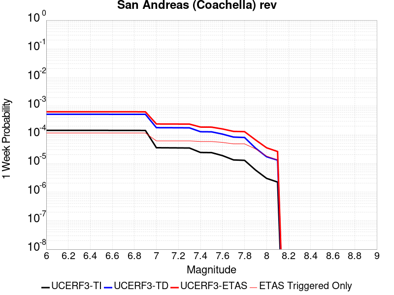 |  |  |  |

| Magnitude | 1 wk TI Prob | 1 wk TD Prob | 1 wk ETAS Prob | 1 wk ETAS/TD Gain | 1 wk ETAS Triggered Only | 1 mo TI Prob | 1 mo TD Prob | 1 mo ETAS Prob | 1 mo ETAS/TD Gain | 1 mo ETAS Triggered Only | 1 yr TI Prob | 1 yr TD Prob | 1 yr ETAS Prob | 1 yr ETAS/TD Gain | 1 yr ETAS Triggered Only | 10 yr TI Prob | 10 yr TD Prob | 10 yr ETAS Prob | 10 yr ETAS/TD Gain | 10 yr ETAS Triggered Only |
|-----|-----|-----|-----|-----|-----|-----|-----|-----|-----|-----|-----|-----|-----|-----|-----|-----|-----|-----|-----|-----|
| 6.0 | 1.4215116E-4 | 5.186186E-4 | 6.242261E-4 | 1.2036322 | 1.0566229E-4 | 6.09077E-4 | 0.0022216013 | 0.002384261 | 1.0732173 | 1.6302182E-4 | 0.0073903278 | 0.026862355 | 0.027115008 | 1.0094055 | 2.5962736E-4 | 0.07149333 | 0.23013055 | 0.23043734 | 1.0013331 | 3.984978E-4 |
| 6.1 | 1.4215116E-4 | 5.186186E-4 | 6.242261E-4 | 1.2036322 | 1.0566229E-4 | 6.09077E-4 | 0.0022216013 | 0.002384261 | 1.0732173 | 1.6302182E-4 | 0.0073903278 | 0.026862355 | 0.027115008 | 1.0094055 | 2.5962736E-4 | 0.07149333 | 0.23013055 | 0.23043734 | 1.0013331 | 3.984978E-4 |
| 6.2 | 1.4215116E-4 | 5.186186E-4 | 6.242261E-4 | 1.2036322 | 1.0566229E-4 | 6.09077E-4 | 0.0022216013 | 0.002384261 | 1.0732173 | 1.6302182E-4 | 0.0073903278 | 0.026862355 | 0.027115008 | 1.0094055 | 2.5962736E-4 | 0.07149333 | 0.23013055 | 0.23043734 | 1.0013331 | 3.984978E-4 |
| 6.3 | 1.4215116E-4 | 5.186186E-4 | 6.242261E-4 | 1.2036322 | 1.0566229E-4 | 6.09077E-4 | 0.0022216013 | 0.002384261 | 1.0732173 | 1.6302182E-4 | 0.0073903278 | 0.026862355 | 0.027115008 | 1.0094055 | 2.5962736E-4 | 0.07149333 | 0.23013055 | 0.23043734 | 1.0013331 | 3.984978E-4 |
| 6.4 | 1.4215116E-4 | 5.186186E-4 | 6.242261E-4 | 1.2036322 | 1.0566229E-4 | 6.09077E-4 | 0.0022216013 | 0.002384261 | 1.0732173 | 1.6302182E-4 | 0.0073903278 | 0.026862355 | 0.027115008 | 1.0094055 | 2.5962736E-4 | 0.07149333 | 0.23013055 | 0.23043734 | 1.0013331 | 3.984978E-4 |
| 6.5 | 1.4215116E-4 | 5.186186E-4 | 6.242261E-4 | 1.2036322 | 1.0566229E-4 | 6.09077E-4 | 0.0022216013 | 0.002384261 | 1.0732173 | 1.6302182E-4 | 0.0073903278 | 0.026862355 | 0.027115008 | 1.0094055 | 2.5962736E-4 | 0.07149333 | 0.23013055 | 0.23043734 | 1.0013331 | 3.984978E-4 |
| 6.6 | 1.419504E-4 | 5.181686E-4 | 6.2377617E-4 | 1.2038093 | 1.0566229E-4 | 6.08217E-4 | 0.0022196763 | 0.0023823362 | 1.0732809 | 1.6302182E-4 | 0.007379928 | 0.026839495 | 0.027092155 | 1.0094137 | 2.5962736E-4 | 0.071396045 | 0.22996132 | 0.23026818 | 1.0013344 | 3.984978E-4 |
| 6.7 | 1.417257E-4 | 5.176668E-4 | 6.232744E-4 | 1.2040069 | 1.0566229E-4 | 6.0725445E-4 | 0.0022175293 | 0.0023801895 | 1.0733521 | 1.6302182E-4 | 0.007368289 | 0.026814 | 0.027066667 | 1.0094229 | 2.5962736E-4 | 0.071287155 | 0.22977221 | 0.23007914 | 1.0013359 | 3.984978E-4 |
| 6.8 | 1.414573E-4 | 5.168337E-4 | 6.2244135E-4 | 1.2043359 | 1.0566229E-4 | 6.0610473E-4 | 0.0022139647 | 0.0023766255 | 1.0734704 | 1.6302182E-4 | 0.0073543857 | 0.02677167 | 0.027024347 | 1.0094382 | 2.5962736E-4 | 0.07115707 | 0.22946371 | 0.22977078 | 1.0013381 | 3.984978E-4 |
| 6.9 | 1.4122782E-4 | 5.16135E-4 | 6.2174274E-4 | 1.2046126 | 1.0566229E-4 | 6.0512166E-4 | 0.0022109754 | 0.0023736367 | 1.07357 | 1.6302182E-4 | 0.0073424974 | 0.026736172 | 0.026988858 | 1.009451 | 2.5962736E-4 | 0.071045816 | 0.22920302 | 0.22951017 | 1.0013402 | 3.984978E-4 |
| 7.0 | 3.518344E-5 | 1.7667694E-4 | 2.4006312E-4 | 1.3587688 | 6.3397376E-5 | 1.5077746E-4 | 7.570029E-4 | 8.625852E-4 | 1.1394742 | 1.0566229E-4 | 0.0018341698 | 0.009183929 | 0.009366392 | 1.0198677 | 1.8415428E-4 | 0.018191047 | 0.08167031 | 0.081908725 | 1.0029193 | 2.5962736E-4 |
| 7.1 | 3.494209E-5 | 1.7597742E-4 | 2.3936364E-4 | 1.3601952 | 6.3397376E-5 | 1.4974322E-4 | 7.5400673E-4 | 8.595893E-4 | 1.1400287 | 1.0566229E-4 | 0.0018215991 | 0.009147758 | 0.009330227 | 1.0199469 | 1.8415428E-4 | 0.018067393 | 0.08135258 | 0.081591085 | 1.0029317 | 2.5962736E-4 |
| 7.2 | 3.469566E-5 | 1.7526992E-4 | 2.3865618E-4 | 1.3616494 | 6.3397376E-5 | 1.486872E-4 | 7.509763E-4 | 8.5655926E-4 | 1.1405942 | 1.0566229E-4 | 0.0018087636 | 0.009111172 | 0.009293648 | 1.0200278 | 1.8415428E-4 | 0.017941121 | 0.081028596 | 0.081267186 | 1.0029445 | 2.5962736E-4 |
| 7.3 | 3.4415007E-5 | 1.7414277E-4 | 2.3752911E-4 | 1.3639907 | 6.3397376E-5 | 1.4748455E-4 | 7.4614846E-4 | 8.5173186E-4 | 1.1415046 | 1.0566229E-4 | 0.0017941454 | 0.009052882 | 0.009235369 | 1.0201579 | 1.8415428E-4 | 0.017797293 | 0.0805192 | 0.080755144 | 1.0029303 | 2.5660841E-4 |
| 7.4 | 2.4040828E-5 | 1.2752844E-4 | 1.8488066E-4 | 1.449721 | 5.7359528E-5 | 1.03028055E-4 | 5.4645713E-4 | 6.399926E-4 | 1.171167 | 9.35866E-5 | 0.0012536447 | 0.006636575 | 0.006804513 | 1.0253049 | 1.6905967E-4 | 0.012465959 | 0.05921359 | 0.05943796 | 1.0037892 | 2.3849489E-4 |
| 7.5 | 2.3755325E-5 | 1.2645396E-4 | 1.8380623E-4 | 1.4535427 | 5.7359528E-5 | 1.01804566E-4 | 5.418541E-4 | 6.3539E-4 | 1.172622 | 9.35866E-5 | 0.0012387658 | 0.006580873 | 0.00674882 | 1.0255204 | 1.6905967E-4 | 0.012318831 | 0.058711812 | 0.058936305 | 1.0038236 | 2.3849489E-4 |
| 7.6 | 1.8671783E-5 | 1.0518968E-4 | 1.5952457E-4 | 1.5165421 | 5.4340606E-5 | 8.001947E-5 | 4.507533E-4 | 5.4128014E-4 | 1.2008346 | 9.056768E-5 | 9.7380154E-4 | 0.005477352 | 0.005639481 | 1.0295999 | 1.6302182E-4 | 0.009695454 | 0.048804447 | 0.049019817 | 1.0044129 | 2.264192E-4 |
| 7.7 | 1.3209655E-5 | 8.279697E-5 | 1.3411441E-4 | 1.6197984 | 5.1321684E-5 | 5.6611578E-5 | 3.5481108E-4 | 4.393109E-4 | 1.2381544 | 8.4529835E-5 | 6.89028E-4 | 0.004313955 | 0.0044702617 | 1.0362328 | 1.5698398E-4 | 0.0068689547 | 0.038274445 | 0.038468968 | 1.0050824 | 2.0226781E-4 |
| 7.8 | 1.2769314E-5 | 8.019109E-5 | 1.3150866E-4 | 1.639941 | 5.1321684E-5 | 5.4724485E-5 | 3.4364598E-4 | 4.2814677E-4 | 1.2458949 | 8.4529835E-5 | 6.660669E-4 | 0.004178549 | 0.004331871 | 1.0366926 | 1.5396505E-4 | 0.00664074 | 0.03708048 | 0.03727234 | 1.0051742 | 1.992489E-4 |
| 7.9 | 5.8437E-6 | 3.3993063E-5 | 6.4181266E-5 | 1.8880694 | 3.0189227E-5 | 2.5044188E-5 | 1.4567829E-4 | 2.00011E-4 | 1.3729635 | 5.4340606E-5 | 3.0487034E-4 | 0.0017725222 | 0.0018599159 | 1.0493046 | 8.754875E-5 | 0.003044524 | 0.015995512 | 0.016111366 | 1.0072429 | 1.1773798E-4 |
| 8.0 | 2.9995317E-6 | 1.7081222E-5 | 2.6137834E-5 | 1.5302088 | 9.056768E-6 | 1.2855072E-5 | 7.320436E-5 | 9.433527E-5 | 1.2886565 | 2.1132459E-5 | 1.5649926E-4 | 8.9110894E-4 | 9.182551E-4 | 1.0304632 | 2.7170303E-5 | 0.001563891 | 0.008076503 | 0.008121421 | 1.0055616 | 4.528384E-5 |
| 8.1 | 2.2240692E-6 | 1.29589735E-5 | 1.899674E-5 | 1.465914 | 6.037845E-6 | 9.531691E-6 | 5.5538447E-5 | 6.7613466E-5 | 1.2174174 | 1.207569E-5 | 1.1604215E-4 | 6.7617896E-4 | 6.9428026E-4 | 1.02677 | 1.8113536E-5 | 0.0011598158 | 0.0061071273 | 0.006143133 | 1.0058957 | 3.6227073E-5 |

## Santa Ynez (West)
*[(top)](#table-of-contents)*

| 1 Week | 1 Month | 1 Year | 10 Year |
|-----|-----|-----|-----|
|  |  |  |  |

| Magnitude | 1 wk TI Prob | 1 wk TD Prob | 1 wk ETAS Prob | 1 wk ETAS/TD Gain | 1 wk ETAS Triggered Only | 1 mo TI Prob | 1 mo TD Prob | 1 mo ETAS Prob | 1 mo ETAS/TD Gain | 1 mo ETAS Triggered Only | 1 yr TI Prob | 1 yr TD Prob | 1 yr ETAS Prob | 1 yr ETAS/TD Gain | 1 yr ETAS Triggered Only | 10 yr TI Prob | 10 yr TD Prob | 10 yr ETAS Prob | 10 yr ETAS/TD Gain | 10 yr ETAS Triggered Only |
|-----|-----|-----|-----|-----|-----|-----|-----|-----|-----|-----|-----|-----|-----|-----|-----|-----|-----|-----|-----|-----|
| 6.0 | 2.685192E-5 | 3.1815256E-5 | 8.31353E-5 | 2.6130643 | 5.1321684E-5 | 1.1507458E-4 | 1.3634498E-4 | 2.3595584E-4 | 1.7305796 | 9.962445E-5 | 0.0014001325 | 0.0016589161 | 0.001872904 | 1.1289926 | 2.1434351E-4 | 0.013913437 | 0.016483301 | 0.016857415 | 1.0226966 | 3.8038424E-4 |
| 6.1 | 2.685192E-5 | 3.1815256E-5 | 8.31353E-5 | 2.6130643 | 5.1321684E-5 | 1.1507458E-4 | 1.3634498E-4 | 2.3595584E-4 | 1.7305796 | 9.962445E-5 | 0.0014001325 | 0.0016589161 | 0.001872904 | 1.1289926 | 2.1434351E-4 | 0.013913437 | 0.016483301 | 0.016857415 | 1.0226966 | 3.8038424E-4 |
| 6.2 | 2.685192E-5 | 3.1815256E-5 | 8.31353E-5 | 2.6130643 | 5.1321684E-5 | 1.1507458E-4 | 1.3634498E-4 | 2.3595584E-4 | 1.7305796 | 9.962445E-5 | 0.0014001325 | 0.0016589161 | 0.001872904 | 1.1289926 | 2.1434351E-4 | 0.013913437 | 0.016483301 | 0.016857415 | 1.0226966 | 3.8038424E-4 |
| 6.3 | 2.685192E-5 | 3.1815256E-5 | 8.31353E-5 | 2.6130643 | 5.1321684E-5 | 1.1507458E-4 | 1.3634498E-4 | 2.3595584E-4 | 1.7305796 | 9.962445E-5 | 0.0014001325 | 0.0016589161 | 0.001872904 | 1.1289926 | 2.1434351E-4 | 0.013913437 | 0.016483301 | 0.016857415 | 1.0226966 | 3.8038424E-4 |
| 6.4 | 2.685192E-5 | 3.1815256E-5 | 8.31353E-5 | 2.6130643 | 5.1321684E-5 | 1.1507458E-4 | 1.3634498E-4 | 2.3595584E-4 | 1.7305796 | 9.962445E-5 | 0.0014001325 | 0.0016589161 | 0.001872904 | 1.1289926 | 2.1434351E-4 | 0.013913437 | 0.016483301 | 0.016857415 | 1.0226966 | 3.8038424E-4 |
| 6.5 | 2.685192E-5 | 3.1815256E-5 | 8.31353E-5 | 2.6130643 | 5.1321684E-5 | 1.1507458E-4 | 1.3634498E-4 | 2.3595584E-4 | 1.7305796 | 9.962445E-5 | 0.0014001325 | 0.0016589161 | 0.001872904 | 1.1289926 | 2.1434351E-4 | 0.013913437 | 0.016483301 | 0.016857415 | 1.0226966 | 3.8038424E-4 |
| 6.6 | 2.3238055E-5 | 2.7473923E-5 | 7.87942E-5 | 2.867963 | 5.1321684E-5 | 9.9587865E-5 | 1.1774108E-4 | 2.173538E-4 | 1.8460319 | 9.962445E-5 | 0.0012118078 | 0.0014327333 | 0.0016226529 | 1.1325575 | 1.9019212E-4 | 0.012052209 | 0.014252615 | 0.014585915 | 1.0233852 | 3.3811934E-4 |
| 6.7 | 2.0120693E-5 | 2.3740045E-5 | 7.506051E-5 | 3.1617677 | 5.1321684E-5 | 8.622869E-5 | 1.0174008E-4 | 1.9229854E-4 | 1.8900962 | 9.056768E-5 | 0.0010493286 | 0.001238158 | 0.0014039931 | 1.133937 | 1.6604074E-4 | 0.010443876 | 0.012329982 | 0.012622188 | 1.0236988 | 2.958544E-4 |
| 6.8 | 1.7365224E-5 | 2.0450778E-5 | 6.573369E-5 | 3.2142391 | 4.528384E-5 | 7.442026E-5 | 8.764423E-5 | 1.7216665E-4 | 1.964381 | 8.4529835E-5 | 9.056901E-4 | 0.0010667199 | 0.0012205207 | 1.144181 | 1.5396505E-4 | 0.009020077 | 0.010633079 | 0.01090488 | 1.0255618 | 2.7472197E-4 |
| 6.9 | 1.6294387E-5 | 1.9182638E-5 | 6.446561E-5 | 3.3606226 | 4.528384E-5 | 6.983122E-5 | 8.220969E-5 | 1.6673257E-4 | 2.0281377 | 8.4529835E-5 | 8.4986346E-4 | 0.0010006167 | 0.0011514118 | 1.1507021 | 1.5094613E-4 | 0.008466206 | 0.009978135 | 0.010244139 | 1.0266587 | 2.6868412E-4 |
| 7.0 | 6.8679647E-6 | 7.996758E-6 | 3.2147946E-5 | 4.0201225 | 2.415138E-5 | 2.9433802E-5 | 3.427155E-5 | 7.653502E-5 | 2.2331939 | 4.2264917E-5 | 3.5829764E-4 | 4.1720842E-4 | 5.01703E-4 | 1.2025236 | 8.4529835E-5 | 0.0035772047 | 0.0041674105 | 0.004302696 | 1.0324627 | 1.3585151E-4 |
| 7.1 | 6.1421692E-6 | 7.1455725E-6 | 2.5258978E-5 | 3.534913 | 1.8113536E-5 | 2.6323318E-5 | 3.0623705E-5 | 6.3830834E-5 | 2.0843604 | 3.3208147E-5 | 3.2043926E-4 | 3.7281192E-4 | 4.4825685E-4 | 1.2023673 | 7.5473064E-5 | 0.0031997757 | 0.0037250149 | 0.0038393065 | 1.0306822 | 1.14719056E-4 |
| 7.2 | 5.357108E-6 | 6.2256004E-6 | 2.4339024E-5 | 3.909506 | 1.8113536E-5 | 2.2958831E-5 | 2.6681053E-5 | 5.9888316E-5 | 2.244601 | 3.3208147E-5 | 2.7948793E-4 | 3.248254E-4 | 3.97256E-4 | 1.2229832 | 7.2454146E-5 | 0.0027913668 | 0.0032466452 | 0.0033519643 | 1.0324394 | 1.0566229E-4 |
| 7.3 | 4.632513E-6 | 5.3767917E-6 | 2.0471323E-5 | 3.8073492 | 1.5094613E-5 | 1.9853476E-5 | 2.3043369E-5 | 5.32319E-5 | 2.3100746 | 3.0189227E-5 | 2.4168925E-4 | 2.8054876E-4 | 3.4091028E-4 | 1.2151551 | 6.0378454E-5 | 0.0024142656 | 0.00280507 | 0.0028983941 | 1.0332698 | 9.35866E-5 |

## San Andreas (San Gorgonio Pass-Garnet HIll)
*[(top)](#table-of-contents)*

| 1 Week | 1 Month | 1 Year | 10 Year |
|-----|-----|-----|-----|
|  |  |  |  |

| Magnitude | 1 wk TI Prob | 1 wk TD Prob | 1 wk ETAS Prob | 1 wk ETAS/TD Gain | 1 wk ETAS Triggered Only | 1 mo TI Prob | 1 mo TD Prob | 1 mo ETAS Prob | 1 mo ETAS/TD Gain | 1 mo ETAS Triggered Only | 1 yr TI Prob | 1 yr TD Prob | 1 yr ETAS Prob | 1 yr ETAS/TD Gain | 1 yr ETAS Triggered Only | 10 yr TI Prob | 10 yr TD Prob | 10 yr ETAS Prob | 10 yr ETAS/TD Gain | 10 yr ETAS Triggered Only |
|-----|-----|-----|-----|-----|-----|-----|-----|-----|-----|-----|-----|-----|-----|-----|-----|-----|-----|-----|-----|-----|
| 6.0 | 6.406053E-5 | 2.5446463E-4 | 3.4500926E-4 | 1.355824 | 9.056768E-5 | 2.7451623E-4 | 0.0010901445 | 0.0012379105 | 1.1355472 | 1.479272E-4 | 0.0033371134 | 0.013198856 | 0.013449099 | 1.0189594 | 2.535895E-4 | 0.03287443 | 0.11774556 | 0.11808649 | 1.0028955 | 3.864221E-4 |
| 6.1 | 6.406053E-5 | 2.5446463E-4 | 3.4500926E-4 | 1.355824 | 9.056768E-5 | 2.7451623E-4 | 0.0010901445 | 0.0012379105 | 1.1355472 | 1.479272E-4 | 0.0033371134 | 0.013198856 | 0.013449099 | 1.0189594 | 2.535895E-4 | 0.03287443 | 0.11774556 | 0.11808649 | 1.0028955 | 3.864221E-4 |
| 6.2 | 6.406053E-5 | 2.5446463E-4 | 3.4500926E-4 | 1.355824 | 9.056768E-5 | 2.7451623E-4 | 0.0010901445 | 0.0012379105 | 1.1355472 | 1.479272E-4 | 0.0033371134 | 0.013198856 | 0.013449099 | 1.0189594 | 2.535895E-4 | 0.03287443 | 0.11774556 | 0.11808649 | 1.0028955 | 3.864221E-4 |
| 6.3 | 6.406053E-5 | 2.5446463E-4 | 3.4500926E-4 | 1.355824 | 9.056768E-5 | 2.7451623E-4 | 0.0010901445 | 0.0012379105 | 1.1355472 | 1.479272E-4 | 0.0033371134 | 0.013198856 | 0.013449099 | 1.0189594 | 2.535895E-4 | 0.03287443 | 0.11774556 | 0.11808649 | 1.0028955 | 3.864221E-4 |
| 6.4 | 6.406053E-5 | 2.5446463E-4 | 3.4500926E-4 | 1.355824 | 9.056768E-5 | 2.7451623E-4 | 0.0010901445 | 0.0012379105 | 1.1355472 | 1.479272E-4 | 0.0033371134 | 0.013198856 | 0.013449099 | 1.0189594 | 2.535895E-4 | 0.03287443 | 0.11774556 | 0.11808649 | 1.0028955 | 3.864221E-4 |
| 6.5 | 6.406053E-5 | 2.5446463E-4 | 3.4500926E-4 | 1.355824 | 9.056768E-5 | 2.7451623E-4 | 0.0010901445 | 0.0012379105 | 1.1355472 | 1.479272E-4 | 0.0033371134 | 0.013198856 | 0.013449099 | 1.0189594 | 2.535895E-4 | 0.03287443 | 0.11774556 | 0.11808649 | 1.0028955 | 3.864221E-4 |
| 6.6 | 6.394007E-5 | 2.5425098E-4 | 3.447956E-4 | 1.3561231 | 9.056768E-5 | 2.7400005E-4 | 0.0010892297 | 0.0012369958 | 1.1356611 | 1.479272E-4 | 0.0033308482 | 0.013187864 | 0.013438108 | 1.0189754 | 2.535895E-4 | 0.032813635 | 0.11764885 | 0.11798981 | 1.0028981 | 3.864221E-4 |
| 6.7 | 6.367558E-5 | 2.5377903E-4 | 3.4432372E-4 | 1.3567855 | 9.056768E-5 | 2.728668E-4 | 0.001087209 | 0.0012349753 | 1.1359135 | 1.479272E-4 | 0.003317093 | 0.013163578 | 0.01341383 | 1.0190109 | 2.535895E-4 | 0.032680146 | 0.11743534 | 0.11777639 | 1.002904 | 3.864221E-4 |
| 6.8 | 6.342804E-5 | 2.53231E-4 | 3.4377576E-4 | 1.3575579 | 9.056768E-5 | 2.7180612E-4 | 0.0010848623 | 0.001232629 | 1.1362078 | 1.479272E-4 | 0.0033042182 | 0.013135359 | 0.013385617 | 1.0190523 | 2.535895E-4 | 0.03255518 | 0.11718895 | 0.11753009 | 1.002911 | 3.864221E-4 |
| 6.9 | 6.311567E-5 | 2.5253315E-4 | 3.4307796E-4 | 1.3585463 | 9.056768E-5 | 2.704677E-4 | 0.001081874 | 0.0012296411 | 1.1365844 | 1.479272E-4 | 0.0032879722 | 0.013099421 | 0.013349689 | 1.0191052 | 2.535895E-4 | 0.03239748 | 0.116875 | 0.11721626 | 1.0029199 | 3.864221E-4 |
| 7.0 | 6.275471E-5 | 2.516945E-4 | 3.4223936E-4 | 1.3597412 | 9.056768E-5 | 2.6892102E-4 | 0.0010782827 | 0.0012260504 | 1.1370399 | 1.479272E-4 | 0.0032691984 | 0.013056225 | 0.013306503 | 1.0191693 | 2.535895E-4 | 0.032215208 | 0.11649866 | 0.11684006 | 1.0029305 | 3.864221E-4 |
| 7.1 | 5.698032E-5 | 2.4105505E-4 | 3.316009E-4 | 1.3756231 | 9.056768E-5 | 2.4417852E-4 | 0.0010327251 | 0.0011804994 | 1.1430918 | 1.479272E-4 | 0.0029688207 | 0.012508327 | 0.012758744 | 1.02002 | 2.535895E-4 | 0.029294705 | 0.111619234 | 0.111959845 | 1.0030515 | 3.8340318E-4 |
| 7.2 | 5.6554676E-5 | 2.3997852E-4 | 3.3052446E-4 | 1.3773086 | 9.056768E-5 | 2.4235467E-4 | 0.0010281149 | 0.00117589 | 1.1437341 | 1.479272E-4 | 0.0029466755 | 0.012452842 | 0.012703273 | 1.0201104 | 2.535895E-4 | 0.02907908 | 0.11113716 | 0.111477956 | 1.0030664 | 3.8340318E-4 |
| 7.3 | 5.6086934E-5 | 2.3837794E-4 | 3.2892404E-4 | 1.3798425 | 9.056768E-5 | 2.4035043E-4 | 0.0010212607 | 0.0011690368 | 1.1446997 | 1.479272E-4 | 0.0029223398 | 0.012370342 | 0.0126207955 | 1.0202461 | 2.535895E-4 | 0.028842075 | 0.11042753 | 0.11076591 | 1.0030643 | 3.8038424E-4 |
| 7.4 | 3.770566E-5 | 1.74606E-4 | 2.5912107E-4 | 1.4840331 | 8.4529835E-5 | 1.6158567E-4 | 7.4812124E-4 | 8.838711E-4 | 1.1814544 | 1.3585151E-4 | 0.0019655304 | 0.009074706 | 0.009311037 | 1.0260428 | 2.3849489E-4 | 0.019482363 | 0.081598505 | 0.08193121 | 1.0040774 | 3.6227072E-4 |
| 7.5 | 3.2925338E-5 | 1.6180723E-4 | 2.4028652E-4 | 1.4850172 | 7.849199E-5 | 1.4110096E-4 | 6.932988E-4 | 8.2000566E-4 | 1.1827594 | 1.2679475E-4 | 0.0017165504 | 0.008412451 | 0.008633971 | 1.0263325 | 2.2340027E-4 | 0.017033515 | 0.07553181 | 0.075838804 | 1.0040644 | 3.320815E-4 |
| 7.6 | 2.755807E-5 | 1.3971048E-4 | 2.15173E-4 | 1.540135 | 7.5473064E-5 | 1.1810067E-4 | 5.986425E-4 | 7.2234427E-4 | 1.206637 | 1.2377583E-4 | 0.0014369272 | 0.0072677988 | 0.007483581 | 1.0296903 | 2.1736242E-4 | 0.014276713 | 0.06540738 | 0.065706454 | 1.0045725 | 3.2000578E-4 |
| 7.7 | 2.1845604E-5 | 1.16577445E-4 | 1.8902314E-4 | 1.6214384 | 7.2454146E-5 | 9.3620656E-5 | 4.9953954E-4 | 6.172187E-4 | 1.2355753 | 1.1773798E-4 | 0.0011392354 | 0.006068057 | 0.006275099 | 1.03412 | 2.0830566E-4 | 0.011334128 | 0.054707337 | 0.054984152 | 1.00506 | 2.928355E-4 |
| 7.8 | 1.6634915E-5 | 9.5212796E-5 | 1.555855E-4 | 1.6340818 | 6.0378454E-5 | 7.1290546E-5 | 4.0800648E-4 | 5.136257E-4 | 1.2588664 | 1.0566229E-4 | 8.6761673E-4 | 0.0049589034 | 0.005142145 | 1.0369519 | 1.8415428E-4 | 0.008642371 | 0.044416133 | 0.04465846 | 1.0054559 | 2.535895E-4 |
| 7.9 | 8.077817E-6 | 4.28294E-5 | 8.207371E-5 | 1.9162939 | 3.9245995E-5 | 3.461876E-5 | 1.8354366E-4 | 2.5598452E-4 | 1.3946791 | 7.2454146E-5 | 4.2140187E-4 | 0.0022327097 | 0.0023441603 | 1.0499172 | 1.1170014E-4 | 0.0042060367 | 0.020394128 | 0.02053904 | 1.0071055 | 1.479272E-4 |
| 8.0 | 4.568552E-6 | 2.316693E-5 | 3.826119E-5 | 1.6515436 | 1.5094613E-5 | 1.957936E-5 | 9.928437E-5 | 1.3248922E-4 | 1.3344419 | 3.3208147E-5 | 2.3835264E-4 | 0.0012083502 | 0.0012535793 | 1.0374305 | 4.528384E-5 | 0.0023809716 | 0.011144294 | 0.011212956 | 1.0061611 | 6.943522E-5 |
| 8.1 | 2.2240692E-6 | 1.29589735E-5 | 1.899674E-5 | 1.465914 | 6.037845E-6 | 9.531691E-6 | 5.5538447E-5 | 6.7613466E-5 | 1.2174174 | 1.207569E-5 | 1.1604215E-4 | 6.7617896E-4 | 6.9428026E-4 | 1.02677 | 1.8113536E-5 | 0.0011598158 | 0.0061071273 | 0.006143133 | 1.0058957 | 3.6227073E-5 |

## San Jacinto (San Bernardino)
*[(top)](#table-of-contents)*

| 1 Week | 1 Month | 1 Year | 10 Year |
|-----|-----|-----|-----|
|  |  |  |  |

| Magnitude | 1 wk TI Prob | 1 wk TD Prob | 1 wk ETAS Prob | 1 wk ETAS/TD Gain | 1 wk ETAS Triggered Only | 1 mo TI Prob | 1 mo TD Prob | 1 mo ETAS Prob | 1 mo ETAS/TD Gain | 1 mo ETAS Triggered Only | 1 yr TI Prob | 1 yr TD Prob | 1 yr ETAS Prob | 1 yr ETAS/TD Gain | 1 yr ETAS Triggered Only | 10 yr TI Prob | 10 yr TD Prob | 10 yr ETAS Prob | 10 yr ETAS/TD Gain | 10 yr ETAS Triggered Only |
|-----|-----|-----|-----|-----|-----|-----|-----|-----|-----|-----|-----|-----|-----|-----|-----|-----|-----|-----|-----|-----|
| 6.0 | 6.770798E-5 | 1.266041E-4 | 1.9603052E-4 | 1.5483743 | 6.943522E-5 | 2.901448E-4 | 5.424351E-4 | 6.5105734E-4 | 1.2002493 | 1.0868121E-4 | 0.0035267917 | 0.0065838103 | 0.006814737 | 1.035075 | 2.3245704E-4 | 0.03471343 | 0.064538844 | 0.0648975 | 1.0055573 | 3.8340318E-4 |
| 6.1 | 6.770798E-5 | 1.266041E-4 | 1.9603052E-4 | 1.5483743 | 6.943522E-5 | 2.901448E-4 | 5.424351E-4 | 6.5105734E-4 | 1.2002493 | 1.0868121E-4 | 0.0035267917 | 0.0065838103 | 0.006814737 | 1.035075 | 2.3245704E-4 | 0.03471343 | 0.064538844 | 0.0648975 | 1.0055573 | 3.8340318E-4 |
| 6.2 | 6.770798E-5 | 1.266041E-4 | 1.9603052E-4 | 1.5483743 | 6.943522E-5 | 2.901448E-4 | 5.424351E-4 | 6.5105734E-4 | 1.2002493 | 1.0868121E-4 | 0.0035267917 | 0.0065838103 | 0.006814737 | 1.035075 | 2.3245704E-4 | 0.03471343 | 0.064538844 | 0.0648975 | 1.0055573 | 3.8340318E-4 |
| 6.3 | 6.770798E-5 | 1.266041E-4 | 1.9603052E-4 | 1.5483743 | 6.943522E-5 | 2.901448E-4 | 5.424351E-4 | 6.5105734E-4 | 1.2002493 | 1.0868121E-4 | 0.0035267917 | 0.0065838103 | 0.006814737 | 1.035075 | 2.3245704E-4 | 0.03471343 | 0.064538844 | 0.0648975 | 1.0055573 | 3.8340318E-4 |
| 6.4 | 6.770798E-5 | 1.266041E-4 | 1.9603052E-4 | 1.5483743 | 6.943522E-5 | 2.901448E-4 | 5.424351E-4 | 6.5105734E-4 | 1.2002493 | 1.0868121E-4 | 0.0035267917 | 0.0065838103 | 0.006814737 | 1.035075 | 2.3245704E-4 | 0.03471343 | 0.064538844 | 0.0648975 | 1.0055573 | 3.8340318E-4 |
| 6.5 | 6.770798E-5 | 1.266041E-4 | 1.9603052E-4 | 1.5483743 | 6.943522E-5 | 2.901448E-4 | 5.424351E-4 | 6.5105734E-4 | 1.2002493 | 1.0868121E-4 | 0.0035267917 | 0.0065838103 | 0.006814737 | 1.035075 | 2.3245704E-4 | 0.03471343 | 0.064538844 | 0.0648975 | 1.0055573 | 3.8340318E-4 |
| 6.6 | 6.742141E-5 | 1.2610736E-4 | 1.9553384E-4 | 1.5505345 | 6.943522E-5 | 2.889169E-4 | 5.403072E-4 | 6.489297E-4 | 1.2010384 | 1.0868121E-4 | 0.00351189 | 0.0065580956 | 0.006789028 | 1.0352134 | 2.3245704E-4 | 0.034569066 | 0.064300194 | 0.06465895 | 1.0055794 | 3.8340318E-4 |
| 6.7 | 6.71276E-5 | 1.2559396E-4 | 1.9502045E-4 | 1.5527854 | 6.943522E-5 | 2.8765798E-4 | 5.3810794E-4 | 6.467307E-4 | 1.2018604 | 1.0868121E-4 | 0.0034966122 | 0.0065315217 | 0.0067594615 | 1.0348984 | 2.2943811E-4 | 0.034421038 | 0.06405372 | 0.06440974 | 1.0055581 | 3.8038424E-4 |
| 6.8 | 6.664797E-5 | 1.246922E-4 | 1.9411877E-4 | 1.5567836 | 6.943522E-5 | 2.8560287E-4 | 5.34245E-4 | 6.428681E-4 | 1.2033209 | 1.0868121E-4 | 0.0034716716 | 0.0064848163 | 0.0067127664 | 1.0351514 | 2.2943811E-4 | 0.034179345 | 0.06361825 | 0.06397444 | 1.0055988 | 3.8038424E-4 |
| 6.9 | 6.6334556E-5 | 1.2409322E-4 | 1.9351982E-4 | 1.5594714 | 6.943522E-5 | 2.8425996E-4 | 5.316793E-4 | 6.403027E-4 | 1.2043025 | 1.0868121E-4 | 0.0034553735 | 0.0064537986 | 0.0066787563 | 1.0348567 | 2.264192E-4 | 0.034021374 | 0.06332935 | 0.06368281 | 1.0055814 | 3.7736533E-4 |
| 7.0 | 6.6140106E-5 | 1.237124E-4 | 1.9313903E-4 | 1.5611938 | 6.943522E-5 | 2.834268E-4 | 5.3004787E-4 | 6.3867145E-4 | 1.2049317 | 1.0868121E-4 | 0.0034452619 | 0.0064340793 | 0.0066590416 | 1.0349642 | 2.264192E-4 | 0.033923354 | 0.06314599 | 0.063499525 | 1.0055987 | 3.7736533E-4 |
| 7.1 | 3.950743E-5 | 7.372838E-5 | 9.787798E-5 | 1.3275483 | 2.415138E-5 | 1.6930657E-4 | 3.1591134E-4 | 3.581629E-4 | 1.133745 | 4.2264917E-5 | 0.0020593586 | 0.003838852 | 0.003926065 | 1.0227184 | 8.754875E-5 | 0.020403787 | 0.03836328 | 0.038496822 | 1.003481 | 1.3887044E-4 |
| 7.2 | 3.9056304E-5 | 7.278862E-5 | 9.6938245E-5 | 1.3317775 | 2.415138E-5 | 1.6737341E-4 | 3.1188547E-4 | 3.541372E-4 | 1.1354719 | 4.2264917E-5 | 0.0020358667 | 0.0037901076 | 0.0038773245 | 1.0230117 | 8.754875E-5 | 0.020173162 | 0.03790224 | 0.038035847 | 1.003525 | 1.3887044E-4 |
| 7.3 | 3.8629096E-5 | 7.181476E-5 | 9.59644E-5 | 1.336277 | 2.415138E-5 | 1.6554276E-4 | 3.0771297E-4 | 3.4996486E-4 | 1.1373096 | 4.2264917E-5 | 0.00201362 | 0.0037395307 | 0.003826752 | 1.0233241 | 8.754875E-5 | 0.019954717 | 0.03741947 | 0.037553143 | 1.0035723 | 1.3887044E-4 |
| 7.4 | 2.2630244E-5 | 3.4288696E-5 | 4.0326333E-5 | 1.1760825 | 6.037845E-6 | 9.698315E-5 | 1.4694584E-4 | 1.5600128E-4 | 1.0616243 | 9.056768E-6 | 0.0011801302 | 0.0017880509 | 0.0018061319 | 1.0101122 | 1.8113536E-5 | 0.011738827 | 0.01851639 | 0.018560834 | 1.0024003 | 4.528384E-5 |
| 7.5 | 2.187835E-5 | 3.2830816E-5 | 3.8868464E-5 | 1.1839018 | 6.037845E-6 | 9.376098E-5 | 1.4069847E-4 | 1.4975396E-4 | 1.064361 | 9.056768E-6 | 0.0011409421 | 0.0017121107 | 0.0017301933 | 1.0105616 | 1.8113536E-5 | 0.01135102 | 0.017765915 | 0.017810395 | 1.0025036 | 4.528384E-5 |
| 7.6 | 2.1126454E-5 | 3.1434487E-5 | 3.7472142E-5 | 1.1920711 | 6.037845E-6 | 9.053881E-5 | 1.3471482E-4 | 1.4377038E-4 | 1.0672201 | 9.056768E-6 | 0.0011017525 | 0.0016393713 | 0.0016574551 | 1.0110309 | 1.8113536E-5 | 0.010963061 | 0.017041424 | 0.017085938 | 1.002612 | 4.528384E-5 |
| 7.7 | 1.5200701E-5 | 2.0237094E-5 | 2.3255956E-5 | 1.1491747 | 3.0189226E-6 | 6.514423E-5 | 8.672961E-5 | 8.974827E-5 | 1.0348054 | 3.0189226E-6 | 7.9284236E-4 | 0.0010557924 | 0.0010618239 | 1.0057127 | 6.037845E-6 | 0.007900197 | 0.011221906 | 0.011251756 | 1.00266 | 3.0189227E-5 |
| 7.8 | 1.5303123E-6 | 1.9707616E-6 | 1.9707616E-6 | 1.0 | 0.0 | 6.5584645E-6 | 8.446107E-6 | 8.446107E-6 | 1.0 | 0.0 | 7.984638E-5 | 1.0282895E-4 | 1.0282895E-4 | 1.0 | 0.0 | 7.98177E-4 | 0.001066982 | 0.0010699978 | 1.0028263 | 3.0189226E-6 |

## Santa Ynez (East)
*[(top)](#table-of-contents)*

| 1 Week | 1 Month | 1 Year | 10 Year |
|-----|-----|-----|-----|
|  |  |  |  |

| Magnitude | 1 wk TI Prob | 1 wk TD Prob | 1 wk ETAS Prob | 1 wk ETAS/TD Gain | 1 wk ETAS Triggered Only | 1 mo TI Prob | 1 mo TD Prob | 1 mo ETAS Prob | 1 mo ETAS/TD Gain | 1 mo ETAS Triggered Only | 1 yr TI Prob | 1 yr TD Prob | 1 yr ETAS Prob | 1 yr ETAS/TD Gain | 1 yr ETAS Triggered Only | 10 yr TI Prob | 10 yr TD Prob | 10 yr ETAS Prob | 10 yr ETAS/TD Gain | 10 yr ETAS Triggered Only |
|-----|-----|-----|-----|-----|-----|-----|-----|-----|-----|-----|-----|-----|-----|-----|-----|-----|-----|-----|-----|-----|
| 6.0 | 2.3428358E-5 | 2.7130885E-5 | 8.147002E-5 | 3.0028515 | 5.4340606E-5 | 1.00403384E-4 | 1.16270545E-4 | 2.0984627E-4 | 1.8048102 | 9.35866E-5 | 0.0012217257 | 0.0014147647 | 0.0016227757 | 1.1470287 | 2.0830566E-4 | 0.012150308 | 0.014066651 | 0.014417873 | 1.0249684 | 3.5623286E-4 |
| 6.1 | 2.3428358E-5 | 2.7130885E-5 | 8.147002E-5 | 3.0028515 | 5.4340606E-5 | 1.00403384E-4 | 1.16270545E-4 | 2.0984627E-4 | 1.8048102 | 9.35866E-5 | 0.0012217257 | 0.0014147647 | 0.0016227757 | 1.1470287 | 2.0830566E-4 | 0.012150308 | 0.014066651 | 0.014417873 | 1.0249684 | 3.5623286E-4 |
| 6.2 | 2.3428358E-5 | 2.7130885E-5 | 8.147002E-5 | 3.0028515 | 5.4340606E-5 | 1.00403384E-4 | 1.16270545E-4 | 2.0984627E-4 | 1.8048102 | 9.35866E-5 | 0.0012217257 | 0.0014147647 | 0.0016227757 | 1.1470287 | 2.0830566E-4 | 0.012150308 | 0.014066651 | 0.014417873 | 1.0249684 | 3.5623286E-4 |
| 6.3 | 2.3428358E-5 | 2.7130885E-5 | 8.147002E-5 | 3.0028515 | 5.4340606E-5 | 1.00403384E-4 | 1.16270545E-4 | 2.0984627E-4 | 1.8048102 | 9.35866E-5 | 0.0012217257 | 0.0014147647 | 0.0016227757 | 1.1470287 | 2.0830566E-4 | 0.012150308 | 0.014066651 | 0.014417873 | 1.0249684 | 3.5623286E-4 |
| 6.4 | 2.3428358E-5 | 2.7130885E-5 | 8.147002E-5 | 3.0028515 | 5.4340606E-5 | 1.00403384E-4 | 1.16270545E-4 | 2.0984627E-4 | 1.8048102 | 9.35866E-5 | 0.0012217257 | 0.0014147647 | 0.0016227757 | 1.1470287 | 2.0830566E-4 | 0.012150308 | 0.014066651 | 0.014417873 | 1.0249684 | 3.5623286E-4 |
| 6.5 | 2.3428358E-5 | 2.7130885E-5 | 8.147002E-5 | 3.0028515 | 5.4340606E-5 | 1.00403384E-4 | 1.16270545E-4 | 2.0984627E-4 | 1.8048102 | 9.35866E-5 | 0.0012217257 | 0.0014147647 | 0.0016227757 | 1.1470287 | 2.0830566E-4 | 0.012150308 | 0.014066651 | 0.014417873 | 1.0249684 | 3.5623286E-4 |
| 6.6 | 2.1941343E-5 | 2.5408908E-5 | 7.974813E-5 | 3.1385896 | 5.4340606E-5 | 9.403093E-5 | 1.0889128E-4 | 2.024677E-4 | 1.8593563 | 9.35866E-5 | 0.0011442254 | 0.0013250347 | 0.0015270346 | 1.1524487 | 2.0226781E-4 | 0.011383517 | 0.013180321 | 0.013508026 | 1.0248631 | 3.320815E-4 |
| 6.7 | 1.9331053E-5 | 2.2379061E-5 | 7.369959E-5 | 3.293239 | 5.1321684E-5 | 8.2844745E-5 | 9.590723E-5 | 1.8344758E-4 | 1.9127607 | 8.754875E-5 | 0.001008168 | 0.0011671331 | 0.0013390109 | 1.147265 | 1.720786E-4 | 0.010036064 | 0.011618788 | 0.011911206 | 1.0251676 | 2.958544E-4 |
| 6.8 | 1.7302833E-5 | 2.0024241E-5 | 6.530718E-5 | 3.2614055 | 4.528384E-5 | 7.415289E-5 | 8.5815846E-5 | 1.643011E-4 | 1.9145776 | 7.849199E-5 | 9.024375E-4 | 0.0010443943 | 0.0011981986 | 1.1472665 | 1.5396505E-4 | 0.008987815 | 0.010403484 | 0.010666385 | 1.0252705 | 2.6566518E-4 |
| 6.9 | 1.5430072E-5 | 1.7849516E-5 | 5.7094807E-5 | 3.1986756 | 3.9245995E-5 | 6.6127206E-5 | 7.6496166E-5 | 1.4290739E-4 | 1.868164 | 6.6416294E-5 | 8.048013E-4 | 9.3102927E-4 | 0.0010697704 | 1.1490191 | 1.3887044E-4 | 0.008018929 | 0.0092798015 | 0.00950711 | 1.024495 | 2.2943811E-4 |
| 7.0 | 1.355306E-5 | 1.5666186E-5 | 5.189269E-5 | 3.312401 | 3.6227073E-5 | 5.808325E-5 | 6.7139554E-5 | 1.3053267E-4 | 1.9441993 | 6.3397376E-5 | 7.0693414E-4 | 8.172031E-4 | 9.4691064E-4 | 1.1587213 | 1.2981368E-4 | 0.0070468946 | 0.008150392 | 0.008359995 | 1.0257168 | 2.1132459E-4 |
| 7.1 | 1.17999725E-5 | 1.36319095E-5 | 4.3820724E-5 | 3.2145698 | 3.0189227E-5 | 5.0570332E-5 | 5.842164E-5 | 1.1275907E-4 | 1.9300909 | 5.4340606E-5 | 6.155198E-4 | 7.11136E-4 | 8.31807E-4 | 1.1696877 | 1.2075691E-4 | 0.0061381776 | 0.0070969095 | 0.0072827544 | 1.0261867 | 1.871732E-4 |
| 7.2 | 5.357108E-6 | 6.2256004E-6 | 2.4339024E-5 | 3.909506 | 1.8113536E-5 | 2.2958831E-5 | 2.6681053E-5 | 5.9888316E-5 | 2.244601 | 3.3208147E-5 | 2.7948793E-4 | 3.248254E-4 | 3.97256E-4 | 1.2229832 | 7.2454146E-5 | 0.0027913668 | 0.0032466452 | 0.0033519643 | 1.0324394 | 1.0566229E-4 |
| 7.3 | 4.632513E-6 | 5.3767917E-6 | 2.0471323E-5 | 3.8073492 | 1.5094613E-5 | 1.9853476E-5 | 2.3043369E-5 | 5.32319E-5 | 2.3100746 | 3.0189227E-5 | 2.4168925E-4 | 2.8054876E-4 | 3.4091028E-4 | 1.2151551 | 6.0378454E-5 | 0.0024142656 | 0.00280507 | 0.0028983941 | 1.0332698 | 9.35866E-5 |

## Pitas Point (Lower)-Montalvo
*[(top)](#table-of-contents)*

| 1 Week | 1 Month | 1 Year | 10 Year |
|-----|-----|-----|-----|
|  |  |  |  |

| Magnitude | 1 wk TI Prob | 1 wk TD Prob | 1 wk ETAS Prob | 1 wk ETAS/TD Gain | 1 wk ETAS Triggered Only | 1 mo TI Prob | 1 mo TD Prob | 1 mo ETAS Prob | 1 mo ETAS/TD Gain | 1 mo ETAS Triggered Only | 1 yr TI Prob | 1 yr TD Prob | 1 yr ETAS Prob | 1 yr ETAS/TD Gain | 1 yr ETAS Triggered Only | 10 yr TI Prob | 10 yr TD Prob | 10 yr ETAS Prob | 10 yr ETAS/TD Gain | 10 yr ETAS Triggered Only |
|-----|-----|-----|-----|-----|-----|-----|-----|-----|-----|-----|-----|-----|-----|-----|-----|-----|-----|-----|-----|-----|
| 6.0 | 2.7185706E-5 | 3.4195575E-5 | 1.0664724E-4 | 3.118744 | 7.2454146E-5 | 1.1650496E-4 | 1.4655244E-4 | 2.5823622E-4 | 1.7620738 | 1.1170014E-4 | 0.0014175249 | 0.0017842753 | 0.0019952229 | 1.1182259 | 2.1132459E-4 | 0.014085168 | 0.017842641 | 0.018189553 | 1.0194428 | 3.5321395E-4 |
| 6.1 | 2.7185706E-5 | 3.4195575E-5 | 1.0664724E-4 | 3.118744 | 7.2454146E-5 | 1.1650496E-4 | 1.4655244E-4 | 2.5823622E-4 | 1.7620738 | 1.1170014E-4 | 0.0014175249 | 0.0017842753 | 0.0019952229 | 1.1182259 | 2.1132459E-4 | 0.014085168 | 0.017842641 | 0.018189553 | 1.0194428 | 3.5321395E-4 |
| 6.2 | 2.7185706E-5 | 3.4195575E-5 | 1.0664724E-4 | 3.118744 | 7.2454146E-5 | 1.1650496E-4 | 1.4655244E-4 | 2.5823622E-4 | 1.7620738 | 1.1170014E-4 | 0.0014175249 | 0.0017842753 | 0.0019952229 | 1.1182259 | 2.1132459E-4 | 0.014085168 | 0.017842641 | 0.018189553 | 1.0194428 | 3.5321395E-4 |
| 6.3 | 2.7185706E-5 | 3.4195575E-5 | 1.0664724E-4 | 3.118744 | 7.2454146E-5 | 1.1650496E-4 | 1.4655244E-4 | 2.5823622E-4 | 1.7620738 | 1.1170014E-4 | 0.0014175249 | 0.0017842753 | 0.0019952229 | 1.1182259 | 2.1132459E-4 | 0.014085168 | 0.017842641 | 0.018189553 | 1.0194428 | 3.5321395E-4 |
| 6.4 | 2.7185706E-5 | 3.4195575E-5 | 1.0664724E-4 | 3.118744 | 7.2454146E-5 | 1.1650496E-4 | 1.4655244E-4 | 2.5823622E-4 | 1.7620738 | 1.1170014E-4 | 0.0014175249 | 0.0017842753 | 0.0019952229 | 1.1182259 | 2.1132459E-4 | 0.014085168 | 0.017842641 | 0.018189553 | 1.0194428 | 3.5321395E-4 |
| 6.5 | 2.7185706E-5 | 3.4195575E-5 | 1.0664724E-4 | 3.118744 | 7.2454146E-5 | 1.1650496E-4 | 1.4655244E-4 | 2.5823622E-4 | 1.7620738 | 1.1170014E-4 | 0.0014175249 | 0.0017842753 | 0.0019952229 | 1.1182259 | 2.1132459E-4 | 0.014085168 | 0.017842641 | 0.018189553 | 1.0194428 | 3.5321395E-4 |
| 6.6 | 2.7185706E-5 | 3.4195575E-5 | 1.0664724E-4 | 3.118744 | 7.2454146E-5 | 1.1650496E-4 | 1.4655244E-4 | 2.5823622E-4 | 1.7620738 | 1.1170014E-4 | 0.0014175249 | 0.0017842753 | 0.0019952229 | 1.1182259 | 2.1132459E-4 | 0.014085168 | 0.017842641 | 0.018189553 | 1.0194428 | 3.5321395E-4 |
| 6.7 | 2.7185706E-5 | 3.4195575E-5 | 1.0664724E-4 | 3.118744 | 7.2454146E-5 | 1.1650496E-4 | 1.4655244E-4 | 2.5823622E-4 | 1.7620738 | 1.1170014E-4 | 0.0014175249 | 0.0017842753 | 0.0019952229 | 1.1182259 | 2.1132459E-4 | 0.014085168 | 0.017842641 | 0.018189553 | 1.0194428 | 3.5321395E-4 |
| 6.8 | 2.7185706E-5 | 3.4195575E-5 | 1.0664724E-4 | 3.118744 | 7.2454146E-5 | 1.1650496E-4 | 1.4655244E-4 | 2.5823622E-4 | 1.7620738 | 1.1170014E-4 | 0.0014175249 | 0.0017842753 | 0.0019952229 | 1.1182259 | 2.1132459E-4 | 0.014085168 | 0.017842641 | 0.018189553 | 1.0194428 | 3.5321395E-4 |
| 6.9 | 2.7185706E-5 | 3.4195575E-5 | 1.0664724E-4 | 3.118744 | 7.2454146E-5 | 1.1650496E-4 | 1.4655244E-4 | 2.5823622E-4 | 1.7620738 | 1.1170014E-4 | 0.0014175249 | 0.0017842753 | 0.0019952229 | 1.1182259 | 2.1132459E-4 | 0.014085168 | 0.017842641 | 0.018189553 | 1.0194428 | 3.5321395E-4 |
| 7.0 | 2.7185706E-5 | 3.4195575E-5 | 1.0664724E-4 | 3.118744 | 7.2454146E-5 | 1.1650496E-4 | 1.4655244E-4 | 2.5823622E-4 | 1.7620738 | 1.1170014E-4 | 0.0014175249 | 0.0017842753 | 0.0019952229 | 1.1182259 | 2.1132459E-4 | 0.014085168 | 0.017842641 | 0.018189553 | 1.0194428 | 3.5321395E-4 |
| 7.1 | 2.7185706E-5 | 3.4195575E-5 | 1.0664724E-4 | 3.118744 | 7.2454146E-5 | 1.1650496E-4 | 1.4655244E-4 | 2.5823622E-4 | 1.7620738 | 1.1170014E-4 | 0.0014175249 | 0.0017842753 | 0.0019952229 | 1.1182259 | 2.1132459E-4 | 0.014085168 | 0.017842641 | 0.018189553 | 1.0194428 | 3.5321395E-4 |

## Lenwood-Lockhart-Old Woman Springs
*[(top)](#table-of-contents)*

| 1 Week | 1 Month | 1 Year | 10 Year |
|-----|-----|-----|-----|
|  |  |  |  |

| Magnitude | 1 wk TI Prob | 1 wk TD Prob | 1 wk ETAS Prob | 1 wk ETAS/TD Gain | 1 wk ETAS Triggered Only | 1 mo TI Prob | 1 mo TD Prob | 1 mo ETAS Prob | 1 mo ETAS/TD Gain | 1 mo ETAS Triggered Only | 1 yr TI Prob | 1 yr TD Prob | 1 yr ETAS Prob | 1 yr ETAS/TD Gain | 1 yr ETAS Triggered Only | 10 yr TI Prob | 10 yr TD Prob | 10 yr ETAS Prob | 10 yr ETAS/TD Gain | 10 yr ETAS Triggered Only |
|-----|-----|-----|-----|-----|-----|-----|-----|-----|-----|-----|-----|-----|-----|-----|-----|-----|-----|-----|-----|-----|
| 6.0 | 1.1036675E-5 | 1.13471315E-5 | 1.10970446E-4 | 9.779603 | 9.962445E-5 | 4.7299174E-5 | 4.862975E-5 | 1.8447466E-4 | 3.7934527 | 1.3585151E-4 | 5.7571527E-4 | 5.9192255E-4 | 7.970878E-4 | 1.3466082 | 2.0528673E-4 | 0.0057422607 | 0.005905067 | 0.0061871703 | 1.047773 | 2.8377873E-4 |
| 6.1 | 1.1036675E-5 | 1.13471315E-5 | 1.10970446E-4 | 9.779603 | 9.962445E-5 | 4.7299174E-5 | 4.862975E-5 | 1.8447466E-4 | 3.7934527 | 1.3585151E-4 | 5.7571527E-4 | 5.9192255E-4 | 7.970878E-4 | 1.3466082 | 2.0528673E-4 | 0.0057422607 | 0.005905067 | 0.0061871703 | 1.047773 | 2.8377873E-4 |
| 6.2 | 1.1036675E-5 | 1.13471315E-5 | 1.10970446E-4 | 9.779603 | 9.962445E-5 | 4.7299174E-5 | 4.862975E-5 | 1.8447466E-4 | 3.7934527 | 1.3585151E-4 | 5.7571527E-4 | 5.9192255E-4 | 7.970878E-4 | 1.3466082 | 2.0528673E-4 | 0.0057422607 | 0.005905067 | 0.0061871703 | 1.047773 | 2.8377873E-4 |
| 6.3 | 1.1036675E-5 | 1.13471315E-5 | 1.10970446E-4 | 9.779603 | 9.962445E-5 | 4.7299174E-5 | 4.862975E-5 | 1.8447466E-4 | 3.7934527 | 1.3585151E-4 | 5.7571527E-4 | 5.9192255E-4 | 7.970878E-4 | 1.3466082 | 2.0528673E-4 | 0.0057422607 | 0.005905067 | 0.0061871703 | 1.047773 | 2.8377873E-4 |
| 6.4 | 1.1036675E-5 | 1.13471315E-5 | 1.10970446E-4 | 9.779603 | 9.962445E-5 | 4.7299174E-5 | 4.862975E-5 | 1.8447466E-4 | 3.7934527 | 1.3585151E-4 | 5.7571527E-4 | 5.9192255E-4 | 7.970878E-4 | 1.3466082 | 2.0528673E-4 | 0.0057422607 | 0.005905067 | 0.0061871703 | 1.047773 | 2.8377873E-4 |
| 6.5 | 1.1036675E-5 | 1.13471315E-5 | 1.10970446E-4 | 9.779603 | 9.962445E-5 | 4.7299174E-5 | 4.862975E-5 | 1.8447466E-4 | 3.7934527 | 1.3585151E-4 | 5.7571527E-4 | 5.9192255E-4 | 7.970878E-4 | 1.3466082 | 2.0528673E-4 | 0.0057422607 | 0.005905067 | 0.0061871703 | 1.047773 | 2.8377873E-4 |
| 6.6 | 1.006756E-5 | 1.03174325E-5 | 9.484639E-5 | 9.192829 | 8.4529835E-5 | 4.314597E-5 | 4.421691E-5 | 1.589309E-4 | 3.5943465 | 1.14719056E-4 | 5.251756E-4 | 5.3822406E-4 | 7.1926194E-4 | 1.3363615 | 1.8113536E-4 | 0.0052393614 | 0.005370801 | 0.005617023 | 1.0458446 | 2.4755165E-4 |
| 6.7 | 8.832586E-6 | 9.00346E-6 | 7.240027E-5 | 8.041382 | 6.3397376E-5 | 3.785339E-5 | 3.858578E-5 | 1.3216876E-4 | 3.4253235 | 9.35866E-5 | 4.6076757E-4 | 4.696966E-4 | 6.266068E-4 | 1.3340672 | 1.5698398E-4 | 0.0045981337 | 0.004688617 | 0.004907965 | 1.0467831 | 2.2038135E-4 |
| 6.8 | 7.710114E-6 | 7.83513E-6 | 6.821311E-5 | 8.706059 | 6.0378454E-5 | 3.304293E-5 | 3.3578788E-5 | 1.21124605E-4 | 3.607176 | 8.754875E-5 | 4.0222338E-4 | 4.08761E-4 | 5.5361004E-4 | 1.3543613 | 1.4490829E-4 | 0.0040149614 | 0.004081657 | 0.004286106 | 1.0500897 | 2.0528673E-4 |
| 6.9 | 6.7952105E-6 | 6.8845156E-6 | 5.8205846E-5 | 8.454603 | 5.1321684E-5 | 2.9122006E-5 | 2.9504821E-5 | 9.893799E-5 | 3.3532822 | 6.943522E-5 | 3.5450273E-4 | 3.5917785E-4 | 4.587665E-4 | 1.2772684 | 9.962445E-5 | 0.0035393774 | 0.0035875305 | 0.0037439512 | 1.0436013 | 1.5698398E-4 |
| 7.0 | 6.0172265E-6 | 6.073082E-6 | 4.5318837E-5 | 7.4622464 | 3.9245995E-5 | 2.5787858E-5 | 2.6027325E-5 | 8.338536E-5 | 3.2037623 | 5.7359528E-5 | 3.1392195E-4 | 3.168524E-4 | 4.0135547E-4 | 1.2666953 | 8.4529835E-5 | 0.0031347885 | 0.0031655584 | 0.0033039893 | 1.0437303 | 1.3887044E-4 |
| 7.1 | 5.316028E-6 | 5.341159E-6 | 3.854913E-5 | 7.2173715 | 3.3208147E-5 | 2.2782777E-5 | 2.289057E-5 | 7.421108E-5 | 3.2419934 | 5.1321684E-5 | 2.77345E-4 | 2.7867281E-4 | 3.5714294E-4 | 1.2815851 | 7.849199E-5 | 0.0027699913 | 0.0027847814 | 0.0029112229 | 1.0454046 | 1.2679475E-4 |
| 7.2 | 4.6786963E-6 | 4.6755235E-6 | 3.486461E-5 | 7.4568353 | 3.0189227E-5 | 2.0051402E-5 | 2.0037893E-5 | 6.833969E-5 | 3.4105225 | 4.830276E-5 | 2.4409847E-4 | 2.4394978E-4 | 3.1940444E-4 | 1.309304 | 7.5473064E-5 | 0.0024383052 | 0.0024383632 | 0.0025618372 | 1.0506381 | 1.2377583E-4 |
| 7.3 | 4.0944874E-6 | 4.0799887E-6 | 3.125018E-5 | 7.6593795 | 2.7170303E-5 | 1.7547685E-5 | 1.7485638E-5 | 6.276868E-5 | 3.589728 | 4.528384E-5 | 2.1362212E-4 | 2.1288253E-4 | 2.7626642E-4 | 1.297741 | 6.3397376E-5 | 0.0021341688 | 0.002128325 | 0.0022337623 | 1.04954 | 1.0566229E-4 |
| 7.4 | 3.5544638E-6 | 3.5373362E-6 | 3.0707542E-5 | 8.68098 | 2.7170303E-5 | 1.5233327E-5 | 1.5160012E-5 | 5.7424288E-5 | 3.7878788 | 4.2264917E-5 | 1.8544997E-4 | 1.8457315E-4 | 2.4494046E-4 | 1.3270644 | 6.0378454E-5 | 0.0018529529 | 0.0018457314 | 0.0019421587 | 1.0522434 | 9.660552E-5 |

## So Sierra Nevada
*[(top)](#table-of-contents)*

| 1 Week | 1 Month | 1 Year | 10 Year |
|-----|-----|-----|-----|
|  |  |  |  |

| Magnitude | 1 wk TI Prob | 1 wk TD Prob | 1 wk ETAS Prob | 1 wk ETAS/TD Gain | 1 wk ETAS Triggered Only | 1 mo TI Prob | 1 mo TD Prob | 1 mo ETAS Prob | 1 mo ETAS/TD Gain | 1 mo ETAS Triggered Only | 1 yr TI Prob | 1 yr TD Prob | 1 yr ETAS Prob | 1 yr ETAS/TD Gain | 1 yr ETAS Triggered Only | 10 yr TI Prob | 10 yr TD Prob | 10 yr ETAS Prob | 10 yr ETAS/TD Gain | 10 yr ETAS Triggered Only |
|-----|-----|-----|-----|-----|-----|-----|-----|-----|-----|-----|-----|-----|-----|-----|-----|-----|-----|-----|-----|-----|
| 6.0 | 1.1224332E-6 | 1.1279002E-6 | 6.150628E-5 | 54.53167 | 6.0378454E-5 | 4.8104193E-6 | 4.83385E-6 | 1.0747672E-4 | 22.234186 | 1.0264337E-4 | 5.856528E-5 | 5.8850677E-5 | 2.3393788E-4 | 3.9751093 | 1.750975E-4 | 5.8549846E-4 | 5.8836513E-4 | 8.4482256E-4 | 1.4358815 | 2.5660841E-4 |
| 6.1 | 1.1224332E-6 | 1.1279002E-6 | 6.150628E-5 | 54.53167 | 6.0378454E-5 | 4.8104193E-6 | 4.83385E-6 | 1.0747672E-4 | 22.234186 | 1.0264337E-4 | 5.856528E-5 | 5.8850677E-5 | 2.3393788E-4 | 3.9751093 | 1.750975E-4 | 5.8549846E-4 | 5.8836513E-4 | 8.4482256E-4 | 1.4358815 | 2.5660841E-4 |
| 6.2 | 1.1224332E-6 | 1.1279002E-6 | 6.150628E-5 | 54.53167 | 6.0378454E-5 | 4.8104193E-6 | 4.83385E-6 | 1.0747672E-4 | 22.234186 | 1.0264337E-4 | 5.856528E-5 | 5.8850677E-5 | 2.3393788E-4 | 3.9751093 | 1.750975E-4 | 5.8549846E-4 | 5.8836513E-4 | 8.4482256E-4 | 1.4358815 | 2.5660841E-4 |
| 6.3 | 1.1224332E-6 | 1.1279002E-6 | 6.150628E-5 | 54.53167 | 6.0378454E-5 | 4.8104193E-6 | 4.83385E-6 | 1.0747672E-4 | 22.234186 | 1.0264337E-4 | 5.856528E-5 | 5.8850677E-5 | 2.3393788E-4 | 3.9751093 | 1.750975E-4 | 5.8549846E-4 | 5.8836513E-4 | 8.4482256E-4 | 1.4358815 | 2.5660841E-4 |
| 6.4 | 1.1224332E-6 | 1.1279002E-6 | 6.150628E-5 | 54.53167 | 6.0378454E-5 | 4.8104193E-6 | 4.83385E-6 | 1.0747672E-4 | 22.234186 | 1.0264337E-4 | 5.856528E-5 | 5.8850677E-5 | 2.3393788E-4 | 3.9751093 | 1.750975E-4 | 5.8549846E-4 | 5.8836513E-4 | 8.4482256E-4 | 1.4358815 | 2.5660841E-4 |
| 6.5 | 1.1224332E-6 | 1.1279002E-6 | 6.150628E-5 | 54.53167 | 6.0378454E-5 | 4.8104193E-6 | 4.83385E-6 | 1.0747672E-4 | 22.234186 | 1.0264337E-4 | 5.856528E-5 | 5.8850677E-5 | 2.3393788E-4 | 3.9751093 | 1.750975E-4 | 5.8549846E-4 | 5.8836513E-4 | 8.4482256E-4 | 1.4358815 | 2.5660841E-4 |
| 6.6 | 9.894615E-7 | 9.942721E-7 | 4.9296985E-5 | 49.58098 | 4.830276E-5 | 4.2405422E-6 | 4.26116E-6 | 9.482845E-5 | 22.254139 | 9.056768E-5 | 5.162738E-5 | 5.187853E-5 | 2.058356E-4 | 3.967645 | 1.5396505E-4 | 5.161539E-4 | 5.186781E-4 | 7.359278E-4 | 1.4188527 | 2.1736242E-4 |
| 6.7 | 9.162716E-7 | 9.207134E-7 | 4.620451E-5 | 50.183384 | 4.528384E-5 | 3.926872E-6 | 3.945909E-6 | 9.149432E-5 | 23.187132 | 8.754875E-5 | 4.780862E-5 | 4.8040525E-5 | 1.8388552E-4 | 3.8277166 | 1.3585151E-4 | 4.7798335E-4 | 4.8031515E-4 | 6.6739845E-4 | 1.3895011 | 1.871732E-4 |
| 6.8 | 7.657727E-7 | 7.694662E-7 | 4.6053272E-5 | 59.85093 | 4.528384E-5 | 3.281879E-6 | 3.297709E-6 | 8.782726E-5 | 26.63281 | 8.4529835E-5 | 3.9956143E-5 | 4.0149003E-5 | 1.6090107E-4 | 4.007598 | 1.2075691E-4 | 3.994896E-4 | 4.014309E-4 | 5.6740496E-4 | 1.4134562 | 1.6604074E-4 |
| 6.9 | 7.1341805E-7 | 7.168437E-7 | 3.694389E-5 | 51.53688 | 3.6227073E-5 | 3.0575022E-6 | 3.0721847E-6 | 7.5526106E-5 | 24.583843 | 7.2454146E-5 | 3.7224454E-5 | 3.740334E-5 | 1.4608049E-4 | 3.9055467 | 1.0868121E-4 | 3.721822E-4 | 3.7398373E-4 | 5.278912E-4 | 1.4115353 | 1.5396505E-4 |
| 7.0 | 6.4606763E-7 | 6.491541E-7 | 2.781944E-5 | 42.854908 | 2.7170303E-5 | 2.7688584E-6 | 2.7820868E-6 | 6.0141458E-5 | 21.61739 | 5.7359528E-5 | 3.3710327E-5 | 3.3871514E-5 | 1.214173E-4 | 3.5846436 | 8.754875E-5 | 3.3705216E-4 | 3.386767E-4 | 4.684464E-4 | 1.3831669 | 1.2981368E-4 |
| 7.1 | 5.6480405E-7 | 5.674726E-7 | 2.471884E-5 | 43.55953 | 2.415138E-5 | 2.4205865E-6 | 2.432024E-6 | 5.67725E-5 | 23.343723 | 5.4340606E-5 | 2.9470242E-5 | 2.9609624E-5 | 1.02061626E-4 | 3.446907 | 7.2454146E-5 | 2.9466333E-4 | 2.960699E-4 | 4.017009E-4 | 1.3567773 | 1.0566229E-4 |
| 7.2 | 4.8135706E-7 | 4.835969E-7 | 2.4634966E-5 | 50.941113 | 2.415138E-5 | 2.062957E-6 | 2.0725574E-6 | 5.3394135E-5 | 25.76244 | 5.1321684E-5 | 2.5116213E-5 | 2.5233227E-5 | 8.5610154E-5 | 3.392755 | 6.0378454E-5 | 2.5113375E-4 | 2.5231662E-4 | 3.3682512E-4 | 1.3349304 | 8.4529835E-5 |
| 7.3 | 4.2344834E-7 | 4.253936E-7 | 2.1557842E-5 | 50.677402 | 2.1132459E-5 | 1.8147773E-6 | 1.823115E-6 | 5.012579E-5 | 27.494585 | 4.830276E-5 | 2.209469E-5 | 2.2196331E-5 | 7.653573E-5 | 3.4481254 | 5.4340606E-5 | 2.2092494E-4 | 2.2195408E-4 | 3.0042863E-4 | 1.3535622 | 7.849199E-5 |
| 7.4 | 3.701308E-7 | 3.7181007E-7 | 1.848534E-5 | 49.717155 | 1.8113536E-5 | 1.5862739E-6 | 1.5934714E-6 | 3.7820486E-5 | 23.734648 | 3.6227073E-5 | 1.9312713E-5 | 1.9400473E-5 | 5.8645706E-5 | 3.0229008 | 3.9245995E-5 | 1.9311035E-4 | 1.9400066E-4 | 2.5134906E-4 | 1.2956094 | 5.7359528E-5 |
| 7.5 | 3.2063204E-7 | 3.2207842E-7 | 1.8435609E-5 | 57.239502 | 1.8113536E-5 | 1.3741366E-6 | 1.3803361E-6 | 3.458844E-5 | 25.057983 | 3.3208147E-5 | 1.6729984E-5 | 1.6805592E-5 | 5.3032054E-5 | 3.1556196 | 3.6227073E-5 | 1.6728725E-4 | 1.6805592E-4 | 2.223874E-4 | 1.323294 | 5.4340606E-5 |

## Death Valley (Fish Lake Valley)
*[(top)](#table-of-contents)*

| 1 Week | 1 Month | 1 Year | 10 Year |
|-----|-----|-----|-----|
|  |  |  |  |

| Magnitude | 1 wk TI Prob | 1 wk TD Prob | 1 wk ETAS Prob | 1 wk ETAS/TD Gain | 1 wk ETAS Triggered Only | 1 mo TI Prob | 1 mo TD Prob | 1 mo ETAS Prob | 1 mo ETAS/TD Gain | 1 mo ETAS Triggered Only | 1 yr TI Prob | 1 yr TD Prob | 1 yr ETAS Prob | 1 yr ETAS/TD Gain | 1 yr ETAS Triggered Only | 10 yr TI Prob | 10 yr TD Prob | 10 yr ETAS Prob | 10 yr ETAS/TD Gain | 10 yr ETAS Triggered Only |
|-----|-----|-----|-----|-----|-----|-----|-----|-----|-----|-----|-----|-----|-----|-----|-----|-----|-----|-----|-----|-----|
| 6.0 | 4.3822485E-5 | 5.789578E-5 | 1.544957E-4 | 2.6685143 | 9.660552E-5 | 1.8779714E-4 | 2.4810387E-4 | 3.7486714E-4 | 1.5109284 | 1.2679475E-4 | 0.0022840325 | 0.0030169503 | 0.003203559 | 1.0618534 | 1.871732E-4 | 0.022606993 | 0.02980764 | 0.030050743 | 1.0081557 | 2.5057056E-4 |
| 6.1 | 4.3822485E-5 | 5.789578E-5 | 1.544957E-4 | 2.6685143 | 9.660552E-5 | 1.8779714E-4 | 2.4810387E-4 | 3.7486714E-4 | 1.5109284 | 1.2679475E-4 | 0.0022840325 | 0.0030169503 | 0.003203559 | 1.0618534 | 1.871732E-4 | 0.022606993 | 0.02980764 | 0.030050743 | 1.0081557 | 2.5057056E-4 |
| 6.2 | 4.3822485E-5 | 5.789578E-5 | 1.544957E-4 | 2.6685143 | 9.660552E-5 | 1.8779714E-4 | 2.4810387E-4 | 3.7486714E-4 | 1.5109284 | 1.2679475E-4 | 0.0022840325 | 0.0030169503 | 0.003203559 | 1.0618534 | 1.871732E-4 | 0.022606993 | 0.02980764 | 0.030050743 | 1.0081557 | 2.5057056E-4 |
| 6.3 | 4.3822485E-5 | 5.789578E-5 | 1.544957E-4 | 2.6685143 | 9.660552E-5 | 1.8779714E-4 | 2.4810387E-4 | 3.7486714E-4 | 1.5109284 | 1.2679475E-4 | 0.0022840325 | 0.0030169503 | 0.003203559 | 1.0618534 | 1.871732E-4 | 0.022606993 | 0.02980764 | 0.030050743 | 1.0081557 | 2.5057056E-4 |
| 6.4 | 4.3822485E-5 | 5.789578E-5 | 1.544957E-4 | 2.6685143 | 9.660552E-5 | 1.8779714E-4 | 2.4810387E-4 | 3.7486714E-4 | 1.5109284 | 1.2679475E-4 | 0.0022840325 | 0.0030169503 | 0.003203559 | 1.0618534 | 1.871732E-4 | 0.022606993 | 0.02980764 | 0.030050743 | 1.0081557 | 2.5057056E-4 |
| 6.5 | 4.3822485E-5 | 5.789578E-5 | 1.544957E-4 | 2.6685143 | 9.660552E-5 | 1.8779714E-4 | 2.4810387E-4 | 3.7486714E-4 | 1.5109284 | 1.2679475E-4 | 0.0022840325 | 0.0030169503 | 0.003203559 | 1.0618534 | 1.871732E-4 | 0.022606993 | 0.02980764 | 0.030050743 | 1.0081557 | 2.5057056E-4 |
| 6.6 | 3.9688453E-5 | 5.2355826E-5 | 1.4895629E-4 | 2.8450758 | 9.660552E-5 | 1.7008229E-4 | 2.2436565E-4 | 3.5113195E-4 | 1.5649987 | 1.2679475E-4 | 0.002068785 | 0.002728719 | 0.0029153815 | 1.0684066 | 1.871732E-4 | 0.020496314 | 0.027001087 | 0.027241955 | 1.0089207 | 2.4755165E-4 |
| 6.7 | 3.5513025E-5 | 4.675536E-5 | 1.3430002E-4 | 2.8723986 | 8.754875E-5 | 1.5218981E-4 | 2.003676E-4 | 3.150637E-4 | 1.5724282 | 1.14719056E-4 | 0.0018513361 | 0.0024372523 | 0.0026059 | 1.0691957 | 1.6905967E-4 | 0.018359885 | 0.024155488 | 0.024376439 | 1.0091469 | 2.264192E-4 |
| 6.8 | 3.1370295E-5 | 4.1173662E-5 | 1.2871882E-4 | 3.1262414 | 8.754875E-5 | 1.344372E-4 | 1.764495E-4 | 2.9114832E-4 | 1.6500376 | 1.14719056E-4 | 0.0016355439 | 0.0021466594 | 0.0023123438 | 1.0771824 | 1.6604074E-4 | 0.016235588 | 0.021308923 | 0.021527564 | 1.0102605 | 2.2340027E-4 |
| 6.9 | 2.7690912E-5 | 3.6226913E-5 | 1.1471606E-4 | 3.1665976 | 7.849199E-5 | 1.1866994E-4 | 1.5525181E-4 | 2.608977E-4 | 1.6804808 | 1.0566229E-4 | 0.0014438488 | 0.0018890527 | 0.0020397136 | 1.0797548 | 1.5094613E-4 | 0.014345038 | 0.01877914 | 0.018974649 | 1.0104109 | 1.992489E-4 |
| 7.0 | 2.4585379E-5 | 3.2061664E-5 | 1.04513485E-4 | 3.2597647 | 7.2454146E-5 | 1.0536166E-4 | 1.3740273E-4 | 2.3701349E-4 | 1.7249547 | 9.962445E-5 | 0.0012820233 | 0.0016720932 | 0.0018167591 | 1.0865179 | 1.4490829E-4 | 0.012746523 | 0.01664401 | 0.016834006 | 1.0114152 | 1.9321105E-4 |
| 7.1 | 2.173166E-5 | 2.8279528E-5 | 9.7712786E-5 | 3.455248 | 6.943522E-5 | 9.313236E-5 | 1.2119515E-4 | 2.1778897E-4 | 1.7970105 | 9.660552E-5 | 0.0011332966 | 0.0014750471 | 0.0016167271 | 1.0960512 | 1.4188937E-4 | 0.011275344 | 0.014701023 | 0.014885445 | 1.0125449 | 1.871732E-4 |
| 7.2 | 6.825694E-6 | 8.797788E-6 | 6.0119022E-5 | 6.8334246 | 5.1321684E-5 | 2.9252646E-5 | 3.77045E-5 | 1.1015591E-4 | 2.9215586 | 7.2454146E-5 | 3.5609276E-4 | 4.5899855E-4 | 5.676299E-4 | 1.2366703 | 1.0868121E-4 | 0.0035552268 | 0.004584719 | 0.004731968 | 1.0321174 | 1.479272E-4 |
| 7.3 | 6.481329E-6 | 8.352135E-6 | 5.967339E-5 | 7.144687 | 5.1321684E-5 | 2.7776827E-5 | 3.5794616E-5 | 1.0824617E-4 | 3.0240908 | 7.2454146E-5 | 3.381304E-4 | 4.357552E-4 | 5.4438907E-4 | 1.2493001 | 1.0868121E-4 | 0.0033761635 | 0.0043532187 | 0.0045005023 | 1.0338331 | 1.479272E-4 |
| 7.4 | 6.1412834E-6 | 7.910633E-6 | 5.9231912E-5 | 7.4876323 | 5.1321684E-5 | 2.631952E-5 | 3.3902514E-5 | 1.0333538E-4 | 3.0480154 | 6.943522E-5 | 3.2039304E-4 | 4.1272782E-4 | 5.183465E-4 | 1.255904 | 1.0566229E-4 | 0.003199315 | 0.004123822 | 0.0042681326 | 1.0349944 | 1.4490829E-4 |
| 7.5 | 5.8397554E-6 | 7.51827E-6 | 5.582067E-5 | 7.4246693 | 4.830276E-5 | 2.5027284E-5 | 3.2221E-5 | 9.863516E-5 | 3.061207 | 6.6416294E-5 | 3.0466457E-4 | 3.9226297E-4 | 4.948661E-4 | 1.2615671 | 1.0264337E-4 | 0.003042472 | 0.003919913 | 0.004058239 | 1.0352881 | 1.3887044E-4 |
| 7.6 | 5.5352266E-6 | 7.1253426E-6 | 5.542776E-5 | 7.7789607 | 4.830276E-5 | 2.3722185E-5 | 3.0537067E-5 | 9.3932504E-5 | 3.076016 | 6.3397376E-5 | 2.8877932E-4 | 3.7176826E-4 | 4.7135566E-4 | 1.267875 | 9.962445E-5 | 0.0028840434 | 0.0037156683 | 0.003851015 | 1.036426 | 1.3585151E-4 |
| 7.7 | 5.132066E-6 | 6.6084267E-6 | 4.8873066E-5 | 7.395567 | 4.2264917E-5 | 2.1994381E-5 | 2.8321763E-5 | 8.567967E-5 | 3.0252237 | 5.7359528E-5 | 2.677487E-4 | 3.4480577E-4 | 4.3232433E-4 | 1.25382 | 8.754875E-5 | 0.0026742632 | 0.00344691 | 0.0035702593 | 1.0357854 | 1.2377583E-4 |
| 7.8 | 4.8153906E-6 | 6.202069E-6 | 4.846672E-5 | 7.8146057 | 4.2264917E-5 | 2.0637224E-5 | 2.6580266E-5 | 8.393827E-5 | 3.157917 | 5.7359528E-5 | 2.5122924E-4 | 3.2360948E-4 | 4.111299E-4 | 1.2704507 | 8.754875E-5 | 0.002509454 | 0.0032355804 | 0.0033589557 | 1.0381309 | 1.2377583E-4 |

## Santa Susana alt 1
*[(top)](#table-of-contents)*

| 1 Week | 1 Month | 1 Year | 10 Year |
|-----|-----|-----|-----|
|  |  |  |  |

| Magnitude | 1 wk TI Prob | 1 wk TD Prob | 1 wk ETAS Prob | 1 wk ETAS/TD Gain | 1 wk ETAS Triggered Only | 1 mo TI Prob | 1 mo TD Prob | 1 mo ETAS Prob | 1 mo ETAS/TD Gain | 1 mo ETAS Triggered Only | 1 yr TI Prob | 1 yr TD Prob | 1 yr ETAS Prob | 1 yr ETAS/TD Gain | 1 yr ETAS Triggered Only | 10 yr TI Prob | 10 yr TD Prob | 10 yr ETAS Prob | 10 yr ETAS/TD Gain | 10 yr ETAS Triggered Only |
|-----|-----|-----|-----|-----|-----|-----|-----|-----|-----|-----|-----|-----|-----|-----|-----|-----|-----|-----|-----|-----|
| 6.0 | 9.5099895E-5 | 2.0216104E-4 | 2.59509E-4 | 1.2836745 | 5.7359528E-5 | 4.075073E-4 | 8.6613704E-4 | 9.4757735E-4 | 1.094027 | 8.151091E-5 | 0.00495012 | 0.010495704 | 0.010642078 | 1.0139462 | 1.479272E-4 | 0.048412967 | 0.10018345 | 0.10039805 | 1.0021421 | 2.3849489E-4 |
| 6.1 | 9.5099895E-5 | 2.0216104E-4 | 2.59509E-4 | 1.2836745 | 5.7359528E-5 | 4.075073E-4 | 8.6613704E-4 | 9.4757735E-4 | 1.094027 | 8.151091E-5 | 0.00495012 | 0.010495704 | 0.010642078 | 1.0139462 | 1.479272E-4 | 0.048412967 | 0.10018345 | 0.10039805 | 1.0021421 | 2.3849489E-4 |
| 6.2 | 9.5099895E-5 | 2.0216104E-4 | 2.59509E-4 | 1.2836745 | 5.7359528E-5 | 4.075073E-4 | 8.6613704E-4 | 9.4757735E-4 | 1.094027 | 8.151091E-5 | 0.00495012 | 0.010495704 | 0.010642078 | 1.0139462 | 1.479272E-4 | 0.048412967 | 0.10018345 | 0.10039805 | 1.0021421 | 2.3849489E-4 |
| 6.3 | 9.5099895E-5 | 2.0216104E-4 | 2.59509E-4 | 1.2836745 | 5.7359528E-5 | 4.075073E-4 | 8.6613704E-4 | 9.4757735E-4 | 1.094027 | 8.151091E-5 | 0.00495012 | 0.010495704 | 0.010642078 | 1.0139462 | 1.479272E-4 | 0.048412967 | 0.10018345 | 0.10039805 | 1.0021421 | 2.3849489E-4 |
| 6.4 | 9.5099895E-5 | 2.0216104E-4 | 2.59509E-4 | 1.2836745 | 5.7359528E-5 | 4.075073E-4 | 8.6613704E-4 | 9.4757735E-4 | 1.094027 | 8.151091E-5 | 0.00495012 | 0.010495704 | 0.010642078 | 1.0139462 | 1.479272E-4 | 0.048412967 | 0.10018345 | 0.10039805 | 1.0021421 | 2.3849489E-4 |
| 6.5 | 9.5099895E-5 | 2.0216104E-4 | 2.59509E-4 | 1.2836745 | 5.7359528E-5 | 4.075073E-4 | 8.6613704E-4 | 9.4757735E-4 | 1.094027 | 8.151091E-5 | 0.00495012 | 0.010495704 | 0.010642078 | 1.0139462 | 1.479272E-4 | 0.048412967 | 0.10018345 | 0.10039805 | 1.0021421 | 2.3849489E-4 |
| 6.6 | 6.811134E-5 | 1.4962441E-4 | 1.8584606E-4 | 1.2420838 | 3.6227073E-5 | 2.9187306E-4 | 6.410975E-4 | 6.984202E-4 | 1.0894135 | 5.7359528E-5 | 0.0035477648 | 0.007785119 | 0.007889959 | 1.0134667 | 1.0566229E-4 | 0.034916576 | 0.075827375 | 0.075994775 | 1.0022076 | 1.8113536E-4 |
| 6.7 | 6.811134E-5 | 1.4962441E-4 | 1.8584606E-4 | 1.2420838 | 3.6227073E-5 | 2.9187306E-4 | 6.410975E-4 | 6.984202E-4 | 1.0894135 | 5.7359528E-5 | 0.0035477648 | 0.007785119 | 0.007889959 | 1.0134667 | 1.0566229E-4 | 0.034916576 | 0.075827375 | 0.075994775 | 1.0022076 | 1.8113536E-4 |

## San Juan
*[(top)](#table-of-contents)*

| 1 Week | 1 Month | 1 Year | 10 Year |
|-----|-----|-----|-----|
|  |  |  |  |

| Magnitude | 1 wk TI Prob | 1 wk TD Prob | 1 wk ETAS Prob | 1 wk ETAS/TD Gain | 1 wk ETAS Triggered Only | 1 mo TI Prob | 1 mo TD Prob | 1 mo ETAS Prob | 1 mo ETAS/TD Gain | 1 mo ETAS Triggered Only | 1 yr TI Prob | 1 yr TD Prob | 1 yr ETAS Prob | 1 yr ETAS/TD Gain | 1 yr ETAS Triggered Only | 10 yr TI Prob | 10 yr TD Prob | 10 yr ETAS Prob | 10 yr ETAS/TD Gain | 10 yr ETAS Triggered Only |
|-----|-----|-----|-----|-----|-----|-----|-----|-----|-----|-----|-----|-----|-----|-----|-----|-----|-----|-----|-----|-----|
| 6.0 | 1.5480582E-5 | 1.6991073E-5 | 5.925527E-5 | 3.4874356 | 4.2264917E-5 | 6.6343666E-5 | 7.281725E-5 | 1.4224742E-4 | 1.953485 | 6.943522E-5 | 8.074348E-4 | 8.8626205E-4 | 0.0010038957 | 1.1327301 | 1.1773798E-4 | 0.008045073 | 0.008834435 | 0.009052869 | 1.0247253 | 2.2038135E-4 |
| 6.1 | 1.5480582E-5 | 1.6991073E-5 | 5.925527E-5 | 3.4874356 | 4.2264917E-5 | 6.6343666E-5 | 7.281725E-5 | 1.4224742E-4 | 1.953485 | 6.943522E-5 | 8.074348E-4 | 8.8626205E-4 | 0.0010038957 | 1.1327301 | 1.1773798E-4 | 0.008045073 | 0.008834435 | 0.009052869 | 1.0247253 | 2.2038135E-4 |
| 6.2 | 1.5480582E-5 | 1.6991073E-5 | 5.925527E-5 | 3.4874356 | 4.2264917E-5 | 6.6343666E-5 | 7.281725E-5 | 1.4224742E-4 | 1.953485 | 6.943522E-5 | 8.074348E-4 | 8.8626205E-4 | 0.0010038957 | 1.1327301 | 1.1773798E-4 | 0.008045073 | 0.008834435 | 0.009052869 | 1.0247253 | 2.2038135E-4 |
| 6.3 | 1.5480582E-5 | 1.6991073E-5 | 5.925527E-5 | 3.4874356 | 4.2264917E-5 | 6.6343666E-5 | 7.281725E-5 | 1.4224742E-4 | 1.953485 | 6.943522E-5 | 8.074348E-4 | 8.8626205E-4 | 0.0010038957 | 1.1327301 | 1.1773798E-4 | 0.008045073 | 0.008834435 | 0.009052869 | 1.0247253 | 2.2038135E-4 |
| 6.4 | 1.5480582E-5 | 1.6991073E-5 | 5.925527E-5 | 3.4874356 | 4.2264917E-5 | 6.6343666E-5 | 7.281725E-5 | 1.4224742E-4 | 1.953485 | 6.943522E-5 | 8.074348E-4 | 8.8626205E-4 | 0.0010038957 | 1.1327301 | 1.1773798E-4 | 0.008045073 | 0.008834435 | 0.009052869 | 1.0247253 | 2.2038135E-4 |
| 6.5 | 1.5480582E-5 | 1.6991073E-5 | 5.925527E-5 | 3.4874356 | 4.2264917E-5 | 6.6343666E-5 | 7.281725E-5 | 1.4224742E-4 | 1.953485 | 6.943522E-5 | 8.074348E-4 | 8.8626205E-4 | 0.0010038957 | 1.1327301 | 1.1773798E-4 | 0.008045073 | 0.008834435 | 0.009052869 | 1.0247253 | 2.2038135E-4 |
| 6.6 | 1.3888578E-5 | 1.5238386E-5 | 5.4483782E-5 | 3.57543 | 3.9245995E-5 | 5.952112E-5 | 6.530614E-5 | 1.2869938E-4 | 1.9707086 | 6.3397376E-5 | 7.244287E-4 | 7.9488434E-4 | 9.034791E-4 | 1.1366172 | 1.0868121E-4 | 0.007220716 | 0.007927506 | 0.008125176 | 1.0249346 | 1.992489E-4 |
| 6.7 | 1.19326105E-5 | 1.3077807E-5 | 4.9304406E-5 | 3.7700818 | 3.6227073E-5 | 5.1138755E-5 | 5.6046945E-5 | 1.07365755E-4 | 1.9156398 | 5.1321684E-5 | 6.2243646E-4 | 6.8222906E-4 | 7.72735E-4 | 1.132662 | 9.056768E-5 | 0.0062069595 | 0.006808338 | 0.006973249 | 1.0242218 | 1.6604074E-4 |
| 6.8 | 1.0103744E-5 | 1.1057104E-5 | 4.1245996E-5 | 3.7302713 | 3.0189227E-5 | 4.330104E-5 | 4.7387122E-5 | 8.9650035E-5 | 1.8918649 | 4.2264917E-5 | 5.270626E-4 | 5.768559E-4 | 6.583198E-4 | 1.1412206 | 8.151091E-5 | 0.005258143 | 0.0057604914 | 0.005904565 | 1.0250106 | 1.4490829E-4 |
| 6.9 | 8.642364E-6 | 9.446245E-6 | 3.3597396E-5 | 3.5566936 | 2.415138E-5 | 3.703818E-5 | 4.048367E-5 | 7.670927E-5 | 1.8948202 | 3.6227073E-5 | 4.508465E-4 | 4.928469E-4 | 5.652653E-4 | 1.146939 | 7.2454146E-5 | 0.0044993293 | 0.0049243723 | 0.0050535467 | 1.0262316 | 1.2981368E-4 |
| 7.0 | 7.3015253E-6 | 7.97175E-6 | 2.6085141E-5 | 3.2721975 | 1.8113536E-5 | 3.1291875E-5 | 3.4164583E-5 | 6.435278E-5 | 1.8836107 | 3.0189227E-5 | 3.8091198E-4 | 4.1594342E-4 | 4.823321E-4 | 1.1596099 | 6.6416294E-5 | 0.0038025973 | 0.004158416 | 0.0042696516 | 1.0267495 | 1.1170014E-4 |

## Sierra Madre
*[(top)](#table-of-contents)*

| 1 Week | 1 Month | 1 Year | 10 Year |
|-----|-----|-----|-----|
|  |  |  |  |

| Magnitude | 1 wk TI Prob | 1 wk TD Prob | 1 wk ETAS Prob | 1 wk ETAS/TD Gain | 1 wk ETAS Triggered Only | 1 mo TI Prob | 1 mo TD Prob | 1 mo ETAS Prob | 1 mo ETAS/TD Gain | 1 mo ETAS Triggered Only | 1 yr TI Prob | 1 yr TD Prob | 1 yr ETAS Prob | 1 yr ETAS/TD Gain | 1 yr ETAS Triggered Only | 10 yr TI Prob | 10 yr TD Prob | 10 yr ETAS Prob | 10 yr ETAS/TD Gain | 10 yr ETAS Triggered Only |
|-----|-----|-----|-----|-----|-----|-----|-----|-----|-----|-----|-----|-----|-----|-----|-----|-----|-----|-----|-----|-----|
| 6.0 | 2.62475E-5 | 2.6538886E-5 | 7.182152E-5 | 2.706275 | 4.528384E-5 | 1.12484435E-4 | 1.1373365E-4 | 1.8316097E-4 | 1.6104379 | 6.943522E-5 | 0.0013686377 | 0.0013839207 | 0.0015225989 | 1.1002069 | 1.3887044E-4 | 0.01360239 | 0.0137668215 | 0.013972259 | 1.0149227 | 2.0830566E-4 |
| 6.1 | 2.62475E-5 | 2.6538886E-5 | 7.182152E-5 | 2.706275 | 4.528384E-5 | 1.12484435E-4 | 1.1373365E-4 | 1.8316097E-4 | 1.6104379 | 6.943522E-5 | 0.0013686377 | 0.0013839207 | 0.0015225989 | 1.1002069 | 1.3887044E-4 | 0.01360239 | 0.0137668215 | 0.013972259 | 1.0149227 | 2.0830566E-4 |
| 6.2 | 2.62475E-5 | 2.6538886E-5 | 7.182152E-5 | 2.706275 | 4.528384E-5 | 1.12484435E-4 | 1.1373365E-4 | 1.8316097E-4 | 1.6104379 | 6.943522E-5 | 0.0013686377 | 0.0013839207 | 0.0015225989 | 1.1002069 | 1.3887044E-4 | 0.01360239 | 0.0137668215 | 0.013972259 | 1.0149227 | 2.0830566E-4 |
| 6.3 | 2.62475E-5 | 2.6538886E-5 | 7.182152E-5 | 2.706275 | 4.528384E-5 | 1.12484435E-4 | 1.1373365E-4 | 1.8316097E-4 | 1.6104379 | 6.943522E-5 | 0.0013686377 | 0.0013839207 | 0.0015225989 | 1.1002069 | 1.3887044E-4 | 0.01360239 | 0.0137668215 | 0.013972259 | 1.0149227 | 2.0830566E-4 |
| 6.4 | 2.62475E-5 | 2.6538886E-5 | 7.182152E-5 | 2.706275 | 4.528384E-5 | 1.12484435E-4 | 1.1373365E-4 | 1.8316097E-4 | 1.6104379 | 6.943522E-5 | 0.0013686377 | 0.0013839207 | 0.0015225989 | 1.1002069 | 1.3887044E-4 | 0.01360239 | 0.0137668215 | 0.013972259 | 1.0149227 | 2.0830566E-4 |
| 6.5 | 2.62475E-5 | 2.6538886E-5 | 7.182152E-5 | 2.706275 | 4.528384E-5 | 1.12484435E-4 | 1.1373365E-4 | 1.8316097E-4 | 1.6104379 | 6.943522E-5 | 0.0013686377 | 0.0013839207 | 0.0015225989 | 1.1002069 | 1.3887044E-4 | 0.01360239 | 0.0137668215 | 0.013972259 | 1.0149227 | 2.0830566E-4 |
| 6.6 | 2.3026172E-5 | 2.2750124E-5 | 6.1995226E-5 | 2.72505 | 3.9245995E-5 | 9.867986E-5 | 9.749739E-5 | 1.518327E-4 | 1.5573001 | 5.4340606E-5 | 0.001200765 | 0.0011864736 | 0.0012980412 | 1.094033 | 1.1170014E-4 | 0.011942975 | 0.011814732 | 0.011993728 | 1.0151502 | 1.8113536E-4 |
| 6.7 | 2.1771615E-5 | 2.125092E-5 | 6.049608E-5 | 2.846751 | 3.9245995E-5 | 9.3303584E-5 | 9.107268E-5 | 1.4540834E-4 | 1.5966187 | 5.4340606E-5 | 0.0011353791 | 0.0011083324 | 0.0012168932 | 1.0979496 | 1.0868121E-4 | 0.0112959575 | 0.011041103 | 0.0112142665 | 1.0156837 | 1.750975E-4 |
| 6.8 | 1.8811277E-5 | 1.813049E-5 | 5.1338036E-5 | 2.831586 | 3.3208147E-5 | 8.061727E-5 | 7.770026E-5 | 1.2599927E-4 | 1.6216068 | 4.830276E-5 | 9.810732E-4 | 9.4567396E-4 | 0.0010421881 | 1.1020586 | 9.660552E-5 | 0.009767532 | 0.009429028 | 0.009581542 | 1.0161749 | 1.5396505E-4 |
| 6.9 | 1.5745054E-5 | 1.4611581E-5 | 3.876261E-5 | 2.652869 | 2.415138E-5 | 6.747706E-5 | 6.262E-5 | 9.88448E-5 | 1.5784862 | 3.6227073E-5 | 8.2122354E-4 | 7.622106E-4 | 8.376261E-4 | 1.0989432 | 7.5473064E-5 | 0.008181954 | 0.007607908 | 0.00772475 | 1.015358 | 1.1773798E-4 |
| 7.0 | 1.4540266E-5 | 1.3339557E-5 | 2.8433968E-5 | 2.1315527 | 1.5094613E-5 | 6.231394E-5 | 5.7168716E-5 | 8.4337466E-5 | 1.4752381 | 2.7170303E-5 | 7.584081E-4 | 6.958848E-4 | 7.59238E-4 | 1.0910399 | 6.3397376E-5 | 0.0075582503 | 0.0069488278 | 0.0070477603 | 1.0142373 | 9.962445E-5 |
| 7.1 | 1.2284893E-5 | 1.0947419E-5 | 2.6041867E-5 | 2.3788133 | 1.5094613E-5 | 5.264848E-5 | 4.6917092E-5 | 7.106734E-5 | 1.5147431 | 2.415138E-5 | 6.4080674E-4 | 5.7114166E-4 | 6.224341E-4 | 1.0898068 | 5.1321684E-5 | 0.0063896202 | 0.0057081603 | 0.005780201 | 1.0126206 | 7.2454146E-5 |
| 7.2 | 5.5504106E-6 | 3.3297895E-6 | 6.3487023E-6 | 1.9066377 | 3.0189226E-6 | 2.3787257E-5 | 1.4270517E-5 | 2.0308276E-5 | 1.4230932 | 6.037845E-6 | 2.8957136E-4 | 1.7374175E-4 | 1.9185213E-4 | 1.1042374 | 1.8113536E-5 | 0.002891943 | 0.0017411701 | 0.0017652794 | 1.0138466 | 2.415138E-5 |

## San Jacinto (Stepovers Combined)
*[(top)](#table-of-contents)*

| 1 Week | 1 Month | 1 Year | 10 Year |
|-----|-----|-----|-----|
|  |  |  |  |

| Magnitude | 1 wk TI Prob | 1 wk TD Prob | 1 wk ETAS Prob | 1 wk ETAS/TD Gain | 1 wk ETAS Triggered Only | 1 mo TI Prob | 1 mo TD Prob | 1 mo ETAS Prob | 1 mo ETAS/TD Gain | 1 mo ETAS Triggered Only | 1 yr TI Prob | 1 yr TD Prob | 1 yr ETAS Prob | 1 yr ETAS/TD Gain | 1 yr ETAS Triggered Only | 10 yr TI Prob | 10 yr TD Prob | 10 yr ETAS Prob | 10 yr ETAS/TD Gain | 10 yr ETAS Triggered Only |
|-----|-----|-----|-----|-----|-----|-----|-----|-----|-----|-----|-----|-----|-----|-----|-----|-----|-----|-----|-----|-----|
| 6.0 | 1.1968766E-4 | 2.2716755E-4 | 2.6942286E-4 | 1.1860094 | 4.2264917E-5 | 5.128463E-4 | 9.731359E-4 | 0.0010334556 | 1.0619849 | 6.0378454E-5 | 0.0062260423 | 0.0117805805 | 0.011902898 | 1.010383 | 1.2377583E-4 | 0.06054471 | 0.113027595 | 0.11321504 | 1.0016583 | 2.1132459E-4 |
| 6.1 | 1.1968766E-4 | 2.2716755E-4 | 2.6942286E-4 | 1.1860094 | 4.2264917E-5 | 5.128463E-4 | 9.731359E-4 | 0.0010334556 | 1.0619849 | 6.0378454E-5 | 0.0062260423 | 0.0117805805 | 0.011902898 | 1.010383 | 1.2377583E-4 | 0.06054471 | 0.113027595 | 0.11321504 | 1.0016583 | 2.1132459E-4 |
| 6.2 | 1.1968766E-4 | 2.2716755E-4 | 2.6942286E-4 | 1.1860094 | 4.2264917E-5 | 5.128463E-4 | 9.731359E-4 | 0.0010334556 | 1.0619849 | 6.0378454E-5 | 0.0062260423 | 0.0117805805 | 0.011902898 | 1.010383 | 1.2377583E-4 | 0.06054471 | 0.113027595 | 0.11321504 | 1.0016583 | 2.1132459E-4 |
| 6.3 | 1.1968766E-4 | 2.2716755E-4 | 2.6942286E-4 | 1.1860094 | 4.2264917E-5 | 5.128463E-4 | 9.731359E-4 | 0.0010334556 | 1.0619849 | 6.0378454E-5 | 0.0062260423 | 0.0117805805 | 0.011902898 | 1.010383 | 1.2377583E-4 | 0.06054471 | 0.113027595 | 0.11321504 | 1.0016583 | 2.1132459E-4 |
| 6.4 | 1.1968766E-4 | 2.2716755E-4 | 2.6942286E-4 | 1.1860094 | 4.2264917E-5 | 5.128463E-4 | 9.731359E-4 | 0.0010334556 | 1.0619849 | 6.0378454E-5 | 0.0062260423 | 0.0117805805 | 0.011902898 | 1.010383 | 1.2377583E-4 | 0.06054471 | 0.113027595 | 0.11321504 | 1.0016583 | 2.1132459E-4 |
| 6.5 | 1.1968766E-4 | 2.2716755E-4 | 2.6942286E-4 | 1.1860094 | 4.2264917E-5 | 5.128463E-4 | 9.731359E-4 | 0.0010334556 | 1.0619849 | 6.0378454E-5 | 0.0062260423 | 0.0117805805 | 0.011902898 | 1.010383 | 1.2377583E-4 | 0.06054471 | 0.113027595 | 0.11321504 | 1.0016583 | 2.1132459E-4 |
| 6.6 | 1.1957375E-4 | 2.2692814E-4 | 2.6918348E-4 | 1.1862057 | 4.2264917E-5 | 5.1235827E-4 | 9.7211095E-4 | 0.0010324307 | 1.0620502 | 6.0378454E-5 | 0.006220135 | 0.011768302 | 0.011890621 | 1.010394 | 1.2377583E-4 | 0.06048886 | 0.11292298 | 0.113110445 | 1.0016601 | 2.1132459E-4 |
| 6.7 | 1.1951502E-4 | 2.2680471E-4 | 2.6906005E-4 | 1.1863071 | 4.2264917E-5 | 5.1210664E-4 | 9.7158254E-4 | 0.0010319023 | 1.0620841 | 6.0378454E-5 | 0.006217089 | 0.011761972 | 0.011884292 | 1.0103996 | 1.2377583E-4 | 0.060460065 | 0.11286904 | 0.11305651 | 1.001661 | 2.1132459E-4 |
| 6.8 | 1.1939376E-4 | 2.2654171E-4 | 2.6879707E-4 | 1.1865234 | 4.2264917E-5 | 5.1158713E-4 | 9.704564E-4 | 0.0010307762 | 1.0621562 | 6.0378454E-5 | 0.0062108003 | 0.011748434 | 0.011870756 | 1.0104117 | 1.2377583E-4 | 0.06040061 | 0.11275068 | 0.11293818 | 1.001663 | 2.1132459E-4 |
| 6.9 | 1.19143144E-4 | 2.2600606E-4 | 2.682614E-4 | 1.1869656 | 4.2264917E-5 | 5.1051355E-4 | 9.6816255E-4 | 0.0010284826 | 1.0623035 | 6.0378454E-5 | 0.0061978037 | 0.011720859 | 0.011843185 | 1.0104365 | 1.2377583E-4 | 0.060277723 | 0.11250938 | 0.11269692 | 1.0016669 | 2.1132459E-4 |
| 7.0 | 9.224271E-5 | 1.62278E-4 | 1.8944389E-4 | 1.1674035 | 2.7170303E-5 | 3.9526602E-4 | 6.952914E-4 | 7.405437E-4 | 1.065084 | 4.528384E-5 | 0.0048017497 | 0.008436837 | 0.0085326275 | 1.0113539 | 9.660552E-5 | 0.046993118 | 0.083286285 | 0.08343573 | 1.0017943 | 1.6302182E-4 |
| 7.1 | 9.189464E-5 | 1.6160391E-4 | 1.8876983E-4 | 1.1681018 | 2.7170303E-5 | 3.9377474E-4 | 6.9240405E-4 | 7.3765655E-4 | 1.0653557 | 4.528384E-5 | 0.004783673 | 0.008401991 | 0.008497785 | 1.0114013 | 9.660552E-5 | 0.04682 | 0.0829684 | 0.08311512 | 1.0017685 | 1.6000289E-4 |
| 7.2 | 9.121798E-5 | 1.6023654E-4 | 1.8740249E-4 | 1.1695366 | 2.7170303E-5 | 3.9087565E-4 | 6.8654754E-4 | 7.3180033E-4 | 1.0659134 | 4.528384E-5 | 0.004748531 | 0.008331316 | 0.008427116 | 1.0114988 | 9.660552E-5 | 0.046483368 | 0.08232578 | 0.08246984 | 1.0017499 | 1.5698398E-4 |
| 7.3 | 8.9773785E-5 | 1.5732428E-4 | 1.8449032E-4 | 1.1726754 | 2.7170303E-5 | 3.8468806E-4 | 6.740732E-4 | 7.193265E-4 | 1.0671341 | 4.528384E-5 | 0.004673523 | 0.008180636 | 0.008276451 | 1.0117124 | 9.660552E-5 | 0.0457645 | 0.08092336 | 0.081067644 | 1.0017829 | 1.5698398E-4 |
| 7.4 | 7.3478965E-5 | 1.1931325E-4 | 1.2836893E-4 | 1.0758984 | 9.056768E-6 | 3.1487184E-4 | 5.1127357E-4 | 5.233431E-4 | 1.0236068 | 1.207569E-5 | 0.0038268273 | 0.006212538 | 0.0062395395 | 1.0043463 | 2.7170303E-5 | 0.037615944 | 0.06262941 | 0.062686004 | 1.0009037 | 6.0378454E-5 |
| 7.5 | 6.7516885E-5 | 1.08003216E-4 | 1.17059004E-4 | 1.0838474 | 9.056768E-6 | 2.8932598E-4 | 4.6281965E-4 | 4.7488976E-4 | 1.0260795 | 1.207569E-5 | 0.003516855 | 0.005625739 | 0.005649755 | 1.0042689 | 2.415138E-5 | 0.034617163 | 0.057019595 | 0.057073683 | 1.0009485 | 5.7359528E-5 |
| 7.6 | 2.8268712E-5 | 4.2655167E-5 | 4.8692757E-5 | 1.1415441 | 6.037845E-6 | 1.21146004E-4 | 1.8279799E-4 | 1.918531E-4 | 1.0495362 | 9.056768E-6 | 0.0014739545 | 0.0022238137 | 0.002241887 | 1.0081271 | 1.8113536E-5 | 0.014642165 | 0.022920644 | 0.022964891 | 1.0019304 | 4.528384E-5 |
| 7.7 | 1.673878E-5 | 2.1973781E-5 | 2.4992638E-5 | 1.1373844 | 3.0189226E-6 | 7.173566E-5 | 9.417205E-5 | 9.719069E-5 | 1.0320545 | 3.0189226E-6 | 8.730317E-4 | 0.0011463144 | 0.0011523454 | 1.0052612 | 6.037845E-6 | 0.008696098 | 0.01216197 | 0.012191793 | 1.002452 | 3.0189227E-5 |
| 7.8 | 1.5303123E-6 | 1.9707616E-6 | 1.9707616E-6 | 1.0 | 0.0 | 6.5584645E-6 | 8.446107E-6 | 8.446107E-6 | 1.0 | 0.0 | 7.984638E-5 | 1.0282895E-4 | 1.0282895E-4 | 1.0 | 0.0 | 7.98177E-4 | 0.001066982 | 0.0010699978 | 1.0028263 | 3.0189226E-6 |

## Raymond
*[(top)](#table-of-contents)*

| 1 Week | 1 Month | 1 Year | 10 Year |
|-----|-----|-----|-----|
|  |  |  |  |

| Magnitude | 1 wk TI Prob | 1 wk TD Prob | 1 wk ETAS Prob | 1 wk ETAS/TD Gain | 1 wk ETAS Triggered Only | 1 mo TI Prob | 1 mo TD Prob | 1 mo ETAS Prob | 1 mo ETAS/TD Gain | 1 mo ETAS Triggered Only | 1 yr TI Prob | 1 yr TD Prob | 1 yr ETAS Prob | 1 yr ETAS/TD Gain | 1 yr ETAS Triggered Only | 10 yr TI Prob | 10 yr TD Prob | 10 yr ETAS Prob | 10 yr ETAS/TD Gain | 10 yr ETAS Triggered Only |
|-----|-----|-----|-----|-----|-----|-----|-----|-----|-----|-----|-----|-----|-----|-----|-----|-----|-----|-----|-----|-----|
| 6.0 | 2.9380968E-5 | 3.7712594E-5 | 8.601353E-5 | 2.280764 | 4.830276E-5 | 1.2591235E-4 | 1.616254E-4 | 2.4010471E-4 | 1.4855629 | 7.849199E-5 | 0.0015319049 | 0.0019677528 | 0.0021123758 | 1.0734966 | 1.4490829E-4 | 0.015213877 | 0.0196723 | 0.019879468 | 1.010531 | 2.1132459E-4 |
| 6.1 | 2.9380968E-5 | 3.7712594E-5 | 8.601353E-5 | 2.280764 | 4.830276E-5 | 1.2591235E-4 | 1.616254E-4 | 2.4010471E-4 | 1.4855629 | 7.849199E-5 | 0.0015319049 | 0.0019677528 | 0.0021123758 | 1.0734966 | 1.4490829E-4 | 0.015213877 | 0.0196723 | 0.019879468 | 1.010531 | 2.1132459E-4 |
| 6.2 | 2.9380968E-5 | 3.7712594E-5 | 8.601353E-5 | 2.280764 | 4.830276E-5 | 1.2591235E-4 | 1.616254E-4 | 2.4010471E-4 | 1.4855629 | 7.849199E-5 | 0.0015319049 | 0.0019677528 | 0.0021123758 | 1.0734966 | 1.4490829E-4 | 0.015213877 | 0.0196723 | 0.019879468 | 1.010531 | 2.1132459E-4 |
| 6.3 | 2.9380968E-5 | 3.7712594E-5 | 8.601353E-5 | 2.280764 | 4.830276E-5 | 1.2591235E-4 | 1.616254E-4 | 2.4010471E-4 | 1.4855629 | 7.849199E-5 | 0.0015319049 | 0.0019677528 | 0.0021123758 | 1.0734966 | 1.4490829E-4 | 0.015213877 | 0.0196723 | 0.019879468 | 1.010531 | 2.1132459E-4 |
| 6.4 | 2.9380968E-5 | 3.7712594E-5 | 8.601353E-5 | 2.280764 | 4.830276E-5 | 1.2591235E-4 | 1.616254E-4 | 2.4010471E-4 | 1.4855629 | 7.849199E-5 | 0.0015319049 | 0.0019677528 | 0.0021123758 | 1.0734966 | 1.4490829E-4 | 0.015213877 | 0.0196723 | 0.019879468 | 1.010531 | 2.1132459E-4 |
| 6.5 | 2.9380968E-5 | 3.7712594E-5 | 8.601353E-5 | 2.280764 | 4.830276E-5 | 1.2591235E-4 | 1.616254E-4 | 2.4010471E-4 | 1.4855629 | 7.849199E-5 | 0.0015319049 | 0.0019677528 | 0.0021123758 | 1.0734966 | 1.4490829E-4 | 0.015213877 | 0.0196723 | 0.019879468 | 1.010531 | 2.1132459E-4 |
| 6.6 | 2.9380968E-5 | 3.7712594E-5 | 8.601353E-5 | 2.280764 | 4.830276E-5 | 1.2591235E-4 | 1.616254E-4 | 2.4010471E-4 | 1.4855629 | 7.849199E-5 | 0.0015319049 | 0.0019677528 | 0.0021123758 | 1.0734966 | 1.4490829E-4 | 0.015213877 | 0.0196723 | 0.019879468 | 1.010531 | 2.1132459E-4 |

## Oak Ridge (Onshore)
*[(top)](#table-of-contents)*

| 1 Week | 1 Month | 1 Year | 10 Year |
|-----|-----|-----|-----|
|  |  |  |  |

| Magnitude | 1 wk TI Prob | 1 wk TD Prob | 1 wk ETAS Prob | 1 wk ETAS/TD Gain | 1 wk ETAS Triggered Only | 1 mo TI Prob | 1 mo TD Prob | 1 mo ETAS Prob | 1 mo ETAS/TD Gain | 1 mo ETAS Triggered Only | 1 yr TI Prob | 1 yr TD Prob | 1 yr ETAS Prob | 1 yr ETAS/TD Gain | 1 yr ETAS Triggered Only | 10 yr TI Prob | 10 yr TD Prob | 10 yr ETAS Prob | 10 yr ETAS/TD Gain | 10 yr ETAS Triggered Only |
|-----|-----|-----|-----|-----|-----|-----|-----|-----|-----|-----|-----|-----|-----|-----|-----|-----|-----|-----|-----|-----|
| 6.0 | 4.0081308E-5 | 5.2264888E-5 | 8.2452534E-5 | 1.5775894 | 3.0189227E-5 | 1.7176573E-4 | 2.2397783E-4 | 2.7830628E-4 | 1.2425617 | 5.4340606E-5 | 0.0020892418 | 0.0027243528 | 0.002850802 | 1.0464145 | 1.2679475E-4 | 0.020697087 | 0.02699201 | 0.027188819 | 1.0072913 | 2.0226781E-4 |
| 6.1 | 4.0081308E-5 | 5.2264888E-5 | 8.2452534E-5 | 1.5775894 | 3.0189227E-5 | 1.7176573E-4 | 2.2397783E-4 | 2.7830628E-4 | 1.2425617 | 5.4340606E-5 | 0.0020892418 | 0.0027243528 | 0.002850802 | 1.0464145 | 1.2679475E-4 | 0.020697087 | 0.02699201 | 0.027188819 | 1.0072913 | 2.0226781E-4 |
| 6.2 | 4.0081308E-5 | 5.2264888E-5 | 8.2452534E-5 | 1.5775894 | 3.0189227E-5 | 1.7176573E-4 | 2.2397783E-4 | 2.7830628E-4 | 1.2425617 | 5.4340606E-5 | 0.0020892418 | 0.0027243528 | 0.002850802 | 1.0464145 | 1.2679475E-4 | 0.020697087 | 0.02699201 | 0.027188819 | 1.0072913 | 2.0226781E-4 |
| 6.3 | 4.0081308E-5 | 5.2264888E-5 | 8.2452534E-5 | 1.5775894 | 3.0189227E-5 | 1.7176573E-4 | 2.2397783E-4 | 2.7830628E-4 | 1.2425617 | 5.4340606E-5 | 0.0020892418 | 0.0027243528 | 0.002850802 | 1.0464145 | 1.2679475E-4 | 0.020697087 | 0.02699201 | 0.027188819 | 1.0072913 | 2.0226781E-4 |
| 6.4 | 4.0081308E-5 | 5.2264888E-5 | 8.2452534E-5 | 1.5775894 | 3.0189227E-5 | 1.7176573E-4 | 2.2397783E-4 | 2.7830628E-4 | 1.2425617 | 5.4340606E-5 | 0.0020892418 | 0.0027243528 | 0.002850802 | 1.0464145 | 1.2679475E-4 | 0.020697087 | 0.02699201 | 0.027188819 | 1.0072913 | 2.0226781E-4 |
| 6.5 | 4.0081308E-5 | 5.2264888E-5 | 8.2452534E-5 | 1.5775894 | 3.0189227E-5 | 1.7176573E-4 | 2.2397783E-4 | 2.7830628E-4 | 1.2425617 | 5.4340606E-5 | 0.0020892418 | 0.0027243528 | 0.002850802 | 1.0464145 | 1.2679475E-4 | 0.020697087 | 0.02699201 | 0.027188819 | 1.0072913 | 2.0226781E-4 |
| 6.6 | 4.0081308E-5 | 5.2264888E-5 | 8.2452534E-5 | 1.5775894 | 3.0189227E-5 | 1.7176573E-4 | 2.2397783E-4 | 2.7830628E-4 | 1.2425617 | 5.4340606E-5 | 0.0020892418 | 0.0027243528 | 0.002850802 | 1.0464145 | 1.2679475E-4 | 0.020697087 | 0.02699201 | 0.027188819 | 1.0072913 | 2.0226781E-4 |
| 6.7 | 3.0016534E-5 | 3.908297E-5 | 6.3233405E-5 | 1.6179274 | 2.415138E-5 | 1.2863595E-4 | 1.6749227E-4 | 2.097501E-4 | 1.2522973 | 4.2264917E-5 | 0.0015650174 | 0.0020381245 | 0.0021345331 | 1.0473026 | 9.660552E-5 | 0.015540415 | 0.020274134 | 0.020424979 | 1.0074402 | 1.5396505E-4 |
| 6.8 | 2.4562401E-5 | 3.183199E-5 | 5.2963776E-5 | 1.6638538 | 2.1132459E-5 | 1.0526319E-4 | 1.3642012E-4 | 1.6962373E-4 | 1.2433923 | 3.3208147E-5 | 0.0012808258 | 0.0016604326 | 0.0017357803 | 1.0453783 | 7.5473064E-5 | 0.012734687 | 0.01655699 | 0.016675746 | 1.0071727 | 1.2075691E-4 |
| 6.9 | 2.3845261E-5 | 3.090968E-5 | 5.2041483E-5 | 1.683663 | 2.1132459E-5 | 1.0218997E-4 | 1.3246776E-4 | 1.6265298E-4 | 1.2278684 | 3.0189227E-5 | 0.0012434528 | 0.0016123839 | 0.0016847212 | 1.0448636 | 7.2454146E-5 | 0.01236518 | 0.016083475 | 0.01619635 | 1.007018 | 1.14719056E-4 |
| 7.0 | 2.2210486E-5 | 2.8783488E-5 | 4.9915336E-5 | 1.7341658 | 2.1132459E-5 | 9.5184325E-5 | 1.2335637E-4 | 1.5354187E-4 | 1.2447016 | 3.0189227E-5 | 0.001158253 | 0.0015016058 | 0.0015739512 | 1.0481787 | 7.2454146E-5 | 0.011522347 | 0.014990693 | 0.015103692 | 1.007538 | 1.14719056E-4 |
| 7.1 | 1.9072411E-5 | 2.4648589E-5 | 4.5780525E-5 | 1.8573285 | 2.1132459E-5 | 8.173635E-5 | 1.05636806E-4 | 1.3280424E-4 | 1.2571777 | 2.7170303E-5 | 9.946857E-4 | 0.0012861256 | 0.0013494415 | 1.0492299 | 6.3397376E-5 | 0.009902451 | 0.012860967 | 0.01296527 | 1.00811 | 1.0566229E-4 |

## San Jacinto (San Jacinto Valley) rev
*[(top)](#table-of-contents)*

| 1 Week | 1 Month | 1 Year | 10 Year |
|-----|-----|-----|-----|
|  |  |  |  |

| Magnitude | 1 wk TI Prob | 1 wk TD Prob | 1 wk ETAS Prob | 1 wk ETAS/TD Gain | 1 wk ETAS Triggered Only | 1 mo TI Prob | 1 mo TD Prob | 1 mo ETAS Prob | 1 mo ETAS/TD Gain | 1 mo ETAS Triggered Only | 1 yr TI Prob | 1 yr TD Prob | 1 yr ETAS Prob | 1 yr ETAS/TD Gain | 1 yr ETAS Triggered Only | 10 yr TI Prob | 10 yr TD Prob | 10 yr ETAS Prob | 10 yr ETAS/TD Gain | 10 yr ETAS Triggered Only |
|-----|-----|-----|-----|-----|-----|-----|-----|-----|-----|-----|-----|-----|-----|-----|-----|-----|-----|-----|-----|-----|
| 6.0 | 7.806946E-5 | 1.580409E-4 | 1.972807E-4 | 1.2482889 | 3.9245995E-5 | 3.345405E-4 | 6.770383E-4 | 7.3435897E-4 | 1.0846639 | 5.7359528E-5 | 0.004065426 | 0.008203736 | 0.008320508 | 1.0142341 | 1.1773798E-4 | 0.03991852 | 0.07910823 | 0.07928616 | 1.0022491 | 1.9321105E-4 |
| 6.1 | 7.806946E-5 | 1.580409E-4 | 1.972807E-4 | 1.2482889 | 3.9245995E-5 | 3.345405E-4 | 6.770383E-4 | 7.3435897E-4 | 1.0846639 | 5.7359528E-5 | 0.004065426 | 0.008203736 | 0.008320508 | 1.0142341 | 1.1773798E-4 | 0.03991852 | 0.07910823 | 0.07928616 | 1.0022491 | 1.9321105E-4 |
| 6.2 | 7.806946E-5 | 1.580409E-4 | 1.972807E-4 | 1.2482889 | 3.9245995E-5 | 3.345405E-4 | 6.770383E-4 | 7.3435897E-4 | 1.0846639 | 5.7359528E-5 | 0.004065426 | 0.008203736 | 0.008320508 | 1.0142341 | 1.1773798E-4 | 0.03991852 | 0.07910823 | 0.07928616 | 1.0022491 | 1.9321105E-4 |
| 6.3 | 7.806946E-5 | 1.580409E-4 | 1.972807E-4 | 1.2482889 | 3.9245995E-5 | 3.345405E-4 | 6.770383E-4 | 7.3435897E-4 | 1.0846639 | 5.7359528E-5 | 0.004065426 | 0.008203736 | 0.008320508 | 1.0142341 | 1.1773798E-4 | 0.03991852 | 0.07910823 | 0.07928616 | 1.0022491 | 1.9321105E-4 |
| 6.4 | 7.806946E-5 | 1.580409E-4 | 1.972807E-4 | 1.2482889 | 3.9245995E-5 | 3.345405E-4 | 6.770383E-4 | 7.3435897E-4 | 1.0846639 | 5.7359528E-5 | 0.004065426 | 0.008203736 | 0.008320508 | 1.0142341 | 1.1773798E-4 | 0.03991852 | 0.07910823 | 0.07928616 | 1.0022491 | 1.9321105E-4 |
| 6.5 | 7.806946E-5 | 1.580409E-4 | 1.972807E-4 | 1.2482889 | 3.9245995E-5 | 3.345405E-4 | 6.770383E-4 | 7.3435897E-4 | 1.0846639 | 5.7359528E-5 | 0.004065426 | 0.008203736 | 0.008320508 | 1.0142341 | 1.1773798E-4 | 0.03991852 | 0.07910823 | 0.07928616 | 1.0022491 | 1.9321105E-4 |
| 6.6 | 7.8012505E-5 | 1.5793537E-4 | 1.9717516E-4 | 1.2484548 | 3.9245995E-5 | 3.3429646E-4 | 6.765863E-4 | 7.33907E-4 | 1.0847205 | 5.7359528E-5 | 0.004062466 | 0.008198286 | 0.008315059 | 1.0142436 | 1.1773798E-4 | 0.039889984 | 0.079058796 | 0.07923673 | 1.0022507 | 1.9321105E-4 |
| 6.7 | 7.8012505E-5 | 1.5793537E-4 | 1.9717516E-4 | 1.2484548 | 3.9245995E-5 | 3.3429646E-4 | 6.765863E-4 | 7.33907E-4 | 1.0847205 | 5.7359528E-5 | 0.004062466 | 0.008198286 | 0.008315059 | 1.0142436 | 1.1773798E-4 | 0.039889984 | 0.079058796 | 0.07923673 | 1.0022507 | 1.9321105E-4 |
| 6.8 | 7.7891236E-5 | 1.5767448E-4 | 1.9691429E-4 | 1.248866 | 3.9245995E-5 | 3.3377687E-4 | 6.754689E-4 | 7.327897E-4 | 1.0848607 | 5.7359528E-5 | 0.004056163 | 0.0081848195 | 0.008301594 | 1.0142672 | 1.1773798E-4 | 0.039829224 | 0.0789369 | 0.07911486 | 1.0022545 | 1.9321105E-4 |
| 6.9 | 7.764062E-5 | 1.5713525E-4 | 1.9637507E-4 | 1.2497201 | 3.9245995E-5 | 3.327031E-4 | 6.731594E-4 | 7.304803E-4 | 1.085152 | 5.7359528E-5 | 0.0040431386 | 0.008156981 | 0.008273759 | 1.0143163 | 1.1773798E-4 | 0.039703645 | 0.07868492 | 0.07886293 | 1.0022622 | 1.9321105E-4 |
| 7.0 | 5.0739076E-5 | 9.3390074E-5 | 1.175392E-4 | 1.2585834 | 2.415138E-5 | 2.1743505E-4 | 4.0015313E-4 | 4.4240116E-4 | 1.1055796 | 4.2264917E-5 | 0.0026440579 | 0.0048604817 | 0.0049506095 | 1.0185429 | 9.056768E-5 | 0.026128192 | 0.04834233 | 0.04847736 | 1.0027932 | 1.4188937E-4 |
| 7.1 | 5.0390987E-5 | 9.2688424E-5 | 1.1683757E-4 | 1.2605411 | 2.415138E-5 | 2.159435E-4 | 3.9714726E-4 | 4.393954E-4 | 1.106379 | 4.2264917E-5 | 0.002625942 | 0.004824109 | 0.0049142395 | 1.0186834 | 9.056768E-5 | 0.025951283 | 0.048000354 | 0.048135433 | 1.0028142 | 1.4188937E-4 |
| 7.2 | 4.9789487E-5 | 9.143531E-5 | 1.1558448E-4 | 1.2641121 | 2.415138E-5 | 2.1336606E-4 | 3.917791E-4 | 4.3402746E-4 | 1.1078372 | 4.2264917E-5 | 0.0025946372 | 0.0047591375 | 0.004849274 | 1.0189397 | 9.056768E-5 | 0.025645511 | 0.047391243 | 0.047526408 | 1.0028521 | 1.4188937E-4 |
| 7.3 | 4.9191407E-5 | 9.01359E-5 | 1.142851E-4 | 1.2679199 | 2.415138E-5 | 2.1080328E-4 | 3.8621208E-4 | 4.2846068E-4 | 1.1093922 | 4.2264917E-5 | 0.002563509 | 0.004691701 | 0.0047818436 | 1.0192132 | 9.056768E-5 | 0.025341382 | 0.04674962 | 0.04688488 | 1.0028932 | 1.4188937E-4 |
| 7.4 | 3.3192722E-5 | 5.2610532E-5 | 5.864806E-5 | 1.114759 | 6.037845E-6 | 1.4224676E-4 | 2.2545758E-4 | 2.345123E-4 | 1.0401616 | 9.056768E-6 | 0.0017304786 | 0.0027420863 | 0.0027631607 | 1.0076855 | 2.1132459E-5 | 0.01717065 | 0.028029768 | 0.028076718 | 1.001675 | 4.830276E-5 |
| 7.5 | 2.8249084E-5 | 4.2866195E-5 | 4.890378E-5 | 1.1408472 | 6.037845E-6 | 1.2106189E-4 | 1.8370226E-4 | 1.9275736E-4 | 1.0492923 | 9.056768E-6 | 0.0014729318 | 0.0022347996 | 0.0022528726 | 1.0080872 | 1.8113536E-5 | 0.014632072 | 0.023027074 | 0.023071315 | 1.0019213 | 4.528384E-5 |
| 7.6 | 2.7497194E-5 | 4.146988E-5 | 4.7507474E-5 | 1.1455898 | 6.037845E-6 | 1.17839794E-4 | 1.7771887E-4 | 1.8677404E-4 | 1.0509522 | 9.056768E-6 | 0.0014337553 | 0.0021620982 | 0.0021801726 | 1.0083597 | 1.8113536E-5 | 0.0142454 | 0.022306465 | 0.022350738 | 1.0019848 | 4.528384E-5 |
| 7.7 | 1.673878E-5 | 2.1973781E-5 | 2.4992638E-5 | 1.1373844 | 3.0189226E-6 | 7.173566E-5 | 9.417205E-5 | 9.719069E-5 | 1.0320545 | 3.0189226E-6 | 8.730317E-4 | 0.0011463144 | 0.0011523454 | 1.0052612 | 6.037845E-6 | 0.008696098 | 0.01216197 | 0.012191793 | 1.002452 | 3.0189227E-5 |
| 7.8 | 1.5303123E-6 | 1.9707616E-6 | 1.9707616E-6 | 1.0 | 0.0 | 6.5584645E-6 | 8.446107E-6 | 8.446107E-6 | 1.0 | 0.0 | 7.984638E-5 | 1.0282895E-4 | 1.0282895E-4 | 1.0 | 0.0 | 7.98177E-4 | 0.001066982 | 0.0010699978 | 1.0028263 | 3.0189226E-6 |

## Mission Ridge-Arroyo Parida-Santa Ana
*[(top)](#table-of-contents)*

| 1 Week | 1 Month | 1 Year | 10 Year |
|-----|-----|-----|-----|
|  |  |  |  |

| Magnitude | 1 wk TI Prob | 1 wk TD Prob | 1 wk ETAS Prob | 1 wk ETAS/TD Gain | 1 wk ETAS Triggered Only | 1 mo TI Prob | 1 mo TD Prob | 1 mo ETAS Prob | 1 mo ETAS/TD Gain | 1 mo ETAS Triggered Only | 1 yr TI Prob | 1 yr TD Prob | 1 yr ETAS Prob | 1 yr ETAS/TD Gain | 1 yr ETAS Triggered Only | 10 yr TI Prob | 10 yr TD Prob | 10 yr ETAS Prob | 10 yr ETAS/TD Gain | 10 yr ETAS Triggered Only |
|-----|-----|-----|-----|-----|-----|-----|-----|-----|-----|-----|-----|-----|-----|-----|-----|-----|-----|-----|-----|-----|
| 6.0 | 7.834363E-6 | 8.254548E-6 | 3.240573E-5 | 3.9258027 | 2.415138E-5 | 3.357541E-5 | 3.5376324E-5 | 8.065857E-5 | 2.2800152 | 4.528384E-5 | 4.0870393E-4 | 4.306516E-4 | 5.211803E-4 | 1.2102133 | 9.056768E-5 | 0.0040795305 | 0.00430111 | 0.0044724485 | 1.0398358 | 1.720786E-4 |
| 6.1 | 7.834363E-6 | 8.254548E-6 | 3.240573E-5 | 3.9258027 | 2.415138E-5 | 3.357541E-5 | 3.5376324E-5 | 8.065857E-5 | 2.2800152 | 4.528384E-5 | 4.0870393E-4 | 4.306516E-4 | 5.211803E-4 | 1.2102133 | 9.056768E-5 | 0.0040795305 | 0.00430111 | 0.0044724485 | 1.0398358 | 1.720786E-4 |
| 6.2 | 7.834363E-6 | 8.254548E-6 | 3.240573E-5 | 3.9258027 | 2.415138E-5 | 3.357541E-5 | 3.5376324E-5 | 8.065857E-5 | 2.2800152 | 4.528384E-5 | 4.0870393E-4 | 4.306516E-4 | 5.211803E-4 | 1.2102133 | 9.056768E-5 | 0.0040795305 | 0.00430111 | 0.0044724485 | 1.0398358 | 1.720786E-4 |
| 6.3 | 7.834363E-6 | 8.254548E-6 | 3.240573E-5 | 3.9258027 | 2.415138E-5 | 3.357541E-5 | 3.5376324E-5 | 8.065857E-5 | 2.2800152 | 4.528384E-5 | 4.0870393E-4 | 4.306516E-4 | 5.211803E-4 | 1.2102133 | 9.056768E-5 | 0.0040795305 | 0.00430111 | 0.0044724485 | 1.0398358 | 1.720786E-4 |
| 6.4 | 7.834363E-6 | 8.254548E-6 | 3.240573E-5 | 3.9258027 | 2.415138E-5 | 3.357541E-5 | 3.5376324E-5 | 8.065857E-5 | 2.2800152 | 4.528384E-5 | 4.0870393E-4 | 4.306516E-4 | 5.211803E-4 | 1.2102133 | 9.056768E-5 | 0.0040795305 | 0.00430111 | 0.0044724485 | 1.0398358 | 1.720786E-4 |
| 6.5 | 7.834363E-6 | 8.254548E-6 | 3.240573E-5 | 3.9258027 | 2.415138E-5 | 3.357541E-5 | 3.5376324E-5 | 8.065857E-5 | 2.2800152 | 4.528384E-5 | 4.0870393E-4 | 4.306516E-4 | 5.211803E-4 | 1.2102133 | 9.056768E-5 | 0.0040795305 | 0.00430111 | 0.0044724485 | 1.0398358 | 1.720786E-4 |
| 6.6 | 6.3056787E-6 | 6.639724E-6 | 2.4753139E-5 | 3.7280374 | 1.8113536E-5 | 2.7024058E-5 | 2.8455815E-5 | 6.166302E-5 | 2.1669743 | 3.3208147E-5 | 3.2896822E-4 | 3.4642397E-4 | 4.1583512E-4 | 1.2003648 | 6.943522E-5 | 0.0032848166 | 0.0034617314 | 0.0036031296 | 1.0408461 | 1.4188937E-4 |
| 6.7 | 4.9162536E-6 | 5.1728953E-6 | 2.0267431E-5 | 3.9180052 | 1.5094613E-5 | 2.1069487E-5 | 2.2169526E-5 | 5.2358082E-5 | 2.3617141 | 3.0189227E-5 | 2.564908E-4 | 2.699095E-4 | 3.2423544E-4 | 1.2012746 | 5.4340606E-5 | 0.0025619497 | 0.002698656 | 0.002807044 | 1.0401636 | 1.0868121E-4 |
| 6.8 | 4.5714046E-6 | 4.809432E-6 | 1.9903973E-5 | 4.1385283 | 1.5094613E-5 | 1.9591585E-5 | 2.0611853E-5 | 4.7781596E-5 | 2.3181612 | 2.7170303E-5 | 2.3850145E-4 | 2.509493E-4 | 3.0225812E-4 | 1.2044588 | 5.1321684E-5 | 0.0023824563 | 0.0025094931 | 0.0026088676 | 1.0395994 | 9.962445E-5 |

## Clamshell-Sawpit
*[(top)](#table-of-contents)*

| 1 Week | 1 Month | 1 Year | 10 Year |
|-----|-----|-----|-----|
|  |  |  |  |

| Magnitude | 1 wk TI Prob | 1 wk TD Prob | 1 wk ETAS Prob | 1 wk ETAS/TD Gain | 1 wk ETAS Triggered Only | 1 mo TI Prob | 1 mo TD Prob | 1 mo ETAS Prob | 1 mo ETAS/TD Gain | 1 mo ETAS Triggered Only | 1 yr TI Prob | 1 yr TD Prob | 1 yr ETAS Prob | 1 yr ETAS/TD Gain | 1 yr ETAS Triggered Only | 10 yr TI Prob | 10 yr TD Prob | 10 yr ETAS Prob | 10 yr ETAS/TD Gain | 10 yr ETAS Triggered Only |
|-----|-----|-----|-----|-----|-----|-----|-----|-----|-----|-----|-----|-----|-----|-----|-----|-----|-----|-----|-----|-----|
| 6.0 | 1.1112015E-5 | 1.2128283E-5 | 4.533603E-5 | 3.7380419 | 3.3208147E-5 | 4.7622052E-5 | 5.1978353E-5 | 1.002786E-4 | 1.9292378 | 4.830276E-5 | 5.796442E-4 | 6.328364E-4 | 7.2636385E-4 | 1.1477908 | 9.35866E-5 | 0.0057813465 | 0.0063283644 | 0.006490355 | 1.0255975 | 1.6302182E-4 |
| 6.1 | 1.1112015E-5 | 1.2128283E-5 | 4.533603E-5 | 3.7380419 | 3.3208147E-5 | 4.7622052E-5 | 5.1978353E-5 | 1.002786E-4 | 1.9292378 | 4.830276E-5 | 5.796442E-4 | 6.328364E-4 | 7.2636385E-4 | 1.1477908 | 9.35866E-5 | 0.0057813465 | 0.0063283644 | 0.006490355 | 1.0255975 | 1.6302182E-4 |
| 6.2 | 1.1112015E-5 | 1.2128283E-5 | 4.533603E-5 | 3.7380419 | 3.3208147E-5 | 4.7622052E-5 | 5.1978353E-5 | 1.002786E-4 | 1.9292378 | 4.830276E-5 | 5.796442E-4 | 6.328364E-4 | 7.2636385E-4 | 1.1477908 | 9.35866E-5 | 0.0057813465 | 0.0063283644 | 0.006490355 | 1.0255975 | 1.6302182E-4 |
| 6.3 | 1.1112015E-5 | 1.2128283E-5 | 4.533603E-5 | 3.7380419 | 3.3208147E-5 | 4.7622052E-5 | 5.1978353E-5 | 1.002786E-4 | 1.9292378 | 4.830276E-5 | 5.796442E-4 | 6.328364E-4 | 7.2636385E-4 | 1.1477908 | 9.35866E-5 | 0.0057813465 | 0.0063283644 | 0.006490355 | 1.0255975 | 1.6302182E-4 |
| 6.4 | 1.1112015E-5 | 1.2128283E-5 | 4.533603E-5 | 3.7380419 | 3.3208147E-5 | 4.7622052E-5 | 5.1978353E-5 | 1.002786E-4 | 1.9292378 | 4.830276E-5 | 5.796442E-4 | 6.328364E-4 | 7.2636385E-4 | 1.1477908 | 9.35866E-5 | 0.0057813465 | 0.0063283644 | 0.006490355 | 1.0255975 | 1.6302182E-4 |
| 6.5 | 1.1112015E-5 | 1.2128283E-5 | 4.533603E-5 | 3.7380419 | 3.3208147E-5 | 4.7622052E-5 | 5.1978353E-5 | 1.002786E-4 | 1.9292378 | 4.830276E-5 | 5.796442E-4 | 6.328364E-4 | 7.2636385E-4 | 1.1477908 | 9.35866E-5 | 0.0057813465 | 0.0063283644 | 0.006490355 | 1.0255975 | 1.6302182E-4 |

## Elysian Park (Upper)
*[(top)](#table-of-contents)*

| 1 Week | 1 Month | 1 Year | 10 Year |
|-----|-----|-----|-----|
|  |  |  |  |

| Magnitude | 1 wk TI Prob | 1 wk TD Prob | 1 wk ETAS Prob | 1 wk ETAS/TD Gain | 1 wk ETAS Triggered Only | 1 mo TI Prob | 1 mo TD Prob | 1 mo ETAS Prob | 1 mo ETAS/TD Gain | 1 mo ETAS Triggered Only | 1 yr TI Prob | 1 yr TD Prob | 1 yr ETAS Prob | 1 yr ETAS/TD Gain | 1 yr ETAS Triggered Only | 10 yr TI Prob | 10 yr TD Prob | 10 yr ETAS Prob | 10 yr ETAS/TD Gain | 10 yr ETAS Triggered Only |
|-----|-----|-----|-----|-----|-----|-----|-----|-----|-----|-----|-----|-----|-----|-----|-----|-----|-----|-----|-----|-----|
| 6.0 | 2.4686513E-5 | 3.0328916E-5 | 6.655489E-5 | 2.1944368 | 3.6227073E-5 | 1.0579505E-4 | 1.2998107E-4 | 1.8431462E-4 | 1.4180112 | 5.4340606E-5 | 0.0012872935 | 0.0015825125 | 0.0016970501 | 1.072377 | 1.14719056E-4 | 0.01279862 | 0.015824199 | 0.015981669 | 1.0099512 | 1.6000289E-4 |
| 6.1 | 2.4686513E-5 | 3.0328916E-5 | 6.655489E-5 | 2.1944368 | 3.6227073E-5 | 1.0579505E-4 | 1.2998107E-4 | 1.8431462E-4 | 1.4180112 | 5.4340606E-5 | 0.0012872935 | 0.0015825125 | 0.0016970501 | 1.072377 | 1.14719056E-4 | 0.01279862 | 0.015824199 | 0.015981669 | 1.0099512 | 1.6000289E-4 |
| 6.2 | 2.4686513E-5 | 3.0328916E-5 | 6.655489E-5 | 2.1944368 | 3.6227073E-5 | 1.0579505E-4 | 1.2998107E-4 | 1.8431462E-4 | 1.4180112 | 5.4340606E-5 | 0.0012872935 | 0.0015825125 | 0.0016970501 | 1.072377 | 1.14719056E-4 | 0.01279862 | 0.015824199 | 0.015981669 | 1.0099512 | 1.6000289E-4 |
| 6.3 | 2.4686513E-5 | 3.0328916E-5 | 6.655489E-5 | 2.1944368 | 3.6227073E-5 | 1.0579505E-4 | 1.2998107E-4 | 1.8431462E-4 | 1.4180112 | 5.4340606E-5 | 0.0012872935 | 0.0015825125 | 0.0016970501 | 1.072377 | 1.14719056E-4 | 0.01279862 | 0.015824199 | 0.015981669 | 1.0099512 | 1.6000289E-4 |
| 6.4 | 2.4686513E-5 | 3.0328916E-5 | 6.655489E-5 | 2.1944368 | 3.6227073E-5 | 1.0579505E-4 | 1.2998107E-4 | 1.8431462E-4 | 1.4180112 | 5.4340606E-5 | 0.0012872935 | 0.0015825125 | 0.0016970501 | 1.072377 | 1.14719056E-4 | 0.01279862 | 0.015824199 | 0.015981669 | 1.0099512 | 1.6000289E-4 |
| 6.5 | 2.4686513E-5 | 3.0328916E-5 | 6.655489E-5 | 2.1944368 | 3.6227073E-5 | 1.0579505E-4 | 1.2998107E-4 | 1.8431462E-4 | 1.4180112 | 5.4340606E-5 | 0.0012872935 | 0.0015825125 | 0.0016970501 | 1.072377 | 1.14719056E-4 | 0.01279862 | 0.015824199 | 0.015981669 | 1.0099512 | 1.6000289E-4 |

## Ventura-Pitas Point
*[(top)](#table-of-contents)*

| 1 Week | 1 Month | 1 Year | 10 Year |
|-----|-----|-----|-----|
|  |  |  |  |

| Magnitude | 1 wk TI Prob | 1 wk TD Prob | 1 wk ETAS Prob | 1 wk ETAS/TD Gain | 1 wk ETAS Triggered Only | 1 mo TI Prob | 1 mo TD Prob | 1 mo ETAS Prob | 1 mo ETAS/TD Gain | 1 mo ETAS Triggered Only | 1 yr TI Prob | 1 yr TD Prob | 1 yr ETAS Prob | 1 yr ETAS/TD Gain | 1 yr ETAS Triggered Only | 10 yr TI Prob | 10 yr TD Prob | 10 yr ETAS Prob | 10 yr ETAS/TD Gain | 10 yr ETAS Triggered Only |
|-----|-----|-----|-----|-----|-----|-----|-----|-----|-----|-----|-----|-----|-----|-----|-----|-----|-----|-----|-----|-----|
| 6.0 | 1.3734005E-5 | 1.4989571E-5 | 3.3102835E-5 | 2.208391 | 1.8113536E-5 | 5.885869E-5 | 6.423993E-5 | 9.744595E-5 | 1.5169061 | 3.3208147E-5 | 7.1636896E-4 | 7.819278E-4 | 8.5734186E-4 | 1.0964463 | 7.5473064E-5 | 0.00714064 | 0.007800344 | 0.007929145 | 1.0165123 | 1.2981368E-4 |
| 6.1 | 1.3734005E-5 | 1.4989571E-5 | 3.3102835E-5 | 2.208391 | 1.8113536E-5 | 5.885869E-5 | 6.423993E-5 | 9.744595E-5 | 1.5169061 | 3.3208147E-5 | 7.1636896E-4 | 7.819278E-4 | 8.5734186E-4 | 1.0964463 | 7.5473064E-5 | 0.00714064 | 0.007800344 | 0.007929145 | 1.0165123 | 1.2981368E-4 |
| 6.2 | 1.3734005E-5 | 1.4989571E-5 | 3.3102835E-5 | 2.208391 | 1.8113536E-5 | 5.885869E-5 | 6.423993E-5 | 9.744595E-5 | 1.5169061 | 3.3208147E-5 | 7.1636896E-4 | 7.819278E-4 | 8.5734186E-4 | 1.0964463 | 7.5473064E-5 | 0.00714064 | 0.007800344 | 0.007929145 | 1.0165123 | 1.2981368E-4 |
| 6.3 | 1.3734005E-5 | 1.4989571E-5 | 3.3102835E-5 | 2.208391 | 1.8113536E-5 | 5.885869E-5 | 6.423993E-5 | 9.744595E-5 | 1.5169061 | 3.3208147E-5 | 7.1636896E-4 | 7.819278E-4 | 8.5734186E-4 | 1.0964463 | 7.5473064E-5 | 0.00714064 | 0.007800344 | 0.007929145 | 1.0165123 | 1.2981368E-4 |
| 6.4 | 1.3734005E-5 | 1.4989571E-5 | 3.3102835E-5 | 2.208391 | 1.8113536E-5 | 5.885869E-5 | 6.423993E-5 | 9.744595E-5 | 1.5169061 | 3.3208147E-5 | 7.1636896E-4 | 7.819278E-4 | 8.5734186E-4 | 1.0964463 | 7.5473064E-5 | 0.00714064 | 0.007800344 | 0.007929145 | 1.0165123 | 1.2981368E-4 |
| 6.5 | 1.3734005E-5 | 1.4989571E-5 | 3.3102835E-5 | 2.208391 | 1.8113536E-5 | 5.885869E-5 | 6.423993E-5 | 9.744595E-5 | 1.5169061 | 3.3208147E-5 | 7.1636896E-4 | 7.819278E-4 | 8.5734186E-4 | 1.0964463 | 7.5473064E-5 | 0.00714064 | 0.007800344 | 0.007929145 | 1.0165123 | 1.2981368E-4 |
| 6.6 | 1.3017341E-5 | 1.42015815E-5 | 3.231486E-5 | 2.275441 | 1.8113536E-5 | 5.5787412E-5 | 6.0862993E-5 | 9.406912E-5 | 1.5455881 | 3.3208147E-5 | 6.7900005E-4 | 7.408419E-4 | 8.1625907E-4 | 1.1017992 | 7.5473064E-5 | 0.006769291 | 0.0073922575 | 0.007518115 | 1.0170256 | 1.2679475E-4 |
| 6.7 | 1.0029534E-5 | 1.09311E-5 | 2.3006658E-5 | 2.1046975 | 1.207569E-5 | 4.298301E-5 | 4.6847203E-5 | 7.099745E-5 | 1.515511 | 2.415138E-5 | 5.2319246E-4 | 5.70299E-4 | 6.276258E-4 | 1.1005206 | 5.7359528E-5 | 0.005219624 | 0.005696553 | 0.00579561 | 1.0173889 | 9.962445E-5 |
| 6.8 | 7.869905E-6 | 8.563513E-6 | 2.06391E-5 | 2.4101207 | 1.207569E-5 | 3.372773E-5 | 3.6700705E-5 | 5.783239E-5 | 1.5757841 | 2.1132459E-5 | 4.1055772E-4 | 4.4682005E-4 | 4.981188E-4 | 1.1148086 | 5.1321684E-5 | 0.0040980005 | 0.004467117 | 0.004554275 | 1.019511 | 8.754875E-5 |
| 6.9 | 7.3736396E-6 | 8.021501E-6 | 2.0097095E-5 | 2.5054033 | 1.207569E-5 | 3.1600932E-5 | 3.4377863E-5 | 5.5509594E-5 | 1.6146901 | 2.1132459E-5 | 3.8467342E-4 | 4.1855048E-4 | 4.66833E-4 | 1.1153566 | 4.830276E-5 | 0.003840082 | 0.0041855047 | 0.0042666746 | 1.0193931 | 8.151091E-5 |

## Chino alt 1
*[(top)](#table-of-contents)*

| 1 Week | 1 Month | 1 Year | 10 Year |
|-----|-----|-----|-----|
|  |  |  |  |

| Magnitude | 1 wk TI Prob | 1 wk TD Prob | 1 wk ETAS Prob | 1 wk ETAS/TD Gain | 1 wk ETAS Triggered Only | 1 mo TI Prob | 1 mo TD Prob | 1 mo ETAS Prob | 1 mo ETAS/TD Gain | 1 mo ETAS Triggered Only | 1 yr TI Prob | 1 yr TD Prob | 1 yr ETAS Prob | 1 yr ETAS/TD Gain | 1 yr ETAS Triggered Only | 10 yr TI Prob | 10 yr TD Prob | 10 yr ETAS Prob | 10 yr ETAS/TD Gain | 10 yr ETAS Triggered Only |
|-----|-----|-----|-----|-----|-----|-----|-----|-----|-----|-----|-----|-----|-----|-----|-----|-----|-----|-----|-----|-----|
| 6.0 | 2.1665033E-5 | 2.5894844E-5 | 5.608329E-5 | 2.1658092 | 3.0189227E-5 | 9.2846836E-5 | 1.10977904E-4 | 1.592753E-4 | 1.4351983 | 4.830276E-5 | 0.001129824 | 0.0013511538 | 0.0014385843 | 1.064708 | 8.754875E-5 | 0.01124097 | 0.013511333 | 0.013636414 | 1.0092576 | 1.2679475E-4 |
| 6.1 | 2.1665033E-5 | 2.5894844E-5 | 5.608329E-5 | 2.1658092 | 3.0189227E-5 | 9.2846836E-5 | 1.10977904E-4 | 1.592753E-4 | 1.4351983 | 4.830276E-5 | 0.001129824 | 0.0013511538 | 0.0014385843 | 1.064708 | 8.754875E-5 | 0.01124097 | 0.013511333 | 0.013636414 | 1.0092576 | 1.2679475E-4 |
| 6.2 | 2.1665033E-5 | 2.5894844E-5 | 5.608329E-5 | 2.1658092 | 3.0189227E-5 | 9.2846836E-5 | 1.10977904E-4 | 1.592753E-4 | 1.4351983 | 4.830276E-5 | 0.001129824 | 0.0013511538 | 0.0014385843 | 1.064708 | 8.754875E-5 | 0.01124097 | 0.013511333 | 0.013636414 | 1.0092576 | 1.2679475E-4 |
| 6.3 | 2.1665033E-5 | 2.5894844E-5 | 5.608329E-5 | 2.1658092 | 3.0189227E-5 | 9.2846836E-5 | 1.10977904E-4 | 1.592753E-4 | 1.4351983 | 4.830276E-5 | 0.001129824 | 0.0013511538 | 0.0014385843 | 1.064708 | 8.754875E-5 | 0.01124097 | 0.013511333 | 0.013636414 | 1.0092576 | 1.2679475E-4 |
| 6.4 | 2.1665033E-5 | 2.5894844E-5 | 5.608329E-5 | 2.1658092 | 3.0189227E-5 | 9.2846836E-5 | 1.10977904E-4 | 1.592753E-4 | 1.4351983 | 4.830276E-5 | 0.001129824 | 0.0013511538 | 0.0014385843 | 1.064708 | 8.754875E-5 | 0.01124097 | 0.013511333 | 0.013636414 | 1.0092576 | 1.2679475E-4 |
| 6.5 | 2.1665033E-5 | 2.5894844E-5 | 5.608329E-5 | 2.1658092 | 3.0189227E-5 | 9.2846836E-5 | 1.10977904E-4 | 1.592753E-4 | 1.4351983 | 4.830276E-5 | 0.001129824 | 0.0013511538 | 0.0014385843 | 1.064708 | 8.754875E-5 | 0.01124097 | 0.013511333 | 0.013636414 | 1.0092576 | 1.2679475E-4 |

## Helendale-So Lockhart
*[(top)](#table-of-contents)*

| 1 Week | 1 Month | 1 Year | 10 Year |
|-----|-----|-----|-----|
|  |  |  |  |

| Magnitude | 1 wk TI Prob | 1 wk TD Prob | 1 wk ETAS Prob | 1 wk ETAS/TD Gain | 1 wk ETAS Triggered Only | 1 mo TI Prob | 1 mo TD Prob | 1 mo ETAS Prob | 1 mo ETAS/TD Gain | 1 mo ETAS Triggered Only | 1 yr TI Prob | 1 yr TD Prob | 1 yr ETAS Prob | 1 yr ETAS/TD Gain | 1 yr ETAS Triggered Only | 10 yr TI Prob | 10 yr TD Prob | 10 yr ETAS Prob | 10 yr ETAS/TD Gain | 10 yr ETAS Triggered Only |
|-----|-----|-----|-----|-----|-----|-----|-----|-----|-----|-----|-----|-----|-----|-----|-----|-----|-----|-----|-----|-----|
| 6.0 | 7.171715E-6 | 7.4314485E-6 | 5.271495E-5 | 7.093496 | 4.528384E-5 | 3.073556E-5 | 3.184873E-5 | 1.0128174E-4 | 3.1800873 | 6.943522E-5 | 3.7414118E-4 | 3.8769832E-4 | 4.691776E-4 | 1.2101617 | 8.151091E-5 | 0.003735119 | 0.0038711112 | 0.003994408 | 1.0318505 | 1.2377583E-4 |
| 6.1 | 7.171715E-6 | 7.4314485E-6 | 5.271495E-5 | 7.093496 | 4.528384E-5 | 3.073556E-5 | 3.184873E-5 | 1.0128174E-4 | 3.1800873 | 6.943522E-5 | 3.7414118E-4 | 3.8769832E-4 | 4.691776E-4 | 1.2101617 | 8.151091E-5 | 0.003735119 | 0.0038711112 | 0.003994408 | 1.0318505 | 1.2377583E-4 |
| 6.2 | 7.171715E-6 | 7.4314485E-6 | 5.271495E-5 | 7.093496 | 4.528384E-5 | 3.073556E-5 | 3.184873E-5 | 1.0128174E-4 | 3.1800873 | 6.943522E-5 | 3.7414118E-4 | 3.8769832E-4 | 4.691776E-4 | 1.2101617 | 8.151091E-5 | 0.003735119 | 0.0038711112 | 0.003994408 | 1.0318505 | 1.2377583E-4 |
| 6.3 | 7.171715E-6 | 7.4314485E-6 | 5.271495E-5 | 7.093496 | 4.528384E-5 | 3.073556E-5 | 3.184873E-5 | 1.0128174E-4 | 3.1800873 | 6.943522E-5 | 3.7414118E-4 | 3.8769832E-4 | 4.691776E-4 | 1.2101617 | 8.151091E-5 | 0.003735119 | 0.0038711112 | 0.003994408 | 1.0318505 | 1.2377583E-4 |
| 6.4 | 7.171715E-6 | 7.4314485E-6 | 5.271495E-5 | 7.093496 | 4.528384E-5 | 3.073556E-5 | 3.184873E-5 | 1.0128174E-4 | 3.1800873 | 6.943522E-5 | 3.7414118E-4 | 3.8769832E-4 | 4.691776E-4 | 1.2101617 | 8.151091E-5 | 0.003735119 | 0.0038711112 | 0.003994408 | 1.0318505 | 1.2377583E-4 |
| 6.5 | 7.171715E-6 | 7.4314485E-6 | 5.271495E-5 | 7.093496 | 4.528384E-5 | 3.073556E-5 | 3.184873E-5 | 1.0128174E-4 | 3.1800873 | 6.943522E-5 | 3.7414118E-4 | 3.8769832E-4 | 4.691776E-4 | 1.2101617 | 8.151091E-5 | 0.003735119 | 0.0038711112 | 0.003994408 | 1.0318505 | 1.2377583E-4 |
| 6.6 | 6.5580157E-6 | 6.7948727E-6 | 4.60406E-5 | 6.7757854 | 3.9245995E-5 | 2.810548E-5 | 2.9120609E-5 | 9.251614E-5 | 3.1769986 | 6.3397376E-5 | 3.421305E-4 | 3.5449475E-4 | 4.2994105E-4 | 1.2128277 | 7.5473064E-5 | 0.0034160423 | 0.0035401797 | 0.0036514844 | 1.0314404 | 1.1170014E-4 |
| 6.7 | 5.6879685E-6 | 5.8928526E-6 | 4.211971E-5 | 7.147593 | 3.6227073E-5 | 2.4376779E-5 | 2.5254889E-5 | 7.657528E-5 | 3.0320973 | 5.1321684E-5 | 2.9674688E-4 | 3.074438E-4 | 3.708217E-4 | 1.2061446 | 6.3397376E-5 | 0.0029635092 | 0.0030710634 | 0.0031583433 | 1.0284201 | 8.754875E-5 |
| 6.8 | 4.958099E-6 | 5.135111E-6 | 3.2305274E-5 | 6.2910566 | 2.7170303E-5 | 2.1248823E-5 | 2.2007483E-5 | 6.125261E-5 | 2.783263 | 3.9245995E-5 | 2.586737E-4 | 2.6791706E-4 | 3.19225E-4 | 1.1915067 | 5.1321684E-5 | 0.0025837282 | 0.0026768132 | 0.0027460626 | 1.0258701 | 6.943522E-5 |
| 6.9 | 4.3792215E-6 | 4.5342804E-6 | 3.170446E-5 | 6.9921703 | 2.7170303E-5 | 1.8767958E-5 | 1.9432535E-5 | 5.5658904E-5 | 2.864212 | 3.6227073E-5 | 2.2847592E-4 | 2.3657428E-4 | 2.8486561E-4 | 1.2041276 | 4.830276E-5 | 0.0022824116 | 0.0023640923 | 0.0024273398 | 1.0267534 | 6.3397376E-5 |
| 7.0 | 3.858262E-6 | 3.9935144E-6 | 2.81448E-5 | 7.0476265 | 2.415138E-5 | 1.6535305E-5 | 1.7115E-5 | 5.032258E-5 | 2.9402618 | 3.3208147E-5 | 2.0129874E-4 | 2.0836401E-4 | 2.5062013E-4 | 1.2027994 | 4.2264917E-5 | 0.0020111648 | 0.0020825516 | 0.002136779 | 1.0260389 | 5.4340606E-5 |
| 7.1 | 3.3854772E-6 | 3.502769E-6 | 1.859733E-5 | 5.3093224 | 1.5094613E-5 | 1.4509107E-5 | 1.501183E-5 | 3.916285E-5 | 2.608799 | 2.415138E-5 | 1.7663406E-4 | 1.827625E-4 | 2.1596458E-4 | 1.1816679 | 3.3208147E-5 | 0.0017649373 | 0.0018269841 | 0.0018661583 | 1.021442 | 3.9245995E-5 |
| 7.2 | 2.9527619E-6 | 3.05382E-6 | 1.8148387E-5 | 5.9428477 | 1.5094613E-5 | 1.2654632E-5 | 1.3087783E-5 | 3.723885E-5 | 2.8453135 | 2.415138E-5 | 1.5405925E-4 | 1.5934087E-4 | 1.9254372E-4 | 1.2083763 | 3.3208147E-5 | 0.0015395249 | 0.0015931253 | 0.0016323087 | 1.0245954 | 3.9245995E-5 |
| 7.3 | 2.553375E-6 | 2.6399916E-6 | 1.7734565E-5 | 6.7176595 | 1.5094613E-5 | 1.0942989E-5 | 1.13142505E-5 | 3.244647E-5 | 2.8677526 | 2.1132459E-5 | 1.3322275E-4 | 1.3775099E-4 | 1.6793606E-4 | 1.2191278 | 3.0189227E-5 | 0.0013314291 | 0.0013775099 | 0.0014136871 | 1.0262628 | 3.6227073E-5 |

## Channel Islands Thrust
*[(top)](#table-of-contents)*

| 1 Week | 1 Month | 1 Year | 10 Year |
|-----|-----|-----|-----|
|  |  |  |  |

| Magnitude | 1 wk TI Prob | 1 wk TD Prob | 1 wk ETAS Prob | 1 wk ETAS/TD Gain | 1 wk ETAS Triggered Only | 1 mo TI Prob | 1 mo TD Prob | 1 mo ETAS Prob | 1 mo ETAS/TD Gain | 1 mo ETAS Triggered Only | 1 yr TI Prob | 1 yr TD Prob | 1 yr ETAS Prob | 1 yr ETAS/TD Gain | 1 yr ETAS Triggered Only | 10 yr TI Prob | 10 yr TD Prob | 10 yr ETAS Prob | 10 yr ETAS/TD Gain | 10 yr ETAS Triggered Only |
|-----|-----|-----|-----|-----|-----|-----|-----|-----|-----|-----|-----|-----|-----|-----|-----|-----|-----|-----|-----|-----|
| 6.0 | 1.9940422E-5 | 2.234876E-5 | 4.3480748E-5 | 1.9455552 | 2.1132459E-5 | 8.545615E-5 | 9.577758E-5 | 1.2596391E-4 | 1.3151712 | 3.0189227E-5 | 0.001039932 | 0.0011655908 | 0.0012349451 | 1.0595014 | 6.943522E-5 | 0.010350789 | 0.0116068935 | 0.011714313 | 1.0092548 | 1.0868121E-4 |
| 6.1 | 1.9940422E-5 | 2.234876E-5 | 4.3480748E-5 | 1.9455552 | 2.1132459E-5 | 8.545615E-5 | 9.577758E-5 | 1.2596391E-4 | 1.3151712 | 3.0189227E-5 | 0.001039932 | 0.0011655908 | 0.0012349451 | 1.0595014 | 6.943522E-5 | 0.010350789 | 0.0116068935 | 0.011714313 | 1.0092548 | 1.0868121E-4 |
| 6.2 | 1.9940422E-5 | 2.234876E-5 | 4.3480748E-5 | 1.9455552 | 2.1132459E-5 | 8.545615E-5 | 9.577758E-5 | 1.2596391E-4 | 1.3151712 | 3.0189227E-5 | 0.001039932 | 0.0011655908 | 0.0012349451 | 1.0595014 | 6.943522E-5 | 0.010350789 | 0.0116068935 | 0.011714313 | 1.0092548 | 1.0868121E-4 |
| 6.3 | 1.9940422E-5 | 2.234876E-5 | 4.3480748E-5 | 1.9455552 | 2.1132459E-5 | 8.545615E-5 | 9.577758E-5 | 1.2596391E-4 | 1.3151712 | 3.0189227E-5 | 0.001039932 | 0.0011655908 | 0.0012349451 | 1.0595014 | 6.943522E-5 | 0.010350789 | 0.0116068935 | 0.011714313 | 1.0092548 | 1.0868121E-4 |
| 6.4 | 1.9940422E-5 | 2.234876E-5 | 4.3480748E-5 | 1.9455552 | 2.1132459E-5 | 8.545615E-5 | 9.577758E-5 | 1.2596391E-4 | 1.3151712 | 3.0189227E-5 | 0.001039932 | 0.0011655908 | 0.0012349451 | 1.0595014 | 6.943522E-5 | 0.010350789 | 0.0116068935 | 0.011714313 | 1.0092548 | 1.0868121E-4 |
| 6.5 | 1.9940422E-5 | 2.234876E-5 | 4.3480748E-5 | 1.9455552 | 2.1132459E-5 | 8.545615E-5 | 9.577758E-5 | 1.2596391E-4 | 1.3151712 | 3.0189227E-5 | 0.001039932 | 0.0011655908 | 0.0012349451 | 1.0595014 | 6.943522E-5 | 0.010350789 | 0.0116068935 | 0.011714313 | 1.0092548 | 1.0868121E-4 |
| 6.6 | 1.9940422E-5 | 2.234876E-5 | 4.3480748E-5 | 1.9455552 | 2.1132459E-5 | 8.545615E-5 | 9.577758E-5 | 1.2596391E-4 | 1.3151712 | 3.0189227E-5 | 0.001039932 | 0.0011655908 | 0.0012349451 | 1.0595014 | 6.943522E-5 | 0.010350789 | 0.0116068935 | 0.011714313 | 1.0092548 | 1.0868121E-4 |
| 6.7 | 1.5039115E-5 | 1.6832886E-5 | 3.494612E-5 | 2.0760622 | 1.8113536E-5 | 6.445176E-5 | 7.213959E-5 | 9.930794E-5 | 1.3766079 | 2.7170303E-5 | 7.844176E-4 | 8.780601E-4 | 9.32353E-4 | 1.0618328 | 5.4340606E-5 | 0.007816545 | 0.00875716 | 0.00884095 | 1.0095681 | 8.4529835E-5 |
| 6.8 | 1.4337753E-5 | 1.605477E-5 | 3.4168013E-5 | 2.1282158 | 1.8113536E-5 | 6.1446066E-5 | 6.8804984E-5 | 9.597342E-5 | 1.3948615 | 2.7170303E-5 | 7.4784906E-4 | 8.3749247E-4 | 8.8877114E-4 | 1.0612289 | 5.1321684E-5 | 0.007453373 | 0.008354535 | 0.008435366 | 1.009675 | 8.151091E-5 |
| 6.9 | 1.1226918E-5 | 1.2540004E-5 | 3.065331E-5 | 2.444442 | 1.8113536E-5 | 4.8114474E-5 | 5.3742377E-5 | 8.091122E-5 | 1.5055386 | 2.7170303E-5 | 5.856363E-4 | 6.542256E-4 | 7.0249673E-4 | 1.0737836 | 4.830276E-5 | 0.0058409534 | 0.0065336456 | 0.0065966286 | 1.0096399 | 6.3397376E-5 |
| 7.0 | 1.0975239E-5 | 1.2259085E-5 | 3.03724E-5 | 2.477542 | 1.8113536E-5 | 4.703589E-5 | 5.253849E-5 | 7.9707366E-5 | 1.5171232 | 2.7170303E-5 | 5.725115E-4 | 6.395769E-4 | 6.878487E-4 | 1.0754747 | 4.830276E-5 | 0.005710388 | 0.006388001 | 0.0064509935 | 1.009861 | 6.3397376E-5 |
| 7.1 | 9.782044E-6 | 1.0913239E-5 | 2.9026576E-5 | 2.6597583 | 1.8113536E-5 | 4.1922372E-5 | 4.6770787E-5 | 7.092104E-5 | 1.5163532 | 2.415138E-5 | 5.102853E-4 | 5.693929E-4 | 6.1163376E-4 | 1.0741857 | 4.2264917E-5 | 0.0050911517 | 0.005689868 | 0.0057438994 | 1.0094961 | 5.4340606E-5 |
| 7.2 | 8.244729E-6 | 9.190053E-6 | 2.1265632E-5 | 2.3139837 | 1.207569E-5 | 3.5334073E-5 | 3.938594E-5 | 5.749876E-5 | 1.4598805 | 1.8113536E-5 | 4.3010744E-4 | 4.7952382E-4 | 5.157335E-4 | 1.0755118 | 3.6227073E-5 | 0.004292759 | 0.0047952384 | 0.0048433095 | 1.0100248 | 4.830276E-5 |

## Calico-Hidalgo
*[(top)](#table-of-contents)*

| 1 Week | 1 Month | 1 Year | 10 Year |
|-----|-----|-----|-----|
|  |  |  | 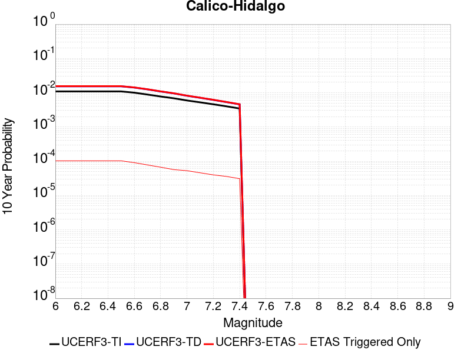 |

| Magnitude | 1 wk TI Prob | 1 wk TD Prob | 1 wk ETAS Prob | 1 wk ETAS/TD Gain | 1 wk ETAS Triggered Only | 1 mo TI Prob | 1 mo TD Prob | 1 mo ETAS Prob | 1 mo ETAS/TD Gain | 1 mo ETAS Triggered Only | 1 yr TI Prob | 1 yr TD Prob | 1 yr ETAS Prob | 1 yr ETAS/TD Gain | 1 yr ETAS Triggered Only | 10 yr TI Prob | 10 yr TD Prob | 10 yr ETAS Prob | 10 yr ETAS/TD Gain | 10 yr ETAS Triggered Only |
|-----|-----|-----|-----|-----|-----|-----|-----|-----|-----|-----|-----|-----|-----|-----|-----|-----|-----|-----|-----|-----|
| 6.0 | 2.0989894E-5 | 2.9615694E-5 | 5.9804024E-5 | 2.0193357 | 3.0189227E-5 | 8.995359E-5 | 1.269188E-4 | 1.721969E-4 | 1.3567485 | 4.528384E-5 | 0.0010946346 | 0.0015442439 | 0.0016165861 | 1.0468464 | 7.2454146E-5 | 0.010892583 | 0.015345532 | 0.015437683 | 1.006005 | 9.35866E-5 |
| 6.1 | 2.0989894E-5 | 2.9615694E-5 | 5.9804024E-5 | 2.0193357 | 3.0189227E-5 | 8.995359E-5 | 1.269188E-4 | 1.721969E-4 | 1.3567485 | 4.528384E-5 | 0.0010946346 | 0.0015442439 | 0.0016165861 | 1.0468464 | 7.2454146E-5 | 0.010892583 | 0.015345532 | 0.015437683 | 1.006005 | 9.35866E-5 |
| 6.2 | 2.0989894E-5 | 2.9615694E-5 | 5.9804024E-5 | 2.0193357 | 3.0189227E-5 | 8.995359E-5 | 1.269188E-4 | 1.721969E-4 | 1.3567485 | 4.528384E-5 | 0.0010946346 | 0.0015442439 | 0.0016165861 | 1.0468464 | 7.2454146E-5 | 0.010892583 | 0.015345532 | 0.015437683 | 1.006005 | 9.35866E-5 |
| 6.3 | 2.0989894E-5 | 2.9615694E-5 | 5.9804024E-5 | 2.0193357 | 3.0189227E-5 | 8.995359E-5 | 1.269188E-4 | 1.721969E-4 | 1.3567485 | 4.528384E-5 | 0.0010946346 | 0.0015442439 | 0.0016165861 | 1.0468464 | 7.2454146E-5 | 0.010892583 | 0.015345532 | 0.015437683 | 1.006005 | 9.35866E-5 |
| 6.4 | 2.0989894E-5 | 2.9615694E-5 | 5.9804024E-5 | 2.0193357 | 3.0189227E-5 | 8.995359E-5 | 1.269188E-4 | 1.721969E-4 | 1.3567485 | 4.528384E-5 | 0.0010946346 | 0.0015442439 | 0.0016165861 | 1.0468464 | 7.2454146E-5 | 0.010892583 | 0.015345532 | 0.015437683 | 1.006005 | 9.35866E-5 |
| 6.5 | 2.0989894E-5 | 2.9615694E-5 | 5.9804024E-5 | 2.0193357 | 3.0189227E-5 | 8.995359E-5 | 1.269188E-4 | 1.721969E-4 | 1.3567485 | 4.528384E-5 | 0.0010946346 | 0.0015442439 | 0.0016165861 | 1.0468464 | 7.2454146E-5 | 0.010892583 | 0.015345532 | 0.015437683 | 1.006005 | 9.35866E-5 |
| 6.6 | 1.929251E-5 | 2.7260403E-5 | 5.4429966E-5 | 1.9966677 | 2.7170303E-5 | 8.2679566E-5 | 1.1682564E-4 | 1.5606705E-4 | 1.3358972 | 3.9245995E-5 | 0.0010061589 | 0.0014215263 | 0.0014848337 | 1.0445347 | 6.3397376E-5 | 0.0100161545 | 0.0141346 | 0.0142119825 | 1.0054747 | 7.849199E-5 |
| 6.7 | 1.699933E-5 | 2.4101535E-5 | 4.5233486E-5 | 1.8767885 | 2.1132459E-5 | 7.2852235E-5 | 1.03288774E-4 | 1.364935E-4 | 1.3214746 | 3.3208147E-5 | 8.86615E-4 | 0.0012569166 | 0.0013111889 | 1.0431789 | 5.4340606E-5 | 0.00883086 | 0.012508152 | 0.012573738 | 1.0052434 | 6.6416294E-5 |
| 6.8 | 1.4895645E-5 | 2.0902306E-5 | 3.5996603E-5 | 1.7221355 | 1.5094613E-5 | 6.383692E-5 | 8.9578796E-5 | 1.1674666E-4 | 1.3032846 | 2.7170303E-5 | 7.769373E-4 | 0.001090176 | 0.0011323949 | 1.0387266 | 4.2264917E-5 | 0.0077422657 | 0.010858163 | 0.010905941 | 1.0044003 | 4.830276E-5 |
| 6.9 | 1.3209459E-5 | 1.8371871E-5 | 3.3466207E-5 | 1.8216003 | 1.5094613E-5 | 5.6610737E-5 | 7.8734774E-5 | 1.0590294E-4 | 1.3450593 | 2.7170303E-5 | 6.8901776E-4 | 9.5827354E-4 | 9.944659E-4 | 1.0377682 | 3.6227073E-5 | 0.0068688532 | 0.009551193 | 0.009593054 | 1.0043828 | 4.2264917E-5 |
| 7.0 | 1.1401334E-5 | 1.5655183E-5 | 3.074956E-5 | 1.9641776 | 1.5094613E-5 | 4.8861944E-5 | 6.709247E-5 | 9.426095E-5 | 1.4049408 | 2.7170303E-5 | 5.9473177E-4 | 8.166432E-4 | 8.5284066E-4 | 1.0443248 | 3.6227073E-5 | 0.0059314263 | 0.008146102 | 0.008188022 | 1.0051461 | 4.2264917E-5 |
| 7.1 | 1.0049503E-5 | 1.3644847E-5 | 2.5720374E-5 | 1.884988 | 1.207569E-5 | 4.3068587E-5 | 5.847716E-5 | 8.262713E-5 | 1.4129813 | 2.415138E-5 | 5.2423385E-4 | 7.118249E-4 | 7.4199267E-4 | 1.0423808 | 3.0189227E-5 | 0.005229989 | 0.007105075 | 0.007141045 | 1.0050626 | 3.6227073E-5 |
| 7.2 | 8.817072E-6 | 1.1833239E-5 | 1.7871012E-5 | 1.5102384 | 6.037845E-6 | 3.7786904E-5 | 5.0713446E-5 | 6.58073E-5 | 1.2976301 | 1.5094613E-5 | 4.5995842E-4 | 6.1735895E-4 | 6.384783E-4 | 1.0342093 | 2.1132459E-5 | 0.004590076 | 0.006166015 | 0.0061930176 | 1.0043793 | 2.7170303E-5 |
| 7.3 | 7.683954E-6 | 1.0189235E-5 | 1.6227019E-5 | 1.592565 | 6.037845E-6 | 3.2930817E-5 | 4.3667966E-5 | 5.876192E-5 | 1.3456528 | 1.5094613E-5 | 4.008589E-4 | 5.316249E-4 | 5.527461E-4 | 1.0397296 | 2.1132459E-5 | 0.004001366 | 0.00531305 | 0.005340076 | 1.0050867 | 2.7170303E-5 |
| 7.4 | 6.633441E-6 | 8.756893E-6 | 1.1775789E-5 | 1.3447452 | 3.0189226E-6 | 2.8428722E-5 | 3.7529542E-5 | 4.960478E-5 | 1.3217529 | 1.207569E-5 | 3.460647E-4 | 4.5692216E-4 | 4.7502742E-4 | 1.0396243 | 1.8113536E-5 | 0.0034552629 | 0.0045692218 | 0.0045932624 | 1.0052615 | 2.415138E-5 |

## Elsinore (Stepovers Combined)
*[(top)](#table-of-contents)*

| 1 Week | 1 Month | 1 Year | 10 Year |
|-----|-----|-----|-----|
|  |  |  |  |

| Magnitude | 1 wk TI Prob | 1 wk TD Prob | 1 wk ETAS Prob | 1 wk ETAS/TD Gain | 1 wk ETAS Triggered Only | 1 mo TI Prob | 1 mo TD Prob | 1 mo ETAS Prob | 1 mo ETAS/TD Gain | 1 mo ETAS Triggered Only | 1 yr TI Prob | 1 yr TD Prob | 1 yr ETAS Prob | 1 yr ETAS/TD Gain | 1 yr ETAS Triggered Only | 10 yr TI Prob | 10 yr TD Prob | 10 yr ETAS Prob | 10 yr ETAS/TD Gain | 10 yr ETAS Triggered Only |
|-----|-----|-----|-----|-----|-----|-----|-----|-----|-----|-----|-----|-----|-----|-----|-----|-----|-----|-----|-----|-----|
| 6.0 | 6.646544E-5 | 8.957985E-5 | 1.1976637E-4 | 1.3369789 | 3.0189227E-5 | 2.8482082E-4 | 3.8387964E-4 | 4.200928E-4 | 1.0943347 | 3.6227073E-5 | 0.00346218 | 0.0046677003 | 0.004724792 | 1.0122312 | 5.7359528E-5 | 0.03408735 | 0.046230808 | 0.046320066 | 1.0019307 | 9.35866E-5 |
| 6.1 | 6.646544E-5 | 8.957985E-5 | 1.1976637E-4 | 1.3369789 | 3.0189227E-5 | 2.8482082E-4 | 3.8387964E-4 | 4.200928E-4 | 1.0943347 | 3.6227073E-5 | 0.00346218 | 0.0046677003 | 0.004724792 | 1.0122312 | 5.7359528E-5 | 0.03408735 | 0.046230808 | 0.046320066 | 1.0019307 | 9.35866E-5 |
| 6.2 | 6.646544E-5 | 8.957985E-5 | 1.1976637E-4 | 1.3369789 | 3.0189227E-5 | 2.8482082E-4 | 3.8387964E-4 | 4.200928E-4 | 1.0943347 | 3.6227073E-5 | 0.00346218 | 0.0046677003 | 0.004724792 | 1.0122312 | 5.7359528E-5 | 0.03408735 | 0.046230808 | 0.046320066 | 1.0019307 | 9.35866E-5 |
| 6.3 | 6.646544E-5 | 8.957985E-5 | 1.1976637E-4 | 1.3369789 | 3.0189227E-5 | 2.8482082E-4 | 3.8387964E-4 | 4.200928E-4 | 1.0943347 | 3.6227073E-5 | 0.00346218 | 0.0046677003 | 0.004724792 | 1.0122312 | 5.7359528E-5 | 0.03408735 | 0.046230808 | 0.046320066 | 1.0019307 | 9.35866E-5 |
| 6.4 | 6.646544E-5 | 8.957985E-5 | 1.1976637E-4 | 1.3369789 | 3.0189227E-5 | 2.8482082E-4 | 3.8387964E-4 | 4.200928E-4 | 1.0943347 | 3.6227073E-5 | 0.00346218 | 0.0046677003 | 0.004724792 | 1.0122312 | 5.7359528E-5 | 0.03408735 | 0.046230808 | 0.046320066 | 1.0019307 | 9.35866E-5 |
| 6.5 | 6.646544E-5 | 8.957985E-5 | 1.1976637E-4 | 1.3369789 | 3.0189227E-5 | 2.8482082E-4 | 3.8387964E-4 | 4.200928E-4 | 1.0943347 | 3.6227073E-5 | 0.00346218 | 0.0046677003 | 0.004724792 | 1.0122312 | 5.7359528E-5 | 0.03408735 | 0.046230808 | 0.046320066 | 1.0019307 | 9.35866E-5 |
| 6.6 | 6.646544E-5 | 8.957985E-5 | 1.1976637E-4 | 1.3369789 | 3.0189227E-5 | 2.8482082E-4 | 3.8387964E-4 | 4.200928E-4 | 1.0943347 | 3.6227073E-5 | 0.00346218 | 0.0046677003 | 0.004724792 | 1.0122312 | 5.7359528E-5 | 0.03408735 | 0.046230808 | 0.046320066 | 1.0019307 | 9.35866E-5 |
| 6.7 | 6.642995E-5 | 8.952384E-5 | 1.1971037E-4 | 1.3371898 | 3.0189227E-5 | 2.8466873E-4 | 3.8363968E-4 | 4.1985285E-4 | 1.0943937 | 3.6227073E-5 | 0.0034603344 | 0.0046647936 | 0.0047218855 | 1.0122389 | 5.7359528E-5 | 0.03406946 | 0.046203177 | 0.04629244 | 1.0019319 | 9.35866E-5 |
| 6.8 | 6.636925E-5 | 8.943652E-5 | 1.19623044E-4 | 1.337519 | 3.0189227E-5 | 2.8440863E-4 | 3.8326555E-4 | 4.1947872E-4 | 1.0944859 | 3.6227073E-5 | 0.0034571777 | 0.004660258 | 0.00471735 | 1.0122509 | 5.7359528E-5 | 0.034038864 | 0.04615963 | 0.046248894 | 1.0019338 | 9.35866E-5 |
| 6.9 | 2.99202E-5 | 3.4639877E-5 | 4.9733968E-5 | 1.4357432 | 1.5094613E-5 | 1.2822312E-4 | 1.4844954E-4 | 1.6354192E-4 | 1.1016667 | 1.5094613E-5 | 0.0015599986 | 0.001806118 | 0.0018241988 | 1.0100108 | 1.8113536E-5 | 0.015490928 | 0.018018924 | 0.018045604 | 1.0014807 | 2.7170303E-5 |
| 7.0 | 2.9867753E-5 | 3.4571654E-5 | 4.9665745E-5 | 1.4366031 | 1.5094613E-5 | 1.2799838E-4 | 1.4815718E-4 | 1.6324957E-4 | 1.1018673 | 1.5094613E-5 | 0.0015572662 | 0.0018025645 | 0.0018206453 | 1.0100306 | 1.8113536E-5 | 0.0154639855 | 0.017983891 | 0.018010573 | 1.0014837 | 2.7170303E-5 |
| 7.1 | 2.2490323E-5 | 2.6387466E-5 | 3.5443994E-5 | 1.3432133 | 9.056768E-6 | 9.638354E-5 | 1.1308515E-4 | 1.221409E-4 | 1.080079 | 9.056768E-6 | 0.0011728378 | 0.0013761043 | 0.0013881633 | 1.0087632 | 1.207569E-5 | 0.011666672 | 0.013749547 | 0.013767412 | 1.0012993 | 1.8113536E-5 |
| 7.2 | 2.1634029E-5 | 2.517618E-5 | 3.423272E-5 | 1.3597265 | 9.056768E-6 | 9.271397E-5 | 1.0789436E-4 | 1.1695015E-4 | 1.083932 | 9.056768E-6 | 0.001128208 | 0.001312983 | 0.0013250428 | 1.0091851 | 1.207569E-5 | 0.011224974 | 0.013125413 | 0.013143289 | 1.001362 | 1.8113536E-5 |
| 7.3 | 1.2803008E-5 | 1.6803417E-5 | 1.6803417E-5 | 1.0 | 0.0 | 5.486888E-5 | 7.2013085E-5 | 7.2013085E-5 | 1.0 | 0.0 | 6.678239E-4 | 8.76483E-4 | 8.7949925E-4 | 1.0034413 | 3.0189226E-6 | 0.006658205 | 0.008745466 | 0.008748459 | 1.0003421 | 3.0189226E-6 |
| 7.4 | 1.2585987E-5 | 1.6510478E-5 | 1.6510478E-5 | 1.0 | 0.0 | 5.393883E-5 | 7.07577E-5 | 7.07577E-5 | 1.0 | 0.0 | 6.565074E-4 | 8.612108E-4 | 8.642271E-4 | 1.0035024 | 3.0189226E-6 | 0.0065457127 | 0.008593576 | 0.008596568 | 1.0003483 | 3.0189226E-6 |
| 7.5 | 1.1869309E-5 | 1.5627958E-5 | 1.5627958E-5 | 1.0 | 0.0 | 5.0867475E-5 | 6.697567E-5 | 6.697567E-5 | 1.0 | 0.0 | 6.191355E-4 | 8.151996E-4 | 8.18216E-4 | 1.0037003 | 3.0189226E-6 | 0.0061741336 | 0.008135691 | 0.0081386855 | 1.000368 | 3.0189226E-6 |
| 7.6 | 1.0456552E-5 | 1.3574289E-5 | 1.3574289E-5 | 1.0 | 0.0 | 4.4813027E-5 | 5.817464E-5 | 5.817464E-5 | 1.0 | 0.0 | 5.45462E-4 | 7.081186E-4 | 7.111354E-4 | 1.0042603 | 3.0189226E-6 | 0.0054412507 | 0.0070718653 | 0.007074863 | 1.0004239 | 3.0189226E-6 |
| 7.7 | 4.463199E-6 | 5.214875E-6 | 5.214875E-6 | 1.0 | 0.0 | 1.9127854E-5 | 2.2349386E-5 | 2.2349386E-5 | 1.0 | 0.0 | 2.3285674E-4 | 2.7209E-4 | 2.7510812E-4 | 1.0110923 | 3.0189226E-6 | 0.0023261288 | 0.0027239968 | 0.0027270073 | 1.0011053 | 3.0189226E-6 |
| 7.8 | 2.1601753E-7 | 2.7489222E-7 | 2.7489222E-7 | 1.0 | 0.0 | 9.257891E-7 | 1.1781094E-6 | 1.1781094E-6 | 1.0 | 0.0 | 1.1271423E-5 | 1.4343483E-5 | 1.4343483E-5 | 1.0 | 0.0 | 1.1270852E-4 | 1.435847E-4 | 1.435847E-4 | 1.0 | 0.0 |

## Simi-Santa Rosa
*[(top)](#table-of-contents)*

| 1 Week | 1 Month | 1 Year | 10 Year |
|-----|-----|-----|-----|
|  |  |  |  |

| Magnitude | 1 wk TI Prob | 1 wk TD Prob | 1 wk ETAS Prob | 1 wk ETAS/TD Gain | 1 wk ETAS Triggered Only | 1 mo TI Prob | 1 mo TD Prob | 1 mo ETAS Prob | 1 mo ETAS/TD Gain | 1 mo ETAS Triggered Only | 1 yr TI Prob | 1 yr TD Prob | 1 yr ETAS Prob | 1 yr ETAS/TD Gain | 1 yr ETAS Triggered Only | 10 yr TI Prob | 10 yr TD Prob | 10 yr ETAS Prob | 10 yr ETAS/TD Gain | 10 yr ETAS Triggered Only |
|-----|-----|-----|-----|-----|-----|-----|-----|-----|-----|-----|-----|-----|-----|-----|-----|-----|-----|-----|-----|-----|
| 6.0 | 1.765222E-5 | 1.996643E-5 | 2.6004154E-5 | 1.3023938 | 6.037845E-6 | 7.565018E-5 | 8.556876E-5 | 1.03680744E-4 | 1.2116659 | 1.8113536E-5 | 9.206518E-4 | 0.0010415068 | 0.0010957909 | 1.0521207 | 5.4340606E-5 | 0.009168469 | 0.010386396 | 0.010473035 | 1.0083417 | 8.754875E-5 |
| 6.1 | 1.765222E-5 | 1.996643E-5 | 2.6004154E-5 | 1.3023938 | 6.037845E-6 | 7.565018E-5 | 8.556876E-5 | 1.03680744E-4 | 1.2116659 | 1.8113536E-5 | 9.206518E-4 | 0.0010415068 | 0.0010957909 | 1.0521207 | 5.4340606E-5 | 0.009168469 | 0.010386396 | 0.010473035 | 1.0083417 | 8.754875E-5 |
| 6.2 | 1.765222E-5 | 1.996643E-5 | 2.6004154E-5 | 1.3023938 | 6.037845E-6 | 7.565018E-5 | 8.556876E-5 | 1.03680744E-4 | 1.2116659 | 1.8113536E-5 | 9.206518E-4 | 0.0010415068 | 0.0010957909 | 1.0521207 | 5.4340606E-5 | 0.009168469 | 0.010386396 | 0.010473035 | 1.0083417 | 8.754875E-5 |
| 6.3 | 1.765222E-5 | 1.996643E-5 | 2.6004154E-5 | 1.3023938 | 6.037845E-6 | 7.565018E-5 | 8.556876E-5 | 1.03680744E-4 | 1.2116659 | 1.8113536E-5 | 9.206518E-4 | 0.0010415068 | 0.0010957909 | 1.0521207 | 5.4340606E-5 | 0.009168469 | 0.010386396 | 0.010473035 | 1.0083417 | 8.754875E-5 |
| 6.4 | 1.765222E-5 | 1.996643E-5 | 2.6004154E-5 | 1.3023938 | 6.037845E-6 | 7.565018E-5 | 8.556876E-5 | 1.03680744E-4 | 1.2116659 | 1.8113536E-5 | 9.206518E-4 | 0.0010415068 | 0.0010957909 | 1.0521207 | 5.4340606E-5 | 0.009168469 | 0.010386396 | 0.010473035 | 1.0083417 | 8.754875E-5 |
| 6.5 | 1.765222E-5 | 1.996643E-5 | 2.6004154E-5 | 1.3023938 | 6.037845E-6 | 7.565018E-5 | 8.556876E-5 | 1.03680744E-4 | 1.2116659 | 1.8113536E-5 | 9.206518E-4 | 0.0010415068 | 0.0010957909 | 1.0521207 | 5.4340606E-5 | 0.009168469 | 0.010386396 | 0.010473035 | 1.0083417 | 8.754875E-5 |
| 6.6 | 1.4207836E-5 | 1.605233E-5 | 1.9071203E-5 | 1.1880646 | 3.0189226E-6 | 6.0889306E-5 | 6.8795016E-5 | 8.0869875E-5 | 1.1755193 | 1.207569E-5 | 7.4107514E-4 | 8.374578E-4 | 8.7667094E-4 | 1.046824 | 3.9245995E-5 | 0.0073860865 | 0.0083626695 | 0.008431524 | 1.0082335 | 6.943522E-5 |
| 6.7 | 1.1077219E-5 | 1.2498523E-5 | 1.2498523E-5 | 1.0 | 0.0 | 4.747293E-5 | 5.3565098E-5 | 5.960262E-5 | 1.1127137 | 6.037845E-6 | 5.7782966E-4 | 6.521551E-4 | 6.823246E-4 | 1.0462613 | 3.0189227E-5 | 0.0057632946 | 0.0065215505 | 0.0065785362 | 1.008738 | 5.7359528E-5 |
| 6.8 | 1.1077219E-5 | 1.2498523E-5 | 1.2498523E-5 | 1.0 | 0.0 | 4.747293E-5 | 5.3565098E-5 | 5.960262E-5 | 1.1127137 | 6.037845E-6 | 5.7782966E-4 | 6.521551E-4 | 6.823246E-4 | 1.0462613 | 3.0189227E-5 | 0.0057632946 | 0.0065215505 | 0.0065785362 | 1.008738 | 5.7359528E-5 |

## Whittier alt 1
*[(top)](#table-of-contents)*

| 1 Week | 1 Month | 1 Year | 10 Year |
|-----|-----|-----|-----|
|  |  |  |  |

| Magnitude | 1 wk TI Prob | 1 wk TD Prob | 1 wk ETAS Prob | 1 wk ETAS/TD Gain | 1 wk ETAS Triggered Only | 1 mo TI Prob | 1 mo TD Prob | 1 mo ETAS Prob | 1 mo ETAS/TD Gain | 1 mo ETAS Triggered Only | 1 yr TI Prob | 1 yr TD Prob | 1 yr ETAS Prob | 1 yr ETAS/TD Gain | 1 yr ETAS Triggered Only | 10 yr TI Prob | 10 yr TD Prob | 10 yr ETAS Prob | 10 yr ETAS/TD Gain | 10 yr ETAS Triggered Only |
|-----|-----|-----|-----|-----|-----|-----|-----|-----|-----|-----|-----|-----|-----|-----|-----|-----|-----|-----|-----|-----|
| 6.0 | 1.9677844E-5 | 3.0721494E-5 | 5.18533E-5 | 1.687851 | 2.1132459E-5 | 8.4330895E-5 | 1.3166165E-4 | 1.5882838E-4 | 1.2063375 | 2.7170303E-5 | 0.001026245 | 0.0016026449 | 0.0016629266 | 1.0376139 | 6.0378454E-5 | 0.010215186 | 0.015995702 | 0.01607888 | 1.0052 | 8.4529835E-5 |
| 6.1 | 1.9677844E-5 | 3.0721494E-5 | 5.18533E-5 | 1.687851 | 2.1132459E-5 | 8.4330895E-5 | 1.3166165E-4 | 1.5882838E-4 | 1.2063375 | 2.7170303E-5 | 0.001026245 | 0.0016026449 | 0.0016629266 | 1.0376139 | 6.0378454E-5 | 0.010215186 | 0.015995702 | 0.01607888 | 1.0052 | 8.4529835E-5 |
| 6.2 | 1.9677844E-5 | 3.0721494E-5 | 5.18533E-5 | 1.687851 | 2.1132459E-5 | 8.4330895E-5 | 1.3166165E-4 | 1.5882838E-4 | 1.2063375 | 2.7170303E-5 | 0.001026245 | 0.0016026449 | 0.0016629266 | 1.0376139 | 6.0378454E-5 | 0.010215186 | 0.015995702 | 0.01607888 | 1.0052 | 8.4529835E-5 |
| 6.3 | 1.9677844E-5 | 3.0721494E-5 | 5.18533E-5 | 1.687851 | 2.1132459E-5 | 8.4330895E-5 | 1.3166165E-4 | 1.5882838E-4 | 1.2063375 | 2.7170303E-5 | 0.001026245 | 0.0016026449 | 0.0016629266 | 1.0376139 | 6.0378454E-5 | 0.010215186 | 0.015995702 | 0.01607888 | 1.0052 | 8.4529835E-5 |
| 6.4 | 1.9677844E-5 | 3.0721494E-5 | 5.18533E-5 | 1.687851 | 2.1132459E-5 | 8.4330895E-5 | 1.3166165E-4 | 1.5882838E-4 | 1.2063375 | 2.7170303E-5 | 0.001026245 | 0.0016026449 | 0.0016629266 | 1.0376139 | 6.0378454E-5 | 0.010215186 | 0.015995702 | 0.01607888 | 1.0052 | 8.4529835E-5 |
| 6.5 | 1.9677844E-5 | 3.0721494E-5 | 5.18533E-5 | 1.687851 | 2.1132459E-5 | 8.4330895E-5 | 1.3166165E-4 | 1.5882838E-4 | 1.2063375 | 2.7170303E-5 | 0.001026245 | 0.0016026449 | 0.0016629266 | 1.0376139 | 6.0378454E-5 | 0.010215186 | 0.015995702 | 0.01607888 | 1.0052 | 8.4529835E-5 |
| 6.6 | 1.9631225E-5 | 3.06427E-5 | 5.177451E-5 | 1.6896198 | 2.1132459E-5 | 8.413111E-5 | 1.3132399E-4 | 1.5849073E-4 | 1.206868 | 2.7170303E-5 | 0.0010238149 | 0.00159854 | 0.001658822 | 1.0377107 | 6.0378454E-5 | 0.010191108 | 0.015955312 | 0.016038494 | 1.0052134 | 8.4529835E-5 |
| 6.7 | 1.9536663E-5 | 3.0504027E-5 | 5.163584E-5 | 1.6927549 | 2.1132459E-5 | 8.372587E-5 | 1.3072975E-4 | 1.578965E-4 | 1.2078085 | 2.7170303E-5 | 0.0010188858 | 0.0015913156 | 0.001651598 | 1.0378821 | 6.0378454E-5 | 0.010142268 | 0.015884183 | 0.01596737 | 1.0052371 | 8.4529835E-5 |
| 6.8 | 1.9439643E-5 | 3.0352345E-5 | 5.1484163E-5 | 1.696217 | 2.1132459E-5 | 8.331009E-5 | 1.3007974E-4 | 1.5724651E-4 | 1.208847 | 2.7170303E-5 | 0.0010138283 | 0.0015834133 | 0.0016436962 | 1.0380714 | 6.0378454E-5 | 0.010092155 | 0.015806418 | 0.015889611 | 1.0052633 | 8.4529835E-5 |
| 6.9 | 1.9363486E-5 | 3.025448E-5 | 5.1386298E-5 | 1.698469 | 2.1132459E-5 | 8.298373E-5 | 1.2966036E-4 | 1.5682714E-4 | 1.2095226 | 2.7170303E-5 | 0.0010098586 | 0.0015783148 | 0.0016385979 | 1.0381947 | 6.0378454E-5 | 0.010052818 | 0.0157561 | 0.0158393 | 1.0052804 | 8.4529835E-5 |
| 7.0 | 3.152724E-6 | 4.1925437E-6 | 4.1925437E-6 | 1.0 | 0.0 | 1.3511604E-5 | 1.7967934E-5 | 1.7967934E-5 | 1.0 | 0.0 | 1.6449137E-4 | 2.1873988E-4 | 2.2175815E-4 | 1.0137984 | 3.0189226E-6 | 0.0016436966 | 0.0021877585 | 0.0021907708 | 1.0013769 | 3.0189226E-6 |
| 7.1 | 3.0699127E-6 | 4.0761943E-6 | 4.0761943E-6 | 1.0 | 0.0 | 1.3156702E-5 | 1.74693E-5 | 1.74693E-5 | 1.0 | 0.0 | 1.6017107E-4 | 2.1267022E-4 | 2.156885E-4 | 1.0141923 | 3.0189226E-6 | 0.0016005568 | 0.0021271154 | 0.002130128 | 1.0014162 | 3.0189226E-6 |
| 7.2 | 2.2585555E-6 | 2.9159935E-6 | 2.9159935E-6 | 1.0 | 0.0 | 9.679487E-6 | 1.249706E-5 | 1.249706E-5 | 1.0 | 0.0 | 1.1784139E-4 | 1.5214195E-4 | 1.5516041E-4 | 1.0198398 | 3.0189226E-6 | 0.0011777892 | 0.0015224252 | 0.0015254396 | 1.00198 | 3.0189226E-6 |
| 7.3 | 2.1766068E-6 | 2.8138447E-6 | 2.8138447E-6 | 1.0 | 0.0 | 9.3282815E-6 | 1.2059283E-5 | 1.2059283E-5 | 1.0 | 0.0 | 1.13565904E-4 | 1.4681274E-4 | 1.4983122E-4 | 1.02056 | 3.0189226E-6 | 0.0011350788 | 0.0014690856 | 0.0014721001 | 1.002052 | 3.0189226E-6 |
| 7.4 | 2.0680952E-6 | 2.676193E-6 | 2.676193E-6 | 1.0 | 0.0 | 8.863235E-6 | 1.1469352E-5 | 1.1469352E-5 | 1.0 | 0.0 | 1.0790454E-4 | 1.3963127E-4 | 1.4264978E-4 | 1.0216177 | 3.0189226E-6 | 0.0010785216 | 0.0013971858 | 0.0014002005 | 1.0021577 | 3.0189226E-6 |
| 7.5 | 1.4388213E-6 | 1.9265901E-6 | 1.9265901E-6 | 1.0 | 0.0 | 6.1663623E-6 | 8.256791E-6 | 8.256791E-6 | 1.0 | 0.0 | 7.507287E-5 | 1.0052218E-4 | 1.035408E-4 | 1.0300294 | 3.0189226E-6 | 7.504752E-4 | 0.0010053911 | 0.0010084071 | 1.0029997 | 3.0189226E-6 |
| 7.6 | 1.2179905E-6 | 1.5985206E-6 | 1.5985206E-6 | 1.0 | 0.0 | 5.219949E-6 | 6.850787E-6 | 6.850787E-6 | 1.0 | 0.0 | 6.355102E-5 | 8.3405495E-5 | 8.642417E-5 | 1.0361927 | 3.0189226E-6 | 6.353285E-4 | 8.343059E-4 | 8.373223E-4 | 1.0036155 | 3.0189226E-6 |
| 7.7 | 9.55754E-7 | 1.2252901E-6 | 1.2252901E-6 | 1.0 | 0.0 | 4.096082E-6 | 5.251235E-6 | 5.251235E-6 | 1.0 | 0.0 | 4.9868657E-5 | 6.393224E-5 | 6.695097E-5 | 1.0472176 | 3.0189226E-6 | 4.985747E-4 | 6.396533E-4 | 6.4267026E-4 | 1.0047166 | 3.0189226E-6 |
| 7.8 | 2.1601753E-7 | 2.7489222E-7 | 2.7489222E-7 | 1.0 | 0.0 | 9.257891E-7 | 1.1781094E-6 | 1.1781094E-6 | 1.0 | 0.0 | 1.1271423E-5 | 1.4343483E-5 | 1.4343483E-5 | 1.0 | 0.0 | 1.1270852E-4 | 1.435847E-4 | 1.435847E-4 | 1.0 | 0.0 |

## Santa Cruz Island
*[(top)](#table-of-contents)*

| 1 Week | 1 Month | 1 Year | 10 Year |
|-----|-----|-----|-----|
| 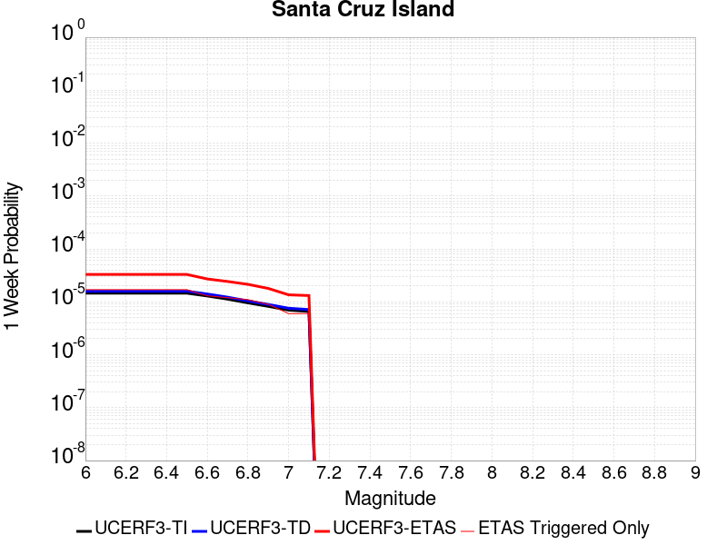 |  |  |  |

| Magnitude | 1 wk TI Prob | 1 wk TD Prob | 1 wk ETAS Prob | 1 wk ETAS/TD Gain | 1 wk ETAS Triggered Only | 1 mo TI Prob | 1 mo TD Prob | 1 mo ETAS Prob | 1 mo ETAS/TD Gain | 1 mo ETAS Triggered Only | 1 yr TI Prob | 1 yr TD Prob | 1 yr ETAS Prob | 1 yr ETAS/TD Gain | 1 yr ETAS Triggered Only | 10 yr TI Prob | 10 yr TD Prob | 10 yr ETAS Prob | 10 yr ETAS/TD Gain | 10 yr ETAS Triggered Only |
|-----|-----|-----|-----|-----|-----|-----|-----|-----|-----|-----|-----|-----|-----|-----|-----|-----|-----|-----|-----|-----|
| 6.0 | 1.4571279E-5 | 1.590773E-5 | 2.7983227E-5 | 1.7590963 | 1.207569E-5 | 6.2446845E-5 | 6.817458E-5 | 8.93056E-5 | 1.3099545 | 2.1132459E-5 | 7.600251E-4 | 8.2977675E-4 | 8.689902E-4 | 1.0472578 | 3.9245995E-5 | 0.00757431 | 0.008273421 | 0.008354258 | 1.0097706 | 8.151091E-5 |
| 6.1 | 1.4571279E-5 | 1.590773E-5 | 2.7983227E-5 | 1.7590963 | 1.207569E-5 | 6.2446845E-5 | 6.817458E-5 | 8.93056E-5 | 1.3099545 | 2.1132459E-5 | 7.600251E-4 | 8.2977675E-4 | 8.689902E-4 | 1.0472578 | 3.9245995E-5 | 0.00757431 | 0.008273421 | 0.008354258 | 1.0097706 | 8.151091E-5 |
| 6.2 | 1.4571279E-5 | 1.590773E-5 | 2.7983227E-5 | 1.7590963 | 1.207569E-5 | 6.2446845E-5 | 6.817458E-5 | 8.93056E-5 | 1.3099545 | 2.1132459E-5 | 7.600251E-4 | 8.2977675E-4 | 8.689902E-4 | 1.0472578 | 3.9245995E-5 | 0.00757431 | 0.008273421 | 0.008354258 | 1.0097706 | 8.151091E-5 |
| 6.3 | 1.4571279E-5 | 1.590773E-5 | 2.7983227E-5 | 1.7590963 | 1.207569E-5 | 6.2446845E-5 | 6.817458E-5 | 8.93056E-5 | 1.3099545 | 2.1132459E-5 | 7.600251E-4 | 8.2977675E-4 | 8.689902E-4 | 1.0472578 | 3.9245995E-5 | 0.00757431 | 0.008273421 | 0.008354258 | 1.0097706 | 8.151091E-5 |
| 6.4 | 1.4571279E-5 | 1.590773E-5 | 2.7983227E-5 | 1.7590963 | 1.207569E-5 | 6.2446845E-5 | 6.817458E-5 | 8.93056E-5 | 1.3099545 | 2.1132459E-5 | 7.600251E-4 | 8.2977675E-4 | 8.689902E-4 | 1.0472578 | 3.9245995E-5 | 0.00757431 | 0.008273421 | 0.008354258 | 1.0097706 | 8.151091E-5 |
| 6.5 | 1.4571279E-5 | 1.590773E-5 | 2.7983227E-5 | 1.7590963 | 1.207569E-5 | 6.2446845E-5 | 6.817458E-5 | 8.93056E-5 | 1.3099545 | 2.1132459E-5 | 7.600251E-4 | 8.2977675E-4 | 8.689902E-4 | 1.0472578 | 3.9245995E-5 | 0.00757431 | 0.008273421 | 0.008354258 | 1.0097706 | 8.151091E-5 |
| 6.6 | 1.2903651E-5 | 1.4078563E-5 | 2.6154083E-5 | 1.857724 | 1.207569E-5 | 5.530019E-5 | 6.033568E-5 | 8.146686E-5 | 1.350227 | 2.1132459E-5 | 6.730718E-4 | 7.344058E-4 | 7.675896E-4 | 1.0451845 | 3.3208147E-5 | 0.006710368 | 0.0073263342 | 0.007398258 | 1.0098171 | 7.2454146E-5 |
| 6.7 | 1.1244336E-5 | 1.2259967E-5 | 2.4335508E-5 | 1.9849572 | 1.207569E-5 | 4.8189122E-5 | 5.2542026E-5 | 7.367337E-5 | 1.40218 | 2.1132459E-5 | 5.8654463E-4 | 6.395773E-4 | 6.727642E-4 | 1.0518888 | 3.3208147E-5 | 0.0058499887 | 0.0063838377 | 0.00644683 | 1.0098675 | 6.3397376E-5 |
| 6.8 | 9.568355E-6 | 1.0419911E-5 | 1.9476583E-5 | 1.86917 | 9.056768E-6 | 4.100659E-5 | 4.465636E-5 | 5.9750302E-5 | 1.338002 | 1.5094613E-5 | 4.991409E-4 | 5.4362084E-4 | 5.647418E-4 | 1.0388523 | 2.1132459E-5 | 0.0049802125 | 0.0054293126 | 0.0054683457 | 1.0071893 | 3.9245995E-5 |
| 6.9 | 8.213362E-6 | 8.934158E-6 | 1.7990846E-5 | 2.0137146 | 9.056768E-6 | 3.5199646E-5 | 3.8289054E-5 | 5.338309E-5 | 1.3942128 | 1.5094613E-5 | 4.2847142E-4 | 4.6613417E-4 | 4.8725677E-4 | 1.0453144 | 2.1132459E-5 | 0.0042764624 | 0.0046579046 | 0.004696968 | 1.0083864 | 3.9245995E-5 |
| 7.0 | 6.972259E-6 | 7.5758644E-6 | 1.3613663E-5 | 1.7969784 | 6.037845E-6 | 2.9880768E-5 | 3.2467946E-5 | 3.8505597E-5 | 1.1859572 | 6.037845E-6 | 3.637376E-4 | 3.9528962E-4 | 4.0736055E-4 | 1.0305369 | 1.207569E-5 | 0.0036314281 | 0.003952149 | 0.003982219 | 1.0076085 | 3.0189227E-5 |
| 7.1 | 6.5867994E-6 | 7.155847E-6 | 1.3193649E-5 | 1.8437579 | 6.037845E-6 | 2.8228835E-5 | 3.0667914E-5 | 3.6705576E-5 | 1.1968722 | 6.037845E-6 | 3.4363187E-4 | 3.7338186E-4 | 3.8545305E-4 | 1.0323293 | 1.207569E-5 | 0.0034310098 | 0.0037338187 | 0.0037638952 | 1.0080552 | 3.0189227E-5 |

## Elsinore (Glen Ivy) rev
*[(top)](#table-of-contents)*

| 1 Week | 1 Month | 1 Year | 10 Year |
|-----|-----|-----|-----|
|  |  |  |  |

| Magnitude | 1 wk TI Prob | 1 wk TD Prob | 1 wk ETAS Prob | 1 wk ETAS/TD Gain | 1 wk ETAS Triggered Only | 1 mo TI Prob | 1 mo TD Prob | 1 mo ETAS Prob | 1 mo ETAS/TD Gain | 1 mo ETAS Triggered Only | 1 yr TI Prob | 1 yr TD Prob | 1 yr ETAS Prob | 1 yr ETAS/TD Gain | 1 yr ETAS Triggered Only | 10 yr TI Prob | 10 yr TD Prob | 10 yr ETAS Prob | 10 yr ETAS/TD Gain | 10 yr ETAS Triggered Only |
|-----|-----|-----|-----|-----|-----|-----|-----|-----|-----|-----|-----|-----|-----|-----|-----|-----|-----|-----|-----|-----|
| 6.0 | 5.3687647E-5 | 7.371829E-5 | 9.7867895E-5 | 1.3275931 | 2.415138E-5 | 2.3006962E-4 | 3.1591902E-4 | 3.460987E-4 | 1.0955298 | 3.0189227E-5 | 0.0027974995 | 0.0038433792 | 0.0038945037 | 1.013302 | 5.1321684E-5 | 0.02762544 | 0.03826734 | 0.038348634 | 1.0021244 | 8.4529835E-5 |
| 6.1 | 5.3687647E-5 | 7.371829E-5 | 9.7867895E-5 | 1.3275931 | 2.415138E-5 | 2.3006962E-4 | 3.1591902E-4 | 3.460987E-4 | 1.0955298 | 3.0189227E-5 | 0.0027974995 | 0.0038433792 | 0.0038945037 | 1.013302 | 5.1321684E-5 | 0.02762544 | 0.03826734 | 0.038348634 | 1.0021244 | 8.4529835E-5 |
| 6.2 | 5.3687647E-5 | 7.371829E-5 | 9.7867895E-5 | 1.3275931 | 2.415138E-5 | 2.3006962E-4 | 3.1591902E-4 | 3.460987E-4 | 1.0955298 | 3.0189227E-5 | 0.0027974995 | 0.0038433792 | 0.0038945037 | 1.013302 | 5.1321684E-5 | 0.02762544 | 0.03826734 | 0.038348634 | 1.0021244 | 8.4529835E-5 |
| 6.3 | 5.3687647E-5 | 7.371829E-5 | 9.7867895E-5 | 1.3275931 | 2.415138E-5 | 2.3006962E-4 | 3.1591902E-4 | 3.460987E-4 | 1.0955298 | 3.0189227E-5 | 0.0027974995 | 0.0038433792 | 0.0038945037 | 1.013302 | 5.1321684E-5 | 0.02762544 | 0.03826734 | 0.038348634 | 1.0021244 | 8.4529835E-5 |
| 6.4 | 5.3687647E-5 | 7.371829E-5 | 9.7867895E-5 | 1.3275931 | 2.415138E-5 | 2.3006962E-4 | 3.1591902E-4 | 3.460987E-4 | 1.0955298 | 3.0189227E-5 | 0.0027974995 | 0.0038433792 | 0.0038945037 | 1.013302 | 5.1321684E-5 | 0.02762544 | 0.03826734 | 0.038348634 | 1.0021244 | 8.4529835E-5 |
| 6.5 | 5.3687647E-5 | 7.371829E-5 | 9.7867895E-5 | 1.3275931 | 2.415138E-5 | 2.3006962E-4 | 3.1591902E-4 | 3.460987E-4 | 1.0955298 | 3.0189227E-5 | 0.0027974995 | 0.0038433792 | 0.0038945037 | 1.013302 | 5.1321684E-5 | 0.02762544 | 0.03826734 | 0.038348634 | 1.0021244 | 8.4529835E-5 |
| 6.6 | 5.366434E-5 | 7.368723E-5 | 9.7836826E-5 | 1.3277311 | 2.415138E-5 | 2.2996974E-4 | 3.157859E-4 | 3.4596559E-4 | 1.0955701 | 3.0189227E-5 | 0.0027962867 | 0.0038417643 | 0.0038928888 | 1.0133076 | 5.1321684E-5 | 0.027613612 | 0.03825175 | 0.038333047 | 1.0021253 | 8.4529835E-5 |
| 6.7 | 5.3605272E-5 | 7.360545E-5 | 9.775505E-5 | 1.3280953 | 2.415138E-5 | 2.2971665E-4 | 3.1543552E-4 | 3.456152E-4 | 1.0956763 | 3.0189227E-5 | 0.0027932131 | 0.0038375156 | 0.0038886403 | 1.0133224 | 5.1321684E-5 | 0.027583642 | 0.038210876 | 0.038292177 | 1.0021276 | 8.4529835E-5 |
| 6.8 | 5.3532647E-5 | 7.3514246E-5 | 9.7663855E-5 | 1.3285024 | 2.415138E-5 | 2.2940546E-4 | 3.1504474E-4 | 3.4522446E-4 | 1.095795 | 3.0189227E-5 | 0.002789434 | 0.0038327747 | 0.0038838997 | 1.0133389 | 5.1321684E-5 | 0.02754679 | 0.038164973 | 0.038246278 | 1.0021303 | 8.4529835E-5 |
| 6.9 | 1.7045348E-5 | 1.8678082E-5 | 2.773468E-5 | 1.4848784 | 9.056768E-6 | 7.304944E-5 | 8.004709E-5 | 8.910313E-5 | 1.1131339 | 9.056768E-6 | 8.8901405E-4 | 9.74247E-4 | 9.863109E-4 | 1.0123829 | 1.207569E-5 | 0.008854659 | 0.009768393 | 0.009786329 | 1.0018362 | 1.8113536E-5 |
| 7.0 | 1.6940774E-5 | 1.8528288E-5 | 2.7584889E-5 | 1.4887985 | 9.056768E-6 | 7.2601295E-5 | 7.940515E-5 | 8.84612E-5 | 1.1140486 | 9.056768E-6 | 8.835623E-4 | 9.6643844E-4 | 9.785024E-4 | 1.012483 | 1.207569E-5 | 0.0088005755 | 0.00969088 | 0.009708818 | 1.001851 | 1.8113536E-5 |
| 7.1 | 1.6789645E-5 | 1.8323519E-5 | 2.7380122E-5 | 1.494261 | 9.056768E-6 | 7.195364E-5 | 7.852762E-5 | 8.758368E-5 | 1.1153232 | 9.056768E-6 | 8.7568344E-4 | 9.55764E-4 | 9.678281E-4 | 1.0126225 | 1.207569E-5 | 0.008722408 | 0.009584869 | 0.009602809 | 1.0018717 | 1.8113536E-5 |
| 7.2 | 1.5933345E-5 | 1.7110096E-5 | 2.616671E-5 | 1.5293139 | 9.056768E-6 | 6.828398E-5 | 7.332754E-5 | 8.238364E-5 | 1.1235021 | 9.056768E-6 | 8.310403E-4 | 8.925052E-4 | 9.045701E-4 | 1.013518 | 1.207569E-5 | 0.008279393 | 0.0089570135 | 0.008974965 | 1.0020041 | 1.8113536E-5 |
| 7.3 | 7.1186646E-6 | 8.762552E-6 | 8.762552E-6 | 1.0 | 0.0 | 3.0508205E-5 | 3.7553385E-5 | 3.7553385E-5 | 1.0 | 0.0 | 3.713741E-4 | 4.5714018E-4 | 4.6015772E-4 | 1.0066009 | 3.0189226E-6 | 0.0037075407 | 0.004571716 | 0.004574721 | 1.0006573 | 3.0189226E-6 |
| 7.4 | 6.937813E-6 | 8.529489E-6 | 8.529489E-6 | 1.0 | 0.0 | 2.9733144E-5 | 3.6554575E-5 | 3.6554575E-5 | 1.0 | 0.0 | 3.619409E-4 | 4.4498467E-4 | 4.4800228E-4 | 1.0067813 | 3.0189226E-6 | 0.0036135197 | 0.0044503105 | 0.004453316 | 1.0006753 | 3.0189226E-6 |
| 7.5 | 6.22113E-6 | 7.646963E-6 | 7.646963E-6 | 1.0 | 0.0 | 2.6661715E-5 | 3.277242E-5 | 3.277242E-5 | 1.0 | 0.0 | 3.2455803E-4 | 3.989543E-4 | 4.01972E-4 | 1.0075641 | 3.0189226E-6 | 0.003240844 | 0.0039905123 | 0.003993519 | 1.0007535 | 3.0189226E-6 |
| 7.6 | 5.9726967E-6 | 7.281061E-6 | 7.281061E-6 | 1.0 | 0.0 | 2.559702E-5 | 3.1204305E-5 | 3.1204305E-5 | 1.0 | 0.0 | 3.1159917E-4 | 3.798693E-4 | 3.8288708E-4 | 1.0079442 | 3.0189226E-6 | 0.003111626 | 0.0038002636 | 0.003803271 | 1.0007914 | 3.0189226E-6 |
| 7.7 | 4.463199E-6 | 5.214875E-6 | 5.214875E-6 | 1.0 | 0.0 | 1.9127854E-5 | 2.2349386E-5 | 2.2349386E-5 | 1.0 | 0.0 | 2.3285674E-4 | 2.7209E-4 | 2.7510812E-4 | 1.0110923 | 3.0189226E-6 | 0.0023261288 | 0.0027239968 | 0.0027270073 | 1.0011053 | 3.0189226E-6 |
| 7.8 | 2.1601753E-7 | 2.7489222E-7 | 2.7489222E-7 | 1.0 | 0.0 | 9.257891E-7 | 1.1781094E-6 | 1.1781094E-6 | 1.0 | 0.0 | 1.1271423E-5 | 1.4343483E-5 | 1.4343483E-5 | 1.0 | 0.0 | 1.1270852E-4 | 1.435847E-4 | 1.435847E-4 | 1.0 | 0.0 |

## Los Alamos 2011 CFM
*[(top)](#table-of-contents)*

| 1 Week | 1 Month | 1 Year | 10 Year |
|-----|-----|-----|-----|
|  |  |  |  |

| Magnitude | 1 wk TI Prob | 1 wk TD Prob | 1 wk ETAS Prob | 1 wk ETAS/TD Gain | 1 wk ETAS Triggered Only | 1 mo TI Prob | 1 mo TD Prob | 1 mo ETAS Prob | 1 mo ETAS/TD Gain | 1 mo ETAS Triggered Only | 1 yr TI Prob | 1 yr TD Prob | 1 yr ETAS Prob | 1 yr ETAS/TD Gain | 1 yr ETAS Triggered Only | 10 yr TI Prob | 10 yr TD Prob | 10 yr ETAS Prob | 10 yr ETAS/TD Gain | 10 yr ETAS Triggered Only |
|-----|-----|-----|-----|-----|-----|-----|-----|-----|-----|-----|-----|-----|-----|-----|-----|-----|-----|-----|-----|-----|
| 6.0 | 1.3678262E-5 | 1.5031193E-5 | 3.918221E-5 | 2.6067266 | 2.415138E-5 | 5.8619804E-5 | 6.441852E-5 | 9.46058E-5 | 1.4686118 | 3.0189227E-5 | 7.134624E-4 | 7.841395E-4 | 8.384375E-4 | 1.0692453 | 5.4340606E-5 | 0.0071117613 | 0.007826112 | 0.0079069855 | 1.0103338 | 8.151091E-5 |
| 6.1 | 1.3678262E-5 | 1.5031193E-5 | 3.918221E-5 | 2.6067266 | 2.415138E-5 | 5.8619804E-5 | 6.441852E-5 | 9.46058E-5 | 1.4686118 | 3.0189227E-5 | 7.134624E-4 | 7.841395E-4 | 8.384375E-4 | 1.0692453 | 5.4340606E-5 | 0.0071117613 | 0.007826112 | 0.0079069855 | 1.0103338 | 8.151091E-5 |
| 6.2 | 1.3678262E-5 | 1.5031193E-5 | 3.918221E-5 | 2.6067266 | 2.415138E-5 | 5.8619804E-5 | 6.441852E-5 | 9.46058E-5 | 1.4686118 | 3.0189227E-5 | 7.134624E-4 | 7.841395E-4 | 8.384375E-4 | 1.0692453 | 5.4340606E-5 | 0.0071117613 | 0.007826112 | 0.0079069855 | 1.0103338 | 8.151091E-5 |
| 6.3 | 1.3678262E-5 | 1.5031193E-5 | 3.918221E-5 | 2.6067266 | 2.415138E-5 | 5.8619804E-5 | 6.441852E-5 | 9.46058E-5 | 1.4686118 | 3.0189227E-5 | 7.134624E-4 | 7.841395E-4 | 8.384375E-4 | 1.0692453 | 5.4340606E-5 | 0.0071117613 | 0.007826112 | 0.0079069855 | 1.0103338 | 8.151091E-5 |
| 6.4 | 1.3678262E-5 | 1.5031193E-5 | 3.918221E-5 | 2.6067266 | 2.415138E-5 | 5.8619804E-5 | 6.441852E-5 | 9.46058E-5 | 1.4686118 | 3.0189227E-5 | 7.134624E-4 | 7.841395E-4 | 8.384375E-4 | 1.0692453 | 5.4340606E-5 | 0.0071117613 | 0.007826112 | 0.0079069855 | 1.0103338 | 8.151091E-5 |
| 6.5 | 1.3678262E-5 | 1.5031193E-5 | 3.918221E-5 | 2.6067266 | 2.415138E-5 | 5.8619804E-5 | 6.441852E-5 | 9.46058E-5 | 1.4686118 | 3.0189227E-5 | 7.134624E-4 | 7.841395E-4 | 8.384375E-4 | 1.0692453 | 5.4340606E-5 | 0.0071117613 | 0.007826112 | 0.0079069855 | 1.0103338 | 8.151091E-5 |
| 6.6 | 1.3678262E-5 | 1.5031193E-5 | 3.918221E-5 | 2.6067266 | 2.415138E-5 | 5.8619804E-5 | 6.441852E-5 | 9.46058E-5 | 1.4686118 | 3.0189227E-5 | 7.134624E-4 | 7.841395E-4 | 8.384375E-4 | 1.0692453 | 5.4340606E-5 | 0.0071117613 | 0.007826112 | 0.0079069855 | 1.0103338 | 8.151091E-5 |
| 6.7 | 8.282411E-6 | 9.085969E-6 | 2.4180445E-5 | 2.661295 | 1.5094613E-5 | 3.5495563E-5 | 3.893987E-5 | 5.70527E-5 | 1.4651487 | 1.8113536E-5 | 4.3207276E-4 | 4.740929E-4 | 5.133203E-4 | 1.082742 | 3.9245995E-5 | 0.0043123364 | 0.004740929 | 0.004795012 | 1.0114077 | 5.4340606E-5 |
| 6.8 | 8.282411E-6 | 9.085969E-6 | 2.4180445E-5 | 2.661295 | 1.5094613E-5 | 3.5495563E-5 | 3.893987E-5 | 5.70527E-5 | 1.4651487 | 1.8113536E-5 | 4.3207276E-4 | 4.740929E-4 | 5.133203E-4 | 1.082742 | 3.9245995E-5 | 0.0043123364 | 0.004740929 | 0.004795012 | 1.0114077 | 5.4340606E-5 |

## San Jose
*[(top)](#table-of-contents)*

| 1 Week | 1 Month | 1 Year | 10 Year |
|-----|-----|-----|-----|
|  |  |  |  |

| Magnitude | 1 wk TI Prob | 1 wk TD Prob | 1 wk ETAS Prob | 1 wk ETAS/TD Gain | 1 wk ETAS Triggered Only | 1 mo TI Prob | 1 mo TD Prob | 1 mo ETAS Prob | 1 mo ETAS/TD Gain | 1 mo ETAS Triggered Only | 1 yr TI Prob | 1 yr TD Prob | 1 yr ETAS Prob | 1 yr ETAS/TD Gain | 1 yr ETAS Triggered Only | 10 yr TI Prob | 10 yr TD Prob | 10 yr ETAS Prob | 10 yr ETAS/TD Gain | 10 yr ETAS Triggered Only |
|-----|-----|-----|-----|-----|-----|-----|-----|-----|-----|-----|-----|-----|-----|-----|-----|-----|-----|-----|-----|-----|
| 6.0 | 9.706857E-6 | 1.0473486E-5 | 2.556794E-5 | 2.4412065 | 1.5094613E-5 | 4.160015E-5 | 4.488637E-5 | 6.299909E-5 | 1.4035239 | 1.8113536E-5 | 5.063641E-4 | 5.4649153E-4 | 5.947679E-4 | 1.0883387 | 4.830276E-5 | 0.0050521186 | 0.0054649157 | 0.0055429786 | 1.0142844 | 7.849199E-5 |
| 6.1 | 9.706857E-6 | 1.0473486E-5 | 2.556794E-5 | 2.4412065 | 1.5094613E-5 | 4.160015E-5 | 4.488637E-5 | 6.299909E-5 | 1.4035239 | 1.8113536E-5 | 5.063641E-4 | 5.4649153E-4 | 5.947679E-4 | 1.0883387 | 4.830276E-5 | 0.0050521186 | 0.0054649157 | 0.0055429786 | 1.0142844 | 7.849199E-5 |
| 6.2 | 9.706857E-6 | 1.0473486E-5 | 2.556794E-5 | 2.4412065 | 1.5094613E-5 | 4.160015E-5 | 4.488637E-5 | 6.299909E-5 | 1.4035239 | 1.8113536E-5 | 5.063641E-4 | 5.4649153E-4 | 5.947679E-4 | 1.0883387 | 4.830276E-5 | 0.0050521186 | 0.0054649157 | 0.0055429786 | 1.0142844 | 7.849199E-5 |
| 6.3 | 9.706857E-6 | 1.0473486E-5 | 2.556794E-5 | 2.4412065 | 1.5094613E-5 | 4.160015E-5 | 4.488637E-5 | 6.299909E-5 | 1.4035239 | 1.8113536E-5 | 5.063641E-4 | 5.4649153E-4 | 5.947679E-4 | 1.0883387 | 4.830276E-5 | 0.0050521186 | 0.0054649157 | 0.0055429786 | 1.0142844 | 7.849199E-5 |
| 6.4 | 9.706857E-6 | 1.0473486E-5 | 2.556794E-5 | 2.4412065 | 1.5094613E-5 | 4.160015E-5 | 4.488637E-5 | 6.299909E-5 | 1.4035239 | 1.8113536E-5 | 5.063641E-4 | 5.4649153E-4 | 5.947679E-4 | 1.0883387 | 4.830276E-5 | 0.0050521186 | 0.0054649157 | 0.0055429786 | 1.0142844 | 7.849199E-5 |
| 6.5 | 9.706857E-6 | 1.0473486E-5 | 2.556794E-5 | 2.4412065 | 1.5094613E-5 | 4.160015E-5 | 4.488637E-5 | 6.299909E-5 | 1.4035239 | 1.8113536E-5 | 5.063641E-4 | 5.4649153E-4 | 5.947679E-4 | 1.0883387 | 4.830276E-5 | 0.0050521186 | 0.0054649157 | 0.0055429786 | 1.0142844 | 7.849199E-5 |

## Verdugo
*[(top)](#table-of-contents)*

| 1 Week | 1 Month | 1 Year | 10 Year |
|-----|-----|-----|-----|
|  |  |  |  |

| Magnitude | 1 wk TI Prob | 1 wk TD Prob | 1 wk ETAS Prob | 1 wk ETAS/TD Gain | 1 wk ETAS Triggered Only | 1 mo TI Prob | 1 mo TD Prob | 1 mo ETAS Prob | 1 mo ETAS/TD Gain | 1 mo ETAS Triggered Only | 1 yr TI Prob | 1 yr TD Prob | 1 yr ETAS Prob | 1 yr ETAS/TD Gain | 1 yr ETAS Triggered Only | 10 yr TI Prob | 10 yr TD Prob | 10 yr ETAS Prob | 10 yr ETAS/TD Gain | 10 yr ETAS Triggered Only |
|-----|-----|-----|-----|-----|-----|-----|-----|-----|-----|-----|-----|-----|-----|-----|-----|-----|-----|-----|-----|-----|
| 6.0 | 9.032242E-6 | 9.607573E-6 | 3.073983E-5 | 3.1995416 | 2.1132459E-5 | 3.8709033E-5 | 4.1174942E-5 | 7.136293E-5 | 1.733164 | 3.0189227E-5 | 4.7118057E-4 | 5.0123956E-4 | 5.555529E-4 | 1.1083581 | 5.4340606E-5 | 0.0047018277 | 0.0050059874 | 0.0050780787 | 1.0144011 | 7.2454146E-5 |
| 6.1 | 9.032242E-6 | 9.607573E-6 | 3.073983E-5 | 3.1995416 | 2.1132459E-5 | 3.8709033E-5 | 4.1174942E-5 | 7.136293E-5 | 1.733164 | 3.0189227E-5 | 4.7118057E-4 | 5.0123956E-4 | 5.555529E-4 | 1.1083581 | 5.4340606E-5 | 0.0047018277 | 0.0050059874 | 0.0050780787 | 1.0144011 | 7.2454146E-5 |
| 6.2 | 9.032242E-6 | 9.607573E-6 | 3.073983E-5 | 3.1995416 | 2.1132459E-5 | 3.8709033E-5 | 4.1174942E-5 | 7.136293E-5 | 1.733164 | 3.0189227E-5 | 4.7118057E-4 | 5.0123956E-4 | 5.555529E-4 | 1.1083581 | 5.4340606E-5 | 0.0047018277 | 0.0050059874 | 0.0050780787 | 1.0144011 | 7.2454146E-5 |
| 6.3 | 9.032242E-6 | 9.607573E-6 | 3.073983E-5 | 3.1995416 | 2.1132459E-5 | 3.8709033E-5 | 4.1174942E-5 | 7.136293E-5 | 1.733164 | 3.0189227E-5 | 4.7118057E-4 | 5.0123956E-4 | 5.555529E-4 | 1.1083581 | 5.4340606E-5 | 0.0047018277 | 0.0050059874 | 0.0050780787 | 1.0144011 | 7.2454146E-5 |
| 6.4 | 9.032242E-6 | 9.607573E-6 | 3.073983E-5 | 3.1995416 | 2.1132459E-5 | 3.8709033E-5 | 4.1174942E-5 | 7.136293E-5 | 1.733164 | 3.0189227E-5 | 4.7118057E-4 | 5.0123956E-4 | 5.555529E-4 | 1.1083581 | 5.4340606E-5 | 0.0047018277 | 0.0050059874 | 0.0050780787 | 1.0144011 | 7.2454146E-5 |
| 6.5 | 9.032242E-6 | 9.607573E-6 | 3.073983E-5 | 3.1995416 | 2.1132459E-5 | 3.8709033E-5 | 4.1174942E-5 | 7.136293E-5 | 1.733164 | 3.0189227E-5 | 4.7118057E-4 | 5.0123956E-4 | 5.555529E-4 | 1.1083581 | 5.4340606E-5 | 0.0047018277 | 0.0050059874 | 0.0050780787 | 1.0144011 | 7.2454146E-5 |
| 6.6 | 7.857296E-6 | 8.353911E-6 | 2.9486193E-5 | 3.5296276 | 2.1132459E-5 | 3.367369E-5 | 3.580226E-5 | 6.297159E-5 | 1.758872 | 2.7170303E-5 | 4.0990004E-4 | 4.3585425E-4 | 4.8413596E-4 | 1.1107749 | 4.830276E-5 | 0.0040914477 | 0.004354794 | 0.004420921 | 1.0151849 | 6.6416294E-5 |
| 6.7 | 5.667953E-6 | 6.022347E-6 | 1.8097964E-5 | 3.0051348 | 1.207569E-5 | 2.4291001E-5 | 2.5810059E-5 | 4.090428E-5 | 1.5848194 | 1.5094613E-5 | 2.957028E-4 | 3.1423746E-4 | 3.353633E-4 | 1.0672288 | 2.1132459E-5 | 0.0029530963 | 0.0031423746 | 0.0031754784 | 1.0105346 | 3.3208147E-5 |
| 6.8 | 5.667953E-6 | 6.022347E-6 | 1.8097964E-5 | 3.0051348 | 1.207569E-5 | 2.4291001E-5 | 2.5810059E-5 | 4.090428E-5 | 1.5848194 | 1.5094613E-5 | 2.957028E-4 | 3.1423746E-4 | 3.353633E-4 | 1.0672288 | 2.1132459E-5 | 0.0029530963 | 0.0031423746 | 0.0031754784 | 1.0105346 | 3.3208147E-5 |

## San Jacinto (Anza) rev
*[(top)](#table-of-contents)*

| 1 Week | 1 Month | 1 Year | 10 Year |
|-----|-----|-----|-----|
|  |  |  |  |

| Magnitude | 1 wk TI Prob | 1 wk TD Prob | 1 wk ETAS Prob | 1 wk ETAS/TD Gain | 1 wk ETAS Triggered Only | 1 mo TI Prob | 1 mo TD Prob | 1 mo ETAS Prob | 1 mo ETAS/TD Gain | 1 mo ETAS Triggered Only | 1 yr TI Prob | 1 yr TD Prob | 1 yr ETAS Prob | 1 yr ETAS/TD Gain | 1 yr ETAS Triggered Only | 10 yr TI Prob | 10 yr TD Prob | 10 yr ETAS Prob | 10 yr ETAS/TD Gain | 10 yr ETAS Triggered Only |
|-----|-----|-----|-----|-----|-----|-----|-----|-----|-----|-----|-----|-----|-----|-----|-----|-----|-----|-----|-----|-----|
| 6.0 | 7.9249476E-5 | 1.2833404E-4 | 1.3738965E-4 | 1.0705627 | 9.056768E-6 | 3.3959642E-4 | 5.4991845E-4 | 5.6198746E-4 | 1.021947 | 1.207569E-5 | 0.00412675 | 0.0066802585 | 0.0067072473 | 1.0040401 | 2.7170303E-5 | 0.04050952 | 0.067083985 | 0.06714877 | 1.0009656 | 6.943522E-5 |
| 6.1 | 7.9249476E-5 | 1.2833404E-4 | 1.3738965E-4 | 1.0705627 | 9.056768E-6 | 3.3959642E-4 | 5.4991845E-4 | 5.6198746E-4 | 1.021947 | 1.207569E-5 | 0.00412675 | 0.0066802585 | 0.0067072473 | 1.0040401 | 2.7170303E-5 | 0.04050952 | 0.067083985 | 0.06714877 | 1.0009656 | 6.943522E-5 |
| 6.2 | 7.9249476E-5 | 1.2833404E-4 | 1.3738965E-4 | 1.0705627 | 9.056768E-6 | 3.3959642E-4 | 5.4991845E-4 | 5.6198746E-4 | 1.021947 | 1.207569E-5 | 0.00412675 | 0.0066802585 | 0.0067072473 | 1.0040401 | 2.7170303E-5 | 0.04050952 | 0.067083985 | 0.06714877 | 1.0009656 | 6.943522E-5 |
| 6.3 | 7.9249476E-5 | 1.2833404E-4 | 1.3738965E-4 | 1.0705627 | 9.056768E-6 | 3.3959642E-4 | 5.4991845E-4 | 5.6198746E-4 | 1.021947 | 1.207569E-5 | 0.00412675 | 0.0066802585 | 0.0067072473 | 1.0040401 | 2.7170303E-5 | 0.04050952 | 0.067083985 | 0.06714877 | 1.0009656 | 6.943522E-5 |
| 6.4 | 7.9249476E-5 | 1.2833404E-4 | 1.3738965E-4 | 1.0705627 | 9.056768E-6 | 3.3959642E-4 | 5.4991845E-4 | 5.6198746E-4 | 1.021947 | 1.207569E-5 | 0.00412675 | 0.0066802585 | 0.0067072473 | 1.0040401 | 2.7170303E-5 | 0.04050952 | 0.067083985 | 0.06714877 | 1.0009656 | 6.943522E-5 |
| 6.5 | 7.9249476E-5 | 1.2833404E-4 | 1.3738965E-4 | 1.0705627 | 9.056768E-6 | 3.3959642E-4 | 5.4991845E-4 | 5.6198746E-4 | 1.021947 | 1.207569E-5 | 0.00412675 | 0.0066802585 | 0.0067072473 | 1.0040401 | 2.7170303E-5 | 0.04050952 | 0.067083985 | 0.06714877 | 1.0009656 | 6.943522E-5 |
| 6.6 | 7.913556E-5 | 1.2821962E-4 | 1.3727522E-4 | 1.0706258 | 9.056768E-6 | 3.3910832E-4 | 5.494282E-4 | 5.614973E-4 | 1.0219666 | 1.207569E-5 | 0.00412083 | 0.006674327 | 0.0067013158 | 1.0040437 | 2.7170303E-5 | 0.04045248 | 0.067026526 | 0.06709131 | 1.0009665 | 6.943522E-5 |
| 6.7 | 7.843403E-5 | 1.2742344E-4 | 1.3647905E-4 | 1.0710671 | 9.056768E-6 | 3.3610253E-4 | 5.460175E-4 | 5.5808655E-4 | 1.0221039 | 1.207569E-5 | 0.0040843724 | 0.0066330545 | 0.0066600447 | 1.004069 | 2.7170303E-5 | 0.04010115 | 0.0666332 | 0.066698015 | 1.0009726 | 6.943522E-5 |
| 6.8 | 7.825213E-5 | 1.2717218E-4 | 1.362278E-4 | 1.0712075 | 9.056768E-6 | 3.3532316E-4 | 5.449411E-4 | 5.5701024E-4 | 1.0221475 | 1.207569E-5 | 0.004074919 | 0.00662003 | 0.00664702 | 1.0040771 | 2.7170303E-5 | 0.04001003 | 0.06650948 | 0.0665743 | 1.0009745 | 6.943522E-5 |
| 6.9 | 7.788025E-5 | 1.2661066E-4 | 1.3566627E-4 | 1.0715234 | 9.056768E-6 | 3.3372978E-4 | 5.4253556E-4 | 5.546047E-4 | 1.0222458 | 1.207569E-5 | 0.004055592 | 0.0065909196 | 0.0066179107 | 1.0040952 | 2.7170303E-5 | 0.03982372 | 0.06623408 | 0.06629892 | 1.000979 | 6.943522E-5 |
| 7.0 | 7.723858E-5 | 1.2564783E-4 | 1.3470346E-4 | 1.0720716 | 9.056768E-6 | 3.309805E-4 | 5.3841085E-4 | 5.5048004E-4 | 1.0224164 | 1.207569E-5 | 0.0040222434 | 0.006541004 | 0.0065679965 | 1.0041267 | 2.7170303E-5 | 0.03950216 | 0.065760486 | 0.06582535 | 1.0009865 | 6.943522E-5 |
| 7.1 | 7.661684E-5 | 1.246636E-4 | 1.3371924E-4 | 1.0726407 | 9.056768E-6 | 3.2831656E-4 | 5.3419446E-4 | 5.462637E-4 | 1.0225934 | 1.207569E-5 | 0.0039899293 | 0.0064899763 | 0.0065169707 | 1.0041593 | 2.7170303E-5 | 0.039190482 | 0.06527789 | 0.065339975 | 1.000951 | 6.6416294E-5 |
| 7.2 | 7.571461E-5 | 1.2320194E-4 | 1.3225758E-4 | 1.0735025 | 9.056768E-6 | 3.2445084E-4 | 5.279328E-4 | 5.400021E-4 | 1.0228615 | 1.207569E-5 | 0.003943036 | 0.0064141913 | 0.0064411876 | 1.0042088 | 2.7170303E-5 | 0.038738023 | 0.06456287 | 0.06462217 | 1.0009185 | 6.3397376E-5 |
| 7.3 | 7.427039E-5 | 1.20714394E-4 | 1.2977007E-4 | 1.0750173 | 9.056768E-6 | 3.1826284E-4 | 5.172761E-4 | 5.293456E-4 | 1.0233327 | 1.207569E-5 | 0.0038679668 | 0.0062852004 | 0.0063122 | 1.0042957 | 2.7170303E-5 | 0.038013313 | 0.063324034 | 0.063383415 | 1.0009378 | 6.3397376E-5 |
| 7.4 | 7.3478965E-5 | 1.1931325E-4 | 1.2836893E-4 | 1.0758984 | 9.056768E-6 | 3.1487184E-4 | 5.1127357E-4 | 5.233431E-4 | 1.0236068 | 1.207569E-5 | 0.0038268273 | 0.006212538 | 0.0062395395 | 1.0043463 | 2.7170303E-5 | 0.037615944 | 0.06262941 | 0.062686004 | 1.0009037 | 6.0378454E-5 |
| 7.5 | 6.7516885E-5 | 1.08003216E-4 | 1.17059004E-4 | 1.0838474 | 9.056768E-6 | 2.8932598E-4 | 4.6281965E-4 | 4.7488976E-4 | 1.0260795 | 1.207569E-5 | 0.003516855 | 0.005625739 | 0.005649755 | 1.0042689 | 2.415138E-5 | 0.034617163 | 0.057019595 | 0.057073683 | 1.0009485 | 5.7359528E-5 |
| 7.6 | 2.8268712E-5 | 4.2655167E-5 | 4.8692757E-5 | 1.1415441 | 6.037845E-6 | 1.21146004E-4 | 1.8279799E-4 | 1.918531E-4 | 1.0495362 | 9.056768E-6 | 0.0014739545 | 0.0022238137 | 0.002241887 | 1.0081271 | 1.8113536E-5 | 0.014642165 | 0.022920644 | 0.022964891 | 1.0019304 | 4.528384E-5 |
| 7.7 | 1.673878E-5 | 2.1973781E-5 | 2.4992638E-5 | 1.1373844 | 3.0189226E-6 | 7.173566E-5 | 9.417205E-5 | 9.719069E-5 | 1.0320545 | 3.0189226E-6 | 8.730317E-4 | 0.0011463144 | 0.0011523454 | 1.0052612 | 6.037845E-6 | 0.008696098 | 0.01216197 | 0.012191793 | 1.002452 | 3.0189227E-5 |
| 7.8 | 1.5303123E-6 | 1.9707616E-6 | 1.9707616E-6 | 1.0 | 0.0 | 6.5584645E-6 | 8.446107E-6 | 8.446107E-6 | 1.0 | 0.0 | 7.984638E-5 | 1.0282895E-4 | 1.0282895E-4 | 1.0 | 0.0 | 7.98177E-4 | 0.001066982 | 0.0010699978 | 1.0028263 | 3.0189226E-6 |

## Independence rev 2011
*[(top)](#table-of-contents)*

| 1 Week | 1 Month | 1 Year | 10 Year |
|-----|-----|-----|-----|
|  |  |  |  |

| Magnitude | 1 wk TI Prob | 1 wk TD Prob | 1 wk ETAS Prob | 1 wk ETAS/TD Gain | 1 wk ETAS Triggered Only | 1 mo TI Prob | 1 mo TD Prob | 1 mo ETAS Prob | 1 mo ETAS/TD Gain | 1 mo ETAS Triggered Only | 1 yr TI Prob | 1 yr TD Prob | 1 yr ETAS Prob | 1 yr ETAS/TD Gain | 1 yr ETAS Triggered Only | 10 yr TI Prob | 10 yr TD Prob | 10 yr ETAS Prob | 10 yr ETAS/TD Gain | 10 yr ETAS Triggered Only |
|-----|-----|-----|-----|-----|-----|-----|-----|-----|-----|-----|-----|-----|-----|-----|-----|-----|-----|-----|-----|-----|
| 6.0 | 2.8756149E-6 | 2.9249488E-6 | 2.4057344E-5 | 8.224877 | 2.1132459E-5 | 1.2324005E-5 | 1.2535451E-5 | 4.5743185E-5 | 3.6491055 | 3.3208147E-5 | 1.5003444E-4 | 1.5261132E-4 | 2.0392517E-4 | 1.3362389 | 5.1321684E-5 | 0.0014993318 | 0.001525348 | 0.0015946773 | 1.0454515 | 6.943522E-5 |
| 6.1 | 2.8756149E-6 | 2.9249488E-6 | 2.4057344E-5 | 8.224877 | 2.1132459E-5 | 1.2324005E-5 | 1.2535451E-5 | 4.5743185E-5 | 3.6491055 | 3.3208147E-5 | 1.5003444E-4 | 1.5261132E-4 | 2.0392517E-4 | 1.3362389 | 5.1321684E-5 | 0.0014993318 | 0.001525348 | 0.0015946773 | 1.0454515 | 6.943522E-5 |
| 6.2 | 2.8756149E-6 | 2.9249488E-6 | 2.4057344E-5 | 8.224877 | 2.1132459E-5 | 1.2324005E-5 | 1.2535451E-5 | 4.5743185E-5 | 3.6491055 | 3.3208147E-5 | 1.5003444E-4 | 1.5261132E-4 | 2.0392517E-4 | 1.3362389 | 5.1321684E-5 | 0.0014993318 | 0.001525348 | 0.0015946773 | 1.0454515 | 6.943522E-5 |
| 6.3 | 2.8756149E-6 | 2.9249488E-6 | 2.4057344E-5 | 8.224877 | 2.1132459E-5 | 1.2324005E-5 | 1.2535451E-5 | 4.5743185E-5 | 3.6491055 | 3.3208147E-5 | 1.5003444E-4 | 1.5261132E-4 | 2.0392517E-4 | 1.3362389 | 5.1321684E-5 | 0.0014993318 | 0.001525348 | 0.0015946773 | 1.0454515 | 6.943522E-5 |
| 6.4 | 2.8756149E-6 | 2.9249488E-6 | 2.4057344E-5 | 8.224877 | 2.1132459E-5 | 1.2324005E-5 | 1.2535451E-5 | 4.5743185E-5 | 3.6491055 | 3.3208147E-5 | 1.5003444E-4 | 1.5261132E-4 | 2.0392517E-4 | 1.3362389 | 5.1321684E-5 | 0.0014993318 | 0.001525348 | 0.0015946773 | 1.0454515 | 6.943522E-5 |
| 6.5 | 2.8756149E-6 | 2.9249488E-6 | 2.4057344E-5 | 8.224877 | 2.1132459E-5 | 1.2324005E-5 | 1.2535451E-5 | 4.5743185E-5 | 3.6491055 | 3.3208147E-5 | 1.5003444E-4 | 1.5261132E-4 | 2.0392517E-4 | 1.3362389 | 5.1321684E-5 | 0.0014993318 | 0.001525348 | 0.0015946773 | 1.0454515 | 6.943522E-5 |
| 6.6 | 2.5516226E-6 | 2.5957236E-6 | 2.3728127E-5 | 9.141238 | 2.1132459E-5 | 1.093548E-5 | 1.1124498E-5 | 4.4332275E-5 | 3.9851036 | 3.3208147E-5 | 1.3313134E-4 | 1.3543516E-4 | 1.867499E-4 | 1.3788879 | 5.1321684E-5 | 0.0013305161 | 0.0013538024 | 0.0014231435 | 1.0512196 | 6.943522E-5 |
| 6.7 | 2.2186603E-6 | 2.256487E-6 | 2.0369982E-5 | 9.027299 | 1.8113536E-5 | 9.50851E-6 | 9.670638E-6 | 3.3821787E-5 | 3.4973686 | 2.415138E-5 | 1.15759954E-4 | 1.1773639E-4 | 1.5697777E-4 | 1.3332986 | 3.9245995E-5 | 0.0011569967 | 0.0011770084 | 0.001231285 | 1.0461141 | 5.4340606E-5 |
| 6.8 | 1.9751235E-6 | 2.0086552E-6 | 2.0122154E-5 | 10.017725 | 1.8113536E-5 | 8.464787E-6 | 8.608508E-6 | 3.2759683E-5 | 3.8055003 | 2.415138E-5 | 1.0305391E-4 | 1.0480621E-4 | 1.4404808E-4 | 1.3744233 | 3.9245995E-5 | 0.0010300614 | 0.0010478286 | 0.0011021122 | 1.0518059 | 5.4340606E-5 |
| 6.9 | 1.7189924E-6 | 1.7480062E-6 | 1.986151E-5 | 11.362379 | 1.8113536E-5 | 7.36709E-6 | 7.4914487E-6 | 3.164265E-5 | 4.223836 | 2.415138E-5 | 8.969063E-5 | 9.1207185E-5 | 1.304496E-4 | 1.4302558 | 3.9245995E-5 | 8.965443E-4 | 9.119541E-4 | 9.63229E-4 | 1.0562253 | 5.1321684E-5 |
| 7.0 | 1.4014381E-6 | 1.4248745E-6 | 1.6519467E-5 | 11.593629 | 1.5094613E-5 | 6.0061493E-6 | 6.1066053E-6 | 2.7238935E-5 | 4.460569 | 2.1132459E-5 | 7.312241E-5 | 7.434792E-5 | 1.075536E-4 | 1.4466256 | 3.3208147E-5 | 7.3098356E-4 | 7.434792E-4 | 7.82696E-4 | 1.0527477 | 3.9245995E-5 |
| 7.1 | 1.4014381E-6 | 1.4248745E-6 | 1.6519467E-5 | 11.593629 | 1.5094613E-5 | 6.0061493E-6 | 6.1066053E-6 | 2.7238935E-5 | 4.460569 | 2.1132459E-5 | 7.312241E-5 | 7.434792E-5 | 1.075536E-4 | 1.4466256 | 3.3208147E-5 | 7.3098356E-4 | 7.434792E-4 | 7.82696E-4 | 1.0527477 | 3.9245995E-5 |

## Hollywood
*[(top)](#table-of-contents)*

| 1 Week | 1 Month | 1 Year | 10 Year |
|-----|-----|-----|-----|
|  |  |  |  |

| Magnitude | 1 wk TI Prob | 1 wk TD Prob | 1 wk ETAS Prob | 1 wk ETAS/TD Gain | 1 wk ETAS Triggered Only | 1 mo TI Prob | 1 mo TD Prob | 1 mo ETAS Prob | 1 mo ETAS/TD Gain | 1 mo ETAS Triggered Only | 1 yr TI Prob | 1 yr TD Prob | 1 yr ETAS Prob | 1 yr ETAS/TD Gain | 1 yr ETAS Triggered Only | 10 yr TI Prob | 10 yr TD Prob | 10 yr ETAS Prob | 10 yr ETAS/TD Gain | 10 yr ETAS Triggered Only |
|-----|-----|-----|-----|-----|-----|-----|-----|-----|-----|-----|-----|-----|-----|-----|-----|-----|-----|-----|-----|-----|
| 6.0 | 1.8637298E-5 | 2.1684791E-5 | 2.7722506E-5 | 1.2784308 | 6.037845E-6 | 7.987169E-5 | 9.2934824E-5 | 1.1104668E-4 | 1.1948876 | 1.8113536E-5 | 9.720039E-4 | 0.0011314814 | 0.0011616364 | 1.0266509 | 3.0189227E-5 | 0.009677634 | 0.011314785 | 0.01137448 | 1.0052758 | 6.0378454E-5 |
| 6.1 | 1.8637298E-5 | 2.1684791E-5 | 2.7722506E-5 | 1.2784308 | 6.037845E-6 | 7.987169E-5 | 9.2934824E-5 | 1.1104668E-4 | 1.1948876 | 1.8113536E-5 | 9.720039E-4 | 0.0011314814 | 0.0011616364 | 1.0266509 | 3.0189227E-5 | 0.009677634 | 0.011314785 | 0.01137448 | 1.0052758 | 6.0378454E-5 |
| 6.2 | 1.8637298E-5 | 2.1684791E-5 | 2.7722506E-5 | 1.2784308 | 6.037845E-6 | 7.987169E-5 | 9.2934824E-5 | 1.1104668E-4 | 1.1948876 | 1.8113536E-5 | 9.720039E-4 | 0.0011314814 | 0.0011616364 | 1.0266509 | 3.0189227E-5 | 0.009677634 | 0.011314785 | 0.01137448 | 1.0052758 | 6.0378454E-5 |
| 6.3 | 1.8637298E-5 | 2.1684791E-5 | 2.7722506E-5 | 1.2784308 | 6.037845E-6 | 7.987169E-5 | 9.2934824E-5 | 1.1104668E-4 | 1.1948876 | 1.8113536E-5 | 9.720039E-4 | 0.0011314814 | 0.0011616364 | 1.0266509 | 3.0189227E-5 | 0.009677634 | 0.011314785 | 0.01137448 | 1.0052758 | 6.0378454E-5 |
| 6.4 | 1.8637298E-5 | 2.1684791E-5 | 2.7722506E-5 | 1.2784308 | 6.037845E-6 | 7.987169E-5 | 9.2934824E-5 | 1.1104668E-4 | 1.1948876 | 1.8113536E-5 | 9.720039E-4 | 0.0011314814 | 0.0011616364 | 1.0266509 | 3.0189227E-5 | 0.009677634 | 0.011314785 | 0.01137448 | 1.0052758 | 6.0378454E-5 |
| 6.5 | 1.8637298E-5 | 2.1684791E-5 | 2.7722506E-5 | 1.2784308 | 6.037845E-6 | 7.987169E-5 | 9.2934824E-5 | 1.1104668E-4 | 1.1948876 | 1.8113536E-5 | 9.720039E-4 | 0.0011314814 | 0.0011616364 | 1.0266509 | 3.0189227E-5 | 0.009677634 | 0.011314785 | 0.01137448 | 1.0052758 | 6.0378454E-5 |

## North Frontal  (West)
*[(top)](#table-of-contents)*

| 1 Week | 1 Month | 1 Year | 10 Year |
|-----|-----|-----|-----|
|  |  |  |  |

| Magnitude | 1 wk TI Prob | 1 wk TD Prob | 1 wk ETAS Prob | 1 wk ETAS/TD Gain | 1 wk ETAS Triggered Only | 1 mo TI Prob | 1 mo TD Prob | 1 mo ETAS Prob | 1 mo ETAS/TD Gain | 1 mo ETAS Triggered Only | 1 yr TI Prob | 1 yr TD Prob | 1 yr ETAS Prob | 1 yr ETAS/TD Gain | 1 yr ETAS Triggered Only | 10 yr TI Prob | 10 yr TD Prob | 10 yr ETAS Prob | 10 yr ETAS/TD Gain | 10 yr ETAS Triggered Only |
|-----|-----|-----|-----|-----|-----|-----|-----|-----|-----|-----|-----|-----|-----|-----|-----|-----|-----|-----|-----|-----|
| 6.0 | 1.416208E-5 | 1.5408456E-5 | 2.7483959E-5 | 1.7836934 | 1.207569E-5 | 6.0693215E-5 | 6.603497E-5 | 8.1128586E-5 | 1.2285701 | 1.5094613E-5 | 7.386894E-4 | 8.037511E-4 | 8.278831E-4 | 1.0300242 | 2.415138E-5 | 0.007362387 | 0.008015518 | 0.008072418 | 1.0070987 | 5.7359528E-5 |
| 6.1 | 1.416208E-5 | 1.5408456E-5 | 2.7483959E-5 | 1.7836934 | 1.207569E-5 | 6.0693215E-5 | 6.603497E-5 | 8.1128586E-5 | 1.2285701 | 1.5094613E-5 | 7.386894E-4 | 8.037511E-4 | 8.278831E-4 | 1.0300242 | 2.415138E-5 | 0.007362387 | 0.008015518 | 0.008072418 | 1.0070987 | 5.7359528E-5 |
| 6.2 | 1.416208E-5 | 1.5408456E-5 | 2.7483959E-5 | 1.7836934 | 1.207569E-5 | 6.0693215E-5 | 6.603497E-5 | 8.1128586E-5 | 1.2285701 | 1.5094613E-5 | 7.386894E-4 | 8.037511E-4 | 8.278831E-4 | 1.0300242 | 2.415138E-5 | 0.007362387 | 0.008015518 | 0.008072418 | 1.0070987 | 5.7359528E-5 |
| 6.3 | 1.416208E-5 | 1.5408456E-5 | 2.7483959E-5 | 1.7836934 | 1.207569E-5 | 6.0693215E-5 | 6.603497E-5 | 8.1128586E-5 | 1.2285701 | 1.5094613E-5 | 7.386894E-4 | 8.037511E-4 | 8.278831E-4 | 1.0300242 | 2.415138E-5 | 0.007362387 | 0.008015518 | 0.008072418 | 1.0070987 | 5.7359528E-5 |
| 6.4 | 1.416208E-5 | 1.5408456E-5 | 2.7483959E-5 | 1.7836934 | 1.207569E-5 | 6.0693215E-5 | 6.603497E-5 | 8.1128586E-5 | 1.2285701 | 1.5094613E-5 | 7.386894E-4 | 8.037511E-4 | 8.278831E-4 | 1.0300242 | 2.415138E-5 | 0.007362387 | 0.008015518 | 0.008072418 | 1.0070987 | 5.7359528E-5 |
| 6.5 | 1.416208E-5 | 1.5408456E-5 | 2.7483959E-5 | 1.7836934 | 1.207569E-5 | 6.0693215E-5 | 6.603497E-5 | 8.1128586E-5 | 1.2285701 | 1.5094613E-5 | 7.386894E-4 | 8.037511E-4 | 8.278831E-4 | 1.0300242 | 2.415138E-5 | 0.007362387 | 0.008015518 | 0.008072418 | 1.0070987 | 5.7359528E-5 |
| 6.6 | 1.416208E-5 | 1.5408456E-5 | 2.7483959E-5 | 1.7836934 | 1.207569E-5 | 6.0693215E-5 | 6.603497E-5 | 8.1128586E-5 | 1.2285701 | 1.5094613E-5 | 7.386894E-4 | 8.037511E-4 | 8.278831E-4 | 1.0300242 | 2.415138E-5 | 0.007362387 | 0.008015518 | 0.008072418 | 1.0070987 | 5.7359528E-5 |
| 6.7 | 1.02118975E-5 | 1.1093774E-5 | 2.0150443E-5 | 1.8163738 | 9.056768E-6 | 4.3764543E-5 | 4.754425E-5 | 5.9619368E-5 | 1.2539763 | 1.207569E-5 | 5.32703E-4 | 5.787631E-4 | 5.998833E-4 | 1.036492 | 2.1132459E-5 | 0.0053142784 | 0.00577899 | 0.0058240127 | 1.0077907 | 4.528384E-5 |
| 6.8 | 1.02118975E-5 | 1.1093774E-5 | 2.0150443E-5 | 1.8163738 | 9.056768E-6 | 4.3764543E-5 | 4.754425E-5 | 5.9619368E-5 | 1.2539763 | 1.207569E-5 | 5.32703E-4 | 5.787631E-4 | 5.998833E-4 | 1.036492 | 2.1132459E-5 | 0.0053142784 | 0.00577899 | 0.0058240127 | 1.0077907 | 4.528384E-5 |
| 6.9 | 7.711016E-6 | 8.362843E-6 | 1.4400637E-5 | 1.7219788 | 6.037845E-6 | 3.3046796E-5 | 3.5840614E-5 | 4.4897057E-5 | 1.2526866 | 9.056768E-6 | 4.0227044E-4 | 4.3633426E-4 | 4.514223E-4 | 1.034579 | 1.5094613E-5 | 0.0040154303 | 0.004360873 | 0.0043909303 | 1.0068926 | 3.0189227E-5 |
| 7.0 | 7.711016E-6 | 8.362843E-6 | 1.4400637E-5 | 1.7219788 | 6.037845E-6 | 3.3046796E-5 | 3.5840614E-5 | 4.4897057E-5 | 1.2526866 | 9.056768E-6 | 4.0227044E-4 | 4.3633426E-4 | 4.514223E-4 | 1.034579 | 1.5094613E-5 | 0.0040154303 | 0.004360873 | 0.0043909303 | 1.0068926 | 3.0189227E-5 |
| 7.1 | 6.4475635E-6 | 6.9876623E-6 | 1.3025466E-5 | 1.8640662 | 6.037845E-6 | 2.7632123E-5 | 2.9947125E-5 | 3.9003622E-5 | 1.3024162 | 9.056768E-6 | 3.3636915E-4 | 3.6460624E-4 | 3.7969535E-4 | 1.0413847 | 1.5094613E-5 | 0.0033586046 | 0.0036460625 | 0.0036761416 | 1.0082498 | 3.0189227E-5 |

## San Gabriel
*[(top)](#table-of-contents)*

| 1 Week | 1 Month | 1 Year | 10 Year |
|-----|-----|-----|-----|
|  |  |  |  |

| Magnitude | 1 wk TI Prob | 1 wk TD Prob | 1 wk ETAS Prob | 1 wk ETAS/TD Gain | 1 wk ETAS Triggered Only | 1 mo TI Prob | 1 mo TD Prob | 1 mo ETAS Prob | 1 mo ETAS/TD Gain | 1 mo ETAS Triggered Only | 1 yr TI Prob | 1 yr TD Prob | 1 yr ETAS Prob | 1 yr ETAS/TD Gain | 1 yr ETAS Triggered Only | 10 yr TI Prob | 10 yr TD Prob | 10 yr ETAS Prob | 10 yr ETAS/TD Gain | 10 yr ETAS Triggered Only |
|-----|-----|-----|-----|-----|-----|-----|-----|-----|-----|-----|-----|-----|-----|-----|-----|-----|-----|-----|-----|-----|
| 6.0 | 1.26160985E-5 | 1.3513258E-5 | 3.464543E-5 | 2.5638103 | 2.1132459E-5 | 5.406787E-5 | 5.791289E-5 | 8.8100365E-5 | 1.5212567 | 3.0189227E-5 | 6.580775E-4 | 7.048994E-4 | 7.4713444E-4 | 1.0599165 | 4.2264917E-5 | 0.006561321 | 0.007030387 | 0.007087343 | 1.0081015 | 5.7359528E-5 |
| 6.1 | 1.26160985E-5 | 1.3513258E-5 | 3.464543E-5 | 2.5638103 | 2.1132459E-5 | 5.406787E-5 | 5.791289E-5 | 8.8100365E-5 | 1.5212567 | 3.0189227E-5 | 6.580775E-4 | 7.048994E-4 | 7.4713444E-4 | 1.0599165 | 4.2264917E-5 | 0.006561321 | 0.007030387 | 0.007087343 | 1.0081015 | 5.7359528E-5 |
| 6.2 | 1.26160985E-5 | 1.3513258E-5 | 3.464543E-5 | 2.5638103 | 2.1132459E-5 | 5.406787E-5 | 5.791289E-5 | 8.8100365E-5 | 1.5212567 | 3.0189227E-5 | 6.580775E-4 | 7.048994E-4 | 7.4713444E-4 | 1.0599165 | 4.2264917E-5 | 0.006561321 | 0.007030387 | 0.007087343 | 1.0081015 | 5.7359528E-5 |
| 6.3 | 1.26160985E-5 | 1.3513258E-5 | 3.464543E-5 | 2.5638103 | 2.1132459E-5 | 5.406787E-5 | 5.791289E-5 | 8.8100365E-5 | 1.5212567 | 3.0189227E-5 | 6.580775E-4 | 7.048994E-4 | 7.4713444E-4 | 1.0599165 | 4.2264917E-5 | 0.006561321 | 0.007030387 | 0.007087343 | 1.0081015 | 5.7359528E-5 |
| 6.4 | 1.26160985E-5 | 1.3513258E-5 | 3.464543E-5 | 2.5638103 | 2.1132459E-5 | 5.406787E-5 | 5.791289E-5 | 8.8100365E-5 | 1.5212567 | 3.0189227E-5 | 6.580775E-4 | 7.048994E-4 | 7.4713444E-4 | 1.0599165 | 4.2264917E-5 | 0.006561321 | 0.007030387 | 0.007087343 | 1.0081015 | 5.7359528E-5 |
| 6.5 | 1.26160985E-5 | 1.3513258E-5 | 3.464543E-5 | 2.5638103 | 2.1132459E-5 | 5.406787E-5 | 5.791289E-5 | 8.8100365E-5 | 1.5212567 | 3.0189227E-5 | 6.580775E-4 | 7.048994E-4 | 7.4713444E-4 | 1.0599165 | 4.2264917E-5 | 0.006561321 | 0.007030387 | 0.007087343 | 1.0081015 | 5.7359528E-5 |
| 6.6 | 1.1803596E-5 | 1.264043E-5 | 3.0753738E-5 | 2.432966 | 1.8113536E-5 | 5.058586E-5 | 5.417236E-5 | 8.134119E-5 | 1.5015258 | 2.7170303E-5 | 6.1570876E-4 | 6.5938674E-4 | 6.9558993E-4 | 1.0549043 | 3.6227073E-5 | 0.0061400565 | 0.006578034 | 0.006626019 | 1.0072948 | 4.830276E-5 |
| 6.7 | 9.549731E-6 | 1.0215835E-5 | 2.8329185E-5 | 2.7730663 | 1.8113536E-5 | 4.0926778E-5 | 4.378162E-5 | 6.793194E-5 | 1.5516087 | 2.415138E-5 | 4.9816957E-4 | 5.329474E-4 | 5.6613784E-4 | 1.0622772 | 3.3208147E-5 | 0.0049705426 | 0.005320286 | 0.005365329 | 1.0084662 | 4.528384E-5 |
| 6.8 | 9.157154E-6 | 9.798772E-6 | 2.791213E-5 | 2.8485334 | 1.8113536E-5 | 3.9244354E-5 | 4.1994266E-5 | 6.614463E-5 | 1.5750872 | 2.415138E-5 | 4.7769528E-4 | 5.111967E-4 | 5.4438785E-4 | 1.0649284 | 3.3208147E-5 | 0.004766697 | 0.005103788 | 0.0051488406 | 1.0088273 | 4.528384E-5 |
| 6.9 | 7.844496E-6 | 8.385175E-6 | 2.6498557E-5 | 3.160168 | 1.8113536E-5 | 3.3618835E-5 | 3.593617E-5 | 5.7067868E-5 | 1.5880343 | 2.1132459E-5 | 4.0923245E-4 | 4.374709E-4 | 4.6462932E-4 | 1.0620805 | 2.7170303E-5 | 0.0040847966 | 0.0043696202 | 0.004405689 | 1.0082544 | 3.6227073E-5 |
| 7.0 | 6.7619258E-6 | 7.2223247E-6 | 2.533573E-5 | 3.5079741 | 1.8113536E-5 | 2.897936E-5 | 3.0952655E-5 | 5.208446E-5 | 1.6827137 | 2.1132459E-5 | 3.527666E-4 | 3.7681893E-4 | 4.0096123E-4 | 1.0640687 | 2.415138E-5 | 0.0035220713 | 0.0037652855 | 0.0037983686 | 1.0087863 | 3.3208147E-5 |
| 7.1 | 5.927114E-6 | 6.3258008E-6 | 2.4439221E-5 | 3.8634195 | 1.8113536E-5 | 2.540167E-5 | 2.7110491E-5 | 4.8242375E-5 | 1.7794726 | 2.1132459E-5 | 3.0922145E-4 | 3.300555E-4 | 3.541989E-4 | 1.0731496 | 2.415138E-5 | 0.0030879152 | 0.0032991117 | 0.0033292014 | 1.0091206 | 3.0189227E-5 |
| 7.2 | 4.9482483E-6 | 5.276545E-6 | 1.7352171E-5 | 3.288548 | 1.207569E-5 | 2.1206606E-5 | 2.2613764E-5 | 3.7708036E-5 | 1.6674817 | 1.5094613E-5 | 2.5815985E-4 | 2.7532259E-4 | 2.9343113E-4 | 1.065772 | 1.8113536E-5 | 0.0025786015 | 0.0027532259 | 0.0027773106 | 1.0087479 | 2.415138E-5 |

## Pinto Mtn
*[(top)](#table-of-contents)*

| 1 Week | 1 Month | 1 Year | 10 Year |
|-----|-----|-----|-----|
|  |  |  |  |

| Magnitude | 1 wk TI Prob | 1 wk TD Prob | 1 wk ETAS Prob | 1 wk ETAS/TD Gain | 1 wk ETAS Triggered Only | 1 mo TI Prob | 1 mo TD Prob | 1 mo ETAS Prob | 1 mo ETAS/TD Gain | 1 mo ETAS Triggered Only | 1 yr TI Prob | 1 yr TD Prob | 1 yr ETAS Prob | 1 yr ETAS/TD Gain | 1 yr ETAS Triggered Only | 10 yr TI Prob | 10 yr TD Prob | 10 yr ETAS Prob | 10 yr ETAS/TD Gain | 10 yr ETAS Triggered Only |
|-----|-----|-----|-----|-----|-----|-----|-----|-----|-----|-----|-----|-----|-----|-----|-----|-----|-----|-----|-----|-----|
| 6.0 | 3.51701E-5 | 4.3047E-5 | 6.719734E-5 | 1.5610226 | 2.415138E-5 | 1.5072028E-4 | 1.844764E-4 | 2.1164169E-4 | 1.1472561 | 2.7170303E-5 | 0.0018334748 | 0.0022440937 | 0.0022862637 | 1.0187916 | 4.2264917E-5 | 0.018184211 | 0.022254989 | 0.02230812 | 1.0023874 | 5.4340606E-5 |
| 6.1 | 3.51701E-5 | 4.3047E-5 | 6.719734E-5 | 1.5610226 | 2.415138E-5 | 1.5072028E-4 | 1.844764E-4 | 2.1164169E-4 | 1.1472561 | 2.7170303E-5 | 0.0018334748 | 0.0022440937 | 0.0022862637 | 1.0187916 | 4.2264917E-5 | 0.018184211 | 0.022254989 | 0.02230812 | 1.0023874 | 5.4340606E-5 |
| 6.2 | 3.51701E-5 | 4.3047E-5 | 6.719734E-5 | 1.5610226 | 2.415138E-5 | 1.5072028E-4 | 1.844764E-4 | 2.1164169E-4 | 1.1472561 | 2.7170303E-5 | 0.0018334748 | 0.0022440937 | 0.0022862637 | 1.0187916 | 4.2264917E-5 | 0.018184211 | 0.022254989 | 0.02230812 | 1.0023874 | 5.4340606E-5 |
| 6.3 | 3.51701E-5 | 4.3047E-5 | 6.719734E-5 | 1.5610226 | 2.415138E-5 | 1.5072028E-4 | 1.844764E-4 | 2.1164169E-4 | 1.1472561 | 2.7170303E-5 | 0.0018334748 | 0.0022440937 | 0.0022862637 | 1.0187916 | 4.2264917E-5 | 0.018184211 | 0.022254989 | 0.02230812 | 1.0023874 | 5.4340606E-5 |
| 6.4 | 3.51701E-5 | 4.3047E-5 | 6.719734E-5 | 1.5610226 | 2.415138E-5 | 1.5072028E-4 | 1.844764E-4 | 2.1164169E-4 | 1.1472561 | 2.7170303E-5 | 0.0018334748 | 0.0022440937 | 0.0022862637 | 1.0187916 | 4.2264917E-5 | 0.018184211 | 0.022254989 | 0.02230812 | 1.0023874 | 5.4340606E-5 |
| 6.5 | 3.51701E-5 | 4.3047E-5 | 6.719734E-5 | 1.5610226 | 2.415138E-5 | 1.5072028E-4 | 1.844764E-4 | 2.1164169E-4 | 1.1472561 | 2.7170303E-5 | 0.0018334748 | 0.0022440937 | 0.0022862637 | 1.0187916 | 4.2264917E-5 | 0.018184211 | 0.022254989 | 0.02230812 | 1.0023874 | 5.4340606E-5 |
| 6.6 | 3.3749162E-5 | 4.1291092E-5 | 6.5441476E-5 | 1.5848812 | 2.415138E-5 | 1.4463125E-4 | 1.7695212E-4 | 2.0411762E-4 | 1.1535189 | 2.7170303E-5 | 0.0017594631 | 0.0021526704 | 0.0021918318 | 1.018192 | 3.9245995E-5 | 0.017455976 | 0.021358717 | 0.021403035 | 1.0020748 | 4.528384E-5 |
| 6.7 | 2.7121987E-5 | 3.3122094E-5 | 5.123503E-5 | 1.5468535 | 1.8113536E-5 | 1.162319E-4 | 1.4194637E-4 | 1.6307583E-4 | 1.1488552 | 2.1132459E-5 | 0.0014142047 | 0.0017272272 | 0.0017513369 | 1.0139586 | 2.415138E-5 | 0.014052387 | 0.01717749 | 0.017201226 | 1.0013819 | 2.415138E-5 |
| 6.8 | 2.2587206E-5 | 2.7508535E-5 | 4.2602733E-5 | 1.5487096 | 1.5094613E-5 | 9.679872E-5 | 1.1789061E-4 | 1.3600201E-4 | 1.1536288 | 1.8113536E-5 | 0.0011778872 | 0.001434766 | 0.0014558681 | 1.0147077 | 2.1132459E-5 | 0.011716634 | 0.014293642 | 0.014314473 | 1.0014573 | 2.1132459E-5 |
| 6.9 | 2.1440546E-5 | 2.6093185E-5 | 3.816856E-5 | 1.4627789 | 1.207569E-5 | 9.1884816E-5 | 1.1182535E-4 | 1.2691828E-4 | 1.1349688 | 1.5094613E-5 | 0.0011181235 | 0.0013610155 | 0.0013791043 | 1.0132908 | 1.8113536E-5 | 0.011125144 | 0.013565313 | 0.0135831805 | 1.0013171 | 1.8113536E-5 |
| 7.0 | 1.7893128E-5 | 2.1693293E-5 | 2.7731006E-5 | 1.2783217 | 6.037845E-6 | 7.6682576E-5 | 9.2970135E-5 | 1.0202606E-4 | 1.0974069 | 9.056768E-6 | 9.332105E-4 | 0.001131712 | 0.0011407585 | 1.0079937 | 9.056768E-6 | 0.009293012 | 0.011297592 | 0.011306546 | 1.0007926 | 9.056768E-6 |
| 7.1 | 1.5338705E-5 | 1.854412E-5 | 2.4581854E-5 | 1.3255875 | 6.037845E-6 | 6.573565E-5 | 7.947455E-5 | 8.85306E-5 | 1.1139491 | 9.056768E-6 | 8.0003764E-4 | 9.675582E-4 | 9.766062E-4 | 1.0093514 | 9.056768E-6 | 0.007971635 | 0.009671222 | 0.009680192 | 1.0009274 | 9.056768E-6 |
| 7.2 | 1.4525263E-5 | 1.7549126E-5 | 2.3586865E-5 | 1.3440479 | 6.037845E-6 | 6.2249645E-5 | 7.521054E-5 | 8.426663E-5 | 1.1204098 | 9.056768E-6 | 7.5762585E-4 | 9.1568835E-4 | 9.247368E-4 | 1.0098816 | 9.056768E-6 | 0.007550481 | 0.009156883 | 0.009165857 | 1.00098 | 9.056768E-6 |

## Santa Rosa Island
*[(top)](#table-of-contents)*

| 1 Week | 1 Month | 1 Year | 10 Year |
|-----|-----|-----|-----|
|  |  |  |  |

| Magnitude | 1 wk TI Prob | 1 wk TD Prob | 1 wk ETAS Prob | 1 wk ETAS/TD Gain | 1 wk ETAS Triggered Only | 1 mo TI Prob | 1 mo TD Prob | 1 mo ETAS Prob | 1 mo ETAS/TD Gain | 1 mo ETAS Triggered Only | 1 yr TI Prob | 1 yr TD Prob | 1 yr ETAS Prob | 1 yr ETAS/TD Gain | 1 yr ETAS Triggered Only | 10 yr TI Prob | 10 yr TD Prob | 10 yr ETAS Prob | 10 yr ETAS/TD Gain | 10 yr ETAS Triggered Only |
|-----|-----|-----|-----|-----|-----|-----|-----|-----|-----|-----|-----|-----|-----|-----|-----|-----|-----|-----|-----|-----|
| 6.0 | 1.7608221E-5 | 1.9925783E-5 | 3.5020097E-5 | 1.7575266 | 1.5094613E-5 | 7.546163E-5 | 8.539441E-5 | 1.0652506E-4 | 1.2474477 | 2.1132459E-5 | 9.18358E-4 | 0.0010393565 | 0.0010755459 | 1.034819 | 3.6227073E-5 | 0.009145721 | 0.010362199 | 0.010410001 | 1.0046132 | 4.830276E-5 |
| 6.1 | 1.7608221E-5 | 1.9925783E-5 | 3.5020097E-5 | 1.7575266 | 1.5094613E-5 | 7.546163E-5 | 8.539441E-5 | 1.0652506E-4 | 1.2474477 | 2.1132459E-5 | 9.18358E-4 | 0.0010393565 | 0.0010755459 | 1.034819 | 3.6227073E-5 | 0.009145721 | 0.010362199 | 0.010410001 | 1.0046132 | 4.830276E-5 |
| 6.2 | 1.7608221E-5 | 1.9925783E-5 | 3.5020097E-5 | 1.7575266 | 1.5094613E-5 | 7.546163E-5 | 8.539441E-5 | 1.0652506E-4 | 1.2474477 | 2.1132459E-5 | 9.18358E-4 | 0.0010393565 | 0.0010755459 | 1.034819 | 3.6227073E-5 | 0.009145721 | 0.010362199 | 0.010410001 | 1.0046132 | 4.830276E-5 |
| 6.3 | 1.7608221E-5 | 1.9925783E-5 | 3.5020097E-5 | 1.7575266 | 1.5094613E-5 | 7.546163E-5 | 8.539441E-5 | 1.0652506E-4 | 1.2474477 | 2.1132459E-5 | 9.18358E-4 | 0.0010393565 | 0.0010755459 | 1.034819 | 3.6227073E-5 | 0.009145721 | 0.010362199 | 0.010410001 | 1.0046132 | 4.830276E-5 |
| 6.4 | 1.7608221E-5 | 1.9925783E-5 | 3.5020097E-5 | 1.7575266 | 1.5094613E-5 | 7.546163E-5 | 8.539441E-5 | 1.0652506E-4 | 1.2474477 | 2.1132459E-5 | 9.18358E-4 | 0.0010393565 | 0.0010755459 | 1.034819 | 3.6227073E-5 | 0.009145721 | 0.010362199 | 0.010410001 | 1.0046132 | 4.830276E-5 |
| 6.5 | 1.7608221E-5 | 1.9925783E-5 | 3.5020097E-5 | 1.7575266 | 1.5094613E-5 | 7.546163E-5 | 8.539441E-5 | 1.0652506E-4 | 1.2474477 | 2.1132459E-5 | 9.18358E-4 | 0.0010393565 | 0.0010755459 | 1.034819 | 3.6227073E-5 | 0.009145721 | 0.010362199 | 0.010410001 | 1.0046132 | 4.830276E-5 |
| 6.6 | 1.4172421E-5 | 1.6018337E-5 | 2.507496E-5 | 1.565391 | 9.056768E-6 | 6.0737537E-5 | 6.8649184E-5 | 8.072404E-5 | 1.1758922 | 1.207569E-5 | 7.392286E-4 | 8.356556E-4 | 8.597868E-4 | 1.028877 | 2.415138E-5 | 0.0073677436 | 0.008342039 | 0.00837497 | 1.0039476 | 3.3208147E-5 |
| 6.7 | 1.1049608E-5 | 1.2472602E-5 | 2.1529257E-5 | 1.7261239 | 9.056768E-6 | 4.7354602E-5 | 5.3453863E-5 | 6.2510146E-5 | 1.1694224 | 9.056768E-6 | 5.763898E-4 | 6.507749E-4 | 6.6887663E-4 | 1.0278157 | 1.8113536E-5 | 0.0057489704 | 0.0065052104 | 0.006526205 | 1.0032274 | 2.1132459E-5 |
| 6.8 | 1.0274539E-5 | 1.1595605E-5 | 2.0652267E-5 | 1.7810427 | 9.056768E-6 | 4.4032997E-5 | 4.9695453E-5 | 5.8751768E-5 | 1.1822363 | 9.056768E-6 | 5.3596986E-4 | 6.050421E-4 | 6.231447E-4 | 1.0299195 | 1.8113536E-5 | 0.00534679 | 0.0060504214 | 0.006071426 | 1.0034716 | 2.1132459E-5 |

## Hayward (No) 2011 CFM
*[(top)](#table-of-contents)*

| 1 Week | 1 Month | 1 Year | 10 Year |
|-----|-----|-----|-----|
|  |  |  |  |

| Magnitude | 1 wk TI Prob | 1 wk TD Prob | 1 wk ETAS Prob | 1 wk ETAS/TD Gain | 1 wk ETAS Triggered Only | 1 mo TI Prob | 1 mo TD Prob | 1 mo ETAS Prob | 1 mo ETAS/TD Gain | 1 mo ETAS Triggered Only | 1 yr TI Prob | 1 yr TD Prob | 1 yr ETAS Prob | 1 yr ETAS/TD Gain | 1 yr ETAS Triggered Only | 10 yr TI Prob | 10 yr TD Prob | 10 yr ETAS Prob | 10 yr ETAS/TD Gain | 10 yr ETAS Triggered Only |
|-----|-----|-----|-----|-----|-----|-----|-----|-----|-----|-----|-----|-----|-----|-----|-----|-----|-----|-----|-----|-----|
| 6.0 | 1.382333E-4 | 3.232079E-4 | 3.3527968E-4 | 1.0373499 | 1.207569E-5 | 5.9229386E-4 | 0.0013846606 | 0.0014087786 | 1.0174179 | 2.415138E-5 | 0.007187361 | 0.016766893 | 0.016805481 | 1.0023015 | 3.9245995E-5 | 0.06959299 | 0.1516654 | 0.15170382 | 1.0002533 | 4.528384E-5 |
| 6.1 | 1.382333E-4 | 3.232079E-4 | 3.3527968E-4 | 1.0373499 | 1.207569E-5 | 5.9229386E-4 | 0.0013846606 | 0.0014087786 | 1.0174179 | 2.415138E-5 | 0.007187361 | 0.016766893 | 0.016805481 | 1.0023015 | 3.9245995E-5 | 0.06959299 | 0.1516654 | 0.15170382 | 1.0002533 | 4.528384E-5 |
| 6.2 | 1.382333E-4 | 3.232079E-4 | 3.3527968E-4 | 1.0373499 | 1.207569E-5 | 5.9229386E-4 | 0.0013846606 | 0.0014087786 | 1.0174179 | 2.415138E-5 | 0.007187361 | 0.016766893 | 0.016805481 | 1.0023015 | 3.9245995E-5 | 0.06959299 | 0.1516654 | 0.15170382 | 1.0002533 | 4.528384E-5 |
| 6.3 | 1.382333E-4 | 3.232079E-4 | 3.3527968E-4 | 1.0373499 | 1.207569E-5 | 5.9229386E-4 | 0.0013846606 | 0.0014087786 | 1.0174179 | 2.415138E-5 | 0.007187361 | 0.016766893 | 0.016805481 | 1.0023015 | 3.9245995E-5 | 0.06959299 | 0.1516654 | 0.15170382 | 1.0002533 | 4.528384E-5 |
| 6.4 | 1.382333E-4 | 3.232079E-4 | 3.3527968E-4 | 1.0373499 | 1.207569E-5 | 5.9229386E-4 | 0.0013846606 | 0.0014087786 | 1.0174179 | 2.415138E-5 | 0.007187361 | 0.016766893 | 0.016805481 | 1.0023015 | 3.9245995E-5 | 0.06959299 | 0.1516654 | 0.15170382 | 1.0002533 | 4.528384E-5 |
| 6.5 | 1.382333E-4 | 3.232079E-4 | 3.3527968E-4 | 1.0373499 | 1.207569E-5 | 5.9229386E-4 | 0.0013846606 | 0.0014087786 | 1.0174179 | 2.415138E-5 | 0.007187361 | 0.016766893 | 0.016805481 | 1.0023015 | 3.9245995E-5 | 0.06959299 | 0.1516654 | 0.15170382 | 1.0002533 | 4.528384E-5 |
| 6.6 | 7.644285E-5 | 1.8948103E-4 | 1.9249938E-4 | 1.0159296 | 3.0189226E-6 | 3.2757106E-4 | 8.1190845E-4 | 8.209578E-4 | 1.0111458 | 9.056768E-6 | 0.003980886 | 0.009857853 | 0.009878777 | 1.0021226 | 2.1132459E-5 | 0.039103247 | 0.092153184 | 0.09217785 | 1.0002676 | 2.7170303E-5 |
| 6.7 | 7.460781E-5 | 1.8587815E-4 | 1.888965E-4 | 1.0162383 | 3.0189226E-6 | 3.1970858E-4 | 7.96477E-4 | 8.055266E-4 | 1.011362 | 9.056768E-6 | 0.003885506 | 0.009671659 | 0.009692587 | 1.0021639 | 2.1132459E-5 | 0.03818268 | 0.09049087 | 0.090515584 | 1.0002731 | 2.7170303E-5 |
| 6.8 | 7.23009E-5 | 1.8048302E-4 | 1.835014E-4 | 1.0167239 | 3.0189226E-6 | 3.098242E-4 | 7.733689E-4 | 7.824187E-4 | 1.0117017 | 9.056768E-6 | 0.0037655863 | 0.009392778 | 0.009413713 | 1.0022287 | 2.1132459E-5 | 0.037024144 | 0.088001564 | 0.088026345 | 1.0002816 | 2.7170303E-5 |
| 6.9 | 6.957746E-5 | 1.7407205E-4 | 1.7709045E-4 | 1.01734 | 3.0189226E-6 | 2.98155E-4 | 7.4590935E-4 | 7.5495936E-4 | 1.0121329 | 9.056768E-6 | 0.003623996 | 0.009061288 | 0.009082229 | 1.002311 | 2.1132459E-5 | 0.035654634 | 0.08503664 | 0.085061505 | 1.0002923 | 2.7170303E-5 |
| 7.0 | 2.1073694E-5 | 5.2247637E-5 | 5.5266402E-5 | 1.057778 | 3.0189226E-6 | 9.031271E-5 | 2.2390416E-4 | 2.269224E-4 | 1.0134801 | 3.0189226E-6 | 0.0010990025 | 0.0027234992 | 0.0027355421 | 1.0044218 | 1.207569E-5 | 0.010935834 | 0.026391491 | 0.026403248 | 1.0004455 | 1.207569E-5 |
| 7.1 | 1.8670535E-5 | 4.6669888E-5 | 4.968867E-5 | 1.0646837 | 3.0189226E-6 | 8.001412E-5 | 2.0000339E-4 | 2.030217E-4 | 1.0150913 | 3.0189226E-6 | 9.737365E-4 | 0.0024331913 | 0.002442226 | 1.0037131 | 9.056768E-6 | 0.009694808 | 0.023618827 | 0.02362767 | 1.0003744 | 9.056768E-6 |
| 7.2 | 6.6138855E-6 | 1.8792352E-5 | 2.1811218E-5 | 1.1606433 | 3.0189226E-6 | 2.8344915E-5 | 8.053787E-5 | 8.355655E-5 | 1.0374815 | 3.0189226E-6 | 3.4504468E-4 | 9.8041E-4 | 9.894578E-4 | 1.0092287 | 9.056768E-6 | 0.0034450945 | 0.009560432 | 0.009569403 | 1.0009383 | 9.056768E-6 |
| 7.3 | 5.4382035E-6 | 1.5442325E-5 | 1.84612E-5 | 1.1954936 | 3.0189226E-6 | 2.3306378E-5 | 6.618139E-5 | 6.920011E-5 | 1.0456128 | 3.0189226E-6 | 2.8371823E-4 | 8.0575846E-4 | 8.148079E-4 | 1.011231 | 9.056768E-6 | 0.0028335627 | 0.007868089 | 0.007877074 | 1.001142 | 9.056768E-6 |

## Mono Lake 2011 CFM
*[(top)](#table-of-contents)*

| 1 Week | 1 Month | 1 Year | 10 Year |
|-----|-----|-----|-----|
|  |  |  |  |

| Magnitude | 1 wk TI Prob | 1 wk TD Prob | 1 wk ETAS Prob | 1 wk ETAS/TD Gain | 1 wk ETAS Triggered Only | 1 mo TI Prob | 1 mo TD Prob | 1 mo ETAS Prob | 1 mo ETAS/TD Gain | 1 mo ETAS Triggered Only | 1 yr TI Prob | 1 yr TD Prob | 1 yr ETAS Prob | 1 yr ETAS/TD Gain | 1 yr ETAS Triggered Only | 10 yr TI Prob | 10 yr TD Prob | 10 yr ETAS Prob | 10 yr ETAS/TD Gain | 10 yr ETAS Triggered Only |
|-----|-----|-----|-----|-----|-----|-----|-----|-----|-----|-----|-----|-----|-----|-----|-----|-----|-----|-----|-----|-----|
| 6.0 | 5.046952E-5 | 7.691228E-5 | 9.200573E-5 | 1.1962425 | 1.5094613E-5 | 2.1628001E-4 | 3.29613E-4 | 3.4470262E-4 | 1.0457798 | 1.5094613E-5 | 0.0026300293 | 0.0040091043 | 0.004033159 | 1.006 | 2.415138E-5 | 0.0259912 | 0.039705824 | 0.03974641 | 1.0010222 | 4.2264917E-5 |
| 6.1 | 5.046952E-5 | 7.691228E-5 | 9.200573E-5 | 1.1962425 | 1.5094613E-5 | 2.1628001E-4 | 3.29613E-4 | 3.4470262E-4 | 1.0457798 | 1.5094613E-5 | 0.0026300293 | 0.0040091043 | 0.004033159 | 1.006 | 2.415138E-5 | 0.0259912 | 0.039705824 | 0.03974641 | 1.0010222 | 4.2264917E-5 |
| 6.2 | 5.046952E-5 | 7.691228E-5 | 9.200573E-5 | 1.1962425 | 1.5094613E-5 | 2.1628001E-4 | 3.29613E-4 | 3.4470262E-4 | 1.0457798 | 1.5094613E-5 | 0.0026300293 | 0.0040091043 | 0.004033159 | 1.006 | 2.415138E-5 | 0.0259912 | 0.039705824 | 0.03974641 | 1.0010222 | 4.2264917E-5 |
| 6.3 | 5.046952E-5 | 7.691228E-5 | 9.200573E-5 | 1.1962425 | 1.5094613E-5 | 2.1628001E-4 | 3.29613E-4 | 3.4470262E-4 | 1.0457798 | 1.5094613E-5 | 0.0026300293 | 0.0040091043 | 0.004033159 | 1.006 | 2.415138E-5 | 0.0259912 | 0.039705824 | 0.03974641 | 1.0010222 | 4.2264917E-5 |
| 6.4 | 5.046952E-5 | 7.691228E-5 | 9.200573E-5 | 1.1962425 | 1.5094613E-5 | 2.1628001E-4 | 3.29613E-4 | 3.4470262E-4 | 1.0457798 | 1.5094613E-5 | 0.0026300293 | 0.0040091043 | 0.004033159 | 1.006 | 2.415138E-5 | 0.0259912 | 0.039705824 | 0.03974641 | 1.0010222 | 4.2264917E-5 |
| 6.5 | 5.046952E-5 | 7.691228E-5 | 9.200573E-5 | 1.1962425 | 1.5094613E-5 | 2.1628001E-4 | 3.29613E-4 | 3.4470262E-4 | 1.0457798 | 1.5094613E-5 | 0.0026300293 | 0.0040091043 | 0.004033159 | 1.006 | 2.415138E-5 | 0.0259912 | 0.039705824 | 0.03974641 | 1.0010222 | 4.2264917E-5 |
| 6.6 | 4.2686057E-5 | 6.480708E-5 | 7.688199E-5 | 1.1863208 | 1.207569E-5 | 1.8292743E-4 | 2.7774464E-4 | 2.8981696E-4 | 1.0434656 | 1.207569E-5 | 0.0022248663 | 0.0033799042 | 0.0034009651 | 1.0062313 | 2.1132459E-5 | 0.02202723 | 0.033641294 | 0.03367922 | 1.0011274 | 3.9245995E-5 |

## Imperial
*[(top)](#table-of-contents)*

| 1 Week | 1 Month | 1 Year | 10 Year |
|-----|-----|-----|-----|
|  |  |  |  |

| Magnitude | 1 wk TI Prob | 1 wk TD Prob | 1 wk ETAS Prob | 1 wk ETAS/TD Gain | 1 wk ETAS Triggered Only | 1 mo TI Prob | 1 mo TD Prob | 1 mo ETAS Prob | 1 mo ETAS/TD Gain | 1 mo ETAS Triggered Only | 1 yr TI Prob | 1 yr TD Prob | 1 yr ETAS Prob | 1 yr ETAS/TD Gain | 1 yr ETAS Triggered Only | 10 yr TI Prob | 10 yr TD Prob | 10 yr ETAS Prob | 10 yr ETAS/TD Gain | 10 yr ETAS Triggered Only |
|-----|-----|-----|-----|-----|-----|-----|-----|-----|-----|-----|-----|-----|-----|-----|-----|-----|-----|-----|-----|-----|
| 6.0 | 3.2610117E-4 | 4.2223663E-4 | 4.4637782E-4 | 1.0571746 | 2.415138E-5 | 0.001396828 | 0.0018087402 | 0.0018358614 | 1.0149945 | 2.7170303E-5 | 0.016874276 | 0.0221874 | 0.02221692 | 1.0013305 | 3.0189227E-5 | 0.1564893 | 0.21658373 | 0.21661684 | 1.0001528 | 4.2264917E-5 |
| 6.1 | 3.2610117E-4 | 4.2223663E-4 | 4.4637782E-4 | 1.0571746 | 2.415138E-5 | 0.001396828 | 0.0018087402 | 0.0018358614 | 1.0149945 | 2.7170303E-5 | 0.016874276 | 0.0221874 | 0.02221692 | 1.0013305 | 3.0189227E-5 | 0.1564893 | 0.21658373 | 0.21661684 | 1.0001528 | 4.2264917E-5 |
| 6.2 | 3.2610117E-4 | 4.2223663E-4 | 4.4637782E-4 | 1.0571746 | 2.415138E-5 | 0.001396828 | 0.0018087402 | 0.0018358614 | 1.0149945 | 2.7170303E-5 | 0.016874276 | 0.0221874 | 0.02221692 | 1.0013305 | 3.0189227E-5 | 0.1564893 | 0.21658373 | 0.21661684 | 1.0001528 | 4.2264917E-5 |
| 6.3 | 3.2610117E-4 | 4.2223663E-4 | 4.4637782E-4 | 1.0571746 | 2.415138E-5 | 0.001396828 | 0.0018087402 | 0.0018358614 | 1.0149945 | 2.7170303E-5 | 0.016874276 | 0.0221874 | 0.02221692 | 1.0013305 | 3.0189227E-5 | 0.1564893 | 0.21658373 | 0.21661684 | 1.0001528 | 4.2264917E-5 |
| 6.4 | 3.2610117E-4 | 4.2223663E-4 | 4.4637782E-4 | 1.0571746 | 2.415138E-5 | 0.001396828 | 0.0018087402 | 0.0018358614 | 1.0149945 | 2.7170303E-5 | 0.016874276 | 0.0221874 | 0.02221692 | 1.0013305 | 3.0189227E-5 | 0.1564893 | 0.21658373 | 0.21661684 | 1.0001528 | 4.2264917E-5 |
| 6.5 | 3.2610117E-4 | 4.2223663E-4 | 4.4637782E-4 | 1.0571746 | 2.415138E-5 | 0.001396828 | 0.0018087402 | 0.0018358614 | 1.0149945 | 2.7170303E-5 | 0.016874276 | 0.0221874 | 0.02221692 | 1.0013305 | 3.0189227E-5 | 0.1564893 | 0.21658373 | 0.21661684 | 1.0001528 | 4.2264917E-5 |
| 6.6 | 2.7505832E-4 | 3.51371E-4 | 3.694782E-4 | 1.0515329 | 1.8113536E-5 | 0.0011782888 | 0.0015054093 | 0.00152651 | 1.0140165 | 2.1132459E-5 | 0.014251595 | 0.018531771 | 0.018555475 | 1.0012791 | 2.415138E-5 | 0.13371493 | 0.18699032 | 0.18701978 | 1.0001575 | 3.6227073E-5 |
| 6.7 | 2.2892522E-4 | 2.8752215E-4 | 3.0261243E-4 | 1.0524839 | 1.5094613E-5 | 9.807391E-4 | 0.0012320514 | 0.0012501426 | 1.0146838 | 1.8113536E-5 | 0.011875284 | 0.015238598 | 0.015259408 | 1.0013657 | 2.1132459E-5 | 0.11260368 | 0.1593126 | 0.15933798 | 1.0001593 | 3.0189227E-5 |
| 6.8 | 1.8687606E-4 | 2.3508105E-4 | 2.471539E-4 | 1.0513561 | 1.207569E-5 | 8.0065156E-4 | 0.0010074902 | 0.0010225696 | 1.0149673 | 1.5094613E-5 | 0.009704442 | 0.012523335 | 0.012541222 | 1.0014282 | 1.8113536E-5 | 0.09291432 | 0.13362566 | 0.1336492 | 1.0001762 | 2.7170303E-5 |
| 6.9 | 1.8687606E-4 | 2.3508105E-4 | 2.471539E-4 | 1.0513561 | 1.207569E-5 | 8.0065156E-4 | 0.0010074902 | 0.0010225696 | 1.0149673 | 1.5094613E-5 | 0.009704442 | 0.012523335 | 0.012541222 | 1.0014282 | 1.8113536E-5 | 0.09291432 | 0.13362566 | 0.1336492 | 1.0001762 | 2.7170303E-5 |

## Great Valley 12
*[(top)](#table-of-contents)*

| 1 Week | 1 Month | 1 Year | 10 Year |
|-----|-----|-----|-----|
|  |  |  |  |

| Magnitude | 1 wk TI Prob | 1 wk TD Prob | 1 wk ETAS Prob | 1 wk ETAS/TD Gain | 1 wk ETAS Triggered Only | 1 mo TI Prob | 1 mo TD Prob | 1 mo ETAS Prob | 1 mo ETAS/TD Gain | 1 mo ETAS Triggered Only | 1 yr TI Prob | 1 yr TD Prob | 1 yr ETAS Prob | 1 yr ETAS/TD Gain | 1 yr ETAS Triggered Only | 10 yr TI Prob | 10 yr TD Prob | 10 yr ETAS Prob | 10 yr ETAS/TD Gain | 10 yr ETAS Triggered Only |
|-----|-----|-----|-----|-----|-----|-----|-----|-----|-----|-----|-----|-----|-----|-----|-----|-----|-----|-----|-----|-----|
| 6.0 | 4.2144962E-5 | 6.0987146E-5 | 6.702462E-5 | 1.0989959 | 6.037845E-6 | 1.8060877E-4 | 2.6137347E-4 | 2.7042787E-4 | 1.0346416 | 9.056768E-6 | 0.002196694 | 0.0031813493 | 0.003208433 | 1.0085133 | 2.7170303E-5 | 0.021751061 | 0.031729307 | 0.03177023 | 1.0012897 | 4.2264917E-5 |
| 6.1 | 4.2144962E-5 | 6.0987146E-5 | 6.702462E-5 | 1.0989959 | 6.037845E-6 | 1.8060877E-4 | 2.6137347E-4 | 2.7042787E-4 | 1.0346416 | 9.056768E-6 | 0.002196694 | 0.0031813493 | 0.003208433 | 1.0085133 | 2.7170303E-5 | 0.021751061 | 0.031729307 | 0.03177023 | 1.0012897 | 4.2264917E-5 |
| 6.2 | 4.2144962E-5 | 6.0987146E-5 | 6.702462E-5 | 1.0989959 | 6.037845E-6 | 1.8060877E-4 | 2.6137347E-4 | 2.7042787E-4 | 1.0346416 | 9.056768E-6 | 0.002196694 | 0.0031813493 | 0.003208433 | 1.0085133 | 2.7170303E-5 | 0.021751061 | 0.031729307 | 0.03177023 | 1.0012897 | 4.2264917E-5 |
| 6.3 | 4.2144962E-5 | 6.0987146E-5 | 6.702462E-5 | 1.0989959 | 6.037845E-6 | 1.8060877E-4 | 2.6137347E-4 | 2.7042787E-4 | 1.0346416 | 9.056768E-6 | 0.002196694 | 0.0031813493 | 0.003208433 | 1.0085133 | 2.7170303E-5 | 0.021751061 | 0.031729307 | 0.03177023 | 1.0012897 | 4.2264917E-5 |

## Calaveras (Central) 2011 CFM
*[(top)](#table-of-contents)*

| 1 Week | 1 Month | 1 Year | 10 Year |
|-----|-----|-----|-----|
|  |  |  |  |

| Magnitude | 1 wk TI Prob | 1 wk TD Prob | 1 wk ETAS Prob | 1 wk ETAS/TD Gain | 1 wk ETAS Triggered Only | 1 mo TI Prob | 1 mo TD Prob | 1 mo ETAS Prob | 1 mo ETAS/TD Gain | 1 mo ETAS Triggered Only | 1 yr TI Prob | 1 yr TD Prob | 1 yr ETAS Prob | 1 yr ETAS/TD Gain | 1 yr ETAS Triggered Only | 10 yr TI Prob | 10 yr TD Prob | 10 yr ETAS Prob | 10 yr ETAS/TD Gain | 10 yr ETAS Triggered Only |
|-----|-----|-----|-----|-----|-----|-----|-----|-----|-----|-----|-----|-----|-----|-----|-----|-----|-----|-----|-----|-----|
| 6.0 | 2.6808938E-4 | 5.8386003E-4 | 6.0196297E-4 | 1.0310056 | 1.8113536E-5 | 0.0011484486 | 0.0025008651 | 0.0025249561 | 1.0096331 | 2.415138E-5 | 0.013892986 | 0.030145591 | 0.030171942 | 1.0008742 | 2.7170303E-5 | 0.13055827 | 0.25237754 | 0.25240913 | 1.0001252 | 4.2264917E-5 |
| 6.1 | 2.6808938E-4 | 5.8386003E-4 | 6.0196297E-4 | 1.0310056 | 1.8113536E-5 | 0.0011484486 | 0.0025008651 | 0.0025249561 | 1.0096331 | 2.415138E-5 | 0.013892986 | 0.030145591 | 0.030171942 | 1.0008742 | 2.7170303E-5 | 0.13055827 | 0.25237754 | 0.25240913 | 1.0001252 | 4.2264917E-5 |
| 6.2 | 2.6808938E-4 | 5.8386003E-4 | 6.0196297E-4 | 1.0310056 | 1.8113536E-5 | 0.0011484486 | 0.0025008651 | 0.0025249561 | 1.0096331 | 2.415138E-5 | 0.013892986 | 0.030145591 | 0.030171942 | 1.0008742 | 2.7170303E-5 | 0.13055827 | 0.25237754 | 0.25240913 | 1.0001252 | 4.2264917E-5 |
| 6.3 | 2.6808938E-4 | 5.8386003E-4 | 6.0196297E-4 | 1.0310056 | 1.8113536E-5 | 0.0011484486 | 0.0025008651 | 0.0025249561 | 1.0096331 | 2.415138E-5 | 0.013892986 | 0.030145591 | 0.030171942 | 1.0008742 | 2.7170303E-5 | 0.13055827 | 0.25237754 | 0.25240913 | 1.0001252 | 4.2264917E-5 |
| 6.4 | 1.1043065E-4 | 2.3596571E-4 | 2.4803856E-4 | 1.0511636 | 1.207569E-5 | 4.7318838E-4 | 0.0010110455 | 0.001023109 | 1.0119317 | 1.207569E-5 | 0.0057458607 | 0.0122675765 | 0.012279504 | 1.0009723 | 1.207569E-5 | 0.055995476 | 0.1116302 | 0.11164361 | 1.0001202 | 1.5094613E-5 |
| 6.5 | 4.6058474E-5 | 1.0043265E-4 | 1.0345127E-4 | 1.0300561 | 3.0189226E-6 | 1.9737853E-4 | 4.3038116E-4 | 4.333988E-4 | 1.0070115 | 3.0189226E-6 | 0.002400435 | 0.0052319476 | 0.0052349507 | 1.000574 | 3.0189226E-6 | 0.023746708 | 0.04974921 | 0.049754947 | 1.0001153 | 6.037845E-6 |
| 6.6 | 4.0714523E-5 | 8.96959E-5 | 9.271455E-5 | 1.0336543 | 3.0189226E-6 | 1.7447914E-4 | 3.8438084E-4 | 3.873986E-4 | 1.007851 | 3.0189226E-6 | 0.0021222138 | 0.004674486 | 0.004677491 | 1.0006428 | 3.0189226E-6 | 0.02102061 | 0.04470526 | 0.04471103 | 1.000129 | 6.037845E-6 |
| 6.7 | 3.6925157E-5 | 8.2311366E-5 | 8.5330044E-5 | 1.0366738 | 3.0189226E-6 | 1.5824108E-4 | 3.527417E-4 | 3.5575958E-4 | 1.0085554 | 3.0189226E-6 | 0.0019248825 | 0.0042908536 | 0.0042938595 | 1.0007006 | 3.0189226E-6 | 0.019082947 | 0.041160695 | 0.041166484 | 1.0001407 | 6.037845E-6 |
| 6.8 | 3.241399E-5 | 7.175236E-5 | 7.4771066E-5 | 1.0420712 | 3.0189226E-6 | 1.389097E-4 | 3.075001E-4 | 3.105181E-4 | 1.0098146 | 3.0189226E-6 | 0.0016899136 | 0.0037420401 | 0.0037450478 | 1.0008037 | 3.0189226E-6 | 0.016771203 | 0.036092106 | 0.03609793 | 1.0001613 | 6.037845E-6 |
| 6.9 | 2.7363296E-5 | 6.059934E-5 | 6.059934E-5 | 1.0 | 0.0 | 1.1726599E-4 | 2.5971147E-4 | 2.5971147E-4 | 1.0 | 0.0 | 0.0014267784 | 0.003161987 | 0.003161987 | 1.0 | 0.0 | 0.014176525 | 0.030637112 | 0.030640038 | 1.0000955 | 3.0189226E-6 |

## San Jacinto (Clark) rev
*[(top)](#table-of-contents)*

| 1 Week | 1 Month | 1 Year | 10 Year |
|-----|-----|-----|-----|
|  |  |  |  |

| Magnitude | 1 wk TI Prob | 1 wk TD Prob | 1 wk ETAS Prob | 1 wk ETAS/TD Gain | 1 wk ETAS Triggered Only | 1 mo TI Prob | 1 mo TD Prob | 1 mo ETAS Prob | 1 mo ETAS/TD Gain | 1 mo ETAS Triggered Only | 1 yr TI Prob | 1 yr TD Prob | 1 yr ETAS Prob | 1 yr ETAS/TD Gain | 1 yr ETAS Triggered Only | 10 yr TI Prob | 10 yr TD Prob | 10 yr ETAS Prob | 10 yr ETAS/TD Gain | 10 yr ETAS Triggered Only |
|-----|-----|-----|-----|-----|-----|-----|-----|-----|-----|-----|-----|-----|-----|-----|-----|-----|-----|-----|-----|-----|
| 6.0 | 6.1857165E-5 | 9.865906E-5 | 1.0469631E-4 | 1.0611931 | 6.037845E-6 | 2.650752E-4 | 4.227864E-4 | 4.288217E-4 | 1.0142751 | 6.037845E-6 | 0.0032225149 | 0.0051406594 | 0.005152673 | 1.002337 | 1.207569E-5 | 0.031761836 | 0.05230213 | 0.052339323 | 1.0007111 | 3.9245995E-5 |
| 6.1 | 6.1857165E-5 | 9.865906E-5 | 1.0469631E-4 | 1.0611931 | 6.037845E-6 | 2.650752E-4 | 4.227864E-4 | 4.288217E-4 | 1.0142751 | 6.037845E-6 | 0.0032225149 | 0.0051406594 | 0.005152673 | 1.002337 | 1.207569E-5 | 0.031761836 | 0.05230213 | 0.052339323 | 1.0007111 | 3.9245995E-5 |
| 6.2 | 6.1857165E-5 | 9.865906E-5 | 1.0469631E-4 | 1.0611931 | 6.037845E-6 | 2.650752E-4 | 4.227864E-4 | 4.288217E-4 | 1.0142751 | 6.037845E-6 | 0.0032225149 | 0.0051406594 | 0.005152673 | 1.002337 | 1.207569E-5 | 0.031761836 | 0.05230213 | 0.052339323 | 1.0007111 | 3.9245995E-5 |
| 6.3 | 6.1857165E-5 | 9.865906E-5 | 1.0469631E-4 | 1.0611931 | 6.037845E-6 | 2.650752E-4 | 4.227864E-4 | 4.288217E-4 | 1.0142751 | 6.037845E-6 | 0.0032225149 | 0.0051406594 | 0.005152673 | 1.002337 | 1.207569E-5 | 0.031761836 | 0.05230213 | 0.052339323 | 1.0007111 | 3.9245995E-5 |
| 6.4 | 6.1857165E-5 | 9.865906E-5 | 1.0469631E-4 | 1.0611931 | 6.037845E-6 | 2.650752E-4 | 4.227864E-4 | 4.288217E-4 | 1.0142751 | 6.037845E-6 | 0.0032225149 | 0.0051406594 | 0.005152673 | 1.002337 | 1.207569E-5 | 0.031761836 | 0.05230213 | 0.052339323 | 1.0007111 | 3.9245995E-5 |
| 6.5 | 6.1857165E-5 | 9.865906E-5 | 1.0469631E-4 | 1.0611931 | 6.037845E-6 | 2.650752E-4 | 4.227864E-4 | 4.288217E-4 | 1.0142751 | 6.037845E-6 | 0.0032225149 | 0.0051406594 | 0.005152673 | 1.002337 | 1.207569E-5 | 0.031761836 | 0.05230213 | 0.052339323 | 1.0007111 | 3.9245995E-5 |
| 6.6 | 6.1629326E-5 | 9.831641E-5 | 1.0435366E-4 | 1.0614064 | 6.037845E-6 | 2.6409896E-4 | 4.2131837E-4 | 4.2735366E-4 | 1.0143248 | 6.037845E-6 | 0.0032106643 | 0.00512287 | 0.0051348843 | 1.0023451 | 1.207569E-5 | 0.031646714 | 0.052133482 | 0.052170683 | 1.0007136 | 3.9245995E-5 |
| 6.7 | 6.116108E-5 | 9.7617616E-5 | 1.0365487E-4 | 1.061846 | 6.037845E-6 | 2.6209257E-4 | 4.183245E-4 | 4.243598E-4 | 1.0144273 | 6.037845E-6 | 0.0031863083 | 0.0050865905 | 0.0050986046 | 1.0023619 | 1.207569E-5 | 0.031410076 | 0.051788114 | 0.051825326 | 1.0007186 | 3.9245995E-5 |
| 6.8 | 6.110044E-5 | 9.753308E-5 | 1.0357034E-4 | 1.0618995 | 6.037845E-6 | 2.6183276E-4 | 4.1796232E-4 | 4.2399764E-4 | 1.0144398 | 6.037845E-6 | 0.0031831542 | 0.0050822017 | 0.005094216 | 1.002364 | 1.207569E-5 | 0.03137943 | 0.051745888 | 0.051783103 | 1.0007192 | 3.9245995E-5 |
| 6.9 | 6.0730574E-5 | 9.694897E-5 | 1.0298623E-4 | 1.0622725 | 6.037845E-6 | 2.6024794E-4 | 4.154598E-4 | 4.2149515E-4 | 1.0145268 | 6.037845E-6 | 0.0031639151 | 0.005051875 | 0.00506389 | 1.0023782 | 1.207569E-5 | 0.031192465 | 0.051456194 | 0.05149342 | 1.0007235 | 3.9245995E-5 |
| 7.0 | 6.0346E-5 | 9.636309E-5 | 1.0240035E-4 | 1.0626512 | 6.037845E-6 | 2.5860008E-4 | 4.1294965E-4 | 4.18985E-4 | 1.0146152 | 6.037845E-6 | 0.0031439106 | 0.005021455 | 0.00503347 | 1.0023928 | 1.207569E-5 | 0.030998027 | 0.051163334 | 0.051200572 | 1.0007278 | 3.9245995E-5 |
| 7.1 | 5.9163158E-5 | 9.465252E-5 | 1.00689795E-4 | 1.0637835 | 6.037845E-6 | 2.5353173E-4 | 4.0562096E-4 | 4.1165637E-4 | 1.0148793 | 6.037845E-6 | 0.0030823802 | 0.0049326345 | 0.0049446505 | 1.002436 | 1.207569E-5 | 0.030399747 | 0.050306328 | 0.0503436 | 1.0007409 | 3.9245995E-5 |
| 7.2 | 5.863685E-5 | 9.390979E-5 | 9.9947065E-5 | 1.064288 | 6.037845E-6 | 2.512766E-4 | 4.0243877E-4 | 4.084742E-4 | 1.0149971 | 6.037845E-6 | 0.0030550007 | 0.004894066 | 0.004906083 | 1.0024554 | 1.207569E-5 | 0.030133424 | 0.04993242 | 0.049969703 | 1.0007467 | 3.9245995E-5 |
| 7.3 | 5.8209655E-5 | 9.342446E-5 | 9.9461744E-5 | 1.064622 | 6.037845E-6 | 2.4944608E-4 | 4.0035948E-4 | 4.0639492E-4 | 1.015075 | 6.037845E-6 | 0.0030327768 | 0.004868864 | 0.004880881 | 1.0024681 | 1.207569E-5 | 0.0299172 | 0.049677737 | 0.049715035 | 1.0007508 | 3.9245995E-5 |
| 7.4 | 5.7813933E-5 | 9.282713E-5 | 9.886442E-5 | 1.065038 | 6.037845E-6 | 2.4775046E-4 | 3.978003E-4 | 4.0383573E-4 | 1.015172 | 6.037845E-6 | 0.0030121899 | 0.0048378445 | 0.004849862 | 1.002484 | 1.207569E-5 | 0.029716864 | 0.049371965 | 0.049406406 | 1.0006975 | 3.6227073E-5 |
| 7.5 | 5.731269E-5 | 9.1954265E-5 | 9.799156E-5 | 1.0656554 | 6.037845E-6 | 2.4560269E-4 | 3.9406057E-4 | 4.0009603E-4 | 1.0153161 | 6.037845E-6 | 0.0029861126 | 0.0047925147 | 0.0048045325 | 1.0025076 | 1.207569E-5 | 0.029463045 | 0.04892991 | 0.048964366 | 1.0007042 | 3.6227073E-5 |
| 7.6 | 1.8838993E-5 | 2.7586504E-5 | 3.0605344E-5 | 1.1094317 | 3.0189226E-6 | 8.073604E-5 | 1.1822497E-4 | 1.2124353E-4 | 1.0255324 | 3.0189226E-6 | 9.82518E-4 | 0.001438873 | 0.0014449022 | 1.0041902 | 6.037845E-6 | 0.009781853 | 0.015056286 | 0.015080074 | 1.0015799 | 2.415138E-5 |
| 7.7 | 1.2895799E-5 | 1.7139906E-5 | 1.7139906E-5 | 1.0 | 0.0 | 5.526654E-5 | 7.3456744E-5 | 7.3456744E-5 | 1.0 | 0.0 | 6.726624E-4 | 8.943358E-4 | 8.9735206E-4 | 1.0033726 | 3.0189226E-6 | 0.006706299 | 0.009567577 | 0.009588507 | 1.0021876 | 2.1132459E-5 |

## Newport-Inglewood (Offshore)
*[(top)](#table-of-contents)*

| 1 Week | 1 Month | 1 Year | 10 Year |
|-----|-----|-----|-----|
|  |  |  |  |

| Magnitude | 1 wk TI Prob | 1 wk TD Prob | 1 wk ETAS Prob | 1 wk ETAS/TD Gain | 1 wk ETAS Triggered Only | 1 mo TI Prob | 1 mo TD Prob | 1 mo ETAS Prob | 1 mo ETAS/TD Gain | 1 mo ETAS Triggered Only | 1 yr TI Prob | 1 yr TD Prob | 1 yr ETAS Prob | 1 yr ETAS/TD Gain | 1 yr ETAS Triggered Only | 10 yr TI Prob | 10 yr TD Prob | 10 yr ETAS Prob | 10 yr ETAS/TD Gain | 10 yr ETAS Triggered Only |
|-----|-----|-----|-----|-----|-----|-----|-----|-----|-----|-----|-----|-----|-----|-----|-----|-----|-----|-----|-----|-----|
| 6.0 | 1.9418812E-5 | 2.0497266E-5 | 3.861043E-5 | 1.8836868 | 1.8113536E-5 | 8.322083E-5 | 8.7843E-5 | 1.0595494E-4 | 1.2061855 | 1.8113536E-5 | 0.0010127426 | 0.0010690573 | 0.0010931828 | 1.0225672 | 2.415138E-5 | 0.010081396 | 0.010648402 | 0.010684243 | 1.0033659 | 3.6227073E-5 |
| 6.1 | 1.9418812E-5 | 2.0497266E-5 | 3.861043E-5 | 1.8836868 | 1.8113536E-5 | 8.322083E-5 | 8.7843E-5 | 1.0595494E-4 | 1.2061855 | 1.8113536E-5 | 0.0010127426 | 0.0010690573 | 0.0010931828 | 1.0225672 | 2.415138E-5 | 0.010081396 | 0.010648402 | 0.010684243 | 1.0033659 | 3.6227073E-5 |
| 6.2 | 1.9418812E-5 | 2.0497266E-5 | 3.861043E-5 | 1.8836868 | 1.8113536E-5 | 8.322083E-5 | 8.7843E-5 | 1.0595494E-4 | 1.2061855 | 1.8113536E-5 | 0.0010127426 | 0.0010690573 | 0.0010931828 | 1.0225672 | 2.415138E-5 | 0.010081396 | 0.010648402 | 0.010684243 | 1.0033659 | 3.6227073E-5 |
| 6.3 | 1.9418812E-5 | 2.0497266E-5 | 3.861043E-5 | 1.8836868 | 1.8113536E-5 | 8.322083E-5 | 8.7843E-5 | 1.0595494E-4 | 1.2061855 | 1.8113536E-5 | 0.0010127426 | 0.0010690573 | 0.0010931828 | 1.0225672 | 2.415138E-5 | 0.010081396 | 0.010648402 | 0.010684243 | 1.0033659 | 3.6227073E-5 |
| 6.4 | 1.9418812E-5 | 2.0497266E-5 | 3.861043E-5 | 1.8836868 | 1.8113536E-5 | 8.322083E-5 | 8.7843E-5 | 1.0595494E-4 | 1.2061855 | 1.8113536E-5 | 0.0010127426 | 0.0010690573 | 0.0010931828 | 1.0225672 | 2.415138E-5 | 0.010081396 | 0.010648402 | 0.010684243 | 1.0033659 | 3.6227073E-5 |
| 6.5 | 1.9418812E-5 | 2.0497266E-5 | 3.861043E-5 | 1.8836868 | 1.8113536E-5 | 8.322083E-5 | 8.7843E-5 | 1.0595494E-4 | 1.2061855 | 1.8113536E-5 | 0.0010127426 | 0.0010690573 | 0.0010931828 | 1.0225672 | 2.415138E-5 | 0.010081396 | 0.010648402 | 0.010684243 | 1.0033659 | 3.6227073E-5 |
| 6.6 | 1.6939659E-5 | 1.7683546E-5 | 3.5796762E-5 | 2.0242977 | 1.8113536E-5 | 7.259652E-5 | 7.578494E-5 | 9.3897106E-5 | 1.2389942 | 1.8113536E-5 | 8.8350417E-4 | 9.2238374E-4 | 9.4651285E-4 | 1.0261595 | 2.415138E-5 | 0.008799998 | 0.00919468 | 0.009230574 | 1.0039037 | 3.6227073E-5 |
| 6.7 | 1.4691289E-5 | 1.5149292E-5 | 3.3262553E-5 | 2.1956506 | 1.8113536E-5 | 6.2961146E-5 | 6.492444E-5 | 8.303679E-5 | 1.278976 | 1.8113536E-5 | 7.662824E-4 | 7.9025986E-4 | 8.143922E-4 | 1.0305371 | 2.415138E-5 | 0.007636454 | 0.007883489 | 0.007919431 | 1.004559 | 3.6227073E-5 |
| 6.8 | 1.26037085E-5 | 1.2822538E-5 | 3.093584E-5 | 2.4126146 | 1.8113536E-5 | 5.4014774E-5 | 5.4953085E-5 | 7.3065625E-5 | 1.3296001 | 1.8113536E-5 | 6.5743143E-4 | 6.689387E-4 | 6.90057E-4 | 1.0315698 | 2.1132459E-5 | 0.006554899 | 0.0066781086 | 0.0067080962 | 1.0044905 | 3.0189227E-5 |
| 6.9 | 1.1764378E-5 | 1.1934175E-5 | 3.0047495E-5 | 2.5177689 | 1.8113536E-5 | 5.0417784E-5 | 5.114597E-5 | 6.9258575E-5 | 1.3541356 | 1.8113536E-5 | 6.1366364E-4 | 6.226143E-4 | 6.437336E-4 | 1.0339204 | 2.1132459E-5 | 0.006119718 | 0.006217534 | 0.0062445356 | 1.0043428 | 2.7170303E-5 |
| 7.0 | 4.071841E-6 | 3.3071306E-6 | 9.344956E-6 | 2.825699 | 6.037845E-6 | 1.745063E-5 | 1.4173362E-5 | 2.021112E-5 | 1.4259934 | 6.037845E-6 | 2.124407E-4 | 1.7255088E-4 | 1.8160608E-4 | 1.0524784 | 9.056768E-6 | 0.0021223773 | 0.0017245489 | 0.00173359 | 1.0052426 | 9.056768E-6 |
| 7.1 | 3.6344509E-6 | 2.9049047E-6 | 5.9238187E-6 | 2.039247 | 3.0189226E-6 | 1.5576124E-5 | 1.2449554E-5 | 1.5468439E-5 | 1.2424895 | 3.0189226E-6 | 1.8962282E-4 | 1.5156664E-4 | 1.5760357E-4 | 1.0398302 | 6.037845E-6 | 0.0018946109 | 0.0015150115 | 0.0015210402 | 1.0039793 | 6.037845E-6 |
| 7.2 | 3.2446756E-6 | 2.5395498E-6 | 5.5584646E-6 | 2.1887598 | 3.0189226E-6 | 1.3905678E-5 | 1.0883761E-5 | 1.3902651E-5 | 1.2773756 | 3.0189226E-6 | 1.6928847E-4 | 1.325056E-4 | 1.3552411E-4 | 1.0227803 | 3.0189226E-6 | 0.0016915957 | 0.0013246438 | 0.0013276588 | 1.0022761 | 3.0189226E-6 |
| 7.3 | 2.898987E-6 | 2.2514312E-6 | 5.270347E-6 | 2.3408873 | 3.0189226E-6 | 1.24241715E-5 | 9.648977E-6 | 1.2667871E-5 | 1.3128718 | 3.0189226E-6 | 1.5125379E-4 | 1.1747381E-4 | 1.2049238E-4 | 1.0256957 | 3.0189226E-6 | 0.0015115088 | 0.0011744945 | 0.0011775099 | 1.0025674 | 3.0189226E-6 |
| 7.4 | 2.5994284E-6 | 2.0116724E-6 | 5.030589E-6 | 2.5006998 | 3.0189226E-6 | 1.114036E-5 | 8.621447E-6 | 1.16403435E-5 | 1.3501613 | 3.0189226E-6 | 1.3562544E-4 | 1.049649E-4 | 1.07983506E-4 | 1.0287583 | 3.0189226E-6 | 0.0013554269 | 0.00104953 | 0.0010525457 | 1.0028734 | 3.0189226E-6 |
| 7.5 | 2.2517988E-6 | 1.7516537E-6 | 4.770571E-6 | 2.7234669 | 3.0189226E-6 | 9.650531E-6 | 7.5070875E-6 | 1.0525987E-5 | 1.40214 | 3.0189226E-6 | 1.17488875E-4 | 9.139879E-5 | 9.441743E-5 | 1.0330272 | 3.0189226E-6 | 0.0011742678 | 9.1398787E-4 | 9.170041E-4 | 1.0033 | 3.0189226E-6 |

## Hayward (So) 2011 CFM
*[(top)](#table-of-contents)*

| 1 Week | 1 Month | 1 Year | 10 Year |
|-----|-----|-----|-----|
|  |  |  |  |

| Magnitude | 1 wk TI Prob | 1 wk TD Prob | 1 wk ETAS Prob | 1 wk ETAS/TD Gain | 1 wk ETAS Triggered Only | 1 mo TI Prob | 1 mo TD Prob | 1 mo ETAS Prob | 1 mo ETAS/TD Gain | 1 mo ETAS Triggered Only | 1 yr TI Prob | 1 yr TD Prob | 1 yr ETAS Prob | 1 yr ETAS/TD Gain | 1 yr ETAS Triggered Only | 10 yr TI Prob | 10 yr TD Prob | 10 yr ETAS Prob | 10 yr ETAS/TD Gain | 10 yr ETAS Triggered Only |
|-----|-----|-----|-----|-----|-----|-----|-----|-----|-----|-----|-----|-----|-----|-----|-----|-----|-----|-----|-----|-----|
| 6.0 | 1.2701664E-4 | 2.8183177E-4 | 2.8484987E-4 | 1.0107088 | 3.0189226E-6 | 5.4424343E-4 | 0.001207496 | 0.0012165419 | 1.0074914 | 9.056768E-6 | 0.0066060508 | 0.014638459 | 0.014659283 | 1.0014225 | 2.1132459E-5 | 0.06413091 | 0.13469909 | 0.13472521 | 1.000194 | 3.0189227E-5 |
| 6.1 | 1.2701664E-4 | 2.8183177E-4 | 2.8484987E-4 | 1.0107088 | 3.0189226E-6 | 5.4424343E-4 | 0.001207496 | 0.0012165419 | 1.0074914 | 9.056768E-6 | 0.0066060508 | 0.014638459 | 0.014659283 | 1.0014225 | 2.1132459E-5 | 0.06413091 | 0.13469909 | 0.13472521 | 1.000194 | 3.0189227E-5 |
| 6.2 | 1.2701664E-4 | 2.8183177E-4 | 2.8484987E-4 | 1.0107088 | 3.0189226E-6 | 5.4424343E-4 | 0.001207496 | 0.0012165419 | 1.0074914 | 9.056768E-6 | 0.0066060508 | 0.014638459 | 0.014659283 | 1.0014225 | 2.1132459E-5 | 0.06413091 | 0.13469909 | 0.13472521 | 1.000194 | 3.0189227E-5 |
| 6.3 | 1.2701664E-4 | 2.8183177E-4 | 2.8484987E-4 | 1.0107088 | 3.0189226E-6 | 5.4424343E-4 | 0.001207496 | 0.0012165419 | 1.0074914 | 9.056768E-6 | 0.0066060508 | 0.014638459 | 0.014659283 | 1.0014225 | 2.1132459E-5 | 0.06413091 | 0.13469909 | 0.13472521 | 1.000194 | 3.0189227E-5 |
| 6.4 | 1.2701664E-4 | 2.8183177E-4 | 2.8484987E-4 | 1.0107088 | 3.0189226E-6 | 5.4424343E-4 | 0.001207496 | 0.0012165419 | 1.0074914 | 9.056768E-6 | 0.0066060508 | 0.014638459 | 0.014659283 | 1.0014225 | 2.1132459E-5 | 0.06413091 | 0.13469909 | 0.13472521 | 1.000194 | 3.0189227E-5 |
| 6.5 | 1.2701664E-4 | 2.8183177E-4 | 2.8484987E-4 | 1.0107088 | 3.0189226E-6 | 5.4424343E-4 | 0.001207496 | 0.0012165419 | 1.0074914 | 9.056768E-6 | 0.0066060508 | 0.014638459 | 0.014659283 | 1.0014225 | 2.1132459E-5 | 0.06413091 | 0.13469909 | 0.13472521 | 1.000194 | 3.0189227E-5 |
| 6.6 | 1.2617561E-4 | 2.8017466E-4 | 2.8319273E-4 | 1.0107721 | 3.0189226E-6 | 5.4064055E-4 | 0.0012004005 | 0.0012094465 | 1.0075357 | 9.056768E-6 | 0.0065624514 | 0.014553229 | 0.014574055 | 1.001431 | 2.1132459E-5 | 0.06372008 | 0.1339794 | 0.13400555 | 1.0001951 | 3.0189227E-5 |
| 6.7 | 6.106194E-5 | 1.5483651E-4 | 1.5785496E-4 | 1.0194944 | 3.0189226E-6 | 2.6166777E-4 | 6.6351274E-4 | 6.7256344E-4 | 1.0136406 | 9.056768E-6 | 0.0031811513 | 0.0080654435 | 0.008083411 | 1.0022277 | 1.8113536E-5 | 0.031359967 | 0.075871445 | 0.07589098 | 1.0002574 | 2.1132459E-5 |
| 6.8 | 6.005265E-5 | 1.523396E-4 | 1.5535807E-4 | 1.019814 | 3.0189226E-6 | 2.573431E-4 | 6.528171E-4 | 6.6186796E-4 | 1.0138643 | 9.056768E-6 | 0.0031286513 | 0.00793618 | 0.0079541495 | 1.0022643 | 1.8113536E-5 | 0.030849686 | 0.07472291 | 0.07474246 | 1.0002617 | 2.1132459E-5 |
| 6.9 | 5.8771016E-5 | 1.4917298E-4 | 1.5219145E-4 | 1.0202347 | 3.0189226E-6 | 2.5185148E-4 | 6.392526E-4 | 6.4830354E-4 | 1.0141587 | 9.056768E-6 | 0.0030619805 | 0.007772221 | 0.007790194 | 1.0023124 | 1.8113536E-5 | 0.030201323 | 0.073260926 | 0.07328051 | 1.0002673 | 2.1132459E-5 |
| 7.0 | 1.1420259E-5 | 2.9975652E-5 | 3.2994485E-5 | 1.1007094 | 3.0189226E-6 | 4.894305E-5 | 1.2846253E-4 | 1.3148107E-4 | 1.0234973 | 3.0189226E-6 | 5.957187E-4 | 0.0015632241 | 0.0015722668 | 1.0057846 | 9.056768E-6 | 0.005941243 | 0.015188666 | 0.015197585 | 1.0005872 | 9.056768E-6 |
| 7.1 | 9.497712E-6 | 2.5505822E-5 | 2.8524668E-5 | 1.1183591 | 3.0189226E-6 | 4.0703846E-5 | 1.0930784E-4 | 1.1232643E-4 | 1.0276155 | 3.0189226E-6 | 4.954566E-4 | 0.0013303217 | 0.0013393663 | 1.0067989 | 9.056768E-6 | 0.0049435347 | 0.01294365 | 0.012952589 | 1.0006907 | 9.056768E-6 |
| 7.2 | 6.6138855E-6 | 1.8792352E-5 | 2.1811218E-5 | 1.1606433 | 3.0189226E-6 | 2.8344915E-5 | 8.053787E-5 | 8.355655E-5 | 1.0374815 | 3.0189226E-6 | 3.4504468E-4 | 9.8041E-4 | 9.894578E-4 | 1.0092287 | 9.056768E-6 | 0.0034450945 | 0.009560432 | 0.009569403 | 1.0009383 | 9.056768E-6 |
| 7.3 | 5.4382035E-6 | 1.5442325E-5 | 1.84612E-5 | 1.1954936 | 3.0189226E-6 | 2.3306378E-5 | 6.618139E-5 | 6.920011E-5 | 1.0456128 | 3.0189226E-6 | 2.8371823E-4 | 8.0575846E-4 | 8.148079E-4 | 1.011231 | 9.056768E-6 | 0.0028335627 | 0.007868089 | 0.007877074 | 1.001142 | 9.056768E-6 |

## Concord 2011 CFM
*[(top)](#table-of-contents)*

| 1 Week | 1 Month | 1 Year | 10 Year |
|-----|-----|-----|-----|
|  |  |  |  |

| Magnitude | 1 wk TI Prob | 1 wk TD Prob | 1 wk ETAS Prob | 1 wk ETAS/TD Gain | 1 wk ETAS Triggered Only | 1 mo TI Prob | 1 mo TD Prob | 1 mo ETAS Prob | 1 mo ETAS/TD Gain | 1 mo ETAS Triggered Only | 1 yr TI Prob | 1 yr TD Prob | 1 yr ETAS Prob | 1 yr ETAS/TD Gain | 1 yr ETAS Triggered Only | 10 yr TI Prob | 10 yr TD Prob | 10 yr ETAS Prob | 10 yr ETAS/TD Gain | 10 yr ETAS Triggered Only |
|-----|-----|-----|-----|-----|-----|-----|-----|-----|-----|-----|-----|-----|-----|-----|-----|-----|-----|-----|-----|-----|
| 6.0 | 7.9834055E-5 | 1.7647086E-4 | 1.8854442E-4 | 1.0684167 | 1.207569E-5 | 3.421011E-4 | 7.562273E-4 | 7.6829386E-4 | 1.0159563 | 1.207569E-5 | 0.0041571283 | 0.009193515 | 0.009217445 | 1.0026028 | 2.415138E-5 | 0.040802166 | 0.08864039 | 0.08866791 | 1.0003104 | 3.0189227E-5 |
| 6.1 | 7.9834055E-5 | 1.7647086E-4 | 1.8854442E-4 | 1.0684167 | 1.207569E-5 | 3.421011E-4 | 7.562273E-4 | 7.6829386E-4 | 1.0159563 | 1.207569E-5 | 0.0041571283 | 0.009193515 | 0.009217445 | 1.0026028 | 2.415138E-5 | 0.040802166 | 0.08864039 | 0.08866791 | 1.0003104 | 3.0189227E-5 |
| 6.2 | 7.9834055E-5 | 1.7647086E-4 | 1.8854442E-4 | 1.0684167 | 1.207569E-5 | 3.421011E-4 | 7.562273E-4 | 7.6829386E-4 | 1.0159563 | 1.207569E-5 | 0.0041571283 | 0.009193515 | 0.009217445 | 1.0026028 | 2.415138E-5 | 0.040802166 | 0.08864039 | 0.08866791 | 1.0003104 | 3.0189227E-5 |
| 6.3 | 7.9834055E-5 | 1.7647086E-4 | 1.8854442E-4 | 1.0684167 | 1.207569E-5 | 3.421011E-4 | 7.562273E-4 | 7.6829386E-4 | 1.0159563 | 1.207569E-5 | 0.0041571283 | 0.009193515 | 0.009217445 | 1.0026028 | 2.415138E-5 | 0.040802166 | 0.08864039 | 0.08866791 | 1.0003104 | 3.0189227E-5 |
| 6.4 | 7.9834055E-5 | 1.7647086E-4 | 1.8854442E-4 | 1.0684167 | 1.207569E-5 | 3.421011E-4 | 7.562273E-4 | 7.6829386E-4 | 1.0159563 | 1.207569E-5 | 0.0041571283 | 0.009193515 | 0.009217445 | 1.0026028 | 2.415138E-5 | 0.040802166 | 0.08864039 | 0.08866791 | 1.0003104 | 3.0189227E-5 |
| 6.5 | 7.9834055E-5 | 1.7647086E-4 | 1.8854442E-4 | 1.0684167 | 1.207569E-5 | 3.421011E-4 | 7.562273E-4 | 7.6829386E-4 | 1.0159563 | 1.207569E-5 | 0.0041571283 | 0.009193515 | 0.009217445 | 1.0026028 | 2.415138E-5 | 0.040802166 | 0.08864039 | 0.08866791 | 1.0003104 | 3.0189227E-5 |
| 6.6 | 6.153684E-5 | 1.4011236E-4 | 1.4614937E-4 | 1.0430869 | 6.037845E-6 | 2.6370265E-4 | 6.004815E-4 | 6.0651574E-4 | 1.010049 | 6.037845E-6 | 0.0032058533 | 0.0073108627 | 0.007325847 | 1.0020496 | 1.5094613E-5 | 0.03159998 | 0.071543366 | 0.07156298 | 1.0002743 | 2.1132459E-5 |
| 6.7 | 6.153684E-5 | 1.4011236E-4 | 1.4614937E-4 | 1.0430869 | 6.037845E-6 | 2.6370265E-4 | 6.004815E-4 | 6.0651574E-4 | 1.010049 | 6.037845E-6 | 0.0032058533 | 0.0073108627 | 0.007325847 | 1.0020496 | 1.5094613E-5 | 0.03159998 | 0.071543366 | 0.07156298 | 1.0002743 | 2.1132459E-5 |

## Anacapa-Dume alt 1
*[(top)](#table-of-contents)*

| 1 Week | 1 Month | 1 Year | 10 Year |
|-----|-----|-----|-----|
|  |  |  |  |

| Magnitude | 1 wk TI Prob | 1 wk TD Prob | 1 wk ETAS Prob | 1 wk ETAS/TD Gain | 1 wk ETAS Triggered Only | 1 mo TI Prob | 1 mo TD Prob | 1 mo ETAS Prob | 1 mo ETAS/TD Gain | 1 mo ETAS Triggered Only | 1 yr TI Prob | 1 yr TD Prob | 1 yr ETAS Prob | 1 yr ETAS/TD Gain | 1 yr ETAS Triggered Only | 10 yr TI Prob | 10 yr TD Prob | 10 yr ETAS Prob | 10 yr ETAS/TD Gain | 10 yr ETAS Triggered Only |
|-----|-----|-----|-----|-----|-----|-----|-----|-----|-----|-----|-----|-----|-----|-----|-----|-----|-----|-----|-----|-----|
| 6.0 | 2.8047281E-5 | 3.3042823E-5 | 4.209929E-5 | 1.2740828 | 9.056768E-6 | 1.20197095E-4 | 1.4160581E-4 | 1.5971677E-4 | 1.1278971 | 1.8113536E-5 | 0.0014624172 | 0.0017229331 | 0.0017440292 | 1.0122442 | 2.1132459E-5 | 0.014528306 | 0.017120155 | 0.017149827 | 1.0017332 | 3.0189227E-5 |
| 6.1 | 2.8047281E-5 | 3.3042823E-5 | 4.209929E-5 | 1.2740828 | 9.056768E-6 | 1.20197095E-4 | 1.4160581E-4 | 1.5971677E-4 | 1.1278971 | 1.8113536E-5 | 0.0014624172 | 0.0017229331 | 0.0017440292 | 1.0122442 | 2.1132459E-5 | 0.014528306 | 0.017120155 | 0.017149827 | 1.0017332 | 3.0189227E-5 |
| 6.2 | 2.8047281E-5 | 3.3042823E-5 | 4.209929E-5 | 1.2740828 | 9.056768E-6 | 1.20197095E-4 | 1.4160581E-4 | 1.5971677E-4 | 1.1278971 | 1.8113536E-5 | 0.0014624172 | 0.0017229331 | 0.0017440292 | 1.0122442 | 2.1132459E-5 | 0.014528306 | 0.017120155 | 0.017149827 | 1.0017332 | 3.0189227E-5 |
| 6.3 | 2.8047281E-5 | 3.3042823E-5 | 4.209929E-5 | 1.2740828 | 9.056768E-6 | 1.20197095E-4 | 1.4160581E-4 | 1.5971677E-4 | 1.1278971 | 1.8113536E-5 | 0.0014624172 | 0.0017229331 | 0.0017440292 | 1.0122442 | 2.1132459E-5 | 0.014528306 | 0.017120155 | 0.017149827 | 1.0017332 | 3.0189227E-5 |
| 6.4 | 2.8047281E-5 | 3.3042823E-5 | 4.209929E-5 | 1.2740828 | 9.056768E-6 | 1.20197095E-4 | 1.4160581E-4 | 1.5971677E-4 | 1.1278971 | 1.8113536E-5 | 0.0014624172 | 0.0017229331 | 0.0017440292 | 1.0122442 | 2.1132459E-5 | 0.014528306 | 0.017120155 | 0.017149827 | 1.0017332 | 3.0189227E-5 |
| 6.5 | 2.8047281E-5 | 3.3042823E-5 | 4.209929E-5 | 1.2740828 | 9.056768E-6 | 1.20197095E-4 | 1.4160581E-4 | 1.5971677E-4 | 1.1278971 | 1.8113536E-5 | 0.0014624172 | 0.0017229331 | 0.0017440292 | 1.0122442 | 2.1132459E-5 | 0.014528306 | 0.017120155 | 0.017149827 | 1.0017332 | 3.0189227E-5 |
| 6.6 | 2.8047281E-5 | 3.3042823E-5 | 4.209929E-5 | 1.2740828 | 9.056768E-6 | 1.20197095E-4 | 1.4160581E-4 | 1.5971677E-4 | 1.1278971 | 1.8113536E-5 | 0.0014624172 | 0.0017229331 | 0.0017440292 | 1.0122442 | 2.1132459E-5 | 0.014528306 | 0.017120155 | 0.017149827 | 1.0017332 | 3.0189227E-5 |
| 6.7 | 1.8557415E-5 | 2.1779932E-5 | 2.4798788E-5 | 1.1386073 | 3.0189226E-6 | 7.952935E-5 | 9.334038E-5 | 1.023963E-4 | 1.0970204 | 9.056768E-6 | 9.6783973E-4 | 0.0011360307 | 0.0011450772 | 1.0079632 | 9.056768E-6 | 0.009636354 | 0.011322291 | 0.011334229 | 1.0010544 | 1.207569E-5 |
| 6.8 | 1.8557415E-5 | 2.1779932E-5 | 2.4798788E-5 | 1.1386073 | 3.0189226E-6 | 7.952935E-5 | 9.334038E-5 | 1.023963E-4 | 1.0970204 | 9.056768E-6 | 9.6783973E-4 | 0.0011360307 | 0.0011450772 | 1.0079632 | 9.056768E-6 | 0.009636354 | 0.011322291 | 0.011334229 | 1.0010544 | 1.207569E-5 |
| 6.9 | 1.3238843E-5 | 1.5484396E-5 | 1.5484396E-5 | 1.0 | 0.0 | 5.6736666E-5 | 6.636107E-5 | 7.2398514E-5 | 1.0909787 | 6.037845E-6 | 6.9054996E-4 | 8.078341E-4 | 8.138671E-4 | 1.0074681 | 6.037845E-6 | 0.0068840804 | 0.008067372 | 0.008076356 | 1.0011135 | 9.056768E-6 |
| 7.0 | 1.3238843E-5 | 1.5484396E-5 | 1.5484396E-5 | 1.0 | 0.0 | 5.6736666E-5 | 6.636107E-5 | 7.2398514E-5 | 1.0909787 | 6.037845E-6 | 6.9054996E-4 | 8.078341E-4 | 8.138671E-4 | 1.0074681 | 6.037845E-6 | 0.0068840804 | 0.008067372 | 0.008076356 | 1.0011135 | 9.056768E-6 |
| 7.1 | 1.0270256E-5 | 1.1981463E-5 | 1.1981463E-5 | 1.0 | 0.0 | 4.401464E-5 | 5.134913E-5 | 5.4367898E-5 | 1.058789 | 3.0189226E-6 | 5.3574645E-4 | 6.2517566E-4 | 6.281927E-4 | 1.004826 | 3.0189226E-6 | 0.005344567 | 0.0062517566 | 0.0062577566 | 1.0009598 | 6.037845E-6 |

## Sierra Madre (San Fernando)
*[(top)](#table-of-contents)*

| 1 Week | 1 Month | 1 Year | 10 Year |
|-----|-----|-----|-----|
| 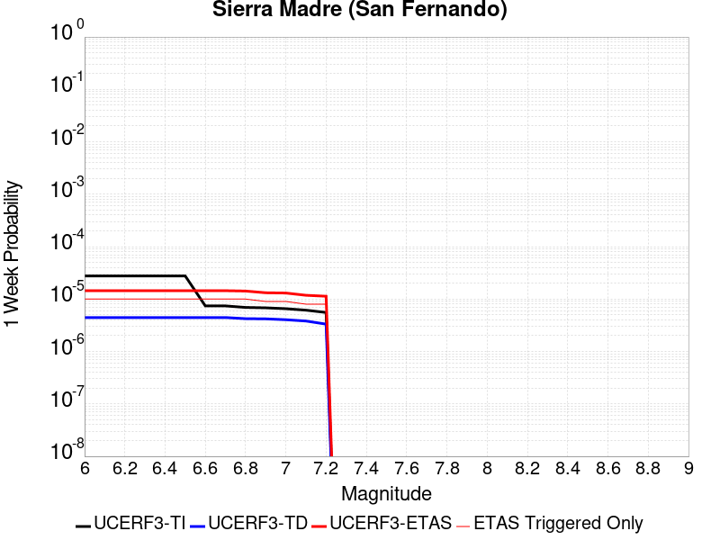 |  |  | 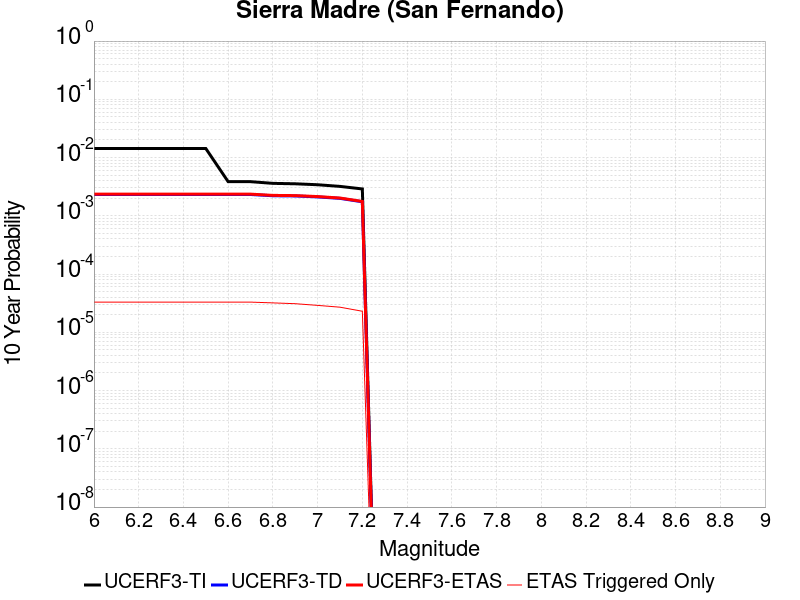 |

| Magnitude | 1 wk TI Prob | 1 wk TD Prob | 1 wk ETAS Prob | 1 wk ETAS/TD Gain | 1 wk ETAS Triggered Only | 1 mo TI Prob | 1 mo TD Prob | 1 mo ETAS Prob | 1 mo ETAS/TD Gain | 1 mo ETAS Triggered Only | 1 yr TI Prob | 1 yr TD Prob | 1 yr ETAS Prob | 1 yr ETAS/TD Gain | 1 yr ETAS Triggered Only | 10 yr TI Prob | 10 yr TD Prob | 10 yr ETAS Prob | 10 yr ETAS/TD Gain | 10 yr ETAS Triggered Only |
|-----|-----|-----|-----|-----|-----|-----|-----|-----|-----|-----|-----|-----|-----|-----|-----|-----|-----|-----|-----|-----|
| 6.0 | 2.76706E-5 | 4.4463613E-6 | 7.4652708E-6 | 1.6789618 | 3.0189226E-6 | 1.1858289E-4 | 1.9055766E-5 | 2.8112361E-5 | 1.475268 | 9.056768E-6 | 0.0014427905 | 2.3199158E-4 | 2.5613737E-4 | 1.1040804 | 2.415138E-5 | 0.01433459 | 0.0023232098 | 0.002353329 | 1.0129645 | 3.0189227E-5 |
| 6.1 | 2.76706E-5 | 4.4463613E-6 | 7.4652708E-6 | 1.6789618 | 3.0189226E-6 | 1.1858289E-4 | 1.9055766E-5 | 2.8112361E-5 | 1.475268 | 9.056768E-6 | 0.0014427905 | 2.3199158E-4 | 2.5613737E-4 | 1.1040804 | 2.415138E-5 | 0.01433459 | 0.0023232098 | 0.002353329 | 1.0129645 | 3.0189227E-5 |
| 6.2 | 2.76706E-5 | 4.4463613E-6 | 7.4652708E-6 | 1.6789618 | 3.0189226E-6 | 1.1858289E-4 | 1.9055766E-5 | 2.8112361E-5 | 1.475268 | 9.056768E-6 | 0.0014427905 | 2.3199158E-4 | 2.5613737E-4 | 1.1040804 | 2.415138E-5 | 0.01433459 | 0.0023232098 | 0.002353329 | 1.0129645 | 3.0189227E-5 |
| 6.3 | 2.76706E-5 | 4.4463613E-6 | 7.4652708E-6 | 1.6789618 | 3.0189226E-6 | 1.1858289E-4 | 1.9055766E-5 | 2.8112361E-5 | 1.475268 | 9.056768E-6 | 0.0014427905 | 2.3199158E-4 | 2.5613737E-4 | 1.1040804 | 2.415138E-5 | 0.01433459 | 0.0023232098 | 0.002353329 | 1.0129645 | 3.0189227E-5 |
| 6.4 | 2.76706E-5 | 4.4463613E-6 | 7.4652708E-6 | 1.6789618 | 3.0189226E-6 | 1.1858289E-4 | 1.9055766E-5 | 2.8112361E-5 | 1.475268 | 9.056768E-6 | 0.0014427905 | 2.3199158E-4 | 2.5613737E-4 | 1.1040804 | 2.415138E-5 | 0.01433459 | 0.0023232098 | 0.002353329 | 1.0129645 | 3.0189227E-5 |
| 6.5 | 2.76706E-5 | 4.4463613E-6 | 7.4652708E-6 | 1.6789618 | 3.0189226E-6 | 1.1858289E-4 | 1.9055766E-5 | 2.8112361E-5 | 1.475268 | 9.056768E-6 | 0.0014427905 | 2.3199158E-4 | 2.5613737E-4 | 1.1040804 | 2.415138E-5 | 0.01433459 | 0.0023232098 | 0.002353329 | 1.0129645 | 3.0189227E-5 |
| 6.6 | 7.4064433E-6 | 4.4463613E-6 | 7.4652708E-6 | 1.6789618 | 3.0189226E-6 | 3.1741514E-5 | 1.9055766E-5 | 2.8112361E-5 | 1.475268 | 9.056768E-6 | 3.863844E-4 | 2.3199158E-4 | 2.5613734E-4 | 1.1040804 | 2.415138E-5 | 0.0038571327 | 0.0023232098 | 0.0023533287 | 1.0129645 | 3.0189227E-5 |
| 6.7 | 7.4064433E-6 | 4.4463613E-6 | 7.4652708E-6 | 1.6789618 | 3.0189226E-6 | 3.1741514E-5 | 1.9055766E-5 | 2.8112361E-5 | 1.475268 | 9.056768E-6 | 3.863844E-4 | 2.3199158E-4 | 2.5613734E-4 | 1.1040804 | 2.415138E-5 | 0.0038571327 | 0.0023232098 | 0.0023533287 | 1.0129645 | 3.0189227E-5 |
| 6.8 | 6.925624E-6 | 4.2295183E-6 | 7.248428E-6 | 1.7137716 | 3.0189226E-6 | 2.9680907E-5 | 1.8126451E-5 | 2.7183054E-5 | 1.4996347 | 9.056768E-6 | 3.613051E-4 | 2.2067946E-4 | 2.4482553E-4 | 1.1094168 | 2.415138E-5 | 0.0036071825 | 0.0022100909 | 0.0022402133 | 1.0136296 | 3.0189227E-5 |
| 6.9 | 6.8073305E-6 | 4.1955877E-6 | 7.2144976E-6 | 1.719544 | 3.0189226E-6 | 2.9173947E-5 | 1.7981036E-5 | 2.703764E-5 | 1.5036753 | 9.056768E-6 | 3.551349E-4 | 2.1890938E-4 | 2.4305547E-4 | 1.1103017 | 2.415138E-5 | 0.003545679 | 0.0021923676 | 0.0022224907 | 1.01374 | 3.0189227E-5 |
| 7.0 | 6.5550776E-6 | 4.0390173E-6 | 7.0579276E-6 | 1.7474369 | 3.0189226E-6 | 2.8092887E-5 | 1.7310029E-5 | 2.636664E-5 | 1.5232003 | 9.056768E-6 | 3.4197723E-4 | 2.1074146E-4 | 2.3488776E-4 | 1.1145778 | 2.415138E-5 | 0.0034145142 | 0.0021107546 | 0.00214088 | 1.0142723 | 3.0189227E-5 |
| 7.1 | 6.141366E-6 | 3.8129206E-6 | 6.831832E-6 | 1.7917582 | 3.0189226E-6 | 2.6319874E-5 | 1.6341055E-5 | 2.5397674E-5 | 1.554225 | 9.056768E-6 | 3.2039735E-4 | 1.9894639E-4 | 2.2309297E-4 | 1.1213722 | 2.415138E-5 | 0.003199358 | 0.001992886 | 0.002023015 | 1.0151184 | 3.0189227E-5 |
| 7.2 | 5.5504106E-6 | 3.3297895E-6 | 6.3487023E-6 | 1.9066377 | 3.0189226E-6 | 2.3787257E-5 | 1.4270517E-5 | 2.0308276E-5 | 1.4230932 | 6.037845E-6 | 2.8957136E-4 | 1.7374175E-4 | 1.9185213E-4 | 1.1042374 | 1.8113536E-5 | 0.002891943 | 0.0017411701 | 0.0017652794 | 1.0138466 | 2.415138E-5 |

## Green Valley 2011 CFM
*[(top)](#table-of-contents)*

| 1 Week | 1 Month | 1 Year | 10 Year |
|-----|-----|-----|-----|
|  |  |  |  |

| Magnitude | 1 wk TI Prob | 1 wk TD Prob | 1 wk ETAS Prob | 1 wk ETAS/TD Gain | 1 wk ETAS Triggered Only | 1 mo TI Prob | 1 mo TD Prob | 1 mo ETAS Prob | 1 mo ETAS/TD Gain | 1 mo ETAS Triggered Only | 1 yr TI Prob | 1 yr TD Prob | 1 yr ETAS Prob | 1 yr ETAS/TD Gain | 1 yr ETAS Triggered Only | 10 yr TI Prob | 10 yr TD Prob | 10 yr ETAS Prob | 10 yr ETAS/TD Gain | 10 yr ETAS Triggered Only |
|-----|-----|-----|-----|-----|-----|-----|-----|-----|-----|-----|-----|-----|-----|-----|-----|-----|-----|-----|-----|-----|
| 6.0 | 7.9834055E-5 | 1.7647086E-4 | 1.8854442E-4 | 1.0684167 | 1.207569E-5 | 3.421011E-4 | 7.562273E-4 | 7.6829386E-4 | 1.0159563 | 1.207569E-5 | 0.0041571283 | 0.009193515 | 0.009217445 | 1.0026028 | 2.415138E-5 | 0.040802166 | 0.08864039 | 0.08866791 | 1.0003104 | 3.0189227E-5 |
| 6.1 | 7.9834055E-5 | 1.7647086E-4 | 1.8854442E-4 | 1.0684167 | 1.207569E-5 | 3.421011E-4 | 7.562273E-4 | 7.6829386E-4 | 1.0159563 | 1.207569E-5 | 0.0041571283 | 0.009193515 | 0.009217445 | 1.0026028 | 2.415138E-5 | 0.040802166 | 0.08864039 | 0.08866791 | 1.0003104 | 3.0189227E-5 |
| 6.2 | 7.9834055E-5 | 1.7647086E-4 | 1.8854442E-4 | 1.0684167 | 1.207569E-5 | 3.421011E-4 | 7.562273E-4 | 7.6829386E-4 | 1.0159563 | 1.207569E-5 | 0.0041571283 | 0.009193515 | 0.009217445 | 1.0026028 | 2.415138E-5 | 0.040802166 | 0.08864039 | 0.08866791 | 1.0003104 | 3.0189227E-5 |
| 6.3 | 7.9834055E-5 | 1.7647086E-4 | 1.8854442E-4 | 1.0684167 | 1.207569E-5 | 3.421011E-4 | 7.562273E-4 | 7.6829386E-4 | 1.0159563 | 1.207569E-5 | 0.0041571283 | 0.009193515 | 0.009217445 | 1.0026028 | 2.415138E-5 | 0.040802166 | 0.08864039 | 0.08866791 | 1.0003104 | 3.0189227E-5 |
| 6.4 | 7.9834055E-5 | 1.7647086E-4 | 1.8854442E-4 | 1.0684167 | 1.207569E-5 | 3.421011E-4 | 7.562273E-4 | 7.6829386E-4 | 1.0159563 | 1.207569E-5 | 0.0041571283 | 0.009193515 | 0.009217445 | 1.0026028 | 2.415138E-5 | 0.040802166 | 0.08864039 | 0.08866791 | 1.0003104 | 3.0189227E-5 |
| 6.5 | 7.9834055E-5 | 1.7647086E-4 | 1.8854442E-4 | 1.0684167 | 1.207569E-5 | 3.421011E-4 | 7.562273E-4 | 7.6829386E-4 | 1.0159563 | 1.207569E-5 | 0.0041571283 | 0.009193515 | 0.009217445 | 1.0026028 | 2.415138E-5 | 0.040802166 | 0.08864039 | 0.08866791 | 1.0003104 | 3.0189227E-5 |
| 6.6 | 6.153684E-5 | 1.4011236E-4 | 1.4614937E-4 | 1.0430869 | 6.037845E-6 | 2.6370265E-4 | 6.004815E-4 | 6.0651574E-4 | 1.010049 | 6.037845E-6 | 0.0032058533 | 0.0073108627 | 0.007325847 | 1.0020496 | 1.5094613E-5 | 0.03159998 | 0.071543366 | 0.07156298 | 1.0002743 | 2.1132459E-5 |
| 6.7 | 6.153684E-5 | 1.4011236E-4 | 1.4614937E-4 | 1.0430869 | 6.037845E-6 | 2.6370265E-4 | 6.004815E-4 | 6.0651574E-4 | 1.010049 | 6.037845E-6 | 0.0032058533 | 0.0073108627 | 0.007325847 | 1.0020496 | 1.5094613E-5 | 0.03159998 | 0.071543366 | 0.07156298 | 1.0002743 | 2.1132459E-5 |

## San Andreas (Creeping Section) 2011 CFM
*[(top)](#table-of-contents)*

| 1 Week | 1 Month | 1 Year | 10 Year |
|-----|-----|-----|-----|
|  |  |  |  |

| Magnitude | 1 wk TI Prob | 1 wk TD Prob | 1 wk ETAS Prob | 1 wk ETAS/TD Gain | 1 wk ETAS Triggered Only | 1 mo TI Prob | 1 mo TD Prob | 1 mo ETAS Prob | 1 mo ETAS/TD Gain | 1 mo ETAS Triggered Only | 1 yr TI Prob | 1 yr TD Prob | 1 yr ETAS Prob | 1 yr ETAS/TD Gain | 1 yr ETAS Triggered Only | 10 yr TI Prob | 10 yr TD Prob | 10 yr ETAS Prob | 10 yr ETAS/TD Gain | 10 yr ETAS Triggered Only |
|-----|-----|-----|-----|-----|-----|-----|-----|-----|-----|-----|-----|-----|-----|-----|-----|-----|-----|-----|-----|-----|
| 6.0 | 2.0678692E-4 | 4.6456268E-4 | 4.7361525E-4 | 1.0194862 | 9.056768E-6 | 8.8592863E-4 | 0.0019886654 | 0.00200373 | 1.0075753 | 1.5094613E-5 | 0.010732949 | 0.023858009 | 0.02387569 | 1.0007411 | 1.8113536E-5 | 0.10229127 | 0.20777887 | 0.20780279 | 1.0001152 | 3.0189227E-5 |
| 6.1 | 1.5597911E-4 | 3.5018445E-4 | 3.5923804E-4 | 1.0258538 | 9.056768E-6 | 6.683106E-4 | 0.0014995098 | 0.0015115674 | 1.008041 | 1.207569E-5 | 0.008106367 | 0.018075831 | 0.018090652 | 1.0008199 | 1.5094613E-5 | 0.0781696 | 0.16418044 | 0.16420315 | 1.0001383 | 2.7170303E-5 |
| 6.2 | 1.5597911E-4 | 3.5018445E-4 | 3.5923804E-4 | 1.0258538 | 9.056768E-6 | 6.683106E-4 | 0.0014995098 | 0.0015115674 | 1.008041 | 1.207569E-5 | 0.008106367 | 0.018075831 | 0.018090652 | 1.0008199 | 1.5094613E-5 | 0.0781696 | 0.16418044 | 0.16420315 | 1.0001383 | 2.7170303E-5 |
| 6.3 | 1.5597911E-4 | 3.5018445E-4 | 3.5923804E-4 | 1.0258538 | 9.056768E-6 | 6.683106E-4 | 0.0014995098 | 0.0015115674 | 1.008041 | 1.207569E-5 | 0.008106367 | 0.018075831 | 0.018090652 | 1.0008199 | 1.5094613E-5 | 0.0781696 | 0.16418044 | 0.16420315 | 1.0001383 | 2.7170303E-5 |

## Deep Springs
*[(top)](#table-of-contents)*

| 1 Week | 1 Month | 1 Year | 10 Year |
|-----|-----|-----|-----|
|  |  |  |  |

| Magnitude | 1 wk TI Prob | 1 wk TD Prob | 1 wk ETAS Prob | 1 wk ETAS/TD Gain | 1 wk ETAS Triggered Only | 1 mo TI Prob | 1 mo TD Prob | 1 mo ETAS Prob | 1 mo ETAS/TD Gain | 1 mo ETAS Triggered Only | 1 yr TI Prob | 1 yr TD Prob | 1 yr ETAS Prob | 1 yr ETAS/TD Gain | 1 yr ETAS Triggered Only | 10 yr TI Prob | 10 yr TD Prob | 10 yr ETAS Prob | 10 yr ETAS/TD Gain | 10 yr ETAS Triggered Only |
|-----|-----|-----|-----|-----|-----|-----|-----|-----|-----|-----|-----|-----|-----|-----|-----|-----|-----|-----|-----|-----|
| 6.0 | 1.5918817E-5 | 1.7845163E-5 | 2.690177E-5 | 1.5075104 | 9.056768E-6 | 6.8221714E-5 | 7.64782E-5 | 9.157167E-5 | 1.1973563 | 1.5094613E-5 | 8.3028286E-4 | 9.3093317E-4 | 9.490298E-4 | 1.0194393 | 1.8113536E-5 | 0.008271876 | 0.009290814 | 0.0093177315 | 1.0028973 | 2.7170303E-5 |
| 6.1 | 1.5918817E-5 | 1.7845163E-5 | 2.690177E-5 | 1.5075104 | 9.056768E-6 | 6.8221714E-5 | 7.64782E-5 | 9.157167E-5 | 1.1973563 | 1.5094613E-5 | 8.3028286E-4 | 9.3093317E-4 | 9.490298E-4 | 1.0194393 | 1.8113536E-5 | 0.008271876 | 0.009290814 | 0.0093177315 | 1.0028973 | 2.7170303E-5 |
| 6.2 | 1.5918817E-5 | 1.7845163E-5 | 2.690177E-5 | 1.5075104 | 9.056768E-6 | 6.8221714E-5 | 7.64782E-5 | 9.157167E-5 | 1.1973563 | 1.5094613E-5 | 8.3028286E-4 | 9.3093317E-4 | 9.490298E-4 | 1.0194393 | 1.8113536E-5 | 0.008271876 | 0.009290814 | 0.0093177315 | 1.0028973 | 2.7170303E-5 |
| 6.3 | 1.5918817E-5 | 1.7845163E-5 | 2.690177E-5 | 1.5075104 | 9.056768E-6 | 6.8221714E-5 | 7.64782E-5 | 9.157167E-5 | 1.1973563 | 1.5094613E-5 | 8.3028286E-4 | 9.3093317E-4 | 9.490298E-4 | 1.0194393 | 1.8113536E-5 | 0.008271876 | 0.009290814 | 0.0093177315 | 1.0028973 | 2.7170303E-5 |
| 6.4 | 1.5918817E-5 | 1.7845163E-5 | 2.690177E-5 | 1.5075104 | 9.056768E-6 | 6.8221714E-5 | 7.64782E-5 | 9.157167E-5 | 1.1973563 | 1.5094613E-5 | 8.3028286E-4 | 9.3093317E-4 | 9.490298E-4 | 1.0194393 | 1.8113536E-5 | 0.008271876 | 0.009290814 | 0.0093177315 | 1.0028973 | 2.7170303E-5 |
| 6.5 | 1.5918817E-5 | 1.7845163E-5 | 2.690177E-5 | 1.5075104 | 9.056768E-6 | 6.8221714E-5 | 7.64782E-5 | 9.157167E-5 | 1.1973563 | 1.5094613E-5 | 8.3028286E-4 | 9.3093317E-4 | 9.490298E-4 | 1.0194393 | 1.8113536E-5 | 0.008271876 | 0.009290814 | 0.0093177315 | 1.0028973 | 2.7170303E-5 |
| 6.6 | 1.1008706E-5 | 1.2328163E-5 | 2.138482E-5 | 1.7346314 | 9.056768E-6 | 4.7179317E-5 | 5.2834985E-5 | 6.491004E-5 | 1.2285428 | 1.207569E-5 | 5.7425676E-4 | 6.4326596E-4 | 6.583508E-4 | 1.0234505 | 1.5094613E-5 | 0.0057277507 | 0.0064326595 | 0.0064536557 | 1.0032641 | 2.1132459E-5 |
| 6.7 | 1.1008706E-5 | 1.2328163E-5 | 2.138482E-5 | 1.7346314 | 9.056768E-6 | 4.7179317E-5 | 5.2834985E-5 | 6.491004E-5 | 1.2285428 | 1.207569E-5 | 5.7425676E-4 | 6.4326596E-4 | 6.583508E-4 | 1.0234505 | 1.5094613E-5 | 0.0057277507 | 0.0064326595 | 0.0064536557 | 1.0032641 | 2.1132459E-5 |

## Santa Monica alt 1
*[(top)](#table-of-contents)*

| 1 Week | 1 Month | 1 Year | 10 Year |
|-----|-----|-----|-----|
|  |  |  |  |

| Magnitude | 1 wk TI Prob | 1 wk TD Prob | 1 wk ETAS Prob | 1 wk ETAS/TD Gain | 1 wk ETAS Triggered Only | 1 mo TI Prob | 1 mo TD Prob | 1 mo ETAS Prob | 1 mo ETAS/TD Gain | 1 mo ETAS Triggered Only | 1 yr TI Prob | 1 yr TD Prob | 1 yr ETAS Prob | 1 yr ETAS/TD Gain | 1 yr ETAS Triggered Only | 10 yr TI Prob | 10 yr TD Prob | 10 yr ETAS Prob | 10 yr ETAS/TD Gain | 10 yr ETAS Triggered Only |
|-----|-----|-----|-----|-----|-----|-----|-----|-----|-----|-----|-----|-----|-----|-----|-----|-----|-----|-----|-----|-----|
| 6.0 | 1.14914055E-5 | 1.2581658E-5 | 2.1638312E-5 | 1.7198299 | 9.056768E-6 | 4.9247952E-5 | 5.392139E-5 | 6.297767E-5 | 1.1679534 | 9.056768E-6 | 5.9942884E-4 | 6.564929E-4 | 6.7157764E-4 | 1.0229777 | 1.5094613E-5 | 0.005978145 | 0.006564929 | 0.006591921 | 1.0041115 | 2.7170303E-5 |
| 6.1 | 1.14914055E-5 | 1.2581658E-5 | 2.1638312E-5 | 1.7198299 | 9.056768E-6 | 4.9247952E-5 | 5.392139E-5 | 6.297767E-5 | 1.1679534 | 9.056768E-6 | 5.9942884E-4 | 6.564929E-4 | 6.7157764E-4 | 1.0229777 | 1.5094613E-5 | 0.005978145 | 0.006564929 | 0.006591921 | 1.0041115 | 2.7170303E-5 |
| 6.2 | 1.14914055E-5 | 1.2581658E-5 | 2.1638312E-5 | 1.7198299 | 9.056768E-6 | 4.9247952E-5 | 5.392139E-5 | 6.297767E-5 | 1.1679534 | 9.056768E-6 | 5.9942884E-4 | 6.564929E-4 | 6.7157764E-4 | 1.0229777 | 1.5094613E-5 | 0.005978145 | 0.006564929 | 0.006591921 | 1.0041115 | 2.7170303E-5 |
| 6.3 | 1.14914055E-5 | 1.2581658E-5 | 2.1638312E-5 | 1.7198299 | 9.056768E-6 | 4.9247952E-5 | 5.392139E-5 | 6.297767E-5 | 1.1679534 | 9.056768E-6 | 5.9942884E-4 | 6.564929E-4 | 6.7157764E-4 | 1.0229777 | 1.5094613E-5 | 0.005978145 | 0.006564929 | 0.006591921 | 1.0041115 | 2.7170303E-5 |
| 6.4 | 1.14914055E-5 | 1.2581658E-5 | 2.1638312E-5 | 1.7198299 | 9.056768E-6 | 4.9247952E-5 | 5.392139E-5 | 6.297767E-5 | 1.1679534 | 9.056768E-6 | 5.9942884E-4 | 6.564929E-4 | 6.7157764E-4 | 1.0229777 | 1.5094613E-5 | 0.005978145 | 0.006564929 | 0.006591921 | 1.0041115 | 2.7170303E-5 |
| 6.5 | 1.14914055E-5 | 1.2581658E-5 | 2.1638312E-5 | 1.7198299 | 9.056768E-6 | 4.9247952E-5 | 5.392139E-5 | 6.297767E-5 | 1.1679534 | 9.056768E-6 | 5.9942884E-4 | 6.564929E-4 | 6.7157764E-4 | 1.0229777 | 1.5094613E-5 | 0.005978145 | 0.006564929 | 0.006591921 | 1.0041115 | 2.7170303E-5 |

## Elsinore (Temecula) rev
*[(top)](#table-of-contents)*

| 1 Week | 1 Month | 1 Year | 10 Year |
|-----|-----|-----|-----|
|  |  |  |  |

| Magnitude | 1 wk TI Prob | 1 wk TD Prob | 1 wk ETAS Prob | 1 wk ETAS/TD Gain | 1 wk ETAS Triggered Only | 1 mo TI Prob | 1 mo TD Prob | 1 mo ETAS Prob | 1 mo ETAS/TD Gain | 1 mo ETAS Triggered Only | 1 yr TI Prob | 1 yr TD Prob | 1 yr ETAS Prob | 1 yr ETAS/TD Gain | 1 yr ETAS Triggered Only | 10 yr TI Prob | 10 yr TD Prob | 10 yr ETAS Prob | 10 yr ETAS/TD Gain | 10 yr ETAS Triggered Only |
|-----|-----|-----|-----|-----|-----|-----|-----|-----|-----|-----|-----|-----|-----|-----|-----|-----|-----|-----|-----|-----|
| 6.0 | 2.9985375E-5 | 3.4747958E-5 | 4.9842045E-5 | 1.4343878 | 1.5094613E-5 | 1.2850242E-4 | 1.4891267E-4 | 1.6400505E-4 | 1.1013504 | 1.5094613E-5 | 0.0015633941 | 0.0018117457 | 0.0018298264 | 1.0099797 | 1.8113536E-5 | 0.01552441 | 0.018074041 | 0.01810072 | 1.001476 | 2.7170303E-5 |
| 6.1 | 2.9985375E-5 | 3.4747958E-5 | 4.9842045E-5 | 1.4343878 | 1.5094613E-5 | 1.2850242E-4 | 1.4891267E-4 | 1.6400505E-4 | 1.1013504 | 1.5094613E-5 | 0.0015633941 | 0.0018117457 | 0.0018298264 | 1.0099797 | 1.8113536E-5 | 0.01552441 | 0.018074041 | 0.01810072 | 1.001476 | 2.7170303E-5 |
| 6.2 | 2.9985375E-5 | 3.4747958E-5 | 4.9842045E-5 | 1.4343878 | 1.5094613E-5 | 1.2850242E-4 | 1.4891267E-4 | 1.6400505E-4 | 1.1013504 | 1.5094613E-5 | 0.0015633941 | 0.0018117457 | 0.0018298264 | 1.0099797 | 1.8113536E-5 | 0.01552441 | 0.018074041 | 0.01810072 | 1.001476 | 2.7170303E-5 |
| 6.3 | 2.9985375E-5 | 3.4747958E-5 | 4.9842045E-5 | 1.4343878 | 1.5094613E-5 | 1.2850242E-4 | 1.4891267E-4 | 1.6400505E-4 | 1.1013504 | 1.5094613E-5 | 0.0015633941 | 0.0018117457 | 0.0018298264 | 1.0099797 | 1.8113536E-5 | 0.01552441 | 0.018074041 | 0.01810072 | 1.001476 | 2.7170303E-5 |
| 6.4 | 2.9985375E-5 | 3.4747958E-5 | 4.9842045E-5 | 1.4343878 | 1.5094613E-5 | 1.2850242E-4 | 1.4891267E-4 | 1.6400505E-4 | 1.1013504 | 1.5094613E-5 | 0.0015633941 | 0.0018117457 | 0.0018298264 | 1.0099797 | 1.8113536E-5 | 0.01552441 | 0.018074041 | 0.01810072 | 1.001476 | 2.7170303E-5 |
| 6.5 | 2.9985375E-5 | 3.4747958E-5 | 4.9842045E-5 | 1.4343878 | 1.5094613E-5 | 1.2850242E-4 | 1.4891267E-4 | 1.6400505E-4 | 1.1013504 | 1.5094613E-5 | 0.0015633941 | 0.0018117457 | 0.0018298264 | 1.0099797 | 1.8113536E-5 | 0.01552441 | 0.018074041 | 0.01810072 | 1.001476 | 2.7170303E-5 |
| 6.6 | 2.9915182E-5 | 3.46808E-5 | 4.977489E-5 | 1.435229 | 1.5094613E-5 | 1.2820162E-4 | 1.486249E-4 | 1.6371727E-4 | 1.1015468 | 1.5094613E-5 | 0.0015597371 | 0.0018082478 | 0.0018263286 | 1.009999 | 1.8113536E-5 | 0.015488351 | 0.018039845 | 0.018066524 | 1.0014789 | 2.7170303E-5 |
| 6.7 | 2.9879424E-5 | 3.463569E-5 | 4.9729777E-5 | 1.4357959 | 1.5094613E-5 | 1.2804838E-4 | 1.4843159E-4 | 1.6352396E-4 | 1.101679 | 1.5094613E-5 | 0.0015578741 | 0.0018058982 | 0.001823979 | 1.0100121 | 1.8113536E-5 | 0.01546998 | 0.018016884 | 0.018043565 | 1.0014808 | 2.7170303E-5 |
| 6.8 | 2.9818717E-5 | 3.45724E-5 | 4.966649E-5 | 1.4365937 | 1.5094613E-5 | 1.2778824E-4 | 1.4816038E-4 | 1.6325276E-4 | 1.1018652 | 1.5094613E-5 | 0.0015547115 | 0.0018026017 | 0.0018206827 | 1.0100304 | 1.8113536E-5 | 0.015438793 | 0.017984249 | 0.018010931 | 1.0014836 | 2.7170303E-5 |
| 6.9 | 2.9704783E-5 | 3.4430177E-5 | 4.952427E-5 | 1.4383972 | 1.5094613E-5 | 1.273E-4 | 1.4755092E-4 | 1.6264331E-4 | 1.102286 | 1.5094613E-5 | 0.0015487756 | 0.001795194 | 0.001813275 | 1.0100719 | 1.8113536E-5 | 0.015380259 | 0.017911145 | 0.01793783 | 1.0014898 | 2.7170303E-5 |
| 7.0 | 2.9613002E-5 | 3.4300047E-5 | 4.939414E-5 | 1.4400605 | 1.5094613E-5 | 1.269067E-4 | 1.4699328E-4 | 1.6208568E-4 | 1.102674 | 1.5094613E-5 | 0.0015439938 | 0.0017884158 | 0.001806497 | 1.0101101 | 1.8113536E-5 | 0.015333103 | 0.017844401 | 0.017871087 | 1.0014955 | 2.7170303E-5 |
| 7.1 | 2.2180364E-5 | 2.6018337E-5 | 3.507487E-5 | 1.3480827 | 9.056768E-6 | 9.505524E-5 | 1.115033E-4 | 1.2055906E-4 | 1.0812151 | 9.056768E-6 | 0.0011566831 | 0.0013568681 | 0.0013689273 | 1.0088876 | 1.207569E-5 | 0.01150681 | 0.013559197 | 0.013577065 | 1.0013177 | 1.8113536E-5 |
| 7.2 | 2.1985565E-5 | 2.5725127E-5 | 3.478166E-5 | 1.3520502 | 9.056768E-6 | 9.422044E-5 | 1.1024679E-4 | 1.1930256E-4 | 1.0821409 | 9.056768E-6 | 0.0011465302 | 0.0013415889 | 0.0013536484 | 1.008989 | 1.207569E-5 | 0.0114063285 | 0.013408055 | 0.013425926 | 1.0013329 | 1.8113536E-5 |
| 7.3 | 1.3039819E-5 | 1.715471E-5 | 1.715471E-5 | 1.0 | 0.0 | 5.5883742E-5 | 7.3518546E-5 | 7.3518546E-5 | 1.0 | 0.0 | 6.801722E-4 | 8.947971E-4 | 8.978133E-4 | 1.0033709 | 3.0189226E-6 | 0.006780941 | 0.008927152 | 0.008930143 | 1.0003351 | 3.0189226E-6 |
| 7.4 | 1.2750458E-5 | 1.6749926E-5 | 1.6749926E-5 | 1.0 | 0.0 | 5.464368E-5 | 7.178385E-5 | 7.178385E-5 | 1.0 | 0.0 | 6.650837E-4 | 8.736942E-4 | 8.767105E-4 | 1.0034523 | 3.0189226E-6 | 0.006630967 | 0.008717438 | 0.008720431 | 1.0003433 | 3.0189226E-6 |
| 7.5 | 1.1924516E-5 | 1.570584E-5 | 1.570584E-5 | 1.0 | 0.0 | 5.1104067E-5 | 6.730944E-5 | 6.730944E-5 | 1.0 | 0.0 | 6.220144E-4 | 8.192601E-4 | 8.222766E-4 | 1.0036819 | 3.0189226E-6 | 0.006202762 | 0.008175999 | 0.008178993 | 1.0003662 | 3.0189226E-6 |
| 7.6 | 1.0456552E-5 | 1.3574289E-5 | 1.3574289E-5 | 1.0 | 0.0 | 4.4813027E-5 | 5.817464E-5 | 5.817464E-5 | 1.0 | 0.0 | 5.45462E-4 | 7.081186E-4 | 7.111354E-4 | 1.0042603 | 3.0189226E-6 | 0.0054412507 | 0.0070718653 | 0.007074863 | 1.0004239 | 3.0189226E-6 |
| 7.7 | 4.463199E-6 | 5.214875E-6 | 5.214875E-6 | 1.0 | 0.0 | 1.9127854E-5 | 2.2349386E-5 | 2.2349386E-5 | 1.0 | 0.0 | 2.3285674E-4 | 2.7209E-4 | 2.7510812E-4 | 1.0110923 | 3.0189226E-6 | 0.0023261288 | 0.0027239968 | 0.0027270073 | 1.0011053 | 3.0189226E-6 |
| 7.8 | 2.1601753E-7 | 2.7489222E-7 | 2.7489222E-7 | 1.0 | 0.0 | 9.257891E-7 | 1.1781094E-6 | 1.1781094E-6 | 1.0 | 0.0 | 1.1271423E-5 | 1.4343483E-5 | 1.4343483E-5 | 1.0 | 0.0 | 1.1270852E-4 | 1.435847E-4 | 1.435847E-4 | 1.0 | 0.0 |

## Holser alt 1
*[(top)](#table-of-contents)*

| 1 Week | 1 Month | 1 Year | 10 Year |
|-----|-----|-----|-----|
|  |  |  |  |

| Magnitude | 1 wk TI Prob | 1 wk TD Prob | 1 wk ETAS Prob | 1 wk ETAS/TD Gain | 1 wk ETAS Triggered Only | 1 mo TI Prob | 1 mo TD Prob | 1 mo ETAS Prob | 1 mo ETAS/TD Gain | 1 mo ETAS Triggered Only | 1 yr TI Prob | 1 yr TD Prob | 1 yr ETAS Prob | 1 yr ETAS/TD Gain | 1 yr ETAS Triggered Only | 10 yr TI Prob | 10 yr TD Prob | 10 yr ETAS Prob | 10 yr ETAS/TD Gain | 10 yr ETAS Triggered Only |
|-----|-----|-----|-----|-----|-----|-----|-----|-----|-----|-----|-----|-----|-----|-----|-----|-----|-----|-----|-----|-----|
| 6.0 | 7.962936E-6 | 8.4235735E-6 | 1.4461368E-5 | 1.7167735 | 6.037845E-6 | 3.4126424E-5 | 3.6100817E-5 | 4.817607E-5 | 1.3344871 | 1.207569E-5 | 4.1540997E-4 | 4.394895E-4 | 4.5457747E-4 | 1.0343307 | 1.5094613E-5 | 0.004146343 | 0.0043911743 | 0.0044182255 | 1.0061603 | 2.7170303E-5 |
| 6.1 | 7.962936E-6 | 8.4235735E-6 | 1.4461368E-5 | 1.7167735 | 6.037845E-6 | 3.4126424E-5 | 3.6100817E-5 | 4.817607E-5 | 1.3344871 | 1.207569E-5 | 4.1540997E-4 | 4.394895E-4 | 4.5457747E-4 | 1.0343307 | 1.5094613E-5 | 0.004146343 | 0.0043911743 | 0.0044182255 | 1.0061603 | 2.7170303E-5 |
| 6.2 | 7.962936E-6 | 8.4235735E-6 | 1.4461368E-5 | 1.7167735 | 6.037845E-6 | 3.4126424E-5 | 3.6100817E-5 | 4.817607E-5 | 1.3344871 | 1.207569E-5 | 4.1540997E-4 | 4.394895E-4 | 4.5457747E-4 | 1.0343307 | 1.5094613E-5 | 0.004146343 | 0.0043911743 | 0.0044182255 | 1.0061603 | 2.7170303E-5 |
| 6.3 | 7.962936E-6 | 8.4235735E-6 | 1.4461368E-5 | 1.7167735 | 6.037845E-6 | 3.4126424E-5 | 3.6100817E-5 | 4.817607E-5 | 1.3344871 | 1.207569E-5 | 4.1540997E-4 | 4.394895E-4 | 4.5457747E-4 | 1.0343307 | 1.5094613E-5 | 0.004146343 | 0.0043911743 | 0.0044182255 | 1.0061603 | 2.7170303E-5 |
| 6.4 | 7.962936E-6 | 8.4235735E-6 | 1.4461368E-5 | 1.7167735 | 6.037845E-6 | 3.4126424E-5 | 3.6100817E-5 | 4.817607E-5 | 1.3344871 | 1.207569E-5 | 4.1540997E-4 | 4.394895E-4 | 4.5457747E-4 | 1.0343307 | 1.5094613E-5 | 0.004146343 | 0.0043911743 | 0.0044182255 | 1.0061603 | 2.7170303E-5 |
| 6.5 | 7.962936E-6 | 8.4235735E-6 | 1.4461368E-5 | 1.7167735 | 6.037845E-6 | 3.4126424E-5 | 3.6100817E-5 | 4.817607E-5 | 1.3344871 | 1.207569E-5 | 4.1540997E-4 | 4.394895E-4 | 4.5457747E-4 | 1.0343307 | 1.5094613E-5 | 0.004146343 | 0.0043911743 | 0.0044182255 | 1.0061603 | 2.7170303E-5 |
| 6.6 | 5.506786E-6 | 5.810526E-6 | 8.829431E-6 | 1.519558 | 3.0189226E-6 | 2.3600298E-5 | 2.4902254E-5 | 3.0939947E-5 | 1.2424557 | 6.037845E-6 | 2.8729573E-4 | 3.0318493E-4 | 3.1223896E-4 | 1.029863 | 9.056768E-6 | 0.002869246 | 0.0030318494 | 0.0030468982 | 1.0049636 | 1.5094613E-5 |
| 6.7 | 5.506786E-6 | 5.810526E-6 | 8.829431E-6 | 1.519558 | 3.0189226E-6 | 2.3600298E-5 | 2.4902254E-5 | 3.0939947E-5 | 1.2424557 | 6.037845E-6 | 2.8729573E-4 | 3.0318493E-4 | 3.1223896E-4 | 1.029863 | 9.056768E-6 | 0.002869246 | 0.0030318494 | 0.0030468982 | 1.0049636 | 1.5094613E-5 |

## San Jacinto (Superstition Mtn)
*[(top)](#table-of-contents)*

| 1 Week | 1 Month | 1 Year | 10 Year |
|-----|-----|-----|-----|
|  |  |  |  |

| Magnitude | 1 wk TI Prob | 1 wk TD Prob | 1 wk ETAS Prob | 1 wk ETAS/TD Gain | 1 wk ETAS Triggered Only | 1 mo TI Prob | 1 mo TD Prob | 1 mo ETAS Prob | 1 mo ETAS/TD Gain | 1 mo ETAS Triggered Only | 1 yr TI Prob | 1 yr TD Prob | 1 yr ETAS Prob | 1 yr ETAS/TD Gain | 1 yr ETAS Triggered Only | 10 yr TI Prob | 10 yr TD Prob | 10 yr ETAS Prob | 10 yr ETAS/TD Gain | 10 yr ETAS Triggered Only |
|-----|-----|-----|-----|-----|-----|-----|-----|-----|-----|-----|-----|-----|-----|-----|-----|-----|-----|-----|-----|-----|
| 6.0 | 6.369931E-5 | 1.1782884E-4 | 1.20847406E-4 | 1.0256182 | 3.0189226E-6 | 2.729685E-4 | 5.049214E-4 | 5.0793885E-4 | 1.005976 | 3.0189226E-6 | 0.003318327 | 0.006136903 | 0.006142904 | 1.0009779 | 6.037845E-6 | 0.032692123 | 0.059778612 | 0.059804156 | 1.0004274 | 2.7170303E-5 |
| 6.1 | 6.369931E-5 | 1.1782884E-4 | 1.20847406E-4 | 1.0256182 | 3.0189226E-6 | 2.729685E-4 | 5.049214E-4 | 5.0793885E-4 | 1.005976 | 3.0189226E-6 | 0.003318327 | 0.006136903 | 0.006142904 | 1.0009779 | 6.037845E-6 | 0.032692123 | 0.059778612 | 0.059804156 | 1.0004274 | 2.7170303E-5 |
| 6.2 | 6.369931E-5 | 1.1782884E-4 | 1.20847406E-4 | 1.0256182 | 3.0189226E-6 | 2.729685E-4 | 5.049214E-4 | 5.0793885E-4 | 1.005976 | 3.0189226E-6 | 0.003318327 | 0.006136903 | 0.006142904 | 1.0009779 | 6.037845E-6 | 0.032692123 | 0.059778612 | 0.059804156 | 1.0004274 | 2.7170303E-5 |
| 6.3 | 6.369931E-5 | 1.1782884E-4 | 1.20847406E-4 | 1.0256182 | 3.0189226E-6 | 2.729685E-4 | 5.049214E-4 | 5.0793885E-4 | 1.005976 | 3.0189226E-6 | 0.003318327 | 0.006136903 | 0.006142904 | 1.0009779 | 6.037845E-6 | 0.032692123 | 0.059778612 | 0.059804156 | 1.0004274 | 2.7170303E-5 |
| 6.4 | 6.369931E-5 | 1.1782884E-4 | 1.20847406E-4 | 1.0256182 | 3.0189226E-6 | 2.729685E-4 | 5.049214E-4 | 5.0793885E-4 | 1.005976 | 3.0189226E-6 | 0.003318327 | 0.006136903 | 0.006142904 | 1.0009779 | 6.037845E-6 | 0.032692123 | 0.059778612 | 0.059804156 | 1.0004274 | 2.7170303E-5 |
| 6.5 | 6.369931E-5 | 1.1782884E-4 | 1.20847406E-4 | 1.0256182 | 3.0189226E-6 | 2.729685E-4 | 5.049214E-4 | 5.0793885E-4 | 1.005976 | 3.0189226E-6 | 0.003318327 | 0.006136903 | 0.006142904 | 1.0009779 | 6.037845E-6 | 0.032692123 | 0.059778612 | 0.059804156 | 1.0004274 | 2.7170303E-5 |
| 6.6 | 6.356468E-5 | 1.1754235E-4 | 1.2056092E-4 | 1.0256807 | 3.0189226E-6 | 2.723916E-4 | 5.036941E-4 | 5.0671154E-4 | 1.0059905 | 3.0189226E-6 | 0.003311325 | 0.0061220443 | 0.0061280453 | 1.0009803 | 6.037845E-6 | 0.032624163 | 0.059641294 | 0.059666846 | 1.0004284 | 2.7170303E-5 |
| 6.7 | 3.0048706E-5 | 4.931984E-5 | 5.233861E-5 | 1.0612081 | 3.0189226E-6 | 1.2877381E-4 | 2.1135958E-4 | 2.1437787E-4 | 1.0142803 | 3.0189226E-6 | 0.0015666935 | 0.0025713246 | 0.0025773467 | 1.0023421 | 6.037845E-6 | 0.015556943 | 0.025631001 | 0.025645709 | 1.0005739 | 1.5094613E-5 |
| 6.8 | 2.9819825E-5 | 4.8735175E-5 | 5.1753952E-5 | 1.0619425 | 3.0189226E-6 | 1.2779298E-4 | 2.088543E-4 | 2.1187258E-4 | 1.0144516 | 3.0189226E-6 | 0.0015547692 | 0.0025408939 | 0.0025439053 | 1.001185 | 3.0189226E-6 | 0.015439362 | 0.025341224 | 0.025352994 | 1.0004644 | 1.207569E-5 |
| 6.9 | 2.9555731E-5 | 4.8134865E-5 | 5.1153642E-5 | 1.0627149 | 3.0189226E-6 | 1.2666127E-4 | 2.0628194E-4 | 2.0930024E-4 | 1.0146319 | 3.0189226E-6 | 0.0015410101 | 0.002509648 | 0.0025126594 | 1.0012 | 3.0189226E-6 | 0.015303677 | 0.025041468 | 0.025053242 | 1.0004702 | 1.207569E-5 |
| 7.0 | 2.915559E-5 | 4.744423E-5 | 5.0463008E-5 | 1.063628 | 3.0189226E-6 | 1.2494654E-4 | 2.0332253E-4 | 2.0634085E-4 | 1.0148449 | 3.0189226E-6 | 0.0015201626 | 0.0024736994 | 0.0024767108 | 1.0012174 | 3.0189226E-6 | 0.015098056 | 0.024688803 | 0.02470058 | 1.0004771 | 1.207569E-5 |
| 7.1 | 1.5605729E-5 | 2.3894689E-5 | 2.3894689E-5 | 1.0 | 0.0 | 6.687998E-5 | 1.0240406E-4 | 1.0240406E-4 | 1.0 | 0.0 | 8.139595E-4 | 0.0012464593 | 0.0012464593 | 1.0 | 0.0 | 0.008109846 | 0.01256506 | 0.012571021 | 1.0004745 | 6.037845E-6 |
| 7.2 | 1.4951773E-5 | 2.282491E-5 | 2.282491E-5 | 1.0 | 0.0 | 6.407745E-5 | 9.781964E-5 | 9.781964E-5 | 1.0 | 0.0 | 7.7986374E-4 | 0.001190706 | 0.001190706 | 1.0 | 0.0 | 0.0077713258 | 0.012013012 | 0.012018977 | 1.0004966 | 6.037845E-6 |
| 7.3 | 1.3807349E-5 | 2.1078144E-5 | 2.1078144E-5 | 1.0 | 0.0 | 5.917301E-5 | 9.033404E-5 | 9.033404E-5 | 1.0 | 0.0 | 7.2019326E-4 | 0.0010996633 | 0.0010996633 | 1.0 | 0.0 | 0.0071786367 | 0.011102179 | 0.011108151 | 1.0005378 | 6.037845E-6 |
| 7.4 | 2.3105063E-6 | 3.2496644E-6 | 3.2496644E-6 | 1.0 | 0.0 | 9.902133E-6 | 1.3927083E-5 | 1.3927083E-5 | 1.0 | 0.0 | 1.2055179E-4 | 1.6955346E-4 | 1.6955346E-4 | 1.0 | 0.0 | 0.0012048641 | 0.0017464611 | 0.0017494748 | 1.0017256 | 3.0189226E-6 |
| 7.5 | 2.3105063E-6 | 3.2496644E-6 | 3.2496644E-6 | 1.0 | 0.0 | 9.902133E-6 | 1.3927083E-5 | 1.3927083E-5 | 1.0 | 0.0 | 1.2055179E-4 | 1.6955346E-4 | 1.6955346E-4 | 1.0 | 0.0 | 0.0012048641 | 0.0017464611 | 0.0017494748 | 1.0017256 | 3.0189226E-6 |
| 7.6 | 2.3105063E-6 | 3.2496644E-6 | 3.2496644E-6 | 1.0 | 0.0 | 9.902133E-6 | 1.3927083E-5 | 1.3927083E-5 | 1.0 | 0.0 | 1.2055179E-4 | 1.6955346E-4 | 1.6955346E-4 | 1.0 | 0.0 | 0.0012048641 | 0.0017464611 | 0.0017494748 | 1.0017256 | 3.0189226E-6 |
| 7.7 | 1.5389671E-6 | 2.0643286E-6 | 2.0643286E-6 | 1.0 | 0.0 | 6.5955564E-6 | 8.847107E-6 | 8.847107E-6 | 1.0 | 0.0 | 8.029794E-5 | 1.07710875E-4 | 1.07710875E-4 | 1.0 | 0.0 | 8.0268935E-4 | 0.0011189707 | 0.0011219862 | 1.002695 | 3.0189226E-6 |
| 7.8 | 7.6409924E-7 | 1.0693483E-6 | 1.0693483E-6 | 1.0 | 0.0 | 3.274707E-6 | 4.582921E-6 | 4.582921E-6 | 1.0 | 0.0 | 3.9868828E-5 | 5.5797067E-5 | 5.5797067E-5 | 1.0 | 0.0 | 3.9861677E-4 | 5.7725405E-4 | 5.8027124E-4 | 1.0052267 | 3.0189226E-6 |

## Great Valley 10 (Panoche)
*[(top)](#table-of-contents)*

| 1 Week | 1 Month | 1 Year | 10 Year |
|-----|-----|-----|-----|
|  |  |  |  |

| Magnitude | 1 wk TI Prob | 1 wk TD Prob | 1 wk ETAS Prob | 1 wk ETAS/TD Gain | 1 wk ETAS Triggered Only | 1 mo TI Prob | 1 mo TD Prob | 1 mo ETAS Prob | 1 mo ETAS/TD Gain | 1 mo ETAS Triggered Only | 1 yr TI Prob | 1 yr TD Prob | 1 yr ETAS Prob | 1 yr ETAS/TD Gain | 1 yr ETAS Triggered Only | 10 yr TI Prob | 10 yr TD Prob | 10 yr ETAS Prob | 10 yr ETAS/TD Gain | 10 yr ETAS Triggered Only |
|-----|-----|-----|-----|-----|-----|-----|-----|-----|-----|-----|-----|-----|-----|-----|-----|-----|-----|-----|-----|-----|
| 6.0 | 3.6887384E-5 | 5.0836705E-5 | 6.593055E-5 | 1.2969084 | 1.5094613E-5 | 1.580792E-4 | 2.1787158E-4 | 2.3598118E-4 | 1.0831205 | 1.8113536E-5 | 0.0019229152 | 0.002652291 | 0.0026763782 | 1.0090817 | 2.415138E-5 | 0.01906361 | 0.026489226 | 0.026515676 | 1.0009985 | 2.7170303E-5 |
| 6.1 | 3.6887384E-5 | 5.0836705E-5 | 6.593055E-5 | 1.2969084 | 1.5094613E-5 | 1.580792E-4 | 2.1787158E-4 | 2.3598118E-4 | 1.0831205 | 1.8113536E-5 | 0.0019229152 | 0.002652291 | 0.0026763782 | 1.0090817 | 2.415138E-5 | 0.01906361 | 0.026489226 | 0.026515676 | 1.0009985 | 2.7170303E-5 |
| 6.2 | 3.6887384E-5 | 5.0836705E-5 | 6.593055E-5 | 1.2969084 | 1.5094613E-5 | 1.580792E-4 | 2.1787158E-4 | 2.3598118E-4 | 1.0831205 | 1.8113536E-5 | 0.0019229152 | 0.002652291 | 0.0026763782 | 1.0090817 | 2.415138E-5 | 0.01906361 | 0.026489226 | 0.026515676 | 1.0009985 | 2.7170303E-5 |
| 6.3 | 3.6887384E-5 | 5.0836705E-5 | 6.593055E-5 | 1.2969084 | 1.5094613E-5 | 1.580792E-4 | 2.1787158E-4 | 2.3598118E-4 | 1.0831205 | 1.8113536E-5 | 0.0019229152 | 0.002652291 | 0.0026763782 | 1.0090817 | 2.415138E-5 | 0.01906361 | 0.026489226 | 0.026515676 | 1.0009985 | 2.7170303E-5 |
| 6.4 | 3.6887384E-5 | 5.0836705E-5 | 6.593055E-5 | 1.2969084 | 1.5094613E-5 | 1.580792E-4 | 2.1787158E-4 | 2.3598118E-4 | 1.0831205 | 1.8113536E-5 | 0.0019229152 | 0.002652291 | 0.0026763782 | 1.0090817 | 2.415138E-5 | 0.01906361 | 0.026489226 | 0.026515676 | 1.0009985 | 2.7170303E-5 |

## Hosgri
*[(top)](#table-of-contents)*

| 1 Week | 1 Month | 1 Year | 10 Year |
|-----|-----|-----|-----|
|  |  |  |  |

| Magnitude | 1 wk TI Prob | 1 wk TD Prob | 1 wk ETAS Prob | 1 wk ETAS/TD Gain | 1 wk ETAS Triggered Only | 1 mo TI Prob | 1 mo TD Prob | 1 mo ETAS Prob | 1 mo ETAS/TD Gain | 1 mo ETAS Triggered Only | 1 yr TI Prob | 1 yr TD Prob | 1 yr ETAS Prob | 1 yr ETAS/TD Gain | 1 yr ETAS Triggered Only | 10 yr TI Prob | 10 yr TD Prob | 10 yr ETAS Prob | 10 yr ETAS/TD Gain | 10 yr ETAS Triggered Only |
|-----|-----|-----|-----|-----|-----|-----|-----|-----|-----|-----|-----|-----|-----|-----|-----|-----|-----|-----|-----|-----|
| 6.0 | 3.1107833E-5 | 3.720853E-5 | 4.6264962E-5 | 1.2433966 | 9.056768E-6 | 1.3331248E-4 | 1.5945687E-4 | 1.6851221E-4 | 1.0567886 | 9.056768E-6 | 0.0016218709 | 0.001939923 | 0.0019519753 | 1.0062127 | 1.207569E-5 | 0.01610085 | 0.01925631 | 0.019282958 | 1.0013838 | 2.7170303E-5 |
| 6.1 | 3.1107833E-5 | 3.720853E-5 | 4.6264962E-5 | 1.2433966 | 9.056768E-6 | 1.3331248E-4 | 1.5945687E-4 | 1.6851221E-4 | 1.0567886 | 9.056768E-6 | 0.0016218709 | 0.001939923 | 0.0019519753 | 1.0062127 | 1.207569E-5 | 0.01610085 | 0.01925631 | 0.019282958 | 1.0013838 | 2.7170303E-5 |
| 6.2 | 3.1107833E-5 | 3.720853E-5 | 4.6264962E-5 | 1.2433966 | 9.056768E-6 | 1.3331248E-4 | 1.5945687E-4 | 1.6851221E-4 | 1.0567886 | 9.056768E-6 | 0.0016218709 | 0.001939923 | 0.0019519753 | 1.0062127 | 1.207569E-5 | 0.01610085 | 0.01925631 | 0.019282958 | 1.0013838 | 2.7170303E-5 |
| 6.3 | 3.1107833E-5 | 3.720853E-5 | 4.6264962E-5 | 1.2433966 | 9.056768E-6 | 1.3331248E-4 | 1.5945687E-4 | 1.6851221E-4 | 1.0567886 | 9.056768E-6 | 0.0016218709 | 0.001939923 | 0.0019519753 | 1.0062127 | 1.207569E-5 | 0.01610085 | 0.01925631 | 0.019282958 | 1.0013838 | 2.7170303E-5 |
| 6.4 | 3.1107833E-5 | 3.720853E-5 | 4.6264962E-5 | 1.2433966 | 9.056768E-6 | 1.3331248E-4 | 1.5945687E-4 | 1.6851221E-4 | 1.0567886 | 9.056768E-6 | 0.0016218709 | 0.001939923 | 0.0019519753 | 1.0062127 | 1.207569E-5 | 0.01610085 | 0.01925631 | 0.019282958 | 1.0013838 | 2.7170303E-5 |
| 6.5 | 3.1107833E-5 | 3.720853E-5 | 4.6264962E-5 | 1.2433966 | 9.056768E-6 | 1.3331248E-4 | 1.5945687E-4 | 1.6851221E-4 | 1.0567886 | 9.056768E-6 | 0.0016218709 | 0.001939923 | 0.0019519753 | 1.0062127 | 1.207569E-5 | 0.01610085 | 0.01925631 | 0.019282958 | 1.0013838 | 2.7170303E-5 |
| 6.6 | 2.743495E-5 | 3.2780124E-5 | 4.1836593E-5 | 1.2762793 | 9.056768E-6 | 1.1757306E-4 | 1.4048017E-4 | 1.4953566E-4 | 1.064461 | 9.056768E-6 | 0.0014305119 | 0.0017092682 | 0.0017183095 | 1.0052896 | 9.056768E-6 | 0.014213383 | 0.016987413 | 0.017008185 | 1.0012228 | 2.1132459E-5 |
| 6.7 | 2.418707E-5 | 2.8858389E-5 | 3.489606E-5 | 1.2092172 | 6.037845E-6 | 1.0365475E-4 | 1.2367443E-4 | 1.2971154E-4 | 1.0488144 | 6.037845E-6 | 0.001261266 | 0.0015049598 | 0.0015109886 | 1.0040059 | 6.037845E-6 | 0.012541314 | 0.014973709 | 0.014985604 | 1.0007944 | 1.207569E-5 |
| 6.8 | 2.1292695E-5 | 2.5360874E-5 | 3.1398566E-5 | 1.2380711 | 6.037845E-6 | 9.125122E-5 | 1.0868641E-4 | 1.14723596E-4 | 1.0555469 | 6.037845E-6 | 0.0011104173 | 0.0013227165 | 0.0013287463 | 1.0045587 | 6.037845E-6 | 0.011048851 | 0.013174292 | 0.013186208 | 1.0009046 | 1.207569E-5 |
| 6.9 | 1.8692357E-5 | 2.221764E-5 | 2.8255352E-5 | 1.2717531 | 6.037845E-6 | 8.010764E-5 | 9.521646E-5 | 1.0125373E-4 | 1.0634058 | 6.037845E-6 | 9.7487407E-4 | 0.001158906 | 0.0011649369 | 1.005204 | 6.037845E-6 | 0.009706085 | 0.01155437 | 0.011566306 | 1.0010331 | 1.207569E-5 |
| 7.0 | 1.6336586E-5 | 1.9370036E-5 | 1.9370036E-5 | 1.0 | 0.0 | 7.001206E-5 | 8.301328E-5 | 8.301328E-5 | 1.0 | 0.0 | 8.520634E-4 | 0.0010104795 | 0.0010104795 | 1.0 | 0.0 | 0.008488038 | 0.010084504 | 0.0100904815 | 1.0005927 | 6.037845E-6 |
| 7.1 | 1.4184237E-5 | 1.6776847E-5 | 1.6776847E-5 | 1.0 | 0.0 | 6.0788174E-5 | 7.1900264E-5 | 7.1900264E-5 | 1.0 | 0.0 | 7.398447E-4 | 8.7529485E-4 | 8.7529485E-4 | 1.0 | 0.0 | 0.007373864 | 0.008744048 | 0.00874704 | 1.0003422 | 3.0189226E-6 |
| 7.2 | 1.2201091E-5 | 1.4405841E-5 | 1.4405841E-5 | 1.0 | 0.0 | 5.228934E-5 | 6.1739316E-5 | 6.1739316E-5 | 1.0 | 0.0 | 6.3643674E-4 | 7.516762E-4 | 7.516762E-4 | 1.0 | 0.0 | 0.006346171 | 0.007516762 | 0.0075197583 | 1.0003986 | 3.0189226E-6 |

## Great Valley 08 (Quinto)
*[(top)](#table-of-contents)*

| 1 Week | 1 Month | 1 Year | 10 Year |
|-----|-----|-----|-----|
|  |  |  |  |

| Magnitude | 1 wk TI Prob | 1 wk TD Prob | 1 wk ETAS Prob | 1 wk ETAS/TD Gain | 1 wk ETAS Triggered Only | 1 mo TI Prob | 1 mo TD Prob | 1 mo ETAS Prob | 1 mo ETAS/TD Gain | 1 mo ETAS Triggered Only | 1 yr TI Prob | 1 yr TD Prob | 1 yr ETAS Prob | 1 yr ETAS/TD Gain | 1 yr ETAS Triggered Only | 10 yr TI Prob | 10 yr TD Prob | 10 yr ETAS Prob | 10 yr ETAS/TD Gain | 10 yr ETAS Triggered Only |
|-----|-----|-----|-----|-----|-----|-----|-----|-----|-----|-----|-----|-----|-----|-----|-----|-----|-----|-----|-----|-----|
| 6.0 | 2.5524263E-5 | 3.1194424E-5 | 3.421325E-5 | 1.0967746 | 3.0189226E-6 | 1.0938511E-4 | 1.3368827E-4 | 1.3670679E-4 | 1.0225788 | 3.0189226E-6 | 0.0013309501 | 0.0016272905 | 0.0016453746 | 1.0111129 | 1.8113536E-5 | 0.013230069 | 0.016236922 | 0.01626365 | 1.0016462 | 2.7170303E-5 |
| 6.1 | 2.5524263E-5 | 3.1194424E-5 | 3.421325E-5 | 1.0967746 | 3.0189226E-6 | 1.0938511E-4 | 1.3368827E-4 | 1.3670679E-4 | 1.0225788 | 3.0189226E-6 | 0.0013309501 | 0.0016272905 | 0.0016453746 | 1.0111129 | 1.8113536E-5 | 0.013230069 | 0.016236922 | 0.01626365 | 1.0016462 | 2.7170303E-5 |
| 6.2 | 2.5524263E-5 | 3.1194424E-5 | 3.421325E-5 | 1.0967746 | 3.0189226E-6 | 1.0938511E-4 | 1.3368827E-4 | 1.3670679E-4 | 1.0225788 | 3.0189226E-6 | 0.0013309501 | 0.0016272905 | 0.0016453746 | 1.0111129 | 1.8113536E-5 | 0.013230069 | 0.016236922 | 0.01626365 | 1.0016462 | 2.7170303E-5 |
| 6.3 | 2.5524263E-5 | 3.1194424E-5 | 3.421325E-5 | 1.0967746 | 3.0189226E-6 | 1.0938511E-4 | 1.3368827E-4 | 1.3670679E-4 | 1.0225788 | 3.0189226E-6 | 0.0013309501 | 0.0016272905 | 0.0016453746 | 1.0111129 | 1.8113536E-5 | 0.013230069 | 0.016236922 | 0.01626365 | 1.0016462 | 2.7170303E-5 |
| 6.4 | 2.5524263E-5 | 3.1194424E-5 | 3.421325E-5 | 1.0967746 | 3.0189226E-6 | 1.0938511E-4 | 1.3368827E-4 | 1.3670679E-4 | 1.0225788 | 3.0189226E-6 | 0.0013309501 | 0.0016272905 | 0.0016453746 | 1.0111129 | 1.8113536E-5 | 0.013230069 | 0.016236922 | 0.01626365 | 1.0016462 | 2.7170303E-5 |
| 6.5 | 2.5524263E-5 | 3.1194424E-5 | 3.421325E-5 | 1.0967746 | 3.0189226E-6 | 1.0938511E-4 | 1.3368827E-4 | 1.3670679E-4 | 1.0225788 | 3.0189226E-6 | 0.0013309501 | 0.0016272905 | 0.0016453746 | 1.0111129 | 1.8113536E-5 | 0.013230069 | 0.016236922 | 0.01626365 | 1.0016462 | 2.7170303E-5 |
| 6.6 | 2.0986998E-5 | 2.5576908E-5 | 2.8595754E-5 | 1.1180301 | 3.0189226E-6 | 8.994117E-5 | 1.0961532E-4 | 1.1263391E-4 | 1.0275381 | 3.0189226E-6 | 0.0010944837 | 0.0013345632 | 0.0013526526 | 1.0135546 | 1.8113536E-5 | 0.010891088 | 0.013345085 | 0.013371893 | 1.0020088 | 2.7170303E-5 |

## San Joaquin Hills
*[(top)](#table-of-contents)*

| 1 Week | 1 Month | 1 Year | 10 Year |
|-----|-----|-----|-----|
|  |  |  |  |

| Magnitude | 1 wk TI Prob | 1 wk TD Prob | 1 wk ETAS Prob | 1 wk ETAS/TD Gain | 1 wk ETAS Triggered Only | 1 mo TI Prob | 1 mo TD Prob | 1 mo ETAS Prob | 1 mo ETAS/TD Gain | 1 mo ETAS Triggered Only | 1 yr TI Prob | 1 yr TD Prob | 1 yr ETAS Prob | 1 yr ETAS/TD Gain | 1 yr ETAS Triggered Only | 10 yr TI Prob | 10 yr TD Prob | 10 yr ETAS Prob | 10 yr ETAS/TD Gain | 10 yr ETAS Triggered Only |
|-----|-----|-----|-----|-----|-----|-----|-----|-----|-----|-----|-----|-----|-----|-----|-----|-----|-----|-----|-----|-----|
| 6.0 | 7.517352E-6 | 7.930626E-6 | 1.6987322E-5 | 2.14199 | 9.056768E-6 | 3.2216827E-5 | 3.398822E-5 | 4.908232E-5 | 1.444098 | 1.5094613E-5 | 3.9216926E-4 | 4.137751E-4 | 4.3188114E-4 | 1.0437582 | 1.8113536E-5 | 0.003914779 | 0.0041346652 | 0.0041587166 | 1.005817 | 2.415138E-5 |
| 6.1 | 7.517352E-6 | 7.930626E-6 | 1.6987322E-5 | 2.14199 | 9.056768E-6 | 3.2216827E-5 | 3.398822E-5 | 4.908232E-5 | 1.444098 | 1.5094613E-5 | 3.9216926E-4 | 4.137751E-4 | 4.3188114E-4 | 1.0437582 | 1.8113536E-5 | 0.003914779 | 0.0041346652 | 0.0041587166 | 1.005817 | 2.415138E-5 |
| 6.2 | 7.517352E-6 | 7.930626E-6 | 1.6987322E-5 | 2.14199 | 9.056768E-6 | 3.2216827E-5 | 3.398822E-5 | 4.908232E-5 | 1.444098 | 1.5094613E-5 | 3.9216926E-4 | 4.137751E-4 | 4.3188114E-4 | 1.0437582 | 1.8113536E-5 | 0.003914779 | 0.0041346652 | 0.0041587166 | 1.005817 | 2.415138E-5 |
| 6.3 | 7.517352E-6 | 7.930626E-6 | 1.6987322E-5 | 2.14199 | 9.056768E-6 | 3.2216827E-5 | 3.398822E-5 | 4.908232E-5 | 1.444098 | 1.5094613E-5 | 3.9216926E-4 | 4.137751E-4 | 4.3188114E-4 | 1.0437582 | 1.8113536E-5 | 0.003914779 | 0.0041346652 | 0.0041587166 | 1.005817 | 2.415138E-5 |
| 6.4 | 7.517352E-6 | 7.930626E-6 | 1.6987322E-5 | 2.14199 | 9.056768E-6 | 3.2216827E-5 | 3.398822E-5 | 4.908232E-5 | 1.444098 | 1.5094613E-5 | 3.9216926E-4 | 4.137751E-4 | 4.3188114E-4 | 1.0437582 | 1.8113536E-5 | 0.003914779 | 0.0041346652 | 0.0041587166 | 1.005817 | 2.415138E-5 |
| 6.5 | 7.517352E-6 | 7.930626E-6 | 1.6987322E-5 | 2.14199 | 9.056768E-6 | 3.2216827E-5 | 3.398822E-5 | 4.908232E-5 | 1.444098 | 1.5094613E-5 | 3.9216926E-4 | 4.137751E-4 | 4.3188114E-4 | 1.0437582 | 1.8113536E-5 | 0.003914779 | 0.0041346652 | 0.0041587166 | 1.005817 | 2.415138E-5 |
| 6.6 | 7.1722156E-6 | 7.567309E-6 | 1.36051085E-5 | 1.7978793 | 6.037845E-6 | 3.0737705E-5 | 3.2431184E-5 | 4.4506483E-5 | 1.372336 | 1.207569E-5 | 3.7416728E-4 | 3.9482507E-4 | 4.0991374E-4 | 1.038216 | 1.5094613E-5 | 0.003735379 | 0.003945838 | 0.0039668875 | 1.0053345 | 2.1132459E-5 |
| 6.7 | 5.595255E-6 | 5.8979463E-6 | 1.19357555E-5 | 2.0237138 | 6.037845E-6 | 2.3979444E-5 | 2.5276911E-5 | 3.7352296E-5 | 1.477724 | 1.207569E-5 | 2.9191063E-4 | 3.077464E-4 | 3.2283636E-4 | 1.0490338 | 1.5094613E-5 | 0.0029152746 | 0.003077464 | 0.0030985314 | 1.0068457 | 2.1132459E-5 |
| 6.8 | 5.595255E-6 | 5.8979463E-6 | 1.19357555E-5 | 2.0237138 | 6.037845E-6 | 2.3979444E-5 | 2.5276911E-5 | 3.7352296E-5 | 1.477724 | 1.207569E-5 | 2.9191063E-4 | 3.077464E-4 | 3.2283636E-4 | 1.0490338 | 1.5094613E-5 | 0.0029152746 | 0.003077464 | 0.0030985314 | 1.0068457 | 2.1132459E-5 |
| 6.9 | 5.595255E-6 | 5.8979463E-6 | 1.19357555E-5 | 2.0237138 | 6.037845E-6 | 2.3979444E-5 | 2.5276911E-5 | 3.7352296E-5 | 1.477724 | 1.207569E-5 | 2.9191063E-4 | 3.077464E-4 | 3.2283636E-4 | 1.0490338 | 1.5094613E-5 | 0.0029152746 | 0.003077464 | 0.0030985314 | 1.0068457 | 2.1132459E-5 |

## Johnson Valley (No) 2011 rev
*[(top)](#table-of-contents)*

| 1 Week | 1 Month | 1 Year | 10 Year |
|-----|-----|-----|-----|
|  |  |  |  |

| Magnitude | 1 wk TI Prob | 1 wk TD Prob | 1 wk ETAS Prob | 1 wk ETAS/TD Gain | 1 wk ETAS Triggered Only | 1 mo TI Prob | 1 mo TD Prob | 1 mo ETAS Prob | 1 mo ETAS/TD Gain | 1 mo ETAS Triggered Only | 1 yr TI Prob | 1 yr TD Prob | 1 yr ETAS Prob | 1 yr ETAS/TD Gain | 1 yr ETAS Triggered Only | 10 yr TI Prob | 10 yr TD Prob | 10 yr ETAS Prob | 10 yr ETAS/TD Gain | 10 yr ETAS Triggered Only |
|-----|-----|-----|-----|-----|-----|-----|-----|-----|-----|-----|-----|-----|-----|-----|-----|-----|-----|-----|-----|-----|
| 6.0 | 1.5411064E-5 | 1.0176766E-5 | 1.621455E-5 | 1.593291 | 6.037845E-6 | 6.6045744E-5 | 4.3614225E-5 | 5.26706E-5 | 1.2076472 | 9.056768E-6 | 8.0381025E-4 | 5.3091673E-4 | 5.4902065E-4 | 1.0340993 | 1.8113536E-5 | 0.00800909 | 0.005300697 | 0.00532472 | 1.0045321 | 2.415138E-5 |
| 6.1 | 1.5411064E-5 | 1.0176766E-5 | 1.621455E-5 | 1.593291 | 6.037845E-6 | 6.6045744E-5 | 4.3614225E-5 | 5.26706E-5 | 1.2076472 | 9.056768E-6 | 8.0381025E-4 | 5.3091673E-4 | 5.4902065E-4 | 1.0340993 | 1.8113536E-5 | 0.00800909 | 0.005300697 | 0.00532472 | 1.0045321 | 2.415138E-5 |
| 6.2 | 1.5411064E-5 | 1.0176766E-5 | 1.621455E-5 | 1.593291 | 6.037845E-6 | 6.6045744E-5 | 4.3614225E-5 | 5.26706E-5 | 1.2076472 | 9.056768E-6 | 8.0381025E-4 | 5.3091673E-4 | 5.4902065E-4 | 1.0340993 | 1.8113536E-5 | 0.00800909 | 0.005300697 | 0.00532472 | 1.0045321 | 2.415138E-5 |
| 6.3 | 1.5411064E-5 | 1.0176766E-5 | 1.621455E-5 | 1.593291 | 6.037845E-6 | 6.6045744E-5 | 4.3614225E-5 | 5.26706E-5 | 1.2076472 | 9.056768E-6 | 8.0381025E-4 | 5.3091673E-4 | 5.4902065E-4 | 1.0340993 | 1.8113536E-5 | 0.00800909 | 0.005300697 | 0.00532472 | 1.0045321 | 2.415138E-5 |
| 6.4 | 1.5411064E-5 | 1.0176766E-5 | 1.621455E-5 | 1.593291 | 6.037845E-6 | 6.6045744E-5 | 4.3614225E-5 | 5.26706E-5 | 1.2076472 | 9.056768E-6 | 8.0381025E-4 | 5.3091673E-4 | 5.4902065E-4 | 1.0340993 | 1.8113536E-5 | 0.00800909 | 0.005300697 | 0.00532472 | 1.0045321 | 2.415138E-5 |
| 6.5 | 1.5411064E-5 | 1.0176766E-5 | 1.621455E-5 | 1.593291 | 6.037845E-6 | 6.6045744E-5 | 4.3614225E-5 | 5.26706E-5 | 1.2076472 | 9.056768E-6 | 8.0381025E-4 | 5.3091673E-4 | 5.4902065E-4 | 1.0340993 | 1.8113536E-5 | 0.00800909 | 0.005300697 | 0.00532472 | 1.0045321 | 2.415138E-5 |
| 6.6 | 1.4834682E-5 | 9.547515E-6 | 1.5585303E-5 | 1.6323936 | 6.037845E-6 | 6.357566E-5 | 4.091752E-5 | 4.9973918E-5 | 1.221333 | 9.056768E-6 | 7.7375874E-4 | 4.9809937E-4 | 5.162039E-4 | 1.0363472 | 1.8113536E-5 | 0.0077107013 | 0.0049739927 | 0.004998024 | 1.0048314 | 2.415138E-5 |
| 6.7 | 1.0814841E-5 | 5.8714368E-6 | 8.890342E-6 | 1.514168 | 3.0189226E-6 | 4.6348494E-5 | 2.5163265E-5 | 2.818211E-5 | 1.1199704 | 3.0189226E-6 | 5.641468E-4 | 3.063563E-4 | 3.1239228E-4 | 1.0197026 | 6.037845E-6 | 0.005627168 | 0.0030629311 | 0.0030749699 | 1.0039304 | 1.207569E-5 |
| 6.8 | 1.0245956E-5 | 5.404906E-6 | 8.423813E-6 | 1.5585493 | 3.0189226E-6 | 4.3910502E-5 | 2.3163884E-5 | 2.6182737E-5 | 1.1303258 | 3.0189226E-6 | 5.344792E-4 | 2.8202028E-4 | 2.880564E-4 | 1.0214032 | 6.037845E-6 | 0.0053319554 | 0.0028202015 | 0.002832243 | 1.0042697 | 1.207569E-5 |
| 6.9 | 3.2082864E-6 | 9.347539E-10 | 9.347539E-10 | 1.0 | 0.0 | 1.3749726E-5 | 4.006089E-9 | 4.006089E-9 | 1.0 | 0.0 | 1.6739006E-4 | 4.8774126E-8 | 4.8774126E-8 | 1.0 | 0.0 | 0.0016726403 | 4.8774126E-7 | 4.8774126E-7 | 1.0 | 0.0 |
| 7.0 | 3.1573343E-6 | 9.347539E-10 | 9.347539E-10 | 1.0 | 0.0 | 1.3531363E-5 | 4.006089E-9 | 4.006089E-9 | 1.0 | 0.0 | 1.6473189E-4 | 4.8774126E-8 | 4.8774126E-8 | 1.0 | 0.0 | 0.0016460982 | 4.8774126E-7 | 4.8774126E-7 | 1.0 | 0.0 |
| 7.1 | 3.0995338E-6 | 9.347539E-10 | 9.347539E-10 | 1.0 | 0.0 | 1.32836485E-5 | 4.006089E-9 | 4.006089E-9 | 1.0 | 0.0 | 1.6171642E-4 | 4.8774126E-8 | 4.8774126E-8 | 1.0 | 0.0 | 0.0016159879 | 4.8774126E-7 | 4.8774126E-7 | 1.0 | 0.0 |
| 7.2 | 2.8879267E-6 | 9.331039E-10 | 9.331039E-10 | 1.0 | 0.0 | 1.237677E-5 | 3.999017E-9 | 3.999017E-9 | 1.0 | 0.0 | 1.5067676E-4 | 4.868803E-8 | 4.868803E-8 | 1.0 | 0.0 | 0.0015057464 | 4.868803E-7 | 4.868803E-7 | 1.0 | 0.0 |
| 7.3 | 2.4973094E-6 | 8.4248597E-10 | 8.4248597E-10 | 1.0 | 0.0 | 1.0702711E-5 | 3.6106542E-9 | 3.6106542E-9 | 1.0 | 0.0 | 1.3029772E-4 | 4.3959716E-8 | 4.3959716E-8 | 1.0 | 0.0 | 0.0013022134 | 4.3959716E-7 | 4.3959716E-7 | 1.0 | 0.0 |

## San Gregorio (North) 2011 CFM
*[(top)](#table-of-contents)*

| 1 Week | 1 Month | 1 Year | 10 Year |
|-----|-----|-----|-----|
|  |  |  |  |

| Magnitude | 1 wk TI Prob | 1 wk TD Prob | 1 wk ETAS Prob | 1 wk ETAS/TD Gain | 1 wk ETAS Triggered Only | 1 mo TI Prob | 1 mo TD Prob | 1 mo ETAS Prob | 1 mo ETAS/TD Gain | 1 mo ETAS Triggered Only | 1 yr TI Prob | 1 yr TD Prob | 1 yr ETAS Prob | 1 yr ETAS/TD Gain | 1 yr ETAS Triggered Only | 10 yr TI Prob | 10 yr TD Prob | 10 yr ETAS Prob | 10 yr ETAS/TD Gain | 10 yr ETAS Triggered Only |
|-----|-----|-----|-----|-----|-----|-----|-----|-----|-----|-----|-----|-----|-----|-----|-----|-----|-----|-----|-----|-----|
| 6.0 | 5.5588036E-5 | 7.309379E-5 | 8.214989E-5 | 1.1238971 | 9.056768E-6 | 2.3821268E-4 | 3.1322511E-4 | 3.2529703E-4 | 1.0385407 | 1.207569E-5 | 0.0028963822 | 0.0038075363 | 0.0038255807 | 1.0047392 | 1.8113536E-5 | 0.028589217 | 0.037540782 | 0.037564024 | 1.0006192 | 2.415138E-5 |
| 6.1 | 5.5588036E-5 | 7.309379E-5 | 8.214989E-5 | 1.1238971 | 9.056768E-6 | 2.3821268E-4 | 3.1322511E-4 | 3.2529703E-4 | 1.0385407 | 1.207569E-5 | 0.0028963822 | 0.0038075363 | 0.0038255807 | 1.0047392 | 1.8113536E-5 | 0.028589217 | 0.037540782 | 0.037564024 | 1.0006192 | 2.415138E-5 |
| 6.2 | 5.5588036E-5 | 7.309379E-5 | 8.214989E-5 | 1.1238971 | 9.056768E-6 | 2.3821268E-4 | 3.1322511E-4 | 3.2529703E-4 | 1.0385407 | 1.207569E-5 | 0.0028963822 | 0.0038075363 | 0.0038255807 | 1.0047392 | 1.8113536E-5 | 0.028589217 | 0.037540782 | 0.037564024 | 1.0006192 | 2.415138E-5 |
| 6.3 | 5.5588036E-5 | 7.309379E-5 | 8.214989E-5 | 1.1238971 | 9.056768E-6 | 2.3821268E-4 | 3.1322511E-4 | 3.2529703E-4 | 1.0385407 | 1.207569E-5 | 0.0028963822 | 0.0038075363 | 0.0038255807 | 1.0047392 | 1.8113536E-5 | 0.028589217 | 0.037540782 | 0.037564024 | 1.0006192 | 2.415138E-5 |
| 6.4 | 5.5588036E-5 | 7.309379E-5 | 8.214989E-5 | 1.1238971 | 9.056768E-6 | 2.3821268E-4 | 3.1322511E-4 | 3.2529703E-4 | 1.0385407 | 1.207569E-5 | 0.0028963822 | 0.0038075363 | 0.0038255807 | 1.0047392 | 1.8113536E-5 | 0.028589217 | 0.037540782 | 0.037564024 | 1.0006192 | 2.415138E-5 |
| 6.5 | 5.5588036E-5 | 7.309379E-5 | 8.214989E-5 | 1.1238971 | 9.056768E-6 | 2.3821268E-4 | 3.1322511E-4 | 3.2529703E-4 | 1.0385407 | 1.207569E-5 | 0.0028963822 | 0.0038075363 | 0.0038255807 | 1.0047392 | 1.8113536E-5 | 0.028589217 | 0.037540782 | 0.037564024 | 1.0006192 | 2.415138E-5 |
| 6.6 | 5.0958548E-5 | 6.682393E-5 | 7.588009E-5 | 1.1355227 | 9.056768E-6 | 2.183755E-4 | 2.863609E-4 | 2.9843312E-4 | 1.0421574 | 1.207569E-5 | 0.00265548 | 0.0034816042 | 0.0034996546 | 1.0051845 | 1.8113536E-5 | 0.026239716 | 0.034387864 | 0.034411184 | 1.0006782 | 2.415138E-5 |
| 6.7 | 4.7004516E-5 | 6.144922E-5 | 7.050543E-5 | 1.1473771 | 9.056768E-6 | 2.0143238E-4 | 2.6333152E-4 | 2.7540405E-4 | 1.0458453 | 1.207569E-5 | 0.0024496808 | 0.0032021217 | 0.003220177 | 1.0056386 | 1.8113536E-5 | 0.024228523 | 0.0316763 | 0.031699687 | 1.0007383 | 2.415138E-5 |
| 6.8 | 4.3033368E-5 | 5.6114783E-5 | 6.215229E-5 | 1.1075921 | 6.037845E-6 | 1.8441568E-4 | 2.4047414E-4 | 2.4952873E-4 | 1.0376531 | 9.056768E-6 | 0.0022429486 | 0.0029246213 | 0.0029396717 | 1.0051461 | 1.5094613E-5 | 0.02220445 | 0.028973768 | 0.028994288 | 1.0007082 | 2.1132459E-5 |
| 6.9 | 3.8965114E-5 | 5.0579423E-5 | 5.6616962E-5 | 1.1193675 | 6.037845E-6 | 1.6698265E-4 | 2.1675539E-4 | 2.2581019E-4 | 1.0417743 | 9.056768E-6 | 0.002031118 | 0.0026365893 | 0.0026516442 | 1.00571 | 1.5094613E-5 | 0.020126536 | 0.026162632 | 0.026180271 | 1.0006742 | 1.8113536E-5 |
| 7.0 | 3.5280933E-5 | 4.5518376E-5 | 5.1555944E-5 | 1.1326402 | 6.037845E-6 | 1.5119524E-4 | 1.9506861E-4 | 2.0412361E-4 | 1.0464196 | 9.056768E-6 | 0.0018392478 | 0.0023731652 | 0.002388224 | 1.0063454 | 1.5094613E-5 | 0.018240994 | 0.023584368 | 0.023602054 | 1.00075 | 1.8113536E-5 |
| 7.1 | 3.1442076E-5 | 4.0255403E-5 | 4.3274205E-5 | 1.0749912 | 3.0189226E-6 | 1.347448E-4 | 1.7251623E-4 | 1.7553463E-4 | 1.0174963 | 3.0189226E-6 | 0.0016392834 | 0.002099158 | 0.0021081958 | 1.0043054 | 9.056768E-6 | 0.016272435 | 0.02089746 | 0.020909283 | 1.0005658 | 1.207569E-5 |
| 7.2 | 2.8039283E-5 | 3.552108E-5 | 3.8539896E-5 | 1.0849866 | 3.0189226E-6 | 1.2016282E-4 | 1.5222882E-4 | 1.5524728E-4 | 1.0198284 | 3.0189226E-6 | 0.0014620004 | 0.00185261 | 0.0018616499 | 1.0048796 | 9.056768E-6 | 0.0145241935 | 0.018474856 | 0.018486708 | 1.0006416 | 1.207569E-5 |
| 7.3 | 2.4776145E-5 | 3.1098632E-5 | 3.4117464E-5 | 1.0970727 | 3.0189226E-6 | 1.0617916E-4 | 1.3327754E-4 | 1.3629606E-4 | 1.0226483 | 3.0189226E-6 | 0.0012919646 | 0.0016222443 | 0.0016282722 | 1.0037159 | 6.037845E-6 | 0.012844792 | 0.0162039 | 0.016212812 | 1.0005499 | 9.056768E-6 |
| 7.4 | 2.1508438E-5 | 2.6824098E-5 | 2.984294E-5 | 1.1125422 | 3.0189226E-6 | 9.217577E-5 | 1.1495983E-4 | 1.1797841E-4 | 1.0262576 | 3.0189226E-6 | 0.0011216622 | 0.0013995317 | 0.0014055611 | 1.0043081 | 6.037845E-6 | 0.011160175 | 0.014002349 | 0.014011279 | 1.0006378 | 9.056768E-6 |

## Great Valley 11
*[(top)](#table-of-contents)*

| 1 Week | 1 Month | 1 Year | 10 Year |
|-----|-----|-----|-----|
|  |  |  |  |

| Magnitude | 1 wk TI Prob | 1 wk TD Prob | 1 wk ETAS Prob | 1 wk ETAS/TD Gain | 1 wk ETAS Triggered Only | 1 mo TI Prob | 1 mo TD Prob | 1 mo ETAS Prob | 1 mo ETAS/TD Gain | 1 mo ETAS Triggered Only | 1 yr TI Prob | 1 yr TD Prob | 1 yr ETAS Prob | 1 yr ETAS/TD Gain | 1 yr ETAS Triggered Only | 10 yr TI Prob | 10 yr TD Prob | 10 yr ETAS Prob | 10 yr ETAS/TD Gain | 10 yr ETAS Triggered Only |
|-----|-----|-----|-----|-----|-----|-----|-----|-----|-----|-----|-----|-----|-----|-----|-----|-----|-----|-----|-----|-----|
| 6.0 | 3.056394E-5 | 3.967284E-5 | 4.5710443E-5 | 1.1521848 | 6.037845E-6 | 1.3098175E-4 | 1.7002384E-4 | 1.8209747E-4 | 1.0710114 | 1.207569E-5 | 0.0015935361 | 0.0020699822 | 0.0020940835 | 1.0116433 | 2.415138E-5 | 0.015821574 | 0.02069238 | 0.020716032 | 1.001143 | 2.415138E-5 |
| 6.1 | 3.056394E-5 | 3.967284E-5 | 4.5710443E-5 | 1.1521848 | 6.037845E-6 | 1.3098175E-4 | 1.7002384E-4 | 1.8209747E-4 | 1.0710114 | 1.207569E-5 | 0.0015935361 | 0.0020699822 | 0.0020940835 | 1.0116433 | 2.415138E-5 | 0.015821574 | 0.02069238 | 0.020716032 | 1.001143 | 2.415138E-5 |
| 6.2 | 3.056394E-5 | 3.967284E-5 | 4.5710443E-5 | 1.1521848 | 6.037845E-6 | 1.3098175E-4 | 1.7002384E-4 | 1.8209747E-4 | 1.0710114 | 1.207569E-5 | 0.0015935361 | 0.0020699822 | 0.0020940835 | 1.0116433 | 2.415138E-5 | 0.015821574 | 0.02069238 | 0.020716032 | 1.001143 | 2.415138E-5 |
| 6.3 | 3.056394E-5 | 3.967284E-5 | 4.5710443E-5 | 1.1521848 | 6.037845E-6 | 1.3098175E-4 | 1.7002384E-4 | 1.8209747E-4 | 1.0710114 | 1.207569E-5 | 0.0015935361 | 0.0020699822 | 0.0020940835 | 1.0116433 | 2.415138E-5 | 0.015821574 | 0.02069238 | 0.020716032 | 1.001143 | 2.415138E-5 |
| 6.4 | 3.056394E-5 | 3.967284E-5 | 4.5710443E-5 | 1.1521848 | 6.037845E-6 | 1.3098175E-4 | 1.7002384E-4 | 1.8209747E-4 | 1.0710114 | 1.207569E-5 | 0.0015935361 | 0.0020699822 | 0.0020940835 | 1.0116433 | 2.415138E-5 | 0.015821574 | 0.02069238 | 0.020716032 | 1.001143 | 2.415138E-5 |

## Rose Canyon
*[(top)](#table-of-contents)*

| 1 Week | 1 Month | 1 Year | 10 Year |
|-----|-----|-----|-----|
|  |  |  |  |

| Magnitude | 1 wk TI Prob | 1 wk TD Prob | 1 wk ETAS Prob | 1 wk ETAS/TD Gain | 1 wk ETAS Triggered Only | 1 mo TI Prob | 1 mo TD Prob | 1 mo ETAS Prob | 1 mo ETAS/TD Gain | 1 mo ETAS Triggered Only | 1 yr TI Prob | 1 yr TD Prob | 1 yr ETAS Prob | 1 yr ETAS/TD Gain | 1 yr ETAS Triggered Only | 10 yr TI Prob | 10 yr TD Prob | 10 yr ETAS Prob | 10 yr ETAS/TD Gain | 10 yr ETAS Triggered Only |
|-----|-----|-----|-----|-----|-----|-----|-----|-----|-----|-----|-----|-----|-----|-----|-----|-----|-----|-----|-----|-----|
| 6.0 | 1.9167945E-5 | 1.6478027E-5 | 3.1572392E-5 | 1.9160298 | 1.5094613E-5 | 8.214574E-5 | 7.06186E-5 | 8.571214E-5 | 1.2137333 | 1.5094613E-5 | 9.996655E-4 | 8.5951196E-4 | 8.776099E-4 | 1.021056 | 1.8113536E-5 | 0.009951805 | 0.008568751 | 0.008592695 | 1.0027944 | 2.415138E-5 |
| 6.1 | 1.9167945E-5 | 1.6478027E-5 | 3.1572392E-5 | 1.9160298 | 1.5094613E-5 | 8.214574E-5 | 7.06186E-5 | 8.571214E-5 | 1.2137333 | 1.5094613E-5 | 9.996655E-4 | 8.5951196E-4 | 8.776099E-4 | 1.021056 | 1.8113536E-5 | 0.009951805 | 0.008568751 | 0.008592695 | 1.0027944 | 2.415138E-5 |
| 6.2 | 1.9167945E-5 | 1.6478027E-5 | 3.1572392E-5 | 1.9160298 | 1.5094613E-5 | 8.214574E-5 | 7.06186E-5 | 8.571214E-5 | 1.2137333 | 1.5094613E-5 | 9.996655E-4 | 8.5951196E-4 | 8.776099E-4 | 1.021056 | 1.8113536E-5 | 0.009951805 | 0.008568751 | 0.008592695 | 1.0027944 | 2.415138E-5 |
| 6.3 | 1.9167945E-5 | 1.6478027E-5 | 3.1572392E-5 | 1.9160298 | 1.5094613E-5 | 8.214574E-5 | 7.06186E-5 | 8.571214E-5 | 1.2137333 | 1.5094613E-5 | 9.996655E-4 | 8.5951196E-4 | 8.776099E-4 | 1.021056 | 1.8113536E-5 | 0.009951805 | 0.008568751 | 0.008592695 | 1.0027944 | 2.415138E-5 |
| 6.4 | 1.9167945E-5 | 1.6478027E-5 | 3.1572392E-5 | 1.9160298 | 1.5094613E-5 | 8.214574E-5 | 7.06186E-5 | 8.571214E-5 | 1.2137333 | 1.5094613E-5 | 9.996655E-4 | 8.5951196E-4 | 8.776099E-4 | 1.021056 | 1.8113536E-5 | 0.009951805 | 0.008568751 | 0.008592695 | 1.0027944 | 2.415138E-5 |
| 6.5 | 1.9167945E-5 | 1.6478027E-5 | 3.1572392E-5 | 1.9160298 | 1.5094613E-5 | 8.214574E-5 | 7.06186E-5 | 8.571214E-5 | 1.2137333 | 1.5094613E-5 | 9.996655E-4 | 8.5951196E-4 | 8.776099E-4 | 1.021056 | 1.8113536E-5 | 0.009951805 | 0.008568751 | 0.008592695 | 1.0027944 | 2.415138E-5 |
| 6.6 | 1.6032436E-5 | 1.3771202E-5 | 2.5846726E-5 | 1.8768678 | 1.207569E-5 | 6.870863E-5 | 5.901849E-5 | 7.109347E-5 | 1.2045965 | 1.207569E-5 | 8.362065E-4 | 7.183819E-4 | 7.3346565E-4 | 1.0209968 | 1.5094613E-5 | 0.008330669 | 0.0071673454 | 0.0071883267 | 1.0029273 | 2.1132459E-5 |
| 6.7 | 1.32651885E-5 | 1.1282621E-5 | 2.0339286E-5 | 1.8027093 | 9.056768E-6 | 5.684957E-5 | 4.8353573E-5 | 5.7409903E-5 | 1.1872939 | 9.056768E-6 | 6.919237E-4 | 5.8861315E-4 | 6.0068176E-4 | 1.0205034 | 1.207569E-5 | 0.0068977326 | 0.005877156 | 0.005895163 | 1.0030639 | 1.8113536E-5 |
| 6.8 | 1.2374002E-5 | 1.0546746E-5 | 1.6584527E-5 | 1.5724782 | 6.037845E-6 | 5.303036E-5 | 4.5199937E-5 | 5.1237508E-5 | 1.1335748 | 6.037845E-6 | 6.4545334E-4 | 5.5023754E-4 | 5.5928936E-4 | 1.0164506 | 9.056768E-6 | 0.006435818 | 0.005495354 | 0.0055103656 | 1.0027317 | 1.5094613E-5 |
| 6.9 | 3.8401595E-6 | 3.178941E-6 | 6.197854E-6 | 1.94966 | 3.0189226E-6 | 1.6457723E-5 | 1.3623983E-5 | 1.6642865E-5 | 1.2215859 | 3.0189226E-6 | 2.0035435E-4 | 1.6586324E-4 | 1.6888167E-4 | 1.0181983 | 3.0189226E-6 | 0.0020017382 | 0.0016577742 | 0.0016607881 | 1.0018181 | 3.0189226E-6 |
| 7.0 | 3.6026508E-6 | 2.9376413E-6 | 5.956555E-6 | 2.0276659 | 3.0189226E-6 | 1.543984E-5 | 1.2589852E-5 | 1.5608737E-5 | 1.2397871 | 3.0189226E-6 | 1.8796384E-4 | 1.5327454E-4 | 1.56293E-4 | 1.0196931 | 3.0189226E-6 | 0.0018780495 | 0.0015320673 | 0.0015350815 | 1.0019674 | 3.0189226E-6 |
| 7.1 | 3.3657313E-6 | 2.6902792E-6 | 5.709194E-6 | 2.1221566 | 3.0189226E-6 | 1.4424483E-5 | 1.1529739E-5 | 1.45486265E-5 | 1.2618349 | 3.0189226E-6 | 1.7560393E-4 | 1.4036939E-4 | 1.4338788E-4 | 1.0215039 | 3.0189226E-6 | 0.0017546522 | 0.0014031857 | 0.0014062003 | 1.0021485 | 3.0189226E-6 |
| 7.2 | 3.1430025E-6 | 2.4618412E-6 | 5.4807565E-6 | 2.2262836 | 3.0189226E-6 | 1.3469941E-5 | 1.0550727E-5 | 1.3569617E-5 | 1.286131 | 3.0189226E-6 | 1.639842E-4 | 1.2845139E-4 | 1.3146992E-4 | 1.0234995 | 3.0189226E-6 | 0.0016386324 | 0.0012841492 | 0.0012871643 | 1.002348 | 3.0189226E-6 |
| 7.3 | 2.898987E-6 | 2.2514312E-6 | 5.270347E-6 | 2.3408873 | 3.0189226E-6 | 1.24241715E-5 | 9.648977E-6 | 1.2667871E-5 | 1.3128718 | 3.0189226E-6 | 1.5125379E-4 | 1.1747381E-4 | 1.2049238E-4 | 1.0256957 | 3.0189226E-6 | 0.0015115088 | 0.0011744945 | 0.0011775099 | 1.0025674 | 3.0189226E-6 |
| 7.4 | 2.5994284E-6 | 2.0116724E-6 | 5.030589E-6 | 2.5006998 | 3.0189226E-6 | 1.114036E-5 | 8.621447E-6 | 1.16403435E-5 | 1.3501613 | 3.0189226E-6 | 1.3562544E-4 | 1.049649E-4 | 1.07983506E-4 | 1.0287583 | 3.0189226E-6 | 0.0013554269 | 0.00104953 | 0.0010525457 | 1.0028734 | 3.0189226E-6 |
| 7.5 | 2.2517988E-6 | 1.7516537E-6 | 4.770571E-6 | 2.7234669 | 3.0189226E-6 | 9.650531E-6 | 7.5070875E-6 | 1.0525987E-5 | 1.40214 | 3.0189226E-6 | 1.17488875E-4 | 9.139879E-5 | 9.441743E-5 | 1.0330272 | 3.0189226E-6 | 0.0011742678 | 9.1398787E-4 | 9.170041E-4 | 1.0033 | 3.0189226E-6 |

## Puente Hills
*[(top)](#table-of-contents)*

| 1 Week | 1 Month | 1 Year | 10 Year |
|-----|-----|-----|-----|
|  |  |  |  |

| Magnitude | 1 wk TI Prob | 1 wk TD Prob | 1 wk ETAS Prob | 1 wk ETAS/TD Gain | 1 wk ETAS Triggered Only | 1 mo TI Prob | 1 mo TD Prob | 1 mo ETAS Prob | 1 mo ETAS/TD Gain | 1 mo ETAS Triggered Only | 1 yr TI Prob | 1 yr TD Prob | 1 yr ETAS Prob | 1 yr ETAS/TD Gain | 1 yr ETAS Triggered Only | 10 yr TI Prob | 10 yr TD Prob | 10 yr ETAS Prob | 10 yr ETAS/TD Gain | 10 yr ETAS Triggered Only |
|-----|-----|-----|-----|-----|-----|-----|-----|-----|-----|-----|-----|-----|-----|-----|-----|-----|-----|-----|-----|-----|
| 6.0 | 1.0287503E-5 | 2.7754043E-6 | 5.7943184E-6 | 2.0877385 | 3.0189226E-6 | 4.4088552E-5 | 1.189455E-5 | 1.4913437E-5 | 1.2538042 | 3.0189226E-6 | 5.3664594E-4 | 1.4480915E-4 | 1.5990158E-4 | 1.1042229 | 1.5094613E-5 | 0.0053535183 | 0.0014474059 | 0.0014715223 | 1.0166619 | 2.415138E-5 |
| 6.1 | 1.0287503E-5 | 2.7754043E-6 | 5.7943184E-6 | 2.0877385 | 3.0189226E-6 | 4.4088552E-5 | 1.189455E-5 | 1.4913437E-5 | 1.2538042 | 3.0189226E-6 | 5.3664594E-4 | 1.4480915E-4 | 1.5990158E-4 | 1.1042229 | 1.5094613E-5 | 0.0053535183 | 0.0014474059 | 0.0014715223 | 1.0166619 | 2.415138E-5 |
| 6.2 | 1.0287503E-5 | 2.7754043E-6 | 5.7943184E-6 | 2.0877385 | 3.0189226E-6 | 4.4088552E-5 | 1.189455E-5 | 1.4913437E-5 | 1.2538042 | 3.0189226E-6 | 5.3664594E-4 | 1.4480915E-4 | 1.5990158E-4 | 1.1042229 | 1.5094613E-5 | 0.0053535183 | 0.0014474059 | 0.0014715223 | 1.0166619 | 2.415138E-5 |
| 6.3 | 1.0287503E-5 | 2.7754043E-6 | 5.7943184E-6 | 2.0877385 | 3.0189226E-6 | 4.4088552E-5 | 1.189455E-5 | 1.4913437E-5 | 1.2538042 | 3.0189226E-6 | 5.3664594E-4 | 1.4480915E-4 | 1.5990158E-4 | 1.1042229 | 1.5094613E-5 | 0.0053535183 | 0.0014474059 | 0.0014715223 | 1.0166619 | 2.415138E-5 |
| 6.4 | 1.0287503E-5 | 2.7754043E-6 | 5.7943184E-6 | 2.0877385 | 3.0189226E-6 | 4.4088552E-5 | 1.189455E-5 | 1.4913437E-5 | 1.2538042 | 3.0189226E-6 | 5.3664594E-4 | 1.4480915E-4 | 1.5990158E-4 | 1.1042229 | 1.5094613E-5 | 0.0053535183 | 0.0014474059 | 0.0014715223 | 1.0166619 | 2.415138E-5 |
| 6.5 | 1.0287503E-5 | 2.7754043E-6 | 5.7943184E-6 | 2.0877385 | 3.0189226E-6 | 4.4088552E-5 | 1.189455E-5 | 1.4913437E-5 | 1.2538042 | 3.0189226E-6 | 5.3664594E-4 | 1.4480915E-4 | 1.5990158E-4 | 1.1042229 | 1.5094613E-5 | 0.0053535183 | 0.0014474059 | 0.0014715223 | 1.0166619 | 2.415138E-5 |
| 6.6 | 1.0067095E-5 | 2.542514E-6 | 5.561429E-6 | 2.1873739 | 3.0189226E-6 | 4.314398E-5 | 1.0896458E-5 | 1.3915347E-5 | 1.2770524 | 3.0189226E-6 | 5.251514E-4 | 1.3265885E-4 | 1.4775146E-4 | 1.1137701 | 1.5094613E-5 | 0.0052391207 | 0.0013260479 | 0.0013501672 | 1.018189 | 2.415138E-5 |
| 6.7 | 7.591482E-6 | 1.9997742E-6 | 5.018691E-6 | 2.5096288 | 3.0189226E-6 | 3.2534514E-5 | 8.570445E-6 | 1.1589342E-5 | 1.3522451 | 3.0189226E-6 | 3.9603573E-4 | 1.0434237E-4 | 1.1339819E-4 | 1.0867895 | 9.056768E-6 | 0.003953307 | 0.0010431492 | 0.001058228 | 1.0144552 | 1.5094613E-5 |
| 6.8 | 7.141342E-6 | 1.7041792E-6 | 4.7230965E-6 | 2.771479 | 3.0189226E-6 | 3.060539E-5 | 7.3036163E-6 | 1.0322517E-5 | 1.4133432 | 3.0189226E-6 | 3.7255694E-4 | 8.891999E-5 | 9.797595E-5 | 1.101844 | 9.056768E-6 | 0.0037193296 | 8.8904874E-4 | 9.0412993E-4 | 1.0169632 | 1.5094613E-5 |
| 6.9 | 6.066927E-6 | 1.6035817E-6 | 4.6224995E-6 | 2.8826094 | 3.0189226E-6 | 2.6000856E-5 | 6.8724867E-6 | 9.891389E-6 | 1.4392736 | 3.0189226E-6 | 3.1651446E-4 | 8.367139E-5 | 9.2727394E-5 | 1.1082331 | 9.056768E-6 | 0.0031606401 | 8.3660224E-4 | 8.5168425E-4 | 1.0180277 | 1.5094613E-5 |
| 7.0 | 4.852166E-6 | 1.2478142E-6 | 4.266733E-6 | 3.4193656 | 3.0189226E-6 | 2.0794832E-5 | 5.347775E-6 | 8.366682E-6 | 1.5645163 | 3.0189226E-6 | 2.5314768E-4 | 6.510917E-5 | 7.416534E-5 | 1.1390922 | 9.056768E-6 | 0.0025285948 | 6.510916E-4 | 6.6617643E-4 | 1.0231684 | 1.5094613E-5 |

## Great Valley 14 (Kettleman Hills)
*[(top)](#table-of-contents)*

| 1 Week | 1 Month | 1 Year | 10 Year |
|-----|-----|-----|-----|
|  |  |  |  |

| Magnitude | 1 wk TI Prob | 1 wk TD Prob | 1 wk ETAS Prob | 1 wk ETAS/TD Gain | 1 wk ETAS Triggered Only | 1 mo TI Prob | 1 mo TD Prob | 1 mo ETAS Prob | 1 mo ETAS/TD Gain | 1 mo ETAS Triggered Only | 1 yr TI Prob | 1 yr TD Prob | 1 yr ETAS Prob | 1 yr ETAS/TD Gain | 1 yr ETAS Triggered Only | 10 yr TI Prob | 10 yr TD Prob | 10 yr ETAS Prob | 10 yr ETAS/TD Gain | 10 yr ETAS Triggered Only |
|-----|-----|-----|-----|-----|-----|-----|-----|-----|-----|-----|-----|-----|-----|-----|-----|-----|-----|-----|-----|-----|
| 6.0 | 2.0537544E-5 | 2.4301013E-5 | 2.7319862E-5 | 1.1242273 | 3.0189226E-6 | 8.801508E-5 | 1.041472E-4 | 1.1622163E-4 | 1.1159363 | 1.207569E-5 | 0.0010710567 | 0.0012679921 | 0.0012860827 | 1.0142671 | 1.8113536E-5 | 0.010659092 | 0.0126799205 | 0.012703765 | 1.0018805 | 2.415138E-5 |
| 6.1 | 2.0537544E-5 | 2.4301013E-5 | 2.7319862E-5 | 1.1242273 | 3.0189226E-6 | 8.801508E-5 | 1.041472E-4 | 1.1622163E-4 | 1.1159363 | 1.207569E-5 | 0.0010710567 | 0.0012679921 | 0.0012860827 | 1.0142671 | 1.8113536E-5 | 0.010659092 | 0.0126799205 | 0.012703765 | 1.0018805 | 2.415138E-5 |
| 6.2 | 2.0537544E-5 | 2.4301013E-5 | 2.7319862E-5 | 1.1242273 | 3.0189226E-6 | 8.801508E-5 | 1.041472E-4 | 1.1622163E-4 | 1.1159363 | 1.207569E-5 | 0.0010710567 | 0.0012679921 | 0.0012860827 | 1.0142671 | 1.8113536E-5 | 0.010659092 | 0.0126799205 | 0.012703765 | 1.0018805 | 2.415138E-5 |
| 6.3 | 2.0537544E-5 | 2.4301013E-5 | 2.7319862E-5 | 1.1242273 | 3.0189226E-6 | 8.801508E-5 | 1.041472E-4 | 1.1622163E-4 | 1.1159363 | 1.207569E-5 | 0.0010710567 | 0.0012679921 | 0.0012860827 | 1.0142671 | 1.8113536E-5 | 0.010659092 | 0.0126799205 | 0.012703765 | 1.0018805 | 2.415138E-5 |
| 6.4 | 2.0537544E-5 | 2.4301013E-5 | 2.7319862E-5 | 1.1242273 | 3.0189226E-6 | 8.801508E-5 | 1.041472E-4 | 1.1622163E-4 | 1.1159363 | 1.207569E-5 | 0.0010710567 | 0.0012679921 | 0.0012860827 | 1.0142671 | 1.8113536E-5 | 0.010659092 | 0.0126799205 | 0.012703765 | 1.0018805 | 2.415138E-5 |
| 6.5 | 2.0537544E-5 | 2.4301013E-5 | 2.7319862E-5 | 1.1242273 | 3.0189226E-6 | 8.801508E-5 | 1.041472E-4 | 1.1622163E-4 | 1.1159363 | 1.207569E-5 | 0.0010710567 | 0.0012679921 | 0.0012860827 | 1.0142671 | 1.8113536E-5 | 0.010659092 | 0.0126799205 | 0.012703765 | 1.0018805 | 2.415138E-5 |
| 6.6 | 2.0537544E-5 | 2.4301013E-5 | 2.7319862E-5 | 1.1242273 | 3.0189226E-6 | 8.801508E-5 | 1.041472E-4 | 1.1622163E-4 | 1.1159363 | 1.207569E-5 | 0.0010710567 | 0.0012679921 | 0.0012860827 | 1.0142671 | 1.8113536E-5 | 0.010659092 | 0.0126799205 | 0.012703765 | 1.0018805 | 2.415138E-5 |
| 6.7 | 2.0537544E-5 | 2.4301013E-5 | 2.7319862E-5 | 1.1242273 | 3.0189226E-6 | 8.801508E-5 | 1.041472E-4 | 1.1622163E-4 | 1.1159363 | 1.207569E-5 | 0.0010710567 | 0.0012679921 | 0.0012860827 | 1.0142671 | 1.8113536E-5 | 0.010659092 | 0.0126799205 | 0.012703765 | 1.0018805 | 2.415138E-5 |
| 6.8 | 2.0537544E-5 | 2.4301013E-5 | 2.7319862E-5 | 1.1242273 | 3.0189226E-6 | 8.801508E-5 | 1.041472E-4 | 1.1622163E-4 | 1.1159363 | 1.207569E-5 | 0.0010710567 | 0.0012679921 | 0.0012860827 | 1.0142671 | 1.8113536E-5 | 0.010659092 | 0.0126799205 | 0.012703765 | 1.0018805 | 2.415138E-5 |
| 6.9 | 2.0537544E-5 | 2.4301013E-5 | 2.7319862E-5 | 1.1242273 | 3.0189226E-6 | 8.801508E-5 | 1.041472E-4 | 1.1622163E-4 | 1.1159363 | 1.207569E-5 | 0.0010710567 | 0.0012679921 | 0.0012860827 | 1.0142671 | 1.8113536E-5 | 0.010659092 | 0.0126799205 | 0.012703765 | 1.0018805 | 2.415138E-5 |

## Los Osos 2011
*[(top)](#table-of-contents)*

| 1 Week | 1 Month | 1 Year | 10 Year |
|-----|-----|-----|-----|
|  |  |  |  |

| Magnitude | 1 wk TI Prob | 1 wk TD Prob | 1 wk ETAS Prob | 1 wk ETAS/TD Gain | 1 wk ETAS Triggered Only | 1 mo TI Prob | 1 mo TD Prob | 1 mo ETAS Prob | 1 mo ETAS/TD Gain | 1 mo ETAS Triggered Only | 1 yr TI Prob | 1 yr TD Prob | 1 yr ETAS Prob | 1 yr ETAS/TD Gain | 1 yr ETAS Triggered Only | 10 yr TI Prob | 10 yr TD Prob | 10 yr ETAS Prob | 10 yr ETAS/TD Gain | 10 yr ETAS Triggered Only |
|-----|-----|-----|-----|-----|-----|-----|-----|-----|-----|-----|-----|-----|-----|-----|-----|-----|-----|-----|-----|-----|
| 6.0 | 8.431995E-6 | 8.921914E-6 | 2.0997497E-5 | 2.3534744 | 1.207569E-5 | 3.6136626E-5 | 3.8236416E-5 | 5.0311643E-5 | 1.3158044 | 1.207569E-5 | 4.3987457E-4 | 4.6546472E-4 | 4.8356983E-4 | 1.0388968 | 1.8113536E-5 | 0.004390049 | 0.0046484126 | 0.004672452 | 1.0051714 | 2.415138E-5 |
| 6.1 | 8.431995E-6 | 8.921914E-6 | 2.0997497E-5 | 2.3534744 | 1.207569E-5 | 3.6136626E-5 | 3.8236416E-5 | 5.0311643E-5 | 1.3158044 | 1.207569E-5 | 4.3987457E-4 | 4.6546472E-4 | 4.8356983E-4 | 1.0388968 | 1.8113536E-5 | 0.004390049 | 0.0046484126 | 0.004672452 | 1.0051714 | 2.415138E-5 |
| 6.2 | 8.431995E-6 | 8.921914E-6 | 2.0997497E-5 | 2.3534744 | 1.207569E-5 | 3.6136626E-5 | 3.8236416E-5 | 5.0311643E-5 | 1.3158044 | 1.207569E-5 | 4.3987457E-4 | 4.6546472E-4 | 4.8356983E-4 | 1.0388968 | 1.8113536E-5 | 0.004390049 | 0.0046484126 | 0.004672452 | 1.0051714 | 2.415138E-5 |
| 6.3 | 8.431995E-6 | 8.921914E-6 | 2.0997497E-5 | 2.3534744 | 1.207569E-5 | 3.6136626E-5 | 3.8236416E-5 | 5.0311643E-5 | 1.3158044 | 1.207569E-5 | 4.3987457E-4 | 4.6546472E-4 | 4.8356983E-4 | 1.0388968 | 1.8113536E-5 | 0.004390049 | 0.0046484126 | 0.004672452 | 1.0051714 | 2.415138E-5 |
| 6.4 | 8.431995E-6 | 8.921914E-6 | 2.0997497E-5 | 2.3534744 | 1.207569E-5 | 3.6136626E-5 | 3.8236416E-5 | 5.0311643E-5 | 1.3158044 | 1.207569E-5 | 4.3987457E-4 | 4.6546472E-4 | 4.8356983E-4 | 1.0388968 | 1.8113536E-5 | 0.004390049 | 0.0046484126 | 0.004672452 | 1.0051714 | 2.415138E-5 |
| 6.5 | 8.431995E-6 | 8.921914E-6 | 2.0997497E-5 | 2.3534744 | 1.207569E-5 | 3.6136626E-5 | 3.8236416E-5 | 5.0311643E-5 | 1.3158044 | 1.207569E-5 | 4.3987457E-4 | 4.6546472E-4 | 4.8356983E-4 | 1.0388968 | 1.8113536E-5 | 0.004390049 | 0.0046484126 | 0.004672452 | 1.0051714 | 2.415138E-5 |
| 6.6 | 7.640001E-6 | 8.0825275E-6 | 2.015812E-5 | 2.4940367 | 1.207569E-5 | 3.274245E-5 | 3.4639146E-5 | 4.6714416E-5 | 1.3486019 | 1.207569E-5 | 3.9856642E-4 | 4.2168552E-4 | 4.3677376E-4 | 1.0357808 | 1.5094613E-5 | 0.0039785234 | 0.004212338 | 0.0042303754 | 1.004282 | 1.8113536E-5 |
| 6.7 | 6.515521E-6 | 6.8883687E-6 | 1.8963976E-5 | 2.7530432 | 1.207569E-5 | 2.7923363E-5 | 2.9521441E-5 | 4.1596773E-5 | 1.409036 | 1.207569E-5 | 3.399139E-4 | 3.593989E-4 | 3.744881E-4 | 1.0419846 | 1.5094613E-5 | 0.0033939444 | 0.003591573 | 0.0036096214 | 1.0050253 | 1.8113536E-5 |
| 6.8 | 4.831725E-6 | 5.104944E-6 | 1.4161666E-5 | 2.774108 | 9.056768E-6 | 2.0707228E-5 | 2.1878332E-5 | 3.09349E-5 | 1.4139515 | 9.056768E-6 | 2.5208134E-4 | 2.6636868E-4 | 2.7542305E-4 | 1.0339918 | 9.056768E-6 | 0.0025179558 | 0.0026636869 | 0.0026727195 | 1.003391 | 9.056768E-6 |
| 6.9 | 4.831725E-6 | 5.104944E-6 | 1.4161666E-5 | 2.774108 | 9.056768E-6 | 2.0707228E-5 | 2.1878332E-5 | 3.09349E-5 | 1.4139515 | 9.056768E-6 | 2.5208134E-4 | 2.6636868E-4 | 2.7542305E-4 | 1.0339918 | 9.056768E-6 | 0.0025179558 | 0.0026636869 | 0.0026727195 | 1.003391 | 9.056768E-6 |

## San Gregorio (South) 2011 CFM
*[(top)](#table-of-contents)*

| 1 Week | 1 Month | 1 Year | 10 Year |
|-----|-----|-----|-----|
|  | 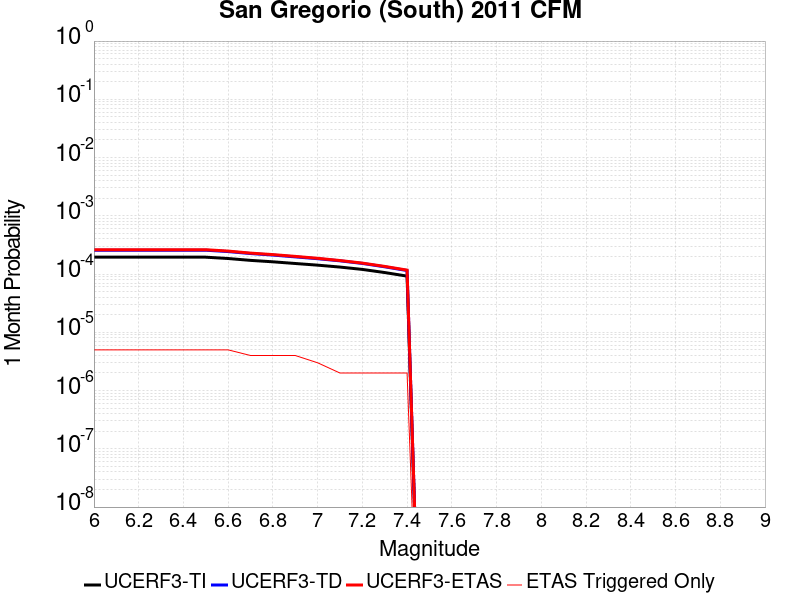 |  |  |

| Magnitude | 1 wk TI Prob | 1 wk TD Prob | 1 wk ETAS Prob | 1 wk ETAS/TD Gain | 1 wk ETAS Triggered Only | 1 mo TI Prob | 1 mo TD Prob | 1 mo ETAS Prob | 1 mo ETAS/TD Gain | 1 mo ETAS Triggered Only | 1 yr TI Prob | 1 yr TD Prob | 1 yr ETAS Prob | 1 yr ETAS/TD Gain | 1 yr ETAS Triggered Only | 10 yr TI Prob | 10 yr TD Prob | 10 yr ETAS Prob | 10 yr ETAS/TD Gain | 10 yr ETAS Triggered Only |
|-----|-----|-----|-----|-----|-----|-----|-----|-----|-----|-----|-----|-----|-----|-----|-----|-----|-----|-----|-----|-----|
| 6.0 | 4.5472258E-5 | 5.991556E-5 | 6.2934305E-5 | 1.0503832 | 3.0189226E-6 | 1.9486654E-4 | 2.5675958E-4 | 2.6581404E-4 | 1.0352643 | 9.056768E-6 | 0.0023699186 | 0.0031223015 | 0.003137349 | 1.0048194 | 1.5094613E-5 | 0.023448035 | 0.03088203 | 0.03090251 | 1.0006632 | 2.1132459E-5 |
| 6.1 | 4.5472258E-5 | 5.991556E-5 | 6.2934305E-5 | 1.0503832 | 3.0189226E-6 | 1.9486654E-4 | 2.5675958E-4 | 2.6581404E-4 | 1.0352643 | 9.056768E-6 | 0.0023699186 | 0.0031223015 | 0.003137349 | 1.0048194 | 1.5094613E-5 | 0.023448035 | 0.03088203 | 0.03090251 | 1.0006632 | 2.1132459E-5 |
| 6.2 | 4.5472258E-5 | 5.991556E-5 | 6.2934305E-5 | 1.0503832 | 3.0189226E-6 | 1.9486654E-4 | 2.5675958E-4 | 2.6581404E-4 | 1.0352643 | 9.056768E-6 | 0.0023699186 | 0.0031223015 | 0.003137349 | 1.0048194 | 1.5094613E-5 | 0.023448035 | 0.03088203 | 0.03090251 | 1.0006632 | 2.1132459E-5 |
| 6.3 | 4.5472258E-5 | 5.991556E-5 | 6.2934305E-5 | 1.0503832 | 3.0189226E-6 | 1.9486654E-4 | 2.5675958E-4 | 2.6581404E-4 | 1.0352643 | 9.056768E-6 | 0.0023699186 | 0.0031223015 | 0.003137349 | 1.0048194 | 1.5094613E-5 | 0.023448035 | 0.03088203 | 0.03090251 | 1.0006632 | 2.1132459E-5 |
| 6.4 | 4.5472258E-5 | 5.991556E-5 | 6.2934305E-5 | 1.0503832 | 3.0189226E-6 | 1.9486654E-4 | 2.5675958E-4 | 2.6581404E-4 | 1.0352643 | 9.056768E-6 | 0.0023699186 | 0.0031223015 | 0.003137349 | 1.0048194 | 1.5094613E-5 | 0.023448035 | 0.03088203 | 0.03090251 | 1.0006632 | 2.1132459E-5 |
| 6.5 | 4.5472258E-5 | 5.991556E-5 | 6.2934305E-5 | 1.0503832 | 3.0189226E-6 | 1.9486654E-4 | 2.5675958E-4 | 2.6581404E-4 | 1.0352643 | 9.056768E-6 | 0.0023699186 | 0.0031223015 | 0.003137349 | 1.0048194 | 1.5094613E-5 | 0.023448035 | 0.03088203 | 0.03090251 | 1.0006632 | 2.1132459E-5 |
| 6.6 | 4.315749E-5 | 5.674213E-5 | 5.976088E-5 | 1.0532012 | 3.0189226E-6 | 1.8494757E-4 | 2.4316214E-4 | 2.522167E-4 | 1.0372367 | 9.056768E-6 | 0.0022494113 | 0.002957233 | 0.002972283 | 1.0050892 | 1.5094613E-5 | 0.02226778 | 0.02927816 | 0.029298674 | 1.0007006 | 2.1132459E-5 |
| 6.7 | 4.008459E-5 | 5.251357E-5 | 5.5532335E-5 | 1.0574855 | 3.0189226E-6 | 1.7177979E-4 | 2.250431E-4 | 2.3107958E-4 | 1.0268236 | 6.037845E-6 | 0.0020894127 | 0.002737236 | 0.0027492787 | 1.0043995 | 1.207569E-5 | 0.020698763 | 0.02713696 | 0.027154582 | 1.0006493 | 1.8113536E-5 |
| 6.8 | 3.7885424E-5 | 4.9452636E-5 | 5.247141E-5 | 1.0610437 | 3.0189226E-6 | 1.62356E-4 | 2.1192706E-4 | 2.1796362E-4 | 1.0284842 | 6.037845E-6 | 0.001974892 | 0.0025779405 | 0.002589985 | 1.0046722 | 1.207569E-5 | 0.019574333 | 0.025582204 | 0.025599854 | 1.00069 | 1.8113536E-5 |
| 6.9 | 3.543751E-5 | 4.6004345E-5 | 4.902313E-5 | 1.0656196 | 3.0189226E-6 | 1.5186622E-4 | 1.97151E-4 | 2.0318766E-4 | 1.0306195 | 6.037845E-6 | 0.001847403 | 0.0023984574 | 0.002410504 | 1.0050226 | 1.207569E-5 | 0.018321203 | 0.023827864 | 0.0238426 | 1.0006183 | 1.5094613E-5 |
| 7.0 | 3.3186065E-5 | 4.2815023E-5 | 4.5833815E-5 | 1.0705078 | 3.0189226E-6 | 1.4221824E-4 | 1.834845E-4 | 1.8952123E-4 | 1.0329006 | 6.037845E-6 | 0.0017301317 | 0.0022324256 | 0.0022444744 | 1.0053972 | 1.207569E-5 | 0.017167237 | 0.022202516 | 0.022217276 | 1.0006647 | 1.5094613E-5 |
| 7.1 | 3.076152E-5 | 3.9376442E-5 | 4.2395248E-5 | 1.0766652 | 3.0189226E-6 | 1.3182842E-4 | 1.6874976E-4 | 1.7176816E-4 | 1.0178869 | 3.0189226E-6 | 0.0016038293 | 0.0020533882 | 0.0020624262 | 1.0044016 | 9.056768E-6 | 0.015923034 | 0.020447142 | 0.020458972 | 1.0005785 | 1.207569E-5 |
| 7.2 | 2.8039283E-5 | 3.552108E-5 | 3.8539896E-5 | 1.0849866 | 3.0189226E-6 | 1.2016282E-4 | 1.5222882E-4 | 1.5524728E-4 | 1.0198284 | 3.0189226E-6 | 0.0014620004 | 0.00185261 | 0.0018616499 | 1.0048796 | 9.056768E-6 | 0.0145241935 | 0.018474856 | 0.018486708 | 1.0006416 | 1.207569E-5 |
| 7.3 | 2.4776145E-5 | 3.1098632E-5 | 3.4117464E-5 | 1.0970727 | 3.0189226E-6 | 1.0617916E-4 | 1.3327754E-4 | 1.3629606E-4 | 1.0226483 | 3.0189226E-6 | 0.0012919646 | 0.0016222443 | 0.0016282722 | 1.0037159 | 6.037845E-6 | 0.012844792 | 0.0162039 | 0.016212812 | 1.0005499 | 9.056768E-6 |
| 7.4 | 2.1508438E-5 | 2.6824098E-5 | 2.984294E-5 | 1.1125422 | 3.0189226E-6 | 9.217577E-5 | 1.1495983E-4 | 1.1797841E-4 | 1.0262576 | 3.0189226E-6 | 0.0011216622 | 0.0013995317 | 0.0014055611 | 1.0043081 | 6.037845E-6 | 0.011160175 | 0.014002349 | 0.014011279 | 1.0006378 | 9.056768E-6 |

## Emerson-Copper Mtn 2011
*[(top)](#table-of-contents)*

| 1 Week | 1 Month | 1 Year | 10 Year |
|-----|-----|-----|-----|
|  |  | 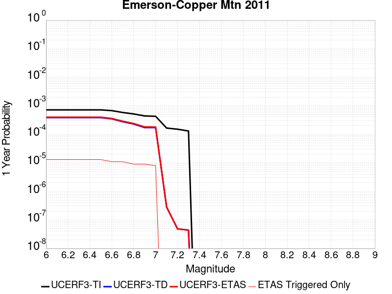 |  |

| Magnitude | 1 wk TI Prob | 1 wk TD Prob | 1 wk ETAS Prob | 1 wk ETAS/TD Gain | 1 wk ETAS Triggered Only | 1 mo TI Prob | 1 mo TD Prob | 1 mo ETAS Prob | 1 mo ETAS/TD Gain | 1 mo ETAS Triggered Only | 1 yr TI Prob | 1 yr TD Prob | 1 yr ETAS Prob | 1 yr ETAS/TD Gain | 1 yr ETAS Triggered Only | 10 yr TI Prob | 10 yr TD Prob | 10 yr ETAS Prob | 10 yr ETAS/TD Gain | 10 yr ETAS Triggered Only |
|-----|-----|-----|-----|-----|-----|-----|-----|-----|-----|-----|-----|-----|-----|-----|-----|-----|-----|-----|-----|-----|
| 6.0 | 1.3738761E-5 | 7.363802E-6 | 1.6420503E-5 | 2.2298946 | 9.056768E-6 | 5.8879075E-5 | 3.1558855E-5 | 4.6652993E-5 | 1.4782853 | 1.5094613E-5 | 7.166169E-4 | 3.841763E-4 | 3.9926512E-4 | 1.0392758 | 1.5094613E-5 | 0.007143104 | 0.0038365931 | 0.0038576445 | 1.005487 | 2.1132459E-5 |
| 6.1 | 1.3738761E-5 | 7.363802E-6 | 1.6420503E-5 | 2.2298946 | 9.056768E-6 | 5.8879075E-5 | 3.1558855E-5 | 4.6652993E-5 | 1.4782853 | 1.5094613E-5 | 7.166169E-4 | 3.841763E-4 | 3.9926512E-4 | 1.0392758 | 1.5094613E-5 | 0.007143104 | 0.0038365931 | 0.0038576445 | 1.005487 | 2.1132459E-5 |
| 6.2 | 1.3738761E-5 | 7.363802E-6 | 1.6420503E-5 | 2.2298946 | 9.056768E-6 | 5.8879075E-5 | 3.1558855E-5 | 4.6652993E-5 | 1.4782853 | 1.5094613E-5 | 7.166169E-4 | 3.841763E-4 | 3.9926512E-4 | 1.0392758 | 1.5094613E-5 | 0.007143104 | 0.0038365931 | 0.0038576445 | 1.005487 | 2.1132459E-5 |
| 6.3 | 1.3738761E-5 | 7.363802E-6 | 1.6420503E-5 | 2.2298946 | 9.056768E-6 | 5.8879075E-5 | 3.1558855E-5 | 4.6652993E-5 | 1.4782853 | 1.5094613E-5 | 7.166169E-4 | 3.841763E-4 | 3.9926512E-4 | 1.0392758 | 1.5094613E-5 | 0.007143104 | 0.0038365931 | 0.0038576445 | 1.005487 | 2.1132459E-5 |
| 6.4 | 1.3738761E-5 | 7.363802E-6 | 1.6420503E-5 | 2.2298946 | 9.056768E-6 | 5.8879075E-5 | 3.1558855E-5 | 4.6652993E-5 | 1.4782853 | 1.5094613E-5 | 7.166169E-4 | 3.841763E-4 | 3.9926512E-4 | 1.0392758 | 1.5094613E-5 | 0.007143104 | 0.0038365931 | 0.0038576445 | 1.005487 | 2.1132459E-5 |
| 6.5 | 1.3738761E-5 | 7.363802E-6 | 1.6420503E-5 | 2.2298946 | 9.056768E-6 | 5.8879075E-5 | 3.1558855E-5 | 4.6652993E-5 | 1.4782853 | 1.5094613E-5 | 7.166169E-4 | 3.841763E-4 | 3.9926512E-4 | 1.0392758 | 1.5094613E-5 | 0.007143104 | 0.0038365931 | 0.0038576445 | 1.005487 | 2.1132459E-5 |
| 6.6 | 1.2946993E-5 | 6.644407E-6 | 1.2682212E-5 | 1.9087049 | 6.037845E-6 | 5.5485933E-5 | 2.8475804E-5 | 4.055115E-5 | 1.4240564 | 1.207569E-5 | 6.7533186E-4 | 3.4665258E-4 | 3.5872406E-4 | 1.0348231 | 1.207569E-5 | 0.006732832 | 0.0034625726 | 0.0034806232 | 1.0052131 | 1.8113536E-5 |
| 6.7 | 1.1127743E-5 | 5.301015E-6 | 1.1338828E-5 | 2.138992 | 6.037845E-6 | 4.7689457E-5 | 2.2718517E-5 | 3.479393E-5 | 1.5315231 | 1.207569E-5 | 5.8046443E-4 | 2.765771E-4 | 2.8864946E-4 | 1.0436491 | 1.207569E-5 | 0.005789506 | 0.00276373 | 0.0027817935 | 1.0065359 | 1.8113536E-5 |
| 6.8 | 9.893959E-6 | 4.385705E-6 | 1.0423523E-5 | 2.3767042 | 6.037845E-6 | 4.2401993E-5 | 1.8795821E-5 | 3.0871284E-5 | 1.6424547 | 1.207569E-5 | 5.16122E-4 | 2.2882903E-4 | 2.4090197E-4 | 1.0527596 | 1.207569E-5 | 0.005149249 | 0.0022873012 | 0.0023023614 | 1.0065842 | 1.5094613E-5 |
| 6.9 | 8.432605E-6 | 3.3001859E-6 | 9.338011E-6 | 2.829541 | 6.037845E-6 | 3.6139234E-5 | 1.4143652E-5 | 2.6219172E-5 | 1.8537766 | 1.207569E-5 | 4.3990635E-4 | 1.7219881E-4 | 1.8427242E-4 | 1.0701144 | 1.207569E-5 | 0.0043903654 | 0.0017219725 | 0.0017370412 | 1.0087508 | 1.5094613E-5 |
| 7.0 | 8.181617E-6 | 3.2873893E-6 | 9.325215E-6 | 2.8366628 | 6.037845E-6 | 3.5063604E-5 | 1.40888105E-5 | 2.616433E-5 | 1.8571 | 1.207569E-5 | 4.2681574E-4 | 1.7153122E-4 | 1.8360483E-4 | 1.0703872 | 1.207569E-5 | 0.004259969 | 0.0017153069 | 0.0017303756 | 1.0087849 | 1.5094613E-5 |
| 7.1 | 3.1700695E-6 | 5.4303326E-9 | 5.4303326E-9 | 1.0 | 0.0 | 1.3585942E-5 | 2.3272854E-8 | 2.3272854E-8 | 1.0 | 0.0 | 1.6539628E-4 | 2.83347E-7 | 2.83347E-7 | 1.0 | 0.0 | 0.0016527324 | 2.833469E-6 | 2.833469E-6 | 1.0 | 0.0 |
| 7.2 | 2.8879267E-6 | 9.331039E-10 | 9.331039E-10 | 1.0 | 0.0 | 1.237677E-5 | 3.999017E-9 | 3.999017E-9 | 1.0 | 0.0 | 1.5067676E-4 | 4.868803E-8 | 4.868803E-8 | 1.0 | 0.0 | 0.0015057464 | 4.868803E-7 | 4.868803E-7 | 1.0 | 0.0 |
| 7.3 | 2.4973094E-6 | 8.4248597E-10 | 8.4248597E-10 | 1.0 | 0.0 | 1.0702711E-5 | 3.6106542E-9 | 3.6106542E-9 | 1.0 | 0.0 | 1.3029772E-4 | 4.3959716E-8 | 4.3959716E-8 | 1.0 | 0.0 | 0.0013022134 | 4.3959716E-7 | 4.3959716E-7 | 1.0 | 0.0 |

## Palos Verdes
*[(top)](#table-of-contents)*

| 1 Week | 1 Month | 1 Year | 10 Year |
|-----|-----|-----|-----|
|  |  |  |  |

| Magnitude | 1 wk TI Prob | 1 wk TD Prob | 1 wk ETAS Prob | 1 wk ETAS/TD Gain | 1 wk ETAS Triggered Only | 1 mo TI Prob | 1 mo TD Prob | 1 mo ETAS Prob | 1 mo ETAS/TD Gain | 1 mo ETAS Triggered Only | 1 yr TI Prob | 1 yr TD Prob | 1 yr ETAS Prob | 1 yr ETAS/TD Gain | 1 yr ETAS Triggered Only | 10 yr TI Prob | 10 yr TD Prob | 10 yr ETAS Prob | 10 yr ETAS/TD Gain | 10 yr ETAS Triggered Only |
|-----|-----|-----|-----|-----|-----|-----|-----|-----|-----|-----|-----|-----|-----|-----|-----|-----|-----|-----|-----|-----|
| 6.0 | 2.416717E-5 | 2.7219172E-5 | 3.3256852E-5 | 1.2218173 | 6.037845E-6 | 1.0356947E-4 | 1.16648946E-4 | 1.2268609E-4 | 1.0517548 | 6.037845E-6 | 0.0012602288 | 0.0014193773 | 0.0014284212 | 1.0063717 | 9.056768E-6 | 0.01253106 | 0.014113327 | 0.014134161 | 1.0014762 | 2.1132459E-5 |
| 6.1 | 2.416717E-5 | 2.7219172E-5 | 3.3256852E-5 | 1.2218173 | 6.037845E-6 | 1.0356947E-4 | 1.16648946E-4 | 1.2268609E-4 | 1.0517548 | 6.037845E-6 | 0.0012602288 | 0.0014193773 | 0.0014284212 | 1.0063717 | 9.056768E-6 | 0.01253106 | 0.014113327 | 0.014134161 | 1.0014762 | 2.1132459E-5 |
| 6.2 | 2.416717E-5 | 2.7219172E-5 | 3.3256852E-5 | 1.2218173 | 6.037845E-6 | 1.0356947E-4 | 1.16648946E-4 | 1.2268609E-4 | 1.0517548 | 6.037845E-6 | 0.0012602288 | 0.0014193773 | 0.0014284212 | 1.0063717 | 9.056768E-6 | 0.01253106 | 0.014113327 | 0.014134161 | 1.0014762 | 2.1132459E-5 |
| 6.3 | 2.416717E-5 | 2.7219172E-5 | 3.3256852E-5 | 1.2218173 | 6.037845E-6 | 1.0356947E-4 | 1.16648946E-4 | 1.2268609E-4 | 1.0517548 | 6.037845E-6 | 0.0012602288 | 0.0014193773 | 0.0014284212 | 1.0063717 | 9.056768E-6 | 0.01253106 | 0.014113327 | 0.014134161 | 1.0014762 | 2.1132459E-5 |
| 6.4 | 2.416717E-5 | 2.7219172E-5 | 3.3256852E-5 | 1.2218173 | 6.037845E-6 | 1.0356947E-4 | 1.16648946E-4 | 1.2268609E-4 | 1.0517548 | 6.037845E-6 | 0.0012602288 | 0.0014193773 | 0.0014284212 | 1.0063717 | 9.056768E-6 | 0.01253106 | 0.014113327 | 0.014134161 | 1.0014762 | 2.1132459E-5 |
| 6.5 | 2.416717E-5 | 2.7219172E-5 | 3.3256852E-5 | 1.2218173 | 6.037845E-6 | 1.0356947E-4 | 1.16648946E-4 | 1.2268609E-4 | 1.0517548 | 6.037845E-6 | 0.0012602288 | 0.0014193773 | 0.0014284212 | 1.0063717 | 9.056768E-6 | 0.01253106 | 0.014113327 | 0.014134161 | 1.0014762 | 2.1132459E-5 |
| 6.6 | 2.2181084E-5 | 2.4975725E-5 | 3.101342E-5 | 1.2417425 | 6.037845E-6 | 9.505832E-5 | 1.07035E-4 | 1.130722E-4 | 1.056404 | 6.037845E-6 | 0.0011567206 | 0.0013024732 | 0.0013115183 | 1.0069444 | 9.056768E-6 | 0.0115071805 | 0.012958492 | 0.01297935 | 1.0016097 | 2.1132459E-5 |
| 6.7 | 1.9382267E-5 | 2.1828162E-5 | 2.7865875E-5 | 1.276602 | 6.037845E-6 | 8.306422E-5 | 9.354648E-5 | 9.9583754E-5 | 1.0645378 | 6.037845E-6 | 0.0010108376 | 0.0011384335 | 0.0011474799 | 1.0079464 | 9.056768E-6 | 0.0100625185 | 0.011335945 | 0.011356838 | 1.0018431 | 2.1132459E-5 |
| 6.8 | 1.6157266E-5 | 1.8180996E-5 | 2.421873E-5 | 1.3320905 | 6.037845E-6 | 6.9243586E-5 | 7.791678E-5 | 8.395415E-5 | 1.077485 | 6.037845E-6 | 8.4271457E-4 | 9.483226E-4 | 9.573708E-4 | 1.0095413 | 9.056768E-6 | 0.00839526 | 0.009452482 | 0.009473414 | 1.0022146 | 2.1132459E-5 |
| 6.9 | 1.3828139E-5 | 1.5540487E-5 | 2.1578238E-5 | 1.3885175 | 6.037845E-6 | 5.9262107E-5 | 6.6600944E-5 | 7.263839E-5 | 1.090651 | 6.037845E-6 | 7.212773E-4 | 8.1066263E-4 | 8.1971206E-4 | 1.011163 | 9.056768E-6 | 0.007189407 | 0.008086668 | 0.00810164 | 1.0018516 | 1.5094613E-5 |
| 7.0 | 1.1833321E-5 | 1.3284609E-5 | 1.9322373E-5 | 1.4544933 | 6.037845E-6 | 5.0713246E-5 | 5.6933346E-5 | 6.2970845E-5 | 1.1060451 | 6.037845E-6 | 6.1725883E-4 | 6.930404E-4 | 7.0209085E-4 | 1.0130591 | 9.056768E-6 | 0.0061554713 | 0.006918346 | 0.0069303378 | 1.0017334 | 1.207569E-5 |
| 7.1 | 1.0044758E-5 | 1.1258023E-5 | 1.4276911E-5 | 1.2681544 | 3.0189226E-6 | 4.304825E-5 | 4.8248323E-5 | 5.12671E-5 | 1.0625675 | 3.0189226E-6 | 5.239864E-4 | 5.873616E-4 | 5.9339585E-4 | 1.0102736 | 6.037845E-6 | 0.005227526 | 0.005867563 | 0.0058765667 | 1.0015345 | 9.056768E-6 |
| 7.2 | 8.481934E-6 | 9.495382E-6 | 1.2514276E-5 | 1.3179328 | 3.0189226E-6 | 3.635064E-5 | 4.0694402E-5 | 4.37132E-5 | 1.0741822 | 3.0189226E-6 | 4.4247916E-4 | 4.9543753E-4 | 4.9845496E-4 | 1.0060904 | 3.0189226E-6 | 0.0044159917 | 0.0049527287 | 0.0049587367 | 1.0012131 | 6.037845E-6 |

## Calaveras (No) 2011 CFM
*[(top)](#table-of-contents)*

| 1 Week | 1 Month | 1 Year | 10 Year |
|-----|-----|-----|-----|
|  |  |  |  |

| Magnitude | 1 wk TI Prob | 1 wk TD Prob | 1 wk ETAS Prob | 1 wk ETAS/TD Gain | 1 wk ETAS Triggered Only | 1 mo TI Prob | 1 mo TD Prob | 1 mo ETAS Prob | 1 mo ETAS/TD Gain | 1 mo ETAS Triggered Only | 1 yr TI Prob | 1 yr TD Prob | 1 yr ETAS Prob | 1 yr ETAS/TD Gain | 1 yr ETAS Triggered Only | 10 yr TI Prob | 10 yr TD Prob | 10 yr ETAS Prob | 10 yr ETAS/TD Gain | 10 yr ETAS Triggered Only |
|-----|-----|-----|-----|-----|-----|-----|-----|-----|-----|-----|-----|-----|-----|-----|-----|-----|-----|-----|-----|-----|
| 6.0 | 6.853089E-5 | 1.452927E-4 | 1.5132966E-4 | 1.0415504 | 6.037845E-6 | 2.9367075E-4 | 6.225777E-4 | 6.286118E-4 | 1.0096921 | 6.037845E-6 | 0.0035695804 | 0.007561221 | 0.007573205 | 1.001585 | 1.207569E-5 | 0.03512784 | 0.07195558 | 0.071975194 | 1.0002725 | 2.1132459E-5 |
| 6.1 | 6.853089E-5 | 1.452927E-4 | 1.5132966E-4 | 1.0415504 | 6.037845E-6 | 2.9367075E-4 | 6.225777E-4 | 6.286118E-4 | 1.0096921 | 6.037845E-6 | 0.0035695804 | 0.007561221 | 0.007573205 | 1.001585 | 1.207569E-5 | 0.03512784 | 0.07195558 | 0.071975194 | 1.0002725 | 2.1132459E-5 |
| 6.2 | 6.853089E-5 | 1.452927E-4 | 1.5132966E-4 | 1.0415504 | 6.037845E-6 | 2.9367075E-4 | 6.225777E-4 | 6.286118E-4 | 1.0096921 | 6.037845E-6 | 0.0035695804 | 0.007561221 | 0.007573205 | 1.001585 | 1.207569E-5 | 0.03512784 | 0.07195558 | 0.071975194 | 1.0002725 | 2.1132459E-5 |
| 6.3 | 6.853089E-5 | 1.452927E-4 | 1.5132966E-4 | 1.0415504 | 6.037845E-6 | 2.9367075E-4 | 6.225777E-4 | 6.286118E-4 | 1.0096921 | 6.037845E-6 | 0.0035695804 | 0.007561221 | 0.007573205 | 1.001585 | 1.207569E-5 | 0.03512784 | 0.07195558 | 0.071975194 | 1.0002725 | 2.1132459E-5 |
| 6.4 | 6.853089E-5 | 1.452927E-4 | 1.5132966E-4 | 1.0415504 | 6.037845E-6 | 2.9367075E-4 | 6.225777E-4 | 6.286118E-4 | 1.0096921 | 6.037845E-6 | 0.0035695804 | 0.007561221 | 0.007573205 | 1.001585 | 1.207569E-5 | 0.03512784 | 0.07195558 | 0.071975194 | 1.0002725 | 2.1132459E-5 |
| 6.5 | 6.853089E-5 | 1.452927E-4 | 1.5132966E-4 | 1.0415504 | 6.037845E-6 | 2.9367075E-4 | 6.225777E-4 | 6.286118E-4 | 1.0096921 | 6.037845E-6 | 0.0035695804 | 0.007561221 | 0.007573205 | 1.001585 | 1.207569E-5 | 0.03512784 | 0.07195558 | 0.071975194 | 1.0002725 | 2.1132459E-5 |
| 6.6 | 6.5130276E-5 | 1.385732E-4 | 1.4461021E-4 | 1.0435655 | 6.037845E-6 | 2.7909988E-4 | 5.9379323E-4 | 5.998275E-4 | 1.0101622 | 6.037845E-6 | 0.003392747 | 0.0072131394 | 0.007225128 | 1.001662 | 1.207569E-5 | 0.033414144 | 0.06881748 | 0.068837166 | 1.000286 | 2.1132459E-5 |
| 6.7 | 6.1341E-5 | 1.3118902E-4 | 1.3722607E-4 | 1.046018 | 6.037845E-6 | 2.6286353E-4 | 5.6216074E-4 | 5.681952E-4 | 1.0107344 | 6.037845E-6 | 0.003195667 | 0.0068304855 | 0.0068424786 | 1.0017558 | 1.207569E-5 | 0.03150101 | 0.06536239 | 0.06538214 | 1.0003022 | 2.1132459E-5 |
| 6.8 | 3.241399E-5 | 7.175236E-5 | 7.4771066E-5 | 1.0420712 | 3.0189226E-6 | 1.389097E-4 | 3.075001E-4 | 3.105181E-4 | 1.0098146 | 3.0189226E-6 | 0.0016899136 | 0.0037420401 | 0.0037450478 | 1.0008037 | 3.0189226E-6 | 0.016771203 | 0.036092106 | 0.03609793 | 1.0001613 | 6.037845E-6 |
| 6.9 | 2.7363296E-5 | 6.059934E-5 | 6.059934E-5 | 1.0 | 0.0 | 1.1726599E-4 | 2.5971147E-4 | 2.5971147E-4 | 1.0 | 0.0 | 0.0014267784 | 0.003161987 | 0.003161987 | 1.0 | 0.0 | 0.014176525 | 0.030637112 | 0.030640038 | 1.0000955 | 3.0189226E-6 |

## Rodgers Creek - Healdsburg 2011 CFM
*[(top)](#table-of-contents)*

| 1 Week | 1 Month | 1 Year | 10 Year |
|-----|-----|-----|-----|
|  |  |  |  |

| Magnitude | 1 wk TI Prob | 1 wk TD Prob | 1 wk ETAS Prob | 1 wk ETAS/TD Gain | 1 wk ETAS Triggered Only | 1 mo TI Prob | 1 mo TD Prob | 1 mo ETAS Prob | 1 mo ETAS/TD Gain | 1 mo ETAS Triggered Only | 1 yr TI Prob | 1 yr TD Prob | 1 yr ETAS Prob | 1 yr ETAS/TD Gain | 1 yr ETAS Triggered Only | 10 yr TI Prob | 10 yr TD Prob | 10 yr ETAS Prob | 10 yr ETAS/TD Gain | 10 yr ETAS Triggered Only |
|-----|-----|-----|-----|-----|-----|-----|-----|-----|-----|-----|-----|-----|-----|-----|-----|-----|-----|-----|-----|-----|
| 6.0 | 9.830927E-5 | 2.4955187E-4 | 2.586064E-4 | 1.036283 | 9.056768E-6 | 4.212574E-4 | 0.0010693158 | 0.0010783629 | 1.0084606 | 9.056768E-6 | 0.0051167537 | 0.012984863 | 0.013002741 | 1.0013769 | 1.8113536E-5 | 0.05000532 | 0.12216672 | 0.12218527 | 1.0001519 | 2.1132459E-5 |
| 6.1 | 9.830927E-5 | 2.4955187E-4 | 2.586064E-4 | 1.036283 | 9.056768E-6 | 4.212574E-4 | 0.0010693158 | 0.0010783629 | 1.0084606 | 9.056768E-6 | 0.0051167537 | 0.012984863 | 0.013002741 | 1.0013769 | 1.8113536E-5 | 0.05000532 | 0.12216672 | 0.12218527 | 1.0001519 | 2.1132459E-5 |
| 6.2 | 9.830927E-5 | 2.4955187E-4 | 2.586064E-4 | 1.036283 | 9.056768E-6 | 4.212574E-4 | 0.0010693158 | 0.0010783629 | 1.0084606 | 9.056768E-6 | 0.0051167537 | 0.012984863 | 0.013002741 | 1.0013769 | 1.8113536E-5 | 0.05000532 | 0.12216672 | 0.12218527 | 1.0001519 | 2.1132459E-5 |
| 6.3 | 9.830927E-5 | 2.4955187E-4 | 2.586064E-4 | 1.036283 | 9.056768E-6 | 4.212574E-4 | 0.0010693158 | 0.0010783629 | 1.0084606 | 9.056768E-6 | 0.0051167537 | 0.012984863 | 0.013002741 | 1.0013769 | 1.8113536E-5 | 0.05000532 | 0.12216672 | 0.12218527 | 1.0001519 | 2.1132459E-5 |
| 6.4 | 9.830927E-5 | 2.4955187E-4 | 2.586064E-4 | 1.036283 | 9.056768E-6 | 4.212574E-4 | 0.0010693158 | 0.0010783629 | 1.0084606 | 9.056768E-6 | 0.0051167537 | 0.012984863 | 0.013002741 | 1.0013769 | 1.8113536E-5 | 0.05000532 | 0.12216672 | 0.12218527 | 1.0001519 | 2.1132459E-5 |
| 6.5 | 9.830927E-5 | 2.4955187E-4 | 2.586064E-4 | 1.036283 | 9.056768E-6 | 4.212574E-4 | 0.0010693158 | 0.0010783629 | 1.0084606 | 9.056768E-6 | 0.0051167537 | 0.012984863 | 0.013002741 | 1.0013769 | 1.8113536E-5 | 0.05000532 | 0.12216672 | 0.12218527 | 1.0001519 | 2.1132459E-5 |
| 6.6 | 9.722793E-5 | 2.4745433E-4 | 2.5650888E-4 | 1.0365907 | 9.056768E-6 | 4.1662456E-4 | 0.001060334 | 0.0010693811 | 1.0085324 | 9.056768E-6 | 0.0050606127 | 0.012876847 | 0.012894727 | 1.0013885 | 1.8113536E-5 | 0.049469102 | 0.12122572 | 0.1212443 | 1.0001532 | 2.1132459E-5 |
| 6.7 | 9.631043E-5 | 2.4569524E-4 | 2.547498E-4 | 1.0368527 | 9.056768E-6 | 4.1269368E-4 | 0.0010528011 | 0.0010618484 | 1.0085934 | 9.056768E-6 | 0.0050129755 | 0.012786214 | 0.012804097 | 1.0013986 | 1.8113536E-5 | 0.049013894 | 0.12043094 | 0.12044953 | 1.0001544 | 2.1132459E-5 |
| 6.8 | 9.5157004E-5 | 2.4311169E-4 | 2.5216627E-4 | 1.0372444 | 9.056768E-6 | 4.0775197E-4 | 0.0010417376 | 0.001050785 | 1.0086849 | 9.056768E-6 | 0.0049530854 | 0.012653089 | 0.012670973 | 1.0014135 | 1.8113536E-5 | 0.048441324 | 0.1192606 | 0.11927921 | 1.000156 | 2.1132459E-5 |
| 6.9 | 9.3715214E-5 | 2.3986747E-4 | 2.4892206E-4 | 1.0377483 | 9.056768E-6 | 4.015748E-4 | 0.0010278448 | 0.0010368923 | 1.0088024 | 9.056768E-6 | 0.004878218 | 0.012485896 | 0.012503783 | 1.0014327 | 1.8113536E-5 | 0.047725122 | 0.11779124 | 0.117809884 | 1.0001583 | 2.1132459E-5 |
| 7.0 | 9.21773E-5 | 2.3636219E-4 | 2.4541683E-4 | 1.0383083 | 9.056768E-6 | 3.9498575E-4 | 0.0010128339 | 0.0010218816 | 1.008933 | 9.056768E-6 | 0.0047983527 | 0.012305218 | 0.0123231085 | 1.0014539 | 1.8113536E-5 | 0.046960585 | 0.11620537 | 0.116221376 | 1.0001378 | 1.8113536E-5 |
| 7.1 | 1.8670535E-5 | 4.6669888E-5 | 4.968867E-5 | 1.0646837 | 3.0189226E-6 | 8.001412E-5 | 2.0000339E-4 | 2.030217E-4 | 1.0150913 | 3.0189226E-6 | 9.737365E-4 | 0.0024331913 | 0.002442226 | 1.0037131 | 9.056768E-6 | 0.009694808 | 0.023618827 | 0.02362767 | 1.0003744 | 9.056768E-6 |
| 7.2 | 6.6138855E-6 | 1.8792352E-5 | 2.1811218E-5 | 1.1606433 | 3.0189226E-6 | 2.8344915E-5 | 8.053787E-5 | 8.355655E-5 | 1.0374815 | 3.0189226E-6 | 3.4504468E-4 | 9.8041E-4 | 9.894578E-4 | 1.0092287 | 9.056768E-6 | 0.0034450945 | 0.009560432 | 0.009569403 | 1.0009383 | 9.056768E-6 |
| 7.3 | 5.4382035E-6 | 1.5442325E-5 | 1.84612E-5 | 1.1954936 | 3.0189226E-6 | 2.3306378E-5 | 6.618139E-5 | 6.920011E-5 | 1.0456128 | 3.0189226E-6 | 2.8371823E-4 | 8.0575846E-4 | 8.148079E-4 | 1.011231 | 9.056768E-6 | 0.0028335627 | 0.007868089 | 0.007877074 | 1.001142 | 9.056768E-6 |

## Casmalia 2011 CFM
*[(top)](#table-of-contents)*

| 1 Week | 1 Month | 1 Year | 10 Year |
|-----|-----|-----|-----|
|  |  |  |  |

| Magnitude | 1 wk TI Prob | 1 wk TD Prob | 1 wk ETAS Prob | 1 wk ETAS/TD Gain | 1 wk ETAS Triggered Only | 1 mo TI Prob | 1 mo TD Prob | 1 mo ETAS Prob | 1 mo ETAS/TD Gain | 1 mo ETAS Triggered Only | 1 yr TI Prob | 1 yr TD Prob | 1 yr ETAS Prob | 1 yr ETAS/TD Gain | 1 yr ETAS Triggered Only | 10 yr TI Prob | 10 yr TD Prob | 10 yr ETAS Prob | 10 yr ETAS/TD Gain | 10 yr ETAS Triggered Only |
|-----|-----|-----|-----|-----|-----|-----|-----|-----|-----|-----|-----|-----|-----|-----|-----|-----|-----|-----|-----|-----|
| 6.0 | 4.5215784E-6 | 4.6811892E-6 | 4.6811892E-6 | 1.0 | 0.0 | 1.9378049E-5 | 2.0062238E-5 | 2.30811E-5 | 1.1504748 | 3.0189226E-6 | 2.359022E-4 | 2.4425777E-4 | 2.5331232E-4 | 1.0370697 | 9.056768E-6 | 0.0023565195 | 0.0024425776 | 0.0024636583 | 1.0086305 | 2.1132459E-5 |
| 6.1 | 4.5215784E-6 | 4.6811892E-6 | 4.6811892E-6 | 1.0 | 0.0 | 1.9378049E-5 | 2.0062238E-5 | 2.30811E-5 | 1.1504748 | 3.0189226E-6 | 2.359022E-4 | 2.4425777E-4 | 2.5331232E-4 | 1.0370697 | 9.056768E-6 | 0.0023565195 | 0.0024425776 | 0.0024636583 | 1.0086305 | 2.1132459E-5 |
| 6.2 | 4.5215784E-6 | 4.6811892E-6 | 4.6811892E-6 | 1.0 | 0.0 | 1.9378049E-5 | 2.0062238E-5 | 2.30811E-5 | 1.1504748 | 3.0189226E-6 | 2.359022E-4 | 2.4425777E-4 | 2.5331232E-4 | 1.0370697 | 9.056768E-6 | 0.0023565195 | 0.0024425776 | 0.0024636583 | 1.0086305 | 2.1132459E-5 |
| 6.3 | 4.5215784E-6 | 4.6811892E-6 | 4.6811892E-6 | 1.0 | 0.0 | 1.9378049E-5 | 2.0062238E-5 | 2.30811E-5 | 1.1504748 | 3.0189226E-6 | 2.359022E-4 | 2.4425777E-4 | 2.5331232E-4 | 1.0370697 | 9.056768E-6 | 0.0023565195 | 0.0024425776 | 0.0024636583 | 1.0086305 | 2.1132459E-5 |
| 6.4 | 4.5215784E-6 | 4.6811892E-6 | 4.6811892E-6 | 1.0 | 0.0 | 1.9378049E-5 | 2.0062238E-5 | 2.30811E-5 | 1.1504748 | 3.0189226E-6 | 2.359022E-4 | 2.4425777E-4 | 2.5331232E-4 | 1.0370697 | 9.056768E-6 | 0.0023565195 | 0.0024425776 | 0.0024636583 | 1.0086305 | 2.1132459E-5 |
| 6.5 | 4.5215784E-6 | 4.6811892E-6 | 4.6811892E-6 | 1.0 | 0.0 | 1.9378049E-5 | 2.0062238E-5 | 2.30811E-5 | 1.1504748 | 3.0189226E-6 | 2.359022E-4 | 2.4425777E-4 | 2.5331232E-4 | 1.0370697 | 9.056768E-6 | 0.0023565195 | 0.0024425776 | 0.0024636583 | 1.0086305 | 2.1132459E-5 |

## San Jacinto (Coyote Creek)
*[(top)](#table-of-contents)*

| 1 Week | 1 Month | 1 Year | 10 Year |
|-----|-----|-----|-----|
|  |  |  |  |

| Magnitude | 1 wk TI Prob | 1 wk TD Prob | 1 wk ETAS Prob | 1 wk ETAS/TD Gain | 1 wk ETAS Triggered Only | 1 mo TI Prob | 1 mo TD Prob | 1 mo ETAS Prob | 1 mo ETAS/TD Gain | 1 mo ETAS Triggered Only | 1 yr TI Prob | 1 yr TD Prob | 1 yr ETAS Prob | 1 yr ETAS/TD Gain | 1 yr ETAS Triggered Only | 10 yr TI Prob | 10 yr TD Prob | 10 yr ETAS Prob | 10 yr ETAS/TD Gain | 10 yr ETAS Triggered Only |
|-----|-----|-----|-----|-----|-----|-----|-----|-----|-----|-----|-----|-----|-----|-----|-----|-----|-----|-----|-----|-----|
| 6.0 | 4.69665E-5 | 6.4235006E-5 | 6.7253735E-5 | 1.046995 | 3.0189226E-6 | 2.0126947E-4 | 2.7526915E-4 | 2.7828725E-4 | 1.0109642 | 3.0189226E-6 | 0.002447702 | 0.0033471098 | 0.0033501186 | 1.000899 | 3.0189226E-6 | 0.024209166 | 0.033357523 | 0.033375032 | 1.0005249 | 1.8113536E-5 |
| 6.1 | 4.69665E-5 | 6.4235006E-5 | 6.7253735E-5 | 1.046995 | 3.0189226E-6 | 2.0126947E-4 | 2.7526915E-4 | 2.7828725E-4 | 1.0109642 | 3.0189226E-6 | 0.002447702 | 0.0033471098 | 0.0033501186 | 1.000899 | 3.0189226E-6 | 0.024209166 | 0.033357523 | 0.033375032 | 1.0005249 | 1.8113536E-5 |
| 6.2 | 4.69665E-5 | 6.4235006E-5 | 6.7253735E-5 | 1.046995 | 3.0189226E-6 | 2.0126947E-4 | 2.7526915E-4 | 2.7828725E-4 | 1.0109642 | 3.0189226E-6 | 0.002447702 | 0.0033471098 | 0.0033501186 | 1.000899 | 3.0189226E-6 | 0.024209166 | 0.033357523 | 0.033375032 | 1.0005249 | 1.8113536E-5 |
| 6.3 | 4.69665E-5 | 6.4235006E-5 | 6.7253735E-5 | 1.046995 | 3.0189226E-6 | 2.0126947E-4 | 2.7526915E-4 | 2.7828725E-4 | 1.0109642 | 3.0189226E-6 | 0.002447702 | 0.0033471098 | 0.0033501186 | 1.000899 | 3.0189226E-6 | 0.024209166 | 0.033357523 | 0.033375032 | 1.0005249 | 1.8113536E-5 |
| 6.4 | 4.69665E-5 | 6.4235006E-5 | 6.7253735E-5 | 1.046995 | 3.0189226E-6 | 2.0126947E-4 | 2.7526915E-4 | 2.7828725E-4 | 1.0109642 | 3.0189226E-6 | 0.002447702 | 0.0033471098 | 0.0033501186 | 1.000899 | 3.0189226E-6 | 0.024209166 | 0.033357523 | 0.033375032 | 1.0005249 | 1.8113536E-5 |
| 6.5 | 4.69665E-5 | 6.4235006E-5 | 6.7253735E-5 | 1.046995 | 3.0189226E-6 | 2.0126947E-4 | 2.7526915E-4 | 2.7828725E-4 | 1.0109642 | 3.0189226E-6 | 0.002447702 | 0.0033471098 | 0.0033501186 | 1.000899 | 3.0189226E-6 | 0.024209166 | 0.033357523 | 0.033375032 | 1.0005249 | 1.8113536E-5 |
| 6.6 | 4.65626E-5 | 6.365397E-5 | 6.66727E-5 | 1.0474241 | 3.0189226E-6 | 1.9953873E-4 | 2.7277967E-4 | 2.7579776E-4 | 1.0110643 | 3.0189226E-6 | 0.0024266774 | 0.0033169023 | 0.0033199112 | 1.0009072 | 3.0189226E-6 | 0.024003487 | 0.033065155 | 0.033082668 | 1.0005296 | 1.8113536E-5 |
| 6.7 | 4.6128687E-5 | 6.303452E-5 | 6.605325E-5 | 1.0478902 | 3.0189226E-6 | 1.9767939E-4 | 2.7012554E-4 | 2.7314364E-4 | 1.011173 | 3.0189226E-6 | 0.00240409 | 0.0032846953 | 0.0032877044 | 1.0009161 | 3.0189226E-6 | 0.023782477 | 0.032753225 | 0.032770745 | 1.0005349 | 1.8113536E-5 |
| 6.8 | 4.5828285E-5 | 6.268431E-5 | 6.570305E-5 | 1.0481577 | 3.0189226E-6 | 1.9639214E-4 | 2.6862495E-4 | 2.7164308E-4 | 1.0112354 | 3.0189226E-6 | 0.0023884522 | 0.0032664812 | 0.0032694903 | 1.0009212 | 3.0189226E-6 | 0.02362944 | 0.03257484 | 0.03259236 | 1.000538 | 1.8113536E-5 |
| 6.9 | 4.523555E-5 | 6.1988314E-5 | 6.500705E-5 | 1.0486984 | 3.0189226E-6 | 1.9385223E-4 | 2.656427E-4 | 2.6866083E-4 | 1.0113616 | 3.0189226E-6 | 0.0023575963 | 0.003230282 | 0.0032332912 | 1.0009315 | 3.0189226E-6 | 0.023327406 | 0.032220315 | 0.032234926 | 1.0004534 | 1.5094613E-5 |
| 7.0 | 3.2913522E-5 | 4.3638418E-5 | 4.665721E-5 | 1.0691774 | 3.0189226E-6 | 1.4105032E-4 | 1.8701174E-4 | 1.900301E-4 | 1.01614 | 3.0189226E-6 | 0.0017159348 | 0.0022750867 | 0.0022780988 | 1.0013239 | 3.0189226E-6 | 0.017027453 | 0.022874728 | 0.022886528 | 1.0005158 | 1.207569E-5 |
| 7.1 | 3.2150587E-5 | 4.262259E-5 | 4.5641384E-5 | 1.0708262 | 3.0189226E-6 | 1.3778094E-4 | 1.8265881E-4 | 1.8567719E-4 | 1.0165247 | 3.0189226E-6 | 0.0016761922 | 0.002222199 | 0.0022252111 | 1.0013555 | 3.0189226E-6 | 0.016636053 | 0.02235371 | 0.022365516 | 1.0005281 | 1.207569E-5 |
| 7.2 | 3.1169668E-5 | 4.115963E-5 | 4.417843E-5 | 1.0733436 | 3.0189226E-6 | 1.3357744E-4 | 1.7638985E-4 | 1.7940823E-4 | 1.017112 | 3.0189226E-6 | 0.0016250921 | 0.0021460268 | 0.0021490392 | 1.0014037 | 3.0189226E-6 | 0.016132593 | 0.021605676 | 0.02161749 | 1.0005468 | 1.207569E-5 |
| 7.3 | 1.8423585E-5 | 2.7220098E-5 | 3.0238938E-5 | 1.1109048 | 3.0189226E-6 | 7.895583E-5 | 1.1665466E-4 | 1.1967323E-4 | 1.0258762 | 3.0189226E-6 | 9.608633E-4 | 0.0014197543 | 0.001422769 | 1.0021234 | 3.0189226E-6 | 0.009567193 | 0.014355129 | 0.014367031 | 1.0008291 | 1.207569E-5 |
| 7.4 | 6.9267962E-6 | 9.391728E-6 | 1.2410622E-5 | 1.3214419 | 3.0189226E-6 | 2.968593E-5 | 4.024971E-5 | 4.3268512E-5 | 1.0750018 | 3.0189226E-6 | 3.6136628E-4 | 4.899425E-4 | 4.9296E-4 | 1.0061588 | 3.0189226E-6 | 0.003607792 | 0.005030186 | 0.005039197 | 1.0017915 | 9.056768E-6 |
| 7.5 | 6.1587302E-6 | 8.234252E-6 | 1.125315E-5 | 1.3666269 | 3.0189226E-6 | 2.6394291E-5 | 3.5289235E-5 | 3.830805E-5 | 1.085545 | 3.0189226E-6 | 3.213031E-4 | 4.2957254E-4 | 4.3259017E-4 | 1.0070248 | 3.0189226E-6 | 0.0032083893 | 0.004419193 | 0.00442821 | 1.0020404 | 9.056768E-6 |
| 7.6 | 5.383844E-6 | 7.2529047E-6 | 1.0271805E-5 | 1.4162333 | 3.0189226E-6 | 2.3073413E-5 | 3.108356E-5 | 3.4102388E-5 | 1.0971198 | 3.0189226E-6 | 2.8088258E-4 | 3.7838623E-4 | 3.81404E-4 | 1.0079753 | 3.0189226E-6 | 0.0028052782 | 0.0038957447 | 0.0039047662 | 1.0023158 | 9.056768E-6 |
| 7.7 | 3.843031E-6 | 4.8339584E-6 | 7.8528665E-6 | 1.6245209 | 3.0189226E-6 | 1.647003E-5 | 2.0716834E-5 | 2.3735694E-5 | 1.1457201 | 3.0189226E-6 | 2.0050416E-4 | 2.5220422E-4 | 2.5522237E-4 | 1.0119672 | 3.0189226E-6 | 0.0020032334 | 0.002619455 | 0.0026284882 | 1.0034485 | 9.056768E-6 |
| 7.8 | 1.5303123E-6 | 1.9707616E-6 | 1.9707616E-6 | 1.0 | 0.0 | 6.5584645E-6 | 8.446107E-6 | 8.446107E-6 | 1.0 | 0.0 | 7.984638E-5 | 1.0282895E-4 | 1.0282895E-4 | 1.0 | 0.0 | 7.98177E-4 | 0.001066982 | 0.0010699978 | 1.0028263 | 3.0189226E-6 |

## San Jacinto (Borrego)
*[(top)](#table-of-contents)*

| 1 Week | 1 Month | 1 Year | 10 Year |
|-----|-----|-----|-----|
|  |  |  |  |

| Magnitude | 1 wk TI Prob | 1 wk TD Prob | 1 wk ETAS Prob | 1 wk ETAS/TD Gain | 1 wk ETAS Triggered Only | 1 mo TI Prob | 1 mo TD Prob | 1 mo ETAS Prob | 1 mo ETAS/TD Gain | 1 mo ETAS Triggered Only | 1 yr TI Prob | 1 yr TD Prob | 1 yr ETAS Prob | 1 yr ETAS/TD Gain | 1 yr ETAS Triggered Only | 10 yr TI Prob | 10 yr TD Prob | 10 yr ETAS Prob | 10 yr ETAS/TD Gain | 10 yr ETAS Triggered Only |
|-----|-----|-----|-----|-----|-----|-----|-----|-----|-----|-----|-----|-----|-----|-----|-----|-----|-----|-----|-----|-----|
| 6.0 | 9.239128E-5 | 6.746147E-5 | 7.048019E-5 | 1.0447474 | 3.0189226E-6 | 3.9590252E-4 | 2.890956E-4 | 2.9211363E-4 | 1.0104396 | 3.0189226E-6 | 0.004809465 | 0.003515305 | 0.0035213216 | 1.0017116 | 6.037845E-6 | 0.047066994 | 0.03517175 | 0.035189226 | 1.0004969 | 1.8113536E-5 |
| 6.1 | 9.239128E-5 | 6.746147E-5 | 7.048019E-5 | 1.0447474 | 3.0189226E-6 | 3.9590252E-4 | 2.890956E-4 | 2.9211363E-4 | 1.0104396 | 3.0189226E-6 | 0.004809465 | 0.003515305 | 0.0035213216 | 1.0017116 | 6.037845E-6 | 0.047066994 | 0.03517175 | 0.035189226 | 1.0004969 | 1.8113536E-5 |
| 6.2 | 9.239128E-5 | 6.746147E-5 | 7.048019E-5 | 1.0447474 | 3.0189226E-6 | 3.9590252E-4 | 2.890956E-4 | 2.9211363E-4 | 1.0104396 | 3.0189226E-6 | 0.004809465 | 0.003515305 | 0.0035213216 | 1.0017116 | 6.037845E-6 | 0.047066994 | 0.03517175 | 0.035189226 | 1.0004969 | 1.8113536E-5 |
| 6.3 | 9.239128E-5 | 6.746147E-5 | 7.048019E-5 | 1.0447474 | 3.0189226E-6 | 3.9590252E-4 | 2.890956E-4 | 2.9211363E-4 | 1.0104396 | 3.0189226E-6 | 0.004809465 | 0.003515305 | 0.0035213216 | 1.0017116 | 6.037845E-6 | 0.047066994 | 0.03517175 | 0.035189226 | 1.0004969 | 1.8113536E-5 |
| 6.4 | 9.239128E-5 | 6.746147E-5 | 7.048019E-5 | 1.0447474 | 3.0189226E-6 | 3.9590252E-4 | 2.890956E-4 | 2.9211363E-4 | 1.0104396 | 3.0189226E-6 | 0.004809465 | 0.003515305 | 0.0035213216 | 1.0017116 | 6.037845E-6 | 0.047066994 | 0.03517175 | 0.035189226 | 1.0004969 | 1.8113536E-5 |
| 6.5 | 9.239128E-5 | 6.746147E-5 | 7.048019E-5 | 1.0447474 | 3.0189226E-6 | 3.9590252E-4 | 2.890956E-4 | 2.9211363E-4 | 1.0104396 | 3.0189226E-6 | 0.004809465 | 0.003515305 | 0.0035213216 | 1.0017116 | 6.037845E-6 | 0.047066994 | 0.03517175 | 0.035189226 | 1.0004969 | 1.8113536E-5 |
| 6.6 | 9.205471E-5 | 6.722113E-5 | 7.0239854E-5 | 1.0449073 | 3.0189226E-6 | 3.9446054E-4 | 2.8806578E-4 | 2.9108385E-4 | 1.010477 | 3.0189226E-6 | 0.004791986 | 0.0035028076 | 0.0035088242 | 1.0017177 | 6.037845E-6 | 0.046899613 | 0.035048313 | 0.035065793 | 1.0004987 | 1.8113536E-5 |
| 6.7 | 9.1629794E-5 | 6.682258E-5 | 6.984129E-5 | 1.0451752 | 3.0189226E-6 | 3.9264E-4 | 2.8635806E-4 | 2.8937613E-4 | 1.0105394 | 3.0189226E-6 | 0.0047699185 | 0.0034820824 | 0.0034880992 | 1.0017279 | 6.037845E-6 | 0.046688255 | 0.034847513 | 0.034864992 | 1.0005016 | 1.8113536E-5 |
| 6.8 | 4.5613822E-5 | 6.5666274E-5 | 6.8684996E-5 | 1.0459707 | 3.0189226E-6 | 1.9547316E-4 | 2.8140357E-4 | 2.8442164E-4 | 1.010725 | 3.0189226E-6 | 0.0023772882 | 0.0034219522 | 0.003424961 | 1.0008792 | 3.0189226E-6 | 0.02352017 | 0.034074746 | 0.034089327 | 1.0004278 | 1.5094613E-5 |
| 6.9 | 4.4921322E-5 | 6.461979E-5 | 6.763851E-5 | 1.0467153 | 3.0189226E-6 | 1.9250574E-4 | 2.7691957E-4 | 2.7993767E-4 | 1.0108988 | 3.0189226E-6 | 0.002341238 | 0.0033675297 | 0.0033705384 | 1.0008935 | 3.0189226E-6 | 0.02316725 | 0.033549417 | 0.03356109 | 1.0003479 | 1.207569E-5 |
| 7.0 | 4.3896973E-5 | 6.325712E-5 | 6.627585E-5 | 1.0477216 | 3.0189226E-6 | 1.8811632E-4 | 2.710808E-4 | 2.740989E-4 | 1.0111336 | 3.0189226E-6 | 0.0022879103 | 0.0032966596 | 0.0032996687 | 1.0009128 | 3.0189226E-6 | 0.02264498 | 0.032856427 | 0.032868106 | 1.0003555 | 1.207569E-5 |
| 7.1 | 2.9838686E-5 | 3.9105144E-5 | 3.9105144E-5 | 1.0 | 0.0 | 1.2787382E-4 | 1.6758604E-4 | 1.6758604E-4 | 1.0 | 0.0 | 0.0015557519 | 0.0020390416 | 0.0020390416 | 1.0 | 0.0 | 0.015449053 | 0.020523686 | 0.0205296 | 1.0002881 | 6.037845E-6 |
| 7.2 | 2.8857767E-5 | 3.7642178E-5 | 3.7642178E-5 | 1.0 | 0.0 | 1.2367028E-4 | 1.6131697E-4 | 1.6131697E-4 | 1.0 | 0.0 | 0.0015046457 | 0.0019628557 | 0.0019628557 | 1.0 | 0.0 | 0.014944986 | 0.019774253 | 0.019780172 | 1.0002993 | 6.037845E-6 |
| 7.3 | 1.6111655E-5 | 2.3702598E-5 | 2.3702598E-5 | 1.0 | 0.0 | 6.9048125E-5 | 1.0158089E-4 | 1.0158089E-4 | 1.0 | 0.0 | 8.4033667E-4 | 0.0012364498 | 0.0012364498 | 1.0 | 0.0 | 0.0083716605 | 0.012510133 | 0.012516095 | 1.0004766 | 6.037845E-6 |
| 7.4 | 4.6148393E-6 | 5.874165E-6 | 5.874165E-6 | 1.0 | 0.0 | 1.9777734E-5 | 2.5174792E-5 | 2.5174792E-5 | 1.0 | 0.0 | 2.4076729E-4 | 3.064673E-4 | 3.064673E-4 | 1.0 | 0.0 | 0.002405066 | 0.0031677345 | 0.0031707438 | 1.00095 | 3.0189226E-6 |
| 7.5 | 4.6148393E-6 | 5.874165E-6 | 5.874165E-6 | 1.0 | 0.0 | 1.9777734E-5 | 2.5174792E-5 | 2.5174792E-5 | 1.0 | 0.0 | 2.4076729E-4 | 3.064673E-4 | 3.064673E-4 | 1.0 | 0.0 | 0.002405066 | 0.0031677345 | 0.0031707438 | 1.00095 | 3.0189226E-6 |
| 7.6 | 3.839952E-6 | 4.892815E-6 | 4.892815E-6 | 1.0 | 0.0 | 1.6456834E-5 | 2.0969073E-5 | 2.0969073E-5 | 1.0 | 0.0 | 2.0034352E-4 | 2.5527467E-4 | 2.5527467E-4 | 1.0 | 0.0 | 0.00200163 | 0.0026436278 | 0.0026466388 | 1.0011389 | 3.0189226E-6 |
| 7.7 | 3.068414E-6 | 3.707481E-6 | 3.707481E-6 | 1.0 | 0.0 | 1.3150278E-5 | 1.5889133E-5 | 1.5889133E-5 | 1.0 | 0.0 | 1.6009288E-4 | 1.9343739E-4 | 1.9343739E-4 | 1.0 | 0.0 | 0.001599776 | 0.0020167015 | 0.0020197143 | 1.0014939 | 3.0189226E-6 |
| 7.8 | 1.5303123E-6 | 1.9707616E-6 | 1.9707616E-6 | 1.0 | 0.0 | 6.5584645E-6 | 8.446107E-6 | 8.446107E-6 | 1.0 | 0.0 | 7.984638E-5 | 1.0282895E-4 | 1.0282895E-4 | 1.0 | 0.0 | 7.98177E-4 | 0.001066982 | 0.0010699978 | 1.0028263 | 3.0189226E-6 |

## Hat Creek-McArthur-Mayfield
*[(top)](#table-of-contents)*

| 1 Week | 1 Month | 1 Year | 10 Year |
|-----|-----|-----|-----|
|  |  |  |  |

| Magnitude | 1 wk TI Prob | 1 wk TD Prob | 1 wk ETAS Prob | 1 wk ETAS/TD Gain | 1 wk ETAS Triggered Only | 1 mo TI Prob | 1 mo TD Prob | 1 mo ETAS Prob | 1 mo ETAS/TD Gain | 1 mo ETAS Triggered Only | 1 yr TI Prob | 1 yr TD Prob | 1 yr ETAS Prob | 1 yr ETAS/TD Gain | 1 yr ETAS Triggered Only | 10 yr TI Prob | 10 yr TD Prob | 10 yr ETAS Prob | 10 yr ETAS/TD Gain | 10 yr ETAS Triggered Only |
|-----|-----|-----|-----|-----|-----|-----|-----|-----|-----|-----|-----|-----|-----|-----|-----|-----|-----|-----|-----|-----|
| 6.0 | 2.1823456E-5 | 2.4773932E-5 | 3.3830474E-5 | 1.3655674 | 9.056768E-6 | 9.352575E-5 | 1.0617048E-4 | 1.21263496E-4 | 1.1421583 | 1.5094613E-5 | 0.0011380811 | 0.0012920036 | 0.0013100937 | 1.0140016 | 1.8113536E-5 | 0.011322702 | 0.01285923 | 0.01287711 | 1.0013905 | 1.8113536E-5 |
| 6.1 | 2.1823456E-5 | 2.4773932E-5 | 3.3830474E-5 | 1.3655674 | 9.056768E-6 | 9.352575E-5 | 1.0617048E-4 | 1.21263496E-4 | 1.1421583 | 1.5094613E-5 | 0.0011380811 | 0.0012920036 | 0.0013100937 | 1.0140016 | 1.8113536E-5 | 0.011322702 | 0.01285923 | 0.01287711 | 1.0013905 | 1.8113536E-5 |
| 6.2 | 2.1823456E-5 | 2.4773932E-5 | 3.3830474E-5 | 1.3655674 | 9.056768E-6 | 9.352575E-5 | 1.0617048E-4 | 1.21263496E-4 | 1.1421583 | 1.5094613E-5 | 0.0011380811 | 0.0012920036 | 0.0013100937 | 1.0140016 | 1.8113536E-5 | 0.011322702 | 0.01285923 | 0.01287711 | 1.0013905 | 1.8113536E-5 |
| 6.3 | 2.1823456E-5 | 2.4773932E-5 | 3.3830474E-5 | 1.3655674 | 9.056768E-6 | 9.352575E-5 | 1.0617048E-4 | 1.21263496E-4 | 1.1421583 | 1.5094613E-5 | 0.0011380811 | 0.0012920036 | 0.0013100937 | 1.0140016 | 1.8113536E-5 | 0.011322702 | 0.01285923 | 0.01287711 | 1.0013905 | 1.8113536E-5 |
| 6.4 | 2.1823456E-5 | 2.4773932E-5 | 3.3830474E-5 | 1.3655674 | 9.056768E-6 | 9.352575E-5 | 1.0617048E-4 | 1.21263496E-4 | 1.1421583 | 1.5094613E-5 | 0.0011380811 | 0.0012920036 | 0.0013100937 | 1.0140016 | 1.8113536E-5 | 0.011322702 | 0.01285923 | 0.01287711 | 1.0013905 | 1.8113536E-5 |
| 6.5 | 2.1823456E-5 | 2.4773932E-5 | 3.3830474E-5 | 1.3655674 | 9.056768E-6 | 9.352575E-5 | 1.0617048E-4 | 1.21263496E-4 | 1.1421583 | 1.5094613E-5 | 0.0011380811 | 0.0012920036 | 0.0013100937 | 1.0140016 | 1.8113536E-5 | 0.011322702 | 0.01285923 | 0.01287711 | 1.0013905 | 1.8113536E-5 |
| 6.6 | 1.9340694E-5 | 2.1946753E-5 | 2.4965608E-5 | 1.1375537 | 3.0189226E-6 | 8.288605E-5 | 9.405493E-5 | 1.0311085E-4 | 1.0962833 | 9.056768E-6 | 0.0010086704 | 0.001144661 | 0.0011537074 | 1.0079031 | 9.056768E-6 | 0.010041044 | 0.011401833 | 0.011410787 | 1.0007852 | 9.056768E-6 |
| 6.7 | 1.6797176E-5 | 1.9037067E-5 | 2.2055932E-5 | 1.1585783 | 3.0189226E-6 | 7.1985916E-5 | 8.1585684E-5 | 9.064171E-5 | 1.1110002 | 9.056768E-6 | 8.7607605E-4 | 9.929959E-4 | 0.0010020437 | 1.0091116 | 9.056768E-6 | 0.0087263035 | 0.00989965 | 0.009908617 | 1.0009058 | 9.056768E-6 |
| 6.8 | 1.4852288E-5 | 1.6815693E-5 | 1.9834564E-5 | 1.179527 | 3.0189226E-6 | 6.365111E-5 | 7.206607E-5 | 8.112218E-5 | 1.1256641 | 9.056768E-6 | 7.7467674E-4 | 8.771936E-4 | 8.8624243E-4 | 1.0103157 | 9.056768E-6 | 0.007719817 | 0.008751296 | 0.008760274 | 1.0010258 | 9.056768E-6 |
| 6.9 | 1.2757133E-5 | 1.4418652E-5 | 1.7437533E-5 | 1.2093731 | 3.0189226E-6 | 5.467228E-5 | 6.179356E-5 | 7.084977E-5 | 1.1465559 | 9.056768E-6 | 6.654317E-4 | 7.522186E-4 | 7.6126854E-4 | 1.012031 | 9.056768E-6 | 0.0066344263 | 0.007510623 | 0.007519612 | 1.0011969 | 9.056768E-6 |
| 7.0 | 1.10079245E-5 | 1.2422667E-5 | 1.5441552E-5 | 1.2430142 | 3.0189226E-6 | 4.7175967E-5 | 5.3239713E-5 | 5.9277234E-5 | 1.1134026 | 6.037845E-6 | 5.74216E-4 | 6.4814166E-4 | 6.5417564E-4 | 1.0093095 | 6.037845E-6 | 0.005727345 | 0.0064763394 | 0.006482338 | 1.0009263 | 6.037845E-6 |
| 7.1 | 9.3994E-6 | 1.059216E-5 | 1.361105E-5 | 1.2850118 | 3.0189226E-6 | 4.0282524E-5 | 4.5394972E-5 | 5.143254E-5 | 1.1330009 | 6.037845E-6 | 4.9032934E-4 | 5.526838E-4 | 5.587183E-4 | 1.0109185 | 6.037845E-6 | 0.004892489 | 0.005526838 | 0.005532842 | 1.0010865 | 6.037845E-6 |

## Coronado Bank alt1
*[(top)](#table-of-contents)*

| 1 Week | 1 Month | 1 Year | 10 Year |
|-----|-----|-----|-----|
|  |  |  |  |

| Magnitude | 1 wk TI Prob | 1 wk TD Prob | 1 wk ETAS Prob | 1 wk ETAS/TD Gain | 1 wk ETAS Triggered Only | 1 mo TI Prob | 1 mo TD Prob | 1 mo ETAS Prob | 1 mo ETAS/TD Gain | 1 mo ETAS Triggered Only | 1 yr TI Prob | 1 yr TD Prob | 1 yr ETAS Prob | 1 yr ETAS/TD Gain | 1 yr ETAS Triggered Only | 10 yr TI Prob | 10 yr TD Prob | 10 yr ETAS Prob | 10 yr ETAS/TD Gain | 10 yr ETAS Triggered Only |
|-----|-----|-----|-----|-----|-----|-----|-----|-----|-----|-----|-----|-----|-----|-----|-----|-----|-----|-----|-----|-----|
| 6.0 | 2.2805418E-5 | 2.2997261E-5 | 2.9034967E-5 | 1.2625402 | 6.037845E-6 | 9.773385E-5 | 9.8556375E-5 | 1.0459362E-4 | 1.0612568 | 6.037845E-6 | 0.00118926 | 0.0011993361 | 0.0012083821 | 1.0075424 | 9.056768E-6 | 0.011829156 | 0.011935918 | 0.011950833 | 1.0012496 | 1.5094613E-5 |
| 6.1 | 2.2805418E-5 | 2.2997261E-5 | 2.9034967E-5 | 1.2625402 | 6.037845E-6 | 9.773385E-5 | 9.8556375E-5 | 1.0459362E-4 | 1.0612568 | 6.037845E-6 | 0.00118926 | 0.0011993361 | 0.0012083821 | 1.0075424 | 9.056768E-6 | 0.011829156 | 0.011935918 | 0.011950833 | 1.0012496 | 1.5094613E-5 |
| 6.2 | 2.2805418E-5 | 2.2997261E-5 | 2.9034967E-5 | 1.2625402 | 6.037845E-6 | 9.773385E-5 | 9.8556375E-5 | 1.0459362E-4 | 1.0612568 | 6.037845E-6 | 0.00118926 | 0.0011993361 | 0.0012083821 | 1.0075424 | 9.056768E-6 | 0.011829156 | 0.011935918 | 0.011950833 | 1.0012496 | 1.5094613E-5 |
| 6.3 | 2.2805418E-5 | 2.2997261E-5 | 2.9034967E-5 | 1.2625402 | 6.037845E-6 | 9.773385E-5 | 9.8556375E-5 | 1.0459362E-4 | 1.0612568 | 6.037845E-6 | 0.00118926 | 0.0011993361 | 0.0012083821 | 1.0075424 | 9.056768E-6 | 0.011829156 | 0.011935918 | 0.011950833 | 1.0012496 | 1.5094613E-5 |
| 6.4 | 2.2805418E-5 | 2.2997261E-5 | 2.9034967E-5 | 1.2625402 | 6.037845E-6 | 9.773385E-5 | 9.8556375E-5 | 1.0459362E-4 | 1.0612568 | 6.037845E-6 | 0.00118926 | 0.0011993361 | 0.0012083821 | 1.0075424 | 9.056768E-6 | 0.011829156 | 0.011935918 | 0.011950833 | 1.0012496 | 1.5094613E-5 |
| 6.5 | 2.2805418E-5 | 2.2997261E-5 | 2.9034967E-5 | 1.2625402 | 6.037845E-6 | 9.773385E-5 | 9.8556375E-5 | 1.0459362E-4 | 1.0612568 | 6.037845E-6 | 0.00118926 | 0.0011993361 | 0.0012083821 | 1.0075424 | 9.056768E-6 | 0.011829156 | 0.011935918 | 0.011950833 | 1.0012496 | 1.5094613E-5 |
| 6.6 | 2.0608364E-5 | 2.2997261E-5 | 2.9034967E-5 | 1.2625402 | 6.037845E-6 | 8.831857E-5 | 9.8556375E-5 | 1.0459362E-4 | 1.0612568 | 6.037845E-6 | 0.0010747481 | 0.0011993361 | 0.0012083821 | 1.0075424 | 9.056768E-6 | 0.010695651 | 0.011935918 | 0.011950833 | 1.0012496 | 1.5094613E-5 |
| 6.7 | 1.8279972E-5 | 2.0392206E-5 | 2.6429929E-5 | 1.2960799 | 6.037845E-6 | 7.834038E-5 | 8.7392655E-5 | 9.342997E-5 | 1.0690826 | 6.037845E-6 | 9.533768E-4 | 0.0010635584 | 0.0010726056 | 1.0085065 | 9.056768E-6 | 0.00949297 | 0.010591865 | 0.010606799 | 1.00141 | 1.5094613E-5 |
| 6.8 | 1.5100513E-5 | 1.6821805E-5 | 1.9840676E-5 | 1.1794618 | 3.0189226E-6 | 6.471488E-5 | 7.209186E-5 | 7.511056E-5 | 1.041873 | 3.0189226E-6 | 7.876188E-4 | 8.77436E-4 | 8.834686E-4 | 1.0068752 | 6.037845E-6 | 0.007848332 | 0.008746733 | 0.008758703 | 1.0013685 | 1.207569E-5 |
| 6.9 | 1.3558665E-5 | 1.5095915E-5 | 1.8114792E-5 | 1.1999798 | 3.0189226E-6 | 5.810727E-5 | 6.4695574E-5 | 6.77143E-5 | 1.0466605 | 3.0189226E-6 | 7.0722634E-4 | 7.874548E-4 | 7.934879E-4 | 1.0076615 | 6.037845E-6 | 0.0070497985 | 0.007853617 | 0.0078655975 | 1.0015255 | 1.207569E-5 |
| 7.0 | 1.1606914E-5 | 1.2905324E-5 | 1.5924208E-5 | 1.2339255 | 3.0189226E-6 | 4.9742972E-5 | 5.5307755E-5 | 5.832651E-5 | 1.054581 | 3.0189226E-6 | 6.0545234E-4 | 6.7323423E-4 | 6.79268E-4 | 1.0089624 | 6.037845E-6 | 0.0060380544 | 0.006718854 | 0.0067308485 | 1.0017852 | 1.207569E-5 |
| 7.1 | 9.601701E-6 | 1.06512E-5 | 1.367009E-5 | 1.283432 | 3.0189226E-6 | 4.11495E-5 | 4.564759E-5 | 4.8666378E-5 | 1.0661324 | 3.0189226E-6 | 5.0088E-4 | 5.556874E-4 | 5.617219E-4 | 1.0108595 | 6.037845E-6 | 0.0049975254 | 0.005549817 | 0.0055588232 | 1.0016228 | 9.056768E-6 |
| 7.2 | 8.368532E-6 | 9.267938E-6 | 1.2286833E-5 | 1.3257353 | 3.0189226E-6 | 3.5864643E-5 | 3.971952E-5 | 4.2738324E-5 | 1.076003 | 3.0189226E-6 | 4.3656456E-4 | 4.8354716E-4 | 4.895821E-4 | 1.0124805 | 6.037845E-6 | 0.004357079 | 0.0048317458 | 0.004840759 | 1.0018654 | 9.056768E-6 |
| 7.3 | 6.710382E-6 | 7.416545E-6 | 7.416545E-6 | 1.0 | 0.0 | 2.8758463E-5 | 3.1785192E-5 | 3.1785192E-5 | 1.0 | 0.0 | 3.5007801E-4 | 3.8698473E-4 | 3.9000247E-4 | 1.0077981 | 3.0189226E-6 | 0.0034952704 | 0.0038698472 | 0.0038758616 | 1.0015541 | 6.037845E-6 |

## Newport-Inglewood alt 1
*[(top)](#table-of-contents)*

| 1 Week | 1 Month | 1 Year | 10 Year |
|-----|-----|-----|-----|
|  |  |  | 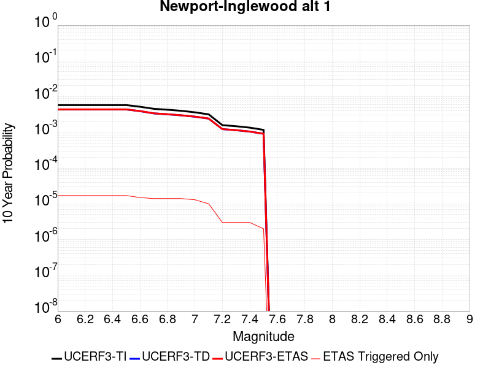 |

| Magnitude | 1 wk TI Prob | 1 wk TD Prob | 1 wk ETAS Prob | 1 wk ETAS/TD Gain | 1 wk ETAS Triggered Only | 1 mo TI Prob | 1 mo TD Prob | 1 mo ETAS Prob | 1 mo ETAS/TD Gain | 1 mo ETAS Triggered Only | 1 yr TI Prob | 1 yr TD Prob | 1 yr ETAS Prob | 1 yr ETAS/TD Gain | 1 yr ETAS Triggered Only | 10 yr TI Prob | 10 yr TD Prob | 10 yr ETAS Prob | 10 yr ETAS/TD Gain | 10 yr ETAS Triggered Only |
|-----|-----|-----|-----|-----|-----|-----|-----|-----|-----|-----|-----|-----|-----|-----|-----|-----|-----|-----|-----|-----|
| 6.0 | 1.1148327E-5 | 8.39976E-6 | 1.7456452E-5 | 2.0782084 | 9.056768E-6 | 4.777767E-5 | 3.599853E-5 | 4.8073787E-5 | 1.3354374 | 1.207569E-5 | 5.8153784E-4 | 4.3820433E-4 | 4.5329233E-4 | 1.0344315 | 1.5094613E-5 | 0.005800184 | 0.0043744235 | 0.0043894523 | 1.0034356 | 1.5094613E-5 |
| 6.1 | 1.1148327E-5 | 8.39976E-6 | 1.7456452E-5 | 2.0782084 | 9.056768E-6 | 4.777767E-5 | 3.599853E-5 | 4.8073787E-5 | 1.3354374 | 1.207569E-5 | 5.8153784E-4 | 4.3820433E-4 | 4.5329233E-4 | 1.0344315 | 1.5094613E-5 | 0.005800184 | 0.0043744235 | 0.0043894523 | 1.0034356 | 1.5094613E-5 |
| 6.2 | 1.1148327E-5 | 8.39976E-6 | 1.7456452E-5 | 2.0782084 | 9.056768E-6 | 4.777767E-5 | 3.599853E-5 | 4.8073787E-5 | 1.3354374 | 1.207569E-5 | 5.8153784E-4 | 4.3820433E-4 | 4.5329233E-4 | 1.0344315 | 1.5094613E-5 | 0.005800184 | 0.0043744235 | 0.0043894523 | 1.0034356 | 1.5094613E-5 |
| 6.3 | 1.1148327E-5 | 8.39976E-6 | 1.7456452E-5 | 2.0782084 | 9.056768E-6 | 4.777767E-5 | 3.599853E-5 | 4.8073787E-5 | 1.3354374 | 1.207569E-5 | 5.8153784E-4 | 4.3820433E-4 | 4.5329233E-4 | 1.0344315 | 1.5094613E-5 | 0.005800184 | 0.0043744235 | 0.0043894523 | 1.0034356 | 1.5094613E-5 |
| 6.4 | 1.1148327E-5 | 8.39976E-6 | 1.7456452E-5 | 2.0782084 | 9.056768E-6 | 4.777767E-5 | 3.599853E-5 | 4.8073787E-5 | 1.3354374 | 1.207569E-5 | 5.8153784E-4 | 4.3820433E-4 | 4.5329233E-4 | 1.0344315 | 1.5094613E-5 | 0.005800184 | 0.0043744235 | 0.0043894523 | 1.0034356 | 1.5094613E-5 |
| 6.5 | 1.1148327E-5 | 8.39976E-6 | 1.7456452E-5 | 2.0782084 | 9.056768E-6 | 4.777767E-5 | 3.599853E-5 | 4.8073787E-5 | 1.3354374 | 1.207569E-5 | 5.8153784E-4 | 4.3820433E-4 | 4.5329233E-4 | 1.0344315 | 1.5094613E-5 | 0.005800184 | 0.0043744235 | 0.0043894523 | 1.0034356 | 1.5094613E-5 |
| 6.6 | 1.00224415E-5 | 7.532022E-6 | 1.6588721E-5 | 2.202426 | 9.056768E-6 | 4.2952615E-5 | 3.2279753E-5 | 4.4355053E-5 | 1.3740828 | 1.207569E-5 | 5.228226E-4 | 3.9294525E-4 | 4.0803393E-4 | 1.038399 | 1.5094613E-5 | 0.005215943 | 0.0039235037 | 0.0039385394 | 1.0038321 | 1.5094613E-5 |
| 6.7 | 8.770557E-6 | 6.5171002E-6 | 1.5573809E-5 | 2.3896837 | 9.056768E-6 | 3.7587557E-5 | 2.7930188E-5 | 4.000554E-5 | 1.4323406 | 1.207569E-5 | 4.575324E-4 | 3.400069E-4 | 3.5509636E-4 | 1.04438 | 1.5094613E-5 | 0.0045659156 | 0.0033958422 | 0.0034108856 | 1.0044299 | 1.5094613E-5 |
| 6.8 | 8.263289E-6 | 6.1460423E-6 | 1.5202754E-5 | 2.4735844 | 9.056768E-6 | 3.5413614E-5 | 2.633997E-5 | 3.8415343E-5 | 1.4584429 | 1.207569E-5 | 4.3107543E-4 | 3.206518E-4 | 3.3574158E-4 | 1.0470597 | 1.5094613E-5 | 0.0043024016 | 0.0032028586 | 0.0032179048 | 1.0046978 | 1.5094613E-5 |
| 6.9 | 7.711276E-6 | 5.7474776E-6 | 1.4804194E-5 | 2.5757723 | 9.056768E-6 | 3.304791E-5 | 2.4631869E-5 | 3.670726E-5 | 1.4902345 | 1.207569E-5 | 4.0228397E-4 | 2.9986154E-4 | 3.1495164E-4 | 1.0503235 | 1.5094613E-5 | 0.004015565 | 0.0029955322 | 0.0030105815 | 1.005024 | 1.5094613E-5 |
| 7.0 | 6.9854723E-6 | 5.2637565E-6 | 1.4320477E-5 | 2.720581 | 9.056768E-6 | 2.9937395E-5 | 2.2558817E-5 | 3.1615382E-5 | 1.4014645 | 9.056768E-6 | 3.644268E-4 | 2.7462872E-4 | 2.867011E-4 | 1.0439589 | 1.207569E-5 | 0.0036382976 | 0.0027438495 | 0.002755892 | 1.0043889 | 1.207569E-5 |
| 7.1 | 6.123445E-6 | 4.66162E-6 | 1.0699438E-5 | 2.2952185 | 6.037845E-6 | 2.6243071E-5 | 1.9978273E-5 | 2.6015998E-5 | 1.3022145 | 6.037845E-6 | 3.1946256E-4 | 2.4321795E-4 | 2.522725E-4 | 1.0372282 | 9.056768E-6 | 0.0031900369 | 0.0024304604 | 0.0024394952 | 1.0037173 | 9.056768E-6 |
| 7.2 | 3.0524068E-6 | 2.3598534E-6 | 5.378769E-6 | 2.279281 | 3.0189226E-6 | 1.3081678E-5 | 1.011364E-5 | 1.3132531E-5 | 1.2984971 | 3.0189226E-6 | 1.5925779E-4 | 1.2313046E-4 | 1.2614901E-4 | 1.024515 | 3.0189226E-6 | 0.001591437 | 0.001231 | 0.0012340151 | 1.0024494 | 3.0189226E-6 |
| 7.3 | 2.8490606E-6 | 2.204696E-6 | 5.223612E-6 | 2.3693116 | 3.0189226E-6 | 1.2210203E-5 | 9.448685E-6 | 1.2467579E-5 | 1.3195041 | 3.0189226E-6 | 1.4864908E-4 | 1.1503552E-4 | 1.1805409E-4 | 1.0262403 | 3.0189226E-6 | 0.0014854969 | 0.0011501369 | 0.0011531524 | 1.0026218 | 3.0189226E-6 |
| 7.4 | 2.5994284E-6 | 2.0116724E-6 | 5.030589E-6 | 2.5006998 | 3.0189226E-6 | 1.114036E-5 | 8.621447E-6 | 1.16403435E-5 | 1.3501613 | 3.0189226E-6 | 1.3562544E-4 | 1.049649E-4 | 1.07983506E-4 | 1.0287583 | 3.0189226E-6 | 0.0013554269 | 0.00104953 | 0.0010525457 | 1.0028734 | 3.0189226E-6 |
| 7.5 | 2.2517988E-6 | 1.7516537E-6 | 4.770571E-6 | 2.7234669 | 3.0189226E-6 | 9.650531E-6 | 7.5070875E-6 | 1.0525987E-5 | 1.40214 | 3.0189226E-6 | 1.17488875E-4 | 9.139879E-5 | 9.441743E-5 | 1.0330272 | 3.0189226E-6 | 0.0011742678 | 9.1398787E-4 | 9.170041E-4 | 1.0033 | 3.0189226E-6 |

## Great Valley 09 (Laguna Seca)
*[(top)](#table-of-contents)*

| 1 Week | 1 Month | 1 Year | 10 Year |
|-----|-----|-----|-----|
|  |  |  |  |

| Magnitude | 1 wk TI Prob | 1 wk TD Prob | 1 wk ETAS Prob | 1 wk ETAS/TD Gain | 1 wk ETAS Triggered Only | 1 mo TI Prob | 1 mo TD Prob | 1 mo ETAS Prob | 1 mo ETAS/TD Gain | 1 mo ETAS Triggered Only | 1 yr TI Prob | 1 yr TD Prob | 1 yr ETAS Prob | 1 yr ETAS/TD Gain | 1 yr ETAS Triggered Only | 10 yr TI Prob | 10 yr TD Prob | 10 yr ETAS Prob | 10 yr ETAS/TD Gain | 10 yr ETAS Triggered Only |
|-----|-----|-----|-----|-----|-----|-----|-----|-----|-----|-----|-----|-----|-----|-----|-----|-----|-----|-----|-----|-----|
| 6.0 | 2.7186308E-5 | 3.3603857E-5 | 3.9641498E-5 | 1.1796712 | 6.037845E-6 | 1.16507545E-4 | 1.4401274E-4 | 1.530682E-4 | 1.0628796 | 9.056768E-6 | 0.0014175563 | 0.0017526768 | 0.0017647314 | 1.0068778 | 1.207569E-5 | 0.014085478 | 0.017460305 | 0.017475136 | 1.0008494 | 1.5094613E-5 |
| 6.1 | 2.7186308E-5 | 3.3603857E-5 | 3.9641498E-5 | 1.1796712 | 6.037845E-6 | 1.16507545E-4 | 1.4401274E-4 | 1.530682E-4 | 1.0628796 | 9.056768E-6 | 0.0014175563 | 0.0017526768 | 0.0017647314 | 1.0068778 | 1.207569E-5 | 0.014085478 | 0.017460305 | 0.017475136 | 1.0008494 | 1.5094613E-5 |
| 6.2 | 2.7186308E-5 | 3.3603857E-5 | 3.9641498E-5 | 1.1796712 | 6.037845E-6 | 1.16507545E-4 | 1.4401274E-4 | 1.530682E-4 | 1.0628796 | 9.056768E-6 | 0.0014175563 | 0.0017526768 | 0.0017647314 | 1.0068778 | 1.207569E-5 | 0.014085478 | 0.017460305 | 0.017475136 | 1.0008494 | 1.5094613E-5 |
| 6.3 | 2.7186308E-5 | 3.3603857E-5 | 3.9641498E-5 | 1.1796712 | 6.037845E-6 | 1.16507545E-4 | 1.4401274E-4 | 1.530682E-4 | 1.0628796 | 9.056768E-6 | 0.0014175563 | 0.0017526768 | 0.0017647314 | 1.0068778 | 1.207569E-5 | 0.014085478 | 0.017460305 | 0.017475136 | 1.0008494 | 1.5094613E-5 |
| 6.4 | 2.7186308E-5 | 3.3603857E-5 | 3.9641498E-5 | 1.1796712 | 6.037845E-6 | 1.16507545E-4 | 1.4401274E-4 | 1.530682E-4 | 1.0628796 | 9.056768E-6 | 0.0014175563 | 0.0017526768 | 0.0017647314 | 1.0068778 | 1.207569E-5 | 0.014085478 | 0.017460305 | 0.017475136 | 1.0008494 | 1.5094613E-5 |
| 6.5 | 2.7186308E-5 | 3.3603857E-5 | 3.9641498E-5 | 1.1796712 | 6.037845E-6 | 1.16507545E-4 | 1.4401274E-4 | 1.530682E-4 | 1.0628796 | 9.056768E-6 | 0.0014175563 | 0.0017526768 | 0.0017647314 | 1.0068778 | 1.207569E-5 | 0.014085478 | 0.017460305 | 0.017475136 | 1.0008494 | 1.5094613E-5 |
| 6.6 | 1.8800807E-5 | 2.3153776E-5 | 2.919148E-5 | 1.2607654 | 6.037845E-6 | 8.05724E-5 | 9.923046E-5 | 1.0828633E-4 | 1.091261 | 9.056768E-6 | 9.805275E-4 | 0.0012081307 | 0.001220192 | 1.0099833 | 1.207569E-5 | 0.009762122 | 0.012081286 | 0.012096198 | 1.0012343 | 1.5094613E-5 |
| 6.7 | 1.8800807E-5 | 2.3153776E-5 | 2.919148E-5 | 1.2607654 | 6.037845E-6 | 8.05724E-5 | 9.923046E-5 | 1.0828633E-4 | 1.091261 | 9.056768E-6 | 9.805275E-4 | 0.0012081307 | 0.001220192 | 1.0099833 | 1.207569E-5 | 0.009762122 | 0.012081286 | 0.012096198 | 1.0012343 | 1.5094613E-5 |

## North Frontal  (East)
*[(top)](#table-of-contents)*

| 1 Week | 1 Month | 1 Year | 10 Year |
|-----|-----|-----|-----|
|  |  |  |  |

| Magnitude | 1 wk TI Prob | 1 wk TD Prob | 1 wk ETAS Prob | 1 wk ETAS/TD Gain | 1 wk ETAS Triggered Only | 1 mo TI Prob | 1 mo TD Prob | 1 mo ETAS Prob | 1 mo ETAS/TD Gain | 1 mo ETAS Triggered Only | 1 yr TI Prob | 1 yr TD Prob | 1 yr ETAS Prob | 1 yr ETAS/TD Gain | 1 yr ETAS Triggered Only | 10 yr TI Prob | 10 yr TD Prob | 10 yr ETAS Prob | 10 yr ETAS/TD Gain | 10 yr ETAS Triggered Only |
|-----|-----|-----|-----|-----|-----|-----|-----|-----|-----|-----|-----|-----|-----|-----|-----|-----|-----|-----|-----|-----|
| 6.0 | 9.1043175E-6 | 9.692292E-6 | 1.5730078E-5 | 1.6229472 | 6.037845E-6 | 3.901792E-5 | 4.153805E-5 | 5.059444E-5 | 1.2180264 | 9.056768E-6 | 4.7493965E-4 | 5.0566456E-4 | 5.1773415E-4 | 1.0238688 | 1.207569E-5 | 0.004739259 | 0.0050506443 | 0.005065663 | 1.0029736 | 1.5094613E-5 |
| 6.1 | 9.1043175E-6 | 9.692292E-6 | 1.5730078E-5 | 1.6229472 | 6.037845E-6 | 3.901792E-5 | 4.153805E-5 | 5.059444E-5 | 1.2180264 | 9.056768E-6 | 4.7493965E-4 | 5.0566456E-4 | 5.1773415E-4 | 1.0238688 | 1.207569E-5 | 0.004739259 | 0.0050506443 | 0.005065663 | 1.0029736 | 1.5094613E-5 |
| 6.2 | 9.1043175E-6 | 9.692292E-6 | 1.5730078E-5 | 1.6229472 | 6.037845E-6 | 3.901792E-5 | 4.153805E-5 | 5.059444E-5 | 1.2180264 | 9.056768E-6 | 4.7493965E-4 | 5.0566456E-4 | 5.1773415E-4 | 1.0238688 | 1.207569E-5 | 0.004739259 | 0.0050506443 | 0.005065663 | 1.0029736 | 1.5094613E-5 |
| 6.3 | 9.1043175E-6 | 9.692292E-6 | 1.5730078E-5 | 1.6229472 | 6.037845E-6 | 3.901792E-5 | 4.153805E-5 | 5.059444E-5 | 1.2180264 | 9.056768E-6 | 4.7493965E-4 | 5.0566456E-4 | 5.1773415E-4 | 1.0238688 | 1.207569E-5 | 0.004739259 | 0.0050506443 | 0.005065663 | 1.0029736 | 1.5094613E-5 |
| 6.4 | 9.1043175E-6 | 9.692292E-6 | 1.5730078E-5 | 1.6229472 | 6.037845E-6 | 3.901792E-5 | 4.153805E-5 | 5.059444E-5 | 1.2180264 | 9.056768E-6 | 4.7493965E-4 | 5.0566456E-4 | 5.1773415E-4 | 1.0238688 | 1.207569E-5 | 0.004739259 | 0.0050506443 | 0.005065663 | 1.0029736 | 1.5094613E-5 |
| 6.5 | 9.1043175E-6 | 9.692292E-6 | 1.5730078E-5 | 1.6229472 | 6.037845E-6 | 3.901792E-5 | 4.153805E-5 | 5.059444E-5 | 1.2180264 | 9.056768E-6 | 4.7493965E-4 | 5.0566456E-4 | 5.1773415E-4 | 1.0238688 | 1.207569E-5 | 0.004739259 | 0.0050506443 | 0.005065663 | 1.0029736 | 1.5094613E-5 |
| 6.6 | 9.1043175E-6 | 9.692292E-6 | 1.5730078E-5 | 1.6229472 | 6.037845E-6 | 3.901792E-5 | 4.153805E-5 | 5.059444E-5 | 1.2180264 | 9.056768E-6 | 4.7493965E-4 | 5.0566456E-4 | 5.1773415E-4 | 1.0238688 | 1.207569E-5 | 0.004739259 | 0.0050506443 | 0.005065663 | 1.0029736 | 1.5094613E-5 |
| 6.7 | 5.803986E-6 | 6.1718774E-6 | 9.190781E-6 | 1.4891387 | 3.0189226E-6 | 2.4873989E-5 | 2.6450904E-5 | 3.2488588E-5 | 1.22826 | 6.037845E-6 | 3.0279873E-4 | 3.2203976E-4 | 3.3109362E-4 | 1.0281141 | 9.056768E-6 | 0.0030238647 | 0.0032203975 | 0.0032324344 | 1.0037377 | 1.207569E-5 |
| 6.8 | 5.803986E-6 | 6.1718774E-6 | 9.190781E-6 | 1.4891387 | 3.0189226E-6 | 2.4873989E-5 | 2.6450904E-5 | 3.2488588E-5 | 1.22826 | 6.037845E-6 | 3.0279873E-4 | 3.2203976E-4 | 3.3109362E-4 | 1.0281141 | 9.056768E-6 | 0.0030238647 | 0.0032203975 | 0.0032324344 | 1.0037377 | 1.207569E-5 |

## Calaveras (So) 2011 CFM
*[(top)](#table-of-contents)*

| 1 Week | 1 Month | 1 Year | 10 Year |
|-----|-----|-----|-----|
|  | 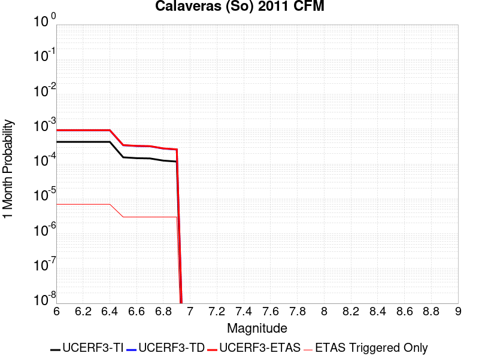 |  |  |

| Magnitude | 1 wk TI Prob | 1 wk TD Prob | 1 wk ETAS Prob | 1 wk ETAS/TD Gain | 1 wk ETAS Triggered Only | 1 mo TI Prob | 1 mo TD Prob | 1 mo ETAS Prob | 1 mo ETAS/TD Gain | 1 mo ETAS Triggered Only | 1 yr TI Prob | 1 yr TD Prob | 1 yr ETAS Prob | 1 yr ETAS/TD Gain | 1 yr ETAS Triggered Only | 10 yr TI Prob | 10 yr TD Prob | 10 yr ETAS Prob | 10 yr ETAS/TD Gain | 10 yr ETAS Triggered Only |
|-----|-----|-----|-----|-----|-----|-----|-----|-----|-----|-----|-----|-----|-----|-----|-----|-----|-----|-----|-----|-----|
| 6.0 | 1.00604906E-4 | 2.1600646E-4 | 2.2506127E-4 | 1.0419191 | 9.056768E-6 | 4.3109263E-4 | 9.255689E-4 | 9.346173E-4 | 1.009776 | 9.056768E-6 | 0.0052359286 | 0.0112380525 | 0.011247007 | 1.0007968 | 9.056768E-6 | 0.05114268 | 0.102641135 | 0.102651976 | 1.0001056 | 1.207569E-5 |
| 6.1 | 1.00604906E-4 | 2.1600646E-4 | 2.2506127E-4 | 1.0419191 | 9.056768E-6 | 4.3109263E-4 | 9.255689E-4 | 9.346173E-4 | 1.009776 | 9.056768E-6 | 0.0052359286 | 0.0112380525 | 0.011247007 | 1.0007968 | 9.056768E-6 | 0.05114268 | 0.102641135 | 0.102651976 | 1.0001056 | 1.207569E-5 |
| 6.2 | 1.00604906E-4 | 2.1600646E-4 | 2.2506127E-4 | 1.0419191 | 9.056768E-6 | 4.3109263E-4 | 9.255689E-4 | 9.346173E-4 | 1.009776 | 9.056768E-6 | 0.0052359286 | 0.0112380525 | 0.011247007 | 1.0007968 | 9.056768E-6 | 0.05114268 | 0.102641135 | 0.102651976 | 1.0001056 | 1.207569E-5 |
| 6.3 | 1.00604906E-4 | 2.1600646E-4 | 2.2506127E-4 | 1.0419191 | 9.056768E-6 | 4.3109263E-4 | 9.255689E-4 | 9.346173E-4 | 1.009776 | 9.056768E-6 | 0.0052359286 | 0.0112380525 | 0.011247007 | 1.0007968 | 9.056768E-6 | 0.05114268 | 0.102641135 | 0.102651976 | 1.0001056 | 1.207569E-5 |
| 6.4 | 1.00604906E-4 | 2.1600646E-4 | 2.2506127E-4 | 1.0419191 | 9.056768E-6 | 4.3109263E-4 | 9.255689E-4 | 9.346173E-4 | 1.009776 | 9.056768E-6 | 0.0052359286 | 0.0112380525 | 0.011247007 | 1.0007968 | 9.056768E-6 | 0.05114268 | 0.102641135 | 0.102651976 | 1.0001056 | 1.207569E-5 |
| 6.5 | 3.6232093E-5 | 8.0470694E-5 | 8.0470694E-5 | 1.0 | 0.0 | 1.5527116E-4 | 3.448549E-4 | 3.448549E-4 | 1.0 | 0.0 | 0.0018887871 | 0.004195091 | 0.004195091 | 1.0 | 0.0 | 0.018728139 | 0.040133998 | 0.040136896 | 1.0000722 | 3.0189226E-6 |
| 6.6 | 3.4288823E-5 | 7.645369E-5 | 7.645369E-5 | 1.0 | 0.0 | 1.4694381E-4 | 3.2764356E-4 | 3.2764356E-4 | 1.0 | 0.0 | 0.0017875729 | 0.003986383 | 0.003986383 | 1.0 | 0.0 | 0.017732618 | 0.03829094 | 0.038293846 | 1.0000758 | 3.0189226E-6 |
| 6.7 | 3.365726E-5 | 7.5152966E-5 | 7.5152966E-5 | 1.0 | 0.0 | 1.4423742E-4 | 3.220704E-4 | 3.220704E-4 | 1.0 | 0.0 | 0.001754676 | 0.003918774 | 0.003918774 | 1.0 | 0.0 | 0.017408855 | 0.037675563 | 0.03767847 | 1.0000771 | 3.0189226E-6 |
| 6.8 | 2.9146076E-5 | 6.459388E-5 | 6.459388E-5 | 1.0 | 0.0 | 1.2490578E-4 | 2.768274E-4 | 2.768274E-4 | 1.0 | 0.0 | 0.001519667 | 0.0033697556 | 0.0033697556 | 1.0 | 0.0 | 0.015093167 | 0.032588553 | 0.032591473 | 1.0000896 | 3.0189226E-6 |
| 6.9 | 2.7363296E-5 | 6.059934E-5 | 6.059934E-5 | 1.0 | 0.0 | 1.1726599E-4 | 2.5971147E-4 | 2.5971147E-4 | 1.0 | 0.0 | 0.0014267784 | 0.003161987 | 0.003161987 | 1.0 | 0.0 | 0.014176525 | 0.030637112 | 0.030640038 | 1.0000955 | 3.0189226E-6 |

## Honey Lake 2011 CFM
*[(top)](#table-of-contents)*

| 1 Week | 1 Month | 1 Year | 10 Year |
|-----|-----|-----|-----|
|  |  |  |  |

| Magnitude | 1 wk TI Prob | 1 wk TD Prob | 1 wk ETAS Prob | 1 wk ETAS/TD Gain | 1 wk ETAS Triggered Only | 1 mo TI Prob | 1 mo TD Prob | 1 mo ETAS Prob | 1 mo ETAS/TD Gain | 1 mo ETAS Triggered Only | 1 yr TI Prob | 1 yr TD Prob | 1 yr ETAS Prob | 1 yr ETAS/TD Gain | 1 yr ETAS Triggered Only | 10 yr TI Prob | 10 yr TD Prob | 10 yr ETAS Prob | 10 yr ETAS/TD Gain | 10 yr ETAS Triggered Only |
|-----|-----|-----|-----|-----|-----|-----|-----|-----|-----|-----|-----|-----|-----|-----|-----|-----|-----|-----|-----|-----|
| 6.0 | 4.2419113E-5 | 5.7836412E-5 | 5.7836412E-5 | 1.0 | 0.0 | 1.8178353E-4 | 2.4785337E-4 | 2.4785337E-4 | 1.0 | 0.0 | 0.002210968 | 0.0030145324 | 0.003020552 | 1.0019969 | 6.037845E-6 | 0.021890994 | 0.029842986 | 0.0298547 | 1.0003926 | 1.207569E-5 |
| 6.1 | 4.2419113E-5 | 5.7836412E-5 | 5.7836412E-5 | 1.0 | 0.0 | 1.8178353E-4 | 2.4785337E-4 | 2.4785337E-4 | 1.0 | 0.0 | 0.002210968 | 0.0030145324 | 0.003020552 | 1.0019969 | 6.037845E-6 | 0.021890994 | 0.029842986 | 0.0298547 | 1.0003926 | 1.207569E-5 |
| 6.2 | 4.2419113E-5 | 5.7836412E-5 | 5.7836412E-5 | 1.0 | 0.0 | 1.8178353E-4 | 2.4785337E-4 | 2.4785337E-4 | 1.0 | 0.0 | 0.002210968 | 0.0030145324 | 0.003020552 | 1.0019969 | 6.037845E-6 | 0.021890994 | 0.029842986 | 0.0298547 | 1.0003926 | 1.207569E-5 |
| 6.3 | 4.2419113E-5 | 5.7836412E-5 | 5.7836412E-5 | 1.0 | 0.0 | 1.8178353E-4 | 2.4785337E-4 | 2.4785337E-4 | 1.0 | 0.0 | 0.002210968 | 0.0030145324 | 0.003020552 | 1.0019969 | 6.037845E-6 | 0.021890994 | 0.029842986 | 0.0298547 | 1.0003926 | 1.207569E-5 |
| 6.4 | 4.2419113E-5 | 5.7836412E-5 | 5.7836412E-5 | 1.0 | 0.0 | 1.8178353E-4 | 2.4785337E-4 | 2.4785337E-4 | 1.0 | 0.0 | 0.002210968 | 0.0030145324 | 0.003020552 | 1.0019969 | 6.037845E-6 | 0.021890994 | 0.029842986 | 0.0298547 | 1.0003926 | 1.207569E-5 |
| 6.5 | 4.2419113E-5 | 5.7836412E-5 | 5.7836412E-5 | 1.0 | 0.0 | 1.8178353E-4 | 2.4785337E-4 | 2.4785337E-4 | 1.0 | 0.0 | 0.002210968 | 0.0030145324 | 0.003020552 | 1.0019969 | 6.037845E-6 | 0.021890994 | 0.029842986 | 0.0298547 | 1.0003926 | 1.207569E-5 |
| 6.6 | 3.5778685E-5 | 4.865727E-5 | 4.865727E-5 | 1.0 | 0.0 | 1.533282E-4 | 2.0852126E-4 | 2.0852126E-4 | 1.0 | 0.0 | 0.0018651724 | 0.002536925 | 0.0025429477 | 1.0023739 | 6.037845E-6 | 0.01849595 | 0.025190448 | 0.025202218 | 1.0004673 | 1.207569E-5 |
| 6.7 | 2.9777242E-5 | 4.0327057E-5 | 4.0327057E-5 | 1.0 | 0.0 | 1.2761052E-4 | 1.7282547E-4 | 1.7282547E-4 | 1.0 | 0.0 | 0.0015525507 | 0.0021032947 | 0.00210932 | 1.0028646 | 6.037845E-6 | 0.0154174855 | 0.020948831 | 0.020960653 | 1.0005643 | 1.207569E-5 |
| 6.8 | 2.4307292E-5 | 3.2781874E-5 | 3.2781874E-5 | 1.0 | 0.0 | 1.0416994E-4 | 1.4049283E-4 | 1.4049283E-4 | 1.0 | 0.0 | 0.0012675312 | 0.0017103229 | 0.0017163504 | 1.0035242 | 6.037845E-6 | 0.012603257 | 0.017085526 | 0.017097395 | 1.0006948 | 1.207569E-5 |
| 6.9 | 2.2774519E-5 | 3.0696156E-5 | 3.0696156E-5 | 1.0 | 0.0 | 9.760143E-5 | 1.3155496E-4 | 1.3155496E-4 | 1.0 | 0.0 | 0.0011876496 | 0.0016016681 | 0.0016076962 | 1.0037637 | 6.037845E-6 | 0.011813223 | 0.016015066 | 0.01602695 | 1.000742 | 1.207569E-5 |

## Robinson Creek
*[(top)](#table-of-contents)*

| 1 Week | 1 Month | 1 Year | 10 Year |
|-----|-----|-----|-----|
|  |  |  |  |

| Magnitude | 1 wk TI Prob | 1 wk TD Prob | 1 wk ETAS Prob | 1 wk ETAS/TD Gain | 1 wk ETAS Triggered Only | 1 mo TI Prob | 1 mo TD Prob | 1 mo ETAS Prob | 1 mo ETAS/TD Gain | 1 mo ETAS Triggered Only | 1 yr TI Prob | 1 yr TD Prob | 1 yr ETAS Prob | 1 yr ETAS/TD Gain | 1 yr ETAS Triggered Only | 10 yr TI Prob | 10 yr TD Prob | 10 yr ETAS Prob | 10 yr ETAS/TD Gain | 10 yr ETAS Triggered Only |
|-----|-----|-----|-----|-----|-----|-----|-----|-----|-----|-----|-----|-----|-----|-----|-----|-----|-----|-----|-----|-----|
| 6.0 | 1.0723721E-5 | 1.1667189E-5 | 1.1667189E-5 | 1.0 | 0.0 | 4.5957993E-5 | 5.000224E-5 | 5.3021013E-5 | 1.0603727 | 3.0189226E-6 | 5.593949E-4 | 6.087773E-4 | 6.1179436E-4 | 1.004956 | 3.0189226E-6 | 0.0055798884 | 0.0060877725 | 0.006099775 | 1.0019715 | 1.207569E-5 |
| 6.1 | 1.0723721E-5 | 1.1667189E-5 | 1.1667189E-5 | 1.0 | 0.0 | 4.5957993E-5 | 5.000224E-5 | 5.3021013E-5 | 1.0603727 | 3.0189226E-6 | 5.593949E-4 | 6.087773E-4 | 6.1179436E-4 | 1.004956 | 3.0189226E-6 | 0.0055798884 | 0.0060877725 | 0.006099775 | 1.0019715 | 1.207569E-5 |
| 6.2 | 1.0723721E-5 | 1.1667189E-5 | 1.1667189E-5 | 1.0 | 0.0 | 4.5957993E-5 | 5.000224E-5 | 5.3021013E-5 | 1.0603727 | 3.0189226E-6 | 5.593949E-4 | 6.087773E-4 | 6.1179436E-4 | 1.004956 | 3.0189226E-6 | 0.0055798884 | 0.0060877725 | 0.006099775 | 1.0019715 | 1.207569E-5 |
| 6.3 | 1.0723721E-5 | 1.1667189E-5 | 1.1667189E-5 | 1.0 | 0.0 | 4.5957993E-5 | 5.000224E-5 | 5.3021013E-5 | 1.0603727 | 3.0189226E-6 | 5.593949E-4 | 6.087773E-4 | 6.1179436E-4 | 1.004956 | 3.0189226E-6 | 0.0055798884 | 0.0060877725 | 0.006099775 | 1.0019715 | 1.207569E-5 |
| 6.4 | 1.0723721E-5 | 1.1667189E-5 | 1.1667189E-5 | 1.0 | 0.0 | 4.5957993E-5 | 5.000224E-5 | 5.3021013E-5 | 1.0603727 | 3.0189226E-6 | 5.593949E-4 | 6.087773E-4 | 6.1179436E-4 | 1.004956 | 3.0189226E-6 | 0.0055798884 | 0.0060877725 | 0.006099775 | 1.0019715 | 1.207569E-5 |
| 6.5 | 1.0723721E-5 | 1.1667189E-5 | 1.1667189E-5 | 1.0 | 0.0 | 4.5957993E-5 | 5.000224E-5 | 5.3021013E-5 | 1.0603727 | 3.0189226E-6 | 5.593949E-4 | 6.087773E-4 | 6.1179436E-4 | 1.004956 | 3.0189226E-6 | 0.0055798884 | 0.0060877725 | 0.006099775 | 1.0019715 | 1.207569E-5 |

## Round Valley
*[(top)](#table-of-contents)*

| 1 Week | 1 Month | 1 Year | 10 Year |
|-----|-----|-----|-----|
|  |  |  |  |

| Magnitude | 1 wk TI Prob | 1 wk TD Prob | 1 wk ETAS Prob | 1 wk ETAS/TD Gain | 1 wk ETAS Triggered Only | 1 mo TI Prob | 1 mo TD Prob | 1 mo ETAS Prob | 1 mo ETAS/TD Gain | 1 mo ETAS Triggered Only | 1 yr TI Prob | 1 yr TD Prob | 1 yr ETAS Prob | 1 yr ETAS/TD Gain | 1 yr ETAS Triggered Only | 10 yr TI Prob | 10 yr TD Prob | 10 yr ETAS Prob | 10 yr ETAS/TD Gain | 10 yr ETAS Triggered Only |
|-----|-----|-----|-----|-----|-----|-----|-----|-----|-----|-----|-----|-----|-----|-----|-----|-----|-----|-----|-----|-----|
| 6.0 | 1.5129573E-5 | 1.668525E-5 | 2.5741867E-5 | 1.5427917 | 9.056768E-6 | 6.483941E-5 | 7.1506845E-5 | 8.056296E-5 | 1.1266469 | 9.056768E-6 | 7.8913395E-4 | 8.7035226E-4 | 8.7940117E-4 | 1.0103968 | 9.056768E-6 | 0.007863375 | 0.008679682 | 0.008691653 | 1.0013791 | 1.207569E-5 |
| 6.1 | 1.5129573E-5 | 1.668525E-5 | 2.5741867E-5 | 1.5427917 | 9.056768E-6 | 6.483941E-5 | 7.1506845E-5 | 8.056296E-5 | 1.1266469 | 9.056768E-6 | 7.8913395E-4 | 8.7035226E-4 | 8.7940117E-4 | 1.0103968 | 9.056768E-6 | 0.007863375 | 0.008679682 | 0.008691653 | 1.0013791 | 1.207569E-5 |
| 6.2 | 1.5129573E-5 | 1.668525E-5 | 2.5741867E-5 | 1.5427917 | 9.056768E-6 | 6.483941E-5 | 7.1506845E-5 | 8.056296E-5 | 1.1266469 | 9.056768E-6 | 7.8913395E-4 | 8.7035226E-4 | 8.7940117E-4 | 1.0103968 | 9.056768E-6 | 0.007863375 | 0.008679682 | 0.008691653 | 1.0013791 | 1.207569E-5 |
| 6.3 | 1.5129573E-5 | 1.668525E-5 | 2.5741867E-5 | 1.5427917 | 9.056768E-6 | 6.483941E-5 | 7.1506845E-5 | 8.056296E-5 | 1.1266469 | 9.056768E-6 | 7.8913395E-4 | 8.7035226E-4 | 8.7940117E-4 | 1.0103968 | 9.056768E-6 | 0.007863375 | 0.008679682 | 0.008691653 | 1.0013791 | 1.207569E-5 |
| 6.4 | 1.5129573E-5 | 1.668525E-5 | 2.5741867E-5 | 1.5427917 | 9.056768E-6 | 6.483941E-5 | 7.1506845E-5 | 8.056296E-5 | 1.1266469 | 9.056768E-6 | 7.8913395E-4 | 8.7035226E-4 | 8.7940117E-4 | 1.0103968 | 9.056768E-6 | 0.007863375 | 0.008679682 | 0.008691653 | 1.0013791 | 1.207569E-5 |
| 6.5 | 1.5129573E-5 | 1.668525E-5 | 2.5741867E-5 | 1.5427917 | 9.056768E-6 | 6.483941E-5 | 7.1506845E-5 | 8.056296E-5 | 1.1266469 | 9.056768E-6 | 7.8913395E-4 | 8.7035226E-4 | 8.7940117E-4 | 1.0103968 | 9.056768E-6 | 0.007863375 | 0.008679682 | 0.008691653 | 1.0013791 | 1.207569E-5 |
| 6.6 | 1.4434947E-5 | 1.5912143E-5 | 2.4968766E-5 | 1.5691643 | 9.056768E-6 | 6.186259E-5 | 6.81937E-5 | 7.7249846E-5 | 1.1328003 | 9.056768E-6 | 7.529168E-4 | 8.3004584E-4 | 8.390951E-4 | 1.0109022 | 9.056768E-6 | 0.0075037093 | 0.00827966 | 0.008291635 | 1.0014464 | 1.207569E-5 |
| 6.7 | 1.15477105E-5 | 1.2717341E-5 | 1.8755109E-5 | 1.4747666 | 6.037845E-6 | 4.948925E-5 | 5.4502318E-5 | 6.0539835E-5 | 1.1107754 | 6.037845E-6 | 6.02365E-4 | 6.6346437E-4 | 6.6949823E-4 | 1.0090945 | 6.037845E-6 | 0.0060073487 | 0.0066247126 | 0.0066337097 | 1.001358 | 9.056768E-6 |
| 6.8 | 8.959772E-6 | 9.845762E-6 | 9.845762E-6 | 1.0 | 0.0 | 3.8398455E-5 | 4.2195978E-5 | 4.2195978E-5 | 1.0 | 0.0 | 4.674009E-4 | 5.1371043E-4 | 5.1371043E-4 | 1.0 | 0.0 | 0.0046641906 | 0.0051345914 | 0.005137595 | 1.000585 | 3.0189226E-6 |
| 6.9 | 7.926176E-6 | 8.705021E-6 | 8.705021E-6 | 1.0 | 0.0 | 3.3968885E-5 | 3.7307233E-5 | 3.7307233E-5 | 1.0 | 0.0 | 4.1349267E-4 | 4.5421557E-4 | 4.5421557E-4 | 1.0 | 0.0 | 0.004127241 | 0.0045421557 | 0.004545161 | 1.0006616 | 3.0189226E-6 |
| 7.0 | 7.926176E-6 | 8.705021E-6 | 8.705021E-6 | 1.0 | 0.0 | 3.3968885E-5 | 3.7307233E-5 | 3.7307233E-5 | 1.0 | 0.0 | 4.1349267E-4 | 4.5421557E-4 | 4.5421557E-4 | 1.0 | 0.0 | 0.004127241 | 0.0045421557 | 0.004545161 | 1.0006616 | 3.0189226E-6 |

## San Luis Range 2011 CFM
*[(top)](#table-of-contents)*

| 1 Week | 1 Month | 1 Year | 10 Year |
|-----|-----|-----|-----|
|  |  |  |  |

| Magnitude | 1 wk TI Prob | 1 wk TD Prob | 1 wk ETAS Prob | 1 wk ETAS/TD Gain | 1 wk ETAS Triggered Only | 1 mo TI Prob | 1 mo TD Prob | 1 mo ETAS Prob | 1 mo ETAS/TD Gain | 1 mo ETAS Triggered Only | 1 yr TI Prob | 1 yr TD Prob | 1 yr ETAS Prob | 1 yr ETAS/TD Gain | 1 yr ETAS Triggered Only | 10 yr TI Prob | 10 yr TD Prob | 10 yr ETAS Prob | 10 yr ETAS/TD Gain | 10 yr ETAS Triggered Only |
|-----|-----|-----|-----|-----|-----|-----|-----|-----|-----|-----|-----|-----|-----|-----|-----|-----|-----|-----|-----|-----|
| 6.0 | 2.8589725E-6 | 2.906881E-6 | 5.925795E-6 | 2.0385406 | 3.0189226E-6 | 1.2252682E-5 | 1.24580165E-5 | 1.8495786E-5 | 1.4846494 | 6.037845E-6 | 1.491662E-4 | 1.5166836E-4 | 1.6374221E-4 | 1.079607 | 1.207569E-5 | 0.0014906611 | 0.0015158989 | 0.0015279562 | 1.007954 | 1.207569E-5 |
| 6.1 | 2.8589725E-6 | 2.906881E-6 | 5.925795E-6 | 2.0385406 | 3.0189226E-6 | 1.2252682E-5 | 1.24580165E-5 | 1.8495786E-5 | 1.4846494 | 6.037845E-6 | 1.491662E-4 | 1.5166836E-4 | 1.6374221E-4 | 1.079607 | 1.207569E-5 | 0.0014906611 | 0.0015158989 | 0.0015279562 | 1.007954 | 1.207569E-5 |
| 6.2 | 2.8589725E-6 | 2.906881E-6 | 5.925795E-6 | 2.0385406 | 3.0189226E-6 | 1.2252682E-5 | 1.24580165E-5 | 1.8495786E-5 | 1.4846494 | 6.037845E-6 | 1.491662E-4 | 1.5166836E-4 | 1.6374221E-4 | 1.079607 | 1.207569E-5 | 0.0014906611 | 0.0015158989 | 0.0015279562 | 1.007954 | 1.207569E-5 |
| 6.3 | 2.8589725E-6 | 2.906881E-6 | 5.925795E-6 | 2.0385406 | 3.0189226E-6 | 1.2252682E-5 | 1.24580165E-5 | 1.8495786E-5 | 1.4846494 | 6.037845E-6 | 1.491662E-4 | 1.5166836E-4 | 1.6374221E-4 | 1.079607 | 1.207569E-5 | 0.0014906611 | 0.0015158989 | 0.0015279562 | 1.007954 | 1.207569E-5 |
| 6.4 | 2.8589725E-6 | 2.906881E-6 | 5.925795E-6 | 2.0385406 | 3.0189226E-6 | 1.2252682E-5 | 1.24580165E-5 | 1.8495786E-5 | 1.4846494 | 6.037845E-6 | 1.491662E-4 | 1.5166836E-4 | 1.6374221E-4 | 1.079607 | 1.207569E-5 | 0.0014906611 | 0.0015158989 | 0.0015279562 | 1.007954 | 1.207569E-5 |
| 6.5 | 2.8589725E-6 | 2.906881E-6 | 5.925795E-6 | 2.0385406 | 3.0189226E-6 | 1.2252682E-5 | 1.24580165E-5 | 1.8495786E-5 | 1.4846494 | 6.037845E-6 | 1.491662E-4 | 1.5166836E-4 | 1.6374221E-4 | 1.079607 | 1.207569E-5 | 0.0014906611 | 0.0015158989 | 0.0015279562 | 1.007954 | 1.207569E-5 |
| 6.6 | 2.4544863E-6 | 2.495234E-6 | 2.495234E-6 | 1.0 | 0.0 | 1.0519184E-5 | 1.06938305E-5 | 1.06938305E-5 | 1.0 | 0.0 | 1.2806353E-4 | 1.3019213E-4 | 1.3622918E-4 | 1.0463704 | 6.037845E-6 | 0.0012798976 | 0.0013014051 | 0.0013074351 | 1.0046334 | 6.037845E-6 |
| 6.7 | 2.1688998E-6 | 2.204711E-6 | 2.204711E-6 | 1.0 | 0.0 | 9.295252E-6 | 9.448742E-6 | 9.448742E-6 | 1.0 | 0.0 | 1.1316381E-4 | 1.1503485E-4 | 1.21072E-4 | 1.052481 | 6.037845E-6 | 0.001131062 | 0.0011499968 | 0.0011560277 | 1.0052443 | 6.037845E-6 |
| 6.8 | 1.9191828E-6 | 1.950576E-6 | 1.950576E-6 | 1.0 | 0.0 | 8.2250435E-6 | 8.359599E-6 | 8.359599E-6 | 1.0 | 0.0 | 1.001353E-4 | 1.01775826E-4 | 1.0781306E-4 | 1.0593189 | 6.037845E-6 | 0.0010009019 | 0.0010175342 | 0.0010235659 | 1.0059278 | 6.037845E-6 |
| 6.9 | 1.6115068E-6 | 1.6374516E-6 | 1.6374516E-6 | 1.0 | 0.0 | 6.9064395E-6 | 7.0176447E-6 | 7.0176447E-6 | 1.0 | 0.0 | 8.4082654E-5 | 8.5438915E-5 | 8.845758E-5 | 1.0353312 | 3.0189226E-6 | 8.405085E-4 | 8.543001E-4 | 8.573165E-4 | 1.0035307 | 3.0189226E-6 |
| 7.0 | 1.367995E-6 | 1.3898027E-6 | 1.3898027E-6 | 1.0 | 0.0 | 5.8628225E-6 | 5.956297E-6 | 5.956297E-6 | 1.0 | 0.0 | 7.137752E-5 | 7.251792E-5 | 7.553662E-5 | 1.041627 | 3.0189226E-6 | 7.13546E-4 | 7.251792E-4 | 7.2819594E-4 | 1.0041599 | 3.0189226E-6 |
| 7.1 | 1.367995E-6 | 1.3898027E-6 | 1.3898027E-6 | 1.0 | 0.0 | 5.8628225E-6 | 5.956297E-6 | 5.956297E-6 | 1.0 | 0.0 | 7.137752E-5 | 7.251792E-5 | 7.553662E-5 | 1.041627 | 3.0189226E-6 | 7.13546E-4 | 7.251792E-4 | 7.2819594E-4 | 1.0041599 | 3.0189226E-6 |

## Great Valley 04b Gordon Valley
*[(top)](#table-of-contents)*

| 1 Week | 1 Month | 1 Year | 10 Year |
|-----|-----|-----|-----|
|  |  |  |  |

| Magnitude | 1 wk TI Prob | 1 wk TD Prob | 1 wk ETAS Prob | 1 wk ETAS/TD Gain | 1 wk ETAS Triggered Only | 1 mo TI Prob | 1 mo TD Prob | 1 mo ETAS Prob | 1 mo ETAS/TD Gain | 1 mo ETAS Triggered Only | 1 yr TI Prob | 1 yr TD Prob | 1 yr ETAS Prob | 1 yr ETAS/TD Gain | 1 yr ETAS Triggered Only | 10 yr TI Prob | 10 yr TD Prob | 10 yr ETAS Prob | 10 yr ETAS/TD Gain | 10 yr ETAS Triggered Only |
|-----|-----|-----|-----|-----|-----|-----|-----|-----|-----|-----|-----|-----|-----|-----|-----|-----|-----|-----|-----|-----|
| 6.0 | 2.4076155E-5 | 2.8932132E-5 | 2.8932132E-5 | 1.0 | 0.0 | 1.03179445E-4 | 1.2399205E-4 | 1.2399205E-4 | 1.0 | 0.0 | 0.0012554857 | 0.0015091051 | 0.0015121194 | 1.0019975 | 3.0189226E-6 | 0.012484163 | 0.015042224 | 0.015054118 | 1.0007907 | 1.207569E-5 |
| 6.1 | 2.4076155E-5 | 2.8932132E-5 | 2.8932132E-5 | 1.0 | 0.0 | 1.03179445E-4 | 1.2399205E-4 | 1.2399205E-4 | 1.0 | 0.0 | 0.0012554857 | 0.0015091051 | 0.0015121194 | 1.0019975 | 3.0189226E-6 | 0.012484163 | 0.015042224 | 0.015054118 | 1.0007907 | 1.207569E-5 |
| 6.2 | 2.4076155E-5 | 2.8932132E-5 | 2.8932132E-5 | 1.0 | 0.0 | 1.03179445E-4 | 1.2399205E-4 | 1.2399205E-4 | 1.0 | 0.0 | 0.0012554857 | 0.0015091051 | 0.0015121194 | 1.0019975 | 3.0189226E-6 | 0.012484163 | 0.015042224 | 0.015054118 | 1.0007907 | 1.207569E-5 |
| 6.3 | 2.4076155E-5 | 2.8932132E-5 | 2.8932132E-5 | 1.0 | 0.0 | 1.03179445E-4 | 1.2399205E-4 | 1.2399205E-4 | 1.0 | 0.0 | 0.0012554857 | 0.0015091051 | 0.0015121194 | 1.0019975 | 3.0189226E-6 | 0.012484163 | 0.015042224 | 0.015054118 | 1.0007907 | 1.207569E-5 |
| 6.4 | 2.4076155E-5 | 2.8932132E-5 | 2.8932132E-5 | 1.0 | 0.0 | 1.03179445E-4 | 1.2399205E-4 | 1.2399205E-4 | 1.0 | 0.0 | 0.0012554857 | 0.0015091051 | 0.0015121194 | 1.0019975 | 3.0189226E-6 | 0.012484163 | 0.015042224 | 0.015054118 | 1.0007907 | 1.207569E-5 |
| 6.5 | 2.4076155E-5 | 2.8932132E-5 | 2.8932132E-5 | 1.0 | 0.0 | 1.03179445E-4 | 1.2399205E-4 | 1.2399205E-4 | 1.0 | 0.0 | 0.0012554857 | 0.0015091051 | 0.0015121194 | 1.0019975 | 3.0189226E-6 | 0.012484163 | 0.015042224 | 0.015054118 | 1.0007907 | 1.207569E-5 |
| 6.6 | 1.664996E-5 | 1.9973098E-5 | 1.9973098E-5 | 1.0 | 0.0 | 7.135502E-5 | 8.559899E-5 | 8.559899E-5 | 1.0 | 0.0 | 8.68401E-4 | 0.0010421677 | 0.0010421677 | 1.0 | 0.0 | 0.008650154 | 0.010421675 | 0.010430637 | 1.00086 | 9.056768E-6 |
| 6.7 | 1.664996E-5 | 1.9973098E-5 | 1.9973098E-5 | 1.0 | 0.0 | 7.135502E-5 | 8.559899E-5 | 8.559899E-5 | 1.0 | 0.0 | 8.68401E-4 | 0.0010421677 | 0.0010421677 | 1.0 | 0.0 | 0.008650154 | 0.010421675 | 0.010430637 | 1.00086 | 9.056768E-6 |

## White Mountains
*[(top)](#table-of-contents)*

| 1 Week | 1 Month | 1 Year | 10 Year |
|-----|-----|-----|-----|
|  |  |  |  |

| Magnitude | 1 wk TI Prob | 1 wk TD Prob | 1 wk ETAS Prob | 1 wk ETAS/TD Gain | 1 wk ETAS Triggered Only | 1 mo TI Prob | 1 mo TD Prob | 1 mo ETAS Prob | 1 mo ETAS/TD Gain | 1 mo ETAS Triggered Only | 1 yr TI Prob | 1 yr TD Prob | 1 yr ETAS Prob | 1 yr ETAS/TD Gain | 1 yr ETAS Triggered Only | 10 yr TI Prob | 10 yr TD Prob | 10 yr ETAS Prob | 10 yr ETAS/TD Gain | 10 yr ETAS Triggered Only |
|-----|-----|-----|-----|-----|-----|-----|-----|-----|-----|-----|-----|-----|-----|-----|-----|-----|-----|-----|-----|-----|
| 6.0 | 1.17818645E-5 | 9.78196E-6 | 1.2800853E-5 | 1.3086184 | 3.0189226E-6 | 5.049273E-5 | 4.19221E-5 | 4.4940898E-5 | 1.0720097 | 3.0189226E-6 | 6.145756E-4 | 5.1029754E-4 | 5.193497E-4 | 1.0177389 | 9.056768E-6 | 0.006128787 | 0.005092789 | 0.005104803 | 1.002359 | 1.207569E-5 |
| 6.1 | 1.17818645E-5 | 9.78196E-6 | 1.2800853E-5 | 1.3086184 | 3.0189226E-6 | 5.049273E-5 | 4.19221E-5 | 4.4940898E-5 | 1.0720097 | 3.0189226E-6 | 6.145756E-4 | 5.1029754E-4 | 5.193497E-4 | 1.0177389 | 9.056768E-6 | 0.006128787 | 0.005092789 | 0.005104803 | 1.002359 | 1.207569E-5 |
| 6.2 | 1.17818645E-5 | 9.78196E-6 | 1.2800853E-5 | 1.3086184 | 3.0189226E-6 | 5.049273E-5 | 4.19221E-5 | 4.4940898E-5 | 1.0720097 | 3.0189226E-6 | 6.145756E-4 | 5.1029754E-4 | 5.193497E-4 | 1.0177389 | 9.056768E-6 | 0.006128787 | 0.005092789 | 0.005104803 | 1.002359 | 1.207569E-5 |
| 6.3 | 1.17818645E-5 | 9.78196E-6 | 1.2800853E-5 | 1.3086184 | 3.0189226E-6 | 5.049273E-5 | 4.19221E-5 | 4.4940898E-5 | 1.0720097 | 3.0189226E-6 | 6.145756E-4 | 5.1029754E-4 | 5.193497E-4 | 1.0177389 | 9.056768E-6 | 0.006128787 | 0.005092789 | 0.005104803 | 1.002359 | 1.207569E-5 |
| 6.4 | 1.17818645E-5 | 9.78196E-6 | 1.2800853E-5 | 1.3086184 | 3.0189226E-6 | 5.049273E-5 | 4.19221E-5 | 4.4940898E-5 | 1.0720097 | 3.0189226E-6 | 6.145756E-4 | 5.1029754E-4 | 5.193497E-4 | 1.0177389 | 9.056768E-6 | 0.006128787 | 0.005092789 | 0.005104803 | 1.002359 | 1.207569E-5 |
| 6.5 | 1.17818645E-5 | 9.78196E-6 | 1.2800853E-5 | 1.3086184 | 3.0189226E-6 | 5.049273E-5 | 4.19221E-5 | 4.4940898E-5 | 1.0720097 | 3.0189226E-6 | 6.145756E-4 | 5.1029754E-4 | 5.193497E-4 | 1.0177389 | 9.056768E-6 | 0.006128787 | 0.005092789 | 0.005104803 | 1.002359 | 1.207569E-5 |
| 6.6 | 1.0418851E-5 | 8.601228E-6 | 1.16201245E-5 | 1.3509843 | 3.0189226E-6 | 4.4651457E-5 | 3.6861973E-5 | 3.9880782E-5 | 1.081895 | 3.0189226E-6 | 5.434959E-4 | 4.4871747E-4 | 4.5777016E-4 | 1.0201746 | 9.056768E-6 | 0.0054216855 | 0.0044796285 | 0.0044886447 | 1.0020127 | 9.056768E-6 |
| 6.7 | 9.210677E-6 | 7.477168E-6 | 1.0496068E-5 | 1.4037491 | 3.0189226E-6 | 3.9473733E-5 | 3.20447E-5 | 3.5063524E-5 | 1.0942067 | 3.0189226E-6 | 4.804867E-4 | 3.900896E-4 | 3.9914285E-4 | 1.0232081 | 9.056768E-6 | 0.0047944915 | 0.0038955477 | 0.0039045692 | 1.0023159 | 9.056768E-6 |
| 6.8 | 8.211876E-6 | 6.649268E-6 | 9.668171E-6 | 1.4540203 | 3.0189226E-6 | 3.519328E-5 | 2.8496637E-5 | 3.1515476E-5 | 1.1059366 | 3.0189226E-6 | 4.2839395E-4 | 3.469065E-4 | 3.5596013E-4 | 1.0260981 | 9.056768E-6 | 0.0042756903 | 0.00346514 | 0.0034741655 | 1.0026046 | 9.056768E-6 |
| 6.9 | 7.3301526E-6 | 5.9145773E-6 | 8.933482E-6 | 1.5104177 | 3.0189226E-6 | 3.141456E-5 | 2.5348027E-5 | 2.8366872E-5 | 1.1190959 | 3.0189226E-6 | 3.8240515E-4 | 3.0858364E-4 | 3.176376E-4 | 1.0293404 | 9.056768E-6 | 0.0038174777 | 0.003083034 | 0.003092063 | 1.0029286 | 9.056768E-6 |
| 7.0 | 6.338452E-6 | 5.1713537E-6 | 8.190261E-6 | 1.583775 | 3.0189226E-6 | 2.7164511E-5 | 2.2162842E-5 | 2.5181696E-5 | 1.1362125 | 3.0189226E-6 | 3.3067772E-4 | 2.6981422E-4 | 2.7886854E-4 | 1.0335577 | 9.056768E-6 | 0.003301861 | 0.0026963425 | 0.002705375 | 1.0033499 | 9.056768E-6 |
| 7.1 | 5.5617493E-6 | 4.5614056E-6 | 7.5803146E-6 | 1.6618373 | 3.0189226E-6 | 2.3835852E-5 | 1.954882E-5 | 2.2567683E-5 | 1.1544269 | 3.0189226E-6 | 2.9016283E-4 | 2.3799589E-4 | 2.470505E-4 | 1.0380453 | 9.056768E-6 | 0.0028978426 | 0.0023788814 | 0.0023879167 | 1.0037981 | 9.056768E-6 |
| 7.2 | 4.850874E-6 | 3.965666E-6 | 6.9845764E-6 | 1.7612619 | 3.0189226E-6 | 2.0789295E-5 | 1.6995684E-5 | 2.0014557E-5 | 1.1776258 | 3.0189226E-6 | 2.5308027E-4 | 2.0691776E-4 | 2.1295434E-4 | 1.0291739 | 6.037845E-6 | 0.0025279224 | 0.002068716 | 0.0020747413 | 1.0029126 | 6.037845E-6 |
| 7.3 | 4.1947515E-6 | 3.448504E-6 | 6.467416E-6 | 1.8754267 | 3.0189226E-6 | 1.7977383E-5 | 1.4779303E-5 | 1.779818E-5 | 1.2042639 | 3.0189226E-6 | 2.1885266E-4 | 1.7993801E-4 | 1.8597477E-4 | 1.0335491 | 6.037845E-6 | 0.0021863724 | 0.00179938 | 0.001805407 | 1.0033494 | 6.037845E-6 |

## Malibu Coast alt 1
*[(top)](#table-of-contents)*

| 1 Week | 1 Month | 1 Year | 10 Year |
|-----|-----|-----|-----|
|  |  |  |  |

| Magnitude | 1 wk TI Prob | 1 wk TD Prob | 1 wk ETAS Prob | 1 wk ETAS/TD Gain | 1 wk ETAS Triggered Only | 1 mo TI Prob | 1 mo TD Prob | 1 mo ETAS Prob | 1 mo ETAS/TD Gain | 1 mo ETAS Triggered Only | 1 yr TI Prob | 1 yr TD Prob | 1 yr ETAS Prob | 1 yr ETAS/TD Gain | 1 yr ETAS Triggered Only | 10 yr TI Prob | 10 yr TD Prob | 10 yr ETAS Prob | 10 yr ETAS/TD Gain | 10 yr ETAS Triggered Only |
|-----|-----|-----|-----|-----|-----|-----|-----|-----|-----|-----|-----|-----|-----|-----|-----|-----|-----|-----|-----|-----|
| 6.0 | 5.5048527E-6 | 5.7432603E-6 | 1.17810705E-5 | 2.0512862 | 6.037845E-6 | 2.3592012E-5 | 2.4613972E-5 | 3.3670516E-5 | 1.3679433 | 9.056768E-6 | 2.8719488E-4 | 2.996751E-4 | 3.117472E-4 | 1.0402839 | 1.207569E-5 | 0.00286824 | 0.002996751 | 0.0030087905 | 1.0040175 | 1.207569E-5 |
| 6.1 | 5.5048527E-6 | 5.7432603E-6 | 1.17810705E-5 | 2.0512862 | 6.037845E-6 | 2.3592012E-5 | 2.4613972E-5 | 3.3670516E-5 | 1.3679433 | 9.056768E-6 | 2.8719488E-4 | 2.996751E-4 | 3.117472E-4 | 1.0402839 | 1.207569E-5 | 0.00286824 | 0.002996751 | 0.0030087905 | 1.0040175 | 1.207569E-5 |
| 6.2 | 5.5048527E-6 | 5.7432603E-6 | 1.17810705E-5 | 2.0512862 | 6.037845E-6 | 2.3592012E-5 | 2.4613972E-5 | 3.3670516E-5 | 1.3679433 | 9.056768E-6 | 2.8719488E-4 | 2.996751E-4 | 3.117472E-4 | 1.0402839 | 1.207569E-5 | 0.00286824 | 0.002996751 | 0.0030087905 | 1.0040175 | 1.207569E-5 |
| 6.3 | 5.5048527E-6 | 5.7432603E-6 | 1.17810705E-5 | 2.0512862 | 6.037845E-6 | 2.3592012E-5 | 2.4613972E-5 | 3.3670516E-5 | 1.3679433 | 9.056768E-6 | 2.8719488E-4 | 2.996751E-4 | 3.117472E-4 | 1.0402839 | 1.207569E-5 | 0.00286824 | 0.002996751 | 0.0030087905 | 1.0040175 | 1.207569E-5 |
| 6.4 | 5.5048527E-6 | 5.7432603E-6 | 1.17810705E-5 | 2.0512862 | 6.037845E-6 | 2.3592012E-5 | 2.4613972E-5 | 3.3670516E-5 | 1.3679433 | 9.056768E-6 | 2.8719488E-4 | 2.996751E-4 | 3.117472E-4 | 1.0402839 | 1.207569E-5 | 0.00286824 | 0.002996751 | 0.0030087905 | 1.0040175 | 1.207569E-5 |
| 6.5 | 5.5048527E-6 | 5.7432603E-6 | 1.17810705E-5 | 2.0512862 | 6.037845E-6 | 2.3592012E-5 | 2.4613972E-5 | 3.3670516E-5 | 1.3679433 | 9.056768E-6 | 2.8719488E-4 | 2.996751E-4 | 3.117472E-4 | 1.0402839 | 1.207569E-5 | 0.00286824 | 0.002996751 | 0.0030087905 | 1.0040175 | 1.207569E-5 |

## Great Valley 07 (Orestimba)
*[(top)](#table-of-contents)*

| 1 Week | 1 Month | 1 Year | 10 Year |
|-----|-----|-----|-----|
|  |  |  |  |

| Magnitude | 1 wk TI Prob | 1 wk TD Prob | 1 wk ETAS Prob | 1 wk ETAS/TD Gain | 1 wk ETAS Triggered Only | 1 mo TI Prob | 1 mo TD Prob | 1 mo ETAS Prob | 1 mo ETAS/TD Gain | 1 mo ETAS Triggered Only | 1 yr TI Prob | 1 yr TD Prob | 1 yr ETAS Prob | 1 yr ETAS/TD Gain | 1 yr ETAS Triggered Only | 10 yr TI Prob | 10 yr TD Prob | 10 yr ETAS Prob | 10 yr ETAS/TD Gain | 10 yr ETAS Triggered Only |
|-----|-----|-----|-----|-----|-----|-----|-----|-----|-----|-----|-----|-----|-----|-----|-----|-----|-----|-----|-----|-----|
| 6.0 | 2.841624E-5 | 3.5190245E-5 | 3.5190245E-5 | 1.0 | 0.0 | 1.21778205E-4 | 1.5081046E-4 | 1.5382894E-4 | 1.020015 | 3.0189226E-6 | 0.0014816412 | 0.0018352446 | 0.0018412714 | 1.0032839 | 6.037845E-6 | 0.014718015 | 0.018267011 | 0.018278867 | 1.000649 | 1.207569E-5 |
| 6.1 | 2.841624E-5 | 3.5190245E-5 | 3.5190245E-5 | 1.0 | 0.0 | 1.21778205E-4 | 1.5081046E-4 | 1.5382894E-4 | 1.020015 | 3.0189226E-6 | 0.0014816412 | 0.0018352446 | 0.0018412714 | 1.0032839 | 6.037845E-6 | 0.014718015 | 0.018267011 | 0.018278867 | 1.000649 | 1.207569E-5 |
| 6.2 | 2.841624E-5 | 3.5190245E-5 | 3.5190245E-5 | 1.0 | 0.0 | 1.21778205E-4 | 1.5081046E-4 | 1.5382894E-4 | 1.020015 | 3.0189226E-6 | 0.0014816412 | 0.0018352446 | 0.0018412714 | 1.0032839 | 6.037845E-6 | 0.014718015 | 0.018267011 | 0.018278867 | 1.000649 | 1.207569E-5 |
| 6.3 | 2.841624E-5 | 3.5190245E-5 | 3.5190245E-5 | 1.0 | 0.0 | 1.21778205E-4 | 1.5081046E-4 | 1.5382894E-4 | 1.020015 | 3.0189226E-6 | 0.0014816412 | 0.0018352446 | 0.0018412714 | 1.0032839 | 6.037845E-6 | 0.014718015 | 0.018267011 | 0.018278867 | 1.000649 | 1.207569E-5 |
| 6.4 | 2.841624E-5 | 3.5190245E-5 | 3.5190245E-5 | 1.0 | 0.0 | 1.21778205E-4 | 1.5081046E-4 | 1.5382894E-4 | 1.020015 | 3.0189226E-6 | 0.0014816412 | 0.0018352446 | 0.0018412714 | 1.0032839 | 6.037845E-6 | 0.014718015 | 0.018267011 | 0.018278867 | 1.000649 | 1.207569E-5 |
| 6.5 | 2.841624E-5 | 3.5190245E-5 | 3.5190245E-5 | 1.0 | 0.0 | 1.21778205E-4 | 1.5081046E-4 | 1.5382894E-4 | 1.020015 | 3.0189226E-6 | 0.0014816412 | 0.0018352446 | 0.0018412714 | 1.0032839 | 6.037845E-6 | 0.014718015 | 0.018267011 | 0.018278867 | 1.000649 | 1.207569E-5 |
| 6.6 | 1.9500372E-5 | 2.4072657E-5 | 2.4072657E-5 | 1.0 | 0.0 | 8.357035E-5 | 1.03168066E-4 | 1.0618668E-4 | 1.0292592 | 3.0189226E-6 | 0.001016994 | 0.0012559886 | 0.0012620189 | 1.0048012 | 6.037845E-6 | 0.010123523 | 0.012551772 | 0.012563696 | 1.00095 | 1.207569E-5 |
| 6.7 | 1.83568E-5 | 2.264984E-5 | 2.264984E-5 | 1.0 | 0.0 | 7.866963E-5 | 9.707074E-5 | 1.0008937E-4 | 1.0310972 | 3.0189226E-6 | 9.5738185E-4 | 0.0011818361 | 0.0011878668 | 1.0051029 | 6.037845E-6 | 0.009532678 | 0.011818337 | 0.01183027 | 1.0010097 | 1.207569E-5 |

## Hunting Creek - Berryessa 2011 CFM
*[(top)](#table-of-contents)*

| 1 Week | 1 Month | 1 Year | 10 Year |
|-----|-----|-----|-----|
|  |  |  |  |

| Magnitude | 1 wk TI Prob | 1 wk TD Prob | 1 wk ETAS Prob | 1 wk ETAS/TD Gain | 1 wk ETAS Triggered Only | 1 mo TI Prob | 1 mo TD Prob | 1 mo ETAS Prob | 1 mo ETAS/TD Gain | 1 mo ETAS Triggered Only | 1 yr TI Prob | 1 yr TD Prob | 1 yr ETAS Prob | 1 yr ETAS/TD Gain | 1 yr ETAS Triggered Only | 10 yr TI Prob | 10 yr TD Prob | 10 yr ETAS Prob | 10 yr ETAS/TD Gain | 10 yr ETAS Triggered Only |
|-----|-----|-----|-----|-----|-----|-----|-----|-----|-----|-----|-----|-----|-----|-----|-----|-----|-----|-----|-----|-----|
| 6.0 | 8.539243E-5 | 1.6866675E-4 | 1.7470357E-4 | 1.0357914 | 6.037845E-6 | 3.6591623E-4 | 7.2268036E-4 | 7.287138E-4 | 1.0083487 | 6.037845E-6 | 0.004445933 | 0.008761587 | 0.008770564 | 1.0010246 | 9.056768E-6 | 0.04358031 | 0.08407048 | 0.084081545 | 1.0001316 | 1.207569E-5 |
| 6.1 | 8.539243E-5 | 1.6866675E-4 | 1.7470357E-4 | 1.0357914 | 6.037845E-6 | 3.6591623E-4 | 7.2268036E-4 | 7.287138E-4 | 1.0083487 | 6.037845E-6 | 0.004445933 | 0.008761587 | 0.008770564 | 1.0010246 | 9.056768E-6 | 0.04358031 | 0.08407048 | 0.084081545 | 1.0001316 | 1.207569E-5 |
| 6.2 | 8.539243E-5 | 1.6866675E-4 | 1.7470357E-4 | 1.0357914 | 6.037845E-6 | 3.6591623E-4 | 7.2268036E-4 | 7.287138E-4 | 1.0083487 | 6.037845E-6 | 0.004445933 | 0.008761587 | 0.008770564 | 1.0010246 | 9.056768E-6 | 0.04358031 | 0.08407048 | 0.084081545 | 1.0001316 | 1.207569E-5 |
| 6.3 | 8.539243E-5 | 1.6866675E-4 | 1.7470357E-4 | 1.0357914 | 6.037845E-6 | 3.6591623E-4 | 7.2268036E-4 | 7.287138E-4 | 1.0083487 | 6.037845E-6 | 0.004445933 | 0.008761587 | 0.008770564 | 1.0010246 | 9.056768E-6 | 0.04358031 | 0.08407048 | 0.084081545 | 1.0001316 | 1.207569E-5 |
| 6.4 | 8.539243E-5 | 1.6866675E-4 | 1.7470357E-4 | 1.0357914 | 6.037845E-6 | 3.6591623E-4 | 7.2268036E-4 | 7.287138E-4 | 1.0083487 | 6.037845E-6 | 0.004445933 | 0.008761587 | 0.008770564 | 1.0010246 | 9.056768E-6 | 0.04358031 | 0.08407048 | 0.084081545 | 1.0001316 | 1.207569E-5 |
| 6.5 | 8.539243E-5 | 1.6866675E-4 | 1.7470357E-4 | 1.0357914 | 6.037845E-6 | 3.6591623E-4 | 7.2268036E-4 | 7.287138E-4 | 1.0083487 | 6.037845E-6 | 0.004445933 | 0.008761587 | 0.008770564 | 1.0010246 | 9.056768E-6 | 0.04358031 | 0.08407048 | 0.084081545 | 1.0001316 | 1.207569E-5 |
| 6.6 | 8.234729E-5 | 1.6319305E-4 | 1.6922991E-4 | 1.0369922 | 6.037845E-6 | 3.528692E-4 | 6.9923437E-4 | 7.0526794E-4 | 1.0086288 | 6.037845E-6 | 0.004287722 | 0.008478905 | 0.008487885 | 1.001059 | 9.056768E-6 | 0.042059302 | 0.0815029 | 0.08151399 | 1.0001361 | 1.207569E-5 |
| 6.7 | 6.651597E-5 | 1.3351835E-4 | 1.3955538E-4 | 1.045215 | 6.037845E-6 | 2.8503727E-4 | 5.7215174E-4 | 5.781861E-4 | 1.0105468 | 6.037845E-6 | 0.0034648073 | 0.006946119 | 0.006955113 | 1.0012949 | 9.056768E-6 | 0.034112815 | 0.06753316 | 0.067544416 | 1.0001668 | 1.207569E-5 |
| 6.8 | 5.133638E-5 | 1.0202814E-4 | 1.0806537E-4 | 1.0591722 | 6.037845E-6 | 2.199945E-4 | 4.3726346E-4 | 4.4329866E-4 | 1.0138022 | 6.037845E-6 | 0.0026751433 | 0.005315561 | 0.0053245695 | 1.0016948 | 9.056768E-6 | 0.026431682 | 0.052353263 | 0.052364707 | 1.0002186 | 1.207569E-5 |
| 6.9 | 5.133638E-5 | 1.0202814E-4 | 1.0806537E-4 | 1.0591722 | 6.037845E-6 | 2.199945E-4 | 4.3726346E-4 | 4.4329866E-4 | 1.0138022 | 6.037845E-6 | 0.0026751433 | 0.005315561 | 0.0053245695 | 1.0016948 | 9.056768E-6 | 0.026431682 | 0.052353263 | 0.052364707 | 1.0002186 | 1.207569E-5 |

## Earthquake Valley
*[(top)](#table-of-contents)*

| 1 Week | 1 Month | 1 Year | 10 Year |
|-----|-----|-----|-----|
|  |  |  |  |

| Magnitude | 1 wk TI Prob | 1 wk TD Prob | 1 wk ETAS Prob | 1 wk ETAS/TD Gain | 1 wk ETAS Triggered Only | 1 mo TI Prob | 1 mo TD Prob | 1 mo ETAS Prob | 1 mo ETAS/TD Gain | 1 mo ETAS Triggered Only | 1 yr TI Prob | 1 yr TD Prob | 1 yr ETAS Prob | 1 yr ETAS/TD Gain | 1 yr ETAS Triggered Only | 10 yr TI Prob | 10 yr TD Prob | 10 yr ETAS Prob | 10 yr ETAS/TD Gain | 10 yr ETAS Triggered Only |
|-----|-----|-----|-----|-----|-----|-----|-----|-----|-----|-----|-----|-----|-----|-----|-----|-----|-----|-----|-----|-----|
| 6.0 | 3.5437843E-5 | 4.817542E-5 | 5.421298E-5 | 1.1253244 | 6.037845E-6 | 1.5186763E-4 | 2.064661E-4 | 2.15521E-4 | 1.0438566 | 9.056768E-6 | 0.0018474202 | 0.0025134909 | 0.002522525 | 1.0035942 | 9.056768E-6 | 0.018321373 | 0.025109923 | 0.025121696 | 1.0004689 | 1.207569E-5 |
| 6.1 | 3.5437843E-5 | 4.817542E-5 | 5.421298E-5 | 1.1253244 | 6.037845E-6 | 1.5186763E-4 | 2.064661E-4 | 2.15521E-4 | 1.0438566 | 9.056768E-6 | 0.0018474202 | 0.0025134909 | 0.002522525 | 1.0035942 | 9.056768E-6 | 0.018321373 | 0.025109923 | 0.025121696 | 1.0004689 | 1.207569E-5 |
| 6.2 | 3.5437843E-5 | 4.817542E-5 | 5.421298E-5 | 1.1253244 | 6.037845E-6 | 1.5186763E-4 | 2.064661E-4 | 2.15521E-4 | 1.0438566 | 9.056768E-6 | 0.0018474202 | 0.0025134909 | 0.002522525 | 1.0035942 | 9.056768E-6 | 0.018321373 | 0.025109923 | 0.025121696 | 1.0004689 | 1.207569E-5 |
| 6.3 | 3.5437843E-5 | 4.817542E-5 | 5.421298E-5 | 1.1253244 | 6.037845E-6 | 1.5186763E-4 | 2.064661E-4 | 2.15521E-4 | 1.0438566 | 9.056768E-6 | 0.0018474202 | 0.0025134909 | 0.002522525 | 1.0035942 | 9.056768E-6 | 0.018321373 | 0.025109923 | 0.025121696 | 1.0004689 | 1.207569E-5 |
| 6.4 | 3.5437843E-5 | 4.817542E-5 | 5.421298E-5 | 1.1253244 | 6.037845E-6 | 1.5186763E-4 | 2.064661E-4 | 2.15521E-4 | 1.0438566 | 9.056768E-6 | 0.0018474202 | 0.0025134909 | 0.002522525 | 1.0035942 | 9.056768E-6 | 0.018321373 | 0.025109923 | 0.025121696 | 1.0004689 | 1.207569E-5 |
| 6.5 | 3.5437843E-5 | 4.817542E-5 | 5.421298E-5 | 1.1253244 | 6.037845E-6 | 1.5186763E-4 | 2.064661E-4 | 2.15521E-4 | 1.0438566 | 9.056768E-6 | 0.0018474202 | 0.0025134909 | 0.002522525 | 1.0035942 | 9.056768E-6 | 0.018321373 | 0.025109923 | 0.025121696 | 1.0004689 | 1.207569E-5 |
| 6.6 | 3.5437843E-5 | 4.817542E-5 | 5.421298E-5 | 1.1253244 | 6.037845E-6 | 1.5186763E-4 | 2.064661E-4 | 2.15521E-4 | 1.0438566 | 9.056768E-6 | 0.0018474202 | 0.0025134909 | 0.002522525 | 1.0035942 | 9.056768E-6 | 0.018321373 | 0.025109923 | 0.025121696 | 1.0004689 | 1.207569E-5 |

## Ortigalita (South)
*[(top)](#table-of-contents)*

| 1 Week | 1 Month | 1 Year | 10 Year |
|-----|-----|-----|-----|
|  |  |  |  |

| Magnitude | 1 wk TI Prob | 1 wk TD Prob | 1 wk ETAS Prob | 1 wk ETAS/TD Gain | 1 wk ETAS Triggered Only | 1 mo TI Prob | 1 mo TD Prob | 1 mo ETAS Prob | 1 mo ETAS/TD Gain | 1 mo ETAS Triggered Only | 1 yr TI Prob | 1 yr TD Prob | 1 yr ETAS Prob | 1 yr ETAS/TD Gain | 1 yr ETAS Triggered Only | 10 yr TI Prob | 10 yr TD Prob | 10 yr ETAS Prob | 10 yr ETAS/TD Gain | 10 yr ETAS Triggered Only |
|-----|-----|-----|-----|-----|-----|-----|-----|-----|-----|-----|-----|-----|-----|-----|-----|-----|-----|-----|-----|-----|
| 6.0 | 1.4857814E-5 | 1.6363798E-5 | 1.6363798E-5 | 1.0 | 0.0 | 6.3674786E-5 | 7.0129216E-5 | 7.0129216E-5 | 1.0 | 0.0 | 7.749648E-4 | 8.5358426E-4 | 8.5961696E-4 | 1.0070674 | 6.037845E-6 | 0.007722678 | 0.00851246 | 0.0085214395 | 1.0010549 | 9.056768E-6 |
| 6.1 | 1.4857814E-5 | 1.6363798E-5 | 1.6363798E-5 | 1.0 | 0.0 | 6.3674786E-5 | 7.0129216E-5 | 7.0129216E-5 | 1.0 | 0.0 | 7.749648E-4 | 8.5358426E-4 | 8.5961696E-4 | 1.0070674 | 6.037845E-6 | 0.007722678 | 0.00851246 | 0.0085214395 | 1.0010549 | 9.056768E-6 |
| 6.2 | 1.4857814E-5 | 1.6363798E-5 | 1.6363798E-5 | 1.0 | 0.0 | 6.3674786E-5 | 7.0129216E-5 | 7.0129216E-5 | 1.0 | 0.0 | 7.749648E-4 | 8.5358426E-4 | 8.5961696E-4 | 1.0070674 | 6.037845E-6 | 0.007722678 | 0.00851246 | 0.0085214395 | 1.0010549 | 9.056768E-6 |
| 6.3 | 1.4857814E-5 | 1.6363798E-5 | 1.6363798E-5 | 1.0 | 0.0 | 6.3674786E-5 | 7.0129216E-5 | 7.0129216E-5 | 1.0 | 0.0 | 7.749648E-4 | 8.5358426E-4 | 8.5961696E-4 | 1.0070674 | 6.037845E-6 | 0.007722678 | 0.00851246 | 0.0085214395 | 1.0010549 | 9.056768E-6 |
| 6.4 | 1.4857814E-5 | 1.6363798E-5 | 1.6363798E-5 | 1.0 | 0.0 | 6.3674786E-5 | 7.0129216E-5 | 7.0129216E-5 | 1.0 | 0.0 | 7.749648E-4 | 8.5358426E-4 | 8.5961696E-4 | 1.0070674 | 6.037845E-6 | 0.007722678 | 0.00851246 | 0.0085214395 | 1.0010549 | 9.056768E-6 |
| 6.5 | 1.4857814E-5 | 1.6363798E-5 | 1.6363798E-5 | 1.0 | 0.0 | 6.3674786E-5 | 7.0129216E-5 | 7.0129216E-5 | 1.0 | 0.0 | 7.749648E-4 | 8.5358426E-4 | 8.5961696E-4 | 1.0070674 | 6.037845E-6 | 0.007722678 | 0.00851246 | 0.0085214395 | 1.0010549 | 9.056768E-6 |
| 6.6 | 1.3155901E-5 | 1.4481668E-5 | 1.4481668E-5 | 1.0 | 0.0 | 5.6381214E-5 | 6.206335E-5 | 6.206335E-5 | 1.0 | 0.0 | 6.862251E-4 | 7.554543E-4 | 7.614876E-4 | 1.0079863 | 6.037845E-6 | 0.006841099 | 0.0075381896 | 0.0075471783 | 1.0011925 | 9.056768E-6 |
| 6.7 | 1.1435482E-5 | 1.257952E-5 | 1.257952E-5 | 1.0 | 0.0 | 4.9008286E-5 | 5.3911648E-5 | 5.3911648E-5 | 1.0 | 0.0 | 5.965125E-4 | 6.56271E-4 | 6.5928797E-4 | 1.0045971 | 3.0189226E-6 | 0.0059491387 | 0.006552586 | 0.0065585845 | 1.0009154 | 6.037845E-6 |
| 6.8 | 9.95085E-6 | 1.09376715E-5 | 1.09376715E-5 | 1.0 | 0.0 | 4.2645803E-5 | 4.687542E-5 | 4.687542E-5 | 1.0 | 0.0 | 5.1908894E-4 | 5.706525E-4 | 5.736697E-4 | 1.0052873 | 3.0189226E-6 | 0.0051787808 | 0.0057010585 | 0.00570406 | 1.0005265 | 3.0189226E-6 |
| 6.9 | 8.322863E-6 | 9.140197E-6 | 9.140197E-6 | 1.0 | 0.0 | 3.5668927E-5 | 3.917221E-5 | 3.917221E-5 | 1.0 | 0.0 | 4.3418267E-4 | 4.7690995E-4 | 4.7690995E-4 | 1.0 | 0.0 | 0.004333353 | 0.0047679534 | 0.0047679534 | 1.0 | 0.0 |
| 7.0 | 7.83641E-6 | 8.6048385E-6 | 8.6048385E-6 | 1.0 | 0.0 | 3.3584183E-5 | 3.687788E-5 | 3.687788E-5 | 1.0 | 0.0 | 4.088107E-4 | 4.4898817E-4 | 4.4898817E-4 | 1.0 | 0.0 | 0.0040805945 | 0.0044898815 | 0.0044898815 | 1.0 | 0.0 |

## Great Valley 04a Trout Creek
*[(top)](#table-of-contents)*

| 1 Week | 1 Month | 1 Year | 10 Year |
|-----|-----|-----|-----|
|  |  |  |  |

| Magnitude | 1 wk TI Prob | 1 wk TD Prob | 1 wk ETAS Prob | 1 wk ETAS/TD Gain | 1 wk ETAS Triggered Only | 1 mo TI Prob | 1 mo TD Prob | 1 mo ETAS Prob | 1 mo ETAS/TD Gain | 1 mo ETAS Triggered Only | 1 yr TI Prob | 1 yr TD Prob | 1 yr ETAS Prob | 1 yr ETAS/TD Gain | 1 yr ETAS Triggered Only | 10 yr TI Prob | 10 yr TD Prob | 10 yr ETAS Prob | 10 yr ETAS/TD Gain | 10 yr ETAS Triggered Only |
|-----|-----|-----|-----|-----|-----|-----|-----|-----|-----|-----|-----|-----|-----|-----|-----|-----|-----|-----|-----|-----|
| 6.0 | 2.9044959E-5 | 3.7163332E-5 | 4.0182145E-5 | 1.0812309 | 3.0189226E-6 | 1.2447246E-4 | 1.5927143E-4 | 1.6228987E-4 | 1.0189515 | 3.0189226E-6 | 0.0015143986 | 0.001939099 | 0.0019451252 | 1.0031077 | 6.037845E-6 | 0.015041199 | 0.019386286 | 0.019395167 | 1.0004581 | 9.056768E-6 |
| 6.1 | 2.9044959E-5 | 3.7163332E-5 | 4.0182145E-5 | 1.0812309 | 3.0189226E-6 | 1.2447246E-4 | 1.5927143E-4 | 1.6228987E-4 | 1.0189515 | 3.0189226E-6 | 0.0015143986 | 0.001939099 | 0.0019451252 | 1.0031077 | 6.037845E-6 | 0.015041199 | 0.019386286 | 0.019395167 | 1.0004581 | 9.056768E-6 |
| 6.2 | 2.9044959E-5 | 3.7163332E-5 | 4.0182145E-5 | 1.0812309 | 3.0189226E-6 | 1.2447246E-4 | 1.5927143E-4 | 1.6228987E-4 | 1.0189515 | 3.0189226E-6 | 0.0015143986 | 0.001939099 | 0.0019451252 | 1.0031077 | 6.037845E-6 | 0.015041199 | 0.019386286 | 0.019395167 | 1.0004581 | 9.056768E-6 |
| 6.3 | 2.9044959E-5 | 3.7163332E-5 | 4.0182145E-5 | 1.0812309 | 3.0189226E-6 | 1.2447246E-4 | 1.5927143E-4 | 1.6228987E-4 | 1.0189515 | 3.0189226E-6 | 0.0015143986 | 0.001939099 | 0.0019451252 | 1.0031077 | 6.037845E-6 | 0.015041199 | 0.019386286 | 0.019395167 | 1.0004581 | 9.056768E-6 |
| 6.4 | 2.9044959E-5 | 3.7163332E-5 | 4.0182145E-5 | 1.0812309 | 3.0189226E-6 | 1.2447246E-4 | 1.5927143E-4 | 1.6228987E-4 | 1.0189515 | 3.0189226E-6 | 0.0015143986 | 0.001939099 | 0.0019451252 | 1.0031077 | 6.037845E-6 | 0.015041199 | 0.019386286 | 0.019395167 | 1.0004581 | 9.056768E-6 |

## Maacama 2011 CFM
*[(top)](#table-of-contents)*

| 1 Week | 1 Month | 1 Year | 10 Year |
|-----|-----|-----|-----|
|  |  |  |  |

| Magnitude | 1 wk TI Prob | 1 wk TD Prob | 1 wk ETAS Prob | 1 wk ETAS/TD Gain | 1 wk ETAS Triggered Only | 1 mo TI Prob | 1 mo TD Prob | 1 mo ETAS Prob | 1 mo ETAS/TD Gain | 1 mo ETAS Triggered Only | 1 yr TI Prob | 1 yr TD Prob | 1 yr ETAS Prob | 1 yr ETAS/TD Gain | 1 yr ETAS Triggered Only | 10 yr TI Prob | 10 yr TD Prob | 10 yr ETAS Prob | 10 yr ETAS/TD Gain | 10 yr ETAS Triggered Only |
|-----|-----|-----|-----|-----|-----|-----|-----|-----|-----|-----|-----|-----|-----|-----|-----|-----|-----|-----|-----|-----|
| 6.0 | 1.1397471E-4 | 2.3888213E-4 | 2.4190034E-4 | 1.0126346 | 3.0189226E-6 | 4.883716E-4 | 0.0010233513 | 0.0010263672 | 1.002947 | 3.0189226E-6 | 0.005929726 | 0.0123792365 | 0.012382219 | 1.0002408 | 3.0189226E-6 | 0.057739746 | 0.11623567 | 0.11624101 | 1.0000459 | 6.037845E-6 |
| 6.1 | 1.1397471E-4 | 2.3888213E-4 | 2.4190034E-4 | 1.0126346 | 3.0189226E-6 | 4.883716E-4 | 0.0010233513 | 0.0010263672 | 1.002947 | 3.0189226E-6 | 0.005929726 | 0.0123792365 | 0.012382219 | 1.0002408 | 3.0189226E-6 | 0.057739746 | 0.11623567 | 0.11624101 | 1.0000459 | 6.037845E-6 |
| 6.2 | 1.1397471E-4 | 2.3888213E-4 | 2.4190034E-4 | 1.0126346 | 3.0189226E-6 | 4.883716E-4 | 0.0010233513 | 0.0010263672 | 1.002947 | 3.0189226E-6 | 0.005929726 | 0.0123792365 | 0.012382219 | 1.0002408 | 3.0189226E-6 | 0.057739746 | 0.11623567 | 0.11624101 | 1.0000459 | 6.037845E-6 |
| 6.3 | 1.1397471E-4 | 2.3888213E-4 | 2.4190034E-4 | 1.0126346 | 3.0189226E-6 | 4.883716E-4 | 0.0010233513 | 0.0010263672 | 1.002947 | 3.0189226E-6 | 0.005929726 | 0.0123792365 | 0.012382219 | 1.0002408 | 3.0189226E-6 | 0.057739746 | 0.11623567 | 0.11624101 | 1.0000459 | 6.037845E-6 |
| 6.4 | 1.1397471E-4 | 2.3888213E-4 | 2.4190034E-4 | 1.0126346 | 3.0189226E-6 | 4.883716E-4 | 0.0010233513 | 0.0010263672 | 1.002947 | 3.0189226E-6 | 0.005929726 | 0.0123792365 | 0.012382219 | 1.0002408 | 3.0189226E-6 | 0.057739746 | 0.11623567 | 0.11624101 | 1.0000459 | 6.037845E-6 |
| 6.5 | 1.1397471E-4 | 2.3888213E-4 | 2.4190034E-4 | 1.0126346 | 3.0189226E-6 | 4.883716E-4 | 0.0010233513 | 0.0010263672 | 1.002947 | 3.0189226E-6 | 0.005929726 | 0.0123792365 | 0.012382219 | 1.0002408 | 3.0189226E-6 | 0.057739746 | 0.11623567 | 0.11624101 | 1.0000459 | 6.037845E-6 |
| 6.6 | 1.0527533E-4 | 2.2283354E-4 | 2.2585179E-4 | 1.0135449 | 3.0189226E-6 | 4.5110195E-4 | 9.5463224E-4 | 9.5764827E-4 | 1.0031594 | 3.0189226E-6 | 0.0054783444 | 0.011553699 | 0.011556683 | 1.0002583 | 3.0189226E-6 | 0.053452436 | 0.108992726 | 0.108998105 | 1.0000494 | 6.037845E-6 |
| 6.7 | 9.575816E-5 | 2.0519714E-4 | 2.0821544E-4 | 1.0147092 | 3.0189226E-6 | 4.1032754E-4 | 8.7910803E-4 | 8.821243E-4 | 1.0034311 | 3.0189226E-6 | 0.0049843 | 0.010645687 | 0.010648673 | 1.0002806 | 3.0189226E-6 | 0.048739783 | 0.1009658 | 0.10097123 | 1.0000538 | 6.037845E-6 |
| 6.8 | 8.04535E-5 | 1.726804E-4 | 1.726804E-4 | 1.0 | 0.0 | 3.4475516E-4 | 7.3985505E-4 | 7.3985505E-4 | 1.0 | 0.0 | 0.004189318 | 0.0089691775 | 0.0089691775 | 1.0 | 0.0 | 0.041112173 | 0.08595115 | 0.08595115 | 1.0 | 0.0 |
| 6.9 | 7.2530966E-5 | 1.5590987E-4 | 1.5590987E-4 | 1.0 | 0.0 | 3.1080993E-4 | 6.6803093E-4 | 6.6803093E-4 | 1.0 | 0.0 | 0.0037775463 | 0.00810342 | 0.00810342 | 1.0 | 0.0 | 0.037139744 | 0.078110136 | 0.078110136 | 1.0 | 0.0 |
| 7.0 | 6.260435E-5 | 1.3465792E-4 | 1.3465792E-4 | 1.0 | 0.0 | 2.6827675E-4 | 5.7700626E-4 | 5.7700626E-4 | 1.0 | 0.0 | 0.0032613778 | 0.0070053353 | 0.0070053353 | 1.0 | 0.0 | 0.03213927 | 0.068087414 | 0.068087414 | 1.0 | 0.0 |
| 7.1 | 5.5055898E-5 | 1.1855079E-4 | 1.1855079E-4 | 1.0 | 0.0 | 2.359325E-4 | 5.080153E-4 | 5.080153E-4 | 1.0 | 0.0 | 0.0028686945 | 0.0061722714 | 0.0061722714 | 1.0 | 0.0 | 0.02831944 | 0.060414217 | 0.060414217 | 1.0 | 0.0 |
| 7.2 | 4.9762843E-5 | 1.0731735E-4 | 1.0731735E-4 | 1.0 | 0.0 | 2.132519E-4 | 4.5990077E-4 | 4.5990077E-4 | 1.0 | 0.0 | 0.0025932505 | 0.0055908677 | 0.0055908677 | 1.0 | 0.0 | 0.025631964 | 0.05502247 | 0.05502247 | 1.0 | 0.0 |
| 7.3 | 4.247324E-5 | 9.040619E-5 | 9.040619E-5 | 1.0 | 0.0 | 1.8201546E-4 | 3.874551E-4 | 3.874551E-4 | 1.0 | 0.0 | 0.002213786 | 0.004714052 | 0.004714052 | 1.0 | 0.0 | 0.021918617 | 0.046766482 | 0.046766482 | 1.0 | 0.0 |

## West Napa 2011 CFM
*[(top)](#table-of-contents)*

| 1 Week | 1 Month | 1 Year | 10 Year |
|-----|-----|-----|-----|
|  |  |  |  |

| Magnitude | 1 wk TI Prob | 1 wk TD Prob | 1 wk ETAS Prob | 1 wk ETAS/TD Gain | 1 wk ETAS Triggered Only | 1 mo TI Prob | 1 mo TD Prob | 1 mo ETAS Prob | 1 mo ETAS/TD Gain | 1 mo ETAS Triggered Only | 1 yr TI Prob | 1 yr TD Prob | 1 yr ETAS Prob | 1 yr ETAS/TD Gain | 1 yr ETAS Triggered Only | 10 yr TI Prob | 10 yr TD Prob | 10 yr ETAS Prob | 10 yr ETAS/TD Gain | 10 yr ETAS Triggered Only |
|-----|-----|-----|-----|-----|-----|-----|-----|-----|-----|-----|-----|-----|-----|-----|-----|-----|-----|-----|-----|-----|
| 6.0 | 1.7783477E-5 | 2.0537549E-5 | 2.657527E-5 | 1.2939845 | 6.037845E-6 | 7.621267E-5 | 8.801807E-5 | 9.405538E-5 | 1.0685917 | 6.037845E-6 | 9.2749426E-4 | 0.0010716199 | 0.0010776513 | 1.0056282 | 6.037845E-6 | 0.009236327 | 0.010716184 | 0.010722158 | 1.0005574 | 6.037845E-6 |
| 6.1 | 1.7783477E-5 | 2.0537549E-5 | 2.657527E-5 | 1.2939845 | 6.037845E-6 | 7.621267E-5 | 8.801807E-5 | 9.405538E-5 | 1.0685917 | 6.037845E-6 | 9.2749426E-4 | 0.0010716199 | 0.0010776513 | 1.0056282 | 6.037845E-6 | 0.009236327 | 0.010716184 | 0.010722158 | 1.0005574 | 6.037845E-6 |
| 6.2 | 1.7783477E-5 | 2.0537549E-5 | 2.657527E-5 | 1.2939845 | 6.037845E-6 | 7.621267E-5 | 8.801807E-5 | 9.405538E-5 | 1.0685917 | 6.037845E-6 | 9.2749426E-4 | 0.0010716199 | 0.0010776513 | 1.0056282 | 6.037845E-6 | 0.009236327 | 0.010716184 | 0.010722158 | 1.0005574 | 6.037845E-6 |
| 6.3 | 1.7783477E-5 | 2.0537549E-5 | 2.657527E-5 | 1.2939845 | 6.037845E-6 | 7.621267E-5 | 8.801807E-5 | 9.405538E-5 | 1.0685917 | 6.037845E-6 | 9.2749426E-4 | 0.0010716199 | 0.0010776513 | 1.0056282 | 6.037845E-6 | 0.009236327 | 0.010716184 | 0.010722158 | 1.0005574 | 6.037845E-6 |
| 6.4 | 1.7783477E-5 | 2.0537549E-5 | 2.657527E-5 | 1.2939845 | 6.037845E-6 | 7.621267E-5 | 8.801807E-5 | 9.405538E-5 | 1.0685917 | 6.037845E-6 | 9.2749426E-4 | 0.0010716199 | 0.0010776513 | 1.0056282 | 6.037845E-6 | 0.009236327 | 0.010716184 | 0.010722158 | 1.0005574 | 6.037845E-6 |
| 6.5 | 1.7783477E-5 | 2.0537549E-5 | 2.657527E-5 | 1.2939845 | 6.037845E-6 | 7.621267E-5 | 8.801807E-5 | 9.405538E-5 | 1.0685917 | 6.037845E-6 | 9.2749426E-4 | 0.0010716199 | 0.0010776513 | 1.0056282 | 6.037845E-6 | 0.009236327 | 0.010716184 | 0.010722158 | 1.0005574 | 6.037845E-6 |

## Bartlett Springs 2011 CFM
*[(top)](#table-of-contents)*

| 1 Week | 1 Month | 1 Year | 10 Year |
|-----|-----|-----|-----|
|  |  |  |  |

| Magnitude | 1 wk TI Prob | 1 wk TD Prob | 1 wk ETAS Prob | 1 wk ETAS/TD Gain | 1 wk ETAS Triggered Only | 1 mo TI Prob | 1 mo TD Prob | 1 mo ETAS Prob | 1 mo ETAS/TD Gain | 1 mo ETAS Triggered Only | 1 yr TI Prob | 1 yr TD Prob | 1 yr ETAS Prob | 1 yr ETAS/TD Gain | 1 yr ETAS Triggered Only | 10 yr TI Prob | 10 yr TD Prob | 10 yr ETAS Prob | 10 yr ETAS/TD Gain | 10 yr ETAS Triggered Only |
|-----|-----|-----|-----|-----|-----|-----|-----|-----|-----|-----|-----|-----|-----|-----|-----|-----|-----|-----|-----|-----|
| 6.0 | 8.242153E-5 | 1.3548869E-4 | 1.3850721E-4 | 1.0222787 | 3.0189226E-6 | 3.531873E-4 | 5.805392E-4 | 5.835564E-4 | 1.0051972 | 3.0189226E-6 | 0.0042915796 | 0.007045981 | 0.007048979 | 1.0004255 | 3.0189226E-6 | 0.042096417 | 0.06832537 | 0.068330996 | 1.0000824 | 6.037845E-6 |
| 6.1 | 8.242153E-5 | 1.3548869E-4 | 1.3850721E-4 | 1.0222787 | 3.0189226E-6 | 3.531873E-4 | 5.805392E-4 | 5.835564E-4 | 1.0051972 | 3.0189226E-6 | 0.0042915796 | 0.007045981 | 0.007048979 | 1.0004255 | 3.0189226E-6 | 0.042096417 | 0.06832537 | 0.068330996 | 1.0000824 | 6.037845E-6 |
| 6.2 | 8.242153E-5 | 1.3548869E-4 | 1.3850721E-4 | 1.0222787 | 3.0189226E-6 | 3.531873E-4 | 5.805392E-4 | 5.835564E-4 | 1.0051972 | 3.0189226E-6 | 0.0042915796 | 0.007045981 | 0.007048979 | 1.0004255 | 3.0189226E-6 | 0.042096417 | 0.06832537 | 0.068330996 | 1.0000824 | 6.037845E-6 |
| 6.3 | 8.242153E-5 | 1.3548869E-4 | 1.3850721E-4 | 1.0222787 | 3.0189226E-6 | 3.531873E-4 | 5.805392E-4 | 5.835564E-4 | 1.0051972 | 3.0189226E-6 | 0.0042915796 | 0.007045981 | 0.007048979 | 1.0004255 | 3.0189226E-6 | 0.042096417 | 0.06832537 | 0.068330996 | 1.0000824 | 6.037845E-6 |
| 6.4 | 8.242153E-5 | 1.3548869E-4 | 1.3850721E-4 | 1.0222787 | 3.0189226E-6 | 3.531873E-4 | 5.805392E-4 | 5.835564E-4 | 1.0051972 | 3.0189226E-6 | 0.0042915796 | 0.007045981 | 0.007048979 | 1.0004255 | 3.0189226E-6 | 0.042096417 | 0.06832537 | 0.068330996 | 1.0000824 | 6.037845E-6 |
| 6.5 | 8.242153E-5 | 1.3548869E-4 | 1.3850721E-4 | 1.0222787 | 3.0189226E-6 | 3.531873E-4 | 5.805392E-4 | 5.835564E-4 | 1.0051972 | 3.0189226E-6 | 0.0042915796 | 0.007045981 | 0.007048979 | 1.0004255 | 3.0189226E-6 | 0.042096417 | 0.06832537 | 0.068330996 | 1.0000824 | 6.037845E-6 |
| 6.6 | 7.3732925E-5 | 1.2139435E-4 | 1.2441291E-4 | 1.0248657 | 3.0189226E-6 | 3.1595997E-4 | 5.201647E-4 | 5.2318204E-4 | 1.0058007 | 3.0189226E-6 | 0.0038400285 | 0.006316066 | 0.0063190656 | 1.0004749 | 3.0189226E-6 | 0.037743475 | 0.061516248 | 0.061519083 | 1.000046 | 3.0189226E-6 |
| 6.7 | 6.4427455E-5 | 1.0639332E-4 | 1.0941192E-4 | 1.028372 | 3.0189226E-6 | 2.7608842E-4 | 4.5590108E-4 | 4.5891863E-4 | 1.0066189 | 3.0189226E-6 | 0.0033561962 | 0.005538538 | 0.00554154 | 1.000542 | 3.0189226E-6 | 0.03305959 | 0.054209318 | 0.05421217 | 1.0000527 | 3.0189226E-6 |
| 6.8 | 5.705542E-5 | 9.3937684E-5 | 9.6956326E-5 | 1.0321345 | 3.0189226E-6 | 2.445003E-4 | 4.025391E-4 | 4.0555678E-4 | 1.0074967 | 3.0189226E-6 | 0.0029727279 | 0.0048922407 | 0.0048952447 | 1.000614 | 3.0189226E-6 | 0.029332744 | 0.04807333 | 0.0480762 | 1.0000597 | 3.0189226E-6 |
| 6.9 | 4.917994E-5 | 8.06976E-5 | 8.06976E-5 | 1.0 | 0.0 | 2.1075415E-4 | 3.458147E-4 | 3.458147E-4 | 1.0 | 0.0 | 0.0025629124 | 0.004204774 | 0.004204774 | 1.0 | 0.0 | 0.02533555 | 0.04150473 | 0.04150473 | 1.0 | 0.0 |
| 7.0 | 4.3285007E-5 | 7.0767834E-5 | 7.0767834E-5 | 1.0 | 0.0 | 1.8549398E-4 | 3.03271E-4 | 3.03271E-4 | 1.0 | 0.0 | 0.00225605 | 0.0036888847 | 0.0036888847 | 1.0 | 0.0 | 0.022332832 | 0.036549065 | 0.036549065 | 1.0 | 0.0 |
| 7.1 | 3.7582267E-5 | 6.121996E-5 | 6.121996E-5 | 1.0 | 0.0 | 1.6105692E-4 | 2.623618E-4 | 2.623618E-4 | 1.0 | 0.0 | 0.0019591043 | 0.0031925675 | 0.0031925675 | 1.0 | 0.0 | 0.019419227 | 0.03175786 | 0.03175786 | 1.0 | 0.0 |
| 7.2 | 3.232781E-5 | 5.250154E-5 | 5.250154E-5 | 1.0 | 0.0 | 1.385404E-4 | 2.2500534E-4 | 2.2500534E-4 | 1.0 | 0.0 | 0.0016854245 | 0.0027391335 | 0.0027391335 | 1.0 | 0.0 | 0.016726987 | 0.027359791 | 0.027359791 | 1.0 | 0.0 |

## Rinconada 2011 CFM
*[(top)](#table-of-contents)*

| 1 Week | 1 Month | 1 Year | 10 Year |
|-----|-----|-----|-----|
|  |  |  |  |

| Magnitude | 1 wk TI Prob | 1 wk TD Prob | 1 wk ETAS Prob | 1 wk ETAS/TD Gain | 1 wk ETAS Triggered Only | 1 mo TI Prob | 1 mo TD Prob | 1 mo ETAS Prob | 1 mo ETAS/TD Gain | 1 mo ETAS Triggered Only | 1 yr TI Prob | 1 yr TD Prob | 1 yr ETAS Prob | 1 yr ETAS/TD Gain | 1 yr ETAS Triggered Only | 10 yr TI Prob | 10 yr TD Prob | 10 yr ETAS Prob | 10 yr ETAS/TD Gain | 10 yr ETAS Triggered Only |
|-----|-----|-----|-----|-----|-----|-----|-----|-----|-----|-----|-----|-----|-----|-----|-----|-----|-----|-----|-----|-----|
| 6.0 | 1.1071962E-5 | 1.1724135E-5 | 1.776191E-5 | 1.5149868 | 6.037845E-6 | 4.74504E-5 | 5.024544E-5 | 5.628298E-5 | 1.1201609 | 6.037845E-6 | 5.775555E-4 | 6.115867E-4 | 6.176209E-4 | 1.0098664 | 6.037845E-6 | 0.0057605673 | 0.006101035 | 0.006107036 | 1.0009836 | 6.037845E-6 |
| 6.1 | 1.1071962E-5 | 1.1724135E-5 | 1.776191E-5 | 1.5149868 | 6.037845E-6 | 4.74504E-5 | 5.024544E-5 | 5.628298E-5 | 1.1201609 | 6.037845E-6 | 5.775555E-4 | 6.115867E-4 | 6.176209E-4 | 1.0098664 | 6.037845E-6 | 0.0057605673 | 0.006101035 | 0.006107036 | 1.0009836 | 6.037845E-6 |
| 6.2 | 1.1071962E-5 | 1.1724135E-5 | 1.776191E-5 | 1.5149868 | 6.037845E-6 | 4.74504E-5 | 5.024544E-5 | 5.628298E-5 | 1.1201609 | 6.037845E-6 | 5.775555E-4 | 6.115867E-4 | 6.176209E-4 | 1.0098664 | 6.037845E-6 | 0.0057605673 | 0.006101035 | 0.006107036 | 1.0009836 | 6.037845E-6 |
| 6.3 | 1.1071962E-5 | 1.1724135E-5 | 1.776191E-5 | 1.5149868 | 6.037845E-6 | 4.74504E-5 | 5.024544E-5 | 5.628298E-5 | 1.1201609 | 6.037845E-6 | 5.775555E-4 | 6.115867E-4 | 6.176209E-4 | 1.0098664 | 6.037845E-6 | 0.0057605673 | 0.006101035 | 0.006107036 | 1.0009836 | 6.037845E-6 |
| 6.4 | 1.1071962E-5 | 1.1724135E-5 | 1.776191E-5 | 1.5149868 | 6.037845E-6 | 4.74504E-5 | 5.024544E-5 | 5.628298E-5 | 1.1201609 | 6.037845E-6 | 5.775555E-4 | 6.115867E-4 | 6.176209E-4 | 1.0098664 | 6.037845E-6 | 0.0057605673 | 0.006101035 | 0.006107036 | 1.0009836 | 6.037845E-6 |
| 6.5 | 1.1071962E-5 | 1.1724135E-5 | 1.776191E-5 | 1.5149868 | 6.037845E-6 | 4.74504E-5 | 5.024544E-5 | 5.628298E-5 | 1.1201609 | 6.037845E-6 | 5.775555E-4 | 6.115867E-4 | 6.176209E-4 | 1.0098664 | 6.037845E-6 | 0.0057605673 | 0.006101035 | 0.006107036 | 1.0009836 | 6.037845E-6 |
| 6.6 | 1.0302408E-5 | 1.0909815E-5 | 1.6947593E-5 | 1.5534264 | 6.037845E-6 | 4.4152428E-5 | 4.6755624E-5 | 5.2793188E-5 | 1.1291302 | 6.037845E-6 | 5.374232E-4 | 5.6912116E-4 | 5.751556E-4 | 1.0106031 | 6.037845E-6 | 0.0053612534 | 0.005678627 | 0.0056846305 | 1.0010573 | 6.037845E-6 |
| 6.7 | 9.66584E-6 | 1.0235816E-5 | 1.62736E-5 | 1.5898683 | 6.037845E-6 | 4.142437E-5 | 4.386716E-5 | 4.9904742E-5 | 1.1376332 | 6.037845E-6 | 5.0422497E-4 | 5.339719E-4 | 5.400065E-4 | 1.0113014 | 6.037845E-6 | 0.005030824 | 0.0053288722 | 0.005334878 | 1.001127 | 6.037845E-6 |
| 6.8 | 8.79599E-6 | 9.312425E-6 | 1.5350213E-5 | 1.6483583 | 6.037845E-6 | 3.7696555E-5 | 3.9909897E-5 | 4.59475E-5 | 1.1512809 | 6.037845E-6 | 4.588589E-4 | 4.8581464E-4 | 4.9184955E-4 | 1.0124222 | 6.037845E-6 | 0.004579126 | 0.0048494954 | 0.004855504 | 1.0012391 | 6.037845E-6 |
| 6.9 | 7.69202E-6 | 8.138578E-6 | 1.4176374E-5 | 1.7418736 | 6.037845E-6 | 3.2965385E-5 | 3.4879264E-5 | 4.0916897E-5 | 1.173101 | 6.037845E-6 | 4.0127963E-4 | 4.2459206E-4 | 4.3062735E-4 | 1.0142143 | 6.037845E-6 | 0.004005558 | 0.004239751 | 0.004245763 | 1.0014181 | 6.037845E-6 |
| 7.0 | 6.497495E-6 | 6.8676477E-6 | 1.29054515E-5 | 1.8791661 | 6.037845E-6 | 2.784611E-5 | 2.9432555E-5 | 3.547022E-5 | 1.2051357 | 6.037845E-6 | 3.3897365E-4 | 3.5830197E-4 | 3.6433764E-4 | 1.0168452 | 6.037845E-6 | 0.0033845706 | 0.0035791604 | 0.0035851765 | 1.0016809 | 6.037845E-6 |
| 7.1 | 5.7995403E-6 | 6.1257683E-6 | 1.2163577E-5 | 1.985641 | 6.037845E-6 | 2.4854935E-5 | 2.625314E-5 | 3.2290824E-5 | 1.2299796 | 6.037845E-6 | 3.0256683E-4 | 3.196045E-4 | 3.256404E-4 | 1.0188856 | 6.037845E-6 | 0.0030215518 | 0.0031933533 | 0.003199372 | 1.0018847 | 6.037845E-6 |
| 7.2 | 5.130714E-6 | 5.414656E-6 | 1.1452468E-5 | 2.115087 | 6.037845E-6 | 2.1988588E-5 | 2.320557E-5 | 2.9243276E-5 | 1.2601835 | 6.037845E-6 | 2.6767817E-4 | 2.825105E-4 | 2.8854664E-4 | 1.0213661 | 6.037845E-6 | 0.0026735596 | 0.0028234075 | 0.0028294283 | 1.0021324 | 6.037845E-6 |
| 7.3 | 4.295291E-6 | 4.5275724E-6 | 7.5464814E-6 | 1.6667831 | 3.0189226E-6 | 1.840826E-5 | 1.9403846E-5 | 2.242271E-5 | 1.1555808 | 3.0189226E-6 | 2.2409752E-4 | 2.3623534E-4 | 2.3925355E-4 | 1.0127763 | 3.0189226E-6 | 0.0022387167 | 0.0023617179 | 0.0023647298 | 1.0012753 | 3.0189226E-6 |
| 7.4 | 3.6962015E-6 | 3.894617E-6 | 6.9135276E-6 | 1.7751497 | 3.0189226E-6 | 1.5840767E-5 | 1.6691214E-5 | 1.9710087E-5 | 1.180866 | 3.0189226E-6 | 1.9284427E-4 | 2.0321553E-4 | 2.0623385E-4 | 1.0148528 | 3.0189226E-6 | 0.0019267701 | 0.0020321554 | 0.002035168 | 1.0014826 | 3.0189226E-6 |

## Elsinore (Coyote Mountains)
*[(top)](#table-of-contents)*

| 1 Week | 1 Month | 1 Year | 10 Year |
|-----|-----|-----|-----|
|  |  |  |  |

| Magnitude | 1 wk TI Prob | 1 wk TD Prob | 1 wk ETAS Prob | 1 wk ETAS/TD Gain | 1 wk ETAS Triggered Only | 1 mo TI Prob | 1 mo TD Prob | 1 mo ETAS Prob | 1 mo ETAS/TD Gain | 1 mo ETAS Triggered Only | 1 yr TI Prob | 1 yr TD Prob | 1 yr ETAS Prob | 1 yr ETAS/TD Gain | 1 yr ETAS Triggered Only | 10 yr TI Prob | 10 yr TD Prob | 10 yr ETAS Prob | 10 yr ETAS/TD Gain | 10 yr ETAS Triggered Only |
|-----|-----|-----|-----|-----|-----|-----|-----|-----|-----|-----|-----|-----|-----|-----|-----|-----|-----|-----|-----|-----|
| 6.0 | 3.0311965E-5 | 3.994109E-5 | 3.994109E-5 | 1.0 | 0.0 | 1.2990195E-4 | 1.7116935E-4 | 1.7116935E-4 | 1.0 | 0.0 | 0.0015804088 | 0.0020827882 | 0.0020888133 | 1.0028929 | 6.037845E-6 | 0.015692165 | 0.020715257 | 0.02072117 | 1.0002854 | 6.037845E-6 |
| 6.1 | 3.0311965E-5 | 3.994109E-5 | 3.994109E-5 | 1.0 | 0.0 | 1.2990195E-4 | 1.7116935E-4 | 1.7116935E-4 | 1.0 | 0.0 | 0.0015804088 | 0.0020827882 | 0.0020888133 | 1.0028929 | 6.037845E-6 | 0.015692165 | 0.020715257 | 0.02072117 | 1.0002854 | 6.037845E-6 |
| 6.2 | 3.0311965E-5 | 3.994109E-5 | 3.994109E-5 | 1.0 | 0.0 | 1.2990195E-4 | 1.7116935E-4 | 1.7116935E-4 | 1.0 | 0.0 | 0.0015804088 | 0.0020827882 | 0.0020888133 | 1.0028929 | 6.037845E-6 | 0.015692165 | 0.020715257 | 0.02072117 | 1.0002854 | 6.037845E-6 |
| 6.3 | 3.0311965E-5 | 3.994109E-5 | 3.994109E-5 | 1.0 | 0.0 | 1.2990195E-4 | 1.7116935E-4 | 1.7116935E-4 | 1.0 | 0.0 | 0.0015804088 | 0.0020827882 | 0.0020888133 | 1.0028929 | 6.037845E-6 | 0.015692165 | 0.020715257 | 0.02072117 | 1.0002854 | 6.037845E-6 |
| 6.4 | 3.0311965E-5 | 3.994109E-5 | 3.994109E-5 | 1.0 | 0.0 | 1.2990195E-4 | 1.7116935E-4 | 1.7116935E-4 | 1.0 | 0.0 | 0.0015804088 | 0.0020827882 | 0.0020888133 | 1.0028929 | 6.037845E-6 | 0.015692165 | 0.020715257 | 0.02072117 | 1.0002854 | 6.037845E-6 |
| 6.5 | 3.0311965E-5 | 3.994109E-5 | 3.994109E-5 | 1.0 | 0.0 | 1.2990195E-4 | 1.7116935E-4 | 1.7116935E-4 | 1.0 | 0.0 | 0.0015804088 | 0.0020827882 | 0.0020888133 | 1.0028929 | 6.037845E-6 | 0.015692165 | 0.020715257 | 0.02072117 | 1.0002854 | 6.037845E-6 |
| 6.6 | 3.0265346E-5 | 3.988092E-5 | 3.988092E-5 | 1.0 | 0.0 | 1.2970218E-4 | 1.7091153E-4 | 1.7091153E-4 | 1.0 | 0.0 | 0.0015779801 | 0.0020796552 | 0.0020856806 | 1.0028973 | 6.037845E-6 | 0.01566822 | 0.020684522 | 0.020690434 | 1.0002859 | 6.037845E-6 |
| 6.7 | 3.0194358E-5 | 3.978925E-5 | 3.978925E-5 | 1.0 | 0.0 | 1.2939797E-4 | 1.705187E-4 | 1.705187E-4 | 1.0 | 0.0 | 0.0015742818 | 0.002074882 | 0.002080907 | 1.0029039 | 6.037845E-6 | 0.01563176 | 0.020637691 | 0.020643605 | 1.0002866 | 6.037845E-6 |
| 6.8 | 3.012086E-5 | 3.969423E-5 | 3.969423E-5 | 1.0 | 0.0 | 1.2908301E-4 | 1.7011153E-4 | 1.7011153E-4 | 1.0 | 0.0 | 0.0015704527 | 0.002069934 | 0.0020759592 | 1.0029109 | 6.037845E-6 | 0.0155940065 | 0.020589132 | 0.020595046 | 1.0002872 | 6.037845E-6 |
| 6.9 | 1.1573938E-5 | 1.5760072E-5 | 1.5760072E-5 | 1.0 | 0.0 | 4.9601647E-5 | 6.7541885E-5 | 6.7541885E-5 | 1.0 | 0.0 | 6.037327E-4 | 8.2209584E-4 | 8.2209584E-4 | 1.0 | 0.0 | 0.006020951 | 0.0082034515 | 0.0082034515 | 1.0 | 0.0 |
| 7.0 | 1.1534603E-5 | 1.5714604E-5 | 1.5714604E-5 | 1.0 | 0.0 | 4.9433074E-5 | 6.7347035E-5 | 6.7347035E-5 | 1.0 | 0.0 | 6.016815E-4 | 8.1972533E-4 | 8.1972533E-4 | 1.0 | 0.0 | 0.00600055 | 0.008179921 | 0.008179921 | 1.0 | 0.0 |
| 7.1 | 1.1452482E-5 | 1.5613095E-5 | 1.5613095E-5 | 1.0 | 0.0 | 4.908114E-5 | 6.691202E-5 | 6.691202E-5 | 1.0 | 0.0 | 5.973991E-4 | 8.14433E-4 | 8.14433E-4 | 1.0 | 0.0 | 0.0059579564 | 0.008127386 | 0.008127386 | 1.0 | 0.0 |
| 7.2 | 1.1348771E-5 | 1.5475387E-5 | 1.5475387E-5 | 1.0 | 0.0 | 4.8636684E-5 | 6.632187E-5 | 6.632187E-5 | 1.0 | 0.0 | 5.919907E-4 | 8.0725324E-4 | 8.0725324E-4 | 1.0 | 0.0 | 0.005904162 | 0.008056112 | 0.008056112 | 1.0 | 0.0 |
| 7.3 | 1.1250434E-5 | 1.531563E-5 | 1.531563E-5 | 1.0 | 0.0 | 4.8215254E-5 | 6.5637236E-5 | 6.5637236E-5 | 1.0 | 0.0 | 5.8686256E-4 | 7.9892395E-4 | 7.9892395E-4 | 1.0 | 0.0 | 0.005853152 | 0.007973419 | 0.007973419 | 1.0 | 0.0 |
| 7.4 | 1.1178093E-5 | 1.5190572E-5 | 1.5190572E-5 | 1.0 | 0.0 | 4.7905232E-5 | 6.5101296E-5 | 6.5101296E-5 | 1.0 | 0.0 | 5.830901E-4 | 7.924037E-4 | 7.924037E-4 | 1.0 | 0.0 | 0.005815625 | 0.007908682 | 0.007908682 | 1.0 | 0.0 |
| 7.5 | 9.060744E-6 | 1.1679365E-5 | 1.1679365E-5 | 1.0 | 0.0 | 3.883118E-5 | 5.0053855E-5 | 5.0053855E-5 | 1.0 | 0.0 | 4.7266704E-4 | 6.0930493E-4 | 6.0930493E-4 | 1.0 | 0.0 | 0.0047166296 | 0.0060878657 | 0.0060878657 | 1.0 | 0.0 |
| 7.6 | 8.950329E-6 | 1.1523338E-5 | 1.1523338E-5 | 1.0 | 0.0 | 3.835799E-5 | 4.938519E-5 | 4.938519E-5 | 1.0 | 0.0 | 4.6690844E-4 | 6.0116843E-4 | 6.0116843E-4 | 1.0 | 0.0 | 0.0046592862 | 0.006006978 | 0.006006978 | 1.0 | 0.0 |
| 7.7 | 4.2479364E-6 | 4.9388354E-6 | 4.9388354E-6 | 1.0 | 0.0 | 1.8205315E-5 | 2.116638E-5 | 2.116638E-5 | 1.0 | 0.0 | 2.2162717E-4 | 2.5769032E-4 | 2.5769032E-4 | 1.0 | 0.0 | 0.0022140627 | 0.002580199 | 0.002580199 | 1.0 | 0.0 |
| 7.8 | 2.1601753E-7 | 2.7489222E-7 | 2.7489222E-7 | 1.0 | 0.0 | 9.257891E-7 | 1.1781094E-6 | 1.1781094E-6 | 1.0 | 0.0 | 1.1271423E-5 | 1.4343483E-5 | 1.4343483E-5 | 1.0 | 0.0 | 1.1270852E-4 | 1.435847E-4 | 1.435847E-4 | 1.0 | 0.0 |

## Ortigalita (North)
*[(top)](#table-of-contents)*

| 1 Week | 1 Month | 1 Year | 10 Year |
|-----|-----|-----|-----|
|  |  |  |  |

| Magnitude | 1 wk TI Prob | 1 wk TD Prob | 1 wk ETAS Prob | 1 wk ETAS/TD Gain | 1 wk ETAS Triggered Only | 1 mo TI Prob | 1 mo TD Prob | 1 mo ETAS Prob | 1 mo ETAS/TD Gain | 1 mo ETAS Triggered Only | 1 yr TI Prob | 1 yr TD Prob | 1 yr ETAS Prob | 1 yr ETAS/TD Gain | 1 yr ETAS Triggered Only | 10 yr TI Prob | 10 yr TD Prob | 10 yr ETAS Prob | 10 yr ETAS/TD Gain | 10 yr ETAS Triggered Only |
|-----|-----|-----|-----|-----|-----|-----|-----|-----|-----|-----|-----|-----|-----|-----|-----|-----|-----|-----|-----|-----|
| 6.0 | 1.2851045E-5 | 1.4149535E-5 | 1.4149535E-5 | 1.0 | 0.0 | 5.5074743E-5 | 6.0639988E-5 | 6.0639988E-5 | 1.0 | 0.0 | 6.7032874E-4 | 7.381366E-4 | 7.411533E-4 | 1.0040869 | 3.0189226E-6 | 0.006683103 | 0.007366162 | 0.007372155 | 1.0008136 | 6.037845E-6 |
| 6.1 | 1.2851045E-5 | 1.4149535E-5 | 1.4149535E-5 | 1.0 | 0.0 | 5.5074743E-5 | 6.0639988E-5 | 6.0639988E-5 | 1.0 | 0.0 | 6.7032874E-4 | 7.381366E-4 | 7.411533E-4 | 1.0040869 | 3.0189226E-6 | 0.006683103 | 0.007366162 | 0.007372155 | 1.0008136 | 6.037845E-6 |
| 6.2 | 1.2851045E-5 | 1.4149535E-5 | 1.4149535E-5 | 1.0 | 0.0 | 5.5074743E-5 | 6.0639988E-5 | 6.0639988E-5 | 1.0 | 0.0 | 6.7032874E-4 | 7.381366E-4 | 7.411533E-4 | 1.0040869 | 3.0189226E-6 | 0.006683103 | 0.007366162 | 0.007372155 | 1.0008136 | 6.037845E-6 |
| 6.3 | 1.2851045E-5 | 1.4149535E-5 | 1.4149535E-5 | 1.0 | 0.0 | 5.5074743E-5 | 6.0639988E-5 | 6.0639988E-5 | 1.0 | 0.0 | 6.7032874E-4 | 7.381366E-4 | 7.411533E-4 | 1.0040869 | 3.0189226E-6 | 0.006683103 | 0.007366162 | 0.007372155 | 1.0008136 | 6.037845E-6 |
| 6.4 | 1.2851045E-5 | 1.4149535E-5 | 1.4149535E-5 | 1.0 | 0.0 | 5.5074743E-5 | 6.0639988E-5 | 6.0639988E-5 | 1.0 | 0.0 | 6.7032874E-4 | 7.381366E-4 | 7.411533E-4 | 1.0040869 | 3.0189226E-6 | 0.006683103 | 0.007366162 | 0.007372155 | 1.0008136 | 6.037845E-6 |
| 6.5 | 1.2851045E-5 | 1.4149535E-5 | 1.4149535E-5 | 1.0 | 0.0 | 5.5074743E-5 | 6.0639988E-5 | 6.0639988E-5 | 1.0 | 0.0 | 6.7032874E-4 | 7.381366E-4 | 7.411533E-4 | 1.0040869 | 3.0189226E-6 | 0.006683103 | 0.007366162 | 0.007372155 | 1.0008136 | 6.037845E-6 |
| 6.6 | 1.2121653E-5 | 1.3341035E-5 | 1.3341035E-5 | 1.0 | 0.0 | 5.1948908E-5 | 5.7175144E-5 | 5.7175144E-5 | 1.0 | 0.0 | 6.322944E-4 | 6.9597963E-4 | 6.989964E-4 | 1.0043347 | 3.0189226E-6 | 0.0063049835 | 0.006947282 | 0.0069532776 | 1.0008631 | 6.037845E-6 |
| 6.7 | 1.1138555E-5 | 1.225241E-5 | 1.225241E-5 | 1.0 | 0.0 | 4.7735793E-5 | 5.2509804E-5 | 5.2509804E-5 | 1.0 | 0.0 | 5.810283E-4 | 6.3921354E-4 | 6.422305E-4 | 1.0047199 | 3.0189226E-6 | 0.0057951147 | 0.0063829916 | 0.006388991 | 1.0009398 | 6.037845E-6 |
| 6.8 | 9.95085E-6 | 1.09376715E-5 | 1.09376715E-5 | 1.0 | 0.0 | 4.2645803E-5 | 4.687542E-5 | 4.687542E-5 | 1.0 | 0.0 | 5.1908894E-4 | 5.706525E-4 | 5.736697E-4 | 1.0052873 | 3.0189226E-6 | 0.0051787808 | 0.0057010585 | 0.00570406 | 1.0005265 | 3.0189226E-6 |
| 6.9 | 8.322863E-6 | 9.140197E-6 | 9.140197E-6 | 1.0 | 0.0 | 3.5668927E-5 | 3.917221E-5 | 3.917221E-5 | 1.0 | 0.0 | 4.3418267E-4 | 4.7690995E-4 | 4.7690995E-4 | 1.0 | 0.0 | 0.004333353 | 0.0047679534 | 0.0047679534 | 1.0 | 0.0 |
| 7.0 | 7.83641E-6 | 8.6048385E-6 | 8.6048385E-6 | 1.0 | 0.0 | 3.3584183E-5 | 3.687788E-5 | 3.687788E-5 | 1.0 | 0.0 | 4.088107E-4 | 4.4898817E-4 | 4.4898817E-4 | 1.0 | 0.0 | 0.0040805945 | 0.0044898815 | 0.0044898815 | 1.0 | 0.0 |

## Little Salmon (Onshore)
*[(top)](#table-of-contents)*

| 1 Week | 1 Month | 1 Year | 10 Year |
|-----|-----|-----|-----|
|  |  |  |  |

| Magnitude | 1 wk TI Prob | 1 wk TD Prob | 1 wk ETAS Prob | 1 wk ETAS/TD Gain | 1 wk ETAS Triggered Only | 1 mo TI Prob | 1 mo TD Prob | 1 mo ETAS Prob | 1 mo ETAS/TD Gain | 1 mo ETAS Triggered Only | 1 yr TI Prob | 1 yr TD Prob | 1 yr ETAS Prob | 1 yr ETAS/TD Gain | 1 yr ETAS Triggered Only | 10 yr TI Prob | 10 yr TD Prob | 10 yr ETAS Prob | 10 yr ETAS/TD Gain | 10 yr ETAS Triggered Only |
|-----|-----|-----|-----|-----|-----|-----|-----|-----|-----|-----|-----|-----|-----|-----|-----|-----|-----|-----|-----|-----|
| 6.0 | 4.6568723E-5 | 7.707324E-5 | 7.707324E-5 | 1.0 | 0.0 | 1.9956498E-4 | 3.302865E-4 | 3.302865E-4 | 1.0 | 0.0 | 0.0024269961 | 0.004016383 | 0.004016383 | 1.0 | 0.0 | 0.024006605 | 0.039698143 | 0.03970104 | 1.0000731 | 3.0189226E-6 |
| 6.1 | 4.6568723E-5 | 7.707324E-5 | 7.707324E-5 | 1.0 | 0.0 | 1.9956498E-4 | 3.302865E-4 | 3.302865E-4 | 1.0 | 0.0 | 0.0024269961 | 0.004016383 | 0.004016383 | 1.0 | 0.0 | 0.024006605 | 0.039698143 | 0.03970104 | 1.0000731 | 3.0189226E-6 |
| 6.2 | 4.6568723E-5 | 7.707324E-5 | 7.707324E-5 | 1.0 | 0.0 | 1.9956498E-4 | 3.302865E-4 | 3.302865E-4 | 1.0 | 0.0 | 0.0024269961 | 0.004016383 | 0.004016383 | 1.0 | 0.0 | 0.024006605 | 0.039698143 | 0.03970104 | 1.0000731 | 3.0189226E-6 |
| 6.3 | 4.6568723E-5 | 7.707324E-5 | 7.707324E-5 | 1.0 | 0.0 | 1.9956498E-4 | 3.302865E-4 | 3.302865E-4 | 1.0 | 0.0 | 0.0024269961 | 0.004016383 | 0.004016383 | 1.0 | 0.0 | 0.024006605 | 0.039698143 | 0.03970104 | 1.0000731 | 3.0189226E-6 |
| 6.4 | 4.6568723E-5 | 7.707324E-5 | 7.707324E-5 | 1.0 | 0.0 | 1.9956498E-4 | 3.302865E-4 | 3.302865E-4 | 1.0 | 0.0 | 0.0024269961 | 0.004016383 | 0.004016383 | 1.0 | 0.0 | 0.024006605 | 0.039698143 | 0.03970104 | 1.0000731 | 3.0189226E-6 |
| 6.5 | 4.6568723E-5 | 7.707324E-5 | 7.707324E-5 | 1.0 | 0.0 | 1.9956498E-4 | 3.302865E-4 | 3.302865E-4 | 1.0 | 0.0 | 0.0024269961 | 0.004016383 | 0.004016383 | 1.0 | 0.0 | 0.024006605 | 0.039698143 | 0.03970104 | 1.0000731 | 3.0189226E-6 |
| 6.6 | 4.6568723E-5 | 7.707324E-5 | 7.707324E-5 | 1.0 | 0.0 | 1.9956498E-4 | 3.302865E-4 | 3.302865E-4 | 1.0 | 0.0 | 0.0024269961 | 0.004016383 | 0.004016383 | 1.0 | 0.0 | 0.024006605 | 0.039698143 | 0.03970104 | 1.0000731 | 3.0189226E-6 |
| 6.7 | 4.6568723E-5 | 7.707324E-5 | 7.707324E-5 | 1.0 | 0.0 | 1.9956498E-4 | 3.302865E-4 | 3.302865E-4 | 1.0 | 0.0 | 0.0024269961 | 0.004016383 | 0.004016383 | 1.0 | 0.0 | 0.024006605 | 0.039698143 | 0.03970104 | 1.0000731 | 3.0189226E-6 |
| 6.8 | 2.817612E-5 | 4.3363176E-5 | 4.3363176E-5 | 1.0 | 0.0 | 1.2074922E-4 | 1.858391E-4 | 1.858391E-4 | 1.0 | 0.0 | 0.0014691303 | 0.0022620468 | 0.0022620468 | 1.0 | 0.0 | 0.014594556 | 0.022384832 | 0.022387782 | 1.0001318 | 3.0189226E-6 |
| 6.9 | 2.817612E-5 | 4.3363176E-5 | 4.3363176E-5 | 1.0 | 0.0 | 1.2074922E-4 | 1.858391E-4 | 1.858391E-4 | 1.0 | 0.0 | 0.0014691303 | 0.0022620468 | 0.0022620468 | 1.0 | 0.0 | 0.014594556 | 0.022384832 | 0.022387782 | 1.0001318 | 3.0189226E-6 |
| 7.0 | 2.817612E-5 | 4.3363176E-5 | 4.3363176E-5 | 1.0 | 0.0 | 1.2074922E-4 | 1.858391E-4 | 1.858391E-4 | 1.0 | 0.0 | 0.0014691303 | 0.0022620468 | 0.0022620468 | 1.0 | 0.0 | 0.014594556 | 0.022384832 | 0.022387782 | 1.0001318 | 3.0189226E-6 |
| 7.1 | 6.2777285E-6 | 5.618754E-6 | 5.618754E-6 | 1.0 | 0.0 | 2.6904274E-5 | 2.4080293E-5 | 2.4080293E-5 | 1.0 | 0.0 | 3.275103E-4 | 2.931631E-4 | 2.931631E-4 | 1.0 | 0.0 | 0.0032702803 | 0.0029313108 | 0.0029313108 | 1.0 | 0.0 |
| 7.2 | 6.2777285E-6 | 5.618754E-6 | 5.618754E-6 | 1.0 | 0.0 | 2.6904274E-5 | 2.4080293E-5 | 2.4080293E-5 | 1.0 | 0.0 | 3.275103E-4 | 2.931631E-4 | 2.931631E-4 | 1.0 | 0.0 | 0.0032702803 | 0.0029313108 | 0.0029313108 | 1.0 | 0.0 |
| 7.3 | 6.061432E-6 | 5.4547E-6 | 5.4547E-6 | 1.0 | 0.0 | 2.5977308E-5 | 2.3377217E-5 | 2.3377217E-5 | 1.0 | 0.0 | 3.1622782E-4 | 2.846054E-4 | 2.846054E-4 | 1.0 | 0.0 | 0.003157782 | 0.002845529 | 0.002845529 | 1.0 | 0.0 |
| 7.4 | 5.3761873E-6 | 4.8759243E-6 | 4.8759243E-6 | 1.0 | 0.0 | 2.30406E-5 | 2.089679E-5 | 2.089679E-5 | 1.0 | 0.0 | 2.804832E-4 | 2.5441346E-4 | 2.5441346E-4 | 1.0 | 0.0 | 0.0028012944 | 0.0025439227 | 0.0025439227 | 1.0 | 0.0 |
| 7.5 | 4.876217E-6 | 4.4262965E-6 | 4.4262965E-6 | 1.0 | 0.0 | 2.0897905E-5 | 1.8969842E-5 | 1.8969842E-5 | 1.0 | 0.0 | 2.544023E-4 | 2.3095783E-4 | 2.3095783E-4 | 1.0 | 0.0 | 0.0025411125 | 0.0023095782 | 0.0023095782 | 1.0 | 0.0 |

## Greenville (No) 2011 CFM
*[(top)](#table-of-contents)*

| 1 Week | 1 Month | 1 Year | 10 Year |
|-----|-----|-----|-----|
|  |  |  |  |

| Magnitude | 1 wk TI Prob | 1 wk TD Prob | 1 wk ETAS Prob | 1 wk ETAS/TD Gain | 1 wk ETAS Triggered Only | 1 mo TI Prob | 1 mo TD Prob | 1 mo ETAS Prob | 1 mo ETAS/TD Gain | 1 mo ETAS Triggered Only | 1 yr TI Prob | 1 yr TD Prob | 1 yr ETAS Prob | 1 yr ETAS/TD Gain | 1 yr ETAS Triggered Only | 10 yr TI Prob | 10 yr TD Prob | 10 yr ETAS Prob | 10 yr ETAS/TD Gain | 10 yr ETAS Triggered Only |
|-----|-----|-----|-----|-----|-----|-----|-----|-----|-----|-----|-----|-----|-----|-----|-----|-----|-----|-----|-----|-----|
| 6.0 | 3.63306E-5 | 4.6667676E-5 | 4.6667676E-5 | 1.0 | 0.0 | 1.5569327E-4 | 1.9999327E-4 | 1.9999327E-4 | 1.0 | 0.0 | 0.0018939174 | 0.0024329948 | 0.0024329948 | 1.0 | 0.0 | 0.018778576 | 0.024141787 | 0.024144733 | 1.0001221 | 3.0189226E-6 |
| 6.1 | 3.63306E-5 | 4.6667676E-5 | 4.6667676E-5 | 1.0 | 0.0 | 1.5569327E-4 | 1.9999327E-4 | 1.9999327E-4 | 1.0 | 0.0 | 0.0018939174 | 0.0024329948 | 0.0024329948 | 1.0 | 0.0 | 0.018778576 | 0.024141787 | 0.024144733 | 1.0001221 | 3.0189226E-6 |
| 6.2 | 3.63306E-5 | 4.6667676E-5 | 4.6667676E-5 | 1.0 | 0.0 | 1.5569327E-4 | 1.9999327E-4 | 1.9999327E-4 | 1.0 | 0.0 | 0.0018939174 | 0.0024329948 | 0.0024329948 | 1.0 | 0.0 | 0.018778576 | 0.024141787 | 0.024144733 | 1.0001221 | 3.0189226E-6 |
| 6.3 | 3.63306E-5 | 4.6667676E-5 | 4.6667676E-5 | 1.0 | 0.0 | 1.5569327E-4 | 1.9999327E-4 | 1.9999327E-4 | 1.0 | 0.0 | 0.0018939174 | 0.0024329948 | 0.0024329948 | 1.0 | 0.0 | 0.018778576 | 0.024141787 | 0.024144733 | 1.0001221 | 3.0189226E-6 |
| 6.4 | 3.63306E-5 | 4.6667676E-5 | 4.6667676E-5 | 1.0 | 0.0 | 1.5569327E-4 | 1.9999327E-4 | 1.9999327E-4 | 1.0 | 0.0 | 0.0018939174 | 0.0024329948 | 0.0024329948 | 1.0 | 0.0 | 0.018778576 | 0.024141787 | 0.024144733 | 1.0001221 | 3.0189226E-6 |
| 6.5 | 3.63306E-5 | 4.6667676E-5 | 4.6667676E-5 | 1.0 | 0.0 | 1.5569327E-4 | 1.9999327E-4 | 1.9999327E-4 | 1.0 | 0.0 | 0.0018939174 | 0.0024329948 | 0.0024329948 | 1.0 | 0.0 | 0.018778576 | 0.024141787 | 0.024144733 | 1.0001221 | 3.0189226E-6 |
| 6.6 | 2.9615265E-5 | 3.7887366E-5 | 3.7887366E-5 | 1.0 | 0.0 | 1.2691639E-4 | 1.6236881E-4 | 1.6236881E-4 | 1.0 | 0.0 | 0.0015441116 | 0.0019758374 | 0.0019758374 | 1.0 | 0.0 | 0.015334264 | 0.019660108 | 0.019663068 | 1.0001506 | 3.0189226E-6 |
| 6.7 | 2.6531234E-5 | 3.391368E-5 | 3.391368E-5 | 1.0 | 0.0 | 1.13700335E-4 | 1.453407E-4 | 1.453407E-4 | 1.0 | 0.0 | 0.0013834225 | 0.0017688754 | 0.0017688754 | 1.0 | 0.0 | 0.013748418 | 0.01762526 | 0.017628225 | 1.0001683 | 3.0189226E-6 |
| 6.8 | 1.9943202E-5 | 2.533084E-5 | 2.533084E-5 | 1.0 | 0.0 | 8.546806E-5 | 1.08560555E-4 | 1.08560555E-4 | 1.0 | 0.0 | 0.001040077 | 0.0013216892 | 0.0013216892 | 1.0 | 0.0 | 0.010352224 | 0.013213348 | 0.013213348 | 1.0 | 0.0 |
| 6.9 | 1.950561E-5 | 2.4769395E-5 | 2.4769395E-5 | 1.0 | 0.0 | 8.35928E-5 | 1.0615455E-4 | 1.0615455E-4 | 1.0 | 0.0 | 0.0010172671 | 0.0012924309 | 0.0012924309 | 1.0 | 0.0 | 0.010126229 | 0.012924177 | 0.012924177 | 1.0 | 0.0 |

## Great Valley 03 Mysterious Ridge
*[(top)](#table-of-contents)*

| 1 Week | 1 Month | 1 Year | 10 Year |
|-----|-----|-----|-----|
|  | 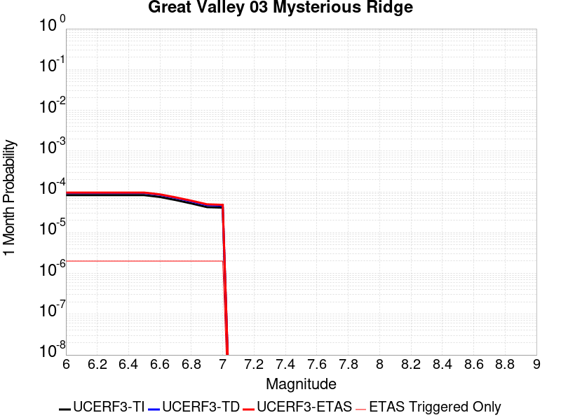 |  |  |

| Magnitude | 1 wk TI Prob | 1 wk TD Prob | 1 wk ETAS Prob | 1 wk ETAS/TD Gain | 1 wk ETAS Triggered Only | 1 mo TI Prob | 1 mo TD Prob | 1 mo ETAS Prob | 1 mo ETAS/TD Gain | 1 mo ETAS Triggered Only | 1 yr TI Prob | 1 yr TD Prob | 1 yr ETAS Prob | 1 yr ETAS/TD Gain | 1 yr ETAS Triggered Only | 10 yr TI Prob | 10 yr TD Prob | 10 yr ETAS Prob | 10 yr ETAS/TD Gain | 10 yr ETAS Triggered Only |
|-----|-----|-----|-----|-----|-----|-----|-----|-----|-----|-----|-----|-----|-----|-----|-----|-----|-----|-----|-----|-----|
| 6.0 | 1.9343506E-5 | 2.1910257E-5 | 2.4929112E-5 | 1.1377828 | 3.0189226E-6 | 8.289811E-5 | 9.389859E-5 | 9.6917225E-5 | 1.0321479 | 3.0189226E-6 | 0.0010088171 | 0.0011427705 | 0.001145786 | 1.0026387 | 3.0189226E-6 | 0.010042497 | 0.011384191 | 0.011387175 | 1.0002621 | 3.0189226E-6 |
| 6.1 | 1.9343506E-5 | 2.1910257E-5 | 2.4929112E-5 | 1.1377828 | 3.0189226E-6 | 8.289811E-5 | 9.389859E-5 | 9.6917225E-5 | 1.0321479 | 3.0189226E-6 | 0.0010088171 | 0.0011427705 | 0.001145786 | 1.0026387 | 3.0189226E-6 | 0.010042497 | 0.011384191 | 0.011387175 | 1.0002621 | 3.0189226E-6 |
| 6.2 | 1.9343506E-5 | 2.1910257E-5 | 2.4929112E-5 | 1.1377828 | 3.0189226E-6 | 8.289811E-5 | 9.389859E-5 | 9.6917225E-5 | 1.0321479 | 3.0189226E-6 | 0.0010088171 | 0.0011427705 | 0.001145786 | 1.0026387 | 3.0189226E-6 | 0.010042497 | 0.011384191 | 0.011387175 | 1.0002621 | 3.0189226E-6 |
| 6.3 | 1.9343506E-5 | 2.1910257E-5 | 2.4929112E-5 | 1.1377828 | 3.0189226E-6 | 8.289811E-5 | 9.389859E-5 | 9.6917225E-5 | 1.0321479 | 3.0189226E-6 | 0.0010088171 | 0.0011427705 | 0.001145786 | 1.0026387 | 3.0189226E-6 | 0.010042497 | 0.011384191 | 0.011387175 | 1.0002621 | 3.0189226E-6 |
| 6.4 | 1.9343506E-5 | 2.1910257E-5 | 2.4929112E-5 | 1.1377828 | 3.0189226E-6 | 8.289811E-5 | 9.389859E-5 | 9.6917225E-5 | 1.0321479 | 3.0189226E-6 | 0.0010088171 | 0.0011427705 | 0.001145786 | 1.0026387 | 3.0189226E-6 | 0.010042497 | 0.011384191 | 0.011387175 | 1.0002621 | 3.0189226E-6 |
| 6.5 | 1.9343506E-5 | 2.1910257E-5 | 2.4929112E-5 | 1.1377828 | 3.0189226E-6 | 8.289811E-5 | 9.389859E-5 | 9.6917225E-5 | 1.0321479 | 3.0189226E-6 | 0.0010088171 | 0.0011427705 | 0.001145786 | 1.0026387 | 3.0189226E-6 | 0.010042497 | 0.011384191 | 0.011387175 | 1.0002621 | 3.0189226E-6 |
| 6.6 | 1.7440449E-5 | 1.9750794E-5 | 2.2769658E-5 | 1.1528476 | 3.0189226E-6 | 7.474264E-5 | 8.464438E-5 | 8.766305E-5 | 1.0356629 | 3.0189226E-6 | 9.096117E-4 | 0.0010302118 | 0.0010332275 | 1.0029274 | 3.0189226E-6 | 0.009058975 | 0.010269466 | 0.010272454 | 1.000291 | 3.0189226E-6 |
| 6.7 | 1.468422E-5 | 1.6604492E-5 | 1.9623365E-5 | 1.1818106 | 3.0189226E-6 | 6.2930856E-5 | 7.116102E-5 | 7.417973E-5 | 1.0424209 | 3.0189226E-6 | 7.659138E-4 | 8.6619187E-4 | 8.692082E-4 | 1.0034822 | 3.0189226E-6 | 0.007632794 | 0.008642968 | 0.008645961 | 1.0003463 | 3.0189226E-6 |
| 6.8 | 1.211602E-5 | 1.3673764E-5 | 1.6692646E-5 | 1.2207791 | 3.0189226E-6 | 5.1924766E-5 | 5.8601363E-5 | 6.162011E-5 | 1.0515132 | 3.0189226E-6 | 6.320007E-4 | 7.133854E-4 | 7.164022E-4 | 1.0042288 | 3.0189226E-6 | 0.006302063 | 0.007125407 | 0.0071284045 | 1.0004207 | 3.0189226E-6 |
| 6.9 | 9.837659E-6 | 1.1085766E-5 | 1.4104656E-5 | 1.2723212 | 3.0189226E-6 | 4.2160715E-5 | 4.7510377E-5 | 5.0529157E-5 | 1.0635394 | 3.0189226E-6 | 5.131858E-4 | 5.7842984E-4 | 5.81447E-4 | 1.0052161 | 3.0189226E-6 | 0.005120023 | 0.005783415 | 0.005786416 | 1.0005189 | 3.0189226E-6 |
| 7.0 | 9.54151E-6 | 1.0750372E-5 | 1.3769262E-5 | 1.2808173 | 3.0189226E-6 | 4.0891544E-5 | 4.6073023E-5 | 4.9091806E-5 | 1.0655217 | 3.0189226E-6 | 4.977408E-4 | 5.609391E-4 | 5.639563E-4 | 1.0053788 | 3.0189226E-6 | 0.0049662744 | 0.0056093903 | 0.0056123924 | 1.0005351 | 3.0189226E-6 |

## Lions Head 2011 CFM
*[(top)](#table-of-contents)*

| 1 Week | 1 Month | 1 Year | 10 Year |
|-----|-----|-----|-----|
|  |  |  |  |

| Magnitude | 1 wk TI Prob | 1 wk TD Prob | 1 wk ETAS Prob | 1 wk ETAS/TD Gain | 1 wk ETAS Triggered Only | 1 mo TI Prob | 1 mo TD Prob | 1 mo ETAS Prob | 1 mo ETAS/TD Gain | 1 mo ETAS Triggered Only | 1 yr TI Prob | 1 yr TD Prob | 1 yr ETAS Prob | 1 yr ETAS/TD Gain | 1 yr ETAS Triggered Only | 10 yr TI Prob | 10 yr TD Prob | 10 yr ETAS Prob | 10 yr ETAS/TD Gain | 10 yr ETAS Triggered Only |
|-----|-----|-----|-----|-----|-----|-----|-----|-----|-----|-----|-----|-----|-----|-----|-----|-----|-----|-----|-----|-----|
| 6.0 | 3.9644272E-7 | 3.975295E-7 | 3.975295E-7 | 1.0 | 0.0 | 1.6990391E-6 | 1.7036973E-6 | 1.7036973E-6 | 1.0 | 0.0 | 2.0685604E-5 | 2.0742418E-5 | 2.0742418E-5 | 1.0 | 0.0 | 2.0683679E-4 | 2.0741469E-4 | 2.1043299E-4 | 1.014552 | 3.0189226E-6 |
| 6.1 | 3.9644272E-7 | 3.975295E-7 | 3.975295E-7 | 1.0 | 0.0 | 1.6990391E-6 | 1.7036973E-6 | 1.7036973E-6 | 1.0 | 0.0 | 2.0685604E-5 | 2.0742418E-5 | 2.0742418E-5 | 1.0 | 0.0 | 2.0683679E-4 | 2.0741469E-4 | 2.1043299E-4 | 1.014552 | 3.0189226E-6 |
| 6.2 | 3.9644272E-7 | 3.975295E-7 | 3.975295E-7 | 1.0 | 0.0 | 1.6990391E-6 | 1.7036973E-6 | 1.7036973E-6 | 1.0 | 0.0 | 2.0685604E-5 | 2.0742418E-5 | 2.0742418E-5 | 1.0 | 0.0 | 2.0683679E-4 | 2.0741469E-4 | 2.1043299E-4 | 1.014552 | 3.0189226E-6 |
| 6.3 | 3.9644272E-7 | 3.975295E-7 | 3.975295E-7 | 1.0 | 0.0 | 1.6990391E-6 | 1.7036973E-6 | 1.7036973E-6 | 1.0 | 0.0 | 2.0685604E-5 | 2.0742418E-5 | 2.0742418E-5 | 1.0 | 0.0 | 2.0683679E-4 | 2.0741469E-4 | 2.1043299E-4 | 1.014552 | 3.0189226E-6 |
| 6.4 | 3.9644272E-7 | 3.975295E-7 | 3.975295E-7 | 1.0 | 0.0 | 1.6990391E-6 | 1.7036973E-6 | 1.7036973E-6 | 1.0 | 0.0 | 2.0685604E-5 | 2.0742418E-5 | 2.0742418E-5 | 1.0 | 0.0 | 2.0683679E-4 | 2.0741469E-4 | 2.1043299E-4 | 1.014552 | 3.0189226E-6 |
| 6.5 | 3.9644272E-7 | 3.975295E-7 | 3.975295E-7 | 1.0 | 0.0 | 1.6990391E-6 | 1.7036973E-6 | 1.7036973E-6 | 1.0 | 0.0 | 2.0685604E-5 | 2.0742418E-5 | 2.0742418E-5 | 1.0 | 0.0 | 2.0683679E-4 | 2.0741469E-4 | 2.1043299E-4 | 1.014552 | 3.0189226E-6 |
| 6.6 | 2.741605E-7 | 2.7490307E-7 | 2.7490307E-7 | 1.0 | 0.0 | 1.174973E-6 | 1.178156E-6 | 1.178156E-6 | 1.0 | 0.0 | 1.4305203E-5 | 1.4344049E-5 | 1.4344049E-5 | 1.0 | 0.0 | 1.4304282E-4 | 1.434405E-4 | 1.434405E-4 | 1.0 | 0.0 |
| 6.7 | 2.741605E-7 | 2.7490307E-7 | 2.7490307E-7 | 1.0 | 0.0 | 1.174973E-6 | 1.178156E-6 | 1.178156E-6 | 1.0 | 0.0 | 1.4305203E-5 | 1.4344049E-5 | 1.4344049E-5 | 1.0 | 0.0 | 1.4304282E-4 | 1.434405E-4 | 1.434405E-4 | 1.0 | 0.0 |

## Hartley Springs 2011 CFM
*[(top)](#table-of-contents)*

| 1 Week | 1 Month | 1 Year | 10 Year |
|-----|-----|-----|-----|
|  |  |  |  |

| Magnitude | 1 wk TI Prob | 1 wk TD Prob | 1 wk ETAS Prob | 1 wk ETAS/TD Gain | 1 wk ETAS Triggered Only | 1 mo TI Prob | 1 mo TD Prob | 1 mo ETAS Prob | 1 mo ETAS/TD Gain | 1 mo ETAS Triggered Only | 1 yr TI Prob | 1 yr TD Prob | 1 yr ETAS Prob | 1 yr ETAS/TD Gain | 1 yr ETAS Triggered Only | 10 yr TI Prob | 10 yr TD Prob | 10 yr ETAS Prob | 10 yr ETAS/TD Gain | 10 yr ETAS Triggered Only |
|-----|-----|-----|-----|-----|-----|-----|-----|-----|-----|-----|-----|-----|-----|-----|-----|-----|-----|-----|-----|-----|
| 6.0 | 9.687499E-6 | 1.0368633E-5 | 1.0368633E-5 | 1.0 | 0.0 | 4.1517193E-5 | 4.4436638E-5 | 4.745543E-5 | 1.0679346 | 3.0189226E-6 | 5.0535455E-4 | 5.409523E-4 | 5.439696E-4 | 1.0055777 | 3.0189226E-6 | 0.0050420687 | 0.005403274 | 0.005406277 | 1.0005558 | 3.0189226E-6 |
| 6.1 | 9.687499E-6 | 1.0368633E-5 | 1.0368633E-5 | 1.0 | 0.0 | 4.1517193E-5 | 4.4436638E-5 | 4.745543E-5 | 1.0679346 | 3.0189226E-6 | 5.0535455E-4 | 5.409523E-4 | 5.439696E-4 | 1.0055777 | 3.0189226E-6 | 0.0050420687 | 0.005403274 | 0.005406277 | 1.0005558 | 3.0189226E-6 |
| 6.2 | 9.687499E-6 | 1.0368633E-5 | 1.0368633E-5 | 1.0 | 0.0 | 4.1517193E-5 | 4.4436638E-5 | 4.745543E-5 | 1.0679346 | 3.0189226E-6 | 5.0535455E-4 | 5.409523E-4 | 5.439696E-4 | 1.0055777 | 3.0189226E-6 | 0.0050420687 | 0.005403274 | 0.005406277 | 1.0005558 | 3.0189226E-6 |
| 6.3 | 9.687499E-6 | 1.0368633E-5 | 1.0368633E-5 | 1.0 | 0.0 | 4.1517193E-5 | 4.4436638E-5 | 4.745543E-5 | 1.0679346 | 3.0189226E-6 | 5.0535455E-4 | 5.409523E-4 | 5.439696E-4 | 1.0055777 | 3.0189226E-6 | 0.0050420687 | 0.005403274 | 0.005406277 | 1.0005558 | 3.0189226E-6 |
| 6.4 | 9.687499E-6 | 1.0368633E-5 | 1.0368633E-5 | 1.0 | 0.0 | 4.1517193E-5 | 4.4436638E-5 | 4.745543E-5 | 1.0679346 | 3.0189226E-6 | 5.0535455E-4 | 5.409523E-4 | 5.439696E-4 | 1.0055777 | 3.0189226E-6 | 0.0050420687 | 0.005403274 | 0.005406277 | 1.0005558 | 3.0189226E-6 |
| 6.5 | 9.687499E-6 | 1.0368633E-5 | 1.0368633E-5 | 1.0 | 0.0 | 4.1517193E-5 | 4.4436638E-5 | 4.745543E-5 | 1.0679346 | 3.0189226E-6 | 5.0535455E-4 | 5.409523E-4 | 5.439696E-4 | 1.0055777 | 3.0189226E-6 | 0.0050420687 | 0.005403274 | 0.005406277 | 1.0005558 | 3.0189226E-6 |
| 6.6 | 6.6994126E-6 | 7.1661625E-6 | 7.1661625E-6 | 1.0 | 0.0 | 2.8711453E-5 | 3.0712123E-5 | 3.0712123E-5 | 1.0 | 0.0 | 3.4950586E-4 | 3.739201E-4 | 3.739201E-4 | 1.0 | 0.0 | 0.0034895667 | 0.0037392012 | 0.0037392012 | 1.0 | 0.0 |
| 6.7 | 6.6994126E-6 | 7.1661625E-6 | 7.1661625E-6 | 1.0 | 0.0 | 2.8711453E-5 | 3.0712123E-5 | 3.0712123E-5 | 1.0 | 0.0 | 3.4950586E-4 | 3.739201E-4 | 3.739201E-4 | 1.0 | 0.0 | 0.0034895667 | 0.0037392012 | 0.0037392012 | 1.0 | 0.0 |

## Point Reyes 2011 CFM
*[(top)](#table-of-contents)*

| 1 Week | 1 Month | 1 Year | 10 Year |
|-----|-----|-----|-----|
|  |  |  |  |

| Magnitude | 1 wk TI Prob | 1 wk TD Prob | 1 wk ETAS Prob | 1 wk ETAS/TD Gain | 1 wk ETAS Triggered Only | 1 mo TI Prob | 1 mo TD Prob | 1 mo ETAS Prob | 1 mo ETAS/TD Gain | 1 mo ETAS Triggered Only | 1 yr TI Prob | 1 yr TD Prob | 1 yr ETAS Prob | 1 yr ETAS/TD Gain | 1 yr ETAS Triggered Only | 10 yr TI Prob | 10 yr TD Prob | 10 yr ETAS Prob | 10 yr ETAS/TD Gain | 10 yr ETAS Triggered Only |
|-----|-----|-----|-----|-----|-----|-----|-----|-----|-----|-----|-----|-----|-----|-----|-----|-----|-----|-----|-----|-----|
| 6.0 | 5.880186E-6 | 6.1172223E-6 | 6.1172223E-6 | 1.0 | 0.0 | 2.5200554E-5 | 2.6216505E-5 | 2.9235347E-5 | 1.1151505 | 3.0189226E-6 | 3.0677355E-4 | 3.191572E-4 | 3.2217518E-4 | 1.009456 | 3.0189226E-6 | 0.003063504 | 0.0031887568 | 0.003191766 | 1.0009438 | 3.0189226E-6 |
| 6.1 | 5.880186E-6 | 6.1172223E-6 | 6.1172223E-6 | 1.0 | 0.0 | 2.5200554E-5 | 2.6216505E-5 | 2.9235347E-5 | 1.1151505 | 3.0189226E-6 | 3.0677355E-4 | 3.191572E-4 | 3.2217518E-4 | 1.009456 | 3.0189226E-6 | 0.003063504 | 0.0031887568 | 0.003191766 | 1.0009438 | 3.0189226E-6 |
| 6.2 | 5.880186E-6 | 6.1172223E-6 | 6.1172223E-6 | 1.0 | 0.0 | 2.5200554E-5 | 2.6216505E-5 | 2.9235347E-5 | 1.1151505 | 3.0189226E-6 | 3.0677355E-4 | 3.191572E-4 | 3.2217518E-4 | 1.009456 | 3.0189226E-6 | 0.003063504 | 0.0031887568 | 0.003191766 | 1.0009438 | 3.0189226E-6 |
| 6.3 | 5.880186E-6 | 6.1172223E-6 | 6.1172223E-6 | 1.0 | 0.0 | 2.5200554E-5 | 2.6216505E-5 | 2.9235347E-5 | 1.1151505 | 3.0189226E-6 | 3.0677355E-4 | 3.191572E-4 | 3.2217518E-4 | 1.009456 | 3.0189226E-6 | 0.003063504 | 0.0031887568 | 0.003191766 | 1.0009438 | 3.0189226E-6 |
| 6.4 | 5.880186E-6 | 6.1172223E-6 | 6.1172223E-6 | 1.0 | 0.0 | 2.5200554E-5 | 2.6216505E-5 | 2.9235347E-5 | 1.1151505 | 3.0189226E-6 | 3.0677355E-4 | 3.191572E-4 | 3.2217518E-4 | 1.009456 | 3.0189226E-6 | 0.003063504 | 0.0031887568 | 0.003191766 | 1.0009438 | 3.0189226E-6 |
| 6.5 | 5.880186E-6 | 6.1172223E-6 | 6.1172223E-6 | 1.0 | 0.0 | 2.5200554E-5 | 2.6216505E-5 | 2.9235347E-5 | 1.1151505 | 3.0189226E-6 | 3.0677355E-4 | 3.191572E-4 | 3.2217518E-4 | 1.009456 | 3.0189226E-6 | 0.003063504 | 0.0031887568 | 0.003191766 | 1.0009438 | 3.0189226E-6 |
| 6.6 | 4.962286E-6 | 5.1612233E-6 | 5.1612233E-6 | 1.0 | 0.0 | 2.1266766E-5 | 2.211944E-5 | 2.211944E-5 | 1.0 | 0.0 | 2.588921E-4 | 2.6928863E-4 | 2.6928863E-4 | 1.0 | 0.0 | 0.002585907 | 0.002691363 | 0.002691363 | 1.0 | 0.0 |
| 6.7 | 3.6899585E-6 | 3.8359885E-6 | 3.8359885E-6 | 1.0 | 0.0 | 1.5814012E-5 | 1.6439944E-5 | 1.6439944E-5 | 1.0 | 0.0 | 1.9251858E-4 | 2.0015506E-4 | 2.0015506E-4 | 1.0 | 0.0 | 0.0019235188 | 0.0020014285 | 0.0020014285 | 1.0 | 0.0 |
| 6.8 | 3.560543E-6 | 3.7012655E-6 | 3.7012655E-6 | 1.0 | 0.0 | 1.525938E-5 | 1.5862566E-5 | 1.5862566E-5 | 1.0 | 0.0 | 1.8576712E-4 | 1.9312675E-4 | 1.9312675E-4 | 1.0 | 0.0 | 0.001856119 | 0.0019312674 | 0.0019312674 | 1.0 | 0.0 |

## Burnt Mtn
*[(top)](#table-of-contents)*

| 1 Week | 1 Month | 1 Year | 10 Year |
|-----|-----|-----|-----|
|  |  |  |  |

| Magnitude | 1 wk TI Prob | 1 wk TD Prob | 1 wk ETAS Prob | 1 wk ETAS/TD Gain | 1 wk ETAS Triggered Only | 1 mo TI Prob | 1 mo TD Prob | 1 mo ETAS Prob | 1 mo ETAS/TD Gain | 1 mo ETAS Triggered Only | 1 yr TI Prob | 1 yr TD Prob | 1 yr ETAS Prob | 1 yr ETAS/TD Gain | 1 yr ETAS Triggered Only | 10 yr TI Prob | 10 yr TD Prob | 10 yr ETAS Prob | 10 yr ETAS/TD Gain | 10 yr ETAS Triggered Only |
|-----|-----|-----|-----|-----|-----|-----|-----|-----|-----|-----|-----|-----|-----|-----|-----|-----|-----|-----|-----|-----|
| 6.0 | 1.1997946E-5 | 8.64995E-6 | 8.64995E-6 | 1.0 | 0.0 | 5.1418756E-5 | 3.7071215E-5 | 4.0090028E-5 | 1.0814327 | 3.0189226E-6 | 6.2584353E-4 | 4.5134206E-4 | 4.5435963E-4 | 1.0066857 | 3.0189226E-6 | 0.006240839 | 0.0045134206 | 0.004516426 | 1.0006659 | 3.0189226E-6 |
| 6.1 | 1.1997946E-5 | 8.64995E-6 | 8.64995E-6 | 1.0 | 0.0 | 5.1418756E-5 | 3.7071215E-5 | 4.0090028E-5 | 1.0814327 | 3.0189226E-6 | 6.2584353E-4 | 4.5134206E-4 | 4.5435963E-4 | 1.0066857 | 3.0189226E-6 | 0.006240839 | 0.0045134206 | 0.004516426 | 1.0006659 | 3.0189226E-6 |
| 6.2 | 1.1997946E-5 | 8.64995E-6 | 8.64995E-6 | 1.0 | 0.0 | 5.1418756E-5 | 3.7071215E-5 | 4.0090028E-5 | 1.0814327 | 3.0189226E-6 | 6.2584353E-4 | 4.5134206E-4 | 4.5435963E-4 | 1.0066857 | 3.0189226E-6 | 0.006240839 | 0.0045134206 | 0.004516426 | 1.0006659 | 3.0189226E-6 |
| 6.3 | 1.1997946E-5 | 8.64995E-6 | 8.64995E-6 | 1.0 | 0.0 | 5.1418756E-5 | 3.7071215E-5 | 4.0090028E-5 | 1.0814327 | 3.0189226E-6 | 6.2584353E-4 | 4.5134206E-4 | 4.5435963E-4 | 1.0066857 | 3.0189226E-6 | 0.006240839 | 0.0045134206 | 0.004516426 | 1.0006659 | 3.0189226E-6 |
| 6.4 | 1.1997946E-5 | 8.64995E-6 | 8.64995E-6 | 1.0 | 0.0 | 5.1418756E-5 | 3.7071215E-5 | 4.0090028E-5 | 1.0814327 | 3.0189226E-6 | 6.2584353E-4 | 4.5134206E-4 | 4.5435963E-4 | 1.0066857 | 3.0189226E-6 | 0.006240839 | 0.0045134206 | 0.004516426 | 1.0006659 | 3.0189226E-6 |
| 6.5 | 1.1997946E-5 | 8.64995E-6 | 8.64995E-6 | 1.0 | 0.0 | 5.1418756E-5 | 3.7071215E-5 | 4.0090028E-5 | 1.0814327 | 3.0189226E-6 | 6.2584353E-4 | 4.5134206E-4 | 4.5435963E-4 | 1.0066857 | 3.0189226E-6 | 0.006240839 | 0.0045134206 | 0.004516426 | 1.0006659 | 3.0189226E-6 |
| 6.6 | 1.1997946E-5 | 8.64995E-6 | 8.64995E-6 | 1.0 | 0.0 | 5.1418756E-5 | 3.7071215E-5 | 4.0090028E-5 | 1.0814327 | 3.0189226E-6 | 6.2584353E-4 | 4.5134206E-4 | 4.5435963E-4 | 1.0066857 | 3.0189226E-6 | 0.006240839 | 0.0045134206 | 0.004516426 | 1.0006659 | 3.0189226E-6 |

## Pisgah-Bullion Mtn-Mesquite Lk
*[(top)](#table-of-contents)*

| 1 Week | 1 Month | 1 Year | 10 Year |
|-----|-----|-----|-----|
|  |  |  |  |

| Magnitude | 1 wk TI Prob | 1 wk TD Prob | 1 wk ETAS Prob | 1 wk ETAS/TD Gain | 1 wk ETAS Triggered Only | 1 mo TI Prob | 1 mo TD Prob | 1 mo ETAS Prob | 1 mo ETAS/TD Gain | 1 mo ETAS Triggered Only | 1 yr TI Prob | 1 yr TD Prob | 1 yr ETAS Prob | 1 yr ETAS/TD Gain | 1 yr ETAS Triggered Only | 10 yr TI Prob | 10 yr TD Prob | 10 yr ETAS Prob | 10 yr ETAS/TD Gain | 10 yr ETAS Triggered Only |
|-----|-----|-----|-----|-----|-----|-----|-----|-----|-----|-----|-----|-----|-----|-----|-----|-----|-----|-----|-----|-----|
| 6.0 | 9.757405E-6 | 3.2571834E-6 | 6.276096E-6 | 1.9268477 | 3.0189226E-6 | 4.181678E-5 | 1.3959294E-5 | 1.6978174E-5 | 1.2162632 | 3.0189226E-6 | 5.090004E-4 | 1.6994326E-4 | 1.7296168E-4 | 1.0177612 | 3.0189226E-6 | 0.005078361 | 0.0016983406 | 0.0017013544 | 1.0017745 | 3.0189226E-6 |
| 6.1 | 9.757405E-6 | 3.2571834E-6 | 6.276096E-6 | 1.9268477 | 3.0189226E-6 | 4.181678E-5 | 1.3959294E-5 | 1.6978174E-5 | 1.2162632 | 3.0189226E-6 | 5.090004E-4 | 1.6994326E-4 | 1.7296168E-4 | 1.0177612 | 3.0189226E-6 | 0.005078361 | 0.0016983406 | 0.0017013544 | 1.0017745 | 3.0189226E-6 |
| 6.2 | 9.757405E-6 | 3.2571834E-6 | 6.276096E-6 | 1.9268477 | 3.0189226E-6 | 4.181678E-5 | 1.3959294E-5 | 1.6978174E-5 | 1.2162632 | 3.0189226E-6 | 5.090004E-4 | 1.6994326E-4 | 1.7296168E-4 | 1.0177612 | 3.0189226E-6 | 0.005078361 | 0.0016983406 | 0.0017013544 | 1.0017745 | 3.0189226E-6 |
| 6.3 | 9.757405E-6 | 3.2571834E-6 | 6.276096E-6 | 1.9268477 | 3.0189226E-6 | 4.181678E-5 | 1.3959294E-5 | 1.6978174E-5 | 1.2162632 | 3.0189226E-6 | 5.090004E-4 | 1.6994326E-4 | 1.7296168E-4 | 1.0177612 | 3.0189226E-6 | 0.005078361 | 0.0016983406 | 0.0017013544 | 1.0017745 | 3.0189226E-6 |
| 6.4 | 9.757405E-6 | 3.2571834E-6 | 6.276096E-6 | 1.9268477 | 3.0189226E-6 | 4.181678E-5 | 1.3959294E-5 | 1.6978174E-5 | 1.2162632 | 3.0189226E-6 | 5.090004E-4 | 1.6994326E-4 | 1.7296168E-4 | 1.0177612 | 3.0189226E-6 | 0.005078361 | 0.0016983406 | 0.0017013544 | 1.0017745 | 3.0189226E-6 |
| 6.5 | 9.757405E-6 | 3.2571834E-6 | 6.276096E-6 | 1.9268477 | 3.0189226E-6 | 4.181678E-5 | 1.3959294E-5 | 1.6978174E-5 | 1.2162632 | 3.0189226E-6 | 5.090004E-4 | 1.6994326E-4 | 1.7296168E-4 | 1.0177612 | 3.0189226E-6 | 0.005078361 | 0.0016983406 | 0.0017013544 | 1.0017745 | 3.0189226E-6 |
| 6.6 | 8.852213E-6 | 2.7291178E-6 | 5.748032E-6 | 2.1061869 | 3.0189226E-6 | 3.7937505E-5 | 1.1696178E-5 | 1.4715065E-5 | 1.2581089 | 3.0189226E-6 | 4.6179123E-4 | 1.4239372E-4 | 1.4541222E-4 | 1.0211983 | 3.0189226E-6 | 0.004608328 | 0.0014232274 | 0.0014262421 | 1.0021181 | 3.0189226E-6 |
| 6.7 | 7.756385E-6 | 2.2853417E-6 | 5.3042572E-6 | 2.320991 | 3.0189226E-6 | 3.3241224E-5 | 9.794297E-6 | 1.281319E-5 | 1.3082297 | 3.0189226E-6 | 4.0463675E-4 | 1.1924106E-4 | 1.2225962E-4 | 1.0253148 | 3.0189226E-6 | 0.0040390077 | 0.0011919696 | 0.001194985 | 1.0025297 | 3.0189226E-6 |
| 6.8 | 6.8437944E-6 | 2.0638372E-6 | 5.0827534E-6 | 2.4627686 | 3.0189226E-6 | 2.9330216E-5 | 8.844998E-6 | 1.1863894E-5 | 1.3413111 | 3.0189226E-6 | 3.570369E-4 | 1.07684544E-4 | 1.1070314E-4 | 1.0280318 | 3.0189226E-6 | 0.0035646379 | 0.0010765212 | 0.001079537 | 1.0028013 | 3.0189226E-6 |
| 6.9 | 5.8630926E-6 | 1.8587051E-6 | 1.8587051E-6 | 1.0 | 0.0 | 2.5127298E-5 | 7.965866E-6 | 7.965866E-6 | 1.0 | 0.0 | 3.058819E-4 | 9.698211E-5 | 9.698211E-5 | 1.0 | 0.0 | 0.003054612 | 9.695946E-4 | 9.695946E-4 | 1.0 | 0.0 |
| 7.0 | 5.1241714E-6 | 1.7030331E-6 | 1.7030331E-6 | 1.0 | 0.0 | 2.196055E-5 | 7.2987045E-6 | 7.2987045E-6 | 1.0 | 0.0 | 2.6733687E-4 | 8.8860106E-5 | 8.8860106E-5 | 1.0 | 0.0 | 0.0026701551 | 8.88442E-4 | 8.88442E-4 | 1.0 | 0.0 |
| 7.1 | 4.4490575E-6 | 1.5093489E-6 | 1.5093489E-6 | 1.0 | 0.0 | 1.906725E-5 | 6.468633E-6 | 6.468633E-6 | 1.0 | 0.0 | 2.3211904E-4 | 7.875475E-5 | 7.875475E-5 | 1.0 | 0.0 | 0.0023187674 | 7.8746333E-4 | 7.8746333E-4 | 1.0 | 0.0 |
| 7.2 | 3.827017E-6 | 1.2527248E-6 | 1.2527248E-6 | 1.0 | 0.0 | 1.6401398E-5 | 5.3688204E-6 | 5.3688204E-6 | 1.0 | 0.0 | 1.9966872E-4 | 6.536539E-5 | 6.536539E-5 | 1.0 | 0.0 | 0.0019948941 | 6.5365393E-4 | 6.5365393E-4 | 1.0 | 0.0 |

## Gillem - Big Crack 2011 CFM
*[(top)](#table-of-contents)*

| 1 Week | 1 Month | 1 Year | 10 Year |
|-----|-----|-----|-----|
|  |  |  |  |

| Magnitude | 1 wk TI Prob | 1 wk TD Prob | 1 wk ETAS Prob | 1 wk ETAS/TD Gain | 1 wk ETAS Triggered Only | 1 mo TI Prob | 1 mo TD Prob | 1 mo ETAS Prob | 1 mo ETAS/TD Gain | 1 mo ETAS Triggered Only | 1 yr TI Prob | 1 yr TD Prob | 1 yr ETAS Prob | 1 yr ETAS/TD Gain | 1 yr ETAS Triggered Only | 10 yr TI Prob | 10 yr TD Prob | 10 yr ETAS Prob | 10 yr ETAS/TD Gain | 10 yr ETAS Triggered Only |
|-----|-----|-----|-----|-----|-----|-----|-----|-----|-----|-----|-----|-----|-----|-----|-----|-----|-----|-----|-----|-----|
| 6.0 | 1.910764E-5 | 2.1994592E-5 | 2.1994592E-5 | 1.0 | 0.0 | 8.1887316E-5 | 9.426067E-5 | 9.7279306E-5 | 1.0320244 | 3.0189226E-6 | 9.96522E-4 | 0.0011472917 | 0.0011503071 | 1.0026283 | 3.0189226E-6 | 0.009920651 | 0.011440402 | 0.011443387 | 1.0002608 | 3.0189226E-6 |
| 6.1 | 1.910764E-5 | 2.1994592E-5 | 2.1994592E-5 | 1.0 | 0.0 | 8.1887316E-5 | 9.426067E-5 | 9.7279306E-5 | 1.0320244 | 3.0189226E-6 | 9.96522E-4 | 0.0011472917 | 0.0011503071 | 1.0026283 | 3.0189226E-6 | 0.009920651 | 0.011440402 | 0.011443387 | 1.0002608 | 3.0189226E-6 |
| 6.2 | 1.910764E-5 | 2.1994592E-5 | 2.1994592E-5 | 1.0 | 0.0 | 8.1887316E-5 | 9.426067E-5 | 9.7279306E-5 | 1.0320244 | 3.0189226E-6 | 9.96522E-4 | 0.0011472917 | 0.0011503071 | 1.0026283 | 3.0189226E-6 | 0.009920651 | 0.011440402 | 0.011443387 | 1.0002608 | 3.0189226E-6 |
| 6.3 | 1.910764E-5 | 2.1994592E-5 | 2.1994592E-5 | 1.0 | 0.0 | 8.1887316E-5 | 9.426067E-5 | 9.7279306E-5 | 1.0320244 | 3.0189226E-6 | 9.96522E-4 | 0.0011472917 | 0.0011503071 | 1.0026283 | 3.0189226E-6 | 0.009920651 | 0.011440402 | 0.011443387 | 1.0002608 | 3.0189226E-6 |
| 6.4 | 1.910764E-5 | 2.1994592E-5 | 2.1994592E-5 | 1.0 | 0.0 | 8.1887316E-5 | 9.426067E-5 | 9.7279306E-5 | 1.0320244 | 3.0189226E-6 | 9.96522E-4 | 0.0011472917 | 0.0011503071 | 1.0026283 | 3.0189226E-6 | 0.009920651 | 0.011440402 | 0.011443387 | 1.0002608 | 3.0189226E-6 |
| 6.5 | 1.910764E-5 | 2.1994592E-5 | 2.1994592E-5 | 1.0 | 0.0 | 8.1887316E-5 | 9.426067E-5 | 9.7279306E-5 | 1.0320244 | 3.0189226E-6 | 9.96522E-4 | 0.0011472917 | 0.0011503071 | 1.0026283 | 3.0189226E-6 | 0.009920651 | 0.011440402 | 0.011443387 | 1.0002608 | 3.0189226E-6 |
| 6.6 | 1.3213953E-5 | 1.5149388E-5 | 1.5149388E-5 | 1.0 | 0.0 | 5.6629997E-5 | 6.4925705E-5 | 6.794443E-5 | 1.0464951 | 3.0189226E-6 | 6.892521E-4 | 7.904269E-4 | 7.9344347E-4 | 1.0038164 | 3.0189226E-6 | 0.0068711825 | 0.0079000015 | 0.007902997 | 1.0003791 | 3.0189226E-6 |
| 6.7 | 1.21310995E-5 | 1.3896347E-5 | 1.3896347E-5 | 1.0 | 0.0 | 5.198939E-5 | 5.9555772E-5 | 6.2574516E-5 | 1.0506877 | 3.0189226E-6 | 6.32787E-4 | 7.2509155E-4 | 7.281083E-4 | 1.0041605 | 3.0189226E-6 | 0.0063098813 | 0.0072509153 | 0.0072539123 | 1.0004133 | 3.0189226E-6 |

## Likely 2011 CFM
*[(top)](#table-of-contents)*

| 1 Week | 1 Month | 1 Year | 10 Year |
|-----|-----|-----|-----|
|  |  |  |  |

| Magnitude | 1 wk TI Prob | 1 wk TD Prob | 1 wk ETAS Prob | 1 wk ETAS/TD Gain | 1 wk ETAS Triggered Only | 1 mo TI Prob | 1 mo TD Prob | 1 mo ETAS Prob | 1 mo ETAS/TD Gain | 1 mo ETAS Triggered Only | 1 yr TI Prob | 1 yr TD Prob | 1 yr ETAS Prob | 1 yr ETAS/TD Gain | 1 yr ETAS Triggered Only | 10 yr TI Prob | 10 yr TD Prob | 10 yr ETAS Prob | 10 yr ETAS/TD Gain | 10 yr ETAS Triggered Only |
|-----|-----|-----|-----|-----|-----|-----|-----|-----|-----|-----|-----|-----|-----|-----|-----|-----|-----|-----|-----|-----|
| 6.0 | 4.8283173E-6 | 4.977288E-6 | 4.977288E-6 | 1.0 | 0.0 | 2.0692623E-5 | 2.1331109E-5 | 2.1331109E-5 | 1.0 | 0.0 | 2.5190358E-4 | 2.5968385E-4 | 2.6270197E-4 | 1.0116223 | 3.0189226E-6 | 0.0025161821 | 0.0025946426 | 0.0025976535 | 1.0011605 | 3.0189226E-6 |
| 6.1 | 4.8283173E-6 | 4.977288E-6 | 4.977288E-6 | 1.0 | 0.0 | 2.0692623E-5 | 2.1331109E-5 | 2.1331109E-5 | 1.0 | 0.0 | 2.5190358E-4 | 2.5968385E-4 | 2.6270197E-4 | 1.0116223 | 3.0189226E-6 | 0.0025161821 | 0.0025946426 | 0.0025976535 | 1.0011605 | 3.0189226E-6 |
| 6.2 | 4.8283173E-6 | 4.977288E-6 | 4.977288E-6 | 1.0 | 0.0 | 2.0692623E-5 | 2.1331109E-5 | 2.1331109E-5 | 1.0 | 0.0 | 2.5190358E-4 | 2.5968385E-4 | 2.6270197E-4 | 1.0116223 | 3.0189226E-6 | 0.0025161821 | 0.0025946426 | 0.0025976535 | 1.0011605 | 3.0189226E-6 |
| 6.3 | 4.8283173E-6 | 4.977288E-6 | 4.977288E-6 | 1.0 | 0.0 | 2.0692623E-5 | 2.1331109E-5 | 2.1331109E-5 | 1.0 | 0.0 | 2.5190358E-4 | 2.5968385E-4 | 2.6270197E-4 | 1.0116223 | 3.0189226E-6 | 0.0025161821 | 0.0025946426 | 0.0025976535 | 1.0011605 | 3.0189226E-6 |
| 6.4 | 4.8283173E-6 | 4.977288E-6 | 4.977288E-6 | 1.0 | 0.0 | 2.0692623E-5 | 2.1331109E-5 | 2.1331109E-5 | 1.0 | 0.0 | 2.5190358E-4 | 2.5968385E-4 | 2.6270197E-4 | 1.0116223 | 3.0189226E-6 | 0.0025161821 | 0.0025946426 | 0.0025976535 | 1.0011605 | 3.0189226E-6 |
| 6.5 | 4.8283173E-6 | 4.977288E-6 | 4.977288E-6 | 1.0 | 0.0 | 2.0692623E-5 | 2.1331109E-5 | 2.1331109E-5 | 1.0 | 0.0 | 2.5190358E-4 | 2.5968385E-4 | 2.6270197E-4 | 1.0116223 | 3.0189226E-6 | 0.0025161821 | 0.0025946426 | 0.0025976535 | 1.0011605 | 3.0189226E-6 |
| 6.6 | 4.1529042E-6 | 4.2800852E-6 | 4.2800852E-6 | 1.0 | 0.0 | 1.779804E-5 | 1.834314E-5 | 1.834314E-5 | 1.0 | 0.0 | 2.1666959E-4 | 2.2331333E-4 | 2.2633157E-4 | 1.0135157 | 3.0189226E-6 | 0.0021645846 | 0.00223172 | 0.002234732 | 1.0013497 | 3.0189226E-6 |
| 6.7 | 3.5450967E-6 | 3.6525942E-6 | 3.6525942E-6 | 1.0 | 0.0 | 1.5193183E-5 | 1.5653928E-5 | 1.5653928E-5 | 1.0 | 0.0 | 1.849613E-4 | 1.905783E-4 | 1.9359666E-4 | 1.0158378 | 3.0189226E-6 | 0.0018480743 | 0.0019049724 | 0.0019079855 | 1.0015818 | 3.0189226E-6 |
| 6.8 | 2.9935204E-6 | 3.0833778E-6 | 3.0833778E-6 | 1.0 | 0.0 | 1.282931E-5 | 1.3214457E-5 | 1.3214457E-5 | 1.0 | 0.0 | 1.5618566E-4 | 1.6088245E-4 | 1.6390088E-4 | 1.0187618 | 3.0189226E-6 | 0.0015607593 | 0.0016084755 | 0.0016114895 | 1.0018739 | 3.0189226E-6 |
| 6.9 | 2.4887156E-6 | 2.5627064E-6 | 2.5627064E-6 | 1.0 | 0.0 | 1.0665881E-5 | 1.0983028E-5 | 1.0983028E-5 | 1.0 | 0.0 | 1.2984936E-4 | 1.3371836E-4 | 1.3673688E-4 | 1.0225737 | 3.0189226E-6 | 0.0012977351 | 0.0013371836 | 0.0013401986 | 1.0022546 | 3.0189226E-6 |

## Collayami 2011 CFM
*[(top)](#table-of-contents)*

| 1 Week | 1 Month | 1 Year | 10 Year |
|-----|-----|-----|-----|
|  |  |  |  |

| Magnitude | 1 wk TI Prob | 1 wk TD Prob | 1 wk ETAS Prob | 1 wk ETAS/TD Gain | 1 wk ETAS Triggered Only | 1 mo TI Prob | 1 mo TD Prob | 1 mo ETAS Prob | 1 mo ETAS/TD Gain | 1 mo ETAS Triggered Only | 1 yr TI Prob | 1 yr TD Prob | 1 yr ETAS Prob | 1 yr ETAS/TD Gain | 1 yr ETAS Triggered Only | 10 yr TI Prob | 10 yr TD Prob | 10 yr ETAS Prob | 10 yr ETAS/TD Gain | 10 yr ETAS Triggered Only |
|-----|-----|-----|-----|-----|-----|-----|-----|-----|-----|-----|-----|-----|-----|-----|-----|-----|-----|-----|-----|-----|
| 6.0 | 1.2952825E-5 | 1.4354933E-5 | 1.4354933E-5 | 1.0 | 0.0 | 5.551093E-5 | 6.152114E-5 | 6.152114E-5 | 1.0 | 0.0 | 6.7563594E-4 | 7.490199E-4 | 7.490199E-4 | 1.0 | 0.0 | 0.006735855 | 0.007490199 | 0.007493195 | 1.0004001 | 3.0189226E-6 |
| 6.1 | 1.2952825E-5 | 1.4354933E-5 | 1.4354933E-5 | 1.0 | 0.0 | 5.551093E-5 | 6.152114E-5 | 6.152114E-5 | 1.0 | 0.0 | 6.7563594E-4 | 7.490199E-4 | 7.490199E-4 | 1.0 | 0.0 | 0.006735855 | 0.007490199 | 0.007493195 | 1.0004001 | 3.0189226E-6 |
| 6.2 | 1.2952825E-5 | 1.4354933E-5 | 1.4354933E-5 | 1.0 | 0.0 | 5.551093E-5 | 6.152114E-5 | 6.152114E-5 | 1.0 | 0.0 | 6.7563594E-4 | 7.490199E-4 | 7.490199E-4 | 1.0 | 0.0 | 0.006735855 | 0.007490199 | 0.007493195 | 1.0004001 | 3.0189226E-6 |
| 6.3 | 1.2952825E-5 | 1.4354933E-5 | 1.4354933E-5 | 1.0 | 0.0 | 5.551093E-5 | 6.152114E-5 | 6.152114E-5 | 1.0 | 0.0 | 6.7563594E-4 | 7.490199E-4 | 7.490199E-4 | 1.0 | 0.0 | 0.006735855 | 0.007490199 | 0.007493195 | 1.0004001 | 3.0189226E-6 |
| 6.4 | 1.2952825E-5 | 1.4354933E-5 | 1.4354933E-5 | 1.0 | 0.0 | 5.551093E-5 | 6.152114E-5 | 6.152114E-5 | 1.0 | 0.0 | 6.7563594E-4 | 7.490199E-4 | 7.490199E-4 | 1.0 | 0.0 | 0.006735855 | 0.007490199 | 0.007493195 | 1.0004001 | 3.0189226E-6 |
| 6.5 | 1.2952825E-5 | 1.4354933E-5 | 1.4354933E-5 | 1.0 | 0.0 | 5.551093E-5 | 6.152114E-5 | 6.152114E-5 | 1.0 | 0.0 | 6.7563594E-4 | 7.490199E-4 | 7.490199E-4 | 1.0 | 0.0 | 0.006735855 | 0.007490199 | 0.007493195 | 1.0004001 | 3.0189226E-6 |

## West Tahoe
*[(top)](#table-of-contents)*

| 1 Week | 1 Month | 1 Year | 10 Year |
|-----|-----|-----|-----|
|  |  |  |  |

| Magnitude | 1 wk TI Prob | 1 wk TD Prob | 1 wk ETAS Prob | 1 wk ETAS/TD Gain | 1 wk ETAS Triggered Only | 1 mo TI Prob | 1 mo TD Prob | 1 mo ETAS Prob | 1 mo ETAS/TD Gain | 1 mo ETAS Triggered Only | 1 yr TI Prob | 1 yr TD Prob | 1 yr ETAS Prob | 1 yr ETAS/TD Gain | 1 yr ETAS Triggered Only | 10 yr TI Prob | 10 yr TD Prob | 10 yr ETAS Prob | 10 yr ETAS/TD Gain | 10 yr ETAS Triggered Only |
|-----|-----|-----|-----|-----|-----|-----|-----|-----|-----|-----|-----|-----|-----|-----|-----|-----|-----|-----|-----|-----|
| 6.0 | 9.18365E-6 | 9.709047E-6 | 9.709047E-6 | 1.0 | 0.0 | 3.9357907E-5 | 4.1609703E-5 | 4.1609703E-5 | 1.0 | 0.0 | 4.7907716E-4 | 5.065095E-4 | 5.095269E-4 | 1.0059572 | 3.0189226E-6 | 0.0047804564 | 0.0050564157 | 0.005059419 | 1.000594 | 3.0189226E-6 |
| 6.1 | 9.18365E-6 | 9.709047E-6 | 9.709047E-6 | 1.0 | 0.0 | 3.9357907E-5 | 4.1609703E-5 | 4.1609703E-5 | 1.0 | 0.0 | 4.7907716E-4 | 5.065095E-4 | 5.095269E-4 | 1.0059572 | 3.0189226E-6 | 0.0047804564 | 0.0050564157 | 0.005059419 | 1.000594 | 3.0189226E-6 |
| 6.2 | 9.18365E-6 | 9.709047E-6 | 9.709047E-6 | 1.0 | 0.0 | 3.9357907E-5 | 4.1609703E-5 | 4.1609703E-5 | 1.0 | 0.0 | 4.7907716E-4 | 5.065095E-4 | 5.095269E-4 | 1.0059572 | 3.0189226E-6 | 0.0047804564 | 0.0050564157 | 0.005059419 | 1.000594 | 3.0189226E-6 |
| 6.3 | 9.18365E-6 | 9.709047E-6 | 9.709047E-6 | 1.0 | 0.0 | 3.9357907E-5 | 4.1609703E-5 | 4.1609703E-5 | 1.0 | 0.0 | 4.7907716E-4 | 5.065095E-4 | 5.095269E-4 | 1.0059572 | 3.0189226E-6 | 0.0047804564 | 0.0050564157 | 0.005059419 | 1.000594 | 3.0189226E-6 |
| 6.4 | 9.18365E-6 | 9.709047E-6 | 9.709047E-6 | 1.0 | 0.0 | 3.9357907E-5 | 4.1609703E-5 | 4.1609703E-5 | 1.0 | 0.0 | 4.7907716E-4 | 5.065095E-4 | 5.095269E-4 | 1.0059572 | 3.0189226E-6 | 0.0047804564 | 0.0050564157 | 0.005059419 | 1.000594 | 3.0189226E-6 |
| 6.5 | 9.18365E-6 | 9.709047E-6 | 9.709047E-6 | 1.0 | 0.0 | 3.9357907E-5 | 4.1609703E-5 | 4.1609703E-5 | 1.0 | 0.0 | 4.7907716E-4 | 5.065095E-4 | 5.095269E-4 | 1.0059572 | 3.0189226E-6 | 0.0047804564 | 0.0050564157 | 0.005059419 | 1.000594 | 3.0189226E-6 |
| 6.6 | 8.164356E-6 | 8.6257305E-6 | 8.6257305E-6 | 1.0 | 0.0 | 3.4989625E-5 | 3.6967052E-5 | 3.6967052E-5 | 1.0 | 0.0 | 4.259154E-4 | 4.500096E-4 | 4.5302714E-4 | 1.0067055 | 3.0189226E-6 | 0.004251 | 0.004493797 | 0.004496802 | 1.0006688 | 3.0189226E-6 |
| 6.7 | 7.1083327E-6 | 7.510388E-6 | 7.510388E-6 | 1.0 | 0.0 | 3.0463927E-5 | 3.2187138E-5 | 3.2187138E-5 | 1.0 | 0.0 | 3.708352E-4 | 3.918357E-4 | 3.9485344E-4 | 1.0077015 | 3.0189226E-6 | 0.0037021697 | 0.0039141746 | 0.003917182 | 1.0007683 | 3.0189226E-6 |
| 6.8 | 6.3750726E-6 | 6.7311666E-6 | 6.7311666E-6 | 1.0 | 0.0 | 2.7321454E-5 | 2.8847693E-5 | 2.8847693E-5 | 1.0 | 0.0 | 3.3258792E-4 | 3.5119147E-4 | 3.5119147E-4 | 1.0 | 0.0 | 0.0033209058 | 0.0035090533 | 0.0035090533 | 1.0 | 0.0 |
| 6.9 | 5.126961E-6 | 5.410055E-6 | 5.410055E-6 | 1.0 | 0.0 | 2.1972504E-5 | 2.3185894E-5 | 2.3185894E-5 | 1.0 | 0.0 | 2.674824E-4 | 2.8227826E-4 | 2.8227826E-4 | 1.0 | 0.0 | 0.0026716068 | 0.0028218026 | 0.0028218026 | 1.0 | 0.0 |
| 7.0 | 4.331526E-6 | 4.5688944E-6 | 4.5688944E-6 | 1.0 | 0.0 | 1.856355E-5 | 1.9580977E-5 | 1.9580977E-5 | 1.0 | 0.0 | 2.2598778E-4 | 2.3839838E-4 | 2.3839838E-4 | 1.0 | 0.0 | 0.002257581 | 0.002383984 | 0.002383984 | 1.0 | 0.0 |

## Elsinore (Julian)
*[(top)](#table-of-contents)*

| 1 Week | 1 Month | 1 Year | 10 Year |
|-----|-----|-----|-----|
|  |  |  |  |

| Magnitude | 1 wk TI Prob | 1 wk TD Prob | 1 wk ETAS Prob | 1 wk ETAS/TD Gain | 1 wk ETAS Triggered Only | 1 mo TI Prob | 1 mo TD Prob | 1 mo ETAS Prob | 1 mo ETAS/TD Gain | 1 mo ETAS Triggered Only | 1 yr TI Prob | 1 yr TD Prob | 1 yr ETAS Prob | 1 yr ETAS/TD Gain | 1 yr ETAS Triggered Only | 10 yr TI Prob | 10 yr TD Prob | 10 yr ETAS Prob | 10 yr ETAS/TD Gain | 10 yr ETAS Triggered Only |
|-----|-----|-----|-----|-----|-----|-----|-----|-----|-----|-----|-----|-----|-----|-----|-----|-----|-----|-----|-----|-----|
| 6.0 | 1.6316579E-5 | 2.2937022E-5 | 2.2937022E-5 | 1.0 | 0.0 | 6.992632E-5 | 9.8298326E-5 | 9.8298326E-5 | 1.0 | 0.0 | 8.510204E-4 | 0.0011962154 | 0.0011992308 | 1.0025207 | 3.0189226E-6 | 0.008477687 | 0.011913514 | 0.011916497 | 1.0002503 | 3.0189226E-6 |
| 6.1 | 1.6316579E-5 | 2.2937022E-5 | 2.2937022E-5 | 1.0 | 0.0 | 6.992632E-5 | 9.8298326E-5 | 9.8298326E-5 | 1.0 | 0.0 | 8.510204E-4 | 0.0011962154 | 0.0011992308 | 1.0025207 | 3.0189226E-6 | 0.008477687 | 0.011913514 | 0.011916497 | 1.0002503 | 3.0189226E-6 |
| 6.2 | 1.6316579E-5 | 2.2937022E-5 | 2.2937022E-5 | 1.0 | 0.0 | 6.992632E-5 | 9.8298326E-5 | 9.8298326E-5 | 1.0 | 0.0 | 8.510204E-4 | 0.0011962154 | 0.0011992308 | 1.0025207 | 3.0189226E-6 | 0.008477687 | 0.011913514 | 0.011916497 | 1.0002503 | 3.0189226E-6 |
| 6.3 | 1.6316579E-5 | 2.2937022E-5 | 2.2937022E-5 | 1.0 | 0.0 | 6.992632E-5 | 9.8298326E-5 | 9.8298326E-5 | 1.0 | 0.0 | 8.510204E-4 | 0.0011962154 | 0.0011992308 | 1.0025207 | 3.0189226E-6 | 0.008477687 | 0.011913514 | 0.011916497 | 1.0002503 | 3.0189226E-6 |
| 6.4 | 1.6316579E-5 | 2.2937022E-5 | 2.2937022E-5 | 1.0 | 0.0 | 6.992632E-5 | 9.8298326E-5 | 9.8298326E-5 | 1.0 | 0.0 | 8.510204E-4 | 0.0011962154 | 0.0011992308 | 1.0025207 | 3.0189226E-6 | 0.008477687 | 0.011913514 | 0.011916497 | 1.0002503 | 3.0189226E-6 |
| 6.5 | 1.6316579E-5 | 2.2937022E-5 | 2.2937022E-5 | 1.0 | 0.0 | 6.992632E-5 | 9.8298326E-5 | 9.8298326E-5 | 1.0 | 0.0 | 8.510204E-4 | 0.0011962154 | 0.0011992308 | 1.0025207 | 3.0189226E-6 | 0.008477687 | 0.011913514 | 0.011916497 | 1.0002503 | 3.0189226E-6 |
| 6.6 | 1.6187845E-5 | 2.2737193E-5 | 2.2737193E-5 | 1.0 | 0.0 | 6.937464E-5 | 9.744198E-5 | 9.744198E-5 | 1.0 | 0.0 | 8.443089E-4 | 0.0011858008 | 0.0011888162 | 1.0025429 | 3.0189226E-6 | 0.008411082 | 0.01181048 | 0.011813464 | 1.0002526 | 3.0189226E-6 |
| 6.7 | 1.5985162E-5 | 2.2371887E-5 | 2.2371887E-5 | 1.0 | 0.0 | 6.850604E-5 | 9.58765E-5 | 9.58765E-5 | 1.0 | 0.0 | 8.3374185E-4 | 0.0011667616 | 0.001169777 | 1.0025845 | 3.0189226E-6 | 0.008306207 | 0.011622093 | 0.011625077 | 1.0002568 | 3.0189226E-6 |
| 6.8 | 1.5961046E-5 | 2.2344699E-5 | 2.2344699E-5 | 1.0 | 0.0 | 6.840269E-5 | 9.575999E-5 | 9.575999E-5 | 1.0 | 0.0 | 8.324845E-4 | 0.0011653446 | 0.00116836 | 1.0025876 | 3.0189226E-6 | 0.008293727 | 0.011608072 | 0.011611055 | 1.000257 | 3.0189226E-6 |
| 6.9 | 1.5722166E-5 | 2.1942922E-5 | 2.1942922E-5 | 1.0 | 0.0 | 6.737897E-5 | 9.4038216E-5 | 9.4038216E-5 | 1.0 | 0.0 | 8.2003017E-4 | 0.0011444042 | 0.0011474197 | 1.002635 | 3.0189226E-6 | 0.008170107 | 0.011400834 | 0.011403818 | 1.0002618 | 3.0189226E-6 |
| 7.0 | 1.5513018E-5 | 2.1584812E-5 | 2.1584812E-5 | 1.0 | 0.0 | 6.648267E-5 | 9.250357E-5 | 9.250357E-5 | 1.0 | 0.0 | 8.0912595E-4 | 0.0011257393 | 0.0011287548 | 1.0026788 | 3.0189226E-6 | 0.008061862 | 0.011216079 | 0.011219065 | 1.0002662 | 3.0189226E-6 |
| 7.1 | 1.527908E-5 | 2.1219155E-5 | 2.1219155E-5 | 1.0 | 0.0 | 6.5480126E-5 | 9.093658E-5 | 9.093658E-5 | 1.0 | 0.0 | 7.9692894E-4 | 0.0011066807 | 0.0011096962 | 1.0027249 | 3.0189226E-6 | 0.007940771 | 0.011027294 | 0.01103028 | 1.0002707 | 3.0189226E-6 |
| 7.2 | 1.5025522E-5 | 2.082222E-5 | 2.082222E-5 | 1.0 | 0.0 | 6.4393505E-5 | 8.9235546E-5 | 8.9235546E-5 | 1.0 | 0.0 | 7.8370894E-4 | 0.0010859915 | 0.0010890071 | 1.0027769 | 3.0189226E-6 | 0.0078095077 | 0.010822412 | 0.010825398 | 1.000276 | 3.0189226E-6 |
| 7.3 | 1.4779679E-5 | 2.0420333E-5 | 2.0420333E-5 | 1.0 | 0.0 | 6.333994E-5 | 8.751328E-5 | 8.751328E-5 | 1.0 | 0.0 | 7.708909E-4 | 0.0010650436 | 0.0010680594 | 1.0028316 | 3.0189226E-6 | 0.007682222 | 0.010614914 | 0.010617901 | 1.0002813 | 3.0189226E-6 |
| 7.4 | 1.4238534E-5 | 1.9488383E-5 | 1.9488383E-5 | 1.0 | 0.0 | 6.1020863E-5 | 8.351947E-5 | 8.351947E-5 | 1.0 | 0.0 | 7.4267574E-4 | 0.001016465 | 0.0010194809 | 1.002967 | 3.0189226E-6 | 0.007401986 | 0.010133445 | 0.010136434 | 1.0002949 | 3.0189226E-6 |
| 7.5 | 1.1924516E-5 | 1.570584E-5 | 1.570584E-5 | 1.0 | 0.0 | 5.1104067E-5 | 6.730944E-5 | 6.730944E-5 | 1.0 | 0.0 | 6.220144E-4 | 8.192601E-4 | 8.222766E-4 | 1.0036819 | 3.0189226E-6 | 0.006202762 | 0.008175999 | 0.008178993 | 1.0003662 | 3.0189226E-6 |
| 7.6 | 1.0456552E-5 | 1.3574289E-5 | 1.3574289E-5 | 1.0 | 0.0 | 4.4813027E-5 | 5.817464E-5 | 5.817464E-5 | 1.0 | 0.0 | 5.45462E-4 | 7.081186E-4 | 7.111354E-4 | 1.0042603 | 3.0189226E-6 | 0.0054412507 | 0.0070718653 | 0.007074863 | 1.0004239 | 3.0189226E-6 |
| 7.7 | 4.463199E-6 | 5.214875E-6 | 5.214875E-6 | 1.0 | 0.0 | 1.9127854E-5 | 2.2349386E-5 | 2.2349386E-5 | 1.0 | 0.0 | 2.3285674E-4 | 2.7209E-4 | 2.7510812E-4 | 1.0110923 | 3.0189226E-6 | 0.0023261288 | 0.0027239968 | 0.0027270073 | 1.0011053 | 3.0189226E-6 |
| 7.8 | 2.1601753E-7 | 2.7489222E-7 | 2.7489222E-7 | 1.0 | 0.0 | 9.257891E-7 | 1.1781094E-6 | 1.1781094E-6 | 1.0 | 0.0 | 1.1271423E-5 | 1.4343483E-5 | 1.4343483E-5 | 1.0 | 0.0 | 1.1270852E-4 | 1.435847E-4 | 1.435847E-4 | 1.0 | 0.0 |

