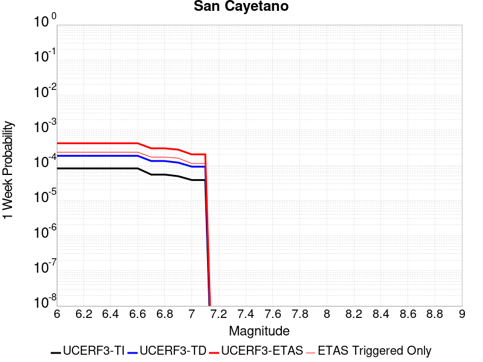
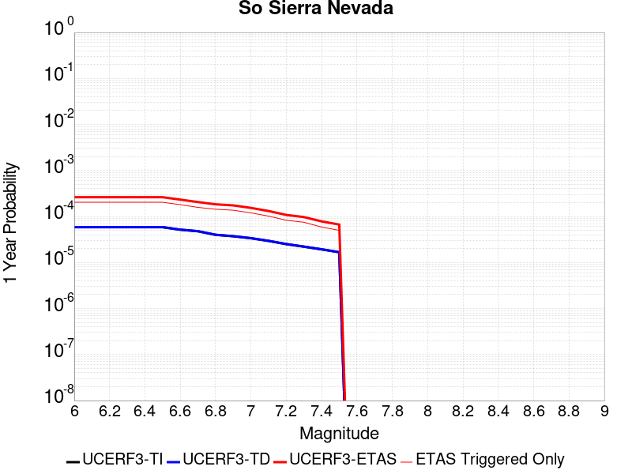

# Parent Section Magnitude-Probability Distributions

Only fault sections with at least one triggered aftershock are plotted. Sections are sorted by total supraseismogenic trigger rate (decreasing)

## Table Of Contents

* [Tank Canyon](#tank-canyon)
* [Little Lake](#little-lake)
* [Garlock (Central)](#garlock-central)
* [Owl Lake](#owl-lake)
* [Garlock (East)](#garlock-east)
* [Garlock (West)](#garlock-west)
* [Death Valley (So)](#death-valley-so)
* [Panamint Valley](#panamint-valley)
* [San Andreas (Mojave N)](#san-andreas-mojave-n)
* [San Andreas (Mojave S)](#san-andreas-mojave-s)
* [San Andreas (Big Bend)](#san-andreas-big-bend)
* [Blackwater](#blackwater)
* [San Andreas (Carrizo) rev](#san-andreas-carrizo-rev)
* [Hunter Mountain-Saline Valley](#hunter-mountain-saline-valley)
* [San Andreas (Cholame) rev](#san-andreas-cholame-rev)
* [San Andreas (Parkfield)](#san-andreas-parkfield)
* [Death Valley (Black Mtns Frontal)](#death-valley-black-mtns-frontal)
* [San Cayetano](#san-cayetano)
* [Pleito](#pleito)
* [Cucamonga](#cucamonga)
* [San Andreas (San Bernardino N)](#san-andreas-san-bernardino-n)
* [San Andreas (San Bernardino S)](#san-andreas-san-bernardino-s)
* [Pitas Point (Lower)-Montalvo](#pitas-point-lower-montalvo)
* [Red Mountain](#red-mountain)
* [Pitas Point (Lower West)](#pitas-point-lower-west)
* [Santa Ynez (East)](#santa-ynez-east)
* [Mission Ridge-Arroyo Parida-Santa Ana](#mission-ridge-arroyo-parida-santa-ana)
* [So Sierra Nevada](#so-sierra-nevada)
* [Cleghorn](#cleghorn)
* [Santa Ynez (West)](#santa-ynez-west)
* [Lenwood-Lockhart-Old Woman Springs](#lenwood-lockhart-old-woman-springs)
* [San Andreas (Coachella) rev](#san-andreas-coachella-rev)
* [Death Valley (No)](#death-valley-no)
* [San Andreas (San Gorgonio Pass-Garnet HIll)](#san-andreas-san-gorgonio-pass-garnet-hill)
* [San Jacinto (San Bernardino)](#san-jacinto-san-bernardino)
* [Raymond](#raymond)
* [San Jose](#san-jose)
* [Gravel Hills-Harper Lk](#gravel-hills-harper-lk)
* [Hayward (So) 2011 CFM](#hayward-so-2011-cfm)
* [Ventura-Pitas Point](#ventura-pitas-point)
* [Death Valley (Fish Lake Valley)](#death-valley-fish-lake-valley)
* [Elysian Park (Upper)](#elysian-park-upper)
* [San Gregorio (South) 2011 CFM](#san-gregorio-south-2011-cfm)
* [Oak Ridge (Onshore)](#oak-ridge-onshore)
* [Great Valley 03 Mysterious Ridge](#great-valley-03-mysterious-ridge)
* [Chino alt 1](#chino-alt-1)
* [San Gabriel](#san-gabriel)
* [Independence rev 2011](#independence-rev-2011)
* [Helendale-So Lockhart](#helendale-so-lockhart)
* [Emerson-Copper Mtn 2011](#emerson-copper-mtn-2011)
* [Calaveras (No) 2011 CFM](#calaveras-no-2011-cfm)
* [Verdugo](#verdugo)
* [San Juan](#san-juan)
* [Elsinore (Glen Ivy) rev](#elsinore-glen-ivy-rev)
* [Hayward (No) 2011 CFM](#hayward-no-2011-cfm)
* [Rose Canyon](#rose-canyon)
* [Santa Susana alt 1](#santa-susana-alt-1)
* [Great Valley 12](#great-valley-12)
* [Anacapa-Dume alt 1](#anacapa-dume-alt-1)
* [Simi-Santa Rosa](#simi-santa-rosa)
* [Elsinore (Stepovers Combined)](#elsinore-stepovers-combined)
* [San Gregorio (North) 2011 CFM](#san-gregorio-north-2011-cfm)
* [Mono Lake 2011 CFM](#mono-lake-2011-cfm)

## Tank Canyon
*[(top)](#table-of-contents)*

| 1 Week | 1 Month | 1 Year | 10 Year |
|-----|-----|-----|-----|
|  |  |  |  |

| Magnitude | 1 wk TI Prob | 1 wk TD Prob | 1 wk ETAS Prob | 1 wk ETAS/TD Gain | 1 wk ETAS Triggered Only | 1 mo TI Prob | 1 mo TD Prob | 1 mo ETAS Prob | 1 mo ETAS/TD Gain | 1 mo ETAS Triggered Only | 1 yr TI Prob | 1 yr TD Prob | 1 yr ETAS Prob | 1 yr ETAS/TD Gain | 1 yr ETAS Triggered Only | 10 yr TI Prob | 10 yr TD Prob | 10 yr ETAS Prob | 10 yr ETAS/TD Gain | 10 yr ETAS Triggered Only |
|-----|-----|-----|-----|-----|-----|-----|-----|-----|-----|-----|-----|-----|-----|-----|-----|-----|-----|-----|-----|-----|
| 6.0 | 2.7748038E-5 | 3.5073965E-5 | 0.020465871 | 583.50604 | 0.020431513 | 1.18914744E-4 | 1.5031699E-4 | 0.025645014 | 170.6062 | 0.025498528 | 0.0014468255 | 0.0018300817 | 0.040986795 | 22.396156 | 0.039228506 | 0.014374418 | 0.018297758 | 0.07044768 | 3.8500717 | 0.053121936 |
| 6.1 | 2.7748038E-5 | 3.5073965E-5 | 0.020465871 | 583.50604 | 0.020431513 | 1.18914744E-4 | 1.5031699E-4 | 0.025645014 | 170.6062 | 0.025498528 | 0.0014468255 | 0.0018300817 | 0.040986795 | 22.396156 | 0.039228506 | 0.014374418 | 0.018297758 | 0.07044768 | 3.8500717 | 0.053121936 |
| 6.2 | 2.7748038E-5 | 3.5073965E-5 | 0.020465871 | 583.50604 | 0.020431513 | 1.18914744E-4 | 1.5031699E-4 | 0.025645014 | 170.6062 | 0.025498528 | 0.0014468255 | 0.0018300817 | 0.040986795 | 22.396156 | 0.039228506 | 0.014374418 | 0.018297758 | 0.07044768 | 3.8500717 | 0.053121936 |
| 6.3 | 2.7748038E-5 | 3.5073965E-5 | 0.020465871 | 583.50604 | 0.020431513 | 1.18914744E-4 | 1.5031699E-4 | 0.025645014 | 170.6062 | 0.025498528 | 0.0014468255 | 0.0018300817 | 0.040986795 | 22.396156 | 0.039228506 | 0.014374418 | 0.018297758 | 0.07044768 | 3.8500717 | 0.053121936 |

## Little Lake
*[(top)](#table-of-contents)*

| 1 Week | 1 Month | 1 Year | 10 Year |
|-----|-----|-----|-----|
|  |  |  |  |

| Magnitude | 1 wk TI Prob | 1 wk TD Prob | 1 wk ETAS Prob | 1 wk ETAS/TD Gain | 1 wk ETAS Triggered Only | 1 mo TI Prob | 1 mo TD Prob | 1 mo ETAS Prob | 1 mo ETAS/TD Gain | 1 mo ETAS Triggered Only | 1 yr TI Prob | 1 yr TD Prob | 1 yr ETAS Prob | 1 yr ETAS/TD Gain | 1 yr ETAS Triggered Only | 10 yr TI Prob | 10 yr TD Prob | 10 yr ETAS Prob | 10 yr ETAS/TD Gain | 10 yr ETAS Triggered Only |
|-----|-----|-----|-----|-----|-----|-----|-----|-----|-----|-----|-----|-----|-----|-----|-----|-----|-----|-----|-----|-----|
| 6.0 | 1.27106505E-5 | 1.3900362E-5 | 0.011128489 | 800.58984 | 0.011114744 | 5.447308E-5 | 5.957219E-5 | 0.0150962705 | 253.41136 | 0.015037594 | 6.630079E-4 | 7.25151E-4 | 0.02081518 | 28.704617 | 0.02010461 | 0.006610333 | 0.0072377534 | 0.032227192 | 4.4526515 | 0.025171624 |
| 6.1 | 1.27106505E-5 | 1.3900362E-5 | 0.011128489 | 800.58984 | 0.011114744 | 5.447308E-5 | 5.957219E-5 | 0.0150962705 | 253.41136 | 0.015037594 | 6.630079E-4 | 7.25151E-4 | 0.02081518 | 28.704617 | 0.02010461 | 0.006610333 | 0.0072377534 | 0.032227192 | 4.4526515 | 0.025171624 |
| 6.2 | 1.27106505E-5 | 1.3900362E-5 | 0.011128489 | 800.58984 | 0.011114744 | 5.447308E-5 | 5.957219E-5 | 0.0150962705 | 253.41136 | 0.015037594 | 6.630079E-4 | 7.25151E-4 | 0.02081518 | 28.704617 | 0.02010461 | 0.006610333 | 0.0072377534 | 0.032227192 | 4.4526515 | 0.025171624 |
| 6.3 | 1.27106505E-5 | 1.3900362E-5 | 0.011128489 | 800.58984 | 0.011114744 | 5.447308E-5 | 5.957219E-5 | 0.0150962705 | 253.41136 | 0.015037594 | 6.630079E-4 | 7.25151E-4 | 0.02081518 | 28.704617 | 0.02010461 | 0.006610333 | 0.0072377534 | 0.032227192 | 4.4526515 | 0.025171624 |
| 6.4 | 1.27106505E-5 | 1.3900362E-5 | 0.011128489 | 800.58984 | 0.011114744 | 5.447308E-5 | 5.957219E-5 | 0.0150962705 | 253.41136 | 0.015037594 | 6.630079E-4 | 7.25151E-4 | 0.02081518 | 28.704617 | 0.02010461 | 0.006610333 | 0.0072377534 | 0.032227192 | 4.4526515 | 0.025171624 |
| 6.5 | 1.27106505E-5 | 1.3900362E-5 | 0.011128489 | 800.58984 | 0.011114744 | 5.447308E-5 | 5.957219E-5 | 0.0150962705 | 253.41136 | 0.015037594 | 6.630079E-4 | 7.25151E-4 | 0.02081518 | 28.704617 | 0.02010461 | 0.006610333 | 0.0072377534 | 0.032227192 | 4.4526515 | 0.025171624 |
| 6.6 | 1.08505255E-5 | 1.1856941E-5 | 0.009982318 | 841.89655 | 0.009970578 | 4.6501424E-5 | 5.0815026E-5 | 0.013289763 | 261.53214 | 0.013239621 | 5.6600774E-4 | 6.1859656E-4 | 0.01744375 | 28.198912 | 0.016835567 | 0.005645683 | 0.006178476 | 0.027295966 | 4.4179125 | 0.021248775 |
| 6.7 | 7.97625E-6 | 8.706619E-6 | 0.0068736356 | 789.47235 | 0.0068649887 | 3.4183482E-5 | 3.7314083E-5 | 0.009353736 | 250.67578 | 0.00931677 | 4.161044E-4 | 4.5429895E-4 | 0.01254426 | 27.612347 | 0.012095456 | 0.004153261 | 0.0045429897 | 0.019186849 | 4.2233973 | 0.01471069 |
| 6.8 | 7.97625E-6 | 8.706619E-6 | 0.0068736356 | 789.47235 | 0.0068649887 | 3.4183482E-5 | 3.7314083E-5 | 0.009353736 | 250.67578 | 0.00931677 | 4.161044E-4 | 4.5429895E-4 | 0.01254426 | 27.612347 | 0.012095456 | 0.004153261 | 0.0045429897 | 0.019186849 | 4.2233973 | 0.01471069 |

## Garlock (Central)
*[(top)](#table-of-contents)*

| 1 Week | 1 Month | 1 Year | 10 Year |
|-----|-----|-----|-----|
|  |  |  |  |

| Magnitude | 1 wk TI Prob | 1 wk TD Prob | 1 wk ETAS Prob | 1 wk ETAS/TD Gain | 1 wk ETAS Triggered Only | 1 mo TI Prob | 1 mo TD Prob | 1 mo ETAS Prob | 1 mo ETAS/TD Gain | 1 mo ETAS Triggered Only | 1 yr TI Prob | 1 yr TD Prob | 1 yr ETAS Prob | 1 yr ETAS/TD Gain | 1 yr ETAS Triggered Only | 10 yr TI Prob | 10 yr TD Prob | 10 yr ETAS Prob | 10 yr ETAS/TD Gain | 10 yr ETAS Triggered Only |
|-----|-----|-----|-----|-----|-----|-----|-----|-----|-----|-----|-----|-----|-----|-----|-----|-----|-----|-----|-----|-----|
| 6.0 | 2.575808E-5 | 1.9313613E-5 | 0.011951087 | 618.79083 | 0.011932004 | 1.10387096E-4 | 8.277037E-5 | 0.014792242 | 178.71422 | 0.01471069 | 0.0013431342 | 0.0010073289 | 0.020275248 | 20.127737 | 0.01928735 | 0.013350452 | 0.0100695705 | 0.034016892 | 3.3781867 | 0.024190912 |
| 6.1 | 2.575808E-5 | 1.9313613E-5 | 0.011951087 | 618.79083 | 0.011932004 | 1.10387096E-4 | 8.277037E-5 | 0.014792242 | 178.71422 | 0.01471069 | 0.0013431342 | 0.0010073289 | 0.020275248 | 20.127737 | 0.01928735 | 0.013350452 | 0.0100695705 | 0.034016892 | 3.3781867 | 0.024190912 |
| 6.2 | 2.575808E-5 | 1.9313613E-5 | 0.011951087 | 618.79083 | 0.011932004 | 1.10387096E-4 | 8.277037E-5 | 0.014792242 | 178.71422 | 0.01471069 | 0.0013431342 | 0.0010073289 | 0.020275248 | 20.127737 | 0.01928735 | 0.013350452 | 0.0100695705 | 0.034016892 | 3.3781867 | 0.024190912 |
| 6.3 | 2.575808E-5 | 1.9313613E-5 | 0.011951087 | 618.79083 | 0.011932004 | 1.10387096E-4 | 8.277037E-5 | 0.014792242 | 178.71422 | 0.01471069 | 0.0013431342 | 0.0010073289 | 0.020275248 | 20.127737 | 0.01928735 | 0.013350452 | 0.0100695705 | 0.034016892 | 3.3781867 | 0.024190912 |
| 6.4 | 2.575808E-5 | 1.9313613E-5 | 0.011951087 | 618.79083 | 0.011932004 | 1.10387096E-4 | 8.277037E-5 | 0.014792242 | 178.71422 | 0.01471069 | 0.0013431342 | 0.0010073289 | 0.020275248 | 20.127737 | 0.01928735 | 0.013350452 | 0.0100695705 | 0.034016892 | 3.3781867 | 0.024190912 |
| 6.5 | 2.575808E-5 | 1.9313613E-5 | 0.011951087 | 618.79083 | 0.011932004 | 1.10387096E-4 | 8.277037E-5 | 0.014792242 | 178.71422 | 0.01471069 | 0.0013431342 | 0.0010073289 | 0.020275248 | 20.127737 | 0.01928735 | 0.013350452 | 0.0100695705 | 0.034016892 | 3.3781867 | 0.024190912 |
| 6.6 | 2.540234E-5 | 1.885198E-5 | 0.011787182 | 625.249 | 0.011768552 | 1.0886263E-4 | 8.0792066E-5 | 0.014626854 | 181.0432 | 0.014547237 | 0.0013245966 | 9.83265E-4 | 0.019925067 | 20.264189 | 0.018960444 | 0.013167289 | 0.009831364 | 0.03329891 | 3.3870082 | 0.023700556 |
| 6.7 | 2.4966947E-5 | 1.8286464E-5 | 0.011296276 | 617.73975 | 0.011278195 | 1.06996806E-4 | 7.8368575E-5 | 0.013970709 | 178.26927 | 0.013893429 | 0.0013019076 | 9.5378514E-4 | 0.018916368 | 19.832945 | 0.017979732 | 0.012943068 | 0.009539624 | 0.03155705 | 3.3079972 | 0.022229487 |
| 6.8 | 2.4548952E-5 | 1.7797542E-5 | 0.010805445 | 607.1313 | 0.010787839 | 1.0520555E-4 | 7.627332E-5 | 0.013478324 | 176.71086 | 0.013403073 | 0.001280125 | 9.282974E-4 | 0.018401438 | 19.822783 | 0.017489376 | 0.012727758 | 0.009286596 | 0.03066191 | 3.301738 | 0.021575678 |
| 6.9 | 2.3994342E-5 | 1.7148153E-5 | 0.0098241065 | 572.8959 | 0.009807127 | 1.0282884E-4 | 7.349039E-5 | 0.012004618 | 163.34949 | 0.011932004 | 0.0012512221 | 8.944436E-4 | 0.016081894 | 17.979774 | 0.015201046 | 0.012442005 | 0.0089510605 | 0.027903778 | 3.117371 | 0.019123897 |
| 7.0 | 2.343005E-5 | 1.6491087E-5 | 0.009333108 | 565.94855 | 0.00931677 | 1.0041064E-4 | 7.067455E-5 | 0.011511514 | 162.88062 | 0.011441648 | 0.0012218138 | 8.601883E-4 | 0.015394913 | 17.897142 | 0.014547237 | 0.01215118 | 0.008610493 | 0.0267595 | 3.107778 | 0.018306635 |
| 7.1 | 2.2814058E-5 | 1.5782754E-5 | 0.0090055065 | 570.59155 | 0.008989866 | 9.777087E-5 | 6.763899E-5 | 0.010854748 | 160.48064 | 0.010787839 | 0.0011897103 | 8.2325895E-4 | 0.01470525 | 17.862242 | 0.013893429 | 0.011833611 | 0.00824334 | 0.02575065 | 3.1238124 | 0.017652828 |
| 7.2 | 2.2145266E-5 | 1.5027377E-5 | 0.00786061 | 523.086 | 0.007845702 | 9.490483E-5 | 6.440182E-5 | 0.0097074555 | 150.7326 | 0.009643675 | 0.0011548538 | 7.8387547E-4 | 0.013359822 | 17.043297 | 0.012585812 | 0.011488707 | 0.007851825 | 0.023906527 | 3.0447097 | 0.01618176 |
| 7.3 | 1.9954436E-5 | 1.3199953E-5 | 0.006224298 | 471.5394 | 0.0062111802 | 8.551621E-5 | 5.657036E-5 | 0.007901828 | 139.68141 | 0.007845702 | 0.0010406625 | 6.8859005E-4 | 0.010978982 | 15.944148 | 0.010297483 | 0.010358025 | 0.006900618 | 0.01972423 | 2.8583279 | 0.012912717 |
| 7.4 | 1.918037E-5 | 1.2553606E-5 | 0.006223656 | 495.7664 | 0.0062111802 | 8.2198996E-5 | 5.3800417E-5 | 0.0078990795 | 146.8219 | 0.007845702 | 0.0010003132 | 6.5488677E-4 | 0.010945626 | 16.713768 | 0.010297483 | 0.009958224 | 0.006564366 | 0.01922994 | 2.9294436 | 0.012749264 |
| 7.5 | 1.6994161E-5 | 1.0764553E-5 | 0.004423924 | 410.97147 | 0.004413207 | 7.283008E-5 | 4.613333E-5 | 0.005930138 | 128.54346 | 0.005884276 | 8.863455E-4 | 5.615903E-4 | 0.008076165 | 14.380884 | 0.007518797 | 0.008828186 | 0.005632708 | 0.015059531 | 2.6735864 | 0.009480222 |
| 7.6 | 1.621788E-5 | 1.012848E-5 | 0.0039329394 | 388.305 | 0.003922851 | 6.950335E-5 | 4.34074E-5 | 0.005437093 | 125.257286 | 0.0053939195 | 8.458747E-4 | 5.2841863E-4 | 0.0073897797 | 13.984706 | 0.0068649887 | 0.0084266225 | 0.005301458 | 0.014081079 | 2.6560767 | 0.008826414 |
| 7.7 | 7.713584E-6 | 3.2171508E-6 | 4.935719E-4 | 153.41895 | 4.9035635E-4 | 3.3057797E-5 | 1.378779E-5 | 8.3103706E-4 | 60.27341 | 8.1726053E-4 | 4.0240434E-4 | 1.6786634E-4 | 0.0016386884 | 9.761865 | 0.001471069 | 0.0040167645 | 0.0016902693 | 0.0034852035 | 2.061922 | 0.0017979732 |

## Owl Lake
*[(top)](#table-of-contents)*

| 1 Week | 1 Month | 1 Year | 10 Year |
|-----|-----|-----|-----|
|  |  |  |  |

| Magnitude | 1 wk TI Prob | 1 wk TD Prob | 1 wk ETAS Prob | 1 wk ETAS/TD Gain | 1 wk ETAS Triggered Only | 1 mo TI Prob | 1 mo TD Prob | 1 mo ETAS Prob | 1 mo ETAS/TD Gain | 1 mo ETAS Triggered Only | 1 yr TI Prob | 1 yr TD Prob | 1 yr ETAS Prob | 1 yr ETAS/TD Gain | 1 yr ETAS Triggered Only | 10 yr TI Prob | 10 yr TD Prob | 10 yr ETAS Prob | 10 yr ETAS/TD Gain | 10 yr ETAS Triggered Only |
|-----|-----|-----|-----|-----|-----|-----|-----|-----|-----|-----|-----|-----|-----|-----|-----|-----|-----|-----|-----|-----|
| 6.0 | 3.637175E-5 | 4.988367E-5 | 0.0042994265 | 86.18906 | 0.004249755 | 1.5586962E-4 | 2.1378716E-4 | 0.005933388 | 27.753716 | 0.005720824 | 0.0018960608 | 0.0026025574 | 0.011242974 | 4.3199716 | 0.008662961 | 0.018799646 | 0.025995217 | 0.038413063 | 1.4776973 | 0.012749264 |
| 6.1 | 3.637175E-5 | 4.988367E-5 | 0.0042994265 | 86.18906 | 0.004249755 | 1.5586962E-4 | 2.1378716E-4 | 0.005933388 | 27.753716 | 0.005720824 | 0.0018960608 | 0.0026025574 | 0.011242974 | 4.3199716 | 0.008662961 | 0.018799646 | 0.025995217 | 0.038413063 | 1.4776973 | 0.012749264 |
| 6.2 | 3.637175E-5 | 4.988367E-5 | 0.0042994265 | 86.18906 | 0.004249755 | 1.5586962E-4 | 2.1378716E-4 | 0.005933388 | 27.753716 | 0.005720824 | 0.0018960608 | 0.0026025574 | 0.011242974 | 4.3199716 | 0.008662961 | 0.018799646 | 0.025995217 | 0.038413063 | 1.4776973 | 0.012749264 |
| 6.3 | 3.637175E-5 | 4.988367E-5 | 0.0042994265 | 86.18906 | 0.004249755 | 1.5586962E-4 | 2.1378716E-4 | 0.005933388 | 27.753716 | 0.005720824 | 0.0018960608 | 0.0026025574 | 0.011242974 | 4.3199716 | 0.008662961 | 0.018799646 | 0.025995217 | 0.038413063 | 1.4776973 | 0.012749264 |
| 6.4 | 3.637175E-5 | 4.988367E-5 | 0.0042994265 | 86.18906 | 0.004249755 | 1.5586962E-4 | 2.1378716E-4 | 0.005933388 | 27.753716 | 0.005720824 | 0.0018960608 | 0.0026025574 | 0.011242974 | 4.3199716 | 0.008662961 | 0.018799646 | 0.025995217 | 0.038413063 | 1.4776973 | 0.012749264 |
| 6.5 | 3.637175E-5 | 4.988367E-5 | 0.0042994265 | 86.18906 | 0.004249755 | 1.5586962E-4 | 2.1378716E-4 | 0.005933388 | 27.753716 | 0.005720824 | 0.0018960608 | 0.0026025574 | 0.011242974 | 4.3199716 | 0.008662961 | 0.018799646 | 0.025995217 | 0.038413063 | 1.4776973 | 0.012749264 |

## Garlock (East)
*[(top)](#table-of-contents)*

| 1 Week | 1 Month | 1 Year | 10 Year |
|-----|-----|-----|-----|
|  |  |  |  |

| Magnitude | 1 wk TI Prob | 1 wk TD Prob | 1 wk ETAS Prob | 1 wk ETAS/TD Gain | 1 wk ETAS Triggered Only | 1 mo TI Prob | 1 mo TD Prob | 1 mo ETAS Prob | 1 mo ETAS/TD Gain | 1 mo ETAS Triggered Only | 1 yr TI Prob | 1 yr TD Prob | 1 yr ETAS Prob | 1 yr ETAS/TD Gain | 1 yr ETAS Triggered Only | 10 yr TI Prob | 10 yr TD Prob | 10 yr ETAS Prob | 10 yr ETAS/TD Gain | 10 yr ETAS Triggered Only |
|-----|-----|-----|-----|-----|-----|-----|-----|-----|-----|-----|-----|-----|-----|-----|-----|-----|-----|-----|-----|-----|
| 6.0 | 2.2327951E-5 | 1.8303952E-5 | 0.004758328 | 259.9618 | 0.004740111 | 9.5687705E-5 | 7.8444085E-5 | 0.006125698 | 78.08999 | 0.006047728 | 0.0011643751 | 9.548048E-4 | 0.009609495 | 10.064355 | 0.008662961 | 0.0115829315 | 0.0096519785 | 0.020497568 | 2.1236649 | 0.010951291 |
| 6.1 | 2.2327951E-5 | 1.8303952E-5 | 0.004758328 | 259.9618 | 0.004740111 | 9.5687705E-5 | 7.8444085E-5 | 0.006125698 | 78.08999 | 0.006047728 | 0.0011643751 | 9.548048E-4 | 0.009609495 | 10.064355 | 0.008662961 | 0.0115829315 | 0.0096519785 | 0.020497568 | 2.1236649 | 0.010951291 |
| 6.2 | 2.2327951E-5 | 1.8303952E-5 | 0.004758328 | 259.9618 | 0.004740111 | 9.5687705E-5 | 7.8444085E-5 | 0.006125698 | 78.08999 | 0.006047728 | 0.0011643751 | 9.548048E-4 | 0.009609495 | 10.064355 | 0.008662961 | 0.0115829315 | 0.0096519785 | 0.020497568 | 2.1236649 | 0.010951291 |
| 6.3 | 2.2327951E-5 | 1.8303952E-5 | 0.004758328 | 259.9618 | 0.004740111 | 9.5687705E-5 | 7.8444085E-5 | 0.006125698 | 78.08999 | 0.006047728 | 0.0011643751 | 9.548048E-4 | 0.009609495 | 10.064355 | 0.008662961 | 0.0115829315 | 0.0096519785 | 0.020497568 | 2.1236649 | 0.010951291 |
| 6.4 | 2.2327951E-5 | 1.8303952E-5 | 0.004758328 | 259.9618 | 0.004740111 | 9.5687705E-5 | 7.8444085E-5 | 0.006125698 | 78.08999 | 0.006047728 | 0.0011643751 | 9.548048E-4 | 0.009609495 | 10.064355 | 0.008662961 | 0.0115829315 | 0.0096519785 | 0.020497568 | 2.1236649 | 0.010951291 |
| 6.5 | 2.2327951E-5 | 1.8303952E-5 | 0.004758328 | 259.9618 | 0.004740111 | 9.5687705E-5 | 7.8444085E-5 | 0.006125698 | 78.08999 | 0.006047728 | 0.0011643751 | 9.548048E-4 | 0.009609495 | 10.064355 | 0.008662961 | 0.0115829315 | 0.0096519785 | 0.020497568 | 2.1236649 | 0.010951291 |
| 6.6 | 2.222123E-5 | 1.816971E-5 | 0.0047581946 | 261.8751 | 0.004740111 | 9.523036E-5 | 7.7868805E-5 | 0.006125126 | 78.65956 | 0.006047728 | 0.0011588129 | 9.4780687E-4 | 0.009602558 | 10.131345 | 0.008662961 | 0.011527888 | 0.009581773 | 0.020428132 | 2.1319783 | 0.010951291 |
| 6.7 | 2.2076227E-5 | 1.798404E-5 | 0.00475801 | 264.56845 | 0.004740111 | 9.4608964E-5 | 7.707312E-5 | 0.006124335 | 79.46136 | 0.006047728 | 0.0011512554 | 9.381278E-4 | 0.009592962 | 10.225645 | 0.008662961 | 0.011453095 | 0.009485973 | 0.020171478 | 2.1264534 | 0.010787839 |
| 6.8 | 2.1962227E-5 | 1.7854036E-5 | 0.0047578807 | 266.48767 | 0.004740111 | 9.4120434E-5 | 7.651599E-5 | 0.006123781 | 80.0327 | 0.006047728 | 0.0011453138 | 9.313506E-4 | 0.009586244 | 10.292842 | 0.008662961 | 0.01139429 | 0.00941876 | 0.020104991 | 2.1345687 | 0.010787839 |
| 6.9 | 1.1702579E-5 | 6.6732687E-6 | 0.0042564 | 637.8283 | 0.004249755 | 5.0152947E-5 | 2.8599494E-5 | 0.0049320227 | 172.4514 | 0.0049035633 | 6.10441E-4 | 3.481581E-4 | 0.0068839663 | 19.77253 | 0.0065380842 | 0.0060876687 | 0.0034954504 | 0.011313727 | 3.236701 | 0.007845702 |
| 7.0 | 1.153538E-5 | 6.4796777E-6 | 0.004256207 | 656.85474 | 0.004249755 | 4.9436403E-5 | 2.7769835E-5 | 0.004931197 | 177.57387 | 0.0049035633 | 6.01722E-4 | 3.3806017E-4 | 0.006873934 | 20.333464 | 0.0065380842 | 0.006000953 | 0.0033946347 | 0.011050805 | 3.255374 | 0.007682249 |
| 7.1 | 1.135938E-5 | 6.273818E-6 | 0.004092551 | 652.3222 | 0.0040863026 | 4.868215E-5 | 2.6887597E-5 | 0.0046034236 | 171.20992 | 0.004576659 | 5.925439E-4 | 3.2732222E-4 | 0.0065364693 | 19.969524 | 0.0062111802 | 0.0059096646 | 0.0032873498 | 0.010618515 | 3.2301142 | 0.007355345 |
| 7.2 | 1.1168294E-5 | 6.048814E-6 | 0.0036019734 | 595.48425 | 0.0035959464 | 4.786324E-5 | 2.5923315E-5 | 0.0041121203 | 158.62631 | 0.0040863026 | 5.825791E-4 | 3.1558552E-4 | 0.006034604 | 19.121927 | 0.005720824 | 0.005810542 | 0.0031701238 | 0.009850415 | 3.1072652 | 0.0067015365 |
| 7.3 | 1.0952553E-5 | 5.8686815E-6 | 0.0029479894 | 502.32565 | 0.002942138 | 4.693867E-5 | 2.5151334E-5 | 0.0034575593 | 137.47021 | 0.0034324944 | 5.713284E-4 | 3.0618932E-4 | 0.005208251 | 17.009905 | 0.0049035633 | 0.0056986175 | 0.0030760262 | 0.008779253 | 2.854089 | 0.005720824 |
| 7.4 | 1.0735812E-5 | 5.691247E-6 | 0.0029478124 | 517.95544 | 0.002942138 | 4.6009813E-5 | 2.4390914E-5 | 0.0034568014 | 141.72496 | 0.0034324944 | 5.600255E-4 | 2.9693378E-4 | 0.005199041 | 17.509092 | 0.0049035633 | 0.0055861627 | 0.0029833042 | 0.008687061 | 2.9118924 | 0.005720824 |
| 7.5 | 9.0273E-6 | 4.284415E-6 | 0.0013118957 | 306.2018 | 0.0013076168 | 3.8687853E-5 | 1.8361723E-5 | 0.0016528527 | 90.01621 | 0.0016345211 | 4.709228E-4 | 2.2354414E-4 | 0.002511362 | 11.234301 | 0.0022883294 | 0.004699261 | 0.0022480614 | 0.004857416 | 2.1607132 | 0.0026152337 |
| 7.6 | 8.549585E-6 | 3.885532E-6 | 8.211429E-4 | 211.33347 | 8.1726053E-4 | 3.6640562E-5 | 1.6652246E-5 | 0.0011607979 | 69.70819 | 0.0011441647 | 4.4600753E-4 | 2.027353E-4 | 0.002000344 | 9.866777 | 0.0017979732 | 0.0044511347 | 0.0020396118 | 0.0041601555 | 2.03968 | 0.0021248774 |
| 7.7 | 7.713584E-6 | 3.2171508E-6 | 4.935719E-4 | 153.41895 | 4.9035635E-4 | 3.3057797E-5 | 1.378779E-5 | 8.3103706E-4 | 60.27341 | 8.1726053E-4 | 4.0240434E-4 | 1.6786634E-4 | 0.0016386884 | 9.761865 | 0.001471069 | 0.0040167645 | 0.0016902693 | 0.0034852035 | 2.061922 | 0.0017979732 |

## Garlock (West)
*[(top)](#table-of-contents)*

| 1 Week | 1 Month | 1 Year | 10 Year |
|-----|-----|-----|-----|
|  |  |  |  |

| Magnitude | 1 wk TI Prob | 1 wk TD Prob | 1 wk ETAS Prob | 1 wk ETAS/TD Gain | 1 wk ETAS Triggered Only | 1 mo TI Prob | 1 mo TD Prob | 1 mo ETAS Prob | 1 mo ETAS/TD Gain | 1 mo ETAS Triggered Only | 1 yr TI Prob | 1 yr TD Prob | 1 yr ETAS Prob | 1 yr ETAS/TD Gain | 1 yr ETAS Triggered Only | 10 yr TI Prob | 10 yr TD Prob | 10 yr ETAS Prob | 10 yr ETAS/TD Gain | 10 yr ETAS Triggered Only |
|-----|-----|-----|-----|-----|-----|-----|-----|-----|-----|-----|-----|-----|-----|-----|-----|-----|-----|-----|-----|-----|
| 6.0 | 2.516656E-5 | 1.8065048E-5 | 0.0050849887 | 281.48218 | 0.0050670155 | 1.07852225E-4 | 7.741977E-5 | 0.006614998 | 85.44327 | 0.0065380842 | 0.0013123099 | 9.42255E-4 | 0.009270458 | 9.838587 | 0.008336058 | 0.013045873 | 0.009421492 | 0.01978387 | 2.099866 | 0.010460935 |
| 6.1 | 2.516656E-5 | 1.8065048E-5 | 0.0050849887 | 281.48218 | 0.0050670155 | 1.07852225E-4 | 7.741977E-5 | 0.006614998 | 85.44327 | 0.0065380842 | 0.0013123099 | 9.42255E-4 | 0.009270458 | 9.838587 | 0.008336058 | 0.013045873 | 0.009421492 | 0.01978387 | 2.099866 | 0.010460935 |
| 6.2 | 2.516656E-5 | 1.8065048E-5 | 0.0050849887 | 281.48218 | 0.0050670155 | 1.07852225E-4 | 7.741977E-5 | 0.006614998 | 85.44327 | 0.0065380842 | 0.0013123099 | 9.42255E-4 | 0.009270458 | 9.838587 | 0.008336058 | 0.013045873 | 0.009421492 | 0.01978387 | 2.099866 | 0.010460935 |
| 6.3 | 2.516656E-5 | 1.8065048E-5 | 0.0050849887 | 281.48218 | 0.0050670155 | 1.07852225E-4 | 7.741977E-5 | 0.006614998 | 85.44327 | 0.0065380842 | 0.0013123099 | 9.42255E-4 | 0.009270458 | 9.838587 | 0.008336058 | 0.013045873 | 0.009421492 | 0.01978387 | 2.099866 | 0.010460935 |
| 6.4 | 2.516656E-5 | 1.8065048E-5 | 0.0050849887 | 281.48218 | 0.0050670155 | 1.07852225E-4 | 7.741977E-5 | 0.006614998 | 85.44327 | 0.0065380842 | 0.0013123099 | 9.42255E-4 | 0.009270458 | 9.838587 | 0.008336058 | 0.013045873 | 0.009421492 | 0.01978387 | 2.099866 | 0.010460935 |
| 6.5 | 2.516656E-5 | 1.8065048E-5 | 0.0050849887 | 281.48218 | 0.0050670155 | 1.07852225E-4 | 7.741977E-5 | 0.006614998 | 85.44327 | 0.0065380842 | 0.0013123099 | 9.42255E-4 | 0.009270458 | 9.838587 | 0.008336058 | 0.013045873 | 0.009421492 | 0.01978387 | 2.099866 | 0.010460935 |
| 6.6 | 2.498869E-5 | 1.7877663E-5 | 0.0050848024 | 284.42212 | 0.0050670155 | 1.07089996E-4 | 7.6616736E-5 | 0.0066142003 | 86.3284 | 0.0065380842 | 0.0013030408 | 9.3248655E-4 | 0.009260771 | 9.931265 | 0.008336058 | 0.012954267 | 0.009324339 | 0.019687733 | 2.1114347 | 0.010460935 |
| 6.7 | 2.4627925E-5 | 1.7497801E-5 | 0.0050844243 | 290.57504 | 0.0050670155 | 1.0554398E-4 | 7.498886E-5 | 0.006612583 | 88.18088 | 0.0065380842 | 0.0012842404 | 9.1268384E-4 | 0.009241133 | 10.125229 | 0.008336058 | 0.012768441 | 0.009128104 | 0.01949355 | 2.1355531 | 0.010460935 |
| 6.8 | 2.4270235E-5 | 1.716136E-5 | 0.00508409 | 296.25217 | 0.0050670155 | 1.04011146E-4 | 7.354704E-5 | 0.0066111507 | 89.8901 | 0.0065380842 | 0.0012656 | 8.9514436E-4 | 0.00922374 | 10.304193 | 0.008336058 | 0.012584164 | 0.0089538675 | 0.019321136 | 2.1578536 | 0.010460935 |
| 6.9 | 2.3913764E-5 | 1.6823105E-5 | 0.0050837533 | 302.18875 | 0.0050670155 | 1.0248353E-4 | 7.2097464E-5 | 0.0066097104 | 91.67743 | 0.0065380842 | 0.0012470228 | 8.775101E-4 | 0.009206253 | 10.491335 | 0.008336058 | 0.012400482 | 0.00877859 | 0.019147692 | 2.181181 | 0.010460935 |
| 7.0 | 2.3579369E-5 | 1.6492264E-5 | 0.005083424 | 308.23083 | 0.0050670155 | 1.0105052E-4 | 7.067965E-5 | 0.006608302 | 93.49653 | 0.0065380842 | 0.0012295957 | 8.6026196E-4 | 0.009189148 | 10.681803 | 0.008336058 | 0.012228143 | 0.008607132 | 0.01897803 | 2.2049189 | 0.010460935 |
| 7.1 | 2.3205374E-5 | 1.6105636E-5 | 0.0050830394 | 315.60623 | 0.0050670155 | 9.944781E-5 | 6.902276E-5 | 0.0066066557 | 95.71706 | 0.0065380842 | 0.0012101046 | 8.401051E-4 | 0.009169159 | 10.914301 | 0.008336058 | 0.0120353615 | 0.008406721 | 0.018779714 | 2.233893 | 0.010460935 |
| 7.2 | 2.2799322E-5 | 1.5676578E-5 | 0.004919163 | 313.7906 | 0.0049035633 | 9.770772E-5 | 6.718404E-5 | 0.006441388 | 95.876755 | 0.006374632 | 0.0011889422 | 8.177357E-4 | 0.008983658 | 10.986017 | 0.008172605 | 0.011826012 | 0.008184515 | 0.018397719 | 2.247869 | 0.010297483 |
| 7.3 | 1.8228246E-5 | 1.1798695E-5 | 0.004751854 | 402.74405 | 0.004740111 | 7.811871E-5 | 5.0565202E-5 | 0.006261431 | 123.82886 | 0.0062111802 | 9.506803E-4 | 6.1551924E-4 | 0.0086197425 | 14.004018 | 0.008009153 | 0.0094662355 | 0.006171021 | 0.016242515 | 2.6320627 | 0.010134031 |
| 7.4 | 1.7670916E-5 | 1.132978E-5 | 0.004751387 | 419.37155 | 0.004740111 | 7.5730306E-5 | 4.8555645E-5 | 0.0062594344 | 128.9126 | 0.0062111802 | 9.216264E-4 | 5.9106643E-4 | 0.008595486 | 14.542335 | 0.008009153 | 0.009178135 | 0.0059269792 | 0.015838463 | 2.6722655 | 0.009970578 |
| 7.5 | 1.6994161E-5 | 1.0764553E-5 | 0.004423924 | 410.97147 | 0.004413207 | 7.283008E-5 | 4.613333E-5 | 0.005930138 | 128.54346 | 0.005884276 | 8.863455E-4 | 5.615903E-4 | 0.008076165 | 14.380884 | 0.007518797 | 0.008828186 | 0.005632708 | 0.015059531 | 2.6735864 | 0.009480222 |
| 7.6 | 1.621788E-5 | 1.012848E-5 | 0.0039329394 | 388.305 | 0.003922851 | 6.950335E-5 | 4.34074E-5 | 0.005437093 | 125.257286 | 0.0053939195 | 8.458747E-4 | 5.2841863E-4 | 0.0073897797 | 13.984706 | 0.0068649887 | 0.0084266225 | 0.005301458 | 0.014081079 | 2.6560767 | 0.008826414 |
| 7.7 | 7.713584E-6 | 3.2171508E-6 | 4.935719E-4 | 153.41895 | 4.9035635E-4 | 3.3057797E-5 | 1.378779E-5 | 8.3103706E-4 | 60.27341 | 8.1726053E-4 | 4.0240434E-4 | 1.6786634E-4 | 0.0016386884 | 9.761865 | 0.001471069 | 0.0040167645 | 0.0016902693 | 0.0034852035 | 2.061922 | 0.0017979732 |

## Death Valley (So)
*[(top)](#table-of-contents)*

| 1 Week | 1 Month | 1 Year | 10 Year |
|-----|-----|-----|-----|
|  |  |  |  |

| Magnitude | 1 wk TI Prob | 1 wk TD Prob | 1 wk ETAS Prob | 1 wk ETAS/TD Gain | 1 wk ETAS Triggered Only | 1 mo TI Prob | 1 mo TD Prob | 1 mo ETAS Prob | 1 mo ETAS/TD Gain | 1 mo ETAS Triggered Only | 1 yr TI Prob | 1 yr TD Prob | 1 yr ETAS Prob | 1 yr ETAS/TD Gain | 1 yr ETAS Triggered Only | 10 yr TI Prob | 10 yr TD Prob | 10 yr ETAS Prob | 10 yr ETAS/TD Gain | 10 yr ETAS Triggered Only |
|-----|-----|-----|-----|-----|-----|-----|-----|-----|-----|-----|-----|-----|-----|-----|-----|-----|-----|-----|-----|-----|
| 6.0 | 4.4658216E-5 | 6.228887E-5 | 0.00186015 | 29.863283 | 0.0017979732 | 1.9137832E-4 | 2.669324E-4 | 0.0036985104 | 13.855607 | 0.0034324944 | 0.0023275411 | 0.0032461619 | 0.009600101 | 2.9573698 | 0.006374632 | 0.023033133 | 0.032094594 | 0.04095414 | 1.2760448 | 0.009153318 |
| 6.1 | 4.4658216E-5 | 6.228887E-5 | 0.00186015 | 29.863283 | 0.0017979732 | 1.9137832E-4 | 2.669324E-4 | 0.0036985104 | 13.855607 | 0.0034324944 | 0.0023275411 | 0.0032461619 | 0.009600101 | 2.9573698 | 0.006374632 | 0.023033133 | 0.032094594 | 0.04095414 | 1.2760448 | 0.009153318 |
| 6.2 | 4.4658216E-5 | 6.228887E-5 | 0.00186015 | 29.863283 | 0.0017979732 | 1.9137832E-4 | 2.669324E-4 | 0.0036985104 | 13.855607 | 0.0034324944 | 0.0023275411 | 0.0032461619 | 0.009600101 | 2.9573698 | 0.006374632 | 0.023033133 | 0.032094594 | 0.04095414 | 1.2760448 | 0.009153318 |
| 6.3 | 4.4658216E-5 | 6.228887E-5 | 0.00186015 | 29.863283 | 0.0017979732 | 1.9137832E-4 | 2.669324E-4 | 0.0036985104 | 13.855607 | 0.0034324944 | 0.0023275411 | 0.0032461619 | 0.009600101 | 2.9573698 | 0.006374632 | 0.023033133 | 0.032094594 | 0.04095414 | 1.2760448 | 0.009153318 |
| 6.4 | 4.4658216E-5 | 6.228887E-5 | 0.00186015 | 29.863283 | 0.0017979732 | 1.9137832E-4 | 2.669324E-4 | 0.0036985104 | 13.855607 | 0.0034324944 | 0.0023275411 | 0.0032461619 | 0.009600101 | 2.9573698 | 0.006374632 | 0.023033133 | 0.032094594 | 0.04095414 | 1.2760448 | 0.009153318 |
| 6.5 | 4.4658216E-5 | 6.228887E-5 | 0.00186015 | 29.863283 | 0.0017979732 | 1.9137832E-4 | 2.669324E-4 | 0.0036985104 | 13.855607 | 0.0034324944 | 0.0023275411 | 0.0032461619 | 0.009600101 | 2.9573698 | 0.006374632 | 0.023033133 | 0.032094594 | 0.04095414 | 1.2760448 | 0.009153318 |
| 6.6 | 3.6853275E-5 | 5.1089468E-5 | 0.0011951958 | 23.39417 | 0.0011441647 | 1.5793304E-4 | 2.1894388E-4 | 0.0026701887 | 12.195767 | 0.0024517816 | 0.0019211388 | 0.0026635646 | 0.0072280336 | 2.7136693 | 0.004576659 | 0.019046152 | 0.026430551 | 0.033273228 | 1.2588927 | 0.0070284405 |
| 6.7 | 2.9971921E-5 | 4.1332314E-5 | 8.585591E-4 | 20.772102 | 8.1726053E-4 | 1.2844476E-4 | 1.7713365E-4 | 0.0021382116 | 12.071177 | 0.0019614254 | 0.0015626932 | 0.0021557007 | 0.0055807955 | 2.5888546 | 0.0034324944 | 0.015517498 | 0.021467837 | 0.026905904 | 1.2533122 | 0.005557372 |
| 6.8 | 2.8134293E-5 | 3.8737995E-5 | 8.559669E-4 | 22.096313 | 8.1726053E-4 | 1.2056997E-4 | 1.6601657E-4 | 0.0021271163 | 12.8126745 | 0.0019614254 | 0.0014669509 | 0.0020206098 | 0.005446168 | 2.6953092 | 0.0034324944 | 0.014573049 | 0.020142367 | 0.02526748 | 1.2544445 | 0.0052304673 |
| 6.9 | 5.6768154E-6 | 7.307913E-6 | 7.307913E-6 | 1.0 | 0.0 | 2.4328981E-5 | 3.1319494E-5 | 1.9476649E-4 | 6.2186985 | 1.634521E-4 | 2.961651E-4 | 3.8129094E-4 | 5.4468075E-4 | 1.4285173 | 1.634521E-4 | 0.0029577068 | 0.003810565 | 0.003973394 | 1.042731 | 1.634521E-4 |
| 7.0 | 5.556207E-6 | 7.1531585E-6 | 7.1531585E-6 | 1.0 | 0.0 | 2.3812097E-5 | 3.0656276E-5 | 1.9410337E-4 | 6.3316035 | 1.634521E-4 | 2.8987371E-4 | 3.7321905E-4 | 5.3661014E-4 | 1.4377887 | 1.634521E-4 | 0.002894959 | 0.003730121 | 0.0038929635 | 1.0436561 | 1.634521E-4 |
| 7.1 | 5.418659E-6 | 6.9768143E-6 | 6.9768143E-6 | 1.0 | 0.0 | 2.3222618E-5 | 2.9900531E-5 | 1.9334775E-4 | 6.466365 | 1.634521E-4 | 2.826987E-4 | 3.64021E-4 | 5.274136E-4 | 1.4488549 | 1.634521E-4 | 0.0028233933 | 0.003638446 | 0.0038013035 | 1.0447601 | 1.634521E-4 |
| 7.2 | 5.263499E-6 | 6.7766255E-6 | 6.7766255E-6 | 1.0 | 0.0 | 2.2557659E-5 | 2.90426E-5 | 1.9248996E-4 | 6.627849 | 1.634521E-4 | 2.7460488E-4 | 3.5357912E-4 | 5.1697344E-4 | 1.4621153 | 1.634521E-4 | 0.002742658 | 0.003534366 | 0.0036972403 | 1.0460831 | 1.634521E-4 |
| 7.3 | 5.0913163E-6 | 6.5556187E-6 | 6.5556187E-6 | 1.0 | 0.0 | 2.1819744E-5 | 2.8095446E-5 | 1.9154296E-4 | 6.81758 | 1.634521E-4 | 2.65623E-4 | 3.420512E-4 | 5.054474E-4 | 1.4776951 | 1.634521E-4 | 0.0026530572 | 0.0034194465 | 0.0035823397 | 1.0476373 | 1.634521E-4 |
| 7.4 | 5.018449E-6 | 6.4618785E-6 | 6.4618785E-6 | 1.0 | 0.0 | 2.1507461E-5 | 2.7693712E-5 | 1.911413E-4 | 6.9019747 | 1.634521E-4 | 2.6182187E-4 | 3.371616E-4 | 5.005586E-4 | 1.4846252 | 1.634521E-4 | 0.0026151363 | 0.0033706997 | 0.0035336008 | 1.0483286 | 1.634521E-4 |
| 7.5 | 4.993322E-6 | 6.430145E-6 | 6.430145E-6 | 1.0 | 0.0 | 2.1399776E-5 | 2.7557713E-5 | 1.9100531E-4 | 6.931102 | 1.634521E-4 | 2.6051112E-4 | 3.3550634E-4 | 4.9890357E-4 | 1.4870169 | 1.634521E-4 | 0.0026020592 | 0.003354197 | 0.0035171008 | 1.0485672 | 1.634521E-4 |
| 7.6 | 4.882584E-6 | 6.2884383E-6 | 6.2884383E-6 | 1.0 | 0.0 | 2.0925192E-5 | 2.6950413E-5 | 1.9039812E-4 | 7.0647573 | 1.634521E-4 | 2.5473442E-4 | 3.2811466E-4 | 4.915132E-4 | 1.497992 | 1.634521E-4 | 0.0025444264 | 0.0032805006 | 0.0034434164 | 1.0496619 | 1.634521E-4 |
| 7.7 | 4.8153906E-6 | 6.202069E-6 | 6.202069E-6 | 1.0 | 0.0 | 2.0637224E-5 | 2.6580266E-5 | 1.9002803E-4 | 7.1492147 | 1.634521E-4 | 2.5122924E-4 | 3.2360948E-4 | 4.870087E-4 | 1.5049272 | 1.634521E-4 | 0.002509454 | 0.0032355804 | 0.0033985036 | 1.0503536 | 1.634521E-4 |
| 7.8 | 4.8153906E-6 | 6.202069E-6 | 6.202069E-6 | 1.0 | 0.0 | 2.0637224E-5 | 2.6580266E-5 | 1.9002803E-4 | 7.1492147 | 1.634521E-4 | 2.5122924E-4 | 3.2360948E-4 | 4.870087E-4 | 1.5049272 | 1.634521E-4 | 0.002509454 | 0.0032355804 | 0.0033985036 | 1.0503536 | 1.634521E-4 |

## Panamint Valley
*[(top)](#table-of-contents)*

| 1 Week | 1 Month | 1 Year | 10 Year |
|-----|-----|-----|-----|
|  |  |  |  |

| Magnitude | 1 wk TI Prob | 1 wk TD Prob | 1 wk ETAS Prob | 1 wk ETAS/TD Gain | 1 wk ETAS Triggered Only | 1 mo TI Prob | 1 mo TD Prob | 1 mo ETAS Prob | 1 mo ETAS/TD Gain | 1 mo ETAS Triggered Only | 1 yr TI Prob | 1 yr TD Prob | 1 yr ETAS Prob | 1 yr ETAS/TD Gain | 1 yr ETAS Triggered Only | 10 yr TI Prob | 10 yr TD Prob | 10 yr ETAS Prob | 10 yr ETAS/TD Gain | 10 yr ETAS Triggered Only |
|-----|-----|-----|-----|-----|-----|-----|-----|-----|-----|-----|-----|-----|-----|-----|-----|-----|-----|-----|-----|-----|
| 6.0 | 2.4839064E-5 | 2.5506472E-5 | 0.0018234338 | 71.48907 | 0.0017979732 | 1.0644879E-4 | 1.09309134E-4 | 0.0030511254 | 27.912813 | 0.002942138 | 0.0012952434 | 0.0013300732 | 0.0055741756 | 4.190879 | 0.004249755 | 0.0128772 | 0.013225966 | 0.019193707 | 1.451214 | 0.006047728 |
| 6.1 | 2.4839064E-5 | 2.5506472E-5 | 0.0018234338 | 71.48907 | 0.0017979732 | 1.0644879E-4 | 1.09309134E-4 | 0.0030511254 | 27.912813 | 0.002942138 | 0.0012952434 | 0.0013300732 | 0.0055741756 | 4.190879 | 0.004249755 | 0.0128772 | 0.013225966 | 0.019193707 | 1.451214 | 0.006047728 |
| 6.2 | 2.4839064E-5 | 2.5506472E-5 | 0.0018234338 | 71.48907 | 0.0017979732 | 1.0644879E-4 | 1.09309134E-4 | 0.0030511254 | 27.912813 | 0.002942138 | 0.0012952434 | 0.0013300732 | 0.0055741756 | 4.190879 | 0.004249755 | 0.0128772 | 0.013225966 | 0.019193707 | 1.451214 | 0.006047728 |
| 6.3 | 2.4839064E-5 | 2.5506472E-5 | 0.0018234338 | 71.48907 | 0.0017979732 | 1.0644879E-4 | 1.09309134E-4 | 0.0030511254 | 27.912813 | 0.002942138 | 0.0012952434 | 0.0013300732 | 0.0055741756 | 4.190879 | 0.004249755 | 0.0128772 | 0.013225966 | 0.019193707 | 1.451214 | 0.006047728 |
| 6.4 | 2.4839064E-5 | 2.5506472E-5 | 0.0018234338 | 71.48907 | 0.0017979732 | 1.0644879E-4 | 1.09309134E-4 | 0.0030511254 | 27.912813 | 0.002942138 | 0.0012952434 | 0.0013300732 | 0.0055741756 | 4.190879 | 0.004249755 | 0.0128772 | 0.013225966 | 0.019193707 | 1.451214 | 0.006047728 |
| 6.5 | 2.4839064E-5 | 2.5506472E-5 | 0.0018234338 | 71.48907 | 0.0017979732 | 1.0644879E-4 | 1.09309134E-4 | 0.0030511254 | 27.912813 | 0.002942138 | 0.0012952434 | 0.0013300732 | 0.0055741756 | 4.190879 | 0.004249755 | 0.0128772 | 0.013225966 | 0.019193707 | 1.451214 | 0.006047728 |
| 6.6 | 2.151644E-5 | 2.1799351E-5 | 0.0013293878 | 60.982906 | 0.0013076168 | 9.221006E-5 | 9.34227E-5 | 0.0022181016 | 23.74264 | 0.0021248774 | 0.0011220792 | 0.001136874 | 0.0042389333 | 3.728587 | 0.0031055901 | 0.011164304 | 0.0113152405 | 0.016001716 | 1.4141737 | 0.004740111 |
| 6.7 | 2.0301508E-5 | 2.043303E-5 | 0.0013280232 | 64.99394 | 0.0013076168 | 8.7003566E-5 | 8.7567445E-5 | 0.0022122588 | 25.263485 | 0.0021248774 | 0.0010587536 | 0.001065658 | 0.0038413827 | 3.6047049 | 0.002778686 | 0.010537235 | 0.01061009 | 0.014814754 | 1.3962892 | 0.004249755 |
| 6.8 | 1.782843E-5 | 1.789433E-5 | 0.0011620387 | 64.93893 | 0.0011441647 | 7.640532E-5 | 7.668799E-5 | 0.0018745234 | 24.443506 | 0.0017979732 | 9.298377E-4 | 9.3332166E-4 | 0.003382815 | 3.62449 | 0.0024517816 | 0.009259567 | 0.009298533 | 0.013184907 | 1.4179555 | 0.003922851 |
| 6.9 | 1.6185495E-5 | 1.6192123E-5 | 0.0011603384 | 71.66067 | 0.0011441647 | 6.936456E-5 | 6.939322E-5 | 0.0017038009 | 24.552843 | 0.0016345211 | 8.4418635E-4 | 8.4458006E-4 | 0.0028043487 | 3.320406 | 0.0019614254 | 0.008409866 | 0.008418168 | 0.011659691 | 1.3850627 | 0.0032690421 |
| 7.0 | 1.4473978E-5 | 1.4401701E-5 | 0.00115855 | 80.44536 | 0.0011441647 | 6.202986E-5 | 6.172037E-5 | 0.0015326985 | 24.832945 | 0.001471069 | 7.5495185E-4 | 7.512313E-4 | 0.0025478539 | 3.3915703 | 0.0017979732 | 0.0075239222 | 0.007491346 | 0.010573671 | 1.4114515 | 0.0031055901 |
| 7.1 | 1.29175705E-5 | 1.2765824E-5 | 9.93466E-4 | 77.82231 | 9.807127E-4 | 5.535984E-5 | 5.470978E-5 | 0.0013622551 | 24.899664 | 0.0013076168 | 6.737976E-4 | 6.659326E-4 | 0.0022993651 | 3.4528496 | 0.0016345211 | 0.0067175827 | 0.0066437623 | 0.009566354 | 1.4399 | 0.002942138 |
| 7.2 | 1.1461888E-5 | 1.1226499E-5 | 8.2847785E-4 | 73.79664 | 8.1726053E-4 | 4.9121452E-5 | 4.8112932E-5 | 0.0011922227 | 24.779673 | 0.0011441647 | 5.978896E-4 | 5.856619E-4 | 0.0020558694 | 3.5103347 | 0.001471069 | 0.005962835 | 0.005845547 | 0.008282997 | 1.4169755 | 0.0024517816 |
| 7.3 | 1.011261E-5 | 9.918427E-6 | 8.2717085E-4 | 83.397385 | 8.1726053E-4 | 4.3339038E-5 | 4.25071E-5 | 0.0011866232 | 27.915882 | 0.0011441647 | 5.2752503E-4 | 5.1744515E-4 | 0.001987753 | 3.8414755 | 0.001471069 | 0.005262745 | 0.005166732 | 0.007443238 | 1.4406086 | 0.0022883294 |
| 7.4 | 4.3367913E-6 | 4.4250473E-6 | 3.313278E-4 | 74.87554 | 3.269042E-4 | 1.8586115E-5 | 1.896443E-5 | 5.0931145E-4 | 26.856142 | 4.9035635E-4 | 2.2626246E-4 | 2.3088178E-4 | 8.845393E-4 | 3.831135 | 6.538084E-4 | 0.0022603222 | 0.0023078213 | 0.0034493455 | 1.4946328 | 0.0011441647 |
| 7.5 | 3.7993927E-6 | 3.8762123E-6 | 3.3077915E-4 | 85.33567 | 3.269042E-4 | 1.628301E-5 | 1.6612312E-5 | 5.069605E-4 | 30.517153 | 4.9035635E-4 | 1.9822762E-4 | 2.0225039E-4 | 8.559266E-4 | 4.2320147 | 6.538084E-4 | 0.001980509 | 0.002022061 | 0.0031639123 | 1.5646967 | 0.0011441647 |
| 7.6 | 3.2998898E-6 | 3.365071E-6 | 1.6681662E-4 | 49.57299 | 1.634521E-4 | 1.4142308E-5 | 1.4421733E-5 | 3.4132123E-4 | 23.667145 | 3.269042E-4 | 1.7216899E-4 | 1.755846E-4 | 6.6585484E-4 | 3.7922165 | 4.9035635E-4 | 0.0017203566 | 0.001755846 | 0.0025716715 | 1.464634 | 8.1726053E-4 |

## San Andreas (Mojave N)
*[(top)](#table-of-contents)*

| 1 Week | 1 Month | 1 Year | 10 Year |
|-----|-----|-----|-----|
|  |  |  |  |

| Magnitude | 1 wk TI Prob | 1 wk TD Prob | 1 wk ETAS Prob | 1 wk ETAS/TD Gain | 1 wk ETAS Triggered Only | 1 mo TI Prob | 1 mo TD Prob | 1 mo ETAS Prob | 1 mo ETAS/TD Gain | 1 mo ETAS Triggered Only | 1 yr TI Prob | 1 yr TD Prob | 1 yr ETAS Prob | 1 yr ETAS/TD Gain | 1 yr ETAS Triggered Only | 10 yr TI Prob | 10 yr TD Prob | 10 yr ETAS Prob | 10 yr ETAS/TD Gain | 10 yr ETAS Triggered Only |
|-----|-----|-----|-----|-----|-----|-----|-----|-----|-----|-----|-----|-----|-----|-----|-----|-----|-----|-----|-----|-----|
| 6.0 | 1.0523762E-4 | 4.3662923E-4 | 0.001253533 | 2.8709323 | 8.1726053E-4 | 4.5094037E-4 | 0.0018700866 | 0.0028489653 | 1.5234402 | 9.807127E-4 | 0.005476387 | 0.022559863 | 0.023997745 | 1.0637363 | 0.001471069 | 0.053433806 | 0.19573303 | 0.19796783 | 1.0114176 | 0.002778686 |
| 6.1 | 1.0523762E-4 | 4.3662923E-4 | 0.001253533 | 2.8709323 | 8.1726053E-4 | 4.5094037E-4 | 0.0018700866 | 0.0028489653 | 1.5234402 | 9.807127E-4 | 0.005476387 | 0.022559863 | 0.023997745 | 1.0637363 | 0.001471069 | 0.053433806 | 0.19573303 | 0.19796783 | 1.0114176 | 0.002778686 |
| 6.2 | 1.0523762E-4 | 4.3662923E-4 | 0.001253533 | 2.8709323 | 8.1726053E-4 | 4.5094037E-4 | 0.0018700866 | 0.0028489653 | 1.5234402 | 9.807127E-4 | 0.005476387 | 0.022559863 | 0.023997745 | 1.0637363 | 0.001471069 | 0.053433806 | 0.19573303 | 0.19796783 | 1.0114176 | 0.002778686 |
| 6.3 | 1.0523762E-4 | 4.3662923E-4 | 0.001253533 | 2.8709323 | 8.1726053E-4 | 4.5094037E-4 | 0.0018700866 | 0.0028489653 | 1.5234402 | 9.807127E-4 | 0.005476387 | 0.022559863 | 0.023997745 | 1.0637363 | 0.001471069 | 0.053433806 | 0.19573303 | 0.19796783 | 1.0114176 | 0.002778686 |
| 6.4 | 1.0523762E-4 | 4.3662923E-4 | 0.001253533 | 2.8709323 | 8.1726053E-4 | 4.5094037E-4 | 0.0018700866 | 0.0028489653 | 1.5234402 | 9.807127E-4 | 0.005476387 | 0.022559863 | 0.023997745 | 1.0637363 | 0.001471069 | 0.053433806 | 0.19573303 | 0.19796783 | 1.0114176 | 0.002778686 |
| 6.5 | 1.0523762E-4 | 4.3662923E-4 | 0.001253533 | 2.8709323 | 8.1726053E-4 | 4.5094037E-4 | 0.0018700866 | 0.0028489653 | 1.5234402 | 9.807127E-4 | 0.005476387 | 0.022559863 | 0.023997745 | 1.0637363 | 0.001471069 | 0.053433806 | 0.19573303 | 0.19796783 | 1.0114176 | 0.002778686 |
| 6.6 | 1.05157305E-4 | 4.3648225E-4 | 0.001253386 | 2.8715625 | 8.1726053E-4 | 4.5059633E-4 | 0.0018694578 | 0.002848337 | 1.5236167 | 9.807127E-4 | 0.005472219 | 0.022552364 | 0.023990257 | 1.063758 | 0.001471069 | 0.053394135 | 0.19567315 | 0.19790813 | 1.0114219 | 0.002778686 |
| 6.7 | 1.0507546E-4 | 4.363306E-4 | 0.0012532346 | 2.8722134 | 8.1726053E-4 | 4.5024566E-4 | 0.0018688086 | 0.0028476885 | 1.523799 | 9.807127E-4 | 0.0054679713 | 0.022544624 | 0.023982529 | 1.0637803 | 0.001471069 | 0.053353705 | 0.1956114 | 0.19784655 | 1.0114264 | 0.002778686 |
| 6.8 | 1.0495169E-4 | 4.3606028E-4 | 0.0012529645 | 2.8733745 | 8.1726053E-4 | 4.4971542E-4 | 0.0018676518 | 0.0028465327 | 1.5241239 | 9.807127E-4 | 0.005461548 | 0.022530831 | 0.023968756 | 1.0638204 | 0.001471069 | 0.053292558 | 0.19550118 | 0.19773664 | 1.0114344 | 0.002778686 |
| 6.9 | 1.01919264E-4 | 4.2973462E-4 | 0.0010832621 | 2.5207698 | 6.538084E-4 | 4.367237E-4 | 0.0018405803 | 0.0026563366 | 1.4432061 | 8.1726053E-4 | 0.0053041554 | 0.022207966 | 0.023486543 | 1.057573 | 0.0013076168 | 0.051793266 | 0.19291273 | 0.19502345 | 1.0109414 | 0.0026152337 |
| 7.0 | 1.0166431E-4 | 4.2917405E-4 | 0.0010827018 | 2.522757 | 6.538084E-4 | 4.356314E-4 | 0.0018381812 | 0.0026539394 | 1.4437855 | 8.1726053E-4 | 0.0052909213 | 0.022179354 | 0.023457969 | 1.0576489 | 0.0013076168 | 0.0516671 | 0.19268334 | 0.19479465 | 1.0109575 | 0.0026152337 |
| 7.1 | 1.01401034E-4 | 4.2859098E-4 | 0.0010821192 | 2.5248296 | 6.538084E-4 | 4.3450345E-4 | 0.0018356858 | 0.002651446 | 1.4443899 | 8.1726053E-4 | 0.005277255 | 0.02214959 | 0.023428245 | 1.057728 | 0.0013076168 | 0.051536802 | 0.19244485 | 0.19455679 | 1.0109743 | 0.0026152337 |
| 7.2 | 1.0108741E-4 | 4.278926E-4 | 0.0010814213 | 2.5273194 | 6.538084E-4 | 4.3315982E-4 | 0.001832697 | 0.0026484597 | 1.445116 | 8.1726053E-4 | 0.0052609756 | 0.022113942 | 0.023392642 | 1.0578233 | 0.0013076168 | 0.051381566 | 0.19215985 | 0.19427255 | 1.0109944 | 0.0026152337 |
| 7.3 | 1.00634395E-4 | 4.2664207E-4 | 0.0010801716 | 2.5317981 | 6.538084E-4 | 4.3121897E-4 | 0.001827345 | 0.002643112 | 1.4464221 | 8.1726053E-4 | 0.0052374597 | 0.022050105 | 0.023328887 | 1.0579945 | 0.0013076168 | 0.051157285 | 0.1916488 | 0.19376282 | 1.0110308 | 0.0026152337 |
| 7.4 | 1.0012071E-4 | 4.2521826E-4 | 0.0010787487 | 2.5369294 | 6.538084E-4 | 4.290182E-4 | 0.0018212516 | 0.0026370236 | 1.4479184 | 8.1726053E-4 | 0.0052107936 | 0.021977417 | 0.023256296 | 1.0581906 | 0.0013076168 | 0.050902903 | 0.19106553 | 0.19304886 | 1.0103804 | 0.0024517816 |
| 7.5 | 9.339507E-5 | 4.0500556E-4 | 0.0010585492 | 2.6136658 | 6.538084E-4 | 4.002032E-4 | 0.0017347414 | 0.0025505843 | 1.4702965 | 8.1726053E-4 | 0.0048615932 | 0.020944512 | 0.022064712 | 1.0534842 | 0.0011441647 | 0.047566023 | 0.18278176 | 0.18465182 | 1.0102311 | 0.0022883294 |
| 7.6 | 9.106496E-5 | 3.9784564E-4 | 0.0010513939 | 2.6427183 | 6.538084E-4 | 3.9022003E-4 | 0.0017040963 | 0.0025199642 | 1.4787686 | 8.1726053E-4 | 0.0047405837 | 0.020578498 | 0.021699117 | 1.0544559 | 0.0011441647 | 0.046407226 | 0.17986235 | 0.1817391 | 1.0104344 | 0.0022883294 |
| 7.7 | 8.313271E-5 | 3.7445044E-4 | 0.001028014 | 2.7453942 | 6.538084E-4 | 3.5623438E-4 | 0.0016039569 | 0.0024199067 | 1.5087105 | 8.1726053E-4 | 0.004328531 | 0.019381423 | 0.020343127 | 1.0496199 | 9.807127E-4 | 0.042451844 | 0.17016967 | 0.1717973 | 1.0095649 | 0.0019614254 |
| 7.8 | 5.726896E-5 | 2.6506177E-4 | 7.552881E-4 | 2.8494797 | 4.9035635E-4 | 2.4541531E-4 | 0.0011355855 | 0.0016253849 | 1.4313189 | 4.9035635E-4 | 0.0029838376 | 0.013756123 | 0.0144009385 | 1.0468748 | 6.538084E-4 | 0.0294409 | 0.12299887 | 0.124289006 | 1.010489 | 0.001471069 |
| 7.9 | 2.148629E-5 | 1.04210856E-4 | 4.3108102E-4 | 4.136623 | 3.269042E-4 | 9.208085E-5 | 4.46556E-4 | 7.733142E-4 | 1.7317296 | 3.269042E-4 | 0.0011205077 | 0.005425832 | 0.0059135277 | 1.089884 | 4.9035635E-4 | 0.011148746 | 0.049493838 | 0.050115287 | 1.0125561 | 6.538084E-4 |
| 8.0 | 6.3800603E-6 | 3.136937E-5 | 1.9481636E-4 | 6.2104006 | 1.634521E-4 | 2.7342829E-5 | 1.3443502E-4 | 2.9786516E-4 | 2.2156813 | 1.634521E-4 | 3.3284808E-4 | 0.0016358347 | 0.0017990194 | 1.0997562 | 1.634521E-4 | 0.0033234998 | 0.015136539 | 0.015458494 | 1.0212702 | 3.269042E-4 |
| 8.1 | 2.2240692E-6 | 1.29589735E-5 | 1.7640897E-4 | 13.612882 | 1.634521E-4 | 9.531691E-6 | 5.5538447E-5 | 2.1898148E-4 | 3.9428809 | 1.634521E-4 | 1.1604215E-4 | 6.7617896E-4 | 8.3952054E-4 | 1.2415656 | 1.634521E-4 | 0.0011598158 | 0.0061071273 | 0.006432035 | 1.0532014 | 3.269042E-4 |

## San Andreas (Mojave S)
*[(top)](#table-of-contents)*

| 1 Week | 1 Month | 1 Year | 10 Year |
|-----|-----|-----|-----|
|  |  |  |  |

| Magnitude | 1 wk TI Prob | 1 wk TD Prob | 1 wk ETAS Prob | 1 wk ETAS/TD Gain | 1 wk ETAS Triggered Only | 1 mo TI Prob | 1 mo TD Prob | 1 mo ETAS Prob | 1 mo ETAS/TD Gain | 1 mo ETAS Triggered Only | 1 yr TI Prob | 1 yr TD Prob | 1 yr ETAS Prob | 1 yr ETAS/TD Gain | 1 yr ETAS Triggered Only | 10 yr TI Prob | 10 yr TD Prob | 10 yr ETAS Prob | 10 yr ETAS/TD Gain | 10 yr ETAS Triggered Only |
|-----|-----|-----|-----|-----|-----|-----|-----|-----|-----|-----|-----|-----|-----|-----|-----|-----|-----|-----|-----|-----|
| 6.0 | 1.2943693E-4 | 5.2341627E-4 | 0.0011768824 | 2.2484636 | 6.538084E-4 | 5.5461173E-4 | 0.0022414345 | 0.0028937776 | 1.2910382 | 6.538084E-4 | 0.0067315125 | 0.026976345 | 0.02840773 | 1.0530608 | 0.001471069 | 0.0653122 | 0.22817664 | 0.23019513 | 1.0088462 | 0.0026152337 |
| 6.1 | 1.2943693E-4 | 5.2341627E-4 | 0.0011768824 | 2.2484636 | 6.538084E-4 | 5.5461173E-4 | 0.0022414345 | 0.0028937776 | 1.2910382 | 6.538084E-4 | 0.0067315125 | 0.026976345 | 0.02840773 | 1.0530608 | 0.001471069 | 0.0653122 | 0.22817664 | 0.23019513 | 1.0088462 | 0.0026152337 |
| 6.2 | 1.2943693E-4 | 5.2341627E-4 | 0.0011768824 | 2.2484636 | 6.538084E-4 | 5.5461173E-4 | 0.0022414345 | 0.0028937776 | 1.2910382 | 6.538084E-4 | 0.0067315125 | 0.026976345 | 0.02840773 | 1.0530608 | 0.001471069 | 0.0653122 | 0.22817664 | 0.23019513 | 1.0088462 | 0.0026152337 |
| 6.3 | 1.2943693E-4 | 5.2341627E-4 | 0.0011768824 | 2.2484636 | 6.538084E-4 | 5.5461173E-4 | 0.0022414345 | 0.0028937776 | 1.2910382 | 6.538084E-4 | 0.0067315125 | 0.026976345 | 0.02840773 | 1.0530608 | 0.001471069 | 0.0653122 | 0.22817664 | 0.23019513 | 1.0088462 | 0.0026152337 |
| 6.4 | 1.2943693E-4 | 5.2341627E-4 | 0.0011768824 | 2.2484636 | 6.538084E-4 | 5.5461173E-4 | 0.0022414345 | 0.0028937776 | 1.2910382 | 6.538084E-4 | 0.0067315125 | 0.026976345 | 0.02840773 | 1.0530608 | 0.001471069 | 0.0653122 | 0.22817664 | 0.23019513 | 1.0088462 | 0.0026152337 |
| 6.5 | 1.2943693E-4 | 5.2341627E-4 | 0.0011768824 | 2.2484636 | 6.538084E-4 | 5.5461173E-4 | 0.0022414345 | 0.0028937776 | 1.2910382 | 6.538084E-4 | 0.0067315125 | 0.026976345 | 0.02840773 | 1.0530608 | 0.001471069 | 0.0653122 | 0.22817664 | 0.23019513 | 1.0088462 | 0.0026152337 |
| 6.6 | 1.2919602E-4 | 5.22933E-4 | 0.0011763995 | 2.249618 | 6.538084E-4 | 5.535797E-4 | 0.0022393672 | 0.0028917117 | 1.2913074 | 6.538084E-4 | 0.006719025 | 0.0269518 | 0.02838322 | 1.0531104 | 0.001471069 | 0.06519468 | 0.2279908 | 0.23000978 | 1.0088556 | 0.0026152337 |
| 6.7 | 1.287887E-4 | 5.2211765E-4 | 0.0011755847 | 2.2515707 | 6.538084E-4 | 5.518348E-4 | 0.0022358787 | 0.0028882253 | 1.291763 | 6.538084E-4 | 0.0066979113 | 0.026910376 | 0.028341858 | 1.0531944 | 0.001471069 | 0.06499596 | 0.22767708 | 0.22969688 | 1.0088713 | 0.0026152337 |
| 6.8 | 1.2835562E-4 | 5.210589E-4 | 0.0011745266 | 2.2541149 | 6.538084E-4 | 5.499795E-4 | 0.002231349 | 0.0028836986 | 1.2923566 | 6.538084E-4 | 0.0066754622 | 0.02685659 | 0.02828815 | 1.053304 | 0.001471069 | 0.06478462 | 0.22727028 | 0.22929114 | 1.0088919 | 0.0026152337 |
| 6.9 | 1.278557E-4 | 5.198382E-4 | 0.0011733067 | 2.2570615 | 6.538084E-4 | 5.4783793E-4 | 0.0022261261 | 0.0028784792 | 1.293044 | 6.538084E-4 | 0.0066495477 | 0.02679457 | 0.028226223 | 1.0534307 | 0.001471069 | 0.06454061 | 0.22680105 | 0.22882316 | 1.0089158 | 0.0026152337 |
| 7.0 | 1.2736667E-4 | 5.1865564E-4 | 0.001172125 | 2.2599292 | 6.538084E-4 | 5.457429E-4 | 0.0022210667 | 0.002873423 | 1.2937131 | 6.538084E-4 | 0.0066241967 | 0.026734486 | 0.028166227 | 1.053554 | 0.001471069 | 0.06430185 | 0.22634536 | 0.22836865 | 1.0089389 | 0.0026152337 |
| 7.1 | 1.2686207E-4 | 5.1743153E-4 | 0.0011709016 | 2.2629113 | 6.538084E-4 | 5.4358126E-4 | 0.0022158294 | 0.0028681892 | 1.2944088 | 6.538084E-4 | 0.006598038 | 0.026672287 | 0.028104119 | 1.0536824 | 0.001471069 | 0.06405542 | 0.22587313 | 0.22789766 | 1.0089631 | 0.0026152337 |
| 7.2 | 1.2627966E-4 | 5.1603396E-4 | 0.0011695051 | 2.2663333 | 6.538084E-4 | 5.4108625E-4 | 0.0022098501 | 0.0028622139 | 1.2952071 | 6.538084E-4 | 0.0065678447 | 0.026601272 | 0.027874103 | 1.0478486 | 0.0013076168 | 0.06377091 | 0.22533216 | 0.22723147 | 1.0084289 | 0.0024517816 |
| 7.3 | 1.1602937E-4 | 4.828936E-4 | 0.0011363863 | 2.353285 | 6.538084E-4 | 4.971739E-4 | 0.0020680462 | 0.0027205027 | 1.3154941 | 6.538084E-4 | 0.006036306 | 0.024914496 | 0.026030155 | 1.0447795 | 0.0011441647 | 0.05874951 | 0.21248999 | 0.21429208 | 1.0084808 | 0.0022883294 |
| 7.4 | 1.1524662E-4 | 4.805332E-4 | 0.0011340275 | 2.3599358 | 6.538084E-4 | 4.938206E-4 | 0.0020579463 | 0.0027104092 | 1.3170457 | 6.538084E-4 | 0.0059957043 | 0.024794336 | 0.025910132 | 1.0450021 | 0.0011441647 | 0.058364958 | 0.21155837 | 0.21323372 | 1.0079191 | 0.0021248774 |
| 7.5 | 9.4520525E-5 | 4.1331907E-4 | 0.0010668573 | 2.5811954 | 6.538084E-4 | 4.0502506E-4 | 0.0017702914 | 0.0024229423 | 1.3686687 | 6.538084E-4 | 0.0049200356 | 0.021363411 | 0.022323173 | 1.0449255 | 9.807127E-4 | 0.048125222 | 0.18482538 | 0.18642429 | 1.0086509 | 0.0019614254 |
| 7.6 | 8.245433E-5 | 3.7524698E-4 | 8.6541934E-4 | 2.3062658 | 4.9035635E-4 | 3.5332784E-4 | 0.00160733 | 0.0020968982 | 1.3045847 | 4.9035635E-4 | 0.004293284 | 0.019415388 | 0.020216782 | 1.0412762 | 8.1726053E-4 | 0.042112812 | 0.16915758 | 0.1706514 | 1.008831 | 0.0017979732 |
| 7.7 | 7.414645E-5 | 3.5051344E-4 | 8.4069784E-4 | 2.3984756 | 4.9035635E-4 | 3.1773178E-4 | 0.0015014539 | 0.001991074 | 1.3260972 | 4.9035635E-4 | 0.0038615242 | 0.018148331 | 0.018790273 | 1.035372 | 6.538084E-4 | 0.037951093 | 0.15877695 | 0.16001445 | 1.0077939 | 0.001471069 |
| 7.8 | 6.36853E-5 | 3.084882E-4 | 7.986933E-4 | 2.589056 | 4.9035635E-4 | 2.7290845E-4 | 0.0013215367 | 0.0018112451 | 1.3705597 | 4.9035635E-4 | 0.0033175983 | 0.015991475 | 0.01663483 | 1.040231 | 6.538084E-4 | 0.03268505 | 0.14064915 | 0.14191332 | 1.008988 | 0.001471069 |
| 7.9 | 2.148629E-5 | 1.04210856E-4 | 4.3108102E-4 | 4.136623 | 3.269042E-4 | 9.208085E-5 | 4.46556E-4 | 7.733142E-4 | 1.7317296 | 3.269042E-4 | 0.0011205077 | 0.005425832 | 0.0059135277 | 1.089884 | 4.9035635E-4 | 0.011148746 | 0.049493838 | 0.050115287 | 1.0125561 | 6.538084E-4 |
| 8.0 | 6.3800603E-6 | 3.136937E-5 | 1.9481636E-4 | 6.2104006 | 1.634521E-4 | 2.7342829E-5 | 1.3443502E-4 | 2.9786516E-4 | 2.2156813 | 1.634521E-4 | 3.3284808E-4 | 0.0016358347 | 0.0017990194 | 1.0997562 | 1.634521E-4 | 0.0033234998 | 0.015136539 | 0.015458494 | 1.0212702 | 3.269042E-4 |
| 8.1 | 2.2240692E-6 | 1.29589735E-5 | 1.7640897E-4 | 13.612882 | 1.634521E-4 | 9.531691E-6 | 5.5538447E-5 | 2.1898148E-4 | 3.9428809 | 1.634521E-4 | 1.1604215E-4 | 6.7617896E-4 | 8.3952054E-4 | 1.2415656 | 1.634521E-4 | 0.0011598158 | 0.0061071273 | 0.006432035 | 1.0532014 | 3.269042E-4 |

## San Andreas (Big Bend)
*[(top)](#table-of-contents)*

| 1 Week | 1 Month | 1 Year | 10 Year |
|-----|-----|-----|-----|
|  |  |  |  |

| Magnitude | 1 wk TI Prob | 1 wk TD Prob | 1 wk ETAS Prob | 1 wk ETAS/TD Gain | 1 wk ETAS Triggered Only | 1 mo TI Prob | 1 mo TD Prob | 1 mo ETAS Prob | 1 mo ETAS/TD Gain | 1 mo ETAS Triggered Only | 1 yr TI Prob | 1 yr TD Prob | 1 yr ETAS Prob | 1 yr ETAS/TD Gain | 1 yr ETAS Triggered Only | 10 yr TI Prob | 10 yr TD Prob | 10 yr ETAS Prob | 10 yr ETAS/TD Gain | 10 yr ETAS Triggered Only |
|-----|-----|-----|-----|-----|-----|-----|-----|-----|-----|-----|-----|-----|-----|-----|-----|-----|-----|-----|-----|-----|
| 6.0 | 1.0734612E-4 | 4.329521E-4 | 0.0010864774 | 2.5094633 | 6.538084E-4 | 4.5997367E-4 | 0.0018543553 | 0.0026701004 | 1.4399077 | 8.1726053E-4 | 0.005585809 | 0.0223732 | 0.02365156 | 1.0571381 | 0.0013076168 | 0.054474745 | 0.19450675 | 0.1966133 | 1.0108303 | 0.0026152337 |
| 6.1 | 1.0734612E-4 | 4.329521E-4 | 0.0010864774 | 2.5094633 | 6.538084E-4 | 4.5997367E-4 | 0.0018543553 | 0.0026701004 | 1.4399077 | 8.1726053E-4 | 0.005585809 | 0.0223732 | 0.02365156 | 1.0571381 | 0.0013076168 | 0.054474745 | 0.19450675 | 0.1966133 | 1.0108303 | 0.0026152337 |
| 6.2 | 1.0734612E-4 | 4.329521E-4 | 0.0010864774 | 2.5094633 | 6.538084E-4 | 4.5997367E-4 | 0.0018543553 | 0.0026701004 | 1.4399077 | 8.1726053E-4 | 0.005585809 | 0.0223732 | 0.02365156 | 1.0571381 | 0.0013076168 | 0.054474745 | 0.19450675 | 0.1966133 | 1.0108303 | 0.0026152337 |
| 6.3 | 1.0734612E-4 | 4.329521E-4 | 0.0010864774 | 2.5094633 | 6.538084E-4 | 4.5997367E-4 | 0.0018543553 | 0.0026701004 | 1.4399077 | 8.1726053E-4 | 0.005585809 | 0.0223732 | 0.02365156 | 1.0571381 | 0.0013076168 | 0.054474745 | 0.19450675 | 0.1966133 | 1.0108303 | 0.0026152337 |
| 6.4 | 1.0734612E-4 | 4.329521E-4 | 0.0010864774 | 2.5094633 | 6.538084E-4 | 4.5997367E-4 | 0.0018543553 | 0.0026701004 | 1.4399077 | 8.1726053E-4 | 0.005585809 | 0.0223732 | 0.02365156 | 1.0571381 | 0.0013076168 | 0.054474745 | 0.19450675 | 0.1966133 | 1.0108303 | 0.0026152337 |
| 6.5 | 1.0734612E-4 | 4.329521E-4 | 0.0010864774 | 2.5094633 | 6.538084E-4 | 4.5997367E-4 | 0.0018543553 | 0.0026701004 | 1.4399077 | 8.1726053E-4 | 0.005585809 | 0.0223732 | 0.02365156 | 1.0571381 | 0.0013076168 | 0.054474745 | 0.19450675 | 0.1966133 | 1.0108303 | 0.0026152337 |
| 6.6 | 1.0724574E-4 | 4.3276677E-4 | 0.0010862922 | 2.5101101 | 6.538084E-4 | 4.595436E-4 | 0.0018535622 | 0.0026693079 | 1.4400963 | 8.1726053E-4 | 0.0055806 | 0.022363741 | 0.023642113 | 1.0571628 | 0.0013076168 | 0.054425213 | 0.19443108 | 0.19653784 | 1.0108354 | 0.0026152337 |
| 6.7 | 1.0708281E-4 | 4.324658E-4 | 0.0010859915 | 2.5111616 | 6.538084E-4 | 4.588456E-4 | 0.0018522742 | 0.002668021 | 1.4404029 | 8.1726053E-4 | 0.005572145 | 0.022348382 | 0.023626775 | 1.0572029 | 0.0013076168 | 0.054344814 | 0.19430833 | 0.1964154 | 1.010844 | 0.0026152337 |
| 6.8 | 1.0689705E-4 | 4.320727E-4 | 0.0010855986 | 2.512537 | 6.538084E-4 | 4.580498E-4 | 0.0018505919 | 0.00266634 | 1.4408039 | 8.1726053E-4 | 0.0055625057 | 0.022328319 | 0.02360674 | 1.0572555 | 0.0013076168 | 0.054253142 | 0.19414698 | 0.19625448 | 1.0108552 | 0.0026152337 |
| 6.9 | 1.06647094E-4 | 4.3154295E-4 | 0.0010850693 | 2.5143945 | 6.538084E-4 | 4.5697892E-4 | 0.0018483247 | 0.0026640748 | 1.4413456 | 8.1726053E-4 | 0.0055495338 | 0.022301283 | 0.023579739 | 1.0573266 | 0.0013076168 | 0.054129772 | 0.19392996 | 0.19603801 | 1.0108702 | 0.0026152337 |
| 7.0 | 1.0639214E-4 | 4.3100046E-4 | 0.0010845271 | 2.5163014 | 6.538084E-4 | 4.5588662E-4 | 0.001846003 | 0.0026617548 | 1.4419017 | 8.1726053E-4 | 0.005536303 | 0.022273595 | 0.023552086 | 1.0573994 | 0.0013076168 | 0.054003917 | 0.19370714 | 0.19581579 | 1.0108857 | 0.0026152337 |
| 7.1 | 9.878347E-5 | 4.1491815E-4 | 0.0010684553 | 2.575099 | 6.538084E-4 | 4.2328905E-4 | 0.0017771729 | 0.002592981 | 1.4590483 | 8.1726053E-4 | 0.005141373 | 0.02145213 | 0.022731695 | 1.0596474 | 0.0013076168 | 0.05024037 | 0.18707013 | 0.18919614 | 1.0113647 | 0.0026152337 |
| 7.2 | 9.8447454E-5 | 4.1419562E-4 | 0.0010677333 | 2.5778477 | 6.538084E-4 | 4.2184943E-4 | 0.0017740804 | 0.0025898912 | 1.4598498 | 8.1726053E-4 | 0.0051239277 | 0.021415222 | 0.022694835 | 1.0597526 | 0.0013076168 | 0.05007382 | 0.18677177 | 0.18889853 | 1.0113871 | 0.0026152337 |
| 7.3 | 9.7971046E-5 | 4.1292782E-4 | 0.0010664663 | 2.5826943 | 6.538084E-4 | 4.1980835E-4 | 0.0017686546 | 0.0025844695 | 1.4612631 | 8.1726053E-4 | 0.0050991946 | 0.021350458 | 0.022630157 | 1.0599377 | 0.0013076168 | 0.049837634 | 0.1862459 | 0.18837406 | 1.0114266 | 0.0026152337 |
| 7.4 | 9.740844E-5 | 4.113638E-4 | 0.0010649033 | 2.5887141 | 6.538084E-4 | 4.1739794E-4 | 0.0017619608 | 0.0025777812 | 1.4630185 | 8.1726053E-4 | 0.0050699846 | 0.021270558 | 0.022550361 | 1.0601678 | 0.0013076168 | 0.049558636 | 0.18560115 | 0.18759787 | 1.0107582 | 0.0024517816 |
| 7.5 | 9.6629556E-5 | 4.0913856E-4 | 0.0010626795 | 2.5973585 | 6.538084E-4 | 4.1406092E-4 | 0.0017524367 | 0.0025682652 | 1.4655395 | 8.1726053E-4 | 0.005029545 | 0.021156862 | 0.02227682 | 1.052936 | 0.0011441647 | 0.04917225 | 0.18468793 | 0.18655364 | 1.0101019 | 0.0022883294 |
| 7.6 | 9.57783E-5 | 4.0665545E-4 | 0.0010601981 | 2.6071162 | 6.538084E-4 | 4.1041384E-4 | 0.0017418092 | 0.0025576463 | 1.4683849 | 8.1726053E-4 | 0.004985346 | 0.021029979 | 0.022150083 | 1.0532622 | 0.0011441647 | 0.048749782 | 0.18367083 | 0.18553887 | 1.0101706 | 0.0022883294 |
| 7.7 | 8.018139E-5 | 3.5930445E-4 | 0.0010128779 | 2.8189964 | 6.538084E-4 | 3.4358926E-4 | 0.0015391231 | 0.0023551257 | 1.5301738 | 8.1726053E-4 | 0.004175178 | 0.018605733 | 0.0195682 | 1.0517296 | 9.807127E-4 | 0.040976003 | 0.16405721 | 0.16569684 | 1.0099943 | 0.0019614254 |
| 7.8 | 5.450103E-5 | 2.5067478E-4 | 7.409082E-4 | 2.955655 | 4.9035635E-4 | 2.3355494E-4 | 0.0010739786 | 0.0015638083 | 1.4560889 | 4.9035635E-4 | 0.0028398235 | 0.013015171 | 0.01366047 | 1.0495806 | 6.538084E-4 | 0.028038062 | 0.116878085 | 0.11817722 | 1.0111153 | 0.001471069 |
| 7.9 | 2.0202247E-5 | 9.5990974E-5 | 4.228638E-4 | 4.405246 | 3.269042E-4 | 8.6578184E-5 | 4.1133902E-4 | 7.3810876E-4 | 1.794405 | 3.269042E-4 | 0.0010535796 | 0.004999033 | 0.005486938 | 1.0975999 | 4.9035635E-4 | 0.010485985 | 0.04582507 | 0.04644892 | 1.0136137 | 6.538084E-4 |
| 8.0 | 6.3800603E-6 | 3.136937E-5 | 1.9481636E-4 | 6.2104006 | 1.634521E-4 | 2.7342829E-5 | 1.3443502E-4 | 2.9786516E-4 | 2.2156813 | 1.634521E-4 | 3.3284808E-4 | 0.0016358347 | 0.0017990194 | 1.0997562 | 1.634521E-4 | 0.0033234998 | 0.015136539 | 0.015458494 | 1.0212702 | 3.269042E-4 |
| 8.1 | 2.2240692E-6 | 1.29589735E-5 | 1.7640897E-4 | 13.612882 | 1.634521E-4 | 9.531691E-6 | 5.5538447E-5 | 2.1898148E-4 | 3.9428809 | 1.634521E-4 | 1.1604215E-4 | 6.7617896E-4 | 8.3952054E-4 | 1.2415656 | 1.634521E-4 | 0.0011598158 | 0.0061071273 | 0.006432035 | 1.0532014 | 3.269042E-4 |

## Blackwater
*[(top)](#table-of-contents)*

| 1 Week | 1 Month | 1 Year | 10 Year |
|-----|-----|-----|-----|
|  |  |  |  |

| Magnitude | 1 wk TI Prob | 1 wk TD Prob | 1 wk ETAS Prob | 1 wk ETAS/TD Gain | 1 wk ETAS Triggered Only | 1 mo TI Prob | 1 mo TD Prob | 1 mo ETAS Prob | 1 mo ETAS/TD Gain | 1 mo ETAS Triggered Only | 1 yr TI Prob | 1 yr TD Prob | 1 yr ETAS Prob | 1 yr ETAS/TD Gain | 1 yr ETAS Triggered Only | 10 yr TI Prob | 10 yr TD Prob | 10 yr ETAS Prob | 10 yr ETAS/TD Gain | 10 yr ETAS Triggered Only |
|-----|-----|-----|-----|-----|-----|-----|-----|-----|-----|-----|-----|-----|-----|-----|-----|-----|-----|-----|-----|-----|
| 6.0 | 7.413326E-6 | 7.774191E-6 | 0.0013153809 | 169.19844 | 0.0013076168 | 3.177101E-5 | 3.3317654E-5 | 0.001340891 | 40.24566 | 0.0013076168 | 3.867434E-4 | 4.0558857E-4 | 0.0022028326 | 5.4311996 | 0.0017979732 | 0.0038607102 | 0.0040506064 | 0.006329667 | 1.5626467 | 0.0022883294 |
| 6.1 | 7.413326E-6 | 7.774191E-6 | 0.0013153809 | 169.19844 | 0.0013076168 | 3.177101E-5 | 3.3317654E-5 | 0.001340891 | 40.24566 | 0.0013076168 | 3.867434E-4 | 4.0558857E-4 | 0.0022028326 | 5.4311996 | 0.0017979732 | 0.0038607102 | 0.0040506064 | 0.006329667 | 1.5626467 | 0.0022883294 |
| 6.2 | 7.413326E-6 | 7.774191E-6 | 0.0013153809 | 169.19844 | 0.0013076168 | 3.177101E-5 | 3.3317654E-5 | 0.001340891 | 40.24566 | 0.0013076168 | 3.867434E-4 | 4.0558857E-4 | 0.0022028326 | 5.4311996 | 0.0017979732 | 0.0038607102 | 0.0040506064 | 0.006329667 | 1.5626467 | 0.0022883294 |
| 6.3 | 7.413326E-6 | 7.774191E-6 | 0.0013153809 | 169.19844 | 0.0013076168 | 3.177101E-5 | 3.3317654E-5 | 0.001340891 | 40.24566 | 0.0013076168 | 3.867434E-4 | 4.0558857E-4 | 0.0022028326 | 5.4311996 | 0.0017979732 | 0.0038607102 | 0.0040506064 | 0.006329667 | 1.5626467 | 0.0022883294 |
| 6.4 | 7.413326E-6 | 7.774191E-6 | 0.0013153809 | 169.19844 | 0.0013076168 | 3.177101E-5 | 3.3317654E-5 | 0.001340891 | 40.24566 | 0.0013076168 | 3.867434E-4 | 4.0558857E-4 | 0.0022028326 | 5.4311996 | 0.0017979732 | 0.0038607102 | 0.0040506064 | 0.006329667 | 1.5626467 | 0.0022883294 |
| 6.5 | 7.413326E-6 | 7.774191E-6 | 0.0013153809 | 169.19844 | 0.0013076168 | 3.177101E-5 | 3.3317654E-5 | 0.001340891 | 40.24566 | 0.0013076168 | 3.867434E-4 | 4.0558857E-4 | 0.0022028326 | 5.4311996 | 0.0017979732 | 0.0038607102 | 0.0040506064 | 0.006329667 | 1.5626467 | 0.0022883294 |
| 6.6 | 6.51988E-6 | 6.8357062E-6 | 0.0013144437 | 192.29083 | 0.0013076168 | 2.7942044E-5 | 2.9295676E-5 | 0.0013368742 | 45.633842 | 0.0013076168 | 3.4014127E-4 | 3.5663793E-4 | 0.0021539698 | 6.0396547 | 0.0017979732 | 0.0033962112 | 0.0035627622 | 0.005680069 | 1.5942881 | 0.0021248774 |
| 6.7 | 5.474748E-6 | 5.7374127E-6 | 0.0013133468 | 228.90924 | 0.0013076168 | 2.3462993E-5 | 2.4588799E-5 | 0.0013321735 | 54.178062 | 0.0013076168 | 2.856245E-4 | 2.993487E-4 | 0.0020967836 | 7.0044856 | 0.0017979732 | 0.0028525768 | 0.0029915334 | 0.0051100543 | 1.7081722 | 0.0021248774 |
| 6.8 | 4.643409E-6 | 4.8641823E-6 | 0.0011490234 | 236.22128 | 0.0011441647 | 1.9900172E-5 | 2.0846448E-5 | 0.0011649873 | 55.884216 | 0.0011441647 | 2.4225765E-4 | 2.5379687E-4 | 0.0018879031 | 7.438638 | 0.0016345211 | 0.0024199372 | 0.0025371225 | 0.0044935714 | 1.771129 | 0.0019614254 |
| 6.9 | 3.883733E-6 | 4.0671357E-6 | 9.847758E-4 | 242.13005 | 9.807127E-4 | 1.6644462E-5 | 1.7430582E-5 | 9.981261E-4 | 57.262924 | 9.807127E-4 | 2.0262749E-4 | 2.1221735E-4 | 0.0016829742 | 7.930427 | 0.001471069 | 0.0020244285 | 0.0021221733 | 0.003916331 | 1.8454341 | 0.0017979732 |
| 7.0 | 3.883733E-6 | 4.0671357E-6 | 9.847758E-4 | 242.13005 | 9.807127E-4 | 1.6644462E-5 | 1.7430582E-5 | 9.981261E-4 | 57.262924 | 9.807127E-4 | 2.0262749E-4 | 2.1221735E-4 | 0.0016829742 | 7.930427 | 0.001471069 | 0.0020244285 | 0.0021221733 | 0.003916331 | 1.8454341 | 0.0017979732 |

## San Andreas (Carrizo) rev
*[(top)](#table-of-contents)*

| 1 Week | 1 Month | 1 Year | 10 Year |
|-----|-----|-----|-----|
|  |  |  |  |

| Magnitude | 1 wk TI Prob | 1 wk TD Prob | 1 wk ETAS Prob | 1 wk ETAS/TD Gain | 1 wk ETAS Triggered Only | 1 mo TI Prob | 1 mo TD Prob | 1 mo ETAS Prob | 1 mo ETAS/TD Gain | 1 mo ETAS Triggered Only | 1 yr TI Prob | 1 yr TD Prob | 1 yr ETAS Prob | 1 yr ETAS/TD Gain | 1 yr ETAS Triggered Only | 10 yr TI Prob | 10 yr TD Prob | 10 yr ETAS Prob | 10 yr ETAS/TD Gain | 10 yr ETAS Triggered Only |
|-----|-----|-----|-----|-----|-----|-----|-----|-----|-----|-----|-----|-----|-----|-----|-----|-----|-----|-----|-----|-----|
| 6.0 | 1.1113902E-4 | 4.4923634E-4 | 0.0011027511 | 2.4547236 | 6.538084E-4 | 4.7622315E-4 | 0.0019240503 | 0.0027397384 | 1.4239433 | 8.1726053E-4 | 0.005782614 | 0.023205092 | 0.024322707 | 1.0481625 | 0.0011441647 | 0.05634437 | 0.20058148 | 0.20228015 | 1.0084687 | 0.0021248774 |
| 6.1 | 1.1113902E-4 | 4.4923634E-4 | 0.0011027511 | 2.4547236 | 6.538084E-4 | 4.7622315E-4 | 0.0019240503 | 0.0027397384 | 1.4239433 | 8.1726053E-4 | 0.005782614 | 0.023205092 | 0.024322707 | 1.0481625 | 0.0011441647 | 0.05634437 | 0.20058148 | 0.20228015 | 1.0084687 | 0.0021248774 |
| 6.2 | 1.1113902E-4 | 4.4923634E-4 | 0.0011027511 | 2.4547236 | 6.538084E-4 | 4.7622315E-4 | 0.0019240503 | 0.0027397384 | 1.4239433 | 8.1726053E-4 | 0.005782614 | 0.023205092 | 0.024322707 | 1.0481625 | 0.0011441647 | 0.05634437 | 0.20058148 | 0.20228015 | 1.0084687 | 0.0021248774 |
| 6.3 | 1.1113902E-4 | 4.4923634E-4 | 0.0011027511 | 2.4547236 | 6.538084E-4 | 4.7622315E-4 | 0.0019240503 | 0.0027397384 | 1.4239433 | 8.1726053E-4 | 0.005782614 | 0.023205092 | 0.024322707 | 1.0481625 | 0.0011441647 | 0.05634437 | 0.20058148 | 0.20228015 | 1.0084687 | 0.0021248774 |
| 6.4 | 1.1113902E-4 | 4.4923634E-4 | 0.0011027511 | 2.4547236 | 6.538084E-4 | 4.7622315E-4 | 0.0019240503 | 0.0027397384 | 1.4239433 | 8.1726053E-4 | 0.005782614 | 0.023205092 | 0.024322707 | 1.0481625 | 0.0011441647 | 0.05634437 | 0.20058148 | 0.20228015 | 1.0084687 | 0.0021248774 |
| 6.5 | 1.1113902E-4 | 4.4923634E-4 | 0.0011027511 | 2.4547236 | 6.538084E-4 | 4.7622315E-4 | 0.0019240503 | 0.0027397384 | 1.4239433 | 8.1726053E-4 | 0.005782614 | 0.023205092 | 0.024322707 | 1.0481625 | 0.0011441647 | 0.05634437 | 0.20058148 | 0.20228015 | 1.0084687 | 0.0021248774 |
| 6.6 | 1.1099849E-4 | 4.4896975E-4 | 0.0011024846 | 2.4555879 | 6.538084E-4 | 4.7562108E-4 | 0.0019229094 | 0.0027385985 | 1.4241953 | 8.1726053E-4 | 0.005775322 | 0.023191497 | 0.024309127 | 1.0481913 | 0.0011441647 | 0.056275163 | 0.20047371 | 0.2021726 | 1.0084743 | 0.0021248774 |
| 6.7 | 1.1077418E-4 | 4.4854544E-4 | 0.0011020607 | 2.4569654 | 6.538084E-4 | 4.7466008E-4 | 0.0019210937 | 0.002736784 | 1.4245969 | 8.1726053E-4 | 0.0057636844 | 0.023169862 | 0.024287516 | 1.0482374 | 0.0011441647 | 0.056164686 | 0.20030232 | 0.20200159 | 1.0084835 | 0.0021248774 |
| 6.8 | 1.105471E-4 | 4.4803345E-4 | 0.0011015489 | 2.458631 | 6.538084E-4 | 4.7368725E-4 | 0.0019189026 | 0.002734595 | 1.4250827 | 8.1726053E-4 | 0.0057519027 | 0.023143753 | 0.024261437 | 1.0482931 | 0.0011441647 | 0.056052838 | 0.20009586 | 0.20179556 | 1.0084944 | 0.0021248774 |
| 6.9 | 1.1025541E-4 | 4.473621E-4 | 0.001100878 | 2.460821 | 6.538084E-4 | 4.7243762E-4 | 0.0019160297 | 0.0027317244 | 1.4257213 | 8.1726053E-4 | 0.0057367687 | 0.023109518 | 0.024227243 | 1.0483664 | 0.0011441647 | 0.055909142 | 0.19982636 | 0.20152663 | 1.0085088 | 0.0021248774 |
| 7.0 | 1.0991533E-4 | 4.4657878E-4 | 0.0011000952 | 2.4633846 | 6.538084E-4 | 4.7098065E-4 | 0.0019126774 | 0.002728375 | 1.4264688 | 8.1726053E-4 | 0.0057191234 | 0.023069572 | 0.024187341 | 1.0484521 | 0.0011441647 | 0.055741582 | 0.19951206 | 0.201213 | 1.0085255 | 0.0021248774 |
| 7.1 | 1.09542365E-4 | 4.457076E-4 | 0.0010992247 | 2.4662461 | 6.538084E-4 | 4.693828E-4 | 0.0019089493 | 0.0027246499 | 1.4273033 | 8.1726053E-4 | 0.0056997715 | 0.023025142 | 0.024142964 | 1.0485479 | 0.0011441647 | 0.05555778 | 0.19916314 | 0.20086482 | 1.0085442 | 0.0021248774 |
| 7.2 | 1.05608764E-4 | 4.3706578E-4 | 0.0010905885 | 2.4952502 | 6.538084E-4 | 4.5253045E-4 | 0.0018719663 | 0.0026876968 | 1.4357615 | 8.1726053E-4 | 0.005495649 | 0.022584237 | 0.023702562 | 1.049518 | 0.0011441647 | 0.053617116 | 0.19563848 | 0.19734764 | 1.0087364 | 0.0021248774 |
| 7.3 | 1.0511766E-4 | 4.3558737E-4 | 0.001089111 | 2.5003273 | 6.538084E-4 | 4.5042645E-4 | 0.0018656392 | 0.002681375 | 1.437242 | 8.1726053E-4 | 0.0054701613 | 0.0225088 | 0.023627212 | 1.0496877 | 0.0011441647 | 0.053374548 | 0.195048 | 0.19675843 | 1.0087693 | 0.0021248774 |
| 7.4 | 1.04579514E-4 | 4.3395188E-4 | 0.0010874766 | 2.5059843 | 6.538084E-4 | 4.481209E-4 | 0.00185864 | 0.0026743815 | 1.4388916 | 8.1726053E-4 | 0.005442232 | 0.022425342 | 0.02354385 | 1.0498769 | 0.0011441647 | 0.053108674 | 0.19439563 | 0.19610745 | 1.0088058 | 0.0021248774 |
| 7.5 | 8.967509E-5 | 3.841574E-4 | 0.0010377147 | 2.7012746 | 6.538084E-4 | 3.842652E-4 | 0.0016455129 | 0.0024614285 | 1.4958428 | 8.1726053E-4 | 0.004668397 | 0.019879378 | 0.020840595 | 1.0483525 | 9.807127E-4 | 0.045715354 | 0.17451581 | 0.17613493 | 1.0092778 | 0.0019614254 |
| 7.6 | 8.902246E-5 | 3.822647E-4 | 0.0010358233 | 2.7097015 | 6.538084E-4 | 3.8146903E-4 | 0.0016374114 | 0.0024533337 | 1.4983002 | 8.1726053E-4 | 0.004634499 | 0.019782541 | 0.020743852 | 1.048594 | 9.807127E-4 | 0.0453903 | 0.17373076 | 0.17535143 | 1.0093286 | 0.0019614254 |
| 7.7 | 7.776459E-5 | 3.4746045E-4 | 0.0010010417 | 2.8810236 | 6.538084E-4 | 3.3323426E-4 | 0.0014884217 | 0.0023044657 | 1.5482614 | 8.1726053E-4 | 0.0040495815 | 0.017998766 | 0.018961828 | 1.0535071 | 9.807127E-4 | 0.039765768 | 0.15920663 | 0.16085579 | 1.0103586 | 0.0019614254 |
| 7.8 | 5.2312953E-5 | 2.3975673E-4 | 7.299955E-4 | 3.044734 | 4.9035635E-4 | 2.2417911E-4 | 0.0010272242 | 0.0015170769 | 1.4768702 | 4.9035635E-4 | 0.0027259644 | 0.012452538 | 0.013098205 | 1.0518502 | 6.538084E-4 | 0.026927674 | 0.112169944 | 0.11347601 | 1.0116435 | 0.001471069 |
| 7.9 | 1.9307261E-5 | 9.060563E-5 | 4.1748025E-4 | 4.607663 | 3.269042E-4 | 8.274278E-5 | 3.8826585E-4 | 7.1504316E-4 | 1.8416328 | 3.269042E-4 | 0.0010069277 | 0.0047193347 | 0.0052073766 | 1.1034133 | 4.9035635E-4 | 0.010023774 | 0.04339103 | 0.04401647 | 1.0144141 | 6.538084E-4 |
| 8.0 | 6.3800603E-6 | 3.136937E-5 | 1.9481636E-4 | 6.2104006 | 1.634521E-4 | 2.7342829E-5 | 1.3443502E-4 | 2.9786516E-4 | 2.2156813 | 1.634521E-4 | 3.3284808E-4 | 0.0016358347 | 0.0017990194 | 1.0997562 | 1.634521E-4 | 0.0033234998 | 0.015136539 | 0.015458494 | 1.0212702 | 3.269042E-4 |
| 8.1 | 2.2240692E-6 | 1.29589735E-5 | 1.7640897E-4 | 13.612882 | 1.634521E-4 | 9.531691E-6 | 5.5538447E-5 | 2.1898148E-4 | 3.9428809 | 1.634521E-4 | 1.1604215E-4 | 6.7617896E-4 | 8.3952054E-4 | 1.2415656 | 1.634521E-4 | 0.0011598158 | 0.0061071273 | 0.006432035 | 1.0532014 | 3.269042E-4 |

## Hunter Mountain-Saline Valley
*[(top)](#table-of-contents)*

| 1 Week | 1 Month | 1 Year | 10 Year |
|-----|-----|-----|-----|
|  |  |  |  |

| Magnitude | 1 wk TI Prob | 1 wk TD Prob | 1 wk ETAS Prob | 1 wk ETAS/TD Gain | 1 wk ETAS Triggered Only | 1 mo TI Prob | 1 mo TD Prob | 1 mo ETAS Prob | 1 mo ETAS/TD Gain | 1 mo ETAS Triggered Only | 1 yr TI Prob | 1 yr TD Prob | 1 yr ETAS Prob | 1 yr ETAS/TD Gain | 1 yr ETAS Triggered Only | 10 yr TI Prob | 10 yr TD Prob | 10 yr ETAS Prob | 10 yr ETAS/TD Gain | 10 yr ETAS Triggered Only |
|-----|-----|-----|-----|-----|-----|-----|-----|-----|-----|-----|-----|-----|-----|-----|-----|-----|-----|-----|-----|-----|
| 6.0 | 2.6350473E-5 | 3.0151663E-5 | 3.5704602E-4 | 11.841669 | 3.269042E-4 | 1.12925714E-4 | 1.2921583E-4 | 7.829398E-4 | 6.059163 | 6.538084E-4 | 0.0013740034 | 0.0015722114 | 0.0025513822 | 1.6227984 | 9.807127E-4 | 0.01365539 | 0.015625311 | 0.01739519 | 1.11327 | 0.0017979732 |
| 6.1 | 2.6350473E-5 | 3.0151663E-5 | 3.5704602E-4 | 11.841669 | 3.269042E-4 | 1.12925714E-4 | 1.2921583E-4 | 7.829398E-4 | 6.059163 | 6.538084E-4 | 0.0013740034 | 0.0015722114 | 0.0025513822 | 1.6227984 | 9.807127E-4 | 0.01365539 | 0.015625311 | 0.01739519 | 1.11327 | 0.0017979732 |
| 6.2 | 2.6350473E-5 | 3.0151663E-5 | 3.5704602E-4 | 11.841669 | 3.269042E-4 | 1.12925714E-4 | 1.2921583E-4 | 7.829398E-4 | 6.059163 | 6.538084E-4 | 0.0013740034 | 0.0015722114 | 0.0025513822 | 1.6227984 | 9.807127E-4 | 0.01365539 | 0.015625311 | 0.01739519 | 1.11327 | 0.0017979732 |
| 6.3 | 2.6350473E-5 | 3.0151663E-5 | 3.5704602E-4 | 11.841669 | 3.269042E-4 | 1.12925714E-4 | 1.2921583E-4 | 7.829398E-4 | 6.059163 | 6.538084E-4 | 0.0013740034 | 0.0015722114 | 0.0025513822 | 1.6227984 | 9.807127E-4 | 0.01365539 | 0.015625311 | 0.01739519 | 1.11327 | 0.0017979732 |
| 6.4 | 2.6350473E-5 | 3.0151663E-5 | 3.5704602E-4 | 11.841669 | 3.269042E-4 | 1.12925714E-4 | 1.2921583E-4 | 7.829398E-4 | 6.059163 | 6.538084E-4 | 0.0013740034 | 0.0015722114 | 0.0025513822 | 1.6227984 | 9.807127E-4 | 0.01365539 | 0.015625311 | 0.01739519 | 1.11327 | 0.0017979732 |
| 6.5 | 2.6350473E-5 | 3.0151663E-5 | 3.5704602E-4 | 11.841669 | 3.269042E-4 | 1.12925714E-4 | 1.2921583E-4 | 7.829398E-4 | 6.059163 | 6.538084E-4 | 0.0013740034 | 0.0015722114 | 0.0025513822 | 1.6227984 | 9.807127E-4 | 0.01365539 | 0.015625311 | 0.01739519 | 1.11327 | 0.0017979732 |
| 6.6 | 2.3915805E-5 | 2.727318E-5 | 3.5416847E-4 | 12.985962 | 3.269042E-4 | 1.0249228E-4 | 1.1688063E-4 | 7.706126E-4 | 6.5931597 | 6.538084E-4 | 0.0012471292 | 0.0014222359 | 0.0024015538 | 1.6885762 | 9.807127E-4 | 0.012401534 | 0.014145577 | 0.015918117 | 1.125307 | 0.0017979732 |
| 6.7 | 2.1143418E-5 | 2.4001838E-5 | 3.5089822E-4 | 14.619639 | 3.269042E-4 | 9.06115E-5 | 1.0286176E-4 | 7.5660297E-4 | 7.3555317 | 6.538084E-4 | 0.0011026367 | 0.0012517641 | 0.0022312491 | 1.7824837 | 9.807127E-4 | 0.010971815 | 0.012461145 | 0.014236714 | 1.1424884 | 0.0017979732 |
| 6.8 | 1.8590634E-5 | 2.0984402E-5 | 3.4788175E-4 | 16.578112 | 3.269042E-4 | 7.967171E-5 | 8.993084E-5 | 5.8024307E-4 | 6.452103 | 4.9035635E-4 | 9.6957135E-4 | 0.0010944982 | 0.0017475911 | 1.5967052 | 6.538084E-4 | 0.00965352 | 0.010904897 | 0.012359924 | 1.1334288 | 0.001471069 |
| 6.9 | 1.6592752E-5 | 1.863061E-5 | 3.4552874E-4 | 18.546291 | 3.269042E-4 | 7.110986E-5 | 7.984381E-5 | 5.70161E-4 | 7.140954 | 4.9035635E-4 | 8.6541864E-4 | 9.7180397E-4 | 0.001624977 | 1.6721243 | 6.538084E-4 | 0.008620561 | 0.009689213 | 0.0111460285 | 1.1503544 | 0.001471069 |
| 7.0 | 1.4621345E-5 | 1.6318016E-5 | 3.432169E-4 | 21.033003 | 3.269042E-4 | 6.2661406E-5 | 6.993326E-5 | 5.602553E-4 | 8.011285 | 4.9035635E-4 | 7.6263555E-4 | 8.512428E-4 | 0.0015044947 | 1.7674096 | 6.538084E-4 | 0.0076002358 | 0.008493364 | 0.009951939 | 1.1717311 | 0.001471069 |
| 7.1 | 1.4214311E-5 | 1.5853855E-5 | 3.427529E-4 | 21.61953 | 3.269042E-4 | 6.0917053E-5 | 6.79441E-5 | 5.582671E-4 | 8.216565 | 4.9035635E-4 | 7.414127E-4 | 8.2704343E-4 | 0.0014803112 | 1.7898833 | 6.538084E-4 | 0.0073894397 | 0.0082531925 | 0.0097121205 | 1.1767714 | 0.001471069 |
| 7.2 | 5.322531E-6 | 5.4705556E-6 | 3.32373E-4 | 60.756714 | 3.269042E-4 | 2.2810646E-5 | 2.3445109E-5 | 5.1378994E-4 | 21.914589 | 4.9035635E-4 | 2.7768422E-4 | 2.8542118E-4 | 9.39043E-4 | 3.2900257 | 6.538084E-4 | 0.0027733748 | 0.002851954 | 0.0041558417 | 1.457191 | 0.0013076168 |
| 7.3 | 4.9197506E-6 | 5.0347303E-6 | 3.319373E-4 | 65.92951 | 3.269042E-4 | 2.1084476E-5 | 2.1577318E-5 | 5.1192305E-4 | 23.725056 | 4.9035635E-4 | 2.5667323E-4 | 2.6268652E-4 | 9.163232E-4 | 3.4882767 | 6.538084E-4 | 0.0025637697 | 0.0026251655 | 0.0039293496 | 1.4968008 | 0.0013076168 |
| 7.4 | 4.3367913E-6 | 4.4250473E-6 | 3.313278E-4 | 74.87554 | 3.269042E-4 | 1.8586115E-5 | 1.896443E-5 | 5.0931145E-4 | 26.856142 | 4.9035635E-4 | 2.2626246E-4 | 2.3088178E-4 | 8.845393E-4 | 3.831135 | 6.538084E-4 | 0.0022603222 | 0.0023078213 | 0.0034493455 | 1.4946328 | 0.0011441647 |
| 7.5 | 3.7993927E-6 | 3.8762123E-6 | 3.3077915E-4 | 85.33567 | 3.269042E-4 | 1.628301E-5 | 1.6612312E-5 | 5.069605E-4 | 30.517153 | 4.9035635E-4 | 1.9822762E-4 | 2.0225039E-4 | 8.559266E-4 | 4.2320147 | 6.538084E-4 | 0.001980509 | 0.002022061 | 0.0031639123 | 1.5646967 | 0.0011441647 |
| 7.6 | 3.2998898E-6 | 3.365071E-6 | 1.6681662E-4 | 49.57299 | 1.634521E-4 | 1.4142308E-5 | 1.4421733E-5 | 3.4132123E-4 | 23.667145 | 3.269042E-4 | 1.7216899E-4 | 1.755846E-4 | 6.6585484E-4 | 3.7922165 | 4.9035635E-4 | 0.0017203566 | 0.001755846 | 0.0025716715 | 1.464634 | 8.1726053E-4 |

## San Andreas (Cholame) rev
*[(top)](#table-of-contents)*

| 1 Week | 1 Month | 1 Year | 10 Year |
|-----|-----|-----|-----|
|  |  |  |  |

| Magnitude | 1 wk TI Prob | 1 wk TD Prob | 1 wk ETAS Prob | 1 wk ETAS/TD Gain | 1 wk ETAS Triggered Only | 1 mo TI Prob | 1 mo TD Prob | 1 mo ETAS Prob | 1 mo ETAS/TD Gain | 1 mo ETAS Triggered Only | 1 yr TI Prob | 1 yr TD Prob | 1 yr ETAS Prob | 1 yr ETAS/TD Gain | 1 yr ETAS Triggered Only | 10 yr TI Prob | 10 yr TD Prob | 10 yr ETAS Prob | 10 yr ETAS/TD Gain | 10 yr ETAS Triggered Only |
|-----|-----|-----|-----|-----|-----|-----|-----|-----|-----|-----|-----|-----|-----|-----|-----|-----|-----|-----|-----|-----|
| 6.0 | 1.6051916E-4 | 5.7249254E-4 | 0.0012259267 | 2.1413846 | 6.538084E-4 | 6.877579E-4 | 0.0024516056 | 0.0032668626 | 1.33254 | 8.1726053E-4 | 0.00834135 | 0.029507428 | 0.030300573 | 1.0268795 | 8.1726053E-4 | 0.080351114 | 0.2474813 | 0.24883431 | 1.005467 | 0.0017979732 |
| 6.1 | 1.6051916E-4 | 5.7249254E-4 | 0.0012259267 | 2.1413846 | 6.538084E-4 | 6.877579E-4 | 0.0024516056 | 0.0032668626 | 1.33254 | 8.1726053E-4 | 0.00834135 | 0.029507428 | 0.030300573 | 1.0268795 | 8.1726053E-4 | 0.080351114 | 0.2474813 | 0.24883431 | 1.005467 | 0.0017979732 |
| 6.2 | 1.6051916E-4 | 5.7249254E-4 | 0.0012259267 | 2.1413846 | 6.538084E-4 | 6.877579E-4 | 0.0024516056 | 0.0032668626 | 1.33254 | 8.1726053E-4 | 0.00834135 | 0.029507428 | 0.030300573 | 1.0268795 | 8.1726053E-4 | 0.080351114 | 0.2474813 | 0.24883431 | 1.005467 | 0.0017979732 |
| 6.3 | 1.6051916E-4 | 5.7249254E-4 | 0.0012259267 | 2.1413846 | 6.538084E-4 | 6.877579E-4 | 0.0024516056 | 0.0032668626 | 1.33254 | 8.1726053E-4 | 0.00834135 | 0.029507428 | 0.030300573 | 1.0268795 | 8.1726053E-4 | 0.080351114 | 0.2474813 | 0.24883431 | 1.005467 | 0.0017979732 |
| 6.4 | 1.6051916E-4 | 5.7249254E-4 | 0.0012259267 | 2.1413846 | 6.538084E-4 | 6.877579E-4 | 0.0024516056 | 0.0032668626 | 1.33254 | 8.1726053E-4 | 0.00834135 | 0.029507428 | 0.030300573 | 1.0268795 | 8.1726053E-4 | 0.080351114 | 0.2474813 | 0.24883431 | 1.005467 | 0.0017979732 |
| 6.5 | 1.6051916E-4 | 5.7249254E-4 | 0.0012259267 | 2.1413846 | 6.538084E-4 | 6.877579E-4 | 0.0024516056 | 0.0032668626 | 1.33254 | 8.1726053E-4 | 0.00834135 | 0.029507428 | 0.030300573 | 1.0268795 | 8.1726053E-4 | 0.080351114 | 0.2474813 | 0.24883431 | 1.005467 | 0.0017979732 |
| 6.6 | 1.6029834E-4 | 5.7202484E-4 | 0.0012254593 | 2.1423182 | 6.538084E-4 | 6.86812E-4 | 0.002449605 | 0.0032648635 | 1.3328123 | 8.1726053E-4 | 0.0083299205 | 0.029483816 | 0.03027698 | 1.0269017 | 8.1726053E-4 | 0.08024513 | 0.24731047 | 0.2486638 | 1.0054722 | 0.0017979732 |
| 6.7 | 1.6007364E-4 | 5.7155016E-4 | 0.0012249849 | 2.1432676 | 6.538084E-4 | 6.858495E-4 | 0.0024475744 | 0.0032628346 | 1.3330891 | 8.1726053E-4 | 0.008318293 | 0.029459693 | 0.030252878 | 1.0269244 | 8.1726053E-4 | 0.08013727 | 0.2471372 | 0.24849083 | 1.0054772 | 0.0017979732 |
| 6.8 | 1.5980547E-4 | 5.708367E-4 | 0.001224272 | 2.1446972 | 6.538084E-4 | 6.8470073E-4 | 0.0024445227 | 0.0032597852 | 1.3335059 | 8.1726053E-4 | 0.008304413 | 0.029423568 | 0.030216781 | 1.0269585 | 8.1726053E-4 | 0.08000852 | 0.2468793 | 0.2482334 | 1.0054848 | 0.0017979732 |
| 6.9 | 1.5943033E-4 | 5.6985184E-4 | 0.0012232877 | 2.1466768 | 6.538084E-4 | 6.830939E-4 | 0.0024403096 | 0.0032555757 | 1.3340831 | 8.1726053E-4 | 0.008284999 | 0.029373717 | 0.030166972 | 1.0270056 | 8.1726053E-4 | 0.0798284 | 0.24652228 | 0.247877 | 1.0054954 | 0.0017979732 |
| 7.0 | 1.5906857E-4 | 5.6890905E-4 | 0.0012223455 | 2.1485782 | 6.538084E-4 | 6.815443E-4 | 0.0024362765 | 0.003251546 | 1.3346375 | 8.1726053E-4 | 0.008266276 | 0.029325863 | 0.030119156 | 1.027051 | 8.1726053E-4 | 0.079654664 | 0.24617939 | 0.24753474 | 1.0055056 | 0.0017979732 |
| 7.1 | 9.4986666E-5 | 3.9541177E-4 | 0.0010489617 | 2.6528337 | 6.538084E-4 | 4.070222E-4 | 0.0016936905 | 0.002509567 | 1.4817151 | 8.1726053E-4 | 0.0049442407 | 0.020456197 | 0.02125674 | 1.0391345 | 8.1726053E-4 | 0.048356738 | 0.17850818 | 0.1799852 | 1.0082742 | 0.0017979732 |
| 7.2 | 9.465065E-5 | 3.9454125E-4 | 0.0010480917 | 2.656482 | 6.538084E-4 | 4.0558254E-4 | 0.0016899646 | 0.002505844 | 1.482779 | 8.1726053E-4 | 0.0049267923 | 0.020411683 | 0.021212263 | 1.0392216 | 8.1726053E-4 | 0.048189856 | 0.1781604 | 0.17963804 | 1.0082939 | 0.0017979732 |
| 7.3 | 9.4370014E-5 | 3.9359776E-4 | 0.0010471488 | 2.6604543 | 6.538084E-4 | 4.043802E-4 | 0.0016859263 | 0.002501809 | 1.4839374 | 8.1726053E-4 | 0.00491222 | 0.020363439 | 0.021164058 | 1.0393164 | 8.1726053E-4 | 0.048050456 | 0.17778328 | 0.1792616 | 1.0083153 | 0.0017979732 |
| 7.4 | 9.400309E-5 | 3.9239938E-4 | 0.0010459513 | 2.6655273 | 6.538084E-4 | 4.0280816E-4 | 0.0016807971 | 0.002496684 | 1.4854167 | 8.1726053E-4 | 0.004893167 | 0.020302156 | 0.021102825 | 1.0394377 | 8.1726053E-4 | 0.04786817 | 0.17730153 | 0.17878072 | 1.0083427 | 0.0017979732 |
| 7.5 | 7.9358346E-5 | 3.4328582E-4 | 9.968699E-4 | 2.903906 | 6.538084E-4 | 3.4006286E-4 | 0.0014705557 | 0.0022866144 | 1.5549322 | 8.1726053E-4 | 0.0041324073 | 0.017785678 | 0.018588403 | 1.0451332 | 8.1726053E-4 | 0.040564027 | 0.15729399 | 0.15880916 | 1.0096327 | 0.0017979732 |
| 7.6 | 7.898946E-5 | 3.4216905E-4 | 9.957538E-4 | 2.9101222 | 6.538084E-4 | 3.3848232E-4 | 0.0014657748 | 0.0022818374 | 1.5567448 | 8.1726053E-4 | 0.0041132374 | 0.01772842 | 0.018531192 | 1.0452816 | 8.1726053E-4 | 0.040379323 | 0.15682538 | 0.15834138 | 1.0096668 | 0.0017979732 |
| 7.7 | 6.8013156E-5 | 3.0816178E-4 | 9.6176873E-4 | 3.1209865 | 6.538084E-4 | 2.914524E-4 | 0.0013201776 | 0.0021363592 | 1.6182363 | 8.1726053E-4 | 0.0035426598 | 0.015981914 | 0.016786113 | 1.0503193 | 8.1726053E-4 | 0.03486713 | 0.14234997 | 0.143892 | 1.0108327 | 0.0017979732 |
| 7.8 | 4.7216392E-5 | 2.1851076E-4 | 7.0875994E-4 | 3.243593 | 4.9035635E-4 | 2.0234026E-4 | 9.36238E-4 | 0.0014261352 | 1.5232614 | 4.9035635E-4 | 0.0024607095 | 0.011356776 | 0.0118415635 | 1.042687 | 4.9035635E-4 | 0.024336396 | 0.10266637 | 0.10383974 | 1.011429 | 0.0013076168 |
| 7.9 | 1.604325E-5 | 7.688082E-5 | 4.037599E-4 | 5.251764 | 3.269042E-4 | 6.875498E-5 | 3.29461E-4 | 6.562575E-4 | 1.9919126 | 3.269042E-4 | 8.367703E-4 | 0.0040061846 | 0.004331779 | 1.081273 | 3.269042E-4 | 0.008336265 | 0.036792822 | 0.037265137 | 1.0128372 | 4.9035635E-4 |
| 8.0 | 5.458507E-6 | 2.769139E-5 | 1.9113897E-4 | 6.9024696 | 1.634521E-4 | 2.3393392E-5 | 1.1867371E-4 | 2.8210643E-4 | 2.37716 | 1.634521E-4 | 2.847773E-4 | 0.0014442017 | 0.0016074177 | 1.1130147 | 1.634521E-4 | 0.0028441267 | 0.013304143 | 0.013626698 | 1.0242447 | 3.269042E-4 |
| 8.1 | 2.2240692E-6 | 1.29589735E-5 | 1.7640897E-4 | 13.612882 | 1.634521E-4 | 9.531691E-6 | 5.5538447E-5 | 2.1898148E-4 | 3.9428809 | 1.634521E-4 | 1.1604215E-4 | 6.7617896E-4 | 8.3952054E-4 | 1.2415656 | 1.634521E-4 | 0.0011598158 | 0.0061071273 | 0.006432035 | 1.0532014 | 3.269042E-4 |

## San Andreas (Parkfield)
*[(top)](#table-of-contents)*

| 1 Week | 1 Month | 1 Year | 10 Year |
|-----|-----|-----|-----|
|  |  |  |  |

| Magnitude | 1 wk TI Prob | 1 wk TD Prob | 1 wk ETAS Prob | 1 wk ETAS/TD Gain | 1 wk ETAS Triggered Only | 1 mo TI Prob | 1 mo TD Prob | 1 mo ETAS Prob | 1 mo ETAS/TD Gain | 1 mo ETAS Triggered Only | 1 yr TI Prob | 1 yr TD Prob | 1 yr ETAS Prob | 1 yr ETAS/TD Gain | 1 yr ETAS Triggered Only | 10 yr TI Prob | 10 yr TD Prob | 10 yr ETAS Prob | 10 yr ETAS/TD Gain | 10 yr ETAS Triggered Only |
|-----|-----|-----|-----|-----|-----|-----|-----|-----|-----|-----|-----|-----|-----|-----|-----|-----|-----|-----|-----|-----|
| 6.0 | 7.723521E-4 | 0.0013466828 | 0.0019996108 | 1.4848417 | 6.538084E-4 | 0.0033058827 | 0.0057641217 | 0.0065766713 | 1.1409668 | 8.1726053E-4 | 0.03951393 | 0.06891971 | 0.069680646 | 1.0110409 | 8.1726053E-4 | 0.3317935 | 0.5395069 | 0.5403348 | 1.0015347 | 0.0017979732 |
| 6.1 | 1.4269065E-4 | 5.017429E-4 | 9.918532E-4 | 1.9768156 | 4.9035635E-4 | 6.11388E-4 | 0.002148918 | 0.0028013217 | 1.3035963 | 6.538084E-4 | 0.007418273 | 0.02591448 | 0.026551347 | 1.0245757 | 6.538084E-4 | 0.0717547 | 0.22093078 | 0.22207685 | 1.0051874 | 0.001471069 |
| 6.2 | 1.4269065E-4 | 5.017429E-4 | 9.918532E-4 | 1.9768156 | 4.9035635E-4 | 6.11388E-4 | 0.002148918 | 0.0028013217 | 1.3035963 | 6.538084E-4 | 0.007418273 | 0.02591448 | 0.026551347 | 1.0245757 | 6.538084E-4 | 0.0717547 | 0.22093078 | 0.22207685 | 1.0051874 | 0.001471069 |
| 6.3 | 1.4269065E-4 | 5.017429E-4 | 9.918532E-4 | 1.9768156 | 4.9035635E-4 | 6.11388E-4 | 0.002148918 | 0.0028013217 | 1.3035963 | 6.538084E-4 | 0.007418273 | 0.02591448 | 0.026551347 | 1.0245757 | 6.538084E-4 | 0.0717547 | 0.22093078 | 0.22207685 | 1.0051874 | 0.001471069 |
| 6.4 | 1.4269065E-4 | 5.017429E-4 | 9.918532E-4 | 1.9768156 | 4.9035635E-4 | 6.11388E-4 | 0.002148918 | 0.0028013217 | 1.3035963 | 6.538084E-4 | 0.007418273 | 0.02591448 | 0.026551347 | 1.0245757 | 6.538084E-4 | 0.0717547 | 0.22093078 | 0.22207685 | 1.0051874 | 0.001471069 |
| 6.5 | 1.4269065E-4 | 5.017429E-4 | 9.918532E-4 | 1.9768156 | 4.9035635E-4 | 6.11388E-4 | 0.002148918 | 0.0028013217 | 1.3035963 | 6.538084E-4 | 0.007418273 | 0.02591448 | 0.026551347 | 1.0245757 | 6.538084E-4 | 0.0717547 | 0.22093078 | 0.22207685 | 1.0051874 | 0.001471069 |
| 6.6 | 1.4257019E-4 | 5.015525E-4 | 9.916628E-4 | 1.9771866 | 4.9035635E-4 | 6.10872E-4 | 0.0021481037 | 0.0028005075 | 1.3037117 | 6.538084E-4 | 0.0074120336 | 0.025904845 | 0.026541717 | 1.024585 | 6.538084E-4 | 0.07169635 | 0.22085924 | 0.22200541 | 1.0051895 | 0.001471069 |
| 6.7 | 1.4246788E-4 | 5.013712E-4 | 9.914817E-4 | 1.97754 | 4.9035635E-4 | 6.1043375E-4 | 0.002147328 | 0.0027997324 | 1.3038216 | 6.538084E-4 | 0.007406734 | 0.025895536 | 0.026532413 | 1.0245941 | 6.538084E-4 | 0.07164679 | 0.22079132 | 0.22193758 | 1.0051917 | 0.001471069 |
| 6.8 | 1.4238524E-4 | 5.0115754E-4 | 9.912682E-4 | 1.977957 | 4.9035635E-4 | 6.1007973E-4 | 0.0021464138 | 0.0027988188 | 1.3039513 | 6.538084E-4 | 0.007402453 | 0.025884695 | 0.02652158 | 1.0246047 | 6.538084E-4 | 0.07160675 | 0.22071254 | 0.22185893 | 1.0051941 | 0.001471069 |
| 6.9 | 1.4226006E-4 | 5.008332E-4 | 9.90944E-4 | 1.9785907 | 4.9035635E-4 | 6.095435E-4 | 0.0021450259 | 0.002797432 | 1.3041483 | 6.538084E-4 | 0.007395969 | 0.025868258 | 0.026505154 | 1.0246208 | 6.538084E-4 | 0.0715461 | 0.22059278 | 0.22173934 | 1.0051976 | 0.001471069 |
| 7.0 | 1.421111E-4 | 5.0044054E-4 | 9.905515E-4 | 1.9793589 | 4.9035635E-4 | 6.089054E-4 | 0.002143346 | 0.002795753 | 1.3043872 | 6.538084E-4 | 0.0073882528 | 0.025848212 | 0.02648512 | 1.0246403 | 6.538084E-4 | 0.07147392 | 0.22044773 | 0.2215945 | 1.005202 | 0.001471069 |
| 7.1 | 7.911531E-5 | 3.2991724E-4 | 8.201118E-4 | 2.4858108 | 4.9035635E-4 | 3.3902156E-4 | 0.0014133246 | 0.002066209 | 1.4619493 | 6.538084E-4 | 0.0041197776 | 0.017099971 | 0.0177426 | 1.0375806 | 6.538084E-4 | 0.04044234 | 0.15168123 | 0.15292917 | 1.0082273 | 0.001471069 |
| 7.2 | 7.90033E-5 | 3.296154E-4 | 8.198101E-4 | 2.4871716 | 4.9035635E-4 | 3.3854163E-4 | 0.0014120324 | 0.0020649177 | 1.4623727 | 6.538084E-4 | 0.004113957 | 0.017084487 | 0.017727125 | 1.0376153 | 6.538084E-4 | 0.040386252 | 0.15155983 | 0.15280795 | 1.0082351 | 0.001471069 |
| 7.3 | 7.893314E-5 | 3.2935737E-4 | 8.1955217E-4 | 2.4883373 | 4.9035635E-4 | 3.3824102E-4 | 0.0014109277 | 0.0020638136 | 1.4627352 | 6.538084E-4 | 0.0041103107 | 0.017071247 | 0.017713895 | 1.037645 | 6.538084E-4 | 0.04035112 | 0.15145631 | 0.15270458 | 1.0082418 | 0.001471069 |
| 7.4 | 7.878637E-5 | 3.2884022E-4 | 8.190353E-4 | 2.4906785 | 4.9035635E-4 | 3.3761217E-4 | 0.0014087138 | 0.002061601 | 1.4634635 | 6.538084E-4 | 0.004102683 | 0.017044716 | 0.01768738 | 1.0377046 | 6.538084E-4 | 0.04027762 | 0.15124616 | 0.15249474 | 1.0082552 | 0.001471069 |
| 7.5 | 6.8967216E-5 | 2.9620552E-4 | 7.864166E-4 | 2.6549695 | 4.9035635E-4 | 2.9554032E-4 | 0.001268987 | 0.0019219657 | 1.5145669 | 6.538084E-4 | 0.0035922674 | 0.015367592 | 0.016011352 | 1.0418909 | 6.538084E-4 | 0.035347503 | 0.13755313 | 0.13882184 | 1.0092235 | 0.001471069 |
| 7.6 | 6.8796966E-5 | 2.9566285E-4 | 7.858742E-4 | 2.658008 | 4.9035635E-4 | 2.948108E-4 | 0.0012666635 | 0.0019196438 | 1.515512 | 6.538084E-4 | 0.003583415 | 0.015339702 | 0.015983481 | 1.0419682 | 6.538084E-4 | 0.0352618 | 0.13732228 | 0.13859133 | 1.0092415 | 0.001471069 |
| 7.7 | 5.8142083E-5 | 2.6259638E-4 | 7.5282395E-4 | 2.8668482 | 4.9035635E-4 | 2.4915655E-4 | 0.0011250726 | 0.0017781454 | 1.5804718 | 6.538084E-4 | 0.0030292615 | 0.0136374645 | 0.014282357 | 1.0472883 | 6.538084E-4 | 0.029882994 | 0.122926764 | 0.124216996 | 1.010496 | 0.001471069 |
| 7.8 | 3.7720634E-5 | 1.7457761E-4 | 5.014248E-4 | 2.872217 | 3.269042E-4 | 1.6164983E-4 | 7.480669E-4 | 0.0010747266 | 1.4366717 | 3.269042E-4 | 0.0019663102 | 0.009085932 | 0.009409865 | 1.0356523 | 3.269042E-4 | 0.019490024 | 0.08308776 | 0.08398698 | 1.0108227 | 9.807127E-4 |
| 7.9 | 1.41195915E-5 | 6.798084E-5 | 2.3142184E-4 | 3.4042213 | 1.634521E-4 | 6.051113E-5 | 2.9132722E-4 | 4.5473172E-4 | 1.5608968 | 1.634521E-4 | 7.36474E-4 | 0.0035434929 | 0.0037063658 | 1.045964 | 1.634521E-4 | 0.00734038 | 0.03258086 | 0.032897115 | 1.0097067 | 3.269042E-4 |
| 8.0 | 5.0866283E-6 | 2.564328E-5 | 1.890912E-4 | 7.3739085 | 1.634521E-4 | 2.1799653E-5 | 1.09896864E-4 | 2.73331E-4 | 2.4871593 | 1.634521E-4 | 2.6537845E-4 | 0.0013374792 | 0.0015007127 | 1.1220456 | 1.634521E-4 | 0.0026506176 | 0.012337761 | 0.012660632 | 1.0261693 | 3.269042E-4 |
| 8.1 | 2.2154293E-6 | 1.2907957E-5 | 1.7635795E-4 | 13.662732 | 1.634521E-4 | 9.494662E-6 | 5.5319815E-5 | 2.1876289E-4 | 3.9545121 | 1.634521E-4 | 1.1559138E-4 | 6.7351875E-4 | 8.368608E-4 | 1.2425203 | 1.634521E-4 | 0.0011553128 | 0.0060832473 | 0.006408163 | 1.0534115 | 3.269042E-4 |

## Death Valley (Black Mtns Frontal)
*[(top)](#table-of-contents)*

| 1 Week | 1 Month | 1 Year | 10 Year |
|-----|-----|-----|-----|
|  |  |  |  |

| Magnitude | 1 wk TI Prob | 1 wk TD Prob | 1 wk ETAS Prob | 1 wk ETAS/TD Gain | 1 wk ETAS Triggered Only | 1 mo TI Prob | 1 mo TD Prob | 1 mo ETAS Prob | 1 mo ETAS/TD Gain | 1 mo ETAS Triggered Only | 1 yr TI Prob | 1 yr TD Prob | 1 yr ETAS Prob | 1 yr ETAS/TD Gain | 1 yr ETAS Triggered Only | 10 yr TI Prob | 10 yr TD Prob | 10 yr ETAS Prob | 10 yr ETAS/TD Gain | 10 yr ETAS Triggered Only |
|-----|-----|-----|-----|-----|-----|-----|-----|-----|-----|-----|-----|-----|-----|-----|-----|-----|-----|-----|-----|-----|
| 6.0 | 3.897727E-5 | 4.947383E-5 | 3.7636186E-4 | 7.607292 | 3.269042E-4 | 1.6703474E-4 | 2.1201522E-4 | 8.6568506E-4 | 4.0831265 | 6.538084E-4 | 0.0020317512 | 0.0025785444 | 0.003719759 | 1.4425808 | 0.0011441647 | 0.020132754 | 0.025518417 | 0.026792666 | 1.0499345 | 0.0013076168 |
| 6.1 | 3.897727E-5 | 4.947383E-5 | 3.7636186E-4 | 7.607292 | 3.269042E-4 | 1.6703474E-4 | 2.1201522E-4 | 8.6568506E-4 | 4.0831265 | 6.538084E-4 | 0.0020317512 | 0.0025785444 | 0.003719759 | 1.4425808 | 0.0011441647 | 0.020132754 | 0.025518417 | 0.026792666 | 1.0499345 | 0.0013076168 |
| 6.2 | 3.897727E-5 | 4.947383E-5 | 3.7636186E-4 | 7.607292 | 3.269042E-4 | 1.6703474E-4 | 2.1201522E-4 | 8.6568506E-4 | 4.0831265 | 6.538084E-4 | 0.0020317512 | 0.0025785444 | 0.003719759 | 1.4425808 | 0.0011441647 | 0.020132754 | 0.025518417 | 0.026792666 | 1.0499345 | 0.0013076168 |
| 6.3 | 3.897727E-5 | 4.947383E-5 | 3.7636186E-4 | 7.607292 | 3.269042E-4 | 1.6703474E-4 | 2.1201522E-4 | 8.6568506E-4 | 4.0831265 | 6.538084E-4 | 0.0020317512 | 0.0025785444 | 0.003719759 | 1.4425808 | 0.0011441647 | 0.020132754 | 0.025518417 | 0.026792666 | 1.0499345 | 0.0013076168 |
| 6.4 | 3.897727E-5 | 4.947383E-5 | 3.7636186E-4 | 7.607292 | 3.269042E-4 | 1.6703474E-4 | 2.1201522E-4 | 8.6568506E-4 | 4.0831265 | 6.538084E-4 | 0.0020317512 | 0.0025785444 | 0.003719759 | 1.4425808 | 0.0011441647 | 0.020132754 | 0.025518417 | 0.026792666 | 1.0499345 | 0.0013076168 |
| 6.5 | 3.897727E-5 | 4.947383E-5 | 3.7636186E-4 | 7.607292 | 3.269042E-4 | 1.6703474E-4 | 2.1201522E-4 | 8.6568506E-4 | 4.0831265 | 6.538084E-4 | 0.0020317512 | 0.0025785444 | 0.003719759 | 1.4425808 | 0.0011441647 | 0.020132754 | 0.025518417 | 0.026792666 | 1.0499345 | 0.0013076168 |
| 6.6 | 3.4230983E-5 | 4.342495E-5 | 2.0686995E-4 | 4.76385 | 1.634521E-4 | 1.4669597E-4 | 1.8609542E-4 | 6.763605E-4 | 3.6344821 | 4.9035635E-4 | 0.0017845602 | 0.0022636733 | 0.0032421658 | 1.4322587 | 9.807127E-4 | 0.017702973 | 0.022437919 | 0.023556411 | 1.0498483 | 0.0011441647 |
| 6.7 | 3.1676747E-5 | 4.019097E-5 | 2.036365E-4 | 5.066723 | 1.634521E-4 | 1.3575044E-4 | 1.7223743E-4 | 6.625093E-4 | 3.8464885 | 4.9035635E-4 | 0.0016515085 | 0.0020952902 | 0.003073948 | 1.4670751 | 9.807127E-4 | 0.016392887 | 0.020786978 | 0.02190736 | 1.0538982 | 0.0011441647 |
| 6.8 | 2.9047482E-5 | 3.684629E-5 | 3.684629E-5 | 1.0 | 0.0 | 1.2448327E-4 | 1.5790488E-4 | 4.8475747E-4 | 3.0699334 | 3.269042E-4 | 0.00151453 | 0.0019211107 | 0.002736801 | 1.4245932 | 8.1726053E-4 | 0.015042495 | 0.019076241 | 0.020038245 | 1.0504295 | 9.807127E-4 |
| 6.9 | 2.5887868E-5 | 3.279623E-5 | 3.279623E-5 | 1.0 | 0.0 | 1.10943285E-4 | 1.4054945E-4 | 4.6740772E-4 | 3.3255749 | 3.269042E-4 | 0.0013498975 | 0.0017101576 | 0.0025260204 | 1.4770688 | 8.1726053E-4 | 0.01341727 | 0.01700073 | 0.01796477 | 1.0567058 | 9.807127E-4 |
| 7.0 | 2.244997E-5 | 2.8405042E-5 | 2.8405042E-5 | 1.0 | 0.0 | 9.621061E-5 | 1.2173196E-4 | 4.4859637E-4 | 3.685116 | 3.269042E-4 | 0.0011707348 | 0.0014813873 | 0.0021342272 | 1.4406949 | 6.538084E-4 | 0.011645862 | 0.014745472 | 0.015550682 | 1.0546073 | 8.1726053E-4 |
| 7.1 | 1.989245E-5 | 2.5153167E-5 | 2.5153167E-5 | 1.0 | 0.0 | 8.525057E-5 | 1.07796564E-4 | 4.3466553E-4 | 4.0322766 | 3.269042E-4 | 0.0010374314 | 0.0013119389 | 0.0019648895 | 1.497699 | 6.538084E-4 | 0.010326017 | 0.013071986 | 0.0138785625 | 1.0617027 | 8.1726053E-4 |
| 7.2 | 1.8805691E-5 | 2.3778988E-5 | 2.3778988E-5 | 1.0 | 0.0 | 8.059333E-5 | 1.0190769E-4 | 4.2877859E-4 | 4.2075195 | 3.269042E-4 | 9.807821E-4 | 0.0012403254 | 0.0018933229 | 1.5264727 | 6.538084E-4 | 0.009764646 | 0.012364016 | 0.013171172 | 1.0652827 | 8.1726053E-4 |
| 7.3 | 6.7321266E-6 | 8.65193E-6 | 8.65193E-6 | 1.0 | 0.0 | 2.8851653E-5 | 3.707942E-5 | 2.0052546E-4 | 5.407999 | 1.634521E-4 | 3.5121225E-4 | 4.5139133E-4 | 6.147697E-4 | 1.3619438 | 1.634521E-4 | 0.0035065769 | 0.004508958 | 0.0046716733 | 1.036087 | 1.634521E-4 |
| 7.4 | 6.319214E-6 | 8.125558E-6 | 8.125558E-6 | 1.0 | 0.0 | 2.7082066E-5 | 3.48236E-5 | 1.9827002E-4 | 5.6935534 | 1.634521E-4 | 3.2967425E-4 | 4.2393777E-4 | 5.873206E-4 | 1.3853934 | 1.634521E-4 | 0.003291856 | 0.0042355005 | 0.0043982603 | 1.0384275 | 1.634521E-4 |
| 7.5 | 6.0176867E-6 | 7.741697E-6 | 7.741697E-6 | 1.0 | 0.0 | 2.578983E-5 | 3.317852E-5 | 1.966252E-4 | 5.92628 | 1.634521E-4 | 3.1394596E-4 | 4.0391652E-4 | 5.6730263E-4 | 1.4045047 | 1.634521E-4 | 0.0031350278 | 0.004036032 | 0.0041988245 | 1.0403348 | 1.634521E-4 |
| 7.6 | 5.6024205E-6 | 7.211712E-6 | 7.211712E-6 | 1.0 | 0.0 | 2.4010153E-5 | 3.0907213E-5 | 1.9435427E-4 | 6.2883143 | 1.634521E-4 | 2.9228439E-4 | 3.762732E-4 | 5.3966383E-4 | 1.4342339 | 1.634521E-4 | 0.0029190024 | 0.0037605667 | 0.003923404 | 1.0433013 | 1.634521E-4 |
| 7.7 | 5.132066E-6 | 6.6084267E-6 | 6.6084267E-6 | 1.0 | 0.0 | 2.1994381E-5 | 2.8321763E-5 | 1.9176924E-4 | 6.771091 | 1.634521E-4 | 2.677487E-4 | 3.4480577E-4 | 5.0820154E-4 | 1.4738777 | 1.634521E-4 | 0.0026742632 | 0.00344691 | 0.0036097988 | 1.0472565 | 1.634521E-4 |
| 7.8 | 4.8153906E-6 | 6.202069E-6 | 6.202069E-6 | 1.0 | 0.0 | 2.0637224E-5 | 2.6580266E-5 | 1.9002803E-4 | 7.1492147 | 1.634521E-4 | 2.5122924E-4 | 3.2360948E-4 | 4.870087E-4 | 1.5049272 | 1.634521E-4 | 0.002509454 | 0.0032355804 | 0.0033985036 | 1.0503536 | 1.634521E-4 |

## San Cayetano
*[(top)](#table-of-contents)*

| 1 Week | 1 Month | 1 Year | 10 Year |
|-----|-----|-----|-----|
|  |  |  |  |

| Magnitude | 1 wk TI Prob | 1 wk TD Prob | 1 wk ETAS Prob | 1 wk ETAS/TD Gain | 1 wk ETAS Triggered Only | 1 mo TI Prob | 1 mo TD Prob | 1 mo ETAS Prob | 1 mo ETAS/TD Gain | 1 mo ETAS Triggered Only | 1 yr TI Prob | 1 yr TD Prob | 1 yr ETAS Prob | 1 yr ETAS/TD Gain | 1 yr ETAS Triggered Only | 10 yr TI Prob | 10 yr TD Prob | 10 yr ETAS Prob | 10 yr ETAS/TD Gain | 10 yr ETAS Triggered Only |
|-----|-----|-----|-----|-----|-----|-----|-----|-----|-----|-----|-----|-----|-----|-----|-----|-----|-----|-----|-----|-----|
| 6.0 | 8.1875E-5 | 1.8670029E-4 | 3.5012187E-4 | 1.8753152 | 1.634521E-4 | 3.5084566E-4 | 7.9996156E-4 | 0.0011266043 | 1.408323 | 3.269042E-4 | 0.004263182 | 0.009708474 | 0.010355935 | 1.0666903 | 6.538084E-4 | 0.041823186 | 0.09218576 | 0.09322444 | 1.0112673 | 0.0011441647 |
| 6.1 | 8.1875E-5 | 1.8670029E-4 | 3.5012187E-4 | 1.8753152 | 1.634521E-4 | 3.5084566E-4 | 7.9996156E-4 | 0.0011266043 | 1.408323 | 3.269042E-4 | 0.004263182 | 0.009708474 | 0.010355935 | 1.0666903 | 6.538084E-4 | 0.041823186 | 0.09218576 | 0.09322444 | 1.0112673 | 0.0011441647 |
| 6.2 | 8.1875E-5 | 1.8670029E-4 | 3.5012187E-4 | 1.8753152 | 1.634521E-4 | 3.5084566E-4 | 7.9996156E-4 | 0.0011266043 | 1.408323 | 3.269042E-4 | 0.004263182 | 0.009708474 | 0.010355935 | 1.0666903 | 6.538084E-4 | 0.041823186 | 0.09218576 | 0.09322444 | 1.0112673 | 0.0011441647 |
| 6.3 | 8.1875E-5 | 1.8670029E-4 | 3.5012187E-4 | 1.8753152 | 1.634521E-4 | 3.5084566E-4 | 7.9996156E-4 | 0.0011266043 | 1.408323 | 3.269042E-4 | 0.004263182 | 0.009708474 | 0.010355935 | 1.0666903 | 6.538084E-4 | 0.041823186 | 0.09218576 | 0.09322444 | 1.0112673 | 0.0011441647 |
| 6.4 | 8.1875E-5 | 1.8670029E-4 | 3.5012187E-4 | 1.8753152 | 1.634521E-4 | 3.5084566E-4 | 7.9996156E-4 | 0.0011266043 | 1.408323 | 3.269042E-4 | 0.004263182 | 0.009708474 | 0.010355935 | 1.0666903 | 6.538084E-4 | 0.041823186 | 0.09218576 | 0.09322444 | 1.0112673 | 0.0011441647 |
| 6.5 | 8.1875E-5 | 1.8670029E-4 | 3.5012187E-4 | 1.8753152 | 1.634521E-4 | 3.5084566E-4 | 7.9996156E-4 | 0.0011266043 | 1.408323 | 3.269042E-4 | 0.004263182 | 0.009708474 | 0.010355935 | 1.0666903 | 6.538084E-4 | 0.041823186 | 0.09218576 | 0.09322444 | 1.0112673 | 0.0011441647 |
| 6.6 | 8.1875E-5 | 1.8670029E-4 | 3.5012187E-4 | 1.8753152 | 1.634521E-4 | 3.5084566E-4 | 7.9996156E-4 | 0.0011266043 | 1.408323 | 3.269042E-4 | 0.004263182 | 0.009708474 | 0.010355935 | 1.0666903 | 6.538084E-4 | 0.041823186 | 0.09218576 | 0.09322444 | 1.0112673 | 0.0011441647 |
| 6.7 | 5.4643962E-5 | 1.3262422E-4 | 1.3262422E-4 | 1.0 | 0.0 | 2.341674E-4 | 5.6833174E-4 | 5.6833174E-4 | 1.0 | 0.0 | 0.0028472608 | 0.006909191 | 0.006909191 | 1.0 | 0.0 | 0.028110553 | 0.06647811 | 0.06678328 | 1.0045905 | 3.269042E-4 |
| 6.8 | 5.4643962E-5 | 1.3262422E-4 | 1.3262422E-4 | 1.0 | 0.0 | 2.341674E-4 | 5.6833174E-4 | 5.6833174E-4 | 1.0 | 0.0 | 0.0028472608 | 0.006909191 | 0.006909191 | 1.0 | 0.0 | 0.028110553 | 0.06647811 | 0.06678328 | 1.0045905 | 3.269042E-4 |
| 6.9 | 4.9065253E-5 | 1.1962955E-4 | 1.1962955E-4 | 1.0 | 0.0 | 2.102627E-4 | 5.1266217E-4 | 5.1266217E-4 | 1.0 | 0.0 | 0.002556943 | 0.006235295 | 0.006235295 | 1.0 | 0.0 | 0.02527722 | 0.06024073 | 0.06054794 | 1.0050998 | 3.269042E-4 |
| 7.0 | 3.8281665E-5 | 9.1909E-5 | 9.1909E-5 | 1.0 | 0.0 | 1.6405396E-4 | 3.938957E-4 | 3.938957E-4 | 1.0 | 0.0 | 0.0019955272 | 0.0047956803 | 0.0047956803 | 1.0 | 0.0 | 0.019777026 | 0.04680347 | 0.046959274 | 1.0033288 | 1.634521E-4 |
| 7.1 | 3.8281665E-5 | 9.1909E-5 | 9.1909E-5 | 1.0 | 0.0 | 1.6405396E-4 | 3.938957E-4 | 3.938957E-4 | 1.0 | 0.0 | 0.0019955272 | 0.0047956803 | 0.0047956803 | 1.0 | 0.0 | 0.019777026 | 0.04680347 | 0.046959274 | 1.0033288 | 1.634521E-4 |

## Pleito
*[(top)](#table-of-contents)*

| 1 Week | 1 Month | 1 Year | 10 Year |
|-----|-----|-----|-----|
|  |  |  |  |

| Magnitude | 1 wk TI Prob | 1 wk TD Prob | 1 wk ETAS Prob | 1 wk ETAS/TD Gain | 1 wk ETAS Triggered Only | 1 mo TI Prob | 1 mo TD Prob | 1 mo ETAS Prob | 1 mo ETAS/TD Gain | 1 mo ETAS Triggered Only | 1 yr TI Prob | 1 yr TD Prob | 1 yr ETAS Prob | 1 yr ETAS/TD Gain | 1 yr ETAS Triggered Only | 10 yr TI Prob | 10 yr TD Prob | 10 yr ETAS Prob | 10 yr ETAS/TD Gain | 10 yr ETAS Triggered Only |
|-----|-----|-----|-----|-----|-----|-----|-----|-----|-----|-----|-----|-----|-----|-----|-----|-----|-----|-----|-----|-----|
| 6.0 | 2.8975299E-5 | 3.5014233E-5 | 3.5014233E-5 | 1.0 | 0.0 | 1.2417394E-4 | 1.5005456E-4 | 1.5005456E-4 | 1.0 | 0.0 | 0.0015107692 | 0.0018257706 | 0.0019889243 | 1.0893615 | 1.634521E-4 | 0.015005396 | 0.018145941 | 0.019429829 | 1.0707535 | 0.0013076168 |
| 6.1 | 2.8975299E-5 | 3.5014233E-5 | 3.5014233E-5 | 1.0 | 0.0 | 1.2417394E-4 | 1.5005456E-4 | 1.5005456E-4 | 1.0 | 0.0 | 0.0015107692 | 0.0018257706 | 0.0019889243 | 1.0893615 | 1.634521E-4 | 0.015005396 | 0.018145941 | 0.019429829 | 1.0707535 | 0.0013076168 |
| 6.2 | 2.8975299E-5 | 3.5014233E-5 | 3.5014233E-5 | 1.0 | 0.0 | 1.2417394E-4 | 1.5005456E-4 | 1.5005456E-4 | 1.0 | 0.0 | 0.0015107692 | 0.0018257706 | 0.0019889243 | 1.0893615 | 1.634521E-4 | 0.015005396 | 0.018145941 | 0.019429829 | 1.0707535 | 0.0013076168 |
| 6.3 | 2.8975299E-5 | 3.5014233E-5 | 3.5014233E-5 | 1.0 | 0.0 | 1.2417394E-4 | 1.5005456E-4 | 1.5005456E-4 | 1.0 | 0.0 | 0.0015107692 | 0.0018257706 | 0.0019889243 | 1.0893615 | 1.634521E-4 | 0.015005396 | 0.018145941 | 0.019429829 | 1.0707535 | 0.0013076168 |
| 6.4 | 2.8975299E-5 | 3.5014233E-5 | 3.5014233E-5 | 1.0 | 0.0 | 1.2417394E-4 | 1.5005456E-4 | 1.5005456E-4 | 1.0 | 0.0 | 0.0015107692 | 0.0018257706 | 0.0019889243 | 1.0893615 | 1.634521E-4 | 0.015005396 | 0.018145941 | 0.019429829 | 1.0707535 | 0.0013076168 |
| 6.5 | 2.8975299E-5 | 3.5014233E-5 | 3.5014233E-5 | 1.0 | 0.0 | 1.2417394E-4 | 1.5005456E-4 | 1.5005456E-4 | 1.0 | 0.0 | 0.0015107692 | 0.0018257706 | 0.0019889243 | 1.0893615 | 1.634521E-4 | 0.015005396 | 0.018145941 | 0.019429829 | 1.0707535 | 0.0013076168 |
| 6.6 | 2.6446418E-5 | 3.190913E-5 | 3.190913E-5 | 1.0 | 0.0 | 1.1333687E-4 | 1.367484E-4 | 1.367484E-4 | 1.0 | 0.0 | 0.0013790029 | 0.0016640209 | 0.001827201 | 1.0980637 | 1.634521E-4 | 0.013704768 | 0.016553096 | 0.017839069 | 1.0776877 | 0.0013076168 |
| 6.7 | 2.26497E-5 | 2.7271499E-5 | 2.7271499E-5 | 1.0 | 0.0 | 9.706653E-5 | 1.1687469E-4 | 1.1687469E-4 | 1.0 | 0.0 | 0.0011811443 | 0.0014223875 | 0.0015856072 | 1.1147505 | 1.634521E-4 | 0.01174886 | 0.0141689 | 0.015135718 | 1.0682352 | 9.807127E-4 |
| 6.8 | 1.799965E-5 | 2.159839E-5 | 2.159839E-5 | 1.0 | 0.0 | 7.713908E-5 | 9.256323E-5 | 9.256323E-5 | 1.0 | 0.0 | 9.387636E-4 | 0.0011267258 | 0.0011267258 | 1.0 | 0.0 | 0.009348078 | 0.011244575 | 0.011729416 | 1.0431179 | 4.9035635E-4 |
| 6.9 | 1.799965E-5 | 2.159839E-5 | 2.159839E-5 | 1.0 | 0.0 | 7.713908E-5 | 9.256323E-5 | 9.256323E-5 | 1.0 | 0.0 | 9.387636E-4 | 0.0011267258 | 0.0011267258 | 1.0 | 0.0 | 0.009348078 | 0.011244575 | 0.011729416 | 1.0431179 | 4.9035635E-4 |
| 7.0 | 1.3666451E-5 | 1.6355421E-5 | 1.6355421E-5 | 1.0 | 0.0 | 5.8569192E-5 | 7.009466E-5 | 7.009466E-5 | 1.0 | 0.0 | 7.128466E-4 | 8.5340254E-4 | 8.5340254E-4 | 1.0 | 0.0 | 0.0071056425 | 0.008534024 | 0.008858138 | 1.0379791 | 3.269042E-4 |

## Cucamonga
*[(top)](#table-of-contents)*

| 1 Week | 1 Month | 1 Year | 10 Year |
|-----|-----|-----|-----|
|  |  |  |  |

| Magnitude | 1 wk TI Prob | 1 wk TD Prob | 1 wk ETAS Prob | 1 wk ETAS/TD Gain | 1 wk ETAS Triggered Only | 1 mo TI Prob | 1 mo TD Prob | 1 mo ETAS Prob | 1 mo ETAS/TD Gain | 1 mo ETAS Triggered Only | 1 yr TI Prob | 1 yr TD Prob | 1 yr ETAS Prob | 1 yr ETAS/TD Gain | 1 yr ETAS Triggered Only | 10 yr TI Prob | 10 yr TD Prob | 10 yr ETAS Prob | 10 yr ETAS/TD Gain | 10 yr ETAS Triggered Only |
|-----|-----|-----|-----|-----|-----|-----|-----|-----|-----|-----|-----|-----|-----|-----|-----|-----|-----|-----|-----|-----|
| 6.0 | 9.287573E-5 | 1.8282168E-4 | 6.7308836E-4 | 3.6816661 | 4.9035635E-4 | 3.9797812E-4 | 7.831635E-4 | 0.0012731358 | 1.6256322 | 4.9035635E-4 | 0.0048346235 | 0.009502821 | 0.010312315 | 1.0851846 | 8.1726053E-4 | 0.047307868 | 0.09186649 | 0.092905544 | 1.0113105 | 0.0011441647 |
| 6.1 | 9.287573E-5 | 1.8282168E-4 | 6.7308836E-4 | 3.6816661 | 4.9035635E-4 | 3.9797812E-4 | 7.831635E-4 | 0.0012731358 | 1.6256322 | 4.9035635E-4 | 0.0048346235 | 0.009502821 | 0.010312315 | 1.0851846 | 8.1726053E-4 | 0.047307868 | 0.09186649 | 0.092905544 | 1.0113105 | 0.0011441647 |
| 6.2 | 9.287573E-5 | 1.8282168E-4 | 6.7308836E-4 | 3.6816661 | 4.9035635E-4 | 3.9797812E-4 | 7.831635E-4 | 0.0012731358 | 1.6256322 | 4.9035635E-4 | 0.0048346235 | 0.009502821 | 0.010312315 | 1.0851846 | 8.1726053E-4 | 0.047307868 | 0.09186649 | 0.092905544 | 1.0113105 | 0.0011441647 |
| 6.3 | 9.287573E-5 | 1.8282168E-4 | 6.7308836E-4 | 3.6816661 | 4.9035635E-4 | 3.9797812E-4 | 7.831635E-4 | 0.0012731358 | 1.6256322 | 4.9035635E-4 | 0.0048346235 | 0.009502821 | 0.010312315 | 1.0851846 | 8.1726053E-4 | 0.047307868 | 0.09186649 | 0.092905544 | 1.0113105 | 0.0011441647 |
| 6.4 | 9.287573E-5 | 1.8282168E-4 | 6.7308836E-4 | 3.6816661 | 4.9035635E-4 | 3.9797812E-4 | 7.831635E-4 | 0.0012731358 | 1.6256322 | 4.9035635E-4 | 0.0048346235 | 0.009502821 | 0.010312315 | 1.0851846 | 8.1726053E-4 | 0.047307868 | 0.09186649 | 0.092905544 | 1.0113105 | 0.0011441647 |
| 6.5 | 9.287573E-5 | 1.8282168E-4 | 6.7308836E-4 | 3.6816661 | 4.9035635E-4 | 3.9797812E-4 | 7.831635E-4 | 0.0012731358 | 1.6256322 | 4.9035635E-4 | 0.0048346235 | 0.009502821 | 0.010312315 | 1.0851846 | 8.1726053E-4 | 0.047307868 | 0.09186649 | 0.092905544 | 1.0113105 | 0.0011441647 |

## San Andreas (San Bernardino N)
*[(top)](#table-of-contents)*

| 1 Week | 1 Month | 1 Year | 10 Year |
|-----|-----|-----|-----|
|  |  |  |  |

| Magnitude | 1 wk TI Prob | 1 wk TD Prob | 1 wk ETAS Prob | 1 wk ETAS/TD Gain | 1 wk ETAS Triggered Only | 1 mo TI Prob | 1 mo TD Prob | 1 mo ETAS Prob | 1 mo ETAS/TD Gain | 1 mo ETAS Triggered Only | 1 yr TI Prob | 1 yr TD Prob | 1 yr ETAS Prob | 1 yr ETAS/TD Gain | 1 yr ETAS Triggered Only | 10 yr TI Prob | 10 yr TD Prob | 10 yr ETAS Prob | 10 yr ETAS/TD Gain | 10 yr ETAS Triggered Only |
|-----|-----|-----|-----|-----|-----|-----|-----|-----|-----|-----|-----|-----|-----|-----|-----|-----|-----|-----|-----|-----|
| 6.0 | 1.0995041E-4 | 4.016633E-4 | 0.0010552091 | 2.6270986 | 6.538084E-4 | 4.7113094E-4 | 0.0017203542 | 0.0023730379 | 1.3793892 | 6.538084E-4 | 0.0057209437 | 0.020758318 | 0.021558613 | 1.038553 | 8.1726053E-4 | 0.055758867 | 0.17985137 | 0.18065569 | 1.0044721 | 9.807127E-4 |
| 6.1 | 1.0995041E-4 | 4.016633E-4 | 0.0010552091 | 2.6270986 | 6.538084E-4 | 4.7113094E-4 | 0.0017203542 | 0.0023730379 | 1.3793892 | 6.538084E-4 | 0.0057209437 | 0.020758318 | 0.021558613 | 1.038553 | 8.1726053E-4 | 0.055758867 | 0.17985137 | 0.18065569 | 1.0044721 | 9.807127E-4 |
| 6.2 | 1.0995041E-4 | 4.016633E-4 | 0.0010552091 | 2.6270986 | 6.538084E-4 | 4.7113094E-4 | 0.0017203542 | 0.0023730379 | 1.3793892 | 6.538084E-4 | 0.0057209437 | 0.020758318 | 0.021558613 | 1.038553 | 8.1726053E-4 | 0.055758867 | 0.17985137 | 0.18065569 | 1.0044721 | 9.807127E-4 |
| 6.3 | 1.0995041E-4 | 4.016633E-4 | 0.0010552091 | 2.6270986 | 6.538084E-4 | 4.7113094E-4 | 0.0017203542 | 0.0023730379 | 1.3793892 | 6.538084E-4 | 0.0057209437 | 0.020758318 | 0.021558613 | 1.038553 | 8.1726053E-4 | 0.055758867 | 0.17985137 | 0.18065569 | 1.0044721 | 9.807127E-4 |
| 6.4 | 1.0995041E-4 | 4.016633E-4 | 0.0010552091 | 2.6270986 | 6.538084E-4 | 4.7113094E-4 | 0.0017203542 | 0.0023730379 | 1.3793892 | 6.538084E-4 | 0.0057209437 | 0.020758318 | 0.021558613 | 1.038553 | 8.1726053E-4 | 0.055758867 | 0.17985137 | 0.18065569 | 1.0044721 | 9.807127E-4 |
| 6.5 | 1.0995041E-4 | 4.016633E-4 | 0.0010552091 | 2.6270986 | 6.538084E-4 | 4.7113094E-4 | 0.0017203542 | 0.0023730379 | 1.3793892 | 6.538084E-4 | 0.0057209437 | 0.020758318 | 0.021558613 | 1.038553 | 8.1726053E-4 | 0.055758867 | 0.17985137 | 0.18065569 | 1.0044721 | 9.807127E-4 |
| 6.6 | 1.09829954E-4 | 4.014158E-4 | 0.0010549618 | 2.6281023 | 6.538084E-4 | 4.7061488E-4 | 0.0017192949 | 0.0023719792 | 1.3796233 | 6.538084E-4 | 0.0057146936 | 0.020745667 | 0.021545973 | 1.038577 | 8.1726053E-4 | 0.05569951 | 0.17974973 | 0.18055417 | 1.0044752 | 9.807127E-4 |
| 6.7 | 1.0968671E-4 | 4.0112622E-4 | 0.0010546724 | 2.6292782 | 6.538084E-4 | 4.7000122E-4 | 0.0017180555 | 0.0023707405 | 1.3798976 | 6.538084E-4 | 0.005707261 | 0.020730862 | 0.021531181 | 1.0386051 | 8.1726053E-4 | 0.05562892 | 0.17963059 | 0.18043515 | 1.0044789 | 9.807127E-4 |
| 6.8 | 9.6153904E-5 | 3.6562132E-4 | 0.0010191908 | 2.787558 | 6.538084E-4 | 4.1202307E-4 | 0.0015660744 | 0.002218859 | 1.4168285 | 6.538084E-4 | 0.0050048484 | 0.018912675 | 0.019714478 | 1.0423951 | 8.1726053E-4 | 0.048936214 | 0.16500922 | 0.16582811 | 1.0049627 | 9.807127E-4 |
| 6.9 | 9.59246E-5 | 3.6505362E-4 | 0.0010186234 | 2.790339 | 6.538084E-4 | 4.1104064E-4 | 0.0015636444 | 0.0022164304 | 1.4174774 | 6.538084E-4 | 0.0049929423 | 0.0188836 | 0.019685429 | 1.0424616 | 8.1726053E-4 | 0.048822403 | 0.164772 | 0.16559112 | 1.0049713 | 9.807127E-4 |
| 7.0 | 9.5669224E-5 | 3.64425E-4 | 0.0010179952 | 2.7934284 | 6.538084E-4 | 4.0994651E-4 | 0.0015609534 | 0.0022137414 | 1.4181981 | 6.538084E-4 | 0.004979682 | 0.018851407 | 0.019653263 | 1.0425355 | 8.1726053E-4 | 0.048695635 | 0.16450974 | 0.16532913 | 1.0049807 | 9.807127E-4 |
| 7.1 | 9.5384006E-5 | 3.6372882E-4 | 0.0010172995 | 2.7968624 | 6.538084E-4 | 4.0872456E-4 | 0.0015579734 | 0.0022107633 | 1.4189993 | 6.538084E-4 | 0.0049648727 | 0.018815754 | 0.019617636 | 1.0426177 | 8.1726053E-4 | 0.04855404 | 0.16421874 | 0.16503839 | 1.0049913 | 9.807127E-4 |
| 7.2 | 7.876192E-5 | 3.2410742E-4 | 8.143048E-4 | 2.5124536 | 4.9035635E-4 | 3.375074E-4 | 0.0013883485 | 0.0018780241 | 1.3527036 | 4.9035635E-4 | 0.0041014124 | 0.01678248 | 0.017425315 | 1.038304 | 6.538084E-4 | 0.040265374 | 0.14711435 | 0.14781138 | 1.004738 | 8.1726053E-4 |
| 7.3 | 7.8294186E-5 | 3.2266052E-4 | 8.1285863E-4 | 2.519238 | 4.9035635E-4 | 3.3550337E-4 | 0.0013821543 | 0.0018718329 | 1.3542864 | 4.9035635E-4 | 0.004077105 | 0.016708223 | 0.017351108 | 1.0384772 | 6.538084E-4 | 0.040031098 | 0.14649805 | 0.14719558 | 1.0047613 | 8.1726053E-4 |
| 7.4 | 7.778049E-5 | 3.210994E-4 | 8.1129826E-4 | 2.5266266 | 4.9035635E-4 | 3.3330236E-4 | 0.0013754707 | 0.0018651525 | 1.3560104 | 4.9035635E-4 | 0.0040504076 | 0.016628098 | 0.017271034 | 1.0386657 | 6.538084E-4 | 0.039773732 | 0.14583014 | 0.14652823 | 1.004787 | 8.1726053E-4 |
| 7.5 | 5.9146343E-5 | 2.6189696E-4 | 7.521249E-4 | 2.871835 | 4.9035635E-4 | 2.534597E-4 | 0.0011219733 | 0.0016117794 | 1.4365578 | 4.9035635E-4 | 0.0030815054 | 0.01358183 | 0.014226759 | 1.0474846 | 6.538084E-4 | 0.03039124 | 0.120311 | 0.121029936 | 1.0059756 | 8.1726053E-4 |
| 7.6 | 4.7335114E-5 | 2.2432729E-4 | 5.5115815E-4 | 2.4569378 | 3.269042E-4 | 2.02849E-4 | 9.6108246E-4 | 0.0012876726 | 1.3398148 | 3.269042E-4 | 0.0024668893 | 0.011644533 | 0.012129179 | 1.0416201 | 4.9035635E-4 | 0.024396837 | 0.10364283 | 0.10422887 | 1.0056545 | 6.538084E-4 |
| 7.7 | 3.8561506E-5 | 1.9188043E-4 | 5.1872194E-4 | 2.70336 | 3.269042E-4 | 1.6525312E-4 | 8.22116E-4 | 0.0011487515 | 1.3973107 | 3.269042E-4 | 0.0020101 | 0.009968772 | 0.01045424 | 1.0486989 | 4.9035635E-4 | 0.01992015 | 0.08914556 | 0.08974109 | 1.0066804 | 6.538084E-4 |
| 7.8 | 3.2975342E-5 | 1.6895565E-4 | 4.9580465E-4 | 2.9345255 | 3.269042E-4 | 1.4131523E-4 | 7.23923E-4 | 0.0010505905 | 1.4512463 | 3.269042E-4 | 0.0017191551 | 0.008783187 | 0.009269236 | 1.0553386 | 4.9035635E-4 | 0.017059162 | 0.07850971 | 0.07911219 | 1.007674 | 6.538084E-4 |
| 7.9 | 2.148629E-5 | 1.04210856E-4 | 4.3108102E-4 | 4.136623 | 3.269042E-4 | 9.208085E-5 | 4.46556E-4 | 7.733142E-4 | 1.7317296 | 3.269042E-4 | 0.0011205077 | 0.005425832 | 0.0059135277 | 1.089884 | 4.9035635E-4 | 0.011148746 | 0.049493838 | 0.050115287 | 1.0125561 | 6.538084E-4 |
| 8.0 | 6.3800603E-6 | 3.136937E-5 | 1.9481636E-4 | 6.2104006 | 1.634521E-4 | 2.7342829E-5 | 1.3443502E-4 | 2.9786516E-4 | 2.2156813 | 1.634521E-4 | 3.3284808E-4 | 0.0016358347 | 0.0017990194 | 1.0997562 | 1.634521E-4 | 0.0033234998 | 0.015136539 | 0.015458494 | 1.0212702 | 3.269042E-4 |
| 8.1 | 2.2240692E-6 | 1.29589735E-5 | 1.7640897E-4 | 13.612882 | 1.634521E-4 | 9.531691E-6 | 5.5538447E-5 | 2.1898148E-4 | 3.9428809 | 1.634521E-4 | 1.1604215E-4 | 6.7617896E-4 | 8.3952054E-4 | 1.2415656 | 1.634521E-4 | 0.0011598158 | 0.0061071273 | 0.006432035 | 1.0532014 | 3.269042E-4 |

## San Andreas (San Bernardino S)
*[(top)](#table-of-contents)*

| 1 Week | 1 Month | 1 Year | 10 Year |
|-----|-----|-----|-----|
|  |  |  |  |

| Magnitude | 1 wk TI Prob | 1 wk TD Prob | 1 wk ETAS Prob | 1 wk ETAS/TD Gain | 1 wk ETAS Triggered Only | 1 mo TI Prob | 1 mo TD Prob | 1 mo ETAS Prob | 1 mo ETAS/TD Gain | 1 mo ETAS Triggered Only | 1 yr TI Prob | 1 yr TD Prob | 1 yr ETAS Prob | 1 yr ETAS/TD Gain | 1 yr ETAS Triggered Only | 10 yr TI Prob | 10 yr TD Prob | 10 yr ETAS Prob | 10 yr ETAS/TD Gain | 10 yr ETAS Triggered Only |
|-----|-----|-----|-----|-----|-----|-----|-----|-----|-----|-----|-----|-----|-----|-----|-----|-----|-----|-----|-----|-----|
| 6.0 | 8.432835E-5 | 3.0557657E-4 | 9.5918524E-4 | 3.1389356 | 6.538084E-4 | 3.6135715E-4 | 0.0013090015 | 0.0019619542 | 1.4988173 | 6.538084E-4 | 0.004390651 | 0.015828904 | 0.01663323 | 1.0508137 | 8.1726053E-4 | 0.043049086 | 0.14053506 | 0.14137794 | 1.0059977 | 9.807127E-4 |
| 6.1 | 8.432835E-5 | 3.0557657E-4 | 9.5918524E-4 | 3.1389356 | 6.538084E-4 | 3.6135715E-4 | 0.0013090015 | 0.0019619542 | 1.4988173 | 6.538084E-4 | 0.004390651 | 0.015828904 | 0.01663323 | 1.0508137 | 8.1726053E-4 | 0.043049086 | 0.14053506 | 0.14137794 | 1.0059977 | 9.807127E-4 |
| 6.2 | 8.432835E-5 | 3.0557657E-4 | 9.5918524E-4 | 3.1389356 | 6.538084E-4 | 3.6135715E-4 | 0.0013090015 | 0.0019619542 | 1.4988173 | 6.538084E-4 | 0.004390651 | 0.015828904 | 0.01663323 | 1.0508137 | 8.1726053E-4 | 0.043049086 | 0.14053506 | 0.14137794 | 1.0059977 | 9.807127E-4 |
| 6.3 | 8.432835E-5 | 3.0557657E-4 | 9.5918524E-4 | 3.1389356 | 6.538084E-4 | 3.6135715E-4 | 0.0013090015 | 0.0019619542 | 1.4988173 | 6.538084E-4 | 0.004390651 | 0.015828904 | 0.01663323 | 1.0508137 | 8.1726053E-4 | 0.043049086 | 0.14053506 | 0.14137794 | 1.0059977 | 9.807127E-4 |
| 6.4 | 8.432835E-5 | 3.0557657E-4 | 9.5918524E-4 | 3.1389356 | 6.538084E-4 | 3.6135715E-4 | 0.0013090015 | 0.0019619542 | 1.4988173 | 6.538084E-4 | 0.004390651 | 0.015828904 | 0.01663323 | 1.0508137 | 8.1726053E-4 | 0.043049086 | 0.14053506 | 0.14137794 | 1.0059977 | 9.807127E-4 |
| 6.5 | 8.432835E-5 | 3.0557657E-4 | 9.5918524E-4 | 3.1389356 | 6.538084E-4 | 3.6135715E-4 | 0.0013090015 | 0.0019619542 | 1.4988173 | 6.538084E-4 | 0.004390651 | 0.015828904 | 0.01663323 | 1.0508137 | 8.1726053E-4 | 0.043049086 | 0.14053506 | 0.14137794 | 1.0059977 | 9.807127E-4 |
| 6.6 | 8.422796E-5 | 3.053887E-4 | 9.5899747E-4 | 3.1402519 | 6.538084E-4 | 3.6092702E-4 | 0.0013081972 | 0.0019611502 | 1.4991244 | 6.538084E-4 | 0.0043854355 | 0.015819253 | 0.016623585 | 1.0508451 | 8.1726053E-4 | 0.04299896 | 0.14045276 | 0.14129572 | 1.0060018 | 9.807127E-4 |
| 6.7 | 8.4024105E-5 | 3.050066E-4 | 9.586156E-4 | 3.142934 | 6.538084E-4 | 3.600536E-4 | 0.0013065612 | 0.0019595153 | 1.4997503 | 6.538084E-4 | 0.004374844 | 0.015799625 | 0.016603973 | 1.0509093 | 8.1726053E-4 | 0.042897146 | 0.14028531 | 0.14112845 | 1.0060102 | 9.807127E-4 |
| 6.8 | 8.383834E-5 | 3.0460325E-4 | 9.5821253E-4 | 3.1457725 | 6.538084E-4 | 3.592577E-4 | 0.0013048343 | 0.0019577895 | 1.5004125 | 6.538084E-4 | 0.004365193 | 0.015778905 | 0.01658327 | 1.0509772 | 8.1726053E-4 | 0.042804368 | 0.14010844 | 0.14095174 | 1.006019 | 9.807127E-4 |
| 6.9 | 8.269897E-5 | 3.0217436E-4 | 9.557852E-4 | 3.1630256 | 6.538084E-4 | 3.54376E-4 | 0.0012944351 | 0.0019473972 | 1.5044379 | 6.538084E-4 | 0.004305995 | 0.015654119 | 0.016458586 | 1.0513902 | 8.1726053E-4 | 0.042235088 | 0.13903125 | 0.1398756 | 1.0060732 | 9.807127E-4 |
| 7.0 | 8.240144E-5 | 3.0153047E-4 | 9.551418E-4 | 3.167646 | 6.538084E-4 | 3.5310123E-4 | 0.0012916784 | 0.0019446423 | 1.5055159 | 6.538084E-4 | 0.004290536 | 0.015621036 | 0.016425531 | 1.0515007 | 8.1726053E-4 | 0.042086378 | 0.13874839 | 0.13959303 | 1.0060875 | 9.807127E-4 |
| 7.1 | 8.209429E-5 | 3.0086326E-4 | 9.5447496E-4 | 3.1724544 | 6.538084E-4 | 3.5178522E-4 | 0.0012888217 | 0.0019417874 | 1.5066378 | 6.538084E-4 | 0.0042745764 | 0.015586754 | 0.016391277 | 1.0516157 | 8.1726053E-4 | 0.041932825 | 0.13845524 | 0.13930017 | 1.0061026 | 9.807127E-4 |
| 7.2 | 6.547198E-5 | 2.6130548E-4 | 7.5153366E-4 | 2.8760731 | 4.9035635E-4 | 2.80564E-4 | 0.0011194341 | 0.0016092416 | 1.4375491 | 4.9035635E-4 | 0.003410517 | 0.013550194 | 0.014195143 | 1.047597 | 6.538084E-4 | 0.03358648 | 0.12084773 | 0.12156623 | 1.0059454 | 8.1726053E-4 |
| 7.3 | 6.498085E-5 | 2.5983856E-4 | 7.5006747E-4 | 2.8866673 | 4.9035635E-4 | 2.7845963E-4 | 0.0011131528 | 0.0016029633 | 1.4400209 | 4.9035635E-4 | 0.0033849762 | 0.013474667 | 0.014119666 | 1.0478675 | 6.538084E-4 | 0.033338774 | 0.12019604 | 0.12091506 | 1.0059822 | 8.1726053E-4 |
| 7.4 | 5.658229E-5 | 2.4132969E-4 | 7.315677E-4 | 3.0314035 | 4.9035635E-4 | 2.4247299E-4 | 0.0010338924 | 0.0015237418 | 1.4737914 | 4.9035635E-4 | 0.0029481123 | 0.0125208525 | 0.013166475 | 1.0515637 | 6.538084E-4 | 0.02909307 | 0.111656904 | 0.11238291 | 1.0065022 | 8.1726053E-4 |
| 7.5 | 5.1594427E-5 | 2.278611E-4 | 7.181057E-4 | 3.1515062 | 4.9035635E-4 | 2.2110023E-4 | 9.7621355E-4 | 0.0014660911 | 1.501814 | 4.9035635E-4 | 0.002688572 | 0.011826312 | 0.012472388 | 1.0546304 | 6.538084E-4 | 0.026562763 | 0.10549111 | 0.10622216 | 1.00693 | 8.1726053E-4 |
| 7.6 | 3.6604233E-5 | 1.7518568E-4 | 5.0203264E-4 | 2.8657172 | 3.269042E-4 | 1.5686586E-4 | 7.5060193E-4 | 0.0010772608 | 1.4351958 | 3.269042E-4 | 0.0019081688 | 0.009104266 | 0.009590158 | 1.0533698 | 4.9035635E-4 | 0.018918669 | 0.08175703 | 0.082357384 | 1.0073432 | 6.538084E-4 |
| 7.7 | 2.7987022E-5 | 1.432022E-4 | 4.700596E-4 | 3.2824888 | 3.269042E-4 | 1.1993887E-4 | 6.13598E-4 | 9.403016E-4 | 1.5324392 | 3.269042E-4 | 0.0014592775 | 0.0074482826 | 0.007934987 | 1.0653445 | 4.9035635E-4 | 0.01449732 | 0.06712321 | 0.06773313 | 1.0090866 | 6.538084E-4 |
| 7.8 | 2.2592892E-5 | 1.21067766E-4 | 4.479324E-4 | 3.6998487 | 3.269042E-4 | 9.682308E-5 | 5.1877514E-4 | 8.4550976E-4 | 1.6298194 | 3.269042E-4 | 0.0011781835 | 0.0063007227 | 0.0067879898 | 1.077335 | 4.9035635E-4 | 0.011719566 | 0.05660409 | 0.05722089 | 1.0108968 | 6.538084E-4 |
| 7.9 | 1.2843913E-5 | 6.366969E-5 | 3.905531E-4 | 6.1340504 | 3.269042E-4 | 5.504418E-5 | 2.7284448E-4 | 5.996595E-4 | 2.1978068 | 3.269042E-4 | 6.699568E-4 | 0.003317339 | 0.0038060688 | 1.1473258 | 4.9035635E-4 | 0.0066794064 | 0.030455248 | 0.031089146 | 1.0208141 | 6.538084E-4 |
| 8.0 | 6.3800603E-6 | 3.136937E-5 | 1.9481636E-4 | 6.2104006 | 1.634521E-4 | 2.7342829E-5 | 1.3443502E-4 | 2.9786516E-4 | 2.2156813 | 1.634521E-4 | 3.3284808E-4 | 0.0016358347 | 0.0017990194 | 1.0997562 | 1.634521E-4 | 0.0033234998 | 0.015136539 | 0.015458494 | 1.0212702 | 3.269042E-4 |
| 8.1 | 2.2240692E-6 | 1.29589735E-5 | 1.7640897E-4 | 13.612882 | 1.634521E-4 | 9.531691E-6 | 5.5538447E-5 | 2.1898148E-4 | 3.9428809 | 1.634521E-4 | 1.1604215E-4 | 6.7617896E-4 | 8.3952054E-4 | 1.2415656 | 1.634521E-4 | 0.0011598158 | 0.0061071273 | 0.006432035 | 1.0532014 | 3.269042E-4 |

## Pitas Point (Lower)-Montalvo
*[(top)](#table-of-contents)*

| 1 Week | 1 Month | 1 Year | 10 Year |
|-----|-----|-----|-----|
|  |  |  |  |

| Magnitude | 1 wk TI Prob | 1 wk TD Prob | 1 wk ETAS Prob | 1 wk ETAS/TD Gain | 1 wk ETAS Triggered Only | 1 mo TI Prob | 1 mo TD Prob | 1 mo ETAS Prob | 1 mo ETAS/TD Gain | 1 mo ETAS Triggered Only | 1 yr TI Prob | 1 yr TD Prob | 1 yr ETAS Prob | 1 yr ETAS/TD Gain | 1 yr ETAS Triggered Only | 10 yr TI Prob | 10 yr TD Prob | 10 yr ETAS Prob | 10 yr ETAS/TD Gain | 10 yr ETAS Triggered Only |
|-----|-----|-----|-----|-----|-----|-----|-----|-----|-----|-----|-----|-----|-----|-----|-----|-----|-----|-----|-----|-----|
| 6.0 | 2.7185706E-5 | 3.4195575E-5 | 3.4195575E-5 | 1.0 | 0.0 | 1.1650496E-4 | 1.4655244E-4 | 3.099806E-4 | 2.1151514 | 1.634521E-4 | 0.0014175249 | 0.0017842753 | 0.0021105963 | 1.1828871 | 3.269042E-4 | 0.014085168 | 0.017842641 | 0.01864532 | 1.0449865 | 8.1726053E-4 |
| 6.1 | 2.7185706E-5 | 3.4195575E-5 | 3.4195575E-5 | 1.0 | 0.0 | 1.1650496E-4 | 1.4655244E-4 | 3.099806E-4 | 2.1151514 | 1.634521E-4 | 0.0014175249 | 0.0017842753 | 0.0021105963 | 1.1828871 | 3.269042E-4 | 0.014085168 | 0.017842641 | 0.01864532 | 1.0449865 | 8.1726053E-4 |
| 6.2 | 2.7185706E-5 | 3.4195575E-5 | 3.4195575E-5 | 1.0 | 0.0 | 1.1650496E-4 | 1.4655244E-4 | 3.099806E-4 | 2.1151514 | 1.634521E-4 | 0.0014175249 | 0.0017842753 | 0.0021105963 | 1.1828871 | 3.269042E-4 | 0.014085168 | 0.017842641 | 0.01864532 | 1.0449865 | 8.1726053E-4 |
| 6.3 | 2.7185706E-5 | 3.4195575E-5 | 3.4195575E-5 | 1.0 | 0.0 | 1.1650496E-4 | 1.4655244E-4 | 3.099806E-4 | 2.1151514 | 1.634521E-4 | 0.0014175249 | 0.0017842753 | 0.0021105963 | 1.1828871 | 3.269042E-4 | 0.014085168 | 0.017842641 | 0.01864532 | 1.0449865 | 8.1726053E-4 |
| 6.4 | 2.7185706E-5 | 3.4195575E-5 | 3.4195575E-5 | 1.0 | 0.0 | 1.1650496E-4 | 1.4655244E-4 | 3.099806E-4 | 2.1151514 | 1.634521E-4 | 0.0014175249 | 0.0017842753 | 0.0021105963 | 1.1828871 | 3.269042E-4 | 0.014085168 | 0.017842641 | 0.01864532 | 1.0449865 | 8.1726053E-4 |
| 6.5 | 2.7185706E-5 | 3.4195575E-5 | 3.4195575E-5 | 1.0 | 0.0 | 1.1650496E-4 | 1.4655244E-4 | 3.099806E-4 | 2.1151514 | 1.634521E-4 | 0.0014175249 | 0.0017842753 | 0.0021105963 | 1.1828871 | 3.269042E-4 | 0.014085168 | 0.017842641 | 0.01864532 | 1.0449865 | 8.1726053E-4 |
| 6.6 | 2.7185706E-5 | 3.4195575E-5 | 3.4195575E-5 | 1.0 | 0.0 | 1.1650496E-4 | 1.4655244E-4 | 3.099806E-4 | 2.1151514 | 1.634521E-4 | 0.0014175249 | 0.0017842753 | 0.0021105963 | 1.1828871 | 3.269042E-4 | 0.014085168 | 0.017842641 | 0.01864532 | 1.0449865 | 8.1726053E-4 |
| 6.7 | 2.7185706E-5 | 3.4195575E-5 | 3.4195575E-5 | 1.0 | 0.0 | 1.1650496E-4 | 1.4655244E-4 | 3.099806E-4 | 2.1151514 | 1.634521E-4 | 0.0014175249 | 0.0017842753 | 0.0021105963 | 1.1828871 | 3.269042E-4 | 0.014085168 | 0.017842641 | 0.01864532 | 1.0449865 | 8.1726053E-4 |
| 6.8 | 2.7185706E-5 | 3.4195575E-5 | 3.4195575E-5 | 1.0 | 0.0 | 1.1650496E-4 | 1.4655244E-4 | 3.099806E-4 | 2.1151514 | 1.634521E-4 | 0.0014175249 | 0.0017842753 | 0.0021105963 | 1.1828871 | 3.269042E-4 | 0.014085168 | 0.017842641 | 0.01864532 | 1.0449865 | 8.1726053E-4 |
| 6.9 | 2.7185706E-5 | 3.4195575E-5 | 3.4195575E-5 | 1.0 | 0.0 | 1.1650496E-4 | 1.4655244E-4 | 3.099806E-4 | 2.1151514 | 1.634521E-4 | 0.0014175249 | 0.0017842753 | 0.0021105963 | 1.1828871 | 3.269042E-4 | 0.014085168 | 0.017842641 | 0.01864532 | 1.0449865 | 8.1726053E-4 |
| 7.0 | 2.7185706E-5 | 3.4195575E-5 | 3.4195575E-5 | 1.0 | 0.0 | 1.1650496E-4 | 1.4655244E-4 | 3.099806E-4 | 2.1151514 | 1.634521E-4 | 0.0014175249 | 0.0017842753 | 0.0021105963 | 1.1828871 | 3.269042E-4 | 0.014085168 | 0.017842641 | 0.01864532 | 1.0449865 | 8.1726053E-4 |
| 7.1 | 2.7185706E-5 | 3.4195575E-5 | 3.4195575E-5 | 1.0 | 0.0 | 1.1650496E-4 | 1.4655244E-4 | 3.099806E-4 | 2.1151514 | 1.634521E-4 | 0.0014175249 | 0.0017842753 | 0.0021105963 | 1.1828871 | 3.269042E-4 | 0.014085168 | 0.017842641 | 0.01864532 | 1.0449865 | 8.1726053E-4 |

## Red Mountain
*[(top)](#table-of-contents)*

| 1 Week | 1 Month | 1 Year | 10 Year |
|-----|-----|-----|-----|
|  |  |  |  |

| Magnitude | 1 wk TI Prob | 1 wk TD Prob | 1 wk ETAS Prob | 1 wk ETAS/TD Gain | 1 wk ETAS Triggered Only | 1 mo TI Prob | 1 mo TD Prob | 1 mo ETAS Prob | 1 mo ETAS/TD Gain | 1 mo ETAS Triggered Only | 1 yr TI Prob | 1 yr TD Prob | 1 yr ETAS Prob | 1 yr ETAS/TD Gain | 1 yr ETAS Triggered Only | 10 yr TI Prob | 10 yr TD Prob | 10 yr ETAS Prob | 10 yr ETAS/TD Gain | 10 yr ETAS Triggered Only |
|-----|-----|-----|-----|-----|-----|-----|-----|-----|-----|-----|-----|-----|-----|-----|-----|-----|-----|-----|-----|-----|
| 6.0 | 2.454631E-5 | 2.766036E-5 | 2.766036E-5 | 1.0 | 0.0 | 1.0519423E-4 | 1.18539596E-4 | 2.8197234E-4 | 2.3787184 | 1.634521E-4 | 0.0012799873 | 0.0014423667 | 0.0019320158 | 1.3394761 | 4.9035635E-4 | 0.012726397 | 0.014340373 | 0.015145914 | 1.056173 | 8.1726053E-4 |
| 6.1 | 2.454631E-5 | 2.766036E-5 | 2.766036E-5 | 1.0 | 0.0 | 1.0519423E-4 | 1.18539596E-4 | 2.8197234E-4 | 2.3787184 | 1.634521E-4 | 0.0012799873 | 0.0014423667 | 0.0019320158 | 1.3394761 | 4.9035635E-4 | 0.012726397 | 0.014340373 | 0.015145914 | 1.056173 | 8.1726053E-4 |
| 6.2 | 2.454631E-5 | 2.766036E-5 | 2.766036E-5 | 1.0 | 0.0 | 1.0519423E-4 | 1.18539596E-4 | 2.8197234E-4 | 2.3787184 | 1.634521E-4 | 0.0012799873 | 0.0014423667 | 0.0019320158 | 1.3394761 | 4.9035635E-4 | 0.012726397 | 0.014340373 | 0.015145914 | 1.056173 | 8.1726053E-4 |
| 6.3 | 2.454631E-5 | 2.766036E-5 | 2.766036E-5 | 1.0 | 0.0 | 1.0519423E-4 | 1.18539596E-4 | 2.8197234E-4 | 2.3787184 | 1.634521E-4 | 0.0012799873 | 0.0014423667 | 0.0019320158 | 1.3394761 | 4.9035635E-4 | 0.012726397 | 0.014340373 | 0.015145914 | 1.056173 | 8.1726053E-4 |
| 6.4 | 2.454631E-5 | 2.766036E-5 | 2.766036E-5 | 1.0 | 0.0 | 1.0519423E-4 | 1.18539596E-4 | 2.8197234E-4 | 2.3787184 | 1.634521E-4 | 0.0012799873 | 0.0014423667 | 0.0019320158 | 1.3394761 | 4.9035635E-4 | 0.012726397 | 0.014340373 | 0.015145914 | 1.056173 | 8.1726053E-4 |
| 6.5 | 2.454631E-5 | 2.766036E-5 | 2.766036E-5 | 1.0 | 0.0 | 1.0519423E-4 | 1.18539596E-4 | 2.8197234E-4 | 2.3787184 | 1.634521E-4 | 0.0012799873 | 0.0014423667 | 0.0019320158 | 1.3394761 | 4.9035635E-4 | 0.012726397 | 0.014340373 | 0.015145914 | 1.056173 | 8.1726053E-4 |
| 6.6 | 2.2412336E-5 | 2.524622E-5 | 2.524622E-5 | 1.0 | 0.0 | 9.6049334E-5 | 1.08194174E-4 | 2.7162858E-4 | 2.510566 | 1.634521E-4 | 0.0011687733 | 0.0013165694 | 0.0018062801 | 1.3719597 | 4.9035635E-4 | 0.011626452 | 0.013097815 | 0.013904371 | 1.0615795 | 8.1726053E-4 |
| 6.7 | 1.9718891E-5 | 2.2200657E-5 | 2.2200657E-5 | 1.0 | 0.0 | 8.45068E-5 | 9.5142765E-5 | 2.5857933E-4 | 2.7178032 | 1.634521E-4 | 0.0010283845 | 0.0011578472 | 0.0016476358 | 1.4230165 | 4.9035635E-4 | 0.010236385 | 0.01152803 | 0.012335869 | 1.0700761 | 8.1726053E-4 |
| 6.8 | 1.7471099E-5 | 1.9655563E-5 | 1.9655563E-5 | 1.0 | 0.0 | 7.487399E-5 | 8.4235966E-5 | 2.476743E-4 | 2.9402442 | 1.634521E-4 | 9.1120956E-4 | 0.0010251886 | 0.0015150422 | 1.477818 | 4.9035635E-4 | 0.009074822 | 0.010214295 | 0.010699643 | 1.0475165 | 4.9035635E-4 |
| 6.9 | 1.4678319E-5 | 1.6492819E-5 | 1.6492819E-5 | 1.0 | 0.0 | 6.2905565E-5 | 7.068214E-5 | 2.341227E-4 | 3.3123317 | 1.634521E-4 | 7.656061E-4 | 8.6031196E-4 | 0.0011869349 | 1.3796564 | 3.269042E-4 | 0.007629738 | 0.008579323 | 0.008903422 | 1.0377768 | 3.269042E-4 |
| 7.0 | 1.3467646E-5 | 1.5122167E-5 | 1.5122167E-5 | 1.0 | 0.0 | 5.7717203E-5 | 6.480822E-5 | 2.2824973E-4 | 3.5219257 | 1.634521E-4 | 7.024804E-4 | 7.888507E-4 | 0.0011154971 | 1.4140788 | 3.269042E-4 | 0.0070026387 | 0.007869966 | 0.008194298 | 1.0412112 | 3.269042E-4 |
| 7.1 | 1.1752249E-5 | 1.3174863E-5 | 1.3174863E-5 | 1.0 | 0.0 | 5.0365805E-5 | 5.6463014E-5 | 2.199059E-4 | 3.8946893 | 1.634521E-4 | 6.1303115E-4 | 6.87316E-4 | 0.0010139955 | 1.4752975 | 3.269042E-4 | 0.0061134277 | 0.00686129 | 0.007185951 | 1.0473179 | 3.269042E-4 |
| 7.2 | 1.0311001E-5 | 1.1541763E-5 | 1.1541763E-5 | 1.0 | 0.0 | 4.4189255E-5 | 4.94643E-5 | 2.1290832E-4 | 4.3042827 | 1.634521E-4 | 5.378713E-4 | 6.0215656E-4 | 9.2886394E-4 | 1.5425621 | 3.269042E-4 | 0.0053657135 | 0.00601458 | 0.006339518 | 1.054025 | 3.269042E-4 |
| 7.3 | 8.985892E-6 | 1.0043356E-5 | 1.0043356E-5 | 1.0 | 0.0 | 3.85104E-5 | 4.304278E-5 | 2.0648785E-4 | 4.7972703 | 1.634521E-4 | 4.6876323E-4 | 5.2401435E-4 | 8.507472E-4 | 1.6235191 | 3.269042E-4 | 0.0046777567 | 0.005237055 | 0.0055622472 | 1.0620944 | 3.269042E-4 |
| 7.4 | 7.757385E-6 | 8.661384E-6 | 8.661384E-6 | 1.0 | 0.0 | 3.3245513E-5 | 3.7120215E-5 | 3.7120215E-5 | 1.0 | 0.0 | 4.0468894E-4 | 4.519386E-4 | 6.1531685E-4 | 1.3615054 | 1.634521E-4 | 0.0040395274 | 0.004519386 | 0.0046820994 | 1.0360035 | 1.634521E-4 |

## Pitas Point (Lower West)
*[(top)](#table-of-contents)*

| 1 Week | 1 Month | 1 Year | 10 Year |
|-----|-----|-----|-----|
|  |  |  |  |

| Magnitude | 1 wk TI Prob | 1 wk TD Prob | 1 wk ETAS Prob | 1 wk ETAS/TD Gain | 1 wk ETAS Triggered Only | 1 mo TI Prob | 1 mo TD Prob | 1 mo ETAS Prob | 1 mo ETAS/TD Gain | 1 mo ETAS Triggered Only | 1 yr TI Prob | 1 yr TD Prob | 1 yr ETAS Prob | 1 yr ETAS/TD Gain | 1 yr ETAS Triggered Only | 10 yr TI Prob | 10 yr TD Prob | 10 yr ETAS Prob | 10 yr ETAS/TD Gain | 10 yr ETAS Triggered Only |
|-----|-----|-----|-----|-----|-----|-----|-----|-----|-----|-----|-----|-----|-----|-----|-----|-----|-----|-----|-----|-----|
| 6.0 | 3.3491036E-5 | 4.2920976E-5 | 4.2920976E-5 | 1.0 | 0.0 | 1.4352512E-4 | 1.8393977E-4 | 5.1078387E-4 | 2.7769082 | 3.269042E-4 | 0.0017460176 | 0.0022381744 | 0.002727433 | 1.2185973 | 4.9035635E-4 | 0.017323626 | 0.022255175 | 0.023054246 | 1.035905 | 8.1726053E-4 |
| 6.1 | 3.3491036E-5 | 4.2920976E-5 | 4.2920976E-5 | 1.0 | 0.0 | 1.4352512E-4 | 1.8393977E-4 | 5.1078387E-4 | 2.7769082 | 3.269042E-4 | 0.0017460176 | 0.0022381744 | 0.002727433 | 1.2185973 | 4.9035635E-4 | 0.017323626 | 0.022255175 | 0.023054246 | 1.035905 | 8.1726053E-4 |
| 6.2 | 3.3491036E-5 | 4.2920976E-5 | 4.2920976E-5 | 1.0 | 0.0 | 1.4352512E-4 | 1.8393977E-4 | 5.1078387E-4 | 2.7769082 | 3.269042E-4 | 0.0017460176 | 0.0022381744 | 0.002727433 | 1.2185973 | 4.9035635E-4 | 0.017323626 | 0.022255175 | 0.023054246 | 1.035905 | 8.1726053E-4 |
| 6.3 | 3.3491036E-5 | 4.2920976E-5 | 4.2920976E-5 | 1.0 | 0.0 | 1.4352512E-4 | 1.8393977E-4 | 5.1078387E-4 | 2.7769082 | 3.269042E-4 | 0.0017460176 | 0.0022381744 | 0.002727433 | 1.2185973 | 4.9035635E-4 | 0.017323626 | 0.022255175 | 0.023054246 | 1.035905 | 8.1726053E-4 |
| 6.4 | 3.3491036E-5 | 4.2920976E-5 | 4.2920976E-5 | 1.0 | 0.0 | 1.4352512E-4 | 1.8393977E-4 | 5.1078387E-4 | 2.7769082 | 3.269042E-4 | 0.0017460176 | 0.0022381744 | 0.002727433 | 1.2185973 | 4.9035635E-4 | 0.017323626 | 0.022255175 | 0.023054246 | 1.035905 | 8.1726053E-4 |
| 6.5 | 3.3491036E-5 | 4.2920976E-5 | 4.2920976E-5 | 1.0 | 0.0 | 1.4352512E-4 | 1.8393977E-4 | 5.1078387E-4 | 2.7769082 | 3.269042E-4 | 0.0017460176 | 0.0022381744 | 0.002727433 | 1.2185973 | 4.9035635E-4 | 0.017323626 | 0.022255175 | 0.023054246 | 1.035905 | 8.1726053E-4 |
| 6.6 | 3.3491036E-5 | 4.2920976E-5 | 4.2920976E-5 | 1.0 | 0.0 | 1.4352512E-4 | 1.8393977E-4 | 5.1078387E-4 | 2.7769082 | 3.269042E-4 | 0.0017460176 | 0.0022381744 | 0.002727433 | 1.2185973 | 4.9035635E-4 | 0.017323626 | 0.022255175 | 0.023054246 | 1.035905 | 8.1726053E-4 |
| 6.7 | 3.3491036E-5 | 4.2920976E-5 | 4.2920976E-5 | 1.0 | 0.0 | 1.4352512E-4 | 1.8393977E-4 | 5.1078387E-4 | 2.7769082 | 3.269042E-4 | 0.0017460176 | 0.0022381744 | 0.002727433 | 1.2185973 | 4.9035635E-4 | 0.017323626 | 0.022255175 | 0.023054246 | 1.035905 | 8.1726053E-4 |
| 6.8 | 1.993871E-5 | 2.5410276E-5 | 2.5410276E-5 | 1.0 | 0.0 | 8.544882E-5 | 1.08901186E-4 | 4.357698E-4 | 4.001516 | 3.269042E-4 | 0.0010398427 | 0.0013258704 | 0.0018155766 | 1.369347 | 4.9035635E-4 | 0.010349905 | 0.013258544 | 0.0137423985 | 1.0364938 | 4.9035635E-4 |
| 6.9 | 1.993871E-5 | 2.5410276E-5 | 2.5410276E-5 | 1.0 | 0.0 | 8.544882E-5 | 1.08901186E-4 | 4.357698E-4 | 4.001516 | 3.269042E-4 | 0.0010398427 | 0.0013258704 | 0.0018155766 | 1.369347 | 4.9035635E-4 | 0.010349905 | 0.013258544 | 0.0137423985 | 1.0364938 | 4.9035635E-4 |
| 7.0 | 1.993871E-5 | 2.5410276E-5 | 2.5410276E-5 | 1.0 | 0.0 | 8.544882E-5 | 1.08901186E-4 | 4.357698E-4 | 4.001516 | 3.269042E-4 | 0.0010398427 | 0.0013258704 | 0.0018155766 | 1.369347 | 4.9035635E-4 | 0.010349905 | 0.013258544 | 0.0137423985 | 1.0364938 | 4.9035635E-4 |
| 7.1 | 1.993871E-5 | 2.5410276E-5 | 2.5410276E-5 | 1.0 | 0.0 | 8.544882E-5 | 1.08901186E-4 | 4.357698E-4 | 4.001516 | 3.269042E-4 | 0.0010398427 | 0.0013258704 | 0.0018155766 | 1.369347 | 4.9035635E-4 | 0.010349905 | 0.013258544 | 0.0137423985 | 1.0364938 | 4.9035635E-4 |

## Santa Ynez (East)
*[(top)](#table-of-contents)*

| 1 Week | 1 Month | 1 Year | 10 Year |
|-----|-----|-----|-----|
|  |  |  |  |

| Magnitude | 1 wk TI Prob | 1 wk TD Prob | 1 wk ETAS Prob | 1 wk ETAS/TD Gain | 1 wk ETAS Triggered Only | 1 mo TI Prob | 1 mo TD Prob | 1 mo ETAS Prob | 1 mo ETAS/TD Gain | 1 mo ETAS Triggered Only | 1 yr TI Prob | 1 yr TD Prob | 1 yr ETAS Prob | 1 yr ETAS/TD Gain | 1 yr ETAS Triggered Only | 10 yr TI Prob | 10 yr TD Prob | 10 yr ETAS Prob | 10 yr ETAS/TD Gain | 10 yr ETAS Triggered Only |
|-----|-----|-----|-----|-----|-----|-----|-----|-----|-----|-----|-----|-----|-----|-----|-----|-----|-----|-----|-----|-----|
| 6.0 | 2.3428358E-5 | 2.7130885E-5 | 2.7130885E-5 | 1.0 | 0.0 | 1.00403384E-4 | 1.16270545E-4 | 2.7970364E-4 | 2.4056277 | 1.634521E-4 | 0.0012217257 | 0.0014147647 | 0.0015779856 | 1.1153696 | 1.634521E-4 | 0.012150308 | 0.014066651 | 0.014711263 | 1.0458255 | 6.538084E-4 |
| 6.1 | 2.3428358E-5 | 2.7130885E-5 | 2.7130885E-5 | 1.0 | 0.0 | 1.00403384E-4 | 1.16270545E-4 | 2.7970364E-4 | 2.4056277 | 1.634521E-4 | 0.0012217257 | 0.0014147647 | 0.0015779856 | 1.1153696 | 1.634521E-4 | 0.012150308 | 0.014066651 | 0.014711263 | 1.0458255 | 6.538084E-4 |
| 6.2 | 2.3428358E-5 | 2.7130885E-5 | 2.7130885E-5 | 1.0 | 0.0 | 1.00403384E-4 | 1.16270545E-4 | 2.7970364E-4 | 2.4056277 | 1.634521E-4 | 0.0012217257 | 0.0014147647 | 0.0015779856 | 1.1153696 | 1.634521E-4 | 0.012150308 | 0.014066651 | 0.014711263 | 1.0458255 | 6.538084E-4 |
| 6.3 | 2.3428358E-5 | 2.7130885E-5 | 2.7130885E-5 | 1.0 | 0.0 | 1.00403384E-4 | 1.16270545E-4 | 2.7970364E-4 | 2.4056277 | 1.634521E-4 | 0.0012217257 | 0.0014147647 | 0.0015779856 | 1.1153696 | 1.634521E-4 | 0.012150308 | 0.014066651 | 0.014711263 | 1.0458255 | 6.538084E-4 |
| 6.4 | 2.3428358E-5 | 2.7130885E-5 | 2.7130885E-5 | 1.0 | 0.0 | 1.00403384E-4 | 1.16270545E-4 | 2.7970364E-4 | 2.4056277 | 1.634521E-4 | 0.0012217257 | 0.0014147647 | 0.0015779856 | 1.1153696 | 1.634521E-4 | 0.012150308 | 0.014066651 | 0.014711263 | 1.0458255 | 6.538084E-4 |
| 6.5 | 2.3428358E-5 | 2.7130885E-5 | 2.7130885E-5 | 1.0 | 0.0 | 1.00403384E-4 | 1.16270545E-4 | 2.7970364E-4 | 2.4056277 | 1.634521E-4 | 0.0012217257 | 0.0014147647 | 0.0015779856 | 1.1153696 | 1.634521E-4 | 0.012150308 | 0.014066651 | 0.014711263 | 1.0458255 | 6.538084E-4 |
| 6.6 | 2.1941343E-5 | 2.5408908E-5 | 2.5408908E-5 | 1.0 | 0.0 | 9.403093E-5 | 1.0889128E-4 | 2.723256E-4 | 2.5008943 | 1.634521E-4 | 0.0011442254 | 0.0013250347 | 0.0014882702 | 1.1231934 | 1.634521E-4 | 0.011383517 | 0.013180321 | 0.0138255125 | 1.048951 | 6.538084E-4 |
| 6.7 | 1.9331053E-5 | 2.2379061E-5 | 2.2379061E-5 | 1.0 | 0.0 | 8.2844745E-5 | 9.590723E-5 | 2.5934365E-4 | 2.7041097 | 1.634521E-4 | 0.001008168 | 0.0011671331 | 0.0013303944 | 1.1398823 | 1.634521E-4 | 0.010036064 | 0.011618788 | 0.0122650005 | 1.0556178 | 6.538084E-4 |
| 6.8 | 1.7302833E-5 | 2.0024241E-5 | 2.0024241E-5 | 1.0 | 0.0 | 7.415289E-5 | 8.5815846E-5 | 2.4925394E-4 | 2.904521 | 1.634521E-4 | 9.024375E-4 | 0.0010443943 | 0.0012076758 | 1.1563407 | 1.634521E-4 | 0.008987815 | 0.010403484 | 0.011050491 | 1.0621914 | 6.538084E-4 |
| 6.9 | 1.5430072E-5 | 1.7849516E-5 | 1.7849516E-5 | 1.0 | 0.0 | 6.6127206E-5 | 7.6496166E-5 | 2.3993578E-4 | 3.1365726 | 1.634521E-4 | 8.048013E-4 | 9.3102927E-4 | 0.0010943292 | 1.1753972 | 1.634521E-4 | 0.008018929 | 0.0092798015 | 0.009765607 | 1.0523509 | 4.9035635E-4 |
| 7.0 | 1.355306E-5 | 1.5666186E-5 | 1.5666186E-5 | 1.0 | 0.0 | 5.808325E-5 | 6.7139554E-5 | 2.3058068E-4 | 3.4343495 | 1.634521E-4 | 7.0693414E-4 | 8.172031E-4 | 9.805216E-4 | 1.1998506 | 1.634521E-4 | 0.0070468946 | 0.008150392 | 0.008636752 | 1.0596732 | 4.9035635E-4 |
| 7.1 | 1.17999725E-5 | 1.36319095E-5 | 1.36319095E-5 | 1.0 | 0.0 | 5.0570332E-5 | 5.842164E-5 | 2.218642E-4 | 3.7976375 | 1.634521E-4 | 6.155198E-4 | 7.11136E-4 | 8.7447185E-4 | 1.229683 | 1.634521E-4 | 0.0061381776 | 0.0070969095 | 0.007421494 | 1.045736 | 3.269042E-4 |
| 7.2 | 5.357108E-6 | 6.2256004E-6 | 6.2256004E-6 | 1.0 | 0.0 | 2.2958831E-5 | 2.6681053E-5 | 1.901288E-4 | 7.1259856 | 1.634521E-4 | 2.7948793E-4 | 3.248254E-4 | 4.882244E-4 | 1.5030365 | 1.634521E-4 | 0.0027913668 | 0.0032466452 | 0.0034095666 | 1.0501815 | 1.634521E-4 |
| 7.3 | 4.632513E-6 | 5.3767917E-6 | 5.3767917E-6 | 1.0 | 0.0 | 1.9853476E-5 | 2.3043369E-5 | 1.8649171E-4 | 8.093075 | 1.634521E-4 | 2.4168925E-4 | 2.8054876E-4 | 4.43955E-4 | 1.5824523 | 1.634521E-4 | 0.0024142656 | 0.00280507 | 0.0029680638 | 1.0581068 | 1.634521E-4 |

## Mission Ridge-Arroyo Parida-Santa Ana
*[(top)](#table-of-contents)*

| 1 Week | 1 Month | 1 Year | 10 Year |
|-----|-----|-----|-----|
|  |  |  |  |

| Magnitude | 1 wk TI Prob | 1 wk TD Prob | 1 wk ETAS Prob | 1 wk ETAS/TD Gain | 1 wk ETAS Triggered Only | 1 mo TI Prob | 1 mo TD Prob | 1 mo ETAS Prob | 1 mo ETAS/TD Gain | 1 mo ETAS Triggered Only | 1 yr TI Prob | 1 yr TD Prob | 1 yr ETAS Prob | 1 yr ETAS/TD Gain | 1 yr ETAS Triggered Only | 10 yr TI Prob | 10 yr TD Prob | 10 yr ETAS Prob | 10 yr ETAS/TD Gain | 10 yr ETAS Triggered Only |
|-----|-----|-----|-----|-----|-----|-----|-----|-----|-----|-----|-----|-----|-----|-----|-----|-----|-----|-----|-----|-----|
| 6.0 | 7.834363E-6 | 8.254548E-6 | 8.254548E-6 | 1.0 | 0.0 | 3.357541E-5 | 3.5376324E-5 | 3.5376324E-5 | 1.0 | 0.0 | 4.0870393E-4 | 4.306516E-4 | 5.9403334E-4 | 1.3793826 | 1.634521E-4 | 0.0040795305 | 0.00430111 | 0.004952106 | 1.1513554 | 6.538084E-4 |
| 6.1 | 7.834363E-6 | 8.254548E-6 | 8.254548E-6 | 1.0 | 0.0 | 3.357541E-5 | 3.5376324E-5 | 3.5376324E-5 | 1.0 | 0.0 | 4.0870393E-4 | 4.306516E-4 | 5.9403334E-4 | 1.3793826 | 1.634521E-4 | 0.0040795305 | 0.00430111 | 0.004952106 | 1.1513554 | 6.538084E-4 |
| 6.2 | 7.834363E-6 | 8.254548E-6 | 8.254548E-6 | 1.0 | 0.0 | 3.357541E-5 | 3.5376324E-5 | 3.5376324E-5 | 1.0 | 0.0 | 4.0870393E-4 | 4.306516E-4 | 5.9403334E-4 | 1.3793826 | 1.634521E-4 | 0.0040795305 | 0.00430111 | 0.004952106 | 1.1513554 | 6.538084E-4 |
| 6.3 | 7.834363E-6 | 8.254548E-6 | 8.254548E-6 | 1.0 | 0.0 | 3.357541E-5 | 3.5376324E-5 | 3.5376324E-5 | 1.0 | 0.0 | 4.0870393E-4 | 4.306516E-4 | 5.9403334E-4 | 1.3793826 | 1.634521E-4 | 0.0040795305 | 0.00430111 | 0.004952106 | 1.1513554 | 6.538084E-4 |
| 6.4 | 7.834363E-6 | 8.254548E-6 | 8.254548E-6 | 1.0 | 0.0 | 3.357541E-5 | 3.5376324E-5 | 3.5376324E-5 | 1.0 | 0.0 | 4.0870393E-4 | 4.306516E-4 | 5.9403334E-4 | 1.3793826 | 1.634521E-4 | 0.0040795305 | 0.00430111 | 0.004952106 | 1.1513554 | 6.538084E-4 |
| 6.5 | 7.834363E-6 | 8.254548E-6 | 8.254548E-6 | 1.0 | 0.0 | 3.357541E-5 | 3.5376324E-5 | 3.5376324E-5 | 1.0 | 0.0 | 4.0870393E-4 | 4.306516E-4 | 5.9403334E-4 | 1.3793826 | 1.634521E-4 | 0.0040795305 | 0.00430111 | 0.004952106 | 1.1513554 | 6.538084E-4 |
| 6.6 | 6.3056787E-6 | 6.639724E-6 | 6.639724E-6 | 1.0 | 0.0 | 2.7024058E-5 | 2.8455815E-5 | 2.8455815E-5 | 1.0 | 0.0 | 3.2896822E-4 | 3.4642397E-4 | 5.098194E-4 | 1.4716634 | 1.634521E-4 | 0.0032848166 | 0.0034617314 | 0.00395039 | 1.1411602 | 4.9035635E-4 |
| 6.7 | 4.9162536E-6 | 5.1728953E-6 | 5.1728953E-6 | 1.0 | 0.0 | 2.1069487E-5 | 2.2169526E-5 | 2.2169526E-5 | 1.0 | 0.0 | 2.564908E-4 | 2.699095E-4 | 4.333175E-4 | 1.6054177 | 1.634521E-4 | 0.0025619497 | 0.002698656 | 0.003187689 | 1.1812135 | 4.9035635E-4 |
| 6.8 | 4.5714046E-6 | 4.809432E-6 | 4.809432E-6 | 1.0 | 0.0 | 1.9591585E-5 | 2.0611853E-5 | 2.0611853E-5 | 1.0 | 0.0 | 2.3850145E-4 | 2.509493E-4 | 4.143604E-4 | 1.6511717 | 1.634521E-4 | 0.0023824563 | 0.0025094931 | 0.0029986189 | 1.1949102 | 4.9035635E-4 |

## So Sierra Nevada
*[(top)](#table-of-contents)*

| 1 Week | 1 Month | 1 Year | 10 Year |
|-----|-----|-----|-----|
|  |  |  |  |

| Magnitude | 1 wk TI Prob | 1 wk TD Prob | 1 wk ETAS Prob | 1 wk ETAS/TD Gain | 1 wk ETAS Triggered Only | 1 mo TI Prob | 1 mo TD Prob | 1 mo ETAS Prob | 1 mo ETAS/TD Gain | 1 mo ETAS Triggered Only | 1 yr TI Prob | 1 yr TD Prob | 1 yr ETAS Prob | 1 yr ETAS/TD Gain | 1 yr ETAS Triggered Only | 10 yr TI Prob | 10 yr TD Prob | 10 yr ETAS Prob | 10 yr ETAS/TD Gain | 10 yr ETAS Triggered Only |
|-----|-----|-----|-----|-----|-----|-----|-----|-----|-----|-----|-----|-----|-----|-----|-----|-----|-----|-----|-----|-----|
| 6.0 | 1.1224332E-6 | 1.1279002E-6 | 1.6457982E-4 | 145.917 | 1.634521E-4 | 4.8104193E-6 | 4.83385E-6 | 1.6828517E-4 | 34.8139 | 1.634521E-4 | 5.856528E-5 | 5.8850677E-5 | 5.4917816E-4 | 9.331721 | 4.9035635E-4 | 5.8549846E-4 | 5.8836513E-4 | 0.0012417889 | 2.1105752 | 6.538084E-4 |
| 6.1 | 1.1224332E-6 | 1.1279002E-6 | 1.6457982E-4 | 145.917 | 1.634521E-4 | 4.8104193E-6 | 4.83385E-6 | 1.6828517E-4 | 34.8139 | 1.634521E-4 | 5.856528E-5 | 5.8850677E-5 | 5.4917816E-4 | 9.331721 | 4.9035635E-4 | 5.8549846E-4 | 5.8836513E-4 | 0.0012417889 | 2.1105752 | 6.538084E-4 |
| 6.2 | 1.1224332E-6 | 1.1279002E-6 | 1.6457982E-4 | 145.917 | 1.634521E-4 | 4.8104193E-6 | 4.83385E-6 | 1.6828517E-4 | 34.8139 | 1.634521E-4 | 5.856528E-5 | 5.8850677E-5 | 5.4917816E-4 | 9.331721 | 4.9035635E-4 | 5.8549846E-4 | 5.8836513E-4 | 0.0012417889 | 2.1105752 | 6.538084E-4 |
| 6.3 | 1.1224332E-6 | 1.1279002E-6 | 1.6457982E-4 | 145.917 | 1.634521E-4 | 4.8104193E-6 | 4.83385E-6 | 1.6828517E-4 | 34.8139 | 1.634521E-4 | 5.856528E-5 | 5.8850677E-5 | 5.4917816E-4 | 9.331721 | 4.9035635E-4 | 5.8549846E-4 | 5.8836513E-4 | 0.0012417889 | 2.1105752 | 6.538084E-4 |
| 6.4 | 1.1224332E-6 | 1.1279002E-6 | 1.6457982E-4 | 145.917 | 1.634521E-4 | 4.8104193E-6 | 4.83385E-6 | 1.6828517E-4 | 34.8139 | 1.634521E-4 | 5.856528E-5 | 5.8850677E-5 | 5.4917816E-4 | 9.331721 | 4.9035635E-4 | 5.8549846E-4 | 5.8836513E-4 | 0.0012417889 | 2.1105752 | 6.538084E-4 |
| 6.5 | 1.1224332E-6 | 1.1279002E-6 | 1.6457982E-4 | 145.917 | 1.634521E-4 | 4.8104193E-6 | 4.83385E-6 | 1.6828517E-4 | 34.8139 | 1.634521E-4 | 5.856528E-5 | 5.8850677E-5 | 5.4917816E-4 | 9.331721 | 4.9035635E-4 | 5.8549846E-4 | 5.8836513E-4 | 0.0012417889 | 2.1105752 | 6.538084E-4 |
| 6.6 | 9.894615E-7 | 9.942721E-7 | 1.6444622E-4 | 165.39357 | 1.634521E-4 | 4.2405422E-6 | 4.26116E-6 | 1.6771257E-4 | 39.35843 | 1.634521E-4 | 5.162738E-5 | 5.187853E-5 | 3.7876578E-4 | 7.301012 | 3.269042E-4 | 5.161539E-4 | 5.186781E-4 | 0.0010087801 | 1.9449059 | 4.9035635E-4 |
| 6.7 | 9.162716E-7 | 9.207134E-7 | 1.6437267E-4 | 178.52751 | 1.634521E-4 | 3.926872E-6 | 3.945909E-6 | 1.6739737E-4 | 42.423016 | 1.634521E-4 | 4.780862E-5 | 4.8040525E-5 | 2.1148479E-4 | 4.4022164 | 1.634521E-4 | 4.7798335E-4 | 4.8031515E-4 | 8.070624E-4 | 1.6802766 | 3.269042E-4 |
| 6.8 | 7.657727E-7 | 7.694662E-7 | 1.6422145E-4 | 213.42255 | 1.634521E-4 | 3.281879E-6 | 3.297709E-6 | 1.6674928E-4 | 50.56519 | 1.634521E-4 | 3.9956143E-5 | 4.0149003E-5 | 2.0359455E-4 | 5.070974 | 1.634521E-4 | 3.994896E-4 | 4.014309E-4 | 7.2820386E-4 | 1.8140205 | 3.269042E-4 |
| 6.9 | 7.1341805E-7 | 7.168437E-7 | 7.168437E-7 | 1.0 | 0.0 | 3.0575022E-6 | 3.0721847E-6 | 3.0721847E-6 | 1.0 | 0.0 | 3.7224454E-5 | 3.740334E-5 | 3.740334E-5 | 1.0 | 0.0 | 3.721822E-4 | 3.7398373E-4 | 5.373747E-4 | 1.4368933 | 1.634521E-4 |
| 7.0 | 6.4606763E-7 | 6.491541E-7 | 6.491541E-7 | 1.0 | 0.0 | 2.7688584E-6 | 2.7820868E-6 | 2.7820868E-6 | 1.0 | 0.0 | 3.3710327E-5 | 3.3871514E-5 | 3.3871514E-5 | 1.0 | 0.0 | 3.3705216E-4 | 3.386767E-4 | 5.0207344E-4 | 1.4824564 | 1.634521E-4 |
| 7.1 | 5.6480405E-7 | 5.674726E-7 | 5.674726E-7 | 1.0 | 0.0 | 2.4205865E-6 | 2.432024E-6 | 2.432024E-6 | 1.0 | 0.0 | 2.9470242E-5 | 2.9609624E-5 | 2.9609624E-5 | 1.0 | 0.0 | 2.9466333E-4 | 2.960699E-4 | 4.594736E-4 | 1.5519093 | 1.634521E-4 |
| 7.2 | 4.8135706E-7 | 4.835969E-7 | 4.835969E-7 | 1.0 | 0.0 | 2.062957E-6 | 2.0725574E-6 | 2.0725574E-6 | 1.0 | 0.0 | 2.5116213E-5 | 2.5233227E-5 | 2.5233227E-5 | 1.0 | 0.0 | 2.5113375E-4 | 2.5231662E-4 | 2.5231662E-4 | 1.0 | 0.0 |
| 7.3 | 4.2344834E-7 | 4.253936E-7 | 4.253936E-7 | 1.0 | 0.0 | 1.8147773E-6 | 1.823115E-6 | 1.823115E-6 | 1.0 | 0.0 | 2.209469E-5 | 2.2196331E-5 | 2.2196331E-5 | 1.0 | 0.0 | 2.2092494E-4 | 2.2195408E-4 | 2.2195408E-4 | 1.0 | 0.0 |
| 7.4 | 3.701308E-7 | 3.7181007E-7 | 3.7181007E-7 | 1.0 | 0.0 | 1.5862739E-6 | 1.5934714E-6 | 1.5934714E-6 | 1.0 | 0.0 | 1.9312713E-5 | 1.9400473E-5 | 1.9400473E-5 | 1.0 | 0.0 | 1.9311035E-4 | 1.9400066E-4 | 1.9400066E-4 | 1.0 | 0.0 |
| 7.5 | 3.2063204E-7 | 3.2207842E-7 | 3.2207842E-7 | 1.0 | 0.0 | 1.3741366E-6 | 1.3803361E-6 | 1.3803361E-6 | 1.0 | 0.0 | 1.6729984E-5 | 1.6805592E-5 | 1.6805592E-5 | 1.0 | 0.0 | 1.6728725E-4 | 1.6805592E-4 | 1.6805592E-4 | 1.0 | 0.0 |

## Cleghorn
*[(top)](#table-of-contents)*

| 1 Week | 1 Month | 1 Year | 10 Year |
|-----|-----|-----|-----|
|  |  |  |  |

| Magnitude | 1 wk TI Prob | 1 wk TD Prob | 1 wk ETAS Prob | 1 wk ETAS/TD Gain | 1 wk ETAS Triggered Only | 1 mo TI Prob | 1 mo TD Prob | 1 mo ETAS Prob | 1 mo ETAS/TD Gain | 1 mo ETAS Triggered Only | 1 yr TI Prob | 1 yr TD Prob | 1 yr ETAS Prob | 1 yr ETAS/TD Gain | 1 yr ETAS Triggered Only | 10 yr TI Prob | 10 yr TD Prob | 10 yr ETAS Prob | 10 yr ETAS/TD Gain | 10 yr ETAS Triggered Only |
|-----|-----|-----|-----|-----|-----|-----|-----|-----|-----|-----|-----|-----|-----|-----|-----|-----|-----|-----|-----|-----|
| 6.0 | 5.4416636E-5 | 8.607012E-5 | 5.7638425E-4 | 6.6966825 | 4.9035635E-4 | 2.331933E-4 | 3.6884286E-4 | 8.590183E-4 | 2.3289547 | 4.9035635E-4 | 0.0028354323 | 0.0044848183 | 0.0049729752 | 1.1088465 | 4.9035635E-4 | 0.027995259 | 0.04426744 | 0.044892304 | 1.0141157 | 6.538084E-4 |
| 6.1 | 5.4416636E-5 | 8.607012E-5 | 5.7638425E-4 | 6.6966825 | 4.9035635E-4 | 2.331933E-4 | 3.6884286E-4 | 8.590183E-4 | 2.3289547 | 4.9035635E-4 | 0.0028354323 | 0.0044848183 | 0.0049729752 | 1.1088465 | 4.9035635E-4 | 0.027995259 | 0.04426744 | 0.044892304 | 1.0141157 | 6.538084E-4 |
| 6.2 | 5.4416636E-5 | 8.607012E-5 | 5.7638425E-4 | 6.6966825 | 4.9035635E-4 | 2.331933E-4 | 3.6884286E-4 | 8.590183E-4 | 2.3289547 | 4.9035635E-4 | 0.0028354323 | 0.0044848183 | 0.0049729752 | 1.1088465 | 4.9035635E-4 | 0.027995259 | 0.04426744 | 0.044892304 | 1.0141157 | 6.538084E-4 |
| 6.3 | 5.4416636E-5 | 8.607012E-5 | 5.7638425E-4 | 6.6966825 | 4.9035635E-4 | 2.331933E-4 | 3.6884286E-4 | 8.590183E-4 | 2.3289547 | 4.9035635E-4 | 0.0028354323 | 0.0044848183 | 0.0049729752 | 1.1088465 | 4.9035635E-4 | 0.027995259 | 0.04426744 | 0.044892304 | 1.0141157 | 6.538084E-4 |
| 6.4 | 5.4416636E-5 | 8.607012E-5 | 5.7638425E-4 | 6.6966825 | 4.9035635E-4 | 2.331933E-4 | 3.6884286E-4 | 8.590183E-4 | 2.3289547 | 4.9035635E-4 | 0.0028354323 | 0.0044848183 | 0.0049729752 | 1.1088465 | 4.9035635E-4 | 0.027995259 | 0.04426744 | 0.044892304 | 1.0141157 | 6.538084E-4 |
| 6.5 | 5.4416636E-5 | 8.607012E-5 | 5.7638425E-4 | 6.6966825 | 4.9035635E-4 | 2.331933E-4 | 3.6884286E-4 | 8.590183E-4 | 2.3289547 | 4.9035635E-4 | 0.0028354323 | 0.0044848183 | 0.0049729752 | 1.1088465 | 4.9035635E-4 | 0.027995259 | 0.04426744 | 0.044892304 | 1.0141157 | 6.538084E-4 |
| 6.6 | 3.7632213E-5 | 5.9786213E-5 | 5.501132E-4 | 9.201339 | 4.9035635E-4 | 1.6127095E-4 | 2.5622663E-4 | 7.464573E-4 | 2.9132698 | 4.9035635E-4 | 0.0019617055 | 0.0031189616 | 0.0036077886 | 1.1567274 | 4.9035635E-4 | 0.019444784 | 0.031117557 | 0.03175102 | 1.0203571 | 6.538084E-4 |
| 6.7 | 3.7632213E-5 | 5.9786213E-5 | 5.501132E-4 | 9.201339 | 4.9035635E-4 | 1.6127095E-4 | 2.5622663E-4 | 7.464573E-4 | 2.9132698 | 4.9035635E-4 | 0.0019617055 | 0.0031189616 | 0.0036077886 | 1.1567274 | 4.9035635E-4 | 0.019444784 | 0.031117557 | 0.03175102 | 1.0203571 | 6.538084E-4 |

## Santa Ynez (West)
*[(top)](#table-of-contents)*

| 1 Week | 1 Month | 1 Year | 10 Year |
|-----|-----|-----|-----|
|  |  |  |  |

| Magnitude | 1 wk TI Prob | 1 wk TD Prob | 1 wk ETAS Prob | 1 wk ETAS/TD Gain | 1 wk ETAS Triggered Only | 1 mo TI Prob | 1 mo TD Prob | 1 mo ETAS Prob | 1 mo ETAS/TD Gain | 1 mo ETAS Triggered Only | 1 yr TI Prob | 1 yr TD Prob | 1 yr ETAS Prob | 1 yr ETAS/TD Gain | 1 yr ETAS Triggered Only | 10 yr TI Prob | 10 yr TD Prob | 10 yr ETAS Prob | 10 yr ETAS/TD Gain | 10 yr ETAS Triggered Only |
|-----|-----|-----|-----|-----|-----|-----|-----|-----|-----|-----|-----|-----|-----|-----|-----|-----|-----|-----|-----|-----|
| 6.0 | 2.685192E-5 | 3.1815256E-5 | 3.1815256E-5 | 1.0 | 0.0 | 1.1507458E-4 | 1.3634498E-4 | 4.6320463E-4 | 3.3972988 | 3.269042E-4 | 0.0014001325 | 0.0016589161 | 0.001985278 | 1.196732 | 3.269042E-4 | 0.013913437 | 0.016483301 | 0.017126333 | 1.0390111 | 6.538084E-4 |
| 6.1 | 2.685192E-5 | 3.1815256E-5 | 3.1815256E-5 | 1.0 | 0.0 | 1.1507458E-4 | 1.3634498E-4 | 4.6320463E-4 | 3.3972988 | 3.269042E-4 | 0.0014001325 | 0.0016589161 | 0.001985278 | 1.196732 | 3.269042E-4 | 0.013913437 | 0.016483301 | 0.017126333 | 1.0390111 | 6.538084E-4 |
| 6.2 | 2.685192E-5 | 3.1815256E-5 | 3.1815256E-5 | 1.0 | 0.0 | 1.1507458E-4 | 1.3634498E-4 | 4.6320463E-4 | 3.3972988 | 3.269042E-4 | 0.0014001325 | 0.0016589161 | 0.001985278 | 1.196732 | 3.269042E-4 | 0.013913437 | 0.016483301 | 0.017126333 | 1.0390111 | 6.538084E-4 |
| 6.3 | 2.685192E-5 | 3.1815256E-5 | 3.1815256E-5 | 1.0 | 0.0 | 1.1507458E-4 | 1.3634498E-4 | 4.6320463E-4 | 3.3972988 | 3.269042E-4 | 0.0014001325 | 0.0016589161 | 0.001985278 | 1.196732 | 3.269042E-4 | 0.013913437 | 0.016483301 | 0.017126333 | 1.0390111 | 6.538084E-4 |
| 6.4 | 2.685192E-5 | 3.1815256E-5 | 3.1815256E-5 | 1.0 | 0.0 | 1.1507458E-4 | 1.3634498E-4 | 4.6320463E-4 | 3.3972988 | 3.269042E-4 | 0.0014001325 | 0.0016589161 | 0.001985278 | 1.196732 | 3.269042E-4 | 0.013913437 | 0.016483301 | 0.017126333 | 1.0390111 | 6.538084E-4 |
| 6.5 | 2.685192E-5 | 3.1815256E-5 | 3.1815256E-5 | 1.0 | 0.0 | 1.1507458E-4 | 1.3634498E-4 | 4.6320463E-4 | 3.3972988 | 3.269042E-4 | 0.0014001325 | 0.0016589161 | 0.001985278 | 1.196732 | 3.269042E-4 | 0.013913437 | 0.016483301 | 0.017126333 | 1.0390111 | 6.538084E-4 |
| 6.6 | 2.3238055E-5 | 2.7473923E-5 | 2.7473923E-5 | 1.0 | 0.0 | 9.9587865E-5 | 1.1774108E-4 | 4.4460682E-4 | 3.77614 | 3.269042E-4 | 0.0012118078 | 0.0014327333 | 0.001759169 | 1.2278414 | 3.269042E-4 | 0.012052209 | 0.014252615 | 0.014897105 | 1.0452191 | 6.538084E-4 |
| 6.7 | 2.0120693E-5 | 2.3740045E-5 | 2.3740045E-5 | 1.0 | 0.0 | 8.622869E-5 | 1.0174008E-4 | 4.2861103E-4 | 4.2128043 | 3.269042E-4 | 0.0010493286 | 0.001238158 | 0.0015646574 | 1.2636977 | 3.269042E-4 | 0.010443876 | 0.012329982 | 0.012975728 | 1.0523721 | 6.538084E-4 |
| 6.8 | 1.7365224E-5 | 2.0450778E-5 | 2.0450778E-5 | 1.0 | 0.0 | 7.442026E-5 | 8.764423E-5 | 4.145198E-4 | 4.7295732 | 3.269042E-4 | 9.056901E-4 | 0.0010667199 | 0.0013932755 | 1.3061305 | 3.269042E-4 | 0.009020077 | 0.010633079 | 0.011279936 | 1.0608343 | 6.538084E-4 |
| 6.9 | 1.6294387E-5 | 1.9182638E-5 | 1.9182638E-5 | 1.0 | 0.0 | 6.983122E-5 | 8.220969E-5 | 4.0908705E-4 | 4.976141 | 3.269042E-4 | 8.4986346E-4 | 0.0010006167 | 0.0013271938 | 1.3263758 | 3.269042E-4 | 0.008466206 | 0.009978135 | 0.01062542 | 1.0648704 | 6.538084E-4 |
| 7.0 | 6.8679647E-6 | 7.996758E-6 | 7.996758E-6 | 1.0 | 0.0 | 2.9433802E-5 | 3.427155E-5 | 1.9771805E-4 | 5.7691603 | 1.634521E-4 | 3.5829764E-4 | 4.1720842E-4 | 5.805923E-4 | 1.3916122 | 1.634521E-4 | 0.0035772047 | 0.0041674105 | 0.0044929525 | 1.078116 | 3.269042E-4 |
| 7.1 | 6.1421692E-6 | 7.1455725E-6 | 7.1455725E-6 | 1.0 | 0.0 | 2.6323318E-5 | 3.0623705E-5 | 1.940708E-4 | 6.337274 | 1.634521E-4 | 3.2043926E-4 | 3.7281192E-4 | 5.362031E-4 | 1.438267 | 1.634521E-4 | 0.0031997757 | 0.0037250149 | 0.003887858 | 1.0437162 | 1.634521E-4 |
| 7.2 | 5.357108E-6 | 6.2256004E-6 | 6.2256004E-6 | 1.0 | 0.0 | 2.2958831E-5 | 2.6681053E-5 | 1.901288E-4 | 7.1259856 | 1.634521E-4 | 2.7948793E-4 | 3.248254E-4 | 4.882244E-4 | 1.5030365 | 1.634521E-4 | 0.0027913668 | 0.0032466452 | 0.0034095666 | 1.0501815 | 1.634521E-4 |
| 7.3 | 4.632513E-6 | 5.3767917E-6 | 5.3767917E-6 | 1.0 | 0.0 | 1.9853476E-5 | 2.3043369E-5 | 1.8649171E-4 | 8.093075 | 1.634521E-4 | 2.4168925E-4 | 2.8054876E-4 | 4.43955E-4 | 1.5824523 | 1.634521E-4 | 0.0024142656 | 0.00280507 | 0.0029680638 | 1.0581068 | 1.634521E-4 |

## Lenwood-Lockhart-Old Woman Springs
*[(top)](#table-of-contents)*

| 1 Week | 1 Month | 1 Year | 10 Year |
|-----|-----|-----|-----|
|  |  |  |  |

| Magnitude | 1 wk TI Prob | 1 wk TD Prob | 1 wk ETAS Prob | 1 wk ETAS/TD Gain | 1 wk ETAS Triggered Only | 1 mo TI Prob | 1 mo TD Prob | 1 mo ETAS Prob | 1 mo ETAS/TD Gain | 1 mo ETAS Triggered Only | 1 yr TI Prob | 1 yr TD Prob | 1 yr ETAS Prob | 1 yr ETAS/TD Gain | 1 yr ETAS Triggered Only | 10 yr TI Prob | 10 yr TD Prob | 10 yr ETAS Prob | 10 yr ETAS/TD Gain | 10 yr ETAS Triggered Only |
|-----|-----|-----|-----|-----|-----|-----|-----|-----|-----|-----|-----|-----|-----|-----|-----|-----|-----|-----|-----|-----|
| 6.0 | 1.1036675E-5 | 1.13471315E-5 | 1.7479739E-4 | 15.404543 | 1.634521E-4 | 4.7299174E-5 | 4.862975E-5 | 3.7551808E-4 | 7.7219825 | 3.269042E-4 | 5.7571527E-4 | 5.9192255E-4 | 9.186333E-4 | 1.5519484 | 3.269042E-4 | 0.0057422607 | 0.005905067 | 0.006392528 | 1.0825496 | 4.9035635E-4 |
| 6.1 | 1.1036675E-5 | 1.13471315E-5 | 1.7479739E-4 | 15.404543 | 1.634521E-4 | 4.7299174E-5 | 4.862975E-5 | 3.7551808E-4 | 7.7219825 | 3.269042E-4 | 5.7571527E-4 | 5.9192255E-4 | 9.186333E-4 | 1.5519484 | 3.269042E-4 | 0.0057422607 | 0.005905067 | 0.006392528 | 1.0825496 | 4.9035635E-4 |
| 6.2 | 1.1036675E-5 | 1.13471315E-5 | 1.7479739E-4 | 15.404543 | 1.634521E-4 | 4.7299174E-5 | 4.862975E-5 | 3.7551808E-4 | 7.7219825 | 3.269042E-4 | 5.7571527E-4 | 5.9192255E-4 | 9.186333E-4 | 1.5519484 | 3.269042E-4 | 0.0057422607 | 0.005905067 | 0.006392528 | 1.0825496 | 4.9035635E-4 |
| 6.3 | 1.1036675E-5 | 1.13471315E-5 | 1.7479739E-4 | 15.404543 | 1.634521E-4 | 4.7299174E-5 | 4.862975E-5 | 3.7551808E-4 | 7.7219825 | 3.269042E-4 | 5.7571527E-4 | 5.9192255E-4 | 9.186333E-4 | 1.5519484 | 3.269042E-4 | 0.0057422607 | 0.005905067 | 0.006392528 | 1.0825496 | 4.9035635E-4 |
| 6.4 | 1.1036675E-5 | 1.13471315E-5 | 1.7479739E-4 | 15.404543 | 1.634521E-4 | 4.7299174E-5 | 4.862975E-5 | 3.7551808E-4 | 7.7219825 | 3.269042E-4 | 5.7571527E-4 | 5.9192255E-4 | 9.186333E-4 | 1.5519484 | 3.269042E-4 | 0.0057422607 | 0.005905067 | 0.006392528 | 1.0825496 | 4.9035635E-4 |
| 6.5 | 1.1036675E-5 | 1.13471315E-5 | 1.7479739E-4 | 15.404543 | 1.634521E-4 | 4.7299174E-5 | 4.862975E-5 | 3.7551808E-4 | 7.7219825 | 3.269042E-4 | 5.7571527E-4 | 5.9192255E-4 | 9.186333E-4 | 1.5519484 | 3.269042E-4 | 0.0057422607 | 0.005905067 | 0.006392528 | 1.0825496 | 4.9035635E-4 |
| 6.6 | 1.006756E-5 | 1.03174325E-5 | 1.7376785E-4 | 16.84216 | 1.634521E-4 | 4.314597E-5 | 4.421691E-5 | 2.076618E-4 | 4.6964335 | 1.634521E-4 | 5.251756E-4 | 5.3822406E-4 | 7.015882E-4 | 1.3035244 | 1.634521E-4 | 0.0052393614 | 0.005370801 | 0.0056959493 | 1.0605401 | 3.269042E-4 |
| 6.7 | 8.832586E-6 | 9.00346E-6 | 1.7245409E-4 | 19.154202 | 1.634521E-4 | 3.785339E-5 | 3.858578E-5 | 2.0203157E-4 | 5.235908 | 1.634521E-4 | 4.6076757E-4 | 4.696966E-4 | 6.3307193E-4 | 1.3478316 | 1.634521E-4 | 0.0045981337 | 0.004688617 | 0.0050139884 | 1.069396 | 3.269042E-4 |
| 6.8 | 7.710114E-6 | 7.83513E-6 | 1.7128595E-4 | 21.861277 | 1.634521E-4 | 3.304293E-5 | 3.3578788E-5 | 1.9702541E-4 | 5.8675556 | 1.634521E-4 | 4.0222338E-4 | 4.08761E-4 | 5.7214627E-4 | 1.3997086 | 1.634521E-4 | 0.0040149614 | 0.004081657 | 0.004407227 | 1.0797641 | 3.269042E-4 |
| 6.9 | 6.7952105E-6 | 6.8845156E-6 | 1.703355E-4 | 24.741829 | 1.634521E-4 | 2.9122006E-5 | 2.9504821E-5 | 1.9295211E-4 | 6.5396805 | 1.634521E-4 | 3.5450273E-4 | 3.5917785E-4 | 5.2257127E-4 | 1.4549094 | 1.634521E-4 | 0.0035393774 | 0.0035875305 | 0.003913262 | 1.0907954 | 3.269042E-4 |
| 7.0 | 6.0172265E-6 | 6.073082E-6 | 6.073082E-6 | 1.0 | 0.0 | 2.5787858E-5 | 2.6027325E-5 | 2.6027325E-5 | 1.0 | 0.0 | 3.1392195E-4 | 3.168524E-4 | 3.168524E-4 | 1.0 | 0.0 | 0.0031347885 | 0.0031655584 | 0.003328493 | 1.0514711 | 1.634521E-4 |
| 7.1 | 5.316028E-6 | 5.341159E-6 | 5.341159E-6 | 1.0 | 0.0 | 2.2782777E-5 | 2.289057E-5 | 2.289057E-5 | 1.0 | 0.0 | 2.77345E-4 | 2.7867281E-4 | 2.7867281E-4 | 1.0 | 0.0 | 0.0027699913 | 0.0027847814 | 0.0029477782 | 1.0585313 | 1.634521E-4 |
| 7.2 | 4.6786963E-6 | 4.6755235E-6 | 4.6755235E-6 | 1.0 | 0.0 | 2.0051402E-5 | 2.0037893E-5 | 2.0037893E-5 | 1.0 | 0.0 | 2.4409847E-4 | 2.4394978E-4 | 2.4394978E-4 | 1.0 | 0.0 | 0.0024383052 | 0.0024383632 | 0.0026014168 | 1.0668701 | 1.634521E-4 |
| 7.3 | 4.0944874E-6 | 4.0799887E-6 | 4.0799887E-6 | 1.0 | 0.0 | 1.7547685E-5 | 1.7485638E-5 | 1.7485638E-5 | 1.0 | 0.0 | 2.1362212E-4 | 2.1288253E-4 | 2.1288253E-4 | 1.0 | 0.0 | 0.0021341688 | 0.002128325 | 0.002291429 | 1.076635 | 1.634521E-4 |
| 7.4 | 3.5544638E-6 | 3.5373362E-6 | 3.5373362E-6 | 1.0 | 0.0 | 1.5233327E-5 | 1.5160012E-5 | 1.5160012E-5 | 1.0 | 0.0 | 1.8544997E-4 | 1.8457315E-4 | 1.8457315E-4 | 1.0 | 0.0 | 0.0018529529 | 0.0018457314 | 0.002008882 | 1.0883933 | 1.634521E-4 |

## San Andreas (Coachella) rev
*[(top)](#table-of-contents)*

| 1 Week | 1 Month | 1 Year | 10 Year |
|-----|-----|-----|-----|
|  |  |  |  |

| Magnitude | 1 wk TI Prob | 1 wk TD Prob | 1 wk ETAS Prob | 1 wk ETAS/TD Gain | 1 wk ETAS Triggered Only | 1 mo TI Prob | 1 mo TD Prob | 1 mo ETAS Prob | 1 mo ETAS/TD Gain | 1 mo ETAS Triggered Only | 1 yr TI Prob | 1 yr TD Prob | 1 yr ETAS Prob | 1 yr ETAS/TD Gain | 1 yr ETAS Triggered Only | 10 yr TI Prob | 10 yr TD Prob | 10 yr ETAS Prob | 10 yr ETAS/TD Gain | 10 yr ETAS Triggered Only |
|-----|-----|-----|-----|-----|-----|-----|-----|-----|-----|-----|-----|-----|-----|-----|-----|-----|-----|-----|-----|-----|
| 6.0 | 1.4215116E-4 | 5.186186E-4 | 6.819859E-4 | 1.3150048 | 1.634521E-4 | 6.09077E-4 | 0.0022216013 | 0.0023846903 | 1.0734105 | 1.634521E-4 | 0.0073903278 | 0.026862355 | 0.027021417 | 1.0059214 | 1.634521E-4 | 0.07149333 | 0.23013055 | 0.23050806 | 1.0016404 | 4.9035635E-4 |
| 6.1 | 1.4215116E-4 | 5.186186E-4 | 6.819859E-4 | 1.3150048 | 1.634521E-4 | 6.09077E-4 | 0.0022216013 | 0.0023846903 | 1.0734105 | 1.634521E-4 | 0.0073903278 | 0.026862355 | 0.027021417 | 1.0059214 | 1.634521E-4 | 0.07149333 | 0.23013055 | 0.23050806 | 1.0016404 | 4.9035635E-4 |
| 6.2 | 1.4215116E-4 | 5.186186E-4 | 6.819859E-4 | 1.3150048 | 1.634521E-4 | 6.09077E-4 | 0.0022216013 | 0.0023846903 | 1.0734105 | 1.634521E-4 | 0.0073903278 | 0.026862355 | 0.027021417 | 1.0059214 | 1.634521E-4 | 0.07149333 | 0.23013055 | 0.23050806 | 1.0016404 | 4.9035635E-4 |
| 6.3 | 1.4215116E-4 | 5.186186E-4 | 6.819859E-4 | 1.3150048 | 1.634521E-4 | 6.09077E-4 | 0.0022216013 | 0.0023846903 | 1.0734105 | 1.634521E-4 | 0.0073903278 | 0.026862355 | 0.027021417 | 1.0059214 | 1.634521E-4 | 0.07149333 | 0.23013055 | 0.23050806 | 1.0016404 | 4.9035635E-4 |
| 6.4 | 1.4215116E-4 | 5.186186E-4 | 6.819859E-4 | 1.3150048 | 1.634521E-4 | 6.09077E-4 | 0.0022216013 | 0.0023846903 | 1.0734105 | 1.634521E-4 | 0.0073903278 | 0.026862355 | 0.027021417 | 1.0059214 | 1.634521E-4 | 0.07149333 | 0.23013055 | 0.23050806 | 1.0016404 | 4.9035635E-4 |
| 6.5 | 1.4215116E-4 | 5.186186E-4 | 6.819859E-4 | 1.3150048 | 1.634521E-4 | 6.09077E-4 | 0.0022216013 | 0.0023846903 | 1.0734105 | 1.634521E-4 | 0.0073903278 | 0.026862355 | 0.027021417 | 1.0059214 | 1.634521E-4 | 0.07149333 | 0.23013055 | 0.23050806 | 1.0016404 | 4.9035635E-4 |
| 6.6 | 1.419504E-4 | 5.181686E-4 | 6.8153604E-4 | 1.3152784 | 1.634521E-4 | 6.08217E-4 | 0.0022196763 | 0.0023827655 | 1.0734744 | 1.634521E-4 | 0.007379928 | 0.026839495 | 0.02699856 | 1.0059265 | 1.634521E-4 | 0.071396045 | 0.22996132 | 0.2303389 | 1.001642 | 4.9035635E-4 |
| 6.7 | 1.417257E-4 | 5.176668E-4 | 6.8103435E-4 | 1.3155843 | 1.634521E-4 | 6.0725445E-4 | 0.0022175293 | 0.0023806188 | 1.0735457 | 1.634521E-4 | 0.007368289 | 0.026814 | 0.02697307 | 1.0059323 | 1.634521E-4 | 0.071287155 | 0.22977221 | 0.23014991 | 1.0016438 | 4.9035635E-4 |
| 6.8 | 1.414573E-4 | 5.168337E-4 | 6.802013E-4 | 1.3160932 | 1.634521E-4 | 6.0610473E-4 | 0.0022139647 | 0.002377055 | 1.0736643 | 1.634521E-4 | 0.0073543857 | 0.02677167 | 0.026930748 | 1.005942 | 1.634521E-4 | 0.07115707 | 0.22946371 | 0.22984156 | 1.0016466 | 4.9035635E-4 |
| 6.9 | 1.4122782E-4 | 5.16135E-4 | 6.7950273E-4 | 1.3165213 | 1.634521E-4 | 6.0512166E-4 | 0.0022109754 | 0.002374066 | 1.0737642 | 1.634521E-4 | 0.0073424974 | 0.026736172 | 0.026895255 | 1.0059501 | 1.634521E-4 | 0.071045816 | 0.22920302 | 0.22958097 | 1.001649 | 4.9035635E-4 |
| 7.0 | 3.518344E-5 | 1.7667694E-4 | 3.4010017E-4 | 1.9249834 | 1.634521E-4 | 1.5077746E-4 | 7.570029E-4 | 9.203313E-4 | 1.2157567 | 1.634521E-4 | 0.0018341698 | 0.009183929 | 0.009345881 | 1.0176342 | 1.634521E-4 | 0.018191047 | 0.08167031 | 0.08197051 | 1.0036758 | 3.269042E-4 |
| 7.1 | 3.494209E-5 | 1.7597742E-4 | 3.3940078E-4 | 1.9286609 | 1.634521E-4 | 1.4974322E-4 | 7.5400673E-4 | 9.1733556E-4 | 1.2166146 | 1.634521E-4 | 0.0018215991 | 0.009147758 | 0.009309715 | 1.0177045 | 1.634521E-4 | 0.018067393 | 0.08135258 | 0.08165289 | 1.0036914 | 3.269042E-4 |
| 7.2 | 3.469566E-5 | 1.7526992E-4 | 3.3869338E-4 | 1.9324101 | 1.634521E-4 | 1.486872E-4 | 7.509763E-4 | 9.143057E-4 | 1.2174894 | 1.634521E-4 | 0.0018087636 | 0.009111172 | 0.009273134 | 1.0177763 | 1.634521E-4 | 0.017941121 | 0.081028596 | 0.08132901 | 1.0037075 | 3.269042E-4 |
| 7.3 | 3.4415007E-5 | 1.7414277E-4 | 3.3756642E-4 | 1.9384463 | 1.634521E-4 | 1.4748455E-4 | 7.4614846E-4 | 9.094786E-4 | 1.2188977 | 1.634521E-4 | 0.0017941454 | 0.009052882 | 0.009214855 | 1.0178918 | 1.634521E-4 | 0.017797293 | 0.0805192 | 0.08081978 | 1.003733 | 3.269042E-4 |
| 7.4 | 2.4040828E-5 | 1.2752844E-4 | 2.909597E-4 | 2.281528 | 1.634521E-4 | 1.03028055E-4 | 5.4645713E-4 | 7.098199E-4 | 1.298949 | 1.634521E-4 | 0.0012536447 | 0.006636575 | 0.006798942 | 1.0244656 | 1.634521E-4 | 0.012465959 | 0.05921359 | 0.059521135 | 1.0051938 | 3.269042E-4 |
| 7.5 | 2.3755325E-5 | 1.2645396E-4 | 2.8988539E-4 | 2.2924185 | 1.634521E-4 | 1.01804566E-4 | 5.418541E-4 | 7.0521765E-4 | 1.30149 | 1.634521E-4 | 0.0012387658 | 0.006580873 | 0.0067432495 | 1.0246739 | 1.634521E-4 | 0.012318831 | 0.058711812 | 0.059019525 | 1.005241 | 3.269042E-4 |
| 7.6 | 1.8671783E-5 | 1.0518968E-4 | 2.686246E-4 | 2.5537162 | 1.634521E-4 | 8.001947E-5 | 4.507533E-4 | 6.1413174E-4 | 1.3624564 | 1.634521E-4 | 9.7380154E-4 | 0.005477352 | 0.005639909 | 1.029678 | 1.634521E-4 | 0.009695454 | 0.048804447 | 0.049115397 | 1.0063714 | 3.269042E-4 |
| 7.7 | 1.3209655E-5 | 8.279697E-5 | 2.4623555E-4 | 2.973968 | 1.634521E-4 | 5.6611578E-5 | 3.5481108E-4 | 5.1820517E-4 | 1.4605101 | 1.634521E-4 | 6.89028E-4 | 0.004313955 | 0.004476702 | 1.0377257 | 1.634521E-4 | 0.0068689547 | 0.038274445 | 0.038588837 | 1.0082141 | 3.269042E-4 |
| 7.8 | 1.2769314E-5 | 8.019109E-5 | 2.4363009E-4 | 3.0381193 | 1.634521E-4 | 5.4724485E-5 | 3.4364598E-4 | 5.070419E-4 | 1.4754775 | 1.634521E-4 | 6.660669E-4 | 0.004178549 | 0.0043413183 | 1.0389535 | 1.634521E-4 | 0.00664074 | 0.03708048 | 0.03739526 | 1.0084891 | 3.269042E-4 |
| 7.9 | 5.8437E-6 | 3.3993063E-5 | 1.9743961E-4 | 5.8082323 | 1.634521E-4 | 2.5044188E-5 | 1.4567829E-4 | 3.091066E-4 | 2.1218438 | 1.634521E-4 | 3.0487034E-4 | 0.0017725222 | 0.0019356847 | 1.0920509 | 1.634521E-4 | 0.003044524 | 0.015995512 | 0.016317187 | 1.0201104 | 3.269042E-4 |
| 8.0 | 2.9995317E-6 | 1.7081222E-5 | 1.8053054E-4 | 10.568948 | 1.634521E-4 | 1.2855072E-5 | 7.320436E-5 | 2.3664451E-4 | 3.2326558 | 1.634521E-4 | 1.5649926E-4 | 8.9110894E-4 | 0.0010544154 | 1.1832621 | 1.634521E-4 | 0.001563891 | 0.008076503 | 0.008400767 | 1.0401491 | 3.269042E-4 |
| 8.1 | 2.2240692E-6 | 1.29589735E-5 | 1.7640897E-4 | 13.612882 | 1.634521E-4 | 9.531691E-6 | 5.5538447E-5 | 2.1898148E-4 | 3.9428809 | 1.634521E-4 | 1.1604215E-4 | 6.7617896E-4 | 8.3952054E-4 | 1.2415656 | 1.634521E-4 | 0.0011598158 | 0.0061071273 | 0.006432035 | 1.0532014 | 3.269042E-4 |

## Death Valley (No)
*[(top)](#table-of-contents)*

| 1 Week | 1 Month | 1 Year | 10 Year |
|-----|-----|-----|-----|
|  |  |  |  |

| Magnitude | 1 wk TI Prob | 1 wk TD Prob | 1 wk ETAS Prob | 1 wk ETAS/TD Gain | 1 wk ETAS Triggered Only | 1 mo TI Prob | 1 mo TD Prob | 1 mo ETAS Prob | 1 mo ETAS/TD Gain | 1 mo ETAS Triggered Only | 1 yr TI Prob | 1 yr TD Prob | 1 yr ETAS Prob | 1 yr ETAS/TD Gain | 1 yr ETAS Triggered Only | 10 yr TI Prob | 10 yr TD Prob | 10 yr ETAS Prob | 10 yr ETAS/TD Gain | 10 yr ETAS Triggered Only |
|-----|-----|-----|-----|-----|-----|-----|-----|-----|-----|-----|-----|-----|-----|-----|-----|-----|-----|-----|-----|-----|
| 6.0 | 4.5975892E-5 | 5.9477E-5 | 2.2291939E-4 | 3.7479932 | 1.634521E-4 | 1.9702465E-4 | 2.548782E-4 | 5.816991E-4 | 2.282263 | 3.269042E-4 | 0.0023961363 | 0.003099011 | 0.0034249022 | 1.1051598 | 3.269042E-4 | 0.02370464 | 0.030588351 | 0.03106371 | 1.0155405 | 4.9035635E-4 |
| 6.1 | 4.5975892E-5 | 5.9477E-5 | 2.2291939E-4 | 3.7479932 | 1.634521E-4 | 1.9702465E-4 | 2.548782E-4 | 5.816991E-4 | 2.282263 | 3.269042E-4 | 0.0023961363 | 0.003099011 | 0.0034249022 | 1.1051598 | 3.269042E-4 | 0.02370464 | 0.030588351 | 0.03106371 | 1.0155405 | 4.9035635E-4 |
| 6.2 | 4.5975892E-5 | 5.9477E-5 | 2.2291939E-4 | 3.7479932 | 1.634521E-4 | 1.9702465E-4 | 2.548782E-4 | 5.816991E-4 | 2.282263 | 3.269042E-4 | 0.0023961363 | 0.003099011 | 0.0034249022 | 1.1051598 | 3.269042E-4 | 0.02370464 | 0.030588351 | 0.03106371 | 1.0155405 | 4.9035635E-4 |
| 6.3 | 4.5975892E-5 | 5.9477E-5 | 2.2291939E-4 | 3.7479932 | 1.634521E-4 | 1.9702465E-4 | 2.548782E-4 | 5.816991E-4 | 2.282263 | 3.269042E-4 | 0.0023961363 | 0.003099011 | 0.0034249022 | 1.1051598 | 3.269042E-4 | 0.02370464 | 0.030588351 | 0.03106371 | 1.0155405 | 4.9035635E-4 |
| 6.4 | 4.5975892E-5 | 5.9477E-5 | 2.2291939E-4 | 3.7479932 | 1.634521E-4 | 1.9702465E-4 | 2.548782E-4 | 5.816991E-4 | 2.282263 | 3.269042E-4 | 0.0023961363 | 0.003099011 | 0.0034249022 | 1.1051598 | 3.269042E-4 | 0.02370464 | 0.030588351 | 0.03106371 | 1.0155405 | 4.9035635E-4 |
| 6.5 | 4.5975892E-5 | 5.9477E-5 | 2.2291939E-4 | 3.7479932 | 1.634521E-4 | 1.9702465E-4 | 2.548782E-4 | 5.816991E-4 | 2.282263 | 3.269042E-4 | 0.0023961363 | 0.003099011 | 0.0034249022 | 1.1051598 | 3.269042E-4 | 0.02370464 | 0.030588351 | 0.03106371 | 1.0155405 | 4.9035635E-4 |
| 6.6 | 4.1757343E-5 | 5.400243E-5 | 2.1744572E-4 | 4.0265913 | 1.634521E-4 | 1.7894777E-4 | 2.3142013E-4 | 5.5824866E-4 | 2.4122736 | 3.269042E-4 | 0.002176512 | 0.0028141933 | 0.0031401773 | 1.1158358 | 3.269042E-4 | 0.021553177 | 0.02781613 | 0.028292846 | 1.0171381 | 4.9035635E-4 |
| 6.7 | 3.751902E-5 | 4.847215E-5 | 2.1191634E-4 | 4.3719196 | 1.634521E-4 | 1.607859E-4 | 2.0772294E-4 | 5.3455925E-4 | 2.5734243 | 3.269042E-4 | 0.0019558107 | 0.0025263957 | 0.002852474 | 1.1290686 | 3.269042E-4 | 0.019386867 | 0.025007667 | 0.025485761 | 1.0191178 | 4.9035635E-4 |
| 6.8 | 3.358376E-5 | 4.333242E-5 | 2.0677745E-4 | 4.771888 | 1.634521E-4 | 1.4392247E-4 | 1.8569885E-4 | 5.125424E-4 | 2.760073 | 3.269042E-4 | 0.0017508477 | 0.0022588398 | 0.0025850057 | 1.1443952 | 3.269042E-4 | 0.017371172 | 0.022389125 | 0.022868503 | 1.0214112 | 4.9035635E-4 |
| 6.9 | 2.9934512E-5 | 3.8558388E-5 | 2.0200419E-4 | 5.238917 | 1.634521E-4 | 1.2828446E-4 | 1.6524145E-4 | 4.9209164E-4 | 2.9780157 | 3.269042E-4 | 0.0015607442 | 0.002010258 | 0.002336505 | 1.1622912 | 3.269042E-4 | 0.0154982805 | 0.019950643 | 0.020431217 | 1.0240881 | 4.9035635E-4 |
| 7.0 | 2.6778222E-5 | 3.444248E-5 | 1.9788896E-4 | 5.745491 | 1.634521E-4 | 1.1475876E-4 | 1.4760396E-4 | 4.7445993E-4 | 3.214412 | 3.269042E-4 | 0.0013962924 | 0.001795896 | 0.0021222131 | 1.1817015 | 3.269042E-4 | 0.013875516 | 0.017843472 | 0.018325077 | 1.0269907 | 4.9035635E-4 |
| 7.1 | 2.3953568E-5 | 3.076199E-5 | 1.9420907E-4 | 6.3132806 | 1.634521E-4 | 1.0265411E-4 | 1.3183212E-4 | 4.5869322E-4 | 3.4793742 | 3.269042E-4 | 0.0012490972 | 0.0016041726 | 0.0019305524 | 1.2034568 | 3.269042E-4 | 0.012420994 | 0.015955374 | 0.016277062 | 1.0201617 | 3.269042E-4 |
| 7.2 | 2.121599E-5 | 2.720663E-5 | 1.9065429E-4 | 7.007641 | 1.634521E-4 | 9.09225E-5 | 1.16596304E-4 | 4.434624E-4 | 3.8034 | 3.269042E-4 | 0.0011064193 | 0.0014189329 | 0.0017453734 | 1.2300605 | 3.269042E-4 | 0.0110092675 | 0.0141279865 | 0.014450273 | 1.0228119 | 3.269042E-4 |
| 7.3 | 1.8611821E-5 | 2.3849978E-5 | 1.8729818E-4 | 7.853181 | 1.634521E-4 | 7.976251E-5 | 1.0221185E-4 | 4.2908266E-4 | 4.1979737 | 3.269042E-4 | 9.706759E-4 | 0.0012440139 | 0.0015705115 | 1.2624549 | 3.269042E-4 | 0.009664469 | 0.0123994695 | 0.01272232 | 1.0260375 | 3.269042E-4 |
| 7.4 | 6.786848E-6 | 8.734327E-6 | 8.734327E-6 | 1.0 | 0.0 | 2.9086168E-5 | 3.7432535E-5 | 2.0087852E-4 | 5.366415 | 1.634521E-4 | 3.5406655E-4 | 4.5568874E-4 | 6.1906636E-4 | 1.358529 | 1.634521E-4 | 0.0035350295 | 0.004551757 | 0.0047144652 | 1.0357462 | 1.634521E-4 |
| 7.5 | 6.183793E-6 | 7.958103E-6 | 7.958103E-6 | 1.0 | 0.0 | 2.65017E-5 | 3.410595E-5 | 1.9755248E-4 | 5.792317 | 1.634521E-4 | 3.2261043E-4 | 4.1520374E-4 | 5.78588E-4 | 1.3935038 | 1.634521E-4 | 0.003221425 | 0.0041484893 | 0.0043112636 | 1.0392369 | 1.634521E-4 |
| 7.6 | 5.6024205E-6 | 7.211712E-6 | 7.211712E-6 | 1.0 | 0.0 | 2.4010153E-5 | 3.0907213E-5 | 1.9435427E-4 | 6.2883143 | 1.634521E-4 | 2.9228439E-4 | 3.762732E-4 | 5.3966383E-4 | 1.4342339 | 1.634521E-4 | 0.0029190024 | 0.0037605667 | 0.003923404 | 1.0433013 | 1.634521E-4 |
| 7.7 | 5.132066E-6 | 6.6084267E-6 | 6.6084267E-6 | 1.0 | 0.0 | 2.1994381E-5 | 2.8321763E-5 | 1.9176924E-4 | 6.771091 | 1.634521E-4 | 2.677487E-4 | 3.4480577E-4 | 5.0820154E-4 | 1.4738777 | 1.634521E-4 | 0.0026742632 | 0.00344691 | 0.0036097988 | 1.0472565 | 1.634521E-4 |
| 7.8 | 4.8153906E-6 | 6.202069E-6 | 6.202069E-6 | 1.0 | 0.0 | 2.0637224E-5 | 2.6580266E-5 | 1.9002803E-4 | 7.1492147 | 1.634521E-4 | 2.5122924E-4 | 3.2360948E-4 | 4.870087E-4 | 1.5049272 | 1.634521E-4 | 0.002509454 | 0.0032355804 | 0.0033985036 | 1.0503536 | 1.634521E-4 |

## San Andreas (San Gorgonio Pass-Garnet HIll)
*[(top)](#table-of-contents)*

| 1 Week | 1 Month | 1 Year | 10 Year |
|-----|-----|-----|-----|
|  |  |  |  |

| Magnitude | 1 wk TI Prob | 1 wk TD Prob | 1 wk ETAS Prob | 1 wk ETAS/TD Gain | 1 wk ETAS Triggered Only | 1 mo TI Prob | 1 mo TD Prob | 1 mo ETAS Prob | 1 mo ETAS/TD Gain | 1 mo ETAS Triggered Only | 1 yr TI Prob | 1 yr TD Prob | 1 yr ETAS Prob | 1 yr ETAS/TD Gain | 1 yr ETAS Triggered Only | 10 yr TI Prob | 10 yr TD Prob | 10 yr ETAS Prob | 10 yr ETAS/TD Gain | 10 yr ETAS Triggered Only |
|-----|-----|-----|-----|-----|-----|-----|-----|-----|-----|-----|-----|-----|-----|-----|-----|-----|-----|-----|-----|-----|
| 6.0 | 6.406053E-5 | 2.5446463E-4 | 4.1787513E-4 | 1.6421738 | 1.634521E-4 | 2.7451623E-4 | 0.0010901445 | 0.0012534185 | 1.1497728 | 1.634521E-4 | 0.0033371134 | 0.013198856 | 0.013360151 | 1.0122204 | 1.634521E-4 | 0.03287443 | 0.11774556 | 0.118033975 | 1.0024495 | 3.269042E-4 |
| 6.1 | 6.406053E-5 | 2.5446463E-4 | 4.1787513E-4 | 1.6421738 | 1.634521E-4 | 2.7451623E-4 | 0.0010901445 | 0.0012534185 | 1.1497728 | 1.634521E-4 | 0.0033371134 | 0.013198856 | 0.013360151 | 1.0122204 | 1.634521E-4 | 0.03287443 | 0.11774556 | 0.118033975 | 1.0024495 | 3.269042E-4 |
| 6.2 | 6.406053E-5 | 2.5446463E-4 | 4.1787513E-4 | 1.6421738 | 1.634521E-4 | 2.7451623E-4 | 0.0010901445 | 0.0012534185 | 1.1497728 | 1.634521E-4 | 0.0033371134 | 0.013198856 | 0.013360151 | 1.0122204 | 1.634521E-4 | 0.03287443 | 0.11774556 | 0.118033975 | 1.0024495 | 3.269042E-4 |
| 6.3 | 6.406053E-5 | 2.5446463E-4 | 4.1787513E-4 | 1.6421738 | 1.634521E-4 | 2.7451623E-4 | 0.0010901445 | 0.0012534185 | 1.1497728 | 1.634521E-4 | 0.0033371134 | 0.013198856 | 0.013360151 | 1.0122204 | 1.634521E-4 | 0.03287443 | 0.11774556 | 0.118033975 | 1.0024495 | 3.269042E-4 |
| 6.4 | 6.406053E-5 | 2.5446463E-4 | 4.1787513E-4 | 1.6421738 | 1.634521E-4 | 2.7451623E-4 | 0.0010901445 | 0.0012534185 | 1.1497728 | 1.634521E-4 | 0.0033371134 | 0.013198856 | 0.013360151 | 1.0122204 | 1.634521E-4 | 0.03287443 | 0.11774556 | 0.118033975 | 1.0024495 | 3.269042E-4 |
| 6.5 | 6.406053E-5 | 2.5446463E-4 | 4.1787513E-4 | 1.6421738 | 1.634521E-4 | 2.7451623E-4 | 0.0010901445 | 0.0012534185 | 1.1497728 | 1.634521E-4 | 0.0033371134 | 0.013198856 | 0.013360151 | 1.0122204 | 1.634521E-4 | 0.03287443 | 0.11774556 | 0.118033975 | 1.0024495 | 3.269042E-4 |
| 6.6 | 6.394007E-5 | 2.5425098E-4 | 4.176615E-4 | 1.6427135 | 1.634521E-4 | 2.7400005E-4 | 0.0010892297 | 0.0012525037 | 1.1498986 | 1.634521E-4 | 0.0033308482 | 0.013187864 | 0.013349161 | 1.0122306 | 1.634521E-4 | 0.032813635 | 0.11764885 | 0.11793729 | 1.0024518 | 3.269042E-4 |
| 6.7 | 6.367558E-5 | 2.5377903E-4 | 4.1718964E-4 | 1.6439091 | 1.634521E-4 | 2.728668E-4 | 0.001087209 | 0.0012504833 | 1.1501776 | 1.634521E-4 | 0.003317093 | 0.013163578 | 0.013324878 | 1.0122535 | 1.634521E-4 | 0.032680146 | 0.11743534 | 0.11772385 | 1.0024568 | 3.269042E-4 |
| 6.8 | 6.342804E-5 | 2.53231E-4 | 4.166417E-4 | 1.645303 | 1.634521E-4 | 2.7180612E-4 | 0.0010848623 | 0.001248137 | 1.1505028 | 1.634521E-4 | 0.0033042182 | 0.013135359 | 0.013296664 | 1.0122802 | 1.634521E-4 | 0.03255518 | 0.11718895 | 0.11747755 | 1.0024626 | 3.269042E-4 |
| 6.9 | 6.311567E-5 | 2.5253315E-4 | 4.15944E-4 | 1.6470866 | 1.634521E-4 | 2.704677E-4 | 0.001081874 | 0.0012451493 | 1.150919 | 1.634521E-4 | 0.0032879722 | 0.013099421 | 0.0132607315 | 1.0123143 | 1.634521E-4 | 0.03239748 | 0.116875 | 0.117163695 | 1.0024701 | 3.269042E-4 |
| 7.0 | 6.275471E-5 | 2.516945E-4 | 4.1510546E-4 | 1.6492434 | 1.634521E-4 | 2.6892102E-4 | 0.0010782827 | 0.0012415586 | 1.1514221 | 1.634521E-4 | 0.0032691984 | 0.013056225 | 0.013217543 | 1.0123557 | 1.634521E-4 | 0.032215208 | 0.11649866 | 0.11678748 | 1.0024792 | 3.269042E-4 |
| 7.1 | 5.698032E-5 | 2.4105505E-4 | 4.0446778E-4 | 1.6779062 | 1.634521E-4 | 2.4417852E-4 | 0.0010327251 | 0.0011960083 | 1.1581092 | 1.634521E-4 | 0.0029688207 | 0.012508327 | 0.012669735 | 1.012904 | 1.634521E-4 | 0.029294705 | 0.111619234 | 0.11190965 | 1.0026019 | 3.269042E-4 |
| 7.2 | 5.6554676E-5 | 2.3997852E-4 | 4.033914E-4 | 1.680948 | 1.634521E-4 | 2.4235467E-4 | 0.0010281149 | 0.001191399 | 1.1588188 | 1.634521E-4 | 0.0029466755 | 0.012452842 | 0.012614259 | 1.0129622 | 1.634521E-4 | 0.02907908 | 0.11113716 | 0.11142773 | 1.0026145 | 3.269042E-4 |
| 7.3 | 5.6086934E-5 | 2.3837794E-4 | 4.017911E-4 | 1.6855212 | 1.634521E-4 | 2.4035043E-4 | 0.0010212607 | 0.0011845459 | 1.1598859 | 1.634521E-4 | 0.0029223398 | 0.012370342 | 0.012531773 | 1.0130497 | 1.634521E-4 | 0.028842075 | 0.11042753 | 0.11071834 | 1.0026335 | 3.269042E-4 |
| 7.4 | 3.770566E-5 | 1.74606E-4 | 3.3802955E-4 | 1.9359562 | 1.634521E-4 | 1.6158567E-4 | 7.4812124E-4 | 9.1145106E-4 | 1.21832 | 1.634521E-4 | 0.0019655304 | 0.009074706 | 0.009236675 | 1.0178484 | 1.634521E-4 | 0.019482363 | 0.081598505 | 0.081898734 | 1.0036794 | 3.269042E-4 |
| 7.5 | 3.2925338E-5 | 1.6180723E-4 | 3.252329E-4 | 2.0100021 | 1.634521E-4 | 1.4110096E-4 | 6.932988E-4 | 8.566376E-4 | 1.2355965 | 1.634521E-4 | 0.0017165504 | 0.008412451 | 0.008574528 | 1.0192664 | 1.634521E-4 | 0.017033515 | 0.07553181 | 0.07583402 | 1.0040011 | 3.269042E-4 |
| 7.6 | 2.755807E-5 | 1.3971048E-4 | 3.0313976E-4 | 2.169771 | 1.634521E-4 | 1.1810067E-4 | 5.986425E-4 | 7.619968E-4 | 1.2728745 | 1.634521E-4 | 0.0014369272 | 0.0072677988 | 0.0074300626 | 1.0223265 | 1.634521E-4 | 0.014276713 | 0.06540738 | 0.0657129 | 1.0046711 | 3.269042E-4 |
| 7.7 | 2.1845604E-5 | 1.16577445E-4 | 2.800105E-4 | 2.4019268 | 1.634521E-4 | 9.3620656E-5 | 4.9953954E-4 | 6.6291E-4 | 1.3270421 | 1.634521E-4 | 0.0011392354 | 0.006068057 | 0.0062305173 | 1.026773 | 1.634521E-4 | 0.011334128 | 0.054707337 | 0.055016357 | 1.0056486 | 3.269042E-4 |
| 7.8 | 1.6634915E-5 | 9.5212796E-5 | 2.5864935E-4 | 2.7165396 | 1.634521E-4 | 7.1290546E-5 | 4.0800648E-4 | 5.713919E-4 | 1.4004481 | 1.634521E-4 | 8.6761673E-4 | 0.0049589034 | 0.0051215454 | 1.0327979 | 1.634521E-4 | 0.008642371 | 0.044416133 | 0.044728518 | 1.0070331 | 3.269042E-4 |
| 7.9 | 8.077817E-6 | 4.28294E-5 | 2.062745E-4 | 4.81619 | 1.634521E-4 | 3.461876E-5 | 1.8354366E-4 | 3.4696577E-4 | 1.8903718 | 1.634521E-4 | 4.2140187E-4 | 0.0022327097 | 0.0023957968 | 1.0730445 | 1.634521E-4 | 0.0042060367 | 0.020394128 | 0.020714367 | 1.0157024 | 3.269042E-4 |
| 8.0 | 4.568552E-6 | 2.316693E-5 | 1.8661525E-4 | 8.0552435 | 1.634521E-4 | 1.957936E-5 | 9.928437E-5 | 2.6272025E-4 | 2.646139 | 1.634521E-4 | 2.3835264E-4 | 0.0012083502 | 0.0013716047 | 1.1351054 | 1.634521E-4 | 0.0023809716 | 0.011144294 | 0.011467556 | 1.0290068 | 3.269042E-4 |
| 8.1 | 2.2240692E-6 | 1.29589735E-5 | 1.7640897E-4 | 13.612882 | 1.634521E-4 | 9.531691E-6 | 5.5538447E-5 | 2.1898148E-4 | 3.9428809 | 1.634521E-4 | 1.1604215E-4 | 6.7617896E-4 | 8.3952054E-4 | 1.2415656 | 1.634521E-4 | 0.0011598158 | 0.0061071273 | 0.006432035 | 1.0532014 | 3.269042E-4 |

## San Jacinto (San Bernardino)
*[(top)](#table-of-contents)*

| 1 Week | 1 Month | 1 Year | 10 Year |
|-----|-----|-----|-----|
|  |  |  |  |

| Magnitude | 1 wk TI Prob | 1 wk TD Prob | 1 wk ETAS Prob | 1 wk ETAS/TD Gain | 1 wk ETAS Triggered Only | 1 mo TI Prob | 1 mo TD Prob | 1 mo ETAS Prob | 1 mo ETAS/TD Gain | 1 mo ETAS Triggered Only | 1 yr TI Prob | 1 yr TD Prob | 1 yr ETAS Prob | 1 yr ETAS/TD Gain | 1 yr ETAS Triggered Only | 10 yr TI Prob | 10 yr TD Prob | 10 yr ETAS Prob | 10 yr ETAS/TD Gain | 10 yr ETAS Triggered Only |
|-----|-----|-----|-----|-----|-----|-----|-----|-----|-----|-----|-----|-----|-----|-----|-----|-----|-----|-----|-----|-----|
| 6.0 | 6.770798E-5 | 1.266041E-4 | 2.900355E-4 | 2.2908857 | 1.634521E-4 | 2.901448E-4 | 5.424351E-4 | 8.69162E-4 | 1.6023335 | 3.269042E-4 | 0.0035267917 | 0.0065838103 | 0.006908562 | 1.0493258 | 3.269042E-4 | 0.03471343 | 0.064538844 | 0.064844646 | 1.0047383 | 3.269042E-4 |
| 6.1 | 6.770798E-5 | 1.266041E-4 | 2.900355E-4 | 2.2908857 | 1.634521E-4 | 2.901448E-4 | 5.424351E-4 | 8.69162E-4 | 1.6023335 | 3.269042E-4 | 0.0035267917 | 0.0065838103 | 0.006908562 | 1.0493258 | 3.269042E-4 | 0.03471343 | 0.064538844 | 0.064844646 | 1.0047383 | 3.269042E-4 |
| 6.2 | 6.770798E-5 | 1.266041E-4 | 2.900355E-4 | 2.2908857 | 1.634521E-4 | 2.901448E-4 | 5.424351E-4 | 8.69162E-4 | 1.6023335 | 3.269042E-4 | 0.0035267917 | 0.0065838103 | 0.006908562 | 1.0493258 | 3.269042E-4 | 0.03471343 | 0.064538844 | 0.064844646 | 1.0047383 | 3.269042E-4 |
| 6.3 | 6.770798E-5 | 1.266041E-4 | 2.900355E-4 | 2.2908857 | 1.634521E-4 | 2.901448E-4 | 5.424351E-4 | 8.69162E-4 | 1.6023335 | 3.269042E-4 | 0.0035267917 | 0.0065838103 | 0.006908562 | 1.0493258 | 3.269042E-4 | 0.03471343 | 0.064538844 | 0.064844646 | 1.0047383 | 3.269042E-4 |
| 6.4 | 6.770798E-5 | 1.266041E-4 | 2.900355E-4 | 2.2908857 | 1.634521E-4 | 2.901448E-4 | 5.424351E-4 | 8.69162E-4 | 1.6023335 | 3.269042E-4 | 0.0035267917 | 0.0065838103 | 0.006908562 | 1.0493258 | 3.269042E-4 | 0.03471343 | 0.064538844 | 0.064844646 | 1.0047383 | 3.269042E-4 |
| 6.5 | 6.770798E-5 | 1.266041E-4 | 2.900355E-4 | 2.2908857 | 1.634521E-4 | 2.901448E-4 | 5.424351E-4 | 8.69162E-4 | 1.6023335 | 3.269042E-4 | 0.0035267917 | 0.0065838103 | 0.006908562 | 1.0493258 | 3.269042E-4 | 0.03471343 | 0.064538844 | 0.064844646 | 1.0047383 | 3.269042E-4 |
| 6.6 | 6.742141E-5 | 1.2610736E-4 | 2.8953888E-4 | 2.295971 | 1.634521E-4 | 2.889169E-4 | 5.403072E-4 | 8.670348E-4 | 1.6047071 | 3.269042E-4 | 0.00351189 | 0.0065580956 | 0.006882856 | 1.0495205 | 3.269042E-4 | 0.034569066 | 0.064300194 | 0.06460608 | 1.0047572 | 3.269042E-4 |
| 6.7 | 6.71276E-5 | 1.2559396E-4 | 2.8902554E-4 | 2.3012695 | 1.634521E-4 | 2.8765798E-4 | 5.3810794E-4 | 8.648363E-4 | 1.6071799 | 3.269042E-4 | 0.0034966122 | 0.0065315217 | 0.006856291 | 1.0497234 | 3.269042E-4 | 0.034421038 | 0.06405372 | 0.06435969 | 1.0047767 | 3.269042E-4 |
| 6.8 | 6.664797E-5 | 1.246922E-4 | 2.8812393E-4 | 2.3106813 | 1.634521E-4 | 2.8560287E-4 | 5.34245E-4 | 8.6097454E-4 | 1.6115725 | 3.269042E-4 | 0.0034716716 | 0.0064848163 | 0.0068096006 | 1.0500838 | 3.269042E-4 | 0.034179345 | 0.06361825 | 0.06392436 | 1.0048116 | 3.269042E-4 |
| 6.9 | 6.6334556E-5 | 1.2409322E-4 | 2.8752504E-4 | 2.3170085 | 1.634521E-4 | 2.8425996E-4 | 5.316793E-4 | 8.5840974E-4 | 1.6145253 | 3.269042E-4 | 0.0034553735 | 0.0064537986 | 0.006778593 | 1.0503261 | 3.269042E-4 | 0.034021374 | 0.06332935 | 0.06363555 | 1.004835 | 3.269042E-4 |
| 7.0 | 6.6140106E-5 | 1.237124E-4 | 2.8714427E-4 | 2.321063 | 1.634521E-4 | 2.834268E-4 | 5.3004787E-4 | 8.567788E-4 | 1.6164178 | 3.269042E-4 | 0.0034452619 | 0.0064340793 | 0.0067588803 | 1.0504813 | 3.269042E-4 | 0.033923354 | 0.06314599 | 0.06345225 | 1.00485 | 3.269042E-4 |
| 7.1 | 3.950743E-5 | 7.372838E-5 | 7.372838E-5 | 1.0 | 0.0 | 1.6930657E-4 | 3.1591134E-4 | 3.1591134E-4 | 1.0 | 0.0 | 0.0020593586 | 0.003838852 | 0.003838852 | 1.0 | 0.0 | 0.020403787 | 0.03836328 | 0.03836328 | 1.0 | 0.0 |
| 7.2 | 3.9056304E-5 | 7.278862E-5 | 7.278862E-5 | 1.0 | 0.0 | 1.6737341E-4 | 3.1188547E-4 | 3.1188547E-4 | 1.0 | 0.0 | 0.0020358667 | 0.0037901076 | 0.0037901076 | 1.0 | 0.0 | 0.020173162 | 0.03790224 | 0.03790224 | 1.0 | 0.0 |
| 7.3 | 3.8629096E-5 | 7.181476E-5 | 7.181476E-5 | 1.0 | 0.0 | 1.6554276E-4 | 3.0771297E-4 | 3.0771297E-4 | 1.0 | 0.0 | 0.00201362 | 0.0037395307 | 0.0037395307 | 1.0 | 0.0 | 0.019954717 | 0.03741947 | 0.03741947 | 1.0 | 0.0 |
| 7.4 | 2.2630244E-5 | 3.4288696E-5 | 3.4288696E-5 | 1.0 | 0.0 | 9.698315E-5 | 1.4694584E-4 | 1.4694584E-4 | 1.0 | 0.0 | 0.0011801302 | 0.0017880509 | 0.0017880509 | 1.0 | 0.0 | 0.011738827 | 0.01851639 | 0.01851639 | 1.0 | 0.0 |
| 7.5 | 2.187835E-5 | 3.2830816E-5 | 3.2830816E-5 | 1.0 | 0.0 | 9.376098E-5 | 1.4069847E-4 | 1.4069847E-4 | 1.0 | 0.0 | 0.0011409421 | 0.0017121107 | 0.0017121107 | 1.0 | 0.0 | 0.01135102 | 0.017765915 | 0.017765915 | 1.0 | 0.0 |
| 7.6 | 2.1126454E-5 | 3.1434487E-5 | 3.1434487E-5 | 1.0 | 0.0 | 9.053881E-5 | 1.3471482E-4 | 1.3471482E-4 | 1.0 | 0.0 | 0.0011017525 | 0.0016393713 | 0.0016393713 | 1.0 | 0.0 | 0.010963061 | 0.017041424 | 0.017041424 | 1.0 | 0.0 |
| 7.7 | 1.5200701E-5 | 2.0237094E-5 | 2.0237094E-5 | 1.0 | 0.0 | 6.514423E-5 | 8.672961E-5 | 8.672961E-5 | 1.0 | 0.0 | 7.9284236E-4 | 0.0010557924 | 0.0010557924 | 1.0 | 0.0 | 0.007900197 | 0.011221906 | 0.011221906 | 1.0 | 0.0 |
| 7.8 | 1.5303123E-6 | 1.9707616E-6 | 1.9707616E-6 | 1.0 | 0.0 | 6.5584645E-6 | 8.446107E-6 | 8.446107E-6 | 1.0 | 0.0 | 7.984638E-5 | 1.0282895E-4 | 1.0282895E-4 | 1.0 | 0.0 | 7.98177E-4 | 0.001066982 | 0.001066982 | 1.0 | 0.0 |

## Raymond
*[(top)](#table-of-contents)*

| 1 Week | 1 Month | 1 Year | 10 Year |
|-----|-----|-----|-----|
|  |  |  |  |

| Magnitude | 1 wk TI Prob | 1 wk TD Prob | 1 wk ETAS Prob | 1 wk ETAS/TD Gain | 1 wk ETAS Triggered Only | 1 mo TI Prob | 1 mo TD Prob | 1 mo ETAS Prob | 1 mo ETAS/TD Gain | 1 mo ETAS Triggered Only | 1 yr TI Prob | 1 yr TD Prob | 1 yr ETAS Prob | 1 yr ETAS/TD Gain | 1 yr ETAS Triggered Only | 10 yr TI Prob | 10 yr TD Prob | 10 yr ETAS Prob | 10 yr ETAS/TD Gain | 10 yr ETAS Triggered Only |
|-----|-----|-----|-----|-----|-----|-----|-----|-----|-----|-----|-----|-----|-----|-----|-----|-----|-----|-----|-----|-----|
| 6.0 | 2.9380968E-5 | 3.7712594E-5 | 2.0115853E-4 | 5.333988 | 1.634521E-4 | 1.2591235E-4 | 1.616254E-4 | 3.2505108E-4 | 2.0111387 | 1.634521E-4 | 0.0015319049 | 0.0019677528 | 0.0021308833 | 1.082902 | 1.634521E-4 | 0.015213877 | 0.0196723 | 0.019992774 | 1.0162905 | 3.269042E-4 |
| 6.1 | 2.9380968E-5 | 3.7712594E-5 | 2.0115853E-4 | 5.333988 | 1.634521E-4 | 1.2591235E-4 | 1.616254E-4 | 3.2505108E-4 | 2.0111387 | 1.634521E-4 | 0.0015319049 | 0.0019677528 | 0.0021308833 | 1.082902 | 1.634521E-4 | 0.015213877 | 0.0196723 | 0.019992774 | 1.0162905 | 3.269042E-4 |
| 6.2 | 2.9380968E-5 | 3.7712594E-5 | 2.0115853E-4 | 5.333988 | 1.634521E-4 | 1.2591235E-4 | 1.616254E-4 | 3.2505108E-4 | 2.0111387 | 1.634521E-4 | 0.0015319049 | 0.0019677528 | 0.0021308833 | 1.082902 | 1.634521E-4 | 0.015213877 | 0.0196723 | 0.019992774 | 1.0162905 | 3.269042E-4 |
| 6.3 | 2.9380968E-5 | 3.7712594E-5 | 2.0115853E-4 | 5.333988 | 1.634521E-4 | 1.2591235E-4 | 1.616254E-4 | 3.2505108E-4 | 2.0111387 | 1.634521E-4 | 0.0015319049 | 0.0019677528 | 0.0021308833 | 1.082902 | 1.634521E-4 | 0.015213877 | 0.0196723 | 0.019992774 | 1.0162905 | 3.269042E-4 |
| 6.4 | 2.9380968E-5 | 3.7712594E-5 | 2.0115853E-4 | 5.333988 | 1.634521E-4 | 1.2591235E-4 | 1.616254E-4 | 3.2505108E-4 | 2.0111387 | 1.634521E-4 | 0.0015319049 | 0.0019677528 | 0.0021308833 | 1.082902 | 1.634521E-4 | 0.015213877 | 0.0196723 | 0.019992774 | 1.0162905 | 3.269042E-4 |
| 6.5 | 2.9380968E-5 | 3.7712594E-5 | 2.0115853E-4 | 5.333988 | 1.634521E-4 | 1.2591235E-4 | 1.616254E-4 | 3.2505108E-4 | 2.0111387 | 1.634521E-4 | 0.0015319049 | 0.0019677528 | 0.0021308833 | 1.082902 | 1.634521E-4 | 0.015213877 | 0.0196723 | 0.019992774 | 1.0162905 | 3.269042E-4 |
| 6.6 | 2.9380968E-5 | 3.7712594E-5 | 2.0115853E-4 | 5.333988 | 1.634521E-4 | 1.2591235E-4 | 1.616254E-4 | 3.2505108E-4 | 2.0111387 | 1.634521E-4 | 0.0015319049 | 0.0019677528 | 0.0021308833 | 1.082902 | 1.634521E-4 | 0.015213877 | 0.0196723 | 0.019992774 | 1.0162905 | 3.269042E-4 |

## San Jose
*[(top)](#table-of-contents)*

| 1 Week | 1 Month | 1 Year | 10 Year |
|-----|-----|-----|-----|
|  |  |  |  |

| Magnitude | 1 wk TI Prob | 1 wk TD Prob | 1 wk ETAS Prob | 1 wk ETAS/TD Gain | 1 wk ETAS Triggered Only | 1 mo TI Prob | 1 mo TD Prob | 1 mo ETAS Prob | 1 mo ETAS/TD Gain | 1 mo ETAS Triggered Only | 1 yr TI Prob | 1 yr TD Prob | 1 yr ETAS Prob | 1 yr ETAS/TD Gain | 1 yr ETAS Triggered Only | 10 yr TI Prob | 10 yr TD Prob | 10 yr ETAS Prob | 10 yr ETAS/TD Gain | 10 yr ETAS Triggered Only |
|-----|-----|-----|-----|-----|-----|-----|-----|-----|-----|-----|-----|-----|-----|-----|-----|-----|-----|-----|-----|-----|
| 6.0 | 9.706857E-6 | 1.0473486E-5 | 1.0473486E-5 | 1.0 | 0.0 | 4.160015E-5 | 4.488637E-5 | 4.488637E-5 | 1.0 | 0.0 | 5.063641E-4 | 5.4649153E-4 | 7.098543E-4 | 1.2989302 | 1.634521E-4 | 0.0050521186 | 0.0054649157 | 0.0057900334 | 1.0594918 | 3.269042E-4 |
| 6.1 | 9.706857E-6 | 1.0473486E-5 | 1.0473486E-5 | 1.0 | 0.0 | 4.160015E-5 | 4.488637E-5 | 4.488637E-5 | 1.0 | 0.0 | 5.063641E-4 | 5.4649153E-4 | 7.098543E-4 | 1.2989302 | 1.634521E-4 | 0.0050521186 | 0.0054649157 | 0.0057900334 | 1.0594918 | 3.269042E-4 |
| 6.2 | 9.706857E-6 | 1.0473486E-5 | 1.0473486E-5 | 1.0 | 0.0 | 4.160015E-5 | 4.488637E-5 | 4.488637E-5 | 1.0 | 0.0 | 5.063641E-4 | 5.4649153E-4 | 7.098543E-4 | 1.2989302 | 1.634521E-4 | 0.0050521186 | 0.0054649157 | 0.0057900334 | 1.0594918 | 3.269042E-4 |
| 6.3 | 9.706857E-6 | 1.0473486E-5 | 1.0473486E-5 | 1.0 | 0.0 | 4.160015E-5 | 4.488637E-5 | 4.488637E-5 | 1.0 | 0.0 | 5.063641E-4 | 5.4649153E-4 | 7.098543E-4 | 1.2989302 | 1.634521E-4 | 0.0050521186 | 0.0054649157 | 0.0057900334 | 1.0594918 | 3.269042E-4 |
| 6.4 | 9.706857E-6 | 1.0473486E-5 | 1.0473486E-5 | 1.0 | 0.0 | 4.160015E-5 | 4.488637E-5 | 4.488637E-5 | 1.0 | 0.0 | 5.063641E-4 | 5.4649153E-4 | 7.098543E-4 | 1.2989302 | 1.634521E-4 | 0.0050521186 | 0.0054649157 | 0.0057900334 | 1.0594918 | 3.269042E-4 |
| 6.5 | 9.706857E-6 | 1.0473486E-5 | 1.0473486E-5 | 1.0 | 0.0 | 4.160015E-5 | 4.488637E-5 | 4.488637E-5 | 1.0 | 0.0 | 5.063641E-4 | 5.4649153E-4 | 7.098543E-4 | 1.2989302 | 1.634521E-4 | 0.0050521186 | 0.0054649157 | 0.0057900334 | 1.0594918 | 3.269042E-4 |

## Gravel Hills-Harper Lk
*[(top)](#table-of-contents)*

| 1 Week | 1 Month | 1 Year | 10 Year |
|-----|-----|-----|-----|
|  |  |  |  |

| Magnitude | 1 wk TI Prob | 1 wk TD Prob | 1 wk ETAS Prob | 1 wk ETAS/TD Gain | 1 wk ETAS Triggered Only | 1 mo TI Prob | 1 mo TD Prob | 1 mo ETAS Prob | 1 mo ETAS/TD Gain | 1 mo ETAS Triggered Only | 1 yr TI Prob | 1 yr TD Prob | 1 yr ETAS Prob | 1 yr ETAS/TD Gain | 1 yr ETAS Triggered Only | 10 yr TI Prob | 10 yr TD Prob | 10 yr ETAS Prob | 10 yr ETAS/TD Gain | 10 yr ETAS Triggered Only |
|-----|-----|-----|-----|-----|-----|-----|-----|-----|-----|-----|-----|-----|-----|-----|-----|-----|-----|-----|-----|-----|
| 6.0 | 1.0695174E-5 | 1.1443446E-5 | 1.7489368E-4 | 15.283306 | 1.634521E-4 | 4.583565E-5 | 4.904268E-5 | 2.1248678E-4 | 4.3326907 | 1.634521E-4 | 5.5790617E-4 | 5.9697754E-4 | 9.236866E-4 | 1.547272 | 3.269042E-4 | 0.0055650757 | 0.005958305 | 0.006283262 | 1.0545384 | 3.269042E-4 |
| 6.1 | 1.0695174E-5 | 1.1443446E-5 | 1.7489368E-4 | 15.283306 | 1.634521E-4 | 4.583565E-5 | 4.904268E-5 | 2.1248678E-4 | 4.3326907 | 1.634521E-4 | 5.5790617E-4 | 5.9697754E-4 | 9.236866E-4 | 1.547272 | 3.269042E-4 | 0.0055650757 | 0.005958305 | 0.006283262 | 1.0545384 | 3.269042E-4 |
| 6.2 | 1.0695174E-5 | 1.1443446E-5 | 1.7489368E-4 | 15.283306 | 1.634521E-4 | 4.583565E-5 | 4.904268E-5 | 2.1248678E-4 | 4.3326907 | 1.634521E-4 | 5.5790617E-4 | 5.9697754E-4 | 9.236866E-4 | 1.547272 | 3.269042E-4 | 0.0055650757 | 0.005958305 | 0.006283262 | 1.0545384 | 3.269042E-4 |
| 6.3 | 1.0695174E-5 | 1.1443446E-5 | 1.7489368E-4 | 15.283306 | 1.634521E-4 | 4.583565E-5 | 4.904268E-5 | 2.1248678E-4 | 4.3326907 | 1.634521E-4 | 5.5790617E-4 | 5.9697754E-4 | 9.236866E-4 | 1.547272 | 3.269042E-4 | 0.0055650757 | 0.005958305 | 0.006283262 | 1.0545384 | 3.269042E-4 |
| 6.4 | 1.0695174E-5 | 1.1443446E-5 | 1.7489368E-4 | 15.283306 | 1.634521E-4 | 4.583565E-5 | 4.904268E-5 | 2.1248678E-4 | 4.3326907 | 1.634521E-4 | 5.5790617E-4 | 5.9697754E-4 | 9.236866E-4 | 1.547272 | 3.269042E-4 | 0.0055650757 | 0.005958305 | 0.006283262 | 1.0545384 | 3.269042E-4 |
| 6.5 | 1.0695174E-5 | 1.1443446E-5 | 1.7489368E-4 | 15.283306 | 1.634521E-4 | 4.583565E-5 | 4.904268E-5 | 2.1248678E-4 | 4.3326907 | 1.634521E-4 | 5.5790617E-4 | 5.9697754E-4 | 9.236866E-4 | 1.547272 | 3.269042E-4 | 0.0055650757 | 0.005958305 | 0.006283262 | 1.0545384 | 3.269042E-4 |
| 6.6 | 9.406204E-6 | 1.0059137E-5 | 1.735096E-4 | 17.248955 | 1.634521E-4 | 4.0311683E-5 | 4.3110133E-5 | 2.065552E-4 | 4.7913375 | 1.634521E-4 | 4.906842E-4 | 5.247856E-4 | 8.5151824E-4 | 1.6226022 | 3.269042E-4 | 0.0048960214 | 0.005239992 | 0.0055651832 | 1.0620595 | 3.269042E-4 |
| 6.7 | 7.8983985E-6 | 8.44031E-6 | 8.44031E-6 | 1.0 | 0.0 | 3.384984E-5 | 3.6172514E-5 | 3.6172514E-5 | 1.0 | 0.0 | 4.1204385E-4 | 4.4035696E-4 | 6.0373713E-4 | 1.3710175 | 1.634521E-4 | 0.004112807 | 0.0043993196 | 0.0045620524 | 1.0369905 | 1.634521E-4 |
| 6.8 | 6.69903E-6 | 7.1536347E-6 | 7.1536347E-6 | 1.0 | 0.0 | 2.8709812E-5 | 3.0658328E-5 | 3.0658328E-5 | 1.0 | 0.0 | 3.494859E-4 | 3.7324644E-4 | 5.3663756E-4 | 1.4377567 | 1.634521E-4 | 0.003489368 | 0.00373063 | 0.0038934723 | 1.04365 | 1.634521E-4 |
| 6.9 | 5.603049E-6 | 5.978078E-6 | 5.978078E-6 | 1.0 | 0.0 | 2.4012847E-5 | 2.5620335E-5 | 2.5620335E-5 | 1.0 | 0.0 | 2.9231719E-4 | 3.1192758E-4 | 3.1192758E-4 | 1.0 | 0.0 | 0.0029193296 | 0.003119276 | 0.003119276 | 1.0 | 0.0 |
| 7.0 | 5.603049E-6 | 5.978078E-6 | 5.978078E-6 | 1.0 | 0.0 | 2.4012847E-5 | 2.5620335E-5 | 2.5620335E-5 | 1.0 | 0.0 | 2.9231719E-4 | 3.1192758E-4 | 3.1192758E-4 | 1.0 | 0.0 | 0.0029193296 | 0.003119276 | 0.003119276 | 1.0 | 0.0 |

## Hayward (So) 2011 CFM
*[(top)](#table-of-contents)*

| 1 Week | 1 Month | 1 Year | 10 Year |
|-----|-----|-----|-----|
|  |  |  |  |

| Magnitude | 1 wk TI Prob | 1 wk TD Prob | 1 wk ETAS Prob | 1 wk ETAS/TD Gain | 1 wk ETAS Triggered Only | 1 mo TI Prob | 1 mo TD Prob | 1 mo ETAS Prob | 1 mo ETAS/TD Gain | 1 mo ETAS Triggered Only | 1 yr TI Prob | 1 yr TD Prob | 1 yr ETAS Prob | 1 yr ETAS/TD Gain | 1 yr ETAS Triggered Only | 10 yr TI Prob | 10 yr TD Prob | 10 yr ETAS Prob | 10 yr ETAS/TD Gain | 10 yr ETAS Triggered Only |
|-----|-----|-----|-----|-----|-----|-----|-----|-----|-----|-----|-----|-----|-----|-----|-----|-----|-----|-----|-----|-----|
| 6.0 | 1.2701664E-4 | 2.8183177E-4 | 2.8183177E-4 | 1.0 | 0.0 | 5.4424343E-4 | 0.001207496 | 0.0013707508 | 1.1352011 | 1.634521E-4 | 0.0066060508 | 0.014638459 | 0.0147995185 | 1.0110025 | 1.634521E-4 | 0.06413091 | 0.13469909 | 0.13484052 | 1.00105 | 1.634521E-4 |
| 6.1 | 1.2701664E-4 | 2.8183177E-4 | 2.8183177E-4 | 1.0 | 0.0 | 5.4424343E-4 | 0.001207496 | 0.0013707508 | 1.1352011 | 1.634521E-4 | 0.0066060508 | 0.014638459 | 0.0147995185 | 1.0110025 | 1.634521E-4 | 0.06413091 | 0.13469909 | 0.13484052 | 1.00105 | 1.634521E-4 |
| 6.2 | 1.2701664E-4 | 2.8183177E-4 | 2.8183177E-4 | 1.0 | 0.0 | 5.4424343E-4 | 0.001207496 | 0.0013707508 | 1.1352011 | 1.634521E-4 | 0.0066060508 | 0.014638459 | 0.0147995185 | 1.0110025 | 1.634521E-4 | 0.06413091 | 0.13469909 | 0.13484052 | 1.00105 | 1.634521E-4 |
| 6.3 | 1.2701664E-4 | 2.8183177E-4 | 2.8183177E-4 | 1.0 | 0.0 | 5.4424343E-4 | 0.001207496 | 0.0013707508 | 1.1352011 | 1.634521E-4 | 0.0066060508 | 0.014638459 | 0.0147995185 | 1.0110025 | 1.634521E-4 | 0.06413091 | 0.13469909 | 0.13484052 | 1.00105 | 1.634521E-4 |
| 6.4 | 1.2701664E-4 | 2.8183177E-4 | 2.8183177E-4 | 1.0 | 0.0 | 5.4424343E-4 | 0.001207496 | 0.0013707508 | 1.1352011 | 1.634521E-4 | 0.0066060508 | 0.014638459 | 0.0147995185 | 1.0110025 | 1.634521E-4 | 0.06413091 | 0.13469909 | 0.13484052 | 1.00105 | 1.634521E-4 |
| 6.5 | 1.2701664E-4 | 2.8183177E-4 | 2.8183177E-4 | 1.0 | 0.0 | 5.4424343E-4 | 0.001207496 | 0.0013707508 | 1.1352011 | 1.634521E-4 | 0.0066060508 | 0.014638459 | 0.0147995185 | 1.0110025 | 1.634521E-4 | 0.06413091 | 0.13469909 | 0.13484052 | 1.00105 | 1.634521E-4 |
| 6.6 | 1.2617561E-4 | 2.8017466E-4 | 2.8017466E-4 | 1.0 | 0.0 | 5.4064055E-4 | 0.0012004005 | 0.0013636565 | 1.1360012 | 1.634521E-4 | 0.0065624514 | 0.014553229 | 0.014714303 | 1.0110679 | 1.634521E-4 | 0.06372008 | 0.1339794 | 0.13412096 | 1.0010566 | 1.634521E-4 |
| 6.7 | 6.106194E-5 | 1.5483651E-4 | 1.5483651E-4 | 1.0 | 0.0 | 2.6166777E-4 | 6.6351274E-4 | 8.2685635E-4 | 1.2461802 | 1.634521E-4 | 0.0031811513 | 0.0080654435 | 0.0082275765 | 1.0201023 | 1.634521E-4 | 0.031359967 | 0.075871445 | 0.0760225 | 1.0019909 | 1.634521E-4 |
| 6.8 | 6.005265E-5 | 1.523396E-4 | 1.523396E-4 | 1.0 | 0.0 | 2.573431E-4 | 6.528171E-4 | 8.161625E-4 | 1.2502161 | 1.634521E-4 | 0.0031286513 | 0.00793618 | 0.008098335 | 1.0204324 | 1.634521E-4 | 0.030849686 | 0.07472291 | 0.07487415 | 1.0020239 | 1.634521E-4 |
| 6.9 | 5.8771016E-5 | 1.4917298E-4 | 1.4917298E-4 | 1.0 | 0.0 | 2.5185148E-4 | 6.392526E-4 | 8.026002E-4 | 1.255529 | 1.634521E-4 | 0.0030619805 | 0.007772221 | 0.007934403 | 1.0208669 | 1.634521E-4 | 0.030201323 | 0.073260926 | 0.0734124 | 1.0020677 | 1.634521E-4 |
| 7.0 | 1.1420259E-5 | 2.9975652E-5 | 2.9975652E-5 | 1.0 | 0.0 | 4.894305E-5 | 1.2846253E-4 | 1.2846253E-4 | 1.0 | 0.0 | 5.957187E-4 | 0.0015632241 | 0.0015632241 | 1.0 | 0.0 | 0.005941243 | 0.015188666 | 0.015188666 | 1.0 | 0.0 |
| 7.1 | 9.497712E-6 | 2.5505822E-5 | 2.5505822E-5 | 1.0 | 0.0 | 4.0703846E-5 | 1.0930784E-4 | 1.0930784E-4 | 1.0 | 0.0 | 4.954566E-4 | 0.0013303217 | 0.0013303217 | 1.0 | 0.0 | 0.0049435347 | 0.01294365 | 0.01294365 | 1.0 | 0.0 |
| 7.2 | 6.6138855E-6 | 1.8792352E-5 | 1.8792352E-5 | 1.0 | 0.0 | 2.8344915E-5 | 8.053787E-5 | 8.053787E-5 | 1.0 | 0.0 | 3.4504468E-4 | 9.8041E-4 | 9.8041E-4 | 1.0 | 0.0 | 0.0034450945 | 0.009560432 | 0.009560432 | 1.0 | 0.0 |
| 7.3 | 5.4382035E-6 | 1.5442325E-5 | 1.5442325E-5 | 1.0 | 0.0 | 2.3306378E-5 | 6.618139E-5 | 6.618139E-5 | 1.0 | 0.0 | 2.8371823E-4 | 8.0575846E-4 | 8.0575846E-4 | 1.0 | 0.0 | 0.0028335627 | 0.007868089 | 0.007868089 | 1.0 | 0.0 |

## Ventura-Pitas Point
*[(top)](#table-of-contents)*

| 1 Week | 1 Month | 1 Year | 10 Year |
|-----|-----|-----|-----|
|  |  |  |  |

| Magnitude | 1 wk TI Prob | 1 wk TD Prob | 1 wk ETAS Prob | 1 wk ETAS/TD Gain | 1 wk ETAS Triggered Only | 1 mo TI Prob | 1 mo TD Prob | 1 mo ETAS Prob | 1 mo ETAS/TD Gain | 1 mo ETAS Triggered Only | 1 yr TI Prob | 1 yr TD Prob | 1 yr ETAS Prob | 1 yr ETAS/TD Gain | 1 yr ETAS Triggered Only | 10 yr TI Prob | 10 yr TD Prob | 10 yr ETAS Prob | 10 yr ETAS/TD Gain | 10 yr ETAS Triggered Only |
|-----|-----|-----|-----|-----|-----|-----|-----|-----|-----|-----|-----|-----|-----|-----|-----|-----|-----|-----|-----|-----|
| 6.0 | 1.3734005E-5 | 1.4989571E-5 | 1.4989571E-5 | 1.0 | 0.0 | 5.885869E-5 | 6.423993E-5 | 6.423993E-5 | 1.0 | 0.0 | 7.1636896E-4 | 7.819278E-4 | 7.819278E-4 | 1.0 | 0.0 | 0.00714064 | 0.007800344 | 0.007962521 | 1.020791 | 1.634521E-4 |
| 6.1 | 1.3734005E-5 | 1.4989571E-5 | 1.4989571E-5 | 1.0 | 0.0 | 5.885869E-5 | 6.423993E-5 | 6.423993E-5 | 1.0 | 0.0 | 7.1636896E-4 | 7.819278E-4 | 7.819278E-4 | 1.0 | 0.0 | 0.00714064 | 0.007800344 | 0.007962521 | 1.020791 | 1.634521E-4 |
| 6.2 | 1.3734005E-5 | 1.4989571E-5 | 1.4989571E-5 | 1.0 | 0.0 | 5.885869E-5 | 6.423993E-5 | 6.423993E-5 | 1.0 | 0.0 | 7.1636896E-4 | 7.819278E-4 | 7.819278E-4 | 1.0 | 0.0 | 0.00714064 | 0.007800344 | 0.007962521 | 1.020791 | 1.634521E-4 |
| 6.3 | 1.3734005E-5 | 1.4989571E-5 | 1.4989571E-5 | 1.0 | 0.0 | 5.885869E-5 | 6.423993E-5 | 6.423993E-5 | 1.0 | 0.0 | 7.1636896E-4 | 7.819278E-4 | 7.819278E-4 | 1.0 | 0.0 | 0.00714064 | 0.007800344 | 0.007962521 | 1.020791 | 1.634521E-4 |
| 6.4 | 1.3734005E-5 | 1.4989571E-5 | 1.4989571E-5 | 1.0 | 0.0 | 5.885869E-5 | 6.423993E-5 | 6.423993E-5 | 1.0 | 0.0 | 7.1636896E-4 | 7.819278E-4 | 7.819278E-4 | 1.0 | 0.0 | 0.00714064 | 0.007800344 | 0.007962521 | 1.020791 | 1.634521E-4 |
| 6.5 | 1.3734005E-5 | 1.4989571E-5 | 1.4989571E-5 | 1.0 | 0.0 | 5.885869E-5 | 6.423993E-5 | 6.423993E-5 | 1.0 | 0.0 | 7.1636896E-4 | 7.819278E-4 | 7.819278E-4 | 1.0 | 0.0 | 0.00714064 | 0.007800344 | 0.007962521 | 1.020791 | 1.634521E-4 |
| 6.6 | 1.3017341E-5 | 1.42015815E-5 | 1.42015815E-5 | 1.0 | 0.0 | 5.5787412E-5 | 6.0862993E-5 | 6.0862993E-5 | 1.0 | 0.0 | 6.7900005E-4 | 7.408419E-4 | 7.408419E-4 | 1.0 | 0.0 | 0.006769291 | 0.0073922575 | 0.0075545013 | 1.0219479 | 1.634521E-4 |
| 6.7 | 1.0029534E-5 | 1.09311E-5 | 1.09311E-5 | 1.0 | 0.0 | 4.298301E-5 | 4.6847203E-5 | 4.6847203E-5 | 1.0 | 0.0 | 5.2319246E-4 | 5.70299E-4 | 5.70299E-4 | 1.0 | 0.0 | 0.005219624 | 0.005696553 | 0.005859074 | 1.0285298 | 1.634521E-4 |
| 6.8 | 7.869905E-6 | 8.563513E-6 | 8.563513E-6 | 1.0 | 0.0 | 3.372773E-5 | 3.6700705E-5 | 3.6700705E-5 | 1.0 | 0.0 | 4.1055772E-4 | 4.4682005E-4 | 4.4682005E-4 | 1.0 | 0.0 | 0.0040980005 | 0.004467117 | 0.004629839 | 1.0364267 | 1.634521E-4 |
| 6.9 | 7.3736396E-6 | 8.021501E-6 | 8.021501E-6 | 1.0 | 0.0 | 3.1600932E-5 | 3.4377863E-5 | 3.4377863E-5 | 1.0 | 0.0 | 3.8467342E-4 | 4.1855048E-4 | 4.1855048E-4 | 1.0 | 0.0 | 0.003840082 | 0.0041855047 | 0.004348273 | 1.0388885 | 1.634521E-4 |

## Death Valley (Fish Lake Valley)
*[(top)](#table-of-contents)*

| 1 Week | 1 Month | 1 Year | 10 Year |
|-----|-----|-----|-----|
|  |  |  |  |

| Magnitude | 1 wk TI Prob | 1 wk TD Prob | 1 wk ETAS Prob | 1 wk ETAS/TD Gain | 1 wk ETAS Triggered Only | 1 mo TI Prob | 1 mo TD Prob | 1 mo ETAS Prob | 1 mo ETAS/TD Gain | 1 mo ETAS Triggered Only | 1 yr TI Prob | 1 yr TD Prob | 1 yr ETAS Prob | 1 yr ETAS/TD Gain | 1 yr ETAS Triggered Only | 10 yr TI Prob | 10 yr TD Prob | 10 yr ETAS Prob | 10 yr ETAS/TD Gain | 10 yr ETAS Triggered Only |
|-----|-----|-----|-----|-----|-----|-----|-----|-----|-----|-----|-----|-----|-----|-----|-----|-----|-----|-----|-----|-----|
| 6.0 | 4.3822485E-5 | 5.789578E-5 | 5.789578E-5 | 1.0 | 0.0 | 1.8779714E-4 | 2.4810387E-4 | 4.1151542E-4 | 1.6586417 | 1.634521E-4 | 0.0022840325 | 0.0030169503 | 0.0031799094 | 1.0540144 | 1.634521E-4 | 0.022606993 | 0.02980764 | 0.02996622 | 1.0053201 | 1.634521E-4 |
| 6.1 | 4.3822485E-5 | 5.789578E-5 | 5.789578E-5 | 1.0 | 0.0 | 1.8779714E-4 | 2.4810387E-4 | 4.1151542E-4 | 1.6586417 | 1.634521E-4 | 0.0022840325 | 0.0030169503 | 0.0031799094 | 1.0540144 | 1.634521E-4 | 0.022606993 | 0.02980764 | 0.02996622 | 1.0053201 | 1.634521E-4 |
| 6.2 | 4.3822485E-5 | 5.789578E-5 | 5.789578E-5 | 1.0 | 0.0 | 1.8779714E-4 | 2.4810387E-4 | 4.1151542E-4 | 1.6586417 | 1.634521E-4 | 0.0022840325 | 0.0030169503 | 0.0031799094 | 1.0540144 | 1.634521E-4 | 0.022606993 | 0.02980764 | 0.02996622 | 1.0053201 | 1.634521E-4 |
| 6.3 | 4.3822485E-5 | 5.789578E-5 | 5.789578E-5 | 1.0 | 0.0 | 1.8779714E-4 | 2.4810387E-4 | 4.1151542E-4 | 1.6586417 | 1.634521E-4 | 0.0022840325 | 0.0030169503 | 0.0031799094 | 1.0540144 | 1.634521E-4 | 0.022606993 | 0.02980764 | 0.02996622 | 1.0053201 | 1.634521E-4 |
| 6.4 | 4.3822485E-5 | 5.789578E-5 | 5.789578E-5 | 1.0 | 0.0 | 1.8779714E-4 | 2.4810387E-4 | 4.1151542E-4 | 1.6586417 | 1.634521E-4 | 0.0022840325 | 0.0030169503 | 0.0031799094 | 1.0540144 | 1.634521E-4 | 0.022606993 | 0.02980764 | 0.02996622 | 1.0053201 | 1.634521E-4 |
| 6.5 | 4.3822485E-5 | 5.789578E-5 | 5.789578E-5 | 1.0 | 0.0 | 1.8779714E-4 | 2.4810387E-4 | 4.1151542E-4 | 1.6586417 | 1.634521E-4 | 0.0022840325 | 0.0030169503 | 0.0031799094 | 1.0540144 | 1.634521E-4 | 0.022606993 | 0.02980764 | 0.02996622 | 1.0053201 | 1.634521E-4 |
| 6.6 | 3.9688453E-5 | 5.2355826E-5 | 5.2355826E-5 | 1.0 | 0.0 | 1.7008229E-4 | 2.2436565E-4 | 3.877811E-4 | 1.7283443 | 1.634521E-4 | 0.002068785 | 0.002728719 | 0.0028917252 | 1.0597372 | 1.634521E-4 | 0.020496314 | 0.027001087 | 0.027160125 | 1.0058901 | 1.634521E-4 |
| 6.7 | 3.5513025E-5 | 4.675536E-5 | 4.675536E-5 | 1.0 | 0.0 | 1.5218981E-4 | 2.003676E-4 | 3.6378697E-4 | 1.8155977 | 1.634521E-4 | 0.0018513361 | 0.0024372523 | 0.002600306 | 1.0669006 | 1.634521E-4 | 0.018359885 | 0.024155488 | 0.024314992 | 1.0066032 | 1.634521E-4 |
| 6.8 | 3.1370295E-5 | 4.1173662E-5 | 4.1173662E-5 | 1.0 | 0.0 | 1.344372E-4 | 1.764495E-4 | 3.3987276E-4 | 1.9261758 | 1.634521E-4 | 0.0016355439 | 0.0021466594 | 0.0023097605 | 1.0759791 | 1.634521E-4 | 0.016235588 | 0.021308923 | 0.021468893 | 1.0075071 | 1.634521E-4 |
| 6.9 | 2.7690912E-5 | 3.6226913E-5 | 3.6226913E-5 | 1.0 | 0.0 | 1.1866994E-4 | 1.5525181E-4 | 3.1867856E-4 | 2.052656 | 1.634521E-4 | 0.0014438488 | 0.0018890527 | 0.002052196 | 1.0863625 | 1.634521E-4 | 0.014345038 | 0.01877914 | 0.018939523 | 1.0085405 | 1.634521E-4 |
| 7.0 | 2.4585379E-5 | 3.2061664E-5 | 3.2061664E-5 | 1.0 | 0.0 | 1.0536166E-4 | 1.3740273E-4 | 3.0083238E-4 | 2.1894207 | 1.634521E-4 | 0.0012820233 | 0.0016720932 | 0.001835272 | 1.0975895 | 1.634521E-4 | 0.012746523 | 0.01664401 | 0.016804742 | 1.009657 | 1.634521E-4 |
| 7.1 | 2.173166E-5 | 2.8279528E-5 | 2.8279528E-5 | 1.0 | 0.0 | 9.313236E-5 | 1.2119515E-4 | 2.8462746E-4 | 2.3485053 | 1.634521E-4 | 0.0011332966 | 0.0014750471 | 0.0016382581 | 1.110648 | 1.634521E-4 | 0.011275344 | 0.014701023 | 0.014862073 | 1.010955 | 1.634521E-4 |
| 7.2 | 6.825694E-6 | 8.797788E-6 | 8.797788E-6 | 1.0 | 0.0 | 2.9252646E-5 | 3.77045E-5 | 2.0115044E-4 | 5.3349185 | 1.634521E-4 | 3.5609276E-4 | 4.5899855E-4 | 6.2237564E-4 | 1.3559425 | 1.634521E-4 | 0.0035552268 | 0.004584719 | 0.0047474215 | 1.035488 | 1.634521E-4 |
| 7.3 | 6.481329E-6 | 8.352135E-6 | 8.352135E-6 | 1.0 | 0.0 | 2.7776827E-5 | 3.5794616E-5 | 1.9924088E-4 | 5.5662246 | 1.634521E-4 | 3.381304E-4 | 4.357552E-4 | 5.991361E-4 | 1.3749373 | 1.634521E-4 | 0.0033761635 | 0.0043532187 | 0.0045159594 | 1.0373839 | 1.634521E-4 |
| 7.4 | 6.1412834E-6 | 7.910633E-6 | 7.910633E-6 | 1.0 | 0.0 | 2.631952E-5 | 3.3902514E-5 | 1.9734909E-4 | 5.8210754 | 1.634521E-4 | 3.2039304E-4 | 4.1272782E-4 | 5.761125E-4 | 1.3958653 | 1.634521E-4 | 0.003199315 | 0.004123822 | 0.0042866003 | 1.0394726 | 1.634521E-4 |
| 7.5 | 5.8397554E-6 | 7.51827E-6 | 7.51827E-6 | 1.0 | 0.0 | 2.5027284E-5 | 3.2221E-5 | 1.9566785E-4 | 6.0726805 | 1.634521E-4 | 3.0466457E-4 | 3.9226297E-4 | 5.55651E-4 | 1.4165267 | 1.634521E-4 | 0.003042472 | 0.003919913 | 0.0040827245 | 1.0415344 | 1.634521E-4 |
| 7.6 | 5.5352266E-6 | 7.1253426E-6 | 7.1253426E-6 | 1.0 | 0.0 | 2.3722185E-5 | 3.0537067E-5 | 1.9398419E-4 | 6.352417 | 1.634521E-4 | 2.8877932E-4 | 3.7176826E-4 | 5.351596E-4 | 1.4394978 | 1.634521E-4 | 0.0028840434 | 0.0037156683 | 0.0038785131 | 1.0438265 | 1.634521E-4 |
| 7.7 | 5.132066E-6 | 6.6084267E-6 | 6.6084267E-6 | 1.0 | 0.0 | 2.1994381E-5 | 2.8321763E-5 | 1.9176924E-4 | 6.771091 | 1.634521E-4 | 2.677487E-4 | 3.4480577E-4 | 5.0820154E-4 | 1.4738777 | 1.634521E-4 | 0.0026742632 | 0.00344691 | 0.0036097988 | 1.0472565 | 1.634521E-4 |
| 7.8 | 4.8153906E-6 | 6.202069E-6 | 6.202069E-6 | 1.0 | 0.0 | 2.0637224E-5 | 2.6580266E-5 | 1.9002803E-4 | 7.1492147 | 1.634521E-4 | 2.5122924E-4 | 3.2360948E-4 | 4.870087E-4 | 1.5049272 | 1.634521E-4 | 0.002509454 | 0.0032355804 | 0.0033985036 | 1.0503536 | 1.634521E-4 |

## Elysian Park (Upper)
*[(top)](#table-of-contents)*

| 1 Week | 1 Month | 1 Year | 10 Year |
|-----|-----|-----|-----|
|  |  |  |  |

| Magnitude | 1 wk TI Prob | 1 wk TD Prob | 1 wk ETAS Prob | 1 wk ETAS/TD Gain | 1 wk ETAS Triggered Only | 1 mo TI Prob | 1 mo TD Prob | 1 mo ETAS Prob | 1 mo ETAS/TD Gain | 1 mo ETAS Triggered Only | 1 yr TI Prob | 1 yr TD Prob | 1 yr ETAS Prob | 1 yr ETAS/TD Gain | 1 yr ETAS Triggered Only | 10 yr TI Prob | 10 yr TD Prob | 10 yr ETAS Prob | 10 yr ETAS/TD Gain | 10 yr ETAS Triggered Only |
|-----|-----|-----|-----|-----|-----|-----|-----|-----|-----|-----|-----|-----|-----|-----|-----|-----|-----|-----|-----|-----|
| 6.0 | 2.4686513E-5 | 3.0328916E-5 | 1.9377607E-4 | 6.3891525 | 1.634521E-4 | 1.0579505E-4 | 1.2998107E-4 | 2.9341193E-4 | 2.2573435 | 1.634521E-4 | 0.0012872935 | 0.0015825125 | 0.001745706 | 1.103123 | 1.634521E-4 | 0.01279862 | 0.015824199 | 0.015985064 | 1.0101658 | 1.634521E-4 |
| 6.1 | 2.4686513E-5 | 3.0328916E-5 | 1.9377607E-4 | 6.3891525 | 1.634521E-4 | 1.0579505E-4 | 1.2998107E-4 | 2.9341193E-4 | 2.2573435 | 1.634521E-4 | 0.0012872935 | 0.0015825125 | 0.001745706 | 1.103123 | 1.634521E-4 | 0.01279862 | 0.015824199 | 0.015985064 | 1.0101658 | 1.634521E-4 |
| 6.2 | 2.4686513E-5 | 3.0328916E-5 | 1.9377607E-4 | 6.3891525 | 1.634521E-4 | 1.0579505E-4 | 1.2998107E-4 | 2.9341193E-4 | 2.2573435 | 1.634521E-4 | 0.0012872935 | 0.0015825125 | 0.001745706 | 1.103123 | 1.634521E-4 | 0.01279862 | 0.015824199 | 0.015985064 | 1.0101658 | 1.634521E-4 |
| 6.3 | 2.4686513E-5 | 3.0328916E-5 | 1.9377607E-4 | 6.3891525 | 1.634521E-4 | 1.0579505E-4 | 1.2998107E-4 | 2.9341193E-4 | 2.2573435 | 1.634521E-4 | 0.0012872935 | 0.0015825125 | 0.001745706 | 1.103123 | 1.634521E-4 | 0.01279862 | 0.015824199 | 0.015985064 | 1.0101658 | 1.634521E-4 |
| 6.4 | 2.4686513E-5 | 3.0328916E-5 | 1.9377607E-4 | 6.3891525 | 1.634521E-4 | 1.0579505E-4 | 1.2998107E-4 | 2.9341193E-4 | 2.2573435 | 1.634521E-4 | 0.0012872935 | 0.0015825125 | 0.001745706 | 1.103123 | 1.634521E-4 | 0.01279862 | 0.015824199 | 0.015985064 | 1.0101658 | 1.634521E-4 |
| 6.5 | 2.4686513E-5 | 3.0328916E-5 | 1.9377607E-4 | 6.3891525 | 1.634521E-4 | 1.0579505E-4 | 1.2998107E-4 | 2.9341193E-4 | 2.2573435 | 1.634521E-4 | 0.0012872935 | 0.0015825125 | 0.001745706 | 1.103123 | 1.634521E-4 | 0.01279862 | 0.015824199 | 0.015985064 | 1.0101658 | 1.634521E-4 |

## San Gregorio (South) 2011 CFM
*[(top)](#table-of-contents)*

| 1 Week | 1 Month | 1 Year | 10 Year |
|-----|-----|-----|-----|
|  |  |  |  |

| Magnitude | 1 wk TI Prob | 1 wk TD Prob | 1 wk ETAS Prob | 1 wk ETAS/TD Gain | 1 wk ETAS Triggered Only | 1 mo TI Prob | 1 mo TD Prob | 1 mo ETAS Prob | 1 mo ETAS/TD Gain | 1 mo ETAS Triggered Only | 1 yr TI Prob | 1 yr TD Prob | 1 yr ETAS Prob | 1 yr ETAS/TD Gain | 1 yr ETAS Triggered Only | 10 yr TI Prob | 10 yr TD Prob | 10 yr ETAS Prob | 10 yr ETAS/TD Gain | 10 yr ETAS Triggered Only |
|-----|-----|-----|-----|-----|-----|-----|-----|-----|-----|-----|-----|-----|-----|-----|-----|-----|-----|-----|-----|-----|
| 6.0 | 4.5472258E-5 | 5.991556E-5 | 5.991556E-5 | 1.0 | 0.0 | 1.9486654E-4 | 2.5675958E-4 | 4.2016973E-4 | 1.6364324 | 1.634521E-4 | 0.0023699186 | 0.0031223015 | 0.0032852432 | 1.0521864 | 1.634521E-4 | 0.023448035 | 0.03088203 | 0.031040436 | 1.0051293 | 1.634521E-4 |
| 6.1 | 4.5472258E-5 | 5.991556E-5 | 5.991556E-5 | 1.0 | 0.0 | 1.9486654E-4 | 2.5675958E-4 | 4.2016973E-4 | 1.6364324 | 1.634521E-4 | 0.0023699186 | 0.0031223015 | 0.0032852432 | 1.0521864 | 1.634521E-4 | 0.023448035 | 0.03088203 | 0.031040436 | 1.0051293 | 1.634521E-4 |
| 6.2 | 4.5472258E-5 | 5.991556E-5 | 5.991556E-5 | 1.0 | 0.0 | 1.9486654E-4 | 2.5675958E-4 | 4.2016973E-4 | 1.6364324 | 1.634521E-4 | 0.0023699186 | 0.0031223015 | 0.0032852432 | 1.0521864 | 1.634521E-4 | 0.023448035 | 0.03088203 | 0.031040436 | 1.0051293 | 1.634521E-4 |
| 6.3 | 4.5472258E-5 | 5.991556E-5 | 5.991556E-5 | 1.0 | 0.0 | 1.9486654E-4 | 2.5675958E-4 | 4.2016973E-4 | 1.6364324 | 1.634521E-4 | 0.0023699186 | 0.0031223015 | 0.0032852432 | 1.0521864 | 1.634521E-4 | 0.023448035 | 0.03088203 | 0.031040436 | 1.0051293 | 1.634521E-4 |
| 6.4 | 4.5472258E-5 | 5.991556E-5 | 5.991556E-5 | 1.0 | 0.0 | 1.9486654E-4 | 2.5675958E-4 | 4.2016973E-4 | 1.6364324 | 1.634521E-4 | 0.0023699186 | 0.0031223015 | 0.0032852432 | 1.0521864 | 1.634521E-4 | 0.023448035 | 0.03088203 | 0.031040436 | 1.0051293 | 1.634521E-4 |
| 6.5 | 4.5472258E-5 | 5.991556E-5 | 5.991556E-5 | 1.0 | 0.0 | 1.9486654E-4 | 2.5675958E-4 | 4.2016973E-4 | 1.6364324 | 1.634521E-4 | 0.0023699186 | 0.0031223015 | 0.0032852432 | 1.0521864 | 1.634521E-4 | 0.023448035 | 0.03088203 | 0.031040436 | 1.0051293 | 1.634521E-4 |
| 6.6 | 4.315749E-5 | 5.674213E-5 | 5.674213E-5 | 1.0 | 0.0 | 1.8494757E-4 | 2.4316214E-4 | 4.0657452E-4 | 1.6720304 | 1.634521E-4 | 0.0022494113 | 0.002957233 | 0.0031202016 | 1.0551085 | 1.634521E-4 | 0.02226778 | 0.02927816 | 0.029436827 | 1.0054193 | 1.634521E-4 |
| 6.7 | 4.008459E-5 | 5.251357E-5 | 5.251357E-5 | 1.0 | 0.0 | 1.7177979E-4 | 2.250431E-4 | 3.8845843E-4 | 1.7261512 | 1.634521E-4 | 0.0020894127 | 0.002737236 | 0.0029002407 | 1.0595509 | 1.634521E-4 | 0.020698763 | 0.02713696 | 0.027295975 | 1.0058597 | 1.634521E-4 |
| 6.8 | 3.7885424E-5 | 4.9452636E-5 | 4.9452636E-5 | 1.0 | 0.0 | 1.62356E-4 | 2.1192706E-4 | 3.7534453E-4 | 1.7711024 | 1.634521E-4 | 0.001974892 | 0.0025779405 | 0.002740971 | 1.0632406 | 1.634521E-4 | 0.019574333 | 0.025582204 | 0.025741475 | 1.0062258 | 1.634521E-4 |
| 6.9 | 3.543751E-5 | 4.6004345E-5 | 4.6004345E-5 | 1.0 | 0.0 | 1.5186622E-4 | 1.97151E-4 | 3.605709E-4 | 1.8289071 | 1.634521E-4 | 0.001847403 | 0.0023984574 | 0.0025615173 | 1.0679854 | 1.634521E-4 | 0.018321203 | 0.023827864 | 0.02398742 | 1.0066962 | 1.634521E-4 |
| 7.0 | 3.3186065E-5 | 4.2815023E-5 | 4.2815023E-5 | 1.0 | 0.0 | 1.4221824E-4 | 1.834845E-4 | 3.469066E-4 | 1.890659 | 1.634521E-4 | 0.0017301317 | 0.0022324256 | 0.002395513 | 1.0730538 | 1.634521E-4 | 0.017167237 | 0.022202516 | 0.022362338 | 1.0071985 | 1.634521E-4 |
| 7.1 | 3.076152E-5 | 3.9376442E-5 | 3.9376442E-5 | 1.0 | 0.0 | 1.3182842E-4 | 1.6874976E-4 | 1.6874976E-4 | 1.0 | 0.0 | 0.0016038293 | 0.0020533882 | 0.0020533882 | 1.0 | 0.0 | 0.015923034 | 0.020447142 | 0.020447142 | 1.0 | 0.0 |
| 7.2 | 2.8039283E-5 | 3.552108E-5 | 3.552108E-5 | 1.0 | 0.0 | 1.2016282E-4 | 1.5222882E-4 | 1.5222882E-4 | 1.0 | 0.0 | 0.0014620004 | 0.00185261 | 0.00185261 | 1.0 | 0.0 | 0.0145241935 | 0.018474856 | 0.018474856 | 1.0 | 0.0 |
| 7.3 | 2.4776145E-5 | 3.1098632E-5 | 3.1098632E-5 | 1.0 | 0.0 | 1.0617916E-4 | 1.3327754E-4 | 1.3327754E-4 | 1.0 | 0.0 | 0.0012919646 | 0.0016222443 | 0.0016222443 | 1.0 | 0.0 | 0.012844792 | 0.0162039 | 0.0162039 | 1.0 | 0.0 |
| 7.4 | 2.1508438E-5 | 2.6824098E-5 | 2.6824098E-5 | 1.0 | 0.0 | 9.217577E-5 | 1.1495983E-4 | 1.1495983E-4 | 1.0 | 0.0 | 0.0011216622 | 0.0013995317 | 0.0013995317 | 1.0 | 0.0 | 0.011160175 | 0.014002349 | 0.014002349 | 1.0 | 0.0 |

## Oak Ridge (Onshore)
*[(top)](#table-of-contents)*

| 1 Week | 1 Month | 1 Year | 10 Year |
|-----|-----|-----|-----|
|  |  |  |  |

| Magnitude | 1 wk TI Prob | 1 wk TD Prob | 1 wk ETAS Prob | 1 wk ETAS/TD Gain | 1 wk ETAS Triggered Only | 1 mo TI Prob | 1 mo TD Prob | 1 mo ETAS Prob | 1 mo ETAS/TD Gain | 1 mo ETAS Triggered Only | 1 yr TI Prob | 1 yr TD Prob | 1 yr ETAS Prob | 1 yr ETAS/TD Gain | 1 yr ETAS Triggered Only | 10 yr TI Prob | 10 yr TD Prob | 10 yr ETAS Prob | 10 yr ETAS/TD Gain | 10 yr ETAS Triggered Only |
|-----|-----|-----|-----|-----|-----|-----|-----|-----|-----|-----|-----|-----|-----|-----|-----|-----|-----|-----|-----|-----|
| 6.0 | 4.0081308E-5 | 5.2264888E-5 | 5.2264888E-5 | 1.0 | 0.0 | 1.7176573E-4 | 2.2397783E-4 | 2.2397783E-4 | 1.0 | 0.0 | 0.0020892418 | 0.0027243528 | 0.0027243528 | 1.0 | 0.0 | 0.020697087 | 0.02699201 | 0.02715105 | 1.0058922 | 1.634521E-4 |
| 6.1 | 4.0081308E-5 | 5.2264888E-5 | 5.2264888E-5 | 1.0 | 0.0 | 1.7176573E-4 | 2.2397783E-4 | 2.2397783E-4 | 1.0 | 0.0 | 0.0020892418 | 0.0027243528 | 0.0027243528 | 1.0 | 0.0 | 0.020697087 | 0.02699201 | 0.02715105 | 1.0058922 | 1.634521E-4 |
| 6.2 | 4.0081308E-5 | 5.2264888E-5 | 5.2264888E-5 | 1.0 | 0.0 | 1.7176573E-4 | 2.2397783E-4 | 2.2397783E-4 | 1.0 | 0.0 | 0.0020892418 | 0.0027243528 | 0.0027243528 | 1.0 | 0.0 | 0.020697087 | 0.02699201 | 0.02715105 | 1.0058922 | 1.634521E-4 |
| 6.3 | 4.0081308E-5 | 5.2264888E-5 | 5.2264888E-5 | 1.0 | 0.0 | 1.7176573E-4 | 2.2397783E-4 | 2.2397783E-4 | 1.0 | 0.0 | 0.0020892418 | 0.0027243528 | 0.0027243528 | 1.0 | 0.0 | 0.020697087 | 0.02699201 | 0.02715105 | 1.0058922 | 1.634521E-4 |
| 6.4 | 4.0081308E-5 | 5.2264888E-5 | 5.2264888E-5 | 1.0 | 0.0 | 1.7176573E-4 | 2.2397783E-4 | 2.2397783E-4 | 1.0 | 0.0 | 0.0020892418 | 0.0027243528 | 0.0027243528 | 1.0 | 0.0 | 0.020697087 | 0.02699201 | 0.02715105 | 1.0058922 | 1.634521E-4 |
| 6.5 | 4.0081308E-5 | 5.2264888E-5 | 5.2264888E-5 | 1.0 | 0.0 | 1.7176573E-4 | 2.2397783E-4 | 2.2397783E-4 | 1.0 | 0.0 | 0.0020892418 | 0.0027243528 | 0.0027243528 | 1.0 | 0.0 | 0.020697087 | 0.02699201 | 0.02715105 | 1.0058922 | 1.634521E-4 |
| 6.6 | 4.0081308E-5 | 5.2264888E-5 | 5.2264888E-5 | 1.0 | 0.0 | 1.7176573E-4 | 2.2397783E-4 | 2.2397783E-4 | 1.0 | 0.0 | 0.0020892418 | 0.0027243528 | 0.0027243528 | 1.0 | 0.0 | 0.020697087 | 0.02699201 | 0.02715105 | 1.0058922 | 1.634521E-4 |
| 6.7 | 3.0016534E-5 | 3.908297E-5 | 3.908297E-5 | 1.0 | 0.0 | 1.2863595E-4 | 1.6749227E-4 | 1.6749227E-4 | 1.0 | 0.0 | 0.0015650174 | 0.0020381245 | 0.0020381245 | 1.0 | 0.0 | 0.015540415 | 0.020274134 | 0.020434273 | 1.0078987 | 1.634521E-4 |
| 6.8 | 2.4562401E-5 | 3.183199E-5 | 3.183199E-5 | 1.0 | 0.0 | 1.0526319E-4 | 1.3642012E-4 | 1.3642012E-4 | 1.0 | 0.0 | 0.0012808258 | 0.0016604326 | 0.0016604326 | 1.0 | 0.0 | 0.012734687 | 0.01655699 | 0.016717736 | 1.0097086 | 1.634521E-4 |
| 6.9 | 2.3845261E-5 | 3.090968E-5 | 3.090968E-5 | 1.0 | 0.0 | 1.0218997E-4 | 1.3246776E-4 | 1.3246776E-4 | 1.0 | 0.0 | 0.0012434528 | 0.0016123839 | 0.0016123839 | 1.0 | 0.0 | 0.01236518 | 0.016083475 | 0.0162443 | 1.0099993 | 1.634521E-4 |
| 7.0 | 2.2210486E-5 | 2.8783488E-5 | 2.8783488E-5 | 1.0 | 0.0 | 9.5184325E-5 | 1.2335637E-4 | 1.2335637E-4 | 1.0 | 0.0 | 0.001158253 | 0.0015016058 | 0.0015016058 | 1.0 | 0.0 | 0.011522347 | 0.014990693 | 0.015151694 | 1.0107402 | 1.634521E-4 |
| 7.1 | 1.9072411E-5 | 2.4648589E-5 | 2.4648589E-5 | 1.0 | 0.0 | 8.173635E-5 | 1.05636806E-4 | 1.05636806E-4 | 1.0 | 0.0 | 9.946857E-4 | 0.0012861256 | 0.0012861256 | 1.0 | 0.0 | 0.009902451 | 0.012860967 | 0.013022317 | 1.0125457 | 1.634521E-4 |

## Great Valley 03 Mysterious Ridge
*[(top)](#table-of-contents)*

| 1 Week | 1 Month | 1 Year | 10 Year |
|-----|-----|-----|-----|
|  |  |  |  |

| Magnitude | 1 wk TI Prob | 1 wk TD Prob | 1 wk ETAS Prob | 1 wk ETAS/TD Gain | 1 wk ETAS Triggered Only | 1 mo TI Prob | 1 mo TD Prob | 1 mo ETAS Prob | 1 mo ETAS/TD Gain | 1 mo ETAS Triggered Only | 1 yr TI Prob | 1 yr TD Prob | 1 yr ETAS Prob | 1 yr ETAS/TD Gain | 1 yr ETAS Triggered Only | 10 yr TI Prob | 10 yr TD Prob | 10 yr ETAS Prob | 10 yr ETAS/TD Gain | 10 yr ETAS Triggered Only |
|-----|-----|-----|-----|-----|-----|-----|-----|-----|-----|-----|-----|-----|-----|-----|-----|-----|-----|-----|-----|-----|
| 6.0 | 1.9343506E-5 | 2.1910257E-5 | 1.8535879E-4 | 8.459909 | 1.634521E-4 | 8.289811E-5 | 9.389859E-5 | 2.5733534E-4 | 2.7405667 | 1.634521E-4 | 0.0010088171 | 0.0011427705 | 0.0013060358 | 1.142868 | 1.634521E-4 | 0.010042497 | 0.011384191 | 0.011545782 | 1.0141944 | 1.634521E-4 |
| 6.1 | 1.9343506E-5 | 2.1910257E-5 | 1.8535879E-4 | 8.459909 | 1.634521E-4 | 8.289811E-5 | 9.389859E-5 | 2.5733534E-4 | 2.7405667 | 1.634521E-4 | 0.0010088171 | 0.0011427705 | 0.0013060358 | 1.142868 | 1.634521E-4 | 0.010042497 | 0.011384191 | 0.011545782 | 1.0141944 | 1.634521E-4 |
| 6.2 | 1.9343506E-5 | 2.1910257E-5 | 1.8535879E-4 | 8.459909 | 1.634521E-4 | 8.289811E-5 | 9.389859E-5 | 2.5733534E-4 | 2.7405667 | 1.634521E-4 | 0.0010088171 | 0.0011427705 | 0.0013060358 | 1.142868 | 1.634521E-4 | 0.010042497 | 0.011384191 | 0.011545782 | 1.0141944 | 1.634521E-4 |
| 6.3 | 1.9343506E-5 | 2.1910257E-5 | 1.8535879E-4 | 8.459909 | 1.634521E-4 | 8.289811E-5 | 9.389859E-5 | 2.5733534E-4 | 2.7405667 | 1.634521E-4 | 0.0010088171 | 0.0011427705 | 0.0013060358 | 1.142868 | 1.634521E-4 | 0.010042497 | 0.011384191 | 0.011545782 | 1.0141944 | 1.634521E-4 |
| 6.4 | 1.9343506E-5 | 2.1910257E-5 | 1.8535879E-4 | 8.459909 | 1.634521E-4 | 8.289811E-5 | 9.389859E-5 | 2.5733534E-4 | 2.7405667 | 1.634521E-4 | 0.0010088171 | 0.0011427705 | 0.0013060358 | 1.142868 | 1.634521E-4 | 0.010042497 | 0.011384191 | 0.011545782 | 1.0141944 | 1.634521E-4 |
| 6.5 | 1.9343506E-5 | 2.1910257E-5 | 1.8535879E-4 | 8.459909 | 1.634521E-4 | 8.289811E-5 | 9.389859E-5 | 2.5733534E-4 | 2.7405667 | 1.634521E-4 | 0.0010088171 | 0.0011427705 | 0.0013060358 | 1.142868 | 1.634521E-4 | 0.010042497 | 0.011384191 | 0.011545782 | 1.0141944 | 1.634521E-4 |
| 6.6 | 1.7440449E-5 | 1.9750794E-5 | 1.8319968E-4 | 9.275559 | 1.634521E-4 | 7.474264E-5 | 8.464438E-5 | 2.4808265E-4 | 2.9308815 | 1.634521E-4 | 9.096117E-4 | 0.0010302118 | 0.0011934955 | 1.1584953 | 1.634521E-4 | 0.009058975 | 0.010269466 | 0.010431239 | 1.0157529 | 1.634521E-4 |
| 6.7 | 1.468422E-5 | 1.6604492E-5 | 1.8005389E-4 | 10.843685 | 1.634521E-4 | 6.2930856E-5 | 7.116102E-5 | 2.346015E-4 | 3.2967699 | 1.634521E-4 | 7.659138E-4 | 8.6619187E-4 | 0.0010295024 | 1.1885386 | 1.634521E-4 | 0.007632794 | 0.008642968 | 0.008805008 | 1.0187482 | 1.634521E-4 |
| 6.8 | 1.211602E-5 | 1.3673764E-5 | 1.7712364E-4 | 12.953539 | 1.634521E-4 | 5.1924766E-5 | 5.8601363E-5 | 2.2204389E-4 | 3.7890568 | 1.634521E-4 | 6.320007E-4 | 7.133854E-4 | 8.7672094E-4 | 1.2289582 | 1.634521E-4 | 0.006302063 | 0.007125407 | 0.0072876946 | 1.0227759 | 1.634521E-4 |
| 6.9 | 9.837659E-6 | 1.1085766E-5 | 1.7453606E-4 | 15.744159 | 1.634521E-4 | 4.2160715E-5 | 4.7510377E-5 | 2.1095472E-4 | 4.440182 | 1.634521E-4 | 5.131858E-4 | 5.7842984E-4 | 7.417874E-4 | 1.2824155 | 1.634521E-4 | 0.005120023 | 0.005783415 | 0.0059459214 | 1.0280988 | 1.634521E-4 |
| 7.0 | 9.54151E-6 | 1.0750372E-5 | 1.7420073E-4 | 16.204157 | 1.634521E-4 | 4.0891544E-5 | 4.6073023E-5 | 2.095176E-4 | 4.5475116 | 1.634521E-4 | 4.977408E-4 | 5.609391E-4 | 7.2429946E-4 | 1.2912267 | 1.634521E-4 | 0.0049662744 | 0.0056093903 | 0.0057719257 | 1.0289756 | 1.634521E-4 |

## Chino alt 1
*[(top)](#table-of-contents)*

| 1 Week | 1 Month | 1 Year | 10 Year |
|-----|-----|-----|-----|
|  |  |  |  |

| Magnitude | 1 wk TI Prob | 1 wk TD Prob | 1 wk ETAS Prob | 1 wk ETAS/TD Gain | 1 wk ETAS Triggered Only | 1 mo TI Prob | 1 mo TD Prob | 1 mo ETAS Prob | 1 mo ETAS/TD Gain | 1 mo ETAS Triggered Only | 1 yr TI Prob | 1 yr TD Prob | 1 yr ETAS Prob | 1 yr ETAS/TD Gain | 1 yr ETAS Triggered Only | 10 yr TI Prob | 10 yr TD Prob | 10 yr ETAS Prob | 10 yr ETAS/TD Gain | 10 yr ETAS Triggered Only |
|-----|-----|-----|-----|-----|-----|-----|-----|-----|-----|-----|-----|-----|-----|-----|-----|-----|-----|-----|-----|-----|
| 6.0 | 2.1665033E-5 | 2.5894844E-5 | 2.5894844E-5 | 1.0 | 0.0 | 9.2846836E-5 | 1.10977904E-4 | 1.10977904E-4 | 1.0 | 0.0 | 0.001129824 | 0.0013511538 | 0.0013511538 | 1.0 | 0.0 | 0.01124097 | 0.013511333 | 0.013672576 | 1.0119339 | 1.634521E-4 |
| 6.1 | 2.1665033E-5 | 2.5894844E-5 | 2.5894844E-5 | 1.0 | 0.0 | 9.2846836E-5 | 1.10977904E-4 | 1.10977904E-4 | 1.0 | 0.0 | 0.001129824 | 0.0013511538 | 0.0013511538 | 1.0 | 0.0 | 0.01124097 | 0.013511333 | 0.013672576 | 1.0119339 | 1.634521E-4 |
| 6.2 | 2.1665033E-5 | 2.5894844E-5 | 2.5894844E-5 | 1.0 | 0.0 | 9.2846836E-5 | 1.10977904E-4 | 1.10977904E-4 | 1.0 | 0.0 | 0.001129824 | 0.0013511538 | 0.0013511538 | 1.0 | 0.0 | 0.01124097 | 0.013511333 | 0.013672576 | 1.0119339 | 1.634521E-4 |
| 6.3 | 2.1665033E-5 | 2.5894844E-5 | 2.5894844E-5 | 1.0 | 0.0 | 9.2846836E-5 | 1.10977904E-4 | 1.10977904E-4 | 1.0 | 0.0 | 0.001129824 | 0.0013511538 | 0.0013511538 | 1.0 | 0.0 | 0.01124097 | 0.013511333 | 0.013672576 | 1.0119339 | 1.634521E-4 |
| 6.4 | 2.1665033E-5 | 2.5894844E-5 | 2.5894844E-5 | 1.0 | 0.0 | 9.2846836E-5 | 1.10977904E-4 | 1.10977904E-4 | 1.0 | 0.0 | 0.001129824 | 0.0013511538 | 0.0013511538 | 1.0 | 0.0 | 0.01124097 | 0.013511333 | 0.013672576 | 1.0119339 | 1.634521E-4 |
| 6.5 | 2.1665033E-5 | 2.5894844E-5 | 2.5894844E-5 | 1.0 | 0.0 | 9.2846836E-5 | 1.10977904E-4 | 1.10977904E-4 | 1.0 | 0.0 | 0.001129824 | 0.0013511538 | 0.0013511538 | 1.0 | 0.0 | 0.01124097 | 0.013511333 | 0.013672576 | 1.0119339 | 1.634521E-4 |

## San Gabriel
*[(top)](#table-of-contents)*

| 1 Week | 1 Month | 1 Year | 10 Year |
|-----|-----|-----|-----|
|  |  |  |  |

| Magnitude | 1 wk TI Prob | 1 wk TD Prob | 1 wk ETAS Prob | 1 wk ETAS/TD Gain | 1 wk ETAS Triggered Only | 1 mo TI Prob | 1 mo TD Prob | 1 mo ETAS Prob | 1 mo ETAS/TD Gain | 1 mo ETAS Triggered Only | 1 yr TI Prob | 1 yr TD Prob | 1 yr ETAS Prob | 1 yr ETAS/TD Gain | 1 yr ETAS Triggered Only | 10 yr TI Prob | 10 yr TD Prob | 10 yr ETAS Prob | 10 yr ETAS/TD Gain | 10 yr ETAS Triggered Only |
|-----|-----|-----|-----|-----|-----|-----|-----|-----|-----|-----|-----|-----|-----|-----|-----|-----|-----|-----|-----|-----|
| 6.0 | 1.26160985E-5 | 1.3513258E-5 | 1.3513258E-5 | 1.0 | 0.0 | 5.406787E-5 | 5.791289E-5 | 5.791289E-5 | 1.0 | 0.0 | 6.580775E-4 | 7.048994E-4 | 7.048994E-4 | 1.0 | 0.0 | 0.006561321 | 0.007030387 | 0.00719269 | 1.023086 | 1.634521E-4 |
| 6.1 | 1.26160985E-5 | 1.3513258E-5 | 1.3513258E-5 | 1.0 | 0.0 | 5.406787E-5 | 5.791289E-5 | 5.791289E-5 | 1.0 | 0.0 | 6.580775E-4 | 7.048994E-4 | 7.048994E-4 | 1.0 | 0.0 | 0.006561321 | 0.007030387 | 0.00719269 | 1.023086 | 1.634521E-4 |
| 6.2 | 1.26160985E-5 | 1.3513258E-5 | 1.3513258E-5 | 1.0 | 0.0 | 5.406787E-5 | 5.791289E-5 | 5.791289E-5 | 1.0 | 0.0 | 6.580775E-4 | 7.048994E-4 | 7.048994E-4 | 1.0 | 0.0 | 0.006561321 | 0.007030387 | 0.00719269 | 1.023086 | 1.634521E-4 |
| 6.3 | 1.26160985E-5 | 1.3513258E-5 | 1.3513258E-5 | 1.0 | 0.0 | 5.406787E-5 | 5.791289E-5 | 5.791289E-5 | 1.0 | 0.0 | 6.580775E-4 | 7.048994E-4 | 7.048994E-4 | 1.0 | 0.0 | 0.006561321 | 0.007030387 | 0.00719269 | 1.023086 | 1.634521E-4 |
| 6.4 | 1.26160985E-5 | 1.3513258E-5 | 1.3513258E-5 | 1.0 | 0.0 | 5.406787E-5 | 5.791289E-5 | 5.791289E-5 | 1.0 | 0.0 | 6.580775E-4 | 7.048994E-4 | 7.048994E-4 | 1.0 | 0.0 | 0.006561321 | 0.007030387 | 0.00719269 | 1.023086 | 1.634521E-4 |
| 6.5 | 1.26160985E-5 | 1.3513258E-5 | 1.3513258E-5 | 1.0 | 0.0 | 5.406787E-5 | 5.791289E-5 | 5.791289E-5 | 1.0 | 0.0 | 6.580775E-4 | 7.048994E-4 | 7.048994E-4 | 1.0 | 0.0 | 0.006561321 | 0.007030387 | 0.00719269 | 1.023086 | 1.634521E-4 |
| 6.6 | 1.1803596E-5 | 1.264043E-5 | 1.264043E-5 | 1.0 | 0.0 | 5.058586E-5 | 5.417236E-5 | 5.417236E-5 | 1.0 | 0.0 | 6.1570876E-4 | 6.5938674E-4 | 6.5938674E-4 | 1.0 | 0.0 | 0.0061400565 | 0.006578034 | 0.006740411 | 1.0246847 | 1.634521E-4 |
| 6.7 | 9.549731E-6 | 1.0215835E-5 | 1.0215835E-5 | 1.0 | 0.0 | 4.0926778E-5 | 4.378162E-5 | 4.378162E-5 | 1.0 | 0.0 | 4.9816957E-4 | 5.329474E-4 | 5.329474E-4 | 1.0 | 0.0 | 0.0049705426 | 0.005320286 | 0.0054828688 | 1.030559 | 1.634521E-4 |
| 6.8 | 9.157154E-6 | 9.798772E-6 | 9.798772E-6 | 1.0 | 0.0 | 3.9244354E-5 | 4.1994266E-5 | 4.1994266E-5 | 1.0 | 0.0 | 4.7769528E-4 | 5.111967E-4 | 5.111967E-4 | 1.0 | 0.0 | 0.004766697 | 0.005103788 | 0.0052664056 | 1.0318621 | 1.634521E-4 |
| 6.9 | 7.844496E-6 | 8.385175E-6 | 8.385175E-6 | 1.0 | 0.0 | 3.3618835E-5 | 3.593617E-5 | 3.593617E-5 | 1.0 | 0.0 | 4.0923245E-4 | 4.374709E-4 | 4.374709E-4 | 1.0 | 0.0 | 0.0040847966 | 0.0043696202 | 0.004532358 | 1.037243 | 1.634521E-4 |
| 7.0 | 6.7619258E-6 | 7.2223247E-6 | 7.2223247E-6 | 1.0 | 0.0 | 2.897936E-5 | 3.0952655E-5 | 3.0952655E-5 | 1.0 | 0.0 | 3.527666E-4 | 3.7681893E-4 | 3.7681893E-4 | 1.0 | 0.0 | 0.0035220713 | 0.0037652855 | 0.003928122 | 1.0432469 | 1.634521E-4 |
| 7.1 | 5.927114E-6 | 6.3258008E-6 | 6.3258008E-6 | 1.0 | 0.0 | 2.540167E-5 | 2.7110491E-5 | 2.7110491E-5 | 1.0 | 0.0 | 3.0922145E-4 | 3.300555E-4 | 3.300555E-4 | 1.0 | 0.0 | 0.0030879152 | 0.0032991117 | 0.0032991117 | 1.0 | 0.0 |
| 7.2 | 4.9482483E-6 | 5.276545E-6 | 5.276545E-6 | 1.0 | 0.0 | 2.1206606E-5 | 2.2613764E-5 | 2.2613764E-5 | 1.0 | 0.0 | 2.5815985E-4 | 2.7532259E-4 | 2.7532259E-4 | 1.0 | 0.0 | 0.0025786015 | 0.0027532259 | 0.0027532259 | 1.0 | 0.0 |

## Independence rev 2011
*[(top)](#table-of-contents)*

| 1 Week | 1 Month | 1 Year | 10 Year |
|-----|-----|-----|-----|
|  |  |  |  |

| Magnitude | 1 wk TI Prob | 1 wk TD Prob | 1 wk ETAS Prob | 1 wk ETAS/TD Gain | 1 wk ETAS Triggered Only | 1 mo TI Prob | 1 mo TD Prob | 1 mo ETAS Prob | 1 mo ETAS/TD Gain | 1 mo ETAS Triggered Only | 1 yr TI Prob | 1 yr TD Prob | 1 yr ETAS Prob | 1 yr ETAS/TD Gain | 1 yr ETAS Triggered Only | 10 yr TI Prob | 10 yr TD Prob | 10 yr ETAS Prob | 10 yr ETAS/TD Gain | 10 yr ETAS Triggered Only |
|-----|-----|-----|-----|-----|-----|-----|-----|-----|-----|-----|-----|-----|-----|-----|-----|-----|-----|-----|-----|-----|
| 6.0 | 2.8756149E-6 | 2.9249488E-6 | 1.6637657E-4 | 56.881874 | 1.634521E-4 | 1.2324005E-5 | 1.2535451E-5 | 1.7598551E-4 | 14.039024 | 1.634521E-4 | 1.5003444E-4 | 1.5261132E-4 | 3.1603847E-4 | 2.0708718 | 1.634521E-4 | 0.0014993318 | 0.001525348 | 0.0016885508 | 1.1069938 | 1.634521E-4 |
| 6.1 | 2.8756149E-6 | 2.9249488E-6 | 1.6637657E-4 | 56.881874 | 1.634521E-4 | 1.2324005E-5 | 1.2535451E-5 | 1.7598551E-4 | 14.039024 | 1.634521E-4 | 1.5003444E-4 | 1.5261132E-4 | 3.1603847E-4 | 2.0708718 | 1.634521E-4 | 0.0014993318 | 0.001525348 | 0.0016885508 | 1.1069938 | 1.634521E-4 |
| 6.2 | 2.8756149E-6 | 2.9249488E-6 | 1.6637657E-4 | 56.881874 | 1.634521E-4 | 1.2324005E-5 | 1.2535451E-5 | 1.7598551E-4 | 14.039024 | 1.634521E-4 | 1.5003444E-4 | 1.5261132E-4 | 3.1603847E-4 | 2.0708718 | 1.634521E-4 | 0.0014993318 | 0.001525348 | 0.0016885508 | 1.1069938 | 1.634521E-4 |
| 6.3 | 2.8756149E-6 | 2.9249488E-6 | 1.6637657E-4 | 56.881874 | 1.634521E-4 | 1.2324005E-5 | 1.2535451E-5 | 1.7598551E-4 | 14.039024 | 1.634521E-4 | 1.5003444E-4 | 1.5261132E-4 | 3.1603847E-4 | 2.0708718 | 1.634521E-4 | 0.0014993318 | 0.001525348 | 0.0016885508 | 1.1069938 | 1.634521E-4 |
| 6.4 | 2.8756149E-6 | 2.9249488E-6 | 1.6637657E-4 | 56.881874 | 1.634521E-4 | 1.2324005E-5 | 1.2535451E-5 | 1.7598551E-4 | 14.039024 | 1.634521E-4 | 1.5003444E-4 | 1.5261132E-4 | 3.1603847E-4 | 2.0708718 | 1.634521E-4 | 0.0014993318 | 0.001525348 | 0.0016885508 | 1.1069938 | 1.634521E-4 |
| 6.5 | 2.8756149E-6 | 2.9249488E-6 | 1.6637657E-4 | 56.881874 | 1.634521E-4 | 1.2324005E-5 | 1.2535451E-5 | 1.7598551E-4 | 14.039024 | 1.634521E-4 | 1.5003444E-4 | 1.5261132E-4 | 3.1603847E-4 | 2.0708718 | 1.634521E-4 | 0.0014993318 | 0.001525348 | 0.0016885508 | 1.1069938 | 1.634521E-4 |
| 6.6 | 2.5516226E-6 | 2.5957236E-6 | 1.6604741E-4 | 63.969604 | 1.634521E-4 | 1.093548E-5 | 1.1124498E-5 | 1.7457479E-4 | 15.692824 | 1.634521E-4 | 1.3313134E-4 | 1.3543516E-4 | 2.9886514E-4 | 2.2067027 | 1.634521E-4 | 0.0013305161 | 0.0013538024 | 0.0015170332 | 1.1205721 | 1.634521E-4 |
| 6.7 | 2.2186603E-6 | 2.256487E-6 | 1.6570823E-4 | 73.43638 | 1.634521E-4 | 9.50851E-6 | 9.670638E-6 | 1.7312117E-4 | 17.901731 | 1.634521E-4 | 1.15759954E-4 | 1.1773639E-4 | 2.8116925E-4 | 2.3881254 | 1.634521E-4 | 0.0011569967 | 0.0011770084 | 0.0013402682 | 1.1387074 | 1.634521E-4 |
| 6.8 | 1.9751235E-6 | 2.0086552E-6 | 1.6546044E-4 | 82.37374 | 1.634521E-4 | 8.464787E-6 | 8.608508E-6 | 1.7205921E-4 | 19.98711 | 1.634521E-4 | 1.0305391E-4 | 1.0480621E-4 | 2.682412E-4 | 2.5594018 | 1.634521E-4 | 0.0010300614 | 0.0010478286 | 0.0012111095 | 1.1558278 | 1.634521E-4 |
| 6.9 | 1.7189924E-6 | 1.7480062E-6 | 1.6519983E-4 | 94.507576 | 1.634521E-4 | 7.36709E-6 | 7.4914487E-6 | 1.7094234E-4 | 22.818329 | 1.634521E-4 | 8.969063E-5 | 9.1207185E-5 | 2.5464437E-4 | 2.7919333 | 1.634521E-4 | 8.965443E-4 | 9.119541E-4 | 0.0010752571 | 1.1790694 | 1.634521E-4 |
| 7.0 | 1.4014381E-6 | 1.4248745E-6 | 1.6487675E-4 | 115.71317 | 1.634521E-4 | 6.0061493E-6 | 6.1066053E-6 | 1.6955771E-4 | 27.766281 | 1.634521E-4 | 7.312241E-5 | 7.434792E-5 | 2.3778787E-4 | 3.1983125 | 1.634521E-4 | 7.3098356E-4 | 7.434792E-4 | 9.0680976E-4 | 1.2196841 | 1.634521E-4 |
| 7.1 | 1.4014381E-6 | 1.4248745E-6 | 1.6487675E-4 | 115.71317 | 1.634521E-4 | 6.0061493E-6 | 6.1066053E-6 | 1.6955771E-4 | 27.766281 | 1.634521E-4 | 7.312241E-5 | 7.434792E-5 | 2.3778787E-4 | 3.1983125 | 1.634521E-4 | 7.3098356E-4 | 7.434792E-4 | 9.0680976E-4 | 1.2196841 | 1.634521E-4 |

## Helendale-So Lockhart
*[(top)](#table-of-contents)*

| 1 Week | 1 Month | 1 Year | 10 Year |
|-----|-----|-----|-----|
|  |  |  |  |

| Magnitude | 1 wk TI Prob | 1 wk TD Prob | 1 wk ETAS Prob | 1 wk ETAS/TD Gain | 1 wk ETAS Triggered Only | 1 mo TI Prob | 1 mo TD Prob | 1 mo ETAS Prob | 1 mo ETAS/TD Gain | 1 mo ETAS Triggered Only | 1 yr TI Prob | 1 yr TD Prob | 1 yr ETAS Prob | 1 yr ETAS/TD Gain | 1 yr ETAS Triggered Only | 10 yr TI Prob | 10 yr TD Prob | 10 yr ETAS Prob | 10 yr ETAS/TD Gain | 10 yr ETAS Triggered Only |
|-----|-----|-----|-----|-----|-----|-----|-----|-----|-----|-----|-----|-----|-----|-----|-----|-----|-----|-----|-----|-----|
| 6.0 | 7.171715E-6 | 7.4314485E-6 | 7.4314485E-6 | 1.0 | 0.0 | 3.073556E-5 | 3.184873E-5 | 3.184873E-5 | 1.0 | 0.0 | 3.7414118E-4 | 3.8769832E-4 | 5.51087E-4 | 1.4214327 | 1.634521E-4 | 0.003735119 | 0.0038711112 | 0.0040339306 | 1.0420601 | 1.634521E-4 |
| 6.1 | 7.171715E-6 | 7.4314485E-6 | 7.4314485E-6 | 1.0 | 0.0 | 3.073556E-5 | 3.184873E-5 | 3.184873E-5 | 1.0 | 0.0 | 3.7414118E-4 | 3.8769832E-4 | 5.51087E-4 | 1.4214327 | 1.634521E-4 | 0.003735119 | 0.0038711112 | 0.0040339306 | 1.0420601 | 1.634521E-4 |
| 6.2 | 7.171715E-6 | 7.4314485E-6 | 7.4314485E-6 | 1.0 | 0.0 | 3.073556E-5 | 3.184873E-5 | 3.184873E-5 | 1.0 | 0.0 | 3.7414118E-4 | 3.8769832E-4 | 5.51087E-4 | 1.4214327 | 1.634521E-4 | 0.003735119 | 0.0038711112 | 0.0040339306 | 1.0420601 | 1.634521E-4 |
| 6.3 | 7.171715E-6 | 7.4314485E-6 | 7.4314485E-6 | 1.0 | 0.0 | 3.073556E-5 | 3.184873E-5 | 3.184873E-5 | 1.0 | 0.0 | 3.7414118E-4 | 3.8769832E-4 | 5.51087E-4 | 1.4214327 | 1.634521E-4 | 0.003735119 | 0.0038711112 | 0.0040339306 | 1.0420601 | 1.634521E-4 |
| 6.4 | 7.171715E-6 | 7.4314485E-6 | 7.4314485E-6 | 1.0 | 0.0 | 3.073556E-5 | 3.184873E-5 | 3.184873E-5 | 1.0 | 0.0 | 3.7414118E-4 | 3.8769832E-4 | 5.51087E-4 | 1.4214327 | 1.634521E-4 | 0.003735119 | 0.0038711112 | 0.0040339306 | 1.0420601 | 1.634521E-4 |
| 6.5 | 7.171715E-6 | 7.4314485E-6 | 7.4314485E-6 | 1.0 | 0.0 | 3.073556E-5 | 3.184873E-5 | 3.184873E-5 | 1.0 | 0.0 | 3.7414118E-4 | 3.8769832E-4 | 5.51087E-4 | 1.4214327 | 1.634521E-4 | 0.003735119 | 0.0038711112 | 0.0040339306 | 1.0420601 | 1.634521E-4 |
| 6.6 | 6.5580157E-6 | 6.7948727E-6 | 6.7948727E-6 | 1.0 | 0.0 | 2.810548E-5 | 2.9120609E-5 | 2.9120609E-5 | 1.0 | 0.0 | 3.421305E-4 | 3.5449475E-4 | 5.178889E-4 | 1.4609213 | 1.634521E-4 | 0.0034160423 | 0.0035401797 | 0.003703053 | 1.0460072 | 1.634521E-4 |
| 6.7 | 5.6879685E-6 | 5.8928526E-6 | 5.8928526E-6 | 1.0 | 0.0 | 2.4376779E-5 | 2.5254889E-5 | 2.5254889E-5 | 1.0 | 0.0 | 2.9674688E-4 | 3.074438E-4 | 4.7084567E-4 | 1.5314852 | 1.634521E-4 | 0.0029635092 | 0.0030710634 | 0.0032340134 | 1.0530598 | 1.634521E-4 |
| 6.8 | 4.958099E-6 | 5.135111E-6 | 5.135111E-6 | 1.0 | 0.0 | 2.1248823E-5 | 2.2007483E-5 | 2.2007483E-5 | 1.0 | 0.0 | 2.586737E-4 | 2.6791706E-4 | 4.3132537E-4 | 1.6099212 | 1.634521E-4 | 0.0025837282 | 0.0026768132 | 0.0028398277 | 1.0608988 | 1.634521E-4 |
| 6.9 | 4.3792215E-6 | 4.5342804E-6 | 4.5342804E-6 | 1.0 | 0.0 | 1.8767958E-5 | 1.9432535E-5 | 1.9432535E-5 | 1.0 | 0.0 | 2.2847592E-4 | 2.3657428E-4 | 3.999877E-4 | 1.6907489 | 1.634521E-4 | 0.0022824116 | 0.0023640923 | 0.002527158 | 1.068976 | 1.634521E-4 |
| 7.0 | 3.858262E-6 | 3.9935144E-6 | 3.9935144E-6 | 1.0 | 0.0 | 1.6535305E-5 | 1.7115E-5 | 1.7115E-5 | 1.0 | 0.0 | 2.0129874E-4 | 2.0836401E-4 | 3.7178205E-4 | 1.7842911 | 1.634521E-4 | 0.0020111648 | 0.0020825516 | 0.0022456632 | 1.078323 | 1.634521E-4 |
| 7.1 | 3.3854772E-6 | 3.502769E-6 | 3.502769E-6 | 1.0 | 0.0 | 1.4509107E-5 | 1.501183E-5 | 1.501183E-5 | 1.0 | 0.0 | 1.7663406E-4 | 1.827625E-4 | 3.4618474E-4 | 1.8941782 | 1.634521E-4 | 0.0017649373 | 0.0018269841 | 0.0019901376 | 1.0893021 | 1.634521E-4 |
| 7.2 | 2.9527619E-6 | 3.05382E-6 | 3.05382E-6 | 1.0 | 0.0 | 1.2654632E-5 | 1.3087783E-5 | 1.3087783E-5 | 1.0 | 0.0 | 1.5405925E-4 | 1.5934087E-4 | 3.2276692E-4 | 2.025638 | 1.634521E-4 | 0.0015395249 | 0.0015931253 | 0.001756317 | 1.102435 | 1.634521E-4 |
| 7.3 | 2.553375E-6 | 2.6399916E-6 | 2.6399916E-6 | 1.0 | 0.0 | 1.0942989E-5 | 1.13142505E-5 | 1.13142505E-5 | 1.0 | 0.0 | 1.3322275E-4 | 1.3775099E-4 | 3.0118058E-4 | 2.186413 | 1.634521E-4 | 0.0013314291 | 0.0013775099 | 0.0015407369 | 1.1184942 | 1.634521E-4 |

## Emerson-Copper Mtn 2011
*[(top)](#table-of-contents)*

| 1 Week | 1 Month | 1 Year | 10 Year |
|-----|-----|-----|-----|
|  |  |  |  |

| Magnitude | 1 wk TI Prob | 1 wk TD Prob | 1 wk ETAS Prob | 1 wk ETAS/TD Gain | 1 wk ETAS Triggered Only | 1 mo TI Prob | 1 mo TD Prob | 1 mo ETAS Prob | 1 mo ETAS/TD Gain | 1 mo ETAS Triggered Only | 1 yr TI Prob | 1 yr TD Prob | 1 yr ETAS Prob | 1 yr ETAS/TD Gain | 1 yr ETAS Triggered Only | 10 yr TI Prob | 10 yr TD Prob | 10 yr ETAS Prob | 10 yr ETAS/TD Gain | 10 yr ETAS Triggered Only |
|-----|-----|-----|-----|-----|-----|-----|-----|-----|-----|-----|-----|-----|-----|-----|-----|-----|-----|-----|-----|-----|
| 6.0 | 1.3738761E-5 | 7.363802E-6 | 1.708147E-4 | 23.196537 | 1.634521E-4 | 5.8879075E-5 | 3.1558855E-5 | 1.950058E-4 | 6.1791153 | 1.634521E-4 | 7.166169E-4 | 3.841763E-4 | 5.475656E-4 | 1.4252977 | 1.634521E-4 | 0.007143104 | 0.0038365931 | 0.003999418 | 1.04244 | 1.634521E-4 |
| 6.1 | 1.3738761E-5 | 7.363802E-6 | 1.708147E-4 | 23.196537 | 1.634521E-4 | 5.8879075E-5 | 3.1558855E-5 | 1.950058E-4 | 6.1791153 | 1.634521E-4 | 7.166169E-4 | 3.841763E-4 | 5.475656E-4 | 1.4252977 | 1.634521E-4 | 0.007143104 | 0.0038365931 | 0.003999418 | 1.04244 | 1.634521E-4 |
| 6.2 | 1.3738761E-5 | 7.363802E-6 | 1.708147E-4 | 23.196537 | 1.634521E-4 | 5.8879075E-5 | 3.1558855E-5 | 1.950058E-4 | 6.1791153 | 1.634521E-4 | 7.166169E-4 | 3.841763E-4 | 5.475656E-4 | 1.4252977 | 1.634521E-4 | 0.007143104 | 0.0038365931 | 0.003999418 | 1.04244 | 1.634521E-4 |
| 6.3 | 1.3738761E-5 | 7.363802E-6 | 1.708147E-4 | 23.196537 | 1.634521E-4 | 5.8879075E-5 | 3.1558855E-5 | 1.950058E-4 | 6.1791153 | 1.634521E-4 | 7.166169E-4 | 3.841763E-4 | 5.475656E-4 | 1.4252977 | 1.634521E-4 | 0.007143104 | 0.0038365931 | 0.003999418 | 1.04244 | 1.634521E-4 |
| 6.4 | 1.3738761E-5 | 7.363802E-6 | 1.708147E-4 | 23.196537 | 1.634521E-4 | 5.8879075E-5 | 3.1558855E-5 | 1.950058E-4 | 6.1791153 | 1.634521E-4 | 7.166169E-4 | 3.841763E-4 | 5.475656E-4 | 1.4252977 | 1.634521E-4 | 0.007143104 | 0.0038365931 | 0.003999418 | 1.04244 | 1.634521E-4 |
| 6.5 | 1.3738761E-5 | 7.363802E-6 | 1.708147E-4 | 23.196537 | 1.634521E-4 | 5.8879075E-5 | 3.1558855E-5 | 1.950058E-4 | 6.1791153 | 1.634521E-4 | 7.166169E-4 | 3.841763E-4 | 5.475656E-4 | 1.4252977 | 1.634521E-4 | 0.007143104 | 0.0038365931 | 0.003999418 | 1.04244 | 1.634521E-4 |
| 6.6 | 1.2946993E-5 | 6.644407E-6 | 6.644407E-6 | 1.0 | 0.0 | 5.5485933E-5 | 2.8475804E-5 | 2.8475804E-5 | 1.0 | 0.0 | 6.7533186E-4 | 3.4665258E-4 | 3.4665258E-4 | 1.0 | 0.0 | 0.006732832 | 0.0034625726 | 0.0034625726 | 1.0 | 0.0 |
| 6.7 | 1.1127743E-5 | 5.301015E-6 | 5.301015E-6 | 1.0 | 0.0 | 4.7689457E-5 | 2.2718517E-5 | 2.2718517E-5 | 1.0 | 0.0 | 5.8046443E-4 | 2.765771E-4 | 2.765771E-4 | 1.0 | 0.0 | 0.005789506 | 0.00276373 | 0.00276373 | 1.0 | 0.0 |
| 6.8 | 9.893959E-6 | 4.385705E-6 | 4.385705E-6 | 1.0 | 0.0 | 4.2401993E-5 | 1.8795821E-5 | 1.8795821E-5 | 1.0 | 0.0 | 5.16122E-4 | 2.2882903E-4 | 2.2882903E-4 | 1.0 | 0.0 | 0.005149249 | 0.0022873012 | 0.0022873012 | 1.0 | 0.0 |
| 6.9 | 8.432605E-6 | 3.3001859E-6 | 3.3001859E-6 | 1.0 | 0.0 | 3.6139234E-5 | 1.4143652E-5 | 1.4143652E-5 | 1.0 | 0.0 | 4.3990635E-4 | 1.7219881E-4 | 1.7219881E-4 | 1.0 | 0.0 | 0.0043903654 | 0.0017219725 | 0.0017219725 | 1.0 | 0.0 |
| 7.0 | 8.181617E-6 | 3.2873893E-6 | 3.2873893E-6 | 1.0 | 0.0 | 3.5063604E-5 | 1.40888105E-5 | 1.40888105E-5 | 1.0 | 0.0 | 4.2681574E-4 | 1.7153122E-4 | 1.7153122E-4 | 1.0 | 0.0 | 0.004259969 | 0.0017153069 | 0.0017153069 | 1.0 | 0.0 |
| 7.1 | 3.1700695E-6 | 5.4303326E-9 | 5.4303326E-9 | 1.0 | 0.0 | 1.3585942E-5 | 2.3272854E-8 | 2.3272854E-8 | 1.0 | 0.0 | 1.6539628E-4 | 2.83347E-7 | 2.83347E-7 | 1.0 | 0.0 | 0.0016527324 | 2.833469E-6 | 2.833469E-6 | 1.0 | 0.0 |
| 7.2 | 2.8879267E-6 | 9.331039E-10 | 9.331039E-10 | 1.0 | 0.0 | 1.237677E-5 | 3.999017E-9 | 3.999017E-9 | 1.0 | 0.0 | 1.5067676E-4 | 4.868803E-8 | 4.868803E-8 | 1.0 | 0.0 | 0.0015057464 | 4.868803E-7 | 4.868803E-7 | 1.0 | 0.0 |
| 7.3 | 2.4973094E-6 | 8.4248597E-10 | 8.4248597E-10 | 1.0 | 0.0 | 1.0702711E-5 | 3.6106542E-9 | 3.6106542E-9 | 1.0 | 0.0 | 1.3029772E-4 | 4.3959716E-8 | 4.3959716E-8 | 1.0 | 0.0 | 0.0013022134 | 4.3959716E-7 | 4.3959716E-7 | 1.0 | 0.0 |

## Calaveras (No) 2011 CFM
*[(top)](#table-of-contents)*

| 1 Week | 1 Month | 1 Year | 10 Year |
|-----|-----|-----|-----|
|  |  |  |  |

| Magnitude | 1 wk TI Prob | 1 wk TD Prob | 1 wk ETAS Prob | 1 wk ETAS/TD Gain | 1 wk ETAS Triggered Only | 1 mo TI Prob | 1 mo TD Prob | 1 mo ETAS Prob | 1 mo ETAS/TD Gain | 1 mo ETAS Triggered Only | 1 yr TI Prob | 1 yr TD Prob | 1 yr ETAS Prob | 1 yr ETAS/TD Gain | 1 yr ETAS Triggered Only | 10 yr TI Prob | 10 yr TD Prob | 10 yr ETAS Prob | 10 yr ETAS/TD Gain | 10 yr ETAS Triggered Only |
|-----|-----|-----|-----|-----|-----|-----|-----|-----|-----|-----|-----|-----|-----|-----|-----|-----|-----|-----|-----|-----|
| 6.0 | 6.853089E-5 | 1.452927E-4 | 1.452927E-4 | 1.0 | 0.0 | 2.9367075E-4 | 6.225777E-4 | 6.225777E-4 | 1.0 | 0.0 | 0.0035695804 | 0.007561221 | 0.007561221 | 1.0 | 0.0 | 0.03512784 | 0.07195558 | 0.07210727 | 1.0021081 | 1.634521E-4 |
| 6.1 | 6.853089E-5 | 1.452927E-4 | 1.452927E-4 | 1.0 | 0.0 | 2.9367075E-4 | 6.225777E-4 | 6.225777E-4 | 1.0 | 0.0 | 0.0035695804 | 0.007561221 | 0.007561221 | 1.0 | 0.0 | 0.03512784 | 0.07195558 | 0.07210727 | 1.0021081 | 1.634521E-4 |
| 6.2 | 6.853089E-5 | 1.452927E-4 | 1.452927E-4 | 1.0 | 0.0 | 2.9367075E-4 | 6.225777E-4 | 6.225777E-4 | 1.0 | 0.0 | 0.0035695804 | 0.007561221 | 0.007561221 | 1.0 | 0.0 | 0.03512784 | 0.07195558 | 0.07210727 | 1.0021081 | 1.634521E-4 |
| 6.3 | 6.853089E-5 | 1.452927E-4 | 1.452927E-4 | 1.0 | 0.0 | 2.9367075E-4 | 6.225777E-4 | 6.225777E-4 | 1.0 | 0.0 | 0.0035695804 | 0.007561221 | 0.007561221 | 1.0 | 0.0 | 0.03512784 | 0.07195558 | 0.07210727 | 1.0021081 | 1.634521E-4 |
| 6.4 | 6.853089E-5 | 1.452927E-4 | 1.452927E-4 | 1.0 | 0.0 | 2.9367075E-4 | 6.225777E-4 | 6.225777E-4 | 1.0 | 0.0 | 0.0035695804 | 0.007561221 | 0.007561221 | 1.0 | 0.0 | 0.03512784 | 0.07195558 | 0.07210727 | 1.0021081 | 1.634521E-4 |
| 6.5 | 6.853089E-5 | 1.452927E-4 | 1.452927E-4 | 1.0 | 0.0 | 2.9367075E-4 | 6.225777E-4 | 6.225777E-4 | 1.0 | 0.0 | 0.0035695804 | 0.007561221 | 0.007561221 | 1.0 | 0.0 | 0.03512784 | 0.07195558 | 0.07210727 | 1.0021081 | 1.634521E-4 |
| 6.6 | 6.5130276E-5 | 1.385732E-4 | 1.385732E-4 | 1.0 | 0.0 | 2.7909988E-4 | 5.9379323E-4 | 5.9379323E-4 | 1.0 | 0.0 | 0.003392747 | 0.0072131394 | 0.0072131394 | 1.0 | 0.0 | 0.033414144 | 0.06881748 | 0.06896969 | 1.0022117 | 1.634521E-4 |
| 6.7 | 6.1341E-5 | 1.3118902E-4 | 1.3118902E-4 | 1.0 | 0.0 | 2.6286353E-4 | 5.6216074E-4 | 5.6216074E-4 | 1.0 | 0.0 | 0.003195667 | 0.0068304855 | 0.0068304855 | 1.0 | 0.0 | 0.03150101 | 0.06536239 | 0.06551515 | 1.0023372 | 1.634521E-4 |
| 6.8 | 3.241399E-5 | 7.175236E-5 | 7.175236E-5 | 1.0 | 0.0 | 1.389097E-4 | 3.075001E-4 | 3.075001E-4 | 1.0 | 0.0 | 0.0016899136 | 0.0037420401 | 0.0037420401 | 1.0 | 0.0 | 0.016771203 | 0.036092106 | 0.036092106 | 1.0 | 0.0 |
| 6.9 | 2.7363296E-5 | 6.059934E-5 | 6.059934E-5 | 1.0 | 0.0 | 1.1726599E-4 | 2.5971147E-4 | 2.5971147E-4 | 1.0 | 0.0 | 0.0014267784 | 0.003161987 | 0.003161987 | 1.0 | 0.0 | 0.014176525 | 0.030637112 | 0.030637112 | 1.0 | 0.0 |

## Verdugo
*[(top)](#table-of-contents)*

| 1 Week | 1 Month | 1 Year | 10 Year |
|-----|-----|-----|-----|
|  |  |  |  |

| Magnitude | 1 wk TI Prob | 1 wk TD Prob | 1 wk ETAS Prob | 1 wk ETAS/TD Gain | 1 wk ETAS Triggered Only | 1 mo TI Prob | 1 mo TD Prob | 1 mo ETAS Prob | 1 mo ETAS/TD Gain | 1 mo ETAS Triggered Only | 1 yr TI Prob | 1 yr TD Prob | 1 yr ETAS Prob | 1 yr ETAS/TD Gain | 1 yr ETAS Triggered Only | 10 yr TI Prob | 10 yr TD Prob | 10 yr ETAS Prob | 10 yr ETAS/TD Gain | 10 yr ETAS Triggered Only |
|-----|-----|-----|-----|-----|-----|-----|-----|-----|-----|-----|-----|-----|-----|-----|-----|-----|-----|-----|-----|-----|
| 6.0 | 9.032242E-6 | 9.607573E-6 | 1.7305811E-4 | 18.012678 | 1.634521E-4 | 3.8709033E-5 | 4.1174942E-5 | 2.0462032E-4 | 4.969535 | 1.634521E-4 | 4.7118057E-4 | 5.0123956E-4 | 6.646097E-4 | 1.3259324 | 1.634521E-4 | 0.0047018277 | 0.0050059874 | 0.0051686214 | 1.0324879 | 1.634521E-4 |
| 6.1 | 9.032242E-6 | 9.607573E-6 | 1.7305811E-4 | 18.012678 | 1.634521E-4 | 3.8709033E-5 | 4.1174942E-5 | 2.0462032E-4 | 4.969535 | 1.634521E-4 | 4.7118057E-4 | 5.0123956E-4 | 6.646097E-4 | 1.3259324 | 1.634521E-4 | 0.0047018277 | 0.0050059874 | 0.0051686214 | 1.0324879 | 1.634521E-4 |
| 6.2 | 9.032242E-6 | 9.607573E-6 | 1.7305811E-4 | 18.012678 | 1.634521E-4 | 3.8709033E-5 | 4.1174942E-5 | 2.0462032E-4 | 4.969535 | 1.634521E-4 | 4.7118057E-4 | 5.0123956E-4 | 6.646097E-4 | 1.3259324 | 1.634521E-4 | 0.0047018277 | 0.0050059874 | 0.0051686214 | 1.0324879 | 1.634521E-4 |
| 6.3 | 9.032242E-6 | 9.607573E-6 | 1.7305811E-4 | 18.012678 | 1.634521E-4 | 3.8709033E-5 | 4.1174942E-5 | 2.0462032E-4 | 4.969535 | 1.634521E-4 | 4.7118057E-4 | 5.0123956E-4 | 6.646097E-4 | 1.3259324 | 1.634521E-4 | 0.0047018277 | 0.0050059874 | 0.0051686214 | 1.0324879 | 1.634521E-4 |
| 6.4 | 9.032242E-6 | 9.607573E-6 | 1.7305811E-4 | 18.012678 | 1.634521E-4 | 3.8709033E-5 | 4.1174942E-5 | 2.0462032E-4 | 4.969535 | 1.634521E-4 | 4.7118057E-4 | 5.0123956E-4 | 6.646097E-4 | 1.3259324 | 1.634521E-4 | 0.0047018277 | 0.0050059874 | 0.0051686214 | 1.0324879 | 1.634521E-4 |
| 6.5 | 9.032242E-6 | 9.607573E-6 | 1.7305811E-4 | 18.012678 | 1.634521E-4 | 3.8709033E-5 | 4.1174942E-5 | 2.0462032E-4 | 4.969535 | 1.634521E-4 | 4.7118057E-4 | 5.0123956E-4 | 6.646097E-4 | 1.3259324 | 1.634521E-4 | 0.0047018277 | 0.0050059874 | 0.0051686214 | 1.0324879 | 1.634521E-4 |
| 6.6 | 7.857296E-6 | 8.353911E-6 | 1.7180466E-4 | 20.565777 | 1.634521E-4 | 3.367369E-5 | 3.580226E-5 | 1.9924852E-4 | 5.56525 | 1.634521E-4 | 4.0990004E-4 | 4.3585425E-4 | 5.992351E-4 | 1.3748521 | 1.634521E-4 | 0.0040914477 | 0.004354794 | 0.0045175343 | 1.0373703 | 1.634521E-4 |
| 6.7 | 5.667953E-6 | 6.022347E-6 | 6.022347E-6 | 1.0 | 0.0 | 2.4291001E-5 | 2.5810059E-5 | 2.5810059E-5 | 1.0 | 0.0 | 2.957028E-4 | 3.1423746E-4 | 3.1423746E-4 | 1.0 | 0.0 | 0.0029530963 | 0.0031423746 | 0.0031423746 | 1.0 | 0.0 |
| 6.8 | 5.667953E-6 | 6.022347E-6 | 6.022347E-6 | 1.0 | 0.0 | 2.4291001E-5 | 2.5810059E-5 | 2.5810059E-5 | 1.0 | 0.0 | 2.957028E-4 | 3.1423746E-4 | 3.1423746E-4 | 1.0 | 0.0 | 0.0029530963 | 0.0031423746 | 0.0031423746 | 1.0 | 0.0 |

## San Juan
*[(top)](#table-of-contents)*

| 1 Week | 1 Month | 1 Year | 10 Year |
|-----|-----|-----|-----|
|  |  |  |  |

| Magnitude | 1 wk TI Prob | 1 wk TD Prob | 1 wk ETAS Prob | 1 wk ETAS/TD Gain | 1 wk ETAS Triggered Only | 1 mo TI Prob | 1 mo TD Prob | 1 mo ETAS Prob | 1 mo ETAS/TD Gain | 1 mo ETAS Triggered Only | 1 yr TI Prob | 1 yr TD Prob | 1 yr ETAS Prob | 1 yr ETAS/TD Gain | 1 yr ETAS Triggered Only | 10 yr TI Prob | 10 yr TD Prob | 10 yr ETAS Prob | 10 yr ETAS/TD Gain | 10 yr ETAS Triggered Only |
|-----|-----|-----|-----|-----|-----|-----|-----|-----|-----|-----|-----|-----|-----|-----|-----|-----|-----|-----|-----|-----|
| 6.0 | 1.5480582E-5 | 1.6991073E-5 | 1.6991073E-5 | 1.0 | 0.0 | 6.6343666E-5 | 7.281725E-5 | 7.281725E-5 | 1.0 | 0.0 | 8.074348E-4 | 8.8626205E-4 | 8.8626205E-4 | 1.0 | 0.0 | 0.008045073 | 0.008834435 | 0.008996443 | 1.0183382 | 1.634521E-4 |
| 6.1 | 1.5480582E-5 | 1.6991073E-5 | 1.6991073E-5 | 1.0 | 0.0 | 6.6343666E-5 | 7.281725E-5 | 7.281725E-5 | 1.0 | 0.0 | 8.074348E-4 | 8.8626205E-4 | 8.8626205E-4 | 1.0 | 0.0 | 0.008045073 | 0.008834435 | 0.008996443 | 1.0183382 | 1.634521E-4 |
| 6.2 | 1.5480582E-5 | 1.6991073E-5 | 1.6991073E-5 | 1.0 | 0.0 | 6.6343666E-5 | 7.281725E-5 | 7.281725E-5 | 1.0 | 0.0 | 8.074348E-4 | 8.8626205E-4 | 8.8626205E-4 | 1.0 | 0.0 | 0.008045073 | 0.008834435 | 0.008996443 | 1.0183382 | 1.634521E-4 |
| 6.3 | 1.5480582E-5 | 1.6991073E-5 | 1.6991073E-5 | 1.0 | 0.0 | 6.6343666E-5 | 7.281725E-5 | 7.281725E-5 | 1.0 | 0.0 | 8.074348E-4 | 8.8626205E-4 | 8.8626205E-4 | 1.0 | 0.0 | 0.008045073 | 0.008834435 | 0.008996443 | 1.0183382 | 1.634521E-4 |
| 6.4 | 1.5480582E-5 | 1.6991073E-5 | 1.6991073E-5 | 1.0 | 0.0 | 6.6343666E-5 | 7.281725E-5 | 7.281725E-5 | 1.0 | 0.0 | 8.074348E-4 | 8.8626205E-4 | 8.8626205E-4 | 1.0 | 0.0 | 0.008045073 | 0.008834435 | 0.008996443 | 1.0183382 | 1.634521E-4 |
| 6.5 | 1.5480582E-5 | 1.6991073E-5 | 1.6991073E-5 | 1.0 | 0.0 | 6.6343666E-5 | 7.281725E-5 | 7.281725E-5 | 1.0 | 0.0 | 8.074348E-4 | 8.8626205E-4 | 8.8626205E-4 | 1.0 | 0.0 | 0.008045073 | 0.008834435 | 0.008996443 | 1.0183382 | 1.634521E-4 |
| 6.6 | 1.3888578E-5 | 1.5238386E-5 | 1.5238386E-5 | 1.0 | 0.0 | 5.952112E-5 | 6.530614E-5 | 6.530614E-5 | 1.0 | 0.0 | 7.244287E-4 | 7.9488434E-4 | 7.9488434E-4 | 1.0 | 0.0 | 0.007220716 | 0.007927506 | 0.0080896625 | 1.0204549 | 1.634521E-4 |
| 6.7 | 1.19326105E-5 | 1.3077807E-5 | 1.3077807E-5 | 1.0 | 0.0 | 5.1138755E-5 | 5.6046945E-5 | 5.6046945E-5 | 1.0 | 0.0 | 6.2243646E-4 | 6.8222906E-4 | 6.8222906E-4 | 1.0 | 0.0 | 0.0062069595 | 0.006808338 | 0.0069706775 | 1.0238442 | 1.634521E-4 |
| 6.8 | 1.0103744E-5 | 1.1057104E-5 | 1.1057104E-5 | 1.0 | 0.0 | 4.330104E-5 | 4.7387122E-5 | 4.7387122E-5 | 1.0 | 0.0 | 5.270626E-4 | 5.768559E-4 | 5.768559E-4 | 1.0 | 0.0 | 0.005258143 | 0.0057604914 | 0.005923002 | 1.0282112 | 1.634521E-4 |
| 6.9 | 8.642364E-6 | 9.446245E-6 | 9.446245E-6 | 1.0 | 0.0 | 3.703818E-5 | 4.048367E-5 | 4.048367E-5 | 1.0 | 0.0 | 4.508465E-4 | 4.928469E-4 | 4.928469E-4 | 1.0 | 0.0 | 0.0044993293 | 0.0049243723 | 0.0050870194 | 1.0330291 | 1.634521E-4 |
| 7.0 | 7.3015253E-6 | 7.97175E-6 | 7.97175E-6 | 1.0 | 0.0 | 3.1291875E-5 | 3.4164583E-5 | 3.4164583E-5 | 1.0 | 0.0 | 3.8091198E-4 | 4.1594342E-4 | 4.1594342E-4 | 1.0 | 0.0 | 0.0038025973 | 0.004158416 | 0.004321188 | 1.0391428 | 1.634521E-4 |

## Elsinore (Glen Ivy) rev
*[(top)](#table-of-contents)*

| 1 Week | 1 Month | 1 Year | 10 Year |
|-----|-----|-----|-----|
|  |  |  |  |

| Magnitude | 1 wk TI Prob | 1 wk TD Prob | 1 wk ETAS Prob | 1 wk ETAS/TD Gain | 1 wk ETAS Triggered Only | 1 mo TI Prob | 1 mo TD Prob | 1 mo ETAS Prob | 1 mo ETAS/TD Gain | 1 mo ETAS Triggered Only | 1 yr TI Prob | 1 yr TD Prob | 1 yr ETAS Prob | 1 yr ETAS/TD Gain | 1 yr ETAS Triggered Only | 10 yr TI Prob | 10 yr TD Prob | 10 yr ETAS Prob | 10 yr ETAS/TD Gain | 10 yr ETAS Triggered Only |
|-----|-----|-----|-----|-----|-----|-----|-----|-----|-----|-----|-----|-----|-----|-----|-----|-----|-----|-----|-----|-----|
| 6.0 | 5.3687647E-5 | 7.371829E-5 | 2.3715835E-4 | 3.2170894 | 1.634521E-4 | 2.3006962E-4 | 3.1591902E-4 | 4.7931948E-4 | 1.5172226 | 1.634521E-4 | 0.0027974995 | 0.0038433792 | 0.0040062033 | 1.0423648 | 1.634521E-4 | 0.02762544 | 0.03826734 | 0.038424537 | 1.0041078 | 1.634521E-4 |
| 6.1 | 5.3687647E-5 | 7.371829E-5 | 2.3715835E-4 | 3.2170894 | 1.634521E-4 | 2.3006962E-4 | 3.1591902E-4 | 4.7931948E-4 | 1.5172226 | 1.634521E-4 | 0.0027974995 | 0.0038433792 | 0.0040062033 | 1.0423648 | 1.634521E-4 | 0.02762544 | 0.03826734 | 0.038424537 | 1.0041078 | 1.634521E-4 |
| 6.2 | 5.3687647E-5 | 7.371829E-5 | 2.3715835E-4 | 3.2170894 | 1.634521E-4 | 2.3006962E-4 | 3.1591902E-4 | 4.7931948E-4 | 1.5172226 | 1.634521E-4 | 0.0027974995 | 0.0038433792 | 0.0040062033 | 1.0423648 | 1.634521E-4 | 0.02762544 | 0.03826734 | 0.038424537 | 1.0041078 | 1.634521E-4 |
| 6.3 | 5.3687647E-5 | 7.371829E-5 | 2.3715835E-4 | 3.2170894 | 1.634521E-4 | 2.3006962E-4 | 3.1591902E-4 | 4.7931948E-4 | 1.5172226 | 1.634521E-4 | 0.0027974995 | 0.0038433792 | 0.0040062033 | 1.0423648 | 1.634521E-4 | 0.02762544 | 0.03826734 | 0.038424537 | 1.0041078 | 1.634521E-4 |
| 6.4 | 5.3687647E-5 | 7.371829E-5 | 2.3715835E-4 | 3.2170894 | 1.634521E-4 | 2.3006962E-4 | 3.1591902E-4 | 4.7931948E-4 | 1.5172226 | 1.634521E-4 | 0.0027974995 | 0.0038433792 | 0.0040062033 | 1.0423648 | 1.634521E-4 | 0.02762544 | 0.03826734 | 0.038424537 | 1.0041078 | 1.634521E-4 |
| 6.5 | 5.3687647E-5 | 7.371829E-5 | 2.3715835E-4 | 3.2170894 | 1.634521E-4 | 2.3006962E-4 | 3.1591902E-4 | 4.7931948E-4 | 1.5172226 | 1.634521E-4 | 0.0027974995 | 0.0038433792 | 0.0040062033 | 1.0423648 | 1.634521E-4 | 0.02762544 | 0.03826734 | 0.038424537 | 1.0041078 | 1.634521E-4 |
| 6.6 | 5.366434E-5 | 7.368723E-5 | 2.3712729E-4 | 3.2180243 | 1.634521E-4 | 2.2996974E-4 | 3.157859E-4 | 4.791864E-4 | 1.5174408 | 1.634521E-4 | 0.0027962867 | 0.0038417643 | 0.0040045884 | 1.0423826 | 1.634521E-4 | 0.027613612 | 0.03825175 | 0.03840895 | 1.0041096 | 1.634521E-4 |
| 6.7 | 5.3605272E-5 | 7.360545E-5 | 2.3704553E-4 | 3.2204888 | 1.634521E-4 | 2.2971665E-4 | 3.1543552E-4 | 4.7883607E-4 | 1.5180157 | 1.634521E-4 | 0.0027932131 | 0.0038375156 | 0.0040003406 | 1.0424298 | 1.634521E-4 | 0.027583642 | 0.038210876 | 0.038368084 | 1.0041142 | 1.634521E-4 |
| 6.8 | 5.3532647E-5 | 7.3514246E-5 | 2.3695434E-4 | 3.2232437 | 1.634521E-4 | 2.2940546E-4 | 3.1504474E-4 | 4.7844535E-4 | 1.5186584 | 1.634521E-4 | 0.002789434 | 0.0038327747 | 0.0039956 | 1.0424825 | 1.634521E-4 | 0.02754679 | 0.038164973 | 0.038322188 | 1.0041193 | 1.634521E-4 |
| 6.9 | 1.7045348E-5 | 1.8678082E-5 | 1.8678082E-5 | 1.0 | 0.0 | 7.304944E-5 | 8.004709E-5 | 8.004709E-5 | 1.0 | 0.0 | 8.8901405E-4 | 9.74247E-4 | 9.74247E-4 | 1.0 | 0.0 | 0.008854659 | 0.009768393 | 0.009768393 | 1.0 | 0.0 |
| 7.0 | 1.6940774E-5 | 1.8528288E-5 | 1.8528288E-5 | 1.0 | 0.0 | 7.2601295E-5 | 7.940515E-5 | 7.940515E-5 | 1.0 | 0.0 | 8.835623E-4 | 9.6643844E-4 | 9.6643844E-4 | 1.0 | 0.0 | 0.0088005755 | 0.00969088 | 0.00969088 | 1.0 | 0.0 |
| 7.1 | 1.6789645E-5 | 1.8323519E-5 | 1.8323519E-5 | 1.0 | 0.0 | 7.195364E-5 | 7.852762E-5 | 7.852762E-5 | 1.0 | 0.0 | 8.7568344E-4 | 9.55764E-4 | 9.55764E-4 | 1.0 | 0.0 | 0.008722408 | 0.009584869 | 0.009584869 | 1.0 | 0.0 |
| 7.2 | 1.5933345E-5 | 1.7110096E-5 | 1.7110096E-5 | 1.0 | 0.0 | 6.828398E-5 | 7.332754E-5 | 7.332754E-5 | 1.0 | 0.0 | 8.310403E-4 | 8.925052E-4 | 8.925052E-4 | 1.0 | 0.0 | 0.008279393 | 0.0089570135 | 0.0089570135 | 1.0 | 0.0 |
| 7.3 | 7.1186646E-6 | 8.762552E-6 | 8.762552E-6 | 1.0 | 0.0 | 3.0508205E-5 | 3.7553385E-5 | 3.7553385E-5 | 1.0 | 0.0 | 3.713741E-4 | 4.5714018E-4 | 4.5714018E-4 | 1.0 | 0.0 | 0.0037075407 | 0.004571716 | 0.004571716 | 1.0 | 0.0 |
| 7.4 | 6.937813E-6 | 8.529489E-6 | 8.529489E-6 | 1.0 | 0.0 | 2.9733144E-5 | 3.6554575E-5 | 3.6554575E-5 | 1.0 | 0.0 | 3.619409E-4 | 4.4498467E-4 | 4.4498467E-4 | 1.0 | 0.0 | 0.0036135197 | 0.0044503105 | 0.0044503105 | 1.0 | 0.0 |
| 7.5 | 6.22113E-6 | 7.646963E-6 | 7.646963E-6 | 1.0 | 0.0 | 2.6661715E-5 | 3.277242E-5 | 3.277242E-5 | 1.0 | 0.0 | 3.2455803E-4 | 3.989543E-4 | 3.989543E-4 | 1.0 | 0.0 | 0.003240844 | 0.0039905123 | 0.0039905123 | 1.0 | 0.0 |
| 7.6 | 5.9726967E-6 | 7.281061E-6 | 7.281061E-6 | 1.0 | 0.0 | 2.559702E-5 | 3.1204305E-5 | 3.1204305E-5 | 1.0 | 0.0 | 3.1159917E-4 | 3.798693E-4 | 3.798693E-4 | 1.0 | 0.0 | 0.003111626 | 0.0038002636 | 0.0038002636 | 1.0 | 0.0 |
| 7.7 | 4.463199E-6 | 5.214875E-6 | 5.214875E-6 | 1.0 | 0.0 | 1.9127854E-5 | 2.2349386E-5 | 2.2349386E-5 | 1.0 | 0.0 | 2.3285674E-4 | 2.7209E-4 | 2.7209E-4 | 1.0 | 0.0 | 0.0023261288 | 0.0027239968 | 0.0027239968 | 1.0 | 0.0 |
| 7.8 | 2.1601753E-7 | 2.7489222E-7 | 2.7489222E-7 | 1.0 | 0.0 | 9.257891E-7 | 1.1781094E-6 | 1.1781094E-6 | 1.0 | 0.0 | 1.1271423E-5 | 1.4343483E-5 | 1.4343483E-5 | 1.0 | 0.0 | 1.1270852E-4 | 1.435847E-4 | 1.435847E-4 | 1.0 | 0.0 |

## Hayward (No) 2011 CFM
*[(top)](#table-of-contents)*

| 1 Week | 1 Month | 1 Year | 10 Year |
|-----|-----|-----|-----|
|  |  |  |  |

| Magnitude | 1 wk TI Prob | 1 wk TD Prob | 1 wk ETAS Prob | 1 wk ETAS/TD Gain | 1 wk ETAS Triggered Only | 1 mo TI Prob | 1 mo TD Prob | 1 mo ETAS Prob | 1 mo ETAS/TD Gain | 1 mo ETAS Triggered Only | 1 yr TI Prob | 1 yr TD Prob | 1 yr ETAS Prob | 1 yr ETAS/TD Gain | 1 yr ETAS Triggered Only | 10 yr TI Prob | 10 yr TD Prob | 10 yr ETAS Prob | 10 yr ETAS/TD Gain | 10 yr ETAS Triggered Only |
|-----|-----|-----|-----|-----|-----|-----|-----|-----|-----|-----|-----|-----|-----|-----|-----|-----|-----|-----|-----|-----|
| 6.0 | 1.382333E-4 | 3.232079E-4 | 3.232079E-4 | 1.0 | 0.0 | 5.9229386E-4 | 0.0013846606 | 0.0015478864 | 1.1178814 | 1.634521E-4 | 0.007187361 | 0.016766893 | 0.016927605 | 1.009585 | 1.634521E-4 | 0.06959299 | 0.1516654 | 0.15180406 | 1.0009142 | 1.634521E-4 |
| 6.1 | 1.382333E-4 | 3.232079E-4 | 3.232079E-4 | 1.0 | 0.0 | 5.9229386E-4 | 0.0013846606 | 0.0015478864 | 1.1178814 | 1.634521E-4 | 0.007187361 | 0.016766893 | 0.016927605 | 1.009585 | 1.634521E-4 | 0.06959299 | 0.1516654 | 0.15180406 | 1.0009142 | 1.634521E-4 |
| 6.2 | 1.382333E-4 | 3.232079E-4 | 3.232079E-4 | 1.0 | 0.0 | 5.9229386E-4 | 0.0013846606 | 0.0015478864 | 1.1178814 | 1.634521E-4 | 0.007187361 | 0.016766893 | 0.016927605 | 1.009585 | 1.634521E-4 | 0.06959299 | 0.1516654 | 0.15180406 | 1.0009142 | 1.634521E-4 |
| 6.3 | 1.382333E-4 | 3.232079E-4 | 3.232079E-4 | 1.0 | 0.0 | 5.9229386E-4 | 0.0013846606 | 0.0015478864 | 1.1178814 | 1.634521E-4 | 0.007187361 | 0.016766893 | 0.016927605 | 1.009585 | 1.634521E-4 | 0.06959299 | 0.1516654 | 0.15180406 | 1.0009142 | 1.634521E-4 |
| 6.4 | 1.382333E-4 | 3.232079E-4 | 3.232079E-4 | 1.0 | 0.0 | 5.9229386E-4 | 0.0013846606 | 0.0015478864 | 1.1178814 | 1.634521E-4 | 0.007187361 | 0.016766893 | 0.016927605 | 1.009585 | 1.634521E-4 | 0.06959299 | 0.1516654 | 0.15180406 | 1.0009142 | 1.634521E-4 |
| 6.5 | 1.382333E-4 | 3.232079E-4 | 3.232079E-4 | 1.0 | 0.0 | 5.9229386E-4 | 0.0013846606 | 0.0015478864 | 1.1178814 | 1.634521E-4 | 0.007187361 | 0.016766893 | 0.016927605 | 1.009585 | 1.634521E-4 | 0.06959299 | 0.1516654 | 0.15180406 | 1.0009142 | 1.634521E-4 |
| 6.6 | 7.644285E-5 | 1.8948103E-4 | 1.8948103E-4 | 1.0 | 0.0 | 3.2757106E-4 | 8.1190845E-4 | 9.7522786E-4 | 1.201155 | 1.634521E-4 | 0.003980886 | 0.009857853 | 0.0100196935 | 1.0164175 | 1.634521E-4 | 0.039103247 | 0.092153184 | 0.09230158 | 1.0016103 | 1.634521E-4 |
| 6.7 | 7.460781E-5 | 1.8587815E-4 | 1.8587815E-4 | 1.0 | 0.0 | 3.1970858E-4 | 7.96477E-4 | 9.59799E-4 | 1.2050554 | 1.634521E-4 | 0.003885506 | 0.009671659 | 0.0098335305 | 1.0167366 | 1.634521E-4 | 0.03818268 | 0.09049087 | 0.09063953 | 1.0016428 | 1.634521E-4 |
| 6.8 | 7.23009E-5 | 1.8048302E-4 | 1.8048302E-4 | 1.0 | 0.0 | 3.098242E-4 | 7.733689E-4 | 9.366947E-4 | 1.2111872 | 1.634521E-4 | 0.0037655863 | 0.009392778 | 0.009554695 | 1.0172385 | 1.634521E-4 | 0.037024144 | 0.088001564 | 0.088150635 | 1.001694 | 1.634521E-4 |
| 6.9 | 6.957746E-5 | 1.7407205E-4 | 1.7407205E-4 | 1.0 | 0.0 | 2.98155E-4 | 7.4590935E-4 | 9.092395E-4 | 1.2189679 | 1.634521E-4 | 0.003623996 | 0.009061288 | 0.009223259 | 1.0178751 | 1.634521E-4 | 0.035654634 | 0.08503664 | 0.0851862 | 1.0017587 | 1.634521E-4 |
| 7.0 | 2.1073694E-5 | 5.2247637E-5 | 5.2247637E-5 | 1.0 | 0.0 | 9.031271E-5 | 2.2390416E-4 | 2.2390416E-4 | 1.0 | 0.0 | 0.0010990025 | 0.0027234992 | 0.0027234992 | 1.0 | 0.0 | 0.010935834 | 0.026391491 | 0.026391491 | 1.0 | 0.0 |
| 7.1 | 1.8670535E-5 | 4.6669888E-5 | 4.6669888E-5 | 1.0 | 0.0 | 8.001412E-5 | 2.0000339E-4 | 2.0000339E-4 | 1.0 | 0.0 | 9.737365E-4 | 0.0024331913 | 0.0024331913 | 1.0 | 0.0 | 0.009694808 | 0.023618827 | 0.023618827 | 1.0 | 0.0 |
| 7.2 | 6.6138855E-6 | 1.8792352E-5 | 1.8792352E-5 | 1.0 | 0.0 | 2.8344915E-5 | 8.053787E-5 | 8.053787E-5 | 1.0 | 0.0 | 3.4504468E-4 | 9.8041E-4 | 9.8041E-4 | 1.0 | 0.0 | 0.0034450945 | 0.009560432 | 0.009560432 | 1.0 | 0.0 |
| 7.3 | 5.4382035E-6 | 1.5442325E-5 | 1.5442325E-5 | 1.0 | 0.0 | 2.3306378E-5 | 6.618139E-5 | 6.618139E-5 | 1.0 | 0.0 | 2.8371823E-4 | 8.0575846E-4 | 8.0575846E-4 | 1.0 | 0.0 | 0.0028335627 | 0.007868089 | 0.007868089 | 1.0 | 0.0 |

## Rose Canyon
*[(top)](#table-of-contents)*

| 1 Week | 1 Month | 1 Year | 10 Year |
|-----|-----|-----|-----|
|  |  |  |  |

| Magnitude | 1 wk TI Prob | 1 wk TD Prob | 1 wk ETAS Prob | 1 wk ETAS/TD Gain | 1 wk ETAS Triggered Only | 1 mo TI Prob | 1 mo TD Prob | 1 mo ETAS Prob | 1 mo ETAS/TD Gain | 1 mo ETAS Triggered Only | 1 yr TI Prob | 1 yr TD Prob | 1 yr ETAS Prob | 1 yr ETAS/TD Gain | 1 yr ETAS Triggered Only | 10 yr TI Prob | 10 yr TD Prob | 10 yr ETAS Prob | 10 yr ETAS/TD Gain | 10 yr ETAS Triggered Only |
|-----|-----|-----|-----|-----|-----|-----|-----|-----|-----|-----|-----|-----|-----|-----|-----|-----|-----|-----|-----|-----|
| 6.0 | 1.9167945E-5 | 1.6478027E-5 | 1.7992745E-4 | 10.919235 | 1.634521E-4 | 8.214574E-5 | 7.06186E-5 | 2.3405916E-4 | 3.3144126 | 1.634521E-4 | 9.996655E-4 | 8.5951196E-4 | 0.0010228235 | 1.1900051 | 1.634521E-4 | 0.009951805 | 0.008568751 | 0.008730802 | 1.018912 | 1.634521E-4 |
| 6.1 | 1.9167945E-5 | 1.6478027E-5 | 1.7992745E-4 | 10.919235 | 1.634521E-4 | 8.214574E-5 | 7.06186E-5 | 2.3405916E-4 | 3.3144126 | 1.634521E-4 | 9.996655E-4 | 8.5951196E-4 | 0.0010228235 | 1.1900051 | 1.634521E-4 | 0.009951805 | 0.008568751 | 0.008730802 | 1.018912 | 1.634521E-4 |
| 6.2 | 1.9167945E-5 | 1.6478027E-5 | 1.7992745E-4 | 10.919235 | 1.634521E-4 | 8.214574E-5 | 7.06186E-5 | 2.3405916E-4 | 3.3144126 | 1.634521E-4 | 9.996655E-4 | 8.5951196E-4 | 0.0010228235 | 1.1900051 | 1.634521E-4 | 0.009951805 | 0.008568751 | 0.008730802 | 1.018912 | 1.634521E-4 |
| 6.3 | 1.9167945E-5 | 1.6478027E-5 | 1.7992745E-4 | 10.919235 | 1.634521E-4 | 8.214574E-5 | 7.06186E-5 | 2.3405916E-4 | 3.3144126 | 1.634521E-4 | 9.996655E-4 | 8.5951196E-4 | 0.0010228235 | 1.1900051 | 1.634521E-4 | 0.009951805 | 0.008568751 | 0.008730802 | 1.018912 | 1.634521E-4 |
| 6.4 | 1.9167945E-5 | 1.6478027E-5 | 1.7992745E-4 | 10.919235 | 1.634521E-4 | 8.214574E-5 | 7.06186E-5 | 2.3405916E-4 | 3.3144126 | 1.634521E-4 | 9.996655E-4 | 8.5951196E-4 | 0.0010228235 | 1.1900051 | 1.634521E-4 | 0.009951805 | 0.008568751 | 0.008730802 | 1.018912 | 1.634521E-4 |
| 6.5 | 1.9167945E-5 | 1.6478027E-5 | 1.7992745E-4 | 10.919235 | 1.634521E-4 | 8.214574E-5 | 7.06186E-5 | 2.3405916E-4 | 3.3144126 | 1.634521E-4 | 9.996655E-4 | 8.5951196E-4 | 0.0010228235 | 1.1900051 | 1.634521E-4 | 0.009951805 | 0.008568751 | 0.008730802 | 1.018912 | 1.634521E-4 |
| 6.6 | 1.6032436E-5 | 1.3771202E-5 | 1.7722107E-4 | 12.86896 | 1.634521E-4 | 6.870863E-5 | 5.901849E-5 | 2.2246095E-4 | 3.7693434 | 1.634521E-4 | 8.362065E-4 | 7.183819E-4 | 8.817166E-4 | 1.2273647 | 1.634521E-4 | 0.008330669 | 0.0071673454 | 0.007329626 | 1.0226417 | 1.634521E-4 |
| 6.7 | 1.32651885E-5 | 1.1282621E-5 | 1.1282621E-5 | 1.0 | 0.0 | 5.684957E-5 | 4.8353573E-5 | 4.8353573E-5 | 1.0 | 0.0 | 6.919237E-4 | 5.8861315E-4 | 5.8861315E-4 | 1.0 | 0.0 | 0.0068977326 | 0.005877156 | 0.005877156 | 1.0 | 0.0 |
| 6.8 | 1.2374002E-5 | 1.0546746E-5 | 1.0546746E-5 | 1.0 | 0.0 | 5.303036E-5 | 4.5199937E-5 | 4.5199937E-5 | 1.0 | 0.0 | 6.4545334E-4 | 5.5023754E-4 | 5.5023754E-4 | 1.0 | 0.0 | 0.006435818 | 0.005495354 | 0.005495354 | 1.0 | 0.0 |
| 6.9 | 3.8401595E-6 | 3.178941E-6 | 3.178941E-6 | 1.0 | 0.0 | 1.6457723E-5 | 1.3623983E-5 | 1.3623983E-5 | 1.0 | 0.0 | 2.0035435E-4 | 1.6586324E-4 | 1.6586324E-4 | 1.0 | 0.0 | 0.0020017382 | 0.0016577742 | 0.0016577742 | 1.0 | 0.0 |
| 7.0 | 3.6026508E-6 | 2.9376413E-6 | 2.9376413E-6 | 1.0 | 0.0 | 1.543984E-5 | 1.2589852E-5 | 1.2589852E-5 | 1.0 | 0.0 | 1.8796384E-4 | 1.5327454E-4 | 1.5327454E-4 | 1.0 | 0.0 | 0.0018780495 | 0.0015320673 | 0.0015320673 | 1.0 | 0.0 |
| 7.1 | 3.3657313E-6 | 2.6902792E-6 | 2.6902792E-6 | 1.0 | 0.0 | 1.4424483E-5 | 1.1529739E-5 | 1.1529739E-5 | 1.0 | 0.0 | 1.7560393E-4 | 1.4036939E-4 | 1.4036939E-4 | 1.0 | 0.0 | 0.0017546522 | 0.0014031857 | 0.0014031857 | 1.0 | 0.0 |
| 7.2 | 3.1430025E-6 | 2.4618412E-6 | 2.4618412E-6 | 1.0 | 0.0 | 1.3469941E-5 | 1.0550727E-5 | 1.0550727E-5 | 1.0 | 0.0 | 1.639842E-4 | 1.2845139E-4 | 1.2845139E-4 | 1.0 | 0.0 | 0.0016386324 | 0.0012841492 | 0.0012841492 | 1.0 | 0.0 |
| 7.3 | 2.898987E-6 | 2.2514312E-6 | 2.2514312E-6 | 1.0 | 0.0 | 1.24241715E-5 | 9.648977E-6 | 9.648977E-6 | 1.0 | 0.0 | 1.5125379E-4 | 1.1747381E-4 | 1.1747381E-4 | 1.0 | 0.0 | 0.0015115088 | 0.0011744945 | 0.0011744945 | 1.0 | 0.0 |
| 7.4 | 2.5994284E-6 | 2.0116724E-6 | 2.0116724E-6 | 1.0 | 0.0 | 1.114036E-5 | 8.621447E-6 | 8.621447E-6 | 1.0 | 0.0 | 1.3562544E-4 | 1.049649E-4 | 1.049649E-4 | 1.0 | 0.0 | 0.0013554269 | 0.00104953 | 0.00104953 | 1.0 | 0.0 |
| 7.5 | 2.2517988E-6 | 1.7516537E-6 | 1.7516537E-6 | 1.0 | 0.0 | 9.650531E-6 | 7.5070875E-6 | 7.5070875E-6 | 1.0 | 0.0 | 1.17488875E-4 | 9.139879E-5 | 9.139879E-5 | 1.0 | 0.0 | 0.0011742678 | 9.1398787E-4 | 9.1398787E-4 | 1.0 | 0.0 |

## Santa Susana alt 1
*[(top)](#table-of-contents)*

| 1 Week | 1 Month | 1 Year | 10 Year |
|-----|-----|-----|-----|
|  |  |  |  |

| Magnitude | 1 wk TI Prob | 1 wk TD Prob | 1 wk ETAS Prob | 1 wk ETAS/TD Gain | 1 wk ETAS Triggered Only | 1 mo TI Prob | 1 mo TD Prob | 1 mo ETAS Prob | 1 mo ETAS/TD Gain | 1 mo ETAS Triggered Only | 1 yr TI Prob | 1 yr TD Prob | 1 yr ETAS Prob | 1 yr ETAS/TD Gain | 1 yr ETAS Triggered Only | 10 yr TI Prob | 10 yr TD Prob | 10 yr ETAS Prob | 10 yr ETAS/TD Gain | 10 yr ETAS Triggered Only |
|-----|-----|-----|-----|-----|-----|-----|-----|-----|-----|-----|-----|-----|-----|-----|-----|-----|-----|-----|-----|-----|
| 6.0 | 9.5099895E-5 | 2.0216104E-4 | 2.0216104E-4 | 1.0 | 0.0 | 4.075073E-4 | 8.6613704E-4 | 8.6613704E-4 | 1.0 | 0.0 | 0.00495012 | 0.010495704 | 0.010495704 | 1.0 | 0.0 | 0.048412967 | 0.10018345 | 0.100330524 | 1.0014681 | 1.634521E-4 |
| 6.1 | 9.5099895E-5 | 2.0216104E-4 | 2.0216104E-4 | 1.0 | 0.0 | 4.075073E-4 | 8.6613704E-4 | 8.6613704E-4 | 1.0 | 0.0 | 0.00495012 | 0.010495704 | 0.010495704 | 1.0 | 0.0 | 0.048412967 | 0.10018345 | 0.100330524 | 1.0014681 | 1.634521E-4 |
| 6.2 | 9.5099895E-5 | 2.0216104E-4 | 2.0216104E-4 | 1.0 | 0.0 | 4.075073E-4 | 8.6613704E-4 | 8.6613704E-4 | 1.0 | 0.0 | 0.00495012 | 0.010495704 | 0.010495704 | 1.0 | 0.0 | 0.048412967 | 0.10018345 | 0.100330524 | 1.0014681 | 1.634521E-4 |
| 6.3 | 9.5099895E-5 | 2.0216104E-4 | 2.0216104E-4 | 1.0 | 0.0 | 4.075073E-4 | 8.6613704E-4 | 8.6613704E-4 | 1.0 | 0.0 | 0.00495012 | 0.010495704 | 0.010495704 | 1.0 | 0.0 | 0.048412967 | 0.10018345 | 0.100330524 | 1.0014681 | 1.634521E-4 |
| 6.4 | 9.5099895E-5 | 2.0216104E-4 | 2.0216104E-4 | 1.0 | 0.0 | 4.075073E-4 | 8.6613704E-4 | 8.6613704E-4 | 1.0 | 0.0 | 0.00495012 | 0.010495704 | 0.010495704 | 1.0 | 0.0 | 0.048412967 | 0.10018345 | 0.100330524 | 1.0014681 | 1.634521E-4 |
| 6.5 | 9.5099895E-5 | 2.0216104E-4 | 2.0216104E-4 | 1.0 | 0.0 | 4.075073E-4 | 8.6613704E-4 | 8.6613704E-4 | 1.0 | 0.0 | 0.00495012 | 0.010495704 | 0.010495704 | 1.0 | 0.0 | 0.048412967 | 0.10018345 | 0.100330524 | 1.0014681 | 1.634521E-4 |
| 6.6 | 6.811134E-5 | 1.4962441E-4 | 1.4962441E-4 | 1.0 | 0.0 | 2.9187306E-4 | 6.410975E-4 | 6.410975E-4 | 1.0 | 0.0 | 0.0035477648 | 0.007785119 | 0.007785119 | 1.0 | 0.0 | 0.034916576 | 0.075827375 | 0.075978436 | 1.0019921 | 1.634521E-4 |
| 6.7 | 6.811134E-5 | 1.4962441E-4 | 1.4962441E-4 | 1.0 | 0.0 | 2.9187306E-4 | 6.410975E-4 | 6.410975E-4 | 1.0 | 0.0 | 0.0035477648 | 0.007785119 | 0.007785119 | 1.0 | 0.0 | 0.034916576 | 0.075827375 | 0.075978436 | 1.0019921 | 1.634521E-4 |

## Great Valley 12
*[(top)](#table-of-contents)*

| 1 Week | 1 Month | 1 Year | 10 Year |
|-----|-----|-----|-----|
|  |  |  |  |

| Magnitude | 1 wk TI Prob | 1 wk TD Prob | 1 wk ETAS Prob | 1 wk ETAS/TD Gain | 1 wk ETAS Triggered Only | 1 mo TI Prob | 1 mo TD Prob | 1 mo ETAS Prob | 1 mo ETAS/TD Gain | 1 mo ETAS Triggered Only | 1 yr TI Prob | 1 yr TD Prob | 1 yr ETAS Prob | 1 yr ETAS/TD Gain | 1 yr ETAS Triggered Only | 10 yr TI Prob | 10 yr TD Prob | 10 yr ETAS Prob | 10 yr ETAS/TD Gain | 10 yr ETAS Triggered Only |
|-----|-----|-----|-----|-----|-----|-----|-----|-----|-----|-----|-----|-----|-----|-----|-----|-----|-----|-----|-----|-----|
| 6.0 | 4.2144962E-5 | 6.0987146E-5 | 6.0987146E-5 | 1.0 | 0.0 | 1.8060877E-4 | 2.6137347E-4 | 2.6137347E-4 | 1.0 | 0.0 | 0.002196694 | 0.0031813493 | 0.0033442813 | 1.0512148 | 1.634521E-4 | 0.021751061 | 0.031729307 | 0.031887572 | 1.004988 | 1.634521E-4 |
| 6.1 | 4.2144962E-5 | 6.0987146E-5 | 6.0987146E-5 | 1.0 | 0.0 | 1.8060877E-4 | 2.6137347E-4 | 2.6137347E-4 | 1.0 | 0.0 | 0.002196694 | 0.0031813493 | 0.0033442813 | 1.0512148 | 1.634521E-4 | 0.021751061 | 0.031729307 | 0.031887572 | 1.004988 | 1.634521E-4 |
| 6.2 | 4.2144962E-5 | 6.0987146E-5 | 6.0987146E-5 | 1.0 | 0.0 | 1.8060877E-4 | 2.6137347E-4 | 2.6137347E-4 | 1.0 | 0.0 | 0.002196694 | 0.0031813493 | 0.0033442813 | 1.0512148 | 1.634521E-4 | 0.021751061 | 0.031729307 | 0.031887572 | 1.004988 | 1.634521E-4 |
| 6.3 | 4.2144962E-5 | 6.0987146E-5 | 6.0987146E-5 | 1.0 | 0.0 | 1.8060877E-4 | 2.6137347E-4 | 2.6137347E-4 | 1.0 | 0.0 | 0.002196694 | 0.0031813493 | 0.0033442813 | 1.0512148 | 1.634521E-4 | 0.021751061 | 0.031729307 | 0.031887572 | 1.004988 | 1.634521E-4 |

## Anacapa-Dume alt 1
*[(top)](#table-of-contents)*

| 1 Week | 1 Month | 1 Year | 10 Year |
|-----|-----|-----|-----|
|  |  |  |  |

| Magnitude | 1 wk TI Prob | 1 wk TD Prob | 1 wk ETAS Prob | 1 wk ETAS/TD Gain | 1 wk ETAS Triggered Only | 1 mo TI Prob | 1 mo TD Prob | 1 mo ETAS Prob | 1 mo ETAS/TD Gain | 1 mo ETAS Triggered Only | 1 yr TI Prob | 1 yr TD Prob | 1 yr ETAS Prob | 1 yr ETAS/TD Gain | 1 yr ETAS Triggered Only | 10 yr TI Prob | 10 yr TD Prob | 10 yr ETAS Prob | 10 yr ETAS/TD Gain | 10 yr ETAS Triggered Only |
|-----|-----|-----|-----|-----|-----|-----|-----|-----|-----|-----|-----|-----|-----|-----|-----|-----|-----|-----|-----|-----|
| 6.0 | 2.8047281E-5 | 3.3042823E-5 | 3.3042823E-5 | 1.0 | 0.0 | 1.20197095E-4 | 1.4160581E-4 | 1.4160581E-4 | 1.0 | 0.0 | 0.0014624172 | 0.0017229331 | 0.0017229331 | 1.0 | 0.0 | 0.014528306 | 0.017120155 | 0.01728081 | 1.0093839 | 1.634521E-4 |
| 6.1 | 2.8047281E-5 | 3.3042823E-5 | 3.3042823E-5 | 1.0 | 0.0 | 1.20197095E-4 | 1.4160581E-4 | 1.4160581E-4 | 1.0 | 0.0 | 0.0014624172 | 0.0017229331 | 0.0017229331 | 1.0 | 0.0 | 0.014528306 | 0.017120155 | 0.01728081 | 1.0093839 | 1.634521E-4 |
| 6.2 | 2.8047281E-5 | 3.3042823E-5 | 3.3042823E-5 | 1.0 | 0.0 | 1.20197095E-4 | 1.4160581E-4 | 1.4160581E-4 | 1.0 | 0.0 | 0.0014624172 | 0.0017229331 | 0.0017229331 | 1.0 | 0.0 | 0.014528306 | 0.017120155 | 0.01728081 | 1.0093839 | 1.634521E-4 |
| 6.3 | 2.8047281E-5 | 3.3042823E-5 | 3.3042823E-5 | 1.0 | 0.0 | 1.20197095E-4 | 1.4160581E-4 | 1.4160581E-4 | 1.0 | 0.0 | 0.0014624172 | 0.0017229331 | 0.0017229331 | 1.0 | 0.0 | 0.014528306 | 0.017120155 | 0.01728081 | 1.0093839 | 1.634521E-4 |
| 6.4 | 2.8047281E-5 | 3.3042823E-5 | 3.3042823E-5 | 1.0 | 0.0 | 1.20197095E-4 | 1.4160581E-4 | 1.4160581E-4 | 1.0 | 0.0 | 0.0014624172 | 0.0017229331 | 0.0017229331 | 1.0 | 0.0 | 0.014528306 | 0.017120155 | 0.01728081 | 1.0093839 | 1.634521E-4 |
| 6.5 | 2.8047281E-5 | 3.3042823E-5 | 3.3042823E-5 | 1.0 | 0.0 | 1.20197095E-4 | 1.4160581E-4 | 1.4160581E-4 | 1.0 | 0.0 | 0.0014624172 | 0.0017229331 | 0.0017229331 | 1.0 | 0.0 | 0.014528306 | 0.017120155 | 0.01728081 | 1.0093839 | 1.634521E-4 |
| 6.6 | 2.8047281E-5 | 3.3042823E-5 | 3.3042823E-5 | 1.0 | 0.0 | 1.20197095E-4 | 1.4160581E-4 | 1.4160581E-4 | 1.0 | 0.0 | 0.0014624172 | 0.0017229331 | 0.0017229331 | 1.0 | 0.0 | 0.014528306 | 0.017120155 | 0.01728081 | 1.0093839 | 1.634521E-4 |
| 6.7 | 1.8557415E-5 | 2.1779932E-5 | 2.1779932E-5 | 1.0 | 0.0 | 7.952935E-5 | 9.334038E-5 | 9.334038E-5 | 1.0 | 0.0 | 9.6783973E-4 | 0.0011360307 | 0.0011360307 | 1.0 | 0.0 | 0.009636354 | 0.011322291 | 0.011322291 | 1.0 | 0.0 |
| 6.8 | 1.8557415E-5 | 2.1779932E-5 | 2.1779932E-5 | 1.0 | 0.0 | 7.952935E-5 | 9.334038E-5 | 9.334038E-5 | 1.0 | 0.0 | 9.6783973E-4 | 0.0011360307 | 0.0011360307 | 1.0 | 0.0 | 0.009636354 | 0.011322291 | 0.011322291 | 1.0 | 0.0 |
| 6.9 | 1.3238843E-5 | 1.5484396E-5 | 1.5484396E-5 | 1.0 | 0.0 | 5.6736666E-5 | 6.636107E-5 | 6.636107E-5 | 1.0 | 0.0 | 6.9054996E-4 | 8.078341E-4 | 8.078341E-4 | 1.0 | 0.0 | 0.0068840804 | 0.008067372 | 0.008067372 | 1.0 | 0.0 |
| 7.0 | 1.3238843E-5 | 1.5484396E-5 | 1.5484396E-5 | 1.0 | 0.0 | 5.6736666E-5 | 6.636107E-5 | 6.636107E-5 | 1.0 | 0.0 | 6.9054996E-4 | 8.078341E-4 | 8.078341E-4 | 1.0 | 0.0 | 0.0068840804 | 0.008067372 | 0.008067372 | 1.0 | 0.0 |
| 7.1 | 1.0270256E-5 | 1.1981463E-5 | 1.1981463E-5 | 1.0 | 0.0 | 4.401464E-5 | 5.134913E-5 | 5.134913E-5 | 1.0 | 0.0 | 5.3574645E-4 | 6.2517566E-4 | 6.2517566E-4 | 1.0 | 0.0 | 0.005344567 | 0.0062517566 | 0.0062517566 | 1.0 | 0.0 |

## Simi-Santa Rosa
*[(top)](#table-of-contents)*

| 1 Week | 1 Month | 1 Year | 10 Year |
|-----|-----|-----|-----|
|  |  |  |  |

| Magnitude | 1 wk TI Prob | 1 wk TD Prob | 1 wk ETAS Prob | 1 wk ETAS/TD Gain | 1 wk ETAS Triggered Only | 1 mo TI Prob | 1 mo TD Prob | 1 mo ETAS Prob | 1 mo ETAS/TD Gain | 1 mo ETAS Triggered Only | 1 yr TI Prob | 1 yr TD Prob | 1 yr ETAS Prob | 1 yr ETAS/TD Gain | 1 yr ETAS Triggered Only | 10 yr TI Prob | 10 yr TD Prob | 10 yr ETAS Prob | 10 yr ETAS/TD Gain | 10 yr ETAS Triggered Only |
|-----|-----|-----|-----|-----|-----|-----|-----|-----|-----|-----|-----|-----|-----|-----|-----|-----|-----|-----|-----|-----|
| 6.0 | 1.765222E-5 | 1.996643E-5 | 1.996643E-5 | 1.0 | 0.0 | 7.565018E-5 | 8.556876E-5 | 8.556876E-5 | 1.0 | 0.0 | 9.206518E-4 | 0.0010415068 | 0.0012047887 | 1.1567746 | 1.634521E-4 | 0.009168469 | 0.010386396 | 0.01054815 | 1.0155737 | 1.634521E-4 |
| 6.1 | 1.765222E-5 | 1.996643E-5 | 1.996643E-5 | 1.0 | 0.0 | 7.565018E-5 | 8.556876E-5 | 8.556876E-5 | 1.0 | 0.0 | 9.206518E-4 | 0.0010415068 | 0.0012047887 | 1.1567746 | 1.634521E-4 | 0.009168469 | 0.010386396 | 0.01054815 | 1.0155737 | 1.634521E-4 |
| 6.2 | 1.765222E-5 | 1.996643E-5 | 1.996643E-5 | 1.0 | 0.0 | 7.565018E-5 | 8.556876E-5 | 8.556876E-5 | 1.0 | 0.0 | 9.206518E-4 | 0.0010415068 | 0.0012047887 | 1.1567746 | 1.634521E-4 | 0.009168469 | 0.010386396 | 0.01054815 | 1.0155737 | 1.634521E-4 |
| 6.3 | 1.765222E-5 | 1.996643E-5 | 1.996643E-5 | 1.0 | 0.0 | 7.565018E-5 | 8.556876E-5 | 8.556876E-5 | 1.0 | 0.0 | 9.206518E-4 | 0.0010415068 | 0.0012047887 | 1.1567746 | 1.634521E-4 | 0.009168469 | 0.010386396 | 0.01054815 | 1.0155737 | 1.634521E-4 |
| 6.4 | 1.765222E-5 | 1.996643E-5 | 1.996643E-5 | 1.0 | 0.0 | 7.565018E-5 | 8.556876E-5 | 8.556876E-5 | 1.0 | 0.0 | 9.206518E-4 | 0.0010415068 | 0.0012047887 | 1.1567746 | 1.634521E-4 | 0.009168469 | 0.010386396 | 0.01054815 | 1.0155737 | 1.634521E-4 |
| 6.5 | 1.765222E-5 | 1.996643E-5 | 1.996643E-5 | 1.0 | 0.0 | 7.565018E-5 | 8.556876E-5 | 8.556876E-5 | 1.0 | 0.0 | 9.206518E-4 | 0.0010415068 | 0.0012047887 | 1.1567746 | 1.634521E-4 | 0.009168469 | 0.010386396 | 0.01054815 | 1.0155737 | 1.634521E-4 |
| 6.6 | 1.4207836E-5 | 1.605233E-5 | 1.605233E-5 | 1.0 | 0.0 | 6.0889306E-5 | 6.8795016E-5 | 6.8795016E-5 | 1.0 | 0.0 | 7.4107514E-4 | 8.374578E-4 | 0.001000773 | 1.195013 | 1.634521E-4 | 0.0073860865 | 0.0083626695 | 0.008524755 | 1.019382 | 1.634521E-4 |
| 6.7 | 1.1077219E-5 | 1.2498523E-5 | 1.2498523E-5 | 1.0 | 0.0 | 4.747293E-5 | 5.3565098E-5 | 5.3565098E-5 | 1.0 | 0.0 | 5.7782966E-4 | 6.521551E-4 | 8.1550056E-4 | 1.2504704 | 1.634521E-4 | 0.0057632946 | 0.0065215505 | 0.006683937 | 1.0249 | 1.634521E-4 |
| 6.8 | 1.1077219E-5 | 1.2498523E-5 | 1.2498523E-5 | 1.0 | 0.0 | 4.747293E-5 | 5.3565098E-5 | 5.3565098E-5 | 1.0 | 0.0 | 5.7782966E-4 | 6.521551E-4 | 8.1550056E-4 | 1.2504704 | 1.634521E-4 | 0.0057632946 | 0.0065215505 | 0.006683937 | 1.0249 | 1.634521E-4 |

## Elsinore (Stepovers Combined)
*[(top)](#table-of-contents)*

| 1 Week | 1 Month | 1 Year | 10 Year |
|-----|-----|-----|-----|
|  |  |  |  |

| Magnitude | 1 wk TI Prob | 1 wk TD Prob | 1 wk ETAS Prob | 1 wk ETAS/TD Gain | 1 wk ETAS Triggered Only | 1 mo TI Prob | 1 mo TD Prob | 1 mo ETAS Prob | 1 mo ETAS/TD Gain | 1 mo ETAS Triggered Only | 1 yr TI Prob | 1 yr TD Prob | 1 yr ETAS Prob | 1 yr ETAS/TD Gain | 1 yr ETAS Triggered Only | 10 yr TI Prob | 10 yr TD Prob | 10 yr ETAS Prob | 10 yr ETAS/TD Gain | 10 yr ETAS Triggered Only |
|-----|-----|-----|-----|-----|-----|-----|-----|-----|-----|-----|-----|-----|-----|-----|-----|-----|-----|-----|-----|-----|
| 6.0 | 6.646544E-5 | 8.957985E-5 | 2.5301732E-4 | 2.824489 | 1.634521E-4 | 2.8482082E-4 | 3.8387964E-4 | 5.47269E-4 | 1.4256265 | 1.634521E-4 | 0.00346218 | 0.0046677003 | 0.0048303893 | 1.0348543 | 1.634521E-4 | 0.03408735 | 0.046230808 | 0.046386704 | 1.0033721 | 1.634521E-4 |
| 6.1 | 6.646544E-5 | 8.957985E-5 | 2.5301732E-4 | 2.824489 | 1.634521E-4 | 2.8482082E-4 | 3.8387964E-4 | 5.47269E-4 | 1.4256265 | 1.634521E-4 | 0.00346218 | 0.0046677003 | 0.0048303893 | 1.0348543 | 1.634521E-4 | 0.03408735 | 0.046230808 | 0.046386704 | 1.0033721 | 1.634521E-4 |
| 6.2 | 6.646544E-5 | 8.957985E-5 | 2.5301732E-4 | 2.824489 | 1.634521E-4 | 2.8482082E-4 | 3.8387964E-4 | 5.47269E-4 | 1.4256265 | 1.634521E-4 | 0.00346218 | 0.0046677003 | 0.0048303893 | 1.0348543 | 1.634521E-4 | 0.03408735 | 0.046230808 | 0.046386704 | 1.0033721 | 1.634521E-4 |
| 6.3 | 6.646544E-5 | 8.957985E-5 | 2.5301732E-4 | 2.824489 | 1.634521E-4 | 2.8482082E-4 | 3.8387964E-4 | 5.47269E-4 | 1.4256265 | 1.634521E-4 | 0.00346218 | 0.0046677003 | 0.0048303893 | 1.0348543 | 1.634521E-4 | 0.03408735 | 0.046230808 | 0.046386704 | 1.0033721 | 1.634521E-4 |
| 6.4 | 6.646544E-5 | 8.957985E-5 | 2.5301732E-4 | 2.824489 | 1.634521E-4 | 2.8482082E-4 | 3.8387964E-4 | 5.47269E-4 | 1.4256265 | 1.634521E-4 | 0.00346218 | 0.0046677003 | 0.0048303893 | 1.0348543 | 1.634521E-4 | 0.03408735 | 0.046230808 | 0.046386704 | 1.0033721 | 1.634521E-4 |
| 6.5 | 6.646544E-5 | 8.957985E-5 | 2.5301732E-4 | 2.824489 | 1.634521E-4 | 2.8482082E-4 | 3.8387964E-4 | 5.47269E-4 | 1.4256265 | 1.634521E-4 | 0.00346218 | 0.0046677003 | 0.0048303893 | 1.0348543 | 1.634521E-4 | 0.03408735 | 0.046230808 | 0.046386704 | 1.0033721 | 1.634521E-4 |
| 6.6 | 6.646544E-5 | 8.957985E-5 | 2.5301732E-4 | 2.824489 | 1.634521E-4 | 2.8482082E-4 | 3.8387964E-4 | 5.47269E-4 | 1.4256265 | 1.634521E-4 | 0.00346218 | 0.0046677003 | 0.0048303893 | 1.0348543 | 1.634521E-4 | 0.03408735 | 0.046230808 | 0.046386704 | 1.0033721 | 1.634521E-4 |
| 6.7 | 6.642995E-5 | 8.952384E-5 | 2.5296133E-4 | 2.8256307 | 1.634521E-4 | 2.8466873E-4 | 3.8363968E-4 | 5.470291E-4 | 1.4258928 | 1.634521E-4 | 0.0034603344 | 0.0046647936 | 0.004827483 | 1.0348761 | 1.634521E-4 | 0.03406946 | 0.046203177 | 0.046359077 | 1.0033742 | 1.634521E-4 |
| 6.8 | 6.636925E-5 | 8.943652E-5 | 2.5287402E-4 | 2.8274133 | 1.634521E-4 | 2.8440863E-4 | 3.8326555E-4 | 5.46655E-4 | 1.4263088 | 1.634521E-4 | 0.0034571777 | 0.004660258 | 0.0048229485 | 1.0349102 | 1.634521E-4 | 0.034038864 | 0.04615963 | 0.046315536 | 1.0033776 | 1.634521E-4 |
| 6.9 | 2.99202E-5 | 3.4639877E-5 | 3.4639877E-5 | 1.0 | 0.0 | 1.2822312E-4 | 1.4844954E-4 | 1.4844954E-4 | 1.0 | 0.0 | 0.0015599986 | 0.001806118 | 0.001806118 | 1.0 | 0.0 | 0.015490928 | 0.018018924 | 0.018018924 | 1.0 | 0.0 |
| 7.0 | 2.9867753E-5 | 3.4571654E-5 | 3.4571654E-5 | 1.0 | 0.0 | 1.2799838E-4 | 1.4815718E-4 | 1.4815718E-4 | 1.0 | 0.0 | 0.0015572662 | 0.0018025645 | 0.0018025645 | 1.0 | 0.0 | 0.0154639855 | 0.017983891 | 0.017983891 | 1.0 | 0.0 |
| 7.1 | 2.2490323E-5 | 2.6387466E-5 | 2.6387466E-5 | 1.0 | 0.0 | 9.638354E-5 | 1.1308515E-4 | 1.1308515E-4 | 1.0 | 0.0 | 0.0011728378 | 0.0013761043 | 0.0013761043 | 1.0 | 0.0 | 0.011666672 | 0.013749547 | 0.013749547 | 1.0 | 0.0 |
| 7.2 | 2.1634029E-5 | 2.517618E-5 | 2.517618E-5 | 1.0 | 0.0 | 9.271397E-5 | 1.0789436E-4 | 1.0789436E-4 | 1.0 | 0.0 | 0.001128208 | 0.001312983 | 0.001312983 | 1.0 | 0.0 | 0.011224974 | 0.013125413 | 0.013125413 | 1.0 | 0.0 |
| 7.3 | 1.2803008E-5 | 1.6803417E-5 | 1.6803417E-5 | 1.0 | 0.0 | 5.486888E-5 | 7.2013085E-5 | 7.2013085E-5 | 1.0 | 0.0 | 6.678239E-4 | 8.76483E-4 | 8.76483E-4 | 1.0 | 0.0 | 0.006658205 | 0.008745466 | 0.008745466 | 1.0 | 0.0 |
| 7.4 | 1.2585987E-5 | 1.6510478E-5 | 1.6510478E-5 | 1.0 | 0.0 | 5.393883E-5 | 7.07577E-5 | 7.07577E-5 | 1.0 | 0.0 | 6.565074E-4 | 8.612108E-4 | 8.612108E-4 | 1.0 | 0.0 | 0.0065457127 | 0.008593576 | 0.008593576 | 1.0 | 0.0 |
| 7.5 | 1.1869309E-5 | 1.5627958E-5 | 1.5627958E-5 | 1.0 | 0.0 | 5.0867475E-5 | 6.697567E-5 | 6.697567E-5 | 1.0 | 0.0 | 6.191355E-4 | 8.151996E-4 | 8.151996E-4 | 1.0 | 0.0 | 0.0061741336 | 0.008135691 | 0.008135691 | 1.0 | 0.0 |
| 7.6 | 1.0456552E-5 | 1.3574289E-5 | 1.3574289E-5 | 1.0 | 0.0 | 4.4813027E-5 | 5.817464E-5 | 5.817464E-5 | 1.0 | 0.0 | 5.45462E-4 | 7.081186E-4 | 7.081186E-4 | 1.0 | 0.0 | 0.0054412507 | 0.0070718653 | 0.0070718653 | 1.0 | 0.0 |
| 7.7 | 4.463199E-6 | 5.214875E-6 | 5.214875E-6 | 1.0 | 0.0 | 1.9127854E-5 | 2.2349386E-5 | 2.2349386E-5 | 1.0 | 0.0 | 2.3285674E-4 | 2.7209E-4 | 2.7209E-4 | 1.0 | 0.0 | 0.0023261288 | 0.0027239968 | 0.0027239968 | 1.0 | 0.0 |
| 7.8 | 2.1601753E-7 | 2.7489222E-7 | 2.7489222E-7 | 1.0 | 0.0 | 9.257891E-7 | 1.1781094E-6 | 1.1781094E-6 | 1.0 | 0.0 | 1.1271423E-5 | 1.4343483E-5 | 1.4343483E-5 | 1.0 | 0.0 | 1.1270852E-4 | 1.435847E-4 | 1.435847E-4 | 1.0 | 0.0 |

## San Gregorio (North) 2011 CFM
*[(top)](#table-of-contents)*

| 1 Week | 1 Month | 1 Year | 10 Year |
|-----|-----|-----|-----|
|  |  |  |  |

| Magnitude | 1 wk TI Prob | 1 wk TD Prob | 1 wk ETAS Prob | 1 wk ETAS/TD Gain | 1 wk ETAS Triggered Only | 1 mo TI Prob | 1 mo TD Prob | 1 mo ETAS Prob | 1 mo ETAS/TD Gain | 1 mo ETAS Triggered Only | 1 yr TI Prob | 1 yr TD Prob | 1 yr ETAS Prob | 1 yr ETAS/TD Gain | 1 yr ETAS Triggered Only | 10 yr TI Prob | 10 yr TD Prob | 10 yr ETAS Prob | 10 yr ETAS/TD Gain | 10 yr ETAS Triggered Only |
|-----|-----|-----|-----|-----|-----|-----|-----|-----|-----|-----|-----|-----|-----|-----|-----|-----|-----|-----|-----|-----|
| 6.0 | 5.5588036E-5 | 7.309379E-5 | 7.309379E-5 | 1.0 | 0.0 | 2.3821268E-4 | 3.1322511E-4 | 4.7662604E-4 | 1.5216724 | 1.634521E-4 | 0.0028963822 | 0.0038075363 | 0.003970366 | 1.0427651 | 1.634521E-4 | 0.028589217 | 0.037540782 | 0.037698098 | 1.0041906 | 1.634521E-4 |
| 6.1 | 5.5588036E-5 | 7.309379E-5 | 7.309379E-5 | 1.0 | 0.0 | 2.3821268E-4 | 3.1322511E-4 | 4.7662604E-4 | 1.5216724 | 1.634521E-4 | 0.0028963822 | 0.0038075363 | 0.003970366 | 1.0427651 | 1.634521E-4 | 0.028589217 | 0.037540782 | 0.037698098 | 1.0041906 | 1.634521E-4 |
| 6.2 | 5.5588036E-5 | 7.309379E-5 | 7.309379E-5 | 1.0 | 0.0 | 2.3821268E-4 | 3.1322511E-4 | 4.7662604E-4 | 1.5216724 | 1.634521E-4 | 0.0028963822 | 0.0038075363 | 0.003970366 | 1.0427651 | 1.634521E-4 | 0.028589217 | 0.037540782 | 0.037698098 | 1.0041906 | 1.634521E-4 |
| 6.3 | 5.5588036E-5 | 7.309379E-5 | 7.309379E-5 | 1.0 | 0.0 | 2.3821268E-4 | 3.1322511E-4 | 4.7662604E-4 | 1.5216724 | 1.634521E-4 | 0.0028963822 | 0.0038075363 | 0.003970366 | 1.0427651 | 1.634521E-4 | 0.028589217 | 0.037540782 | 0.037698098 | 1.0041906 | 1.634521E-4 |
| 6.4 | 5.5588036E-5 | 7.309379E-5 | 7.309379E-5 | 1.0 | 0.0 | 2.3821268E-4 | 3.1322511E-4 | 4.7662604E-4 | 1.5216724 | 1.634521E-4 | 0.0028963822 | 0.0038075363 | 0.003970366 | 1.0427651 | 1.634521E-4 | 0.028589217 | 0.037540782 | 0.037698098 | 1.0041906 | 1.634521E-4 |
| 6.5 | 5.5588036E-5 | 7.309379E-5 | 7.309379E-5 | 1.0 | 0.0 | 2.3821268E-4 | 3.1322511E-4 | 4.7662604E-4 | 1.5216724 | 1.634521E-4 | 0.0028963822 | 0.0038075363 | 0.003970366 | 1.0427651 | 1.634521E-4 | 0.028589217 | 0.037540782 | 0.037698098 | 1.0041906 | 1.634521E-4 |
| 6.6 | 5.0958548E-5 | 6.682393E-5 | 6.682393E-5 | 1.0 | 0.0 | 2.183755E-4 | 2.863609E-4 | 4.497662E-4 | 1.5706271 | 1.634521E-4 | 0.00265548 | 0.0034816042 | 0.0036444871 | 1.0467839 | 1.634521E-4 | 0.026239716 | 0.034387864 | 0.034545697 | 1.0045898 | 1.634521E-4 |
| 6.7 | 4.7004516E-5 | 6.144922E-5 | 6.144922E-5 | 1.0 | 0.0 | 2.0143238E-4 | 2.6333152E-4 | 4.267406E-4 | 1.620545 | 1.634521E-4 | 0.0024496808 | 0.0032021217 | 0.0033650503 | 1.0508815 | 1.634521E-4 | 0.024228523 | 0.0316763 | 0.031834576 | 1.0049967 | 1.634521E-4 |
| 6.8 | 4.3033368E-5 | 5.6114783E-5 | 5.6114783E-5 | 1.0 | 0.0 | 1.8441568E-4 | 2.4047414E-4 | 4.0388692E-4 | 1.6795442 | 1.634521E-4 | 0.0022429486 | 0.0029246213 | 0.0030875953 | 1.0557249 | 1.634521E-4 | 0.02220445 | 0.028973768 | 0.029132484 | 1.0054779 | 1.634521E-4 |
| 6.9 | 3.8965114E-5 | 5.0579423E-5 | 5.0579423E-5 | 1.0 | 0.0 | 1.6698265E-4 | 2.1675539E-4 | 3.8017207E-4 | 1.7539221 | 1.634521E-4 | 0.002031118 | 0.0026365893 | 0.0027996106 | 1.0618303 | 1.634521E-4 | 0.020126536 | 0.026162632 | 0.026321808 | 1.0060841 | 1.634521E-4 |
| 7.0 | 3.5280933E-5 | 4.5518376E-5 | 4.5518376E-5 | 1.0 | 0.0 | 1.5119524E-4 | 1.9506861E-4 | 3.5848885E-4 | 1.8377577 | 1.634521E-4 | 0.0018392478 | 0.0023731652 | 0.0025362293 | 1.0687118 | 1.634521E-4 | 0.018240994 | 0.023584368 | 0.023743965 | 1.006767 | 1.634521E-4 |
| 7.1 | 3.1442076E-5 | 4.0255403E-5 | 4.0255403E-5 | 1.0 | 0.0 | 1.347448E-4 | 1.7251623E-4 | 1.7251623E-4 | 1.0 | 0.0 | 0.0016392834 | 0.002099158 | 0.002099158 | 1.0 | 0.0 | 0.016272435 | 0.02089746 | 0.02089746 | 1.0 | 0.0 |
| 7.2 | 2.8039283E-5 | 3.552108E-5 | 3.552108E-5 | 1.0 | 0.0 | 1.2016282E-4 | 1.5222882E-4 | 1.5222882E-4 | 1.0 | 0.0 | 0.0014620004 | 0.00185261 | 0.00185261 | 1.0 | 0.0 | 0.0145241935 | 0.018474856 | 0.018474856 | 1.0 | 0.0 |
| 7.3 | 2.4776145E-5 | 3.1098632E-5 | 3.1098632E-5 | 1.0 | 0.0 | 1.0617916E-4 | 1.3327754E-4 | 1.3327754E-4 | 1.0 | 0.0 | 0.0012919646 | 0.0016222443 | 0.0016222443 | 1.0 | 0.0 | 0.012844792 | 0.0162039 | 0.0162039 | 1.0 | 0.0 |
| 7.4 | 2.1508438E-5 | 2.6824098E-5 | 2.6824098E-5 | 1.0 | 0.0 | 9.217577E-5 | 1.1495983E-4 | 1.1495983E-4 | 1.0 | 0.0 | 0.0011216622 | 0.0013995317 | 0.0013995317 | 1.0 | 0.0 | 0.011160175 | 0.014002349 | 0.014002349 | 1.0 | 0.0 |

## Mono Lake 2011 CFM
*[(top)](#table-of-contents)*

| 1 Week | 1 Month | 1 Year | 10 Year |
|-----|-----|-----|-----|
|  |  |  |  |

| Magnitude | 1 wk TI Prob | 1 wk TD Prob | 1 wk ETAS Prob | 1 wk ETAS/TD Gain | 1 wk ETAS Triggered Only | 1 mo TI Prob | 1 mo TD Prob | 1 mo ETAS Prob | 1 mo ETAS/TD Gain | 1 mo ETAS Triggered Only | 1 yr TI Prob | 1 yr TD Prob | 1 yr ETAS Prob | 1 yr ETAS/TD Gain | 1 yr ETAS Triggered Only | 10 yr TI Prob | 10 yr TD Prob | 10 yr ETAS Prob | 10 yr ETAS/TD Gain | 10 yr ETAS Triggered Only |
|-----|-----|-----|-----|-----|-----|-----|-----|-----|-----|-----|-----|-----|-----|-----|-----|-----|-----|-----|-----|-----|
| 6.0 | 5.046952E-5 | 7.691228E-5 | 7.691228E-5 | 1.0 | 0.0 | 2.1628001E-4 | 3.29613E-4 | 3.29613E-4 | 1.0 | 0.0 | 0.0026300293 | 0.0040091043 | 0.004171901 | 1.0406067 | 1.634521E-4 | 0.0259912 | 0.039705824 | 0.039862785 | 1.0039531 | 1.634521E-4 |
| 6.1 | 5.046952E-5 | 7.691228E-5 | 7.691228E-5 | 1.0 | 0.0 | 2.1628001E-4 | 3.29613E-4 | 3.29613E-4 | 1.0 | 0.0 | 0.0026300293 | 0.0040091043 | 0.004171901 | 1.0406067 | 1.634521E-4 | 0.0259912 | 0.039705824 | 0.039862785 | 1.0039531 | 1.634521E-4 |
| 6.2 | 5.046952E-5 | 7.691228E-5 | 7.691228E-5 | 1.0 | 0.0 | 2.1628001E-4 | 3.29613E-4 | 3.29613E-4 | 1.0 | 0.0 | 0.0026300293 | 0.0040091043 | 0.004171901 | 1.0406067 | 1.634521E-4 | 0.0259912 | 0.039705824 | 0.039862785 | 1.0039531 | 1.634521E-4 |
| 6.3 | 5.046952E-5 | 7.691228E-5 | 7.691228E-5 | 1.0 | 0.0 | 2.1628001E-4 | 3.29613E-4 | 3.29613E-4 | 1.0 | 0.0 | 0.0026300293 | 0.0040091043 | 0.004171901 | 1.0406067 | 1.634521E-4 | 0.0259912 | 0.039705824 | 0.039862785 | 1.0039531 | 1.634521E-4 |
| 6.4 | 5.046952E-5 | 7.691228E-5 | 7.691228E-5 | 1.0 | 0.0 | 2.1628001E-4 | 3.29613E-4 | 3.29613E-4 | 1.0 | 0.0 | 0.0026300293 | 0.0040091043 | 0.004171901 | 1.0406067 | 1.634521E-4 | 0.0259912 | 0.039705824 | 0.039862785 | 1.0039531 | 1.634521E-4 |
| 6.5 | 5.046952E-5 | 7.691228E-5 | 7.691228E-5 | 1.0 | 0.0 | 2.1628001E-4 | 3.29613E-4 | 3.29613E-4 | 1.0 | 0.0 | 0.0026300293 | 0.0040091043 | 0.004171901 | 1.0406067 | 1.634521E-4 | 0.0259912 | 0.039705824 | 0.039862785 | 1.0039531 | 1.634521E-4 |
| 6.6 | 4.2686057E-5 | 6.480708E-5 | 6.480708E-5 | 1.0 | 0.0 | 1.8292743E-4 | 2.7774464E-4 | 2.7774464E-4 | 1.0 | 0.0 | 0.0022248663 | 0.0033799042 | 0.0035428037 | 1.0481966 | 1.634521E-4 | 0.02202723 | 0.033641294 | 0.033799246 | 1.0046952 | 1.634521E-4 |

