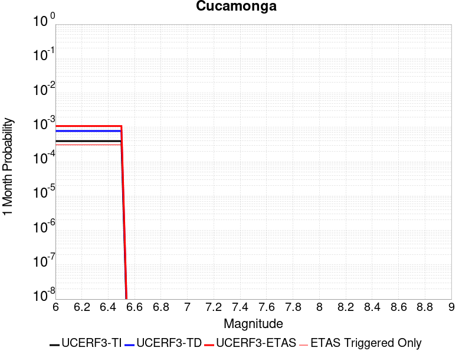
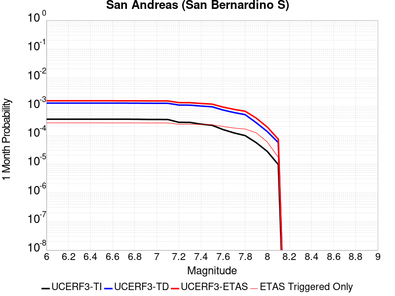
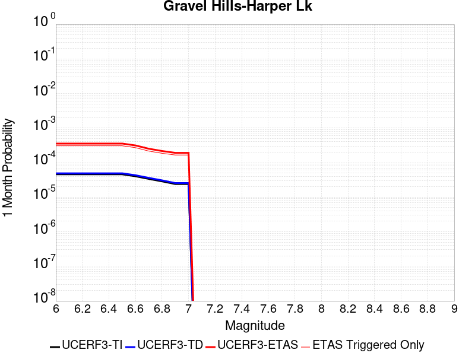
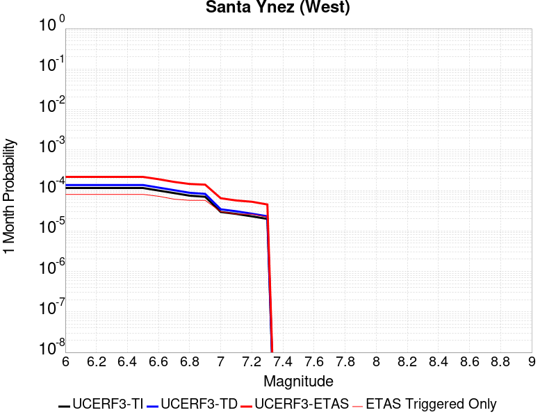
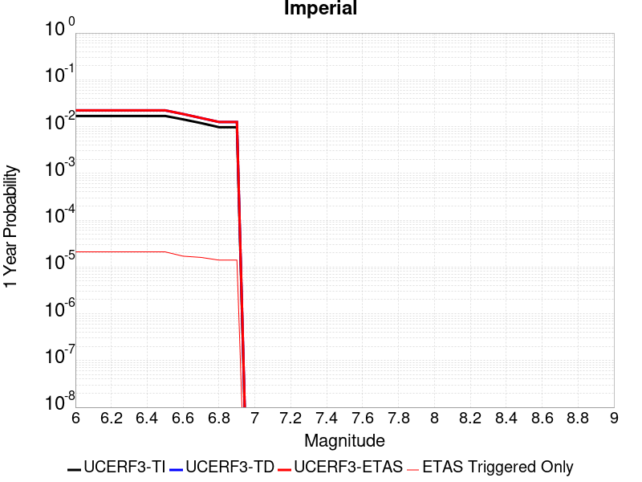
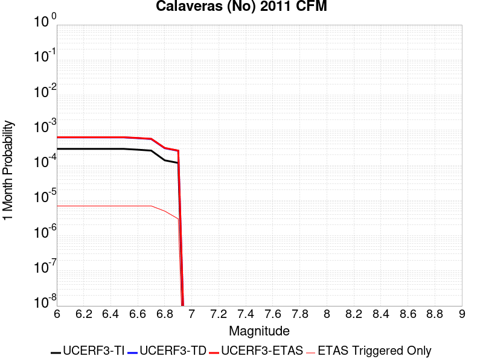
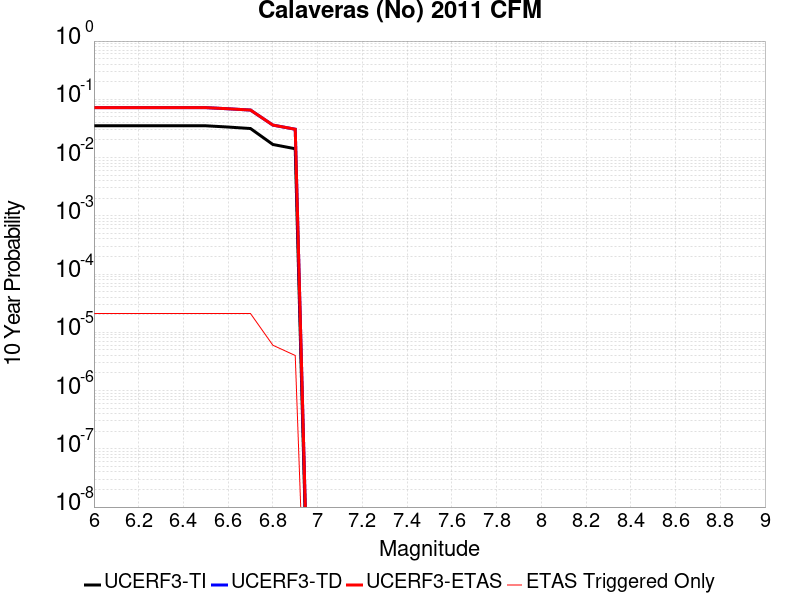
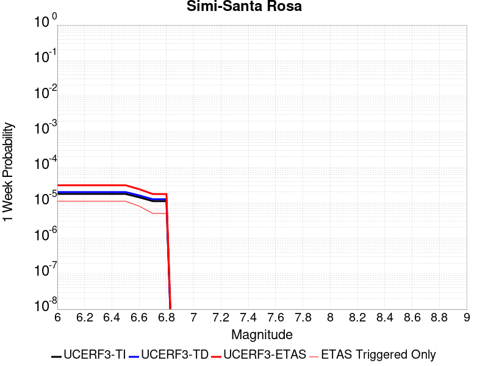
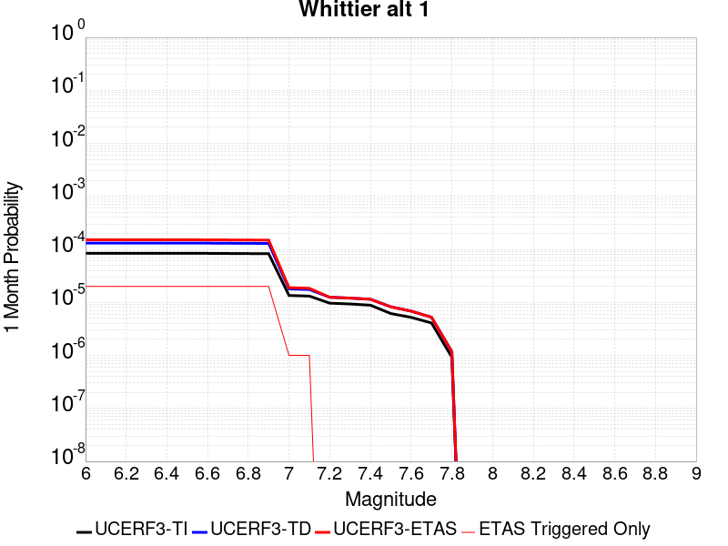

# Parent Section Magnitude-Probability Distributions

Only fault sections with at least one triggered aftershock are plotted. Sections are sorted by total supraseismogenic trigger rate (decreasing)

## Table Of Contents

* [Tank Canyon](#tank-canyon)
* [Little Lake](#little-lake)
* [Garlock (Central)](#garlock-central)
* [Owl Lake](#owl-lake)
* [Garlock (West)](#garlock-west)
* [Garlock (East)](#garlock-east)
* [Death Valley (So)](#death-valley-so)
* [Panamint Valley](#panamint-valley)
* [San Andreas (Mojave N)](#san-andreas-mojave-n)
* [San Andreas (Big Bend)](#san-andreas-big-bend)
* [San Andreas (Mojave S)](#san-andreas-mojave-s)
* [Blackwater](#blackwater)
* [San Andreas (Carrizo) rev](#san-andreas-carrizo-rev)
* [San Andreas (Cholame) rev](#san-andreas-cholame-rev)
* [San Andreas (Parkfield)](#san-andreas-parkfield)
* [Death Valley (Black Mtns Frontal)](#death-valley-black-mtns-frontal)
* [Hunter Mountain-Saline Valley](#hunter-mountain-saline-valley)
* [Cucamonga](#cucamonga)
* [Pleito](#pleito)
* [San Andreas (San Bernardino N)](#san-andreas-san-bernardino-n)
* [Death Valley (No)](#death-valley-no)
* [San Cayetano](#san-cayetano)
* [San Andreas (San Bernardino S)](#san-andreas-san-bernardino-s)
* [Gravel Hills-Harper Lk](#gravel-hills-harper-lk)
* [San Andreas (Coachella) rev](#san-andreas-coachella-rev)
* [Pitas Point (Lower West)](#pitas-point-lower-west)
* [San Andreas (San Gorgonio Pass-Garnet HIll)](#san-andreas-san-gorgonio-pass-garnet-hill)
* [Red Mountain](#red-mountain)
* [Pitas Point (Lower)-Montalvo](#pitas-point-lower-montalvo)
* [So Sierra Nevada](#so-sierra-nevada)
* [Cleghorn](#cleghorn)
* [San Jacinto (San Bernardino)](#san-jacinto-san-bernardino)
* [Mission Ridge-Arroyo Parida-Santa Ana](#mission-ridge-arroyo-parida-santa-ana)
* [Santa Ynez (East)](#santa-ynez-east)
* [Santa Ynez (West)](#santa-ynez-west)
* [Lenwood-Lockhart-Old Woman Springs](#lenwood-lockhart-old-woman-springs)
* [Death Valley (Fish Lake Valley)](#death-valley-fish-lake-valley)
* [San Juan](#san-juan)
* [Santa Susana alt 1](#santa-susana-alt-1)
* [San Jose](#san-jose)
* [Elsinore (Stepovers Combined)](#elsinore-stepovers-combined)
* [Raymond](#raymond)
* [Independence rev 2011](#independence-rev-2011)
* [Elysian Park (Upper)](#elysian-park-upper)
* [Elsinore (Glen Ivy) rev](#elsinore-glen-ivy-rev)
* [San Jacinto (Stepovers Combined)](#san-jacinto-stepovers-combined)
* [Ventura-Pitas Point](#ventura-pitas-point)
* [San Jacinto (San Jacinto Valley) rev](#san-jacinto-san-jacinto-valley-rev)
* [Mono Lake 2011 CFM](#mono-lake-2011-cfm)
* [San Jacinto (Anza) rev](#san-jacinto-anza-rev)
* [Great Valley 04b Gordon Valley](#great-valley-04b-gordon-valley)
* [Imperial](#imperial)
* [Calaveras (No) 2011 CFM](#calaveras-no-2011-cfm)
* [Great Valley 04a Trout Creek](#great-valley-04a-trout-creek)
* [Oak Ridge (Onshore)](#oak-ridge-onshore)
* [San Gregorio (South) 2011 CFM](#san-gregorio-south-2011-cfm)
* [Rose Canyon](#rose-canyon)
* [Helendale-So Lockhart](#helendale-so-lockhart)
* [Emerson-Copper Mtn 2011](#emerson-copper-mtn-2011)
* [Burnt Mtn](#burnt-mtn)
* [Hayward (No) 2011 CFM](#hayward-no-2011-cfm)
* [San Gabriel](#san-gabriel)
* [Elsinore (Temecula) rev](#elsinore-temecula-rev)
* [Simi-Santa Rosa](#simi-santa-rosa)
* [Hayward (So) 2011 CFM](#hayward-so-2011-cfm)
* [San Jacinto (Clark) rev](#san-jacinto-clark-rev)
* [Sierra Madre](#sierra-madre)
* [Great Valley 12](#great-valley-12)
* [Chino alt 1](#chino-alt-1)
* [Great Valley 03 Mysterious Ridge](#great-valley-03-mysterious-ridge)
* [Anacapa-Dume alt 1](#anacapa-dume-alt-1)
* [Robinson Creek](#robinson-creek)
* [San Gregorio (North) 2011 CFM](#san-gregorio-north-2011-cfm)
* [Verdugo](#verdugo)
* [Whittier alt 1](#whittier-alt-1)
* [Los Alamos 2011 CFM](#los-alamos-2011-cfm)

## Tank Canyon
*[(top)](#table-of-contents)*

| 1 Week | 1 Month | 1 Year | 10 Year |
|-----|-----|-----|-----|
|  |  |  |  |

| Magnitude | 1 wk TI Prob | 1 wk TD Prob | 1 wk ETAS Prob | 1 wk ETAS/TD Gain | 1 wk ETAS Triggered Only | 1 mo TI Prob | 1 mo TD Prob | 1 mo ETAS Prob | 1 mo ETAS/TD Gain | 1 mo ETAS Triggered Only | 1 yr TI Prob | 1 yr TD Prob | 1 yr ETAS Prob | 1 yr ETAS/TD Gain | 1 yr ETAS Triggered Only | 10 yr TI Prob | 10 yr TD Prob | 10 yr ETAS Prob | 10 yr ETAS/TD Gain | 10 yr ETAS Triggered Only |
|-----|-----|-----|-----|-----|-----|-----|-----|-----|-----|-----|-----|-----|-----|-----|-----|-----|-----|-----|-----|-----|
| 6.0 | 2.7748038E-5 | 3.5073965E-5 | 0.020699965 | 590.1803 | 0.020665616 | 1.18914744E-4 | 1.5031699E-4 | 0.02687051 | 178.75896 | 0.02672421 | 0.0014468255 | 0.0018300817 | 0.04291999 | 23.452497 | 0.04116524 | 0.014374418 | 0.018297758 | 0.07239771 | 3.9566436 | 0.05510831 |
| 6.1 | 2.7748038E-5 | 3.5073965E-5 | 0.020699965 | 590.1803 | 0.020665616 | 1.18914744E-4 | 1.5031699E-4 | 0.02687051 | 178.75896 | 0.02672421 | 0.0014468255 | 0.0018300817 | 0.04291999 | 23.452497 | 0.04116524 | 0.014374418 | 0.018297758 | 0.07239771 | 3.9566436 | 0.05510831 |
| 6.2 | 2.7748038E-5 | 3.5073965E-5 | 0.020699965 | 590.1803 | 0.020665616 | 1.18914744E-4 | 1.5031699E-4 | 0.02687051 | 178.75896 | 0.02672421 | 0.0014468255 | 0.0018300817 | 0.04291999 | 23.452497 | 0.04116524 | 0.014374418 | 0.018297758 | 0.07239771 | 3.9566436 | 0.05510831 |
| 6.3 | 2.7748038E-5 | 3.5073965E-5 | 0.020699965 | 590.1803 | 0.020665616 | 1.18914744E-4 | 1.5031699E-4 | 0.02687051 | 178.75896 | 0.02672421 | 0.0014468255 | 0.0018300817 | 0.04291999 | 23.452497 | 0.04116524 | 0.014374418 | 0.018297758 | 0.07239771 | 3.9566436 | 0.05510831 |

## Little Lake
*[(top)](#table-of-contents)*

| 1 Week | 1 Month | 1 Year | 10 Year |
|-----|-----|-----|-----|
|  |  |  |  |

| Magnitude | 1 wk TI Prob | 1 wk TD Prob | 1 wk ETAS Prob | 1 wk ETAS/TD Gain | 1 wk ETAS Triggered Only | 1 mo TI Prob | 1 mo TD Prob | 1 mo ETAS Prob | 1 mo ETAS/TD Gain | 1 mo ETAS Triggered Only | 1 yr TI Prob | 1 yr TD Prob | 1 yr ETAS Prob | 1 yr ETAS/TD Gain | 1 yr ETAS Triggered Only | 10 yr TI Prob | 10 yr TD Prob | 10 yr ETAS Prob | 10 yr ETAS/TD Gain | 10 yr ETAS Triggered Only |
|-----|-----|-----|-----|-----|-----|-----|-----|-----|-----|-----|-----|-----|-----|-----|-----|-----|-----|-----|-----|-----|
| 6.0 | 1.27106505E-5 | 1.3900362E-5 | 0.010969014 | 789.1171 | 0.010955266 | 5.447308E-5 | 5.957219E-5 | 0.014665724 | 246.18405 | 0.014607022 | 6.630079E-4 | 7.25151E-4 | 0.020629372 | 28.448381 | 0.019918665 | 0.006610333 | 0.0072377534 | 0.032285452 | 4.460701 | 0.025230309 |
| 6.1 | 1.27106505E-5 | 1.3900362E-5 | 0.010969014 | 789.1171 | 0.010955266 | 5.447308E-5 | 5.957219E-5 | 0.014665724 | 246.18405 | 0.014607022 | 6.630079E-4 | 7.25151E-4 | 0.020629372 | 28.448381 | 0.019918665 | 0.006610333 | 0.0072377534 | 0.032285452 | 4.460701 | 0.025230309 |
| 6.2 | 1.27106505E-5 | 1.3900362E-5 | 0.010969014 | 789.1171 | 0.010955266 | 5.447308E-5 | 5.957219E-5 | 0.014665724 | 246.18405 | 0.014607022 | 6.630079E-4 | 7.25151E-4 | 0.020629372 | 28.448381 | 0.019918665 | 0.006610333 | 0.0072377534 | 0.032285452 | 4.460701 | 0.025230309 |
| 6.3 | 1.27106505E-5 | 1.3900362E-5 | 0.010969014 | 789.1171 | 0.010955266 | 5.447308E-5 | 5.957219E-5 | 0.014665724 | 246.18405 | 0.014607022 | 6.630079E-4 | 7.25151E-4 | 0.020629372 | 28.448381 | 0.019918665 | 0.006610333 | 0.0072377534 | 0.032285452 | 4.460701 | 0.025230309 |
| 6.4 | 1.27106505E-5 | 1.3900362E-5 | 0.010969014 | 789.1171 | 0.010955266 | 5.447308E-5 | 5.957219E-5 | 0.014665724 | 246.18405 | 0.014607022 | 6.630079E-4 | 7.25151E-4 | 0.020629372 | 28.448381 | 0.019918665 | 0.006610333 | 0.0072377534 | 0.032285452 | 4.460701 | 0.025230309 |
| 6.5 | 1.27106505E-5 | 1.3900362E-5 | 0.010969014 | 789.1171 | 0.010955266 | 5.447308E-5 | 5.957219E-5 | 0.014665724 | 246.18405 | 0.014607022 | 6.630079E-4 | 7.25151E-4 | 0.020629372 | 28.448381 | 0.019918665 | 0.006610333 | 0.0072377534 | 0.032285452 | 4.460701 | 0.025230309 |
| 6.6 | 1.08505255E-5 | 1.1856941E-5 | 0.009390118 | 791.9511 | 0.009378372 | 4.6501424E-5 | 5.0815026E-5 | 0.012582338 | 247.61058 | 0.012532161 | 5.6600774E-4 | 6.1859656E-4 | 0.017456045 | 28.21879 | 0.016847871 | 0.005645683 | 0.006178476 | 0.027623707 | 4.470958 | 0.021578554 |
| 6.7 | 7.97625E-6 | 8.706619E-6 | 0.0063992226 | 734.98364 | 0.006390572 | 3.4183482E-5 | 3.7314083E-5 | 0.008917388 | 238.98183 | 0.008880405 | 4.161044E-4 | 4.5429895E-4 | 0.012814852 | 28.207972 | 0.012366172 | 0.004153261 | 0.0045429897 | 0.020240296 | 4.455281 | 0.015768943 |
| 6.8 | 7.97625E-6 | 8.706619E-6 | 0.0063992226 | 734.98364 | 0.006390572 | 3.4183482E-5 | 3.7314083E-5 | 0.008917388 | 238.98183 | 0.008880405 | 4.161044E-4 | 4.5429895E-4 | 0.012814852 | 28.207972 | 0.012366172 | 0.004153261 | 0.0045429897 | 0.020240296 | 4.455281 | 0.015768943 |

## Garlock (Central)
*[(top)](#table-of-contents)*

| 1 Week | 1 Month | 1 Year | 10 Year |
|-----|-----|-----|-----|
|  |  |  |  |

| Magnitude | 1 wk TI Prob | 1 wk TD Prob | 1 wk ETAS Prob | 1 wk ETAS/TD Gain | 1 wk ETAS Triggered Only | 1 mo TI Prob | 1 mo TD Prob | 1 mo ETAS Prob | 1 mo ETAS/TD Gain | 1 mo ETAS Triggered Only | 1 yr TI Prob | 1 yr TD Prob | 1 yr ETAS Prob | 1 yr ETAS/TD Gain | 1 yr ETAS Triggered Only | 10 yr TI Prob | 10 yr TD Prob | 10 yr ETAS Prob | 10 yr ETAS/TD Gain | 10 yr ETAS Triggered Only |
|-----|-----|-----|-----|-----|-----|-----|-----|-----|-----|-----|-----|-----|-----|-----|-----|-----|-----|-----|-----|-----|
| 6.0 | 2.575808E-5 | 1.9313613E-5 | 0.012053275 | 624.08185 | 0.012034194 | 1.10387096E-4 | 8.277037E-5 | 0.014522607 | 175.4566 | 0.014441033 | 0.0013431342 | 0.0010073289 | 0.019910999 | 19.766138 | 0.018922731 | 0.013350452 | 0.0100695705 | 0.034799345 | 3.4558916 | 0.024981325 |
| 6.1 | 2.575808E-5 | 1.9313613E-5 | 0.012053275 | 624.08185 | 0.012034194 | 1.10387096E-4 | 8.277037E-5 | 0.014522607 | 175.4566 | 0.014441033 | 0.0013431342 | 0.0010073289 | 0.019910999 | 19.766138 | 0.018922731 | 0.013350452 | 0.0100695705 | 0.034799345 | 3.4558916 | 0.024981325 |
| 6.2 | 2.575808E-5 | 1.9313613E-5 | 0.012053275 | 624.08185 | 0.012034194 | 1.10387096E-4 | 8.277037E-5 | 0.014522607 | 175.4566 | 0.014441033 | 0.0013431342 | 0.0010073289 | 0.019910999 | 19.766138 | 0.018922731 | 0.013350452 | 0.0100695705 | 0.034799345 | 3.4558916 | 0.024981325 |
| 6.3 | 2.575808E-5 | 1.9313613E-5 | 0.012053275 | 624.08185 | 0.012034194 | 1.10387096E-4 | 8.277037E-5 | 0.014522607 | 175.4566 | 0.014441033 | 0.0013431342 | 0.0010073289 | 0.019910999 | 19.766138 | 0.018922731 | 0.013350452 | 0.0100695705 | 0.034799345 | 3.4558916 | 0.024981325 |
| 6.4 | 2.575808E-5 | 1.9313613E-5 | 0.012053275 | 624.08185 | 0.012034194 | 1.10387096E-4 | 8.277037E-5 | 0.014522607 | 175.4566 | 0.014441033 | 0.0013431342 | 0.0010073289 | 0.019910999 | 19.766138 | 0.018922731 | 0.013350452 | 0.0100695705 | 0.034799345 | 3.4558916 | 0.024981325 |
| 6.5 | 2.575808E-5 | 1.9313613E-5 | 0.012053275 | 624.08185 | 0.012034194 | 1.10387096E-4 | 8.277037E-5 | 0.014522607 | 175.4566 | 0.014441033 | 0.0013431342 | 0.0010073289 | 0.019910999 | 19.766138 | 0.018922731 | 0.013350452 | 0.0100695705 | 0.034799345 | 3.4558916 | 0.024981325 |
| 6.6 | 2.540234E-5 | 1.885198E-5 | 0.011720847 | 621.7303 | 0.011702216 | 1.0886263E-4 | 8.0792066E-5 | 0.014188707 | 175.62006 | 0.014109055 | 0.0013245966 | 9.83265E-4 | 0.019389914 | 19.719929 | 0.018424766 | 0.013167289 | 0.009831364 | 0.033909664 | 3.4491308 | 0.02431737 |
| 6.7 | 2.4966947E-5 | 1.8286464E-5 | 0.010807366 | 591.0036 | 0.010789277 | 1.06996806E-4 | 7.8368575E-5 | 0.013190462 | 168.31316 | 0.0131131215 | 0.0013019076 | 9.5378514E-4 | 0.018200163 | 19.082037 | 0.017262843 | 0.012943068 | 0.009539624 | 0.032145366 | 3.3696682 | 0.022823472 |
| 6.8 | 2.4548952E-5 | 1.7797542E-5 | 0.010557904 | 593.2226 | 0.0105402935 | 1.0520555E-4 | 7.627332E-5 | 0.01293943 | 169.64557 | 0.012864138 | 0.001280125 | 9.282974E-4 | 0.017843446 | 19.221691 | 0.016930865 | 0.012727758 | 0.009286596 | 0.03132255 | 3.3728771 | 0.022242509 |
| 6.9 | 2.3994342E-5 | 1.7148153E-5 | 0.009727331 | 567.2524 | 0.009710349 | 1.0282884E-4 | 7.349039E-5 | 0.011857835 | 161.35219 | 0.01178521 | 0.0012512221 | 8.944436E-4 | 0.015985921 | 17.872477 | 0.015104988 | 0.012442005 | 0.0089510605 | 0.02910269 | 3.251312 | 0.020333638 |
| 7.0 | 2.343005E-5 | 1.6491087E-5 | 0.009145729 | 554.5861 | 0.009129388 | 1.0041064E-4 | 7.067455E-5 | 0.011191144 | 158.34758 | 0.011121254 | 0.0012218138 | 8.601883E-4 | 0.01504003 | 17.48458 | 0.014192049 | 0.01215118 | 0.008610493 | 0.027699409 | 3.2169368 | 0.01925471 |
| 7.1 | 2.2814058E-5 | 1.5782754E-5 | 0.008730061 | 553.1393 | 0.008714416 | 9.777087E-5 | 6.763899E-5 | 0.01060722 | 156.82108 | 0.0105402935 | 0.0011897103 | 8.2325895E-4 | 0.014340215 | 17.41884 | 0.013528094 | 0.011833611 | 0.00824334 | 0.026598535 | 3.2266695 | 0.01850776 |
| 7.2 | 2.2145266E-5 | 1.5027377E-5 | 0.00789938 | 525.66595 | 0.007884472 | 9.490483E-5 | 6.440182E-5 | 0.009774126 | 151.76784 | 0.009710349 | 0.0011548538 | 7.8387547E-4 | 0.013223283 | 16.869112 | 0.012449166 | 0.011488707 | 0.007851825 | 0.024979124 | 3.1813142 | 0.017262843 |
| 7.3 | 1.9954436E-5 | 1.3199953E-5 | 0.0064036874 | 485.12955 | 0.006390572 | 8.551621E-5 | 5.657036E-5 | 0.007857607 | 138.8997 | 0.0078014773 | 0.0010406625 | 6.8859005E-4 | 0.010558127 | 15.332966 | 0.009876338 | 0.010358025 | 0.006900618 | 0.020417782 | 2.9588337 | 0.0136110885 |
| 7.4 | 1.918037E-5 | 1.2553606E-5 | 0.0062370584 | 496.834 | 0.006224583 | 8.2198996E-5 | 5.3800417E-5 | 0.007688878 | 142.91484 | 0.0076354886 | 0.0010003132 | 6.5488677E-4 | 0.010358877 | 15.817814 | 0.009710349 | 0.009958224 | 0.006564366 | 0.019756308 | 3.0096292 | 0.01327911 |
| 7.5 | 1.6994161E-5 | 1.0764553E-5 | 0.0044094226 | 409.62433 | 0.0043987054 | 7.283008E-5 | 4.613333E-5 | 0.005689495 | 123.32722 | 0.005643622 | 8.863455E-4 | 5.615903E-4 | 0.007778052 | 13.850046 | 0.0072205164 | 0.008828186 | 0.005632708 | 0.01586605 | 2.8167713 | 0.01029131 |
| 7.6 | 1.621788E-5 | 1.012848E-5 | 0.0039108275 | 386.12186 | 0.0039007387 | 6.950335E-5 | 4.34074E-5 | 0.0051058484 | 117.62623 | 0.0050626607 | 8.458747E-4 | 5.2841863E-4 | 0.006998564 | 13.244355 | 0.0064735664 | 0.0084266225 | 0.005301458 | 0.014547556 | 2.7440672 | 0.009295377 |
| 7.7 | 7.713584E-6 | 3.2171508E-6 | 8.3315885E-4 | 258.97415 | 8.299444E-4 | 3.3057797E-5 | 1.378779E-5 | 0.0012586872 | 91.28999 | 0.0012449166 | 4.0240434E-4 | 1.6786634E-4 | 0.002076418 | 12.3694725 | 0.0019088722 | 0.0040167645 | 0.0016902693 | 0.0044244565 | 2.6176045 | 0.0027388164 |

## Owl Lake
*[(top)](#table-of-contents)*

| 1 Week | 1 Month | 1 Year | 10 Year |
|-----|-----|-----|-----|
|  |  |  |  |

| Magnitude | 1 wk TI Prob | 1 wk TD Prob | 1 wk ETAS Prob | 1 wk ETAS/TD Gain | 1 wk ETAS Triggered Only | 1 mo TI Prob | 1 mo TD Prob | 1 mo ETAS Prob | 1 mo ETAS/TD Gain | 1 mo ETAS Triggered Only | 1 yr TI Prob | 1 yr TD Prob | 1 yr ETAS Prob | 1 yr ETAS/TD Gain | 1 yr ETAS Triggered Only | 10 yr TI Prob | 10 yr TD Prob | 10 yr ETAS Prob | 10 yr ETAS/TD Gain | 10 yr ETAS Triggered Only |
|-----|-----|-----|-----|-----|-----|-----|-----|-----|-----|-----|-----|-----|-----|-----|-----|-----|-----|-----|-----|-----|
| 6.0 | 3.637175E-5 | 4.988367E-5 | 0.00461435 | 92.50221 | 0.004564694 | 1.5586962E-4 | 2.1378716E-4 | 0.0058562024 | 27.392675 | 0.005643622 | 0.0018960608 | 0.0026025574 | 0.011211515 | 4.307884 | 0.008631421 | 0.018799646 | 0.025995217 | 0.038605787 | 1.4851111 | 0.012947133 |
| 6.1 | 3.637175E-5 | 4.988367E-5 | 0.00461435 | 92.50221 | 0.004564694 | 1.5586962E-4 | 2.1378716E-4 | 0.0058562024 | 27.392675 | 0.005643622 | 0.0018960608 | 0.0026025574 | 0.011211515 | 4.307884 | 0.008631421 | 0.018799646 | 0.025995217 | 0.038605787 | 1.4851111 | 0.012947133 |
| 6.2 | 3.637175E-5 | 4.988367E-5 | 0.00461435 | 92.50221 | 0.004564694 | 1.5586962E-4 | 2.1378716E-4 | 0.0058562024 | 27.392675 | 0.005643622 | 0.0018960608 | 0.0026025574 | 0.011211515 | 4.307884 | 0.008631421 | 0.018799646 | 0.025995217 | 0.038605787 | 1.4851111 | 0.012947133 |
| 6.3 | 3.637175E-5 | 4.988367E-5 | 0.00461435 | 92.50221 | 0.004564694 | 1.5586962E-4 | 2.1378716E-4 | 0.0058562024 | 27.392675 | 0.005643622 | 0.0018960608 | 0.0026025574 | 0.011211515 | 4.307884 | 0.008631421 | 0.018799646 | 0.025995217 | 0.038605787 | 1.4851111 | 0.012947133 |
| 6.4 | 3.637175E-5 | 4.988367E-5 | 0.00461435 | 92.50221 | 0.004564694 | 1.5586962E-4 | 2.1378716E-4 | 0.0058562024 | 27.392675 | 0.005643622 | 0.0018960608 | 0.0026025574 | 0.011211515 | 4.307884 | 0.008631421 | 0.018799646 | 0.025995217 | 0.038605787 | 1.4851111 | 0.012947133 |
| 6.5 | 3.637175E-5 | 4.988367E-5 | 0.00461435 | 92.50221 | 0.004564694 | 1.5586962E-4 | 2.1378716E-4 | 0.0058562024 | 27.392675 | 0.005643622 | 0.0018960608 | 0.0026025574 | 0.011211515 | 4.307884 | 0.008631421 | 0.018799646 | 0.025995217 | 0.038605787 | 1.4851111 | 0.012947133 |

## Garlock (West)
*[(top)](#table-of-contents)*

| 1 Week | 1 Month | 1 Year | 10 Year |
|-----|-----|-----|-----|
|  |  |  |  |

| Magnitude | 1 wk TI Prob | 1 wk TD Prob | 1 wk ETAS Prob | 1 wk ETAS/TD Gain | 1 wk ETAS Triggered Only | 1 mo TI Prob | 1 mo TD Prob | 1 mo ETAS Prob | 1 mo ETAS/TD Gain | 1 mo ETAS Triggered Only | 1 yr TI Prob | 1 yr TD Prob | 1 yr ETAS Prob | 1 yr ETAS/TD Gain | 1 yr ETAS Triggered Only | 10 yr TI Prob | 10 yr TD Prob | 10 yr ETAS Prob | 10 yr ETAS/TD Gain | 10 yr ETAS Triggered Only |
|-----|-----|-----|-----|-----|-----|-----|-----|-----|-----|-----|-----|-----|-----|-----|-----|-----|-----|-----|-----|-----|
| 6.0 | 2.516656E-5 | 1.8065048E-5 | 0.0049976413 | 276.647 | 0.0049796663 | 1.07852225E-4 | 7.741977E-5 | 0.0063845087 | 82.46613 | 0.0063075772 | 0.0013123099 | 9.42255E-4 | 0.00898513 | 9.535773 | 0.00805046 | 0.013045873 | 0.009421492 | 0.020766817 | 2.2041965 | 0.011453233 |
| 6.1 | 2.516656E-5 | 1.8065048E-5 | 0.0049976413 | 276.647 | 0.0049796663 | 1.07852225E-4 | 7.741977E-5 | 0.0063845087 | 82.46613 | 0.0063075772 | 0.0013123099 | 9.42255E-4 | 0.00898513 | 9.535773 | 0.00805046 | 0.013045873 | 0.009421492 | 0.020766817 | 2.2041965 | 0.011453233 |
| 6.2 | 2.516656E-5 | 1.8065048E-5 | 0.0049976413 | 276.647 | 0.0049796663 | 1.07852225E-4 | 7.741977E-5 | 0.0063845087 | 82.46613 | 0.0063075772 | 0.0013123099 | 9.42255E-4 | 0.00898513 | 9.535773 | 0.00805046 | 0.013045873 | 0.009421492 | 0.020766817 | 2.2041965 | 0.011453233 |
| 6.3 | 2.516656E-5 | 1.8065048E-5 | 0.0049976413 | 276.647 | 0.0049796663 | 1.07852225E-4 | 7.741977E-5 | 0.0063845087 | 82.46613 | 0.0063075772 | 0.0013123099 | 9.42255E-4 | 0.00898513 | 9.535773 | 0.00805046 | 0.013045873 | 0.009421492 | 0.020766817 | 2.2041965 | 0.011453233 |
| 6.4 | 2.516656E-5 | 1.8065048E-5 | 0.0049976413 | 276.647 | 0.0049796663 | 1.07852225E-4 | 7.741977E-5 | 0.0063845087 | 82.46613 | 0.0063075772 | 0.0013123099 | 9.42255E-4 | 0.00898513 | 9.535773 | 0.00805046 | 0.013045873 | 0.009421492 | 0.020766817 | 2.2041965 | 0.011453233 |
| 6.5 | 2.516656E-5 | 1.8065048E-5 | 0.0049976413 | 276.647 | 0.0049796663 | 1.07852225E-4 | 7.741977E-5 | 0.0063845087 | 82.46613 | 0.0063075772 | 0.0013123099 | 9.42255E-4 | 0.00898513 | 9.535773 | 0.00805046 | 0.013045873 | 0.009421492 | 0.020766817 | 2.2041965 | 0.011453233 |
| 6.6 | 2.498869E-5 | 1.7877663E-5 | 0.004997455 | 279.53625 | 0.0049796663 | 1.07089996E-4 | 7.6616736E-5 | 0.006383711 | 83.32006 | 0.0063075772 | 0.0013030408 | 9.3248655E-4 | 0.008975441 | 9.625276 | 0.00805046 | 0.012954267 | 0.009324339 | 0.020670779 | 2.2168624 | 0.011453233 |
| 6.7 | 2.4627925E-5 | 1.7497801E-5 | 0.004997077 | 285.58316 | 0.0049796663 | 1.0554398E-4 | 7.498886E-5 | 0.0063820933 | 85.10722 | 0.0063075772 | 0.0012842404 | 9.1268384E-4 | 0.008955797 | 9.812594 | 0.00805046 | 0.012768441 | 0.009128104 | 0.02047679 | 2.2432687 | 0.011453233 |
| 6.8 | 2.4270235E-5 | 1.716136E-5 | 0.004996742 | 291.16238 | 0.0049796663 | 1.04011146E-4 | 7.354704E-5 | 0.0063806605 | 86.75619 | 0.0063075772 | 0.0012656 | 8.9514436E-4 | 0.008938398 | 9.985427 | 0.00805046 | 0.012584164 | 0.0089538675 | 0.02030455 | 2.2676847 | 0.011453233 |
| 6.9 | 2.3913764E-5 | 1.6823105E-5 | 0.0049134125 | 292.06335 | 0.004896672 | 1.0248353E-4 | 7.2097464E-5 | 0.0062962314 | 87.329445 | 0.006224583 | 0.0012470228 | 8.775101E-4 | 0.008837985 | 10.071661 | 0.0079674665 | 0.012400482 | 0.00877859 | 0.020049013 | 2.2838535 | 0.011370238 |
| 7.0 | 2.3579369E-5 | 1.6492264E-5 | 0.0049130833 | 297.9023 | 0.004896672 | 1.0105052E-4 | 7.067965E-5 | 0.006294823 | 89.06132 | 0.006224583 | 0.0012295957 | 8.6026196E-4 | 0.008820874 | 10.253707 | 0.0079674665 | 0.012228143 | 0.008607132 | 0.019879505 | 2.309655 | 0.011370238 |
| 7.1 | 2.3205374E-5 | 1.6105636E-5 | 0.0049126986 | 305.0298 | 0.004896672 | 9.944781E-5 | 6.902276E-5 | 0.006293176 | 91.17537 | 0.006224583 | 0.0012101046 | 8.401051E-4 | 0.008717953 | 10.377217 | 0.007884472 | 0.0120353615 | 0.008406721 | 0.019599076 | 2.331358 | 0.011287244 |
| 7.2 | 2.2799322E-5 | 1.5676578E-5 | 0.0048292787 | 308.05692 | 0.0048136776 | 9.770772E-5 | 6.718404E-5 | 0.0062083597 | 92.40825 | 0.0061415886 | 0.0011889422 | 8.177357E-4 | 0.008612833 | 10.532539 | 0.0078014773 | 0.011826012 | 0.008184515 | 0.019297063 | 2.3577528 | 0.011204249 |
| 7.3 | 1.8228246E-5 | 1.1798695E-5 | 0.004742426 | 401.94498 | 0.004730683 | 7.811871E-5 | 5.0565202E-5 | 0.006025863 | 119.17015 | 0.0059756 | 9.506803E-4 | 6.1551924E-4 | 0.008246308 | 13.397319 | 0.0076354886 | 0.0094662355 | 0.006171021 | 0.017058682 | 2.7643206 | 0.010955266 |
| 7.4 | 1.7670916E-5 | 1.132978E-5 | 0.004658966 | 411.21414 | 0.0046476885 | 7.5730306E-5 | 4.8555645E-5 | 0.0059408746 | 122.35189 | 0.005892605 | 9.216264E-4 | 5.9106643E-4 | 0.008139096 | 13.770189 | 0.007552494 | 0.009178135 | 0.0059269792 | 0.016652308 | 2.8095777 | 0.010789277 |
| 7.5 | 1.6994161E-5 | 1.0764553E-5 | 0.0044094226 | 409.62433 | 0.0043987054 | 7.283008E-5 | 4.613333E-5 | 0.005689495 | 123.32722 | 0.005643622 | 8.863455E-4 | 5.615903E-4 | 0.007778052 | 13.850046 | 0.0072205164 | 0.008828186 | 0.005632708 | 0.01586605 | 2.8167713 | 0.01029131 |
| 7.6 | 1.621788E-5 | 1.012848E-5 | 0.0039108275 | 386.12186 | 0.0039007387 | 6.950335E-5 | 4.34074E-5 | 0.0051058484 | 117.62623 | 0.0050626607 | 8.458747E-4 | 5.2841863E-4 | 0.006998564 | 13.244355 | 0.0064735664 | 0.0084266225 | 0.005301458 | 0.014547556 | 2.7440672 | 0.009295377 |
| 7.7 | 7.713584E-6 | 3.2171508E-6 | 8.3315885E-4 | 258.97415 | 8.299444E-4 | 3.3057797E-5 | 1.378779E-5 | 0.0012586872 | 91.28999 | 0.0012449166 | 4.0240434E-4 | 1.6786634E-4 | 0.002076418 | 12.3694725 | 0.0019088722 | 0.0040167645 | 0.0016902693 | 0.0044244565 | 2.6176045 | 0.0027388164 |

## Garlock (East)
*[(top)](#table-of-contents)*

| 1 Week | 1 Month | 1 Year | 10 Year |
|-----|-----|-----|-----|
|  |  |  |  |

| Magnitude | 1 wk TI Prob | 1 wk TD Prob | 1 wk ETAS Prob | 1 wk ETAS/TD Gain | 1 wk ETAS Triggered Only | 1 mo TI Prob | 1 mo TD Prob | 1 mo ETAS Prob | 1 mo ETAS/TD Gain | 1 mo ETAS Triggered Only | 1 yr TI Prob | 1 yr TD Prob | 1 yr ETAS Prob | 1 yr ETAS/TD Gain | 1 yr ETAS Triggered Only | 10 yr TI Prob | 10 yr TD Prob | 10 yr ETAS Prob | 10 yr ETAS/TD Gain | 10 yr ETAS Triggered Only |
|-----|-----|-----|-----|-----|-----|-----|-----|-----|-----|-----|-----|-----|-----|-----|-----|-----|-----|-----|-----|-----|
| 6.0 | 2.2327951E-5 | 1.8303952E-5 | 0.0044999216 | 245.84427 | 0.0044817 | 9.5687705E-5 | 7.8444085E-5 | 0.005721623 | 72.93887 | 0.005643622 | 0.0011643751 | 9.548048E-4 | 0.008831749 | 9.249794 | 0.007884472 | 0.0115829315 | 0.0096519785 | 0.02041931 | 2.115557 | 0.010872272 |
| 6.1 | 2.2327951E-5 | 1.8303952E-5 | 0.0044999216 | 245.84427 | 0.0044817 | 9.5687705E-5 | 7.8444085E-5 | 0.005721623 | 72.93887 | 0.005643622 | 0.0011643751 | 9.548048E-4 | 0.008831749 | 9.249794 | 0.007884472 | 0.0115829315 | 0.0096519785 | 0.02041931 | 2.115557 | 0.010872272 |
| 6.2 | 2.2327951E-5 | 1.8303952E-5 | 0.0044999216 | 245.84427 | 0.0044817 | 9.5687705E-5 | 7.8444085E-5 | 0.005721623 | 72.93887 | 0.005643622 | 0.0011643751 | 9.548048E-4 | 0.008831749 | 9.249794 | 0.007884472 | 0.0115829315 | 0.0096519785 | 0.02041931 | 2.115557 | 0.010872272 |
| 6.3 | 2.2327951E-5 | 1.8303952E-5 | 0.0044999216 | 245.84427 | 0.0044817 | 9.5687705E-5 | 7.8444085E-5 | 0.005721623 | 72.93887 | 0.005643622 | 0.0011643751 | 9.548048E-4 | 0.008831749 | 9.249794 | 0.007884472 | 0.0115829315 | 0.0096519785 | 0.02041931 | 2.115557 | 0.010872272 |
| 6.4 | 2.2327951E-5 | 1.8303952E-5 | 0.0044999216 | 245.84427 | 0.0044817 | 9.5687705E-5 | 7.8444085E-5 | 0.005721623 | 72.93887 | 0.005643622 | 0.0011643751 | 9.548048E-4 | 0.008831749 | 9.249794 | 0.007884472 | 0.0115829315 | 0.0096519785 | 0.02041931 | 2.115557 | 0.010872272 |
| 6.5 | 2.2327951E-5 | 1.8303952E-5 | 0.0044999216 | 245.84427 | 0.0044817 | 9.5687705E-5 | 7.8444085E-5 | 0.005721623 | 72.93887 | 0.005643622 | 0.0011643751 | 9.548048E-4 | 0.008831749 | 9.249794 | 0.007884472 | 0.0115829315 | 0.0096519785 | 0.02041931 | 2.115557 | 0.010872272 |
| 6.6 | 2.222123E-5 | 1.816971E-5 | 0.004499788 | 247.65326 | 0.0044817 | 9.523036E-5 | 7.7868805E-5 | 0.0057210512 | 73.47039 | 0.005643622 | 0.0011588129 | 9.4780687E-4 | 0.00874189 | 9.223282 | 0.0078014773 | 0.011527888 | 0.009581773 | 0.02026767 | 2.1152318 | 0.010789277 |
| 6.7 | 2.2076227E-5 | 1.798404E-5 | 0.004499603 | 250.19978 | 0.0044817 | 9.4608964E-5 | 7.707312E-5 | 0.00572026 | 74.21861 | 0.005643622 | 0.0011512554 | 9.381278E-4 | 0.008732286 | 9.308206 | 0.0078014773 | 0.011453095 | 0.009485973 | 0.020090695 | 2.1179373 | 0.010706282 |
| 6.8 | 2.1962227E-5 | 1.7854036E-5 | 0.0044994736 | 252.01437 | 0.0044817 | 9.4120434E-5 | 7.651599E-5 | 0.005719706 | 74.75177 | 0.005643622 | 0.0011453138 | 9.313506E-4 | 0.008725562 | 9.368719 | 0.0078014773 | 0.01139429 | 0.00941876 | 0.01994199 | 2.1172628 | 0.010623288 |
| 6.9 | 1.1702579E-5 | 6.6732687E-6 | 0.0039903796 | 597.9648 | 0.0039837332 | 5.0152947E-5 | 2.8599494E-5 | 0.0048421393 | 169.30858 | 0.0048136776 | 6.10441E-4 | 3.481581E-4 | 0.0066535394 | 19.110685 | 0.0063075772 | 0.0060876687 | 0.0034954504 | 0.0118485885 | 3.3897173 | 0.008382439 |
| 7.0 | 1.153538E-5 | 6.4796777E-6 | 0.003990187 | 615.80023 | 0.0039837332 | 4.9436403E-5 | 2.7769835E-5 | 0.0047583217 | 171.34857 | 0.004730683 | 6.01722E-4 | 3.3806017E-4 | 0.0064775725 | 19.161005 | 0.0061415886 | 0.006000953 | 0.0033946347 | 0.01150048 | 3.38784 | 0.008133455 |
| 7.1 | 1.135938E-5 | 6.273818E-6 | 0.0038239942 | 609.51624 | 0.0038177443 | 4.868215E-5 | 2.6887597E-5 | 0.004508467 | 167.6783 | 0.0044817 | 5.925439E-4 | 3.2732222E-4 | 0.0062179985 | 18.996567 | 0.005892605 | 0.0059096646 | 0.0032873498 | 0.011063181 | 3.36538 | 0.0078014773 |
| 7.2 | 1.1168294E-5 | 6.048814E-6 | 0.003574788 | 590.9899 | 0.0035687608 | 4.786324E-5 | 2.5923315E-5 | 0.00425853 | 164.27412 | 0.0042327163 | 5.825791E-4 | 3.1558552E-4 | 0.0059574265 | 18.877375 | 0.005643622 | 0.005810542 | 0.0031701238 | 0.010533213 | 3.3226502 | 0.007386505 |
| 7.3 | 1.0952553E-5 | 5.8686815E-6 | 0.0032426328 | 552.53174 | 0.0032367832 | 4.693867E-5 | 2.5151334E-5 | 0.003925792 | 156.08682 | 0.0039007387 | 5.713284E-4 | 3.0618932E-4 | 0.0053673 | 17.52935 | 0.0050626607 | 0.0056986175 | 0.0030760262 | 0.009612419 | 3.124947 | 0.0065565608 |
| 7.4 | 1.0735812E-5 | 5.691247E-6 | 0.003159462 | 555.14404 | 0.0031537886 | 4.6009813E-5 | 2.4390914E-5 | 0.003842042 | 157.5194 | 0.0038177443 | 5.600255E-4 | 2.9693378E-4 | 0.0052751214 | 17.765312 | 0.0049796663 | 0.0055861627 | 0.0029833042 | 0.009354811 | 3.1357214 | 0.006390572 |
| 7.5 | 9.0273E-6 | 4.284415E-6 | 0.0014981779 | 349.68085 | 0.0014939 | 3.8687853E-5 | 1.8361723E-5 | 0.0020101918 | 109.47729 | 0.0019918666 | 4.709228E-4 | 2.2354414E-4 | 0.0028787726 | 12.877871 | 0.002655822 | 0.004699261 | 0.0022480614 | 0.005891607 | 2.6207502 | 0.0036517554 |
| 7.6 | 8.549585E-6 | 3.885532E-6 | 0.0010828091 | 278.6772 | 0.0010789277 | 3.6640562E-5 | 1.6652246E-5 | 0.0015105273 | 90.71012 | 0.0014939 | 4.4600753E-4 | 2.027353E-4 | 0.0023601532 | 11.641551 | 0.0021578553 | 0.0044511347 | 0.0020396118 | 0.005021318 | 2.4618986 | 0.0029878 |
| 7.7 | 7.713584E-6 | 3.2171508E-6 | 8.3315885E-4 | 258.97415 | 8.299444E-4 | 3.3057797E-5 | 1.378779E-5 | 0.0012586872 | 91.28999 | 0.0012449166 | 4.0240434E-4 | 1.6786634E-4 | 0.002076418 | 12.3694725 | 0.0019088722 | 0.0040167645 | 0.0016902693 | 0.0044244565 | 2.6176045 | 0.0027388164 |

## Death Valley (So)
*[(top)](#table-of-contents)*

| 1 Week | 1 Month | 1 Year | 10 Year |
|-----|-----|-----|-----|
|  |  |  |  |

| Magnitude | 1 wk TI Prob | 1 wk TD Prob | 1 wk ETAS Prob | 1 wk ETAS/TD Gain | 1 wk ETAS Triggered Only | 1 mo TI Prob | 1 mo TD Prob | 1 mo ETAS Prob | 1 mo ETAS/TD Gain | 1 mo ETAS Triggered Only | 1 yr TI Prob | 1 yr TD Prob | 1 yr ETAS Prob | 1 yr ETAS/TD Gain | 1 yr ETAS Triggered Only | 10 yr TI Prob | 10 yr TD Prob | 10 yr ETAS Prob | 10 yr ETAS/TD Gain | 10 yr ETAS Triggered Only |
|-----|-----|-----|-----|-----|-----|-----|-----|-----|-----|-----|-----|-----|-----|-----|-----|-----|-----|-----|-----|-----|
| 6.0 | 4.4658216E-5 | 6.228887E-5 | 0.0021370207 | 34.308228 | 0.002074861 | 1.9137832E-4 | 2.669324E-4 | 0.003668796 | 13.744289 | 0.0034027721 | 0.0023275411 | 0.0032461619 | 0.009285089 | 2.8603284 | 0.006058594 | 0.023033133 | 0.032094594 | 0.040448993 | 1.2603055 | 0.008631421 |
| 6.1 | 4.4658216E-5 | 6.228887E-5 | 0.0021370207 | 34.308228 | 0.002074861 | 1.9137832E-4 | 2.669324E-4 | 0.003668796 | 13.744289 | 0.0034027721 | 0.0023275411 | 0.0032461619 | 0.009285089 | 2.8603284 | 0.006058594 | 0.023033133 | 0.032094594 | 0.040448993 | 1.2603055 | 0.008631421 |
| 6.2 | 4.4658216E-5 | 6.228887E-5 | 0.0021370207 | 34.308228 | 0.002074861 | 1.9137832E-4 | 2.669324E-4 | 0.003668796 | 13.744289 | 0.0034027721 | 0.0023275411 | 0.0032461619 | 0.009285089 | 2.8603284 | 0.006058594 | 0.023033133 | 0.032094594 | 0.040448993 | 1.2603055 | 0.008631421 |
| 6.3 | 4.4658216E-5 | 6.228887E-5 | 0.0021370207 | 34.308228 | 0.002074861 | 1.9137832E-4 | 2.669324E-4 | 0.003668796 | 13.744289 | 0.0034027721 | 0.0023275411 | 0.0032461619 | 0.009285089 | 2.8603284 | 0.006058594 | 0.023033133 | 0.032094594 | 0.040448993 | 1.2603055 | 0.008631421 |
| 6.4 | 4.4658216E-5 | 6.228887E-5 | 0.0021370207 | 34.308228 | 0.002074861 | 1.9137832E-4 | 2.669324E-4 | 0.003668796 | 13.744289 | 0.0034027721 | 0.0023275411 | 0.0032461619 | 0.009285089 | 2.8603284 | 0.006058594 | 0.023033133 | 0.032094594 | 0.040448993 | 1.2603055 | 0.008631421 |
| 6.5 | 4.4658216E-5 | 6.228887E-5 | 0.0021370207 | 34.308228 | 0.002074861 | 1.9137832E-4 | 2.669324E-4 | 0.003668796 | 13.744289 | 0.0034027721 | 0.0023275411 | 0.0032461619 | 0.009285089 | 2.8603284 | 0.006058594 | 0.023033133 | 0.032094594 | 0.040448993 | 1.2603055 | 0.008631421 |
| 6.6 | 3.6853275E-5 | 5.1089468E-5 | 0.0017108935 | 33.488182 | 0.0016598888 | 1.5793304E-4 | 2.1894388E-4 | 0.0028741844 | 13.127494 | 0.002655822 | 0.0019211388 | 0.0026635646 | 0.0072161006 | 2.7091892 | 0.004564694 | 0.019046152 | 0.026430551 | 0.033137023 | 1.2537394 | 0.0068885386 |
| 6.7 | 2.9971921E-5 | 4.1332314E-5 | 0.0015351705 | 37.142136 | 0.0014939 | 1.2844476E-4 | 1.7713365E-4 | 0.002583546 | 14.585293 | 0.0024068388 | 0.0015626932 | 0.0021557007 | 0.00604803 | 2.8055985 | 0.0039007387 | 0.015517498 | 0.021467837 | 0.027233941 | 1.2685927 | 0.005892605 |
| 6.8 | 2.8134293E-5 | 3.8737995E-5 | 0.0012836064 | 33.135593 | 0.0012449166 | 1.2056997E-4 | 1.6601657E-4 | 0.0023235139 | 13.995674 | 0.0021578553 | 0.0014669509 | 0.0020206098 | 0.0056649866 | 2.8036022 | 0.0036517554 | 0.014573049 | 0.020142367 | 0.025509667 | 1.2664682 | 0.005477633 |
| 6.9 | 5.6768154E-6 | 7.307913E-6 | 1.7329559E-4 | 23.713415 | 1.6598888E-4 | 2.4328981E-5 | 3.1319494E-5 | 2.80295E-4 | 8.949538 | 2.4898333E-4 | 2.961651E-4 | 3.8129094E-4 | 6.301793E-4 | 1.6527519 | 2.4898333E-4 | 0.0029577068 | 0.003810565 | 0.0040585995 | 1.0650913 | 2.4898333E-4 |
| 7.0 | 5.556207E-6 | 7.1531585E-6 | 1.7314086E-4 | 24.204811 | 1.6598888E-4 | 2.3812097E-5 | 3.0656276E-5 | 2.7963196E-4 | 9.121525 | 2.4898333E-4 | 2.8987371E-4 | 3.7321905E-4 | 6.2210945E-4 | 1.6668749 | 2.4898333E-4 | 0.002894959 | 0.003730121 | 0.0039781756 | 1.0665004 | 2.4898333E-4 |
| 7.1 | 5.418659E-6 | 6.9768143E-6 | 1.7296453E-4 | 24.791334 | 1.6598888E-4 | 2.3222618E-5 | 2.9900531E-5 | 2.788764E-4 | 9.326804 | 2.4898333E-4 | 2.826987E-4 | 3.64021E-4 | 6.129137E-4 | 1.6837317 | 2.4898333E-4 | 0.0028233933 | 0.003638446 | 0.0038865234 | 1.0681822 | 2.4898333E-4 |
| 7.2 | 5.263499E-6 | 6.7766255E-6 | 1.7276438E-4 | 25.49416 | 1.6598888E-4 | 2.2557659E-5 | 2.90426E-5 | 2.7801868E-4 | 9.572789 | 2.4898333E-4 | 2.7460488E-4 | 3.5357912E-4 | 6.024744E-4 | 1.703931 | 2.4898333E-4 | 0.002742658 | 0.003534366 | 0.0037824693 | 1.0701975 | 2.4898333E-4 |
| 7.3 | 5.0913163E-6 | 6.5556187E-6 | 1.7254341E-4 | 26.319927 | 1.6598888E-4 | 2.1819744E-5 | 2.8095446E-5 | 2.7707178E-4 | 9.861803 | 2.4898333E-4 | 2.65623E-4 | 3.420512E-4 | 5.909494E-4 | 1.7276634 | 2.4898333E-4 | 0.0026530572 | 0.0034194465 | 0.0036675786 | 1.072565 | 2.4898333E-4 |
| 7.4 | 5.018449E-6 | 6.4618785E-6 | 1.7244968E-4 | 26.687239 | 1.6598888E-4 | 2.1507461E-5 | 2.7693712E-5 | 2.7667012E-4 | 9.990359 | 2.4898333E-4 | 2.6182187E-4 | 3.371616E-4 | 5.86061E-4 | 1.7382199 | 2.4898333E-4 | 0.0026151363 | 0.0033706997 | 0.0036188436 | 1.0736179 | 2.4898333E-4 |
| 7.5 | 4.993322E-6 | 6.430145E-6 | 1.7241796E-4 | 26.814009 | 1.6598888E-4 | 2.1399776E-5 | 2.7557713E-5 | 2.7653418E-4 | 10.034728 | 2.4898333E-4 | 2.6051112E-4 | 3.3550634E-4 | 5.844061E-4 | 1.7418631 | 2.4898333E-4 | 0.0026020592 | 0.003354197 | 0.0036023452 | 1.0739814 | 2.4898333E-4 |
| 7.6 | 4.882584E-6 | 6.2884383E-6 | 1.7227627E-4 | 27.395718 | 1.6598888E-4 | 2.0925192E-5 | 2.6950413E-5 | 2.75927E-4 | 10.238323 | 2.4898333E-4 | 2.5473442E-4 | 3.2811466E-4 | 5.770163E-4 | 1.7585812 | 2.4898333E-4 | 0.0025444264 | 0.0032805006 | 0.0035286671 | 1.075649 | 2.4898333E-4 |
| 7.7 | 4.8153906E-6 | 6.202069E-6 | 1.7218992E-4 | 27.763304 | 1.6598888E-4 | 2.0637224E-5 | 2.6580266E-5 | 2.7555696E-4 | 10.366976 | 2.4898333E-4 | 2.5122924E-4 | 3.2360948E-4 | 5.725122E-4 | 1.7691454 | 2.4898333E-4 | 0.002509454 | 0.0032355804 | 0.003483758 | 1.0767027 | 2.4898333E-4 |
| 7.8 | 4.8153906E-6 | 6.202069E-6 | 1.7218992E-4 | 27.763304 | 1.6598888E-4 | 2.0637224E-5 | 2.6580266E-5 | 2.7555696E-4 | 10.366976 | 2.4898333E-4 | 2.5122924E-4 | 3.2360948E-4 | 5.725122E-4 | 1.7691454 | 2.4898333E-4 | 0.002509454 | 0.0032355804 | 0.003483758 | 1.0767027 | 2.4898333E-4 |

## Panamint Valley
*[(top)](#table-of-contents)*

| 1 Week | 1 Month | 1 Year | 10 Year |
|-----|-----|-----|-----|
|  |  |  |  |

| Magnitude | 1 wk TI Prob | 1 wk TD Prob | 1 wk ETAS Prob | 1 wk ETAS/TD Gain | 1 wk ETAS Triggered Only | 1 mo TI Prob | 1 mo TD Prob | 1 mo ETAS Prob | 1 mo ETAS/TD Gain | 1 mo ETAS Triggered Only | 1 yr TI Prob | 1 yr TD Prob | 1 yr ETAS Prob | 1 yr ETAS/TD Gain | 1 yr ETAS Triggered Only | 10 yr TI Prob | 10 yr TD Prob | 10 yr ETAS Prob | 10 yr ETAS/TD Gain | 10 yr ETAS Triggered Only |
|-----|-----|-----|-----|-----|-----|-----|-----|-----|-----|-----|-----|-----|-----|-----|-----|-----|-----|-----|-----|-----|
| 6.0 | 2.4839064E-5 | 2.5506472E-5 | 0.0015193683 | 59.56795 | 0.0014939 | 1.0644879E-4 | 1.09309134E-4 | 0.00259887 | 23.775415 | 0.0024898332 | 0.0012952434 | 0.0013300732 | 0.0048940876 | 3.6795623 | 0.0035687608 | 0.0128772 | 0.013225966 | 0.018713048 | 1.4148719 | 0.005560627 |
| 6.1 | 2.4839064E-5 | 2.5506472E-5 | 0.0015193683 | 59.56795 | 0.0014939 | 1.0644879E-4 | 1.09309134E-4 | 0.00259887 | 23.775415 | 0.0024898332 | 0.0012952434 | 0.0013300732 | 0.0048940876 | 3.6795623 | 0.0035687608 | 0.0128772 | 0.013225966 | 0.018713048 | 1.4148719 | 0.005560627 |
| 6.2 | 2.4839064E-5 | 2.5506472E-5 | 0.0015193683 | 59.56795 | 0.0014939 | 1.0644879E-4 | 1.09309134E-4 | 0.00259887 | 23.775415 | 0.0024898332 | 0.0012952434 | 0.0013300732 | 0.0048940876 | 3.6795623 | 0.0035687608 | 0.0128772 | 0.013225966 | 0.018713048 | 1.4148719 | 0.005560627 |
| 6.3 | 2.4839064E-5 | 2.5506472E-5 | 0.0015193683 | 59.56795 | 0.0014939 | 1.0644879E-4 | 1.09309134E-4 | 0.00259887 | 23.775415 | 0.0024898332 | 0.0012952434 | 0.0013300732 | 0.0048940876 | 3.6795623 | 0.0035687608 | 0.0128772 | 0.013225966 | 0.018713048 | 1.4148719 | 0.005560627 |
| 6.4 | 2.4839064E-5 | 2.5506472E-5 | 0.0015193683 | 59.56795 | 0.0014939 | 1.0644879E-4 | 1.09309134E-4 | 0.00259887 | 23.775415 | 0.0024898332 | 0.0012952434 | 0.0013300732 | 0.0048940876 | 3.6795623 | 0.0035687608 | 0.0128772 | 0.013225966 | 0.018713048 | 1.4148719 | 0.005560627 |
| 6.5 | 2.4839064E-5 | 2.5506472E-5 | 0.0015193683 | 59.56795 | 0.0014939 | 1.0644879E-4 | 1.09309134E-4 | 0.00259887 | 23.775415 | 0.0024898332 | 0.0012952434 | 0.0013300732 | 0.0048940876 | 3.6795623 | 0.0035687608 | 0.0128772 | 0.013225966 | 0.018713048 | 1.4148719 | 0.005560627 |
| 6.6 | 2.151644E-5 | 2.1799351E-5 | 0.0010177109 | 46.68538 | 9.959333E-4 | 9.221006E-5 | 9.34227E-5 | 0.0017531564 | 18.76585 | 0.0016598888 | 0.0011220792 | 0.001136874 | 0.0036238765 | 3.1875799 | 0.0024898332 | 0.011164304 | 0.0113152405 | 0.015500062 | 1.3698394 | 0.0042327163 |
| 6.7 | 2.0301508E-5 | 2.043303E-5 | 0.0010163459 | 49.740345 | 9.959333E-4 | 8.7003566E-5 | 8.7567445E-5 | 0.0017473109 | 19.953886 | 0.0016598888 | 0.0010587536 | 0.001065658 | 0.003387026 | 3.178342 | 0.0023238442 | 0.010537235 | 0.01061009 | 0.014551555 | 1.3714827 | 0.0039837332 |
| 6.8 | 1.782843E-5 | 1.789433E-5 | 9.308168E-4 | 52.017418 | 9.1293885E-4 | 7.640532E-5 | 7.668799E-5 | 0.0014874852 | 19.396587 | 0.0014109055 | 9.298377E-4 | 9.3332166E-4 | 0.0029233291 | 3.1321776 | 0.0019918666 | 0.009259567 | 0.009298533 | 0.012751888 | 1.371387 | 0.0034857665 |
| 6.9 | 1.6185495E-5 | 1.6192123E-5 | 8.461231E-4 | 52.255226 | 8.299444E-4 | 6.936456E-5 | 6.939322E-5 | 0.0013142234 | 18.938786 | 0.0012449166 | 8.4418635E-4 | 8.4458006E-4 | 0.002503067 | 2.9636822 | 0.0016598888 | 0.008409866 | 0.008418168 | 0.011463112 | 1.361711 | 0.0030707943 |
| 7.0 | 1.4473978E-5 | 1.4401701E-5 | 8.4433414E-4 | 58.62739 | 8.299444E-4 | 6.202986E-5 | 6.172037E-5 | 0.0012235708 | 19.824425 | 0.0011619221 | 7.5495185E-4 | 7.512313E-4 | 0.0023269411 | 3.097503 | 0.0015768943 | 0.0075239222 | 0.007491346 | 0.010456763 | 1.3958457 | 0.0029878 |
| 7.1 | 1.29175705E-5 | 1.2765824E-5 | 5.937195E-4 | 46.50851 | 5.8096106E-4 | 5.535984E-5 | 5.470978E-5 | 8.846088E-4 | 16.169115 | 8.299444E-4 | 6.737976E-4 | 6.659326E-4 | 0.0019100202 | 2.8681884 | 0.0012449166 | 0.0067175827 | 0.0066437623 | 0.00928194 | 1.3970909 | 0.002655822 |
| 7.2 | 1.1461888E-5 | 1.1226499E-5 | 5.091875E-4 | 45.35586 | 4.9796666E-4 | 4.9121452E-5 | 4.8112932E-5 | 7.9502695E-4 | 16.524185 | 7.4695E-4 | 5.978896E-4 | 5.856619E-4 | 0.0017469035 | 2.982785 | 0.0011619221 | 0.005962835 | 0.005845547 | 0.0082383165 | 1.409332 | 0.0024068388 |
| 7.3 | 1.011261E-5 | 9.918427E-6 | 5.078801E-4 | 51.20571 | 4.9796666E-4 | 4.3339038E-5 | 4.25071E-5 | 7.894253E-4 | 18.57161 | 7.4695E-4 | 5.2752503E-4 | 5.1744515E-4 | 0.0016787661 | 3.2443361 | 0.0011619221 | 0.005262745 | 0.005166732 | 0.0074785696 | 1.4474468 | 0.0023238442 |
| 7.4 | 4.3367913E-6 | 4.4250473E-6 | 1.7041319E-4 | 38.511044 | 1.6598888E-4 | 1.8586115E-5 | 1.896443E-5 | 2.6794302E-4 | 14.128715 | 2.4898333E-4 | 2.2626246E-4 | 2.3088178E-4 | 6.457582E-4 | 2.7969213 | 4.149722E-4 | 0.0022603222 | 0.0023078213 | 0.0031358502 | 1.3587925 | 8.299444E-4 |
| 7.5 | 3.7993927E-6 | 3.8762123E-6 | 1.6986445E-4 | 43.822277 | 1.6598888E-4 | 1.628301E-5 | 1.6612312E-5 | 2.655915E-4 | 15.987629 | 2.4898333E-4 | 1.9822762E-4 | 2.0225039E-4 | 6.1713863E-4 | 3.0513597 | 4.149722E-4 | 0.001980509 | 0.002022061 | 0.0027675007 | 1.3686533 | 7.4695E-4 |
| 7.6 | 3.2998898E-6 | 3.365071E-6 | 8.635923E-5 | 25.66342 | 8.299444E-5 | 1.4142308E-5 | 1.4421733E-5 | 1.8040821E-4 | 12.509469 | 1.6598888E-4 | 1.7216899E-4 | 1.755846E-4 | 5.0750404E-4 | 2.8903677 | 3.3197776E-4 | 0.0017203566 | 0.001755846 | 0.0022529382 | 1.283107 | 4.9796666E-4 |

## San Andreas (Mojave N)
*[(top)](#table-of-contents)*

| 1 Week | 1 Month | 1 Year | 10 Year |
|-----|-----|-----|-----|
|  |  |  |  |

| Magnitude | 1 wk TI Prob | 1 wk TD Prob | 1 wk ETAS Prob | 1 wk ETAS/TD Gain | 1 wk ETAS Triggered Only | 1 mo TI Prob | 1 mo TD Prob | 1 mo ETAS Prob | 1 mo ETAS/TD Gain | 1 mo ETAS Triggered Only | 1 yr TI Prob | 1 yr TD Prob | 1 yr ETAS Prob | 1 yr ETAS/TD Gain | 1 yr ETAS Triggered Only | 10 yr TI Prob | 10 yr TD Prob | 10 yr ETAS Prob | 10 yr ETAS/TD Gain | 10 yr ETAS Triggered Only |
|-----|-----|-----|-----|-----|-----|-----|-----|-----|-----|-----|-----|-----|-----|-----|-----|-----|-----|-----|-----|-----|
| 6.0 | 1.0523762E-4 | 4.3662923E-4 | 0.0012662113 | 2.899969 | 8.299444E-4 | 4.5094037E-4 | 0.0018700866 | 0.0031126752 | 1.664455 | 0.0012449166 | 0.005476387 | 0.022559863 | 0.024182305 | 1.0719172 | 0.0016598888 | 0.053433806 | 0.19573303 | 0.19826952 | 1.0129589 | 0.0031537886 |
| 6.1 | 1.0523762E-4 | 4.3662923E-4 | 0.0012662113 | 2.899969 | 8.299444E-4 | 4.5094037E-4 | 0.0018700866 | 0.0031126752 | 1.664455 | 0.0012449166 | 0.005476387 | 0.022559863 | 0.024182305 | 1.0719172 | 0.0016598888 | 0.053433806 | 0.19573303 | 0.19826952 | 1.0129589 | 0.0031537886 |
| 6.2 | 1.0523762E-4 | 4.3662923E-4 | 0.0012662113 | 2.899969 | 8.299444E-4 | 4.5094037E-4 | 0.0018700866 | 0.0031126752 | 1.664455 | 0.0012449166 | 0.005476387 | 0.022559863 | 0.024182305 | 1.0719172 | 0.0016598888 | 0.053433806 | 0.19573303 | 0.19826952 | 1.0129589 | 0.0031537886 |
| 6.3 | 1.0523762E-4 | 4.3662923E-4 | 0.0012662113 | 2.899969 | 8.299444E-4 | 4.5094037E-4 | 0.0018700866 | 0.0031126752 | 1.664455 | 0.0012449166 | 0.005476387 | 0.022559863 | 0.024182305 | 1.0719172 | 0.0016598888 | 0.053433806 | 0.19573303 | 0.19826952 | 1.0129589 | 0.0031537886 |
| 6.4 | 1.0523762E-4 | 4.3662923E-4 | 0.0012662113 | 2.899969 | 8.299444E-4 | 4.5094037E-4 | 0.0018700866 | 0.0031126752 | 1.664455 | 0.0012449166 | 0.005476387 | 0.022559863 | 0.024182305 | 1.0719172 | 0.0016598888 | 0.053433806 | 0.19573303 | 0.19826952 | 1.0129589 | 0.0031537886 |
| 6.5 | 1.0523762E-4 | 4.3662923E-4 | 0.0012662113 | 2.899969 | 8.299444E-4 | 4.5094037E-4 | 0.0018700866 | 0.0031126752 | 1.664455 | 0.0012449166 | 0.005476387 | 0.022559863 | 0.024182305 | 1.0719172 | 0.0016598888 | 0.053433806 | 0.19573303 | 0.19826952 | 1.0129589 | 0.0031537886 |
| 6.6 | 1.05157305E-4 | 4.3648225E-4 | 0.0012660644 | 2.900609 | 8.299444E-4 | 4.5059633E-4 | 0.0018694578 | 0.003112047 | 1.6646789 | 0.0012449166 | 0.005472219 | 0.022552364 | 0.024174819 | 1.0719416 | 0.0016598888 | 0.053394135 | 0.19567315 | 0.19814308 | 1.0126227 | 0.0030707943 |
| 6.7 | 1.0507546E-4 | 4.363306E-4 | 0.0012659129 | 2.9012702 | 8.299444E-4 | 4.5024566E-4 | 0.0018688086 | 0.0031113988 | 1.6649103 | 0.0012449166 | 0.0054679713 | 0.022544624 | 0.024167093 | 1.0719669 | 0.0016598888 | 0.053353705 | 0.1956114 | 0.19808151 | 1.0126276 | 0.0030707943 |
| 6.8 | 1.0495169E-4 | 4.3606028E-4 | 0.0012656427 | 2.9024491 | 8.299444E-4 | 4.4971542E-4 | 0.0018676518 | 0.0031102432 | 1.6653229 | 0.0012449166 | 0.005461548 | 0.022530831 | 0.024153322 | 1.072012 | 0.0016598888 | 0.053292558 | 0.19550118 | 0.19797163 | 1.0126365 | 0.0030707943 |
| 6.9 | 1.01919264E-4 | 4.2973462E-4 | 0.001010446 | 2.3513255 | 5.8096106E-4 | 4.367237E-4 | 0.0018405803 | 0.0028346805 | 1.5401015 | 9.959333E-4 | 0.0053041554 | 0.022207966 | 0.023587538 | 1.0621206 | 0.0014109055 | 0.051793266 | 0.19291273 | 0.19512318 | 1.0114584 | 0.0027388164 |
| 7.0 | 1.0166431E-4 | 4.2917405E-4 | 0.0010098858 | 2.3530915 | 5.8096106E-4 | 4.356314E-4 | 0.0018381812 | 0.0028322837 | 1.5408077 | 9.959333E-4 | 0.0052909213 | 0.022179354 | 0.023558965 | 1.0622026 | 0.0014109055 | 0.0516671 | 0.19268334 | 0.19482742 | 1.0111275 | 0.002655822 |
| 7.1 | 1.01401034E-4 | 4.2859098E-4 | 0.001009303 | 2.354933 | 5.8096106E-4 | 4.3450345E-4 | 0.0018356858 | 0.0028297908 | 1.5415442 | 9.959333E-4 | 0.005277255 | 0.02214959 | 0.023529246 | 1.062288 | 0.0014109055 | 0.051536802 | 0.19244485 | 0.19458957 | 1.0111446 | 0.002655822 |
| 7.2 | 1.0108741E-4 | 4.278926E-4 | 0.0010086051 | 2.3571455 | 5.8096106E-4 | 4.3315982E-4 | 0.001832697 | 0.002826805 | 1.5424291 | 9.959333E-4 | 0.0052609756 | 0.022113942 | 0.023493646 | 1.0623907 | 0.0014109055 | 0.051381566 | 0.19215985 | 0.19430533 | 1.011165 | 0.002655822 |
| 7.3 | 1.00634395E-4 | 4.2664207E-4 | 0.0010073553 | 2.361125 | 5.8096106E-4 | 4.3121897E-4 | 0.001827345 | 0.0028214585 | 1.5440207 | 9.959333E-4 | 0.0052374597 | 0.022050105 | 0.023429899 | 1.0625755 | 0.0014109055 | 0.051157285 | 0.1916488 | 0.19379564 | 1.011202 | 0.002655822 |
| 7.4 | 1.0012071E-4 | 4.2521826E-4 | 0.0010059323 | 2.3656845 | 5.8096106E-4 | 4.290182E-4 | 0.0018212516 | 0.002815371 | 1.5458441 | 9.959333E-4 | 0.0052107936 | 0.021977417 | 0.023357315 | 1.062787 | 0.0014109055 | 0.050902903 | 0.19106553 | 0.1931468 | 1.0108929 | 0.0025728275 |
| 7.5 | 9.339507E-5 | 4.0500556E-4 | 9.857314E-4 | 2.433871 | 5.8096106E-4 | 4.002032E-4 | 0.0017347414 | 0.0026460965 | 1.525355 | 9.1293885E-4 | 0.0048615932 | 0.020944512 | 0.022163354 | 1.0581939 | 0.0012449166 | 0.047566023 | 0.18278176 | 0.18474866 | 1.010761 | 0.0024068388 |
| 7.6 | 9.106496E-5 | 3.9784564E-4 | 9.785756E-4 | 2.4596865 | 5.8096106E-4 | 3.9022003E-4 | 0.0017040963 | 0.0026154795 | 1.534819 | 9.1293885E-4 | 0.0047405837 | 0.020578498 | 0.021797795 | 1.0592511 | 0.0012449166 | 0.046407226 | 0.17986235 | 0.18183629 | 1.0109748 | 0.0024068388 |
| 7.7 | 8.313271E-5 | 3.7445044E-4 | 9.5519394E-4 | 2.5509224 | 5.8096106E-4 | 3.5623438E-4 | 0.0016039569 | 0.0025154315 | 1.5682663 | 9.1293885E-4 | 0.004328531 | 0.019381423 | 0.020520825 | 1.0587884 | 0.0011619221 | 0.042451844 | 0.17016967 | 0.17202918 | 1.0109274 | 0.00224085 |
| 7.8 | 5.726896E-5 | 2.6506177E-4 | 6.79924E-4 | 2.565153 | 4.149722E-4 | 2.4541531E-4 | 0.0011355855 | 0.0017158868 | 1.5110152 | 5.8096106E-4 | 0.0029838376 | 0.013756123 | 0.014492799 | 1.0535525 | 7.4695E-4 | 0.0294409 | 0.12299887 | 0.124309026 | 1.0106517 | 0.0014939 |
| 7.9 | 2.148629E-5 | 1.04210856E-4 | 3.5316823E-4 | 3.3889773 | 2.4898333E-4 | 9.208085E-5 | 4.46556E-4 | 7.783855E-4 | 1.743086 | 3.3197776E-4 | 0.0011205077 | 0.005425832 | 0.0059210965 | 1.091279 | 4.9796666E-4 | 0.011148746 | 0.049493838 | 0.050124932 | 1.012751 | 6.639555E-4 |
| 8.0 | 6.3800603E-6 | 3.136937E-5 | 1.1436121E-4 | 3.6456327 | 8.299444E-5 | 2.7342829E-5 | 1.3443502E-4 | 2.174183E-4 | 1.6172743 | 8.299444E-5 | 3.3284808E-4 | 0.0016358347 | 0.001801552 | 1.1013044 | 1.6598888E-4 | 0.0033234998 | 0.015136539 | 0.015381753 | 1.0162002 | 2.4898333E-4 |
| 8.1 | 2.2240692E-6 | 1.29589735E-5 | 9.595234E-5 | 7.4043164 | 8.299444E-5 | 9.531691E-6 | 5.5538447E-5 | 1.3852828E-4 | 2.494277 | 8.299444E-5 | 1.1604215E-4 | 6.7617896E-4 | 8.420556E-4 | 1.2453147 | 1.6598888E-4 | 0.0011598158 | 0.0061071273 | 0.00635459 | 1.0405203 | 2.4898333E-4 |

## San Andreas (Big Bend)
*[(top)](#table-of-contents)*

| 1 Week | 1 Month | 1 Year | 10 Year |
|-----|-----|-----|-----|
|  |  |  |  |

| Magnitude | 1 wk TI Prob | 1 wk TD Prob | 1 wk ETAS Prob | 1 wk ETAS/TD Gain | 1 wk ETAS Triggered Only | 1 mo TI Prob | 1 mo TD Prob | 1 mo ETAS Prob | 1 mo ETAS/TD Gain | 1 mo ETAS Triggered Only | 1 yr TI Prob | 1 yr TD Prob | 1 yr ETAS Prob | 1 yr ETAS/TD Gain | 1 yr ETAS Triggered Only | 10 yr TI Prob | 10 yr TD Prob | 10 yr ETAS Prob | 10 yr ETAS/TD Gain | 10 yr ETAS Triggered Only |
|-----|-----|-----|-----|-----|-----|-----|-----|-----|-----|-----|-----|-----|-----|-----|-----|-----|-----|-----|-----|-----|
| 6.0 | 1.0734612E-4 | 4.329521E-4 | 0.0010136616 | 2.341279 | 5.8096106E-4 | 4.5997367E-4 | 0.0018543553 | 0.0027656013 | 1.4914085 | 9.1293885E-4 | 0.005585809 | 0.0223732 | 0.0236714 | 1.0580249 | 0.001327911 | 0.054474745 | 0.19450675 | 0.19657914 | 1.0106546 | 0.0025728275 |
| 6.1 | 1.0734612E-4 | 4.329521E-4 | 0.0010136616 | 2.341279 | 5.8096106E-4 | 4.5997367E-4 | 0.0018543553 | 0.0027656013 | 1.4914085 | 9.1293885E-4 | 0.005585809 | 0.0223732 | 0.0236714 | 1.0580249 | 0.001327911 | 0.054474745 | 0.19450675 | 0.19657914 | 1.0106546 | 0.0025728275 |
| 6.2 | 1.0734612E-4 | 4.329521E-4 | 0.0010136616 | 2.341279 | 5.8096106E-4 | 4.5997367E-4 | 0.0018543553 | 0.0027656013 | 1.4914085 | 9.1293885E-4 | 0.005585809 | 0.0223732 | 0.0236714 | 1.0580249 | 0.001327911 | 0.054474745 | 0.19450675 | 0.19657914 | 1.0106546 | 0.0025728275 |
| 6.3 | 1.0734612E-4 | 4.329521E-4 | 0.0010136616 | 2.341279 | 5.8096106E-4 | 4.5997367E-4 | 0.0018543553 | 0.0027656013 | 1.4914085 | 9.1293885E-4 | 0.005585809 | 0.0223732 | 0.0236714 | 1.0580249 | 0.001327911 | 0.054474745 | 0.19450675 | 0.19657914 | 1.0106546 | 0.0025728275 |
| 6.4 | 1.0734612E-4 | 4.329521E-4 | 0.0010136616 | 2.341279 | 5.8096106E-4 | 4.5997367E-4 | 0.0018543553 | 0.0027656013 | 1.4914085 | 9.1293885E-4 | 0.005585809 | 0.0223732 | 0.0236714 | 1.0580249 | 0.001327911 | 0.054474745 | 0.19450675 | 0.19657914 | 1.0106546 | 0.0025728275 |
| 6.5 | 1.0734612E-4 | 4.329521E-4 | 0.0010136616 | 2.341279 | 5.8096106E-4 | 4.5997367E-4 | 0.0018543553 | 0.0027656013 | 1.4914085 | 9.1293885E-4 | 0.005585809 | 0.0223732 | 0.0236714 | 1.0580249 | 0.001327911 | 0.054474745 | 0.19450675 | 0.19657914 | 1.0106546 | 0.0025728275 |
| 6.6 | 1.0724574E-4 | 4.3276677E-4 | 0.0010134764 | 2.3418536 | 5.8096106E-4 | 4.595436E-4 | 0.0018535622 | 0.0027648087 | 1.4916191 | 9.1293885E-4 | 0.0055806 | 0.022363741 | 0.023661954 | 1.0580499 | 0.001327911 | 0.054425213 | 0.19443108 | 0.19650367 | 1.0106598 | 0.0025728275 |
| 6.7 | 1.0708281E-4 | 4.324658E-4 | 0.0010131756 | 2.3427877 | 5.8096106E-4 | 4.588456E-4 | 0.0018522742 | 0.002763522 | 1.4919616 | 9.1293885E-4 | 0.005572145 | 0.022348382 | 0.023646615 | 1.0580908 | 0.001327911 | 0.054344814 | 0.19430833 | 0.19638124 | 1.0106682 | 0.0025728275 |
| 6.8 | 1.0689705E-4 | 4.320727E-4 | 0.0010127828 | 2.34401 | 5.8096106E-4 | 4.580498E-4 | 0.0018505919 | 0.0027618413 | 1.4924097 | 9.1293885E-4 | 0.0055625057 | 0.022328319 | 0.02362658 | 1.0581441 | 0.001327911 | 0.054253142 | 0.19414698 | 0.19622031 | 1.0106791 | 0.0025728275 |
| 6.9 | 1.06647094E-4 | 4.3154295E-4 | 0.0010122533 | 2.3456607 | 5.8096106E-4 | 4.5697892E-4 | 0.0018483247 | 0.002759576 | 1.4930148 | 9.1293885E-4 | 0.0055495338 | 0.022301283 | 0.02359958 | 1.0582162 | 0.001327911 | 0.054129772 | 0.19392996 | 0.19600382 | 1.0106939 | 0.0025728275 |
| 7.0 | 1.0639214E-4 | 4.3100046E-4 | 0.0010117112 | 2.3473551 | 5.8096106E-4 | 4.5588662E-4 | 0.001846003 | 0.0027572566 | 1.493636 | 9.1293885E-4 | 0.005536303 | 0.022273595 | 0.023571929 | 1.0582902 | 0.001327911 | 0.054003917 | 0.19370714 | 0.19578159 | 1.0107092 | 0.0025728275 |
| 7.1 | 9.878347E-5 | 4.1491815E-4 | 9.956382E-4 | 2.3996015 | 5.8096106E-4 | 4.2328905E-4 | 0.0017771729 | 0.0026884892 | 1.51279 | 9.1293885E-4 | 0.005141373 | 0.02145213 | 0.022751555 | 1.0605732 | 0.001327911 | 0.05024037 | 0.18707013 | 0.18916166 | 1.0111804 | 0.0025728275 |
| 7.2 | 9.8447454E-5 | 4.1419562E-4 | 9.949161E-4 | 2.402044 | 5.8096106E-4 | 4.2184943E-4 | 0.0017740804 | 0.0026853997 | 1.5136853 | 9.1293885E-4 | 0.0051239277 | 0.021415222 | 0.022714695 | 1.0606799 | 0.001327911 | 0.05007382 | 0.18677177 | 0.18886405 | 1.0112025 | 0.0025728275 |
| 7.3 | 9.7971046E-5 | 4.1292782E-4 | 9.93649E-4 | 2.4063504 | 5.8096106E-4 | 4.1980835E-4 | 0.0017686546 | 0.0026799787 | 1.515264 | 9.1293885E-4 | 0.0050991946 | 0.021350458 | 0.022650018 | 1.060868 | 0.001327911 | 0.049837634 | 0.1862459 | 0.18833955 | 1.0112413 | 0.0025728275 |
| 7.4 | 9.740844E-5 | 4.113638E-4 | 9.920859E-4 | 2.4116995 | 5.8096106E-4 | 4.1739794E-4 | 0.0017619608 | 0.0026732911 | 1.517225 | 9.1293885E-4 | 0.0050699846 | 0.021270558 | 0.022570223 | 1.0611017 | 0.001327911 | 0.049558636 | 0.18560115 | 0.18762885 | 1.0109252 | 0.0024898332 |
| 7.5 | 9.6629556E-5 | 4.0913856E-4 | 9.898619E-4 | 2.4193807 | 5.8096106E-4 | 4.1406092E-4 | 0.0017524367 | 0.0026637758 | 1.520041 | 9.1293885E-4 | 0.005029545 | 0.021156862 | 0.02237544 | 1.0575973 | 0.0012449166 | 0.04917225 | 0.18468793 | 0.18665026 | 1.0106251 | 0.0024068388 |
| 7.6 | 9.57783E-5 | 4.0665545E-4 | 9.873803E-4 | 2.4280512 | 5.8096106E-4 | 4.1041384E-4 | 0.0017418092 | 0.0026531578 | 1.5232196 | 9.1293885E-4 | 0.004985346 | 0.021029979 | 0.022248715 | 1.0579523 | 0.0012449166 | 0.048749782 | 0.18367083 | 0.18563561 | 1.0106972 | 0.0024068388 |
| 7.7 | 8.018139E-5 | 3.5930445E-4 | 9.4005675E-4 | 2.6163237 | 5.8096106E-4 | 3.4358926E-4 | 0.0015391231 | 0.0024506568 | 1.5922422 | 9.1293885E-4 | 0.004175178 | 0.018605733 | 0.019746037 | 1.0612878 | 0.0011619221 | 0.040976003 | 0.16405721 | 0.16593044 | 1.0114181 | 0.00224085 |
| 7.8 | 5.450103E-5 | 2.5067478E-4 | 6.6554296E-4 | 2.6550057 | 4.149722E-4 | 2.3355494E-4 | 0.0010739786 | 0.0016543157 | 1.5403619 | 5.8096106E-4 | 0.0028398235 | 0.013015171 | 0.013752399 | 1.0566437 | 7.4695E-4 | 0.028038062 | 0.116878085 | 0.11819738 | 1.0112878 | 0.0014939 |
| 7.9 | 2.0202247E-5 | 9.5990974E-5 | 3.449504E-4 | 3.5935712 | 2.4898333E-4 | 8.6578184E-5 | 4.1133902E-4 | 7.431802E-4 | 1.8067341 | 3.3197776E-4 | 0.0010535796 | 0.004999033 | 0.0054945103 | 1.0991147 | 4.9796666E-4 | 0.010485985 | 0.04582507 | 0.046458602 | 1.0138249 | 6.639555E-4 |
| 8.0 | 6.3800603E-6 | 3.136937E-5 | 1.1436121E-4 | 3.6456327 | 8.299444E-5 | 2.7342829E-5 | 1.3443502E-4 | 2.174183E-4 | 1.6172743 | 8.299444E-5 | 3.3284808E-4 | 0.0016358347 | 0.001801552 | 1.1013044 | 1.6598888E-4 | 0.0033234998 | 0.015136539 | 0.015381753 | 1.0162002 | 2.4898333E-4 |
| 8.1 | 2.2240692E-6 | 1.29589735E-5 | 9.595234E-5 | 7.4043164 | 8.299444E-5 | 9.531691E-6 | 5.5538447E-5 | 1.3852828E-4 | 2.494277 | 8.299444E-5 | 1.1604215E-4 | 6.7617896E-4 | 8.420556E-4 | 1.2453147 | 1.6598888E-4 | 0.0011598158 | 0.0061071273 | 0.00635459 | 1.0405203 | 2.4898333E-4 |

## San Andreas (Mojave S)
*[(top)](#table-of-contents)*

| 1 Week | 1 Month | 1 Year | 10 Year |
|-----|-----|-----|-----|
|  |  |  |  |

| Magnitude | 1 wk TI Prob | 1 wk TD Prob | 1 wk ETAS Prob | 1 wk ETAS/TD Gain | 1 wk ETAS Triggered Only | 1 mo TI Prob | 1 mo TD Prob | 1 mo ETAS Prob | 1 mo ETAS/TD Gain | 1 mo ETAS Triggered Only | 1 yr TI Prob | 1 yr TD Prob | 1 yr ETAS Prob | 1 yr ETAS/TD Gain | 1 yr ETAS Triggered Only | 10 yr TI Prob | 10 yr TD Prob | 10 yr ETAS Prob | 10 yr ETAS/TD Gain | 10 yr ETAS Triggered Only |
|-----|-----|-----|-----|-----|-----|-----|-----|-----|-----|-----|-----|-----|-----|-----|-----|-----|-----|-----|-----|-----|
| 6.0 | 1.2943693E-4 | 5.2341627E-4 | 0.0011870243 | 2.26784 | 6.639555E-4 | 5.5461173E-4 | 0.0022414345 | 0.0031523271 | 1.4063882 | 9.1293885E-4 | 0.0067315125 | 0.026976345 | 0.028429944 | 1.0538843 | 0.0014939 | 0.0653122 | 0.22817664 | 0.23009835 | 1.008422 | 0.0024898332 |
| 6.1 | 1.2943693E-4 | 5.2341627E-4 | 0.0011870243 | 2.26784 | 6.639555E-4 | 5.5461173E-4 | 0.0022414345 | 0.0031523271 | 1.4063882 | 9.1293885E-4 | 0.0067315125 | 0.026976345 | 0.028429944 | 1.0538843 | 0.0014939 | 0.0653122 | 0.22817664 | 0.23009835 | 1.008422 | 0.0024898332 |
| 6.2 | 1.2943693E-4 | 5.2341627E-4 | 0.0011870243 | 2.26784 | 6.639555E-4 | 5.5461173E-4 | 0.0022414345 | 0.0031523271 | 1.4063882 | 9.1293885E-4 | 0.0067315125 | 0.026976345 | 0.028429944 | 1.0538843 | 0.0014939 | 0.0653122 | 0.22817664 | 0.23009835 | 1.008422 | 0.0024898332 |
| 6.3 | 1.2943693E-4 | 5.2341627E-4 | 0.0011870243 | 2.26784 | 6.639555E-4 | 5.5461173E-4 | 0.0022414345 | 0.0031523271 | 1.4063882 | 9.1293885E-4 | 0.0067315125 | 0.026976345 | 0.028429944 | 1.0538843 | 0.0014939 | 0.0653122 | 0.22817664 | 0.23009835 | 1.008422 | 0.0024898332 |
| 6.4 | 1.2943693E-4 | 5.2341627E-4 | 0.0011870243 | 2.26784 | 6.639555E-4 | 5.5461173E-4 | 0.0022414345 | 0.0031523271 | 1.4063882 | 9.1293885E-4 | 0.0067315125 | 0.026976345 | 0.028429944 | 1.0538843 | 0.0014939 | 0.0653122 | 0.22817664 | 0.23009835 | 1.008422 | 0.0024898332 |
| 6.5 | 1.2943693E-4 | 5.2341627E-4 | 0.0011870243 | 2.26784 | 6.639555E-4 | 5.5461173E-4 | 0.0022414345 | 0.0031523271 | 1.4063882 | 9.1293885E-4 | 0.0067315125 | 0.026976345 | 0.028429944 | 1.0538843 | 0.0014939 | 0.0653122 | 0.22817664 | 0.23009835 | 1.008422 | 0.0024898332 |
| 6.6 | 1.2919602E-4 | 5.22933E-4 | 0.0011865414 | 2.269012 | 6.639555E-4 | 5.535797E-4 | 0.0022393672 | 0.0031502617 | 1.4067641 | 9.1293885E-4 | 0.006719025 | 0.0269518 | 0.028405435 | 1.0539347 | 0.0014939 | 0.06519468 | 0.2279908 | 0.22991298 | 1.008431 | 0.0024898332 |
| 6.7 | 1.287887E-4 | 5.2211765E-4 | 0.0011857265 | 2.270995 | 6.639555E-4 | 5.518348E-4 | 0.0022358787 | 0.0031467762 | 1.4074003 | 9.1293885E-4 | 0.0066979113 | 0.026910376 | 0.028364073 | 1.05402 | 0.0014939 | 0.06499596 | 0.22767708 | 0.22960004 | 1.008446 | 0.0024898332 |
| 6.8 | 1.2835562E-4 | 5.210589E-4 | 0.0011846684 | 2.273579 | 6.639555E-4 | 5.499795E-4 | 0.002231349 | 0.0031422507 | 1.4082292 | 9.1293885E-4 | 0.0066754622 | 0.02685659 | 0.028310368 | 1.0541312 | 0.0014939 | 0.06478462 | 0.22727028 | 0.22919424 | 1.0084655 | 0.0024898332 |
| 6.9 | 1.278557E-4 | 5.198382E-4 | 0.0011834485 | 2.276571 | 6.639555E-4 | 5.4783793E-4 | 0.0022261261 | 0.0031370327 | 1.4091891 | 9.1293885E-4 | 0.0066495477 | 0.02679457 | 0.02824844 | 1.0542599 | 0.0014939 | 0.06454061 | 0.22680105 | 0.2287262 | 1.0084882 | 0.0024898332 |
| 7.0 | 1.2736667E-4 | 5.1865564E-4 | 0.0011822667 | 2.2794833 | 6.639555E-4 | 5.457429E-4 | 0.0022210667 | 0.003131978 | 1.4101232 | 9.1293885E-4 | 0.0066241967 | 0.026734486 | 0.028188447 | 1.0543852 | 0.0014939 | 0.06430185 | 0.22634536 | 0.22820742 | 1.0082266 | 0.0024068388 |
| 7.1 | 1.2686207E-4 | 5.1743153E-4 | 0.0011810435 | 2.2825117 | 6.639555E-4 | 5.4358126E-4 | 0.0022158294 | 0.0031267453 | 1.4110948 | 9.1293885E-4 | 0.006598038 | 0.026672287 | 0.02812634 | 1.0545156 | 0.0014939 | 0.06405542 | 0.22587313 | 0.22773632 | 1.0082489 | 0.0024068388 |
| 7.2 | 1.2627966E-4 | 5.1603396E-4 | 0.0011796468 | 2.285987 | 6.639555E-4 | 5.4108625E-4 | 0.0022098501 | 0.0031207716 | 1.4122095 | 9.1293885E-4 | 0.0065678447 | 0.026601272 | 0.027974645 | 1.0516281 | 0.0014109055 | 0.06377091 | 0.22533216 | 0.22713237 | 1.0079892 | 0.0023238442 |
| 7.3 | 1.1602937E-4 | 4.828936E-4 | 0.0010635741 | 2.202502 | 5.8096106E-4 | 4.971739E-4 | 0.0020680462 | 0.0028962744 | 1.4004881 | 8.299444E-4 | 0.006036306 | 0.024914496 | 0.026128396 | 1.0487226 | 0.0012449166 | 0.05874951 | 0.21248999 | 0.21418932 | 1.0079973 | 0.0021578553 |
| 7.4 | 1.1524662E-4 | 4.805332E-4 | 0.0010612151 | 2.2084117 | 5.8096106E-4 | 4.938206E-4 | 0.0020579463 | 0.0028861826 | 1.4024577 | 8.299444E-4 | 0.0059957043 | 0.024794336 | 0.026008386 | 1.0489649 | 0.0012449166 | 0.058364958 | 0.21155837 | 0.21319428 | 1.0077326 | 0.002074861 |
| 7.5 | 9.4520525E-5 | 4.1331907E-4 | 9.9404E-4 | 2.4050186 | 5.8096106E-4 | 4.0502506E-4 | 0.0017702914 | 0.002515919 | 1.4211892 | 7.4695E-4 | 0.0049200356 | 0.021363411 | 0.022419289 | 1.0494246 | 0.0010789277 | 0.048125222 | 0.18482538 | 0.18638144 | 1.0084192 | 0.0019088722 |
| 7.6 | 8.245433E-5 | 3.7524698E-4 | 8.730268E-4 | 2.326539 | 4.9796666E-4 | 3.5332784E-4 | 0.00160733 | 0.0022702185 | 1.4124159 | 6.639555E-4 | 0.004293284 | 0.019415388 | 0.020391986 | 1.0503001 | 9.959333E-4 | 0.042112812 | 0.16915758 | 0.17067459 | 1.0089681 | 0.0018258777 |
| 7.7 | 7.414645E-5 | 3.5051344E-4 | 8.483055E-4 | 2.4201798 | 4.9796666E-4 | 3.1773178E-4 | 0.0015014539 | 0.0021644125 | 1.4415444 | 6.639555E-4 | 0.0038615242 | 0.018148331 | 0.019044701 | 1.0493914 | 9.1293885E-4 | 0.037951093 | 0.15877695 | 0.16017328 | 1.0087943 | 0.0016598888 |
| 7.8 | 6.36853E-5 | 3.084882E-4 | 7.233324E-4 | 2.3447652 | 4.149722E-4 | 2.7290845E-4 | 0.0013215367 | 0.0019017301 | 1.4390292 | 5.8096106E-4 | 0.0033175983 | 0.015991475 | 0.01672648 | 1.0459623 | 7.4695E-4 | 0.03268505 | 0.14064915 | 0.14193295 | 1.0091276 | 0.0014939 |
| 7.9 | 2.148629E-5 | 1.04210856E-4 | 3.5316823E-4 | 3.3889773 | 2.4898333E-4 | 9.208085E-5 | 4.46556E-4 | 7.783855E-4 | 1.743086 | 3.3197776E-4 | 0.0011205077 | 0.005425832 | 0.0059210965 | 1.091279 | 4.9796666E-4 | 0.011148746 | 0.049493838 | 0.050124932 | 1.012751 | 6.639555E-4 |
| 8.0 | 6.3800603E-6 | 3.136937E-5 | 1.1436121E-4 | 3.6456327 | 8.299444E-5 | 2.7342829E-5 | 1.3443502E-4 | 2.174183E-4 | 1.6172743 | 8.299444E-5 | 3.3284808E-4 | 0.0016358347 | 0.001801552 | 1.1013044 | 1.6598888E-4 | 0.0033234998 | 0.015136539 | 0.015381753 | 1.0162002 | 2.4898333E-4 |
| 8.1 | 2.2240692E-6 | 1.29589735E-5 | 9.595234E-5 | 7.4043164 | 8.299444E-5 | 9.531691E-6 | 5.5538447E-5 | 1.3852828E-4 | 2.494277 | 8.299444E-5 | 1.1604215E-4 | 6.7617896E-4 | 8.420556E-4 | 1.2453147 | 1.6598888E-4 | 0.0011598158 | 0.0061071273 | 0.00635459 | 1.0405203 | 2.4898333E-4 |

## Blackwater
*[(top)](#table-of-contents)*

| 1 Week | 1 Month | 1 Year | 10 Year |
|-----|-----|-----|-----|
|  |  |  |  |

| Magnitude | 1 wk TI Prob | 1 wk TD Prob | 1 wk ETAS Prob | 1 wk ETAS/TD Gain | 1 wk ETAS Triggered Only | 1 mo TI Prob | 1 mo TD Prob | 1 mo ETAS Prob | 1 mo ETAS/TD Gain | 1 mo ETAS Triggered Only | 1 yr TI Prob | 1 yr TD Prob | 1 yr ETAS Prob | 1 yr ETAS/TD Gain | 1 yr ETAS Triggered Only | 10 yr TI Prob | 10 yr TD Prob | 10 yr ETAS Prob | 10 yr ETAS/TD Gain | 10 yr ETAS Triggered Only |
|-----|-----|-----|-----|-----|-----|-----|-----|-----|-----|-----|-----|-----|-----|-----|-----|-----|-----|-----|-----|-----|
| 6.0 | 7.413326E-6 | 7.774191E-6 | 7.547183E-4 | 97.07999 | 7.4695E-4 | 3.177101E-5 | 3.3317654E-5 | 8.632344E-4 | 25.909218 | 8.299444E-4 | 3.867434E-4 | 4.0558857E-4 | 0.0018988826 | 4.681795 | 0.0014939 | 0.0038607102 | 0.0040506064 | 0.0065303543 | 1.6121918 | 0.0024898332 |
| 6.1 | 7.413326E-6 | 7.774191E-6 | 7.547183E-4 | 97.07999 | 7.4695E-4 | 3.177101E-5 | 3.3317654E-5 | 8.632344E-4 | 25.909218 | 8.299444E-4 | 3.867434E-4 | 4.0558857E-4 | 0.0018988826 | 4.681795 | 0.0014939 | 0.0038607102 | 0.0040506064 | 0.0065303543 | 1.6121918 | 0.0024898332 |
| 6.2 | 7.413326E-6 | 7.774191E-6 | 7.547183E-4 | 97.07999 | 7.4695E-4 | 3.177101E-5 | 3.3317654E-5 | 8.632344E-4 | 25.909218 | 8.299444E-4 | 3.867434E-4 | 4.0558857E-4 | 0.0018988826 | 4.681795 | 0.0014939 | 0.0038607102 | 0.0040506064 | 0.0065303543 | 1.6121918 | 0.0024898332 |
| 6.3 | 7.413326E-6 | 7.774191E-6 | 7.547183E-4 | 97.07999 | 7.4695E-4 | 3.177101E-5 | 3.3317654E-5 | 8.632344E-4 | 25.909218 | 8.299444E-4 | 3.867434E-4 | 4.0558857E-4 | 0.0018988826 | 4.681795 | 0.0014939 | 0.0038607102 | 0.0040506064 | 0.0065303543 | 1.6121918 | 0.0024898332 |
| 6.4 | 7.413326E-6 | 7.774191E-6 | 7.547183E-4 | 97.07999 | 7.4695E-4 | 3.177101E-5 | 3.3317654E-5 | 8.632344E-4 | 25.909218 | 8.299444E-4 | 3.867434E-4 | 4.0558857E-4 | 0.0018988826 | 4.681795 | 0.0014939 | 0.0038607102 | 0.0040506064 | 0.0065303543 | 1.6121918 | 0.0024898332 |
| 6.5 | 7.413326E-6 | 7.774191E-6 | 7.547183E-4 | 97.07999 | 7.4695E-4 | 3.177101E-5 | 3.3317654E-5 | 8.632344E-4 | 25.909218 | 8.299444E-4 | 3.867434E-4 | 4.0558857E-4 | 0.0018988826 | 4.681795 | 0.0014939 | 0.0038607102 | 0.0040506064 | 0.0065303543 | 1.6121918 | 0.0024898332 |
| 6.6 | 6.51988E-6 | 6.8357062E-6 | 7.5378054E-4 | 110.27106 | 7.4695E-4 | 2.7942044E-5 | 2.9295676E-5 | 8.5921574E-4 | 29.3291 | 8.299444E-4 | 3.4014127E-4 | 3.5663793E-4 | 0.001850005 | 5.187348 | 0.0014939 | 0.0033962112 | 0.0035627622 | 0.005878327 | 1.6499354 | 0.0023238442 |
| 6.7 | 5.474748E-6 | 5.7374127E-6 | 7.526831E-4 | 131.1886 | 7.4695E-4 | 2.3462993E-5 | 2.4588799E-5 | 8.545128E-4 | 34.752117 | 8.299444E-4 | 2.856245E-4 | 2.993487E-4 | 0.0017098318 | 5.7118397 | 0.0014109055 | 0.0028525768 | 0.0029915334 | 0.0051429337 | 1.719163 | 0.0021578553 |
| 6.8 | 4.643409E-6 | 4.8641823E-6 | 6.6881644E-4 | 137.49823 | 6.639555E-4 | 1.9900172E-5 | 2.0846448E-5 | 7.677808E-4 | 36.830296 | 7.4695E-4 | 2.4225765E-4 | 2.5379687E-4 | 0.0014983976 | 5.9039245 | 0.0012449166 | 0.0024199372 | 0.0025371225 | 0.0044411514 | 1.7504679 | 0.0019088722 |
| 6.9 | 3.883733E-6 | 4.0671357E-6 | 5.850259E-4 | 143.84222 | 5.8096106E-4 | 1.6644462E-5 | 1.7430582E-5 | 6.813745E-4 | 39.090748 | 6.639555E-4 | 2.0262749E-4 | 2.1221735E-4 | 0.0013738929 | 6.47399 | 0.0011619221 | 0.0020244285 | 0.0021221733 | 0.0037785396 | 1.7805047 | 0.0016598888 |
| 7.0 | 3.883733E-6 | 4.0671357E-6 | 5.850259E-4 | 143.84222 | 5.8096106E-4 | 1.6644462E-5 | 1.7430582E-5 | 6.813745E-4 | 39.090748 | 6.639555E-4 | 2.0262749E-4 | 2.1221735E-4 | 0.0013738929 | 6.47399 | 0.0011619221 | 0.0020244285 | 0.0021221733 | 0.0037785396 | 1.7805047 | 0.0016598888 |

## San Andreas (Carrizo) rev
*[(top)](#table-of-contents)*

| 1 Week | 1 Month | 1 Year | 10 Year |
|-----|-----|-----|-----|
|  |  |  |  |

| Magnitude | 1 wk TI Prob | 1 wk TD Prob | 1 wk ETAS Prob | 1 wk ETAS/TD Gain | 1 wk ETAS Triggered Only | 1 mo TI Prob | 1 mo TD Prob | 1 mo ETAS Prob | 1 mo ETAS/TD Gain | 1 mo ETAS Triggered Only | 1 yr TI Prob | 1 yr TD Prob | 1 yr ETAS Prob | 1 yr ETAS/TD Gain | 1 yr ETAS Triggered Only | 10 yr TI Prob | 10 yr TD Prob | 10 yr ETAS Prob | 10 yr ETAS/TD Gain | 10 yr ETAS Triggered Only |
|-----|-----|-----|-----|-----|-----|-----|-----|-----|-----|-----|-----|-----|-----|-----|-----|-----|-----|-----|-----|-----|
| 6.0 | 1.1113902E-4 | 4.4923634E-4 | 0.0010299365 | 2.2926383 | 5.8096106E-4 | 4.7622315E-4 | 0.0019240503 | 0.0028352325 | 1.4735751 | 9.1293885E-4 | 0.005782614 | 0.023205092 | 0.02442112 | 1.0524035 | 0.0012449166 | 0.05634437 | 0.20058148 | 0.2024392 | 1.0092617 | 0.0023238442 |
| 6.1 | 1.1113902E-4 | 4.4923634E-4 | 0.0010299365 | 2.2926383 | 5.8096106E-4 | 4.7622315E-4 | 0.0019240503 | 0.0028352325 | 1.4735751 | 9.1293885E-4 | 0.005782614 | 0.023205092 | 0.02442112 | 1.0524035 | 0.0012449166 | 0.05634437 | 0.20058148 | 0.2024392 | 1.0092617 | 0.0023238442 |
| 6.2 | 1.1113902E-4 | 4.4923634E-4 | 0.0010299365 | 2.2926383 | 5.8096106E-4 | 4.7622315E-4 | 0.0019240503 | 0.0028352325 | 1.4735751 | 9.1293885E-4 | 0.005782614 | 0.023205092 | 0.02442112 | 1.0524035 | 0.0012449166 | 0.05634437 | 0.20058148 | 0.2024392 | 1.0092617 | 0.0023238442 |
| 6.3 | 1.1113902E-4 | 4.4923634E-4 | 0.0010299365 | 2.2926383 | 5.8096106E-4 | 4.7622315E-4 | 0.0019240503 | 0.0028352325 | 1.4735751 | 9.1293885E-4 | 0.005782614 | 0.023205092 | 0.02442112 | 1.0524035 | 0.0012449166 | 0.05634437 | 0.20058148 | 0.2024392 | 1.0092617 | 0.0023238442 |
| 6.4 | 1.1113902E-4 | 4.4923634E-4 | 0.0010299365 | 2.2926383 | 5.8096106E-4 | 4.7622315E-4 | 0.0019240503 | 0.0028352325 | 1.4735751 | 9.1293885E-4 | 0.005782614 | 0.023205092 | 0.02442112 | 1.0524035 | 0.0012449166 | 0.05634437 | 0.20058148 | 0.2024392 | 1.0092617 | 0.0023238442 |
| 6.5 | 1.1113902E-4 | 4.4923634E-4 | 0.0010299365 | 2.2926383 | 5.8096106E-4 | 4.7622315E-4 | 0.0019240503 | 0.0028352325 | 1.4735751 | 9.1293885E-4 | 0.005782614 | 0.023205092 | 0.02442112 | 1.0524035 | 0.0012449166 | 0.05634437 | 0.20058148 | 0.2024392 | 1.0092617 | 0.0023238442 |
| 6.6 | 1.1099849E-4 | 4.4896975E-4 | 0.00102967 | 2.2934062 | 5.8096106E-4 | 4.7562108E-4 | 0.0019229094 | 0.0028340928 | 1.4738566 | 9.1293885E-4 | 0.005775322 | 0.023191497 | 0.024407543 | 1.0524349 | 0.0012449166 | 0.056275163 | 0.20047371 | 0.20233168 | 1.0092679 | 0.0023238442 |
| 6.7 | 1.1077418E-4 | 4.4854544E-4 | 0.0010292459 | 2.2946303 | 5.8096106E-4 | 4.7466008E-4 | 0.0019210937 | 0.0028322786 | 1.4743054 | 9.1293885E-4 | 0.0057636844 | 0.023169862 | 0.024385933 | 1.0524851 | 0.0012449166 | 0.056164686 | 0.20030232 | 0.2021607 | 1.0092778 | 0.0023238442 |
| 6.8 | 1.105471E-4 | 4.4803345E-4 | 0.0010287343 | 2.2961104 | 5.8096106E-4 | 4.7368725E-4 | 0.0019189026 | 0.0028300895 | 1.4748479 | 9.1293885E-4 | 0.0057519027 | 0.023143753 | 0.024359858 | 1.0525457 | 0.0012449166 | 0.056052838 | 0.20009586 | 0.20195471 | 1.0092899 | 0.0023238442 |
| 6.9 | 1.1025541E-4 | 4.473621E-4 | 0.0010280632 | 2.2980561 | 5.8096106E-4 | 4.7243762E-4 | 0.0019160297 | 0.0028272192 | 1.4755614 | 9.1293885E-4 | 0.0057367687 | 0.023109518 | 0.024325665 | 1.0526254 | 0.0012449166 | 0.055909142 | 0.19982636 | 0.20168583 | 1.0093055 | 0.0023238442 |
| 7.0 | 1.0991533E-4 | 4.4657878E-4 | 0.0010272803 | 2.3003342 | 5.8096106E-4 | 4.7098065E-4 | 0.0019126774 | 0.0028238702 | 1.4763964 | 9.1293885E-4 | 0.0057191234 | 0.023069572 | 0.024285767 | 1.0527186 | 0.0012449166 | 0.055741582 | 0.19951206 | 0.20137227 | 1.0093238 | 0.0023238442 |
| 7.1 | 1.09542365E-4 | 4.457076E-4 | 0.0010264098 | 2.302877 | 5.8096106E-4 | 4.693828E-4 | 0.0019089493 | 0.0028201453 | 1.4773285 | 9.1293885E-4 | 0.0056997715 | 0.023025142 | 0.024241395 | 1.0528228 | 0.0012449166 | 0.05555778 | 0.19916314 | 0.20102416 | 1.0093442 | 0.0023238442 |
| 7.2 | 1.05608764E-4 | 4.3706578E-4 | 0.001017773 | 2.3286493 | 5.8096106E-4 | 4.5253045E-4 | 0.0018719663 | 0.002783196 | 1.4867768 | 9.1293885E-4 | 0.005495649 | 0.022584237 | 0.023801038 | 1.0538783 | 0.0012449166 | 0.053617116 | 0.19563848 | 0.1975077 | 1.0095544 | 0.0023238442 |
| 7.3 | 1.0511766E-4 | 4.3558737E-4 | 0.0010162954 | 2.3331609 | 5.8096106E-4 | 4.5042645E-4 | 0.0018656392 | 0.002776875 | 1.4884307 | 9.1293885E-4 | 0.0054701613 | 0.0225088 | 0.023725696 | 1.0540631 | 0.0012449166 | 0.053374548 | 0.195048 | 0.19691859 | 1.0095904 | 0.0023238442 |
| 7.4 | 1.04579514E-4 | 4.3395188E-4 | 0.0010146608 | 2.3381875 | 5.8096106E-4 | 4.481209E-4 | 0.00185864 | 0.002769882 | 1.4902736 | 9.1293885E-4 | 0.005442232 | 0.022425342 | 0.023642343 | 1.054269 | 0.0012449166 | 0.053108674 | 0.19439563 | 0.19626772 | 1.0096303 | 0.0023238442 |
| 7.5 | 8.967509E-5 | 3.841574E-4 | 9.648953E-4 | 2.5117185 | 5.8096106E-4 | 3.842652E-4 | 0.0016455129 | 0.0025569494 | 1.5538921 | 9.1293885E-4 | 0.004668397 | 0.019879378 | 0.021018201 | 1.0572867 | 0.0011619221 | 0.045715354 | 0.17451581 | 0.1763656 | 1.0105995 | 0.00224085 |
| 7.6 | 8.902246E-5 | 3.822647E-4 | 9.6300367E-4 | 2.5192065 | 5.8096106E-4 | 3.8146903E-4 | 0.0016374114 | 0.0025488555 | 1.5566372 | 9.1293885E-4 | 0.004634499 | 0.019782541 | 0.020921476 | 1.0575728 | 0.0011619221 | 0.0453903 | 0.17373076 | 0.1755823 | 1.0106575 | 0.00224085 |
| 7.7 | 7.776459E-5 | 3.4746045E-4 | 9.2821964E-4 | 2.67144 | 5.8096106E-4 | 3.3323426E-4 | 0.0014884217 | 0.0024000017 | 1.6124474 | 9.1293885E-4 | 0.0040495815 | 0.017998766 | 0.019139776 | 1.0633937 | 0.0011619221 | 0.039765768 | 0.15920663 | 0.16109072 | 1.0118343 | 0.00224085 |
| 7.8 | 5.2312953E-5 | 2.3975673E-4 | 6.5462943E-4 | 2.7303903 | 4.149722E-4 | 2.2417911E-4 | 0.0010272242 | 0.0016075886 | 1.564983 | 5.8096106E-4 | 0.0027259644 | 0.012452538 | 0.013190187 | 1.0592368 | 7.4695E-4 | 0.026927674 | 0.112169944 | 0.113496274 | 1.0118243 | 0.0014939 |
| 7.9 | 1.9307261E-5 | 9.060563E-5 | 3.3956638E-4 | 3.7477405 | 2.4898333E-4 | 8.274278E-5 | 3.8826585E-4 | 7.2011474E-4 | 1.854695 | 3.3197776E-4 | 0.0010069277 | 0.0047193347 | 0.005214951 | 1.1050184 | 4.9796666E-4 | 0.010023774 | 0.04339103 | 0.044026177 | 1.0146377 | 6.639555E-4 |
| 8.0 | 6.3800603E-6 | 3.136937E-5 | 1.1436121E-4 | 3.6456327 | 8.299444E-5 | 2.7342829E-5 | 1.3443502E-4 | 2.174183E-4 | 1.6172743 | 8.299444E-5 | 3.3284808E-4 | 0.0016358347 | 0.001801552 | 1.1013044 | 1.6598888E-4 | 0.0033234998 | 0.015136539 | 0.015381753 | 1.0162002 | 2.4898333E-4 |
| 8.1 | 2.2240692E-6 | 1.29589735E-5 | 9.595234E-5 | 7.4043164 | 8.299444E-5 | 9.531691E-6 | 5.5538447E-5 | 1.3852828E-4 | 2.494277 | 8.299444E-5 | 1.1604215E-4 | 6.7617896E-4 | 8.420556E-4 | 1.2453147 | 1.6598888E-4 | 0.0011598158 | 0.0061071273 | 0.00635459 | 1.0405203 | 2.4898333E-4 |

## San Andreas (Cholame) rev
*[(top)](#table-of-contents)*

| 1 Week | 1 Month | 1 Year | 10 Year |
|-----|-----|-----|-----|
|  |  |  |  |

| Magnitude | 1 wk TI Prob | 1 wk TD Prob | 1 wk ETAS Prob | 1 wk ETAS/TD Gain | 1 wk ETAS Triggered Only | 1 mo TI Prob | 1 mo TD Prob | 1 mo ETAS Prob | 1 mo ETAS/TD Gain | 1 mo ETAS Triggered Only | 1 yr TI Prob | 1 yr TD Prob | 1 yr ETAS Prob | 1 yr ETAS/TD Gain | 1 yr ETAS Triggered Only | 10 yr TI Prob | 10 yr TD Prob | 10 yr ETAS Prob | 10 yr ETAS/TD Gain | 10 yr ETAS Triggered Only |
|-----|-----|-----|-----|-----|-----|-----|-----|-----|-----|-----|-----|-----|-----|-----|-----|-----|-----|-----|-----|-----|
| 6.0 | 1.6051916E-4 | 5.7249254E-4 | 0.001153121 | 2.0142114 | 5.8096106E-4 | 6.877579E-4 | 0.0024516056 | 0.0032795153 | 1.337701 | 8.299444E-4 | 0.00834135 | 0.029507428 | 0.030393427 | 1.0300263 | 9.1293885E-4 | 0.080351114 | 0.2474813 | 0.24904267 | 1.006309 | 0.002074861 |
| 6.1 | 1.6051916E-4 | 5.7249254E-4 | 0.001153121 | 2.0142114 | 5.8096106E-4 | 6.877579E-4 | 0.0024516056 | 0.0032795153 | 1.337701 | 8.299444E-4 | 0.00834135 | 0.029507428 | 0.030393427 | 1.0300263 | 9.1293885E-4 | 0.080351114 | 0.2474813 | 0.24904267 | 1.006309 | 0.002074861 |
| 6.2 | 1.6051916E-4 | 5.7249254E-4 | 0.001153121 | 2.0142114 | 5.8096106E-4 | 6.877579E-4 | 0.0024516056 | 0.0032795153 | 1.337701 | 8.299444E-4 | 0.00834135 | 0.029507428 | 0.030393427 | 1.0300263 | 9.1293885E-4 | 0.080351114 | 0.2474813 | 0.24904267 | 1.006309 | 0.002074861 |
| 6.3 | 1.6051916E-4 | 5.7249254E-4 | 0.001153121 | 2.0142114 | 5.8096106E-4 | 6.877579E-4 | 0.0024516056 | 0.0032795153 | 1.337701 | 8.299444E-4 | 0.00834135 | 0.029507428 | 0.030393427 | 1.0300263 | 9.1293885E-4 | 0.080351114 | 0.2474813 | 0.24904267 | 1.006309 | 0.002074861 |
| 6.4 | 1.6051916E-4 | 5.7249254E-4 | 0.001153121 | 2.0142114 | 5.8096106E-4 | 6.877579E-4 | 0.0024516056 | 0.0032795153 | 1.337701 | 8.299444E-4 | 0.00834135 | 0.029507428 | 0.030393427 | 1.0300263 | 9.1293885E-4 | 0.080351114 | 0.2474813 | 0.24904267 | 1.006309 | 0.002074861 |
| 6.5 | 1.6051916E-4 | 5.7249254E-4 | 0.001153121 | 2.0142114 | 5.8096106E-4 | 6.877579E-4 | 0.0024516056 | 0.0032795153 | 1.337701 | 8.299444E-4 | 0.00834135 | 0.029507428 | 0.030393427 | 1.0300263 | 9.1293885E-4 | 0.080351114 | 0.2474813 | 0.24904267 | 1.006309 | 0.002074861 |
| 6.6 | 1.6029834E-4 | 5.7202484E-4 | 0.0011526536 | 2.015041 | 5.8096106E-4 | 6.86812E-4 | 0.002449605 | 0.0032775162 | 1.3379775 | 8.299444E-4 | 0.0083299205 | 0.029483816 | 0.030369839 | 1.0300511 | 9.1293885E-4 | 0.08024513 | 0.24731047 | 0.2488722 | 1.0063149 | 0.002074861 |
| 6.7 | 1.6007364E-4 | 5.7155016E-4 | 0.0011521792 | 2.0158846 | 5.8096106E-4 | 6.858495E-4 | 0.0024475744 | 0.0032754873 | 1.3382586 | 8.299444E-4 | 0.008318293 | 0.029459693 | 0.030345736 | 1.0300765 | 9.1293885E-4 | 0.08013727 | 0.2471372 | 0.24869928 | 1.0063207 | 0.002074861 |
| 6.8 | 1.5980547E-4 | 5.708367E-4 | 0.0011514662 | 2.017155 | 5.8096106E-4 | 6.8470073E-4 | 0.0024445227 | 0.0032724382 | 1.3386819 | 8.299444E-4 | 0.008304413 | 0.029423568 | 0.030309645 | 1.0301145 | 9.1293885E-4 | 0.08000852 | 0.2468793 | 0.24844192 | 1.0063295 | 0.002074861 |
| 6.9 | 1.5943033E-4 | 5.6985184E-4 | 0.0011504819 | 2.018914 | 5.8096106E-4 | 6.830939E-4 | 0.0024403096 | 0.0032682286 | 1.3392681 | 8.299444E-4 | 0.008284999 | 0.029373717 | 0.03025984 | 1.0301672 | 9.1293885E-4 | 0.0798284 | 0.24652228 | 0.24808563 | 1.0063417 | 0.002074861 |
| 7.0 | 1.5906857E-4 | 5.6890905E-4 | 0.0011495396 | 2.0206034 | 5.8096106E-4 | 6.815443E-4 | 0.0024362765 | 0.003264199 | 1.339831 | 8.299444E-4 | 0.008266276 | 0.029325863 | 0.03021203 | 1.0302179 | 9.1293885E-4 | 0.079654664 | 0.24617939 | 0.24774346 | 1.0063534 | 0.002074861 |
| 7.1 | 9.4986666E-5 | 3.9541177E-4 | 9.761431E-4 | 2.468675 | 5.8096106E-4 | 4.070222E-4 | 0.0016936905 | 0.0025222292 | 1.4891913 | 8.299444E-4 | 0.0049442407 | 0.020456197 | 0.02135046 | 1.0437161 | 9.1293885E-4 | 0.048356738 | 0.17850818 | 0.18014447 | 1.0091666 | 0.0019918666 |
| 7.2 | 9.465065E-5 | 3.9454125E-4 | 9.752731E-4 | 2.4719167 | 5.8096106E-4 | 4.0558254E-4 | 0.0016899646 | 0.0025185063 | 1.4902717 | 8.299444E-4 | 0.0049267923 | 0.020411683 | 0.021305988 | 1.0438133 | 9.1293885E-4 | 0.048189856 | 0.1781604 | 0.1797974 | 1.0091883 | 0.0019918666 |
| 7.3 | 9.4370014E-5 | 3.9359776E-4 | 9.743302E-4 | 2.4754465 | 5.8096106E-4 | 4.043802E-4 | 0.0016859263 | 0.0025144715 | 1.491448 | 8.299444E-4 | 0.00491222 | 0.020363439 | 0.021257786 | 1.0439193 | 9.1293885E-4 | 0.048050456 | 0.17778328 | 0.17942102 | 1.009212 | 0.0019918666 |
| 7.4 | 9.400309E-5 | 3.9239938E-4 | 9.731325E-4 | 2.4799542 | 5.8096106E-4 | 4.0280816E-4 | 0.0016807971 | 0.0025093465 | 1.4929503 | 8.299444E-4 | 0.004893167 | 0.020302156 | 0.021196561 | 1.0440546 | 9.1293885E-4 | 0.04786817 | 0.17730153 | 0.17894024 | 1.0092425 | 0.0019918666 |
| 7.5 | 7.9358346E-5 | 3.4328582E-4 | 9.240475E-4 | 2.691773 | 5.8096106E-4 | 3.4006286E-4 | 0.0014705557 | 0.0022992797 | 1.5635448 | 8.299444E-4 | 0.0041324073 | 0.017785678 | 0.01868238 | 1.0504171 | 9.1293885E-4 | 0.040564027 | 0.15729399 | 0.15897255 | 1.0106715 | 0.0019918666 |
| 7.6 | 7.898946E-5 | 3.4216905E-4 | 9.2293136E-4 | 2.6972964 | 5.8096106E-4 | 3.3848232E-4 | 0.0014657748 | 0.0022945027 | 1.5653856 | 8.299444E-4 | 0.0041132374 | 0.01772842 | 0.018625174 | 1.0505829 | 9.1293885E-4 | 0.040379323 | 0.15682538 | 0.15850486 | 1.0107093 | 0.0019918666 |
| 7.7 | 6.8013156E-5 | 3.0816178E-4 | 8.889438E-4 | 2.8846662 | 5.8096106E-4 | 2.914524E-4 | 0.0013201776 | 0.0021490261 | 1.6278312 | 8.299444E-4 | 0.0035426598 | 0.015981914 | 0.016880263 | 1.0562103 | 9.1293885E-4 | 0.03486713 | 0.14234997 | 0.1440583 | 1.0120009 | 0.0019918666 |
| 7.8 | 4.7216392E-5 | 2.1851076E-4 | 6.3339225E-4 | 2.8986778 | 4.149722E-4 | 2.0234026E-4 | 9.36238E-4 | 0.0014337384 | 1.5313824 | 4.9796666E-4 | 0.0024607095 | 0.011356776 | 0.011931139 | 1.0505745 | 5.8096106E-4 | 0.024336396 | 0.10266637 | 0.10385796 | 1.0116063 | 0.001327911 |
| 7.9 | 1.604325E-5 | 7.688082E-5 | 3.25845E-4 | 4.238313 | 2.4898333E-4 | 6.875498E-5 | 3.29461E-4 | 6.6132937E-4 | 2.007307 | 3.3197776E-4 | 8.367703E-4 | 0.0040061846 | 0.0044194944 | 1.1031679 | 4.149722E-4 | 0.008336265 | 0.036792822 | 0.037352405 | 1.0152091 | 5.8096106E-4 |
| 8.0 | 5.458507E-6 | 2.769139E-5 | 1.1068353E-4 | 3.9970376 | 8.299444E-5 | 2.3393392E-5 | 1.1867371E-4 | 2.016583E-4 | 1.6992668 | 8.299444E-5 | 2.847773E-4 | 0.0014442017 | 0.0016099508 | 1.1147687 | 1.6598888E-4 | 0.0028441267 | 0.013304143 | 0.013549814 | 1.0184658 | 2.4898333E-4 |
| 8.1 | 2.2240692E-6 | 1.29589735E-5 | 9.595234E-5 | 7.4043164 | 8.299444E-5 | 9.531691E-6 | 5.5538447E-5 | 1.3852828E-4 | 2.494277 | 8.299444E-5 | 1.1604215E-4 | 6.7617896E-4 | 8.420556E-4 | 1.2453147 | 1.6598888E-4 | 0.0011598158 | 0.0061071273 | 0.00635459 | 1.0405203 | 2.4898333E-4 |

## San Andreas (Parkfield)
*[(top)](#table-of-contents)*

| 1 Week | 1 Month | 1 Year | 10 Year |
|-----|-----|-----|-----|
|  |  |  |  |

| Magnitude | 1 wk TI Prob | 1 wk TD Prob | 1 wk ETAS Prob | 1 wk ETAS/TD Gain | 1 wk ETAS Triggered Only | 1 mo TI Prob | 1 mo TD Prob | 1 mo ETAS Prob | 1 mo ETAS/TD Gain | 1 mo ETAS Triggered Only | 1 yr TI Prob | 1 yr TD Prob | 1 yr ETAS Prob | 1 yr ETAS/TD Gain | 1 yr ETAS Triggered Only | 10 yr TI Prob | 10 yr TD Prob | 10 yr ETAS Prob | 10 yr ETAS/TD Gain | 10 yr ETAS Triggered Only |
|-----|-----|-----|-----|-----|-----|-----|-----|-----|-----|-----|-----|-----|-----|-----|-----|-----|-----|-----|-----|-----|
| 6.0 | 7.723521E-4 | 0.0013466828 | 0.0018439789 | 1.3692749 | 4.9796666E-4 | 0.0033058827 | 0.0057641217 | 0.006506766 | 1.1288391 | 7.4695E-4 | 0.03951393 | 0.06891971 | 0.06976973 | 1.0123335 | 9.1293885E-4 | 0.3317935 | 0.5395069 | 0.5403859 | 1.0016294 | 0.0019088722 |
| 6.1 | 1.4269065E-4 | 5.017429E-4 | 9.1650686E-4 | 1.8266464 | 4.149722E-4 | 6.11388E-4 | 0.002148918 | 0.0028114468 | 1.308308 | 6.639555E-4 | 0.007418273 | 0.02591448 | 0.026642075 | 1.0280766 | 7.4695E-4 | 0.0717547 | 0.22093078 | 0.22222395 | 1.0058533 | 0.0016598888 |
| 6.2 | 1.4269065E-4 | 5.017429E-4 | 9.1650686E-4 | 1.8266464 | 4.149722E-4 | 6.11388E-4 | 0.002148918 | 0.0028114468 | 1.308308 | 6.639555E-4 | 0.007418273 | 0.02591448 | 0.026642075 | 1.0280766 | 7.4695E-4 | 0.0717547 | 0.22093078 | 0.22222395 | 1.0058533 | 0.0016598888 |
| 6.3 | 1.4269065E-4 | 5.017429E-4 | 9.1650686E-4 | 1.8266464 | 4.149722E-4 | 6.11388E-4 | 0.002148918 | 0.0028114468 | 1.308308 | 6.639555E-4 | 0.007418273 | 0.02591448 | 0.026642075 | 1.0280766 | 7.4695E-4 | 0.0717547 | 0.22093078 | 0.22222395 | 1.0058533 | 0.0016598888 |
| 6.4 | 1.4269065E-4 | 5.017429E-4 | 9.1650686E-4 | 1.8266464 | 4.149722E-4 | 6.11388E-4 | 0.002148918 | 0.0028114468 | 1.308308 | 6.639555E-4 | 0.007418273 | 0.02591448 | 0.026642075 | 1.0280766 | 7.4695E-4 | 0.0717547 | 0.22093078 | 0.22222395 | 1.0058533 | 0.0016598888 |
| 6.5 | 1.4269065E-4 | 5.017429E-4 | 9.1650686E-4 | 1.8266464 | 4.149722E-4 | 6.11388E-4 | 0.002148918 | 0.0028114468 | 1.308308 | 6.639555E-4 | 0.007418273 | 0.02591448 | 0.026642075 | 1.0280766 | 7.4695E-4 | 0.0717547 | 0.22093078 | 0.22222395 | 1.0058533 | 0.0016598888 |
| 6.6 | 1.4257019E-4 | 5.015525E-4 | 9.163166E-4 | 1.8269604 | 4.149722E-4 | 6.10872E-4 | 0.0021481037 | 0.0028106328 | 1.3084252 | 6.639555E-4 | 0.0074120336 | 0.025904845 | 0.026632445 | 1.0280874 | 7.4695E-4 | 0.07169635 | 0.22085924 | 0.22215253 | 1.0058557 | 0.0016598888 |
| 6.7 | 1.4246788E-4 | 5.013712E-4 | 9.161354E-4 | 1.8272595 | 4.149722E-4 | 6.1043375E-4 | 0.002147328 | 0.0028098577 | 1.3085369 | 6.639555E-4 | 0.007406734 | 0.025895536 | 0.026623145 | 1.0280977 | 7.4695E-4 | 0.07164679 | 0.22079132 | 0.22208472 | 1.0058581 | 0.0016598888 |
| 6.8 | 1.4238524E-4 | 5.0115754E-4 | 9.159218E-4 | 1.8276124 | 4.149722E-4 | 6.1007973E-4 | 0.0021464138 | 0.002808944 | 1.3086685 | 6.639555E-4 | 0.007402453 | 0.025884695 | 0.026612312 | 1.0281099 | 7.4695E-4 | 0.07160675 | 0.22071254 | 0.22200608 | 1.0058607 | 0.0016598888 |
| 6.9 | 1.4226006E-4 | 5.008332E-4 | 9.155976E-4 | 1.8281487 | 4.149722E-4 | 6.095435E-4 | 0.0021450259 | 0.0028075574 | 1.3088686 | 6.639555E-4 | 0.007395969 | 0.025868258 | 0.026595887 | 1.0281281 | 7.4695E-4 | 0.0715461 | 0.22059278 | 0.2218865 | 1.0058647 | 0.0016598888 |
| 7.0 | 1.421111E-4 | 5.0044054E-4 | 9.152051E-4 | 1.8287988 | 4.149722E-4 | 6.089054E-4 | 0.002143346 | 0.0028058784 | 1.3091112 | 6.639555E-4 | 0.0073882528 | 0.025848212 | 0.026575856 | 1.0281506 | 7.4695E-4 | 0.07147392 | 0.22044773 | 0.22174169 | 1.0058697 | 0.0016598888 |
| 7.1 | 7.911531E-5 | 3.2991724E-4 | 7.447525E-4 | 2.257392 | 4.149722E-4 | 3.3902156E-4 | 0.0014133246 | 0.0020763418 | 1.4691188 | 6.639555E-4 | 0.0041197776 | 0.017099971 | 0.01783415 | 1.0429344 | 7.4695E-4 | 0.04044234 | 0.15168123 | 0.15301894 | 1.0088192 | 0.0015768943 |
| 7.2 | 7.90033E-5 | 3.296154E-4 | 7.4445084E-4 | 2.2585437 | 4.149722E-4 | 3.3854163E-4 | 0.0014120324 | 0.0020750505 | 1.4695487 | 6.639555E-4 | 0.004113957 | 0.017084487 | 0.017818676 | 1.042974 | 7.4695E-4 | 0.040386252 | 0.15155983 | 0.15289773 | 1.0088276 | 0.0015768943 |
| 7.3 | 7.893314E-5 | 3.2935737E-4 | 7.4419286E-4 | 2.25953 | 4.149722E-4 | 3.3824102E-4 | 0.0014109277 | 0.0020739464 | 1.4699168 | 6.639555E-4 | 0.0041103107 | 0.017071247 | 0.017805446 | 1.0430079 | 7.4695E-4 | 0.04035112 | 0.15145631 | 0.15279438 | 1.0088346 | 0.0015768943 |
| 7.4 | 7.878637E-5 | 3.2884022E-4 | 7.43676E-4 | 2.2615116 | 4.149722E-4 | 3.3761217E-4 | 0.0014087138 | 0.0020717338 | 1.4706564 | 6.639555E-4 | 0.004102683 | 0.017044716 | 0.017778933 | 1.043076 | 7.4695E-4 | 0.04027762 | 0.15124616 | 0.15258457 | 1.0088491 | 0.0015768943 |
| 7.5 | 6.8967216E-5 | 2.9620552E-4 | 7.110548E-4 | 2.4005454 | 4.149722E-4 | 2.9554032E-4 | 0.001268987 | 0.0019320999 | 1.522553 | 6.639555E-4 | 0.0035922674 | 0.015367592 | 0.016103063 | 1.0478586 | 7.4695E-4 | 0.035347503 | 0.13755313 | 0.13891311 | 1.009887 | 0.0015768943 |
| 7.6 | 6.8796966E-5 | 2.9566285E-4 | 7.1051234E-4 | 2.403117 | 4.149722E-4 | 2.948108E-4 | 0.0012666635 | 0.001929778 | 1.5235127 | 6.639555E-4 | 0.003583415 | 0.015339702 | 0.016075194 | 1.0479469 | 7.4695E-4 | 0.0352618 | 0.13732228 | 0.13868262 | 1.0099063 | 0.0015768943 |
| 7.7 | 5.8142083E-5 | 2.6259638E-4 | 6.774596E-4 | 2.5798514 | 4.149722E-4 | 2.4915655E-4 | 0.0011250726 | 0.0017882811 | 1.5894806 | 6.639555E-4 | 0.0030292615 | 0.0136374645 | 0.014374228 | 1.0540249 | 7.4695E-4 | 0.029882994 | 0.122926764 | 0.124309815 | 1.011251 | 0.0015768943 |
| 7.8 | 3.7720634E-5 | 1.7457761E-4 | 4.2351746E-4 | 2.4259553 | 2.4898333E-4 | 1.6164983E-4 | 7.480669E-4 | 0.0010797962 | 1.4434489 | 3.3197776E-4 | 0.0019663102 | 0.009085932 | 0.009497133 | 1.045257 | 4.149722E-4 | 0.019490024 | 0.08308776 | 0.083924845 | 1.0100747 | 9.1293885E-4 |
| 7.9 | 1.41195915E-5 | 6.798084E-5 | 1.5096964E-4 | 2.2207673 | 8.299444E-5 | 6.051113E-5 | 2.9132722E-4 | 4.5726774E-4 | 1.5696019 | 1.6598888E-4 | 7.36474E-4 | 0.0035434929 | 0.003791594 | 1.0700159 | 2.4898333E-4 | 0.00734038 | 0.03258086 | 0.032982312 | 1.0123217 | 4.149722E-4 |
| 8.0 | 5.0866283E-6 | 2.564328E-5 | 1.0863559E-4 | 4.2364154 | 8.299444E-5 | 2.1799653E-5 | 1.09896864E-4 | 1.9288219E-4 | 1.7551199 | 8.299444E-5 | 2.6537845E-4 | 0.0013374792 | 0.0015032461 | 1.1239398 | 1.6598888E-4 | 0.0026506176 | 0.012337761 | 0.012583672 | 1.0199316 | 2.4898333E-4 |
| 8.1 | 2.2154293E-6 | 1.2907957E-5 | 9.590133E-5 | 7.4296284 | 8.299444E-5 | 9.494662E-6 | 5.5319815E-5 | 1.3830967E-4 | 2.500183 | 8.299444E-5 | 1.1559138E-4 | 6.7351875E-4 | 8.3939586E-4 | 1.2462842 | 1.6598888E-4 | 0.0011553128 | 0.0060832473 | 0.006330716 | 1.0406804 | 2.4898333E-4 |

## Death Valley (Black Mtns Frontal)
*[(top)](#table-of-contents)*

| 1 Week | 1 Month | 1 Year | 10 Year |
|-----|-----|-----|-----|
|  |  |  |  |

| Magnitude | 1 wk TI Prob | 1 wk TD Prob | 1 wk ETAS Prob | 1 wk ETAS/TD Gain | 1 wk ETAS Triggered Only | 1 mo TI Prob | 1 mo TD Prob | 1 mo ETAS Prob | 1 mo ETAS/TD Gain | 1 mo ETAS Triggered Only | 1 yr TI Prob | 1 yr TD Prob | 1 yr ETAS Prob | 1 yr ETAS/TD Gain | 1 yr ETAS Triggered Only | 10 yr TI Prob | 10 yr TD Prob | 10 yr ETAS Prob | 10 yr ETAS/TD Gain | 10 yr ETAS Triggered Only |
|-----|-----|-----|-----|-----|-----|-----|-----|-----|-----|-----|-----|-----|-----|-----|-----|-----|-----|-----|-----|-----|
| 6.0 | 3.897727E-5 | 4.947383E-5 | 7.9638686E-4 | 16.097134 | 7.4695E-4 | 1.6703474E-4 | 2.1201522E-4 | 0.0012077374 | 5.696465 | 9.959333E-4 | 0.0020317512 | 0.0025785444 | 0.003820251 | 1.4815533 | 0.0012449166 | 0.020132754 | 0.025518417 | 0.026974196 | 1.0570481 | 0.0014939 |
| 6.1 | 3.897727E-5 | 4.947383E-5 | 7.9638686E-4 | 16.097134 | 7.4695E-4 | 1.6703474E-4 | 2.1201522E-4 | 0.0012077374 | 5.696465 | 9.959333E-4 | 0.0020317512 | 0.0025785444 | 0.003820251 | 1.4815533 | 0.0012449166 | 0.020132754 | 0.025518417 | 0.026974196 | 1.0570481 | 0.0014939 |
| 6.2 | 3.897727E-5 | 4.947383E-5 | 7.9638686E-4 | 16.097134 | 7.4695E-4 | 1.6703474E-4 | 2.1201522E-4 | 0.0012077374 | 5.696465 | 9.959333E-4 | 0.0020317512 | 0.0025785444 | 0.003820251 | 1.4815533 | 0.0012449166 | 0.020132754 | 0.025518417 | 0.026974196 | 1.0570481 | 0.0014939 |
| 6.3 | 3.897727E-5 | 4.947383E-5 | 7.9638686E-4 | 16.097134 | 7.4695E-4 | 1.6703474E-4 | 2.1201522E-4 | 0.0012077374 | 5.696465 | 9.959333E-4 | 0.0020317512 | 0.0025785444 | 0.003820251 | 1.4815533 | 0.0012449166 | 0.020132754 | 0.025518417 | 0.026974196 | 1.0570481 | 0.0014939 |
| 6.4 | 3.897727E-5 | 4.947383E-5 | 7.9638686E-4 | 16.097134 | 7.4695E-4 | 1.6703474E-4 | 2.1201522E-4 | 0.0012077374 | 5.696465 | 9.959333E-4 | 0.0020317512 | 0.0025785444 | 0.003820251 | 1.4815533 | 0.0012449166 | 0.020132754 | 0.025518417 | 0.026974196 | 1.0570481 | 0.0014939 |
| 6.5 | 3.897727E-5 | 4.947383E-5 | 7.9638686E-4 | 16.097134 | 7.4695E-4 | 1.6703474E-4 | 2.1201522E-4 | 0.0012077374 | 5.696465 | 9.959333E-4 | 0.0020317512 | 0.0025785444 | 0.003820251 | 1.4815533 | 0.0012449166 | 0.020132754 | 0.025518417 | 0.026974196 | 1.0570481 | 0.0014939 |
| 6.6 | 3.4230983E-5 | 4.342495E-5 | 4.5837913E-4 | 10.555663 | 4.149722E-4 | 1.4669597E-4 | 1.8609542E-4 | 8.4992737E-4 | 4.5671587 | 6.639555E-4 | 0.0017845602 | 0.0022636733 | 0.0031745455 | 1.4023868 | 9.1293885E-4 | 0.017702973 | 0.022437919 | 0.023573771 | 1.050622 | 0.0011619221 |
| 6.7 | 3.1676747E-5 | 4.019097E-5 | 3.721554E-4 | 9.259676 | 3.3197776E-4 | 1.3575044E-4 | 1.7223743E-4 | 7.5309846E-4 | 4.3724437 | 5.8096106E-4 | 0.0016515085 | 0.0020952902 | 0.0029234956 | 1.39527 | 8.299444E-4 | 0.016392887 | 0.020786978 | 0.021843478 | 1.0508251 | 0.0010789277 |
| 6.8 | 2.9047482E-5 | 3.684629E-5 | 2.8582042E-4 | 7.757102 | 2.4898333E-4 | 1.2448327E-4 | 1.5790488E-4 | 6.557929E-4 | 4.153088 | 4.9796666E-4 | 0.00151453 | 0.0019211107 | 0.0026666257 | 1.3880646 | 7.4695E-4 | 0.015042495 | 0.019076241 | 0.020053174 | 1.0512121 | 9.959333E-4 |
| 6.9 | 2.5887868E-5 | 3.279623E-5 | 2.8177138E-4 | 8.5915785 | 2.4898333E-4 | 1.10943285E-4 | 1.4054945E-4 | 6.3844613E-4 | 4.5425014 | 4.9796666E-4 | 0.0013498975 | 0.0017101576 | 0.00245583 | 1.4360256 | 7.4695E-4 | 0.01341727 | 0.01700073 | 0.017979732 | 1.0575858 | 9.959333E-4 |
| 7.0 | 2.244997E-5 | 2.8405042E-5 | 2.7738127E-4 | 9.765213 | 2.4898333E-4 | 9.621061E-5 | 1.2173196E-4 | 6.1963795E-4 | 5.0901833 | 4.9796666E-4 | 0.0011707348 | 0.0014813873 | 0.0021443593 | 1.4475346 | 6.639555E-4 | 0.011645862 | 0.014745472 | 0.015644949 | 1.0610002 | 9.1293885E-4 |
| 7.1 | 1.989245E-5 | 2.5153167E-5 | 2.7413023E-4 | 10.8984375 | 2.4898333E-4 | 8.525057E-5 | 1.07796564E-4 | 6.057095E-4 | 5.619006 | 4.9796666E-4 | 0.0010374314 | 0.0013119389 | 0.0019750234 | 1.5054233 | 6.639555E-4 | 0.010326017 | 0.013071986 | 0.01397299 | 1.0689265 | 9.1293885E-4 |
| 7.2 | 1.8805691E-5 | 2.3778988E-5 | 2.7275638E-4 | 11.470479 | 2.4898333E-4 | 8.059333E-5 | 1.0190769E-4 | 5.998236E-4 | 5.88595 | 4.9796666E-4 | 9.807821E-4 | 0.0012403254 | 0.0019034575 | 1.5346435 | 6.639555E-4 | 0.009764646 | 0.012364016 | 0.013265667 | 1.0729254 | 9.1293885E-4 |
| 7.3 | 6.7321266E-6 | 8.65193E-6 | 1.7463937E-4 | 20.185017 | 1.6598888E-4 | 2.8851653E-5 | 3.707942E-5 | 3.6904486E-4 | 9.952823 | 3.3197776E-4 | 3.5121225E-4 | 4.5139133E-4 | 7.8321924E-4 | 1.7351224 | 3.3197776E-4 | 0.0035065769 | 0.004508958 | 0.004839439 | 1.0732943 | 3.3197776E-4 |
| 7.4 | 6.319214E-6 | 8.125558E-6 | 1.7411308E-4 | 21.42783 | 1.6598888E-4 | 2.7082066E-5 | 3.48236E-5 | 3.6678978E-4 | 10.532794 | 3.3197776E-4 | 3.2967425E-4 | 4.2393777E-4 | 7.557748E-4 | 1.7827494 | 3.3197776E-4 | 0.003291856 | 0.0042355005 | 0.0045660725 | 1.0780479 | 3.3197776E-4 |
| 7.5 | 6.0176867E-6 | 7.741697E-6 | 1.7372929E-4 | 22.440725 | 1.6598888E-4 | 2.578983E-5 | 3.317852E-5 | 3.6514527E-4 | 11.005471 | 3.3197776E-4 | 3.1394596E-4 | 4.0391652E-4 | 7.357602E-4 | 1.821565 | 3.3197776E-4 | 0.0031350278 | 0.004036032 | 0.00436667 | 1.0819216 | 3.3197776E-4 |
| 7.6 | 5.6024205E-6 | 7.211712E-6 | 1.731994E-4 | 24.016405 | 1.6598888E-4 | 2.4010153E-5 | 3.0907213E-5 | 2.7988284E-4 | 9.055583 | 2.4898333E-4 | 2.9228439E-4 | 3.762732E-4 | 6.2516285E-4 | 1.6614599 | 2.4898333E-4 | 0.0029190024 | 0.0037605667 | 0.004008614 | 1.06596 | 2.4898333E-4 |
| 7.7 | 5.132066E-6 | 6.6084267E-6 | 1.725962E-4 | 26.117594 | 1.6598888E-4 | 2.1994381E-5 | 2.8321763E-5 | 2.7729804E-4 | 9.790987 | 2.4898333E-4 | 2.677487E-4 | 3.4480577E-4 | 5.9370324E-4 | 1.7218484 | 2.4898333E-4 | 0.0026742632 | 0.00344691 | 0.0036950351 | 1.0719848 | 2.4898333E-4 |
| 7.8 | 4.8153906E-6 | 6.202069E-6 | 1.7218992E-4 | 27.763304 | 1.6598888E-4 | 2.0637224E-5 | 2.6580266E-5 | 2.7555696E-4 | 10.366976 | 2.4898333E-4 | 2.5122924E-4 | 3.2360948E-4 | 5.725122E-4 | 1.7691454 | 2.4898333E-4 | 0.002509454 | 0.0032355804 | 0.003483758 | 1.0767027 | 2.4898333E-4 |

## Hunter Mountain-Saline Valley
*[(top)](#table-of-contents)*

| 1 Week | 1 Month | 1 Year | 10 Year |
|-----|-----|-----|-----|
|  |  |  |  |

| Magnitude | 1 wk TI Prob | 1 wk TD Prob | 1 wk ETAS Prob | 1 wk ETAS/TD Gain | 1 wk ETAS Triggered Only | 1 mo TI Prob | 1 mo TD Prob | 1 mo ETAS Prob | 1 mo ETAS/TD Gain | 1 mo ETAS Triggered Only | 1 yr TI Prob | 1 yr TD Prob | 1 yr ETAS Prob | 1 yr ETAS/TD Gain | 1 yr ETAS Triggered Only | 10 yr TI Prob | 10 yr TD Prob | 10 yr ETAS Prob | 10 yr ETAS/TD Gain | 10 yr ETAS Triggered Only |
|-----|-----|-----|-----|-----|-----|-----|-----|-----|-----|-----|-----|-----|-----|-----|-----|-----|-----|-----|-----|-----|
| 6.0 | 2.6350473E-5 | 3.0151663E-5 | 2.7912747E-4 | 9.257449 | 2.4898333E-4 | 1.12925714E-4 | 1.2921583E-4 | 6.271181E-4 | 4.853261 | 4.9796666E-4 | 0.0013740034 | 0.0015722114 | 0.002317987 | 1.4743482 | 7.4695E-4 | 0.01365539 | 0.015625311 | 0.01709587 | 1.0941138 | 0.0014939 |
| 6.1 | 2.6350473E-5 | 3.0151663E-5 | 2.7912747E-4 | 9.257449 | 2.4898333E-4 | 1.12925714E-4 | 1.2921583E-4 | 6.271181E-4 | 4.853261 | 4.9796666E-4 | 0.0013740034 | 0.0015722114 | 0.002317987 | 1.4743482 | 7.4695E-4 | 0.01365539 | 0.015625311 | 0.01709587 | 1.0941138 | 0.0014939 |
| 6.2 | 2.6350473E-5 | 3.0151663E-5 | 2.7912747E-4 | 9.257449 | 2.4898333E-4 | 1.12925714E-4 | 1.2921583E-4 | 6.271181E-4 | 4.853261 | 4.9796666E-4 | 0.0013740034 | 0.0015722114 | 0.002317987 | 1.4743482 | 7.4695E-4 | 0.01365539 | 0.015625311 | 0.01709587 | 1.0941138 | 0.0014939 |
| 6.3 | 2.6350473E-5 | 3.0151663E-5 | 2.7912747E-4 | 9.257449 | 2.4898333E-4 | 1.12925714E-4 | 1.2921583E-4 | 6.271181E-4 | 4.853261 | 4.9796666E-4 | 0.0013740034 | 0.0015722114 | 0.002317987 | 1.4743482 | 7.4695E-4 | 0.01365539 | 0.015625311 | 0.01709587 | 1.0941138 | 0.0014939 |
| 6.4 | 2.6350473E-5 | 3.0151663E-5 | 2.7912747E-4 | 9.257449 | 2.4898333E-4 | 1.12925714E-4 | 1.2921583E-4 | 6.271181E-4 | 4.853261 | 4.9796666E-4 | 0.0013740034 | 0.0015722114 | 0.002317987 | 1.4743482 | 7.4695E-4 | 0.01365539 | 0.015625311 | 0.01709587 | 1.0941138 | 0.0014939 |
| 6.5 | 2.6350473E-5 | 3.0151663E-5 | 2.7912747E-4 | 9.257449 | 2.4898333E-4 | 1.12925714E-4 | 1.2921583E-4 | 6.271181E-4 | 4.853261 | 4.9796666E-4 | 0.0013740034 | 0.0015722114 | 0.002317987 | 1.4743482 | 7.4695E-4 | 0.01365539 | 0.015625311 | 0.01709587 | 1.0941138 | 0.0014939 |
| 6.6 | 2.3915805E-5 | 2.727318E-5 | 2.7624972E-4 | 10.128988 | 2.4898333E-4 | 1.0249228E-4 | 1.1688063E-4 | 5.3180434E-4 | 4.5499783 | 4.149722E-4 | 0.0012471292 | 0.0014222359 | 0.002085247 | 1.4661753 | 6.639555E-4 | 0.012401534 | 0.014145577 | 0.0153728835 | 1.0867625 | 0.0012449166 |
| 6.7 | 2.1143418E-5 | 2.4001838E-5 | 1.8998673E-4 | 7.915508 | 1.6598888E-4 | 9.06115E-5 | 1.0286176E-4 | 4.3480538E-4 | 4.2270846 | 3.3197776E-4 | 0.0011026367 | 0.0012517641 | 0.001831998 | 1.4635329 | 5.8096106E-4 | 0.010971815 | 0.012461145 | 0.013608589 | 1.0920817 | 0.0011619221 |
| 6.8 | 1.8590634E-5 | 2.0984402E-5 | 1.869698E-4 | 8.909942 | 1.6598888E-4 | 7.967171E-5 | 8.993084E-5 | 3.3889175E-4 | 3.76836 | 2.4898333E-4 | 9.6957135E-4 | 0.0010944982 | 0.0015090163 | 1.3787287 | 4.149722E-4 | 0.00965352 | 0.010904897 | 0.011889969 | 1.0903331 | 9.959333E-4 |
| 6.9 | 1.6592752E-5 | 1.863061E-5 | 1.846164E-4 | 9.909305 | 1.6598888E-4 | 7.110986E-5 | 7.984381E-5 | 3.2880725E-4 | 4.1181307 | 2.4898333E-4 | 8.6541864E-4 | 9.7180397E-4 | 0.0013863728 | 1.4265972 | 4.149722E-4 | 0.008620561 | 0.009689213 | 0.010675496 | 1.1017919 | 9.959333E-4 |
| 7.0 | 1.4621345E-5 | 1.6318016E-5 | 1.8230418E-4 | 11.171957 | 1.6598888E-4 | 6.2661406E-5 | 6.993326E-5 | 3.1889917E-4 | 4.56005 | 2.4898333E-4 | 7.6263555E-4 | 8.512428E-4 | 0.0012658618 | 1.4870749 | 4.149722E-4 | 0.0076002358 | 0.008493364 | 0.009480839 | 1.1162642 | 9.959333E-4 |
| 7.1 | 1.4214311E-5 | 1.5853855E-5 | 1.818401E-4 | 11.469772 | 1.6598888E-4 | 6.0917053E-5 | 6.79441E-5 | 3.169105E-4 | 4.664283 | 2.4898333E-4 | 7.414127E-4 | 8.2704343E-4 | 0.0012416724 | 1.5013388 | 4.149722E-4 | 0.0073894397 | 0.0082531925 | 0.009240907 | 1.1196766 | 9.959333E-4 |
| 7.2 | 5.322531E-6 | 5.4705556E-6 | 1.7145852E-4 | 31.342068 | 1.6598888E-4 | 2.2810646E-5 | 2.3445109E-5 | 2.724226E-4 | 11.619592 | 2.4898333E-4 | 2.7768422E-4 | 2.8542118E-4 | 7.0027495E-4 | 2.4534793 | 4.149722E-4 | 0.0027733748 | 0.002851954 | 0.0037622892 | 1.319197 | 9.1293885E-4 |
| 7.3 | 4.9197506E-6 | 5.0347303E-6 | 1.7102277E-4 | 33.968605 | 1.6598888E-4 | 2.1084476E-5 | 2.1577318E-5 | 2.7055526E-4 | 12.538874 | 2.4898333E-4 | 2.5667323E-4 | 2.6268652E-4 | 6.775497E-4 | 2.579309 | 4.149722E-4 | 0.0025637697 | 0.0026251655 | 0.0035357077 | 1.3468513 | 9.1293885E-4 |
| 7.4 | 4.3367913E-6 | 4.4250473E-6 | 1.7041319E-4 | 38.511044 | 1.6598888E-4 | 1.8586115E-5 | 1.896443E-5 | 2.6794302E-4 | 14.128715 | 2.4898333E-4 | 2.2626246E-4 | 2.3088178E-4 | 6.457582E-4 | 2.7969213 | 4.149722E-4 | 0.0022603222 | 0.0023078213 | 0.0031358502 | 1.3587925 | 8.299444E-4 |
| 7.5 | 3.7993927E-6 | 3.8762123E-6 | 1.6986445E-4 | 43.822277 | 1.6598888E-4 | 1.628301E-5 | 1.6612312E-5 | 2.655915E-4 | 15.987629 | 2.4898333E-4 | 1.9822762E-4 | 2.0225039E-4 | 6.1713863E-4 | 3.0513597 | 4.149722E-4 | 0.001980509 | 0.002022061 | 0.0027675007 | 1.3686533 | 7.4695E-4 |
| 7.6 | 3.2998898E-6 | 3.365071E-6 | 8.635923E-5 | 25.66342 | 8.299444E-5 | 1.4142308E-5 | 1.4421733E-5 | 1.8040821E-4 | 12.509469 | 1.6598888E-4 | 1.7216899E-4 | 1.755846E-4 | 5.0750404E-4 | 2.8903677 | 3.3197776E-4 | 0.0017203566 | 0.001755846 | 0.0022529382 | 1.283107 | 4.9796666E-4 |

## Cucamonga
*[(top)](#table-of-contents)*

| 1 Week | 1 Month | 1 Year | 10 Year |
|-----|-----|-----|-----|
|  |  |  |  |

| Magnitude | 1 wk TI Prob | 1 wk TD Prob | 1 wk ETAS Prob | 1 wk ETAS/TD Gain | 1 wk ETAS Triggered Only | 1 mo TI Prob | 1 mo TD Prob | 1 mo ETAS Prob | 1 mo ETAS/TD Gain | 1 mo ETAS Triggered Only | 1 yr TI Prob | 1 yr TD Prob | 1 yr ETAS Prob | 1 yr ETAS/TD Gain | 1 yr ETAS Triggered Only | 10 yr TI Prob | 10 yr TD Prob | 10 yr ETAS Prob | 10 yr ETAS/TD Gain | 10 yr ETAS Triggered Only |
|-----|-----|-----|-----|-----|-----|-----|-----|-----|-----|-----|-----|-----|-----|-----|-----|-----|-----|-----|-----|-----|
| 6.0 | 9.287573E-5 | 1.8282168E-4 | 5.97718E-4 | 3.2694044 | 4.149722E-4 | 3.9797812E-4 | 7.831635E-4 | 0.0013636695 | 1.7412324 | 5.8096106E-4 | 0.0048346235 | 0.009502821 | 0.01048929 | 1.103808 | 9.959333E-4 | 0.047307868 | 0.09186649 | 0.092997044 | 1.0123065 | 0.0012449166 |
| 6.1 | 9.287573E-5 | 1.8282168E-4 | 5.97718E-4 | 3.2694044 | 4.149722E-4 | 3.9797812E-4 | 7.831635E-4 | 0.0013636695 | 1.7412324 | 5.8096106E-4 | 0.0048346235 | 0.009502821 | 0.01048929 | 1.103808 | 9.959333E-4 | 0.047307868 | 0.09186649 | 0.092997044 | 1.0123065 | 0.0012449166 |
| 6.2 | 9.287573E-5 | 1.8282168E-4 | 5.97718E-4 | 3.2694044 | 4.149722E-4 | 3.9797812E-4 | 7.831635E-4 | 0.0013636695 | 1.7412324 | 5.8096106E-4 | 0.0048346235 | 0.009502821 | 0.01048929 | 1.103808 | 9.959333E-4 | 0.047307868 | 0.09186649 | 0.092997044 | 1.0123065 | 0.0012449166 |
| 6.3 | 9.287573E-5 | 1.8282168E-4 | 5.97718E-4 | 3.2694044 | 4.149722E-4 | 3.9797812E-4 | 7.831635E-4 | 0.0013636695 | 1.7412324 | 5.8096106E-4 | 0.0048346235 | 0.009502821 | 0.01048929 | 1.103808 | 9.959333E-4 | 0.047307868 | 0.09186649 | 0.092997044 | 1.0123065 | 0.0012449166 |
| 6.4 | 9.287573E-5 | 1.8282168E-4 | 5.97718E-4 | 3.2694044 | 4.149722E-4 | 3.9797812E-4 | 7.831635E-4 | 0.0013636695 | 1.7412324 | 5.8096106E-4 | 0.0048346235 | 0.009502821 | 0.01048929 | 1.103808 | 9.959333E-4 | 0.047307868 | 0.09186649 | 0.092997044 | 1.0123065 | 0.0012449166 |
| 6.5 | 9.287573E-5 | 1.8282168E-4 | 5.97718E-4 | 3.2694044 | 4.149722E-4 | 3.9797812E-4 | 7.831635E-4 | 0.0013636695 | 1.7412324 | 5.8096106E-4 | 0.0048346235 | 0.009502821 | 0.01048929 | 1.103808 | 9.959333E-4 | 0.047307868 | 0.09186649 | 0.092997044 | 1.0123065 | 0.0012449166 |

## Pleito
*[(top)](#table-of-contents)*

| 1 Week | 1 Month | 1 Year | 10 Year |
|-----|-----|-----|-----|
|  |  |  |  |

| Magnitude | 1 wk TI Prob | 1 wk TD Prob | 1 wk ETAS Prob | 1 wk ETAS/TD Gain | 1 wk ETAS Triggered Only | 1 mo TI Prob | 1 mo TD Prob | 1 mo ETAS Prob | 1 mo ETAS/TD Gain | 1 mo ETAS Triggered Only | 1 yr TI Prob | 1 yr TD Prob | 1 yr ETAS Prob | 1 yr ETAS/TD Gain | 1 yr ETAS Triggered Only | 10 yr TI Prob | 10 yr TD Prob | 10 yr ETAS Prob | 10 yr ETAS/TD Gain | 10 yr ETAS Triggered Only |
|-----|-----|-----|-----|-----|-----|-----|-----|-----|-----|-----|-----|-----|-----|-----|-----|-----|-----|-----|-----|-----|
| 6.0 | 2.8975299E-5 | 3.5014233E-5 | 2.8398883E-4 | 8.110668 | 2.4898333E-4 | 1.2417394E-4 | 1.5005456E-4 | 4.819825E-4 | 3.2120483 | 3.3197776E-4 | 0.0015107692 | 0.0018257706 | 0.0023228282 | 1.2722453 | 4.9796666E-4 | 0.015005396 | 0.018145941 | 0.019368267 | 1.0673609 | 0.0012449166 |
| 6.1 | 2.8975299E-5 | 3.5014233E-5 | 2.8398883E-4 | 8.110668 | 2.4898333E-4 | 1.2417394E-4 | 1.5005456E-4 | 4.819825E-4 | 3.2120483 | 3.3197776E-4 | 0.0015107692 | 0.0018257706 | 0.0023228282 | 1.2722453 | 4.9796666E-4 | 0.015005396 | 0.018145941 | 0.019368267 | 1.0673609 | 0.0012449166 |
| 6.2 | 2.8975299E-5 | 3.5014233E-5 | 2.8398883E-4 | 8.110668 | 2.4898333E-4 | 1.2417394E-4 | 1.5005456E-4 | 4.819825E-4 | 3.2120483 | 3.3197776E-4 | 0.0015107692 | 0.0018257706 | 0.0023228282 | 1.2722453 | 4.9796666E-4 | 0.015005396 | 0.018145941 | 0.019368267 | 1.0673609 | 0.0012449166 |
| 6.3 | 2.8975299E-5 | 3.5014233E-5 | 2.8398883E-4 | 8.110668 | 2.4898333E-4 | 1.2417394E-4 | 1.5005456E-4 | 4.819825E-4 | 3.2120483 | 3.3197776E-4 | 0.0015107692 | 0.0018257706 | 0.0023228282 | 1.2722453 | 4.9796666E-4 | 0.015005396 | 0.018145941 | 0.019368267 | 1.0673609 | 0.0012449166 |
| 6.4 | 2.8975299E-5 | 3.5014233E-5 | 2.8398883E-4 | 8.110668 | 2.4898333E-4 | 1.2417394E-4 | 1.5005456E-4 | 4.819825E-4 | 3.2120483 | 3.3197776E-4 | 0.0015107692 | 0.0018257706 | 0.0023228282 | 1.2722453 | 4.9796666E-4 | 0.015005396 | 0.018145941 | 0.019368267 | 1.0673609 | 0.0012449166 |
| 6.5 | 2.8975299E-5 | 3.5014233E-5 | 2.8398883E-4 | 8.110668 | 2.4898333E-4 | 1.2417394E-4 | 1.5005456E-4 | 4.819825E-4 | 3.2120483 | 3.3197776E-4 | 0.0015107692 | 0.0018257706 | 0.0023228282 | 1.2722453 | 4.9796666E-4 | 0.015005396 | 0.018145941 | 0.019368267 | 1.0673609 | 0.0012449166 |
| 6.6 | 2.6446418E-5 | 3.190913E-5 | 2.808845E-4 | 8.802638 | 2.4898333E-4 | 1.1333687E-4 | 1.367484E-4 | 4.6868075E-4 | 3.4273217 | 3.3197776E-4 | 0.0013790029 | 0.0016640209 | 0.002161159 | 1.2987571 | 4.9796666E-4 | 0.013704768 | 0.016553096 | 0.017777408 | 1.0739626 | 0.0012449166 |
| 6.7 | 2.26497E-5 | 2.7271499E-5 | 1.9325585E-4 | 7.086367 | 1.6598888E-4 | 9.706653E-5 | 1.1687469E-4 | 2.8284418E-4 | 2.4200635 | 1.6598888E-4 | 0.0011811443 | 0.0014223875 | 0.0017538931 | 1.2330627 | 3.3197776E-4 | 0.01174886 | 0.0141689 | 0.014987086 | 1.0577451 | 8.299444E-4 |
| 6.8 | 1.799965E-5 | 2.159839E-5 | 1.8758369E-4 | 8.685077 | 1.6598888E-4 | 7.713908E-5 | 9.256323E-5 | 2.5853675E-4 | 2.7930827 | 1.6598888E-4 | 9.387636E-4 | 0.0011267258 | 0.0013754285 | 1.2207305 | 2.4898333E-4 | 0.009348078 | 0.011244575 | 0.0117369415 | 1.0437871 | 4.9796666E-4 |
| 6.9 | 1.799965E-5 | 2.159839E-5 | 1.8758369E-4 | 8.685077 | 1.6598888E-4 | 7.713908E-5 | 9.256323E-5 | 2.5853675E-4 | 2.7930827 | 1.6598888E-4 | 9.387636E-4 | 0.0011267258 | 0.0013754285 | 1.2207305 | 2.4898333E-4 | 0.009348078 | 0.011244575 | 0.0117369415 | 1.0437871 | 4.9796666E-4 |
| 7.0 | 1.3666451E-5 | 1.6355421E-5 | 1.8234158E-4 | 11.148694 | 1.6598888E-4 | 5.8569192E-5 | 7.009466E-5 | 2.3607191E-4 | 3.3679013 | 1.6598888E-4 | 7.128466E-4 | 8.5340254E-4 | 0.0010192498 | 1.1943364 | 1.6598888E-4 | 0.0071056425 | 0.008534024 | 0.008863168 | 1.0385685 | 3.3197776E-4 |

## San Andreas (San Bernardino N)
*[(top)](#table-of-contents)*

| 1 Week | 1 Month | 1 Year | 10 Year |
|-----|-----|-----|-----|
|  |  |  |  |

| Magnitude | 1 wk TI Prob | 1 wk TD Prob | 1 wk ETAS Prob | 1 wk ETAS/TD Gain | 1 wk ETAS Triggered Only | 1 mo TI Prob | 1 mo TD Prob | 1 mo ETAS Prob | 1 mo ETAS/TD Gain | 1 mo ETAS Triggered Only | 1 yr TI Prob | 1 yr TD Prob | 1 yr ETAS Prob | 1 yr ETAS/TD Gain | 1 yr ETAS Triggered Only | 10 yr TI Prob | 10 yr TD Prob | 10 yr ETAS Prob | 10 yr ETAS/TD Gain | 10 yr ETAS Triggered Only |
|-----|-----|-----|-----|-----|-----|-----|-----|-----|-----|-----|-----|-----|-----|-----|-----|-----|-----|-----|-----|-----|
| 6.0 | 1.0995041E-4 | 4.016633E-4 | 8.9942996E-4 | 2.2392633 | 4.9796666E-4 | 4.7113094E-4 | 0.0017203542 | 0.002466019 | 1.4334369 | 7.4695E-4 | 0.0057209437 | 0.020758318 | 0.02181485 | 1.0508968 | 0.0010789277 | 0.055758867 | 0.17985137 | 0.18087238 | 1.005677 | 0.0012449166 |
| 6.1 | 1.0995041E-4 | 4.016633E-4 | 8.9942996E-4 | 2.2392633 | 4.9796666E-4 | 4.7113094E-4 | 0.0017203542 | 0.002466019 | 1.4334369 | 7.4695E-4 | 0.0057209437 | 0.020758318 | 0.02181485 | 1.0508968 | 0.0010789277 | 0.055758867 | 0.17985137 | 0.18087238 | 1.005677 | 0.0012449166 |
| 6.2 | 1.0995041E-4 | 4.016633E-4 | 8.9942996E-4 | 2.2392633 | 4.9796666E-4 | 4.7113094E-4 | 0.0017203542 | 0.002466019 | 1.4334369 | 7.4695E-4 | 0.0057209437 | 0.020758318 | 0.02181485 | 1.0508968 | 0.0010789277 | 0.055758867 | 0.17985137 | 0.18087238 | 1.005677 | 0.0012449166 |
| 6.3 | 1.0995041E-4 | 4.016633E-4 | 8.9942996E-4 | 2.2392633 | 4.9796666E-4 | 4.7113094E-4 | 0.0017203542 | 0.002466019 | 1.4334369 | 7.4695E-4 | 0.0057209437 | 0.020758318 | 0.02181485 | 1.0508968 | 0.0010789277 | 0.055758867 | 0.17985137 | 0.18087238 | 1.005677 | 0.0012449166 |
| 6.4 | 1.0995041E-4 | 4.016633E-4 | 8.9942996E-4 | 2.2392633 | 4.9796666E-4 | 4.7113094E-4 | 0.0017203542 | 0.002466019 | 1.4334369 | 7.4695E-4 | 0.0057209437 | 0.020758318 | 0.02181485 | 1.0508968 | 0.0010789277 | 0.055758867 | 0.17985137 | 0.18087238 | 1.005677 | 0.0012449166 |
| 6.5 | 1.0995041E-4 | 4.016633E-4 | 8.9942996E-4 | 2.2392633 | 4.9796666E-4 | 4.7113094E-4 | 0.0017203542 | 0.002466019 | 1.4334369 | 7.4695E-4 | 0.0057209437 | 0.020758318 | 0.02181485 | 1.0508968 | 0.0010789277 | 0.055758867 | 0.17985137 | 0.18087238 | 1.005677 | 0.0012449166 |
| 6.6 | 1.09829954E-4 | 4.014158E-4 | 8.991826E-4 | 2.2400277 | 4.9796666E-4 | 4.7061488E-4 | 0.0017192949 | 0.0024649606 | 1.4337044 | 7.4695E-4 | 0.0057146936 | 0.020745667 | 0.021802211 | 1.0509285 | 0.0010789277 | 0.05569951 | 0.17974973 | 0.18077087 | 1.0056809 | 0.0012449166 |
| 6.7 | 1.0968671E-4 | 4.0112622E-4 | 8.988931E-4 | 2.2409234 | 4.9796666E-4 | 4.7000122E-4 | 0.0017180555 | 0.0024637221 | 1.4340178 | 7.4695E-4 | 0.005707261 | 0.020730862 | 0.021787424 | 1.0509655 | 0.0010789277 | 0.05562892 | 0.17963059 | 0.18065189 | 1.0056856 | 0.0012449166 |
| 6.8 | 9.6153904E-5 | 3.6562132E-4 | 8.634059E-4 | 2.3614757 | 4.9796666E-4 | 4.1202307E-4 | 0.0015660744 | 0.0023118546 | 1.4762099 | 7.4695E-4 | 0.0050048484 | 0.018912675 | 0.019889772 | 1.0516636 | 9.959333E-4 | 0.048936214 | 0.16500922 | 0.16597942 | 1.0058796 | 0.0011619221 |
| 6.9 | 9.59246E-5 | 3.6505362E-4 | 8.6283847E-4 | 2.3635938 | 4.9796666E-4 | 4.1104064E-4 | 0.0015636444 | 0.0023094264 | 1.4769511 | 7.4695E-4 | 0.0049929423 | 0.0188836 | 0.019860728 | 1.0517447 | 9.959333E-4 | 0.048822403 | 0.164772 | 0.16574247 | 1.0058898 | 0.0011619221 |
| 7.0 | 9.5669224E-5 | 3.64425E-4 | 8.622102E-4 | 2.3659468 | 4.9796666E-4 | 4.0994651E-4 | 0.0015609534 | 0.0023067375 | 1.4777746 | 7.4695E-4 | 0.004979682 | 0.018851407 | 0.019828565 | 1.0518348 | 9.959333E-4 | 0.048695635 | 0.16450974 | 0.16548052 | 1.005901 | 0.0011619221 |
| 7.1 | 9.5384006E-5 | 3.6372882E-4 | 8.615143E-4 | 2.3685622 | 4.9796666E-4 | 4.0872456E-4 | 0.0015579734 | 0.0023037596 | 1.4786899 | 7.4695E-4 | 0.0049648727 | 0.018815754 | 0.019792948 | 1.0519348 | 9.959333E-4 | 0.04855404 | 0.16421874 | 0.16518985 | 1.0059135 | 0.0011619221 |
| 7.2 | 7.876192E-5 | 3.2410742E-4 | 7.389451E-4 | 2.279939 | 4.149722E-4 | 3.375074E-4 | 0.0013883485 | 0.0020513823 | 1.47757 | 6.639555E-4 | 0.0041014124 | 0.01678248 | 0.017598495 | 1.0486231 | 8.299444E-4 | 0.040265374 | 0.14711435 | 0.14796378 | 1.0057739 | 9.959333E-4 |
| 7.3 | 7.8294186E-5 | 3.2266052E-4 | 7.374988E-4 | 2.2856803 | 4.149722E-4 | 3.3550337E-4 | 0.0013821543 | 0.002045192 | 1.4797133 | 6.639555E-4 | 0.004077105 | 0.016708223 | 0.017524302 | 1.0488429 | 8.299444E-4 | 0.040031098 | 0.14649805 | 0.14734808 | 1.0058024 | 9.959333E-4 |
| 7.4 | 7.778049E-5 | 3.210994E-4 | 7.359383E-4 | 2.2919333 | 4.149722E-4 | 3.3330236E-4 | 0.0013754707 | 0.0020385128 | 1.4820476 | 6.639555E-4 | 0.0040504076 | 0.016628098 | 0.017444242 | 1.0490823 | 8.299444E-4 | 0.039773732 | 0.14583014 | 0.14668085 | 1.0058335 | 9.959333E-4 |
| 7.5 | 5.9146343E-5 | 2.6189696E-4 | 6.767605E-4 | 2.5840714 | 4.149722E-4 | 2.534597E-4 | 0.0011219733 | 0.0017022826 | 1.5172219 | 5.8096106E-4 | 0.0030815054 | 0.01358183 | 0.014318636 | 1.0542493 | 7.4695E-4 | 0.03039124 | 0.120311 | 0.121114105 | 1.0066752 | 9.1293885E-4 |
| 7.6 | 4.7335114E-5 | 2.2432729E-4 | 5.562306E-4 | 2.4795494 | 3.3197776E-4 | 2.02849E-4 | 9.6108246E-4 | 0.0014585705 | 1.5176331 | 4.9796666E-4 | 0.0024668893 | 0.011644533 | 0.012300757 | 1.0563546 | 6.639555E-4 | 0.024396837 | 0.10364283 | 0.104386754 | 1.0071778 | 8.299444E-4 |
| 7.7 | 3.8561506E-5 | 1.9188043E-4 | 5.237945E-4 | 2.7297962 | 3.3197776E-4 | 1.6525312E-4 | 8.22116E-4 | 0.0013196733 | 1.6052154 | 4.9796666E-4 | 0.0020101 | 0.009968772 | 0.010626108 | 1.0659395 | 6.639555E-4 | 0.01992015 | 0.08914556 | 0.08990152 | 1.0084801 | 8.299444E-4 |
| 7.8 | 3.2975342E-5 | 1.6895565E-4 | 4.178969E-4 | 2.4734118 | 2.4898333E-4 | 1.4131523E-4 | 7.23923E-4 | 0.0011385947 | 1.5728121 | 4.149722E-4 | 0.0017191551 | 0.008783187 | 0.009359045 | 1.0655637 | 5.8096106E-4 | 0.017059162 | 0.07850971 | 0.07919802 | 1.0087671 | 7.4695E-4 |
| 7.9 | 2.148629E-5 | 1.04210856E-4 | 3.5316823E-4 | 3.3889773 | 2.4898333E-4 | 9.208085E-5 | 4.46556E-4 | 7.783855E-4 | 1.743086 | 3.3197776E-4 | 0.0011205077 | 0.005425832 | 0.0059210965 | 1.091279 | 4.9796666E-4 | 0.011148746 | 0.049493838 | 0.050124932 | 1.012751 | 6.639555E-4 |
| 8.0 | 6.3800603E-6 | 3.136937E-5 | 1.1436121E-4 | 3.6456327 | 8.299444E-5 | 2.7342829E-5 | 1.3443502E-4 | 2.174183E-4 | 1.6172743 | 8.299444E-5 | 3.3284808E-4 | 0.0016358347 | 0.001801552 | 1.1013044 | 1.6598888E-4 | 0.0033234998 | 0.015136539 | 0.015381753 | 1.0162002 | 2.4898333E-4 |
| 8.1 | 2.2240692E-6 | 1.29589735E-5 | 9.595234E-5 | 7.4043164 | 8.299444E-5 | 9.531691E-6 | 5.5538447E-5 | 1.3852828E-4 | 2.494277 | 8.299444E-5 | 1.1604215E-4 | 6.7617896E-4 | 8.420556E-4 | 1.2453147 | 1.6598888E-4 | 0.0011598158 | 0.0061071273 | 0.00635459 | 1.0405203 | 2.4898333E-4 |

## Death Valley (No)
*[(top)](#table-of-contents)*

| 1 Week | 1 Month | 1 Year | 10 Year |
|-----|-----|-----|-----|
|  |  |  |  |

| Magnitude | 1 wk TI Prob | 1 wk TD Prob | 1 wk ETAS Prob | 1 wk ETAS/TD Gain | 1 wk ETAS Triggered Only | 1 mo TI Prob | 1 mo TD Prob | 1 mo ETAS Prob | 1 mo ETAS/TD Gain | 1 mo ETAS Triggered Only | 1 yr TI Prob | 1 yr TD Prob | 1 yr ETAS Prob | 1 yr ETAS/TD Gain | 1 yr ETAS Triggered Only | 10 yr TI Prob | 10 yr TD Prob | 10 yr ETAS Prob | 10 yr ETAS/TD Gain | 10 yr ETAS Triggered Only |
|-----|-----|-----|-----|-----|-----|-----|-----|-----|-----|-----|-----|-----|-----|-----|-----|-----|-----|-----|-----|-----|
| 6.0 | 4.5975892E-5 | 5.9477E-5 | 3.9143502E-4 | 6.581284 | 3.3197776E-4 | 1.9702465E-4 | 2.548782E-4 | 9.1866445E-4 | 3.6043277 | 6.639555E-4 | 0.0023961363 | 0.003099011 | 0.0040091206 | 1.2936774 | 9.1293885E-4 | 0.02370464 | 0.030588351 | 0.03155382 | 1.0315633 | 9.959333E-4 |
| 6.1 | 4.5975892E-5 | 5.9477E-5 | 3.9143502E-4 | 6.581284 | 3.3197776E-4 | 1.9702465E-4 | 2.548782E-4 | 9.1866445E-4 | 3.6043277 | 6.639555E-4 | 0.0023961363 | 0.003099011 | 0.0040091206 | 1.2936774 | 9.1293885E-4 | 0.02370464 | 0.030588351 | 0.03155382 | 1.0315633 | 9.959333E-4 |
| 6.2 | 4.5975892E-5 | 5.9477E-5 | 3.9143502E-4 | 6.581284 | 3.3197776E-4 | 1.9702465E-4 | 2.548782E-4 | 9.1866445E-4 | 3.6043277 | 6.639555E-4 | 0.0023961363 | 0.003099011 | 0.0040091206 | 1.2936774 | 9.1293885E-4 | 0.02370464 | 0.030588351 | 0.03155382 | 1.0315633 | 9.959333E-4 |
| 6.3 | 4.5975892E-5 | 5.9477E-5 | 3.9143502E-4 | 6.581284 | 3.3197776E-4 | 1.9702465E-4 | 2.548782E-4 | 9.1866445E-4 | 3.6043277 | 6.639555E-4 | 0.0023961363 | 0.003099011 | 0.0040091206 | 1.2936774 | 9.1293885E-4 | 0.02370464 | 0.030588351 | 0.03155382 | 1.0315633 | 9.959333E-4 |
| 6.4 | 4.5975892E-5 | 5.9477E-5 | 3.9143502E-4 | 6.581284 | 3.3197776E-4 | 1.9702465E-4 | 2.548782E-4 | 9.1866445E-4 | 3.6043277 | 6.639555E-4 | 0.0023961363 | 0.003099011 | 0.0040091206 | 1.2936774 | 9.1293885E-4 | 0.02370464 | 0.030588351 | 0.03155382 | 1.0315633 | 9.959333E-4 |
| 6.5 | 4.5975892E-5 | 5.9477E-5 | 3.9143502E-4 | 6.581284 | 3.3197776E-4 | 1.9702465E-4 | 2.548782E-4 | 9.1866445E-4 | 3.6043277 | 6.639555E-4 | 0.0023961363 | 0.003099011 | 0.0040091206 | 1.2936774 | 9.1293885E-4 | 0.02370464 | 0.030588351 | 0.03155382 | 1.0315633 | 9.959333E-4 |
| 6.6 | 4.1757343E-5 | 5.400243E-5 | 3.8596225E-4 | 7.1471276 | 3.3197776E-4 | 1.7894777E-4 | 2.3142013E-4 | 8.95222E-4 | 3.8683844 | 6.639555E-4 | 0.002176512 | 0.0028141933 | 0.0037245627 | 1.3234923 | 9.1293885E-4 | 0.021553177 | 0.02781613 | 0.028784359 | 1.0348083 | 9.959333E-4 |
| 6.7 | 3.751902E-5 | 4.847215E-5 | 3.804338E-4 | 7.848503 | 3.3197776E-4 | 1.607859E-4 | 2.0772294E-4 | 8.715405E-4 | 4.1956873 | 6.639555E-4 | 0.0019558107 | 0.0025263957 | 0.0033542435 | 1.3276793 | 8.299444E-4 | 0.019386867 | 0.025007667 | 0.025897777 | 1.0355934 | 9.1293885E-4 |
| 6.8 | 3.358376E-5 | 4.333242E-5 | 3.752958E-4 | 8.660854 | 3.3197776E-4 | 1.4392247E-4 | 1.8569885E-4 | 8.495311E-4 | 4.5747786 | 6.639555E-4 | 0.0017508477 | 0.0022588398 | 0.0030869097 | 1.3665907 | 8.299444E-4 | 0.017371172 | 0.022389125 | 0.023281625 | 1.0398631 | 9.1293885E-4 |
| 6.9 | 2.9934512E-5 | 3.8558388E-5 | 3.7052334E-4 | 9.609409 | 3.3197776E-4 | 1.2828446E-4 | 1.6524145E-4 | 8.290873E-4 | 5.017429 | 6.639555E-4 | 0.0015607442 | 0.002010258 | 0.002838534 | 1.4120247 | 8.299444E-4 | 0.0154982805 | 0.019950643 | 0.020845369 | 1.0448469 | 9.1293885E-4 |
| 7.0 | 2.6778222E-5 | 3.444248E-5 | 2.8341723E-4 | 8.228711 | 2.4898333E-4 | 1.1475876E-4 | 1.4760396E-4 | 7.284793E-4 | 4.9353642 | 5.8096106E-4 | 0.0013962924 | 0.001795896 | 0.0025415043 | 1.4151735 | 7.4695E-4 | 0.013875516 | 0.017843472 | 0.018658606 | 1.0456825 | 8.299444E-4 |
| 7.1 | 2.3953568E-5 | 3.076199E-5 | 2.7973764E-4 | 9.093614 | 2.4898333E-4 | 1.0265411E-4 | 1.3183212E-4 | 7.127166E-4 | 5.4062443 | 5.8096106E-4 | 0.0012490972 | 0.0016041726 | 0.0023499243 | 1.4648825 | 7.4695E-4 | 0.012420994 | 0.015955374 | 0.016690405 | 1.046068 | 7.4695E-4 |
| 7.2 | 2.121599E-5 | 2.720663E-5 | 2.761832E-4 | 10.151319 | 2.4898333E-4 | 9.09225E-5 | 1.16596304E-4 | 6.9748965E-4 | 5.9820905 | 5.8096106E-4 | 0.0011064193 | 0.0014189329 | 0.002164823 | 1.5256697 | 7.4695E-4 | 0.0110092675 | 0.0141279865 | 0.014864383 | 1.0521233 | 7.4695E-4 |
| 7.3 | 1.8611821E-5 | 2.3849978E-5 | 2.7282737E-4 | 11.439313 | 2.4898333E-4 | 7.976251E-5 | 1.0221185E-4 | 6.831135E-4 | 6.6833105 | 5.8096106E-4 | 9.706759E-4 | 0.0012440139 | 0.0019900347 | 1.5996884 | 7.4695E-4 | 0.009664469 | 0.0123994695 | 0.013137158 | 1.0594935 | 7.4695E-4 |
| 7.4 | 6.786848E-6 | 8.734327E-6 | 1.7472176E-4 | 20.004032 | 1.6598888E-4 | 2.9086168E-5 | 3.7432535E-5 | 3.6939787E-4 | 9.868363 | 3.3197776E-4 | 3.5406655E-4 | 4.5568874E-4 | 7.8751525E-4 | 1.7281867 | 3.3197776E-4 | 0.0035350295 | 0.004551757 | 0.004882224 | 1.072602 | 3.3197776E-4 |
| 7.5 | 6.183793E-6 | 7.958103E-6 | 1.7394566E-4 | 21.85768 | 1.6598888E-4 | 2.65017E-5 | 3.410595E-5 | 3.6607237E-4 | 10.733387 | 3.3197776E-4 | 3.2261043E-4 | 4.1520374E-4 | 7.470437E-4 | 1.7992219 | 3.3197776E-4 | 0.003221425 | 0.0041484893 | 0.0044790898 | 1.0796918 | 3.3197776E-4 |
| 7.6 | 5.6024205E-6 | 7.211712E-6 | 1.731994E-4 | 24.016405 | 1.6598888E-4 | 2.4010153E-5 | 3.0907213E-5 | 2.7988284E-4 | 9.055583 | 2.4898333E-4 | 2.9228439E-4 | 3.762732E-4 | 6.2516285E-4 | 1.6614599 | 2.4898333E-4 | 0.0029190024 | 0.0037605667 | 0.004008614 | 1.06596 | 2.4898333E-4 |
| 7.7 | 5.132066E-6 | 6.6084267E-6 | 1.725962E-4 | 26.117594 | 1.6598888E-4 | 2.1994381E-5 | 2.8321763E-5 | 2.7729804E-4 | 9.790987 | 2.4898333E-4 | 2.677487E-4 | 3.4480577E-4 | 5.9370324E-4 | 1.7218484 | 2.4898333E-4 | 0.0026742632 | 0.00344691 | 0.0036950351 | 1.0719848 | 2.4898333E-4 |
| 7.8 | 4.8153906E-6 | 6.202069E-6 | 1.7218992E-4 | 27.763304 | 1.6598888E-4 | 2.0637224E-5 | 2.6580266E-5 | 2.7555696E-4 | 10.366976 | 2.4898333E-4 | 2.5122924E-4 | 3.2360948E-4 | 5.725122E-4 | 1.7691454 | 2.4898333E-4 | 0.002509454 | 0.0032355804 | 0.003483758 | 1.0767027 | 2.4898333E-4 |

## San Cayetano
*[(top)](#table-of-contents)*

| 1 Week | 1 Month | 1 Year | 10 Year |
|-----|-----|-----|-----|
|  |  |  |  |

| Magnitude | 1 wk TI Prob | 1 wk TD Prob | 1 wk ETAS Prob | 1 wk ETAS/TD Gain | 1 wk ETAS Triggered Only | 1 mo TI Prob | 1 mo TD Prob | 1 mo ETAS Prob | 1 mo ETAS/TD Gain | 1 mo ETAS Triggered Only | 1 yr TI Prob | 1 yr TD Prob | 1 yr ETAS Prob | 1 yr ETAS/TD Gain | 1 yr ETAS Triggered Only | 10 yr TI Prob | 10 yr TD Prob | 10 yr ETAS Prob | 10 yr ETAS/TD Gain | 10 yr ETAS Triggered Only |
|-----|-----|-----|-----|-----|-----|-----|-----|-----|-----|-----|-----|-----|-----|-----|-----|-----|-----|-----|-----|-----|
| 6.0 | 8.1875E-5 | 1.8670029E-4 | 3.5265816E-4 | 1.8889 | 1.6598888E-4 | 3.5084566E-4 | 7.9996156E-4 | 0.0011316737 | 1.4146602 | 3.3197776E-4 | 0.004263182 | 0.009708474 | 0.010201606 | 1.050794 | 4.9796666E-4 | 0.041823186 | 0.09218576 | 0.09286384 | 1.0073557 | 7.4695E-4 |
| 6.1 | 8.1875E-5 | 1.8670029E-4 | 3.5265816E-4 | 1.8889 | 1.6598888E-4 | 3.5084566E-4 | 7.9996156E-4 | 0.0011316737 | 1.4146602 | 3.3197776E-4 | 0.004263182 | 0.009708474 | 0.010201606 | 1.050794 | 4.9796666E-4 | 0.041823186 | 0.09218576 | 0.09286384 | 1.0073557 | 7.4695E-4 |
| 6.2 | 8.1875E-5 | 1.8670029E-4 | 3.5265816E-4 | 1.8889 | 1.6598888E-4 | 3.5084566E-4 | 7.9996156E-4 | 0.0011316737 | 1.4146602 | 3.3197776E-4 | 0.004263182 | 0.009708474 | 0.010201606 | 1.050794 | 4.9796666E-4 | 0.041823186 | 0.09218576 | 0.09286384 | 1.0073557 | 7.4695E-4 |
| 6.3 | 8.1875E-5 | 1.8670029E-4 | 3.5265816E-4 | 1.8889 | 1.6598888E-4 | 3.5084566E-4 | 7.9996156E-4 | 0.0011316737 | 1.4146602 | 3.3197776E-4 | 0.004263182 | 0.009708474 | 0.010201606 | 1.050794 | 4.9796666E-4 | 0.041823186 | 0.09218576 | 0.09286384 | 1.0073557 | 7.4695E-4 |
| 6.4 | 8.1875E-5 | 1.8670029E-4 | 3.5265816E-4 | 1.8889 | 1.6598888E-4 | 3.5084566E-4 | 7.9996156E-4 | 0.0011316737 | 1.4146602 | 3.3197776E-4 | 0.004263182 | 0.009708474 | 0.010201606 | 1.050794 | 4.9796666E-4 | 0.041823186 | 0.09218576 | 0.09286384 | 1.0073557 | 7.4695E-4 |
| 6.5 | 8.1875E-5 | 1.8670029E-4 | 3.5265816E-4 | 1.8889 | 1.6598888E-4 | 3.5084566E-4 | 7.9996156E-4 | 0.0011316737 | 1.4146602 | 3.3197776E-4 | 0.004263182 | 0.009708474 | 0.010201606 | 1.050794 | 4.9796666E-4 | 0.041823186 | 0.09218576 | 0.09286384 | 1.0073557 | 7.4695E-4 |
| 6.6 | 8.1875E-5 | 1.8670029E-4 | 3.5265816E-4 | 1.8889 | 1.6598888E-4 | 3.5084566E-4 | 7.9996156E-4 | 0.0011316737 | 1.4146602 | 3.3197776E-4 | 0.004263182 | 0.009708474 | 0.010201606 | 1.050794 | 4.9796666E-4 | 0.041823186 | 0.09218576 | 0.09286384 | 1.0073557 | 7.4695E-4 |
| 6.7 | 5.4643962E-5 | 1.3262422E-4 | 1.3262422E-4 | 1.0 | 0.0 | 2.341674E-4 | 5.6833174E-4 | 6.51279E-4 | 1.1459486 | 8.299444E-5 | 0.0028472608 | 0.006909191 | 0.0069916123 | 1.0119292 | 8.299444E-5 | 0.028110553 | 0.06647811 | 0.06671054 | 1.0034964 | 2.4898333E-4 |
| 6.8 | 5.4643962E-5 | 1.3262422E-4 | 1.3262422E-4 | 1.0 | 0.0 | 2.341674E-4 | 5.6833174E-4 | 6.51279E-4 | 1.1459486 | 8.299444E-5 | 0.0028472608 | 0.006909191 | 0.0069916123 | 1.0119292 | 8.299444E-5 | 0.028110553 | 0.06647811 | 0.06671054 | 1.0034964 | 2.4898333E-4 |
| 6.9 | 4.9065253E-5 | 1.1962955E-4 | 1.1962955E-4 | 1.0 | 0.0 | 2.102627E-4 | 5.1266217E-4 | 5.956141E-4 | 1.1618061 | 8.299444E-5 | 0.002556943 | 0.006235295 | 0.006317772 | 1.0132275 | 8.299444E-5 | 0.02527722 | 0.06024073 | 0.060474716 | 1.0038842 | 2.4898333E-4 |
| 7.0 | 3.8281665E-5 | 9.1909E-5 | 9.1909E-5 | 1.0 | 0.0 | 1.6405396E-4 | 3.938957E-4 | 4.7685744E-4 | 1.2106186 | 8.299444E-5 | 0.0019955272 | 0.0047956803 | 0.0048782765 | 1.0172231 | 8.299444E-5 | 0.019777026 | 0.04680347 | 0.04696169 | 1.0033805 | 1.6598888E-4 |
| 7.1 | 3.8281665E-5 | 9.1909E-5 | 9.1909E-5 | 1.0 | 0.0 | 1.6405396E-4 | 3.938957E-4 | 4.7685744E-4 | 1.2106186 | 8.299444E-5 | 0.0019955272 | 0.0047956803 | 0.0048782765 | 1.0172231 | 8.299444E-5 | 0.019777026 | 0.04680347 | 0.04696169 | 1.0033805 | 1.6598888E-4 |

## San Andreas (San Bernardino S)
*[(top)](#table-of-contents)*

| 1 Week | 1 Month | 1 Year | 10 Year |
|-----|-----|-----|-----|
|  |  |  |  |

| Magnitude | 1 wk TI Prob | 1 wk TD Prob | 1 wk ETAS Prob | 1 wk ETAS/TD Gain | 1 wk ETAS Triggered Only | 1 mo TI Prob | 1 mo TD Prob | 1 mo ETAS Prob | 1 mo ETAS/TD Gain | 1 mo ETAS Triggered Only | 1 yr TI Prob | 1 yr TD Prob | 1 yr ETAS Prob | 1 yr ETAS/TD Gain | 1 yr ETAS Triggered Only | 10 yr TI Prob | 10 yr TD Prob | 10 yr ETAS Prob | 10 yr ETAS/TD Gain | 10 yr ETAS Triggered Only |
|-----|-----|-----|-----|-----|-----|-----|-----|-----|-----|-----|-----|-----|-----|-----|-----|-----|-----|-----|-----|-----|
| 6.0 | 8.432835E-5 | 3.0557657E-4 | 8.0339104E-4 | 2.629099 | 4.9796666E-4 | 3.6135715E-4 | 0.0013090015 | 0.0018892022 | 1.4432391 | 5.8096106E-4 | 0.004390651 | 0.015828904 | 0.01664571 | 1.0516022 | 8.299444E-4 | 0.043049086 | 0.14053506 | 0.14131969 | 1.0055832 | 9.1293885E-4 |
| 6.1 | 8.432835E-5 | 3.0557657E-4 | 8.0339104E-4 | 2.629099 | 4.9796666E-4 | 3.6135715E-4 | 0.0013090015 | 0.0018892022 | 1.4432391 | 5.8096106E-4 | 0.004390651 | 0.015828904 | 0.01664571 | 1.0516022 | 8.299444E-4 | 0.043049086 | 0.14053506 | 0.14131969 | 1.0055832 | 9.1293885E-4 |
| 6.2 | 8.432835E-5 | 3.0557657E-4 | 8.0339104E-4 | 2.629099 | 4.9796666E-4 | 3.6135715E-4 | 0.0013090015 | 0.0018892022 | 1.4432391 | 5.8096106E-4 | 0.004390651 | 0.015828904 | 0.01664571 | 1.0516022 | 8.299444E-4 | 0.043049086 | 0.14053506 | 0.14131969 | 1.0055832 | 9.1293885E-4 |
| 6.3 | 8.432835E-5 | 3.0557657E-4 | 8.0339104E-4 | 2.629099 | 4.9796666E-4 | 3.6135715E-4 | 0.0013090015 | 0.0018892022 | 1.4432391 | 5.8096106E-4 | 0.004390651 | 0.015828904 | 0.01664571 | 1.0516022 | 8.299444E-4 | 0.043049086 | 0.14053506 | 0.14131969 | 1.0055832 | 9.1293885E-4 |
| 6.4 | 8.432835E-5 | 3.0557657E-4 | 8.0339104E-4 | 2.629099 | 4.9796666E-4 | 3.6135715E-4 | 0.0013090015 | 0.0018892022 | 1.4432391 | 5.8096106E-4 | 0.004390651 | 0.015828904 | 0.01664571 | 1.0516022 | 8.299444E-4 | 0.043049086 | 0.14053506 | 0.14131969 | 1.0055832 | 9.1293885E-4 |
| 6.5 | 8.432835E-5 | 3.0557657E-4 | 8.0339104E-4 | 2.629099 | 4.9796666E-4 | 3.6135715E-4 | 0.0013090015 | 0.0018892022 | 1.4432391 | 5.8096106E-4 | 0.004390651 | 0.015828904 | 0.01664571 | 1.0516022 | 8.299444E-4 | 0.043049086 | 0.14053506 | 0.14131969 | 1.0055832 | 9.1293885E-4 |
| 6.6 | 8.422796E-5 | 3.053887E-4 | 8.0320326E-4 | 2.6301014 | 4.9796666E-4 | 3.6092702E-4 | 0.0013081972 | 0.0018883982 | 1.443512 | 5.8096106E-4 | 0.0043854355 | 0.015819253 | 0.016636068 | 1.0516342 | 8.299444E-4 | 0.04299896 | 0.14045276 | 0.14123747 | 1.005587 | 9.1293885E-4 |
| 6.7 | 8.4024105E-5 | 3.050066E-4 | 8.0282136E-4 | 2.6321442 | 4.9796666E-4 | 3.600536E-4 | 0.0013065612 | 0.0018867631 | 1.4440681 | 5.8096106E-4 | 0.004374844 | 0.015799625 | 0.016616456 | 1.0516994 | 8.299444E-4 | 0.042897146 | 0.14028531 | 0.14107017 | 1.0055948 | 9.1293885E-4 |
| 6.8 | 8.383834E-5 | 3.0460325E-4 | 8.024182E-4 | 2.6343062 | 4.9796666E-4 | 3.592577E-4 | 0.0013048343 | 0.0018850373 | 1.4446565 | 5.8096106E-4 | 0.004365193 | 0.015778905 | 0.016595753 | 1.0517684 | 8.299444E-4 | 0.042804368 | 0.14010844 | 0.14089346 | 1.005603 | 9.1293885E-4 |
| 6.9 | 8.269897E-5 | 3.0217436E-4 | 7.9999055E-4 | 2.6474466 | 4.9796666E-4 | 3.54376E-4 | 0.0012944351 | 0.0018746442 | 1.4482334 | 5.8096106E-4 | 0.004305995 | 0.015654119 | 0.016471071 | 1.0521877 | 8.299444E-4 | 0.042235088 | 0.13903125 | 0.13981725 | 1.0056535 | 9.1293885E-4 |
| 7.0 | 8.240144E-5 | 3.0153047E-4 | 7.9934695E-4 | 2.6509657 | 4.9796666E-4 | 3.5310123E-4 | 0.0012916784 | 0.001871889 | 1.4491913 | 5.8096106E-4 | 0.004290536 | 0.015621036 | 0.016438017 | 1.0523 | 8.299444E-4 | 0.042086378 | 0.13874839 | 0.13953467 | 1.0056669 | 9.1293885E-4 |
| 7.1 | 8.209429E-5 | 3.0086326E-4 | 7.9868006E-4 | 2.654628 | 4.9796666E-4 | 3.5178522E-4 | 0.0012888217 | 0.001869034 | 1.4501882 | 5.8096106E-4 | 0.0042745764 | 0.015586754 | 0.016403763 | 1.0524168 | 8.299444E-4 | 0.041932825 | 0.13845524 | 0.13924178 | 1.0056808 | 9.1293885E-4 |
| 7.2 | 6.547198E-5 | 2.6130548E-4 | 6.7616923E-4 | 2.5876582 | 4.149722E-4 | 2.80564E-4 | 0.0011194341 | 0.0016168434 | 1.4443399 | 4.9796666E-4 | 0.003410517 | 0.013550194 | 0.014205153 | 1.0483358 | 6.639555E-4 | 0.03358648 | 0.12084773 | 0.12150442 | 1.0054339 | 7.4695E-4 |
| 7.3 | 6.498085E-5 | 2.5983856E-4 | 6.747029E-4 | 2.5966234 | 4.149722E-4 | 2.7845963E-4 | 0.0011131528 | 0.0016105651 | 1.44685 | 4.9796666E-4 | 0.0033849762 | 0.013474667 | 0.014129677 | 1.0486104 | 6.639555E-4 | 0.033338774 | 0.12019604 | 0.12085321 | 1.0054675 | 7.4695E-4 |
| 7.4 | 5.658229E-5 | 2.4132969E-4 | 6.5620174E-4 | 2.719109 | 4.149722E-4 | 2.4247299E-4 | 0.0010338924 | 0.0015313443 | 1.4811447 | 4.9796666E-4 | 0.0029481123 | 0.0125208525 | 0.013176495 | 1.052364 | 6.639555E-4 | 0.02909307 | 0.111656904 | 0.11232045 | 1.0059427 | 7.4695E-4 |
| 7.5 | 5.1594427E-5 | 2.278611E-4 | 6.4273877E-4 | 2.820748 | 4.149722E-4 | 2.2110023E-4 | 9.7621355E-4 | 0.0014736941 | 1.5096022 | 4.9796666E-4 | 0.002688572 | 0.011826312 | 0.012482415 | 1.0554782 | 6.639555E-4 | 0.026562763 | 0.10549111 | 0.10615926 | 1.0063337 | 7.4695E-4 |
| 7.6 | 3.6604233E-5 | 1.7518568E-4 | 5.0710526E-4 | 2.894673 | 3.3197776E-4 | 1.5686586E-4 | 7.5060193E-4 | 0.0011652627 | 1.5524375 | 4.149722E-4 | 0.0019081688 | 0.009104266 | 0.009679938 | 1.063231 | 5.8096106E-4 | 0.018918669 | 0.08175703 | 0.082366705 | 1.0074571 | 6.639555E-4 |
| 7.7 | 2.7987022E-5 | 1.432022E-4 | 4.7513243E-4 | 3.3179128 | 3.3197776E-4 | 1.1993887E-4 | 6.13598E-4 | 0.0010283155 | 1.6758783 | 4.149722E-4 | 0.0014592775 | 0.0074482826 | 0.008024917 | 1.0774183 | 5.8096106E-4 | 0.01449732 | 0.06712321 | 0.0677426 | 1.0092276 | 6.639555E-4 |
| 7.8 | 2.2592892E-5 | 1.21067766E-4 | 3.7002095E-4 | 3.0563126 | 2.4898333E-4 | 9.682308E-5 | 5.1877514E-4 | 8.505807E-4 | 1.6395941 | 3.3197776E-4 | 0.0011781835 | 0.0063007227 | 0.006795552 | 1.0785353 | 4.9796666E-4 | 0.011719566 | 0.05660409 | 0.057152167 | 1.0096827 | 5.8096106E-4 |
| 7.9 | 1.2843913E-5 | 6.366969E-5 | 3.1263716E-4 | 4.910298 | 2.4898333E-4 | 5.504418E-5 | 2.7284448E-4 | 5.2175985E-4 | 1.9122976 | 2.4898333E-4 | 6.699568E-4 | 0.003317339 | 0.0037309348 | 1.124677 | 4.149722E-4 | 0.0066794064 | 0.030455248 | 0.03093805 | 1.0158528 | 4.9796666E-4 |
| 8.0 | 6.3800603E-6 | 3.136937E-5 | 1.1436121E-4 | 3.6456327 | 8.299444E-5 | 2.7342829E-5 | 1.3443502E-4 | 2.174183E-4 | 1.6172743 | 8.299444E-5 | 3.3284808E-4 | 0.0016358347 | 0.001801552 | 1.1013044 | 1.6598888E-4 | 0.0033234998 | 0.015136539 | 0.015381753 | 1.0162002 | 2.4898333E-4 |
| 8.1 | 2.2240692E-6 | 1.29589735E-5 | 9.595234E-5 | 7.4043164 | 8.299444E-5 | 9.531691E-6 | 5.5538447E-5 | 1.3852828E-4 | 2.494277 | 8.299444E-5 | 1.1604215E-4 | 6.7617896E-4 | 8.420556E-4 | 1.2453147 | 1.6598888E-4 | 0.0011598158 | 0.0061071273 | 0.00635459 | 1.0405203 | 2.4898333E-4 |

## Gravel Hills-Harper Lk
*[(top)](#table-of-contents)*

| 1 Week | 1 Month | 1 Year | 10 Year |
|-----|-----|-----|-----|
|  |  |  |  |

| Magnitude | 1 wk TI Prob | 1 wk TD Prob | 1 wk ETAS Prob | 1 wk ETAS/TD Gain | 1 wk ETAS Triggered Only | 1 mo TI Prob | 1 mo TD Prob | 1 mo ETAS Prob | 1 mo ETAS/TD Gain | 1 mo ETAS Triggered Only | 1 yr TI Prob | 1 yr TD Prob | 1 yr ETAS Prob | 1 yr ETAS/TD Gain | 1 yr ETAS Triggered Only | 10 yr TI Prob | 10 yr TD Prob | 10 yr ETAS Prob | 10 yr ETAS/TD Gain | 10 yr ETAS Triggered Only |
|-----|-----|-----|-----|-----|-----|-----|-----|-----|-----|-----|-----|-----|-----|-----|-----|-----|-----|-----|-----|-----|
| 6.0 | 1.0695174E-5 | 1.1443446E-5 | 1.7743043E-4 | 15.504982 | 1.6598888E-4 | 4.583565E-5 | 4.904268E-5 | 2.980138E-4 | 6.076621 | 2.4898333E-4 | 5.5790617E-4 | 5.9697754E-4 | 0.0011775917 | 1.9725899 | 5.8096106E-4 | 0.0055650757 | 0.005958305 | 0.0067008045 | 1.1246159 | 7.4695E-4 |
| 6.1 | 1.0695174E-5 | 1.1443446E-5 | 1.7743043E-4 | 15.504982 | 1.6598888E-4 | 4.583565E-5 | 4.904268E-5 | 2.980138E-4 | 6.076621 | 2.4898333E-4 | 5.5790617E-4 | 5.9697754E-4 | 0.0011775917 | 1.9725899 | 5.8096106E-4 | 0.0055650757 | 0.005958305 | 0.0067008045 | 1.1246159 | 7.4695E-4 |
| 6.2 | 1.0695174E-5 | 1.1443446E-5 | 1.7743043E-4 | 15.504982 | 1.6598888E-4 | 4.583565E-5 | 4.904268E-5 | 2.980138E-4 | 6.076621 | 2.4898333E-4 | 5.5790617E-4 | 5.9697754E-4 | 0.0011775917 | 1.9725899 | 5.8096106E-4 | 0.0055650757 | 0.005958305 | 0.0067008045 | 1.1246159 | 7.4695E-4 |
| 6.3 | 1.0695174E-5 | 1.1443446E-5 | 1.7743043E-4 | 15.504982 | 1.6598888E-4 | 4.583565E-5 | 4.904268E-5 | 2.980138E-4 | 6.076621 | 2.4898333E-4 | 5.5790617E-4 | 5.9697754E-4 | 0.0011775917 | 1.9725899 | 5.8096106E-4 | 0.0055650757 | 0.005958305 | 0.0067008045 | 1.1246159 | 7.4695E-4 |
| 6.4 | 1.0695174E-5 | 1.1443446E-5 | 1.7743043E-4 | 15.504982 | 1.6598888E-4 | 4.583565E-5 | 4.904268E-5 | 2.980138E-4 | 6.076621 | 2.4898333E-4 | 5.5790617E-4 | 5.9697754E-4 | 0.0011775917 | 1.9725899 | 5.8096106E-4 | 0.0055650757 | 0.005958305 | 0.0067008045 | 1.1246159 | 7.4695E-4 |
| 6.5 | 1.0695174E-5 | 1.1443446E-5 | 1.7743043E-4 | 15.504982 | 1.6598888E-4 | 4.583565E-5 | 4.904268E-5 | 2.980138E-4 | 6.076621 | 2.4898333E-4 | 5.5790617E-4 | 5.9697754E-4 | 0.0011775917 | 1.9725899 | 5.8096106E-4 | 0.0055650757 | 0.005958305 | 0.0067008045 | 1.1246159 | 7.4695E-4 |
| 6.6 | 9.406204E-6 | 1.0059137E-5 | 9.305274E-5 | 9.250569 | 8.299444E-5 | 4.0311683E-5 | 4.3110133E-5 | 2.0909186E-4 | 4.8501787 | 1.6598888E-4 | 4.906842E-4 | 5.247856E-4 | 9.3954004E-4 | 1.7903312 | 4.149722E-4 | 0.0048960214 | 0.005239992 | 0.0057353494 | 1.0945339 | 4.9796666E-4 |
| 6.7 | 7.8983985E-6 | 8.44031E-6 | 8.44031E-6 | 1.0 | 0.0 | 3.384984E-5 | 3.6172514E-5 | 1.1916395E-4 | 3.2943232 | 8.299444E-5 | 4.1204385E-4 | 4.4035696E-4 | 6.892306E-4 | 1.5651635 | 2.4898333E-4 | 0.004112807 | 0.0043993196 | 0.0047298367 | 1.0751292 | 3.3197776E-4 |
| 6.8 | 6.69903E-6 | 7.1536347E-6 | 7.1536347E-6 | 1.0 | 0.0 | 2.8709812E-5 | 3.0658328E-5 | 3.0658328E-5 | 1.0 | 0.0 | 3.494859E-4 | 3.7324644E-4 | 5.391734E-4 | 1.4445506 | 1.6598888E-4 | 0.003489368 | 0.00373063 | 0.0038959996 | 1.0443275 | 1.6598888E-4 |
| 6.9 | 5.603049E-6 | 5.978078E-6 | 5.978078E-6 | 1.0 | 0.0 | 2.4012847E-5 | 2.5620335E-5 | 2.5620335E-5 | 1.0 | 0.0 | 2.9231719E-4 | 3.1192758E-4 | 3.9489614E-4 | 1.2659866 | 8.299444E-5 | 0.0029193296 | 0.003119276 | 0.0032020113 | 1.026524 | 8.299444E-5 |
| 7.0 | 5.603049E-6 | 5.978078E-6 | 5.978078E-6 | 1.0 | 0.0 | 2.4012847E-5 | 2.5620335E-5 | 2.5620335E-5 | 1.0 | 0.0 | 2.9231719E-4 | 3.1192758E-4 | 3.9489614E-4 | 1.2659866 | 8.299444E-5 | 0.0029193296 | 0.003119276 | 0.0032020113 | 1.026524 | 8.299444E-5 |

## San Andreas (Coachella) rev
*[(top)](#table-of-contents)*

| 1 Week | 1 Month | 1 Year | 10 Year |
|-----|-----|-----|-----|
|  |  |  |  |

| Magnitude | 1 wk TI Prob | 1 wk TD Prob | 1 wk ETAS Prob | 1 wk ETAS/TD Gain | 1 wk ETAS Triggered Only | 1 mo TI Prob | 1 mo TD Prob | 1 mo ETAS Prob | 1 mo ETAS/TD Gain | 1 mo ETAS Triggered Only | 1 yr TI Prob | 1 yr TD Prob | 1 yr ETAS Prob | 1 yr ETAS/TD Gain | 1 yr ETAS Triggered Only | 10 yr TI Prob | 10 yr TD Prob | 10 yr ETAS Prob | 10 yr ETAS/TD Gain | 10 yr ETAS Triggered Only |
|-----|-----|-----|-----|-----|-----|-----|-----|-----|-----|-----|-----|-----|-----|-----|-----|-----|-----|-----|-----|-----|
| 6.0 | 1.4215116E-4 | 5.186186E-4 | 6.845214E-4 | 1.3198936 | 1.6598888E-4 | 6.09077E-4 | 0.0022216013 | 0.0023872214 | 1.0745499 | 1.6598888E-4 | 0.0073903278 | 0.026862355 | 0.02710465 | 1.0090199 | 2.4898333E-4 | 0.07149333 | 0.23013055 | 0.23051392 | 1.0016658 | 4.9796666E-4 |
| 6.1 | 1.4215116E-4 | 5.186186E-4 | 6.845214E-4 | 1.3198936 | 1.6598888E-4 | 6.09077E-4 | 0.0022216013 | 0.0023872214 | 1.0745499 | 1.6598888E-4 | 0.0073903278 | 0.026862355 | 0.02710465 | 1.0090199 | 2.4898333E-4 | 0.07149333 | 0.23013055 | 0.23051392 | 1.0016658 | 4.9796666E-4 |
| 6.2 | 1.4215116E-4 | 5.186186E-4 | 6.845214E-4 | 1.3198936 | 1.6598888E-4 | 6.09077E-4 | 0.0022216013 | 0.0023872214 | 1.0745499 | 1.6598888E-4 | 0.0073903278 | 0.026862355 | 0.02710465 | 1.0090199 | 2.4898333E-4 | 0.07149333 | 0.23013055 | 0.23051392 | 1.0016658 | 4.9796666E-4 |
| 6.3 | 1.4215116E-4 | 5.186186E-4 | 6.845214E-4 | 1.3198936 | 1.6598888E-4 | 6.09077E-4 | 0.0022216013 | 0.0023872214 | 1.0745499 | 1.6598888E-4 | 0.0073903278 | 0.026862355 | 0.02710465 | 1.0090199 | 2.4898333E-4 | 0.07149333 | 0.23013055 | 0.23051392 | 1.0016658 | 4.9796666E-4 |
| 6.4 | 1.4215116E-4 | 5.186186E-4 | 6.845214E-4 | 1.3198936 | 1.6598888E-4 | 6.09077E-4 | 0.0022216013 | 0.0023872214 | 1.0745499 | 1.6598888E-4 | 0.0073903278 | 0.026862355 | 0.02710465 | 1.0090199 | 2.4898333E-4 | 0.07149333 | 0.23013055 | 0.23051392 | 1.0016658 | 4.9796666E-4 |
| 6.5 | 1.4215116E-4 | 5.186186E-4 | 6.845214E-4 | 1.3198936 | 1.6598888E-4 | 6.09077E-4 | 0.0022216013 | 0.0023872214 | 1.0745499 | 1.6598888E-4 | 0.0073903278 | 0.026862355 | 0.02710465 | 1.0090199 | 2.4898333E-4 | 0.07149333 | 0.23013055 | 0.23051392 | 1.0016658 | 4.9796666E-4 |
| 6.6 | 1.419504E-4 | 5.181686E-4 | 6.840715E-4 | 1.3201716 | 1.6598888E-4 | 6.08217E-4 | 0.0022196763 | 0.0023852966 | 1.0746146 | 1.6598888E-4 | 0.007379928 | 0.026839495 | 0.027081797 | 1.0090277 | 2.4898333E-4 | 0.071396045 | 0.22996132 | 0.23034477 | 1.0016675 | 4.9796666E-4 |
| 6.7 | 1.417257E-4 | 5.176668E-4 | 6.8356976E-4 | 1.3204821 | 1.6598888E-4 | 6.0725445E-4 | 0.0022175293 | 0.00238315 | 1.0746871 | 1.6598888E-4 | 0.007368289 | 0.026814 | 0.027056308 | 1.0090365 | 2.4898333E-4 | 0.071287155 | 0.22977221 | 0.23015577 | 1.0016693 | 4.9796666E-4 |
| 6.8 | 1.414573E-4 | 5.168337E-4 | 6.8273675E-4 | 1.320999 | 1.6598888E-4 | 6.0610473E-4 | 0.0022139647 | 0.002379586 | 1.0748076 | 1.6598888E-4 | 0.0073543857 | 0.02677167 | 0.02701399 | 1.0090513 | 2.4898333E-4 | 0.07115707 | 0.22946371 | 0.22984742 | 1.0016721 | 4.9796666E-4 |
| 6.9 | 1.4122782E-4 | 5.16135E-4 | 6.820382E-4 | 1.3214338 | 1.6598888E-4 | 6.0512166E-4 | 0.0022109754 | 0.0023765974 | 1.074909 | 1.6598888E-4 | 0.0073424974 | 0.026736172 | 0.026978498 | 1.0090636 | 2.4898333E-4 | 0.071045816 | 0.22920302 | 0.22958684 | 1.0016747 | 4.9796666E-4 |
| 7.0 | 3.518344E-5 | 1.7667694E-4 | 2.5965672E-4 | 1.4696696 | 8.299444E-5 | 1.5077746E-4 | 7.570029E-4 | 8.399345E-4 | 1.1095526 | 8.299444E-5 | 0.0018341698 | 0.009183929 | 0.009348393 | 1.0179079 | 1.6598888E-4 | 0.018191047 | 0.08167031 | 0.08189896 | 1.0027996 | 2.4898333E-4 |
| 7.1 | 3.494209E-5 | 1.7597742E-4 | 2.5895727E-4 | 1.4715369 | 8.299444E-5 | 1.4974322E-4 | 7.5400673E-4 | 8.3693856E-4 | 1.1099882 | 8.299444E-5 | 0.0018215991 | 0.009147758 | 0.009312228 | 1.0179793 | 1.6598888E-4 | 0.018067393 | 0.08135258 | 0.0815813 | 1.0028116 | 2.4898333E-4 |
| 7.2 | 3.469566E-5 | 1.7526992E-4 | 2.582498E-4 | 1.4734405 | 8.299444E-5 | 1.486872E-4 | 7.509763E-4 | 8.3390845E-4 | 1.1104324 | 8.299444E-5 | 0.0018087636 | 0.009111172 | 0.009275648 | 1.0180522 | 1.6598888E-4 | 0.017941121 | 0.081028596 | 0.0812574 | 1.0028238 | 2.4898333E-4 |
| 7.3 | 3.4415007E-5 | 1.7414277E-4 | 2.5712277E-4 | 1.4765055 | 8.299444E-5 | 1.4748455E-4 | 7.4614846E-4 | 8.2908093E-4 | 1.1111475 | 8.299444E-5 | 0.0017941454 | 0.009052882 | 0.009217368 | 1.0181695 | 1.6598888E-4 | 0.017797293 | 0.0805192 | 0.08074813 | 1.0028433 | 2.4898333E-4 |
| 7.4 | 2.4040828E-5 | 1.2752844E-4 | 2.105123E-4 | 1.6507086 | 8.299444E-5 | 1.03028055E-4 | 5.4645713E-4 | 6.294062E-4 | 1.1517943 | 8.299444E-5 | 0.0012536447 | 0.006636575 | 0.0068014623 | 1.0248452 | 1.6598888E-4 | 0.012465959 | 0.05921359 | 0.05944783 | 1.0039558 | 2.4898333E-4 |
| 7.5 | 2.3755325E-5 | 1.2645396E-4 | 2.094379E-4 | 1.6562384 | 8.299444E-5 | 1.01804566E-4 | 5.418541E-4 | 6.248036E-4 | 1.1530845 | 8.299444E-5 | 0.0012387658 | 0.006580873 | 0.0067457696 | 1.025057 | 1.6598888E-4 | 0.012318831 | 0.058711812 | 0.058946177 | 1.0039918 | 2.4898333E-4 |
| 7.6 | 1.8671783E-5 | 1.0518968E-4 | 1.8817539E-4 | 1.7889149 | 8.299444E-5 | 8.001947E-5 | 4.507533E-4 | 5.3371035E-4 | 1.1840409 | 8.299444E-5 | 9.7380154E-4 | 0.005477352 | 0.005642432 | 1.0301386 | 1.6598888E-4 | 0.009695454 | 0.048804447 | 0.049041282 | 1.0048527 | 2.4898333E-4 |
| 7.7 | 1.3209655E-5 | 8.279697E-5 | 1.6578454E-4 | 2.002302 | 8.299444E-5 | 5.6611578E-5 | 3.5481108E-4 | 4.3777606E-4 | 1.2338287 | 8.299444E-5 | 6.89028E-4 | 0.004313955 | 0.004479228 | 1.0383112 | 1.6598888E-4 | 0.0068689547 | 0.038274445 | 0.038513895 | 1.0062562 | 2.4898333E-4 |
| 7.8 | 1.2769314E-5 | 8.019109E-5 | 1.6317888E-4 | 2.0348754 | 8.299444E-5 | 5.4724485E-5 | 3.4364598E-4 | 4.266119E-4 | 1.2414285 | 8.299444E-5 | 6.660669E-4 | 0.004178549 | 0.0043438445 | 1.039558 | 1.6598888E-4 | 0.00664074 | 0.03708048 | 0.03732023 | 1.0064657 | 2.4898333E-4 |
| 7.9 | 5.8437E-6 | 3.3993063E-5 | 1.1698468E-4 | 3.441428 | 8.299444E-5 | 2.5044188E-5 | 1.4567829E-4 | 2.2866065E-4 | 1.5696274 | 8.299444E-5 | 3.0487034E-4 | 0.0017725222 | 0.001938217 | 1.0934796 | 1.6598888E-4 | 0.003044524 | 0.015995512 | 0.016240513 | 1.0153168 | 2.4898333E-4 |
| 8.0 | 2.9995317E-6 | 1.7081222E-5 | 1.0007424E-4 | 5.858729 | 8.299444E-5 | 1.2855072E-5 | 7.320436E-5 | 1.5619273E-4 | 2.1336532 | 8.299444E-5 | 1.5649926E-4 | 8.9110894E-4 | 0.00105695 | 1.1861063 | 1.6598888E-4 | 0.001563891 | 0.008076503 | 0.008323475 | 1.0305791 | 2.4898333E-4 |
| 8.1 | 2.2240692E-6 | 1.29589735E-5 | 9.595234E-5 | 7.4043164 | 8.299444E-5 | 9.531691E-6 | 5.5538447E-5 | 1.3852828E-4 | 2.494277 | 8.299444E-5 | 1.1604215E-4 | 6.7617896E-4 | 8.420556E-4 | 1.2453147 | 1.6598888E-4 | 0.0011598158 | 0.0061071273 | 0.00635459 | 1.0405203 | 2.4898333E-4 |

## Pitas Point (Lower West)
*[(top)](#table-of-contents)*

| 1 Week | 1 Month | 1 Year | 10 Year |
|-----|-----|-----|-----|
|  |  |  |  |

| Magnitude | 1 wk TI Prob | 1 wk TD Prob | 1 wk ETAS Prob | 1 wk ETAS/TD Gain | 1 wk ETAS Triggered Only | 1 mo TI Prob | 1 mo TD Prob | 1 mo ETAS Prob | 1 mo ETAS/TD Gain | 1 mo ETAS Triggered Only | 1 yr TI Prob | 1 yr TD Prob | 1 yr ETAS Prob | 1 yr ETAS/TD Gain | 1 yr ETAS Triggered Only | 10 yr TI Prob | 10 yr TD Prob | 10 yr ETAS Prob | 10 yr ETAS/TD Gain | 10 yr ETAS Triggered Only |
|-----|-----|-----|-----|-----|-----|-----|-----|-----|-----|-----|-----|-----|-----|-----|-----|-----|-----|-----|-----|-----|
| 6.0 | 3.3491036E-5 | 4.2920976E-5 | 1.2591186E-4 | 2.933574 | 8.299444E-5 | 1.4352512E-4 | 1.8393977E-4 | 4.328773E-4 | 2.3533642 | 2.4898333E-4 | 0.0017460176 | 0.0022381744 | 0.002569409 | 1.1479932 | 3.3197776E-4 | 0.017323626 | 0.022255175 | 0.02274206 | 1.0218774 | 4.9796666E-4 |
| 6.1 | 3.3491036E-5 | 4.2920976E-5 | 1.2591186E-4 | 2.933574 | 8.299444E-5 | 1.4352512E-4 | 1.8393977E-4 | 4.328773E-4 | 2.3533642 | 2.4898333E-4 | 0.0017460176 | 0.0022381744 | 0.002569409 | 1.1479932 | 3.3197776E-4 | 0.017323626 | 0.022255175 | 0.02274206 | 1.0218774 | 4.9796666E-4 |
| 6.2 | 3.3491036E-5 | 4.2920976E-5 | 1.2591186E-4 | 2.933574 | 8.299444E-5 | 1.4352512E-4 | 1.8393977E-4 | 4.328773E-4 | 2.3533642 | 2.4898333E-4 | 0.0017460176 | 0.0022381744 | 0.002569409 | 1.1479932 | 3.3197776E-4 | 0.017323626 | 0.022255175 | 0.02274206 | 1.0218774 | 4.9796666E-4 |
| 6.3 | 3.3491036E-5 | 4.2920976E-5 | 1.2591186E-4 | 2.933574 | 8.299444E-5 | 1.4352512E-4 | 1.8393977E-4 | 4.328773E-4 | 2.3533642 | 2.4898333E-4 | 0.0017460176 | 0.0022381744 | 0.002569409 | 1.1479932 | 3.3197776E-4 | 0.017323626 | 0.022255175 | 0.02274206 | 1.0218774 | 4.9796666E-4 |
| 6.4 | 3.3491036E-5 | 4.2920976E-5 | 1.2591186E-4 | 2.933574 | 8.299444E-5 | 1.4352512E-4 | 1.8393977E-4 | 4.328773E-4 | 2.3533642 | 2.4898333E-4 | 0.0017460176 | 0.0022381744 | 0.002569409 | 1.1479932 | 3.3197776E-4 | 0.017323626 | 0.022255175 | 0.02274206 | 1.0218774 | 4.9796666E-4 |
| 6.5 | 3.3491036E-5 | 4.2920976E-5 | 1.2591186E-4 | 2.933574 | 8.299444E-5 | 1.4352512E-4 | 1.8393977E-4 | 4.328773E-4 | 2.3533642 | 2.4898333E-4 | 0.0017460176 | 0.0022381744 | 0.002569409 | 1.1479932 | 3.3197776E-4 | 0.017323626 | 0.022255175 | 0.02274206 | 1.0218774 | 4.9796666E-4 |
| 6.6 | 3.3491036E-5 | 4.2920976E-5 | 1.2591186E-4 | 2.933574 | 8.299444E-5 | 1.4352512E-4 | 1.8393977E-4 | 4.328773E-4 | 2.3533642 | 2.4898333E-4 | 0.0017460176 | 0.0022381744 | 0.002569409 | 1.1479932 | 3.3197776E-4 | 0.017323626 | 0.022255175 | 0.02274206 | 1.0218774 | 4.9796666E-4 |
| 6.7 | 3.3491036E-5 | 4.2920976E-5 | 1.2591186E-4 | 2.933574 | 8.299444E-5 | 1.4352512E-4 | 1.8393977E-4 | 4.328773E-4 | 2.3533642 | 2.4898333E-4 | 0.0017460176 | 0.0022381744 | 0.002569409 | 1.1479932 | 3.3197776E-4 | 0.017323626 | 0.022255175 | 0.02274206 | 1.0218774 | 4.9796666E-4 |
| 6.8 | 1.993871E-5 | 2.5410276E-5 | 1.0840261E-4 | 4.2660933 | 8.299444E-5 | 8.544882E-5 | 1.08901186E-4 | 3.5785738E-4 | 3.2860744 | 2.4898333E-4 | 0.0010398427 | 0.0013258704 | 0.001657408 | 1.2500528 | 3.3197776E-4 | 0.010349905 | 0.013258544 | 0.01358612 | 1.0247068 | 3.3197776E-4 |
| 6.9 | 1.993871E-5 | 2.5410276E-5 | 1.0840261E-4 | 4.2660933 | 8.299444E-5 | 8.544882E-5 | 1.08901186E-4 | 3.5785738E-4 | 3.2860744 | 2.4898333E-4 | 0.0010398427 | 0.0013258704 | 0.001657408 | 1.2500528 | 3.3197776E-4 | 0.010349905 | 0.013258544 | 0.01358612 | 1.0247068 | 3.3197776E-4 |
| 7.0 | 1.993871E-5 | 2.5410276E-5 | 1.0840261E-4 | 4.2660933 | 8.299444E-5 | 8.544882E-5 | 1.08901186E-4 | 3.5785738E-4 | 3.2860744 | 2.4898333E-4 | 0.0010398427 | 0.0013258704 | 0.001657408 | 1.2500528 | 3.3197776E-4 | 0.010349905 | 0.013258544 | 0.01358612 | 1.0247068 | 3.3197776E-4 |
| 7.1 | 1.993871E-5 | 2.5410276E-5 | 1.0840261E-4 | 4.2660933 | 8.299444E-5 | 8.544882E-5 | 1.08901186E-4 | 3.5785738E-4 | 3.2860744 | 2.4898333E-4 | 0.0010398427 | 0.0013258704 | 0.001657408 | 1.2500528 | 3.3197776E-4 | 0.010349905 | 0.013258544 | 0.01358612 | 1.0247068 | 3.3197776E-4 |

## San Andreas (San Gorgonio Pass-Garnet HIll)
*[(top)](#table-of-contents)*

| 1 Week | 1 Month | 1 Year | 10 Year |
|-----|-----|-----|-----|
|  |  |  |  |

| Magnitude | 1 wk TI Prob | 1 wk TD Prob | 1 wk ETAS Prob | 1 wk ETAS/TD Gain | 1 wk ETAS Triggered Only | 1 mo TI Prob | 1 mo TD Prob | 1 mo ETAS Prob | 1 mo ETAS/TD Gain | 1 mo ETAS Triggered Only | 1 yr TI Prob | 1 yr TD Prob | 1 yr ETAS Prob | 1 yr ETAS/TD Gain | 1 yr ETAS Triggered Only | 10 yr TI Prob | 10 yr TD Prob | 10 yr ETAS Prob | 10 yr ETAS/TD Gain | 10 yr ETAS Triggered Only |
|-----|-----|-----|-----|-----|-----|-----|-----|-----|-----|-----|-----|-----|-----|-----|-----|-----|-----|-----|-----|-----|
| 6.0 | 6.406053E-5 | 2.5446463E-4 | 4.2041126E-4 | 1.6521403 | 1.6598888E-4 | 2.7451623E-4 | 0.0010901445 | 0.0013388564 | 1.2281458 | 2.4898333E-4 | 0.0033371134 | 0.013198856 | 0.013526453 | 1.0248201 | 3.3197776E-4 | 0.03287443 | 0.11774556 | 0.118184894 | 1.0037313 | 4.9796666E-4 |
| 6.1 | 6.406053E-5 | 2.5446463E-4 | 4.2041126E-4 | 1.6521403 | 1.6598888E-4 | 2.7451623E-4 | 0.0010901445 | 0.0013388564 | 1.2281458 | 2.4898333E-4 | 0.0033371134 | 0.013198856 | 0.013526453 | 1.0248201 | 3.3197776E-4 | 0.03287443 | 0.11774556 | 0.118184894 | 1.0037313 | 4.9796666E-4 |
| 6.2 | 6.406053E-5 | 2.5446463E-4 | 4.2041126E-4 | 1.6521403 | 1.6598888E-4 | 2.7451623E-4 | 0.0010901445 | 0.0013388564 | 1.2281458 | 2.4898333E-4 | 0.0033371134 | 0.013198856 | 0.013526453 | 1.0248201 | 3.3197776E-4 | 0.03287443 | 0.11774556 | 0.118184894 | 1.0037313 | 4.9796666E-4 |
| 6.3 | 6.406053E-5 | 2.5446463E-4 | 4.2041126E-4 | 1.6521403 | 1.6598888E-4 | 2.7451623E-4 | 0.0010901445 | 0.0013388564 | 1.2281458 | 2.4898333E-4 | 0.0033371134 | 0.013198856 | 0.013526453 | 1.0248201 | 3.3197776E-4 | 0.03287443 | 0.11774556 | 0.118184894 | 1.0037313 | 4.9796666E-4 |
| 6.4 | 6.406053E-5 | 2.5446463E-4 | 4.2041126E-4 | 1.6521403 | 1.6598888E-4 | 2.7451623E-4 | 0.0010901445 | 0.0013388564 | 1.2281458 | 2.4898333E-4 | 0.0033371134 | 0.013198856 | 0.013526453 | 1.0248201 | 3.3197776E-4 | 0.03287443 | 0.11774556 | 0.118184894 | 1.0037313 | 4.9796666E-4 |
| 6.5 | 6.406053E-5 | 2.5446463E-4 | 4.2041126E-4 | 1.6521403 | 1.6598888E-4 | 2.7451623E-4 | 0.0010901445 | 0.0013388564 | 1.2281458 | 2.4898333E-4 | 0.0033371134 | 0.013198856 | 0.013526453 | 1.0248201 | 3.3197776E-4 | 0.03287443 | 0.11774556 | 0.118184894 | 1.0037313 | 4.9796666E-4 |
| 6.6 | 6.394007E-5 | 2.5425098E-4 | 4.2019764E-4 | 1.6526885 | 1.6598888E-4 | 2.7400005E-4 | 0.0010892297 | 0.0013379419 | 1.2283376 | 2.4898333E-4 | 0.0033308482 | 0.013187864 | 0.013515463 | 1.024841 | 3.3197776E-4 | 0.032813635 | 0.11764885 | 0.11808822 | 1.0037347 | 4.9796666E-4 |
| 6.7 | 6.367558E-5 | 2.5377903E-4 | 4.1972578E-4 | 1.6539025 | 1.6598888E-4 | 2.728668E-4 | 0.001087209 | 0.0013359216 | 1.2287625 | 2.4898333E-4 | 0.003317093 | 0.013163578 | 0.013491185 | 1.0248874 | 3.3197776E-4 | 0.032680146 | 0.11743534 | 0.11787483 | 1.0037423 | 4.9796666E-4 |
| 6.8 | 6.342804E-5 | 2.53231E-4 | 4.1917784E-4 | 1.655318 | 1.6598888E-4 | 2.7180612E-4 | 0.0010848623 | 0.0013335755 | 1.2292578 | 2.4898333E-4 | 0.0033042182 | 0.013135359 | 0.013462977 | 1.0249416 | 3.3197776E-4 | 0.03255518 | 0.11718895 | 0.11762857 | 1.0037513 | 4.9796666E-4 |
| 6.9 | 6.311567E-5 | 2.5253315E-4 | 4.184801E-4 | 1.6571294 | 1.6598888E-4 | 2.704677E-4 | 0.001081874 | 0.0013305879 | 1.2298918 | 2.4898333E-4 | 0.0032879722 | 0.013099421 | 0.01342705 | 1.025011 | 3.3197776E-4 | 0.03239748 | 0.116875 | 0.11731477 | 1.0037627 | 4.9796666E-4 |
| 7.0 | 6.275471E-5 | 2.516945E-4 | 4.176416E-4 | 1.6593195 | 1.6598888E-4 | 2.6892102E-4 | 0.0010782827 | 0.0013269975 | 1.2306583 | 2.4898333E-4 | 0.0032691984 | 0.013056225 | 0.013383868 | 1.0250947 | 3.3197776E-4 | 0.032215208 | 0.11649866 | 0.11693861 | 1.0037764 | 4.9796666E-4 |
| 7.1 | 5.698032E-5 | 2.4105505E-4 | 4.070039E-4 | 1.6884272 | 1.6598888E-4 | 2.4417852E-4 | 0.0010327251 | 0.0012814512 | 1.2408445 | 2.4898333E-4 | 0.0029688207 | 0.012508327 | 0.012836152 | 1.0262085 | 3.3197776E-4 | 0.029294705 | 0.111619234 | 0.11198789 | 1.0033028 | 4.149722E-4 |
| 7.2 | 5.6554676E-5 | 2.3997852E-4 | 4.0592757E-4 | 1.6915163 | 1.6598888E-4 | 2.4235467E-4 | 0.0010281149 | 0.0012768422 | 1.2419256 | 2.4898333E-4 | 0.0029466755 | 0.012452842 | 0.012780685 | 1.0263268 | 3.3197776E-4 | 0.02907908 | 0.11113716 | 0.111506015 | 1.0033189 | 4.149722E-4 |
| 7.3 | 5.6086934E-5 | 2.3837794E-4 | 4.0432726E-4 | 1.6961606 | 1.6598888E-4 | 2.4035043E-4 | 0.0010212607 | 0.0012699898 | 1.243551 | 2.4898333E-4 | 0.0029223398 | 0.012370342 | 0.012698214 | 1.0265046 | 3.3197776E-4 | 0.028842075 | 0.11042753 | 0.11079668 | 1.0033429 | 4.149722E-4 |
| 7.4 | 3.770566E-5 | 1.74606E-4 | 3.405659E-4 | 1.9504822 | 1.6598888E-4 | 1.6158567E-4 | 7.4812124E-4 | 9.969183E-4 | 1.3325624 | 2.4898333E-4 | 0.0019655304 | 0.009074706 | 0.009403671 | 1.0362508 | 3.3197776E-4 | 0.019482363 | 0.081598505 | 0.08197962 | 1.0046706 | 4.149722E-4 |
| 7.5 | 3.2925338E-5 | 1.6180723E-4 | 3.2776926E-4 | 2.0256774 | 1.6598888E-4 | 1.4110096E-4 | 6.932988E-4 | 9.4210956E-4 | 1.3588794 | 2.4898333E-4 | 0.0017165504 | 0.008412451 | 0.008741636 | 1.0391307 | 3.3197776E-4 | 0.017033515 | 0.07553181 | 0.07591543 | 1.005079 | 4.149722E-4 |
| 7.6 | 2.755807E-5 | 1.3971048E-4 | 3.0567616E-4 | 2.1879258 | 1.6598888E-4 | 1.1810067E-4 | 5.986425E-4 | 8.4747677E-4 | 1.4156642 | 2.4898333E-4 | 0.0014369272 | 0.0072677988 | 0.0075973636 | 1.0453459 | 3.3197776E-4 | 0.014276713 | 0.06540738 | 0.065795206 | 1.0059295 | 4.149722E-4 |
| 7.7 | 2.1845604E-5 | 1.16577445E-4 | 2.8254697E-4 | 2.4236846 | 1.6598888E-4 | 9.3620656E-5 | 4.9953954E-4 | 7.483985E-4 | 1.4981767 | 2.4898333E-4 | 0.0011392354 | 0.006068057 | 0.0063980203 | 1.0543771 | 3.3197776E-4 | 0.011334128 | 0.054707337 | 0.055099607 | 1.0071703 | 4.149722E-4 |
| 7.8 | 1.6634915E-5 | 9.5212796E-5 | 1.7819933E-4 | 1.8715901 | 8.299444E-5 | 7.1290546E-5 | 4.0800648E-4 | 5.7392765E-4 | 1.4066631 | 1.6598888E-4 | 8.6761673E-4 | 0.0049589034 | 0.0052066525 | 1.0499604 | 2.4898333E-4 | 0.008642371 | 0.044416133 | 0.044733368 | 1.0071423 | 3.3197776E-4 |
| 7.9 | 8.077817E-6 | 4.28294E-5 | 1.2582028E-4 | 2.9377084 | 8.299444E-5 | 3.461876E-5 | 1.8354366E-4 | 2.6652287E-4 | 1.4520952 | 8.299444E-5 | 4.2140187E-4 | 0.0022327097 | 0.002398328 | 1.0741781 | 1.6598888E-4 | 0.0042060367 | 0.020394128 | 0.020638034 | 1.0119596 | 2.4898333E-4 |
| 8.0 | 4.568552E-6 | 2.316693E-5 | 1.06159445E-4 | 4.5823703 | 8.299444E-5 | 1.957936E-5 | 9.928437E-5 | 1.8227057E-4 | 1.8358436 | 8.299444E-5 | 2.3835264E-4 | 0.0012083502 | 0.0013741385 | 1.1372021 | 1.6598888E-4 | 0.0023809716 | 0.011144294 | 0.0113905035 | 1.0220928 | 2.4898333E-4 |
| 8.1 | 2.2240692E-6 | 1.29589735E-5 | 9.595234E-5 | 7.4043164 | 8.299444E-5 | 9.531691E-6 | 5.5538447E-5 | 1.3852828E-4 | 2.494277 | 8.299444E-5 | 1.1604215E-4 | 6.7617896E-4 | 8.420556E-4 | 1.2453147 | 1.6598888E-4 | 0.0011598158 | 0.0061071273 | 0.00635459 | 1.0405203 | 2.4898333E-4 |

## Red Mountain
*[(top)](#table-of-contents)*

| 1 Week | 1 Month | 1 Year | 10 Year |
|-----|-----|-----|-----|
|  |  |  |  |

| Magnitude | 1 wk TI Prob | 1 wk TD Prob | 1 wk ETAS Prob | 1 wk ETAS/TD Gain | 1 wk ETAS Triggered Only | 1 mo TI Prob | 1 mo TD Prob | 1 mo ETAS Prob | 1 mo ETAS/TD Gain | 1 mo ETAS Triggered Only | 1 yr TI Prob | 1 yr TD Prob | 1 yr ETAS Prob | 1 yr ETAS/TD Gain | 1 yr ETAS Triggered Only | 10 yr TI Prob | 10 yr TD Prob | 10 yr ETAS Prob | 10 yr ETAS/TD Gain | 10 yr ETAS Triggered Only |
|-----|-----|-----|-----|-----|-----|-----|-----|-----|-----|-----|-----|-----|-----|-----|-----|-----|-----|-----|-----|-----|
| 6.0 | 2.454631E-5 | 2.766036E-5 | 2.766036E-5 | 1.0 | 0.0 | 1.0519423E-4 | 1.18539596E-4 | 2.0152419E-4 | 1.7000581 | 8.299444E-5 | 0.0012799873 | 0.0014423667 | 0.001690991 | 1.1723723 | 2.4898333E-4 | 0.012726397 | 0.014340373 | 0.014831198 | 1.0342269 | 4.9796666E-4 |
| 6.1 | 2.454631E-5 | 2.766036E-5 | 2.766036E-5 | 1.0 | 0.0 | 1.0519423E-4 | 1.18539596E-4 | 2.0152419E-4 | 1.7000581 | 8.299444E-5 | 0.0012799873 | 0.0014423667 | 0.001690991 | 1.1723723 | 2.4898333E-4 | 0.012726397 | 0.014340373 | 0.014831198 | 1.0342269 | 4.9796666E-4 |
| 6.2 | 2.454631E-5 | 2.766036E-5 | 2.766036E-5 | 1.0 | 0.0 | 1.0519423E-4 | 1.18539596E-4 | 2.0152419E-4 | 1.7000581 | 8.299444E-5 | 0.0012799873 | 0.0014423667 | 0.001690991 | 1.1723723 | 2.4898333E-4 | 0.012726397 | 0.014340373 | 0.014831198 | 1.0342269 | 4.9796666E-4 |
| 6.3 | 2.454631E-5 | 2.766036E-5 | 2.766036E-5 | 1.0 | 0.0 | 1.0519423E-4 | 1.18539596E-4 | 2.0152419E-4 | 1.7000581 | 8.299444E-5 | 0.0012799873 | 0.0014423667 | 0.001690991 | 1.1723723 | 2.4898333E-4 | 0.012726397 | 0.014340373 | 0.014831198 | 1.0342269 | 4.9796666E-4 |
| 6.4 | 2.454631E-5 | 2.766036E-5 | 2.766036E-5 | 1.0 | 0.0 | 1.0519423E-4 | 1.18539596E-4 | 2.0152419E-4 | 1.7000581 | 8.299444E-5 | 0.0012799873 | 0.0014423667 | 0.001690991 | 1.1723723 | 2.4898333E-4 | 0.012726397 | 0.014340373 | 0.014831198 | 1.0342269 | 4.9796666E-4 |
| 6.5 | 2.454631E-5 | 2.766036E-5 | 2.766036E-5 | 1.0 | 0.0 | 1.0519423E-4 | 1.18539596E-4 | 2.0152419E-4 | 1.7000581 | 8.299444E-5 | 0.0012799873 | 0.0014423667 | 0.001690991 | 1.1723723 | 2.4898333E-4 | 0.012726397 | 0.014340373 | 0.014831198 | 1.0342269 | 4.9796666E-4 |
| 6.6 | 2.2412336E-5 | 2.524622E-5 | 2.524622E-5 | 1.0 | 0.0 | 9.6049334E-5 | 1.08194174E-4 | 1.9117963E-4 | 1.7670048 | 8.299444E-5 | 0.0011687733 | 0.0013165694 | 0.0015652248 | 1.1888663 | 2.4898333E-4 | 0.011626452 | 0.013097815 | 0.013589259 | 1.0375211 | 4.9796666E-4 |
| 6.7 | 1.9718891E-5 | 2.2200657E-5 | 2.2200657E-5 | 1.0 | 0.0 | 8.45068E-5 | 9.5142765E-5 | 1.7812931E-4 | 1.8722318 | 8.299444E-5 | 0.0010283845 | 0.0011578472 | 0.0014065423 | 1.2147909 | 2.4898333E-4 | 0.010236385 | 0.01152803 | 0.012020255 | 1.0426981 | 4.9796666E-4 |
| 6.8 | 1.7471099E-5 | 1.9655563E-5 | 1.9655563E-5 | 1.0 | 0.0 | 7.487399E-5 | 8.4235966E-5 | 1.672234E-4 | 1.9851784 | 8.299444E-5 | 9.1120956E-4 | 0.0010251886 | 0.0012739167 | 1.2426169 | 2.4898333E-4 | 0.009074822 | 0.010214295 | 0.010542882 | 1.0321693 | 3.3197776E-4 |
| 6.9 | 1.4678319E-5 | 1.6492819E-5 | 1.6492819E-5 | 1.0 | 0.0 | 6.2905565E-5 | 7.068214E-5 | 1.5367071E-4 | 2.1741095 | 8.299444E-5 | 7.656061E-4 | 8.6031196E-4 | 0.001026158 | 1.1927743 | 1.6598888E-4 | 0.007629738 | 0.008579323 | 0.00882617 | 1.0287724 | 2.4898333E-4 |
| 7.0 | 1.3467646E-5 | 1.5122167E-5 | 1.5122167E-5 | 1.0 | 0.0 | 5.7717203E-5 | 6.480822E-5 | 1.4779728E-4 | 2.280533 | 8.299444E-5 | 7.024804E-4 | 7.888507E-4 | 9.547086E-4 | 1.2102526 | 1.6598888E-4 | 0.0070026387 | 0.007869966 | 0.00811699 | 1.0313882 | 2.4898333E-4 |
| 7.1 | 1.1752249E-5 | 1.3174863E-5 | 1.3174863E-5 | 1.0 | 0.0 | 5.0365805E-5 | 5.6463014E-5 | 1.3945276E-4 | 2.4698074 | 8.299444E-5 | 6.1303115E-4 | 6.87316E-4 | 8.531908E-4 | 1.2413371 | 1.6598888E-4 | 0.0061134277 | 0.00686129 | 0.007108565 | 1.0360391 | 2.4898333E-4 |
| 7.2 | 1.0311001E-5 | 1.1541763E-5 | 1.1541763E-5 | 1.0 | 0.0 | 4.4189255E-5 | 4.94643E-5 | 1.3245463E-4 | 2.6777825 | 8.299444E-5 | 5.378713E-4 | 6.0215656E-4 | 7.680455E-4 | 1.2754914 | 1.6598888E-4 | 0.0053657135 | 0.00601458 | 0.00617957 | 1.0274317 | 1.6598888E-4 |
| 7.3 | 8.985892E-6 | 1.0043356E-5 | 1.0043356E-5 | 1.0 | 0.0 | 3.85104E-5 | 4.304278E-5 | 1.2603364E-4 | 2.928102 | 8.299444E-5 | 4.6876323E-4 | 5.2401435E-4 | 6.899162E-4 | 1.316598 | 1.6598888E-4 | 0.0046777567 | 0.005237055 | 0.005402175 | 1.0315291 | 1.6598888E-4 |
| 7.4 | 7.757385E-6 | 8.661384E-6 | 8.661384E-6 | 1.0 | 0.0 | 3.3245513E-5 | 3.7120215E-5 | 3.7120215E-5 | 1.0 | 0.0 | 4.0468894E-4 | 4.519386E-4 | 5.348955E-4 | 1.183558 | 8.299444E-5 | 0.0040395274 | 0.004519386 | 0.0046020052 | 1.0182811 | 8.299444E-5 |

## Pitas Point (Lower)-Montalvo
*[(top)](#table-of-contents)*

| 1 Week | 1 Month | 1 Year | 10 Year |
|-----|-----|-----|-----|
|  |  |  |  |

| Magnitude | 1 wk TI Prob | 1 wk TD Prob | 1 wk ETAS Prob | 1 wk ETAS/TD Gain | 1 wk ETAS Triggered Only | 1 mo TI Prob | 1 mo TD Prob | 1 mo ETAS Prob | 1 mo ETAS/TD Gain | 1 mo ETAS Triggered Only | 1 yr TI Prob | 1 yr TD Prob | 1 yr ETAS Prob | 1 yr ETAS/TD Gain | 1 yr ETAS Triggered Only | 10 yr TI Prob | 10 yr TD Prob | 10 yr ETAS Prob | 10 yr ETAS/TD Gain | 10 yr ETAS Triggered Only |
|-----|-----|-----|-----|-----|-----|-----|-----|-----|-----|-----|-----|-----|-----|-----|-----|-----|-----|-----|-----|-----|
| 6.0 | 2.7185706E-5 | 3.4195575E-5 | 3.4195575E-5 | 1.0 | 0.0 | 1.1650496E-4 | 1.4655244E-4 | 2.2953472E-4 | 1.5662292 | 8.299444E-5 | 0.0014175249 | 0.0017842753 | 0.0020328143 | 1.1392941 | 2.4898333E-4 | 0.014085168 | 0.017842641 | 0.018331723 | 1.0274109 | 4.9796666E-4 |
| 6.1 | 2.7185706E-5 | 3.4195575E-5 | 3.4195575E-5 | 1.0 | 0.0 | 1.1650496E-4 | 1.4655244E-4 | 2.2953472E-4 | 1.5662292 | 8.299444E-5 | 0.0014175249 | 0.0017842753 | 0.0020328143 | 1.1392941 | 2.4898333E-4 | 0.014085168 | 0.017842641 | 0.018331723 | 1.0274109 | 4.9796666E-4 |
| 6.2 | 2.7185706E-5 | 3.4195575E-5 | 3.4195575E-5 | 1.0 | 0.0 | 1.1650496E-4 | 1.4655244E-4 | 2.2953472E-4 | 1.5662292 | 8.299444E-5 | 0.0014175249 | 0.0017842753 | 0.0020328143 | 1.1392941 | 2.4898333E-4 | 0.014085168 | 0.017842641 | 0.018331723 | 1.0274109 | 4.9796666E-4 |
| 6.3 | 2.7185706E-5 | 3.4195575E-5 | 3.4195575E-5 | 1.0 | 0.0 | 1.1650496E-4 | 1.4655244E-4 | 2.2953472E-4 | 1.5662292 | 8.299444E-5 | 0.0014175249 | 0.0017842753 | 0.0020328143 | 1.1392941 | 2.4898333E-4 | 0.014085168 | 0.017842641 | 0.018331723 | 1.0274109 | 4.9796666E-4 |
| 6.4 | 2.7185706E-5 | 3.4195575E-5 | 3.4195575E-5 | 1.0 | 0.0 | 1.1650496E-4 | 1.4655244E-4 | 2.2953472E-4 | 1.5662292 | 8.299444E-5 | 0.0014175249 | 0.0017842753 | 0.0020328143 | 1.1392941 | 2.4898333E-4 | 0.014085168 | 0.017842641 | 0.018331723 | 1.0274109 | 4.9796666E-4 |
| 6.5 | 2.7185706E-5 | 3.4195575E-5 | 3.4195575E-5 | 1.0 | 0.0 | 1.1650496E-4 | 1.4655244E-4 | 2.2953472E-4 | 1.5662292 | 8.299444E-5 | 0.0014175249 | 0.0017842753 | 0.0020328143 | 1.1392941 | 2.4898333E-4 | 0.014085168 | 0.017842641 | 0.018331723 | 1.0274109 | 4.9796666E-4 |
| 6.6 | 2.7185706E-5 | 3.4195575E-5 | 3.4195575E-5 | 1.0 | 0.0 | 1.1650496E-4 | 1.4655244E-4 | 2.2953472E-4 | 1.5662292 | 8.299444E-5 | 0.0014175249 | 0.0017842753 | 0.0020328143 | 1.1392941 | 2.4898333E-4 | 0.014085168 | 0.017842641 | 0.018331723 | 1.0274109 | 4.9796666E-4 |
| 6.7 | 2.7185706E-5 | 3.4195575E-5 | 3.4195575E-5 | 1.0 | 0.0 | 1.1650496E-4 | 1.4655244E-4 | 2.2953472E-4 | 1.5662292 | 8.299444E-5 | 0.0014175249 | 0.0017842753 | 0.0020328143 | 1.1392941 | 2.4898333E-4 | 0.014085168 | 0.017842641 | 0.018331723 | 1.0274109 | 4.9796666E-4 |
| 6.8 | 2.7185706E-5 | 3.4195575E-5 | 3.4195575E-5 | 1.0 | 0.0 | 1.1650496E-4 | 1.4655244E-4 | 2.2953472E-4 | 1.5662292 | 8.299444E-5 | 0.0014175249 | 0.0017842753 | 0.0020328143 | 1.1392941 | 2.4898333E-4 | 0.014085168 | 0.017842641 | 0.018331723 | 1.0274109 | 4.9796666E-4 |
| 6.9 | 2.7185706E-5 | 3.4195575E-5 | 3.4195575E-5 | 1.0 | 0.0 | 1.1650496E-4 | 1.4655244E-4 | 2.2953472E-4 | 1.5662292 | 8.299444E-5 | 0.0014175249 | 0.0017842753 | 0.0020328143 | 1.1392941 | 2.4898333E-4 | 0.014085168 | 0.017842641 | 0.018331723 | 1.0274109 | 4.9796666E-4 |
| 7.0 | 2.7185706E-5 | 3.4195575E-5 | 3.4195575E-5 | 1.0 | 0.0 | 1.1650496E-4 | 1.4655244E-4 | 2.2953472E-4 | 1.5662292 | 8.299444E-5 | 0.0014175249 | 0.0017842753 | 0.0020328143 | 1.1392941 | 2.4898333E-4 | 0.014085168 | 0.017842641 | 0.018331723 | 1.0274109 | 4.9796666E-4 |
| 7.1 | 2.7185706E-5 | 3.4195575E-5 | 3.4195575E-5 | 1.0 | 0.0 | 1.1650496E-4 | 1.4655244E-4 | 2.2953472E-4 | 1.5662292 | 8.299444E-5 | 0.0014175249 | 0.0017842753 | 0.0020328143 | 1.1392941 | 2.4898333E-4 | 0.014085168 | 0.017842641 | 0.018331723 | 1.0274109 | 4.9796666E-4 |

## So Sierra Nevada
*[(top)](#table-of-contents)*

| 1 Week | 1 Month | 1 Year | 10 Year |
|-----|-----|-----|-----|
|  |  |  |  |

| Magnitude | 1 wk TI Prob | 1 wk TD Prob | 1 wk ETAS Prob | 1 wk ETAS/TD Gain | 1 wk ETAS Triggered Only | 1 mo TI Prob | 1 mo TD Prob | 1 mo ETAS Prob | 1 mo ETAS/TD Gain | 1 mo ETAS Triggered Only | 1 yr TI Prob | 1 yr TD Prob | 1 yr ETAS Prob | 1 yr ETAS/TD Gain | 1 yr ETAS Triggered Only | 10 yr TI Prob | 10 yr TD Prob | 10 yr ETAS Prob | 10 yr ETAS/TD Gain | 10 yr ETAS Triggered Only |
|-----|-----|-----|-----|-----|-----|-----|-----|-----|-----|-----|-----|-----|-----|-----|-----|-----|-----|-----|-----|-----|
| 6.0 | 1.1224332E-6 | 1.1279002E-6 | 1.671166E-4 | 148.1661 | 1.6598888E-4 | 4.8104193E-6 | 4.83385E-6 | 1.7082192E-4 | 35.338688 | 1.6598888E-4 | 5.856528E-5 | 5.8850677E-5 | 3.908089E-4 | 6.6406865 | 3.3197776E-4 | 5.8549846E-4 | 5.8836513E-4 | 0.0010030932 | 1.7048821 | 4.149722E-4 |
| 6.1 | 1.1224332E-6 | 1.1279002E-6 | 1.671166E-4 | 148.1661 | 1.6598888E-4 | 4.8104193E-6 | 4.83385E-6 | 1.7082192E-4 | 35.338688 | 1.6598888E-4 | 5.856528E-5 | 5.8850677E-5 | 3.908089E-4 | 6.6406865 | 3.3197776E-4 | 5.8549846E-4 | 5.8836513E-4 | 0.0010030932 | 1.7048821 | 4.149722E-4 |
| 6.2 | 1.1224332E-6 | 1.1279002E-6 | 1.671166E-4 | 148.1661 | 1.6598888E-4 | 4.8104193E-6 | 4.83385E-6 | 1.7082192E-4 | 35.338688 | 1.6598888E-4 | 5.856528E-5 | 5.8850677E-5 | 3.908089E-4 | 6.6406865 | 3.3197776E-4 | 5.8549846E-4 | 5.8836513E-4 | 0.0010030932 | 1.7048821 | 4.149722E-4 |
| 6.3 | 1.1224332E-6 | 1.1279002E-6 | 1.671166E-4 | 148.1661 | 1.6598888E-4 | 4.8104193E-6 | 4.83385E-6 | 1.7082192E-4 | 35.338688 | 1.6598888E-4 | 5.856528E-5 | 5.8850677E-5 | 3.908089E-4 | 6.6406865 | 3.3197776E-4 | 5.8549846E-4 | 5.8836513E-4 | 0.0010030932 | 1.7048821 | 4.149722E-4 |
| 6.4 | 1.1224332E-6 | 1.1279002E-6 | 1.671166E-4 | 148.1661 | 1.6598888E-4 | 4.8104193E-6 | 4.83385E-6 | 1.7082192E-4 | 35.338688 | 1.6598888E-4 | 5.856528E-5 | 5.8850677E-5 | 3.908089E-4 | 6.6406865 | 3.3197776E-4 | 5.8549846E-4 | 5.8836513E-4 | 0.0010030932 | 1.7048821 | 4.149722E-4 |
| 6.5 | 1.1224332E-6 | 1.1279002E-6 | 1.671166E-4 | 148.1661 | 1.6598888E-4 | 4.8104193E-6 | 4.83385E-6 | 1.7082192E-4 | 35.338688 | 1.6598888E-4 | 5.856528E-5 | 5.8850677E-5 | 3.908089E-4 | 6.6406865 | 3.3197776E-4 | 5.8549846E-4 | 5.8836513E-4 | 0.0010030932 | 1.7048821 | 4.149722E-4 |
| 6.6 | 9.894615E-7 | 9.942721E-7 | 1.6698298E-4 | 167.94495 | 1.6598888E-4 | 4.2405422E-6 | 4.26116E-6 | 1.7024933E-4 | 39.95375 | 1.6598888E-4 | 5.162738E-5 | 5.187853E-5 | 3.0084894E-4 | 5.799103 | 2.4898333E-4 | 5.161539E-4 | 5.186781E-4 | 8.5048366E-4 | 1.6397139 | 3.3197776E-4 |
| 6.7 | 9.162716E-7 | 9.207134E-7 | 1.6690943E-4 | 181.28273 | 1.6598888E-4 | 3.926872E-6 | 3.945909E-6 | 1.6993414E-4 | 43.0659 | 1.6598888E-4 | 4.780862E-5 | 4.8040525E-5 | 2.1402143E-4 | 4.4550185 | 1.6598888E-4 | 4.7798335E-4 | 4.8031515E-4 | 7.291789E-4 | 1.5181259 | 2.4898333E-4 |
| 6.8 | 7.657727E-7 | 7.694662E-7 | 1.6675821E-4 | 216.71935 | 1.6598888E-4 | 3.281879E-6 | 3.297709E-6 | 1.6928604E-4 | 51.33444 | 1.6598888E-4 | 3.9956143E-5 | 4.0149003E-5 | 2.0613123E-4 | 5.1341553 | 1.6598888E-4 | 3.994896E-4 | 4.014309E-4 | 6.5031426E-4 | 1.6199906 | 2.4898333E-4 |
| 6.9 | 7.1341805E-7 | 7.168437E-7 | 8.3711224E-5 | 116.777504 | 8.299444E-5 | 3.0575022E-6 | 3.0721847E-6 | 8.606637E-5 | 28.014713 | 8.299444E-5 | 3.7224454E-5 | 3.740334E-5 | 1.20394674E-4 | 3.2188215 | 8.299444E-5 | 3.721822E-4 | 3.7398373E-4 | 5.399105E-4 | 1.4436738 | 1.6598888E-4 |
| 7.0 | 6.4606763E-7 | 6.491541E-7 | 8.364354E-5 | 128.85005 | 8.299444E-5 | 2.7688584E-6 | 2.7820868E-6 | 8.577629E-5 | 30.831638 | 8.299444E-5 | 3.3710327E-5 | 3.3871514E-5 | 1.1686314E-4 | 3.4501894 | 8.299444E-5 | 3.3705216E-4 | 3.386767E-4 | 5.046094E-4 | 1.4899441 | 1.6598888E-4 |
| 7.1 | 5.6480405E-7 | 5.674726E-7 | 8.356186E-5 | 147.25267 | 8.299444E-5 | 2.4205865E-6 | 2.432024E-6 | 8.542626E-5 | 35.12558 | 8.299444E-5 | 2.9470242E-5 | 2.9609624E-5 | 1.1260161E-4 | 3.8028717 | 8.299444E-5 | 2.9466333E-4 | 2.960699E-4 | 4.6200963E-4 | 1.5604749 | 1.6598888E-4 |
| 7.2 | 4.8135706E-7 | 4.835969E-7 | 8.347799E-5 | 172.61894 | 8.299444E-5 | 2.062957E-6 | 2.0725574E-6 | 8.506682E-5 | 41.044376 | 8.299444E-5 | 2.5116213E-5 | 2.5233227E-5 | 1.0822557E-4 | 4.2890105 | 8.299444E-5 | 2.5113375E-4 | 2.5231662E-4 | 3.3529013E-4 | 1.3288467 | 8.299444E-5 |
| 7.3 | 4.2344834E-7 | 4.253936E-7 | 8.34198E-5 | 196.10027 | 8.299444E-5 | 1.8147773E-6 | 1.823115E-6 | 8.48174E-5 | 46.523342 | 8.299444E-5 | 2.209469E-5 | 2.2196331E-5 | 1.0518893E-4 | 4.739023 | 8.299444E-5 | 2.2092494E-4 | 2.2195408E-4 | 3.049301E-4 | 1.3738432 | 8.299444E-5 |
| 7.4 | 3.701308E-7 | 3.7181007E-7 | 3.7181007E-7 | 1.0 | 0.0 | 1.5862739E-6 | 1.5934714E-6 | 1.5934714E-6 | 1.0 | 0.0 | 1.9312713E-5 | 1.9400473E-5 | 1.9400473E-5 | 1.0 | 0.0 | 1.9311035E-4 | 1.9400066E-4 | 1.9400066E-4 | 1.0 | 0.0 |
| 7.5 | 3.2063204E-7 | 3.2207842E-7 | 3.2207842E-7 | 1.0 | 0.0 | 1.3741366E-6 | 1.3803361E-6 | 1.3803361E-6 | 1.0 | 0.0 | 1.6729984E-5 | 1.6805592E-5 | 1.6805592E-5 | 1.0 | 0.0 | 1.6728725E-4 | 1.6805592E-4 | 1.6805592E-4 | 1.0 | 0.0 |

## Cleghorn
*[(top)](#table-of-contents)*

| 1 Week | 1 Month | 1 Year | 10 Year |
|-----|-----|-----|-----|
|  |  |  |  |

| Magnitude | 1 wk TI Prob | 1 wk TD Prob | 1 wk ETAS Prob | 1 wk ETAS/TD Gain | 1 wk ETAS Triggered Only | 1 mo TI Prob | 1 mo TD Prob | 1 mo ETAS Prob | 1 mo ETAS/TD Gain | 1 mo ETAS Triggered Only | 1 yr TI Prob | 1 yr TD Prob | 1 yr ETAS Prob | 1 yr ETAS/TD Gain | 1 yr ETAS Triggered Only | 10 yr TI Prob | 10 yr TD Prob | 10 yr ETAS Prob | 10 yr ETAS/TD Gain | 10 yr ETAS Triggered Only |
|-----|-----|-----|-----|-----|-----|-----|-----|-----|-----|-----|-----|-----|-----|-----|-----|-----|-----|-----|-----|-----|
| 6.0 | 5.4416636E-5 | 8.607012E-5 | 4.180193E-4 | 4.85673 | 3.3197776E-4 | 2.331933E-4 | 3.6884286E-4 | 7.006982E-4 | 1.8997201 | 3.3197776E-4 | 0.0028354323 | 0.0044848183 | 0.004815307 | 1.0736905 | 3.3197776E-4 | 0.027995259 | 0.04426744 | 0.04466404 | 1.0089593 | 4.149722E-4 |
| 6.1 | 5.4416636E-5 | 8.607012E-5 | 4.180193E-4 | 4.85673 | 3.3197776E-4 | 2.331933E-4 | 3.6884286E-4 | 7.006982E-4 | 1.8997201 | 3.3197776E-4 | 0.0028354323 | 0.0044848183 | 0.004815307 | 1.0736905 | 3.3197776E-4 | 0.027995259 | 0.04426744 | 0.04466404 | 1.0089593 | 4.149722E-4 |
| 6.2 | 5.4416636E-5 | 8.607012E-5 | 4.180193E-4 | 4.85673 | 3.3197776E-4 | 2.331933E-4 | 3.6884286E-4 | 7.006982E-4 | 1.8997201 | 3.3197776E-4 | 0.0028354323 | 0.0044848183 | 0.004815307 | 1.0736905 | 3.3197776E-4 | 0.027995259 | 0.04426744 | 0.04466404 | 1.0089593 | 4.149722E-4 |
| 6.3 | 5.4416636E-5 | 8.607012E-5 | 4.180193E-4 | 4.85673 | 3.3197776E-4 | 2.331933E-4 | 3.6884286E-4 | 7.006982E-4 | 1.8997201 | 3.3197776E-4 | 0.0028354323 | 0.0044848183 | 0.004815307 | 1.0736905 | 3.3197776E-4 | 0.027995259 | 0.04426744 | 0.04466404 | 1.0089593 | 4.149722E-4 |
| 6.4 | 5.4416636E-5 | 8.607012E-5 | 4.180193E-4 | 4.85673 | 3.3197776E-4 | 2.331933E-4 | 3.6884286E-4 | 7.006982E-4 | 1.8997201 | 3.3197776E-4 | 0.0028354323 | 0.0044848183 | 0.004815307 | 1.0736905 | 3.3197776E-4 | 0.027995259 | 0.04426744 | 0.04466404 | 1.0089593 | 4.149722E-4 |
| 6.5 | 5.4416636E-5 | 8.607012E-5 | 4.180193E-4 | 4.85673 | 3.3197776E-4 | 2.331933E-4 | 3.6884286E-4 | 7.006982E-4 | 1.8997201 | 3.3197776E-4 | 0.0028354323 | 0.0044848183 | 0.004815307 | 1.0736905 | 3.3197776E-4 | 0.027995259 | 0.04426744 | 0.04466404 | 1.0089593 | 4.149722E-4 |
| 6.6 | 3.7632213E-5 | 5.9786213E-5 | 3.9174414E-4 | 6.552416 | 3.3197776E-4 | 1.6127095E-4 | 2.5622663E-4 | 5.881193E-4 | 2.295309 | 3.3197776E-4 | 0.0019617055 | 0.0031189616 | 0.0034499038 | 1.1061065 | 3.3197776E-4 | 0.019444784 | 0.031117557 | 0.031519618 | 1.0129206 | 4.149722E-4 |
| 6.7 | 3.7632213E-5 | 5.9786213E-5 | 3.9174414E-4 | 6.552416 | 3.3197776E-4 | 1.6127095E-4 | 2.5622663E-4 | 5.881193E-4 | 2.295309 | 3.3197776E-4 | 0.0019617055 | 0.0031189616 | 0.0034499038 | 1.1061065 | 3.3197776E-4 | 0.019444784 | 0.031117557 | 0.031519618 | 1.0129206 | 4.149722E-4 |

## San Jacinto (San Bernardino)
*[(top)](#table-of-contents)*

| 1 Week | 1 Month | 1 Year | 10 Year |
|-----|-----|-----|-----|
|  |  |  |  |

| Magnitude | 1 wk TI Prob | 1 wk TD Prob | 1 wk ETAS Prob | 1 wk ETAS/TD Gain | 1 wk ETAS Triggered Only | 1 mo TI Prob | 1 mo TD Prob | 1 mo ETAS Prob | 1 mo ETAS/TD Gain | 1 mo ETAS Triggered Only | 1 yr TI Prob | 1 yr TD Prob | 1 yr ETAS Prob | 1 yr ETAS/TD Gain | 1 yr ETAS Triggered Only | 10 yr TI Prob | 10 yr TD Prob | 10 yr ETAS Prob | 10 yr ETAS/TD Gain | 10 yr ETAS Triggered Only |
|-----|-----|-----|-----|-----|-----|-----|-----|-----|-----|-----|-----|-----|-----|-----|-----|-----|-----|-----|-----|-----|
| 6.0 | 6.770798E-5 | 1.266041E-4 | 2.9257196E-4 | 2.3109202 | 1.6598888E-4 | 2.901448E-4 | 5.424351E-4 | 7.912834E-4 | 1.4587613 | 2.4898333E-4 | 0.0035267917 | 0.0065838103 | 0.0069136024 | 1.0500914 | 3.3197776E-4 | 0.03471343 | 0.064538844 | 0.064927034 | 1.0060148 | 4.149722E-4 |
| 6.1 | 6.770798E-5 | 1.266041E-4 | 2.9257196E-4 | 2.3109202 | 1.6598888E-4 | 2.901448E-4 | 5.424351E-4 | 7.912834E-4 | 1.4587613 | 2.4898333E-4 | 0.0035267917 | 0.0065838103 | 0.0069136024 | 1.0500914 | 3.3197776E-4 | 0.03471343 | 0.064538844 | 0.064927034 | 1.0060148 | 4.149722E-4 |
| 6.2 | 6.770798E-5 | 1.266041E-4 | 2.9257196E-4 | 2.3109202 | 1.6598888E-4 | 2.901448E-4 | 5.424351E-4 | 7.912834E-4 | 1.4587613 | 2.4898333E-4 | 0.0035267917 | 0.0065838103 | 0.0069136024 | 1.0500914 | 3.3197776E-4 | 0.03471343 | 0.064538844 | 0.064927034 | 1.0060148 | 4.149722E-4 |
| 6.3 | 6.770798E-5 | 1.266041E-4 | 2.9257196E-4 | 2.3109202 | 1.6598888E-4 | 2.901448E-4 | 5.424351E-4 | 7.912834E-4 | 1.4587613 | 2.4898333E-4 | 0.0035267917 | 0.0065838103 | 0.0069136024 | 1.0500914 | 3.3197776E-4 | 0.03471343 | 0.064538844 | 0.064927034 | 1.0060148 | 4.149722E-4 |
| 6.4 | 6.770798E-5 | 1.266041E-4 | 2.9257196E-4 | 2.3109202 | 1.6598888E-4 | 2.901448E-4 | 5.424351E-4 | 7.912834E-4 | 1.4587613 | 2.4898333E-4 | 0.0035267917 | 0.0065838103 | 0.0069136024 | 1.0500914 | 3.3197776E-4 | 0.03471343 | 0.064538844 | 0.064927034 | 1.0060148 | 4.149722E-4 |
| 6.5 | 6.770798E-5 | 1.266041E-4 | 2.9257196E-4 | 2.3109202 | 1.6598888E-4 | 2.901448E-4 | 5.424351E-4 | 7.912834E-4 | 1.4587613 | 2.4898333E-4 | 0.0035267917 | 0.0065838103 | 0.0069136024 | 1.0500914 | 3.3197776E-4 | 0.03471343 | 0.064538844 | 0.064927034 | 1.0060148 | 4.149722E-4 |
| 6.6 | 6.742141E-5 | 1.2610736E-4 | 2.920753E-4 | 2.3160844 | 1.6598888E-4 | 2.889169E-4 | 5.403072E-4 | 7.89156E-4 | 1.4605691 | 2.4898333E-4 | 0.00351189 | 0.0065580956 | 0.0068878965 | 1.050289 | 3.3197776E-4 | 0.034569066 | 0.064300194 | 0.06468849 | 1.0060387 | 4.149722E-4 |
| 6.7 | 6.71276E-5 | 1.2559396E-4 | 2.9156197E-4 | 2.3214653 | 1.6598888E-4 | 2.8765798E-4 | 5.3810794E-4 | 7.869573E-4 | 1.4624524 | 2.4898333E-4 | 0.0034966122 | 0.0065315217 | 0.0068613314 | 1.050495 | 3.3197776E-4 | 0.034421038 | 0.06405372 | 0.06444211 | 1.0060636 | 4.149722E-4 |
| 6.8 | 6.664797E-5 | 1.246922E-4 | 2.906604E-4 | 2.331023 | 1.6598888E-4 | 2.8560287E-4 | 5.34245E-4 | 7.830953E-4 | 1.4657981 | 2.4898333E-4 | 0.0034716716 | 0.0064848163 | 0.006814641 | 1.0508611 | 3.3197776E-4 | 0.034179345 | 0.06361825 | 0.06400683 | 1.0061079 | 4.149722E-4 |
| 6.9 | 6.6334556E-5 | 1.2409322E-4 | 2.900615E-4 | 2.3374484 | 1.6598888E-4 | 2.8425996E-4 | 5.316793E-4 | 7.805303E-4 | 1.468047 | 2.4898333E-4 | 0.0034553735 | 0.0064537986 | 0.006783634 | 1.0511072 | 3.3197776E-4 | 0.034021374 | 0.06332935 | 0.063718036 | 1.0061376 | 4.149722E-4 |
| 7.0 | 6.6140106E-5 | 1.237124E-4 | 2.8968073E-4 | 2.341566 | 1.6598888E-4 | 2.834268E-4 | 5.3004787E-4 | 7.7889924E-4 | 1.4694884 | 2.4898333E-4 | 0.0034452619 | 0.0064340793 | 0.006763921 | 1.0512648 | 3.3197776E-4 | 0.033923354 | 0.06314599 | 0.06353476 | 1.0061567 | 4.149722E-4 |
| 7.1 | 3.950743E-5 | 7.372838E-5 | 1.567167E-4 | 2.1255953 | 8.299444E-5 | 1.6930657E-4 | 3.1591134E-4 | 3.9887955E-4 | 1.2626313 | 8.299444E-5 | 0.0020593586 | 0.003838852 | 0.0040042037 | 1.0430732 | 1.6598888E-4 | 0.020403787 | 0.03836328 | 0.0385229 | 1.0041608 | 1.6598888E-4 |
| 7.2 | 3.9056304E-5 | 7.278862E-5 | 1.5577702E-4 | 2.1401289 | 8.299444E-5 | 1.6737341E-4 | 3.1188547E-4 | 3.9485403E-4 | 1.2660226 | 8.299444E-5 | 0.0020358667 | 0.0037901076 | 0.003955467 | 1.0436293 | 1.6598888E-4 | 0.020173162 | 0.03790224 | 0.03806194 | 1.0042135 | 1.6598888E-4 |
| 7.3 | 3.8629096E-5 | 7.181476E-5 | 1.5480323E-4 | 2.155591 | 8.299444E-5 | 1.6554276E-4 | 3.0771297E-4 | 3.9068185E-4 | 1.2696308 | 8.299444E-5 | 0.00201362 | 0.0037395307 | 0.003904899 | 1.0442216 | 1.6598888E-4 | 0.019954717 | 0.03741947 | 0.037579246 | 1.00427 | 1.6598888E-4 |
| 7.4 | 2.2630244E-5 | 3.4288696E-5 | 1.1728029E-4 | 3.4203777 | 8.299444E-5 | 9.698315E-5 | 1.4694584E-4 | 2.2992807E-4 | 1.5647131 | 8.299444E-5 | 0.0011801302 | 0.0017880509 | 0.0018708969 | 1.0463332 | 8.299444E-5 | 0.011738827 | 0.01851639 | 0.018597847 | 1.0043992 | 8.299444E-5 |
| 7.5 | 2.187835E-5 | 3.2830816E-5 | 1.15822535E-4 | 3.5278602 | 8.299444E-5 | 9.376098E-5 | 1.4069847E-4 | 2.2368123E-4 | 1.5897915 | 8.299444E-5 | 0.0011409421 | 0.0017121107 | 0.0017949631 | 1.0483919 | 8.299444E-5 | 0.01135102 | 0.017765915 | 0.017847436 | 1.0045886 | 8.299444E-5 |
| 7.6 | 2.1126454E-5 | 3.1434487E-5 | 1.14426315E-4 | 3.6401522 | 8.299444E-5 | 9.053881E-5 | 1.3471482E-4 | 2.1769808E-4 | 1.6159921 | 8.299444E-5 | 0.0011017525 | 0.0016393713 | 0.0017222296 | 1.0505428 | 8.299444E-5 | 0.010963061 | 0.017041424 | 0.017123004 | 1.0047872 | 8.299444E-5 |
| 7.7 | 1.5200701E-5 | 2.0237094E-5 | 2.0237094E-5 | 1.0 | 0.0 | 6.514423E-5 | 8.672961E-5 | 8.672961E-5 | 1.0 | 0.0 | 7.9284236E-4 | 0.0010557924 | 0.0010557924 | 1.0 | 0.0 | 0.007900197 | 0.011221906 | 0.011221906 | 1.0 | 0.0 |
| 7.8 | 1.5303123E-6 | 1.9707616E-6 | 1.9707616E-6 | 1.0 | 0.0 | 6.5584645E-6 | 8.446107E-6 | 8.446107E-6 | 1.0 | 0.0 | 7.984638E-5 | 1.0282895E-4 | 1.0282895E-4 | 1.0 | 0.0 | 7.98177E-4 | 0.001066982 | 0.001066982 | 1.0 | 0.0 |

## Mission Ridge-Arroyo Parida-Santa Ana
*[(top)](#table-of-contents)*

| 1 Week | 1 Month | 1 Year | 10 Year |
|-----|-----|-----|-----|
|  |  |  |  |

| Magnitude | 1 wk TI Prob | 1 wk TD Prob | 1 wk ETAS Prob | 1 wk ETAS/TD Gain | 1 wk ETAS Triggered Only | 1 mo TI Prob | 1 mo TD Prob | 1 mo ETAS Prob | 1 mo ETAS/TD Gain | 1 mo ETAS Triggered Only | 1 yr TI Prob | 1 yr TD Prob | 1 yr ETAS Prob | 1 yr ETAS/TD Gain | 1 yr ETAS Triggered Only | 10 yr TI Prob | 10 yr TD Prob | 10 yr ETAS Prob | 10 yr ETAS/TD Gain | 10 yr ETAS Triggered Only |
|-----|-----|-----|-----|-----|-----|-----|-----|-----|-----|-----|-----|-----|-----|-----|-----|-----|-----|-----|-----|-----|
| 6.0 | 7.834363E-6 | 8.254548E-6 | 9.12483E-5 | 11.054306 | 8.299444E-5 | 3.357541E-5 | 3.5376324E-5 | 1.1836783E-4 | 3.3459616 | 8.299444E-5 | 4.0870393E-4 | 4.306516E-4 | 5.96569E-4 | 1.3852706 | 1.6598888E-4 | 0.0040795305 | 0.00430111 | 0.0047142976 | 1.0960653 | 4.149722E-4 |
| 6.1 | 7.834363E-6 | 8.254548E-6 | 9.12483E-5 | 11.054306 | 8.299444E-5 | 3.357541E-5 | 3.5376324E-5 | 1.1836783E-4 | 3.3459616 | 8.299444E-5 | 4.0870393E-4 | 4.306516E-4 | 5.96569E-4 | 1.3852706 | 1.6598888E-4 | 0.0040795305 | 0.00430111 | 0.0047142976 | 1.0960653 | 4.149722E-4 |
| 6.2 | 7.834363E-6 | 8.254548E-6 | 9.12483E-5 | 11.054306 | 8.299444E-5 | 3.357541E-5 | 3.5376324E-5 | 1.1836783E-4 | 3.3459616 | 8.299444E-5 | 4.0870393E-4 | 4.306516E-4 | 5.96569E-4 | 1.3852706 | 1.6598888E-4 | 0.0040795305 | 0.00430111 | 0.0047142976 | 1.0960653 | 4.149722E-4 |
| 6.3 | 7.834363E-6 | 8.254548E-6 | 9.12483E-5 | 11.054306 | 8.299444E-5 | 3.357541E-5 | 3.5376324E-5 | 1.1836783E-4 | 3.3459616 | 8.299444E-5 | 4.0870393E-4 | 4.306516E-4 | 5.96569E-4 | 1.3852706 | 1.6598888E-4 | 0.0040795305 | 0.00430111 | 0.0047142976 | 1.0960653 | 4.149722E-4 |
| 6.4 | 7.834363E-6 | 8.254548E-6 | 9.12483E-5 | 11.054306 | 8.299444E-5 | 3.357541E-5 | 3.5376324E-5 | 1.1836783E-4 | 3.3459616 | 8.299444E-5 | 4.0870393E-4 | 4.306516E-4 | 5.96569E-4 | 1.3852706 | 1.6598888E-4 | 0.0040795305 | 0.00430111 | 0.0047142976 | 1.0960653 | 4.149722E-4 |
| 6.5 | 7.834363E-6 | 8.254548E-6 | 9.12483E-5 | 11.054306 | 8.299444E-5 | 3.357541E-5 | 3.5376324E-5 | 1.1836783E-4 | 3.3459616 | 8.299444E-5 | 4.0870393E-4 | 4.306516E-4 | 5.96569E-4 | 1.3852706 | 1.6598888E-4 | 0.0040795305 | 0.00430111 | 0.0047142976 | 1.0960653 | 4.149722E-4 |
| 6.6 | 6.3056787E-6 | 6.639724E-6 | 8.963361E-5 | 13.499599 | 8.299444E-5 | 2.7024058E-5 | 2.8455815E-5 | 1.11447895E-4 | 3.9165244 | 8.299444E-5 | 3.2896822E-4 | 3.4642397E-4 | 5.1235536E-4 | 1.4789835 | 1.6598888E-4 | 0.0032848166 | 0.0034617314 | 0.00379256 | 1.0955673 | 3.3197776E-4 |
| 6.7 | 4.9162536E-6 | 5.1728953E-6 | 8.8166904E-5 | 17.044016 | 8.299444E-5 | 2.1069487E-5 | 2.2169526E-5 | 1.0516212E-4 | 4.743544 | 8.299444E-5 | 2.564908E-4 | 2.699095E-4 | 4.3585358E-4 | 1.6148138 | 1.6598888E-4 | 0.0025619497 | 0.002698656 | 0.0030297379 | 1.122684 | 3.3197776E-4 |
| 6.8 | 4.5714046E-6 | 4.809432E-6 | 8.780347E-5 | 18.256516 | 8.299444E-5 | 1.9591585E-5 | 2.0611853E-5 | 1.0360458E-4 | 5.0264564 | 8.299444E-5 | 2.3850145E-4 | 2.509493E-4 | 4.1689654E-4 | 1.6612779 | 1.6598888E-4 | 0.0023824563 | 0.0025094931 | 0.0028406377 | 1.1319568 | 3.3197776E-4 |

## Santa Ynez (East)
*[(top)](#table-of-contents)*

| 1 Week | 1 Month | 1 Year | 10 Year |
|-----|-----|-----|-----|
|  |  |  |  |

| Magnitude | 1 wk TI Prob | 1 wk TD Prob | 1 wk ETAS Prob | 1 wk ETAS/TD Gain | 1 wk ETAS Triggered Only | 1 mo TI Prob | 1 mo TD Prob | 1 mo ETAS Prob | 1 mo ETAS/TD Gain | 1 mo ETAS Triggered Only | 1 yr TI Prob | 1 yr TD Prob | 1 yr ETAS Prob | 1 yr ETAS/TD Gain | 1 yr ETAS Triggered Only | 10 yr TI Prob | 10 yr TD Prob | 10 yr ETAS Prob | 10 yr ETAS/TD Gain | 10 yr ETAS Triggered Only |
|-----|-----|-----|-----|-----|-----|-----|-----|-----|-----|-----|-----|-----|-----|-----|-----|-----|-----|-----|-----|-----|
| 6.0 | 2.3428358E-5 | 2.7130885E-5 | 1.10123074E-4 | 4.058956 | 8.299444E-5 | 1.00403384E-4 | 1.16270545E-4 | 2.8224013E-4 | 2.427443 | 1.6598888E-4 | 0.0012217257 | 0.0014147647 | 0.0015805188 | 1.1171602 | 1.6598888E-4 | 0.012150308 | 0.014066651 | 0.014475786 | 1.0290854 | 4.149722E-4 |
| 6.1 | 2.3428358E-5 | 2.7130885E-5 | 1.10123074E-4 | 4.058956 | 8.299444E-5 | 1.00403384E-4 | 1.16270545E-4 | 2.8224013E-4 | 2.427443 | 1.6598888E-4 | 0.0012217257 | 0.0014147647 | 0.0015805188 | 1.1171602 | 1.6598888E-4 | 0.012150308 | 0.014066651 | 0.014475786 | 1.0290854 | 4.149722E-4 |
| 6.2 | 2.3428358E-5 | 2.7130885E-5 | 1.10123074E-4 | 4.058956 | 8.299444E-5 | 1.00403384E-4 | 1.16270545E-4 | 2.8224013E-4 | 2.427443 | 1.6598888E-4 | 0.0012217257 | 0.0014147647 | 0.0015805188 | 1.1171602 | 1.6598888E-4 | 0.012150308 | 0.014066651 | 0.014475786 | 1.0290854 | 4.149722E-4 |
| 6.3 | 2.3428358E-5 | 2.7130885E-5 | 1.10123074E-4 | 4.058956 | 8.299444E-5 | 1.00403384E-4 | 1.16270545E-4 | 2.8224013E-4 | 2.427443 | 1.6598888E-4 | 0.0012217257 | 0.0014147647 | 0.0015805188 | 1.1171602 | 1.6598888E-4 | 0.012150308 | 0.014066651 | 0.014475786 | 1.0290854 | 4.149722E-4 |
| 6.4 | 2.3428358E-5 | 2.7130885E-5 | 1.10123074E-4 | 4.058956 | 8.299444E-5 | 1.00403384E-4 | 1.16270545E-4 | 2.8224013E-4 | 2.427443 | 1.6598888E-4 | 0.0012217257 | 0.0014147647 | 0.0015805188 | 1.1171602 | 1.6598888E-4 | 0.012150308 | 0.014066651 | 0.014475786 | 1.0290854 | 4.149722E-4 |
| 6.5 | 2.3428358E-5 | 2.7130885E-5 | 1.10123074E-4 | 4.058956 | 8.299444E-5 | 1.00403384E-4 | 1.16270545E-4 | 2.8224013E-4 | 2.427443 | 1.6598888E-4 | 0.0012217257 | 0.0014147647 | 0.0015805188 | 1.1171602 | 1.6598888E-4 | 0.012150308 | 0.014066651 | 0.014475786 | 1.0290854 | 4.149722E-4 |
| 6.6 | 2.1941343E-5 | 2.5408908E-5 | 1.0840124E-4 | 4.266269 | 8.299444E-5 | 9.403093E-5 | 1.0889128E-4 | 2.7486208E-4 | 2.524188 | 1.6598888E-4 | 0.0011442254 | 0.0013250347 | 0.0014908037 | 1.1251054 | 1.6598888E-4 | 0.011383517 | 0.013180321 | 0.013589824 | 1.0310693 | 4.149722E-4 |
| 6.7 | 1.9331053E-5 | 2.2379061E-5 | 1.0537164E-4 | 4.7084928 | 8.299444E-5 | 8.2844745E-5 | 9.590723E-5 | 2.618802E-4 | 2.7305574 | 1.6598888E-4 | 0.001008168 | 0.0011671331 | 0.0013329282 | 1.1420534 | 1.6598888E-4 | 0.010036064 | 0.011618788 | 0.012028939 | 1.0353006 | 4.149722E-4 |
| 6.8 | 1.7302833E-5 | 2.0024241E-5 | 1.0301702E-4 | 5.144615 | 8.299444E-5 | 7.415289E-5 | 8.5815846E-5 | 2.5179048E-4 | 2.934079 | 1.6598888E-4 | 9.024375E-4 | 0.0010443943 | 0.0012102099 | 1.1587671 | 1.6598888E-4 | 0.008987815 | 0.010403484 | 0.010814139 | 1.0394728 | 4.149722E-4 |
| 6.9 | 1.5430072E-5 | 1.7849516E-5 | 1.0084247E-4 | 5.649592 | 8.299444E-5 | 6.6127206E-5 | 7.6496166E-5 | 2.4247235E-4 | 3.169732 | 1.6598888E-4 | 8.048013E-4 | 9.3102927E-4 | 0.0010968635 | 1.1781194 | 1.6598888E-4 | 0.008018929 | 0.0092798015 | 0.009608698 | 1.0354422 | 3.3197776E-4 |
| 7.0 | 1.355306E-5 | 1.5666186E-5 | 9.865932E-5 | 6.297597 | 8.299444E-5 | 5.808325E-5 | 6.7139554E-5 | 2.3311729E-4 | 3.4721305 | 1.6598888E-4 | 7.0693414E-4 | 8.172031E-4 | 9.830563E-4 | 1.2029523 | 1.6598888E-4 | 0.0070468946 | 0.008150392 | 0.008479665 | 1.0403996 | 3.3197776E-4 |
| 7.1 | 1.17999725E-5 | 1.36319095E-5 | 9.662522E-5 | 7.0881643 | 8.299444E-5 | 5.0570332E-5 | 5.842164E-5 | 2.2440082E-4 | 3.8410566 | 1.6598888E-4 | 6.155198E-4 | 7.11136E-4 | 8.770068E-4 | 1.2332478 | 1.6598888E-4 | 0.0061381776 | 0.0070969095 | 0.007344126 | 1.0348344 | 2.4898333E-4 |
| 7.2 | 5.357108E-6 | 6.2256004E-6 | 8.9219524E-5 | 14.331071 | 8.299444E-5 | 2.2958831E-5 | 2.6681053E-5 | 1.926655E-4 | 7.2210608 | 1.6598888E-4 | 2.7948793E-4 | 3.248254E-4 | 4.907604E-4 | 1.5108435 | 1.6598888E-4 | 0.0027913668 | 0.0032466452 | 0.0034120951 | 1.0509603 | 1.6598888E-4 |
| 7.3 | 4.632513E-6 | 5.3767917E-6 | 8.837078E-5 | 16.435598 | 8.299444E-5 | 1.9853476E-5 | 2.3043369E-5 | 1.8902842E-4 | 8.203159 | 1.6598888E-4 | 2.4168925E-4 | 2.8054876E-4 | 4.4649106E-4 | 1.5914919 | 1.6598888E-4 | 0.0024142656 | 0.00280507 | 0.0029705933 | 1.0590086 | 1.6598888E-4 |

## Santa Ynez (West)
*[(top)](#table-of-contents)*

| 1 Week | 1 Month | 1 Year | 10 Year |
|-----|-----|-----|-----|
|  |  |  |  |

| Magnitude | 1 wk TI Prob | 1 wk TD Prob | 1 wk ETAS Prob | 1 wk ETAS/TD Gain | 1 wk ETAS Triggered Only | 1 mo TI Prob | 1 mo TD Prob | 1 mo ETAS Prob | 1 mo ETAS/TD Gain | 1 mo ETAS Triggered Only | 1 yr TI Prob | 1 yr TD Prob | 1 yr ETAS Prob | 1 yr ETAS/TD Gain | 1 yr ETAS Triggered Only | 10 yr TI Prob | 10 yr TD Prob | 10 yr ETAS Prob | 10 yr ETAS/TD Gain | 10 yr ETAS Triggered Only |
|-----|-----|-----|-----|-----|-----|-----|-----|-----|-----|-----|-----|-----|-----|-----|-----|-----|-----|-----|-----|-----|
| 6.0 | 2.685192E-5 | 3.1815256E-5 | 1.1480705E-4 | 3.6085536 | 8.299444E-5 | 1.1507458E-4 | 1.3634498E-4 | 3.8529435E-4 | 2.8258786 | 2.4898333E-4 | 0.0014001325 | 0.0016589161 | 0.0019074865 | 1.1498389 | 2.4898333E-4 | 0.013913437 | 0.016483301 | 0.016891433 | 1.0247604 | 4.149722E-4 |
| 6.1 | 2.685192E-5 | 3.1815256E-5 | 1.1480705E-4 | 3.6085536 | 8.299444E-5 | 1.1507458E-4 | 1.3634498E-4 | 3.8529435E-4 | 2.8258786 | 2.4898333E-4 | 0.0014001325 | 0.0016589161 | 0.0019074865 | 1.1498389 | 2.4898333E-4 | 0.013913437 | 0.016483301 | 0.016891433 | 1.0247604 | 4.149722E-4 |
| 6.2 | 2.685192E-5 | 3.1815256E-5 | 1.1480705E-4 | 3.6085536 | 8.299444E-5 | 1.1507458E-4 | 1.3634498E-4 | 3.8529435E-4 | 2.8258786 | 2.4898333E-4 | 0.0014001325 | 0.0016589161 | 0.0019074865 | 1.1498389 | 2.4898333E-4 | 0.013913437 | 0.016483301 | 0.016891433 | 1.0247604 | 4.149722E-4 |
| 6.3 | 2.685192E-5 | 3.1815256E-5 | 1.1480705E-4 | 3.6085536 | 8.299444E-5 | 1.1507458E-4 | 1.3634498E-4 | 3.8529435E-4 | 2.8258786 | 2.4898333E-4 | 0.0014001325 | 0.0016589161 | 0.0019074865 | 1.1498389 | 2.4898333E-4 | 0.013913437 | 0.016483301 | 0.016891433 | 1.0247604 | 4.149722E-4 |
| 6.4 | 2.685192E-5 | 3.1815256E-5 | 1.1480705E-4 | 3.6085536 | 8.299444E-5 | 1.1507458E-4 | 1.3634498E-4 | 3.8529435E-4 | 2.8258786 | 2.4898333E-4 | 0.0014001325 | 0.0016589161 | 0.0019074865 | 1.1498389 | 2.4898333E-4 | 0.013913437 | 0.016483301 | 0.016891433 | 1.0247604 | 4.149722E-4 |
| 6.5 | 2.685192E-5 | 3.1815256E-5 | 1.1480705E-4 | 3.6085536 | 8.299444E-5 | 1.1507458E-4 | 1.3634498E-4 | 3.8529435E-4 | 2.8258786 | 2.4898333E-4 | 0.0014001325 | 0.0016589161 | 0.0019074865 | 1.1498389 | 2.4898333E-4 | 0.013913437 | 0.016483301 | 0.016891433 | 1.0247604 | 4.149722E-4 |
| 6.6 | 2.3238055E-5 | 2.7473923E-5 | 1.10466084E-4 | 4.020761 | 8.299444E-5 | 9.9587865E-5 | 1.1774108E-4 | 3.6669508E-4 | 3.1144192 | 2.4898333E-4 | 0.0012118078 | 0.0014327333 | 0.0016813598 | 1.1735331 | 2.4898333E-4 | 0.012052209 | 0.014252615 | 0.0146616725 | 1.0287006 | 4.149722E-4 |
| 6.7 | 2.0120693E-5 | 2.3740045E-5 | 1.06732514E-4 | 4.495885 | 8.299444E-5 | 8.622869E-5 | 1.0174008E-4 | 3.5069807E-4 | 3.447 | 2.4898333E-4 | 0.0010493286 | 0.001238158 | 0.001486833 | 1.2008427 | 2.4898333E-4 | 0.010443876 | 0.012329982 | 0.012739837 | 1.0332406 | 4.149722E-4 |
| 6.8 | 1.7365224E-5 | 2.0450778E-5 | 1.0344352E-4 | 5.0581703 | 8.299444E-5 | 7.442026E-5 | 8.764423E-5 | 3.3660574E-4 | 3.8405921 | 2.4898333E-4 | 9.056901E-4 | 0.0010667199 | 0.0013154376 | 1.2331612 | 2.4898333E-4 | 0.009020077 | 0.010633079 | 0.011043639 | 1.0386115 | 4.149722E-4 |
| 6.9 | 1.6294387E-5 | 1.9182638E-5 | 1.0217549E-4 | 5.3264565 | 8.299444E-5 | 6.983122E-5 | 8.220969E-5 | 3.3117254E-4 | 4.028388 | 2.4898333E-4 | 8.4986346E-4 | 0.0010006167 | 0.001249351 | 1.2485808 | 2.4898333E-4 | 0.008466206 | 0.009978135 | 0.010388967 | 1.0411732 | 4.149722E-4 |
| 7.0 | 6.8679647E-6 | 7.996758E-6 | 9.0990536E-5 | 11.378428 | 8.299444E-5 | 2.9433802E-5 | 3.427155E-5 | 2.0025474E-4 | 5.8431773 | 1.6598888E-4 | 3.5829764E-4 | 4.1720842E-4 | 5.831281E-4 | 1.39769 | 1.6598888E-4 | 0.0035772047 | 0.0041674105 | 0.004415356 | 1.0594964 | 2.4898333E-4 |
| 7.1 | 6.1421692E-6 | 7.1455725E-6 | 9.0139416E-5 | 12.614723 | 8.299444E-5 | 2.6323318E-5 | 3.0623705E-5 | 1.966075E-4 | 6.4201083 | 1.6598888E-4 | 3.2043926E-4 | 3.7281192E-4 | 5.387389E-4 | 1.445069 | 1.6598888E-4 | 0.0031997757 | 0.0037250149 | 0.0038903854 | 1.0443946 | 1.6598888E-4 |
| 7.2 | 5.357108E-6 | 6.2256004E-6 | 8.9219524E-5 | 14.331071 | 8.299444E-5 | 2.2958831E-5 | 2.6681053E-5 | 1.926655E-4 | 7.2210608 | 1.6598888E-4 | 2.7948793E-4 | 3.248254E-4 | 4.907604E-4 | 1.5108435 | 1.6598888E-4 | 0.0027913668 | 0.0032466452 | 0.0034120951 | 1.0509603 | 1.6598888E-4 |
| 7.3 | 4.632513E-6 | 5.3767917E-6 | 8.837078E-5 | 16.435598 | 8.299444E-5 | 1.9853476E-5 | 2.3043369E-5 | 1.8902842E-4 | 8.203159 | 1.6598888E-4 | 2.4168925E-4 | 2.8054876E-4 | 4.4649106E-4 | 1.5914919 | 1.6598888E-4 | 0.0024142656 | 0.00280507 | 0.0029705933 | 1.0590086 | 1.6598888E-4 |

## Lenwood-Lockhart-Old Woman Springs
*[(top)](#table-of-contents)*

| 1 Week | 1 Month | 1 Year | 10 Year |
|-----|-----|-----|-----|
|  |  |  |  |

| Magnitude | 1 wk TI Prob | 1 wk TD Prob | 1 wk ETAS Prob | 1 wk ETAS/TD Gain | 1 wk ETAS Triggered Only | 1 mo TI Prob | 1 mo TD Prob | 1 mo ETAS Prob | 1 mo ETAS/TD Gain | 1 mo ETAS Triggered Only | 1 yr TI Prob | 1 yr TD Prob | 1 yr ETAS Prob | 1 yr ETAS/TD Gain | 1 yr ETAS Triggered Only | 10 yr TI Prob | 10 yr TD Prob | 10 yr ETAS Prob | 10 yr ETAS/TD Gain | 10 yr ETAS Triggered Only |
|-----|-----|-----|-----|-----|-----|-----|-----|-----|-----|-----|-----|-----|-----|-----|-----|-----|-----|-----|-----|-----|
| 6.0 | 1.1036675E-5 | 1.13471315E-5 | 9.434063E-5 | 8.314051 | 8.299444E-5 | 4.7299174E-5 | 4.862975E-5 | 2.9760096E-4 | 6.1197305 | 2.4898333E-4 | 5.7571527E-4 | 5.9192255E-4 | 8.407585E-4 | 1.420386 | 2.4898333E-4 | 0.0057422607 | 0.005905067 | 0.0062350845 | 1.0558871 | 3.3197776E-4 |
| 6.1 | 1.1036675E-5 | 1.13471315E-5 | 9.434063E-5 | 8.314051 | 8.299444E-5 | 4.7299174E-5 | 4.862975E-5 | 2.9760096E-4 | 6.1197305 | 2.4898333E-4 | 5.7571527E-4 | 5.9192255E-4 | 8.407585E-4 | 1.420386 | 2.4898333E-4 | 0.0057422607 | 0.005905067 | 0.0062350845 | 1.0558871 | 3.3197776E-4 |
| 6.2 | 1.1036675E-5 | 1.13471315E-5 | 9.434063E-5 | 8.314051 | 8.299444E-5 | 4.7299174E-5 | 4.862975E-5 | 2.9760096E-4 | 6.1197305 | 2.4898333E-4 | 5.7571527E-4 | 5.9192255E-4 | 8.407585E-4 | 1.420386 | 2.4898333E-4 | 0.0057422607 | 0.005905067 | 0.0062350845 | 1.0558871 | 3.3197776E-4 |
| 6.3 | 1.1036675E-5 | 1.13471315E-5 | 9.434063E-5 | 8.314051 | 8.299444E-5 | 4.7299174E-5 | 4.862975E-5 | 2.9760096E-4 | 6.1197305 | 2.4898333E-4 | 5.7571527E-4 | 5.9192255E-4 | 8.407585E-4 | 1.420386 | 2.4898333E-4 | 0.0057422607 | 0.005905067 | 0.0062350845 | 1.0558871 | 3.3197776E-4 |
| 6.4 | 1.1036675E-5 | 1.13471315E-5 | 9.434063E-5 | 8.314051 | 8.299444E-5 | 4.7299174E-5 | 4.862975E-5 | 2.9760096E-4 | 6.1197305 | 2.4898333E-4 | 5.7571527E-4 | 5.9192255E-4 | 8.407585E-4 | 1.420386 | 2.4898333E-4 | 0.0057422607 | 0.005905067 | 0.0062350845 | 1.0558871 | 3.3197776E-4 |
| 6.5 | 1.1036675E-5 | 1.13471315E-5 | 9.434063E-5 | 8.314051 | 8.299444E-5 | 4.7299174E-5 | 4.862975E-5 | 2.9760096E-4 | 6.1197305 | 2.4898333E-4 | 5.7571527E-4 | 5.9192255E-4 | 8.407585E-4 | 1.420386 | 2.4898333E-4 | 0.0057422607 | 0.005905067 | 0.0062350845 | 1.0558871 | 3.3197776E-4 |
| 6.6 | 1.006756E-5 | 1.03174325E-5 | 9.331101E-5 | 9.044015 | 8.299444E-5 | 4.314597E-5 | 4.421691E-5 | 2.1019844E-4 | 4.7538023 | 1.6598888E-4 | 5.251756E-4 | 5.3822406E-4 | 7.041236E-4 | 1.308235 | 1.6598888E-4 | 0.0052393614 | 0.005370801 | 0.005618447 | 1.0461097 | 2.4898333E-4 |
| 6.7 | 8.832586E-6 | 9.00346E-6 | 9.199715E-5 | 10.217978 | 8.299444E-5 | 3.785339E-5 | 3.858578E-5 | 2.0456825E-4 | 5.301649 | 1.6598888E-4 | 4.6076757E-4 | 4.696966E-4 | 6.356075E-4 | 1.35323 | 1.6598888E-4 | 0.0045981337 | 0.004688617 | 0.004936433 | 1.0528548 | 2.4898333E-4 |
| 6.8 | 7.710114E-6 | 7.83513E-6 | 9.082892E-5 | 11.592522 | 8.299444E-5 | 3.304293E-5 | 3.3578788E-5 | 1.995621E-4 | 5.9431 | 1.6598888E-4 | 4.0222338E-4 | 4.08761E-4 | 5.74682E-4 | 1.405912 | 1.6598888E-4 | 0.0040149614 | 0.004081657 | 0.004329624 | 1.0607516 | 2.4898333E-4 |
| 6.9 | 6.7952105E-6 | 6.8845156E-6 | 8.9878384E-5 | 13.05515 | 8.299444E-5 | 2.9122006E-5 | 2.9504821E-5 | 1.954888E-4 | 6.625656 | 1.6598888E-4 | 3.5450273E-4 | 3.5917785E-4 | 5.251071E-4 | 1.4619696 | 1.6598888E-4 | 0.0035393774 | 0.0035875305 | 0.0038356206 | 1.0691534 | 2.4898333E-4 |
| 7.0 | 6.0172265E-6 | 6.073082E-6 | 6.073082E-6 | 1.0 | 0.0 | 2.5787858E-5 | 2.6027325E-5 | 1.090196E-4 | 4.1886597 | 8.299444E-5 | 3.1392195E-4 | 3.168524E-4 | 3.9982056E-4 | 1.2618511 | 8.299444E-5 | 0.0031347885 | 0.0031655584 | 0.0033310219 | 1.0522699 | 1.6598888E-4 |
| 7.1 | 5.316028E-6 | 5.341159E-6 | 5.341159E-6 | 1.0 | 0.0 | 2.2782777E-5 | 2.289057E-5 | 1.0588311E-4 | 4.6256213 | 8.299444E-5 | 2.77345E-4 | 2.7867281E-4 | 3.6164414E-4 | 1.2977374 | 8.299444E-5 | 0.0027699913 | 0.0027847814 | 0.002950308 | 1.0594398 | 1.6598888E-4 |
| 7.2 | 4.6786963E-6 | 4.6755235E-6 | 4.6755235E-6 | 1.0 | 0.0 | 2.0051402E-5 | 2.0037893E-5 | 1.0303067E-4 | 5.1417913 | 8.299444E-5 | 2.4409847E-4 | 2.4394978E-4 | 3.2692397E-4 | 1.3401282 | 8.299444E-5 | 0.0024383052 | 0.0024383632 | 0.0026039474 | 1.0679079 | 1.6598888E-4 |
| 7.3 | 4.0944874E-6 | 4.0799887E-6 | 4.0799887E-6 | 1.0 | 0.0 | 1.7547685E-5 | 1.7485638E-5 | 1.00478625E-4 | 5.7463517 | 8.299444E-5 | 2.1362212E-4 | 2.1288253E-4 | 2.958593E-4 | 1.3897773 | 8.299444E-5 | 0.0021341688 | 0.002128325 | 0.0022939604 | 1.0778244 | 1.6598888E-4 |
| 7.4 | 3.5544638E-6 | 3.5373362E-6 | 3.5373362E-6 | 1.0 | 0.0 | 1.5233327E-5 | 1.5160012E-5 | 9.815319E-5 | 6.47448 | 8.299444E-5 | 1.8544997E-4 | 1.8457315E-4 | 2.6755227E-4 | 1.449573 | 8.299444E-5 | 0.0018529529 | 0.0018457314 | 0.002011414 | 1.0897652 | 1.6598888E-4 |

## Death Valley (Fish Lake Valley)
*[(top)](#table-of-contents)*

| 1 Week | 1 Month | 1 Year | 10 Year |
|-----|-----|-----|-----|
|  |  |  |  |

| Magnitude | 1 wk TI Prob | 1 wk TD Prob | 1 wk ETAS Prob | 1 wk ETAS/TD Gain | 1 wk ETAS Triggered Only | 1 mo TI Prob | 1 mo TD Prob | 1 mo ETAS Prob | 1 mo ETAS/TD Gain | 1 mo ETAS Triggered Only | 1 yr TI Prob | 1 yr TD Prob | 1 yr ETAS Prob | 1 yr ETAS/TD Gain | 1 yr ETAS Triggered Only | 10 yr TI Prob | 10 yr TD Prob | 10 yr ETAS Prob | 10 yr ETAS/TD Gain | 10 yr ETAS Triggered Only |
|-----|-----|-----|-----|-----|-----|-----|-----|-----|-----|-----|-----|-----|-----|-----|-----|-----|-----|-----|-----|-----|
| 6.0 | 4.3822485E-5 | 5.789578E-5 | 2.2387505E-4 | 3.866863 | 1.6598888E-4 | 1.8779714E-4 | 2.4810387E-4 | 5.7999924E-4 | 2.3377278 | 3.3197776E-4 | 0.0022840325 | 0.0030169503 | 0.0033479265 | 1.1097056 | 3.3197776E-4 | 0.022606993 | 0.02980764 | 0.030129723 | 1.0108054 | 3.3197776E-4 |
| 6.1 | 4.3822485E-5 | 5.789578E-5 | 2.2387505E-4 | 3.866863 | 1.6598888E-4 | 1.8779714E-4 | 2.4810387E-4 | 5.7999924E-4 | 2.3377278 | 3.3197776E-4 | 0.0022840325 | 0.0030169503 | 0.0033479265 | 1.1097056 | 3.3197776E-4 | 0.022606993 | 0.02980764 | 0.030129723 | 1.0108054 | 3.3197776E-4 |
| 6.2 | 4.3822485E-5 | 5.789578E-5 | 2.2387505E-4 | 3.866863 | 1.6598888E-4 | 1.8779714E-4 | 2.4810387E-4 | 5.7999924E-4 | 2.3377278 | 3.3197776E-4 | 0.0022840325 | 0.0030169503 | 0.0033479265 | 1.1097056 | 3.3197776E-4 | 0.022606993 | 0.02980764 | 0.030129723 | 1.0108054 | 3.3197776E-4 |
| 6.3 | 4.3822485E-5 | 5.789578E-5 | 2.2387505E-4 | 3.866863 | 1.6598888E-4 | 1.8779714E-4 | 2.4810387E-4 | 5.7999924E-4 | 2.3377278 | 3.3197776E-4 | 0.0022840325 | 0.0030169503 | 0.0033479265 | 1.1097056 | 3.3197776E-4 | 0.022606993 | 0.02980764 | 0.030129723 | 1.0108054 | 3.3197776E-4 |
| 6.4 | 4.3822485E-5 | 5.789578E-5 | 2.2387505E-4 | 3.866863 | 1.6598888E-4 | 1.8779714E-4 | 2.4810387E-4 | 5.7999924E-4 | 2.3377278 | 3.3197776E-4 | 0.0022840325 | 0.0030169503 | 0.0033479265 | 1.1097056 | 3.3197776E-4 | 0.022606993 | 0.02980764 | 0.030129723 | 1.0108054 | 3.3197776E-4 |
| 6.5 | 4.3822485E-5 | 5.789578E-5 | 2.2387505E-4 | 3.866863 | 1.6598888E-4 | 1.8779714E-4 | 2.4810387E-4 | 5.7999924E-4 | 2.3377278 | 3.3197776E-4 | 0.0022840325 | 0.0030169503 | 0.0033479265 | 1.1097056 | 3.3197776E-4 | 0.022606993 | 0.02980764 | 0.030129723 | 1.0108054 | 3.3197776E-4 |
| 6.6 | 3.9688453E-5 | 5.2355826E-5 | 2.1833602E-4 | 4.1702332 | 1.6598888E-4 | 1.7008229E-4 | 2.2436565E-4 | 5.562689E-4 | 2.4792962 | 3.3197776E-4 | 0.002068785 | 0.002728719 | 0.003059791 | 1.1213287 | 3.3197776E-4 | 0.020496314 | 0.027001087 | 0.027324101 | 1.011963 | 3.3197776E-4 |
| 6.7 | 3.5513025E-5 | 4.675536E-5 | 2.1273647E-4 | 4.5499916 | 1.6598888E-4 | 1.5218981E-4 | 2.003676E-4 | 5.3227885E-4 | 2.6565115 | 3.3197776E-4 | 0.0018513361 | 0.0024372523 | 0.0027684208 | 1.1358778 | 3.3197776E-4 | 0.018359885 | 0.024155488 | 0.024479447 | 1.0134114 | 3.3197776E-4 |
| 6.8 | 3.1370295E-5 | 4.1173662E-5 | 2.0715571E-4 | 5.031267 | 1.6598888E-4 | 1.344372E-4 | 1.764495E-4 | 5.0836866E-4 | 2.8811002 | 3.3197776E-4 | 0.0016355439 | 0.0021466594 | 0.0024779246 | 1.1543165 | 3.3197776E-4 | 0.016235588 | 0.021308923 | 0.021633828 | 1.0152473 | 3.3197776E-4 |
| 6.9 | 2.7690912E-5 | 3.6226913E-5 | 2.0220978E-4 | 5.5817556 | 1.6598888E-4 | 1.1866994E-4 | 1.5525181E-4 | 4.8717804E-4 | 3.1379862 | 3.3197776E-4 | 0.0014438488 | 0.0018890527 | 0.0022204032 | 1.1754057 | 3.3197776E-4 | 0.014345038 | 0.01877914 | 0.019104885 | 1.017346 | 3.3197776E-4 |
| 7.0 | 2.4585379E-5 | 3.2061664E-5 | 1.9804522E-4 | 6.17701 | 1.6598888E-4 | 1.0536166E-4 | 1.3740273E-4 | 4.693349E-4 | 3.4157608 | 3.3197776E-4 | 0.0012820233 | 0.0016720932 | 0.0020035158 | 1.1982082 | 3.3197776E-4 | 0.012746523 | 0.01664401 | 0.016970463 | 1.0196137 | 3.3197776E-4 |
| 7.1 | 2.173166E-5 | 2.8279528E-5 | 1.9426372E-4 | 6.8694115 | 1.6598888E-4 | 9.313236E-5 | 1.2119515E-4 | 4.5313267E-4 | 3.738868 | 3.3197776E-4 | 0.0011332966 | 0.0014750471 | 0.0018065352 | 1.2247305 | 3.3197776E-4 | 0.011275344 | 0.014701023 | 0.015028121 | 1.0222499 | 3.3197776E-4 |
| 7.2 | 6.825694E-6 | 8.797788E-6 | 1.7478521E-4 | 19.86695 | 1.6598888E-4 | 2.9252646E-5 | 3.77045E-5 | 3.6966975E-4 | 9.804393 | 3.3197776E-4 | 3.5609276E-4 | 4.5899855E-4 | 7.9082395E-4 | 1.7229334 | 3.3197776E-4 | 0.0035552268 | 0.004584719 | 0.0049151746 | 1.0720776 | 3.3197776E-4 |
| 7.3 | 6.481329E-6 | 8.352135E-6 | 1.7433963E-4 | 20.87366 | 1.6598888E-4 | 2.7776827E-5 | 3.5794616E-5 | 3.6776048E-4 | 10.274185 | 3.3197776E-4 | 3.381304E-4 | 4.357552E-4 | 7.675883E-4 | 1.7615126 | 3.3197776E-4 | 0.0033761635 | 0.0043532187 | 0.0046837516 | 1.0759283 | 3.3197776E-4 |
| 7.4 | 6.1412834E-6 | 7.910633E-6 | 1.738982E-4 | 21.982843 | 1.6598888E-4 | 2.631952E-5 | 3.3902514E-5 | 3.6586903E-4 | 10.791797 | 3.3197776E-4 | 3.2039304E-4 | 4.1272782E-4 | 7.445686E-4 | 1.8040184 | 3.3197776E-4 | 0.003199315 | 0.004123822 | 0.0044544307 | 1.0801705 | 3.3197776E-4 |
| 7.5 | 5.8397554E-6 | 7.51827E-6 | 1.735059E-4 | 23.077902 | 1.6598888E-4 | 2.5027284E-5 | 3.2221E-5 | 3.6418808E-4 | 11.302816 | 3.3197776E-4 | 3.0466457E-4 | 3.9226297E-4 | 7.241105E-4 | 1.8459823 | 3.3197776E-4 | 0.003042472 | 0.003919913 | 0.0042505893 | 1.0843581 | 3.3197776E-4 |
| 7.6 | 5.5352266E-6 | 7.1253426E-6 | 1.7311303E-4 | 24.295399 | 1.6598888E-4 | 2.3722185E-5 | 3.0537067E-5 | 2.7951278E-4 | 9.15323 | 2.4898333E-4 | 2.8877932E-4 | 3.7176826E-4 | 6.20659E-4 | 1.6694783 | 2.4898333E-4 | 0.0028840434 | 0.0037156683 | 0.0039637266 | 1.0667601 | 2.4898333E-4 |
| 7.7 | 5.132066E-6 | 6.6084267E-6 | 1.725962E-4 | 26.117594 | 1.6598888E-4 | 2.1994381E-5 | 2.8321763E-5 | 2.7729804E-4 | 9.790987 | 2.4898333E-4 | 2.677487E-4 | 3.4480577E-4 | 5.9370324E-4 | 1.7218484 | 2.4898333E-4 | 0.0026742632 | 0.00344691 | 0.0036950351 | 1.0719848 | 2.4898333E-4 |
| 7.8 | 4.8153906E-6 | 6.202069E-6 | 1.7218992E-4 | 27.763304 | 1.6598888E-4 | 2.0637224E-5 | 2.6580266E-5 | 2.7555696E-4 | 10.366976 | 2.4898333E-4 | 2.5122924E-4 | 3.2360948E-4 | 5.725122E-4 | 1.7691454 | 2.4898333E-4 | 0.002509454 | 0.0032355804 | 0.003483758 | 1.0767027 | 2.4898333E-4 |

## San Juan
*[(top)](#table-of-contents)*

| 1 Week | 1 Month | 1 Year | 10 Year |
|-----|-----|-----|-----|
|  |  |  |  |

| Magnitude | 1 wk TI Prob | 1 wk TD Prob | 1 wk ETAS Prob | 1 wk ETAS/TD Gain | 1 wk ETAS Triggered Only | 1 mo TI Prob | 1 mo TD Prob | 1 mo ETAS Prob | 1 mo ETAS/TD Gain | 1 mo ETAS Triggered Only | 1 yr TI Prob | 1 yr TD Prob | 1 yr ETAS Prob | 1 yr ETAS/TD Gain | 1 yr ETAS Triggered Only | 10 yr TI Prob | 10 yr TD Prob | 10 yr ETAS Prob | 10 yr ETAS/TD Gain | 10 yr ETAS Triggered Only |
|-----|-----|-----|-----|-----|-----|-----|-----|-----|-----|-----|-----|-----|-----|-----|-----|-----|-----|-----|-----|-----|
| 6.0 | 1.5480582E-5 | 1.6991073E-5 | 1.6991073E-5 | 1.0 | 0.0 | 6.6343666E-5 | 7.281725E-5 | 7.281725E-5 | 1.0 | 0.0 | 8.074348E-4 | 8.8626205E-4 | 8.8626205E-4 | 1.0 | 0.0 | 0.008045073 | 0.008834435 | 0.009081218 | 1.0279343 | 2.4898333E-4 |
| 6.1 | 1.5480582E-5 | 1.6991073E-5 | 1.6991073E-5 | 1.0 | 0.0 | 6.6343666E-5 | 7.281725E-5 | 7.281725E-5 | 1.0 | 0.0 | 8.074348E-4 | 8.8626205E-4 | 8.8626205E-4 | 1.0 | 0.0 | 0.008045073 | 0.008834435 | 0.009081218 | 1.0279343 | 2.4898333E-4 |
| 6.2 | 1.5480582E-5 | 1.6991073E-5 | 1.6991073E-5 | 1.0 | 0.0 | 6.6343666E-5 | 7.281725E-5 | 7.281725E-5 | 1.0 | 0.0 | 8.074348E-4 | 8.8626205E-4 | 8.8626205E-4 | 1.0 | 0.0 | 0.008045073 | 0.008834435 | 0.009081218 | 1.0279343 | 2.4898333E-4 |
| 6.3 | 1.5480582E-5 | 1.6991073E-5 | 1.6991073E-5 | 1.0 | 0.0 | 6.6343666E-5 | 7.281725E-5 | 7.281725E-5 | 1.0 | 0.0 | 8.074348E-4 | 8.8626205E-4 | 8.8626205E-4 | 1.0 | 0.0 | 0.008045073 | 0.008834435 | 0.009081218 | 1.0279343 | 2.4898333E-4 |
| 6.4 | 1.5480582E-5 | 1.6991073E-5 | 1.6991073E-5 | 1.0 | 0.0 | 6.6343666E-5 | 7.281725E-5 | 7.281725E-5 | 1.0 | 0.0 | 8.074348E-4 | 8.8626205E-4 | 8.8626205E-4 | 1.0 | 0.0 | 0.008045073 | 0.008834435 | 0.009081218 | 1.0279343 | 2.4898333E-4 |
| 6.5 | 1.5480582E-5 | 1.6991073E-5 | 1.6991073E-5 | 1.0 | 0.0 | 6.6343666E-5 | 7.281725E-5 | 7.281725E-5 | 1.0 | 0.0 | 8.074348E-4 | 8.8626205E-4 | 8.8626205E-4 | 1.0 | 0.0 | 0.008045073 | 0.008834435 | 0.009081218 | 1.0279343 | 2.4898333E-4 |
| 6.6 | 1.3888578E-5 | 1.5238386E-5 | 1.5238386E-5 | 1.0 | 0.0 | 5.952112E-5 | 6.530614E-5 | 6.530614E-5 | 1.0 | 0.0 | 7.244287E-4 | 7.9488434E-4 | 7.9488434E-4 | 1.0 | 0.0 | 0.007220716 | 0.007927506 | 0.008174516 | 1.0311586 | 2.4898333E-4 |
| 6.7 | 1.19326105E-5 | 1.3077807E-5 | 1.3077807E-5 | 1.0 | 0.0 | 5.1138755E-5 | 5.6046945E-5 | 5.6046945E-5 | 1.0 | 0.0 | 6.2243646E-4 | 6.8222906E-4 | 6.8222906E-4 | 1.0 | 0.0 | 0.0062069595 | 0.006808338 | 0.0070556267 | 1.0363214 | 2.4898333E-4 |
| 6.8 | 1.0103744E-5 | 1.1057104E-5 | 1.1057104E-5 | 1.0 | 0.0 | 4.330104E-5 | 4.7387122E-5 | 4.7387122E-5 | 1.0 | 0.0 | 5.270626E-4 | 5.768559E-4 | 5.768559E-4 | 1.0 | 0.0 | 0.005258143 | 0.0057604914 | 0.0060080406 | 1.0429736 | 2.4898333E-4 |
| 6.9 | 8.642364E-6 | 9.446245E-6 | 9.446245E-6 | 1.0 | 0.0 | 3.703818E-5 | 4.048367E-5 | 4.048367E-5 | 1.0 | 0.0 | 4.508465E-4 | 4.928469E-4 | 4.928469E-4 | 1.0 | 0.0 | 0.0044993293 | 0.0049243723 | 0.0051721293 | 1.0503124 | 2.4898333E-4 |
| 7.0 | 7.3015253E-6 | 7.97175E-6 | 7.97175E-6 | 1.0 | 0.0 | 3.1291875E-5 | 3.4164583E-5 | 3.4164583E-5 | 1.0 | 0.0 | 3.8091198E-4 | 4.1594342E-4 | 4.1594342E-4 | 1.0 | 0.0 | 0.0038025973 | 0.004158416 | 0.0044063637 | 1.0596256 | 2.4898333E-4 |

## Santa Susana alt 1
*[(top)](#table-of-contents)*

| 1 Week | 1 Month | 1 Year | 10 Year |
|-----|-----|-----|-----|
|  |  |  |  |

| Magnitude | 1 wk TI Prob | 1 wk TD Prob | 1 wk ETAS Prob | 1 wk ETAS/TD Gain | 1 wk ETAS Triggered Only | 1 mo TI Prob | 1 mo TD Prob | 1 mo ETAS Prob | 1 mo ETAS/TD Gain | 1 mo ETAS Triggered Only | 1 yr TI Prob | 1 yr TD Prob | 1 yr ETAS Prob | 1 yr ETAS/TD Gain | 1 yr ETAS Triggered Only | 10 yr TI Prob | 10 yr TD Prob | 10 yr ETAS Prob | 10 yr ETAS/TD Gain | 10 yr ETAS Triggered Only |
|-----|-----|-----|-----|-----|-----|-----|-----|-----|-----|-----|-----|-----|-----|-----|-----|-----|-----|-----|-----|-----|
| 6.0 | 9.5099895E-5 | 2.0216104E-4 | 2.0216104E-4 | 1.0 | 0.0 | 4.075073E-4 | 8.6613704E-4 | 9.490596E-4 | 1.0957384 | 8.299444E-5 | 0.00495012 | 0.010495704 | 0.010577827 | 1.0078244 | 8.299444E-5 | 0.048412967 | 0.10018345 | 0.10040749 | 1.0022362 | 2.4898333E-4 |
| 6.1 | 9.5099895E-5 | 2.0216104E-4 | 2.0216104E-4 | 1.0 | 0.0 | 4.075073E-4 | 8.6613704E-4 | 9.490596E-4 | 1.0957384 | 8.299444E-5 | 0.00495012 | 0.010495704 | 0.010577827 | 1.0078244 | 8.299444E-5 | 0.048412967 | 0.10018345 | 0.10040749 | 1.0022362 | 2.4898333E-4 |
| 6.2 | 9.5099895E-5 | 2.0216104E-4 | 2.0216104E-4 | 1.0 | 0.0 | 4.075073E-4 | 8.6613704E-4 | 9.490596E-4 | 1.0957384 | 8.299444E-5 | 0.00495012 | 0.010495704 | 0.010577827 | 1.0078244 | 8.299444E-5 | 0.048412967 | 0.10018345 | 0.10040749 | 1.0022362 | 2.4898333E-4 |
| 6.3 | 9.5099895E-5 | 2.0216104E-4 | 2.0216104E-4 | 1.0 | 0.0 | 4.075073E-4 | 8.6613704E-4 | 9.490596E-4 | 1.0957384 | 8.299444E-5 | 0.00495012 | 0.010495704 | 0.010577827 | 1.0078244 | 8.299444E-5 | 0.048412967 | 0.10018345 | 0.10040749 | 1.0022362 | 2.4898333E-4 |
| 6.4 | 9.5099895E-5 | 2.0216104E-4 | 2.0216104E-4 | 1.0 | 0.0 | 4.075073E-4 | 8.6613704E-4 | 9.490596E-4 | 1.0957384 | 8.299444E-5 | 0.00495012 | 0.010495704 | 0.010577827 | 1.0078244 | 8.299444E-5 | 0.048412967 | 0.10018345 | 0.10040749 | 1.0022362 | 2.4898333E-4 |
| 6.5 | 9.5099895E-5 | 2.0216104E-4 | 2.0216104E-4 | 1.0 | 0.0 | 4.075073E-4 | 8.6613704E-4 | 9.490596E-4 | 1.0957384 | 8.299444E-5 | 0.00495012 | 0.010495704 | 0.010577827 | 1.0078244 | 8.299444E-5 | 0.048412967 | 0.10018345 | 0.10040749 | 1.0022362 | 2.4898333E-4 |
| 6.6 | 6.811134E-5 | 1.4962441E-4 | 1.4962441E-4 | 1.0 | 0.0 | 2.9187306E-4 | 6.410975E-4 | 7.240387E-4 | 1.1293738 | 8.299444E-5 | 0.0035477648 | 0.007785119 | 0.007867468 | 1.0105777 | 8.299444E-5 | 0.034916576 | 0.075827375 | 0.07605748 | 1.0030346 | 2.4898333E-4 |
| 6.7 | 6.811134E-5 | 1.4962441E-4 | 1.4962441E-4 | 1.0 | 0.0 | 2.9187306E-4 | 6.410975E-4 | 7.240387E-4 | 1.1293738 | 8.299444E-5 | 0.0035477648 | 0.007785119 | 0.007867468 | 1.0105777 | 8.299444E-5 | 0.034916576 | 0.075827375 | 0.07605748 | 1.0030346 | 2.4898333E-4 |

## San Jose
*[(top)](#table-of-contents)*

| 1 Week | 1 Month | 1 Year | 10 Year |
|-----|-----|-----|-----|
|  |  |  |  |

| Magnitude | 1 wk TI Prob | 1 wk TD Prob | 1 wk ETAS Prob | 1 wk ETAS/TD Gain | 1 wk ETAS Triggered Only | 1 mo TI Prob | 1 mo TD Prob | 1 mo ETAS Prob | 1 mo ETAS/TD Gain | 1 mo ETAS Triggered Only | 1 yr TI Prob | 1 yr TD Prob | 1 yr ETAS Prob | 1 yr ETAS/TD Gain | 1 yr ETAS Triggered Only | 10 yr TI Prob | 10 yr TD Prob | 10 yr ETAS Prob | 10 yr ETAS/TD Gain | 10 yr ETAS Triggered Only |
|-----|-----|-----|-----|-----|-----|-----|-----|-----|-----|-----|-----|-----|-----|-----|-----|-----|-----|-----|-----|-----|
| 6.0 | 9.706857E-6 | 1.0473486E-5 | 1.0473486E-5 | 1.0 | 0.0 | 4.160015E-5 | 4.488637E-5 | 4.488637E-5 | 1.0 | 0.0 | 5.063641E-4 | 5.4649153E-4 | 6.2944065E-4 | 1.1517848 | 8.299444E-5 | 0.0050521186 | 0.0054649157 | 0.005712538 | 1.0453113 | 2.4898333E-4 |
| 6.1 | 9.706857E-6 | 1.0473486E-5 | 1.0473486E-5 | 1.0 | 0.0 | 4.160015E-5 | 4.488637E-5 | 4.488637E-5 | 1.0 | 0.0 | 5.063641E-4 | 5.4649153E-4 | 6.2944065E-4 | 1.1517848 | 8.299444E-5 | 0.0050521186 | 0.0054649157 | 0.005712538 | 1.0453113 | 2.4898333E-4 |
| 6.2 | 9.706857E-6 | 1.0473486E-5 | 1.0473486E-5 | 1.0 | 0.0 | 4.160015E-5 | 4.488637E-5 | 4.488637E-5 | 1.0 | 0.0 | 5.063641E-4 | 5.4649153E-4 | 6.2944065E-4 | 1.1517848 | 8.299444E-5 | 0.0050521186 | 0.0054649157 | 0.005712538 | 1.0453113 | 2.4898333E-4 |
| 6.3 | 9.706857E-6 | 1.0473486E-5 | 1.0473486E-5 | 1.0 | 0.0 | 4.160015E-5 | 4.488637E-5 | 4.488637E-5 | 1.0 | 0.0 | 5.063641E-4 | 5.4649153E-4 | 6.2944065E-4 | 1.1517848 | 8.299444E-5 | 0.0050521186 | 0.0054649157 | 0.005712538 | 1.0453113 | 2.4898333E-4 |
| 6.4 | 9.706857E-6 | 1.0473486E-5 | 1.0473486E-5 | 1.0 | 0.0 | 4.160015E-5 | 4.488637E-5 | 4.488637E-5 | 1.0 | 0.0 | 5.063641E-4 | 5.4649153E-4 | 6.2944065E-4 | 1.1517848 | 8.299444E-5 | 0.0050521186 | 0.0054649157 | 0.005712538 | 1.0453113 | 2.4898333E-4 |
| 6.5 | 9.706857E-6 | 1.0473486E-5 | 1.0473486E-5 | 1.0 | 0.0 | 4.160015E-5 | 4.488637E-5 | 4.488637E-5 | 1.0 | 0.0 | 5.063641E-4 | 5.4649153E-4 | 6.2944065E-4 | 1.1517848 | 8.299444E-5 | 0.0050521186 | 0.0054649157 | 0.005712538 | 1.0453113 | 2.4898333E-4 |

## Elsinore (Stepovers Combined)
*[(top)](#table-of-contents)*

| 1 Week | 1 Month | 1 Year | 10 Year |
|-----|-----|-----|-----|
|  |  |  |  |

| Magnitude | 1 wk TI Prob | 1 wk TD Prob | 1 wk ETAS Prob | 1 wk ETAS/TD Gain | 1 wk ETAS Triggered Only | 1 mo TI Prob | 1 mo TD Prob | 1 mo ETAS Prob | 1 mo ETAS/TD Gain | 1 mo ETAS Triggered Only | 1 yr TI Prob | 1 yr TD Prob | 1 yr ETAS Prob | 1 yr ETAS/TD Gain | 1 yr ETAS Triggered Only | 10 yr TI Prob | 10 yr TD Prob | 10 yr ETAS Prob | 10 yr ETAS/TD Gain | 10 yr ETAS Triggered Only |
|-----|-----|-----|-----|-----|-----|-----|-----|-----|-----|-----|-----|-----|-----|-----|-----|-----|-----|-----|-----|-----|
| 6.0 | 6.646544E-5 | 8.957985E-5 | 2.5555387E-4 | 2.8528051 | 1.6598888E-4 | 2.8482082E-4 | 3.8387964E-4 | 5.4980477E-4 | 1.4322323 | 1.6598888E-4 | 0.00346218 | 0.0046677003 | 0.004832914 | 1.0353951 | 1.6598888E-4 | 0.03408735 | 0.046230808 | 0.04638912 | 1.0034244 | 1.6598888E-4 |
| 6.1 | 6.646544E-5 | 8.957985E-5 | 2.5555387E-4 | 2.8528051 | 1.6598888E-4 | 2.8482082E-4 | 3.8387964E-4 | 5.4980477E-4 | 1.4322323 | 1.6598888E-4 | 0.00346218 | 0.0046677003 | 0.004832914 | 1.0353951 | 1.6598888E-4 | 0.03408735 | 0.046230808 | 0.04638912 | 1.0034244 | 1.6598888E-4 |
| 6.2 | 6.646544E-5 | 8.957985E-5 | 2.5555387E-4 | 2.8528051 | 1.6598888E-4 | 2.8482082E-4 | 3.8387964E-4 | 5.4980477E-4 | 1.4322323 | 1.6598888E-4 | 0.00346218 | 0.0046677003 | 0.004832914 | 1.0353951 | 1.6598888E-4 | 0.03408735 | 0.046230808 | 0.04638912 | 1.0034244 | 1.6598888E-4 |
| 6.3 | 6.646544E-5 | 8.957985E-5 | 2.5555387E-4 | 2.8528051 | 1.6598888E-4 | 2.8482082E-4 | 3.8387964E-4 | 5.4980477E-4 | 1.4322323 | 1.6598888E-4 | 0.00346218 | 0.0046677003 | 0.004832914 | 1.0353951 | 1.6598888E-4 | 0.03408735 | 0.046230808 | 0.04638912 | 1.0034244 | 1.6598888E-4 |
| 6.4 | 6.646544E-5 | 8.957985E-5 | 2.5555387E-4 | 2.8528051 | 1.6598888E-4 | 2.8482082E-4 | 3.8387964E-4 | 5.4980477E-4 | 1.4322323 | 1.6598888E-4 | 0.00346218 | 0.0046677003 | 0.004832914 | 1.0353951 | 1.6598888E-4 | 0.03408735 | 0.046230808 | 0.04638912 | 1.0034244 | 1.6598888E-4 |
| 6.5 | 6.646544E-5 | 8.957985E-5 | 2.5555387E-4 | 2.8528051 | 1.6598888E-4 | 2.8482082E-4 | 3.8387964E-4 | 5.4980477E-4 | 1.4322323 | 1.6598888E-4 | 0.00346218 | 0.0046677003 | 0.004832914 | 1.0353951 | 1.6598888E-4 | 0.03408735 | 0.046230808 | 0.04638912 | 1.0034244 | 1.6598888E-4 |
| 6.6 | 6.646544E-5 | 8.957985E-5 | 2.5555387E-4 | 2.8528051 | 1.6598888E-4 | 2.8482082E-4 | 3.8387964E-4 | 5.4980477E-4 | 1.4322323 | 1.6598888E-4 | 0.00346218 | 0.0046677003 | 0.004832914 | 1.0353951 | 1.6598888E-4 | 0.03408735 | 0.046230808 | 0.04638912 | 1.0034244 | 1.6598888E-4 |
| 6.7 | 6.642995E-5 | 8.952384E-5 | 2.5549787E-4 | 2.8539643 | 1.6598888E-4 | 2.8466873E-4 | 3.8363968E-4 | 5.495649E-4 | 1.4325027 | 1.6598888E-4 | 0.0034603344 | 0.0046647936 | 0.0048300084 | 1.0354173 | 1.6598888E-4 | 0.03406946 | 0.046203177 | 0.046361495 | 1.0034266 | 1.6598888E-4 |
| 6.8 | 6.636925E-5 | 8.943652E-5 | 2.5541056E-4 | 2.8557746 | 1.6598888E-4 | 2.8440863E-4 | 3.8326555E-4 | 5.491908E-4 | 1.4329251 | 1.6598888E-4 | 0.0034571777 | 0.004660258 | 0.0048254733 | 1.035452 | 1.6598888E-4 | 0.034038864 | 0.04615963 | 0.046317954 | 1.00343 | 1.6598888E-4 |
| 6.9 | 2.99202E-5 | 3.4639877E-5 | 1.1763144E-4 | 3.3958387 | 8.299444E-5 | 1.2822312E-4 | 1.4844954E-4 | 2.3143167E-4 | 1.558992 | 8.299444E-5 | 0.0015599986 | 0.001806118 | 0.0018889625 | 1.0458689 | 8.299444E-5 | 0.015490928 | 0.018018924 | 0.018100422 | 1.0045229 | 8.299444E-5 |
| 7.0 | 2.9867753E-5 | 3.4571654E-5 | 1.1756322E-4 | 3.400567 | 8.299444E-5 | 1.2799838E-4 | 1.4815718E-4 | 2.3113933E-4 | 1.5600953 | 8.299444E-5 | 0.0015572662 | 0.0018025645 | 0.0018854094 | 1.0459595 | 8.299444E-5 | 0.0154639855 | 0.017983891 | 0.018065393 | 1.004532 | 8.299444E-5 |
| 7.1 | 2.2490323E-5 | 2.6387466E-5 | 1.0937972E-4 | 4.145139 | 8.299444E-5 | 9.638354E-5 | 1.1308515E-4 | 1.960702E-4 | 1.7338281 | 8.299444E-5 | 0.0011728378 | 0.0013761043 | 0.0014589845 | 1.0602281 | 8.299444E-5 | 0.011666672 | 0.013749547 | 0.0138314 | 1.0059532 | 8.299444E-5 |
| 7.2 | 2.1634029E-5 | 2.517618E-5 | 1.0816853E-4 | 4.296463 | 8.299444E-5 | 9.271397E-5 | 1.0789436E-4 | 1.9087984E-4 | 1.7691364 | 8.299444E-5 | 0.001128208 | 0.001312983 | 0.0013958684 | 1.0631276 | 8.299444E-5 | 0.011224974 | 0.013125413 | 0.013207318 | 1.0062402 | 8.299444E-5 |
| 7.3 | 1.2803008E-5 | 1.6803417E-5 | 1.6803417E-5 | 1.0 | 0.0 | 5.486888E-5 | 7.2013085E-5 | 7.2013085E-5 | 1.0 | 0.0 | 6.678239E-4 | 8.76483E-4 | 8.76483E-4 | 1.0 | 0.0 | 0.006658205 | 0.008745466 | 0.008745466 | 1.0 | 0.0 |
| 7.4 | 1.2585987E-5 | 1.6510478E-5 | 1.6510478E-5 | 1.0 | 0.0 | 5.393883E-5 | 7.07577E-5 | 7.07577E-5 | 1.0 | 0.0 | 6.565074E-4 | 8.612108E-4 | 8.612108E-4 | 1.0 | 0.0 | 0.0065457127 | 0.008593576 | 0.008593576 | 1.0 | 0.0 |
| 7.5 | 1.1869309E-5 | 1.5627958E-5 | 1.5627958E-5 | 1.0 | 0.0 | 5.0867475E-5 | 6.697567E-5 | 6.697567E-5 | 1.0 | 0.0 | 6.191355E-4 | 8.151996E-4 | 8.151996E-4 | 1.0 | 0.0 | 0.0061741336 | 0.008135691 | 0.008135691 | 1.0 | 0.0 |
| 7.6 | 1.0456552E-5 | 1.3574289E-5 | 1.3574289E-5 | 1.0 | 0.0 | 4.4813027E-5 | 5.817464E-5 | 5.817464E-5 | 1.0 | 0.0 | 5.45462E-4 | 7.081186E-4 | 7.081186E-4 | 1.0 | 0.0 | 0.0054412507 | 0.0070718653 | 0.0070718653 | 1.0 | 0.0 |
| 7.7 | 4.463199E-6 | 5.214875E-6 | 5.214875E-6 | 1.0 | 0.0 | 1.9127854E-5 | 2.2349386E-5 | 2.2349386E-5 | 1.0 | 0.0 | 2.3285674E-4 | 2.7209E-4 | 2.7209E-4 | 1.0 | 0.0 | 0.0023261288 | 0.0027239968 | 0.0027239968 | 1.0 | 0.0 |
| 7.8 | 2.1601753E-7 | 2.7489222E-7 | 2.7489222E-7 | 1.0 | 0.0 | 9.257891E-7 | 1.1781094E-6 | 1.1781094E-6 | 1.0 | 0.0 | 1.1271423E-5 | 1.4343483E-5 | 1.4343483E-5 | 1.0 | 0.0 | 1.1270852E-4 | 1.435847E-4 | 1.435847E-4 | 1.0 | 0.0 |

## Raymond
*[(top)](#table-of-contents)*

| 1 Week | 1 Month | 1 Year | 10 Year |
|-----|-----|-----|-----|
|  |  |  |  |

| Magnitude | 1 wk TI Prob | 1 wk TD Prob | 1 wk ETAS Prob | 1 wk ETAS/TD Gain | 1 wk ETAS Triggered Only | 1 mo TI Prob | 1 mo TD Prob | 1 mo ETAS Prob | 1 mo ETAS/TD Gain | 1 mo ETAS Triggered Only | 1 yr TI Prob | 1 yr TD Prob | 1 yr ETAS Prob | 1 yr ETAS/TD Gain | 1 yr ETAS Triggered Only | 10 yr TI Prob | 10 yr TD Prob | 10 yr ETAS Prob | 10 yr ETAS/TD Gain | 10 yr ETAS Triggered Only |
|-----|-----|-----|-----|-----|-----|-----|-----|-----|-----|-----|-----|-----|-----|-----|-----|-----|-----|-----|-----|-----|
| 6.0 | 2.9380968E-5 | 3.7712594E-5 | 1.207039E-4 | 3.200626 | 8.299444E-5 | 1.2591235E-4 | 1.616254E-4 | 2.4460643E-4 | 1.5134157 | 8.299444E-5 | 0.0015319049 | 0.0019677528 | 0.0020505837 | 1.0420942 | 8.299444E-5 | 0.015213877 | 0.0196723 | 0.019835025 | 1.0082717 | 1.6598888E-4 |
| 6.1 | 2.9380968E-5 | 3.7712594E-5 | 1.207039E-4 | 3.200626 | 8.299444E-5 | 1.2591235E-4 | 1.616254E-4 | 2.4460643E-4 | 1.5134157 | 8.299444E-5 | 0.0015319049 | 0.0019677528 | 0.0020505837 | 1.0420942 | 8.299444E-5 | 0.015213877 | 0.0196723 | 0.019835025 | 1.0082717 | 1.6598888E-4 |
| 6.2 | 2.9380968E-5 | 3.7712594E-5 | 1.207039E-4 | 3.200626 | 8.299444E-5 | 1.2591235E-4 | 1.616254E-4 | 2.4460643E-4 | 1.5134157 | 8.299444E-5 | 0.0015319049 | 0.0019677528 | 0.0020505837 | 1.0420942 | 8.299444E-5 | 0.015213877 | 0.0196723 | 0.019835025 | 1.0082717 | 1.6598888E-4 |
| 6.3 | 2.9380968E-5 | 3.7712594E-5 | 1.207039E-4 | 3.200626 | 8.299444E-5 | 1.2591235E-4 | 1.616254E-4 | 2.4460643E-4 | 1.5134157 | 8.299444E-5 | 0.0015319049 | 0.0019677528 | 0.0020505837 | 1.0420942 | 8.299444E-5 | 0.015213877 | 0.0196723 | 0.019835025 | 1.0082717 | 1.6598888E-4 |
| 6.4 | 2.9380968E-5 | 3.7712594E-5 | 1.207039E-4 | 3.200626 | 8.299444E-5 | 1.2591235E-4 | 1.616254E-4 | 2.4460643E-4 | 1.5134157 | 8.299444E-5 | 0.0015319049 | 0.0019677528 | 0.0020505837 | 1.0420942 | 8.299444E-5 | 0.015213877 | 0.0196723 | 0.019835025 | 1.0082717 | 1.6598888E-4 |
| 6.5 | 2.9380968E-5 | 3.7712594E-5 | 1.207039E-4 | 3.200626 | 8.299444E-5 | 1.2591235E-4 | 1.616254E-4 | 2.4460643E-4 | 1.5134157 | 8.299444E-5 | 0.0015319049 | 0.0019677528 | 0.0020505837 | 1.0420942 | 8.299444E-5 | 0.015213877 | 0.0196723 | 0.019835025 | 1.0082717 | 1.6598888E-4 |
| 6.6 | 2.9380968E-5 | 3.7712594E-5 | 1.207039E-4 | 3.200626 | 8.299444E-5 | 1.2591235E-4 | 1.616254E-4 | 2.4460643E-4 | 1.5134157 | 8.299444E-5 | 0.0015319049 | 0.0019677528 | 0.0020505837 | 1.0420942 | 8.299444E-5 | 0.015213877 | 0.0196723 | 0.019835025 | 1.0082717 | 1.6598888E-4 |

## Independence rev 2011
*[(top)](#table-of-contents)*

| 1 Week | 1 Month | 1 Year | 10 Year |
|-----|-----|-----|-----|
|  |  |  |  |

| Magnitude | 1 wk TI Prob | 1 wk TD Prob | 1 wk ETAS Prob | 1 wk ETAS/TD Gain | 1 wk ETAS Triggered Only | 1 mo TI Prob | 1 mo TD Prob | 1 mo ETAS Prob | 1 mo ETAS/TD Gain | 1 mo ETAS Triggered Only | 1 yr TI Prob | 1 yr TD Prob | 1 yr ETAS Prob | 1 yr ETAS/TD Gain | 1 yr ETAS Triggered Only | 10 yr TI Prob | 10 yr TD Prob | 10 yr ETAS Prob | 10 yr ETAS/TD Gain | 10 yr ETAS Triggered Only |
|-----|-----|-----|-----|-----|-----|-----|-----|-----|-----|-----|-----|-----|-----|-----|-----|-----|-----|-----|-----|-----|
| 6.0 | 2.8756149E-6 | 2.9249488E-6 | 8.591914E-5 | 29.37458 | 8.299444E-5 | 1.2324005E-5 | 1.2535451E-5 | 1.7852226E-4 | 14.24139 | 1.6598888E-4 | 1.5003444E-4 | 1.5261132E-4 | 3.1857486E-4 | 2.0874918 | 1.6598888E-4 | 0.0014993318 | 0.001525348 | 0.0016910838 | 1.1086544 | 1.6598888E-4 |
| 6.1 | 2.8756149E-6 | 2.9249488E-6 | 8.591914E-5 | 29.37458 | 8.299444E-5 | 1.2324005E-5 | 1.2535451E-5 | 1.7852226E-4 | 14.24139 | 1.6598888E-4 | 1.5003444E-4 | 1.5261132E-4 | 3.1857486E-4 | 2.0874918 | 1.6598888E-4 | 0.0014993318 | 0.001525348 | 0.0016910838 | 1.1086544 | 1.6598888E-4 |
| 6.2 | 2.8756149E-6 | 2.9249488E-6 | 8.591914E-5 | 29.37458 | 8.299444E-5 | 1.2324005E-5 | 1.2535451E-5 | 1.7852226E-4 | 14.24139 | 1.6598888E-4 | 1.5003444E-4 | 1.5261132E-4 | 3.1857486E-4 | 2.0874918 | 1.6598888E-4 | 0.0014993318 | 0.001525348 | 0.0016910838 | 1.1086544 | 1.6598888E-4 |
| 6.3 | 2.8756149E-6 | 2.9249488E-6 | 8.591914E-5 | 29.37458 | 8.299444E-5 | 1.2324005E-5 | 1.2535451E-5 | 1.7852226E-4 | 14.24139 | 1.6598888E-4 | 1.5003444E-4 | 1.5261132E-4 | 3.1857486E-4 | 2.0874918 | 1.6598888E-4 | 0.0014993318 | 0.001525348 | 0.0016910838 | 1.1086544 | 1.6598888E-4 |
| 6.4 | 2.8756149E-6 | 2.9249488E-6 | 8.591914E-5 | 29.37458 | 8.299444E-5 | 1.2324005E-5 | 1.2535451E-5 | 1.7852226E-4 | 14.24139 | 1.6598888E-4 | 1.5003444E-4 | 1.5261132E-4 | 3.1857486E-4 | 2.0874918 | 1.6598888E-4 | 0.0014993318 | 0.001525348 | 0.0016910838 | 1.1086544 | 1.6598888E-4 |
| 6.5 | 2.8756149E-6 | 2.9249488E-6 | 8.591914E-5 | 29.37458 | 8.299444E-5 | 1.2324005E-5 | 1.2535451E-5 | 1.7852226E-4 | 14.24139 | 1.6598888E-4 | 1.5003444E-4 | 1.5261132E-4 | 3.1857486E-4 | 2.0874918 | 1.6598888E-4 | 0.0014993318 | 0.001525348 | 0.0016910838 | 1.1086544 | 1.6598888E-4 |
| 6.6 | 2.5516226E-6 | 2.5957236E-6 | 8.558995E-5 | 32.973446 | 8.299444E-5 | 1.093548E-5 | 1.1124498E-5 | 1.7711153E-4 | 15.920856 | 1.6598888E-4 | 1.3313134E-4 | 1.3543516E-4 | 3.0140157E-4 | 2.2254307 | 1.6598888E-4 | 0.0013305161 | 0.0013538024 | 0.0015195665 | 1.1224434 | 1.6598888E-4 |
| 6.7 | 2.2186603E-6 | 2.256487E-6 | 8.525074E-5 | 37.780293 | 8.299444E-5 | 9.50851E-6 | 9.670638E-6 | 9.2664275E-5 | 9.582023 | 8.299444E-5 | 1.15759954E-4 | 1.1773639E-4 | 2.0072106E-4 | 1.7048345 | 8.299444E-5 | 0.0011569967 | 0.0011770084 | 0.0012599052 | 1.07043 | 8.299444E-5 |
| 6.8 | 1.9751235E-6 | 2.0086552E-6 | 8.5002925E-5 | 42.31833 | 8.299444E-5 | 8.464787E-6 | 8.608508E-6 | 9.160223E-5 | 10.640895 | 8.299444E-5 | 1.0305391E-4 | 1.0480621E-4 | 1.8779196E-4 | 1.7918018 | 8.299444E-5 | 0.0010300614 | 0.0010478286 | 0.0011307361 | 1.0791231 | 8.299444E-5 |
| 6.9 | 1.7189924E-6 | 1.7480062E-6 | 8.47423E-5 | 48.479404 | 8.299444E-5 | 7.36709E-6 | 7.4914487E-6 | 9.0485264E-5 | 12.078474 | 8.299444E-5 | 8.969063E-5 | 9.1207185E-5 | 1.7419405E-4 | 1.909872 | 8.299444E-5 | 8.965443E-4 | 9.119541E-4 | 9.948729E-4 | 1.0909243 | 8.299444E-5 |
| 7.0 | 1.4014381E-6 | 1.4248745E-6 | 8.4419196E-5 | 59.246758 | 8.299444E-5 | 6.0061493E-6 | 6.1066053E-6 | 8.910054E-5 | 14.590846 | 8.299444E-5 | 7.312241E-5 | 7.434792E-5 | 1.5733618E-4 | 2.1162152 | 8.299444E-5 | 7.3098356E-4 | 7.434792E-4 | 8.264119E-4 | 1.1115469 | 8.299444E-5 |
| 7.1 | 1.4014381E-6 | 1.4248745E-6 | 8.4419196E-5 | 59.246758 | 8.299444E-5 | 6.0061493E-6 | 6.1066053E-6 | 8.910054E-5 | 14.590846 | 8.299444E-5 | 7.312241E-5 | 7.434792E-5 | 1.5733618E-4 | 2.1162152 | 8.299444E-5 | 7.3098356E-4 | 7.434792E-4 | 8.264119E-4 | 1.1115469 | 8.299444E-5 |

## Elysian Park (Upper)
*[(top)](#table-of-contents)*

| 1 Week | 1 Month | 1 Year | 10 Year |
|-----|-----|-----|-----|
|  |  |  |  |

| Magnitude | 1 wk TI Prob | 1 wk TD Prob | 1 wk ETAS Prob | 1 wk ETAS/TD Gain | 1 wk ETAS Triggered Only | 1 mo TI Prob | 1 mo TD Prob | 1 mo ETAS Prob | 1 mo ETAS/TD Gain | 1 mo ETAS Triggered Only | 1 yr TI Prob | 1 yr TD Prob | 1 yr ETAS Prob | 1 yr ETAS/TD Gain | 1 yr ETAS Triggered Only | 10 yr TI Prob | 10 yr TD Prob | 10 yr ETAS Prob | 10 yr ETAS/TD Gain | 10 yr ETAS Triggered Only |
|-----|-----|-----|-----|-----|-----|-----|-----|-----|-----|-----|-----|-----|-----|-----|-----|-----|-----|-----|-----|-----|
| 6.0 | 2.4686513E-5 | 3.0328916E-5 | 1.13320835E-4 | 3.736396 | 8.299444E-5 | 1.0579505E-4 | 1.2998107E-4 | 2.1296472E-4 | 1.6384288 | 8.299444E-5 | 0.0012872935 | 0.0015825125 | 0.0017482387 | 1.1047235 | 1.6598888E-4 | 0.01279862 | 0.015824199 | 0.01598756 | 1.0103235 | 1.6598888E-4 |
| 6.1 | 2.4686513E-5 | 3.0328916E-5 | 1.13320835E-4 | 3.736396 | 8.299444E-5 | 1.0579505E-4 | 1.2998107E-4 | 2.1296472E-4 | 1.6384288 | 8.299444E-5 | 0.0012872935 | 0.0015825125 | 0.0017482387 | 1.1047235 | 1.6598888E-4 | 0.01279862 | 0.015824199 | 0.01598756 | 1.0103235 | 1.6598888E-4 |
| 6.2 | 2.4686513E-5 | 3.0328916E-5 | 1.13320835E-4 | 3.736396 | 8.299444E-5 | 1.0579505E-4 | 1.2998107E-4 | 2.1296472E-4 | 1.6384288 | 8.299444E-5 | 0.0012872935 | 0.0015825125 | 0.0017482387 | 1.1047235 | 1.6598888E-4 | 0.01279862 | 0.015824199 | 0.01598756 | 1.0103235 | 1.6598888E-4 |
| 6.3 | 2.4686513E-5 | 3.0328916E-5 | 1.13320835E-4 | 3.736396 | 8.299444E-5 | 1.0579505E-4 | 1.2998107E-4 | 2.1296472E-4 | 1.6384288 | 8.299444E-5 | 0.0012872935 | 0.0015825125 | 0.0017482387 | 1.1047235 | 1.6598888E-4 | 0.01279862 | 0.015824199 | 0.01598756 | 1.0103235 | 1.6598888E-4 |
| 6.4 | 2.4686513E-5 | 3.0328916E-5 | 1.13320835E-4 | 3.736396 | 8.299444E-5 | 1.0579505E-4 | 1.2998107E-4 | 2.1296472E-4 | 1.6384288 | 8.299444E-5 | 0.0012872935 | 0.0015825125 | 0.0017482387 | 1.1047235 | 1.6598888E-4 | 0.01279862 | 0.015824199 | 0.01598756 | 1.0103235 | 1.6598888E-4 |
| 6.5 | 2.4686513E-5 | 3.0328916E-5 | 1.13320835E-4 | 3.736396 | 8.299444E-5 | 1.0579505E-4 | 1.2998107E-4 | 2.1296472E-4 | 1.6384288 | 8.299444E-5 | 0.0012872935 | 0.0015825125 | 0.0017482387 | 1.1047235 | 1.6598888E-4 | 0.01279862 | 0.015824199 | 0.01598756 | 1.0103235 | 1.6598888E-4 |

## Elsinore (Glen Ivy) rev
*[(top)](#table-of-contents)*

| 1 Week | 1 Month | 1 Year | 10 Year |
|-----|-----|-----|-----|
|  |  |  |  |

| Magnitude | 1 wk TI Prob | 1 wk TD Prob | 1 wk ETAS Prob | 1 wk ETAS/TD Gain | 1 wk ETAS Triggered Only | 1 mo TI Prob | 1 mo TD Prob | 1 mo ETAS Prob | 1 mo ETAS/TD Gain | 1 mo ETAS Triggered Only | 1 yr TI Prob | 1 yr TD Prob | 1 yr ETAS Prob | 1 yr ETAS/TD Gain | 1 yr ETAS Triggered Only | 10 yr TI Prob | 10 yr TD Prob | 10 yr ETAS Prob | 10 yr ETAS/TD Gain | 10 yr ETAS Triggered Only |
|-----|-----|-----|-----|-----|-----|-----|-----|-----|-----|-----|-----|-----|-----|-----|-----|-----|-----|-----|-----|-----|
| 6.0 | 5.3687647E-5 | 7.371829E-5 | 2.3969494E-4 | 3.2514987 | 1.6598888E-4 | 2.3006962E-4 | 3.1591902E-4 | 4.8185544E-4 | 1.52525 | 1.6598888E-4 | 0.0027974995 | 0.0038433792 | 0.00400873 | 1.0430223 | 1.6598888E-4 | 0.02762544 | 0.03826734 | 0.038426977 | 1.0041716 | 1.6598888E-4 |
| 6.1 | 5.3687647E-5 | 7.371829E-5 | 2.3969494E-4 | 3.2514987 | 1.6598888E-4 | 2.3006962E-4 | 3.1591902E-4 | 4.8185544E-4 | 1.52525 | 1.6598888E-4 | 0.0027974995 | 0.0038433792 | 0.00400873 | 1.0430223 | 1.6598888E-4 | 0.02762544 | 0.03826734 | 0.038426977 | 1.0041716 | 1.6598888E-4 |
| 6.2 | 5.3687647E-5 | 7.371829E-5 | 2.3969494E-4 | 3.2514987 | 1.6598888E-4 | 2.3006962E-4 | 3.1591902E-4 | 4.8185544E-4 | 1.52525 | 1.6598888E-4 | 0.0027974995 | 0.0038433792 | 0.00400873 | 1.0430223 | 1.6598888E-4 | 0.02762544 | 0.03826734 | 0.038426977 | 1.0041716 | 1.6598888E-4 |
| 6.3 | 5.3687647E-5 | 7.371829E-5 | 2.3969494E-4 | 3.2514987 | 1.6598888E-4 | 2.3006962E-4 | 3.1591902E-4 | 4.8185544E-4 | 1.52525 | 1.6598888E-4 | 0.0027974995 | 0.0038433792 | 0.00400873 | 1.0430223 | 1.6598888E-4 | 0.02762544 | 0.03826734 | 0.038426977 | 1.0041716 | 1.6598888E-4 |
| 6.4 | 5.3687647E-5 | 7.371829E-5 | 2.3969494E-4 | 3.2514987 | 1.6598888E-4 | 2.3006962E-4 | 3.1591902E-4 | 4.8185544E-4 | 1.52525 | 1.6598888E-4 | 0.0027974995 | 0.0038433792 | 0.00400873 | 1.0430223 | 1.6598888E-4 | 0.02762544 | 0.03826734 | 0.038426977 | 1.0041716 | 1.6598888E-4 |
| 6.5 | 5.3687647E-5 | 7.371829E-5 | 2.3969494E-4 | 3.2514987 | 1.6598888E-4 | 2.3006962E-4 | 3.1591902E-4 | 4.8185544E-4 | 1.52525 | 1.6598888E-4 | 0.0027974995 | 0.0038433792 | 0.00400873 | 1.0430223 | 1.6598888E-4 | 0.02762544 | 0.03826734 | 0.038426977 | 1.0041716 | 1.6598888E-4 |
| 6.6 | 5.366434E-5 | 7.368723E-5 | 2.3966387E-4 | 3.252448 | 1.6598888E-4 | 2.2996974E-4 | 3.157859E-4 | 4.8172235E-4 | 1.5254714 | 1.6598888E-4 | 0.0027962867 | 0.0038417643 | 0.0040071155 | 1.0430404 | 1.6598888E-4 | 0.027613612 | 0.03825175 | 0.03841139 | 1.0041734 | 1.6598888E-4 |
| 6.7 | 5.3605272E-5 | 7.360545E-5 | 2.395821E-4 | 3.2549508 | 1.6598888E-4 | 2.2971665E-4 | 3.1543552E-4 | 4.8137203E-4 | 1.5260553 | 1.6598888E-4 | 0.0027932131 | 0.0038375156 | 0.0040028673 | 1.0430883 | 1.6598888E-4 | 0.027583642 | 0.038210876 | 0.038370524 | 1.004178 | 1.6598888E-4 |
| 6.8 | 5.3532647E-5 | 7.3514246E-5 | 2.3949092E-4 | 3.2577484 | 1.6598888E-4 | 2.2940546E-4 | 3.1504474E-4 | 4.8098134E-4 | 1.526708 | 1.6598888E-4 | 0.002789434 | 0.0038327747 | 0.0039981273 | 1.0431417 | 1.6598888E-4 | 0.02754679 | 0.038164973 | 0.038324628 | 1.0041833 | 1.6598888E-4 |
| 6.9 | 1.7045348E-5 | 1.8678082E-5 | 1.0167097E-4 | 5.4433303 | 8.299444E-5 | 7.304944E-5 | 8.004709E-5 | 1.6303489E-4 | 2.0367372 | 8.299444E-5 | 8.8901405E-4 | 9.74247E-4 | 0.0010571606 | 1.0851053 | 8.299444E-5 | 0.008854659 | 0.009768393 | 0.0098505765 | 1.0084132 | 8.299444E-5 |
| 7.0 | 1.6940774E-5 | 1.8528288E-5 | 1.0152119E-4 | 5.4792533 | 8.299444E-5 | 7.2601295E-5 | 7.940515E-5 | 1.62393E-4 | 2.0451193 | 8.299444E-5 | 8.835623E-4 | 9.6643844E-4 | 0.0010493527 | 1.0857936 | 8.299444E-5 | 0.0088005755 | 0.00969088 | 0.00977307 | 1.0084811 | 8.299444E-5 |
| 7.1 | 1.6789645E-5 | 1.8323519E-5 | 1.0131644E-4 | 5.529311 | 8.299444E-5 | 7.195364E-5 | 7.852762E-5 | 1.6151555E-4 | 2.0567992 | 8.299444E-5 | 8.7568344E-4 | 9.55764E-4 | 0.001038679 | 1.0867528 | 8.299444E-5 | 0.008722408 | 0.009584869 | 0.009667069 | 1.0085759 | 8.299444E-5 |
| 7.2 | 1.5933345E-5 | 1.7110096E-5 | 1.0010312E-4 | 5.8505287 | 8.299444E-5 | 6.828398E-5 | 7.332754E-5 | 1.5631589E-4 | 2.131749 | 8.299444E-5 | 8.310403E-4 | 8.925052E-4 | 9.754256E-4 | 1.0929074 | 8.299444E-5 | 0.008279393 | 0.0089570135 | 0.009039264 | 1.0091828 | 8.299444E-5 |
| 7.3 | 7.1186646E-6 | 8.762552E-6 | 8.762552E-6 | 1.0 | 0.0 | 3.0508205E-5 | 3.7553385E-5 | 3.7553385E-5 | 1.0 | 0.0 | 3.713741E-4 | 4.5714018E-4 | 4.5714018E-4 | 1.0 | 0.0 | 0.0037075407 | 0.004571716 | 0.004571716 | 1.0 | 0.0 |
| 7.4 | 6.937813E-6 | 8.529489E-6 | 8.529489E-6 | 1.0 | 0.0 | 2.9733144E-5 | 3.6554575E-5 | 3.6554575E-5 | 1.0 | 0.0 | 3.619409E-4 | 4.4498467E-4 | 4.4498467E-4 | 1.0 | 0.0 | 0.0036135197 | 0.0044503105 | 0.0044503105 | 1.0 | 0.0 |
| 7.5 | 6.22113E-6 | 7.646963E-6 | 7.646963E-6 | 1.0 | 0.0 | 2.6661715E-5 | 3.277242E-5 | 3.277242E-5 | 1.0 | 0.0 | 3.2455803E-4 | 3.989543E-4 | 3.989543E-4 | 1.0 | 0.0 | 0.003240844 | 0.0039905123 | 0.0039905123 | 1.0 | 0.0 |
| 7.6 | 5.9726967E-6 | 7.281061E-6 | 7.281061E-6 | 1.0 | 0.0 | 2.559702E-5 | 3.1204305E-5 | 3.1204305E-5 | 1.0 | 0.0 | 3.1159917E-4 | 3.798693E-4 | 3.798693E-4 | 1.0 | 0.0 | 0.003111626 | 0.0038002636 | 0.0038002636 | 1.0 | 0.0 |
| 7.7 | 4.463199E-6 | 5.214875E-6 | 5.214875E-6 | 1.0 | 0.0 | 1.9127854E-5 | 2.2349386E-5 | 2.2349386E-5 | 1.0 | 0.0 | 2.3285674E-4 | 2.7209E-4 | 2.7209E-4 | 1.0 | 0.0 | 0.0023261288 | 0.0027239968 | 0.0027239968 | 1.0 | 0.0 |
| 7.8 | 2.1601753E-7 | 2.7489222E-7 | 2.7489222E-7 | 1.0 | 0.0 | 9.257891E-7 | 1.1781094E-6 | 1.1781094E-6 | 1.0 | 0.0 | 1.1271423E-5 | 1.4343483E-5 | 1.4343483E-5 | 1.0 | 0.0 | 1.1270852E-4 | 1.435847E-4 | 1.435847E-4 | 1.0 | 0.0 |

## San Jacinto (Stepovers Combined)
*[(top)](#table-of-contents)*

| 1 Week | 1 Month | 1 Year | 10 Year |
|-----|-----|-----|-----|
|  |  |  |  |

| Magnitude | 1 wk TI Prob | 1 wk TD Prob | 1 wk ETAS Prob | 1 wk ETAS/TD Gain | 1 wk ETAS Triggered Only | 1 mo TI Prob | 1 mo TD Prob | 1 mo ETAS Prob | 1 mo ETAS/TD Gain | 1 mo ETAS Triggered Only | 1 yr TI Prob | 1 yr TD Prob | 1 yr ETAS Prob | 1 yr ETAS/TD Gain | 1 yr ETAS Triggered Only | 10 yr TI Prob | 10 yr TD Prob | 10 yr ETAS Prob | 10 yr ETAS/TD Gain | 10 yr ETAS Triggered Only |
|-----|-----|-----|-----|-----|-----|-----|-----|-----|-----|-----|-----|-----|-----|-----|-----|-----|-----|-----|-----|-----|
| 6.0 | 1.1968766E-4 | 2.2716755E-4 | 3.1014314E-4 | 1.3652616 | 8.299444E-5 | 5.128463E-4 | 9.731359E-4 | 0.0010560495 | 1.0852026 | 8.299444E-5 | 0.0062260423 | 0.0117805805 | 0.011944613 | 1.013924 | 1.6598888E-4 | 0.06054471 | 0.113027595 | 0.113174826 | 1.0013026 | 1.6598888E-4 |
| 6.1 | 1.1968766E-4 | 2.2716755E-4 | 3.1014314E-4 | 1.3652616 | 8.299444E-5 | 5.128463E-4 | 9.731359E-4 | 0.0010560495 | 1.0852026 | 8.299444E-5 | 0.0062260423 | 0.0117805805 | 0.011944613 | 1.013924 | 1.6598888E-4 | 0.06054471 | 0.113027595 | 0.113174826 | 1.0013026 | 1.6598888E-4 |
| 6.2 | 1.1968766E-4 | 2.2716755E-4 | 3.1014314E-4 | 1.3652616 | 8.299444E-5 | 5.128463E-4 | 9.731359E-4 | 0.0010560495 | 1.0852026 | 8.299444E-5 | 0.0062260423 | 0.0117805805 | 0.011944613 | 1.013924 | 1.6598888E-4 | 0.06054471 | 0.113027595 | 0.113174826 | 1.0013026 | 1.6598888E-4 |
| 6.3 | 1.1968766E-4 | 2.2716755E-4 | 3.1014314E-4 | 1.3652616 | 8.299444E-5 | 5.128463E-4 | 9.731359E-4 | 0.0010560495 | 1.0852026 | 8.299444E-5 | 0.0062260423 | 0.0117805805 | 0.011944613 | 1.013924 | 1.6598888E-4 | 0.06054471 | 0.113027595 | 0.113174826 | 1.0013026 | 1.6598888E-4 |
| 6.4 | 1.1968766E-4 | 2.2716755E-4 | 3.1014314E-4 | 1.3652616 | 8.299444E-5 | 5.128463E-4 | 9.731359E-4 | 0.0010560495 | 1.0852026 | 8.299444E-5 | 0.0062260423 | 0.0117805805 | 0.011944613 | 1.013924 | 1.6598888E-4 | 0.06054471 | 0.113027595 | 0.113174826 | 1.0013026 | 1.6598888E-4 |
| 6.5 | 1.1968766E-4 | 2.2716755E-4 | 3.1014314E-4 | 1.3652616 | 8.299444E-5 | 5.128463E-4 | 9.731359E-4 | 0.0010560495 | 1.0852026 | 8.299444E-5 | 0.0062260423 | 0.0117805805 | 0.011944613 | 1.013924 | 1.6598888E-4 | 0.06054471 | 0.113027595 | 0.113174826 | 1.0013026 | 1.6598888E-4 |
| 6.6 | 1.1957375E-4 | 2.2692814E-4 | 3.0990376E-4 | 1.3656471 | 8.299444E-5 | 5.1235827E-4 | 9.7211095E-4 | 0.0010550247 | 1.0852925 | 8.299444E-5 | 0.006220135 | 0.011768302 | 0.011932338 | 1.0139388 | 1.6598888E-4 | 0.06048886 | 0.11292298 | 0.11307023 | 1.0013039 | 1.6598888E-4 |
| 6.7 | 1.1951502E-4 | 2.2680471E-4 | 3.0978033E-4 | 1.365846 | 8.299444E-5 | 5.1210664E-4 | 9.7158254E-4 | 0.0010544964 | 1.085339 | 8.299444E-5 | 0.006217089 | 0.011761972 | 0.011926008 | 1.0139463 | 1.6598888E-4 | 0.060460065 | 0.11286904 | 0.11301629 | 1.0013046 | 1.6598888E-4 |
| 6.8 | 1.1939376E-4 | 2.2654171E-4 | 3.0951735E-4 | 1.3662709 | 8.299444E-5 | 5.1158713E-4 | 9.704564E-4 | 0.0010533703 | 1.085438 | 8.299444E-5 | 0.0062108003 | 0.011748434 | 0.0119124735 | 1.0139626 | 1.6598888E-4 | 0.06040061 | 0.11275068 | 0.112897955 | 1.0013062 | 1.6598888E-4 |
| 6.9 | 1.19143144E-4 | 2.2600606E-4 | 3.0898175E-4 | 1.3671392 | 8.299444E-5 | 5.1051355E-4 | 9.6816255E-4 | 0.0010510766 | 1.0856407 | 8.299444E-5 | 0.0061978037 | 0.011720859 | 0.011884904 | 1.0139959 | 1.6598888E-4 | 0.060277723 | 0.11250938 | 0.11265669 | 1.0013094 | 1.6598888E-4 |
| 7.0 | 9.224271E-5 | 1.62278E-4 | 2.4525897E-4 | 1.5113508 | 8.299444E-5 | 3.9526602E-4 | 6.952914E-4 | 7.782281E-4 | 1.1192834 | 8.299444E-5 | 0.0048017497 | 0.008436837 | 0.008601425 | 1.0195084 | 1.6598888E-4 | 0.046993118 | 0.083286285 | 0.08343845 | 1.001827 | 1.6598888E-4 |
| 7.1 | 9.189464E-5 | 1.6160391E-4 | 2.4458492E-4 | 1.513484 | 8.299444E-5 | 3.9377474E-4 | 6.9240405E-4 | 7.75341E-4 | 1.1197811 | 8.299444E-5 | 0.004783673 | 0.008401991 | 0.008566585 | 1.0195899 | 1.6598888E-4 | 0.04682 | 0.0829684 | 0.083120614 | 1.0018346 | 1.6598888E-4 |
| 7.2 | 9.121798E-5 | 1.6023654E-4 | 2.4321768E-4 | 1.5178665 | 8.299444E-5 | 3.9087565E-4 | 6.8654754E-4 | 7.69485E-4 | 1.1208037 | 8.299444E-5 | 0.004748531 | 0.008331316 | 0.008495921 | 1.0197575 | 1.6598888E-4 | 0.046483368 | 0.08232578 | 0.082478106 | 1.0018502 | 1.6598888E-4 |
| 7.3 | 8.9773785E-5 | 1.5732428E-4 | 2.4030567E-4 | 1.5274544 | 8.299444E-5 | 3.8468806E-4 | 6.740732E-4 | 7.570117E-4 | 1.1230408 | 8.299444E-5 | 0.004673523 | 0.008180636 | 0.008345267 | 1.0201244 | 1.6598888E-4 | 0.0457645 | 0.08092336 | 0.08107592 | 1.0018852 | 1.6598888E-4 |
| 7.4 | 7.3478965E-5 | 1.1931325E-4 | 2.0229779E-4 | 1.6955183 | 8.299444E-5 | 3.1487184E-4 | 5.1127357E-4 | 5.942256E-4 | 1.1622459 | 8.299444E-5 | 0.0038268273 | 0.006212538 | 0.006295017 | 1.0132762 | 8.299444E-5 | 0.037615944 | 0.06262941 | 0.0627072 | 1.0012422 | 8.299444E-5 |
| 7.5 | 6.7516885E-5 | 1.08003216E-4 | 1.9098869E-4 | 1.7683612 | 8.299444E-5 | 2.8932598E-4 | 4.6281965E-4 | 5.457757E-4 | 1.1792405 | 8.299444E-5 | 0.003516855 | 0.005625739 | 0.0057082665 | 1.0146697 | 8.299444E-5 | 0.034617163 | 0.057019595 | 0.057097856 | 1.0013726 | 8.299444E-5 |
| 7.6 | 2.8268712E-5 | 4.2655167E-5 | 1.2564607E-4 | 2.9456236 | 8.299444E-5 | 1.21146004E-4 | 1.8279799E-4 | 2.6577726E-4 | 1.4539397 | 8.299444E-5 | 0.0014739545 | 0.0022238137 | 0.0023066236 | 1.0372378 | 8.299444E-5 | 0.014642165 | 0.022920644 | 0.023001736 | 1.0035379 | 8.299444E-5 |
| 7.7 | 1.673878E-5 | 2.1973781E-5 | 2.1973781E-5 | 1.0 | 0.0 | 7.173566E-5 | 9.417205E-5 | 9.417205E-5 | 1.0 | 0.0 | 8.730317E-4 | 0.0011463144 | 0.0011463144 | 1.0 | 0.0 | 0.008696098 | 0.01216197 | 0.01216197 | 1.0 | 0.0 |
| 7.8 | 1.5303123E-6 | 1.9707616E-6 | 1.9707616E-6 | 1.0 | 0.0 | 6.5584645E-6 | 8.446107E-6 | 8.446107E-6 | 1.0 | 0.0 | 7.984638E-5 | 1.0282895E-4 | 1.0282895E-4 | 1.0 | 0.0 | 7.98177E-4 | 0.001066982 | 0.001066982 | 1.0 | 0.0 |

## Ventura-Pitas Point
*[(top)](#table-of-contents)*

| 1 Week | 1 Month | 1 Year | 10 Year |
|-----|-----|-----|-----|
|  |  |  |  |

| Magnitude | 1 wk TI Prob | 1 wk TD Prob | 1 wk ETAS Prob | 1 wk ETAS/TD Gain | 1 wk ETAS Triggered Only | 1 mo TI Prob | 1 mo TD Prob | 1 mo ETAS Prob | 1 mo ETAS/TD Gain | 1 mo ETAS Triggered Only | 1 yr TI Prob | 1 yr TD Prob | 1 yr ETAS Prob | 1 yr ETAS/TD Gain | 1 yr ETAS Triggered Only | 10 yr TI Prob | 10 yr TD Prob | 10 yr ETAS Prob | 10 yr ETAS/TD Gain | 10 yr ETAS Triggered Only |
|-----|-----|-----|-----|-----|-----|-----|-----|-----|-----|-----|-----|-----|-----|-----|-----|-----|-----|-----|-----|-----|
| 6.0 | 1.3734005E-5 | 1.4989571E-5 | 1.4989571E-5 | 1.0 | 0.0 | 5.885869E-5 | 6.423993E-5 | 6.423993E-5 | 1.0 | 0.0 | 7.1636896E-4 | 7.819278E-4 | 8.6485734E-4 | 1.1060578 | 8.299444E-5 | 0.00714064 | 0.007800344 | 0.0079650385 | 1.0211138 | 1.6598888E-4 |
| 6.1 | 1.3734005E-5 | 1.4989571E-5 | 1.4989571E-5 | 1.0 | 0.0 | 5.885869E-5 | 6.423993E-5 | 6.423993E-5 | 1.0 | 0.0 | 7.1636896E-4 | 7.819278E-4 | 8.6485734E-4 | 1.1060578 | 8.299444E-5 | 0.00714064 | 0.007800344 | 0.0079650385 | 1.0211138 | 1.6598888E-4 |
| 6.2 | 1.3734005E-5 | 1.4989571E-5 | 1.4989571E-5 | 1.0 | 0.0 | 5.885869E-5 | 6.423993E-5 | 6.423993E-5 | 1.0 | 0.0 | 7.1636896E-4 | 7.819278E-4 | 8.6485734E-4 | 1.1060578 | 8.299444E-5 | 0.00714064 | 0.007800344 | 0.0079650385 | 1.0211138 | 1.6598888E-4 |
| 6.3 | 1.3734005E-5 | 1.4989571E-5 | 1.4989571E-5 | 1.0 | 0.0 | 5.885869E-5 | 6.423993E-5 | 6.423993E-5 | 1.0 | 0.0 | 7.1636896E-4 | 7.819278E-4 | 8.6485734E-4 | 1.1060578 | 8.299444E-5 | 0.00714064 | 0.007800344 | 0.0079650385 | 1.0211138 | 1.6598888E-4 |
| 6.4 | 1.3734005E-5 | 1.4989571E-5 | 1.4989571E-5 | 1.0 | 0.0 | 5.885869E-5 | 6.423993E-5 | 6.423993E-5 | 1.0 | 0.0 | 7.1636896E-4 | 7.819278E-4 | 8.6485734E-4 | 1.1060578 | 8.299444E-5 | 0.00714064 | 0.007800344 | 0.0079650385 | 1.0211138 | 1.6598888E-4 |
| 6.5 | 1.3734005E-5 | 1.4989571E-5 | 1.4989571E-5 | 1.0 | 0.0 | 5.885869E-5 | 6.423993E-5 | 6.423993E-5 | 1.0 | 0.0 | 7.1636896E-4 | 7.819278E-4 | 8.6485734E-4 | 1.1060578 | 8.299444E-5 | 0.00714064 | 0.007800344 | 0.0079650385 | 1.0211138 | 1.6598888E-4 |
| 6.6 | 1.3017341E-5 | 1.42015815E-5 | 1.42015815E-5 | 1.0 | 0.0 | 5.5787412E-5 | 6.0862993E-5 | 6.0862993E-5 | 1.0 | 0.0 | 6.7900005E-4 | 7.408419E-4 | 8.2377484E-4 | 1.1119442 | 8.299444E-5 | 0.006769291 | 0.0073922575 | 0.0075570196 | 1.0222884 | 1.6598888E-4 |
| 6.7 | 1.0029534E-5 | 1.09311E-5 | 1.09311E-5 | 1.0 | 0.0 | 4.298301E-5 | 4.6847203E-5 | 4.6847203E-5 | 1.0 | 0.0 | 5.2319246E-4 | 5.70299E-4 | 6.532461E-4 | 1.145445 | 8.299444E-5 | 0.005219624 | 0.005696553 | 0.005861596 | 1.0289725 | 1.6598888E-4 |
| 6.8 | 7.869905E-6 | 8.563513E-6 | 8.563513E-6 | 1.0 | 0.0 | 3.372773E-5 | 3.6700705E-5 | 3.6700705E-5 | 1.0 | 0.0 | 4.1055772E-4 | 4.4682005E-4 | 5.297774E-4 | 1.1856617 | 8.299444E-5 | 0.0040980005 | 0.004467117 | 0.0046323645 | 1.036992 | 1.6598888E-4 |
| 6.9 | 7.3736396E-6 | 8.021501E-6 | 8.021501E-6 | 1.0 | 0.0 | 3.1600932E-5 | 3.4377863E-5 | 3.4377863E-5 | 1.0 | 0.0 | 3.8467342E-4 | 4.1855048E-4 | 5.0151016E-4 | 1.1982071 | 8.299444E-5 | 0.003840082 | 0.0041855047 | 0.0043507987 | 1.039492 | 1.6598888E-4 |

## San Jacinto (San Jacinto Valley) rev
*[(top)](#table-of-contents)*

| 1 Week | 1 Month | 1 Year | 10 Year |
|-----|-----|-----|-----|
|  |  |  |  |

| Magnitude | 1 wk TI Prob | 1 wk TD Prob | 1 wk ETAS Prob | 1 wk ETAS/TD Gain | 1 wk ETAS Triggered Only | 1 mo TI Prob | 1 mo TD Prob | 1 mo ETAS Prob | 1 mo ETAS/TD Gain | 1 mo ETAS Triggered Only | 1 yr TI Prob | 1 yr TD Prob | 1 yr ETAS Prob | 1 yr ETAS/TD Gain | 1 yr ETAS Triggered Only | 10 yr TI Prob | 10 yr TD Prob | 10 yr ETAS Prob | 10 yr ETAS/TD Gain | 10 yr ETAS Triggered Only |
|-----|-----|-----|-----|-----|-----|-----|-----|-----|-----|-----|-----|-----|-----|-----|-----|-----|-----|-----|-----|-----|
| 6.0 | 7.806946E-5 | 1.580409E-4 | 2.4102222E-4 | 1.5250623 | 8.299444E-5 | 3.345405E-4 | 6.770383E-4 | 7.599765E-4 | 1.1225016 | 8.299444E-5 | 0.004065426 | 0.008203736 | 0.008368363 | 1.0200673 | 1.6598888E-4 | 0.03991852 | 0.07910823 | 0.079261094 | 1.0019323 | 1.6598888E-4 |
| 6.1 | 7.806946E-5 | 1.580409E-4 | 2.4102222E-4 | 1.5250623 | 8.299444E-5 | 3.345405E-4 | 6.770383E-4 | 7.599765E-4 | 1.1225016 | 8.299444E-5 | 0.004065426 | 0.008203736 | 0.008368363 | 1.0200673 | 1.6598888E-4 | 0.03991852 | 0.07910823 | 0.079261094 | 1.0019323 | 1.6598888E-4 |
| 6.2 | 7.806946E-5 | 1.580409E-4 | 2.4102222E-4 | 1.5250623 | 8.299444E-5 | 3.345405E-4 | 6.770383E-4 | 7.599765E-4 | 1.1225016 | 8.299444E-5 | 0.004065426 | 0.008203736 | 0.008368363 | 1.0200673 | 1.6598888E-4 | 0.03991852 | 0.07910823 | 0.079261094 | 1.0019323 | 1.6598888E-4 |
| 6.3 | 7.806946E-5 | 1.580409E-4 | 2.4102222E-4 | 1.5250623 | 8.299444E-5 | 3.345405E-4 | 6.770383E-4 | 7.599765E-4 | 1.1225016 | 8.299444E-5 | 0.004065426 | 0.008203736 | 0.008368363 | 1.0200673 | 1.6598888E-4 | 0.03991852 | 0.07910823 | 0.079261094 | 1.0019323 | 1.6598888E-4 |
| 6.4 | 7.806946E-5 | 1.580409E-4 | 2.4102222E-4 | 1.5250623 | 8.299444E-5 | 3.345405E-4 | 6.770383E-4 | 7.599765E-4 | 1.1225016 | 8.299444E-5 | 0.004065426 | 0.008203736 | 0.008368363 | 1.0200673 | 1.6598888E-4 | 0.03991852 | 0.07910823 | 0.079261094 | 1.0019323 | 1.6598888E-4 |
| 6.5 | 7.806946E-5 | 1.580409E-4 | 2.4102222E-4 | 1.5250623 | 8.299444E-5 | 3.345405E-4 | 6.770383E-4 | 7.599765E-4 | 1.1225016 | 8.299444E-5 | 0.004065426 | 0.008203736 | 0.008368363 | 1.0200673 | 1.6598888E-4 | 0.03991852 | 0.07910823 | 0.079261094 | 1.0019323 | 1.6598888E-4 |
| 6.6 | 7.8012505E-5 | 1.5793537E-4 | 2.409167E-4 | 1.5254133 | 8.299444E-5 | 3.3429646E-4 | 6.765863E-4 | 7.595246E-4 | 1.1225835 | 8.299444E-5 | 0.004062466 | 0.008198286 | 0.008362915 | 1.0200808 | 1.6598888E-4 | 0.039889984 | 0.079058796 | 0.07921166 | 1.0019336 | 1.6598888E-4 |
| 6.7 | 7.8012505E-5 | 1.5793537E-4 | 2.409167E-4 | 1.5254133 | 8.299444E-5 | 3.3429646E-4 | 6.765863E-4 | 7.595246E-4 | 1.1225835 | 8.299444E-5 | 0.004062466 | 0.008198286 | 0.008362915 | 1.0200808 | 1.6598888E-4 | 0.039889984 | 0.079058796 | 0.07921166 | 1.0019336 | 1.6598888E-4 |
| 6.8 | 7.7891236E-5 | 1.5767448E-4 | 2.4065583E-4 | 1.5262827 | 8.299444E-5 | 3.3377687E-4 | 6.754689E-4 | 7.584073E-4 | 1.1227864 | 8.299444E-5 | 0.004056163 | 0.0081848195 | 0.00834945 | 1.0201141 | 1.6598888E-4 | 0.039829224 | 0.0789369 | 0.07908978 | 1.0019368 | 1.6598888E-4 |
| 6.9 | 7.764062E-5 | 1.5713525E-4 | 2.4011664E-4 | 1.528089 | 8.299444E-5 | 3.327031E-4 | 6.731594E-4 | 7.5609796E-4 | 1.1232079 | 8.299444E-5 | 0.0040431386 | 0.008156981 | 0.008321617 | 1.0201833 | 1.6598888E-4 | 0.039703645 | 0.07868492 | 0.07883785 | 1.0019436 | 1.6598888E-4 |
| 7.0 | 5.0739076E-5 | 9.3390074E-5 | 1.7637677E-4 | 1.8886029 | 8.299444E-5 | 2.1743505E-4 | 4.0015313E-4 | 4.8311436E-4 | 1.2073237 | 8.299444E-5 | 0.0026440579 | 0.0048604817 | 0.005025664 | 1.0339847 | 1.6598888E-4 | 0.026128192 | 0.04834233 | 0.048500296 | 1.0032676 | 1.6598888E-4 |
| 7.1 | 5.0390987E-5 | 9.2688424E-5 | 1.7567517E-4 | 1.8953302 | 8.299444E-5 | 2.159435E-4 | 3.9714726E-4 | 4.8010875E-4 | 1.2088935 | 8.299444E-5 | 0.002625942 | 0.004824109 | 0.004989297 | 1.0342422 | 1.6598888E-4 | 0.025951283 | 0.048000354 | 0.048158377 | 1.0032921 | 1.6598888E-4 |
| 7.2 | 4.9789487E-5 | 9.143531E-5 | 1.7442215E-4 | 1.9076018 | 8.299444E-5 | 2.1336606E-4 | 3.917791E-4 | 4.74741E-4 | 1.211757 | 8.299444E-5 | 0.0025946372 | 0.0047591375 | 0.0049243364 | 1.034712 | 1.6598888E-4 | 0.025645511 | 0.047391243 | 0.047549367 | 1.0033365 | 1.6598888E-4 |
| 7.3 | 4.9191407E-5 | 9.01359E-5 | 1.7312285E-4 | 1.9206871 | 8.299444E-5 | 2.1080328E-4 | 3.8621208E-4 | 4.6917447E-4 | 1.2148105 | 8.299444E-5 | 0.002563509 | 0.004691701 | 0.004856911 | 1.0352132 | 1.6598888E-4 | 0.025341382 | 0.04674962 | 0.046907853 | 1.0033846 | 1.6598888E-4 |
| 7.4 | 3.3192722E-5 | 5.2610532E-5 | 1.3560061E-4 | 2.5774422 | 8.299444E-5 | 1.4224676E-4 | 2.2545758E-4 | 3.0843331E-4 | 1.3680326 | 8.299444E-5 | 0.0017304786 | 0.0027420863 | 0.0028248532 | 1.0301839 | 8.299444E-5 | 0.01717065 | 0.028029768 | 0.028110437 | 1.002878 | 8.299444E-5 |
| 7.5 | 2.8249084E-5 | 4.2866195E-5 | 1.2585708E-4 | 2.936045 | 8.299444E-5 | 1.2106189E-4 | 1.8370226E-4 | 2.6668145E-4 | 1.4517049 | 8.299444E-5 | 0.0014729318 | 0.0022347996 | 0.0023176086 | 1.0370543 | 8.299444E-5 | 0.014632072 | 0.023027074 | 0.023108156 | 1.0035212 | 8.299444E-5 |
| 7.6 | 2.7497194E-5 | 4.146988E-5 | 1.2446087E-4 | 3.0012355 | 8.299444E-5 | 1.17839794E-4 | 1.7771887E-4 | 2.6069855E-4 | 1.4669155 | 8.299444E-5 | 0.0014337553 | 0.0021620982 | 0.0022449133 | 1.038303 | 8.299444E-5 | 0.0142454 | 0.022306465 | 0.022387607 | 1.0036377 | 8.299444E-5 |
| 7.7 | 1.673878E-5 | 2.1973781E-5 | 2.1973781E-5 | 1.0 | 0.0 | 7.173566E-5 | 9.417205E-5 | 9.417205E-5 | 1.0 | 0.0 | 8.730317E-4 | 0.0011463144 | 0.0011463144 | 1.0 | 0.0 | 0.008696098 | 0.01216197 | 0.01216197 | 1.0 | 0.0 |
| 7.8 | 1.5303123E-6 | 1.9707616E-6 | 1.9707616E-6 | 1.0 | 0.0 | 6.5584645E-6 | 8.446107E-6 | 8.446107E-6 | 1.0 | 0.0 | 7.984638E-5 | 1.0282895E-4 | 1.0282895E-4 | 1.0 | 0.0 | 7.98177E-4 | 0.001066982 | 0.001066982 | 1.0 | 0.0 |

## Mono Lake 2011 CFM
*[(top)](#table-of-contents)*

| 1 Week | 1 Month | 1 Year | 10 Year |
|-----|-----|-----|-----|
|  |  |  |  |

| Magnitude | 1 wk TI Prob | 1 wk TD Prob | 1 wk ETAS Prob | 1 wk ETAS/TD Gain | 1 wk ETAS Triggered Only | 1 mo TI Prob | 1 mo TD Prob | 1 mo ETAS Prob | 1 mo ETAS/TD Gain | 1 mo ETAS Triggered Only | 1 yr TI Prob | 1 yr TD Prob | 1 yr ETAS Prob | 1 yr ETAS/TD Gain | 1 yr ETAS Triggered Only | 10 yr TI Prob | 10 yr TD Prob | 10 yr ETAS Prob | 10 yr ETAS/TD Gain | 10 yr ETAS Triggered Only |
|-----|-----|-----|-----|-----|-----|-----|-----|-----|-----|-----|-----|-----|-----|-----|-----|-----|-----|-----|-----|-----|
| 6.0 | 5.046952E-5 | 7.691228E-5 | 7.691228E-5 | 1.0 | 0.0 | 2.1628001E-4 | 3.29613E-4 | 3.29613E-4 | 1.0 | 0.0 | 0.0026300293 | 0.0040091043 | 0.0040917657 | 1.0206184 | 8.299444E-5 | 0.0259912 | 0.039705824 | 0.039785523 | 1.0020072 | 8.299444E-5 |
| 6.1 | 5.046952E-5 | 7.691228E-5 | 7.691228E-5 | 1.0 | 0.0 | 2.1628001E-4 | 3.29613E-4 | 3.29613E-4 | 1.0 | 0.0 | 0.0026300293 | 0.0040091043 | 0.0040917657 | 1.0206184 | 8.299444E-5 | 0.0259912 | 0.039705824 | 0.039785523 | 1.0020072 | 8.299444E-5 |
| 6.2 | 5.046952E-5 | 7.691228E-5 | 7.691228E-5 | 1.0 | 0.0 | 2.1628001E-4 | 3.29613E-4 | 3.29613E-4 | 1.0 | 0.0 | 0.0026300293 | 0.0040091043 | 0.0040917657 | 1.0206184 | 8.299444E-5 | 0.0259912 | 0.039705824 | 0.039785523 | 1.0020072 | 8.299444E-5 |
| 6.3 | 5.046952E-5 | 7.691228E-5 | 7.691228E-5 | 1.0 | 0.0 | 2.1628001E-4 | 3.29613E-4 | 3.29613E-4 | 1.0 | 0.0 | 0.0026300293 | 0.0040091043 | 0.0040917657 | 1.0206184 | 8.299444E-5 | 0.0259912 | 0.039705824 | 0.039785523 | 1.0020072 | 8.299444E-5 |
| 6.4 | 5.046952E-5 | 7.691228E-5 | 7.691228E-5 | 1.0 | 0.0 | 2.1628001E-4 | 3.29613E-4 | 3.29613E-4 | 1.0 | 0.0 | 0.0026300293 | 0.0040091043 | 0.0040917657 | 1.0206184 | 8.299444E-5 | 0.0259912 | 0.039705824 | 0.039785523 | 1.0020072 | 8.299444E-5 |
| 6.5 | 5.046952E-5 | 7.691228E-5 | 7.691228E-5 | 1.0 | 0.0 | 2.1628001E-4 | 3.29613E-4 | 3.29613E-4 | 1.0 | 0.0 | 0.0026300293 | 0.0040091043 | 0.0040917657 | 1.0206184 | 8.299444E-5 | 0.0259912 | 0.039705824 | 0.039785523 | 1.0020072 | 8.299444E-5 |
| 6.6 | 4.2686057E-5 | 6.480708E-5 | 6.480708E-5 | 1.0 | 0.0 | 1.8292743E-4 | 2.7774464E-4 | 2.7774464E-4 | 1.0 | 0.0 | 0.0022248663 | 0.0033799042 | 0.003462618 | 1.0244722 | 8.299444E-5 | 0.02202723 | 0.033641294 | 0.033721495 | 1.0023841 | 8.299444E-5 |

## San Jacinto (Anza) rev
*[(top)](#table-of-contents)*

| 1 Week | 1 Month | 1 Year | 10 Year |
|-----|-----|-----|-----|
|  |  |  |  |

| Magnitude | 1 wk TI Prob | 1 wk TD Prob | 1 wk ETAS Prob | 1 wk ETAS/TD Gain | 1 wk ETAS Triggered Only | 1 mo TI Prob | 1 mo TD Prob | 1 mo ETAS Prob | 1 mo ETAS/TD Gain | 1 mo ETAS Triggered Only | 1 yr TI Prob | 1 yr TD Prob | 1 yr ETAS Prob | 1 yr ETAS/TD Gain | 1 yr ETAS Triggered Only | 10 yr TI Prob | 10 yr TD Prob | 10 yr ETAS Prob | 10 yr ETAS/TD Gain | 10 yr ETAS Triggered Only |
|-----|-----|-----|-----|-----|-----|-----|-----|-----|-----|-----|-----|-----|-----|-----|-----|-----|-----|-----|-----|-----|
| 6.0 | 7.9249476E-5 | 1.2833404E-4 | 2.1131783E-4 | 1.6466234 | 8.299444E-5 | 3.3959642E-4 | 5.4991845E-4 | 6.328672E-4 | 1.1508384 | 8.299444E-5 | 0.00412675 | 0.0066802585 | 0.0067626988 | 1.0123408 | 8.299444E-5 | 0.04050952 | 0.067083985 | 0.06716141 | 1.0011542 | 8.299444E-5 |
| 6.1 | 7.9249476E-5 | 1.2833404E-4 | 2.1131783E-4 | 1.6466234 | 8.299444E-5 | 3.3959642E-4 | 5.4991845E-4 | 6.328672E-4 | 1.1508384 | 8.299444E-5 | 0.00412675 | 0.0066802585 | 0.0067626988 | 1.0123408 | 8.299444E-5 | 0.04050952 | 0.067083985 | 0.06716141 | 1.0011542 | 8.299444E-5 |
| 6.2 | 7.9249476E-5 | 1.2833404E-4 | 2.1131783E-4 | 1.6466234 | 8.299444E-5 | 3.3959642E-4 | 5.4991845E-4 | 6.328672E-4 | 1.1508384 | 8.299444E-5 | 0.00412675 | 0.0066802585 | 0.0067626988 | 1.0123408 | 8.299444E-5 | 0.04050952 | 0.067083985 | 0.06716141 | 1.0011542 | 8.299444E-5 |
| 6.3 | 7.9249476E-5 | 1.2833404E-4 | 2.1131783E-4 | 1.6466234 | 8.299444E-5 | 3.3959642E-4 | 5.4991845E-4 | 6.328672E-4 | 1.1508384 | 8.299444E-5 | 0.00412675 | 0.0066802585 | 0.0067626988 | 1.0123408 | 8.299444E-5 | 0.04050952 | 0.067083985 | 0.06716141 | 1.0011542 | 8.299444E-5 |
| 6.4 | 7.9249476E-5 | 1.2833404E-4 | 2.1131783E-4 | 1.6466234 | 8.299444E-5 | 3.3959642E-4 | 5.4991845E-4 | 6.328672E-4 | 1.1508384 | 8.299444E-5 | 0.00412675 | 0.0066802585 | 0.0067626988 | 1.0123408 | 8.299444E-5 | 0.04050952 | 0.067083985 | 0.06716141 | 1.0011542 | 8.299444E-5 |
| 6.5 | 7.9249476E-5 | 1.2833404E-4 | 2.1131783E-4 | 1.6466234 | 8.299444E-5 | 3.3959642E-4 | 5.4991845E-4 | 6.328672E-4 | 1.1508384 | 8.299444E-5 | 0.00412675 | 0.0066802585 | 0.0067626988 | 1.0123408 | 8.299444E-5 | 0.04050952 | 0.067083985 | 0.06716141 | 1.0011542 | 8.299444E-5 |
| 6.6 | 7.913556E-5 | 1.2821962E-4 | 2.1120341E-4 | 1.6472005 | 8.299444E-5 | 3.3910832E-4 | 5.494282E-4 | 6.3237705E-4 | 1.1509731 | 8.299444E-5 | 0.00412083 | 0.006674327 | 0.0067567676 | 1.0123519 | 8.299444E-5 | 0.04045248 | 0.067026526 | 0.06710396 | 1.0011553 | 8.299444E-5 |
| 6.7 | 7.843403E-5 | 1.2742344E-4 | 2.104073E-4 | 1.6512449 | 8.299444E-5 | 3.3610253E-4 | 5.460175E-4 | 6.289666E-4 | 1.1519166 | 8.299444E-5 | 0.0040843724 | 0.0066330545 | 0.0067154984 | 1.0124292 | 8.299444E-5 | 0.04010115 | 0.0666332 | 0.066710666 | 1.0011625 | 8.299444E-5 |
| 6.8 | 7.825213E-5 | 1.2717218E-4 | 2.1015607E-4 | 1.6525317 | 8.299444E-5 | 3.3532316E-4 | 5.449411E-4 | 6.2789035E-4 | 1.1522168 | 8.299444E-5 | 0.004074919 | 0.00662003 | 0.006702475 | 1.0124539 | 8.299444E-5 | 0.04001003 | 0.06650948 | 0.06658696 | 1.0011649 | 8.299444E-5 |
| 6.9 | 7.788025E-5 | 1.2661066E-4 | 2.0959458E-4 | 1.6554261 | 8.299444E-5 | 3.3372978E-4 | 5.4253556E-4 | 6.25485E-4 | 1.1528921 | 8.299444E-5 | 0.004055592 | 0.0065909196 | 0.0066733668 | 1.0125092 | 8.299444E-5 | 0.03982372 | 0.06623408 | 0.066311575 | 1.00117 | 8.299444E-5 |
| 7.0 | 7.723858E-5 | 1.2564783E-4 | 2.0863184E-4 | 1.6604493 | 8.299444E-5 | 3.309805E-4 | 5.3841085E-4 | 6.213606E-4 | 1.154064 | 8.299444E-5 | 0.0040222434 | 0.006541004 | 0.006623456 | 1.0126053 | 8.299444E-5 | 0.03950216 | 0.065760486 | 0.06583802 | 1.0011791 | 8.299444E-5 |
| 7.1 | 7.661684E-5 | 1.246636E-4 | 2.076477E-4 | 1.6656642 | 8.299444E-5 | 3.2831656E-4 | 5.3419446E-4 | 6.171446E-4 | 1.1552807 | 8.299444E-5 | 0.0039899293 | 0.0064899763 | 0.0065724324 | 1.0127051 | 8.299444E-5 | 0.039190482 | 0.06527789 | 0.065355465 | 1.0011884 | 8.299444E-5 |
| 7.2 | 7.571461E-5 | 1.2320194E-4 | 2.0618615E-4 | 1.6735625 | 8.299444E-5 | 3.2445084E-4 | 5.279328E-4 | 6.108834E-4 | 1.1571234 | 8.299444E-5 | 0.003943036 | 0.0064141913 | 0.0064966534 | 1.0128562 | 8.299444E-5 | 0.038738023 | 0.06456287 | 0.06464051 | 1.0012025 | 8.299444E-5 |
| 7.3 | 7.427039E-5 | 1.20714394E-4 | 2.0369882E-4 | 1.6874443 | 8.299444E-5 | 3.1826284E-4 | 5.172761E-4 | 6.002276E-4 | 1.1603621 | 8.299444E-5 | 0.0038679668 | 0.0062852004 | 0.006367673 | 1.0131217 | 8.299444E-5 | 0.038013313 | 0.063324034 | 0.06340177 | 1.0012276 | 8.299444E-5 |
| 7.4 | 7.3478965E-5 | 1.1931325E-4 | 2.0229779E-4 | 1.6955183 | 8.299444E-5 | 3.1487184E-4 | 5.1127357E-4 | 5.942256E-4 | 1.1622459 | 8.299444E-5 | 0.0038268273 | 0.006212538 | 0.006295017 | 1.0132762 | 8.299444E-5 | 0.037615944 | 0.06262941 | 0.0627072 | 1.0012422 | 8.299444E-5 |
| 7.5 | 6.7516885E-5 | 1.08003216E-4 | 1.9098869E-4 | 1.7683612 | 8.299444E-5 | 2.8932598E-4 | 4.6281965E-4 | 5.457757E-4 | 1.1792405 | 8.299444E-5 | 0.003516855 | 0.005625739 | 0.0057082665 | 1.0146697 | 8.299444E-5 | 0.034617163 | 0.057019595 | 0.057097856 | 1.0013726 | 8.299444E-5 |
| 7.6 | 2.8268712E-5 | 4.2655167E-5 | 1.2564607E-4 | 2.9456236 | 8.299444E-5 | 1.21146004E-4 | 1.8279799E-4 | 2.6577726E-4 | 1.4539397 | 8.299444E-5 | 0.0014739545 | 0.0022238137 | 0.0023066236 | 1.0372378 | 8.299444E-5 | 0.014642165 | 0.022920644 | 0.023001736 | 1.0035379 | 8.299444E-5 |
| 7.7 | 1.673878E-5 | 2.1973781E-5 | 2.1973781E-5 | 1.0 | 0.0 | 7.173566E-5 | 9.417205E-5 | 9.417205E-5 | 1.0 | 0.0 | 8.730317E-4 | 0.0011463144 | 0.0011463144 | 1.0 | 0.0 | 0.008696098 | 0.01216197 | 0.01216197 | 1.0 | 0.0 |
| 7.8 | 1.5303123E-6 | 1.9707616E-6 | 1.9707616E-6 | 1.0 | 0.0 | 6.5584645E-6 | 8.446107E-6 | 8.446107E-6 | 1.0 | 0.0 | 7.984638E-5 | 1.0282895E-4 | 1.0282895E-4 | 1.0 | 0.0 | 7.98177E-4 | 0.001066982 | 0.001066982 | 1.0 | 0.0 |

## Great Valley 04b Gordon Valley
*[(top)](#table-of-contents)*

| 1 Week | 1 Month | 1 Year | 10 Year |
|-----|-----|-----|-----|
|  |  |  |  |

| Magnitude | 1 wk TI Prob | 1 wk TD Prob | 1 wk ETAS Prob | 1 wk ETAS/TD Gain | 1 wk ETAS Triggered Only | 1 mo TI Prob | 1 mo TD Prob | 1 mo ETAS Prob | 1 mo ETAS/TD Gain | 1 mo ETAS Triggered Only | 1 yr TI Prob | 1 yr TD Prob | 1 yr ETAS Prob | 1 yr ETAS/TD Gain | 1 yr ETAS Triggered Only | 10 yr TI Prob | 10 yr TD Prob | 10 yr ETAS Prob | 10 yr ETAS/TD Gain | 10 yr ETAS Triggered Only |
|-----|-----|-----|-----|-----|-----|-----|-----|-----|-----|-----|-----|-----|-----|-----|-----|-----|-----|-----|-----|-----|
| 6.0 | 2.4076155E-5 | 2.8932132E-5 | 2.8932132E-5 | 1.0 | 0.0 | 1.03179445E-4 | 1.2399205E-4 | 1.2399205E-4 | 1.0 | 0.0 | 0.0012554857 | 0.0015091051 | 0.0015091051 | 1.0 | 0.0 | 0.012484163 | 0.015042224 | 0.01512397 | 1.0054344 | 8.299444E-5 |
| 6.1 | 2.4076155E-5 | 2.8932132E-5 | 2.8932132E-5 | 1.0 | 0.0 | 1.03179445E-4 | 1.2399205E-4 | 1.2399205E-4 | 1.0 | 0.0 | 0.0012554857 | 0.0015091051 | 0.0015091051 | 1.0 | 0.0 | 0.012484163 | 0.015042224 | 0.01512397 | 1.0054344 | 8.299444E-5 |
| 6.2 | 2.4076155E-5 | 2.8932132E-5 | 2.8932132E-5 | 1.0 | 0.0 | 1.03179445E-4 | 1.2399205E-4 | 1.2399205E-4 | 1.0 | 0.0 | 0.0012554857 | 0.0015091051 | 0.0015091051 | 1.0 | 0.0 | 0.012484163 | 0.015042224 | 0.01512397 | 1.0054344 | 8.299444E-5 |
| 6.3 | 2.4076155E-5 | 2.8932132E-5 | 2.8932132E-5 | 1.0 | 0.0 | 1.03179445E-4 | 1.2399205E-4 | 1.2399205E-4 | 1.0 | 0.0 | 0.0012554857 | 0.0015091051 | 0.0015091051 | 1.0 | 0.0 | 0.012484163 | 0.015042224 | 0.01512397 | 1.0054344 | 8.299444E-5 |
| 6.4 | 2.4076155E-5 | 2.8932132E-5 | 2.8932132E-5 | 1.0 | 0.0 | 1.03179445E-4 | 1.2399205E-4 | 1.2399205E-4 | 1.0 | 0.0 | 0.0012554857 | 0.0015091051 | 0.0015091051 | 1.0 | 0.0 | 0.012484163 | 0.015042224 | 0.01512397 | 1.0054344 | 8.299444E-5 |
| 6.5 | 2.4076155E-5 | 2.8932132E-5 | 2.8932132E-5 | 1.0 | 0.0 | 1.03179445E-4 | 1.2399205E-4 | 1.2399205E-4 | 1.0 | 0.0 | 0.0012554857 | 0.0015091051 | 0.0015091051 | 1.0 | 0.0 | 0.012484163 | 0.015042224 | 0.01512397 | 1.0054344 | 8.299444E-5 |
| 6.6 | 1.664996E-5 | 1.9973098E-5 | 1.9973098E-5 | 1.0 | 0.0 | 7.135502E-5 | 8.559899E-5 | 8.559899E-5 | 1.0 | 0.0 | 8.68401E-4 | 0.0010421677 | 0.0010421677 | 1.0 | 0.0 | 0.008650154 | 0.010421675 | 0.010503803 | 1.0078807 | 8.299444E-5 |
| 6.7 | 1.664996E-5 | 1.9973098E-5 | 1.9973098E-5 | 1.0 | 0.0 | 7.135502E-5 | 8.559899E-5 | 8.559899E-5 | 1.0 | 0.0 | 8.68401E-4 | 0.0010421677 | 0.0010421677 | 1.0 | 0.0 | 0.008650154 | 0.010421675 | 0.010503803 | 1.0078807 | 8.299444E-5 |

## Imperial
*[(top)](#table-of-contents)*

| 1 Week | 1 Month | 1 Year | 10 Year |
|-----|-----|-----|-----|
|  |  |  |  |

| Magnitude | 1 wk TI Prob | 1 wk TD Prob | 1 wk ETAS Prob | 1 wk ETAS/TD Gain | 1 wk ETAS Triggered Only | 1 mo TI Prob | 1 mo TD Prob | 1 mo ETAS Prob | 1 mo ETAS/TD Gain | 1 mo ETAS Triggered Only | 1 yr TI Prob | 1 yr TD Prob | 1 yr ETAS Prob | 1 yr ETAS/TD Gain | 1 yr ETAS Triggered Only | 10 yr TI Prob | 10 yr TD Prob | 10 yr ETAS Prob | 10 yr ETAS/TD Gain | 10 yr ETAS Triggered Only |
|-----|-----|-----|-----|-----|-----|-----|-----|-----|-----|-----|-----|-----|-----|-----|-----|-----|-----|-----|-----|-----|
| 6.0 | 3.2610117E-4 | 4.2223663E-4 | 4.2223663E-4 | 1.0 | 0.0 | 0.001396828 | 0.0018087402 | 0.0018087402 | 1.0 | 0.0 | 0.016874276 | 0.0221874 | 0.022268554 | 1.0036576 | 8.299444E-5 | 0.1564893 | 0.21658373 | 0.21664874 | 1.0003002 | 8.299444E-5 |
| 6.1 | 3.2610117E-4 | 4.2223663E-4 | 4.2223663E-4 | 1.0 | 0.0 | 0.001396828 | 0.0018087402 | 0.0018087402 | 1.0 | 0.0 | 0.016874276 | 0.0221874 | 0.022268554 | 1.0036576 | 8.299444E-5 | 0.1564893 | 0.21658373 | 0.21664874 | 1.0003002 | 8.299444E-5 |
| 6.2 | 3.2610117E-4 | 4.2223663E-4 | 4.2223663E-4 | 1.0 | 0.0 | 0.001396828 | 0.0018087402 | 0.0018087402 | 1.0 | 0.0 | 0.016874276 | 0.0221874 | 0.022268554 | 1.0036576 | 8.299444E-5 | 0.1564893 | 0.21658373 | 0.21664874 | 1.0003002 | 8.299444E-5 |
| 6.3 | 3.2610117E-4 | 4.2223663E-4 | 4.2223663E-4 | 1.0 | 0.0 | 0.001396828 | 0.0018087402 | 0.0018087402 | 1.0 | 0.0 | 0.016874276 | 0.0221874 | 0.022268554 | 1.0036576 | 8.299444E-5 | 0.1564893 | 0.21658373 | 0.21664874 | 1.0003002 | 8.299444E-5 |
| 6.4 | 3.2610117E-4 | 4.2223663E-4 | 4.2223663E-4 | 1.0 | 0.0 | 0.001396828 | 0.0018087402 | 0.0018087402 | 1.0 | 0.0 | 0.016874276 | 0.0221874 | 0.022268554 | 1.0036576 | 8.299444E-5 | 0.1564893 | 0.21658373 | 0.21664874 | 1.0003002 | 8.299444E-5 |
| 6.5 | 3.2610117E-4 | 4.2223663E-4 | 4.2223663E-4 | 1.0 | 0.0 | 0.001396828 | 0.0018087402 | 0.0018087402 | 1.0 | 0.0 | 0.016874276 | 0.0221874 | 0.022268554 | 1.0036576 | 8.299444E-5 | 0.1564893 | 0.21658373 | 0.21664874 | 1.0003002 | 8.299444E-5 |
| 6.6 | 2.7505832E-4 | 3.51371E-4 | 3.51371E-4 | 1.0 | 0.0 | 0.0011782888 | 0.0015054093 | 0.0015054093 | 1.0 | 0.0 | 0.014251595 | 0.018531771 | 0.018613229 | 1.0043955 | 8.299444E-5 | 0.13371493 | 0.18699032 | 0.1870578 | 1.0003608 | 8.299444E-5 |
| 6.7 | 2.2892522E-4 | 2.8752215E-4 | 2.8752215E-4 | 1.0 | 0.0 | 9.807391E-4 | 0.0012320514 | 0.0012320514 | 1.0 | 0.0 | 0.011875284 | 0.015238598 | 0.015320327 | 1.0053633 | 8.299444E-5 | 0.11260368 | 0.1593126 | 0.15938239 | 1.000438 | 8.299444E-5 |
| 6.8 | 1.8687606E-4 | 2.3508105E-4 | 2.3508105E-4 | 1.0 | 0.0 | 8.0065156E-4 | 0.0010074902 | 0.0010074902 | 1.0 | 0.0 | 0.009704442 | 0.012523335 | 0.012605291 | 1.0065442 | 8.299444E-5 | 0.09291432 | 0.13362566 | 0.13369757 | 1.0005381 | 8.299444E-5 |
| 6.9 | 1.8687606E-4 | 2.3508105E-4 | 2.3508105E-4 | 1.0 | 0.0 | 8.0065156E-4 | 0.0010074902 | 0.0010074902 | 1.0 | 0.0 | 0.009704442 | 0.012523335 | 0.012605291 | 1.0065442 | 8.299444E-5 | 0.09291432 | 0.13362566 | 0.13369757 | 1.0005381 | 8.299444E-5 |

## Calaveras (No) 2011 CFM
*[(top)](#table-of-contents)*

| 1 Week | 1 Month | 1 Year | 10 Year |
|-----|-----|-----|-----|
|  |  |  |  |

| Magnitude | 1 wk TI Prob | 1 wk TD Prob | 1 wk ETAS Prob | 1 wk ETAS/TD Gain | 1 wk ETAS Triggered Only | 1 mo TI Prob | 1 mo TD Prob | 1 mo ETAS Prob | 1 mo ETAS/TD Gain | 1 mo ETAS Triggered Only | 1 yr TI Prob | 1 yr TD Prob | 1 yr ETAS Prob | 1 yr ETAS/TD Gain | 1 yr ETAS Triggered Only | 10 yr TI Prob | 10 yr TD Prob | 10 yr ETAS Prob | 10 yr ETAS/TD Gain | 10 yr ETAS Triggered Only |
|-----|-----|-----|-----|-----|-----|-----|-----|-----|-----|-----|-----|-----|-----|-----|-----|-----|-----|-----|-----|-----|
| 6.0 | 6.853089E-5 | 1.452927E-4 | 1.452927E-4 | 1.0 | 0.0 | 2.9367075E-4 | 6.225777E-4 | 6.225777E-4 | 1.0 | 0.0 | 0.0035695804 | 0.007561221 | 0.007561221 | 1.0 | 0.0 | 0.03512784 | 0.07195558 | 0.0720326 | 1.0010704 | 8.299444E-5 |
| 6.1 | 6.853089E-5 | 1.452927E-4 | 1.452927E-4 | 1.0 | 0.0 | 2.9367075E-4 | 6.225777E-4 | 6.225777E-4 | 1.0 | 0.0 | 0.0035695804 | 0.007561221 | 0.007561221 | 1.0 | 0.0 | 0.03512784 | 0.07195558 | 0.0720326 | 1.0010704 | 8.299444E-5 |
| 6.2 | 6.853089E-5 | 1.452927E-4 | 1.452927E-4 | 1.0 | 0.0 | 2.9367075E-4 | 6.225777E-4 | 6.225777E-4 | 1.0 | 0.0 | 0.0035695804 | 0.007561221 | 0.007561221 | 1.0 | 0.0 | 0.03512784 | 0.07195558 | 0.0720326 | 1.0010704 | 8.299444E-5 |
| 6.3 | 6.853089E-5 | 1.452927E-4 | 1.452927E-4 | 1.0 | 0.0 | 2.9367075E-4 | 6.225777E-4 | 6.225777E-4 | 1.0 | 0.0 | 0.0035695804 | 0.007561221 | 0.007561221 | 1.0 | 0.0 | 0.03512784 | 0.07195558 | 0.0720326 | 1.0010704 | 8.299444E-5 |
| 6.4 | 6.853089E-5 | 1.452927E-4 | 1.452927E-4 | 1.0 | 0.0 | 2.9367075E-4 | 6.225777E-4 | 6.225777E-4 | 1.0 | 0.0 | 0.0035695804 | 0.007561221 | 0.007561221 | 1.0 | 0.0 | 0.03512784 | 0.07195558 | 0.0720326 | 1.0010704 | 8.299444E-5 |
| 6.5 | 6.853089E-5 | 1.452927E-4 | 1.452927E-4 | 1.0 | 0.0 | 2.9367075E-4 | 6.225777E-4 | 6.225777E-4 | 1.0 | 0.0 | 0.0035695804 | 0.007561221 | 0.007561221 | 1.0 | 0.0 | 0.03512784 | 0.07195558 | 0.0720326 | 1.0010704 | 8.299444E-5 |
| 6.6 | 6.5130276E-5 | 1.385732E-4 | 1.385732E-4 | 1.0 | 0.0 | 2.7909988E-4 | 5.9379323E-4 | 5.9379323E-4 | 1.0 | 0.0 | 0.003392747 | 0.0072131394 | 0.0072131394 | 1.0 | 0.0 | 0.033414144 | 0.06881748 | 0.068894766 | 1.0011231 | 8.299444E-5 |
| 6.7 | 6.1341E-5 | 1.3118902E-4 | 1.3118902E-4 | 1.0 | 0.0 | 2.6286353E-4 | 5.6216074E-4 | 5.6216074E-4 | 1.0 | 0.0 | 0.003195667 | 0.0068304855 | 0.0068304855 | 1.0 | 0.0 | 0.03150101 | 0.06536239 | 0.065439954 | 1.0011867 | 8.299444E-5 |
| 6.8 | 3.241399E-5 | 7.175236E-5 | 7.175236E-5 | 1.0 | 0.0 | 1.389097E-4 | 3.075001E-4 | 3.075001E-4 | 1.0 | 0.0 | 0.0016899136 | 0.0037420401 | 0.0037420401 | 1.0 | 0.0 | 0.016771203 | 0.036092106 | 0.036092106 | 1.0 | 0.0 |
| 6.9 | 2.7363296E-5 | 6.059934E-5 | 6.059934E-5 | 1.0 | 0.0 | 1.1726599E-4 | 2.5971147E-4 | 2.5971147E-4 | 1.0 | 0.0 | 0.0014267784 | 0.003161987 | 0.003161987 | 1.0 | 0.0 | 0.014176525 | 0.030637112 | 0.030637112 | 1.0 | 0.0 |

## Great Valley 04a Trout Creek
*[(top)](#table-of-contents)*

| 1 Week | 1 Month | 1 Year | 10 Year |
|-----|-----|-----|-----|
|  |  |  |  |

| Magnitude | 1 wk TI Prob | 1 wk TD Prob | 1 wk ETAS Prob | 1 wk ETAS/TD Gain | 1 wk ETAS Triggered Only | 1 mo TI Prob | 1 mo TD Prob | 1 mo ETAS Prob | 1 mo ETAS/TD Gain | 1 mo ETAS Triggered Only | 1 yr TI Prob | 1 yr TD Prob | 1 yr ETAS Prob | 1 yr ETAS/TD Gain | 1 yr ETAS Triggered Only | 10 yr TI Prob | 10 yr TD Prob | 10 yr ETAS Prob | 10 yr ETAS/TD Gain | 10 yr ETAS Triggered Only |
|-----|-----|-----|-----|-----|-----|-----|-----|-----|-----|-----|-----|-----|-----|-----|-----|-----|-----|-----|-----|-----|
| 6.0 | 2.9044959E-5 | 3.7163332E-5 | 3.7163332E-5 | 1.0 | 0.0 | 1.2447246E-4 | 1.5927143E-4 | 1.5927143E-4 | 1.0 | 0.0 | 0.0015143986 | 0.001939099 | 0.001939099 | 1.0 | 0.0 | 0.015041199 | 0.019386286 | 0.01946767 | 1.0041981 | 8.299444E-5 |
| 6.1 | 2.9044959E-5 | 3.7163332E-5 | 3.7163332E-5 | 1.0 | 0.0 | 1.2447246E-4 | 1.5927143E-4 | 1.5927143E-4 | 1.0 | 0.0 | 0.0015143986 | 0.001939099 | 0.001939099 | 1.0 | 0.0 | 0.015041199 | 0.019386286 | 0.01946767 | 1.0041981 | 8.299444E-5 |
| 6.2 | 2.9044959E-5 | 3.7163332E-5 | 3.7163332E-5 | 1.0 | 0.0 | 1.2447246E-4 | 1.5927143E-4 | 1.5927143E-4 | 1.0 | 0.0 | 0.0015143986 | 0.001939099 | 0.001939099 | 1.0 | 0.0 | 0.015041199 | 0.019386286 | 0.01946767 | 1.0041981 | 8.299444E-5 |
| 6.3 | 2.9044959E-5 | 3.7163332E-5 | 3.7163332E-5 | 1.0 | 0.0 | 1.2447246E-4 | 1.5927143E-4 | 1.5927143E-4 | 1.0 | 0.0 | 0.0015143986 | 0.001939099 | 0.001939099 | 1.0 | 0.0 | 0.015041199 | 0.019386286 | 0.01946767 | 1.0041981 | 8.299444E-5 |
| 6.4 | 2.9044959E-5 | 3.7163332E-5 | 3.7163332E-5 | 1.0 | 0.0 | 1.2447246E-4 | 1.5927143E-4 | 1.5927143E-4 | 1.0 | 0.0 | 0.0015143986 | 0.001939099 | 0.001939099 | 1.0 | 0.0 | 0.015041199 | 0.019386286 | 0.01946767 | 1.0041981 | 8.299444E-5 |

## Oak Ridge (Onshore)
*[(top)](#table-of-contents)*

| 1 Week | 1 Month | 1 Year | 10 Year |
|-----|-----|-----|-----|
|  |  |  |  |

| Magnitude | 1 wk TI Prob | 1 wk TD Prob | 1 wk ETAS Prob | 1 wk ETAS/TD Gain | 1 wk ETAS Triggered Only | 1 mo TI Prob | 1 mo TD Prob | 1 mo ETAS Prob | 1 mo ETAS/TD Gain | 1 mo ETAS Triggered Only | 1 yr TI Prob | 1 yr TD Prob | 1 yr ETAS Prob | 1 yr ETAS/TD Gain | 1 yr ETAS Triggered Only | 10 yr TI Prob | 10 yr TD Prob | 10 yr ETAS Prob | 10 yr ETAS/TD Gain | 10 yr ETAS Triggered Only |
|-----|-----|-----|-----|-----|-----|-----|-----|-----|-----|-----|-----|-----|-----|-----|-----|-----|-----|-----|-----|-----|
| 6.0 | 4.0081308E-5 | 5.2264888E-5 | 5.2264888E-5 | 1.0 | 0.0 | 1.7176573E-4 | 2.2397783E-4 | 2.2397783E-4 | 1.0 | 0.0 | 0.0020892418 | 0.0027243528 | 0.0027243528 | 1.0 | 0.0 | 0.020697087 | 0.02699201 | 0.027072765 | 1.0029918 | 8.299444E-5 |
| 6.1 | 4.0081308E-5 | 5.2264888E-5 | 5.2264888E-5 | 1.0 | 0.0 | 1.7176573E-4 | 2.2397783E-4 | 2.2397783E-4 | 1.0 | 0.0 | 0.0020892418 | 0.0027243528 | 0.0027243528 | 1.0 | 0.0 | 0.020697087 | 0.02699201 | 0.027072765 | 1.0029918 | 8.299444E-5 |
| 6.2 | 4.0081308E-5 | 5.2264888E-5 | 5.2264888E-5 | 1.0 | 0.0 | 1.7176573E-4 | 2.2397783E-4 | 2.2397783E-4 | 1.0 | 0.0 | 0.0020892418 | 0.0027243528 | 0.0027243528 | 1.0 | 0.0 | 0.020697087 | 0.02699201 | 0.027072765 | 1.0029918 | 8.299444E-5 |
| 6.3 | 4.0081308E-5 | 5.2264888E-5 | 5.2264888E-5 | 1.0 | 0.0 | 1.7176573E-4 | 2.2397783E-4 | 2.2397783E-4 | 1.0 | 0.0 | 0.0020892418 | 0.0027243528 | 0.0027243528 | 1.0 | 0.0 | 0.020697087 | 0.02699201 | 0.027072765 | 1.0029918 | 8.299444E-5 |
| 6.4 | 4.0081308E-5 | 5.2264888E-5 | 5.2264888E-5 | 1.0 | 0.0 | 1.7176573E-4 | 2.2397783E-4 | 2.2397783E-4 | 1.0 | 0.0 | 0.0020892418 | 0.0027243528 | 0.0027243528 | 1.0 | 0.0 | 0.020697087 | 0.02699201 | 0.027072765 | 1.0029918 | 8.299444E-5 |
| 6.5 | 4.0081308E-5 | 5.2264888E-5 | 5.2264888E-5 | 1.0 | 0.0 | 1.7176573E-4 | 2.2397783E-4 | 2.2397783E-4 | 1.0 | 0.0 | 0.0020892418 | 0.0027243528 | 0.0027243528 | 1.0 | 0.0 | 0.020697087 | 0.02699201 | 0.027072765 | 1.0029918 | 8.299444E-5 |
| 6.6 | 4.0081308E-5 | 5.2264888E-5 | 5.2264888E-5 | 1.0 | 0.0 | 1.7176573E-4 | 2.2397783E-4 | 2.2397783E-4 | 1.0 | 0.0 | 0.0020892418 | 0.0027243528 | 0.0027243528 | 1.0 | 0.0 | 0.020697087 | 0.02699201 | 0.027072765 | 1.0029918 | 8.299444E-5 |
| 6.7 | 3.0016534E-5 | 3.908297E-5 | 3.908297E-5 | 1.0 | 0.0 | 1.2863595E-4 | 1.6749227E-4 | 1.6749227E-4 | 1.0 | 0.0 | 0.0015650174 | 0.0020381245 | 0.0020381245 | 1.0 | 0.0 | 0.015540415 | 0.020274134 | 0.020355446 | 1.0040106 | 8.299444E-5 |
| 6.8 | 2.4562401E-5 | 3.183199E-5 | 3.183199E-5 | 1.0 | 0.0 | 1.0526319E-4 | 1.3642012E-4 | 1.3642012E-4 | 1.0 | 0.0 | 0.0012808258 | 0.0016604326 | 0.0016604326 | 1.0 | 0.0 | 0.012734687 | 0.01655699 | 0.01663861 | 1.0049297 | 8.299444E-5 |
| 6.9 | 2.3845261E-5 | 3.090968E-5 | 3.090968E-5 | 1.0 | 0.0 | 1.0218997E-4 | 1.3246776E-4 | 1.3246776E-4 | 1.0 | 0.0 | 0.0012434528 | 0.0016123839 | 0.0016123839 | 1.0 | 0.0 | 0.01236518 | 0.016083475 | 0.016165135 | 1.0050772 | 8.299444E-5 |
| 7.0 | 2.2210486E-5 | 2.8783488E-5 | 2.8783488E-5 | 1.0 | 0.0 | 9.5184325E-5 | 1.2335637E-4 | 1.2335637E-4 | 1.0 | 0.0 | 0.001158253 | 0.0015016058 | 0.0015016058 | 1.0 | 0.0 | 0.011522347 | 0.014990693 | 0.0150724435 | 1.0054533 | 8.299444E-5 |
| 7.1 | 1.9072411E-5 | 2.4648589E-5 | 2.4648589E-5 | 1.0 | 0.0 | 8.173635E-5 | 1.05636806E-4 | 1.05636806E-4 | 1.0 | 0.0 | 9.946857E-4 | 0.0012861256 | 0.0012861256 | 1.0 | 0.0 | 0.009902451 | 0.012860967 | 0.012942893 | 1.0063702 | 8.299444E-5 |

## San Gregorio (South) 2011 CFM
*[(top)](#table-of-contents)*

| 1 Week | 1 Month | 1 Year | 10 Year |
|-----|-----|-----|-----|
|  |  |  |  |

| Magnitude | 1 wk TI Prob | 1 wk TD Prob | 1 wk ETAS Prob | 1 wk ETAS/TD Gain | 1 wk ETAS Triggered Only | 1 mo TI Prob | 1 mo TD Prob | 1 mo ETAS Prob | 1 mo ETAS/TD Gain | 1 mo ETAS Triggered Only | 1 yr TI Prob | 1 yr TD Prob | 1 yr ETAS Prob | 1 yr ETAS/TD Gain | 1 yr ETAS Triggered Only | 10 yr TI Prob | 10 yr TD Prob | 10 yr ETAS Prob | 10 yr ETAS/TD Gain | 10 yr ETAS Triggered Only |
|-----|-----|-----|-----|-----|-----|-----|-----|-----|-----|-----|-----|-----|-----|-----|-----|-----|-----|-----|-----|-----|
| 6.0 | 4.5472258E-5 | 5.991556E-5 | 5.991556E-5 | 1.0 | 0.0 | 1.9486654E-4 | 2.5675958E-4 | 3.3973274E-4 | 1.3231549 | 8.299444E-5 | 0.0023699186 | 0.0031223015 | 0.0032050367 | 1.0264982 | 8.299444E-5 | 0.023448035 | 0.03088203 | 0.030962462 | 1.0026045 | 8.299444E-5 |
| 6.1 | 4.5472258E-5 | 5.991556E-5 | 5.991556E-5 | 1.0 | 0.0 | 1.9486654E-4 | 2.5675958E-4 | 3.3973274E-4 | 1.3231549 | 8.299444E-5 | 0.0023699186 | 0.0031223015 | 0.0032050367 | 1.0264982 | 8.299444E-5 | 0.023448035 | 0.03088203 | 0.030962462 | 1.0026045 | 8.299444E-5 |
| 6.2 | 4.5472258E-5 | 5.991556E-5 | 5.991556E-5 | 1.0 | 0.0 | 1.9486654E-4 | 2.5675958E-4 | 3.3973274E-4 | 1.3231549 | 8.299444E-5 | 0.0023699186 | 0.0031223015 | 0.0032050367 | 1.0264982 | 8.299444E-5 | 0.023448035 | 0.03088203 | 0.030962462 | 1.0026045 | 8.299444E-5 |
| 6.3 | 4.5472258E-5 | 5.991556E-5 | 5.991556E-5 | 1.0 | 0.0 | 1.9486654E-4 | 2.5675958E-4 | 3.3973274E-4 | 1.3231549 | 8.299444E-5 | 0.0023699186 | 0.0031223015 | 0.0032050367 | 1.0264982 | 8.299444E-5 | 0.023448035 | 0.03088203 | 0.030962462 | 1.0026045 | 8.299444E-5 |
| 6.4 | 4.5472258E-5 | 5.991556E-5 | 5.991556E-5 | 1.0 | 0.0 | 1.9486654E-4 | 2.5675958E-4 | 3.3973274E-4 | 1.3231549 | 8.299444E-5 | 0.0023699186 | 0.0031223015 | 0.0032050367 | 1.0264982 | 8.299444E-5 | 0.023448035 | 0.03088203 | 0.030962462 | 1.0026045 | 8.299444E-5 |
| 6.5 | 4.5472258E-5 | 5.991556E-5 | 5.991556E-5 | 1.0 | 0.0 | 1.9486654E-4 | 2.5675958E-4 | 3.3973274E-4 | 1.3231549 | 8.299444E-5 | 0.0023699186 | 0.0031223015 | 0.0032050367 | 1.0264982 | 8.299444E-5 | 0.023448035 | 0.03088203 | 0.030962462 | 1.0026045 | 8.299444E-5 |
| 6.6 | 4.315749E-5 | 5.674213E-5 | 5.674213E-5 | 1.0 | 0.0 | 1.8494757E-4 | 2.4316214E-4 | 3.261364E-4 | 1.3412302 | 8.299444E-5 | 0.0022494113 | 0.002957233 | 0.003039982 | 1.0279819 | 8.299444E-5 | 0.02226778 | 0.02927816 | 0.029358724 | 1.0027517 | 8.299444E-5 |
| 6.7 | 4.008459E-5 | 5.251357E-5 | 5.251357E-5 | 1.0 | 0.0 | 1.7177979E-4 | 2.250431E-4 | 3.0801885E-4 | 1.3687105 | 8.299444E-5 | 0.0020894127 | 0.002737236 | 0.0028200033 | 1.0302376 | 8.299444E-5 | 0.020698763 | 0.02713696 | 0.027217701 | 1.0029753 | 8.299444E-5 |
| 6.8 | 3.7885424E-5 | 4.9452636E-5 | 4.9452636E-5 | 1.0 | 0.0 | 1.62356E-4 | 2.1192706E-4 | 2.949039E-4 | 1.3915349 | 8.299444E-5 | 0.001974892 | 0.0025779405 | 0.0026607208 | 1.032111 | 8.299444E-5 | 0.019574333 | 0.025582204 | 0.025663076 | 1.0031612 | 8.299444E-5 |
| 6.9 | 3.543751E-5 | 4.6004345E-5 | 4.6004345E-5 | 1.0 | 0.0 | 1.5186622E-4 | 1.97151E-4 | 2.8012908E-4 | 1.4208859 | 8.299444E-5 | 0.001847403 | 0.0023984574 | 0.0024812527 | 1.0345203 | 8.299444E-5 | 0.018321203 | 0.023827864 | 0.02390888 | 1.0034001 | 8.299444E-5 |
| 7.0 | 3.3186065E-5 | 4.2815023E-5 | 4.2815023E-5 | 1.0 | 0.0 | 1.4221824E-4 | 1.834845E-4 | 2.664637E-4 | 1.452241 | 8.299444E-5 | 0.0017301317 | 0.0022324256 | 0.0023152349 | 1.0370938 | 8.299444E-5 | 0.017167237 | 0.022202516 | 0.022283668 | 1.0036551 | 8.299444E-5 |
| 7.1 | 3.076152E-5 | 3.9376442E-5 | 3.9376442E-5 | 1.0 | 0.0 | 1.3182842E-4 | 1.6874976E-4 | 1.6874976E-4 | 1.0 | 0.0 | 0.0016038293 | 0.0020533882 | 0.0020533882 | 1.0 | 0.0 | 0.015923034 | 0.020447142 | 0.020447142 | 1.0 | 0.0 |
| 7.2 | 2.8039283E-5 | 3.552108E-5 | 3.552108E-5 | 1.0 | 0.0 | 1.2016282E-4 | 1.5222882E-4 | 1.5222882E-4 | 1.0 | 0.0 | 0.0014620004 | 0.00185261 | 0.00185261 | 1.0 | 0.0 | 0.0145241935 | 0.018474856 | 0.018474856 | 1.0 | 0.0 |
| 7.3 | 2.4776145E-5 | 3.1098632E-5 | 3.1098632E-5 | 1.0 | 0.0 | 1.0617916E-4 | 1.3327754E-4 | 1.3327754E-4 | 1.0 | 0.0 | 0.0012919646 | 0.0016222443 | 0.0016222443 | 1.0 | 0.0 | 0.012844792 | 0.0162039 | 0.0162039 | 1.0 | 0.0 |
| 7.4 | 2.1508438E-5 | 2.6824098E-5 | 2.6824098E-5 | 1.0 | 0.0 | 9.217577E-5 | 1.1495983E-4 | 1.1495983E-4 | 1.0 | 0.0 | 0.0011216622 | 0.0013995317 | 0.0013995317 | 1.0 | 0.0 | 0.011160175 | 0.014002349 | 0.014002349 | 1.0 | 0.0 |

## Rose Canyon
*[(top)](#table-of-contents)*

| 1 Week | 1 Month | 1 Year | 10 Year |
|-----|-----|-----|-----|
|  |  |  |  |

| Magnitude | 1 wk TI Prob | 1 wk TD Prob | 1 wk ETAS Prob | 1 wk ETAS/TD Gain | 1 wk ETAS Triggered Only | 1 mo TI Prob | 1 mo TD Prob | 1 mo ETAS Prob | 1 mo ETAS/TD Gain | 1 mo ETAS Triggered Only | 1 yr TI Prob | 1 yr TD Prob | 1 yr ETAS Prob | 1 yr ETAS/TD Gain | 1 yr ETAS Triggered Only | 10 yr TI Prob | 10 yr TD Prob | 10 yr ETAS Prob | 10 yr ETAS/TD Gain | 10 yr ETAS Triggered Only |
|-----|-----|-----|-----|-----|-----|-----|-----|-----|-----|-----|-----|-----|-----|-----|-----|-----|-----|-----|-----|-----|
| 6.0 | 1.9167945E-5 | 1.6478027E-5 | 9.94711E-5 | 6.0365906 | 8.299444E-5 | 8.214574E-5 | 7.06186E-5 | 1.5360718E-4 | 2.1751661 | 8.299444E-5 | 9.996655E-4 | 8.5951196E-4 | 9.4243506E-4 | 1.0964769 | 8.299444E-5 | 0.009951805 | 0.008568751 | 0.008651034 | 1.0096027 | 8.299444E-5 |
| 6.1 | 1.9167945E-5 | 1.6478027E-5 | 9.94711E-5 | 6.0365906 | 8.299444E-5 | 8.214574E-5 | 7.06186E-5 | 1.5360718E-4 | 2.1751661 | 8.299444E-5 | 9.996655E-4 | 8.5951196E-4 | 9.4243506E-4 | 1.0964769 | 8.299444E-5 | 0.009951805 | 0.008568751 | 0.008651034 | 1.0096027 | 8.299444E-5 |
| 6.2 | 1.9167945E-5 | 1.6478027E-5 | 9.94711E-5 | 6.0365906 | 8.299444E-5 | 8.214574E-5 | 7.06186E-5 | 1.5360718E-4 | 2.1751661 | 8.299444E-5 | 9.996655E-4 | 8.5951196E-4 | 9.4243506E-4 | 1.0964769 | 8.299444E-5 | 0.009951805 | 0.008568751 | 0.008651034 | 1.0096027 | 8.299444E-5 |
| 6.3 | 1.9167945E-5 | 1.6478027E-5 | 9.94711E-5 | 6.0365906 | 8.299444E-5 | 8.214574E-5 | 7.06186E-5 | 1.5360718E-4 | 2.1751661 | 8.299444E-5 | 9.996655E-4 | 8.5951196E-4 | 9.4243506E-4 | 1.0964769 | 8.299444E-5 | 0.009951805 | 0.008568751 | 0.008651034 | 1.0096027 | 8.299444E-5 |
| 6.4 | 1.9167945E-5 | 1.6478027E-5 | 9.94711E-5 | 6.0365906 | 8.299444E-5 | 8.214574E-5 | 7.06186E-5 | 1.5360718E-4 | 2.1751661 | 8.299444E-5 | 9.996655E-4 | 8.5951196E-4 | 9.4243506E-4 | 1.0964769 | 8.299444E-5 | 0.009951805 | 0.008568751 | 0.008651034 | 1.0096027 | 8.299444E-5 |
| 6.5 | 1.9167945E-5 | 1.6478027E-5 | 9.94711E-5 | 6.0365906 | 8.299444E-5 | 8.214574E-5 | 7.06186E-5 | 1.5360718E-4 | 2.1751661 | 8.299444E-5 | 9.996655E-4 | 8.5951196E-4 | 9.4243506E-4 | 1.0964769 | 8.299444E-5 | 0.009951805 | 0.008568751 | 0.008651034 | 1.0096027 | 8.299444E-5 |
| 6.6 | 1.6032436E-5 | 1.3771202E-5 | 9.6764496E-5 | 7.026583 | 8.299444E-5 | 6.870863E-5 | 5.901849E-5 | 1.4200804E-4 | 2.4061618 | 8.299444E-5 | 8.362065E-4 | 7.183819E-4 | 8.013167E-4 | 1.1154467 | 8.299444E-5 | 0.008330669 | 0.0071673454 | 0.007249745 | 1.0114965 | 8.299444E-5 |
| 6.7 | 1.32651885E-5 | 1.1282621E-5 | 1.1282621E-5 | 1.0 | 0.0 | 5.684957E-5 | 4.8353573E-5 | 4.8353573E-5 | 1.0 | 0.0 | 6.919237E-4 | 5.8861315E-4 | 5.8861315E-4 | 1.0 | 0.0 | 0.0068977326 | 0.005877156 | 0.005877156 | 1.0 | 0.0 |
| 6.8 | 1.2374002E-5 | 1.0546746E-5 | 1.0546746E-5 | 1.0 | 0.0 | 5.303036E-5 | 4.5199937E-5 | 4.5199937E-5 | 1.0 | 0.0 | 6.4545334E-4 | 5.5023754E-4 | 5.5023754E-4 | 1.0 | 0.0 | 0.006435818 | 0.005495354 | 0.005495354 | 1.0 | 0.0 |
| 6.9 | 3.8401595E-6 | 3.178941E-6 | 3.178941E-6 | 1.0 | 0.0 | 1.6457723E-5 | 1.3623983E-5 | 1.3623983E-5 | 1.0 | 0.0 | 2.0035435E-4 | 1.6586324E-4 | 1.6586324E-4 | 1.0 | 0.0 | 0.0020017382 | 0.0016577742 | 0.0016577742 | 1.0 | 0.0 |
| 7.0 | 3.6026508E-6 | 2.9376413E-6 | 2.9376413E-6 | 1.0 | 0.0 | 1.543984E-5 | 1.2589852E-5 | 1.2589852E-5 | 1.0 | 0.0 | 1.8796384E-4 | 1.5327454E-4 | 1.5327454E-4 | 1.0 | 0.0 | 0.0018780495 | 0.0015320673 | 0.0015320673 | 1.0 | 0.0 |
| 7.1 | 3.3657313E-6 | 2.6902792E-6 | 2.6902792E-6 | 1.0 | 0.0 | 1.4424483E-5 | 1.1529739E-5 | 1.1529739E-5 | 1.0 | 0.0 | 1.7560393E-4 | 1.4036939E-4 | 1.4036939E-4 | 1.0 | 0.0 | 0.0017546522 | 0.0014031857 | 0.0014031857 | 1.0 | 0.0 |
| 7.2 | 3.1430025E-6 | 2.4618412E-6 | 2.4618412E-6 | 1.0 | 0.0 | 1.3469941E-5 | 1.0550727E-5 | 1.0550727E-5 | 1.0 | 0.0 | 1.639842E-4 | 1.2845139E-4 | 1.2845139E-4 | 1.0 | 0.0 | 0.0016386324 | 0.0012841492 | 0.0012841492 | 1.0 | 0.0 |
| 7.3 | 2.898987E-6 | 2.2514312E-6 | 2.2514312E-6 | 1.0 | 0.0 | 1.24241715E-5 | 9.648977E-6 | 9.648977E-6 | 1.0 | 0.0 | 1.5125379E-4 | 1.1747381E-4 | 1.1747381E-4 | 1.0 | 0.0 | 0.0015115088 | 0.0011744945 | 0.0011744945 | 1.0 | 0.0 |
| 7.4 | 2.5994284E-6 | 2.0116724E-6 | 2.0116724E-6 | 1.0 | 0.0 | 1.114036E-5 | 8.621447E-6 | 8.621447E-6 | 1.0 | 0.0 | 1.3562544E-4 | 1.049649E-4 | 1.049649E-4 | 1.0 | 0.0 | 0.0013554269 | 0.00104953 | 0.00104953 | 1.0 | 0.0 |
| 7.5 | 2.2517988E-6 | 1.7516537E-6 | 1.7516537E-6 | 1.0 | 0.0 | 9.650531E-6 | 7.5070875E-6 | 7.5070875E-6 | 1.0 | 0.0 | 1.17488875E-4 | 9.139879E-5 | 9.139879E-5 | 1.0 | 0.0 | 0.0011742678 | 9.1398787E-4 | 9.1398787E-4 | 1.0 | 0.0 |

## Helendale-So Lockhart
*[(top)](#table-of-contents)*

| 1 Week | 1 Month | 1 Year | 10 Year |
|-----|-----|-----|-----|
|  |  |  |  |

| Magnitude | 1 wk TI Prob | 1 wk TD Prob | 1 wk ETAS Prob | 1 wk ETAS/TD Gain | 1 wk ETAS Triggered Only | 1 mo TI Prob | 1 mo TD Prob | 1 mo ETAS Prob | 1 mo ETAS/TD Gain | 1 mo ETAS Triggered Only | 1 yr TI Prob | 1 yr TD Prob | 1 yr ETAS Prob | 1 yr ETAS/TD Gain | 1 yr ETAS Triggered Only | 10 yr TI Prob | 10 yr TD Prob | 10 yr ETAS Prob | 10 yr ETAS/TD Gain | 10 yr ETAS Triggered Only |
|-----|-----|-----|-----|-----|-----|-----|-----|-----|-----|-----|-----|-----|-----|-----|-----|-----|-----|-----|-----|-----|
| 6.0 | 7.171715E-6 | 7.4314485E-6 | 7.4314485E-6 | 1.0 | 0.0 | 3.073556E-5 | 3.184873E-5 | 3.184873E-5 | 1.0 | 0.0 | 3.7414118E-4 | 3.8769832E-4 | 4.7066057E-4 | 1.2139866 | 8.299444E-5 | 0.003735119 | 0.0038711112 | 0.0039537842 | 1.0213565 | 8.299444E-5 |
| 6.1 | 7.171715E-6 | 7.4314485E-6 | 7.4314485E-6 | 1.0 | 0.0 | 3.073556E-5 | 3.184873E-5 | 3.184873E-5 | 1.0 | 0.0 | 3.7414118E-4 | 3.8769832E-4 | 4.7066057E-4 | 1.2139866 | 8.299444E-5 | 0.003735119 | 0.0038711112 | 0.0039537842 | 1.0213565 | 8.299444E-5 |
| 6.2 | 7.171715E-6 | 7.4314485E-6 | 7.4314485E-6 | 1.0 | 0.0 | 3.073556E-5 | 3.184873E-5 | 3.184873E-5 | 1.0 | 0.0 | 3.7414118E-4 | 3.8769832E-4 | 4.7066057E-4 | 1.2139866 | 8.299444E-5 | 0.003735119 | 0.0038711112 | 0.0039537842 | 1.0213565 | 8.299444E-5 |
| 6.3 | 7.171715E-6 | 7.4314485E-6 | 7.4314485E-6 | 1.0 | 0.0 | 3.073556E-5 | 3.184873E-5 | 3.184873E-5 | 1.0 | 0.0 | 3.7414118E-4 | 3.8769832E-4 | 4.7066057E-4 | 1.2139866 | 8.299444E-5 | 0.003735119 | 0.0038711112 | 0.0039537842 | 1.0213565 | 8.299444E-5 |
| 6.4 | 7.171715E-6 | 7.4314485E-6 | 7.4314485E-6 | 1.0 | 0.0 | 3.073556E-5 | 3.184873E-5 | 3.184873E-5 | 1.0 | 0.0 | 3.7414118E-4 | 3.8769832E-4 | 4.7066057E-4 | 1.2139866 | 8.299444E-5 | 0.003735119 | 0.0038711112 | 0.0039537842 | 1.0213565 | 8.299444E-5 |
| 6.5 | 7.171715E-6 | 7.4314485E-6 | 7.4314485E-6 | 1.0 | 0.0 | 3.073556E-5 | 3.184873E-5 | 3.184873E-5 | 1.0 | 0.0 | 3.7414118E-4 | 3.8769832E-4 | 4.7066057E-4 | 1.2139866 | 8.299444E-5 | 0.003735119 | 0.0038711112 | 0.0039537842 | 1.0213565 | 8.299444E-5 |
| 6.6 | 6.5580157E-6 | 6.7948727E-6 | 6.7948727E-6 | 1.0 | 0.0 | 2.810548E-5 | 2.9120609E-5 | 2.9120609E-5 | 1.0 | 0.0 | 3.421305E-4 | 3.5449475E-4 | 4.3745976E-4 | 1.2340374 | 8.299444E-5 | 0.0034160423 | 0.0035401797 | 0.0036228802 | 1.0233606 | 8.299444E-5 |
| 6.7 | 5.6879685E-6 | 5.8928526E-6 | 5.8928526E-6 | 1.0 | 0.0 | 2.4376779E-5 | 2.5254889E-5 | 2.5254889E-5 | 1.0 | 0.0 | 2.9674688E-4 | 3.074438E-4 | 3.9041275E-4 | 1.269867 | 8.299444E-5 | 0.0029635092 | 0.0030710634 | 0.003153803 | 1.0269417 | 8.299444E-5 |
| 6.8 | 4.958099E-6 | 5.135111E-6 | 5.135111E-6 | 1.0 | 0.0 | 2.1248823E-5 | 2.2007483E-5 | 2.2007483E-5 | 1.0 | 0.0 | 2.586737E-4 | 2.6791706E-4 | 3.5088926E-4 | 1.3096936 | 8.299444E-5 | 0.0025837282 | 0.0026768132 | 0.0027595854 | 1.0309219 | 8.299444E-5 |
| 6.9 | 4.3792215E-6 | 4.5342804E-6 | 4.5342804E-6 | 1.0 | 0.0 | 1.8767958E-5 | 1.9432535E-5 | 1.9432535E-5 | 1.0 | 0.0 | 2.2847592E-4 | 2.3657428E-4 | 3.195491E-4 | 1.3507347 | 8.299444E-5 | 0.0022824116 | 0.0023640923 | 0.0024468906 | 1.0350232 | 8.299444E-5 |
| 7.0 | 3.858262E-6 | 3.9935144E-6 | 3.9935144E-6 | 1.0 | 0.0 | 1.6535305E-5 | 1.7115E-5 | 1.7115E-5 | 1.0 | 0.0 | 2.0129874E-4 | 2.0836401E-4 | 2.9134116E-4 | 1.3982316 | 8.299444E-5 | 0.0020111648 | 0.0020825516 | 0.0021653732 | 1.0397693 | 8.299444E-5 |
| 7.1 | 3.3854772E-6 | 3.502769E-6 | 3.502769E-6 | 1.0 | 0.0 | 1.4509107E-5 | 1.501183E-5 | 1.501183E-5 | 1.0 | 0.0 | 1.7663406E-4 | 1.827625E-4 | 2.6574178E-4 | 1.4540279 | 8.299444E-5 | 0.0017649373 | 0.0018269841 | 0.0019098269 | 1.045344 | 8.299444E-5 |
| 7.2 | 2.9527619E-6 | 3.05382E-6 | 3.05382E-6 | 1.0 | 0.0 | 1.2654632E-5 | 1.3087783E-5 | 1.3087783E-5 | 1.0 | 0.0 | 1.5405925E-4 | 1.5934087E-4 | 2.4232209E-4 | 1.520778 | 8.299444E-5 | 0.0015395249 | 0.0015931253 | 0.0016759875 | 1.0520123 | 8.299444E-5 |
| 7.3 | 2.553375E-6 | 2.6399916E-6 | 2.6399916E-6 | 1.0 | 0.0 | 1.0942989E-5 | 1.13142505E-5 | 1.13142505E-5 | 1.0 | 0.0 | 1.3322275E-4 | 1.3775099E-4 | 2.20734E-4 | 1.6024132 | 8.299444E-5 | 0.0013314291 | 0.0013775099 | 0.00146039 | 1.0601666 | 8.299444E-5 |

## Emerson-Copper Mtn 2011
*[(top)](#table-of-contents)*

| 1 Week | 1 Month | 1 Year | 10 Year |
|-----|-----|-----|-----|
|  |  |  |  |

| Magnitude | 1 wk TI Prob | 1 wk TD Prob | 1 wk ETAS Prob | 1 wk ETAS/TD Gain | 1 wk ETAS Triggered Only | 1 mo TI Prob | 1 mo TD Prob | 1 mo ETAS Prob | 1 mo ETAS/TD Gain | 1 mo ETAS Triggered Only | 1 yr TI Prob | 1 yr TD Prob | 1 yr ETAS Prob | 1 yr ETAS/TD Gain | 1 yr ETAS Triggered Only | 10 yr TI Prob | 10 yr TD Prob | 10 yr ETAS Prob | 10 yr ETAS/TD Gain | 10 yr ETAS Triggered Only |
|-----|-----|-----|-----|-----|-----|-----|-----|-----|-----|-----|-----|-----|-----|-----|-----|-----|-----|-----|-----|-----|
| 6.0 | 1.3738761E-5 | 7.363802E-6 | 9.035763E-5 | 12.270513 | 8.299444E-5 | 5.8879075E-5 | 3.1558855E-5 | 1.14550676E-4 | 3.6297474 | 8.299444E-5 | 7.166169E-4 | 3.841763E-4 | 4.6713886E-4 | 1.2159492 | 8.299444E-5 | 0.007143104 | 0.0038365931 | 0.0039192694 | 1.0215493 | 8.299444E-5 |
| 6.1 | 1.3738761E-5 | 7.363802E-6 | 9.035763E-5 | 12.270513 | 8.299444E-5 | 5.8879075E-5 | 3.1558855E-5 | 1.14550676E-4 | 3.6297474 | 8.299444E-5 | 7.166169E-4 | 3.841763E-4 | 4.6713886E-4 | 1.2159492 | 8.299444E-5 | 0.007143104 | 0.0038365931 | 0.0039192694 | 1.0215493 | 8.299444E-5 |
| 6.2 | 1.3738761E-5 | 7.363802E-6 | 9.035763E-5 | 12.270513 | 8.299444E-5 | 5.8879075E-5 | 3.1558855E-5 | 1.14550676E-4 | 3.6297474 | 8.299444E-5 | 7.166169E-4 | 3.841763E-4 | 4.6713886E-4 | 1.2159492 | 8.299444E-5 | 0.007143104 | 0.0038365931 | 0.0039192694 | 1.0215493 | 8.299444E-5 |
| 6.3 | 1.3738761E-5 | 7.363802E-6 | 9.035763E-5 | 12.270513 | 8.299444E-5 | 5.8879075E-5 | 3.1558855E-5 | 1.14550676E-4 | 3.6297474 | 8.299444E-5 | 7.166169E-4 | 3.841763E-4 | 4.6713886E-4 | 1.2159492 | 8.299444E-5 | 0.007143104 | 0.0038365931 | 0.0039192694 | 1.0215493 | 8.299444E-5 |
| 6.4 | 1.3738761E-5 | 7.363802E-6 | 9.035763E-5 | 12.270513 | 8.299444E-5 | 5.8879075E-5 | 3.1558855E-5 | 1.14550676E-4 | 3.6297474 | 8.299444E-5 | 7.166169E-4 | 3.841763E-4 | 4.6713886E-4 | 1.2159492 | 8.299444E-5 | 0.007143104 | 0.0038365931 | 0.0039192694 | 1.0215493 | 8.299444E-5 |
| 6.5 | 1.3738761E-5 | 7.363802E-6 | 9.035763E-5 | 12.270513 | 8.299444E-5 | 5.8879075E-5 | 3.1558855E-5 | 1.14550676E-4 | 3.6297474 | 8.299444E-5 | 7.166169E-4 | 3.841763E-4 | 4.6713886E-4 | 1.2159492 | 8.299444E-5 | 0.007143104 | 0.0038365931 | 0.0039192694 | 1.0215493 | 8.299444E-5 |
| 6.6 | 1.2946993E-5 | 6.644407E-6 | 6.644407E-6 | 1.0 | 0.0 | 5.5485933E-5 | 2.8475804E-5 | 2.8475804E-5 | 1.0 | 0.0 | 6.7533186E-4 | 3.4665258E-4 | 3.4665258E-4 | 1.0 | 0.0 | 0.006732832 | 0.0034625726 | 0.0034625726 | 1.0 | 0.0 |
| 6.7 | 1.1127743E-5 | 5.301015E-6 | 5.301015E-6 | 1.0 | 0.0 | 4.7689457E-5 | 2.2718517E-5 | 2.2718517E-5 | 1.0 | 0.0 | 5.8046443E-4 | 2.765771E-4 | 2.765771E-4 | 1.0 | 0.0 | 0.005789506 | 0.00276373 | 0.00276373 | 1.0 | 0.0 |
| 6.8 | 9.893959E-6 | 4.385705E-6 | 4.385705E-6 | 1.0 | 0.0 | 4.2401993E-5 | 1.8795821E-5 | 1.8795821E-5 | 1.0 | 0.0 | 5.16122E-4 | 2.2882903E-4 | 2.2882903E-4 | 1.0 | 0.0 | 0.005149249 | 0.0022873012 | 0.0022873012 | 1.0 | 0.0 |
| 6.9 | 8.432605E-6 | 3.3001859E-6 | 3.3001859E-6 | 1.0 | 0.0 | 3.6139234E-5 | 1.4143652E-5 | 1.4143652E-5 | 1.0 | 0.0 | 4.3990635E-4 | 1.7219881E-4 | 1.7219881E-4 | 1.0 | 0.0 | 0.0043903654 | 0.0017219725 | 0.0017219725 | 1.0 | 0.0 |
| 7.0 | 8.181617E-6 | 3.2873893E-6 | 3.2873893E-6 | 1.0 | 0.0 | 3.5063604E-5 | 1.40888105E-5 | 1.40888105E-5 | 1.0 | 0.0 | 4.2681574E-4 | 1.7153122E-4 | 1.7153122E-4 | 1.0 | 0.0 | 0.004259969 | 0.0017153069 | 0.0017153069 | 1.0 | 0.0 |
| 7.1 | 3.1700695E-6 | 5.4303326E-9 | 5.4303326E-9 | 1.0 | 0.0 | 1.3585942E-5 | 2.3272854E-8 | 2.3272854E-8 | 1.0 | 0.0 | 1.6539628E-4 | 2.83347E-7 | 2.83347E-7 | 1.0 | 0.0 | 0.0016527324 | 2.833469E-6 | 2.833469E-6 | 1.0 | 0.0 |
| 7.2 | 2.8879267E-6 | 9.331039E-10 | 9.331039E-10 | 1.0 | 0.0 | 1.237677E-5 | 3.999017E-9 | 3.999017E-9 | 1.0 | 0.0 | 1.5067676E-4 | 4.868803E-8 | 4.868803E-8 | 1.0 | 0.0 | 0.0015057464 | 4.868803E-7 | 4.868803E-7 | 1.0 | 0.0 |
| 7.3 | 2.4973094E-6 | 8.4248597E-10 | 8.4248597E-10 | 1.0 | 0.0 | 1.0702711E-5 | 3.6106542E-9 | 3.6106542E-9 | 1.0 | 0.0 | 1.3029772E-4 | 4.3959716E-8 | 4.3959716E-8 | 1.0 | 0.0 | 0.0013022134 | 4.3959716E-7 | 4.3959716E-7 | 1.0 | 0.0 |

## Burnt Mtn
*[(top)](#table-of-contents)*

| 1 Week | 1 Month | 1 Year | 10 Year |
|-----|-----|-----|-----|
|  |  |  |  |

| Magnitude | 1 wk TI Prob | 1 wk TD Prob | 1 wk ETAS Prob | 1 wk ETAS/TD Gain | 1 wk ETAS Triggered Only | 1 mo TI Prob | 1 mo TD Prob | 1 mo ETAS Prob | 1 mo ETAS/TD Gain | 1 mo ETAS Triggered Only | 1 yr TI Prob | 1 yr TD Prob | 1 yr ETAS Prob | 1 yr ETAS/TD Gain | 1 yr ETAS Triggered Only | 10 yr TI Prob | 10 yr TD Prob | 10 yr ETAS Prob | 10 yr ETAS/TD Gain | 10 yr ETAS Triggered Only |
|-----|-----|-----|-----|-----|-----|-----|-----|-----|-----|-----|-----|-----|-----|-----|-----|-----|-----|-----|-----|-----|
| 6.0 | 1.1997946E-5 | 8.64995E-6 | 8.64995E-6 | 1.0 | 0.0 | 5.1418756E-5 | 3.7071215E-5 | 1.2006258E-4 | 3.2387009 | 8.299444E-5 | 6.2584353E-4 | 4.5134206E-4 | 5.3429906E-4 | 1.1838007 | 8.299444E-5 | 0.006240839 | 0.0045134206 | 0.0045960406 | 1.0183054 | 8.299444E-5 |
| 6.1 | 1.1997946E-5 | 8.64995E-6 | 8.64995E-6 | 1.0 | 0.0 | 5.1418756E-5 | 3.7071215E-5 | 1.2006258E-4 | 3.2387009 | 8.299444E-5 | 6.2584353E-4 | 4.5134206E-4 | 5.3429906E-4 | 1.1838007 | 8.299444E-5 | 0.006240839 | 0.0045134206 | 0.0045960406 | 1.0183054 | 8.299444E-5 |
| 6.2 | 1.1997946E-5 | 8.64995E-6 | 8.64995E-6 | 1.0 | 0.0 | 5.1418756E-5 | 3.7071215E-5 | 1.2006258E-4 | 3.2387009 | 8.299444E-5 | 6.2584353E-4 | 4.5134206E-4 | 5.3429906E-4 | 1.1838007 | 8.299444E-5 | 0.006240839 | 0.0045134206 | 0.0045960406 | 1.0183054 | 8.299444E-5 |
| 6.3 | 1.1997946E-5 | 8.64995E-6 | 8.64995E-6 | 1.0 | 0.0 | 5.1418756E-5 | 3.7071215E-5 | 1.2006258E-4 | 3.2387009 | 8.299444E-5 | 6.2584353E-4 | 4.5134206E-4 | 5.3429906E-4 | 1.1838007 | 8.299444E-5 | 0.006240839 | 0.0045134206 | 0.0045960406 | 1.0183054 | 8.299444E-5 |
| 6.4 | 1.1997946E-5 | 8.64995E-6 | 8.64995E-6 | 1.0 | 0.0 | 5.1418756E-5 | 3.7071215E-5 | 1.2006258E-4 | 3.2387009 | 8.299444E-5 | 6.2584353E-4 | 4.5134206E-4 | 5.3429906E-4 | 1.1838007 | 8.299444E-5 | 0.006240839 | 0.0045134206 | 0.0045960406 | 1.0183054 | 8.299444E-5 |
| 6.5 | 1.1997946E-5 | 8.64995E-6 | 8.64995E-6 | 1.0 | 0.0 | 5.1418756E-5 | 3.7071215E-5 | 1.2006258E-4 | 3.2387009 | 8.299444E-5 | 6.2584353E-4 | 4.5134206E-4 | 5.3429906E-4 | 1.1838007 | 8.299444E-5 | 0.006240839 | 0.0045134206 | 0.0045960406 | 1.0183054 | 8.299444E-5 |
| 6.6 | 1.1997946E-5 | 8.64995E-6 | 8.64995E-6 | 1.0 | 0.0 | 5.1418756E-5 | 3.7071215E-5 | 1.2006258E-4 | 3.2387009 | 8.299444E-5 | 6.2584353E-4 | 4.5134206E-4 | 5.3429906E-4 | 1.1838007 | 8.299444E-5 | 0.006240839 | 0.0045134206 | 0.0045960406 | 1.0183054 | 8.299444E-5 |

## Hayward (No) 2011 CFM
*[(top)](#table-of-contents)*

| 1 Week | 1 Month | 1 Year | 10 Year |
|-----|-----|-----|-----|
|  |  |  |  |

| Magnitude | 1 wk TI Prob | 1 wk TD Prob | 1 wk ETAS Prob | 1 wk ETAS/TD Gain | 1 wk ETAS Triggered Only | 1 mo TI Prob | 1 mo TD Prob | 1 mo ETAS Prob | 1 mo ETAS/TD Gain | 1 mo ETAS Triggered Only | 1 yr TI Prob | 1 yr TD Prob | 1 yr ETAS Prob | 1 yr ETAS/TD Gain | 1 yr ETAS Triggered Only | 10 yr TI Prob | 10 yr TD Prob | 10 yr ETAS Prob | 10 yr ETAS/TD Gain | 10 yr ETAS Triggered Only |
|-----|-----|-----|-----|-----|-----|-----|-----|-----|-----|-----|-----|-----|-----|-----|-----|-----|-----|-----|-----|-----|
| 6.0 | 1.382333E-4 | 3.232079E-4 | 3.232079E-4 | 1.0 | 0.0 | 5.9229386E-4 | 0.0013846606 | 0.0014675402 | 1.0598555 | 8.299444E-5 | 0.007187361 | 0.016766893 | 0.016848497 | 1.004867 | 8.299444E-5 | 0.06959299 | 0.1516654 | 0.15173581 | 1.0004642 | 8.299444E-5 |
| 6.1 | 1.382333E-4 | 3.232079E-4 | 3.232079E-4 | 1.0 | 0.0 | 5.9229386E-4 | 0.0013846606 | 0.0014675402 | 1.0598555 | 8.299444E-5 | 0.007187361 | 0.016766893 | 0.016848497 | 1.004867 | 8.299444E-5 | 0.06959299 | 0.1516654 | 0.15173581 | 1.0004642 | 8.299444E-5 |
| 6.2 | 1.382333E-4 | 3.232079E-4 | 3.232079E-4 | 1.0 | 0.0 | 5.9229386E-4 | 0.0013846606 | 0.0014675402 | 1.0598555 | 8.299444E-5 | 0.007187361 | 0.016766893 | 0.016848497 | 1.004867 | 8.299444E-5 | 0.06959299 | 0.1516654 | 0.15173581 | 1.0004642 | 8.299444E-5 |
| 6.3 | 1.382333E-4 | 3.232079E-4 | 3.232079E-4 | 1.0 | 0.0 | 5.9229386E-4 | 0.0013846606 | 0.0014675402 | 1.0598555 | 8.299444E-5 | 0.007187361 | 0.016766893 | 0.016848497 | 1.004867 | 8.299444E-5 | 0.06959299 | 0.1516654 | 0.15173581 | 1.0004642 | 8.299444E-5 |
| 6.4 | 1.382333E-4 | 3.232079E-4 | 3.232079E-4 | 1.0 | 0.0 | 5.9229386E-4 | 0.0013846606 | 0.0014675402 | 1.0598555 | 8.299444E-5 | 0.007187361 | 0.016766893 | 0.016848497 | 1.004867 | 8.299444E-5 | 0.06959299 | 0.1516654 | 0.15173581 | 1.0004642 | 8.299444E-5 |
| 6.5 | 1.382333E-4 | 3.232079E-4 | 3.232079E-4 | 1.0 | 0.0 | 5.9229386E-4 | 0.0013846606 | 0.0014675402 | 1.0598555 | 8.299444E-5 | 0.007187361 | 0.016766893 | 0.016848497 | 1.004867 | 8.299444E-5 | 0.06959299 | 0.1516654 | 0.15173581 | 1.0004642 | 8.299444E-5 |
| 6.6 | 7.644285E-5 | 1.8948103E-4 | 1.8948103E-4 | 1.0 | 0.0 | 3.2757106E-4 | 8.1190845E-4 | 8.948355E-4 | 1.1021384 | 8.299444E-5 | 0.003980886 | 0.009857853 | 0.009940029 | 1.0083361 | 8.299444E-5 | 0.039103247 | 0.092153184 | 0.09222853 | 1.0008177 | 8.299444E-5 |
| 6.7 | 7.460781E-5 | 1.8587815E-4 | 1.8587815E-4 | 1.0 | 0.0 | 3.1970858E-4 | 7.96477E-4 | 8.7940536E-4 | 1.104119 | 8.299444E-5 | 0.003885506 | 0.009671659 | 0.00975385 | 1.0084982 | 8.299444E-5 | 0.03818268 | 0.09049087 | 0.09056635 | 1.0008341 | 8.299444E-5 |
| 6.8 | 7.23009E-5 | 1.8048302E-4 | 1.8048302E-4 | 1.0 | 0.0 | 3.098242E-4 | 7.733689E-4 | 8.562992E-4 | 1.1072325 | 8.299444E-5 | 0.0037655863 | 0.009392778 | 0.009474994 | 1.008753 | 8.299444E-5 | 0.037024144 | 0.088001564 | 0.088077255 | 1.0008601 | 8.299444E-5 |
| 6.9 | 6.957746E-5 | 1.7407205E-4 | 1.7407205E-4 | 1.0 | 0.0 | 2.98155E-4 | 7.4590935E-4 | 8.288419E-4 | 1.1111832 | 8.299444E-5 | 0.003623996 | 0.009061288 | 0.00914353 | 1.0090762 | 8.299444E-5 | 0.035654634 | 0.08503664 | 0.08511258 | 1.000893 | 8.299444E-5 |
| 7.0 | 2.1073694E-5 | 5.2247637E-5 | 5.2247637E-5 | 1.0 | 0.0 | 9.031271E-5 | 2.2390416E-4 | 2.2390416E-4 | 1.0 | 0.0 | 0.0010990025 | 0.0027234992 | 0.0027234992 | 1.0 | 0.0 | 0.010935834 | 0.026391491 | 0.026391491 | 1.0 | 0.0 |
| 7.1 | 1.8670535E-5 | 4.6669888E-5 | 4.6669888E-5 | 1.0 | 0.0 | 8.001412E-5 | 2.0000339E-4 | 2.0000339E-4 | 1.0 | 0.0 | 9.737365E-4 | 0.0024331913 | 0.0024331913 | 1.0 | 0.0 | 0.009694808 | 0.023618827 | 0.023618827 | 1.0 | 0.0 |
| 7.2 | 6.6138855E-6 | 1.8792352E-5 | 1.8792352E-5 | 1.0 | 0.0 | 2.8344915E-5 | 8.053787E-5 | 8.053787E-5 | 1.0 | 0.0 | 3.4504468E-4 | 9.8041E-4 | 9.8041E-4 | 1.0 | 0.0 | 0.0034450945 | 0.009560432 | 0.009560432 | 1.0 | 0.0 |
| 7.3 | 5.4382035E-6 | 1.5442325E-5 | 1.5442325E-5 | 1.0 | 0.0 | 2.3306378E-5 | 6.618139E-5 | 6.618139E-5 | 1.0 | 0.0 | 2.8371823E-4 | 8.0575846E-4 | 8.0575846E-4 | 1.0 | 0.0 | 0.0028335627 | 0.007868089 | 0.007868089 | 1.0 | 0.0 |

## San Gabriel
*[(top)](#table-of-contents)*

| 1 Week | 1 Month | 1 Year | 10 Year |
|-----|-----|-----|-----|
|  |  |  |  |

| Magnitude | 1 wk TI Prob | 1 wk TD Prob | 1 wk ETAS Prob | 1 wk ETAS/TD Gain | 1 wk ETAS Triggered Only | 1 mo TI Prob | 1 mo TD Prob | 1 mo ETAS Prob | 1 mo ETAS/TD Gain | 1 mo ETAS Triggered Only | 1 yr TI Prob | 1 yr TD Prob | 1 yr ETAS Prob | 1 yr ETAS/TD Gain | 1 yr ETAS Triggered Only | 10 yr TI Prob | 10 yr TD Prob | 10 yr ETAS Prob | 10 yr ETAS/TD Gain | 10 yr ETAS Triggered Only |
|-----|-----|-----|-----|-----|-----|-----|-----|-----|-----|-----|-----|-----|-----|-----|-----|-----|-----|-----|-----|-----|
| 6.0 | 1.26160985E-5 | 1.3513258E-5 | 1.3513258E-5 | 1.0 | 0.0 | 5.406787E-5 | 5.791289E-5 | 5.791289E-5 | 1.0 | 0.0 | 6.580775E-4 | 7.048994E-4 | 7.048994E-4 | 1.0 | 0.0 | 0.006561321 | 0.007030387 | 0.007112798 | 1.0117221 | 8.299444E-5 |
| 6.1 | 1.26160985E-5 | 1.3513258E-5 | 1.3513258E-5 | 1.0 | 0.0 | 5.406787E-5 | 5.791289E-5 | 5.791289E-5 | 1.0 | 0.0 | 6.580775E-4 | 7.048994E-4 | 7.048994E-4 | 1.0 | 0.0 | 0.006561321 | 0.007030387 | 0.007112798 | 1.0117221 | 8.299444E-5 |
| 6.2 | 1.26160985E-5 | 1.3513258E-5 | 1.3513258E-5 | 1.0 | 0.0 | 5.406787E-5 | 5.791289E-5 | 5.791289E-5 | 1.0 | 0.0 | 6.580775E-4 | 7.048994E-4 | 7.048994E-4 | 1.0 | 0.0 | 0.006561321 | 0.007030387 | 0.007112798 | 1.0117221 | 8.299444E-5 |
| 6.3 | 1.26160985E-5 | 1.3513258E-5 | 1.3513258E-5 | 1.0 | 0.0 | 5.406787E-5 | 5.791289E-5 | 5.791289E-5 | 1.0 | 0.0 | 6.580775E-4 | 7.048994E-4 | 7.048994E-4 | 1.0 | 0.0 | 0.006561321 | 0.007030387 | 0.007112798 | 1.0117221 | 8.299444E-5 |
| 6.4 | 1.26160985E-5 | 1.3513258E-5 | 1.3513258E-5 | 1.0 | 0.0 | 5.406787E-5 | 5.791289E-5 | 5.791289E-5 | 1.0 | 0.0 | 6.580775E-4 | 7.048994E-4 | 7.048994E-4 | 1.0 | 0.0 | 0.006561321 | 0.007030387 | 0.007112798 | 1.0117221 | 8.299444E-5 |
| 6.5 | 1.26160985E-5 | 1.3513258E-5 | 1.3513258E-5 | 1.0 | 0.0 | 5.406787E-5 | 5.791289E-5 | 5.791289E-5 | 1.0 | 0.0 | 6.580775E-4 | 7.048994E-4 | 7.048994E-4 | 1.0 | 0.0 | 0.006561321 | 0.007030387 | 0.007112798 | 1.0117221 | 8.299444E-5 |
| 6.6 | 1.1803596E-5 | 1.264043E-5 | 1.264043E-5 | 1.0 | 0.0 | 5.058586E-5 | 5.417236E-5 | 5.417236E-5 | 1.0 | 0.0 | 6.1570876E-4 | 6.5938674E-4 | 6.5938674E-4 | 1.0 | 0.0 | 0.0061400565 | 0.006578034 | 0.0066604824 | 1.0125339 | 8.299444E-5 |
| 6.7 | 9.549731E-6 | 1.0215835E-5 | 1.0215835E-5 | 1.0 | 0.0 | 4.0926778E-5 | 4.378162E-5 | 4.378162E-5 | 1.0 | 0.0 | 4.9816957E-4 | 5.329474E-4 | 5.329474E-4 | 1.0 | 0.0 | 0.0049705426 | 0.005320286 | 0.005402839 | 1.0155166 | 8.299444E-5 |
| 6.8 | 9.157154E-6 | 9.798772E-6 | 9.798772E-6 | 1.0 | 0.0 | 3.9244354E-5 | 4.1994266E-5 | 4.1994266E-5 | 1.0 | 0.0 | 4.7769528E-4 | 5.111967E-4 | 5.111967E-4 | 1.0 | 0.0 | 0.004766697 | 0.005103788 | 0.0051863585 | 1.0161784 | 8.299444E-5 |
| 6.9 | 7.844496E-6 | 8.385175E-6 | 8.385175E-6 | 1.0 | 0.0 | 3.3618835E-5 | 3.593617E-5 | 3.593617E-5 | 1.0 | 0.0 | 4.0923245E-4 | 4.374709E-4 | 4.374709E-4 | 1.0 | 0.0 | 0.0040847966 | 0.0043696202 | 0.0044522523 | 1.0189105 | 8.299444E-5 |
| 7.0 | 6.7619258E-6 | 7.2223247E-6 | 7.2223247E-6 | 1.0 | 0.0 | 2.897936E-5 | 3.0952655E-5 | 3.0952655E-5 | 1.0 | 0.0 | 3.527666E-4 | 3.7681893E-4 | 3.7681893E-4 | 1.0 | 0.0 | 0.0035220713 | 0.0037652855 | 0.0038479674 | 1.0219591 | 8.299444E-5 |
| 7.1 | 5.927114E-6 | 6.3258008E-6 | 6.3258008E-6 | 1.0 | 0.0 | 2.540167E-5 | 2.7110491E-5 | 2.7110491E-5 | 1.0 | 0.0 | 3.0922145E-4 | 3.300555E-4 | 3.300555E-4 | 1.0 | 0.0 | 0.0030879152 | 0.0032991117 | 0.0032991117 | 1.0 | 0.0 |
| 7.2 | 4.9482483E-6 | 5.276545E-6 | 5.276545E-6 | 1.0 | 0.0 | 2.1206606E-5 | 2.2613764E-5 | 2.2613764E-5 | 1.0 | 0.0 | 2.5815985E-4 | 2.7532259E-4 | 2.7532259E-4 | 1.0 | 0.0 | 0.0025786015 | 0.0027532259 | 0.0027532259 | 1.0 | 0.0 |

## Elsinore (Temecula) rev
*[(top)](#table-of-contents)*

| 1 Week | 1 Month | 1 Year | 10 Year |
|-----|-----|-----|-----|
|  |  |  |  |

| Magnitude | 1 wk TI Prob | 1 wk TD Prob | 1 wk ETAS Prob | 1 wk ETAS/TD Gain | 1 wk ETAS Triggered Only | 1 mo TI Prob | 1 mo TD Prob | 1 mo ETAS Prob | 1 mo ETAS/TD Gain | 1 mo ETAS Triggered Only | 1 yr TI Prob | 1 yr TD Prob | 1 yr ETAS Prob | 1 yr ETAS/TD Gain | 1 yr ETAS Triggered Only | 10 yr TI Prob | 10 yr TD Prob | 10 yr ETAS Prob | 10 yr ETAS/TD Gain | 10 yr ETAS Triggered Only |
|-----|-----|-----|-----|-----|-----|-----|-----|-----|-----|-----|-----|-----|-----|-----|-----|-----|-----|-----|-----|-----|
| 6.0 | 2.9985375E-5 | 3.4747958E-5 | 1.1773951E-4 | 3.3883865 | 8.299444E-5 | 1.2850242E-4 | 1.4891267E-4 | 2.3189477E-4 | 1.5572532 | 8.299444E-5 | 0.0015633941 | 0.0018117457 | 0.0018945897 | 1.0457261 | 8.299444E-5 | 0.01552441 | 0.018074041 | 0.018155536 | 1.004509 | 8.299444E-5 |
| 6.1 | 2.9985375E-5 | 3.4747958E-5 | 1.1773951E-4 | 3.3883865 | 8.299444E-5 | 1.2850242E-4 | 1.4891267E-4 | 2.3189477E-4 | 1.5572532 | 8.299444E-5 | 0.0015633941 | 0.0018117457 | 0.0018945897 | 1.0457261 | 8.299444E-5 | 0.01552441 | 0.018074041 | 0.018155536 | 1.004509 | 8.299444E-5 |
| 6.2 | 2.9985375E-5 | 3.4747958E-5 | 1.1773951E-4 | 3.3883865 | 8.299444E-5 | 1.2850242E-4 | 1.4891267E-4 | 2.3189477E-4 | 1.5572532 | 8.299444E-5 | 0.0015633941 | 0.0018117457 | 0.0018945897 | 1.0457261 | 8.299444E-5 | 0.01552441 | 0.018074041 | 0.018155536 | 1.004509 | 8.299444E-5 |
| 6.3 | 2.9985375E-5 | 3.4747958E-5 | 1.1773951E-4 | 3.3883865 | 8.299444E-5 | 1.2850242E-4 | 1.4891267E-4 | 2.3189477E-4 | 1.5572532 | 8.299444E-5 | 0.0015633941 | 0.0018117457 | 0.0018945897 | 1.0457261 | 8.299444E-5 | 0.01552441 | 0.018074041 | 0.018155536 | 1.004509 | 8.299444E-5 |
| 6.4 | 2.9985375E-5 | 3.4747958E-5 | 1.1773951E-4 | 3.3883865 | 8.299444E-5 | 1.2850242E-4 | 1.4891267E-4 | 2.3189477E-4 | 1.5572532 | 8.299444E-5 | 0.0015633941 | 0.0018117457 | 0.0018945897 | 1.0457261 | 8.299444E-5 | 0.01552441 | 0.018074041 | 0.018155536 | 1.004509 | 8.299444E-5 |
| 6.5 | 2.9985375E-5 | 3.4747958E-5 | 1.1773951E-4 | 3.3883865 | 8.299444E-5 | 1.2850242E-4 | 1.4891267E-4 | 2.3189477E-4 | 1.5572532 | 8.299444E-5 | 0.0015633941 | 0.0018117457 | 0.0018945897 | 1.0457261 | 8.299444E-5 | 0.01552441 | 0.018074041 | 0.018155536 | 1.004509 | 8.299444E-5 |
| 6.6 | 2.9915182E-5 | 3.46808E-5 | 1.1767236E-4 | 3.3930116 | 8.299444E-5 | 1.2820162E-4 | 1.486249E-4 | 2.31607E-4 | 1.5583324 | 8.299444E-5 | 0.0015597371 | 0.0018082478 | 0.0018910922 | 1.0458148 | 8.299444E-5 | 0.015488351 | 0.018039845 | 0.018121341 | 1.0045177 | 8.299444E-5 |
| 6.7 | 2.9879424E-5 | 3.463569E-5 | 1.17627256E-4 | 3.3961287 | 8.299444E-5 | 1.2804838E-4 | 1.4843159E-4 | 2.3141371E-4 | 1.5590597 | 8.299444E-5 | 0.0015578741 | 0.0018058982 | 0.0018887428 | 1.0458745 | 8.299444E-5 | 0.01546998 | 0.018016884 | 0.018098384 | 1.0045235 | 8.299444E-5 |
| 6.8 | 2.9818717E-5 | 3.45724E-5 | 1.1756397E-4 | 3.400515 | 8.299444E-5 | 1.2778824E-4 | 1.4816038E-4 | 2.3114252E-4 | 1.5600833 | 8.299444E-5 | 0.0015547115 | 0.0018026017 | 0.0018854466 | 1.0459585 | 8.299444E-5 | 0.015438793 | 0.017984249 | 0.01806575 | 1.0045319 | 8.299444E-5 |
| 6.9 | 2.9704783E-5 | 3.4430177E-5 | 1.1742176E-4 | 3.4104314 | 8.299444E-5 | 1.273E-4 | 1.4755092E-4 | 2.3053311E-4 | 1.562397 | 8.299444E-5 | 0.0015487756 | 0.001795194 | 0.0018780394 | 1.0461484 | 8.299444E-5 | 0.015380259 | 0.017911145 | 0.017992655 | 1.0045507 | 8.299444E-5 |
| 7.0 | 2.9613002E-5 | 3.4300047E-5 | 1.1729164E-4 | 3.4195766 | 8.299444E-5 | 1.269067E-4 | 1.4699328E-4 | 2.2997551E-4 | 1.5645308 | 8.299444E-5 | 0.0015439938 | 0.0017884158 | 0.0018712619 | 1.0463237 | 8.299444E-5 | 0.015333103 | 0.017844401 | 0.017925914 | 1.004568 | 8.299444E-5 |
| 7.1 | 2.2180364E-5 | 2.6018337E-5 | 1.09010616E-4 | 4.189761 | 8.299444E-5 | 9.505524E-5 | 1.115033E-4 | 1.9448849E-4 | 1.7442397 | 8.299444E-5 | 0.0011566831 | 0.0013568681 | 0.0014397498 | 1.0610832 | 8.299444E-5 | 0.01150681 | 0.013559197 | 0.013641067 | 1.006038 | 8.299444E-5 |
| 7.2 | 2.1985565E-5 | 2.5725127E-5 | 1.0871743E-4 | 4.2261186 | 8.299444E-5 | 9.422044E-5 | 1.1024679E-4 | 1.9323207E-4 | 1.752723 | 8.299444E-5 | 0.0011465302 | 0.0013415889 | 0.001424472 | 1.0617799 | 8.299444E-5 | 0.0114063285 | 0.013408055 | 0.0134899365 | 1.0061069 | 8.299444E-5 |
| 7.3 | 1.3039819E-5 | 1.715471E-5 | 1.715471E-5 | 1.0 | 0.0 | 5.5883742E-5 | 7.3518546E-5 | 7.3518546E-5 | 1.0 | 0.0 | 6.801722E-4 | 8.947971E-4 | 8.947971E-4 | 1.0 | 0.0 | 0.006780941 | 0.008927152 | 0.008927152 | 1.0 | 0.0 |
| 7.4 | 1.2750458E-5 | 1.6749926E-5 | 1.6749926E-5 | 1.0 | 0.0 | 5.464368E-5 | 7.178385E-5 | 7.178385E-5 | 1.0 | 0.0 | 6.650837E-4 | 8.736942E-4 | 8.736942E-4 | 1.0 | 0.0 | 0.006630967 | 0.008717438 | 0.008717438 | 1.0 | 0.0 |
| 7.5 | 1.1924516E-5 | 1.570584E-5 | 1.570584E-5 | 1.0 | 0.0 | 5.1104067E-5 | 6.730944E-5 | 6.730944E-5 | 1.0 | 0.0 | 6.220144E-4 | 8.192601E-4 | 8.192601E-4 | 1.0 | 0.0 | 0.006202762 | 0.008175999 | 0.008175999 | 1.0 | 0.0 |
| 7.6 | 1.0456552E-5 | 1.3574289E-5 | 1.3574289E-5 | 1.0 | 0.0 | 4.4813027E-5 | 5.817464E-5 | 5.817464E-5 | 1.0 | 0.0 | 5.45462E-4 | 7.081186E-4 | 7.081186E-4 | 1.0 | 0.0 | 0.0054412507 | 0.0070718653 | 0.0070718653 | 1.0 | 0.0 |
| 7.7 | 4.463199E-6 | 5.214875E-6 | 5.214875E-6 | 1.0 | 0.0 | 1.9127854E-5 | 2.2349386E-5 | 2.2349386E-5 | 1.0 | 0.0 | 2.3285674E-4 | 2.7209E-4 | 2.7209E-4 | 1.0 | 0.0 | 0.0023261288 | 0.0027239968 | 0.0027239968 | 1.0 | 0.0 |
| 7.8 | 2.1601753E-7 | 2.7489222E-7 | 2.7489222E-7 | 1.0 | 0.0 | 9.257891E-7 | 1.1781094E-6 | 1.1781094E-6 | 1.0 | 0.0 | 1.1271423E-5 | 1.4343483E-5 | 1.4343483E-5 | 1.0 | 0.0 | 1.1270852E-4 | 1.435847E-4 | 1.435847E-4 | 1.0 | 0.0 |

## Simi-Santa Rosa
*[(top)](#table-of-contents)*

| 1 Week | 1 Month | 1 Year | 10 Year |
|-----|-----|-----|-----|
|  |  |  |  |

| Magnitude | 1 wk TI Prob | 1 wk TD Prob | 1 wk ETAS Prob | 1 wk ETAS/TD Gain | 1 wk ETAS Triggered Only | 1 mo TI Prob | 1 mo TD Prob | 1 mo ETAS Prob | 1 mo ETAS/TD Gain | 1 mo ETAS Triggered Only | 1 yr TI Prob | 1 yr TD Prob | 1 yr ETAS Prob | 1 yr ETAS/TD Gain | 1 yr ETAS Triggered Only | 10 yr TI Prob | 10 yr TD Prob | 10 yr ETAS Prob | 10 yr ETAS/TD Gain | 10 yr ETAS Triggered Only |
|-----|-----|-----|-----|-----|-----|-----|-----|-----|-----|-----|-----|-----|-----|-----|-----|-----|-----|-----|-----|-----|
| 6.0 | 1.765222E-5 | 1.996643E-5 | 1.996643E-5 | 1.0 | 0.0 | 7.565018E-5 | 8.556876E-5 | 8.556876E-5 | 1.0 | 0.0 | 9.206518E-4 | 0.0010415068 | 0.0011244148 | 1.0796039 | 8.299444E-5 | 0.009168469 | 0.010386396 | 0.010468529 | 1.0079077 | 8.299444E-5 |
| 6.1 | 1.765222E-5 | 1.996643E-5 | 1.996643E-5 | 1.0 | 0.0 | 7.565018E-5 | 8.556876E-5 | 8.556876E-5 | 1.0 | 0.0 | 9.206518E-4 | 0.0010415068 | 0.0011244148 | 1.0796039 | 8.299444E-5 | 0.009168469 | 0.010386396 | 0.010468529 | 1.0079077 | 8.299444E-5 |
| 6.2 | 1.765222E-5 | 1.996643E-5 | 1.996643E-5 | 1.0 | 0.0 | 7.565018E-5 | 8.556876E-5 | 8.556876E-5 | 1.0 | 0.0 | 9.206518E-4 | 0.0010415068 | 0.0011244148 | 1.0796039 | 8.299444E-5 | 0.009168469 | 0.010386396 | 0.010468529 | 1.0079077 | 8.299444E-5 |
| 6.3 | 1.765222E-5 | 1.996643E-5 | 1.996643E-5 | 1.0 | 0.0 | 7.565018E-5 | 8.556876E-5 | 8.556876E-5 | 1.0 | 0.0 | 9.206518E-4 | 0.0010415068 | 0.0011244148 | 1.0796039 | 8.299444E-5 | 0.009168469 | 0.010386396 | 0.010468529 | 1.0079077 | 8.299444E-5 |
| 6.4 | 1.765222E-5 | 1.996643E-5 | 1.996643E-5 | 1.0 | 0.0 | 7.565018E-5 | 8.556876E-5 | 8.556876E-5 | 1.0 | 0.0 | 9.206518E-4 | 0.0010415068 | 0.0011244148 | 1.0796039 | 8.299444E-5 | 0.009168469 | 0.010386396 | 0.010468529 | 1.0079077 | 8.299444E-5 |
| 6.5 | 1.765222E-5 | 1.996643E-5 | 1.996643E-5 | 1.0 | 0.0 | 7.565018E-5 | 8.556876E-5 | 8.556876E-5 | 1.0 | 0.0 | 9.206518E-4 | 0.0010415068 | 0.0011244148 | 1.0796039 | 8.299444E-5 | 0.009168469 | 0.010386396 | 0.010468529 | 1.0079077 | 8.299444E-5 |
| 6.6 | 1.4207836E-5 | 1.605233E-5 | 1.605233E-5 | 1.0 | 0.0 | 6.0889306E-5 | 6.8795016E-5 | 6.8795016E-5 | 1.0 | 0.0 | 7.4107514E-4 | 8.374578E-4 | 9.2038274E-4 | 1.0990199 | 8.299444E-5 | 0.0073860865 | 0.0083626695 | 0.00844497 | 1.0098414 | 8.299444E-5 |
| 6.7 | 1.1077219E-5 | 1.2498523E-5 | 1.2498523E-5 | 1.0 | 0.0 | 4.747293E-5 | 5.3565098E-5 | 5.3565098E-5 | 1.0 | 0.0 | 5.7782966E-4 | 6.521551E-4 | 7.3509535E-4 | 1.1271788 | 8.299444E-5 | 0.0057632946 | 0.0065215505 | 0.0066040037 | 1.0126432 | 8.299444E-5 |
| 6.8 | 1.1077219E-5 | 1.2498523E-5 | 1.2498523E-5 | 1.0 | 0.0 | 4.747293E-5 | 5.3565098E-5 | 5.3565098E-5 | 1.0 | 0.0 | 5.7782966E-4 | 6.521551E-4 | 7.3509535E-4 | 1.1271788 | 8.299444E-5 | 0.0057632946 | 0.0065215505 | 0.0066040037 | 1.0126432 | 8.299444E-5 |

## Hayward (So) 2011 CFM
*[(top)](#table-of-contents)*

| 1 Week | 1 Month | 1 Year | 10 Year |
|-----|-----|-----|-----|
|  |  |  |  |

| Magnitude | 1 wk TI Prob | 1 wk TD Prob | 1 wk ETAS Prob | 1 wk ETAS/TD Gain | 1 wk ETAS Triggered Only | 1 mo TI Prob | 1 mo TD Prob | 1 mo ETAS Prob | 1 mo ETAS/TD Gain | 1 mo ETAS Triggered Only | 1 yr TI Prob | 1 yr TD Prob | 1 yr ETAS Prob | 1 yr ETAS/TD Gain | 1 yr ETAS Triggered Only | 10 yr TI Prob | 10 yr TD Prob | 10 yr ETAS Prob | 10 yr ETAS/TD Gain | 10 yr ETAS Triggered Only |
|-----|-----|-----|-----|-----|-----|-----|-----|-----|-----|-----|-----|-----|-----|-----|-----|-----|-----|-----|-----|-----|
| 6.0 | 1.2701664E-4 | 2.8183177E-4 | 2.8183177E-4 | 1.0 | 0.0 | 5.4424343E-4 | 0.001207496 | 0.0012903903 | 1.0686496 | 8.299444E-5 | 0.0066060508 | 0.014638459 | 0.014720239 | 1.0055866 | 8.299444E-5 | 0.06413091 | 0.13469909 | 0.1347709 | 1.0005331 | 8.299444E-5 |
| 6.1 | 1.2701664E-4 | 2.8183177E-4 | 2.8183177E-4 | 1.0 | 0.0 | 5.4424343E-4 | 0.001207496 | 0.0012903903 | 1.0686496 | 8.299444E-5 | 0.0066060508 | 0.014638459 | 0.014720239 | 1.0055866 | 8.299444E-5 | 0.06413091 | 0.13469909 | 0.1347709 | 1.0005331 | 8.299444E-5 |
| 6.2 | 1.2701664E-4 | 2.8183177E-4 | 2.8183177E-4 | 1.0 | 0.0 | 5.4424343E-4 | 0.001207496 | 0.0012903903 | 1.0686496 | 8.299444E-5 | 0.0066060508 | 0.014638459 | 0.014720239 | 1.0055866 | 8.299444E-5 | 0.06413091 | 0.13469909 | 0.1347709 | 1.0005331 | 8.299444E-5 |
| 6.3 | 1.2701664E-4 | 2.8183177E-4 | 2.8183177E-4 | 1.0 | 0.0 | 5.4424343E-4 | 0.001207496 | 0.0012903903 | 1.0686496 | 8.299444E-5 | 0.0066060508 | 0.014638459 | 0.014720239 | 1.0055866 | 8.299444E-5 | 0.06413091 | 0.13469909 | 0.1347709 | 1.0005331 | 8.299444E-5 |
| 6.4 | 1.2701664E-4 | 2.8183177E-4 | 2.8183177E-4 | 1.0 | 0.0 | 5.4424343E-4 | 0.001207496 | 0.0012903903 | 1.0686496 | 8.299444E-5 | 0.0066060508 | 0.014638459 | 0.014720239 | 1.0055866 | 8.299444E-5 | 0.06413091 | 0.13469909 | 0.1347709 | 1.0005331 | 8.299444E-5 |
| 6.5 | 1.2701664E-4 | 2.8183177E-4 | 2.8183177E-4 | 1.0 | 0.0 | 5.4424343E-4 | 0.001207496 | 0.0012903903 | 1.0686496 | 8.299444E-5 | 0.0066060508 | 0.014638459 | 0.014720239 | 1.0055866 | 8.299444E-5 | 0.06413091 | 0.13469909 | 0.1347709 | 1.0005331 | 8.299444E-5 |
| 6.6 | 1.2617561E-4 | 2.8017466E-4 | 2.8017466E-4 | 1.0 | 0.0 | 5.4064055E-4 | 0.0012004005 | 0.0012832953 | 1.0690559 | 8.299444E-5 | 0.0065624514 | 0.014553229 | 0.014635016 | 1.0056199 | 8.299444E-5 | 0.06372008 | 0.1339794 | 0.13405128 | 1.0005364 | 8.299444E-5 |
| 6.7 | 6.106194E-5 | 1.5483651E-4 | 1.5483651E-4 | 1.0 | 0.0 | 2.6166777E-4 | 6.6351274E-4 | 7.464521E-4 | 1.1250005 | 8.299444E-5 | 0.0031811513 | 0.0080654435 | 0.008147769 | 1.0102072 | 8.299444E-5 | 0.031359967 | 0.075871445 | 0.07594815 | 1.0010109 | 8.299444E-5 |
| 6.8 | 6.005265E-5 | 1.523396E-4 | 1.523396E-4 | 1.0 | 0.0 | 2.573431E-4 | 6.528171E-4 | 7.3575735E-4 | 1.1270498 | 8.299444E-5 | 0.0031286513 | 0.00793618 | 0.008018515 | 1.0103748 | 8.299444E-5 | 0.030849686 | 0.07472291 | 0.0747997 | 1.0010277 | 8.299444E-5 |
| 6.9 | 5.8771016E-5 | 1.4917298E-4 | 1.4917298E-4 | 1.0 | 0.0 | 2.5185148E-4 | 6.392526E-4 | 7.22194E-4 | 1.1297474 | 8.299444E-5 | 0.0030619805 | 0.007772221 | 0.007854571 | 1.0105953 | 8.299444E-5 | 0.030201323 | 0.073260926 | 0.073337846 | 1.0010499 | 8.299444E-5 |
| 7.0 | 1.1420259E-5 | 2.9975652E-5 | 2.9975652E-5 | 1.0 | 0.0 | 4.894305E-5 | 1.2846253E-4 | 1.2846253E-4 | 1.0 | 0.0 | 5.957187E-4 | 0.0015632241 | 0.0015632241 | 1.0 | 0.0 | 0.005941243 | 0.015188666 | 0.015188666 | 1.0 | 0.0 |
| 7.1 | 9.497712E-6 | 2.5505822E-5 | 2.5505822E-5 | 1.0 | 0.0 | 4.0703846E-5 | 1.0930784E-4 | 1.0930784E-4 | 1.0 | 0.0 | 4.954566E-4 | 0.0013303217 | 0.0013303217 | 1.0 | 0.0 | 0.0049435347 | 0.01294365 | 0.01294365 | 1.0 | 0.0 |
| 7.2 | 6.6138855E-6 | 1.8792352E-5 | 1.8792352E-5 | 1.0 | 0.0 | 2.8344915E-5 | 8.053787E-5 | 8.053787E-5 | 1.0 | 0.0 | 3.4504468E-4 | 9.8041E-4 | 9.8041E-4 | 1.0 | 0.0 | 0.0034450945 | 0.009560432 | 0.009560432 | 1.0 | 0.0 |
| 7.3 | 5.4382035E-6 | 1.5442325E-5 | 1.5442325E-5 | 1.0 | 0.0 | 2.3306378E-5 | 6.618139E-5 | 6.618139E-5 | 1.0 | 0.0 | 2.8371823E-4 | 8.0575846E-4 | 8.0575846E-4 | 1.0 | 0.0 | 0.0028335627 | 0.007868089 | 0.007868089 | 1.0 | 0.0 |

## San Jacinto (Clark) rev
*[(top)](#table-of-contents)*

| 1 Week | 1 Month | 1 Year | 10 Year |
|-----|-----|-----|-----|
|  |  |  |  |

| Magnitude | 1 wk TI Prob | 1 wk TD Prob | 1 wk ETAS Prob | 1 wk ETAS/TD Gain | 1 wk ETAS Triggered Only | 1 mo TI Prob | 1 mo TD Prob | 1 mo ETAS Prob | 1 mo ETAS/TD Gain | 1 mo ETAS Triggered Only | 1 yr TI Prob | 1 yr TD Prob | 1 yr ETAS Prob | 1 yr ETAS/TD Gain | 1 yr ETAS Triggered Only | 10 yr TI Prob | 10 yr TD Prob | 10 yr ETAS Prob | 10 yr ETAS/TD Gain | 10 yr ETAS Triggered Only |
|-----|-----|-----|-----|-----|-----|-----|-----|-----|-----|-----|-----|-----|-----|-----|-----|-----|-----|-----|-----|-----|
| 6.0 | 6.1857165E-5 | 9.865906E-5 | 1.8164532E-4 | 1.8411417 | 8.299444E-5 | 2.650752E-4 | 4.227864E-4 | 5.0574576E-4 | 1.1962205 | 8.299444E-5 | 0.0032225149 | 0.0051406594 | 0.005223227 | 1.0160617 | 8.299444E-5 | 0.031761836 | 0.05230213 | 0.05238078 | 1.0015038 | 8.299444E-5 |
| 6.1 | 6.1857165E-5 | 9.865906E-5 | 1.8164532E-4 | 1.8411417 | 8.299444E-5 | 2.650752E-4 | 4.227864E-4 | 5.0574576E-4 | 1.1962205 | 8.299444E-5 | 0.0032225149 | 0.0051406594 | 0.005223227 | 1.0160617 | 8.299444E-5 | 0.031761836 | 0.05230213 | 0.05238078 | 1.0015038 | 8.299444E-5 |
| 6.2 | 6.1857165E-5 | 9.865906E-5 | 1.8164532E-4 | 1.8411417 | 8.299444E-5 | 2.650752E-4 | 4.227864E-4 | 5.0574576E-4 | 1.1962205 | 8.299444E-5 | 0.0032225149 | 0.0051406594 | 0.005223227 | 1.0160617 | 8.299444E-5 | 0.031761836 | 0.05230213 | 0.05238078 | 1.0015038 | 8.299444E-5 |
| 6.3 | 6.1857165E-5 | 9.865906E-5 | 1.8164532E-4 | 1.8411417 | 8.299444E-5 | 2.650752E-4 | 4.227864E-4 | 5.0574576E-4 | 1.1962205 | 8.299444E-5 | 0.0032225149 | 0.0051406594 | 0.005223227 | 1.0160617 | 8.299444E-5 | 0.031761836 | 0.05230213 | 0.05238078 | 1.0015038 | 8.299444E-5 |
| 6.4 | 6.1857165E-5 | 9.865906E-5 | 1.8164532E-4 | 1.8411417 | 8.299444E-5 | 2.650752E-4 | 4.227864E-4 | 5.0574576E-4 | 1.1962205 | 8.299444E-5 | 0.0032225149 | 0.0051406594 | 0.005223227 | 1.0160617 | 8.299444E-5 | 0.031761836 | 0.05230213 | 0.05238078 | 1.0015038 | 8.299444E-5 |
| 6.5 | 6.1857165E-5 | 9.865906E-5 | 1.8164532E-4 | 1.8411417 | 8.299444E-5 | 2.650752E-4 | 4.227864E-4 | 5.0574576E-4 | 1.1962205 | 8.299444E-5 | 0.0032225149 | 0.0051406594 | 0.005223227 | 1.0160617 | 8.299444E-5 | 0.031761836 | 0.05230213 | 0.05238078 | 1.0015038 | 8.299444E-5 |
| 6.6 | 6.1629326E-5 | 9.831641E-5 | 1.8130269E-4 | 1.8440735 | 8.299444E-5 | 2.6409896E-4 | 4.2131837E-4 | 5.042778E-4 | 1.1969044 | 8.299444E-5 | 0.0032106643 | 0.00512287 | 0.0052054394 | 1.0161178 | 8.299444E-5 | 0.031646714 | 0.052133482 | 0.05221215 | 1.001509 | 8.299444E-5 |
| 6.7 | 6.116108E-5 | 9.7617616E-5 | 1.8060395E-4 | 1.8501165 | 8.299444E-5 | 2.6209257E-4 | 4.183245E-4 | 5.012842E-4 | 1.1983143 | 8.299444E-5 | 0.0031863083 | 0.0050865905 | 0.005169163 | 1.0162333 | 8.299444E-5 | 0.031410076 | 0.051788114 | 0.05186681 | 1.0015196 | 8.299444E-5 |
| 6.8 | 6.110044E-5 | 9.753308E-5 | 1.8051942E-4 | 1.8508533 | 8.299444E-5 | 2.6183276E-4 | 4.1796232E-4 | 5.009221E-4 | 1.1984862 | 8.299444E-5 | 0.0031831542 | 0.0050822017 | 0.005164774 | 1.0162474 | 8.299444E-5 | 0.03137943 | 0.051745888 | 0.05182459 | 1.0015209 | 8.299444E-5 |
| 6.9 | 6.0730574E-5 | 9.694897E-5 | 1.7993536E-4 | 1.8559802 | 8.299444E-5 | 2.6024794E-4 | 4.154598E-4 | 4.9841974E-4 | 1.1996822 | 8.299444E-5 | 0.0031639151 | 0.005051875 | 0.0051344503 | 1.0163455 | 8.299444E-5 | 0.031192465 | 0.051456194 | 0.051534917 | 1.0015299 | 8.299444E-5 |
| 7.0 | 6.0346E-5 | 9.636309E-5 | 1.7934953E-4 | 1.861185 | 8.299444E-5 | 2.5860008E-4 | 4.1294965E-4 | 4.9590983E-4 | 1.2008966 | 8.299444E-5 | 0.0031439106 | 0.005021455 | 0.005104033 | 1.0164449 | 8.299444E-5 | 0.030998027 | 0.051163334 | 0.051242083 | 1.0015391 | 8.299444E-5 |
| 7.1 | 5.9163158E-5 | 9.465252E-5 | 1.776391E-4 | 1.8767499 | 8.299444E-5 | 2.5353173E-4 | 4.0562096E-4 | 4.885817E-4 | 1.2045279 | 8.299444E-5 | 0.0030823802 | 0.0049326345 | 0.0050152196 | 1.0167426 | 8.299444E-5 | 0.030399747 | 0.050306328 | 0.050385147 | 1.0015668 | 8.299444E-5 |
| 7.2 | 5.863685E-5 | 9.390979E-5 | 1.7689643E-4 | 1.8836848 | 8.299444E-5 | 2.512766E-4 | 4.0243877E-4 | 4.8539983E-4 | 1.2061458 | 8.299444E-5 | 0.0030550007 | 0.004894066 | 0.0049766544 | 1.0168751 | 8.299444E-5 | 0.030133424 | 0.04993242 | 0.05001127 | 1.0015792 | 8.299444E-5 |
| 7.3 | 5.8209655E-5 | 9.342446E-5 | 1.7641115E-4 | 1.8882757 | 8.299444E-5 | 2.4944608E-4 | 4.0035948E-4 | 4.8332068E-4 | 1.2072169 | 8.299444E-5 | 0.0030327768 | 0.004868864 | 0.0049514542 | 1.016963 | 8.299444E-5 | 0.0299172 | 0.049677737 | 0.04975661 | 1.0015876 | 8.299444E-5 |
| 7.4 | 5.7813933E-5 | 9.282713E-5 | 1.7581387E-4 | 1.8939922 | 8.299444E-5 | 2.4775046E-4 | 3.978003E-4 | 4.807617E-4 | 1.2085505 | 8.299444E-5 | 0.0030121899 | 0.0048378445 | 0.0049204375 | 1.0170722 | 8.299444E-5 | 0.029716864 | 0.049371965 | 0.049450863 | 1.001598 | 8.299444E-5 |
| 7.5 | 5.731269E-5 | 9.1954265E-5 | 1.7494107E-4 | 1.9024792 | 8.299444E-5 | 2.4560269E-4 | 3.9406057E-4 | 4.770223E-4 | 1.2105304 | 8.299444E-5 | 0.0029861126 | 0.0047925147 | 0.0048751114 | 1.0172346 | 8.299444E-5 | 0.029463045 | 0.04892991 | 0.049008843 | 1.0016131 | 8.299444E-5 |
| 7.6 | 1.8838993E-5 | 2.7586504E-5 | 1.1057865E-4 | 4.008433 | 8.299444E-5 | 8.073604E-5 | 1.1822497E-4 | 2.012096E-4 | 1.7019213 | 8.299444E-5 | 9.82518E-4 | 0.001438873 | 0.001521748 | 1.0575972 | 8.299444E-5 | 0.009781853 | 0.015056286 | 0.015138031 | 1.0054293 | 8.299444E-5 |
| 7.7 | 1.2895799E-5 | 1.7139906E-5 | 1.7139906E-5 | 1.0 | 0.0 | 5.526654E-5 | 7.3456744E-5 | 7.3456744E-5 | 1.0 | 0.0 | 6.726624E-4 | 8.943358E-4 | 8.943358E-4 | 1.0 | 0.0 | 0.006706299 | 0.009567577 | 0.009567577 | 1.0 | 0.0 |

## Sierra Madre
*[(top)](#table-of-contents)*

| 1 Week | 1 Month | 1 Year | 10 Year |
|-----|-----|-----|-----|
|  |  |  |  |

| Magnitude | 1 wk TI Prob | 1 wk TD Prob | 1 wk ETAS Prob | 1 wk ETAS/TD Gain | 1 wk ETAS Triggered Only | 1 mo TI Prob | 1 mo TD Prob | 1 mo ETAS Prob | 1 mo ETAS/TD Gain | 1 mo ETAS Triggered Only | 1 yr TI Prob | 1 yr TD Prob | 1 yr ETAS Prob | 1 yr ETAS/TD Gain | 1 yr ETAS Triggered Only | 10 yr TI Prob | 10 yr TD Prob | 10 yr ETAS Prob | 10 yr ETAS/TD Gain | 10 yr ETAS Triggered Only |
|-----|-----|-----|-----|-----|-----|-----|-----|-----|-----|-----|-----|-----|-----|-----|-----|-----|-----|-----|-----|-----|
| 6.0 | 2.62475E-5 | 2.6538886E-5 | 2.6538886E-5 | 1.0 | 0.0 | 1.12484435E-4 | 1.1373365E-4 | 1.1373365E-4 | 1.0 | 0.0 | 0.0013686377 | 0.0013839207 | 0.0013839207 | 1.0 | 0.0 | 0.01360239 | 0.0137668215 | 0.013848673 | 1.0059456 | 8.299444E-5 |
| 6.1 | 2.62475E-5 | 2.6538886E-5 | 2.6538886E-5 | 1.0 | 0.0 | 1.12484435E-4 | 1.1373365E-4 | 1.1373365E-4 | 1.0 | 0.0 | 0.0013686377 | 0.0013839207 | 0.0013839207 | 1.0 | 0.0 | 0.01360239 | 0.0137668215 | 0.013848673 | 1.0059456 | 8.299444E-5 |
| 6.2 | 2.62475E-5 | 2.6538886E-5 | 2.6538886E-5 | 1.0 | 0.0 | 1.12484435E-4 | 1.1373365E-4 | 1.1373365E-4 | 1.0 | 0.0 | 0.0013686377 | 0.0013839207 | 0.0013839207 | 1.0 | 0.0 | 0.01360239 | 0.0137668215 | 0.013848673 | 1.0059456 | 8.299444E-5 |
| 6.3 | 2.62475E-5 | 2.6538886E-5 | 2.6538886E-5 | 1.0 | 0.0 | 1.12484435E-4 | 1.1373365E-4 | 1.1373365E-4 | 1.0 | 0.0 | 0.0013686377 | 0.0013839207 | 0.0013839207 | 1.0 | 0.0 | 0.01360239 | 0.0137668215 | 0.013848673 | 1.0059456 | 8.299444E-5 |
| 6.4 | 2.62475E-5 | 2.6538886E-5 | 2.6538886E-5 | 1.0 | 0.0 | 1.12484435E-4 | 1.1373365E-4 | 1.1373365E-4 | 1.0 | 0.0 | 0.0013686377 | 0.0013839207 | 0.0013839207 | 1.0 | 0.0 | 0.01360239 | 0.0137668215 | 0.013848673 | 1.0059456 | 8.299444E-5 |
| 6.5 | 2.62475E-5 | 2.6538886E-5 | 2.6538886E-5 | 1.0 | 0.0 | 1.12484435E-4 | 1.1373365E-4 | 1.1373365E-4 | 1.0 | 0.0 | 0.0013686377 | 0.0013839207 | 0.0013839207 | 1.0 | 0.0 | 0.01360239 | 0.0137668215 | 0.013848673 | 1.0059456 | 8.299444E-5 |
| 6.6 | 2.3026172E-5 | 2.2750124E-5 | 2.2750124E-5 | 1.0 | 0.0 | 9.867986E-5 | 9.749739E-5 | 9.749739E-5 | 1.0 | 0.0 | 0.001200765 | 0.0011864736 | 0.0011864736 | 1.0 | 0.0 | 0.011942975 | 0.011814732 | 0.011896746 | 1.0069417 | 8.299444E-5 |
| 6.7 | 2.1771615E-5 | 2.125092E-5 | 2.125092E-5 | 1.0 | 0.0 | 9.3303584E-5 | 9.107268E-5 | 9.107268E-5 | 1.0 | 0.0 | 0.0011353791 | 0.0011083324 | 0.0011083324 | 1.0 | 0.0 | 0.0112959575 | 0.011041103 | 0.01112318 | 1.0074339 | 8.299444E-5 |
| 6.8 | 1.8811277E-5 | 1.813049E-5 | 1.813049E-5 | 1.0 | 0.0 | 8.061727E-5 | 7.770026E-5 | 7.770026E-5 | 1.0 | 0.0 | 9.810732E-4 | 9.4567396E-4 | 9.4567396E-4 | 1.0 | 0.0 | 0.009767532 | 0.009429028 | 0.009511241 | 1.008719 | 8.299444E-5 |
| 6.9 | 1.5745054E-5 | 1.4611581E-5 | 1.4611581E-5 | 1.0 | 0.0 | 6.747706E-5 | 6.262E-5 | 6.262E-5 | 1.0 | 0.0 | 8.2122354E-4 | 7.622106E-4 | 7.622106E-4 | 1.0 | 0.0 | 0.008181954 | 0.007607908 | 0.007690271 | 1.010826 | 8.299444E-5 |
| 7.0 | 1.4540266E-5 | 1.3339557E-5 | 1.3339557E-5 | 1.0 | 0.0 | 6.231394E-5 | 5.7168716E-5 | 5.7168716E-5 | 1.0 | 0.0 | 7.584081E-4 | 6.958848E-4 | 6.958848E-4 | 1.0 | 0.0 | 0.0075582503 | 0.0069488278 | 0.0070312456 | 1.0118606 | 8.299444E-5 |
| 7.1 | 1.2284893E-5 | 1.0947419E-5 | 1.0947419E-5 | 1.0 | 0.0 | 5.264848E-5 | 4.6917092E-5 | 4.6917092E-5 | 1.0 | 0.0 | 6.4080674E-4 | 5.7114166E-4 | 5.7114166E-4 | 1.0 | 0.0 | 0.0063896202 | 0.0057081603 | 0.0057081603 | 1.0 | 0.0 |
| 7.2 | 5.5504106E-6 | 3.3297895E-6 | 3.3297895E-6 | 1.0 | 0.0 | 2.3787257E-5 | 1.4270517E-5 | 1.4270517E-5 | 1.0 | 0.0 | 2.8957136E-4 | 1.7374175E-4 | 1.7374175E-4 | 1.0 | 0.0 | 0.002891943 | 0.0017411701 | 0.0017411701 | 1.0 | 0.0 |

## Great Valley 12
*[(top)](#table-of-contents)*

| 1 Week | 1 Month | 1 Year | 10 Year |
|-----|-----|-----|-----|
|  |  |  |  |

| Magnitude | 1 wk TI Prob | 1 wk TD Prob | 1 wk ETAS Prob | 1 wk ETAS/TD Gain | 1 wk ETAS Triggered Only | 1 mo TI Prob | 1 mo TD Prob | 1 mo ETAS Prob | 1 mo ETAS/TD Gain | 1 mo ETAS Triggered Only | 1 yr TI Prob | 1 yr TD Prob | 1 yr ETAS Prob | 1 yr ETAS/TD Gain | 1 yr ETAS Triggered Only | 10 yr TI Prob | 10 yr TD Prob | 10 yr ETAS Prob | 10 yr ETAS/TD Gain | 10 yr ETAS Triggered Only |
|-----|-----|-----|-----|-----|-----|-----|-----|-----|-----|-----|-----|-----|-----|-----|-----|-----|-----|-----|-----|-----|
| 6.0 | 4.2144962E-5 | 6.0987146E-5 | 6.0987146E-5 | 1.0 | 0.0 | 1.8060877E-4 | 2.6137347E-4 | 2.6137347E-4 | 1.0 | 0.0 | 0.002196694 | 0.0031813493 | 0.0032640796 | 1.0260048 | 8.299444E-5 | 0.021751061 | 0.031729307 | 0.03180967 | 1.0025327 | 8.299444E-5 |
| 6.1 | 4.2144962E-5 | 6.0987146E-5 | 6.0987146E-5 | 1.0 | 0.0 | 1.8060877E-4 | 2.6137347E-4 | 2.6137347E-4 | 1.0 | 0.0 | 0.002196694 | 0.0031813493 | 0.0032640796 | 1.0260048 | 8.299444E-5 | 0.021751061 | 0.031729307 | 0.03180967 | 1.0025327 | 8.299444E-5 |
| 6.2 | 4.2144962E-5 | 6.0987146E-5 | 6.0987146E-5 | 1.0 | 0.0 | 1.8060877E-4 | 2.6137347E-4 | 2.6137347E-4 | 1.0 | 0.0 | 0.002196694 | 0.0031813493 | 0.0032640796 | 1.0260048 | 8.299444E-5 | 0.021751061 | 0.031729307 | 0.03180967 | 1.0025327 | 8.299444E-5 |
| 6.3 | 4.2144962E-5 | 6.0987146E-5 | 6.0987146E-5 | 1.0 | 0.0 | 1.8060877E-4 | 2.6137347E-4 | 2.6137347E-4 | 1.0 | 0.0 | 0.002196694 | 0.0031813493 | 0.0032640796 | 1.0260048 | 8.299444E-5 | 0.021751061 | 0.031729307 | 0.03180967 | 1.0025327 | 8.299444E-5 |

## Chino alt 1
*[(top)](#table-of-contents)*

| 1 Week | 1 Month | 1 Year | 10 Year |
|-----|-----|-----|-----|
|  |  |  |  |

| Magnitude | 1 wk TI Prob | 1 wk TD Prob | 1 wk ETAS Prob | 1 wk ETAS/TD Gain | 1 wk ETAS Triggered Only | 1 mo TI Prob | 1 mo TD Prob | 1 mo ETAS Prob | 1 mo ETAS/TD Gain | 1 mo ETAS Triggered Only | 1 yr TI Prob | 1 yr TD Prob | 1 yr ETAS Prob | 1 yr ETAS/TD Gain | 1 yr ETAS Triggered Only | 10 yr TI Prob | 10 yr TD Prob | 10 yr ETAS Prob | 10 yr ETAS/TD Gain | 10 yr ETAS Triggered Only |
|-----|-----|-----|-----|-----|-----|-----|-----|-----|-----|-----|-----|-----|-----|-----|-----|-----|-----|-----|-----|-----|
| 6.0 | 2.1665033E-5 | 2.5894844E-5 | 2.5894844E-5 | 1.0 | 0.0 | 9.2846836E-5 | 1.10977904E-4 | 1.10977904E-4 | 1.0 | 0.0 | 0.001129824 | 0.0013511538 | 0.0013511538 | 1.0 | 0.0 | 0.01124097 | 0.013511333 | 0.013593205 | 1.0060595 | 8.299444E-5 |
| 6.1 | 2.1665033E-5 | 2.5894844E-5 | 2.5894844E-5 | 1.0 | 0.0 | 9.2846836E-5 | 1.10977904E-4 | 1.10977904E-4 | 1.0 | 0.0 | 0.001129824 | 0.0013511538 | 0.0013511538 | 1.0 | 0.0 | 0.01124097 | 0.013511333 | 0.013593205 | 1.0060595 | 8.299444E-5 |
| 6.2 | 2.1665033E-5 | 2.5894844E-5 | 2.5894844E-5 | 1.0 | 0.0 | 9.2846836E-5 | 1.10977904E-4 | 1.10977904E-4 | 1.0 | 0.0 | 0.001129824 | 0.0013511538 | 0.0013511538 | 1.0 | 0.0 | 0.01124097 | 0.013511333 | 0.013593205 | 1.0060595 | 8.299444E-5 |
| 6.3 | 2.1665033E-5 | 2.5894844E-5 | 2.5894844E-5 | 1.0 | 0.0 | 9.2846836E-5 | 1.10977904E-4 | 1.10977904E-4 | 1.0 | 0.0 | 0.001129824 | 0.0013511538 | 0.0013511538 | 1.0 | 0.0 | 0.01124097 | 0.013511333 | 0.013593205 | 1.0060595 | 8.299444E-5 |
| 6.4 | 2.1665033E-5 | 2.5894844E-5 | 2.5894844E-5 | 1.0 | 0.0 | 9.2846836E-5 | 1.10977904E-4 | 1.10977904E-4 | 1.0 | 0.0 | 0.001129824 | 0.0013511538 | 0.0013511538 | 1.0 | 0.0 | 0.01124097 | 0.013511333 | 0.013593205 | 1.0060595 | 8.299444E-5 |
| 6.5 | 2.1665033E-5 | 2.5894844E-5 | 2.5894844E-5 | 1.0 | 0.0 | 9.2846836E-5 | 1.10977904E-4 | 1.10977904E-4 | 1.0 | 0.0 | 0.001129824 | 0.0013511538 | 0.0013511538 | 1.0 | 0.0 | 0.01124097 | 0.013511333 | 0.013593205 | 1.0060595 | 8.299444E-5 |

## Great Valley 03 Mysterious Ridge
*[(top)](#table-of-contents)*

| 1 Week | 1 Month | 1 Year | 10 Year |
|-----|-----|-----|-----|
|  |  |  |  |

| Magnitude | 1 wk TI Prob | 1 wk TD Prob | 1 wk ETAS Prob | 1 wk ETAS/TD Gain | 1 wk ETAS Triggered Only | 1 mo TI Prob | 1 mo TD Prob | 1 mo ETAS Prob | 1 mo ETAS/TD Gain | 1 mo ETAS Triggered Only | 1 yr TI Prob | 1 yr TD Prob | 1 yr ETAS Prob | 1 yr ETAS/TD Gain | 1 yr ETAS Triggered Only | 10 yr TI Prob | 10 yr TD Prob | 10 yr ETAS Prob | 10 yr ETAS/TD Gain | 10 yr ETAS Triggered Only |
|-----|-----|-----|-----|-----|-----|-----|-----|-----|-----|-----|-----|-----|-----|-----|-----|-----|-----|-----|-----|-----|
| 6.0 | 1.9343506E-5 | 2.1910257E-5 | 1.0490288E-4 | 4.7878437 | 8.299444E-5 | 8.289811E-5 | 9.389859E-5 | 1.7688524E-4 | 1.8837901 | 8.299444E-5 | 0.0010088171 | 0.0011427705 | 0.0012256701 | 1.0725427 | 8.299444E-5 | 0.010042497 | 0.011384191 | 0.0114662405 | 1.0072073 | 8.299444E-5 |
| 6.1 | 1.9343506E-5 | 2.1910257E-5 | 1.0490288E-4 | 4.7878437 | 8.299444E-5 | 8.289811E-5 | 9.389859E-5 | 1.7688524E-4 | 1.8837901 | 8.299444E-5 | 0.0010088171 | 0.0011427705 | 0.0012256701 | 1.0725427 | 8.299444E-5 | 0.010042497 | 0.011384191 | 0.0114662405 | 1.0072073 | 8.299444E-5 |
| 6.2 | 1.9343506E-5 | 2.1910257E-5 | 1.0490288E-4 | 4.7878437 | 8.299444E-5 | 8.289811E-5 | 9.389859E-5 | 1.7688524E-4 | 1.8837901 | 8.299444E-5 | 0.0010088171 | 0.0011427705 | 0.0012256701 | 1.0725427 | 8.299444E-5 | 0.010042497 | 0.011384191 | 0.0114662405 | 1.0072073 | 8.299444E-5 |
| 6.3 | 1.9343506E-5 | 2.1910257E-5 | 1.0490288E-4 | 4.7878437 | 8.299444E-5 | 8.289811E-5 | 9.389859E-5 | 1.7688524E-4 | 1.8837901 | 8.299444E-5 | 0.0010088171 | 0.0011427705 | 0.0012256701 | 1.0725427 | 8.299444E-5 | 0.010042497 | 0.011384191 | 0.0114662405 | 1.0072073 | 8.299444E-5 |
| 6.4 | 1.9343506E-5 | 2.1910257E-5 | 1.0490288E-4 | 4.7878437 | 8.299444E-5 | 8.289811E-5 | 9.389859E-5 | 1.7688524E-4 | 1.8837901 | 8.299444E-5 | 0.0010088171 | 0.0011427705 | 0.0012256701 | 1.0725427 | 8.299444E-5 | 0.010042497 | 0.011384191 | 0.0114662405 | 1.0072073 | 8.299444E-5 |
| 6.5 | 1.9343506E-5 | 2.1910257E-5 | 1.0490288E-4 | 4.7878437 | 8.299444E-5 | 8.289811E-5 | 9.389859E-5 | 1.7688524E-4 | 1.8837901 | 8.299444E-5 | 0.0010088171 | 0.0011427705 | 0.0012256701 | 1.0725427 | 8.299444E-5 | 0.010042497 | 0.011384191 | 0.0114662405 | 1.0072073 | 8.299444E-5 |
| 6.6 | 1.7440449E-5 | 1.9750794E-5 | 1.02743594E-4 | 5.201998 | 8.299444E-5 | 7.474264E-5 | 8.464438E-5 | 1.6763179E-4 | 1.9804244 | 8.299444E-5 | 9.096117E-4 | 0.0010302118 | 0.0011131207 | 1.0804776 | 8.299444E-5 | 0.009058975 | 0.010269466 | 0.0103516085 | 1.0079987 | 8.299444E-5 |
| 6.7 | 1.468422E-5 | 1.6604492E-5 | 9.959755E-5 | 5.9982295 | 8.299444E-5 | 6.2930856E-5 | 7.116102E-5 | 1.5414956E-4 | 2.1662078 | 8.299444E-5 | 7.659138E-4 | 8.6619187E-4 | 9.4911444E-4 | 1.0957323 | 8.299444E-5 | 0.007632794 | 0.008642968 | 0.008725245 | 1.0095196 | 8.299444E-5 |
| 6.8 | 1.211602E-5 | 1.3673764E-5 | 9.666707E-5 | 7.0695286 | 8.299444E-5 | 5.1924766E-5 | 5.8601363E-5 | 1.4159094E-4 | 2.4161713 | 8.299444E-5 | 6.320007E-4 | 7.133854E-4 | 7.963206E-4 | 1.1162559 | 8.299444E-5 | 0.006302063 | 0.007125407 | 0.0072078104 | 1.0115647 | 8.299444E-5 |
| 6.9 | 9.837659E-6 | 1.1085766E-5 | 9.407929E-5 | 8.486494 | 8.299444E-5 | 4.2160715E-5 | 4.7510377E-5 | 1.3050088E-4 | 2.7467868 | 8.299444E-5 | 5.131858E-4 | 5.7842984E-4 | 6.613763E-4 | 1.1433994 | 8.299444E-5 | 0.005120023 | 0.005783415 | 0.005865929 | 1.0142674 | 8.299444E-5 |
| 7.0 | 9.54151E-6 | 1.0750372E-5 | 9.374392E-5 | 8.720063 | 8.299444E-5 | 4.0891544E-5 | 4.6073023E-5 | 1.2906364E-4 | 2.8012843 | 8.299444E-5 | 4.977408E-4 | 5.609391E-4 | 6.438869E-4 | 1.1478733 | 8.299444E-5 | 0.0049662744 | 0.0056093903 | 0.0056919195 | 1.0147126 | 8.299444E-5 |

## Anacapa-Dume alt 1
*[(top)](#table-of-contents)*

| 1 Week | 1 Month | 1 Year | 10 Year |
|-----|-----|-----|-----|
|  |  |  |  |

| Magnitude | 1 wk TI Prob | 1 wk TD Prob | 1 wk ETAS Prob | 1 wk ETAS/TD Gain | 1 wk ETAS Triggered Only | 1 mo TI Prob | 1 mo TD Prob | 1 mo ETAS Prob | 1 mo ETAS/TD Gain | 1 mo ETAS Triggered Only | 1 yr TI Prob | 1 yr TD Prob | 1 yr ETAS Prob | 1 yr ETAS/TD Gain | 1 yr ETAS Triggered Only | 10 yr TI Prob | 10 yr TD Prob | 10 yr ETAS Prob | 10 yr ETAS/TD Gain | 10 yr ETAS Triggered Only |
|-----|-----|-----|-----|-----|-----|-----|-----|-----|-----|-----|-----|-----|-----|-----|-----|-----|-----|-----|-----|-----|
| 6.0 | 2.8047281E-5 | 3.3042823E-5 | 3.3042823E-5 | 1.0 | 0.0 | 1.20197095E-4 | 1.4160581E-4 | 1.4160581E-4 | 1.0 | 0.0 | 0.0014624172 | 0.0017229331 | 0.0017229331 | 1.0 | 0.0 | 0.014528306 | 0.017120155 | 0.01720173 | 1.0047648 | 8.299444E-5 |
| 6.1 | 2.8047281E-5 | 3.3042823E-5 | 3.3042823E-5 | 1.0 | 0.0 | 1.20197095E-4 | 1.4160581E-4 | 1.4160581E-4 | 1.0 | 0.0 | 0.0014624172 | 0.0017229331 | 0.0017229331 | 1.0 | 0.0 | 0.014528306 | 0.017120155 | 0.01720173 | 1.0047648 | 8.299444E-5 |
| 6.2 | 2.8047281E-5 | 3.3042823E-5 | 3.3042823E-5 | 1.0 | 0.0 | 1.20197095E-4 | 1.4160581E-4 | 1.4160581E-4 | 1.0 | 0.0 | 0.0014624172 | 0.0017229331 | 0.0017229331 | 1.0 | 0.0 | 0.014528306 | 0.017120155 | 0.01720173 | 1.0047648 | 8.299444E-5 |
| 6.3 | 2.8047281E-5 | 3.3042823E-5 | 3.3042823E-5 | 1.0 | 0.0 | 1.20197095E-4 | 1.4160581E-4 | 1.4160581E-4 | 1.0 | 0.0 | 0.0014624172 | 0.0017229331 | 0.0017229331 | 1.0 | 0.0 | 0.014528306 | 0.017120155 | 0.01720173 | 1.0047648 | 8.299444E-5 |
| 6.4 | 2.8047281E-5 | 3.3042823E-5 | 3.3042823E-5 | 1.0 | 0.0 | 1.20197095E-4 | 1.4160581E-4 | 1.4160581E-4 | 1.0 | 0.0 | 0.0014624172 | 0.0017229331 | 0.0017229331 | 1.0 | 0.0 | 0.014528306 | 0.017120155 | 0.01720173 | 1.0047648 | 8.299444E-5 |
| 6.5 | 2.8047281E-5 | 3.3042823E-5 | 3.3042823E-5 | 1.0 | 0.0 | 1.20197095E-4 | 1.4160581E-4 | 1.4160581E-4 | 1.0 | 0.0 | 0.0014624172 | 0.0017229331 | 0.0017229331 | 1.0 | 0.0 | 0.014528306 | 0.017120155 | 0.01720173 | 1.0047648 | 8.299444E-5 |
| 6.6 | 2.8047281E-5 | 3.3042823E-5 | 3.3042823E-5 | 1.0 | 0.0 | 1.20197095E-4 | 1.4160581E-4 | 1.4160581E-4 | 1.0 | 0.0 | 0.0014624172 | 0.0017229331 | 0.0017229331 | 1.0 | 0.0 | 0.014528306 | 0.017120155 | 0.01720173 | 1.0047648 | 8.299444E-5 |
| 6.7 | 1.8557415E-5 | 2.1779932E-5 | 2.1779932E-5 | 1.0 | 0.0 | 7.952935E-5 | 9.334038E-5 | 9.334038E-5 | 1.0 | 0.0 | 9.6783973E-4 | 0.0011360307 | 0.0011360307 | 1.0 | 0.0 | 0.009636354 | 0.011322291 | 0.011322291 | 1.0 | 0.0 |
| 6.8 | 1.8557415E-5 | 2.1779932E-5 | 2.1779932E-5 | 1.0 | 0.0 | 7.952935E-5 | 9.334038E-5 | 9.334038E-5 | 1.0 | 0.0 | 9.6783973E-4 | 0.0011360307 | 0.0011360307 | 1.0 | 0.0 | 0.009636354 | 0.011322291 | 0.011322291 | 1.0 | 0.0 |
| 6.9 | 1.3238843E-5 | 1.5484396E-5 | 1.5484396E-5 | 1.0 | 0.0 | 5.6736666E-5 | 6.636107E-5 | 6.636107E-5 | 1.0 | 0.0 | 6.9054996E-4 | 8.078341E-4 | 8.078341E-4 | 1.0 | 0.0 | 0.0068840804 | 0.008067372 | 0.008067372 | 1.0 | 0.0 |
| 7.0 | 1.3238843E-5 | 1.5484396E-5 | 1.5484396E-5 | 1.0 | 0.0 | 5.6736666E-5 | 6.636107E-5 | 6.636107E-5 | 1.0 | 0.0 | 6.9054996E-4 | 8.078341E-4 | 8.078341E-4 | 1.0 | 0.0 | 0.0068840804 | 0.008067372 | 0.008067372 | 1.0 | 0.0 |
| 7.1 | 1.0270256E-5 | 1.1981463E-5 | 1.1981463E-5 | 1.0 | 0.0 | 4.401464E-5 | 5.134913E-5 | 5.134913E-5 | 1.0 | 0.0 | 5.3574645E-4 | 6.2517566E-4 | 6.2517566E-4 | 1.0 | 0.0 | 0.005344567 | 0.0062517566 | 0.0062517566 | 1.0 | 0.0 |

## Robinson Creek
*[(top)](#table-of-contents)*

| 1 Week | 1 Month | 1 Year | 10 Year |
|-----|-----|-----|-----|
|  |  |  |  |

| Magnitude | 1 wk TI Prob | 1 wk TD Prob | 1 wk ETAS Prob | 1 wk ETAS/TD Gain | 1 wk ETAS Triggered Only | 1 mo TI Prob | 1 mo TD Prob | 1 mo ETAS Prob | 1 mo ETAS/TD Gain | 1 mo ETAS Triggered Only | 1 yr TI Prob | 1 yr TD Prob | 1 yr ETAS Prob | 1 yr ETAS/TD Gain | 1 yr ETAS Triggered Only | 10 yr TI Prob | 10 yr TD Prob | 10 yr ETAS Prob | 10 yr ETAS/TD Gain | 10 yr ETAS Triggered Only |
|-----|-----|-----|-----|-----|-----|-----|-----|-----|-----|-----|-----|-----|-----|-----|-----|-----|-----|-----|-----|-----|
| 6.0 | 1.0723721E-5 | 1.1667189E-5 | 1.1667189E-5 | 1.0 | 0.0 | 4.5957993E-5 | 5.000224E-5 | 5.000224E-5 | 1.0 | 0.0 | 5.593949E-4 | 6.087773E-4 | 6.087773E-4 | 1.0 | 0.0 | 0.0055798884 | 0.0060877725 | 0.0061702617 | 1.0135499 | 8.299444E-5 |
| 6.1 | 1.0723721E-5 | 1.1667189E-5 | 1.1667189E-5 | 1.0 | 0.0 | 4.5957993E-5 | 5.000224E-5 | 5.000224E-5 | 1.0 | 0.0 | 5.593949E-4 | 6.087773E-4 | 6.087773E-4 | 1.0 | 0.0 | 0.0055798884 | 0.0060877725 | 0.0061702617 | 1.0135499 | 8.299444E-5 |
| 6.2 | 1.0723721E-5 | 1.1667189E-5 | 1.1667189E-5 | 1.0 | 0.0 | 4.5957993E-5 | 5.000224E-5 | 5.000224E-5 | 1.0 | 0.0 | 5.593949E-4 | 6.087773E-4 | 6.087773E-4 | 1.0 | 0.0 | 0.0055798884 | 0.0060877725 | 0.0061702617 | 1.0135499 | 8.299444E-5 |
| 6.3 | 1.0723721E-5 | 1.1667189E-5 | 1.1667189E-5 | 1.0 | 0.0 | 4.5957993E-5 | 5.000224E-5 | 5.000224E-5 | 1.0 | 0.0 | 5.593949E-4 | 6.087773E-4 | 6.087773E-4 | 1.0 | 0.0 | 0.0055798884 | 0.0060877725 | 0.0061702617 | 1.0135499 | 8.299444E-5 |
| 6.4 | 1.0723721E-5 | 1.1667189E-5 | 1.1667189E-5 | 1.0 | 0.0 | 4.5957993E-5 | 5.000224E-5 | 5.000224E-5 | 1.0 | 0.0 | 5.593949E-4 | 6.087773E-4 | 6.087773E-4 | 1.0 | 0.0 | 0.0055798884 | 0.0060877725 | 0.0061702617 | 1.0135499 | 8.299444E-5 |
| 6.5 | 1.0723721E-5 | 1.1667189E-5 | 1.1667189E-5 | 1.0 | 0.0 | 4.5957993E-5 | 5.000224E-5 | 5.000224E-5 | 1.0 | 0.0 | 5.593949E-4 | 6.087773E-4 | 6.087773E-4 | 1.0 | 0.0 | 0.0055798884 | 0.0060877725 | 0.0061702617 | 1.0135499 | 8.299444E-5 |

## San Gregorio (North) 2011 CFM
*[(top)](#table-of-contents)*

| 1 Week | 1 Month | 1 Year | 10 Year |
|-----|-----|-----|-----|
|  |  |  |  |

| Magnitude | 1 wk TI Prob | 1 wk TD Prob | 1 wk ETAS Prob | 1 wk ETAS/TD Gain | 1 wk ETAS Triggered Only | 1 mo TI Prob | 1 mo TD Prob | 1 mo ETAS Prob | 1 mo ETAS/TD Gain | 1 mo ETAS Triggered Only | 1 yr TI Prob | 1 yr TD Prob | 1 yr ETAS Prob | 1 yr ETAS/TD Gain | 1 yr ETAS Triggered Only | 10 yr TI Prob | 10 yr TD Prob | 10 yr ETAS Prob | 10 yr ETAS/TD Gain | 10 yr ETAS Triggered Only |
|-----|-----|-----|-----|-----|-----|-----|-----|-----|-----|-----|-----|-----|-----|-----|-----|-----|-----|-----|-----|-----|
| 6.0 | 5.5588036E-5 | 7.309379E-5 | 7.309379E-5 | 1.0 | 0.0 | 2.3821268E-4 | 3.1322511E-4 | 3.9619356E-4 | 1.2648844 | 8.299444E-5 | 0.0028963822 | 0.0038075363 | 0.0038902147 | 1.0217144 | 8.299444E-5 | 0.028589217 | 0.037540782 | 0.03762066 | 1.0021278 | 8.299444E-5 |
| 6.1 | 5.5588036E-5 | 7.309379E-5 | 7.309379E-5 | 1.0 | 0.0 | 2.3821268E-4 | 3.1322511E-4 | 3.9619356E-4 | 1.2648844 | 8.299444E-5 | 0.0028963822 | 0.0038075363 | 0.0038902147 | 1.0217144 | 8.299444E-5 | 0.028589217 | 0.037540782 | 0.03762066 | 1.0021278 | 8.299444E-5 |
| 6.2 | 5.5588036E-5 | 7.309379E-5 | 7.309379E-5 | 1.0 | 0.0 | 2.3821268E-4 | 3.1322511E-4 | 3.9619356E-4 | 1.2648844 | 8.299444E-5 | 0.0028963822 | 0.0038075363 | 0.0038902147 | 1.0217144 | 8.299444E-5 | 0.028589217 | 0.037540782 | 0.03762066 | 1.0021278 | 8.299444E-5 |
| 6.3 | 5.5588036E-5 | 7.309379E-5 | 7.309379E-5 | 1.0 | 0.0 | 2.3821268E-4 | 3.1322511E-4 | 3.9619356E-4 | 1.2648844 | 8.299444E-5 | 0.0028963822 | 0.0038075363 | 0.0038902147 | 1.0217144 | 8.299444E-5 | 0.028589217 | 0.037540782 | 0.03762066 | 1.0021278 | 8.299444E-5 |
| 6.4 | 5.5588036E-5 | 7.309379E-5 | 7.309379E-5 | 1.0 | 0.0 | 2.3821268E-4 | 3.1322511E-4 | 3.9619356E-4 | 1.2648844 | 8.299444E-5 | 0.0028963822 | 0.0038075363 | 0.0038902147 | 1.0217144 | 8.299444E-5 | 0.028589217 | 0.037540782 | 0.03762066 | 1.0021278 | 8.299444E-5 |
| 6.5 | 5.5588036E-5 | 7.309379E-5 | 7.309379E-5 | 1.0 | 0.0 | 2.3821268E-4 | 3.1322511E-4 | 3.9619356E-4 | 1.2648844 | 8.299444E-5 | 0.0028963822 | 0.0038075363 | 0.0038902147 | 1.0217144 | 8.299444E-5 | 0.028589217 | 0.037540782 | 0.03762066 | 1.0021278 | 8.299444E-5 |
| 6.6 | 5.0958548E-5 | 6.682393E-5 | 6.682393E-5 | 1.0 | 0.0 | 2.183755E-4 | 2.863609E-4 | 3.6933157E-4 | 1.2897416 | 8.299444E-5 | 0.00265548 | 0.0034816042 | 0.0035643096 | 1.023755 | 8.299444E-5 | 0.026239716 | 0.034387864 | 0.034468006 | 1.0023305 | 8.299444E-5 |
| 6.7 | 4.7004516E-5 | 6.144922E-5 | 6.144922E-5 | 1.0 | 0.0 | 2.0143238E-4 | 2.6333152E-4 | 3.4630412E-4 | 1.3150879 | 8.299444E-5 | 0.0024496808 | 0.0032021217 | 0.0032848504 | 1.0258356 | 8.299444E-5 | 0.024228523 | 0.0316763 | 0.031756666 | 1.0025371 | 8.299444E-5 |
| 6.8 | 4.3033368E-5 | 5.6114783E-5 | 5.6114783E-5 | 1.0 | 0.0 | 1.8441568E-4 | 2.4047414E-4 | 3.2344862E-4 | 1.3450453 | 8.299444E-5 | 0.0022429486 | 0.0029246213 | 0.003007373 | 1.0282948 | 8.299444E-5 | 0.02220445 | 0.028973768 | 0.029054357 | 1.0027815 | 8.299444E-5 |
| 6.9 | 3.8965114E-5 | 5.0579423E-5 | 5.0579423E-5 | 1.0 | 0.0 | 1.6698265E-4 | 2.1675539E-4 | 2.9973185E-4 | 1.3828114 | 8.299444E-5 | 0.002031118 | 0.0026365893 | 0.002719365 | 1.031395 | 8.299444E-5 | 0.020126536 | 0.026162632 | 0.026243454 | 1.0030893 | 8.299444E-5 |
| 7.0 | 3.5280933E-5 | 4.5518376E-5 | 4.5518376E-5 | 1.0 | 0.0 | 1.5119524E-4 | 1.9506861E-4 | 2.7804685E-4 | 1.4253798 | 8.299444E-5 | 0.0018392478 | 0.0023731652 | 0.0024559626 | 1.0348891 | 8.299444E-5 | 0.018240994 | 0.023584368 | 0.023665404 | 1.0034361 | 8.299444E-5 |
| 7.1 | 3.1442076E-5 | 4.0255403E-5 | 4.0255403E-5 | 1.0 | 0.0 | 1.347448E-4 | 1.7251623E-4 | 1.7251623E-4 | 1.0 | 0.0 | 0.0016392834 | 0.002099158 | 0.002099158 | 1.0 | 0.0 | 0.016272435 | 0.02089746 | 0.02089746 | 1.0 | 0.0 |
| 7.2 | 2.8039283E-5 | 3.552108E-5 | 3.552108E-5 | 1.0 | 0.0 | 1.2016282E-4 | 1.5222882E-4 | 1.5222882E-4 | 1.0 | 0.0 | 0.0014620004 | 0.00185261 | 0.00185261 | 1.0 | 0.0 | 0.0145241935 | 0.018474856 | 0.018474856 | 1.0 | 0.0 |
| 7.3 | 2.4776145E-5 | 3.1098632E-5 | 3.1098632E-5 | 1.0 | 0.0 | 1.0617916E-4 | 1.3327754E-4 | 1.3327754E-4 | 1.0 | 0.0 | 0.0012919646 | 0.0016222443 | 0.0016222443 | 1.0 | 0.0 | 0.012844792 | 0.0162039 | 0.0162039 | 1.0 | 0.0 |
| 7.4 | 2.1508438E-5 | 2.6824098E-5 | 2.6824098E-5 | 1.0 | 0.0 | 9.217577E-5 | 1.1495983E-4 | 1.1495983E-4 | 1.0 | 0.0 | 0.0011216622 | 0.0013995317 | 0.0013995317 | 1.0 | 0.0 | 0.011160175 | 0.014002349 | 0.014002349 | 1.0 | 0.0 |

## Verdugo
*[(top)](#table-of-contents)*

| 1 Week | 1 Month | 1 Year | 10 Year |
|-----|-----|-----|-----|
|  |  |  |  |

| Magnitude | 1 wk TI Prob | 1 wk TD Prob | 1 wk ETAS Prob | 1 wk ETAS/TD Gain | 1 wk ETAS Triggered Only | 1 mo TI Prob | 1 mo TD Prob | 1 mo ETAS Prob | 1 mo ETAS/TD Gain | 1 mo ETAS Triggered Only | 1 yr TI Prob | 1 yr TD Prob | 1 yr ETAS Prob | 1 yr ETAS/TD Gain | 1 yr ETAS Triggered Only | 10 yr TI Prob | 10 yr TD Prob | 10 yr ETAS Prob | 10 yr ETAS/TD Gain | 10 yr ETAS Triggered Only |
|-----|-----|-----|-----|-----|-----|-----|-----|-----|-----|-----|-----|-----|-----|-----|-----|-----|-----|-----|-----|-----|
| 6.0 | 9.032242E-6 | 9.607573E-6 | 9.2601214E-5 | 9.638357 | 8.299444E-5 | 3.8709033E-5 | 4.1174942E-5 | 1.2416596E-4 | 3.015571 | 8.299444E-5 | 4.7118057E-4 | 5.0123956E-4 | 5.841924E-4 | 1.1654954 | 8.299444E-5 | 0.0047018277 | 0.0050059874 | 0.0050885663 | 1.0164961 | 8.299444E-5 |
| 6.1 | 9.032242E-6 | 9.607573E-6 | 9.2601214E-5 | 9.638357 | 8.299444E-5 | 3.8709033E-5 | 4.1174942E-5 | 1.2416596E-4 | 3.015571 | 8.299444E-5 | 4.7118057E-4 | 5.0123956E-4 | 5.841924E-4 | 1.1654954 | 8.299444E-5 | 0.0047018277 | 0.0050059874 | 0.0050885663 | 1.0164961 | 8.299444E-5 |
| 6.2 | 9.032242E-6 | 9.607573E-6 | 9.2601214E-5 | 9.638357 | 8.299444E-5 | 3.8709033E-5 | 4.1174942E-5 | 1.2416596E-4 | 3.015571 | 8.299444E-5 | 4.7118057E-4 | 5.0123956E-4 | 5.841924E-4 | 1.1654954 | 8.299444E-5 | 0.0047018277 | 0.0050059874 | 0.0050885663 | 1.0164961 | 8.299444E-5 |
| 6.3 | 9.032242E-6 | 9.607573E-6 | 9.2601214E-5 | 9.638357 | 8.299444E-5 | 3.8709033E-5 | 4.1174942E-5 | 1.2416596E-4 | 3.015571 | 8.299444E-5 | 4.7118057E-4 | 5.0123956E-4 | 5.841924E-4 | 1.1654954 | 8.299444E-5 | 0.0047018277 | 0.0050059874 | 0.0050885663 | 1.0164961 | 8.299444E-5 |
| 6.4 | 9.032242E-6 | 9.607573E-6 | 9.2601214E-5 | 9.638357 | 8.299444E-5 | 3.8709033E-5 | 4.1174942E-5 | 1.2416596E-4 | 3.015571 | 8.299444E-5 | 4.7118057E-4 | 5.0123956E-4 | 5.841924E-4 | 1.1654954 | 8.299444E-5 | 0.0047018277 | 0.0050059874 | 0.0050885663 | 1.0164961 | 8.299444E-5 |
| 6.5 | 9.032242E-6 | 9.607573E-6 | 9.2601214E-5 | 9.638357 | 8.299444E-5 | 3.8709033E-5 | 4.1174942E-5 | 1.2416596E-4 | 3.015571 | 8.299444E-5 | 4.7118057E-4 | 5.0123956E-4 | 5.841924E-4 | 1.1654954 | 8.299444E-5 | 0.0047018277 | 0.0050059874 | 0.0050885663 | 1.0164961 | 8.299444E-5 |
| 6.6 | 7.857296E-6 | 8.353911E-6 | 9.1347654E-5 | 10.934718 | 8.299444E-5 | 3.367369E-5 | 3.580226E-5 | 1.1879372E-4 | 3.318051 | 8.299444E-5 | 4.0990004E-4 | 4.3585425E-4 | 5.188125E-4 | 1.1903349 | 8.299444E-5 | 0.0040914477 | 0.004354794 | 0.004437427 | 1.0189751 | 8.299444E-5 |
| 6.7 | 5.667953E-6 | 6.022347E-6 | 6.022347E-6 | 1.0 | 0.0 | 2.4291001E-5 | 2.5810059E-5 | 2.5810059E-5 | 1.0 | 0.0 | 2.957028E-4 | 3.1423746E-4 | 3.1423746E-4 | 1.0 | 0.0 | 0.0029530963 | 0.0031423746 | 0.0031423746 | 1.0 | 0.0 |
| 6.8 | 5.667953E-6 | 6.022347E-6 | 6.022347E-6 | 1.0 | 0.0 | 2.4291001E-5 | 2.5810059E-5 | 2.5810059E-5 | 1.0 | 0.0 | 2.957028E-4 | 3.1423746E-4 | 3.1423746E-4 | 1.0 | 0.0 | 0.0029530963 | 0.0031423746 | 0.0031423746 | 1.0 | 0.0 |

## Whittier alt 1
*[(top)](#table-of-contents)*

| 1 Week | 1 Month | 1 Year | 10 Year |
|-----|-----|-----|-----|
|  |  |  |  |

| Magnitude | 1 wk TI Prob | 1 wk TD Prob | 1 wk ETAS Prob | 1 wk ETAS/TD Gain | 1 wk ETAS Triggered Only | 1 mo TI Prob | 1 mo TD Prob | 1 mo ETAS Prob | 1 mo ETAS/TD Gain | 1 mo ETAS Triggered Only | 1 yr TI Prob | 1 yr TD Prob | 1 yr ETAS Prob | 1 yr ETAS/TD Gain | 1 yr ETAS Triggered Only | 10 yr TI Prob | 10 yr TD Prob | 10 yr ETAS Prob | 10 yr ETAS/TD Gain | 10 yr ETAS Triggered Only |
|-----|-----|-----|-----|-----|-----|-----|-----|-----|-----|-----|-----|-----|-----|-----|-----|-----|-----|-----|-----|-----|
| 6.0 | 1.9677844E-5 | 3.0721494E-5 | 1.1371338E-4 | 3.7014277 | 8.299444E-5 | 8.4330895E-5 | 1.3166165E-4 | 2.1464516E-4 | 1.6302786 | 8.299444E-5 | 0.001026245 | 0.0016026449 | 0.0016855063 | 1.051703 | 8.299444E-5 | 0.010215186 | 0.015995702 | 0.01607737 | 1.0051055 | 8.299444E-5 |
| 6.1 | 1.9677844E-5 | 3.0721494E-5 | 1.1371338E-4 | 3.7014277 | 8.299444E-5 | 8.4330895E-5 | 1.3166165E-4 | 2.1464516E-4 | 1.6302786 | 8.299444E-5 | 0.001026245 | 0.0016026449 | 0.0016855063 | 1.051703 | 8.299444E-5 | 0.010215186 | 0.015995702 | 0.01607737 | 1.0051055 | 8.299444E-5 |
| 6.2 | 1.9677844E-5 | 3.0721494E-5 | 1.1371338E-4 | 3.7014277 | 8.299444E-5 | 8.4330895E-5 | 1.3166165E-4 | 2.1464516E-4 | 1.6302786 | 8.299444E-5 | 0.001026245 | 0.0016026449 | 0.0016855063 | 1.051703 | 8.299444E-5 | 0.010215186 | 0.015995702 | 0.01607737 | 1.0051055 | 8.299444E-5 |
| 6.3 | 1.9677844E-5 | 3.0721494E-5 | 1.1371338E-4 | 3.7014277 | 8.299444E-5 | 8.4330895E-5 | 1.3166165E-4 | 2.1464516E-4 | 1.6302786 | 8.299444E-5 | 0.001026245 | 0.0016026449 | 0.0016855063 | 1.051703 | 8.299444E-5 | 0.010215186 | 0.015995702 | 0.01607737 | 1.0051055 | 8.299444E-5 |
| 6.4 | 1.9677844E-5 | 3.0721494E-5 | 1.1371338E-4 | 3.7014277 | 8.299444E-5 | 8.4330895E-5 | 1.3166165E-4 | 2.1464516E-4 | 1.6302786 | 8.299444E-5 | 0.001026245 | 0.0016026449 | 0.0016855063 | 1.051703 | 8.299444E-5 | 0.010215186 | 0.015995702 | 0.01607737 | 1.0051055 | 8.299444E-5 |
| 6.5 | 1.9677844E-5 | 3.0721494E-5 | 1.1371338E-4 | 3.7014277 | 8.299444E-5 | 8.4330895E-5 | 1.3166165E-4 | 2.1464516E-4 | 1.6302786 | 8.299444E-5 | 0.001026245 | 0.0016026449 | 0.0016855063 | 1.051703 | 8.299444E-5 | 0.010215186 | 0.015995702 | 0.01607737 | 1.0051055 | 8.299444E-5 |
| 6.6 | 1.9631225E-5 | 3.06427E-5 | 1.13634596E-4 | 3.7083743 | 8.299444E-5 | 8.413111E-5 | 1.3132399E-4 | 2.1430753E-4 | 1.6318994 | 8.299444E-5 | 0.0010238149 | 0.00159854 | 0.0016814017 | 1.0518359 | 8.299444E-5 | 0.010191108 | 0.015955312 | 0.016036984 | 1.0051187 | 8.299444E-5 |
| 6.7 | 1.9536663E-5 | 3.0504027E-5 | 1.1349594E-4 | 3.720687 | 8.299444E-5 | 8.372587E-5 | 1.3072975E-4 | 2.1371334E-4 | 1.6347721 | 8.299444E-5 | 0.0010188858 | 0.0015913156 | 0.001674178 | 1.0520716 | 8.299444E-5 | 0.010142268 | 0.015884183 | 0.015965858 | 1.005142 | 8.299444E-5 |
| 6.8 | 1.9439643E-5 | 3.0352345E-5 | 1.13344264E-4 | 3.7342837 | 8.299444E-5 | 8.331009E-5 | 1.3007974E-4 | 2.130634E-4 | 1.6379443 | 8.299444E-5 | 0.0010138283 | 0.0015834133 | 0.0016662764 | 1.0523319 | 8.299444E-5 | 0.010092155 | 0.015806418 | 0.0158881 | 1.0051677 | 8.299444E-5 |
| 6.9 | 1.9363486E-5 | 3.025448E-5 | 1.1324641E-4 | 3.7431285 | 8.299444E-5 | 8.298373E-5 | 1.2966036E-4 | 2.1264404E-4 | 1.6400081 | 8.299444E-5 | 0.0010098586 | 0.0015783148 | 0.0016611783 | 1.0525012 | 8.299444E-5 | 0.010052818 | 0.0157561 | 0.015837787 | 1.0051844 | 8.299444E-5 |
| 7.0 | 3.152724E-6 | 4.1925437E-6 | 4.1925437E-6 | 1.0 | 0.0 | 1.3511604E-5 | 1.7967934E-5 | 1.7967934E-5 | 1.0 | 0.0 | 1.6449137E-4 | 2.1873988E-4 | 2.1873988E-4 | 1.0 | 0.0 | 0.0016436966 | 0.0021877585 | 0.0021877585 | 1.0 | 0.0 |
| 7.1 | 3.0699127E-6 | 4.0761943E-6 | 4.0761943E-6 | 1.0 | 0.0 | 1.3156702E-5 | 1.74693E-5 | 1.74693E-5 | 1.0 | 0.0 | 1.6017107E-4 | 2.1267022E-4 | 2.1267022E-4 | 1.0 | 0.0 | 0.0016005568 | 0.0021271154 | 0.0021271154 | 1.0 | 0.0 |
| 7.2 | 2.2585555E-6 | 2.9159935E-6 | 2.9159935E-6 | 1.0 | 0.0 | 9.679487E-6 | 1.249706E-5 | 1.249706E-5 | 1.0 | 0.0 | 1.1784139E-4 | 1.5214195E-4 | 1.5214195E-4 | 1.0 | 0.0 | 0.0011777892 | 0.0015224252 | 0.0015224252 | 1.0 | 0.0 |
| 7.3 | 2.1766068E-6 | 2.8138447E-6 | 2.8138447E-6 | 1.0 | 0.0 | 9.3282815E-6 | 1.2059283E-5 | 1.2059283E-5 | 1.0 | 0.0 | 1.13565904E-4 | 1.4681274E-4 | 1.4681274E-4 | 1.0 | 0.0 | 0.0011350788 | 0.0014690856 | 0.0014690856 | 1.0 | 0.0 |
| 7.4 | 2.0680952E-6 | 2.676193E-6 | 2.676193E-6 | 1.0 | 0.0 | 8.863235E-6 | 1.1469352E-5 | 1.1469352E-5 | 1.0 | 0.0 | 1.0790454E-4 | 1.3963127E-4 | 1.3963127E-4 | 1.0 | 0.0 | 0.0010785216 | 0.0013971858 | 0.0013971858 | 1.0 | 0.0 |
| 7.5 | 1.4388213E-6 | 1.9265901E-6 | 1.9265901E-6 | 1.0 | 0.0 | 6.1663623E-6 | 8.256791E-6 | 8.256791E-6 | 1.0 | 0.0 | 7.507287E-5 | 1.0052218E-4 | 1.0052218E-4 | 1.0 | 0.0 | 7.504752E-4 | 0.0010053911 | 0.0010053911 | 1.0 | 0.0 |
| 7.6 | 1.2179905E-6 | 1.5985206E-6 | 1.5985206E-6 | 1.0 | 0.0 | 5.219949E-6 | 6.850787E-6 | 6.850787E-6 | 1.0 | 0.0 | 6.355102E-5 | 8.3405495E-5 | 8.3405495E-5 | 1.0 | 0.0 | 6.353285E-4 | 8.343059E-4 | 8.343059E-4 | 1.0 | 0.0 |
| 7.7 | 9.55754E-7 | 1.2252901E-6 | 1.2252901E-6 | 1.0 | 0.0 | 4.096082E-6 | 5.251235E-6 | 5.251235E-6 | 1.0 | 0.0 | 4.9868657E-5 | 6.393224E-5 | 6.393224E-5 | 1.0 | 0.0 | 4.985747E-4 | 6.396533E-4 | 6.396533E-4 | 1.0 | 0.0 |
| 7.8 | 2.1601753E-7 | 2.7489222E-7 | 2.7489222E-7 | 1.0 | 0.0 | 9.257891E-7 | 1.1781094E-6 | 1.1781094E-6 | 1.0 | 0.0 | 1.1271423E-5 | 1.4343483E-5 | 1.4343483E-5 | 1.0 | 0.0 | 1.1270852E-4 | 1.435847E-4 | 1.435847E-4 | 1.0 | 0.0 |

## Los Alamos 2011 CFM
*[(top)](#table-of-contents)*

| 1 Week | 1 Month | 1 Year | 10 Year |
|-----|-----|-----|-----|
|  |  |  |  |

| Magnitude | 1 wk TI Prob | 1 wk TD Prob | 1 wk ETAS Prob | 1 wk ETAS/TD Gain | 1 wk ETAS Triggered Only | 1 mo TI Prob | 1 mo TD Prob | 1 mo ETAS Prob | 1 mo ETAS/TD Gain | 1 mo ETAS Triggered Only | 1 yr TI Prob | 1 yr TD Prob | 1 yr ETAS Prob | 1 yr ETAS/TD Gain | 1 yr ETAS Triggered Only | 10 yr TI Prob | 10 yr TD Prob | 10 yr ETAS Prob | 10 yr ETAS/TD Gain | 10 yr ETAS Triggered Only |
|-----|-----|-----|-----|-----|-----|-----|-----|-----|-----|-----|-----|-----|-----|-----|-----|-----|-----|-----|-----|-----|
| 6.0 | 1.3678262E-5 | 1.5031193E-5 | 9.8024386E-5 | 6.5213976 | 8.299444E-5 | 5.8619804E-5 | 6.441852E-5 | 1.4740761E-4 | 2.28828 | 8.299444E-5 | 7.134624E-4 | 7.841395E-4 | 8.670689E-4 | 1.1057584 | 8.299444E-5 | 0.0071117613 | 0.007826112 | 0.007908457 | 1.0105218 | 8.299444E-5 |
| 6.1 | 1.3678262E-5 | 1.5031193E-5 | 9.8024386E-5 | 6.5213976 | 8.299444E-5 | 5.8619804E-5 | 6.441852E-5 | 1.4740761E-4 | 2.28828 | 8.299444E-5 | 7.134624E-4 | 7.841395E-4 | 8.670689E-4 | 1.1057584 | 8.299444E-5 | 0.0071117613 | 0.007826112 | 0.007908457 | 1.0105218 | 8.299444E-5 |
| 6.2 | 1.3678262E-5 | 1.5031193E-5 | 9.8024386E-5 | 6.5213976 | 8.299444E-5 | 5.8619804E-5 | 6.441852E-5 | 1.4740761E-4 | 2.28828 | 8.299444E-5 | 7.134624E-4 | 7.841395E-4 | 8.670689E-4 | 1.1057584 | 8.299444E-5 | 0.0071117613 | 0.007826112 | 0.007908457 | 1.0105218 | 8.299444E-5 |
| 6.3 | 1.3678262E-5 | 1.5031193E-5 | 9.8024386E-5 | 6.5213976 | 8.299444E-5 | 5.8619804E-5 | 6.441852E-5 | 1.4740761E-4 | 2.28828 | 8.299444E-5 | 7.134624E-4 | 7.841395E-4 | 8.670689E-4 | 1.1057584 | 8.299444E-5 | 0.0071117613 | 0.007826112 | 0.007908457 | 1.0105218 | 8.299444E-5 |
| 6.4 | 1.3678262E-5 | 1.5031193E-5 | 9.8024386E-5 | 6.5213976 | 8.299444E-5 | 5.8619804E-5 | 6.441852E-5 | 1.4740761E-4 | 2.28828 | 8.299444E-5 | 7.134624E-4 | 7.841395E-4 | 8.670689E-4 | 1.1057584 | 8.299444E-5 | 0.0071117613 | 0.007826112 | 0.007908457 | 1.0105218 | 8.299444E-5 |
| 6.5 | 1.3678262E-5 | 1.5031193E-5 | 9.8024386E-5 | 6.5213976 | 8.299444E-5 | 5.8619804E-5 | 6.441852E-5 | 1.4740761E-4 | 2.28828 | 8.299444E-5 | 7.134624E-4 | 7.841395E-4 | 8.670689E-4 | 1.1057584 | 8.299444E-5 | 0.0071117613 | 0.007826112 | 0.007908457 | 1.0105218 | 8.299444E-5 |
| 6.6 | 1.3678262E-5 | 1.5031193E-5 | 9.8024386E-5 | 6.5213976 | 8.299444E-5 | 5.8619804E-5 | 6.441852E-5 | 1.4740761E-4 | 2.28828 | 8.299444E-5 | 7.134624E-4 | 7.841395E-4 | 8.670689E-4 | 1.1057584 | 8.299444E-5 | 0.0071117613 | 0.007826112 | 0.007908457 | 1.0105218 | 8.299444E-5 |
| 6.7 | 8.282411E-6 | 9.085969E-6 | 9.207965E-5 | 10.134269 | 8.299444E-5 | 3.5495563E-5 | 3.893987E-5 | 1.2193108E-4 | 3.1312656 | 8.299444E-5 | 4.3207276E-4 | 4.740929E-4 | 5.57048E-4 | 1.1749765 | 8.299444E-5 | 0.0043123364 | 0.004740929 | 0.00482353 | 1.0174229 | 8.299444E-5 |
| 6.8 | 8.282411E-6 | 9.085969E-6 | 9.207965E-5 | 10.134269 | 8.299444E-5 | 3.5495563E-5 | 3.893987E-5 | 1.2193108E-4 | 3.1312656 | 8.299444E-5 | 4.3207276E-4 | 4.740929E-4 | 5.57048E-4 | 1.1749765 | 8.299444E-5 | 0.0043123364 | 0.004740929 | 0.00482353 | 1.0174229 | 8.299444E-5 |

