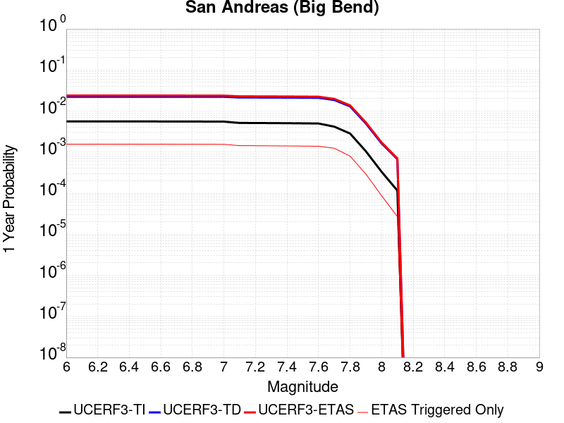
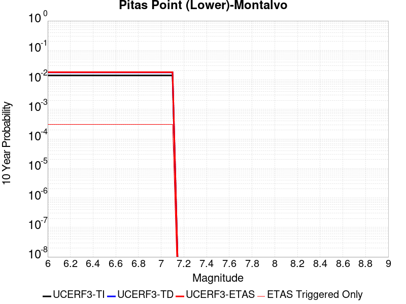
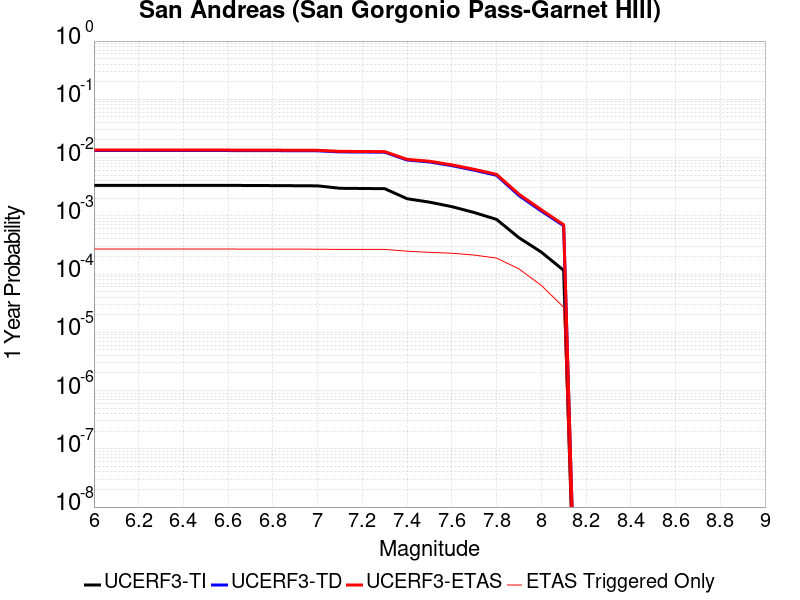
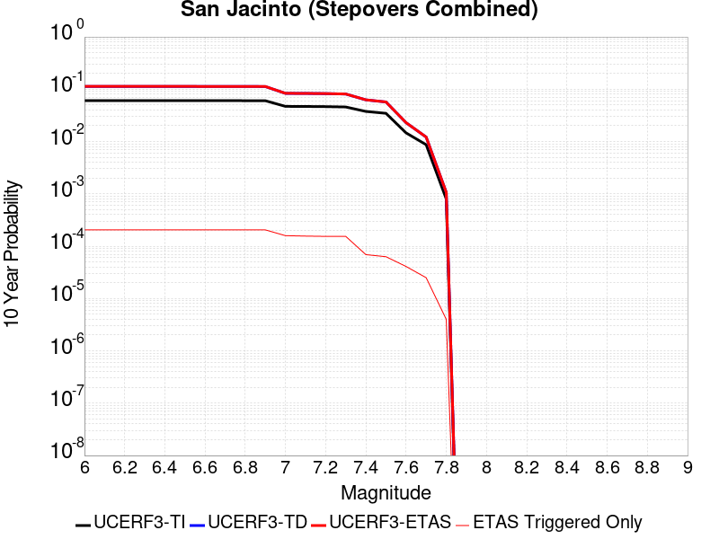
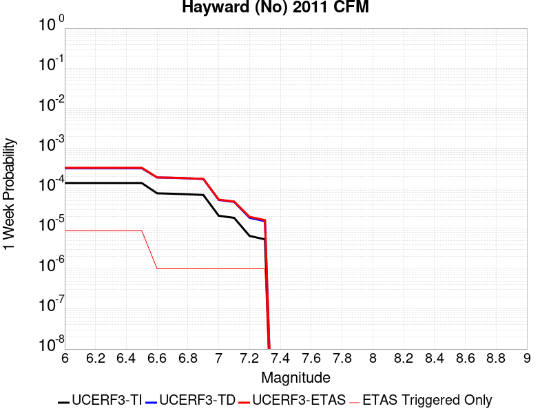

# Parent Section Magnitude-Probability Distributions

Only fault sections with at least one triggered aftershock are plotted. Sections are sorted by total supraseismogenic trigger rate (decreasing)

## Table Of Contents

* [Tank Canyon](#tank-canyon)
* [Little Lake](#little-lake)
* [Garlock (Central)](#garlock-central)
* [Owl Lake](#owl-lake)
* [Garlock (East)](#garlock-east)
* [Garlock (West)](#garlock-west)
* [Death Valley (So)](#death-valley-so)
* [Panamint Valley](#panamint-valley)
* [San Andreas (Mojave N)](#san-andreas-mojave-n)
* [San Andreas (Mojave S)](#san-andreas-mojave-s)
* [San Andreas (Big Bend)](#san-andreas-big-bend)
* [Blackwater](#blackwater)
* [San Andreas (Carrizo) rev](#san-andreas-carrizo-rev)
* [San Andreas (Cholame) rev](#san-andreas-cholame-rev)
* [San Andreas (Parkfield)](#san-andreas-parkfield)
* [Hunter Mountain-Saline Valley](#hunter-mountain-saline-valley)
* [Death Valley (Black Mtns Frontal)](#death-valley-black-mtns-frontal)
* [San Andreas (San Bernardino N)](#san-andreas-san-bernardino-n)
* [San Cayetano](#san-cayetano)
* [Pleito](#pleito)
* [Cucamonga](#cucamonga)
* [San Andreas (San Bernardino S)](#san-andreas-san-bernardino-s)
* [Pitas Point (Lower)-Montalvo](#pitas-point-lower-montalvo)
* [Cleghorn](#cleghorn)
* [Red Mountain](#red-mountain)
* [Pitas Point (Lower West)](#pitas-point-lower-west)
* [Death Valley (No)](#death-valley-no)
* [San Andreas (Coachella) rev](#san-andreas-coachella-rev)
* [Santa Ynez (East)](#santa-ynez-east)
* [Mission Ridge-Arroyo Parida-Santa Ana](#mission-ridge-arroyo-parida-santa-ana)
* [So Sierra Nevada](#so-sierra-nevada)
* [Santa Ynez (West)](#santa-ynez-west)
* [Lenwood-Lockhart-Old Woman Springs](#lenwood-lockhart-old-woman-springs)
* [San Jacinto (San Bernardino)](#san-jacinto-san-bernardino)
* [Death Valley (Fish Lake Valley)](#death-valley-fish-lake-valley)
* [San Andreas (San Gorgonio Pass-Garnet HIll)](#san-andreas-san-gorgonio-pass-garnet-hill)
* [Raymond](#raymond)
* [San Jose](#san-jose)
* [Elsinore (Glen Ivy) rev](#elsinore-glen-ivy-rev)
* [Santa Susana alt 1](#santa-susana-alt-1)
* [Elsinore (Stepovers Combined)](#elsinore-stepovers-combined)
* [Gravel Hills-Harper Lk](#gravel-hills-harper-lk)
* [Hayward (So) 2011 CFM](#hayward-so-2011-cfm)
* [Ventura-Pitas Point](#ventura-pitas-point)
* [Elysian Park (Upper)](#elysian-park-upper)
* [San Gregorio (South) 2011 CFM](#san-gregorio-south-2011-cfm)
* [Oak Ridge (Onshore)](#oak-ridge-onshore)
* [Great Valley 03 Mysterious Ridge](#great-valley-03-mysterious-ridge)
* [Chino alt 1](#chino-alt-1)
* [San Gabriel](#san-gabriel)
* [Independence rev 2011](#independence-rev-2011)
* [San Jacinto (Anza) rev](#san-jacinto-anza-rev)
* [San Jacinto (Clark) rev](#san-jacinto-clark-rev)
* [Helendale-So Lockhart](#helendale-so-lockhart)
* [Emerson-Copper Mtn 2011](#emerson-copper-mtn-2011)
* [Calaveras (No) 2011 CFM](#calaveras-no-2011-cfm)
* [Verdugo](#verdugo)
* [Elsinore (Temecula) rev](#elsinore-temecula-rev)
* [San Juan](#san-juan)
* [San Jacinto (Stepovers Combined)](#san-jacinto-stepovers-combined)
* [Hayward (No) 2011 CFM](#hayward-no-2011-cfm)
* [Rose Canyon](#rose-canyon)
* [Robinson Creek](#robinson-creek)
* [Great Valley 12](#great-valley-12)
* [Anacapa-Dume alt 1](#anacapa-dume-alt-1)
* [Simi-Santa Rosa](#simi-santa-rosa)
* [San Gregorio (North) 2011 CFM](#san-gregorio-north-2011-cfm)
* [San Jacinto (San Jacinto Valley) rev](#san-jacinto-san-jacinto-valley-rev)
* [Mono Lake 2011 CFM](#mono-lake-2011-cfm)

## Tank Canyon
*[(top)](#table-of-contents)*

| 1 Week | 1 Month | 1 Year | 10 Year |
|-----|-----|-----|-----|
|  |  |  |  |

| Magnitude | 1 wk TI Prob | 1 wk TD Prob | 1 wk ETAS Prob | 1 wk ETAS/TD Gain | 1 wk ETAS Triggered Only | 1 mo TI Prob | 1 mo TD Prob | 1 mo ETAS Prob | 1 mo ETAS/TD Gain | 1 mo ETAS Triggered Only | 1 yr TI Prob | 1 yr TD Prob | 1 yr ETAS Prob | 1 yr ETAS/TD Gain | 1 yr ETAS Triggered Only | 10 yr TI Prob | 10 yr TD Prob | 10 yr ETAS Prob | 10 yr ETAS/TD Gain | 10 yr ETAS Triggered Only |
|-----|-----|-----|-----|-----|-----|-----|-----|-----|-----|-----|-----|-----|-----|-----|-----|-----|-----|-----|-----|-----|
| 6.0 | 2.7748038E-5 | 3.5073965E-5 | 0.021263996 | 606.26154 | 0.021229666 | 1.18914744E-4 | 1.5031699E-4 | 0.026614495 | 177.05579 | 0.026468156 | 0.0014468255 | 0.0018300817 | 0.04228527 | 23.105675 | 0.040529363 | 0.014374418 | 0.018297758 | 0.07040079 | 3.8475087 | 0.053074166 |
| 6.1 | 2.7748038E-5 | 3.5073965E-5 | 0.021263996 | 606.26154 | 0.021229666 | 1.18914744E-4 | 1.5031699E-4 | 0.026614495 | 177.05579 | 0.026468156 | 0.0014468255 | 0.0018300817 | 0.04228527 | 23.105675 | 0.040529363 | 0.014374418 | 0.018297758 | 0.07040079 | 3.8475087 | 0.053074166 |
| 6.2 | 2.7748038E-5 | 3.5073965E-5 | 0.021263996 | 606.26154 | 0.021229666 | 1.18914744E-4 | 1.5031699E-4 | 0.026614495 | 177.05579 | 0.026468156 | 0.0014468255 | 0.0018300817 | 0.04228527 | 23.105675 | 0.040529363 | 0.014374418 | 0.018297758 | 0.07040079 | 3.8475087 | 0.053074166 |
| 6.3 | 2.7748038E-5 | 3.5073965E-5 | 0.021263996 | 606.26154 | 0.021229666 | 1.18914744E-4 | 1.5031699E-4 | 0.026614495 | 177.05579 | 0.026468156 | 0.0014468255 | 0.0018300817 | 0.04228527 | 23.105675 | 0.040529363 | 0.014374418 | 0.018297758 | 0.07040079 | 3.8475087 | 0.053074166 |

## Little Lake
*[(top)](#table-of-contents)*

| 1 Week | 1 Month | 1 Year | 10 Year |
|-----|-----|-----|-----|
|  |  |  |  |

| Magnitude | 1 wk TI Prob | 1 wk TD Prob | 1 wk ETAS Prob | 1 wk ETAS/TD Gain | 1 wk ETAS Triggered Only | 1 mo TI Prob | 1 mo TD Prob | 1 mo ETAS Prob | 1 mo ETAS/TD Gain | 1 mo ETAS Triggered Only | 1 yr TI Prob | 1 yr TD Prob | 1 yr ETAS Prob | 1 yr ETAS/TD Gain | 1 yr ETAS Triggered Only | 10 yr TI Prob | 10 yr TD Prob | 10 yr ETAS Prob | 10 yr ETAS/TD Gain | 10 yr ETAS Triggered Only |
|-----|-----|-----|-----|-----|-----|-----|-----|-----|-----|-----|-----|-----|-----|-----|-----|-----|-----|-----|-----|-----|
| 6.0 | 1.27106505E-5 | 1.3900362E-5 | 0.010077174 | 724.95764 | 0.0100634135 | 5.447308E-5 | 5.957219E-5 | 0.013982096 | 234.70844 | 0.013923353 | 6.630079E-4 | 7.25151E-4 | 0.019735342 | 27.215494 | 0.019023987 | 0.006610333 | 0.0072377534 | 0.03146148 | 4.346857 | 0.024400331 |
| 6.1 | 1.27106505E-5 | 1.3900362E-5 | 0.010077174 | 724.95764 | 0.0100634135 | 5.447308E-5 | 5.957219E-5 | 0.013982096 | 234.70844 | 0.013923353 | 6.630079E-4 | 7.25151E-4 | 0.019735342 | 27.215494 | 0.019023987 | 0.006610333 | 0.0072377534 | 0.03146148 | 4.346857 | 0.024400331 |
| 6.2 | 1.27106505E-5 | 1.3900362E-5 | 0.010077174 | 724.95764 | 0.0100634135 | 5.447308E-5 | 5.957219E-5 | 0.013982096 | 234.70844 | 0.013923353 | 6.630079E-4 | 7.25151E-4 | 0.019735342 | 27.215494 | 0.019023987 | 0.006610333 | 0.0072377534 | 0.03146148 | 4.346857 | 0.024400331 |
| 6.3 | 1.27106505E-5 | 1.3900362E-5 | 0.010077174 | 724.95764 | 0.0100634135 | 5.447308E-5 | 5.957219E-5 | 0.013982096 | 234.70844 | 0.013923353 | 6.630079E-4 | 7.25151E-4 | 0.019735342 | 27.215494 | 0.019023987 | 0.006610333 | 0.0072377534 | 0.03146148 | 4.346857 | 0.024400331 |
| 6.4 | 1.27106505E-5 | 1.3900362E-5 | 0.010077174 | 724.95764 | 0.0100634135 | 5.447308E-5 | 5.957219E-5 | 0.013982096 | 234.70844 | 0.013923353 | 6.630079E-4 | 7.25151E-4 | 0.019735342 | 27.215494 | 0.019023987 | 0.006610333 | 0.0072377534 | 0.03146148 | 4.346857 | 0.024400331 |
| 6.5 | 1.27106505E-5 | 1.3900362E-5 | 0.010077174 | 724.95764 | 0.0100634135 | 5.447308E-5 | 5.957219E-5 | 0.013982096 | 234.70844 | 0.013923353 | 6.630079E-4 | 7.25151E-4 | 0.019735342 | 27.215494 | 0.019023987 | 0.006610333 | 0.0072377534 | 0.03146148 | 4.346857 | 0.024400331 |
| 6.6 | 1.08505255E-5 | 1.1856941E-5 | 0.008972324 | 756.71497 | 0.008960574 | 4.6501424E-5 | 5.0815026E-5 | 0.012043589 | 237.0084 | 0.011993383 | 5.6600774E-4 | 6.1859656E-4 | 0.016462112 | 26.612034 | 0.015853323 | 0.005645683 | 0.006178476 | 0.026728962 | 4.326142 | 0.020678246 |
| 6.7 | 7.97625E-6 | 8.706619E-6 | 0.0062121265 | 713.4947 | 0.006203474 | 3.4183482E-5 | 3.7314083E-5 | 0.008584004 | 230.04729 | 0.008547009 | 4.161044E-4 | 4.5429895E-4 | 0.011891064 | 26.174536 | 0.011441963 | 0.004153261 | 0.0045429897 | 0.018952003 | 4.171703 | 0.014474773 |
| 6.8 | 7.97625E-6 | 8.706619E-6 | 0.0062121265 | 713.4947 | 0.006203474 | 3.4183482E-5 | 3.7314083E-5 | 0.008584004 | 230.04729 | 0.008547009 | 4.161044E-4 | 4.5429895E-4 | 0.011891064 | 26.174536 | 0.011441963 | 0.004153261 | 0.0045429897 | 0.018952003 | 4.171703 | 0.014474773 |

## Garlock (Central)
*[(top)](#table-of-contents)*

| 1 Week | 1 Month | 1 Year | 10 Year |
|-----|-----|-----|-----|
|  |  |  |  |

| Magnitude | 1 wk TI Prob | 1 wk TD Prob | 1 wk ETAS Prob | 1 wk ETAS/TD Gain | 1 wk ETAS Triggered Only | 1 mo TI Prob | 1 mo TD Prob | 1 mo ETAS Prob | 1 mo ETAS/TD Gain | 1 mo ETAS Triggered Only | 1 yr TI Prob | 1 yr TD Prob | 1 yr ETAS Prob | 1 yr ETAS/TD Gain | 1 yr ETAS Triggered Only | 10 yr TI Prob | 10 yr TD Prob | 10 yr ETAS Prob | 10 yr ETAS/TD Gain | 10 yr ETAS Triggered Only |
|-----|-----|-----|-----|-----|-----|-----|-----|-----|-----|-----|-----|-----|-----|-----|-----|-----|-----|-----|-----|-----|
| 6.0 | 2.575808E-5 | 1.9313613E-5 | 0.012150317 | 629.1064 | 0.012131238 | 1.10387096E-4 | 8.277037E-5 | 0.014694189 | 177.52957 | 0.014612627 | 0.0013431342 | 0.0010073289 | 0.020012151 | 19.866554 | 0.019023987 | 0.013350452 | 0.0100695705 | 0.0342242 | 3.3987746 | 0.024400331 |
| 6.1 | 2.575808E-5 | 1.9313613E-5 | 0.012150317 | 629.1064 | 0.012131238 | 1.10387096E-4 | 8.277037E-5 | 0.014694189 | 177.52957 | 0.014612627 | 0.0013431342 | 0.0010073289 | 0.020012151 | 19.866554 | 0.019023987 | 0.013350452 | 0.0100695705 | 0.0342242 | 3.3987746 | 0.024400331 |
| 6.2 | 2.575808E-5 | 1.9313613E-5 | 0.012150317 | 629.1064 | 0.012131238 | 1.10387096E-4 | 8.277037E-5 | 0.014694189 | 177.52957 | 0.014612627 | 0.0013431342 | 0.0010073289 | 0.020012151 | 19.866554 | 0.019023987 | 0.013350452 | 0.0100695705 | 0.0342242 | 3.3987746 | 0.024400331 |
| 6.3 | 2.575808E-5 | 1.9313613E-5 | 0.012150317 | 629.1064 | 0.012131238 | 1.10387096E-4 | 8.277037E-5 | 0.014694189 | 177.52957 | 0.014612627 | 0.0013431342 | 0.0010073289 | 0.020012151 | 19.866554 | 0.019023987 | 0.013350452 | 0.0100695705 | 0.0342242 | 3.3987746 | 0.024400331 |
| 6.4 | 2.575808E-5 | 1.9313613E-5 | 0.012150317 | 629.1064 | 0.012131238 | 1.10387096E-4 | 8.277037E-5 | 0.014694189 | 177.52957 | 0.014612627 | 0.0013431342 | 0.0010073289 | 0.020012151 | 19.866554 | 0.019023987 | 0.013350452 | 0.0100695705 | 0.0342242 | 3.3987746 | 0.024400331 |
| 6.5 | 2.575808E-5 | 1.9313613E-5 | 0.012150317 | 629.1064 | 0.012131238 | 1.10387096E-4 | 8.277037E-5 | 0.014694189 | 177.52957 | 0.014612627 | 0.0013431342 | 0.0010073289 | 0.020012151 | 19.866554 | 0.019023987 | 0.013350452 | 0.0100695705 | 0.0342242 | 3.3987746 | 0.024400331 |
| 6.6 | 2.540234E-5 | 1.885198E-5 | 0.012012009 | 637.1749 | 0.011993383 | 1.0886263E-4 | 8.0792066E-5 | 0.014554395 | 180.14633 | 0.014474773 | 0.0013245966 | 9.83265E-4 | 0.019713107 | 20.048622 | 0.018748276 | 0.013167289 | 0.009831364 | 0.033582307 | 3.415834 | 0.023986766 |
| 6.7 | 2.4966947E-5 | 1.8286464E-5 | 0.011460041 | 626.69525 | 0.011441963 | 1.06996806E-4 | 7.8368575E-5 | 0.013862786 | 176.89215 | 0.013785497 | 0.0013019076 | 9.5378514E-4 | 0.018720116 | 19.627182 | 0.017783292 | 0.012943068 | 0.009539624 | 0.031932168 | 3.3473191 | 0.022608217 |
| 6.8 | 2.4548952E-5 | 1.7797542E-5 | 0.011046 | 620.64746 | 0.011028398 | 1.0520555E-4 | 7.627332E-5 | 0.013447186 | 176.30263 | 0.013371932 | 0.001280125 | 9.282974E-4 | 0.018144174 | 19.545647 | 0.017231872 | 0.012727758 | 0.009286596 | 0.03086541 | 3.3236516 | 0.021781087 |
| 6.9 | 2.3994342E-5 | 1.7148153E-5 | 0.010080389 | 587.84106 | 0.0100634135 | 1.0282884E-4 | 7.349039E-5 | 0.012065992 | 164.18463 | 0.011993383 | 0.0012512221 | 8.944436E-4 | 0.015907196 | 17.78446 | 0.015026192 | 0.012442005 | 0.0089510605 | 0.028214626 | 3.1520987 | 0.019437551 |
| 7.0 | 2.343005E-5 | 1.6491087E-5 | 0.009528328 | 577.7865 | 0.009511993 | 1.0041064E-4 | 7.067455E-5 | 0.011511829 | 162.88509 | 0.011441963 | 0.0012218138 | 8.601883E-4 | 0.015184773 | 17.65285 | 0.014336918 | 0.01215118 | 0.008610493 | 0.027060669 | 3.1427553 | 0.018610422 |
| 7.1 | 2.2814058E-5 | 1.5782754E-5 | 0.009114068 | 577.47003 | 0.009098428 | 9.777087E-5 | 6.763899E-5 | 0.0108196 | 159.96098 | 0.010752688 | 0.0011897103 | 8.2325895E-4 | 0.014459666 | 17.563934 | 0.013647643 | 0.011833611 | 0.00824334 | 0.026016757 | 3.156094 | 0.017921148 |
| 7.2 | 2.2145266E-5 | 1.5027377E-5 | 0.008010495 | 533.0601 | 0.007995589 | 9.490483E-5 | 6.440182E-5 | 0.009713628 | 150.82848 | 0.009649849 | 0.0011548538 | 7.8387547E-4 | 0.013181098 | 16.815296 | 0.012406948 | 0.011488707 | 0.007851825 | 0.024264533 | 3.0903049 | 0.016542597 |
| 7.3 | 1.9954436E-5 | 1.3199953E-5 | 0.0060787387 | 460.51215 | 0.006065619 | 8.551621E-5 | 5.657036E-5 | 0.007500318 | 132.58388 | 0.007444169 | 0.0010406625 | 6.8859005E-4 | 0.010469554 | 15.204334 | 0.009787703 | 0.010358025 | 0.006900618 | 0.019495757 | 2.8252192 | 0.012682658 |
| 7.4 | 1.918037E-5 | 1.2553606E-5 | 0.0060780966 | 484.17136 | 0.006065619 | 8.2198996E-5 | 5.3800417E-5 | 0.0074975686 | 139.35893 | 0.007444169 | 0.0010003132 | 6.5488677E-4 | 0.01043618 | 15.935854 | 0.009787703 | 0.009958224 | 0.006564366 | 0.01902682 | 2.898501 | 0.012544803 |
| 7.5 | 1.6994161E-5 | 1.0764553E-5 | 0.0044220765 | 410.79984 | 0.0044113593 | 7.283008E-5 | 4.613333E-5 | 0.0056979265 | 123.50999 | 0.005652054 | 8.863455E-4 | 5.615903E-4 | 0.0077260234 | 13.757401 | 0.007168459 | 0.008828186 | 0.005632708 | 0.015091123 | 2.679195 | 0.009511993 |
| 7.6 | 1.621788E-5 | 1.012848E-5 | 0.0040078824 | 395.70422 | 0.0039977944 | 6.950335E-5 | 4.34074E-5 | 0.005281669 | 121.676704 | 0.0052384892 | 8.458747E-4 | 5.2841863E-4 | 0.007141961 | 13.515724 | 0.006617039 | 0.0084266225 | 0.005301458 | 0.014214527 | 2.681249 | 0.008960574 |
| 7.7 | 7.713584E-6 | 3.2171508E-6 | 6.924898E-4 | 215.2494 | 6.8927486E-4 | 3.3057797E-5 | 1.378779E-5 | 9.787594E-4 | 70.987404 | 9.649848E-4 | 4.0240434E-4 | 1.6786634E-4 | 0.0016840165 | 10.03189 | 0.0015164048 | 0.0040167645 | 0.0016902693 | 0.0036169768 | 2.1398818 | 0.0019299696 |

## Owl Lake
*[(top)](#table-of-contents)*

| 1 Week | 1 Month | 1 Year | 10 Year |
|-----|-----|-----|-----|
|  |  |  |  |

| Magnitude | 1 wk TI Prob | 1 wk TD Prob | 1 wk ETAS Prob | 1 wk ETAS/TD Gain | 1 wk ETAS Triggered Only | 1 mo TI Prob | 1 mo TD Prob | 1 mo ETAS Prob | 1 mo ETAS/TD Gain | 1 mo ETAS Triggered Only | 1 yr TI Prob | 1 yr TD Prob | 1 yr ETAS Prob | 1 yr ETAS/TD Gain | 1 yr ETAS Triggered Only | 10 yr TI Prob | 10 yr TD Prob | 10 yr ETAS Prob | 10 yr ETAS/TD Gain | 10 yr ETAS Triggered Only |
|-----|-----|-----|-----|-----|-----|-----|-----|-----|-----|-----|-----|-----|-----|-----|-----|-----|-----|-----|-----|-----|
| 6.0 | 3.637175E-5 | 4.988367E-5 | 0.0043231747 | 86.66513 | 0.0042735045 | 1.5586962E-4 | 2.1378716E-4 | 0.0057268073 | 26.787424 | 0.005514199 | 0.0018960608 | 0.0026025574 | 0.010852329 | 4.1698713 | 0.008271298 | 0.018799646 | 0.025995217 | 0.038348187 | 1.4752016 | 0.012682658 |
| 6.1 | 3.637175E-5 | 4.988367E-5 | 0.0043231747 | 86.66513 | 0.0042735045 | 1.5586962E-4 | 2.1378716E-4 | 0.0057268073 | 26.787424 | 0.005514199 | 0.0018960608 | 0.0026025574 | 0.010852329 | 4.1698713 | 0.008271298 | 0.018799646 | 0.025995217 | 0.038348187 | 1.4752016 | 0.012682658 |
| 6.2 | 3.637175E-5 | 4.988367E-5 | 0.0043231747 | 86.66513 | 0.0042735045 | 1.5586962E-4 | 2.1378716E-4 | 0.0057268073 | 26.787424 | 0.005514199 | 0.0018960608 | 0.0026025574 | 0.010852329 | 4.1698713 | 0.008271298 | 0.018799646 | 0.025995217 | 0.038348187 | 1.4752016 | 0.012682658 |
| 6.3 | 3.637175E-5 | 4.988367E-5 | 0.0043231747 | 86.66513 | 0.0042735045 | 1.5586962E-4 | 2.1378716E-4 | 0.0057268073 | 26.787424 | 0.005514199 | 0.0018960608 | 0.0026025574 | 0.010852329 | 4.1698713 | 0.008271298 | 0.018799646 | 0.025995217 | 0.038348187 | 1.4752016 | 0.012682658 |
| 6.4 | 3.637175E-5 | 4.988367E-5 | 0.0043231747 | 86.66513 | 0.0042735045 | 1.5586962E-4 | 2.1378716E-4 | 0.0057268073 | 26.787424 | 0.005514199 | 0.0018960608 | 0.0026025574 | 0.010852329 | 4.1698713 | 0.008271298 | 0.018799646 | 0.025995217 | 0.038348187 | 1.4752016 | 0.012682658 |
| 6.5 | 3.637175E-5 | 4.988367E-5 | 0.0043231747 | 86.66513 | 0.0042735045 | 1.5586962E-4 | 2.1378716E-4 | 0.0057268073 | 26.787424 | 0.005514199 | 0.0018960608 | 0.0026025574 | 0.010852329 | 4.1698713 | 0.008271298 | 0.018799646 | 0.025995217 | 0.038348187 | 1.4752016 | 0.012682658 |

## Garlock (East)
*[(top)](#table-of-contents)*

| 1 Week | 1 Month | 1 Year | 10 Year |
|-----|-----|-----|-----|
|  |  |  |  |

| Magnitude | 1 wk TI Prob | 1 wk TD Prob | 1 wk ETAS Prob | 1 wk ETAS/TD Gain | 1 wk ETAS Triggered Only | 1 mo TI Prob | 1 mo TD Prob | 1 mo ETAS Prob | 1 mo ETAS/TD Gain | 1 mo ETAS Triggered Only | 1 yr TI Prob | 1 yr TD Prob | 1 yr ETAS Prob | 1 yr ETAS/TD Gain | 1 yr ETAS Triggered Only | 10 yr TI Prob | 10 yr TD Prob | 10 yr ETAS Prob | 10 yr ETAS/TD Gain | 10 yr ETAS Triggered Only |
|-----|-----|-----|-----|-----|-----|-----|-----|-----|-----|-----|-----|-----|-----|-----|-----|-----|-----|-----|-----|-----|
| 6.0 | 2.2327951E-5 | 1.8303952E-5 | 0.00429173 | 234.47014 | 0.0042735045 | 9.5687705E-5 | 7.8444085E-5 | 0.0054543666 | 69.5319 | 0.005376344 | 0.0011643751 | 9.548048E-4 | 0.008805036 | 9.221817 | 0.007857733 | 0.0115829315 | 0.0096519785 | 0.020027833 | 2.0749977 | 0.0104769785 |
| 6.1 | 2.2327951E-5 | 1.8303952E-5 | 0.00429173 | 234.47014 | 0.0042735045 | 9.5687705E-5 | 7.8444085E-5 | 0.0054543666 | 69.5319 | 0.005376344 | 0.0011643751 | 9.548048E-4 | 0.008805036 | 9.221817 | 0.007857733 | 0.0115829315 | 0.0096519785 | 0.020027833 | 2.0749977 | 0.0104769785 |
| 6.2 | 2.2327951E-5 | 1.8303952E-5 | 0.00429173 | 234.47014 | 0.0042735045 | 9.5687705E-5 | 7.8444085E-5 | 0.0054543666 | 69.5319 | 0.005376344 | 0.0011643751 | 9.548048E-4 | 0.008805036 | 9.221817 | 0.007857733 | 0.0115829315 | 0.0096519785 | 0.020027833 | 2.0749977 | 0.0104769785 |
| 6.3 | 2.2327951E-5 | 1.8303952E-5 | 0.00429173 | 234.47014 | 0.0042735045 | 9.5687705E-5 | 7.8444085E-5 | 0.0054543666 | 69.5319 | 0.005376344 | 0.0011643751 | 9.548048E-4 | 0.008805036 | 9.221817 | 0.007857733 | 0.0115829315 | 0.0096519785 | 0.020027833 | 2.0749977 | 0.0104769785 |
| 6.4 | 2.2327951E-5 | 1.8303952E-5 | 0.00429173 | 234.47014 | 0.0042735045 | 9.5687705E-5 | 7.8444085E-5 | 0.0054543666 | 69.5319 | 0.005376344 | 0.0011643751 | 9.548048E-4 | 0.008805036 | 9.221817 | 0.007857733 | 0.0115829315 | 0.0096519785 | 0.020027833 | 2.0749977 | 0.0104769785 |
| 6.5 | 2.2327951E-5 | 1.8303952E-5 | 0.00429173 | 234.47014 | 0.0042735045 | 9.5687705E-5 | 7.8444085E-5 | 0.0054543666 | 69.5319 | 0.005376344 | 0.0011643751 | 9.548048E-4 | 0.008805036 | 9.221817 | 0.007857733 | 0.0115829315 | 0.0096519785 | 0.020027833 | 2.0749977 | 0.0104769785 |
| 6.6 | 2.222123E-5 | 1.816971E-5 | 0.0042915964 | 236.19508 | 0.0042735045 | 9.523036E-5 | 7.7868805E-5 | 0.0054537943 | 70.038246 | 0.005376344 | 0.0011588129 | 9.4780687E-4 | 0.008798093 | 9.28258 | 0.007857733 | 0.011527888 | 0.009581773 | 0.019958364 | 2.0829508 | 0.0104769785 |
| 6.7 | 2.2076227E-5 | 1.798404E-5 | 0.0042914115 | 238.62332 | 0.0042735045 | 9.4608964E-5 | 7.707312E-5 | 0.0054530026 | 70.75103 | 0.005376344 | 0.0011512554 | 9.381278E-4 | 0.00878849 | 9.368115 | 0.007857733 | 0.011453095 | 0.009485973 | 0.01972702 | 2.079599 | 0.010339123 |
| 6.8 | 2.1962227E-5 | 1.7854036E-5 | 0.004291282 | 240.3536 | 0.0042735045 | 9.4120434E-5 | 7.651599E-5 | 0.0054524485 | 71.25894 | 0.005376344 | 0.0011453138 | 9.313506E-4 | 0.008781766 | 9.429066 | 0.007857733 | 0.01139429 | 0.00941876 | 0.019523945 | 2.0728784 | 0.010201268 |
| 6.9 | 1.1702579E-5 | 6.6732687E-6 | 0.0038665868 | 579.41425 | 0.0038599393 | 5.0152947E-5 | 2.8599494E-5 | 0.0044398326 | 155.24165 | 0.0044113593 | 6.10441E-4 | 3.481581E-4 | 0.0062738582 | 18.020142 | 0.005927764 | 0.0060876687 | 0.0034954504 | 0.0107762255 | 3.0829291 | 0.0073063136 |
| 7.0 | 1.153538E-5 | 6.4796777E-6 | 0.003866394 | 596.69543 | 0.0038599393 | 4.9436403E-5 | 2.7769835E-5 | 0.0044390066 | 159.84995 | 0.0044113593 | 6.01722E-4 | 3.3806017E-4 | 0.0062638205 | 18.528713 | 0.005927764 | 0.006000953 | 0.0033946347 | 0.01053876 | 3.1045341 | 0.007168459 |
| 7.1 | 1.135938E-5 | 6.273818E-6 | 0.0037283348 | 594.26886 | 0.0037220845 | 4.868215E-5 | 2.6887597E-5 | 0.0041624256 | 154.80838 | 0.004135649 | 5.925439E-4 | 3.2732222E-4 | 0.0059775263 | 18.261902 | 0.005652054 | 0.0059096646 | 0.0032873498 | 0.01015744 | 3.0898566 | 0.0068927486 |
| 7.2 | 1.1168294E-5 | 6.048814E-6 | 0.0033145482 | 547.9666 | 0.0033085195 | 4.786324E-5 | 2.5923315E-5 | 0.0037479112 | 144.57684 | 0.0037220845 | 5.825791E-4 | 3.1558552E-4 | 0.0055524213 | 17.59403 | 0.0052384892 | 0.005810542 | 0.0031701238 | 0.00949135 | 2.9939997 | 0.006341329 |
| 7.3 | 1.0952553E-5 | 5.8686815E-6 | 0.0027629521 | 470.79605 | 0.0027570995 | 4.693867E-5 | 2.5151334E-5 | 0.003195736 | 127.0603 | 0.0031706644 | 5.713284E-4 | 3.0618932E-4 | 0.0048540104 | 15.852971 | 0.004549214 | 0.0056986175 | 0.0030760262 | 0.008435832 | 2.742445 | 0.005376344 |
| 7.4 | 1.0735812E-5 | 5.691247E-6 | 0.0027627752 | 485.44284 | 0.0027570995 | 4.6009813E-5 | 2.4390914E-5 | 0.003194978 | 130.9905 | 0.0031706644 | 5.600255E-4 | 2.9693378E-4 | 0.0048447973 | 16.316086 | 0.004549214 | 0.0055861627 | 0.0029833042 | 0.008343609 | 2.7967677 | 0.005376344 |
| 7.5 | 9.0273E-6 | 4.284415E-6 | 0.0013828282 | 322.75778 | 0.0013785497 | 3.8687853E-5 | 1.8361723E-5 | 0.0016725911 | 91.09118 | 0.0016542597 | 4.709228E-4 | 2.2354414E-4 | 0.0024287307 | 10.864658 | 0.0022056797 | 0.004699261 | 0.0022480614 | 0.0048614177 | 2.1624935 | 0.0026192446 |
| 7.6 | 8.549585E-6 | 3.885532E-6 | 9.6886663E-4 | 249.35239 | 9.649848E-4 | 3.6640562E-5 | 1.6652246E-5 | 0.0012573263 | 75.504906 | 0.0012406948 | 4.4600753E-4 | 2.027353E-4 | 0.0019944867 | 9.837886 | 0.0017921147 | 0.0044511347 | 0.0020396118 | 0.0042407927 | 2.0792155 | 0.0022056797 |
| 7.7 | 7.713584E-6 | 3.2171508E-6 | 6.924898E-4 | 215.2494 | 6.8927486E-4 | 3.3057797E-5 | 1.378779E-5 | 9.787594E-4 | 70.987404 | 9.649848E-4 | 4.0240434E-4 | 1.6786634E-4 | 0.0016840165 | 10.03189 | 0.0015164048 | 0.0040167645 | 0.0016902693 | 0.0036169768 | 2.1398818 | 0.0019299696 |

## Garlock (West)
*[(top)](#table-of-contents)*

| 1 Week | 1 Month | 1 Year | 10 Year |
|-----|-----|-----|-----|
|  |  |  |  |

| Magnitude | 1 wk TI Prob | 1 wk TD Prob | 1 wk ETAS Prob | 1 wk ETAS/TD Gain | 1 wk ETAS Triggered Only | 1 mo TI Prob | 1 mo TD Prob | 1 mo ETAS Prob | 1 mo ETAS/TD Gain | 1 mo ETAS Triggered Only | 1 yr TI Prob | 1 yr TD Prob | 1 yr ETAS Prob | 1 yr ETAS/TD Gain | 1 yr ETAS Triggered Only | 10 yr TI Prob | 10 yr TD Prob | 10 yr ETAS Prob | 10 yr ETAS/TD Gain | 10 yr ETAS Triggered Only |
|-----|-----|-----|-----|-----|-----|-----|-----|-----|-----|-----|-----|-----|-----|-----|-----|-----|-----|-----|-----|-----|
| 6.0 | 2.516656E-5 | 1.8065048E-5 | 0.005118607 | 283.34314 | 0.005100634 | 1.07852225E-4 | 7.741977E-5 | 0.006418258 | 82.902054 | 0.006341329 | 0.0013123099 | 9.42255E-4 | 0.00893031 | 9.477593 | 0.007995589 | 0.013045873 | 0.009421492 | 0.019799761 | 2.1015527 | 0.0104769785 |
| 6.1 | 2.516656E-5 | 1.8065048E-5 | 0.005118607 | 283.34314 | 0.005100634 | 1.07852225E-4 | 7.741977E-5 | 0.006418258 | 82.902054 | 0.006341329 | 0.0013123099 | 9.42255E-4 | 0.00893031 | 9.477593 | 0.007995589 | 0.013045873 | 0.009421492 | 0.019799761 | 2.1015527 | 0.0104769785 |
| 6.2 | 2.516656E-5 | 1.8065048E-5 | 0.005118607 | 283.34314 | 0.005100634 | 1.07852225E-4 | 7.741977E-5 | 0.006418258 | 82.902054 | 0.006341329 | 0.0013123099 | 9.42255E-4 | 0.00893031 | 9.477593 | 0.007995589 | 0.013045873 | 0.009421492 | 0.019799761 | 2.1015527 | 0.0104769785 |
| 6.3 | 2.516656E-5 | 1.8065048E-5 | 0.005118607 | 283.34314 | 0.005100634 | 1.07852225E-4 | 7.741977E-5 | 0.006418258 | 82.902054 | 0.006341329 | 0.0013123099 | 9.42255E-4 | 0.00893031 | 9.477593 | 0.007995589 | 0.013045873 | 0.009421492 | 0.019799761 | 2.1015527 | 0.0104769785 |
| 6.4 | 2.516656E-5 | 1.8065048E-5 | 0.005118607 | 283.34314 | 0.005100634 | 1.07852225E-4 | 7.741977E-5 | 0.006418258 | 82.902054 | 0.006341329 | 0.0013123099 | 9.42255E-4 | 0.00893031 | 9.477593 | 0.007995589 | 0.013045873 | 0.009421492 | 0.019799761 | 2.1015527 | 0.0104769785 |
| 6.5 | 2.516656E-5 | 1.8065048E-5 | 0.005118607 | 283.34314 | 0.005100634 | 1.07852225E-4 | 7.741977E-5 | 0.006418258 | 82.902054 | 0.006341329 | 0.0013123099 | 9.42255E-4 | 0.00893031 | 9.477593 | 0.007995589 | 0.013045873 | 0.009421492 | 0.019799761 | 2.1015527 | 0.0104769785 |
| 6.6 | 2.498869E-5 | 1.7877663E-5 | 0.005118421 | 286.30258 | 0.005100634 | 1.07089996E-4 | 7.6616736E-5 | 0.00641746 | 83.760544 | 0.006341329 | 0.0013030408 | 9.3248655E-4 | 0.008920619 | 9.566485 | 0.007995589 | 0.012954267 | 0.009324339 | 0.019703627 | 2.1131392 | 0.0104769785 |
| 6.7 | 2.4627925E-5 | 1.7497801E-5 | 0.0051180427 | 292.49634 | 0.005100634 | 1.0554398E-4 | 7.498886E-5 | 0.006415842 | 85.55728 | 0.006341329 | 0.0012842404 | 9.1268384E-4 | 0.008900975 | 9.752528 | 0.007995589 | 0.012768441 | 0.009128104 | 0.019509448 | 2.1372945 | 0.0104769785 |
| 6.8 | 2.4270235E-5 | 1.716136E-5 | 0.005117708 | 298.21112 | 0.005100634 | 1.04011146E-4 | 7.354704E-5 | 0.0064144097 | 87.21506 | 0.006341329 | 0.0012656 | 8.9514436E-4 | 0.008883576 | 9.924183 | 0.007995589 | 0.012584164 | 0.0089538675 | 0.019337036 | 2.1596293 | 0.0104769785 |
| 6.9 | 2.3913764E-5 | 1.6823105E-5 | 0.005117371 | 304.18707 | 0.005100634 | 1.0248353E-4 | 7.2097464E-5 | 0.006412969 | 88.94861 | 0.006341329 | 0.0012470228 | 8.775101E-4 | 0.008866083 | 10.103682 | 0.007995589 | 0.012400482 | 0.00877859 | 0.019163596 | 2.1829925 | 0.0104769785 |
| 7.0 | 2.3579369E-5 | 1.6492264E-5 | 0.0051170425 | 310.26926 | 0.005100634 | 1.0105052E-4 | 7.067965E-5 | 0.0064115603 | 90.71297 | 0.006341329 | 0.0012295957 | 8.6026196E-4 | 0.008848973 | 10.286369 | 0.007995589 | 0.012228143 | 0.008607132 | 0.018993935 | 2.2067668 | 0.0104769785 |
| 7.1 | 2.3205374E-5 | 1.6105636E-5 | 0.005116658 | 317.6936 | 0.005100634 | 9.944781E-5 | 6.902276E-5 | 0.0064099138 | 92.86667 | 0.006341329 | 0.0012101046 | 8.401051E-4 | 0.008828976 | 10.509372 | 0.007995589 | 0.0120353615 | 0.008406721 | 0.018795623 | 2.2357852 | 0.0104769785 |
| 7.2 | 2.2799322E-5 | 1.5676578E-5 | 0.004978378 | 317.56787 | 0.004962779 | 9.770772E-5 | 6.718404E-5 | 0.006270241 | 93.32932 | 0.006203474 | 0.0011889422 | 8.177357E-4 | 0.008669044 | 10.601278 | 0.007857733 | 0.011826012 | 0.008184515 | 0.018439017 | 2.2529151 | 0.010339123 |
| 7.3 | 1.8228246E-5 | 1.1798695E-5 | 0.004836666 | 409.93228 | 0.0048249243 | 7.811871E-5 | 5.0565202E-5 | 0.0061158775 | 120.95032 | 0.006065619 | 9.506803E-4 | 6.1551924E-4 | 0.008330646 | 13.534339 | 0.0077198786 | 0.0094662355 | 0.006171021 | 0.016309338 | 2.6428912 | 0.010201268 |
| 7.4 | 1.7670916E-5 | 1.132978E-5 | 0.0048361993 | 426.8573 | 0.0048249243 | 7.5730306E-5 | 4.8555645E-5 | 0.0061138803 | 125.91492 | 0.006065619 | 9.216264E-4 | 5.9106643E-4 | 0.008306382 | 14.053213 | 0.0077198786 | 0.009178135 | 0.0059269792 | 0.015930748 | 2.6878357 | 0.0100634135 |
| 7.5 | 1.6994161E-5 | 1.0764553E-5 | 0.0044220765 | 410.79984 | 0.0044113593 | 7.283008E-5 | 4.613333E-5 | 0.0056979265 | 123.50999 | 0.005652054 | 8.863455E-4 | 5.615903E-4 | 0.0077260234 | 13.757401 | 0.007168459 | 0.008828186 | 0.005632708 | 0.015091123 | 2.679195 | 0.009511993 |
| 7.6 | 1.621788E-5 | 1.012848E-5 | 0.0040078824 | 395.70422 | 0.0039977944 | 6.950335E-5 | 4.34074E-5 | 0.005281669 | 121.676704 | 0.0052384892 | 8.458747E-4 | 5.2841863E-4 | 0.007141961 | 13.515724 | 0.006617039 | 0.0084266225 | 0.005301458 | 0.014214527 | 2.681249 | 0.008960574 |
| 7.7 | 7.713584E-6 | 3.2171508E-6 | 6.924898E-4 | 215.2494 | 6.8927486E-4 | 3.3057797E-5 | 1.378779E-5 | 9.787594E-4 | 70.987404 | 9.649848E-4 | 4.0240434E-4 | 1.6786634E-4 | 0.0016840165 | 10.03189 | 0.0015164048 | 0.0040167645 | 0.0016902693 | 0.0036169768 | 2.1398818 | 0.0019299696 |

## Death Valley (So)
*[(top)](#table-of-contents)*

| 1 Week | 1 Month | 1 Year | 10 Year |
|-----|-----|-----|-----|
|  |  |  |  |

| Magnitude | 1 wk TI Prob | 1 wk TD Prob | 1 wk ETAS Prob | 1 wk ETAS/TD Gain | 1 wk ETAS Triggered Only | 1 mo TI Prob | 1 mo TD Prob | 1 mo ETAS Prob | 1 mo ETAS/TD Gain | 1 mo ETAS Triggered Only | 1 yr TI Prob | 1 yr TD Prob | 1 yr ETAS Prob | 1 yr ETAS/TD Gain | 1 yr ETAS Triggered Only | 10 yr TI Prob | 10 yr TD Prob | 10 yr ETAS Prob | 10 yr ETAS/TD Gain | 10 yr ETAS Triggered Only |
|-----|-----|-----|-----|-----|-----|-----|-----|-----|-----|-----|-----|-----|-----|-----|-----|-----|-----|-----|-----|-----|
| 6.0 | 4.4658216E-5 | 6.228887E-5 | 0.0019921383 | 31.982254 | 0.0019299696 | 1.9137832E-4 | 2.669324E-4 | 0.0035745688 | 13.391288 | 0.0033085195 | 0.0023275411 | 0.0032461619 | 0.009154683 | 2.8201563 | 0.005927764 | 0.023033133 | 0.032094594 | 0.04050072 | 1.2619172 | 0.008684863 |
| 6.1 | 4.4658216E-5 | 6.228887E-5 | 0.0019921383 | 31.982254 | 0.0019299696 | 1.9137832E-4 | 2.669324E-4 | 0.0035745688 | 13.391288 | 0.0033085195 | 0.0023275411 | 0.0032461619 | 0.009154683 | 2.8201563 | 0.005927764 | 0.023033133 | 0.032094594 | 0.04050072 | 1.2619172 | 0.008684863 |
| 6.2 | 4.4658216E-5 | 6.228887E-5 | 0.0019921383 | 31.982254 | 0.0019299696 | 1.9137832E-4 | 2.669324E-4 | 0.0035745688 | 13.391288 | 0.0033085195 | 0.0023275411 | 0.0032461619 | 0.009154683 | 2.8201563 | 0.005927764 | 0.023033133 | 0.032094594 | 0.04050072 | 1.2619172 | 0.008684863 |
| 6.3 | 4.4658216E-5 | 6.228887E-5 | 0.0019921383 | 31.982254 | 0.0019299696 | 1.9137832E-4 | 2.669324E-4 | 0.0035745688 | 13.391288 | 0.0033085195 | 0.0023275411 | 0.0032461619 | 0.009154683 | 2.8201563 | 0.005927764 | 0.023033133 | 0.032094594 | 0.04050072 | 1.2619172 | 0.008684863 |
| 6.4 | 4.4658216E-5 | 6.228887E-5 | 0.0019921383 | 31.982254 | 0.0019299696 | 1.9137832E-4 | 2.669324E-4 | 0.0035745688 | 13.391288 | 0.0033085195 | 0.0023275411 | 0.0032461619 | 0.009154683 | 2.8201563 | 0.005927764 | 0.023033133 | 0.032094594 | 0.04050072 | 1.2619172 | 0.008684863 |
| 6.5 | 4.4658216E-5 | 6.228887E-5 | 0.0019921383 | 31.982254 | 0.0019299696 | 1.9137832E-4 | 2.669324E-4 | 0.0035745688 | 13.391288 | 0.0033085195 | 0.0023275411 | 0.0032461619 | 0.009154683 | 2.8201563 | 0.005927764 | 0.023033133 | 0.032094594 | 0.04050072 | 1.2619172 | 0.008684863 |
| 6.6 | 3.6853275E-5 | 5.1089468E-5 | 0.0012917209 | 25.283506 | 0.0012406948 | 1.5793304E-4 | 2.1894388E-4 | 0.0025619655 | 11.70147 | 0.0023435345 | 0.0019211388 | 0.0026635646 | 0.0069256863 | 2.600157 | 0.0042735045 | 0.019046152 | 0.026430551 | 0.03300691 | 1.2488165 | 0.006754894 |
| 6.7 | 2.9971921E-5 | 4.1332314E-5 | 0.0010062773 | 24.346018 | 9.649848E-4 | 1.2844476E-4 | 1.7713365E-4 | 0.0021067616 | 11.893626 | 0.0019299696 | 0.0015626932 | 0.0021557007 | 0.005457088 | 2.5314684 | 0.0033085195 | 0.015517498 | 0.021467837 | 0.026863659 | 1.2513444 | 0.005514199 |
| 6.8 | 2.8134293E-5 | 3.8737995E-5 | 0.0010036854 | 25.909588 | 9.649848E-4 | 1.2056997E-4 | 1.6601657E-4 | 0.0020956658 | 12.623233 | 0.0019299696 | 0.0014669509 | 0.0020206098 | 0.005322444 | 2.634078 | 0.0033085195 | 0.014573049 | 0.020142367 | 0.02527534 | 1.2548347 | 0.0052384892 |
| 6.9 | 5.6768154E-6 | 7.307913E-6 | 7.307913E-6 | 1.0 | 0.0 | 2.4328981E-5 | 3.1319494E-5 | 1.6917015E-4 | 5.401433 | 1.3785498E-4 | 2.961651E-4 | 3.8129094E-4 | 5.1909336E-4 | 1.3614101 | 1.3785498E-4 | 0.0029577068 | 0.003810565 | 0.0039478946 | 1.0360392 | 1.3785498E-4 |
| 7.0 | 5.556207E-6 | 7.1531585E-6 | 7.1531585E-6 | 1.0 | 0.0 | 2.3812097E-5 | 3.0656276E-5 | 1.6850703E-4 | 5.496657 | 1.3785498E-4 | 2.8987371E-4 | 3.7321905E-4 | 5.110226E-4 | 1.3692297 | 1.3785498E-4 | 0.002894959 | 0.003730121 | 0.0038674618 | 1.0368193 | 1.3785498E-4 |
| 7.1 | 5.418659E-6 | 6.9768143E-6 | 6.9768143E-6 | 1.0 | 0.0 | 2.3222618E-5 | 2.9900531E-5 | 1.677514E-4 | 5.6103144 | 1.3785498E-4 | 2.826987E-4 | 3.64021E-4 | 5.0182577E-4 | 1.3785628 | 1.3785498E-4 | 0.0028233933 | 0.003638446 | 0.0037757994 | 1.0377506 | 1.3785498E-4 |
| 7.2 | 5.263499E-6 | 6.7766255E-6 | 6.7766255E-6 | 1.0 | 0.0 | 2.2557659E-5 | 2.90426E-5 | 1.6689357E-4 | 5.7465096 | 1.3785498E-4 | 2.7460488E-4 | 3.5357912E-4 | 4.9138535E-4 | 1.3897465 | 1.3785498E-4 | 0.002742658 | 0.003534366 | 0.0036717337 | 1.0388663 | 1.3785498E-4 |
| 7.3 | 5.0913163E-6 | 6.5556187E-6 | 6.5556187E-6 | 1.0 | 0.0 | 2.1819744E-5 | 2.8095446E-5 | 1.6594655E-4 | 5.906528 | 1.3785498E-4 | 2.65623E-4 | 3.420512E-4 | 4.79859E-4 | 1.4028865 | 1.3785498E-4 | 0.0026530572 | 0.0034194465 | 0.00355683 | 1.0401771 | 1.3785498E-4 |
| 7.4 | 5.018449E-6 | 6.4618785E-6 | 6.4618785E-6 | 1.0 | 0.0 | 2.1507461E-5 | 2.7693712E-5 | 1.6554487E-4 | 5.977706 | 1.3785498E-4 | 2.6182187E-4 | 3.371616E-4 | 4.749701E-4 | 1.4087313 | 1.3785498E-4 | 0.0026151363 | 0.0033706997 | 0.00350809 | 1.0407602 | 1.3785498E-4 |
| 7.5 | 4.993322E-6 | 6.430145E-6 | 6.430145E-6 | 1.0 | 0.0 | 2.1399776E-5 | 2.7557713E-5 | 1.6540888E-4 | 6.002272 | 1.3785498E-4 | 2.6051112E-4 | 3.3550634E-4 | 4.7331504E-4 | 1.4107485 | 1.3785498E-4 | 0.0026020592 | 0.003354197 | 0.0034915896 | 1.0409614 | 1.3785498E-4 |
| 7.6 | 4.882584E-6 | 6.2884383E-6 | 6.2884383E-6 | 1.0 | 0.0 | 2.0925192E-5 | 2.6950413E-5 | 1.6480168E-4 | 6.1149964 | 1.3785498E-4 | 2.5473442E-4 | 3.2811466E-4 | 4.6592442E-4 | 1.4200048 | 1.3785498E-4 | 0.0025444264 | 0.0032805006 | 0.0034179033 | 1.0418847 | 1.3785498E-4 |
| 7.7 | 4.8153906E-6 | 6.202069E-6 | 6.202069E-6 | 1.0 | 0.0 | 2.0637224E-5 | 2.6580266E-5 | 1.6443158E-4 | 6.186228 | 1.3785498E-4 | 2.5122924E-4 | 3.2360948E-4 | 4.6141984E-4 | 1.425854 | 1.3785498E-4 | 0.002509454 | 0.0032355804 | 0.0033729894 | 1.0424681 | 1.3785498E-4 |
| 7.8 | 4.8153906E-6 | 6.202069E-6 | 6.202069E-6 | 1.0 | 0.0 | 2.0637224E-5 | 2.6580266E-5 | 1.6443158E-4 | 6.186228 | 1.3785498E-4 | 2.5122924E-4 | 3.2360948E-4 | 4.6141984E-4 | 1.425854 | 1.3785498E-4 | 0.002509454 | 0.0032355804 | 0.0033729894 | 1.0424681 | 1.3785498E-4 |

## Panamint Valley
*[(top)](#table-of-contents)*

| 1 Week | 1 Month | 1 Year | 10 Year |
|-----|-----|-----|-----|
|  |  |  |  |

| Magnitude | 1 wk TI Prob | 1 wk TD Prob | 1 wk ETAS Prob | 1 wk ETAS/TD Gain | 1 wk ETAS Triggered Only | 1 mo TI Prob | 1 mo TD Prob | 1 mo ETAS Prob | 1 mo ETAS/TD Gain | 1 mo ETAS Triggered Only | 1 yr TI Prob | 1 yr TD Prob | 1 yr ETAS Prob | 1 yr ETAS/TD Gain | 1 yr ETAS Triggered Only | 10 yr TI Prob | 10 yr TD Prob | 10 yr ETAS Prob | 10 yr ETAS/TD Gain | 10 yr ETAS Triggered Only |
|-----|-----|-----|-----|-----|-----|-----|-----|-----|-----|-----|-----|-----|-----|-----|-----|-----|-----|-----|-----|-----|
| 6.0 | 2.4839064E-5 | 2.5506472E-5 | 0.001679724 | 65.85481 | 0.0016542597 | 1.0644879E-4 | 1.09309134E-4 | 0.0028661073 | 26.2202 | 0.0027570995 | 0.0012952434 | 0.0013300732 | 0.0051848786 | 3.8981903 | 0.0038599393 | 0.0128772 | 0.013225966 | 0.018803267 | 1.4216932 | 0.005652054 |
| 6.1 | 2.4839064E-5 | 2.5506472E-5 | 0.001679724 | 65.85481 | 0.0016542597 | 1.0644879E-4 | 1.09309134E-4 | 0.0028661073 | 26.2202 | 0.0027570995 | 0.0012952434 | 0.0013300732 | 0.0051848786 | 3.8981903 | 0.0038599393 | 0.0128772 | 0.013225966 | 0.018803267 | 1.4216932 | 0.005652054 |
| 6.2 | 2.4839064E-5 | 2.5506472E-5 | 0.001679724 | 65.85481 | 0.0016542597 | 1.0644879E-4 | 1.09309134E-4 | 0.0028661073 | 26.2202 | 0.0027570995 | 0.0012952434 | 0.0013300732 | 0.0051848786 | 3.8981903 | 0.0038599393 | 0.0128772 | 0.013225966 | 0.018803267 | 1.4216932 | 0.005652054 |
| 6.3 | 2.4839064E-5 | 2.5506472E-5 | 0.001679724 | 65.85481 | 0.0016542597 | 1.0644879E-4 | 1.09309134E-4 | 0.0028661073 | 26.2202 | 0.0027570995 | 0.0012952434 | 0.0013300732 | 0.0051848786 | 3.8981903 | 0.0038599393 | 0.0128772 | 0.013225966 | 0.018803267 | 1.4216932 | 0.005652054 |
| 6.4 | 2.4839064E-5 | 2.5506472E-5 | 0.001679724 | 65.85481 | 0.0016542597 | 1.0644879E-4 | 1.09309134E-4 | 0.0028661073 | 26.2202 | 0.0027570995 | 0.0012952434 | 0.0013300732 | 0.0051848786 | 3.8981903 | 0.0038599393 | 0.0128772 | 0.013225966 | 0.018803267 | 1.4216932 | 0.005652054 |
| 6.5 | 2.4839064E-5 | 2.5506472E-5 | 0.001679724 | 65.85481 | 0.0016542597 | 1.0644879E-4 | 1.09309134E-4 | 0.0028661073 | 26.2202 | 0.0027570995 | 0.0012952434 | 0.0013300732 | 0.0051848786 | 3.8981903 | 0.0038599393 | 0.0128772 | 0.013225966 | 0.018803267 | 1.4216932 | 0.005652054 |
| 6.6 | 2.151644E-5 | 2.1799351E-5 | 0.0012624671 | 57.91306 | 0.0012406948 | 9.221006E-5 | 9.34227E-5 | 0.0021610542 | 23.132002 | 0.0020678246 | 0.0011220792 | 0.001136874 | 0.0040285373 | 3.5435214 | 0.0028949545 | 0.011164304 | 0.0113152405 | 0.015812978 | 1.3974938 | 0.004549214 |
| 6.7 | 2.0301508E-5 | 2.043303E-5 | 0.0012611025 | 61.718822 | 0.0012406948 | 8.7003566E-5 | 8.7567445E-5 | 0.002155211 | 24.612013 | 0.0020678246 | 0.0010587536 | 0.001065658 | 0.0036821114 | 3.4552464 | 0.0026192446 | 0.010537235 | 0.01061009 | 0.014701859 | 1.385649 | 0.004135649 |
| 6.8 | 1.782843E-5 | 1.789433E-5 | 0.0011207144 | 62.62958 | 0.0011028398 | 7.640532E-5 | 7.668799E-5 | 0.0018686652 | 24.367119 | 0.0017921147 | 9.298377E-4 | 9.3332166E-4 | 0.003274669 | 3.5086179 | 0.0023435345 | 0.009259567 | 0.009298533 | 0.013122581 | 1.4112527 | 0.0038599393 |
| 6.9 | 1.6185495E-5 | 1.6192123E-5 | 9.811614E-4 | 60.594975 | 9.649848E-4 | 6.936456E-5 | 6.939322E-5 | 0.0015856927 | 22.85083 | 0.0015164048 | 8.4418635E-4 | 8.4458006E-4 | 0.0026351812 | 3.1201081 | 0.0017921147 | 0.008409866 | 0.008418168 | 0.011562142 | 1.3734747 | 0.0031706644 |
| 7.0 | 1.4473978E-5 | 1.4401701E-5 | 9.793726E-4 | 68.00396 | 9.649848E-4 | 6.202986E-5 | 6.172037E-5 | 0.001440185 | 23.334032 | 0.0013785497 | 7.5495185E-4 | 7.512313E-4 | 0.0024042483 | 3.2004101 | 0.0016542597 | 0.0075239222 | 0.007491346 | 0.010501436 | 1.4018089 | 0.0030328096 |
| 7.1 | 1.29175705E-5 | 1.2765824E-5 | 8.3988515E-4 | 65.79169 | 8.271299E-4 | 5.535984E-5 | 5.470978E-5 | 0.0012953366 | 23.67651 | 0.0012406948 | 6.737976E-4 | 6.659326E-4 | 0.0021813274 | 3.275598 | 0.0015164048 | 0.0067175827 | 0.0066437623 | 0.009519484 | 1.4328452 | 0.0028949545 |
| 7.2 | 1.1461888E-5 | 1.1226499E-5 | 7.0049363E-4 | 62.396446 | 6.8927486E-4 | 4.9121452E-5 | 4.8112932E-5 | 0.0011508997 | 23.920797 | 0.0011028398 | 5.978896E-4 | 5.856619E-4 | 0.0019634042 | 3.3524535 | 0.0013785497 | 0.005962835 | 0.005845547 | 0.008312431 | 1.4220109 | 0.0024813896 |
| 7.3 | 1.011261E-5 | 9.918427E-6 | 6.9918646E-4 | 70.49368 | 6.8927486E-4 | 4.3339038E-5 | 4.25071E-5 | 0.0011453 | 26.943735 | 0.0011028398 | 5.2752503E-4 | 5.1744515E-4 | 0.0018952816 | 3.6627681 | 0.0013785497 | 0.005262745 | 0.005166732 | 0.007498158 | 1.451238 | 0.0023435345 |
| 7.4 | 4.3367913E-6 | 4.4250473E-6 | 2.8013377E-4 | 63.306393 | 2.7570996E-4 | 1.8586115E-5 | 1.896443E-5 | 4.325215E-4 | 22.806986 | 4.1356494E-4 | 2.2626246E-4 | 2.3088178E-4 | 7.8217435E-4 | 3.38777 | 5.514199E-4 | 0.0022603222 | 0.0023078213 | 0.003270579 | 1.4171717 | 9.649848E-4 |
| 7.5 | 3.7993927E-6 | 3.8762123E-6 | 2.795851E-4 | 72.12843 | 2.7570996E-4 | 1.628301E-5 | 1.6612312E-5 | 4.3017036E-4 | 25.89467 | 4.1356494E-4 | 1.9822762E-4 | 2.0225039E-4 | 7.5355876E-4 | 3.7258706 | 5.514199E-4 | 0.001980509 | 0.002022061 | 0.0029850947 | 1.4762633 | 9.649848E-4 |
| 7.6 | 3.2998898E-6 | 3.365071E-6 | 1.4121959E-4 | 41.9663 | 1.3785498E-4 | 1.4142308E-5 | 1.4421733E-5 | 2.901277E-4 | 20.117395 | 2.7570996E-4 | 1.7216899E-4 | 1.755846E-4 | 5.890769E-4 | 3.3549464 | 4.1356494E-4 | 0.0017203566 | 0.001755846 | 0.0024439106 | 1.3918707 | 6.8927486E-4 |

## San Andreas (Mojave N)
*[(top)](#table-of-contents)*

| 1 Week | 1 Month | 1 Year | 10 Year |
|-----|-----|-----|-----|
|  |  |  |  |

| Magnitude | 1 wk TI Prob | 1 wk TD Prob | 1 wk ETAS Prob | 1 wk ETAS/TD Gain | 1 wk ETAS Triggered Only | 1 mo TI Prob | 1 mo TD Prob | 1 mo ETAS Prob | 1 mo ETAS/TD Gain | 1 mo ETAS Triggered Only | 1 yr TI Prob | 1 yr TD Prob | 1 yr ETAS Prob | 1 yr ETAS/TD Gain | 1 yr ETAS Triggered Only | 10 yr TI Prob | 10 yr TD Prob | 10 yr ETAS Prob | 10 yr ETAS/TD Gain | 10 yr ETAS Triggered Only |
|-----|-----|-----|-----|-----|-----|-----|-----|-----|-----|-----|-----|-----|-----|-----|-----|-----|-----|-----|-----|-----|
| 6.0 | 1.0523762E-4 | 4.3662923E-4 | 0.0014011927 | 3.2091136 | 9.649848E-4 | 4.5094037E-4 | 0.0018700866 | 0.0032460585 | 1.7357796 | 0.0013785497 | 0.005476387 | 0.022559863 | 0.024311548 | 1.0776461 | 0.0017921147 | 0.053433806 | 0.19573303 | 0.19806135 | 1.0118954 | 0.0028949545 |
| 6.1 | 1.0523762E-4 | 4.3662923E-4 | 0.0014011927 | 3.2091136 | 9.649848E-4 | 4.5094037E-4 | 0.0018700866 | 0.0032460585 | 1.7357796 | 0.0013785497 | 0.005476387 | 0.022559863 | 0.024311548 | 1.0776461 | 0.0017921147 | 0.053433806 | 0.19573303 | 0.19806135 | 1.0118954 | 0.0028949545 |
| 6.2 | 1.0523762E-4 | 4.3662923E-4 | 0.0014011927 | 3.2091136 | 9.649848E-4 | 4.5094037E-4 | 0.0018700866 | 0.0032460585 | 1.7357796 | 0.0013785497 | 0.005476387 | 0.022559863 | 0.024311548 | 1.0776461 | 0.0017921147 | 0.053433806 | 0.19573303 | 0.19806135 | 1.0118954 | 0.0028949545 |
| 6.3 | 1.0523762E-4 | 4.3662923E-4 | 0.0014011927 | 3.2091136 | 9.649848E-4 | 4.5094037E-4 | 0.0018700866 | 0.0032460585 | 1.7357796 | 0.0013785497 | 0.005476387 | 0.022559863 | 0.024311548 | 1.0776461 | 0.0017921147 | 0.053433806 | 0.19573303 | 0.19806135 | 1.0118954 | 0.0028949545 |
| 6.4 | 1.0523762E-4 | 4.3662923E-4 | 0.0014011927 | 3.2091136 | 9.649848E-4 | 4.5094037E-4 | 0.0018700866 | 0.0032460585 | 1.7357796 | 0.0013785497 | 0.005476387 | 0.022559863 | 0.024311548 | 1.0776461 | 0.0017921147 | 0.053433806 | 0.19573303 | 0.19806135 | 1.0118954 | 0.0028949545 |
| 6.5 | 1.0523762E-4 | 4.3662923E-4 | 0.0014011927 | 3.2091136 | 9.649848E-4 | 4.5094037E-4 | 0.0018700866 | 0.0032460585 | 1.7357796 | 0.0013785497 | 0.005476387 | 0.022559863 | 0.024311548 | 1.0776461 | 0.0017921147 | 0.053433806 | 0.19573303 | 0.19806135 | 1.0118954 | 0.0028949545 |
| 6.6 | 1.05157305E-4 | 4.3648225E-4 | 0.0014010459 | 3.2098577 | 9.649848E-4 | 4.5059633E-4 | 0.0018694578 | 0.0032454303 | 1.7360277 | 0.0013785497 | 0.005472219 | 0.022552364 | 0.024304062 | 1.0776725 | 0.0017921147 | 0.053394135 | 0.19567315 | 0.19800165 | 1.0119 | 0.0028949545 |
| 6.7 | 1.0507546E-4 | 4.363306E-4 | 0.0014008944 | 3.2106261 | 9.649848E-4 | 4.5024566E-4 | 0.0018688086 | 0.003244782 | 1.7362838 | 0.0013785497 | 0.0054679713 | 0.022544624 | 0.024296338 | 1.0776998 | 0.0017921147 | 0.053353705 | 0.1956114 | 0.19794007 | 1.0119046 | 0.0028949545 |
| 6.8 | 1.0495169E-4 | 4.3606028E-4 | 0.0014006243 | 3.211997 | 9.649848E-4 | 4.4971542E-4 | 0.0018676518 | 0.0032436268 | 1.7367407 | 0.0013785497 | 0.005461548 | 0.022530831 | 0.024282569 | 1.0777484 | 0.0017921147 | 0.053292558 | 0.19550118 | 0.19783017 | 1.011913 | 0.0028949545 |
| 6.9 | 1.01919264E-4 | 4.2973462E-4 | 0.001256509 | 2.9239185 | 8.271299E-4 | 4.367237E-4 | 0.0018405803 | 0.0030789913 | 1.6728374 | 0.0012406948 | 0.0053041554 | 0.022207966 | 0.023825489 | 1.0728352 | 0.0016542597 | 0.051793266 | 0.19291273 | 0.19513795 | 1.0115348 | 0.0027570995 |
| 7.0 | 1.0166431E-4 | 4.2917405E-4 | 0.0012559489 | 2.9264326 | 8.271299E-4 | 4.356314E-4 | 0.0018381812 | 0.0030765953 | 1.6737171 | 0.0012406948 | 0.0052909213 | 0.022179354 | 0.023796923 | 1.0729313 | 0.0016542597 | 0.0516671 | 0.19268334 | 0.19490919 | 1.0115519 | 0.0027570995 |
| 7.1 | 1.01401034E-4 | 4.2859098E-4 | 0.0012553664 | 2.9290545 | 8.271299E-4 | 4.3450345E-4 | 0.0018356858 | 0.003074103 | 1.6746347 | 0.0012406948 | 0.005277255 | 0.02214959 | 0.02376721 | 1.0730315 | 0.0016542597 | 0.051536802 | 0.19244485 | 0.19467135 | 1.0115696 | 0.0027570995 |
| 7.2 | 1.0108741E-4 | 4.278926E-4 | 0.0012546686 | 2.9322042 | 8.271299E-4 | 4.3315982E-4 | 0.001832697 | 0.003071118 | 1.6757369 | 0.0012406948 | 0.0052609756 | 0.022113942 | 0.02373162 | 1.073152 | 0.0016542597 | 0.051381566 | 0.19215985 | 0.19438715 | 1.0115908 | 0.0027570995 |
| 7.3 | 1.00634395E-4 | 4.2664207E-4 | 0.0012534191 | 2.9378703 | 8.271299E-4 | 4.3121897E-4 | 0.001827345 | 0.0030657726 | 1.6777196 | 0.0012406948 | 0.0052374597 | 0.022050105 | 0.023667887 | 1.0733685 | 0.0016542597 | 0.051157285 | 0.1916488 | 0.1938775 | 1.0116291 | 0.0027570995 |
| 7.4 | 1.0012071E-4 | 4.2521826E-4 | 0.0012519964 | 2.9443617 | 8.271299E-4 | 4.290182E-4 | 0.0018212516 | 0.0030596866 | 1.6799912 | 0.0012406948 | 0.0052107936 | 0.021977417 | 0.02359532 | 1.0736166 | 0.0016542597 | 0.050902903 | 0.19106553 | 0.19318433 | 1.0110893 | 0.0026192446 |
| 7.5 | 9.339507E-5 | 4.0500556E-4 | 0.0012318004 | 3.0414407 | 8.271299E-4 | 4.002032E-4 | 0.0017347414 | 0.0028356682 | 1.6346345 | 0.0011028398 | 0.0048615932 | 0.020944512 | 0.022294188 | 1.0644406 | 0.0013785497 | 0.047566023 | 0.18278176 | 0.18469693 | 1.0104779 | 0.0023435345 |
| 7.6 | 9.106496E-5 | 3.9784564E-4 | 0.0012246465 | 3.0781949 | 8.271299E-4 | 3.9022003E-4 | 0.0017040963 | 0.0028050567 | 1.646067 | 0.0011028398 | 0.0047405837 | 0.020578498 | 0.02192868 | 1.0656112 | 0.0013785497 | 0.046407226 | 0.17986235 | 0.18178438 | 1.010686 | 0.0023435345 |
| 7.7 | 8.313271E-5 | 3.7445044E-4 | 0.0012012706 | 3.2080896 | 8.271299E-4 | 3.5623438E-4 | 0.0016039569 | 0.0027050278 | 1.6864716 | 0.0011028398 | 0.004328531 | 0.019381423 | 0.02059807 | 1.062774 | 0.0012406948 | 0.042451844 | 0.17016967 | 0.17188561 | 1.0100837 | 0.0020678246 |
| 7.8 | 5.726896E-5 | 2.6506177E-4 | 8.163355E-4 | 3.0797937 | 5.514199E-4 | 2.4541531E-4 | 0.0011355855 | 0.0018240776 | 1.6062883 | 6.8927486E-4 | 0.0029838376 | 0.013756123 | 0.014571875 | 1.059301 | 8.271299E-4 | 0.0294409 | 0.12299887 | 0.12432876 | 1.0108122 | 0.0015164048 |
| 7.9 | 2.148629E-5 | 1.04210856E-4 | 5.177327E-4 | 4.9681263 | 4.1356494E-4 | 9.208085E-5 | 4.46556E-4 | 9.977296E-4 | 2.2342768 | 5.514199E-4 | 0.0011205077 | 0.005425832 | 0.0061113667 | 1.1263465 | 6.8927486E-4 | 0.011148746 | 0.049493838 | 0.050280027 | 1.0158846 | 8.271299E-4 |
| 8.0 | 6.3800603E-6 | 3.136937E-5 | 1.6922002E-4 | 5.394435 | 1.3785498E-4 | 2.7342829E-5 | 1.3443502E-4 | 2.7227146E-4 | 2.0253017 | 1.3785498E-4 | 3.3284808E-4 | 0.0016358347 | 0.0017734641 | 1.0841341 | 1.3785498E-4 | 0.0033234998 | 0.015136539 | 0.015408075 | 1.0179392 | 2.7570996E-4 |
| 8.1 | 2.2240692E-6 | 1.29589735E-5 | 1.5081216E-4 | 11.637663 | 1.3785498E-4 | 9.531691E-6 | 5.5538447E-5 | 1.9338577E-4 | 3.482016 | 1.3785498E-4 | 1.1604215E-4 | 6.7617896E-4 | 8.139407E-4 | 1.2037357 | 1.3785498E-4 | 0.0011598158 | 0.0061071273 | 0.006381153 | 1.0448699 | 2.7570996E-4 |

## San Andreas (Mojave S)
*[(top)](#table-of-contents)*

| 1 Week | 1 Month | 1 Year | 10 Year |
|-----|-----|-----|-----|
|  |  |  |  |

| Magnitude | 1 wk TI Prob | 1 wk TD Prob | 1 wk ETAS Prob | 1 wk ETAS/TD Gain | 1 wk ETAS Triggered Only | 1 mo TI Prob | 1 mo TD Prob | 1 mo ETAS Prob | 1 mo ETAS/TD Gain | 1 mo ETAS Triggered Only | 1 yr TI Prob | 1 yr TD Prob | 1 yr ETAS Prob | 1 yr ETAS/TD Gain | 1 yr ETAS Triggered Only | 10 yr TI Prob | 10 yr TD Prob | 10 yr ETAS Prob | 10 yr ETAS/TD Gain | 10 yr ETAS Triggered Only |
|-----|-----|-----|-----|-----|-----|-----|-----|-----|-----|-----|-----|-----|-----|-----|-----|-----|-----|-----|-----|-----|
| 6.0 | 1.2943693E-4 | 5.2341627E-4 | 0.0012123304 | 2.3161879 | 6.8927486E-4 | 5.5461173E-4 | 0.0022414345 | 0.0032042565 | 1.4295561 | 9.649848E-4 | 0.0067315125 | 0.026976345 | 0.028585978 | 1.0596683 | 0.0016542597 | 0.0653122 | 0.22817664 | 0.23019823 | 1.0088598 | 0.0026192446 |
| 6.1 | 1.2943693E-4 | 5.2341627E-4 | 0.0012123304 | 2.3161879 | 6.8927486E-4 | 5.5461173E-4 | 0.0022414345 | 0.0032042565 | 1.4295561 | 9.649848E-4 | 0.0067315125 | 0.026976345 | 0.028585978 | 1.0596683 | 0.0016542597 | 0.0653122 | 0.22817664 | 0.23019823 | 1.0088598 | 0.0026192446 |
| 6.2 | 1.2943693E-4 | 5.2341627E-4 | 0.0012123304 | 2.3161879 | 6.8927486E-4 | 5.5461173E-4 | 0.0022414345 | 0.0032042565 | 1.4295561 | 9.649848E-4 | 0.0067315125 | 0.026976345 | 0.028585978 | 1.0596683 | 0.0016542597 | 0.0653122 | 0.22817664 | 0.23019823 | 1.0088598 | 0.0026192446 |
| 6.3 | 1.2943693E-4 | 5.2341627E-4 | 0.0012123304 | 2.3161879 | 6.8927486E-4 | 5.5461173E-4 | 0.0022414345 | 0.0032042565 | 1.4295561 | 9.649848E-4 | 0.0067315125 | 0.026976345 | 0.028585978 | 1.0596683 | 0.0016542597 | 0.0653122 | 0.22817664 | 0.23019823 | 1.0088598 | 0.0026192446 |
| 6.4 | 1.2943693E-4 | 5.2341627E-4 | 0.0012123304 | 2.3161879 | 6.8927486E-4 | 5.5461173E-4 | 0.0022414345 | 0.0032042565 | 1.4295561 | 9.649848E-4 | 0.0067315125 | 0.026976345 | 0.028585978 | 1.0596683 | 0.0016542597 | 0.0653122 | 0.22817664 | 0.23019823 | 1.0088598 | 0.0026192446 |
| 6.5 | 1.2943693E-4 | 5.2341627E-4 | 0.0012123304 | 2.3161879 | 6.8927486E-4 | 5.5461173E-4 | 0.0022414345 | 0.0032042565 | 1.4295561 | 9.649848E-4 | 0.0067315125 | 0.026976345 | 0.028585978 | 1.0596683 | 0.0016542597 | 0.0653122 | 0.22817664 | 0.23019823 | 1.0088598 | 0.0026192446 |
| 6.6 | 1.2919602E-4 | 5.22933E-4 | 0.0012118475 | 2.3174047 | 6.8927486E-4 | 5.535797E-4 | 0.0022393672 | 0.003202191 | 1.4299536 | 9.649848E-4 | 0.006719025 | 0.0269518 | 0.028561473 | 1.0597242 | 0.0016542597 | 0.06519468 | 0.2279908 | 0.23001288 | 1.0088692 | 0.0026192446 |
| 6.7 | 1.287887E-4 | 5.2211765E-4 | 0.0012110326 | 2.3194633 | 6.8927486E-4 | 5.518348E-4 | 0.0022358787 | 0.0031987058 | 1.4306259 | 9.649848E-4 | 0.0066979113 | 0.026910376 | 0.028520118 | 1.0598186 | 0.0016542597 | 0.06499596 | 0.22767708 | 0.22969998 | 1.0088849 | 0.0026192446 |
| 6.8 | 1.2835562E-4 | 5.210589E-4 | 0.0012099746 | 2.3221457 | 6.8927486E-4 | 5.499795E-4 | 0.002231349 | 0.0031941806 | 1.431502 | 9.649848E-4 | 0.0066754622 | 0.02685659 | 0.02846642 | 1.0599418 | 0.0016542597 | 0.06478462 | 0.22727028 | 0.22929424 | 1.0089055 | 0.0026192446 |
| 6.9 | 1.278557E-4 | 5.198382E-4 | 0.0012087547 | 2.325252 | 6.8927486E-4 | 5.4783793E-4 | 0.0022261261 | 0.0031889628 | 1.4325167 | 9.649848E-4 | 0.0066495477 | 0.02679457 | 0.028404504 | 1.0600843 | 0.0016542597 | 0.06454061 | 0.22680105 | 0.22882625 | 1.0089294 | 0.0026192446 |
| 7.0 | 1.2736667E-4 | 5.1865564E-4 | 0.001207573 | 2.3282752 | 6.8927486E-4 | 5.457429E-4 | 0.0022210667 | 0.0031839083 | 1.4335041 | 9.649848E-4 | 0.0066241967 | 0.026734486 | 0.02834452 | 1.0602231 | 0.0016542597 | 0.06430185 | 0.22634536 | 0.22837175 | 1.0089526 | 0.0026192446 |
| 7.1 | 1.2686207E-4 | 5.1743153E-4 | 0.0012063497 | 2.3314192 | 6.8927486E-4 | 5.4358126E-4 | 0.0022158294 | 0.0031786761 | 1.434531 | 9.649848E-4 | 0.006598038 | 0.026672287 | 0.028282424 | 1.0603675 | 0.0016542597 | 0.06405542 | 0.22587313 | 0.22790076 | 1.0089768 | 0.0026192446 |
| 7.2 | 1.2627966E-4 | 5.1603396E-4 | 0.0012049532 | 2.3350267 | 6.8927486E-4 | 5.4108625E-4 | 0.0022098501 | 0.0031727026 | 1.4357094 | 9.649848E-4 | 0.0065678447 | 0.026601272 | 0.028077338 | 1.0554886 | 0.0015164048 | 0.06377091 | 0.22533216 | 0.2272544 | 1.0085307 | 0.0024813896 |
| 7.3 | 1.1602937E-4 | 4.828936E-4 | 0.0011718357 | 2.4266953 | 6.8927486E-4 | 4.971739E-4 | 0.0020680462 | 0.0030310354 | 1.4656516 | 9.649848E-4 | 0.006036306 | 0.024914496 | 0.0262587 | 1.0539527 | 0.0013785497 | 0.05874951 | 0.21248999 | 0.21433555 | 1.0086854 | 0.0023435345 |
| 7.4 | 1.1524662E-4 | 4.805332E-4 | 0.0011694769 | 2.4337068 | 6.8927486E-4 | 4.938206E-4 | 0.0020579463 | 0.0030209452 | 1.4679418 | 9.649848E-4 | 0.0059957043 | 0.024794336 | 0.026138706 | 1.0542208 | 0.0013785497 | 0.058364958 | 0.21155837 | 0.21329743 | 1.0082202 | 0.0022056797 |
| 7.5 | 9.4520525E-5 | 4.1331907E-4 | 0.0011023091 | 2.6669688 | 6.8927486E-4 | 4.0502506E-4 | 0.0017702914 | 0.002595957 | 1.466401 | 8.271299E-4 | 0.0049200356 | 0.021363411 | 0.02244269 | 1.05052 | 0.0011028398 | 0.048125222 | 0.18482538 | 0.18639864 | 1.0085121 | 0.0019299696 |
| 7.6 | 8.245433E-5 | 3.7524698E-4 | 9.2645996E-4 | 2.4689338 | 5.514199E-4 | 3.5332784E-4 | 0.00160733 | 0.002295497 | 1.4281429 | 6.8927486E-4 | 0.004293284 | 0.019415388 | 0.020361638 | 1.048737 | 9.649848E-4 | 0.042112812 | 0.16915758 | 0.17064653 | 1.0088023 | 0.0017921147 |
| 7.7 | 7.414645E-5 | 3.5051344E-4 | 9.0174004E-4 | 2.5726264 | 5.514199E-4 | 3.1773178E-4 | 0.0015014539 | 0.002189694 | 1.4583824 | 6.8927486E-4 | 0.0038615242 | 0.018148331 | 0.01896045 | 1.0447489 | 8.271299E-4 | 0.037951093 | 0.15877695 | 0.16005258 | 1.0080341 | 0.0015164048 |
| 7.8 | 6.36853E-5 | 3.084882E-4 | 8.5973804E-4 | 2.7869396 | 5.514199E-4 | 2.7290845E-4 | 0.0013215367 | 0.0020099008 | 1.5208814 | 6.8927486E-4 | 0.0033175983 | 0.015991475 | 0.016805379 | 1.050896 | 8.271299E-4 | 0.03268505 | 0.14064915 | 0.14195228 | 1.0092651 | 0.0015164048 |
| 7.9 | 2.148629E-5 | 1.04210856E-4 | 5.177327E-4 | 4.9681263 | 4.1356494E-4 | 9.208085E-5 | 4.46556E-4 | 9.977296E-4 | 2.2342768 | 5.514199E-4 | 0.0011205077 | 0.005425832 | 0.0061113667 | 1.1263465 | 6.8927486E-4 | 0.011148746 | 0.049493838 | 0.050280027 | 1.0158846 | 8.271299E-4 |
| 8.0 | 6.3800603E-6 | 3.136937E-5 | 1.6922002E-4 | 5.394435 | 1.3785498E-4 | 2.7342829E-5 | 1.3443502E-4 | 2.7227146E-4 | 2.0253017 | 1.3785498E-4 | 3.3284808E-4 | 0.0016358347 | 0.0017734641 | 1.0841341 | 1.3785498E-4 | 0.0033234998 | 0.015136539 | 0.015408075 | 1.0179392 | 2.7570996E-4 |
| 8.1 | 2.2240692E-6 | 1.29589735E-5 | 1.5081216E-4 | 11.637663 | 1.3785498E-4 | 9.531691E-6 | 5.5538447E-5 | 1.9338577E-4 | 3.482016 | 1.3785498E-4 | 1.1604215E-4 | 6.7617896E-4 | 8.139407E-4 | 1.2037357 | 1.3785498E-4 | 0.0011598158 | 0.0061071273 | 0.006381153 | 1.0448699 | 2.7570996E-4 |

## San Andreas (Big Bend)
*[(top)](#table-of-contents)*

| 1 Week | 1 Month | 1 Year | 10 Year |
|-----|-----|-----|-----|
|  |  |  |  |

| Magnitude | 1 wk TI Prob | 1 wk TD Prob | 1 wk ETAS Prob | 1 wk ETAS/TD Gain | 1 wk ETAS Triggered Only | 1 mo TI Prob | 1 mo TD Prob | 1 mo ETAS Prob | 1 mo ETAS/TD Gain | 1 mo ETAS Triggered Only | 1 yr TI Prob | 1 yr TD Prob | 1 yr ETAS Prob | 1 yr ETAS/TD Gain | 1 yr ETAS Triggered Only | 10 yr TI Prob | 10 yr TD Prob | 10 yr ETAS Prob | 10 yr ETAS/TD Gain | 10 yr ETAS Triggered Only |
|-----|-----|-----|-----|-----|-----|-----|-----|-----|-----|-----|-----|-----|-----|-----|-----|-----|-----|-----|-----|-----|
| 6.0 | 1.0734612E-4 | 4.329521E-4 | 0.0012597239 | 2.9096148 | 8.271299E-4 | 4.5997367E-4 | 0.0018543553 | 0.00295515 | 1.5936266 | 0.0011028398 | 0.005585809 | 0.0223732 | 0.023855677 | 1.0662613 | 0.0015164048 | 0.054474745 | 0.19450675 | 0.19661653 | 1.0108469 | 0.0026192446 |
| 6.1 | 1.0734612E-4 | 4.329521E-4 | 0.0012597239 | 2.9096148 | 8.271299E-4 | 4.5997367E-4 | 0.0018543553 | 0.00295515 | 1.5936266 | 0.0011028398 | 0.005585809 | 0.0223732 | 0.023855677 | 1.0662613 | 0.0015164048 | 0.054474745 | 0.19450675 | 0.19661653 | 1.0108469 | 0.0026192446 |
| 6.2 | 1.0734612E-4 | 4.329521E-4 | 0.0012597239 | 2.9096148 | 8.271299E-4 | 4.5997367E-4 | 0.0018543553 | 0.00295515 | 1.5936266 | 0.0011028398 | 0.005585809 | 0.0223732 | 0.023855677 | 1.0662613 | 0.0015164048 | 0.054474745 | 0.19450675 | 0.19661653 | 1.0108469 | 0.0026192446 |
| 6.3 | 1.0734612E-4 | 4.329521E-4 | 0.0012597239 | 2.9096148 | 8.271299E-4 | 4.5997367E-4 | 0.0018543553 | 0.00295515 | 1.5936266 | 0.0011028398 | 0.005585809 | 0.0223732 | 0.023855677 | 1.0662613 | 0.0015164048 | 0.054474745 | 0.19450675 | 0.19661653 | 1.0108469 | 0.0026192446 |
| 6.4 | 1.0734612E-4 | 4.329521E-4 | 0.0012597239 | 2.9096148 | 8.271299E-4 | 4.5997367E-4 | 0.0018543553 | 0.00295515 | 1.5936266 | 0.0011028398 | 0.005585809 | 0.0223732 | 0.023855677 | 1.0662613 | 0.0015164048 | 0.054474745 | 0.19450675 | 0.19661653 | 1.0108469 | 0.0026192446 |
| 6.5 | 1.0734612E-4 | 4.329521E-4 | 0.0012597239 | 2.9096148 | 8.271299E-4 | 4.5997367E-4 | 0.0018543553 | 0.00295515 | 1.5936266 | 0.0011028398 | 0.005585809 | 0.0223732 | 0.023855677 | 1.0662613 | 0.0015164048 | 0.054474745 | 0.19450675 | 0.19661653 | 1.0108469 | 0.0026192446 |
| 6.6 | 1.0724574E-4 | 4.3276677E-4 | 0.0012595387 | 2.910433 | 8.271299E-4 | 4.595436E-4 | 0.0018535622 | 0.0029543578 | 1.5938811 | 0.0011028398 | 0.0055806 | 0.022363741 | 0.023846233 | 1.06629 | 0.0015164048 | 0.054425213 | 0.19443108 | 0.19654106 | 1.0108521 | 0.0026192446 |
| 6.7 | 1.0708281E-4 | 4.324658E-4 | 0.001259238 | 2.911763 | 8.271299E-4 | 4.588456E-4 | 0.0018522742 | 0.0029530711 | 1.5942949 | 0.0011028398 | 0.005572145 | 0.022348382 | 0.023830896 | 1.0663366 | 0.0015164048 | 0.054344814 | 0.19430833 | 0.19641863 | 1.0108606 | 0.0026192446 |
| 6.8 | 1.0689705E-4 | 4.320727E-4 | 0.0012588452 | 2.9135032 | 8.271299E-4 | 4.580498E-4 | 0.0018505919 | 0.0029513908 | 1.5948361 | 0.0011028398 | 0.0055625057 | 0.022328319 | 0.023810865 | 1.0663975 | 0.0015164048 | 0.054253142 | 0.19414698 | 0.19625771 | 1.0108718 | 0.0026192446 |
| 6.9 | 1.06647094E-4 | 4.3154295E-4 | 0.0012583159 | 2.915853 | 8.271299E-4 | 4.5697892E-4 | 0.0018483247 | 0.002949126 | 1.5955671 | 0.0011028398 | 0.0055495338 | 0.022301283 | 0.02378387 | 1.0664799 | 0.0015164048 | 0.054129772 | 0.19392996 | 0.19604124 | 1.0108869 | 0.0026192446 |
| 7.0 | 1.0639214E-4 | 4.3100046E-4 | 0.0012577738 | 2.9182656 | 8.271299E-4 | 4.5588662E-4 | 0.001846003 | 0.002946807 | 1.5963175 | 0.0011028398 | 0.005536303 | 0.022273595 | 0.023756225 | 1.0665644 | 0.0015164048 | 0.054003917 | 0.19370714 | 0.19581902 | 1.0109024 | 0.0026192446 |
| 7.1 | 9.878347E-5 | 4.1491815E-4 | 0.0012417048 | 2.99265 | 8.271299E-4 | 4.2328905E-4 | 0.0017771729 | 0.0028780526 | 1.6194557 | 0.0011028398 | 0.005141373 | 0.02145213 | 0.022936005 | 1.0691714 | 0.0015164048 | 0.05024037 | 0.18707013 | 0.1891994 | 1.0113821 | 0.0026192446 |
| 7.2 | 9.8447454E-5 | 4.1419562E-4 | 0.0012409829 | 2.9961276 | 8.271299E-4 | 4.2184943E-4 | 0.0017740804 | 0.0028749637 | 1.6205374 | 0.0011028398 | 0.0051239277 | 0.021415222 | 0.022899153 | 1.0692933 | 0.0015164048 | 0.05007382 | 0.18677177 | 0.1889018 | 1.0114045 | 0.0026192446 |
| 7.3 | 9.7971046E-5 | 4.1292782E-4 | 0.0012397162 | 3.0022588 | 8.271299E-4 | 4.1980835E-4 | 0.0017686546 | 0.0028695439 | 1.6224445 | 0.0011028398 | 0.0050991946 | 0.021350458 | 0.022834487 | 1.0695081 | 0.0015164048 | 0.049837634 | 0.1862459 | 0.18837732 | 1.0114441 | 0.0026192446 |
| 7.4 | 9.740844E-5 | 4.113638E-4 | 0.0012381534 | 3.0098743 | 8.271299E-4 | 4.1739794E-4 | 0.0017619608 | 0.0028628574 | 1.6248133 | 0.0011028398 | 0.0050699846 | 0.021270558 | 0.022754708 | 1.0697749 | 0.0015164048 | 0.049558636 | 0.18560115 | 0.18762198 | 1.0108881 | 0.0024813896 |
| 7.5 | 9.6629556E-5 | 4.0913856E-4 | 0.00123593 | 3.0208104 | 8.271299E-4 | 4.1406092E-4 | 0.0017524367 | 0.002853344 | 1.6282151 | 0.0011028398 | 0.005029545 | 0.021156862 | 0.022506246 | 1.06378 | 0.0013785497 | 0.04917225 | 0.18468793 | 0.18659864 | 1.0103456 | 0.0023435345 |
| 7.6 | 9.57783E-5 | 4.0665545E-4 | 0.001233449 | 3.0331547 | 8.271299E-4 | 4.1041384E-4 | 0.0017418092 | 0.002842728 | 1.6320548 | 0.0011028398 | 0.004985346 | 0.021029979 | 0.022379538 | 1.0641731 | 0.0013785497 | 0.048749782 | 0.18367083 | 0.18558393 | 1.0104159 | 0.0023435345 |
| 7.7 | 8.018139E-5 | 3.5930445E-4 | 0.0011861371 | 3.3012035 | 8.271299E-4 | 3.4358926E-4 | 0.0015391231 | 0.0026402655 | 1.7154349 | 0.0011028398 | 0.004175178 | 0.018605733 | 0.019823344 | 1.0654428 | 0.0012406948 | 0.040976003 | 0.16405721 | 0.16578579 | 1.0105364 | 0.0020678246 |
| 7.8 | 5.450103E-5 | 2.5067478E-4 | 8.0195646E-4 | 3.1991909 | 5.514199E-4 | 2.3355494E-4 | 0.0010739786 | 0.0017625132 | 1.6411065 | 6.8927486E-4 | 0.0028398235 | 0.013015171 | 0.013831535 | 1.0627241 | 8.271299E-4 | 0.028038062 | 0.116878085 | 0.11821726 | 1.0114578 | 0.0015164048 |
| 7.9 | 2.0202247E-5 | 9.5990974E-5 | 5.095162E-4 | 5.3079596 | 4.1356494E-4 | 8.6578184E-5 | 4.1133902E-4 | 9.6253207E-4 | 2.339997 | 5.514199E-4 | 0.0010535796 | 0.004999033 | 0.005684862 | 1.1371924 | 6.8927486E-4 | 0.010485985 | 0.04582507 | 0.046614297 | 1.0172226 | 8.271299E-4 |
| 8.0 | 6.3800603E-6 | 3.136937E-5 | 1.6922002E-4 | 5.394435 | 1.3785498E-4 | 2.7342829E-5 | 1.3443502E-4 | 2.7227146E-4 | 2.0253017 | 1.3785498E-4 | 3.3284808E-4 | 0.0016358347 | 0.0017734641 | 1.0841341 | 1.3785498E-4 | 0.0033234998 | 0.015136539 | 0.015408075 | 1.0179392 | 2.7570996E-4 |
| 8.1 | 2.2240692E-6 | 1.29589735E-5 | 1.5081216E-4 | 11.637663 | 1.3785498E-4 | 9.531691E-6 | 5.5538447E-5 | 1.9338577E-4 | 3.482016 | 1.3785498E-4 | 1.1604215E-4 | 6.7617896E-4 | 8.139407E-4 | 1.2037357 | 1.3785498E-4 | 0.0011598158 | 0.0061071273 | 0.006381153 | 1.0448699 | 2.7570996E-4 |

## Blackwater
*[(top)](#table-of-contents)*

| 1 Week | 1 Month | 1 Year | 10 Year |
|-----|-----|-----|-----|
|  |  |  |  |

| Magnitude | 1 wk TI Prob | 1 wk TD Prob | 1 wk ETAS Prob | 1 wk ETAS/TD Gain | 1 wk ETAS Triggered Only | 1 mo TI Prob | 1 mo TD Prob | 1 mo ETAS Prob | 1 mo ETAS/TD Gain | 1 mo ETAS Triggered Only | 1 yr TI Prob | 1 yr TD Prob | 1 yr ETAS Prob | 1 yr ETAS/TD Gain | 1 yr ETAS Triggered Only | 10 yr TI Prob | 10 yr TD Prob | 10 yr ETAS Prob | 10 yr ETAS/TD Gain | 10 yr ETAS Triggered Only |
|-----|-----|-----|-----|-----|-----|-----|-----|-----|-----|-----|-----|-----|-----|-----|-----|-----|-----|-----|-----|-----|
| 6.0 | 7.413326E-6 | 7.774191E-6 | 0.0011106054 | 142.85802 | 0.0011028398 | 3.177101E-5 | 3.3317654E-5 | 0.0011361208 | 34.09966 | 0.0011028398 | 3.867434E-4 | 4.0558857E-4 | 0.0020591773 | 5.07701 | 0.0016542597 | 0.0038607102 | 0.0040506064 | 0.0062473514 | 1.542325 | 0.0022056797 |
| 6.1 | 7.413326E-6 | 7.774191E-6 | 0.0011106054 | 142.85802 | 0.0011028398 | 3.177101E-5 | 3.3317654E-5 | 0.0011361208 | 34.09966 | 0.0011028398 | 3.867434E-4 | 4.0558857E-4 | 0.0020591773 | 5.07701 | 0.0016542597 | 0.0038607102 | 0.0040506064 | 0.0062473514 | 1.542325 | 0.0022056797 |
| 6.2 | 7.413326E-6 | 7.774191E-6 | 0.0011106054 | 142.85802 | 0.0011028398 | 3.177101E-5 | 3.3317654E-5 | 0.0011361208 | 34.09966 | 0.0011028398 | 3.867434E-4 | 4.0558857E-4 | 0.0020591773 | 5.07701 | 0.0016542597 | 0.0038607102 | 0.0040506064 | 0.0062473514 | 1.542325 | 0.0022056797 |
| 6.3 | 7.413326E-6 | 7.774191E-6 | 0.0011106054 | 142.85802 | 0.0011028398 | 3.177101E-5 | 3.3317654E-5 | 0.0011361208 | 34.09966 | 0.0011028398 | 3.867434E-4 | 4.0558857E-4 | 0.0020591773 | 5.07701 | 0.0016542597 | 0.0038607102 | 0.0040506064 | 0.0062473514 | 1.542325 | 0.0022056797 |
| 6.4 | 7.413326E-6 | 7.774191E-6 | 0.0011106054 | 142.85802 | 0.0011028398 | 3.177101E-5 | 3.3317654E-5 | 0.0011361208 | 34.09966 | 0.0011028398 | 3.867434E-4 | 4.0558857E-4 | 0.0020591773 | 5.07701 | 0.0016542597 | 0.0038607102 | 0.0040506064 | 0.0062473514 | 1.542325 | 0.0022056797 |
| 6.5 | 7.413326E-6 | 7.774191E-6 | 0.0011106054 | 142.85802 | 0.0011028398 | 3.177101E-5 | 3.3317654E-5 | 0.0011361208 | 34.09966 | 0.0011028398 | 3.867434E-4 | 4.0558857E-4 | 0.0020591773 | 5.07701 | 0.0016542597 | 0.0038607102 | 0.0040506064 | 0.0062473514 | 1.542325 | 0.0022056797 |
| 6.6 | 6.51988E-6 | 6.8357062E-6 | 0.0011096679 | 162.33406 | 0.0011028398 | 2.7942044E-5 | 2.9295676E-5 | 0.0011321031 | 38.64404 | 0.0011028398 | 3.4014127E-4 | 3.5663793E-4 | 0.0020103077 | 5.636831 | 0.0016542597 | 0.0033962112 | 0.0035627622 | 0.0056232195 | 1.5783315 | 0.0020678246 |
| 6.7 | 5.474748E-6 | 5.7374127E-6 | 0.001108571 | 193.21791 | 0.0011028398 | 2.3462993E-5 | 2.4588799E-5 | 0.0011274015 | 45.850204 | 0.0011028398 | 2.856245E-4 | 2.993487E-4 | 0.0018152995 | 6.0641637 | 0.0015164048 | 0.0028525768 | 0.0029915334 | 0.0049157296 | 1.643214 | 0.0019299696 |
| 6.8 | 4.643409E-6 | 4.8641823E-6 | 9.6984435E-4 | 199.38486 | 9.649848E-4 | 1.9900172E-5 | 2.0846448E-5 | 9.858111E-4 | 47.28917 | 9.649848E-4 | 2.4225765E-4 | 2.5379687E-4 | 0.0016319967 | 6.430327 | 0.0013785497 | 0.0024199372 | 0.0025371225 | 0.0043246904 | 1.704565 | 0.0017921147 |
| 6.9 | 3.883733E-6 | 4.0671357E-6 | 8.3119364E-4 | 204.3683 | 8.271299E-4 | 1.6644462E-5 | 1.7430582E-5 | 8.44546E-4 | 48.45197 | 8.271299E-4 | 2.0262749E-4 | 2.1221735E-4 | 0.0014526488 | 6.8450994 | 0.0012406948 | 0.0020244285 | 0.0021221733 | 0.0036353602 | 1.7130363 | 0.0015164048 |
| 7.0 | 3.883733E-6 | 4.0671357E-6 | 8.3119364E-4 | 204.3683 | 8.271299E-4 | 1.6644462E-5 | 1.7430582E-5 | 8.44546E-4 | 48.45197 | 8.271299E-4 | 2.0262749E-4 | 2.1221735E-4 | 0.0014526488 | 6.8450994 | 0.0012406948 | 0.0020244285 | 0.0021221733 | 0.0036353602 | 1.7130363 | 0.0015164048 |

## San Andreas (Carrizo) rev
*[(top)](#table-of-contents)*

| 1 Week | 1 Month | 1 Year | 10 Year |
|-----|-----|-----|-----|
|  |  |  |  |

| Magnitude | 1 wk TI Prob | 1 wk TD Prob | 1 wk ETAS Prob | 1 wk ETAS/TD Gain | 1 wk ETAS Triggered Only | 1 mo TI Prob | 1 mo TD Prob | 1 mo ETAS Prob | 1 mo ETAS/TD Gain | 1 mo ETAS Triggered Only | 1 yr TI Prob | 1 yr TD Prob | 1 yr ETAS Prob | 1 yr ETAS/TD Gain | 1 yr ETAS Triggered Only | 10 yr TI Prob | 10 yr TD Prob | 10 yr ETAS Prob | 10 yr ETAS/TD Gain | 10 yr ETAS Triggered Only |
|-----|-----|-----|-----|-----|-----|-----|-----|-----|-----|-----|-----|-----|-----|-----|-----|-----|-----|-----|-----|-----|
| 6.0 | 1.1113902E-4 | 4.4923634E-4 | 0.0012759946 | 2.8403637 | 8.271299E-4 | 4.7622315E-4 | 0.0019240503 | 0.0030247683 | 1.5720837 | 0.0011028398 | 0.005782614 | 0.023205092 | 0.024551652 | 1.0580287 | 0.0013785497 | 0.05634437 | 0.20058148 | 0.20234475 | 1.0087907 | 0.0022056797 |
| 6.1 | 1.1113902E-4 | 4.4923634E-4 | 0.0012759946 | 2.8403637 | 8.271299E-4 | 4.7622315E-4 | 0.0019240503 | 0.0030247683 | 1.5720837 | 0.0011028398 | 0.005782614 | 0.023205092 | 0.024551652 | 1.0580287 | 0.0013785497 | 0.05634437 | 0.20058148 | 0.20234475 | 1.0087907 | 0.0022056797 |
| 6.2 | 1.1113902E-4 | 4.4923634E-4 | 0.0012759946 | 2.8403637 | 8.271299E-4 | 4.7622315E-4 | 0.0019240503 | 0.0030247683 | 1.5720837 | 0.0011028398 | 0.005782614 | 0.023205092 | 0.024551652 | 1.0580287 | 0.0013785497 | 0.05634437 | 0.20058148 | 0.20234475 | 1.0087907 | 0.0022056797 |
| 6.3 | 1.1113902E-4 | 4.4923634E-4 | 0.0012759946 | 2.8403637 | 8.271299E-4 | 4.7622315E-4 | 0.0019240503 | 0.0030247683 | 1.5720837 | 0.0011028398 | 0.005782614 | 0.023205092 | 0.024551652 | 1.0580287 | 0.0013785497 | 0.05634437 | 0.20058148 | 0.20234475 | 1.0087907 | 0.0022056797 |
| 6.4 | 1.1113902E-4 | 4.4923634E-4 | 0.0012759946 | 2.8403637 | 8.271299E-4 | 4.7622315E-4 | 0.0019240503 | 0.0030247683 | 1.5720837 | 0.0011028398 | 0.005782614 | 0.023205092 | 0.024551652 | 1.0580287 | 0.0013785497 | 0.05634437 | 0.20058148 | 0.20234475 | 1.0087907 | 0.0022056797 |
| 6.5 | 1.1113902E-4 | 4.4923634E-4 | 0.0012759946 | 2.8403637 | 8.271299E-4 | 4.7622315E-4 | 0.0019240503 | 0.0030247683 | 1.5720837 | 0.0011028398 | 0.005782614 | 0.023205092 | 0.024551652 | 1.0580287 | 0.0013785497 | 0.05634437 | 0.20058148 | 0.20234475 | 1.0087907 | 0.0022056797 |
| 6.6 | 1.1099849E-4 | 4.4896975E-4 | 0.0012757282 | 2.8414571 | 8.271299E-4 | 4.7562108E-4 | 0.0019229094 | 0.0030236286 | 1.5724238 | 0.0011028398 | 0.005775322 | 0.023191497 | 0.024538077 | 1.0580635 | 0.0013785497 | 0.056275163 | 0.20047371 | 0.2022372 | 1.0087967 | 0.0022056797 |
| 6.7 | 1.1077418E-4 | 4.4854544E-4 | 0.0012753042 | 2.8431997 | 8.271299E-4 | 4.7466008E-4 | 0.0019210937 | 0.0030218149 | 1.5729659 | 0.0011028398 | 0.0057636844 | 0.023169862 | 0.02451647 | 1.0581189 | 0.0013785497 | 0.056164686 | 0.20030232 | 0.2020662 | 1.0088061 | 0.0022056797 |
| 6.8 | 1.105471E-4 | 4.4803345E-4 | 0.0012747927 | 2.845307 | 8.271299E-4 | 4.7368725E-4 | 0.0019189026 | 0.0030196263 | 1.5736214 | 0.0011028398 | 0.0057519027 | 0.023143753 | 0.0244904 | 1.058186 | 0.0013785497 | 0.056052838 | 0.20009586 | 0.20186019 | 1.0088174 | 0.0022056797 |
| 6.9 | 1.1025541E-4 | 4.473621E-4 | 0.0012741219 | 2.8480775 | 8.271299E-4 | 4.7243762E-4 | 0.0019160297 | 0.0030167564 | 1.5744832 | 0.0011028398 | 0.0057367687 | 0.023109518 | 0.02445621 | 1.0582744 | 0.0013785497 | 0.055909142 | 0.19982636 | 0.20159128 | 1.0088323 | 0.0022056797 |
| 7.0 | 1.0991533E-4 | 4.4657878E-4 | 0.0012733393 | 2.8513205 | 8.271299E-4 | 4.7098065E-4 | 0.0019126774 | 0.0030134078 | 1.5754919 | 0.0011028398 | 0.0057191234 | 0.023069572 | 0.024416318 | 1.0583776 | 0.0013785497 | 0.055741582 | 0.19951206 | 0.20127767 | 1.0088497 | 0.0022056797 |
| 7.1 | 1.09542365E-4 | 4.457076E-4 | 0.0012724688 | 2.8549407 | 8.271299E-4 | 4.693828E-4 | 0.0019089493 | 0.003009684 | 1.576618 | 0.0011028398 | 0.0056997715 | 0.023025142 | 0.024371952 | 1.0584929 | 0.0013785497 | 0.05555778 | 0.19916314 | 0.20092954 | 1.008869 | 0.0022056797 |
| 7.2 | 1.05608764E-4 | 4.3706578E-4 | 0.0012638342 | 2.8916337 | 8.271299E-4 | 4.5253045E-4 | 0.0018719663 | 0.0029727416 | 1.5880316 | 0.0011028398 | 0.005495649 | 0.022584237 | 0.023931652 | 1.0596617 | 0.0013785497 | 0.053617116 | 0.19563848 | 0.19741264 | 1.0090686 | 0.0022056797 |
| 7.3 | 1.0511766E-4 | 4.3558737E-4 | 0.001262357 | 2.8980567 | 8.271299E-4 | 4.5042645E-4 | 0.0018656392 | 0.0029664217 | 1.5900296 | 0.0011028398 | 0.0054701613 | 0.0225088 | 0.023856321 | 1.0598664 | 0.0013785497 | 0.053374548 | 0.195048 | 0.19682348 | 1.0091027 | 0.0022056797 |
| 7.4 | 1.04579514E-4 | 4.3395188E-4 | 0.0012607228 | 2.9052134 | 8.271299E-4 | 4.481209E-4 | 0.00185864 | 0.00295943 | 1.5922556 | 0.0011028398 | 0.005442232 | 0.022425342 | 0.02377298 | 1.0600944 | 0.0013785497 | 0.053108674 | 0.19439563 | 0.19617254 | 1.0091406 | 0.0022056797 |
| 7.5 | 8.967509E-5 | 3.841574E-4 | 0.0012109695 | 3.1522744 | 8.271299E-4 | 3.842652E-4 | 0.0016455129 | 0.002746538 | 1.6691076 | 0.0011028398 | 0.004668397 | 0.019879378 | 0.021095408 | 1.0611705 | 0.0012406948 | 0.045715354 | 0.17451581 | 0.17622277 | 1.0097811 | 0.0020678246 |
| 7.6 | 8.902246E-5 | 3.822647E-4 | 0.0012090784 | 3.162935 | 8.271299E-4 | 3.8146903E-4 | 0.0016374114 | 0.0027384455 | 1.6724236 | 0.0011028398 | 0.004634499 | 0.019782541 | 0.020998692 | 1.061476 | 0.0012406948 | 0.0453903 | 0.17373076 | 0.17543934 | 1.0098346 | 0.0020678246 |
| 7.7 | 7.776459E-5 | 3.4746045E-4 | 0.0011743029 | 3.3796737 | 8.271299E-4 | 3.3323426E-4 | 0.0014884217 | 0.00258962 | 1.739843 | 0.0011028398 | 0.0040495815 | 0.017998766 | 0.01921713 | 1.0676916 | 0.0012406948 | 0.039765768 | 0.15920663 | 0.16094524 | 1.0109205 | 0.0020678246 |
| 7.8 | 5.2312953E-5 | 2.3975673E-4 | 7.9104444E-4 | 3.299363 | 5.514199E-4 | 2.2417911E-4 | 0.0010272242 | 0.0017157912 | 1.6703179 | 6.8927486E-4 | 0.0027259644 | 0.012452538 | 0.013269369 | 1.0655955 | 8.271299E-4 | 0.026927674 | 0.112169944 | 0.113516256 | 1.0120025 | 0.0015164048 |
| 7.9 | 1.9307261E-5 | 9.060563E-5 | 5.041331E-4 | 5.564037 | 4.1356494E-4 | 8.274278E-5 | 3.8826585E-4 | 9.3947165E-4 | 2.4196608 | 5.514199E-4 | 0.0010069277 | 0.0047193347 | 0.005405356 | 1.1453642 | 6.8927486E-4 | 0.010023774 | 0.04339103 | 0.04418227 | 1.0182351 | 8.271299E-4 |
| 8.0 | 6.3800603E-6 | 3.136937E-5 | 1.6922002E-4 | 5.394435 | 1.3785498E-4 | 2.7342829E-5 | 1.3443502E-4 | 2.7227146E-4 | 2.0253017 | 1.3785498E-4 | 3.3284808E-4 | 0.0016358347 | 0.0017734641 | 1.0841341 | 1.3785498E-4 | 0.0033234998 | 0.015136539 | 0.015408075 | 1.0179392 | 2.7570996E-4 |
| 8.1 | 2.2240692E-6 | 1.29589735E-5 | 1.5081216E-4 | 11.637663 | 1.3785498E-4 | 9.531691E-6 | 5.5538447E-5 | 1.9338577E-4 | 3.482016 | 1.3785498E-4 | 1.1604215E-4 | 6.7617896E-4 | 8.139407E-4 | 1.2037357 | 1.3785498E-4 | 0.0011598158 | 0.0061071273 | 0.006381153 | 1.0448699 | 2.7570996E-4 |

## San Andreas (Cholame) rev
*[(top)](#table-of-contents)*

| 1 Week | 1 Month | 1 Year | 10 Year |
|-----|-----|-----|-----|
|  |  |  |  |

| Magnitude | 1 wk TI Prob | 1 wk TD Prob | 1 wk ETAS Prob | 1 wk ETAS/TD Gain | 1 wk ETAS Triggered Only | 1 mo TI Prob | 1 mo TD Prob | 1 mo ETAS Prob | 1 mo ETAS/TD Gain | 1 mo ETAS Triggered Only | 1 yr TI Prob | 1 yr TD Prob | 1 yr ETAS Prob | 1 yr ETAS/TD Gain | 1 yr ETAS Triggered Only | 10 yr TI Prob | 10 yr TD Prob | 10 yr ETAS Prob | 10 yr ETAS/TD Gain | 10 yr ETAS Triggered Only |
|-----|-----|-----|-----|-----|-----|-----|-----|-----|-----|-----|-----|-----|-----|-----|-----|-----|-----|-----|-----|-----|
| 6.0 | 1.6051916E-4 | 5.7249254E-4 | 0.0013991488 | 2.44396 | 8.271299E-4 | 6.877579E-4 | 0.0024516056 | 0.0035517418 | 1.4487411 | 0.0011028398 | 0.00834135 | 0.029507428 | 0.030577725 | 1.0362722 | 0.0011028398 | 0.080351114 | 0.2474813 | 0.24893364 | 1.0058684 | 0.0019299696 |
| 6.1 | 1.6051916E-4 | 5.7249254E-4 | 0.0013991488 | 2.44396 | 8.271299E-4 | 6.877579E-4 | 0.0024516056 | 0.0035517418 | 1.4487411 | 0.0011028398 | 0.00834135 | 0.029507428 | 0.030577725 | 1.0362722 | 0.0011028398 | 0.080351114 | 0.2474813 | 0.24893364 | 1.0058684 | 0.0019299696 |
| 6.2 | 1.6051916E-4 | 5.7249254E-4 | 0.0013991488 | 2.44396 | 8.271299E-4 | 6.877579E-4 | 0.0024516056 | 0.0035517418 | 1.4487411 | 0.0011028398 | 0.00834135 | 0.029507428 | 0.030577725 | 1.0362722 | 0.0011028398 | 0.080351114 | 0.2474813 | 0.24893364 | 1.0058684 | 0.0019299696 |
| 6.3 | 1.6051916E-4 | 5.7249254E-4 | 0.0013991488 | 2.44396 | 8.271299E-4 | 6.877579E-4 | 0.0024516056 | 0.0035517418 | 1.4487411 | 0.0011028398 | 0.00834135 | 0.029507428 | 0.030577725 | 1.0362722 | 0.0011028398 | 0.080351114 | 0.2474813 | 0.24893364 | 1.0058684 | 0.0019299696 |
| 6.4 | 1.6051916E-4 | 5.7249254E-4 | 0.0013991488 | 2.44396 | 8.271299E-4 | 6.877579E-4 | 0.0024516056 | 0.0035517418 | 1.4487411 | 0.0011028398 | 0.00834135 | 0.029507428 | 0.030577725 | 1.0362722 | 0.0011028398 | 0.080351114 | 0.2474813 | 0.24893364 | 1.0058684 | 0.0019299696 |
| 6.5 | 1.6051916E-4 | 5.7249254E-4 | 0.0013991488 | 2.44396 | 8.271299E-4 | 6.877579E-4 | 0.0024516056 | 0.0035517418 | 1.4487411 | 0.0011028398 | 0.00834135 | 0.029507428 | 0.030577725 | 1.0362722 | 0.0011028398 | 0.080351114 | 0.2474813 | 0.24893364 | 1.0058684 | 0.0019299696 |
| 6.6 | 1.6029834E-4 | 5.7202484E-4 | 0.0013986815 | 2.4451413 | 8.271299E-4 | 6.86812E-4 | 0.002449605 | 0.0035497432 | 1.4491085 | 0.0011028398 | 0.0083299205 | 0.029483816 | 0.03055414 | 1.0363021 | 0.0011028398 | 0.08024513 | 0.24731047 | 0.24876314 | 1.0058739 | 0.0019299696 |
| 6.7 | 1.6007364E-4 | 5.7155016E-4 | 0.0013982073 | 2.4463422 | 8.271299E-4 | 6.858495E-4 | 0.0024475744 | 0.003547715 | 1.449482 | 0.0011028398 | 0.008318293 | 0.029459693 | 0.030530043 | 1.0363327 | 0.0011028398 | 0.08013727 | 0.2471372 | 0.2485902 | 1.0058793 | 0.0019299696 |
| 6.8 | 1.5980547E-4 | 5.708367E-4 | 0.0013974945 | 2.4481509 | 8.271299E-4 | 6.8470073E-4 | 0.0024445227 | 0.0035446666 | 1.4500445 | 0.0011028398 | 0.008304413 | 0.029423568 | 0.030493958 | 1.0363786 | 0.0011028398 | 0.08000852 | 0.2468793 | 0.2483328 | 1.0058875 | 0.0019299696 |
| 6.9 | 1.5943033E-4 | 5.6985184E-4 | 0.0013965104 | 2.4506552 | 8.271299E-4 | 6.830939E-4 | 0.0024403096 | 0.0035404582 | 1.4508233 | 0.0011028398 | 0.008284999 | 0.029373717 | 0.030444162 | 1.0364423 | 0.0011028398 | 0.0798284 | 0.24652228 | 0.24797647 | 1.0058988 | 0.0019299696 |
| 7.0 | 1.5906857E-4 | 5.6890905E-4 | 0.0013955684 | 2.4530606 | 8.271299E-4 | 6.815443E-4 | 0.0024362765 | 0.0035364295 | 1.4515715 | 0.0011028398 | 0.008266276 | 0.029325863 | 0.03039636 | 1.0365036 | 0.0011028398 | 0.079654664 | 0.24617939 | 0.24763423 | 1.0059097 | 0.0019299696 |
| 7.1 | 9.4986666E-5 | 3.9541177E-4 | 0.0012222145 | 3.0909917 | 8.271299E-4 | 4.070222E-4 | 0.0016936905 | 0.0027946625 | 1.6500431 | 0.0011028398 | 0.0049442407 | 0.020456197 | 0.021536477 | 1.0528095 | 0.0011028398 | 0.048356738 | 0.17850818 | 0.18009363 | 1.0088817 | 0.0019299696 |
| 7.2 | 9.465065E-5 | 3.9454125E-4 | 0.0012213448 | 3.0956073 | 8.271299E-4 | 4.0558254E-4 | 0.0016899646 | 0.0027909407 | 1.6514788 | 0.0011028398 | 0.0049267923 | 0.020411683 | 0.021492012 | 1.052927 | 0.0011028398 | 0.048189856 | 0.1781604 | 0.17974652 | 1.0089028 | 0.0019299696 |
| 7.3 | 9.4370014E-5 | 3.9359776E-4 | 0.0012204021 | 3.1006327 | 8.271299E-4 | 4.043802E-4 | 0.0016859263 | 0.002786907 | 1.653042 | 0.0011028398 | 0.00491222 | 0.020363439 | 0.021443821 | 1.053055 | 0.0011028398 | 0.048050456 | 0.17778328 | 0.17937014 | 1.0089258 | 0.0019299696 |
| 7.4 | 9.400309E-5 | 3.9239938E-4 | 0.0012192046 | 3.1070504 | 8.271299E-4 | 4.0280816E-4 | 0.0016807971 | 0.0027817832 | 1.6550381 | 0.0011028398 | 0.004893167 | 0.020302156 | 0.021382606 | 1.0532185 | 0.0011028398 | 0.04786817 | 0.17730153 | 0.17888932 | 1.0089552 | 0.0019299696 |
| 7.5 | 7.9358346E-5 | 3.4328582E-4 | 0.0011701317 | 3.4086223 | 8.271299E-4 | 3.4006286E-4 | 0.0014705557 | 0.0025717737 | 1.7488449 | 0.0011028398 | 0.0041324073 | 0.017785678 | 0.018868903 | 1.0609044 | 0.0011028398 | 0.040564027 | 0.15729399 | 0.15892039 | 1.0103399 | 0.0019299696 |
| 7.6 | 7.898946E-5 | 3.4216905E-4 | 0.0011690159 | 3.4164863 | 8.271299E-4 | 3.3848232E-4 | 0.0014657748 | 0.0025669981 | 1.7512909 | 0.0011028398 | 0.0041132374 | 0.01772842 | 0.018811708 | 1.0611047 | 0.0011028398 | 0.040379323 | 0.15682538 | 0.15845267 | 1.0103766 | 0.0019299696 |
| 7.7 | 6.8013156E-5 | 3.0816178E-4 | 0.0011350367 | 3.6832497 | 8.271299E-4 | 2.914524E-4 | 0.0013201776 | 0.0024215614 | 1.8342695 | 0.0011028398 | 0.0035426598 | 0.015981914 | 0.017067129 | 1.0679027 | 0.0011028398 | 0.03486713 | 0.14234997 | 0.14400522 | 1.0116279 | 0.0019299696 |
| 7.8 | 4.7216392E-5 | 2.1851076E-4 | 7.6981017E-4 | 3.5229852 | 5.514199E-4 | 2.0234026E-4 | 9.36238E-4 | 0.0016248676 | 1.7355283 | 6.8927486E-4 | 0.0024607095 | 0.011356776 | 0.0120382225 | 1.0600035 | 6.8927486E-4 | 0.024336396 | 0.10266637 | 0.10390339 | 1.012049 | 0.0013785497 |
| 7.9 | 1.604325E-5 | 7.688082E-5 | 4.90414E-4 | 6.3788857 | 4.1356494E-4 | 6.875498E-5 | 3.29461E-4 | 8.8069926E-4 | 2.6731517 | 5.514199E-4 | 8.367703E-4 | 0.0040061846 | 0.004555396 | 1.1370907 | 5.514199E-4 | 0.008336265 | 0.036792822 | 0.037456736 | 1.0180447 | 6.8927486E-4 |
| 8.0 | 5.458507E-6 | 2.769139E-5 | 1.6554254E-4 | 5.9781237 | 1.3785498E-4 | 2.3393392E-5 | 1.1867371E-4 | 2.5651234E-4 | 2.1614923 | 1.3785498E-4 | 2.847773E-4 | 0.0014442017 | 0.0015818576 | 1.0953163 | 1.3785498E-4 | 0.0028441267 | 0.013304143 | 0.013576185 | 1.0204479 | 2.7570996E-4 |
| 8.1 | 2.2240692E-6 | 1.29589735E-5 | 1.5081216E-4 | 11.637663 | 1.3785498E-4 | 9.531691E-6 | 5.5538447E-5 | 1.9338577E-4 | 3.482016 | 1.3785498E-4 | 1.1604215E-4 | 6.7617896E-4 | 8.139407E-4 | 1.2037357 | 1.3785498E-4 | 0.0011598158 | 0.0061071273 | 0.006381153 | 1.0448699 | 2.7570996E-4 |

## San Andreas (Parkfield)
*[(top)](#table-of-contents)*

| 1 Week | 1 Month | 1 Year | 10 Year |
|-----|-----|-----|-----|
|  |  |  |  |

| Magnitude | 1 wk TI Prob | 1 wk TD Prob | 1 wk ETAS Prob | 1 wk ETAS/TD Gain | 1 wk ETAS Triggered Only | 1 mo TI Prob | 1 mo TD Prob | 1 mo ETAS Prob | 1 mo ETAS/TD Gain | 1 mo ETAS Triggered Only | 1 yr TI Prob | 1 yr TD Prob | 1 yr ETAS Prob | 1 yr ETAS/TD Gain | 1 yr ETAS Triggered Only | 10 yr TI Prob | 10 yr TD Prob | 10 yr ETAS Prob | 10 yr ETAS/TD Gain | 10 yr ETAS Triggered Only |
|-----|-----|-----|-----|-----|-----|-----|-----|-----|-----|-----|-----|-----|-----|-----|-----|-----|-----|-----|-----|-----|
| 6.0 | 7.723521E-4 | 0.0013466828 | 0.0020350295 | 1.5111424 | 6.8927486E-4 | 0.0033058827 | 0.0057641217 | 0.006723544 | 1.1664473 | 9.649848E-4 | 0.03951393 | 0.06891971 | 0.06994654 | 1.014899 | 0.0011028398 | 0.3317935 | 0.5395069 | 0.5403956 | 1.0016474 | 0.0019299696 |
| 6.1 | 1.4269065E-4 | 5.017429E-4 | 0.0010528861 | 2.0984576 | 5.514199E-4 | 6.11388E-4 | 0.002148918 | 0.0029742706 | 1.3840781 | 8.271299E-4 | 0.007418273 | 0.02591448 | 0.026720176 | 1.0310905 | 8.271299E-4 | 0.0717547 | 0.22093078 | 0.22211216 | 1.0053473 | 0.0015164048 |
| 6.2 | 1.4269065E-4 | 5.017429E-4 | 0.0010528861 | 2.0984576 | 5.514199E-4 | 6.11388E-4 | 0.002148918 | 0.0029742706 | 1.3840781 | 8.271299E-4 | 0.007418273 | 0.02591448 | 0.026720176 | 1.0310905 | 8.271299E-4 | 0.0717547 | 0.22093078 | 0.22211216 | 1.0053473 | 0.0015164048 |
| 6.3 | 1.4269065E-4 | 5.017429E-4 | 0.0010528861 | 2.0984576 | 5.514199E-4 | 6.11388E-4 | 0.002148918 | 0.0029742706 | 1.3840781 | 8.271299E-4 | 0.007418273 | 0.02591448 | 0.026720176 | 1.0310905 | 8.271299E-4 | 0.0717547 | 0.22093078 | 0.22211216 | 1.0053473 | 0.0015164048 |
| 6.4 | 1.4269065E-4 | 5.017429E-4 | 0.0010528861 | 2.0984576 | 5.514199E-4 | 6.11388E-4 | 0.002148918 | 0.0029742706 | 1.3840781 | 8.271299E-4 | 0.007418273 | 0.02591448 | 0.026720176 | 1.0310905 | 8.271299E-4 | 0.0717547 | 0.22093078 | 0.22211216 | 1.0053473 | 0.0015164048 |
| 6.5 | 1.4269065E-4 | 5.017429E-4 | 0.0010528861 | 2.0984576 | 5.514199E-4 | 6.11388E-4 | 0.002148918 | 0.0029742706 | 1.3840781 | 8.271299E-4 | 0.007418273 | 0.02591448 | 0.026720176 | 1.0310905 | 8.271299E-4 | 0.0717547 | 0.22093078 | 0.22211216 | 1.0053473 | 0.0015164048 |
| 6.6 | 1.4257019E-4 | 5.015525E-4 | 0.0010526958 | 2.0988746 | 5.514199E-4 | 6.10872E-4 | 0.0021481037 | 0.0029734566 | 1.384224 | 8.271299E-4 | 0.0074120336 | 0.025904845 | 0.026710548 | 1.0311024 | 8.271299E-4 | 0.07169635 | 0.22085924 | 0.22204073 | 1.0053495 | 0.0015164048 |
| 6.7 | 1.4246788E-4 | 5.013712E-4 | 0.0010525146 | 2.0992723 | 5.514199E-4 | 6.1043375E-4 | 0.002147328 | 0.0029726818 | 1.3843632 | 8.271299E-4 | 0.007406734 | 0.025895536 | 0.026701247 | 1.0311139 | 8.271299E-4 | 0.07164679 | 0.22079132 | 0.22197291 | 1.0053517 | 0.0015164048 |
| 6.8 | 1.4238524E-4 | 5.0115754E-4 | 0.0010523011 | 2.099741 | 5.514199E-4 | 6.1007973E-4 | 0.0021464138 | 0.0029717681 | 1.3845272 | 8.271299E-4 | 0.007402453 | 0.025884695 | 0.026690416 | 1.0311272 | 8.271299E-4 | 0.07160675 | 0.22071254 | 0.22189426 | 1.005354 | 0.0015164048 |
| 6.9 | 1.4226006E-4 | 5.008332E-4 | 0.0010519769 | 2.1004536 | 5.514199E-4 | 6.095435E-4 | 0.0021450259 | 0.0029703816 | 1.3847765 | 8.271299E-4 | 0.007395969 | 0.025868258 | 0.026673991 | 1.0311476 | 8.271299E-4 | 0.0715461 | 0.22059278 | 0.22177467 | 1.0053579 | 0.0015164048 |
| 7.0 | 1.421111E-4 | 5.0044054E-4 | 0.0010515845 | 2.1013174 | 5.514199E-4 | 6.089054E-4 | 0.002143346 | 0.002968703 | 1.3850788 | 8.271299E-4 | 0.0073882528 | 0.025848212 | 0.026653962 | 1.0311724 | 8.271299E-4 | 0.07147392 | 0.22044773 | 0.22162984 | 1.0053624 | 0.0015164048 |
| 7.1 | 7.911531E-5 | 3.2991724E-4 | 8.811552E-4 | 2.6708372 | 5.514199E-4 | 3.3902156E-4 | 0.0014133246 | 0.0022392855 | 1.5844098 | 8.271299E-4 | 0.0041197776 | 0.017099971 | 0.017912958 | 1.0475432 | 8.271299E-4 | 0.04044234 | 0.15168123 | 0.15296763 | 1.0084809 | 0.0015164048 |
| 7.2 | 7.90033E-5 | 3.296154E-4 | 8.8085356E-4 | 2.6723676 | 5.514199E-4 | 3.3854163E-4 | 0.0014120324 | 0.0022379945 | 1.5849454 | 8.271299E-4 | 0.004113957 | 0.017084487 | 0.017897485 | 1.0475869 | 8.271299E-4 | 0.040386252 | 0.15155983 | 0.15284641 | 1.0084889 | 0.0015164048 |
| 7.3 | 7.893314E-5 | 3.2935737E-4 | 8.8059565E-4 | 2.6736784 | 5.514199E-4 | 3.3824102E-4 | 0.0014109277 | 0.0022368906 | 1.585404 | 8.271299E-4 | 0.0041103107 | 0.017071247 | 0.017884258 | 1.0476245 | 8.271299E-4 | 0.04035112 | 0.15145631 | 0.15274306 | 1.0084958 | 0.0015164048 |
| 7.4 | 7.878637E-5 | 3.2884022E-4 | 8.8007876E-4 | 2.6763113 | 5.514199E-4 | 3.3761217E-4 | 0.0014087138 | 0.0022346785 | 1.5863254 | 8.271299E-4 | 0.004102683 | 0.017044716 | 0.017857747 | 1.0476999 | 8.271299E-4 | 0.04027762 | 0.15124616 | 0.15253322 | 1.0085096 | 0.0015164048 |
| 7.5 | 6.8967216E-5 | 2.9620552E-4 | 8.474621E-4 | 2.861061 | 5.514199E-4 | 2.9554032E-4 | 0.001268987 | 0.0020950672 | 1.6509762 | 8.271299E-4 | 0.0035922674 | 0.015367592 | 0.016182011 | 1.0529959 | 8.271299E-4 | 0.035347503 | 0.13755313 | 0.13886094 | 1.0095078 | 0.0015164048 |
| 7.6 | 6.8796966E-5 | 2.9566285E-4 | 8.469197E-4 | 2.864478 | 5.514199E-4 | 2.948108E-4 | 0.0012666635 | 0.0020927456 | 1.6521717 | 8.271299E-4 | 0.003583415 | 0.015339702 | 0.016154144 | 1.0530937 | 8.271299E-4 | 0.0352618 | 0.13732228 | 0.13863043 | 1.0095263 | 0.0015164048 |
| 7.7 | 5.8142083E-5 | 2.6259638E-4 | 8.1387145E-4 | 3.099325 | 5.514199E-4 | 2.4915655E-4 | 0.0011250726 | 0.0019512719 | 1.734352 | 8.271299E-4 | 0.0030292615 | 0.0136374645 | 0.014453315 | 1.0598241 | 8.271299E-4 | 0.029882994 | 0.122926764 | 0.12425676 | 1.0108194 | 0.0015164048 |
| 7.8 | 3.7720634E-5 | 1.7457761E-4 | 4.5023943E-4 | 2.5790217 | 2.7570996E-4 | 1.6164983E-4 | 7.480669E-4 | 0.0011613225 | 1.5524313 | 4.1356494E-4 | 0.0019663102 | 0.009085932 | 0.009495739 | 1.0451035 | 4.1356494E-4 | 0.019490024 | 0.08308776 | 0.083972566 | 1.0106491 | 9.649848E-4 |
| 7.9 | 1.41195915E-5 | 6.798084E-5 | 2.0582645E-4 | 3.0277123 | 1.3785498E-4 | 6.051113E-5 | 2.9132722E-4 | 5.669569E-4 | 1.9461169 | 2.7570996E-4 | 7.36474E-4 | 0.0035434929 | 0.0038182258 | 1.0775317 | 2.7570996E-4 | 0.00734038 | 0.03258086 | 0.03298095 | 1.01228 | 4.1356494E-4 |
| 8.0 | 5.0866283E-6 | 2.564328E-5 | 1.6349473E-4 | 6.375734 | 1.3785498E-4 | 2.1799653E-5 | 1.09896864E-4 | 2.477367E-4 | 2.2542653 | 1.3785498E-4 | 2.6537845E-4 | 0.0013374792 | 0.0014751499 | 1.1029329 | 1.3785498E-4 | 0.0026506176 | 0.012337761 | 0.0126100695 | 1.0220711 | 2.7570996E-4 |
| 8.1 | 2.2154293E-6 | 1.2907957E-5 | 1.5076116E-4 | 11.679707 | 1.3785498E-4 | 9.494662E-6 | 5.5319815E-5 | 1.9316717E-4 | 3.4918258 | 1.3785498E-4 | 1.1559138E-4 | 6.7351875E-4 | 8.1128086E-4 | 1.2045408 | 1.3785498E-4 | 0.0011553128 | 0.0060832473 | 0.00635728 | 1.0450472 | 2.7570996E-4 |

## Hunter Mountain-Saline Valley
*[(top)](#table-of-contents)*

| 1 Week | 1 Month | 1 Year | 10 Year |
|-----|-----|-----|-----|
|  |  |  |  |

| Magnitude | 1 wk TI Prob | 1 wk TD Prob | 1 wk ETAS Prob | 1 wk ETAS/TD Gain | 1 wk ETAS Triggered Only | 1 mo TI Prob | 1 mo TD Prob | 1 mo ETAS Prob | 1 mo ETAS/TD Gain | 1 mo ETAS Triggered Only | 1 yr TI Prob | 1 yr TD Prob | 1 yr ETAS Prob | 1 yr ETAS/TD Gain | 1 yr ETAS Triggered Only | 10 yr TI Prob | 10 yr TD Prob | 10 yr ETAS Prob | 10 yr ETAS/TD Gain | 10 yr ETAS Triggered Only |
|-----|-----|-----|-----|-----|-----|-----|-----|-----|-----|-----|-----|-----|-----|-----|-----|-----|-----|-----|-----|-----|
| 6.0 | 2.6350473E-5 | 3.0151663E-5 | 4.4370414E-4 | 14.715743 | 4.1356494E-4 | 1.12925714E-4 | 1.2921583E-4 | 8.1840163E-4 | 6.3336024 | 6.8927486E-4 | 0.0013740034 | 0.0015722114 | 0.0025356791 | 1.6128105 | 9.649848E-4 | 0.01365539 | 0.015625311 | 0.017253723 | 1.1042162 | 0.0016542597 |
| 6.1 | 2.6350473E-5 | 3.0151663E-5 | 4.4370414E-4 | 14.715743 | 4.1356494E-4 | 1.12925714E-4 | 1.2921583E-4 | 8.1840163E-4 | 6.3336024 | 6.8927486E-4 | 0.0013740034 | 0.0015722114 | 0.0025356791 | 1.6128105 | 9.649848E-4 | 0.01365539 | 0.015625311 | 0.017253723 | 1.1042162 | 0.0016542597 |
| 6.2 | 2.6350473E-5 | 3.0151663E-5 | 4.4370414E-4 | 14.715743 | 4.1356494E-4 | 1.12925714E-4 | 1.2921583E-4 | 8.1840163E-4 | 6.3336024 | 6.8927486E-4 | 0.0013740034 | 0.0015722114 | 0.0025356791 | 1.6128105 | 9.649848E-4 | 0.01365539 | 0.015625311 | 0.017253723 | 1.1042162 | 0.0016542597 |
| 6.3 | 2.6350473E-5 | 3.0151663E-5 | 4.4370414E-4 | 14.715743 | 4.1356494E-4 | 1.12925714E-4 | 1.2921583E-4 | 8.1840163E-4 | 6.3336024 | 6.8927486E-4 | 0.0013740034 | 0.0015722114 | 0.0025356791 | 1.6128105 | 9.649848E-4 | 0.01365539 | 0.015625311 | 0.017253723 | 1.1042162 | 0.0016542597 |
| 6.4 | 2.6350473E-5 | 3.0151663E-5 | 4.4370414E-4 | 14.715743 | 4.1356494E-4 | 1.12925714E-4 | 1.2921583E-4 | 8.1840163E-4 | 6.3336024 | 6.8927486E-4 | 0.0013740034 | 0.0015722114 | 0.0025356791 | 1.6128105 | 9.649848E-4 | 0.01365539 | 0.015625311 | 0.017253723 | 1.1042162 | 0.0016542597 |
| 6.5 | 2.6350473E-5 | 3.0151663E-5 | 4.4370414E-4 | 14.715743 | 4.1356494E-4 | 1.12925714E-4 | 1.2921583E-4 | 8.1840163E-4 | 6.3336024 | 6.8927486E-4 | 0.0013740034 | 0.0015722114 | 0.0025356791 | 1.6128105 | 9.649848E-4 | 0.01365539 | 0.015625311 | 0.017253723 | 1.1042162 | 0.0016542597 |
| 6.6 | 2.3915805E-5 | 2.727318E-5 | 4.4082684E-4 | 16.163382 | 4.1356494E-4 | 1.0249228E-4 | 1.1688063E-4 | 8.0607494E-4 | 6.896566 | 6.8927486E-4 | 0.0012471292 | 0.0014222359 | 0.0023858482 | 1.6775335 | 9.649848E-4 | 0.012401534 | 0.014145577 | 0.015776437 | 1.1152911 | 0.0016542597 |
| 6.7 | 2.1143418E-5 | 2.4001838E-5 | 2.9970516E-4 | 12.486759 | 2.7570996E-4 | 9.06115E-5 | 1.0286176E-4 | 6.5422495E-4 | 6.3602347 | 5.514199E-4 | 0.0011026367 | 0.0012517641 | 0.0020778587 | 1.6599442 | 8.271299E-4 | 0.010971815 | 0.012461145 | 0.013958653 | 1.1201743 | 0.0015164048 |
| 6.8 | 1.8590634E-5 | 2.0984402E-5 | 2.9668858E-4 | 14.138529 | 2.7570996E-4 | 7.967171E-5 | 8.993084E-5 | 5.0345855E-4 | 5.598286 | 4.1356494E-4 | 9.6957135E-4 | 0.0010944982 | 0.0016453146 | 1.5032593 | 5.514199E-4 | 0.00965352 | 0.010904897 | 0.012132062 | 1.1125335 | 0.0012406948 |
| 6.9 | 1.6592752E-5 | 1.863061E-5 | 2.9433542E-4 | 15.798486 | 2.7570996E-4 | 7.110986E-5 | 7.984381E-5 | 4.933757E-4 | 6.1792607 | 4.1356494E-4 | 8.6541864E-4 | 9.7180397E-4 | 0.001522688 | 1.5668675 | 5.514199E-4 | 0.008620561 | 0.009689213 | 0.010917886 | 1.1268084 | 0.0012406948 |
| 7.0 | 1.4621345E-5 | 1.6318016E-5 | 2.9202347E-4 | 17.89577 | 2.7570996E-4 | 6.2661406E-5 | 6.993326E-5 | 4.8346928E-4 | 6.9132953 | 4.1356494E-4 | 7.6263555E-4 | 8.512428E-4 | 0.0014021933 | 1.6472307 | 5.514199E-4 | 0.0076002358 | 0.008493364 | 0.009723521 | 1.1448375 | 0.0012406948 |
| 7.1 | 1.4214311E-5 | 1.5853855E-5 | 2.9155944E-4 | 18.390444 | 2.7570996E-4 | 6.0917053E-5 | 6.79441E-5 | 4.8148094E-4 | 7.086427 | 4.1356494E-4 | 7.414127E-4 | 8.2704343E-4 | 0.0013780072 | 1.6661849 | 5.514199E-4 | 0.0073894397 | 0.0082531925 | 0.0094836475 | 1.1490884 | 0.0012406948 |
| 7.2 | 5.322531E-6 | 5.4705556E-6 | 2.81179E-4 | 51.398617 | 2.7570996E-4 | 2.2810646E-5 | 2.3445109E-5 | 4.3700033E-4 | 18.639297 | 4.1356494E-4 | 2.7768422E-4 | 2.8542118E-4 | 8.3668367E-4 | 2.9314003 | 5.514199E-4 | 0.0027733748 | 0.002851954 | 0.0039516487 | 1.3855934 | 0.0011028398 |
| 7.3 | 4.9197506E-6 | 5.0347303E-6 | 2.807433E-4 | 55.761337 | 2.7570996E-4 | 2.1084476E-5 | 2.1577318E-5 | 4.3513332E-4 | 20.166239 | 4.1356494E-4 | 2.5667323E-4 | 2.6268652E-4 | 8.1396155E-4 | 3.0986044 | 5.514199E-4 | 0.0025637697 | 0.0026251655 | 0.0037251103 | 1.4190001 | 0.0011028398 |
| 7.4 | 4.3367913E-6 | 4.4250473E-6 | 2.8013377E-4 | 63.306393 | 2.7570996E-4 | 1.8586115E-5 | 1.896443E-5 | 4.325215E-4 | 22.806986 | 4.1356494E-4 | 2.2626246E-4 | 2.3088178E-4 | 7.8217435E-4 | 3.38777 | 5.514199E-4 | 0.0022603222 | 0.0023078213 | 0.003270579 | 1.4171717 | 9.649848E-4 |
| 7.5 | 3.7993927E-6 | 3.8762123E-6 | 2.795851E-4 | 72.12843 | 2.7570996E-4 | 1.628301E-5 | 1.6612312E-5 | 4.3017036E-4 | 25.89467 | 4.1356494E-4 | 1.9822762E-4 | 2.0225039E-4 | 7.5355876E-4 | 3.7258706 | 5.514199E-4 | 0.001980509 | 0.002022061 | 0.0029850947 | 1.4762633 | 9.649848E-4 |
| 7.6 | 3.2998898E-6 | 3.365071E-6 | 1.4121959E-4 | 41.9663 | 1.3785498E-4 | 1.4142308E-5 | 1.4421733E-5 | 2.901277E-4 | 20.117395 | 2.7570996E-4 | 1.7216899E-4 | 1.755846E-4 | 5.890769E-4 | 3.3549464 | 4.1356494E-4 | 0.0017203566 | 0.001755846 | 0.0024439106 | 1.3918707 | 6.8927486E-4 |

## Death Valley (Black Mtns Frontal)
*[(top)](#table-of-contents)*

| 1 Week | 1 Month | 1 Year | 10 Year |
|-----|-----|-----|-----|
|  |  |  |  |

| Magnitude | 1 wk TI Prob | 1 wk TD Prob | 1 wk ETAS Prob | 1 wk ETAS/TD Gain | 1 wk ETAS Triggered Only | 1 mo TI Prob | 1 mo TD Prob | 1 mo ETAS Prob | 1 mo ETAS/TD Gain | 1 mo ETAS Triggered Only | 1 yr TI Prob | 1 yr TD Prob | 1 yr ETAS Prob | 1 yr ETAS/TD Gain | 1 yr ETAS Triggered Only | 10 yr TI Prob | 10 yr TD Prob | 10 yr ETAS Prob | 10 yr ETAS/TD Gain | 10 yr ETAS Triggered Only |
|-----|-----|-----|-----|-----|-----|-----|-----|-----|-----|-----|-----|-----|-----|-----|-----|-----|-----|-----|-----|-----|
| 6.0 | 3.897727E-5 | 4.947383E-5 | 3.2517014E-4 | 6.572569 | 2.7570996E-4 | 1.6703474E-4 | 2.1201522E-4 | 9.01144E-4 | 4.250374 | 6.8927486E-4 | 0.0020317512 | 0.0025785444 | 0.0036785407 | 1.4265957 | 0.0011028398 | 0.020132754 | 0.025518417 | 0.026727451 | 1.0473789 | 0.0012406948 |
| 6.1 | 3.897727E-5 | 4.947383E-5 | 3.2517014E-4 | 6.572569 | 2.7570996E-4 | 1.6703474E-4 | 2.1201522E-4 | 9.01144E-4 | 4.250374 | 6.8927486E-4 | 0.0020317512 | 0.0025785444 | 0.0036785407 | 1.4265957 | 0.0011028398 | 0.020132754 | 0.025518417 | 0.026727451 | 1.0473789 | 0.0012406948 |
| 6.2 | 3.897727E-5 | 4.947383E-5 | 3.2517014E-4 | 6.572569 | 2.7570996E-4 | 1.6703474E-4 | 2.1201522E-4 | 9.01144E-4 | 4.250374 | 6.8927486E-4 | 0.0020317512 | 0.0025785444 | 0.0036785407 | 1.4265957 | 0.0011028398 | 0.020132754 | 0.025518417 | 0.026727451 | 1.0473789 | 0.0012406948 |
| 6.3 | 3.897727E-5 | 4.947383E-5 | 3.2517014E-4 | 6.572569 | 2.7570996E-4 | 1.6703474E-4 | 2.1201522E-4 | 9.01144E-4 | 4.250374 | 6.8927486E-4 | 0.0020317512 | 0.0025785444 | 0.0036785407 | 1.4265957 | 0.0011028398 | 0.020132754 | 0.025518417 | 0.026727451 | 1.0473789 | 0.0012406948 |
| 6.4 | 3.897727E-5 | 4.947383E-5 | 3.2517014E-4 | 6.572569 | 2.7570996E-4 | 1.6703474E-4 | 2.1201522E-4 | 9.01144E-4 | 4.250374 | 6.8927486E-4 | 0.0020317512 | 0.0025785444 | 0.0036785407 | 1.4265957 | 0.0011028398 | 0.020132754 | 0.025518417 | 0.026727451 | 1.0473789 | 0.0012406948 |
| 6.5 | 3.897727E-5 | 4.947383E-5 | 3.2517014E-4 | 6.572569 | 2.7570996E-4 | 1.6703474E-4 | 2.1201522E-4 | 9.01144E-4 | 4.250374 | 6.8927486E-4 | 0.0020317512 | 0.0025785444 | 0.0036785407 | 1.4265957 | 0.0011028398 | 0.020132754 | 0.025518417 | 0.026727451 | 1.0473789 | 0.0012406948 |
| 6.6 | 3.4230983E-5 | 4.342495E-5 | 1.8127394E-4 | 4.1744194 | 1.3785498E-4 | 1.4669597E-4 | 1.8609542E-4 | 7.374127E-4 | 3.9625516 | 5.514199E-4 | 0.0017845602 | 0.0022636733 | 0.0032264737 | 1.4253266 | 9.649848E-4 | 0.017702973 | 0.022437919 | 0.023516014 | 1.0480479 | 0.0011028398 |
| 6.7 | 3.1676747E-5 | 4.019097E-5 | 1.7804041E-4 | 4.4298606 | 1.3785498E-4 | 1.3575044E-4 | 1.7223743E-4 | 7.235624E-4 | 4.2009587 | 5.514199E-4 | 0.0016515085 | 0.0020952902 | 0.003058253 | 1.4595845 | 9.649848E-4 | 0.016392887 | 0.020786978 | 0.021866893 | 1.0519515 | 0.0011028398 |
| 6.8 | 2.9047482E-5 | 3.684629E-5 | 3.684629E-5 | 1.0 | 0.0 | 1.2448327E-4 | 1.5790488E-4 | 5.714045E-4 | 3.6186626 | 4.1356494E-4 | 0.00151453 | 0.0019211107 | 0.0027466514 | 1.4297206 | 8.271299E-4 | 0.015042495 | 0.019076241 | 0.020022817 | 1.0496207 | 9.649848E-4 |
| 6.9 | 2.5887868E-5 | 3.279623E-5 | 3.279623E-5 | 1.0 | 0.0 | 1.10943285E-4 | 1.4054945E-4 | 5.5405626E-4 | 3.9420733 | 4.1356494E-4 | 0.0013498975 | 0.0017101576 | 0.0025358729 | 1.4828299 | 8.271299E-4 | 0.01341727 | 0.01700073 | 0.01794931 | 1.0557964 | 9.649848E-4 |
| 7.0 | 2.244997E-5 | 2.8405042E-5 | 2.8405042E-5 | 1.0 | 0.0 | 9.621061E-5 | 1.2173196E-4 | 5.3524657E-4 | 4.3969274 | 4.1356494E-4 | 0.0011707348 | 0.0014813873 | 0.002169641 | 1.4646009 | 6.8927486E-4 | 0.011645862 | 0.014745472 | 0.015560405 | 1.0552667 | 8.271299E-4 |
| 7.1 | 1.989245E-5 | 2.5153167E-5 | 2.5153167E-5 | 1.0 | 0.0 | 8.525057E-5 | 1.07796564E-4 | 5.213169E-4 | 4.836118 | 4.1356494E-4 | 0.0010374314 | 0.0013119389 | 0.0020003095 | 1.5246972 | 6.8927486E-4 | 0.010326017 | 0.013071986 | 0.013888303 | 1.0624479 | 8.271299E-4 |
| 7.2 | 1.8805691E-5 | 2.3778988E-5 | 2.3778988E-5 | 1.0 | 0.0 | 8.059333E-5 | 1.0190769E-4 | 5.1543047E-4 | 5.0578175 | 4.1356494E-4 | 9.807821E-4 | 0.0012403254 | 0.0019287453 | 1.5550318 | 6.8927486E-4 | 0.009764646 | 0.012364016 | 0.013180919 | 1.066071 | 8.271299E-4 |
| 7.3 | 6.7321266E-6 | 8.65193E-6 | 8.65193E-6 | 1.0 | 0.0 | 2.8851653E-5 | 3.707942E-5 | 3.1277916E-4 | 8.435385 | 2.7570996E-4 | 3.5121225E-4 | 4.5139133E-4 | 7.2697684E-4 | 1.6105245 | 2.7570996E-4 | 0.0035065769 | 0.004508958 | 0.004783425 | 1.0608715 | 2.7570996E-4 |
| 7.4 | 6.319214E-6 | 8.125558E-6 | 8.125558E-6 | 1.0 | 0.0 | 2.7082066E-5 | 3.48236E-5 | 3.1052396E-4 | 8.917055 | 2.7570996E-4 | 3.2967425E-4 | 4.2393777E-4 | 6.995308E-4 | 1.6500791 | 2.7570996E-4 | 0.003291856 | 0.0042355005 | 0.0045100427 | 1.0648193 | 2.7570996E-4 |
| 7.5 | 6.0176867E-6 | 7.741697E-6 | 7.741697E-6 | 1.0 | 0.0 | 2.578983E-5 | 3.317852E-5 | 3.0887933E-4 | 9.309617 | 2.7570996E-4 | 3.1394596E-4 | 4.0391652E-4 | 6.795151E-4 | 1.6823157 | 2.7570996E-4 | 0.0031350278 | 0.004036032 | 0.0043106293 | 1.0680364 | 2.7570996E-4 |
| 7.6 | 5.6024205E-6 | 7.211712E-6 | 7.211712E-6 | 1.0 | 0.0 | 2.4010153E-5 | 3.0907213E-5 | 1.6875792E-4 | 5.4601474 | 1.3785498E-4 | 2.9228439E-4 | 3.762732E-4 | 5.140763E-4 | 1.3662316 | 1.3785498E-4 | 0.0029190024 | 0.0037605667 | 0.0038979033 | 1.0365201 | 1.3785498E-4 |
| 7.7 | 5.132066E-6 | 6.6084267E-6 | 6.6084267E-6 | 1.0 | 0.0 | 2.1994381E-5 | 2.8321763E-5 | 1.6617283E-4 | 5.8673196 | 1.3785498E-4 | 2.677487E-4 | 3.4480577E-4 | 4.8261322E-4 | 1.3996669 | 1.3785498E-4 | 0.0026742632 | 0.00344691 | 0.00358429 | 1.039856 | 1.3785498E-4 |
| 7.8 | 4.8153906E-6 | 6.202069E-6 | 6.202069E-6 | 1.0 | 0.0 | 2.0637224E-5 | 2.6580266E-5 | 1.6443158E-4 | 6.186228 | 1.3785498E-4 | 2.5122924E-4 | 3.2360948E-4 | 4.6141984E-4 | 1.425854 | 1.3785498E-4 | 0.002509454 | 0.0032355804 | 0.0033729894 | 1.0424681 | 1.3785498E-4 |

## San Andreas (San Bernardino N)
*[(top)](#table-of-contents)*

| 1 Week | 1 Month | 1 Year | 10 Year |
|-----|-----|-----|-----|
|  |  |  |  |

| Magnitude | 1 wk TI Prob | 1 wk TD Prob | 1 wk ETAS Prob | 1 wk ETAS/TD Gain | 1 wk ETAS Triggered Only | 1 mo TI Prob | 1 mo TD Prob | 1 mo ETAS Prob | 1 mo ETAS/TD Gain | 1 mo ETAS Triggered Only | 1 yr TI Prob | 1 yr TD Prob | 1 yr ETAS Prob | 1 yr ETAS/TD Gain | 1 yr ETAS Triggered Only | 10 yr TI Prob | 10 yr TD Prob | 10 yr ETAS Prob | 10 yr ETAS/TD Gain | 10 yr ETAS Triggered Only |
|-----|-----|-----|-----|-----|-----|-----|-----|-----|-----|-----|-----|-----|-----|-----|-----|-----|-----|-----|-----|-----|
| 6.0 | 1.0995041E-4 | 4.016633E-4 | 0.0010906614 | 2.715362 | 6.8927486E-4 | 4.7113094E-4 | 0.0017203542 | 0.0026836789 | 1.5599571 | 9.649848E-4 | 0.0057209437 | 0.020758318 | 0.021838265 | 1.0520247 | 0.0011028398 | 0.055758867 | 0.17985137 | 0.18086891 | 1.0056578 | 0.0012406948 |
| 6.1 | 1.0995041E-4 | 4.016633E-4 | 0.0010906614 | 2.715362 | 6.8927486E-4 | 4.7113094E-4 | 0.0017203542 | 0.0026836789 | 1.5599571 | 9.649848E-4 | 0.0057209437 | 0.020758318 | 0.021838265 | 1.0520247 | 0.0011028398 | 0.055758867 | 0.17985137 | 0.18086891 | 1.0056578 | 0.0012406948 |
| 6.2 | 1.0995041E-4 | 4.016633E-4 | 0.0010906614 | 2.715362 | 6.8927486E-4 | 4.7113094E-4 | 0.0017203542 | 0.0026836789 | 1.5599571 | 9.649848E-4 | 0.0057209437 | 0.020758318 | 0.021838265 | 1.0520247 | 0.0011028398 | 0.055758867 | 0.17985137 | 0.18086891 | 1.0056578 | 0.0012406948 |
| 6.3 | 1.0995041E-4 | 4.016633E-4 | 0.0010906614 | 2.715362 | 6.8927486E-4 | 4.7113094E-4 | 0.0017203542 | 0.0026836789 | 1.5599571 | 9.649848E-4 | 0.0057209437 | 0.020758318 | 0.021838265 | 1.0520247 | 0.0011028398 | 0.055758867 | 0.17985137 | 0.18086891 | 1.0056578 | 0.0012406948 |
| 6.4 | 1.0995041E-4 | 4.016633E-4 | 0.0010906614 | 2.715362 | 6.8927486E-4 | 4.7113094E-4 | 0.0017203542 | 0.0026836789 | 1.5599571 | 9.649848E-4 | 0.0057209437 | 0.020758318 | 0.021838265 | 1.0520247 | 0.0011028398 | 0.055758867 | 0.17985137 | 0.18086891 | 1.0056578 | 0.0012406948 |
| 6.5 | 1.0995041E-4 | 4.016633E-4 | 0.0010906614 | 2.715362 | 6.8927486E-4 | 4.7113094E-4 | 0.0017203542 | 0.0026836789 | 1.5599571 | 9.649848E-4 | 0.0057209437 | 0.020758318 | 0.021838265 | 1.0520247 | 0.0011028398 | 0.055758867 | 0.17985137 | 0.18086891 | 1.0056578 | 0.0012406948 |
| 6.6 | 1.09829954E-4 | 4.014158E-4 | 0.001090414 | 2.7164202 | 6.8927486E-4 | 4.7061488E-4 | 0.0017192949 | 0.0026826207 | 1.5603029 | 9.649848E-4 | 0.0057146936 | 0.020745667 | 0.021825626 | 1.0520571 | 0.0011028398 | 0.05569951 | 0.17974973 | 0.18076742 | 1.0056616 | 0.0012406948 |
| 6.7 | 1.0968671E-4 | 4.0112622E-4 | 0.0010901246 | 2.7176597 | 6.8927486E-4 | 4.7000122E-4 | 0.0017180555 | 0.0026813825 | 1.5607077 | 9.649848E-4 | 0.005707261 | 0.020730862 | 0.02181084 | 1.0520952 | 0.0011028398 | 0.05562892 | 0.17963059 | 0.18064843 | 1.0056663 | 0.0012406948 |
| 6.8 | 9.6153904E-5 | 3.6562132E-4 | 0.0010546442 | 2.884526 | 6.8927486E-4 | 4.1202307E-4 | 0.0015660744 | 0.002529548 | 1.6152157 | 9.649848E-4 | 0.0050048484 | 0.018912675 | 0.019994656 | 1.0572094 | 0.0011028398 | 0.048936214 | 0.16500922 | 0.16604519 | 1.0062783 | 0.0012406948 |
| 6.9 | 9.59246E-5 | 3.6505362E-4 | 0.0010540768 | 2.8874576 | 6.8927486E-4 | 4.1104064E-4 | 0.0015636444 | 0.0025271203 | 1.6161733 | 9.649848E-4 | 0.0049929423 | 0.0188836 | 0.019965615 | 1.0572991 | 0.0011028398 | 0.048822403 | 0.164772 | 0.16580828 | 1.0062891 | 0.0012406948 |
| 7.0 | 9.5669224E-5 | 3.64425E-4 | 0.0010534487 | 2.8907146 | 6.8927486E-4 | 4.0994651E-4 | 0.0015609534 | 0.002524432 | 1.6172372 | 9.649848E-4 | 0.004979682 | 0.018851407 | 0.019933458 | 1.0573989 | 0.0011028398 | 0.048695635 | 0.16450974 | 0.16554634 | 1.006301 | 0.0012406948 |
| 7.1 | 9.5384006E-5 | 3.6372882E-4 | 0.001052753 | 2.8943348 | 6.8927486E-4 | 4.0872456E-4 | 0.0015579734 | 0.0025214548 | 1.6184196 | 9.649848E-4 | 0.0049648727 | 0.018815754 | 0.019897843 | 1.0575098 | 0.0011028398 | 0.04855404 | 0.16421874 | 0.16525568 | 1.0063144 | 0.0012406948 |
| 7.2 | 7.876192E-5 | 3.2410742E-4 | 8.753486E-4 | 2.7007978 | 5.514199E-4 | 3.375074E-4 | 0.0013883485 | 0.00221433 | 1.5949382 | 8.271299E-4 | 0.0041014124 | 0.01678248 | 0.01773127 | 1.0565345 | 9.649848E-4 | 0.040265374 | 0.14711435 | 0.14805496 | 1.0063937 | 0.0011028398 |
| 7.3 | 7.8294186E-5 | 3.2266052E-4 | 8.739025E-4 | 2.7084272 | 5.514199E-4 | 3.3550337E-4 | 0.0013821543 | 0.002208141 | 1.5976081 | 8.271299E-4 | 0.004077105 | 0.016708223 | 0.017657086 | 1.0567901 | 9.649848E-4 | 0.040031098 | 0.14649805 | 0.14743933 | 1.0064251 | 0.0011028398 |
| 7.4 | 7.778049E-5 | 3.210994E-4 | 8.723422E-4 | 2.716736 | 5.514199E-4 | 3.3330236E-4 | 0.0013754707 | 0.0022014629 | 1.600516 | 8.271299E-4 | 0.0040504076 | 0.016628098 | 0.017577035 | 1.0570683 | 9.649848E-4 | 0.039773732 | 0.14583014 | 0.14677216 | 1.0064597 | 0.0011028398 |
| 7.5 | 5.9146343E-5 | 2.6189696E-4 | 8.1317243E-4 | 3.1049328 | 5.514199E-4 | 2.534597E-4 | 0.0011219733 | 0.0018104748 | 1.6136523 | 6.8927486E-4 | 0.0030815054 | 0.01358183 | 0.014397726 | 1.0600727 | 8.271299E-4 | 0.03039124 | 0.120311 | 0.12115989 | 1.0070558 | 9.649848E-4 |
| 7.6 | 4.7335114E-5 | 2.2432729E-4 | 6.3779944E-4 | 2.8431647 | 4.1356494E-4 | 2.02849E-4 | 9.6108246E-4 | 0.0015119724 | 1.5731974 | 5.514199E-4 | 0.0024668893 | 0.011644533 | 0.012325781 | 1.0585037 | 6.8927486E-4 | 0.024396837 | 0.10364283 | 0.10438423 | 1.0071534 | 8.271299E-4 |
| 7.7 | 3.8561506E-5 | 1.9188043E-4 | 6.05366E-4 | 3.1549125 | 4.1356494E-4 | 1.6525312E-4 | 8.22116E-4 | 0.0013730825 | 1.670181 | 5.514199E-4 | 0.0020101 | 0.009968772 | 0.010651176 | 1.0684541 | 6.8927486E-4 | 0.01992015 | 0.08914556 | 0.08989896 | 1.0084513 | 8.271299E-4 |
| 7.8 | 3.2975342E-5 | 1.6895565E-4 | 5.824507E-4 | 3.4473586 | 4.1356494E-4 | 1.4131523E-4 | 7.23923E-4 | 0.0012749437 | 1.7611593 | 5.514199E-4 | 0.0017191551 | 0.008783187 | 0.009466408 | 1.0777874 | 6.8927486E-4 | 0.017059162 | 0.07850971 | 0.079271905 | 1.0097083 | 8.271299E-4 |
| 7.9 | 2.148629E-5 | 1.04210856E-4 | 5.177327E-4 | 4.9681263 | 4.1356494E-4 | 9.208085E-5 | 4.46556E-4 | 9.977296E-4 | 2.2342768 | 5.514199E-4 | 0.0011205077 | 0.005425832 | 0.0061113667 | 1.1263465 | 6.8927486E-4 | 0.011148746 | 0.049493838 | 0.050280027 | 1.0158846 | 8.271299E-4 |
| 8.0 | 6.3800603E-6 | 3.136937E-5 | 1.6922002E-4 | 5.394435 | 1.3785498E-4 | 2.7342829E-5 | 1.3443502E-4 | 2.7227146E-4 | 2.0253017 | 1.3785498E-4 | 3.3284808E-4 | 0.0016358347 | 0.0017734641 | 1.0841341 | 1.3785498E-4 | 0.0033234998 | 0.015136539 | 0.015408075 | 1.0179392 | 2.7570996E-4 |
| 8.1 | 2.2240692E-6 | 1.29589735E-5 | 1.5081216E-4 | 11.637663 | 1.3785498E-4 | 9.531691E-6 | 5.5538447E-5 | 1.9338577E-4 | 3.482016 | 1.3785498E-4 | 1.1604215E-4 | 6.7617896E-4 | 8.139407E-4 | 1.2037357 | 1.3785498E-4 | 0.0011598158 | 0.0061071273 | 0.006381153 | 1.0448699 | 2.7570996E-4 |

## San Cayetano
*[(top)](#table-of-contents)*

| 1 Week | 1 Month | 1 Year | 10 Year |
|-----|-----|-----|-----|
|  |  |  |  |

| Magnitude | 1 wk TI Prob | 1 wk TD Prob | 1 wk ETAS Prob | 1 wk ETAS/TD Gain | 1 wk ETAS Triggered Only | 1 mo TI Prob | 1 mo TD Prob | 1 mo ETAS Prob | 1 mo ETAS/TD Gain | 1 mo ETAS Triggered Only | 1 yr TI Prob | 1 yr TD Prob | 1 yr ETAS Prob | 1 yr ETAS/TD Gain | 1 yr ETAS Triggered Only | 10 yr TI Prob | 10 yr TD Prob | 10 yr ETAS Prob | 10 yr ETAS/TD Gain | 10 yr ETAS Triggered Only |
|-----|-----|-----|-----|-----|-----|-----|-----|-----|-----|-----|-----|-----|-----|-----|-----|-----|-----|-----|-----|-----|
| 6.0 | 8.1875E-5 | 1.8670029E-4 | 3.245295E-4 | 1.738238 | 1.3785498E-4 | 3.5084566E-4 | 7.9996156E-4 | 0.0010754509 | 1.3443782 | 2.7570996E-4 | 0.004263182 | 0.009708474 | 0.0102545405 | 1.0562464 | 5.514199E-4 | 0.041823186 | 0.09218576 | 0.09306178 | 1.0095029 | 9.649848E-4 |
| 6.1 | 8.1875E-5 | 1.8670029E-4 | 3.245295E-4 | 1.738238 | 1.3785498E-4 | 3.5084566E-4 | 7.9996156E-4 | 0.0010754509 | 1.3443782 | 2.7570996E-4 | 0.004263182 | 0.009708474 | 0.0102545405 | 1.0562464 | 5.514199E-4 | 0.041823186 | 0.09218576 | 0.09306178 | 1.0095029 | 9.649848E-4 |
| 6.2 | 8.1875E-5 | 1.8670029E-4 | 3.245295E-4 | 1.738238 | 1.3785498E-4 | 3.5084566E-4 | 7.9996156E-4 | 0.0010754509 | 1.3443782 | 2.7570996E-4 | 0.004263182 | 0.009708474 | 0.0102545405 | 1.0562464 | 5.514199E-4 | 0.041823186 | 0.09218576 | 0.09306178 | 1.0095029 | 9.649848E-4 |
| 6.3 | 8.1875E-5 | 1.8670029E-4 | 3.245295E-4 | 1.738238 | 1.3785498E-4 | 3.5084566E-4 | 7.9996156E-4 | 0.0010754509 | 1.3443782 | 2.7570996E-4 | 0.004263182 | 0.009708474 | 0.0102545405 | 1.0562464 | 5.514199E-4 | 0.041823186 | 0.09218576 | 0.09306178 | 1.0095029 | 9.649848E-4 |
| 6.4 | 8.1875E-5 | 1.8670029E-4 | 3.245295E-4 | 1.738238 | 1.3785498E-4 | 3.5084566E-4 | 7.9996156E-4 | 0.0010754509 | 1.3443782 | 2.7570996E-4 | 0.004263182 | 0.009708474 | 0.0102545405 | 1.0562464 | 5.514199E-4 | 0.041823186 | 0.09218576 | 0.09306178 | 1.0095029 | 9.649848E-4 |
| 6.5 | 8.1875E-5 | 1.8670029E-4 | 3.245295E-4 | 1.738238 | 1.3785498E-4 | 3.5084566E-4 | 7.9996156E-4 | 0.0010754509 | 1.3443782 | 2.7570996E-4 | 0.004263182 | 0.009708474 | 0.0102545405 | 1.0562464 | 5.514199E-4 | 0.041823186 | 0.09218576 | 0.09306178 | 1.0095029 | 9.649848E-4 |
| 6.6 | 8.1875E-5 | 1.8670029E-4 | 3.245295E-4 | 1.738238 | 1.3785498E-4 | 3.5084566E-4 | 7.9996156E-4 | 0.0010754509 | 1.3443782 | 2.7570996E-4 | 0.004263182 | 0.009708474 | 0.0102545405 | 1.0562464 | 5.514199E-4 | 0.041823186 | 0.09218576 | 0.09306178 | 1.0095029 | 9.649848E-4 |
| 6.7 | 5.4643962E-5 | 1.3262422E-4 | 1.3262422E-4 | 1.0 | 0.0 | 2.341674E-4 | 5.6833174E-4 | 5.6833174E-4 | 1.0 | 0.0 | 0.0028472608 | 0.006909191 | 0.006909191 | 1.0 | 0.0 | 0.028110553 | 0.06647811 | 0.06673549 | 1.0038717 | 2.7570996E-4 |
| 6.8 | 5.4643962E-5 | 1.3262422E-4 | 1.3262422E-4 | 1.0 | 0.0 | 2.341674E-4 | 5.6833174E-4 | 5.6833174E-4 | 1.0 | 0.0 | 0.0028472608 | 0.006909191 | 0.006909191 | 1.0 | 0.0 | 0.028110553 | 0.06647811 | 0.06673549 | 1.0038717 | 2.7570996E-4 |
| 6.9 | 4.9065253E-5 | 1.1962955E-4 | 1.1962955E-4 | 1.0 | 0.0 | 2.102627E-4 | 5.1266217E-4 | 5.1266217E-4 | 1.0 | 0.0 | 0.002556943 | 0.006235295 | 0.006235295 | 1.0 | 0.0 | 0.02527722 | 0.06024073 | 0.060499832 | 1.0043011 | 2.7570996E-4 |
| 7.0 | 3.8281665E-5 | 9.1909E-5 | 9.1909E-5 | 1.0 | 0.0 | 1.6405396E-4 | 3.938957E-4 | 3.938957E-4 | 1.0 | 0.0 | 0.0019955272 | 0.0047956803 | 0.0047956803 | 1.0 | 0.0 | 0.019777026 | 0.04680347 | 0.046934873 | 1.0028075 | 1.3785498E-4 |
| 7.1 | 3.8281665E-5 | 9.1909E-5 | 9.1909E-5 | 1.0 | 0.0 | 1.6405396E-4 | 3.938957E-4 | 3.938957E-4 | 1.0 | 0.0 | 0.0019955272 | 0.0047956803 | 0.0047956803 | 1.0 | 0.0 | 0.019777026 | 0.04680347 | 0.046934873 | 1.0028075 | 1.3785498E-4 |

## Pleito
*[(top)](#table-of-contents)*

| 1 Week | 1 Month | 1 Year | 10 Year |
|-----|-----|-----|-----|
|  |  |  |  |

| Magnitude | 1 wk TI Prob | 1 wk TD Prob | 1 wk ETAS Prob | 1 wk ETAS/TD Gain | 1 wk ETAS Triggered Only | 1 mo TI Prob | 1 mo TD Prob | 1 mo ETAS Prob | 1 mo ETAS/TD Gain | 1 mo ETAS Triggered Only | 1 yr TI Prob | 1 yr TD Prob | 1 yr ETAS Prob | 1 yr ETAS/TD Gain | 1 yr ETAS Triggered Only | 10 yr TI Prob | 10 yr TD Prob | 10 yr ETAS Prob | 10 yr ETAS/TD Gain | 10 yr ETAS Triggered Only |
|-----|-----|-----|-----|-----|-----|-----|-----|-----|-----|-----|-----|-----|-----|-----|-----|-----|-----|-----|-----|-----|
| 6.0 | 2.8975299E-5 | 3.5014233E-5 | 1.7286438E-4 | 4.9369745 | 1.3785498E-4 | 1.2417394E-4 | 1.5005456E-4 | 2.8788886E-4 | 1.9185611 | 1.3785498E-4 | 0.0015107692 | 0.0018257706 | 0.002100977 | 1.1507344 | 2.7570996E-4 | 0.015005396 | 0.018145941 | 0.019364122 | 1.0671325 | 0.0012406948 |
| 6.1 | 2.8975299E-5 | 3.5014233E-5 | 1.7286438E-4 | 4.9369745 | 1.3785498E-4 | 1.2417394E-4 | 1.5005456E-4 | 2.8788886E-4 | 1.9185611 | 1.3785498E-4 | 0.0015107692 | 0.0018257706 | 0.002100977 | 1.1507344 | 2.7570996E-4 | 0.015005396 | 0.018145941 | 0.019364122 | 1.0671325 | 0.0012406948 |
| 6.2 | 2.8975299E-5 | 3.5014233E-5 | 1.7286438E-4 | 4.9369745 | 1.3785498E-4 | 1.2417394E-4 | 1.5005456E-4 | 2.8788886E-4 | 1.9185611 | 1.3785498E-4 | 0.0015107692 | 0.0018257706 | 0.002100977 | 1.1507344 | 2.7570996E-4 | 0.015005396 | 0.018145941 | 0.019364122 | 1.0671325 | 0.0012406948 |
| 6.3 | 2.8975299E-5 | 3.5014233E-5 | 1.7286438E-4 | 4.9369745 | 1.3785498E-4 | 1.2417394E-4 | 1.5005456E-4 | 2.8788886E-4 | 1.9185611 | 1.3785498E-4 | 0.0015107692 | 0.0018257706 | 0.002100977 | 1.1507344 | 2.7570996E-4 | 0.015005396 | 0.018145941 | 0.019364122 | 1.0671325 | 0.0012406948 |
| 6.4 | 2.8975299E-5 | 3.5014233E-5 | 1.7286438E-4 | 4.9369745 | 1.3785498E-4 | 1.2417394E-4 | 1.5005456E-4 | 2.8788886E-4 | 1.9185611 | 1.3785498E-4 | 0.0015107692 | 0.0018257706 | 0.002100977 | 1.1507344 | 2.7570996E-4 | 0.015005396 | 0.018145941 | 0.019364122 | 1.0671325 | 0.0012406948 |
| 6.5 | 2.8975299E-5 | 3.5014233E-5 | 1.7286438E-4 | 4.9369745 | 1.3785498E-4 | 1.2417394E-4 | 1.5005456E-4 | 2.8788886E-4 | 1.9185611 | 1.3785498E-4 | 0.0015107692 | 0.0018257706 | 0.002100977 | 1.1507344 | 2.7570996E-4 | 0.015005396 | 0.018145941 | 0.019364122 | 1.0671325 | 0.0012406948 |
| 6.6 | 2.6446418E-5 | 3.190913E-5 | 1.697597E-4 | 5.3200984 | 1.3785498E-4 | 1.1333687E-4 | 1.367484E-4 | 2.745845E-4 | 2.0079541 | 1.3785498E-4 | 0.0013790029 | 0.0016640209 | 0.001939272 | 1.1654133 | 2.7570996E-4 | 0.013704768 | 0.016553096 | 0.017773256 | 1.0737118 | 0.0012406948 |
| 6.7 | 2.26497E-5 | 2.7271499E-5 | 2.7271499E-5 | 1.0 | 0.0 | 9.706653E-5 | 1.1687469E-4 | 1.1687469E-4 | 1.0 | 0.0 | 0.0011811443 | 0.0014223875 | 0.0015600465 | 1.0967802 | 1.3785498E-4 | 0.01174886 | 0.0141689 | 0.014984312 | 1.0575494 | 8.271299E-4 |
| 6.8 | 1.799965E-5 | 2.159839E-5 | 2.159839E-5 | 1.0 | 0.0 | 7.713908E-5 | 9.256323E-5 | 9.256323E-5 | 1.0 | 0.0 | 9.387636E-4 | 0.0011267258 | 0.0011267258 | 1.0 | 0.0 | 0.009348078 | 0.011244575 | 0.0116534885 | 1.0363655 | 4.1356494E-4 |
| 6.9 | 1.799965E-5 | 2.159839E-5 | 2.159839E-5 | 1.0 | 0.0 | 7.713908E-5 | 9.256323E-5 | 9.256323E-5 | 1.0 | 0.0 | 9.387636E-4 | 0.0011267258 | 0.0011267258 | 1.0 | 0.0 | 0.009348078 | 0.011244575 | 0.0116534885 | 1.0363655 | 4.1356494E-4 |
| 7.0 | 1.3666451E-5 | 1.6355421E-5 | 1.6355421E-5 | 1.0 | 0.0 | 5.8569192E-5 | 7.009466E-5 | 7.009466E-5 | 1.0 | 0.0 | 7.128466E-4 | 8.5340254E-4 | 8.5340254E-4 | 1.0 | 0.0 | 0.0071056425 | 0.008534024 | 0.008807381 | 1.0320314 | 2.7570996E-4 |

## Cucamonga
*[(top)](#table-of-contents)*

| 1 Week | 1 Month | 1 Year | 10 Year |
|-----|-----|-----|-----|
|  |  |  |  |

| Magnitude | 1 wk TI Prob | 1 wk TD Prob | 1 wk ETAS Prob | 1 wk ETAS/TD Gain | 1 wk ETAS Triggered Only | 1 mo TI Prob | 1 mo TD Prob | 1 mo ETAS Prob | 1 mo ETAS/TD Gain | 1 mo ETAS Triggered Only | 1 yr TI Prob | 1 yr TD Prob | 1 yr ETAS Prob | 1 yr ETAS/TD Gain | 1 yr ETAS Triggered Only | 10 yr TI Prob | 10 yr TD Prob | 10 yr ETAS Prob | 10 yr ETAS/TD Gain | 10 yr ETAS Triggered Only |
|-----|-----|-----|-----|-----|-----|-----|-----|-----|-----|-----|-----|-----|-----|-----|-----|-----|-----|-----|-----|-----|
| 6.0 | 9.287573E-5 | 1.8282168E-4 | 7.3414075E-4 | 4.015611 | 5.514199E-4 | 3.9797812E-4 | 7.831635E-4 | 0.0013341515 | 1.7035415 | 5.514199E-4 | 0.0048346235 | 0.009502821 | 0.010322091 | 1.0862134 | 8.271299E-4 | 0.047307868 | 0.09186649 | 0.092868015 | 1.0109019 | 0.0011028398 |
| 6.1 | 9.287573E-5 | 1.8282168E-4 | 7.3414075E-4 | 4.015611 | 5.514199E-4 | 3.9797812E-4 | 7.831635E-4 | 0.0013341515 | 1.7035415 | 5.514199E-4 | 0.0048346235 | 0.009502821 | 0.010322091 | 1.0862134 | 8.271299E-4 | 0.047307868 | 0.09186649 | 0.092868015 | 1.0109019 | 0.0011028398 |
| 6.2 | 9.287573E-5 | 1.8282168E-4 | 7.3414075E-4 | 4.015611 | 5.514199E-4 | 3.9797812E-4 | 7.831635E-4 | 0.0013341515 | 1.7035415 | 5.514199E-4 | 0.0048346235 | 0.009502821 | 0.010322091 | 1.0862134 | 8.271299E-4 | 0.047307868 | 0.09186649 | 0.092868015 | 1.0109019 | 0.0011028398 |
| 6.3 | 9.287573E-5 | 1.8282168E-4 | 7.3414075E-4 | 4.015611 | 5.514199E-4 | 3.9797812E-4 | 7.831635E-4 | 0.0013341515 | 1.7035415 | 5.514199E-4 | 0.0048346235 | 0.009502821 | 0.010322091 | 1.0862134 | 8.271299E-4 | 0.047307868 | 0.09186649 | 0.092868015 | 1.0109019 | 0.0011028398 |
| 6.4 | 9.287573E-5 | 1.8282168E-4 | 7.3414075E-4 | 4.015611 | 5.514199E-4 | 3.9797812E-4 | 7.831635E-4 | 0.0013341515 | 1.7035415 | 5.514199E-4 | 0.0048346235 | 0.009502821 | 0.010322091 | 1.0862134 | 8.271299E-4 | 0.047307868 | 0.09186649 | 0.092868015 | 1.0109019 | 0.0011028398 |
| 6.5 | 9.287573E-5 | 1.8282168E-4 | 7.3414075E-4 | 4.015611 | 5.514199E-4 | 3.9797812E-4 | 7.831635E-4 | 0.0013341515 | 1.7035415 | 5.514199E-4 | 0.0048346235 | 0.009502821 | 0.010322091 | 1.0862134 | 8.271299E-4 | 0.047307868 | 0.09186649 | 0.092868015 | 1.0109019 | 0.0011028398 |

## San Andreas (San Bernardino S)
*[(top)](#table-of-contents)*

| 1 Week | 1 Month | 1 Year | 10 Year |
|-----|-----|-----|-----|
|  |  |  |  |

| Magnitude | 1 wk TI Prob | 1 wk TD Prob | 1 wk ETAS Prob | 1 wk ETAS/TD Gain | 1 wk ETAS Triggered Only | 1 mo TI Prob | 1 mo TD Prob | 1 mo ETAS Prob | 1 mo ETAS/TD Gain | 1 mo ETAS Triggered Only | 1 yr TI Prob | 1 yr TD Prob | 1 yr ETAS Prob | 1 yr ETAS/TD Gain | 1 yr ETAS Triggered Only | 10 yr TI Prob | 10 yr TD Prob | 10 yr ETAS Prob | 10 yr ETAS/TD Gain | 10 yr ETAS Triggered Only |
|-----|-----|-----|-----|-----|-----|-----|-----|-----|-----|-----|-----|-----|-----|-----|-----|-----|-----|-----|-----|-----|
| 6.0 | 8.432835E-5 | 3.0557657E-4 | 9.946409E-4 | 3.254964 | 6.8927486E-4 | 3.6135715E-4 | 0.0013090015 | 0.0019973742 | 1.525876 | 6.8927486E-4 | 0.004390651 | 0.015828904 | 0.016642941 | 1.0514272 | 8.271299E-4 | 0.043049086 | 0.14053506 | 0.14136443 | 1.0059016 | 9.649848E-4 |
| 6.1 | 8.432835E-5 | 3.0557657E-4 | 9.946409E-4 | 3.254964 | 6.8927486E-4 | 3.6135715E-4 | 0.0013090015 | 0.0019973742 | 1.525876 | 6.8927486E-4 | 0.004390651 | 0.015828904 | 0.016642941 | 1.0514272 | 8.271299E-4 | 0.043049086 | 0.14053506 | 0.14136443 | 1.0059016 | 9.649848E-4 |
| 6.2 | 8.432835E-5 | 3.0557657E-4 | 9.946409E-4 | 3.254964 | 6.8927486E-4 | 3.6135715E-4 | 0.0013090015 | 0.0019973742 | 1.525876 | 6.8927486E-4 | 0.004390651 | 0.015828904 | 0.016642941 | 1.0514272 | 8.271299E-4 | 0.043049086 | 0.14053506 | 0.14136443 | 1.0059016 | 9.649848E-4 |
| 6.3 | 8.432835E-5 | 3.0557657E-4 | 9.946409E-4 | 3.254964 | 6.8927486E-4 | 3.6135715E-4 | 0.0013090015 | 0.0019973742 | 1.525876 | 6.8927486E-4 | 0.004390651 | 0.015828904 | 0.016642941 | 1.0514272 | 8.271299E-4 | 0.043049086 | 0.14053506 | 0.14136443 | 1.0059016 | 9.649848E-4 |
| 6.4 | 8.432835E-5 | 3.0557657E-4 | 9.946409E-4 | 3.254964 | 6.8927486E-4 | 3.6135715E-4 | 0.0013090015 | 0.0019973742 | 1.525876 | 6.8927486E-4 | 0.004390651 | 0.015828904 | 0.016642941 | 1.0514272 | 8.271299E-4 | 0.043049086 | 0.14053506 | 0.14136443 | 1.0059016 | 9.649848E-4 |
| 6.5 | 8.432835E-5 | 3.0557657E-4 | 9.946409E-4 | 3.254964 | 6.8927486E-4 | 3.6135715E-4 | 0.0013090015 | 0.0019973742 | 1.525876 | 6.8927486E-4 | 0.004390651 | 0.015828904 | 0.016642941 | 1.0514272 | 8.271299E-4 | 0.043049086 | 0.14053506 | 0.14136443 | 1.0059016 | 9.649848E-4 |
| 6.6 | 8.422796E-5 | 3.053887E-4 | 9.944531E-4 | 3.256352 | 6.8927486E-4 | 3.6092702E-4 | 0.0013081972 | 0.0019965703 | 1.5261998 | 6.8927486E-4 | 0.0043854355 | 0.015819253 | 0.016633298 | 1.0514592 | 8.271299E-4 | 0.04299896 | 0.14045276 | 0.1412822 | 1.0059055 | 9.649848E-4 |
| 6.7 | 8.4024105E-5 | 3.050066E-4 | 9.940712E-4 | 3.2591796 | 6.8927486E-4 | 3.600536E-4 | 0.0013065612 | 0.0019949353 | 1.5268596 | 6.8927486E-4 | 0.004374844 | 0.015799625 | 0.016613686 | 1.0515242 | 8.271299E-4 | 0.042897146 | 0.14028531 | 0.14111492 | 1.0059137 | 9.649848E-4 |
| 6.8 | 8.383834E-5 | 3.0460325E-4 | 9.936682E-4 | 3.262172 | 6.8927486E-4 | 3.592577E-4 | 0.0013048343 | 0.0019932098 | 1.5275578 | 6.8927486E-4 | 0.004365193 | 0.015778905 | 0.016592983 | 1.0515928 | 8.271299E-4 | 0.042804368 | 0.14010844 | 0.14093822 | 1.0059224 | 9.649848E-4 |
| 6.9 | 8.269897E-5 | 3.0217436E-4 | 9.91241E-4 | 3.280361 | 6.8927486E-4 | 3.54376E-4 | 0.0012944351 | 0.0019828177 | 1.5318016 | 6.8927486E-4 | 0.004305995 | 0.015654119 | 0.0164683 | 1.0520108 | 8.271299E-4 | 0.042235088 | 0.13903125 | 0.13986206 | 1.0059758 | 9.649848E-4 |
| 7.0 | 8.240144E-5 | 3.0153047E-4 | 9.905975E-4 | 3.2852318 | 6.8927486E-4 | 3.5310123E-4 | 0.0012916784 | 0.0019800628 | 1.5329381 | 6.8927486E-4 | 0.004290536 | 0.015621036 | 0.016435245 | 1.0521226 | 8.271299E-4 | 0.042086378 | 0.13874839 | 0.13957949 | 1.0059899 | 9.649848E-4 |
| 7.1 | 8.209429E-5 | 3.0086326E-4 | 9.899308E-4 | 3.2903013 | 6.8927486E-4 | 3.5178522E-4 | 0.0012888217 | 0.0019772083 | 1.5341208 | 6.8927486E-4 | 0.0042745764 | 0.015586754 | 0.016400993 | 1.0522391 | 8.271299E-4 | 0.041932825 | 0.13845524 | 0.13928662 | 1.0060047 | 9.649848E-4 |
| 7.2 | 6.547198E-5 | 2.6130548E-4 | 8.125813E-4 | 3.1096988 | 5.514199E-4 | 2.80564E-4 | 0.0011194341 | 0.0016702368 | 1.4920366 | 5.514199E-4 | 0.003410517 | 0.013550194 | 0.014230129 | 1.050179 | 6.8927486E-4 | 0.03358648 | 0.12084773 | 0.12157491 | 1.0060172 | 8.271299E-4 |
| 7.3 | 6.498085E-5 | 2.5983856E-4 | 8.111152E-4 | 3.121612 | 5.514199E-4 | 2.7845963E-4 | 0.0011131528 | 0.0016639589 | 1.4948162 | 5.514199E-4 | 0.0033849762 | 0.013474667 | 0.014154655 | 1.0504642 | 6.8927486E-4 | 0.033338774 | 0.12019604 | 0.12092375 | 1.0060544 | 8.271299E-4 |
| 7.4 | 5.658229E-5 | 2.4132969E-4 | 7.926165E-4 | 3.2843723 | 5.514199E-4 | 2.4247299E-4 | 0.0010338924 | 0.0015847422 | 1.5327922 | 5.514199E-4 | 0.0029481123 | 0.0125208525 | 0.0132014975 | 1.0543609 | 6.8927486E-4 | 0.02909307 | 0.111656904 | 0.11239168 | 1.0065807 | 8.271299E-4 |
| 7.5 | 5.1594427E-5 | 2.278611E-4 | 7.7915535E-4 | 3.4194312 | 5.514199E-4 | 2.2110023E-4 | 9.7621355E-4 | 0.0015270951 | 1.5643044 | 5.514199E-4 | 0.002688572 | 0.011826312 | 0.012507435 | 1.057594 | 6.8927486E-4 | 0.026562763 | 0.10549111 | 0.10623099 | 1.0070137 | 8.271299E-4 |
| 7.6 | 3.6604233E-5 | 1.7518568E-4 | 5.886782E-4 | 3.3603098 | 4.1356494E-4 | 1.5686586E-4 | 7.5060193E-4 | 0.0011638565 | 1.5505642 | 4.1356494E-4 | 0.0019081688 | 0.009104266 | 0.009650665 | 1.0600158 | 5.514199E-4 | 0.018918669 | 0.08175703 | 0.08238995 | 1.0077415 | 6.8927486E-4 |
| 7.7 | 2.7987022E-5 | 1.432022E-4 | 5.567079E-4 | 3.8875654 | 4.1356494E-4 | 1.1993887E-4 | 6.13598E-4 | 0.0010269091 | 1.6735862 | 4.1356494E-4 | 0.0014592775 | 0.0074482826 | 0.007995595 | 1.0734818 | 5.514199E-4 | 0.01449732 | 0.06712321 | 0.06776622 | 1.0095795 | 6.8927486E-4 |
| 7.8 | 2.2592892E-5 | 1.21067766E-4 | 5.3458265E-4 | 4.4155655 | 4.1356494E-4 | 9.682308E-5 | 5.1877514E-4 | 9.3212555E-4 | 1.7967814 | 4.1356494E-4 | 0.0011781835 | 0.0063007227 | 0.006848668 | 1.0869656 | 5.514199E-4 | 0.011719566 | 0.05660409 | 0.057254348 | 1.0114878 | 6.8927486E-4 |
| 7.9 | 1.2843913E-5 | 6.366969E-5 | 4.772083E-4 | 7.495062 | 4.1356494E-4 | 5.504418E-5 | 2.7284448E-4 | 6.8629655E-4 | 2.5153396 | 4.1356494E-4 | 6.699568E-4 | 0.003317339 | 0.0038669298 | 1.1656722 | 5.514199E-4 | 0.0066794064 | 0.030455248 | 0.031123532 | 1.0219431 | 6.8927486E-4 |
| 8.0 | 6.3800603E-6 | 3.136937E-5 | 1.6922002E-4 | 5.394435 | 1.3785498E-4 | 2.7342829E-5 | 1.3443502E-4 | 2.7227146E-4 | 2.0253017 | 1.3785498E-4 | 3.3284808E-4 | 0.0016358347 | 0.0017734641 | 1.0841341 | 1.3785498E-4 | 0.0033234998 | 0.015136539 | 0.015408075 | 1.0179392 | 2.7570996E-4 |
| 8.1 | 2.2240692E-6 | 1.29589735E-5 | 1.5081216E-4 | 11.637663 | 1.3785498E-4 | 9.531691E-6 | 5.5538447E-5 | 1.9338577E-4 | 3.482016 | 1.3785498E-4 | 1.1604215E-4 | 6.7617896E-4 | 8.139407E-4 | 1.2037357 | 1.3785498E-4 | 0.0011598158 | 0.0061071273 | 0.006381153 | 1.0448699 | 2.7570996E-4 |

## Pitas Point (Lower)-Montalvo
*[(top)](#table-of-contents)*

| 1 Week | 1 Month | 1 Year | 10 Year |
|-----|-----|-----|-----|
|  |  |  |  |

| Magnitude | 1 wk TI Prob | 1 wk TD Prob | 1 wk ETAS Prob | 1 wk ETAS/TD Gain | 1 wk ETAS Triggered Only | 1 mo TI Prob | 1 mo TD Prob | 1 mo ETAS Prob | 1 mo ETAS/TD Gain | 1 mo ETAS Triggered Only | 1 yr TI Prob | 1 yr TD Prob | 1 yr ETAS Prob | 1 yr ETAS/TD Gain | 1 yr ETAS Triggered Only | 10 yr TI Prob | 10 yr TD Prob | 10 yr ETAS Prob | 10 yr ETAS/TD Gain | 10 yr ETAS Triggered Only |
|-----|-----|-----|-----|-----|-----|-----|-----|-----|-----|-----|-----|-----|-----|-----|-----|-----|-----|-----|-----|-----|
| 6.0 | 2.7185706E-5 | 3.4195575E-5 | 3.4195575E-5 | 1.0 | 0.0 | 1.1650496E-4 | 1.4655244E-4 | 2.843872E-4 | 1.940515 | 1.3785498E-4 | 0.0014175249 | 0.0017842753 | 0.0020594934 | 1.1542463 | 2.7570996E-4 | 0.014085168 | 0.017842641 | 0.018519618 | 1.0379415 | 6.8927486E-4 |
| 6.1 | 2.7185706E-5 | 3.4195575E-5 | 3.4195575E-5 | 1.0 | 0.0 | 1.1650496E-4 | 1.4655244E-4 | 2.843872E-4 | 1.940515 | 1.3785498E-4 | 0.0014175249 | 0.0017842753 | 0.0020594934 | 1.1542463 | 2.7570996E-4 | 0.014085168 | 0.017842641 | 0.018519618 | 1.0379415 | 6.8927486E-4 |
| 6.2 | 2.7185706E-5 | 3.4195575E-5 | 3.4195575E-5 | 1.0 | 0.0 | 1.1650496E-4 | 1.4655244E-4 | 2.843872E-4 | 1.940515 | 1.3785498E-4 | 0.0014175249 | 0.0017842753 | 0.0020594934 | 1.1542463 | 2.7570996E-4 | 0.014085168 | 0.017842641 | 0.018519618 | 1.0379415 | 6.8927486E-4 |
| 6.3 | 2.7185706E-5 | 3.4195575E-5 | 3.4195575E-5 | 1.0 | 0.0 | 1.1650496E-4 | 1.4655244E-4 | 2.843872E-4 | 1.940515 | 1.3785498E-4 | 0.0014175249 | 0.0017842753 | 0.0020594934 | 1.1542463 | 2.7570996E-4 | 0.014085168 | 0.017842641 | 0.018519618 | 1.0379415 | 6.8927486E-4 |
| 6.4 | 2.7185706E-5 | 3.4195575E-5 | 3.4195575E-5 | 1.0 | 0.0 | 1.1650496E-4 | 1.4655244E-4 | 2.843872E-4 | 1.940515 | 1.3785498E-4 | 0.0014175249 | 0.0017842753 | 0.0020594934 | 1.1542463 | 2.7570996E-4 | 0.014085168 | 0.017842641 | 0.018519618 | 1.0379415 | 6.8927486E-4 |
| 6.5 | 2.7185706E-5 | 3.4195575E-5 | 3.4195575E-5 | 1.0 | 0.0 | 1.1650496E-4 | 1.4655244E-4 | 2.843872E-4 | 1.940515 | 1.3785498E-4 | 0.0014175249 | 0.0017842753 | 0.0020594934 | 1.1542463 | 2.7570996E-4 | 0.014085168 | 0.017842641 | 0.018519618 | 1.0379415 | 6.8927486E-4 |
| 6.6 | 2.7185706E-5 | 3.4195575E-5 | 3.4195575E-5 | 1.0 | 0.0 | 1.1650496E-4 | 1.4655244E-4 | 2.843872E-4 | 1.940515 | 1.3785498E-4 | 0.0014175249 | 0.0017842753 | 0.0020594934 | 1.1542463 | 2.7570996E-4 | 0.014085168 | 0.017842641 | 0.018519618 | 1.0379415 | 6.8927486E-4 |
| 6.7 | 2.7185706E-5 | 3.4195575E-5 | 3.4195575E-5 | 1.0 | 0.0 | 1.1650496E-4 | 1.4655244E-4 | 2.843872E-4 | 1.940515 | 1.3785498E-4 | 0.0014175249 | 0.0017842753 | 0.0020594934 | 1.1542463 | 2.7570996E-4 | 0.014085168 | 0.017842641 | 0.018519618 | 1.0379415 | 6.8927486E-4 |
| 6.8 | 2.7185706E-5 | 3.4195575E-5 | 3.4195575E-5 | 1.0 | 0.0 | 1.1650496E-4 | 1.4655244E-4 | 2.843872E-4 | 1.940515 | 1.3785498E-4 | 0.0014175249 | 0.0017842753 | 0.0020594934 | 1.1542463 | 2.7570996E-4 | 0.014085168 | 0.017842641 | 0.018519618 | 1.0379415 | 6.8927486E-4 |
| 6.9 | 2.7185706E-5 | 3.4195575E-5 | 3.4195575E-5 | 1.0 | 0.0 | 1.1650496E-4 | 1.4655244E-4 | 2.843872E-4 | 1.940515 | 1.3785498E-4 | 0.0014175249 | 0.0017842753 | 0.0020594934 | 1.1542463 | 2.7570996E-4 | 0.014085168 | 0.017842641 | 0.018519618 | 1.0379415 | 6.8927486E-4 |
| 7.0 | 2.7185706E-5 | 3.4195575E-5 | 3.4195575E-5 | 1.0 | 0.0 | 1.1650496E-4 | 1.4655244E-4 | 2.843872E-4 | 1.940515 | 1.3785498E-4 | 0.0014175249 | 0.0017842753 | 0.0020594934 | 1.1542463 | 2.7570996E-4 | 0.014085168 | 0.017842641 | 0.018519618 | 1.0379415 | 6.8927486E-4 |
| 7.1 | 2.7185706E-5 | 3.4195575E-5 | 3.4195575E-5 | 1.0 | 0.0 | 1.1650496E-4 | 1.4655244E-4 | 2.843872E-4 | 1.940515 | 1.3785498E-4 | 0.0014175249 | 0.0017842753 | 0.0020594934 | 1.1542463 | 2.7570996E-4 | 0.014085168 | 0.017842641 | 0.018519618 | 1.0379415 | 6.8927486E-4 |

## Cleghorn
*[(top)](#table-of-contents)*

| 1 Week | 1 Month | 1 Year | 10 Year |
|-----|-----|-----|-----|
|  |  |  |  |

| Magnitude | 1 wk TI Prob | 1 wk TD Prob | 1 wk ETAS Prob | 1 wk ETAS/TD Gain | 1 wk ETAS Triggered Only | 1 mo TI Prob | 1 mo TD Prob | 1 mo ETAS Prob | 1 mo ETAS/TD Gain | 1 mo ETAS Triggered Only | 1 yr TI Prob | 1 yr TD Prob | 1 yr ETAS Prob | 1 yr ETAS/TD Gain | 1 yr ETAS Triggered Only | 10 yr TI Prob | 10 yr TD Prob | 10 yr ETAS Prob | 10 yr ETAS/TD Gain | 10 yr ETAS Triggered Only |
|-----|-----|-----|-----|-----|-----|-----|-----|-----|-----|-----|-----|-----|-----|-----|-----|-----|-----|-----|-----|-----|
| 6.0 | 5.4416636E-5 | 8.607012E-5 | 6.374426E-4 | 7.4060845 | 5.514199E-4 | 2.331933E-4 | 3.6884286E-4 | 9.200594E-4 | 2.4944482 | 5.514199E-4 | 0.0028354323 | 0.0044848183 | 0.005033765 | 1.1224011 | 5.514199E-4 | 0.027995259 | 0.04426744 | 0.0449262 | 1.0148814 | 6.8927486E-4 |
| 6.1 | 5.4416636E-5 | 8.607012E-5 | 6.374426E-4 | 7.4060845 | 5.514199E-4 | 2.331933E-4 | 3.6884286E-4 | 9.200594E-4 | 2.4944482 | 5.514199E-4 | 0.0028354323 | 0.0044848183 | 0.005033765 | 1.1224011 | 5.514199E-4 | 0.027995259 | 0.04426744 | 0.0449262 | 1.0148814 | 6.8927486E-4 |
| 6.2 | 5.4416636E-5 | 8.607012E-5 | 6.374426E-4 | 7.4060845 | 5.514199E-4 | 2.331933E-4 | 3.6884286E-4 | 9.200594E-4 | 2.4944482 | 5.514199E-4 | 0.0028354323 | 0.0044848183 | 0.005033765 | 1.1224011 | 5.514199E-4 | 0.027995259 | 0.04426744 | 0.0449262 | 1.0148814 | 6.8927486E-4 |
| 6.3 | 5.4416636E-5 | 8.607012E-5 | 6.374426E-4 | 7.4060845 | 5.514199E-4 | 2.331933E-4 | 3.6884286E-4 | 9.200594E-4 | 2.4944482 | 5.514199E-4 | 0.0028354323 | 0.0044848183 | 0.005033765 | 1.1224011 | 5.514199E-4 | 0.027995259 | 0.04426744 | 0.0449262 | 1.0148814 | 6.8927486E-4 |
| 6.4 | 5.4416636E-5 | 8.607012E-5 | 6.374426E-4 | 7.4060845 | 5.514199E-4 | 2.331933E-4 | 3.6884286E-4 | 9.200594E-4 | 2.4944482 | 5.514199E-4 | 0.0028354323 | 0.0044848183 | 0.005033765 | 1.1224011 | 5.514199E-4 | 0.027995259 | 0.04426744 | 0.0449262 | 1.0148814 | 6.8927486E-4 |
| 6.5 | 5.4416636E-5 | 8.607012E-5 | 6.374426E-4 | 7.4060845 | 5.514199E-4 | 2.331933E-4 | 3.6884286E-4 | 9.200594E-4 | 2.4944482 | 5.514199E-4 | 0.0028354323 | 0.0044848183 | 0.005033765 | 1.1224011 | 5.514199E-4 | 0.027995259 | 0.04426744 | 0.0449262 | 1.0148814 | 6.8927486E-4 |
| 6.6 | 3.7632213E-5 | 5.9786213E-5 | 6.1117316E-4 | 10.222644 | 5.514199E-4 | 1.6127095E-4 | 2.5622663E-4 | 8.075052E-4 | 3.1515274 | 5.514199E-4 | 0.0019617055 | 0.0031189616 | 0.0036686617 | 1.1762446 | 5.514199E-4 | 0.019444784 | 0.031117557 | 0.031785384 | 1.0214614 | 6.8927486E-4 |
| 6.7 | 3.7632213E-5 | 5.9786213E-5 | 6.1117316E-4 | 10.222644 | 5.514199E-4 | 1.6127095E-4 | 2.5622663E-4 | 8.075052E-4 | 3.1515274 | 5.514199E-4 | 0.0019617055 | 0.0031189616 | 0.0036686617 | 1.1762446 | 5.514199E-4 | 0.019444784 | 0.031117557 | 0.031785384 | 1.0214614 | 6.8927486E-4 |

## Red Mountain
*[(top)](#table-of-contents)*

| 1 Week | 1 Month | 1 Year | 10 Year |
|-----|-----|-----|-----|
|  |  |  |  |

| Magnitude | 1 wk TI Prob | 1 wk TD Prob | 1 wk ETAS Prob | 1 wk ETAS/TD Gain | 1 wk ETAS Triggered Only | 1 mo TI Prob | 1 mo TD Prob | 1 mo ETAS Prob | 1 mo ETAS/TD Gain | 1 mo ETAS Triggered Only | 1 yr TI Prob | 1 yr TD Prob | 1 yr ETAS Prob | 1 yr ETAS/TD Gain | 1 yr ETAS Triggered Only | 10 yr TI Prob | 10 yr TD Prob | 10 yr ETAS Prob | 10 yr ETAS/TD Gain | 10 yr ETAS Triggered Only |
|-----|-----|-----|-----|-----|-----|-----|-----|-----|-----|-----|-----|-----|-----|-----|-----|-----|-----|-----|-----|-----|
| 6.0 | 2.454631E-5 | 2.766036E-5 | 2.766036E-5 | 1.0 | 0.0 | 1.0519423E-4 | 1.18539596E-4 | 2.5637823E-4 | 2.1628067 | 1.3785498E-4 | 0.0012799873 | 0.0014423667 | 0.0018553352 | 1.286313 | 4.1356494E-4 | 0.012726397 | 0.014340373 | 0.015019763 | 1.047376 | 6.8927486E-4 |
| 6.1 | 2.454631E-5 | 2.766036E-5 | 2.766036E-5 | 1.0 | 0.0 | 1.0519423E-4 | 1.18539596E-4 | 2.5637823E-4 | 2.1628067 | 1.3785498E-4 | 0.0012799873 | 0.0014423667 | 0.0018553352 | 1.286313 | 4.1356494E-4 | 0.012726397 | 0.014340373 | 0.015019763 | 1.047376 | 6.8927486E-4 |
| 6.2 | 2.454631E-5 | 2.766036E-5 | 2.766036E-5 | 1.0 | 0.0 | 1.0519423E-4 | 1.18539596E-4 | 2.5637823E-4 | 2.1628067 | 1.3785498E-4 | 0.0012799873 | 0.0014423667 | 0.0018553352 | 1.286313 | 4.1356494E-4 | 0.012726397 | 0.014340373 | 0.015019763 | 1.047376 | 6.8927486E-4 |
| 6.3 | 2.454631E-5 | 2.766036E-5 | 2.766036E-5 | 1.0 | 0.0 | 1.0519423E-4 | 1.18539596E-4 | 2.5637823E-4 | 2.1628067 | 1.3785498E-4 | 0.0012799873 | 0.0014423667 | 0.0018553352 | 1.286313 | 4.1356494E-4 | 0.012726397 | 0.014340373 | 0.015019763 | 1.047376 | 6.8927486E-4 |
| 6.4 | 2.454631E-5 | 2.766036E-5 | 2.766036E-5 | 1.0 | 0.0 | 1.0519423E-4 | 1.18539596E-4 | 2.5637823E-4 | 2.1628067 | 1.3785498E-4 | 0.0012799873 | 0.0014423667 | 0.0018553352 | 1.286313 | 4.1356494E-4 | 0.012726397 | 0.014340373 | 0.015019763 | 1.047376 | 6.8927486E-4 |
| 6.5 | 2.454631E-5 | 2.766036E-5 | 2.766036E-5 | 1.0 | 0.0 | 1.0519423E-4 | 1.18539596E-4 | 2.5637823E-4 | 2.1628067 | 1.3785498E-4 | 0.0012799873 | 0.0014423667 | 0.0018553352 | 1.286313 | 4.1356494E-4 | 0.012726397 | 0.014340373 | 0.015019763 | 1.047376 | 6.8927486E-4 |
| 6.6 | 2.2412336E-5 | 2.524622E-5 | 2.524622E-5 | 1.0 | 0.0 | 9.6049334E-5 | 1.08194174E-4 | 2.4603424E-4 | 2.2740064 | 1.3785498E-4 | 0.0011687733 | 0.0013165694 | 0.0017295898 | 1.3137096 | 4.1356494E-4 | 0.011626452 | 0.013097815 | 0.013778063 | 1.0519359 | 6.8927486E-4 |
| 6.7 | 1.9718891E-5 | 2.2200657E-5 | 2.2200657E-5 | 1.0 | 0.0 | 8.45068E-5 | 9.5142765E-5 | 2.3298462E-4 | 2.4487898 | 1.3785498E-4 | 0.0010283845 | 0.0011578472 | 0.0015709333 | 1.3567708 | 4.1356494E-4 | 0.010236385 | 0.01152803 | 0.012209359 | 1.0591019 | 6.8927486E-4 |
| 6.8 | 1.7471099E-5 | 1.9655563E-5 | 1.9655563E-5 | 1.0 | 0.0 | 7.487399E-5 | 8.4235966E-5 | 2.2207932E-4 | 2.6363957 | 1.3785498E-4 | 9.1120956E-4 | 0.0010251886 | 0.0014383295 | 1.4029902 | 4.1356494E-4 | 0.009074822 | 0.010214295 | 0.010623636 | 1.0400753 | 4.1356494E-4 |
| 6.9 | 1.4678319E-5 | 1.6492819E-5 | 1.6492819E-5 | 1.0 | 0.0 | 6.2905565E-5 | 7.068214E-5 | 2.0852737E-4 | 2.9502132 | 1.3785498E-4 | 7.656061E-4 | 8.6031196E-4 | 0.0011357847 | 1.320201 | 2.7570996E-4 | 0.007629738 | 0.008579323 | 0.008852667 | 1.0318608 | 2.7570996E-4 |
| 7.0 | 1.3467646E-5 | 1.5122167E-5 | 1.5122167E-5 | 1.0 | 0.0 | 5.7717203E-5 | 6.480822E-5 | 2.0265426E-4 | 3.1269841 | 1.3785498E-4 | 7.024804E-4 | 7.888507E-4 | 0.0010643431 | 1.3492327 | 2.7570996E-4 | 0.0070026387 | 0.007869966 | 0.008143507 | 1.0347575 | 2.7570996E-4 |
| 7.1 | 1.1752249E-5 | 1.3174863E-5 | 1.3174863E-5 | 1.0 | 0.0 | 5.0365805E-5 | 5.6463014E-5 | 1.9431021E-4 | 3.4413714 | 1.3785498E-4 | 6.1303115E-4 | 6.87316E-4 | 9.6283644E-4 | 1.4008644 | 2.7570996E-4 | 0.0061134277 | 0.00686129 | 0.007135108 | 1.0399077 | 2.7570996E-4 |
| 7.2 | 1.0311001E-5 | 1.1541763E-5 | 1.1541763E-5 | 1.0 | 0.0 | 4.4189255E-5 | 4.94643E-5 | 1.8731246E-4 | 3.7868211 | 1.3785498E-4 | 5.378713E-4 | 6.0215656E-4 | 8.7770046E-4 | 1.4575952 | 2.7570996E-4 | 0.0053657135 | 0.00601458 | 0.0062886314 | 1.0455645 | 2.7570996E-4 |
| 7.3 | 8.985892E-6 | 1.0043356E-5 | 1.0043356E-5 | 1.0 | 0.0 | 3.85104E-5 | 4.304278E-5 | 1.8089182E-4 | 4.2026057 | 1.3785498E-4 | 4.6876323E-4 | 5.2401435E-4 | 7.995798E-4 | 1.5258739 | 2.7570996E-4 | 0.0046777567 | 0.005237055 | 0.005511321 | 1.0523703 | 2.7570996E-4 |
| 7.4 | 7.757385E-6 | 8.661384E-6 | 8.661384E-6 | 1.0 | 0.0 | 3.3245513E-5 | 3.7120215E-5 | 3.7120215E-5 | 1.0 | 0.0 | 4.0468894E-4 | 4.519386E-4 | 5.8973127E-4 | 1.3048924 | 1.3785498E-4 | 0.0040395274 | 0.004519386 | 0.004656618 | 1.0303652 | 1.3785498E-4 |

## Pitas Point (Lower West)
*[(top)](#table-of-contents)*

| 1 Week | 1 Month | 1 Year | 10 Year |
|-----|-----|-----|-----|
|  |  |  |  |

| Magnitude | 1 wk TI Prob | 1 wk TD Prob | 1 wk ETAS Prob | 1 wk ETAS/TD Gain | 1 wk ETAS Triggered Only | 1 mo TI Prob | 1 mo TD Prob | 1 mo ETAS Prob | 1 mo ETAS/TD Gain | 1 mo ETAS Triggered Only | 1 yr TI Prob | 1 yr TD Prob | 1 yr ETAS Prob | 1 yr ETAS/TD Gain | 1 yr ETAS Triggered Only | 10 yr TI Prob | 10 yr TD Prob | 10 yr ETAS Prob | 10 yr ETAS/TD Gain | 10 yr ETAS Triggered Only |
|-----|-----|-----|-----|-----|-----|-----|-----|-----|-----|-----|-----|-----|-----|-----|-----|-----|-----|-----|-----|-----|
| 6.0 | 3.3491036E-5 | 4.2920976E-5 | 4.2920976E-5 | 1.0 | 0.0 | 1.4352512E-4 | 1.8393977E-4 | 4.5959902E-4 | 2.4986386 | 2.7570996E-4 | 0.0017460176 | 0.0022381744 | 0.0026508137 | 1.1843642 | 4.1356494E-4 | 0.017323626 | 0.022255175 | 0.02292911 | 1.0302821 | 6.8927486E-4 |
| 6.1 | 3.3491036E-5 | 4.2920976E-5 | 4.2920976E-5 | 1.0 | 0.0 | 1.4352512E-4 | 1.8393977E-4 | 4.5959902E-4 | 2.4986386 | 2.7570996E-4 | 0.0017460176 | 0.0022381744 | 0.0026508137 | 1.1843642 | 4.1356494E-4 | 0.017323626 | 0.022255175 | 0.02292911 | 1.0302821 | 6.8927486E-4 |
| 6.2 | 3.3491036E-5 | 4.2920976E-5 | 4.2920976E-5 | 1.0 | 0.0 | 1.4352512E-4 | 1.8393977E-4 | 4.5959902E-4 | 2.4986386 | 2.7570996E-4 | 0.0017460176 | 0.0022381744 | 0.0026508137 | 1.1843642 | 4.1356494E-4 | 0.017323626 | 0.022255175 | 0.02292911 | 1.0302821 | 6.8927486E-4 |
| 6.3 | 3.3491036E-5 | 4.2920976E-5 | 4.2920976E-5 | 1.0 | 0.0 | 1.4352512E-4 | 1.8393977E-4 | 4.5959902E-4 | 2.4986386 | 2.7570996E-4 | 0.0017460176 | 0.0022381744 | 0.0026508137 | 1.1843642 | 4.1356494E-4 | 0.017323626 | 0.022255175 | 0.02292911 | 1.0302821 | 6.8927486E-4 |
| 6.4 | 3.3491036E-5 | 4.2920976E-5 | 4.2920976E-5 | 1.0 | 0.0 | 1.4352512E-4 | 1.8393977E-4 | 4.5959902E-4 | 2.4986386 | 2.7570996E-4 | 0.0017460176 | 0.0022381744 | 0.0026508137 | 1.1843642 | 4.1356494E-4 | 0.017323626 | 0.022255175 | 0.02292911 | 1.0302821 | 6.8927486E-4 |
| 6.5 | 3.3491036E-5 | 4.2920976E-5 | 4.2920976E-5 | 1.0 | 0.0 | 1.4352512E-4 | 1.8393977E-4 | 4.5959902E-4 | 2.4986386 | 2.7570996E-4 | 0.0017460176 | 0.0022381744 | 0.0026508137 | 1.1843642 | 4.1356494E-4 | 0.017323626 | 0.022255175 | 0.02292911 | 1.0302821 | 6.8927486E-4 |
| 6.6 | 3.3491036E-5 | 4.2920976E-5 | 4.2920976E-5 | 1.0 | 0.0 | 1.4352512E-4 | 1.8393977E-4 | 4.5959902E-4 | 2.4986386 | 2.7570996E-4 | 0.0017460176 | 0.0022381744 | 0.0026508137 | 1.1843642 | 4.1356494E-4 | 0.017323626 | 0.022255175 | 0.02292911 | 1.0302821 | 6.8927486E-4 |
| 6.7 | 3.3491036E-5 | 4.2920976E-5 | 4.2920976E-5 | 1.0 | 0.0 | 1.4352512E-4 | 1.8393977E-4 | 4.5959902E-4 | 2.4986386 | 2.7570996E-4 | 0.0017460176 | 0.0022381744 | 0.0026508137 | 1.1843642 | 4.1356494E-4 | 0.017323626 | 0.022255175 | 0.02292911 | 1.0302821 | 6.8927486E-4 |
| 6.8 | 1.993871E-5 | 2.5410276E-5 | 2.5410276E-5 | 1.0 | 0.0 | 8.544882E-5 | 1.08901186E-4 | 3.845811E-4 | 3.5314686 | 2.7570996E-4 | 0.0010398427 | 0.0013258704 | 0.001738887 | 1.311506 | 4.1356494E-4 | 0.010349905 | 0.013258544 | 0.013666625 | 1.0307788 | 4.1356494E-4 |
| 6.9 | 1.993871E-5 | 2.5410276E-5 | 2.5410276E-5 | 1.0 | 0.0 | 8.544882E-5 | 1.08901186E-4 | 3.845811E-4 | 3.5314686 | 2.7570996E-4 | 0.0010398427 | 0.0013258704 | 0.001738887 | 1.311506 | 4.1356494E-4 | 0.010349905 | 0.013258544 | 0.013666625 | 1.0307788 | 4.1356494E-4 |
| 7.0 | 1.993871E-5 | 2.5410276E-5 | 2.5410276E-5 | 1.0 | 0.0 | 8.544882E-5 | 1.08901186E-4 | 3.845811E-4 | 3.5314686 | 2.7570996E-4 | 0.0010398427 | 0.0013258704 | 0.001738887 | 1.311506 | 4.1356494E-4 | 0.010349905 | 0.013258544 | 0.013666625 | 1.0307788 | 4.1356494E-4 |
| 7.1 | 1.993871E-5 | 2.5410276E-5 | 2.5410276E-5 | 1.0 | 0.0 | 8.544882E-5 | 1.08901186E-4 | 3.845811E-4 | 3.5314686 | 2.7570996E-4 | 0.0010398427 | 0.0013258704 | 0.001738887 | 1.311506 | 4.1356494E-4 | 0.010349905 | 0.013258544 | 0.013666625 | 1.0307788 | 4.1356494E-4 |

## Death Valley (No)
*[(top)](#table-of-contents)*

| 1 Week | 1 Month | 1 Year | 10 Year |
|-----|-----|-----|-----|
|  |  |  |  |

| Magnitude | 1 wk TI Prob | 1 wk TD Prob | 1 wk ETAS Prob | 1 wk ETAS/TD Gain | 1 wk ETAS Triggered Only | 1 mo TI Prob | 1 mo TD Prob | 1 mo ETAS Prob | 1 mo ETAS/TD Gain | 1 mo ETAS Triggered Only | 1 yr TI Prob | 1 yr TD Prob | 1 yr ETAS Prob | 1 yr ETAS/TD Gain | 1 yr ETAS Triggered Only | 10 yr TI Prob | 10 yr TD Prob | 10 yr ETAS Prob | 10 yr ETAS/TD Gain | 10 yr ETAS Triggered Only |
|-----|-----|-----|-----|-----|-----|-----|-----|-----|-----|-----|-----|-----|-----|-----|-----|-----|-----|-----|-----|-----|
| 6.0 | 4.5975892E-5 | 5.9477E-5 | 1.9732378E-4 | 3.3176484 | 1.3785498E-4 | 1.9702465E-4 | 2.548782E-4 | 8.0615754E-4 | 3.162913 | 5.514199E-4 | 0.0023961363 | 0.003099011 | 0.003648722 | 1.1773827 | 5.514199E-4 | 0.02370464 | 0.030588351 | 0.03125654 | 1.0218446 | 6.8927486E-4 |
| 6.1 | 4.5975892E-5 | 5.9477E-5 | 1.9732378E-4 | 3.3176484 | 1.3785498E-4 | 1.9702465E-4 | 2.548782E-4 | 8.0615754E-4 | 3.162913 | 5.514199E-4 | 0.0023961363 | 0.003099011 | 0.003648722 | 1.1773827 | 5.514199E-4 | 0.02370464 | 0.030588351 | 0.03125654 | 1.0218446 | 6.8927486E-4 |
| 6.2 | 4.5975892E-5 | 5.9477E-5 | 1.9732378E-4 | 3.3176484 | 1.3785498E-4 | 1.9702465E-4 | 2.548782E-4 | 8.0615754E-4 | 3.162913 | 5.514199E-4 | 0.0023961363 | 0.003099011 | 0.003648722 | 1.1773827 | 5.514199E-4 | 0.02370464 | 0.030588351 | 0.03125654 | 1.0218446 | 6.8927486E-4 |
| 6.3 | 4.5975892E-5 | 5.9477E-5 | 1.9732378E-4 | 3.3176484 | 1.3785498E-4 | 1.9702465E-4 | 2.548782E-4 | 8.0615754E-4 | 3.162913 | 5.514199E-4 | 0.0023961363 | 0.003099011 | 0.003648722 | 1.1773827 | 5.514199E-4 | 0.02370464 | 0.030588351 | 0.03125654 | 1.0218446 | 6.8927486E-4 |
| 6.4 | 4.5975892E-5 | 5.9477E-5 | 1.9732378E-4 | 3.3176484 | 1.3785498E-4 | 1.9702465E-4 | 2.548782E-4 | 8.0615754E-4 | 3.162913 | 5.514199E-4 | 0.0023961363 | 0.003099011 | 0.003648722 | 1.1773827 | 5.514199E-4 | 0.02370464 | 0.030588351 | 0.03125654 | 1.0218446 | 6.8927486E-4 |
| 6.5 | 4.5975892E-5 | 5.9477E-5 | 1.9732378E-4 | 3.3176484 | 1.3785498E-4 | 1.9702465E-4 | 2.548782E-4 | 8.0615754E-4 | 3.162913 | 5.514199E-4 | 0.0023961363 | 0.003099011 | 0.003648722 | 1.1773827 | 5.514199E-4 | 0.02370464 | 0.030588351 | 0.03125654 | 1.0218446 | 6.8927486E-4 |
| 6.6 | 4.1757343E-5 | 5.400243E-5 | 1.9184996E-4 | 3.552617 | 1.3785498E-4 | 1.7894777E-4 | 2.3142013E-4 | 7.827124E-4 | 3.382214 | 5.514199E-4 | 0.002176512 | 0.0028141933 | 0.0033640612 | 1.195391 | 5.514199E-4 | 0.021553177 | 0.02781613 | 0.028486231 | 1.0240904 | 6.8927486E-4 |
| 6.7 | 3.751902E-5 | 4.847215E-5 | 1.8632044E-4 | 3.8438659 | 1.3785498E-4 | 1.607859E-4 | 2.0772294E-4 | 7.590283E-4 | 3.6540418 | 5.514199E-4 | 0.0019558107 | 0.0025263957 | 0.0030764227 | 1.217712 | 5.514199E-4 | 0.019386867 | 0.025007667 | 0.025679706 | 1.0268732 | 6.8927486E-4 |
| 6.8 | 3.358376E-5 | 4.333242E-5 | 1.8118143E-4 | 4.1811976 | 1.3785498E-4 | 1.4392247E-4 | 1.8569885E-4 | 7.370164E-4 | 3.9688795 | 5.514199E-4 | 0.0017508477 | 0.0022588398 | 0.0028090142 | 1.243565 | 5.514199E-4 | 0.017371172 | 0.022389125 | 0.023062969 | 1.0300969 | 6.8927486E-4 |
| 6.9 | 2.9934512E-5 | 3.8558388E-5 | 1.7640805E-4 | 4.575089 | 1.3785498E-4 | 1.2828446E-4 | 1.6524145E-4 | 7.1657024E-4 | 4.336504 | 5.514199E-4 | 0.0015607442 | 0.002010258 | 0.0025605694 | 1.2737516 | 5.514199E-4 | 0.0154982805 | 0.019950643 | 0.020626167 | 1.0338597 | 6.8927486E-4 |
| 7.0 | 2.6778222E-5 | 3.444248E-5 | 1.7229271E-4 | 5.0023317 | 1.3785498E-4 | 1.1475876E-4 | 1.4760396E-4 | 6.9894246E-4 | 4.7352557 | 5.514199E-4 | 0.0013962924 | 0.001795896 | 0.0023463254 | 1.306493 | 5.514199E-4 | 0.013875516 | 0.017843472 | 0.018520446 | 1.0379397 | 6.8927486E-4 |
| 7.1 | 2.3953568E-5 | 3.076199E-5 | 1.6861272E-4 | 5.4812036 | 1.3785498E-4 | 1.0265411E-4 | 1.3183212E-4 | 6.831793E-4 | 5.182192 | 5.514199E-4 | 0.0012490972 | 0.0016041726 | 0.002154708 | 1.3431896 | 5.514199E-4 | 0.012420994 | 0.015955374 | 0.016497994 | 1.0340087 | 5.514199E-4 |
| 7.2 | 2.121599E-5 | 2.720663E-5 | 1.6505785E-4 | 6.066825 | 1.3785498E-4 | 9.09225E-5 | 1.16596304E-4 | 6.6795194E-4 | 5.728757 | 5.514199E-4 | 0.0011064193 | 0.0014189329 | 0.0019695705 | 1.3880645 | 5.514199E-4 | 0.0110092675 | 0.0141279865 | 0.014671616 | 1.0384789 | 5.514199E-4 |
| 7.3 | 1.8611821E-5 | 2.3849978E-5 | 1.6170167E-4 | 6.7799506 | 1.3785498E-4 | 7.976251E-5 | 1.0221185E-4 | 6.535754E-4 | 6.3943214 | 5.514199E-4 | 9.706759E-4 | 0.0012440139 | 0.0017947478 | 1.4427072 | 5.514199E-4 | 0.009664469 | 0.0123994695 | 0.012944052 | 1.0439198 | 5.514199E-4 |
| 7.4 | 6.786848E-6 | 8.734327E-6 | 8.734327E-6 | 1.0 | 0.0 | 2.9086168E-5 | 3.7432535E-5 | 3.1313216E-4 | 8.365241 | 2.7570996E-4 | 3.5406655E-4 | 4.5568874E-4 | 7.312731E-4 | 1.6047643 | 2.7570996E-4 | 0.0035350295 | 0.004551757 | 0.0048262123 | 1.0602965 | 2.7570996E-4 |
| 7.5 | 6.183793E-6 | 7.958103E-6 | 7.958103E-6 | 1.0 | 0.0 | 2.65017E-5 | 3.410595E-5 | 3.098065E-4 | 9.08365 | 2.7570996E-4 | 3.2261043E-4 | 4.1520374E-4 | 6.907992E-4 | 1.6637596 | 2.7570996E-4 | 0.003221425 | 0.0041484893 | 0.0044230553 | 1.0661846 | 2.7570996E-4 |
| 7.6 | 5.6024205E-6 | 7.211712E-6 | 7.211712E-6 | 1.0 | 0.0 | 2.4010153E-5 | 3.0907213E-5 | 1.6875792E-4 | 5.4601474 | 1.3785498E-4 | 2.9228439E-4 | 3.762732E-4 | 5.140763E-4 | 1.3662316 | 1.3785498E-4 | 0.0029190024 | 0.0037605667 | 0.0038979033 | 1.0365201 | 1.3785498E-4 |
| 7.7 | 5.132066E-6 | 6.6084267E-6 | 6.6084267E-6 | 1.0 | 0.0 | 2.1994381E-5 | 2.8321763E-5 | 1.6617283E-4 | 5.8673196 | 1.3785498E-4 | 2.677487E-4 | 3.4480577E-4 | 4.8261322E-4 | 1.3996669 | 1.3785498E-4 | 0.0026742632 | 0.00344691 | 0.00358429 | 1.039856 | 1.3785498E-4 |
| 7.8 | 4.8153906E-6 | 6.202069E-6 | 6.202069E-6 | 1.0 | 0.0 | 2.0637224E-5 | 2.6580266E-5 | 1.6443158E-4 | 6.186228 | 1.3785498E-4 | 2.5122924E-4 | 3.2360948E-4 | 4.6141984E-4 | 1.425854 | 1.3785498E-4 | 0.002509454 | 0.0032355804 | 0.0033729894 | 1.0424681 | 1.3785498E-4 |

## San Andreas (Coachella) rev
*[(top)](#table-of-contents)*

| 1 Week | 1 Month | 1 Year | 10 Year |
|-----|-----|-----|-----|
|  |  |  |  |

| Magnitude | 1 wk TI Prob | 1 wk TD Prob | 1 wk ETAS Prob | 1 wk ETAS/TD Gain | 1 wk ETAS Triggered Only | 1 mo TI Prob | 1 mo TD Prob | 1 mo ETAS Prob | 1 mo ETAS/TD Gain | 1 mo ETAS Triggered Only | 1 yr TI Prob | 1 yr TD Prob | 1 yr ETAS Prob | 1 yr ETAS/TD Gain | 1 yr ETAS Triggered Only | 10 yr TI Prob | 10 yr TD Prob | 10 yr ETAS Prob | 10 yr ETAS/TD Gain | 10 yr ETAS Triggered Only |
|-----|-----|-----|-----|-----|-----|-----|-----|-----|-----|-----|-----|-----|-----|-----|-----|-----|-----|-----|-----|-----|
| 6.0 | 1.4215116E-4 | 5.186186E-4 | 6.564021E-4 | 1.265674 | 1.3785498E-4 | 6.09077E-4 | 0.0022216013 | 0.00235915 | 1.0619142 | 1.3785498E-4 | 0.0073903278 | 0.026862355 | 0.026996506 | 1.004994 | 1.3785498E-4 | 0.07149333 | 0.23013055 | 0.23055507 | 1.0018446 | 5.514199E-4 |
| 6.1 | 1.4215116E-4 | 5.186186E-4 | 6.564021E-4 | 1.265674 | 1.3785498E-4 | 6.09077E-4 | 0.0022216013 | 0.00235915 | 1.0619142 | 1.3785498E-4 | 0.0073903278 | 0.026862355 | 0.026996506 | 1.004994 | 1.3785498E-4 | 0.07149333 | 0.23013055 | 0.23055507 | 1.0018446 | 5.514199E-4 |
| 6.2 | 1.4215116E-4 | 5.186186E-4 | 6.564021E-4 | 1.265674 | 1.3785498E-4 | 6.09077E-4 | 0.0022216013 | 0.00235915 | 1.0619142 | 1.3785498E-4 | 0.0073903278 | 0.026862355 | 0.026996506 | 1.004994 | 1.3785498E-4 | 0.07149333 | 0.23013055 | 0.23055507 | 1.0018446 | 5.514199E-4 |
| 6.3 | 1.4215116E-4 | 5.186186E-4 | 6.564021E-4 | 1.265674 | 1.3785498E-4 | 6.09077E-4 | 0.0022216013 | 0.00235915 | 1.0619142 | 1.3785498E-4 | 0.0073903278 | 0.026862355 | 0.026996506 | 1.004994 | 1.3785498E-4 | 0.07149333 | 0.23013055 | 0.23055507 | 1.0018446 | 5.514199E-4 |
| 6.4 | 1.4215116E-4 | 5.186186E-4 | 6.564021E-4 | 1.265674 | 1.3785498E-4 | 6.09077E-4 | 0.0022216013 | 0.00235915 | 1.0619142 | 1.3785498E-4 | 0.0073903278 | 0.026862355 | 0.026996506 | 1.004994 | 1.3785498E-4 | 0.07149333 | 0.23013055 | 0.23055507 | 1.0018446 | 5.514199E-4 |
| 6.5 | 1.4215116E-4 | 5.186186E-4 | 6.564021E-4 | 1.265674 | 1.3785498E-4 | 6.09077E-4 | 0.0022216013 | 0.00235915 | 1.0619142 | 1.3785498E-4 | 0.0073903278 | 0.026862355 | 0.026996506 | 1.004994 | 1.3785498E-4 | 0.07149333 | 0.23013055 | 0.23055507 | 1.0018446 | 5.514199E-4 |
| 6.6 | 1.419504E-4 | 5.181686E-4 | 6.559522E-4 | 1.2659048 | 1.3785498E-4 | 6.08217E-4 | 0.0022196763 | 0.0023572252 | 1.0619681 | 1.3785498E-4 | 0.007379928 | 0.026839495 | 0.02697365 | 1.0049984 | 1.3785498E-4 | 0.071396045 | 0.22996132 | 0.23038593 | 1.0018464 | 5.514199E-4 |
| 6.7 | 1.417257E-4 | 5.176668E-4 | 6.5545045E-4 | 1.2661628 | 1.3785498E-4 | 6.0725445E-4 | 0.0022175293 | 0.0023550785 | 1.0620282 | 1.3785498E-4 | 0.007368289 | 0.026814 | 0.02694816 | 1.0050033 | 1.3785498E-4 | 0.071287155 | 0.22977221 | 0.23019694 | 1.0018485 | 5.514199E-4 |
| 6.8 | 1.414573E-4 | 5.168337E-4 | 6.546174E-4 | 1.266592 | 1.3785498E-4 | 6.0610473E-4 | 0.0022139647 | 0.0023515145 | 1.0621283 | 1.3785498E-4 | 0.0073543857 | 0.02677167 | 0.026905835 | 1.0050114 | 1.3785498E-4 | 0.07115707 | 0.22946371 | 0.2298886 | 1.0018517 | 5.514199E-4 |
| 6.9 | 1.4122782E-4 | 5.16135E-4 | 6.5391883E-4 | 1.2669531 | 1.3785498E-4 | 6.0512166E-4 | 0.0022109754 | 0.0023485257 | 1.0622125 | 1.3785498E-4 | 0.0073424974 | 0.026736172 | 0.026870342 | 1.0050182 | 1.3785498E-4 | 0.071045816 | 0.22920302 | 0.22962804 | 1.0018544 | 5.514199E-4 |
| 7.0 | 3.518344E-5 | 1.7667694E-4 | 3.1450758E-4 | 1.780128 | 1.3785498E-4 | 1.5077746E-4 | 7.570029E-4 | 8.9475355E-4 | 1.1819685 | 1.3785498E-4 | 0.0018341698 | 0.009183929 | 0.009320518 | 1.0148726 | 1.3785498E-4 | 0.018191047 | 0.08167031 | 0.0819235 | 1.0031002 | 2.7570996E-4 |
| 7.1 | 3.494209E-5 | 1.7597742E-4 | 3.1380815E-4 | 1.7832296 | 1.3785498E-4 | 1.4974322E-4 | 7.5400673E-4 | 8.917577E-4 | 1.182692 | 1.3785498E-4 | 0.0018215991 | 0.009147758 | 0.009284351 | 1.0149319 | 1.3785498E-4 | 0.018067393 | 0.08135258 | 0.08160586 | 1.0031134 | 2.7570996E-4 |
| 7.2 | 3.469566E-5 | 1.7526992E-4 | 3.1310073E-4 | 1.7863917 | 1.3785498E-4 | 1.486872E-4 | 7.509763E-4 | 8.887278E-4 | 1.1834298 | 1.3785498E-4 | 0.0018087636 | 0.009111172 | 0.0092477705 | 1.0149925 | 1.3785498E-4 | 0.017941121 | 0.081028596 | 0.08128197 | 1.0031269 | 2.7570996E-4 |
| 7.3 | 3.4415007E-5 | 1.7414277E-4 | 3.1197374E-4 | 1.7914826 | 1.3785498E-4 | 1.4748455E-4 | 7.4614846E-4 | 8.8390056E-4 | 1.1846175 | 1.3785498E-4 | 0.0017941454 | 0.009052882 | 0.009189489 | 1.0150899 | 1.3785498E-4 | 0.017797293 | 0.0805192 | 0.080772705 | 1.0031484 | 2.7570996E-4 |
| 7.4 | 2.4040828E-5 | 1.2752844E-4 | 2.6536584E-4 | 2.0808365 | 1.3785498E-4 | 1.03028055E-4 | 5.4645713E-4 | 6.8423676E-4 | 1.2521325 | 1.3785498E-4 | 0.0012536447 | 0.006636575 | 0.006773515 | 1.0206342 | 1.3785498E-4 | 0.012465959 | 0.05921359 | 0.059472974 | 1.0043805 | 2.7570996E-4 |
| 7.5 | 2.3755325E-5 | 1.2645396E-4 | 2.642915E-4 | 2.0900216 | 1.3785498E-4 | 1.01804566E-4 | 5.418541E-4 | 6.796344E-4 | 1.2542756 | 1.3785498E-4 | 0.0012387658 | 0.006580873 | 0.006717821 | 1.02081 | 1.3785498E-4 | 0.012318831 | 0.058711812 | 0.058971334 | 1.0044203 | 2.7570996E-4 |
| 7.6 | 1.8671783E-5 | 1.0518968E-4 | 2.4303015E-4 | 2.3103993 | 1.3785498E-4 | 8.001947E-5 | 4.507533E-4 | 5.8854616E-4 | 1.3056946 | 1.3785498E-4 | 9.7380154E-4 | 0.005477352 | 0.005614452 | 1.0250304 | 1.3785498E-4 | 0.009695454 | 0.048804447 | 0.049066704 | 1.0053736 | 2.7570996E-4 |
| 7.7 | 1.3209655E-5 | 8.279697E-5 | 2.2064053E-4 | 2.664838 | 1.3785498E-4 | 5.6611578E-5 | 3.5481108E-4 | 4.9261714E-4 | 1.3883928 | 1.3785498E-4 | 6.89028E-4 | 0.004313955 | 0.0044512153 | 1.0318178 | 1.3785498E-4 | 0.0068689547 | 0.038274445 | 0.0385396 | 1.0069278 | 2.7570996E-4 |
| 7.8 | 1.2769314E-5 | 8.019109E-5 | 2.1803501E-4 | 2.718943 | 1.3785498E-4 | 5.4724485E-5 | 3.4364598E-4 | 4.8145358E-4 | 1.4010162 | 1.3785498E-4 | 6.660669E-4 | 0.004178549 | 0.0043158284 | 1.0328532 | 1.3785498E-4 | 0.00664074 | 0.03708048 | 0.03734597 | 1.0071597 | 2.7570996E-4 |
| 7.9 | 5.8437E-6 | 3.3993063E-5 | 1.7184335E-4 | 5.0552473 | 1.3785498E-4 | 2.5044188E-5 | 1.4567829E-4 | 2.835132E-4 | 1.9461594 | 1.3785498E-4 | 3.0487034E-4 | 0.0017725222 | 0.0019101329 | 1.0776355 | 1.3785498E-4 | 0.003044524 | 0.015995512 | 0.016266812 | 1.016961 | 2.7570996E-4 |
| 8.0 | 2.9995317E-6 | 1.7081222E-5 | 1.5493385E-4 | 9.070419 | 1.3785498E-4 | 1.2855072E-5 | 7.320436E-5 | 2.1104925E-4 | 2.8830147 | 1.3785498E-4 | 1.5649926E-4 | 8.9110894E-4 | 0.0010288411 | 1.1545626 | 1.3785498E-4 | 0.001563891 | 0.008076503 | 0.008349986 | 1.0338616 | 2.7570996E-4 |
| 8.1 | 2.2240692E-6 | 1.29589735E-5 | 1.5081216E-4 | 11.637663 | 1.3785498E-4 | 9.531691E-6 | 5.5538447E-5 | 1.9338577E-4 | 3.482016 | 1.3785498E-4 | 1.1604215E-4 | 6.7617896E-4 | 8.139407E-4 | 1.2037357 | 1.3785498E-4 | 0.0011598158 | 0.0061071273 | 0.006381153 | 1.0448699 | 2.7570996E-4 |

## Santa Ynez (East)
*[(top)](#table-of-contents)*

| 1 Week | 1 Month | 1 Year | 10 Year |
|-----|-----|-----|-----|
|  |  |  |  |

| Magnitude | 1 wk TI Prob | 1 wk TD Prob | 1 wk ETAS Prob | 1 wk ETAS/TD Gain | 1 wk ETAS Triggered Only | 1 mo TI Prob | 1 mo TD Prob | 1 mo ETAS Prob | 1 mo ETAS/TD Gain | 1 mo ETAS Triggered Only | 1 yr TI Prob | 1 yr TD Prob | 1 yr ETAS Prob | 1 yr ETAS/TD Gain | 1 yr ETAS Triggered Only | 10 yr TI Prob | 10 yr TD Prob | 10 yr ETAS Prob | 10 yr ETAS/TD Gain | 10 yr ETAS Triggered Only |
|-----|-----|-----|-----|-----|-----|-----|-----|-----|-----|-----|-----|-----|-----|-----|-----|-----|-----|-----|-----|-----|
| 6.0 | 2.3428358E-5 | 2.7130885E-5 | 2.7130885E-5 | 1.0 | 0.0 | 1.00403384E-4 | 1.16270545E-4 | 2.541095E-4 | 2.1855018 | 1.3785498E-4 | 0.0012217257 | 0.0014147647 | 0.0015524246 | 1.0973023 | 1.3785498E-4 | 0.012150308 | 0.014066651 | 0.014610315 | 1.0386491 | 5.514199E-4 |
| 6.1 | 2.3428358E-5 | 2.7130885E-5 | 2.7130885E-5 | 1.0 | 0.0 | 1.00403384E-4 | 1.16270545E-4 | 2.541095E-4 | 2.1855018 | 1.3785498E-4 | 0.0012217257 | 0.0014147647 | 0.0015524246 | 1.0973023 | 1.3785498E-4 | 0.012150308 | 0.014066651 | 0.014610315 | 1.0386491 | 5.514199E-4 |
| 6.2 | 2.3428358E-5 | 2.7130885E-5 | 2.7130885E-5 | 1.0 | 0.0 | 1.00403384E-4 | 1.16270545E-4 | 2.541095E-4 | 2.1855018 | 1.3785498E-4 | 0.0012217257 | 0.0014147647 | 0.0015524246 | 1.0973023 | 1.3785498E-4 | 0.012150308 | 0.014066651 | 0.014610315 | 1.0386491 | 5.514199E-4 |
| 6.3 | 2.3428358E-5 | 2.7130885E-5 | 2.7130885E-5 | 1.0 | 0.0 | 1.00403384E-4 | 1.16270545E-4 | 2.541095E-4 | 2.1855018 | 1.3785498E-4 | 0.0012217257 | 0.0014147647 | 0.0015524246 | 1.0973023 | 1.3785498E-4 | 0.012150308 | 0.014066651 | 0.014610315 | 1.0386491 | 5.514199E-4 |
| 6.4 | 2.3428358E-5 | 2.7130885E-5 | 2.7130885E-5 | 1.0 | 0.0 | 1.00403384E-4 | 1.16270545E-4 | 2.541095E-4 | 2.1855018 | 1.3785498E-4 | 0.0012217257 | 0.0014147647 | 0.0015524246 | 1.0973023 | 1.3785498E-4 | 0.012150308 | 0.014066651 | 0.014610315 | 1.0386491 | 5.514199E-4 |
| 6.5 | 2.3428358E-5 | 2.7130885E-5 | 2.7130885E-5 | 1.0 | 0.0 | 1.00403384E-4 | 1.16270545E-4 | 2.541095E-4 | 2.1855018 | 1.3785498E-4 | 0.0012217257 | 0.0014147647 | 0.0015524246 | 1.0973023 | 1.3785498E-4 | 0.012150308 | 0.014066651 | 0.014610315 | 1.0386491 | 5.514199E-4 |
| 6.6 | 2.1941343E-5 | 2.5408908E-5 | 2.5408908E-5 | 1.0 | 0.0 | 9.403093E-5 | 1.0889128E-4 | 2.4673124E-4 | 2.2658494 | 1.3785498E-4 | 0.0011442254 | 0.0013250347 | 0.0014627071 | 1.1039009 | 1.3785498E-4 | 0.011383517 | 0.013180321 | 0.013724473 | 1.0412852 | 5.514199E-4 |
| 6.7 | 1.9331053E-5 | 2.2379061E-5 | 2.2379061E-5 | 1.0 | 0.0 | 8.2844745E-5 | 9.590723E-5 | 2.3374899E-4 | 2.4372406 | 1.3785498E-4 | 0.001008168 | 0.0011671331 | 0.0013048272 | 1.1179763 | 1.3785498E-4 | 0.010036064 | 0.011618788 | 0.012163802 | 1.0469079 | 5.514199E-4 |
| 6.8 | 1.7302833E-5 | 2.0024241E-5 | 2.0024241E-5 | 1.0 | 0.0 | 7.415289E-5 | 8.5815846E-5 | 2.23659E-4 | 2.6062667 | 1.3785498E-4 | 9.024375E-4 | 0.0010443943 | 0.0011821054 | 1.1318573 | 1.3785498E-4 | 0.008987815 | 0.010403484 | 0.010949167 | 1.052452 | 5.514199E-4 |
| 6.9 | 1.5430072E-5 | 1.7849516E-5 | 1.7849516E-5 | 1.0 | 0.0 | 6.6127206E-5 | 7.6496166E-5 | 2.143406E-4 | 2.8019783 | 1.3785498E-4 | 8.048013E-4 | 9.3102927E-4 | 0.0010687559 | 1.1479294 | 1.3785498E-4 | 0.008018929 | 0.0092798015 | 0.0096895285 | 1.0441526 | 4.1356494E-4 |
| 7.0 | 1.355306E-5 | 1.5666186E-5 | 1.5666186E-5 | 1.0 | 0.0 | 5.808325E-5 | 6.7139554E-5 | 2.0498528E-4 | 3.0531225 | 1.3785498E-4 | 7.0693414E-4 | 8.172031E-4 | 9.549454E-4 | 1.1685534 | 1.3785498E-4 | 0.0070468946 | 0.008150392 | 0.008560587 | 1.0503281 | 4.1356494E-4 |
| 7.1 | 1.17999725E-5 | 1.36319095E-5 | 1.36319095E-5 | 1.0 | 0.0 | 5.0570332E-5 | 5.842164E-5 | 1.9626856E-4 | 3.3595183 | 1.3785498E-4 | 6.155198E-4 | 7.11136E-4 | 8.488929E-4 | 1.1937139 | 1.3785498E-4 | 0.0061381776 | 0.0070969095 | 0.007370663 | 1.0385736 | 2.7570996E-4 |
| 7.2 | 5.357108E-6 | 6.2256004E-6 | 6.2256004E-6 | 1.0 | 0.0 | 2.2958831E-5 | 2.6681053E-5 | 1.6453235E-4 | 6.1666365 | 1.3785498E-4 | 2.7948793E-4 | 3.248254E-4 | 4.626356E-4 | 1.4242593 | 1.3785498E-4 | 0.0027913668 | 0.0032466452 | 0.0033840525 | 1.0423229 | 1.3785498E-4 |
| 7.3 | 4.632513E-6 | 5.3767917E-6 | 5.3767917E-6 | 1.0 | 0.0 | 1.9853476E-5 | 2.3043369E-5 | 1.6089517E-4 | 6.9822764 | 1.3785498E-4 | 2.4168925E-4 | 2.8054876E-4 | 4.1836506E-4 | 1.4912384 | 1.3785498E-4 | 0.0024142656 | 0.00280507 | 0.0029425384 | 1.049007 | 1.3785498E-4 |

## Mission Ridge-Arroyo Parida-Santa Ana
*[(top)](#table-of-contents)*

| 1 Week | 1 Month | 1 Year | 10 Year |
|-----|-----|-----|-----|
|  |  |  |  |

| Magnitude | 1 wk TI Prob | 1 wk TD Prob | 1 wk ETAS Prob | 1 wk ETAS/TD Gain | 1 wk ETAS Triggered Only | 1 mo TI Prob | 1 mo TD Prob | 1 mo ETAS Prob | 1 mo ETAS/TD Gain | 1 mo ETAS Triggered Only | 1 yr TI Prob | 1 yr TD Prob | 1 yr ETAS Prob | 1 yr ETAS/TD Gain | 1 yr ETAS Triggered Only | 10 yr TI Prob | 10 yr TD Prob | 10 yr ETAS Prob | 10 yr ETAS/TD Gain | 10 yr ETAS Triggered Only |
|-----|-----|-----|-----|-----|-----|-----|-----|-----|-----|-----|-----|-----|-----|-----|-----|-----|-----|-----|-----|-----|
| 6.0 | 7.834363E-6 | 8.254548E-6 | 8.254548E-6 | 1.0 | 0.0 | 3.357541E-5 | 3.5376324E-5 | 3.5376324E-5 | 1.0 | 0.0 | 4.0870393E-4 | 4.306516E-4 | 5.684472E-4 | 1.31997 | 1.3785498E-4 | 0.0040795305 | 0.00430111 | 0.004850158 | 1.1276526 | 5.514199E-4 |
| 6.1 | 7.834363E-6 | 8.254548E-6 | 8.254548E-6 | 1.0 | 0.0 | 3.357541E-5 | 3.5376324E-5 | 3.5376324E-5 | 1.0 | 0.0 | 4.0870393E-4 | 4.306516E-4 | 5.684472E-4 | 1.31997 | 1.3785498E-4 | 0.0040795305 | 0.00430111 | 0.004850158 | 1.1276526 | 5.514199E-4 |
| 6.2 | 7.834363E-6 | 8.254548E-6 | 8.254548E-6 | 1.0 | 0.0 | 3.357541E-5 | 3.5376324E-5 | 3.5376324E-5 | 1.0 | 0.0 | 4.0870393E-4 | 4.306516E-4 | 5.684472E-4 | 1.31997 | 1.3785498E-4 | 0.0040795305 | 0.00430111 | 0.004850158 | 1.1276526 | 5.514199E-4 |
| 6.3 | 7.834363E-6 | 8.254548E-6 | 8.254548E-6 | 1.0 | 0.0 | 3.357541E-5 | 3.5376324E-5 | 3.5376324E-5 | 1.0 | 0.0 | 4.0870393E-4 | 4.306516E-4 | 5.684472E-4 | 1.31997 | 1.3785498E-4 | 0.0040795305 | 0.00430111 | 0.004850158 | 1.1276526 | 5.514199E-4 |
| 6.4 | 7.834363E-6 | 8.254548E-6 | 8.254548E-6 | 1.0 | 0.0 | 3.357541E-5 | 3.5376324E-5 | 3.5376324E-5 | 1.0 | 0.0 | 4.0870393E-4 | 4.306516E-4 | 5.684472E-4 | 1.31997 | 1.3785498E-4 | 0.0040795305 | 0.00430111 | 0.004850158 | 1.1276526 | 5.514199E-4 |
| 6.5 | 7.834363E-6 | 8.254548E-6 | 8.254548E-6 | 1.0 | 0.0 | 3.357541E-5 | 3.5376324E-5 | 3.5376324E-5 | 1.0 | 0.0 | 4.0870393E-4 | 4.306516E-4 | 5.684472E-4 | 1.31997 | 1.3785498E-4 | 0.0040795305 | 0.00430111 | 0.004850158 | 1.1276526 | 5.514199E-4 |
| 6.6 | 6.3056787E-6 | 6.639724E-6 | 6.639724E-6 | 1.0 | 0.0 | 2.7024058E-5 | 2.8455815E-5 | 2.8455815E-5 | 1.0 | 0.0 | 3.2896822E-4 | 3.4642397E-4 | 4.842312E-4 | 1.3977994 | 1.3785498E-4 | 0.0032848166 | 0.0034617314 | 0.0038738647 | 1.1190541 | 4.1356494E-4 |
| 6.7 | 4.9162536E-6 | 5.1728953E-6 | 5.1728953E-6 | 1.0 | 0.0 | 2.1069487E-5 | 2.2169526E-5 | 2.2169526E-5 | 1.0 | 0.0 | 2.564908E-4 | 2.699095E-4 | 4.0772726E-4 | 1.5106074 | 1.3785498E-4 | 0.0025619497 | 0.002698656 | 0.0031111047 | 1.1528349 | 4.1356494E-4 |
| 6.8 | 4.5714046E-6 | 4.809432E-6 | 4.809432E-6 | 1.0 | 0.0 | 1.9591585E-5 | 2.0611853E-5 | 2.0611853E-5 | 1.0 | 0.0 | 2.3850145E-4 | 2.509493E-4 | 3.887697E-4 | 1.5491961 | 1.3785498E-4 | 0.0023824563 | 0.0025094931 | 0.0029220202 | 1.1643866 | 4.1356494E-4 |

## So Sierra Nevada
*[(top)](#table-of-contents)*

| 1 Week | 1 Month | 1 Year | 10 Year |
|-----|-----|-----|-----|
|  |  |  |  |

| Magnitude | 1 wk TI Prob | 1 wk TD Prob | 1 wk ETAS Prob | 1 wk ETAS/TD Gain | 1 wk ETAS Triggered Only | 1 mo TI Prob | 1 mo TD Prob | 1 mo ETAS Prob | 1 mo ETAS/TD Gain | 1 mo ETAS Triggered Only | 1 yr TI Prob | 1 yr TD Prob | 1 yr ETAS Prob | 1 yr ETAS/TD Gain | 1 yr ETAS Triggered Only | 10 yr TI Prob | 10 yr TD Prob | 10 yr ETAS Prob | 10 yr ETAS/TD Gain | 10 yr ETAS Triggered Only |
|-----|-----|-----|-----|-----|-----|-----|-----|-----|-----|-----|-----|-----|-----|-----|-----|-----|-----|-----|-----|-----|
| 6.0 | 1.1224332E-6 | 1.1279002E-6 | 1.3898272E-4 | 123.22253 | 1.3785498E-4 | 4.8104193E-6 | 4.83385E-6 | 1.4268816E-4 | 29.518532 | 1.3785498E-4 | 5.856528E-5 | 5.8850677E-5 | 4.7239126E-4 | 8.026947 | 4.1356494E-4 | 5.8549846E-4 | 5.8836513E-4 | 0.0011394606 | 1.9366556 | 5.514199E-4 |
| 6.1 | 1.1224332E-6 | 1.1279002E-6 | 1.3898272E-4 | 123.22253 | 1.3785498E-4 | 4.8104193E-6 | 4.83385E-6 | 1.4268816E-4 | 29.518532 | 1.3785498E-4 | 5.856528E-5 | 5.8850677E-5 | 4.7239126E-4 | 8.026947 | 4.1356494E-4 | 5.8549846E-4 | 5.8836513E-4 | 0.0011394606 | 1.9366556 | 5.514199E-4 |
| 6.2 | 1.1224332E-6 | 1.1279002E-6 | 1.3898272E-4 | 123.22253 | 1.3785498E-4 | 4.8104193E-6 | 4.83385E-6 | 1.4268816E-4 | 29.518532 | 1.3785498E-4 | 5.856528E-5 | 5.8850677E-5 | 4.7239126E-4 | 8.026947 | 4.1356494E-4 | 5.8549846E-4 | 5.8836513E-4 | 0.0011394606 | 1.9366556 | 5.514199E-4 |
| 6.3 | 1.1224332E-6 | 1.1279002E-6 | 1.3898272E-4 | 123.22253 | 1.3785498E-4 | 4.8104193E-6 | 4.83385E-6 | 1.4268816E-4 | 29.518532 | 1.3785498E-4 | 5.856528E-5 | 5.8850677E-5 | 4.7239126E-4 | 8.026947 | 4.1356494E-4 | 5.8549846E-4 | 5.8836513E-4 | 0.0011394606 | 1.9366556 | 5.514199E-4 |
| 6.4 | 1.1224332E-6 | 1.1279002E-6 | 1.3898272E-4 | 123.22253 | 1.3785498E-4 | 4.8104193E-6 | 4.83385E-6 | 1.4268816E-4 | 29.518532 | 1.3785498E-4 | 5.856528E-5 | 5.8850677E-5 | 4.7239126E-4 | 8.026947 | 4.1356494E-4 | 5.8549846E-4 | 5.8836513E-4 | 0.0011394606 | 1.9366556 | 5.514199E-4 |
| 6.5 | 1.1224332E-6 | 1.1279002E-6 | 1.3898272E-4 | 123.22253 | 1.3785498E-4 | 4.8104193E-6 | 4.83385E-6 | 1.4268816E-4 | 29.518532 | 1.3785498E-4 | 5.856528E-5 | 5.8850677E-5 | 4.7239126E-4 | 8.026947 | 4.1356494E-4 | 5.8549846E-4 | 5.8836513E-4 | 0.0011394606 | 1.9366556 | 5.514199E-4 |
| 6.6 | 9.894615E-7 | 9.942721E-7 | 1.3884911E-4 | 139.649 | 1.3785498E-4 | 4.2405422E-6 | 4.26116E-6 | 1.4211555E-4 | 33.351376 | 1.3785498E-4 | 5.162738E-5 | 5.187853E-5 | 3.2757418E-4 | 6.3142533 | 2.7570996E-4 | 5.161539E-4 | 5.186781E-4 | 9.320285E-4 | 1.7969306 | 4.1356494E-4 |
| 6.7 | 9.162716E-7 | 9.207134E-7 | 1.3877556E-4 | 150.72614 | 1.3785498E-4 | 3.926872E-6 | 3.945909E-6 | 1.4180034E-4 | 35.93604 | 1.3785498E-4 | 4.780862E-5 | 4.8040525E-5 | 1.8588889E-4 | 3.8694181 | 1.3785498E-4 | 4.7798335E-4 | 4.8031515E-4 | 7.5589266E-4 | 1.5737431 | 2.7570996E-4 |
| 6.8 | 7.657727E-7 | 7.694662E-7 | 1.3862434E-4 | 180.1565 | 1.3785498E-4 | 3.281879E-6 | 3.297709E-6 | 1.4115222E-4 | 42.80312 | 1.3785498E-4 | 3.9956143E-5 | 4.0149003E-5 | 1.7799844E-4 | 4.433446 | 1.3785498E-4 | 3.994896E-4 | 4.014309E-4 | 6.770302E-4 | 1.6865423 | 2.7570996E-4 |
| 6.9 | 7.1341805E-7 | 7.168437E-7 | 7.168437E-7 | 1.0 | 0.0 | 3.0575022E-6 | 3.0721847E-6 | 3.0721847E-6 | 1.0 | 0.0 | 3.7224454E-5 | 3.740334E-5 | 3.740334E-5 | 1.0 | 0.0 | 3.721822E-4 | 3.7398373E-4 | 5.1178713E-4 | 1.3684744 | 1.3785498E-4 |
| 7.0 | 6.4606763E-7 | 6.491541E-7 | 6.491541E-7 | 1.0 | 0.0 | 2.7688584E-6 | 2.7820868E-6 | 2.7820868E-6 | 1.0 | 0.0 | 3.3710327E-5 | 3.3871514E-5 | 3.3871514E-5 | 1.0 | 0.0 | 3.3705216E-4 | 3.386767E-4 | 4.76485E-4 | 1.4069022 | 1.3785498E-4 |
| 7.1 | 5.6480405E-7 | 5.674726E-7 | 5.674726E-7 | 1.0 | 0.0 | 2.4205865E-6 | 2.432024E-6 | 2.432024E-6 | 1.0 | 0.0 | 2.9470242E-5 | 2.9609624E-5 | 2.9609624E-5 | 1.0 | 0.0 | 2.9466333E-4 | 2.960699E-4 | 4.3388404E-4 | 1.4654785 | 1.3785498E-4 |
| 7.2 | 4.8135706E-7 | 4.835969E-7 | 4.835969E-7 | 1.0 | 0.0 | 2.062957E-6 | 2.0725574E-6 | 2.0725574E-6 | 1.0 | 0.0 | 2.5116213E-5 | 2.5233227E-5 | 2.5233227E-5 | 1.0 | 0.0 | 2.5113375E-4 | 2.5231662E-4 | 2.5231662E-4 | 1.0 | 0.0 |
| 7.3 | 4.2344834E-7 | 4.253936E-7 | 4.253936E-7 | 1.0 | 0.0 | 1.8147773E-6 | 1.823115E-6 | 1.823115E-6 | 1.0 | 0.0 | 2.209469E-5 | 2.2196331E-5 | 2.2196331E-5 | 1.0 | 0.0 | 2.2092494E-4 | 2.2195408E-4 | 2.2195408E-4 | 1.0 | 0.0 |
| 7.4 | 3.701308E-7 | 3.7181007E-7 | 3.7181007E-7 | 1.0 | 0.0 | 1.5862739E-6 | 1.5934714E-6 | 1.5934714E-6 | 1.0 | 0.0 | 1.9312713E-5 | 1.9400473E-5 | 1.9400473E-5 | 1.0 | 0.0 | 1.9311035E-4 | 1.9400066E-4 | 1.9400066E-4 | 1.0 | 0.0 |
| 7.5 | 3.2063204E-7 | 3.2207842E-7 | 3.2207842E-7 | 1.0 | 0.0 | 1.3741366E-6 | 1.3803361E-6 | 1.3803361E-6 | 1.0 | 0.0 | 1.6729984E-5 | 1.6805592E-5 | 1.6805592E-5 | 1.0 | 0.0 | 1.6728725E-4 | 1.6805592E-4 | 1.6805592E-4 | 1.0 | 0.0 |

## Santa Ynez (West)
*[(top)](#table-of-contents)*

| 1 Week | 1 Month | 1 Year | 10 Year |
|-----|-----|-----|-----|
|  |  |  |  |

| Magnitude | 1 wk TI Prob | 1 wk TD Prob | 1 wk ETAS Prob | 1 wk ETAS/TD Gain | 1 wk ETAS Triggered Only | 1 mo TI Prob | 1 mo TD Prob | 1 mo ETAS Prob | 1 mo ETAS/TD Gain | 1 mo ETAS Triggered Only | 1 yr TI Prob | 1 yr TD Prob | 1 yr ETAS Prob | 1 yr ETAS/TD Gain | 1 yr ETAS Triggered Only | 10 yr TI Prob | 10 yr TD Prob | 10 yr ETAS Prob | 10 yr ETAS/TD Gain | 10 yr ETAS Triggered Only |
|-----|-----|-----|-----|-----|-----|-----|-----|-----|-----|-----|-----|-----|-----|-----|-----|-----|-----|-----|-----|-----|
| 6.0 | 2.685192E-5 | 3.1815256E-5 | 3.1815256E-5 | 1.0 | 0.0 | 1.1507458E-4 | 1.3634498E-4 | 4.1201734E-4 | 3.021874 | 2.7570996E-4 | 0.0014001325 | 0.0016589161 | 0.0019341687 | 1.1659231 | 2.7570996E-4 | 0.013913437 | 0.016483301 | 0.017025633 | 1.0329019 | 5.514199E-4 |
| 6.1 | 2.685192E-5 | 3.1815256E-5 | 3.1815256E-5 | 1.0 | 0.0 | 1.1507458E-4 | 1.3634498E-4 | 4.1201734E-4 | 3.021874 | 2.7570996E-4 | 0.0014001325 | 0.0016589161 | 0.0019341687 | 1.1659231 | 2.7570996E-4 | 0.013913437 | 0.016483301 | 0.017025633 | 1.0329019 | 5.514199E-4 |
| 6.2 | 2.685192E-5 | 3.1815256E-5 | 3.1815256E-5 | 1.0 | 0.0 | 1.1507458E-4 | 1.3634498E-4 | 4.1201734E-4 | 3.021874 | 2.7570996E-4 | 0.0014001325 | 0.0016589161 | 0.0019341687 | 1.1659231 | 2.7570996E-4 | 0.013913437 | 0.016483301 | 0.017025633 | 1.0329019 | 5.514199E-4 |
| 6.3 | 2.685192E-5 | 3.1815256E-5 | 3.1815256E-5 | 1.0 | 0.0 | 1.1507458E-4 | 1.3634498E-4 | 4.1201734E-4 | 3.021874 | 2.7570996E-4 | 0.0014001325 | 0.0016589161 | 0.0019341687 | 1.1659231 | 2.7570996E-4 | 0.013913437 | 0.016483301 | 0.017025633 | 1.0329019 | 5.514199E-4 |
| 6.4 | 2.685192E-5 | 3.1815256E-5 | 3.1815256E-5 | 1.0 | 0.0 | 1.1507458E-4 | 1.3634498E-4 | 4.1201734E-4 | 3.021874 | 2.7570996E-4 | 0.0014001325 | 0.0016589161 | 0.0019341687 | 1.1659231 | 2.7570996E-4 | 0.013913437 | 0.016483301 | 0.017025633 | 1.0329019 | 5.514199E-4 |
| 6.5 | 2.685192E-5 | 3.1815256E-5 | 3.1815256E-5 | 1.0 | 0.0 | 1.1507458E-4 | 1.3634498E-4 | 4.1201734E-4 | 3.021874 | 2.7570996E-4 | 0.0014001325 | 0.0016589161 | 0.0019341687 | 1.1659231 | 2.7570996E-4 | 0.013913437 | 0.016483301 | 0.017025633 | 1.0329019 | 5.514199E-4 |
| 6.6 | 2.3238055E-5 | 2.7473923E-5 | 2.7473923E-5 | 1.0 | 0.0 | 9.9587865E-5 | 1.1774108E-4 | 3.9341857E-4 | 3.3413875 | 2.7570996E-4 | 0.0012118078 | 0.0014327333 | 0.0017080482 | 1.1921606 | 2.7570996E-4 | 0.012052209 | 0.014252615 | 0.014796176 | 1.0381376 | 5.514199E-4 |
| 6.7 | 2.0120693E-5 | 2.3740045E-5 | 2.3740045E-5 | 1.0 | 0.0 | 8.622869E-5 | 1.0174008E-4 | 3.77422E-4 | 3.7096686 | 2.7570996E-4 | 0.0010493286 | 0.001238158 | 0.0015135265 | 1.2224019 | 2.7570996E-4 | 0.010443876 | 0.012329982 | 0.012874602 | 1.0441705 | 5.514199E-4 |
| 6.8 | 1.7365224E-5 | 2.0450778E-5 | 2.0450778E-5 | 1.0 | 0.0 | 7.442026E-5 | 8.764423E-5 | 3.6333E-4 | 4.14551 | 2.7570996E-4 | 9.056901E-4 | 0.0010667199 | 0.0013421357 | 1.2581894 | 2.7570996E-4 | 0.009020077 | 0.010633079 | 0.011178636 | 1.0513074 | 5.514199E-4 |
| 6.9 | 1.6294387E-5 | 1.9182638E-5 | 1.9182638E-5 | 1.0 | 0.0 | 6.983122E-5 | 8.220969E-5 | 3.57897E-4 | 4.3534646 | 2.7570996E-4 | 8.4986346E-4 | 0.0010006167 | 0.0012760508 | 1.2752643 | 2.7570996E-4 | 0.008466206 | 0.009978135 | 0.010524053 | 1.0547113 | 5.514199E-4 |
| 7.0 | 6.8679647E-6 | 7.996758E-6 | 7.996758E-6 | 1.0 | 0.0 | 2.9433802E-5 | 3.427155E-5 | 1.721218E-4 | 5.022294 | 1.3785498E-4 | 3.5829764E-4 | 4.1720842E-4 | 5.550059E-4 | 1.3302845 | 1.3785498E-4 | 0.0035772047 | 0.0041674105 | 0.0044419714 | 1.0658829 | 2.7570996E-4 |
| 7.1 | 6.1421692E-6 | 7.1455725E-6 | 7.1455725E-6 | 1.0 | 0.0 | 2.6323318E-5 | 3.0623705E-5 | 1.6847446E-4 | 5.5014396 | 1.3785498E-4 | 3.2043926E-4 | 3.7281192E-4 | 5.1061553E-4 | 1.369633 | 1.3785498E-4 | 0.0031997757 | 0.0037250149 | 0.0038623563 | 1.03687 | 1.3785498E-4 |
| 7.2 | 5.357108E-6 | 6.2256004E-6 | 6.2256004E-6 | 1.0 | 0.0 | 2.2958831E-5 | 2.6681053E-5 | 1.6453235E-4 | 6.1666365 | 1.3785498E-4 | 2.7948793E-4 | 3.248254E-4 | 4.626356E-4 | 1.4242593 | 1.3785498E-4 | 0.0027913668 | 0.0032466452 | 0.0033840525 | 1.0423229 | 1.3785498E-4 |
| 7.3 | 4.632513E-6 | 5.3767917E-6 | 5.3767917E-6 | 1.0 | 0.0 | 1.9853476E-5 | 2.3043369E-5 | 1.6089517E-4 | 6.9822764 | 1.3785498E-4 | 2.4168925E-4 | 2.8054876E-4 | 4.1836506E-4 | 1.4912384 | 1.3785498E-4 | 0.0024142656 | 0.00280507 | 0.0029425384 | 1.049007 | 1.3785498E-4 |

## Lenwood-Lockhart-Old Woman Springs
*[(top)](#table-of-contents)*

| 1 Week | 1 Month | 1 Year | 10 Year |
|-----|-----|-----|-----|
|  |  |  |  |

| Magnitude | 1 wk TI Prob | 1 wk TD Prob | 1 wk ETAS Prob | 1 wk ETAS/TD Gain | 1 wk ETAS Triggered Only | 1 mo TI Prob | 1 mo TD Prob | 1 mo ETAS Prob | 1 mo ETAS/TD Gain | 1 mo ETAS Triggered Only | 1 yr TI Prob | 1 yr TD Prob | 1 yr ETAS Prob | 1 yr ETAS/TD Gain | 1 yr ETAS Triggered Only | 10 yr TI Prob | 10 yr TD Prob | 10 yr ETAS Prob | 10 yr ETAS/TD Gain | 10 yr ETAS Triggered Only |
|-----|-----|-----|-----|-----|-----|-----|-----|-----|-----|-----|-----|-----|-----|-----|-----|-----|-----|-----|-----|-----|
| 6.0 | 1.1036675E-5 | 1.13471315E-5 | 1.4920054E-4 | 13.148745 | 1.3785498E-4 | 4.7299174E-5 | 4.862975E-5 | 3.243263E-4 | 6.669298 | 2.7570996E-4 | 5.7571527E-4 | 5.9192255E-4 | 8.6746935E-4 | 1.4655114 | 2.7570996E-4 | 0.0057422607 | 0.005905067 | 0.00631619 | 1.069622 | 4.1356494E-4 |
| 6.1 | 1.1036675E-5 | 1.13471315E-5 | 1.4920054E-4 | 13.148745 | 1.3785498E-4 | 4.7299174E-5 | 4.862975E-5 | 3.243263E-4 | 6.669298 | 2.7570996E-4 | 5.7571527E-4 | 5.9192255E-4 | 8.6746935E-4 | 1.4655114 | 2.7570996E-4 | 0.0057422607 | 0.005905067 | 0.00631619 | 1.069622 | 4.1356494E-4 |
| 6.2 | 1.1036675E-5 | 1.13471315E-5 | 1.4920054E-4 | 13.148745 | 1.3785498E-4 | 4.7299174E-5 | 4.862975E-5 | 3.243263E-4 | 6.669298 | 2.7570996E-4 | 5.7571527E-4 | 5.9192255E-4 | 8.6746935E-4 | 1.4655114 | 2.7570996E-4 | 0.0057422607 | 0.005905067 | 0.00631619 | 1.069622 | 4.1356494E-4 |
| 6.3 | 1.1036675E-5 | 1.13471315E-5 | 1.4920054E-4 | 13.148745 | 1.3785498E-4 | 4.7299174E-5 | 4.862975E-5 | 3.243263E-4 | 6.669298 | 2.7570996E-4 | 5.7571527E-4 | 5.9192255E-4 | 8.6746935E-4 | 1.4655114 | 2.7570996E-4 | 0.0057422607 | 0.005905067 | 0.00631619 | 1.069622 | 4.1356494E-4 |
| 6.4 | 1.1036675E-5 | 1.13471315E-5 | 1.4920054E-4 | 13.148745 | 1.3785498E-4 | 4.7299174E-5 | 4.862975E-5 | 3.243263E-4 | 6.669298 | 2.7570996E-4 | 5.7571527E-4 | 5.9192255E-4 | 8.6746935E-4 | 1.4655114 | 2.7570996E-4 | 0.0057422607 | 0.005905067 | 0.00631619 | 1.069622 | 4.1356494E-4 |
| 6.5 | 1.1036675E-5 | 1.13471315E-5 | 1.4920054E-4 | 13.148745 | 1.3785498E-4 | 4.7299174E-5 | 4.862975E-5 | 3.243263E-4 | 6.669298 | 2.7570996E-4 | 5.7571527E-4 | 5.9192255E-4 | 8.6746935E-4 | 1.4655114 | 2.7570996E-4 | 0.0057422607 | 0.005905067 | 0.00631619 | 1.069622 | 4.1356494E-4 |
| 6.6 | 1.006756E-5 | 1.03174325E-5 | 1.4817099E-4 | 14.361226 | 1.3785498E-4 | 4.314597E-5 | 4.421691E-5 | 1.8206579E-4 | 4.1175604 | 1.3785498E-4 | 5.251756E-4 | 5.3822406E-4 | 6.760048E-4 | 1.2559915 | 1.3785498E-4 | 0.0052393614 | 0.005370801 | 0.0056450297 | 1.0510592 | 2.7570996E-4 |
| 6.7 | 8.832586E-6 | 9.00346E-6 | 1.468572E-4 | 16.311195 | 1.3785498E-4 | 3.785339E-5 | 3.858578E-5 | 1.7643544E-4 | 4.5725513 | 1.3785498E-4 | 4.6076757E-4 | 4.696966E-4 | 6.074868E-4 | 1.2933601 | 1.3785498E-4 | 0.0045981337 | 0.004688617 | 0.0049630343 | 1.0585284 | 2.7570996E-4 |
| 6.8 | 7.710114E-6 | 7.83513E-6 | 1.4568903E-4 | 18.594334 | 1.3785498E-4 | 3.304293E-5 | 3.3578788E-5 | 1.7142914E-4 | 5.1052804 | 1.3785498E-4 | 4.0222338E-4 | 4.08761E-4 | 5.4655963E-4 | 1.3371129 | 1.3785498E-4 | 0.0040149614 | 0.004081657 | 0.004356242 | 1.0672728 | 2.7570996E-4 |
| 6.9 | 6.7952105E-6 | 6.8845156E-6 | 1.4473854E-4 | 21.02378 | 1.3785498E-4 | 2.9122006E-5 | 2.9504821E-5 | 1.6735573E-4 | 5.6721487 | 1.3785498E-4 | 3.5450273E-4 | 3.5917785E-4 | 4.969833E-4 | 1.3836691 | 1.3785498E-4 | 0.0035393774 | 0.0035875305 | 0.0038622513 | 1.0765766 | 2.7570996E-4 |
| 7.0 | 6.0172265E-6 | 6.073082E-6 | 6.073082E-6 | 1.0 | 0.0 | 2.5787858E-5 | 2.6027325E-5 | 2.6027325E-5 | 1.0 | 0.0 | 3.1392195E-4 | 3.168524E-4 | 3.168524E-4 | 1.0 | 0.0 | 0.0031347885 | 0.0031655584 | 0.0033029772 | 1.0434105 | 1.3785498E-4 |
| 7.1 | 5.316028E-6 | 5.341159E-6 | 5.341159E-6 | 1.0 | 0.0 | 2.2782777E-5 | 2.289057E-5 | 2.289057E-5 | 1.0 | 0.0 | 2.77345E-4 | 2.7867281E-4 | 2.7867281E-4 | 1.0 | 0.0 | 0.0027699913 | 0.0027847814 | 0.0029222523 | 1.0493652 | 1.3785498E-4 |
| 7.2 | 4.6786963E-6 | 4.6755235E-6 | 4.6755235E-6 | 1.0 | 0.0 | 2.0051402E-5 | 2.0037893E-5 | 2.0037893E-5 | 1.0 | 0.0 | 2.4409847E-4 | 2.4394978E-4 | 2.4394978E-4 | 1.0 | 0.0 | 0.0024383052 | 0.0024383632 | 0.002575882 | 1.056398 | 1.3785498E-4 |
| 7.3 | 4.0944874E-6 | 4.0799887E-6 | 4.0799887E-6 | 1.0 | 0.0 | 1.7547685E-5 | 1.7485638E-5 | 1.7485638E-5 | 1.0 | 0.0 | 2.1362212E-4 | 2.1288253E-4 | 2.1288253E-4 | 1.0 | 0.0 | 0.0021341688 | 0.002128325 | 0.0022658864 | 1.0646337 | 1.3785498E-4 |
| 7.4 | 3.5544638E-6 | 3.5373362E-6 | 3.5373362E-6 | 1.0 | 0.0 | 1.5233327E-5 | 1.5160012E-5 | 1.5160012E-5 | 1.0 | 0.0 | 1.8544997E-4 | 1.8457315E-4 | 1.8457315E-4 | 1.0 | 0.0 | 0.0018529529 | 0.0018457314 | 0.001983332 | 1.0745506 | 1.3785498E-4 |

## San Jacinto (San Bernardino)
*[(top)](#table-of-contents)*

| 1 Week | 1 Month | 1 Year | 10 Year |
|-----|-----|-----|-----|
|  |  |  |  |

| Magnitude | 1 wk TI Prob | 1 wk TD Prob | 1 wk ETAS Prob | 1 wk ETAS/TD Gain | 1 wk ETAS Triggered Only | 1 mo TI Prob | 1 mo TD Prob | 1 mo ETAS Prob | 1 mo ETAS/TD Gain | 1 mo ETAS Triggered Only | 1 yr TI Prob | 1 yr TD Prob | 1 yr ETAS Prob | 1 yr ETAS/TD Gain | 1 yr ETAS Triggered Only | 10 yr TI Prob | 10 yr TD Prob | 10 yr ETAS Prob | 10 yr ETAS/TD Gain | 10 yr ETAS Triggered Only |
|-----|-----|-----|-----|-----|-----|-----|-----|-----|-----|-----|-----|-----|-----|-----|-----|-----|-----|-----|-----|-----|
| 6.0 | 6.770798E-5 | 1.266041E-4 | 4.0227914E-4 | 3.1774576 | 2.7570996E-4 | 2.901448E-4 | 5.424351E-4 | 9.5577573E-4 | 1.7620093 | 4.1356494E-4 | 0.0035267917 | 0.0065838103 | 0.006994652 | 1.0624019 | 4.1356494E-4 | 0.03471343 | 0.064538844 | 0.064925715 | 1.0059944 | 4.1356494E-4 |
| 6.1 | 6.770798E-5 | 1.266041E-4 | 4.0227914E-4 | 3.1774576 | 2.7570996E-4 | 2.901448E-4 | 5.424351E-4 | 9.5577573E-4 | 1.7620093 | 4.1356494E-4 | 0.0035267917 | 0.0065838103 | 0.006994652 | 1.0624019 | 4.1356494E-4 | 0.03471343 | 0.064538844 | 0.064925715 | 1.0059944 | 4.1356494E-4 |
| 6.2 | 6.770798E-5 | 1.266041E-4 | 4.0227914E-4 | 3.1774576 | 2.7570996E-4 | 2.901448E-4 | 5.424351E-4 | 9.5577573E-4 | 1.7620093 | 4.1356494E-4 | 0.0035267917 | 0.0065838103 | 0.006994652 | 1.0624019 | 4.1356494E-4 | 0.03471343 | 0.064538844 | 0.064925715 | 1.0059944 | 4.1356494E-4 |
| 6.3 | 6.770798E-5 | 1.266041E-4 | 4.0227914E-4 | 3.1774576 | 2.7570996E-4 | 2.901448E-4 | 5.424351E-4 | 9.5577573E-4 | 1.7620093 | 4.1356494E-4 | 0.0035267917 | 0.0065838103 | 0.006994652 | 1.0624019 | 4.1356494E-4 | 0.03471343 | 0.064538844 | 0.064925715 | 1.0059944 | 4.1356494E-4 |
| 6.4 | 6.770798E-5 | 1.266041E-4 | 4.0227914E-4 | 3.1774576 | 2.7570996E-4 | 2.901448E-4 | 5.424351E-4 | 9.5577573E-4 | 1.7620093 | 4.1356494E-4 | 0.0035267917 | 0.0065838103 | 0.006994652 | 1.0624019 | 4.1356494E-4 | 0.03471343 | 0.064538844 | 0.064925715 | 1.0059944 | 4.1356494E-4 |
| 6.5 | 6.770798E-5 | 1.266041E-4 | 4.0227914E-4 | 3.1774576 | 2.7570996E-4 | 2.901448E-4 | 5.424351E-4 | 9.5577573E-4 | 1.7620093 | 4.1356494E-4 | 0.0035267917 | 0.0065838103 | 0.006994652 | 1.0624019 | 4.1356494E-4 | 0.03471343 | 0.064538844 | 0.064925715 | 1.0059944 | 4.1356494E-4 |
| 6.6 | 6.742141E-5 | 1.2610736E-4 | 4.0178254E-4 | 3.1860354 | 2.7570996E-4 | 2.889169E-4 | 5.403072E-4 | 9.5364865E-4 | 1.765012 | 4.1356494E-4 | 0.00351189 | 0.0065580956 | 0.0069689485 | 1.0626482 | 4.1356494E-4 | 0.034569066 | 0.064300194 | 0.06468717 | 1.0060182 | 4.1356494E-4 |
| 6.7 | 6.71276E-5 | 1.2559396E-4 | 4.0126927E-4 | 3.194973 | 2.7570996E-4 | 2.8765798E-4 | 5.3810794E-4 | 9.514503E-4 | 1.7681403 | 4.1356494E-4 | 0.0034966122 | 0.0065315217 | 0.0069423853 | 1.0629047 | 4.1356494E-4 | 0.034421038 | 0.06405372 | 0.0644408 | 1.006043 | 4.1356494E-4 |
| 6.8 | 6.664797E-5 | 1.246922E-4 | 4.0036778E-4 | 3.2108486 | 2.7570996E-4 | 2.8560287E-4 | 5.34245E-4 | 9.4758894E-4 | 1.7736975 | 4.1356494E-4 | 0.0034716716 | 0.0064848163 | 0.006895699 | 1.0633608 | 4.1356494E-4 | 0.034179345 | 0.06361825 | 0.06400551 | 1.0060872 | 4.1356494E-4 |
| 6.9 | 6.6334556E-5 | 1.2409322E-4 | 3.9976896E-4 | 3.2215214 | 2.7570996E-4 | 2.8425996E-4 | 5.316793E-4 | 9.4502437E-4 | 1.777433 | 4.1356494E-4 | 0.0034553735 | 0.0064537986 | 0.0068646944 | 1.0636673 | 4.1356494E-4 | 0.034021374 | 0.06332935 | 0.06371672 | 1.0061169 | 4.1356494E-4 |
| 7.0 | 6.6140106E-5 | 1.237124E-4 | 3.9938823E-4 | 3.2283607 | 2.7570996E-4 | 2.834268E-4 | 5.3004787E-4 | 9.4339356E-4 | 1.7798271 | 4.1356494E-4 | 0.0034452619 | 0.0064340793 | 0.0068449834 | 1.0638636 | 4.1356494E-4 | 0.033923354 | 0.06314599 | 0.06353344 | 1.0061358 | 4.1356494E-4 |
| 7.1 | 3.950743E-5 | 7.372838E-5 | 2.1157319E-4 | 2.8696303 | 1.3785498E-4 | 1.6930657E-4 | 3.1591134E-4 | 4.5372275E-4 | 1.4362345 | 1.3785498E-4 | 0.0020593586 | 0.003838852 | 0.003976178 | 1.0357726 | 1.3785498E-4 | 0.020403787 | 0.03836328 | 0.038495846 | 1.0034555 | 1.3785498E-4 |
| 7.2 | 3.9056304E-5 | 7.278862E-5 | 2.1063356E-4 | 2.8937705 | 1.3785498E-4 | 1.6737341E-4 | 3.1188547E-4 | 4.4969746E-4 | 1.4418672 | 1.3785498E-4 | 0.0020358667 | 0.0037901076 | 0.00392744 | 1.0362345 | 1.3785498E-4 | 0.020173162 | 0.03790224 | 0.03803487 | 1.0034993 | 1.3785498E-4 |
| 7.3 | 3.8629096E-5 | 7.181476E-5 | 2.0965983E-4 | 2.9194534 | 1.3785498E-4 | 1.6554276E-4 | 3.0771297E-4 | 4.455255E-4 | 1.4478607 | 1.3785498E-4 | 0.00201362 | 0.0037395307 | 0.0038768703 | 1.0367264 | 1.3785498E-4 | 0.019954717 | 0.03741947 | 0.037552167 | 1.0035462 | 1.3785498E-4 |
| 7.4 | 2.2630244E-5 | 3.4288696E-5 | 1.7213894E-4 | 5.0202827 | 1.3785498E-4 | 9.698315E-5 | 1.4694584E-4 | 2.8478054E-4 | 1.9379967 | 1.3785498E-4 | 0.0011801302 | 0.0017880509 | 0.0019256592 | 1.0769601 | 1.3785498E-4 | 0.011738827 | 0.01851639 | 0.018651692 | 1.0073072 | 1.3785498E-4 |
| 7.5 | 2.187835E-5 | 3.2830816E-5 | 1.7068126E-4 | 5.1988125 | 1.3785498E-4 | 9.376098E-5 | 1.4069847E-4 | 2.7853405E-4 | 1.9796523 | 1.3785498E-4 | 0.0011409421 | 0.0017121107 | 0.0018497297 | 1.0803797 | 1.3785498E-4 | 0.01135102 | 0.017765915 | 0.017901322 | 1.0076216 | 1.3785498E-4 |
| 7.6 | 2.1126454E-5 | 3.1434487E-5 | 1.6928514E-4 | 5.3853316 | 1.3785498E-4 | 9.053881E-5 | 1.3471482E-4 | 2.7255123E-4 | 2.023172 | 1.3785498E-4 | 0.0011017525 | 0.0016393713 | 0.0017770003 | 1.0839523 | 1.3785498E-4 | 0.010963061 | 0.017041424 | 0.01717693 | 1.0079515 | 1.3785498E-4 |
| 7.7 | 1.5200701E-5 | 2.0237094E-5 | 2.0237094E-5 | 1.0 | 0.0 | 6.514423E-5 | 8.672961E-5 | 8.672961E-5 | 1.0 | 0.0 | 7.9284236E-4 | 0.0010557924 | 0.0010557924 | 1.0 | 0.0 | 0.007900197 | 0.011221906 | 0.011221906 | 1.0 | 0.0 |
| 7.8 | 1.5303123E-6 | 1.9707616E-6 | 1.9707616E-6 | 1.0 | 0.0 | 6.5584645E-6 | 8.446107E-6 | 8.446107E-6 | 1.0 | 0.0 | 7.984638E-5 | 1.0282895E-4 | 1.0282895E-4 | 1.0 | 0.0 | 7.98177E-4 | 0.001066982 | 0.001066982 | 1.0 | 0.0 |

## Death Valley (Fish Lake Valley)
*[(top)](#table-of-contents)*

| 1 Week | 1 Month | 1 Year | 10 Year |
|-----|-----|-----|-----|
|  |  |  |  |

| Magnitude | 1 wk TI Prob | 1 wk TD Prob | 1 wk ETAS Prob | 1 wk ETAS/TD Gain | 1 wk ETAS Triggered Only | 1 mo TI Prob | 1 mo TD Prob | 1 mo ETAS Prob | 1 mo ETAS/TD Gain | 1 mo ETAS Triggered Only | 1 yr TI Prob | 1 yr TD Prob | 1 yr ETAS Prob | 1 yr ETAS/TD Gain | 1 yr ETAS Triggered Only | 10 yr TI Prob | 10 yr TD Prob | 10 yr ETAS Prob | 10 yr ETAS/TD Gain | 10 yr ETAS Triggered Only |
|-----|-----|-----|-----|-----|-----|-----|-----|-----|-----|-----|-----|-----|-----|-----|-----|-----|-----|-----|-----|-----|
| 6.0 | 4.3822485E-5 | 5.789578E-5 | 5.789578E-5 | 1.0 | 0.0 | 1.8779714E-4 | 2.4810387E-4 | 5.2374543E-4 | 2.1109927 | 2.7570996E-4 | 0.0022840325 | 0.0030169503 | 0.0032918286 | 1.0911113 | 2.7570996E-4 | 0.022606993 | 0.02980764 | 0.030075133 | 1.008974 | 2.7570996E-4 |
| 6.1 | 4.3822485E-5 | 5.789578E-5 | 5.789578E-5 | 1.0 | 0.0 | 1.8779714E-4 | 2.4810387E-4 | 5.2374543E-4 | 2.1109927 | 2.7570996E-4 | 0.0022840325 | 0.0030169503 | 0.0032918286 | 1.0911113 | 2.7570996E-4 | 0.022606993 | 0.02980764 | 0.030075133 | 1.008974 | 2.7570996E-4 |
| 6.2 | 4.3822485E-5 | 5.789578E-5 | 5.789578E-5 | 1.0 | 0.0 | 1.8779714E-4 | 2.4810387E-4 | 5.2374543E-4 | 2.1109927 | 2.7570996E-4 | 0.0022840325 | 0.0030169503 | 0.0032918286 | 1.0911113 | 2.7570996E-4 | 0.022606993 | 0.02980764 | 0.030075133 | 1.008974 | 2.7570996E-4 |
| 6.3 | 4.3822485E-5 | 5.789578E-5 | 5.789578E-5 | 1.0 | 0.0 | 1.8779714E-4 | 2.4810387E-4 | 5.2374543E-4 | 2.1109927 | 2.7570996E-4 | 0.0022840325 | 0.0030169503 | 0.0032918286 | 1.0911113 | 2.7570996E-4 | 0.022606993 | 0.02980764 | 0.030075133 | 1.008974 | 2.7570996E-4 |
| 6.4 | 4.3822485E-5 | 5.789578E-5 | 5.789578E-5 | 1.0 | 0.0 | 1.8779714E-4 | 2.4810387E-4 | 5.2374543E-4 | 2.1109927 | 2.7570996E-4 | 0.0022840325 | 0.0030169503 | 0.0032918286 | 1.0911113 | 2.7570996E-4 | 0.022606993 | 0.02980764 | 0.030075133 | 1.008974 | 2.7570996E-4 |
| 6.5 | 4.3822485E-5 | 5.789578E-5 | 5.789578E-5 | 1.0 | 0.0 | 1.8779714E-4 | 2.4810387E-4 | 5.2374543E-4 | 2.1109927 | 2.7570996E-4 | 0.0022840325 | 0.0030169503 | 0.0032918286 | 1.0911113 | 2.7570996E-4 | 0.022606993 | 0.02980764 | 0.030075133 | 1.008974 | 2.7570996E-4 |
| 6.6 | 3.9688453E-5 | 5.2355826E-5 | 5.2355826E-5 | 1.0 | 0.0 | 1.7008229E-4 | 2.2436565E-4 | 5.0001376E-4 | 2.2285664 | 2.7570996E-4 | 0.002068785 | 0.002728719 | 0.0030036767 | 1.1007644 | 2.7570996E-4 | 0.020496314 | 0.027001087 | 0.027269352 | 1.0099354 | 2.7570996E-4 |
| 6.7 | 3.5513025E-5 | 4.675536E-5 | 4.675536E-5 | 1.0 | 0.0 | 1.5218981E-4 | 2.003676E-4 | 4.760223E-4 | 2.3757448 | 2.7570996E-4 | 0.0018513361 | 0.0024372523 | 0.0027122903 | 1.1128476 | 2.7570996E-4 | 0.018359885 | 0.024155488 | 0.02442454 | 1.0111382 | 2.7570996E-4 |
| 6.8 | 3.1370295E-5 | 4.1173662E-5 | 4.1173662E-5 | 1.0 | 0.0 | 1.344372E-4 | 1.764495E-4 | 4.521108E-4 | 2.5622675 | 2.7570996E-4 | 0.0016355439 | 0.0021466594 | 0.0024217775 | 1.1281611 | 2.7570996E-4 | 0.016235588 | 0.021308923 | 0.021578759 | 1.012663 | 2.7570996E-4 |
| 6.9 | 2.7690912E-5 | 3.6226913E-5 | 3.6226913E-5 | 1.0 | 0.0 | 1.1866994E-4 | 1.5525181E-4 | 4.3091897E-4 | 2.775613 | 2.7570996E-4 | 0.0014438488 | 0.0018890527 | 0.0021642419 | 1.1456758 | 2.7570996E-4 | 0.014345038 | 0.01877914 | 0.019049672 | 1.014406 | 2.7570996E-4 |
| 7.0 | 2.4585379E-5 | 3.2061664E-5 | 3.2061664E-5 | 1.0 | 0.0 | 1.0536166E-4 | 1.3740273E-4 | 4.130748E-4 | 3.0063071 | 2.7570996E-4 | 0.0012820233 | 0.0016720932 | 0.0019473421 | 1.1646134 | 2.7570996E-4 | 0.012746523 | 0.01664401 | 0.016915131 | 1.0162894 | 2.7570996E-4 |
| 7.1 | 2.173166E-5 | 2.8279528E-5 | 2.8279528E-5 | 1.0 | 0.0 | 9.313236E-5 | 1.2119515E-4 | 3.9687168E-4 | 3.2746499 | 2.7570996E-4 | 0.0011332966 | 0.0014750471 | 0.0017503503 | 1.1866404 | 2.7570996E-4 | 0.011275344 | 0.014701023 | 0.01497268 | 1.0184788 | 2.7570996E-4 |
| 7.2 | 6.825694E-6 | 8.797788E-6 | 8.797788E-6 | 1.0 | 0.0 | 2.9252646E-5 | 3.77045E-5 | 3.1340405E-4 | 8.312113 | 2.7570996E-4 | 3.5609276E-4 | 4.5899855E-4 | 7.3458196E-4 | 1.6004014 | 2.7570996E-4 | 0.0035552268 | 0.004584719 | 0.004859165 | 1.0598611 | 2.7570996E-4 |
| 7.3 | 6.481329E-6 | 8.352135E-6 | 8.352135E-6 | 1.0 | 0.0 | 2.7776827E-5 | 3.5794616E-5 | 3.114947E-4 | 8.702278 | 2.7570996E-4 | 3.381304E-4 | 4.357552E-4 | 7.1134506E-4 | 1.6324418 | 2.7570996E-4 | 0.0033761635 | 0.0043532187 | 0.0046277284 | 1.063059 | 2.7570996E-4 |
| 7.4 | 6.1412834E-6 | 7.910633E-6 | 7.910633E-6 | 1.0 | 0.0 | 2.631952E-5 | 3.3902514E-5 | 3.096031E-4 | 9.132158 | 2.7570996E-4 | 3.2039304E-4 | 4.1272782E-4 | 6.88324E-4 | 1.6677431 | 2.7570996E-4 | 0.003199315 | 0.004123822 | 0.004398395 | 1.0665822 | 2.7570996E-4 |
| 7.5 | 5.8397554E-6 | 7.51827E-6 | 7.51827E-6 | 1.0 | 0.0 | 2.5027284E-5 | 3.2221E-5 | 3.0792208E-4 | 9.556564 | 2.7570996E-4 | 3.0466457E-4 | 3.9226297E-4 | 6.6786475E-4 | 1.7025945 | 2.7570996E-4 | 0.003042472 | 0.003919913 | 0.004194542 | 1.07006 | 2.7570996E-4 |
| 7.6 | 5.5352266E-6 | 7.1253426E-6 | 7.1253426E-6 | 1.0 | 0.0 | 2.3722185E-5 | 3.0537067E-5 | 1.6838784E-4 | 5.514211 | 1.3785498E-4 | 2.8877932E-4 | 3.7176826E-4 | 5.09572E-4 | 1.370671 | 1.3785498E-4 | 0.0028840434 | 0.0037156683 | 0.003853011 | 1.0369631 | 1.3785498E-4 |
| 7.7 | 5.132066E-6 | 6.6084267E-6 | 6.6084267E-6 | 1.0 | 0.0 | 2.1994381E-5 | 2.8321763E-5 | 1.6617283E-4 | 5.8673196 | 1.3785498E-4 | 2.677487E-4 | 3.4480577E-4 | 4.8261322E-4 | 1.3996669 | 1.3785498E-4 | 0.0026742632 | 0.00344691 | 0.00358429 | 1.039856 | 1.3785498E-4 |
| 7.8 | 4.8153906E-6 | 6.202069E-6 | 6.202069E-6 | 1.0 | 0.0 | 2.0637224E-5 | 2.6580266E-5 | 1.6443158E-4 | 6.186228 | 1.3785498E-4 | 2.5122924E-4 | 3.2360948E-4 | 4.6141984E-4 | 1.425854 | 1.3785498E-4 | 0.002509454 | 0.0032355804 | 0.0033729894 | 1.0424681 | 1.3785498E-4 |

## San Andreas (San Gorgonio Pass-Garnet HIll)
*[(top)](#table-of-contents)*

| 1 Week | 1 Month | 1 Year | 10 Year |
|-----|-----|-----|-----|
|  |  |  |  |

| Magnitude | 1 wk TI Prob | 1 wk TD Prob | 1 wk ETAS Prob | 1 wk ETAS/TD Gain | 1 wk ETAS Triggered Only | 1 mo TI Prob | 1 mo TD Prob | 1 mo ETAS Prob | 1 mo ETAS/TD Gain | 1 mo ETAS Triggered Only | 1 yr TI Prob | 1 yr TD Prob | 1 yr ETAS Prob | 1 yr ETAS/TD Gain | 1 yr ETAS Triggered Only | 10 yr TI Prob | 10 yr TD Prob | 10 yr ETAS Prob | 10 yr ETAS/TD Gain | 10 yr ETAS Triggered Only |
|-----|-----|-----|-----|-----|-----|-----|-----|-----|-----|-----|-----|-----|-----|-----|-----|-----|-----|-----|-----|-----|
| 6.0 | 6.406053E-5 | 2.5446463E-4 | 3.922845E-4 | 1.5416073 | 1.3785498E-4 | 2.7451623E-4 | 0.0010901445 | 0.0012278493 | 1.1263179 | 1.3785498E-4 | 0.0033371134 | 0.013198856 | 0.013334892 | 1.0103066 | 1.3785498E-4 | 0.03287443 | 0.11774556 | 0.11798881 | 1.0020659 | 2.7570996E-4 |
| 6.1 | 6.406053E-5 | 2.5446463E-4 | 3.922845E-4 | 1.5416073 | 1.3785498E-4 | 2.7451623E-4 | 0.0010901445 | 0.0012278493 | 1.1263179 | 1.3785498E-4 | 0.0033371134 | 0.013198856 | 0.013334892 | 1.0103066 | 1.3785498E-4 | 0.03287443 | 0.11774556 | 0.11798881 | 1.0020659 | 2.7570996E-4 |
| 6.2 | 6.406053E-5 | 2.5446463E-4 | 3.922845E-4 | 1.5416073 | 1.3785498E-4 | 2.7451623E-4 | 0.0010901445 | 0.0012278493 | 1.1263179 | 1.3785498E-4 | 0.0033371134 | 0.013198856 | 0.013334892 | 1.0103066 | 1.3785498E-4 | 0.03287443 | 0.11774556 | 0.11798881 | 1.0020659 | 2.7570996E-4 |
| 6.3 | 6.406053E-5 | 2.5446463E-4 | 3.922845E-4 | 1.5416073 | 1.3785498E-4 | 2.7451623E-4 | 0.0010901445 | 0.0012278493 | 1.1263179 | 1.3785498E-4 | 0.0033371134 | 0.013198856 | 0.013334892 | 1.0103066 | 1.3785498E-4 | 0.03287443 | 0.11774556 | 0.11798881 | 1.0020659 | 2.7570996E-4 |
| 6.4 | 6.406053E-5 | 2.5446463E-4 | 3.922845E-4 | 1.5416073 | 1.3785498E-4 | 2.7451623E-4 | 0.0010901445 | 0.0012278493 | 1.1263179 | 1.3785498E-4 | 0.0033371134 | 0.013198856 | 0.013334892 | 1.0103066 | 1.3785498E-4 | 0.03287443 | 0.11774556 | 0.11798881 | 1.0020659 | 2.7570996E-4 |
| 6.5 | 6.406053E-5 | 2.5446463E-4 | 3.922845E-4 | 1.5416073 | 1.3785498E-4 | 2.7451623E-4 | 0.0010901445 | 0.0012278493 | 1.1263179 | 1.3785498E-4 | 0.0033371134 | 0.013198856 | 0.013334892 | 1.0103066 | 1.3785498E-4 | 0.03287443 | 0.11774556 | 0.11798881 | 1.0020659 | 2.7570996E-4 |
| 6.6 | 6.394007E-5 | 2.5425098E-4 | 3.9207088E-4 | 1.5420625 | 1.3785498E-4 | 2.7400005E-4 | 0.0010892297 | 0.0012269345 | 1.1264241 | 1.3785498E-4 | 0.0033308482 | 0.013187864 | 0.0133239 | 1.0103153 | 1.3785498E-4 | 0.032813635 | 0.11764885 | 0.11789212 | 1.0020678 | 2.7570996E-4 |
| 6.7 | 6.367558E-5 | 2.5377903E-4 | 3.9159902E-4 | 1.5430709 | 1.3785498E-4 | 2.728668E-4 | 0.001087209 | 0.001224914 | 1.1266593 | 1.3785498E-4 | 0.003317093 | 0.013163578 | 0.013299618 | 1.0103346 | 1.3785498E-4 | 0.032680146 | 0.11743534 | 0.11767867 | 1.0020721 | 2.7570996E-4 |
| 6.8 | 6.342804E-5 | 2.53231E-4 | 3.9105106E-4 | 1.5442464 | 1.3785498E-4 | 2.7180612E-4 | 0.0010848623 | 0.0012225676 | 1.1269336 | 1.3785498E-4 | 0.0033042182 | 0.013135359 | 0.0132714035 | 1.0103571 | 1.3785498E-4 | 0.03255518 | 0.11718895 | 0.117432356 | 1.002077 | 2.7570996E-4 |
| 6.9 | 6.311567E-5 | 2.5253315E-4 | 3.9035332E-4 | 1.5457507 | 1.3785498E-4 | 2.704677E-4 | 0.001081874 | 0.0012195798 | 1.1272845 | 1.3785498E-4 | 0.0032879722 | 0.013099421 | 0.01323547 | 1.0103859 | 1.3785498E-4 | 0.03239748 | 0.116875 | 0.117118485 | 1.0020833 | 2.7570996E-4 |
| 7.0 | 6.275471E-5 | 2.516945E-4 | 3.8951478E-4 | 1.5475698 | 1.3785498E-4 | 2.6892102E-4 | 0.0010782827 | 0.001215989 | 1.1277089 | 1.3785498E-4 | 0.0032691984 | 0.013056225 | 0.01319228 | 1.0104207 | 1.3785498E-4 | 0.032215208 | 0.11649866 | 0.116742246 | 1.0020909 | 2.7570996E-4 |
| 7.1 | 5.698032E-5 | 2.4105505E-4 | 3.788768E-4 | 1.5717438 | 1.3785498E-4 | 2.4417852E-4 | 0.0010327251 | 0.0011704377 | 1.1333488 | 1.3785498E-4 | 0.0029688207 | 0.012508327 | 0.012644458 | 1.0108832 | 1.3785498E-4 | 0.029294705 | 0.111619234 | 0.11186417 | 1.0021944 | 2.7570996E-4 |
| 7.2 | 5.6554676E-5 | 2.3997852E-4 | 3.778004E-4 | 1.5743093 | 1.3785498E-4 | 2.4235467E-4 | 0.0010281149 | 0.0011658282 | 1.1339474 | 1.3785498E-4 | 0.0029466755 | 0.012452842 | 0.01258898 | 1.0109323 | 1.3785498E-4 | 0.02907908 | 0.11113716 | 0.11138223 | 1.0022051 | 2.7570996E-4 |
| 7.3 | 5.6086934E-5 | 2.3837794E-4 | 3.7620004E-4 | 1.5781664 | 1.3785498E-4 | 2.4035043E-4 | 0.0010212607 | 0.001158975 | 1.1348473 | 1.3785498E-4 | 0.0029223398 | 0.012370342 | 0.012506492 | 1.0110061 | 1.3785498E-4 | 0.028842075 | 0.11042753 | 0.110672794 | 1.002221 | 2.7570996E-4 |
| 7.4 | 3.770566E-5 | 1.74606E-4 | 3.124369E-4 | 1.7893825 | 1.3785498E-4 | 1.6158567E-4 | 7.4812124E-4 | 8.858731E-4 | 1.1841304 | 1.3785498E-4 | 0.0019655304 | 0.009074706 | 0.00921131 | 1.0150533 | 1.3785498E-4 | 0.019482363 | 0.081598505 | 0.08185171 | 1.0031031 | 2.7570996E-4 |
| 7.5 | 3.2925338E-5 | 1.6180723E-4 | 2.996399E-4 | 1.8518326 | 1.3785498E-4 | 1.4110096E-4 | 6.932988E-4 | 8.3105825E-4 | 1.1987014 | 1.3785498E-4 | 0.0017165504 | 0.008412451 | 0.008549146 | 1.0162492 | 1.3785498E-4 | 0.017033515 | 0.07553181 | 0.075786695 | 1.0033746 | 2.7570996E-4 |
| 7.6 | 2.755807E-5 | 1.3971048E-4 | 2.775462E-4 | 1.9865811 | 1.3785498E-4 | 1.1810067E-4 | 5.986425E-4 | 7.36415E-4 | 1.2301414 | 1.3785498E-4 | 0.0014369272 | 0.0072677988 | 0.0074046515 | 1.0188301 | 1.3785498E-4 | 0.014276713 | 0.06540738 | 0.06566505 | 1.0039395 | 2.7570996E-4 |
| 7.7 | 2.1845604E-5 | 1.16577445E-4 | 2.5441634E-4 | 2.1823804 | 1.3785498E-4 | 9.3620656E-5 | 4.9953954E-4 | 6.3732563E-4 | 1.2758262 | 1.3785498E-4 | 0.0011392354 | 0.006068057 | 0.0062050754 | 1.0225803 | 1.3785498E-4 | 0.011334128 | 0.054707337 | 0.054967962 | 1.004764 | 2.7570996E-4 |
| 7.8 | 1.6634915E-5 | 9.5212796E-5 | 2.3305464E-4 | 2.447724 | 1.3785498E-4 | 7.1290546E-5 | 4.0800648E-4 | 5.458052E-4 | 1.3377366 | 1.3785498E-4 | 8.6761673E-4 | 0.0049589034 | 0.005096075 | 1.0276617 | 1.3785498E-4 | 0.008642371 | 0.044416133 | 0.044679597 | 1.0059317 | 2.7570996E-4 |
| 7.9 | 8.077817E-6 | 4.28294E-5 | 1.8067847E-4 | 4.218562 | 1.3785498E-4 | 3.461876E-5 | 1.8354366E-4 | 3.2137334E-4 | 1.7509367 | 1.3785498E-4 | 4.2140187E-4 | 0.0022327097 | 0.0023702567 | 1.0616055 | 1.3785498E-4 | 0.0042060367 | 0.020394128 | 0.020664215 | 1.0132433 | 2.7570996E-4 |
| 8.0 | 4.568552E-6 | 2.316693E-5 | 1.6101872E-4 | 6.9503694 | 1.3785498E-4 | 1.957936E-5 | 9.928437E-5 | 2.3712566E-4 | 2.3883483 | 1.3785498E-4 | 2.3835264E-4 | 0.0012083502 | 0.0013460385 | 1.1139474 | 1.3785498E-4 | 0.0023809716 | 0.011144294 | 0.011416933 | 1.0244642 | 2.7570996E-4 |
| 8.1 | 2.2240692E-6 | 1.29589735E-5 | 1.5081216E-4 | 11.637663 | 1.3785498E-4 | 9.531691E-6 | 5.5538447E-5 | 1.9338577E-4 | 3.482016 | 1.3785498E-4 | 1.1604215E-4 | 6.7617896E-4 | 8.139407E-4 | 1.2037357 | 1.3785498E-4 | 0.0011598158 | 0.0061071273 | 0.006381153 | 1.0448699 | 2.7570996E-4 |

## Raymond
*[(top)](#table-of-contents)*

| 1 Week | 1 Month | 1 Year | 10 Year |
|-----|-----|-----|-----|
|  |  |  |  |

| Magnitude | 1 wk TI Prob | 1 wk TD Prob | 1 wk ETAS Prob | 1 wk ETAS/TD Gain | 1 wk ETAS Triggered Only | 1 mo TI Prob | 1 mo TD Prob | 1 mo ETAS Prob | 1 mo ETAS/TD Gain | 1 mo ETAS Triggered Only | 1 yr TI Prob | 1 yr TD Prob | 1 yr ETAS Prob | 1 yr ETAS/TD Gain | 1 yr ETAS Triggered Only | 10 yr TI Prob | 10 yr TD Prob | 10 yr ETAS Prob | 10 yr ETAS/TD Gain | 10 yr ETAS Triggered Only |
|-----|-----|-----|-----|-----|-----|-----|-----|-----|-----|-----|-----|-----|-----|-----|-----|-----|-----|-----|-----|-----|
| 6.0 | 2.9380968E-5 | 3.7712594E-5 | 1.7556237E-4 | 4.6552715 | 1.3785498E-4 | 1.2591235E-4 | 1.616254E-4 | 2.994581E-4 | 1.8527911 | 1.3785498E-4 | 0.0015319049 | 0.0019677528 | 0.0021053364 | 1.0699192 | 1.3785498E-4 | 0.015213877 | 0.0196723 | 0.019942587 | 1.0137395 | 2.7570996E-4 |
| 6.1 | 2.9380968E-5 | 3.7712594E-5 | 1.7556237E-4 | 4.6552715 | 1.3785498E-4 | 1.2591235E-4 | 1.616254E-4 | 2.994581E-4 | 1.8527911 | 1.3785498E-4 | 0.0015319049 | 0.0019677528 | 0.0021053364 | 1.0699192 | 1.3785498E-4 | 0.015213877 | 0.0196723 | 0.019942587 | 1.0137395 | 2.7570996E-4 |
| 6.2 | 2.9380968E-5 | 3.7712594E-5 | 1.7556237E-4 | 4.6552715 | 1.3785498E-4 | 1.2591235E-4 | 1.616254E-4 | 2.994581E-4 | 1.8527911 | 1.3785498E-4 | 0.0015319049 | 0.0019677528 | 0.0021053364 | 1.0699192 | 1.3785498E-4 | 0.015213877 | 0.0196723 | 0.019942587 | 1.0137395 | 2.7570996E-4 |
| 6.3 | 2.9380968E-5 | 3.7712594E-5 | 1.7556237E-4 | 4.6552715 | 1.3785498E-4 | 1.2591235E-4 | 1.616254E-4 | 2.994581E-4 | 1.8527911 | 1.3785498E-4 | 0.0015319049 | 0.0019677528 | 0.0021053364 | 1.0699192 | 1.3785498E-4 | 0.015213877 | 0.0196723 | 0.019942587 | 1.0137395 | 2.7570996E-4 |
| 6.4 | 2.9380968E-5 | 3.7712594E-5 | 1.7556237E-4 | 4.6552715 | 1.3785498E-4 | 1.2591235E-4 | 1.616254E-4 | 2.994581E-4 | 1.8527911 | 1.3785498E-4 | 0.0015319049 | 0.0019677528 | 0.0021053364 | 1.0699192 | 1.3785498E-4 | 0.015213877 | 0.0196723 | 0.019942587 | 1.0137395 | 2.7570996E-4 |
| 6.5 | 2.9380968E-5 | 3.7712594E-5 | 1.7556237E-4 | 4.6552715 | 1.3785498E-4 | 1.2591235E-4 | 1.616254E-4 | 2.994581E-4 | 1.8527911 | 1.3785498E-4 | 0.0015319049 | 0.0019677528 | 0.0021053364 | 1.0699192 | 1.3785498E-4 | 0.015213877 | 0.0196723 | 0.019942587 | 1.0137395 | 2.7570996E-4 |
| 6.6 | 2.9380968E-5 | 3.7712594E-5 | 1.7556237E-4 | 4.6552715 | 1.3785498E-4 | 1.2591235E-4 | 1.616254E-4 | 2.994581E-4 | 1.8527911 | 1.3785498E-4 | 0.0015319049 | 0.0019677528 | 0.0021053364 | 1.0699192 | 1.3785498E-4 | 0.015213877 | 0.0196723 | 0.019942587 | 1.0137395 | 2.7570996E-4 |

## San Jose
*[(top)](#table-of-contents)*

| 1 Week | 1 Month | 1 Year | 10 Year |
|-----|-----|-----|-----|
|  |  |  |  |

| Magnitude | 1 wk TI Prob | 1 wk TD Prob | 1 wk ETAS Prob | 1 wk ETAS/TD Gain | 1 wk ETAS Triggered Only | 1 mo TI Prob | 1 mo TD Prob | 1 mo ETAS Prob | 1 mo ETAS/TD Gain | 1 mo ETAS Triggered Only | 1 yr TI Prob | 1 yr TD Prob | 1 yr ETAS Prob | 1 yr ETAS/TD Gain | 1 yr ETAS Triggered Only | 10 yr TI Prob | 10 yr TD Prob | 10 yr ETAS Prob | 10 yr ETAS/TD Gain | 10 yr ETAS Triggered Only |
|-----|-----|-----|-----|-----|-----|-----|-----|-----|-----|-----|-----|-----|-----|-----|-----|-----|-----|-----|-----|-----|
| 6.0 | 9.706857E-6 | 1.0473486E-5 | 1.0473486E-5 | 1.0 | 0.0 | 4.160015E-5 | 4.488637E-5 | 4.488637E-5 | 1.0 | 0.0 | 5.063641E-4 | 5.4649153E-4 | 6.8427116E-4 | 1.2521167 | 1.3785498E-4 | 0.0050521186 | 0.0054649157 | 0.0057391184 | 1.0501752 | 2.7570996E-4 |
| 6.1 | 9.706857E-6 | 1.0473486E-5 | 1.0473486E-5 | 1.0 | 0.0 | 4.160015E-5 | 4.488637E-5 | 4.488637E-5 | 1.0 | 0.0 | 5.063641E-4 | 5.4649153E-4 | 6.8427116E-4 | 1.2521167 | 1.3785498E-4 | 0.0050521186 | 0.0054649157 | 0.0057391184 | 1.0501752 | 2.7570996E-4 |
| 6.2 | 9.706857E-6 | 1.0473486E-5 | 1.0473486E-5 | 1.0 | 0.0 | 4.160015E-5 | 4.488637E-5 | 4.488637E-5 | 1.0 | 0.0 | 5.063641E-4 | 5.4649153E-4 | 6.8427116E-4 | 1.2521167 | 1.3785498E-4 | 0.0050521186 | 0.0054649157 | 0.0057391184 | 1.0501752 | 2.7570996E-4 |
| 6.3 | 9.706857E-6 | 1.0473486E-5 | 1.0473486E-5 | 1.0 | 0.0 | 4.160015E-5 | 4.488637E-5 | 4.488637E-5 | 1.0 | 0.0 | 5.063641E-4 | 5.4649153E-4 | 6.8427116E-4 | 1.2521167 | 1.3785498E-4 | 0.0050521186 | 0.0054649157 | 0.0057391184 | 1.0501752 | 2.7570996E-4 |
| 6.4 | 9.706857E-6 | 1.0473486E-5 | 1.0473486E-5 | 1.0 | 0.0 | 4.160015E-5 | 4.488637E-5 | 4.488637E-5 | 1.0 | 0.0 | 5.063641E-4 | 5.4649153E-4 | 6.8427116E-4 | 1.2521167 | 1.3785498E-4 | 0.0050521186 | 0.0054649157 | 0.0057391184 | 1.0501752 | 2.7570996E-4 |
| 6.5 | 9.706857E-6 | 1.0473486E-5 | 1.0473486E-5 | 1.0 | 0.0 | 4.160015E-5 | 4.488637E-5 | 4.488637E-5 | 1.0 | 0.0 | 5.063641E-4 | 5.4649153E-4 | 6.8427116E-4 | 1.2521167 | 1.3785498E-4 | 0.0050521186 | 0.0054649157 | 0.0057391184 | 1.0501752 | 2.7570996E-4 |

## Elsinore (Glen Ivy) rev
*[(top)](#table-of-contents)*

| 1 Week | 1 Month | 1 Year | 10 Year |
|-----|-----|-----|-----|
|  |  |  |  |

| Magnitude | 1 wk TI Prob | 1 wk TD Prob | 1 wk ETAS Prob | 1 wk ETAS/TD Gain | 1 wk ETAS Triggered Only | 1 mo TI Prob | 1 mo TD Prob | 1 mo ETAS Prob | 1 mo ETAS/TD Gain | 1 mo ETAS Triggered Only | 1 yr TI Prob | 1 yr TD Prob | 1 yr ETAS Prob | 1 yr ETAS/TD Gain | 1 yr ETAS Triggered Only | 10 yr TI Prob | 10 yr TD Prob | 10 yr ETAS Prob | 10 yr ETAS/TD Gain | 10 yr ETAS Triggered Only |
|-----|-----|-----|-----|-----|-----|-----|-----|-----|-----|-----|-----|-----|-----|-----|-----|-----|-----|-----|-----|-----|
| 6.0 | 5.3687647E-5 | 7.371829E-5 | 3.4940793E-4 | 4.7397723 | 2.7570996E-4 | 2.3006962E-4 | 3.1591902E-4 | 5.915419E-4 | 1.8724478 | 2.7570996E-4 | 0.0027974995 | 0.0038433792 | 0.0041180295 | 1.0714606 | 2.7570996E-4 | 0.02762544 | 0.03826734 | 0.0385325 | 1.0069292 | 2.7570996E-4 |
| 6.1 | 5.3687647E-5 | 7.371829E-5 | 3.4940793E-4 | 4.7397723 | 2.7570996E-4 | 2.3006962E-4 | 3.1591902E-4 | 5.915419E-4 | 1.8724478 | 2.7570996E-4 | 0.0027974995 | 0.0038433792 | 0.0041180295 | 1.0714606 | 2.7570996E-4 | 0.02762544 | 0.03826734 | 0.0385325 | 1.0069292 | 2.7570996E-4 |
| 6.2 | 5.3687647E-5 | 7.371829E-5 | 3.4940793E-4 | 4.7397723 | 2.7570996E-4 | 2.3006962E-4 | 3.1591902E-4 | 5.915419E-4 | 1.8724478 | 2.7570996E-4 | 0.0027974995 | 0.0038433792 | 0.0041180295 | 1.0714606 | 2.7570996E-4 | 0.02762544 | 0.03826734 | 0.0385325 | 1.0069292 | 2.7570996E-4 |
| 6.3 | 5.3687647E-5 | 7.371829E-5 | 3.4940793E-4 | 4.7397723 | 2.7570996E-4 | 2.3006962E-4 | 3.1591902E-4 | 5.915419E-4 | 1.8724478 | 2.7570996E-4 | 0.0027974995 | 0.0038433792 | 0.0041180295 | 1.0714606 | 2.7570996E-4 | 0.02762544 | 0.03826734 | 0.0385325 | 1.0069292 | 2.7570996E-4 |
| 6.4 | 5.3687647E-5 | 7.371829E-5 | 3.4940793E-4 | 4.7397723 | 2.7570996E-4 | 2.3006962E-4 | 3.1591902E-4 | 5.915419E-4 | 1.8724478 | 2.7570996E-4 | 0.0027974995 | 0.0038433792 | 0.0041180295 | 1.0714606 | 2.7570996E-4 | 0.02762544 | 0.03826734 | 0.0385325 | 1.0069292 | 2.7570996E-4 |
| 6.5 | 5.3687647E-5 | 7.371829E-5 | 3.4940793E-4 | 4.7397723 | 2.7570996E-4 | 2.3006962E-4 | 3.1591902E-4 | 5.915419E-4 | 1.8724478 | 2.7570996E-4 | 0.0027974995 | 0.0038433792 | 0.0041180295 | 1.0714606 | 2.7570996E-4 | 0.02762544 | 0.03826734 | 0.0385325 | 1.0069292 | 2.7570996E-4 |
| 6.6 | 5.366434E-5 | 7.368723E-5 | 3.4937687E-4 | 4.741349 | 2.7570996E-4 | 2.2996974E-4 | 3.157859E-4 | 5.914088E-4 | 1.8728157 | 2.7570996E-4 | 0.0027962867 | 0.0038417643 | 0.004116415 | 1.0714908 | 2.7570996E-4 | 0.027613612 | 0.03825175 | 0.038516913 | 1.006932 | 2.7570996E-4 |
| 6.7 | 5.3605272E-5 | 7.360545E-5 | 3.4929512E-4 | 4.7455063 | 2.7570996E-4 | 2.2971665E-4 | 3.1543552E-4 | 5.910585E-4 | 1.8737855 | 2.7570996E-4 | 0.0027932131 | 0.0038375156 | 0.0041121673 | 1.0715703 | 2.7570996E-4 | 0.027583642 | 0.038210876 | 0.03847605 | 1.0069398 | 2.7570996E-4 |
| 6.8 | 5.3532647E-5 | 7.3514246E-5 | 3.4920394E-4 | 4.750153 | 2.7570996E-4 | 2.2940546E-4 | 3.1504474E-4 | 5.906678E-4 | 1.8748697 | 2.7570996E-4 | 0.002789434 | 0.0038327747 | 0.004107428 | 1.0716591 | 2.7570996E-4 | 0.02754679 | 0.038164973 | 0.03843016 | 1.0069485 | 2.7570996E-4 |
| 6.9 | 1.7045348E-5 | 1.8678082E-5 | 1.5653048E-4 | 8.380437 | 1.3785498E-4 | 7.304944E-5 | 8.004709E-5 | 2.1789102E-4 | 2.7220356 | 1.3785498E-4 | 8.8901405E-4 | 9.74247E-4 | 0.0011119677 | 1.1413611 | 1.3785498E-4 | 0.008854659 | 0.009768393 | 0.0099049015 | 1.0139745 | 1.3785498E-4 |
| 7.0 | 1.6940774E-5 | 1.8528288E-5 | 1.5638072E-4 | 8.440105 | 1.3785498E-4 | 7.2601295E-5 | 7.940515E-5 | 2.1724918E-4 | 2.7359583 | 1.3785498E-4 | 8.835623E-4 | 9.6643844E-4 | 0.0011041602 | 1.1425045 | 1.3785498E-4 | 0.0088005755 | 0.00969088 | 0.009827399 | 1.0140873 | 1.3785498E-4 |
| 7.1 | 1.6789645E-5 | 1.8323519E-5 | 1.5617597E-4 | 8.523252 | 1.3785498E-4 | 7.195364E-5 | 7.852762E-5 | 2.1637177E-4 | 2.7553587 | 1.3785498E-4 | 8.7568344E-4 | 9.55764E-4 | 0.0010934871 | 1.1440976 | 1.3785498E-4 | 0.008722408 | 0.009584869 | 0.009721403 | 1.0142447 | 1.3785498E-4 |
| 7.2 | 1.5933345E-5 | 1.7110096E-5 | 1.5496272E-4 | 9.056799 | 1.3785498E-4 | 6.828398E-5 | 7.332754E-5 | 2.111724E-4 | 2.8798513 | 1.3785498E-4 | 8.310403E-4 | 8.925052E-4 | 0.0010302372 | 1.1543206 | 1.3785498E-4 | 0.008279393 | 0.0089570135 | 0.009093634 | 1.0152528 | 1.3785498E-4 |
| 7.3 | 7.1186646E-6 | 8.762552E-6 | 8.762552E-6 | 1.0 | 0.0 | 3.0508205E-5 | 3.7553385E-5 | 3.7553385E-5 | 1.0 | 0.0 | 3.713741E-4 | 4.5714018E-4 | 4.5714018E-4 | 1.0 | 0.0 | 0.0037075407 | 0.004571716 | 0.004571716 | 1.0 | 0.0 |
| 7.4 | 6.937813E-6 | 8.529489E-6 | 8.529489E-6 | 1.0 | 0.0 | 2.9733144E-5 | 3.6554575E-5 | 3.6554575E-5 | 1.0 | 0.0 | 3.619409E-4 | 4.4498467E-4 | 4.4498467E-4 | 1.0 | 0.0 | 0.0036135197 | 0.0044503105 | 0.0044503105 | 1.0 | 0.0 |
| 7.5 | 6.22113E-6 | 7.646963E-6 | 7.646963E-6 | 1.0 | 0.0 | 2.6661715E-5 | 3.277242E-5 | 3.277242E-5 | 1.0 | 0.0 | 3.2455803E-4 | 3.989543E-4 | 3.989543E-4 | 1.0 | 0.0 | 0.003240844 | 0.0039905123 | 0.0039905123 | 1.0 | 0.0 |
| 7.6 | 5.9726967E-6 | 7.281061E-6 | 7.281061E-6 | 1.0 | 0.0 | 2.559702E-5 | 3.1204305E-5 | 3.1204305E-5 | 1.0 | 0.0 | 3.1159917E-4 | 3.798693E-4 | 3.798693E-4 | 1.0 | 0.0 | 0.003111626 | 0.0038002636 | 0.0038002636 | 1.0 | 0.0 |
| 7.7 | 4.463199E-6 | 5.214875E-6 | 5.214875E-6 | 1.0 | 0.0 | 1.9127854E-5 | 2.2349386E-5 | 2.2349386E-5 | 1.0 | 0.0 | 2.3285674E-4 | 2.7209E-4 | 2.7209E-4 | 1.0 | 0.0 | 0.0023261288 | 0.0027239968 | 0.0027239968 | 1.0 | 0.0 |
| 7.8 | 2.1601753E-7 | 2.7489222E-7 | 2.7489222E-7 | 1.0 | 0.0 | 9.257891E-7 | 1.1781094E-6 | 1.1781094E-6 | 1.0 | 0.0 | 1.1271423E-5 | 1.4343483E-5 | 1.4343483E-5 | 1.0 | 0.0 | 1.1270852E-4 | 1.435847E-4 | 1.435847E-4 | 1.0 | 0.0 |

## Santa Susana alt 1
*[(top)](#table-of-contents)*

| 1 Week | 1 Month | 1 Year | 10 Year |
|-----|-----|-----|-----|
|  |  |  |  |

| Magnitude | 1 wk TI Prob | 1 wk TD Prob | 1 wk ETAS Prob | 1 wk ETAS/TD Gain | 1 wk ETAS Triggered Only | 1 mo TI Prob | 1 mo TD Prob | 1 mo ETAS Prob | 1 mo ETAS/TD Gain | 1 mo ETAS Triggered Only | 1 yr TI Prob | 1 yr TD Prob | 1 yr ETAS Prob | 1 yr ETAS/TD Gain | 1 yr ETAS Triggered Only | 10 yr TI Prob | 10 yr TD Prob | 10 yr ETAS Prob | 10 yr ETAS/TD Gain | 10 yr ETAS Triggered Only |
|-----|-----|-----|-----|-----|-----|-----|-----|-----|-----|-----|-----|-----|-----|-----|-----|-----|-----|-----|-----|-----|
| 6.0 | 9.5099895E-5 | 2.0216104E-4 | 2.0216104E-4 | 1.0 | 0.0 | 4.075073E-4 | 8.6613704E-4 | 8.6613704E-4 | 1.0 | 0.0 | 0.00495012 | 0.010495704 | 0.010495704 | 1.0 | 0.0 | 0.048412967 | 0.10018345 | 0.10043154 | 1.0024763 | 2.7570996E-4 |
| 6.1 | 9.5099895E-5 | 2.0216104E-4 | 2.0216104E-4 | 1.0 | 0.0 | 4.075073E-4 | 8.6613704E-4 | 8.6613704E-4 | 1.0 | 0.0 | 0.00495012 | 0.010495704 | 0.010495704 | 1.0 | 0.0 | 0.048412967 | 0.10018345 | 0.10043154 | 1.0024763 | 2.7570996E-4 |
| 6.2 | 9.5099895E-5 | 2.0216104E-4 | 2.0216104E-4 | 1.0 | 0.0 | 4.075073E-4 | 8.6613704E-4 | 8.6613704E-4 | 1.0 | 0.0 | 0.00495012 | 0.010495704 | 0.010495704 | 1.0 | 0.0 | 0.048412967 | 0.10018345 | 0.10043154 | 1.0024763 | 2.7570996E-4 |
| 6.3 | 9.5099895E-5 | 2.0216104E-4 | 2.0216104E-4 | 1.0 | 0.0 | 4.075073E-4 | 8.6613704E-4 | 8.6613704E-4 | 1.0 | 0.0 | 0.00495012 | 0.010495704 | 0.010495704 | 1.0 | 0.0 | 0.048412967 | 0.10018345 | 0.10043154 | 1.0024763 | 2.7570996E-4 |
| 6.4 | 9.5099895E-5 | 2.0216104E-4 | 2.0216104E-4 | 1.0 | 0.0 | 4.075073E-4 | 8.6613704E-4 | 8.6613704E-4 | 1.0 | 0.0 | 0.00495012 | 0.010495704 | 0.010495704 | 1.0 | 0.0 | 0.048412967 | 0.10018345 | 0.10043154 | 1.0024763 | 2.7570996E-4 |
| 6.5 | 9.5099895E-5 | 2.0216104E-4 | 2.0216104E-4 | 1.0 | 0.0 | 4.075073E-4 | 8.6613704E-4 | 8.6613704E-4 | 1.0 | 0.0 | 0.00495012 | 0.010495704 | 0.010495704 | 1.0 | 0.0 | 0.048412967 | 0.10018345 | 0.10043154 | 1.0024763 | 2.7570996E-4 |
| 6.6 | 6.811134E-5 | 1.4962441E-4 | 1.4962441E-4 | 1.0 | 0.0 | 2.9187306E-4 | 6.410975E-4 | 6.410975E-4 | 1.0 | 0.0 | 0.0035477648 | 0.007785119 | 0.007785119 | 1.0 | 0.0 | 0.034916576 | 0.075827375 | 0.07608218 | 1.0033603 | 2.7570996E-4 |
| 6.7 | 6.811134E-5 | 1.4962441E-4 | 1.4962441E-4 | 1.0 | 0.0 | 2.9187306E-4 | 6.410975E-4 | 6.410975E-4 | 1.0 | 0.0 | 0.0035477648 | 0.007785119 | 0.007785119 | 1.0 | 0.0 | 0.034916576 | 0.075827375 | 0.07608218 | 1.0033603 | 2.7570996E-4 |

## Elsinore (Stepovers Combined)
*[(top)](#table-of-contents)*

| 1 Week | 1 Month | 1 Year | 10 Year |
|-----|-----|-----|-----|
|  |  |  |  |

| Magnitude | 1 wk TI Prob | 1 wk TD Prob | 1 wk ETAS Prob | 1 wk ETAS/TD Gain | 1 wk ETAS Triggered Only | 1 mo TI Prob | 1 mo TD Prob | 1 mo ETAS Prob | 1 mo ETAS/TD Gain | 1 mo ETAS Triggered Only | 1 yr TI Prob | 1 yr TD Prob | 1 yr ETAS Prob | 1 yr ETAS/TD Gain | 1 yr ETAS Triggered Only | 10 yr TI Prob | 10 yr TD Prob | 10 yr ETAS Prob | 10 yr ETAS/TD Gain | 10 yr ETAS Triggered Only |
|-----|-----|-----|-----|-----|-----|-----|-----|-----|-----|-----|-----|-----|-----|-----|-----|-----|-----|-----|-----|-----|
| 6.0 | 6.646544E-5 | 8.957985E-5 | 3.6526512E-4 | 4.077536 | 2.7570996E-4 | 2.8482082E-4 | 3.8387964E-4 | 6.594838E-4 | 1.717944 | 2.7570996E-4 | 0.00346218 | 0.0046677003 | 0.0049421233 | 1.0587919 | 2.7570996E-4 | 0.03408735 | 0.046230808 | 0.04649377 | 1.0056881 | 2.7570996E-4 |
| 6.1 | 6.646544E-5 | 8.957985E-5 | 3.6526512E-4 | 4.077536 | 2.7570996E-4 | 2.8482082E-4 | 3.8387964E-4 | 6.594838E-4 | 1.717944 | 2.7570996E-4 | 0.00346218 | 0.0046677003 | 0.0049421233 | 1.0587919 | 2.7570996E-4 | 0.03408735 | 0.046230808 | 0.04649377 | 1.0056881 | 2.7570996E-4 |
| 6.2 | 6.646544E-5 | 8.957985E-5 | 3.6526512E-4 | 4.077536 | 2.7570996E-4 | 2.8482082E-4 | 3.8387964E-4 | 6.594838E-4 | 1.717944 | 2.7570996E-4 | 0.00346218 | 0.0046677003 | 0.0049421233 | 1.0587919 | 2.7570996E-4 | 0.03408735 | 0.046230808 | 0.04649377 | 1.0056881 | 2.7570996E-4 |
| 6.3 | 6.646544E-5 | 8.957985E-5 | 3.6526512E-4 | 4.077536 | 2.7570996E-4 | 2.8482082E-4 | 3.8387964E-4 | 6.594838E-4 | 1.717944 | 2.7570996E-4 | 0.00346218 | 0.0046677003 | 0.0049421233 | 1.0587919 | 2.7570996E-4 | 0.03408735 | 0.046230808 | 0.04649377 | 1.0056881 | 2.7570996E-4 |
| 6.4 | 6.646544E-5 | 8.957985E-5 | 3.6526512E-4 | 4.077536 | 2.7570996E-4 | 2.8482082E-4 | 3.8387964E-4 | 6.594838E-4 | 1.717944 | 2.7570996E-4 | 0.00346218 | 0.0046677003 | 0.0049421233 | 1.0587919 | 2.7570996E-4 | 0.03408735 | 0.046230808 | 0.04649377 | 1.0056881 | 2.7570996E-4 |
| 6.5 | 6.646544E-5 | 8.957985E-5 | 3.6526512E-4 | 4.077536 | 2.7570996E-4 | 2.8482082E-4 | 3.8387964E-4 | 6.594838E-4 | 1.717944 | 2.7570996E-4 | 0.00346218 | 0.0046677003 | 0.0049421233 | 1.0587919 | 2.7570996E-4 | 0.03408735 | 0.046230808 | 0.04649377 | 1.0056881 | 2.7570996E-4 |
| 6.6 | 6.646544E-5 | 8.957985E-5 | 3.6526512E-4 | 4.077536 | 2.7570996E-4 | 2.8482082E-4 | 3.8387964E-4 | 6.594838E-4 | 1.717944 | 2.7570996E-4 | 0.00346218 | 0.0046677003 | 0.0049421233 | 1.0587919 | 2.7570996E-4 | 0.03408735 | 0.046230808 | 0.04649377 | 1.0056881 | 2.7570996E-4 |
| 6.7 | 6.642995E-5 | 8.952384E-5 | 3.6520913E-4 | 4.079462 | 2.7570996E-4 | 2.8466873E-4 | 3.8363968E-4 | 6.5924384E-4 | 1.7183933 | 2.7570996E-4 | 0.0034603344 | 0.0046647936 | 0.0049392176 | 1.0588287 | 2.7570996E-4 | 0.03406946 | 0.046203177 | 0.046466146 | 1.0056916 | 2.7570996E-4 |
| 6.8 | 6.636925E-5 | 8.943652E-5 | 3.651218E-4 | 4.082469 | 2.7570996E-4 | 2.8440863E-4 | 3.8326555E-4 | 6.588698E-4 | 1.7190949 | 2.7570996E-4 | 0.0034571777 | 0.004660258 | 0.004934683 | 1.0588863 | 2.7570996E-4 | 0.034038864 | 0.04615963 | 0.046422612 | 1.0056973 | 2.7570996E-4 |
| 6.9 | 2.99202E-5 | 3.4639877E-5 | 1.7249008E-4 | 4.979523 | 1.3785498E-4 | 1.2822312E-4 | 1.4844954E-4 | 2.8628405E-4 | 1.928494 | 1.3785498E-4 | 0.0015599986 | 0.001806118 | 0.001943724 | 1.0761888 | 1.3785498E-4 | 0.015490928 | 0.018018924 | 0.018154295 | 1.0075127 | 1.3785498E-4 |
| 7.0 | 2.9867753E-5 | 3.4571654E-5 | 1.7242186E-4 | 4.9873767 | 1.3785498E-4 | 1.2799838E-4 | 1.4815718E-4 | 2.8599173E-4 | 1.9303265 | 1.3785498E-4 | 0.0015572662 | 0.0018025645 | 0.001940171 | 1.0763392 | 1.3785498E-4 | 0.0154639855 | 0.017983891 | 0.018119268 | 1.0075276 | 1.3785498E-4 |
| 7.1 | 2.2490323E-5 | 2.6387466E-5 | 1.6423881E-4 | 6.224122 | 1.3785498E-4 | 9.638354E-5 | 1.1308515E-4 | 2.5092455E-4 | 2.218899 | 1.3785498E-4 | 0.0011728378 | 0.0013761043 | 0.0015137695 | 1.1000398 | 1.3785498E-4 | 0.011666672 | 0.013749547 | 0.013885506 | 1.0098883 | 1.3785498E-4 |
| 7.2 | 2.1634029E-5 | 2.517618E-5 | 1.6302768E-4 | 6.4754734 | 1.3785498E-4 | 9.271397E-5 | 1.0789436E-4 | 2.4573447E-4 | 2.277547 | 1.3785498E-4 | 0.001128208 | 0.001312983 | 0.0014506569 | 1.1048559 | 1.3785498E-4 | 0.011224974 | 0.013125413 | 0.013261459 | 1.010365 | 1.3785498E-4 |
| 7.3 | 1.2803008E-5 | 1.6803417E-5 | 1.6803417E-5 | 1.0 | 0.0 | 5.486888E-5 | 7.2013085E-5 | 7.2013085E-5 | 1.0 | 0.0 | 6.678239E-4 | 8.76483E-4 | 8.76483E-4 | 1.0 | 0.0 | 0.006658205 | 0.008745466 | 0.008745466 | 1.0 | 0.0 |
| 7.4 | 1.2585987E-5 | 1.6510478E-5 | 1.6510478E-5 | 1.0 | 0.0 | 5.393883E-5 | 7.07577E-5 | 7.07577E-5 | 1.0 | 0.0 | 6.565074E-4 | 8.612108E-4 | 8.612108E-4 | 1.0 | 0.0 | 0.0065457127 | 0.008593576 | 0.008593576 | 1.0 | 0.0 |
| 7.5 | 1.1869309E-5 | 1.5627958E-5 | 1.5627958E-5 | 1.0 | 0.0 | 5.0867475E-5 | 6.697567E-5 | 6.697567E-5 | 1.0 | 0.0 | 6.191355E-4 | 8.151996E-4 | 8.151996E-4 | 1.0 | 0.0 | 0.0061741336 | 0.008135691 | 0.008135691 | 1.0 | 0.0 |
| 7.6 | 1.0456552E-5 | 1.3574289E-5 | 1.3574289E-5 | 1.0 | 0.0 | 4.4813027E-5 | 5.817464E-5 | 5.817464E-5 | 1.0 | 0.0 | 5.45462E-4 | 7.081186E-4 | 7.081186E-4 | 1.0 | 0.0 | 0.0054412507 | 0.0070718653 | 0.0070718653 | 1.0 | 0.0 |
| 7.7 | 4.463199E-6 | 5.214875E-6 | 5.214875E-6 | 1.0 | 0.0 | 1.9127854E-5 | 2.2349386E-5 | 2.2349386E-5 | 1.0 | 0.0 | 2.3285674E-4 | 2.7209E-4 | 2.7209E-4 | 1.0 | 0.0 | 0.0023261288 | 0.0027239968 | 0.0027239968 | 1.0 | 0.0 |
| 7.8 | 2.1601753E-7 | 2.7489222E-7 | 2.7489222E-7 | 1.0 | 0.0 | 9.257891E-7 | 1.1781094E-6 | 1.1781094E-6 | 1.0 | 0.0 | 1.1271423E-5 | 1.4343483E-5 | 1.4343483E-5 | 1.0 | 0.0 | 1.1270852E-4 | 1.435847E-4 | 1.435847E-4 | 1.0 | 0.0 |

## Gravel Hills-Harper Lk
*[(top)](#table-of-contents)*

| 1 Week | 1 Month | 1 Year | 10 Year |
|-----|-----|-----|-----|
|  |  |  |  |

| Magnitude | 1 wk TI Prob | 1 wk TD Prob | 1 wk ETAS Prob | 1 wk ETAS/TD Gain | 1 wk ETAS Triggered Only | 1 mo TI Prob | 1 mo TD Prob | 1 mo ETAS Prob | 1 mo ETAS/TD Gain | 1 mo ETAS Triggered Only | 1 yr TI Prob | 1 yr TD Prob | 1 yr ETAS Prob | 1 yr ETAS/TD Gain | 1 yr ETAS Triggered Only | 10 yr TI Prob | 10 yr TD Prob | 10 yr ETAS Prob | 10 yr ETAS/TD Gain | 10 yr ETAS Triggered Only |
|-----|-----|-----|-----|-----|-----|-----|-----|-----|-----|-----|-----|-----|-----|-----|-----|-----|-----|-----|-----|-----|
| 6.0 | 1.0695174E-5 | 1.1443446E-5 | 1.4929684E-4 | 13.046494 | 1.3785498E-4 | 4.583565E-5 | 4.904268E-5 | 1.868909E-4 | 3.8107808 | 1.3785498E-4 | 5.5790617E-4 | 5.9697754E-4 | 8.725229E-4 | 1.4615674 | 2.7570996E-4 | 0.0055650757 | 0.005958305 | 0.0062323725 | 1.0459975 | 2.7570996E-4 |
| 6.1 | 1.0695174E-5 | 1.1443446E-5 | 1.4929684E-4 | 13.046494 | 1.3785498E-4 | 4.583565E-5 | 4.904268E-5 | 1.868909E-4 | 3.8107808 | 1.3785498E-4 | 5.5790617E-4 | 5.9697754E-4 | 8.725229E-4 | 1.4615674 | 2.7570996E-4 | 0.0055650757 | 0.005958305 | 0.0062323725 | 1.0459975 | 2.7570996E-4 |
| 6.2 | 1.0695174E-5 | 1.1443446E-5 | 1.4929684E-4 | 13.046494 | 1.3785498E-4 | 4.583565E-5 | 4.904268E-5 | 1.868909E-4 | 3.8107808 | 1.3785498E-4 | 5.5790617E-4 | 5.9697754E-4 | 8.725229E-4 | 1.4615674 | 2.7570996E-4 | 0.0055650757 | 0.005958305 | 0.0062323725 | 1.0459975 | 2.7570996E-4 |
| 6.3 | 1.0695174E-5 | 1.1443446E-5 | 1.4929684E-4 | 13.046494 | 1.3785498E-4 | 4.583565E-5 | 4.904268E-5 | 1.868909E-4 | 3.8107808 | 1.3785498E-4 | 5.5790617E-4 | 5.9697754E-4 | 8.725229E-4 | 1.4615674 | 2.7570996E-4 | 0.0055650757 | 0.005958305 | 0.0062323725 | 1.0459975 | 2.7570996E-4 |
| 6.4 | 1.0695174E-5 | 1.1443446E-5 | 1.4929684E-4 | 13.046494 | 1.3785498E-4 | 4.583565E-5 | 4.904268E-5 | 1.868909E-4 | 3.8107808 | 1.3785498E-4 | 5.5790617E-4 | 5.9697754E-4 | 8.725229E-4 | 1.4615674 | 2.7570996E-4 | 0.0055650757 | 0.005958305 | 0.0062323725 | 1.0459975 | 2.7570996E-4 |
| 6.5 | 1.0695174E-5 | 1.1443446E-5 | 1.4929684E-4 | 13.046494 | 1.3785498E-4 | 4.583565E-5 | 4.904268E-5 | 1.868909E-4 | 3.8107808 | 1.3785498E-4 | 5.5790617E-4 | 5.9697754E-4 | 8.725229E-4 | 1.4615674 | 2.7570996E-4 | 0.0055650757 | 0.005958305 | 0.0062323725 | 1.0459975 | 2.7570996E-4 |
| 6.6 | 9.406204E-6 | 1.0059137E-5 | 1.4791272E-4 | 14.704316 | 1.3785498E-4 | 4.0311683E-5 | 4.3110133E-5 | 1.8095916E-4 | 4.197602 | 1.3785498E-4 | 4.906842E-4 | 5.247856E-4 | 8.0035086E-4 | 1.5251007 | 2.7570996E-4 | 0.0048960214 | 0.005239992 | 0.005514257 | 1.0523407 | 2.7570996E-4 |
| 6.7 | 7.8983985E-6 | 8.44031E-6 | 8.44031E-6 | 1.0 | 0.0 | 3.384984E-5 | 3.6172514E-5 | 3.6172514E-5 | 1.0 | 0.0 | 4.1204385E-4 | 4.4035696E-4 | 5.7815126E-4 | 1.312915 | 1.3785498E-4 | 0.004112807 | 0.0043993196 | 0.004536568 | 1.0311977 | 1.3785498E-4 |
| 6.8 | 6.69903E-6 | 7.1536347E-6 | 7.1536347E-6 | 1.0 | 0.0 | 2.8709812E-5 | 3.0658328E-5 | 3.0658328E-5 | 1.0 | 0.0 | 3.494859E-4 | 3.7324644E-4 | 5.1105E-4 | 1.3692025 | 1.3785498E-4 | 0.003489368 | 0.00373063 | 0.0038679708 | 1.0368143 | 1.3785498E-4 |
| 6.9 | 5.603049E-6 | 5.978078E-6 | 5.978078E-6 | 1.0 | 0.0 | 2.4012847E-5 | 2.5620335E-5 | 2.5620335E-5 | 1.0 | 0.0 | 2.9231719E-4 | 3.1192758E-4 | 3.1192758E-4 | 1.0 | 0.0 | 0.0029193296 | 0.003119276 | 0.003119276 | 1.0 | 0.0 |
| 7.0 | 5.603049E-6 | 5.978078E-6 | 5.978078E-6 | 1.0 | 0.0 | 2.4012847E-5 | 2.5620335E-5 | 2.5620335E-5 | 1.0 | 0.0 | 2.9231719E-4 | 3.1192758E-4 | 3.1192758E-4 | 1.0 | 0.0 | 0.0029193296 | 0.003119276 | 0.003119276 | 1.0 | 0.0 |

## Hayward (So) 2011 CFM
*[(top)](#table-of-contents)*

| 1 Week | 1 Month | 1 Year | 10 Year |
|-----|-----|-----|-----|
|  |  |  |  |

| Magnitude | 1 wk TI Prob | 1 wk TD Prob | 1 wk ETAS Prob | 1 wk ETAS/TD Gain | 1 wk ETAS Triggered Only | 1 mo TI Prob | 1 mo TD Prob | 1 mo ETAS Prob | 1 mo ETAS/TD Gain | 1 mo ETAS Triggered Only | 1 yr TI Prob | 1 yr TD Prob | 1 yr ETAS Prob | 1 yr ETAS/TD Gain | 1 yr ETAS Triggered Only | 10 yr TI Prob | 10 yr TD Prob | 10 yr ETAS Prob | 10 yr ETAS/TD Gain | 10 yr ETAS Triggered Only |
|-----|-----|-----|-----|-----|-----|-----|-----|-----|-----|-----|-----|-----|-----|-----|-----|-----|-----|-----|-----|-----|
| 6.0 | 1.2701664E-4 | 2.8183177E-4 | 2.8183177E-4 | 1.0 | 0.0 | 5.4424343E-4 | 0.001207496 | 0.0013451845 | 1.1140281 | 1.3785498E-4 | 0.0066060508 | 0.014638459 | 0.014774296 | 1.0092795 | 1.3785498E-4 | 0.06413091 | 0.13469909 | 0.13481838 | 1.0008856 | 1.3785498E-4 |
| 6.1 | 1.2701664E-4 | 2.8183177E-4 | 2.8183177E-4 | 1.0 | 0.0 | 5.4424343E-4 | 0.001207496 | 0.0013451845 | 1.1140281 | 1.3785498E-4 | 0.0066060508 | 0.014638459 | 0.014774296 | 1.0092795 | 1.3785498E-4 | 0.06413091 | 0.13469909 | 0.13481838 | 1.0008856 | 1.3785498E-4 |
| 6.2 | 1.2701664E-4 | 2.8183177E-4 | 2.8183177E-4 | 1.0 | 0.0 | 5.4424343E-4 | 0.001207496 | 0.0013451845 | 1.1140281 | 1.3785498E-4 | 0.0066060508 | 0.014638459 | 0.014774296 | 1.0092795 | 1.3785498E-4 | 0.06413091 | 0.13469909 | 0.13481838 | 1.0008856 | 1.3785498E-4 |
| 6.3 | 1.2701664E-4 | 2.8183177E-4 | 2.8183177E-4 | 1.0 | 0.0 | 5.4424343E-4 | 0.001207496 | 0.0013451845 | 1.1140281 | 1.3785498E-4 | 0.0066060508 | 0.014638459 | 0.014774296 | 1.0092795 | 1.3785498E-4 | 0.06413091 | 0.13469909 | 0.13481838 | 1.0008856 | 1.3785498E-4 |
| 6.4 | 1.2701664E-4 | 2.8183177E-4 | 2.8183177E-4 | 1.0 | 0.0 | 5.4424343E-4 | 0.001207496 | 0.0013451845 | 1.1140281 | 1.3785498E-4 | 0.0066060508 | 0.014638459 | 0.014774296 | 1.0092795 | 1.3785498E-4 | 0.06413091 | 0.13469909 | 0.13481838 | 1.0008856 | 1.3785498E-4 |
| 6.5 | 1.2701664E-4 | 2.8183177E-4 | 2.8183177E-4 | 1.0 | 0.0 | 5.4424343E-4 | 0.001207496 | 0.0013451845 | 1.1140281 | 1.3785498E-4 | 0.0066060508 | 0.014638459 | 0.014774296 | 1.0092795 | 1.3785498E-4 | 0.06413091 | 0.13469909 | 0.13481838 | 1.0008856 | 1.3785498E-4 |
| 6.6 | 1.2617561E-4 | 2.8017466E-4 | 2.8017466E-4 | 1.0 | 0.0 | 5.4064055E-4 | 0.0012004005 | 0.00133809 | 1.1147029 | 1.3785498E-4 | 0.0065624514 | 0.014553229 | 0.014689079 | 1.0093346 | 1.3785498E-4 | 0.06372008 | 0.1339794 | 0.13409878 | 1.0008911 | 1.3785498E-4 |
| 6.7 | 6.106194E-5 | 1.5483651E-4 | 1.5483651E-4 | 1.0 | 0.0 | 2.6166777E-4 | 6.6351274E-4 | 8.0127624E-4 | 1.2076275 | 1.3785498E-4 | 0.0031811513 | 0.0080654435 | 0.008202186 | 1.0169542 | 1.3785498E-4 | 0.031359967 | 0.075871445 | 0.07599884 | 1.0016791 | 1.3785498E-4 |
| 6.8 | 6.005265E-5 | 1.523396E-4 | 1.523396E-4 | 1.0 | 0.0 | 2.573431E-4 | 6.528171E-4 | 7.905821E-4 | 1.2110316 | 1.3785498E-4 | 0.0031286513 | 0.00793618 | 0.008072941 | 1.0172325 | 1.3785498E-4 | 0.030849686 | 0.07472291 | 0.07485046 | 1.0017071 | 1.3785498E-4 |
| 6.9 | 5.8771016E-5 | 1.4917298E-4 | 1.4917298E-4 | 1.0 | 0.0 | 2.5185148E-4 | 6.392526E-4 | 7.770194E-4 | 1.2155124 | 1.3785498E-4 | 0.0030619805 | 0.007772221 | 0.007909005 | 1.017599 | 1.3785498E-4 | 0.030201323 | 0.073260926 | 0.07338868 | 1.0017438 | 1.3785498E-4 |
| 7.0 | 1.1420259E-5 | 2.9975652E-5 | 2.9975652E-5 | 1.0 | 0.0 | 4.894305E-5 | 1.2846253E-4 | 1.2846253E-4 | 1.0 | 0.0 | 5.957187E-4 | 0.0015632241 | 0.0015632241 | 1.0 | 0.0 | 0.005941243 | 0.015188666 | 0.015188666 | 1.0 | 0.0 |
| 7.1 | 9.497712E-6 | 2.5505822E-5 | 2.5505822E-5 | 1.0 | 0.0 | 4.0703846E-5 | 1.0930784E-4 | 1.0930784E-4 | 1.0 | 0.0 | 4.954566E-4 | 0.0013303217 | 0.0013303217 | 1.0 | 0.0 | 0.0049435347 | 0.01294365 | 0.01294365 | 1.0 | 0.0 |
| 7.2 | 6.6138855E-6 | 1.8792352E-5 | 1.8792352E-5 | 1.0 | 0.0 | 2.8344915E-5 | 8.053787E-5 | 8.053787E-5 | 1.0 | 0.0 | 3.4504468E-4 | 9.8041E-4 | 9.8041E-4 | 1.0 | 0.0 | 0.0034450945 | 0.009560432 | 0.009560432 | 1.0 | 0.0 |
| 7.3 | 5.4382035E-6 | 1.5442325E-5 | 1.5442325E-5 | 1.0 | 0.0 | 2.3306378E-5 | 6.618139E-5 | 6.618139E-5 | 1.0 | 0.0 | 2.8371823E-4 | 8.0575846E-4 | 8.0575846E-4 | 1.0 | 0.0 | 0.0028335627 | 0.007868089 | 0.007868089 | 1.0 | 0.0 |

## Ventura-Pitas Point
*[(top)](#table-of-contents)*

| 1 Week | 1 Month | 1 Year | 10 Year |
|-----|-----|-----|-----|
|  |  |  |  |

| Magnitude | 1 wk TI Prob | 1 wk TD Prob | 1 wk ETAS Prob | 1 wk ETAS/TD Gain | 1 wk ETAS Triggered Only | 1 mo TI Prob | 1 mo TD Prob | 1 mo ETAS Prob | 1 mo ETAS/TD Gain | 1 mo ETAS Triggered Only | 1 yr TI Prob | 1 yr TD Prob | 1 yr ETAS Prob | 1 yr ETAS/TD Gain | 1 yr ETAS Triggered Only | 10 yr TI Prob | 10 yr TD Prob | 10 yr ETAS Prob | 10 yr ETAS/TD Gain | 10 yr ETAS Triggered Only |
|-----|-----|-----|-----|-----|-----|-----|-----|-----|-----|-----|-----|-----|-----|-----|-----|-----|-----|-----|-----|-----|
| 6.0 | 1.3734005E-5 | 1.4989571E-5 | 1.4989571E-5 | 1.0 | 0.0 | 5.885869E-5 | 6.423993E-5 | 6.423993E-5 | 1.0 | 0.0 | 7.1636896E-4 | 7.819278E-4 | 7.819278E-4 | 1.0 | 0.0 | 0.00714064 | 0.007800344 | 0.007937124 | 1.0175351 | 1.3785498E-4 |
| 6.1 | 1.3734005E-5 | 1.4989571E-5 | 1.4989571E-5 | 1.0 | 0.0 | 5.885869E-5 | 6.423993E-5 | 6.423993E-5 | 1.0 | 0.0 | 7.1636896E-4 | 7.819278E-4 | 7.819278E-4 | 1.0 | 0.0 | 0.00714064 | 0.007800344 | 0.007937124 | 1.0175351 | 1.3785498E-4 |
| 6.2 | 1.3734005E-5 | 1.4989571E-5 | 1.4989571E-5 | 1.0 | 0.0 | 5.885869E-5 | 6.423993E-5 | 6.423993E-5 | 1.0 | 0.0 | 7.1636896E-4 | 7.819278E-4 | 7.819278E-4 | 1.0 | 0.0 | 0.00714064 | 0.007800344 | 0.007937124 | 1.0175351 | 1.3785498E-4 |
| 6.3 | 1.3734005E-5 | 1.4989571E-5 | 1.4989571E-5 | 1.0 | 0.0 | 5.885869E-5 | 6.423993E-5 | 6.423993E-5 | 1.0 | 0.0 | 7.1636896E-4 | 7.819278E-4 | 7.819278E-4 | 1.0 | 0.0 | 0.00714064 | 0.007800344 | 0.007937124 | 1.0175351 | 1.3785498E-4 |
| 6.4 | 1.3734005E-5 | 1.4989571E-5 | 1.4989571E-5 | 1.0 | 0.0 | 5.885869E-5 | 6.423993E-5 | 6.423993E-5 | 1.0 | 0.0 | 7.1636896E-4 | 7.819278E-4 | 7.819278E-4 | 1.0 | 0.0 | 0.00714064 | 0.007800344 | 0.007937124 | 1.0175351 | 1.3785498E-4 |
| 6.5 | 1.3734005E-5 | 1.4989571E-5 | 1.4989571E-5 | 1.0 | 0.0 | 5.885869E-5 | 6.423993E-5 | 6.423993E-5 | 1.0 | 0.0 | 7.1636896E-4 | 7.819278E-4 | 7.819278E-4 | 1.0 | 0.0 | 0.00714064 | 0.007800344 | 0.007937124 | 1.0175351 | 1.3785498E-4 |
| 6.6 | 1.3017341E-5 | 1.42015815E-5 | 1.42015815E-5 | 1.0 | 0.0 | 5.5787412E-5 | 6.0862993E-5 | 6.0862993E-5 | 1.0 | 0.0 | 6.7900005E-4 | 7.408419E-4 | 7.408419E-4 | 1.0 | 0.0 | 0.006769291 | 0.0073922575 | 0.0075290934 | 1.0185107 | 1.3785498E-4 |
| 6.7 | 1.0029534E-5 | 1.09311E-5 | 1.09311E-5 | 1.0 | 0.0 | 4.298301E-5 | 4.6847203E-5 | 4.6847203E-5 | 1.0 | 0.0 | 5.2319246E-4 | 5.70299E-4 | 5.70299E-4 | 1.0 | 0.0 | 0.005219624 | 0.005696553 | 0.0058336225 | 1.0240619 | 1.3785498E-4 |
| 6.8 | 7.869905E-6 | 8.563513E-6 | 8.563513E-6 | 1.0 | 0.0 | 3.372773E-5 | 3.6700705E-5 | 3.6700705E-5 | 1.0 | 0.0 | 4.1055772E-4 | 4.4682005E-4 | 4.4682005E-4 | 1.0 | 0.0 | 0.0040980005 | 0.004467117 | 0.0046043564 | 1.0307221 | 1.3785498E-4 |
| 6.9 | 7.3736396E-6 | 8.021501E-6 | 8.021501E-6 | 1.0 | 0.0 | 3.1600932E-5 | 3.4377863E-5 | 3.4377863E-5 | 1.0 | 0.0 | 3.8467342E-4 | 4.1855048E-4 | 4.1855048E-4 | 1.0 | 0.0 | 0.003840082 | 0.0041855047 | 0.0043227826 | 1.0327984 | 1.3785498E-4 |

## Elysian Park (Upper)
*[(top)](#table-of-contents)*

| 1 Week | 1 Month | 1 Year | 10 Year |
|-----|-----|-----|-----|
|  |  |  |  |

| Magnitude | 1 wk TI Prob | 1 wk TD Prob | 1 wk ETAS Prob | 1 wk ETAS/TD Gain | 1 wk ETAS Triggered Only | 1 mo TI Prob | 1 mo TD Prob | 1 mo ETAS Prob | 1 mo ETAS/TD Gain | 1 mo ETAS Triggered Only | 1 yr TI Prob | 1 yr TD Prob | 1 yr ETAS Prob | 1 yr ETAS/TD Gain | 1 yr ETAS Triggered Only | 10 yr TI Prob | 10 yr TD Prob | 10 yr ETAS Prob | 10 yr ETAS/TD Gain | 10 yr ETAS Triggered Only |
|-----|-----|-----|-----|-----|-----|-----|-----|-----|-----|-----|-----|-----|-----|-----|-----|-----|-----|-----|-----|-----|
| 6.0 | 2.4686513E-5 | 3.0328916E-5 | 1.6817971E-4 | 5.5451937 | 1.3785498E-4 | 1.0579505E-4 | 1.2998107E-4 | 2.6781813E-4 | 2.0604396 | 1.3785498E-4 | 0.0012872935 | 0.0015825125 | 0.0017201493 | 1.0869735 | 1.3785498E-4 | 0.01279862 | 0.015824199 | 0.015959872 | 1.0085738 | 1.3785498E-4 |
| 6.1 | 2.4686513E-5 | 3.0328916E-5 | 1.6817971E-4 | 5.5451937 | 1.3785498E-4 | 1.0579505E-4 | 1.2998107E-4 | 2.6781813E-4 | 2.0604396 | 1.3785498E-4 | 0.0012872935 | 0.0015825125 | 0.0017201493 | 1.0869735 | 1.3785498E-4 | 0.01279862 | 0.015824199 | 0.015959872 | 1.0085738 | 1.3785498E-4 |
| 6.2 | 2.4686513E-5 | 3.0328916E-5 | 1.6817971E-4 | 5.5451937 | 1.3785498E-4 | 1.0579505E-4 | 1.2998107E-4 | 2.6781813E-4 | 2.0604396 | 1.3785498E-4 | 0.0012872935 | 0.0015825125 | 0.0017201493 | 1.0869735 | 1.3785498E-4 | 0.01279862 | 0.015824199 | 0.015959872 | 1.0085738 | 1.3785498E-4 |
| 6.3 | 2.4686513E-5 | 3.0328916E-5 | 1.6817971E-4 | 5.5451937 | 1.3785498E-4 | 1.0579505E-4 | 1.2998107E-4 | 2.6781813E-4 | 2.0604396 | 1.3785498E-4 | 0.0012872935 | 0.0015825125 | 0.0017201493 | 1.0869735 | 1.3785498E-4 | 0.01279862 | 0.015824199 | 0.015959872 | 1.0085738 | 1.3785498E-4 |
| 6.4 | 2.4686513E-5 | 3.0328916E-5 | 1.6817971E-4 | 5.5451937 | 1.3785498E-4 | 1.0579505E-4 | 1.2998107E-4 | 2.6781813E-4 | 2.0604396 | 1.3785498E-4 | 0.0012872935 | 0.0015825125 | 0.0017201493 | 1.0869735 | 1.3785498E-4 | 0.01279862 | 0.015824199 | 0.015959872 | 1.0085738 | 1.3785498E-4 |
| 6.5 | 2.4686513E-5 | 3.0328916E-5 | 1.6817971E-4 | 5.5451937 | 1.3785498E-4 | 1.0579505E-4 | 1.2998107E-4 | 2.6781813E-4 | 2.0604396 | 1.3785498E-4 | 0.0012872935 | 0.0015825125 | 0.0017201493 | 1.0869735 | 1.3785498E-4 | 0.01279862 | 0.015824199 | 0.015959872 | 1.0085738 | 1.3785498E-4 |

## San Gregorio (South) 2011 CFM
*[(top)](#table-of-contents)*

| 1 Week | 1 Month | 1 Year | 10 Year |
|-----|-----|-----|-----|
|  |  |  |  |

| Magnitude | 1 wk TI Prob | 1 wk TD Prob | 1 wk ETAS Prob | 1 wk ETAS/TD Gain | 1 wk ETAS Triggered Only | 1 mo TI Prob | 1 mo TD Prob | 1 mo ETAS Prob | 1 mo ETAS/TD Gain | 1 mo ETAS Triggered Only | 1 yr TI Prob | 1 yr TD Prob | 1 yr ETAS Prob | 1 yr ETAS/TD Gain | 1 yr ETAS Triggered Only | 10 yr TI Prob | 10 yr TD Prob | 10 yr ETAS Prob | 10 yr ETAS/TD Gain | 10 yr ETAS Triggered Only |
|-----|-----|-----|-----|-----|-----|-----|-----|-----|-----|-----|-----|-----|-----|-----|-----|-----|-----|-----|-----|-----|
| 6.0 | 4.5472258E-5 | 5.991556E-5 | 5.991556E-5 | 1.0 | 0.0 | 1.9486654E-4 | 2.5675958E-4 | 3.9457917E-4 | 1.5367651 | 1.3785498E-4 | 0.0023699186 | 0.0031223015 | 0.003259726 | 1.0440139 | 1.3785498E-4 | 0.023448035 | 0.03088203 | 0.031015629 | 1.0043261 | 1.3785498E-4 |
| 6.1 | 4.5472258E-5 | 5.991556E-5 | 5.991556E-5 | 1.0 | 0.0 | 1.9486654E-4 | 2.5675958E-4 | 3.9457917E-4 | 1.5367651 | 1.3785498E-4 | 0.0023699186 | 0.0031223015 | 0.003259726 | 1.0440139 | 1.3785498E-4 | 0.023448035 | 0.03088203 | 0.031015629 | 1.0043261 | 1.3785498E-4 |
| 6.2 | 4.5472258E-5 | 5.991556E-5 | 5.991556E-5 | 1.0 | 0.0 | 1.9486654E-4 | 2.5675958E-4 | 3.9457917E-4 | 1.5367651 | 1.3785498E-4 | 0.0023699186 | 0.0031223015 | 0.003259726 | 1.0440139 | 1.3785498E-4 | 0.023448035 | 0.03088203 | 0.031015629 | 1.0043261 | 1.3785498E-4 |
| 6.3 | 4.5472258E-5 | 5.991556E-5 | 5.991556E-5 | 1.0 | 0.0 | 1.9486654E-4 | 2.5675958E-4 | 3.9457917E-4 | 1.5367651 | 1.3785498E-4 | 0.0023699186 | 0.0031223015 | 0.003259726 | 1.0440139 | 1.3785498E-4 | 0.023448035 | 0.03088203 | 0.031015629 | 1.0043261 | 1.3785498E-4 |
| 6.4 | 4.5472258E-5 | 5.991556E-5 | 5.991556E-5 | 1.0 | 0.0 | 1.9486654E-4 | 2.5675958E-4 | 3.9457917E-4 | 1.5367651 | 1.3785498E-4 | 0.0023699186 | 0.0031223015 | 0.003259726 | 1.0440139 | 1.3785498E-4 | 0.023448035 | 0.03088203 | 0.031015629 | 1.0043261 | 1.3785498E-4 |
| 6.5 | 4.5472258E-5 | 5.991556E-5 | 5.991556E-5 | 1.0 | 0.0 | 1.9486654E-4 | 2.5675958E-4 | 3.9457917E-4 | 1.5367651 | 1.3785498E-4 | 0.0023699186 | 0.0031223015 | 0.003259726 | 1.0440139 | 1.3785498E-4 | 0.023448035 | 0.03088203 | 0.031015629 | 1.0043261 | 1.3785498E-4 |
| 6.6 | 4.315749E-5 | 5.674213E-5 | 5.674213E-5 | 1.0 | 0.0 | 1.8494757E-4 | 2.4316214E-4 | 3.809836E-4 | 1.5667883 | 1.3785498E-4 | 0.0022494113 | 0.002957233 | 0.0030946801 | 1.0464784 | 1.3785498E-4 | 0.02226778 | 0.02927816 | 0.029411979 | 1.0045706 | 1.3785498E-4 |
| 6.7 | 4.008459E-5 | 5.251357E-5 | 5.251357E-5 | 1.0 | 0.0 | 1.7177979E-4 | 2.250431E-4 | 3.6286705E-4 | 1.6124336 | 1.3785498E-4 | 0.0020894127 | 0.002737236 | 0.0028747136 | 1.050225 | 1.3785498E-4 | 0.020698763 | 0.02713696 | 0.027271073 | 1.004942 | 1.3785498E-4 |
| 6.8 | 3.7885424E-5 | 4.9452636E-5 | 4.9452636E-5 | 1.0 | 0.0 | 1.62356E-4 | 2.1192706E-4 | 3.497528E-4 | 1.6503453 | 1.3785498E-4 | 0.001974892 | 0.0025779405 | 0.00271544 | 1.053337 | 1.3785498E-4 | 0.019574333 | 0.025582204 | 0.025716532 | 1.0052508 | 1.3785498E-4 |
| 6.9 | 3.543751E-5 | 4.6004345E-5 | 4.6004345E-5 | 1.0 | 0.0 | 1.5186622E-4 | 1.97151E-4 | 3.349788E-4 | 1.6990976 | 1.3785498E-4 | 0.001847403 | 0.0023984574 | 0.0025359816 | 1.0573387 | 1.3785498E-4 | 0.018321203 | 0.023827864 | 0.023962434 | 1.0056475 | 1.3785498E-4 |
| 7.0 | 3.3186065E-5 | 4.2815023E-5 | 4.2815023E-5 | 1.0 | 0.0 | 1.4221824E-4 | 1.834845E-4 | 3.2131418E-4 | 1.7511789 | 1.3785498E-4 | 0.0017301317 | 0.0022324256 | 0.0023699729 | 1.0616133 | 1.3785498E-4 | 0.017167237 | 0.022202516 | 0.02233731 | 1.0060711 | 1.3785498E-4 |
| 7.1 | 3.076152E-5 | 3.9376442E-5 | 3.9376442E-5 | 1.0 | 0.0 | 1.3182842E-4 | 1.6874976E-4 | 1.6874976E-4 | 1.0 | 0.0 | 0.0016038293 | 0.0020533882 | 0.0020533882 | 1.0 | 0.0 | 0.015923034 | 0.020447142 | 0.020447142 | 1.0 | 0.0 |
| 7.2 | 2.8039283E-5 | 3.552108E-5 | 3.552108E-5 | 1.0 | 0.0 | 1.2016282E-4 | 1.5222882E-4 | 1.5222882E-4 | 1.0 | 0.0 | 0.0014620004 | 0.00185261 | 0.00185261 | 1.0 | 0.0 | 0.0145241935 | 0.018474856 | 0.018474856 | 1.0 | 0.0 |
| 7.3 | 2.4776145E-5 | 3.1098632E-5 | 3.1098632E-5 | 1.0 | 0.0 | 1.0617916E-4 | 1.3327754E-4 | 1.3327754E-4 | 1.0 | 0.0 | 0.0012919646 | 0.0016222443 | 0.0016222443 | 1.0 | 0.0 | 0.012844792 | 0.0162039 | 0.0162039 | 1.0 | 0.0 |
| 7.4 | 2.1508438E-5 | 2.6824098E-5 | 2.6824098E-5 | 1.0 | 0.0 | 9.217577E-5 | 1.1495983E-4 | 1.1495983E-4 | 1.0 | 0.0 | 0.0011216622 | 0.0013995317 | 0.0013995317 | 1.0 | 0.0 | 0.011160175 | 0.014002349 | 0.014002349 | 1.0 | 0.0 |

## Oak Ridge (Onshore)
*[(top)](#table-of-contents)*

| 1 Week | 1 Month | 1 Year | 10 Year |
|-----|-----|-----|-----|
|  |  |  |  |

| Magnitude | 1 wk TI Prob | 1 wk TD Prob | 1 wk ETAS Prob | 1 wk ETAS/TD Gain | 1 wk ETAS Triggered Only | 1 mo TI Prob | 1 mo TD Prob | 1 mo ETAS Prob | 1 mo ETAS/TD Gain | 1 mo ETAS Triggered Only | 1 yr TI Prob | 1 yr TD Prob | 1 yr ETAS Prob | 1 yr ETAS/TD Gain | 1 yr ETAS Triggered Only | 10 yr TI Prob | 10 yr TD Prob | 10 yr ETAS Prob | 10 yr ETAS/TD Gain | 10 yr ETAS Triggered Only |
|-----|-----|-----|-----|-----|-----|-----|-----|-----|-----|-----|-----|-----|-----|-----|-----|-----|-----|-----|-----|-----|
| 6.0 | 4.0081308E-5 | 5.2264888E-5 | 5.2264888E-5 | 1.0 | 0.0 | 1.7176573E-4 | 2.2397783E-4 | 2.2397783E-4 | 1.0 | 0.0 | 0.0020892418 | 0.0027243528 | 0.0027243528 | 1.0 | 0.0 | 0.020697087 | 0.02699201 | 0.027126145 | 1.0049694 | 1.3785498E-4 |
| 6.1 | 4.0081308E-5 | 5.2264888E-5 | 5.2264888E-5 | 1.0 | 0.0 | 1.7176573E-4 | 2.2397783E-4 | 2.2397783E-4 | 1.0 | 0.0 | 0.0020892418 | 0.0027243528 | 0.0027243528 | 1.0 | 0.0 | 0.020697087 | 0.02699201 | 0.027126145 | 1.0049694 | 1.3785498E-4 |
| 6.2 | 4.0081308E-5 | 5.2264888E-5 | 5.2264888E-5 | 1.0 | 0.0 | 1.7176573E-4 | 2.2397783E-4 | 2.2397783E-4 | 1.0 | 0.0 | 0.0020892418 | 0.0027243528 | 0.0027243528 | 1.0 | 0.0 | 0.020697087 | 0.02699201 | 0.027126145 | 1.0049694 | 1.3785498E-4 |
| 6.3 | 4.0081308E-5 | 5.2264888E-5 | 5.2264888E-5 | 1.0 | 0.0 | 1.7176573E-4 | 2.2397783E-4 | 2.2397783E-4 | 1.0 | 0.0 | 0.0020892418 | 0.0027243528 | 0.0027243528 | 1.0 | 0.0 | 0.020697087 | 0.02699201 | 0.027126145 | 1.0049694 | 1.3785498E-4 |
| 6.4 | 4.0081308E-5 | 5.2264888E-5 | 5.2264888E-5 | 1.0 | 0.0 | 1.7176573E-4 | 2.2397783E-4 | 2.2397783E-4 | 1.0 | 0.0 | 0.0020892418 | 0.0027243528 | 0.0027243528 | 1.0 | 0.0 | 0.020697087 | 0.02699201 | 0.027126145 | 1.0049694 | 1.3785498E-4 |
| 6.5 | 4.0081308E-5 | 5.2264888E-5 | 5.2264888E-5 | 1.0 | 0.0 | 1.7176573E-4 | 2.2397783E-4 | 2.2397783E-4 | 1.0 | 0.0 | 0.0020892418 | 0.0027243528 | 0.0027243528 | 1.0 | 0.0 | 0.020697087 | 0.02699201 | 0.027126145 | 1.0049694 | 1.3785498E-4 |
| 6.6 | 4.0081308E-5 | 5.2264888E-5 | 5.2264888E-5 | 1.0 | 0.0 | 1.7176573E-4 | 2.2397783E-4 | 2.2397783E-4 | 1.0 | 0.0 | 0.0020892418 | 0.0027243528 | 0.0027243528 | 1.0 | 0.0 | 0.020697087 | 0.02699201 | 0.027126145 | 1.0049694 | 1.3785498E-4 |
| 6.7 | 3.0016534E-5 | 3.908297E-5 | 3.908297E-5 | 1.0 | 0.0 | 1.2863595E-4 | 1.6749227E-4 | 1.6749227E-4 | 1.0 | 0.0 | 0.0015650174 | 0.0020381245 | 0.0020381245 | 1.0 | 0.0 | 0.015540415 | 0.020274134 | 0.020409195 | 1.0066617 | 1.3785498E-4 |
| 6.8 | 2.4562401E-5 | 3.183199E-5 | 3.183199E-5 | 1.0 | 0.0 | 1.0526319E-4 | 1.3642012E-4 | 1.3642012E-4 | 1.0 | 0.0 | 0.0012808258 | 0.0016604326 | 0.0016604326 | 1.0 | 0.0 | 0.012734687 | 0.01655699 | 0.016692562 | 1.0081882 | 1.3785498E-4 |
| 6.9 | 2.3845261E-5 | 3.090968E-5 | 3.090968E-5 | 1.0 | 0.0 | 1.0218997E-4 | 1.3246776E-4 | 1.3246776E-4 | 1.0 | 0.0 | 0.0012434528 | 0.0016123839 | 0.0016123839 | 1.0 | 0.0 | 0.01236518 | 0.016083475 | 0.016219113 | 1.0084333 | 1.3785498E-4 |
| 7.0 | 2.2210486E-5 | 2.8783488E-5 | 2.8783488E-5 | 1.0 | 0.0 | 9.5184325E-5 | 1.2335637E-4 | 1.2335637E-4 | 1.0 | 0.0 | 0.001158253 | 0.0015016058 | 0.0015016058 | 1.0 | 0.0 | 0.011522347 | 0.014990693 | 0.015126482 | 1.0090582 | 1.3785498E-4 |
| 7.1 | 1.9072411E-5 | 2.4648589E-5 | 2.4648589E-5 | 1.0 | 0.0 | 8.173635E-5 | 1.05636806E-4 | 1.05636806E-4 | 1.0 | 0.0 | 9.946857E-4 | 0.0012861256 | 0.0012861256 | 1.0 | 0.0 | 0.009902451 | 0.012860967 | 0.012997049 | 1.010581 | 1.3785498E-4 |

## Great Valley 03 Mysterious Ridge
*[(top)](#table-of-contents)*

| 1 Week | 1 Month | 1 Year | 10 Year |
|-----|-----|-----|-----|
|  |  |  |  |

| Magnitude | 1 wk TI Prob | 1 wk TD Prob | 1 wk ETAS Prob | 1 wk ETAS/TD Gain | 1 wk ETAS Triggered Only | 1 mo TI Prob | 1 mo TD Prob | 1 mo ETAS Prob | 1 mo ETAS/TD Gain | 1 mo ETAS Triggered Only | 1 yr TI Prob | 1 yr TD Prob | 1 yr ETAS Prob | 1 yr ETAS/TD Gain | 1 yr ETAS Triggered Only | 10 yr TI Prob | 10 yr TD Prob | 10 yr ETAS Prob | 10 yr ETAS/TD Gain | 10 yr ETAS Triggered Only |
|-----|-----|-----|-----|-----|-----|-----|-----|-----|-----|-----|-----|-----|-----|-----|-----|-----|-----|-----|-----|-----|
| 6.0 | 1.9343506E-5 | 2.1910257E-5 | 1.5976222E-4 | 7.2916636 | 1.3785498E-4 | 8.289811E-5 | 9.389859E-5 | 2.3174062E-4 | 2.4679883 | 1.3785498E-4 | 0.0010088171 | 0.0011427705 | 0.001280468 | 1.1204944 | 1.3785498E-4 | 0.010042497 | 0.011384191 | 0.011520476 | 1.0119715 | 1.3785498E-4 |
| 6.1 | 1.9343506E-5 | 2.1910257E-5 | 1.5976222E-4 | 7.2916636 | 1.3785498E-4 | 8.289811E-5 | 9.389859E-5 | 2.3174062E-4 | 2.4679883 | 1.3785498E-4 | 0.0010088171 | 0.0011427705 | 0.001280468 | 1.1204944 | 1.3785498E-4 | 0.010042497 | 0.011384191 | 0.011520476 | 1.0119715 | 1.3785498E-4 |
| 6.2 | 1.9343506E-5 | 2.1910257E-5 | 1.5976222E-4 | 7.2916636 | 1.3785498E-4 | 8.289811E-5 | 9.389859E-5 | 2.3174062E-4 | 2.4679883 | 1.3785498E-4 | 0.0010088171 | 0.0011427705 | 0.001280468 | 1.1204944 | 1.3785498E-4 | 0.010042497 | 0.011384191 | 0.011520476 | 1.0119715 | 1.3785498E-4 |
| 6.3 | 1.9343506E-5 | 2.1910257E-5 | 1.5976222E-4 | 7.2916636 | 1.3785498E-4 | 8.289811E-5 | 9.389859E-5 | 2.3174062E-4 | 2.4679883 | 1.3785498E-4 | 0.0010088171 | 0.0011427705 | 0.001280468 | 1.1204944 | 1.3785498E-4 | 0.010042497 | 0.011384191 | 0.011520476 | 1.0119715 | 1.3785498E-4 |
| 6.4 | 1.9343506E-5 | 2.1910257E-5 | 1.5976222E-4 | 7.2916636 | 1.3785498E-4 | 8.289811E-5 | 9.389859E-5 | 2.3174062E-4 | 2.4679883 | 1.3785498E-4 | 0.0010088171 | 0.0011427705 | 0.001280468 | 1.1204944 | 1.3785498E-4 | 0.010042497 | 0.011384191 | 0.011520476 | 1.0119715 | 1.3785498E-4 |
| 6.5 | 1.9343506E-5 | 2.1910257E-5 | 1.5976222E-4 | 7.2916636 | 1.3785498E-4 | 8.289811E-5 | 9.389859E-5 | 2.3174062E-4 | 2.4679883 | 1.3785498E-4 | 0.0010088171 | 0.0011427705 | 0.001280468 | 1.1204944 | 1.3785498E-4 | 0.010042497 | 0.011384191 | 0.011520476 | 1.0119715 | 1.3785498E-4 |
| 6.6 | 1.7440449E-5 | 1.9750794E-5 | 1.5760305E-4 | 7.97958 | 1.3785498E-4 | 7.474264E-5 | 8.464438E-5 | 2.224877E-4 | 2.6284993 | 1.3785498E-4 | 9.096117E-4 | 0.0010302118 | 0.0011679247 | 1.1336744 | 1.3785498E-4 | 0.009058975 | 0.010269466 | 0.010405906 | 1.0132859 | 1.3785498E-4 |
| 6.7 | 1.468422E-5 | 1.6604492E-5 | 1.5445719E-4 | 9.302133 | 1.3785498E-4 | 6.2930856E-5 | 7.116102E-5 | 2.0900619E-4 | 2.9370883 | 1.3785498E-4 | 7.659138E-4 | 8.6619187E-4 | 0.0010039274 | 1.1590128 | 1.3785498E-4 | 0.007632794 | 0.008642968 | 0.008779631 | 1.0158122 | 1.3785498E-4 |
| 6.8 | 1.211602E-5 | 1.3673764E-5 | 1.5152685E-4 | 11.081575 | 1.3785498E-4 | 5.1924766E-5 | 5.8601363E-5 | 1.9644827E-4 | 3.3522813 | 1.3785498E-4 | 6.320007E-4 | 7.133854E-4 | 8.5114205E-4 | 1.1931027 | 1.3785498E-4 | 0.006302063 | 0.007125407 | 0.0072622797 | 1.0192091 | 1.3785498E-4 |
| 6.9 | 9.837659E-6 | 1.1085766E-5 | 1.4893922E-4 | 13.435175 | 1.3785498E-4 | 4.2160715E-5 | 4.7510377E-5 | 1.853588E-4 | 3.9014382 | 1.3785498E-4 | 5.131858E-4 | 5.7842984E-4 | 7.1620505E-4 | 1.2381884 | 1.3785498E-4 | 0.005120023 | 0.005783415 | 0.0059204726 | 1.0236984 | 1.3785498E-4 |
| 7.0 | 9.54151E-6 | 1.0750372E-5 | 1.4860387E-4 | 13.823137 | 1.3785498E-4 | 4.0891544E-5 | 4.6073023E-5 | 1.8392164E-4 | 3.9919596 | 1.3785498E-4 | 4.977408E-4 | 5.609391E-4 | 6.987167E-4 | 1.2456197 | 1.3785498E-4 | 0.0049662744 | 0.0056093903 | 0.005746472 | 1.0244379 | 1.3785498E-4 |

## Chino alt 1
*[(top)](#table-of-contents)*

| 1 Week | 1 Month | 1 Year | 10 Year |
|-----|-----|-----|-----|
|  |  |  |  |

| Magnitude | 1 wk TI Prob | 1 wk TD Prob | 1 wk ETAS Prob | 1 wk ETAS/TD Gain | 1 wk ETAS Triggered Only | 1 mo TI Prob | 1 mo TD Prob | 1 mo ETAS Prob | 1 mo ETAS/TD Gain | 1 mo ETAS Triggered Only | 1 yr TI Prob | 1 yr TD Prob | 1 yr ETAS Prob | 1 yr ETAS/TD Gain | 1 yr ETAS Triggered Only | 10 yr TI Prob | 10 yr TD Prob | 10 yr ETAS Prob | 10 yr ETAS/TD Gain | 10 yr ETAS Triggered Only |
|-----|-----|-----|-----|-----|-----|-----|-----|-----|-----|-----|-----|-----|-----|-----|-----|-----|-----|-----|-----|-----|
| 6.0 | 2.1665033E-5 | 2.5894844E-5 | 2.5894844E-5 | 1.0 | 0.0 | 9.2846836E-5 | 1.10977904E-4 | 1.10977904E-4 | 1.0 | 0.0 | 0.001129824 | 0.0013511538 | 0.0013511538 | 1.0 | 0.0 | 0.01124097 | 0.013511333 | 0.013647324 | 1.0100651 | 1.3785498E-4 |
| 6.1 | 2.1665033E-5 | 2.5894844E-5 | 2.5894844E-5 | 1.0 | 0.0 | 9.2846836E-5 | 1.10977904E-4 | 1.10977904E-4 | 1.0 | 0.0 | 0.001129824 | 0.0013511538 | 0.0013511538 | 1.0 | 0.0 | 0.01124097 | 0.013511333 | 0.013647324 | 1.0100651 | 1.3785498E-4 |
| 6.2 | 2.1665033E-5 | 2.5894844E-5 | 2.5894844E-5 | 1.0 | 0.0 | 9.2846836E-5 | 1.10977904E-4 | 1.10977904E-4 | 1.0 | 0.0 | 0.001129824 | 0.0013511538 | 0.0013511538 | 1.0 | 0.0 | 0.01124097 | 0.013511333 | 0.013647324 | 1.0100651 | 1.3785498E-4 |
| 6.3 | 2.1665033E-5 | 2.5894844E-5 | 2.5894844E-5 | 1.0 | 0.0 | 9.2846836E-5 | 1.10977904E-4 | 1.10977904E-4 | 1.0 | 0.0 | 0.001129824 | 0.0013511538 | 0.0013511538 | 1.0 | 0.0 | 0.01124097 | 0.013511333 | 0.013647324 | 1.0100651 | 1.3785498E-4 |
| 6.4 | 2.1665033E-5 | 2.5894844E-5 | 2.5894844E-5 | 1.0 | 0.0 | 9.2846836E-5 | 1.10977904E-4 | 1.10977904E-4 | 1.0 | 0.0 | 0.001129824 | 0.0013511538 | 0.0013511538 | 1.0 | 0.0 | 0.01124097 | 0.013511333 | 0.013647324 | 1.0100651 | 1.3785498E-4 |
| 6.5 | 2.1665033E-5 | 2.5894844E-5 | 2.5894844E-5 | 1.0 | 0.0 | 9.2846836E-5 | 1.10977904E-4 | 1.10977904E-4 | 1.0 | 0.0 | 0.001129824 | 0.0013511538 | 0.0013511538 | 1.0 | 0.0 | 0.01124097 | 0.013511333 | 0.013647324 | 1.0100651 | 1.3785498E-4 |

## San Gabriel
*[(top)](#table-of-contents)*

| 1 Week | 1 Month | 1 Year | 10 Year |
|-----|-----|-----|-----|
|  |  |  |  |

| Magnitude | 1 wk TI Prob | 1 wk TD Prob | 1 wk ETAS Prob | 1 wk ETAS/TD Gain | 1 wk ETAS Triggered Only | 1 mo TI Prob | 1 mo TD Prob | 1 mo ETAS Prob | 1 mo ETAS/TD Gain | 1 mo ETAS Triggered Only | 1 yr TI Prob | 1 yr TD Prob | 1 yr ETAS Prob | 1 yr ETAS/TD Gain | 1 yr ETAS Triggered Only | 10 yr TI Prob | 10 yr TD Prob | 10 yr ETAS Prob | 10 yr ETAS/TD Gain | 10 yr ETAS Triggered Only |
|-----|-----|-----|-----|-----|-----|-----|-----|-----|-----|-----|-----|-----|-----|-----|-----|-----|-----|-----|-----|-----|
| 6.0 | 1.26160985E-5 | 1.3513258E-5 | 1.3513258E-5 | 1.0 | 0.0 | 5.406787E-5 | 5.791289E-5 | 5.791289E-5 | 1.0 | 0.0 | 6.580775E-4 | 7.048994E-4 | 7.048994E-4 | 1.0 | 0.0 | 0.006561321 | 0.007030387 | 0.0071672727 | 1.0194706 | 1.3785498E-4 |
| 6.1 | 1.26160985E-5 | 1.3513258E-5 | 1.3513258E-5 | 1.0 | 0.0 | 5.406787E-5 | 5.791289E-5 | 5.791289E-5 | 1.0 | 0.0 | 6.580775E-4 | 7.048994E-4 | 7.048994E-4 | 1.0 | 0.0 | 0.006561321 | 0.007030387 | 0.0071672727 | 1.0194706 | 1.3785498E-4 |
| 6.2 | 1.26160985E-5 | 1.3513258E-5 | 1.3513258E-5 | 1.0 | 0.0 | 5.406787E-5 | 5.791289E-5 | 5.791289E-5 | 1.0 | 0.0 | 6.580775E-4 | 7.048994E-4 | 7.048994E-4 | 1.0 | 0.0 | 0.006561321 | 0.007030387 | 0.0071672727 | 1.0194706 | 1.3785498E-4 |
| 6.3 | 1.26160985E-5 | 1.3513258E-5 | 1.3513258E-5 | 1.0 | 0.0 | 5.406787E-5 | 5.791289E-5 | 5.791289E-5 | 1.0 | 0.0 | 6.580775E-4 | 7.048994E-4 | 7.048994E-4 | 1.0 | 0.0 | 0.006561321 | 0.007030387 | 0.0071672727 | 1.0194706 | 1.3785498E-4 |
| 6.4 | 1.26160985E-5 | 1.3513258E-5 | 1.3513258E-5 | 1.0 | 0.0 | 5.406787E-5 | 5.791289E-5 | 5.791289E-5 | 1.0 | 0.0 | 6.580775E-4 | 7.048994E-4 | 7.048994E-4 | 1.0 | 0.0 | 0.006561321 | 0.007030387 | 0.0071672727 | 1.0194706 | 1.3785498E-4 |
| 6.5 | 1.26160985E-5 | 1.3513258E-5 | 1.3513258E-5 | 1.0 | 0.0 | 5.406787E-5 | 5.791289E-5 | 5.791289E-5 | 1.0 | 0.0 | 6.580775E-4 | 7.048994E-4 | 7.048994E-4 | 1.0 | 0.0 | 0.006561321 | 0.007030387 | 0.0071672727 | 1.0194706 | 1.3785498E-4 |
| 6.6 | 1.1803596E-5 | 1.264043E-5 | 1.264043E-5 | 1.0 | 0.0 | 5.058586E-5 | 5.417236E-5 | 5.417236E-5 | 1.0 | 0.0 | 6.1570876E-4 | 6.5938674E-4 | 6.5938674E-4 | 1.0 | 0.0 | 0.0061400565 | 0.006578034 | 0.006714982 | 1.0208191 | 1.3785498E-4 |
| 6.7 | 9.549731E-6 | 1.0215835E-5 | 1.0215835E-5 | 1.0 | 0.0 | 4.0926778E-5 | 4.378162E-5 | 4.378162E-5 | 1.0 | 0.0 | 4.9816957E-4 | 5.329474E-4 | 5.329474E-4 | 1.0 | 0.0 | 0.0049705426 | 0.005320286 | 0.005457408 | 1.0257733 | 1.3785498E-4 |
| 6.8 | 9.157154E-6 | 9.798772E-6 | 9.798772E-6 | 1.0 | 0.0 | 3.9244354E-5 | 4.1994266E-5 | 4.1994266E-5 | 1.0 | 0.0 | 4.7769528E-4 | 5.111967E-4 | 5.111967E-4 | 1.0 | 0.0 | 0.004766697 | 0.005103788 | 0.005240939 | 1.0268725 | 1.3785498E-4 |
| 6.9 | 7.844496E-6 | 8.385175E-6 | 8.385175E-6 | 1.0 | 0.0 | 3.3618835E-5 | 3.593617E-5 | 3.593617E-5 | 1.0 | 0.0 | 4.0923245E-4 | 4.374709E-4 | 4.374709E-4 | 1.0 | 0.0 | 0.0040847966 | 0.0043696202 | 0.004506873 | 1.0314107 | 1.3785498E-4 |
| 7.0 | 6.7619258E-6 | 7.2223247E-6 | 7.2223247E-6 | 1.0 | 0.0 | 2.897936E-5 | 3.0952655E-5 | 3.0952655E-5 | 1.0 | 0.0 | 3.527666E-4 | 3.7681893E-4 | 3.7681893E-4 | 1.0 | 0.0 | 0.0035220713 | 0.0037652855 | 0.0039026213 | 1.0364742 | 1.3785498E-4 |
| 7.1 | 5.927114E-6 | 6.3258008E-6 | 6.3258008E-6 | 1.0 | 0.0 | 2.540167E-5 | 2.7110491E-5 | 2.7110491E-5 | 1.0 | 0.0 | 3.0922145E-4 | 3.300555E-4 | 3.300555E-4 | 1.0 | 0.0 | 0.0030879152 | 0.0032991117 | 0.0032991117 | 1.0 | 0.0 |
| 7.2 | 4.9482483E-6 | 5.276545E-6 | 5.276545E-6 | 1.0 | 0.0 | 2.1206606E-5 | 2.2613764E-5 | 2.2613764E-5 | 1.0 | 0.0 | 2.5815985E-4 | 2.7532259E-4 | 2.7532259E-4 | 1.0 | 0.0 | 0.0025786015 | 0.0027532259 | 0.0027532259 | 1.0 | 0.0 |

## Independence rev 2011
*[(top)](#table-of-contents)*

| 1 Week | 1 Month | 1 Year | 10 Year |
|-----|-----|-----|-----|
|  |  |  |  |

| Magnitude | 1 wk TI Prob | 1 wk TD Prob | 1 wk ETAS Prob | 1 wk ETAS/TD Gain | 1 wk ETAS Triggered Only | 1 mo TI Prob | 1 mo TD Prob | 1 mo ETAS Prob | 1 mo ETAS/TD Gain | 1 mo ETAS Triggered Only | 1 yr TI Prob | 1 yr TD Prob | 1 yr ETAS Prob | 1 yr ETAS/TD Gain | 1 yr ETAS Triggered Only | 10 yr TI Prob | 10 yr TD Prob | 10 yr ETAS Prob | 10 yr ETAS/TD Gain | 10 yr ETAS Triggered Only |
|-----|-----|-----|-----|-----|-----|-----|-----|-----|-----|-----|-----|-----|-----|-----|-----|-----|-----|-----|-----|-----|
| 6.0 | 2.8756149E-6 | 2.9249488E-6 | 1.4077952E-4 | 48.130592 | 1.3785498E-4 | 1.2324005E-5 | 1.2535451E-5 | 1.503887E-4 | 11.997071 | 1.3785498E-4 | 1.5003444E-4 | 1.5261132E-4 | 2.9044526E-4 | 1.9031699 | 1.3785498E-4 | 0.0014993318 | 0.001525348 | 0.0016629928 | 1.0902382 | 1.3785498E-4 |
| 6.1 | 2.8756149E-6 | 2.9249488E-6 | 1.4077952E-4 | 48.130592 | 1.3785498E-4 | 1.2324005E-5 | 1.2535451E-5 | 1.503887E-4 | 11.997071 | 1.3785498E-4 | 1.5003444E-4 | 1.5261132E-4 | 2.9044526E-4 | 1.9031699 | 1.3785498E-4 | 0.0014993318 | 0.001525348 | 0.0016629928 | 1.0902382 | 1.3785498E-4 |
| 6.2 | 2.8756149E-6 | 2.9249488E-6 | 1.4077952E-4 | 48.130592 | 1.3785498E-4 | 1.2324005E-5 | 1.2535451E-5 | 1.503887E-4 | 11.997071 | 1.3785498E-4 | 1.5003444E-4 | 1.5261132E-4 | 2.9044526E-4 | 1.9031699 | 1.3785498E-4 | 0.0014993318 | 0.001525348 | 0.0016629928 | 1.0902382 | 1.3785498E-4 |
| 6.3 | 2.8756149E-6 | 2.9249488E-6 | 1.4077952E-4 | 48.130592 | 1.3785498E-4 | 1.2324005E-5 | 1.2535451E-5 | 1.503887E-4 | 11.997071 | 1.3785498E-4 | 1.5003444E-4 | 1.5261132E-4 | 2.9044526E-4 | 1.9031699 | 1.3785498E-4 | 0.0014993318 | 0.001525348 | 0.0016629928 | 1.0902382 | 1.3785498E-4 |
| 6.4 | 2.8756149E-6 | 2.9249488E-6 | 1.4077952E-4 | 48.130592 | 1.3785498E-4 | 1.2324005E-5 | 1.2535451E-5 | 1.503887E-4 | 11.997071 | 1.3785498E-4 | 1.5003444E-4 | 1.5261132E-4 | 2.9044526E-4 | 1.9031699 | 1.3785498E-4 | 0.0014993318 | 0.001525348 | 0.0016629928 | 1.0902382 | 1.3785498E-4 |
| 6.5 | 2.8756149E-6 | 2.9249488E-6 | 1.4077952E-4 | 48.130592 | 1.3785498E-4 | 1.2324005E-5 | 1.2535451E-5 | 1.503887E-4 | 11.997071 | 1.3785498E-4 | 1.5003444E-4 | 1.5261132E-4 | 2.9044526E-4 | 1.9031699 | 1.3785498E-4 | 0.0014993318 | 0.001525348 | 0.0016629928 | 1.0902382 | 1.3785498E-4 |
| 6.6 | 2.5516226E-6 | 2.5957236E-6 | 1.4045034E-4 | 54.10836 | 1.3785498E-4 | 1.093548E-5 | 1.1124498E-5 | 1.4897794E-4 | 13.39188 | 1.3785498E-4 | 1.3313134E-4 | 1.3543516E-4 | 2.7327146E-4 | 2.017729 | 1.3785498E-4 | 0.0013305161 | 0.0013538024 | 0.0014914707 | 1.1016902 | 1.3785498E-4 |
| 6.7 | 2.2186603E-6 | 2.256487E-6 | 1.4011115E-4 | 62.092606 | 1.3785498E-4 | 9.50851E-6 | 9.670638E-6 | 1.4752428E-4 | 15.254866 | 1.3785498E-4 | 1.15759954E-4 | 1.1773639E-4 | 2.5557514E-4 | 2.1707404 | 1.3785498E-4 | 0.0011569967 | 0.0011770084 | 0.0013147012 | 1.1169853 | 1.3785498E-4 |
| 6.8 | 1.9751235E-6 | 2.0086552E-6 | 1.3986336E-4 | 69.63035 | 1.3785498E-4 | 8.464787E-6 | 8.608508E-6 | 1.464623E-4 | 17.013666 | 1.3785498E-4 | 1.0305391E-4 | 1.0480621E-4 | 2.4264674E-4 | 2.3151944 | 1.3785498E-4 | 0.0010300614 | 0.0010478286 | 0.0011855391 | 1.1314247 | 1.3785498E-4 |
| 6.9 | 1.7189924E-6 | 1.7480062E-6 | 1.3960274E-4 | 79.86398 | 1.3785498E-4 | 7.36709E-6 | 7.4914487E-6 | 1.4534539E-4 | 19.401506 | 1.3785498E-4 | 8.969063E-5 | 9.1207185E-5 | 2.2904959E-4 | 2.5113108 | 1.3785498E-4 | 8.965443E-4 | 9.119541E-4 | 0.0010496833 | 1.1510265 | 1.3785498E-4 |
| 7.0 | 1.4014381E-6 | 1.4248745E-6 | 1.3927965E-4 | 97.74872 | 1.3785498E-4 | 6.0061493E-6 | 6.1066053E-6 | 1.4396074E-4 | 23.574594 | 1.3785498E-4 | 7.312241E-5 | 7.434792E-5 | 2.1219265E-4 | 2.8540497 | 1.3785498E-4 | 7.3098356E-4 | 7.434792E-4 | 8.812317E-4 | 1.1852809 | 1.3785498E-4 |
| 7.1 | 1.4014381E-6 | 1.4248745E-6 | 1.3927965E-4 | 97.74872 | 1.3785498E-4 | 6.0061493E-6 | 6.1066053E-6 | 1.4396074E-4 | 23.574594 | 1.3785498E-4 | 7.312241E-5 | 7.434792E-5 | 2.1219265E-4 | 2.8540497 | 1.3785498E-4 | 7.3098356E-4 | 7.434792E-4 | 8.812317E-4 | 1.1852809 | 1.3785498E-4 |

## San Jacinto (Anza) rev
*[(top)](#table-of-contents)*

| 1 Week | 1 Month | 1 Year | 10 Year |
|-----|-----|-----|-----|
|  |  |  |  |

| Magnitude | 1 wk TI Prob | 1 wk TD Prob | 1 wk ETAS Prob | 1 wk ETAS/TD Gain | 1 wk ETAS Triggered Only | 1 mo TI Prob | 1 mo TD Prob | 1 mo ETAS Prob | 1 mo ETAS/TD Gain | 1 mo ETAS Triggered Only | 1 yr TI Prob | 1 yr TD Prob | 1 yr ETAS Prob | 1 yr ETAS/TD Gain | 1 yr ETAS Triggered Only | 10 yr TI Prob | 10 yr TD Prob | 10 yr ETAS Prob | 10 yr ETAS/TD Gain | 10 yr ETAS Triggered Only |
|-----|-----|-----|-----|-----|-----|-----|-----|-----|-----|-----|-----|-----|-----|-----|-----|-----|-----|-----|-----|-----|
| 6.0 | 7.9249476E-5 | 1.2833404E-4 | 2.6617132E-4 | 2.074051 | 1.3785498E-4 | 3.3959642E-4 | 5.4991845E-4 | 6.876976E-4 | 1.2505448 | 1.3785498E-4 | 0.00412675 | 0.0066802585 | 0.006817193 | 1.0204983 | 1.3785498E-4 | 0.04050952 | 0.067083985 | 0.0672126 | 1.0019171 | 1.3785498E-4 |
| 6.1 | 7.9249476E-5 | 1.2833404E-4 | 2.6617132E-4 | 2.074051 | 1.3785498E-4 | 3.3959642E-4 | 5.4991845E-4 | 6.876976E-4 | 1.2505448 | 1.3785498E-4 | 0.00412675 | 0.0066802585 | 0.006817193 | 1.0204983 | 1.3785498E-4 | 0.04050952 | 0.067083985 | 0.0672126 | 1.0019171 | 1.3785498E-4 |
| 6.2 | 7.9249476E-5 | 1.2833404E-4 | 2.6617132E-4 | 2.074051 | 1.3785498E-4 | 3.3959642E-4 | 5.4991845E-4 | 6.876976E-4 | 1.2505448 | 1.3785498E-4 | 0.00412675 | 0.0066802585 | 0.006817193 | 1.0204983 | 1.3785498E-4 | 0.04050952 | 0.067083985 | 0.0672126 | 1.0019171 | 1.3785498E-4 |
| 6.3 | 7.9249476E-5 | 1.2833404E-4 | 2.6617132E-4 | 2.074051 | 1.3785498E-4 | 3.3959642E-4 | 5.4991845E-4 | 6.876976E-4 | 1.2505448 | 1.3785498E-4 | 0.00412675 | 0.0066802585 | 0.006817193 | 1.0204983 | 1.3785498E-4 | 0.04050952 | 0.067083985 | 0.0672126 | 1.0019171 | 1.3785498E-4 |
| 6.4 | 7.9249476E-5 | 1.2833404E-4 | 2.6617132E-4 | 2.074051 | 1.3785498E-4 | 3.3959642E-4 | 5.4991845E-4 | 6.876976E-4 | 1.2505448 | 1.3785498E-4 | 0.00412675 | 0.0066802585 | 0.006817193 | 1.0204983 | 1.3785498E-4 | 0.04050952 | 0.067083985 | 0.0672126 | 1.0019171 | 1.3785498E-4 |
| 6.5 | 7.9249476E-5 | 1.2833404E-4 | 2.6617132E-4 | 2.074051 | 1.3785498E-4 | 3.3959642E-4 | 5.4991845E-4 | 6.876976E-4 | 1.2505448 | 1.3785498E-4 | 0.00412675 | 0.0066802585 | 0.006817193 | 1.0204983 | 1.3785498E-4 | 0.04050952 | 0.067083985 | 0.0672126 | 1.0019171 | 1.3785498E-4 |
| 6.6 | 7.913556E-5 | 1.2821962E-4 | 2.6605692E-4 | 2.0750096 | 1.3785498E-4 | 3.3910832E-4 | 5.494282E-4 | 6.8720744E-4 | 1.2507684 | 1.3785498E-4 | 0.00412083 | 0.006674327 | 0.0068112616 | 1.0205166 | 1.3785498E-4 | 0.04045248 | 0.067026526 | 0.067155145 | 1.0019189 | 1.3785498E-4 |
| 6.7 | 7.843403E-5 | 1.2742344E-4 | 2.6526084E-4 | 2.0817273 | 1.3785498E-4 | 3.3610253E-4 | 5.460175E-4 | 6.837972E-4 | 1.2523357 | 1.3785498E-4 | 0.0040843724 | 0.0066330545 | 0.006769995 | 1.0206451 | 1.3785498E-4 | 0.04010115 | 0.0666332 | 0.06676187 | 1.001931 | 1.3785498E-4 |
| 6.8 | 7.825213E-5 | 1.2717218E-4 | 2.6500964E-4 | 2.0838647 | 1.3785498E-4 | 3.3532316E-4 | 5.449411E-4 | 6.82721E-4 | 1.2528344 | 1.3785498E-4 | 0.004074919 | 0.00662003 | 0.006756972 | 1.020686 | 1.3785498E-4 | 0.04001003 | 0.06650948 | 0.066638164 | 1.0019349 | 1.3785498E-4 |
| 6.9 | 7.788025E-5 | 1.2661066E-4 | 2.6444817E-4 | 2.0886724 | 1.3785498E-4 | 3.3372978E-4 | 5.4253556E-4 | 6.803157E-4 | 1.2539561 | 1.3785498E-4 | 0.004055592 | 0.0065909196 | 0.006727866 | 1.0207781 | 1.3785498E-4 | 0.03982372 | 0.06623408 | 0.066362806 | 1.0019435 | 1.3785498E-4 |
| 7.0 | 7.723858E-5 | 1.2564783E-4 | 2.6348548E-4 | 2.0970159 | 1.3785498E-4 | 3.309805E-4 | 5.3841085E-4 | 6.7619164E-4 | 1.2559026 | 1.3785498E-4 | 0.0040222434 | 0.006541004 | 0.0066779573 | 1.0209377 | 1.3785498E-4 | 0.03950216 | 0.065760486 | 0.06588927 | 1.0019585 | 1.3785498E-4 |
| 7.1 | 7.661684E-5 | 1.246636E-4 | 2.625014E-4 | 2.1056778 | 1.3785498E-4 | 3.2831656E-4 | 5.3419446E-4 | 6.7197584E-4 | 1.2579235 | 1.3785498E-4 | 0.0039899293 | 0.0064899763 | 0.0066269366 | 1.0211034 | 1.3785498E-4 | 0.039190482 | 0.06527789 | 0.06540675 | 1.001974 | 1.3785498E-4 |
| 7.2 | 7.571461E-5 | 1.2320194E-4 | 2.6103994E-4 | 2.1187973 | 1.3785498E-4 | 3.2445084E-4 | 5.279328E-4 | 6.6571496E-4 | 1.2609844 | 1.3785498E-4 | 0.003943036 | 0.0064141913 | 0.006551162 | 1.0213543 | 1.3785498E-4 | 0.038738023 | 0.06456287 | 0.06469183 | 1.0019974 | 1.3785498E-4 |
| 7.3 | 7.427039E-5 | 1.20714394E-4 | 2.5855273E-4 | 2.141855 | 1.3785498E-4 | 3.1826284E-4 | 5.172761E-4 | 6.550598E-4 | 1.2663639 | 1.3785498E-4 | 0.0038679668 | 0.0062852004 | 0.006422189 | 1.0217954 | 1.3785498E-4 | 0.038013313 | 0.063324034 | 0.06345316 | 1.0020391 | 1.3785498E-4 |
| 7.4 | 7.3478965E-5 | 1.1931325E-4 | 2.5715178E-4 | 2.155266 | 1.3785498E-4 | 3.1487184E-4 | 5.1127357E-4 | 6.490581E-4 | 1.2694927 | 1.3785498E-4 | 0.0038268273 | 0.006212538 | 0.0063495366 | 1.0220519 | 1.3785498E-4 | 0.037615944 | 0.06262941 | 0.062758625 | 1.0020633 | 1.3785498E-4 |
| 7.5 | 6.7516885E-5 | 1.08003216E-4 | 2.458433E-4 | 2.2762592 | 1.3785498E-4 | 2.8932598E-4 | 4.6281965E-4 | 6.006108E-4 | 1.2977211 | 1.3785498E-4 | 0.003516855 | 0.005625739 | 0.0057628187 | 1.0243665 | 1.3785498E-4 | 0.034617163 | 0.057019595 | 0.05714959 | 1.0022799 | 1.3785498E-4 |
| 7.6 | 2.8268712E-5 | 4.2655167E-5 | 1.8050427E-4 | 4.231709 | 1.3785498E-4 | 1.21146004E-4 | 1.8279799E-4 | 3.2062776E-4 | 1.7540005 | 1.3785498E-4 | 0.0014739545 | 0.0022238137 | 0.002361362 | 1.0618525 | 1.3785498E-4 | 0.014642165 | 0.022920644 | 0.02305534 | 1.0058765 | 1.3785498E-4 |
| 7.7 | 1.673878E-5 | 2.1973781E-5 | 2.1973781E-5 | 1.0 | 0.0 | 7.173566E-5 | 9.417205E-5 | 9.417205E-5 | 1.0 | 0.0 | 8.730317E-4 | 0.0011463144 | 0.0011463144 | 1.0 | 0.0 | 0.008696098 | 0.01216197 | 0.01216197 | 1.0 | 0.0 |
| 7.8 | 1.5303123E-6 | 1.9707616E-6 | 1.9707616E-6 | 1.0 | 0.0 | 6.5584645E-6 | 8.446107E-6 | 8.446107E-6 | 1.0 | 0.0 | 7.984638E-5 | 1.0282895E-4 | 1.0282895E-4 | 1.0 | 0.0 | 7.98177E-4 | 0.001066982 | 0.001066982 | 1.0 | 0.0 |

## San Jacinto (Clark) rev
*[(top)](#table-of-contents)*

| 1 Week | 1 Month | 1 Year | 10 Year |
|-----|-----|-----|-----|
|  |  |  |  |

| Magnitude | 1 wk TI Prob | 1 wk TD Prob | 1 wk ETAS Prob | 1 wk ETAS/TD Gain | 1 wk ETAS Triggered Only | 1 mo TI Prob | 1 mo TD Prob | 1 mo ETAS Prob | 1 mo ETAS/TD Gain | 1 mo ETAS Triggered Only | 1 yr TI Prob | 1 yr TD Prob | 1 yr ETAS Prob | 1 yr ETAS/TD Gain | 1 yr ETAS Triggered Only | 10 yr TI Prob | 10 yr TD Prob | 10 yr ETAS Prob | 10 yr ETAS/TD Gain | 10 yr ETAS Triggered Only |
|-----|-----|-----|-----|-----|-----|-----|-----|-----|-----|-----|-----|-----|-----|-----|-----|-----|-----|-----|-----|-----|
| 6.0 | 6.1857165E-5 | 9.865906E-5 | 2.3650043E-4 | 2.3971486 | 1.3785498E-4 | 2.650752E-4 | 4.227864E-4 | 5.605831E-4 | 1.3259251 | 1.3785498E-4 | 0.0032225149 | 0.0051406594 | 0.0052778055 | 1.0266787 | 1.3785498E-4 | 0.031761836 | 0.05230213 | 0.052432775 | 1.0024979 | 1.3785498E-4 |
| 6.1 | 6.1857165E-5 | 9.865906E-5 | 2.3650043E-4 | 2.3971486 | 1.3785498E-4 | 2.650752E-4 | 4.227864E-4 | 5.605831E-4 | 1.3259251 | 1.3785498E-4 | 0.0032225149 | 0.0051406594 | 0.0052778055 | 1.0266787 | 1.3785498E-4 | 0.031761836 | 0.05230213 | 0.052432775 | 1.0024979 | 1.3785498E-4 |
| 6.2 | 6.1857165E-5 | 9.865906E-5 | 2.3650043E-4 | 2.3971486 | 1.3785498E-4 | 2.650752E-4 | 4.227864E-4 | 5.605831E-4 | 1.3259251 | 1.3785498E-4 | 0.0032225149 | 0.0051406594 | 0.0052778055 | 1.0266787 | 1.3785498E-4 | 0.031761836 | 0.05230213 | 0.052432775 | 1.0024979 | 1.3785498E-4 |
| 6.3 | 6.1857165E-5 | 9.865906E-5 | 2.3650043E-4 | 2.3971486 | 1.3785498E-4 | 2.650752E-4 | 4.227864E-4 | 5.605831E-4 | 1.3259251 | 1.3785498E-4 | 0.0032225149 | 0.0051406594 | 0.0052778055 | 1.0266787 | 1.3785498E-4 | 0.031761836 | 0.05230213 | 0.052432775 | 1.0024979 | 1.3785498E-4 |
| 6.4 | 6.1857165E-5 | 9.865906E-5 | 2.3650043E-4 | 2.3971486 | 1.3785498E-4 | 2.650752E-4 | 4.227864E-4 | 5.605831E-4 | 1.3259251 | 1.3785498E-4 | 0.0032225149 | 0.0051406594 | 0.0052778055 | 1.0266787 | 1.3785498E-4 | 0.031761836 | 0.05230213 | 0.052432775 | 1.0024979 | 1.3785498E-4 |
| 6.5 | 6.1857165E-5 | 9.865906E-5 | 2.3650043E-4 | 2.3971486 | 1.3785498E-4 | 2.650752E-4 | 4.227864E-4 | 5.605831E-4 | 1.3259251 | 1.3785498E-4 | 0.0032225149 | 0.0051406594 | 0.0052778055 | 1.0266787 | 1.3785498E-4 | 0.031761836 | 0.05230213 | 0.052432775 | 1.0024979 | 1.3785498E-4 |
| 6.6 | 6.1629326E-5 | 9.831641E-5 | 2.3615784E-4 | 2.4020185 | 1.3785498E-4 | 2.6409896E-4 | 4.2131837E-4 | 5.5911526E-4 | 1.3270612 | 1.3785498E-4 | 0.0032106643 | 0.00512287 | 0.005260019 | 1.0267719 | 1.3785498E-4 | 0.031646714 | 0.052133482 | 0.05226415 | 1.0025064 | 1.3785498E-4 |
| 6.7 | 6.116108E-5 | 9.7617616E-5 | 2.3545913E-4 | 2.4120557 | 1.3785498E-4 | 2.6209257E-4 | 4.183245E-4 | 5.561218E-4 | 1.3294029 | 1.3785498E-4 | 0.0031863083 | 0.0050865905 | 0.005223744 | 1.0269638 | 1.3785498E-4 | 0.031410076 | 0.051788114 | 0.051918827 | 1.002524 | 1.3785498E-4 |
| 6.8 | 6.110044E-5 | 9.753308E-5 | 2.3537461E-4 | 2.4132798 | 1.3785498E-4 | 2.6183276E-4 | 4.1796232E-4 | 5.557597E-4 | 1.3296884 | 1.3785498E-4 | 0.0031831542 | 0.0050822017 | 0.005219356 | 1.0269872 | 1.3785498E-4 | 0.03137943 | 0.051745888 | 0.05187661 | 1.0025262 | 1.3785498E-4 |
| 6.9 | 6.0730574E-5 | 9.694897E-5 | 2.3479058E-4 | 2.4217956 | 1.3785498E-4 | 2.6024794E-4 | 4.154598E-4 | 5.5325753E-4 | 1.3316752 | 1.3785498E-4 | 0.0031639151 | 0.005051875 | 0.0051890337 | 1.02715 | 1.3785498E-4 | 0.031192465 | 0.051456194 | 0.051586956 | 1.0025412 | 1.3785498E-4 |
| 7.0 | 6.0346E-5 | 9.636309E-5 | 2.3420478E-4 | 2.430441 | 1.3785498E-4 | 2.5860008E-4 | 4.1294965E-4 | 5.5074773E-4 | 1.3336921 | 1.3785498E-4 | 0.0031439106 | 0.005021455 | 0.005158618 | 1.0273154 | 1.3785498E-4 | 0.030998027 | 0.051163334 | 0.051294137 | 1.0025566 | 1.3785498E-4 |
| 7.1 | 5.9163158E-5 | 9.465252E-5 | 2.3249445E-4 | 2.4562943 | 1.3785498E-4 | 2.5353173E-4 | 4.0562096E-4 | 5.4342E-4 | 1.3397237 | 1.3785498E-4 | 0.0030823802 | 0.0049326345 | 0.0050698095 | 1.0278097 | 1.3785498E-4 | 0.030399747 | 0.050306328 | 0.050437246 | 1.0026025 | 1.3785498E-4 |
| 7.2 | 5.863685E-5 | 9.390979E-5 | 2.3175181E-4 | 2.4678133 | 1.3785498E-4 | 2.512766E-4 | 4.0243877E-4 | 5.402383E-4 | 1.342411 | 1.3785498E-4 | 0.0030550007 | 0.004894066 | 0.0050312467 | 1.0280299 | 1.3785498E-4 | 0.030133424 | 0.04993242 | 0.05006339 | 1.002623 | 1.3785498E-4 |
| 7.3 | 5.8209655E-5 | 9.342446E-5 | 2.3126656E-4 | 2.475439 | 1.3785498E-4 | 2.4944608E-4 | 4.0035948E-4 | 5.381593E-4 | 1.3441901 | 1.3785498E-4 | 0.0030327768 | 0.004868864 | 0.005006048 | 1.0281757 | 1.3785498E-4 | 0.0299172 | 0.049677737 | 0.049808744 | 1.0026371 | 1.3785498E-4 |
| 7.4 | 5.7813933E-5 | 9.282713E-5 | 2.3066932E-4 | 2.484934 | 1.3785498E-4 | 2.4775046E-4 | 3.978003E-4 | 5.356004E-4 | 1.3464054 | 1.3785498E-4 | 0.0030121899 | 0.0048378445 | 0.0049750325 | 1.0283573 | 1.3785498E-4 | 0.029716864 | 0.049371965 | 0.049503013 | 1.0026543 | 1.3785498E-4 |
| 7.5 | 5.731269E-5 | 9.1954265E-5 | 2.2979657E-4 | 2.499031 | 1.3785498E-4 | 2.4560269E-4 | 3.9406057E-4 | 5.318612E-4 | 1.3496941 | 1.3785498E-4 | 0.0029861126 | 0.0047925147 | 0.004929709 | 1.0286268 | 1.3785498E-4 | 0.029463045 | 0.04892991 | 0.04906102 | 1.0026796 | 1.3785498E-4 |
| 7.6 | 1.8838993E-5 | 2.7586504E-5 | 1.6543768E-4 | 5.9970512 | 1.3785498E-4 | 8.073604E-5 | 1.1822497E-4 | 2.5606365E-4 | 2.1659017 | 1.3785498E-4 | 9.82518E-4 | 0.001438873 | 0.0015765296 | 1.0956697 | 1.3785498E-4 | 0.009781853 | 0.015056286 | 0.015192065 | 1.0090181 | 1.3785498E-4 |
| 7.7 | 1.2895799E-5 | 1.7139906E-5 | 1.7139906E-5 | 1.0 | 0.0 | 5.526654E-5 | 7.3456744E-5 | 7.3456744E-5 | 1.0 | 0.0 | 6.726624E-4 | 8.943358E-4 | 8.943358E-4 | 1.0 | 0.0 | 0.006706299 | 0.009567577 | 0.009567577 | 1.0 | 0.0 |

## Helendale-So Lockhart
*[(top)](#table-of-contents)*

| 1 Week | 1 Month | 1 Year | 10 Year |
|-----|-----|-----|-----|
|  |  |  |  |

| Magnitude | 1 wk TI Prob | 1 wk TD Prob | 1 wk ETAS Prob | 1 wk ETAS/TD Gain | 1 wk ETAS Triggered Only | 1 mo TI Prob | 1 mo TD Prob | 1 mo ETAS Prob | 1 mo ETAS/TD Gain | 1 mo ETAS Triggered Only | 1 yr TI Prob | 1 yr TD Prob | 1 yr ETAS Prob | 1 yr ETAS/TD Gain | 1 yr ETAS Triggered Only | 10 yr TI Prob | 10 yr TD Prob | 10 yr ETAS Prob | 10 yr ETAS/TD Gain | 10 yr ETAS Triggered Only |
|-----|-----|-----|-----|-----|-----|-----|-----|-----|-----|-----|-----|-----|-----|-----|-----|-----|-----|-----|-----|-----|
| 6.0 | 7.171715E-6 | 7.4314485E-6 | 7.4314485E-6 | 1.0 | 0.0 | 3.073556E-5 | 3.184873E-5 | 3.184873E-5 | 1.0 | 0.0 | 3.7414118E-4 | 3.8769832E-4 | 5.2549987E-4 | 1.3554349 | 1.3785498E-4 | 0.003735119 | 0.0038711112 | 0.0040084324 | 1.0354733 | 1.3785498E-4 |
| 6.1 | 7.171715E-6 | 7.4314485E-6 | 7.4314485E-6 | 1.0 | 0.0 | 3.073556E-5 | 3.184873E-5 | 3.184873E-5 | 1.0 | 0.0 | 3.7414118E-4 | 3.8769832E-4 | 5.2549987E-4 | 1.3554349 | 1.3785498E-4 | 0.003735119 | 0.0038711112 | 0.0040084324 | 1.0354733 | 1.3785498E-4 |
| 6.2 | 7.171715E-6 | 7.4314485E-6 | 7.4314485E-6 | 1.0 | 0.0 | 3.073556E-5 | 3.184873E-5 | 3.184873E-5 | 1.0 | 0.0 | 3.7414118E-4 | 3.8769832E-4 | 5.2549987E-4 | 1.3554349 | 1.3785498E-4 | 0.003735119 | 0.0038711112 | 0.0040084324 | 1.0354733 | 1.3785498E-4 |
| 6.3 | 7.171715E-6 | 7.4314485E-6 | 7.4314485E-6 | 1.0 | 0.0 | 3.073556E-5 | 3.184873E-5 | 3.184873E-5 | 1.0 | 0.0 | 3.7414118E-4 | 3.8769832E-4 | 5.2549987E-4 | 1.3554349 | 1.3785498E-4 | 0.003735119 | 0.0038711112 | 0.0040084324 | 1.0354733 | 1.3785498E-4 |
| 6.4 | 7.171715E-6 | 7.4314485E-6 | 7.4314485E-6 | 1.0 | 0.0 | 3.073556E-5 | 3.184873E-5 | 3.184873E-5 | 1.0 | 0.0 | 3.7414118E-4 | 3.8769832E-4 | 5.2549987E-4 | 1.3554349 | 1.3785498E-4 | 0.003735119 | 0.0038711112 | 0.0040084324 | 1.0354733 | 1.3785498E-4 |
| 6.5 | 7.171715E-6 | 7.4314485E-6 | 7.4314485E-6 | 1.0 | 0.0 | 3.073556E-5 | 3.184873E-5 | 3.184873E-5 | 1.0 | 0.0 | 3.7414118E-4 | 3.8769832E-4 | 5.2549987E-4 | 1.3554349 | 1.3785498E-4 | 0.003735119 | 0.0038711112 | 0.0040084324 | 1.0354733 | 1.3785498E-4 |
| 6.6 | 6.5580157E-6 | 6.7948727E-6 | 6.7948727E-6 | 1.0 | 0.0 | 2.810548E-5 | 2.9120609E-5 | 2.9120609E-5 | 1.0 | 0.0 | 3.421305E-4 | 3.5449475E-4 | 4.9230084E-4 | 1.3887395 | 1.3785498E-4 | 0.0034160423 | 0.0035401797 | 0.0036775465 | 1.0388023 | 1.3785498E-4 |
| 6.7 | 5.6879685E-6 | 5.8928526E-6 | 5.8928526E-6 | 1.0 | 0.0 | 2.4376779E-5 | 2.5254889E-5 | 2.5254889E-5 | 1.0 | 0.0 | 2.9674688E-4 | 3.074438E-4 | 4.4525642E-4 | 1.4482529 | 1.3785498E-4 | 0.0029635092 | 0.0030710634 | 0.003208495 | 1.0447505 | 1.3785498E-4 |
| 6.8 | 4.958099E-6 | 5.135111E-6 | 5.135111E-6 | 1.0 | 0.0 | 2.1248823E-5 | 2.2007483E-5 | 2.2007483E-5 | 1.0 | 0.0 | 2.586737E-4 | 2.6791706E-4 | 4.057351E-4 | 1.5144056 | 1.3785498E-4 | 0.0025837282 | 0.0026768132 | 0.0028142992 | 1.0513618 | 1.3785498E-4 |
| 6.9 | 4.3792215E-6 | 4.5342804E-6 | 4.5342804E-6 | 1.0 | 0.0 | 1.8767958E-5 | 1.9432535E-5 | 1.9432535E-5 | 1.0 | 0.0 | 2.2847592E-4 | 2.3657428E-4 | 3.7439665E-4 | 1.5825754 | 1.3785498E-4 | 0.0022824116 | 0.0023640923 | 0.0025016214 | 1.0581741 | 1.3785498E-4 |
| 7.0 | 3.858262E-6 | 3.9935144E-6 | 3.9935144E-6 | 1.0 | 0.0 | 1.6535305E-5 | 1.7115E-5 | 1.7115E-5 | 1.0 | 0.0 | 2.0129874E-4 | 2.0836401E-4 | 3.4619027E-4 | 1.6614686 | 1.3785498E-4 | 0.0020111648 | 0.0020825516 | 0.0022201193 | 1.0660573 | 1.3785498E-4 |
| 7.1 | 3.3854772E-6 | 3.502769E-6 | 3.502769E-6 | 1.0 | 0.0 | 1.4509107E-5 | 1.501183E-5 | 1.501183E-5 | 1.0 | 0.0 | 1.7663406E-4 | 1.827625E-4 | 3.2059228E-4 | 1.7541469 | 1.3785498E-4 | 0.0017649373 | 0.0018269841 | 0.0019645873 | 1.0753171 | 1.3785498E-4 |
| 7.2 | 2.9527619E-6 | 3.05382E-6 | 3.05382E-6 | 1.0 | 0.0 | 1.2654632E-5 | 1.3087783E-5 | 1.3087783E-5 | 1.0 | 0.0 | 1.5405925E-4 | 1.5934087E-4 | 2.971739E-4 | 1.8650198 | 1.3785498E-4 | 0.0015395249 | 0.0015931253 | 0.0017307607 | 1.0863934 | 1.3785498E-4 |
| 7.3 | 2.553375E-6 | 2.6399916E-6 | 2.6399916E-6 | 1.0 | 0.0 | 1.0942989E-5 | 1.13142505E-5 | 1.13142505E-5 | 1.0 | 0.0 | 1.3322275E-4 | 1.3775099E-4 | 2.75587E-4 | 2.000617 | 1.3785498E-4 | 0.0013314291 | 0.0013775099 | 0.001515175 | 1.0999377 | 1.3785498E-4 |

## Emerson-Copper Mtn 2011
*[(top)](#table-of-contents)*

| 1 Week | 1 Month | 1 Year | 10 Year |
|-----|-----|-----|-----|
|  |  |  |  |

| Magnitude | 1 wk TI Prob | 1 wk TD Prob | 1 wk ETAS Prob | 1 wk ETAS/TD Gain | 1 wk ETAS Triggered Only | 1 mo TI Prob | 1 mo TD Prob | 1 mo ETAS Prob | 1 mo ETAS/TD Gain | 1 mo ETAS Triggered Only | 1 yr TI Prob | 1 yr TD Prob | 1 yr ETAS Prob | 1 yr ETAS/TD Gain | 1 yr ETAS Triggered Only | 10 yr TI Prob | 10 yr TD Prob | 10 yr ETAS Prob | 10 yr ETAS/TD Gain | 10 yr ETAS Triggered Only |
|-----|-----|-----|-----|-----|-----|-----|-----|-----|-----|-----|-----|-----|-----|-----|-----|-----|-----|-----|-----|-----|
| 6.0 | 1.3738761E-5 | 7.363802E-6 | 1.4521777E-4 | 19.720488 | 1.3785498E-4 | 5.8879075E-5 | 3.1558855E-5 | 1.6940948E-4 | 5.368049 | 1.3785498E-4 | 7.166169E-4 | 3.841763E-4 | 5.219783E-4 | 1.3586948 | 1.3785498E-4 | 0.007143104 | 0.0038365931 | 0.0039739194 | 1.0357938 | 1.3785498E-4 |
| 6.1 | 1.3738761E-5 | 7.363802E-6 | 1.4521777E-4 | 19.720488 | 1.3785498E-4 | 5.8879075E-5 | 3.1558855E-5 | 1.6940948E-4 | 5.368049 | 1.3785498E-4 | 7.166169E-4 | 3.841763E-4 | 5.219783E-4 | 1.3586948 | 1.3785498E-4 | 0.007143104 | 0.0038365931 | 0.0039739194 | 1.0357938 | 1.3785498E-4 |
| 6.2 | 1.3738761E-5 | 7.363802E-6 | 1.4521777E-4 | 19.720488 | 1.3785498E-4 | 5.8879075E-5 | 3.1558855E-5 | 1.6940948E-4 | 5.368049 | 1.3785498E-4 | 7.166169E-4 | 3.841763E-4 | 5.219783E-4 | 1.3586948 | 1.3785498E-4 | 0.007143104 | 0.0038365931 | 0.0039739194 | 1.0357938 | 1.3785498E-4 |
| 6.3 | 1.3738761E-5 | 7.363802E-6 | 1.4521777E-4 | 19.720488 | 1.3785498E-4 | 5.8879075E-5 | 3.1558855E-5 | 1.6940948E-4 | 5.368049 | 1.3785498E-4 | 7.166169E-4 | 3.841763E-4 | 5.219783E-4 | 1.3586948 | 1.3785498E-4 | 0.007143104 | 0.0038365931 | 0.0039739194 | 1.0357938 | 1.3785498E-4 |
| 6.4 | 1.3738761E-5 | 7.363802E-6 | 1.4521777E-4 | 19.720488 | 1.3785498E-4 | 5.8879075E-5 | 3.1558855E-5 | 1.6940948E-4 | 5.368049 | 1.3785498E-4 | 7.166169E-4 | 3.841763E-4 | 5.219783E-4 | 1.3586948 | 1.3785498E-4 | 0.007143104 | 0.0038365931 | 0.0039739194 | 1.0357938 | 1.3785498E-4 |
| 6.5 | 1.3738761E-5 | 7.363802E-6 | 1.4521777E-4 | 19.720488 | 1.3785498E-4 | 5.8879075E-5 | 3.1558855E-5 | 1.6940948E-4 | 5.368049 | 1.3785498E-4 | 7.166169E-4 | 3.841763E-4 | 5.219783E-4 | 1.3586948 | 1.3785498E-4 | 0.007143104 | 0.0038365931 | 0.0039739194 | 1.0357938 | 1.3785498E-4 |
| 6.6 | 1.2946993E-5 | 6.644407E-6 | 6.644407E-6 | 1.0 | 0.0 | 5.5485933E-5 | 2.8475804E-5 | 2.8475804E-5 | 1.0 | 0.0 | 6.7533186E-4 | 3.4665258E-4 | 3.4665258E-4 | 1.0 | 0.0 | 0.006732832 | 0.0034625726 | 0.0034625726 | 1.0 | 0.0 |
| 6.7 | 1.1127743E-5 | 5.301015E-6 | 5.301015E-6 | 1.0 | 0.0 | 4.7689457E-5 | 2.2718517E-5 | 2.2718517E-5 | 1.0 | 0.0 | 5.8046443E-4 | 2.765771E-4 | 2.765771E-4 | 1.0 | 0.0 | 0.005789506 | 0.00276373 | 0.00276373 | 1.0 | 0.0 |
| 6.8 | 9.893959E-6 | 4.385705E-6 | 4.385705E-6 | 1.0 | 0.0 | 4.2401993E-5 | 1.8795821E-5 | 1.8795821E-5 | 1.0 | 0.0 | 5.16122E-4 | 2.2882903E-4 | 2.2882903E-4 | 1.0 | 0.0 | 0.005149249 | 0.0022873012 | 0.0022873012 | 1.0 | 0.0 |
| 6.9 | 8.432605E-6 | 3.3001859E-6 | 3.3001859E-6 | 1.0 | 0.0 | 3.6139234E-5 | 1.4143652E-5 | 1.4143652E-5 | 1.0 | 0.0 | 4.3990635E-4 | 1.7219881E-4 | 1.7219881E-4 | 1.0 | 0.0 | 0.0043903654 | 0.0017219725 | 0.0017219725 | 1.0 | 0.0 |
| 7.0 | 8.181617E-6 | 3.2873893E-6 | 3.2873893E-6 | 1.0 | 0.0 | 3.5063604E-5 | 1.40888105E-5 | 1.40888105E-5 | 1.0 | 0.0 | 4.2681574E-4 | 1.7153122E-4 | 1.7153122E-4 | 1.0 | 0.0 | 0.004259969 | 0.0017153069 | 0.0017153069 | 1.0 | 0.0 |
| 7.1 | 3.1700695E-6 | 5.4303326E-9 | 5.4303326E-9 | 1.0 | 0.0 | 1.3585942E-5 | 2.3272854E-8 | 2.3272854E-8 | 1.0 | 0.0 | 1.6539628E-4 | 2.83347E-7 | 2.83347E-7 | 1.0 | 0.0 | 0.0016527324 | 2.833469E-6 | 2.833469E-6 | 1.0 | 0.0 |
| 7.2 | 2.8879267E-6 | 9.331039E-10 | 9.331039E-10 | 1.0 | 0.0 | 1.237677E-5 | 3.999017E-9 | 3.999017E-9 | 1.0 | 0.0 | 1.5067676E-4 | 4.868803E-8 | 4.868803E-8 | 1.0 | 0.0 | 0.0015057464 | 4.868803E-7 | 4.868803E-7 | 1.0 | 0.0 |
| 7.3 | 2.4973094E-6 | 8.4248597E-10 | 8.4248597E-10 | 1.0 | 0.0 | 1.0702711E-5 | 3.6106542E-9 | 3.6106542E-9 | 1.0 | 0.0 | 1.3029772E-4 | 4.3959716E-8 | 4.3959716E-8 | 1.0 | 0.0 | 0.0013022134 | 4.3959716E-7 | 4.3959716E-7 | 1.0 | 0.0 |

## Calaveras (No) 2011 CFM
*[(top)](#table-of-contents)*

| 1 Week | 1 Month | 1 Year | 10 Year |
|-----|-----|-----|-----|
|  |  |  |  |

| Magnitude | 1 wk TI Prob | 1 wk TD Prob | 1 wk ETAS Prob | 1 wk ETAS/TD Gain | 1 wk ETAS Triggered Only | 1 mo TI Prob | 1 mo TD Prob | 1 mo ETAS Prob | 1 mo ETAS/TD Gain | 1 mo ETAS Triggered Only | 1 yr TI Prob | 1 yr TD Prob | 1 yr ETAS Prob | 1 yr ETAS/TD Gain | 1 yr ETAS Triggered Only | 10 yr TI Prob | 10 yr TD Prob | 10 yr ETAS Prob | 10 yr ETAS/TD Gain | 10 yr ETAS Triggered Only |
|-----|-----|-----|-----|-----|-----|-----|-----|-----|-----|-----|-----|-----|-----|-----|-----|-----|-----|-----|-----|-----|
| 6.0 | 6.853089E-5 | 1.452927E-4 | 1.452927E-4 | 1.0 | 0.0 | 2.9367075E-4 | 6.225777E-4 | 6.225777E-4 | 1.0 | 0.0 | 0.0035695804 | 0.007561221 | 0.007561221 | 1.0 | 0.0 | 0.03512784 | 0.07195558 | 0.07208351 | 1.001778 | 1.3785498E-4 |
| 6.1 | 6.853089E-5 | 1.452927E-4 | 1.452927E-4 | 1.0 | 0.0 | 2.9367075E-4 | 6.225777E-4 | 6.225777E-4 | 1.0 | 0.0 | 0.0035695804 | 0.007561221 | 0.007561221 | 1.0 | 0.0 | 0.03512784 | 0.07195558 | 0.07208351 | 1.001778 | 1.3785498E-4 |
| 6.2 | 6.853089E-5 | 1.452927E-4 | 1.452927E-4 | 1.0 | 0.0 | 2.9367075E-4 | 6.225777E-4 | 6.225777E-4 | 1.0 | 0.0 | 0.0035695804 | 0.007561221 | 0.007561221 | 1.0 | 0.0 | 0.03512784 | 0.07195558 | 0.07208351 | 1.001778 | 1.3785498E-4 |
| 6.3 | 6.853089E-5 | 1.452927E-4 | 1.452927E-4 | 1.0 | 0.0 | 2.9367075E-4 | 6.225777E-4 | 6.225777E-4 | 1.0 | 0.0 | 0.0035695804 | 0.007561221 | 0.007561221 | 1.0 | 0.0 | 0.03512784 | 0.07195558 | 0.07208351 | 1.001778 | 1.3785498E-4 |
| 6.4 | 6.853089E-5 | 1.452927E-4 | 1.452927E-4 | 1.0 | 0.0 | 2.9367075E-4 | 6.225777E-4 | 6.225777E-4 | 1.0 | 0.0 | 0.0035695804 | 0.007561221 | 0.007561221 | 1.0 | 0.0 | 0.03512784 | 0.07195558 | 0.07208351 | 1.001778 | 1.3785498E-4 |
| 6.5 | 6.853089E-5 | 1.452927E-4 | 1.452927E-4 | 1.0 | 0.0 | 2.9367075E-4 | 6.225777E-4 | 6.225777E-4 | 1.0 | 0.0 | 0.0035695804 | 0.007561221 | 0.007561221 | 1.0 | 0.0 | 0.03512784 | 0.07195558 | 0.07208351 | 1.001778 | 1.3785498E-4 |
| 6.6 | 6.5130276E-5 | 1.385732E-4 | 1.385732E-4 | 1.0 | 0.0 | 2.7909988E-4 | 5.9379323E-4 | 5.9379323E-4 | 1.0 | 0.0 | 0.003392747 | 0.0072131394 | 0.0072131394 | 1.0 | 0.0 | 0.033414144 | 0.06881748 | 0.068945855 | 1.0018654 | 1.3785498E-4 |
| 6.7 | 6.1341E-5 | 1.3118902E-4 | 1.3118902E-4 | 1.0 | 0.0 | 2.6286353E-4 | 5.6216074E-4 | 5.6216074E-4 | 1.0 | 0.0 | 0.003195667 | 0.0068304855 | 0.0068304855 | 1.0 | 0.0 | 0.03150101 | 0.06536239 | 0.06549123 | 1.0019712 | 1.3785498E-4 |
| 6.8 | 3.241399E-5 | 7.175236E-5 | 7.175236E-5 | 1.0 | 0.0 | 1.389097E-4 | 3.075001E-4 | 3.075001E-4 | 1.0 | 0.0 | 0.0016899136 | 0.0037420401 | 0.0037420401 | 1.0 | 0.0 | 0.016771203 | 0.036092106 | 0.036092106 | 1.0 | 0.0 |
| 6.9 | 2.7363296E-5 | 6.059934E-5 | 6.059934E-5 | 1.0 | 0.0 | 1.1726599E-4 | 2.5971147E-4 | 2.5971147E-4 | 1.0 | 0.0 | 0.0014267784 | 0.003161987 | 0.003161987 | 1.0 | 0.0 | 0.014176525 | 0.030637112 | 0.030637112 | 1.0 | 0.0 |

## Verdugo
*[(top)](#table-of-contents)*

| 1 Week | 1 Month | 1 Year | 10 Year |
|-----|-----|-----|-----|
|  |  |  |  |

| Magnitude | 1 wk TI Prob | 1 wk TD Prob | 1 wk ETAS Prob | 1 wk ETAS/TD Gain | 1 wk ETAS Triggered Only | 1 mo TI Prob | 1 mo TD Prob | 1 mo ETAS Prob | 1 mo ETAS/TD Gain | 1 mo ETAS Triggered Only | 1 yr TI Prob | 1 yr TD Prob | 1 yr ETAS Prob | 1 yr ETAS/TD Gain | 1 yr ETAS Triggered Only | 10 yr TI Prob | 10 yr TD Prob | 10 yr ETAS Prob | 10 yr ETAS/TD Gain | 10 yr ETAS Triggered Only |
|-----|-----|-----|-----|-----|-----|-----|-----|-----|-----|-----|-----|-----|-----|-----|-----|-----|-----|-----|-----|-----|
| 6.0 | 9.032242E-6 | 9.607573E-6 | 1.4746122E-4 | 15.348437 | 1.3785498E-4 | 3.8709033E-5 | 4.1174942E-5 | 1.7902424E-4 | 4.3478928 | 1.3785498E-4 | 4.7118057E-4 | 5.0123956E-4 | 6.390254E-4 | 1.2748903 | 1.3785498E-4 | 0.0047018277 | 0.0050059874 | 0.005143152 | 1.0274001 | 1.3785498E-4 |
| 6.1 | 9.032242E-6 | 9.607573E-6 | 1.4746122E-4 | 15.348437 | 1.3785498E-4 | 3.8709033E-5 | 4.1174942E-5 | 1.7902424E-4 | 4.3478928 | 1.3785498E-4 | 4.7118057E-4 | 5.0123956E-4 | 6.390254E-4 | 1.2748903 | 1.3785498E-4 | 0.0047018277 | 0.0050059874 | 0.005143152 | 1.0274001 | 1.3785498E-4 |
| 6.2 | 9.032242E-6 | 9.607573E-6 | 1.4746122E-4 | 15.348437 | 1.3785498E-4 | 3.8709033E-5 | 4.1174942E-5 | 1.7902424E-4 | 4.3478928 | 1.3785498E-4 | 4.7118057E-4 | 5.0123956E-4 | 6.390254E-4 | 1.2748903 | 1.3785498E-4 | 0.0047018277 | 0.0050059874 | 0.005143152 | 1.0274001 | 1.3785498E-4 |
| 6.3 | 9.032242E-6 | 9.607573E-6 | 1.4746122E-4 | 15.348437 | 1.3785498E-4 | 3.8709033E-5 | 4.1174942E-5 | 1.7902424E-4 | 4.3478928 | 1.3785498E-4 | 4.7118057E-4 | 5.0123956E-4 | 6.390254E-4 | 1.2748903 | 1.3785498E-4 | 0.0047018277 | 0.0050059874 | 0.005143152 | 1.0274001 | 1.3785498E-4 |
| 6.4 | 9.032242E-6 | 9.607573E-6 | 1.4746122E-4 | 15.348437 | 1.3785498E-4 | 3.8709033E-5 | 4.1174942E-5 | 1.7902424E-4 | 4.3478928 | 1.3785498E-4 | 4.7118057E-4 | 5.0123956E-4 | 6.390254E-4 | 1.2748903 | 1.3785498E-4 | 0.0047018277 | 0.0050059874 | 0.005143152 | 1.0274001 | 1.3785498E-4 |
| 6.5 | 9.032242E-6 | 9.607573E-6 | 1.4746122E-4 | 15.348437 | 1.3785498E-4 | 3.8709033E-5 | 4.1174942E-5 | 1.7902424E-4 | 4.3478928 | 1.3785498E-4 | 4.7118057E-4 | 5.0123956E-4 | 6.390254E-4 | 1.2748903 | 1.3785498E-4 | 0.0047018277 | 0.0050059874 | 0.005143152 | 1.0274001 | 1.3785498E-4 |
| 6.6 | 7.857296E-6 | 8.353911E-6 | 1.4620773E-4 | 17.50171 | 1.3785498E-4 | 3.367369E-5 | 3.580226E-5 | 1.736523E-4 | 4.850317 | 1.3785498E-4 | 4.0990004E-4 | 4.3585425E-4 | 5.7364913E-4 | 1.316149 | 1.3785498E-4 | 0.0040914477 | 0.004354794 | 0.0044920486 | 1.0315181 | 1.3785498E-4 |
| 6.7 | 5.667953E-6 | 6.022347E-6 | 6.022347E-6 | 1.0 | 0.0 | 2.4291001E-5 | 2.5810059E-5 | 2.5810059E-5 | 1.0 | 0.0 | 2.957028E-4 | 3.1423746E-4 | 3.1423746E-4 | 1.0 | 0.0 | 0.0029530963 | 0.0031423746 | 0.0031423746 | 1.0 | 0.0 |
| 6.8 | 5.667953E-6 | 6.022347E-6 | 6.022347E-6 | 1.0 | 0.0 | 2.4291001E-5 | 2.5810059E-5 | 2.5810059E-5 | 1.0 | 0.0 | 2.957028E-4 | 3.1423746E-4 | 3.1423746E-4 | 1.0 | 0.0 | 0.0029530963 | 0.0031423746 | 0.0031423746 | 1.0 | 0.0 |

## Elsinore (Temecula) rev
*[(top)](#table-of-contents)*

| 1 Week | 1 Month | 1 Year | 10 Year |
|-----|-----|-----|-----|
|  |  |  |  |

| Magnitude | 1 wk TI Prob | 1 wk TD Prob | 1 wk ETAS Prob | 1 wk ETAS/TD Gain | 1 wk ETAS Triggered Only | 1 mo TI Prob | 1 mo TD Prob | 1 mo ETAS Prob | 1 mo ETAS/TD Gain | 1 mo ETAS Triggered Only | 1 yr TI Prob | 1 yr TD Prob | 1 yr ETAS Prob | 1 yr ETAS/TD Gain | 1 yr ETAS Triggered Only | 10 yr TI Prob | 10 yr TD Prob | 10 yr ETAS Prob | 10 yr ETAS/TD Gain | 10 yr ETAS Triggered Only |
|-----|-----|-----|-----|-----|-----|-----|-----|-----|-----|-----|-----|-----|-----|-----|-----|-----|-----|-----|-----|-----|
| 6.0 | 2.9985375E-5 | 3.4747958E-5 | 1.7259814E-4 | 4.967145 | 1.3785498E-4 | 1.2850242E-4 | 1.4891267E-4 | 2.8674712E-4 | 1.9256059 | 1.3785498E-4 | 0.0015633941 | 0.0018117457 | 0.0019493508 | 1.0759517 | 1.3785498E-4 | 0.01552441 | 0.018074041 | 0.018209403 | 1.0074893 | 1.3785498E-4 |
| 6.1 | 2.9985375E-5 | 3.4747958E-5 | 1.7259814E-4 | 4.967145 | 1.3785498E-4 | 1.2850242E-4 | 1.4891267E-4 | 2.8674712E-4 | 1.9256059 | 1.3785498E-4 | 0.0015633941 | 0.0018117457 | 0.0019493508 | 1.0759517 | 1.3785498E-4 | 0.01552441 | 0.018074041 | 0.018209403 | 1.0074893 | 1.3785498E-4 |
| 6.2 | 2.9985375E-5 | 3.4747958E-5 | 1.7259814E-4 | 4.967145 | 1.3785498E-4 | 1.2850242E-4 | 1.4891267E-4 | 2.8674712E-4 | 1.9256059 | 1.3785498E-4 | 0.0015633941 | 0.0018117457 | 0.0019493508 | 1.0759517 | 1.3785498E-4 | 0.01552441 | 0.018074041 | 0.018209403 | 1.0074893 | 1.3785498E-4 |
| 6.3 | 2.9985375E-5 | 3.4747958E-5 | 1.7259814E-4 | 4.967145 | 1.3785498E-4 | 1.2850242E-4 | 1.4891267E-4 | 2.8674712E-4 | 1.9256059 | 1.3785498E-4 | 0.0015633941 | 0.0018117457 | 0.0019493508 | 1.0759517 | 1.3785498E-4 | 0.01552441 | 0.018074041 | 0.018209403 | 1.0074893 | 1.3785498E-4 |
| 6.4 | 2.9985375E-5 | 3.4747958E-5 | 1.7259814E-4 | 4.967145 | 1.3785498E-4 | 1.2850242E-4 | 1.4891267E-4 | 2.8674712E-4 | 1.9256059 | 1.3785498E-4 | 0.0015633941 | 0.0018117457 | 0.0019493508 | 1.0759517 | 1.3785498E-4 | 0.01552441 | 0.018074041 | 0.018209403 | 1.0074893 | 1.3785498E-4 |
| 6.5 | 2.9985375E-5 | 3.4747958E-5 | 1.7259814E-4 | 4.967145 | 1.3785498E-4 | 1.2850242E-4 | 1.4891267E-4 | 2.8674712E-4 | 1.9256059 | 1.3785498E-4 | 0.0015633941 | 0.0018117457 | 0.0019493508 | 1.0759517 | 1.3785498E-4 | 0.01552441 | 0.018074041 | 0.018209403 | 1.0074893 | 1.3785498E-4 |
| 6.6 | 2.9915182E-5 | 3.46808E-5 | 1.72531E-4 | 4.9748273 | 1.3785498E-4 | 1.2820162E-4 | 1.486249E-4 | 2.864594E-4 | 1.9273983 | 1.3785498E-4 | 0.0015597371 | 0.0018082478 | 0.0019458535 | 1.0760989 | 1.3785498E-4 | 0.015488351 | 0.018039845 | 0.018175213 | 1.0075039 | 1.3785498E-4 |
| 6.7 | 2.9879424E-5 | 3.463569E-5 | 1.7248589E-4 | 4.980005 | 1.3785498E-4 | 1.2804838E-4 | 1.4843159E-4 | 2.862661E-4 | 1.9286064 | 1.3785498E-4 | 0.0015578741 | 0.0018058982 | 0.0019435042 | 1.0761981 | 1.3785498E-4 | 0.01546998 | 0.018016884 | 0.018152256 | 1.0075135 | 1.3785498E-4 |
| 6.8 | 2.9818717E-5 | 3.45724E-5 | 1.7242262E-4 | 4.987291 | 1.3785498E-4 | 1.2778824E-4 | 1.4816038E-4 | 2.8599493E-4 | 1.9303064 | 1.3785498E-4 | 0.0015547115 | 0.0018026017 | 0.0019402083 | 1.0763377 | 1.3785498E-4 | 0.015438793 | 0.017984249 | 0.018119624 | 1.0075275 | 1.3785498E-4 |
| 6.9 | 2.9704783E-5 | 3.4430177E-5 | 1.722804E-4 | 5.003762 | 1.3785498E-4 | 1.273E-4 | 1.4755092E-4 | 2.8538555E-4 | 1.9341496 | 1.3785498E-4 | 0.0015487756 | 0.001795194 | 0.0019328014 | 1.0766532 | 1.3785498E-4 | 0.015380259 | 0.017911145 | 0.018046532 | 1.0075587 | 1.3785498E-4 |
| 7.0 | 2.9613002E-5 | 3.4300047E-5 | 1.7215029E-4 | 5.0189524 | 1.3785498E-4 | 1.269067E-4 | 1.4699328E-4 | 2.8482798E-4 | 1.937694 | 1.3785498E-4 | 0.0015439938 | 0.0017884158 | 0.0019260243 | 1.0769444 | 1.3785498E-4 | 0.015333103 | 0.017844401 | 0.017979797 | 1.0075876 | 1.3785498E-4 |
| 7.1 | 2.2180364E-5 | 2.6018337E-5 | 1.6386973E-4 | 6.2982397 | 1.3785498E-4 | 9.505524E-5 | 1.115033E-4 | 2.493429E-4 | 2.236193 | 1.3785498E-4 | 0.0011566831 | 0.0013568681 | 0.001494536 | 1.1014601 | 1.3785498E-4 | 0.01150681 | 0.013559197 | 0.013695183 | 1.0100291 | 1.3785498E-4 |
| 7.2 | 2.1985565E-5 | 2.5725127E-5 | 1.6357655E-4 | 6.3586297 | 1.3785498E-4 | 9.422044E-5 | 1.1024679E-4 | 2.4808655E-4 | 2.250284 | 1.3785498E-4 | 0.0011465302 | 0.0013415889 | 0.0014792589 | 1.1026171 | 1.3785498E-4 | 0.0114063285 | 0.013408055 | 0.013544061 | 1.0101436 | 1.3785498E-4 |
| 7.3 | 1.3039819E-5 | 1.715471E-5 | 1.715471E-5 | 1.0 | 0.0 | 5.5883742E-5 | 7.3518546E-5 | 7.3518546E-5 | 1.0 | 0.0 | 6.801722E-4 | 8.947971E-4 | 8.947971E-4 | 1.0 | 0.0 | 0.006780941 | 0.008927152 | 0.008927152 | 1.0 | 0.0 |
| 7.4 | 1.2750458E-5 | 1.6749926E-5 | 1.6749926E-5 | 1.0 | 0.0 | 5.464368E-5 | 7.178385E-5 | 7.178385E-5 | 1.0 | 0.0 | 6.650837E-4 | 8.736942E-4 | 8.736942E-4 | 1.0 | 0.0 | 0.006630967 | 0.008717438 | 0.008717438 | 1.0 | 0.0 |
| 7.5 | 1.1924516E-5 | 1.570584E-5 | 1.570584E-5 | 1.0 | 0.0 | 5.1104067E-5 | 6.730944E-5 | 6.730944E-5 | 1.0 | 0.0 | 6.220144E-4 | 8.192601E-4 | 8.192601E-4 | 1.0 | 0.0 | 0.006202762 | 0.008175999 | 0.008175999 | 1.0 | 0.0 |
| 7.6 | 1.0456552E-5 | 1.3574289E-5 | 1.3574289E-5 | 1.0 | 0.0 | 4.4813027E-5 | 5.817464E-5 | 5.817464E-5 | 1.0 | 0.0 | 5.45462E-4 | 7.081186E-4 | 7.081186E-4 | 1.0 | 0.0 | 0.0054412507 | 0.0070718653 | 0.0070718653 | 1.0 | 0.0 |
| 7.7 | 4.463199E-6 | 5.214875E-6 | 5.214875E-6 | 1.0 | 0.0 | 1.9127854E-5 | 2.2349386E-5 | 2.2349386E-5 | 1.0 | 0.0 | 2.3285674E-4 | 2.7209E-4 | 2.7209E-4 | 1.0 | 0.0 | 0.0023261288 | 0.0027239968 | 0.0027239968 | 1.0 | 0.0 |
| 7.8 | 2.1601753E-7 | 2.7489222E-7 | 2.7489222E-7 | 1.0 | 0.0 | 9.257891E-7 | 1.1781094E-6 | 1.1781094E-6 | 1.0 | 0.0 | 1.1271423E-5 | 1.4343483E-5 | 1.4343483E-5 | 1.0 | 0.0 | 1.1270852E-4 | 1.435847E-4 | 1.435847E-4 | 1.0 | 0.0 |

## San Juan
*[(top)](#table-of-contents)*

| 1 Week | 1 Month | 1 Year | 10 Year |
|-----|-----|-----|-----|
|  |  |  |  |

| Magnitude | 1 wk TI Prob | 1 wk TD Prob | 1 wk ETAS Prob | 1 wk ETAS/TD Gain | 1 wk ETAS Triggered Only | 1 mo TI Prob | 1 mo TD Prob | 1 mo ETAS Prob | 1 mo ETAS/TD Gain | 1 mo ETAS Triggered Only | 1 yr TI Prob | 1 yr TD Prob | 1 yr ETAS Prob | 1 yr ETAS/TD Gain | 1 yr ETAS Triggered Only | 10 yr TI Prob | 10 yr TD Prob | 10 yr ETAS Prob | 10 yr ETAS/TD Gain | 10 yr ETAS Triggered Only |
|-----|-----|-----|-----|-----|-----|-----|-----|-----|-----|-----|-----|-----|-----|-----|-----|-----|-----|-----|-----|-----|
| 6.0 | 1.5480582E-5 | 1.6991073E-5 | 1.6991073E-5 | 1.0 | 0.0 | 6.6343666E-5 | 7.281725E-5 | 7.281725E-5 | 1.0 | 0.0 | 8.074348E-4 | 8.8626205E-4 | 8.8626205E-4 | 1.0 | 0.0 | 0.008045073 | 0.008834435 | 0.008971072 | 1.0154665 | 1.3785498E-4 |
| 6.1 | 1.5480582E-5 | 1.6991073E-5 | 1.6991073E-5 | 1.0 | 0.0 | 6.6343666E-5 | 7.281725E-5 | 7.281725E-5 | 1.0 | 0.0 | 8.074348E-4 | 8.8626205E-4 | 8.8626205E-4 | 1.0 | 0.0 | 0.008045073 | 0.008834435 | 0.008971072 | 1.0154665 | 1.3785498E-4 |
| 6.2 | 1.5480582E-5 | 1.6991073E-5 | 1.6991073E-5 | 1.0 | 0.0 | 6.6343666E-5 | 7.281725E-5 | 7.281725E-5 | 1.0 | 0.0 | 8.074348E-4 | 8.8626205E-4 | 8.8626205E-4 | 1.0 | 0.0 | 0.008045073 | 0.008834435 | 0.008971072 | 1.0154665 | 1.3785498E-4 |
| 6.3 | 1.5480582E-5 | 1.6991073E-5 | 1.6991073E-5 | 1.0 | 0.0 | 6.6343666E-5 | 7.281725E-5 | 7.281725E-5 | 1.0 | 0.0 | 8.074348E-4 | 8.8626205E-4 | 8.8626205E-4 | 1.0 | 0.0 | 0.008045073 | 0.008834435 | 0.008971072 | 1.0154665 | 1.3785498E-4 |
| 6.4 | 1.5480582E-5 | 1.6991073E-5 | 1.6991073E-5 | 1.0 | 0.0 | 6.6343666E-5 | 7.281725E-5 | 7.281725E-5 | 1.0 | 0.0 | 8.074348E-4 | 8.8626205E-4 | 8.8626205E-4 | 1.0 | 0.0 | 0.008045073 | 0.008834435 | 0.008971072 | 1.0154665 | 1.3785498E-4 |
| 6.5 | 1.5480582E-5 | 1.6991073E-5 | 1.6991073E-5 | 1.0 | 0.0 | 6.6343666E-5 | 7.281725E-5 | 7.281725E-5 | 1.0 | 0.0 | 8.074348E-4 | 8.8626205E-4 | 8.8626205E-4 | 1.0 | 0.0 | 0.008045073 | 0.008834435 | 0.008971072 | 1.0154665 | 1.3785498E-4 |
| 6.6 | 1.3888578E-5 | 1.5238386E-5 | 1.5238386E-5 | 1.0 | 0.0 | 5.952112E-5 | 6.530614E-5 | 6.530614E-5 | 1.0 | 0.0 | 7.244287E-4 | 7.9488434E-4 | 7.9488434E-4 | 1.0 | 0.0 | 0.007220716 | 0.007927506 | 0.008064269 | 1.0172516 | 1.3785498E-4 |
| 6.7 | 1.19326105E-5 | 1.3077807E-5 | 1.3077807E-5 | 1.0 | 0.0 | 5.1138755E-5 | 5.6046945E-5 | 5.6046945E-5 | 1.0 | 0.0 | 6.2243646E-4 | 6.8222906E-4 | 6.8222906E-4 | 1.0 | 0.0 | 0.0062069595 | 0.006808338 | 0.0069452547 | 1.0201101 | 1.3785498E-4 |
| 6.8 | 1.0103744E-5 | 1.1057104E-5 | 1.1057104E-5 | 1.0 | 0.0 | 4.330104E-5 | 4.7387122E-5 | 4.7387122E-5 | 1.0 | 0.0 | 5.270626E-4 | 5.768559E-4 | 5.768559E-4 | 1.0 | 0.0 | 0.005258143 | 0.0057604914 | 0.0058975522 | 1.0237932 | 1.3785498E-4 |
| 6.9 | 8.642364E-6 | 9.446245E-6 | 9.446245E-6 | 1.0 | 0.0 | 3.703818E-5 | 4.048367E-5 | 4.048367E-5 | 1.0 | 0.0 | 4.508465E-4 | 4.928469E-4 | 4.928469E-4 | 1.0 | 0.0 | 0.0044993293 | 0.0049243723 | 0.005061548 | 1.0278566 | 1.3785498E-4 |
| 7.0 | 7.3015253E-6 | 7.97175E-6 | 7.97175E-6 | 1.0 | 0.0 | 3.1291875E-5 | 3.4164583E-5 | 3.4164583E-5 | 1.0 | 0.0 | 3.8091198E-4 | 4.1594342E-4 | 4.1594342E-4 | 1.0 | 0.0 | 0.0038025973 | 0.004158416 | 0.0042956974 | 1.033013 | 1.3785498E-4 |

## San Jacinto (Stepovers Combined)
*[(top)](#table-of-contents)*

| 1 Week | 1 Month | 1 Year | 10 Year |
|-----|-----|-----|-----|
|  |  |  |  |

| Magnitude | 1 wk TI Prob | 1 wk TD Prob | 1 wk ETAS Prob | 1 wk ETAS/TD Gain | 1 wk ETAS Triggered Only | 1 mo TI Prob | 1 mo TD Prob | 1 mo ETAS Prob | 1 mo ETAS/TD Gain | 1 mo ETAS Triggered Only | 1 yr TI Prob | 1 yr TD Prob | 1 yr ETAS Prob | 1 yr ETAS/TD Gain | 1 yr ETAS Triggered Only | 10 yr TI Prob | 10 yr TD Prob | 10 yr ETAS Prob | 10 yr ETAS/TD Gain | 10 yr ETAS Triggered Only |
|-----|-----|-----|-----|-----|-----|-----|-----|-----|-----|-----|-----|-----|-----|-----|-----|-----|-----|-----|-----|-----|
| 6.0 | 1.1968766E-4 | 2.2716755E-4 | 3.6499123E-4 | 1.6067048 | 1.3785498E-4 | 5.128463E-4 | 9.731359E-4 | 0.0011108567 | 1.1415228 | 1.3785498E-4 | 0.0062260423 | 0.0117805805 | 0.011916812 | 1.011564 | 1.3785498E-4 | 0.06054471 | 0.113027595 | 0.11314987 | 1.0010818 | 1.3785498E-4 |
| 6.1 | 1.1968766E-4 | 2.2716755E-4 | 3.6499123E-4 | 1.6067048 | 1.3785498E-4 | 5.128463E-4 | 9.731359E-4 | 0.0011108567 | 1.1415228 | 1.3785498E-4 | 0.0062260423 | 0.0117805805 | 0.011916812 | 1.011564 | 1.3785498E-4 | 0.06054471 | 0.113027595 | 0.11314987 | 1.0010818 | 1.3785498E-4 |
| 6.2 | 1.1968766E-4 | 2.2716755E-4 | 3.6499123E-4 | 1.6067048 | 1.3785498E-4 | 5.128463E-4 | 9.731359E-4 | 0.0011108567 | 1.1415228 | 1.3785498E-4 | 0.0062260423 | 0.0117805805 | 0.011916812 | 1.011564 | 1.3785498E-4 | 0.06054471 | 0.113027595 | 0.11314987 | 1.0010818 | 1.3785498E-4 |
| 6.3 | 1.1968766E-4 | 2.2716755E-4 | 3.6499123E-4 | 1.6067048 | 1.3785498E-4 | 5.128463E-4 | 9.731359E-4 | 0.0011108567 | 1.1415228 | 1.3785498E-4 | 0.0062260423 | 0.0117805805 | 0.011916812 | 1.011564 | 1.3785498E-4 | 0.06054471 | 0.113027595 | 0.11314987 | 1.0010818 | 1.3785498E-4 |
| 6.4 | 1.1968766E-4 | 2.2716755E-4 | 3.6499123E-4 | 1.6067048 | 1.3785498E-4 | 5.128463E-4 | 9.731359E-4 | 0.0011108567 | 1.1415228 | 1.3785498E-4 | 0.0062260423 | 0.0117805805 | 0.011916812 | 1.011564 | 1.3785498E-4 | 0.06054471 | 0.113027595 | 0.11314987 | 1.0010818 | 1.3785498E-4 |
| 6.5 | 1.1968766E-4 | 2.2716755E-4 | 3.6499123E-4 | 1.6067048 | 1.3785498E-4 | 5.128463E-4 | 9.731359E-4 | 0.0011108567 | 1.1415228 | 1.3785498E-4 | 0.0062260423 | 0.0117805805 | 0.011916812 | 1.011564 | 1.3785498E-4 | 0.06054471 | 0.113027595 | 0.11314987 | 1.0010818 | 1.3785498E-4 |
| 6.6 | 1.1957375E-4 | 2.2692814E-4 | 3.6475185E-4 | 1.6073451 | 1.3785498E-4 | 5.1235827E-4 | 9.7211095E-4 | 0.0011098319 | 1.141672 | 1.3785498E-4 | 0.006220135 | 0.011768302 | 0.011904535 | 1.0115763 | 1.3785498E-4 | 0.06048886 | 0.11292298 | 0.11304527 | 1.0010829 | 1.3785498E-4 |
| 6.7 | 1.1951502E-4 | 2.2680471E-4 | 3.6462842E-4 | 1.6076757 | 1.3785498E-4 | 5.1210664E-4 | 9.7158254E-4 | 0.0011093036 | 1.1417491 | 1.3785498E-4 | 0.006217089 | 0.011761972 | 0.011898206 | 1.0115825 | 1.3785498E-4 | 0.060460065 | 0.11286904 | 0.11299133 | 1.0010835 | 1.3785498E-4 |
| 6.8 | 1.1939376E-4 | 2.2654171E-4 | 3.6436546E-4 | 1.6083813 | 1.3785498E-4 | 5.1158713E-4 | 9.704564E-4 | 0.0011081776 | 1.1419139 | 1.3785498E-4 | 0.0062108003 | 0.011748434 | 0.01188467 | 1.0115961 | 1.3785498E-4 | 0.06040061 | 0.11275068 | 0.112872995 | 1.0010848 | 1.3785498E-4 |
| 6.9 | 1.19143144E-4 | 2.2600606E-4 | 3.6382987E-4 | 1.6098236 | 1.3785498E-4 | 5.1051355E-4 | 9.6816255E-4 | 0.0011058841 | 1.1422504 | 1.3785498E-4 | 0.0061978037 | 0.011720859 | 0.011857099 | 1.0116236 | 1.3785498E-4 | 0.060277723 | 0.11250938 | 0.11263172 | 1.0010874 | 1.3785498E-4 |
| 7.0 | 9.224271E-5 | 1.62278E-4 | 3.001106E-4 | 1.8493611 | 1.3785498E-4 | 3.9526602E-4 | 6.952914E-4 | 8.3305046E-4 | 1.1981316 | 1.3785498E-4 | 0.0048017497 | 0.008436837 | 0.008573528 | 1.0162019 | 1.3785498E-4 | 0.046993118 | 0.083286285 | 0.083412655 | 1.0015173 | 1.3785498E-4 |
| 7.1 | 9.189464E-5 | 1.6160391E-4 | 2.9943662E-4 | 1.8529044 | 1.3785498E-4 | 3.9377474E-4 | 6.9240405E-4 | 8.301636E-4 | 1.1989583 | 1.3785498E-4 | 0.004783673 | 0.008401991 | 0.008538688 | 1.0162696 | 1.3785498E-4 | 0.04682 | 0.0829684 | 0.08309481 | 1.0015237 | 1.3785498E-4 |
| 7.2 | 9.121798E-5 | 1.6023654E-4 | 2.980694E-4 | 1.8601838 | 1.3785498E-4 | 3.9087565E-4 | 6.8654754E-4 | 8.243079E-4 | 1.2006567 | 1.3785498E-4 | 0.004748531 | 0.008331316 | 0.008468022 | 1.0164088 | 1.3785498E-4 | 0.046483368 | 0.08232578 | 0.08245229 | 1.0015366 | 1.3785498E-4 |
| 7.3 | 8.9773785E-5 | 1.5732428E-4 | 2.9515757E-4 | 1.8761095 | 1.3785498E-4 | 3.8468806E-4 | 6.740732E-4 | 8.118352E-4 | 1.2043725 | 1.3785498E-4 | 0.004673523 | 0.008180636 | 0.008317363 | 1.0167135 | 1.3785498E-4 | 0.0457645 | 0.08092336 | 0.08105007 | 1.0015657 | 1.3785498E-4 |
| 7.4 | 7.3478965E-5 | 1.1931325E-4 | 2.5715178E-4 | 2.155266 | 1.3785498E-4 | 3.1487184E-4 | 5.1127357E-4 | 6.490581E-4 | 1.2694927 | 1.3785498E-4 | 0.0038268273 | 0.006212538 | 0.0063495366 | 1.0220519 | 1.3785498E-4 | 0.037615944 | 0.06262941 | 0.062758625 | 1.0020633 | 1.3785498E-4 |
| 7.5 | 6.7516885E-5 | 1.08003216E-4 | 2.458433E-4 | 2.2762592 | 1.3785498E-4 | 2.8932598E-4 | 4.6281965E-4 | 6.006108E-4 | 1.2977211 | 1.3785498E-4 | 0.003516855 | 0.005625739 | 0.0057628187 | 1.0243665 | 1.3785498E-4 | 0.034617163 | 0.057019595 | 0.05714959 | 1.0022799 | 1.3785498E-4 |
| 7.6 | 2.8268712E-5 | 4.2655167E-5 | 1.8050427E-4 | 4.231709 | 1.3785498E-4 | 1.21146004E-4 | 1.8279799E-4 | 3.2062776E-4 | 1.7540005 | 1.3785498E-4 | 0.0014739545 | 0.0022238137 | 0.002361362 | 1.0618525 | 1.3785498E-4 | 0.014642165 | 0.022920644 | 0.02305534 | 1.0058765 | 1.3785498E-4 |
| 7.7 | 1.673878E-5 | 2.1973781E-5 | 2.1973781E-5 | 1.0 | 0.0 | 7.173566E-5 | 9.417205E-5 | 9.417205E-5 | 1.0 | 0.0 | 8.730317E-4 | 0.0011463144 | 0.0011463144 | 1.0 | 0.0 | 0.008696098 | 0.01216197 | 0.01216197 | 1.0 | 0.0 |
| 7.8 | 1.5303123E-6 | 1.9707616E-6 | 1.9707616E-6 | 1.0 | 0.0 | 6.5584645E-6 | 8.446107E-6 | 8.446107E-6 | 1.0 | 0.0 | 7.984638E-5 | 1.0282895E-4 | 1.0282895E-4 | 1.0 | 0.0 | 7.98177E-4 | 0.001066982 | 0.001066982 | 1.0 | 0.0 |

## Hayward (No) 2011 CFM
*[(top)](#table-of-contents)*

| 1 Week | 1 Month | 1 Year | 10 Year |
|-----|-----|-----|-----|
|  |  |  |  |

| Magnitude | 1 wk TI Prob | 1 wk TD Prob | 1 wk ETAS Prob | 1 wk ETAS/TD Gain | 1 wk ETAS Triggered Only | 1 mo TI Prob | 1 mo TD Prob | 1 mo ETAS Prob | 1 mo ETAS/TD Gain | 1 mo ETAS Triggered Only | 1 yr TI Prob | 1 yr TD Prob | 1 yr ETAS Prob | 1 yr ETAS/TD Gain | 1 yr ETAS Triggered Only | 10 yr TI Prob | 10 yr TD Prob | 10 yr ETAS Prob | 10 yr ETAS/TD Gain | 10 yr ETAS Triggered Only |
|-----|-----|-----|-----|-----|-----|-----|-----|-----|-----|-----|-----|-----|-----|-----|-----|-----|-----|-----|-----|-----|
| 6.0 | 1.382333E-4 | 3.232079E-4 | 3.232079E-4 | 1.0 | 0.0 | 5.9229386E-4 | 0.0013846606 | 0.0015223247 | 1.0994208 | 1.3785498E-4 | 0.007187361 | 0.016766893 | 0.016902437 | 1.008084 | 1.3785498E-4 | 0.06959299 | 0.1516654 | 0.15178235 | 1.000771 | 1.3785498E-4 |
| 6.1 | 1.382333E-4 | 3.232079E-4 | 3.232079E-4 | 1.0 | 0.0 | 5.9229386E-4 | 0.0013846606 | 0.0015223247 | 1.0994208 | 1.3785498E-4 | 0.007187361 | 0.016766893 | 0.016902437 | 1.008084 | 1.3785498E-4 | 0.06959299 | 0.1516654 | 0.15178235 | 1.000771 | 1.3785498E-4 |
| 6.2 | 1.382333E-4 | 3.232079E-4 | 3.232079E-4 | 1.0 | 0.0 | 5.9229386E-4 | 0.0013846606 | 0.0015223247 | 1.0994208 | 1.3785498E-4 | 0.007187361 | 0.016766893 | 0.016902437 | 1.008084 | 1.3785498E-4 | 0.06959299 | 0.1516654 | 0.15178235 | 1.000771 | 1.3785498E-4 |
| 6.3 | 1.382333E-4 | 3.232079E-4 | 3.232079E-4 | 1.0 | 0.0 | 5.9229386E-4 | 0.0013846606 | 0.0015223247 | 1.0994208 | 1.3785498E-4 | 0.007187361 | 0.016766893 | 0.016902437 | 1.008084 | 1.3785498E-4 | 0.06959299 | 0.1516654 | 0.15178235 | 1.000771 | 1.3785498E-4 |
| 6.4 | 1.382333E-4 | 3.232079E-4 | 3.232079E-4 | 1.0 | 0.0 | 5.9229386E-4 | 0.0013846606 | 0.0015223247 | 1.0994208 | 1.3785498E-4 | 0.007187361 | 0.016766893 | 0.016902437 | 1.008084 | 1.3785498E-4 | 0.06959299 | 0.1516654 | 0.15178235 | 1.000771 | 1.3785498E-4 |
| 6.5 | 1.382333E-4 | 3.232079E-4 | 3.232079E-4 | 1.0 | 0.0 | 5.9229386E-4 | 0.0013846606 | 0.0015223247 | 1.0994208 | 1.3785498E-4 | 0.007187361 | 0.016766893 | 0.016902437 | 1.008084 | 1.3785498E-4 | 0.06959299 | 0.1516654 | 0.15178235 | 1.000771 | 1.3785498E-4 |
| 6.6 | 7.644285E-5 | 1.8948103E-4 | 1.8948103E-4 | 1.0 | 0.0 | 3.2757106E-4 | 8.1190845E-4 | 9.4965147E-4 | 1.1696534 | 1.3785498E-4 | 0.003980886 | 0.009857853 | 0.0099943485 | 1.0138464 | 1.3785498E-4 | 0.039103247 | 0.092153184 | 0.09227834 | 1.001358 | 1.3785498E-4 |
| 6.7 | 7.460781E-5 | 1.8587815E-4 | 1.8587815E-4 | 1.0 | 0.0 | 3.1970858E-4 | 7.96477E-4 | 9.342222E-4 | 1.1729431 | 1.3785498E-4 | 0.003885506 | 0.009671659 | 0.009808181 | 1.0141157 | 1.3785498E-4 | 0.03818268 | 0.09049087 | 0.09061625 | 1.0013856 | 1.3785498E-4 |
| 6.8 | 7.23009E-5 | 1.8048302E-4 | 1.8048302E-4 | 1.0 | 0.0 | 3.098242E-4 | 7.733689E-4 | 9.111173E-4 | 1.1781147 | 1.3785498E-4 | 0.0037655863 | 0.009392778 | 0.009529338 | 1.0145389 | 1.3785498E-4 | 0.037024144 | 0.088001564 | 0.088127285 | 1.0014286 | 1.3785498E-4 |
| 6.9 | 6.957746E-5 | 1.7407205E-4 | 1.7407205E-4 | 1.0 | 0.0 | 2.98155E-4 | 7.4590935E-4 | 8.836615E-4 | 1.1846768 | 1.3785498E-4 | 0.003623996 | 0.009061288 | 0.009197894 | 1.0150758 | 1.3785498E-4 | 0.035654634 | 0.08503664 | 0.08516278 | 1.0014833 | 1.3785498E-4 |
| 7.0 | 2.1073694E-5 | 5.2247637E-5 | 5.2247637E-5 | 1.0 | 0.0 | 9.031271E-5 | 2.2390416E-4 | 2.2390416E-4 | 1.0 | 0.0 | 0.0010990025 | 0.0027234992 | 0.0027234992 | 1.0 | 0.0 | 0.010935834 | 0.026391491 | 0.026391491 | 1.0 | 0.0 |
| 7.1 | 1.8670535E-5 | 4.6669888E-5 | 4.6669888E-5 | 1.0 | 0.0 | 8.001412E-5 | 2.0000339E-4 | 2.0000339E-4 | 1.0 | 0.0 | 9.737365E-4 | 0.0024331913 | 0.0024331913 | 1.0 | 0.0 | 0.009694808 | 0.023618827 | 0.023618827 | 1.0 | 0.0 |
| 7.2 | 6.6138855E-6 | 1.8792352E-5 | 1.8792352E-5 | 1.0 | 0.0 | 2.8344915E-5 | 8.053787E-5 | 8.053787E-5 | 1.0 | 0.0 | 3.4504468E-4 | 9.8041E-4 | 9.8041E-4 | 1.0 | 0.0 | 0.0034450945 | 0.009560432 | 0.009560432 | 1.0 | 0.0 |
| 7.3 | 5.4382035E-6 | 1.5442325E-5 | 1.5442325E-5 | 1.0 | 0.0 | 2.3306378E-5 | 6.618139E-5 | 6.618139E-5 | 1.0 | 0.0 | 2.8371823E-4 | 8.0575846E-4 | 8.0575846E-4 | 1.0 | 0.0 | 0.0028335627 | 0.007868089 | 0.007868089 | 1.0 | 0.0 |

## Rose Canyon
*[(top)](#table-of-contents)*

| 1 Week | 1 Month | 1 Year | 10 Year |
|-----|-----|-----|-----|
|  |  |  |  |

| Magnitude | 1 wk TI Prob | 1 wk TD Prob | 1 wk ETAS Prob | 1 wk ETAS/TD Gain | 1 wk ETAS Triggered Only | 1 mo TI Prob | 1 mo TD Prob | 1 mo ETAS Prob | 1 mo ETAS/TD Gain | 1 mo ETAS Triggered Only | 1 yr TI Prob | 1 yr TD Prob | 1 yr ETAS Prob | 1 yr ETAS/TD Gain | 1 yr ETAS Triggered Only | 10 yr TI Prob | 10 yr TD Prob | 10 yr ETAS Prob | 10 yr ETAS/TD Gain | 10 yr ETAS Triggered Only |
|-----|-----|-----|-----|-----|-----|-----|-----|-----|-----|-----|-----|-----|-----|-----|-----|-----|-----|-----|-----|-----|
| 6.0 | 1.9167945E-5 | 1.6478027E-5 | 1.5433073E-4 | 9.36585 | 1.3785498E-4 | 8.214574E-5 | 7.06186E-5 | 2.0846384E-4 | 2.951968 | 1.3785498E-4 | 9.996655E-4 | 8.5951196E-4 | 9.972485E-4 | 1.1602497 | 1.3785498E-4 | 0.009951805 | 0.008568751 | 0.008705424 | 1.0159502 | 1.3785498E-4 |
| 6.1 | 1.9167945E-5 | 1.6478027E-5 | 1.5433073E-4 | 9.36585 | 1.3785498E-4 | 8.214574E-5 | 7.06186E-5 | 2.0846384E-4 | 2.951968 | 1.3785498E-4 | 9.996655E-4 | 8.5951196E-4 | 9.972485E-4 | 1.1602497 | 1.3785498E-4 | 0.009951805 | 0.008568751 | 0.008705424 | 1.0159502 | 1.3785498E-4 |
| 6.2 | 1.9167945E-5 | 1.6478027E-5 | 1.5433073E-4 | 9.36585 | 1.3785498E-4 | 8.214574E-5 | 7.06186E-5 | 2.0846384E-4 | 2.951968 | 1.3785498E-4 | 9.996655E-4 | 8.5951196E-4 | 9.972485E-4 | 1.1602497 | 1.3785498E-4 | 0.009951805 | 0.008568751 | 0.008705424 | 1.0159502 | 1.3785498E-4 |
| 6.3 | 1.9167945E-5 | 1.6478027E-5 | 1.5433073E-4 | 9.36585 | 1.3785498E-4 | 8.214574E-5 | 7.06186E-5 | 2.0846384E-4 | 2.951968 | 1.3785498E-4 | 9.996655E-4 | 8.5951196E-4 | 9.972485E-4 | 1.1602497 | 1.3785498E-4 | 0.009951805 | 0.008568751 | 0.008705424 | 1.0159502 | 1.3785498E-4 |
| 6.4 | 1.9167945E-5 | 1.6478027E-5 | 1.5433073E-4 | 9.36585 | 1.3785498E-4 | 8.214574E-5 | 7.06186E-5 | 2.0846384E-4 | 2.951968 | 1.3785498E-4 | 9.996655E-4 | 8.5951196E-4 | 9.972485E-4 | 1.1602497 | 1.3785498E-4 | 0.009951805 | 0.008568751 | 0.008705424 | 1.0159502 | 1.3785498E-4 |
| 6.5 | 1.9167945E-5 | 1.6478027E-5 | 1.5433073E-4 | 9.36585 | 1.3785498E-4 | 8.214574E-5 | 7.06186E-5 | 2.0846384E-4 | 2.951968 | 1.3785498E-4 | 9.996655E-4 | 8.5951196E-4 | 9.972485E-4 | 1.1602497 | 1.3785498E-4 | 0.009951805 | 0.008568751 | 0.008705424 | 1.0159502 | 1.3785498E-4 |
| 6.6 | 1.6032436E-5 | 1.3771202E-5 | 1.5162428E-4 | 11.010242 | 1.3785498E-4 | 6.870863E-5 | 5.901849E-5 | 1.9686534E-4 | 3.3356552 | 1.3785498E-4 | 8.362065E-4 | 7.183819E-4 | 8.5613783E-4 | 1.1917586 | 1.3785498E-4 | 0.008330669 | 0.0071673454 | 0.0073042125 | 1.0190959 | 1.3785498E-4 |
| 6.7 | 1.32651885E-5 | 1.1282621E-5 | 1.1282621E-5 | 1.0 | 0.0 | 5.684957E-5 | 4.8353573E-5 | 4.8353573E-5 | 1.0 | 0.0 | 6.919237E-4 | 5.8861315E-4 | 5.8861315E-4 | 1.0 | 0.0 | 0.0068977326 | 0.005877156 | 0.005877156 | 1.0 | 0.0 |
| 6.8 | 1.2374002E-5 | 1.0546746E-5 | 1.0546746E-5 | 1.0 | 0.0 | 5.303036E-5 | 4.5199937E-5 | 4.5199937E-5 | 1.0 | 0.0 | 6.4545334E-4 | 5.5023754E-4 | 5.5023754E-4 | 1.0 | 0.0 | 0.006435818 | 0.005495354 | 0.005495354 | 1.0 | 0.0 |
| 6.9 | 3.8401595E-6 | 3.178941E-6 | 3.178941E-6 | 1.0 | 0.0 | 1.6457723E-5 | 1.3623983E-5 | 1.3623983E-5 | 1.0 | 0.0 | 2.0035435E-4 | 1.6586324E-4 | 1.6586324E-4 | 1.0 | 0.0 | 0.0020017382 | 0.0016577742 | 0.0016577742 | 1.0 | 0.0 |
| 7.0 | 3.6026508E-6 | 2.9376413E-6 | 2.9376413E-6 | 1.0 | 0.0 | 1.543984E-5 | 1.2589852E-5 | 1.2589852E-5 | 1.0 | 0.0 | 1.8796384E-4 | 1.5327454E-4 | 1.5327454E-4 | 1.0 | 0.0 | 0.0018780495 | 0.0015320673 | 0.0015320673 | 1.0 | 0.0 |
| 7.1 | 3.3657313E-6 | 2.6902792E-6 | 2.6902792E-6 | 1.0 | 0.0 | 1.4424483E-5 | 1.1529739E-5 | 1.1529739E-5 | 1.0 | 0.0 | 1.7560393E-4 | 1.4036939E-4 | 1.4036939E-4 | 1.0 | 0.0 | 0.0017546522 | 0.0014031857 | 0.0014031857 | 1.0 | 0.0 |
| 7.2 | 3.1430025E-6 | 2.4618412E-6 | 2.4618412E-6 | 1.0 | 0.0 | 1.3469941E-5 | 1.0550727E-5 | 1.0550727E-5 | 1.0 | 0.0 | 1.639842E-4 | 1.2845139E-4 | 1.2845139E-4 | 1.0 | 0.0 | 0.0016386324 | 0.0012841492 | 0.0012841492 | 1.0 | 0.0 |
| 7.3 | 2.898987E-6 | 2.2514312E-6 | 2.2514312E-6 | 1.0 | 0.0 | 1.24241715E-5 | 9.648977E-6 | 9.648977E-6 | 1.0 | 0.0 | 1.5125379E-4 | 1.1747381E-4 | 1.1747381E-4 | 1.0 | 0.0 | 0.0015115088 | 0.0011744945 | 0.0011744945 | 1.0 | 0.0 |
| 7.4 | 2.5994284E-6 | 2.0116724E-6 | 2.0116724E-6 | 1.0 | 0.0 | 1.114036E-5 | 8.621447E-6 | 8.621447E-6 | 1.0 | 0.0 | 1.3562544E-4 | 1.049649E-4 | 1.049649E-4 | 1.0 | 0.0 | 0.0013554269 | 0.00104953 | 0.00104953 | 1.0 | 0.0 |
| 7.5 | 2.2517988E-6 | 1.7516537E-6 | 1.7516537E-6 | 1.0 | 0.0 | 9.650531E-6 | 7.5070875E-6 | 7.5070875E-6 | 1.0 | 0.0 | 1.17488875E-4 | 9.139879E-5 | 9.139879E-5 | 1.0 | 0.0 | 0.0011742678 | 9.1398787E-4 | 9.1398787E-4 | 1.0 | 0.0 |

## Robinson Creek
*[(top)](#table-of-contents)*

| 1 Week | 1 Month | 1 Year | 10 Year |
|-----|-----|-----|-----|
|  |  |  |  |

| Magnitude | 1 wk TI Prob | 1 wk TD Prob | 1 wk ETAS Prob | 1 wk ETAS/TD Gain | 1 wk ETAS Triggered Only | 1 mo TI Prob | 1 mo TD Prob | 1 mo ETAS Prob | 1 mo ETAS/TD Gain | 1 mo ETAS Triggered Only | 1 yr TI Prob | 1 yr TD Prob | 1 yr ETAS Prob | 1 yr ETAS/TD Gain | 1 yr ETAS Triggered Only | 10 yr TI Prob | 10 yr TD Prob | 10 yr ETAS Prob | 10 yr ETAS/TD Gain | 10 yr ETAS Triggered Only |
|-----|-----|-----|-----|-----|-----|-----|-----|-----|-----|-----|-----|-----|-----|-----|-----|-----|-----|-----|-----|-----|
| 6.0 | 1.0723721E-5 | 1.1667189E-5 | 1.1667189E-5 | 1.0 | 0.0 | 4.5957993E-5 | 5.000224E-5 | 5.000224E-5 | 1.0 | 0.0 | 5.593949E-4 | 6.087773E-4 | 6.087773E-4 | 1.0 | 0.0 | 0.0055798884 | 0.0060877725 | 0.0062247883 | 1.0225067 | 1.3785498E-4 |
| 6.1 | 1.0723721E-5 | 1.1667189E-5 | 1.1667189E-5 | 1.0 | 0.0 | 4.5957993E-5 | 5.000224E-5 | 5.000224E-5 | 1.0 | 0.0 | 5.593949E-4 | 6.087773E-4 | 6.087773E-4 | 1.0 | 0.0 | 0.0055798884 | 0.0060877725 | 0.0062247883 | 1.0225067 | 1.3785498E-4 |
| 6.2 | 1.0723721E-5 | 1.1667189E-5 | 1.1667189E-5 | 1.0 | 0.0 | 4.5957993E-5 | 5.000224E-5 | 5.000224E-5 | 1.0 | 0.0 | 5.593949E-4 | 6.087773E-4 | 6.087773E-4 | 1.0 | 0.0 | 0.0055798884 | 0.0060877725 | 0.0062247883 | 1.0225067 | 1.3785498E-4 |
| 6.3 | 1.0723721E-5 | 1.1667189E-5 | 1.1667189E-5 | 1.0 | 0.0 | 4.5957993E-5 | 5.000224E-5 | 5.000224E-5 | 1.0 | 0.0 | 5.593949E-4 | 6.087773E-4 | 6.087773E-4 | 1.0 | 0.0 | 0.0055798884 | 0.0060877725 | 0.0062247883 | 1.0225067 | 1.3785498E-4 |
| 6.4 | 1.0723721E-5 | 1.1667189E-5 | 1.1667189E-5 | 1.0 | 0.0 | 4.5957993E-5 | 5.000224E-5 | 5.000224E-5 | 1.0 | 0.0 | 5.593949E-4 | 6.087773E-4 | 6.087773E-4 | 1.0 | 0.0 | 0.0055798884 | 0.0060877725 | 0.0062247883 | 1.0225067 | 1.3785498E-4 |
| 6.5 | 1.0723721E-5 | 1.1667189E-5 | 1.1667189E-5 | 1.0 | 0.0 | 4.5957993E-5 | 5.000224E-5 | 5.000224E-5 | 1.0 | 0.0 | 5.593949E-4 | 6.087773E-4 | 6.087773E-4 | 1.0 | 0.0 | 0.0055798884 | 0.0060877725 | 0.0062247883 | 1.0225067 | 1.3785498E-4 |

## Great Valley 12
*[(top)](#table-of-contents)*

| 1 Week | 1 Month | 1 Year | 10 Year |
|-----|-----|-----|-----|
|  |  |  |  |

| Magnitude | 1 wk TI Prob | 1 wk TD Prob | 1 wk ETAS Prob | 1 wk ETAS/TD Gain | 1 wk ETAS Triggered Only | 1 mo TI Prob | 1 mo TD Prob | 1 mo ETAS Prob | 1 mo ETAS/TD Gain | 1 mo ETAS Triggered Only | 1 yr TI Prob | 1 yr TD Prob | 1 yr ETAS Prob | 1 yr ETAS/TD Gain | 1 yr ETAS Triggered Only | 10 yr TI Prob | 10 yr TD Prob | 10 yr ETAS Prob | 10 yr ETAS/TD Gain | 10 yr ETAS Triggered Only |
|-----|-----|-----|-----|-----|-----|-----|-----|-----|-----|-----|-----|-----|-----|-----|-----|-----|-----|-----|-----|-----|
| 6.0 | 4.2144962E-5 | 6.0987146E-5 | 6.0987146E-5 | 1.0 | 0.0 | 1.8060877E-4 | 2.6137347E-4 | 2.6137347E-4 | 1.0 | 0.0 | 0.002196694 | 0.0031813493 | 0.0033187657 | 1.0431944 | 1.3785498E-4 | 0.021751061 | 0.031729307 | 0.031862788 | 1.0042069 | 1.3785498E-4 |
| 6.1 | 4.2144962E-5 | 6.0987146E-5 | 6.0987146E-5 | 1.0 | 0.0 | 1.8060877E-4 | 2.6137347E-4 | 2.6137347E-4 | 1.0 | 0.0 | 0.002196694 | 0.0031813493 | 0.0033187657 | 1.0431944 | 1.3785498E-4 | 0.021751061 | 0.031729307 | 0.031862788 | 1.0042069 | 1.3785498E-4 |
| 6.2 | 4.2144962E-5 | 6.0987146E-5 | 6.0987146E-5 | 1.0 | 0.0 | 1.8060877E-4 | 2.6137347E-4 | 2.6137347E-4 | 1.0 | 0.0 | 0.002196694 | 0.0031813493 | 0.0033187657 | 1.0431944 | 1.3785498E-4 | 0.021751061 | 0.031729307 | 0.031862788 | 1.0042069 | 1.3785498E-4 |
| 6.3 | 4.2144962E-5 | 6.0987146E-5 | 6.0987146E-5 | 1.0 | 0.0 | 1.8060877E-4 | 2.6137347E-4 | 2.6137347E-4 | 1.0 | 0.0 | 0.002196694 | 0.0031813493 | 0.0033187657 | 1.0431944 | 1.3785498E-4 | 0.021751061 | 0.031729307 | 0.031862788 | 1.0042069 | 1.3785498E-4 |

## Anacapa-Dume alt 1
*[(top)](#table-of-contents)*

| 1 Week | 1 Month | 1 Year | 10 Year |
|-----|-----|-----|-----|
|  |  |  |  |

| Magnitude | 1 wk TI Prob | 1 wk TD Prob | 1 wk ETAS Prob | 1 wk ETAS/TD Gain | 1 wk ETAS Triggered Only | 1 mo TI Prob | 1 mo TD Prob | 1 mo ETAS Prob | 1 mo ETAS/TD Gain | 1 mo ETAS Triggered Only | 1 yr TI Prob | 1 yr TD Prob | 1 yr ETAS Prob | 1 yr ETAS/TD Gain | 1 yr ETAS Triggered Only | 10 yr TI Prob | 10 yr TD Prob | 10 yr ETAS Prob | 10 yr ETAS/TD Gain | 10 yr ETAS Triggered Only |
|-----|-----|-----|-----|-----|-----|-----|-----|-----|-----|-----|-----|-----|-----|-----|-----|-----|-----|-----|-----|-----|
| 6.0 | 2.8047281E-5 | 3.3042823E-5 | 3.3042823E-5 | 1.0 | 0.0 | 1.20197095E-4 | 1.4160581E-4 | 1.4160581E-4 | 1.0 | 0.0 | 0.0014624172 | 0.0017229331 | 0.0017229331 | 1.0 | 0.0 | 0.014528306 | 0.017120155 | 0.01725565 | 1.0079143 | 1.3785498E-4 |
| 6.1 | 2.8047281E-5 | 3.3042823E-5 | 3.3042823E-5 | 1.0 | 0.0 | 1.20197095E-4 | 1.4160581E-4 | 1.4160581E-4 | 1.0 | 0.0 | 0.0014624172 | 0.0017229331 | 0.0017229331 | 1.0 | 0.0 | 0.014528306 | 0.017120155 | 0.01725565 | 1.0079143 | 1.3785498E-4 |
| 6.2 | 2.8047281E-5 | 3.3042823E-5 | 3.3042823E-5 | 1.0 | 0.0 | 1.20197095E-4 | 1.4160581E-4 | 1.4160581E-4 | 1.0 | 0.0 | 0.0014624172 | 0.0017229331 | 0.0017229331 | 1.0 | 0.0 | 0.014528306 | 0.017120155 | 0.01725565 | 1.0079143 | 1.3785498E-4 |
| 6.3 | 2.8047281E-5 | 3.3042823E-5 | 3.3042823E-5 | 1.0 | 0.0 | 1.20197095E-4 | 1.4160581E-4 | 1.4160581E-4 | 1.0 | 0.0 | 0.0014624172 | 0.0017229331 | 0.0017229331 | 1.0 | 0.0 | 0.014528306 | 0.017120155 | 0.01725565 | 1.0079143 | 1.3785498E-4 |
| 6.4 | 2.8047281E-5 | 3.3042823E-5 | 3.3042823E-5 | 1.0 | 0.0 | 1.20197095E-4 | 1.4160581E-4 | 1.4160581E-4 | 1.0 | 0.0 | 0.0014624172 | 0.0017229331 | 0.0017229331 | 1.0 | 0.0 | 0.014528306 | 0.017120155 | 0.01725565 | 1.0079143 | 1.3785498E-4 |
| 6.5 | 2.8047281E-5 | 3.3042823E-5 | 3.3042823E-5 | 1.0 | 0.0 | 1.20197095E-4 | 1.4160581E-4 | 1.4160581E-4 | 1.0 | 0.0 | 0.0014624172 | 0.0017229331 | 0.0017229331 | 1.0 | 0.0 | 0.014528306 | 0.017120155 | 0.01725565 | 1.0079143 | 1.3785498E-4 |
| 6.6 | 2.8047281E-5 | 3.3042823E-5 | 3.3042823E-5 | 1.0 | 0.0 | 1.20197095E-4 | 1.4160581E-4 | 1.4160581E-4 | 1.0 | 0.0 | 0.0014624172 | 0.0017229331 | 0.0017229331 | 1.0 | 0.0 | 0.014528306 | 0.017120155 | 0.01725565 | 1.0079143 | 1.3785498E-4 |
| 6.7 | 1.8557415E-5 | 2.1779932E-5 | 2.1779932E-5 | 1.0 | 0.0 | 7.952935E-5 | 9.334038E-5 | 9.334038E-5 | 1.0 | 0.0 | 9.6783973E-4 | 0.0011360307 | 0.0011360307 | 1.0 | 0.0 | 0.009636354 | 0.011322291 | 0.011322291 | 1.0 | 0.0 |
| 6.8 | 1.8557415E-5 | 2.1779932E-5 | 2.1779932E-5 | 1.0 | 0.0 | 7.952935E-5 | 9.334038E-5 | 9.334038E-5 | 1.0 | 0.0 | 9.6783973E-4 | 0.0011360307 | 0.0011360307 | 1.0 | 0.0 | 0.009636354 | 0.011322291 | 0.011322291 | 1.0 | 0.0 |
| 6.9 | 1.3238843E-5 | 1.5484396E-5 | 1.5484396E-5 | 1.0 | 0.0 | 5.6736666E-5 | 6.636107E-5 | 6.636107E-5 | 1.0 | 0.0 | 6.9054996E-4 | 8.078341E-4 | 8.078341E-4 | 1.0 | 0.0 | 0.0068840804 | 0.008067372 | 0.008067372 | 1.0 | 0.0 |
| 7.0 | 1.3238843E-5 | 1.5484396E-5 | 1.5484396E-5 | 1.0 | 0.0 | 5.6736666E-5 | 6.636107E-5 | 6.636107E-5 | 1.0 | 0.0 | 6.9054996E-4 | 8.078341E-4 | 8.078341E-4 | 1.0 | 0.0 | 0.0068840804 | 0.008067372 | 0.008067372 | 1.0 | 0.0 |
| 7.1 | 1.0270256E-5 | 1.1981463E-5 | 1.1981463E-5 | 1.0 | 0.0 | 4.401464E-5 | 5.134913E-5 | 5.134913E-5 | 1.0 | 0.0 | 5.3574645E-4 | 6.2517566E-4 | 6.2517566E-4 | 1.0 | 0.0 | 0.005344567 | 0.0062517566 | 0.0062517566 | 1.0 | 0.0 |

## Simi-Santa Rosa
*[(top)](#table-of-contents)*

| 1 Week | 1 Month | 1 Year | 10 Year |
|-----|-----|-----|-----|
|  |  |  |  |

| Magnitude | 1 wk TI Prob | 1 wk TD Prob | 1 wk ETAS Prob | 1 wk ETAS/TD Gain | 1 wk ETAS Triggered Only | 1 mo TI Prob | 1 mo TD Prob | 1 mo ETAS Prob | 1 mo ETAS/TD Gain | 1 mo ETAS Triggered Only | 1 yr TI Prob | 1 yr TD Prob | 1 yr ETAS Prob | 1 yr ETAS/TD Gain | 1 yr ETAS Triggered Only | 10 yr TI Prob | 10 yr TD Prob | 10 yr ETAS Prob | 10 yr ETAS/TD Gain | 10 yr ETAS Triggered Only |
|-----|-----|-----|-----|-----|-----|-----|-----|-----|-----|-----|-----|-----|-----|-----|-----|-----|-----|-----|-----|-----|
| 6.0 | 1.765222E-5 | 1.996643E-5 | 1.996643E-5 | 1.0 | 0.0 | 7.565018E-5 | 8.556876E-5 | 8.556876E-5 | 1.0 | 0.0 | 9.206518E-4 | 0.0010415068 | 0.0011792182 | 1.1322232 | 1.3785498E-4 | 0.009168469 | 0.010386396 | 0.010522819 | 1.0131348 | 1.3785498E-4 |
| 6.1 | 1.765222E-5 | 1.996643E-5 | 1.996643E-5 | 1.0 | 0.0 | 7.565018E-5 | 8.556876E-5 | 8.556876E-5 | 1.0 | 0.0 | 9.206518E-4 | 0.0010415068 | 0.0011792182 | 1.1322232 | 1.3785498E-4 | 0.009168469 | 0.010386396 | 0.010522819 | 1.0131348 | 1.3785498E-4 |
| 6.2 | 1.765222E-5 | 1.996643E-5 | 1.996643E-5 | 1.0 | 0.0 | 7.565018E-5 | 8.556876E-5 | 8.556876E-5 | 1.0 | 0.0 | 9.206518E-4 | 0.0010415068 | 0.0011792182 | 1.1322232 | 1.3785498E-4 | 0.009168469 | 0.010386396 | 0.010522819 | 1.0131348 | 1.3785498E-4 |
| 6.3 | 1.765222E-5 | 1.996643E-5 | 1.996643E-5 | 1.0 | 0.0 | 7.565018E-5 | 8.556876E-5 | 8.556876E-5 | 1.0 | 0.0 | 9.206518E-4 | 0.0010415068 | 0.0011792182 | 1.1322232 | 1.3785498E-4 | 0.009168469 | 0.010386396 | 0.010522819 | 1.0131348 | 1.3785498E-4 |
| 6.4 | 1.765222E-5 | 1.996643E-5 | 1.996643E-5 | 1.0 | 0.0 | 7.565018E-5 | 8.556876E-5 | 8.556876E-5 | 1.0 | 0.0 | 9.206518E-4 | 0.0010415068 | 0.0011792182 | 1.1322232 | 1.3785498E-4 | 0.009168469 | 0.010386396 | 0.010522819 | 1.0131348 | 1.3785498E-4 |
| 6.5 | 1.765222E-5 | 1.996643E-5 | 1.996643E-5 | 1.0 | 0.0 | 7.565018E-5 | 8.556876E-5 | 8.556876E-5 | 1.0 | 0.0 | 9.206518E-4 | 0.0010415068 | 0.0011792182 | 1.1322232 | 1.3785498E-4 | 0.009168469 | 0.010386396 | 0.010522819 | 1.0131348 | 1.3785498E-4 |
| 6.6 | 1.4207836E-5 | 1.605233E-5 | 1.605233E-5 | 1.0 | 0.0 | 6.0889306E-5 | 6.8795016E-5 | 6.8795016E-5 | 1.0 | 0.0 | 7.4107514E-4 | 8.374578E-4 | 9.751973E-4 | 1.1644734 | 1.3785498E-4 | 0.0073860865 | 0.0083626695 | 0.008499372 | 1.0163467 | 1.3785498E-4 |
| 6.7 | 1.1077219E-5 | 1.2498523E-5 | 1.2498523E-5 | 1.0 | 0.0 | 4.747293E-5 | 5.3565098E-5 | 5.3565098E-5 | 1.0 | 0.0 | 5.7782966E-4 | 6.521551E-4 | 7.8992016E-4 | 1.2112459 | 1.3785498E-4 | 0.0057632946 | 0.0065215505 | 0.0066585066 | 1.0210005 | 1.3785498E-4 |
| 6.8 | 1.1077219E-5 | 1.2498523E-5 | 1.2498523E-5 | 1.0 | 0.0 | 4.747293E-5 | 5.3565098E-5 | 5.3565098E-5 | 1.0 | 0.0 | 5.7782966E-4 | 6.521551E-4 | 7.8992016E-4 | 1.2112459 | 1.3785498E-4 | 0.0057632946 | 0.0065215505 | 0.0066585066 | 1.0210005 | 1.3785498E-4 |

## San Gregorio (North) 2011 CFM
*[(top)](#table-of-contents)*

| 1 Week | 1 Month | 1 Year | 10 Year |
|-----|-----|-----|-----|
|  |  |  |  |

| Magnitude | 1 wk TI Prob | 1 wk TD Prob | 1 wk ETAS Prob | 1 wk ETAS/TD Gain | 1 wk ETAS Triggered Only | 1 mo TI Prob | 1 mo TD Prob | 1 mo ETAS Prob | 1 mo ETAS/TD Gain | 1 mo ETAS Triggered Only | 1 yr TI Prob | 1 yr TD Prob | 1 yr ETAS Prob | 1 yr ETAS/TD Gain | 1 yr ETAS Triggered Only | 10 yr TI Prob | 10 yr TD Prob | 10 yr ETAS Prob | 10 yr ETAS/TD Gain | 10 yr ETAS Triggered Only |
|-----|-----|-----|-----|-----|-----|-----|-----|-----|-----|-----|-----|-----|-----|-----|-----|-----|-----|-----|-----|-----|
| 6.0 | 5.5588036E-5 | 7.309379E-5 | 7.309379E-5 | 1.0 | 0.0 | 2.3821268E-4 | 3.1322511E-4 | 4.5103693E-4 | 1.4399768 | 1.3785498E-4 | 0.0028963822 | 0.0038075363 | 0.0039448664 | 1.036068 | 1.3785498E-4 | 0.028589217 | 0.037540782 | 0.037673462 | 1.0035343 | 1.3785498E-4 |
| 6.1 | 5.5588036E-5 | 7.309379E-5 | 7.309379E-5 | 1.0 | 0.0 | 2.3821268E-4 | 3.1322511E-4 | 4.5103693E-4 | 1.4399768 | 1.3785498E-4 | 0.0028963822 | 0.0038075363 | 0.0039448664 | 1.036068 | 1.3785498E-4 | 0.028589217 | 0.037540782 | 0.037673462 | 1.0035343 | 1.3785498E-4 |
| 6.2 | 5.5588036E-5 | 7.309379E-5 | 7.309379E-5 | 1.0 | 0.0 | 2.3821268E-4 | 3.1322511E-4 | 4.5103693E-4 | 1.4399768 | 1.3785498E-4 | 0.0028963822 | 0.0038075363 | 0.0039448664 | 1.036068 | 1.3785498E-4 | 0.028589217 | 0.037540782 | 0.037673462 | 1.0035343 | 1.3785498E-4 |
| 6.3 | 5.5588036E-5 | 7.309379E-5 | 7.309379E-5 | 1.0 | 0.0 | 2.3821268E-4 | 3.1322511E-4 | 4.5103693E-4 | 1.4399768 | 1.3785498E-4 | 0.0028963822 | 0.0038075363 | 0.0039448664 | 1.036068 | 1.3785498E-4 | 0.028589217 | 0.037540782 | 0.037673462 | 1.0035343 | 1.3785498E-4 |
| 6.4 | 5.5588036E-5 | 7.309379E-5 | 7.309379E-5 | 1.0 | 0.0 | 2.3821268E-4 | 3.1322511E-4 | 4.5103693E-4 | 1.4399768 | 1.3785498E-4 | 0.0028963822 | 0.0038075363 | 0.0039448664 | 1.036068 | 1.3785498E-4 | 0.028589217 | 0.037540782 | 0.037673462 | 1.0035343 | 1.3785498E-4 |
| 6.5 | 5.5588036E-5 | 7.309379E-5 | 7.309379E-5 | 1.0 | 0.0 | 2.3821268E-4 | 3.1322511E-4 | 4.5103693E-4 | 1.4399768 | 1.3785498E-4 | 0.0028963822 | 0.0038075363 | 0.0039448664 | 1.036068 | 1.3785498E-4 | 0.028589217 | 0.037540782 | 0.037673462 | 1.0035343 | 1.3785498E-4 |
| 6.6 | 5.0958548E-5 | 6.682393E-5 | 6.682393E-5 | 1.0 | 0.0 | 2.183755E-4 | 2.863609E-4 | 4.241764E-4 | 1.4812651 | 1.3785498E-4 | 0.00265548 | 0.0034816042 | 0.0036189791 | 1.0394574 | 1.3785498E-4 | 0.026239716 | 0.034387864 | 0.03452098 | 1.003871 | 1.3785498E-4 |
| 6.7 | 4.7004516E-5 | 6.144922E-5 | 6.144922E-5 | 1.0 | 0.0 | 2.0143238E-4 | 2.6333152E-4 | 4.011502E-4 | 1.5233656 | 1.3785498E-4 | 0.0024496808 | 0.0032021217 | 0.003339535 | 1.0429133 | 1.3785498E-4 | 0.024228523 | 0.0316763 | 0.03180979 | 1.0042142 | 1.3785498E-4 |
| 6.8 | 4.3033368E-5 | 5.6114783E-5 | 5.6114783E-5 | 1.0 | 0.0 | 1.8441568E-4 | 2.4047414E-4 | 3.7829595E-4 | 1.5731254 | 1.3785498E-4 | 0.0022429486 | 0.0029246213 | 0.0030620731 | 1.0469981 | 1.3785498E-4 | 0.02220445 | 0.028973768 | 0.029107628 | 1.0046201 | 1.3785498E-4 |
| 6.9 | 3.8965114E-5 | 5.0579423E-5 | 5.0579423E-5 | 1.0 | 0.0 | 1.6698265E-4 | 2.1675539E-4 | 3.545805E-4 | 1.6358554 | 1.3785498E-4 | 0.002031118 | 0.0026365893 | 0.002774081 | 1.0521475 | 1.3785498E-4 | 0.020126536 | 0.026162632 | 0.02629688 | 1.0051312 | 1.3785498E-4 |
| 7.0 | 3.5280933E-5 | 4.5518376E-5 | 4.5518376E-5 | 1.0 | 0.0 | 1.5119524E-4 | 1.9506861E-4 | 3.3289668E-4 | 1.706562 | 1.3785498E-4 | 0.0018392478 | 0.0023731652 | 0.002510693 | 1.0579512 | 1.3785498E-4 | 0.018240994 | 0.023584368 | 0.023718972 | 1.0057074 | 1.3785498E-4 |
| 7.1 | 3.1442076E-5 | 4.0255403E-5 | 4.0255403E-5 | 1.0 | 0.0 | 1.347448E-4 | 1.7251623E-4 | 1.7251623E-4 | 1.0 | 0.0 | 0.0016392834 | 0.002099158 | 0.002099158 | 1.0 | 0.0 | 0.016272435 | 0.02089746 | 0.02089746 | 1.0 | 0.0 |
| 7.2 | 2.8039283E-5 | 3.552108E-5 | 3.552108E-5 | 1.0 | 0.0 | 1.2016282E-4 | 1.5222882E-4 | 1.5222882E-4 | 1.0 | 0.0 | 0.0014620004 | 0.00185261 | 0.00185261 | 1.0 | 0.0 | 0.0145241935 | 0.018474856 | 0.018474856 | 1.0 | 0.0 |
| 7.3 | 2.4776145E-5 | 3.1098632E-5 | 3.1098632E-5 | 1.0 | 0.0 | 1.0617916E-4 | 1.3327754E-4 | 1.3327754E-4 | 1.0 | 0.0 | 0.0012919646 | 0.0016222443 | 0.0016222443 | 1.0 | 0.0 | 0.012844792 | 0.0162039 | 0.0162039 | 1.0 | 0.0 |
| 7.4 | 2.1508438E-5 | 2.6824098E-5 | 2.6824098E-5 | 1.0 | 0.0 | 9.217577E-5 | 1.1495983E-4 | 1.1495983E-4 | 1.0 | 0.0 | 0.0011216622 | 0.0013995317 | 0.0013995317 | 1.0 | 0.0 | 0.011160175 | 0.014002349 | 0.014002349 | 1.0 | 0.0 |

## San Jacinto (San Jacinto Valley) rev
*[(top)](#table-of-contents)*

| 1 Week | 1 Month | 1 Year | 10 Year |
|-----|-----|-----|-----|
|  |  |  |  |

| Magnitude | 1 wk TI Prob | 1 wk TD Prob | 1 wk ETAS Prob | 1 wk ETAS/TD Gain | 1 wk ETAS Triggered Only | 1 mo TI Prob | 1 mo TD Prob | 1 mo ETAS Prob | 1 mo ETAS/TD Gain | 1 mo ETAS Triggered Only | 1 yr TI Prob | 1 yr TD Prob | 1 yr ETAS Prob | 1 yr ETAS/TD Gain | 1 yr ETAS Triggered Only | 10 yr TI Prob | 10 yr TD Prob | 10 yr ETAS Prob | 10 yr ETAS/TD Gain | 10 yr ETAS Triggered Only |
|-----|-----|-----|-----|-----|-----|-----|-----|-----|-----|-----|-----|-----|-----|-----|-----|-----|-----|-----|-----|-----|
| 6.0 | 7.806946E-5 | 1.580409E-4 | 2.9587408E-4 | 1.8721362 | 1.3785498E-4 | 3.345405E-4 | 6.770383E-4 | 8.147999E-4 | 1.2034769 | 1.3785498E-4 | 0.004065426 | 0.008203736 | 0.008340459 | 1.016666 | 1.3785498E-4 | 0.03991852 | 0.07910823 | 0.07923518 | 1.0016048 | 1.3785498E-4 |
| 6.1 | 7.806946E-5 | 1.580409E-4 | 2.9587408E-4 | 1.8721362 | 1.3785498E-4 | 3.345405E-4 | 6.770383E-4 | 8.147999E-4 | 1.2034769 | 1.3785498E-4 | 0.004065426 | 0.008203736 | 0.008340459 | 1.016666 | 1.3785498E-4 | 0.03991852 | 0.07910823 | 0.07923518 | 1.0016048 | 1.3785498E-4 |
| 6.2 | 7.806946E-5 | 1.580409E-4 | 2.9587408E-4 | 1.8721362 | 1.3785498E-4 | 3.345405E-4 | 6.770383E-4 | 8.147999E-4 | 1.2034769 | 1.3785498E-4 | 0.004065426 | 0.008203736 | 0.008340459 | 1.016666 | 1.3785498E-4 | 0.03991852 | 0.07910823 | 0.07923518 | 1.0016048 | 1.3785498E-4 |
| 6.3 | 7.806946E-5 | 1.580409E-4 | 2.9587408E-4 | 1.8721362 | 1.3785498E-4 | 3.345405E-4 | 6.770383E-4 | 8.147999E-4 | 1.2034769 | 1.3785498E-4 | 0.004065426 | 0.008203736 | 0.008340459 | 1.016666 | 1.3785498E-4 | 0.03991852 | 0.07910823 | 0.07923518 | 1.0016048 | 1.3785498E-4 |
| 6.4 | 7.806946E-5 | 1.580409E-4 | 2.9587408E-4 | 1.8721362 | 1.3785498E-4 | 3.345405E-4 | 6.770383E-4 | 8.147999E-4 | 1.2034769 | 1.3785498E-4 | 0.004065426 | 0.008203736 | 0.008340459 | 1.016666 | 1.3785498E-4 | 0.03991852 | 0.07910823 | 0.07923518 | 1.0016048 | 1.3785498E-4 |
| 6.5 | 7.806946E-5 | 1.580409E-4 | 2.9587408E-4 | 1.8721362 | 1.3785498E-4 | 3.345405E-4 | 6.770383E-4 | 8.147999E-4 | 1.2034769 | 1.3785498E-4 | 0.004065426 | 0.008203736 | 0.008340459 | 1.016666 | 1.3785498E-4 | 0.03991852 | 0.07910823 | 0.07923518 | 1.0016048 | 1.3785498E-4 |
| 6.6 | 7.8012505E-5 | 1.5793537E-4 | 2.9576858E-4 | 1.872719 | 1.3785498E-4 | 3.3429646E-4 | 6.765863E-4 | 8.14348E-4 | 1.2036129 | 1.3785498E-4 | 0.004062466 | 0.008198286 | 0.008335012 | 1.0166773 | 1.3785498E-4 | 0.039889984 | 0.079058796 | 0.07918575 | 1.0016059 | 1.3785498E-4 |
| 6.7 | 7.8012505E-5 | 1.5793537E-4 | 2.9576858E-4 | 1.872719 | 1.3785498E-4 | 3.3429646E-4 | 6.765863E-4 | 8.14348E-4 | 1.2036129 | 1.3785498E-4 | 0.004062466 | 0.008198286 | 0.008335012 | 1.0166773 | 1.3785498E-4 | 0.039889984 | 0.079058796 | 0.07918575 | 1.0016059 | 1.3785498E-4 |
| 6.8 | 7.7891236E-5 | 1.5767448E-4 | 2.9550772E-4 | 1.8741633 | 1.3785498E-4 | 3.3377687E-4 | 6.754689E-4 | 8.1323076E-4 | 1.2039499 | 1.3785498E-4 | 0.004056163 | 0.0081848195 | 0.008321546 | 1.0167049 | 1.3785498E-4 | 0.039829224 | 0.0789369 | 0.07906387 | 1.0016085 | 1.3785498E-4 |
| 6.9 | 7.764062E-5 | 1.5713525E-4 | 2.9496857E-4 | 1.8771635 | 1.3785498E-4 | 3.327031E-4 | 6.731594E-4 | 8.1092154E-4 | 1.2046502 | 1.3785498E-4 | 0.0040431386 | 0.008156981 | 0.008293712 | 1.0167624 | 1.3785498E-4 | 0.039703645 | 0.07868492 | 0.07881193 | 1.0016141 | 1.3785498E-4 |
| 7.0 | 5.0739076E-5 | 9.3390074E-5 | 2.3123217E-4 | 2.4759824 | 1.3785498E-4 | 2.1743505E-4 | 4.0015313E-4 | 5.3795293E-4 | 1.3443677 | 1.3785498E-4 | 0.0026440579 | 0.0048604817 | 0.004997667 | 1.0282246 | 1.3785498E-4 | 0.026128192 | 0.04834233 | 0.048473522 | 1.0027138 | 1.3785498E-4 |
| 7.1 | 5.0390987E-5 | 9.2688424E-5 | 2.3053063E-4 | 2.4871566 | 1.3785498E-4 | 2.159435E-4 | 3.9714726E-4 | 5.349475E-4 | 1.3469751 | 1.3785498E-4 | 0.002625942 | 0.004824109 | 0.004961299 | 1.0284384 | 1.3785498E-4 | 0.025951283 | 0.048000354 | 0.048131593 | 1.0027341 | 1.3785498E-4 |
| 7.2 | 4.9789487E-5 | 9.143531E-5 | 2.2927768E-4 | 2.50754 | 1.3785498E-4 | 2.1336606E-4 | 3.917791E-4 | 5.2958005E-4 | 1.3517313 | 1.3785498E-4 | 0.0025946372 | 0.0047591375 | 0.0048963362 | 1.0288285 | 1.3785498E-4 | 0.025645511 | 0.047391243 | 0.047522567 | 1.002771 | 1.3785498E-4 |
| 7.3 | 4.9191407E-5 | 9.01359E-5 | 2.2797845E-4 | 2.5292747 | 1.3785498E-4 | 2.1080328E-4 | 3.8621208E-4 | 5.240138E-4 | 1.3568033 | 1.3785498E-4 | 0.002563509 | 0.004691701 | 0.0048289094 | 1.0292449 | 1.3785498E-4 | 0.025341382 | 0.04674962 | 0.04688103 | 1.002811 | 1.3785498E-4 |
| 7.4 | 3.3192722E-5 | 5.2610532E-5 | 1.9045826E-4 | 3.6201546 | 1.3785498E-4 | 1.4224676E-4 | 2.2545758E-4 | 3.6328146E-4 | 1.6113075 | 1.3785498E-4 | 0.0017304786 | 0.0027420863 | 0.0028795633 | 1.0501359 | 1.3785498E-4 | 0.01717065 | 0.028029768 | 0.028163759 | 1.0047803 | 1.3785498E-4 |
| 7.5 | 2.8249084E-5 | 4.2866195E-5 | 1.8071526E-4 | 4.215799 | 1.3785498E-4 | 1.2106189E-4 | 1.8370226E-4 | 3.215319E-4 | 1.7502882 | 1.3785498E-4 | 0.0014729318 | 0.0022347996 | 0.0023723464 | 1.0615478 | 1.3785498E-4 | 0.014632072 | 0.023027074 | 0.023161754 | 1.0058488 | 1.3785498E-4 |
| 7.6 | 2.7497194E-5 | 4.146988E-5 | 1.7931913E-4 | 4.3240814 | 1.3785498E-4 | 1.17839794E-4 | 1.7771887E-4 | 3.1554935E-4 | 1.7755535 | 1.3785498E-4 | 0.0014337553 | 0.0021620982 | 0.002299655 | 1.063622 | 1.3785498E-4 | 0.0142454 | 0.022306465 | 0.022441244 | 1.0060422 | 1.3785498E-4 |
| 7.7 | 1.673878E-5 | 2.1973781E-5 | 2.1973781E-5 | 1.0 | 0.0 | 7.173566E-5 | 9.417205E-5 | 9.417205E-5 | 1.0 | 0.0 | 8.730317E-4 | 0.0011463144 | 0.0011463144 | 1.0 | 0.0 | 0.008696098 | 0.01216197 | 0.01216197 | 1.0 | 0.0 |
| 7.8 | 1.5303123E-6 | 1.9707616E-6 | 1.9707616E-6 | 1.0 | 0.0 | 6.5584645E-6 | 8.446107E-6 | 8.446107E-6 | 1.0 | 0.0 | 7.984638E-5 | 1.0282895E-4 | 1.0282895E-4 | 1.0 | 0.0 | 7.98177E-4 | 0.001066982 | 0.001066982 | 1.0 | 0.0 |

## Mono Lake 2011 CFM
*[(top)](#table-of-contents)*

| 1 Week | 1 Month | 1 Year | 10 Year |
|-----|-----|-----|-----|
|  |  |  |  |

| Magnitude | 1 wk TI Prob | 1 wk TD Prob | 1 wk ETAS Prob | 1 wk ETAS/TD Gain | 1 wk ETAS Triggered Only | 1 mo TI Prob | 1 mo TD Prob | 1 mo ETAS Prob | 1 mo ETAS/TD Gain | 1 mo ETAS Triggered Only | 1 yr TI Prob | 1 yr TD Prob | 1 yr ETAS Prob | 1 yr ETAS/TD Gain | 1 yr ETAS Triggered Only | 10 yr TI Prob | 10 yr TD Prob | 10 yr ETAS Prob | 10 yr ETAS/TD Gain | 10 yr ETAS Triggered Only |
|-----|-----|-----|-----|-----|-----|-----|-----|-----|-----|-----|-----|-----|-----|-----|-----|-----|-----|-----|-----|-----|
| 6.0 | 5.046952E-5 | 7.691228E-5 | 7.691228E-5 | 1.0 | 0.0 | 2.1628001E-4 | 3.29613E-4 | 3.29613E-4 | 1.0 | 0.0 | 0.0026300293 | 0.0040091043 | 0.0041464064 | 1.0342476 | 1.3785498E-4 | 0.0259912 | 0.039705824 | 0.039838206 | 1.003334 | 1.3785498E-4 |
| 6.1 | 5.046952E-5 | 7.691228E-5 | 7.691228E-5 | 1.0 | 0.0 | 2.1628001E-4 | 3.29613E-4 | 3.29613E-4 | 1.0 | 0.0 | 0.0026300293 | 0.0040091043 | 0.0041464064 | 1.0342476 | 1.3785498E-4 | 0.0259912 | 0.039705824 | 0.039838206 | 1.003334 | 1.3785498E-4 |
| 6.2 | 5.046952E-5 | 7.691228E-5 | 7.691228E-5 | 1.0 | 0.0 | 2.1628001E-4 | 3.29613E-4 | 3.29613E-4 | 1.0 | 0.0 | 0.0026300293 | 0.0040091043 | 0.0041464064 | 1.0342476 | 1.3785498E-4 | 0.0259912 | 0.039705824 | 0.039838206 | 1.003334 | 1.3785498E-4 |
| 6.3 | 5.046952E-5 | 7.691228E-5 | 7.691228E-5 | 1.0 | 0.0 | 2.1628001E-4 | 3.29613E-4 | 3.29613E-4 | 1.0 | 0.0 | 0.0026300293 | 0.0040091043 | 0.0041464064 | 1.0342476 | 1.3785498E-4 | 0.0259912 | 0.039705824 | 0.039838206 | 1.003334 | 1.3785498E-4 |
| 6.4 | 5.046952E-5 | 7.691228E-5 | 7.691228E-5 | 1.0 | 0.0 | 2.1628001E-4 | 3.29613E-4 | 3.29613E-4 | 1.0 | 0.0 | 0.0026300293 | 0.0040091043 | 0.0041464064 | 1.0342476 | 1.3785498E-4 | 0.0259912 | 0.039705824 | 0.039838206 | 1.003334 | 1.3785498E-4 |
| 6.5 | 5.046952E-5 | 7.691228E-5 | 7.691228E-5 | 1.0 | 0.0 | 2.1628001E-4 | 3.29613E-4 | 3.29613E-4 | 1.0 | 0.0 | 0.0026300293 | 0.0040091043 | 0.0041464064 | 1.0342476 | 1.3785498E-4 | 0.0259912 | 0.039705824 | 0.039838206 | 1.003334 | 1.3785498E-4 |
| 6.6 | 4.2686057E-5 | 6.480708E-5 | 6.480708E-5 | 1.0 | 0.0 | 1.8292743E-4 | 2.7774464E-4 | 2.7774464E-4 | 1.0 | 0.0 | 0.0022248663 | 0.0033799042 | 0.0035172931 | 1.0406488 | 1.3785498E-4 | 0.02202723 | 0.033641294 | 0.03377451 | 1.0039599 | 1.3785498E-4 |

