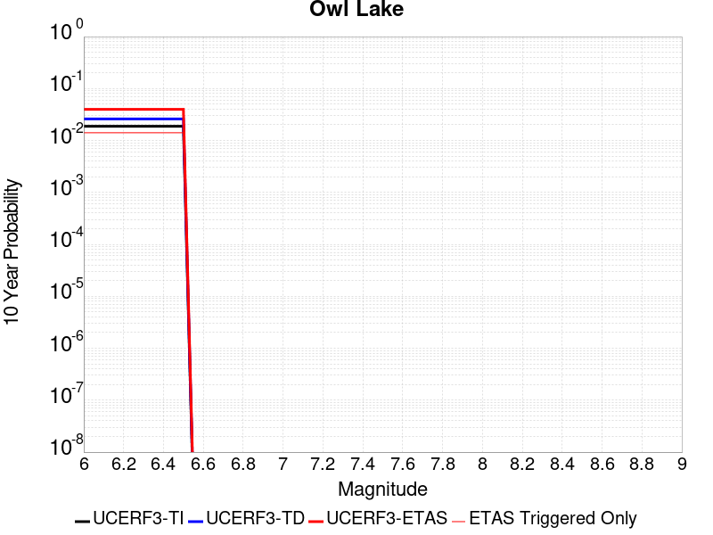
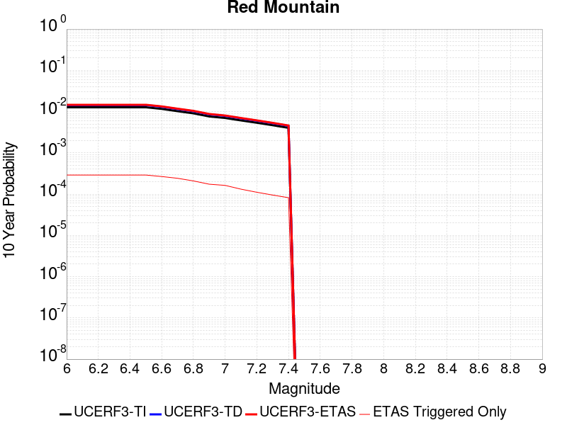
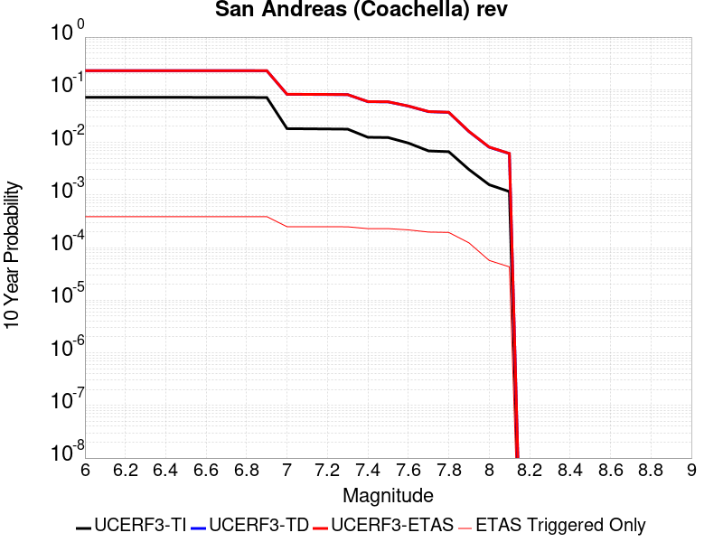
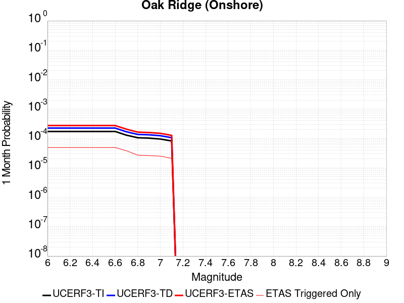
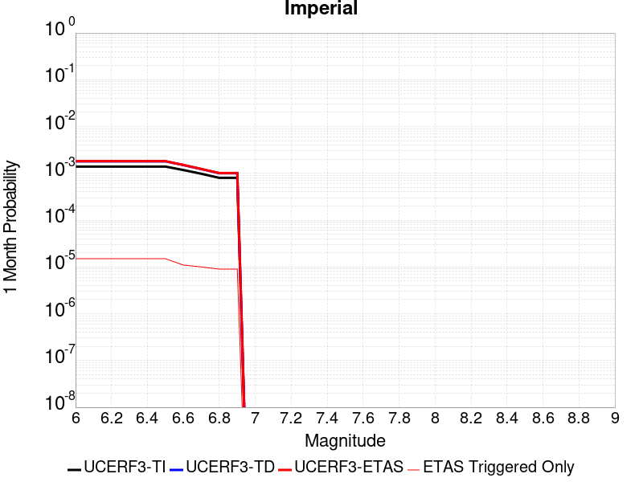
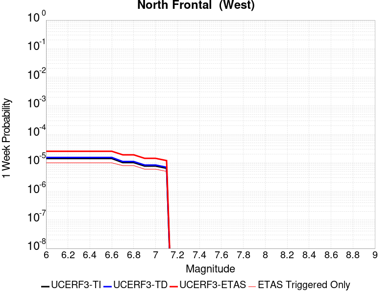
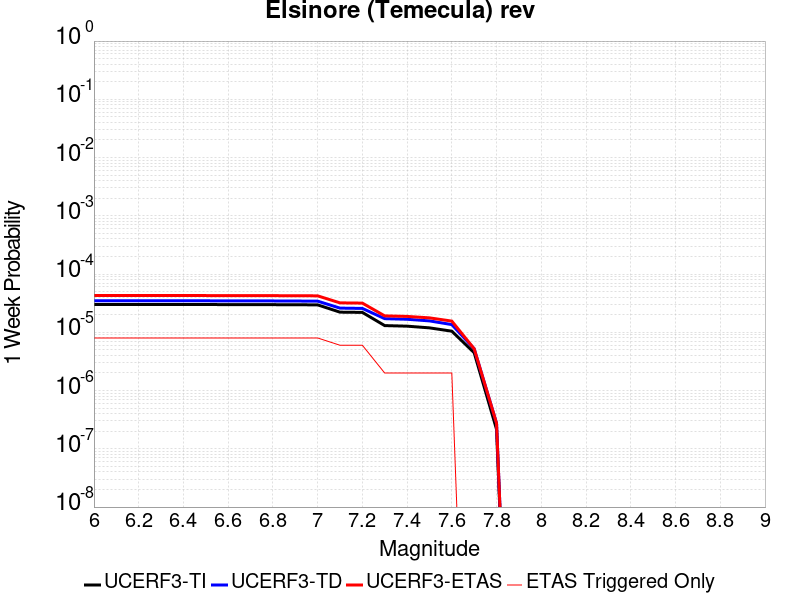
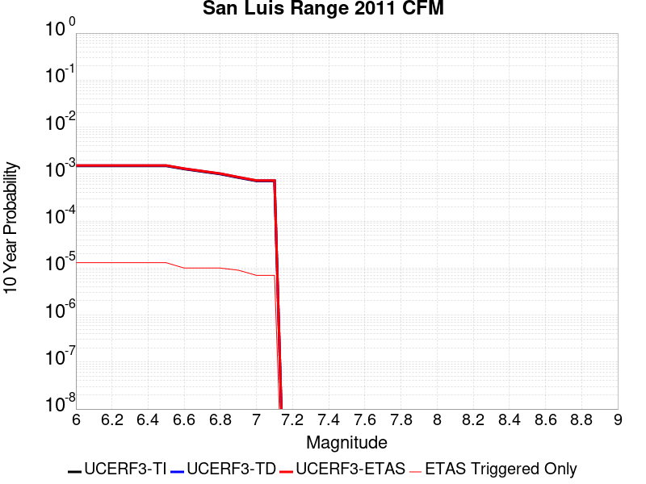
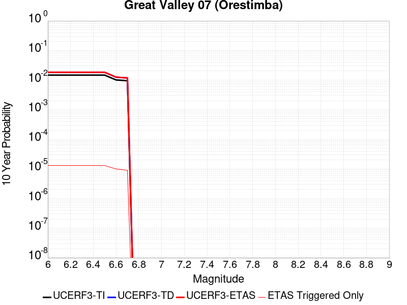

# Parent Section Magnitude-Probability Distributions

Only fault sections with at least one triggered aftershock are plotted. Sections are sorted by total supraseismogenic trigger rate (decreasing)

## Table Of Contents

* [Tank Canyon](#tank-canyon)
* [Little Lake](#little-lake)
* [Garlock (Central)](#garlock-central)
* [Owl Lake](#owl-lake)
* [Garlock (West)](#garlock-west)
* [Garlock (East)](#garlock-east)
* [Death Valley (So)](#death-valley-so)
* [Panamint Valley](#panamint-valley)
* [San Andreas (Mojave N)](#san-andreas-mojave-n)
* [San Andreas (Big Bend)](#san-andreas-big-bend)
* [San Andreas (Carrizo) rev](#san-andreas-carrizo-rev)
* [Blackwater](#blackwater)
* [San Andreas (Mojave S)](#san-andreas-mojave-s)
* [Death Valley (Black Mtns Frontal)](#death-valley-black-mtns-frontal)
* [San Andreas (Cholame) rev](#san-andreas-cholame-rev)
* [San Andreas (Parkfield)](#san-andreas-parkfield)
* [Hunter Mountain-Saline Valley](#hunter-mountain-saline-valley)
* [San Andreas (San Bernardino N)](#san-andreas-san-bernardino-n)
* [Cucamonga](#cucamonga)
* [San Cayetano](#san-cayetano)
* [Pleito](#pleito)
* [Death Valley (No)](#death-valley-no)
* [San Andreas (San Bernardino S)](#san-andreas-san-bernardino-s)
* [Gravel Hills-Harper Lk](#gravel-hills-harper-lk)
* [Pitas Point (Lower West)](#pitas-point-lower-west)
* [Cleghorn](#cleghorn)
* [Santa Ynez (East)](#santa-ynez-east)
* [Santa Ynez (West)](#santa-ynez-west)
* [Pitas Point (Lower)-Montalvo](#pitas-point-lower-montalvo)
* [Death Valley (Fish Lake Valley)](#death-valley-fish-lake-valley)
* [Red Mountain](#red-mountain)
* [San Andreas (San Gorgonio Pass-Garnet HIll)](#san-andreas-san-gorgonio-pass-garnet-hill)
* [San Jacinto (San Bernardino)](#san-jacinto-san-bernardino)
* [San Juan](#san-juan)
* [Mission Ridge-Arroyo Parida-Santa Ana](#mission-ridge-arroyo-parida-santa-ana)
* [San Andreas (Coachella) rev](#san-andreas-coachella-rev)
* [So Sierra Nevada](#so-sierra-nevada)
* [San Jacinto (Stepovers Combined)](#san-jacinto-stepovers-combined)
* [Lenwood-Lockhart-Old Woman Springs](#lenwood-lockhart-old-woman-springs)
* [Oak Ridge (Onshore)](#oak-ridge-onshore)
* [Santa Susana alt 1](#santa-susana-alt-1)
* [San Jacinto (San Jacinto Valley) rev](#san-jacinto-san-jacinto-valley-rev)
* [Helendale-So Lockhart](#helendale-so-lockhart)
* [Raymond](#raymond)
* [Sierra Madre](#sierra-madre)
* [Ventura-Pitas Point](#ventura-pitas-point)
* [Chino alt 1](#chino-alt-1)
* [Santa Cruz Island](#santa-cruz-island)
* [Channel Islands Thrust](#channel-islands-thrust)
* [Los Alamos 2011 CFM](#los-alamos-2011-cfm)
* [San Gregorio (North) 2011 CFM](#san-gregorio-north-2011-cfm)
* [Whittier alt 1](#whittier-alt-1)
* [Elysian Park (Upper)](#elysian-park-upper)
* [Independence rev 2011](#independence-rev-2011)
* [San Jose](#san-jose)
* [Verdugo](#verdugo)
* [Simi-Santa Rosa](#simi-santa-rosa)
* [Hayward (So) 2011 CFM](#hayward-so-2011-cfm)
* [San Gregorio (South) 2011 CFM](#san-gregorio-south-2011-cfm)
* [San Jacinto (Anza) rev](#san-jacinto-anza-rev)
* [Emerson-Copper Mtn 2011](#emerson-copper-mtn-2011)
* [Hayward (No) 2011 CFM](#hayward-no-2011-cfm)
* [Great Valley 12](#great-valley-12)
* [Anacapa-Dume alt 1](#anacapa-dume-alt-1)
* [Elsinore (Stepovers Combined)](#elsinore-stepovers-combined)
* [San Jacinto (Clark) rev](#san-jacinto-clark-rev)
* [Calaveras (No) 2011 CFM](#calaveras-no-2011-cfm)
* [Elsinore (Glen Ivy) rev](#elsinore-glen-ivy-rev)
* [Los Osos 2011](#los-osos-2011)
* [Santa Rosa Island](#santa-rosa-island)
* [Great Valley 03 Mysterious Ridge](#great-valley-03-mysterious-ridge)
* [Imperial](#imperial)
* [Deep Springs](#deep-springs)
* [North Frontal  (West)](#north-frontal--west)
* [Elsinore (Temecula) rev](#elsinore-temecula-rev)
* [Robinson Creek](#robinson-creek)
* [Concord 2011 CFM](#concord-2011-cfm)
* [Burnt Mtn](#burnt-mtn)
* [San Luis Range 2011 CFM](#san-luis-range-2011-cfm)
* [Calaveras (Central) 2011 CFM](#calaveras-central-2011-cfm)
* [Newport-Inglewood alt 1](#newport-inglewood-alt-1)
* [Pinto Mtn](#pinto-mtn)
* [San Gabriel](#san-gabriel)
* [Great Valley 09 (Laguna Seca)](#great-valley-09-laguna-seca)
* [Great Valley 04a Trout Creek](#great-valley-04a-trout-creek)
* [Great Valley 04b Gordon Valley](#great-valley-04b-gordon-valley)
* [Palos Verdes](#palos-verdes)
* [Malibu Coast alt 1](#malibu-coast-alt-1)
* [Great Valley 07 (Orestimba)](#great-valley-07-orestimba)
* [Holser alt 1](#holser-alt-1)
* [Green Valley 2011 CFM](#green-valley-2011-cfm)
* [Rose Canyon](#rose-canyon)
* [Clamshell-Sawpit](#clamshell-sawpit)
* [Hosgri](#hosgri)
* [Rodgers Creek - Healdsburg 2011 CFM](#rodgers-creek---healdsburg-2011-cfm)
* [San Andreas (Creeping Section) 2011 CFM](#san-andreas-creeping-section-2011-cfm)
* [Casmalia 2011 CFM](#casmalia-2011-cfm)
* [Newport-Inglewood (Offshore)](#newport-inglewood-offshore)
* [Hollywood](#hollywood)
* [Mono Lake 2011 CFM](#mono-lake-2011-cfm)

## Tank Canyon
*[(top)](#table-of-contents)*

| 1 Week | 1 Month | 1 Year | 10 Year |
|-----|-----|-----|-----|
|  |  |  |  |

| Magnitude | 1 wk TI Prob | 1 wk TD Prob | 1 wk ETAS Prob | 1 wk ETAS/TD Gain | 1 wk ETAS Triggered Only | 1 mo TI Prob | 1 mo TD Prob | 1 mo ETAS Prob | 1 mo ETAS/TD Gain | 1 mo ETAS Triggered Only | 1 yr TI Prob | 1 yr TD Prob | 1 yr ETAS Prob | 1 yr ETAS/TD Gain | 1 yr ETAS Triggered Only | 10 yr TI Prob | 10 yr TD Prob | 10 yr ETAS Prob | 10 yr ETAS/TD Gain | 10 yr ETAS Triggered Only |
|-----|-----|-----|-----|-----|-----|-----|-----|-----|-----|-----|-----|-----|-----|-----|-----|-----|-----|-----|-----|-----|
| 6.0 | 2.7748038E-5 | 3.5073965E-5 | 0.020712186 | 590.52875 | 0.020677837 | 1.18914744E-4 | 1.5031699E-4 | 0.026383996 | 175.52238 | 0.026237624 | 0.0014468255 | 0.0018300817 | 0.04155162 | 22.704788 | 0.039794363 | 0.014374418 | 0.018297758 | 0.071756795 | 3.9216166 | 0.054455444 |
| 6.1 | 2.7748038E-5 | 3.5073965E-5 | 0.020712186 | 590.52875 | 0.020677837 | 1.18914744E-4 | 1.5031699E-4 | 0.026383996 | 175.52238 | 0.026237624 | 0.0014468255 | 0.0018300817 | 0.04155162 | 22.704788 | 0.039794363 | 0.014374418 | 0.018297758 | 0.071756795 | 3.9216166 | 0.054455444 |
| 6.2 | 2.7748038E-5 | 3.5073965E-5 | 0.020712186 | 590.52875 | 0.020677837 | 1.18914744E-4 | 1.5031699E-4 | 0.026383996 | 175.52238 | 0.026237624 | 0.0014468255 | 0.0018300817 | 0.04155162 | 22.704788 | 0.039794363 | 0.014374418 | 0.018297758 | 0.071756795 | 3.9216166 | 0.054455444 |
| 6.3 | 2.7748038E-5 | 3.5073965E-5 | 0.020712186 | 590.52875 | 0.020677837 | 1.18914744E-4 | 1.5031699E-4 | 0.026383996 | 175.52238 | 0.026237624 | 0.0014468255 | 0.0018300817 | 0.04155162 | 22.704788 | 0.039794363 | 0.014374418 | 0.018297758 | 0.071756795 | 3.9216166 | 0.054455444 |

## Little Lake
*[(top)](#table-of-contents)*

| 1 Week | 1 Month | 1 Year | 10 Year |
|-----|-----|-----|-----|
|  |  |  |  |

| Magnitude | 1 wk TI Prob | 1 wk TD Prob | 1 wk ETAS Prob | 1 wk ETAS/TD Gain | 1 wk ETAS Triggered Only | 1 mo TI Prob | 1 mo TD Prob | 1 mo ETAS Prob | 1 mo ETAS/TD Gain | 1 mo ETAS Triggered Only | 1 yr TI Prob | 1 yr TD Prob | 1 yr ETAS Prob | 1 yr ETAS/TD Gain | 1 yr ETAS Triggered Only | 10 yr TI Prob | 10 yr TD Prob | 10 yr ETAS Prob | 10 yr ETAS/TD Gain | 10 yr ETAS Triggered Only |
|-----|-----|-----|-----|-----|-----|-----|-----|-----|-----|-----|-----|-----|-----|-----|-----|-----|-----|-----|-----|-----|
| 6.0 | 1.27106505E-5 | 1.3900362E-5 | 0.012085324 | 869.4251 | 0.012071592 | 5.447308E-5 | 5.957219E-5 | 0.0152148 | 255.40105 | 0.015156131 | 6.630079E-4 | 7.25151E-4 | 0.020893304 | 28.81235 | 0.020182788 | 0.006610333 | 0.0072377534 | 0.03211352 | 4.4369454 | 0.02505712 |
| 6.1 | 1.27106505E-5 | 1.3900362E-5 | 0.012085324 | 869.4251 | 0.012071592 | 5.447308E-5 | 5.957219E-5 | 0.0152148 | 255.40105 | 0.015156131 | 6.630079E-4 | 7.25151E-4 | 0.020893304 | 28.81235 | 0.020182788 | 0.006610333 | 0.0072377534 | 0.03211352 | 4.4369454 | 0.02505712 |
| 6.2 | 1.27106505E-5 | 1.3900362E-5 | 0.012085324 | 869.4251 | 0.012071592 | 5.447308E-5 | 5.957219E-5 | 0.0152148 | 255.40105 | 0.015156131 | 6.630079E-4 | 7.25151E-4 | 0.020893304 | 28.81235 | 0.020182788 | 0.006610333 | 0.0072377534 | 0.03211352 | 4.4369454 | 0.02505712 |
| 6.3 | 1.27106505E-5 | 1.3900362E-5 | 0.012085324 | 869.4251 | 0.012071592 | 5.447308E-5 | 5.957219E-5 | 0.0152148 | 255.40105 | 0.015156131 | 6.630079E-4 | 7.25151E-4 | 0.020893304 | 28.81235 | 0.020182788 | 0.006610333 | 0.0072377534 | 0.03211352 | 4.4369454 | 0.02505712 |
| 6.4 | 1.27106505E-5 | 1.3900362E-5 | 0.012085324 | 869.4251 | 0.012071592 | 5.447308E-5 | 5.957219E-5 | 0.0152148 | 255.40105 | 0.015156131 | 6.630079E-4 | 7.25151E-4 | 0.020893304 | 28.81235 | 0.020182788 | 0.006610333 | 0.0072377534 | 0.03211352 | 4.4369454 | 0.02505712 |
| 6.5 | 1.27106505E-5 | 1.3900362E-5 | 0.012085324 | 869.4251 | 0.012071592 | 5.447308E-5 | 5.957219E-5 | 0.0152148 | 255.40105 | 0.015156131 | 6.630079E-4 | 7.25151E-4 | 0.020893304 | 28.81235 | 0.020182788 | 0.006610333 | 0.0072377534 | 0.03211352 | 4.4369454 | 0.02505712 |
| 6.6 | 1.08505255E-5 | 1.1856941E-5 | 0.010103131 | 852.0859 | 0.010091394 | 4.6501424E-5 | 5.0815026E-5 | 0.012883369 | 253.53464 | 0.012833206 | 5.6600774E-4 | 6.1859656E-4 | 0.017592097 | 28.438725 | 0.016984006 | 0.005645683 | 0.006178476 | 0.02703132 | 4.3750787 | 0.020982483 |
| 6.7 | 7.97625E-6 | 8.706619E-6 | 0.007472465 | 858.25104 | 0.007463823 | 3.4183482E-5 | 3.7314083E-5 | 0.009557142 | 256.12692 | 0.009520182 | 4.161044E-4 | 4.5429895E-4 | 0.013053294 | 28.73283 | 0.012604722 | 0.004153261 | 0.0045429897 | 0.02008516 | 4.4211326 | 0.0156131 |
| 6.8 | 7.97625E-6 | 8.706619E-6 | 0.007472465 | 858.25104 | 0.007463823 | 3.4183482E-5 | 3.7314083E-5 | 0.009557142 | 256.12692 | 0.009520182 | 4.161044E-4 | 4.5429895E-4 | 0.013053294 | 28.73283 | 0.012604722 | 0.004153261 | 0.0045429897 | 0.02008516 | 4.4211326 | 0.0156131 |

## Garlock (Central)
*[(top)](#table-of-contents)*

| 1 Week | 1 Month | 1 Year | 10 Year |
|-----|-----|-----|-----|
|  |  |  |  |

| Magnitude | 1 wk TI Prob | 1 wk TD Prob | 1 wk ETAS Prob | 1 wk ETAS/TD Gain | 1 wk ETAS Triggered Only | 1 mo TI Prob | 1 mo TD Prob | 1 mo ETAS Prob | 1 mo ETAS/TD Gain | 1 mo ETAS Triggered Only | 1 yr TI Prob | 1 yr TD Prob | 1 yr ETAS Prob | 1 yr ETAS/TD Gain | 1 yr ETAS Triggered Only | 10 yr TI Prob | 10 yr TD Prob | 10 yr ETAS Prob | 10 yr ETAS/TD Gain | 10 yr ETAS Triggered Only |
|-----|-----|-----|-----|-----|-----|-----|-----|-----|-----|-----|-----|-----|-----|-----|-----|-----|-----|-----|-----|-----|
| 6.0 | 2.575808E-5 | 1.9313613E-5 | 0.011062512 | 572.78314 | 0.011043412 | 1.10387096E-4 | 8.277037E-5 | 0.013904932 | 167.99408 | 0.013823305 | 0.0013431342 | 0.0010073289 | 0.0201046 | 19.958328 | 0.019116526 | 0.013350452 | 0.0100695705 | 0.034761287 | 3.452112 | 0.024942879 |
| 6.1 | 2.575808E-5 | 1.9313613E-5 | 0.011062512 | 572.78314 | 0.011043412 | 1.10387096E-4 | 8.277037E-5 | 0.013904932 | 167.99408 | 0.013823305 | 0.0013431342 | 0.0010073289 | 0.0201046 | 19.958328 | 0.019116526 | 0.013350452 | 0.0100695705 | 0.034761287 | 3.452112 | 0.024942879 |
| 6.2 | 2.575808E-5 | 1.9313613E-5 | 0.011062512 | 572.78314 | 0.011043412 | 1.10387096E-4 | 8.277037E-5 | 0.013904932 | 167.99408 | 0.013823305 | 0.0013431342 | 0.0010073289 | 0.0201046 | 19.958328 | 0.019116526 | 0.013350452 | 0.0100695705 | 0.034761287 | 3.452112 | 0.024942879 |
| 6.3 | 2.575808E-5 | 1.9313613E-5 | 0.011062512 | 572.78314 | 0.011043412 | 1.10387096E-4 | 8.277037E-5 | 0.013904932 | 167.99408 | 0.013823305 | 0.0013431342 | 0.0010073289 | 0.0201046 | 19.958328 | 0.019116526 | 0.013350452 | 0.0100695705 | 0.034761287 | 3.452112 | 0.024942879 |
| 6.4 | 2.575808E-5 | 1.9313613E-5 | 0.011062512 | 572.78314 | 0.011043412 | 1.10387096E-4 | 8.277037E-5 | 0.013904932 | 167.99408 | 0.013823305 | 0.0013431342 | 0.0010073289 | 0.0201046 | 19.958328 | 0.019116526 | 0.013350452 | 0.0100695705 | 0.034761287 | 3.452112 | 0.024942879 |
| 6.5 | 2.575808E-5 | 1.9313613E-5 | 0.011062512 | 572.78314 | 0.011043412 | 1.10387096E-4 | 8.277037E-5 | 0.013904932 | 167.99408 | 0.013823305 | 0.0013431342 | 0.0010073289 | 0.0201046 | 19.958328 | 0.019116526 | 0.013350452 | 0.0100695705 | 0.034761287 | 3.452112 | 0.024942879 |
| 6.6 | 2.540234E-5 | 1.885198E-5 | 0.010643176 | 564.56537 | 0.010624524 | 1.0886263E-4 | 8.0792066E-5 | 0.013446049 | 166.42784 | 0.013366337 | 0.0013245966 | 9.83265E-4 | 0.019358173 | 19.687647 | 0.018392993 | 0.013167289 | 0.009831364 | 0.03358636 | 3.4162464 | 0.02399086 |
| 6.7 | 2.4966947E-5 | 1.8286464E-5 | 0.009919096 | 542.4283 | 0.00990099 | 1.06996806E-4 | 7.8368575E-5 | 0.012644025 | 161.3405 | 0.012566641 | 0.0013019076 | 9.5378514E-4 | 0.018378126 | 19.268621 | 0.017440975 | 0.012943068 | 0.009539624 | 0.03213238 | 3.3683066 | 0.022810359 |
| 6.8 | 2.4548952E-5 | 1.7797542E-5 | 0.009613971 | 540.18536 | 0.009596344 | 1.0520555E-4 | 7.627332E-5 | 0.012261177 | 160.75317 | 0.012185834 | 0.001280125 | 9.282974E-4 | 0.017858492 | 19.2379 | 0.016945925 | 0.012727758 | 0.009286596 | 0.031092856 | 3.348143 | 0.022010664 |
| 6.9 | 2.3994342E-5 | 1.7148153E-5 | 0.009042127 | 527.29443 | 0.009025133 | 1.0282884E-4 | 7.349039E-5 | 0.01149687 | 156.44046 | 0.011424219 | 0.0012512221 | 8.944436E-4 | 0.016569672 | 18.525116 | 0.015689261 | 0.012442005 | 0.0089510605 | 0.02925511 | 3.2683399 | 0.020487433 |
| 7.0 | 2.343005E-5 | 1.6491087E-5 | 0.008546434 | 518.2456 | 0.008530084 | 1.0041064E-4 | 7.067455E-5 | 0.010922916 | 154.55234 | 0.010853008 | 0.0012218138 | 8.601883E-4 | 0.015622802 | 18.162073 | 0.014775324 | 0.01215118 | 0.008610493 | 0.027751181 | 3.2229495 | 0.01930693 |
| 7.1 | 2.2814058E-5 | 1.5782754E-5 | 0.00797453 | 505.2686 | 0.007958873 | 9.777087E-5 | 6.763899E-5 | 0.01015835 | 150.18483 | 0.010091394 | 0.0011897103 | 8.2325895E-4 | 0.014635184 | 17.777134 | 0.013823305 | 0.011833611 | 0.00824334 | 0.026371414 | 3.1991174 | 0.018278752 |
| 7.2 | 2.2145266E-5 | 1.5027377E-5 | 0.007326418 | 487.53802 | 0.0073115006 | 9.490483E-5 | 6.440182E-5 | 0.00939358 | 145.85892 | 0.009329779 | 0.0011548538 | 7.8387547E-4 | 0.013607022 | 17.358652 | 0.012833206 | 0.011488707 | 0.007851825 | 0.02477804 | 3.1557045 | 0.017060168 |
| 7.3 | 1.9954436E-5 | 1.3199953E-5 | 0.0058775553 | 445.2709 | 0.0058644325 | 8.551621E-5 | 5.657036E-5 | 0.0075199716 | 132.9313 | 0.007463823 | 0.0010406625 | 6.8859005E-4 | 0.010925253 | 15.86612 | 0.010243717 | 0.010358025 | 0.006900618 | 0.020439444 | 2.961973 | 0.013632902 |
| 7.4 | 1.918037E-5 | 1.2553606E-5 | 0.00553419 | 440.84467 | 0.005521706 | 8.2198996E-5 | 5.3800417E-5 | 0.0071364352 | 132.64647 | 0.007083016 | 0.0010003132 | 6.5488677E-4 | 0.010359114 | 15.818175 | 0.009710587 | 0.009958224 | 0.006564366 | 0.019388992 | 2.9536731 | 0.012909368 |
| 7.5 | 1.6994161E-5 | 1.0764553E-5 | 0.0040091984 | 372.4445 | 0.0039984765 | 7.283008E-5 | 4.613333E-5 | 0.0053771897 | 116.557594 | 0.0053313025 | 8.863455E-4 | 5.615903E-4 | 0.007907044 | 14.079738 | 0.007349581 | 0.008828186 | 0.005632708 | 0.015553661 | 2.7613115 | 0.009977152 |
| 7.6 | 1.621788E-5 | 1.012848E-5 | 0.0036658417 | 361.93402 | 0.0036557503 | 6.950335E-5 | 4.34074E-5 | 0.0049175294 | 113.28782 | 0.0048743337 | 8.458747E-4 | 5.2841863E-4 | 0.007303207 | 13.820873 | 0.00677837 | 0.0084266225 | 0.005301458 | 0.01443026 | 2.721942 | 0.009177457 |
| 7.7 | 7.713584E-6 | 3.2171508E-6 | 8.0290996E-4 | 249.57175 | 7.996954E-4 | 3.3057797E-5 | 1.378779E-5 | 0.001156194 | 83.85637 | 0.001142422 | 4.0240434E-4 | 1.6786634E-4 | 0.0021858064 | 13.0211115 | 0.0020182787 | 0.0040167645 | 0.0016902693 | 0.004579513 | 2.7093391 | 0.0028941357 |

## Owl Lake
*[(top)](#table-of-contents)*

| 1 Week | 1 Month | 1 Year | 10 Year |
|-----|-----|-----|-----|
|  |  |  |  |

| Magnitude | 1 wk TI Prob | 1 wk TD Prob | 1 wk ETAS Prob | 1 wk ETAS/TD Gain | 1 wk ETAS Triggered Only | 1 mo TI Prob | 1 mo TD Prob | 1 mo ETAS Prob | 1 mo ETAS/TD Gain | 1 mo ETAS Triggered Only | 1 yr TI Prob | 1 yr TD Prob | 1 yr ETAS Prob | 1 yr ETAS/TD Gain | 1 yr ETAS Triggered Only | 10 yr TI Prob | 10 yr TD Prob | 10 yr ETAS Prob | 10 yr ETAS/TD Gain | 10 yr ETAS Triggered Only |
|-----|-----|-----|-----|-----|-----|-----|-----|-----|-----|-----|-----|-----|-----|-----|-----|-----|-----|-----|-----|-----|
| 6.0 | 3.637175E-5 | 4.988367E-5 | 0.0043147127 | 86.49549 | 0.004265042 | 1.5586962E-4 | 2.1378716E-4 | 0.006000821 | 28.069136 | 0.0057882713 | 0.0018960608 | 0.0026025574 | 0.0119460365 | 4.5901146 | 0.00936786 | 0.018799646 | 0.025995217 | 0.039570455 | 1.5222206 | 0.013937548 |
| 6.1 | 3.637175E-5 | 4.988367E-5 | 0.0043147127 | 86.49549 | 0.004265042 | 1.5586962E-4 | 2.1378716E-4 | 0.006000821 | 28.069136 | 0.0057882713 | 0.0018960608 | 0.0026025574 | 0.0119460365 | 4.5901146 | 0.00936786 | 0.018799646 | 0.025995217 | 0.039570455 | 1.5222206 | 0.013937548 |
| 6.2 | 3.637175E-5 | 4.988367E-5 | 0.0043147127 | 86.49549 | 0.004265042 | 1.5586962E-4 | 2.1378716E-4 | 0.006000821 | 28.069136 | 0.0057882713 | 0.0018960608 | 0.0026025574 | 0.0119460365 | 4.5901146 | 0.00936786 | 0.018799646 | 0.025995217 | 0.039570455 | 1.5222206 | 0.013937548 |
| 6.3 | 3.637175E-5 | 4.988367E-5 | 0.0043147127 | 86.49549 | 0.004265042 | 1.5586962E-4 | 2.1378716E-4 | 0.006000821 | 28.069136 | 0.0057882713 | 0.0018960608 | 0.0026025574 | 0.0119460365 | 4.5901146 | 0.00936786 | 0.018799646 | 0.025995217 | 0.039570455 | 1.5222206 | 0.013937548 |
| 6.4 | 3.637175E-5 | 4.988367E-5 | 0.0043147127 | 86.49549 | 0.004265042 | 1.5586962E-4 | 2.1378716E-4 | 0.006000821 | 28.069136 | 0.0057882713 | 0.0018960608 | 0.0026025574 | 0.0119460365 | 4.5901146 | 0.00936786 | 0.018799646 | 0.025995217 | 0.039570455 | 1.5222206 | 0.013937548 |
| 6.5 | 3.637175E-5 | 4.988367E-5 | 0.0043147127 | 86.49549 | 0.004265042 | 1.5586962E-4 | 2.1378716E-4 | 0.006000821 | 28.069136 | 0.0057882713 | 0.0018960608 | 0.0026025574 | 0.0119460365 | 4.5901146 | 0.00936786 | 0.018799646 | 0.025995217 | 0.039570455 | 1.5222206 | 0.013937548 |

## Garlock (West)
*[(top)](#table-of-contents)*

| 1 Week | 1 Month | 1 Year | 10 Year |
|-----|-----|-----|-----|
|  |  |  |  |

| Magnitude | 1 wk TI Prob | 1 wk TD Prob | 1 wk ETAS Prob | 1 wk ETAS/TD Gain | 1 wk ETAS Triggered Only | 1 mo TI Prob | 1 mo TD Prob | 1 mo ETAS Prob | 1 mo ETAS/TD Gain | 1 mo ETAS Triggered Only | 1 yr TI Prob | 1 yr TD Prob | 1 yr ETAS Prob | 1 yr ETAS/TD Gain | 1 yr ETAS Triggered Only | 10 yr TI Prob | 10 yr TD Prob | 10 yr ETAS Prob | 10 yr ETAS/TD Gain | 10 yr ETAS Triggered Only |
|-----|-----|-----|-----|-----|-----|-----|-----|-----|-----|-----|-----|-----|-----|-----|-----|-----|-----|-----|-----|-----|
| 6.0 | 2.516656E-5 | 1.8065048E-5 | 0.0046257502 | 256.0608 | 0.0046077683 | 1.07852225E-4 | 7.741977E-5 | 0.0061317873 | 79.20183 | 0.0060548363 | 0.0013123099 | 9.42255E-4 | 0.009312122 | 9.882804 | 0.008377761 | 0.013045873 | 0.009421492 | 0.020662634 | 2.1931384 | 0.011348058 |
| 6.1 | 2.516656E-5 | 1.8065048E-5 | 0.0046257502 | 256.0608 | 0.0046077683 | 1.07852225E-4 | 7.741977E-5 | 0.0061317873 | 79.20183 | 0.0060548363 | 0.0013123099 | 9.42255E-4 | 0.009312122 | 9.882804 | 0.008377761 | 0.013045873 | 0.009421492 | 0.020662634 | 2.1931384 | 0.011348058 |
| 6.2 | 2.516656E-5 | 1.8065048E-5 | 0.0046257502 | 256.0608 | 0.0046077683 | 1.07852225E-4 | 7.741977E-5 | 0.0061317873 | 79.20183 | 0.0060548363 | 0.0013123099 | 9.42255E-4 | 0.009312122 | 9.882804 | 0.008377761 | 0.013045873 | 0.009421492 | 0.020662634 | 2.1931384 | 0.011348058 |
| 6.3 | 2.516656E-5 | 1.8065048E-5 | 0.0046257502 | 256.0608 | 0.0046077683 | 1.07852225E-4 | 7.741977E-5 | 0.0061317873 | 79.20183 | 0.0060548363 | 0.0013123099 | 9.42255E-4 | 0.009312122 | 9.882804 | 0.008377761 | 0.013045873 | 0.009421492 | 0.020662634 | 2.1931384 | 0.011348058 |
| 6.4 | 2.516656E-5 | 1.8065048E-5 | 0.0046257502 | 256.0608 | 0.0046077683 | 1.07852225E-4 | 7.741977E-5 | 0.0061317873 | 79.20183 | 0.0060548363 | 0.0013123099 | 9.42255E-4 | 0.009312122 | 9.882804 | 0.008377761 | 0.013045873 | 0.009421492 | 0.020662634 | 2.1931384 | 0.011348058 |
| 6.5 | 2.516656E-5 | 1.8065048E-5 | 0.0046257502 | 256.0608 | 0.0046077683 | 1.07852225E-4 | 7.741977E-5 | 0.0061317873 | 79.20183 | 0.0060548363 | 0.0013123099 | 9.42255E-4 | 0.009312122 | 9.882804 | 0.008377761 | 0.013045873 | 0.009421492 | 0.020662634 | 2.1931384 | 0.011348058 |
| 6.6 | 2.498869E-5 | 1.7877663E-5 | 0.004625564 | 258.73425 | 0.0046077683 | 1.07089996E-4 | 7.6616736E-5 | 0.006130989 | 80.02154 | 0.0060548363 | 0.0013030408 | 9.3248655E-4 | 0.009302435 | 9.975945 | 0.008377761 | 0.012954267 | 0.009324339 | 0.020566585 | 2.205688 | 0.011348058 |
| 6.7 | 2.4627925E-5 | 1.7497801E-5 | 0.004625186 | 264.32953 | 0.0046077683 | 1.0554398E-4 | 7.498886E-5 | 0.006129371 | 81.7371 | 0.0060548363 | 0.0012842404 | 9.1268384E-4 | 0.0092827985 | 10.17088 | 0.008377761 | 0.012768441 | 0.009128104 | 0.020372575 | 2.2318518 | 0.011348058 |
| 6.8 | 2.4270235E-5 | 1.716136E-5 | 0.0046248506 | 269.4921 | 0.0046077683 | 1.04011146E-4 | 7.354704E-5 | 0.006127938 | 83.319984 | 0.0060548363 | 0.0012656 | 8.9514436E-4 | 0.009265406 | 10.3507395 | 0.008377761 | 0.012584164 | 0.0089538675 | 0.020200316 | 2.2560437 | 0.011348058 |
| 6.9 | 2.3913764E-5 | 1.6823105E-5 | 0.004586434 | 272.62708 | 0.004569688 | 1.0248353E-4 | 7.2097464E-5 | 0.0060884194 | 84.44706 | 0.0060167555 | 0.0012470228 | 8.775101E-4 | 0.009209872 | 10.49546 | 0.00833968 | 0.012400482 | 0.00877859 | 0.019989282 | 2.2770493 | 0.011309977 |
| 7.0 | 2.3579369E-5 | 1.6492264E-5 | 0.004586105 | 278.0761 | 0.004569688 | 1.0105052E-4 | 7.067965E-5 | 0.00608701 | 86.12111 | 0.0060167555 | 0.0012295957 | 8.6026196E-4 | 0.009192768 | 10.68601 | 0.00833968 | 0.012228143 | 0.008607132 | 0.019819763 | 2.3027139 | 0.011309977 |
| 7.1 | 2.3205374E-5 | 1.6105636E-5 | 0.0045857197 | 284.72763 | 0.004569688 | 9.944781E-5 | 6.902276E-5 | 0.006085363 | 88.16458 | 0.0060167555 | 0.0012101046 | 8.401051E-4 | 0.00913473 | 10.873319 | 0.008301599 | 0.0120353615 | 0.008406721 | 0.019583859 | 2.3295476 | 0.011271897 |
| 7.2 | 2.2799322E-5 | 1.5676578E-5 | 0.0045091324 | 287.63498 | 0.004493526 | 9.770772E-5 | 6.718404E-5 | 0.006007379 | 89.416756 | 0.0059405942 | 0.0011889422 | 8.177357E-4 | 0.009036448 | 11.050572 | 0.008225438 | 0.011826012 | 0.008184515 | 0.01925085 | 2.3521063 | 0.011157654 |
| 7.3 | 1.8228246E-5 | 1.1798695E-5 | 0.0043148706 | 365.70746 | 0.0043031224 | 7.811871E-5 | 5.0565202E-5 | 0.005724307 | 113.20645 | 0.005674029 | 9.506803E-4 | 6.1551924E-4 | 0.008455321 | 13.736892 | 0.007844631 | 0.0094662355 | 0.006171021 | 0.016843518 | 2.7294538 | 0.010738766 |
| 7.4 | 1.7670916E-5 | 1.132978E-5 | 0.0041620824 | 367.35776 | 0.0041507995 | 7.5730306E-5 | 4.8555645E-5 | 0.0055319145 | 113.92938 | 0.0054836255 | 9.216264E-4 | 5.9106643E-4 | 0.008164653 | 13.813427 | 0.0075780656 | 0.009178135 | 0.0059269792 | 0.016261403 | 2.743624 | 0.01039604 |
| 7.5 | 1.6994161E-5 | 1.0764553E-5 | 0.0040091984 | 372.4445 | 0.0039984765 | 7.283008E-5 | 4.613333E-5 | 0.0053771897 | 116.557594 | 0.0053313025 | 8.863455E-4 | 5.615903E-4 | 0.007907044 | 14.079738 | 0.007349581 | 0.008828186 | 0.005632708 | 0.015553661 | 2.7613115 | 0.009977152 |
| 7.6 | 1.621788E-5 | 1.012848E-5 | 0.0036658417 | 361.93402 | 0.0036557503 | 6.950335E-5 | 4.34074E-5 | 0.0049175294 | 113.28782 | 0.0048743337 | 8.458747E-4 | 5.2841863E-4 | 0.007303207 | 13.820873 | 0.00677837 | 0.0084266225 | 0.005301458 | 0.01443026 | 2.721942 | 0.009177457 |
| 7.7 | 7.713584E-6 | 3.2171508E-6 | 8.0290996E-4 | 249.57175 | 7.996954E-4 | 3.3057797E-5 | 1.378779E-5 | 0.001156194 | 83.85637 | 0.001142422 | 4.0240434E-4 | 1.6786634E-4 | 0.0021858064 | 13.0211115 | 0.0020182787 | 0.0040167645 | 0.0016902693 | 0.004579513 | 2.7093391 | 0.0028941357 |

## Garlock (East)
*[(top)](#table-of-contents)*

| 1 Week | 1 Month | 1 Year | 10 Year |
|-----|-----|-----|-----|
|  |  |  |  |

| Magnitude | 1 wk TI Prob | 1 wk TD Prob | 1 wk ETAS Prob | 1 wk ETAS/TD Gain | 1 wk ETAS Triggered Only | 1 mo TI Prob | 1 mo TD Prob | 1 mo ETAS Prob | 1 mo ETAS/TD Gain | 1 mo ETAS Triggered Only | 1 yr TI Prob | 1 yr TD Prob | 1 yr ETAS Prob | 1 yr ETAS/TD Gain | 1 yr ETAS Triggered Only | 10 yr TI Prob | 10 yr TD Prob | 10 yr ETAS Prob | 10 yr ETAS/TD Gain | 10 yr ETAS Triggered Only |
|-----|-----|-----|-----|-----|-----|-----|-----|-----|-----|-----|-----|-----|-----|-----|-----|-----|-----|-----|-----|-----|
| 6.0 | 2.2327951E-5 | 1.8303952E-5 | 0.004169028 | 227.76654 | 0.0041507995 | 9.5687705E-5 | 7.8444085E-5 | 0.0054093283 | 68.957756 | 0.0053313025 | 0.0011643751 | 9.548048E-4 | 0.008944123 | 9.367488 | 0.007996953 | 0.0115829315 | 0.0096519785 | 0.020437947 | 2.117488 | 0.010891089 |
| 6.1 | 2.2327951E-5 | 1.8303952E-5 | 0.004169028 | 227.76654 | 0.0041507995 | 9.5687705E-5 | 7.8444085E-5 | 0.0054093283 | 68.957756 | 0.0053313025 | 0.0011643751 | 9.548048E-4 | 0.008944123 | 9.367488 | 0.007996953 | 0.0115829315 | 0.0096519785 | 0.020437947 | 2.117488 | 0.010891089 |
| 6.2 | 2.2327951E-5 | 1.8303952E-5 | 0.004169028 | 227.76654 | 0.0041507995 | 9.5687705E-5 | 7.8444085E-5 | 0.0054093283 | 68.957756 | 0.0053313025 | 0.0011643751 | 9.548048E-4 | 0.008944123 | 9.367488 | 0.007996953 | 0.0115829315 | 0.0096519785 | 0.020437947 | 2.117488 | 0.010891089 |
| 6.3 | 2.2327951E-5 | 1.8303952E-5 | 0.004169028 | 227.76654 | 0.0041507995 | 9.5687705E-5 | 7.8444085E-5 | 0.0054093283 | 68.957756 | 0.0053313025 | 0.0011643751 | 9.548048E-4 | 0.008944123 | 9.367488 | 0.007996953 | 0.0115829315 | 0.0096519785 | 0.020437947 | 2.117488 | 0.010891089 |
| 6.4 | 2.2327951E-5 | 1.8303952E-5 | 0.004169028 | 227.76654 | 0.0041507995 | 9.5687705E-5 | 7.8444085E-5 | 0.0054093283 | 68.957756 | 0.0053313025 | 0.0011643751 | 9.548048E-4 | 0.008944123 | 9.367488 | 0.007996953 | 0.0115829315 | 0.0096519785 | 0.020437947 | 2.117488 | 0.010891089 |
| 6.5 | 2.2327951E-5 | 1.8303952E-5 | 0.004169028 | 227.76654 | 0.0041507995 | 9.5687705E-5 | 7.8444085E-5 | 0.0054093283 | 68.957756 | 0.0053313025 | 0.0011643751 | 9.548048E-4 | 0.008944123 | 9.367488 | 0.007996953 | 0.0115829315 | 0.0096519785 | 0.020437947 | 2.117488 | 0.010891089 |
| 6.6 | 2.222123E-5 | 1.816971E-5 | 0.0041308138 | 227.34616 | 0.004112719 | 9.523036E-5 | 7.7868805E-5 | 0.0053706784 | 68.97086 | 0.0052932217 | 0.0011588129 | 9.4780687E-4 | 0.008861092 | 9.349048 | 0.007920792 | 0.011527888 | 0.009581773 | 0.020293074 | 2.117883 | 0.0108149275 |
| 6.7 | 2.2076227E-5 | 1.798404E-5 | 0.004130629 | 229.68303 | 0.004112719 | 9.4608964E-5 | 7.707312E-5 | 0.0053698868 | 69.67262 | 0.0052932217 | 0.0011512554 | 9.381278E-4 | 0.008851489 | 9.43527 | 0.007920792 | 0.011453095 | 0.009485973 | 0.020160591 | 2.1253054 | 0.010776847 |
| 6.8 | 2.1962227E-5 | 1.7854036E-5 | 0.0041304994 | 231.34822 | 0.004112719 | 9.4120434E-5 | 7.651599E-5 | 0.0053693326 | 70.17268 | 0.0052932217 | 0.0011453138 | 9.313506E-4 | 0.008844766 | 9.496709 | 0.007920792 | 0.01139429 | 0.00941876 | 0.02005638 | 2.1294076 | 0.010738766 |
| 6.9 | 1.1702579E-5 | 6.6732687E-6 | 0.0037004796 | 554.52277 | 0.003693831 | 5.0152947E-5 | 2.8599494E-5 | 0.0045981565 | 160.77756 | 0.004569688 | 6.10441E-4 | 3.481581E-4 | 0.006933831 | 19.915754 | 0.0065879663 | 0.0060876687 | 0.0034954504 | 0.012071613 | 3.4535215 | 0.008606245 |
| 7.0 | 1.153538E-5 | 6.4796777E-6 | 0.0036622062 | 565.1834 | 0.0036557503 | 4.9436403E-5 | 2.7769835E-5 | 0.004521171 | 162.80872 | 0.004493526 | 6.01722E-4 | 3.3806017E-4 | 0.0067334604 | 19.917934 | 0.006397563 | 0.006000953 | 0.0033946347 | 0.011743956 | 3.459564 | 0.008377761 |
| 7.1 | 1.135938E-5 | 6.273818E-6 | 0.003509679 | 559.4168 | 0.0035034274 | 4.868215E-5 | 2.6887597E-5 | 0.0042918148 | 159.6206 | 0.004265042 | 5.925439E-4 | 3.2732222E-4 | 0.006456313 | 19.72464 | 0.0061309976 | 0.0059096646 | 0.0032873498 | 0.011333926 | 3.4477396 | 0.008073115 |
| 7.2 | 1.1168294E-5 | 6.048814E-6 | 0.003204811 | 529.82465 | 0.0031987815 | 4.786324E-5 | 2.5923315E-5 | 0.003948137 | 152.30061 | 0.0039223153 | 5.825791E-4 | 3.1558552E-4 | 0.0060258927 | 19.094324 | 0.0057121096 | 0.005810542 | 0.0031701238 | 0.010686206 | 3.3709111 | 0.007539985 |
| 7.3 | 1.0952553E-5 | 5.8686815E-6 | 0.0029380678 | 500.63507 | 0.0029322163 | 4.693867E-5 | 2.5151334E-5 | 0.0036808096 | 146.3465 | 0.0036557503 | 5.713284E-4 | 3.0618932E-4 | 0.0055216523 | 18.033457 | 0.00521706 | 0.0056986175 | 0.0030760262 | 0.009947437 | 3.2338595 | 0.006892612 |
| 7.4 | 1.0735812E-5 | 5.691247E-6 | 0.0027474882 | 482.7568 | 0.0027418127 | 4.6009813E-5 | 2.4390914E-5 | 0.0034896529 | 143.07184 | 0.0034653465 | 5.600255E-4 | 2.9693378E-4 | 0.005245959 | 17.667099 | 0.004950495 | 0.0055861627 | 0.0029833042 | 0.009475683 | 3.1762373 | 0.006511805 |
| 7.5 | 9.0273E-6 | 4.284415E-6 | 0.0012990237 | 303.19745 | 0.0012947449 | 3.8687853E-5 | 1.8361723E-5 | 0.0018081232 | 98.47241 | 0.0017897944 | 4.709228E-4 | 2.2354414E-4 | 0.0028885994 | 12.92183 | 0.0026656513 | 0.004699261 | 0.0022480614 | 0.0060095787 | 2.673227 | 0.0037699924 |
| 7.6 | 8.549585E-6 | 3.885532E-6 | 0.0010701419 | 275.41708 | 0.0010662605 | 3.6640562E-5 | 1.6652246E-5 | 0.001501776 | 90.184586 | 0.0014851486 | 4.4600753E-4 | 2.027353E-4 | 0.002563262 | 12.643393 | 0.0023610054 | 0.0044511347 | 0.0020396118 | 0.005307875 | 2.6023948 | 0.003274943 |
| 7.7 | 7.713584E-6 | 3.2171508E-6 | 8.0290996E-4 | 249.57175 | 7.996954E-4 | 3.3057797E-5 | 1.378779E-5 | 0.001156194 | 83.85637 | 0.001142422 | 4.0240434E-4 | 1.6786634E-4 | 0.0021858064 | 13.0211115 | 0.0020182787 | 0.0040167645 | 0.0016902693 | 0.004579513 | 2.7093391 | 0.0028941357 |

## Death Valley (So)
*[(top)](#table-of-contents)*

| 1 Week | 1 Month | 1 Year | 10 Year |
|-----|-----|-----|-----|
|  |  |  |  |

| Magnitude | 1 wk TI Prob | 1 wk TD Prob | 1 wk ETAS Prob | 1 wk ETAS/TD Gain | 1 wk ETAS Triggered Only | 1 mo TI Prob | 1 mo TD Prob | 1 mo ETAS Prob | 1 mo ETAS/TD Gain | 1 mo ETAS Triggered Only | 1 yr TI Prob | 1 yr TD Prob | 1 yr ETAS Prob | 1 yr ETAS/TD Gain | 1 yr ETAS Triggered Only | 10 yr TI Prob | 10 yr TD Prob | 10 yr ETAS Prob | 10 yr ETAS/TD Gain | 10 yr ETAS Triggered Only |
|-----|-----|-----|-----|-----|-----|-----|-----|-----|-----|-----|-----|-----|-----|-----|-----|-----|-----|-----|-----|-----|
| 6.0 | 4.4658216E-5 | 6.228887E-5 | 0.0022327553 | 35.845177 | 0.0021706016 | 1.9137832E-4 | 2.669324E-4 | 0.0035029305 | 13.122912 | 0.0032368621 | 0.0023275411 | 0.0032461619 | 0.008636072 | 2.660395 | 0.0054074638 | 0.023033133 | 0.032094594 | 0.040092897 | 1.2492104 | 0.008263519 |
| 6.1 | 4.4658216E-5 | 6.228887E-5 | 0.0022327553 | 35.845177 | 0.0021706016 | 1.9137832E-4 | 2.669324E-4 | 0.0035029305 | 13.122912 | 0.0032368621 | 0.0023275411 | 0.0032461619 | 0.008636072 | 2.660395 | 0.0054074638 | 0.023033133 | 0.032094594 | 0.040092897 | 1.2492104 | 0.008263519 |
| 6.2 | 4.4658216E-5 | 6.228887E-5 | 0.0022327553 | 35.845177 | 0.0021706016 | 1.9137832E-4 | 2.669324E-4 | 0.0035029305 | 13.122912 | 0.0032368621 | 0.0023275411 | 0.0032461619 | 0.008636072 | 2.660395 | 0.0054074638 | 0.023033133 | 0.032094594 | 0.040092897 | 1.2492104 | 0.008263519 |
| 6.3 | 4.4658216E-5 | 6.228887E-5 | 0.0022327553 | 35.845177 | 0.0021706016 | 1.9137832E-4 | 2.669324E-4 | 0.0035029305 | 13.122912 | 0.0032368621 | 0.0023275411 | 0.0032461619 | 0.008636072 | 2.660395 | 0.0054074638 | 0.023033133 | 0.032094594 | 0.040092897 | 1.2492104 | 0.008263519 |
| 6.4 | 4.4658216E-5 | 6.228887E-5 | 0.0022327553 | 35.845177 | 0.0021706016 | 1.9137832E-4 | 2.669324E-4 | 0.0035029305 | 13.122912 | 0.0032368621 | 0.0023275411 | 0.0032461619 | 0.008636072 | 2.660395 | 0.0054074638 | 0.023033133 | 0.032094594 | 0.040092897 | 1.2492104 | 0.008263519 |
| 6.5 | 4.4658216E-5 | 6.228887E-5 | 0.0022327553 | 35.845177 | 0.0021706016 | 1.9137832E-4 | 2.669324E-4 | 0.0035029305 | 13.122912 | 0.0032368621 | 0.0023275411 | 0.0032461619 | 0.008636072 | 2.660395 | 0.0054074638 | 0.023033133 | 0.032094594 | 0.040092897 | 1.2492104 | 0.008263519 |
| 6.6 | 3.6853275E-5 | 5.1089468E-5 | 0.0018788712 | 36.776096 | 0.0018278752 | 1.5793304E-4 | 2.1894388E-4 | 0.002922084 | 13.346268 | 0.0027037319 | 0.0019211388 | 0.0026635646 | 0.0070691635 | 2.6540236 | 0.004417365 | 0.019046152 | 0.026430551 | 0.033215135 | 1.2566948 | 0.006968774 |
| 6.7 | 2.9971921E-5 | 4.1332314E-5 | 0.001640657 | 39.69429 | 0.0015993908 | 1.2844476E-4 | 1.7713365E-4 | 0.0024996467 | 14.111643 | 0.0023229246 | 0.0015626932 | 0.0021557007 | 0.005727573 | 2.6569426 | 0.0035795888 | 0.015517498 | 0.021467837 | 0.026982794 | 1.2568939 | 0.0056359484 |
| 6.8 | 2.8134293E-5 | 3.8737995E-5 | 0.0014476705 | 37.370815 | 0.0014089871 | 1.2056997E-4 | 1.6601657E-4 | 0.0022981835 | 13.843098 | 0.002132521 | 0.0014669509 | 0.0020206098 | 0.005402947 | 2.673919 | 0.003389185 | 0.014573049 | 0.020142367 | 0.025403598 | 1.2612022 | 0.005369383 |
| 6.9 | 5.6768154E-6 | 7.307913E-6 | 1.5962972E-4 | 21.843407 | 1.5232293E-4 | 2.4328981E-5 | 3.1319494E-5 | 2.2171719E-4 | 7.079207 | 1.9040366E-4 | 2.961651E-4 | 3.8129094E-4 | 5.71622E-4 | 1.4991754 | 1.9040366E-4 | 0.0029577068 | 0.003810565 | 0.004189921 | 1.0995538 | 3.8080732E-4 |
| 7.0 | 5.556207E-6 | 7.1531585E-6 | 1.5947499E-4 | 22.294346 | 1.5232293E-4 | 2.3812097E-5 | 3.0656276E-5 | 2.210541E-4 | 7.210729 | 1.9040366E-4 | 2.8987371E-4 | 3.7321905E-4 | 5.635516E-4 | 1.5099756 | 1.9040366E-4 | 0.002894959 | 0.003730121 | 0.004109508 | 1.101709 | 3.8080732E-4 |
| 7.1 | 5.418659E-6 | 6.9768143E-6 | 1.5929868E-4 | 22.83258 | 1.5232293E-4 | 2.3222618E-5 | 2.9900531E-5 | 2.2029849E-4 | 7.3677115 | 1.9040366E-4 | 2.826987E-4 | 3.64021E-4 | 5.543553E-4 | 1.5228664 | 1.9040366E-4 | 0.0028233933 | 0.003638446 | 0.004017868 | 1.1042813 | 3.8080732E-4 |
| 7.2 | 5.263499E-6 | 6.7766255E-6 | 1.5909852E-4 | 23.477543 | 1.5232293E-4 | 2.2557659E-5 | 2.90426E-5 | 2.1944073E-4 | 7.5558224 | 1.9040366E-4 | 2.7460488E-4 | 3.5357912E-4 | 5.4391543E-4 | 1.5383133 | 1.9040366E-4 | 0.002742658 | 0.003534366 | 0.003837935 | 1.0858907 | 3.0464586E-4 |
| 7.3 | 5.0913163E-6 | 6.5556187E-6 | 1.5887755E-4 | 24.235325 | 1.5232293E-4 | 2.1819744E-5 | 2.8095446E-5 | 2.1849375E-4 | 7.7768383 | 1.9040366E-4 | 2.65623E-4 | 3.420512E-4 | 5.3238973E-4 | 1.556462 | 1.9040366E-4 | 0.0026530572 | 0.0034194465 | 0.0037230507 | 1.0887876 | 3.0464586E-4 |
| 7.4 | 5.018449E-6 | 6.4618785E-6 | 1.5878382E-4 | 24.572393 | 1.5232293E-4 | 2.1507461E-5 | 2.7693712E-5 | 2.180921E-4 | 7.875149 | 1.9040366E-4 | 2.6182187E-4 | 3.371616E-4 | 5.2750105E-4 | 1.5645348 | 1.9040366E-4 | 0.0026151363 | 0.0033706997 | 0.0036743185 | 1.090076 | 3.0464586E-4 |
| 7.5 | 4.993322E-6 | 6.430145E-6 | 1.587521E-4 | 24.688726 | 1.5232293E-4 | 2.1399776E-5 | 2.7557713E-5 | 2.1795613E-4 | 7.9090786 | 1.9040366E-4 | 2.6051112E-4 | 3.3550634E-4 | 5.258461E-4 | 1.567321 | 1.9040366E-4 | 0.0026020592 | 0.003354197 | 0.0036578209 | 1.0905206 | 3.0464586E-4 |
| 7.6 | 4.882584E-6 | 6.2884383E-6 | 1.586104E-4 | 25.222544 | 1.5232293E-4 | 2.0925192E-5 | 2.6950413E-5 | 2.1734893E-4 | 8.064773 | 1.9040366E-4 | 2.5473442E-4 | 3.2811466E-4 | 5.1845587E-4 | 1.5801057 | 1.9040366E-4 | 0.0025444264 | 0.0032805006 | 0.003584147 | 1.092561 | 3.0464586E-4 |
| 7.7 | 4.8153906E-6 | 6.202069E-6 | 1.20443554E-4 | 19.419899 | 1.142422E-4 | 2.0637224E-5 | 2.6580266E-5 | 1.7889914E-4 | 6.730525 | 1.5232293E-4 | 2.5122924E-4 | 3.2360948E-4 | 4.758831E-4 | 1.4705474 | 1.5232293E-4 | 0.002509454 | 0.0032355804 | 0.003501283 | 1.082119 | 2.6656513E-4 |
| 7.8 | 4.8153906E-6 | 6.202069E-6 | 1.20443554E-4 | 19.419899 | 1.142422E-4 | 2.0637224E-5 | 2.6580266E-5 | 1.7889914E-4 | 6.730525 | 1.5232293E-4 | 2.5122924E-4 | 3.2360948E-4 | 4.758831E-4 | 1.4705474 | 1.5232293E-4 | 0.002509454 | 0.0032355804 | 0.003501283 | 1.082119 | 2.6656513E-4 |

## Panamint Valley
*[(top)](#table-of-contents)*

| 1 Week | 1 Month | 1 Year | 10 Year |
|-----|-----|-----|-----|
|  |  |  |  |

| Magnitude | 1 wk TI Prob | 1 wk TD Prob | 1 wk ETAS Prob | 1 wk ETAS/TD Gain | 1 wk ETAS Triggered Only | 1 mo TI Prob | 1 mo TD Prob | 1 mo ETAS Prob | 1 mo ETAS/TD Gain | 1 mo ETAS Triggered Only | 1 yr TI Prob | 1 yr TD Prob | 1 yr ETAS Prob | 1 yr ETAS/TD Gain | 1 yr ETAS Triggered Only | 10 yr TI Prob | 10 yr TD Prob | 10 yr ETAS Prob | 10 yr ETAS/TD Gain | 10 yr ETAS Triggered Only |
|-----|-----|-----|-----|-----|-----|-----|-----|-----|-----|-----|-----|-----|-----|-----|-----|-----|-----|-----|-----|-----|
| 6.0 | 2.4839064E-5 | 2.5506472E-5 | 0.0018914148 | 74.154305 | 0.0018659558 | 1.0644879E-4 | 1.09309134E-4 | 0.0026985158 | 24.687012 | 0.0025894898 | 0.0012952434 | 0.0013300732 | 0.005133081 | 3.8592472 | 0.003808073 | 0.0128772 | 0.013225966 | 0.019012835 | 1.4375385 | 0.0058644325 |
| 6.1 | 2.4839064E-5 | 2.5506472E-5 | 0.0018914148 | 74.154305 | 0.0018659558 | 1.0644879E-4 | 1.09309134E-4 | 0.0026985158 | 24.687012 | 0.0025894898 | 0.0012952434 | 0.0013300732 | 0.005133081 | 3.8592472 | 0.003808073 | 0.0128772 | 0.013225966 | 0.019012835 | 1.4375385 | 0.0058644325 |
| 6.2 | 2.4839064E-5 | 2.5506472E-5 | 0.0018914148 | 74.154305 | 0.0018659558 | 1.0644879E-4 | 1.09309134E-4 | 0.0026985158 | 24.687012 | 0.0025894898 | 0.0012952434 | 0.0013300732 | 0.005133081 | 3.8592472 | 0.003808073 | 0.0128772 | 0.013225966 | 0.019012835 | 1.4375385 | 0.0058644325 |
| 6.3 | 2.4839064E-5 | 2.5506472E-5 | 0.0018914148 | 74.154305 | 0.0018659558 | 1.0644879E-4 | 1.09309134E-4 | 0.0026985158 | 24.687012 | 0.0025894898 | 0.0012952434 | 0.0013300732 | 0.005133081 | 3.8592472 | 0.003808073 | 0.0128772 | 0.013225966 | 0.019012835 | 1.4375385 | 0.0058644325 |
| 6.4 | 2.4839064E-5 | 2.5506472E-5 | 0.0018914148 | 74.154305 | 0.0018659558 | 1.0644879E-4 | 1.09309134E-4 | 0.0026985158 | 24.687012 | 0.0025894898 | 0.0012952434 | 0.0013300732 | 0.005133081 | 3.8592472 | 0.003808073 | 0.0128772 | 0.013225966 | 0.019012835 | 1.4375385 | 0.0058644325 |
| 6.5 | 2.4839064E-5 | 2.5506472E-5 | 0.0018914148 | 74.154305 | 0.0018659558 | 1.0644879E-4 | 1.09309134E-4 | 0.0026985158 | 24.687012 | 0.0025894898 | 0.0012952434 | 0.0013300732 | 0.005133081 | 3.8592472 | 0.003808073 | 0.0128772 | 0.013225966 | 0.019012835 | 1.4375385 | 0.0058644325 |
| 6.6 | 2.151644E-5 | 2.1799351E-5 | 0.0015069154 | 69.126625 | 0.0014851486 | 9.221006E-5 | 9.34227E-5 | 0.00214959 | 23.00929 | 0.0020563595 | 0.0011220792 | 0.001136874 | 0.004255944 | 3.7435493 | 0.00312262 | 0.011164304 | 0.0113152405 | 0.01605912 | 1.4192469 | 0.004798172 |
| 6.7 | 2.0301508E-5 | 2.043303E-5 | 0.0013913113 | 68.09129 | 0.0013709064 | 8.7003566E-5 | 8.7567445E-5 | 0.0020295146 | 23.176588 | 0.0019421172 | 0.0010587536 | 0.001065658 | 0.003918669 | 3.6772294 | 0.0028560548 | 0.010537235 | 0.01061009 | 0.015018262 | 1.4154699 | 0.0044554453 |
| 6.8 | 1.782843E-5 | 1.789433E-5 | 0.001274536 | 71.225685 | 0.0012566642 | 7.640532E-5 | 7.668799E-5 | 0.0017901894 | 23.343805 | 0.001713633 | 9.298377E-4 | 9.3332166E-4 | 0.0034443042 | 3.690372 | 0.0025133283 | 0.009259567 | 0.009298533 | 0.013184377 | 1.4178985 | 0.0039223153 |
| 6.9 | 1.6185495E-5 | 1.6192123E-5 | 9.68195E-4 | 59.794193 | 9.5201825E-4 | 6.936456E-5 | 6.939322E-5 | 0.0014021263 | 20.205523 | 0.0013328256 | 8.4418635E-4 | 8.4458006E-4 | 0.0028611543 | 3.3876648 | 0.0020182787 | 0.008409866 | 0.008418168 | 0.011778822 | 1.3992145 | 0.003389185 |
| 7.0 | 1.4473978E-5 | 1.4401701E-5 | 8.5216574E-4 | 59.171185 | 8.377761E-4 | 6.202986E-5 | 6.172037E-5 | 0.0012040718 | 19.5085 | 0.001142422 | 7.5495185E-4 | 7.512313E-4 | 0.002501629 | 3.3300383 | 0.0017517137 | 0.0075239222 | 0.007491346 | 0.010514983 | 1.4036173 | 0.0030464586 |
| 7.1 | 1.29175705E-5 | 1.2765824E-5 | 6.982102E-4 | 54.693707 | 6.854532E-4 | 5.535984E-5 | 5.470978E-5 | 0.001006676 | 18.400293 | 9.5201825E-4 | 6.737976E-4 | 6.659326E-4 | 0.0021881475 | 3.285839 | 0.0015232293 | 0.0067175827 | 0.0066437623 | 0.009367359 | 1.409948 | 0.0027418127 |
| 7.2 | 1.1461888E-5 | 1.1226499E-5 | 6.2051136E-4 | 55.272026 | 6.092917E-4 | 4.9121452E-5 | 4.8112932E-5 | 8.858487E-4 | 18.411863 | 8.377761E-4 | 5.978896E-4 | 5.856619E-4 | 0.0019938238 | 3.404394 | 0.0014089871 | 0.005962835 | 0.005845547 | 0.008268467 | 1.4144899 | 0.0024371669 |
| 7.3 | 1.011261E-5 | 9.918427E-6 | 5.0496304E-4 | 50.911602 | 4.950495E-4 | 4.3339038E-5 | 4.25071E-5 | 7.6601026E-4 | 18.02076 | 7.235339E-4 | 5.2752503E-4 | 5.1744515E-4 | 0.001735398 | 3.3537815 | 0.0012185834 | 0.005262745 | 0.005166732 | 0.007288235 | 1.4106083 | 0.002132521 |
| 7.4 | 4.3367913E-6 | 4.4250473E-6 | 1.18666736E-4 | 26.817055 | 1.142422E-4 | 1.8586115E-5 | 1.896443E-5 | 2.0936447E-4 | 11.03985 | 1.9040366E-4 | 2.2626246E-4 | 2.3088178E-4 | 6.1160116E-4 | 2.6489797 | 3.8080732E-4 | 0.0022603222 | 0.0023078213 | 0.0030296852 | 1.3127903 | 7.235339E-4 |
| 7.5 | 3.7993927E-6 | 3.8762123E-6 | 1.1811796E-4 | 30.472523 | 1.142422E-4 | 1.628301E-5 | 1.6612312E-5 | 2.0701281E-4 | 12.461408 | 1.9040366E-4 | 1.9822762E-4 | 2.0225039E-4 | 5.829807E-4 | 2.8824701 | 3.8080732E-4 | 0.001980509 | 0.002022061 | 0.0026681246 | 1.3195074 | 6.4737245E-4 |
| 7.6 | 3.2998898E-6 | 3.365071E-6 | 7.9526275E-5 | 23.632868 | 7.6161465E-5 | 1.4142308E-5 | 1.4421733E-5 | 1.6674247E-4 | 11.561888 | 1.5232293E-4 | 1.7216899E-4 | 1.755846E-4 | 4.421029E-4 | 2.5178912 | 2.6656513E-4 | 0.0017203566 | 0.001755846 | 0.0022120124 | 1.2597986 | 4.569688E-4 |

## San Andreas (Mojave N)
*[(top)](#table-of-contents)*

| 1 Week | 1 Month | 1 Year | 10 Year |
|-----|-----|-----|-----|
|  |  |  |  |

| Magnitude | 1 wk TI Prob | 1 wk TD Prob | 1 wk ETAS Prob | 1 wk ETAS/TD Gain | 1 wk ETAS Triggered Only | 1 mo TI Prob | 1 mo TD Prob | 1 mo ETAS Prob | 1 mo ETAS/TD Gain | 1 mo ETAS Triggered Only | 1 yr TI Prob | 1 yr TD Prob | 1 yr ETAS Prob | 1 yr ETAS/TD Gain | 1 yr ETAS Triggered Only | 10 yr TI Prob | 10 yr TD Prob | 10 yr ETAS Prob | 10 yr ETAS/TD Gain | 10 yr ETAS Triggered Only |
|-----|-----|-----|-----|-----|-----|-----|-----|-----|-----|-----|-----|-----|-----|-----|-----|-----|-----|-----|-----|-----|
| 6.0 | 1.0523762E-4 | 4.3662923E-4 | 0.001083719 | 2.482012 | 6.4737245E-4 | 4.5094037E-4 | 0.0018700866 | 0.002706296 | 1.4471501 | 8.377761E-4 | 0.005476387 | 0.022559863 | 0.024160393 | 1.070946 | 0.0016374715 | 0.053433806 | 0.19573303 | 0.19799943 | 1.011579 | 0.0028179742 |
| 6.1 | 1.0523762E-4 | 4.3662923E-4 | 0.001083719 | 2.482012 | 6.4737245E-4 | 4.5094037E-4 | 0.0018700866 | 0.002706296 | 1.4471501 | 8.377761E-4 | 0.005476387 | 0.022559863 | 0.024160393 | 1.070946 | 0.0016374715 | 0.053433806 | 0.19573303 | 0.19799943 | 1.011579 | 0.0028179742 |
| 6.2 | 1.0523762E-4 | 4.3662923E-4 | 0.001083719 | 2.482012 | 6.4737245E-4 | 4.5094037E-4 | 0.0018700866 | 0.002706296 | 1.4471501 | 8.377761E-4 | 0.005476387 | 0.022559863 | 0.024160393 | 1.070946 | 0.0016374715 | 0.053433806 | 0.19573303 | 0.19799943 | 1.011579 | 0.0028179742 |
| 6.3 | 1.0523762E-4 | 4.3662923E-4 | 0.001083719 | 2.482012 | 6.4737245E-4 | 4.5094037E-4 | 0.0018700866 | 0.002706296 | 1.4471501 | 8.377761E-4 | 0.005476387 | 0.022559863 | 0.024160393 | 1.070946 | 0.0016374715 | 0.053433806 | 0.19573303 | 0.19799943 | 1.011579 | 0.0028179742 |
| 6.4 | 1.0523762E-4 | 4.3662923E-4 | 0.001083719 | 2.482012 | 6.4737245E-4 | 4.5094037E-4 | 0.0018700866 | 0.002706296 | 1.4471501 | 8.377761E-4 | 0.005476387 | 0.022559863 | 0.024160393 | 1.070946 | 0.0016374715 | 0.053433806 | 0.19573303 | 0.19799943 | 1.011579 | 0.0028179742 |
| 6.5 | 1.0523762E-4 | 4.3662923E-4 | 0.001083719 | 2.482012 | 6.4737245E-4 | 4.5094037E-4 | 0.0018700866 | 0.002706296 | 1.4471501 | 8.377761E-4 | 0.005476387 | 0.022559863 | 0.024160393 | 1.070946 | 0.0016374715 | 0.053433806 | 0.19573303 | 0.19799943 | 1.011579 | 0.0028179742 |
| 6.6 | 1.05157305E-4 | 4.3648225E-4 | 0.0010835722 | 2.4825113 | 6.4737245E-4 | 4.5059633E-4 | 0.0018694578 | 0.0027056676 | 1.4473008 | 8.377761E-4 | 0.005472219 | 0.022552364 | 0.024152907 | 1.07097 | 0.0016374715 | 0.053394135 | 0.19567315 | 0.1979091 | 1.0114269 | 0.0027798933 |
| 6.7 | 1.0507546E-4 | 4.363306E-4 | 0.0010834206 | 2.4830267 | 6.4737245E-4 | 4.5024566E-4 | 0.0018688086 | 0.002705019 | 1.4474565 | 8.377761E-4 | 0.0054679713 | 0.022544624 | 0.02414518 | 1.070995 | 0.0016374715 | 0.053353705 | 0.1956114 | 0.19784752 | 1.0114315 | 0.0027798933 |
| 6.8 | 1.0495169E-4 | 4.3606028E-4 | 0.0010831504 | 2.4839466 | 6.4737245E-4 | 4.4971542E-4 | 0.0018676518 | 0.0027038632 | 1.4477341 | 8.377761E-4 | 0.005461548 | 0.022530831 | 0.02413141 | 1.0710394 | 0.0016374715 | 0.053292558 | 0.19550118 | 0.1977376 | 1.0114394 | 0.0027798933 |
| 6.9 | 1.01919264E-4 | 4.2973462E-4 | 9.245714E-4 | 2.1514938 | 4.950495E-4 | 4.367237E-4 | 0.0018405803 | 0.0025247717 | 1.371726 | 6.854532E-4 | 0.0053041554 | 0.022207966 | 0.023585662 | 1.0620362 | 0.0014089871 | 0.051793266 | 0.19291273 | 0.1949412 | 1.010515 | 0.0025133283 |
| 7.0 | 1.0166431E-4 | 4.2917405E-4 | 9.240111E-4 | 2.1529984 | 4.950495E-4 | 4.356314E-4 | 0.0018381812 | 0.0025223743 | 1.372212 | 6.854532E-4 | 0.0052909213 | 0.022179354 | 0.02355709 | 1.0621179 | 0.0014089871 | 0.0516671 | 0.19268334 | 0.19468164 | 1.010371 | 0.0024752475 |
| 7.1 | 1.01401034E-4 | 4.2859098E-4 | 9.2342834E-4 | 2.1545677 | 4.950495E-4 | 4.3450345E-4 | 0.0018356858 | 0.0025198807 | 1.3727189 | 6.854532E-4 | 0.005277255 | 0.02214959 | 0.023527369 | 1.0622033 | 0.0014089871 | 0.051536802 | 0.19244485 | 0.19444375 | 1.0103868 | 0.0024752475 |
| 7.2 | 1.0108741E-4 | 4.278926E-4 | 9.2273025E-4 | 2.156453 | 4.950495E-4 | 4.3315982E-4 | 0.001832697 | 0.002516894 | 1.373328 | 6.854532E-4 | 0.0052609756 | 0.022113942 | 0.02349177 | 1.0623059 | 0.0014089871 | 0.051381566 | 0.19215985 | 0.19415945 | 1.0104059 | 0.0024752475 |
| 7.3 | 1.00634395E-4 | 4.2664207E-4 | 9.2148036E-4 | 2.1598442 | 4.950495E-4 | 4.3121897E-4 | 0.001827345 | 0.0025115456 | 1.3744233 | 6.854532E-4 | 0.0052374597 | 0.022050105 | 0.023428023 | 1.0624903 | 0.0014089871 | 0.051157285 | 0.1916488 | 0.19364966 | 1.0104403 | 0.0024752475 |
| 7.4 | 1.0012071E-4 | 4.2521826E-4 | 9.200573E-4 | 2.1637294 | 4.950495E-4 | 4.290182E-4 | 0.0018212516 | 0.0025054563 | 1.3756783 | 6.854532E-4 | 0.0052107936 | 0.021977417 | 0.023355437 | 1.0627017 | 0.0014089871 | 0.050902903 | 0.19106553 | 0.19303705 | 1.0103185 | 0.0024371669 |
| 7.5 | 9.339507E-5 | 4.0500556E-4 | 8.998546E-4 | 2.2218325 | 4.950495E-4 | 4.002032E-4 | 0.0017347414 | 0.002380991 | 1.3725336 | 6.4737245E-4 | 0.0048615932 | 0.020944512 | 0.022249423 | 1.0623032 | 0.0013328256 | 0.047566023 | 0.18278176 | 0.18464898 | 1.0102155 | 0.002284844 |
| 7.6 | 9.106496E-5 | 3.9784564E-4 | 8.926982E-4 | 2.2438304 | 4.950495E-4 | 3.9022003E-4 | 0.0017040963 | 0.0023503655 | 1.3792446 | 6.4737245E-4 | 0.0047405837 | 0.020578498 | 0.021883896 | 1.0634351 | 0.0013328256 | 0.046407226 | 0.17986235 | 0.18173625 | 1.0104184 | 0.002284844 |
| 7.7 | 8.313271E-5 | 3.7445044E-4 | 7.9318165E-4 | 2.1182554 | 4.1888806E-4 | 3.5623438E-4 | 0.0016039569 | 0.0021742517 | 1.3555549 | 5.71211E-4 | 0.004328531 | 0.019381423 | 0.020501703 | 1.0578017 | 0.001142422 | 0.042451844 | 0.17016967 | 0.17187609 | 1.0100278 | 0.0020563595 |
| 7.8 | 5.726896E-5 | 2.6506177E-4 | 5.315562E-4 | 2.0054052 | 2.6656513E-4 | 2.4541531E-4 | 0.0011355855 | 0.0014779228 | 1.3014634 | 3.427266E-4 | 0.0029838376 | 0.013756123 | 0.014432148 | 1.0491436 | 6.854532E-4 | 0.0294409 | 0.12299887 | 0.12413437 | 1.0092317 | 0.0012947449 |
| 7.9 | 2.148629E-5 | 1.04210856E-4 | 2.565179E-4 | 2.4615276 | 1.5232293E-4 | 9.208085E-5 | 4.46556E-4 | 6.3687464E-4 | 1.426192 | 1.9040366E-4 | 0.0011205077 | 0.005425832 | 0.0056909504 | 1.0488623 | 2.6656513E-4 | 0.011148746 | 0.049493838 | 0.049891993 | 1.0080446 | 4.1888806E-4 |
| 8.0 | 6.3800603E-6 | 3.136937E-5 | 1.07528445E-4 | 3.4278164 | 7.6161465E-5 | 2.7342829E-5 | 1.3443502E-4 | 2.1058625E-4 | 1.5664538 | 7.6161465E-5 | 3.3284808E-4 | 0.0016358347 | 0.0017498899 | 1.069723 | 1.142422E-4 | 0.0033234998 | 0.015136539 | 0.015286556 | 1.009911 | 1.5232293E-4 |
| 8.1 | 2.2240692E-6 | 1.29589735E-5 | 5.103921E-5 | 3.9385228 | 3.8080732E-5 | 9.531691E-6 | 5.5538447E-5 | 9.361706E-5 | 1.6856263 | 3.8080732E-5 | 1.1604215E-4 | 6.7617896E-4 | 7.522889E-4 | 1.112559 | 7.6161465E-5 | 0.0011598158 | 0.0061071273 | 0.006220672 | 1.0185921 | 1.142422E-4 |

## San Andreas (Big Bend)
*[(top)](#table-of-contents)*

| 1 Week | 1 Month | 1 Year | 10 Year |
|-----|-----|-----|-----|
|  |  |  |  |

| Magnitude | 1 wk TI Prob | 1 wk TD Prob | 1 wk ETAS Prob | 1 wk ETAS/TD Gain | 1 wk ETAS Triggered Only | 1 mo TI Prob | 1 mo TD Prob | 1 mo ETAS Prob | 1 mo ETAS/TD Gain | 1 mo ETAS Triggered Only | 1 yr TI Prob | 1 yr TD Prob | 1 yr ETAS Prob | 1 yr ETAS/TD Gain | 1 yr ETAS Triggered Only | 10 yr TI Prob | 10 yr TD Prob | 10 yr ETAS Prob | 10 yr ETAS/TD Gain | 10 yr ETAS Triggered Only |
|-----|-----|-----|-----|-----|-----|-----|-----|-----|-----|-----|-----|-----|-----|-----|-----|-----|-----|-----|-----|-----|
| 6.0 | 1.0734612E-4 | 4.329521E-4 | 9.6585153E-4 | 2.2308507 | 5.3313025E-4 | 4.5997367E-4 | 0.0018543553 | 0.0025765477 | 1.3894572 | 7.235339E-4 | 0.005585809 | 0.0223732 | 0.023750663 | 1.0615675 | 0.0014089871 | 0.054474745 | 0.19450675 | 0.19646987 | 1.0100929 | 0.0024371669 |
| 6.1 | 1.0734612E-4 | 4.329521E-4 | 9.6585153E-4 | 2.2308507 | 5.3313025E-4 | 4.5997367E-4 | 0.0018543553 | 0.0025765477 | 1.3894572 | 7.235339E-4 | 0.005585809 | 0.0223732 | 0.023750663 | 1.0615675 | 0.0014089871 | 0.054474745 | 0.19450675 | 0.19646987 | 1.0100929 | 0.0024371669 |
| 6.2 | 1.0734612E-4 | 4.329521E-4 | 9.6585153E-4 | 2.2308507 | 5.3313025E-4 | 4.5997367E-4 | 0.0018543553 | 0.0025765477 | 1.3894572 | 7.235339E-4 | 0.005585809 | 0.0223732 | 0.023750663 | 1.0615675 | 0.0014089871 | 0.054474745 | 0.19450675 | 0.19646987 | 1.0100929 | 0.0024371669 |
| 6.3 | 1.0734612E-4 | 4.329521E-4 | 9.6585153E-4 | 2.2308507 | 5.3313025E-4 | 4.5997367E-4 | 0.0018543553 | 0.0025765477 | 1.3894572 | 7.235339E-4 | 0.005585809 | 0.0223732 | 0.023750663 | 1.0615675 | 0.0014089871 | 0.054474745 | 0.19450675 | 0.19646987 | 1.0100929 | 0.0024371669 |
| 6.4 | 1.0734612E-4 | 4.329521E-4 | 9.6585153E-4 | 2.2308507 | 5.3313025E-4 | 4.5997367E-4 | 0.0018543553 | 0.0025765477 | 1.3894572 | 7.235339E-4 | 0.005585809 | 0.0223732 | 0.023750663 | 1.0615675 | 0.0014089871 | 0.054474745 | 0.19450675 | 0.19646987 | 1.0100929 | 0.0024371669 |
| 6.5 | 1.0734612E-4 | 4.329521E-4 | 9.6585153E-4 | 2.2308507 | 5.3313025E-4 | 4.5997367E-4 | 0.0018543553 | 0.0025765477 | 1.3894572 | 7.235339E-4 | 0.005585809 | 0.0223732 | 0.023750663 | 1.0615675 | 0.0014089871 | 0.054474745 | 0.19450675 | 0.19646987 | 1.0100929 | 0.0024371669 |
| 6.6 | 1.0724574E-4 | 4.3276677E-4 | 9.6566626E-4 | 2.231378 | 5.3313025E-4 | 4.595436E-4 | 0.0018535622 | 0.002575755 | 1.3896242 | 7.235339E-4 | 0.0055806 | 0.022363741 | 0.023741217 | 1.0615942 | 0.0014089871 | 0.054425213 | 0.19443108 | 0.19639438 | 1.0100977 | 0.0024371669 |
| 6.7 | 1.0708281E-4 | 4.324658E-4 | 9.653655E-4 | 2.2322354 | 5.3313025E-4 | 4.588456E-4 | 0.0018522742 | 0.0025744678 | 1.3898957 | 7.235339E-4 | 0.005572145 | 0.022348382 | 0.02372588 | 1.0616375 | 0.0014089871 | 0.054344814 | 0.19430833 | 0.19627194 | 1.0101056 | 0.0024371669 |
| 6.8 | 1.0689705E-4 | 4.320727E-4 | 9.649726E-4 | 2.233357 | 5.3313025E-4 | 4.580498E-4 | 0.0018505919 | 0.0025727868 | 1.3902508 | 7.235339E-4 | 0.0055625057 | 0.022328319 | 0.023705846 | 1.0616941 | 0.0014089871 | 0.054253142 | 0.19414698 | 0.19611098 | 1.010116 | 0.0024371669 |
| 6.9 | 1.06647094E-4 | 4.3154295E-4 | 9.6444314E-4 | 2.2348716 | 5.3313025E-4 | 4.5697892E-4 | 0.0018483247 | 0.0025705213 | 1.3907304 | 7.235339E-4 | 0.0055495338 | 0.022301283 | 0.023678849 | 1.0617707 | 0.0014089871 | 0.054129772 | 0.19392996 | 0.19589448 | 1.01013 | 0.0024371669 |
| 7.0 | 1.0639214E-4 | 4.3100046E-4 | 9.6390094E-4 | 2.2364266 | 5.3313025E-4 | 4.5588662E-4 | 0.001846003 | 0.0025682012 | 1.3912227 | 7.235339E-4 | 0.005536303 | 0.022273595 | 0.0236512 | 1.0618492 | 0.0014089871 | 0.054003917 | 0.19370714 | 0.1956722 | 1.0101446 | 0.0024371669 |
| 7.1 | 9.878347E-5 | 4.1491815E-4 | 9.478272E-4 | 2.2843714 | 5.3313025E-4 | 4.2328905E-4 | 0.0017771729 | 0.0024614078 | 1.3850132 | 6.854532E-4 | 0.005141373 | 0.02145213 | 0.022756364 | 1.0607975 | 0.0013328256 | 0.05024037 | 0.18707013 | 0.18898946 | 1.01026 | 0.0023610054 |
| 7.2 | 9.8447454E-5 | 4.1419562E-4 | 9.47105E-4 | 2.286613 | 5.3313025E-4 | 4.2184943E-4 | 0.0017740804 | 0.0024583177 | 1.3856854 | 6.854532E-4 | 0.0051239277 | 0.021415222 | 0.022719504 | 1.0609045 | 0.0013328256 | 0.05007382 | 0.18677177 | 0.1886918 | 1.0102801 | 0.0023610054 |
| 7.3 | 9.7971046E-5 | 4.1292782E-4 | 9.4583794E-4 | 2.2905648 | 5.3313025E-4 | 4.1980835E-4 | 0.0017686546 | 0.0024528953 | 1.3868709 | 6.854532E-4 | 0.0050991946 | 0.021350458 | 0.022654828 | 1.0610932 | 0.0013328256 | 0.049837634 | 0.1862459 | 0.18816718 | 1.0103158 | 0.0023610054 |
| 7.4 | 9.740844E-5 | 4.113638E-4 | 9.4427477E-4 | 2.2954736 | 5.3313025E-4 | 4.1739794E-4 | 0.0017619608 | 0.0024462063 | 1.3883432 | 6.854532E-4 | 0.0050699846 | 0.021270558 | 0.022575034 | 1.0613278 | 0.0013328256 | 0.049558636 | 0.18560115 | 0.18749292 | 1.0101928 | 0.0023229246 |
| 7.5 | 9.6629556E-5 | 4.0913856E-4 | 9.4205065E-4 | 2.3025224 | 5.3313025E-4 | 4.1406092E-4 | 0.0017524367 | 0.0024366886 | 1.3904574 | 6.854532E-4 | 0.005029545 | 0.021156862 | 0.022424214 | 1.0599027 | 0.0012947449 | 0.04917225 | 0.18468793 | 0.18651974 | 1.0099185 | 0.002246763 |
| 7.6 | 9.57783E-5 | 4.0665545E-4 | 9.395689E-4 | 2.310479 | 5.3313025E-4 | 4.1041384E-4 | 0.0017418092 | 0.0024260685 | 1.392844 | 6.854532E-4 | 0.004985346 | 0.021029979 | 0.022297496 | 1.0602719 | 0.0012947449 | 0.048749782 | 0.18367083 | 0.18550494 | 1.0099858 | 0.002246763 |
| 7.7 | 8.018139E-5 | 3.5930445E-4 | 7.7804195E-4 | 2.1654115 | 4.1888806E-4 | 3.4358926E-4 | 0.0015391231 | 0.002109455 | 1.3705564 | 5.71211E-4 | 0.004175178 | 0.018605733 | 0.019689528 | 1.0582505 | 0.0011043412 | 0.040976003 | 0.16405721 | 0.16574438 | 1.0102841 | 0.0020182787 |
| 7.8 | 5.450103E-5 | 2.5067478E-4 | 5.171731E-4 | 2.0631237 | 2.6656513E-4 | 2.3355494E-4 | 0.0010739786 | 0.0014163371 | 1.3187759 | 3.427266E-4 | 0.0028398235 | 0.013015171 | 0.0136541175 | 1.0490924 | 6.4737245E-4 | 0.028038062 | 0.116878085 | 0.11798787 | 1.0094953 | 0.0012566642 |
| 7.9 | 2.0202247E-5 | 9.5990974E-5 | 2.4829927E-4 | 2.586694 | 1.5232293E-4 | 8.6578184E-5 | 4.1133902E-4 | 6.0166436E-4 | 1.462697 | 1.9040366E-4 | 0.0010535796 | 0.004999033 | 0.0052642655 | 1.0530567 | 2.6656513E-4 | 0.010485985 | 0.04582507 | 0.046224765 | 1.0087222 | 4.1888806E-4 |
| 8.0 | 6.3800603E-6 | 3.136937E-5 | 1.07528445E-4 | 3.4278164 | 7.6161465E-5 | 2.7342829E-5 | 1.3443502E-4 | 2.1058625E-4 | 1.5664538 | 7.6161465E-5 | 3.3284808E-4 | 0.0016358347 | 0.0017498899 | 1.069723 | 1.142422E-4 | 0.0033234998 | 0.015136539 | 0.015286556 | 1.009911 | 1.5232293E-4 |
| 8.1 | 2.2240692E-6 | 1.29589735E-5 | 5.103921E-5 | 3.9385228 | 3.8080732E-5 | 9.531691E-6 | 5.5538447E-5 | 9.361706E-5 | 1.6856263 | 3.8080732E-5 | 1.1604215E-4 | 6.7617896E-4 | 7.522889E-4 | 1.112559 | 7.6161465E-5 | 0.0011598158 | 0.0061071273 | 0.006220672 | 1.0185921 | 1.142422E-4 |

## San Andreas (Carrizo) rev
*[(top)](#table-of-contents)*

| 1 Week | 1 Month | 1 Year | 10 Year |
|-----|-----|-----|-----|
|  |  |  |  |

| Magnitude | 1 wk TI Prob | 1 wk TD Prob | 1 wk ETAS Prob | 1 wk ETAS/TD Gain | 1 wk ETAS Triggered Only | 1 mo TI Prob | 1 mo TD Prob | 1 mo ETAS Prob | 1 mo ETAS/TD Gain | 1 mo ETAS Triggered Only | 1 yr TI Prob | 1 yr TD Prob | 1 yr ETAS Prob | 1 yr ETAS/TD Gain | 1 yr ETAS Triggered Only | 10 yr TI Prob | 10 yr TD Prob | 10 yr ETAS Prob | 10 yr ETAS/TD Gain | 10 yr ETAS Triggered Only |
|-----|-----|-----|-----|-----|-----|-----|-----|-----|-----|-----|-----|-----|-----|-----|-----|-----|-----|-----|-----|-----|
| 6.0 | 1.1113902E-4 | 4.4923634E-4 | 9.82127E-4 | 2.1862147 | 5.3313025E-4 | 4.7622315E-4 | 0.0019240503 | 0.0026081847 | 1.3555698 | 6.854532E-4 | 0.005782614 | 0.023205092 | 0.024432596 | 1.052898 | 0.0012566642 | 0.05634437 | 0.20058148 | 0.20240803 | 1.0091063 | 0.002284844 |
| 6.1 | 1.1113902E-4 | 4.4923634E-4 | 9.82127E-4 | 2.1862147 | 5.3313025E-4 | 4.7622315E-4 | 0.0019240503 | 0.0026081847 | 1.3555698 | 6.854532E-4 | 0.005782614 | 0.023205092 | 0.024432596 | 1.052898 | 0.0012566642 | 0.05634437 | 0.20058148 | 0.20240803 | 1.0091063 | 0.002284844 |
| 6.2 | 1.1113902E-4 | 4.4923634E-4 | 9.82127E-4 | 2.1862147 | 5.3313025E-4 | 4.7622315E-4 | 0.0019240503 | 0.0026081847 | 1.3555698 | 6.854532E-4 | 0.005782614 | 0.023205092 | 0.024432596 | 1.052898 | 0.0012566642 | 0.05634437 | 0.20058148 | 0.20240803 | 1.0091063 | 0.002284844 |
| 6.3 | 1.1113902E-4 | 4.4923634E-4 | 9.82127E-4 | 2.1862147 | 5.3313025E-4 | 4.7622315E-4 | 0.0019240503 | 0.0026081847 | 1.3555698 | 6.854532E-4 | 0.005782614 | 0.023205092 | 0.024432596 | 1.052898 | 0.0012566642 | 0.05634437 | 0.20058148 | 0.20240803 | 1.0091063 | 0.002284844 |
| 6.4 | 1.1113902E-4 | 4.4923634E-4 | 9.82127E-4 | 2.1862147 | 5.3313025E-4 | 4.7622315E-4 | 0.0019240503 | 0.0026081847 | 1.3555698 | 6.854532E-4 | 0.005782614 | 0.023205092 | 0.024432596 | 1.052898 | 0.0012566642 | 0.05634437 | 0.20058148 | 0.20240803 | 1.0091063 | 0.002284844 |
| 6.5 | 1.1113902E-4 | 4.4923634E-4 | 9.82127E-4 | 2.1862147 | 5.3313025E-4 | 4.7622315E-4 | 0.0019240503 | 0.0026081847 | 1.3555698 | 6.854532E-4 | 0.005782614 | 0.023205092 | 0.024432596 | 1.052898 | 0.0012566642 | 0.05634437 | 0.20058148 | 0.20240803 | 1.0091063 | 0.002284844 |
| 6.6 | 1.1099849E-4 | 4.4896975E-4 | 9.818606E-4 | 2.1869195 | 5.3313025E-4 | 4.7562108E-4 | 0.0019229094 | 0.0026070445 | 1.3557812 | 6.854532E-4 | 0.005775322 | 0.023191497 | 0.024419017 | 1.0529298 | 0.0012566642 | 0.056275163 | 0.20047371 | 0.2023005 | 1.0091124 | 0.002284844 |
| 6.7 | 1.1077418E-4 | 4.4854544E-4 | 9.814366E-4 | 2.1880426 | 5.3313025E-4 | 4.7466008E-4 | 0.0019210937 | 0.00260523 | 1.3561182 | 6.854532E-4 | 0.0057636844 | 0.023169862 | 0.024397409 | 1.0529803 | 0.0012566642 | 0.056164686 | 0.20030232 | 0.20212951 | 1.0091221 | 0.002284844 |
| 6.8 | 1.105471E-4 | 4.4803345E-4 | 9.809248E-4 | 2.189401 | 5.3313025E-4 | 4.7368725E-4 | 0.0019189026 | 0.0026030405 | 1.3565255 | 6.854532E-4 | 0.0057519027 | 0.023143753 | 0.024371333 | 1.0530416 | 0.0012566642 | 0.056052838 | 0.20009586 | 0.20192352 | 1.0091339 | 0.002284844 |
| 6.9 | 1.1025541E-4 | 4.473621E-4 | 9.802538E-4 | 2.1911867 | 5.3313025E-4 | 4.7243762E-4 | 0.0019160297 | 0.0026001695 | 1.3570611 | 6.854532E-4 | 0.0057367687 | 0.023109518 | 0.024337143 | 1.0531219 | 0.0012566642 | 0.055909142 | 0.19982636 | 0.20165463 | 1.0091493 | 0.002284844 |
| 7.0 | 1.0991533E-4 | 4.4657878E-4 | 9.794709E-4 | 2.193277 | 5.3313025E-4 | 4.7098065E-4 | 0.0019126774 | 0.0025968195 | 1.3576882 | 6.854532E-4 | 0.0057191234 | 0.023069572 | 0.024297245 | 1.0532161 | 0.0012566642 | 0.055741582 | 0.19951206 | 0.20134105 | 1.0091673 | 0.002284844 |
| 7.1 | 1.09542365E-4 | 4.457076E-4 | 9.786002E-4 | 2.1956103 | 5.3313025E-4 | 4.693828E-4 | 0.0019089493 | 0.002593094 | 1.3583881 | 6.854532E-4 | 0.0056997715 | 0.023025142 | 0.024252873 | 1.0533212 | 0.0012566642 | 0.05555778 | 0.19916314 | 0.20099293 | 1.0091873 | 0.002284844 |
| 7.2 | 1.05608764E-4 | 4.3706578E-4 | 9.6996303E-4 | 2.219261 | 5.3313025E-4 | 4.5253045E-4 | 0.0018719663 | 0.0025561363 | 1.365482 | 6.854532E-4 | 0.005495649 | 0.022584237 | 0.02381252 | 1.0543867 | 0.0012566642 | 0.053617116 | 0.19563848 | 0.19744569 | 1.0092375 | 0.002246763 |
| 7.3 | 1.0511766E-4 | 4.3558737E-4 | 9.684854E-4 | 2.223401 | 5.3313025E-4 | 4.5042645E-4 | 0.0018656392 | 0.0025498136 | 1.3667238 | 6.854532E-4 | 0.0054701613 | 0.0225088 | 0.02373718 | 1.0545733 | 0.0012566642 | 0.053374548 | 0.195048 | 0.19685654 | 1.0092722 | 0.002246763 |
| 7.4 | 1.04579514E-4 | 4.3395188E-4 | 9.668507E-4 | 2.2280138 | 5.3313025E-4 | 4.481209E-4 | 0.00185864 | 0.0025428191 | 1.3681074 | 6.854532E-4 | 0.005442232 | 0.022425342 | 0.023653826 | 1.054781 | 0.0012566642 | 0.053108674 | 0.19439563 | 0.19620563 | 1.009311 | 0.002246763 |
| 7.5 | 8.967509E-5 | 3.841574E-4 | 9.170828E-4 | 2.387258 | 5.3313025E-4 | 3.842652E-4 | 0.0016455129 | 0.002329838 | 1.4158735 | 6.854532E-4 | 0.004668397 | 0.019879378 | 0.021073736 | 1.0600803 | 0.0012185834 | 0.045715354 | 0.17451581 | 0.17627618 | 1.0100871 | 0.002132521 |
| 7.6 | 8.902246E-5 | 3.822647E-4 | 9.1519114E-4 | 2.3941293 | 5.3313025E-4 | 3.8146903E-4 | 0.0016374114 | 0.0023217422 | 1.4179345 | 6.854532E-4 | 0.004634499 | 0.019782541 | 0.020977017 | 1.0603803 | 0.0012185834 | 0.0453903 | 0.17373076 | 0.1754928 | 1.0101423 | 0.002132521 |
| 7.7 | 7.776459E-5 | 3.4746045E-4 | 7.662029E-4 | 2.2051516 | 4.1888806E-4 | 3.3323426E-4 | 0.0014884217 | 0.0020587824 | 1.3831984 | 5.71211E-4 | 0.0040495815 | 0.017998766 | 0.019083232 | 1.0602522 | 0.0011043412 | 0.039765768 | 0.15920663 | 0.16090359 | 1.0106589 | 0.0020182787 |
| 7.8 | 5.2312953E-5 | 2.3975673E-4 | 5.0625793E-4 | 2.1115484 | 2.6656513E-4 | 2.2417911E-4 | 0.0010272242 | 0.0013695988 | 1.3333007 | 3.427266E-4 | 0.0027259644 | 0.012452538 | 0.013091849 | 1.0513399 | 6.4737245E-4 | 0.026927674 | 0.112169944 | 0.11328565 | 1.0099466 | 0.0012566642 |
| 7.9 | 1.9307261E-5 | 9.060563E-5 | 2.4291476E-4 | 2.6810117 | 1.5232293E-4 | 8.274278E-5 | 3.8826585E-4 | 5.7859556E-4 | 1.4902047 | 1.9040366E-4 | 0.0010069277 | 0.0047193347 | 0.0049846414 | 1.0562171 | 2.6656513E-4 | 0.010023774 | 0.04339103 | 0.043791745 | 1.0092349 | 4.1888806E-4 |
| 8.0 | 6.3800603E-6 | 3.136937E-5 | 1.07528445E-4 | 3.4278164 | 7.6161465E-5 | 2.7342829E-5 | 1.3443502E-4 | 2.1058625E-4 | 1.5664538 | 7.6161465E-5 | 3.3284808E-4 | 0.0016358347 | 0.0017498899 | 1.069723 | 1.142422E-4 | 0.0033234998 | 0.015136539 | 0.015286556 | 1.009911 | 1.5232293E-4 |
| 8.1 | 2.2240692E-6 | 1.29589735E-5 | 5.103921E-5 | 3.9385228 | 3.8080732E-5 | 9.531691E-6 | 5.5538447E-5 | 9.361706E-5 | 1.6856263 | 3.8080732E-5 | 1.1604215E-4 | 6.7617896E-4 | 7.522889E-4 | 1.112559 | 7.6161465E-5 | 0.0011598158 | 0.0061071273 | 0.006220672 | 1.0185921 | 1.142422E-4 |

## Blackwater
*[(top)](#table-of-contents)*

| 1 Week | 1 Month | 1 Year | 10 Year |
|-----|-----|-----|-----|
|  |  |  |  |

| Magnitude | 1 wk TI Prob | 1 wk TD Prob | 1 wk ETAS Prob | 1 wk ETAS/TD Gain | 1 wk ETAS Triggered Only | 1 mo TI Prob | 1 mo TD Prob | 1 mo ETAS Prob | 1 mo ETAS/TD Gain | 1 mo ETAS Triggered Only | 1 yr TI Prob | 1 yr TD Prob | 1 yr ETAS Prob | 1 yr ETAS/TD Gain | 1 yr ETAS Triggered Only | 10 yr TI Prob | 10 yr TD Prob | 10 yr ETAS Prob | 10 yr ETAS/TD Gain | 10 yr ETAS Triggered Only |
|-----|-----|-----|-----|-----|-----|-----|-----|-----|-----|-----|-----|-----|-----|-----|-----|-----|-----|-----|-----|-----|
| 6.0 | 7.413326E-6 | 7.774191E-6 | 7.313025E-4 | 94.067986 | 7.235339E-4 | 3.177101E-5 | 3.3317654E-5 | 7.949069E-4 | 23.858429 | 7.6161465E-4 | 3.867434E-4 | 4.0558857E-4 | 0.0017378735 | 4.284819 | 0.0013328256 | 0.0038607102 | 0.0040506064 | 0.0062124156 | 1.5337002 | 0.0021706016 |
| 6.1 | 7.413326E-6 | 7.774191E-6 | 7.313025E-4 | 94.067986 | 7.235339E-4 | 3.177101E-5 | 3.3317654E-5 | 7.949069E-4 | 23.858429 | 7.6161465E-4 | 3.867434E-4 | 4.0558857E-4 | 0.0017378735 | 4.284819 | 0.0013328256 | 0.0038607102 | 0.0040506064 | 0.0062124156 | 1.5337002 | 0.0021706016 |
| 6.2 | 7.413326E-6 | 7.774191E-6 | 7.313025E-4 | 94.067986 | 7.235339E-4 | 3.177101E-5 | 3.3317654E-5 | 7.949069E-4 | 23.858429 | 7.6161465E-4 | 3.867434E-4 | 4.0558857E-4 | 0.0017378735 | 4.284819 | 0.0013328256 | 0.0038607102 | 0.0040506064 | 0.0062124156 | 1.5337002 | 0.0021706016 |
| 6.3 | 7.413326E-6 | 7.774191E-6 | 7.313025E-4 | 94.067986 | 7.235339E-4 | 3.177101E-5 | 3.3317654E-5 | 7.949069E-4 | 23.858429 | 7.6161465E-4 | 3.867434E-4 | 4.0558857E-4 | 0.0017378735 | 4.284819 | 0.0013328256 | 0.0038607102 | 0.0040506064 | 0.0062124156 | 1.5337002 | 0.0021706016 |
| 6.4 | 7.413326E-6 | 7.774191E-6 | 7.313025E-4 | 94.067986 | 7.235339E-4 | 3.177101E-5 | 3.3317654E-5 | 7.949069E-4 | 23.858429 | 7.6161465E-4 | 3.867434E-4 | 4.0558857E-4 | 0.0017378735 | 4.284819 | 0.0013328256 | 0.0038607102 | 0.0040506064 | 0.0062124156 | 1.5337002 | 0.0021706016 |
| 6.5 | 7.413326E-6 | 7.774191E-6 | 7.313025E-4 | 94.067986 | 7.235339E-4 | 3.177101E-5 | 3.3317654E-5 | 7.949069E-4 | 23.858429 | 7.6161465E-4 | 3.867434E-4 | 4.0558857E-4 | 0.0017378735 | 4.284819 | 0.0013328256 | 0.0038607102 | 0.0040506064 | 0.0062124156 | 1.5337002 | 0.0021706016 |
| 6.6 | 6.51988E-6 | 6.8357062E-6 | 6.542037E-4 | 95.703896 | 6.4737245E-4 | 2.7942044E-5 | 2.9295676E-5 | 7.147288E-4 | 24.397074 | 6.854532E-4 | 3.4014127E-4 | 3.5663793E-4 | 0.0015747867 | 4.4156456 | 0.0012185834 | 0.0033962112 | 0.0035627622 | 0.005460015 | 1.532523 | 0.0019040365 |
| 6.7 | 5.474748E-6 | 5.7374127E-6 | 5.769451E-4 | 100.55841 | 5.71211E-4 | 2.3462993E-5 | 2.4588799E-5 | 6.3386554E-4 | 25.77863 | 6.092917E-4 | 2.856245E-4 | 2.993487E-4 | 0.0014033593 | 4.688042 | 0.0011043412 | 0.0028525768 | 0.0029915334 | 0.00470004 | 1.571114 | 0.001713633 |
| 6.8 | 4.643409E-6 | 4.8641823E-6 | 4.9991126E-4 | 102.77396 | 4.950495E-4 | 1.9900172E-5 | 2.0846448E-5 | 5.5396557E-4 | 26.57362 | 5.3313025E-4 | 2.4225765E-4 | 2.5379687E-4 | 0.0012055736 | 4.750151 | 9.5201825E-4 | 0.0024199372 | 0.0025371225 | 0.004056487 | 1.5988535 | 0.0015232293 |
| 6.9 | 3.883733E-6 | 4.0671357E-6 | 3.848729E-4 | 94.62996 | 3.8080732E-4 | 1.6644462E-5 | 1.7430582E-5 | 4.3631133E-4 | 25.031368 | 4.1888806E-4 | 2.0262749E-4 | 2.1221735E-4 | 0.0010498157 | 4.946889 | 8.377761E-4 | 0.0020244285 | 0.0021221733 | 0.0033761708 | 1.5909023 | 0.0012566642 |
| 7.0 | 3.883733E-6 | 4.0671357E-6 | 3.848729E-4 | 94.62996 | 3.8080732E-4 | 1.6644462E-5 | 1.7430582E-5 | 4.3631133E-4 | 25.031368 | 4.1888806E-4 | 2.0262749E-4 | 2.1221735E-4 | 0.0010498157 | 4.946889 | 8.377761E-4 | 0.0020244285 | 0.0021221733 | 0.0033761708 | 1.5909023 | 0.0012566642 |

## San Andreas (Mojave S)
*[(top)](#table-of-contents)*

| 1 Week | 1 Month | 1 Year | 10 Year |
|-----|-----|-----|-----|
|  |  |  |  |

| Magnitude | 1 wk TI Prob | 1 wk TD Prob | 1 wk ETAS Prob | 1 wk ETAS/TD Gain | 1 wk ETAS Triggered Only | 1 mo TI Prob | 1 mo TD Prob | 1 mo ETAS Prob | 1 mo ETAS/TD Gain | 1 mo ETAS Triggered Only | 1 yr TI Prob | 1 yr TD Prob | 1 yr ETAS Prob | 1 yr ETAS/TD Gain | 1 yr ETAS Triggered Only | 10 yr TI Prob | 10 yr TD Prob | 10 yr ETAS Prob | 10 yr ETAS/TD Gain | 10 yr ETAS Triggered Only |
|-----|-----|-----|-----|-----|-----|-----|-----|-----|-----|-----|-----|-----|-----|-----|-----|-----|-----|-----|-----|-----|
| 6.0 | 1.2943693E-4 | 5.2341627E-4 | 0.0010182066 | 1.9453095 | 4.950495E-4 | 5.5461173E-4 | 0.0022414345 | 0.0028493607 | 1.2712219 | 6.092917E-4 | 0.0067315125 | 0.026976345 | 0.028199108 | 1.0453273 | 0.0012566642 | 0.0653122 | 0.22817664 | 0.22985196 | 1.0073422 | 0.0021706016 |
| 6.1 | 1.2943693E-4 | 5.2341627E-4 | 0.0010182066 | 1.9453095 | 4.950495E-4 | 5.5461173E-4 | 0.0022414345 | 0.0028493607 | 1.2712219 | 6.092917E-4 | 0.0067315125 | 0.026976345 | 0.028199108 | 1.0453273 | 0.0012566642 | 0.0653122 | 0.22817664 | 0.22985196 | 1.0073422 | 0.0021706016 |
| 6.2 | 1.2943693E-4 | 5.2341627E-4 | 0.0010182066 | 1.9453095 | 4.950495E-4 | 5.5461173E-4 | 0.0022414345 | 0.0028493607 | 1.2712219 | 6.092917E-4 | 0.0067315125 | 0.026976345 | 0.028199108 | 1.0453273 | 0.0012566642 | 0.0653122 | 0.22817664 | 0.22985196 | 1.0073422 | 0.0021706016 |
| 6.3 | 1.2943693E-4 | 5.2341627E-4 | 0.0010182066 | 1.9453095 | 4.950495E-4 | 5.5461173E-4 | 0.0022414345 | 0.0028493607 | 1.2712219 | 6.092917E-4 | 0.0067315125 | 0.026976345 | 0.028199108 | 1.0453273 | 0.0012566642 | 0.0653122 | 0.22817664 | 0.22985196 | 1.0073422 | 0.0021706016 |
| 6.4 | 1.2943693E-4 | 5.2341627E-4 | 0.0010182066 | 1.9453095 | 4.950495E-4 | 5.5461173E-4 | 0.0022414345 | 0.0028493607 | 1.2712219 | 6.092917E-4 | 0.0067315125 | 0.026976345 | 0.028199108 | 1.0453273 | 0.0012566642 | 0.0653122 | 0.22817664 | 0.22985196 | 1.0073422 | 0.0021706016 |
| 6.5 | 1.2943693E-4 | 5.2341627E-4 | 0.0010182066 | 1.9453095 | 4.950495E-4 | 5.5461173E-4 | 0.0022414345 | 0.0028493607 | 1.2712219 | 6.092917E-4 | 0.0067315125 | 0.026976345 | 0.028199108 | 1.0453273 | 0.0012566642 | 0.0653122 | 0.22817664 | 0.22985196 | 1.0073422 | 0.0021706016 |
| 6.6 | 1.2919602E-4 | 5.22933E-4 | 0.0010177237 | 1.9461836 | 4.950495E-4 | 5.535797E-4 | 0.0022393672 | 0.0028472946 | 1.2714728 | 6.092917E-4 | 0.006719025 | 0.0269518 | 0.028174594 | 1.0453697 | 0.0012566642 | 0.06519468 | 0.2279908 | 0.22966653 | 1.00735 | 0.0021706016 |
| 6.7 | 1.287887E-4 | 5.2211765E-4 | 0.0010169087 | 1.947662 | 4.950495E-4 | 5.518348E-4 | 0.0022358787 | 0.002843808 | 1.2718973 | 6.092917E-4 | 0.0066979113 | 0.026910376 | 0.028133223 | 1.0454415 | 0.0012566642 | 0.06499596 | 0.22767708 | 0.22935349 | 1.0073631 | 0.0021706016 |
| 6.8 | 1.2835562E-4 | 5.210589E-4 | 0.0010158505 | 1.9495885 | 4.950495E-4 | 5.499795E-4 | 0.002231349 | 0.0028392812 | 1.2724506 | 6.092917E-4 | 0.0066754622 | 0.02685659 | 0.028079504 | 1.045535 | 0.0012566642 | 0.06478462 | 0.22727028 | 0.22894756 | 1.0073801 | 0.0021706016 |
| 6.9 | 1.278557E-4 | 5.198382E-4 | 0.0010146303 | 1.9518197 | 4.950495E-4 | 5.4783793E-4 | 0.0022261261 | 0.0028340616 | 1.2730912 | 6.092917E-4 | 0.0066495477 | 0.02679457 | 0.028017562 | 1.0456433 | 0.0012566642 | 0.06454061 | 0.22680105 | 0.22847937 | 1.0073999 | 0.0021706016 |
| 7.0 | 1.2736667E-4 | 5.1865564E-4 | 0.0010134483 | 1.9539909 | 4.950495E-4 | 5.457429E-4 | 0.0022210667 | 0.0028290052 | 1.2737147 | 6.092917E-4 | 0.0066241967 | 0.026734486 | 0.027957553 | 1.0457487 | 0.0012566642 | 0.06430185 | 0.22634536 | 0.2279952 | 1.007289 | 0.002132521 |
| 7.1 | 1.2686207E-4 | 5.1743153E-4 | 0.0010122248 | 1.956249 | 4.950495E-4 | 5.4358126E-4 | 0.0022158294 | 0.0028237712 | 1.274363 | 6.092917E-4 | 0.006598038 | 0.026672287 | 0.027895434 | 1.0458583 | 0.0012566642 | 0.06405542 | 0.22587313 | 0.22752397 | 1.0073087 | 0.002132521 |
| 7.2 | 1.2627966E-4 | 5.1603396E-4 | 0.001010828 | 1.95884 | 4.950495E-4 | 5.4108625E-4 | 0.0022098501 | 0.0028177954 | 1.275107 | 6.092917E-4 | 0.0065678447 | 0.026601272 | 0.02778744 | 1.0445906 | 0.0012185834 | 0.06377091 | 0.22533216 | 0.22695465 | 1.0072005 | 0.0020944402 |
| 7.3 | 1.1602937E-4 | 4.828936E-4 | 9.3964173E-4 | 1.9458566 | 4.569688E-4 | 4.971739E-4 | 0.0020680462 | 0.002638076 | 1.2756368 | 5.71211E-4 | 0.006036306 | 0.024914496 | 0.026028456 | 1.0447112 | 0.001142422 | 0.05874951 | 0.21248999 | 0.21407941 | 1.0074799 | 0.0020182787 |
| 7.4 | 1.1524662E-4 | 4.805332E-4 | 9.372824E-4 | 1.950505 | 4.569688E-4 | 4.938206E-4 | 0.0020579463 | 0.0026279816 | 1.2769924 | 5.71211E-4 | 0.0059957043 | 0.024794336 | 0.025908433 | 1.0449336 | 0.001142422 | 0.058364958 | 0.21155837 | 0.21311964 | 1.0073799 | 0.001980198 |
| 7.5 | 9.4520525E-5 | 4.1331907E-4 | 8.70099E-4 | 2.1051507 | 4.569688E-4 | 4.0502506E-4 | 0.0017702914 | 0.0023024778 | 1.3006208 | 5.3313025E-4 | 0.0049200356 | 0.021363411 | 0.022369625 | 1.0471 | 0.0010281798 | 0.048125222 | 0.18482538 | 0.18628438 | 1.0078939 | 0.0017897944 |
| 7.6 | 8.245433E-5 | 3.7524698E-4 | 7.559114E-4 | 2.014437 | 3.8080732E-4 | 3.5332784E-4 | 0.00160733 | 0.0020635643 | 1.283846 | 4.569688E-4 | 0.004293284 | 0.019415388 | 0.020348923 | 1.0480822 | 9.5201825E-4 | 0.042112812 | 0.16915758 | 0.17051806 | 1.0080427 | 0.0016374715 |
| 7.7 | 7.414645E-5 | 3.5051344E-4 | 6.931199E-4 | 1.9774418 | 3.427266E-4 | 3.1773178E-4 | 0.0015014539 | 0.001919713 | 1.2785693 | 4.1888806E-4 | 0.0038615242 | 0.018148331 | 0.018933512 | 1.0432647 | 7.996954E-4 | 0.037951093 | 0.15877695 | 0.15999426 | 1.0076668 | 0.0014470678 |
| 7.8 | 6.36853E-5 | 3.084882E-4 | 5.749711E-4 | 1.8638349 | 2.6656513E-4 | 2.7290845E-4 | 0.0013215367 | 0.0016638105 | 1.2589967 | 3.427266E-4 | 0.0033175983 | 0.015991475 | 0.016665967 | 1.0421782 | 6.854532E-4 | 0.03268505 | 0.14064915 | 0.1417618 | 1.0079107 | 0.0012947449 |
| 7.9 | 2.148629E-5 | 1.04210856E-4 | 2.565179E-4 | 2.4615276 | 1.5232293E-4 | 9.208085E-5 | 4.46556E-4 | 6.3687464E-4 | 1.426192 | 1.9040366E-4 | 0.0011205077 | 0.005425832 | 0.0056909504 | 1.0488623 | 2.6656513E-4 | 0.011148746 | 0.049493838 | 0.049891993 | 1.0080446 | 4.1888806E-4 |
| 8.0 | 6.3800603E-6 | 3.136937E-5 | 1.07528445E-4 | 3.4278164 | 7.6161465E-5 | 2.7342829E-5 | 1.3443502E-4 | 2.1058625E-4 | 1.5664538 | 7.6161465E-5 | 3.3284808E-4 | 0.0016358347 | 0.0017498899 | 1.069723 | 1.142422E-4 | 0.0033234998 | 0.015136539 | 0.015286556 | 1.009911 | 1.5232293E-4 |
| 8.1 | 2.2240692E-6 | 1.29589735E-5 | 5.103921E-5 | 3.9385228 | 3.8080732E-5 | 9.531691E-6 | 5.5538447E-5 | 9.361706E-5 | 1.6856263 | 3.8080732E-5 | 1.1604215E-4 | 6.7617896E-4 | 7.522889E-4 | 1.112559 | 7.6161465E-5 | 0.0011598158 | 0.0061071273 | 0.006220672 | 1.0185921 | 1.142422E-4 |

## Death Valley (Black Mtns Frontal)
*[(top)](#table-of-contents)*

| 1 Week | 1 Month | 1 Year | 10 Year |
|-----|-----|-----|-----|
|  |  |  |  |

| Magnitude | 1 wk TI Prob | 1 wk TD Prob | 1 wk ETAS Prob | 1 wk ETAS/TD Gain | 1 wk ETAS Triggered Only | 1 mo TI Prob | 1 mo TD Prob | 1 mo ETAS Prob | 1 mo ETAS/TD Gain | 1 mo ETAS Triggered Only | 1 yr TI Prob | 1 yr TD Prob | 1 yr ETAS Prob | 1 yr ETAS/TD Gain | 1 yr ETAS Triggered Only | 10 yr TI Prob | 10 yr TD Prob | 10 yr ETAS Prob | 10 yr ETAS/TD Gain | 10 yr ETAS Triggered Only |
|-----|-----|-----|-----|-----|-----|-----|-----|-----|-----|-----|-----|-----|-----|-----|-----|-----|-----|-----|-----|-----|
| 6.0 | 3.897727E-5 | 4.947383E-5 | 9.252873E-4 | 18.70256 | 8.7585684E-4 | 1.6703474E-4 | 2.1201522E-4 | 0.001239977 | 5.848528 | 0.0010281798 | 0.0020317512 | 0.0025785444 | 0.0040598637 | 1.5744787 | 0.0014851486 | 0.020132754 | 0.025518417 | 0.027448084 | 1.0756186 | 0.001980198 |
| 6.1 | 3.897727E-5 | 4.947383E-5 | 9.252873E-4 | 18.70256 | 8.7585684E-4 | 1.6703474E-4 | 2.1201522E-4 | 0.001239977 | 5.848528 | 0.0010281798 | 0.0020317512 | 0.0025785444 | 0.0040598637 | 1.5744787 | 0.0014851486 | 0.020132754 | 0.025518417 | 0.027448084 | 1.0756186 | 0.001980198 |
| 6.2 | 3.897727E-5 | 4.947383E-5 | 9.252873E-4 | 18.70256 | 8.7585684E-4 | 1.6703474E-4 | 2.1201522E-4 | 0.001239977 | 5.848528 | 0.0010281798 | 0.0020317512 | 0.0025785444 | 0.0040598637 | 1.5744787 | 0.0014851486 | 0.020132754 | 0.025518417 | 0.027448084 | 1.0756186 | 0.001980198 |
| 6.3 | 3.897727E-5 | 4.947383E-5 | 9.252873E-4 | 18.70256 | 8.7585684E-4 | 1.6703474E-4 | 2.1201522E-4 | 0.001239977 | 5.848528 | 0.0010281798 | 0.0020317512 | 0.0025785444 | 0.0040598637 | 1.5744787 | 0.0014851486 | 0.020132754 | 0.025518417 | 0.027448084 | 1.0756186 | 0.001980198 |
| 6.4 | 3.897727E-5 | 4.947383E-5 | 9.252873E-4 | 18.70256 | 8.7585684E-4 | 1.6703474E-4 | 2.1201522E-4 | 0.001239977 | 5.848528 | 0.0010281798 | 0.0020317512 | 0.0025785444 | 0.0040598637 | 1.5744787 | 0.0014851486 | 0.020132754 | 0.025518417 | 0.027448084 | 1.0756186 | 0.001980198 |
| 6.5 | 3.897727E-5 | 4.947383E-5 | 9.252873E-4 | 18.70256 | 8.7585684E-4 | 1.6703474E-4 | 2.1201522E-4 | 0.001239977 | 5.848528 | 0.0010281798 | 0.0020317512 | 0.0025785444 | 0.0040598637 | 1.5744787 | 0.0014851486 | 0.020132754 | 0.025518417 | 0.027448084 | 1.0756186 | 0.001980198 |
| 6.6 | 3.4230983E-5 | 4.342495E-5 | 6.526902E-4 | 15.030304 | 6.092917E-4 | 1.4669597E-4 | 1.8609542E-4 | 9.4756833E-4 | 5.0918407 | 7.6161465E-4 | 0.0017845602 | 0.0022636733 | 0.0034794982 | 1.5371027 | 0.0012185834 | 0.017702973 | 0.022437919 | 0.02403865 | 1.0713404 | 0.0016374715 |
| 6.7 | 3.1676747E-5 | 4.019097E-5 | 5.352206E-4 | 13.316936 | 4.950495E-4 | 1.3575044E-4 | 1.7223743E-4 | 8.194984E-4 | 4.7579575 | 6.4737245E-4 | 0.0016515085 | 0.0020952902 | 0.0031213155 | 1.4896818 | 0.0010281798 | 0.016392887 | 0.020786978 | 0.022203967 | 1.0681671 | 0.0014470678 |
| 6.8 | 2.9047482E-5 | 3.684629E-5 | 4.557189E-4 | 12.368108 | 4.1888806E-4 | 1.2448327E-4 | 1.5790488E-4 | 7.2902563E-4 | 4.6168656 | 5.71211E-4 | 0.00151453 | 0.0019211107 | 0.0028712999 | 1.4946042 | 9.5201825E-4 | 0.015042495 | 0.019076241 | 0.020420995 | 1.0704937 | 0.0013709064 |
| 6.9 | 2.5887868E-5 | 3.279623E-5 | 3.7551156E-4 | 11.44984 | 3.427266E-4 | 1.10943285E-4 | 1.4054945E-4 | 6.355294E-4 | 4.521749 | 4.950495E-4 | 0.0013498975 | 0.0017101576 | 0.0025465009 | 1.4890445 | 8.377761E-4 | 0.01341727 | 0.01700073 | 0.01823603 | 1.0726616 | 0.0012566642 |
| 7.0 | 2.244997E-5 | 2.8405042E-5 | 3.711219E-4 | 13.065352 | 3.427266E-4 | 9.621061E-5 | 1.2173196E-4 | 5.786451E-4 | 4.7534366 | 4.569688E-4 | 0.0011707348 | 0.0014813873 | 0.0022038494 | 1.487693 | 7.235339E-4 | 0.011645862 | 0.014745472 | 0.01579601 | 1.0712448 | 0.0010662605 |
| 7.1 | 1.989245E-5 | 2.5153167E-5 | 3.2979136E-4 | 13.111325 | 3.0464586E-4 | 8.525057E-5 | 1.07796564E-4 | 5.2663946E-4 | 4.8854938 | 4.1888806E-4 | 0.0010374314 | 0.0013119389 | 0.001958462 | 1.4927998 | 6.4737245E-4 | 0.010326017 | 0.013071986 | 0.014049142 | 1.074752 | 9.90099E-4 |
| 7.2 | 1.8805691E-5 | 2.3778988E-5 | 3.284176E-4 | 13.811252 | 3.0464586E-4 | 8.059333E-5 | 1.0190769E-4 | 5.2075303E-4 | 5.110047 | 4.1888806E-4 | 9.807821E-4 | 0.0012403254 | 0.0018868949 | 1.5212902 | 6.4737245E-4 | 0.009764646 | 0.012364016 | 0.013266653 | 1.0730052 | 9.139376E-4 |
| 7.3 | 6.7321266E-6 | 8.65193E-6 | 1.6097353E-4 | 18.605505 | 1.5232293E-4 | 2.8851653E-5 | 3.707942E-5 | 2.6555534E-4 | 7.161799 | 2.284844E-4 | 3.5121225E-4 | 4.5139133E-4 | 6.797726E-4 | 1.5059496 | 2.284844E-4 | 0.0035065769 | 0.004508958 | 0.0048501394 | 1.0756674 | 3.427266E-4 |
| 7.4 | 6.319214E-6 | 8.125558E-6 | 1.6044725E-4 | 19.745996 | 1.5232293E-4 | 2.7082066E-5 | 3.48236E-5 | 2.6330003E-4 | 7.5609655 | 2.284844E-4 | 3.2967425E-4 | 4.2393777E-4 | 6.523253E-4 | 1.538729 | 2.284844E-4 | 0.003291856 | 0.0042355005 | 0.0045767757 | 1.0805749 | 3.427266E-4 |
| 7.5 | 6.0176867E-6 | 7.741697E-6 | 1.6006344E-4 | 20.675499 | 1.5232293E-4 | 2.578983E-5 | 3.317852E-5 | 2.6165534E-4 | 7.8862867 | 2.284844E-4 | 3.1394596E-4 | 4.0391652E-4 | 6.323086E-4 | 1.5654439 | 2.284844E-4 | 0.0031350278 | 0.004036032 | 0.0043773754 | 1.084574 | 3.427266E-4 |
| 7.6 | 5.6024205E-6 | 7.211712E-6 | 1.5953353E-4 | 22.121452 | 1.5232293E-4 | 2.4010153E-5 | 3.0907213E-5 | 2.2130499E-4 | 7.1603026 | 1.9040366E-4 | 2.9228439E-4 | 3.762732E-4 | 5.6660525E-4 | 1.5058346 | 1.9040366E-4 | 0.0029190024 | 0.0037605667 | 0.004064067 | 1.080706 | 3.0464586E-4 |
| 7.7 | 5.132066E-6 | 6.6084267E-6 | 1.20849865E-4 | 18.287237 | 1.142422E-4 | 2.1994381E-5 | 2.8321763E-5 | 1.8064037E-4 | 6.378147 | 1.5232293E-4 | 2.677487E-4 | 3.4480577E-4 | 4.970762E-4 | 1.4416121 | 1.5232293E-4 | 0.0026742632 | 0.00344691 | 0.0037125563 | 1.077068 | 2.6656513E-4 |
| 7.8 | 4.8153906E-6 | 6.202069E-6 | 1.20443554E-4 | 19.419899 | 1.142422E-4 | 2.0637224E-5 | 2.6580266E-5 | 1.7889914E-4 | 6.730525 | 1.5232293E-4 | 2.5122924E-4 | 3.2360948E-4 | 4.758831E-4 | 1.4705474 | 1.5232293E-4 | 0.002509454 | 0.0032355804 | 0.003501283 | 1.082119 | 2.6656513E-4 |

## San Andreas (Cholame) rev
*[(top)](#table-of-contents)*

| 1 Week | 1 Month | 1 Year | 10 Year |
|-----|-----|-----|-----|
|  |  |  |  |

| Magnitude | 1 wk TI Prob | 1 wk TD Prob | 1 wk ETAS Prob | 1 wk ETAS/TD Gain | 1 wk ETAS Triggered Only | 1 mo TI Prob | 1 mo TD Prob | 1 mo ETAS Prob | 1 mo ETAS/TD Gain | 1 mo ETAS Triggered Only | 1 yr TI Prob | 1 yr TD Prob | 1 yr ETAS Prob | 1 yr ETAS/TD Gain | 1 yr ETAS Triggered Only | 10 yr TI Prob | 10 yr TD Prob | 10 yr ETAS Prob | 10 yr ETAS/TD Gain | 10 yr ETAS Triggered Only |
|-----|-----|-----|-----|-----|-----|-----|-----|-----|-----|-----|-----|-----|-----|-----|-----|-----|-----|-----|-----|-----|
| 6.0 | 1.6051916E-4 | 5.7249254E-4 | 0.0010672587 | 1.8642315 | 4.950495E-4 | 6.877579E-4 | 0.0024516056 | 0.0030594035 | 1.2479184 | 6.092917E-4 | 0.00834135 | 0.029507428 | 0.030505268 | 1.0338166 | 0.0010281798 | 0.080351114 | 0.2474813 | 0.24900009 | 1.006137 | 0.0020182787 |
| 6.1 | 1.6051916E-4 | 5.7249254E-4 | 0.0010672587 | 1.8642315 | 4.950495E-4 | 6.877579E-4 | 0.0024516056 | 0.0030594035 | 1.2479184 | 6.092917E-4 | 0.00834135 | 0.029507428 | 0.030505268 | 1.0338166 | 0.0010281798 | 0.080351114 | 0.2474813 | 0.24900009 | 1.006137 | 0.0020182787 |
| 6.2 | 1.6051916E-4 | 5.7249254E-4 | 0.0010672587 | 1.8642315 | 4.950495E-4 | 6.877579E-4 | 0.0024516056 | 0.0030594035 | 1.2479184 | 6.092917E-4 | 0.00834135 | 0.029507428 | 0.030505268 | 1.0338166 | 0.0010281798 | 0.080351114 | 0.2474813 | 0.24900009 | 1.006137 | 0.0020182787 |
| 6.3 | 1.6051916E-4 | 5.7249254E-4 | 0.0010672587 | 1.8642315 | 4.950495E-4 | 6.877579E-4 | 0.0024516056 | 0.0030594035 | 1.2479184 | 6.092917E-4 | 0.00834135 | 0.029507428 | 0.030505268 | 1.0338166 | 0.0010281798 | 0.080351114 | 0.2474813 | 0.24900009 | 1.006137 | 0.0020182787 |
| 6.4 | 1.6051916E-4 | 5.7249254E-4 | 0.0010672587 | 1.8642315 | 4.950495E-4 | 6.877579E-4 | 0.0024516056 | 0.0030594035 | 1.2479184 | 6.092917E-4 | 0.00834135 | 0.029507428 | 0.030505268 | 1.0338166 | 0.0010281798 | 0.080351114 | 0.2474813 | 0.24900009 | 1.006137 | 0.0020182787 |
| 6.5 | 1.6051916E-4 | 5.7249254E-4 | 0.0010672587 | 1.8642315 | 4.950495E-4 | 6.877579E-4 | 0.0024516056 | 0.0030594035 | 1.2479184 | 6.092917E-4 | 0.00834135 | 0.029507428 | 0.030505268 | 1.0338166 | 0.0010281798 | 0.080351114 | 0.2474813 | 0.24900009 | 1.006137 | 0.0020182787 |
| 6.6 | 1.6029834E-4 | 5.7202484E-4 | 0.0010667911 | 1.8649385 | 4.950495E-4 | 6.86812E-4 | 0.002449605 | 0.0030574042 | 1.2481213 | 6.092917E-4 | 0.0083299205 | 0.029483816 | 0.030481681 | 1.0338445 | 0.0010281798 | 0.08024513 | 0.24731047 | 0.24882962 | 1.0061426 | 0.0020182787 |
| 6.7 | 1.6007364E-4 | 5.7155016E-4 | 0.0010663167 | 1.8656573 | 4.950495E-4 | 6.858495E-4 | 0.0024475744 | 0.0030553748 | 1.2483276 | 6.092917E-4 | 0.008318293 | 0.029459693 | 0.030457582 | 1.0338731 | 0.0010281798 | 0.08013727 | 0.2471372 | 0.24865669 | 1.0061483 | 0.0020182787 |
| 6.8 | 1.5980547E-4 | 5.708367E-4 | 0.0010656037 | 1.8667397 | 4.950495E-4 | 6.8470073E-4 | 0.0024445227 | 0.0030523248 | 1.2486384 | 6.092917E-4 | 0.008304413 | 0.029423568 | 0.030421495 | 1.0339159 | 0.0010281798 | 0.08000852 | 0.2468793 | 0.2483993 | 1.0061569 | 0.0020182787 |
| 6.9 | 1.5943033E-4 | 5.6985184E-4 | 0.0010646193 | 1.8682387 | 4.950495E-4 | 6.830939E-4 | 0.0024403096 | 0.0030481145 | 1.2490687 | 6.092917E-4 | 0.008284999 | 0.029373717 | 0.030371696 | 1.0339752 | 0.0010281798 | 0.0798284 | 0.24652228 | 0.248043 | 1.0061687 | 0.0020182787 |
| 7.0 | 1.5906857E-4 | 5.6890905E-4 | 0.0010636769 | 1.8696783 | 4.950495E-4 | 6.815443E-4 | 0.0024362765 | 0.003044084 | 1.249482 | 6.092917E-4 | 0.008266276 | 0.029325863 | 0.030323891 | 1.0340323 | 0.0010281798 | 0.079654664 | 0.24617939 | 0.24770081 | 1.0061802 | 0.0020182787 |
| 7.1 | 9.4986666E-5 | 3.9541177E-4 | 8.902655E-4 | 2.2514896 | 4.950495E-4 | 4.070222E-4 | 0.0016936905 | 0.0023019502 | 1.3591328 | 6.092917E-4 | 0.0049442407 | 0.020456197 | 0.021463344 | 1.0492343 | 0.0010281798 | 0.048356738 | 0.17850818 | 0.18013489 | 1.0091128 | 0.001980198 |
| 7.2 | 9.465065E-5 | 3.9454125E-4 | 8.893954E-4 | 2.2542522 | 4.950495E-4 | 4.0558254E-4 | 0.0016899646 | 0.0022982266 | 1.3599259 | 6.092917E-4 | 0.0049267923 | 0.020411683 | 0.021418877 | 1.049344 | 0.0010281798 | 0.048189856 | 0.1781604 | 0.1797878 | 1.0091345 | 0.001980198 |
| 7.3 | 9.4370014E-5 | 3.9359776E-4 | 8.884524E-4 | 2.2572598 | 4.950495E-4 | 4.043802E-4 | 0.0016859263 | 0.0022941907 | 1.3607895 | 6.092917E-4 | 0.00491222 | 0.020363439 | 0.021370681 | 1.0494633 | 0.0010281798 | 0.048050456 | 0.17778328 | 0.17941143 | 1.009158 | 0.001980198 |
| 7.4 | 9.400309E-5 | 3.9239938E-4 | 8.8725466E-4 | 2.261101 | 4.950495E-4 | 4.0280816E-4 | 0.0016807971 | 0.0022890647 | 1.3618923 | 6.092917E-4 | 0.004893167 | 0.020302156 | 0.021309461 | 1.0496157 | 0.0010281798 | 0.04786817 | 0.17730153 | 0.17893064 | 1.0091883 | 0.001980198 |
| 7.5 | 7.9358346E-5 | 3.4328582E-4 | 8.381654E-4 | 2.4415963 | 4.950495E-4 | 3.4006286E-4 | 0.0014705557 | 0.0020789513 | 1.4137182 | 6.092917E-4 | 0.0041324073 | 0.017785678 | 0.01879557 | 1.0567813 | 0.0010281798 | 0.040564027 | 0.15729399 | 0.15889853 | 1.010201 | 0.0019040365 |
| 7.6 | 7.898946E-5 | 3.4216905E-4 | 8.3704916E-4 | 2.446303 | 4.950495E-4 | 3.3848232E-4 | 0.0014657748 | 0.0020741734 | 1.4150696 | 6.092917E-4 | 0.0041132374 | 0.01772842 | 0.018738372 | 1.056968 | 0.0010281798 | 0.040379323 | 0.15682538 | 0.15843081 | 1.0102371 | 0.0019040365 |
| 7.7 | 6.8013156E-5 | 3.0816178E-4 | 6.8885175E-4 | 2.2353575 | 3.8080732E-4 | 2.914524E-4 | 0.0013201776 | 0.0018145735 | 1.374492 | 4.950495E-4 | 0.0035426598 | 0.015981914 | 0.016881244 | 1.0562718 | 9.139376E-4 | 0.03486713 | 0.14234997 | 0.143885 | 1.0107834 | 0.0017897944 |
| 7.8 | 4.7216392E-5 | 2.1851076E-4 | 4.8501763E-4 | 2.219651 | 2.6656513E-4 | 2.0234026E-4 | 9.36238E-4 | 0.0012405986 | 1.325089 | 3.0464586E-4 | 0.0024607095 | 0.011356776 | 0.011883851 | 1.0464107 | 5.3313025E-4 | 0.024336396 | 0.10266637 | 0.10369151 | 1.0099851 | 0.001142422 |
| 7.9 | 1.604325E-5 | 7.688082E-5 | 2.2919202E-4 | 2.9811342 | 1.5232293E-4 | 6.875498E-5 | 3.29461E-4 | 5.198019E-4 | 1.5777344 | 1.9040366E-4 | 8.367703E-4 | 0.0040061846 | 0.004233754 | 1.0568044 | 2.284844E-4 | 0.008336265 | 0.036792822 | 0.037159618 | 1.0099692 | 3.8080732E-4 |
| 8.0 | 5.458507E-6 | 2.769139E-5 | 1.0385074E-4 | 3.75029 | 7.6161465E-5 | 2.3393392E-5 | 1.1867371E-4 | 1.9482613E-4 | 1.6416957 | 7.6161465E-5 | 2.847773E-4 | 0.0014442017 | 0.0015582788 | 1.0789899 | 1.142422E-4 | 0.0028441267 | 0.013304143 | 0.01345444 | 1.011297 | 1.5232293E-4 |
| 8.1 | 2.2240692E-6 | 1.29589735E-5 | 5.103921E-5 | 3.9385228 | 3.8080732E-5 | 9.531691E-6 | 5.5538447E-5 | 9.361706E-5 | 1.6856263 | 3.8080732E-5 | 1.1604215E-4 | 6.7617896E-4 | 7.522889E-4 | 1.112559 | 7.6161465E-5 | 0.0011598158 | 0.0061071273 | 0.006220672 | 1.0185921 | 1.142422E-4 |

## San Andreas (Parkfield)
*[(top)](#table-of-contents)*

| 1 Week | 1 Month | 1 Year | 10 Year |
|-----|-----|-----|-----|
|  |  |  |  |

| Magnitude | 1 wk TI Prob | 1 wk TD Prob | 1 wk ETAS Prob | 1 wk ETAS/TD Gain | 1 wk ETAS Triggered Only | 1 mo TI Prob | 1 mo TD Prob | 1 mo ETAS Prob | 1 mo ETAS/TD Gain | 1 mo ETAS Triggered Only | 1 yr TI Prob | 1 yr TD Prob | 1 yr ETAS Prob | 1 yr ETAS/TD Gain | 1 yr ETAS Triggered Only | 10 yr TI Prob | 10 yr TD Prob | 10 yr ETAS Prob | 10 yr ETAS/TD Gain | 10 yr ETAS Triggered Only |
|-----|-----|-----|-----|-----|-----|-----|-----|-----|-----|-----|-----|-----|-----|-----|-----|-----|-----|-----|-----|-----|
| 6.0 | 7.723521E-4 | 0.0013466828 | 0.0018030362 | 1.3388722 | 4.569688E-4 | 0.0033058827 | 0.0057641217 | 0.00633204 | 1.0985265 | 5.71211E-4 | 0.03951393 | 0.06891971 | 0.06984157 | 1.0133759 | 9.90099E-4 | 0.3317935 | 0.5395069 | 0.5403662 | 1.0015926 | 0.0018659558 |
| 6.1 | 1.4269065E-4 | 5.017429E-4 | 8.442975E-4 | 1.6827294 | 3.427266E-4 | 6.11388E-4 | 0.002148918 | 0.002604905 | 1.2121936 | 4.569688E-4 | 0.007418273 | 0.02591448 | 0.026693452 | 1.0300593 | 7.996954E-4 | 0.0717547 | 0.22093078 | 0.22214715 | 1.0055057 | 0.00156131 |
| 6.2 | 1.4269065E-4 | 5.017429E-4 | 8.442975E-4 | 1.6827294 | 3.427266E-4 | 6.11388E-4 | 0.002148918 | 0.002604905 | 1.2121936 | 4.569688E-4 | 0.007418273 | 0.02591448 | 0.026693452 | 1.0300593 | 7.996954E-4 | 0.0717547 | 0.22093078 | 0.22214715 | 1.0055057 | 0.00156131 |
| 6.3 | 1.4269065E-4 | 5.017429E-4 | 8.442975E-4 | 1.6827294 | 3.427266E-4 | 6.11388E-4 | 0.002148918 | 0.002604905 | 1.2121936 | 4.569688E-4 | 0.007418273 | 0.02591448 | 0.026693452 | 1.0300593 | 7.996954E-4 | 0.0717547 | 0.22093078 | 0.22214715 | 1.0055057 | 0.00156131 |
| 6.4 | 1.4269065E-4 | 5.017429E-4 | 8.442975E-4 | 1.6827294 | 3.427266E-4 | 6.11388E-4 | 0.002148918 | 0.002604905 | 1.2121936 | 4.569688E-4 | 0.007418273 | 0.02591448 | 0.026693452 | 1.0300593 | 7.996954E-4 | 0.0717547 | 0.22093078 | 0.22214715 | 1.0055057 | 0.00156131 |
| 6.5 | 1.4269065E-4 | 5.017429E-4 | 8.442975E-4 | 1.6827294 | 3.427266E-4 | 6.11388E-4 | 0.002148918 | 0.002604905 | 1.2121936 | 4.569688E-4 | 0.007418273 | 0.02591448 | 0.026693452 | 1.0300593 | 7.996954E-4 | 0.0717547 | 0.22093078 | 0.22214715 | 1.0055057 | 0.00156131 |
| 6.6 | 1.4257019E-4 | 5.015525E-4 | 8.441072E-4 | 1.6829886 | 3.427266E-4 | 6.10872E-4 | 0.0021481037 | 0.0026040906 | 1.2122743 | 4.569688E-4 | 0.0074120336 | 0.025904845 | 0.026683824 | 1.0300708 | 7.996954E-4 | 0.07169635 | 0.22085924 | 0.22207572 | 1.005508 | 0.00156131 |
| 6.7 | 1.4246788E-4 | 5.013712E-4 | 8.43926E-4 | 1.6832358 | 3.427266E-4 | 6.1043375E-4 | 0.002147328 | 0.0026033155 | 1.2123511 | 4.569688E-4 | 0.007406734 | 0.025895536 | 0.026674524 | 1.0300819 | 7.996954E-4 | 0.07164679 | 0.22079132 | 0.2220079 | 1.0055101 | 0.00156131 |
| 6.8 | 1.4238524E-4 | 5.0115754E-4 | 8.4371236E-4 | 1.6835272 | 3.427266E-4 | 6.1007973E-4 | 0.0021464138 | 0.0026024017 | 1.2124418 | 4.569688E-4 | 0.007402453 | 0.025884695 | 0.02666369 | 1.0300949 | 7.996954E-4 | 0.07160675 | 0.22071254 | 0.22192925 | 1.0055126 | 0.00156131 |
| 6.9 | 1.4226006E-4 | 5.008332E-4 | 8.4338814E-4 | 1.6839701 | 3.427266E-4 | 6.095435E-4 | 0.0021450259 | 0.0026010145 | 1.2125795 | 4.569688E-4 | 0.007395969 | 0.025868258 | 0.026647268 | 1.0301144 | 7.996954E-4 | 0.0715461 | 0.22059278 | 0.22180967 | 1.0055165 | 0.00156131 |
| 7.0 | 1.421111E-4 | 5.0044054E-4 | 8.4299565E-4 | 1.684507 | 3.427266E-4 | 6.089054E-4 | 0.002143346 | 0.0025993353 | 1.2127465 | 4.569688E-4 | 0.0073882528 | 0.025848212 | 0.026627237 | 1.0301385 | 7.996954E-4 | 0.07147392 | 0.22044773 | 0.22166485 | 1.0055212 | 0.00156131 |
| 7.1 | 7.911531E-5 | 3.2991724E-4 | 6.7253073E-4 | 2.0384831 | 3.427266E-4 | 3.3902156E-4 | 0.0014133246 | 0.0018696475 | 1.322872 | 4.569688E-4 | 0.0041197776 | 0.017099971 | 0.017885992 | 1.0459661 | 7.996954E-4 | 0.04044234 | 0.15168123 | 0.15297341 | 1.008519 | 0.0015232293 |
| 7.2 | 7.90033E-5 | 3.296154E-4 | 6.7222904E-4 | 2.0394344 | 3.427266E-4 | 3.3854163E-4 | 0.0014120324 | 0.0018683559 | 1.3231679 | 4.569688E-4 | 0.004113957 | 0.017084487 | 0.01787052 | 1.0460086 | 7.996954E-4 | 0.040386252 | 0.15155983 | 0.1528522 | 1.0085272 | 0.0015232293 |
| 7.3 | 7.893314E-5 | 3.2935737E-4 | 6.7197107E-4 | 2.040249 | 3.427266E-4 | 3.3824102E-4 | 0.0014109277 | 0.0018672517 | 1.3234212 | 4.569688E-4 | 0.0041103107 | 0.017071247 | 0.01785729 | 1.0460448 | 7.996954E-4 | 0.04035112 | 0.15145631 | 0.15274884 | 1.008534 | 0.0015232293 |
| 7.4 | 7.878637E-5 | 3.2884022E-4 | 6.7145407E-4 | 2.0418856 | 3.427266E-4 | 3.3761217E-4 | 0.0014087138 | 0.0018650388 | 1.3239303 | 4.569688E-4 | 0.004102683 | 0.017044716 | 0.01783078 | 1.0461178 | 7.996954E-4 | 0.04027762 | 0.15124616 | 0.15253901 | 1.008548 | 0.0015232293 |
| 7.5 | 6.8967216E-5 | 2.9620552E-4 | 6.388306E-4 | 2.156714 | 3.427266E-4 | 2.9554032E-4 | 0.001268987 | 0.0017253759 | 1.3596482 | 4.569688E-4 | 0.0035922674 | 0.015367592 | 0.016154997 | 1.0512381 | 7.996954E-4 | 0.035347503 | 0.13755313 | 0.13886683 | 1.0095506 | 0.0015232293 |
| 7.6 | 6.8796966E-5 | 2.9566285E-4 | 6.382881E-4 | 2.1588378 | 3.427266E-4 | 2.948108E-4 | 0.0012666635 | 0.0017230535 | 1.3603088 | 4.569688E-4 | 0.003583415 | 0.015339702 | 0.01612713 | 1.0513327 | 7.996954E-4 | 0.0352618 | 0.13732228 | 0.13863632 | 1.0095692 | 0.0015232293 |
| 7.7 | 5.8142083E-5 | 2.6259638E-4 | 5.290915E-4 | 2.014847 | 2.6656513E-4 | 2.4915655E-4 | 0.0011250726 | 0.0015054515 | 1.3380928 | 3.8080732E-4 | 0.0030292615 | 0.0136374645 | 0.014351131 | 1.0523313 | 7.235339E-4 | 0.029882994 | 0.122926764 | 0.12419595 | 1.0103247 | 0.0014470678 |
| 7.8 | 3.7720634E-5 | 1.7457761E-4 | 3.2687394E-4 | 1.8723704 | 1.5232293E-4 | 1.6164983E-4 | 7.480669E-4 | 9.383281E-4 | 1.2543372 | 1.9040366E-4 | 0.0019663102 | 0.009085932 | 0.009425544 | 1.0373778 | 3.427266E-4 | 0.019490024 | 0.08308776 | 0.083821006 | 1.0088251 | 7.996954E-4 |
| 7.9 | 1.41195915E-5 | 6.798084E-5 | 1.4413713E-4 | 2.120261 | 7.6161465E-5 | 6.051113E-5 | 2.9132722E-4 | 4.0553615E-4 | 1.3920296 | 1.142422E-4 | 7.36474E-4 | 0.0035434929 | 0.003695276 | 1.0428343 | 1.5232293E-4 | 0.00734038 | 0.03258086 | 0.03287558 | 1.0090458 | 3.0464586E-4 |
| 8.0 | 5.0866283E-6 | 2.564328E-5 | 1.0180279E-4 | 3.9699597 | 7.6161465E-5 | 2.1799653E-5 | 1.09896864E-4 | 1.8604996E-4 | 1.6929505 | 7.6161465E-5 | 2.6537845E-4 | 0.0013374792 | 0.0014515687 | 1.0853018 | 1.142422E-4 | 0.0026506176 | 0.012337761 | 0.012488204 | 1.0121938 | 1.5232293E-4 |
| 8.1 | 2.2154293E-6 | 1.2907957E-5 | 5.0988197E-5 | 3.950137 | 3.8080732E-5 | 9.494662E-6 | 5.5319815E-5 | 9.339844E-5 | 1.688336 | 3.8080732E-5 | 1.1559138E-4 | 6.7351875E-4 | 7.4962893E-4 | 1.1130037 | 7.6161465E-5 | 0.0011553128 | 0.0060832473 | 0.0061967946 | 1.0186656 | 1.142422E-4 |

## Hunter Mountain-Saline Valley
*[(top)](#table-of-contents)*

| 1 Week | 1 Month | 1 Year | 10 Year |
|-----|-----|-----|-----|
|  |  |  |  |

| Magnitude | 1 wk TI Prob | 1 wk TD Prob | 1 wk ETAS Prob | 1 wk ETAS/TD Gain | 1 wk ETAS Triggered Only | 1 mo TI Prob | 1 mo TD Prob | 1 mo ETAS Prob | 1 mo ETAS/TD Gain | 1 mo ETAS Triggered Only | 1 yr TI Prob | 1 yr TD Prob | 1 yr ETAS Prob | 1 yr ETAS/TD Gain | 1 yr ETAS Triggered Only | 10 yr TI Prob | 10 yr TD Prob | 10 yr ETAS Prob | 10 yr ETAS/TD Gain | 10 yr ETAS Triggered Only |
|-----|-----|-----|-----|-----|-----|-----|-----|-----|-----|-----|-----|-----|-----|-----|-----|-----|-----|-----|-----|-----|
| 6.0 | 2.6350473E-5 | 3.0151663E-5 | 5.2518625E-4 | 17.418152 | 4.950495E-4 | 1.12925714E-4 | 1.2921583E-4 | 8.145804E-4 | 6.30403 | 6.854532E-4 | 0.0013740034 | 0.0015722114 | 0.0025227328 | 1.6045761 | 9.5201825E-4 | 0.01365539 | 0.015625311 | 0.01712474 | 1.0959615 | 0.0015232293 |
| 6.1 | 2.6350473E-5 | 3.0151663E-5 | 5.2518625E-4 | 17.418152 | 4.950495E-4 | 1.12925714E-4 | 1.2921583E-4 | 8.145804E-4 | 6.30403 | 6.854532E-4 | 0.0013740034 | 0.0015722114 | 0.0025227328 | 1.6045761 | 9.5201825E-4 | 0.01365539 | 0.015625311 | 0.01712474 | 1.0959615 | 0.0015232293 |
| 6.2 | 2.6350473E-5 | 3.0151663E-5 | 5.2518625E-4 | 17.418152 | 4.950495E-4 | 1.12925714E-4 | 1.2921583E-4 | 8.145804E-4 | 6.30403 | 6.854532E-4 | 0.0013740034 | 0.0015722114 | 0.0025227328 | 1.6045761 | 9.5201825E-4 | 0.01365539 | 0.015625311 | 0.01712474 | 1.0959615 | 0.0015232293 |
| 6.3 | 2.6350473E-5 | 3.0151663E-5 | 5.2518625E-4 | 17.418152 | 4.950495E-4 | 1.12925714E-4 | 1.2921583E-4 | 8.145804E-4 | 6.30403 | 6.854532E-4 | 0.0013740034 | 0.0015722114 | 0.0025227328 | 1.6045761 | 9.5201825E-4 | 0.01365539 | 0.015625311 | 0.01712474 | 1.0959615 | 0.0015232293 |
| 6.4 | 2.6350473E-5 | 3.0151663E-5 | 5.2518625E-4 | 17.418152 | 4.950495E-4 | 1.12925714E-4 | 1.2921583E-4 | 8.145804E-4 | 6.30403 | 6.854532E-4 | 0.0013740034 | 0.0015722114 | 0.0025227328 | 1.6045761 | 9.5201825E-4 | 0.01365539 | 0.015625311 | 0.01712474 | 1.0959615 | 0.0015232293 |
| 6.5 | 2.6350473E-5 | 3.0151663E-5 | 5.2518625E-4 | 17.418152 | 4.950495E-4 | 1.12925714E-4 | 1.2921583E-4 | 8.145804E-4 | 6.30403 | 6.854532E-4 | 0.0013740034 | 0.0015722114 | 0.0025227328 | 1.6045761 | 9.5201825E-4 | 0.01365539 | 0.015625311 | 0.01712474 | 1.0959615 | 0.0015232293 |
| 6.6 | 2.3915805E-5 | 2.727318E-5 | 5.2230916E-4 | 19.151018 | 4.950495E-4 | 1.0249228E-4 | 1.1688063E-4 | 7.641774E-4 | 6.538101 | 6.4737245E-4 | 0.0012471292 | 0.0014222359 | 0.0023348737 | 1.6416923 | 9.139376E-4 | 0.012401534 | 0.014145577 | 0.015534633 | 1.0981972 | 0.0014089871 |
| 6.7 | 2.1143418E-5 | 2.4001838E-5 | 4.048E-4 | 16.865376 | 3.8080732E-4 | 9.06115E-5 | 1.0286176E-4 | 5.978604E-4 | 5.81227 | 4.950495E-4 | 0.0011026367 | 0.0012517641 | 0.0020124253 | 1.6076714 | 7.6161465E-4 | 0.010971815 | 0.012461145 | 0.0137021495 | 1.09959 | 0.0012566642 |
| 6.8 | 1.8590634E-5 | 2.0984402E-5 | 3.2562387E-4 | 15.517425 | 3.0464586E-4 | 7.967171E-5 | 8.993084E-5 | 4.707039E-4 | 5.2340655 | 3.8080732E-4 | 9.6957135E-4 | 0.0010944982 | 0.0017031231 | 1.5560765 | 6.092917E-4 | 0.00965352 | 0.010904897 | 0.011997195 | 1.1001658 | 0.0011043412 |
| 6.9 | 1.6592752E-5 | 1.863061E-5 | 3.232708E-4 | 17.351595 | 3.0464586E-4 | 7.110986E-5 | 7.984381E-5 | 4.606207E-4 | 5.769022 | 3.8080732E-4 | 8.6541864E-4 | 9.7180397E-4 | 0.0015805035 | 1.6263605 | 6.092917E-4 | 0.008620561 | 0.009689213 | 0.010782854 | 1.112872 | 0.0011043412 |
| 7.0 | 1.4621345E-5 | 1.6318016E-5 | 3.209589E-4 | 19.66899 | 3.0464586E-4 | 6.2661406E-5 | 6.993326E-5 | 4.5071394E-4 | 6.4449153 | 3.8080732E-4 | 7.6263555E-4 | 8.512428E-4 | 0.0014600159 | 1.715158 | 6.092917E-4 | 0.0076002358 | 0.008493364 | 0.009588325 | 1.1289197 | 0.0011043412 |
| 7.1 | 1.4214311E-5 | 1.5853855E-5 | 3.2049487E-4 | 20.21558 | 3.0464586E-4 | 6.0917053E-5 | 6.79441E-5 | 4.4872554E-4 | 6.604334 | 3.8080732E-4 | 7.414127E-4 | 8.2704343E-4 | 0.0014358312 | 1.7361014 | 6.092917E-4 | 0.0073894397 | 0.0082531925 | 0.0093484195 | 1.1327034 | 0.0011043412 |
| 7.2 | 5.322531E-6 | 5.4705556E-6 | 1.5779265E-4 | 28.843988 | 1.5232293E-4 | 2.2810646E-5 | 2.3445109E-5 | 2.5192415E-4 | 10.745275 | 2.284844E-4 | 2.7768422E-4 | 2.8542118E-4 | 7.422595E-4 | 2.6005762 | 4.569688E-4 | 0.0027733748 | 0.002851954 | 0.0036873408 | 1.2929174 | 8.377761E-4 |
| 7.3 | 4.9197506E-6 | 5.0347303E-6 | 1.1927635E-4 | 23.690712 | 1.142422E-4 | 2.1084476E-5 | 2.1577318E-5 | 2.1197686E-4 | 9.82406 | 1.9040366E-4 | 2.5667323E-4 | 2.6268652E-4 | 6.433938E-4 | 2.4492838 | 3.8080732E-4 | 0.0025637697 | 0.0026251655 | 0.0033847808 | 1.289359 | 7.6161465E-4 |
| 7.4 | 4.3367913E-6 | 4.4250473E-6 | 1.18666736E-4 | 26.817055 | 1.142422E-4 | 1.8586115E-5 | 1.896443E-5 | 2.0936447E-4 | 11.03985 | 1.9040366E-4 | 2.2626246E-4 | 2.3088178E-4 | 6.1160116E-4 | 2.6489797 | 3.8080732E-4 | 0.0022603222 | 0.0023078213 | 0.0030296852 | 1.3127903 | 7.235339E-4 |
| 7.5 | 3.7993927E-6 | 3.8762123E-6 | 1.1811796E-4 | 30.472523 | 1.142422E-4 | 1.628301E-5 | 1.6612312E-5 | 2.0701281E-4 | 12.461408 | 1.9040366E-4 | 1.9822762E-4 | 2.0225039E-4 | 5.829807E-4 | 2.8824701 | 3.8080732E-4 | 0.001980509 | 0.002022061 | 0.0026681246 | 1.3195074 | 6.4737245E-4 |
| 7.6 | 3.2998898E-6 | 3.365071E-6 | 7.9526275E-5 | 23.632868 | 7.6161465E-5 | 1.4142308E-5 | 1.4421733E-5 | 1.6674247E-4 | 11.561888 | 1.5232293E-4 | 1.7216899E-4 | 1.755846E-4 | 4.421029E-4 | 2.5178912 | 2.6656513E-4 | 0.0017203566 | 0.001755846 | 0.0022120124 | 1.2597986 | 4.569688E-4 |

## San Andreas (San Bernardino N)
*[(top)](#table-of-contents)*

| 1 Week | 1 Month | 1 Year | 10 Year |
|-----|-----|-----|-----|
|  |  |  |  |

| Magnitude | 1 wk TI Prob | 1 wk TD Prob | 1 wk ETAS Prob | 1 wk ETAS/TD Gain | 1 wk ETAS Triggered Only | 1 mo TI Prob | 1 mo TD Prob | 1 mo ETAS Prob | 1 mo ETAS/TD Gain | 1 mo ETAS Triggered Only | 1 yr TI Prob | 1 yr TD Prob | 1 yr ETAS Prob | 1 yr ETAS/TD Gain | 1 yr ETAS Triggered Only | 10 yr TI Prob | 10 yr TD Prob | 10 yr ETAS Prob | 10 yr ETAS/TD Gain | 10 yr ETAS Triggered Only |
|-----|-----|-----|-----|-----|-----|-----|-----|-----|-----|-----|-----|-----|-----|-----|-----|-----|-----|-----|-----|-----|
| 6.0 | 1.0995041E-4 | 4.016633E-4 | 8.203831E-4 | 2.0424647 | 4.1888806E-4 | 4.7113094E-4 | 0.0017203542 | 0.0022525673 | 1.3093625 | 5.3313025E-4 | 0.0057209437 | 0.020758318 | 0.021765154 | 1.0485028 | 0.0010281798 | 0.055758867 | 0.17985137 | 0.18094447 | 1.0060779 | 0.0013328256 |
| 6.1 | 1.0995041E-4 | 4.016633E-4 | 8.203831E-4 | 2.0424647 | 4.1888806E-4 | 4.7113094E-4 | 0.0017203542 | 0.0022525673 | 1.3093625 | 5.3313025E-4 | 0.0057209437 | 0.020758318 | 0.021765154 | 1.0485028 | 0.0010281798 | 0.055758867 | 0.17985137 | 0.18094447 | 1.0060779 | 0.0013328256 |
| 6.2 | 1.0995041E-4 | 4.016633E-4 | 8.203831E-4 | 2.0424647 | 4.1888806E-4 | 4.7113094E-4 | 0.0017203542 | 0.0022525673 | 1.3093625 | 5.3313025E-4 | 0.0057209437 | 0.020758318 | 0.021765154 | 1.0485028 | 0.0010281798 | 0.055758867 | 0.17985137 | 0.18094447 | 1.0060779 | 0.0013328256 |
| 6.3 | 1.0995041E-4 | 4.016633E-4 | 8.203831E-4 | 2.0424647 | 4.1888806E-4 | 4.7113094E-4 | 0.0017203542 | 0.0022525673 | 1.3093625 | 5.3313025E-4 | 0.0057209437 | 0.020758318 | 0.021765154 | 1.0485028 | 0.0010281798 | 0.055758867 | 0.17985137 | 0.18094447 | 1.0060779 | 0.0013328256 |
| 6.4 | 1.0995041E-4 | 4.016633E-4 | 8.203831E-4 | 2.0424647 | 4.1888806E-4 | 4.7113094E-4 | 0.0017203542 | 0.0022525673 | 1.3093625 | 5.3313025E-4 | 0.0057209437 | 0.020758318 | 0.021765154 | 1.0485028 | 0.0010281798 | 0.055758867 | 0.17985137 | 0.18094447 | 1.0060779 | 0.0013328256 |
| 6.5 | 1.0995041E-4 | 4.016633E-4 | 8.203831E-4 | 2.0424647 | 4.1888806E-4 | 4.7113094E-4 | 0.0017203542 | 0.0022525673 | 1.3093625 | 5.3313025E-4 | 0.0057209437 | 0.020758318 | 0.021765154 | 1.0485028 | 0.0010281798 | 0.055758867 | 0.17985137 | 0.18094447 | 1.0060779 | 0.0013328256 |
| 6.6 | 1.09829954E-4 | 4.014158E-4 | 8.201357E-4 | 2.0431075 | 4.1888806E-4 | 4.7061488E-4 | 0.0017192949 | 0.0022515084 | 1.3095534 | 5.3313025E-4 | 0.0057146936 | 0.020745667 | 0.021752516 | 1.048533 | 0.0010281798 | 0.05569951 | 0.17974973 | 0.18084298 | 1.006082 | 0.0013328256 |
| 6.7 | 1.0968671E-4 | 4.0112622E-4 | 8.1984623E-4 | 2.043861 | 4.1888806E-4 | 4.7000122E-4 | 0.0017180555 | 0.0022502698 | 1.3097771 | 5.3313025E-4 | 0.005707261 | 0.020730862 | 0.021737728 | 1.0485684 | 0.0010281798 | 0.05562892 | 0.17963059 | 0.18072401 | 1.006087 | 0.0013328256 |
| 6.8 | 9.6153904E-5 | 3.6562132E-4 | 7.843562E-4 | 2.1452694 | 4.1888806E-4 | 4.1202307E-4 | 0.0015660744 | 0.0020983699 | 1.3398914 | 5.3313025E-4 | 0.0050048484 | 0.018912675 | 0.019846687 | 1.0493855 | 9.5201825E-4 | 0.048936214 | 0.16500922 | 0.16605853 | 1.0063591 | 0.0012566642 |
| 6.9 | 9.59246E-5 | 3.6505362E-4 | 7.8378874E-4 | 2.147051 | 4.1888806E-4 | 4.1104064E-4 | 0.0015636444 | 0.002095941 | 1.3404205 | 5.3313025E-4 | 0.0049929423 | 0.0188836 | 0.019817643 | 1.049463 | 9.5201825E-4 | 0.048822403 | 0.164772 | 0.16582161 | 1.0063701 | 0.0012566642 |
| 7.0 | 9.5669224E-5 | 3.64425E-4 | 7.831604E-4 | 2.1490304 | 4.1888806E-4 | 4.0994651E-4 | 0.0015609534 | 0.0020932516 | 1.3410083 | 5.3313025E-4 | 0.004979682 | 0.018851407 | 0.019785479 | 1.0495491 | 9.5201825E-4 | 0.048695635 | 0.16450974 | 0.16555968 | 1.0063822 | 0.0012566642 |
| 7.1 | 9.5384006E-5 | 3.6372882E-4 | 7.824645E-4 | 2.1512303 | 4.1888806E-4 | 4.0872456E-4 | 0.0015579734 | 0.0020902732 | 1.3416616 | 5.3313025E-4 | 0.0049648727 | 0.018815754 | 0.01974986 | 1.0496448 | 9.5201825E-4 | 0.04855404 | 0.16421874 | 0.16526903 | 1.0063957 | 0.0012566642 |
| 7.2 | 7.876192E-5 | 3.2410742E-4 | 6.286545E-4 | 1.9396487 | 3.0464586E-4 | 3.375074E-4 | 0.0013883485 | 0.0018066551 | 1.3012979 | 4.1888806E-4 | 0.0041014124 | 0.01678248 | 0.017493872 | 1.0423889 | 7.235339E-4 | 0.040265374 | 0.14711435 | 0.14799127 | 1.0059608 | 0.0010281798 |
| 7.3 | 7.8294186E-5 | 3.2266052E-4 | 6.272081E-4 | 1.9438636 | 3.0464586E-4 | 3.3550337E-4 | 0.0013821543 | 0.0018004633 | 1.3026501 | 4.1888806E-4 | 0.004077105 | 0.016708223 | 0.01741967 | 1.0425805 | 7.235339E-4 | 0.040031098 | 0.14649805 | 0.1473756 | 1.0059901 | 0.0010281798 |
| 7.4 | 7.778049E-5 | 3.210994E-4 | 6.2564743E-4 | 1.9484541 | 3.0464586E-4 | 3.3330236E-4 | 0.0013754707 | 0.0017937826 | 1.3041227 | 4.1888806E-4 | 0.0040504076 | 0.016628098 | 0.0173396 | 1.0427892 | 7.235339E-4 | 0.039773732 | 0.14583014 | 0.14670838 | 1.0060223 | 0.0010281798 |
| 7.5 | 5.9146343E-5 | 2.6189696E-4 | 5.6646304E-4 | 2.1629233 | 3.0464586E-4 | 2.534597E-4 | 0.0011219733 | 0.0015023533 | 1.3390278 | 3.8080732E-4 | 0.0030815054 | 0.01358183 | 0.014182847 | 1.0442516 | 6.092917E-4 | 0.03039124 | 0.120311 | 0.12108149 | 1.006404 | 8.7585684E-4 |
| 7.6 | 4.7335114E-5 | 2.2432729E-4 | 4.5276043E-4 | 2.018303 | 2.284844E-4 | 2.02849E-4 | 9.6108246E-4 | 0.0012654355 | 1.3166773 | 3.0464586E-4 | 0.0024668893 | 0.011644533 | 0.012171455 | 1.0452507 | 5.3313025E-4 | 0.024396837 | 0.10364283 | 0.10429137 | 1.0062575 | 7.235339E-4 |
| 7.7 | 3.8561506E-5 | 1.9188043E-4 | 4.2032098E-4 | 2.1905358 | 2.284844E-4 | 1.6525312E-4 | 8.22116E-4 | 0.0011265114 | 1.3702585 | 3.0464586E-4 | 0.0020101 | 0.009968772 | 0.010458887 | 1.049165 | 4.950495E-4 | 0.01992015 | 0.08914556 | 0.089735225 | 1.0066146 | 6.4737245E-4 |
| 7.8 | 3.2975342E-5 | 1.6895565E-4 | 3.5932712E-4 | 2.1267543 | 1.9040366E-4 | 1.4131523E-4 | 7.23923E-4 | 9.902951E-4 | 1.3679565 | 2.6656513E-4 | 0.0017191551 | 0.008783187 | 0.009236142 | 1.0515707 | 4.569688E-4 | 0.017059162 | 0.07850971 | 0.07907117 | 1.0071515 | 6.092917E-4 |
| 7.9 | 2.148629E-5 | 1.04210856E-4 | 2.565179E-4 | 2.4615276 | 1.5232293E-4 | 9.208085E-5 | 4.46556E-4 | 6.3687464E-4 | 1.426192 | 1.9040366E-4 | 0.0011205077 | 0.005425832 | 0.0056909504 | 1.0488623 | 2.6656513E-4 | 0.011148746 | 0.049493838 | 0.049891993 | 1.0080446 | 4.1888806E-4 |
| 8.0 | 6.3800603E-6 | 3.136937E-5 | 1.07528445E-4 | 3.4278164 | 7.6161465E-5 | 2.7342829E-5 | 1.3443502E-4 | 2.1058625E-4 | 1.5664538 | 7.6161465E-5 | 3.3284808E-4 | 0.0016358347 | 0.0017498899 | 1.069723 | 1.142422E-4 | 0.0033234998 | 0.015136539 | 0.015286556 | 1.009911 | 1.5232293E-4 |
| 8.1 | 2.2240692E-6 | 1.29589735E-5 | 5.103921E-5 | 3.9385228 | 3.8080732E-5 | 9.531691E-6 | 5.5538447E-5 | 9.361706E-5 | 1.6856263 | 3.8080732E-5 | 1.1604215E-4 | 6.7617896E-4 | 7.522889E-4 | 1.112559 | 7.6161465E-5 | 0.0011598158 | 0.0061071273 | 0.006220672 | 1.0185921 | 1.142422E-4 |

## Cucamonga
*[(top)](#table-of-contents)*

| 1 Week | 1 Month | 1 Year | 10 Year |
|-----|-----|-----|-----|
|  |  |  |  |

| Magnitude | 1 wk TI Prob | 1 wk TD Prob | 1 wk ETAS Prob | 1 wk ETAS/TD Gain | 1 wk ETAS Triggered Only | 1 mo TI Prob | 1 mo TD Prob | 1 mo ETAS Prob | 1 mo ETAS/TD Gain | 1 mo ETAS Triggered Only | 1 yr TI Prob | 1 yr TD Prob | 1 yr ETAS Prob | 1 yr ETAS/TD Gain | 1 yr ETAS Triggered Only | 10 yr TI Prob | 10 yr TD Prob | 10 yr ETAS Prob | 10 yr ETAS/TD Gain | 10 yr ETAS Triggered Only |
|-----|-----|-----|-----|-----|-----|-----|-----|-----|-----|-----|-----|-----|-----|-----|-----|-----|-----|-----|-----|-----|
| 6.0 | 9.287573E-5 | 1.8282168E-4 | 5.254856E-4 | 2.874307 | 3.427266E-4 | 3.9797812E-4 | 7.831635E-4 | 0.0012397744 | 1.5830339 | 4.569688E-4 | 0.0048346235 | 0.009502821 | 0.010408074 | 1.0952615 | 9.139376E-4 | 0.047307868 | 0.09186649 | 0.09307688 | 1.0131755 | 0.0013328256 |
| 6.1 | 9.287573E-5 | 1.8282168E-4 | 5.254856E-4 | 2.874307 | 3.427266E-4 | 3.9797812E-4 | 7.831635E-4 | 0.0012397744 | 1.5830339 | 4.569688E-4 | 0.0048346235 | 0.009502821 | 0.010408074 | 1.0952615 | 9.139376E-4 | 0.047307868 | 0.09186649 | 0.09307688 | 1.0131755 | 0.0013328256 |
| 6.2 | 9.287573E-5 | 1.8282168E-4 | 5.254856E-4 | 2.874307 | 3.427266E-4 | 3.9797812E-4 | 7.831635E-4 | 0.0012397744 | 1.5830339 | 4.569688E-4 | 0.0048346235 | 0.009502821 | 0.010408074 | 1.0952615 | 9.139376E-4 | 0.047307868 | 0.09186649 | 0.09307688 | 1.0131755 | 0.0013328256 |
| 6.3 | 9.287573E-5 | 1.8282168E-4 | 5.254856E-4 | 2.874307 | 3.427266E-4 | 3.9797812E-4 | 7.831635E-4 | 0.0012397744 | 1.5830339 | 4.569688E-4 | 0.0048346235 | 0.009502821 | 0.010408074 | 1.0952615 | 9.139376E-4 | 0.047307868 | 0.09186649 | 0.09307688 | 1.0131755 | 0.0013328256 |
| 6.4 | 9.287573E-5 | 1.8282168E-4 | 5.254856E-4 | 2.874307 | 3.427266E-4 | 3.9797812E-4 | 7.831635E-4 | 0.0012397744 | 1.5830339 | 4.569688E-4 | 0.0048346235 | 0.009502821 | 0.010408074 | 1.0952615 | 9.139376E-4 | 0.047307868 | 0.09186649 | 0.09307688 | 1.0131755 | 0.0013328256 |
| 6.5 | 9.287573E-5 | 1.8282168E-4 | 5.254856E-4 | 2.874307 | 3.427266E-4 | 3.9797812E-4 | 7.831635E-4 | 0.0012397744 | 1.5830339 | 4.569688E-4 | 0.0048346235 | 0.009502821 | 0.010408074 | 1.0952615 | 9.139376E-4 | 0.047307868 | 0.09186649 | 0.09307688 | 1.0131755 | 0.0013328256 |

## San Cayetano
*[(top)](#table-of-contents)*

| 1 Week | 1 Month | 1 Year | 10 Year |
|-----|-----|-----|-----|
|  |  |  |  |

| Magnitude | 1 wk TI Prob | 1 wk TD Prob | 1 wk ETAS Prob | 1 wk ETAS/TD Gain | 1 wk ETAS Triggered Only | 1 mo TI Prob | 1 mo TD Prob | 1 mo ETAS Prob | 1 mo ETAS/TD Gain | 1 mo ETAS Triggered Only | 1 yr TI Prob | 1 yr TD Prob | 1 yr ETAS Prob | 1 yr ETAS/TD Gain | 1 yr ETAS Triggered Only | 10 yr TI Prob | 10 yr TD Prob | 10 yr ETAS Prob | 10 yr ETAS/TD Gain | 10 yr ETAS Triggered Only |
|-----|-----|-----|-----|-----|-----|-----|-----|-----|-----|-----|-----|-----|-----|-----|-----|-----|-----|-----|-----|-----|
| 6.0 | 8.1875E-5 | 1.8670029E-4 | 5.674365E-4 | 3.0392911 | 3.8080732E-4 | 3.5084566E-4 | 7.9996156E-4 | 0.0012565647 | 1.5707815 | 4.569688E-4 | 0.004263182 | 0.009708474 | 0.010387273 | 1.0699182 | 6.854532E-4 | 0.041823186 | 0.09218576 | 0.09315372 | 1.0105002 | 0.0010662605 |
| 6.1 | 8.1875E-5 | 1.8670029E-4 | 5.674365E-4 | 3.0392911 | 3.8080732E-4 | 3.5084566E-4 | 7.9996156E-4 | 0.0012565647 | 1.5707815 | 4.569688E-4 | 0.004263182 | 0.009708474 | 0.010387273 | 1.0699182 | 6.854532E-4 | 0.041823186 | 0.09218576 | 0.09315372 | 1.0105002 | 0.0010662605 |
| 6.2 | 8.1875E-5 | 1.8670029E-4 | 5.674365E-4 | 3.0392911 | 3.8080732E-4 | 3.5084566E-4 | 7.9996156E-4 | 0.0012565647 | 1.5707815 | 4.569688E-4 | 0.004263182 | 0.009708474 | 0.010387273 | 1.0699182 | 6.854532E-4 | 0.041823186 | 0.09218576 | 0.09315372 | 1.0105002 | 0.0010662605 |
| 6.3 | 8.1875E-5 | 1.8670029E-4 | 5.674365E-4 | 3.0392911 | 3.8080732E-4 | 3.5084566E-4 | 7.9996156E-4 | 0.0012565647 | 1.5707815 | 4.569688E-4 | 0.004263182 | 0.009708474 | 0.010387273 | 1.0699182 | 6.854532E-4 | 0.041823186 | 0.09218576 | 0.09315372 | 1.0105002 | 0.0010662605 |
| 6.4 | 8.1875E-5 | 1.8670029E-4 | 5.674365E-4 | 3.0392911 | 3.8080732E-4 | 3.5084566E-4 | 7.9996156E-4 | 0.0012565647 | 1.5707815 | 4.569688E-4 | 0.004263182 | 0.009708474 | 0.010387273 | 1.0699182 | 6.854532E-4 | 0.041823186 | 0.09218576 | 0.09315372 | 1.0105002 | 0.0010662605 |
| 6.5 | 8.1875E-5 | 1.8670029E-4 | 5.674365E-4 | 3.0392911 | 3.8080732E-4 | 3.5084566E-4 | 7.9996156E-4 | 0.0012565647 | 1.5707815 | 4.569688E-4 | 0.004263182 | 0.009708474 | 0.010387273 | 1.0699182 | 6.854532E-4 | 0.041823186 | 0.09218576 | 0.09315372 | 1.0105002 | 0.0010662605 |
| 6.6 | 8.1875E-5 | 1.8670029E-4 | 5.674365E-4 | 3.0392911 | 3.8080732E-4 | 3.5084566E-4 | 7.9996156E-4 | 0.0012565647 | 1.5707815 | 4.569688E-4 | 0.004263182 | 0.009708474 | 0.010387273 | 1.0699182 | 6.854532E-4 | 0.041823186 | 0.09218576 | 0.09315372 | 1.0105002 | 0.0010662605 |
| 6.7 | 5.4643962E-5 | 1.3262422E-4 | 3.99154E-4 | 3.0096612 | 2.6656513E-4 | 2.341674E-4 | 5.6833174E-4 | 8.728045E-4 | 1.5357306 | 3.0464586E-4 | 0.0028472608 | 0.006909191 | 0.0073630027 | 1.0656823 | 4.569688E-4 | 0.028110553 | 0.06647811 | 0.06718909 | 1.010695 | 7.6161465E-4 |
| 6.8 | 5.4643962E-5 | 1.3262422E-4 | 3.99154E-4 | 3.0096612 | 2.6656513E-4 | 2.341674E-4 | 5.6833174E-4 | 8.728045E-4 | 1.5357306 | 3.0464586E-4 | 0.0028472608 | 0.006909191 | 0.0073630027 | 1.0656823 | 4.569688E-4 | 0.028110553 | 0.06647811 | 0.06718909 | 1.010695 | 7.6161465E-4 |
| 6.9 | 4.9065253E-5 | 1.1962955E-4 | 3.480866E-4 | 2.9097042 | 2.284844E-4 | 2.102627E-4 | 5.1266217E-4 | 7.790907E-4 | 1.519696 | 2.6656513E-4 | 0.002556943 | 0.006235295 | 0.0066137277 | 1.0606921 | 3.8080732E-4 | 0.02527722 | 0.06024073 | 0.060849104 | 1.010099 | 6.4737245E-4 |
| 7.0 | 3.8281665E-5 | 9.1909E-5 | 2.4421792E-4 | 2.657171 | 1.5232293E-4 | 1.6405396E-4 | 3.938957E-4 | 5.8422436E-4 | 1.4831955 | 1.9040366E-4 | 0.0019955272 | 0.0047956803 | 0.005098865 | 1.0632204 | 3.0464586E-4 | 0.019777026 | 0.04680347 | 0.04731165 | 1.0108577 | 5.3313025E-4 |
| 7.1 | 3.8281665E-5 | 9.1909E-5 | 2.4421792E-4 | 2.657171 | 1.5232293E-4 | 1.6405396E-4 | 3.938957E-4 | 5.8422436E-4 | 1.4831955 | 1.9040366E-4 | 0.0019955272 | 0.0047956803 | 0.005098865 | 1.0632204 | 3.0464586E-4 | 0.019777026 | 0.04680347 | 0.04731165 | 1.0108577 | 5.3313025E-4 |

## Pleito
*[(top)](#table-of-contents)*

| 1 Week | 1 Month | 1 Year | 10 Year |
|-----|-----|-----|-----|
|  |  |  |  |

| Magnitude | 1 wk TI Prob | 1 wk TD Prob | 1 wk ETAS Prob | 1 wk ETAS/TD Gain | 1 wk ETAS Triggered Only | 1 mo TI Prob | 1 mo TD Prob | 1 mo ETAS Prob | 1 mo ETAS/TD Gain | 1 mo ETAS Triggered Only | 1 yr TI Prob | 1 yr TD Prob | 1 yr ETAS Prob | 1 yr ETAS/TD Gain | 1 yr ETAS Triggered Only | 10 yr TI Prob | 10 yr TD Prob | 10 yr ETAS Prob | 10 yr ETAS/TD Gain | 10 yr ETAS Triggered Only |
|-----|-----|-----|-----|-----|-----|-----|-----|-----|-----|-----|-----|-----|-----|-----|-----|-----|-----|-----|-----|-----|
| 6.0 | 2.8975299E-5 | 3.5014233E-5 | 1.4925243E-4 | 4.2626214 | 1.142422E-4 | 1.2417394E-4 | 1.5005456E-4 | 3.4042966E-4 | 2.2687056 | 1.9040366E-4 | 0.0015107692 | 0.0018257706 | 0.0023579274 | 1.2914697 | 5.3313025E-4 | 0.015005396 | 0.018145941 | 0.019230243 | 1.0597545 | 0.0011043412 |
| 6.1 | 2.8975299E-5 | 3.5014233E-5 | 1.4925243E-4 | 4.2626214 | 1.142422E-4 | 1.2417394E-4 | 1.5005456E-4 | 3.4042966E-4 | 2.2687056 | 1.9040366E-4 | 0.0015107692 | 0.0018257706 | 0.0023579274 | 1.2914697 | 5.3313025E-4 | 0.015005396 | 0.018145941 | 0.019230243 | 1.0597545 | 0.0011043412 |
| 6.2 | 2.8975299E-5 | 3.5014233E-5 | 1.4925243E-4 | 4.2626214 | 1.142422E-4 | 1.2417394E-4 | 1.5005456E-4 | 3.4042966E-4 | 2.2687056 | 1.9040366E-4 | 0.0015107692 | 0.0018257706 | 0.0023579274 | 1.2914697 | 5.3313025E-4 | 0.015005396 | 0.018145941 | 0.019230243 | 1.0597545 | 0.0011043412 |
| 6.3 | 2.8975299E-5 | 3.5014233E-5 | 1.4925243E-4 | 4.2626214 | 1.142422E-4 | 1.2417394E-4 | 1.5005456E-4 | 3.4042966E-4 | 2.2687056 | 1.9040366E-4 | 0.0015107692 | 0.0018257706 | 0.0023579274 | 1.2914697 | 5.3313025E-4 | 0.015005396 | 0.018145941 | 0.019230243 | 1.0597545 | 0.0011043412 |
| 6.4 | 2.8975299E-5 | 3.5014233E-5 | 1.4925243E-4 | 4.2626214 | 1.142422E-4 | 1.2417394E-4 | 1.5005456E-4 | 3.4042966E-4 | 2.2687056 | 1.9040366E-4 | 0.0015107692 | 0.0018257706 | 0.0023579274 | 1.2914697 | 5.3313025E-4 | 0.015005396 | 0.018145941 | 0.019230243 | 1.0597545 | 0.0011043412 |
| 6.5 | 2.8975299E-5 | 3.5014233E-5 | 1.4925243E-4 | 4.2626214 | 1.142422E-4 | 1.2417394E-4 | 1.5005456E-4 | 3.4042966E-4 | 2.2687056 | 1.9040366E-4 | 0.0015107692 | 0.0018257706 | 0.0023579274 | 1.2914697 | 5.3313025E-4 | 0.015005396 | 0.018145941 | 0.019230243 | 1.0597545 | 0.0011043412 |
| 6.6 | 2.6446418E-5 | 3.190913E-5 | 1.4614768E-4 | 4.580121 | 1.142422E-4 | 1.1333687E-4 | 1.367484E-4 | 2.8905048E-4 | 2.1137395 | 1.5232293E-4 | 0.0013790029 | 0.0016640209 | 0.0021582467 | 1.297007 | 4.950495E-4 | 0.013704768 | 0.016553096 | 0.017601708 | 1.0633483 | 0.0010662605 |
| 6.7 | 2.26497E-5 | 2.7271499E-5 | 1.0343089E-4 | 3.7926366 | 7.6161465E-5 | 9.706653E-5 | 1.1687469E-4 | 1.9302726E-4 | 1.6515745 | 7.6161465E-5 | 0.0011811443 | 0.0014223875 | 0.0018026532 | 1.2673432 | 3.8080732E-4 | 0.01174886 | 0.0141689 | 0.014957265 | 1.0556405 | 7.996954E-4 |
| 6.8 | 1.799965E-5 | 2.159839E-5 | 9.775821E-5 | 4.5261803 | 7.6161465E-5 | 7.713908E-5 | 9.256323E-5 | 1.6871764E-4 | 1.8227286 | 7.6161465E-5 | 9.387636E-4 | 0.0011267258 | 0.0013929906 | 1.2363173 | 2.6656513E-4 | 0.009348078 | 0.011244575 | 0.011809362 | 1.0502276 | 5.71211E-4 |
| 6.9 | 1.799965E-5 | 2.159839E-5 | 9.775821E-5 | 4.5261803 | 7.6161465E-5 | 7.713908E-5 | 9.256323E-5 | 1.6871764E-4 | 1.8227286 | 7.6161465E-5 | 9.387636E-4 | 0.0011267258 | 0.0013929906 | 1.2363173 | 2.6656513E-4 | 0.009348078 | 0.011244575 | 0.011809362 | 1.0502276 | 5.71211E-4 |
| 7.0 | 1.3666451E-5 | 1.6355421E-5 | 9.2515635E-5 | 5.6565733 | 7.6161465E-5 | 5.8569192E-5 | 7.009466E-5 | 1.462508E-4 | 2.0864754 | 7.6161465E-5 | 7.128466E-4 | 8.5340254E-4 | 0.0010055954 | 1.1783366 | 1.5232293E-4 | 0.0071056425 | 0.008534024 | 0.008911581 | 1.0442414 | 3.8080732E-4 |

## Death Valley (No)
*[(top)](#table-of-contents)*

| 1 Week | 1 Month | 1 Year | 10 Year |
|-----|-----|-----|-----|
|  |  |  |  |

| Magnitude | 1 wk TI Prob | 1 wk TD Prob | 1 wk ETAS Prob | 1 wk ETAS/TD Gain | 1 wk ETAS Triggered Only | 1 mo TI Prob | 1 mo TD Prob | 1 mo ETAS Prob | 1 mo ETAS/TD Gain | 1 mo ETAS Triggered Only | 1 yr TI Prob | 1 yr TD Prob | 1 yr ETAS Prob | 1 yr ETAS/TD Gain | 1 yr ETAS Triggered Only | 10 yr TI Prob | 10 yr TD Prob | 10 yr ETAS Prob | 10 yr ETAS/TD Gain | 10 yr ETAS Triggered Only |
|-----|-----|-----|-----|-----|-----|-----|-----|-----|-----|-----|-----|-----|-----|-----|-----|-----|-----|-----|-----|-----|
| 6.0 | 4.5975892E-5 | 5.9477E-5 | 3.6410472E-4 | 6.1217737 | 3.0464586E-4 | 1.9702465E-4 | 2.548782E-4 | 7.498015E-4 | 2.9418035 | 4.950495E-4 | 0.0023961363 | 0.003099011 | 0.003896228 | 1.2572489 | 7.996954E-4 | 0.02370464 | 0.030588351 | 0.031585082 | 1.0325853 | 0.0010281798 |
| 6.1 | 4.5975892E-5 | 5.9477E-5 | 3.6410472E-4 | 6.1217737 | 3.0464586E-4 | 1.9702465E-4 | 2.548782E-4 | 7.498015E-4 | 2.9418035 | 4.950495E-4 | 0.0023961363 | 0.003099011 | 0.003896228 | 1.2572489 | 7.996954E-4 | 0.02370464 | 0.030588351 | 0.031585082 | 1.0325853 | 0.0010281798 |
| 6.2 | 4.5975892E-5 | 5.9477E-5 | 3.6410472E-4 | 6.1217737 | 3.0464586E-4 | 1.9702465E-4 | 2.548782E-4 | 7.498015E-4 | 2.9418035 | 4.950495E-4 | 0.0023961363 | 0.003099011 | 0.003896228 | 1.2572489 | 7.996954E-4 | 0.02370464 | 0.030588351 | 0.031585082 | 1.0325853 | 0.0010281798 |
| 6.3 | 4.5975892E-5 | 5.9477E-5 | 3.6410472E-4 | 6.1217737 | 3.0464586E-4 | 1.9702465E-4 | 2.548782E-4 | 7.498015E-4 | 2.9418035 | 4.950495E-4 | 0.0023961363 | 0.003099011 | 0.003896228 | 1.2572489 | 7.996954E-4 | 0.02370464 | 0.030588351 | 0.031585082 | 1.0325853 | 0.0010281798 |
| 6.4 | 4.5975892E-5 | 5.9477E-5 | 3.6410472E-4 | 6.1217737 | 3.0464586E-4 | 1.9702465E-4 | 2.548782E-4 | 7.498015E-4 | 2.9418035 | 4.950495E-4 | 0.0023961363 | 0.003099011 | 0.003896228 | 1.2572489 | 7.996954E-4 | 0.02370464 | 0.030588351 | 0.031585082 | 1.0325853 | 0.0010281798 |
| 6.5 | 4.5975892E-5 | 5.9477E-5 | 3.6410472E-4 | 6.1217737 | 3.0464586E-4 | 1.9702465E-4 | 2.548782E-4 | 7.498015E-4 | 2.9418035 | 4.950495E-4 | 0.0023961363 | 0.003099011 | 0.003896228 | 1.2572489 | 7.996954E-4 | 0.02370464 | 0.030588351 | 0.031585082 | 1.0325853 | 0.0010281798 |
| 6.6 | 4.1757343E-5 | 5.400243E-5 | 3.2055317E-4 | 5.935902 | 2.6656513E-4 | 1.7894777E-4 | 2.3142013E-4 | 6.882831E-4 | 2.9741716 | 4.569688E-4 | 0.002176512 | 0.0028141933 | 0.0034977174 | 1.2428846 | 6.854532E-4 | 0.021553177 | 0.02781613 | 0.028704645 | 1.0319425 | 9.139376E-4 |
| 6.7 | 3.751902E-5 | 4.847215E-5 | 3.1502434E-4 | 6.4990797 | 2.6656513E-4 | 1.607859E-4 | 2.0772294E-4 | 6.645968E-4 | 3.1994386 | 4.569688E-4 | 0.0019558107 | 0.0025263957 | 0.0031721327 | 1.255596 | 6.4737245E-4 | 0.019386867 | 0.025007667 | 0.02586162 | 1.0341476 | 8.7585684E-4 |
| 6.8 | 3.358376E-5 | 4.333242E-5 | 3.0988597E-4 | 7.1513658 | 2.6656513E-4 | 1.4392247E-4 | 1.8569885E-4 | 6.425828E-4 | 3.4603486 | 4.569688E-4 | 0.0017508477 | 0.0022588398 | 0.0028667552 | 1.2691272 | 6.092917E-4 | 0.017371172 | 0.022389125 | 0.023208143 | 1.0365812 | 8.377761E-4 |
| 6.9 | 2.9934512E-5 | 3.8558388E-5 | 3.0511324E-4 | 7.913018 | 2.6656513E-4 | 1.2828446E-4 | 1.6524145E-4 | 5.8406027E-4 | 3.534587 | 4.1888806E-4 | 0.0015607442 | 0.002010258 | 0.0025803207 | 1.2835768 | 5.71211E-4 | 0.0154982805 | 0.019950643 | 0.020734385 | 1.039284 | 7.996954E-4 |
| 7.0 | 2.6778222E-5 | 3.444248E-5 | 2.62919E-4 | 7.633568 | 2.284844E-4 | 1.1475876E-4 | 1.4760396E-4 | 5.2835507E-4 | 3.5795453 | 3.8080732E-4 | 0.0013962924 | 0.001795896 | 0.0023280687 | 1.2963272 | 5.3313025E-4 | 0.013875516 | 0.017843472 | 0.018591495 | 1.0419215 | 7.6161465E-4 |
| 7.1 | 2.3953568E-5 | 3.076199E-5 | 2.2115979E-4 | 7.1893854 | 1.9040366E-4 | 1.0265411E-4 | 1.3183212E-4 | 4.745135E-4 | 3.5993774 | 3.427266E-4 | 0.0012490972 | 0.0016041726 | 0.0020984279 | 1.3081061 | 4.950495E-4 | 0.012420994 | 0.015955374 | 0.01662989 | 1.0422752 | 6.854532E-4 |
| 7.2 | 2.121599E-5 | 2.720663E-5 | 2.176051E-4 | 7.998238 | 1.9040366E-4 | 9.09225E-5 | 1.16596304E-4 | 4.5928292E-4 | 3.9390864 | 3.427266E-4 | 0.0011064193 | 0.0014189329 | 0.00191328 | 1.3483936 | 4.950495E-4 | 0.0110092675 | 0.0141279865 | 0.014803756 | 1.0478319 | 6.854532E-4 |
| 7.3 | 1.8611821E-5 | 2.3849978E-5 | 2.142491E-4 | 8.983199 | 1.9040366E-4 | 7.976251E-5 | 1.0221185E-4 | 4.449034E-4 | 4.3527575 | 3.427266E-4 | 9.706759E-4 | 0.0012440139 | 0.0017004142 | 1.3668772 | 4.569688E-4 | 0.009664469 | 0.0123994695 | 0.013038815 | 1.0515623 | 6.4737245E-4 |
| 7.4 | 6.786848E-6 | 8.734327E-6 | 1.6105593E-4 | 18.43942 | 1.5232293E-4 | 2.9086168E-5 | 3.7432535E-5 | 2.6590837E-4 | 7.10367 | 2.284844E-4 | 3.5406655E-4 | 4.5568874E-4 | 6.84069E-4 | 1.501176 | 2.284844E-4 | 0.0035350295 | 0.004551757 | 0.004892924 | 1.0749527 | 3.427266E-4 |
| 7.5 | 6.183793E-6 | 7.958103E-6 | 1.6027981E-4 | 20.140455 | 1.5232293E-4 | 2.65017E-5 | 3.410595E-5 | 2.6258256E-4 | 7.699024 | 2.284844E-4 | 3.2261043E-4 | 4.1520374E-4 | 6.4359326E-4 | 1.5500661 | 2.284844E-4 | 0.003221425 | 0.0041484893 | 0.0044897944 | 1.082272 | 3.427266E-4 |
| 7.6 | 5.6024205E-6 | 7.211712E-6 | 1.5953353E-4 | 22.121452 | 1.5232293E-4 | 2.4010153E-5 | 3.0907213E-5 | 2.2130499E-4 | 7.1603026 | 1.9040366E-4 | 2.9228439E-4 | 3.762732E-4 | 5.6660525E-4 | 1.5058346 | 1.9040366E-4 | 0.0029190024 | 0.0037605667 | 0.004064067 | 1.080706 | 3.0464586E-4 |
| 7.7 | 5.132066E-6 | 6.6084267E-6 | 1.20849865E-4 | 18.287237 | 1.142422E-4 | 2.1994381E-5 | 2.8321763E-5 | 1.8064037E-4 | 6.378147 | 1.5232293E-4 | 2.677487E-4 | 3.4480577E-4 | 4.970762E-4 | 1.4416121 | 1.5232293E-4 | 0.0026742632 | 0.00344691 | 0.0037125563 | 1.077068 | 2.6656513E-4 |
| 7.8 | 4.8153906E-6 | 6.202069E-6 | 1.20443554E-4 | 19.419899 | 1.142422E-4 | 2.0637224E-5 | 2.6580266E-5 | 1.7889914E-4 | 6.730525 | 1.5232293E-4 | 2.5122924E-4 | 3.2360948E-4 | 4.758831E-4 | 1.4705474 | 1.5232293E-4 | 0.002509454 | 0.0032355804 | 0.003501283 | 1.082119 | 2.6656513E-4 |

## San Andreas (San Bernardino S)
*[(top)](#table-of-contents)*

| 1 Week | 1 Month | 1 Year | 10 Year |
|-----|-----|-----|-----|
|  |  |  |  |

| Magnitude | 1 wk TI Prob | 1 wk TD Prob | 1 wk ETAS Prob | 1 wk ETAS/TD Gain | 1 wk ETAS Triggered Only | 1 mo TI Prob | 1 mo TD Prob | 1 mo ETAS Prob | 1 mo ETAS/TD Gain | 1 mo ETAS Triggered Only | 1 yr TI Prob | 1 yr TD Prob | 1 yr ETAS Prob | 1 yr ETAS/TD Gain | 1 yr ETAS Triggered Only | 10 yr TI Prob | 10 yr TD Prob | 10 yr ETAS Prob | 10 yr ETAS/TD Gain | 10 yr ETAS Triggered Only |
|-----|-----|-----|-----|-----|-----|-----|-----|-----|-----|-----|-----|-----|-----|-----|-----|-----|-----|-----|-----|-----|
| 6.0 | 8.432835E-5 | 3.0557657E-4 | 6.862675E-4 | 2.245812 | 3.8080732E-4 | 3.6135715E-4 | 0.0013090015 | 0.0017273412 | 1.3195869 | 4.1888806E-4 | 0.004390651 | 0.015828904 | 0.016578464 | 1.0473539 | 7.6161465E-4 | 0.043049086 | 0.14053506 | 0.14132056 | 1.0055894 | 9.139376E-4 |
| 6.1 | 8.432835E-5 | 3.0557657E-4 | 6.862675E-4 | 2.245812 | 3.8080732E-4 | 3.6135715E-4 | 0.0013090015 | 0.0017273412 | 1.3195869 | 4.1888806E-4 | 0.004390651 | 0.015828904 | 0.016578464 | 1.0473539 | 7.6161465E-4 | 0.043049086 | 0.14053506 | 0.14132056 | 1.0055894 | 9.139376E-4 |
| 6.2 | 8.432835E-5 | 3.0557657E-4 | 6.862675E-4 | 2.245812 | 3.8080732E-4 | 3.6135715E-4 | 0.0013090015 | 0.0017273412 | 1.3195869 | 4.1888806E-4 | 0.004390651 | 0.015828904 | 0.016578464 | 1.0473539 | 7.6161465E-4 | 0.043049086 | 0.14053506 | 0.14132056 | 1.0055894 | 9.139376E-4 |
| 6.3 | 8.432835E-5 | 3.0557657E-4 | 6.862675E-4 | 2.245812 | 3.8080732E-4 | 3.6135715E-4 | 0.0013090015 | 0.0017273412 | 1.3195869 | 4.1888806E-4 | 0.004390651 | 0.015828904 | 0.016578464 | 1.0473539 | 7.6161465E-4 | 0.043049086 | 0.14053506 | 0.14132056 | 1.0055894 | 9.139376E-4 |
| 6.4 | 8.432835E-5 | 3.0557657E-4 | 6.862675E-4 | 2.245812 | 3.8080732E-4 | 3.6135715E-4 | 0.0013090015 | 0.0017273412 | 1.3195869 | 4.1888806E-4 | 0.004390651 | 0.015828904 | 0.016578464 | 1.0473539 | 7.6161465E-4 | 0.043049086 | 0.14053506 | 0.14132056 | 1.0055894 | 9.139376E-4 |
| 6.5 | 8.432835E-5 | 3.0557657E-4 | 6.862675E-4 | 2.245812 | 3.8080732E-4 | 3.6135715E-4 | 0.0013090015 | 0.0017273412 | 1.3195869 | 4.1888806E-4 | 0.004390651 | 0.015828904 | 0.016578464 | 1.0473539 | 7.6161465E-4 | 0.043049086 | 0.14053506 | 0.14132056 | 1.0055894 | 9.139376E-4 |
| 6.6 | 8.422796E-5 | 3.053887E-4 | 6.8607973E-4 | 2.2465785 | 3.8080732E-4 | 3.6092702E-4 | 0.0013081972 | 0.0017265372 | 1.3197837 | 4.1888806E-4 | 0.0043854355 | 0.015819253 | 0.016568819 | 1.0473832 | 7.6161465E-4 | 0.04299896 | 0.14045276 | 0.14123833 | 1.0055932 | 9.139376E-4 |
| 6.7 | 8.4024105E-5 | 3.050066E-4 | 6.8569777E-4 | 2.2481408 | 3.8080732E-4 | 3.600536E-4 | 0.0013065612 | 0.0017249018 | 1.3201846 | 4.1888806E-4 | 0.004374844 | 0.015799625 | 0.016549205 | 1.047443 | 7.6161465E-4 | 0.042897146 | 0.14028531 | 0.14107104 | 1.0056009 | 9.139376E-4 |
| 6.8 | 8.383834E-5 | 3.0460325E-4 | 6.8529457E-4 | 2.249794 | 3.8080732E-4 | 3.592577E-4 | 0.0013048343 | 0.0017231758 | 1.3206089 | 4.1888806E-4 | 0.004365193 | 0.015778905 | 0.016528502 | 1.0475063 | 7.6161465E-4 | 0.042804368 | 0.14010844 | 0.14089432 | 1.0056092 | 9.139376E-4 |
| 6.9 | 8.269897E-5 | 3.0217436E-4 | 6.828666E-4 | 2.2598429 | 3.8080732E-4 | 3.54376E-4 | 0.0012944351 | 0.0017127809 | 1.323188 | 4.1888806E-4 | 0.004305995 | 0.015654119 | 0.016403811 | 1.047891 | 7.6161465E-4 | 0.042235088 | 0.13903125 | 0.13981812 | 1.0056597 | 9.139376E-4 |
| 7.0 | 8.240144E-5 | 3.0153047E-4 | 6.8222295E-4 | 2.262534 | 3.8080732E-4 | 3.5310123E-4 | 0.0012916784 | 0.0017100254 | 1.3238786 | 4.1888806E-4 | 0.004290536 | 0.015621036 | 0.016370755 | 1.0479941 | 7.6161465E-4 | 0.042086378 | 0.13874839 | 0.13953553 | 1.005673 | 9.139376E-4 |
| 7.1 | 8.209429E-5 | 3.0086326E-4 | 6.81556E-4 | 2.2653348 | 3.8080732E-4 | 3.5178522E-4 | 0.0012888217 | 0.0017071698 | 1.3245974 | 4.1888806E-4 | 0.0042745764 | 0.015586754 | 0.016336499 | 1.0481013 | 7.6161465E-4 | 0.041932825 | 0.13845524 | 0.13924265 | 1.005687 | 9.139376E-4 |
| 7.2 | 6.547198E-5 | 2.6130548E-4 | 5.2780093E-4 | 2.0198617 | 2.6656513E-4 | 2.80564E-4 | 0.0011194341 | 0.001423739 | 1.2718381 | 3.0464586E-4 | 0.003410517 | 0.013550194 | 0.014076101 | 1.0388117 | 5.3313025E-4 | 0.03358648 | 0.12084773 | 0.12145035 | 1.0049866 | 6.854532E-4 |
| 7.3 | 6.498085E-5 | 2.5983856E-4 | 5.2633445E-4 | 2.025621 | 2.6656513E-4 | 2.7845963E-4 | 0.0011131528 | 0.0014174596 | 1.2733737 | 3.0464586E-4 | 0.0033849762 | 0.013474667 | 0.014000614 | 1.0390322 | 5.3313025E-4 | 0.033338774 | 0.12019604 | 0.1207991 | 1.0050174 | 6.854532E-4 |
| 7.4 | 5.658229E-5 | 2.4132969E-4 | 5.0783047E-4 | 2.1043017 | 2.6656513E-4 | 2.4247299E-4 | 0.0010338924 | 0.0013382233 | 1.2943544 | 3.0464586E-4 | 0.0029481123 | 0.0125208525 | 0.013047308 | 1.0420463 | 5.3313025E-4 | 0.02909307 | 0.111656904 | 0.112265825 | 1.0054535 | 6.854532E-4 |
| 7.5 | 5.1594427E-5 | 2.278611E-4 | 4.9436546E-4 | 2.1695914 | 2.6656513E-4 | 2.2110023E-4 | 9.7621355E-4 | 0.001280562 | 1.3117642 | 3.0464586E-4 | 0.002688572 | 0.011826312 | 0.012315507 | 1.0413649 | 4.950495E-4 | 0.026562763 | 0.10549111 | 0.10607019 | 1.0054893 | 6.4737245E-4 |
| 7.6 | 3.6604233E-5 | 1.7518568E-4 | 3.6555598E-4 | 2.0866773 | 1.9040366E-4 | 1.5686586E-4 | 7.5060193E-4 | 9.789148E-4 | 1.3041731 | 2.284844E-4 | 0.0019081688 | 0.009104266 | 0.0095193405 | 1.0455912 | 4.1888806E-4 | 0.018918669 | 0.08175703 | 0.082211606 | 1.00556 | 4.950495E-4 |
| 7.7 | 2.7987022E-5 | 1.432022E-4 | 3.335786E-4 | 2.3294237 | 1.9040366E-4 | 1.1993887E-4 | 6.13598E-4 | 8.4194215E-4 | 1.3721397 | 2.284844E-4 | 0.0014592775 | 0.0074482826 | 0.007826254 | 1.0507461 | 3.8080732E-4 | 0.01449732 | 0.06712321 | 0.06751398 | 1.0058217 | 4.1888806E-4 |
| 7.8 | 2.2592892E-5 | 1.21067766E-4 | 2.7337225E-4 | 2.2580101 | 1.5232293E-4 | 9.682308E-5 | 5.1877514E-4 | 7.0908E-4 | 1.366835 | 1.9040366E-4 | 0.0011781835 | 0.0063007227 | 0.00664129 | 1.0540521 | 3.427266E-4 | 0.011719566 | 0.05660409 | 0.056963343 | 1.0063467 | 3.8080732E-4 |
| 7.9 | 1.2843913E-5 | 6.366969E-5 | 2.1598292E-4 | 3.3922408 | 1.5232293E-4 | 5.504418E-5 | 2.7284448E-4 | 4.2512585E-4 | 1.5581251 | 1.5232293E-4 | 6.699568E-4 | 0.003317339 | 0.0035450656 | 1.0686473 | 2.284844E-4 | 0.0066794064 | 0.030455248 | 0.030713696 | 1.0084862 | 2.6656513E-4 |
| 8.0 | 6.3800603E-6 | 3.136937E-5 | 1.07528445E-4 | 3.4278164 | 7.6161465E-5 | 2.7342829E-5 | 1.3443502E-4 | 2.1058625E-4 | 1.5664538 | 7.6161465E-5 | 3.3284808E-4 | 0.0016358347 | 0.0017498899 | 1.069723 | 1.142422E-4 | 0.0033234998 | 0.015136539 | 0.015286556 | 1.009911 | 1.5232293E-4 |
| 8.1 | 2.2240692E-6 | 1.29589735E-5 | 5.103921E-5 | 3.9385228 | 3.8080732E-5 | 9.531691E-6 | 5.5538447E-5 | 9.361706E-5 | 1.6856263 | 3.8080732E-5 | 1.1604215E-4 | 6.7617896E-4 | 7.522889E-4 | 1.112559 | 7.6161465E-5 | 0.0011598158 | 0.0061071273 | 0.006220672 | 1.0185921 | 1.142422E-4 |

## Gravel Hills-Harper Lk
*[(top)](#table-of-contents)*

| 1 Week | 1 Month | 1 Year | 10 Year |
|-----|-----|-----|-----|
|  |  |  |  |

| Magnitude | 1 wk TI Prob | 1 wk TD Prob | 1 wk ETAS Prob | 1 wk ETAS/TD Gain | 1 wk ETAS Triggered Only | 1 mo TI Prob | 1 mo TD Prob | 1 mo ETAS Prob | 1 mo ETAS/TD Gain | 1 mo ETAS Triggered Only | 1 yr TI Prob | 1 yr TD Prob | 1 yr ETAS Prob | 1 yr ETAS/TD Gain | 1 yr ETAS Triggered Only | 10 yr TI Prob | 10 yr TD Prob | 10 yr ETAS Prob | 10 yr ETAS/TD Gain | 10 yr ETAS Triggered Only |
|-----|-----|-----|-----|-----|-----|-----|-----|-----|-----|-----|-----|-----|-----|-----|-----|-----|-----|-----|-----|-----|
| 6.0 | 1.0695174E-5 | 1.1443446E-5 | 1.2568434E-4 | 10.983085 | 1.142422E-4 | 4.583565E-5 | 4.904268E-5 | 2.7751585E-4 | 5.6586604 | 2.284844E-4 | 5.5790617E-4 | 5.9697754E-4 | 0.0010536734 | 1.7650137 | 4.569688E-4 | 0.0055650757 | 0.005958305 | 0.0066018202 | 1.108003 | 6.4737245E-4 |
| 6.1 | 1.0695174E-5 | 1.1443446E-5 | 1.2568434E-4 | 10.983085 | 1.142422E-4 | 4.583565E-5 | 4.904268E-5 | 2.7751585E-4 | 5.6586604 | 2.284844E-4 | 5.5790617E-4 | 5.9697754E-4 | 0.0010536734 | 1.7650137 | 4.569688E-4 | 0.0055650757 | 0.005958305 | 0.0066018202 | 1.108003 | 6.4737245E-4 |
| 6.2 | 1.0695174E-5 | 1.1443446E-5 | 1.2568434E-4 | 10.983085 | 1.142422E-4 | 4.583565E-5 | 4.904268E-5 | 2.7751585E-4 | 5.6586604 | 2.284844E-4 | 5.5790617E-4 | 5.9697754E-4 | 0.0010536734 | 1.7650137 | 4.569688E-4 | 0.0055650757 | 0.005958305 | 0.0066018202 | 1.108003 | 6.4737245E-4 |
| 6.3 | 1.0695174E-5 | 1.1443446E-5 | 1.2568434E-4 | 10.983085 | 1.142422E-4 | 4.583565E-5 | 4.904268E-5 | 2.7751585E-4 | 5.6586604 | 2.284844E-4 | 5.5790617E-4 | 5.9697754E-4 | 0.0010536734 | 1.7650137 | 4.569688E-4 | 0.0055650757 | 0.005958305 | 0.0066018202 | 1.108003 | 6.4737245E-4 |
| 6.4 | 1.0695174E-5 | 1.1443446E-5 | 1.2568434E-4 | 10.983085 | 1.142422E-4 | 4.583565E-5 | 4.904268E-5 | 2.7751585E-4 | 5.6586604 | 2.284844E-4 | 5.5790617E-4 | 5.9697754E-4 | 0.0010536734 | 1.7650137 | 4.569688E-4 | 0.0055650757 | 0.005958305 | 0.0066018202 | 1.108003 | 6.4737245E-4 |
| 6.5 | 1.0695174E-5 | 1.1443446E-5 | 1.2568434E-4 | 10.983085 | 1.142422E-4 | 4.583565E-5 | 4.904268E-5 | 2.7751585E-4 | 5.6586604 | 2.284844E-4 | 5.5790617E-4 | 5.9697754E-4 | 0.0010536734 | 1.7650137 | 4.569688E-4 | 0.0055650757 | 0.005958305 | 0.0066018202 | 1.108003 | 6.4737245E-4 |
| 6.6 | 9.406204E-6 | 1.0059137E-5 | 8.6219836E-5 | 8.571296 | 7.6161465E-5 | 4.0311683E-5 | 4.3110133E-5 | 2.3350558E-4 | 5.4164896 | 1.9040366E-4 | 4.906842E-4 | 5.247856E-4 | 9.0539304E-4 | 1.7252628 | 3.8080732E-4 | 0.0048960214 | 0.005239992 | 0.0056945663 | 1.086751 | 4.569688E-4 |
| 6.7 | 7.8983985E-6 | 8.44031E-6 | 8.44031E-6 | 1.0 | 0.0 | 3.384984E-5 | 3.6172514E-5 | 1.5041057E-4 | 4.1581454 | 1.142422E-4 | 4.1204385E-4 | 4.4035696E-4 | 7.068047E-4 | 1.6050721 | 2.6656513E-4 | 0.004112807 | 0.0043993196 | 0.0047405385 | 1.0775617 | 3.427266E-4 |
| 6.8 | 6.69903E-6 | 7.1536347E-6 | 7.1536347E-6 | 1.0 | 0.0 | 2.8709812E-5 | 3.0658328E-5 | 1.0681745E-4 | 3.4841251 | 7.6161465E-5 | 3.494859E-4 | 3.7324644E-4 | 5.6357903E-4 | 1.5099381 | 1.9040366E-4 | 0.003489368 | 0.00373063 | 0.003958262 | 1.061017 | 2.284844E-4 |
| 6.9 | 5.603049E-6 | 5.978078E-6 | 5.978078E-6 | 1.0 | 0.0 | 2.4012847E-5 | 2.5620335E-5 | 1.0177985E-4 | 3.9726195 | 7.6161465E-5 | 2.9231719E-4 | 3.1192758E-4 | 4.6420298E-4 | 1.4881755 | 1.5232293E-4 | 0.0029193296 | 0.003119276 | 0.0033090855 | 1.0608506 | 1.9040366E-4 |
| 7.0 | 5.603049E-6 | 5.978078E-6 | 5.978078E-6 | 1.0 | 0.0 | 2.4012847E-5 | 2.5620335E-5 | 1.0177985E-4 | 3.9726195 | 7.6161465E-5 | 2.9231719E-4 | 3.1192758E-4 | 4.6420298E-4 | 1.4881755 | 1.5232293E-4 | 0.0029193296 | 0.003119276 | 0.0033090855 | 1.0608506 | 1.9040366E-4 |

## Pitas Point (Lower West)
*[(top)](#table-of-contents)*

| 1 Week | 1 Month | 1 Year | 10 Year |
|-----|-----|-----|-----|
|  |  |  |  |

| Magnitude | 1 wk TI Prob | 1 wk TD Prob | 1 wk ETAS Prob | 1 wk ETAS/TD Gain | 1 wk ETAS Triggered Only | 1 mo TI Prob | 1 mo TD Prob | 1 mo ETAS Prob | 1 mo ETAS/TD Gain | 1 mo ETAS Triggered Only | 1 yr TI Prob | 1 yr TD Prob | 1 yr ETAS Prob | 1 yr ETAS/TD Gain | 1 yr ETAS Triggered Only | 10 yr TI Prob | 10 yr TD Prob | 10 yr ETAS Prob | 10 yr ETAS/TD Gain | 10 yr ETAS Triggered Only |
|-----|-----|-----|-----|-----|-----|-----|-----|-----|-----|-----|-----|-----|-----|-----|-----|-----|-----|-----|-----|-----|
| 6.0 | 3.3491036E-5 | 4.2920976E-5 | 1.19079166E-4 | 2.7743816 | 7.6161465E-5 | 1.4352512E-4 | 1.8393977E-4 | 3.743084E-4 | 2.034951 | 1.9040366E-4 | 0.0017460176 | 0.0022381744 | 0.0025421383 | 1.135809 | 3.0464586E-4 | 0.017323626 | 0.022255175 | 0.02277644 | 1.0234222 | 5.3313025E-4 |
| 6.1 | 3.3491036E-5 | 4.2920976E-5 | 1.19079166E-4 | 2.7743816 | 7.6161465E-5 | 1.4352512E-4 | 1.8393977E-4 | 3.743084E-4 | 2.034951 | 1.9040366E-4 | 0.0017460176 | 0.0022381744 | 0.0025421383 | 1.135809 | 3.0464586E-4 | 0.017323626 | 0.022255175 | 0.02277644 | 1.0234222 | 5.3313025E-4 |
| 6.2 | 3.3491036E-5 | 4.2920976E-5 | 1.19079166E-4 | 2.7743816 | 7.6161465E-5 | 1.4352512E-4 | 1.8393977E-4 | 3.743084E-4 | 2.034951 | 1.9040366E-4 | 0.0017460176 | 0.0022381744 | 0.0025421383 | 1.135809 | 3.0464586E-4 | 0.017323626 | 0.022255175 | 0.02277644 | 1.0234222 | 5.3313025E-4 |
| 6.3 | 3.3491036E-5 | 4.2920976E-5 | 1.19079166E-4 | 2.7743816 | 7.6161465E-5 | 1.4352512E-4 | 1.8393977E-4 | 3.743084E-4 | 2.034951 | 1.9040366E-4 | 0.0017460176 | 0.0022381744 | 0.0025421383 | 1.135809 | 3.0464586E-4 | 0.017323626 | 0.022255175 | 0.02277644 | 1.0234222 | 5.3313025E-4 |
| 6.4 | 3.3491036E-5 | 4.2920976E-5 | 1.19079166E-4 | 2.7743816 | 7.6161465E-5 | 1.4352512E-4 | 1.8393977E-4 | 3.743084E-4 | 2.034951 | 1.9040366E-4 | 0.0017460176 | 0.0022381744 | 0.0025421383 | 1.135809 | 3.0464586E-4 | 0.017323626 | 0.022255175 | 0.02277644 | 1.0234222 | 5.3313025E-4 |
| 6.5 | 3.3491036E-5 | 4.2920976E-5 | 1.19079166E-4 | 2.7743816 | 7.6161465E-5 | 1.4352512E-4 | 1.8393977E-4 | 3.743084E-4 | 2.034951 | 1.9040366E-4 | 0.0017460176 | 0.0022381744 | 0.0025421383 | 1.135809 | 3.0464586E-4 | 0.017323626 | 0.022255175 | 0.02277644 | 1.0234222 | 5.3313025E-4 |
| 6.6 | 3.3491036E-5 | 4.2920976E-5 | 1.19079166E-4 | 2.7743816 | 7.6161465E-5 | 1.4352512E-4 | 1.8393977E-4 | 3.743084E-4 | 2.034951 | 1.9040366E-4 | 0.0017460176 | 0.0022381744 | 0.0025421383 | 1.135809 | 3.0464586E-4 | 0.017323626 | 0.022255175 | 0.02277644 | 1.0234222 | 5.3313025E-4 |
| 6.7 | 3.3491036E-5 | 4.2920976E-5 | 1.19079166E-4 | 2.7743816 | 7.6161465E-5 | 1.4352512E-4 | 1.8393977E-4 | 3.743084E-4 | 2.034951 | 1.9040366E-4 | 0.0017460176 | 0.0022381744 | 0.0025421383 | 1.135809 | 3.0464586E-4 | 0.017323626 | 0.022255175 | 0.02277644 | 1.0234222 | 5.3313025E-4 |
| 6.8 | 1.993871E-5 | 2.5410276E-5 | 1.015698E-4 | 3.997194 | 7.6161465E-5 | 8.544882E-5 | 1.08901186E-4 | 2.6120752E-4 | 2.3985739 | 1.5232293E-4 | 0.0010398427 | 0.0013258704 | 0.0015540519 | 1.1720994 | 2.284844E-4 | 0.010349905 | 0.013258544 | 0.013596726 | 1.0255067 | 3.427266E-4 |
| 6.9 | 1.993871E-5 | 2.5410276E-5 | 1.015698E-4 | 3.997194 | 7.6161465E-5 | 8.544882E-5 | 1.08901186E-4 | 2.6120752E-4 | 2.3985739 | 1.5232293E-4 | 0.0010398427 | 0.0013258704 | 0.0015540519 | 1.1720994 | 2.284844E-4 | 0.010349905 | 0.013258544 | 0.013596726 | 1.0255067 | 3.427266E-4 |
| 7.0 | 1.993871E-5 | 2.5410276E-5 | 1.015698E-4 | 3.997194 | 7.6161465E-5 | 8.544882E-5 | 1.08901186E-4 | 2.6120752E-4 | 2.3985739 | 1.5232293E-4 | 0.0010398427 | 0.0013258704 | 0.0015540519 | 1.1720994 | 2.284844E-4 | 0.010349905 | 0.013258544 | 0.013596726 | 1.0255067 | 3.427266E-4 |
| 7.1 | 1.993871E-5 | 2.5410276E-5 | 1.015698E-4 | 3.997194 | 7.6161465E-5 | 8.544882E-5 | 1.08901186E-4 | 2.6120752E-4 | 2.3985739 | 1.5232293E-4 | 0.0010398427 | 0.0013258704 | 0.0015540519 | 1.1720994 | 2.284844E-4 | 0.010349905 | 0.013258544 | 0.013596726 | 1.0255067 | 3.427266E-4 |

## Cleghorn
*[(top)](#table-of-contents)*

| 1 Week | 1 Month | 1 Year | 10 Year |
|-----|-----|-----|-----|
|  |  |  |  |

| Magnitude | 1 wk TI Prob | 1 wk TD Prob | 1 wk ETAS Prob | 1 wk ETAS/TD Gain | 1 wk ETAS Triggered Only | 1 mo TI Prob | 1 mo TD Prob | 1 mo ETAS Prob | 1 mo ETAS/TD Gain | 1 mo ETAS Triggered Only | 1 yr TI Prob | 1 yr TD Prob | 1 yr ETAS Prob | 1 yr ETAS/TD Gain | 1 yr ETAS Triggered Only | 10 yr TI Prob | 10 yr TD Prob | 10 yr ETAS Prob | 10 yr ETAS/TD Gain | 10 yr ETAS Triggered Only |
|-----|-----|-----|-----|-----|-----|-----|-----|-----|-----|-----|-----|-----|-----|-----|-----|-----|-----|-----|-----|-----|
| 6.0 | 5.4416636E-5 | 8.607012E-5 | 2.3837993E-4 | 2.7696016 | 1.5232293E-4 | 2.331933E-4 | 3.6884286E-4 | 5.211096E-4 | 1.4128228 | 1.5232293E-4 | 0.0028354323 | 0.0044848183 | 0.004750188 | 1.0591706 | 2.6656513E-4 | 0.027995259 | 0.04426744 | 0.044813365 | 1.0123324 | 5.71211E-4 |
| 6.1 | 5.4416636E-5 | 8.607012E-5 | 2.3837993E-4 | 2.7696016 | 1.5232293E-4 | 2.331933E-4 | 3.6884286E-4 | 5.211096E-4 | 1.4128228 | 1.5232293E-4 | 0.0028354323 | 0.0044848183 | 0.004750188 | 1.0591706 | 2.6656513E-4 | 0.027995259 | 0.04426744 | 0.044813365 | 1.0123324 | 5.71211E-4 |
| 6.2 | 5.4416636E-5 | 8.607012E-5 | 2.3837993E-4 | 2.7696016 | 1.5232293E-4 | 2.331933E-4 | 3.6884286E-4 | 5.211096E-4 | 1.4128228 | 1.5232293E-4 | 0.0028354323 | 0.0044848183 | 0.004750188 | 1.0591706 | 2.6656513E-4 | 0.027995259 | 0.04426744 | 0.044813365 | 1.0123324 | 5.71211E-4 |
| 6.3 | 5.4416636E-5 | 8.607012E-5 | 2.3837993E-4 | 2.7696016 | 1.5232293E-4 | 2.331933E-4 | 3.6884286E-4 | 5.211096E-4 | 1.4128228 | 1.5232293E-4 | 0.0028354323 | 0.0044848183 | 0.004750188 | 1.0591706 | 2.6656513E-4 | 0.027995259 | 0.04426744 | 0.044813365 | 1.0123324 | 5.71211E-4 |
| 6.4 | 5.4416636E-5 | 8.607012E-5 | 2.3837993E-4 | 2.7696016 | 1.5232293E-4 | 2.331933E-4 | 3.6884286E-4 | 5.211096E-4 | 1.4128228 | 1.5232293E-4 | 0.0028354323 | 0.0044848183 | 0.004750188 | 1.0591706 | 2.6656513E-4 | 0.027995259 | 0.04426744 | 0.044813365 | 1.0123324 | 5.71211E-4 |
| 6.5 | 5.4416636E-5 | 8.607012E-5 | 2.3837993E-4 | 2.7696016 | 1.5232293E-4 | 2.331933E-4 | 3.6884286E-4 | 5.211096E-4 | 1.4128228 | 1.5232293E-4 | 0.0028354323 | 0.0044848183 | 0.004750188 | 1.0591706 | 2.6656513E-4 | 0.027995259 | 0.04426744 | 0.044813365 | 1.0123324 | 5.71211E-4 |
| 6.6 | 3.7632213E-5 | 5.9786213E-5 | 2.1210003E-4 | 3.5476413 | 1.5232293E-4 | 1.6127095E-4 | 2.5622663E-4 | 4.0851053E-4 | 1.5943328 | 1.5232293E-4 | 0.0019617055 | 0.0031189616 | 0.0033846954 | 1.0851995 | 2.6656513E-4 | 0.019444784 | 0.031117557 | 0.031670995 | 1.0177853 | 5.71211E-4 |
| 6.7 | 3.7632213E-5 | 5.9786213E-5 | 2.1210003E-4 | 3.5476413 | 1.5232293E-4 | 1.6127095E-4 | 2.5622663E-4 | 4.0851053E-4 | 1.5943328 | 1.5232293E-4 | 0.0019617055 | 0.0031189616 | 0.0033846954 | 1.0851995 | 2.6656513E-4 | 0.019444784 | 0.031117557 | 0.031670995 | 1.0177853 | 5.71211E-4 |

## Santa Ynez (East)
*[(top)](#table-of-contents)*

| 1 Week | 1 Month | 1 Year | 10 Year |
|-----|-----|-----|-----|
|  |  |  |  |

| Magnitude | 1 wk TI Prob | 1 wk TD Prob | 1 wk ETAS Prob | 1 wk ETAS/TD Gain | 1 wk ETAS Triggered Only | 1 mo TI Prob | 1 mo TD Prob | 1 mo ETAS Prob | 1 mo ETAS/TD Gain | 1 mo ETAS Triggered Only | 1 yr TI Prob | 1 yr TD Prob | 1 yr ETAS Prob | 1 yr ETAS/TD Gain | 1 yr ETAS Triggered Only | 10 yr TI Prob | 10 yr TD Prob | 10 yr ETAS Prob | 10 yr ETAS/TD Gain | 10 yr ETAS Triggered Only |
|-----|-----|-----|-----|-----|-----|-----|-----|-----|-----|-----|-----|-----|-----|-----|-----|-----|-----|-----|-----|-----|
| 6.0 | 2.3428358E-5 | 2.7130885E-5 | 1.4136998E-4 | 5.210666 | 1.142422E-4 | 1.00403384E-4 | 1.16270545E-4 | 3.0665207E-4 | 2.637401 | 1.9040366E-4 | 0.0012217257 | 0.0014147647 | 0.0017189796 | 1.2150285 | 3.0464586E-4 | 0.012150308 | 0.014066651 | 0.0145922825 | 1.0373672 | 5.3313025E-4 |
| 6.1 | 2.3428358E-5 | 2.7130885E-5 | 1.4136998E-4 | 5.210666 | 1.142422E-4 | 1.00403384E-4 | 1.16270545E-4 | 3.0665207E-4 | 2.637401 | 1.9040366E-4 | 0.0012217257 | 0.0014147647 | 0.0017189796 | 1.2150285 | 3.0464586E-4 | 0.012150308 | 0.014066651 | 0.0145922825 | 1.0373672 | 5.3313025E-4 |
| 6.2 | 2.3428358E-5 | 2.7130885E-5 | 1.4136998E-4 | 5.210666 | 1.142422E-4 | 1.00403384E-4 | 1.16270545E-4 | 3.0665207E-4 | 2.637401 | 1.9040366E-4 | 0.0012217257 | 0.0014147647 | 0.0017189796 | 1.2150285 | 3.0464586E-4 | 0.012150308 | 0.014066651 | 0.0145922825 | 1.0373672 | 5.3313025E-4 |
| 6.3 | 2.3428358E-5 | 2.7130885E-5 | 1.4136998E-4 | 5.210666 | 1.142422E-4 | 1.00403384E-4 | 1.16270545E-4 | 3.0665207E-4 | 2.637401 | 1.9040366E-4 | 0.0012217257 | 0.0014147647 | 0.0017189796 | 1.2150285 | 3.0464586E-4 | 0.012150308 | 0.014066651 | 0.0145922825 | 1.0373672 | 5.3313025E-4 |
| 6.4 | 2.3428358E-5 | 2.7130885E-5 | 1.4136998E-4 | 5.210666 | 1.142422E-4 | 1.00403384E-4 | 1.16270545E-4 | 3.0665207E-4 | 2.637401 | 1.9040366E-4 | 0.0012217257 | 0.0014147647 | 0.0017189796 | 1.2150285 | 3.0464586E-4 | 0.012150308 | 0.014066651 | 0.0145922825 | 1.0373672 | 5.3313025E-4 |
| 6.5 | 2.3428358E-5 | 2.7130885E-5 | 1.4136998E-4 | 5.210666 | 1.142422E-4 | 1.00403384E-4 | 1.16270545E-4 | 3.0665207E-4 | 2.637401 | 1.9040366E-4 | 0.0012217257 | 0.0014147647 | 0.0017189796 | 1.2150285 | 3.0464586E-4 | 0.012150308 | 0.014066651 | 0.0145922825 | 1.0373672 | 5.3313025E-4 |
| 6.6 | 2.1941343E-5 | 2.5408908E-5 | 1.396482E-4 | 5.496033 | 1.142422E-4 | 9.403093E-5 | 1.0889128E-4 | 2.992742E-4 | 2.7483761 | 1.9040366E-4 | 0.0011442254 | 0.0013250347 | 0.0016292769 | 1.2296107 | 3.0464586E-4 | 0.011383517 | 0.013180321 | 0.013668845 | 1.0370647 | 4.950495E-4 |
| 6.7 | 1.9331053E-5 | 2.2379061E-5 | 1.3661869E-4 | 6.104756 | 1.142422E-4 | 8.2844745E-5 | 9.590723E-5 | 2.8629263E-4 | 2.9850996 | 1.9040366E-4 | 0.001008168 | 0.0011671331 | 0.0014714234 | 1.260716 | 3.0464586E-4 | 0.010036064 | 0.011618788 | 0.012108087 | 1.0421126 | 4.950495E-4 |
| 6.8 | 1.7302833E-5 | 2.0024241E-5 | 1.3426415E-4 | 6.70508 | 1.142422E-4 | 7.415289E-5 | 8.5815846E-5 | 2.381257E-4 | 2.7748454 | 1.5232293E-4 | 9.024375E-4 | 0.0010443943 | 0.0013106811 | 1.2549676 | 2.6656513E-4 | 0.008987815 | 0.010403484 | 0.010855699 | 1.0434676 | 4.569688E-4 |
| 6.9 | 1.5430072E-5 | 1.7849516E-5 | 1.3208967E-4 | 7.4001827 | 1.142422E-4 | 6.6127206E-5 | 7.6496166E-5 | 2.2880743E-4 | 2.9910967 | 1.5232293E-4 | 8.048013E-4 | 9.3102927E-4 | 0.0011973461 | 1.2860457 | 2.6656513E-4 | 0.008018929 | 0.0092798015 | 0.009694802 | 1.0447209 | 4.1888806E-4 |
| 7.0 | 1.355306E-5 | 1.5666186E-5 | 1.2990659E-4 | 8.292165 | 1.142422E-4 | 5.808325E-5 | 6.7139554E-5 | 2.1945225E-4 | 3.2685988 | 1.5232293E-4 | 7.0693414E-4 | 8.172031E-4 | 0.0010835503 | 1.3259255 | 2.6656513E-4 | 0.0070468946 | 0.008150392 | 0.008528097 | 1.0463418 | 3.8080732E-4 |
| 7.1 | 1.17999725E-5 | 1.36319095E-5 | 1.2787254E-4 | 9.3803835 | 1.142422E-4 | 5.0570332E-5 | 5.842164E-5 | 2.1073567E-4 | 3.6071508 | 1.5232293E-4 | 6.155198E-4 | 7.11136E-4 | 9.775115E-4 | 1.3745775 | 2.6656513E-4 | 0.0061381776 | 0.0070969095 | 0.007437204 | 1.0479497 | 3.427266E-4 |
| 7.2 | 5.357108E-6 | 6.2256004E-6 | 8.238659E-5 | 13.233517 | 7.6161465E-5 | 2.2958831E-5 | 2.6681053E-5 | 1.409202E-4 | 5.281658 | 1.142422E-4 | 2.7948793E-4 | 3.248254E-4 | 4.7709883E-4 | 1.4687855 | 1.5232293E-4 | 0.0027913668 | 0.0032466452 | 0.0034364306 | 1.0584558 | 1.9040366E-4 |
| 7.3 | 4.632513E-6 | 5.3767917E-6 | 8.1537844E-5 | 15.164777 | 7.6161465E-5 | 1.9853476E-5 | 2.3043369E-5 | 1.3728293E-4 | 5.9575896 | 1.142422E-4 | 2.4168925E-4 | 2.8054876E-4 | 4.3282894E-4 | 1.542794 | 1.5232293E-4 | 0.0024142656 | 0.00280507 | 0.0029949397 | 1.067688 | 1.9040366E-4 |

## Santa Ynez (West)
*[(top)](#table-of-contents)*

| 1 Week | 1 Month | 1 Year | 10 Year |
|-----|-----|-----|-----|
|  |  |  |  |

| Magnitude | 1 wk TI Prob | 1 wk TD Prob | 1 wk ETAS Prob | 1 wk ETAS/TD Gain | 1 wk ETAS Triggered Only | 1 mo TI Prob | 1 mo TD Prob | 1 mo ETAS Prob | 1 mo ETAS/TD Gain | 1 mo ETAS Triggered Only | 1 yr TI Prob | 1 yr TD Prob | 1 yr ETAS Prob | 1 yr ETAS/TD Gain | 1 yr ETAS Triggered Only | 10 yr TI Prob | 10 yr TD Prob | 10 yr ETAS Prob | 10 yr ETAS/TD Gain | 10 yr ETAS Triggered Only |
|-----|-----|-----|-----|-----|-----|-----|-----|-----|-----|-----|-----|-----|-----|-----|-----|-----|-----|-----|-----|-----|
| 6.0 | 2.685192E-5 | 3.1815256E-5 | 1.07974294E-4 | 3.39379 | 7.6161465E-5 | 1.1507458E-4 | 1.3634498E-4 | 3.267227E-4 | 2.396294 | 1.9040366E-4 | 0.0014001325 | 0.0016589161 | 0.001925039 | 1.1604197 | 2.6656513E-4 | 0.013913437 | 0.016483301 | 0.017007643 | 1.0318105 | 5.3313025E-4 |
| 6.1 | 2.685192E-5 | 3.1815256E-5 | 1.07974294E-4 | 3.39379 | 7.6161465E-5 | 1.1507458E-4 | 1.3634498E-4 | 3.267227E-4 | 2.396294 | 1.9040366E-4 | 0.0014001325 | 0.0016589161 | 0.001925039 | 1.1604197 | 2.6656513E-4 | 0.013913437 | 0.016483301 | 0.017007643 | 1.0318105 | 5.3313025E-4 |
| 6.2 | 2.685192E-5 | 3.1815256E-5 | 1.07974294E-4 | 3.39379 | 7.6161465E-5 | 1.1507458E-4 | 1.3634498E-4 | 3.267227E-4 | 2.396294 | 1.9040366E-4 | 0.0014001325 | 0.0016589161 | 0.001925039 | 1.1604197 | 2.6656513E-4 | 0.013913437 | 0.016483301 | 0.017007643 | 1.0318105 | 5.3313025E-4 |
| 6.3 | 2.685192E-5 | 3.1815256E-5 | 1.07974294E-4 | 3.39379 | 7.6161465E-5 | 1.1507458E-4 | 1.3634498E-4 | 3.267227E-4 | 2.396294 | 1.9040366E-4 | 0.0014001325 | 0.0016589161 | 0.001925039 | 1.1604197 | 2.6656513E-4 | 0.013913437 | 0.016483301 | 0.017007643 | 1.0318105 | 5.3313025E-4 |
| 6.4 | 2.685192E-5 | 3.1815256E-5 | 1.07974294E-4 | 3.39379 | 7.6161465E-5 | 1.1507458E-4 | 1.3634498E-4 | 3.267227E-4 | 2.396294 | 1.9040366E-4 | 0.0014001325 | 0.0016589161 | 0.001925039 | 1.1604197 | 2.6656513E-4 | 0.013913437 | 0.016483301 | 0.017007643 | 1.0318105 | 5.3313025E-4 |
| 6.5 | 2.685192E-5 | 3.1815256E-5 | 1.07974294E-4 | 3.39379 | 7.6161465E-5 | 1.1507458E-4 | 1.3634498E-4 | 3.267227E-4 | 2.396294 | 1.9040366E-4 | 0.0014001325 | 0.0016589161 | 0.001925039 | 1.1604197 | 2.6656513E-4 | 0.013913437 | 0.016483301 | 0.017007643 | 1.0318105 | 5.3313025E-4 |
| 6.6 | 2.3238055E-5 | 2.7473923E-5 | 1.0363329E-4 | 3.7720602 | 7.6161465E-5 | 9.9587865E-5 | 1.1774108E-4 | 3.081223E-4 | 2.6169484 | 1.9040366E-4 | 0.0012118078 | 0.0014327333 | 0.0016989164 | 1.185787 | 2.6656513E-4 | 0.012052209 | 0.014252615 | 0.0147781465 | 1.0368726 | 5.3313025E-4 |
| 6.7 | 2.0120693E-5 | 2.3740045E-5 | 9.98997E-5 | 4.208067 | 7.6161465E-5 | 8.622869E-5 | 1.0174008E-4 | 2.9212437E-4 | 2.8712811 | 1.9040366E-4 | 0.0010493286 | 0.001238158 | 0.0015043931 | 1.2150251 | 2.6656513E-4 | 0.010443876 | 0.012329982 | 0.012818927 | 1.039655 | 4.950495E-4 |
| 6.8 | 1.7365224E-5 | 2.0450778E-5 | 9.661068E-5 | 4.724059 | 7.6161465E-5 | 7.442026E-5 | 8.764423E-5 | 2.780312E-4 | 3.1722705 | 1.9040366E-4 | 9.056901E-4 | 0.0010667199 | 0.0013330007 | 1.2496258 | 2.6656513E-4 | 0.009020077 | 0.010633079 | 0.011085189 | 1.0425192 | 4.569688E-4 |
| 6.9 | 1.6294387E-5 | 1.9182638E-5 | 9.534264E-5 | 4.970257 | 7.6161465E-5 | 6.983122E-5 | 8.220969E-5 | 2.725977E-4 | 3.3158827 | 1.9040366E-4 | 8.4986346E-4 | 0.0010006167 | 0.0012669151 | 1.2661343 | 2.6656513E-4 | 0.008466206 | 0.009978135 | 0.010392844 | 1.0415617 | 4.1888806E-4 |
| 7.0 | 6.8679647E-6 | 7.996758E-6 | 8.415761E-5 | 10.523967 | 7.6161465E-5 | 2.9433802E-5 | 3.427155E-5 | 1.4850983E-4 | 4.333327 | 1.142422E-4 | 3.5829764E-4 | 4.1720842E-4 | 5.694678E-4 | 1.364948 | 1.5232293E-4 | 0.0035772047 | 0.0041674105 | 0.004394943 | 1.054598 | 2.284844E-4 |
| 7.1 | 6.1421692E-6 | 7.1455725E-6 | 8.330649E-5 | 11.658477 | 7.6161465E-5 | 2.6323318E-5 | 3.0623705E-5 | 1.448624E-4 | 4.730401 | 1.142422E-4 | 3.2043926E-4 | 3.7281192E-4 | 5.2507804E-4 | 1.4084262 | 1.5232293E-4 | 0.0031997757 | 0.0037250149 | 0.003914709 | 1.0509244 | 1.9040366E-4 |
| 7.2 | 5.357108E-6 | 6.2256004E-6 | 8.238659E-5 | 13.233517 | 7.6161465E-5 | 2.2958831E-5 | 2.6681053E-5 | 1.409202E-4 | 5.281658 | 1.142422E-4 | 2.7948793E-4 | 3.248254E-4 | 4.7709883E-4 | 1.4687855 | 1.5232293E-4 | 0.0027913668 | 0.0032466452 | 0.0034364306 | 1.0584558 | 1.9040366E-4 |
| 7.3 | 4.632513E-6 | 5.3767917E-6 | 8.1537844E-5 | 15.164777 | 7.6161465E-5 | 1.9853476E-5 | 2.3043369E-5 | 1.3728293E-4 | 5.9575896 | 1.142422E-4 | 2.4168925E-4 | 2.8054876E-4 | 4.3282894E-4 | 1.542794 | 1.5232293E-4 | 0.0024142656 | 0.00280507 | 0.0029949397 | 1.067688 | 1.9040366E-4 |

## Pitas Point (Lower)-Montalvo
*[(top)](#table-of-contents)*

| 1 Week | 1 Month | 1 Year | 10 Year |
|-----|-----|-----|-----|
|  |  |  |  |

| Magnitude | 1 wk TI Prob | 1 wk TD Prob | 1 wk ETAS Prob | 1 wk ETAS/TD Gain | 1 wk ETAS Triggered Only | 1 mo TI Prob | 1 mo TD Prob | 1 mo ETAS Prob | 1 mo ETAS/TD Gain | 1 mo ETAS Triggered Only | 1 yr TI Prob | 1 yr TD Prob | 1 yr ETAS Prob | 1 yr ETAS/TD Gain | 1 yr ETAS Triggered Only | 10 yr TI Prob | 10 yr TD Prob | 10 yr ETAS Prob | 10 yr ETAS/TD Gain | 10 yr ETAS Triggered Only |
|-----|-----|-----|-----|-----|-----|-----|-----|-----|-----|-----|-----|-----|-----|-----|-----|-----|-----|-----|-----|-----|
| 6.0 | 2.7185706E-5 | 3.4195575E-5 | 7.2275005E-5 | 2.1135778 | 3.8080732E-5 | 1.1650496E-4 | 1.4655244E-4 | 2.2270274E-4 | 1.5196112 | 7.6161465E-5 | 0.0014175249 | 0.0017842753 | 0.002012352 | 1.127826 | 2.284844E-4 | 0.014085168 | 0.017842641 | 0.018328857 | 1.0272503 | 4.950495E-4 |
| 6.1 | 2.7185706E-5 | 3.4195575E-5 | 7.2275005E-5 | 2.1135778 | 3.8080732E-5 | 1.1650496E-4 | 1.4655244E-4 | 2.2270274E-4 | 1.5196112 | 7.6161465E-5 | 0.0014175249 | 0.0017842753 | 0.002012352 | 1.127826 | 2.284844E-4 | 0.014085168 | 0.017842641 | 0.018328857 | 1.0272503 | 4.950495E-4 |
| 6.2 | 2.7185706E-5 | 3.4195575E-5 | 7.2275005E-5 | 2.1135778 | 3.8080732E-5 | 1.1650496E-4 | 1.4655244E-4 | 2.2270274E-4 | 1.5196112 | 7.6161465E-5 | 0.0014175249 | 0.0017842753 | 0.002012352 | 1.127826 | 2.284844E-4 | 0.014085168 | 0.017842641 | 0.018328857 | 1.0272503 | 4.950495E-4 |
| 6.3 | 2.7185706E-5 | 3.4195575E-5 | 7.2275005E-5 | 2.1135778 | 3.8080732E-5 | 1.1650496E-4 | 1.4655244E-4 | 2.2270274E-4 | 1.5196112 | 7.6161465E-5 | 0.0014175249 | 0.0017842753 | 0.002012352 | 1.127826 | 2.284844E-4 | 0.014085168 | 0.017842641 | 0.018328857 | 1.0272503 | 4.950495E-4 |
| 6.4 | 2.7185706E-5 | 3.4195575E-5 | 7.2275005E-5 | 2.1135778 | 3.8080732E-5 | 1.1650496E-4 | 1.4655244E-4 | 2.2270274E-4 | 1.5196112 | 7.6161465E-5 | 0.0014175249 | 0.0017842753 | 0.002012352 | 1.127826 | 2.284844E-4 | 0.014085168 | 0.017842641 | 0.018328857 | 1.0272503 | 4.950495E-4 |
| 6.5 | 2.7185706E-5 | 3.4195575E-5 | 7.2275005E-5 | 2.1135778 | 3.8080732E-5 | 1.1650496E-4 | 1.4655244E-4 | 2.2270274E-4 | 1.5196112 | 7.6161465E-5 | 0.0014175249 | 0.0017842753 | 0.002012352 | 1.127826 | 2.284844E-4 | 0.014085168 | 0.017842641 | 0.018328857 | 1.0272503 | 4.950495E-4 |
| 6.6 | 2.7185706E-5 | 3.4195575E-5 | 7.2275005E-5 | 2.1135778 | 3.8080732E-5 | 1.1650496E-4 | 1.4655244E-4 | 2.2270274E-4 | 1.5196112 | 7.6161465E-5 | 0.0014175249 | 0.0017842753 | 0.002012352 | 1.127826 | 2.284844E-4 | 0.014085168 | 0.017842641 | 0.018328857 | 1.0272503 | 4.950495E-4 |
| 6.7 | 2.7185706E-5 | 3.4195575E-5 | 7.2275005E-5 | 2.1135778 | 3.8080732E-5 | 1.1650496E-4 | 1.4655244E-4 | 2.2270274E-4 | 1.5196112 | 7.6161465E-5 | 0.0014175249 | 0.0017842753 | 0.002012352 | 1.127826 | 2.284844E-4 | 0.014085168 | 0.017842641 | 0.018328857 | 1.0272503 | 4.950495E-4 |
| 6.8 | 2.7185706E-5 | 3.4195575E-5 | 7.2275005E-5 | 2.1135778 | 3.8080732E-5 | 1.1650496E-4 | 1.4655244E-4 | 2.2270274E-4 | 1.5196112 | 7.6161465E-5 | 0.0014175249 | 0.0017842753 | 0.002012352 | 1.127826 | 2.284844E-4 | 0.014085168 | 0.017842641 | 0.018328857 | 1.0272503 | 4.950495E-4 |
| 6.9 | 2.7185706E-5 | 3.4195575E-5 | 7.2275005E-5 | 2.1135778 | 3.8080732E-5 | 1.1650496E-4 | 1.4655244E-4 | 2.2270274E-4 | 1.5196112 | 7.6161465E-5 | 0.0014175249 | 0.0017842753 | 0.002012352 | 1.127826 | 2.284844E-4 | 0.014085168 | 0.017842641 | 0.018328857 | 1.0272503 | 4.950495E-4 |
| 7.0 | 2.7185706E-5 | 3.4195575E-5 | 7.2275005E-5 | 2.1135778 | 3.8080732E-5 | 1.1650496E-4 | 1.4655244E-4 | 2.2270274E-4 | 1.5196112 | 7.6161465E-5 | 0.0014175249 | 0.0017842753 | 0.002012352 | 1.127826 | 2.284844E-4 | 0.014085168 | 0.017842641 | 0.018328857 | 1.0272503 | 4.950495E-4 |
| 7.1 | 2.7185706E-5 | 3.4195575E-5 | 7.2275005E-5 | 2.1135778 | 3.8080732E-5 | 1.1650496E-4 | 1.4655244E-4 | 2.2270274E-4 | 1.5196112 | 7.6161465E-5 | 0.0014175249 | 0.0017842753 | 0.002012352 | 1.127826 | 2.284844E-4 | 0.014085168 | 0.017842641 | 0.018328857 | 1.0272503 | 4.950495E-4 |

## Death Valley (Fish Lake Valley)
*[(top)](#table-of-contents)*

| 1 Week | 1 Month | 1 Year | 10 Year |
|-----|-----|-----|-----|
|  |  |  |  |

| Magnitude | 1 wk TI Prob | 1 wk TD Prob | 1 wk ETAS Prob | 1 wk ETAS/TD Gain | 1 wk ETAS Triggered Only | 1 mo TI Prob | 1 mo TD Prob | 1 mo ETAS Prob | 1 mo ETAS/TD Gain | 1 mo ETAS Triggered Only | 1 yr TI Prob | 1 yr TD Prob | 1 yr ETAS Prob | 1 yr ETAS/TD Gain | 1 yr ETAS Triggered Only | 10 yr TI Prob | 10 yr TD Prob | 10 yr ETAS Prob | 10 yr ETAS/TD Gain | 10 yr ETAS Triggered Only |
|-----|-----|-----|-----|-----|-----|-----|-----|-----|-----|-----|-----|-----|-----|-----|-----|-----|-----|-----|-----|-----|
| 6.0 | 4.3822485E-5 | 5.789578E-5 | 2.4828842E-4 | 4.288541 | 1.9040366E-4 | 1.8779714E-4 | 2.4810387E-4 | 5.146028E-4 | 2.074143 | 2.6656513E-4 | 0.0022840325 | 0.0030169503 | 0.0033206772 | 1.1006734 | 3.0464586E-4 | 0.022606993 | 0.02980764 | 0.030214043 | 1.0136342 | 4.1888806E-4 |
| 6.1 | 4.3822485E-5 | 5.789578E-5 | 2.4828842E-4 | 4.288541 | 1.9040366E-4 | 1.8779714E-4 | 2.4810387E-4 | 5.146028E-4 | 2.074143 | 2.6656513E-4 | 0.0022840325 | 0.0030169503 | 0.0033206772 | 1.1006734 | 3.0464586E-4 | 0.022606993 | 0.02980764 | 0.030214043 | 1.0136342 | 4.1888806E-4 |
| 6.2 | 4.3822485E-5 | 5.789578E-5 | 2.4828842E-4 | 4.288541 | 1.9040366E-4 | 1.8779714E-4 | 2.4810387E-4 | 5.146028E-4 | 2.074143 | 2.6656513E-4 | 0.0022840325 | 0.0030169503 | 0.0033206772 | 1.1006734 | 3.0464586E-4 | 0.022606993 | 0.02980764 | 0.030214043 | 1.0136342 | 4.1888806E-4 |
| 6.3 | 4.3822485E-5 | 5.789578E-5 | 2.4828842E-4 | 4.288541 | 1.9040366E-4 | 1.8779714E-4 | 2.4810387E-4 | 5.146028E-4 | 2.074143 | 2.6656513E-4 | 0.0022840325 | 0.0030169503 | 0.0033206772 | 1.1006734 | 3.0464586E-4 | 0.022606993 | 0.02980764 | 0.030214043 | 1.0136342 | 4.1888806E-4 |
| 6.4 | 4.3822485E-5 | 5.789578E-5 | 2.4828842E-4 | 4.288541 | 1.9040366E-4 | 1.8779714E-4 | 2.4810387E-4 | 5.146028E-4 | 2.074143 | 2.6656513E-4 | 0.0022840325 | 0.0030169503 | 0.0033206772 | 1.1006734 | 3.0464586E-4 | 0.022606993 | 0.02980764 | 0.030214043 | 1.0136342 | 4.1888806E-4 |
| 6.5 | 4.3822485E-5 | 5.789578E-5 | 2.4828842E-4 | 4.288541 | 1.9040366E-4 | 1.8779714E-4 | 2.4810387E-4 | 5.146028E-4 | 2.074143 | 2.6656513E-4 | 0.0022840325 | 0.0030169503 | 0.0033206772 | 1.1006734 | 3.0464586E-4 | 0.022606993 | 0.02980764 | 0.030214043 | 1.0136342 | 4.1888806E-4 |
| 6.6 | 3.9688453E-5 | 5.2355826E-5 | 2.427495E-4 | 4.6365333 | 1.9040366E-4 | 1.7008229E-4 | 2.2436565E-4 | 4.9087097E-4 | 2.1878169 | 2.6656513E-4 | 0.002068785 | 0.002728719 | 0.0030325335 | 1.1113397 | 3.0464586E-4 | 0.020496314 | 0.027001087 | 0.027408663 | 1.0150949 | 4.1888806E-4 |
| 6.7 | 3.5513025E-5 | 4.675536E-5 | 2.3715012E-4 | 5.0721483 | 1.9040366E-4 | 1.5218981E-4 | 2.003676E-4 | 4.668793E-4 | 2.3301136 | 2.6656513E-4 | 0.0018513361 | 0.0024372523 | 0.0027411554 | 1.124691 | 3.0464586E-4 | 0.018359885 | 0.024155488 | 0.024564259 | 1.0169225 | 4.1888806E-4 |
| 6.8 | 3.1370295E-5 | 4.1173662E-5 | 2.3156947E-4 | 5.6242137 | 1.9040366E-4 | 1.344372E-4 | 1.764495E-4 | 4.4296758E-4 | 2.5104496 | 2.6656513E-4 | 0.0016355439 | 0.0021466594 | 0.0024126524 | 1.1239102 | 2.6656513E-4 | 0.016235588 | 0.021308923 | 0.021681616 | 1.01749 | 3.8080732E-4 |
| 6.9 | 2.7690912E-5 | 3.6226913E-5 | 2.2662367E-4 | 6.2556715 | 1.9040366E-4 | 1.1866994E-4 | 1.5525181E-4 | 4.2177553E-4 | 2.716719 | 2.6656513E-4 | 0.0014438488 | 0.0018890527 | 0.0021551142 | 1.1408439 | 2.6656513E-4 | 0.014345038 | 0.01877914 | 0.019152798 | 1.0198973 | 3.8080732E-4 |
| 7.0 | 2.4585379E-5 | 3.2061664E-5 | 2.2245922E-4 | 6.93848 | 1.9040366E-4 | 1.0536166E-4 | 1.3740273E-4 | 4.0393122E-4 | 2.9397612 | 2.6656513E-4 | 0.0012820233 | 0.0016720932 | 0.0019382125 | 1.1591535 | 2.6656513E-4 | 0.012746523 | 0.01664401 | 0.01701848 | 1.0224987 | 3.8080732E-4 |
| 7.1 | 2.173166E-5 | 2.8279528E-5 | 1.8059814E-4 | 6.3861794 | 1.5232293E-4 | 9.313236E-5 | 1.2119515E-4 | 3.4965185E-4 | 2.8850317 | 2.284844E-4 | 0.0011332966 | 0.0014750471 | 0.0017031945 | 1.1546712 | 2.284844E-4 | 0.011275344 | 0.014701023 | 0.015038711 | 1.0229704 | 3.427266E-4 |
| 7.2 | 6.825694E-6 | 8.797788E-6 | 1.2303898E-4 | 13.985218 | 1.142422E-4 | 2.9252646E-5 | 3.77045E-5 | 2.2810098E-4 | 6.0497017 | 1.9040366E-4 | 3.5609276E-4 | 4.5899855E-4 | 6.4931484E-4 | 1.4146336 | 1.9040366E-4 | 0.0035552268 | 0.004584719 | 0.0048879683 | 1.0661434 | 3.0464586E-4 |
| 7.3 | 6.481329E-6 | 8.352135E-6 | 1.2259338E-4 | 14.678088 | 1.142422E-4 | 2.7776827E-5 | 3.5794616E-5 | 2.2619145E-4 | 6.3191476 | 1.9040366E-4 | 3.381304E-4 | 4.357552E-4 | 6.260759E-4 | 1.4367605 | 1.9040366E-4 | 0.0033761635 | 0.0043532187 | 0.0046565384 | 1.0696771 | 3.0464586E-4 |
| 7.4 | 6.1412834E-6 | 7.910633E-6 | 1.2215192E-4 | 15.441485 | 1.142422E-4 | 2.631952E-5 | 3.3902514E-5 | 2.2429971E-4 | 6.61602 | 1.9040366E-4 | 3.2039304E-4 | 4.1272782E-4 | 6.030529E-4 | 1.4611394 | 1.9040366E-4 | 0.003199315 | 0.004123822 | 0.0044272114 | 1.07357 | 3.0464586E-4 |
| 7.5 | 5.8397554E-6 | 7.51827E-6 | 1.2175961E-4 | 16.195162 | 1.142422E-4 | 2.5027284E-5 | 3.2221E-5 | 2.2261852E-4 | 6.9091125 | 1.9040366E-4 | 3.0466457E-4 | 3.9226297E-4 | 5.825919E-4 | 1.4852076 | 1.9040366E-4 | 0.003042472 | 0.003919913 | 0.0042233644 | 1.0774128 | 3.0464586E-4 |
| 7.6 | 5.5352266E-6 | 7.1253426E-6 | 1.2136672E-4 | 17.033108 | 1.142422E-4 | 2.3722185E-5 | 3.0537067E-5 | 1.8285534E-4 | 5.98798 | 1.5232293E-4 | 2.8877932E-4 | 3.7176826E-4 | 5.2403455E-4 | 1.4095732 | 1.5232293E-4 | 0.0028840434 | 0.0037156683 | 0.003981243 | 1.0714743 | 2.6656513E-4 |
| 7.7 | 5.132066E-6 | 6.6084267E-6 | 1.20849865E-4 | 18.287237 | 1.142422E-4 | 2.1994381E-5 | 2.8321763E-5 | 1.8064037E-4 | 6.378147 | 1.5232293E-4 | 2.677487E-4 | 3.4480577E-4 | 4.970762E-4 | 1.4416121 | 1.5232293E-4 | 0.0026742632 | 0.00344691 | 0.0037125563 | 1.077068 | 2.6656513E-4 |
| 7.8 | 4.8153906E-6 | 6.202069E-6 | 1.20443554E-4 | 19.419899 | 1.142422E-4 | 2.0637224E-5 | 2.6580266E-5 | 1.7889914E-4 | 6.730525 | 1.5232293E-4 | 2.5122924E-4 | 3.2360948E-4 | 4.758831E-4 | 1.4705474 | 1.5232293E-4 | 0.002509454 | 0.0032355804 | 0.003501283 | 1.082119 | 2.6656513E-4 |

## Red Mountain
*[(top)](#table-of-contents)*

| 1 Week | 1 Month | 1 Year | 10 Year |
|-----|-----|-----|-----|
|  |  |  |  |

| Magnitude | 1 wk TI Prob | 1 wk TD Prob | 1 wk ETAS Prob | 1 wk ETAS/TD Gain | 1 wk ETAS Triggered Only | 1 mo TI Prob | 1 mo TD Prob | 1 mo ETAS Prob | 1 mo ETAS/TD Gain | 1 mo ETAS Triggered Only | 1 yr TI Prob | 1 yr TD Prob | 1 yr ETAS Prob | 1 yr ETAS/TD Gain | 1 yr ETAS Triggered Only | 10 yr TI Prob | 10 yr TD Prob | 10 yr ETAS Prob | 10 yr ETAS/TD Gain | 10 yr ETAS Triggered Only |
|-----|-----|-----|-----|-----|-----|-----|-----|-----|-----|-----|-----|-----|-----|-----|-----|-----|-----|-----|-----|-----|
| 6.0 | 2.454631E-5 | 2.766036E-5 | 2.766036E-5 | 1.0 | 0.0 | 1.0519423E-4 | 1.18539596E-4 | 1.5661582E-4 | 1.321211 | 3.8080732E-5 | 0.0012799873 | 0.0014423667 | 0.00159447 | 1.105454 | 1.5232293E-4 | 0.012726397 | 0.014340373 | 0.014753254 | 1.0287915 | 4.1888806E-4 |
| 6.1 | 2.454631E-5 | 2.766036E-5 | 2.766036E-5 | 1.0 | 0.0 | 1.0519423E-4 | 1.18539596E-4 | 1.5661582E-4 | 1.321211 | 3.8080732E-5 | 0.0012799873 | 0.0014423667 | 0.00159447 | 1.105454 | 1.5232293E-4 | 0.012726397 | 0.014340373 | 0.014753254 | 1.0287915 | 4.1888806E-4 |
| 6.2 | 2.454631E-5 | 2.766036E-5 | 2.766036E-5 | 1.0 | 0.0 | 1.0519423E-4 | 1.18539596E-4 | 1.5661582E-4 | 1.321211 | 3.8080732E-5 | 0.0012799873 | 0.0014423667 | 0.00159447 | 1.105454 | 1.5232293E-4 | 0.012726397 | 0.014340373 | 0.014753254 | 1.0287915 | 4.1888806E-4 |
| 6.3 | 2.454631E-5 | 2.766036E-5 | 2.766036E-5 | 1.0 | 0.0 | 1.0519423E-4 | 1.18539596E-4 | 1.5661582E-4 | 1.321211 | 3.8080732E-5 | 0.0012799873 | 0.0014423667 | 0.00159447 | 1.105454 | 1.5232293E-4 | 0.012726397 | 0.014340373 | 0.014753254 | 1.0287915 | 4.1888806E-4 |
| 6.4 | 2.454631E-5 | 2.766036E-5 | 2.766036E-5 | 1.0 | 0.0 | 1.0519423E-4 | 1.18539596E-4 | 1.5661582E-4 | 1.321211 | 3.8080732E-5 | 0.0012799873 | 0.0014423667 | 0.00159447 | 1.105454 | 1.5232293E-4 | 0.012726397 | 0.014340373 | 0.014753254 | 1.0287915 | 4.1888806E-4 |
| 6.5 | 2.454631E-5 | 2.766036E-5 | 2.766036E-5 | 1.0 | 0.0 | 1.0519423E-4 | 1.18539596E-4 | 1.5661582E-4 | 1.321211 | 3.8080732E-5 | 0.0012799873 | 0.0014423667 | 0.00159447 | 1.105454 | 1.5232293E-4 | 0.012726397 | 0.014340373 | 0.014753254 | 1.0287915 | 4.1888806E-4 |
| 6.6 | 2.2412336E-5 | 2.524622E-5 | 2.524622E-5 | 1.0 | 0.0 | 9.6049334E-5 | 1.08194174E-4 | 1.4627079E-4 | 1.3519285 | 3.8080732E-5 | 0.0011687733 | 0.0013165694 | 0.0014686917 | 1.1155446 | 1.5232293E-4 | 0.011626452 | 0.013097815 | 0.013511217 | 1.0315627 | 4.1888806E-4 |
| 6.7 | 1.9718891E-5 | 2.2200657E-5 | 2.2200657E-5 | 1.0 | 0.0 | 8.45068E-5 | 9.5142765E-5 | 1.3321987E-4 | 1.4002103 | 3.8080732E-5 | 0.0010283845 | 0.0011578472 | 0.0013099938 | 1.1314046 | 1.5232293E-4 | 0.010236385 | 0.01152803 | 0.011942089 | 1.0359176 | 4.1888806E-4 |
| 6.8 | 1.7471099E-5 | 1.9655563E-5 | 1.9655563E-5 | 1.0 | 0.0 | 7.487399E-5 | 8.4235966E-5 | 1.2231349E-4 | 1.452034 | 3.8080732E-5 | 9.1120956E-4 | 0.0010251886 | 0.0011773553 | 1.1484281 | 1.5232293E-4 | 0.009074822 | 0.010214295 | 0.01051583 | 1.0295208 | 3.0464586E-4 |
| 6.9 | 1.4678319E-5 | 1.6492819E-5 | 1.6492819E-5 | 1.0 | 0.0 | 6.2905565E-5 | 7.068214E-5 | 1.0876018E-4 | 1.5387223 | 3.8080732E-5 | 7.656061E-4 | 8.6031196E-4 | 9.7445585E-4 | 1.1326773 | 1.142422E-4 | 0.007629738 | 0.008579323 | 0.008805847 | 1.0264035 | 2.284844E-4 |
| 7.0 | 1.3467646E-5 | 1.5122167E-5 | 1.5122167E-5 | 1.0 | 0.0 | 5.7717203E-5 | 6.480822E-5 | 1.0288648E-4 | 1.587553 | 3.8080732E-5 | 7.024804E-4 | 7.888507E-4 | 9.0300274E-4 | 1.1447068 | 1.142422E-4 | 0.0070026387 | 0.007869966 | 0.008096653 | 1.028804 | 2.284844E-4 |
| 7.1 | 1.1752249E-5 | 1.3174863E-5 | 1.3174863E-5 | 1.0 | 0.0 | 5.0365805E-5 | 5.6463014E-5 | 9.4541596E-5 | 1.6743987 | 3.8080732E-5 | 6.1303115E-4 | 6.87316E-4 | 8.014797E-4 | 1.1661007 | 1.142422E-4 | 0.0061134277 | 0.00686129 | 0.007050387 | 1.02756 | 1.9040366E-4 |
| 7.2 | 1.0311001E-5 | 1.1541763E-5 | 1.1541763E-5 | 1.0 | 0.0 | 4.4189255E-5 | 4.94643E-5 | 8.754314E-5 | 1.7698249 | 3.8080732E-5 | 5.378713E-4 | 6.0215656E-4 | 6.7827216E-4 | 1.126405 | 7.6161465E-5 | 0.0053657135 | 0.00601458 | 0.0061281347 | 1.01888 | 1.142422E-4 |
| 7.3 | 8.985892E-6 | 1.0043356E-5 | 1.0043356E-5 | 1.0 | 0.0 | 3.85104E-5 | 4.304278E-5 | 8.112187E-5 | 1.8846802 | 3.8080732E-5 | 4.6876323E-4 | 5.2401435E-4 | 6.001359E-4 | 1.1452662 | 7.6161465E-5 | 0.0046777567 | 0.005237055 | 0.0053128176 | 1.0144666 | 7.6161465E-5 |
| 7.4 | 7.757385E-6 | 8.661384E-6 | 8.661384E-6 | 1.0 | 0.0 | 3.3245513E-5 | 3.7120215E-5 | 3.7120215E-5 | 1.0 | 0.0 | 4.0468894E-4 | 4.519386E-4 | 4.900021E-4 | 1.0842228 | 3.8080732E-5 | 0.0040395274 | 0.004519386 | 0.004557295 | 1.008388 | 3.8080732E-5 |

## San Andreas (San Gorgonio Pass-Garnet HIll)
*[(top)](#table-of-contents)*

| 1 Week | 1 Month | 1 Year | 10 Year |
|-----|-----|-----|-----|
|  |  |  |  |

| Magnitude | 1 wk TI Prob | 1 wk TD Prob | 1 wk ETAS Prob | 1 wk ETAS/TD Gain | 1 wk ETAS Triggered Only | 1 mo TI Prob | 1 mo TD Prob | 1 mo ETAS Prob | 1 mo ETAS/TD Gain | 1 mo ETAS Triggered Only | 1 yr TI Prob | 1 yr TD Prob | 1 yr ETAS Prob | 1 yr ETAS/TD Gain | 1 yr ETAS Triggered Only | 10 yr TI Prob | 10 yr TD Prob | 10 yr ETAS Prob | 10 yr ETAS/TD Gain | 10 yr ETAS Triggered Only |
|-----|-----|-----|-----|-----|-----|-----|-----|-----|-----|-----|-----|-----|-----|-----|-----|-----|-----|-----|-----|-----|
| 6.0 | 6.406053E-5 | 2.5446463E-4 | 3.6867775E-4 | 1.4488369 | 1.142422E-4 | 2.7451623E-4 | 0.0010901445 | 0.0012423014 | 1.139575 | 1.5232293E-4 | 0.0033371134 | 0.013198856 | 0.013461903 | 1.0199295 | 2.6656513E-4 | 0.03287443 | 0.11774556 | 0.11808153 | 1.0028534 | 3.8080732E-4 |
| 6.1 | 6.406053E-5 | 2.5446463E-4 | 3.6867775E-4 | 1.4488369 | 1.142422E-4 | 2.7451623E-4 | 0.0010901445 | 0.0012423014 | 1.139575 | 1.5232293E-4 | 0.0033371134 | 0.013198856 | 0.013461903 | 1.0199295 | 2.6656513E-4 | 0.03287443 | 0.11774556 | 0.11808153 | 1.0028534 | 3.8080732E-4 |
| 6.2 | 6.406053E-5 | 2.5446463E-4 | 3.6867775E-4 | 1.4488369 | 1.142422E-4 | 2.7451623E-4 | 0.0010901445 | 0.0012423014 | 1.139575 | 1.5232293E-4 | 0.0033371134 | 0.013198856 | 0.013461903 | 1.0199295 | 2.6656513E-4 | 0.03287443 | 0.11774556 | 0.11808153 | 1.0028534 | 3.8080732E-4 |
| 6.3 | 6.406053E-5 | 2.5446463E-4 | 3.6867775E-4 | 1.4488369 | 1.142422E-4 | 2.7451623E-4 | 0.0010901445 | 0.0012423014 | 1.139575 | 1.5232293E-4 | 0.0033371134 | 0.013198856 | 0.013461903 | 1.0199295 | 2.6656513E-4 | 0.03287443 | 0.11774556 | 0.11808153 | 1.0028534 | 3.8080732E-4 |
| 6.4 | 6.406053E-5 | 2.5446463E-4 | 3.6867775E-4 | 1.4488369 | 1.142422E-4 | 2.7451623E-4 | 0.0010901445 | 0.0012423014 | 1.139575 | 1.5232293E-4 | 0.0033371134 | 0.013198856 | 0.013461903 | 1.0199295 | 2.6656513E-4 | 0.03287443 | 0.11774556 | 0.11808153 | 1.0028534 | 3.8080732E-4 |
| 6.5 | 6.406053E-5 | 2.5446463E-4 | 3.6867775E-4 | 1.4488369 | 1.142422E-4 | 2.7451623E-4 | 0.0010901445 | 0.0012423014 | 1.139575 | 1.5232293E-4 | 0.0033371134 | 0.013198856 | 0.013461903 | 1.0199295 | 2.6656513E-4 | 0.03287443 | 0.11774556 | 0.11808153 | 1.0028534 | 3.8080732E-4 |
| 6.6 | 6.394007E-5 | 2.5425098E-4 | 3.6846413E-4 | 1.4492142 | 1.142422E-4 | 2.7400005E-4 | 0.0010892297 | 0.0012413866 | 1.1396923 | 1.5232293E-4 | 0.0033308482 | 0.013187864 | 0.013450913 | 1.0199463 | 2.6656513E-4 | 0.032813635 | 0.11764885 | 0.11798485 | 1.002856 | 3.8080732E-4 |
| 6.7 | 6.367558E-5 | 2.5377903E-4 | 3.679922E-4 | 1.4500498 | 1.142422E-4 | 2.728668E-4 | 0.001087209 | 0.0012393662 | 1.1399522 | 1.5232293E-4 | 0.003317093 | 0.013163578 | 0.0134266345 | 1.0199836 | 2.6656513E-4 | 0.032680146 | 0.11743534 | 0.11777143 | 1.0028619 | 3.8080732E-4 |
| 6.8 | 6.342804E-5 | 2.53231E-4 | 3.6744427E-4 | 1.451024 | 1.142422E-4 | 2.7180612E-4 | 0.0010848623 | 0.0012370199 | 1.1402553 | 1.5232293E-4 | 0.0033042182 | 0.013135359 | 0.013398423 | 1.0200272 | 2.6656513E-4 | 0.03255518 | 0.11718895 | 0.11752514 | 1.0028687 | 3.8080732E-4 |
| 6.9 | 6.311567E-5 | 2.5253315E-4 | 3.667465E-4 | 1.4522706 | 1.142422E-4 | 2.704677E-4 | 0.001081874 | 0.0012340321 | 1.1406431 | 1.5232293E-4 | 0.0032879722 | 0.013099421 | 0.013362494 | 1.0200828 | 2.6656513E-4 | 0.03239748 | 0.116875 | 0.117211305 | 1.0028775 | 3.8080732E-4 |
| 7.0 | 6.275471E-5 | 2.516945E-4 | 3.6590794E-4 | 1.453778 | 1.142422E-4 | 2.6892102E-4 | 0.0010782827 | 0.0012304414 | 1.1411121 | 1.5232293E-4 | 0.0032691984 | 0.013056225 | 0.01331931 | 1.0201502 | 2.6656513E-4 | 0.032215208 | 0.11649866 | 0.1168351 | 1.002888 | 3.8080732E-4 |
| 7.1 | 5.698032E-5 | 2.4105505E-4 | 3.552697E-4 | 1.4738115 | 1.142422E-4 | 2.4417852E-4 | 0.0010327251 | 0.0011848906 | 1.1473438 | 1.5232293E-4 | 0.0029688207 | 0.012508327 | 0.012771557 | 1.0210445 | 2.6656513E-4 | 0.029294705 | 0.111619234 | 0.11192371 | 1.0027277 | 3.427266E-4 |
| 7.2 | 5.6554676E-5 | 2.3997852E-4 | 3.541933E-4 | 1.4759375 | 1.142422E-4 | 2.4235467E-4 | 0.0010281149 | 0.0011802813 | 1.1480051 | 1.5232293E-4 | 0.0029466755 | 0.012452842 | 0.0127160875 | 1.0211394 | 2.6656513E-4 | 0.02907908 | 0.11113716 | 0.1114418 | 1.0027411 | 3.427266E-4 |
| 7.3 | 5.6086934E-5 | 2.3837794E-4 | 3.525929E-4 | 1.479134 | 1.142422E-4 | 2.4035043E-4 | 0.0010212607 | 0.001173428 | 1.1489996 | 1.5232293E-4 | 0.0029223398 | 0.012370342 | 0.0126336105 | 1.0212822 | 2.6656513E-4 | 0.028842075 | 0.11042753 | 0.110732414 | 1.0027609 | 3.427266E-4 |
| 7.4 | 3.770566E-5 | 1.74606E-4 | 2.8882825E-4 | 1.6541713 | 1.142422E-4 | 1.6158567E-4 | 7.4812124E-4 | 9.003302E-4 | 1.203455 | 1.5232293E-4 | 0.0019655304 | 0.009074706 | 0.009338852 | 1.0291079 | 2.6656513E-4 | 0.019482363 | 0.081598505 | 0.08191326 | 1.0038574 | 3.427266E-4 |
| 7.5 | 3.2925338E-5 | 1.6180723E-4 | 2.7603094E-4 | 1.7059246 | 1.142422E-4 | 1.4110096E-4 | 6.932988E-4 | 8.4551616E-4 | 1.2195551 | 1.5232293E-4 | 0.0017165504 | 0.008412451 | 0.008639013 | 1.0269318 | 2.284844E-4 | 0.017033515 | 0.07553181 | 0.07581344 | 1.0037287 | 3.0464586E-4 |
| 7.6 | 2.755807E-5 | 1.3971048E-4 | 2.539367E-4 | 1.8175924 | 1.142422E-4 | 1.1810067E-4 | 5.986425E-4 | 7.508743E-4 | 1.2542949 | 1.5232293E-4 | 0.0014369272 | 0.0072677988 | 0.0074946224 | 1.0312095 | 2.284844E-4 | 0.014276713 | 0.06540738 | 0.0656921 | 1.004353 | 3.0464586E-4 |
| 7.7 | 2.1845604E-5 | 1.16577445E-4 | 2.3080633E-4 | 1.979854 | 1.142422E-4 | 9.3620656E-5 | 4.9953954E-4 | 6.517864E-4 | 1.3047743 | 1.5232293E-4 | 0.0011392354 | 0.006068057 | 0.006295155 | 1.0374252 | 2.284844E-4 | 0.011334128 | 0.054707337 | 0.054959316 | 1.004606 | 2.6656513E-4 |
| 7.8 | 1.6634915E-5 | 9.5212796E-5 | 1.71367E-4 | 1.7998316 | 7.6161465E-5 | 7.1290546E-5 | 4.0800648E-4 | 5.2220206E-4 | 1.2798867 | 1.142422E-4 | 8.6761673E-4 | 0.0049589034 | 0.0051483633 | 1.0382059 | 1.9040366E-4 | 0.008642371 | 0.044416133 | 0.04463447 | 1.0049157 | 2.284844E-4 |
| 7.9 | 8.077817E-6 | 4.28294E-5 | 1.189876E-4 | 2.7781758 | 7.6161465E-5 | 3.461876E-5 | 1.8354366E-4 | 2.5969115E-4 | 1.414874 | 7.6161465E-5 | 4.2140187E-4 | 0.0022327097 | 0.0023466968 | 1.0510533 | 1.142422E-4 | 0.0042060367 | 0.020394128 | 0.020543344 | 1.0073166 | 1.5232293E-4 |
| 8.0 | 4.568552E-6 | 2.316693E-5 | 9.932663E-5 | 4.2874317 | 7.6161465E-5 | 1.957936E-5 | 9.928437E-5 | 1.7543827E-4 | 1.7670281 | 7.6161465E-5 | 2.3835264E-4 | 0.0012083502 | 0.0013224543 | 1.0944297 | 1.142422E-4 | 0.0023809716 | 0.011144294 | 0.01129492 | 1.013516 | 1.5232293E-4 |
| 8.1 | 2.2240692E-6 | 1.29589735E-5 | 5.103921E-5 | 3.9385228 | 3.8080732E-5 | 9.531691E-6 | 5.5538447E-5 | 9.361706E-5 | 1.6856263 | 3.8080732E-5 | 1.1604215E-4 | 6.7617896E-4 | 7.522889E-4 | 1.112559 | 7.6161465E-5 | 0.0011598158 | 0.0061071273 | 0.006220672 | 1.0185921 | 1.142422E-4 |

## San Jacinto (San Bernardino)
*[(top)](#table-of-contents)*

| 1 Week | 1 Month | 1 Year | 10 Year |
|-----|-----|-----|-----|
|  |  |  |  |

| Magnitude | 1 wk TI Prob | 1 wk TD Prob | 1 wk ETAS Prob | 1 wk ETAS/TD Gain | 1 wk ETAS Triggered Only | 1 mo TI Prob | 1 mo TD Prob | 1 mo ETAS Prob | 1 mo ETAS/TD Gain | 1 mo ETAS Triggered Only | 1 yr TI Prob | 1 yr TD Prob | 1 yr ETAS Prob | 1 yr ETAS/TD Gain | 1 yr ETAS Triggered Only | 10 yr TI Prob | 10 yr TD Prob | 10 yr ETAS Prob | 10 yr ETAS/TD Gain | 10 yr ETAS Triggered Only |
|-----|-----|-----|-----|-----|-----|-----|-----|-----|-----|-----|-----|-----|-----|-----|-----|-----|-----|-----|-----|-----|
| 6.0 | 6.770798E-5 | 1.266041E-4 | 2.4083183E-4 | 1.9022435 | 1.142422E-4 | 2.901448E-4 | 5.424351E-4 | 6.9467543E-4 | 1.2806609 | 1.5232293E-4 | 0.0035267917 | 0.0065838103 | 0.0068107904 | 1.0344754 | 2.284844E-4 | 0.03471343 | 0.064538844 | 0.06489507 | 1.0055196 | 3.8080732E-4 |
| 6.1 | 6.770798E-5 | 1.266041E-4 | 2.4083183E-4 | 1.9022435 | 1.142422E-4 | 2.901448E-4 | 5.424351E-4 | 6.9467543E-4 | 1.2806609 | 1.5232293E-4 | 0.0035267917 | 0.0065838103 | 0.0068107904 | 1.0344754 | 2.284844E-4 | 0.03471343 | 0.064538844 | 0.06489507 | 1.0055196 | 3.8080732E-4 |
| 6.2 | 6.770798E-5 | 1.266041E-4 | 2.4083183E-4 | 1.9022435 | 1.142422E-4 | 2.901448E-4 | 5.424351E-4 | 6.9467543E-4 | 1.2806609 | 1.5232293E-4 | 0.0035267917 | 0.0065838103 | 0.0068107904 | 1.0344754 | 2.284844E-4 | 0.03471343 | 0.064538844 | 0.06489507 | 1.0055196 | 3.8080732E-4 |
| 6.3 | 6.770798E-5 | 1.266041E-4 | 2.4083183E-4 | 1.9022435 | 1.142422E-4 | 2.901448E-4 | 5.424351E-4 | 6.9467543E-4 | 1.2806609 | 1.5232293E-4 | 0.0035267917 | 0.0065838103 | 0.0068107904 | 1.0344754 | 2.284844E-4 | 0.03471343 | 0.064538844 | 0.06489507 | 1.0055196 | 3.8080732E-4 |
| 6.4 | 6.770798E-5 | 1.266041E-4 | 2.4083183E-4 | 1.9022435 | 1.142422E-4 | 2.901448E-4 | 5.424351E-4 | 6.9467543E-4 | 1.2806609 | 1.5232293E-4 | 0.0035267917 | 0.0065838103 | 0.0068107904 | 1.0344754 | 2.284844E-4 | 0.03471343 | 0.064538844 | 0.06489507 | 1.0055196 | 3.8080732E-4 |
| 6.5 | 6.770798E-5 | 1.266041E-4 | 2.4083183E-4 | 1.9022435 | 1.142422E-4 | 2.901448E-4 | 5.424351E-4 | 6.9467543E-4 | 1.2806609 | 1.5232293E-4 | 0.0035267917 | 0.0065838103 | 0.0068107904 | 1.0344754 | 2.284844E-4 | 0.03471343 | 0.064538844 | 0.06489507 | 1.0055196 | 3.8080732E-4 |
| 6.6 | 6.742141E-5 | 1.2610736E-4 | 2.4033515E-4 | 1.9057978 | 1.142422E-4 | 2.889169E-4 | 5.403072E-4 | 6.925478E-4 | 1.2817668 | 1.5232293E-4 | 0.00351189 | 0.0065580956 | 0.0067850817 | 1.0346116 | 2.284844E-4 | 0.034569066 | 0.064300194 | 0.06465652 | 1.0055416 | 3.8080732E-4 |
| 6.7 | 6.71276E-5 | 1.2559396E-4 | 2.3982179E-4 | 1.9095012 | 1.142422E-4 | 2.8765798E-4 | 5.3810794E-4 | 6.903489E-4 | 1.2829189 | 1.5232293E-4 | 0.0034966122 | 0.0065315217 | 0.006758514 | 1.0347533 | 2.284844E-4 | 0.034421038 | 0.06405372 | 0.06441014 | 1.0055643 | 3.8080732E-4 |
| 6.8 | 6.664797E-5 | 1.246922E-4 | 2.3892014E-4 | 1.9160794 | 1.142422E-4 | 2.8560287E-4 | 5.34245E-4 | 6.8648654E-4 | 1.2849658 | 1.5232293E-4 | 0.0034716716 | 0.0064848163 | 0.0067118187 | 1.0350052 | 2.284844E-4 | 0.034179345 | 0.06361825 | 0.063974835 | 1.005605 | 3.8080732E-4 |
| 6.9 | 6.6334556E-5 | 1.2409322E-4 | 2.3832124E-4 | 1.9205016 | 1.142422E-4 | 2.8425996E-4 | 5.316793E-4 | 6.839213E-4 | 1.2863417 | 1.5232293E-4 | 0.0034553735 | 0.0064537986 | 0.0066429735 | 1.0293121 | 1.9040366E-4 | 0.034021374 | 0.06332935 | 0.06365037 | 1.0050691 | 3.427266E-4 |
| 7.0 | 6.6140106E-5 | 1.237124E-4 | 2.3794046E-4 | 1.9233356 | 1.142422E-4 | 2.834268E-4 | 5.3004787E-4 | 6.8229006E-4 | 1.2872235 | 1.5232293E-4 | 0.0034452619 | 0.0064340793 | 0.006623258 | 1.0294026 | 1.9040366E-4 | 0.033923354 | 0.06314599 | 0.06346707 | 1.0050848 | 3.427266E-4 |
| 7.1 | 3.950743E-5 | 7.372838E-5 | 1.118063E-4 | 1.5164622 | 3.8080732E-5 | 1.6930657E-4 | 3.1591134E-4 | 3.5398002E-4 | 1.1205044 | 3.8080732E-5 | 0.0020593586 | 0.003838852 | 0.0039147213 | 1.0197635 | 7.6161465E-5 | 0.020403787 | 0.03836328 | 0.03847314 | 1.0028636 | 1.142422E-4 |
| 7.2 | 3.9056304E-5 | 7.278862E-5 | 1.1086658E-4 | 1.5231307 | 3.8080732E-5 | 1.6737341E-4 | 3.1188547E-4 | 3.4995432E-4 | 1.1220604 | 3.8080732E-5 | 0.0020358667 | 0.0037901076 | 0.0038659803 | 1.0200187 | 7.6161465E-5 | 0.020173162 | 0.03790224 | 0.03801215 | 1.0028999 | 1.142422E-4 |
| 7.3 | 3.8629096E-5 | 7.181476E-5 | 1.0989275E-4 | 1.5302253 | 3.8080732E-5 | 1.6554276E-4 | 3.0771297E-4 | 3.4578197E-4 | 1.123716 | 3.8080732E-5 | 0.00201362 | 0.0037395307 | 0.0038154074 | 1.0202904 | 7.6161465E-5 | 0.019954717 | 0.03741947 | 0.037529435 | 1.0029387 | 1.142422E-4 |
| 7.4 | 2.2630244E-5 | 3.4288696E-5 | 7.236812E-5 | 2.1105533 | 3.8080732E-5 | 9.698315E-5 | 1.4694584E-4 | 1.8502097E-4 | 1.25911 | 3.8080732E-5 | 0.0011801302 | 0.0017880509 | 0.0018260635 | 1.0212593 | 3.8080732E-5 | 0.011738827 | 0.01851639 | 0.018553765 | 1.0020186 | 3.8080732E-5 |
| 7.5 | 2.187835E-5 | 3.2830816E-5 | 7.09103E-5 | 2.1598701 | 3.8080732E-5 | 9.376098E-5 | 1.4069847E-4 | 1.7877384E-4 | 1.2706168 | 3.8080732E-5 | 0.0011409421 | 0.0017121107 | 0.0017501262 | 1.0222039 | 3.8080732E-5 | 0.01135102 | 0.017765915 | 0.017803319 | 1.0021054 | 3.8080732E-5 |
| 7.6 | 2.1126454E-5 | 3.1434487E-5 | 6.951402E-5 | 2.2113936 | 3.8080732E-5 | 9.053881E-5 | 1.3471482E-4 | 1.7279042E-4 | 1.2826385 | 3.8080732E-5 | 0.0011017525 | 0.0016393713 | 0.0016773896 | 1.0231907 | 3.8080732E-5 | 0.010963061 | 0.017041424 | 0.017078856 | 1.0021966 | 3.8080732E-5 |
| 7.7 | 1.5200701E-5 | 2.0237094E-5 | 2.0237094E-5 | 1.0 | 0.0 | 6.514423E-5 | 8.672961E-5 | 8.672961E-5 | 1.0 | 0.0 | 7.9284236E-4 | 0.0010557924 | 0.0010557924 | 1.0 | 0.0 | 0.007900197 | 0.011221906 | 0.011221906 | 1.0 | 0.0 |
| 7.8 | 1.5303123E-6 | 1.9707616E-6 | 1.9707616E-6 | 1.0 | 0.0 | 6.5584645E-6 | 8.446107E-6 | 8.446107E-6 | 1.0 | 0.0 | 7.984638E-5 | 1.0282895E-4 | 1.0282895E-4 | 1.0 | 0.0 | 7.98177E-4 | 0.001066982 | 0.001066982 | 1.0 | 0.0 |

## San Juan
*[(top)](#table-of-contents)*

| 1 Week | 1 Month | 1 Year | 10 Year |
|-----|-----|-----|-----|
|  |  |  |  |

| Magnitude | 1 wk TI Prob | 1 wk TD Prob | 1 wk ETAS Prob | 1 wk ETAS/TD Gain | 1 wk ETAS Triggered Only | 1 mo TI Prob | 1 mo TD Prob | 1 mo ETAS Prob | 1 mo ETAS/TD Gain | 1 mo ETAS Triggered Only | 1 yr TI Prob | 1 yr TD Prob | 1 yr ETAS Prob | 1 yr ETAS/TD Gain | 1 yr ETAS Triggered Only | 10 yr TI Prob | 10 yr TD Prob | 10 yr ETAS Prob | 10 yr ETAS/TD Gain | 10 yr ETAS Triggered Only |
|-----|-----|-----|-----|-----|-----|-----|-----|-----|-----|-----|-----|-----|-----|-----|-----|-----|-----|-----|-----|-----|
| 6.0 | 1.5480582E-5 | 1.6991073E-5 | 1.6991073E-5 | 1.0 | 0.0 | 6.6343666E-5 | 7.281725E-5 | 1.4897317E-4 | 2.0458498 | 7.6161465E-5 | 8.074348E-4 | 8.8626205E-4 | 0.001000403 | 1.1287892 | 1.142422E-4 | 0.008045073 | 0.008834435 | 0.009211877 | 1.0427241 | 3.8080732E-4 |
| 6.1 | 1.5480582E-5 | 1.6991073E-5 | 1.6991073E-5 | 1.0 | 0.0 | 6.6343666E-5 | 7.281725E-5 | 1.4897317E-4 | 2.0458498 | 7.6161465E-5 | 8.074348E-4 | 8.8626205E-4 | 0.001000403 | 1.1287892 | 1.142422E-4 | 0.008045073 | 0.008834435 | 0.009211877 | 1.0427241 | 3.8080732E-4 |
| 6.2 | 1.5480582E-5 | 1.6991073E-5 | 1.6991073E-5 | 1.0 | 0.0 | 6.6343666E-5 | 7.281725E-5 | 1.4897317E-4 | 2.0458498 | 7.6161465E-5 | 8.074348E-4 | 8.8626205E-4 | 0.001000403 | 1.1287892 | 1.142422E-4 | 0.008045073 | 0.008834435 | 0.009211877 | 1.0427241 | 3.8080732E-4 |
| 6.3 | 1.5480582E-5 | 1.6991073E-5 | 1.6991073E-5 | 1.0 | 0.0 | 6.6343666E-5 | 7.281725E-5 | 1.4897317E-4 | 2.0458498 | 7.6161465E-5 | 8.074348E-4 | 8.8626205E-4 | 0.001000403 | 1.1287892 | 1.142422E-4 | 0.008045073 | 0.008834435 | 0.009211877 | 1.0427241 | 3.8080732E-4 |
| 6.4 | 1.5480582E-5 | 1.6991073E-5 | 1.6991073E-5 | 1.0 | 0.0 | 6.6343666E-5 | 7.281725E-5 | 1.4897317E-4 | 2.0458498 | 7.6161465E-5 | 8.074348E-4 | 8.8626205E-4 | 0.001000403 | 1.1287892 | 1.142422E-4 | 0.008045073 | 0.008834435 | 0.009211877 | 1.0427241 | 3.8080732E-4 |
| 6.5 | 1.5480582E-5 | 1.6991073E-5 | 1.6991073E-5 | 1.0 | 0.0 | 6.6343666E-5 | 7.281725E-5 | 1.4897317E-4 | 2.0458498 | 7.6161465E-5 | 8.074348E-4 | 8.8626205E-4 | 0.001000403 | 1.1287892 | 1.142422E-4 | 0.008045073 | 0.008834435 | 0.009211877 | 1.0427241 | 3.8080732E-4 |
| 6.6 | 1.3888578E-5 | 1.5238386E-5 | 1.5238386E-5 | 1.0 | 0.0 | 5.952112E-5 | 6.530614E-5 | 1.4146263E-4 | 2.1661458 | 7.6161465E-5 | 7.244287E-4 | 7.9488434E-4 | 9.090357E-4 | 1.1436075 | 1.142422E-4 | 0.007220716 | 0.007927506 | 0.008305295 | 1.0476553 | 3.8080732E-4 |
| 6.7 | 1.19326105E-5 | 1.3077807E-5 | 1.3077807E-5 | 1.0 | 0.0 | 5.1138755E-5 | 5.6046945E-5 | 1.3220414E-4 | 2.358811 | 7.6161465E-5 | 6.2243646E-4 | 6.8222906E-4 | 7.963933E-4 | 1.16734 | 1.142422E-4 | 0.0062069595 | 0.006808338 | 0.007186553 | 1.0555516 | 3.8080732E-4 |
| 6.8 | 1.0103744E-5 | 1.1057104E-5 | 1.1057104E-5 | 1.0 | 0.0 | 4.330104E-5 | 4.7387122E-5 | 8.546605E-5 | 1.8035712 | 3.8080732E-5 | 5.270626E-4 | 5.768559E-4 | 6.529734E-4 | 1.1319524 | 7.6161465E-5 | 0.005258143 | 0.0057604914 | 0.0060633826 | 1.0525807 | 3.0464586E-4 |
| 6.9 | 8.642364E-6 | 9.446245E-6 | 9.446245E-6 | 1.0 | 0.0 | 3.703818E-5 | 4.048367E-5 | 7.856286E-5 | 1.9406061 | 3.8080732E-5 | 4.508465E-4 | 4.928469E-4 | 5.689708E-4 | 1.1544576 | 7.6161465E-5 | 0.0044993293 | 0.0049243723 | 0.005227518 | 1.0615603 | 3.0464586E-4 |
| 7.0 | 7.3015253E-6 | 7.97175E-6 | 7.97175E-6 | 1.0 | 0.0 | 3.1291875E-5 | 3.4164583E-5 | 7.2244016E-5 | 2.1145878 | 3.8080732E-5 | 3.8091198E-4 | 4.1594342E-4 | 4.920732E-4 | 1.1830292 | 7.6161465E-5 | 0.0038025973 | 0.004158416 | 0.0044238726 | 1.063836 | 2.6656513E-4 |

## Mission Ridge-Arroyo Parida-Santa Ana
*[(top)](#table-of-contents)*

| 1 Week | 1 Month | 1 Year | 10 Year |
|-----|-----|-----|-----|
|  |  |  |  |

| Magnitude | 1 wk TI Prob | 1 wk TD Prob | 1 wk ETAS Prob | 1 wk ETAS/TD Gain | 1 wk ETAS Triggered Only | 1 mo TI Prob | 1 mo TD Prob | 1 mo ETAS Prob | 1 mo ETAS/TD Gain | 1 mo ETAS Triggered Only | 1 yr TI Prob | 1 yr TD Prob | 1 yr ETAS Prob | 1 yr ETAS/TD Gain | 1 yr ETAS Triggered Only | 10 yr TI Prob | 10 yr TD Prob | 10 yr ETAS Prob | 10 yr ETAS/TD Gain | 10 yr ETAS Triggered Only |
|-----|-----|-----|-----|-----|-----|-----|-----|-----|-----|-----|-----|-----|-----|-----|-----|-----|-----|-----|-----|-----|
| 6.0 | 7.834363E-6 | 8.254548E-6 | 4.6334964E-5 | 5.6132646 | 3.8080732E-5 | 3.357541E-5 | 3.5376324E-5 | 7.345571E-5 | 2.0764086 | 3.8080732E-5 | 4.0870393E-4 | 4.306516E-4 | 5.448446E-4 | 1.2651633 | 1.142422E-4 | 0.0040795305 | 0.00430111 | 0.0046423627 | 1.0793406 | 3.427266E-4 |
| 6.1 | 7.834363E-6 | 8.254548E-6 | 4.6334964E-5 | 5.6132646 | 3.8080732E-5 | 3.357541E-5 | 3.5376324E-5 | 7.345571E-5 | 2.0764086 | 3.8080732E-5 | 4.0870393E-4 | 4.306516E-4 | 5.448446E-4 | 1.2651633 | 1.142422E-4 | 0.0040795305 | 0.00430111 | 0.0046423627 | 1.0793406 | 3.427266E-4 |
| 6.2 | 7.834363E-6 | 8.254548E-6 | 4.6334964E-5 | 5.6132646 | 3.8080732E-5 | 3.357541E-5 | 3.5376324E-5 | 7.345571E-5 | 2.0764086 | 3.8080732E-5 | 4.0870393E-4 | 4.306516E-4 | 5.448446E-4 | 1.2651633 | 1.142422E-4 | 0.0040795305 | 0.00430111 | 0.0046423627 | 1.0793406 | 3.427266E-4 |
| 6.3 | 7.834363E-6 | 8.254548E-6 | 4.6334964E-5 | 5.6132646 | 3.8080732E-5 | 3.357541E-5 | 3.5376324E-5 | 7.345571E-5 | 2.0764086 | 3.8080732E-5 | 4.0870393E-4 | 4.306516E-4 | 5.448446E-4 | 1.2651633 | 1.142422E-4 | 0.0040795305 | 0.00430111 | 0.0046423627 | 1.0793406 | 3.427266E-4 |
| 6.4 | 7.834363E-6 | 8.254548E-6 | 4.6334964E-5 | 5.6132646 | 3.8080732E-5 | 3.357541E-5 | 3.5376324E-5 | 7.345571E-5 | 2.0764086 | 3.8080732E-5 | 4.0870393E-4 | 4.306516E-4 | 5.448446E-4 | 1.2651633 | 1.142422E-4 | 0.0040795305 | 0.00430111 | 0.0046423627 | 1.0793406 | 3.427266E-4 |
| 6.5 | 7.834363E-6 | 8.254548E-6 | 4.6334964E-5 | 5.6132646 | 3.8080732E-5 | 3.357541E-5 | 3.5376324E-5 | 7.345571E-5 | 2.0764086 | 3.8080732E-5 | 4.0870393E-4 | 4.306516E-4 | 5.448446E-4 | 1.2651633 | 1.142422E-4 | 0.0040795305 | 0.00430111 | 0.0046423627 | 1.0793406 | 3.427266E-4 |
| 6.6 | 6.3056787E-6 | 6.639724E-6 | 4.4720204E-5 | 6.7352505 | 3.8080732E-5 | 2.7024058E-5 | 2.8455815E-5 | 6.653546E-5 | 2.3382027 | 3.8080732E-5 | 3.2896822E-4 | 3.4642397E-4 | 4.606266E-4 | 1.3296615 | 1.142422E-4 | 0.0032848166 | 0.0034617314 | 0.0037653225 | 1.0876993 | 3.0464586E-4 |
| 6.7 | 4.9162536E-6 | 5.1728953E-6 | 4.325343E-5 | 8.361551 | 3.8080732E-5 | 2.1069487E-5 | 2.2169526E-5 | 6.0249415E-5 | 2.717668 | 3.8080732E-5 | 2.564908E-4 | 2.699095E-4 | 3.8412085E-4 | 1.4231468 | 1.142422E-4 | 0.0025619497 | 0.002698656 | 0.0030024797 | 1.1125834 | 3.0464586E-4 |
| 6.8 | 4.5714046E-6 | 4.809432E-6 | 4.288998E-5 | 8.917889 | 3.8080732E-5 | 1.9591585E-5 | 2.0611853E-5 | 5.86918E-5 | 2.8474782 | 3.8080732E-5 | 2.3850145E-4 | 2.509493E-4 | 3.6516282E-4 | 1.4551259 | 1.142422E-4 | 0.0023824563 | 0.0025094931 | 0.002737404 | 1.0908196 | 2.284844E-4 |

## San Andreas (Coachella) rev
*[(top)](#table-of-contents)*

| 1 Week | 1 Month | 1 Year | 10 Year |
|-----|-----|-----|-----|
|  |  |  |  |

| Magnitude | 1 wk TI Prob | 1 wk TD Prob | 1 wk ETAS Prob | 1 wk ETAS/TD Gain | 1 wk ETAS Triggered Only | 1 mo TI Prob | 1 mo TD Prob | 1 mo ETAS Prob | 1 mo ETAS/TD Gain | 1 mo ETAS Triggered Only | 1 yr TI Prob | 1 yr TD Prob | 1 yr ETAS Prob | 1 yr ETAS/TD Gain | 1 yr ETAS Triggered Only | 10 yr TI Prob | 10 yr TD Prob | 10 yr ETAS Prob | 10 yr ETAS/TD Gain | 10 yr ETAS Triggered Only |
|-----|-----|-----|-----|-----|-----|-----|-----|-----|-----|-----|-----|-----|-----|-----|-----|-----|-----|-----|-----|-----|
| 6.0 | 1.4215116E-4 | 5.186186E-4 | 6.708625E-4 | 1.2935566 | 1.5232293E-4 | 6.09077E-4 | 0.0022216013 | 0.002373586 | 1.0684122 | 1.5232293E-4 | 0.0073903278 | 0.026862355 | 0.027047643 | 1.0068977 | 1.9040366E-4 | 0.07149333 | 0.23013055 | 0.23039441 | 1.0011466 | 3.427266E-4 |
| 6.1 | 1.4215116E-4 | 5.186186E-4 | 6.708625E-4 | 1.2935566 | 1.5232293E-4 | 6.09077E-4 | 0.0022216013 | 0.002373586 | 1.0684122 | 1.5232293E-4 | 0.0073903278 | 0.026862355 | 0.027047643 | 1.0068977 | 1.9040366E-4 | 0.07149333 | 0.23013055 | 0.23039441 | 1.0011466 | 3.427266E-4 |
| 6.2 | 1.4215116E-4 | 5.186186E-4 | 6.708625E-4 | 1.2935566 | 1.5232293E-4 | 6.09077E-4 | 0.0022216013 | 0.002373586 | 1.0684122 | 1.5232293E-4 | 0.0073903278 | 0.026862355 | 0.027047643 | 1.0068977 | 1.9040366E-4 | 0.07149333 | 0.23013055 | 0.23039441 | 1.0011466 | 3.427266E-4 |
| 6.3 | 1.4215116E-4 | 5.186186E-4 | 6.708625E-4 | 1.2935566 | 1.5232293E-4 | 6.09077E-4 | 0.0022216013 | 0.002373586 | 1.0684122 | 1.5232293E-4 | 0.0073903278 | 0.026862355 | 0.027047643 | 1.0068977 | 1.9040366E-4 | 0.07149333 | 0.23013055 | 0.23039441 | 1.0011466 | 3.427266E-4 |
| 6.4 | 1.4215116E-4 | 5.186186E-4 | 6.708625E-4 | 1.2935566 | 1.5232293E-4 | 6.09077E-4 | 0.0022216013 | 0.002373586 | 1.0684122 | 1.5232293E-4 | 0.0073903278 | 0.026862355 | 0.027047643 | 1.0068977 | 1.9040366E-4 | 0.07149333 | 0.23013055 | 0.23039441 | 1.0011466 | 3.427266E-4 |
| 6.5 | 1.4215116E-4 | 5.186186E-4 | 6.708625E-4 | 1.2935566 | 1.5232293E-4 | 6.09077E-4 | 0.0022216013 | 0.002373586 | 1.0684122 | 1.5232293E-4 | 0.0073903278 | 0.026862355 | 0.027047643 | 1.0068977 | 1.9040366E-4 | 0.07149333 | 0.23013055 | 0.23039441 | 1.0011466 | 3.427266E-4 |
| 6.6 | 1.419504E-4 | 5.181686E-4 | 6.704126E-4 | 1.2938117 | 1.5232293E-4 | 6.08217E-4 | 0.0022196763 | 0.0023716611 | 1.0684717 | 1.5232293E-4 | 0.007379928 | 0.026839495 | 0.027024789 | 1.0069038 | 1.9040366E-4 | 0.071396045 | 0.22996132 | 0.23022522 | 1.0011476 | 3.427266E-4 |
| 6.7 | 1.417257E-4 | 5.176668E-4 | 6.699109E-4 | 1.2940966 | 1.5232293E-4 | 6.0725445E-4 | 0.0022175293 | 0.0023695144 | 1.0685381 | 1.5232293E-4 | 0.007368289 | 0.026814 | 0.026999298 | 1.0069104 | 1.9040366E-4 | 0.071287155 | 0.22977221 | 0.2300362 | 1.0011488 | 3.427266E-4 |
| 6.8 | 1.414573E-4 | 5.168337E-4 | 6.6907785E-4 | 1.2945709 | 1.5232293E-4 | 6.0610473E-4 | 0.0022139647 | 0.0023659503 | 1.0686487 | 1.5232293E-4 | 0.0073543857 | 0.02677167 | 0.026956977 | 1.0069218 | 1.9040366E-4 | 0.07115707 | 0.22946371 | 0.2297278 | 1.0011508 | 3.427266E-4 |
| 6.9 | 1.4122782E-4 | 5.16135E-4 | 6.683793E-4 | 1.2949699 | 1.5232293E-4 | 6.0512166E-4 | 0.0022109754 | 0.0023629616 | 1.0687417 | 1.5232293E-4 | 0.0073424974 | 0.026736172 | 0.026921485 | 1.0069312 | 1.9040366E-4 | 0.071045816 | 0.22920302 | 0.22946718 | 1.0011525 | 3.427266E-4 |
| 7.0 | 3.518344E-5 | 1.7667694E-4 | 2.1475095E-4 | 1.2155007 | 3.8080732E-5 | 1.5077746E-4 | 7.570029E-4 | 7.9505483E-4 | 1.0502665 | 3.8080732E-5 | 0.0018341698 | 0.009183929 | 0.009259392 | 1.0082167 | 7.6161465E-5 | 0.018191047 | 0.08167031 | 0.08181019 | 1.0017128 | 1.5232293E-4 |
| 7.1 | 3.494209E-5 | 1.7597742E-4 | 2.1405146E-4 | 1.2163575 | 3.8080732E-5 | 1.4974322E-4 | 7.5400673E-4 | 7.920587E-4 | 1.0504664 | 3.8080732E-5 | 0.0018215991 | 0.009147758 | 0.009223222 | 1.0082495 | 7.6161465E-5 | 0.018067393 | 0.08135258 | 0.081492506 | 1.0017201 | 1.5232293E-4 |
| 7.2 | 3.469566E-5 | 1.7526992E-4 | 2.1334398E-4 | 1.217231 | 3.8080732E-5 | 1.486872E-4 | 7.509763E-4 | 7.890285E-4 | 1.0506703 | 3.8080732E-5 | 0.0018087636 | 0.009111172 | 0.009186639 | 1.008283 | 7.6161465E-5 | 0.017941121 | 0.081028596 | 0.08116858 | 1.0017276 | 1.5232293E-4 |
| 7.3 | 3.4415007E-5 | 1.7414277E-4 | 2.1221687E-4 | 1.2186372 | 3.8080732E-5 | 1.4748455E-4 | 7.4614846E-4 | 7.8420073E-4 | 1.0509983 | 3.8080732E-5 | 0.0017941454 | 0.009052882 | 0.0091283545 | 1.0083368 | 7.6161465E-5 | 0.017797293 | 0.0805192 | 0.080659255 | 1.0017394 | 1.5232293E-4 |
| 7.4 | 2.4040828E-5 | 1.2752844E-4 | 1.6560432E-4 | 1.2985677 | 3.8080732E-5 | 1.03028055E-4 | 5.4645713E-4 | 5.84517E-4 | 1.0696485 | 3.8080732E-5 | 0.0012536447 | 0.006636575 | 0.006712231 | 1.0113999 | 7.6161465E-5 | 0.012465959 | 0.05921359 | 0.059356894 | 1.0024201 | 1.5232293E-4 |
| 7.5 | 2.3755325E-5 | 1.2645396E-4 | 1.6452988E-4 | 1.301105 | 3.8080732E-5 | 1.01804566E-4 | 5.418541E-4 | 5.799142E-4 | 1.0702405 | 3.8080732E-5 | 0.0012387658 | 0.006580873 | 0.0066565336 | 1.011497 | 7.6161465E-5 | 0.012318831 | 0.058711812 | 0.05885519 | 1.0024421 | 1.5232293E-4 |
| 7.6 | 1.8671783E-5 | 1.0518968E-4 | 1.4326641E-4 | 1.3619815 | 3.8080732E-5 | 8.001947E-5 | 4.507533E-4 | 4.888169E-4 | 1.0844443 | 3.8080732E-5 | 9.7380154E-4 | 0.005477352 | 0.0055530965 | 1.0138286 | 7.6161465E-5 | 0.009695454 | 0.048804447 | 0.04894934 | 1.0029688 | 1.5232293E-4 |
| 7.7 | 1.3209655E-5 | 8.279697E-5 | 1.2087455E-4 | 1.459891 | 3.8080732E-5 | 5.6611578E-5 | 3.5481108E-4 | 3.9287828E-4 | 1.1072887 | 3.8080732E-5 | 6.89028E-4 | 0.004313955 | 0.004389788 | 1.0175785 | 7.6161465E-5 | 0.0068689547 | 0.038274445 | 0.03838431 | 1.0028706 | 1.142422E-4 |
| 7.8 | 1.2769314E-5 | 8.019109E-5 | 1.1826877E-4 | 1.4748367 | 3.8080732E-5 | 5.4724485E-5 | 3.4364598E-4 | 3.8171362E-4 | 1.1107757 | 3.8080732E-5 | 6.660669E-4 | 0.004178549 | 0.0042543923 | 1.0181506 | 7.6161465E-5 | 0.00664074 | 0.03708048 | 0.037190486 | 1.0029666 | 1.142422E-4 |
| 7.9 | 5.8437E-6 | 3.3993063E-5 | 7.20725E-5 | 2.1202118 | 3.8080732E-5 | 2.5044188E-5 | 1.4567829E-4 | 1.8375348E-4 | 1.2613648 | 3.8080732E-5 | 3.0487034E-4 | 0.0017725222 | 0.0018485488 | 1.0428917 | 7.6161465E-5 | 0.003044524 | 0.015995512 | 0.016107926 | 1.0070279 | 1.142422E-4 |
| 8.0 | 2.9995317E-6 | 1.7081222E-5 | 5.51613E-5 | 3.2293537 | 3.8080732E-5 | 1.2855072E-5 | 7.320436E-5 | 1.1128231E-4 | 1.5201595 | 3.8080732E-5 | 1.5649926E-4 | 8.9110894E-4 | 9.6720253E-4 | 1.085392 | 7.6161465E-5 | 0.001563891 | 0.008076503 | 0.008189823 | 1.0140308 | 1.142422E-4 |
| 8.1 | 2.2240692E-6 | 1.29589735E-5 | 5.103921E-5 | 3.9385228 | 3.8080732E-5 | 9.531691E-6 | 5.5538447E-5 | 9.361706E-5 | 1.6856263 | 3.8080732E-5 | 1.1604215E-4 | 6.7617896E-4 | 7.522889E-4 | 1.112559 | 7.6161465E-5 | 0.0011598158 | 0.0061071273 | 0.006220672 | 1.0185921 | 1.142422E-4 |

## So Sierra Nevada
*[(top)](#table-of-contents)*

| 1 Week | 1 Month | 1 Year | 10 Year |
|-----|-----|-----|-----|
|  |  |  |  |

| Magnitude | 1 wk TI Prob | 1 wk TD Prob | 1 wk ETAS Prob | 1 wk ETAS/TD Gain | 1 wk ETAS Triggered Only | 1 mo TI Prob | 1 mo TD Prob | 1 mo ETAS Prob | 1 mo ETAS/TD Gain | 1 mo ETAS Triggered Only | 1 yr TI Prob | 1 yr TD Prob | 1 yr ETAS Prob | 1 yr ETAS/TD Gain | 1 yr ETAS Triggered Only | 10 yr TI Prob | 10 yr TD Prob | 10 yr ETAS Prob | 10 yr ETAS/TD Gain | 10 yr ETAS Triggered Only |
|-----|-----|-----|-----|-----|-----|-----|-----|-----|-----|-----|-----|-----|-----|-----|-----|-----|-----|-----|-----|-----|
| 6.0 | 1.1224332E-6 | 1.1279002E-6 | 1.5345066E-4 | 136.04985 | 1.5232293E-4 | 4.8104193E-6 | 4.83385E-6 | 1.9523659E-4 | 40.389458 | 1.9040366E-4 | 5.856528E-5 | 5.8850677E-5 | 3.2540012E-4 | 5.5292497 | 2.6656513E-4 | 5.8549846E-4 | 5.8836513E-4 | 9.3089003E-4 | 1.5821639 | 3.427266E-4 |
| 6.1 | 1.1224332E-6 | 1.1279002E-6 | 1.5345066E-4 | 136.04985 | 1.5232293E-4 | 4.8104193E-6 | 4.83385E-6 | 1.9523659E-4 | 40.389458 | 1.9040366E-4 | 5.856528E-5 | 5.8850677E-5 | 3.2540012E-4 | 5.5292497 | 2.6656513E-4 | 5.8549846E-4 | 5.8836513E-4 | 9.3089003E-4 | 1.5821639 | 3.427266E-4 |
| 6.2 | 1.1224332E-6 | 1.1279002E-6 | 1.5345066E-4 | 136.04985 | 1.5232293E-4 | 4.8104193E-6 | 4.83385E-6 | 1.9523659E-4 | 40.389458 | 1.9040366E-4 | 5.856528E-5 | 5.8850677E-5 | 3.2540012E-4 | 5.5292497 | 2.6656513E-4 | 5.8549846E-4 | 5.8836513E-4 | 9.3089003E-4 | 1.5821639 | 3.427266E-4 |
| 6.3 | 1.1224332E-6 | 1.1279002E-6 | 1.5345066E-4 | 136.04985 | 1.5232293E-4 | 4.8104193E-6 | 4.83385E-6 | 1.9523659E-4 | 40.389458 | 1.9040366E-4 | 5.856528E-5 | 5.8850677E-5 | 3.2540012E-4 | 5.5292497 | 2.6656513E-4 | 5.8549846E-4 | 5.8836513E-4 | 9.3089003E-4 | 1.5821639 | 3.427266E-4 |
| 6.4 | 1.1224332E-6 | 1.1279002E-6 | 1.5345066E-4 | 136.04985 | 1.5232293E-4 | 4.8104193E-6 | 4.83385E-6 | 1.9523659E-4 | 40.389458 | 1.9040366E-4 | 5.856528E-5 | 5.8850677E-5 | 3.2540012E-4 | 5.5292497 | 2.6656513E-4 | 5.8549846E-4 | 5.8836513E-4 | 9.3089003E-4 | 1.5821639 | 3.427266E-4 |
| 6.5 | 1.1224332E-6 | 1.1279002E-6 | 1.5345066E-4 | 136.04985 | 1.5232293E-4 | 4.8104193E-6 | 4.83385E-6 | 1.9523659E-4 | 40.389458 | 1.9040366E-4 | 5.856528E-5 | 5.8850677E-5 | 3.2540012E-4 | 5.5292497 | 2.6656513E-4 | 5.8549846E-4 | 5.8836513E-4 | 9.3089003E-4 | 1.5821639 | 3.427266E-4 |
| 6.6 | 9.894615E-7 | 9.942721E-7 | 1.5331704E-4 | 154.20029 | 1.5232293E-4 | 4.2405422E-6 | 4.26116E-6 | 1.9466401E-4 | 45.683334 | 1.9040366E-4 | 5.162738E-5 | 5.187853E-5 | 2.8035106E-4 | 5.40399 | 2.284844E-4 | 5.161539E-4 | 5.186781E-4 | 7.8510493E-4 | 1.5136652 | 2.6656513E-4 |
| 6.7 | 9.162716E-7 | 9.207134E-7 | 1.532435E-4 | 166.43996 | 1.5232293E-4 | 3.926872E-6 | 3.945909E-6 | 1.9434882E-4 | 49.25324 | 1.9040366E-4 | 4.780862E-5 | 4.8040525E-5 | 2.3843504E-4 | 4.9632063 | 1.9040366E-4 | 4.7798335E-4 | 4.8031515E-4 | 7.086898E-4 | 1.4754683 | 2.284844E-4 |
| 6.8 | 7.657727E-7 | 7.694662E-7 | 1.5309227E-4 | 198.95905 | 1.5232293E-4 | 3.281879E-6 | 3.297709E-6 | 1.9370073E-4 | 58.73797 | 1.9040366E-4 | 3.9956143E-5 | 4.0149003E-5 | 2.3054502E-4 | 5.7422347 | 1.9040366E-4 | 3.994896E-4 | 4.014309E-4 | 6.2982354E-4 | 1.5689464 | 2.284844E-4 |
| 6.9 | 7.1341805E-7 | 7.168437E-7 | 1.1495896E-4 | 160.36823 | 1.142422E-4 | 3.0575022E-6 | 3.0721847E-6 | 1.5539463E-4 | 50.581154 | 1.5232293E-4 | 3.7224454E-5 | 3.740334E-5 | 1.8972057E-4 | 5.0722895 | 1.5232293E-4 | 3.721822E-4 | 3.7398373E-4 | 5.643162E-4 | 1.5089325 | 1.9040366E-4 |
| 7.0 | 6.4606763E-7 | 6.491541E-7 | 3.872986E-5 | 59.662045 | 3.8080732E-5 | 2.7688584E-6 | 2.7820868E-6 | 7.894334E-5 | 28.375584 | 7.6161465E-5 | 3.3710327E-5 | 3.3871514E-5 | 1.100304E-4 | 3.248464 | 7.6161465E-5 | 3.3705216E-4 | 3.386767E-4 | 4.528802E-4 | 1.337205 | 1.142422E-4 |
| 7.1 | 5.6480405E-7 | 5.674726E-7 | 3.864818E-5 | 68.105804 | 3.8080732E-5 | 2.4205865E-6 | 2.432024E-6 | 7.85933E-5 | 32.316006 | 7.6161465E-5 | 2.9470242E-5 | 2.9609624E-5 | 1.05768835E-4 | 3.57211 | 7.6161465E-5 | 2.9466333E-4 | 2.960699E-4 | 4.1027827E-4 | 1.385748 | 1.142422E-4 |
| 7.2 | 4.8135706E-7 | 4.835969E-7 | 3.856431E-5 | 79.744736 | 3.8080732E-5 | 2.062957E-6 | 2.0725574E-6 | 7.823386E-5 | 37.7475 | 7.6161465E-5 | 2.5116213E-5 | 2.5233227E-5 | 1.0139277E-4 | 4.0182242 | 7.6161465E-5 | 2.5113375E-4 | 2.5231662E-4 | 3.2845887E-4 | 1.3017726 | 7.6161465E-5 |
| 7.3 | 4.2344834E-7 | 4.253936E-7 | 3.850611E-5 | 90.518776 | 3.8080732E-5 | 1.8147773E-6 | 1.823115E-6 | 7.798444E-5 | 42.775383 | 7.6161465E-5 | 2.209469E-5 | 2.2196331E-5 | 9.8356104E-5 | 4.4311876 | 7.6161465E-5 | 2.2092494E-4 | 2.2195408E-4 | 2.9809863E-4 | 1.3430644 | 7.6161465E-5 |
| 7.4 | 3.701308E-7 | 3.7181007E-7 | 3.7181007E-7 | 1.0 | 0.0 | 1.5862739E-6 | 1.5934714E-6 | 3.967414E-5 | 24.89793 | 3.8080732E-5 | 1.9312713E-5 | 1.9400473E-5 | 5.7480465E-5 | 2.9628384 | 3.8080732E-5 | 1.9311035E-4 | 1.9400066E-4 | 2.32074E-4 | 1.1962537 | 3.8080732E-5 |
| 7.5 | 3.2063204E-7 | 3.2207842E-7 | 3.2207842E-7 | 1.0 | 0.0 | 1.3741366E-6 | 1.3803361E-6 | 3.9461014E-5 | 28.587975 | 3.8080732E-5 | 1.6729984E-5 | 1.6805592E-5 | 5.4885684E-5 | 3.2659178 | 3.8080732E-5 | 1.6728725E-4 | 1.6805592E-4 | 2.0613025E-4 | 1.2265575 | 3.8080732E-5 |

## San Jacinto (Stepovers Combined)
*[(top)](#table-of-contents)*

| 1 Week | 1 Month | 1 Year | 10 Year |
|-----|-----|-----|-----|
|  |  |  |  |

| Magnitude | 1 wk TI Prob | 1 wk TD Prob | 1 wk ETAS Prob | 1 wk ETAS/TD Gain | 1 wk ETAS Triggered Only | 1 mo TI Prob | 1 mo TD Prob | 1 mo ETAS Prob | 1 mo ETAS/TD Gain | 1 mo ETAS Triggered Only | 1 yr TI Prob | 1 yr TD Prob | 1 yr ETAS Prob | 1 yr ETAS/TD Gain | 1 yr ETAS Triggered Only | 10 yr TI Prob | 10 yr TD Prob | 10 yr ETAS Prob | 10 yr ETAS/TD Gain | 10 yr ETAS Triggered Only |
|-----|-----|-----|-----|-----|-----|-----|-----|-----|-----|-----|-----|-----|-----|-----|-----|-----|-----|-----|-----|-----|
| 6.0 | 1.1968766E-4 | 2.2716755E-4 | 2.6523962E-4 | 1.1675947 | 3.8080732E-5 | 5.128463E-4 | 9.731359E-4 | 0.0010111795 | 1.0390939 | 3.8080732E-5 | 0.0062260423 | 0.0117805805 | 0.011893476 | 1.0095832 | 1.142422E-4 | 0.06054471 | 0.113027595 | 0.11323026 | 1.001793 | 2.284844E-4 |
| 6.1 | 1.1968766E-4 | 2.2716755E-4 | 2.6523962E-4 | 1.1675947 | 3.8080732E-5 | 5.128463E-4 | 9.731359E-4 | 0.0010111795 | 1.0390939 | 3.8080732E-5 | 0.0062260423 | 0.0117805805 | 0.011893476 | 1.0095832 | 1.142422E-4 | 0.06054471 | 0.113027595 | 0.11323026 | 1.001793 | 2.284844E-4 |
| 6.2 | 1.1968766E-4 | 2.2716755E-4 | 2.6523962E-4 | 1.1675947 | 3.8080732E-5 | 5.128463E-4 | 9.731359E-4 | 0.0010111795 | 1.0390939 | 3.8080732E-5 | 0.0062260423 | 0.0117805805 | 0.011893476 | 1.0095832 | 1.142422E-4 | 0.06054471 | 0.113027595 | 0.11323026 | 1.001793 | 2.284844E-4 |
| 6.3 | 1.1968766E-4 | 2.2716755E-4 | 2.6523962E-4 | 1.1675947 | 3.8080732E-5 | 5.128463E-4 | 9.731359E-4 | 0.0010111795 | 1.0390939 | 3.8080732E-5 | 0.0062260423 | 0.0117805805 | 0.011893476 | 1.0095832 | 1.142422E-4 | 0.06054471 | 0.113027595 | 0.11323026 | 1.001793 | 2.284844E-4 |
| 6.4 | 1.1968766E-4 | 2.2716755E-4 | 2.6523962E-4 | 1.1675947 | 3.8080732E-5 | 5.128463E-4 | 9.731359E-4 | 0.0010111795 | 1.0390939 | 3.8080732E-5 | 0.0062260423 | 0.0117805805 | 0.011893476 | 1.0095832 | 1.142422E-4 | 0.06054471 | 0.113027595 | 0.11323026 | 1.001793 | 2.284844E-4 |
| 6.5 | 1.1968766E-4 | 2.2716755E-4 | 2.6523962E-4 | 1.1675947 | 3.8080732E-5 | 5.128463E-4 | 9.731359E-4 | 0.0010111795 | 1.0390939 | 3.8080732E-5 | 0.0062260423 | 0.0117805805 | 0.011893476 | 1.0095832 | 1.142422E-4 | 0.06054471 | 0.113027595 | 0.11323026 | 1.001793 | 2.284844E-4 |
| 6.6 | 1.1957375E-4 | 2.2692814E-4 | 2.6500024E-4 | 1.1677716 | 3.8080732E-5 | 5.1235827E-4 | 9.7211095E-4 | 0.0010101546 | 1.0391351 | 3.8080732E-5 | 0.006220135 | 0.011768302 | 0.0118812 | 1.0095934 | 1.142422E-4 | 0.06048886 | 0.11292298 | 0.11312567 | 1.0017949 | 2.284844E-4 |
| 6.7 | 1.1951502E-4 | 2.2680471E-4 | 2.648768E-4 | 1.1678629 | 3.8080732E-5 | 5.1210664E-4 | 9.7158254E-4 | 0.0010096263 | 1.0391564 | 3.8080732E-5 | 0.006217089 | 0.011761972 | 0.01187487 | 1.0095986 | 1.142422E-4 | 0.060460065 | 0.11286904 | 0.11307173 | 1.0017959 | 2.284844E-4 |
| 6.8 | 1.1939376E-4 | 2.2654171E-4 | 2.6461383E-4 | 1.1680578 | 3.8080732E-5 | 5.1158713E-4 | 9.704564E-4 | 0.0010085001 | 1.039202 | 3.8080732E-5 | 0.0062108003 | 0.011748434 | 0.011861335 | 1.0096098 | 1.142422E-4 | 0.06040061 | 0.11275068 | 0.1129534 | 1.0017979 | 2.284844E-4 |
| 6.9 | 1.19143144E-4 | 2.2600606E-4 | 2.6407817E-4 | 1.1684562 | 3.8080732E-5 | 5.1051355E-4 | 9.6816255E-4 | 0.0010062064 | 1.039295 | 3.8080732E-5 | 0.0061978037 | 0.011720859 | 0.011833763 | 1.0096327 | 1.142422E-4 | 0.060277723 | 0.11250938 | 0.11271215 | 1.0018023 | 2.284844E-4 |
| 7.0 | 9.224271E-5 | 1.62278E-4 | 2.0035254E-4 | 1.2346255 | 3.8080732E-5 | 3.9526602E-4 | 6.952914E-4 | 7.3334563E-4 | 1.0547314 | 3.8080732E-5 | 0.0048017497 | 0.008436837 | 0.008512355 | 1.0089511 | 7.6161465E-5 | 0.046993118 | 0.083286285 | 0.083425924 | 1.0016766 | 1.5232293E-4 |
| 7.1 | 9.189464E-5 | 1.6160391E-4 | 1.9967848E-4 | 1.2356043 | 3.8080732E-5 | 3.9377474E-4 | 6.9240405E-4 | 7.304584E-4 | 1.0549598 | 3.8080732E-5 | 0.004783673 | 0.008401991 | 0.008477513 | 1.0089885 | 7.6161465E-5 | 0.04682 | 0.0829684 | 0.08310808 | 1.0016836 | 1.5232293E-4 |
| 7.2 | 9.121798E-5 | 1.6023654E-4 | 1.9831117E-4 | 1.2376151 | 3.8080732E-5 | 3.9087565E-4 | 6.8654754E-4 | 7.2460214E-4 | 1.0554289 | 3.8080732E-5 | 0.004748531 | 0.008331316 | 0.008406842 | 1.0090654 | 7.6161465E-5 | 0.046483368 | 0.08232578 | 0.08246557 | 1.0016979 | 1.5232293E-4 |
| 7.3 | 8.9773785E-5 | 1.5732428E-4 | 1.9539903E-4 | 1.2420144 | 3.8080732E-5 | 3.8468806E-4 | 6.740732E-4 | 7.1212824E-4 | 1.0564554 | 3.8080732E-5 | 0.004673523 | 0.008180636 | 0.008256175 | 1.0092338 | 7.6161465E-5 | 0.0457645 | 0.08092336 | 0.08106336 | 1.00173 | 1.5232293E-4 |
| 7.4 | 7.3478965E-5 | 1.1931325E-4 | 1.5738944E-4 | 1.3191279 | 3.8080732E-5 | 3.1487184E-4 | 5.1127357E-4 | 5.493348E-4 | 1.074444 | 3.8080732E-5 | 0.0038268273 | 0.006212538 | 0.0062503824 | 1.0060916 | 3.8080732E-5 | 0.037615944 | 0.06262941 | 0.0627008 | 1.0011399 | 7.6161465E-5 |
| 7.5 | 6.7516885E-5 | 1.08003216E-4 | 1.4607984E-4 | 1.3525507 | 3.8080732E-5 | 2.8932598E-4 | 4.6281965E-4 | 5.0088274E-4 | 1.0822418 | 3.8080732E-5 | 0.003516855 | 0.005625739 | 0.005663606 | 1.0067309 | 3.8080732E-5 | 0.034617163 | 0.057019595 | 0.057091415 | 1.0012596 | 7.6161465E-5 |
| 7.6 | 2.8268712E-5 | 4.2655167E-5 | 8.073427E-5 | 1.8927196 | 3.8080732E-5 | 1.21146004E-4 | 1.8279799E-4 | 2.2087176E-4 | 1.2082833 | 3.8080732E-5 | 0.0014739545 | 0.0022238137 | 0.0022618098 | 1.017086 | 3.8080732E-5 | 0.014642165 | 0.022920644 | 0.022957852 | 1.0016234 | 3.8080732E-5 |
| 7.7 | 1.673878E-5 | 2.1973781E-5 | 2.1973781E-5 | 1.0 | 0.0 | 7.173566E-5 | 9.417205E-5 | 9.417205E-5 | 1.0 | 0.0 | 8.730317E-4 | 0.0011463144 | 0.0011463144 | 1.0 | 0.0 | 0.008696098 | 0.01216197 | 0.01216197 | 1.0 | 0.0 |
| 7.8 | 1.5303123E-6 | 1.9707616E-6 | 1.9707616E-6 | 1.0 | 0.0 | 6.5584645E-6 | 8.446107E-6 | 8.446107E-6 | 1.0 | 0.0 | 7.984638E-5 | 1.0282895E-4 | 1.0282895E-4 | 1.0 | 0.0 | 7.98177E-4 | 0.001066982 | 0.001066982 | 1.0 | 0.0 |

## Lenwood-Lockhart-Old Woman Springs
*[(top)](#table-of-contents)*

| 1 Week | 1 Month | 1 Year | 10 Year |
|-----|-----|-----|-----|
|  |  |  |  |

| Magnitude | 1 wk TI Prob | 1 wk TD Prob | 1 wk ETAS Prob | 1 wk ETAS/TD Gain | 1 wk ETAS Triggered Only | 1 mo TI Prob | 1 mo TD Prob | 1 mo ETAS Prob | 1 mo ETAS/TD Gain | 1 mo ETAS Triggered Only | 1 yr TI Prob | 1 yr TD Prob | 1 yr ETAS Prob | 1 yr ETAS/TD Gain | 1 yr ETAS Triggered Only | 10 yr TI Prob | 10 yr TD Prob | 10 yr ETAS Prob | 10 yr ETAS/TD Gain | 10 yr ETAS Triggered Only |
|-----|-----|-----|-----|-----|-----|-----|-----|-----|-----|-----|-----|-----|-----|-----|-----|-----|-----|-----|-----|-----|
| 6.0 | 1.1036675E-5 | 1.13471315E-5 | 4.942743E-5 | 4.3559403 | 3.8080732E-5 | 4.7299174E-5 | 4.862975E-5 | 2.0094527E-4 | 4.132147 | 1.5232293E-4 | 5.7571527E-4 | 5.9192255E-4 | 7.441553E-4 | 1.2571836 | 1.5232293E-4 | 0.0057422607 | 0.005905067 | 0.006132202 | 1.0384644 | 2.284844E-4 |
| 6.1 | 1.1036675E-5 | 1.13471315E-5 | 4.942743E-5 | 4.3559403 | 3.8080732E-5 | 4.7299174E-5 | 4.862975E-5 | 2.0094527E-4 | 4.132147 | 1.5232293E-4 | 5.7571527E-4 | 5.9192255E-4 | 7.441553E-4 | 1.2571836 | 1.5232293E-4 | 0.0057422607 | 0.005905067 | 0.006132202 | 1.0384644 | 2.284844E-4 |
| 6.2 | 1.1036675E-5 | 1.13471315E-5 | 4.942743E-5 | 4.3559403 | 3.8080732E-5 | 4.7299174E-5 | 4.862975E-5 | 2.0094527E-4 | 4.132147 | 1.5232293E-4 | 5.7571527E-4 | 5.9192255E-4 | 7.441553E-4 | 1.2571836 | 1.5232293E-4 | 0.0057422607 | 0.005905067 | 0.006132202 | 1.0384644 | 2.284844E-4 |
| 6.3 | 1.1036675E-5 | 1.13471315E-5 | 4.942743E-5 | 4.3559403 | 3.8080732E-5 | 4.7299174E-5 | 4.862975E-5 | 2.0094527E-4 | 4.132147 | 1.5232293E-4 | 5.7571527E-4 | 5.9192255E-4 | 7.441553E-4 | 1.2571836 | 1.5232293E-4 | 0.0057422607 | 0.005905067 | 0.006132202 | 1.0384644 | 2.284844E-4 |
| 6.4 | 1.1036675E-5 | 1.13471315E-5 | 4.942743E-5 | 4.3559403 | 3.8080732E-5 | 4.7299174E-5 | 4.862975E-5 | 2.0094527E-4 | 4.132147 | 1.5232293E-4 | 5.7571527E-4 | 5.9192255E-4 | 7.441553E-4 | 1.2571836 | 1.5232293E-4 | 0.0057422607 | 0.005905067 | 0.006132202 | 1.0384644 | 2.284844E-4 |
| 6.5 | 1.1036675E-5 | 1.13471315E-5 | 4.942743E-5 | 4.3559403 | 3.8080732E-5 | 4.7299174E-5 | 4.862975E-5 | 2.0094527E-4 | 4.132147 | 1.5232293E-4 | 5.7571527E-4 | 5.9192255E-4 | 7.441553E-4 | 1.2571836 | 1.5232293E-4 | 0.0057422607 | 0.005905067 | 0.006132202 | 1.0384644 | 2.284844E-4 |
| 6.6 | 1.006756E-5 | 1.03174325E-5 | 4.839777E-5 | 4.6908736 | 3.8080732E-5 | 4.314597E-5 | 4.421691E-5 | 1.5845406E-4 | 3.5835624 | 1.142422E-4 | 5.251756E-4 | 5.3822406E-4 | 6.5240473E-4 | 1.2121434 | 1.142422E-4 | 0.0052393614 | 0.005370801 | 0.0055601816 | 1.0352613 | 1.9040366E-4 |
| 6.7 | 8.832586E-6 | 9.00346E-6 | 4.708385E-5 | 5.2295284 | 3.8080732E-5 | 3.785339E-5 | 3.858578E-5 | 1.5282356E-4 | 3.960619 | 1.142422E-4 | 4.6076757E-4 | 4.696966E-4 | 5.838851E-4 | 1.2431113 | 1.142422E-4 | 0.0045981337 | 0.004688617 | 0.004878128 | 1.0404193 | 1.9040366E-4 |
| 6.8 | 7.710114E-6 | 7.83513E-6 | 4.5915564E-5 | 5.8602166 | 3.8080732E-5 | 3.304293E-5 | 3.3578788E-5 | 1.4781715E-4 | 4.4020987 | 1.142422E-4 | 4.0222338E-4 | 4.08761E-4 | 5.229565E-4 | 1.2793698 | 1.142422E-4 | 0.0040149614 | 0.004081657 | 0.0042712837 | 1.0464582 | 1.9040366E-4 |
| 6.9 | 6.7952105E-6 | 6.8845156E-6 | 4.4964985E-5 | 6.5313215 | 3.8080732E-5 | 2.9122006E-5 | 2.9504821E-5 | 1.4374364E-4 | 4.8718696 | 1.142422E-4 | 3.5450273E-4 | 3.5917785E-4 | 4.73379E-4 | 1.3179516 | 1.142422E-4 | 0.0035393774 | 0.0035875305 | 0.003777251 | 1.0528834 | 1.9040366E-4 |
| 7.0 | 6.0172265E-6 | 6.073082E-6 | 6.073082E-6 | 1.0 | 0.0 | 2.5787858E-5 | 2.6027325E-5 | 1.0218681E-4 | 3.9261355 | 7.6161465E-5 | 3.1392195E-4 | 3.168524E-4 | 3.9298975E-4 | 1.2402927 | 7.6161465E-5 | 0.0031347885 | 0.0031655584 | 0.0033173992 | 1.0479665 | 1.5232293E-4 |
| 7.1 | 5.316028E-6 | 5.341159E-6 | 5.341159E-6 | 1.0 | 0.0 | 2.2782777E-5 | 2.289057E-5 | 9.905029E-5 | 4.3271217 | 7.6161465E-5 | 2.77345E-4 | 2.7867281E-4 | 3.5481306E-4 | 1.2732245 | 7.6161465E-5 | 0.0027699913 | 0.0027847814 | 0.0028987054 | 1.0409095 | 1.142422E-4 |
| 7.2 | 4.6786963E-6 | 4.6755235E-6 | 4.6755235E-6 | 1.0 | 0.0 | 2.0051402E-5 | 2.0037893E-5 | 9.619783E-5 | 4.8007956 | 7.6161465E-5 | 2.4409847E-4 | 2.4394978E-4 | 3.2009266E-4 | 1.3121252 | 7.6161465E-5 | 0.0024383052 | 0.0024383632 | 0.0025523268 | 1.0467378 | 1.142422E-4 |
| 7.3 | 4.0944874E-6 | 4.0799887E-6 | 4.0799887E-6 | 1.0 | 0.0 | 1.7547685E-5 | 1.7485638E-5 | 9.3645765E-5 | 5.355582 | 7.6161465E-5 | 2.1362212E-4 | 2.1288253E-4 | 2.8902778E-4 | 1.3576866 | 7.6161465E-5 | 0.0021341688 | 0.002128325 | 0.002242324 | 1.0535628 | 1.142422E-4 |
| 7.4 | 3.5544638E-6 | 3.5373362E-6 | 3.5373362E-6 | 1.0 | 0.0 | 1.5233327E-5 | 1.5160012E-5 | 9.132032E-5 | 6.023763 | 7.6161465E-5 | 1.8544997E-4 | 1.8457315E-4 | 2.6072055E-4 | 1.4125595 | 7.6161465E-5 | 0.0018529529 | 0.0018457314 | 0.0019597628 | 1.061781 | 1.142422E-4 |

## Oak Ridge (Onshore)
*[(top)](#table-of-contents)*

| 1 Week | 1 Month | 1 Year | 10 Year |
|-----|-----|-----|-----|
|  |  |  |  |

| Magnitude | 1 wk TI Prob | 1 wk TD Prob | 1 wk ETAS Prob | 1 wk ETAS/TD Gain | 1 wk ETAS Triggered Only | 1 mo TI Prob | 1 mo TD Prob | 1 mo ETAS Prob | 1 mo ETAS/TD Gain | 1 mo ETAS Triggered Only | 1 yr TI Prob | 1 yr TD Prob | 1 yr ETAS Prob | 1 yr ETAS/TD Gain | 1 yr ETAS Triggered Only | 10 yr TI Prob | 10 yr TD Prob | 10 yr ETAS Prob | 10 yr ETAS/TD Gain | 10 yr ETAS Triggered Only |
|-----|-----|-----|-----|-----|-----|-----|-----|-----|-----|-----|-----|-----|-----|-----|-----|-----|-----|-----|-----|-----|
| 6.0 | 4.0081308E-5 | 5.2264888E-5 | 9.034363E-5 | 1.7285721 | 3.8080732E-5 | 1.7176573E-4 | 2.2397783E-4 | 3.0012222E-4 | 1.339964 | 7.6161465E-5 | 0.0020892418 | 0.0027243528 | 0.0028382838 | 1.0418195 | 1.142422E-4 | 0.020697087 | 0.02699201 | 0.027177274 | 1.0068637 | 1.9040366E-4 |
| 6.1 | 4.0081308E-5 | 5.2264888E-5 | 9.034363E-5 | 1.7285721 | 3.8080732E-5 | 1.7176573E-4 | 2.2397783E-4 | 3.0012222E-4 | 1.339964 | 7.6161465E-5 | 0.0020892418 | 0.0027243528 | 0.0028382838 | 1.0418195 | 1.142422E-4 | 0.020697087 | 0.02699201 | 0.027177274 | 1.0068637 | 1.9040366E-4 |
| 6.2 | 4.0081308E-5 | 5.2264888E-5 | 9.034363E-5 | 1.7285721 | 3.8080732E-5 | 1.7176573E-4 | 2.2397783E-4 | 3.0012222E-4 | 1.339964 | 7.6161465E-5 | 0.0020892418 | 0.0027243528 | 0.0028382838 | 1.0418195 | 1.142422E-4 | 0.020697087 | 0.02699201 | 0.027177274 | 1.0068637 | 1.9040366E-4 |
| 6.3 | 4.0081308E-5 | 5.2264888E-5 | 9.034363E-5 | 1.7285721 | 3.8080732E-5 | 1.7176573E-4 | 2.2397783E-4 | 3.0012222E-4 | 1.339964 | 7.6161465E-5 | 0.0020892418 | 0.0027243528 | 0.0028382838 | 1.0418195 | 1.142422E-4 | 0.020697087 | 0.02699201 | 0.027177274 | 1.0068637 | 1.9040366E-4 |
| 6.4 | 4.0081308E-5 | 5.2264888E-5 | 9.034363E-5 | 1.7285721 | 3.8080732E-5 | 1.7176573E-4 | 2.2397783E-4 | 3.0012222E-4 | 1.339964 | 7.6161465E-5 | 0.0020892418 | 0.0027243528 | 0.0028382838 | 1.0418195 | 1.142422E-4 | 0.020697087 | 0.02699201 | 0.027177274 | 1.0068637 | 1.9040366E-4 |
| 6.5 | 4.0081308E-5 | 5.2264888E-5 | 9.034363E-5 | 1.7285721 | 3.8080732E-5 | 1.7176573E-4 | 2.2397783E-4 | 3.0012222E-4 | 1.339964 | 7.6161465E-5 | 0.0020892418 | 0.0027243528 | 0.0028382838 | 1.0418195 | 1.142422E-4 | 0.020697087 | 0.02699201 | 0.027177274 | 1.0068637 | 1.9040366E-4 |
| 6.6 | 4.0081308E-5 | 5.2264888E-5 | 9.034363E-5 | 1.7285721 | 3.8080732E-5 | 1.7176573E-4 | 2.2397783E-4 | 3.0012222E-4 | 1.339964 | 7.6161465E-5 | 0.0020892418 | 0.0027243528 | 0.0028382838 | 1.0418195 | 1.142422E-4 | 0.020697087 | 0.02699201 | 0.027177274 | 1.0068637 | 1.9040366E-4 |
| 6.7 | 3.0016534E-5 | 3.908297E-5 | 7.7162214E-5 | 1.974318 | 3.8080732E-5 | 1.2863595E-4 | 1.6749227E-4 | 2.0556663E-4 | 1.2273201 | 3.8080732E-5 | 0.0015650174 | 0.0020381245 | 0.0021141306 | 1.0372922 | 7.6161465E-5 | 0.015540415 | 0.020274134 | 0.02038606 | 1.0055206 | 1.142422E-4 |
| 6.8 | 2.4562401E-5 | 3.183199E-5 | 6.991151E-5 | 2.1962657 | 3.8080732E-5 | 1.0526319E-4 | 1.3642012E-4 | 1.7449565E-4 | 1.279105 | 3.8080732E-5 | 0.0012808258 | 0.0016604326 | 0.0017364675 | 1.0457923 | 7.6161465E-5 | 0.012734687 | 0.01655699 | 0.01666934 | 1.0067858 | 1.142422E-4 |
| 6.9 | 2.3845261E-5 | 3.090968E-5 | 6.898923E-5 | 2.2319622 | 3.8080732E-5 | 1.0218997E-4 | 1.3246776E-4 | 1.7054344E-4 | 1.2874336 | 3.8080732E-5 | 0.0012434528 | 0.0016123839 | 0.0016884225 | 1.0471592 | 7.6161465E-5 | 0.01236518 | 0.016083475 | 0.01619588 | 1.0069889 | 1.142422E-4 |
| 7.0 | 2.2210486E-5 | 2.8783488E-5 | 6.6863126E-5 | 2.322968 | 3.8080732E-5 | 9.5184325E-5 | 1.2335637E-4 | 1.614324E-4 | 1.308667 | 3.8080732E-5 | 0.001158253 | 0.0015016058 | 0.0015776529 | 1.0506438 | 7.6161465E-5 | 0.011522347 | 0.014990693 | 0.015103223 | 1.0075066 | 1.142422E-4 |
| 7.1 | 1.9072411E-5 | 2.4648589E-5 | 6.272838E-5 | 2.5449076 | 3.8080732E-5 | 8.173635E-5 | 1.05636806E-4 | 1.4371352E-4 | 1.3604493 | 3.8080732E-5 | 9.946857E-4 | 0.0012861256 | 0.0013621892 | 1.0591416 | 7.6161465E-5 | 0.009902451 | 0.012860967 | 0.01297374 | 1.0087687 | 1.142422E-4 |

## Santa Susana alt 1
*[(top)](#table-of-contents)*

| 1 Week | 1 Month | 1 Year | 10 Year |
|-----|-----|-----|-----|
|  |  |  |  |

| Magnitude | 1 wk TI Prob | 1 wk TD Prob | 1 wk ETAS Prob | 1 wk ETAS/TD Gain | 1 wk ETAS Triggered Only | 1 mo TI Prob | 1 mo TD Prob | 1 mo ETAS Prob | 1 mo ETAS/TD Gain | 1 mo ETAS Triggered Only | 1 yr TI Prob | 1 yr TD Prob | 1 yr ETAS Prob | 1 yr ETAS/TD Gain | 1 yr ETAS Triggered Only | 10 yr TI Prob | 10 yr TD Prob | 10 yr ETAS Prob | 10 yr ETAS/TD Gain | 10 yr ETAS Triggered Only |
|-----|-----|-----|-----|-----|-----|-----|-----|-----|-----|-----|-----|-----|-----|-----|-----|-----|-----|-----|-----|-----|
| 6.0 | 9.5099895E-5 | 2.0216104E-4 | 2.4023408E-4 | 1.1883302 | 3.8080732E-5 | 4.075073E-4 | 8.6613704E-4 | 9.802803E-4 | 1.1317843 | 1.142422E-4 | 0.00495012 | 0.010495704 | 0.010646428 | 1.0143605 | 1.5232293E-4 | 0.048412967 | 0.10018345 | 0.10038904 | 1.0020522 | 2.284844E-4 |
| 6.1 | 9.5099895E-5 | 2.0216104E-4 | 2.4023408E-4 | 1.1883302 | 3.8080732E-5 | 4.075073E-4 | 8.6613704E-4 | 9.802803E-4 | 1.1317843 | 1.142422E-4 | 0.00495012 | 0.010495704 | 0.010646428 | 1.0143605 | 1.5232293E-4 | 0.048412967 | 0.10018345 | 0.10038904 | 1.0020522 | 2.284844E-4 |
| 6.2 | 9.5099895E-5 | 2.0216104E-4 | 2.4023408E-4 | 1.1883302 | 3.8080732E-5 | 4.075073E-4 | 8.6613704E-4 | 9.802803E-4 | 1.1317843 | 1.142422E-4 | 0.00495012 | 0.010495704 | 0.010646428 | 1.0143605 | 1.5232293E-4 | 0.048412967 | 0.10018345 | 0.10038904 | 1.0020522 | 2.284844E-4 |
| 6.3 | 9.5099895E-5 | 2.0216104E-4 | 2.4023408E-4 | 1.1883302 | 3.8080732E-5 | 4.075073E-4 | 8.6613704E-4 | 9.802803E-4 | 1.1317843 | 1.142422E-4 | 0.00495012 | 0.010495704 | 0.010646428 | 1.0143605 | 1.5232293E-4 | 0.048412967 | 0.10018345 | 0.10038904 | 1.0020522 | 2.284844E-4 |
| 6.4 | 9.5099895E-5 | 2.0216104E-4 | 2.4023408E-4 | 1.1883302 | 3.8080732E-5 | 4.075073E-4 | 8.6613704E-4 | 9.802803E-4 | 1.1317843 | 1.142422E-4 | 0.00495012 | 0.010495704 | 0.010646428 | 1.0143605 | 1.5232293E-4 | 0.048412967 | 0.10018345 | 0.10038904 | 1.0020522 | 2.284844E-4 |
| 6.5 | 9.5099895E-5 | 2.0216104E-4 | 2.4023408E-4 | 1.1883302 | 3.8080732E-5 | 4.075073E-4 | 8.6613704E-4 | 9.802803E-4 | 1.1317843 | 1.142422E-4 | 0.00495012 | 0.010495704 | 0.010646428 | 1.0143605 | 1.5232293E-4 | 0.048412967 | 0.10018345 | 0.10038904 | 1.0020522 | 2.284844E-4 |
| 6.6 | 6.811134E-5 | 1.4962441E-4 | 1.8769945E-4 | 1.2544707 | 3.8080732E-5 | 2.9187306E-4 | 6.410975E-4 | 7.552664E-4 | 1.1780837 | 1.142422E-4 | 0.0035477648 | 0.007785119 | 0.007936256 | 1.0194136 | 1.5232293E-4 | 0.034916576 | 0.075827375 | 0.07603853 | 1.0027847 | 2.284844E-4 |
| 6.7 | 6.811134E-5 | 1.4962441E-4 | 1.8769945E-4 | 1.2544707 | 3.8080732E-5 | 2.9187306E-4 | 6.410975E-4 | 7.552664E-4 | 1.1780837 | 1.142422E-4 | 0.0035477648 | 0.007785119 | 0.007936256 | 1.0194136 | 1.5232293E-4 | 0.034916576 | 0.075827375 | 0.07603853 | 1.0027847 | 2.284844E-4 |

## San Jacinto (San Jacinto Valley) rev
*[(top)](#table-of-contents)*

| 1 Week | 1 Month | 1 Year | 10 Year |
|-----|-----|-----|-----|
|  |  |  |  |

| Magnitude | 1 wk TI Prob | 1 wk TD Prob | 1 wk ETAS Prob | 1 wk ETAS/TD Gain | 1 wk ETAS Triggered Only | 1 mo TI Prob | 1 mo TD Prob | 1 mo ETAS Prob | 1 mo ETAS/TD Gain | 1 mo ETAS Triggered Only | 1 yr TI Prob | 1 yr TD Prob | 1 yr ETAS Prob | 1 yr ETAS/TD Gain | 1 yr ETAS Triggered Only | 10 yr TI Prob | 10 yr TD Prob | 10 yr ETAS Prob | 10 yr ETAS/TD Gain | 10 yr ETAS Triggered Only |
|-----|-----|-----|-----|-----|-----|-----|-----|-----|-----|-----|-----|-----|-----|-----|-----|-----|-----|-----|-----|-----|
| 6.0 | 7.806946E-5 | 1.580409E-4 | 1.9611561E-4 | 1.2409168 | 3.8080732E-5 | 3.345405E-4 | 6.770383E-4 | 7.150932E-4 | 1.056208 | 3.8080732E-5 | 0.004065426 | 0.008203736 | 0.00831704 | 1.0138113 | 1.142422E-4 | 0.03991852 | 0.07910823 | 0.07931864 | 1.0026598 | 2.284844E-4 |
| 6.1 | 7.806946E-5 | 1.580409E-4 | 1.9611561E-4 | 1.2409168 | 3.8080732E-5 | 3.345405E-4 | 6.770383E-4 | 7.150932E-4 | 1.056208 | 3.8080732E-5 | 0.004065426 | 0.008203736 | 0.00831704 | 1.0138113 | 1.142422E-4 | 0.03991852 | 0.07910823 | 0.07931864 | 1.0026598 | 2.284844E-4 |
| 6.2 | 7.806946E-5 | 1.580409E-4 | 1.9611561E-4 | 1.2409168 | 3.8080732E-5 | 3.345405E-4 | 6.770383E-4 | 7.150932E-4 | 1.056208 | 3.8080732E-5 | 0.004065426 | 0.008203736 | 0.00831704 | 1.0138113 | 1.142422E-4 | 0.03991852 | 0.07910823 | 0.07931864 | 1.0026598 | 2.284844E-4 |
| 6.3 | 7.806946E-5 | 1.580409E-4 | 1.9611561E-4 | 1.2409168 | 3.8080732E-5 | 3.345405E-4 | 6.770383E-4 | 7.150932E-4 | 1.056208 | 3.8080732E-5 | 0.004065426 | 0.008203736 | 0.00831704 | 1.0138113 | 1.142422E-4 | 0.03991852 | 0.07910823 | 0.07931864 | 1.0026598 | 2.284844E-4 |
| 6.4 | 7.806946E-5 | 1.580409E-4 | 1.9611561E-4 | 1.2409168 | 3.8080732E-5 | 3.345405E-4 | 6.770383E-4 | 7.150932E-4 | 1.056208 | 3.8080732E-5 | 0.004065426 | 0.008203736 | 0.00831704 | 1.0138113 | 1.142422E-4 | 0.03991852 | 0.07910823 | 0.07931864 | 1.0026598 | 2.284844E-4 |
| 6.5 | 7.806946E-5 | 1.580409E-4 | 1.9611561E-4 | 1.2409168 | 3.8080732E-5 | 3.345405E-4 | 6.770383E-4 | 7.150932E-4 | 1.056208 | 3.8080732E-5 | 0.004065426 | 0.008203736 | 0.00831704 | 1.0138113 | 1.142422E-4 | 0.03991852 | 0.07910823 | 0.07931864 | 1.0026598 | 2.284844E-4 |
| 6.6 | 7.8012505E-5 | 1.5793537E-4 | 1.9601009E-4 | 1.2410778 | 3.8080732E-5 | 3.3429646E-4 | 6.765863E-4 | 7.1464124E-4 | 1.0562456 | 3.8080732E-5 | 0.004062466 | 0.008198286 | 0.008311592 | 1.0138206 | 1.142422E-4 | 0.039889984 | 0.079058796 | 0.079269215 | 1.0026616 | 2.284844E-4 |
| 6.7 | 7.8012505E-5 | 1.5793537E-4 | 1.9601009E-4 | 1.2410778 | 3.8080732E-5 | 3.3429646E-4 | 6.765863E-4 | 7.1464124E-4 | 1.0562456 | 3.8080732E-5 | 0.004062466 | 0.008198286 | 0.008311592 | 1.0138206 | 1.142422E-4 | 0.039889984 | 0.079058796 | 0.079269215 | 1.0026616 | 2.284844E-4 |
| 6.8 | 7.7891236E-5 | 1.5767448E-4 | 1.957492E-4 | 1.2414768 | 3.8080732E-5 | 3.3377687E-4 | 6.754689E-4 | 7.135239E-4 | 1.0563387 | 3.8080732E-5 | 0.004056163 | 0.0081848195 | 0.008298127 | 1.0138435 | 1.142422E-4 | 0.039829224 | 0.0789369 | 0.07914735 | 1.002666 | 2.284844E-4 |
| 6.9 | 7.764062E-5 | 1.5713525E-4 | 1.9520998E-4 | 1.2423056 | 3.8080732E-5 | 3.327031E-4 | 6.731594E-4 | 7.112145E-4 | 1.056532 | 3.8080732E-5 | 0.0040431386 | 0.008156981 | 0.008270292 | 1.0138912 | 1.142422E-4 | 0.039703645 | 0.07868492 | 0.07889543 | 1.0026753 | 2.284844E-4 |
| 7.0 | 5.0739076E-5 | 9.3390074E-5 | 1.3146726E-4 | 1.4077219 | 3.8080732E-5 | 2.1743505E-4 | 4.0015313E-4 | 4.3821865E-4 | 1.0951273 | 3.8080732E-5 | 0.0026440579 | 0.0048604817 | 0.004936273 | 1.0155934 | 7.6161465E-5 | 0.026128192 | 0.04834233 | 0.048451047 | 1.002249 | 1.142422E-4 |
| 7.1 | 5.0390987E-5 | 9.2688424E-5 | 1.3076562E-4 | 1.4108086 | 3.8080732E-5 | 2.159435E-4 | 3.9714726E-4 | 4.3521286E-4 | 1.0958476 | 3.8080732E-5 | 0.002625942 | 0.004824109 | 0.0048999027 | 1.0157115 | 7.6161465E-5 | 0.025951283 | 0.048000354 | 0.048109114 | 1.0022658 | 1.142422E-4 |
| 7.2 | 4.9789487E-5 | 9.143531E-5 | 1.2951255E-4 | 1.4164393 | 3.8080732E-5 | 2.1336606E-4 | 3.917791E-4 | 4.298449E-4 | 1.0971614 | 3.8080732E-5 | 0.0025946372 | 0.0047591375 | 0.0048349365 | 1.0159271 | 7.6161465E-5 | 0.025645511 | 0.047391243 | 0.04750007 | 1.0022963 | 1.142422E-4 |
| 7.3 | 4.9191407E-5 | 9.01359E-5 | 1.282132E-4 | 1.4224432 | 3.8080732E-5 | 2.1080328E-4 | 3.8621208E-4 | 4.242781E-4 | 1.0985625 | 3.8080732E-5 | 0.002563509 | 0.004691701 | 0.004767505 | 1.016157 | 7.6161465E-5 | 0.025341382 | 0.04674962 | 0.046858523 | 1.0023295 | 1.142422E-4 |
| 7.4 | 3.3192722E-5 | 5.2610532E-5 | 9.068926E-5 | 1.7237853 | 3.8080732E-5 | 1.4224676E-4 | 2.2545758E-4 | 2.635297E-4 | 1.1688662 | 3.8080732E-5 | 0.0017304786 | 0.0027420863 | 0.0027800626 | 1.0138494 | 3.8080732E-5 | 0.01717065 | 0.028029768 | 0.028066782 | 1.0013205 | 3.8080732E-5 |
| 7.5 | 2.8249084E-5 | 4.2866195E-5 | 8.09453E-5 | 1.8883246 | 3.8080732E-5 | 1.2106189E-4 | 1.8370226E-4 | 2.2177599E-4 | 1.2072579 | 3.8080732E-5 | 0.0014729318 | 0.0022347996 | 0.0022727952 | 1.0170017 | 3.8080732E-5 | 0.014632072 | 0.023027074 | 0.023064278 | 1.0016156 | 3.8080732E-5 |
| 7.6 | 2.7497194E-5 | 4.146988E-5 | 7.9549034E-5 | 1.9182364 | 3.8080732E-5 | 1.17839794E-4 | 1.7771887E-4 | 2.1579284E-4 | 1.214237 | 3.8080732E-5 | 0.0014337553 | 0.0021620982 | 0.0022000966 | 1.0175748 | 3.8080732E-5 | 0.0142454 | 0.022306465 | 0.022343695 | 1.001669 | 3.8080732E-5 |
| 7.7 | 1.673878E-5 | 2.1973781E-5 | 2.1973781E-5 | 1.0 | 0.0 | 7.173566E-5 | 9.417205E-5 | 9.417205E-5 | 1.0 | 0.0 | 8.730317E-4 | 0.0011463144 | 0.0011463144 | 1.0 | 0.0 | 0.008696098 | 0.01216197 | 0.01216197 | 1.0 | 0.0 |
| 7.8 | 1.5303123E-6 | 1.9707616E-6 | 1.9707616E-6 | 1.0 | 0.0 | 6.5584645E-6 | 8.446107E-6 | 8.446107E-6 | 1.0 | 0.0 | 7.984638E-5 | 1.0282895E-4 | 1.0282895E-4 | 1.0 | 0.0 | 7.98177E-4 | 0.001066982 | 0.001066982 | 1.0 | 0.0 |

## Helendale-So Lockhart
*[(top)](#table-of-contents)*

| 1 Week | 1 Month | 1 Year | 10 Year |
|-----|-----|-----|-----|
|  |  |  |  |

| Magnitude | 1 wk TI Prob | 1 wk TD Prob | 1 wk ETAS Prob | 1 wk ETAS/TD Gain | 1 wk ETAS Triggered Only | 1 mo TI Prob | 1 mo TD Prob | 1 mo ETAS Prob | 1 mo ETAS/TD Gain | 1 mo ETAS Triggered Only | 1 yr TI Prob | 1 yr TD Prob | 1 yr ETAS Prob | 1 yr ETAS/TD Gain | 1 yr ETAS Triggered Only | 10 yr TI Prob | 10 yr TD Prob | 10 yr ETAS Prob | 10 yr ETAS/TD Gain | 10 yr ETAS Triggered Only |
|-----|-----|-----|-----|-----|-----|-----|-----|-----|-----|-----|-----|-----|-----|-----|-----|-----|-----|-----|-----|-----|
| 6.0 | 7.171715E-6 | 7.4314485E-6 | 7.4314485E-6 | 1.0 | 0.0 | 3.073556E-5 | 3.184873E-5 | 6.992825E-5 | 2.195637 | 3.8080732E-5 | 3.7414118E-4 | 3.8769832E-4 | 4.6383025E-4 | 1.196369 | 7.6161465E-5 | 0.003735119 | 0.0038711112 | 0.004060778 | 1.0489954 | 1.9040366E-4 |
| 6.1 | 7.171715E-6 | 7.4314485E-6 | 7.4314485E-6 | 1.0 | 0.0 | 3.073556E-5 | 3.184873E-5 | 6.992825E-5 | 2.195637 | 3.8080732E-5 | 3.7414118E-4 | 3.8769832E-4 | 4.6383025E-4 | 1.196369 | 7.6161465E-5 | 0.003735119 | 0.0038711112 | 0.004060778 | 1.0489954 | 1.9040366E-4 |
| 6.2 | 7.171715E-6 | 7.4314485E-6 | 7.4314485E-6 | 1.0 | 0.0 | 3.073556E-5 | 3.184873E-5 | 6.992825E-5 | 2.195637 | 3.8080732E-5 | 3.7414118E-4 | 3.8769832E-4 | 4.6383025E-4 | 1.196369 | 7.6161465E-5 | 0.003735119 | 0.0038711112 | 0.004060778 | 1.0489954 | 1.9040366E-4 |
| 6.3 | 7.171715E-6 | 7.4314485E-6 | 7.4314485E-6 | 1.0 | 0.0 | 3.073556E-5 | 3.184873E-5 | 6.992825E-5 | 2.195637 | 3.8080732E-5 | 3.7414118E-4 | 3.8769832E-4 | 4.6383025E-4 | 1.196369 | 7.6161465E-5 | 0.003735119 | 0.0038711112 | 0.004060778 | 1.0489954 | 1.9040366E-4 |
| 6.4 | 7.171715E-6 | 7.4314485E-6 | 7.4314485E-6 | 1.0 | 0.0 | 3.073556E-5 | 3.184873E-5 | 6.992825E-5 | 2.195637 | 3.8080732E-5 | 3.7414118E-4 | 3.8769832E-4 | 4.6383025E-4 | 1.196369 | 7.6161465E-5 | 0.003735119 | 0.0038711112 | 0.004060778 | 1.0489954 | 1.9040366E-4 |
| 6.5 | 7.171715E-6 | 7.4314485E-6 | 7.4314485E-6 | 1.0 | 0.0 | 3.073556E-5 | 3.184873E-5 | 6.992825E-5 | 2.195637 | 3.8080732E-5 | 3.7414118E-4 | 3.8769832E-4 | 4.6383025E-4 | 1.196369 | 7.6161465E-5 | 0.003735119 | 0.0038711112 | 0.004060778 | 1.0489954 | 1.9040366E-4 |
| 6.6 | 6.5580157E-6 | 6.7948727E-6 | 6.7948727E-6 | 1.0 | 0.0 | 2.810548E-5 | 2.9120609E-5 | 6.720023E-5 | 2.307652 | 3.8080732E-5 | 3.421305E-4 | 3.5449475E-4 | 4.306292E-4 | 1.214769 | 7.6161465E-5 | 0.0034160423 | 0.0035401797 | 0.0037299092 | 1.0535932 | 1.9040366E-4 |
| 6.7 | 5.6879685E-6 | 5.8928526E-6 | 5.8928526E-6 | 1.0 | 0.0 | 2.4376779E-5 | 2.5254889E-5 | 6.333466E-5 | 2.5078177 | 3.8080732E-5 | 2.9674688E-4 | 3.074438E-4 | 3.8358188E-4 | 1.2476486 | 7.6161465E-5 | 0.0029635092 | 0.0030710634 | 0.0032229186 | 1.0494471 | 1.5232293E-4 |
| 6.8 | 4.958099E-6 | 5.135111E-6 | 5.135111E-6 | 1.0 | 0.0 | 2.1248823E-5 | 2.2007483E-5 | 6.0087375E-5 | 2.7303157 | 3.8080732E-5 | 2.586737E-4 | 2.6791706E-4 | 3.4405812E-4 | 1.2841964 | 7.6161465E-5 | 0.0025837282 | 0.0026768132 | 0.0027907495 | 1.0425642 | 1.142422E-4 |
| 6.9 | 4.3792215E-6 | 4.5342804E-6 | 4.5342804E-6 | 1.0 | 0.0 | 1.8767958E-5 | 1.9432535E-5 | 5.7512527E-5 | 2.9595997 | 3.8080732E-5 | 2.2847592E-4 | 2.3657428E-4 | 3.1271772E-4 | 1.3218585 | 7.6161465E-5 | 0.0022824116 | 0.0023640923 | 0.0024780645 | 1.0482097 | 1.142422E-4 |
| 7.0 | 3.858262E-6 | 3.9935144E-6 | 3.9935144E-6 | 1.0 | 0.0 | 1.6535305E-5 | 1.7115E-5 | 5.519508E-5 | 3.2249537 | 3.8080732E-5 | 2.0129874E-4 | 2.0836401E-4 | 2.8450962E-4 | 1.365445 | 7.6161465E-5 | 0.0020111648 | 0.0020825516 | 0.0021965557 | 1.0547426 | 1.142422E-4 |
| 7.1 | 3.3854772E-6 | 3.502769E-6 | 3.502769E-6 | 1.0 | 0.0 | 1.4509107E-5 | 1.501183E-5 | 5.309199E-5 | 3.5366766 | 3.8080732E-5 | 1.7663406E-4 | 1.827625E-4 | 2.5891003E-4 | 1.4166476 | 7.6161465E-5 | 0.0017649373 | 0.0018269841 | 0.0019410176 | 1.0624162 | 1.142422E-4 |
| 7.2 | 2.9527619E-6 | 3.05382E-6 | 3.05382E-6 | 1.0 | 0.0 | 1.2654632E-5 | 1.3087783E-5 | 5.1168015E-5 | 3.9096014 | 3.8080732E-5 | 1.5405925E-4 | 1.5934087E-4 | 2.354902E-4 | 1.477902 | 7.6161465E-5 | 0.0015395249 | 0.0015931253 | 0.0017071855 | 1.0715952 | 1.142422E-4 |
| 7.3 | 2.553375E-6 | 2.6399916E-6 | 2.6399916E-6 | 1.0 | 0.0 | 1.0942989E-5 | 1.13142505E-5 | 1.13142505E-5 | 1.0 | 0.0 | 1.3322275E-4 | 1.3775099E-4 | 1.7582648E-4 | 1.2764081 | 3.8080732E-5 | 0.0013314291 | 0.0013775099 | 0.0014535665 | 1.0552131 | 7.6161465E-5 |

## Raymond
*[(top)](#table-of-contents)*

| 1 Week | 1 Month | 1 Year | 10 Year |
|-----|-----|-----|-----|
|  |  |  |  |

| Magnitude | 1 wk TI Prob | 1 wk TD Prob | 1 wk ETAS Prob | 1 wk ETAS/TD Gain | 1 wk ETAS Triggered Only | 1 mo TI Prob | 1 mo TD Prob | 1 mo ETAS Prob | 1 mo ETAS/TD Gain | 1 mo ETAS Triggered Only | 1 yr TI Prob | 1 yr TD Prob | 1 yr ETAS Prob | 1 yr ETAS/TD Gain | 1 yr ETAS Triggered Only | 10 yr TI Prob | 10 yr TD Prob | 10 yr ETAS Prob | 10 yr ETAS/TD Gain | 10 yr ETAS Triggered Only |
|-----|-----|-----|-----|-----|-----|-----|-----|-----|-----|-----|-----|-----|-----|-----|-----|-----|-----|-----|-----|-----|
| 6.0 | 2.9380968E-5 | 3.7712594E-5 | 1.1387118E-4 | 3.019447 | 7.6161465E-5 | 1.2591235E-4 | 1.616254E-4 | 2.3777455E-4 | 1.471146 | 7.6161465E-5 | 0.0015319049 | 0.0019677528 | 0.00208177 | 1.057943 | 1.142422E-4 | 0.015213877 | 0.0196723 | 0.019858958 | 1.0094883 | 1.9040366E-4 |
| 6.1 | 2.9380968E-5 | 3.7712594E-5 | 1.1387118E-4 | 3.019447 | 7.6161465E-5 | 1.2591235E-4 | 1.616254E-4 | 2.3777455E-4 | 1.471146 | 7.6161465E-5 | 0.0015319049 | 0.0019677528 | 0.00208177 | 1.057943 | 1.142422E-4 | 0.015213877 | 0.0196723 | 0.019858958 | 1.0094883 | 1.9040366E-4 |
| 6.2 | 2.9380968E-5 | 3.7712594E-5 | 1.1387118E-4 | 3.019447 | 7.6161465E-5 | 1.2591235E-4 | 1.616254E-4 | 2.3777455E-4 | 1.471146 | 7.6161465E-5 | 0.0015319049 | 0.0019677528 | 0.00208177 | 1.057943 | 1.142422E-4 | 0.015213877 | 0.0196723 | 0.019858958 | 1.0094883 | 1.9040366E-4 |
| 6.3 | 2.9380968E-5 | 3.7712594E-5 | 1.1387118E-4 | 3.019447 | 7.6161465E-5 | 1.2591235E-4 | 1.616254E-4 | 2.3777455E-4 | 1.471146 | 7.6161465E-5 | 0.0015319049 | 0.0019677528 | 0.00208177 | 1.057943 | 1.142422E-4 | 0.015213877 | 0.0196723 | 0.019858958 | 1.0094883 | 1.9040366E-4 |
| 6.4 | 2.9380968E-5 | 3.7712594E-5 | 1.1387118E-4 | 3.019447 | 7.6161465E-5 | 1.2591235E-4 | 1.616254E-4 | 2.3777455E-4 | 1.471146 | 7.6161465E-5 | 0.0015319049 | 0.0019677528 | 0.00208177 | 1.057943 | 1.142422E-4 | 0.015213877 | 0.0196723 | 0.019858958 | 1.0094883 | 1.9040366E-4 |
| 6.5 | 2.9380968E-5 | 3.7712594E-5 | 1.1387118E-4 | 3.019447 | 7.6161465E-5 | 1.2591235E-4 | 1.616254E-4 | 2.3777455E-4 | 1.471146 | 7.6161465E-5 | 0.0015319049 | 0.0019677528 | 0.00208177 | 1.057943 | 1.142422E-4 | 0.015213877 | 0.0196723 | 0.019858958 | 1.0094883 | 1.9040366E-4 |
| 6.6 | 2.9380968E-5 | 3.7712594E-5 | 1.1387118E-4 | 3.019447 | 7.6161465E-5 | 1.2591235E-4 | 1.616254E-4 | 2.3777455E-4 | 1.471146 | 7.6161465E-5 | 0.0015319049 | 0.0019677528 | 0.00208177 | 1.057943 | 1.142422E-4 | 0.015213877 | 0.0196723 | 0.019858958 | 1.0094883 | 1.9040366E-4 |

## Sierra Madre
*[(top)](#table-of-contents)*

| 1 Week | 1 Month | 1 Year | 10 Year |
|-----|-----|-----|-----|
|  |  |  |  |

| Magnitude | 1 wk TI Prob | 1 wk TD Prob | 1 wk ETAS Prob | 1 wk ETAS/TD Gain | 1 wk ETAS Triggered Only | 1 mo TI Prob | 1 mo TD Prob | 1 mo ETAS Prob | 1 mo ETAS/TD Gain | 1 mo ETAS Triggered Only | 1 yr TI Prob | 1 yr TD Prob | 1 yr ETAS Prob | 1 yr ETAS/TD Gain | 1 yr ETAS Triggered Only | 10 yr TI Prob | 10 yr TD Prob | 10 yr ETAS Prob | 10 yr ETAS/TD Gain | 10 yr ETAS Triggered Only |
|-----|-----|-----|-----|-----|-----|-----|-----|-----|-----|-----|-----|-----|-----|-----|-----|-----|-----|-----|-----|-----|
| 6.0 | 2.62475E-5 | 2.6538886E-5 | 6.461861E-5 | 2.434865 | 3.8080732E-5 | 1.12484435E-4 | 1.1373365E-4 | 1.5181005E-4 | 1.3347857 | 3.8080732E-5 | 0.0013686377 | 0.0013839207 | 0.0015360328 | 1.109914 | 1.5232293E-4 | 0.01360239 | 0.0137668215 | 0.013954603 | 1.0136402 | 1.9040366E-4 |
| 6.1 | 2.62475E-5 | 2.6538886E-5 | 6.461861E-5 | 2.434865 | 3.8080732E-5 | 1.12484435E-4 | 1.1373365E-4 | 1.5181005E-4 | 1.3347857 | 3.8080732E-5 | 0.0013686377 | 0.0013839207 | 0.0015360328 | 1.109914 | 1.5232293E-4 | 0.01360239 | 0.0137668215 | 0.013954603 | 1.0136402 | 1.9040366E-4 |
| 6.2 | 2.62475E-5 | 2.6538886E-5 | 6.461861E-5 | 2.434865 | 3.8080732E-5 | 1.12484435E-4 | 1.1373365E-4 | 1.5181005E-4 | 1.3347857 | 3.8080732E-5 | 0.0013686377 | 0.0013839207 | 0.0015360328 | 1.109914 | 1.5232293E-4 | 0.01360239 | 0.0137668215 | 0.013954603 | 1.0136402 | 1.9040366E-4 |
| 6.3 | 2.62475E-5 | 2.6538886E-5 | 6.461861E-5 | 2.434865 | 3.8080732E-5 | 1.12484435E-4 | 1.1373365E-4 | 1.5181005E-4 | 1.3347857 | 3.8080732E-5 | 0.0013686377 | 0.0013839207 | 0.0015360328 | 1.109914 | 1.5232293E-4 | 0.01360239 | 0.0137668215 | 0.013954603 | 1.0136402 | 1.9040366E-4 |
| 6.4 | 2.62475E-5 | 2.6538886E-5 | 6.461861E-5 | 2.434865 | 3.8080732E-5 | 1.12484435E-4 | 1.1373365E-4 | 1.5181005E-4 | 1.3347857 | 3.8080732E-5 | 0.0013686377 | 0.0013839207 | 0.0015360328 | 1.109914 | 1.5232293E-4 | 0.01360239 | 0.0137668215 | 0.013954603 | 1.0136402 | 1.9040366E-4 |
| 6.5 | 2.62475E-5 | 2.6538886E-5 | 6.461861E-5 | 2.434865 | 3.8080732E-5 | 1.12484435E-4 | 1.1373365E-4 | 1.5181005E-4 | 1.3347857 | 3.8080732E-5 | 0.0013686377 | 0.0013839207 | 0.0015360328 | 1.109914 | 1.5232293E-4 | 0.01360239 | 0.0137668215 | 0.013954603 | 1.0136402 | 1.9040366E-4 |
| 6.6 | 2.3026172E-5 | 2.2750124E-5 | 6.082999E-5 | 2.6738312 | 3.8080732E-5 | 9.867986E-5 | 9.749739E-5 | 1.355744E-4 | 1.3905439 | 3.8080732E-5 | 0.001200765 | 0.0011864736 | 0.0013386158 | 1.1282306 | 1.5232293E-4 | 0.011942975 | 0.011814732 | 0.012002886 | 1.0159254 | 1.9040366E-4 |
| 6.7 | 2.1771615E-5 | 2.125092E-5 | 5.9330843E-5 | 2.7919188 | 3.8080732E-5 | 9.3303584E-5 | 9.107268E-5 | 1.2914995E-4 | 1.4180975 | 3.8080732E-5 | 0.0011353791 | 0.0011083324 | 0.0012604865 | 1.137282 | 1.5232293E-4 | 0.0112959575 | 0.011041103 | 0.011229404 | 1.0170546 | 1.9040366E-4 |
| 6.8 | 1.8811277E-5 | 1.813049E-5 | 5.621053E-5 | 3.1003315 | 3.8080732E-5 | 8.061727E-5 | 7.770026E-5 | 1.1577803E-4 | 1.4900599 | 3.8080732E-5 | 9.810732E-4 | 9.4567396E-4 | 0.0010598082 | 1.1206908 | 1.142422E-4 | 0.009767532 | 0.009429028 | 0.009579916 | 1.0160023 | 1.5232293E-4 |
| 6.9 | 1.5745054E-5 | 1.4611581E-5 | 5.2691754E-5 | 3.606164 | 3.8080732E-5 | 6.747706E-5 | 6.262E-5 | 1.00698344E-4 | 1.608086 | 3.8080732E-5 | 8.2122354E-4 | 7.622106E-4 | 8.763657E-4 | 1.1497685 | 1.142422E-4 | 0.008181954 | 0.007607908 | 0.007759072 | 1.0198693 | 1.5232293E-4 |
| 7.0 | 1.4540266E-5 | 1.3339557E-5 | 5.1419778E-5 | 3.8546844 | 3.8080732E-5 | 6.231394E-5 | 5.7168716E-5 | 9.524727E-5 | 1.6660733 | 3.8080732E-5 | 7.584081E-4 | 6.958848E-4 | 8.100475E-4 | 1.164054 | 1.142422E-4 | 0.0075582503 | 0.0069488278 | 0.0071000922 | 1.0217683 | 1.5232293E-4 |
| 7.1 | 1.2284893E-5 | 1.0947419E-5 | 4.9027734E-5 | 4.478474 | 3.8080732E-5 | 5.264848E-5 | 4.6917092E-5 | 8.4996034E-5 | 1.811622 | 3.8080732E-5 | 6.4080674E-4 | 5.7114166E-4 | 6.853186E-4 | 1.19991 | 1.142422E-4 | 0.0063896202 | 0.0057081603 | 0.0058217505 | 1.0198996 | 1.142422E-4 |
| 7.2 | 5.5504106E-6 | 3.3297895E-6 | 3.3297895E-6 | 1.0 | 0.0 | 2.3787257E-5 | 1.4270517E-5 | 1.4270517E-5 | 1.0 | 0.0 | 2.8957136E-4 | 1.7374175E-4 | 1.7374175E-4 | 1.0 | 0.0 | 0.002891943 | 0.0017411701 | 0.0017411701 | 1.0 | 0.0 |

## Ventura-Pitas Point
*[(top)](#table-of-contents)*

| 1 Week | 1 Month | 1 Year | 10 Year |
|-----|-----|-----|-----|
|  |  |  |  |

| Magnitude | 1 wk TI Prob | 1 wk TD Prob | 1 wk ETAS Prob | 1 wk ETAS/TD Gain | 1 wk ETAS Triggered Only | 1 mo TI Prob | 1 mo TD Prob | 1 mo ETAS Prob | 1 mo ETAS/TD Gain | 1 mo ETAS Triggered Only | 1 yr TI Prob | 1 yr TD Prob | 1 yr ETAS Prob | 1 yr ETAS/TD Gain | 1 yr ETAS Triggered Only | 10 yr TI Prob | 10 yr TD Prob | 10 yr ETAS Prob | 10 yr ETAS/TD Gain | 10 yr ETAS Triggered Only |
|-----|-----|-----|-----|-----|-----|-----|-----|-----|-----|-----|-----|-----|-----|-----|-----|-----|-----|-----|-----|-----|
| 6.0 | 1.3734005E-5 | 1.4989571E-5 | 1.4989571E-5 | 1.0 | 0.0 | 5.885869E-5 | 6.423993E-5 | 6.423993E-5 | 1.0 | 0.0 | 7.1636896E-4 | 7.819278E-4 | 8.580297E-4 | 1.097326 | 7.6161465E-5 | 0.00714064 | 0.007800344 | 0.0079514785 | 1.0193754 | 1.5232293E-4 |
| 6.1 | 1.3734005E-5 | 1.4989571E-5 | 1.4989571E-5 | 1.0 | 0.0 | 5.885869E-5 | 6.423993E-5 | 6.423993E-5 | 1.0 | 0.0 | 7.1636896E-4 | 7.819278E-4 | 8.580297E-4 | 1.097326 | 7.6161465E-5 | 0.00714064 | 0.007800344 | 0.0079514785 | 1.0193754 | 1.5232293E-4 |
| 6.2 | 1.3734005E-5 | 1.4989571E-5 | 1.4989571E-5 | 1.0 | 0.0 | 5.885869E-5 | 6.423993E-5 | 6.423993E-5 | 1.0 | 0.0 | 7.1636896E-4 | 7.819278E-4 | 8.580297E-4 | 1.097326 | 7.6161465E-5 | 0.00714064 | 0.007800344 | 0.0079514785 | 1.0193754 | 1.5232293E-4 |
| 6.3 | 1.3734005E-5 | 1.4989571E-5 | 1.4989571E-5 | 1.0 | 0.0 | 5.885869E-5 | 6.423993E-5 | 6.423993E-5 | 1.0 | 0.0 | 7.1636896E-4 | 7.819278E-4 | 8.580297E-4 | 1.097326 | 7.6161465E-5 | 0.00714064 | 0.007800344 | 0.0079514785 | 1.0193754 | 1.5232293E-4 |
| 6.4 | 1.3734005E-5 | 1.4989571E-5 | 1.4989571E-5 | 1.0 | 0.0 | 5.885869E-5 | 6.423993E-5 | 6.423993E-5 | 1.0 | 0.0 | 7.1636896E-4 | 7.819278E-4 | 8.580297E-4 | 1.097326 | 7.6161465E-5 | 0.00714064 | 0.007800344 | 0.0079514785 | 1.0193754 | 1.5232293E-4 |
| 6.5 | 1.3734005E-5 | 1.4989571E-5 | 1.4989571E-5 | 1.0 | 0.0 | 5.885869E-5 | 6.423993E-5 | 6.423993E-5 | 1.0 | 0.0 | 7.1636896E-4 | 7.819278E-4 | 8.580297E-4 | 1.097326 | 7.6161465E-5 | 0.00714064 | 0.007800344 | 0.0079514785 | 1.0193754 | 1.5232293E-4 |
| 6.6 | 1.3017341E-5 | 1.42015815E-5 | 1.42015815E-5 | 1.0 | 0.0 | 5.5787412E-5 | 6.0862993E-5 | 6.0862993E-5 | 1.0 | 0.0 | 6.7900005E-4 | 7.408419E-4 | 8.1694697E-4 | 1.1027278 | 7.6161465E-5 | 0.006769291 | 0.0073922575 | 0.0075434544 | 1.0204535 | 1.5232293E-4 |
| 6.7 | 1.0029534E-5 | 1.09311E-5 | 1.09311E-5 | 1.0 | 0.0 | 4.298301E-5 | 4.6847203E-5 | 4.6847203E-5 | 1.0 | 0.0 | 5.2319246E-4 | 5.70299E-4 | 6.4641703E-4 | 1.1334704 | 7.6161465E-5 | 0.005219624 | 0.005696553 | 0.005848008 | 1.0265871 | 1.5232293E-4 |
| 6.8 | 7.869905E-6 | 8.563513E-6 | 8.563513E-6 | 1.0 | 0.0 | 3.372773E-5 | 3.6700705E-5 | 3.6700705E-5 | 1.0 | 0.0 | 4.1055772E-4 | 4.4682005E-4 | 4.8488376E-4 | 1.085188 | 3.8080732E-5 | 0.0040980005 | 0.004467117 | 0.0045429384 | 1.0169731 | 7.6161465E-5 |
| 6.9 | 7.3736396E-6 | 8.021501E-6 | 8.021501E-6 | 1.0 | 0.0 | 3.1600932E-5 | 3.4377863E-5 | 3.4377863E-5 | 1.0 | 0.0 | 3.8467342E-4 | 4.1855048E-4 | 4.5661526E-4 | 1.0909443 | 3.8080732E-5 | 0.003840082 | 0.0041855047 | 0.0042613475 | 1.0181203 | 7.6161465E-5 |

## Chino alt 1
*[(top)](#table-of-contents)*

| 1 Week | 1 Month | 1 Year | 10 Year |
|-----|-----|-----|-----|
|  |  |  |  |

| Magnitude | 1 wk TI Prob | 1 wk TD Prob | 1 wk ETAS Prob | 1 wk ETAS/TD Gain | 1 wk ETAS Triggered Only | 1 mo TI Prob | 1 mo TD Prob | 1 mo ETAS Prob | 1 mo ETAS/TD Gain | 1 mo ETAS Triggered Only | 1 yr TI Prob | 1 yr TD Prob | 1 yr ETAS Prob | 1 yr ETAS/TD Gain | 1 yr ETAS Triggered Only | 10 yr TI Prob | 10 yr TD Prob | 10 yr ETAS Prob | 10 yr ETAS/TD Gain | 10 yr ETAS Triggered Only |
|-----|-----|-----|-----|-----|-----|-----|-----|-----|-----|-----|-----|-----|-----|-----|-----|-----|-----|-----|-----|-----|
| 6.0 | 2.1665033E-5 | 2.5894844E-5 | 6.397459E-5 | 2.4705532 | 3.8080732E-5 | 9.2846836E-5 | 1.10977904E-4 | 1.4905441E-4 | 1.3430998 | 3.8080732E-5 | 0.001129824 | 0.0013511538 | 0.0014652417 | 1.0844374 | 1.142422E-4 | 0.01124097 | 0.013511333 | 0.013661597 | 1.0111214 | 1.5232293E-4 |
| 6.1 | 2.1665033E-5 | 2.5894844E-5 | 6.397459E-5 | 2.4705532 | 3.8080732E-5 | 9.2846836E-5 | 1.10977904E-4 | 1.4905441E-4 | 1.3430998 | 3.8080732E-5 | 0.001129824 | 0.0013511538 | 0.0014652417 | 1.0844374 | 1.142422E-4 | 0.01124097 | 0.013511333 | 0.013661597 | 1.0111214 | 1.5232293E-4 |
| 6.2 | 2.1665033E-5 | 2.5894844E-5 | 6.397459E-5 | 2.4705532 | 3.8080732E-5 | 9.2846836E-5 | 1.10977904E-4 | 1.4905441E-4 | 1.3430998 | 3.8080732E-5 | 0.001129824 | 0.0013511538 | 0.0014652417 | 1.0844374 | 1.142422E-4 | 0.01124097 | 0.013511333 | 0.013661597 | 1.0111214 | 1.5232293E-4 |
| 6.3 | 2.1665033E-5 | 2.5894844E-5 | 6.397459E-5 | 2.4705532 | 3.8080732E-5 | 9.2846836E-5 | 1.10977904E-4 | 1.4905441E-4 | 1.3430998 | 3.8080732E-5 | 0.001129824 | 0.0013511538 | 0.0014652417 | 1.0844374 | 1.142422E-4 | 0.01124097 | 0.013511333 | 0.013661597 | 1.0111214 | 1.5232293E-4 |
| 6.4 | 2.1665033E-5 | 2.5894844E-5 | 6.397459E-5 | 2.4705532 | 3.8080732E-5 | 9.2846836E-5 | 1.10977904E-4 | 1.4905441E-4 | 1.3430998 | 3.8080732E-5 | 0.001129824 | 0.0013511538 | 0.0014652417 | 1.0844374 | 1.142422E-4 | 0.01124097 | 0.013511333 | 0.013661597 | 1.0111214 | 1.5232293E-4 |
| 6.5 | 2.1665033E-5 | 2.5894844E-5 | 6.397459E-5 | 2.4705532 | 3.8080732E-5 | 9.2846836E-5 | 1.10977904E-4 | 1.4905441E-4 | 1.3430998 | 3.8080732E-5 | 0.001129824 | 0.0013511538 | 0.0014652417 | 1.0844374 | 1.142422E-4 | 0.01124097 | 0.013511333 | 0.013661597 | 1.0111214 | 1.5232293E-4 |

## Santa Cruz Island
*[(top)](#table-of-contents)*

| 1 Week | 1 Month | 1 Year | 10 Year |
|-----|-----|-----|-----|
|  |  |  |  |

| Magnitude | 1 wk TI Prob | 1 wk TD Prob | 1 wk ETAS Prob | 1 wk ETAS/TD Gain | 1 wk ETAS Triggered Only | 1 mo TI Prob | 1 mo TD Prob | 1 mo ETAS Prob | 1 mo ETAS/TD Gain | 1 mo ETAS Triggered Only | 1 yr TI Prob | 1 yr TD Prob | 1 yr ETAS Prob | 1 yr ETAS/TD Gain | 1 yr ETAS Triggered Only | 10 yr TI Prob | 10 yr TD Prob | 10 yr ETAS Prob | 10 yr ETAS/TD Gain | 10 yr ETAS Triggered Only |
|-----|-----|-----|-----|-----|-----|-----|-----|-----|-----|-----|-----|-----|-----|-----|-----|-----|-----|-----|-----|-----|
| 6.0 | 1.4571279E-5 | 1.590773E-5 | 1.590773E-5 | 1.0 | 0.0 | 6.2446845E-5 | 6.817458E-5 | 6.817458E-5 | 1.0 | 0.0 | 7.600251E-4 | 8.2977675E-4 | 9.05875E-4 | 1.0917094 | 7.6161465E-5 | 0.00757431 | 0.008273421 | 0.008386718 | 1.013694 | 1.142422E-4 |
| 6.1 | 1.4571279E-5 | 1.590773E-5 | 1.590773E-5 | 1.0 | 0.0 | 6.2446845E-5 | 6.817458E-5 | 6.817458E-5 | 1.0 | 0.0 | 7.600251E-4 | 8.2977675E-4 | 9.05875E-4 | 1.0917094 | 7.6161465E-5 | 0.00757431 | 0.008273421 | 0.008386718 | 1.013694 | 1.142422E-4 |
| 6.2 | 1.4571279E-5 | 1.590773E-5 | 1.590773E-5 | 1.0 | 0.0 | 6.2446845E-5 | 6.817458E-5 | 6.817458E-5 | 1.0 | 0.0 | 7.600251E-4 | 8.2977675E-4 | 9.05875E-4 | 1.0917094 | 7.6161465E-5 | 0.00757431 | 0.008273421 | 0.008386718 | 1.013694 | 1.142422E-4 |
| 6.3 | 1.4571279E-5 | 1.590773E-5 | 1.590773E-5 | 1.0 | 0.0 | 6.2446845E-5 | 6.817458E-5 | 6.817458E-5 | 1.0 | 0.0 | 7.600251E-4 | 8.2977675E-4 | 9.05875E-4 | 1.0917094 | 7.6161465E-5 | 0.00757431 | 0.008273421 | 0.008386718 | 1.013694 | 1.142422E-4 |
| 6.4 | 1.4571279E-5 | 1.590773E-5 | 1.590773E-5 | 1.0 | 0.0 | 6.2446845E-5 | 6.817458E-5 | 6.817458E-5 | 1.0 | 0.0 | 7.600251E-4 | 8.2977675E-4 | 9.05875E-4 | 1.0917094 | 7.6161465E-5 | 0.00757431 | 0.008273421 | 0.008386718 | 1.013694 | 1.142422E-4 |
| 6.5 | 1.4571279E-5 | 1.590773E-5 | 1.590773E-5 | 1.0 | 0.0 | 6.2446845E-5 | 6.817458E-5 | 6.817458E-5 | 1.0 | 0.0 | 7.600251E-4 | 8.2977675E-4 | 9.05875E-4 | 1.0917094 | 7.6161465E-5 | 0.00757431 | 0.008273421 | 0.008386718 | 1.013694 | 1.142422E-4 |
| 6.6 | 1.2903651E-5 | 1.4078563E-5 | 1.4078563E-5 | 1.0 | 0.0 | 5.530019E-5 | 6.033568E-5 | 6.033568E-5 | 1.0 | 0.0 | 6.730718E-4 | 7.344058E-4 | 8.1051135E-4 | 1.1036288 | 7.6161465E-5 | 0.006710368 | 0.0073263342 | 0.0074397395 | 1.0154791 | 1.142422E-4 |
| 6.7 | 1.1244336E-5 | 1.2259967E-5 | 1.2259967E-5 | 1.0 | 0.0 | 4.8189122E-5 | 5.2542026E-5 | 5.2542026E-5 | 1.0 | 0.0 | 5.8654463E-4 | 6.395773E-4 | 7.156901E-4 | 1.1190047 | 7.6161465E-5 | 0.0058499887 | 0.0063838377 | 0.0064973505 | 1.0177813 | 1.142422E-4 |
| 6.8 | 9.568355E-6 | 1.0419911E-5 | 1.0419911E-5 | 1.0 | 0.0 | 4.100659E-5 | 4.465636E-5 | 4.465636E-5 | 1.0 | 0.0 | 4.991409E-4 | 5.4362084E-4 | 5.8168086E-4 | 1.0700121 | 3.8080732E-5 | 0.0049802125 | 0.0054293126 | 0.005505061 | 1.0139517 | 7.6161465E-5 |
| 6.9 | 8.213362E-6 | 8.934158E-6 | 8.934158E-6 | 1.0 | 0.0 | 3.5199646E-5 | 3.8289054E-5 | 3.8289054E-5 | 1.0 | 0.0 | 4.2847142E-4 | 4.6613417E-4 | 5.0419715E-4 | 1.0816567 | 3.8080732E-5 | 0.0042764624 | 0.0046579046 | 0.0047337115 | 1.0162748 | 7.6161465E-5 |
| 7.0 | 6.972259E-6 | 7.5758644E-6 | 7.5758644E-6 | 1.0 | 0.0 | 2.9880768E-5 | 3.2467946E-5 | 3.2467946E-5 | 1.0 | 0.0 | 3.637376E-4 | 3.9528962E-4 | 4.333553E-4 | 1.0962982 | 3.8080732E-5 | 0.0036314281 | 0.003952149 | 0.0040280097 | 1.0191947 | 7.6161465E-5 |
| 7.1 | 6.5867994E-6 | 7.155847E-6 | 7.155847E-6 | 1.0 | 0.0 | 2.8228835E-5 | 3.0667914E-5 | 3.0667914E-5 | 1.0 | 0.0 | 3.4363187E-4 | 3.7338186E-4 | 4.114484E-4 | 1.1019506 | 3.8080732E-5 | 0.0034310098 | 0.0037338187 | 0.0038096958 | 1.0203216 | 7.6161465E-5 |

## Channel Islands Thrust
*[(top)](#table-of-contents)*

| 1 Week | 1 Month | 1 Year | 10 Year |
|-----|-----|-----|-----|
|  |  |  |  |

| Magnitude | 1 wk TI Prob | 1 wk TD Prob | 1 wk ETAS Prob | 1 wk ETAS/TD Gain | 1 wk ETAS Triggered Only | 1 mo TI Prob | 1 mo TD Prob | 1 mo ETAS Prob | 1 mo ETAS/TD Gain | 1 mo ETAS Triggered Only | 1 yr TI Prob | 1 yr TD Prob | 1 yr ETAS Prob | 1 yr ETAS/TD Gain | 1 yr ETAS Triggered Only | 10 yr TI Prob | 10 yr TD Prob | 10 yr ETAS Prob | 10 yr ETAS/TD Gain | 10 yr ETAS Triggered Only |
|-----|-----|-----|-----|-----|-----|-----|-----|-----|-----|-----|-----|-----|-----|-----|-----|-----|-----|-----|-----|-----|
| 6.0 | 1.9940422E-5 | 2.234876E-5 | 6.042864E-5 | 2.7038922 | 3.8080732E-5 | 8.545615E-5 | 9.577758E-5 | 1.3385466E-4 | 1.3975574 | 3.8080732E-5 | 0.001039932 | 0.0011655908 | 0.0012796998 | 1.097898 | 1.142422E-4 | 0.010350789 | 0.0116068935 | 0.01171981 | 1.0097284 | 1.142422E-4 |
| 6.1 | 1.9940422E-5 | 2.234876E-5 | 6.042864E-5 | 2.7038922 | 3.8080732E-5 | 8.545615E-5 | 9.577758E-5 | 1.3385466E-4 | 1.3975574 | 3.8080732E-5 | 0.001039932 | 0.0011655908 | 0.0012796998 | 1.097898 | 1.142422E-4 | 0.010350789 | 0.0116068935 | 0.01171981 | 1.0097284 | 1.142422E-4 |
| 6.2 | 1.9940422E-5 | 2.234876E-5 | 6.042864E-5 | 2.7038922 | 3.8080732E-5 | 8.545615E-5 | 9.577758E-5 | 1.3385466E-4 | 1.3975574 | 3.8080732E-5 | 0.001039932 | 0.0011655908 | 0.0012796998 | 1.097898 | 1.142422E-4 | 0.010350789 | 0.0116068935 | 0.01171981 | 1.0097284 | 1.142422E-4 |
| 6.3 | 1.9940422E-5 | 2.234876E-5 | 6.042864E-5 | 2.7038922 | 3.8080732E-5 | 8.545615E-5 | 9.577758E-5 | 1.3385466E-4 | 1.3975574 | 3.8080732E-5 | 0.001039932 | 0.0011655908 | 0.0012796998 | 1.097898 | 1.142422E-4 | 0.010350789 | 0.0116068935 | 0.01171981 | 1.0097284 | 1.142422E-4 |
| 6.4 | 1.9940422E-5 | 2.234876E-5 | 6.042864E-5 | 2.7038922 | 3.8080732E-5 | 8.545615E-5 | 9.577758E-5 | 1.3385466E-4 | 1.3975574 | 3.8080732E-5 | 0.001039932 | 0.0011655908 | 0.0012796998 | 1.097898 | 1.142422E-4 | 0.010350789 | 0.0116068935 | 0.01171981 | 1.0097284 | 1.142422E-4 |
| 6.5 | 1.9940422E-5 | 2.234876E-5 | 6.042864E-5 | 2.7038922 | 3.8080732E-5 | 8.545615E-5 | 9.577758E-5 | 1.3385466E-4 | 1.3975574 | 3.8080732E-5 | 0.001039932 | 0.0011655908 | 0.0012796998 | 1.097898 | 1.142422E-4 | 0.010350789 | 0.0116068935 | 0.01171981 | 1.0097284 | 1.142422E-4 |
| 6.6 | 1.9940422E-5 | 2.234876E-5 | 6.042864E-5 | 2.7038922 | 3.8080732E-5 | 8.545615E-5 | 9.577758E-5 | 1.3385466E-4 | 1.3975574 | 3.8080732E-5 | 0.001039932 | 0.0011655908 | 0.0012796998 | 1.097898 | 1.142422E-4 | 0.010350789 | 0.0116068935 | 0.01171981 | 1.0097284 | 1.142422E-4 |
| 6.7 | 1.5039115E-5 | 1.6832886E-5 | 5.4912976E-5 | 3.2622437 | 3.8080732E-5 | 6.445176E-5 | 7.213959E-5 | 1.10217574E-4 | 1.5278375 | 3.8080732E-5 | 7.844176E-4 | 8.780601E-4 | 9.92202E-4 | 1.1299932 | 1.142422E-4 | 0.007816545 | 0.00875716 | 0.008870402 | 1.0129313 | 1.142422E-4 |
| 6.8 | 1.4337753E-5 | 1.605477E-5 | 5.413489E-5 | 3.3718882 | 3.8080732E-5 | 6.1446066E-5 | 6.8804984E-5 | 1.068831E-4 | 1.5534208 | 3.8080732E-5 | 7.4784906E-4 | 8.3749247E-4 | 9.1359013E-4 | 1.0908637 | 7.6161465E-5 | 0.007453373 | 0.008354535 | 0.008430061 | 1.00904 | 7.6161465E-5 |
| 6.9 | 1.1226918E-5 | 1.2540004E-5 | 5.0620256E-5 | 4.036702 | 3.8080732E-5 | 4.8114474E-5 | 5.3742377E-5 | 9.1821064E-5 | 1.7085412 | 3.8080732E-5 | 5.856363E-4 | 6.542256E-4 | 7.303372E-4 | 1.1163385 | 7.6161465E-5 | 0.0058409534 | 0.0065336456 | 0.0066093095 | 1.0115807 | 7.6161465E-5 |
| 7.0 | 1.0975239E-5 | 1.2259085E-5 | 5.033935E-5 | 4.1062894 | 3.8080732E-5 | 4.703589E-5 | 5.253849E-5 | 9.061722E-5 | 1.7247778 | 3.8080732E-5 | 5.725115E-4 | 6.395769E-4 | 7.156896E-4 | 1.1190048 | 7.6161465E-5 | 0.005710388 | 0.006388001 | 0.006463676 | 1.0118464 | 7.6161465E-5 |
| 7.1 | 9.782044E-6 | 1.0913239E-5 | 4.8993556E-5 | 4.489369 | 3.8080732E-5 | 4.1922372E-5 | 4.6770787E-5 | 8.484974E-5 | 1.814161 | 3.8080732E-5 | 5.102853E-4 | 5.693929E-4 | 6.45511E-4 | 1.1336828 | 7.6161465E-5 | 0.0050911517 | 0.005689868 | 0.005765596 | 1.0133092 | 7.6161465E-5 |
| 7.2 | 8.244729E-6 | 9.190053E-6 | 9.190053E-6 | 1.0 | 0.0 | 3.5334073E-5 | 3.938594E-5 | 3.938594E-5 | 1.0 | 0.0 | 4.3010744E-4 | 4.7952382E-4 | 5.175863E-4 | 1.0793755 | 3.8080732E-5 | 0.004292759 | 0.0047952384 | 0.004833136 | 1.0079033 | 3.8080732E-5 |

## Los Alamos 2011 CFM
*[(top)](#table-of-contents)*

| 1 Week | 1 Month | 1 Year | 10 Year |
|-----|-----|-----|-----|
|  |  |  |  |

| Magnitude | 1 wk TI Prob | 1 wk TD Prob | 1 wk ETAS Prob | 1 wk ETAS/TD Gain | 1 wk ETAS Triggered Only | 1 mo TI Prob | 1 mo TD Prob | 1 mo ETAS Prob | 1 mo ETAS/TD Gain | 1 mo ETAS Triggered Only | 1 yr TI Prob | 1 yr TD Prob | 1 yr ETAS Prob | 1 yr ETAS/TD Gain | 1 yr ETAS Triggered Only | 10 yr TI Prob | 10 yr TD Prob | 10 yr ETAS Prob | 10 yr ETAS/TD Gain | 10 yr ETAS Triggered Only |
|-----|-----|-----|-----|-----|-----|-----|-----|-----|-----|-----|-----|-----|-----|-----|-----|-----|-----|-----|-----|-----|
| 6.0 | 1.3678262E-5 | 1.5031193E-5 | 5.311135E-5 | 3.5334089 | 3.8080732E-5 | 5.8619804E-5 | 6.441852E-5 | 1.0249679E-4 | 1.5911076 | 3.8080732E-5 | 7.134624E-4 | 7.841395E-4 | 8.6024124E-4 | 1.0970513 | 7.6161465E-5 | 0.0071117613 | 0.007826112 | 0.007939461 | 1.0144833 | 1.142422E-4 |
| 6.1 | 1.3678262E-5 | 1.5031193E-5 | 5.311135E-5 | 3.5334089 | 3.8080732E-5 | 5.8619804E-5 | 6.441852E-5 | 1.0249679E-4 | 1.5911076 | 3.8080732E-5 | 7.134624E-4 | 7.841395E-4 | 8.6024124E-4 | 1.0970513 | 7.6161465E-5 | 0.0071117613 | 0.007826112 | 0.007939461 | 1.0144833 | 1.142422E-4 |
| 6.2 | 1.3678262E-5 | 1.5031193E-5 | 5.311135E-5 | 3.5334089 | 3.8080732E-5 | 5.8619804E-5 | 6.441852E-5 | 1.0249679E-4 | 1.5911076 | 3.8080732E-5 | 7.134624E-4 | 7.841395E-4 | 8.6024124E-4 | 1.0970513 | 7.6161465E-5 | 0.0071117613 | 0.007826112 | 0.007939461 | 1.0144833 | 1.142422E-4 |
| 6.3 | 1.3678262E-5 | 1.5031193E-5 | 5.311135E-5 | 3.5334089 | 3.8080732E-5 | 5.8619804E-5 | 6.441852E-5 | 1.0249679E-4 | 1.5911076 | 3.8080732E-5 | 7.134624E-4 | 7.841395E-4 | 8.6024124E-4 | 1.0970513 | 7.6161465E-5 | 0.0071117613 | 0.007826112 | 0.007939461 | 1.0144833 | 1.142422E-4 |
| 6.4 | 1.3678262E-5 | 1.5031193E-5 | 5.311135E-5 | 3.5334089 | 3.8080732E-5 | 5.8619804E-5 | 6.441852E-5 | 1.0249679E-4 | 1.5911076 | 3.8080732E-5 | 7.134624E-4 | 7.841395E-4 | 8.6024124E-4 | 1.0970513 | 7.6161465E-5 | 0.0071117613 | 0.007826112 | 0.007939461 | 1.0144833 | 1.142422E-4 |
| 6.5 | 1.3678262E-5 | 1.5031193E-5 | 5.311135E-5 | 3.5334089 | 3.8080732E-5 | 5.8619804E-5 | 6.441852E-5 | 1.0249679E-4 | 1.5911076 | 3.8080732E-5 | 7.134624E-4 | 7.841395E-4 | 8.6024124E-4 | 1.0970513 | 7.6161465E-5 | 0.0071117613 | 0.007826112 | 0.007939461 | 1.0144833 | 1.142422E-4 |
| 6.6 | 1.3678262E-5 | 1.5031193E-5 | 5.311135E-5 | 3.5334089 | 3.8080732E-5 | 5.8619804E-5 | 6.441852E-5 | 1.0249679E-4 | 1.5911076 | 3.8080732E-5 | 7.134624E-4 | 7.841395E-4 | 8.6024124E-4 | 1.0970513 | 7.6161465E-5 | 0.0071117613 | 0.007826112 | 0.007939461 | 1.0144833 | 1.142422E-4 |
| 6.7 | 8.282411E-6 | 9.085969E-6 | 4.7166355E-5 | 5.1911197 | 3.8080732E-5 | 3.5495563E-5 | 3.893987E-5 | 7.701912E-5 | 1.9778987 | 3.8080732E-5 | 4.3207276E-4 | 4.740929E-4 | 5.502183E-4 | 1.1605705 | 7.6161465E-5 | 0.0043123364 | 0.004740929 | 0.0048167296 | 1.0159885 | 7.6161465E-5 |
| 6.8 | 8.282411E-6 | 9.085969E-6 | 4.7166355E-5 | 5.1911197 | 3.8080732E-5 | 3.5495563E-5 | 3.893987E-5 | 7.701912E-5 | 1.9778987 | 3.8080732E-5 | 4.3207276E-4 | 4.740929E-4 | 5.502183E-4 | 1.1605705 | 7.6161465E-5 | 0.0043123364 | 0.004740929 | 0.0048167296 | 1.0159885 | 7.6161465E-5 |

## San Gregorio (North) 2011 CFM
*[(top)](#table-of-contents)*

| 1 Week | 1 Month | 1 Year | 10 Year |
|-----|-----|-----|-----|
|  |  |  |  |

| Magnitude | 1 wk TI Prob | 1 wk TD Prob | 1 wk ETAS Prob | 1 wk ETAS/TD Gain | 1 wk ETAS Triggered Only | 1 mo TI Prob | 1 mo TD Prob | 1 mo ETAS Prob | 1 mo ETAS/TD Gain | 1 mo ETAS Triggered Only | 1 yr TI Prob | 1 yr TD Prob | 1 yr ETAS Prob | 1 yr ETAS/TD Gain | 1 yr ETAS Triggered Only | 10 yr TI Prob | 10 yr TD Prob | 10 yr ETAS Prob | 10 yr ETAS/TD Gain | 10 yr ETAS Triggered Only |
|-----|-----|-----|-----|-----|-----|-----|-----|-----|-----|-----|-----|-----|-----|-----|-----|-----|-----|-----|-----|-----|
| 6.0 | 5.5588036E-5 | 7.309379E-5 | 1.4924968E-4 | 2.0418928 | 7.6161465E-5 | 2.3821268E-4 | 3.1322511E-4 | 4.2743154E-4 | 1.3646145 | 1.142422E-4 | 0.0028963822 | 0.0038075363 | 0.0039213435 | 1.02989 | 1.142422E-4 | 0.028589217 | 0.037540782 | 0.037650734 | 1.0029289 | 1.142422E-4 |
| 6.1 | 5.5588036E-5 | 7.309379E-5 | 1.4924968E-4 | 2.0418928 | 7.6161465E-5 | 2.3821268E-4 | 3.1322511E-4 | 4.2743154E-4 | 1.3646145 | 1.142422E-4 | 0.0028963822 | 0.0038075363 | 0.0039213435 | 1.02989 | 1.142422E-4 | 0.028589217 | 0.037540782 | 0.037650734 | 1.0029289 | 1.142422E-4 |
| 6.2 | 5.5588036E-5 | 7.309379E-5 | 1.4924968E-4 | 2.0418928 | 7.6161465E-5 | 2.3821268E-4 | 3.1322511E-4 | 4.2743154E-4 | 1.3646145 | 1.142422E-4 | 0.0028963822 | 0.0038075363 | 0.0039213435 | 1.02989 | 1.142422E-4 | 0.028589217 | 0.037540782 | 0.037650734 | 1.0029289 | 1.142422E-4 |
| 6.3 | 5.5588036E-5 | 7.309379E-5 | 1.4924968E-4 | 2.0418928 | 7.6161465E-5 | 2.3821268E-4 | 3.1322511E-4 | 4.2743154E-4 | 1.3646145 | 1.142422E-4 | 0.0028963822 | 0.0038075363 | 0.0039213435 | 1.02989 | 1.142422E-4 | 0.028589217 | 0.037540782 | 0.037650734 | 1.0029289 | 1.142422E-4 |
| 6.4 | 5.5588036E-5 | 7.309379E-5 | 1.4924968E-4 | 2.0418928 | 7.6161465E-5 | 2.3821268E-4 | 3.1322511E-4 | 4.2743154E-4 | 1.3646145 | 1.142422E-4 | 0.0028963822 | 0.0038075363 | 0.0039213435 | 1.02989 | 1.142422E-4 | 0.028589217 | 0.037540782 | 0.037650734 | 1.0029289 | 1.142422E-4 |
| 6.5 | 5.5588036E-5 | 7.309379E-5 | 1.4924968E-4 | 2.0418928 | 7.6161465E-5 | 2.3821268E-4 | 3.1322511E-4 | 4.2743154E-4 | 1.3646145 | 1.142422E-4 | 0.0028963822 | 0.0038075363 | 0.0039213435 | 1.02989 | 1.142422E-4 | 0.028589217 | 0.037540782 | 0.037650734 | 1.0029289 | 1.142422E-4 |
| 6.6 | 5.0958548E-5 | 6.682393E-5 | 1.429803E-4 | 2.1396573 | 7.6161465E-5 | 2.183755E-4 | 2.863609E-4 | 4.005704E-4 | 1.3988305 | 1.142422E-4 | 0.00265548 | 0.0034816042 | 0.0035954486 | 1.0326989 | 1.142422E-4 | 0.026239716 | 0.034387864 | 0.034498177 | 1.0032079 | 1.142422E-4 |
| 6.7 | 4.7004516E-5 | 6.144922E-5 | 1.37606E-4 | 2.239345 | 7.6161465E-5 | 2.0143238E-4 | 2.6333152E-4 | 3.7754365E-4 | 1.4337199 | 1.142422E-4 | 0.0024496808 | 0.0032021217 | 0.003315998 | 1.0355628 | 1.142422E-4 | 0.024228523 | 0.0316763 | 0.031786922 | 1.0034924 | 1.142422E-4 |
| 6.8 | 4.3033368E-5 | 5.6114783E-5 | 1.3227198E-4 | 2.357168 | 7.6161465E-5 | 1.8441568E-4 | 2.4047414E-4 | 3.5468885E-4 | 1.4749564 | 1.142422E-4 | 0.0022429486 | 0.0029246213 | 0.0030385293 | 1.0389479 | 1.142422E-4 | 0.02220445 | 0.028973768 | 0.0290847 | 1.0038288 | 1.142422E-4 |
| 6.9 | 3.8965114E-5 | 5.0579423E-5 | 1.2673704E-4 | 2.5057034 | 7.6161465E-5 | 1.6698265E-4 | 2.1675539E-4 | 3.309728E-4 | 1.5269415 | 1.142422E-4 | 0.002031118 | 0.0026365893 | 0.0027505304 | 1.0432153 | 1.142422E-4 | 0.020126536 | 0.026162632 | 0.026273884 | 1.0042524 | 1.142422E-4 |
| 7.0 | 3.5280933E-5 | 4.5518376E-5 | 1.2167637E-4 | 2.6731265 | 7.6161465E-5 | 1.5119524E-4 | 1.9506861E-4 | 3.0928853E-4 | 1.5855371 | 1.142422E-4 | 0.0018392478 | 0.0023731652 | 0.0024871363 | 1.0480249 | 1.142422E-4 | 0.018240994 | 0.023584368 | 0.023695916 | 1.0047297 | 1.142422E-4 |
| 7.1 | 3.1442076E-5 | 4.0255403E-5 | 7.8334604E-5 | 1.94594 | 3.8080732E-5 | 1.347448E-4 | 1.7251623E-4 | 2.105904E-4 | 1.220699 | 3.8080732E-5 | 0.0016392834 | 0.002099158 | 0.0021371588 | 1.0181029 | 3.8080732E-5 | 0.016272435 | 0.02089746 | 0.020934744 | 1.0017842 | 3.8080732E-5 |
| 7.2 | 2.8039283E-5 | 3.552108E-5 | 7.360046E-5 | 2.072022 | 3.8080732E-5 | 1.2016282E-4 | 1.5222882E-4 | 1.9030376E-4 | 1.2501165 | 3.8080732E-5 | 0.0014620004 | 0.00185261 | 0.0018906202 | 1.0205171 | 3.8080732E-5 | 0.0145241935 | 0.018474856 | 0.018512232 | 1.0020231 | 3.8080732E-5 |
| 7.3 | 2.4776145E-5 | 3.1098632E-5 | 6.917818E-5 | 2.2244766 | 3.8080732E-5 | 1.0617916E-4 | 1.3327754E-4 | 1.713532E-4 | 1.285687 | 3.8080732E-5 | 0.0012919646 | 0.0016222443 | 0.0016602632 | 1.0234361 | 3.8080732E-5 | 0.012844792 | 0.0162039 | 0.016241364 | 1.0023121 | 3.8080732E-5 |
| 7.4 | 2.1508438E-5 | 2.6824098E-5 | 6.4903805E-5 | 2.419608 | 3.8080732E-5 | 9.217577E-5 | 1.1495983E-4 | 1.5303619E-4 | 1.3312144 | 3.8080732E-5 | 0.0011216622 | 0.0013995317 | 0.0014375591 | 1.0271715 | 3.8080732E-5 | 0.011160175 | 0.014002349 | 0.014039896 | 1.0026815 | 3.8080732E-5 |

## Whittier alt 1
*[(top)](#table-of-contents)*

| 1 Week | 1 Month | 1 Year | 10 Year |
|-----|-----|-----|-----|
|  |  |  |  |

| Magnitude | 1 wk TI Prob | 1 wk TD Prob | 1 wk ETAS Prob | 1 wk ETAS/TD Gain | 1 wk ETAS Triggered Only | 1 mo TI Prob | 1 mo TD Prob | 1 mo ETAS Prob | 1 mo ETAS/TD Gain | 1 mo ETAS Triggered Only | 1 yr TI Prob | 1 yr TD Prob | 1 yr ETAS Prob | 1 yr ETAS/TD Gain | 1 yr ETAS Triggered Only | 10 yr TI Prob | 10 yr TD Prob | 10 yr ETAS Prob | 10 yr ETAS/TD Gain | 10 yr ETAS Triggered Only |
|-----|-----|-----|-----|-----|-----|-----|-----|-----|-----|-----|-----|-----|-----|-----|-----|-----|-----|-----|-----|-----|
| 6.0 | 1.9677844E-5 | 3.0721494E-5 | 6.8801055E-5 | 2.2395089 | 3.8080732E-5 | 8.4330895E-5 | 1.3166165E-4 | 1.6973737E-4 | 1.2891936 | 3.8080732E-5 | 0.001026245 | 0.0016026449 | 0.001716704 | 1.0711693 | 1.142422E-4 | 0.010215186 | 0.015995702 | 0.016108118 | 1.0070279 | 1.142422E-4 |
| 6.1 | 1.9677844E-5 | 3.0721494E-5 | 6.8801055E-5 | 2.2395089 | 3.8080732E-5 | 8.4330895E-5 | 1.3166165E-4 | 1.6973737E-4 | 1.2891936 | 3.8080732E-5 | 0.001026245 | 0.0016026449 | 0.001716704 | 1.0711693 | 1.142422E-4 | 0.010215186 | 0.015995702 | 0.016108118 | 1.0070279 | 1.142422E-4 |
| 6.2 | 1.9677844E-5 | 3.0721494E-5 | 6.8801055E-5 | 2.2395089 | 3.8080732E-5 | 8.4330895E-5 | 1.3166165E-4 | 1.6973737E-4 | 1.2891936 | 3.8080732E-5 | 0.001026245 | 0.0016026449 | 0.001716704 | 1.0711693 | 1.142422E-4 | 0.010215186 | 0.015995702 | 0.016108118 | 1.0070279 | 1.142422E-4 |
| 6.3 | 1.9677844E-5 | 3.0721494E-5 | 6.8801055E-5 | 2.2395089 | 3.8080732E-5 | 8.4330895E-5 | 1.3166165E-4 | 1.6973737E-4 | 1.2891936 | 3.8080732E-5 | 0.001026245 | 0.0016026449 | 0.001716704 | 1.0711693 | 1.142422E-4 | 0.010215186 | 0.015995702 | 0.016108118 | 1.0070279 | 1.142422E-4 |
| 6.4 | 1.9677844E-5 | 3.0721494E-5 | 6.8801055E-5 | 2.2395089 | 3.8080732E-5 | 8.4330895E-5 | 1.3166165E-4 | 1.6973737E-4 | 1.2891936 | 3.8080732E-5 | 0.001026245 | 0.0016026449 | 0.001716704 | 1.0711693 | 1.142422E-4 | 0.010215186 | 0.015995702 | 0.016108118 | 1.0070279 | 1.142422E-4 |
| 6.5 | 1.9677844E-5 | 3.0721494E-5 | 6.8801055E-5 | 2.2395089 | 3.8080732E-5 | 8.4330895E-5 | 1.3166165E-4 | 1.6973737E-4 | 1.2891936 | 3.8080732E-5 | 0.001026245 | 0.0016026449 | 0.001716704 | 1.0711693 | 1.142422E-4 | 0.010215186 | 0.015995702 | 0.016108118 | 1.0070279 | 1.142422E-4 |
| 6.6 | 1.9631225E-5 | 3.06427E-5 | 6.8722264E-5 | 2.2426963 | 3.8080732E-5 | 8.413111E-5 | 1.3132399E-4 | 1.6939972E-4 | 1.2899374 | 3.8080732E-5 | 0.0010238149 | 0.00159854 | 0.0017125995 | 1.0713524 | 1.142422E-4 | 0.010191108 | 0.015955312 | 0.016067732 | 1.0070459 | 1.142422E-4 |
| 6.7 | 1.9536663E-5 | 3.0504027E-5 | 6.85836E-5 | 2.2483456 | 3.8080732E-5 | 8.372587E-5 | 1.3072975E-4 | 1.688055E-4 | 1.2912555 | 3.8080732E-5 | 0.0010188858 | 0.0015913156 | 0.0017053761 | 1.0716767 | 1.142422E-4 | 0.010142268 | 0.015884183 | 0.01599661 | 1.0070779 | 1.142422E-4 |
| 6.8 | 1.9439643E-5 | 3.0352345E-5 | 6.843192E-5 | 2.2545843 | 3.8080732E-5 | 8.331009E-5 | 1.3007974E-4 | 1.6815551E-4 | 1.292711 | 3.8080732E-5 | 0.0010138283 | 0.0015834133 | 0.0016974746 | 1.0720351 | 1.142422E-4 | 0.010092155 | 0.015806418 | 0.015918855 | 1.0071133 | 1.142422E-4 |
| 6.9 | 1.9363486E-5 | 3.025448E-5 | 6.8334055E-5 | 2.2586427 | 3.8080732E-5 | 8.298373E-5 | 1.2966036E-4 | 1.6773616E-4 | 1.2936579 | 3.8080732E-5 | 0.0010098586 | 0.0015783148 | 0.0016923767 | 1.0722681 | 1.142422E-4 | 0.010052818 | 0.0157561 | 0.015868543 | 1.0071365 | 1.142422E-4 |
| 7.0 | 3.152724E-6 | 4.1925437E-6 | 4.1925437E-6 | 1.0 | 0.0 | 1.3511604E-5 | 1.7967934E-5 | 1.7967934E-5 | 1.0 | 0.0 | 1.6449137E-4 | 2.1873988E-4 | 2.1873988E-4 | 1.0 | 0.0 | 0.0016436966 | 0.0021877585 | 0.0021877585 | 1.0 | 0.0 |
| 7.1 | 3.0699127E-6 | 4.0761943E-6 | 4.0761943E-6 | 1.0 | 0.0 | 1.3156702E-5 | 1.74693E-5 | 1.74693E-5 | 1.0 | 0.0 | 1.6017107E-4 | 2.1267022E-4 | 2.1267022E-4 | 1.0 | 0.0 | 0.0016005568 | 0.0021271154 | 0.0021271154 | 1.0 | 0.0 |
| 7.2 | 2.2585555E-6 | 2.9159935E-6 | 2.9159935E-6 | 1.0 | 0.0 | 9.679487E-6 | 1.249706E-5 | 1.249706E-5 | 1.0 | 0.0 | 1.1784139E-4 | 1.5214195E-4 | 1.5214195E-4 | 1.0 | 0.0 | 0.0011777892 | 0.0015224252 | 0.0015224252 | 1.0 | 0.0 |
| 7.3 | 2.1766068E-6 | 2.8138447E-6 | 2.8138447E-6 | 1.0 | 0.0 | 9.3282815E-6 | 1.2059283E-5 | 1.2059283E-5 | 1.0 | 0.0 | 1.13565904E-4 | 1.4681274E-4 | 1.4681274E-4 | 1.0 | 0.0 | 0.0011350788 | 0.0014690856 | 0.0014690856 | 1.0 | 0.0 |
| 7.4 | 2.0680952E-6 | 2.676193E-6 | 2.676193E-6 | 1.0 | 0.0 | 8.863235E-6 | 1.1469352E-5 | 1.1469352E-5 | 1.0 | 0.0 | 1.0790454E-4 | 1.3963127E-4 | 1.3963127E-4 | 1.0 | 0.0 | 0.0010785216 | 0.0013971858 | 0.0013971858 | 1.0 | 0.0 |
| 7.5 | 1.4388213E-6 | 1.9265901E-6 | 1.9265901E-6 | 1.0 | 0.0 | 6.1663623E-6 | 8.256791E-6 | 8.256791E-6 | 1.0 | 0.0 | 7.507287E-5 | 1.0052218E-4 | 1.0052218E-4 | 1.0 | 0.0 | 7.504752E-4 | 0.0010053911 | 0.0010053911 | 1.0 | 0.0 |
| 7.6 | 1.2179905E-6 | 1.5985206E-6 | 1.5985206E-6 | 1.0 | 0.0 | 5.219949E-6 | 6.850787E-6 | 6.850787E-6 | 1.0 | 0.0 | 6.355102E-5 | 8.3405495E-5 | 8.3405495E-5 | 1.0 | 0.0 | 6.353285E-4 | 8.343059E-4 | 8.343059E-4 | 1.0 | 0.0 |
| 7.7 | 9.55754E-7 | 1.2252901E-6 | 1.2252901E-6 | 1.0 | 0.0 | 4.096082E-6 | 5.251235E-6 | 5.251235E-6 | 1.0 | 0.0 | 4.9868657E-5 | 6.393224E-5 | 6.393224E-5 | 1.0 | 0.0 | 4.985747E-4 | 6.396533E-4 | 6.396533E-4 | 1.0 | 0.0 |
| 7.8 | 2.1601753E-7 | 2.7489222E-7 | 2.7489222E-7 | 1.0 | 0.0 | 9.257891E-7 | 1.1781094E-6 | 1.1781094E-6 | 1.0 | 0.0 | 1.1271423E-5 | 1.4343483E-5 | 1.4343483E-5 | 1.0 | 0.0 | 1.1270852E-4 | 1.435847E-4 | 1.435847E-4 | 1.0 | 0.0 |

## Elysian Park (Upper)
*[(top)](#table-of-contents)*

| 1 Week | 1 Month | 1 Year | 10 Year |
|-----|-----|-----|-----|
|  |  |  |  |

| Magnitude | 1 wk TI Prob | 1 wk TD Prob | 1 wk ETAS Prob | 1 wk ETAS/TD Gain | 1 wk ETAS Triggered Only | 1 mo TI Prob | 1 mo TD Prob | 1 mo ETAS Prob | 1 mo ETAS/TD Gain | 1 mo ETAS Triggered Only | 1 yr TI Prob | 1 yr TD Prob | 1 yr ETAS Prob | 1 yr ETAS/TD Gain | 1 yr ETAS Triggered Only | 10 yr TI Prob | 10 yr TD Prob | 10 yr ETAS Prob | 10 yr ETAS/TD Gain | 10 yr ETAS Triggered Only |
|-----|-----|-----|-----|-----|-----|-----|-----|-----|-----|-----|-----|-----|-----|-----|-----|-----|-----|-----|-----|-----|
| 6.0 | 2.4686513E-5 | 3.0328916E-5 | 6.840849E-5 | 2.2555535 | 3.8080732E-5 | 1.0579505E-4 | 1.2998107E-4 | 1.6805685E-4 | 1.2929333 | 3.8080732E-5 | 0.0012872935 | 0.0015825125 | 0.0016965739 | 1.0720762 | 1.142422E-4 | 0.01279862 | 0.015824199 | 0.015936632 | 1.0071052 | 1.142422E-4 |
| 6.1 | 2.4686513E-5 | 3.0328916E-5 | 6.840849E-5 | 2.2555535 | 3.8080732E-5 | 1.0579505E-4 | 1.2998107E-4 | 1.6805685E-4 | 1.2929333 | 3.8080732E-5 | 0.0012872935 | 0.0015825125 | 0.0016965739 | 1.0720762 | 1.142422E-4 | 0.01279862 | 0.015824199 | 0.015936632 | 1.0071052 | 1.142422E-4 |
| 6.2 | 2.4686513E-5 | 3.0328916E-5 | 6.840849E-5 | 2.2555535 | 3.8080732E-5 | 1.0579505E-4 | 1.2998107E-4 | 1.6805685E-4 | 1.2929333 | 3.8080732E-5 | 0.0012872935 | 0.0015825125 | 0.0016965739 | 1.0720762 | 1.142422E-4 | 0.01279862 | 0.015824199 | 0.015936632 | 1.0071052 | 1.142422E-4 |
| 6.3 | 2.4686513E-5 | 3.0328916E-5 | 6.840849E-5 | 2.2555535 | 3.8080732E-5 | 1.0579505E-4 | 1.2998107E-4 | 1.6805685E-4 | 1.2929333 | 3.8080732E-5 | 0.0012872935 | 0.0015825125 | 0.0016965739 | 1.0720762 | 1.142422E-4 | 0.01279862 | 0.015824199 | 0.015936632 | 1.0071052 | 1.142422E-4 |
| 6.4 | 2.4686513E-5 | 3.0328916E-5 | 6.840849E-5 | 2.2555535 | 3.8080732E-5 | 1.0579505E-4 | 1.2998107E-4 | 1.6805685E-4 | 1.2929333 | 3.8080732E-5 | 0.0012872935 | 0.0015825125 | 0.0016965739 | 1.0720762 | 1.142422E-4 | 0.01279862 | 0.015824199 | 0.015936632 | 1.0071052 | 1.142422E-4 |
| 6.5 | 2.4686513E-5 | 3.0328916E-5 | 6.840849E-5 | 2.2555535 | 3.8080732E-5 | 1.0579505E-4 | 1.2998107E-4 | 1.6805685E-4 | 1.2929333 | 3.8080732E-5 | 0.0012872935 | 0.0015825125 | 0.0016965739 | 1.0720762 | 1.142422E-4 | 0.01279862 | 0.015824199 | 0.015936632 | 1.0071052 | 1.142422E-4 |

## Independence rev 2011
*[(top)](#table-of-contents)*

| 1 Week | 1 Month | 1 Year | 10 Year |
|-----|-----|-----|-----|
|  |  |  |  |

| Magnitude | 1 wk TI Prob | 1 wk TD Prob | 1 wk ETAS Prob | 1 wk ETAS/TD Gain | 1 wk ETAS Triggered Only | 1 mo TI Prob | 1 mo TD Prob | 1 mo ETAS Prob | 1 mo ETAS/TD Gain | 1 mo ETAS Triggered Only | 1 yr TI Prob | 1 yr TD Prob | 1 yr ETAS Prob | 1 yr ETAS/TD Gain | 1 yr ETAS Triggered Only | 10 yr TI Prob | 10 yr TD Prob | 10 yr ETAS Prob | 10 yr ETAS/TD Gain | 10 yr ETAS Triggered Only |
|-----|-----|-----|-----|-----|-----|-----|-----|-----|-----|-----|-----|-----|-----|-----|-----|-----|-----|-----|-----|-----|
| 6.0 | 2.8756149E-6 | 2.9249488E-6 | 4.100557E-5 | 14.019242 | 3.8080732E-5 | 1.2324005E-5 | 1.2535451E-5 | 8.869596E-5 | 7.0756097 | 7.6161465E-5 | 1.5003444E-4 | 1.5261132E-4 | 2.2876116E-4 | 1.498979 | 7.6161465E-5 | 0.0014993318 | 0.001525348 | 0.001639416 | 1.0747815 | 1.142422E-4 |
| 6.1 | 2.8756149E-6 | 2.9249488E-6 | 4.100557E-5 | 14.019242 | 3.8080732E-5 | 1.2324005E-5 | 1.2535451E-5 | 8.869596E-5 | 7.0756097 | 7.6161465E-5 | 1.5003444E-4 | 1.5261132E-4 | 2.2876116E-4 | 1.498979 | 7.6161465E-5 | 0.0014993318 | 0.001525348 | 0.001639416 | 1.0747815 | 1.142422E-4 |
| 6.2 | 2.8756149E-6 | 2.9249488E-6 | 4.100557E-5 | 14.019242 | 3.8080732E-5 | 1.2324005E-5 | 1.2535451E-5 | 8.869596E-5 | 7.0756097 | 7.6161465E-5 | 1.5003444E-4 | 1.5261132E-4 | 2.2876116E-4 | 1.498979 | 7.6161465E-5 | 0.0014993318 | 0.001525348 | 0.001639416 | 1.0747815 | 1.142422E-4 |
| 6.3 | 2.8756149E-6 | 2.9249488E-6 | 4.100557E-5 | 14.019242 | 3.8080732E-5 | 1.2324005E-5 | 1.2535451E-5 | 8.869596E-5 | 7.0756097 | 7.6161465E-5 | 1.5003444E-4 | 1.5261132E-4 | 2.2876116E-4 | 1.498979 | 7.6161465E-5 | 0.0014993318 | 0.001525348 | 0.001639416 | 1.0747815 | 1.142422E-4 |
| 6.4 | 2.8756149E-6 | 2.9249488E-6 | 4.100557E-5 | 14.019242 | 3.8080732E-5 | 1.2324005E-5 | 1.2535451E-5 | 8.869596E-5 | 7.0756097 | 7.6161465E-5 | 1.5003444E-4 | 1.5261132E-4 | 2.2876116E-4 | 1.498979 | 7.6161465E-5 | 0.0014993318 | 0.001525348 | 0.001639416 | 1.0747815 | 1.142422E-4 |
| 6.5 | 2.8756149E-6 | 2.9249488E-6 | 4.100557E-5 | 14.019242 | 3.8080732E-5 | 1.2324005E-5 | 1.2535451E-5 | 8.869596E-5 | 7.0756097 | 7.6161465E-5 | 1.5003444E-4 | 1.5261132E-4 | 2.2876116E-4 | 1.498979 | 7.6161465E-5 | 0.0014993318 | 0.001525348 | 0.001639416 | 1.0747815 | 1.142422E-4 |
| 6.6 | 2.5516226E-6 | 2.5957236E-6 | 4.0676357E-5 | 15.670527 | 3.8080732E-5 | 1.093548E-5 | 1.1124498E-5 | 8.7285116E-5 | 7.846207 | 7.6161465E-5 | 1.3313134E-4 | 1.3543516E-4 | 2.115863E-4 | 1.5622702 | 7.6161465E-5 | 0.0013305161 | 0.0013538024 | 0.0014678899 | 1.0842719 | 1.142422E-4 |
| 6.7 | 2.2186603E-6 | 2.256487E-6 | 4.033713E-5 | 17.876076 | 3.8080732E-5 | 9.50851E-6 | 9.670638E-6 | 4.7751E-5 | 4.9377303 | 3.8080732E-5 | 1.15759954E-4 | 1.1773639E-4 | 1.5581264E-4 | 1.3234025 | 3.8080732E-5 | 0.0011569967 | 0.0011770084 | 0.0012530802 | 1.0646315 | 7.6161465E-5 |
| 6.8 | 1.9751235E-6 | 2.0086552E-6 | 4.008931E-5 | 19.958284 | 3.8080732E-5 | 8.464787E-6 | 8.608508E-6 | 4.668891E-5 | 5.4235773 | 3.8080732E-5 | 1.0305391E-4 | 1.0480621E-4 | 1.4288296E-4 | 1.3633062 | 3.8080732E-5 | 0.0010300614 | 0.0010478286 | 0.0011239102 | 1.0726088 | 7.6161465E-5 |
| 6.9 | 1.7189924E-6 | 1.7480062E-6 | 3.9828672E-5 | 22.7852 | 3.8080732E-5 | 7.36709E-6 | 7.4914487E-6 | 4.5571895E-5 | 6.0831885 | 3.8080732E-5 | 8.969063E-5 | 9.1207185E-5 | 1.2928444E-4 | 1.417481 | 3.8080732E-5 | 8.965443E-4 | 9.119541E-4 | 9.88046E-4 | 1.0834384 | 7.6161465E-5 |
| 7.0 | 1.4014381E-6 | 1.4248745E-6 | 3.950555E-5 | 27.725636 | 3.8080732E-5 | 6.0061493E-6 | 6.1066053E-6 | 4.4187105E-5 | 7.2359524 | 3.8080732E-5 | 7.312241E-5 | 7.434792E-5 | 1.1242582E-4 | 1.5121583 | 3.8080732E-5 | 7.3098356E-4 | 7.434792E-4 | 8.19584E-4 | 1.1023631 | 7.6161465E-5 |
| 7.1 | 1.4014381E-6 | 1.4248745E-6 | 3.950555E-5 | 27.725636 | 3.8080732E-5 | 6.0061493E-6 | 6.1066053E-6 | 4.4187105E-5 | 7.2359524 | 3.8080732E-5 | 7.312241E-5 | 7.434792E-5 | 1.1242582E-4 | 1.5121583 | 3.8080732E-5 | 7.3098356E-4 | 7.434792E-4 | 8.19584E-4 | 1.1023631 | 7.6161465E-5 |

## San Jose
*[(top)](#table-of-contents)*

| 1 Week | 1 Month | 1 Year | 10 Year |
|-----|-----|-----|-----|
|  |  |  |  |

| Magnitude | 1 wk TI Prob | 1 wk TD Prob | 1 wk ETAS Prob | 1 wk ETAS/TD Gain | 1 wk ETAS Triggered Only | 1 mo TI Prob | 1 mo TD Prob | 1 mo ETAS Prob | 1 mo ETAS/TD Gain | 1 mo ETAS Triggered Only | 1 yr TI Prob | 1 yr TD Prob | 1 yr ETAS Prob | 1 yr ETAS/TD Gain | 1 yr ETAS Triggered Only | 10 yr TI Prob | 10 yr TD Prob | 10 yr ETAS Prob | 10 yr ETAS/TD Gain | 10 yr ETAS Triggered Only |
|-----|-----|-----|-----|-----|-----|-----|-----|-----|-----|-----|-----|-----|-----|-----|-----|-----|-----|-----|-----|-----|
| 6.0 | 9.706857E-6 | 1.0473486E-5 | 1.0473486E-5 | 1.0 | 0.0 | 4.160015E-5 | 4.488637E-5 | 4.488637E-5 | 1.0 | 0.0 | 5.063641E-4 | 5.4649153E-4 | 5.845515E-4 | 1.0696441 | 3.8080732E-5 | 0.0050521186 | 0.0054649157 | 0.0055785333 | 1.0207905 | 1.142422E-4 |
| 6.1 | 9.706857E-6 | 1.0473486E-5 | 1.0473486E-5 | 1.0 | 0.0 | 4.160015E-5 | 4.488637E-5 | 4.488637E-5 | 1.0 | 0.0 | 5.063641E-4 | 5.4649153E-4 | 5.845515E-4 | 1.0696441 | 3.8080732E-5 | 0.0050521186 | 0.0054649157 | 0.0055785333 | 1.0207905 | 1.142422E-4 |
| 6.2 | 9.706857E-6 | 1.0473486E-5 | 1.0473486E-5 | 1.0 | 0.0 | 4.160015E-5 | 4.488637E-5 | 4.488637E-5 | 1.0 | 0.0 | 5.063641E-4 | 5.4649153E-4 | 5.845515E-4 | 1.0696441 | 3.8080732E-5 | 0.0050521186 | 0.0054649157 | 0.0055785333 | 1.0207905 | 1.142422E-4 |
| 6.3 | 9.706857E-6 | 1.0473486E-5 | 1.0473486E-5 | 1.0 | 0.0 | 4.160015E-5 | 4.488637E-5 | 4.488637E-5 | 1.0 | 0.0 | 5.063641E-4 | 5.4649153E-4 | 5.845515E-4 | 1.0696441 | 3.8080732E-5 | 0.0050521186 | 0.0054649157 | 0.0055785333 | 1.0207905 | 1.142422E-4 |
| 6.4 | 9.706857E-6 | 1.0473486E-5 | 1.0473486E-5 | 1.0 | 0.0 | 4.160015E-5 | 4.488637E-5 | 4.488637E-5 | 1.0 | 0.0 | 5.063641E-4 | 5.4649153E-4 | 5.845515E-4 | 1.0696441 | 3.8080732E-5 | 0.0050521186 | 0.0054649157 | 0.0055785333 | 1.0207905 | 1.142422E-4 |
| 6.5 | 9.706857E-6 | 1.0473486E-5 | 1.0473486E-5 | 1.0 | 0.0 | 4.160015E-5 | 4.488637E-5 | 4.488637E-5 | 1.0 | 0.0 | 5.063641E-4 | 5.4649153E-4 | 5.845515E-4 | 1.0696441 | 3.8080732E-5 | 0.0050521186 | 0.0054649157 | 0.0055785333 | 1.0207905 | 1.142422E-4 |

## Verdugo
*[(top)](#table-of-contents)*

| 1 Week | 1 Month | 1 Year | 10 Year |
|-----|-----|-----|-----|
|  |  |  |  |

| Magnitude | 1 wk TI Prob | 1 wk TD Prob | 1 wk ETAS Prob | 1 wk ETAS/TD Gain | 1 wk ETAS Triggered Only | 1 mo TI Prob | 1 mo TD Prob | 1 mo ETAS Prob | 1 mo ETAS/TD Gain | 1 mo ETAS Triggered Only | 1 yr TI Prob | 1 yr TD Prob | 1 yr ETAS Prob | 1 yr ETAS/TD Gain | 1 yr ETAS Triggered Only | 10 yr TI Prob | 10 yr TD Prob | 10 yr ETAS Prob | 10 yr ETAS/TD Gain | 10 yr ETAS Triggered Only |
|-----|-----|-----|-----|-----|-----|-----|-----|-----|-----|-----|-----|-----|-----|-----|-----|-----|-----|-----|-----|-----|
| 6.0 | 9.032242E-6 | 9.607573E-6 | 4.768794E-5 | 4.963578 | 3.8080732E-5 | 3.8709033E-5 | 4.1174942E-5 | 7.92541E-5 | 1.924814 | 3.8080732E-5 | 4.7118057E-4 | 5.0123956E-4 | 5.7736284E-4 | 1.1518701 | 7.6161465E-5 | 0.0047018277 | 0.0050059874 | 0.0051196576 | 1.0227069 | 1.142422E-4 |
| 6.1 | 9.032242E-6 | 9.607573E-6 | 4.768794E-5 | 4.963578 | 3.8080732E-5 | 3.8709033E-5 | 4.1174942E-5 | 7.92541E-5 | 1.924814 | 3.8080732E-5 | 4.7118057E-4 | 5.0123956E-4 | 5.7736284E-4 | 1.1518701 | 7.6161465E-5 | 0.0047018277 | 0.0050059874 | 0.0051196576 | 1.0227069 | 1.142422E-4 |
| 6.2 | 9.032242E-6 | 9.607573E-6 | 4.768794E-5 | 4.963578 | 3.8080732E-5 | 3.8709033E-5 | 4.1174942E-5 | 7.92541E-5 | 1.924814 | 3.8080732E-5 | 4.7118057E-4 | 5.0123956E-4 | 5.7736284E-4 | 1.1518701 | 7.6161465E-5 | 0.0047018277 | 0.0050059874 | 0.0051196576 | 1.0227069 | 1.142422E-4 |
| 6.3 | 9.032242E-6 | 9.607573E-6 | 4.768794E-5 | 4.963578 | 3.8080732E-5 | 3.8709033E-5 | 4.1174942E-5 | 7.92541E-5 | 1.924814 | 3.8080732E-5 | 4.7118057E-4 | 5.0123956E-4 | 5.7736284E-4 | 1.1518701 | 7.6161465E-5 | 0.0047018277 | 0.0050059874 | 0.0051196576 | 1.0227069 | 1.142422E-4 |
| 6.4 | 9.032242E-6 | 9.607573E-6 | 4.768794E-5 | 4.963578 | 3.8080732E-5 | 3.8709033E-5 | 4.1174942E-5 | 7.92541E-5 | 1.924814 | 3.8080732E-5 | 4.7118057E-4 | 5.0123956E-4 | 5.7736284E-4 | 1.1518701 | 7.6161465E-5 | 0.0047018277 | 0.0050059874 | 0.0051196576 | 1.0227069 | 1.142422E-4 |
| 6.5 | 9.032242E-6 | 9.607573E-6 | 4.768794E-5 | 4.963578 | 3.8080732E-5 | 3.8709033E-5 | 4.1174942E-5 | 7.92541E-5 | 1.924814 | 3.8080732E-5 | 4.7118057E-4 | 5.0123956E-4 | 5.7736284E-4 | 1.1518701 | 7.6161465E-5 | 0.0047018277 | 0.0050059874 | 0.0051196576 | 1.0227069 | 1.142422E-4 |
| 6.6 | 7.857296E-6 | 8.353911E-6 | 4.6434325E-5 | 5.5583935 | 3.8080732E-5 | 3.367369E-5 | 3.580226E-5 | 7.388162E-5 | 2.0636024 | 3.8080732E-5 | 4.0990004E-4 | 4.3585425E-4 | 5.1198254E-4 | 1.1746645 | 7.6161465E-5 | 0.0040914477 | 0.004354794 | 0.004468539 | 1.0261195 | 1.142422E-4 |
| 6.7 | 5.667953E-6 | 6.022347E-6 | 6.022347E-6 | 1.0 | 0.0 | 2.4291001E-5 | 2.5810059E-5 | 2.5810059E-5 | 1.0 | 0.0 | 2.957028E-4 | 3.1423746E-4 | 3.1423746E-4 | 1.0 | 0.0 | 0.0029530963 | 0.0031423746 | 0.0031803357 | 1.0120804 | 3.8080732E-5 |
| 6.8 | 5.667953E-6 | 6.022347E-6 | 6.022347E-6 | 1.0 | 0.0 | 2.4291001E-5 | 2.5810059E-5 | 2.5810059E-5 | 1.0 | 0.0 | 2.957028E-4 | 3.1423746E-4 | 3.1423746E-4 | 1.0 | 0.0 | 0.0029530963 | 0.0031423746 | 0.0031803357 | 1.0120804 | 3.8080732E-5 |

## Simi-Santa Rosa
*[(top)](#table-of-contents)*

| 1 Week | 1 Month | 1 Year | 10 Year |
|-----|-----|-----|-----|
|  |  |  |  |

| Magnitude | 1 wk TI Prob | 1 wk TD Prob | 1 wk ETAS Prob | 1 wk ETAS/TD Gain | 1 wk ETAS Triggered Only | 1 mo TI Prob | 1 mo TD Prob | 1 mo ETAS Prob | 1 mo ETAS/TD Gain | 1 mo ETAS Triggered Only | 1 yr TI Prob | 1 yr TD Prob | 1 yr ETAS Prob | 1 yr ETAS/TD Gain | 1 yr ETAS Triggered Only | 10 yr TI Prob | 10 yr TD Prob | 10 yr ETAS Prob | 10 yr ETAS/TD Gain | 10 yr ETAS Triggered Only |
|-----|-----|-----|-----|-----|-----|-----|-----|-----|-----|-----|-----|-----|-----|-----|-----|-----|-----|-----|-----|-----|
| 6.0 | 1.765222E-5 | 1.996643E-5 | 1.996643E-5 | 1.0 | 0.0 | 7.565018E-5 | 8.556876E-5 | 1.2364624E-4 | 1.4449927 | 3.8080732E-5 | 9.206518E-4 | 0.0010415068 | 0.001117589 | 1.07305 | 7.6161465E-5 | 0.009168469 | 0.010386396 | 0.010499451 | 1.010885 | 1.142422E-4 |
| 6.1 | 1.765222E-5 | 1.996643E-5 | 1.996643E-5 | 1.0 | 0.0 | 7.565018E-5 | 8.556876E-5 | 1.2364624E-4 | 1.4449927 | 3.8080732E-5 | 9.206518E-4 | 0.0010415068 | 0.001117589 | 1.07305 | 7.6161465E-5 | 0.009168469 | 0.010386396 | 0.010499451 | 1.010885 | 1.142422E-4 |
| 6.2 | 1.765222E-5 | 1.996643E-5 | 1.996643E-5 | 1.0 | 0.0 | 7.565018E-5 | 8.556876E-5 | 1.2364624E-4 | 1.4449927 | 3.8080732E-5 | 9.206518E-4 | 0.0010415068 | 0.001117589 | 1.07305 | 7.6161465E-5 | 0.009168469 | 0.010386396 | 0.010499451 | 1.010885 | 1.142422E-4 |
| 6.3 | 1.765222E-5 | 1.996643E-5 | 1.996643E-5 | 1.0 | 0.0 | 7.565018E-5 | 8.556876E-5 | 1.2364624E-4 | 1.4449927 | 3.8080732E-5 | 9.206518E-4 | 0.0010415068 | 0.001117589 | 1.07305 | 7.6161465E-5 | 0.009168469 | 0.010386396 | 0.010499451 | 1.010885 | 1.142422E-4 |
| 6.4 | 1.765222E-5 | 1.996643E-5 | 1.996643E-5 | 1.0 | 0.0 | 7.565018E-5 | 8.556876E-5 | 1.2364624E-4 | 1.4449927 | 3.8080732E-5 | 9.206518E-4 | 0.0010415068 | 0.001117589 | 1.07305 | 7.6161465E-5 | 0.009168469 | 0.010386396 | 0.010499451 | 1.010885 | 1.142422E-4 |
| 6.5 | 1.765222E-5 | 1.996643E-5 | 1.996643E-5 | 1.0 | 0.0 | 7.565018E-5 | 8.556876E-5 | 1.2364624E-4 | 1.4449927 | 3.8080732E-5 | 9.206518E-4 | 0.0010415068 | 0.001117589 | 1.07305 | 7.6161465E-5 | 0.009168469 | 0.010386396 | 0.010499451 | 1.010885 | 1.142422E-4 |
| 6.6 | 1.4207836E-5 | 1.605233E-5 | 1.605233E-5 | 1.0 | 0.0 | 6.0889306E-5 | 6.8795016E-5 | 1.0687313E-4 | 1.553501 | 3.8080732E-5 | 7.4107514E-4 | 8.374578E-4 | 9.1355544E-4 | 1.0908675 | 7.6161465E-5 | 0.0073860865 | 0.0083626695 | 0.0084759565 | 1.0135467 | 1.142422E-4 |
| 6.7 | 1.1077219E-5 | 1.2498523E-5 | 1.2498523E-5 | 1.0 | 0.0 | 4.747293E-5 | 5.3565098E-5 | 5.3565098E-5 | 1.0 | 0.0 | 5.7782966E-4 | 6.521551E-4 | 6.9021096E-4 | 1.058354 | 3.8080732E-5 | 0.0057632946 | 0.0065215505 | 0.0065972153 | 1.0116023 | 7.6161465E-5 |
| 6.8 | 1.1077219E-5 | 1.2498523E-5 | 1.2498523E-5 | 1.0 | 0.0 | 4.747293E-5 | 5.3565098E-5 | 5.3565098E-5 | 1.0 | 0.0 | 5.7782966E-4 | 6.521551E-4 | 6.9021096E-4 | 1.058354 | 3.8080732E-5 | 0.0057632946 | 0.0065215505 | 0.0065972153 | 1.0116023 | 7.6161465E-5 |

## Hayward (So) 2011 CFM
*[(top)](#table-of-contents)*

| 1 Week | 1 Month | 1 Year | 10 Year |
|-----|-----|-----|-----|
|  |  |  |  |

| Magnitude | 1 wk TI Prob | 1 wk TD Prob | 1 wk ETAS Prob | 1 wk ETAS/TD Gain | 1 wk ETAS Triggered Only | 1 mo TI Prob | 1 mo TD Prob | 1 mo ETAS Prob | 1 mo ETAS/TD Gain | 1 mo ETAS Triggered Only | 1 yr TI Prob | 1 yr TD Prob | 1 yr ETAS Prob | 1 yr ETAS/TD Gain | 1 yr ETAS Triggered Only | 10 yr TI Prob | 10 yr TD Prob | 10 yr ETAS Prob | 10 yr ETAS/TD Gain | 10 yr ETAS Triggered Only |
|-----|-----|-----|-----|-----|-----|-----|-----|-----|-----|-----|-----|-----|-----|-----|-----|-----|-----|-----|-----|-----|
| 6.0 | 1.2701664E-4 | 2.8183177E-4 | 3.199018E-4 | 1.1350806 | 3.8080732E-5 | 5.4424343E-4 | 0.001207496 | 0.0012835655 | 1.0629977 | 7.6161465E-5 | 0.0066060508 | 0.014638459 | 0.014713506 | 1.0051267 | 7.6161465E-5 | 0.06413091 | 0.13469909 | 0.13476498 | 1.0004892 | 7.6161465E-5 |
| 6.1 | 1.2701664E-4 | 2.8183177E-4 | 3.199018E-4 | 1.1350806 | 3.8080732E-5 | 5.4424343E-4 | 0.001207496 | 0.0012835655 | 1.0629977 | 7.6161465E-5 | 0.0066060508 | 0.014638459 | 0.014713506 | 1.0051267 | 7.6161465E-5 | 0.06413091 | 0.13469909 | 0.13476498 | 1.0004892 | 7.6161465E-5 |
| 6.2 | 1.2701664E-4 | 2.8183177E-4 | 3.199018E-4 | 1.1350806 | 3.8080732E-5 | 5.4424343E-4 | 0.001207496 | 0.0012835655 | 1.0629977 | 7.6161465E-5 | 0.0066060508 | 0.014638459 | 0.014713506 | 1.0051267 | 7.6161465E-5 | 0.06413091 | 0.13469909 | 0.13476498 | 1.0004892 | 7.6161465E-5 |
| 6.3 | 1.2701664E-4 | 2.8183177E-4 | 3.199018E-4 | 1.1350806 | 3.8080732E-5 | 5.4424343E-4 | 0.001207496 | 0.0012835655 | 1.0629977 | 7.6161465E-5 | 0.0066060508 | 0.014638459 | 0.014713506 | 1.0051267 | 7.6161465E-5 | 0.06413091 | 0.13469909 | 0.13476498 | 1.0004892 | 7.6161465E-5 |
| 6.4 | 1.2701664E-4 | 2.8183177E-4 | 3.199018E-4 | 1.1350806 | 3.8080732E-5 | 5.4424343E-4 | 0.001207496 | 0.0012835655 | 1.0629977 | 7.6161465E-5 | 0.0066060508 | 0.014638459 | 0.014713506 | 1.0051267 | 7.6161465E-5 | 0.06413091 | 0.13469909 | 0.13476498 | 1.0004892 | 7.6161465E-5 |
| 6.5 | 1.2701664E-4 | 2.8183177E-4 | 3.199018E-4 | 1.1350806 | 3.8080732E-5 | 5.4424343E-4 | 0.001207496 | 0.0012835655 | 1.0629977 | 7.6161465E-5 | 0.0066060508 | 0.014638459 | 0.014713506 | 1.0051267 | 7.6161465E-5 | 0.06413091 | 0.13469909 | 0.13476498 | 1.0004892 | 7.6161465E-5 |
| 6.6 | 1.2617561E-4 | 2.8017466E-4 | 3.182447E-4 | 1.1358798 | 3.8080732E-5 | 5.4064055E-4 | 0.0012004005 | 0.0012764706 | 1.0633706 | 7.6161465E-5 | 0.0065624514 | 0.014553229 | 0.014628283 | 1.0051571 | 7.6161465E-5 | 0.06372008 | 0.1339794 | 0.13404536 | 1.0004923 | 7.6161465E-5 |
| 6.7 | 6.106194E-5 | 1.5483651E-4 | 1.9291135E-4 | 1.2459035 | 3.8080732E-5 | 2.6166777E-4 | 6.6351274E-4 | 7.396236E-4 | 1.114709 | 7.6161465E-5 | 0.0031811513 | 0.0080654435 | 0.0081409905 | 1.0093668 | 7.6161465E-5 | 0.031359967 | 0.075871445 | 0.07594183 | 1.0009277 | 7.6161465E-5 |
| 6.8 | 6.005265E-5 | 1.523396E-4 | 1.9041453E-4 | 1.2499346 | 3.8080732E-5 | 2.573431E-4 | 6.528171E-4 | 7.2892883E-4 | 1.1165897 | 7.6161465E-5 | 0.0031286513 | 0.00793618 | 0.008011737 | 1.0095205 | 7.6161465E-5 | 0.030849686 | 0.07472291 | 0.074793376 | 1.0009431 | 7.6161465E-5 |
| 6.9 | 5.8771016E-5 | 1.4917298E-4 | 1.8724804E-4 | 1.2552409 | 3.8080732E-5 | 2.5185148E-4 | 6.392526E-4 | 7.1536534E-4 | 1.1190653 | 7.6161465E-5 | 0.0030619805 | 0.007772221 | 0.007847791 | 1.0097231 | 7.6161465E-5 | 0.030201323 | 0.073260926 | 0.07333151 | 1.0009634 | 7.6161465E-5 |
| 7.0 | 1.1420259E-5 | 2.9975652E-5 | 6.805524E-5 | 2.2703507 | 3.8080732E-5 | 4.894305E-5 | 1.2846253E-4 | 1.6653838E-4 | 1.2963965 | 3.8080732E-5 | 5.957187E-4 | 0.0015632241 | 0.0016012454 | 1.0243223 | 3.8080732E-5 | 0.005941243 | 0.015188666 | 0.015226168 | 1.0024691 | 3.8080732E-5 |
| 7.1 | 9.497712E-6 | 2.5505822E-5 | 6.358558E-5 | 2.492983 | 3.8080732E-5 | 4.0703846E-5 | 1.0930784E-4 | 1.473844E-4 | 1.3483425 | 3.8080732E-5 | 4.954566E-4 | 0.0013303217 | 0.0013683516 | 1.0285871 | 3.8080732E-5 | 0.0049435347 | 0.01294365 | 0.012981238 | 1.0029039 | 3.8080732E-5 |
| 7.2 | 6.6138855E-6 | 1.8792352E-5 | 5.687237E-5 | 3.026357 | 3.8080732E-5 | 2.8344915E-5 | 8.053787E-5 | 1.18615535E-4 | 1.472792 | 3.8080732E-5 | 3.4504468E-4 | 9.8041E-4 | 0.0010184534 | 1.0388036 | 3.8080732E-5 | 0.0034450945 | 0.009560432 | 0.009598149 | 1.0039451 | 3.8080732E-5 |
| 7.3 | 5.4382035E-6 | 1.5442325E-5 | 5.3522468E-5 | 3.4659593 | 3.8080732E-5 | 2.3306378E-5 | 6.618139E-5 | 1.04259605E-4 | 1.5753613 | 3.8080732E-5 | 2.8371823E-4 | 8.0575846E-4 | 8.4380846E-4 | 1.0472226 | 3.8080732E-5 | 0.0028335627 | 0.007868089 | 0.00790587 | 1.0048019 | 3.8080732E-5 |

## San Gregorio (South) 2011 CFM
*[(top)](#table-of-contents)*

| 1 Week | 1 Month | 1 Year | 10 Year |
|-----|-----|-----|-----|
|  |  |  |  |

| Magnitude | 1 wk TI Prob | 1 wk TD Prob | 1 wk ETAS Prob | 1 wk ETAS/TD Gain | 1 wk ETAS Triggered Only | 1 mo TI Prob | 1 mo TD Prob | 1 mo ETAS Prob | 1 mo ETAS/TD Gain | 1 mo ETAS Triggered Only | 1 yr TI Prob | 1 yr TD Prob | 1 yr ETAS Prob | 1 yr ETAS/TD Gain | 1 yr ETAS Triggered Only | 10 yr TI Prob | 10 yr TD Prob | 10 yr ETAS Prob | 10 yr ETAS/TD Gain | 10 yr ETAS Triggered Only |
|-----|-----|-----|-----|-----|-----|-----|-----|-----|-----|-----|-----|-----|-----|-----|-----|-----|-----|-----|-----|-----|
| 6.0 | 4.5472258E-5 | 5.991556E-5 | 9.799401E-5 | 1.6355352 | 3.8080732E-5 | 1.9486654E-4 | 2.5675958E-4 | 3.329015E-4 | 1.2965494 | 7.6161465E-5 | 0.0023699186 | 0.0031223015 | 0.003198225 | 1.0243165 | 7.6161465E-5 | 0.023448035 | 0.03088203 | 0.03095584 | 1.00239 | 7.6161465E-5 |
| 6.1 | 4.5472258E-5 | 5.991556E-5 | 9.799401E-5 | 1.6355352 | 3.8080732E-5 | 1.9486654E-4 | 2.5675958E-4 | 3.329015E-4 | 1.2965494 | 7.6161465E-5 | 0.0023699186 | 0.0031223015 | 0.003198225 | 1.0243165 | 7.6161465E-5 | 0.023448035 | 0.03088203 | 0.03095584 | 1.00239 | 7.6161465E-5 |
| 6.2 | 4.5472258E-5 | 5.991556E-5 | 9.799401E-5 | 1.6355352 | 3.8080732E-5 | 1.9486654E-4 | 2.5675958E-4 | 3.329015E-4 | 1.2965494 | 7.6161465E-5 | 0.0023699186 | 0.0031223015 | 0.003198225 | 1.0243165 | 7.6161465E-5 | 0.023448035 | 0.03088203 | 0.03095584 | 1.00239 | 7.6161465E-5 |
| 6.3 | 4.5472258E-5 | 5.991556E-5 | 9.799401E-5 | 1.6355352 | 3.8080732E-5 | 1.9486654E-4 | 2.5675958E-4 | 3.329015E-4 | 1.2965494 | 7.6161465E-5 | 0.0023699186 | 0.0031223015 | 0.003198225 | 1.0243165 | 7.6161465E-5 | 0.023448035 | 0.03088203 | 0.03095584 | 1.00239 | 7.6161465E-5 |
| 6.4 | 4.5472258E-5 | 5.991556E-5 | 9.799401E-5 | 1.6355352 | 3.8080732E-5 | 1.9486654E-4 | 2.5675958E-4 | 3.329015E-4 | 1.2965494 | 7.6161465E-5 | 0.0023699186 | 0.0031223015 | 0.003198225 | 1.0243165 | 7.6161465E-5 | 0.023448035 | 0.03088203 | 0.03095584 | 1.00239 | 7.6161465E-5 |
| 6.5 | 4.5472258E-5 | 5.991556E-5 | 9.799401E-5 | 1.6355352 | 3.8080732E-5 | 1.9486654E-4 | 2.5675958E-4 | 3.329015E-4 | 1.2965494 | 7.6161465E-5 | 0.0023699186 | 0.0031223015 | 0.003198225 | 1.0243165 | 7.6161465E-5 | 0.023448035 | 0.03088203 | 0.03095584 | 1.00239 | 7.6161465E-5 |
| 6.6 | 4.315749E-5 | 5.674213E-5 | 9.48207E-5 | 1.6710811 | 3.8080732E-5 | 1.8494757E-4 | 2.4316214E-4 | 3.1930508E-4 | 1.3131365 | 7.6161465E-5 | 0.0022494113 | 0.002957233 | 0.003033169 | 1.0256782 | 7.6161465E-5 | 0.02226778 | 0.02927816 | 0.029352091 | 1.0025251 | 7.6161465E-5 |
| 6.7 | 4.008459E-5 | 5.251357E-5 | 9.05923E-5 | 1.7251217 | 3.8080732E-5 | 1.7177979E-4 | 2.250431E-4 | 3.0118742E-4 | 1.3383543 | 7.6161465E-5 | 0.0020894127 | 0.002737236 | 0.002813189 | 1.0277481 | 7.6161465E-5 | 0.020698763 | 0.02713696 | 0.027211053 | 1.0027304 | 7.6161465E-5 |
| 6.8 | 3.7885424E-5 | 4.9452636E-5 | 8.753148E-5 | 1.7700064 | 3.8080732E-5 | 1.62356E-4 | 2.1192706E-4 | 2.880724E-4 | 1.3592997 | 7.6161465E-5 | 0.001974892 | 0.0025779405 | 0.0026539054 | 1.0294673 | 7.6161465E-5 | 0.019574333 | 0.025582204 | 0.025656417 | 1.002901 | 7.6161465E-5 |
| 6.9 | 3.543751E-5 | 4.6004345E-5 | 8.408332E-5 | 1.8277258 | 3.8080732E-5 | 1.5186622E-4 | 1.97151E-4 | 2.7329745E-4 | 1.3862342 | 7.6161465E-5 | 0.001847403 | 0.0023984574 | 0.002474436 | 1.0316782 | 7.6161465E-5 | 0.018321203 | 0.023827864 | 0.02390221 | 1.0031202 | 7.6161465E-5 |
| 7.0 | 3.3186065E-5 | 4.2815023E-5 | 8.0894126E-5 | 1.8893864 | 3.8080732E-5 | 1.4221824E-4 | 1.834845E-4 | 2.5963198E-4 | 1.4150077 | 7.6161465E-5 | 0.0017301317 | 0.0022324256 | 0.002308417 | 1.0340399 | 7.6161465E-5 | 0.017167237 | 0.022202516 | 0.022276986 | 1.0033542 | 7.6161465E-5 |
| 7.1 | 3.076152E-5 | 3.9376442E-5 | 7.7455676E-5 | 1.9670562 | 3.8080732E-5 | 1.3182842E-4 | 1.6874976E-4 | 2.0682406E-4 | 1.2256259 | 3.8080732E-5 | 0.0016038293 | 0.0020533882 | 0.0020913905 | 1.0185072 | 3.8080732E-5 | 0.015923034 | 0.020447142 | 0.020484446 | 1.0018243 | 3.8080732E-5 |
| 7.2 | 2.8039283E-5 | 3.552108E-5 | 7.360046E-5 | 2.072022 | 3.8080732E-5 | 1.2016282E-4 | 1.5222882E-4 | 1.9030376E-4 | 1.2501165 | 3.8080732E-5 | 0.0014620004 | 0.00185261 | 0.0018906202 | 1.0205171 | 3.8080732E-5 | 0.0145241935 | 0.018474856 | 0.018512232 | 1.0020231 | 3.8080732E-5 |
| 7.3 | 2.4776145E-5 | 3.1098632E-5 | 6.917818E-5 | 2.2244766 | 3.8080732E-5 | 1.0617916E-4 | 1.3327754E-4 | 1.713532E-4 | 1.285687 | 3.8080732E-5 | 0.0012919646 | 0.0016222443 | 0.0016602632 | 1.0234361 | 3.8080732E-5 | 0.012844792 | 0.0162039 | 0.016241364 | 1.0023121 | 3.8080732E-5 |
| 7.4 | 2.1508438E-5 | 2.6824098E-5 | 6.4903805E-5 | 2.419608 | 3.8080732E-5 | 9.217577E-5 | 1.1495983E-4 | 1.5303619E-4 | 1.3312144 | 3.8080732E-5 | 0.0011216622 | 0.0013995317 | 0.0014375591 | 1.0271715 | 3.8080732E-5 | 0.011160175 | 0.014002349 | 0.014039896 | 1.0026815 | 3.8080732E-5 |

## San Jacinto (Anza) rev
*[(top)](#table-of-contents)*

| 1 Week | 1 Month | 1 Year | 10 Year |
|-----|-----|-----|-----|
|  |  |  |  |

| Magnitude | 1 wk TI Prob | 1 wk TD Prob | 1 wk ETAS Prob | 1 wk ETAS/TD Gain | 1 wk ETAS Triggered Only | 1 mo TI Prob | 1 mo TD Prob | 1 mo ETAS Prob | 1 mo ETAS/TD Gain | 1 mo ETAS Triggered Only | 1 yr TI Prob | 1 yr TD Prob | 1 yr ETAS Prob | 1 yr ETAS/TD Gain | 1 yr ETAS Triggered Only | 10 yr TI Prob | 10 yr TD Prob | 10 yr ETAS Prob | 10 yr ETAS/TD Gain | 10 yr ETAS Triggered Only |
|-----|-----|-----|-----|-----|-----|-----|-----|-----|-----|-----|-----|-----|-----|-----|-----|-----|-----|-----|-----|-----|
| 6.0 | 7.9249476E-5 | 1.2833404E-4 | 1.664099E-4 | 1.2966932 | 3.8080732E-5 | 3.3959642E-4 | 5.4991845E-4 | 5.879782E-4 | 1.0692099 | 3.8080732E-5 | 0.00412675 | 0.0066802585 | 0.006718085 | 1.0056624 | 3.8080732E-5 | 0.04050952 | 0.067083985 | 0.06715504 | 1.0010592 | 7.6161465E-5 |
| 6.1 | 7.9249476E-5 | 1.2833404E-4 | 1.664099E-4 | 1.2966932 | 3.8080732E-5 | 3.3959642E-4 | 5.4991845E-4 | 5.879782E-4 | 1.0692099 | 3.8080732E-5 | 0.00412675 | 0.0066802585 | 0.006718085 | 1.0056624 | 3.8080732E-5 | 0.04050952 | 0.067083985 | 0.06715504 | 1.0010592 | 7.6161465E-5 |
| 6.2 | 7.9249476E-5 | 1.2833404E-4 | 1.664099E-4 | 1.2966932 | 3.8080732E-5 | 3.3959642E-4 | 5.4991845E-4 | 5.879782E-4 | 1.0692099 | 3.8080732E-5 | 0.00412675 | 0.0066802585 | 0.006718085 | 1.0056624 | 3.8080732E-5 | 0.04050952 | 0.067083985 | 0.06715504 | 1.0010592 | 7.6161465E-5 |
| 6.3 | 7.9249476E-5 | 1.2833404E-4 | 1.664099E-4 | 1.2966932 | 3.8080732E-5 | 3.3959642E-4 | 5.4991845E-4 | 5.879782E-4 | 1.0692099 | 3.8080732E-5 | 0.00412675 | 0.0066802585 | 0.006718085 | 1.0056624 | 3.8080732E-5 | 0.04050952 | 0.067083985 | 0.06715504 | 1.0010592 | 7.6161465E-5 |
| 6.4 | 7.9249476E-5 | 1.2833404E-4 | 1.664099E-4 | 1.2966932 | 3.8080732E-5 | 3.3959642E-4 | 5.4991845E-4 | 5.879782E-4 | 1.0692099 | 3.8080732E-5 | 0.00412675 | 0.0066802585 | 0.006718085 | 1.0056624 | 3.8080732E-5 | 0.04050952 | 0.067083985 | 0.06715504 | 1.0010592 | 7.6161465E-5 |
| 6.5 | 7.9249476E-5 | 1.2833404E-4 | 1.664099E-4 | 1.2966932 | 3.8080732E-5 | 3.3959642E-4 | 5.4991845E-4 | 5.879782E-4 | 1.0692099 | 3.8080732E-5 | 0.00412675 | 0.0066802585 | 0.006718085 | 1.0056624 | 3.8080732E-5 | 0.04050952 | 0.067083985 | 0.06715504 | 1.0010592 | 7.6161465E-5 |
| 6.6 | 7.913556E-5 | 1.2821962E-4 | 1.6629546E-4 | 1.2969581 | 3.8080732E-5 | 3.3910832E-4 | 5.494282E-4 | 5.87488E-4 | 1.0692717 | 3.8080732E-5 | 0.00412083 | 0.006674327 | 0.0067121536 | 1.0056674 | 3.8080732E-5 | 0.04045248 | 0.067026526 | 0.06709758 | 1.0010601 | 7.6161465E-5 |
| 6.7 | 7.843403E-5 | 1.2742344E-4 | 1.6549932E-4 | 1.2988138 | 3.8080732E-5 | 3.3610253E-4 | 5.460175E-4 | 5.8407744E-4 | 1.0697047 | 3.8080732E-5 | 0.0040843724 | 0.0066330545 | 0.006670883 | 1.005703 | 3.8080732E-5 | 0.04010115 | 0.0666332 | 0.06670429 | 1.0010668 | 7.6161465E-5 |
| 6.8 | 7.825213E-5 | 1.2717218E-4 | 1.6524807E-4 | 1.2994043 | 3.8080732E-5 | 3.3532316E-4 | 5.449411E-4 | 5.830011E-4 | 1.0698423 | 3.8080732E-5 | 0.004074919 | 0.00662003 | 0.0066578584 | 1.0057143 | 3.8080732E-5 | 0.04001003 | 0.06650948 | 0.06658057 | 1.001069 | 7.6161465E-5 |
| 6.9 | 7.788025E-5 | 1.2661066E-4 | 1.6468656E-4 | 1.3007323 | 3.8080732E-5 | 3.3372978E-4 | 5.4253556E-4 | 5.8059563E-4 | 1.0701522 | 3.8080732E-5 | 0.004055592 | 0.0065909196 | 0.006628749 | 1.0057397 | 3.8080732E-5 | 0.03982372 | 0.06623408 | 0.0663052 | 1.0010737 | 7.6161465E-5 |
| 7.0 | 7.723858E-5 | 1.2564783E-4 | 1.6372377E-4 | 1.303037 | 3.8080732E-5 | 3.309805E-4 | 5.3841085E-4 | 5.764711E-4 | 1.0706899 | 3.8080732E-5 | 0.0040222434 | 0.006541004 | 0.0065788357 | 1.0057838 | 3.8080732E-5 | 0.03950216 | 0.065760486 | 0.06583164 | 1.0010821 | 7.6161465E-5 |
| 7.1 | 7.661684E-5 | 1.246636E-4 | 1.6273958E-4 | 1.3054298 | 3.8080732E-5 | 3.2831656E-4 | 5.3419446E-4 | 5.722549E-4 | 1.0712482 | 3.8080732E-5 | 0.0039899293 | 0.0064899763 | 0.00652781 | 1.0058296 | 3.8080732E-5 | 0.039190482 | 0.06527789 | 0.06534908 | 1.0010905 | 7.6161465E-5 |
| 7.2 | 7.571461E-5 | 1.2320194E-4 | 1.6127797E-4 | 1.3090539 | 3.8080732E-5 | 3.2445084E-4 | 5.279328E-4 | 5.6599337E-4 | 1.0720937 | 3.8080732E-5 | 0.003943036 | 0.0064141913 | 0.0064520277 | 1.0058988 | 3.8080732E-5 | 0.038738023 | 0.06456287 | 0.064634115 | 1.0011035 | 7.6161465E-5 |
| 7.3 | 7.427039E-5 | 1.20714394E-4 | 1.5879053E-4 | 1.3154233 | 3.8080732E-5 | 3.1826284E-4 | 5.172761E-4 | 5.553372E-4 | 1.0735797 | 3.8080732E-5 | 0.0038679668 | 0.0062852004 | 0.006323042 | 1.0060207 | 3.8080732E-5 | 0.038013313 | 0.063324034 | 0.06339537 | 1.0011265 | 7.6161465E-5 |
| 7.4 | 7.3478965E-5 | 1.1931325E-4 | 1.5738944E-4 | 1.3191279 | 3.8080732E-5 | 3.1487184E-4 | 5.1127357E-4 | 5.493348E-4 | 1.074444 | 3.8080732E-5 | 0.0038268273 | 0.006212538 | 0.0062503824 | 1.0060916 | 3.8080732E-5 | 0.037615944 | 0.06262941 | 0.0627008 | 1.0011399 | 7.6161465E-5 |
| 7.5 | 6.7516885E-5 | 1.08003216E-4 | 1.4607984E-4 | 1.3525507 | 3.8080732E-5 | 2.8932598E-4 | 4.6281965E-4 | 5.0088274E-4 | 1.0822418 | 3.8080732E-5 | 0.003516855 | 0.005625739 | 0.005663606 | 1.0067309 | 3.8080732E-5 | 0.034617163 | 0.057019595 | 0.057091415 | 1.0012596 | 7.6161465E-5 |
| 7.6 | 2.8268712E-5 | 4.2655167E-5 | 8.073427E-5 | 1.8927196 | 3.8080732E-5 | 1.21146004E-4 | 1.8279799E-4 | 2.2087176E-4 | 1.2082833 | 3.8080732E-5 | 0.0014739545 | 0.0022238137 | 0.0022618098 | 1.017086 | 3.8080732E-5 | 0.014642165 | 0.022920644 | 0.022957852 | 1.0016234 | 3.8080732E-5 |
| 7.7 | 1.673878E-5 | 2.1973781E-5 | 2.1973781E-5 | 1.0 | 0.0 | 7.173566E-5 | 9.417205E-5 | 9.417205E-5 | 1.0 | 0.0 | 8.730317E-4 | 0.0011463144 | 0.0011463144 | 1.0 | 0.0 | 0.008696098 | 0.01216197 | 0.01216197 | 1.0 | 0.0 |
| 7.8 | 1.5303123E-6 | 1.9707616E-6 | 1.9707616E-6 | 1.0 | 0.0 | 6.5584645E-6 | 8.446107E-6 | 8.446107E-6 | 1.0 | 0.0 | 7.984638E-5 | 1.0282895E-4 | 1.0282895E-4 | 1.0 | 0.0 | 7.98177E-4 | 0.001066982 | 0.001066982 | 1.0 | 0.0 |

## Emerson-Copper Mtn 2011
*[(top)](#table-of-contents)*

| 1 Week | 1 Month | 1 Year | 10 Year |
|-----|-----|-----|-----|
|  |  |  |  |

| Magnitude | 1 wk TI Prob | 1 wk TD Prob | 1 wk ETAS Prob | 1 wk ETAS/TD Gain | 1 wk ETAS Triggered Only | 1 mo TI Prob | 1 mo TD Prob | 1 mo ETAS Prob | 1 mo ETAS/TD Gain | 1 mo ETAS Triggered Only | 1 yr TI Prob | 1 yr TD Prob | 1 yr ETAS Prob | 1 yr ETAS/TD Gain | 1 yr ETAS Triggered Only | 10 yr TI Prob | 10 yr TD Prob | 10 yr ETAS Prob | 10 yr ETAS/TD Gain | 10 yr ETAS Triggered Only |
|-----|-----|-----|-----|-----|-----|-----|-----|-----|-----|-----|-----|-----|-----|-----|-----|-----|-----|-----|-----|-----|
| 6.0 | 1.3738761E-5 | 7.363802E-6 | 4.5444252E-5 | 6.171303 | 3.8080732E-5 | 5.8879075E-5 | 3.1558855E-5 | 1.0771791E-4 | 3.413239 | 7.6161465E-5 | 7.166169E-4 | 3.841763E-4 | 4.6030848E-4 | 1.19817 | 7.6161465E-5 | 0.007143104 | 0.0038365931 | 0.0039124624 | 1.0197752 | 7.6161465E-5 |
| 6.1 | 1.3738761E-5 | 7.363802E-6 | 4.5444252E-5 | 6.171303 | 3.8080732E-5 | 5.8879075E-5 | 3.1558855E-5 | 1.0771791E-4 | 3.413239 | 7.6161465E-5 | 7.166169E-4 | 3.841763E-4 | 4.6030848E-4 | 1.19817 | 7.6161465E-5 | 0.007143104 | 0.0038365931 | 0.0039124624 | 1.0197752 | 7.6161465E-5 |
| 6.2 | 1.3738761E-5 | 7.363802E-6 | 4.5444252E-5 | 6.171303 | 3.8080732E-5 | 5.8879075E-5 | 3.1558855E-5 | 1.0771791E-4 | 3.413239 | 7.6161465E-5 | 7.166169E-4 | 3.841763E-4 | 4.6030848E-4 | 1.19817 | 7.6161465E-5 | 0.007143104 | 0.0038365931 | 0.0039124624 | 1.0197752 | 7.6161465E-5 |
| 6.3 | 1.3738761E-5 | 7.363802E-6 | 4.5444252E-5 | 6.171303 | 3.8080732E-5 | 5.8879075E-5 | 3.1558855E-5 | 1.0771791E-4 | 3.413239 | 7.6161465E-5 | 7.166169E-4 | 3.841763E-4 | 4.6030848E-4 | 1.19817 | 7.6161465E-5 | 0.007143104 | 0.0038365931 | 0.0039124624 | 1.0197752 | 7.6161465E-5 |
| 6.4 | 1.3738761E-5 | 7.363802E-6 | 4.5444252E-5 | 6.171303 | 3.8080732E-5 | 5.8879075E-5 | 3.1558855E-5 | 1.0771791E-4 | 3.413239 | 7.6161465E-5 | 7.166169E-4 | 3.841763E-4 | 4.6030848E-4 | 1.19817 | 7.6161465E-5 | 0.007143104 | 0.0038365931 | 0.0039124624 | 1.0197752 | 7.6161465E-5 |
| 6.5 | 1.3738761E-5 | 7.363802E-6 | 4.5444252E-5 | 6.171303 | 3.8080732E-5 | 5.8879075E-5 | 3.1558855E-5 | 1.0771791E-4 | 3.413239 | 7.6161465E-5 | 7.166169E-4 | 3.841763E-4 | 4.6030848E-4 | 1.19817 | 7.6161465E-5 | 0.007143104 | 0.0038365931 | 0.0039124624 | 1.0197752 | 7.6161465E-5 |
| 6.6 | 1.2946993E-5 | 6.644407E-6 | 6.644407E-6 | 1.0 | 0.0 | 5.5485933E-5 | 2.8475804E-5 | 6.655545E-5 | 2.3372633 | 3.8080732E-5 | 6.7533186E-4 | 3.4665258E-4 | 3.847201E-4 | 1.1098146 | 3.8080732E-5 | 0.006732832 | 0.0034625726 | 0.0035005214 | 1.0109597 | 3.8080732E-5 |
| 6.7 | 1.1127743E-5 | 5.301015E-6 | 5.301015E-6 | 1.0 | 0.0 | 4.7689457E-5 | 2.2718517E-5 | 6.0798382E-5 | 2.6761599 | 3.8080732E-5 | 5.8046443E-4 | 2.765771E-4 | 3.1464733E-4 | 1.1376476 | 3.8080732E-5 | 0.005789506 | 0.00276373 | 0.0028017056 | 1.0137407 | 3.8080732E-5 |
| 6.8 | 9.893959E-6 | 4.385705E-6 | 4.385705E-6 | 1.0 | 0.0 | 4.2401993E-5 | 1.8795821E-5 | 5.6875837E-5 | 3.025983 | 3.8080732E-5 | 5.16122E-4 | 2.2882903E-4 | 2.6690104E-4 | 1.1663775 | 3.8080732E-5 | 0.005149249 | 0.0022873012 | 0.002325295 | 1.0166106 | 3.8080732E-5 |
| 6.9 | 8.432605E-6 | 3.3001859E-6 | 3.3001859E-6 | 1.0 | 0.0 | 3.6139234E-5 | 1.4143652E-5 | 5.2223844E-5 | 3.6923873 | 3.8080732E-5 | 4.3990635E-4 | 1.7219881E-4 | 2.1027298E-4 | 1.2211059 | 3.8080732E-5 | 0.0043903654 | 0.0017219725 | 0.0017599877 | 1.0220765 | 3.8080732E-5 |
| 7.0 | 8.181617E-6 | 3.2873893E-6 | 3.2873893E-6 | 1.0 | 0.0 | 3.5063604E-5 | 1.40888105E-5 | 5.2169005E-5 | 3.702868 | 3.8080732E-5 | 4.2681574E-4 | 1.7153122E-4 | 2.0960542E-4 | 1.2219666 | 3.8080732E-5 | 0.004259969 | 0.0017153069 | 0.0017533223 | 1.0221624 | 3.8080732E-5 |
| 7.1 | 3.1700695E-6 | 5.4303326E-9 | 5.4303326E-9 | 1.0 | 0.0 | 1.3585942E-5 | 2.3272854E-8 | 2.3272854E-8 | 1.0 | 0.0 | 1.6539628E-4 | 2.83347E-7 | 2.83347E-7 | 1.0 | 0.0 | 0.0016527324 | 2.833469E-6 | 2.833469E-6 | 1.0 | 0.0 |
| 7.2 | 2.8879267E-6 | 9.331039E-10 | 9.331039E-10 | 1.0 | 0.0 | 1.237677E-5 | 3.999017E-9 | 3.999017E-9 | 1.0 | 0.0 | 1.5067676E-4 | 4.868803E-8 | 4.868803E-8 | 1.0 | 0.0 | 0.0015057464 | 4.868803E-7 | 4.868803E-7 | 1.0 | 0.0 |
| 7.3 | 2.4973094E-6 | 8.4248597E-10 | 8.4248597E-10 | 1.0 | 0.0 | 1.0702711E-5 | 3.6106542E-9 | 3.6106542E-9 | 1.0 | 0.0 | 1.3029772E-4 | 4.3959716E-8 | 4.3959716E-8 | 1.0 | 0.0 | 0.0013022134 | 4.3959716E-7 | 4.3959716E-7 | 1.0 | 0.0 |

## Hayward (No) 2011 CFM
*[(top)](#table-of-contents)*

| 1 Week | 1 Month | 1 Year | 10 Year |
|-----|-----|-----|-----|
|  |  |  |  |

| Magnitude | 1 wk TI Prob | 1 wk TD Prob | 1 wk ETAS Prob | 1 wk ETAS/TD Gain | 1 wk ETAS Triggered Only | 1 mo TI Prob | 1 mo TD Prob | 1 mo ETAS Prob | 1 mo ETAS/TD Gain | 1 mo ETAS Triggered Only | 1 yr TI Prob | 1 yr TD Prob | 1 yr ETAS Prob | 1 yr ETAS/TD Gain | 1 yr ETAS Triggered Only | 10 yr TI Prob | 10 yr TD Prob | 10 yr ETAS Prob | 10 yr ETAS/TD Gain | 10 yr ETAS Triggered Only |
|-----|-----|-----|-----|-----|-----|-----|-----|-----|-----|-----|-----|-----|-----|-----|-----|-----|-----|-----|-----|-----|
| 6.0 | 1.382333E-4 | 3.232079E-4 | 3.6127632E-4 | 1.1177831 | 3.8080732E-5 | 5.9229386E-4 | 0.0013846606 | 0.0014607166 | 1.0549276 | 7.6161465E-5 | 0.007187361 | 0.016766893 | 0.016841779 | 1.0044662 | 7.6161465E-5 | 0.06959299 | 0.1516654 | 0.15173002 | 1.000426 | 7.6161465E-5 |
| 6.1 | 1.382333E-4 | 3.232079E-4 | 3.6127632E-4 | 1.1177831 | 3.8080732E-5 | 5.9229386E-4 | 0.0013846606 | 0.0014607166 | 1.0549276 | 7.6161465E-5 | 0.007187361 | 0.016766893 | 0.016841779 | 1.0044662 | 7.6161465E-5 | 0.06959299 | 0.1516654 | 0.15173002 | 1.000426 | 7.6161465E-5 |
| 6.2 | 1.382333E-4 | 3.232079E-4 | 3.6127632E-4 | 1.1177831 | 3.8080732E-5 | 5.9229386E-4 | 0.0013846606 | 0.0014607166 | 1.0549276 | 7.6161465E-5 | 0.007187361 | 0.016766893 | 0.016841779 | 1.0044662 | 7.6161465E-5 | 0.06959299 | 0.1516654 | 0.15173002 | 1.000426 | 7.6161465E-5 |
| 6.3 | 1.382333E-4 | 3.232079E-4 | 3.6127632E-4 | 1.1177831 | 3.8080732E-5 | 5.9229386E-4 | 0.0013846606 | 0.0014607166 | 1.0549276 | 7.6161465E-5 | 0.007187361 | 0.016766893 | 0.016841779 | 1.0044662 | 7.6161465E-5 | 0.06959299 | 0.1516654 | 0.15173002 | 1.000426 | 7.6161465E-5 |
| 6.4 | 1.382333E-4 | 3.232079E-4 | 3.6127632E-4 | 1.1177831 | 3.8080732E-5 | 5.9229386E-4 | 0.0013846606 | 0.0014607166 | 1.0549276 | 7.6161465E-5 | 0.007187361 | 0.016766893 | 0.016841779 | 1.0044662 | 7.6161465E-5 | 0.06959299 | 0.1516654 | 0.15173002 | 1.000426 | 7.6161465E-5 |
| 6.5 | 1.382333E-4 | 3.232079E-4 | 3.6127632E-4 | 1.1177831 | 3.8080732E-5 | 5.9229386E-4 | 0.0013846606 | 0.0014607166 | 1.0549276 | 7.6161465E-5 | 0.007187361 | 0.016766893 | 0.016841779 | 1.0044662 | 7.6161465E-5 | 0.06959299 | 0.1516654 | 0.15173002 | 1.000426 | 7.6161465E-5 |
| 6.6 | 7.644285E-5 | 1.8948103E-4 | 2.2755454E-4 | 1.2009357 | 3.8080732E-5 | 3.2757106E-4 | 8.1190845E-4 | 8.8800804E-4 | 1.0937294 | 7.6161465E-5 | 0.003980886 | 0.009857853 | 0.009933263 | 1.0076498 | 7.6161465E-5 | 0.039103247 | 0.092153184 | 0.09222233 | 1.0007503 | 7.6161465E-5 |
| 6.7 | 7.460781E-5 | 1.8587815E-4 | 2.239518E-4 | 1.2048312 | 3.8080732E-5 | 3.1970858E-4 | 7.96477E-4 | 8.7257783E-4 | 1.0955467 | 7.6161465E-5 | 0.003885506 | 0.009671659 | 0.009747083 | 1.0077986 | 7.6161465E-5 | 0.03818268 | 0.09049087 | 0.09056014 | 1.0007654 | 7.6161465E-5 |
| 6.8 | 7.23009E-5 | 1.8048302E-4 | 2.1855687E-4 | 1.2109554 | 3.8080732E-5 | 3.098242E-4 | 7.733689E-4 | 8.494715E-4 | 1.0984039 | 7.6161465E-5 | 0.0037655863 | 0.009392778 | 0.009468225 | 1.0080323 | 7.6161465E-5 | 0.037024144 | 0.088001564 | 0.088071026 | 1.0007893 | 7.6161465E-5 |
| 6.9 | 6.957746E-5 | 1.7407205E-4 | 2.1214616E-4 | 1.2187262 | 3.8080732E-5 | 2.98155E-4 | 7.4590935E-4 | 8.22014E-4 | 1.1020293 | 7.6161465E-5 | 0.003623996 | 0.009061288 | 0.009136759 | 1.008329 | 7.6161465E-5 | 0.035654634 | 0.08503664 | 0.08510633 | 1.0008194 | 7.6161465E-5 |
| 7.0 | 2.1073694E-5 | 5.2247637E-5 | 9.032638E-5 | 1.7288127 | 3.8080732E-5 | 9.031271E-5 | 2.2390416E-4 | 2.6197635E-4 | 1.170038 | 3.8080732E-5 | 0.0010990025 | 0.0027234992 | 0.0027614762 | 1.0139441 | 3.8080732E-5 | 0.010935834 | 0.026391491 | 0.026428567 | 1.0014049 | 3.8080732E-5 |
| 7.1 | 1.8670535E-5 | 4.6669888E-5 | 8.474884E-5 | 1.8159213 | 3.8080732E-5 | 8.001412E-5 | 2.0000339E-4 | 2.3807649E-4 | 1.1903623 | 3.8080732E-5 | 9.737365E-4 | 0.0024331913 | 0.0024711795 | 1.0156125 | 3.8080732E-5 | 0.009694808 | 0.023618827 | 0.023656009 | 1.0015743 | 3.8080732E-5 |
| 7.2 | 6.6138855E-6 | 1.8792352E-5 | 5.687237E-5 | 3.026357 | 3.8080732E-5 | 2.8344915E-5 | 8.053787E-5 | 1.18615535E-4 | 1.472792 | 3.8080732E-5 | 3.4504468E-4 | 9.8041E-4 | 0.0010184534 | 1.0388036 | 3.8080732E-5 | 0.0034450945 | 0.009560432 | 0.009598149 | 1.0039451 | 3.8080732E-5 |
| 7.3 | 5.4382035E-6 | 1.5442325E-5 | 5.3522468E-5 | 3.4659593 | 3.8080732E-5 | 2.3306378E-5 | 6.618139E-5 | 1.04259605E-4 | 1.5753613 | 3.8080732E-5 | 2.8371823E-4 | 8.0575846E-4 | 8.4380846E-4 | 1.0472226 | 3.8080732E-5 | 0.0028335627 | 0.007868089 | 0.00790587 | 1.0048019 | 3.8080732E-5 |

## Great Valley 12
*[(top)](#table-of-contents)*

| 1 Week | 1 Month | 1 Year | 10 Year |
|-----|-----|-----|-----|
|  |  |  |  |

| Magnitude | 1 wk TI Prob | 1 wk TD Prob | 1 wk ETAS Prob | 1 wk ETAS/TD Gain | 1 wk ETAS Triggered Only | 1 mo TI Prob | 1 mo TD Prob | 1 mo ETAS Prob | 1 mo ETAS/TD Gain | 1 mo ETAS Triggered Only | 1 yr TI Prob | 1 yr TD Prob | 1 yr ETAS Prob | 1 yr ETAS/TD Gain | 1 yr ETAS Triggered Only | 10 yr TI Prob | 10 yr TD Prob | 10 yr ETAS Prob | 10 yr ETAS/TD Gain | 10 yr ETAS Triggered Only |
|-----|-----|-----|-----|-----|-----|-----|-----|-----|-----|-----|-----|-----|-----|-----|-----|-----|-----|-----|-----|-----|
| 6.0 | 4.2144962E-5 | 6.0987146E-5 | 6.0987146E-5 | 1.0 | 0.0 | 1.8060877E-4 | 2.6137347E-4 | 2.6137347E-4 | 1.0 | 0.0 | 0.002196694 | 0.0031813493 | 0.0032572683 | 1.0238638 | 7.6161465E-5 | 0.021751061 | 0.031729307 | 0.031803053 | 1.0023242 | 7.6161465E-5 |
| 6.1 | 4.2144962E-5 | 6.0987146E-5 | 6.0987146E-5 | 1.0 | 0.0 | 1.8060877E-4 | 2.6137347E-4 | 2.6137347E-4 | 1.0 | 0.0 | 0.002196694 | 0.0031813493 | 0.0032572683 | 1.0238638 | 7.6161465E-5 | 0.021751061 | 0.031729307 | 0.031803053 | 1.0023242 | 7.6161465E-5 |
| 6.2 | 4.2144962E-5 | 6.0987146E-5 | 6.0987146E-5 | 1.0 | 0.0 | 1.8060877E-4 | 2.6137347E-4 | 2.6137347E-4 | 1.0 | 0.0 | 0.002196694 | 0.0031813493 | 0.0032572683 | 1.0238638 | 7.6161465E-5 | 0.021751061 | 0.031729307 | 0.031803053 | 1.0023242 | 7.6161465E-5 |
| 6.3 | 4.2144962E-5 | 6.0987146E-5 | 6.0987146E-5 | 1.0 | 0.0 | 1.8060877E-4 | 2.6137347E-4 | 2.6137347E-4 | 1.0 | 0.0 | 0.002196694 | 0.0031813493 | 0.0032572683 | 1.0238638 | 7.6161465E-5 | 0.021751061 | 0.031729307 | 0.031803053 | 1.0023242 | 7.6161465E-5 |

## Anacapa-Dume alt 1
*[(top)](#table-of-contents)*

| 1 Week | 1 Month | 1 Year | 10 Year |
|-----|-----|-----|-----|
|  |  |  |  |

| Magnitude | 1 wk TI Prob | 1 wk TD Prob | 1 wk ETAS Prob | 1 wk ETAS/TD Gain | 1 wk ETAS Triggered Only | 1 mo TI Prob | 1 mo TD Prob | 1 mo ETAS Prob | 1 mo ETAS/TD Gain | 1 mo ETAS Triggered Only | 1 yr TI Prob | 1 yr TD Prob | 1 yr ETAS Prob | 1 yr ETAS/TD Gain | 1 yr ETAS Triggered Only | 10 yr TI Prob | 10 yr TD Prob | 10 yr ETAS Prob | 10 yr ETAS/TD Gain | 10 yr ETAS Triggered Only |
|-----|-----|-----|-----|-----|-----|-----|-----|-----|-----|-----|-----|-----|-----|-----|-----|-----|-----|-----|-----|-----|
| 6.0 | 2.8047281E-5 | 3.3042823E-5 | 7.11223E-5 | 2.152428 | 3.8080732E-5 | 1.20197095E-4 | 1.4160581E-4 | 1.7968114E-4 | 1.2688826 | 3.8080732E-5 | 0.0014624172 | 0.0017229331 | 0.0017609482 | 1.0220642 | 3.8080732E-5 | 0.014528306 | 0.017120155 | 0.017195012 | 1.0043725 | 7.6161465E-5 |
| 6.1 | 2.8047281E-5 | 3.3042823E-5 | 7.11223E-5 | 2.152428 | 3.8080732E-5 | 1.20197095E-4 | 1.4160581E-4 | 1.7968114E-4 | 1.2688826 | 3.8080732E-5 | 0.0014624172 | 0.0017229331 | 0.0017609482 | 1.0220642 | 3.8080732E-5 | 0.014528306 | 0.017120155 | 0.017195012 | 1.0043725 | 7.6161465E-5 |
| 6.2 | 2.8047281E-5 | 3.3042823E-5 | 7.11223E-5 | 2.152428 | 3.8080732E-5 | 1.20197095E-4 | 1.4160581E-4 | 1.7968114E-4 | 1.2688826 | 3.8080732E-5 | 0.0014624172 | 0.0017229331 | 0.0017609482 | 1.0220642 | 3.8080732E-5 | 0.014528306 | 0.017120155 | 0.017195012 | 1.0043725 | 7.6161465E-5 |
| 6.3 | 2.8047281E-5 | 3.3042823E-5 | 7.11223E-5 | 2.152428 | 3.8080732E-5 | 1.20197095E-4 | 1.4160581E-4 | 1.7968114E-4 | 1.2688826 | 3.8080732E-5 | 0.0014624172 | 0.0017229331 | 0.0017609482 | 1.0220642 | 3.8080732E-5 | 0.014528306 | 0.017120155 | 0.017195012 | 1.0043725 | 7.6161465E-5 |
| 6.4 | 2.8047281E-5 | 3.3042823E-5 | 7.11223E-5 | 2.152428 | 3.8080732E-5 | 1.20197095E-4 | 1.4160581E-4 | 1.7968114E-4 | 1.2688826 | 3.8080732E-5 | 0.0014624172 | 0.0017229331 | 0.0017609482 | 1.0220642 | 3.8080732E-5 | 0.014528306 | 0.017120155 | 0.017195012 | 1.0043725 | 7.6161465E-5 |
| 6.5 | 2.8047281E-5 | 3.3042823E-5 | 7.11223E-5 | 2.152428 | 3.8080732E-5 | 1.20197095E-4 | 1.4160581E-4 | 1.7968114E-4 | 1.2688826 | 3.8080732E-5 | 0.0014624172 | 0.0017229331 | 0.0017609482 | 1.0220642 | 3.8080732E-5 | 0.014528306 | 0.017120155 | 0.017195012 | 1.0043725 | 7.6161465E-5 |
| 6.6 | 2.8047281E-5 | 3.3042823E-5 | 7.11223E-5 | 2.152428 | 3.8080732E-5 | 1.20197095E-4 | 1.4160581E-4 | 1.7968114E-4 | 1.2688826 | 3.8080732E-5 | 0.0014624172 | 0.0017229331 | 0.0017609482 | 1.0220642 | 3.8080732E-5 | 0.014528306 | 0.017120155 | 0.017195012 | 1.0043725 | 7.6161465E-5 |
| 6.7 | 1.8557415E-5 | 2.1779932E-5 | 5.9859834E-5 | 2.748394 | 3.8080732E-5 | 7.952935E-5 | 9.334038E-5 | 1.3141756E-4 | 1.407939 | 3.8080732E-5 | 9.6783973E-4 | 0.0011360307 | 0.0011740682 | 1.0334828 | 3.8080732E-5 | 0.009636354 | 0.011322291 | 0.01135994 | 1.0033252 | 3.8080732E-5 |
| 6.8 | 1.8557415E-5 | 2.1779932E-5 | 5.9859834E-5 | 2.748394 | 3.8080732E-5 | 7.952935E-5 | 9.334038E-5 | 1.3141756E-4 | 1.407939 | 3.8080732E-5 | 9.6783973E-4 | 0.0011360307 | 0.0011740682 | 1.0334828 | 3.8080732E-5 | 0.009636354 | 0.011322291 | 0.01135994 | 1.0033252 | 3.8080732E-5 |
| 6.9 | 1.3238843E-5 | 1.5484396E-5 | 1.5484396E-5 | 1.0 | 0.0 | 5.6736666E-5 | 6.636107E-5 | 6.636107E-5 | 1.0 | 0.0 | 6.9054996E-4 | 8.078341E-4 | 8.078341E-4 | 1.0 | 0.0 | 0.0068840804 | 0.008067372 | 0.008067372 | 1.0 | 0.0 |
| 7.0 | 1.3238843E-5 | 1.5484396E-5 | 1.5484396E-5 | 1.0 | 0.0 | 5.6736666E-5 | 6.636107E-5 | 6.636107E-5 | 1.0 | 0.0 | 6.9054996E-4 | 8.078341E-4 | 8.078341E-4 | 1.0 | 0.0 | 0.0068840804 | 0.008067372 | 0.008067372 | 1.0 | 0.0 |
| 7.1 | 1.0270256E-5 | 1.1981463E-5 | 1.1981463E-5 | 1.0 | 0.0 | 4.401464E-5 | 5.134913E-5 | 5.134913E-5 | 1.0 | 0.0 | 5.3574645E-4 | 6.2517566E-4 | 6.2517566E-4 | 1.0 | 0.0 | 0.005344567 | 0.0062517566 | 0.0062517566 | 1.0 | 0.0 |

## Elsinore (Stepovers Combined)
*[(top)](#table-of-contents)*

| 1 Week | 1 Month | 1 Year | 10 Year |
|-----|-----|-----|-----|
|  |  |  |  |

| Magnitude | 1 wk TI Prob | 1 wk TD Prob | 1 wk ETAS Prob | 1 wk ETAS/TD Gain | 1 wk ETAS Triggered Only | 1 mo TI Prob | 1 mo TD Prob | 1 mo ETAS Prob | 1 mo ETAS/TD Gain | 1 mo ETAS Triggered Only | 1 yr TI Prob | 1 yr TD Prob | 1 yr ETAS Prob | 1 yr ETAS/TD Gain | 1 yr ETAS Triggered Only | 10 yr TI Prob | 10 yr TD Prob | 10 yr ETAS Prob | 10 yr ETAS/TD Gain | 10 yr ETAS Triggered Only |
|-----|-----|-----|-----|-----|-----|-----|-----|-----|-----|-----|-----|-----|-----|-----|-----|-----|-----|-----|-----|-----|
| 6.0 | 6.646544E-5 | 8.957985E-5 | 1.657345E-4 | 1.8501313 | 7.6161465E-5 | 2.8482082E-4 | 3.8387964E-4 | 4.6001186E-4 | 1.1983231 | 7.6161465E-5 | 0.00346218 | 0.0046677003 | 0.004743506 | 1.0162406 | 7.6161465E-5 | 0.03408735 | 0.046230808 | 0.046303447 | 1.0015713 | 7.6161465E-5 |
| 6.1 | 6.646544E-5 | 8.957985E-5 | 1.657345E-4 | 1.8501313 | 7.6161465E-5 | 2.8482082E-4 | 3.8387964E-4 | 4.6001186E-4 | 1.1983231 | 7.6161465E-5 | 0.00346218 | 0.0046677003 | 0.004743506 | 1.0162406 | 7.6161465E-5 | 0.03408735 | 0.046230808 | 0.046303447 | 1.0015713 | 7.6161465E-5 |
| 6.2 | 6.646544E-5 | 8.957985E-5 | 1.657345E-4 | 1.8501313 | 7.6161465E-5 | 2.8482082E-4 | 3.8387964E-4 | 4.6001186E-4 | 1.1983231 | 7.6161465E-5 | 0.00346218 | 0.0046677003 | 0.004743506 | 1.0162406 | 7.6161465E-5 | 0.03408735 | 0.046230808 | 0.046303447 | 1.0015713 | 7.6161465E-5 |
| 6.3 | 6.646544E-5 | 8.957985E-5 | 1.657345E-4 | 1.8501313 | 7.6161465E-5 | 2.8482082E-4 | 3.8387964E-4 | 4.6001186E-4 | 1.1983231 | 7.6161465E-5 | 0.00346218 | 0.0046677003 | 0.004743506 | 1.0162406 | 7.6161465E-5 | 0.03408735 | 0.046230808 | 0.046303447 | 1.0015713 | 7.6161465E-5 |
| 6.4 | 6.646544E-5 | 8.957985E-5 | 1.657345E-4 | 1.8501313 | 7.6161465E-5 | 2.8482082E-4 | 3.8387964E-4 | 4.6001186E-4 | 1.1983231 | 7.6161465E-5 | 0.00346218 | 0.0046677003 | 0.004743506 | 1.0162406 | 7.6161465E-5 | 0.03408735 | 0.046230808 | 0.046303447 | 1.0015713 | 7.6161465E-5 |
| 6.5 | 6.646544E-5 | 8.957985E-5 | 1.657345E-4 | 1.8501313 | 7.6161465E-5 | 2.8482082E-4 | 3.8387964E-4 | 4.6001186E-4 | 1.1983231 | 7.6161465E-5 | 0.00346218 | 0.0046677003 | 0.004743506 | 1.0162406 | 7.6161465E-5 | 0.03408735 | 0.046230808 | 0.046303447 | 1.0015713 | 7.6161465E-5 |
| 6.6 | 6.646544E-5 | 8.957985E-5 | 1.657345E-4 | 1.8501313 | 7.6161465E-5 | 2.8482082E-4 | 3.8387964E-4 | 4.6001186E-4 | 1.1983231 | 7.6161465E-5 | 0.00346218 | 0.0046677003 | 0.004743506 | 1.0162406 | 7.6161465E-5 | 0.03408735 | 0.046230808 | 0.046303447 | 1.0015713 | 7.6161465E-5 |
| 6.7 | 6.642995E-5 | 8.952384E-5 | 1.6567849E-4 | 1.8506633 | 7.6161465E-5 | 2.8466873E-4 | 3.8363968E-4 | 4.5977192E-4 | 1.1984472 | 7.6161465E-5 | 0.0034603344 | 0.0046647936 | 0.0047405995 | 1.0162507 | 7.6161465E-5 | 0.03406946 | 0.046203177 | 0.046275817 | 1.0015723 | 7.6161465E-5 |
| 6.8 | 6.636925E-5 | 8.943652E-5 | 1.6559118E-4 | 1.851494 | 7.6161465E-5 | 2.8440863E-4 | 3.8326555E-4 | 4.5939782E-4 | 1.1986411 | 7.6161465E-5 | 0.0034571777 | 0.004660258 | 0.0047360645 | 1.0162666 | 7.6161465E-5 | 0.034038864 | 0.04615963 | 0.046232272 | 1.0015738 | 7.6161465E-5 |
| 6.9 | 2.99202E-5 | 3.4639877E-5 | 7.271929E-5 | 2.099294 | 3.8080732E-5 | 1.2822312E-4 | 1.4844954E-4 | 1.8652463E-4 | 1.256485 | 3.8080732E-5 | 0.0015599986 | 0.001806118 | 0.0018441299 | 1.0210462 | 3.8080732E-5 | 0.015490928 | 0.018018924 | 0.018056318 | 1.0020753 | 3.8080732E-5 |
| 7.0 | 2.9867753E-5 | 3.4571654E-5 | 7.265107E-5 | 2.1014636 | 3.8080732E-5 | 1.2799838E-4 | 1.4815718E-4 | 1.8623228E-4 | 1.2569911 | 3.8080732E-5 | 0.0015572662 | 0.0018025645 | 0.0018405765 | 1.0210878 | 3.8080732E-5 | 0.0154639855 | 0.017983891 | 0.018021287 | 1.0020794 | 3.8080732E-5 |
| 7.1 | 2.2490323E-5 | 2.6387466E-5 | 6.446719E-5 | 2.443099 | 3.8080732E-5 | 9.638354E-5 | 1.1308515E-4 | 1.5116158E-4 | 1.3367058 | 3.8080732E-5 | 0.0011728378 | 0.0013761043 | 0.0014141327 | 1.0276347 | 3.8080732E-5 | 0.011666672 | 0.013749547 | 0.013787105 | 1.0027316 | 3.8080732E-5 |
| 7.2 | 2.1634029E-5 | 2.517618E-5 | 6.325595E-5 | 2.5125318 | 3.8080732E-5 | 9.271397E-5 | 1.0789436E-4 | 1.4597097E-4 | 1.3529065 | 3.8080732E-5 | 0.001128208 | 0.001312983 | 0.0013510137 | 1.0289651 | 3.8080732E-5 | 0.011224974 | 0.013125413 | 0.013162994 | 1.0028632 | 3.8080732E-5 |
| 7.3 | 1.2803008E-5 | 1.6803417E-5 | 1.6803417E-5 | 1.0 | 0.0 | 5.486888E-5 | 7.2013085E-5 | 7.2013085E-5 | 1.0 | 0.0 | 6.678239E-4 | 8.76483E-4 | 8.76483E-4 | 1.0 | 0.0 | 0.006658205 | 0.008745466 | 0.008745466 | 1.0 | 0.0 |
| 7.4 | 1.2585987E-5 | 1.6510478E-5 | 1.6510478E-5 | 1.0 | 0.0 | 5.393883E-5 | 7.07577E-5 | 7.07577E-5 | 1.0 | 0.0 | 6.565074E-4 | 8.612108E-4 | 8.612108E-4 | 1.0 | 0.0 | 0.0065457127 | 0.008593576 | 0.008593576 | 1.0 | 0.0 |
| 7.5 | 1.1869309E-5 | 1.5627958E-5 | 1.5627958E-5 | 1.0 | 0.0 | 5.0867475E-5 | 6.697567E-5 | 6.697567E-5 | 1.0 | 0.0 | 6.191355E-4 | 8.151996E-4 | 8.151996E-4 | 1.0 | 0.0 | 0.0061741336 | 0.008135691 | 0.008135691 | 1.0 | 0.0 |
| 7.6 | 1.0456552E-5 | 1.3574289E-5 | 1.3574289E-5 | 1.0 | 0.0 | 4.4813027E-5 | 5.817464E-5 | 5.817464E-5 | 1.0 | 0.0 | 5.45462E-4 | 7.081186E-4 | 7.081186E-4 | 1.0 | 0.0 | 0.0054412507 | 0.0070718653 | 0.0070718653 | 1.0 | 0.0 |
| 7.7 | 4.463199E-6 | 5.214875E-6 | 5.214875E-6 | 1.0 | 0.0 | 1.9127854E-5 | 2.2349386E-5 | 2.2349386E-5 | 1.0 | 0.0 | 2.3285674E-4 | 2.7209E-4 | 2.7209E-4 | 1.0 | 0.0 | 0.0023261288 | 0.0027239968 | 0.0027239968 | 1.0 | 0.0 |
| 7.8 | 2.1601753E-7 | 2.7489222E-7 | 2.7489222E-7 | 1.0 | 0.0 | 9.257891E-7 | 1.1781094E-6 | 1.1781094E-6 | 1.0 | 0.0 | 1.1271423E-5 | 1.4343483E-5 | 1.4343483E-5 | 1.0 | 0.0 | 1.1270852E-4 | 1.435847E-4 | 1.435847E-4 | 1.0 | 0.0 |

## San Jacinto (Clark) rev
*[(top)](#table-of-contents)*

| 1 Week | 1 Month | 1 Year | 10 Year |
|-----|-----|-----|-----|
|  |  |  |  |

| Magnitude | 1 wk TI Prob | 1 wk TD Prob | 1 wk ETAS Prob | 1 wk ETAS/TD Gain | 1 wk ETAS Triggered Only | 1 mo TI Prob | 1 mo TD Prob | 1 mo ETAS Prob | 1 mo ETAS/TD Gain | 1 mo ETAS Triggered Only | 1 yr TI Prob | 1 yr TD Prob | 1 yr ETAS Prob | 1 yr ETAS/TD Gain | 1 yr ETAS Triggered Only | 10 yr TI Prob | 10 yr TD Prob | 10 yr ETAS Prob | 10 yr ETAS/TD Gain | 10 yr ETAS Triggered Only |
|-----|-----|-----|-----|-----|-----|-----|-----|-----|-----|-----|-----|-----|-----|-----|-----|-----|-----|-----|-----|-----|
| 6.0 | 6.1857165E-5 | 9.865906E-5 | 1.3673604E-4 | 1.3859451 | 3.8080732E-5 | 2.650752E-4 | 4.227864E-4 | 4.6085104E-4 | 1.0900328 | 3.8080732E-5 | 0.0032225149 | 0.0051406594 | 0.005178544 | 1.0073696 | 3.8080732E-5 | 0.031761836 | 0.05230213 | 0.052374307 | 1.00138 | 7.6161465E-5 |
| 6.1 | 6.1857165E-5 | 9.865906E-5 | 1.3673604E-4 | 1.3859451 | 3.8080732E-5 | 2.650752E-4 | 4.227864E-4 | 4.6085104E-4 | 1.0900328 | 3.8080732E-5 | 0.0032225149 | 0.0051406594 | 0.005178544 | 1.0073696 | 3.8080732E-5 | 0.031761836 | 0.05230213 | 0.052374307 | 1.00138 | 7.6161465E-5 |
| 6.2 | 6.1857165E-5 | 9.865906E-5 | 1.3673604E-4 | 1.3859451 | 3.8080732E-5 | 2.650752E-4 | 4.227864E-4 | 4.6085104E-4 | 1.0900328 | 3.8080732E-5 | 0.0032225149 | 0.0051406594 | 0.005178544 | 1.0073696 | 3.8080732E-5 | 0.031761836 | 0.05230213 | 0.052374307 | 1.00138 | 7.6161465E-5 |
| 6.3 | 6.1857165E-5 | 9.865906E-5 | 1.3673604E-4 | 1.3859451 | 3.8080732E-5 | 2.650752E-4 | 4.227864E-4 | 4.6085104E-4 | 1.0900328 | 3.8080732E-5 | 0.0032225149 | 0.0051406594 | 0.005178544 | 1.0073696 | 3.8080732E-5 | 0.031761836 | 0.05230213 | 0.052374307 | 1.00138 | 7.6161465E-5 |
| 6.4 | 6.1857165E-5 | 9.865906E-5 | 1.3673604E-4 | 1.3859451 | 3.8080732E-5 | 2.650752E-4 | 4.227864E-4 | 4.6085104E-4 | 1.0900328 | 3.8080732E-5 | 0.0032225149 | 0.0051406594 | 0.005178544 | 1.0073696 | 3.8080732E-5 | 0.031761836 | 0.05230213 | 0.052374307 | 1.00138 | 7.6161465E-5 |
| 6.5 | 6.1857165E-5 | 9.865906E-5 | 1.3673604E-4 | 1.3859451 | 3.8080732E-5 | 2.650752E-4 | 4.227864E-4 | 4.6085104E-4 | 1.0900328 | 3.8080732E-5 | 0.0032225149 | 0.0051406594 | 0.005178544 | 1.0073696 | 3.8080732E-5 | 0.031761836 | 0.05230213 | 0.052374307 | 1.00138 | 7.6161465E-5 |
| 6.6 | 6.1629326E-5 | 9.831641E-5 | 1.363934E-4 | 1.3872902 | 3.8080732E-5 | 2.6409896E-4 | 4.2131837E-4 | 4.5938307E-4 | 1.0903466 | 3.8080732E-5 | 0.0032106643 | 0.00512287 | 0.005160756 | 1.0073954 | 3.8080732E-5 | 0.031646714 | 0.052133482 | 0.05220567 | 1.0013847 | 7.6161465E-5 |
| 6.7 | 6.116108E-5 | 9.7617616E-5 | 1.3569463E-4 | 1.3900629 | 3.8080732E-5 | 2.6209257E-4 | 4.183245E-4 | 4.563893E-4 | 1.0909935 | 3.8080732E-5 | 0.0031863083 | 0.0050865905 | 0.0051244777 | 1.0074484 | 3.8080732E-5 | 0.031410076 | 0.051788114 | 0.05186033 | 1.0013945 | 7.6161465E-5 |
| 6.8 | 6.110044E-5 | 9.753308E-5 | 1.356101E-4 | 1.390401 | 3.8080732E-5 | 2.6183276E-4 | 4.1796232E-4 | 4.5602713E-4 | 1.0910723 | 3.8080732E-5 | 0.0031831542 | 0.0050822017 | 0.005120089 | 1.0074549 | 3.8080732E-5 | 0.03137943 | 0.051745888 | 0.051818106 | 1.0013957 | 7.6161465E-5 |
| 6.9 | 6.0730574E-5 | 9.694897E-5 | 1.3502601E-4 | 1.3927534 | 3.8080732E-5 | 2.6024794E-4 | 4.154598E-4 | 4.5352473E-4 | 1.0916212 | 3.8080732E-5 | 0.0031639151 | 0.005051875 | 0.0050897636 | 1.0074998 | 3.8080732E-5 | 0.031192465 | 0.051456194 | 0.051528435 | 1.0014039 | 7.6161465E-5 |
| 7.0 | 6.0346E-5 | 9.636309E-5 | 1.3444015E-4 | 1.3951416 | 3.8080732E-5 | 2.5860008E-4 | 4.1294965E-4 | 4.5101467E-4 | 1.0921783 | 3.8080732E-5 | 0.0031439106 | 0.005021455 | 0.0050593447 | 1.0075455 | 3.8080732E-5 | 0.030998027 | 0.051163334 | 0.051235598 | 1.0014124 | 7.6161465E-5 |
| 7.1 | 5.9163158E-5 | 9.465252E-5 | 1.3272965E-4 | 1.4022833 | 3.8080732E-5 | 2.5353173E-4 | 4.0562096E-4 | 4.4368624E-4 | 1.0938444 | 3.8080732E-5 | 0.0030823802 | 0.0049326345 | 0.0049705273 | 1.0076821 | 3.8080732E-5 | 0.030399747 | 0.050306328 | 0.050378658 | 1.0014378 | 7.6161465E-5 |
| 7.2 | 5.863685E-5 | 9.390979E-5 | 1.3198693E-4 | 1.4054652 | 3.8080732E-5 | 2.512766E-4 | 4.0243877E-4 | 4.405042E-4 | 1.0945868 | 3.8080732E-5 | 0.0030550007 | 0.004894066 | 0.0049319607 | 1.0077429 | 3.8080732E-5 | 0.030133424 | 0.04993242 | 0.050004777 | 1.0014491 | 7.6161465E-5 |
| 7.3 | 5.8209655E-5 | 9.342446E-5 | 1.3150164E-4 | 1.4075718 | 3.8080732E-5 | 2.4944608E-4 | 4.0035948E-4 | 4.3842496E-4 | 1.0950782 | 3.8080732E-5 | 0.0030327768 | 0.004868864 | 0.004906759 | 1.0077832 | 3.8080732E-5 | 0.0299172 | 0.049677737 | 0.049750116 | 1.001457 | 7.6161465E-5 |
| 7.4 | 5.7813933E-5 | 9.282713E-5 | 1.3090433E-4 | 1.4101946 | 3.8080732E-5 | 2.4775046E-4 | 3.978003E-4 | 4.3586586E-4 | 1.0956901 | 3.8080732E-5 | 0.0030121899 | 0.0048378445 | 0.004875741 | 1.0078334 | 3.8080732E-5 | 0.029716864 | 0.049371965 | 0.049444366 | 1.0014664 | 7.6161465E-5 |
| 7.5 | 5.731269E-5 | 9.1954265E-5 | 1.300315E-4 | 1.4140887 | 3.8080732E-5 | 2.4560269E-4 | 3.9406057E-4 | 4.3212628E-4 | 1.0965986 | 3.8080732E-5 | 0.0029861126 | 0.0047925147 | 0.0048304126 | 1.0079077 | 3.8080732E-5 | 0.029463045 | 0.04892991 | 0.049002346 | 1.0014803 | 7.6161465E-5 |
| 7.6 | 1.8838993E-5 | 2.7586504E-5 | 6.566619E-5 | 2.3803735 | 3.8080732E-5 | 8.073604E-5 | 1.1822497E-4 | 1.5630119E-4 | 1.3220658 | 3.8080732E-5 | 9.82518E-4 | 0.001438873 | 0.0014768989 | 1.0264276 | 3.8080732E-5 | 0.009781853 | 0.015056286 | 0.015093793 | 1.0024911 | 3.8080732E-5 |
| 7.7 | 1.2895799E-5 | 1.7139906E-5 | 1.7139906E-5 | 1.0 | 0.0 | 5.526654E-5 | 7.3456744E-5 | 7.3456744E-5 | 1.0 | 0.0 | 6.726624E-4 | 8.943358E-4 | 8.943358E-4 | 1.0 | 0.0 | 0.006706299 | 0.009567577 | 0.009567577 | 1.0 | 0.0 |

## Calaveras (No) 2011 CFM
*[(top)](#table-of-contents)*

| 1 Week | 1 Month | 1 Year | 10 Year |
|-----|-----|-----|-----|
|  |  |  |  |

| Magnitude | 1 wk TI Prob | 1 wk TD Prob | 1 wk ETAS Prob | 1 wk ETAS/TD Gain | 1 wk ETAS Triggered Only | 1 mo TI Prob | 1 mo TD Prob | 1 mo ETAS Prob | 1 mo ETAS/TD Gain | 1 mo ETAS Triggered Only | 1 yr TI Prob | 1 yr TD Prob | 1 yr ETAS Prob | 1 yr ETAS/TD Gain | 1 yr ETAS Triggered Only | 10 yr TI Prob | 10 yr TD Prob | 10 yr ETAS Prob | 10 yr ETAS/TD Gain | 10 yr ETAS Triggered Only |
|-----|-----|-----|-----|-----|-----|-----|-----|-----|-----|-----|-----|-----|-----|-----|-----|-----|-----|-----|-----|-----|
| 6.0 | 6.853089E-5 | 1.452927E-4 | 1.8336788E-4 | 1.2620586 | 3.8080732E-5 | 2.9367075E-4 | 6.225777E-4 | 6.6063466E-4 | 1.0611281 | 3.8080732E-5 | 0.0035695804 | 0.007561221 | 0.0075990134 | 1.0049982 | 3.8080732E-5 | 0.03512784 | 0.07195558 | 0.07202626 | 1.0009823 | 7.6161465E-5 |
| 6.1 | 6.853089E-5 | 1.452927E-4 | 1.8336788E-4 | 1.2620586 | 3.8080732E-5 | 2.9367075E-4 | 6.225777E-4 | 6.6063466E-4 | 1.0611281 | 3.8080732E-5 | 0.0035695804 | 0.007561221 | 0.0075990134 | 1.0049982 | 3.8080732E-5 | 0.03512784 | 0.07195558 | 0.07202626 | 1.0009823 | 7.6161465E-5 |
| 6.2 | 6.853089E-5 | 1.452927E-4 | 1.8336788E-4 | 1.2620586 | 3.8080732E-5 | 2.9367075E-4 | 6.225777E-4 | 6.6063466E-4 | 1.0611281 | 3.8080732E-5 | 0.0035695804 | 0.007561221 | 0.0075990134 | 1.0049982 | 3.8080732E-5 | 0.03512784 | 0.07195558 | 0.07202626 | 1.0009823 | 7.6161465E-5 |
| 6.3 | 6.853089E-5 | 1.452927E-4 | 1.8336788E-4 | 1.2620586 | 3.8080732E-5 | 2.9367075E-4 | 6.225777E-4 | 6.6063466E-4 | 1.0611281 | 3.8080732E-5 | 0.0035695804 | 0.007561221 | 0.0075990134 | 1.0049982 | 3.8080732E-5 | 0.03512784 | 0.07195558 | 0.07202626 | 1.0009823 | 7.6161465E-5 |
| 6.4 | 6.853089E-5 | 1.452927E-4 | 1.8336788E-4 | 1.2620586 | 3.8080732E-5 | 2.9367075E-4 | 6.225777E-4 | 6.6063466E-4 | 1.0611281 | 3.8080732E-5 | 0.0035695804 | 0.007561221 | 0.0075990134 | 1.0049982 | 3.8080732E-5 | 0.03512784 | 0.07195558 | 0.07202626 | 1.0009823 | 7.6161465E-5 |
| 6.5 | 6.853089E-5 | 1.452927E-4 | 1.8336788E-4 | 1.2620586 | 3.8080732E-5 | 2.9367075E-4 | 6.225777E-4 | 6.6063466E-4 | 1.0611281 | 3.8080732E-5 | 0.0035695804 | 0.007561221 | 0.0075990134 | 1.0049982 | 3.8080732E-5 | 0.03512784 | 0.07195558 | 0.07202626 | 1.0009823 | 7.6161465E-5 |
| 6.6 | 6.5130276E-5 | 1.385732E-4 | 1.7664865E-4 | 1.2747678 | 3.8080732E-5 | 2.7909988E-4 | 5.9379323E-4 | 6.318514E-4 | 1.0640932 | 3.8080732E-5 | 0.003392747 | 0.0072131394 | 0.0072509455 | 1.0052413 | 3.8080732E-5 | 0.033414144 | 0.06881748 | 0.0688884 | 1.0010306 | 7.6161465E-5 |
| 6.7 | 6.1341E-5 | 1.3118902E-4 | 1.6926476E-4 | 1.2902356 | 3.8080732E-5 | 2.6286353E-4 | 5.6216074E-4 | 6.0022005E-4 | 1.0677018 | 3.8080732E-5 | 0.003195667 | 0.0068304855 | 0.006868306 | 1.005537 | 3.8080732E-5 | 0.03150101 | 0.06536239 | 0.06543357 | 1.0010891 | 7.6161465E-5 |
| 6.8 | 3.241399E-5 | 7.175236E-5 | 1.09830355E-4 | 1.5306864 | 3.8080732E-5 | 1.389097E-4 | 3.075001E-4 | 3.4556913E-4 | 1.1238017 | 3.8080732E-5 | 0.0016899136 | 0.0037420401 | 0.0037799785 | 1.0101384 | 3.8080732E-5 | 0.016771203 | 0.036092106 | 0.036128815 | 1.001017 | 3.8080732E-5 |
| 6.9 | 2.7363296E-5 | 6.059934E-5 | 6.059934E-5 | 1.0 | 0.0 | 1.1726599E-4 | 2.5971147E-4 | 2.5971147E-4 | 1.0 | 0.0 | 0.0014267784 | 0.003161987 | 0.003161987 | 1.0 | 0.0 | 0.014176525 | 0.030637112 | 0.030637112 | 1.0 | 0.0 |

## Elsinore (Glen Ivy) rev
*[(top)](#table-of-contents)*

| 1 Week | 1 Month | 1 Year | 10 Year |
|-----|-----|-----|-----|
|  |  |  |  |

| Magnitude | 1 wk TI Prob | 1 wk TD Prob | 1 wk ETAS Prob | 1 wk ETAS/TD Gain | 1 wk ETAS Triggered Only | 1 mo TI Prob | 1 mo TD Prob | 1 mo ETAS Prob | 1 mo ETAS/TD Gain | 1 mo ETAS Triggered Only | 1 yr TI Prob | 1 yr TD Prob | 1 yr ETAS Prob | 1 yr ETAS/TD Gain | 1 yr ETAS Triggered Only | 10 yr TI Prob | 10 yr TD Prob | 10 yr ETAS Prob | 10 yr ETAS/TD Gain | 10 yr ETAS Triggered Only |
|-----|-----|-----|-----|-----|-----|-----|-----|-----|-----|-----|-----|-----|-----|-----|-----|-----|-----|-----|-----|-----|
| 6.0 | 5.3687647E-5 | 7.371829E-5 | 1.4987415E-4 | 2.0330658 | 7.6161465E-5 | 2.3006962E-4 | 3.1591902E-4 | 3.9205642E-4 | 1.2410029 | 7.6161465E-5 | 0.0027974995 | 0.0038433792 | 0.003919248 | 1.0197401 | 7.6161465E-5 | 0.02762544 | 0.03826734 | 0.038340587 | 1.0019141 | 7.6161465E-5 |
| 6.1 | 5.3687647E-5 | 7.371829E-5 | 1.4987415E-4 | 2.0330658 | 7.6161465E-5 | 2.3006962E-4 | 3.1591902E-4 | 3.9205642E-4 | 1.2410029 | 7.6161465E-5 | 0.0027974995 | 0.0038433792 | 0.003919248 | 1.0197401 | 7.6161465E-5 | 0.02762544 | 0.03826734 | 0.038340587 | 1.0019141 | 7.6161465E-5 |
| 6.2 | 5.3687647E-5 | 7.371829E-5 | 1.4987415E-4 | 2.0330658 | 7.6161465E-5 | 2.3006962E-4 | 3.1591902E-4 | 3.9205642E-4 | 1.2410029 | 7.6161465E-5 | 0.0027974995 | 0.0038433792 | 0.003919248 | 1.0197401 | 7.6161465E-5 | 0.02762544 | 0.03826734 | 0.038340587 | 1.0019141 | 7.6161465E-5 |
| 6.3 | 5.3687647E-5 | 7.371829E-5 | 1.4987415E-4 | 2.0330658 | 7.6161465E-5 | 2.3006962E-4 | 3.1591902E-4 | 3.9205642E-4 | 1.2410029 | 7.6161465E-5 | 0.0027974995 | 0.0038433792 | 0.003919248 | 1.0197401 | 7.6161465E-5 | 0.02762544 | 0.03826734 | 0.038340587 | 1.0019141 | 7.6161465E-5 |
| 6.4 | 5.3687647E-5 | 7.371829E-5 | 1.4987415E-4 | 2.0330658 | 7.6161465E-5 | 2.3006962E-4 | 3.1591902E-4 | 3.9205642E-4 | 1.2410029 | 7.6161465E-5 | 0.0027974995 | 0.0038433792 | 0.003919248 | 1.0197401 | 7.6161465E-5 | 0.02762544 | 0.03826734 | 0.038340587 | 1.0019141 | 7.6161465E-5 |
| 6.5 | 5.3687647E-5 | 7.371829E-5 | 1.4987415E-4 | 2.0330658 | 7.6161465E-5 | 2.3006962E-4 | 3.1591902E-4 | 3.9205642E-4 | 1.2410029 | 7.6161465E-5 | 0.0027974995 | 0.0038433792 | 0.003919248 | 1.0197401 | 7.6161465E-5 | 0.02762544 | 0.03826734 | 0.038340587 | 1.0019141 | 7.6161465E-5 |
| 6.6 | 5.366434E-5 | 7.368723E-5 | 1.4984308E-4 | 2.0335014 | 7.6161465E-5 | 2.2996974E-4 | 3.157859E-4 | 3.919233E-4 | 1.2411045 | 7.6161465E-5 | 0.0027962867 | 0.0038417643 | 0.003917633 | 1.0197484 | 7.6161465E-5 | 0.027613612 | 0.03825175 | 0.038324997 | 1.0019149 | 7.6161465E-5 |
| 6.7 | 5.3605272E-5 | 7.360545E-5 | 1.4976131E-4 | 2.0346496 | 7.6161465E-5 | 2.2971665E-4 | 3.1543552E-4 | 3.9157295E-4 | 1.2413725 | 7.6161465E-5 | 0.0027932131 | 0.0038375156 | 0.003913385 | 1.0197704 | 7.6161465E-5 | 0.027583642 | 0.038210876 | 0.038284127 | 1.001917 | 7.6161465E-5 |
| 6.8 | 5.3532647E-5 | 7.3514246E-5 | 1.4967012E-4 | 2.0359335 | 7.6161465E-5 | 2.2940546E-4 | 3.1504474E-4 | 3.911822E-4 | 1.2416719 | 7.6161465E-5 | 0.002789434 | 0.0038327747 | 0.0039086444 | 1.019795 | 7.6161465E-5 | 0.02754679 | 0.038164973 | 0.038238227 | 1.0019194 | 7.6161465E-5 |
| 6.9 | 1.7045348E-5 | 1.8678082E-5 | 5.67581E-5 | 3.0387542 | 3.8080732E-5 | 7.304944E-5 | 8.004709E-5 | 1.1812477E-4 | 1.4756911 | 3.8080732E-5 | 8.8901405E-4 | 9.74247E-4 | 0.0010122906 | 1.0390493 | 3.8080732E-5 | 0.008854659 | 0.009768393 | 0.009806102 | 1.0038602 | 3.8080732E-5 |
| 7.0 | 1.6940774E-5 | 1.8528288E-5 | 5.6608314E-5 | 3.055237 | 3.8080732E-5 | 7.2601295E-5 | 7.940515E-5 | 1.1748286E-4 | 1.479537 | 3.8080732E-5 | 8.835623E-4 | 9.6643844E-4 | 0.0010044824 | 1.039365 | 3.8080732E-5 | 0.0088005755 | 0.00969088 | 0.009728592 | 1.0038915 | 3.8080732E-5 |
| 7.1 | 1.6789645E-5 | 1.8323519E-5 | 5.6403554E-5 | 3.078205 | 3.8080732E-5 | 7.195364E-5 | 7.852762E-5 | 1.1660536E-4 | 1.4848962 | 3.8080732E-5 | 8.7568344E-4 | 9.55764E-4 | 9.938083E-4 | 1.0398052 | 3.8080732E-5 | 0.008722408 | 0.009584869 | 0.009622585 | 1.003935 | 3.8080732E-5 |
| 7.2 | 1.5933345E-5 | 1.7110096E-5 | 5.5190176E-5 | 3.2255912 | 3.8080732E-5 | 6.828398E-5 | 7.332754E-5 | 1.11405476E-4 | 1.5192857 | 3.8080732E-5 | 8.310403E-4 | 8.925052E-4 | 9.3055196E-4 | 1.0426291 | 3.8080732E-5 | 0.008279393 | 0.0089570135 | 0.0089947535 | 1.0042135 | 3.8080732E-5 |
| 7.3 | 7.1186646E-6 | 8.762552E-6 | 8.762552E-6 | 1.0 | 0.0 | 3.0508205E-5 | 3.7553385E-5 | 3.7553385E-5 | 1.0 | 0.0 | 3.713741E-4 | 4.5714018E-4 | 4.5714018E-4 | 1.0 | 0.0 | 0.0037075407 | 0.004571716 | 0.004571716 | 1.0 | 0.0 |
| 7.4 | 6.937813E-6 | 8.529489E-6 | 8.529489E-6 | 1.0 | 0.0 | 2.9733144E-5 | 3.6554575E-5 | 3.6554575E-5 | 1.0 | 0.0 | 3.619409E-4 | 4.4498467E-4 | 4.4498467E-4 | 1.0 | 0.0 | 0.0036135197 | 0.0044503105 | 0.0044503105 | 1.0 | 0.0 |
| 7.5 | 6.22113E-6 | 7.646963E-6 | 7.646963E-6 | 1.0 | 0.0 | 2.6661715E-5 | 3.277242E-5 | 3.277242E-5 | 1.0 | 0.0 | 3.2455803E-4 | 3.989543E-4 | 3.989543E-4 | 1.0 | 0.0 | 0.003240844 | 0.0039905123 | 0.0039905123 | 1.0 | 0.0 |
| 7.6 | 5.9726967E-6 | 7.281061E-6 | 7.281061E-6 | 1.0 | 0.0 | 2.559702E-5 | 3.1204305E-5 | 3.1204305E-5 | 1.0 | 0.0 | 3.1159917E-4 | 3.798693E-4 | 3.798693E-4 | 1.0 | 0.0 | 0.003111626 | 0.0038002636 | 0.0038002636 | 1.0 | 0.0 |
| 7.7 | 4.463199E-6 | 5.214875E-6 | 5.214875E-6 | 1.0 | 0.0 | 1.9127854E-5 | 2.2349386E-5 | 2.2349386E-5 | 1.0 | 0.0 | 2.3285674E-4 | 2.7209E-4 | 2.7209E-4 | 1.0 | 0.0 | 0.0023261288 | 0.0027239968 | 0.0027239968 | 1.0 | 0.0 |
| 7.8 | 2.1601753E-7 | 2.7489222E-7 | 2.7489222E-7 | 1.0 | 0.0 | 9.257891E-7 | 1.1781094E-6 | 1.1781094E-6 | 1.0 | 0.0 | 1.1271423E-5 | 1.4343483E-5 | 1.4343483E-5 | 1.0 | 0.0 | 1.1270852E-4 | 1.435847E-4 | 1.435847E-4 | 1.0 | 0.0 |

## Los Osos 2011
*[(top)](#table-of-contents)*

| 1 Week | 1 Month | 1 Year | 10 Year |
|-----|-----|-----|-----|
|  |  |  |  |

| Magnitude | 1 wk TI Prob | 1 wk TD Prob | 1 wk ETAS Prob | 1 wk ETAS/TD Gain | 1 wk ETAS Triggered Only | 1 mo TI Prob | 1 mo TD Prob | 1 mo ETAS Prob | 1 mo ETAS/TD Gain | 1 mo ETAS Triggered Only | 1 yr TI Prob | 1 yr TD Prob | 1 yr ETAS Prob | 1 yr ETAS/TD Gain | 1 yr ETAS Triggered Only | 10 yr TI Prob | 10 yr TD Prob | 10 yr ETAS Prob | 10 yr ETAS/TD Gain | 10 yr ETAS Triggered Only |
|-----|-----|-----|-----|-----|-----|-----|-----|-----|-----|-----|-----|-----|-----|-----|-----|-----|-----|-----|-----|-----|
| 6.0 | 8.431995E-6 | 8.921914E-6 | 4.7002304E-5 | 5.2681866 | 3.8080732E-5 | 3.6136626E-5 | 3.8236416E-5 | 7.631569E-5 | 1.9958904 | 3.8080732E-5 | 4.3987457E-4 | 4.6546472E-4 | 5.4159074E-4 | 1.1635484 | 7.6161465E-5 | 0.004390049 | 0.0046484126 | 0.00472422 | 1.0163082 | 7.6161465E-5 |
| 6.1 | 8.431995E-6 | 8.921914E-6 | 4.7002304E-5 | 5.2681866 | 3.8080732E-5 | 3.6136626E-5 | 3.8236416E-5 | 7.631569E-5 | 1.9958904 | 3.8080732E-5 | 4.3987457E-4 | 4.6546472E-4 | 5.4159074E-4 | 1.1635484 | 7.6161465E-5 | 0.004390049 | 0.0046484126 | 0.00472422 | 1.0163082 | 7.6161465E-5 |
| 6.2 | 8.431995E-6 | 8.921914E-6 | 4.7002304E-5 | 5.2681866 | 3.8080732E-5 | 3.6136626E-5 | 3.8236416E-5 | 7.631569E-5 | 1.9958904 | 3.8080732E-5 | 4.3987457E-4 | 4.6546472E-4 | 5.4159074E-4 | 1.1635484 | 7.6161465E-5 | 0.004390049 | 0.0046484126 | 0.00472422 | 1.0163082 | 7.6161465E-5 |
| 6.3 | 8.431995E-6 | 8.921914E-6 | 4.7002304E-5 | 5.2681866 | 3.8080732E-5 | 3.6136626E-5 | 3.8236416E-5 | 7.631569E-5 | 1.9958904 | 3.8080732E-5 | 4.3987457E-4 | 4.6546472E-4 | 5.4159074E-4 | 1.1635484 | 7.6161465E-5 | 0.004390049 | 0.0046484126 | 0.00472422 | 1.0163082 | 7.6161465E-5 |
| 6.4 | 8.431995E-6 | 8.921914E-6 | 4.7002304E-5 | 5.2681866 | 3.8080732E-5 | 3.6136626E-5 | 3.8236416E-5 | 7.631569E-5 | 1.9958904 | 3.8080732E-5 | 4.3987457E-4 | 4.6546472E-4 | 5.4159074E-4 | 1.1635484 | 7.6161465E-5 | 0.004390049 | 0.0046484126 | 0.00472422 | 1.0163082 | 7.6161465E-5 |
| 6.5 | 8.431995E-6 | 8.921914E-6 | 4.7002304E-5 | 5.2681866 | 3.8080732E-5 | 3.6136626E-5 | 3.8236416E-5 | 7.631569E-5 | 1.9958904 | 3.8080732E-5 | 4.3987457E-4 | 4.6546472E-4 | 5.4159074E-4 | 1.1635484 | 7.6161465E-5 | 0.004390049 | 0.0046484126 | 0.00472422 | 1.0163082 | 7.6161465E-5 |
| 6.6 | 7.640001E-6 | 8.0825275E-6 | 4.616295E-5 | 5.7114496 | 3.8080732E-5 | 3.274245E-5 | 3.4639146E-5 | 7.271856E-5 | 2.0993173 | 3.8080732E-5 | 3.9856642E-4 | 4.2168552E-4 | 4.9781485E-4 | 1.1805358 | 7.6161465E-5 | 0.0039785234 | 0.004212338 | 0.004288179 | 1.0180044 | 7.6161465E-5 |
| 6.7 | 6.515521E-6 | 6.8883687E-6 | 4.4968838E-5 | 6.5282273 | 3.8080732E-5 | 2.7923363E-5 | 2.9521441E-5 | 6.7601046E-5 | 2.2898967 | 3.8080732E-5 | 3.399139E-4 | 3.593989E-4 | 4.35533E-4 | 1.2118373 | 7.6161465E-5 | 0.0033939444 | 0.003591573 | 0.003667461 | 1.0211295 | 7.6161465E-5 |
| 6.8 | 4.831725E-6 | 5.104944E-6 | 4.3185482E-5 | 8.45954 | 3.8080732E-5 | 2.0707228E-5 | 2.1878332E-5 | 5.995823E-5 | 2.7405303 | 3.8080732E-5 | 2.5208134E-4 | 2.6636868E-4 | 3.0443928E-4 | 1.1429244 | 3.8080732E-5 | 0.0025179558 | 0.0026636869 | 0.0027016662 | 1.0142581 | 3.8080732E-5 |
| 6.9 | 4.831725E-6 | 5.104944E-6 | 4.3185482E-5 | 8.45954 | 3.8080732E-5 | 2.0707228E-5 | 2.1878332E-5 | 5.995823E-5 | 2.7405303 | 3.8080732E-5 | 2.5208134E-4 | 2.6636868E-4 | 3.0443928E-4 | 1.1429244 | 3.8080732E-5 | 0.0025179558 | 0.0026636869 | 0.0027016662 | 1.0142581 | 3.8080732E-5 |

## Santa Rosa Island
*[(top)](#table-of-contents)*

| 1 Week | 1 Month | 1 Year | 10 Year |
|-----|-----|-----|-----|
|  |  |  |  |

| Magnitude | 1 wk TI Prob | 1 wk TD Prob | 1 wk ETAS Prob | 1 wk ETAS/TD Gain | 1 wk ETAS Triggered Only | 1 mo TI Prob | 1 mo TD Prob | 1 mo ETAS Prob | 1 mo ETAS/TD Gain | 1 mo ETAS Triggered Only | 1 yr TI Prob | 1 yr TD Prob | 1 yr ETAS Prob | 1 yr ETAS/TD Gain | 1 yr ETAS Triggered Only | 10 yr TI Prob | 10 yr TD Prob | 10 yr ETAS Prob | 10 yr ETAS/TD Gain | 10 yr ETAS Triggered Only |
|-----|-----|-----|-----|-----|-----|-----|-----|-----|-----|-----|-----|-----|-----|-----|-----|-----|-----|-----|-----|-----|
| 6.0 | 1.7608221E-5 | 1.9925783E-5 | 5.8005757E-5 | 2.9110904 | 3.8080732E-5 | 7.546163E-5 | 8.539441E-5 | 1.234719E-4 | 1.4459013 | 3.8080732E-5 | 9.18358E-4 | 0.0010393565 | 0.0010773976 | 1.0366007 | 3.8080732E-5 | 0.009145721 | 0.010362199 | 0.010399885 | 1.0036368 | 3.8080732E-5 |
| 6.1 | 1.7608221E-5 | 1.9925783E-5 | 5.8005757E-5 | 2.9110904 | 3.8080732E-5 | 7.546163E-5 | 8.539441E-5 | 1.234719E-4 | 1.4459013 | 3.8080732E-5 | 9.18358E-4 | 0.0010393565 | 0.0010773976 | 1.0366007 | 3.8080732E-5 | 0.009145721 | 0.010362199 | 0.010399885 | 1.0036368 | 3.8080732E-5 |
| 6.2 | 1.7608221E-5 | 1.9925783E-5 | 5.8005757E-5 | 2.9110904 | 3.8080732E-5 | 7.546163E-5 | 8.539441E-5 | 1.234719E-4 | 1.4459013 | 3.8080732E-5 | 9.18358E-4 | 0.0010393565 | 0.0010773976 | 1.0366007 | 3.8080732E-5 | 0.009145721 | 0.010362199 | 0.010399885 | 1.0036368 | 3.8080732E-5 |
| 6.3 | 1.7608221E-5 | 1.9925783E-5 | 5.8005757E-5 | 2.9110904 | 3.8080732E-5 | 7.546163E-5 | 8.539441E-5 | 1.234719E-4 | 1.4459013 | 3.8080732E-5 | 9.18358E-4 | 0.0010393565 | 0.0010773976 | 1.0366007 | 3.8080732E-5 | 0.009145721 | 0.010362199 | 0.010399885 | 1.0036368 | 3.8080732E-5 |
| 6.4 | 1.7608221E-5 | 1.9925783E-5 | 5.8005757E-5 | 2.9110904 | 3.8080732E-5 | 7.546163E-5 | 8.539441E-5 | 1.234719E-4 | 1.4459013 | 3.8080732E-5 | 9.18358E-4 | 0.0010393565 | 0.0010773976 | 1.0366007 | 3.8080732E-5 | 0.009145721 | 0.010362199 | 0.010399885 | 1.0036368 | 3.8080732E-5 |
| 6.5 | 1.7608221E-5 | 1.9925783E-5 | 5.8005757E-5 | 2.9110904 | 3.8080732E-5 | 7.546163E-5 | 8.539441E-5 | 1.234719E-4 | 1.4459013 | 3.8080732E-5 | 9.18358E-4 | 0.0010393565 | 0.0010773976 | 1.0366007 | 3.8080732E-5 | 0.009145721 | 0.010362199 | 0.010399885 | 1.0036368 | 3.8080732E-5 |
| 6.6 | 1.4172421E-5 | 1.6018337E-5 | 1.6018337E-5 | 1.0 | 0.0 | 6.0737537E-5 | 6.8649184E-5 | 6.8649184E-5 | 1.0 | 0.0 | 7.392286E-4 | 8.356556E-4 | 8.356556E-4 | 1.0 | 0.0 | 0.0073677436 | 0.008342039 | 0.008342039 | 1.0 | 0.0 |
| 6.7 | 1.1049608E-5 | 1.2472602E-5 | 1.2472602E-5 | 1.0 | 0.0 | 4.7354602E-5 | 5.3453863E-5 | 5.3453863E-5 | 1.0 | 0.0 | 5.763898E-4 | 6.507749E-4 | 6.507749E-4 | 1.0 | 0.0 | 0.0057489704 | 0.0065052104 | 0.0065052104 | 1.0 | 0.0 |
| 6.8 | 1.0274539E-5 | 1.1595605E-5 | 1.1595605E-5 | 1.0 | 0.0 | 4.4032997E-5 | 4.9695453E-5 | 4.9695453E-5 | 1.0 | 0.0 | 5.3596986E-4 | 6.050421E-4 | 6.050421E-4 | 1.0 | 0.0 | 0.00534679 | 0.0060504214 | 0.0060504214 | 1.0 | 0.0 |

## Great Valley 03 Mysterious Ridge
*[(top)](#table-of-contents)*

| 1 Week | 1 Month | 1 Year | 10 Year |
|-----|-----|-----|-----|
|  |  |  |  |

| Magnitude | 1 wk TI Prob | 1 wk TD Prob | 1 wk ETAS Prob | 1 wk ETAS/TD Gain | 1 wk ETAS Triggered Only | 1 mo TI Prob | 1 mo TD Prob | 1 mo ETAS Prob | 1 mo ETAS/TD Gain | 1 mo ETAS Triggered Only | 1 yr TI Prob | 1 yr TD Prob | 1 yr ETAS Prob | 1 yr ETAS/TD Gain | 1 yr ETAS Triggered Only | 10 yr TI Prob | 10 yr TD Prob | 10 yr ETAS Prob | 10 yr ETAS/TD Gain | 10 yr ETAS Triggered Only |
|-----|-----|-----|-----|-----|-----|-----|-----|-----|-----|-----|-----|-----|-----|-----|-----|-----|-----|-----|-----|-----|
| 6.0 | 1.9343506E-5 | 2.1910257E-5 | 5.9990154E-5 | 2.7379942 | 3.8080732E-5 | 8.289811E-5 | 9.389859E-5 | 1.3197574E-4 | 1.4055136 | 3.8080732E-5 | 0.0010088171 | 0.0011427705 | 0.0011808077 | 1.0332851 | 3.8080732E-5 | 0.010042497 | 0.011384191 | 0.011421838 | 1.003307 | 3.8080732E-5 |
| 6.1 | 1.9343506E-5 | 2.1910257E-5 | 5.9990154E-5 | 2.7379942 | 3.8080732E-5 | 8.289811E-5 | 9.389859E-5 | 1.3197574E-4 | 1.4055136 | 3.8080732E-5 | 0.0010088171 | 0.0011427705 | 0.0011808077 | 1.0332851 | 3.8080732E-5 | 0.010042497 | 0.011384191 | 0.011421838 | 1.003307 | 3.8080732E-5 |
| 6.2 | 1.9343506E-5 | 2.1910257E-5 | 5.9990154E-5 | 2.7379942 | 3.8080732E-5 | 8.289811E-5 | 9.389859E-5 | 1.3197574E-4 | 1.4055136 | 3.8080732E-5 | 0.0010088171 | 0.0011427705 | 0.0011808077 | 1.0332851 | 3.8080732E-5 | 0.010042497 | 0.011384191 | 0.011421838 | 1.003307 | 3.8080732E-5 |
| 6.3 | 1.9343506E-5 | 2.1910257E-5 | 5.9990154E-5 | 2.7379942 | 3.8080732E-5 | 8.289811E-5 | 9.389859E-5 | 1.3197574E-4 | 1.4055136 | 3.8080732E-5 | 0.0010088171 | 0.0011427705 | 0.0011808077 | 1.0332851 | 3.8080732E-5 | 0.010042497 | 0.011384191 | 0.011421838 | 1.003307 | 3.8080732E-5 |
| 6.4 | 1.9343506E-5 | 2.1910257E-5 | 5.9990154E-5 | 2.7379942 | 3.8080732E-5 | 8.289811E-5 | 9.389859E-5 | 1.3197574E-4 | 1.4055136 | 3.8080732E-5 | 0.0010088171 | 0.0011427705 | 0.0011808077 | 1.0332851 | 3.8080732E-5 | 0.010042497 | 0.011384191 | 0.011421838 | 1.003307 | 3.8080732E-5 |
| 6.5 | 1.9343506E-5 | 2.1910257E-5 | 5.9990154E-5 | 2.7379942 | 3.8080732E-5 | 8.289811E-5 | 9.389859E-5 | 1.3197574E-4 | 1.4055136 | 3.8080732E-5 | 0.0010088171 | 0.0011427705 | 0.0011808077 | 1.0332851 | 3.8080732E-5 | 0.010042497 | 0.011384191 | 0.011421838 | 1.003307 | 3.8080732E-5 |
| 6.6 | 1.7440449E-5 | 1.9750794E-5 | 5.7830774E-5 | 2.9280226 | 3.8080732E-5 | 7.474264E-5 | 8.464438E-5 | 1.2272189E-4 | 1.4498527 | 3.8080732E-5 | 9.096117E-4 | 0.0010302118 | 0.0010682533 | 1.0369259 | 3.8080732E-5 | 0.009058975 | 0.010269466 | 0.010307156 | 1.0036701 | 3.8080732E-5 |
| 6.7 | 1.468422E-5 | 1.6604492E-5 | 5.468459E-5 | 3.2933612 | 3.8080732E-5 | 6.2930856E-5 | 7.116102E-5 | 1.0923904E-4 | 1.5350966 | 3.8080732E-5 | 7.659138E-4 | 8.6619187E-4 | 9.0423966E-4 | 1.0439253 | 3.8080732E-5 | 0.007632794 | 0.008642968 | 0.00868072 | 1.004368 | 3.8080732E-5 |
| 6.8 | 1.211602E-5 | 1.3673764E-5 | 5.1753974E-5 | 3.7849104 | 3.8080732E-5 | 5.1924766E-5 | 5.8601363E-5 | 9.667986E-5 | 1.6497886 | 3.8080732E-5 | 6.320007E-4 | 7.133854E-4 | 7.5143896E-4 | 1.0533422 | 3.8080732E-5 | 0.006302063 | 0.007125407 | 0.007163217 | 1.0053062 | 3.8080732E-5 |
| 6.9 | 9.837659E-6 | 1.1085766E-5 | 4.9166076E-5 | 4.4350634 | 3.8080732E-5 | 4.2160715E-5 | 4.7510377E-5 | 8.55893E-5 | 1.8014864 | 3.8080732E-5 | 5.131858E-4 | 5.7842984E-4 | 6.164885E-4 | 1.0657966 | 3.8080732E-5 | 0.005120023 | 0.005783415 | 0.005821275 | 1.0065464 | 3.8080732E-5 |
| 7.0 | 9.54151E-6 | 1.0750372E-5 | 4.8830694E-5 | 4.542233 | 3.8080732E-5 | 4.0891544E-5 | 4.6073023E-5 | 8.4152E-5 | 1.8264918 | 3.8080732E-5 | 4.977408E-4 | 5.609391E-4 | 5.9899845E-4 | 1.0678494 | 3.8080732E-5 | 0.0049662744 | 0.0056093903 | 0.005647258 | 1.0067507 | 3.8080732E-5 |

## Imperial
*[(top)](#table-of-contents)*

| 1 Week | 1 Month | 1 Year | 10 Year |
|-----|-----|-----|-----|
|  |  |  |  |

| Magnitude | 1 wk TI Prob | 1 wk TD Prob | 1 wk ETAS Prob | 1 wk ETAS/TD Gain | 1 wk ETAS Triggered Only | 1 mo TI Prob | 1 mo TD Prob | 1 mo ETAS Prob | 1 mo ETAS/TD Gain | 1 mo ETAS Triggered Only | 1 yr TI Prob | 1 yr TD Prob | 1 yr ETAS Prob | 1 yr ETAS/TD Gain | 1 yr ETAS Triggered Only | 10 yr TI Prob | 10 yr TD Prob | 10 yr ETAS Prob | 10 yr ETAS/TD Gain | 10 yr ETAS Triggered Only |
|-----|-----|-----|-----|-----|-----|-----|-----|-----|-----|-----|-----|-----|-----|-----|-----|-----|-----|-----|-----|-----|
| 6.0 | 3.2610117E-4 | 4.2223663E-4 | 4.2223663E-4 | 1.0 | 0.0 | 0.001396828 | 0.0018087402 | 0.0018087402 | 1.0 | 0.0 | 0.016874276 | 0.0221874 | 0.022224637 | 1.0016782 | 3.8080732E-5 | 0.1564893 | 0.21658373 | 0.21661356 | 1.0001377 | 3.8080732E-5 |
| 6.1 | 3.2610117E-4 | 4.2223663E-4 | 4.2223663E-4 | 1.0 | 0.0 | 0.001396828 | 0.0018087402 | 0.0018087402 | 1.0 | 0.0 | 0.016874276 | 0.0221874 | 0.022224637 | 1.0016782 | 3.8080732E-5 | 0.1564893 | 0.21658373 | 0.21661356 | 1.0001377 | 3.8080732E-5 |
| 6.2 | 3.2610117E-4 | 4.2223663E-4 | 4.2223663E-4 | 1.0 | 0.0 | 0.001396828 | 0.0018087402 | 0.0018087402 | 1.0 | 0.0 | 0.016874276 | 0.0221874 | 0.022224637 | 1.0016782 | 3.8080732E-5 | 0.1564893 | 0.21658373 | 0.21661356 | 1.0001377 | 3.8080732E-5 |
| 6.3 | 3.2610117E-4 | 4.2223663E-4 | 4.2223663E-4 | 1.0 | 0.0 | 0.001396828 | 0.0018087402 | 0.0018087402 | 1.0 | 0.0 | 0.016874276 | 0.0221874 | 0.022224637 | 1.0016782 | 3.8080732E-5 | 0.1564893 | 0.21658373 | 0.21661356 | 1.0001377 | 3.8080732E-5 |
| 6.4 | 3.2610117E-4 | 4.2223663E-4 | 4.2223663E-4 | 1.0 | 0.0 | 0.001396828 | 0.0018087402 | 0.0018087402 | 1.0 | 0.0 | 0.016874276 | 0.0221874 | 0.022224637 | 1.0016782 | 3.8080732E-5 | 0.1564893 | 0.21658373 | 0.21661356 | 1.0001377 | 3.8080732E-5 |
| 6.5 | 3.2610117E-4 | 4.2223663E-4 | 4.2223663E-4 | 1.0 | 0.0 | 0.001396828 | 0.0018087402 | 0.0018087402 | 1.0 | 0.0 | 0.016874276 | 0.0221874 | 0.022224637 | 1.0016782 | 3.8080732E-5 | 0.1564893 | 0.21658373 | 0.21661356 | 1.0001377 | 3.8080732E-5 |
| 6.6 | 2.7505832E-4 | 3.51371E-4 | 3.51371E-4 | 1.0 | 0.0 | 0.0011782888 | 0.0015054093 | 0.0015054093 | 1.0 | 0.0 | 0.014251595 | 0.018531771 | 0.018569147 | 1.0020168 | 3.8080732E-5 | 0.13371493 | 0.18699032 | 0.18702129 | 1.0001656 | 3.8080732E-5 |
| 6.7 | 2.2892522E-4 | 2.8752215E-4 | 2.8752215E-4 | 1.0 | 0.0 | 9.807391E-4 | 0.0012320514 | 0.0012320514 | 1.0 | 0.0 | 0.011875284 | 0.015238598 | 0.015276098 | 1.0024608 | 3.8080732E-5 | 0.11260368 | 0.1593126 | 0.15934463 | 1.000201 | 3.8080732E-5 |
| 6.8 | 1.8687606E-4 | 2.3508105E-4 | 2.3508105E-4 | 1.0 | 0.0 | 8.0065156E-4 | 0.0010074902 | 0.0010074902 | 1.0 | 0.0 | 0.009704442 | 0.012523335 | 0.012560939 | 1.0030026 | 3.8080732E-5 | 0.09291432 | 0.13362566 | 0.13365865 | 1.0002469 | 3.8080732E-5 |
| 6.9 | 1.8687606E-4 | 2.3508105E-4 | 2.3508105E-4 | 1.0 | 0.0 | 8.0065156E-4 | 0.0010074902 | 0.0010074902 | 1.0 | 0.0 | 0.009704442 | 0.012523335 | 0.012560939 | 1.0030026 | 3.8080732E-5 | 0.09291432 | 0.13362566 | 0.13365865 | 1.0002469 | 3.8080732E-5 |

## Deep Springs
*[(top)](#table-of-contents)*

| 1 Week | 1 Month | 1 Year | 10 Year |
|-----|-----|-----|-----|
|  |  |  |  |

| Magnitude | 1 wk TI Prob | 1 wk TD Prob | 1 wk ETAS Prob | 1 wk ETAS/TD Gain | 1 wk ETAS Triggered Only | 1 mo TI Prob | 1 mo TD Prob | 1 mo ETAS Prob | 1 mo ETAS/TD Gain | 1 mo ETAS Triggered Only | 1 yr TI Prob | 1 yr TD Prob | 1 yr ETAS Prob | 1 yr ETAS/TD Gain | 1 yr ETAS Triggered Only | 10 yr TI Prob | 10 yr TD Prob | 10 yr ETAS Prob | 10 yr ETAS/TD Gain | 10 yr ETAS Triggered Only |
|-----|-----|-----|-----|-----|-----|-----|-----|-----|-----|-----|-----|-----|-----|-----|-----|-----|-----|-----|-----|-----|
| 6.0 | 1.5918817E-5 | 1.7845163E-5 | 1.7845163E-5 | 1.0 | 0.0 | 6.8221714E-5 | 7.64782E-5 | 7.64782E-5 | 1.0 | 0.0 | 8.3028286E-4 | 9.3093317E-4 | 9.3093317E-4 | 1.0 | 0.0 | 0.008271876 | 0.009290814 | 0.00932854 | 1.0040606 | 3.8080732E-5 |
| 6.1 | 1.5918817E-5 | 1.7845163E-5 | 1.7845163E-5 | 1.0 | 0.0 | 6.8221714E-5 | 7.64782E-5 | 7.64782E-5 | 1.0 | 0.0 | 8.3028286E-4 | 9.3093317E-4 | 9.3093317E-4 | 1.0 | 0.0 | 0.008271876 | 0.009290814 | 0.00932854 | 1.0040606 | 3.8080732E-5 |
| 6.2 | 1.5918817E-5 | 1.7845163E-5 | 1.7845163E-5 | 1.0 | 0.0 | 6.8221714E-5 | 7.64782E-5 | 7.64782E-5 | 1.0 | 0.0 | 8.3028286E-4 | 9.3093317E-4 | 9.3093317E-4 | 1.0 | 0.0 | 0.008271876 | 0.009290814 | 0.00932854 | 1.0040606 | 3.8080732E-5 |
| 6.3 | 1.5918817E-5 | 1.7845163E-5 | 1.7845163E-5 | 1.0 | 0.0 | 6.8221714E-5 | 7.64782E-5 | 7.64782E-5 | 1.0 | 0.0 | 8.3028286E-4 | 9.3093317E-4 | 9.3093317E-4 | 1.0 | 0.0 | 0.008271876 | 0.009290814 | 0.00932854 | 1.0040606 | 3.8080732E-5 |
| 6.4 | 1.5918817E-5 | 1.7845163E-5 | 1.7845163E-5 | 1.0 | 0.0 | 6.8221714E-5 | 7.64782E-5 | 7.64782E-5 | 1.0 | 0.0 | 8.3028286E-4 | 9.3093317E-4 | 9.3093317E-4 | 1.0 | 0.0 | 0.008271876 | 0.009290814 | 0.00932854 | 1.0040606 | 3.8080732E-5 |
| 6.5 | 1.5918817E-5 | 1.7845163E-5 | 1.7845163E-5 | 1.0 | 0.0 | 6.8221714E-5 | 7.64782E-5 | 7.64782E-5 | 1.0 | 0.0 | 8.3028286E-4 | 9.3093317E-4 | 9.3093317E-4 | 1.0 | 0.0 | 0.008271876 | 0.009290814 | 0.00932854 | 1.0040606 | 3.8080732E-5 |
| 6.6 | 1.1008706E-5 | 1.2328163E-5 | 1.2328163E-5 | 1.0 | 0.0 | 4.7179317E-5 | 5.2834985E-5 | 5.2834985E-5 | 1.0 | 0.0 | 5.7425676E-4 | 6.4326596E-4 | 6.4326596E-4 | 1.0 | 0.0 | 0.0057277507 | 0.0064326595 | 0.006470495 | 1.0058818 | 3.8080732E-5 |
| 6.7 | 1.1008706E-5 | 1.2328163E-5 | 1.2328163E-5 | 1.0 | 0.0 | 4.7179317E-5 | 5.2834985E-5 | 5.2834985E-5 | 1.0 | 0.0 | 5.7425676E-4 | 6.4326596E-4 | 6.4326596E-4 | 1.0 | 0.0 | 0.0057277507 | 0.0064326595 | 0.006470495 | 1.0058818 | 3.8080732E-5 |

## North Frontal  (West)
*[(top)](#table-of-contents)*

| 1 Week | 1 Month | 1 Year | 10 Year |
|-----|-----|-----|-----|
|  |  |  |  |

| Magnitude | 1 wk TI Prob | 1 wk TD Prob | 1 wk ETAS Prob | 1 wk ETAS/TD Gain | 1 wk ETAS Triggered Only | 1 mo TI Prob | 1 mo TD Prob | 1 mo ETAS Prob | 1 mo ETAS/TD Gain | 1 mo ETAS Triggered Only | 1 yr TI Prob | 1 yr TD Prob | 1 yr ETAS Prob | 1 yr ETAS/TD Gain | 1 yr ETAS Triggered Only | 10 yr TI Prob | 10 yr TD Prob | 10 yr ETAS Prob | 10 yr ETAS/TD Gain | 10 yr ETAS Triggered Only |
|-----|-----|-----|-----|-----|-----|-----|-----|-----|-----|-----|-----|-----|-----|-----|-----|-----|-----|-----|-----|-----|
| 6.0 | 1.416208E-5 | 1.5408456E-5 | 1.5408456E-5 | 1.0 | 0.0 | 6.0693215E-5 | 6.603497E-5 | 6.603497E-5 | 1.0 | 0.0 | 7.386894E-4 | 8.037511E-4 | 8.4180123E-4 | 1.0473406 | 3.8080732E-5 | 0.007362387 | 0.008015518 | 0.008053293 | 1.0047128 | 3.8080732E-5 |
| 6.1 | 1.416208E-5 | 1.5408456E-5 | 1.5408456E-5 | 1.0 | 0.0 | 6.0693215E-5 | 6.603497E-5 | 6.603497E-5 | 1.0 | 0.0 | 7.386894E-4 | 8.037511E-4 | 8.4180123E-4 | 1.0473406 | 3.8080732E-5 | 0.007362387 | 0.008015518 | 0.008053293 | 1.0047128 | 3.8080732E-5 |
| 6.2 | 1.416208E-5 | 1.5408456E-5 | 1.5408456E-5 | 1.0 | 0.0 | 6.0693215E-5 | 6.603497E-5 | 6.603497E-5 | 1.0 | 0.0 | 7.386894E-4 | 8.037511E-4 | 8.4180123E-4 | 1.0473406 | 3.8080732E-5 | 0.007362387 | 0.008015518 | 0.008053293 | 1.0047128 | 3.8080732E-5 |
| 6.3 | 1.416208E-5 | 1.5408456E-5 | 1.5408456E-5 | 1.0 | 0.0 | 6.0693215E-5 | 6.603497E-5 | 6.603497E-5 | 1.0 | 0.0 | 7.386894E-4 | 8.037511E-4 | 8.4180123E-4 | 1.0473406 | 3.8080732E-5 | 0.007362387 | 0.008015518 | 0.008053293 | 1.0047128 | 3.8080732E-5 |
| 6.4 | 1.416208E-5 | 1.5408456E-5 | 1.5408456E-5 | 1.0 | 0.0 | 6.0693215E-5 | 6.603497E-5 | 6.603497E-5 | 1.0 | 0.0 | 7.386894E-4 | 8.037511E-4 | 8.4180123E-4 | 1.0473406 | 3.8080732E-5 | 0.007362387 | 0.008015518 | 0.008053293 | 1.0047128 | 3.8080732E-5 |
| 6.5 | 1.416208E-5 | 1.5408456E-5 | 1.5408456E-5 | 1.0 | 0.0 | 6.0693215E-5 | 6.603497E-5 | 6.603497E-5 | 1.0 | 0.0 | 7.386894E-4 | 8.037511E-4 | 8.4180123E-4 | 1.0473406 | 3.8080732E-5 | 0.007362387 | 0.008015518 | 0.008053293 | 1.0047128 | 3.8080732E-5 |
| 6.6 | 1.416208E-5 | 1.5408456E-5 | 1.5408456E-5 | 1.0 | 0.0 | 6.0693215E-5 | 6.603497E-5 | 6.603497E-5 | 1.0 | 0.0 | 7.386894E-4 | 8.037511E-4 | 8.4180123E-4 | 1.0473406 | 3.8080732E-5 | 0.007362387 | 0.008015518 | 0.008053293 | 1.0047128 | 3.8080732E-5 |
| 6.7 | 1.02118975E-5 | 1.1093774E-5 | 1.1093774E-5 | 1.0 | 0.0 | 4.3764543E-5 | 4.754425E-5 | 4.754425E-5 | 1.0 | 0.0 | 5.32703E-4 | 5.787631E-4 | 6.1682175E-4 | 1.0657587 | 3.8080732E-5 | 0.0053142784 | 0.00577899 | 0.005816851 | 1.0065514 | 3.8080732E-5 |
| 6.8 | 1.02118975E-5 | 1.1093774E-5 | 1.1093774E-5 | 1.0 | 0.0 | 4.3764543E-5 | 4.754425E-5 | 4.754425E-5 | 1.0 | 0.0 | 5.32703E-4 | 5.787631E-4 | 6.1682175E-4 | 1.0657587 | 3.8080732E-5 | 0.0053142784 | 0.00577899 | 0.005816851 | 1.0065514 | 3.8080732E-5 |
| 6.9 | 7.711016E-6 | 8.362843E-6 | 8.362843E-6 | 1.0 | 0.0 | 3.3046796E-5 | 3.5840614E-5 | 3.5840614E-5 | 1.0 | 0.0 | 4.0227044E-4 | 4.3633426E-4 | 4.7439837E-4 | 1.0872362 | 3.8080732E-5 | 0.0040154303 | 0.004360873 | 0.0043987874 | 1.0086943 | 3.8080732E-5 |
| 7.0 | 7.711016E-6 | 8.362843E-6 | 8.362843E-6 | 1.0 | 0.0 | 3.3046796E-5 | 3.5840614E-5 | 3.5840614E-5 | 1.0 | 0.0 | 4.0227044E-4 | 4.3633426E-4 | 4.7439837E-4 | 1.0872362 | 3.8080732E-5 | 0.0040154303 | 0.004360873 | 0.0043987874 | 1.0086943 | 3.8080732E-5 |
| 7.1 | 6.4475635E-6 | 6.9876623E-6 | 6.9876623E-6 | 1.0 | 0.0 | 2.7632123E-5 | 2.9947125E-5 | 2.9947125E-5 | 1.0 | 0.0 | 3.3636915E-4 | 3.6460624E-4 | 4.026731E-4 | 1.1044054 | 3.8080732E-5 | 0.0033586046 | 0.0036460625 | 0.0036840043 | 1.0104063 | 3.8080732E-5 |

## Elsinore (Temecula) rev
*[(top)](#table-of-contents)*

| 1 Week | 1 Month | 1 Year | 10 Year |
|-----|-----|-----|-----|
|  |  |  |  |

| Magnitude | 1 wk TI Prob | 1 wk TD Prob | 1 wk ETAS Prob | 1 wk ETAS/TD Gain | 1 wk ETAS Triggered Only | 1 mo TI Prob | 1 mo TD Prob | 1 mo ETAS Prob | 1 mo ETAS/TD Gain | 1 mo ETAS Triggered Only | 1 yr TI Prob | 1 yr TD Prob | 1 yr ETAS Prob | 1 yr ETAS/TD Gain | 1 yr ETAS Triggered Only | 10 yr TI Prob | 10 yr TD Prob | 10 yr ETAS Prob | 10 yr ETAS/TD Gain | 10 yr ETAS Triggered Only |
|-----|-----|-----|-----|-----|-----|-----|-----|-----|-----|-----|-----|-----|-----|-----|-----|-----|-----|-----|-----|-----|
| 6.0 | 2.9985375E-5 | 3.4747958E-5 | 7.2827366E-5 | 2.0958748 | 3.8080732E-5 | 1.2850242E-4 | 1.4891267E-4 | 1.8698775E-4 | 1.2556871 | 3.8080732E-5 | 0.0015633941 | 0.0018117457 | 0.0018497574 | 1.0209807 | 3.8080732E-5 | 0.01552441 | 0.018074041 | 0.018111434 | 1.0020689 | 3.8080732E-5 |
| 6.1 | 2.9985375E-5 | 3.4747958E-5 | 7.2827366E-5 | 2.0958748 | 3.8080732E-5 | 1.2850242E-4 | 1.4891267E-4 | 1.8698775E-4 | 1.2556871 | 3.8080732E-5 | 0.0015633941 | 0.0018117457 | 0.0018497574 | 1.0209807 | 3.8080732E-5 | 0.01552441 | 0.018074041 | 0.018111434 | 1.0020689 | 3.8080732E-5 |
| 6.2 | 2.9985375E-5 | 3.4747958E-5 | 7.2827366E-5 | 2.0958748 | 3.8080732E-5 | 1.2850242E-4 | 1.4891267E-4 | 1.8698775E-4 | 1.2556871 | 3.8080732E-5 | 0.0015633941 | 0.0018117457 | 0.0018497574 | 1.0209807 | 3.8080732E-5 | 0.01552441 | 0.018074041 | 0.018111434 | 1.0020689 | 3.8080732E-5 |
| 6.3 | 2.9985375E-5 | 3.4747958E-5 | 7.2827366E-5 | 2.0958748 | 3.8080732E-5 | 1.2850242E-4 | 1.4891267E-4 | 1.8698775E-4 | 1.2556871 | 3.8080732E-5 | 0.0015633941 | 0.0018117457 | 0.0018497574 | 1.0209807 | 3.8080732E-5 | 0.01552441 | 0.018074041 | 0.018111434 | 1.0020689 | 3.8080732E-5 |
| 6.4 | 2.9985375E-5 | 3.4747958E-5 | 7.2827366E-5 | 2.0958748 | 3.8080732E-5 | 1.2850242E-4 | 1.4891267E-4 | 1.8698775E-4 | 1.2556871 | 3.8080732E-5 | 0.0015633941 | 0.0018117457 | 0.0018497574 | 1.0209807 | 3.8080732E-5 | 0.01552441 | 0.018074041 | 0.018111434 | 1.0020689 | 3.8080732E-5 |
| 6.5 | 2.9985375E-5 | 3.4747958E-5 | 7.2827366E-5 | 2.0958748 | 3.8080732E-5 | 1.2850242E-4 | 1.4891267E-4 | 1.8698775E-4 | 1.2556871 | 3.8080732E-5 | 0.0015633941 | 0.0018117457 | 0.0018497574 | 1.0209807 | 3.8080732E-5 | 0.01552441 | 0.018074041 | 0.018111434 | 1.0020689 | 3.8080732E-5 |
| 6.6 | 2.9915182E-5 | 3.46808E-5 | 7.276021E-5 | 2.097997 | 3.8080732E-5 | 1.2820162E-4 | 1.486249E-4 | 1.8669997E-4 | 1.2561823 | 3.8080732E-5 | 0.0015597371 | 0.0018082478 | 0.0018462596 | 1.0210214 | 3.8080732E-5 | 0.015488351 | 0.018039845 | 0.018077238 | 1.0020728 | 3.8080732E-5 |
| 6.7 | 2.9879424E-5 | 3.463569E-5 | 7.27151E-5 | 2.099427 | 3.8080732E-5 | 1.2804838E-4 | 1.4843159E-4 | 1.8650666E-4 | 1.256516 | 3.8080732E-5 | 0.0015578741 | 0.0018058982 | 0.0018439102 | 1.0210488 | 3.8080732E-5 | 0.01546998 | 0.018016884 | 0.018054279 | 1.0020756 | 3.8080732E-5 |
| 6.8 | 2.9818717E-5 | 3.45724E-5 | 7.265181E-5 | 2.1014397 | 3.8080732E-5 | 1.2778824E-4 | 1.4816038E-4 | 1.8623547E-4 | 1.2569857 | 3.8080732E-5 | 0.0015547115 | 0.0018026017 | 0.0018406139 | 1.0210873 | 3.8080732E-5 | 0.015438793 | 0.017984249 | 0.018021645 | 1.0020794 | 3.8080732E-5 |
| 6.9 | 2.9704783E-5 | 3.4430177E-5 | 7.2509596E-5 | 2.1059897 | 3.8080732E-5 | 1.273E-4 | 1.4755092E-4 | 1.8562604E-4 | 1.2580472 | 3.8080732E-5 | 0.0015487756 | 0.001795194 | 0.0018332064 | 1.0211746 | 3.8080732E-5 | 0.015380259 | 0.017911145 | 0.017948546 | 1.0020881 | 3.8080732E-5 |
| 7.0 | 2.9613002E-5 | 3.4300047E-5 | 7.237947E-5 | 2.1101859 | 3.8080732E-5 | 1.269067E-4 | 1.4699328E-4 | 1.8506842E-4 | 1.2590264 | 3.8080732E-5 | 0.0015439938 | 0.0017884158 | 0.0018264285 | 1.0212549 | 3.8080732E-5 | 0.015333103 | 0.017844401 | 0.017881803 | 1.0020959 | 3.8080732E-5 |
| 7.1 | 2.2180364E-5 | 2.6018337E-5 | 6.409808E-5 | 2.4635732 | 3.8080732E-5 | 9.505524E-5 | 1.115033E-4 | 1.4957979E-4 | 1.341483 | 3.8080732E-5 | 0.0011566831 | 0.0013568681 | 0.0013948971 | 1.028027 | 3.8080732E-5 | 0.01150681 | 0.013559197 | 0.013596762 | 1.0027704 | 3.8080732E-5 |
| 7.2 | 2.1985565E-5 | 2.5725127E-5 | 6.380488E-5 | 2.4802551 | 3.8080732E-5 | 9.422044E-5 | 1.1024679E-4 | 1.4832332E-4 | 1.3453754 | 3.8080732E-5 | 0.0011465302 | 0.0013415889 | 0.0013796185 | 1.0283468 | 3.8080732E-5 | 0.0114063285 | 0.013408055 | 0.013445625 | 1.002802 | 3.8080732E-5 |
| 7.3 | 1.3039819E-5 | 1.715471E-5 | 1.715471E-5 | 1.0 | 0.0 | 5.5883742E-5 | 7.3518546E-5 | 7.3518546E-5 | 1.0 | 0.0 | 6.801722E-4 | 8.947971E-4 | 8.947971E-4 | 1.0 | 0.0 | 0.006780941 | 0.008927152 | 0.008927152 | 1.0 | 0.0 |
| 7.4 | 1.2750458E-5 | 1.6749926E-5 | 1.6749926E-5 | 1.0 | 0.0 | 5.464368E-5 | 7.178385E-5 | 7.178385E-5 | 1.0 | 0.0 | 6.650837E-4 | 8.736942E-4 | 8.736942E-4 | 1.0 | 0.0 | 0.006630967 | 0.008717438 | 0.008717438 | 1.0 | 0.0 |
| 7.5 | 1.1924516E-5 | 1.570584E-5 | 1.570584E-5 | 1.0 | 0.0 | 5.1104067E-5 | 6.730944E-5 | 6.730944E-5 | 1.0 | 0.0 | 6.220144E-4 | 8.192601E-4 | 8.192601E-4 | 1.0 | 0.0 | 0.006202762 | 0.008175999 | 0.008175999 | 1.0 | 0.0 |
| 7.6 | 1.0456552E-5 | 1.3574289E-5 | 1.3574289E-5 | 1.0 | 0.0 | 4.4813027E-5 | 5.817464E-5 | 5.817464E-5 | 1.0 | 0.0 | 5.45462E-4 | 7.081186E-4 | 7.081186E-4 | 1.0 | 0.0 | 0.0054412507 | 0.0070718653 | 0.0070718653 | 1.0 | 0.0 |
| 7.7 | 4.463199E-6 | 5.214875E-6 | 5.214875E-6 | 1.0 | 0.0 | 1.9127854E-5 | 2.2349386E-5 | 2.2349386E-5 | 1.0 | 0.0 | 2.3285674E-4 | 2.7209E-4 | 2.7209E-4 | 1.0 | 0.0 | 0.0023261288 | 0.0027239968 | 0.0027239968 | 1.0 | 0.0 |
| 7.8 | 2.1601753E-7 | 2.7489222E-7 | 2.7489222E-7 | 1.0 | 0.0 | 9.257891E-7 | 1.1781094E-6 | 1.1781094E-6 | 1.0 | 0.0 | 1.1271423E-5 | 1.4343483E-5 | 1.4343483E-5 | 1.0 | 0.0 | 1.1270852E-4 | 1.435847E-4 | 1.435847E-4 | 1.0 | 0.0 |

## Robinson Creek
*[(top)](#table-of-contents)*

| 1 Week | 1 Month | 1 Year | 10 Year |
|-----|-----|-----|-----|
|  |  |  |  |

| Magnitude | 1 wk TI Prob | 1 wk TD Prob | 1 wk ETAS Prob | 1 wk ETAS/TD Gain | 1 wk ETAS Triggered Only | 1 mo TI Prob | 1 mo TD Prob | 1 mo ETAS Prob | 1 mo ETAS/TD Gain | 1 mo ETAS Triggered Only | 1 yr TI Prob | 1 yr TD Prob | 1 yr ETAS Prob | 1 yr ETAS/TD Gain | 1 yr ETAS Triggered Only | 10 yr TI Prob | 10 yr TD Prob | 10 yr ETAS Prob | 10 yr ETAS/TD Gain | 10 yr ETAS Triggered Only |
|-----|-----|-----|-----|-----|-----|-----|-----|-----|-----|-----|-----|-----|-----|-----|-----|-----|-----|-----|-----|-----|
| 6.0 | 1.0723721E-5 | 1.1667189E-5 | 1.1667189E-5 | 1.0 | 0.0 | 4.5957993E-5 | 5.000224E-5 | 5.000224E-5 | 1.0 | 0.0 | 5.593949E-4 | 6.087773E-4 | 6.087773E-4 | 1.0 | 0.0 | 0.0055798884 | 0.0060877725 | 0.0061256215 | 1.0062172 | 3.8080732E-5 |
| 6.1 | 1.0723721E-5 | 1.1667189E-5 | 1.1667189E-5 | 1.0 | 0.0 | 4.5957993E-5 | 5.000224E-5 | 5.000224E-5 | 1.0 | 0.0 | 5.593949E-4 | 6.087773E-4 | 6.087773E-4 | 1.0 | 0.0 | 0.0055798884 | 0.0060877725 | 0.0061256215 | 1.0062172 | 3.8080732E-5 |
| 6.2 | 1.0723721E-5 | 1.1667189E-5 | 1.1667189E-5 | 1.0 | 0.0 | 4.5957993E-5 | 5.000224E-5 | 5.000224E-5 | 1.0 | 0.0 | 5.593949E-4 | 6.087773E-4 | 6.087773E-4 | 1.0 | 0.0 | 0.0055798884 | 0.0060877725 | 0.0061256215 | 1.0062172 | 3.8080732E-5 |
| 6.3 | 1.0723721E-5 | 1.1667189E-5 | 1.1667189E-5 | 1.0 | 0.0 | 4.5957993E-5 | 5.000224E-5 | 5.000224E-5 | 1.0 | 0.0 | 5.593949E-4 | 6.087773E-4 | 6.087773E-4 | 1.0 | 0.0 | 0.0055798884 | 0.0060877725 | 0.0061256215 | 1.0062172 | 3.8080732E-5 |
| 6.4 | 1.0723721E-5 | 1.1667189E-5 | 1.1667189E-5 | 1.0 | 0.0 | 4.5957993E-5 | 5.000224E-5 | 5.000224E-5 | 1.0 | 0.0 | 5.593949E-4 | 6.087773E-4 | 6.087773E-4 | 1.0 | 0.0 | 0.0055798884 | 0.0060877725 | 0.0061256215 | 1.0062172 | 3.8080732E-5 |
| 6.5 | 1.0723721E-5 | 1.1667189E-5 | 1.1667189E-5 | 1.0 | 0.0 | 4.5957993E-5 | 5.000224E-5 | 5.000224E-5 | 1.0 | 0.0 | 5.593949E-4 | 6.087773E-4 | 6.087773E-4 | 1.0 | 0.0 | 0.0055798884 | 0.0060877725 | 0.0061256215 | 1.0062172 | 3.8080732E-5 |

## Concord 2011 CFM
*[(top)](#table-of-contents)*

| 1 Week | 1 Month | 1 Year | 10 Year |
|-----|-----|-----|-----|
|  |  |  |  |

| Magnitude | 1 wk TI Prob | 1 wk TD Prob | 1 wk ETAS Prob | 1 wk ETAS/TD Gain | 1 wk ETAS Triggered Only | 1 mo TI Prob | 1 mo TD Prob | 1 mo ETAS Prob | 1 mo ETAS/TD Gain | 1 mo ETAS Triggered Only | 1 yr TI Prob | 1 yr TD Prob | 1 yr ETAS Prob | 1 yr ETAS/TD Gain | 1 yr ETAS Triggered Only | 10 yr TI Prob | 10 yr TD Prob | 10 yr ETAS Prob | 10 yr ETAS/TD Gain | 10 yr ETAS Triggered Only |
|-----|-----|-----|-----|-----|-----|-----|-----|-----|-----|-----|-----|-----|-----|-----|-----|-----|-----|-----|-----|-----|
| 6.0 | 7.9834055E-5 | 1.7647086E-4 | 1.7647086E-4 | 1.0 | 0.0 | 3.421011E-4 | 7.562273E-4 | 7.562273E-4 | 1.0 | 0.0 | 0.0041571283 | 0.009193515 | 0.009231246 | 1.004104 | 3.8080732E-5 | 0.040802166 | 0.08864039 | 0.0886751 | 1.0003915 | 3.8080732E-5 |
| 6.1 | 7.9834055E-5 | 1.7647086E-4 | 1.7647086E-4 | 1.0 | 0.0 | 3.421011E-4 | 7.562273E-4 | 7.562273E-4 | 1.0 | 0.0 | 0.0041571283 | 0.009193515 | 0.009231246 | 1.004104 | 3.8080732E-5 | 0.040802166 | 0.08864039 | 0.0886751 | 1.0003915 | 3.8080732E-5 |
| 6.2 | 7.9834055E-5 | 1.7647086E-4 | 1.7647086E-4 | 1.0 | 0.0 | 3.421011E-4 | 7.562273E-4 | 7.562273E-4 | 1.0 | 0.0 | 0.0041571283 | 0.009193515 | 0.009231246 | 1.004104 | 3.8080732E-5 | 0.040802166 | 0.08864039 | 0.0886751 | 1.0003915 | 3.8080732E-5 |
| 6.3 | 7.9834055E-5 | 1.7647086E-4 | 1.7647086E-4 | 1.0 | 0.0 | 3.421011E-4 | 7.562273E-4 | 7.562273E-4 | 1.0 | 0.0 | 0.0041571283 | 0.009193515 | 0.009231246 | 1.004104 | 3.8080732E-5 | 0.040802166 | 0.08864039 | 0.0886751 | 1.0003915 | 3.8080732E-5 |
| 6.4 | 7.9834055E-5 | 1.7647086E-4 | 1.7647086E-4 | 1.0 | 0.0 | 3.421011E-4 | 7.562273E-4 | 7.562273E-4 | 1.0 | 0.0 | 0.0041571283 | 0.009193515 | 0.009231246 | 1.004104 | 3.8080732E-5 | 0.040802166 | 0.08864039 | 0.0886751 | 1.0003915 | 3.8080732E-5 |
| 6.5 | 7.9834055E-5 | 1.7647086E-4 | 1.7647086E-4 | 1.0 | 0.0 | 3.421011E-4 | 7.562273E-4 | 7.562273E-4 | 1.0 | 0.0 | 0.0041571283 | 0.009193515 | 0.009231246 | 1.004104 | 3.8080732E-5 | 0.040802166 | 0.08864039 | 0.0886751 | 1.0003915 | 3.8080732E-5 |
| 6.6 | 6.153684E-5 | 1.4011236E-4 | 1.4011236E-4 | 1.0 | 0.0 | 2.6370265E-4 | 6.004815E-4 | 6.004815E-4 | 1.0 | 0.0 | 0.0032058533 | 0.0073108627 | 0.007348665 | 1.0051707 | 3.8080732E-5 | 0.03159998 | 0.071543366 | 0.07157872 | 1.0004942 | 3.8080732E-5 |
| 6.7 | 6.153684E-5 | 1.4011236E-4 | 1.4011236E-4 | 1.0 | 0.0 | 2.6370265E-4 | 6.004815E-4 | 6.004815E-4 | 1.0 | 0.0 | 0.0032058533 | 0.0073108627 | 0.007348665 | 1.0051707 | 3.8080732E-5 | 0.03159998 | 0.071543366 | 0.07157872 | 1.0004942 | 3.8080732E-5 |

## Burnt Mtn
*[(top)](#table-of-contents)*

| 1 Week | 1 Month | 1 Year | 10 Year |
|-----|-----|-----|-----|
|  |  |  |  |

| Magnitude | 1 wk TI Prob | 1 wk TD Prob | 1 wk ETAS Prob | 1 wk ETAS/TD Gain | 1 wk ETAS Triggered Only | 1 mo TI Prob | 1 mo TD Prob | 1 mo ETAS Prob | 1 mo ETAS/TD Gain | 1 mo ETAS Triggered Only | 1 yr TI Prob | 1 yr TD Prob | 1 yr ETAS Prob | 1 yr ETAS/TD Gain | 1 yr ETAS Triggered Only | 10 yr TI Prob | 10 yr TD Prob | 10 yr ETAS Prob | 10 yr ETAS/TD Gain | 10 yr ETAS Triggered Only |
|-----|-----|-----|-----|-----|-----|-----|-----|-----|-----|-----|-----|-----|-----|-----|-----|-----|-----|-----|-----|-----|
| 6.0 | 1.1997946E-5 | 8.64995E-6 | 8.64995E-6 | 1.0 | 0.0 | 5.1418756E-5 | 3.7071215E-5 | 7.5150536E-5 | 2.0271938 | 3.8080732E-5 | 6.2584353E-4 | 4.5134206E-4 | 4.894056E-4 | 1.0843341 | 3.8080732E-5 | 0.006240839 | 0.0045134206 | 0.0045513296 | 1.0083991 | 3.8080732E-5 |
| 6.1 | 1.1997946E-5 | 8.64995E-6 | 8.64995E-6 | 1.0 | 0.0 | 5.1418756E-5 | 3.7071215E-5 | 7.5150536E-5 | 2.0271938 | 3.8080732E-5 | 6.2584353E-4 | 4.5134206E-4 | 4.894056E-4 | 1.0843341 | 3.8080732E-5 | 0.006240839 | 0.0045134206 | 0.0045513296 | 1.0083991 | 3.8080732E-5 |
| 6.2 | 1.1997946E-5 | 8.64995E-6 | 8.64995E-6 | 1.0 | 0.0 | 5.1418756E-5 | 3.7071215E-5 | 7.5150536E-5 | 2.0271938 | 3.8080732E-5 | 6.2584353E-4 | 4.5134206E-4 | 4.894056E-4 | 1.0843341 | 3.8080732E-5 | 0.006240839 | 0.0045134206 | 0.0045513296 | 1.0083991 | 3.8080732E-5 |
| 6.3 | 1.1997946E-5 | 8.64995E-6 | 8.64995E-6 | 1.0 | 0.0 | 5.1418756E-5 | 3.7071215E-5 | 7.5150536E-5 | 2.0271938 | 3.8080732E-5 | 6.2584353E-4 | 4.5134206E-4 | 4.894056E-4 | 1.0843341 | 3.8080732E-5 | 0.006240839 | 0.0045134206 | 0.0045513296 | 1.0083991 | 3.8080732E-5 |
| 6.4 | 1.1997946E-5 | 8.64995E-6 | 8.64995E-6 | 1.0 | 0.0 | 5.1418756E-5 | 3.7071215E-5 | 7.5150536E-5 | 2.0271938 | 3.8080732E-5 | 6.2584353E-4 | 4.5134206E-4 | 4.894056E-4 | 1.0843341 | 3.8080732E-5 | 0.006240839 | 0.0045134206 | 0.0045513296 | 1.0083991 | 3.8080732E-5 |
| 6.5 | 1.1997946E-5 | 8.64995E-6 | 8.64995E-6 | 1.0 | 0.0 | 5.1418756E-5 | 3.7071215E-5 | 7.5150536E-5 | 2.0271938 | 3.8080732E-5 | 6.2584353E-4 | 4.5134206E-4 | 4.894056E-4 | 1.0843341 | 3.8080732E-5 | 0.006240839 | 0.0045134206 | 0.0045513296 | 1.0083991 | 3.8080732E-5 |
| 6.6 | 1.1997946E-5 | 8.64995E-6 | 8.64995E-6 | 1.0 | 0.0 | 5.1418756E-5 | 3.7071215E-5 | 7.5150536E-5 | 2.0271938 | 3.8080732E-5 | 6.2584353E-4 | 4.5134206E-4 | 4.894056E-4 | 1.0843341 | 3.8080732E-5 | 0.006240839 | 0.0045134206 | 0.0045513296 | 1.0083991 | 3.8080732E-5 |

## San Luis Range 2011 CFM
*[(top)](#table-of-contents)*

| 1 Week | 1 Month | 1 Year | 10 Year |
|-----|-----|-----|-----|
|  |  |  |  |

| Magnitude | 1 wk TI Prob | 1 wk TD Prob | 1 wk ETAS Prob | 1 wk ETAS/TD Gain | 1 wk ETAS Triggered Only | 1 mo TI Prob | 1 mo TD Prob | 1 mo ETAS Prob | 1 mo ETAS/TD Gain | 1 mo ETAS Triggered Only | 1 yr TI Prob | 1 yr TD Prob | 1 yr ETAS Prob | 1 yr ETAS/TD Gain | 1 yr ETAS Triggered Only | 10 yr TI Prob | 10 yr TD Prob | 10 yr ETAS Prob | 10 yr ETAS/TD Gain | 10 yr ETAS Triggered Only |
|-----|-----|-----|-----|-----|-----|-----|-----|-----|-----|-----|-----|-----|-----|-----|-----|-----|-----|-----|-----|-----|
| 6.0 | 2.8589725E-6 | 2.906881E-6 | 2.906881E-6 | 1.0 | 0.0 | 1.2252682E-5 | 1.24580165E-5 | 1.24580165E-5 | 1.0 | 0.0 | 1.491662E-4 | 1.5166836E-4 | 1.8974331E-4 | 1.2510409 | 3.8080732E-5 | 0.0014906611 | 0.0015158989 | 0.0015539218 | 1.0250828 | 3.8080732E-5 |
| 6.1 | 2.8589725E-6 | 2.906881E-6 | 2.906881E-6 | 1.0 | 0.0 | 1.2252682E-5 | 1.24580165E-5 | 1.24580165E-5 | 1.0 | 0.0 | 1.491662E-4 | 1.5166836E-4 | 1.8974331E-4 | 1.2510409 | 3.8080732E-5 | 0.0014906611 | 0.0015158989 | 0.0015539218 | 1.0250828 | 3.8080732E-5 |
| 6.2 | 2.8589725E-6 | 2.906881E-6 | 2.906881E-6 | 1.0 | 0.0 | 1.2252682E-5 | 1.24580165E-5 | 1.24580165E-5 | 1.0 | 0.0 | 1.491662E-4 | 1.5166836E-4 | 1.8974331E-4 | 1.2510409 | 3.8080732E-5 | 0.0014906611 | 0.0015158989 | 0.0015539218 | 1.0250828 | 3.8080732E-5 |
| 6.3 | 2.8589725E-6 | 2.906881E-6 | 2.906881E-6 | 1.0 | 0.0 | 1.2252682E-5 | 1.24580165E-5 | 1.24580165E-5 | 1.0 | 0.0 | 1.491662E-4 | 1.5166836E-4 | 1.8974331E-4 | 1.2510409 | 3.8080732E-5 | 0.0014906611 | 0.0015158989 | 0.0015539218 | 1.0250828 | 3.8080732E-5 |
| 6.4 | 2.8589725E-6 | 2.906881E-6 | 2.906881E-6 | 1.0 | 0.0 | 1.2252682E-5 | 1.24580165E-5 | 1.24580165E-5 | 1.0 | 0.0 | 1.491662E-4 | 1.5166836E-4 | 1.8974331E-4 | 1.2510409 | 3.8080732E-5 | 0.0014906611 | 0.0015158989 | 0.0015539218 | 1.0250828 | 3.8080732E-5 |
| 6.5 | 2.8589725E-6 | 2.906881E-6 | 2.906881E-6 | 1.0 | 0.0 | 1.2252682E-5 | 1.24580165E-5 | 1.24580165E-5 | 1.0 | 0.0 | 1.491662E-4 | 1.5166836E-4 | 1.8974331E-4 | 1.2510409 | 3.8080732E-5 | 0.0014906611 | 0.0015158989 | 0.0015539218 | 1.0250828 | 3.8080732E-5 |
| 6.6 | 2.4544863E-6 | 2.495234E-6 | 2.495234E-6 | 1.0 | 0.0 | 1.0519184E-5 | 1.06938305E-5 | 1.06938305E-5 | 1.0 | 0.0 | 1.2806353E-4 | 1.3019213E-4 | 1.682679E-4 | 1.2924583 | 3.8080732E-5 | 0.0012798976 | 0.0013014051 | 0.0013394363 | 1.0292232 | 3.8080732E-5 |
| 6.7 | 2.1688998E-6 | 2.204711E-6 | 2.204711E-6 | 1.0 | 0.0 | 9.295252E-6 | 9.448742E-6 | 9.448742E-6 | 1.0 | 0.0 | 1.1316381E-4 | 1.1503485E-4 | 1.5311119E-4 | 1.3309984 | 3.8080732E-5 | 0.001131062 | 0.0011499968 | 0.0011880337 | 1.0330757 | 3.8080732E-5 |
| 6.8 | 1.9191828E-6 | 1.950576E-6 | 1.950576E-6 | 1.0 | 0.0 | 8.2250435E-6 | 8.359599E-6 | 8.359599E-6 | 1.0 | 0.0 | 1.001353E-4 | 1.01775826E-4 | 1.3985268E-4 | 1.3741248 | 3.8080732E-5 | 0.0010009019 | 0.0010175342 | 0.0010555761 | 1.0373864 | 3.8080732E-5 |
| 6.9 | 1.6115068E-6 | 1.6374516E-6 | 1.6374516E-6 | 1.0 | 0.0 | 6.9064395E-6 | 7.0176447E-6 | 7.0176447E-6 | 1.0 | 0.0 | 8.4082654E-5 | 8.5438915E-5 | 8.5438915E-5 | 1.0 | 0.0 | 8.405085E-4 | 8.543001E-4 | 8.543001E-4 | 1.0 | 0.0 |
| 7.0 | 1.367995E-6 | 1.3898027E-6 | 1.3898027E-6 | 1.0 | 0.0 | 5.8628225E-6 | 5.956297E-6 | 5.956297E-6 | 1.0 | 0.0 | 7.137752E-5 | 7.251792E-5 | 7.251792E-5 | 1.0 | 0.0 | 7.13546E-4 | 7.251792E-4 | 7.251792E-4 | 1.0 | 0.0 |
| 7.1 | 1.367995E-6 | 1.3898027E-6 | 1.3898027E-6 | 1.0 | 0.0 | 5.8628225E-6 | 5.956297E-6 | 5.956297E-6 | 1.0 | 0.0 | 7.137752E-5 | 7.251792E-5 | 7.251792E-5 | 1.0 | 0.0 | 7.13546E-4 | 7.251792E-4 | 7.251792E-4 | 1.0 | 0.0 |

## Calaveras (Central) 2011 CFM
*[(top)](#table-of-contents)*

| 1 Week | 1 Month | 1 Year | 10 Year |
|-----|-----|-----|-----|
|  |  |  |  |

| Magnitude | 1 wk TI Prob | 1 wk TD Prob | 1 wk ETAS Prob | 1 wk ETAS/TD Gain | 1 wk ETAS Triggered Only | 1 mo TI Prob | 1 mo TD Prob | 1 mo ETAS Prob | 1 mo ETAS/TD Gain | 1 mo ETAS Triggered Only | 1 yr TI Prob | 1 yr TD Prob | 1 yr ETAS Prob | 1 yr ETAS/TD Gain | 1 yr ETAS Triggered Only | 10 yr TI Prob | 10 yr TD Prob | 10 yr ETAS Prob | 10 yr ETAS/TD Gain | 10 yr ETAS Triggered Only |
|-----|-----|-----|-----|-----|-----|-----|-----|-----|-----|-----|-----|-----|-----|-----|-----|-----|-----|-----|-----|-----|
| 6.0 | 2.6808938E-4 | 5.8386003E-4 | 6.2191853E-4 | 1.0651842 | 3.8080732E-5 | 0.0011484486 | 0.0025008651 | 0.0025388505 | 1.0151889 | 3.8080732E-5 | 0.013892986 | 0.030145591 | 0.030182524 | 1.0012251 | 3.8080732E-5 | 0.13055827 | 0.25237754 | 0.252406 | 1.0001128 | 3.8080732E-5 |
| 6.1 | 2.6808938E-4 | 5.8386003E-4 | 6.2191853E-4 | 1.0651842 | 3.8080732E-5 | 0.0011484486 | 0.0025008651 | 0.0025388505 | 1.0151889 | 3.8080732E-5 | 0.013892986 | 0.030145591 | 0.030182524 | 1.0012251 | 3.8080732E-5 | 0.13055827 | 0.25237754 | 0.252406 | 1.0001128 | 3.8080732E-5 |
| 6.2 | 2.6808938E-4 | 5.8386003E-4 | 6.2191853E-4 | 1.0651842 | 3.8080732E-5 | 0.0011484486 | 0.0025008651 | 0.0025388505 | 1.0151889 | 3.8080732E-5 | 0.013892986 | 0.030145591 | 0.030182524 | 1.0012251 | 3.8080732E-5 | 0.13055827 | 0.25237754 | 0.252406 | 1.0001128 | 3.8080732E-5 |
| 6.3 | 2.6808938E-4 | 5.8386003E-4 | 6.2191853E-4 | 1.0651842 | 3.8080732E-5 | 0.0011484486 | 0.0025008651 | 0.0025388505 | 1.0151889 | 3.8080732E-5 | 0.013892986 | 0.030145591 | 0.030182524 | 1.0012251 | 3.8080732E-5 | 0.13055827 | 0.25237754 | 0.252406 | 1.0001128 | 3.8080732E-5 |
| 6.4 | 1.1043065E-4 | 2.3596571E-4 | 2.7403745E-4 | 1.1613444 | 3.8080732E-5 | 4.7318838E-4 | 0.0010110455 | 0.0010490877 | 1.0376266 | 3.8080732E-5 | 0.0057458607 | 0.0122675765 | 0.01230519 | 1.0030661 | 3.8080732E-5 | 0.055995476 | 0.1116302 | 0.11166403 | 1.000303 | 3.8080732E-5 |
| 6.5 | 4.6058474E-5 | 1.0043265E-4 | 1.3850955E-4 | 1.3791288 | 3.8080732E-5 | 1.9737853E-4 | 4.3038116E-4 | 4.684455E-4 | 1.0884433 | 3.8080732E-5 | 0.002400435 | 0.0052319476 | 0.005269829 | 1.0072404 | 3.8080732E-5 | 0.023746708 | 0.04974921 | 0.049785394 | 1.0007274 | 3.8080732E-5 |
| 6.6 | 4.0714523E-5 | 8.96959E-5 | 1.2777322E-4 | 1.4245156 | 3.8080732E-5 | 1.7447914E-4 | 3.8438084E-4 | 4.2244693E-4 | 1.0990323 | 3.8080732E-5 | 0.0021222138 | 0.004674486 | 0.0047123884 | 1.0081084 | 3.8080732E-5 | 0.02102061 | 0.04470526 | 0.04474164 | 1.0008137 | 3.8080732E-5 |
| 6.7 | 3.6925157E-5 | 8.2311366E-5 | 1.2038897E-4 | 1.4626043 | 3.8080732E-5 | 1.5824108E-4 | 3.527417E-4 | 3.9080903E-4 | 1.1079184 | 3.8080732E-5 | 0.0019248825 | 0.0042908536 | 0.004328771 | 1.0088367 | 3.8080732E-5 | 0.019082947 | 0.041160695 | 0.04119721 | 1.000887 | 3.8080732E-5 |
| 6.8 | 3.241399E-5 | 7.175236E-5 | 1.09830355E-4 | 1.5306864 | 3.8080732E-5 | 1.389097E-4 | 3.075001E-4 | 3.4556913E-4 | 1.1238017 | 3.8080732E-5 | 0.0016899136 | 0.0037420401 | 0.0037799785 | 1.0101384 | 3.8080732E-5 | 0.016771203 | 0.036092106 | 0.036128815 | 1.001017 | 3.8080732E-5 |
| 6.9 | 2.7363296E-5 | 6.059934E-5 | 6.059934E-5 | 1.0 | 0.0 | 1.1726599E-4 | 2.5971147E-4 | 2.5971147E-4 | 1.0 | 0.0 | 0.0014267784 | 0.003161987 | 0.003161987 | 1.0 | 0.0 | 0.014176525 | 0.030637112 | 0.030637112 | 1.0 | 0.0 |

## Newport-Inglewood alt 1
*[(top)](#table-of-contents)*

| 1 Week | 1 Month | 1 Year | 10 Year |
|-----|-----|-----|-----|
|  |  |  |  |

| Magnitude | 1 wk TI Prob | 1 wk TD Prob | 1 wk ETAS Prob | 1 wk ETAS/TD Gain | 1 wk ETAS Triggered Only | 1 mo TI Prob | 1 mo TD Prob | 1 mo ETAS Prob | 1 mo ETAS/TD Gain | 1 mo ETAS Triggered Only | 1 yr TI Prob | 1 yr TD Prob | 1 yr ETAS Prob | 1 yr ETAS/TD Gain | 1 yr ETAS Triggered Only | 10 yr TI Prob | 10 yr TD Prob | 10 yr ETAS Prob | 10 yr ETAS/TD Gain | 10 yr ETAS Triggered Only |
|-----|-----|-----|-----|-----|-----|-----|-----|-----|-----|-----|-----|-----|-----|-----|-----|-----|-----|-----|-----|-----|
| 6.0 | 1.1148327E-5 | 8.39976E-6 | 4.648017E-5 | 5.533512 | 3.8080732E-5 | 4.777767E-5 | 3.599853E-5 | 7.407789E-5 | 2.0578032 | 3.8080732E-5 | 5.8153784E-4 | 4.3820433E-4 | 4.7626838E-4 | 1.0868636 | 3.8080732E-5 | 0.005800184 | 0.0043744235 | 0.0044123377 | 1.0086672 | 3.8080732E-5 |
| 6.1 | 1.1148327E-5 | 8.39976E-6 | 4.648017E-5 | 5.533512 | 3.8080732E-5 | 4.777767E-5 | 3.599853E-5 | 7.407789E-5 | 2.0578032 | 3.8080732E-5 | 5.8153784E-4 | 4.3820433E-4 | 4.7626838E-4 | 1.0868636 | 3.8080732E-5 | 0.005800184 | 0.0043744235 | 0.0044123377 | 1.0086672 | 3.8080732E-5 |
| 6.2 | 1.1148327E-5 | 8.39976E-6 | 4.648017E-5 | 5.533512 | 3.8080732E-5 | 4.777767E-5 | 3.599853E-5 | 7.407789E-5 | 2.0578032 | 3.8080732E-5 | 5.8153784E-4 | 4.3820433E-4 | 4.7626838E-4 | 1.0868636 | 3.8080732E-5 | 0.005800184 | 0.0043744235 | 0.0044123377 | 1.0086672 | 3.8080732E-5 |
| 6.3 | 1.1148327E-5 | 8.39976E-6 | 4.648017E-5 | 5.533512 | 3.8080732E-5 | 4.777767E-5 | 3.599853E-5 | 7.407789E-5 | 2.0578032 | 3.8080732E-5 | 5.8153784E-4 | 4.3820433E-4 | 4.7626838E-4 | 1.0868636 | 3.8080732E-5 | 0.005800184 | 0.0043744235 | 0.0044123377 | 1.0086672 | 3.8080732E-5 |
| 6.4 | 1.1148327E-5 | 8.39976E-6 | 4.648017E-5 | 5.533512 | 3.8080732E-5 | 4.777767E-5 | 3.599853E-5 | 7.407789E-5 | 2.0578032 | 3.8080732E-5 | 5.8153784E-4 | 4.3820433E-4 | 4.7626838E-4 | 1.0868636 | 3.8080732E-5 | 0.005800184 | 0.0043744235 | 0.0044123377 | 1.0086672 | 3.8080732E-5 |
| 6.5 | 1.1148327E-5 | 8.39976E-6 | 4.648017E-5 | 5.533512 | 3.8080732E-5 | 4.777767E-5 | 3.599853E-5 | 7.407789E-5 | 2.0578032 | 3.8080732E-5 | 5.8153784E-4 | 4.3820433E-4 | 4.7626838E-4 | 1.0868636 | 3.8080732E-5 | 0.005800184 | 0.0043744235 | 0.0044123377 | 1.0086672 | 3.8080732E-5 |
| 6.6 | 1.00224415E-5 | 7.532022E-6 | 4.5612465E-5 | 6.055806 | 3.8080732E-5 | 4.2952615E-5 | 3.2279753E-5 | 7.035925E-5 | 2.1796715 | 3.8080732E-5 | 5.228226E-4 | 3.9294525E-4 | 4.3101102E-4 | 1.0968729 | 3.8080732E-5 | 0.005215943 | 0.0039235037 | 0.003961435 | 1.0096678 | 3.8080732E-5 |
| 6.7 | 8.770557E-6 | 6.5171002E-6 | 4.4597582E-5 | 6.8431635 | 3.8080732E-5 | 3.7587557E-5 | 2.7930188E-5 | 6.600985E-5 | 2.3633876 | 3.8080732E-5 | 4.575324E-4 | 3.400069E-4 | 3.7807468E-4 | 1.1119618 | 3.8080732E-5 | 0.0045659156 | 0.0033958422 | 0.0034337936 | 1.0111759 | 3.8080732E-5 |
| 6.8 | 8.263289E-6 | 6.1460423E-6 | 4.422654E-5 | 7.1959376 | 3.8080732E-5 | 3.5413614E-5 | 2.633997E-5 | 6.44197E-5 | 2.4457011 | 3.8080732E-5 | 4.3107543E-4 | 3.206518E-4 | 3.5872034E-4 | 1.1187223 | 3.8080732E-5 | 0.0043024016 | 0.0032028586 | 0.0032408172 | 1.0118515 | 3.8080732E-5 |
| 6.9 | 7.711276E-6 | 5.7474776E-6 | 4.382799E-5 | 7.6256046 | 3.8080732E-5 | 3.304791E-5 | 2.4631869E-5 | 6.271166E-5 | 2.5459564 | 3.8080732E-5 | 4.0228397E-4 | 2.9986154E-4 | 3.3793086E-4 | 1.1269563 | 3.8080732E-5 | 0.004015565 | 0.0029955322 | 0.0030334988 | 1.0126745 | 3.8080732E-5 |
| 7.0 | 6.9854723E-6 | 5.2637565E-6 | 4.3344287E-5 | 8.234478 | 3.8080732E-5 | 2.9937395E-5 | 2.2558817E-5 | 6.063869E-5 | 2.6880262 | 3.8080732E-5 | 3.644268E-4 | 2.7462872E-4 | 3.12699E-4 | 1.1386245 | 3.8080732E-5 | 0.0036382976 | 0.0027438495 | 0.0027818256 | 1.0138406 | 3.8080732E-5 |
| 7.1 | 6.123445E-6 | 4.66162E-6 | 4.2742173E-5 | 9.168952 | 3.8080732E-5 | 2.6243071E-5 | 1.9978273E-5 | 5.8058245E-5 | 2.906069 | 3.8080732E-5 | 3.1946256E-4 | 2.4321795E-4 | 2.8128942E-4 | 1.1565323 | 3.8080732E-5 | 0.0031900369 | 0.0024304604 | 0.0024684486 | 1.01563 | 3.8080732E-5 |
| 7.2 | 3.0524068E-6 | 2.3598534E-6 | 2.3598534E-6 | 1.0 | 0.0 | 1.3081678E-5 | 1.011364E-5 | 1.011364E-5 | 1.0 | 0.0 | 1.5925779E-4 | 1.2313046E-4 | 1.2313046E-4 | 1.0 | 0.0 | 0.001591437 | 0.001231 | 0.001231 | 1.0 | 0.0 |
| 7.3 | 2.8490606E-6 | 2.204696E-6 | 2.204696E-6 | 1.0 | 0.0 | 1.2210203E-5 | 9.448685E-6 | 9.448685E-6 | 1.0 | 0.0 | 1.4864908E-4 | 1.1503552E-4 | 1.1503552E-4 | 1.0 | 0.0 | 0.0014854969 | 0.0011501369 | 0.0011501369 | 1.0 | 0.0 |
| 7.4 | 2.5994284E-6 | 2.0116724E-6 | 2.0116724E-6 | 1.0 | 0.0 | 1.114036E-5 | 8.621447E-6 | 8.621447E-6 | 1.0 | 0.0 | 1.3562544E-4 | 1.049649E-4 | 1.049649E-4 | 1.0 | 0.0 | 0.0013554269 | 0.00104953 | 0.00104953 | 1.0 | 0.0 |
| 7.5 | 2.2517988E-6 | 1.7516537E-6 | 1.7516537E-6 | 1.0 | 0.0 | 9.650531E-6 | 7.5070875E-6 | 7.5070875E-6 | 1.0 | 0.0 | 1.17488875E-4 | 9.139879E-5 | 9.139879E-5 | 1.0 | 0.0 | 0.0011742678 | 9.1398787E-4 | 9.1398787E-4 | 1.0 | 0.0 |

## Pinto Mtn
*[(top)](#table-of-contents)*

| 1 Week | 1 Month | 1 Year | 10 Year |
|-----|-----|-----|-----|
|  |  |  |  |

| Magnitude | 1 wk TI Prob | 1 wk TD Prob | 1 wk ETAS Prob | 1 wk ETAS/TD Gain | 1 wk ETAS Triggered Only | 1 mo TI Prob | 1 mo TD Prob | 1 mo ETAS Prob | 1 mo ETAS/TD Gain | 1 mo ETAS Triggered Only | 1 yr TI Prob | 1 yr TD Prob | 1 yr ETAS Prob | 1 yr ETAS/TD Gain | 1 yr ETAS Triggered Only | 10 yr TI Prob | 10 yr TD Prob | 10 yr ETAS Prob | 10 yr ETAS/TD Gain | 10 yr ETAS Triggered Only |
|-----|-----|-----|-----|-----|-----|-----|-----|-----|-----|-----|-----|-----|-----|-----|-----|-----|-----|-----|-----|-----|
| 6.0 | 3.51701E-5 | 4.3047E-5 | 8.112609E-5 | 1.8845934 | 3.8080732E-5 | 1.5072028E-4 | 1.844764E-4 | 2.2255011E-4 | 1.206388 | 3.8080732E-5 | 0.0018334748 | 0.0022440937 | 0.0022820889 | 1.0169312 | 3.8080732E-5 | 0.018184211 | 0.022254989 | 0.022292223 | 1.001673 | 3.8080732E-5 |
| 6.1 | 3.51701E-5 | 4.3047E-5 | 8.112609E-5 | 1.8845934 | 3.8080732E-5 | 1.5072028E-4 | 1.844764E-4 | 2.2255011E-4 | 1.206388 | 3.8080732E-5 | 0.0018334748 | 0.0022440937 | 0.0022820889 | 1.0169312 | 3.8080732E-5 | 0.018184211 | 0.022254989 | 0.022292223 | 1.001673 | 3.8080732E-5 |
| 6.2 | 3.51701E-5 | 4.3047E-5 | 8.112609E-5 | 1.8845934 | 3.8080732E-5 | 1.5072028E-4 | 1.844764E-4 | 2.2255011E-4 | 1.206388 | 3.8080732E-5 | 0.0018334748 | 0.0022440937 | 0.0022820889 | 1.0169312 | 3.8080732E-5 | 0.018184211 | 0.022254989 | 0.022292223 | 1.001673 | 3.8080732E-5 |
| 6.3 | 3.51701E-5 | 4.3047E-5 | 8.112609E-5 | 1.8845934 | 3.8080732E-5 | 1.5072028E-4 | 1.844764E-4 | 2.2255011E-4 | 1.206388 | 3.8080732E-5 | 0.0018334748 | 0.0022440937 | 0.0022820889 | 1.0169312 | 3.8080732E-5 | 0.018184211 | 0.022254989 | 0.022292223 | 1.001673 | 3.8080732E-5 |
| 6.4 | 3.51701E-5 | 4.3047E-5 | 8.112609E-5 | 1.8845934 | 3.8080732E-5 | 1.5072028E-4 | 1.844764E-4 | 2.2255011E-4 | 1.206388 | 3.8080732E-5 | 0.0018334748 | 0.0022440937 | 0.0022820889 | 1.0169312 | 3.8080732E-5 | 0.018184211 | 0.022254989 | 0.022292223 | 1.001673 | 3.8080732E-5 |
| 6.5 | 3.51701E-5 | 4.3047E-5 | 8.112609E-5 | 1.8845934 | 3.8080732E-5 | 1.5072028E-4 | 1.844764E-4 | 2.2255011E-4 | 1.206388 | 3.8080732E-5 | 0.0018334748 | 0.0022440937 | 0.0022820889 | 1.0169312 | 3.8080732E-5 | 0.018184211 | 0.022254989 | 0.022292223 | 1.001673 | 3.8080732E-5 |
| 6.6 | 3.3749162E-5 | 4.1291092E-5 | 7.937025E-5 | 1.9222125 | 3.8080732E-5 | 1.4463125E-4 | 1.7695212E-4 | 2.1502611E-4 | 1.2151655 | 3.8080732E-5 | 0.0017594631 | 0.0021526704 | 0.002190669 | 1.0176519 | 3.8080732E-5 | 0.017455976 | 0.021358717 | 0.021395985 | 1.0017449 | 3.8080732E-5 |
| 6.7 | 2.7121987E-5 | 3.3122094E-5 | 3.3122094E-5 | 1.0 | 0.0 | 1.162319E-4 | 1.4194637E-4 | 1.4194637E-4 | 1.0 | 0.0 | 0.0014142047 | 0.0017272272 | 0.0017272272 | 1.0 | 0.0 | 0.014052387 | 0.01717749 | 0.01717749 | 1.0 | 0.0 |
| 6.8 | 2.2587206E-5 | 2.7508535E-5 | 2.7508535E-5 | 1.0 | 0.0 | 9.679872E-5 | 1.1789061E-4 | 1.1789061E-4 | 1.0 | 0.0 | 0.0011778872 | 0.001434766 | 0.001434766 | 1.0 | 0.0 | 0.011716634 | 0.014293642 | 0.014293642 | 1.0 | 0.0 |
| 6.9 | 2.1440546E-5 | 2.6093185E-5 | 2.6093185E-5 | 1.0 | 0.0 | 9.1884816E-5 | 1.1182535E-4 | 1.1182535E-4 | 1.0 | 0.0 | 0.0011181235 | 0.0013610155 | 0.0013610155 | 1.0 | 0.0 | 0.011125144 | 0.013565313 | 0.013565313 | 1.0 | 0.0 |
| 7.0 | 1.7893128E-5 | 2.1693293E-5 | 2.1693293E-5 | 1.0 | 0.0 | 7.6682576E-5 | 9.2970135E-5 | 9.2970135E-5 | 1.0 | 0.0 | 9.332105E-4 | 0.001131712 | 0.001131712 | 1.0 | 0.0 | 0.009293012 | 0.011297592 | 0.011297592 | 1.0 | 0.0 |
| 7.1 | 1.5338705E-5 | 1.854412E-5 | 1.854412E-5 | 1.0 | 0.0 | 6.573565E-5 | 7.947455E-5 | 7.947455E-5 | 1.0 | 0.0 | 8.0003764E-4 | 9.675582E-4 | 9.675582E-4 | 1.0 | 0.0 | 0.007971635 | 0.009671222 | 0.009671222 | 1.0 | 0.0 |
| 7.2 | 1.4525263E-5 | 1.7549126E-5 | 1.7549126E-5 | 1.0 | 0.0 | 6.2249645E-5 | 7.521054E-5 | 7.521054E-5 | 1.0 | 0.0 | 7.5762585E-4 | 9.1568835E-4 | 9.1568835E-4 | 1.0 | 0.0 | 0.007550481 | 0.009156883 | 0.009156883 | 1.0 | 0.0 |

## San Gabriel
*[(top)](#table-of-contents)*

| 1 Week | 1 Month | 1 Year | 10 Year |
|-----|-----|-----|-----|
|  |  |  |  |

| Magnitude | 1 wk TI Prob | 1 wk TD Prob | 1 wk ETAS Prob | 1 wk ETAS/TD Gain | 1 wk ETAS Triggered Only | 1 mo TI Prob | 1 mo TD Prob | 1 mo ETAS Prob | 1 mo ETAS/TD Gain | 1 mo ETAS Triggered Only | 1 yr TI Prob | 1 yr TD Prob | 1 yr ETAS Prob | 1 yr ETAS/TD Gain | 1 yr ETAS Triggered Only | 10 yr TI Prob | 10 yr TD Prob | 10 yr ETAS Prob | 10 yr ETAS/TD Gain | 10 yr ETAS Triggered Only |
|-----|-----|-----|-----|-----|-----|-----|-----|-----|-----|-----|-----|-----|-----|-----|-----|-----|-----|-----|-----|-----|
| 6.0 | 1.26160985E-5 | 1.3513258E-5 | 1.3513258E-5 | 1.0 | 0.0 | 5.406787E-5 | 5.791289E-5 | 5.791289E-5 | 1.0 | 0.0 | 6.580775E-4 | 7.048994E-4 | 7.048994E-4 | 1.0 | 0.0 | 0.006561321 | 0.007030387 | 0.0070682 | 1.0053785 | 3.8080732E-5 |
| 6.1 | 1.26160985E-5 | 1.3513258E-5 | 1.3513258E-5 | 1.0 | 0.0 | 5.406787E-5 | 5.791289E-5 | 5.791289E-5 | 1.0 | 0.0 | 6.580775E-4 | 7.048994E-4 | 7.048994E-4 | 1.0 | 0.0 | 0.006561321 | 0.007030387 | 0.0070682 | 1.0053785 | 3.8080732E-5 |
| 6.2 | 1.26160985E-5 | 1.3513258E-5 | 1.3513258E-5 | 1.0 | 0.0 | 5.406787E-5 | 5.791289E-5 | 5.791289E-5 | 1.0 | 0.0 | 6.580775E-4 | 7.048994E-4 | 7.048994E-4 | 1.0 | 0.0 | 0.006561321 | 0.007030387 | 0.0070682 | 1.0053785 | 3.8080732E-5 |
| 6.3 | 1.26160985E-5 | 1.3513258E-5 | 1.3513258E-5 | 1.0 | 0.0 | 5.406787E-5 | 5.791289E-5 | 5.791289E-5 | 1.0 | 0.0 | 6.580775E-4 | 7.048994E-4 | 7.048994E-4 | 1.0 | 0.0 | 0.006561321 | 0.007030387 | 0.0070682 | 1.0053785 | 3.8080732E-5 |
| 6.4 | 1.26160985E-5 | 1.3513258E-5 | 1.3513258E-5 | 1.0 | 0.0 | 5.406787E-5 | 5.791289E-5 | 5.791289E-5 | 1.0 | 0.0 | 6.580775E-4 | 7.048994E-4 | 7.048994E-4 | 1.0 | 0.0 | 0.006561321 | 0.007030387 | 0.0070682 | 1.0053785 | 3.8080732E-5 |
| 6.5 | 1.26160985E-5 | 1.3513258E-5 | 1.3513258E-5 | 1.0 | 0.0 | 5.406787E-5 | 5.791289E-5 | 5.791289E-5 | 1.0 | 0.0 | 6.580775E-4 | 7.048994E-4 | 7.048994E-4 | 1.0 | 0.0 | 0.006561321 | 0.007030387 | 0.0070682 | 1.0053785 | 3.8080732E-5 |
| 6.6 | 1.1803596E-5 | 1.264043E-5 | 1.264043E-5 | 1.0 | 0.0 | 5.058586E-5 | 5.417236E-5 | 5.417236E-5 | 1.0 | 0.0 | 6.1570876E-4 | 6.5938674E-4 | 6.5938674E-4 | 1.0 | 0.0 | 0.0061400565 | 0.006578034 | 0.006615864 | 1.005751 | 3.8080732E-5 |
| 6.7 | 9.549731E-6 | 1.0215835E-5 | 1.0215835E-5 | 1.0 | 0.0 | 4.0926778E-5 | 4.378162E-5 | 4.378162E-5 | 1.0 | 0.0 | 4.9816957E-4 | 5.329474E-4 | 5.329474E-4 | 1.0 | 0.0 | 0.0049705426 | 0.005320286 | 0.005358164 | 1.0071195 | 3.8080732E-5 |
| 6.8 | 9.157154E-6 | 9.798772E-6 | 9.798772E-6 | 1.0 | 0.0 | 3.9244354E-5 | 4.1994266E-5 | 4.1994266E-5 | 1.0 | 0.0 | 4.7769528E-4 | 5.111967E-4 | 5.111967E-4 | 1.0 | 0.0 | 0.004766697 | 0.005103788 | 0.005141674 | 1.0074232 | 3.8080732E-5 |
| 6.9 | 7.844496E-6 | 8.385175E-6 | 8.385175E-6 | 1.0 | 0.0 | 3.3618835E-5 | 3.593617E-5 | 3.593617E-5 | 1.0 | 0.0 | 4.0923245E-4 | 4.374709E-4 | 4.374709E-4 | 1.0 | 0.0 | 0.0040847966 | 0.0043696202 | 0.004407535 | 1.0086768 | 3.8080732E-5 |
| 7.0 | 6.7619258E-6 | 7.2223247E-6 | 7.2223247E-6 | 1.0 | 0.0 | 2.897936E-5 | 3.0952655E-5 | 3.0952655E-5 | 1.0 | 0.0 | 3.527666E-4 | 3.7681893E-4 | 3.7681893E-4 | 1.0 | 0.0 | 0.0035220713 | 0.0037652855 | 0.003803223 | 1.0100756 | 3.8080732E-5 |
| 7.1 | 5.927114E-6 | 6.3258008E-6 | 6.3258008E-6 | 1.0 | 0.0 | 2.540167E-5 | 2.7110491E-5 | 2.7110491E-5 | 1.0 | 0.0 | 3.0922145E-4 | 3.300555E-4 | 3.300555E-4 | 1.0 | 0.0 | 0.0030879152 | 0.0032991117 | 0.0032991117 | 1.0 | 0.0 |
| 7.2 | 4.9482483E-6 | 5.276545E-6 | 5.276545E-6 | 1.0 | 0.0 | 2.1206606E-5 | 2.2613764E-5 | 2.2613764E-5 | 1.0 | 0.0 | 2.5815985E-4 | 2.7532259E-4 | 2.7532259E-4 | 1.0 | 0.0 | 0.0025786015 | 0.0027532259 | 0.0027532259 | 1.0 | 0.0 |

## Great Valley 09 (Laguna Seca)
*[(top)](#table-of-contents)*

| 1 Week | 1 Month | 1 Year | 10 Year |
|-----|-----|-----|-----|
|  |  |  |  |

| Magnitude | 1 wk TI Prob | 1 wk TD Prob | 1 wk ETAS Prob | 1 wk ETAS/TD Gain | 1 wk ETAS Triggered Only | 1 mo TI Prob | 1 mo TD Prob | 1 mo ETAS Prob | 1 mo ETAS/TD Gain | 1 mo ETAS Triggered Only | 1 yr TI Prob | 1 yr TD Prob | 1 yr ETAS Prob | 1 yr ETAS/TD Gain | 1 yr ETAS Triggered Only | 10 yr TI Prob | 10 yr TD Prob | 10 yr ETAS Prob | 10 yr ETAS/TD Gain | 10 yr ETAS Triggered Only |
|-----|-----|-----|-----|-----|-----|-----|-----|-----|-----|-----|-----|-----|-----|-----|-----|-----|-----|-----|-----|-----|
| 6.0 | 2.7186308E-5 | 3.3603857E-5 | 7.168331E-5 | 2.1331868 | 3.8080732E-5 | 1.16507545E-4 | 1.4401274E-4 | 1.8208798E-4 | 1.2643881 | 3.8080732E-5 | 0.0014175563 | 0.0017526768 | 0.0017906908 | 1.021689 | 3.8080732E-5 | 0.014085478 | 0.017460305 | 0.01749772 | 1.0021429 | 3.8080732E-5 |
| 6.1 | 2.7186308E-5 | 3.3603857E-5 | 7.168331E-5 | 2.1331868 | 3.8080732E-5 | 1.16507545E-4 | 1.4401274E-4 | 1.8208798E-4 | 1.2643881 | 3.8080732E-5 | 0.0014175563 | 0.0017526768 | 0.0017906908 | 1.021689 | 3.8080732E-5 | 0.014085478 | 0.017460305 | 0.01749772 | 1.0021429 | 3.8080732E-5 |
| 6.2 | 2.7186308E-5 | 3.3603857E-5 | 7.168331E-5 | 2.1331868 | 3.8080732E-5 | 1.16507545E-4 | 1.4401274E-4 | 1.8208798E-4 | 1.2643881 | 3.8080732E-5 | 0.0014175563 | 0.0017526768 | 0.0017906908 | 1.021689 | 3.8080732E-5 | 0.014085478 | 0.017460305 | 0.01749772 | 1.0021429 | 3.8080732E-5 |
| 6.3 | 2.7186308E-5 | 3.3603857E-5 | 7.168331E-5 | 2.1331868 | 3.8080732E-5 | 1.16507545E-4 | 1.4401274E-4 | 1.8208798E-4 | 1.2643881 | 3.8080732E-5 | 0.0014175563 | 0.0017526768 | 0.0017906908 | 1.021689 | 3.8080732E-5 | 0.014085478 | 0.017460305 | 0.01749772 | 1.0021429 | 3.8080732E-5 |
| 6.4 | 2.7186308E-5 | 3.3603857E-5 | 7.168331E-5 | 2.1331868 | 3.8080732E-5 | 1.16507545E-4 | 1.4401274E-4 | 1.8208798E-4 | 1.2643881 | 3.8080732E-5 | 0.0014175563 | 0.0017526768 | 0.0017906908 | 1.021689 | 3.8080732E-5 | 0.014085478 | 0.017460305 | 0.01749772 | 1.0021429 | 3.8080732E-5 |
| 6.5 | 2.7186308E-5 | 3.3603857E-5 | 7.168331E-5 | 2.1331868 | 3.8080732E-5 | 1.16507545E-4 | 1.4401274E-4 | 1.8208798E-4 | 1.2643881 | 3.8080732E-5 | 0.0014175563 | 0.0017526768 | 0.0017906908 | 1.021689 | 3.8080732E-5 | 0.014085478 | 0.017460305 | 0.01749772 | 1.0021429 | 3.8080732E-5 |
| 6.6 | 1.8800807E-5 | 2.3153776E-5 | 6.123362E-5 | 2.6446497 | 3.8080732E-5 | 8.05724E-5 | 9.923046E-5 | 1.3730742E-4 | 1.3837224 | 3.8080732E-5 | 9.805275E-4 | 0.0012081307 | 0.0012461655 | 1.0314823 | 3.8080732E-5 | 0.009762122 | 0.012081286 | 0.012118907 | 1.003114 | 3.8080732E-5 |
| 6.7 | 1.8800807E-5 | 2.3153776E-5 | 6.123362E-5 | 2.6446497 | 3.8080732E-5 | 8.05724E-5 | 9.923046E-5 | 1.3730742E-4 | 1.3837224 | 3.8080732E-5 | 9.805275E-4 | 0.0012081307 | 0.0012461655 | 1.0314823 | 3.8080732E-5 | 0.009762122 | 0.012081286 | 0.012118907 | 1.003114 | 3.8080732E-5 |

## Great Valley 04a Trout Creek
*[(top)](#table-of-contents)*

| 1 Week | 1 Month | 1 Year | 10 Year |
|-----|-----|-----|-----|
|  |  |  |  |

| Magnitude | 1 wk TI Prob | 1 wk TD Prob | 1 wk ETAS Prob | 1 wk ETAS/TD Gain | 1 wk ETAS Triggered Only | 1 mo TI Prob | 1 mo TD Prob | 1 mo ETAS Prob | 1 mo ETAS/TD Gain | 1 mo ETAS Triggered Only | 1 yr TI Prob | 1 yr TD Prob | 1 yr ETAS Prob | 1 yr ETAS/TD Gain | 1 yr ETAS Triggered Only | 10 yr TI Prob | 10 yr TD Prob | 10 yr ETAS Prob | 10 yr ETAS/TD Gain | 10 yr ETAS Triggered Only |
|-----|-----|-----|-----|-----|-----|-----|-----|-----|-----|-----|-----|-----|-----|-----|-----|-----|-----|-----|-----|-----|
| 6.0 | 2.9044959E-5 | 3.7163332E-5 | 3.7163332E-5 | 1.0 | 0.0 | 1.2447246E-4 | 1.5927143E-4 | 1.5927143E-4 | 1.0 | 0.0 | 0.0015143986 | 0.001939099 | 0.001939099 | 1.0 | 0.0 | 0.015041199 | 0.019386286 | 0.019423628 | 1.0019262 | 3.8080732E-5 |
| 6.1 | 2.9044959E-5 | 3.7163332E-5 | 3.7163332E-5 | 1.0 | 0.0 | 1.2447246E-4 | 1.5927143E-4 | 1.5927143E-4 | 1.0 | 0.0 | 0.0015143986 | 0.001939099 | 0.001939099 | 1.0 | 0.0 | 0.015041199 | 0.019386286 | 0.019423628 | 1.0019262 | 3.8080732E-5 |
| 6.2 | 2.9044959E-5 | 3.7163332E-5 | 3.7163332E-5 | 1.0 | 0.0 | 1.2447246E-4 | 1.5927143E-4 | 1.5927143E-4 | 1.0 | 0.0 | 0.0015143986 | 0.001939099 | 0.001939099 | 1.0 | 0.0 | 0.015041199 | 0.019386286 | 0.019423628 | 1.0019262 | 3.8080732E-5 |
| 6.3 | 2.9044959E-5 | 3.7163332E-5 | 3.7163332E-5 | 1.0 | 0.0 | 1.2447246E-4 | 1.5927143E-4 | 1.5927143E-4 | 1.0 | 0.0 | 0.0015143986 | 0.001939099 | 0.001939099 | 1.0 | 0.0 | 0.015041199 | 0.019386286 | 0.019423628 | 1.0019262 | 3.8080732E-5 |
| 6.4 | 2.9044959E-5 | 3.7163332E-5 | 3.7163332E-5 | 1.0 | 0.0 | 1.2447246E-4 | 1.5927143E-4 | 1.5927143E-4 | 1.0 | 0.0 | 0.0015143986 | 0.001939099 | 0.001939099 | 1.0 | 0.0 | 0.015041199 | 0.019386286 | 0.019423628 | 1.0019262 | 3.8080732E-5 |

## Great Valley 04b Gordon Valley
*[(top)](#table-of-contents)*

| 1 Week | 1 Month | 1 Year | 10 Year |
|-----|-----|-----|-----|
|  |  |  |  |

| Magnitude | 1 wk TI Prob | 1 wk TD Prob | 1 wk ETAS Prob | 1 wk ETAS/TD Gain | 1 wk ETAS Triggered Only | 1 mo TI Prob | 1 mo TD Prob | 1 mo ETAS Prob | 1 mo ETAS/TD Gain | 1 mo ETAS Triggered Only | 1 yr TI Prob | 1 yr TD Prob | 1 yr ETAS Prob | 1 yr ETAS/TD Gain | 1 yr ETAS Triggered Only | 10 yr TI Prob | 10 yr TD Prob | 10 yr ETAS Prob | 10 yr ETAS/TD Gain | 10 yr ETAS Triggered Only |
|-----|-----|-----|-----|-----|-----|-----|-----|-----|-----|-----|-----|-----|-----|-----|-----|-----|-----|-----|-----|-----|
| 6.0 | 2.4076155E-5 | 2.8932132E-5 | 2.8932132E-5 | 1.0 | 0.0 | 1.03179445E-4 | 1.2399205E-4 | 1.2399205E-4 | 1.0 | 0.0 | 0.0012554857 | 0.0015091051 | 0.0015091051 | 1.0 | 0.0 | 0.012484163 | 0.015042224 | 0.015079732 | 1.0024935 | 3.8080732E-5 |
| 6.1 | 2.4076155E-5 | 2.8932132E-5 | 2.8932132E-5 | 1.0 | 0.0 | 1.03179445E-4 | 1.2399205E-4 | 1.2399205E-4 | 1.0 | 0.0 | 0.0012554857 | 0.0015091051 | 0.0015091051 | 1.0 | 0.0 | 0.012484163 | 0.015042224 | 0.015079732 | 1.0024935 | 3.8080732E-5 |
| 6.2 | 2.4076155E-5 | 2.8932132E-5 | 2.8932132E-5 | 1.0 | 0.0 | 1.03179445E-4 | 1.2399205E-4 | 1.2399205E-4 | 1.0 | 0.0 | 0.0012554857 | 0.0015091051 | 0.0015091051 | 1.0 | 0.0 | 0.012484163 | 0.015042224 | 0.015079732 | 1.0024935 | 3.8080732E-5 |
| 6.3 | 2.4076155E-5 | 2.8932132E-5 | 2.8932132E-5 | 1.0 | 0.0 | 1.03179445E-4 | 1.2399205E-4 | 1.2399205E-4 | 1.0 | 0.0 | 0.0012554857 | 0.0015091051 | 0.0015091051 | 1.0 | 0.0 | 0.012484163 | 0.015042224 | 0.015079732 | 1.0024935 | 3.8080732E-5 |
| 6.4 | 2.4076155E-5 | 2.8932132E-5 | 2.8932132E-5 | 1.0 | 0.0 | 1.03179445E-4 | 1.2399205E-4 | 1.2399205E-4 | 1.0 | 0.0 | 0.0012554857 | 0.0015091051 | 0.0015091051 | 1.0 | 0.0 | 0.012484163 | 0.015042224 | 0.015079732 | 1.0024935 | 3.8080732E-5 |
| 6.5 | 2.4076155E-5 | 2.8932132E-5 | 2.8932132E-5 | 1.0 | 0.0 | 1.03179445E-4 | 1.2399205E-4 | 1.2399205E-4 | 1.0 | 0.0 | 0.0012554857 | 0.0015091051 | 0.0015091051 | 1.0 | 0.0 | 0.012484163 | 0.015042224 | 0.015079732 | 1.0024935 | 3.8080732E-5 |
| 6.6 | 1.664996E-5 | 1.9973098E-5 | 1.9973098E-5 | 1.0 | 0.0 | 7.135502E-5 | 8.559899E-5 | 8.559899E-5 | 1.0 | 0.0 | 8.68401E-4 | 0.0010421677 | 0.0010421677 | 1.0 | 0.0 | 0.008650154 | 0.010421675 | 0.010459358 | 1.0036159 | 3.8080732E-5 |
| 6.7 | 1.664996E-5 | 1.9973098E-5 | 1.9973098E-5 | 1.0 | 0.0 | 7.135502E-5 | 8.559899E-5 | 8.559899E-5 | 1.0 | 0.0 | 8.68401E-4 | 0.0010421677 | 0.0010421677 | 1.0 | 0.0 | 0.008650154 | 0.010421675 | 0.010459358 | 1.0036159 | 3.8080732E-5 |

## Palos Verdes
*[(top)](#table-of-contents)*

| 1 Week | 1 Month | 1 Year | 10 Year |
|-----|-----|-----|-----|
|  |  |  |  |

| Magnitude | 1 wk TI Prob | 1 wk TD Prob | 1 wk ETAS Prob | 1 wk ETAS/TD Gain | 1 wk ETAS Triggered Only | 1 mo TI Prob | 1 mo TD Prob | 1 mo ETAS Prob | 1 mo ETAS/TD Gain | 1 mo ETAS Triggered Only | 1 yr TI Prob | 1 yr TD Prob | 1 yr ETAS Prob | 1 yr ETAS/TD Gain | 1 yr ETAS Triggered Only | 10 yr TI Prob | 10 yr TD Prob | 10 yr ETAS Prob | 10 yr ETAS/TD Gain | 10 yr ETAS Triggered Only |
|-----|-----|-----|-----|-----|-----|-----|-----|-----|-----|-----|-----|-----|-----|-----|-----|-----|-----|-----|-----|-----|
| 6.0 | 2.416717E-5 | 2.7219172E-5 | 2.7219172E-5 | 1.0 | 0.0 | 1.0356947E-4 | 1.16648946E-4 | 1.16648946E-4 | 1.0 | 0.0 | 0.0012602288 | 0.0014193773 | 0.001457404 | 1.0267911 | 3.8080732E-5 | 0.01253106 | 0.014113327 | 0.01415087 | 1.0026602 | 3.8080732E-5 |
| 6.1 | 2.416717E-5 | 2.7219172E-5 | 2.7219172E-5 | 1.0 | 0.0 | 1.0356947E-4 | 1.16648946E-4 | 1.16648946E-4 | 1.0 | 0.0 | 0.0012602288 | 0.0014193773 | 0.001457404 | 1.0267911 | 3.8080732E-5 | 0.01253106 | 0.014113327 | 0.01415087 | 1.0026602 | 3.8080732E-5 |
| 6.2 | 2.416717E-5 | 2.7219172E-5 | 2.7219172E-5 | 1.0 | 0.0 | 1.0356947E-4 | 1.16648946E-4 | 1.16648946E-4 | 1.0 | 0.0 | 0.0012602288 | 0.0014193773 | 0.001457404 | 1.0267911 | 3.8080732E-5 | 0.01253106 | 0.014113327 | 0.01415087 | 1.0026602 | 3.8080732E-5 |
| 6.3 | 2.416717E-5 | 2.7219172E-5 | 2.7219172E-5 | 1.0 | 0.0 | 1.0356947E-4 | 1.16648946E-4 | 1.16648946E-4 | 1.0 | 0.0 | 0.0012602288 | 0.0014193773 | 0.001457404 | 1.0267911 | 3.8080732E-5 | 0.01253106 | 0.014113327 | 0.01415087 | 1.0026602 | 3.8080732E-5 |
| 6.4 | 2.416717E-5 | 2.7219172E-5 | 2.7219172E-5 | 1.0 | 0.0 | 1.0356947E-4 | 1.16648946E-4 | 1.16648946E-4 | 1.0 | 0.0 | 0.0012602288 | 0.0014193773 | 0.001457404 | 1.0267911 | 3.8080732E-5 | 0.01253106 | 0.014113327 | 0.01415087 | 1.0026602 | 3.8080732E-5 |
| 6.5 | 2.416717E-5 | 2.7219172E-5 | 2.7219172E-5 | 1.0 | 0.0 | 1.0356947E-4 | 1.16648946E-4 | 1.16648946E-4 | 1.0 | 0.0 | 0.0012602288 | 0.0014193773 | 0.001457404 | 1.0267911 | 3.8080732E-5 | 0.01253106 | 0.014113327 | 0.01415087 | 1.0026602 | 3.8080732E-5 |
| 6.6 | 2.2181084E-5 | 2.4975725E-5 | 2.4975725E-5 | 1.0 | 0.0 | 9.505832E-5 | 1.07035E-4 | 1.07035E-4 | 1.0 | 0.0 | 0.0011567206 | 0.0013024732 | 0.0013405044 | 1.0291991 | 3.8080732E-5 | 0.0115071805 | 0.012958492 | 0.012996079 | 1.0029006 | 3.8080732E-5 |
| 6.7 | 1.9382267E-5 | 2.1828162E-5 | 2.1828162E-5 | 1.0 | 0.0 | 8.306422E-5 | 9.354648E-5 | 9.354648E-5 | 1.0 | 0.0 | 0.0010108376 | 0.0011384335 | 0.0011764708 | 1.033412 | 3.8080732E-5 | 0.0100625185 | 0.011335945 | 0.0113735935 | 1.0033212 | 3.8080732E-5 |
| 6.8 | 1.6157266E-5 | 1.8180996E-5 | 1.8180996E-5 | 1.0 | 0.0 | 6.9243586E-5 | 7.791678E-5 | 7.791678E-5 | 1.0 | 0.0 | 8.4271457E-4 | 9.483226E-4 | 9.863672E-4 | 1.0401179 | 3.8080732E-5 | 0.00839526 | 0.009452482 | 0.009490202 | 1.0039905 | 3.8080732E-5 |
| 6.9 | 1.3828139E-5 | 1.5540487E-5 | 1.5540487E-5 | 1.0 | 0.0 | 5.9262107E-5 | 6.6600944E-5 | 6.6600944E-5 | 1.0 | 0.0 | 7.212773E-4 | 8.1066263E-4 | 8.4871246E-4 | 1.0469368 | 3.8080732E-5 | 0.007189407 | 0.008086668 | 0.008124441 | 1.004671 | 3.8080732E-5 |
| 7.0 | 1.1833321E-5 | 1.3284609E-5 | 1.3284609E-5 | 1.0 | 0.0 | 5.0713246E-5 | 5.6933346E-5 | 5.6933346E-5 | 1.0 | 0.0 | 6.1725883E-4 | 6.930404E-4 | 7.3109474E-4 | 1.0549092 | 3.8080732E-5 | 0.0061554713 | 0.006918346 | 0.0069561633 | 1.0054662 | 3.8080732E-5 |
| 7.1 | 1.0044758E-5 | 1.1258023E-5 | 1.1258023E-5 | 1.0 | 0.0 | 4.304825E-5 | 4.8248323E-5 | 4.8248323E-5 | 1.0 | 0.0 | 5.239864E-4 | 5.873616E-4 | 6.2541995E-4 | 1.0647955 | 3.8080732E-5 | 0.005227526 | 0.005867563 | 0.0059054205 | 1.006452 | 3.8080732E-5 |
| 7.2 | 8.481934E-6 | 9.495382E-6 | 9.495382E-6 | 1.0 | 0.0 | 3.635064E-5 | 4.0694402E-5 | 4.0694402E-5 | 1.0 | 0.0 | 4.4247916E-4 | 4.9543753E-4 | 4.9543753E-4 | 1.0 | 0.0 | 0.0044159917 | 0.0049527287 | 0.0049527287 | 1.0 | 0.0 |

## Malibu Coast alt 1
*[(top)](#table-of-contents)*

| 1 Week | 1 Month | 1 Year | 10 Year |
|-----|-----|-----|-----|
|  |  |  |  |

| Magnitude | 1 wk TI Prob | 1 wk TD Prob | 1 wk ETAS Prob | 1 wk ETAS/TD Gain | 1 wk ETAS Triggered Only | 1 mo TI Prob | 1 mo TD Prob | 1 mo ETAS Prob | 1 mo ETAS/TD Gain | 1 mo ETAS Triggered Only | 1 yr TI Prob | 1 yr TD Prob | 1 yr ETAS Prob | 1 yr ETAS/TD Gain | 1 yr ETAS Triggered Only | 10 yr TI Prob | 10 yr TD Prob | 10 yr ETAS Prob | 10 yr ETAS/TD Gain | 10 yr ETAS Triggered Only |
|-----|-----|-----|-----|-----|-----|-----|-----|-----|-----|-----|-----|-----|-----|-----|-----|-----|-----|-----|-----|-----|
| 6.0 | 5.5048527E-6 | 5.7432603E-6 | 5.7432603E-6 | 1.0 | 0.0 | 2.3592012E-5 | 2.4613972E-5 | 6.269377E-5 | 2.5470805 | 3.8080732E-5 | 2.8719488E-4 | 2.996751E-4 | 3.3774442E-4 | 1.1270353 | 3.8080732E-5 | 0.00286824 | 0.002996751 | 0.0030347176 | 1.0126692 | 3.8080732E-5 |
| 6.1 | 5.5048527E-6 | 5.7432603E-6 | 5.7432603E-6 | 1.0 | 0.0 | 2.3592012E-5 | 2.4613972E-5 | 6.269377E-5 | 2.5470805 | 3.8080732E-5 | 2.8719488E-4 | 2.996751E-4 | 3.3774442E-4 | 1.1270353 | 3.8080732E-5 | 0.00286824 | 0.002996751 | 0.0030347176 | 1.0126692 | 3.8080732E-5 |
| 6.2 | 5.5048527E-6 | 5.7432603E-6 | 5.7432603E-6 | 1.0 | 0.0 | 2.3592012E-5 | 2.4613972E-5 | 6.269377E-5 | 2.5470805 | 3.8080732E-5 | 2.8719488E-4 | 2.996751E-4 | 3.3774442E-4 | 1.1270353 | 3.8080732E-5 | 0.00286824 | 0.002996751 | 0.0030347176 | 1.0126692 | 3.8080732E-5 |
| 6.3 | 5.5048527E-6 | 5.7432603E-6 | 5.7432603E-6 | 1.0 | 0.0 | 2.3592012E-5 | 2.4613972E-5 | 6.269377E-5 | 2.5470805 | 3.8080732E-5 | 2.8719488E-4 | 2.996751E-4 | 3.3774442E-4 | 1.1270353 | 3.8080732E-5 | 0.00286824 | 0.002996751 | 0.0030347176 | 1.0126692 | 3.8080732E-5 |
| 6.4 | 5.5048527E-6 | 5.7432603E-6 | 5.7432603E-6 | 1.0 | 0.0 | 2.3592012E-5 | 2.4613972E-5 | 6.269377E-5 | 2.5470805 | 3.8080732E-5 | 2.8719488E-4 | 2.996751E-4 | 3.3774442E-4 | 1.1270353 | 3.8080732E-5 | 0.00286824 | 0.002996751 | 0.0030347176 | 1.0126692 | 3.8080732E-5 |
| 6.5 | 5.5048527E-6 | 5.7432603E-6 | 5.7432603E-6 | 1.0 | 0.0 | 2.3592012E-5 | 2.4613972E-5 | 6.269377E-5 | 2.5470805 | 3.8080732E-5 | 2.8719488E-4 | 2.996751E-4 | 3.3774442E-4 | 1.1270353 | 3.8080732E-5 | 0.00286824 | 0.002996751 | 0.0030347176 | 1.0126692 | 3.8080732E-5 |

## Great Valley 07 (Orestimba)
*[(top)](#table-of-contents)*

| 1 Week | 1 Month | 1 Year | 10 Year |
|-----|-----|-----|-----|
|  |  |  |  |

| Magnitude | 1 wk TI Prob | 1 wk TD Prob | 1 wk ETAS Prob | 1 wk ETAS/TD Gain | 1 wk ETAS Triggered Only | 1 mo TI Prob | 1 mo TD Prob | 1 mo ETAS Prob | 1 mo ETAS/TD Gain | 1 mo ETAS Triggered Only | 1 yr TI Prob | 1 yr TD Prob | 1 yr ETAS Prob | 1 yr ETAS/TD Gain | 1 yr ETAS Triggered Only | 10 yr TI Prob | 10 yr TD Prob | 10 yr ETAS Prob | 10 yr ETAS/TD Gain | 10 yr ETAS Triggered Only |
|-----|-----|-----|-----|-----|-----|-----|-----|-----|-----|-----|-----|-----|-----|-----|-----|-----|-----|-----|-----|-----|
| 6.0 | 2.841624E-5 | 3.5190245E-5 | 3.5190245E-5 | 1.0 | 0.0 | 1.21778205E-4 | 1.5081046E-4 | 1.5081046E-4 | 1.0 | 0.0 | 0.0014816412 | 0.0018352446 | 0.0018732555 | 1.0207115 | 3.8080732E-5 | 0.014718015 | 0.018267011 | 0.018304396 | 1.0020466 | 3.8080732E-5 |
| 6.1 | 2.841624E-5 | 3.5190245E-5 | 3.5190245E-5 | 1.0 | 0.0 | 1.21778205E-4 | 1.5081046E-4 | 1.5081046E-4 | 1.0 | 0.0 | 0.0014816412 | 0.0018352446 | 0.0018732555 | 1.0207115 | 3.8080732E-5 | 0.014718015 | 0.018267011 | 0.018304396 | 1.0020466 | 3.8080732E-5 |
| 6.2 | 2.841624E-5 | 3.5190245E-5 | 3.5190245E-5 | 1.0 | 0.0 | 1.21778205E-4 | 1.5081046E-4 | 1.5081046E-4 | 1.0 | 0.0 | 0.0014816412 | 0.0018352446 | 0.0018732555 | 1.0207115 | 3.8080732E-5 | 0.014718015 | 0.018267011 | 0.018304396 | 1.0020466 | 3.8080732E-5 |
| 6.3 | 2.841624E-5 | 3.5190245E-5 | 3.5190245E-5 | 1.0 | 0.0 | 1.21778205E-4 | 1.5081046E-4 | 1.5081046E-4 | 1.0 | 0.0 | 0.0014816412 | 0.0018352446 | 0.0018732555 | 1.0207115 | 3.8080732E-5 | 0.014718015 | 0.018267011 | 0.018304396 | 1.0020466 | 3.8080732E-5 |
| 6.4 | 2.841624E-5 | 3.5190245E-5 | 3.5190245E-5 | 1.0 | 0.0 | 1.21778205E-4 | 1.5081046E-4 | 1.5081046E-4 | 1.0 | 0.0 | 0.0014816412 | 0.0018352446 | 0.0018732555 | 1.0207115 | 3.8080732E-5 | 0.014718015 | 0.018267011 | 0.018304396 | 1.0020466 | 3.8080732E-5 |
| 6.5 | 2.841624E-5 | 3.5190245E-5 | 3.5190245E-5 | 1.0 | 0.0 | 1.21778205E-4 | 1.5081046E-4 | 1.5081046E-4 | 1.0 | 0.0 | 0.0014816412 | 0.0018352446 | 0.0018732555 | 1.0207115 | 3.8080732E-5 | 0.014718015 | 0.018267011 | 0.018304396 | 1.0020466 | 3.8080732E-5 |
| 6.6 | 1.9500372E-5 | 2.4072657E-5 | 2.4072657E-5 | 1.0 | 0.0 | 8.357035E-5 | 1.03168066E-4 | 1.03168066E-4 | 1.0 | 0.0 | 0.001016994 | 0.0012559886 | 0.0012940216 | 1.0302813 | 3.8080732E-5 | 0.010123523 | 0.012551772 | 0.012589375 | 1.0029958 | 3.8080732E-5 |
| 6.7 | 1.83568E-5 | 2.264984E-5 | 2.264984E-5 | 1.0 | 0.0 | 7.866963E-5 | 9.707074E-5 | 9.707074E-5 | 1.0 | 0.0 | 9.5738185E-4 | 0.0011818361 | 0.0012198718 | 1.0321835 | 3.8080732E-5 | 0.009532678 | 0.011818337 | 0.011855967 | 1.0031841 | 3.8080732E-5 |

## Holser alt 1
*[(top)](#table-of-contents)*

| 1 Week | 1 Month | 1 Year | 10 Year |
|-----|-----|-----|-----|
|  |  |  |  |

| Magnitude | 1 wk TI Prob | 1 wk TD Prob | 1 wk ETAS Prob | 1 wk ETAS/TD Gain | 1 wk ETAS Triggered Only | 1 mo TI Prob | 1 mo TD Prob | 1 mo ETAS Prob | 1 mo ETAS/TD Gain | 1 mo ETAS Triggered Only | 1 yr TI Prob | 1 yr TD Prob | 1 yr ETAS Prob | 1 yr ETAS/TD Gain | 1 yr ETAS Triggered Only | 10 yr TI Prob | 10 yr TD Prob | 10 yr ETAS Prob | 10 yr ETAS/TD Gain | 10 yr ETAS Triggered Only |
|-----|-----|-----|-----|-----|-----|-----|-----|-----|-----|-----|-----|-----|-----|-----|-----|-----|-----|-----|-----|-----|
| 6.0 | 7.962936E-6 | 8.4235735E-6 | 8.4235735E-6 | 1.0 | 0.0 | 3.4126424E-5 | 3.6100817E-5 | 3.6100817E-5 | 1.0 | 0.0 | 4.1540997E-4 | 4.394895E-4 | 4.394895E-4 | 1.0 | 0.0 | 0.004146343 | 0.0043911743 | 0.004429088 | 1.008634 | 3.8080732E-5 |
| 6.1 | 7.962936E-6 | 8.4235735E-6 | 8.4235735E-6 | 1.0 | 0.0 | 3.4126424E-5 | 3.6100817E-5 | 3.6100817E-5 | 1.0 | 0.0 | 4.1540997E-4 | 4.394895E-4 | 4.394895E-4 | 1.0 | 0.0 | 0.004146343 | 0.0043911743 | 0.004429088 | 1.008634 | 3.8080732E-5 |
| 6.2 | 7.962936E-6 | 8.4235735E-6 | 8.4235735E-6 | 1.0 | 0.0 | 3.4126424E-5 | 3.6100817E-5 | 3.6100817E-5 | 1.0 | 0.0 | 4.1540997E-4 | 4.394895E-4 | 4.394895E-4 | 1.0 | 0.0 | 0.004146343 | 0.0043911743 | 0.004429088 | 1.008634 | 3.8080732E-5 |
| 6.3 | 7.962936E-6 | 8.4235735E-6 | 8.4235735E-6 | 1.0 | 0.0 | 3.4126424E-5 | 3.6100817E-5 | 3.6100817E-5 | 1.0 | 0.0 | 4.1540997E-4 | 4.394895E-4 | 4.394895E-4 | 1.0 | 0.0 | 0.004146343 | 0.0043911743 | 0.004429088 | 1.008634 | 3.8080732E-5 |
| 6.4 | 7.962936E-6 | 8.4235735E-6 | 8.4235735E-6 | 1.0 | 0.0 | 3.4126424E-5 | 3.6100817E-5 | 3.6100817E-5 | 1.0 | 0.0 | 4.1540997E-4 | 4.394895E-4 | 4.394895E-4 | 1.0 | 0.0 | 0.004146343 | 0.0043911743 | 0.004429088 | 1.008634 | 3.8080732E-5 |
| 6.5 | 7.962936E-6 | 8.4235735E-6 | 8.4235735E-6 | 1.0 | 0.0 | 3.4126424E-5 | 3.6100817E-5 | 3.6100817E-5 | 1.0 | 0.0 | 4.1540997E-4 | 4.394895E-4 | 4.394895E-4 | 1.0 | 0.0 | 0.004146343 | 0.0043911743 | 0.004429088 | 1.008634 | 3.8080732E-5 |
| 6.6 | 5.506786E-6 | 5.810526E-6 | 5.810526E-6 | 1.0 | 0.0 | 2.3600298E-5 | 2.4902254E-5 | 2.4902254E-5 | 1.0 | 0.0 | 2.8729573E-4 | 3.0318493E-4 | 3.0318493E-4 | 1.0 | 0.0 | 0.002869246 | 0.0030318494 | 0.0030698148 | 1.0125221 | 3.8080732E-5 |
| 6.7 | 5.506786E-6 | 5.810526E-6 | 5.810526E-6 | 1.0 | 0.0 | 2.3600298E-5 | 2.4902254E-5 | 2.4902254E-5 | 1.0 | 0.0 | 2.8729573E-4 | 3.0318493E-4 | 3.0318493E-4 | 1.0 | 0.0 | 0.002869246 | 0.0030318494 | 0.0030698148 | 1.0125221 | 3.8080732E-5 |

## Green Valley 2011 CFM
*[(top)](#table-of-contents)*

| 1 Week | 1 Month | 1 Year | 10 Year |
|-----|-----|-----|-----|
|  |  |  |  |

| Magnitude | 1 wk TI Prob | 1 wk TD Prob | 1 wk ETAS Prob | 1 wk ETAS/TD Gain | 1 wk ETAS Triggered Only | 1 mo TI Prob | 1 mo TD Prob | 1 mo ETAS Prob | 1 mo ETAS/TD Gain | 1 mo ETAS Triggered Only | 1 yr TI Prob | 1 yr TD Prob | 1 yr ETAS Prob | 1 yr ETAS/TD Gain | 1 yr ETAS Triggered Only | 10 yr TI Prob | 10 yr TD Prob | 10 yr ETAS Prob | 10 yr ETAS/TD Gain | 10 yr ETAS Triggered Only |
|-----|-----|-----|-----|-----|-----|-----|-----|-----|-----|-----|-----|-----|-----|-----|-----|-----|-----|-----|-----|-----|
| 6.0 | 7.9834055E-5 | 1.7647086E-4 | 1.7647086E-4 | 1.0 | 0.0 | 3.421011E-4 | 7.562273E-4 | 7.562273E-4 | 1.0 | 0.0 | 0.0041571283 | 0.009193515 | 0.009231246 | 1.004104 | 3.8080732E-5 | 0.040802166 | 0.08864039 | 0.0886751 | 1.0003915 | 3.8080732E-5 |
| 6.1 | 7.9834055E-5 | 1.7647086E-4 | 1.7647086E-4 | 1.0 | 0.0 | 3.421011E-4 | 7.562273E-4 | 7.562273E-4 | 1.0 | 0.0 | 0.0041571283 | 0.009193515 | 0.009231246 | 1.004104 | 3.8080732E-5 | 0.040802166 | 0.08864039 | 0.0886751 | 1.0003915 | 3.8080732E-5 |
| 6.2 | 7.9834055E-5 | 1.7647086E-4 | 1.7647086E-4 | 1.0 | 0.0 | 3.421011E-4 | 7.562273E-4 | 7.562273E-4 | 1.0 | 0.0 | 0.0041571283 | 0.009193515 | 0.009231246 | 1.004104 | 3.8080732E-5 | 0.040802166 | 0.08864039 | 0.0886751 | 1.0003915 | 3.8080732E-5 |
| 6.3 | 7.9834055E-5 | 1.7647086E-4 | 1.7647086E-4 | 1.0 | 0.0 | 3.421011E-4 | 7.562273E-4 | 7.562273E-4 | 1.0 | 0.0 | 0.0041571283 | 0.009193515 | 0.009231246 | 1.004104 | 3.8080732E-5 | 0.040802166 | 0.08864039 | 0.0886751 | 1.0003915 | 3.8080732E-5 |
| 6.4 | 7.9834055E-5 | 1.7647086E-4 | 1.7647086E-4 | 1.0 | 0.0 | 3.421011E-4 | 7.562273E-4 | 7.562273E-4 | 1.0 | 0.0 | 0.0041571283 | 0.009193515 | 0.009231246 | 1.004104 | 3.8080732E-5 | 0.040802166 | 0.08864039 | 0.0886751 | 1.0003915 | 3.8080732E-5 |
| 6.5 | 7.9834055E-5 | 1.7647086E-4 | 1.7647086E-4 | 1.0 | 0.0 | 3.421011E-4 | 7.562273E-4 | 7.562273E-4 | 1.0 | 0.0 | 0.0041571283 | 0.009193515 | 0.009231246 | 1.004104 | 3.8080732E-5 | 0.040802166 | 0.08864039 | 0.0886751 | 1.0003915 | 3.8080732E-5 |
| 6.6 | 6.153684E-5 | 1.4011236E-4 | 1.4011236E-4 | 1.0 | 0.0 | 2.6370265E-4 | 6.004815E-4 | 6.004815E-4 | 1.0 | 0.0 | 0.0032058533 | 0.0073108627 | 0.007348665 | 1.0051707 | 3.8080732E-5 | 0.03159998 | 0.071543366 | 0.07157872 | 1.0004942 | 3.8080732E-5 |
| 6.7 | 6.153684E-5 | 1.4011236E-4 | 1.4011236E-4 | 1.0 | 0.0 | 2.6370265E-4 | 6.004815E-4 | 6.004815E-4 | 1.0 | 0.0 | 0.0032058533 | 0.0073108627 | 0.007348665 | 1.0051707 | 3.8080732E-5 | 0.03159998 | 0.071543366 | 0.07157872 | 1.0004942 | 3.8080732E-5 |

## Rose Canyon
*[(top)](#table-of-contents)*

| 1 Week | 1 Month | 1 Year | 10 Year |
|-----|-----|-----|-----|
|  |  |  |  |

| Magnitude | 1 wk TI Prob | 1 wk TD Prob | 1 wk ETAS Prob | 1 wk ETAS/TD Gain | 1 wk ETAS Triggered Only | 1 mo TI Prob | 1 mo TD Prob | 1 mo ETAS Prob | 1 mo ETAS/TD Gain | 1 mo ETAS Triggered Only | 1 yr TI Prob | 1 yr TD Prob | 1 yr ETAS Prob | 1 yr ETAS/TD Gain | 1 yr ETAS Triggered Only | 10 yr TI Prob | 10 yr TD Prob | 10 yr ETAS Prob | 10 yr ETAS/TD Gain | 10 yr ETAS Triggered Only |
|-----|-----|-----|-----|-----|-----|-----|-----|-----|-----|-----|-----|-----|-----|-----|-----|-----|-----|-----|-----|-----|
| 6.0 | 1.9167945E-5 | 1.6478027E-5 | 5.455813E-5 | 3.3109627 | 3.8080732E-5 | 8.214574E-5 | 7.06186E-5 | 1.0869664E-4 | 1.539207 | 3.8080732E-5 | 9.996655E-4 | 8.5951196E-4 | 8.975599E-4 | 1.0442669 | 3.8080732E-5 | 0.009951805 | 0.008568751 | 0.008606505 | 1.0044061 | 3.8080732E-5 |
| 6.1 | 1.9167945E-5 | 1.6478027E-5 | 5.455813E-5 | 3.3109627 | 3.8080732E-5 | 8.214574E-5 | 7.06186E-5 | 1.0869664E-4 | 1.539207 | 3.8080732E-5 | 9.996655E-4 | 8.5951196E-4 | 8.975599E-4 | 1.0442669 | 3.8080732E-5 | 0.009951805 | 0.008568751 | 0.008606505 | 1.0044061 | 3.8080732E-5 |
| 6.2 | 1.9167945E-5 | 1.6478027E-5 | 5.455813E-5 | 3.3109627 | 3.8080732E-5 | 8.214574E-5 | 7.06186E-5 | 1.0869664E-4 | 1.539207 | 3.8080732E-5 | 9.996655E-4 | 8.5951196E-4 | 8.975599E-4 | 1.0442669 | 3.8080732E-5 | 0.009951805 | 0.008568751 | 0.008606505 | 1.0044061 | 3.8080732E-5 |
| 6.3 | 1.9167945E-5 | 1.6478027E-5 | 5.455813E-5 | 3.3109627 | 3.8080732E-5 | 8.214574E-5 | 7.06186E-5 | 1.0869664E-4 | 1.539207 | 3.8080732E-5 | 9.996655E-4 | 8.5951196E-4 | 8.975599E-4 | 1.0442669 | 3.8080732E-5 | 0.009951805 | 0.008568751 | 0.008606505 | 1.0044061 | 3.8080732E-5 |
| 6.4 | 1.9167945E-5 | 1.6478027E-5 | 5.455813E-5 | 3.3109627 | 3.8080732E-5 | 8.214574E-5 | 7.06186E-5 | 1.0869664E-4 | 1.539207 | 3.8080732E-5 | 9.996655E-4 | 8.5951196E-4 | 8.975599E-4 | 1.0442669 | 3.8080732E-5 | 0.009951805 | 0.008568751 | 0.008606505 | 1.0044061 | 3.8080732E-5 |
| 6.5 | 1.9167945E-5 | 1.6478027E-5 | 5.455813E-5 | 3.3109627 | 3.8080732E-5 | 8.214574E-5 | 7.06186E-5 | 1.0869664E-4 | 1.539207 | 3.8080732E-5 | 9.996655E-4 | 8.5951196E-4 | 8.975599E-4 | 1.0442669 | 3.8080732E-5 | 0.009951805 | 0.008568751 | 0.008606505 | 1.0044061 | 3.8080732E-5 |
| 6.6 | 1.6032436E-5 | 1.3771202E-5 | 5.185141E-5 | 3.7652056 | 3.8080732E-5 | 6.870863E-5 | 5.901849E-5 | 9.709698E-5 | 1.6451958 | 3.8080732E-5 | 8.362065E-4 | 7.183819E-4 | 7.5643527E-4 | 1.052971 | 3.8080732E-5 | 0.008330669 | 0.0071673454 | 0.0072051533 | 1.005275 | 3.8080732E-5 |
| 6.7 | 1.32651885E-5 | 1.1282621E-5 | 1.1282621E-5 | 1.0 | 0.0 | 5.684957E-5 | 4.8353573E-5 | 4.8353573E-5 | 1.0 | 0.0 | 6.919237E-4 | 5.8861315E-4 | 5.8861315E-4 | 1.0 | 0.0 | 0.0068977326 | 0.005877156 | 0.005877156 | 1.0 | 0.0 |
| 6.8 | 1.2374002E-5 | 1.0546746E-5 | 1.0546746E-5 | 1.0 | 0.0 | 5.303036E-5 | 4.5199937E-5 | 4.5199937E-5 | 1.0 | 0.0 | 6.4545334E-4 | 5.5023754E-4 | 5.5023754E-4 | 1.0 | 0.0 | 0.006435818 | 0.005495354 | 0.005495354 | 1.0 | 0.0 |
| 6.9 | 3.8401595E-6 | 3.178941E-6 | 3.178941E-6 | 1.0 | 0.0 | 1.6457723E-5 | 1.3623983E-5 | 1.3623983E-5 | 1.0 | 0.0 | 2.0035435E-4 | 1.6586324E-4 | 1.6586324E-4 | 1.0 | 0.0 | 0.0020017382 | 0.0016577742 | 0.0016577742 | 1.0 | 0.0 |
| 7.0 | 3.6026508E-6 | 2.9376413E-6 | 2.9376413E-6 | 1.0 | 0.0 | 1.543984E-5 | 1.2589852E-5 | 1.2589852E-5 | 1.0 | 0.0 | 1.8796384E-4 | 1.5327454E-4 | 1.5327454E-4 | 1.0 | 0.0 | 0.0018780495 | 0.0015320673 | 0.0015320673 | 1.0 | 0.0 |
| 7.1 | 3.3657313E-6 | 2.6902792E-6 | 2.6902792E-6 | 1.0 | 0.0 | 1.4424483E-5 | 1.1529739E-5 | 1.1529739E-5 | 1.0 | 0.0 | 1.7560393E-4 | 1.4036939E-4 | 1.4036939E-4 | 1.0 | 0.0 | 0.0017546522 | 0.0014031857 | 0.0014031857 | 1.0 | 0.0 |
| 7.2 | 3.1430025E-6 | 2.4618412E-6 | 2.4618412E-6 | 1.0 | 0.0 | 1.3469941E-5 | 1.0550727E-5 | 1.0550727E-5 | 1.0 | 0.0 | 1.639842E-4 | 1.2845139E-4 | 1.2845139E-4 | 1.0 | 0.0 | 0.0016386324 | 0.0012841492 | 0.0012841492 | 1.0 | 0.0 |
| 7.3 | 2.898987E-6 | 2.2514312E-6 | 2.2514312E-6 | 1.0 | 0.0 | 1.24241715E-5 | 9.648977E-6 | 9.648977E-6 | 1.0 | 0.0 | 1.5125379E-4 | 1.1747381E-4 | 1.1747381E-4 | 1.0 | 0.0 | 0.0015115088 | 0.0011744945 | 0.0011744945 | 1.0 | 0.0 |
| 7.4 | 2.5994284E-6 | 2.0116724E-6 | 2.0116724E-6 | 1.0 | 0.0 | 1.114036E-5 | 8.621447E-6 | 8.621447E-6 | 1.0 | 0.0 | 1.3562544E-4 | 1.049649E-4 | 1.049649E-4 | 1.0 | 0.0 | 0.0013554269 | 0.00104953 | 0.00104953 | 1.0 | 0.0 |
| 7.5 | 2.2517988E-6 | 1.7516537E-6 | 1.7516537E-6 | 1.0 | 0.0 | 9.650531E-6 | 7.5070875E-6 | 7.5070875E-6 | 1.0 | 0.0 | 1.17488875E-4 | 9.139879E-5 | 9.139879E-5 | 1.0 | 0.0 | 0.0011742678 | 9.1398787E-4 | 9.1398787E-4 | 1.0 | 0.0 |

## Clamshell-Sawpit
*[(top)](#table-of-contents)*

| 1 Week | 1 Month | 1 Year | 10 Year |
|-----|-----|-----|-----|
|  |  |  |  |

| Magnitude | 1 wk TI Prob | 1 wk TD Prob | 1 wk ETAS Prob | 1 wk ETAS/TD Gain | 1 wk ETAS Triggered Only | 1 mo TI Prob | 1 mo TD Prob | 1 mo ETAS Prob | 1 mo ETAS/TD Gain | 1 mo ETAS Triggered Only | 1 yr TI Prob | 1 yr TD Prob | 1 yr ETAS Prob | 1 yr ETAS/TD Gain | 1 yr ETAS Triggered Only | 10 yr TI Prob | 10 yr TD Prob | 10 yr ETAS Prob | 10 yr ETAS/TD Gain | 10 yr ETAS Triggered Only |
|-----|-----|-----|-----|-----|-----|-----|-----|-----|-----|-----|-----|-----|-----|-----|-----|-----|-----|-----|-----|-----|
| 6.0 | 1.1112015E-5 | 1.2128283E-5 | 1.2128283E-5 | 1.0 | 0.0 | 4.7622052E-5 | 5.1978353E-5 | 5.1978353E-5 | 1.0 | 0.0 | 5.796442E-4 | 6.328364E-4 | 6.328364E-4 | 1.0 | 0.0 | 0.0057813465 | 0.0063283644 | 0.0063662045 | 1.0059794 | 3.8080732E-5 |
| 6.1 | 1.1112015E-5 | 1.2128283E-5 | 1.2128283E-5 | 1.0 | 0.0 | 4.7622052E-5 | 5.1978353E-5 | 5.1978353E-5 | 1.0 | 0.0 | 5.796442E-4 | 6.328364E-4 | 6.328364E-4 | 1.0 | 0.0 | 0.0057813465 | 0.0063283644 | 0.0063662045 | 1.0059794 | 3.8080732E-5 |
| 6.2 | 1.1112015E-5 | 1.2128283E-5 | 1.2128283E-5 | 1.0 | 0.0 | 4.7622052E-5 | 5.1978353E-5 | 5.1978353E-5 | 1.0 | 0.0 | 5.796442E-4 | 6.328364E-4 | 6.328364E-4 | 1.0 | 0.0 | 0.0057813465 | 0.0063283644 | 0.0063662045 | 1.0059794 | 3.8080732E-5 |
| 6.3 | 1.1112015E-5 | 1.2128283E-5 | 1.2128283E-5 | 1.0 | 0.0 | 4.7622052E-5 | 5.1978353E-5 | 5.1978353E-5 | 1.0 | 0.0 | 5.796442E-4 | 6.328364E-4 | 6.328364E-4 | 1.0 | 0.0 | 0.0057813465 | 0.0063283644 | 0.0063662045 | 1.0059794 | 3.8080732E-5 |
| 6.4 | 1.1112015E-5 | 1.2128283E-5 | 1.2128283E-5 | 1.0 | 0.0 | 4.7622052E-5 | 5.1978353E-5 | 5.1978353E-5 | 1.0 | 0.0 | 5.796442E-4 | 6.328364E-4 | 6.328364E-4 | 1.0 | 0.0 | 0.0057813465 | 0.0063283644 | 0.0063662045 | 1.0059794 | 3.8080732E-5 |
| 6.5 | 1.1112015E-5 | 1.2128283E-5 | 1.2128283E-5 | 1.0 | 0.0 | 4.7622052E-5 | 5.1978353E-5 | 5.1978353E-5 | 1.0 | 0.0 | 5.796442E-4 | 6.328364E-4 | 6.328364E-4 | 1.0 | 0.0 | 0.0057813465 | 0.0063283644 | 0.0063662045 | 1.0059794 | 3.8080732E-5 |

## Hosgri
*[(top)](#table-of-contents)*

| 1 Week | 1 Month | 1 Year | 10 Year |
|-----|-----|-----|-----|
|  |  |  |  |

| Magnitude | 1 wk TI Prob | 1 wk TD Prob | 1 wk ETAS Prob | 1 wk ETAS/TD Gain | 1 wk ETAS Triggered Only | 1 mo TI Prob | 1 mo TD Prob | 1 mo ETAS Prob | 1 mo ETAS/TD Gain | 1 mo ETAS Triggered Only | 1 yr TI Prob | 1 yr TD Prob | 1 yr ETAS Prob | 1 yr ETAS/TD Gain | 1 yr ETAS Triggered Only | 10 yr TI Prob | 10 yr TD Prob | 10 yr ETAS Prob | 10 yr ETAS/TD Gain | 10 yr ETAS Triggered Only |
|-----|-----|-----|-----|-----|-----|-----|-----|-----|-----|-----|-----|-----|-----|-----|-----|-----|-----|-----|-----|-----|
| 6.0 | 3.1107833E-5 | 3.720853E-5 | 7.528785E-5 | 2.0234027 | 3.8080732E-5 | 1.3331248E-4 | 1.5945687E-4 | 1.9753154E-4 | 1.2387772 | 3.8080732E-5 | 0.0016218709 | 0.001939923 | 0.0019779298 | 1.0195919 | 3.8080732E-5 | 0.01610085 | 0.01925631 | 0.019293658 | 1.0019395 | 3.8080732E-5 |
| 6.1 | 3.1107833E-5 | 3.720853E-5 | 7.528785E-5 | 2.0234027 | 3.8080732E-5 | 1.3331248E-4 | 1.5945687E-4 | 1.9753154E-4 | 1.2387772 | 3.8080732E-5 | 0.0016218709 | 0.001939923 | 0.0019779298 | 1.0195919 | 3.8080732E-5 | 0.01610085 | 0.01925631 | 0.019293658 | 1.0019395 | 3.8080732E-5 |
| 6.2 | 3.1107833E-5 | 3.720853E-5 | 7.528785E-5 | 2.0234027 | 3.8080732E-5 | 1.3331248E-4 | 1.5945687E-4 | 1.9753154E-4 | 1.2387772 | 3.8080732E-5 | 0.0016218709 | 0.001939923 | 0.0019779298 | 1.0195919 | 3.8080732E-5 | 0.01610085 | 0.01925631 | 0.019293658 | 1.0019395 | 3.8080732E-5 |
| 6.3 | 3.1107833E-5 | 3.720853E-5 | 7.528785E-5 | 2.0234027 | 3.8080732E-5 | 1.3331248E-4 | 1.5945687E-4 | 1.9753154E-4 | 1.2387772 | 3.8080732E-5 | 0.0016218709 | 0.001939923 | 0.0019779298 | 1.0195919 | 3.8080732E-5 | 0.01610085 | 0.01925631 | 0.019293658 | 1.0019395 | 3.8080732E-5 |
| 6.4 | 3.1107833E-5 | 3.720853E-5 | 7.528785E-5 | 2.0234027 | 3.8080732E-5 | 1.3331248E-4 | 1.5945687E-4 | 1.9753154E-4 | 1.2387772 | 3.8080732E-5 | 0.0016218709 | 0.001939923 | 0.0019779298 | 1.0195919 | 3.8080732E-5 | 0.01610085 | 0.01925631 | 0.019293658 | 1.0019395 | 3.8080732E-5 |
| 6.5 | 3.1107833E-5 | 3.720853E-5 | 7.528785E-5 | 2.0234027 | 3.8080732E-5 | 1.3331248E-4 | 1.5945687E-4 | 1.9753154E-4 | 1.2387772 | 3.8080732E-5 | 0.0016218709 | 0.001939923 | 0.0019779298 | 1.0195919 | 3.8080732E-5 | 0.01610085 | 0.01925631 | 0.019293658 | 1.0019395 | 3.8080732E-5 |
| 6.6 | 2.743495E-5 | 3.2780124E-5 | 7.0859605E-5 | 2.1616638 | 3.8080732E-5 | 1.1757306E-4 | 1.4048017E-4 | 1.7855555E-4 | 1.2710375 | 3.8080732E-5 | 0.0014305119 | 0.0017092682 | 0.0017472839 | 1.0222409 | 3.8080732E-5 | 0.014213383 | 0.016987413 | 0.017024847 | 1.0022036 | 3.8080732E-5 |
| 6.7 | 2.418707E-5 | 2.8858389E-5 | 6.6938024E-5 | 2.3195343 | 3.8080732E-5 | 1.0365475E-4 | 1.2367443E-4 | 1.6175046E-4 | 1.307873 | 3.8080732E-5 | 0.001261266 | 0.0015049598 | 0.0015429832 | 1.0252655 | 3.8080732E-5 | 0.012541314 | 0.014973709 | 0.01501122 | 1.0025051 | 3.8080732E-5 |
| 6.8 | 2.1292695E-5 | 2.5360874E-5 | 6.344064E-5 | 2.5015163 | 3.8080732E-5 | 9.125122E-5 | 1.0868641E-4 | 1.46763E-4 | 1.3503344 | 3.8080732E-5 | 0.0011104173 | 0.0013227165 | 0.0013607468 | 1.0287517 | 3.8080732E-5 | 0.011048851 | 0.013174292 | 0.013211871 | 1.0028524 | 3.8080732E-5 |
| 6.9 | 1.8692357E-5 | 2.221764E-5 | 6.0297527E-5 | 2.7139482 | 3.8080732E-5 | 8.010764E-5 | 9.521646E-5 | 1.3329356E-4 | 1.3999004 | 3.8080732E-5 | 9.7487407E-4 | 0.001158906 | 0.0011969426 | 1.0328212 | 3.8080732E-5 | 0.009706085 | 0.01155437 | 0.011592011 | 1.0032578 | 3.8080732E-5 |
| 7.0 | 1.6336586E-5 | 1.9370036E-5 | 1.9370036E-5 | 1.0 | 0.0 | 7.001206E-5 | 8.301328E-5 | 8.301328E-5 | 1.0 | 0.0 | 8.520634E-4 | 0.0010104795 | 0.0010104795 | 1.0 | 0.0 | 0.008488038 | 0.010084504 | 0.010084504 | 1.0 | 0.0 |
| 7.1 | 1.4184237E-5 | 1.6776847E-5 | 1.6776847E-5 | 1.0 | 0.0 | 6.0788174E-5 | 7.1900264E-5 | 7.1900264E-5 | 1.0 | 0.0 | 7.398447E-4 | 8.7529485E-4 | 8.7529485E-4 | 1.0 | 0.0 | 0.007373864 | 0.008744048 | 0.008744048 | 1.0 | 0.0 |
| 7.2 | 1.2201091E-5 | 1.4405841E-5 | 1.4405841E-5 | 1.0 | 0.0 | 5.228934E-5 | 6.1739316E-5 | 6.1739316E-5 | 1.0 | 0.0 | 6.3643674E-4 | 7.516762E-4 | 7.516762E-4 | 1.0 | 0.0 | 0.006346171 | 0.007516762 | 0.007516762 | 1.0 | 0.0 |

## Rodgers Creek - Healdsburg 2011 CFM
*[(top)](#table-of-contents)*

| 1 Week | 1 Month | 1 Year | 10 Year |
|-----|-----|-----|-----|
|  |  |  |  |

| Magnitude | 1 wk TI Prob | 1 wk TD Prob | 1 wk ETAS Prob | 1 wk ETAS/TD Gain | 1 wk ETAS Triggered Only | 1 mo TI Prob | 1 mo TD Prob | 1 mo ETAS Prob | 1 mo ETAS/TD Gain | 1 mo ETAS Triggered Only | 1 yr TI Prob | 1 yr TD Prob | 1 yr ETAS Prob | 1 yr ETAS/TD Gain | 1 yr ETAS Triggered Only | 10 yr TI Prob | 10 yr TD Prob | 10 yr ETAS Prob | 10 yr ETAS/TD Gain | 10 yr ETAS Triggered Only |
|-----|-----|-----|-----|-----|-----|-----|-----|-----|-----|-----|-----|-----|-----|-----|-----|-----|-----|-----|-----|-----|
| 6.0 | 9.830927E-5 | 2.4955187E-4 | 2.8762312E-4 | 1.1525583 | 3.8080732E-5 | 4.212574E-4 | 0.0010693158 | 0.0011073558 | 1.0355742 | 3.8080732E-5 | 0.0051167537 | 0.012984863 | 0.013022449 | 1.0028946 | 3.8080732E-5 | 0.05000532 | 0.12216672 | 0.12220015 | 1.0002736 | 3.8080732E-5 |
| 6.1 | 9.830927E-5 | 2.4955187E-4 | 2.8762312E-4 | 1.1525583 | 3.8080732E-5 | 4.212574E-4 | 0.0010693158 | 0.0011073558 | 1.0355742 | 3.8080732E-5 | 0.0051167537 | 0.012984863 | 0.013022449 | 1.0028946 | 3.8080732E-5 | 0.05000532 | 0.12216672 | 0.12220015 | 1.0002736 | 3.8080732E-5 |
| 6.2 | 9.830927E-5 | 2.4955187E-4 | 2.8762312E-4 | 1.1525583 | 3.8080732E-5 | 4.212574E-4 | 0.0010693158 | 0.0011073558 | 1.0355742 | 3.8080732E-5 | 0.0051167537 | 0.012984863 | 0.013022449 | 1.0028946 | 3.8080732E-5 | 0.05000532 | 0.12216672 | 0.12220015 | 1.0002736 | 3.8080732E-5 |
| 6.3 | 9.830927E-5 | 2.4955187E-4 | 2.8762312E-4 | 1.1525583 | 3.8080732E-5 | 4.212574E-4 | 0.0010693158 | 0.0011073558 | 1.0355742 | 3.8080732E-5 | 0.0051167537 | 0.012984863 | 0.013022449 | 1.0028946 | 3.8080732E-5 | 0.05000532 | 0.12216672 | 0.12220015 | 1.0002736 | 3.8080732E-5 |
| 6.4 | 9.830927E-5 | 2.4955187E-4 | 2.8762312E-4 | 1.1525583 | 3.8080732E-5 | 4.212574E-4 | 0.0010693158 | 0.0011073558 | 1.0355742 | 3.8080732E-5 | 0.0051167537 | 0.012984863 | 0.013022449 | 1.0028946 | 3.8080732E-5 | 0.05000532 | 0.12216672 | 0.12220015 | 1.0002736 | 3.8080732E-5 |
| 6.5 | 9.830927E-5 | 2.4955187E-4 | 2.8762312E-4 | 1.1525583 | 3.8080732E-5 | 4.212574E-4 | 0.0010693158 | 0.0011073558 | 1.0355742 | 3.8080732E-5 | 0.0051167537 | 0.012984863 | 0.013022449 | 1.0028946 | 3.8080732E-5 | 0.05000532 | 0.12216672 | 0.12220015 | 1.0002736 | 3.8080732E-5 |
| 6.6 | 9.722793E-5 | 2.4745433E-4 | 2.8552566E-4 | 1.1538519 | 3.8080732E-5 | 4.1662456E-4 | 0.001060334 | 0.0010983744 | 1.0358758 | 3.8080732E-5 | 0.0050606127 | 0.012876847 | 0.012914437 | 1.0029192 | 3.8080732E-5 | 0.049469102 | 0.12122572 | 0.12125919 | 1.0002761 | 3.8080732E-5 |
| 6.7 | 9.631043E-5 | 2.4569524E-4 | 2.8376663E-4 | 1.1549536 | 3.8080732E-5 | 4.1269368E-4 | 0.0010528011 | 0.0010908417 | 1.0361328 | 3.8080732E-5 | 0.0050129755 | 0.012786214 | 0.012823808 | 1.0029402 | 3.8080732E-5 | 0.049013894 | 0.12043094 | 0.12046444 | 1.0002781 | 3.8080732E-5 |
| 6.8 | 9.5157004E-5 | 2.4311169E-4 | 2.8118317E-4 | 1.1566007 | 3.8080732E-5 | 4.0775197E-4 | 0.0010417376 | 0.0010797787 | 1.0365169 | 3.8080732E-5 | 0.0049530854 | 0.012653089 | 0.0126906885 | 1.0029715 | 3.8080732E-5 | 0.048441324 | 0.1192606 | 0.119294144 | 1.0002812 | 3.8080732E-5 |
| 6.9 | 9.3715214E-5 | 2.3986747E-4 | 2.7793908E-4 | 1.1587193 | 3.8080732E-5 | 4.015748E-4 | 0.0010278448 | 0.0010658865 | 1.037011 | 3.8080732E-5 | 0.004878218 | 0.012485896 | 0.012523501 | 1.0030118 | 3.8080732E-5 | 0.047725122 | 0.11779124 | 0.11782484 | 1.0002853 | 3.8080732E-5 |
| 7.0 | 9.21773E-5 | 2.3636219E-4 | 2.7443393E-4 | 1.1610737 | 3.8080732E-5 | 3.9498575E-4 | 0.0010128339 | 0.0010508761 | 1.0375601 | 3.8080732E-5 | 0.0047983527 | 0.012305218 | 0.01234283 | 1.0030566 | 3.8080732E-5 | 0.046960585 | 0.11620537 | 0.116239026 | 1.0002897 | 3.8080732E-5 |
| 7.1 | 1.8670535E-5 | 4.6669888E-5 | 8.474884E-5 | 1.8159213 | 3.8080732E-5 | 8.001412E-5 | 2.0000339E-4 | 2.3807649E-4 | 1.1903623 | 3.8080732E-5 | 9.737365E-4 | 0.0024331913 | 0.0024711795 | 1.0156125 | 3.8080732E-5 | 0.009694808 | 0.023618827 | 0.023656009 | 1.0015743 | 3.8080732E-5 |
| 7.2 | 6.6138855E-6 | 1.8792352E-5 | 5.687237E-5 | 3.026357 | 3.8080732E-5 | 2.8344915E-5 | 8.053787E-5 | 1.18615535E-4 | 1.472792 | 3.8080732E-5 | 3.4504468E-4 | 9.8041E-4 | 0.0010184534 | 1.0388036 | 3.8080732E-5 | 0.0034450945 | 0.009560432 | 0.009598149 | 1.0039451 | 3.8080732E-5 |
| 7.3 | 5.4382035E-6 | 1.5442325E-5 | 5.3522468E-5 | 3.4659593 | 3.8080732E-5 | 2.3306378E-5 | 6.618139E-5 | 1.04259605E-4 | 1.5753613 | 3.8080732E-5 | 2.8371823E-4 | 8.0575846E-4 | 8.4380846E-4 | 1.0472226 | 3.8080732E-5 | 0.0028335627 | 0.007868089 | 0.00790587 | 1.0048019 | 3.8080732E-5 |

## San Andreas (Creeping Section) 2011 CFM
*[(top)](#table-of-contents)*

| 1 Week | 1 Month | 1 Year | 10 Year |
|-----|-----|-----|-----|
|  |  |  |  |

| Magnitude | 1 wk TI Prob | 1 wk TD Prob | 1 wk ETAS Prob | 1 wk ETAS/TD Gain | 1 wk ETAS Triggered Only | 1 mo TI Prob | 1 mo TD Prob | 1 mo ETAS Prob | 1 mo ETAS/TD Gain | 1 mo ETAS Triggered Only | 1 yr TI Prob | 1 yr TD Prob | 1 yr ETAS Prob | 1 yr ETAS/TD Gain | 1 yr ETAS Triggered Only | 10 yr TI Prob | 10 yr TD Prob | 10 yr ETAS Prob | 10 yr ETAS/TD Gain | 10 yr ETAS Triggered Only |
|-----|-----|-----|-----|-----|-----|-----|-----|-----|-----|-----|-----|-----|-----|-----|-----|-----|-----|-----|-----|-----|
| 6.0 | 2.0678692E-4 | 4.6456268E-4 | 4.6456268E-4 | 1.0 | 0.0 | 8.8592863E-4 | 0.0019886654 | 0.0019886654 | 1.0 | 0.0 | 0.010732949 | 0.023858009 | 0.023858009 | 1.0 | 0.0 | 0.10229127 | 0.20777887 | 0.20780905 | 1.0001452 | 3.8080732E-5 |
| 6.1 | 1.5597911E-4 | 3.5018445E-4 | 3.5018445E-4 | 1.0 | 0.0 | 6.683106E-4 | 0.0014995098 | 0.0014995098 | 1.0 | 0.0 | 0.008106367 | 0.018075831 | 0.018075831 | 1.0 | 0.0 | 0.0781696 | 0.16418044 | 0.16421227 | 1.0001938 | 3.8080732E-5 |
| 6.2 | 1.5597911E-4 | 3.5018445E-4 | 3.5018445E-4 | 1.0 | 0.0 | 6.683106E-4 | 0.0014995098 | 0.0014995098 | 1.0 | 0.0 | 0.008106367 | 0.018075831 | 0.018075831 | 1.0 | 0.0 | 0.0781696 | 0.16418044 | 0.16421227 | 1.0001938 | 3.8080732E-5 |
| 6.3 | 1.5597911E-4 | 3.5018445E-4 | 3.5018445E-4 | 1.0 | 0.0 | 6.683106E-4 | 0.0014995098 | 0.0014995098 | 1.0 | 0.0 | 0.008106367 | 0.018075831 | 0.018075831 | 1.0 | 0.0 | 0.0781696 | 0.16418044 | 0.16421227 | 1.0001938 | 3.8080732E-5 |

## Casmalia 2011 CFM
*[(top)](#table-of-contents)*

| 1 Week | 1 Month | 1 Year | 10 Year |
|-----|-----|-----|-----|
|  |  |  |  |

| Magnitude | 1 wk TI Prob | 1 wk TD Prob | 1 wk ETAS Prob | 1 wk ETAS/TD Gain | 1 wk ETAS Triggered Only | 1 mo TI Prob | 1 mo TD Prob | 1 mo ETAS Prob | 1 mo ETAS/TD Gain | 1 mo ETAS Triggered Only | 1 yr TI Prob | 1 yr TD Prob | 1 yr ETAS Prob | 1 yr ETAS/TD Gain | 1 yr ETAS Triggered Only | 10 yr TI Prob | 10 yr TD Prob | 10 yr ETAS Prob | 10 yr ETAS/TD Gain | 10 yr ETAS Triggered Only |
|-----|-----|-----|-----|-----|-----|-----|-----|-----|-----|-----|-----|-----|-----|-----|-----|-----|-----|-----|-----|-----|
| 6.0 | 4.5215784E-6 | 4.6811892E-6 | 4.6811892E-6 | 1.0 | 0.0 | 1.9378049E-5 | 2.0062238E-5 | 2.0062238E-5 | 1.0 | 0.0 | 2.359022E-4 | 2.4425777E-4 | 2.823292E-4 | 1.1558658 | 3.8080732E-5 | 0.0023565195 | 0.0024425776 | 0.0024805653 | 1.0155523 | 3.8080732E-5 |
| 6.1 | 4.5215784E-6 | 4.6811892E-6 | 4.6811892E-6 | 1.0 | 0.0 | 1.9378049E-5 | 2.0062238E-5 | 2.0062238E-5 | 1.0 | 0.0 | 2.359022E-4 | 2.4425777E-4 | 2.823292E-4 | 1.1558658 | 3.8080732E-5 | 0.0023565195 | 0.0024425776 | 0.0024805653 | 1.0155523 | 3.8080732E-5 |
| 6.2 | 4.5215784E-6 | 4.6811892E-6 | 4.6811892E-6 | 1.0 | 0.0 | 1.9378049E-5 | 2.0062238E-5 | 2.0062238E-5 | 1.0 | 0.0 | 2.359022E-4 | 2.4425777E-4 | 2.823292E-4 | 1.1558658 | 3.8080732E-5 | 0.0023565195 | 0.0024425776 | 0.0024805653 | 1.0155523 | 3.8080732E-5 |
| 6.3 | 4.5215784E-6 | 4.6811892E-6 | 4.6811892E-6 | 1.0 | 0.0 | 1.9378049E-5 | 2.0062238E-5 | 2.0062238E-5 | 1.0 | 0.0 | 2.359022E-4 | 2.4425777E-4 | 2.823292E-4 | 1.1558658 | 3.8080732E-5 | 0.0023565195 | 0.0024425776 | 0.0024805653 | 1.0155523 | 3.8080732E-5 |
| 6.4 | 4.5215784E-6 | 4.6811892E-6 | 4.6811892E-6 | 1.0 | 0.0 | 1.9378049E-5 | 2.0062238E-5 | 2.0062238E-5 | 1.0 | 0.0 | 2.359022E-4 | 2.4425777E-4 | 2.823292E-4 | 1.1558658 | 3.8080732E-5 | 0.0023565195 | 0.0024425776 | 0.0024805653 | 1.0155523 | 3.8080732E-5 |
| 6.5 | 4.5215784E-6 | 4.6811892E-6 | 4.6811892E-6 | 1.0 | 0.0 | 1.9378049E-5 | 2.0062238E-5 | 2.0062238E-5 | 1.0 | 0.0 | 2.359022E-4 | 2.4425777E-4 | 2.823292E-4 | 1.1558658 | 3.8080732E-5 | 0.0023565195 | 0.0024425776 | 0.0024805653 | 1.0155523 | 3.8080732E-5 |

## Newport-Inglewood (Offshore)
*[(top)](#table-of-contents)*

| 1 Week | 1 Month | 1 Year | 10 Year |
|-----|-----|-----|-----|
|  |  |  |  |

| Magnitude | 1 wk TI Prob | 1 wk TD Prob | 1 wk ETAS Prob | 1 wk ETAS/TD Gain | 1 wk ETAS Triggered Only | 1 mo TI Prob | 1 mo TD Prob | 1 mo ETAS Prob | 1 mo ETAS/TD Gain | 1 mo ETAS Triggered Only | 1 yr TI Prob | 1 yr TD Prob | 1 yr ETAS Prob | 1 yr ETAS/TD Gain | 1 yr ETAS Triggered Only | 10 yr TI Prob | 10 yr TD Prob | 10 yr ETAS Prob | 10 yr ETAS/TD Gain | 10 yr ETAS Triggered Only |
|-----|-----|-----|-----|-----|-----|-----|-----|-----|-----|-----|-----|-----|-----|-----|-----|-----|-----|-----|-----|-----|
| 6.0 | 1.9418812E-5 | 2.0497266E-5 | 5.8577218E-5 | 2.8578062 | 3.8080732E-5 | 8.322083E-5 | 8.7843E-5 | 1.2592039E-4 | 1.433471 | 3.8080732E-5 | 0.0010127426 | 0.0010690573 | 0.0011070974 | 1.0355828 | 3.8080732E-5 | 0.010081396 | 0.010648402 | 0.010686077 | 1.0035381 | 3.8080732E-5 |
| 6.1 | 1.9418812E-5 | 2.0497266E-5 | 5.8577218E-5 | 2.8578062 | 3.8080732E-5 | 8.322083E-5 | 8.7843E-5 | 1.2592039E-4 | 1.433471 | 3.8080732E-5 | 0.0010127426 | 0.0010690573 | 0.0011070974 | 1.0355828 | 3.8080732E-5 | 0.010081396 | 0.010648402 | 0.010686077 | 1.0035381 | 3.8080732E-5 |
| 6.2 | 1.9418812E-5 | 2.0497266E-5 | 5.8577218E-5 | 2.8578062 | 3.8080732E-5 | 8.322083E-5 | 8.7843E-5 | 1.2592039E-4 | 1.433471 | 3.8080732E-5 | 0.0010127426 | 0.0010690573 | 0.0011070974 | 1.0355828 | 3.8080732E-5 | 0.010081396 | 0.010648402 | 0.010686077 | 1.0035381 | 3.8080732E-5 |
| 6.3 | 1.9418812E-5 | 2.0497266E-5 | 5.8577218E-5 | 2.8578062 | 3.8080732E-5 | 8.322083E-5 | 8.7843E-5 | 1.2592039E-4 | 1.433471 | 3.8080732E-5 | 0.0010127426 | 0.0010690573 | 0.0011070974 | 1.0355828 | 3.8080732E-5 | 0.010081396 | 0.010648402 | 0.010686077 | 1.0035381 | 3.8080732E-5 |
| 6.4 | 1.9418812E-5 | 2.0497266E-5 | 5.8577218E-5 | 2.8578062 | 3.8080732E-5 | 8.322083E-5 | 8.7843E-5 | 1.2592039E-4 | 1.433471 | 3.8080732E-5 | 0.0010127426 | 0.0010690573 | 0.0011070974 | 1.0355828 | 3.8080732E-5 | 0.010081396 | 0.010648402 | 0.010686077 | 1.0035381 | 3.8080732E-5 |
| 6.5 | 1.9418812E-5 | 2.0497266E-5 | 5.8577218E-5 | 2.8578062 | 3.8080732E-5 | 8.322083E-5 | 8.7843E-5 | 1.2592039E-4 | 1.433471 | 3.8080732E-5 | 0.0010127426 | 0.0010690573 | 0.0011070974 | 1.0355828 | 3.8080732E-5 | 0.010081396 | 0.010648402 | 0.010686077 | 1.0035381 | 3.8080732E-5 |
| 6.6 | 1.6939659E-5 | 1.7683546E-5 | 5.5763605E-5 | 3.1534176 | 3.8080732E-5 | 7.259652E-5 | 7.578494E-5 | 1.1386279E-4 | 1.502446 | 3.8080732E-5 | 8.8350417E-4 | 9.2238374E-4 | 9.604294E-4 | 1.041247 | 3.8080732E-5 | 0.008799998 | 0.00919468 | 0.00923241 | 1.0041035 | 3.8080732E-5 |
| 6.7 | 1.4691289E-5 | 1.5149292E-5 | 5.3229447E-5 | 3.513659 | 3.8080732E-5 | 6.2961146E-5 | 6.492444E-5 | 1.030027E-4 | 1.5865011 | 3.8080732E-5 | 7.662824E-4 | 7.9025986E-4 | 8.283105E-4 | 1.0481495 | 3.8080732E-5 | 0.007636454 | 0.007883489 | 0.00792127 | 1.0047923 | 3.8080732E-5 |
| 6.8 | 1.26037085E-5 | 1.2822538E-5 | 5.090278E-5 | 3.9697897 | 3.8080732E-5 | 5.4014774E-5 | 5.4953085E-5 | 9.3031726E-5 | 1.69293 | 3.8080732E-5 | 6.5743143E-4 | 6.689387E-4 | 7.06994E-4 | 1.056889 | 3.8080732E-5 | 0.006554899 | 0.0066781086 | 0.0067159347 | 1.0056642 | 3.8080732E-5 |
| 6.9 | 1.1764378E-5 | 1.1934175E-5 | 5.0014452E-5 | 4.19086 | 3.8080732E-5 | 5.0417784E-5 | 5.114597E-5 | 8.922475E-5 | 1.744512 | 3.8080732E-5 | 6.1366364E-4 | 6.226143E-4 | 6.606713E-4 | 1.0611246 | 3.8080732E-5 | 0.006119718 | 0.006217534 | 0.006255378 | 1.0060867 | 3.8080732E-5 |
| 7.0 | 4.071841E-6 | 3.3071306E-6 | 3.3071306E-6 | 1.0 | 0.0 | 1.745063E-5 | 1.4173362E-5 | 1.4173362E-5 | 1.0 | 0.0 | 2.124407E-4 | 1.7255088E-4 | 1.7255088E-4 | 1.0 | 0.0 | 0.0021223773 | 0.0017245489 | 0.0017245489 | 1.0 | 0.0 |
| 7.1 | 3.6344509E-6 | 2.9049047E-6 | 2.9049047E-6 | 1.0 | 0.0 | 1.5576124E-5 | 1.2449554E-5 | 1.2449554E-5 | 1.0 | 0.0 | 1.8962282E-4 | 1.5156664E-4 | 1.5156664E-4 | 1.0 | 0.0 | 0.0018946109 | 0.0015150115 | 0.0015150115 | 1.0 | 0.0 |
| 7.2 | 3.2446756E-6 | 2.5395498E-6 | 2.5395498E-6 | 1.0 | 0.0 | 1.3905678E-5 | 1.0883761E-5 | 1.0883761E-5 | 1.0 | 0.0 | 1.6928847E-4 | 1.325056E-4 | 1.325056E-4 | 1.0 | 0.0 | 0.0016915957 | 0.0013246438 | 0.0013246438 | 1.0 | 0.0 |
| 7.3 | 2.898987E-6 | 2.2514312E-6 | 2.2514312E-6 | 1.0 | 0.0 | 1.24241715E-5 | 9.648977E-6 | 9.648977E-6 | 1.0 | 0.0 | 1.5125379E-4 | 1.1747381E-4 | 1.1747381E-4 | 1.0 | 0.0 | 0.0015115088 | 0.0011744945 | 0.0011744945 | 1.0 | 0.0 |
| 7.4 | 2.5994284E-6 | 2.0116724E-6 | 2.0116724E-6 | 1.0 | 0.0 | 1.114036E-5 | 8.621447E-6 | 8.621447E-6 | 1.0 | 0.0 | 1.3562544E-4 | 1.049649E-4 | 1.049649E-4 | 1.0 | 0.0 | 0.0013554269 | 0.00104953 | 0.00104953 | 1.0 | 0.0 |
| 7.5 | 2.2517988E-6 | 1.7516537E-6 | 1.7516537E-6 | 1.0 | 0.0 | 9.650531E-6 | 7.5070875E-6 | 7.5070875E-6 | 1.0 | 0.0 | 1.17488875E-4 | 9.139879E-5 | 9.139879E-5 | 1.0 | 0.0 | 0.0011742678 | 9.1398787E-4 | 9.1398787E-4 | 1.0 | 0.0 |

## Hollywood
*[(top)](#table-of-contents)*

| 1 Week | 1 Month | 1 Year | 10 Year |
|-----|-----|-----|-----|
|  |  |  |  |

| Magnitude | 1 wk TI Prob | 1 wk TD Prob | 1 wk ETAS Prob | 1 wk ETAS/TD Gain | 1 wk ETAS Triggered Only | 1 mo TI Prob | 1 mo TD Prob | 1 mo ETAS Prob | 1 mo ETAS/TD Gain | 1 mo ETAS Triggered Only | 1 yr TI Prob | 1 yr TD Prob | 1 yr ETAS Prob | 1 yr ETAS/TD Gain | 1 yr ETAS Triggered Only | 10 yr TI Prob | 10 yr TD Prob | 10 yr ETAS Prob | 10 yr ETAS/TD Gain | 10 yr ETAS Triggered Only |
|-----|-----|-----|-----|-----|-----|-----|-----|-----|-----|-----|-----|-----|-----|-----|-----|-----|-----|-----|-----|-----|
| 6.0 | 1.8637298E-5 | 2.1684791E-5 | 2.1684791E-5 | 1.0 | 0.0 | 7.987169E-5 | 9.2934824E-5 | 9.2934824E-5 | 1.0 | 0.0 | 9.720039E-4 | 0.0011314814 | 0.001169519 | 1.0336176 | 3.8080732E-5 | 0.009677634 | 0.011314785 | 0.011352435 | 1.0033275 | 3.8080732E-5 |
| 6.1 | 1.8637298E-5 | 2.1684791E-5 | 2.1684791E-5 | 1.0 | 0.0 | 7.987169E-5 | 9.2934824E-5 | 9.2934824E-5 | 1.0 | 0.0 | 9.720039E-4 | 0.0011314814 | 0.001169519 | 1.0336176 | 3.8080732E-5 | 0.009677634 | 0.011314785 | 0.011352435 | 1.0033275 | 3.8080732E-5 |
| 6.2 | 1.8637298E-5 | 2.1684791E-5 | 2.1684791E-5 | 1.0 | 0.0 | 7.987169E-5 | 9.2934824E-5 | 9.2934824E-5 | 1.0 | 0.0 | 9.720039E-4 | 0.0011314814 | 0.001169519 | 1.0336176 | 3.8080732E-5 | 0.009677634 | 0.011314785 | 0.011352435 | 1.0033275 | 3.8080732E-5 |
| 6.3 | 1.8637298E-5 | 2.1684791E-5 | 2.1684791E-5 | 1.0 | 0.0 | 7.987169E-5 | 9.2934824E-5 | 9.2934824E-5 | 1.0 | 0.0 | 9.720039E-4 | 0.0011314814 | 0.001169519 | 1.0336176 | 3.8080732E-5 | 0.009677634 | 0.011314785 | 0.011352435 | 1.0033275 | 3.8080732E-5 |
| 6.4 | 1.8637298E-5 | 2.1684791E-5 | 2.1684791E-5 | 1.0 | 0.0 | 7.987169E-5 | 9.2934824E-5 | 9.2934824E-5 | 1.0 | 0.0 | 9.720039E-4 | 0.0011314814 | 0.001169519 | 1.0336176 | 3.8080732E-5 | 0.009677634 | 0.011314785 | 0.011352435 | 1.0033275 | 3.8080732E-5 |
| 6.5 | 1.8637298E-5 | 2.1684791E-5 | 2.1684791E-5 | 1.0 | 0.0 | 7.987169E-5 | 9.2934824E-5 | 9.2934824E-5 | 1.0 | 0.0 | 9.720039E-4 | 0.0011314814 | 0.001169519 | 1.0336176 | 3.8080732E-5 | 0.009677634 | 0.011314785 | 0.011352435 | 1.0033275 | 3.8080732E-5 |

## Mono Lake 2011 CFM
*[(top)](#table-of-contents)*

| 1 Week | 1 Month | 1 Year | 10 Year |
|-----|-----|-----|-----|
|  |  |  |  |

| Magnitude | 1 wk TI Prob | 1 wk TD Prob | 1 wk ETAS Prob | 1 wk ETAS/TD Gain | 1 wk ETAS Triggered Only | 1 mo TI Prob | 1 mo TD Prob | 1 mo ETAS Prob | 1 mo ETAS/TD Gain | 1 mo ETAS Triggered Only | 1 yr TI Prob | 1 yr TD Prob | 1 yr ETAS Prob | 1 yr ETAS/TD Gain | 1 yr ETAS Triggered Only | 10 yr TI Prob | 10 yr TD Prob | 10 yr ETAS Prob | 10 yr ETAS/TD Gain | 10 yr ETAS Triggered Only |
|-----|-----|-----|-----|-----|-----|-----|-----|-----|-----|-----|-----|-----|-----|-----|-----|-----|-----|-----|-----|-----|
| 6.0 | 5.046952E-5 | 7.691228E-5 | 7.691228E-5 | 1.0 | 0.0 | 2.1628001E-4 | 3.29613E-4 | 3.29613E-4 | 1.0 | 0.0 | 0.0026300293 | 0.0040091043 | 0.0040470324 | 1.0094604 | 3.8080732E-5 | 0.0259912 | 0.039705824 | 0.03974239 | 1.000921 | 3.8080732E-5 |
| 6.1 | 5.046952E-5 | 7.691228E-5 | 7.691228E-5 | 1.0 | 0.0 | 2.1628001E-4 | 3.29613E-4 | 3.29613E-4 | 1.0 | 0.0 | 0.0026300293 | 0.0040091043 | 0.0040470324 | 1.0094604 | 3.8080732E-5 | 0.0259912 | 0.039705824 | 0.03974239 | 1.000921 | 3.8080732E-5 |
| 6.2 | 5.046952E-5 | 7.691228E-5 | 7.691228E-5 | 1.0 | 0.0 | 2.1628001E-4 | 3.29613E-4 | 3.29613E-4 | 1.0 | 0.0 | 0.0026300293 | 0.0040091043 | 0.0040470324 | 1.0094604 | 3.8080732E-5 | 0.0259912 | 0.039705824 | 0.03974239 | 1.000921 | 3.8080732E-5 |
| 6.3 | 5.046952E-5 | 7.691228E-5 | 7.691228E-5 | 1.0 | 0.0 | 2.1628001E-4 | 3.29613E-4 | 3.29613E-4 | 1.0 | 0.0 | 0.0026300293 | 0.0040091043 | 0.0040470324 | 1.0094604 | 3.8080732E-5 | 0.0259912 | 0.039705824 | 0.03974239 | 1.000921 | 3.8080732E-5 |
| 6.4 | 5.046952E-5 | 7.691228E-5 | 7.691228E-5 | 1.0 | 0.0 | 2.1628001E-4 | 3.29613E-4 | 3.29613E-4 | 1.0 | 0.0 | 0.0026300293 | 0.0040091043 | 0.0040470324 | 1.0094604 | 3.8080732E-5 | 0.0259912 | 0.039705824 | 0.03974239 | 1.000921 | 3.8080732E-5 |
| 6.5 | 5.046952E-5 | 7.691228E-5 | 7.691228E-5 | 1.0 | 0.0 | 2.1628001E-4 | 3.29613E-4 | 3.29613E-4 | 1.0 | 0.0 | 0.0026300293 | 0.0040091043 | 0.0040470324 | 1.0094604 | 3.8080732E-5 | 0.0259912 | 0.039705824 | 0.03974239 | 1.000921 | 3.8080732E-5 |
| 6.6 | 4.2686057E-5 | 6.480708E-5 | 6.480708E-5 | 1.0 | 0.0 | 1.8292743E-4 | 2.7774464E-4 | 2.7774464E-4 | 1.0 | 0.0 | 0.0022248663 | 0.0033799042 | 0.003417856 | 1.0112287 | 3.8080732E-5 | 0.02202723 | 0.033641294 | 0.033678092 | 1.0010939 | 3.8080732E-5 |

