# Parent Section Magnitude-Probability Distributions

Only fault sections with at least one triggered aftershock are plotted. Sections are sorted by total supraseismogenic trigger rate (decreasing)

## Table Of Contents

* [Tank Canyon](#tank-canyon)
* [Little Lake](#little-lake)
* [Garlock (Central)](#garlock-central)
* [Owl Lake](#owl-lake)
* [Garlock (West)](#garlock-west)
* [Garlock (East)](#garlock-east)
* [Death Valley (So)](#death-valley-so)
* [Panamint Valley](#panamint-valley)
* [San Andreas (Mojave N)](#san-andreas-mojave-n)
* [San Andreas (Big Bend)](#san-andreas-big-bend)
* [San Andreas (Mojave S)](#san-andreas-mojave-s)
* [San Andreas (Carrizo) rev](#san-andreas-carrizo-rev)
* [Death Valley (Black Mtns Frontal)](#death-valley-black-mtns-frontal)
* [San Andreas (Parkfield)](#san-andreas-parkfield)
* [Blackwater](#blackwater)
* [San Andreas (Cholame) rev](#san-andreas-cholame-rev)
* [Hunter Mountain-Saline Valley](#hunter-mountain-saline-valley)
* [San Andreas (San Bernardino N)](#san-andreas-san-bernardino-n)
* [Cucamonga](#cucamonga)
* [Pleito](#pleito)
* [San Cayetano](#san-cayetano)
* [Death Valley (No)](#death-valley-no)
* [San Andreas (San Bernardino S)](#san-andreas-san-bernardino-s)
* [Cleghorn](#cleghorn)
* [Gravel Hills-Harper Lk](#gravel-hills-harper-lk)
* [Pitas Point (Lower West)](#pitas-point-lower-west)
* [Santa Ynez (West)](#santa-ynez-west)
* [Red Mountain](#red-mountain)
* [Pitas Point (Lower)-Montalvo](#pitas-point-lower-montalvo)
* [Santa Ynez (East)](#santa-ynez-east)
* [San Jacinto (San Bernardino)](#san-jacinto-san-bernardino)
* [San Andreas (San Gorgonio Pass-Garnet HIll)](#san-andreas-san-gorgonio-pass-garnet-hill)
* [San Andreas (Coachella) rev](#san-andreas-coachella-rev)
* [Oak Ridge (Onshore)](#oak-ridge-onshore)
* [Mission Ridge-Arroyo Parida-Santa Ana](#mission-ridge-arroyo-parida-santa-ana)
* [Death Valley (Fish Lake Valley)](#death-valley-fish-lake-valley)
* [San Juan](#san-juan)
* [So Sierra Nevada](#so-sierra-nevada)
* [Lenwood-Lockhart-Old Woman Springs](#lenwood-lockhart-old-woman-springs)
* [Raymond](#raymond)
* [Santa Susana alt 1](#santa-susana-alt-1)
* [Ventura-Pitas Point](#ventura-pitas-point)
* [San Jacinto (Stepovers Combined)](#san-jacinto-stepovers-combined)
* [San Jacinto (San Jacinto Valley) rev](#san-jacinto-san-jacinto-valley-rev)
* [Sierra Madre](#sierra-madre)
* [Helendale-So Lockhart](#helendale-so-lockhart)
* [Elysian Park (Upper)](#elysian-park-upper)
* [Channel Islands Thrust](#channel-islands-thrust)
* [Los Alamos 2011 CFM](#los-alamos-2011-cfm)
* [Chino alt 1](#chino-alt-1)
* [Simi-Santa Rosa](#simi-santa-rosa)
* [Clamshell-Sawpit](#clamshell-sawpit)
* [San Jacinto (Anza) rev](#san-jacinto-anza-rev)
* [Santa Cruz Island](#santa-cruz-island)
* [Whittier alt 1](#whittier-alt-1)
* [Verdugo](#verdugo)
* [Elsinore (Stepovers Combined)](#elsinore-stepovers-combined)
* [Calaveras (Central) 2011 CFM](#calaveras-central-2011-cfm)
* [Pinto Mtn](#pinto-mtn)
* [Independence rev 2011](#independence-rev-2011)
* [San Jacinto (Clark) rev](#san-jacinto-clark-rev)
* [San Jose](#san-jose)
* [Elsinore (Glen Ivy) rev](#elsinore-glen-ivy-rev)
* [Hayward (So) 2011 CFM](#hayward-so-2011-cfm)
* [Emerson-Copper Mtn 2011](#emerson-copper-mtn-2011)
* [Hayward (No) 2011 CFM](#hayward-no-2011-cfm)
* [Great Valley 12](#great-valley-12)
* [San Gregorio (North) 2011 CFM](#san-gregorio-north-2011-cfm)
* [Calaveras (No) 2011 CFM](#calaveras-no-2011-cfm)
* [Newport-Inglewood (Offshore)](#newport-inglewood-offshore)
* [Santa Rosa Island](#santa-rosa-island)
* [San Gregorio (South) 2011 CFM](#san-gregorio-south-2011-cfm)
* [Calaveras (So) 2011 CFM](#calaveras-so-2011-cfm)
* [Imperial](#imperial)
* [Deep Springs](#deep-springs)
* [Calico-Hidalgo](#calico-hidalgo)
* [Anacapa-Dume alt 1](#anacapa-dume-alt-1)
* [San Gabriel](#san-gabriel)
* [Hosgri](#hosgri)
* [Rodgers Creek - Healdsburg 2011 CFM](#rodgers-creek---healdsburg-2011-cfm)
* [Los Osos 2011](#los-osos-2011)
* [Coronado Bank alt1](#coronado-bank-alt1)
* [North Frontal  (West)](#north-frontal--west)
* [Elsinore (Temecula) rev](#elsinore-temecula-rev)
* [Concord 2011 CFM](#concord-2011-cfm)
* [San Jacinto (Coyote Creek)](#san-jacinto-coyote-creek)
* [Newport-Inglewood alt 1](#newport-inglewood-alt-1)
* [Great Valley 04a Trout Creek](#great-valley-04a-trout-creek)
* [Great Valley 04b Gordon Valley](#great-valley-04b-gordon-valley)
* [Palos Verdes](#palos-verdes)
* [Malibu Coast alt 1](#malibu-coast-alt-1)
* [Great Valley 07 (Orestimba)](#great-valley-07-orestimba)
* [Holser alt 1](#holser-alt-1)
* [San Jacinto (Superstition Mtn)](#san-jacinto-superstition-mtn)
* [Green Valley 2011 CFM](#green-valley-2011-cfm)
* [Rose Canyon](#rose-canyon)
* [Great Valley 10 (Panoche)](#great-valley-10-panoche)
* [Casmalia 2011 CFM](#casmalia-2011-cfm)
* [Great Valley 14 (Kettleman Hills)](#great-valley-14-kettleman-hills)
* [Hollywood](#hollywood)
* [Mono Lake 2011 CFM](#mono-lake-2011-cfm)
* [Great Valley 03 Mysterious Ridge](#great-valley-03-mysterious-ridge)
* [San Joaquin Hills](#san-joaquin-hills)
* [Santa Monica alt 1](#santa-monica-alt-1)
* [Honey Lake 2011 CFM](#honey-lake-2011-cfm)
* [Robinson Creek](#robinson-creek)
* [Burnt Mtn](#burnt-mtn)
* [Johnson Valley (No) 2011 rev](#johnson-valley-no-2011-rev)
* [San Luis Range 2011 CFM](#san-luis-range-2011-cfm)
* [Great Valley 09 (Laguna Seca)](#great-valley-09-laguna-seca)
* [Great Valley 11](#great-valley-11)
* [San Jacinto (Borrego)](#san-jacinto-borrego)
* [Hunting Creek - Berryessa 2011 CFM](#hunting-creek---berryessa-2011-cfm)
* [North Frontal  (East)](#north-frontal--east)
* [Hat Creek-McArthur-Mayfield](#hat-creek-mcarthur-mayfield)
* [Great Valley 08 (Quinto)](#great-valley-08-quinto)
* [San Andreas (Creeping Section) 2011 CFM](#san-andreas-creeping-section-2011-cfm)
* [Puente Hills](#puente-hills)

## Tank Canyon
*[(top)](#table-of-contents)*

| 1 Week | 1 Month | 1 Year | 10 Year |
|-----|-----|-----|-----|
|  |  |  |  |

| Magnitude | 1 wk TI Prob | 1 wk TD Prob | 1 wk ETAS Prob | 1 wk ETAS/TD Gain | 1 wk ETAS Triggered Only | 1 mo TI Prob | 1 mo TD Prob | 1 mo ETAS Prob | 1 mo ETAS/TD Gain | 1 mo ETAS Triggered Only | 1 yr TI Prob | 1 yr TD Prob | 1 yr ETAS Prob | 1 yr ETAS/TD Gain | 1 yr ETAS Triggered Only | 10 yr TI Prob | 10 yr TD Prob | 10 yr ETAS Prob | 10 yr ETAS/TD Gain | 10 yr ETAS Triggered Only |
|-----|-----|-----|-----|-----|-----|-----|-----|-----|-----|-----|-----|-----|-----|-----|-----|-----|-----|-----|-----|-----|
| 6.0 | 2.7748038E-5 | 3.5073965E-5 | 0.021197041 | 604.3526 | 0.02116271 | 1.18914744E-4 | 1.5031699E-4 | 0.027491698 | 182.89148 | 0.027345492 | 0.0014468255 | 0.0018300817 | 0.042804174 | 23.389214 | 0.041049216 | 0.014374418 | 0.018297758 | 0.073070586 | 3.9934173 | 0.055793725 |
| 6.1 | 2.7748038E-5 | 3.5073965E-5 | 0.021197041 | 604.3526 | 0.02116271 | 1.18914744E-4 | 1.5031699E-4 | 0.027491698 | 182.89148 | 0.027345492 | 0.0014468255 | 0.0018300817 | 0.042804174 | 23.389214 | 0.041049216 | 0.014374418 | 0.018297758 | 0.073070586 | 3.9934173 | 0.055793725 |
| 6.2 | 2.7748038E-5 | 3.5073965E-5 | 0.021197041 | 604.3526 | 0.02116271 | 1.18914744E-4 | 1.5031699E-4 | 0.027491698 | 182.89148 | 0.027345492 | 0.0014468255 | 0.0018300817 | 0.042804174 | 23.389214 | 0.041049216 | 0.014374418 | 0.018297758 | 0.073070586 | 3.9934173 | 0.055793725 |
| 6.3 | 2.7748038E-5 | 3.5073965E-5 | 0.021197041 | 604.3526 | 0.02116271 | 1.18914744E-4 | 1.5031699E-4 | 0.027491698 | 182.89148 | 0.027345492 | 0.0014468255 | 0.0018300817 | 0.042804174 | 23.389214 | 0.041049216 | 0.014374418 | 0.018297758 | 0.073070586 | 3.9934173 | 0.055793725 |

## Little Lake
*[(top)](#table-of-contents)*

| 1 Week | 1 Month | 1 Year | 10 Year |
|-----|-----|-----|-----|
|  |  |  |  |

| Magnitude | 1 wk TI Prob | 1 wk TD Prob | 1 wk ETAS Prob | 1 wk ETAS/TD Gain | 1 wk ETAS Triggered Only | 1 mo TI Prob | 1 mo TD Prob | 1 mo ETAS Prob | 1 mo ETAS/TD Gain | 1 mo ETAS Triggered Only | 1 yr TI Prob | 1 yr TD Prob | 1 yr ETAS Prob | 1 yr ETAS/TD Gain | 1 yr ETAS Triggered Only | 10 yr TI Prob | 10 yr TD Prob | 10 yr ETAS Prob | 10 yr ETAS/TD Gain | 10 yr ETAS Triggered Only |
|-----|-----|-----|-----|-----|-----|-----|-----|-----|-----|-----|-----|-----|-----|-----|-----|-----|-----|-----|-----|-----|
| 6.0 | 1.27106505E-5 | 1.3900362E-5 | 0.011747395 | 845.11426 | 0.011733657 | 5.447308E-5 | 5.957219E-5 | 0.014914711 | 250.36365 | 0.014856025 | 6.630079E-4 | 7.25151E-4 | 0.020894388 | 28.813845 | 0.020183872 | 0.006610333 | 0.0072377534 | 0.032737035 | 4.5230937 | 0.025685186 |
| 6.1 | 1.27106505E-5 | 1.3900362E-5 | 0.011747395 | 845.11426 | 0.011733657 | 5.447308E-5 | 5.957219E-5 | 0.014914711 | 250.36365 | 0.014856025 | 6.630079E-4 | 7.25151E-4 | 0.020894388 | 28.813845 | 0.020183872 | 0.006610333 | 0.0072377534 | 0.032737035 | 4.5230937 | 0.025685186 |
| 6.2 | 1.27106505E-5 | 1.3900362E-5 | 0.011747395 | 845.11426 | 0.011733657 | 5.447308E-5 | 5.957219E-5 | 0.014914711 | 250.36365 | 0.014856025 | 6.630079E-4 | 7.25151E-4 | 0.020894388 | 28.813845 | 0.020183872 | 0.006610333 | 0.0072377534 | 0.032737035 | 4.5230937 | 0.025685186 |
| 6.3 | 1.27106505E-5 | 1.3900362E-5 | 0.011747395 | 845.11426 | 0.011733657 | 5.447308E-5 | 5.957219E-5 | 0.014914711 | 250.36365 | 0.014856025 | 6.630079E-4 | 7.25151E-4 | 0.020894388 | 28.813845 | 0.020183872 | 0.006610333 | 0.0072377534 | 0.032737035 | 4.5230937 | 0.025685186 |
| 6.4 | 1.27106505E-5 | 1.3900362E-5 | 0.011747395 | 845.11426 | 0.011733657 | 5.447308E-5 | 5.957219E-5 | 0.014914711 | 250.36365 | 0.014856025 | 6.630079E-4 | 7.25151E-4 | 0.020894388 | 28.813845 | 0.020183872 | 0.006610333 | 0.0072377534 | 0.032737035 | 4.5230937 | 0.025685186 |
| 6.5 | 1.27106505E-5 | 1.3900362E-5 | 0.011747395 | 845.11426 | 0.011733657 | 5.447308E-5 | 5.957219E-5 | 0.014914711 | 250.36365 | 0.014856025 | 6.630079E-4 | 7.25151E-4 | 0.020894388 | 28.813845 | 0.020183872 | 0.006610333 | 0.0072377534 | 0.032737035 | 4.5230937 | 0.025685186 |
| 6.6 | 1.08505255E-5 | 1.1856941E-5 | 0.010258551 | 865.1938 | 0.010246816 | 4.6501424E-5 | 5.0815026E-5 | 0.012960899 | 255.06035 | 0.0129107395 | 5.6600774E-4 | 6.1859656E-4 | 0.017867671 | 28.884207 | 0.01725975 | 0.005645683 | 0.006178476 | 0.027850749 | 4.5077057 | 0.021807007 |
| 6.7 | 7.97625E-6 | 8.706619E-6 | 0.007826947 | 898.965 | 0.007818308 | 3.4183482E-5 | 3.7314083E-5 | 0.009874881 | 264.6422 | 0.009837934 | 4.161044E-4 | 4.5429895E-4 | 0.013606868 | 29.951351 | 0.013158547 | 0.004153261 | 0.0045429897 | 0.021021288 | 4.627193 | 0.0165535 |
| 6.8 | 7.97625E-6 | 8.706619E-6 | 0.007826947 | 898.965 | 0.007818308 | 3.4183482E-5 | 3.7314083E-5 | 0.009874881 | 264.6422 | 0.009837934 | 4.161044E-4 | 4.5429895E-4 | 0.013606868 | 29.951351 | 0.013158547 | 0.004153261 | 0.0045429897 | 0.021021288 | 4.627193 | 0.0165535 |

## Garlock (Central)
*[(top)](#table-of-contents)*

| 1 Week | 1 Month | 1 Year | 10 Year |
|-----|-----|-----|-----|
|  |  |  |  |

| Magnitude | 1 wk TI Prob | 1 wk TD Prob | 1 wk ETAS Prob | 1 wk ETAS/TD Gain | 1 wk ETAS Triggered Only | 1 mo TI Prob | 1 mo TD Prob | 1 mo ETAS Prob | 1 mo ETAS/TD Gain | 1 mo ETAS Triggered Only | 1 yr TI Prob | 1 yr TD Prob | 1 yr ETAS Prob | 1 yr ETAS/TD Gain | 1 yr ETAS Triggered Only | 10 yr TI Prob | 10 yr TD Prob | 10 yr ETAS Prob | 10 yr ETAS/TD Gain | 10 yr ETAS Triggered Only |
|-----|-----|-----|-----|-----|-----|-----|-----|-----|-----|-----|-----|-----|-----|-----|-----|-----|-----|-----|-----|-----|
| 6.0 | 2.575808E-5 | 1.9313613E-5 | 0.011604063 | 600.823 | 0.011584973 | 1.10387096E-4 | 8.277037E-5 | 0.014503939 | 175.23105 | 0.014422362 | 0.0013431342 | 0.0010073289 | 0.020861423 | 20.709646 | 0.019874115 | 0.013350452 | 0.0100695705 | 0.035079088 | 3.4836726 | 0.025263915 |
| 6.1 | 2.575808E-5 | 1.9313613E-5 | 0.011604063 | 600.823 | 0.011584973 | 1.10387096E-4 | 8.277037E-5 | 0.014503939 | 175.23105 | 0.014422362 | 0.0013431342 | 0.0010073289 | 0.020861423 | 20.709646 | 0.019874115 | 0.013350452 | 0.0100695705 | 0.035079088 | 3.4836726 | 0.025263915 |
| 6.2 | 2.575808E-5 | 1.9313613E-5 | 0.011604063 | 600.823 | 0.011584973 | 1.10387096E-4 | 8.277037E-5 | 0.014503939 | 175.23105 | 0.014422362 | 0.0013431342 | 0.0010073289 | 0.020861423 | 20.709646 | 0.019874115 | 0.013350452 | 0.0100695705 | 0.035079088 | 3.4836726 | 0.025263915 |
| 6.3 | 2.575808E-5 | 1.9313613E-5 | 0.011604063 | 600.823 | 0.011584973 | 1.10387096E-4 | 8.277037E-5 | 0.014503939 | 175.23105 | 0.014422362 | 0.0013431342 | 0.0010073289 | 0.020861423 | 20.709646 | 0.019874115 | 0.013350452 | 0.0100695705 | 0.035079088 | 3.4836726 | 0.025263915 |
| 6.4 | 2.575808E-5 | 1.9313613E-5 | 0.011604063 | 600.823 | 0.011584973 | 1.10387096E-4 | 8.277037E-5 | 0.014503939 | 175.23105 | 0.014422362 | 0.0013431342 | 0.0010073289 | 0.020861423 | 20.709646 | 0.019874115 | 0.013350452 | 0.0100695705 | 0.035079088 | 3.4836726 | 0.025263915 |
| 6.5 | 2.575808E-5 | 1.9313613E-5 | 0.011604063 | 600.823 | 0.011584973 | 1.10387096E-4 | 8.277037E-5 | 0.014503939 | 175.23105 | 0.014422362 | 0.0013431342 | 0.0010073289 | 0.020861423 | 20.709646 | 0.019874115 | 0.013350452 | 0.0100695705 | 0.035079088 | 3.4836726 | 0.025263915 |
| 6.6 | 2.540234E-5 | 1.885198E-5 | 0.011169952 | 592.5082 | 0.011151311 | 1.0886263E-4 | 8.0792066E-5 | 0.014031194 | 173.67044 | 0.013951529 | 0.0013245966 | 9.83265E-4 | 0.020107526 | 20.449753 | 0.019143084 | 0.013167289 | 0.009831364 | 0.03392676 | 3.45087 | 0.02433464 |
| 6.7 | 2.4966947E-5 | 1.8286464E-5 | 0.010735739 | 587.0867 | 0.010717649 | 1.06996806E-4 | 7.8368575E-5 | 0.013533229 | 172.68694 | 0.013455915 | 0.0013019076 | 9.5378514E-4 | 0.0193359 | 20.272802 | 0.018399663 | 0.012943068 | 0.009539624 | 0.03272171 | 3.4300838 | 0.023405362 |
| 6.8 | 2.4548952E-5 | 1.7797542E-5 | 0.010301601 | 578.8216 | 0.010283987 | 1.0520555E-4 | 7.627332E-5 | 0.013023197 | 170.7438 | 0.012947911 | 0.001280125 | 9.282974E-4 | 0.018592907 | 20.029041 | 0.017681023 | 0.012727758 | 0.009286596 | 0.031529408 | 3.3951519 | 0.022451306 |
| 6.9 | 2.3994342E-5 | 1.7148153E-5 | 0.009619501 | 560.96423 | 0.009602518 | 1.0282884E-4 | 7.349039E-5 | 0.012239915 | 166.55124 | 0.01216732 | 0.0012512221 | 8.944436E-4 | 0.017470276 | 19.532005 | 0.016590673 | 0.012442005 | 0.0089510605 | 0.029887503 | 3.3389902 | 0.021125538 |
| 7.0 | 2.343005E-5 | 1.6491087E-5 | 0.009086074 | 550.96875 | 0.009069733 | 1.0041064E-4 | 7.067455E-5 | 0.011580492 | 163.85661 | 0.011510631 | 0.0012218138 | 8.601883E-4 | 0.016483353 | 19.162495 | 0.015636615 | 0.01215118 | 0.008610493 | 0.02831348 | 3.2882535 | 0.019874115 |
| 7.1 | 2.2814058E-5 | 1.5782754E-5 | 0.008515426 | 539.53986 | 0.008499777 | 9.777087E-5 | 6.763899E-5 | 0.010821732 | 159.99251 | 0.01075482 | 0.0011897103 | 8.2325895E-4 | 0.015506111 | 18.835035 | 0.01469495 | 0.011833611 | 0.00824334 | 0.026835399 | 3.2554035 | 0.018746592 |
| 7.2 | 2.2145266E-5 | 1.5027377E-5 | 0.007870388 | 523.73663 | 0.007855479 | 9.490483E-5 | 6.440182E-5 | 0.010025598 | 155.67258 | 0.009961838 | 0.0011548538 | 7.8387547E-4 | 0.01437781 | 18.341957 | 0.013604599 | 0.011488707 | 0.007851825 | 0.025111279 | 3.1981456 | 0.017396046 |
| 7.3 | 1.9954436E-5 | 1.3199953E-5 | 0.006344583 | 480.65192 | 0.0063314666 | 8.551621E-5 | 5.657036E-5 | 0.00808506 | 142.92043 | 0.008028944 | 0.0010406625 | 6.8859005E-4 | 0.011634113 | 16.895557 | 0.010953065 | 0.010358025 | 0.006900618 | 0.020854311 | 3.0220933 | 0.014050651 |
| 7.4 | 1.918037E-5 | 1.2553606E-5 | 0.0060094055 | 478.69955 | 0.005996927 | 8.2198996E-5 | 5.3800417E-5 | 0.0076858425 | 142.85841 | 0.007632453 | 0.0010003132 | 6.5488677E-4 | 0.011055961 | 16.882248 | 0.01040789 | 0.009958224 | 0.006564366 | 0.01983348 | 3.0213854 | 0.013356793 |
| 7.5 | 1.6994161E-5 | 1.0764553E-5 | 0.004657094 | 432.6324 | 0.0046463795 | 7.283008E-5 | 4.613333E-5 | 0.0060675633 | 131.52234 | 0.006021708 | 8.863455E-4 | 5.615903E-4 | 0.008660326 | 15.421074 | 0.008103286 | 0.008828186 | 0.005632708 | 0.01590805 | 2.8242278 | 0.010333548 |
| 7.6 | 1.621788E-5 | 1.012848E-5 | 0.0043714857 | 431.60333 | 0.004361402 | 6.950335E-5 | 4.34074E-5 | 0.00566838 | 130.58557 | 0.0056252168 | 8.458747E-4 | 5.2841863E-4 | 0.008094919 | 15.31914 | 0.007570501 | 0.0084266225 | 0.005301458 | 0.014914691 | 2.813319 | 0.009664469 |
| 7.7 | 7.713584E-6 | 3.2171508E-6 | 0.0011926865 | 370.72757 | 0.0011894732 | 3.3057797E-5 | 1.378779E-5 | 0.0015625596 | 113.32924 | 0.0015487932 | 4.0240434E-4 | 1.6786634E-4 | 0.0024596956 | 14.652702 | 0.002292214 | 0.0040167645 | 0.0016902693 | 0.004559971 | 2.6977775 | 0.0028745602 |

## Owl Lake
*[(top)](#table-of-contents)*

| 1 Week | 1 Month | 1 Year | 10 Year |
|-----|-----|-----|-----|
|  |  |  |  |

| Magnitude | 1 wk TI Prob | 1 wk TD Prob | 1 wk ETAS Prob | 1 wk ETAS/TD Gain | 1 wk ETAS Triggered Only | 1 mo TI Prob | 1 mo TD Prob | 1 mo ETAS Prob | 1 mo ETAS/TD Gain | 1 mo ETAS Triggered Only | 1 yr TI Prob | 1 yr TD Prob | 1 yr ETAS Prob | 1 yr ETAS/TD Gain | 1 yr ETAS Triggered Only | 10 yr TI Prob | 10 yr TD Prob | 10 yr ETAS Prob | 10 yr ETAS/TD Gain | 10 yr ETAS Triggered Only |
|-----|-----|-----|-----|-----|-----|-----|-----|-----|-----|-----|-----|-----|-----|-----|-----|-----|-----|-----|-----|-----|
| 6.0 | 3.637175E-5 | 4.988367E-5 | 0.0044234577 | 88.67546 | 0.004373792 | 1.5586962E-4 | 2.1378716E-4 | 0.0062713707 | 29.334646 | 0.0060588787 | 0.0018960608 | 0.0026025574 | 0.012353097 | 4.746523 | 0.009775982 | 0.018799646 | 0.025995217 | 0.039439254 | 1.5171734 | 0.013802845 |
| 6.1 | 3.637175E-5 | 4.988367E-5 | 0.0044234577 | 88.67546 | 0.004373792 | 1.5586962E-4 | 2.1378716E-4 | 0.0062713707 | 29.334646 | 0.0060588787 | 0.0018960608 | 0.0026025574 | 0.012353097 | 4.746523 | 0.009775982 | 0.018799646 | 0.025995217 | 0.039439254 | 1.5171734 | 0.013802845 |
| 6.2 | 3.637175E-5 | 4.988367E-5 | 0.0044234577 | 88.67546 | 0.004373792 | 1.5586962E-4 | 2.1378716E-4 | 0.0062713707 | 29.334646 | 0.0060588787 | 0.0018960608 | 0.0026025574 | 0.012353097 | 4.746523 | 0.009775982 | 0.018799646 | 0.025995217 | 0.039439254 | 1.5171734 | 0.013802845 |
| 6.3 | 3.637175E-5 | 4.988367E-5 | 0.0044234577 | 88.67546 | 0.004373792 | 1.5586962E-4 | 2.1378716E-4 | 0.0062713707 | 29.334646 | 0.0060588787 | 0.0018960608 | 0.0026025574 | 0.012353097 | 4.746523 | 0.009775982 | 0.018799646 | 0.025995217 | 0.039439254 | 1.5171734 | 0.013802845 |
| 6.4 | 3.637175E-5 | 4.988367E-5 | 0.0044234577 | 88.67546 | 0.004373792 | 1.5586962E-4 | 2.1378716E-4 | 0.0062713707 | 29.334646 | 0.0060588787 | 0.0018960608 | 0.0026025574 | 0.012353097 | 4.746523 | 0.009775982 | 0.018799646 | 0.025995217 | 0.039439254 | 1.5171734 | 0.013802845 |
| 6.5 | 3.637175E-5 | 4.988367E-5 | 0.0044234577 | 88.67546 | 0.004373792 | 1.5586962E-4 | 2.1378716E-4 | 0.0062713707 | 29.334646 | 0.0060588787 | 0.0018960608 | 0.0026025574 | 0.012353097 | 4.746523 | 0.009775982 | 0.018799646 | 0.025995217 | 0.039439254 | 1.5171734 | 0.013802845 |

## Garlock (West)
*[(top)](#table-of-contents)*

| 1 Week | 1 Month | 1 Year | 10 Year |
|-----|-----|-----|-----|
|  |  |  |  |

| Magnitude | 1 wk TI Prob | 1 wk TD Prob | 1 wk ETAS Prob | 1 wk ETAS/TD Gain | 1 wk ETAS Triggered Only | 1 mo TI Prob | 1 mo TD Prob | 1 mo ETAS Prob | 1 mo ETAS/TD Gain | 1 mo ETAS Triggered Only | 1 yr TI Prob | 1 yr TD Prob | 1 yr ETAS Prob | 1 yr ETAS/TD Gain | 1 yr ETAS Triggered Only | 10 yr TI Prob | 10 yr TD Prob | 10 yr ETAS Prob | 10 yr ETAS/TD Gain | 10 yr ETAS Triggered Only |
|-----|-----|-----|-----|-----|-----|-----|-----|-----|-----|-----|-----|-----|-----|-----|-----|-----|-----|-----|-----|-----|
| 6.0 | 2.516656E-5 | 1.8065048E-5 | 0.005420158 | 300.03564 | 0.0054021906 | 1.07852225E-4 | 7.741977E-5 | 0.0070278654 | 90.77611 | 0.006950984 | 0.0013123099 | 9.42255E-4 | 0.010424317 | 11.063158 | 0.009491005 | 0.013045873 | 0.009421492 | 0.021412808 | 2.272762 | 0.012105367 |
| 6.1 | 2.516656E-5 | 1.8065048E-5 | 0.005420158 | 300.03564 | 0.0054021906 | 1.07852225E-4 | 7.741977E-5 | 0.0070278654 | 90.77611 | 0.006950984 | 0.0013123099 | 9.42255E-4 | 0.010424317 | 11.063158 | 0.009491005 | 0.013045873 | 0.009421492 | 0.021412808 | 2.272762 | 0.012105367 |
| 6.2 | 2.516656E-5 | 1.8065048E-5 | 0.005420158 | 300.03564 | 0.0054021906 | 1.07852225E-4 | 7.741977E-5 | 0.0070278654 | 90.77611 | 0.006950984 | 0.0013123099 | 9.42255E-4 | 0.010424317 | 11.063158 | 0.009491005 | 0.013045873 | 0.009421492 | 0.021412808 | 2.272762 | 0.012105367 |
| 6.3 | 2.516656E-5 | 1.8065048E-5 | 0.005420158 | 300.03564 | 0.0054021906 | 1.07852225E-4 | 7.741977E-5 | 0.0070278654 | 90.77611 | 0.006950984 | 0.0013123099 | 9.42255E-4 | 0.010424317 | 11.063158 | 0.009491005 | 0.013045873 | 0.009421492 | 0.021412808 | 2.272762 | 0.012105367 |
| 6.4 | 2.516656E-5 | 1.8065048E-5 | 0.005420158 | 300.03564 | 0.0054021906 | 1.07852225E-4 | 7.741977E-5 | 0.0070278654 | 90.77611 | 0.006950984 | 0.0013123099 | 9.42255E-4 | 0.010424317 | 11.063158 | 0.009491005 | 0.013045873 | 0.009421492 | 0.021412808 | 2.272762 | 0.012105367 |
| 6.5 | 2.516656E-5 | 1.8065048E-5 | 0.005420158 | 300.03564 | 0.0054021906 | 1.07852225E-4 | 7.741977E-5 | 0.0070278654 | 90.77611 | 0.006950984 | 0.0013123099 | 9.42255E-4 | 0.010424317 | 11.063158 | 0.009491005 | 0.013045873 | 0.009421492 | 0.021412808 | 2.272762 | 0.012105367 |
| 6.6 | 2.498869E-5 | 1.7877663E-5 | 0.005419972 | 303.17004 | 0.0054021906 | 1.07089996E-4 | 7.6616736E-5 | 0.007027068 | 91.71714 | 0.006950984 | 0.0013030408 | 9.3248655E-4 | 0.010414641 | 11.168676 | 0.009491005 | 0.012954267 | 0.009324339 | 0.021316832 | 2.2861493 | 0.012105367 |
| 6.7 | 2.4627925E-5 | 1.7497801E-5 | 0.005407204 | 309.0219 | 0.0053898003 | 1.0554398E-4 | 7.498886E-5 | 0.007013062 | 93.52139 | 0.0069385935 | 0.0012842404 | 9.1268384E-4 | 0.010382647 | 11.375951 | 0.009478615 | 0.012768441 | 0.009128104 | 0.021110695 | 2.312714 | 0.012092977 |
| 6.8 | 2.4270235E-5 | 1.716136E-5 | 0.005394479 | 314.33868 | 0.00537741 | 1.04011146E-4 | 7.354704E-5 | 0.0069992407 | 95.166855 | 0.006926203 | 0.0012656 | 8.9514436E-4 | 0.010352895 | 11.565615 | 0.009466224 | 0.012584164 | 0.0089538675 | 0.020926287 | 2.3371227 | 0.0120805865 |
| 6.9 | 2.3913764E-5 | 1.6823105E-5 | 0.0053817523 | 319.90244 | 0.0053650197 | 1.0248353E-4 | 7.2097464E-5 | 0.006985412 | 96.88845 | 0.006913813 | 0.0012470228 | 8.775101E-4 | 0.010323048 | 11.764022 | 0.009453834 | 0.012400482 | 0.00877859 | 0.020740844 | 2.3626623 | 0.012068196 |
| 7.0 | 2.3579369E-5 | 1.6492264E-5 | 0.0053318627 | 323.29477 | 0.0053154584 | 1.0105052E-4 | 7.067965E-5 | 0.006934446 | 98.11092 | 0.0068642516 | 0.0012295957 | 8.6026196E-4 | 0.010256444 | 11.922466 | 0.009404272 | 0.012228143 | 0.008607132 | 0.020522323 | 2.384339 | 0.012018635 |
| 7.1 | 2.3205374E-5 | 1.6105636E-5 | 0.005331478 | 331.03183 | 0.0053154584 | 9.944781E-5 | 6.902276E-5 | 0.0069080214 | 100.08324 | 0.0068394705 | 0.0012101046 | 8.401051E-4 | 0.010186957 | 12.125813 | 0.009354711 | 0.0120353615 | 0.008406721 | 0.020262888 | 2.41032 | 0.011956683 |
| 7.2 | 2.2799322E-5 | 1.5676578E-5 | 0.0052567106 | 335.32254 | 0.005241116 | 9.770772E-5 | 6.718404E-5 | 0.006807079 | 101.31988 | 0.006740348 | 0.0011889422 | 8.177357E-4 | 0.009979093 | 12.203324 | 0.009168856 | 0.011826012 | 0.008184515 | 0.01979756 | 2.4189045 | 0.011708876 |
| 7.3 | 1.8228246E-5 | 1.1798695E-5 | 0.00507939 | 430.50443 | 0.005067651 | 7.811871E-5 | 5.0565202E-5 | 0.0065551675 | 129.63792 | 0.0065049315 | 9.506803E-4 | 6.1551924E-4 | 0.009456781 | 15.363907 | 0.008846707 | 0.0094662355 | 0.006171021 | 0.017425912 | 2.8238294 | 0.011324775 |
| 7.4 | 1.7670916E-5 | 1.132978E-5 | 0.0049550217 | 437.3449 | 0.004943748 | 7.5730306E-5 | 4.8555645E-5 | 0.0063797147 | 131.38977 | 0.0063314666 | 9.216264E-4 | 5.9106643E-4 | 0.009172501 | 15.518561 | 0.008586509 | 0.009178135 | 0.0059269792 | 0.01683976 | 2.8412044 | 0.010977846 |
| 7.5 | 1.6994161E-5 | 1.0764553E-5 | 0.004657094 | 432.6324 | 0.0046463795 | 7.283008E-5 | 4.613333E-5 | 0.0060675633 | 131.52234 | 0.006021708 | 8.863455E-4 | 5.615903E-4 | 0.008660326 | 15.421074 | 0.008103286 | 0.008828186 | 0.005632708 | 0.01590805 | 2.8242278 | 0.010333548 |
| 7.6 | 1.621788E-5 | 1.012848E-5 | 0.0043714857 | 431.60333 | 0.004361402 | 6.950335E-5 | 4.34074E-5 | 0.00566838 | 130.58557 | 0.0056252168 | 8.458747E-4 | 5.2841863E-4 | 0.008094919 | 15.31914 | 0.007570501 | 0.0084266225 | 0.005301458 | 0.014914691 | 2.813319 | 0.009664469 |
| 7.7 | 7.713584E-6 | 3.2171508E-6 | 0.0011926865 | 370.72757 | 0.0011894732 | 3.3057797E-5 | 1.378779E-5 | 0.0015625596 | 113.32924 | 0.0015487932 | 4.0240434E-4 | 1.6786634E-4 | 0.0024596956 | 14.652702 | 0.002292214 | 0.0040167645 | 0.0016902693 | 0.004559971 | 2.6977775 | 0.0028745602 |

## Garlock (East)
*[(top)](#table-of-contents)*

| 1 Week | 1 Month | 1 Year | 10 Year |
|-----|-----|-----|-----|
|  |  |  |  |

| Magnitude | 1 wk TI Prob | 1 wk TD Prob | 1 wk ETAS Prob | 1 wk ETAS/TD Gain | 1 wk ETAS Triggered Only | 1 mo TI Prob | 1 mo TD Prob | 1 mo ETAS Prob | 1 mo ETAS/TD Gain | 1 mo ETAS Triggered Only | 1 yr TI Prob | 1 yr TD Prob | 1 yr ETAS Prob | 1 yr ETAS/TD Gain | 1 yr ETAS Triggered Only | 10 yr TI Prob | 10 yr TD Prob | 10 yr ETAS Prob | 10 yr ETAS/TD Gain | 10 yr ETAS Triggered Only |
|-----|-----|-----|-----|-----|-----|-----|-----|-----|-----|-----|-----|-----|-----|-----|-----|-----|-----|-----|-----|-----|
| 6.0 | 2.2327951E-5 | 1.8303952E-5 | 0.0045283074 | 247.39505 | 0.0045100856 | 9.5687705E-5 | 7.8444085E-5 | 0.00590145 | 75.231285 | 0.0058234623 | 0.0011643751 | 9.548048E-4 | 0.009409331 | 9.854716 | 0.008462606 | 0.0115829315 | 0.0096519785 | 0.020818366 | 2.1569011 | 0.011275214 |
| 6.1 | 2.2327951E-5 | 1.8303952E-5 | 0.0045283074 | 247.39505 | 0.0045100856 | 9.5687705E-5 | 7.8444085E-5 | 0.00590145 | 75.231285 | 0.0058234623 | 0.0011643751 | 9.548048E-4 | 0.009409331 | 9.854716 | 0.008462606 | 0.0115829315 | 0.0096519785 | 0.020818366 | 2.1569011 | 0.011275214 |
| 6.2 | 2.2327951E-5 | 1.8303952E-5 | 0.0045283074 | 247.39505 | 0.0045100856 | 9.5687705E-5 | 7.8444085E-5 | 0.00590145 | 75.231285 | 0.0058234623 | 0.0011643751 | 9.548048E-4 | 0.009409331 | 9.854716 | 0.008462606 | 0.0115829315 | 0.0096519785 | 0.020818366 | 2.1569011 | 0.011275214 |
| 6.3 | 2.2327951E-5 | 1.8303952E-5 | 0.0045283074 | 247.39505 | 0.0045100856 | 9.5687705E-5 | 7.8444085E-5 | 0.00590145 | 75.231285 | 0.0058234623 | 0.0011643751 | 9.548048E-4 | 0.009409331 | 9.854716 | 0.008462606 | 0.0115829315 | 0.0096519785 | 0.020818366 | 2.1569011 | 0.011275214 |
| 6.4 | 2.2327951E-5 | 1.8303952E-5 | 0.0045283074 | 247.39505 | 0.0045100856 | 9.5687705E-5 | 7.8444085E-5 | 0.00590145 | 75.231285 | 0.0058234623 | 0.0011643751 | 9.548048E-4 | 0.009409331 | 9.854716 | 0.008462606 | 0.0115829315 | 0.0096519785 | 0.020818366 | 2.1569011 | 0.011275214 |
| 6.5 | 2.2327951E-5 | 1.8303952E-5 | 0.0045283074 | 247.39505 | 0.0045100856 | 9.5687705E-5 | 7.8444085E-5 | 0.00590145 | 75.231285 | 0.0058234623 | 0.0011643751 | 9.548048E-4 | 0.009409331 | 9.854716 | 0.008462606 | 0.0115829315 | 0.0096519785 | 0.020818366 | 2.1569011 | 0.011275214 |
| 6.6 | 2.222123E-5 | 1.816971E-5 | 0.0045157834 | 248.53358 | 0.0044976952 | 9.523036E-5 | 7.7868805E-5 | 0.005888488 | 75.620636 | 0.005811072 | 0.0011588129 | 9.4780687E-4 | 0.009377635 | 9.894035 | 0.008437825 | 0.011527888 | 0.009581773 | 0.020687593 | 2.159057 | 0.011213263 |
| 6.7 | 2.2076227E-5 | 1.798404E-5 | 0.0045155985 | 251.0892 | 0.0044976952 | 9.4608964E-5 | 7.707312E-5 | 0.0058876975 | 76.39106 | 0.005811072 | 0.0011512554 | 9.381278E-4 | 0.009368037 | 9.985886 | 0.008437825 | 0.011453095 | 0.009485973 | 0.020580593 | 2.1695817 | 0.011200872 |
| 6.8 | 2.1962227E-5 | 1.7854036E-5 | 0.004515469 | 252.91028 | 0.0044976952 | 9.4120434E-5 | 7.651599E-5 | 0.0058871433 | 76.94004 | 0.005811072 | 0.0011453138 | 9.313506E-4 | 0.009361317 | 10.051335 | 0.008437825 | 0.01139429 | 0.00941876 | 0.02050186 | 2.176705 | 0.011188482 |
| 6.9 | 1.1702579E-5 | 6.6732687E-6 | 0.0040211184 | 602.57104 | 0.004014472 | 5.0152947E-5 | 2.8599494E-5 | 0.0051084957 | 178.6219 | 0.0050800415 | 6.10441E-4 | 3.481581E-4 | 0.007296722 | 20.95807 | 0.006950984 | 0.0060876687 | 0.0034954504 | 0.012200111 | 3.490283 | 0.008735194 |
| 7.0 | 1.153538E-5 | 6.4796777E-6 | 0.0039713643 | 612.8954 | 0.0039649107 | 4.9436403E-5 | 2.7769835E-5 | 0.00502094 | 180.80556 | 0.0049933093 | 6.01722E-4 | 3.3806017E-4 | 0.0071628327 | 21.18804 | 0.00682708 | 0.006000953 | 0.0033946347 | 0.011927299 | 3.5135736 | 0.0085617285 |
| 7.1 | 1.135938E-5 | 6.273818E-6 | 0.003810086 | 607.29944 | 0.003803836 | 4.868215E-5 | 2.6887597E-5 | 0.0047846525 | 177.95015 | 0.004757893 | 5.925439E-4 | 3.2732222E-4 | 0.006867283 | 20.980192 | 0.0065421024 | 0.0059096646 | 0.0032873498 | 0.011487493 | 3.4944544 | 0.008227189 |
| 7.2 | 1.1168294E-5 | 6.048814E-6 | 0.003450544 | 570.44965 | 0.003444516 | 4.786324E-5 | 2.5923315E-5 | 0.0043748217 | 168.76012 | 0.0043490115 | 5.825791E-4 | 3.1558552E-4 | 0.0063477797 | 20.114292 | 0.006034098 | 0.005810542 | 0.0031701238 | 0.010741328 | 3.388299 | 0.0075952816 |
| 7.3 | 1.0952553E-5 | 5.8686815E-6 | 0.0031901689 | 543.5921 | 0.0031843188 | 4.693867E-5 | 2.5151334E-5 | 0.0040271324 | 160.11606 | 0.0040020817 | 5.713284E-4 | 3.0618932E-4 | 0.005842978 | 19.082891 | 0.0055384845 | 0.0056986175 | 0.0030760262 | 0.010042685 | 3.2648244 | 0.0069881547 |
| 7.4 | 1.0735812E-5 | 5.691247E-6 | 0.0029793573 | 523.4981 | 0.002973683 | 4.6009813E-5 | 2.4390914E-5 | 0.003803354 | 155.93323 | 0.0037790553 | 5.600255E-4 | 2.9693378E-4 | 0.0055488804 | 18.687265 | 0.0052535064 | 0.0055861627 | 0.0029833042 | 0.009604717 | 3.2194893 | 0.006641225 |
| 7.5 | 9.0273E-6 | 4.284415E-6 | 0.0018008768 | 420.332 | 0.0017966001 | 3.8687853E-5 | 1.8361723E-5 | 0.002360094 | 128.53336 | 0.0023417752 | 4.709228E-4 | 2.2354414E-4 | 0.0034443138 | 15.407757 | 0.0032214897 | 0.004699261 | 0.0022480614 | 0.006241146 | 2.7762349 | 0.0040020817 |
| 7.6 | 8.549585E-6 | 3.885532E-6 | 0.0016022339 | 412.35895 | 0.0015983545 | 3.6640562E-5 | 1.6652246E-5 | 0.0020610252 | 123.76859 | 0.002044407 | 4.4600753E-4 | 2.027353E-4 | 0.0030643248 | 15.114905 | 0.0028621699 | 0.0044511347 | 0.0020396118 | 0.0055636577 | 2.7278023 | 0.0035312485 |
| 7.7 | 7.713584E-6 | 3.2171508E-6 | 0.0011926865 | 370.72757 | 0.0011894732 | 3.3057797E-5 | 1.378779E-5 | 0.0015625596 | 113.32924 | 0.0015487932 | 4.0240434E-4 | 1.6786634E-4 | 0.0024596956 | 14.652702 | 0.002292214 | 0.0040167645 | 0.0016902693 | 0.004559971 | 2.6977775 | 0.0028745602 |

## Death Valley (So)
*[(top)](#table-of-contents)*

| 1 Week | 1 Month | 1 Year | 10 Year |
|-----|-----|-----|-----|
|  |  |  |  |

| Magnitude | 1 wk TI Prob | 1 wk TD Prob | 1 wk ETAS Prob | 1 wk ETAS/TD Gain | 1 wk ETAS Triggered Only | 1 mo TI Prob | 1 mo TD Prob | 1 mo ETAS Prob | 1 mo ETAS/TD Gain | 1 mo ETAS Triggered Only | 1 yr TI Prob | 1 yr TD Prob | 1 yr ETAS Prob | 1 yr ETAS/TD Gain | 1 yr ETAS Triggered Only | 10 yr TI Prob | 10 yr TD Prob | 10 yr ETAS Prob | 10 yr ETAS/TD Gain | 10 yr ETAS Triggered Only |
|-----|-----|-----|-----|-----|-----|-----|-----|-----|-----|-----|-----|-----|-----|-----|-----|-----|-----|-----|-----|-----|
| 6.0 | 4.4658216E-5 | 6.228887E-5 | 0.002205685 | 35.410583 | 0.0021435297 | 1.9137832E-4 | 2.669324E-4 | 0.0034875623 | 13.065339 | 0.0032214897 | 0.0023275411 | 0.0032461619 | 0.008741967 | 2.6930165 | 0.005513704 | 0.023033133 | 0.032094594 | 0.040093713 | 1.2492357 | 0.00826436 |
| 6.1 | 4.4658216E-5 | 6.228887E-5 | 0.002205685 | 35.410583 | 0.0021435297 | 1.9137832E-4 | 2.669324E-4 | 0.0034875623 | 13.065339 | 0.0032214897 | 0.0023275411 | 0.0032461619 | 0.008741967 | 2.6930165 | 0.005513704 | 0.023033133 | 0.032094594 | 0.040093713 | 1.2492357 | 0.00826436 |
| 6.2 | 4.4658216E-5 | 6.228887E-5 | 0.002205685 | 35.410583 | 0.0021435297 | 1.9137832E-4 | 2.669324E-4 | 0.0034875623 | 13.065339 | 0.0032214897 | 0.0023275411 | 0.0032461619 | 0.008741967 | 2.6930165 | 0.005513704 | 0.023033133 | 0.032094594 | 0.040093713 | 1.2492357 | 0.00826436 |
| 6.3 | 4.4658216E-5 | 6.228887E-5 | 0.002205685 | 35.410583 | 0.0021435297 | 1.9137832E-4 | 2.669324E-4 | 0.0034875623 | 13.065339 | 0.0032214897 | 0.0023275411 | 0.0032461619 | 0.008741967 | 2.6930165 | 0.005513704 | 0.023033133 | 0.032094594 | 0.040093713 | 1.2492357 | 0.00826436 |
| 6.4 | 4.4658216E-5 | 6.228887E-5 | 0.002205685 | 35.410583 | 0.0021435297 | 1.9137832E-4 | 2.669324E-4 | 0.0034875623 | 13.065339 | 0.0032214897 | 0.0023275411 | 0.0032461619 | 0.008741967 | 2.6930165 | 0.005513704 | 0.023033133 | 0.032094594 | 0.040093713 | 1.2492357 | 0.00826436 |
| 6.5 | 4.4658216E-5 | 6.228887E-5 | 0.002205685 | 35.410583 | 0.0021435297 | 1.9137832E-4 | 2.669324E-4 | 0.0034875623 | 13.065339 | 0.0032214897 | 0.0023275411 | 0.0032461619 | 0.008741967 | 2.6930165 | 0.005513704 | 0.023033133 | 0.032094594 | 0.040093713 | 1.2492357 | 0.00826436 |
| 6.6 | 3.6853275E-5 | 5.1089468E-5 | 0.0018599875 | 36.406475 | 0.0018089905 | 1.5793304E-4 | 2.1894388E-4 | 0.0029566106 | 13.503965 | 0.0027382663 | 0.0019211388 | 0.0026635646 | 0.007285211 | 2.7351358 | 0.004633989 | 0.019046152 | 0.026430551 | 0.033258133 | 1.2583215 | 0.0070129354 |
| 6.7 | 2.9971921E-5 | 4.1332314E-5 | 0.0015776716 | 38.170414 | 0.0015364029 | 1.2844476E-4 | 1.7713365E-4 | 0.0024565533 | 13.868361 | 0.0022798236 | 0.0015626932 | 0.0021557007 | 0.005852428 | 2.7148612 | 0.0037047132 | 0.015517498 | 0.021467837 | 0.02704504 | 1.2597934 | 0.005699559 |
| 6.8 | 2.8134293E-5 | 3.8737995E-5 | 0.0014635725 | 37.78132 | 0.0014248898 | 1.2056997E-4 | 1.6601657E-4 | 0.0022720257 | 13.685535 | 0.0021063588 | 0.0014669509 | 0.0020206098 | 0.005495262 | 2.7196057 | 0.003481687 | 0.014573049 | 0.020142367 | 0.025387181 | 1.2603872 | 0.0053526293 |
| 6.9 | 5.6768154E-6 | 7.307913E-6 | 8.164944E-5 | 11.172744 | 7.4342075E-5 | 2.4328981E-5 | 3.1319494E-5 | 1.3043915E-4 | 4.164791 | 9.9122764E-5 | 2.961651E-4 | 3.8129094E-4 | 5.546896E-4 | 1.4547675 | 1.7346484E-4 | 0.0029577068 | 0.003810565 | 0.0041068 | 1.0777404 | 2.973683E-4 |
| 7.0 | 5.556207E-6 | 7.1531585E-6 | 8.14947E-5 | 11.392827 | 7.4342075E-5 | 2.3812097E-5 | 3.0656276E-5 | 1.1738604E-4 | 3.829103 | 8.673242E-5 | 2.8987371E-4 | 3.7321905E-4 | 5.218477E-4 | 1.3982344 | 1.4868415E-4 | 0.002894959 | 0.003730121 | 0.004001692 | 1.0728048 | 2.725876E-4 |
| 7.1 | 5.418659E-6 | 6.9768143E-6 | 8.1318365E-5 | 11.655516 | 7.4342075E-5 | 2.3222618E-5 | 2.9900531E-5 | 1.16630355E-4 | 3.9006114 | 8.673242E-5 | 2.826987E-4 | 3.64021E-4 | 5.12651E-4 | 1.4083006 | 1.4868415E-4 | 0.0028233933 | 0.003638446 | 0.0038976967 | 1.0712531 | 2.6019727E-4 |
| 7.2 | 5.263499E-6 | 6.7766255E-6 | 8.1118196E-5 | 11.970293 | 7.4342075E-5 | 2.2557659E-5 | 2.90426E-5 | 1.157725E-4 | 3.9862995 | 8.673242E-5 | 2.7460488E-4 | 3.5357912E-4 | 5.022107E-4 | 1.420363 | 1.4868415E-4 | 0.002742658 | 0.003534366 | 0.0037689505 | 1.0663724 | 2.3541656E-4 |
| 7.3 | 5.0913163E-6 | 6.5556187E-6 | 8.08972E-5 | 12.340133 | 7.4342075E-5 | 2.1819744E-5 | 2.8095446E-5 | 1.1482543E-4 | 4.0869765 | 8.673242E-5 | 2.65623E-4 | 3.420512E-4 | 4.7829837E-4 | 1.3983239 | 1.362938E-4 | 0.0026530572 | 0.0034194465 | 0.0036293622 | 1.0613887 | 2.1063587E-4 |
| 7.4 | 5.018449E-6 | 6.4618785E-6 | 8.080347E-5 | 12.504642 | 7.4342075E-5 | 2.1507461E-5 | 2.7693712E-5 | 1.14423725E-4 | 4.1317587 | 8.673242E-5 | 2.6182187E-4 | 3.371616E-4 | 4.7340945E-4 | 1.4041026 | 1.362938E-4 | 0.0026151363 | 0.0033706997 | 0.0035806256 | 1.0622796 | 2.1063587E-4 |
| 7.5 | 4.993322E-6 | 6.430145E-6 | 8.077174E-5 | 12.561419 | 7.4342075E-5 | 2.1399776E-5 | 2.7557713E-5 | 1.14287745E-4 | 4.1472144 | 8.673242E-5 | 2.6051112E-4 | 3.3550634E-4 | 4.717544E-4 | 1.4060969 | 1.362938E-4 | 0.0026020592 | 0.003354197 | 0.0035641263 | 1.062587 | 2.1063587E-4 |
| 7.6 | 4.882584E-6 | 6.2884383E-6 | 8.0630045E-5 | 12.821951 | 7.4342075E-5 | 2.0925192E-5 | 2.6950413E-5 | 1.1368049E-4 | 4.218136 | 8.673242E-5 | 2.5473442E-4 | 3.2811466E-4 | 4.6436375E-4 | 1.4152484 | 1.362938E-4 | 0.0025444264 | 0.0032805006 | 0.0034904454 | 1.0639979 | 2.1063587E-4 |
| 7.7 | 4.8153906E-6 | 6.202069E-6 | 6.8153415E-5 | 10.988819 | 6.195173E-5 | 2.0637224E-5 | 2.6580266E-5 | 1.0092036E-4 | 3.7968154 | 7.4342075E-5 | 2.5122924E-4 | 3.2360948E-4 | 4.4747285E-4 | 1.3827556 | 1.2390346E-4 | 0.002509454 | 0.0032355804 | 0.0034331845 | 1.0610722 | 1.9824553E-4 |
| 7.8 | 4.8153906E-6 | 6.202069E-6 | 6.8153415E-5 | 10.988819 | 6.195173E-5 | 2.0637224E-5 | 2.6580266E-5 | 1.0092036E-4 | 3.7968154 | 7.4342075E-5 | 2.5122924E-4 | 3.2360948E-4 | 4.4747285E-4 | 1.3827556 | 1.2390346E-4 | 0.002509454 | 0.0032355804 | 0.0034331845 | 1.0610722 | 1.9824553E-4 |

## Panamint Valley
*[(top)](#table-of-contents)*

| 1 Week | 1 Month | 1 Year | 10 Year |
|-----|-----|-----|-----|
|  |  |  |  |

| Magnitude | 1 wk TI Prob | 1 wk TD Prob | 1 wk ETAS Prob | 1 wk ETAS/TD Gain | 1 wk ETAS Triggered Only | 1 mo TI Prob | 1 mo TD Prob | 1 mo ETAS Prob | 1 mo ETAS/TD Gain | 1 mo ETAS Triggered Only | 1 yr TI Prob | 1 yr TD Prob | 1 yr ETAS Prob | 1 yr ETAS/TD Gain | 1 yr ETAS Triggered Only | 10 yr TI Prob | 10 yr TD Prob | 10 yr ETAS Prob | 10 yr ETAS/TD Gain | 10 yr ETAS Triggered Only |
|-----|-----|-----|-----|-----|-----|-----|-----|-----|-----|-----|-----|-----|-----|-----|-----|-----|-----|-----|-----|-----|
| 6.0 | 2.4839064E-5 | 2.5506472E-5 | 0.0022804919 | 89.40836 | 0.0022550428 | 1.0644879E-4 | 1.09309134E-4 | 0.0030455 | 27.86135 | 0.0029365118 | 0.0012952434 | 0.0013300732 | 0.005858908 | 4.4049516 | 0.0045348667 | 0.0128772 | 0.013225966 | 0.019632638 | 1.484401 | 0.006492541 |
| 6.1 | 2.4839064E-5 | 2.5506472E-5 | 0.0022804919 | 89.40836 | 0.0022550428 | 1.0644879E-4 | 1.09309134E-4 | 0.0030455 | 27.86135 | 0.0029365118 | 0.0012952434 | 0.0013300732 | 0.005858908 | 4.4049516 | 0.0045348667 | 0.0128772 | 0.013225966 | 0.019632638 | 1.484401 | 0.006492541 |
| 6.2 | 2.4839064E-5 | 2.5506472E-5 | 0.0022804919 | 89.40836 | 0.0022550428 | 1.0644879E-4 | 1.09309134E-4 | 0.0030455 | 27.86135 | 0.0029365118 | 0.0012952434 | 0.0013300732 | 0.005858908 | 4.4049516 | 0.0045348667 | 0.0128772 | 0.013225966 | 0.019632638 | 1.484401 | 0.006492541 |
| 6.3 | 2.4839064E-5 | 2.5506472E-5 | 0.0022804919 | 89.40836 | 0.0022550428 | 1.0644879E-4 | 1.09309134E-4 | 0.0030455 | 27.86135 | 0.0029365118 | 0.0012952434 | 0.0013300732 | 0.005858908 | 4.4049516 | 0.0045348667 | 0.0128772 | 0.013225966 | 0.019632638 | 1.484401 | 0.006492541 |
| 6.4 | 2.4839064E-5 | 2.5506472E-5 | 0.0022804919 | 89.40836 | 0.0022550428 | 1.0644879E-4 | 1.09309134E-4 | 0.0030455 | 27.86135 | 0.0029365118 | 0.0012952434 | 0.0013300732 | 0.005858908 | 4.4049516 | 0.0045348667 | 0.0128772 | 0.013225966 | 0.019632638 | 1.484401 | 0.006492541 |
| 6.5 | 2.4839064E-5 | 2.5506472E-5 | 0.0022804919 | 89.40836 | 0.0022550428 | 1.0644879E-4 | 1.09309134E-4 | 0.0030455 | 27.86135 | 0.0029365118 | 0.0012952434 | 0.0013300732 | 0.005858908 | 4.4049516 | 0.0045348667 | 0.0128772 | 0.013225966 | 0.019632638 | 1.484401 | 0.006492541 |
| 6.6 | 2.151644E-5 | 2.1799351E-5 | 0.0018307504 | 83.98188 | 0.0018089905 | 9.221006E-5 | 9.34227E-5 | 0.0024473683 | 26.19672 | 0.0023541655 | 0.0011220792 | 0.001136874 | 0.004812623 | 4.233207 | 0.0036799326 | 0.011164304 | 0.0113152405 | 0.016582802 | 1.4655281 | 0.0053278487 |
| 6.7 | 2.0301508E-5 | 2.043303E-5 | 0.0017178757 | 84.07347 | 0.0016974773 | 8.7003566E-5 | 8.7567445E-5 | 0.0023176344 | 26.466848 | 0.0022302622 | 0.0010587536 | 0.001065658 | 0.004481749 | 4.2056165 | 0.0034197352 | 0.010537235 | 0.01061009 | 0.015476866 | 1.4586933 | 0.004918967 |
| 6.8 | 1.782843E-5 | 1.789433E-5 | 0.001492319 | 83.396194 | 0.0014744512 | 7.640532E-5 | 7.668799E-5 | 0.0019722655 | 25.71805 | 0.0018957228 | 9.298377E-4 | 9.3332166E-4 | 0.0038794717 | 4.1566286 | 0.0029489023 | 0.009259567 | 0.009298533 | 0.013472078 | 1.4488391 | 0.0042127175 |
| 6.9 | 1.6185495E-5 | 1.6192123E-5 | 0.0012675967 | 78.284775 | 0.0012514249 | 6.936456E-5 | 6.939322E-5 | 0.0016800264 | 24.210236 | 0.0016107449 | 8.4418635E-4 | 8.4458006E-4 | 0.003444355 | 4.0781865 | 0.0026019725 | 0.008409866 | 0.008418168 | 0.012128552 | 1.4407592 | 0.0037418844 |
| 7.0 | 1.4473978E-5 | 1.4401701E-5 | 0.0010799561 | 74.98809 | 0.0010655697 | 6.202986E-5 | 6.172037E-5 | 0.001461743 | 23.683315 | 0.001400109 | 7.5495185E-4 | 7.512313E-4 | 0.002967437 | 3.9500978 | 0.0022178718 | 0.0075239222 | 0.007491346 | 0.010725595 | 1.4317313 | 0.003258661 |
| 7.1 | 1.29175705E-5 | 1.2765824E-5 | 8.6768874E-4 | 67.96966 | 8.549338E-4 | 5.535984E-5 | 5.470978E-5 | 0.0012069489 | 22.060934 | 0.0011523021 | 6.737976E-4 | 6.659326E-4 | 0.002560393 | 3.844823 | 0.0018957228 | 0.0067175827 | 0.0066437623 | 0.009449992 | 1.4223857 | 0.0028249987 |
| 7.2 | 1.1461888E-5 | 1.1226499E-5 | 7.918095E-4 | 70.5304 | 7.8059174E-4 | 4.9121452E-5 | 4.8112932E-5 | 0.0010764621 | 22.373655 | 0.0010283986 | 5.978896E-4 | 5.856619E-4 | 0.0023192943 | 3.960125 | 0.0017346484 | 0.005962835 | 0.005845547 | 0.008383038 | 1.4340895 | 0.002552411 |
| 7.3 | 1.011261E-5 | 9.918427E-6 | 6.7899044E-4 | 68.45747 | 6.6907867E-4 | 4.3339038E-5 | 4.25071E-5 | 9.4696385E-4 | 22.27778 | 9.0449525E-4 | 5.2752503E-4 | 5.1744515E-4 | 0.002065437 | 3.9916055 | 0.0015487932 | 0.005262745 | 0.005166732 | 0.0074101235 | 1.4341993 | 0.0022550428 |
| 7.4 | 4.3367913E-6 | 4.4250473E-6 | 2.8940174E-4 | 65.400826 | 2.8497796E-4 | 1.8586115E-5 | 1.896443E-5 | 4.0305784E-4 | 21.253359 | 3.841007E-4 | 2.2626246E-4 | 2.3088178E-4 | 8.007061E-4 | 3.468035 | 5.699559E-4 | 0.0022603222 | 0.0023078213 | 0.003160782 | 1.3695956 | 8.549338E-4 |
| 7.5 | 3.7993927E-6 | 3.8762123E-6 | 2.8885304E-4 | 74.51941 | 2.8497796E-4 | 1.628301E-5 | 1.6612312E-5 | 3.883165E-4 | 23.375223 | 3.7171037E-4 | 1.9822762E-4 | 2.0225039E-4 | 7.4731535E-4 | 3.6950006 | 5.451752E-4 | 0.001980509 | 0.002022061 | 0.0028010744 | 1.3852571 | 7.8059174E-4 |
| 7.6 | 3.2998898E-6 | 3.365071E-6 | 2.3878085E-4 | 70.95863 | 2.3541656E-4 | 1.4142308E-5 | 1.4421733E-5 | 3.3656607E-4 | 23.337421 | 3.22149E-4 | 1.7216899E-4 | 1.755846E-4 | 6.463351E-4 | 3.6810465 | 4.7083313E-4 | 0.0017203566 | 0.001755846 | 0.0024361184 | 1.3874328 | 6.81469E-4 |

## San Andreas (Mojave N)
*[(top)](#table-of-contents)*

| 1 Week | 1 Month | 1 Year | 10 Year |
|-----|-----|-----|-----|
|  |  |  |  |

| Magnitude | 1 wk TI Prob | 1 wk TD Prob | 1 wk ETAS Prob | 1 wk ETAS/TD Gain | 1 wk ETAS Triggered Only | 1 mo TI Prob | 1 mo TD Prob | 1 mo ETAS Prob | 1 mo ETAS/TD Gain | 1 mo ETAS Triggered Only | 1 yr TI Prob | 1 yr TD Prob | 1 yr ETAS Prob | 1 yr ETAS/TD Gain | 1 yr ETAS Triggered Only | 10 yr TI Prob | 10 yr TD Prob | 10 yr ETAS Prob | 10 yr ETAS/TD Gain | 10 yr ETAS Triggered Only |
|-----|-----|-----|-----|-----|-----|-----|-----|-----|-----|-----|-----|-----|-----|-----|-----|-----|-----|-----|-----|-----|
| 6.0 | 1.0523762E-4 | 4.3662923E-4 | 0.0010806458 | 2.4749737 | 6.44298E-4 | 4.5094037E-4 | 0.0018700866 | 0.0027605232 | 1.4761472 | 8.921049E-4 | 0.005476387 | 0.022559863 | 0.024243267 | 1.0746194 | 0.001722258 | 0.053433806 | 0.19573303 | 0.1978855 | 1.0109969 | 0.0026763147 |
| 6.1 | 1.0523762E-4 | 4.3662923E-4 | 0.0010806458 | 2.4749737 | 6.44298E-4 | 4.5094037E-4 | 0.0018700866 | 0.0027605232 | 1.4761472 | 8.921049E-4 | 0.005476387 | 0.022559863 | 0.024243267 | 1.0746194 | 0.001722258 | 0.053433806 | 0.19573303 | 0.1978855 | 1.0109969 | 0.0026763147 |
| 6.2 | 1.0523762E-4 | 4.3662923E-4 | 0.0010806458 | 2.4749737 | 6.44298E-4 | 4.5094037E-4 | 0.0018700866 | 0.0027605232 | 1.4761472 | 8.921049E-4 | 0.005476387 | 0.022559863 | 0.024243267 | 1.0746194 | 0.001722258 | 0.053433806 | 0.19573303 | 0.1978855 | 1.0109969 | 0.0026763147 |
| 6.3 | 1.0523762E-4 | 4.3662923E-4 | 0.0010806458 | 2.4749737 | 6.44298E-4 | 4.5094037E-4 | 0.0018700866 | 0.0027605232 | 1.4761472 | 8.921049E-4 | 0.005476387 | 0.022559863 | 0.024243267 | 1.0746194 | 0.001722258 | 0.053433806 | 0.19573303 | 0.1978855 | 1.0109969 | 0.0026763147 |
| 6.4 | 1.0523762E-4 | 4.3662923E-4 | 0.0010806458 | 2.4749737 | 6.44298E-4 | 4.5094037E-4 | 0.0018700866 | 0.0027605232 | 1.4761472 | 8.921049E-4 | 0.005476387 | 0.022559863 | 0.024243267 | 1.0746194 | 0.001722258 | 0.053433806 | 0.19573303 | 0.1978855 | 1.0109969 | 0.0026763147 |
| 6.5 | 1.0523762E-4 | 4.3662923E-4 | 0.0010806458 | 2.4749737 | 6.44298E-4 | 4.5094037E-4 | 0.0018700866 | 0.0027605232 | 1.4761472 | 8.921049E-4 | 0.005476387 | 0.022559863 | 0.024243267 | 1.0746194 | 0.001722258 | 0.053433806 | 0.19573303 | 0.1978855 | 1.0109969 | 0.0026763147 |
| 6.6 | 1.05157305E-4 | 4.3648225E-4 | 0.001080499 | 2.4754705 | 6.44298E-4 | 4.5059633E-4 | 0.0018694578 | 0.0027598948 | 1.4763077 | 8.921049E-4 | 0.005472219 | 0.022552364 | 0.024235781 | 1.0746448 | 0.001722258 | 0.053394135 | 0.19567315 | 0.19781582 | 1.0109502 | 0.0026639244 |
| 6.7 | 1.0507546E-4 | 4.363306E-4 | 0.0010803475 | 2.4759836 | 6.44298E-4 | 4.5024566E-4 | 0.0018688086 | 0.0027592464 | 1.4764735 | 8.921049E-4 | 0.0054679713 | 0.022544624 | 0.024228055 | 1.074671 | 0.001722258 | 0.053353705 | 0.1956114 | 0.19775423 | 1.0109545 | 0.0026639244 |
| 6.8 | 1.0495169E-4 | 4.3606028E-4 | 0.0010800773 | 2.4768991 | 6.44298E-4 | 4.4971542E-4 | 0.0018676518 | 0.0027580906 | 1.4767691 | 8.921049E-4 | 0.005461548 | 0.022530831 | 0.024214286 | 1.0747178 | 0.001722258 | 0.053292558 | 0.19550118 | 0.19764431 | 1.0109622 | 0.0026639244 |
| 6.9 | 1.01919264E-4 | 4.2973462E-4 | 9.994456E-4 | 2.3257275 | 5.699559E-4 | 4.367237E-4 | 0.0018405803 | 0.0026444704 | 1.4367591 | 8.0537243E-4 | 0.0053041554 | 0.022207966 | 0.023770826 | 1.0703738 | 0.0015983545 | 0.051793266 | 0.19291273 | 0.19491275 | 1.0103675 | 0.0024780692 |
| 7.0 | 1.0166431E-4 | 4.2917405E-4 | 9.988854E-4 | 2.3274598 | 5.699559E-4 | 4.356314E-4 | 0.0018381812 | 0.0026420732 | 1.4373301 | 8.0537243E-4 | 0.0052909213 | 0.022179354 | 0.023742257 | 1.0704666 | 0.0015983545 | 0.0516671 | 0.19268334 | 0.19467391 | 1.0103308 | 0.0024656788 |
| 7.1 | 1.01401034E-4 | 4.2859098E-4 | 9.983026E-4 | 2.3292665 | 5.699559E-4 | 4.3450345E-4 | 0.0018356858 | 0.0026395798 | 1.4379257 | 8.0537243E-4 | 0.005277255 | 0.02214959 | 0.023712542 | 1.0705634 | 0.0015983545 | 0.051536802 | 0.19244485 | 0.19443601 | 1.0103468 | 0.0024656788 |
| 7.2 | 1.0108741E-4 | 4.278926E-4 | 9.976046E-4 | 2.3314369 | 5.699559E-4 | 4.3315982E-4 | 0.001832697 | 0.0026365933 | 1.4386412 | 8.0537243E-4 | 0.0052609756 | 0.022113942 | 0.023664834 | 1.0701319 | 0.0015859642 | 0.051381566 | 0.19215985 | 0.19414172 | 1.0103136 | 0.0024532883 |
| 7.3 | 1.00634395E-4 | 4.2664207E-4 | 9.963549E-4 | 2.3353412 | 5.699559E-4 | 4.3121897E-4 | 0.001827345 | 0.0026312459 | 1.4399283 | 8.0537243E-4 | 0.0052374597 | 0.022050105 | 0.023601098 | 1.0703396 | 0.0015859642 | 0.051157285 | 0.1916488 | 0.1936219 | 1.0102954 | 0.002440898 |
| 7.4 | 1.0012071E-4 | 4.2521826E-4 | 9.949318E-4 | 2.3398144 | 5.699559E-4 | 4.290182E-4 | 0.0018212516 | 0.0026251571 | 1.4414029 | 8.0537243E-4 | 0.0052107936 | 0.021977417 | 0.023528526 | 1.0705774 | 0.0015859642 | 0.050902903 | 0.19106553 | 0.19303004 | 1.0102818 | 0.0024285077 |
| 7.5 | 9.339507E-5 | 4.0500556E-4 | 9.7473065E-4 | 2.4067092 | 5.699559E-4 | 4.002032E-4 | 0.0017347414 | 0.002526348 | 1.4563253 | 7.929821E-4 | 0.0048615932 | 0.020944512 | 0.022472998 | 1.0729779 | 0.0015611835 | 0.047566023 | 0.18278176 | 0.1846955 | 1.01047 | 0.0023417752 |
| 7.6 | 9.106496E-5 | 3.9784564E-4 | 9.42804E-4 | 2.3697731 | 5.451752E-4 | 3.9022003E-4 | 0.0017040963 | 0.0024462503 | 1.4355117 | 7.4342074E-4 | 0.0047405837 | 0.020578498 | 0.022059012 | 1.0719447 | 0.0015116221 | 0.046407226 | 0.17986235 | 0.18173212 | 1.0103955 | 0.0022798236 |
| 7.7 | 8.313271E-5 | 3.7445044E-4 | 8.4510725E-4 | 2.2569268 | 4.7083313E-4 | 3.5623438E-4 | 0.0016039569 | 0.0022719624 | 1.4164735 | 6.6907867E-4 | 0.004328531 | 0.019381423 | 0.020693643 | 1.0677052 | 0.0013381573 | 0.042451844 | 0.17016967 | 0.17186616 | 1.0099695 | 0.002044407 |
| 7.8 | 5.726896E-5 | 2.6506177E-4 | 6.2428653E-4 | 2.3552494 | 3.5932002E-4 | 2.4541531E-4 | 0.0011355855 | 0.0016306364 | 1.4359435 | 4.9561384E-4 | 0.0029838376 | 0.013756123 | 0.0146726165 | 1.0666243 | 9.2927594E-4 | 0.0294409 | 0.12299887 | 0.12417244 | 1.0095413 | 0.0013381573 |
| 7.9 | 2.148629E-5 | 1.04210856E-4 | 2.4049045E-4 | 2.3077292 | 1.362938E-4 | 9.208085E-5 | 4.46556E-4 | 6.44713E-4 | 1.443745 | 1.9824553E-4 | 0.0011205077 | 0.005425832 | 0.005770879 | 1.0635934 | 3.4692968E-4 | 0.011148746 | 0.049493838 | 0.04992959 | 1.0088042 | 4.5844278E-4 |
| 8.0 | 6.3800603E-6 | 3.136937E-5 | 6.8539244E-5 | 2.1849096 | 3.7171038E-5 | 2.7342829E-5 | 1.3443502E-4 | 1.8398974E-4 | 1.3686147 | 4.9561382E-5 | 3.3284808E-4 | 0.0016358347 | 0.0017224252 | 1.0529336 | 8.673242E-5 | 0.0033234998 | 0.015136539 | 0.0152585665 | 1.0080618 | 1.2390346E-4 |
| 8.1 | 2.2240692E-6 | 1.29589735E-5 | 2.5349158E-5 | 1.9561086 | 1.2390346E-5 | 9.531691E-6 | 5.5538447E-5 | 6.792811E-5 | 1.2230825 | 1.2390346E-5 | 1.1604215E-4 | 6.7617896E-4 | 7.133249E-4 | 1.054935 | 3.7171038E-5 | 0.0011598158 | 0.0061071273 | 0.006156386 | 1.0080658 | 4.9561382E-5 |

## San Andreas (Big Bend)
*[(top)](#table-of-contents)*

| 1 Week | 1 Month | 1 Year | 10 Year |
|-----|-----|-----|-----|
|  |  |  |  |

| Magnitude | 1 wk TI Prob | 1 wk TD Prob | 1 wk ETAS Prob | 1 wk ETAS/TD Gain | 1 wk ETAS Triggered Only | 1 mo TI Prob | 1 mo TD Prob | 1 mo ETAS Prob | 1 mo ETAS/TD Gain | 1 mo ETAS Triggered Only | 1 yr TI Prob | 1 yr TD Prob | 1 yr ETAS Prob | 1 yr ETAS/TD Gain | 1 yr ETAS Triggered Only | 10 yr TI Prob | 10 yr TD Prob | 10 yr ETAS Prob | 10 yr ETAS/TD Gain | 10 yr ETAS Triggered Only |
|-----|-----|-----|-----|-----|-----|-----|-----|-----|-----|-----|-----|-----|-----|-----|-----|-----|-----|-----|-----|-----|
| 6.0 | 1.0734612E-4 | 4.329521E-4 | 0.0010522011 | 2.4302945 | 6.195173E-4 | 4.5997367E-4 | 0.0018543553 | 0.0027324385 | 1.4735248 | 8.797145E-4 | 0.005585809 | 0.0223732 | 0.024020586 | 1.0736321 | 0.001685087 | 0.054474745 | 0.19450675 | 0.19656269 | 1.01057 | 0.002552411 |
| 6.1 | 1.0734612E-4 | 4.329521E-4 | 0.0010522011 | 2.4302945 | 6.195173E-4 | 4.5997367E-4 | 0.0018543553 | 0.0027324385 | 1.4735248 | 8.797145E-4 | 0.005585809 | 0.0223732 | 0.024020586 | 1.0736321 | 0.001685087 | 0.054474745 | 0.19450675 | 0.19656269 | 1.01057 | 0.002552411 |
| 6.2 | 1.0734612E-4 | 4.329521E-4 | 0.0010522011 | 2.4302945 | 6.195173E-4 | 4.5997367E-4 | 0.0018543553 | 0.0027324385 | 1.4735248 | 8.797145E-4 | 0.005585809 | 0.0223732 | 0.024020586 | 1.0736321 | 0.001685087 | 0.054474745 | 0.19450675 | 0.19656269 | 1.01057 | 0.002552411 |
| 6.3 | 1.0734612E-4 | 4.329521E-4 | 0.0010522011 | 2.4302945 | 6.195173E-4 | 4.5997367E-4 | 0.0018543553 | 0.0027324385 | 1.4735248 | 8.797145E-4 | 0.005585809 | 0.0223732 | 0.024020586 | 1.0736321 | 0.001685087 | 0.054474745 | 0.19450675 | 0.19656269 | 1.01057 | 0.002552411 |
| 6.4 | 1.0734612E-4 | 4.329521E-4 | 0.0010522011 | 2.4302945 | 6.195173E-4 | 4.5997367E-4 | 0.0018543553 | 0.0027324385 | 1.4735248 | 8.797145E-4 | 0.005585809 | 0.0223732 | 0.024020586 | 1.0736321 | 0.001685087 | 0.054474745 | 0.19450675 | 0.19656269 | 1.01057 | 0.002552411 |
| 6.5 | 1.0734612E-4 | 4.329521E-4 | 0.0010522011 | 2.4302945 | 6.195173E-4 | 4.5997367E-4 | 0.0018543553 | 0.0027324385 | 1.4735248 | 8.797145E-4 | 0.005585809 | 0.0223732 | 0.024020586 | 1.0736321 | 0.001685087 | 0.054474745 | 0.19450675 | 0.19656269 | 1.01057 | 0.002552411 |
| 6.6 | 1.0724574E-4 | 4.3276677E-4 | 0.0010520159 | 2.4309075 | 6.195173E-4 | 4.595436E-4 | 0.0018535622 | 0.0027316462 | 1.4737278 | 8.797145E-4 | 0.0055806 | 0.022363741 | 0.024011143 | 1.073664 | 0.001685087 | 0.054425213 | 0.19443108 | 0.19648722 | 1.0105752 | 0.002552411 |
| 6.7 | 1.0708281E-4 | 4.324658E-4 | 0.0010517151 | 2.4319036 | 6.195173E-4 | 4.588456E-4 | 0.0018522742 | 0.0027303593 | 1.4740578 | 8.797145E-4 | 0.005572145 | 0.022348382 | 0.02399581 | 1.0737158 | 0.001685087 | 0.054344814 | 0.19430833 | 0.19636479 | 1.0105835 | 0.002552411 |
| 6.8 | 1.0689705E-4 | 4.320727E-4 | 0.0010513223 | 2.433207 | 6.195173E-4 | 4.580498E-4 | 0.0018505919 | 0.0027286783 | 1.4744896 | 8.797145E-4 | 0.0055625057 | 0.022328319 | 0.02397578 | 1.0737835 | 0.001685087 | 0.054253142 | 0.19414698 | 0.19620386 | 1.0105944 | 0.002552411 |
| 6.9 | 1.06647094E-4 | 4.3154295E-4 | 0.0010507929 | 2.434967 | 6.195173E-4 | 4.5697892E-4 | 0.0018483247 | 0.0027264133 | 1.4750726 | 8.797145E-4 | 0.0055495338 | 0.022301283 | 0.02394879 | 1.073875 | 0.001685087 | 0.054129772 | 0.19392996 | 0.19598737 | 1.0106091 | 0.002552411 |
| 7.0 | 1.0639214E-4 | 4.3100046E-4 | 0.0010502507 | 2.436774 | 6.195173E-4 | 4.5588662E-4 | 0.001846003 | 0.0027240936 | 1.4756713 | 8.797145E-4 | 0.005536303 | 0.022273595 | 0.023921149 | 1.0739689 | 0.001685087 | 0.054003917 | 0.19370714 | 0.19576512 | 1.0106243 | 0.002552411 |
| 7.1 | 9.878347E-5 | 4.1491815E-4 | 9.7225234E-4 | 2.3432388 | 5.5756554E-4 | 4.2328905E-4 | 0.0017771729 | 0.0025316407 | 1.4245327 | 7.5581105E-4 | 0.005141373 | 0.02145213 | 0.0229192 | 1.0683881 | 0.0014992318 | 0.05024037 | 0.18707013 | 0.18893354 | 1.009961 | 0.002292214 |
| 7.2 | 9.8447454E-5 | 4.1419562E-4 | 9.715302E-4 | 2.3455832 | 5.5756554E-4 | 4.2184943E-4 | 0.0017740804 | 0.0025285508 | 1.4252739 | 7.5581105E-4 | 0.0051239277 | 0.021415222 | 0.022870222 | 1.0679424 | 0.0014868415 | 0.05007382 | 0.18677177 | 0.18862577 | 1.0099267 | 0.0022798236 |
| 7.3 | 9.7971046E-5 | 4.1292782E-4 | 9.7026315E-4 | 2.349716 | 5.5756554E-4 | 4.1980835E-4 | 0.0017686546 | 0.0025231289 | 1.4265809 | 7.5581105E-4 | 0.0050991946 | 0.021350458 | 0.022805555 | 1.0681529 | 0.0014868415 | 0.049837634 | 0.1862459 | 0.18810111 | 1.0099611 | 0.0022798236 |
| 7.4 | 9.740844E-5 | 4.113638E-4 | 9.687E-4 | 2.3548498 | 5.5756554E-4 | 4.1739794E-4 | 0.0017619608 | 0.00251644 | 1.4282044 | 7.5581105E-4 | 0.0050699846 | 0.021270558 | 0.022725772 | 1.0684146 | 0.0014868415 | 0.049558636 | 0.18560115 | 0.18744774 | 1.0099492 | 0.0022674333 |
| 7.5 | 9.6629556E-5 | 4.0913856E-4 | 9.66476E-4 | 2.3622217 | 5.5756554E-4 | 4.1406092E-4 | 0.0017524367 | 0.0025069234 | 1.4305357 | 7.5581105E-4 | 0.005029545 | 0.021156862 | 0.022600118 | 1.0682169 | 0.0014744512 | 0.04917225 | 0.18468793 | 0.18651639 | 1.0099003 | 0.0022426525 |
| 7.6 | 9.57783E-5 | 4.0665545E-4 | 9.51609E-4 | 2.3400865 | 5.451752E-4 | 4.1041384E-4 | 0.0017418092 | 0.002483935 | 1.426066 | 7.4342074E-4 | 0.004985346 | 0.021029979 | 0.022461293 | 1.0680606 | 0.0014620607 | 0.048749782 | 0.18367083 | 0.18548135 | 1.0098574 | 0.0022178718 |
| 7.7 | 8.018139E-5 | 3.5930445E-4 | 8.1758254E-4 | 2.2754588 | 4.5844278E-4 | 3.4358926E-4 | 0.0015391231 | 0.0021948006 | 1.4260073 | 6.566883E-4 | 0.004175178 | 0.018605733 | 0.019870354 | 1.0679694 | 0.001288596 | 0.040976003 | 0.16405721 | 0.16571443 | 1.0101014 | 0.0019824554 |
| 7.8 | 5.450103E-5 | 2.5067478E-4 | 5.975175E-4 | 2.3836362 | 3.4692968E-4 | 2.3355494E-4 | 0.0010739786 | 0.0015566831 | 1.4494545 | 4.8322347E-4 | 0.0028398235 | 0.013015171 | 0.013883435 | 1.0667118 | 8.797145E-4 | 0.028038062 | 0.116878085 | 0.118005134 | 1.009643 | 0.0012762055 |
| 7.9 | 2.0202247E-5 | 9.5990974E-5 | 2.1988254E-4 | 2.2906585 | 1.2390346E-4 | 8.6578184E-5 | 4.1133902E-4 | 5.9711776E-4 | 1.4516438 | 1.8585518E-4 | 0.0010535796 | 0.004999033 | 0.005307243 | 1.061654 | 3.0975865E-4 | 0.010485985 | 0.04582507 | 0.046227038 | 1.0087718 | 4.2127175E-4 |
| 8.0 | 6.3800603E-6 | 3.136937E-5 | 6.8539244E-5 | 2.1849096 | 3.7171038E-5 | 2.7342829E-5 | 1.3443502E-4 | 1.8398974E-4 | 1.3686147 | 4.9561382E-5 | 3.3284808E-4 | 0.0016358347 | 0.0017224252 | 1.0529336 | 8.673242E-5 | 0.0033234998 | 0.015136539 | 0.0152585665 | 1.0080618 | 1.2390346E-4 |
| 8.1 | 2.2240692E-6 | 1.29589735E-5 | 2.5349158E-5 | 1.9561086 | 1.2390346E-5 | 9.531691E-6 | 5.5538447E-5 | 6.792811E-5 | 1.2230825 | 1.2390346E-5 | 1.1604215E-4 | 6.7617896E-4 | 7.133249E-4 | 1.054935 | 3.7171038E-5 | 0.0011598158 | 0.0061071273 | 0.006156386 | 1.0080658 | 4.9561382E-5 |

## San Andreas (Mojave S)
*[(top)](#table-of-contents)*

| 1 Week | 1 Month | 1 Year | 10 Year |
|-----|-----|-----|-----|
|  |  |  |  |

| Magnitude | 1 wk TI Prob | 1 wk TD Prob | 1 wk ETAS Prob | 1 wk ETAS/TD Gain | 1 wk ETAS Triggered Only | 1 mo TI Prob | 1 mo TD Prob | 1 mo ETAS Prob | 1 mo ETAS/TD Gain | 1 mo ETAS Triggered Only | 1 yr TI Prob | 1 yr TD Prob | 1 yr ETAS Prob | 1 yr ETAS/TD Gain | 1 yr ETAS Triggered Only | 10 yr TI Prob | 10 yr TD Prob | 10 yr ETAS Prob | 10 yr ETAS/TD Gain | 10 yr ETAS Triggered Only |
|-----|-----|-----|-----|-----|-----|-----|-----|-----|-----|-----|-----|-----|-----|-----|-----|-----|-----|-----|-----|-----|
| 6.0 | 1.2943693E-4 | 5.2341627E-4 | 0.0011302254 | 2.1593242 | 6.071269E-4 | 5.5461173E-4 | 0.0022414345 | 0.003069727 | 1.3695368 | 8.301531E-4 | 0.0067315125 | 0.026976345 | 0.028519526 | 1.057205 | 0.0015859642 | 0.0653122 | 0.22817664 | 0.23000321 | 1.008005 | 0.002366556 |
| 6.1 | 1.2943693E-4 | 5.2341627E-4 | 0.0011302254 | 2.1593242 | 6.071269E-4 | 5.5461173E-4 | 0.0022414345 | 0.003069727 | 1.3695368 | 8.301531E-4 | 0.0067315125 | 0.026976345 | 0.028519526 | 1.057205 | 0.0015859642 | 0.0653122 | 0.22817664 | 0.23000321 | 1.008005 | 0.002366556 |
| 6.2 | 1.2943693E-4 | 5.2341627E-4 | 0.0011302254 | 2.1593242 | 6.071269E-4 | 5.5461173E-4 | 0.0022414345 | 0.003069727 | 1.3695368 | 8.301531E-4 | 0.0067315125 | 0.026976345 | 0.028519526 | 1.057205 | 0.0015859642 | 0.0653122 | 0.22817664 | 0.23000321 | 1.008005 | 0.002366556 |
| 6.3 | 1.2943693E-4 | 5.2341627E-4 | 0.0011302254 | 2.1593242 | 6.071269E-4 | 5.5461173E-4 | 0.0022414345 | 0.003069727 | 1.3695368 | 8.301531E-4 | 0.0067315125 | 0.026976345 | 0.028519526 | 1.057205 | 0.0015859642 | 0.0653122 | 0.22817664 | 0.23000321 | 1.008005 | 0.002366556 |
| 6.4 | 1.2943693E-4 | 5.2341627E-4 | 0.0011302254 | 2.1593242 | 6.071269E-4 | 5.5461173E-4 | 0.0022414345 | 0.003069727 | 1.3695368 | 8.301531E-4 | 0.0067315125 | 0.026976345 | 0.028519526 | 1.057205 | 0.0015859642 | 0.0653122 | 0.22817664 | 0.23000321 | 1.008005 | 0.002366556 |
| 6.5 | 1.2943693E-4 | 5.2341627E-4 | 0.0011302254 | 2.1593242 | 6.071269E-4 | 5.5461173E-4 | 0.0022414345 | 0.003069727 | 1.3695368 | 8.301531E-4 | 0.0067315125 | 0.026976345 | 0.028519526 | 1.057205 | 0.0015859642 | 0.0653122 | 0.22817664 | 0.23000321 | 1.008005 | 0.002366556 |
| 6.6 | 1.2919602E-4 | 5.22933E-4 | 0.0011297425 | 2.160396 | 6.071269E-4 | 5.535797E-4 | 0.0022393672 | 0.0030676613 | 1.3698786 | 8.301531E-4 | 0.006719025 | 0.0269518 | 0.028495017 | 1.0572585 | 0.0015859642 | 0.06519468 | 0.2279908 | 0.22981781 | 1.0080135 | 0.002366556 |
| 6.7 | 1.287887E-4 | 5.2211765E-4 | 0.0011289276 | 2.1622093 | 6.071269E-4 | 5.518348E-4 | 0.0022358787 | 0.0030641756 | 1.370457 | 8.301531E-4 | 0.0066979113 | 0.026910376 | 0.028453661 | 1.0573491 | 0.0015859642 | 0.06499596 | 0.22767708 | 0.22950482 | 1.0080278 | 0.002366556 |
| 6.8 | 1.2835562E-4 | 5.210589E-4 | 0.0011278695 | 2.164572 | 6.071269E-4 | 5.499795E-4 | 0.002231349 | 0.0030596498 | 1.3712108 | 8.301531E-4 | 0.0066754622 | 0.02685659 | 0.028387902 | 1.0570182 | 0.0015735739 | 0.06478462 | 0.22727028 | 0.22908941 | 1.0080043 | 0.0023541655 |
| 6.9 | 1.278557E-4 | 5.198382E-4 | 0.0011266494 | 2.167308 | 6.071269E-4 | 5.4783793E-4 | 0.0022261261 | 0.0030544314 | 1.3720837 | 8.301531E-4 | 0.0066495477 | 0.02679457 | 0.02832598 | 1.0571538 | 0.0015735739 | 0.06454061 | 0.22680105 | 0.2286213 | 1.0080256 | 0.0023541655 |
| 7.0 | 1.2736667E-4 | 5.1865564E-4 | 0.0011254676 | 2.169971 | 6.071269E-4 | 5.457429E-4 | 0.0022210667 | 0.0030493762 | 1.3729331 | 8.301531E-4 | 0.0066241967 | 0.026734486 | 0.02826599 | 1.0572858 | 0.0015735739 | 0.06430185 | 0.22634536 | 0.2281475 | 1.0079619 | 0.002329385 |
| 7.1 | 1.2686207E-4 | 5.1743153E-4 | 0.0011242443 | 2.1727402 | 6.071269E-4 | 5.4358126E-4 | 0.0022158294 | 0.003044143 | 1.3738165 | 8.301531E-4 | 0.006598038 | 0.026672287 | 0.02820389 | 1.057423 | 0.0015735739 | 0.06405542 | 0.22587313 | 0.22767638 | 1.0079834 | 0.002329385 |
| 7.2 | 1.2627966E-4 | 5.1603396E-4 | 0.0011228475 | 2.175918 | 6.071269E-4 | 5.4108625E-4 | 0.0022098501 | 0.003038169 | 1.3748302 | 8.301531E-4 | 0.0065678447 | 0.026601272 | 0.028120926 | 1.0571271 | 0.0015611835 | 0.06377091 | 0.22533216 | 0.22712706 | 1.0079656 | 0.0023169946 |
| 7.3 | 1.1602937E-4 | 4.828936E-4 | 0.0010525743 | 2.179723 | 5.699559E-4 | 4.971739E-4 | 0.0020680462 | 0.0028593885 | 1.382652 | 7.929821E-4 | 0.006036306 | 0.024914496 | 0.026352212 | 1.057706 | 0.0014744512 | 0.05874951 | 0.21248999 | 0.21422683 | 1.0081737 | 0.0022054815 |
| 7.4 | 1.1524662E-4 | 4.805332E-4 | 0.0010502152 | 2.1855206 | 5.699559E-4 | 4.938206E-4 | 0.0020579463 | 0.0028492964 | 1.384534 | 7.929821E-4 | 0.0059957043 | 0.024794336 | 0.02623223 | 1.0579928 | 0.0014744512 | 0.058364958 | 0.21155837 | 0.2132875 | 1.0081732 | 0.0021930912 |
| 7.5 | 9.4520525E-5 | 4.1331907E-4 | 9.706542E-4 | 2.3484378 | 5.5756554E-4 | 4.0502506E-4 | 0.0017702914 | 0.002537133 | 1.4331725 | 7.682014E-4 | 0.0049200356 | 0.021363411 | 0.02275786 | 1.0652728 | 0.0014248898 | 0.048125222 | 0.18482538 | 0.18649194 | 1.0090169 | 0.002044407 |
| 7.6 | 8.245433E-5 | 3.7524698E-4 | 8.5828913E-4 | 2.2872646 | 4.8322347E-4 | 3.5332784E-4 | 0.00160733 | 0.0022629627 | 1.4079018 | 6.566883E-4 | 0.004293284 | 0.019415388 | 0.020691115 | 1.065707 | 0.0013009863 | 0.042112812 | 0.16915758 | 0.17070174 | 1.0091286 | 0.0018585519 |
| 7.7 | 7.414645E-5 | 3.5051344E-4 | 7.716375E-4 | 2.2014492 | 4.2127175E-4 | 3.1773178E-4 | 0.0015014539 | 0.0020952974 | 1.3955123 | 5.947366E-4 | 0.0038615242 | 0.018148331 | 0.019267555 | 1.0616709 | 0.0011399118 | 0.037951093 | 0.15877695 | 0.1601528 | 1.0086652 | 0.0016355256 |
| 7.8 | 6.36853E-5 | 3.084882E-4 | 6.8008393E-4 | 2.20457 | 3.7171037E-4 | 2.7290845E-4 | 0.0013215367 | 0.0018412436 | 1.3932594 | 5.2039453E-4 | 0.0033175983 | 0.015991475 | 0.016966853 | 1.0609936 | 9.912277E-4 | 0.03268505 | 0.14064915 | 0.14187364 | 1.008706 | 0.0014248898 |
| 7.9 | 2.148629E-5 | 1.04210856E-4 | 2.4049045E-4 | 2.3077292 | 1.362938E-4 | 9.208085E-5 | 4.46556E-4 | 6.44713E-4 | 1.443745 | 1.9824553E-4 | 0.0011205077 | 0.005425832 | 0.005770879 | 1.0635934 | 3.4692968E-4 | 0.011148746 | 0.049493838 | 0.04992959 | 1.0088042 | 4.5844278E-4 |
| 8.0 | 6.3800603E-6 | 3.136937E-5 | 6.8539244E-5 | 2.1849096 | 3.7171038E-5 | 2.7342829E-5 | 1.3443502E-4 | 1.8398974E-4 | 1.3686147 | 4.9561382E-5 | 3.3284808E-4 | 0.0016358347 | 0.0017224252 | 1.0529336 | 8.673242E-5 | 0.0033234998 | 0.015136539 | 0.0152585665 | 1.0080618 | 1.2390346E-4 |
| 8.1 | 2.2240692E-6 | 1.29589735E-5 | 2.5349158E-5 | 1.9561086 | 1.2390346E-5 | 9.531691E-6 | 5.5538447E-5 | 6.792811E-5 | 1.2230825 | 1.2390346E-5 | 1.1604215E-4 | 6.7617896E-4 | 7.133249E-4 | 1.054935 | 3.7171038E-5 | 0.0011598158 | 0.0061071273 | 0.006156386 | 1.0080658 | 4.9561382E-5 |

## San Andreas (Carrizo) rev
*[(top)](#table-of-contents)*

| 1 Week | 1 Month | 1 Year | 10 Year |
|-----|-----|-----|-----|
|  |  |  |  |

| Magnitude | 1 wk TI Prob | 1 wk TD Prob | 1 wk ETAS Prob | 1 wk ETAS/TD Gain | 1 wk ETAS Triggered Only | 1 mo TI Prob | 1 mo TD Prob | 1 mo ETAS Prob | 1 mo ETAS/TD Gain | 1 mo ETAS Triggered Only | 1 yr TI Prob | 1 yr TD Prob | 1 yr ETAS Prob | 1 yr ETAS/TD Gain | 1 yr ETAS Triggered Only | 10 yr TI Prob | 10 yr TD Prob | 10 yr ETAS Prob | 10 yr ETAS/TD Gain | 10 yr ETAS Triggered Only |
|-----|-----|-----|-----|-----|-----|-----|-----|-----|-----|-----|-----|-----|-----|-----|-----|-----|-----|-----|-----|-----|
| 6.0 | 1.1113902E-4 | 4.4923634E-4 | 9.570123E-4 | 2.130309 | 5.0800416E-4 | 4.7622315E-4 | 0.0019240503 | 0.002628941 | 1.3663578 | 7.062497E-4 | 0.005782614 | 0.023205092 | 0.024548506 | 1.057893 | 0.0013753284 | 0.05634437 | 0.20058148 | 0.20230496 | 1.0085925 | 0.00215592 |
| 6.1 | 1.1113902E-4 | 4.4923634E-4 | 9.570123E-4 | 2.130309 | 5.0800416E-4 | 4.7622315E-4 | 0.0019240503 | 0.002628941 | 1.3663578 | 7.062497E-4 | 0.005782614 | 0.023205092 | 0.024548506 | 1.057893 | 0.0013753284 | 0.05634437 | 0.20058148 | 0.20230496 | 1.0085925 | 0.00215592 |
| 6.2 | 1.1113902E-4 | 4.4923634E-4 | 9.570123E-4 | 2.130309 | 5.0800416E-4 | 4.7622315E-4 | 0.0019240503 | 0.002628941 | 1.3663578 | 7.062497E-4 | 0.005782614 | 0.023205092 | 0.024548506 | 1.057893 | 0.0013753284 | 0.05634437 | 0.20058148 | 0.20230496 | 1.0085925 | 0.00215592 |
| 6.3 | 1.1113902E-4 | 4.4923634E-4 | 9.570123E-4 | 2.130309 | 5.0800416E-4 | 4.7622315E-4 | 0.0019240503 | 0.002628941 | 1.3663578 | 7.062497E-4 | 0.005782614 | 0.023205092 | 0.024548506 | 1.057893 | 0.0013753284 | 0.05634437 | 0.20058148 | 0.20230496 | 1.0085925 | 0.00215592 |
| 6.4 | 1.1113902E-4 | 4.4923634E-4 | 9.570123E-4 | 2.130309 | 5.0800416E-4 | 4.7622315E-4 | 0.0019240503 | 0.002628941 | 1.3663578 | 7.062497E-4 | 0.005782614 | 0.023205092 | 0.024548506 | 1.057893 | 0.0013753284 | 0.05634437 | 0.20058148 | 0.20230496 | 1.0085925 | 0.00215592 |
| 6.5 | 1.1113902E-4 | 4.4923634E-4 | 9.570123E-4 | 2.130309 | 5.0800416E-4 | 4.7622315E-4 | 0.0019240503 | 0.002628941 | 1.3663578 | 7.062497E-4 | 0.005782614 | 0.023205092 | 0.024548506 | 1.057893 | 0.0013753284 | 0.05634437 | 0.20058148 | 0.20230496 | 1.0085925 | 0.00215592 |
| 6.6 | 1.1099849E-4 | 4.4896975E-4 | 9.567458E-4 | 2.1309807 | 5.0800416E-4 | 4.7562108E-4 | 0.0019229094 | 0.002627801 | 1.3665756 | 7.062497E-4 | 0.005775322 | 0.023191497 | 0.02453493 | 1.0579278 | 0.0013753284 | 0.056275163 | 0.20047371 | 0.20219742 | 1.0085982 | 0.00215592 |
| 6.7 | 1.1077418E-4 | 4.4854544E-4 | 9.563217E-4 | 2.132051 | 5.0800416E-4 | 4.7466008E-4 | 0.0019210937 | 0.0026259865 | 1.3669227 | 7.062497E-4 | 0.0057636844 | 0.023169862 | 0.024513325 | 1.0579832 | 0.0013753284 | 0.056164686 | 0.20030232 | 0.20202641 | 1.0086074 | 0.00215592 |
| 6.8 | 1.105471E-4 | 4.4803345E-4 | 9.5581E-4 | 2.1333451 | 5.0800416E-4 | 4.7368725E-4 | 0.0019189026 | 0.0026237972 | 1.3673425 | 7.062497E-4 | 0.0057519027 | 0.023143753 | 0.024487251 | 1.0580502 | 0.0013753284 | 0.056052838 | 0.20009586 | 0.20182039 | 1.0086185 | 0.00215592 |
| 6.9 | 1.1025541E-4 | 4.473621E-4 | 9.55139E-4 | 2.1350467 | 5.0800416E-4 | 4.7243762E-4 | 0.0019160297 | 0.0026209261 | 1.3678943 | 7.062497E-4 | 0.0057367687 | 0.023109518 | 0.024453064 | 1.0581381 | 0.0013753284 | 0.055909142 | 0.19982636 | 0.20155147 | 1.008633 | 0.00215592 |
| 7.0 | 1.0991533E-4 | 4.4657878E-4 | 9.5435604E-4 | 2.1370387 | 5.0800416E-4 | 4.7098065E-4 | 0.0019126774 | 0.0026175764 | 1.3685404 | 7.062497E-4 | 0.0057191234 | 0.023069572 | 0.024413172 | 1.0582412 | 0.0013753284 | 0.055741582 | 0.19951206 | 0.20123784 | 1.0086501 | 0.00215592 |
| 7.1 | 1.09542365E-4 | 4.457076E-4 | 9.534854E-4 | 2.139262 | 5.0800416E-4 | 4.693828E-4 | 0.0019089493 | 0.0026138509 | 1.3692615 | 7.062497E-4 | 0.0056997715 | 0.023025142 | 0.024368804 | 1.0583563 | 0.0013753284 | 0.05555778 | 0.19916314 | 0.20088968 | 1.008669 | 0.00215592 |
| 7.2 | 1.05608764E-4 | 4.3706578E-4 | 9.4484794E-4 | 2.161798 | 5.0800416E-4 | 4.5253045E-4 | 0.0018719663 | 0.002576894 | 1.3765707 | 7.062497E-4 | 0.005495649 | 0.022584237 | 0.023916394 | 1.0589862 | 0.001362938 | 0.053617116 | 0.19563848 | 0.19735268 | 1.0087621 | 0.0021311394 |
| 7.3 | 1.0511766E-4 | 4.3558737E-4 | 9.433702E-4 | 2.1657429 | 5.0800416E-4 | 4.5042645E-4 | 0.0018656392 | 0.0025705714 | 1.3778502 | 7.062497E-4 | 0.0054701613 | 0.0225088 | 0.02384106 | 1.0591884 | 0.001362938 | 0.053374548 | 0.195048 | 0.19676347 | 1.0087951 | 0.0021311394 |
| 7.4 | 1.04579514E-4 | 4.3395188E-4 | 9.417356E-4 | 2.1701384 | 5.0800416E-4 | 4.481209E-4 | 0.00185864 | 0.002563577 | 1.3792757 | 7.062497E-4 | 0.005442232 | 0.022425342 | 0.023757717 | 1.0594138 | 0.001362938 | 0.053108674 | 0.19439563 | 0.19611248 | 1.0088317 | 0.0021311394 |
| 7.5 | 8.967509E-5 | 3.841574E-4 | 8.919664E-4 | 2.3218775 | 5.0800416E-4 | 3.842652E-4 | 0.0016455129 | 0.0023506004 | 1.4284911 | 7.062497E-4 | 0.004668397 | 0.019879378 | 0.021203078 | 1.0665866 | 0.0013505477 | 0.045715354 | 0.17451581 | 0.17624435 | 1.0099047 | 0.0020939684 |
| 7.6 | 8.902246E-5 | 3.822647E-4 | 8.9007465E-4 | 2.328425 | 5.0800416E-4 | 3.8146903E-4 | 0.0016374114 | 0.0023425047 | 1.4306146 | 7.062497E-4 | 0.004634499 | 0.019782541 | 0.021106372 | 1.0669191 | 0.0013505477 | 0.0453903 | 0.17373076 | 0.1754507 | 1.0099001 | 0.0020815781 |
| 7.7 | 7.776459E-5 | 3.4746045E-4 | 8.057439E-4 | 2.3189516 | 4.5844278E-4 | 3.3323426E-4 | 0.0014884217 | 0.0021441325 | 1.440541 | 6.566883E-4 | 0.0040495815 | 0.017998766 | 0.019264169 | 1.070305 | 0.001288596 | 0.039765768 | 0.15920663 | 0.16087346 | 1.0104697 | 0.0019824554 |
| 7.8 | 5.2312953E-5 | 2.3975673E-4 | 5.8660324E-4 | 2.44666 | 3.4692968E-4 | 2.2417911E-4 | 0.0010272242 | 0.0015099514 | 1.4699335 | 4.8322347E-4 | 0.0027259644 | 0.012452538 | 0.013321298 | 1.0697657 | 8.797145E-4 | 0.026927674 | 0.112169944 | 0.113303 | 1.0101012 | 0.0012762055 |
| 7.9 | 1.9307261E-5 | 9.060563E-5 | 2.1449786E-4 | 2.367379 | 1.2390346E-4 | 8.274278E-5 | 3.8826585E-4 | 5.7404884E-4 | 1.4784944 | 1.8585518E-4 | 0.0010069277 | 0.0047193347 | 0.0050276313 | 1.0653263 | 3.0975865E-4 | 0.010023774 | 0.04339103 | 0.043794025 | 1.0092875 | 4.2127175E-4 |
| 8.0 | 6.3800603E-6 | 3.136937E-5 | 6.8539244E-5 | 2.1849096 | 3.7171038E-5 | 2.7342829E-5 | 1.3443502E-4 | 1.8398974E-4 | 1.3686147 | 4.9561382E-5 | 3.3284808E-4 | 0.0016358347 | 0.0017224252 | 1.0529336 | 8.673242E-5 | 0.0033234998 | 0.015136539 | 0.0152585665 | 1.0080618 | 1.2390346E-4 |
| 8.1 | 2.2240692E-6 | 1.29589735E-5 | 2.5349158E-5 | 1.9561086 | 1.2390346E-5 | 9.531691E-6 | 5.5538447E-5 | 6.792811E-5 | 1.2230825 | 1.2390346E-5 | 1.1604215E-4 | 6.7617896E-4 | 7.133249E-4 | 1.054935 | 3.7171038E-5 | 0.0011598158 | 0.0061071273 | 0.006156386 | 1.0080658 | 4.9561382E-5 |

## Death Valley (Black Mtns Frontal)
*[(top)](#table-of-contents)*

| 1 Week | 1 Month | 1 Year | 10 Year |
|-----|-----|-----|-----|
|  |  |  |  |

| Magnitude | 1 wk TI Prob | 1 wk TD Prob | 1 wk ETAS Prob | 1 wk ETAS/TD Gain | 1 wk ETAS Triggered Only | 1 mo TI Prob | 1 mo TD Prob | 1 mo ETAS Prob | 1 mo ETAS/TD Gain | 1 mo ETAS Triggered Only | 1 yr TI Prob | 1 yr TD Prob | 1 yr ETAS Prob | 1 yr ETAS/TD Gain | 1 yr ETAS Triggered Only | 10 yr TI Prob | 10 yr TD Prob | 10 yr ETAS Prob | 10 yr ETAS/TD Gain | 10 yr ETAS Triggered Only |
|-----|-----|-----|-----|-----|-----|-----|-----|-----|-----|-----|-----|-----|-----|-----|-----|-----|-----|-----|-----|-----|
| 6.0 | 3.897727E-5 | 4.947383E-5 | 7.556886E-4 | 15.274511 | 7.062497E-4 | 1.6703474E-4 | 2.1201522E-4 | 0.0011410941 | 5.382133 | 9.2927594E-4 | 0.0020317512 | 0.0025785444 | 0.0040986273 | 1.5895119 | 0.0015240125 | 0.020132754 | 0.025518417 | 0.027510654 | 1.0780705 | 0.002044407 |
| 6.1 | 3.897727E-5 | 4.947383E-5 | 7.556886E-4 | 15.274511 | 7.062497E-4 | 1.6703474E-4 | 2.1201522E-4 | 0.0011410941 | 5.382133 | 9.2927594E-4 | 0.0020317512 | 0.0025785444 | 0.0040986273 | 1.5895119 | 0.0015240125 | 0.020132754 | 0.025518417 | 0.027510654 | 1.0780705 | 0.002044407 |
| 6.2 | 3.897727E-5 | 4.947383E-5 | 7.556886E-4 | 15.274511 | 7.062497E-4 | 1.6703474E-4 | 2.1201522E-4 | 0.0011410941 | 5.382133 | 9.2927594E-4 | 0.0020317512 | 0.0025785444 | 0.0040986273 | 1.5895119 | 0.0015240125 | 0.020132754 | 0.025518417 | 0.027510654 | 1.0780705 | 0.002044407 |
| 6.3 | 3.897727E-5 | 4.947383E-5 | 7.556886E-4 | 15.274511 | 7.062497E-4 | 1.6703474E-4 | 2.1201522E-4 | 0.0011410941 | 5.382133 | 9.2927594E-4 | 0.0020317512 | 0.0025785444 | 0.0040986273 | 1.5895119 | 0.0015240125 | 0.020132754 | 0.025518417 | 0.027510654 | 1.0780705 | 0.002044407 |
| 6.4 | 3.897727E-5 | 4.947383E-5 | 7.556886E-4 | 15.274511 | 7.062497E-4 | 1.6703474E-4 | 2.1201522E-4 | 0.0011410941 | 5.382133 | 9.2927594E-4 | 0.0020317512 | 0.0025785444 | 0.0040986273 | 1.5895119 | 0.0015240125 | 0.020132754 | 0.025518417 | 0.027510654 | 1.0780705 | 0.002044407 |
| 6.5 | 3.897727E-5 | 4.947383E-5 | 7.556886E-4 | 15.274511 | 7.062497E-4 | 1.6703474E-4 | 2.1201522E-4 | 0.0011410941 | 5.382133 | 9.2927594E-4 | 0.0020317512 | 0.0025785444 | 0.0040986273 | 1.5895119 | 0.0015240125 | 0.020132754 | 0.025518417 | 0.027510654 | 1.0780705 | 0.002044407 |
| 6.6 | 3.4230983E-5 | 4.342495E-5 | 6.1335607E-4 | 14.12451 | 5.699559E-4 | 1.4669597E-4 | 1.8609542E-4 | 9.6654193E-4 | 5.193797 | 7.8059174E-4 | 0.0017845602 | 0.0022636733 | 0.0035988013 | 1.5898061 | 0.0013381573 | 0.017702973 | 0.022437919 | 0.024218433 | 1.0793529 | 0.0018213808 |
| 6.7 | 3.1676747E-5 | 4.019097E-5 | 5.729544E-4 | 14.255799 | 5.3278485E-4 | 1.3575044E-4 | 1.7223743E-4 | 8.907537E-4 | 5.1716614 | 7.1864005E-4 | 0.0016515085 | 0.0020952902 | 0.0033317285 | 1.5901036 | 0.0012390346 | 0.016392887 | 0.020786978 | 0.022424905 | 1.0787958 | 0.0016726967 |
| 6.8 | 2.9047482E-5 | 3.684629E-5 | 5.076621E-4 | 13.777834 | 4.7083313E-4 | 1.2448327E-4 | 1.5790488E-4 | 8.021011E-4 | 5.079647 | 6.44298E-4 | 0.00151453 | 0.0019211107 | 0.003046466 | 1.5857837 | 0.0011275214 | 0.015042495 | 0.019076241 | 0.020583335 | 1.0790037 | 0.0015364029 |
| 6.9 | 2.5887868E-5 | 3.279623E-5 | 4.2927428E-4 | 13.089135 | 3.9649106E-4 | 1.10943285E-4 | 1.4054945E-4 | 7.1042526E-4 | 5.0546284 | 5.699559E-4 | 0.0013498975 | 0.0017101576 | 0.0027120593 | 1.5858533 | 0.001003618 | 0.01341727 | 0.01700073 | 0.018352676 | 1.0795228 | 0.0013753284 |
| 7.0 | 2.244997E-5 | 2.8405042E-5 | 3.7532486E-4 | 13.213318 | 3.4692968E-4 | 9.621061E-5 | 1.2173196E-4 | 6.0489663E-4 | 4.969086 | 4.8322347E-4 | 0.0011707348 | 0.0014813873 | 0.0023226826 | 1.5679104 | 8.425435E-4 | 0.011645862 | 0.014745472 | 0.015905198 | 1.0786496 | 0.0011770828 |
| 7.1 | 1.989245E-5 | 2.5153167E-5 | 3.2251398E-4 | 12.822002 | 2.973683E-4 | 8.525057E-5 | 1.07796564E-4 | 5.042449E-4 | 4.6777453 | 3.9649106E-4 | 0.0010374314 | 0.0013119389 | 0.002004888 | 1.528187 | 6.9385936E-4 | 0.010326017 | 0.013071986 | 0.0140502555 | 1.0748372 | 9.912277E-4 |
| 7.2 | 1.8805691E-5 | 2.3778988E-5 | 3.211402E-4 | 13.505209 | 2.973683E-4 | 8.059333E-5 | 1.0190769E-4 | 4.9835833E-4 | 4.8902917 | 3.9649106E-4 | 9.807821E-4 | 0.0012403254 | 0.0019209492 | 1.5487461 | 6.81469E-4 | 0.009764646 | 0.012364016 | 0.013294039 | 1.0752202 | 9.4166625E-4 |
| 7.3 | 6.7321266E-6 | 8.65193E-6 | 9.53836E-5 | 11.024545 | 8.673242E-5 | 2.8851653E-5 | 3.707942E-5 | 1.485884E-4 | 4.007301 | 1.1151311E-4 | 3.5121225E-4 | 4.5139133E-4 | 6.2477787E-4 | 1.3841158 | 1.7346484E-4 | 0.0035065769 | 0.004508958 | 0.004755648 | 1.054711 | 2.4780692E-4 |
| 7.4 | 6.319214E-6 | 8.125558E-6 | 8.246703E-5 | 10.14909 | 7.4342075E-5 | 2.7082066E-5 | 3.48236E-5 | 1.3394291E-4 | 3.8463259 | 9.9122764E-5 | 3.2967425E-4 | 4.2393777E-4 | 5.84944E-4 | 1.3797873 | 1.610745E-4 | 0.003291856 | 0.0042355005 | 0.00446992 | 1.0553464 | 2.3541656E-4 |
| 7.5 | 6.0176867E-6 | 7.741697E-6 | 8.208319E-5 | 10.602739 | 7.4342075E-5 | 2.578983E-5 | 3.317852E-5 | 1.32298E-4 | 3.9874592 | 9.9122764E-5 | 3.1394596E-4 | 4.0391652E-4 | 5.6492595E-4 | 1.3986206 | 1.610745E-4 | 0.0031350278 | 0.004036032 | 0.004270498 | 1.0580933 | 2.3541656E-4 |
| 7.6 | 5.6024205E-6 | 7.211712E-6 | 8.155325E-5 | 11.308445 | 7.4342075E-5 | 2.4010153E-5 | 3.0907213E-5 | 1.1763695E-4 | 3.8061328 | 8.673242E-5 | 2.9228439E-4 | 3.762732E-4 | 5.2490144E-4 | 1.3950007 | 1.4868415E-4 | 0.0029190024 | 0.0037605667 | 0.0039827544 | 1.0590835 | 2.2302622E-4 |
| 7.7 | 5.132066E-6 | 6.6084267E-6 | 6.855975E-5 | 10.374594 | 6.195173E-5 | 2.1994381E-5 | 2.8321763E-5 | 1.0266173E-4 | 3.6248355 | 7.4342075E-5 | 2.677487E-4 | 3.4480577E-4 | 4.686665E-4 | 1.3592188 | 1.2390346E-4 | 0.0026742632 | 0.00344691 | 0.0036444722 | 1.0573157 | 1.9824553E-4 |
| 7.8 | 4.8153906E-6 | 6.202069E-6 | 6.8153415E-5 | 10.988819 | 6.195173E-5 | 2.0637224E-5 | 2.6580266E-5 | 1.0092036E-4 | 3.7968154 | 7.4342075E-5 | 2.5122924E-4 | 3.2360948E-4 | 4.4747285E-4 | 1.3827556 | 1.2390346E-4 | 0.002509454 | 0.0032355804 | 0.0034331845 | 1.0610722 | 1.9824553E-4 |

## San Andreas (Parkfield)
*[(top)](#table-of-contents)*

| 1 Week | 1 Month | 1 Year | 10 Year |
|-----|-----|-----|-----|
|  |  |  |  |

| Magnitude | 1 wk TI Prob | 1 wk TD Prob | 1 wk ETAS Prob | 1 wk ETAS/TD Gain | 1 wk ETAS Triggered Only | 1 mo TI Prob | 1 mo TD Prob | 1 mo ETAS Prob | 1 mo ETAS/TD Gain | 1 mo ETAS Triggered Only | 1 yr TI Prob | 1 yr TD Prob | 1 yr ETAS Prob | 1 yr ETAS/TD Gain | 1 yr ETAS Triggered Only | 10 yr TI Prob | 10 yr TD Prob | 10 yr ETAS Prob | 10 yr ETAS/TD Gain | 10 yr ETAS Triggered Only |
|-----|-----|-----|-----|-----|-----|-----|-----|-----|-----|-----|-----|-----|-----|-----|-----|-----|-----|-----|-----|-----|
| 6.0 | 7.723521E-4 | 0.0013466828 | 0.0018416292 | 1.36753 | 4.9561384E-4 | 0.0033058827 | 0.0057641217 | 0.0064663 | 1.1218189 | 7.062497E-4 | 0.03951393 | 0.06891971 | 0.07008489 | 1.0169063 | 0.0012514249 | 0.3317935 | 0.5395069 | 0.5404255 | 1.0017027 | 0.0019948457 |
| 6.1 | 1.4269065E-4 | 5.017429E-4 | 8.732668E-4 | 1.7404666 | 3.7171037E-4 | 6.11388E-4 | 0.002148918 | 0.0026681945 | 1.2416455 | 5.2039453E-4 | 0.007418273 | 0.02591448 | 0.026867952 | 1.036793 | 9.788373E-4 | 0.0717547 | 0.22093078 | 0.22217602 | 1.0056363 | 0.0015983545 |
| 6.2 | 1.4269065E-4 | 5.017429E-4 | 8.732668E-4 | 1.7404666 | 3.7171037E-4 | 6.11388E-4 | 0.002148918 | 0.0026681945 | 1.2416455 | 5.2039453E-4 | 0.007418273 | 0.02591448 | 0.026867952 | 1.036793 | 9.788373E-4 | 0.0717547 | 0.22093078 | 0.22217602 | 1.0056363 | 0.0015983545 |
| 6.3 | 1.4269065E-4 | 5.017429E-4 | 8.732668E-4 | 1.7404666 | 3.7171037E-4 | 6.11388E-4 | 0.002148918 | 0.0026681945 | 1.2416455 | 5.2039453E-4 | 0.007418273 | 0.02591448 | 0.026867952 | 1.036793 | 9.788373E-4 | 0.0717547 | 0.22093078 | 0.22217602 | 1.0056363 | 0.0015983545 |
| 6.4 | 1.4269065E-4 | 5.017429E-4 | 8.732668E-4 | 1.7404666 | 3.7171037E-4 | 6.11388E-4 | 0.002148918 | 0.0026681945 | 1.2416455 | 5.2039453E-4 | 0.007418273 | 0.02591448 | 0.026867952 | 1.036793 | 9.788373E-4 | 0.0717547 | 0.22093078 | 0.22217602 | 1.0056363 | 0.0015983545 |
| 6.5 | 1.4269065E-4 | 5.017429E-4 | 8.732668E-4 | 1.7404666 | 3.7171037E-4 | 6.11388E-4 | 0.002148918 | 0.0026681945 | 1.2416455 | 5.2039453E-4 | 0.007418273 | 0.02591448 | 0.026867952 | 1.036793 | 9.788373E-4 | 0.0717547 | 0.22093078 | 0.22217602 | 1.0056363 | 0.0015983545 |
| 6.6 | 1.4257019E-4 | 5.015525E-4 | 8.7307644E-4 | 1.7407478 | 3.7171037E-4 | 6.10872E-4 | 0.0021481037 | 0.0026673803 | 1.2417372 | 5.2039453E-4 | 0.0074120336 | 0.025904845 | 0.026858326 | 1.0368071 | 9.788373E-4 | 0.07169635 | 0.22085924 | 0.22210458 | 1.0056386 | 0.0015983545 |
| 6.7 | 1.4246788E-4 | 5.013712E-4 | 8.7289524E-4 | 1.7410158 | 3.7171037E-4 | 6.1043375E-4 | 0.002147328 | 0.002666605 | 1.2418247 | 5.2039453E-4 | 0.007406734 | 0.025895536 | 0.026849026 | 1.0368207 | 9.788373E-4 | 0.07164679 | 0.22079132 | 0.22203676 | 1.0056409 | 0.0015983545 |
| 6.8 | 1.4238524E-4 | 5.0115754E-4 | 8.726816E-4 | 1.7413318 | 3.7171037E-4 | 6.1007973E-4 | 0.0021464138 | 0.0026656913 | 1.241928 | 5.2039453E-4 | 0.007402453 | 0.025884695 | 0.026838196 | 1.0368365 | 9.788373E-4 | 0.07160675 | 0.22071254 | 0.22195813 | 1.0056435 | 0.0015983545 |
| 6.9 | 1.4226006E-4 | 5.008332E-4 | 8.723574E-4 | 1.7418122 | 3.7171037E-4 | 6.095435E-4 | 0.0021450259 | 0.0026643043 | 1.2420849 | 5.2039453E-4 | 0.007395969 | 0.025868258 | 0.026821775 | 1.0368605 | 9.788373E-4 | 0.0715461 | 0.22059278 | 0.22183855 | 1.0056474 | 0.0015983545 |
| 7.0 | 1.421111E-4 | 5.0044054E-4 | 8.719649E-4 | 1.7423946 | 3.7171037E-4 | 6.089054E-4 | 0.002143346 | 0.002662625 | 1.242275 | 5.2039453E-4 | 0.0073882528 | 0.025848212 | 0.026801748 | 1.0368898 | 9.788373E-4 | 0.07147392 | 0.22044773 | 0.22169372 | 1.0056522 | 0.0015983545 |
| 7.1 | 7.911531E-5 | 3.2991724E-4 | 6.7673245E-4 | 2.0512187 | 3.4692968E-4 | 3.3902156E-4 | 0.0014133246 | 0.0019082379 | 1.3501767 | 4.9561384E-4 | 0.0041197776 | 0.017099971 | 0.018025536 | 1.0541266 | 9.4166625E-4 | 0.04044234 | 0.15168123 | 0.15296358 | 1.0084542 | 0.0015116221 |
| 7.2 | 7.90033E-5 | 3.296154E-4 | 6.764307E-4 | 2.0521817 | 3.4692968E-4 | 3.3854163E-4 | 0.0014120324 | 0.0019069464 | 1.3504976 | 4.9561384E-4 | 0.004113957 | 0.017084487 | 0.018010065 | 1.0541766 | 9.4166625E-4 | 0.040386252 | 0.15155983 | 0.15284236 | 1.0084622 | 0.0015116221 |
| 7.3 | 7.893314E-5 | 3.2935737E-4 | 6.761728E-4 | 2.0530064 | 3.4692968E-4 | 3.3824102E-4 | 0.0014109277 | 0.0019058422 | 1.3507724 | 4.9561384E-4 | 0.0041103107 | 0.017071247 | 0.017996838 | 1.0542192 | 9.4166625E-4 | 0.04035112 | 0.15145631 | 0.15273899 | 1.008469 | 0.0015116221 |
| 7.4 | 7.878637E-5 | 3.2884022E-4 | 6.756558E-4 | 2.054663 | 3.4692968E-4 | 3.3761217E-4 | 0.0014087138 | 0.0019036294 | 1.3513244 | 4.9561384E-4 | 0.004102683 | 0.017044716 | 0.017970331 | 1.0543052 | 9.4166625E-4 | 0.04027762 | 0.15124616 | 0.15252917 | 1.0084828 | 0.0015116221 |
| 7.5 | 6.8967216E-5 | 2.9620552E-4 | 6.430324E-4 | 2.1708996 | 3.4692968E-4 | 2.9554032E-4 | 0.001268987 | 0.0017639719 | 1.390063 | 4.9561384E-4 | 0.0035922674 | 0.015367592 | 0.016294787 | 1.0603344 | 9.4166625E-4 | 0.035347503 | 0.13755313 | 0.13885681 | 1.0094777 | 0.0015116221 |
| 7.6 | 6.8796966E-5 | 2.9566285E-4 | 6.4248993E-4 | 2.1730494 | 3.4692968E-4 | 2.948108E-4 | 0.0012666635 | 0.0017616496 | 1.3907794 | 4.9561384E-4 | 0.003583415 | 0.015339702 | 0.016266923 | 1.0604459 | 9.4166625E-4 | 0.0352618 | 0.13732228 | 0.1386263 | 1.0094962 | 0.0015116221 |
| 7.7 | 5.8142083E-5 | 2.6259638E-4 | 5.722737E-4 | 2.17929 | 3.0975865E-4 | 2.4915655E-4 | 0.0011250726 | 0.0015829996 | 1.40702 | 4.5844278E-4 | 0.0030292615 | 0.0136374645 | 0.014517404 | 1.0645236 | 8.921049E-4 | 0.029882994 | 0.122926764 | 0.12418736 | 1.0102549 | 0.0014372801 |
| 7.8 | 3.7720634E-5 | 1.7457761E-4 | 3.9756487E-4 | 2.277296 | 2.2302622E-4 | 1.6164983E-4 | 7.480669E-4 | 0.0010699749 | 1.4303198 | 3.22149E-4 | 0.0019663102 | 0.009085932 | 0.009675264 | 1.0648621 | 5.947366E-4 | 0.019490024 | 0.08308776 | 0.08390574 | 1.0098448 | 8.921049E-4 |
| 7.9 | 1.41195915E-5 | 6.798084E-5 | 1.2992836E-4 | 1.9112495 | 6.195173E-5 | 6.051113E-5 | 2.9132722E-4 | 3.904211E-4 | 1.3401463 | 9.9122764E-5 | 7.36474E-4 | 0.0035434929 | 0.0037286894 | 1.0522639 | 1.8585518E-4 | 0.00734038 | 0.03258086 | 0.032856554 | 1.0084618 | 2.8497796E-4 |
| 8.0 | 5.0866283E-6 | 2.564328E-5 | 6.2813364E-5 | 2.4495058 | 3.7171038E-5 | 2.1799653E-5 | 1.09896864E-4 | 1.4706382E-4 | 1.3381984 | 3.7171038E-5 | 2.6537845E-4 | 0.0013374792 | 0.0014117219 | 1.0555093 | 7.4342075E-5 | 0.0026506176 | 0.012337761 | 0.012447898 | 1.0089269 | 1.1151311E-4 |
| 8.1 | 2.2154293E-6 | 1.2907957E-5 | 2.5298143E-5 | 1.9598874 | 1.2390346E-5 | 9.494662E-6 | 5.5319815E-5 | 6.770947E-5 | 1.2239642 | 1.2390346E-5 | 1.1559138E-4 | 6.7351875E-4 | 7.106648E-4 | 1.0551522 | 3.7171038E-5 | 0.0011553128 | 0.0060832473 | 0.006132507 | 1.0080976 | 4.9561382E-5 |

## Blackwater
*[(top)](#table-of-contents)*

| 1 Week | 1 Month | 1 Year | 10 Year |
|-----|-----|-----|-----|
|  |  |  |  |

| Magnitude | 1 wk TI Prob | 1 wk TD Prob | 1 wk ETAS Prob | 1 wk ETAS/TD Gain | 1 wk ETAS Triggered Only | 1 mo TI Prob | 1 mo TD Prob | 1 mo ETAS Prob | 1 mo ETAS/TD Gain | 1 mo ETAS Triggered Only | 1 yr TI Prob | 1 yr TD Prob | 1 yr ETAS Prob | 1 yr ETAS/TD Gain | 1 yr ETAS Triggered Only | 10 yr TI Prob | 10 yr TD Prob | 10 yr ETAS Prob | 10 yr ETAS/TD Gain | 10 yr ETAS Triggered Only |
|-----|-----|-----|-----|-----|-----|-----|-----|-----|-----|-----|-----|-----|-----|-----|-----|-----|-----|-----|-----|-----|
| 6.0 | 7.413326E-6 | 7.774191E-6 | 6.7684765E-4 | 87.06342 | 6.6907867E-4 | 3.177101E-5 | 3.3317654E-5 | 8.1388344E-4 | 24.427992 | 7.8059174E-4 | 3.867434E-4 | 4.0558857E-4 | 0.0017555885 | 4.328496 | 0.0013505477 | 0.0038607102 | 0.0040506064 | 0.00593865 | 1.4661139 | 0.0018957228 |
| 6.1 | 7.413326E-6 | 7.774191E-6 | 6.7684765E-4 | 87.06342 | 6.6907867E-4 | 3.177101E-5 | 3.3317654E-5 | 8.1388344E-4 | 24.427992 | 7.8059174E-4 | 3.867434E-4 | 4.0558857E-4 | 0.0017555885 | 4.328496 | 0.0013505477 | 0.0038607102 | 0.0040506064 | 0.00593865 | 1.4661139 | 0.0018957228 |
| 6.2 | 7.413326E-6 | 7.774191E-6 | 6.7684765E-4 | 87.06342 | 6.6907867E-4 | 3.177101E-5 | 3.3317654E-5 | 8.1388344E-4 | 24.427992 | 7.8059174E-4 | 3.867434E-4 | 4.0558857E-4 | 0.0017555885 | 4.328496 | 0.0013505477 | 0.0038607102 | 0.0040506064 | 0.00593865 | 1.4661139 | 0.0018957228 |
| 6.3 | 7.413326E-6 | 7.774191E-6 | 6.7684765E-4 | 87.06342 | 6.6907867E-4 | 3.177101E-5 | 3.3317654E-5 | 8.1388344E-4 | 24.427992 | 7.8059174E-4 | 3.867434E-4 | 4.0558857E-4 | 0.0017555885 | 4.328496 | 0.0013505477 | 0.0038607102 | 0.0040506064 | 0.00593865 | 1.4661139 | 0.0018957228 |
| 6.4 | 7.413326E-6 | 7.774191E-6 | 6.7684765E-4 | 87.06342 | 6.6907867E-4 | 3.177101E-5 | 3.3317654E-5 | 8.1388344E-4 | 24.427992 | 7.8059174E-4 | 3.867434E-4 | 4.0558857E-4 | 0.0017555885 | 4.328496 | 0.0013505477 | 0.0038607102 | 0.0040506064 | 0.00593865 | 1.4661139 | 0.0018957228 |
| 6.5 | 7.413326E-6 | 7.774191E-6 | 6.7684765E-4 | 87.06342 | 6.6907867E-4 | 3.177101E-5 | 3.3317654E-5 | 8.1388344E-4 | 24.427992 | 7.8059174E-4 | 3.867434E-4 | 4.0558857E-4 | 0.0017555885 | 4.328496 | 0.0013505477 | 0.0038607102 | 0.0040506064 | 0.00593865 | 1.4661139 | 0.0018957228 |
| 6.6 | 6.51988E-6 | 6.8357062E-6 | 5.6439743E-4 | 82.56608 | 5.5756554E-4 | 2.7942044E-5 | 2.9295676E-5 | 6.9835474E-4 | 23.83815 | 6.6907867E-4 | 3.4014127E-4 | 3.5663793E-4 | 0.0015456869 | 4.3340507 | 0.0011894732 | 0.0033962112 | 0.0035627622 | 0.005217153 | 1.4643563 | 0.0016603062 |
| 6.7 | 5.474748E-6 | 5.7374127E-6 | 5.013484E-4 | 87.38232 | 4.9561384E-4 | 2.3462993E-5 | 2.4588799E-5 | 6.317008E-4 | 25.690592 | 6.071269E-4 | 2.856245E-4 | 2.993487E-4 | 0.0013645994 | 4.5585613 | 0.0010655697 | 0.0028525768 | 0.0029915334 | 0.0044615734 | 1.4914002 | 0.0014744512 |
| 6.8 | 4.643409E-6 | 4.8641823E-6 | 3.7657275E-4 | 77.41748 | 3.7171037E-4 | 1.9900172E-5 | 2.0846448E-5 | 4.7927967E-4 | 22.990952 | 4.5844278E-4 | 2.4225765E-4 | 2.5379687E-4 | 0.001120901 | 4.4165277 | 8.673242E-4 | 0.0024199372 | 0.0025371225 | 0.0037853725 | 1.4919943 | 0.0012514249 |
| 6.9 | 3.883733E-6 | 4.0671357E-6 | 3.138245E-4 | 77.16106 | 3.0975865E-4 | 1.6644462E-5 | 1.7430582E-5 | 4.015246E-4 | 23.035639 | 3.841007E-4 | 2.0262749E-4 | 2.1221735E-4 | 9.926434E-4 | 4.677485 | 7.8059174E-4 | 0.0020244285 | 0.0021221733 | 0.00321021 | 1.5126991 | 0.0010903504 |
| 7.0 | 3.883733E-6 | 4.0671357E-6 | 3.138245E-4 | 77.16106 | 3.0975865E-4 | 1.6644462E-5 | 1.7430582E-5 | 4.015246E-4 | 23.035639 | 3.841007E-4 | 2.0262749E-4 | 2.1221735E-4 | 9.926434E-4 | 4.677485 | 7.8059174E-4 | 0.0020244285 | 0.0021221733 | 0.00321021 | 1.5126991 | 0.0010903504 |

## San Andreas (Cholame) rev
*[(top)](#table-of-contents)*

| 1 Week | 1 Month | 1 Year | 10 Year |
|-----|-----|-----|-----|
|  |  |  |  |

| Magnitude | 1 wk TI Prob | 1 wk TD Prob | 1 wk ETAS Prob | 1 wk ETAS/TD Gain | 1 wk ETAS Triggered Only | 1 mo TI Prob | 1 mo TD Prob | 1 mo ETAS Prob | 1 mo ETAS/TD Gain | 1 mo ETAS Triggered Only | 1 yr TI Prob | 1 yr TD Prob | 1 yr ETAS Prob | 1 yr ETAS/TD Gain | 1 yr ETAS Triggered Only | 10 yr TI Prob | 10 yr TD Prob | 10 yr ETAS Prob | 10 yr ETAS/TD Gain | 10 yr ETAS Triggered Only |
|-----|-----|-----|-----|-----|-----|-----|-----|-----|-----|-----|-----|-----|-----|-----|-----|-----|-----|-----|-----|-----|
| 6.0 | 1.6051916E-4 | 5.7249254E-4 | 0.0010430561 | 1.8219558 | 4.7083313E-4 | 6.877579E-4 | 0.0024516056 | 0.003069604 | 1.252079 | 6.195173E-4 | 0.00834135 | 0.029507428 | 0.030613704 | 1.0374914 | 0.0011399118 | 0.080351114 | 0.2474813 | 0.24888922 | 1.005689 | 0.0018709422 |
| 6.1 | 1.6051916E-4 | 5.7249254E-4 | 0.0010430561 | 1.8219558 | 4.7083313E-4 | 6.877579E-4 | 0.0024516056 | 0.003069604 | 1.252079 | 6.195173E-4 | 0.00834135 | 0.029507428 | 0.030613704 | 1.0374914 | 0.0011399118 | 0.080351114 | 0.2474813 | 0.24888922 | 1.005689 | 0.0018709422 |
| 6.2 | 1.6051916E-4 | 5.7249254E-4 | 0.0010430561 | 1.8219558 | 4.7083313E-4 | 6.877579E-4 | 0.0024516056 | 0.003069604 | 1.252079 | 6.195173E-4 | 0.00834135 | 0.029507428 | 0.030613704 | 1.0374914 | 0.0011399118 | 0.080351114 | 0.2474813 | 0.24888922 | 1.005689 | 0.0018709422 |
| 6.3 | 1.6051916E-4 | 5.7249254E-4 | 0.0010430561 | 1.8219558 | 4.7083313E-4 | 6.877579E-4 | 0.0024516056 | 0.003069604 | 1.252079 | 6.195173E-4 | 0.00834135 | 0.029507428 | 0.030613704 | 1.0374914 | 0.0011399118 | 0.080351114 | 0.2474813 | 0.24888922 | 1.005689 | 0.0018709422 |
| 6.4 | 1.6051916E-4 | 5.7249254E-4 | 0.0010430561 | 1.8219558 | 4.7083313E-4 | 6.877579E-4 | 0.0024516056 | 0.003069604 | 1.252079 | 6.195173E-4 | 0.00834135 | 0.029507428 | 0.030613704 | 1.0374914 | 0.0011399118 | 0.080351114 | 0.2474813 | 0.24888922 | 1.005689 | 0.0018709422 |
| 6.5 | 1.6051916E-4 | 5.7249254E-4 | 0.0010430561 | 1.8219558 | 4.7083313E-4 | 6.877579E-4 | 0.0024516056 | 0.003069604 | 1.252079 | 6.195173E-4 | 0.00834135 | 0.029507428 | 0.030613704 | 1.0374914 | 0.0011399118 | 0.080351114 | 0.2474813 | 0.24888922 | 1.005689 | 0.0018709422 |
| 6.6 | 1.6029834E-4 | 5.7202484E-4 | 0.0010425886 | 1.8226283 | 4.7083313E-4 | 6.86812E-4 | 0.002449605 | 0.0030676047 | 1.2522855 | 6.195173E-4 | 0.0083299205 | 0.029483816 | 0.030590119 | 1.0375224 | 0.0011399118 | 0.08024513 | 0.24731047 | 0.24871872 | 1.0056943 | 0.0018709422 |
| 6.7 | 1.6007364E-4 | 5.7155016E-4 | 0.0010421142 | 1.8233118 | 4.7083313E-4 | 6.858495E-4 | 0.0024475744 | 0.0030655754 | 1.2524953 | 6.195173E-4 | 0.008318293 | 0.029459693 | 0.030566024 | 1.037554 | 0.0011399118 | 0.08013727 | 0.2471372 | 0.24854577 | 1.0056995 | 0.0018709422 |
| 6.8 | 1.5980547E-4 | 5.708367E-4 | 0.0010414011 | 1.8243414 | 4.7083313E-4 | 6.8470073E-4 | 0.0024445227 | 0.0030625255 | 1.2528113 | 6.195173E-4 | 0.008304413 | 0.029423568 | 0.03052994 | 1.0376016 | 0.0011399118 | 0.08000852 | 0.2468793 | 0.24828835 | 1.0057074 | 0.0018709422 |
| 6.9 | 1.5943033E-4 | 5.6985184E-4 | 0.0010404167 | 1.8257669 | 4.7083313E-4 | 6.830939E-4 | 0.0024403096 | 0.003058315 | 1.2532488 | 6.195173E-4 | 0.008284999 | 0.029373717 | 0.030480146 | 1.0376673 | 0.0011399118 | 0.0798284 | 0.24652228 | 0.24793199 | 1.0057184 | 0.0018709422 |
| 7.0 | 1.5906857E-4 | 5.6890905E-4 | 0.0010394743 | 1.8271362 | 4.7083313E-4 | 6.815443E-4 | 0.0024362765 | 0.0030542845 | 1.253669 | 6.195173E-4 | 0.008266276 | 0.029325863 | 0.030432347 | 1.0377306 | 0.0011399118 | 0.079654664 | 0.24617939 | 0.24758974 | 1.005729 | 0.0018709422 |
| 7.1 | 9.4986666E-5 | 3.9541177E-4 | 8.4128784E-4 | 2.1276245 | 4.4605244E-4 | 4.070222E-4 | 0.0016936905 | 0.0022874197 | 1.3505536 | 5.947366E-4 | 0.0049442407 | 0.020456197 | 0.02153638 | 1.0528047 | 0.0011027408 | 0.048356738 | 0.17850818 | 0.17997389 | 1.0082109 | 0.0017842097 |
| 7.2 | 9.465065E-5 | 3.9454125E-4 | 8.404177E-4 | 2.1301136 | 4.4605244E-4 | 4.0558254E-4 | 0.0016899646 | 0.002283696 | 1.3513278 | 5.947366E-4 | 0.0049267923 | 0.020411683 | 0.021491915 | 1.0529222 | 0.0011027408 | 0.048189856 | 0.1781604 | 0.17962673 | 1.0082304 | 0.0017842097 |
| 7.3 | 9.4370014E-5 | 3.9359776E-4 | 8.394746E-4 | 2.1328237 | 4.4605244E-4 | 4.043802E-4 | 0.0016859263 | 0.0022796602 | 1.3521707 | 5.947366E-4 | 0.00491222 | 0.020363439 | 0.021443725 | 1.0530503 | 0.0011027408 | 0.048050456 | 0.17778328 | 0.17925029 | 1.0082517 | 0.0017842097 |
| 7.4 | 9.400309E-5 | 3.9239938E-4 | 8.382768E-4 | 2.1362846 | 4.4605244E-4 | 4.0280816E-4 | 0.0016807971 | 0.002274534 | 1.3532473 | 5.947366E-4 | 0.004893167 | 0.020302156 | 0.021382509 | 1.0532137 | 0.0011027408 | 0.04786817 | 0.17730153 | 0.1787694 | 1.008279 | 0.0017842097 |
| 7.5 | 7.9358346E-5 | 3.4328582E-4 | 7.891852E-4 | 2.2989156 | 4.4605244E-4 | 3.4006286E-4 | 0.0014705557 | 0.0020644176 | 1.403835 | 5.947366E-4 | 0.0041324073 | 0.017785678 | 0.018868806 | 1.0608989 | 0.0011027408 | 0.040564027 | 0.15729399 | 0.15877667 | 1.0094262 | 0.001759429 |
| 7.6 | 7.898946E-5 | 3.4216905E-4 | 7.8806886E-4 | 2.3031564 | 4.4605244E-4 | 3.3848232E-4 | 0.0014657748 | 0.0020596397 | 1.4051542 | 5.947366E-4 | 0.0041132374 | 0.01772842 | 0.018811611 | 1.0610992 | 0.0011027408 | 0.040379323 | 0.15682538 | 0.15830888 | 1.0094596 | 0.001759429 |
| 7.7 | 6.8013156E-5 | 3.0816178E-4 | 7.045306E-4 | 2.2862363 | 3.9649106E-4 | 2.914524E-4 | 0.0013201776 | 0.001864633 | 1.4124109 | 5.451752E-4 | 0.0035426598 | 0.015981914 | 0.01700607 | 1.0640821 | 0.0010407891 | 0.03486713 | 0.14234997 | 0.14378457 | 1.010078 | 0.0016726967 |
| 7.8 | 4.7216392E-5 | 2.1851076E-4 | 5.282017E-4 | 2.4172802 | 3.0975865E-4 | 2.0234026E-4 | 9.36238E-4 | 0.0013447365 | 1.4363192 | 4.088814E-4 | 0.0024607095 | 0.011356776 | 0.012091754 | 1.0647172 | 7.4342074E-4 | 0.024336396 | 0.10266637 | 0.10367814 | 1.0098549 | 0.0011275214 |
| 7.9 | 1.604325E-5 | 7.688082E-5 | 1.7599596E-4 | 2.289205 | 9.9122764E-5 | 6.875498E-5 | 3.29461E-4 | 4.657099E-4 | 1.4135509 | 1.362938E-4 | 8.367703E-4 | 0.0040061846 | 0.004252999 | 1.0616083 | 2.4780692E-4 | 0.008336265 | 0.036792822 | 0.037126984 | 1.0090823 | 3.4692968E-4 |
| 8.0 | 5.458507E-6 | 2.769139E-5 | 6.48614E-5 | 2.3422947 | 3.7171038E-5 | 2.3393392E-5 | 1.1867371E-4 | 1.5584035E-4 | 1.3131833 | 3.7171038E-5 | 2.847773E-4 | 0.0014442017 | 0.0015184364 | 1.0514019 | 7.4342075E-5 | 0.0028441267 | 0.013304143 | 0.013414173 | 1.0082703 | 1.1151311E-4 |
| 8.1 | 2.2240692E-6 | 1.29589735E-5 | 2.5349158E-5 | 1.9561086 | 1.2390346E-5 | 9.531691E-6 | 5.5538447E-5 | 6.792811E-5 | 1.2230825 | 1.2390346E-5 | 1.1604215E-4 | 6.7617896E-4 | 7.133249E-4 | 1.054935 | 3.7171038E-5 | 0.0011598158 | 0.0061071273 | 0.006156386 | 1.0080658 | 4.9561382E-5 |

## Hunter Mountain-Saline Valley
*[(top)](#table-of-contents)*

| 1 Week | 1 Month | 1 Year | 10 Year |
|-----|-----|-----|-----|
|  |  |  |  |

| Magnitude | 1 wk TI Prob | 1 wk TD Prob | 1 wk ETAS Prob | 1 wk ETAS/TD Gain | 1 wk ETAS Triggered Only | 1 mo TI Prob | 1 mo TD Prob | 1 mo ETAS Prob | 1 mo ETAS/TD Gain | 1 mo ETAS Triggered Only | 1 yr TI Prob | 1 yr TD Prob | 1 yr ETAS Prob | 1 yr ETAS/TD Gain | 1 yr ETAS Triggered Only | 10 yr TI Prob | 10 yr TD Prob | 10 yr ETAS Prob | 10 yr ETAS/TD Gain | 10 yr ETAS Triggered Only |
|-----|-----|-----|-----|-----|-----|-----|-----|-----|-----|-----|-----|-----|-----|-----|-----|-----|-----|-----|-----|-----|
| 6.0 | 2.6350473E-5 | 3.0151663E-5 | 6.0009037E-4 | 19.902397 | 5.699559E-4 | 1.12925714E-4 | 1.2921583E-4 | 9.097067E-4 | 7.0402117 | 7.8059174E-4 | 0.0013740034 | 0.0015722114 | 0.0026732185 | 1.700292 | 0.0011027408 | 0.01365539 | 0.015625311 | 0.017162101 | 1.0983526 | 0.0015611835 |
| 6.1 | 2.6350473E-5 | 3.0151663E-5 | 6.0009037E-4 | 19.902397 | 5.699559E-4 | 1.12925714E-4 | 1.2921583E-4 | 9.097067E-4 | 7.0402117 | 7.8059174E-4 | 0.0013740034 | 0.0015722114 | 0.0026732185 | 1.700292 | 0.0011027408 | 0.01365539 | 0.015625311 | 0.017162101 | 1.0983526 | 0.0015611835 |
| 6.2 | 2.6350473E-5 | 3.0151663E-5 | 6.0009037E-4 | 19.902397 | 5.699559E-4 | 1.12925714E-4 | 1.2921583E-4 | 9.097067E-4 | 7.0402117 | 7.8059174E-4 | 0.0013740034 | 0.0015722114 | 0.0026732185 | 1.700292 | 0.0011027408 | 0.01365539 | 0.015625311 | 0.017162101 | 1.0983526 | 0.0015611835 |
| 6.3 | 2.6350473E-5 | 3.0151663E-5 | 6.0009037E-4 | 19.902397 | 5.699559E-4 | 1.12925714E-4 | 1.2921583E-4 | 9.097067E-4 | 7.0402117 | 7.8059174E-4 | 0.0013740034 | 0.0015722114 | 0.0026732185 | 1.700292 | 0.0011027408 | 0.01365539 | 0.015625311 | 0.017162101 | 1.0983526 | 0.0015611835 |
| 6.4 | 2.6350473E-5 | 3.0151663E-5 | 6.0009037E-4 | 19.902397 | 5.699559E-4 | 1.12925714E-4 | 1.2921583E-4 | 9.097067E-4 | 7.0402117 | 7.8059174E-4 | 0.0013740034 | 0.0015722114 | 0.0026732185 | 1.700292 | 0.0011027408 | 0.01365539 | 0.015625311 | 0.017162101 | 1.0983526 | 0.0015611835 |
| 6.5 | 2.6350473E-5 | 3.0151663E-5 | 6.0009037E-4 | 19.902397 | 5.699559E-4 | 1.12925714E-4 | 1.2921583E-4 | 9.097067E-4 | 7.0402117 | 7.8059174E-4 | 0.0013740034 | 0.0015722114 | 0.0026732185 | 1.700292 | 0.0011027408 | 0.01365539 | 0.015625311 | 0.017162101 | 1.0983526 | 0.0015611835 |
| 6.6 | 2.3915805E-5 | 2.727318E-5 | 5.8482355E-4 | 21.443172 | 5.5756554E-4 | 1.0249228E-4 | 1.1688063E-4 | 8.6021447E-4 | 7.3597693 | 7.4342074E-4 | 0.0012471292 | 0.0014222359 | 0.0024739173 | 1.7394564 | 0.0010531794 | 0.012401534 | 0.014145577 | 0.015599171 | 1.1027596 | 0.0014744512 |
| 6.7 | 2.1143418E-5 | 2.4001838E-5 | 5.072137E-4 | 21.132286 | 4.8322347E-4 | 9.06115E-5 | 1.0286176E-4 | 7.347044E-4 | 7.1426387 | 6.319076E-4 | 0.0011026367 | 0.0012517641 | 0.0021922516 | 1.7513297 | 9.4166625E-4 | 0.010971815 | 0.012461145 | 0.013794864 | 1.1070302 | 0.0013505477 |
| 6.8 | 1.8590634E-5 | 2.0984402E-5 | 4.546374E-4 | 21.665493 | 4.336621E-4 | 7.967171E-5 | 8.993084E-5 | 6.5983547E-4 | 7.3371434 | 5.699559E-4 | 9.6957135E-4 | 0.0010944982 | 0.0019361196 | 1.7689563 | 8.425435E-4 | 0.00965352 | 0.010904897 | 0.01213042 | 1.1123828 | 0.0012390346 |
| 6.9 | 1.6592752E-5 | 1.863061E-5 | 4.522846E-4 | 24.276426 | 4.336621E-4 | 7.110986E-5 | 7.984381E-5 | 6.3736486E-4 | 7.9826455 | 5.5756554E-4 | 8.6541864E-4 | 9.7180397E-4 | 0.0018011504 | 1.8534092 | 8.301531E-4 | 0.008620561 | 0.009689213 | 0.010903972 | 1.1253723 | 0.0012266441 |
| 7.0 | 1.4621345E-5 | 1.6318016E-5 | 4.375829E-4 | 26.815935 | 4.2127175E-4 | 6.2661406E-5 | 6.993326E-5 | 6.1507034E-4 | 8.795105 | 5.451752E-4 | 7.6263555E-4 | 8.512428E-4 | 0.0016683094 | 1.9598515 | 8.177628E-4 | 0.0076002358 | 0.008493364 | 0.009697305 | 1.1417508 | 0.0012142538 |
| 7.1 | 1.4214311E-5 | 1.5853855E-5 | 4.2472876E-4 | 26.790253 | 4.088814E-4 | 6.0917053E-5 | 6.79441E-5 | 5.8830326E-4 | 8.658636 | 5.2039453E-4 | 7.414127E-4 | 8.2704343E-4 | 0.0016193697 | 1.9580226 | 7.929821E-4 | 0.0073894397 | 0.0082531925 | 0.009432849 | 1.1429334 | 0.0011894732 |
| 7.2 | 5.322531E-6 | 5.4705556E-6 | 3.0283723E-4 | 55.35767 | 2.973683E-4 | 2.2810646E-5 | 2.3445109E-5 | 4.1992686E-4 | 17.911064 | 3.9649106E-4 | 2.7768422E-4 | 2.8542118E-4 | 8.923748E-4 | 3.1265194 | 6.071269E-4 | 0.0027733748 | 0.002851954 | 0.0037662247 | 1.3205769 | 9.1688556E-4 |
| 7.3 | 4.9197506E-6 | 5.0347303E-6 | 2.9001123E-4 | 57.60214 | 2.8497796E-4 | 2.1084476E-5 | 2.1577318E-5 | 4.0566974E-4 | 18.800749 | 3.841007E-4 | 2.5667323E-4 | 2.6268652E-4 | 8.3249266E-4 | 3.169149 | 5.699559E-4 | 0.0025637697 | 0.0026251655 | 0.0034902128 | 1.3295211 | 8.673242E-4 |
| 7.4 | 4.3367913E-6 | 4.4250473E-6 | 2.8940174E-4 | 65.400826 | 2.8497796E-4 | 1.8586115E-5 | 1.896443E-5 | 4.0305784E-4 | 21.253359 | 3.841007E-4 | 2.2626246E-4 | 2.3088178E-4 | 8.007061E-4 | 3.468035 | 5.699559E-4 | 0.0022603222 | 0.0023078213 | 0.003160782 | 1.3695956 | 8.549338E-4 |
| 7.5 | 3.7993927E-6 | 3.8762123E-6 | 2.8885304E-4 | 74.51941 | 2.8497796E-4 | 1.628301E-5 | 1.6612312E-5 | 3.883165E-4 | 23.375223 | 3.7171037E-4 | 1.9822762E-4 | 2.0225039E-4 | 7.4731535E-4 | 3.6950006 | 5.451752E-4 | 0.001980509 | 0.002022061 | 0.0028010744 | 1.3852571 | 7.8059174E-4 |
| 7.6 | 3.2998898E-6 | 3.365071E-6 | 2.3878085E-4 | 70.95863 | 2.3541656E-4 | 1.4142308E-5 | 1.4421733E-5 | 3.3656607E-4 | 23.337421 | 3.22149E-4 | 1.7216899E-4 | 1.755846E-4 | 6.463351E-4 | 3.6810465 | 4.7083313E-4 | 0.0017203566 | 0.001755846 | 0.0024361184 | 1.3874328 | 6.81469E-4 |

## San Andreas (San Bernardino N)
*[(top)](#table-of-contents)*

| 1 Week | 1 Month | 1 Year | 10 Year |
|-----|-----|-----|-----|
|  |  |  |  |

| Magnitude | 1 wk TI Prob | 1 wk TD Prob | 1 wk ETAS Prob | 1 wk ETAS/TD Gain | 1 wk ETAS Triggered Only | 1 mo TI Prob | 1 mo TD Prob | 1 mo ETAS Prob | 1 mo ETAS/TD Gain | 1 mo ETAS Triggered Only | 1 yr TI Prob | 1 yr TD Prob | 1 yr ETAS Prob | 1 yr ETAS/TD Gain | 1 yr ETAS Triggered Only | 10 yr TI Prob | 10 yr TD Prob | 10 yr ETAS Prob | 10 yr ETAS/TD Gain | 10 yr ETAS Triggered Only |
|-----|-----|-----|-----|-----|-----|-----|-----|-----|-----|-----|-----|-----|-----|-----|-----|-----|-----|-----|-----|-----|
| 6.0 | 1.0995041E-4 | 4.016633E-4 | 7.732244E-4 | 1.925056 | 3.7171037E-4 | 4.7113094E-4 | 0.0017203542 | 0.0022522225 | 1.309162 | 5.3278485E-4 | 0.0057209437 | 0.020758318 | 0.021777501 | 1.0490977 | 0.0010407891 | 0.055758867 | 0.17985137 | 0.18105046 | 1.0066673 | 0.0014620607 |
| 6.1 | 1.0995041E-4 | 4.016633E-4 | 7.732244E-4 | 1.925056 | 3.7171037E-4 | 4.7113094E-4 | 0.0017203542 | 0.0022522225 | 1.309162 | 5.3278485E-4 | 0.0057209437 | 0.020758318 | 0.021777501 | 1.0490977 | 0.0010407891 | 0.055758867 | 0.17985137 | 0.18105046 | 1.0066673 | 0.0014620607 |
| 6.2 | 1.0995041E-4 | 4.016633E-4 | 7.732244E-4 | 1.925056 | 3.7171037E-4 | 4.7113094E-4 | 0.0017203542 | 0.0022522225 | 1.309162 | 5.3278485E-4 | 0.0057209437 | 0.020758318 | 0.021777501 | 1.0490977 | 0.0010407891 | 0.055758867 | 0.17985137 | 0.18105046 | 1.0066673 | 0.0014620607 |
| 6.3 | 1.0995041E-4 | 4.016633E-4 | 7.732244E-4 | 1.925056 | 3.7171037E-4 | 4.7113094E-4 | 0.0017203542 | 0.0022522225 | 1.309162 | 5.3278485E-4 | 0.0057209437 | 0.020758318 | 0.021777501 | 1.0490977 | 0.0010407891 | 0.055758867 | 0.17985137 | 0.18105046 | 1.0066673 | 0.0014620607 |
| 6.4 | 1.0995041E-4 | 4.016633E-4 | 7.732244E-4 | 1.925056 | 3.7171037E-4 | 4.7113094E-4 | 0.0017203542 | 0.0022522225 | 1.309162 | 5.3278485E-4 | 0.0057209437 | 0.020758318 | 0.021777501 | 1.0490977 | 0.0010407891 | 0.055758867 | 0.17985137 | 0.18105046 | 1.0066673 | 0.0014620607 |
| 6.5 | 1.0995041E-4 | 4.016633E-4 | 7.732244E-4 | 1.925056 | 3.7171037E-4 | 4.7113094E-4 | 0.0017203542 | 0.0022522225 | 1.309162 | 5.3278485E-4 | 0.0057209437 | 0.020758318 | 0.021777501 | 1.0490977 | 0.0010407891 | 0.055758867 | 0.17985137 | 0.18105046 | 1.0066673 | 0.0014620607 |
| 6.6 | 1.09829954E-4 | 4.014158E-4 | 7.7297696E-4 | 1.9256266 | 3.7171037E-4 | 4.7061488E-4 | 0.0017192949 | 0.0022511638 | 1.3093529 | 5.3278485E-4 | 0.0057146936 | 0.020745667 | 0.021764863 | 1.0491282 | 0.0010407891 | 0.05569951 | 0.17974973 | 0.18094899 | 1.0066718 | 0.0014620607 |
| 6.7 | 1.0968671E-4 | 4.0112622E-4 | 7.726875E-4 | 1.9262952 | 3.7171037E-4 | 4.7000122E-4 | 0.0017180555 | 0.002249925 | 1.3095765 | 5.3278485E-4 | 0.005707261 | 0.020730862 | 0.021750076 | 1.049164 | 0.0010407891 | 0.05562892 | 0.17963059 | 0.18083003 | 1.0066772 | 0.0014620607 |
| 6.8 | 9.6153904E-5 | 3.6562132E-4 | 7.2480994E-4 | 1.9824061 | 3.5932002E-4 | 4.1202307E-4 | 0.0015660744 | 0.002085654 | 1.331772 | 5.2039453E-4 | 0.0050048484 | 0.018912675 | 0.019812219 | 1.0475631 | 9.1688556E-4 | 0.048936214 | 0.16500922 | 0.16611622 | 1.0067087 | 0.0013257669 |
| 6.9 | 9.59246E-5 | 3.6505362E-4 | 7.242425E-4 | 1.9839345 | 3.5932002E-4 | 4.1104064E-4 | 0.0015636444 | 0.0020832252 | 1.3322884 | 5.2039453E-4 | 0.0049929423 | 0.0188836 | 0.019783173 | 1.0476377 | 9.1688556E-4 | 0.048822403 | 0.164772 | 0.16587932 | 1.0067203 | 0.0013257669 |
| 7.0 | 9.5669224E-5 | 3.64425E-4 | 7.2361407E-4 | 1.9856324 | 3.5932002E-4 | 4.0994651E-4 | 0.0015609534 | 0.0020805357 | 1.332862 | 5.2039453E-4 | 0.004979682 | 0.018851407 | 0.019751009 | 1.0477207 | 9.1688556E-4 | 0.048695635 | 0.16450974 | 0.1656174 | 1.0067332 | 0.0013257669 |
| 7.1 | 9.5384006E-5 | 3.6372882E-4 | 7.2291814E-4 | 1.9875195 | 3.5932002E-4 | 4.0872456E-4 | 0.0015579734 | 0.0020775571 | 1.3334998 | 5.2039453E-4 | 0.0049648727 | 0.018815754 | 0.019715387 | 1.0478128 | 9.1688556E-4 | 0.04855404 | 0.16421874 | 0.16532679 | 1.0067474 | 0.0013257669 |
| 7.2 | 7.876192E-5 | 3.2410742E-4 | 6.213793E-4 | 1.9172019 | 2.973683E-4 | 3.375074E-4 | 0.0013883485 | 0.0018214086 | 1.3119246 | 4.336621E-4 | 0.0041014124 | 0.01678248 | 0.017525606 | 1.0442799 | 7.5581105E-4 | 0.040265374 | 0.14711435 | 0.14806543 | 1.0064648 | 0.0011151311 |
| 7.3 | 7.8294186E-5 | 3.2266052E-4 | 6.199329E-4 | 1.9213161 | 2.973683E-4 | 3.3550337E-4 | 0.0013821543 | 0.001815217 | 1.3133245 | 4.336621E-4 | 0.004077105 | 0.016708223 | 0.017451407 | 1.0444801 | 7.5581105E-4 | 0.040031098 | 0.14649805 | 0.14744982 | 1.0064968 | 0.0011151311 |
| 7.4 | 7.778049E-5 | 3.210994E-4 | 6.1837217E-4 | 1.9257969 | 2.973683E-4 | 3.3330236E-4 | 0.0013754707 | 0.0018085362 | 1.314849 | 4.336621E-4 | 0.0040504076 | 0.016628098 | 0.01737134 | 1.044698 | 7.5581105E-4 | 0.039773732 | 0.14583014 | 0.14678265 | 1.0065316 | 0.0011151311 |
| 7.5 | 5.9146343E-5 | 2.6189696E-4 | 5.3441315E-4 | 2.0405474 | 2.725876E-4 | 2.534597E-4 | 0.0011219733 | 0.0015180195 | 1.3529907 | 3.9649106E-4 | 0.0030815054 | 0.01358183 | 0.014266266 | 1.0503935 | 6.9385936E-4 | 0.03039124 | 0.120311 | 0.12118298 | 1.0072477 | 9.912277E-4 |
| 7.6 | 4.7335114E-5 | 2.2432729E-4 | 4.349159E-4 | 1.9387561 | 2.1063587E-4 | 2.02849E-4 | 9.6108246E-4 | 0.001258165 | 1.3091124 | 2.973683E-4 | 0.0024668893 | 0.011644533 | 0.012220098 | 1.0494279 | 5.823462E-4 | 0.024396837 | 0.10364283 | 0.10438694 | 1.0071796 | 8.301531E-4 |
| 7.7 | 3.8561506E-5 | 1.9188043E-4 | 3.9008792E-4 | 2.032974 | 1.9824553E-4 | 1.6525312E-4 | 8.22116E-4 | 0.0011068597 | 1.3463546 | 2.8497796E-4 | 0.0020101 | 0.009968772 | 0.010508512 | 1.0541431 | 5.451752E-4 | 0.01992015 | 0.08914556 | 0.08981142 | 1.0074694 | 7.3103036E-4 |
| 7.8 | 3.2975342E-5 | 1.6895565E-4 | 3.4239117E-4 | 2.0265152 | 1.7346484E-4 | 1.4131523E-4 | 7.23923E-4 | 9.839318E-4 | 1.3591665 | 2.6019727E-4 | 0.0017191551 | 0.008783187 | 0.00929901 | 1.0587286 | 5.2039453E-4 | 0.017059162 | 0.07850971 | 0.07913768 | 1.0079986 | 6.81469E-4 |
| 7.9 | 2.148629E-5 | 1.04210856E-4 | 2.4049045E-4 | 2.3077292 | 1.362938E-4 | 9.208085E-5 | 4.46556E-4 | 6.44713E-4 | 1.443745 | 1.9824553E-4 | 0.0011205077 | 0.005425832 | 0.005770879 | 1.0635934 | 3.4692968E-4 | 0.011148746 | 0.049493838 | 0.04992959 | 1.0088042 | 4.5844278E-4 |
| 8.0 | 6.3800603E-6 | 3.136937E-5 | 6.8539244E-5 | 2.1849096 | 3.7171038E-5 | 2.7342829E-5 | 1.3443502E-4 | 1.8398974E-4 | 1.3686147 | 4.9561382E-5 | 3.3284808E-4 | 0.0016358347 | 0.0017224252 | 1.0529336 | 8.673242E-5 | 0.0033234998 | 0.015136539 | 0.0152585665 | 1.0080618 | 1.2390346E-4 |
| 8.1 | 2.2240692E-6 | 1.29589735E-5 | 2.5349158E-5 | 1.9561086 | 1.2390346E-5 | 9.531691E-6 | 5.5538447E-5 | 6.792811E-5 | 1.2230825 | 1.2390346E-5 | 1.1604215E-4 | 6.7617896E-4 | 7.133249E-4 | 1.054935 | 3.7171038E-5 | 0.0011598158 | 0.0061071273 | 0.006156386 | 1.0080658 | 4.9561382E-5 |

## Cucamonga
*[(top)](#table-of-contents)*

| 1 Week | 1 Month | 1 Year | 10 Year |
|-----|-----|-----|-----|
|  |  |  |  |

| Magnitude | 1 wk TI Prob | 1 wk TD Prob | 1 wk ETAS Prob | 1 wk ETAS/TD Gain | 1 wk ETAS Triggered Only | 1 mo TI Prob | 1 mo TD Prob | 1 mo ETAS Prob | 1 mo ETAS/TD Gain | 1 mo ETAS Triggered Only | 1 yr TI Prob | 1 yr TD Prob | 1 yr ETAS Prob | 1 yr ETAS/TD Gain | 1 yr ETAS Triggered Only | 10 yr TI Prob | 10 yr TD Prob | 10 yr ETAS Prob | 10 yr ETAS/TD Gain | 10 yr ETAS Triggered Only |
|-----|-----|-----|-----|-----|-----|-----|-----|-----|-----|-----|-----|-----|-----|-----|-----|-----|-----|-----|-----|-----|
| 6.0 | 9.287573E-5 | 1.8282168E-4 | 3.8103096E-4 | 2.0841672 | 1.9824553E-4 | 3.9797812E-4 | 7.831635E-4 | 0.0011298214 | 1.442638 | 3.4692968E-4 | 0.0048346235 | 0.009502821 | 0.010337358 | 1.0878199 | 8.425435E-4 | 0.047307868 | 0.09186649 | 0.09309297 | 1.0133506 | 0.0013505477 |
| 6.1 | 9.287573E-5 | 1.8282168E-4 | 3.8103096E-4 | 2.0841672 | 1.9824553E-4 | 3.9797812E-4 | 7.831635E-4 | 0.0011298214 | 1.442638 | 3.4692968E-4 | 0.0048346235 | 0.009502821 | 0.010337358 | 1.0878199 | 8.425435E-4 | 0.047307868 | 0.09186649 | 0.09309297 | 1.0133506 | 0.0013505477 |
| 6.2 | 9.287573E-5 | 1.8282168E-4 | 3.8103096E-4 | 2.0841672 | 1.9824553E-4 | 3.9797812E-4 | 7.831635E-4 | 0.0011298214 | 1.442638 | 3.4692968E-4 | 0.0048346235 | 0.009502821 | 0.010337358 | 1.0878199 | 8.425435E-4 | 0.047307868 | 0.09186649 | 0.09309297 | 1.0133506 | 0.0013505477 |
| 6.3 | 9.287573E-5 | 1.8282168E-4 | 3.8103096E-4 | 2.0841672 | 1.9824553E-4 | 3.9797812E-4 | 7.831635E-4 | 0.0011298214 | 1.442638 | 3.4692968E-4 | 0.0048346235 | 0.009502821 | 0.010337358 | 1.0878199 | 8.425435E-4 | 0.047307868 | 0.09186649 | 0.09309297 | 1.0133506 | 0.0013505477 |
| 6.4 | 9.287573E-5 | 1.8282168E-4 | 3.8103096E-4 | 2.0841672 | 1.9824553E-4 | 3.9797812E-4 | 7.831635E-4 | 0.0011298214 | 1.442638 | 3.4692968E-4 | 0.0048346235 | 0.009502821 | 0.010337358 | 1.0878199 | 8.425435E-4 | 0.047307868 | 0.09186649 | 0.09309297 | 1.0133506 | 0.0013505477 |
| 6.5 | 9.287573E-5 | 1.8282168E-4 | 3.8103096E-4 | 2.0841672 | 1.9824553E-4 | 3.9797812E-4 | 7.831635E-4 | 0.0011298214 | 1.442638 | 3.4692968E-4 | 0.0048346235 | 0.009502821 | 0.010337358 | 1.0878199 | 8.425435E-4 | 0.047307868 | 0.09186649 | 0.09309297 | 1.0133506 | 0.0013505477 |

## Pleito
*[(top)](#table-of-contents)*

| 1 Week | 1 Month | 1 Year | 10 Year |
|-----|-----|-----|-----|
|  |  |  |  |

| Magnitude | 1 wk TI Prob | 1 wk TD Prob | 1 wk ETAS Prob | 1 wk ETAS/TD Gain | 1 wk ETAS Triggered Only | 1 mo TI Prob | 1 mo TD Prob | 1 mo ETAS Prob | 1 mo ETAS/TD Gain | 1 mo ETAS Triggered Only | 1 yr TI Prob | 1 yr TD Prob | 1 yr ETAS Prob | 1 yr ETAS/TD Gain | 1 yr ETAS Triggered Only | 10 yr TI Prob | 10 yr TD Prob | 10 yr ETAS Prob | 10 yr ETAS/TD Gain | 10 yr ETAS Triggered Only |
|-----|-----|-----|-----|-----|-----|-----|-----|-----|-----|-----|-----|-----|-----|-----|-----|-----|-----|-----|-----|-----|
| 6.0 | 2.8975299E-5 | 3.5014233E-5 | 1.4652344E-4 | 4.1846824 | 1.1151311E-4 | 1.2417394E-4 | 1.5005456E-4 | 3.730473E-4 | 2.4860778 | 2.2302622E-4 | 0.0015107692 | 0.0018257706 | 0.002444157 | 1.3386987 | 6.195173E-4 | 0.015005396 | 0.018145941 | 0.0192895 | 1.06302 | 0.0011646925 |
| 6.1 | 2.8975299E-5 | 3.5014233E-5 | 1.4652344E-4 | 4.1846824 | 1.1151311E-4 | 1.2417394E-4 | 1.5005456E-4 | 3.730473E-4 | 2.4860778 | 2.2302622E-4 | 0.0015107692 | 0.0018257706 | 0.002444157 | 1.3386987 | 6.195173E-4 | 0.015005396 | 0.018145941 | 0.0192895 | 1.06302 | 0.0011646925 |
| 6.2 | 2.8975299E-5 | 3.5014233E-5 | 1.4652344E-4 | 4.1846824 | 1.1151311E-4 | 1.2417394E-4 | 1.5005456E-4 | 3.730473E-4 | 2.4860778 | 2.2302622E-4 | 0.0015107692 | 0.0018257706 | 0.002444157 | 1.3386987 | 6.195173E-4 | 0.015005396 | 0.018145941 | 0.0192895 | 1.06302 | 0.0011646925 |
| 6.3 | 2.8975299E-5 | 3.5014233E-5 | 1.4652344E-4 | 4.1846824 | 1.1151311E-4 | 1.2417394E-4 | 1.5005456E-4 | 3.730473E-4 | 2.4860778 | 2.2302622E-4 | 0.0015107692 | 0.0018257706 | 0.002444157 | 1.3386987 | 6.195173E-4 | 0.015005396 | 0.018145941 | 0.0192895 | 1.06302 | 0.0011646925 |
| 6.4 | 2.8975299E-5 | 3.5014233E-5 | 1.4652344E-4 | 4.1846824 | 1.1151311E-4 | 1.2417394E-4 | 1.5005456E-4 | 3.730473E-4 | 2.4860778 | 2.2302622E-4 | 0.0015107692 | 0.0018257706 | 0.002444157 | 1.3386987 | 6.195173E-4 | 0.015005396 | 0.018145941 | 0.0192895 | 1.06302 | 0.0011646925 |
| 6.5 | 2.8975299E-5 | 3.5014233E-5 | 1.4652344E-4 | 4.1846824 | 1.1151311E-4 | 1.2417394E-4 | 1.5005456E-4 | 3.730473E-4 | 2.4860778 | 2.2302622E-4 | 0.0015107692 | 0.0018257706 | 0.002444157 | 1.3386987 | 6.195173E-4 | 0.015005396 | 0.018145941 | 0.0192895 | 1.06302 | 0.0011646925 |
| 6.6 | 2.6446418E-5 | 3.190913E-5 | 1.4341869E-4 | 4.494597 | 1.1151311E-4 | 1.1333687E-4 | 1.367484E-4 | 3.4735547E-4 | 2.5401063 | 2.1063587E-4 | 0.0013790029 | 0.0016640209 | 0.0022701377 | 1.3642483 | 6.071269E-4 | 0.013704768 | 0.016553096 | 0.017686326 | 1.0684602 | 0.0011523021 |
| 6.7 | 2.26497E-5 | 2.7271499E-5 | 1.1400155E-4 | 4.180245 | 8.673242E-5 | 9.706653E-5 | 1.1687469E-4 | 2.7793035E-4 | 2.37802 | 1.610745E-4 | 0.0011811443 | 0.0014223875 | 0.0019420419 | 1.3653394 | 5.2039453E-4 | 0.01174886 | 0.0141689 | 0.015146084 | 1.0689667 | 9.912277E-4 |
| 6.8 | 1.799965E-5 | 2.159839E-5 | 8.354878E-5 | 3.8682873 | 6.195173E-5 | 7.713908E-5 | 9.256323E-5 | 2.1645521E-4 | 2.338458 | 1.2390346E-4 | 9.387636E-4 | 0.0011267258 | 0.0014980173 | 1.3295314 | 3.7171037E-4 | 0.009348078 | 0.011244575 | 0.011991886 | 1.0664598 | 7.5581105E-4 |
| 6.9 | 1.799965E-5 | 2.159839E-5 | 8.354878E-5 | 3.8682873 | 6.195173E-5 | 7.713908E-5 | 9.256323E-5 | 2.1645521E-4 | 2.338458 | 1.2390346E-4 | 9.387636E-4 | 0.0011267258 | 0.0014980173 | 1.3295314 | 3.7171037E-4 | 0.009348078 | 0.011244575 | 0.011991886 | 1.0664598 | 7.5581105E-4 |
| 7.0 | 1.3666451E-5 | 1.6355421E-5 | 7.830613E-5 | 4.7877784 | 6.195173E-5 | 5.8569192E-5 | 7.009466E-5 | 1.6921049E-4 | 2.414028 | 9.9122764E-5 | 7.128466E-4 | 8.5340254E-4 | 0.0011381373 | 1.3336465 | 2.8497796E-4 | 0.0071056425 | 0.008534024 | 0.009086831 | 1.0647769 | 5.5756554E-4 |

## San Cayetano
*[(top)](#table-of-contents)*

| 1 Week | 1 Month | 1 Year | 10 Year |
|-----|-----|-----|-----|
|  |  |  |  |

| Magnitude | 1 wk TI Prob | 1 wk TD Prob | 1 wk ETAS Prob | 1 wk ETAS/TD Gain | 1 wk ETAS Triggered Only | 1 mo TI Prob | 1 mo TD Prob | 1 mo ETAS Prob | 1 mo ETAS/TD Gain | 1 mo ETAS Triggered Only | 1 yr TI Prob | 1 yr TD Prob | 1 yr ETAS Prob | 1 yr ETAS/TD Gain | 1 yr ETAS Triggered Only | 10 yr TI Prob | 10 yr TD Prob | 10 yr ETAS Prob | 10 yr ETAS/TD Gain | 10 yr ETAS Triggered Only |
|-----|-----|-----|-----|-----|-----|-----|-----|-----|-----|-----|-----|-----|-----|-----|-----|-----|-----|-----|-----|-----|
| 6.0 | 8.1875E-5 | 1.8670029E-4 | 5.087891E-4 | 2.7251651 | 3.22149E-4 | 3.5084566E-4 | 7.9996156E-4 | 0.0012208963 | 1.5261937 | 4.2127175E-4 | 0.004263182 | 0.009708474 | 0.010334247 | 1.0644563 | 6.319076E-4 | 0.041823186 | 0.09218576 | 0.09311935 | 1.0101273 | 0.0010283986 |
| 6.1 | 8.1875E-5 | 1.8670029E-4 | 5.087891E-4 | 2.7251651 | 3.22149E-4 | 3.5084566E-4 | 7.9996156E-4 | 0.0012208963 | 1.5261937 | 4.2127175E-4 | 0.004263182 | 0.009708474 | 0.010334247 | 1.0644563 | 6.319076E-4 | 0.041823186 | 0.09218576 | 0.09311935 | 1.0101273 | 0.0010283986 |
| 6.2 | 8.1875E-5 | 1.8670029E-4 | 5.087891E-4 | 2.7251651 | 3.22149E-4 | 3.5084566E-4 | 7.9996156E-4 | 0.0012208963 | 1.5261937 | 4.2127175E-4 | 0.004263182 | 0.009708474 | 0.010334247 | 1.0644563 | 6.319076E-4 | 0.041823186 | 0.09218576 | 0.09311935 | 1.0101273 | 0.0010283986 |
| 6.3 | 8.1875E-5 | 1.8670029E-4 | 5.087891E-4 | 2.7251651 | 3.22149E-4 | 3.5084566E-4 | 7.9996156E-4 | 0.0012208963 | 1.5261937 | 4.2127175E-4 | 0.004263182 | 0.009708474 | 0.010334247 | 1.0644563 | 6.319076E-4 | 0.041823186 | 0.09218576 | 0.09311935 | 1.0101273 | 0.0010283986 |
| 6.4 | 8.1875E-5 | 1.8670029E-4 | 5.087891E-4 | 2.7251651 | 3.22149E-4 | 3.5084566E-4 | 7.9996156E-4 | 0.0012208963 | 1.5261937 | 4.2127175E-4 | 0.004263182 | 0.009708474 | 0.010334247 | 1.0644563 | 6.319076E-4 | 0.041823186 | 0.09218576 | 0.09311935 | 1.0101273 | 0.0010283986 |
| 6.5 | 8.1875E-5 | 1.8670029E-4 | 5.087891E-4 | 2.7251651 | 3.22149E-4 | 3.5084566E-4 | 7.9996156E-4 | 0.0012208963 | 1.5261937 | 4.2127175E-4 | 0.004263182 | 0.009708474 | 0.010334247 | 1.0644563 | 6.319076E-4 | 0.041823186 | 0.09218576 | 0.09311935 | 1.0101273 | 0.0010283986 |
| 6.6 | 8.1875E-5 | 1.8670029E-4 | 5.087891E-4 | 2.7251651 | 3.22149E-4 | 3.5084566E-4 | 7.9996156E-4 | 0.0012208963 | 1.5261937 | 4.2127175E-4 | 0.004263182 | 0.009708474 | 0.010334247 | 1.0644563 | 6.319076E-4 | 0.041823186 | 0.09218576 | 0.09311935 | 1.0101273 | 0.0010283986 |
| 6.7 | 5.4643962E-5 | 1.3262422E-4 | 3.6800955E-4 | 2.7748291 | 2.3541656E-4 | 2.341674E-4 | 5.6833174E-4 | 8.7791437E-4 | 1.5447216 | 3.0975865E-4 | 0.0028472608 | 0.006909191 | 0.007389076 | 1.069456 | 4.8322347E-4 | 0.028110553 | 0.06647811 | 0.06716054 | 1.0102655 | 7.3103036E-4 |
| 6.8 | 5.4643962E-5 | 1.3262422E-4 | 3.6800955E-4 | 2.7748291 | 2.3541656E-4 | 2.341674E-4 | 5.6833174E-4 | 8.7791437E-4 | 1.5447216 | 3.0975865E-4 | 0.0028472608 | 0.006909191 | 0.007389076 | 1.069456 | 4.8322347E-4 | 0.028110553 | 0.06647811 | 0.06716054 | 1.0102655 | 7.3103036E-4 |
| 6.9 | 4.9065253E-5 | 1.1962955E-4 | 3.3024023E-4 | 2.7605238 | 2.1063587E-4 | 2.102627E-4 | 5.1266217E-4 | 7.8511005E-4 | 1.5314374 | 2.725876E-4 | 0.002556943 | 0.006235295 | 0.006641627 | 1.0651665 | 4.088814E-4 | 0.02527722 | 0.06024073 | 0.060846217 | 1.0100511 | 6.44298E-4 |
| 7.0 | 3.8281665E-5 | 9.1909E-5 | 2.529687E-4 | 2.752382 | 1.610745E-4 | 1.6405396E-4 | 3.938957E-4 | 6.168341E-4 | 1.5659833 | 2.2302622E-4 | 0.0019955272 | 0.0047956803 | 0.005128615 | 1.0694239 | 3.3453933E-4 | 0.019777026 | 0.04680347 | 0.047311317 | 1.0108507 | 5.3278485E-4 |
| 7.1 | 3.8281665E-5 | 9.1909E-5 | 2.529687E-4 | 2.752382 | 1.610745E-4 | 1.6405396E-4 | 3.938957E-4 | 6.168341E-4 | 1.5659833 | 2.2302622E-4 | 0.0019955272 | 0.0047956803 | 0.005128615 | 1.0694239 | 3.3453933E-4 | 0.019777026 | 0.04680347 | 0.047311317 | 1.0108507 | 5.3278485E-4 |

## Death Valley (No)
*[(top)](#table-of-contents)*

| 1 Week | 1 Month | 1 Year | 10 Year |
|-----|-----|-----|-----|
|  |  |  |  |

| Magnitude | 1 wk TI Prob | 1 wk TD Prob | 1 wk ETAS Prob | 1 wk ETAS/TD Gain | 1 wk ETAS Triggered Only | 1 mo TI Prob | 1 mo TD Prob | 1 mo ETAS Prob | 1 mo ETAS/TD Gain | 1 mo ETAS Triggered Only | 1 yr TI Prob | 1 yr TD Prob | 1 yr ETAS Prob | 1 yr ETAS/TD Gain | 1 yr ETAS Triggered Only | 10 yr TI Prob | 10 yr TD Prob | 10 yr ETAS Prob | 10 yr ETAS/TD Gain | 10 yr ETAS Triggered Only |
|-----|-----|-----|-----|-----|-----|-----|-----|-----|-----|-----|-----|-----|-----|-----|-----|-----|-----|-----|-----|-----|
| 6.0 | 4.5975892E-5 | 5.9477E-5 | 3.320484E-4 | 5.5828032 | 2.725876E-4 | 1.9702465E-4 | 2.548782E-4 | 6.512682E-4 | 2.5552135 | 3.9649106E-4 | 0.0023961363 | 0.003099011 | 0.0038401277 | 1.2391462 | 7.4342074E-4 | 0.02370464 | 0.030588351 | 0.03153725 | 1.0310215 | 9.788373E-4 |
| 6.1 | 4.5975892E-5 | 5.9477E-5 | 3.320484E-4 | 5.5828032 | 2.725876E-4 | 1.9702465E-4 | 2.548782E-4 | 6.512682E-4 | 2.5552135 | 3.9649106E-4 | 0.0023961363 | 0.003099011 | 0.0038401277 | 1.2391462 | 7.4342074E-4 | 0.02370464 | 0.030588351 | 0.03153725 | 1.0310215 | 9.788373E-4 |
| 6.2 | 4.5975892E-5 | 5.9477E-5 | 3.320484E-4 | 5.5828032 | 2.725876E-4 | 1.9702465E-4 | 2.548782E-4 | 6.512682E-4 | 2.5552135 | 3.9649106E-4 | 0.0023961363 | 0.003099011 | 0.0038401277 | 1.2391462 | 7.4342074E-4 | 0.02370464 | 0.030588351 | 0.03153725 | 1.0310215 | 9.788373E-4 |
| 6.3 | 4.5975892E-5 | 5.9477E-5 | 3.320484E-4 | 5.5828032 | 2.725876E-4 | 1.9702465E-4 | 2.548782E-4 | 6.512682E-4 | 2.5552135 | 3.9649106E-4 | 0.0023961363 | 0.003099011 | 0.0038401277 | 1.2391462 | 7.4342074E-4 | 0.02370464 | 0.030588351 | 0.03153725 | 1.0310215 | 9.788373E-4 |
| 6.4 | 4.5975892E-5 | 5.9477E-5 | 3.320484E-4 | 5.5828032 | 2.725876E-4 | 1.9702465E-4 | 2.548782E-4 | 6.512682E-4 | 2.5552135 | 3.9649106E-4 | 0.0023961363 | 0.003099011 | 0.0038401277 | 1.2391462 | 7.4342074E-4 | 0.02370464 | 0.030588351 | 0.03153725 | 1.0310215 | 9.788373E-4 |
| 6.5 | 4.5975892E-5 | 5.9477E-5 | 3.320484E-4 | 5.5828032 | 2.725876E-4 | 1.9702465E-4 | 2.548782E-4 | 6.512682E-4 | 2.5552135 | 3.9649106E-4 | 0.0023961363 | 0.003099011 | 0.0038401277 | 1.2391462 | 7.4342074E-4 | 0.02370464 | 0.030588351 | 0.03153725 | 1.0310215 | 9.788373E-4 |
| 6.6 | 4.1757343E-5 | 5.400243E-5 | 3.1418563E-4 | 5.817991 | 2.6019727E-4 | 1.7894777E-4 | 2.3142013E-4 | 6.0304446E-4 | 2.6058428 | 3.7171037E-4 | 0.002176512 | 0.0028141933 | 0.0034690334 | 1.232692 | 6.566883E-4 | 0.021553177 | 0.02781613 | 0.028671373 | 1.0307463 | 8.797145E-4 |
| 6.7 | 3.751902E-5 | 4.847215E-5 | 2.9626704E-4 | 6.1121087 | 2.4780692E-4 | 1.607859E-4 | 2.0772294E-4 | 5.6696835E-4 | 2.729445 | 3.5932002E-4 | 0.0019558107 | 0.0025263957 | 0.003131989 | 1.2397063 | 6.071269E-4 | 0.019386867 | 0.025007667 | 0.02581706 | 1.0323658 | 8.301531E-4 |
| 6.8 | 3.358376E-5 | 4.333242E-5 | 2.6634897E-4 | 6.146644 | 2.2302622E-4 | 1.4392247E-4 | 1.8569885E-4 | 5.0778803E-4 | 2.7344704 | 3.22149E-4 | 0.0017508477 | 0.0022588398 | 0.002815146 | 1.2462796 | 5.5756554E-4 | 0.017371172 | 0.022389125 | 0.02315224 | 1.0340842 | 7.8059174E-4 |
| 6.9 | 2.9934512E-5 | 3.8558388E-5 | 2.4918615E-4 | 6.4625664 | 2.1063587E-4 | 1.2828446E-4 | 1.6524145E-4 | 4.5017232E-4 | 2.7243304 | 2.8497796E-4 | 0.0015607442 | 0.002010258 | 0.0025296065 | 1.2583491 | 5.2039453E-4 | 0.0154982805 | 0.019950643 | 0.020642802 | 1.0346936 | 7.062497E-4 |
| 7.0 | 2.6778222E-5 | 3.444248E-5 | 2.3268118E-4 | 6.7556453 | 1.9824553E-4 | 1.1475876E-4 | 1.4760396E-4 | 4.2015134E-4 | 2.8464773 | 2.725876E-4 | 0.0013962924 | 0.001795896 | 0.0022906198 | 1.2754747 | 4.9561384E-4 | 0.013875516 | 0.017843472 | 0.018488443 | 1.036146 | 6.566883E-4 |
| 7.1 | 2.3953568E-5 | 3.076199E-5 | 2.0422149E-4 | 6.638761 | 1.7346484E-4 | 1.0265411E-4 | 1.3183212E-4 | 3.7960635E-4 | 2.879468 | 2.4780692E-4 | 0.0012490972 | 0.0016041726 | 0.002037139 | 1.2699002 | 4.336621E-4 | 0.012420994 | 0.015955374 | 0.016516235 | 1.035152 | 5.699559E-4 |
| 7.2 | 2.121599E-5 | 2.720663E-5 | 1.8827674E-4 | 6.9202523 | 1.610745E-4 | 9.09225E-5 | 1.16596304E-4 | 3.5198542E-4 | 3.0188384 | 2.3541656E-4 | 0.0011064193 | 0.0014189329 | 0.0018396069 | 1.2964721 | 4.2127175E-4 | 0.0110092675 | 0.0141279865 | 0.014665459 | 1.0380431 | 5.451752E-4 |
| 7.3 | 1.8611821E-5 | 2.3849978E-5 | 1.6014052E-4 | 6.7144938 | 1.362938E-4 | 7.976251E-5 | 1.0221185E-4 | 3.0043712E-4 | 2.939357 | 1.9824553E-4 | 9.706759E-4 | 0.0012440139 | 0.0016152619 | 1.2984275 | 3.7171037E-4 | 0.009664469 | 0.0123994695 | 0.012876702 | 1.038488 | 4.8322347E-4 |
| 7.4 | 6.786848E-6 | 8.734327E-6 | 9.5465984E-5 | 10.929976 | 8.673242E-5 | 2.9086168E-5 | 3.7432535E-5 | 1.4894147E-4 | 3.978931 | 1.1151311E-4 | 3.5406655E-4 | 4.5568874E-4 | 6.290745E-4 | 1.3804917 | 1.7346484E-4 | 0.0035350295 | 0.004551757 | 0.004798436 | 1.0541942 | 2.4780692E-4 |
| 7.5 | 6.183793E-6 | 7.958103E-6 | 8.2299586E-5 | 10.341608 | 7.4342075E-5 | 2.65017E-5 | 3.410595E-5 | 1.3322533E-4 | 3.9062195 | 9.9122764E-5 | 3.2261043E-4 | 4.1520374E-4 | 5.762114E-4 | 1.3877797 | 1.610745E-4 | 0.003221425 | 0.0041484893 | 0.0043829293 | 1.0565121 | 2.3541656E-4 |
| 7.6 | 5.6024205E-6 | 7.211712E-6 | 8.155325E-5 | 11.308445 | 7.4342075E-5 | 2.4010153E-5 | 3.0907213E-5 | 1.1763695E-4 | 3.8061328 | 8.673242E-5 | 2.9228439E-4 | 3.762732E-4 | 5.2490144E-4 | 1.3950007 | 1.4868415E-4 | 0.0029190024 | 0.0037605667 | 0.0039827544 | 1.0590835 | 2.2302622E-4 |
| 7.7 | 5.132066E-6 | 6.6084267E-6 | 6.855975E-5 | 10.374594 | 6.195173E-5 | 2.1994381E-5 | 2.8321763E-5 | 1.0266173E-4 | 3.6248355 | 7.4342075E-5 | 2.677487E-4 | 3.4480577E-4 | 4.686665E-4 | 1.3592188 | 1.2390346E-4 | 0.0026742632 | 0.00344691 | 0.0036444722 | 1.0573157 | 1.9824553E-4 |
| 7.8 | 4.8153906E-6 | 6.202069E-6 | 6.8153415E-5 | 10.988819 | 6.195173E-5 | 2.0637224E-5 | 2.6580266E-5 | 1.0092036E-4 | 3.7968154 | 7.4342075E-5 | 2.5122924E-4 | 3.2360948E-4 | 4.4747285E-4 | 1.3827556 | 1.2390346E-4 | 0.002509454 | 0.0032355804 | 0.0034331845 | 1.0610722 | 1.9824553E-4 |

## San Andreas (San Bernardino S)
*[(top)](#table-of-contents)*

| 1 Week | 1 Month | 1 Year | 10 Year |
|-----|-----|-----|-----|
|  |  |  |  |

| Magnitude | 1 wk TI Prob | 1 wk TD Prob | 1 wk ETAS Prob | 1 wk ETAS/TD Gain | 1 wk ETAS Triggered Only | 1 mo TI Prob | 1 mo TD Prob | 1 mo ETAS Prob | 1 mo ETAS/TD Gain | 1 mo ETAS Triggered Only | 1 yr TI Prob | 1 yr TD Prob | 1 yr ETAS Prob | 1 yr ETAS/TD Gain | 1 yr ETAS Triggered Only | 10 yr TI Prob | 10 yr TD Prob | 10 yr ETAS Prob | 10 yr ETAS/TD Gain | 10 yr ETAS Triggered Only |
|-----|-----|-----|-----|-----|-----|-----|-----|-----|-----|-----|-----|-----|-----|-----|-----|-----|-----|-----|-----|-----|
| 6.0 | 8.432835E-5 | 3.0557657E-4 | 5.904674E-4 | 1.9323059 | 2.8497796E-4 | 3.6135715E-4 | 0.0013090015 | 0.0016925995 | 1.2930462 | 3.841007E-4 | 0.004390651 | 0.015828904 | 0.016487392 | 1.0416003 | 6.6907867E-4 | 0.043049086 | 0.14053506 | 0.14132309 | 1.0056074 | 9.1688556E-4 |
| 6.1 | 8.432835E-5 | 3.0557657E-4 | 5.904674E-4 | 1.9323059 | 2.8497796E-4 | 3.6135715E-4 | 0.0013090015 | 0.0016925995 | 1.2930462 | 3.841007E-4 | 0.004390651 | 0.015828904 | 0.016487392 | 1.0416003 | 6.6907867E-4 | 0.043049086 | 0.14053506 | 0.14132309 | 1.0056074 | 9.1688556E-4 |
| 6.2 | 8.432835E-5 | 3.0557657E-4 | 5.904674E-4 | 1.9323059 | 2.8497796E-4 | 3.6135715E-4 | 0.0013090015 | 0.0016925995 | 1.2930462 | 3.841007E-4 | 0.004390651 | 0.015828904 | 0.016487392 | 1.0416003 | 6.6907867E-4 | 0.043049086 | 0.14053506 | 0.14132309 | 1.0056074 | 9.1688556E-4 |
| 6.3 | 8.432835E-5 | 3.0557657E-4 | 5.904674E-4 | 1.9323059 | 2.8497796E-4 | 3.6135715E-4 | 0.0013090015 | 0.0016925995 | 1.2930462 | 3.841007E-4 | 0.004390651 | 0.015828904 | 0.016487392 | 1.0416003 | 6.6907867E-4 | 0.043049086 | 0.14053506 | 0.14132309 | 1.0056074 | 9.1688556E-4 |
| 6.4 | 8.432835E-5 | 3.0557657E-4 | 5.904674E-4 | 1.9323059 | 2.8497796E-4 | 3.6135715E-4 | 0.0013090015 | 0.0016925995 | 1.2930462 | 3.841007E-4 | 0.004390651 | 0.015828904 | 0.016487392 | 1.0416003 | 6.6907867E-4 | 0.043049086 | 0.14053506 | 0.14132309 | 1.0056074 | 9.1688556E-4 |
| 6.5 | 8.432835E-5 | 3.0557657E-4 | 5.904674E-4 | 1.9323059 | 2.8497796E-4 | 3.6135715E-4 | 0.0013090015 | 0.0016925995 | 1.2930462 | 3.841007E-4 | 0.004390651 | 0.015828904 | 0.016487392 | 1.0416003 | 6.6907867E-4 | 0.043049086 | 0.14053506 | 0.14132309 | 1.0056074 | 9.1688556E-4 |
| 6.6 | 8.422796E-5 | 3.053887E-4 | 5.9027964E-4 | 1.9328797 | 2.8497796E-4 | 3.6092702E-4 | 0.0013081972 | 0.0016917954 | 1.2932266 | 3.841007E-4 | 0.0043854355 | 0.015819253 | 0.016477747 | 1.0416261 | 6.6907867E-4 | 0.04299896 | 0.14045276 | 0.14124086 | 1.0056112 | 9.1688556E-4 |
| 6.7 | 8.4024105E-5 | 3.050066E-4 | 5.898976E-4 | 1.9340488 | 2.8497796E-4 | 3.600536E-4 | 0.0013065612 | 0.00169016 | 1.2935942 | 3.841007E-4 | 0.004374844 | 0.015799625 | 0.016458131 | 1.0416787 | 6.6907867E-4 | 0.042897146 | 0.14028531 | 0.14107357 | 1.0056189 | 9.1688556E-4 |
| 6.8 | 8.383834E-5 | 3.0460325E-4 | 5.8949436E-4 | 1.9352859 | 2.8497796E-4 | 3.592577E-4 | 0.0013048343 | 0.0016884338 | 1.2939833 | 3.841007E-4 | 0.004365193 | 0.015778905 | 0.016437426 | 1.0417343 | 6.6907867E-4 | 0.042804368 | 0.14010844 | 0.14089686 | 1.0056273 | 9.1688556E-4 |
| 6.9 | 8.269897E-5 | 3.0217436E-4 | 5.8706617E-4 | 1.9428061 | 2.8497796E-4 | 3.54376E-4 | 0.0012944351 | 0.0016780386 | 1.2963482 | 3.841007E-4 | 0.004305995 | 0.015654119 | 0.016312722 | 1.0420723 | 6.6907867E-4 | 0.042235088 | 0.13903125 | 0.13982065 | 1.0056779 | 9.1688556E-4 |
| 7.0 | 8.240144E-5 | 3.0153047E-4 | 5.864225E-4 | 1.9448199 | 2.8497796E-4 | 3.5310123E-4 | 0.0012916784 | 0.001675283 | 1.2969815 | 3.841007E-4 | 0.004290536 | 0.015621036 | 0.016279664 | 1.0421628 | 6.6907867E-4 | 0.042086378 | 0.13874839 | 0.13953806 | 1.0056914 | 9.1688556E-4 |
| 7.1 | 8.209429E-5 | 3.0086326E-4 | 5.8575545E-4 | 1.9469159 | 2.8497796E-4 | 3.5178522E-4 | 0.0012888217 | 0.0016724273 | 1.2976406 | 3.841007E-4 | 0.0042745764 | 0.015586754 | 0.016245404 | 1.0422571 | 6.6907867E-4 | 0.041932825 | 0.13845524 | 0.13924518 | 1.0057054 | 9.1688556E-4 |
| 7.2 | 6.547198E-5 | 2.6130548E-4 | 4.8427342E-4 | 1.8532846 | 2.2302622E-4 | 2.80564E-4 | 0.0011194341 | 0.0014164696 | 1.2653443 | 2.973683E-4 | 0.003410517 | 0.013550194 | 0.014051314 | 1.0369825 | 5.0800416E-4 | 0.03358648 | 0.12084773 | 0.12146863 | 1.0051379 | 7.062497E-4 |
| 7.3 | 6.498085E-5 | 2.5983856E-4 | 4.8280685E-4 | 1.858103 | 2.2302622E-4 | 2.7845963E-4 | 0.0011131528 | 0.0014101901 | 1.2668432 | 2.973683E-4 | 0.0033849762 | 0.013474667 | 0.013975827 | 1.0371927 | 5.0800416E-4 | 0.033338774 | 0.12019604 | 0.1208174 | 1.0051695 | 7.062497E-4 |
| 7.4 | 5.658229E-5 | 2.4132969E-4 | 4.6430208E-4 | 1.9239327 | 2.2302622E-4 | 2.4247299E-4 | 0.0010338924 | 0.0013309532 | 1.2873228 | 2.973683E-4 | 0.0029481123 | 0.0125208525 | 0.013022496 | 1.0400647 | 5.0800416E-4 | 0.02909307 | 0.111656904 | 0.112284295 | 1.0056189 | 7.062497E-4 |
| 7.5 | 5.1594427E-5 | 2.278611E-4 | 4.3844897E-4 | 1.9241941 | 2.1063587E-4 | 2.2110023E-4 | 9.7621355E-4 | 0.0012609133 | 1.2916367 | 2.8497796E-4 | 0.002688572 | 0.011826312 | 0.012303821 | 1.0403768 | 4.8322347E-4 | 0.026562763 | 0.10549111 | 0.10610069 | 1.0057786 | 6.81469E-4 |
| 7.6 | 3.6604233E-5 | 1.7518568E-4 | 3.3623195E-4 | 1.919289 | 1.610745E-4 | 1.5686586E-4 | 7.5060193E-4 | 9.7346073E-4 | 1.2969068 | 2.2302622E-4 | 0.0019081688 | 0.009104266 | 0.009509425 | 1.0445021 | 4.088814E-4 | 0.018918669 | 0.08175703 | 0.08226901 | 1.0062622 | 5.5756554E-4 |
| 7.7 | 2.7987022E-5 | 1.432022E-4 | 2.9186506E-4 | 2.0381324 | 1.4868415E-4 | 1.1993887E-4 | 6.13598E-4 | 8.241046E-4 | 1.3430693 | 2.1063587E-4 | 0.0014592775 | 0.0074482826 | 0.007817225 | 1.0495338 | 3.7171037E-4 | 0.01449732 | 0.06712321 | 0.06756244 | 1.0065436 | 4.7083313E-4 |
| 7.8 | 2.2592892E-5 | 1.21067766E-4 | 2.4495623E-4 | 2.0232985 | 1.2390346E-4 | 9.682308E-5 | 5.1877514E-4 | 7.045339E-4 | 1.3580718 | 1.8585518E-4 | 0.0011781835 | 0.0063007227 | 0.0066454667 | 1.0547149 | 3.4692968E-4 | 0.011719566 | 0.05660409 | 0.057013206 | 1.0072277 | 4.336621E-4 |
| 7.9 | 1.2843913E-5 | 6.366969E-5 | 1.7517571E-4 | 2.7513201 | 1.1151311E-4 | 5.504418E-5 | 2.7284448E-4 | 4.2148808E-4 | 1.5447923 | 1.4868415E-4 | 6.699568E-4 | 0.003317339 | 0.003564324 | 1.0744526 | 2.4780692E-4 | 0.0066794064 | 0.030455248 | 0.030743562 | 1.0094668 | 2.973683E-4 |
| 8.0 | 6.3800603E-6 | 3.136937E-5 | 6.8539244E-5 | 2.1849096 | 3.7171038E-5 | 2.7342829E-5 | 1.3443502E-4 | 1.8398974E-4 | 1.3686147 | 4.9561382E-5 | 3.3284808E-4 | 0.0016358347 | 0.0017224252 | 1.0529336 | 8.673242E-5 | 0.0033234998 | 0.015136539 | 0.0152585665 | 1.0080618 | 1.2390346E-4 |
| 8.1 | 2.2240692E-6 | 1.29589735E-5 | 2.5349158E-5 | 1.9561086 | 1.2390346E-5 | 9.531691E-6 | 5.5538447E-5 | 6.792811E-5 | 1.2230825 | 1.2390346E-5 | 1.1604215E-4 | 6.7617896E-4 | 7.133249E-4 | 1.054935 | 3.7171038E-5 | 0.0011598158 | 0.0061071273 | 0.006156386 | 1.0080658 | 4.9561382E-5 |

## Cleghorn
*[(top)](#table-of-contents)*

| 1 Week | 1 Month | 1 Year | 10 Year |
|-----|-----|-----|-----|
|  |  |  |  |

| Magnitude | 1 wk TI Prob | 1 wk TD Prob | 1 wk ETAS Prob | 1 wk ETAS/TD Gain | 1 wk ETAS Triggered Only | 1 mo TI Prob | 1 mo TD Prob | 1 mo ETAS Prob | 1 mo ETAS/TD Gain | 1 mo ETAS Triggered Only | 1 yr TI Prob | 1 yr TD Prob | 1 yr ETAS Prob | 1 yr ETAS/TD Gain | 1 yr ETAS Triggered Only | 10 yr TI Prob | 10 yr TD Prob | 10 yr ETAS Prob | 10 yr ETAS/TD Gain | 10 yr ETAS Triggered Only |
|-----|-----|-----|-----|-----|-----|-----|-----|-----|-----|-----|-----|-----|-----|-----|-----|-----|-----|-----|-----|-----|
| 6.0 | 5.4416636E-5 | 8.607012E-5 | 2.3474147E-4 | 2.7273283 | 1.4868415E-4 | 2.331933E-4 | 3.6884286E-4 | 5.546295E-4 | 1.5037013 | 1.8585518E-4 | 0.0028354323 | 0.0044848183 | 0.004830192 | 1.0770096 | 3.4692968E-4 | 0.027995259 | 0.04426744 | 0.044954266 | 1.0155154 | 7.1864005E-4 |
| 6.1 | 5.4416636E-5 | 8.607012E-5 | 2.3474147E-4 | 2.7273283 | 1.4868415E-4 | 2.331933E-4 | 3.6884286E-4 | 5.546295E-4 | 1.5037013 | 1.8585518E-4 | 0.0028354323 | 0.0044848183 | 0.004830192 | 1.0770096 | 3.4692968E-4 | 0.027995259 | 0.04426744 | 0.044954266 | 1.0155154 | 7.1864005E-4 |
| 6.2 | 5.4416636E-5 | 8.607012E-5 | 2.3474147E-4 | 2.7273283 | 1.4868415E-4 | 2.331933E-4 | 3.6884286E-4 | 5.546295E-4 | 1.5037013 | 1.8585518E-4 | 0.0028354323 | 0.0044848183 | 0.004830192 | 1.0770096 | 3.4692968E-4 | 0.027995259 | 0.04426744 | 0.044954266 | 1.0155154 | 7.1864005E-4 |
| 6.3 | 5.4416636E-5 | 8.607012E-5 | 2.3474147E-4 | 2.7273283 | 1.4868415E-4 | 2.331933E-4 | 3.6884286E-4 | 5.546295E-4 | 1.5037013 | 1.8585518E-4 | 0.0028354323 | 0.0044848183 | 0.004830192 | 1.0770096 | 3.4692968E-4 | 0.027995259 | 0.04426744 | 0.044954266 | 1.0155154 | 7.1864005E-4 |
| 6.4 | 5.4416636E-5 | 8.607012E-5 | 2.3474147E-4 | 2.7273283 | 1.4868415E-4 | 2.331933E-4 | 3.6884286E-4 | 5.546295E-4 | 1.5037013 | 1.8585518E-4 | 0.0028354323 | 0.0044848183 | 0.004830192 | 1.0770096 | 3.4692968E-4 | 0.027995259 | 0.04426744 | 0.044954266 | 1.0155154 | 7.1864005E-4 |
| 6.5 | 5.4416636E-5 | 8.607012E-5 | 2.3474147E-4 | 2.7273283 | 1.4868415E-4 | 2.331933E-4 | 3.6884286E-4 | 5.546295E-4 | 1.5037013 | 1.8585518E-4 | 0.0028354323 | 0.0044848183 | 0.004830192 | 1.0770096 | 3.4692968E-4 | 0.027995259 | 0.04426744 | 0.044954266 | 1.0155154 | 7.1864005E-4 |
| 6.6 | 3.7632213E-5 | 5.9786213E-5 | 1.7129266E-4 | 2.8650863 | 1.1151311E-4 | 1.6127095E-4 | 2.5622663E-4 | 3.924855E-4 | 1.5317905 | 1.362938E-4 | 0.0019617055 | 0.0031189616 | 0.003390699 | 1.0871243 | 2.725876E-4 | 0.019444784 | 0.031117557 | 0.031717796 | 1.0192894 | 6.195173E-4 |
| 6.7 | 3.7632213E-5 | 5.9786213E-5 | 1.7129266E-4 | 2.8650863 | 1.1151311E-4 | 1.6127095E-4 | 2.5622663E-4 | 3.924855E-4 | 1.5317905 | 1.362938E-4 | 0.0019617055 | 0.0031189616 | 0.003390699 | 1.0871243 | 2.725876E-4 | 0.019444784 | 0.031117557 | 0.031717796 | 1.0192894 | 6.195173E-4 |

## Gravel Hills-Harper Lk
*[(top)](#table-of-contents)*

| 1 Week | 1 Month | 1 Year | 10 Year |
|-----|-----|-----|-----|
|  |  |  |  |

| Magnitude | 1 wk TI Prob | 1 wk TD Prob | 1 wk ETAS Prob | 1 wk ETAS/TD Gain | 1 wk ETAS Triggered Only | 1 mo TI Prob | 1 mo TD Prob | 1 mo ETAS Prob | 1 mo ETAS/TD Gain | 1 mo ETAS Triggered Only | 1 yr TI Prob | 1 yr TD Prob | 1 yr ETAS Prob | 1 yr ETAS/TD Gain | 1 yr ETAS Triggered Only | 10 yr TI Prob | 10 yr TD Prob | 10 yr ETAS Prob | 10 yr ETAS/TD Gain | 10 yr ETAS Triggered Only |
|-----|-----|-----|-----|-----|-----|-----|-----|-----|-----|-----|-----|-----|-----|-----|-----|-----|-----|-----|-----|-----|
| 6.0 | 1.0695174E-5 | 1.1443446E-5 | 1.4773569E-4 | 12.910069 | 1.362938E-4 | 4.583565E-5 | 4.904268E-5 | 2.7205795E-4 | 5.5473714 | 2.2302622E-4 | 5.5790617E-4 | 5.9697754E-4 | 0.0010675295 | 1.7882241 | 4.7083313E-4 | 0.0055650757 | 0.005958305 | 0.006598764 | 1.1074902 | 6.44298E-4 |
| 6.1 | 1.0695174E-5 | 1.1443446E-5 | 1.4773569E-4 | 12.910069 | 1.362938E-4 | 4.583565E-5 | 4.904268E-5 | 2.7205795E-4 | 5.5473714 | 2.2302622E-4 | 5.5790617E-4 | 5.9697754E-4 | 0.0010675295 | 1.7882241 | 4.7083313E-4 | 0.0055650757 | 0.005958305 | 0.006598764 | 1.1074902 | 6.44298E-4 |
| 6.2 | 1.0695174E-5 | 1.1443446E-5 | 1.4773569E-4 | 12.910069 | 1.362938E-4 | 4.583565E-5 | 4.904268E-5 | 2.7205795E-4 | 5.5473714 | 2.2302622E-4 | 5.5790617E-4 | 5.9697754E-4 | 0.0010675295 | 1.7882241 | 4.7083313E-4 | 0.0055650757 | 0.005958305 | 0.006598764 | 1.1074902 | 6.44298E-4 |
| 6.3 | 1.0695174E-5 | 1.1443446E-5 | 1.4773569E-4 | 12.910069 | 1.362938E-4 | 4.583565E-5 | 4.904268E-5 | 2.7205795E-4 | 5.5473714 | 2.2302622E-4 | 5.5790617E-4 | 5.9697754E-4 | 0.0010675295 | 1.7882241 | 4.7083313E-4 | 0.0055650757 | 0.005958305 | 0.006598764 | 1.1074902 | 6.44298E-4 |
| 6.4 | 1.0695174E-5 | 1.1443446E-5 | 1.4773569E-4 | 12.910069 | 1.362938E-4 | 4.583565E-5 | 4.904268E-5 | 2.7205795E-4 | 5.5473714 | 2.2302622E-4 | 5.5790617E-4 | 5.9697754E-4 | 0.0010675295 | 1.7882241 | 4.7083313E-4 | 0.0055650757 | 0.005958305 | 0.006598764 | 1.1074902 | 6.44298E-4 |
| 6.5 | 1.0695174E-5 | 1.1443446E-5 | 1.4773569E-4 | 12.910069 | 1.362938E-4 | 4.583565E-5 | 4.904268E-5 | 2.7205795E-4 | 5.5473714 | 2.2302622E-4 | 5.5790617E-4 | 5.9697754E-4 | 0.0010675295 | 1.7882241 | 4.7083313E-4 | 0.0055650757 | 0.005958305 | 0.006598764 | 1.1074902 | 6.44298E-4 |
| 6.6 | 9.406204E-6 | 1.0059137E-5 | 1.3396135E-4 | 13.31738 | 1.2390346E-4 | 4.0311683E-5 | 4.3110133E-5 | 2.4134711E-4 | 5.598385 | 1.9824553E-4 | 4.906842E-4 | 5.247856E-4 | 9.3345245E-4 | 1.778731 | 4.088814E-4 | 0.0048960214 | 0.005239992 | 0.0057699853 | 1.1011438 | 5.3278485E-4 |
| 6.7 | 7.8983985E-6 | 8.44031E-6 | 8.278176E-5 | 9.807904 | 7.4342075E-5 | 3.384984E-5 | 3.6172514E-5 | 1.8485128E-4 | 5.110269 | 1.4868415E-4 | 4.1204385E-4 | 4.4035696E-4 | 7.74749E-4 | 1.7593658 | 3.3453933E-4 | 0.004112807 | 0.0043993196 | 0.0048434096 | 1.1009452 | 4.4605244E-4 |
| 6.8 | 6.69903E-6 | 7.1536347E-6 | 5.6714664E-5 | 7.92809 | 4.9561382E-5 | 2.8709812E-5 | 3.0658328E-5 | 1.1738809E-4 | 3.8289135 | 8.673242E-5 | 3.494859E-4 | 3.7324644E-4 | 6.085751E-4 | 1.6304915 | 2.3541656E-4 | 0.003489368 | 0.00373063 | 0.004063921 | 1.0893391 | 3.3453933E-4 |
| 6.9 | 5.603049E-6 | 5.978078E-6 | 5.5539163E-5 | 9.290471 | 4.9561382E-5 | 2.4012847E-5 | 2.5620335E-5 | 1.1235053E-4 | 4.385209 | 8.673242E-5 | 2.9231719E-4 | 3.1192758E-4 | 5.348842E-4 | 1.7147706 | 2.2302622E-4 | 0.0029193296 | 0.003119276 | 0.0034157166 | 1.0950351 | 2.973683E-4 |
| 7.0 | 5.603049E-6 | 5.978078E-6 | 5.5539163E-5 | 9.290471 | 4.9561382E-5 | 2.4012847E-5 | 2.5620335E-5 | 1.1235053E-4 | 4.385209 | 8.673242E-5 | 2.9231719E-4 | 3.1192758E-4 | 5.348842E-4 | 1.7147706 | 2.2302622E-4 | 0.0029193296 | 0.003119276 | 0.0034157166 | 1.0950351 | 2.973683E-4 |

## Pitas Point (Lower West)
*[(top)](#table-of-contents)*

| 1 Week | 1 Month | 1 Year | 10 Year |
|-----|-----|-----|-----|
|  |  |  |  |

| Magnitude | 1 wk TI Prob | 1 wk TD Prob | 1 wk ETAS Prob | 1 wk ETAS/TD Gain | 1 wk ETAS Triggered Only | 1 mo TI Prob | 1 mo TD Prob | 1 mo ETAS Prob | 1 mo ETAS/TD Gain | 1 mo ETAS Triggered Only | 1 yr TI Prob | 1 yr TD Prob | 1 yr ETAS Prob | 1 yr ETAS/TD Gain | 1 yr ETAS Triggered Only | 10 yr TI Prob | 10 yr TD Prob | 10 yr ETAS Prob | 10 yr ETAS/TD Gain | 10 yr ETAS Triggered Only |
|-----|-----|-----|-----|-----|-----|-----|-----|-----|-----|-----|-----|-----|-----|-----|-----|-----|-----|-----|-----|-----|
| 6.0 | 3.3491036E-5 | 4.2920976E-5 | 1.1725986E-4 | 2.7319942 | 7.4342075E-5 | 1.4352512E-4 | 1.8393977E-4 | 3.202085E-4 | 1.7408334 | 1.362938E-4 | 0.0017460176 | 0.0022381744 | 0.0025225144 | 1.1270411 | 2.8497796E-4 | 0.017323626 | 0.022255175 | 0.022788215 | 1.0239514 | 5.451752E-4 |
| 6.1 | 3.3491036E-5 | 4.2920976E-5 | 1.1725986E-4 | 2.7319942 | 7.4342075E-5 | 1.4352512E-4 | 1.8393977E-4 | 3.202085E-4 | 1.7408334 | 1.362938E-4 | 0.0017460176 | 0.0022381744 | 0.0025225144 | 1.1270411 | 2.8497796E-4 | 0.017323626 | 0.022255175 | 0.022788215 | 1.0239514 | 5.451752E-4 |
| 6.2 | 3.3491036E-5 | 4.2920976E-5 | 1.1725986E-4 | 2.7319942 | 7.4342075E-5 | 1.4352512E-4 | 1.8393977E-4 | 3.202085E-4 | 1.7408334 | 1.362938E-4 | 0.0017460176 | 0.0022381744 | 0.0025225144 | 1.1270411 | 2.8497796E-4 | 0.017323626 | 0.022255175 | 0.022788215 | 1.0239514 | 5.451752E-4 |
| 6.3 | 3.3491036E-5 | 4.2920976E-5 | 1.1725986E-4 | 2.7319942 | 7.4342075E-5 | 1.4352512E-4 | 1.8393977E-4 | 3.202085E-4 | 1.7408334 | 1.362938E-4 | 0.0017460176 | 0.0022381744 | 0.0025225144 | 1.1270411 | 2.8497796E-4 | 0.017323626 | 0.022255175 | 0.022788215 | 1.0239514 | 5.451752E-4 |
| 6.4 | 3.3491036E-5 | 4.2920976E-5 | 1.1725986E-4 | 2.7319942 | 7.4342075E-5 | 1.4352512E-4 | 1.8393977E-4 | 3.202085E-4 | 1.7408334 | 1.362938E-4 | 0.0017460176 | 0.0022381744 | 0.0025225144 | 1.1270411 | 2.8497796E-4 | 0.017323626 | 0.022255175 | 0.022788215 | 1.0239514 | 5.451752E-4 |
| 6.5 | 3.3491036E-5 | 4.2920976E-5 | 1.1725986E-4 | 2.7319942 | 7.4342075E-5 | 1.4352512E-4 | 1.8393977E-4 | 3.202085E-4 | 1.7408334 | 1.362938E-4 | 0.0017460176 | 0.0022381744 | 0.0025225144 | 1.1270411 | 2.8497796E-4 | 0.017323626 | 0.022255175 | 0.022788215 | 1.0239514 | 5.451752E-4 |
| 6.6 | 3.3491036E-5 | 4.2920976E-5 | 1.1725986E-4 | 2.7319942 | 7.4342075E-5 | 1.4352512E-4 | 1.8393977E-4 | 3.202085E-4 | 1.7408334 | 1.362938E-4 | 0.0017460176 | 0.0022381744 | 0.0025225144 | 1.1270411 | 2.8497796E-4 | 0.017323626 | 0.022255175 | 0.022788215 | 1.0239514 | 5.451752E-4 |
| 6.7 | 3.3491036E-5 | 4.2920976E-5 | 1.1725986E-4 | 2.7319942 | 7.4342075E-5 | 1.4352512E-4 | 1.8393977E-4 | 3.202085E-4 | 1.7408334 | 1.362938E-4 | 0.0017460176 | 0.0022381744 | 0.0025225144 | 1.1270411 | 2.8497796E-4 | 0.017323626 | 0.022255175 | 0.022788215 | 1.0239514 | 5.451752E-4 |
| 6.8 | 1.993871E-5 | 2.5410276E-5 | 8.736043E-5 | 3.4379961 | 6.195173E-5 | 8.544882E-5 | 1.08901186E-4 | 2.2040214E-4 | 2.0238729 | 1.1151311E-4 | 0.0010398427 | 0.0013258704 | 0.0015114791 | 1.1399901 | 1.8585518E-4 | 0.010349905 | 0.013258544 | 0.013625326 | 1.0276638 | 3.7171037E-4 |
| 6.9 | 1.993871E-5 | 2.5410276E-5 | 8.736043E-5 | 3.4379961 | 6.195173E-5 | 8.544882E-5 | 1.08901186E-4 | 2.2040214E-4 | 2.0238729 | 1.1151311E-4 | 0.0010398427 | 0.0013258704 | 0.0015114791 | 1.1399901 | 1.8585518E-4 | 0.010349905 | 0.013258544 | 0.013625326 | 1.0276638 | 3.7171037E-4 |
| 7.0 | 1.993871E-5 | 2.5410276E-5 | 8.736043E-5 | 3.4379961 | 6.195173E-5 | 8.544882E-5 | 1.08901186E-4 | 2.2040214E-4 | 2.0238729 | 1.1151311E-4 | 0.0010398427 | 0.0013258704 | 0.0015114791 | 1.1399901 | 1.8585518E-4 | 0.010349905 | 0.013258544 | 0.013625326 | 1.0276638 | 3.7171037E-4 |
| 7.1 | 1.993871E-5 | 2.5410276E-5 | 8.736043E-5 | 3.4379961 | 6.195173E-5 | 8.544882E-5 | 1.08901186E-4 | 2.2040214E-4 | 2.0238729 | 1.1151311E-4 | 0.0010398427 | 0.0013258704 | 0.0015114791 | 1.1399901 | 1.8585518E-4 | 0.010349905 | 0.013258544 | 0.013625326 | 1.0276638 | 3.7171037E-4 |

## Santa Ynez (West)
*[(top)](#table-of-contents)*

| 1 Week | 1 Month | 1 Year | 10 Year |
|-----|-----|-----|-----|
|  |  |  |  |

| Magnitude | 1 wk TI Prob | 1 wk TD Prob | 1 wk ETAS Prob | 1 wk ETAS/TD Gain | 1 wk ETAS Triggered Only | 1 mo TI Prob | 1 mo TD Prob | 1 mo ETAS Prob | 1 mo ETAS/TD Gain | 1 mo ETAS Triggered Only | 1 yr TI Prob | 1 yr TD Prob | 1 yr ETAS Prob | 1 yr ETAS/TD Gain | 1 yr ETAS Triggered Only | 10 yr TI Prob | 10 yr TD Prob | 10 yr ETAS Prob | 10 yr ETAS/TD Gain | 10 yr ETAS Triggered Only |
|-----|-----|-----|-----|-----|-----|-----|-----|-----|-----|-----|-----|-----|-----|-----|-----|-----|-----|-----|-----|-----|
| 6.0 | 2.685192E-5 | 3.1815256E-5 | 9.376501E-5 | 2.9471714 | 6.195173E-5 | 1.1507458E-4 | 1.3634498E-4 | 2.478429E-4 | 1.8177632 | 1.1151311E-4 | 0.0014001325 | 0.0016589161 | 0.0019186818 | 1.1565876 | 2.6019727E-4 | 0.013913437 | 0.016483301 | 0.016958559 | 1.0288327 | 4.8322347E-4 |
| 6.1 | 2.685192E-5 | 3.1815256E-5 | 9.376501E-5 | 2.9471714 | 6.195173E-5 | 1.1507458E-4 | 1.3634498E-4 | 2.478429E-4 | 1.8177632 | 1.1151311E-4 | 0.0014001325 | 0.0016589161 | 0.0019186818 | 1.1565876 | 2.6019727E-4 | 0.013913437 | 0.016483301 | 0.016958559 | 1.0288327 | 4.8322347E-4 |
| 6.2 | 2.685192E-5 | 3.1815256E-5 | 9.376501E-5 | 2.9471714 | 6.195173E-5 | 1.1507458E-4 | 1.3634498E-4 | 2.478429E-4 | 1.8177632 | 1.1151311E-4 | 0.0014001325 | 0.0016589161 | 0.0019186818 | 1.1565876 | 2.6019727E-4 | 0.013913437 | 0.016483301 | 0.016958559 | 1.0288327 | 4.8322347E-4 |
| 6.3 | 2.685192E-5 | 3.1815256E-5 | 9.376501E-5 | 2.9471714 | 6.195173E-5 | 1.1507458E-4 | 1.3634498E-4 | 2.478429E-4 | 1.8177632 | 1.1151311E-4 | 0.0014001325 | 0.0016589161 | 0.0019186818 | 1.1565876 | 2.6019727E-4 | 0.013913437 | 0.016483301 | 0.016958559 | 1.0288327 | 4.8322347E-4 |
| 6.4 | 2.685192E-5 | 3.1815256E-5 | 9.376501E-5 | 2.9471714 | 6.195173E-5 | 1.1507458E-4 | 1.3634498E-4 | 2.478429E-4 | 1.8177632 | 1.1151311E-4 | 0.0014001325 | 0.0016589161 | 0.0019186818 | 1.1565876 | 2.6019727E-4 | 0.013913437 | 0.016483301 | 0.016958559 | 1.0288327 | 4.8322347E-4 |
| 6.5 | 2.685192E-5 | 3.1815256E-5 | 9.376501E-5 | 2.9471714 | 6.195173E-5 | 1.1507458E-4 | 1.3634498E-4 | 2.478429E-4 | 1.8177632 | 1.1151311E-4 | 0.0014001325 | 0.0016589161 | 0.0019186818 | 1.1565876 | 2.6019727E-4 | 0.013913437 | 0.016483301 | 0.016958559 | 1.0288327 | 4.8322347E-4 |
| 6.6 | 2.3238055E-5 | 2.7473923E-5 | 8.942395E-5 | 3.2548664 | 6.195173E-5 | 9.9587865E-5 | 1.1774108E-4 | 2.2924106E-4 | 1.946993 | 1.1151311E-4 | 0.0012118078 | 0.0014327333 | 0.0016554398 | 1.1554419 | 2.2302622E-4 | 0.012052209 | 0.014252615 | 0.01469231 | 1.0308502 | 4.4605244E-4 |
| 6.7 | 2.0120693E-5 | 2.3740045E-5 | 8.56903E-5 | 3.6095254 | 6.195173E-5 | 8.622869E-5 | 1.0174008E-4 | 2.1324184E-4 | 2.0959473 | 1.1151311E-4 | 0.0010493286 | 0.001238158 | 0.0014361581 | 1.159915 | 1.9824553E-4 | 0.010443876 | 0.012329982 | 0.012721584 | 1.0317602 | 3.9649106E-4 |
| 6.8 | 1.7365224E-5 | 2.0450778E-5 | 8.240124E-5 | 4.0292473 | 6.195173E-5 | 7.442026E-5 | 8.764423E-5 | 1.9914756E-4 | 2.2722268 | 1.1151311E-4 | 9.056901E-4 | 0.0010667199 | 0.0012523768 | 1.1740447 | 1.8585518E-4 | 0.009020077 | 0.010633079 | 0.011000837 | 1.0345862 | 3.7171037E-4 |
| 6.9 | 1.6294387E-5 | 1.9182638E-5 | 8.113318E-5 | 4.229511 | 6.195173E-5 | 6.983122E-5 | 8.220969E-5 | 1.9371364E-4 | 2.3563356 | 1.1151311E-4 | 8.4986346E-4 | 0.0010006167 | 0.001186286 | 1.1855547 | 1.8585518E-4 | 0.008466206 | 0.009978135 | 0.01033387 | 1.0356514 | 3.5932002E-4 |
| 7.0 | 6.8679647E-6 | 7.996758E-6 | 5.7557743E-5 | 7.197635 | 4.9561382E-5 | 2.9433802E-5 | 3.427155E-5 | 9.6221156E-5 | 2.8076103 | 6.195173E-5 | 3.5829764E-4 | 4.1720842E-4 | 5.2867504E-4 | 1.2671725 | 1.1151311E-4 | 0.0035772047 | 0.0041674105 | 0.0043278136 | 1.0384899 | 1.610745E-4 |
| 7.1 | 6.1421692E-6 | 7.1455725E-6 | 5.67066E-5 | 7.935907 | 4.9561382E-5 | 2.6323318E-5 | 3.0623705E-5 | 9.257354E-5 | 3.022937 | 6.195173E-5 | 3.2043926E-4 | 3.7281192E-4 | 4.8428346E-4 | 1.299002 | 1.1151311E-4 | 0.0031997757 | 0.0037250149 | 0.003860801 | 1.0364525 | 1.362938E-4 |
| 7.2 | 5.357108E-6 | 6.2256004E-6 | 5.5786673E-5 | 8.960851 | 4.9561382E-5 | 2.2958831E-5 | 2.6681053E-5 | 8.8631125E-5 | 3.3218753 | 6.195173E-5 | 2.7948793E-4 | 3.248254E-4 | 4.3630227E-4 | 1.3431902 | 1.1151311E-4 | 0.0027913668 | 0.0032466452 | 0.0033701463 | 1.0380397 | 1.2390346E-4 |
| 7.3 | 4.632513E-6 | 5.3767917E-6 | 4.254763E-5 | 7.9132 | 3.7171038E-5 | 1.9853476E-5 | 2.3043369E-5 | 7.260361E-5 | 3.1507375 | 4.9561382E-5 | 2.4168925E-4 | 2.8054876E-4 | 3.7964372E-4 | 1.3532183 | 9.9122764E-5 | 0.0024142656 | 0.00280507 | 0.0029162704 | 1.0396426 | 1.1151311E-4 |

## Red Mountain
*[(top)](#table-of-contents)*

| 1 Week | 1 Month | 1 Year | 10 Year |
|-----|-----|-----|-----|
|  |  |  |  |

| Magnitude | 1 wk TI Prob | 1 wk TD Prob | 1 wk ETAS Prob | 1 wk ETAS/TD Gain | 1 wk ETAS Triggered Only | 1 mo TI Prob | 1 mo TD Prob | 1 mo ETAS Prob | 1 mo ETAS/TD Gain | 1 mo ETAS Triggered Only | 1 yr TI Prob | 1 yr TD Prob | 1 yr ETAS Prob | 1 yr ETAS/TD Gain | 1 yr ETAS Triggered Only | 10 yr TI Prob | 10 yr TD Prob | 10 yr ETAS Prob | 10 yr ETAS/TD Gain | 10 yr ETAS Triggered Only |
|-----|-----|-----|-----|-----|-----|-----|-----|-----|-----|-----|-----|-----|-----|-----|-----|-----|-----|-----|-----|-----|
| 6.0 | 2.454631E-5 | 2.766036E-5 | 1.0200038E-4 | 3.687601 | 7.4342075E-5 | 1.0519423E-4 | 1.18539596E-4 | 2.1765061E-4 | 1.8361005 | 9.9122764E-5 | 0.0012799873 | 0.0014423667 | 0.0016526988 | 1.1458243 | 2.1063587E-4 | 0.012726397 | 0.014340373 | 0.014792241 | 1.0315102 | 4.5844278E-4 |
| 6.1 | 2.454631E-5 | 2.766036E-5 | 1.0200038E-4 | 3.687601 | 7.4342075E-5 | 1.0519423E-4 | 1.18539596E-4 | 2.1765061E-4 | 1.8361005 | 9.9122764E-5 | 0.0012799873 | 0.0014423667 | 0.0016526988 | 1.1458243 | 2.1063587E-4 | 0.012726397 | 0.014340373 | 0.014792241 | 1.0315102 | 4.5844278E-4 |
| 6.2 | 2.454631E-5 | 2.766036E-5 | 1.0200038E-4 | 3.687601 | 7.4342075E-5 | 1.0519423E-4 | 1.18539596E-4 | 2.1765061E-4 | 1.8361005 | 9.9122764E-5 | 0.0012799873 | 0.0014423667 | 0.0016526988 | 1.1458243 | 2.1063587E-4 | 0.012726397 | 0.014340373 | 0.014792241 | 1.0315102 | 4.5844278E-4 |
| 6.3 | 2.454631E-5 | 2.766036E-5 | 1.0200038E-4 | 3.687601 | 7.4342075E-5 | 1.0519423E-4 | 1.18539596E-4 | 2.1765061E-4 | 1.8361005 | 9.9122764E-5 | 0.0012799873 | 0.0014423667 | 0.0016526988 | 1.1458243 | 2.1063587E-4 | 0.012726397 | 0.014340373 | 0.014792241 | 1.0315102 | 4.5844278E-4 |
| 6.4 | 2.454631E-5 | 2.766036E-5 | 1.0200038E-4 | 3.687601 | 7.4342075E-5 | 1.0519423E-4 | 1.18539596E-4 | 2.1765061E-4 | 1.8361005 | 9.9122764E-5 | 0.0012799873 | 0.0014423667 | 0.0016526988 | 1.1458243 | 2.1063587E-4 | 0.012726397 | 0.014340373 | 0.014792241 | 1.0315102 | 4.5844278E-4 |
| 6.5 | 2.454631E-5 | 2.766036E-5 | 1.0200038E-4 | 3.687601 | 7.4342075E-5 | 1.0519423E-4 | 1.18539596E-4 | 2.1765061E-4 | 1.8361005 | 9.9122764E-5 | 0.0012799873 | 0.0014423667 | 0.0016526988 | 1.1458243 | 2.1063587E-4 | 0.012726397 | 0.014340373 | 0.014792241 | 1.0315102 | 4.5844278E-4 |
| 6.6 | 2.2412336E-5 | 2.524622E-5 | 7.4806354E-5 | 2.9630713 | 4.9561382E-5 | 9.6049334E-5 | 1.08194174E-4 | 1.825282E-4 | 1.6870428 | 7.4342075E-5 | 0.0011687733 | 0.0013165694 | 0.0015145539 | 1.1503791 | 1.9824553E-4 | 0.011626452 | 0.013097815 | 0.013525797 | 1.0326759 | 4.336621E-4 |
| 6.7 | 1.9718891E-5 | 2.2200657E-5 | 5.937087E-5 | 2.6742842 | 3.7171038E-5 | 8.45068E-5 | 9.5142765E-5 | 1.570886E-4 | 1.651083 | 6.195173E-5 | 0.0010283845 | 0.0011578472 | 0.0013187352 | 1.1389544 | 1.610745E-4 | 0.010236385 | 0.01152803 | 0.01191995 | 1.0339972 | 3.9649106E-4 |
| 6.8 | 1.7471099E-5 | 1.9655563E-5 | 5.682587E-5 | 2.8910832 | 3.7171038E-5 | 7.487399E-5 | 8.4235966E-5 | 1.4618247E-4 | 1.7353927 | 6.195173E-5 | 9.1120956E-4 | 0.0010251886 | 0.001186098 | 1.1569558 | 1.610745E-4 | 0.009074822 | 0.010214295 | 0.010545418 | 1.0324175 | 3.3453933E-4 |
| 6.9 | 1.4678319E-5 | 1.6492819E-5 | 4.1273102E-5 | 2.502489 | 2.4780691E-5 | 6.2905565E-5 | 7.068214E-5 | 1.20240016E-4 | 1.7011372 | 4.9561382E-5 | 7.656061E-4 | 8.6031196E-4 | 9.841088E-4 | 1.1438977 | 1.2390346E-4 | 0.007629738 | 0.008579323 | 0.008861857 | 1.0329318 | 2.8497796E-4 |
| 7.0 | 1.3467646E-5 | 1.5122167E-5 | 3.9902483E-5 | 2.638675 | 2.4780691E-5 | 5.7717203E-5 | 6.480822E-5 | 1.1436639E-4 | 1.7646896 | 4.9561382E-5 | 7.024804E-4 | 7.888507E-4 | 9.126564E-4 | 1.1569444 | 1.2390346E-4 | 0.0070026387 | 0.007869966 | 0.008128116 | 1.0328019 | 2.6019727E-4 |
| 7.1 | 1.1752249E-5 | 1.3174863E-5 | 2.5565045E-5 | 1.9404411 | 1.2390346E-5 | 5.0365805E-5 | 5.6463014E-5 | 9.363195E-5 | 1.6582882 | 3.7171038E-5 | 6.1303115E-4 | 6.87316E-4 | 7.8637066E-4 | 1.1441181 | 9.9122764E-5 | 0.0061134277 | 0.00686129 | 0.007082786 | 1.032282 | 2.2302622E-4 |
| 7.2 | 1.0311001E-5 | 1.1541763E-5 | 1.1541763E-5 | 1.0 | 0.0 | 4.4189255E-5 | 4.94643E-5 | 7.424376E-5 | 1.5009565 | 2.4780691E-5 | 5.378713E-4 | 6.0215656E-4 | 6.6407095E-4 | 1.1028211 | 6.195173E-5 | 0.0053657135 | 0.00601458 | 0.006150054 | 1.0225242 | 1.362938E-4 |
| 7.3 | 8.985892E-6 | 1.0043356E-5 | 1.0043356E-5 | 1.0 | 0.0 | 3.85104E-5 | 4.304278E-5 | 6.78224E-5 | 1.5756975 | 2.4780691E-5 | 4.6876323E-4 | 5.2401435E-4 | 5.8593357E-4 | 1.1181633 | 6.195173E-5 | 0.0046777567 | 0.005237055 | 0.005347984 | 1.0211816 | 1.1151311E-4 |
| 7.4 | 7.757385E-6 | 8.661384E-6 | 8.661384E-6 | 1.0 | 0.0 | 3.3245513E-5 | 3.7120215E-5 | 4.9510098E-5 | 1.3337773 | 1.2390346E-5 | 4.0468894E-4 | 4.519386E-4 | 5.0147757E-4 | 1.1096144 | 4.9561382E-5 | 0.0040395274 | 0.004519386 | 0.004618061 | 1.0218337 | 9.9122764E-5 |

## Pitas Point (Lower)-Montalvo
*[(top)](#table-of-contents)*

| 1 Week | 1 Month | 1 Year | 10 Year |
|-----|-----|-----|-----|
|  |  |  |  |

| Magnitude | 1 wk TI Prob | 1 wk TD Prob | 1 wk ETAS Prob | 1 wk ETAS/TD Gain | 1 wk ETAS Triggered Only | 1 mo TI Prob | 1 mo TD Prob | 1 mo ETAS Prob | 1 mo ETAS/TD Gain | 1 mo ETAS Triggered Only | 1 yr TI Prob | 1 yr TD Prob | 1 yr ETAS Prob | 1 yr ETAS/TD Gain | 1 yr ETAS Triggered Only | 10 yr TI Prob | 10 yr TD Prob | 10 yr ETAS Prob | 10 yr ETAS/TD Gain | 10 yr ETAS Triggered Only |
|-----|-----|-----|-----|-----|-----|-----|-----|-----|-----|-----|-----|-----|-----|-----|-----|-----|-----|-----|-----|-----|
| 6.0 | 2.7185706E-5 | 3.4195575E-5 | 1.085351E-4 | 3.1739519 | 7.4342075E-5 | 1.1650496E-4 | 1.4655244E-4 | 2.7043774E-4 | 1.8453308 | 1.2390346E-4 | 0.0014175249 | 0.0017842753 | 0.0020563765 | 1.1524996 | 2.725876E-4 | 0.014085168 | 0.017842641 | 0.018317243 | 1.0265993 | 4.8322347E-4 |
| 6.1 | 2.7185706E-5 | 3.4195575E-5 | 1.085351E-4 | 3.1739519 | 7.4342075E-5 | 1.1650496E-4 | 1.4655244E-4 | 2.7043774E-4 | 1.8453308 | 1.2390346E-4 | 0.0014175249 | 0.0017842753 | 0.0020563765 | 1.1524996 | 2.725876E-4 | 0.014085168 | 0.017842641 | 0.018317243 | 1.0265993 | 4.8322347E-4 |
| 6.2 | 2.7185706E-5 | 3.4195575E-5 | 1.085351E-4 | 3.1739519 | 7.4342075E-5 | 1.1650496E-4 | 1.4655244E-4 | 2.7043774E-4 | 1.8453308 | 1.2390346E-4 | 0.0014175249 | 0.0017842753 | 0.0020563765 | 1.1524996 | 2.725876E-4 | 0.014085168 | 0.017842641 | 0.018317243 | 1.0265993 | 4.8322347E-4 |
| 6.3 | 2.7185706E-5 | 3.4195575E-5 | 1.085351E-4 | 3.1739519 | 7.4342075E-5 | 1.1650496E-4 | 1.4655244E-4 | 2.7043774E-4 | 1.8453308 | 1.2390346E-4 | 0.0014175249 | 0.0017842753 | 0.0020563765 | 1.1524996 | 2.725876E-4 | 0.014085168 | 0.017842641 | 0.018317243 | 1.0265993 | 4.8322347E-4 |
| 6.4 | 2.7185706E-5 | 3.4195575E-5 | 1.085351E-4 | 3.1739519 | 7.4342075E-5 | 1.1650496E-4 | 1.4655244E-4 | 2.7043774E-4 | 1.8453308 | 1.2390346E-4 | 0.0014175249 | 0.0017842753 | 0.0020563765 | 1.1524996 | 2.725876E-4 | 0.014085168 | 0.017842641 | 0.018317243 | 1.0265993 | 4.8322347E-4 |
| 6.5 | 2.7185706E-5 | 3.4195575E-5 | 1.085351E-4 | 3.1739519 | 7.4342075E-5 | 1.1650496E-4 | 1.4655244E-4 | 2.7043774E-4 | 1.8453308 | 1.2390346E-4 | 0.0014175249 | 0.0017842753 | 0.0020563765 | 1.1524996 | 2.725876E-4 | 0.014085168 | 0.017842641 | 0.018317243 | 1.0265993 | 4.8322347E-4 |
| 6.6 | 2.7185706E-5 | 3.4195575E-5 | 1.085351E-4 | 3.1739519 | 7.4342075E-5 | 1.1650496E-4 | 1.4655244E-4 | 2.7043774E-4 | 1.8453308 | 1.2390346E-4 | 0.0014175249 | 0.0017842753 | 0.0020563765 | 1.1524996 | 2.725876E-4 | 0.014085168 | 0.017842641 | 0.018317243 | 1.0265993 | 4.8322347E-4 |
| 6.7 | 2.7185706E-5 | 3.4195575E-5 | 1.085351E-4 | 3.1739519 | 7.4342075E-5 | 1.1650496E-4 | 1.4655244E-4 | 2.7043774E-4 | 1.8453308 | 1.2390346E-4 | 0.0014175249 | 0.0017842753 | 0.0020563765 | 1.1524996 | 2.725876E-4 | 0.014085168 | 0.017842641 | 0.018317243 | 1.0265993 | 4.8322347E-4 |
| 6.8 | 2.7185706E-5 | 3.4195575E-5 | 1.085351E-4 | 3.1739519 | 7.4342075E-5 | 1.1650496E-4 | 1.4655244E-4 | 2.7043774E-4 | 1.8453308 | 1.2390346E-4 | 0.0014175249 | 0.0017842753 | 0.0020563765 | 1.1524996 | 2.725876E-4 | 0.014085168 | 0.017842641 | 0.018317243 | 1.0265993 | 4.8322347E-4 |
| 6.9 | 2.7185706E-5 | 3.4195575E-5 | 1.085351E-4 | 3.1739519 | 7.4342075E-5 | 1.1650496E-4 | 1.4655244E-4 | 2.7043774E-4 | 1.8453308 | 1.2390346E-4 | 0.0014175249 | 0.0017842753 | 0.0020563765 | 1.1524996 | 2.725876E-4 | 0.014085168 | 0.017842641 | 0.018317243 | 1.0265993 | 4.8322347E-4 |
| 7.0 | 2.7185706E-5 | 3.4195575E-5 | 1.085351E-4 | 3.1739519 | 7.4342075E-5 | 1.1650496E-4 | 1.4655244E-4 | 2.7043774E-4 | 1.8453308 | 1.2390346E-4 | 0.0014175249 | 0.0017842753 | 0.0020563765 | 1.1524996 | 2.725876E-4 | 0.014085168 | 0.017842641 | 0.018317243 | 1.0265993 | 4.8322347E-4 |
| 7.1 | 2.7185706E-5 | 3.4195575E-5 | 1.085351E-4 | 3.1739519 | 7.4342075E-5 | 1.1650496E-4 | 1.4655244E-4 | 2.7043774E-4 | 1.8453308 | 1.2390346E-4 | 0.0014175249 | 0.0017842753 | 0.0020563765 | 1.1524996 | 2.725876E-4 | 0.014085168 | 0.017842641 | 0.018317243 | 1.0265993 | 4.8322347E-4 |

## Santa Ynez (East)
*[(top)](#table-of-contents)*

| 1 Week | 1 Month | 1 Year | 10 Year |
|-----|-----|-----|-----|
|  | 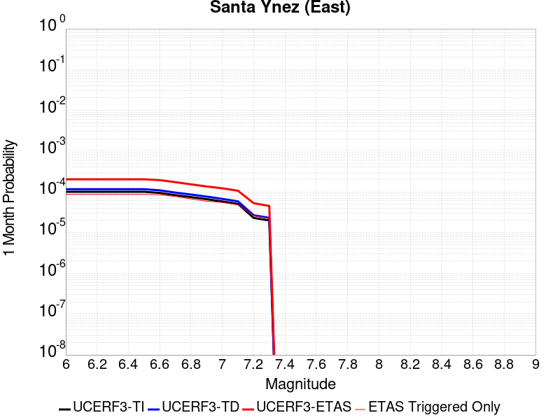 | 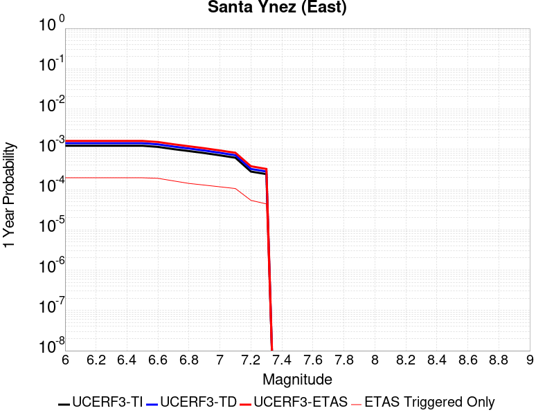 |  |

| Magnitude | 1 wk TI Prob | 1 wk TD Prob | 1 wk ETAS Prob | 1 wk ETAS/TD Gain | 1 wk ETAS Triggered Only | 1 mo TI Prob | 1 mo TD Prob | 1 mo ETAS Prob | 1 mo ETAS/TD Gain | 1 mo ETAS Triggered Only | 1 yr TI Prob | 1 yr TD Prob | 1 yr ETAS Prob | 1 yr ETAS/TD Gain | 1 yr ETAS Triggered Only | 10 yr TI Prob | 10 yr TD Prob | 10 yr ETAS Prob | 10 yr ETAS/TD Gain | 10 yr ETAS Triggered Only |
|-----|-----|-----|-----|-----|-----|-----|-----|-----|-----|-----|-----|-----|-----|-----|-----|-----|-----|-----|-----|-----|
| 6.0 | 2.3428358E-5 | 2.7130885E-5 | 1.0147094E-4 | 3.7400527 | 7.4342075E-5 | 1.00403384E-4 | 1.16270545E-4 | 2.277707E-4 | 1.9589715 | 1.1151311E-4 | 0.0012217257 | 0.0014147647 | 0.0016498482 | 1.1661644 | 2.3541656E-4 | 0.012150308 | 0.014066651 | 0.014457565 | 1.0277901 | 3.9649106E-4 |
| 6.1 | 2.3428358E-5 | 2.7130885E-5 | 1.0147094E-4 | 3.7400527 | 7.4342075E-5 | 1.00403384E-4 | 1.16270545E-4 | 2.277707E-4 | 1.9589715 | 1.1151311E-4 | 0.0012217257 | 0.0014147647 | 0.0016498482 | 1.1661644 | 2.3541656E-4 | 0.012150308 | 0.014066651 | 0.014457565 | 1.0277901 | 3.9649106E-4 |
| 6.2 | 2.3428358E-5 | 2.7130885E-5 | 1.0147094E-4 | 3.7400527 | 7.4342075E-5 | 1.00403384E-4 | 1.16270545E-4 | 2.277707E-4 | 1.9589715 | 1.1151311E-4 | 0.0012217257 | 0.0014147647 | 0.0016498482 | 1.1661644 | 2.3541656E-4 | 0.012150308 | 0.014066651 | 0.014457565 | 1.0277901 | 3.9649106E-4 |
| 6.3 | 2.3428358E-5 | 2.7130885E-5 | 1.0147094E-4 | 3.7400527 | 7.4342075E-5 | 1.00403384E-4 | 1.16270545E-4 | 2.277707E-4 | 1.9589715 | 1.1151311E-4 | 0.0012217257 | 0.0014147647 | 0.0016498482 | 1.1661644 | 2.3541656E-4 | 0.012150308 | 0.014066651 | 0.014457565 | 1.0277901 | 3.9649106E-4 |
| 6.4 | 2.3428358E-5 | 2.7130885E-5 | 1.0147094E-4 | 3.7400527 | 7.4342075E-5 | 1.00403384E-4 | 1.16270545E-4 | 2.277707E-4 | 1.9589715 | 1.1151311E-4 | 0.0012217257 | 0.0014147647 | 0.0016498482 | 1.1661644 | 2.3541656E-4 | 0.012150308 | 0.014066651 | 0.014457565 | 1.0277901 | 3.9649106E-4 |
| 6.5 | 2.3428358E-5 | 2.7130885E-5 | 1.0147094E-4 | 3.7400527 | 7.4342075E-5 | 1.00403384E-4 | 1.16270545E-4 | 2.277707E-4 | 1.9589715 | 1.1151311E-4 | 0.0012217257 | 0.0014147647 | 0.0016498482 | 1.1661644 | 2.3541656E-4 | 0.012150308 | 0.014066651 | 0.014457565 | 1.0277901 | 3.9649106E-4 |
| 6.6 | 2.1941343E-5 | 2.5408908E-5 | 9.974909E-5 | 3.9257526 | 7.4342075E-5 | 9.403093E-5 | 1.0889128E-4 | 2.2039225E-4 | 2.0239658 | 1.1151311E-4 | 0.0011442254 | 0.0013250347 | 0.0015477655 | 1.1680943 | 2.2302622E-4 | 0.011383517 | 0.013180321 | 0.013522678 | 1.0259749 | 3.4692968E-4 |
| 6.7 | 1.9331053E-5 | 2.2379061E-5 | 9.671947E-5 | 4.3218737 | 7.4342075E-5 | 8.2844745E-5 | 9.590723E-5 | 2.0740964E-4 | 2.162607 | 1.1151311E-4 | 0.001008168 | 0.0011671331 | 0.0013898991 | 1.1908659 | 2.2302622E-4 | 0.010036064 | 0.011618788 | 0.011961687 | 1.0295124 | 3.4692968E-4 |
| 6.8 | 1.7302833E-5 | 2.0024241E-5 | 9.436483E-5 | 4.712529 | 7.4342075E-5 | 7.415289E-5 | 8.5815846E-5 | 1.849301E-4 | 2.1549644 | 9.9122764E-5 | 9.024375E-4 | 0.0010443943 | 0.0012300555 | 1.1777692 | 1.8585518E-4 | 0.008987815 | 0.010403484 | 0.01071002 | 1.0294647 | 3.0975865E-4 |
| 6.9 | 1.5430072E-5 | 1.7849516E-5 | 9.219026E-5 | 5.1648607 | 7.4342075E-5 | 6.6127206E-5 | 7.6496166E-5 | 1.7561135E-4 | 2.2956882 | 9.9122764E-5 | 8.048013E-4 | 9.3102927E-4 | 0.0011167114 | 1.1994375 | 1.8585518E-4 | 0.008018929 | 0.0092798015 | 0.009549859 | 1.0291017 | 2.725876E-4 |
| 7.0 | 1.355306E-5 | 1.5666186E-5 | 9.0007095E-5 | 5.74531 | 7.4342075E-5 | 5.808325E-5 | 6.7139554E-5 | 1.6625566E-4 | 2.47627 | 9.9122764E-5 | 7.0693414E-4 | 8.172031E-4 | 0.0010029064 | 1.2272426 | 1.8585518E-4 | 0.0070468946 | 0.008150392 | 0.008408469 | 1.0316643 | 2.6019727E-4 |
| 7.1 | 1.17999725E-5 | 1.36319095E-5 | 8.797297E-5 | 6.453459 | 7.4342075E-5 | 5.0570332E-5 | 5.842164E-5 | 1.5753861E-4 | 2.69658 | 9.9122764E-5 | 6.155198E-4 | 7.11136E-4 | 8.96859E-4 | 1.2611638 | 1.8585518E-4 | 0.0061381776 | 0.0070969095 | 0.0073306556 | 1.0329363 | 2.3541656E-4 |
| 7.2 | 5.357108E-6 | 6.2256004E-6 | 5.5786673E-5 | 8.960851 | 4.9561382E-5 | 2.2958831E-5 | 2.6681053E-5 | 8.8631125E-5 | 3.3218753 | 6.195173E-5 | 2.7948793E-4 | 3.248254E-4 | 4.3630227E-4 | 1.3431902 | 1.1151311E-4 | 0.0027913668 | 0.0032466452 | 0.0033701463 | 1.0380397 | 1.2390346E-4 |
| 7.3 | 4.632513E-6 | 5.3767917E-6 | 4.254763E-5 | 7.9132 | 3.7171038E-5 | 1.9853476E-5 | 2.3043369E-5 | 7.260361E-5 | 3.1507375 | 4.9561382E-5 | 2.4168925E-4 | 2.8054876E-4 | 3.7964372E-4 | 1.3532183 | 9.9122764E-5 | 0.0024142656 | 0.00280507 | 0.0029162704 | 1.0396426 | 1.1151311E-4 |

## San Jacinto (San Bernardino)
*[(top)](#table-of-contents)*

| 1 Week | 1 Month | 1 Year | 10 Year |
|-----|-----|-----|-----|
|  |  |  |  |

| Magnitude | 1 wk TI Prob | 1 wk TD Prob | 1 wk ETAS Prob | 1 wk ETAS/TD Gain | 1 wk ETAS Triggered Only | 1 mo TI Prob | 1 mo TD Prob | 1 mo ETAS Prob | 1 mo ETAS/TD Gain | 1 mo ETAS Triggered Only | 1 yr TI Prob | 1 yr TD Prob | 1 yr ETAS Prob | 1 yr ETAS/TD Gain | 1 yr ETAS Triggered Only | 10 yr TI Prob | 10 yr TD Prob | 10 yr ETAS Prob | 10 yr ETAS/TD Gain | 10 yr ETAS Triggered Only |
|-----|-----|-----|-----|-----|-----|-----|-----|-----|-----|-----|-----|-----|-----|-----|-----|-----|-----|-----|-----|-----|
| 6.0 | 6.770798E-5 | 1.266041E-4 | 1.8854799E-4 | 1.4892724 | 6.195173E-5 | 2.901448E-4 | 5.424351E-4 | 6.291205E-4 | 1.1598078 | 8.673242E-5 | 0.0035267917 | 0.0065838103 | 0.0067807506 | 1.0299128 | 1.9824553E-4 | 0.03471343 | 0.064538844 | 0.064898156 | 1.0055673 | 3.841007E-4 |
| 6.1 | 6.770798E-5 | 1.266041E-4 | 1.8854799E-4 | 1.4892724 | 6.195173E-5 | 2.901448E-4 | 5.424351E-4 | 6.291205E-4 | 1.1598078 | 8.673242E-5 | 0.0035267917 | 0.0065838103 | 0.0067807506 | 1.0299128 | 1.9824553E-4 | 0.03471343 | 0.064538844 | 0.064898156 | 1.0055673 | 3.841007E-4 |
| 6.2 | 6.770798E-5 | 1.266041E-4 | 1.8854799E-4 | 1.4892724 | 6.195173E-5 | 2.901448E-4 | 5.424351E-4 | 6.291205E-4 | 1.1598078 | 8.673242E-5 | 0.0035267917 | 0.0065838103 | 0.0067807506 | 1.0299128 | 1.9824553E-4 | 0.03471343 | 0.064538844 | 0.064898156 | 1.0055673 | 3.841007E-4 |
| 6.3 | 6.770798E-5 | 1.266041E-4 | 1.8854799E-4 | 1.4892724 | 6.195173E-5 | 2.901448E-4 | 5.424351E-4 | 6.291205E-4 | 1.1598078 | 8.673242E-5 | 0.0035267917 | 0.0065838103 | 0.0067807506 | 1.0299128 | 1.9824553E-4 | 0.03471343 | 0.064538844 | 0.064898156 | 1.0055673 | 3.841007E-4 |
| 6.4 | 6.770798E-5 | 1.266041E-4 | 1.8854799E-4 | 1.4892724 | 6.195173E-5 | 2.901448E-4 | 5.424351E-4 | 6.291205E-4 | 1.1598078 | 8.673242E-5 | 0.0035267917 | 0.0065838103 | 0.0067807506 | 1.0299128 | 1.9824553E-4 | 0.03471343 | 0.064538844 | 0.064898156 | 1.0055673 | 3.841007E-4 |
| 6.5 | 6.770798E-5 | 1.266041E-4 | 1.8854799E-4 | 1.4892724 | 6.195173E-5 | 2.901448E-4 | 5.424351E-4 | 6.291205E-4 | 1.1598078 | 8.673242E-5 | 0.0035267917 | 0.0065838103 | 0.0067807506 | 1.0299128 | 1.9824553E-4 | 0.03471343 | 0.064538844 | 0.064898156 | 1.0055673 | 3.841007E-4 |
| 6.6 | 6.742141E-5 | 1.2610736E-4 | 1.8805129E-4 | 1.4911999 | 6.195173E-5 | 2.889169E-4 | 5.403072E-4 | 6.269927E-4 | 1.1604376 | 8.673242E-5 | 0.00351189 | 0.0065580956 | 0.006755041 | 1.0300308 | 1.9824553E-4 | 0.034569066 | 0.064300194 | 0.0646596 | 1.0055895 | 3.841007E-4 |
| 6.7 | 6.71276E-5 | 1.2559396E-4 | 1.875379E-4 | 1.493208 | 6.195173E-5 | 2.8765798E-4 | 5.3810794E-4 | 6.247937E-4 | 1.1610936 | 8.673242E-5 | 0.0034966122 | 0.0065315217 | 0.0067284727 | 1.0301539 | 1.9824553E-4 | 0.034421038 | 0.06405372 | 0.06441322 | 1.0056125 | 3.841007E-4 |
| 6.8 | 6.664797E-5 | 1.246922E-4 | 1.866362E-4 | 1.4967753 | 6.195173E-5 | 2.8560287E-4 | 5.34245E-4 | 6.2093104E-4 | 1.1622591 | 8.673242E-5 | 0.0034716716 | 0.0064848163 | 0.006681776 | 1.0303725 | 1.9824553E-4 | 0.034179345 | 0.06361825 | 0.06397792 | 1.0056535 | 3.841007E-4 |
| 6.9 | 6.6334556E-5 | 1.2409322E-4 | 1.8603726E-4 | 1.4991734 | 6.195173E-5 | 2.8425996E-4 | 5.316793E-4 | 6.183656E-4 | 1.1630424 | 8.673242E-5 | 0.0034553735 | 0.0064537986 | 0.0066384543 | 1.0286119 | 1.8585518E-4 | 0.034021374 | 0.06332935 | 0.06367752 | 1.0054978 | 3.7171037E-4 |
| 7.0 | 6.6140106E-5 | 1.237124E-4 | 1.8565646E-4 | 1.5007102 | 6.195173E-5 | 2.834268E-4 | 5.3004787E-4 | 6.167343E-4 | 1.1635445 | 8.673242E-5 | 0.0034452619 | 0.0064340793 | 0.0066187386 | 1.0287002 | 1.8585518E-4 | 0.033923354 | 0.06314599 | 0.06349423 | 1.0055149 | 3.7171037E-4 |
| 7.1 | 3.950743E-5 | 7.372838E-5 | 8.611781E-5 | 1.1680416 | 1.2390346E-5 | 1.6930657E-4 | 3.1591134E-4 | 3.406842E-4 | 1.0784172 | 2.4780691E-5 | 0.0020593586 | 0.003838852 | 0.003900566 | 1.0160761 | 6.195173E-5 | 0.020403787 | 0.03836328 | 0.03848243 | 1.0031059 | 1.2390346E-4 |
| 7.2 | 3.9056304E-5 | 7.278862E-5 | 8.5178064E-5 | 1.1702113 | 1.2390346E-5 | 1.6737341E-4 | 3.1188547E-4 | 3.3665844E-4 | 1.0794296 | 2.4780691E-5 | 0.0020358667 | 0.0037901076 | 0.0038518244 | 1.0162836 | 6.195173E-5 | 0.020173162 | 0.03790224 | 0.03802145 | 1.0031451 | 1.2390346E-4 |
| 7.3 | 3.8629096E-5 | 7.181476E-5 | 8.4204206E-5 | 1.1725197 | 1.2390346E-5 | 1.6554276E-4 | 3.0771297E-4 | 3.3248603E-4 | 1.080507 | 2.4780691E-5 | 0.00201362 | 0.0037395307 | 0.0038012508 | 1.0165048 | 6.195173E-5 | 0.019954717 | 0.03741947 | 0.037538737 | 1.0031873 | 1.2390346E-4 |
| 7.4 | 2.2630244E-5 | 3.4288696E-5 | 4.6678615E-5 | 1.3613412 | 1.2390346E-5 | 9.698315E-5 | 1.4694584E-4 | 1.5933436E-4 | 1.0843067 | 1.2390346E-5 | 0.0011801302 | 0.0017880509 | 0.0018127871 | 1.0138342 | 2.4780691E-5 | 0.011738827 | 0.01851639 | 0.018577194 | 1.0032839 | 6.195173E-5 |
| 7.5 | 2.187835E-5 | 3.2830816E-5 | 4.5220757E-5 | 1.3773874 | 1.2390346E-5 | 9.376098E-5 | 1.4069847E-4 | 1.5308706E-4 | 1.0880507 | 1.2390346E-5 | 0.0011409421 | 0.0017121107 | 0.001736849 | 1.014449 | 2.4780691E-5 | 0.01135102 | 0.017765915 | 0.017826766 | 1.0034251 | 6.195173E-5 |
| 7.6 | 2.1126454E-5 | 3.1434487E-5 | 4.3824442E-5 | 1.3941517 | 1.2390346E-5 | 9.053881E-5 | 1.3471482E-4 | 1.4710349E-4 | 1.0919622 | 1.2390346E-5 | 0.0011017525 | 0.0016393713 | 0.0016641114 | 1.0150912 | 2.4780691E-5 | 0.010963061 | 0.017041424 | 0.017102322 | 1.0035734 | 6.195173E-5 |
| 7.7 | 1.5200701E-5 | 2.0237094E-5 | 2.0237094E-5 | 1.0 | 0.0 | 6.514423E-5 | 8.672961E-5 | 8.672961E-5 | 1.0 | 0.0 | 7.9284236E-4 | 0.0010557924 | 0.0010557924 | 1.0 | 0.0 | 0.007900197 | 0.011221906 | 0.01125866 | 1.0032752 | 3.7171038E-5 |
| 7.8 | 1.5303123E-6 | 1.9707616E-6 | 1.9707616E-6 | 1.0 | 0.0 | 6.5584645E-6 | 8.446107E-6 | 8.446107E-6 | 1.0 | 0.0 | 7.984638E-5 | 1.0282895E-4 | 1.0282895E-4 | 1.0 | 0.0 | 7.98177E-4 | 0.001066982 | 0.0010793592 | 1.0116001 | 1.2390346E-5 |

## San Andreas (San Gorgonio Pass-Garnet HIll)
*[(top)](#table-of-contents)*

| 1 Week | 1 Month | 1 Year | 10 Year |
|-----|-----|-----|-----|
|  |  |  |  |

| Magnitude | 1 wk TI Prob | 1 wk TD Prob | 1 wk ETAS Prob | 1 wk ETAS/TD Gain | 1 wk ETAS Triggered Only | 1 mo TI Prob | 1 mo TD Prob | 1 mo ETAS Prob | 1 mo ETAS/TD Gain | 1 mo ETAS Triggered Only | 1 yr TI Prob | 1 yr TD Prob | 1 yr ETAS Prob | 1 yr ETAS/TD Gain | 1 yr ETAS Triggered Only | 10 yr TI Prob | 10 yr TD Prob | 10 yr ETAS Prob | 10 yr ETAS/TD Gain | 10 yr ETAS Triggered Only |
|-----|-----|-----|-----|-----|-----|-----|-----|-----|-----|-----|-----|-----|-----|-----|-----|-----|-----|-----|-----|-----|
| 6.0 | 6.406053E-5 | 2.5446463E-4 | 3.4117498E-4 | 1.340756 | 8.673242E-5 | 2.7451623E-4 | 0.0010901445 | 0.0012386666 | 1.1362407 | 1.4868415E-4 | 0.0033371134 | 0.013198856 | 0.013455619 | 1.0194534 | 2.6019727E-4 | 0.03287443 | 0.11774556 | 0.1180735 | 1.0027852 | 3.7171037E-4 |
| 6.1 | 6.406053E-5 | 2.5446463E-4 | 3.4117498E-4 | 1.340756 | 8.673242E-5 | 2.7451623E-4 | 0.0010901445 | 0.0012386666 | 1.1362407 | 1.4868415E-4 | 0.0033371134 | 0.013198856 | 0.013455619 | 1.0194534 | 2.6019727E-4 | 0.03287443 | 0.11774556 | 0.1180735 | 1.0027852 | 3.7171037E-4 |
| 6.2 | 6.406053E-5 | 2.5446463E-4 | 3.4117498E-4 | 1.340756 | 8.673242E-5 | 2.7451623E-4 | 0.0010901445 | 0.0012386666 | 1.1362407 | 1.4868415E-4 | 0.0033371134 | 0.013198856 | 0.013455619 | 1.0194534 | 2.6019727E-4 | 0.03287443 | 0.11774556 | 0.1180735 | 1.0027852 | 3.7171037E-4 |
| 6.3 | 6.406053E-5 | 2.5446463E-4 | 3.4117498E-4 | 1.340756 | 8.673242E-5 | 2.7451623E-4 | 0.0010901445 | 0.0012386666 | 1.1362407 | 1.4868415E-4 | 0.0033371134 | 0.013198856 | 0.013455619 | 1.0194534 | 2.6019727E-4 | 0.03287443 | 0.11774556 | 0.1180735 | 1.0027852 | 3.7171037E-4 |
| 6.4 | 6.406053E-5 | 2.5446463E-4 | 3.4117498E-4 | 1.340756 | 8.673242E-5 | 2.7451623E-4 | 0.0010901445 | 0.0012386666 | 1.1362407 | 1.4868415E-4 | 0.0033371134 | 0.013198856 | 0.013455619 | 1.0194534 | 2.6019727E-4 | 0.03287443 | 0.11774556 | 0.1180735 | 1.0027852 | 3.7171037E-4 |
| 6.5 | 6.406053E-5 | 2.5446463E-4 | 3.4117498E-4 | 1.340756 | 8.673242E-5 | 2.7451623E-4 | 0.0010901445 | 0.0012386666 | 1.1362407 | 1.4868415E-4 | 0.0033371134 | 0.013198856 | 0.013455619 | 1.0194534 | 2.6019727E-4 | 0.03287443 | 0.11774556 | 0.1180735 | 1.0027852 | 3.7171037E-4 |
| 6.6 | 6.394007E-5 | 2.5425098E-4 | 3.4096133E-4 | 1.3410424 | 8.673242E-5 | 2.7400005E-4 | 0.0010892297 | 0.0012377519 | 1.1363553 | 1.4868415E-4 | 0.0033308482 | 0.013187864 | 0.0134446295 | 1.0194699 | 2.6019727E-4 | 0.032813635 | 0.11764885 | 0.11797682 | 1.0027878 | 3.7171037E-4 |
| 6.7 | 6.367558E-5 | 2.5377903E-4 | 3.4048944E-4 | 1.3416768 | 8.673242E-5 | 2.728668E-4 | 0.001087209 | 0.0012357314 | 1.136609 | 1.4868415E-4 | 0.003317093 | 0.013163578 | 0.01342035 | 1.0195062 | 2.6019727E-4 | 0.032680146 | 0.11743534 | 0.1177634 | 1.0027936 | 3.7171037E-4 |
| 6.8 | 6.342804E-5 | 2.53231E-4 | 3.3994147E-4 | 1.3424164 | 8.673242E-5 | 2.7180612E-4 | 0.0010848623 | 0.0012333851 | 1.1369048 | 1.4868415E-4 | 0.0033042182 | 0.013135359 | 0.013392138 | 1.0195488 | 2.6019727E-4 | 0.03255518 | 0.11718895 | 0.117517106 | 1.0028002 | 3.7171037E-4 |
| 6.9 | 6.311567E-5 | 2.5253315E-4 | 3.3924368E-4 | 1.3433629 | 8.673242E-5 | 2.704677E-4 | 0.001081874 | 0.0012303973 | 1.1372833 | 1.4868415E-4 | 0.0032879722 | 0.013099421 | 0.01335621 | 1.019603 | 2.6019727E-4 | 0.03239748 | 0.116875 | 0.117203265 | 1.0028087 | 3.7171037E-4 |
| 7.0 | 6.275471E-5 | 2.516945E-4 | 3.3840508E-4 | 1.3445073 | 8.673242E-5 | 2.6892102E-4 | 0.0010782827 | 0.0012268065 | 1.1377411 | 1.4868415E-4 | 0.0032691984 | 0.013056225 | 0.013313025 | 1.0196688 | 2.6019727E-4 | 0.032215208 | 0.11649866 | 0.11682706 | 1.002819 | 3.7171037E-4 |
| 7.1 | 5.698032E-5 | 2.4105505E-4 | 3.2776658E-4 | 1.3597167 | 8.673242E-5 | 2.4417852E-4 | 0.0010327251 | 0.0011812557 | 1.143824 | 1.4868415E-4 | 0.0029688207 | 0.012508327 | 0.01276527 | 1.0205417 | 2.6019727E-4 | 0.029294705 | 0.111619234 | 0.11193845 | 1.0028598 | 3.5932002E-4 |
| 7.2 | 5.6554676E-5 | 2.3997852E-4 | 3.2669012E-4 | 1.3613307 | 8.673242E-5 | 2.4235467E-4 | 0.0010281149 | 0.0011766462 | 1.1444695 | 1.4868415E-4 | 0.0029466755 | 0.012452842 | 0.012709798 | 1.0206344 | 2.6019727E-4 | 0.02907908 | 0.11113716 | 0.11145655 | 1.0028738 | 3.5932002E-4 |
| 7.3 | 5.6086934E-5 | 2.3837794E-4 | 3.2508967E-4 | 1.3637574 | 8.673242E-5 | 2.4035043E-4 | 0.0010212607 | 0.001169793 | 1.1454401 | 1.4868415E-4 | 0.0029223398 | 0.012370342 | 0.012627321 | 1.0207738 | 2.6019727E-4 | 0.028842075 | 0.11042753 | 0.11074717 | 1.0028945 | 3.5932002E-4 |
| 7.4 | 3.770566E-5 | 1.74606E-4 | 2.6132326E-4 | 1.4966455 | 8.673242E-5 | 1.6158567E-4 | 7.4812124E-4 | 8.843131E-4 | 1.1820451 | 1.362938E-4 | 0.0019655304 | 0.009074706 | 0.009320265 | 1.0270597 | 2.4780692E-4 | 0.019482363 | 0.081598505 | 0.08191712 | 1.0039047 | 3.4692968E-4 |
| 7.5 | 3.2925338E-5 | 1.6180723E-4 | 2.3613728E-4 | 1.4593741 | 7.4342075E-5 | 1.4110096E-4 | 6.932988E-4 | 8.171164E-4 | 1.1785918 | 1.2390346E-4 | 0.0017165504 | 0.008412451 | 0.008633601 | 1.0262884 | 2.2302622E-4 | 0.017033515 | 0.07553181 | 0.075829625 | 1.003943 | 3.22149E-4 |
| 7.6 | 2.755807E-5 | 1.3971048E-4 | 2.1404217E-4 | 1.5320408 | 7.4342075E-5 | 1.1810067E-4 | 5.986425E-4 | 7.224718E-4 | 1.2068502 | 1.2390346E-4 | 0.0014369272 | 0.0072677988 | 0.007489204 | 1.0304639 | 2.2302622E-4 | 0.014276713 | 0.06540738 | 0.06570846 | 1.0046031 | 3.22149E-4 |
| 7.7 | 2.1845604E-5 | 1.16577445E-4 | 1.9091085E-4 | 1.637631 | 7.4342075E-5 | 9.3620656E-5 | 4.9953954E-4 | 6.233811E-4 | 1.2479115 | 1.2390346E-4 | 0.0011392354 | 0.006068057 | 0.00628973 | 1.0365311 | 2.2302622E-4 | 0.011334128 | 0.054707337 | 0.054988436 | 1.0051383 | 2.973683E-4 |
| 7.8 | 1.6634915E-5 | 9.5212796E-5 | 1.4476947E-4 | 1.5204833 | 4.9561382E-5 | 7.1290546E-5 | 4.0800648E-4 | 5.070888E-4 | 1.2428449 | 9.9122764E-5 | 8.6761673E-4 | 0.0049589034 | 0.005156166 | 1.0397794 | 1.9824553E-4 | 0.008642371 | 0.044416133 | 0.044664774 | 1.005598 | 2.6019727E-4 |
| 7.9 | 8.077817E-6 | 4.28294E-5 | 7.999884E-5 | 1.8678489 | 3.7171038E-5 | 3.461876E-5 | 1.8354366E-4 | 2.4548403E-4 | 1.3374693 | 6.195173E-5 | 4.2140187E-4 | 0.0022327097 | 0.0023439736 | 1.0498337 | 1.1151311E-4 | 0.0042060367 | 0.020394128 | 0.020527642 | 1.0065467 | 1.362938E-4 |
| 8.0 | 4.568552E-6 | 2.316693E-5 | 4.7947044E-5 | 2.0696332 | 2.4780691E-5 | 1.957936E-5 | 9.928437E-5 | 1.3645172E-4 | 1.3743525 | 3.7171038E-5 | 2.3835264E-4 | 0.0012083502 | 0.001270227 | 1.0512078 | 6.195173E-5 | 0.0023809716 | 0.011144294 | 0.011230061 | 1.0076959 | 8.673242E-5 |
| 8.1 | 2.2240692E-6 | 1.29589735E-5 | 2.5349158E-5 | 1.9561086 | 1.2390346E-5 | 9.531691E-6 | 5.5538447E-5 | 6.792811E-5 | 1.2230825 | 1.2390346E-5 | 1.1604215E-4 | 6.7617896E-4 | 7.133249E-4 | 1.054935 | 3.7171038E-5 | 0.0011598158 | 0.0061071273 | 0.006156386 | 1.0080658 | 4.9561382E-5 |

## San Andreas (Coachella) rev
*[(top)](#table-of-contents)*

| 1 Week | 1 Month | 1 Year | 10 Year |
|-----|-----|-----|-----|
|  |  |  |  |

| Magnitude | 1 wk TI Prob | 1 wk TD Prob | 1 wk ETAS Prob | 1 wk ETAS/TD Gain | 1 wk ETAS Triggered Only | 1 mo TI Prob | 1 mo TD Prob | 1 mo ETAS Prob | 1 mo ETAS/TD Gain | 1 mo ETAS Triggered Only | 1 yr TI Prob | 1 yr TD Prob | 1 yr ETAS Prob | 1 yr ETAS/TD Gain | 1 yr ETAS Triggered Only | 10 yr TI Prob | 10 yr TD Prob | 10 yr ETAS Prob | 10 yr ETAS/TD Gain | 10 yr ETAS Triggered Only |
|-----|-----|-----|-----|-----|-----|-----|-----|-----|-----|-----|-----|-----|-----|-----|-----|-----|-----|-----|-----|-----|
| 6.0 | 1.4215116E-4 | 5.186186E-4 | 6.05306E-4 | 1.1671506 | 8.673242E-5 | 6.09077E-4 | 0.0022216013 | 0.0023575923 | 1.061213 | 1.362938E-4 | 0.0073903278 | 0.026862355 | 0.027091447 | 1.0085284 | 2.3541656E-4 | 0.07149333 | 0.23013055 | 0.23040718 | 1.0012021 | 3.5932002E-4 |
| 6.1 | 1.4215116E-4 | 5.186186E-4 | 6.05306E-4 | 1.1671506 | 8.673242E-5 | 6.09077E-4 | 0.0022216013 | 0.0023575923 | 1.061213 | 1.362938E-4 | 0.0073903278 | 0.026862355 | 0.027091447 | 1.0085284 | 2.3541656E-4 | 0.07149333 | 0.23013055 | 0.23040718 | 1.0012021 | 3.5932002E-4 |
| 6.2 | 1.4215116E-4 | 5.186186E-4 | 6.05306E-4 | 1.1671506 | 8.673242E-5 | 6.09077E-4 | 0.0022216013 | 0.0023575923 | 1.061213 | 1.362938E-4 | 0.0073903278 | 0.026862355 | 0.027091447 | 1.0085284 | 2.3541656E-4 | 0.07149333 | 0.23013055 | 0.23040718 | 1.0012021 | 3.5932002E-4 |
| 6.3 | 1.4215116E-4 | 5.186186E-4 | 6.05306E-4 | 1.1671506 | 8.673242E-5 | 6.09077E-4 | 0.0022216013 | 0.0023575923 | 1.061213 | 1.362938E-4 | 0.0073903278 | 0.026862355 | 0.027091447 | 1.0085284 | 2.3541656E-4 | 0.07149333 | 0.23013055 | 0.23040718 | 1.0012021 | 3.5932002E-4 |
| 6.4 | 1.4215116E-4 | 5.186186E-4 | 6.05306E-4 | 1.1671506 | 8.673242E-5 | 6.09077E-4 | 0.0022216013 | 0.0023575923 | 1.061213 | 1.362938E-4 | 0.0073903278 | 0.026862355 | 0.027091447 | 1.0085284 | 2.3541656E-4 | 0.07149333 | 0.23013055 | 0.23040718 | 1.0012021 | 3.5932002E-4 |
| 6.5 | 1.4215116E-4 | 5.186186E-4 | 6.05306E-4 | 1.1671506 | 8.673242E-5 | 6.09077E-4 | 0.0022216013 | 0.0023575923 | 1.061213 | 1.362938E-4 | 0.0073903278 | 0.026862355 | 0.027091447 | 1.0085284 | 2.3541656E-4 | 0.07149333 | 0.23013055 | 0.23040718 | 1.0012021 | 3.5932002E-4 |
| 6.6 | 1.419504E-4 | 5.181686E-4 | 6.048561E-4 | 1.1672959 | 8.673242E-5 | 6.08217E-4 | 0.0022196763 | 0.0023556675 | 1.0612663 | 1.362938E-4 | 0.007379928 | 0.026839495 | 0.027068594 | 1.0085359 | 2.3541656E-4 | 0.071396045 | 0.22996132 | 0.230238 | 1.0012032 | 3.5932002E-4 |
| 6.7 | 1.417257E-4 | 5.176668E-4 | 6.0435437E-4 | 1.1674582 | 8.673242E-5 | 6.0725445E-4 | 0.0022175293 | 0.0023535208 | 1.0613257 | 1.362938E-4 | 0.007368289 | 0.026814 | 0.027043104 | 1.0085442 | 2.3541656E-4 | 0.071287155 | 0.22977221 | 0.23004897 | 1.0012045 | 3.5932002E-4 |
| 6.8 | 1.414573E-4 | 5.168337E-4 | 6.0352124E-4 | 1.1677282 | 8.673242E-5 | 6.0610473E-4 | 0.0022139647 | 0.0023499567 | 1.0614246 | 1.362938E-4 | 0.0073543857 | 0.02677167 | 0.027000785 | 1.008558 | 2.3541656E-4 | 0.07115707 | 0.22946371 | 0.22974059 | 1.0012066 | 3.5932002E-4 |
| 6.9 | 1.4122782E-4 | 5.16135E-4 | 6.0282263E-4 | 1.1679554 | 8.673242E-5 | 6.0512166E-4 | 0.0022109754 | 0.0023469678 | 1.0615079 | 1.362938E-4 | 0.0073424974 | 0.026736172 | 0.026965294 | 1.0085697 | 2.3541656E-4 | 0.071045816 | 0.22920302 | 0.22947997 | 1.0012084 | 3.5932002E-4 |
| 7.0 | 3.518344E-5 | 1.7667694E-4 | 2.1384141E-4 | 1.2103527 | 3.7171038E-5 | 1.5077746E-4 | 7.570029E-4 | 8.312887E-4 | 1.0981314 | 7.4342075E-5 | 0.0018341698 | 0.009183929 | 0.009343524 | 1.0173776 | 1.610745E-4 | 0.018191047 | 0.08167031 | 0.081875116 | 1.0025078 | 2.2302622E-4 |
| 7.1 | 3.494209E-5 | 1.7597742E-4 | 2.1314192E-4 | 1.211189 | 3.7171038E-5 | 1.4974322E-4 | 7.5400673E-4 | 8.2829274E-4 | 1.0985217 | 7.4342075E-5 | 0.0018215991 | 0.009147758 | 0.009307358 | 1.017447 | 1.610745E-4 | 0.018067393 | 0.08135258 | 0.08155746 | 1.0025184 | 2.2302622E-4 |
| 7.2 | 3.469566E-5 | 1.7526992E-4 | 2.1243445E-4 | 1.2120416 | 3.7171038E-5 | 1.486872E-4 | 7.509763E-4 | 8.2526257E-4 | 1.0989195 | 7.4342075E-5 | 0.0018087636 | 0.009111172 | 0.009270779 | 1.0175177 | 1.610745E-4 | 0.017941121 | 0.081028596 | 0.08123355 | 1.0025294 | 2.2302622E-4 |
| 7.3 | 3.4415007E-5 | 1.7414277E-4 | 2.1130733E-4 | 1.2134143 | 3.7171038E-5 | 1.4748455E-4 | 7.4614846E-4 | 8.2043506E-4 | 1.0995601 | 7.4342075E-5 | 0.0017941454 | 0.009052882 | 0.009212499 | 1.0176315 | 1.610745E-4 | 0.017797293 | 0.0805192 | 0.08072426 | 1.0025468 | 2.2302622E-4 |
| 7.4 | 2.4040828E-5 | 1.2752844E-4 | 1.6469473E-4 | 1.2914354 | 3.7171038E-5 | 1.03028055E-4 | 5.4645713E-4 | 6.08375E-4 | 1.1133078 | 6.195173E-5 | 0.0012536447 | 0.006636575 | 0.0067842724 | 1.0222551 | 1.4868415E-4 | 0.012465959 | 0.05921359 | 0.059411753 | 1.0033466 | 2.1063587E-4 |
| 7.5 | 2.3755325E-5 | 1.2645396E-4 | 1.636203E-4 | 1.293912 | 3.7171038E-5 | 1.01804566E-4 | 5.418541E-4 | 6.037723E-4 | 1.1142709 | 6.195173E-5 | 0.0012387658 | 0.006580873 | 0.006728579 | 1.0224447 | 1.4868415E-4 | 0.012318831 | 0.058711812 | 0.05891008 | 1.003377 | 2.1063587E-4 |
| 7.6 | 1.8671783E-5 | 1.0518968E-4 | 1.423568E-4 | 1.3533343 | 3.7171038E-5 | 8.001947E-5 | 4.507533E-4 | 5.126771E-4 | 1.1373785 | 6.195173E-5 | 9.7380154E-4 | 0.005477352 | 0.005625222 | 1.0269966 | 1.4868415E-4 | 0.009695454 | 0.048804447 | 0.049004804 | 1.0041053 | 2.1063587E-4 |
| 7.7 | 1.3209655E-5 | 8.279697E-5 | 1.19964934E-4 | 1.4489048 | 3.7171038E-5 | 5.6611578E-5 | 3.5481108E-4 | 4.1674083E-4 | 1.1745429 | 6.195173E-5 | 6.89028E-4 | 0.004313955 | 0.0044619977 | 1.0343171 | 1.4868415E-4 | 0.0068689547 | 0.038274445 | 0.038453184 | 1.00467 | 1.8585518E-4 |
| 7.8 | 1.2769314E-5 | 8.019109E-5 | 1.17359144E-4 | 1.4634936 | 3.7171038E-5 | 5.4724485E-5 | 3.4364598E-4 | 4.0557643E-4 | 1.1802158 | 6.195173E-5 | 6.660669E-4 | 0.004178549 | 0.004326612 | 1.035434 | 1.4868415E-4 | 0.00664074 | 0.03708048 | 0.037259445 | 1.0048263 | 1.8585518E-4 |
| 7.9 | 5.8437E-6 | 3.3993063E-5 | 5.8772912E-5 | 1.7289678 | 2.4780691E-5 | 2.5044188E-5 | 1.4567829E-4 | 1.8284393E-4 | 1.2551212 | 3.7171038E-5 | 3.0487034E-4 | 0.0017725222 | 0.001859101 | 1.0488449 | 8.673242E-5 | 0.003044524 | 0.015995512 | 0.01609305 | 1.0060978 | 9.9122764E-5 |
| 8.0 | 2.9995317E-6 | 1.7081222E-5 | 2.9471355E-5 | 1.7253659 | 1.2390346E-5 | 1.2855072E-5 | 7.320436E-5 | 8.5593805E-5 | 1.1692445 | 1.2390346E-5 | 1.5649926E-4 | 8.9110894E-4 | 9.282469E-4 | 1.041676 | 3.7171038E-5 | 0.001563891 | 0.008076503 | 0.008125664 | 1.006087 | 4.9561382E-5 |
| 8.1 | 2.2240692E-6 | 1.29589735E-5 | 2.5349158E-5 | 1.9561086 | 1.2390346E-5 | 9.531691E-6 | 5.5538447E-5 | 6.792811E-5 | 1.2230825 | 1.2390346E-5 | 1.1604215E-4 | 6.7617896E-4 | 7.133249E-4 | 1.054935 | 3.7171038E-5 | 0.0011598158 | 0.0061071273 | 0.006156386 | 1.0080658 | 4.9561382E-5 |

## Oak Ridge (Onshore)
*[(top)](#table-of-contents)*

| 1 Week | 1 Month | 1 Year | 10 Year |
|-----|-----|-----|-----|
|  |  |  |  |

| Magnitude | 1 wk TI Prob | 1 wk TD Prob | 1 wk ETAS Prob | 1 wk ETAS/TD Gain | 1 wk ETAS Triggered Only | 1 mo TI Prob | 1 mo TD Prob | 1 mo ETAS Prob | 1 mo ETAS/TD Gain | 1 mo ETAS Triggered Only | 1 yr TI Prob | 1 yr TD Prob | 1 yr ETAS Prob | 1 yr ETAS/TD Gain | 1 yr ETAS Triggered Only | 10 yr TI Prob | 10 yr TD Prob | 10 yr ETAS Prob | 10 yr ETAS/TD Gain | 10 yr ETAS Triggered Only |
|-----|-----|-----|-----|-----|-----|-----|-----|-----|-----|-----|-----|-----|-----|-----|-----|-----|-----|-----|-----|-----|
| 6.0 | 4.0081308E-5 | 5.2264888E-5 | 8.943398E-5 | 1.7111676 | 3.7171038E-5 | 1.7176573E-4 | 2.2397783E-4 | 2.8591568E-4 | 1.2765356 | 6.195173E-5 | 0.0020892418 | 0.0027243528 | 0.002897345 | 1.0634985 | 1.7346484E-4 | 0.020697087 | 0.02699201 | 0.02725724 | 1.0098262 | 2.725876E-4 |
| 6.1 | 4.0081308E-5 | 5.2264888E-5 | 8.943398E-5 | 1.7111676 | 3.7171038E-5 | 1.7176573E-4 | 2.2397783E-4 | 2.8591568E-4 | 1.2765356 | 6.195173E-5 | 0.0020892418 | 0.0027243528 | 0.002897345 | 1.0634985 | 1.7346484E-4 | 0.020697087 | 0.02699201 | 0.02725724 | 1.0098262 | 2.725876E-4 |
| 6.2 | 4.0081308E-5 | 5.2264888E-5 | 8.943398E-5 | 1.7111676 | 3.7171038E-5 | 1.7176573E-4 | 2.2397783E-4 | 2.8591568E-4 | 1.2765356 | 6.195173E-5 | 0.0020892418 | 0.0027243528 | 0.002897345 | 1.0634985 | 1.7346484E-4 | 0.020697087 | 0.02699201 | 0.02725724 | 1.0098262 | 2.725876E-4 |
| 6.3 | 4.0081308E-5 | 5.2264888E-5 | 8.943398E-5 | 1.7111676 | 3.7171038E-5 | 1.7176573E-4 | 2.2397783E-4 | 2.8591568E-4 | 1.2765356 | 6.195173E-5 | 0.0020892418 | 0.0027243528 | 0.002897345 | 1.0634985 | 1.7346484E-4 | 0.020697087 | 0.02699201 | 0.02725724 | 1.0098262 | 2.725876E-4 |
| 6.4 | 4.0081308E-5 | 5.2264888E-5 | 8.943398E-5 | 1.7111676 | 3.7171038E-5 | 1.7176573E-4 | 2.2397783E-4 | 2.8591568E-4 | 1.2765356 | 6.195173E-5 | 0.0020892418 | 0.0027243528 | 0.002897345 | 1.0634985 | 1.7346484E-4 | 0.020697087 | 0.02699201 | 0.02725724 | 1.0098262 | 2.725876E-4 |
| 6.5 | 4.0081308E-5 | 5.2264888E-5 | 8.943398E-5 | 1.7111676 | 3.7171038E-5 | 1.7176573E-4 | 2.2397783E-4 | 2.8591568E-4 | 1.2765356 | 6.195173E-5 | 0.0020892418 | 0.0027243528 | 0.002897345 | 1.0634985 | 1.7346484E-4 | 0.020697087 | 0.02699201 | 0.02725724 | 1.0098262 | 2.725876E-4 |
| 6.6 | 4.0081308E-5 | 5.2264888E-5 | 8.943398E-5 | 1.7111676 | 3.7171038E-5 | 1.7176573E-4 | 2.2397783E-4 | 2.8591568E-4 | 1.2765356 | 6.195173E-5 | 0.0020892418 | 0.0027243528 | 0.002897345 | 1.0634985 | 1.7346484E-4 | 0.020697087 | 0.02699201 | 0.02725724 | 1.0098262 | 2.725876E-4 |
| 6.7 | 3.0016534E-5 | 3.908297E-5 | 7.625255E-5 | 1.951043 | 3.7171038E-5 | 1.2863595E-4 | 1.6749227E-4 | 2.1704535E-4 | 1.2958529 | 4.9561382E-5 | 0.0015650174 | 0.0020381245 | 0.0021741404 | 1.0667359 | 1.362938E-4 | 0.015540415 | 0.020274134 | 0.020456223 | 1.0089812 | 1.8585518E-4 |
| 6.8 | 2.4562401E-5 | 3.183199E-5 | 5.661189E-5 | 1.7784591 | 2.4780691E-5 | 1.0526319E-4 | 1.3642012E-4 | 1.7358609E-4 | 1.2724376 | 3.7171038E-5 | 0.0012808258 | 0.0016604326 | 0.0017470209 | 1.0521481 | 8.673242E-5 | 0.012734687 | 0.01655699 | 0.016678842 | 1.0073595 | 1.2390346E-4 |
| 6.9 | 2.3845261E-5 | 3.090968E-5 | 5.5689605E-5 | 1.8016882 | 2.4780691E-5 | 1.0218997E-4 | 1.3246776E-4 | 1.6963387E-4 | 1.2805673 | 3.7171038E-5 | 0.0012434528 | 0.0016123839 | 0.0016989764 | 1.0537047 | 8.673242E-5 | 0.01236518 | 0.016083475 | 0.016205387 | 1.0075799 | 1.2390346E-4 |
| 7.0 | 2.2210486E-5 | 2.8783488E-5 | 5.3563464E-5 | 1.8609095 | 2.4780691E-5 | 9.5184325E-5 | 1.2335637E-4 | 1.6052282E-4 | 1.3012934 | 3.7171038E-5 | 0.001158253 | 0.0015016058 | 0.001588208 | 1.0576731 | 8.673242E-5 | 0.011522347 | 0.014990693 | 0.015112739 | 1.0081414 | 1.2390346E-4 |
| 7.1 | 1.9072411E-5 | 2.4648589E-5 | 4.942867E-5 | 2.0053346 | 2.4780691E-5 | 8.173635E-5 | 1.05636806E-4 | 1.4280391E-4 | 1.3518386 | 3.7171038E-5 | 9.946857E-4 | 0.0012861256 | 0.0013727465 | 1.0673503 | 8.673242E-5 | 0.009902451 | 0.012860967 | 0.0129832765 | 1.0095102 | 1.2390346E-4 |

## Mission Ridge-Arroyo Parida-Santa Ana
*[(top)](#table-of-contents)*

| 1 Week | 1 Month | 1 Year | 10 Year |
|-----|-----|-----|-----|
|  |  |  |  |

| Magnitude | 1 wk TI Prob | 1 wk TD Prob | 1 wk ETAS Prob | 1 wk ETAS/TD Gain | 1 wk ETAS Triggered Only | 1 mo TI Prob | 1 mo TD Prob | 1 mo ETAS Prob | 1 mo ETAS/TD Gain | 1 mo ETAS Triggered Only | 1 yr TI Prob | 1 yr TD Prob | 1 yr ETAS Prob | 1 yr ETAS/TD Gain | 1 yr ETAS Triggered Only | 10 yr TI Prob | 10 yr TD Prob | 10 yr ETAS Prob | 10 yr ETAS/TD Gain | 10 yr ETAS Triggered Only |
|-----|-----|-----|-----|-----|-----|-----|-----|-----|-----|-----|-----|-----|-----|-----|-----|-----|-----|-----|-----|-----|
| 6.0 | 7.834363E-6 | 8.254548E-6 | 3.3035034E-5 | 4.00204 | 2.4780691E-5 | 3.357541E-5 | 3.5376324E-5 | 8.493596E-5 | 2.4009264 | 4.9561382E-5 | 4.0870393E-4 | 4.306516E-4 | 5.668867E-4 | 1.3163464 | 1.362938E-4 | 0.0040795305 | 0.00430111 | 0.0045848624 | 1.0659719 | 2.8497796E-4 |
| 6.1 | 7.834363E-6 | 8.254548E-6 | 3.3035034E-5 | 4.00204 | 2.4780691E-5 | 3.357541E-5 | 3.5376324E-5 | 8.493596E-5 | 2.4009264 | 4.9561382E-5 | 4.0870393E-4 | 4.306516E-4 | 5.668867E-4 | 1.3163464 | 1.362938E-4 | 0.0040795305 | 0.00430111 | 0.0045848624 | 1.0659719 | 2.8497796E-4 |
| 6.2 | 7.834363E-6 | 8.254548E-6 | 3.3035034E-5 | 4.00204 | 2.4780691E-5 | 3.357541E-5 | 3.5376324E-5 | 8.493596E-5 | 2.4009264 | 4.9561382E-5 | 4.0870393E-4 | 4.306516E-4 | 5.668867E-4 | 1.3163464 | 1.362938E-4 | 0.0040795305 | 0.00430111 | 0.0045848624 | 1.0659719 | 2.8497796E-4 |
| 6.3 | 7.834363E-6 | 8.254548E-6 | 3.3035034E-5 | 4.00204 | 2.4780691E-5 | 3.357541E-5 | 3.5376324E-5 | 8.493596E-5 | 2.4009264 | 4.9561382E-5 | 4.0870393E-4 | 4.306516E-4 | 5.668867E-4 | 1.3163464 | 1.362938E-4 | 0.0040795305 | 0.00430111 | 0.0045848624 | 1.0659719 | 2.8497796E-4 |
| 6.4 | 7.834363E-6 | 8.254548E-6 | 3.3035034E-5 | 4.00204 | 2.4780691E-5 | 3.357541E-5 | 3.5376324E-5 | 8.493596E-5 | 2.4009264 | 4.9561382E-5 | 4.0870393E-4 | 4.306516E-4 | 5.668867E-4 | 1.3163464 | 1.362938E-4 | 0.0040795305 | 0.00430111 | 0.0045848624 | 1.0659719 | 2.8497796E-4 |
| 6.5 | 7.834363E-6 | 8.254548E-6 | 3.3035034E-5 | 4.00204 | 2.4780691E-5 | 3.357541E-5 | 3.5376324E-5 | 8.493596E-5 | 2.4009264 | 4.9561382E-5 | 4.0870393E-4 | 4.306516E-4 | 5.668867E-4 | 1.3163464 | 1.362938E-4 | 0.0040795305 | 0.00430111 | 0.0045848624 | 1.0659719 | 2.8497796E-4 |
| 6.6 | 6.3056787E-6 | 6.639724E-6 | 3.142025E-5 | 4.732162 | 2.4780691E-5 | 2.7024058E-5 | 2.8455815E-5 | 7.8015786E-5 | 2.7416465 | 4.9561382E-5 | 3.2896822E-4 | 3.4642397E-4 | 4.5789842E-4 | 1.3217863 | 1.1151311E-4 | 0.0032848166 | 0.0034617314 | 0.003696333 | 1.06777 | 2.3541656E-4 |
| 6.7 | 4.9162536E-6 | 5.1728953E-6 | 2.9953459E-5 | 5.790463 | 2.4780691E-5 | 2.1069487E-5 | 2.2169526E-5 | 7.172981E-5 | 3.235514 | 4.9561382E-5 | 2.564908E-4 | 2.699095E-4 | 3.6900552E-4 | 1.3671453 | 9.9122764E-5 | 0.0025619497 | 0.002698656 | 0.0028840096 | 1.0686836 | 1.8585518E-4 |
| 6.8 | 4.5714046E-6 | 4.809432E-6 | 2.9590004E-5 | 6.152494 | 2.4780691E-5 | 1.9591585E-5 | 2.0611853E-5 | 7.017221E-5 | 3.4044592 | 4.9561382E-5 | 2.3850145E-4 | 2.509493E-4 | 3.500472E-4 | 1.3948921 | 9.9122764E-5 | 0.0023824563 | 0.0025094931 | 0.0026701633 | 1.064025 | 1.610745E-4 |

## Death Valley (Fish Lake Valley)
*[(top)](#table-of-contents)*

| 1 Week | 1 Month | 1 Year | 10 Year |
|-----|-----|-----|-----|
|  |  |  |  |

| Magnitude | 1 wk TI Prob | 1 wk TD Prob | 1 wk ETAS Prob | 1 wk ETAS/TD Gain | 1 wk ETAS Triggered Only | 1 mo TI Prob | 1 mo TD Prob | 1 mo ETAS Prob | 1 mo ETAS/TD Gain | 1 mo ETAS Triggered Only | 1 yr TI Prob | 1 yr TD Prob | 1 yr ETAS Prob | 1 yr ETAS/TD Gain | 1 yr ETAS Triggered Only | 10 yr TI Prob | 10 yr TD Prob | 10 yr ETAS Prob | 10 yr ETAS/TD Gain | 10 yr ETAS Triggered Only |
|-----|-----|-----|-----|-----|-----|-----|-----|-----|-----|-----|-----|-----|-----|-----|-----|-----|-----|-----|-----|-----|
| 6.0 | 4.3822485E-5 | 5.789578E-5 | 1.6940244E-4 | 2.9259894 | 1.1151311E-4 | 1.8779714E-4 | 2.4810387E-4 | 3.8436384E-4 | 1.5492054 | 1.362938E-4 | 0.0022840325 | 0.0030169503 | 0.0032269508 | 1.0696069 | 2.1063587E-4 | 0.022606993 | 0.02980764 | 0.030084124 | 1.0092756 | 2.8497796E-4 |
| 6.1 | 4.3822485E-5 | 5.789578E-5 | 1.6940244E-4 | 2.9259894 | 1.1151311E-4 | 1.8779714E-4 | 2.4810387E-4 | 3.8436384E-4 | 1.5492054 | 1.362938E-4 | 0.0022840325 | 0.0030169503 | 0.0032269508 | 1.0696069 | 2.1063587E-4 | 0.022606993 | 0.02980764 | 0.030084124 | 1.0092756 | 2.8497796E-4 |
| 6.2 | 4.3822485E-5 | 5.789578E-5 | 1.6940244E-4 | 2.9259894 | 1.1151311E-4 | 1.8779714E-4 | 2.4810387E-4 | 3.8436384E-4 | 1.5492054 | 1.362938E-4 | 0.0022840325 | 0.0030169503 | 0.0032269508 | 1.0696069 | 2.1063587E-4 | 0.022606993 | 0.02980764 | 0.030084124 | 1.0092756 | 2.8497796E-4 |
| 6.3 | 4.3822485E-5 | 5.789578E-5 | 1.6940244E-4 | 2.9259894 | 1.1151311E-4 | 1.8779714E-4 | 2.4810387E-4 | 3.8436384E-4 | 1.5492054 | 1.362938E-4 | 0.0022840325 | 0.0030169503 | 0.0032269508 | 1.0696069 | 2.1063587E-4 | 0.022606993 | 0.02980764 | 0.030084124 | 1.0092756 | 2.8497796E-4 |
| 6.4 | 4.3822485E-5 | 5.789578E-5 | 1.6940244E-4 | 2.9259894 | 1.1151311E-4 | 1.8779714E-4 | 2.4810387E-4 | 3.8436384E-4 | 1.5492054 | 1.362938E-4 | 0.0022840325 | 0.0030169503 | 0.0032269508 | 1.0696069 | 2.1063587E-4 | 0.022606993 | 0.02980764 | 0.030084124 | 1.0092756 | 2.8497796E-4 |
| 6.5 | 4.3822485E-5 | 5.789578E-5 | 1.6940244E-4 | 2.9259894 | 1.1151311E-4 | 1.8779714E-4 | 2.4810387E-4 | 3.8436384E-4 | 1.5492054 | 1.362938E-4 | 0.0022840325 | 0.0030169503 | 0.0032269508 | 1.0696069 | 2.1063587E-4 | 0.022606993 | 0.02980764 | 0.030084124 | 1.0092756 | 2.8497796E-4 |
| 6.6 | 3.9688453E-5 | 5.2355826E-5 | 1.638631E-4 | 3.1297967 | 1.1151311E-4 | 1.7008229E-4 | 2.2436565E-4 | 3.6062888E-4 | 1.6073266 | 1.362938E-4 | 0.002068785 | 0.002728719 | 0.00293878 | 1.0769815 | 2.1063587E-4 | 0.020496314 | 0.027001087 | 0.02727837 | 1.0102693 | 2.8497796E-4 |
| 6.7 | 3.5513025E-5 | 4.675536E-5 | 1.5826325E-4 | 3.3849223 | 1.1151311E-4 | 1.5218981E-4 | 2.003676E-4 | 3.366341E-4 | 1.6800824 | 1.362938E-4 | 0.0018513361 | 0.0024372523 | 0.0026473748 | 1.0862129 | 2.1063587E-4 | 0.018359885 | 0.024155488 | 0.024433583 | 1.0115126 | 2.8497796E-4 |
| 6.8 | 3.1370295E-5 | 4.1173662E-5 | 1.5268219E-4 | 3.7082486 | 1.1151311E-4 | 1.344372E-4 | 1.764495E-4 | 3.1271923E-4 | 1.7722876 | 1.362938E-4 | 0.0016355439 | 0.0021466594 | 0.0023444793 | 1.0921525 | 1.9824553E-4 | 0.016235588 | 0.021308923 | 0.021575702 | 1.0125196 | 2.725876E-4 |
| 6.9 | 2.7690912E-5 | 3.6226913E-5 | 1.4773598E-4 | 4.0780725 | 1.1151311E-4 | 1.1866994E-4 | 1.5525181E-4 | 2.9152445E-4 | 1.8777523 | 1.362938E-4 | 0.0014438488 | 0.0018890527 | 0.0020869237 | 1.1047462 | 1.9824553E-4 | 0.014345038 | 0.01877914 | 0.01904661 | 1.0142429 | 2.725876E-4 |
| 7.0 | 2.4585379E-5 | 3.2061664E-5 | 1.435712E-4 | 4.4779706 | 1.1151311E-4 | 1.0536166E-4 | 1.3740273E-4 | 2.736778E-4 | 1.991793 | 1.362938E-4 | 0.0012820233 | 0.0016720932 | 0.0018700071 | 1.118363 | 1.9824553E-4 | 0.012746523 | 0.01664401 | 0.016912062 | 1.0161049 | 2.725876E-4 |
| 7.1 | 2.173166E-5 | 2.8279528E-5 | 1.2739949E-4 | 4.5050077 | 9.9122764E-5 | 9.313236E-5 | 1.2119515E-4 | 2.450836E-4 | 2.0222228 | 1.2390346E-4 | 0.0011332966 | 0.0014750471 | 0.0016606281 | 1.1258136 | 1.8585518E-4 | 0.011275344 | 0.014701023 | 0.014957395 | 1.017439 | 2.6019727E-4 |
| 7.2 | 6.825694E-6 | 8.797788E-6 | 8.313921E-5 | 9.450013 | 7.4342075E-5 | 2.9252646E-5 | 3.77045E-5 | 1.3682352E-4 | 3.628838 | 9.9122764E-5 | 3.5609276E-4 | 4.5899855E-4 | 6.1999913E-4 | 1.3507649 | 1.610745E-4 | 0.0035552268 | 0.004584719 | 0.004819056 | 1.0511127 | 2.3541656E-4 |
| 7.3 | 6.481329E-6 | 8.352135E-6 | 8.269359E-5 | 9.900892 | 7.4342075E-5 | 2.7776827E-5 | 3.5794616E-5 | 1.3491383E-4 | 3.7691097 | 9.9122764E-5 | 3.381304E-4 | 4.357552E-4 | 5.9675955E-4 | 1.3694834 | 1.610745E-4 | 0.0033761635 | 0.0043532187 | 0.0045876107 | 1.0538433 | 2.3541656E-4 |
| 7.4 | 6.1412834E-6 | 7.910633E-6 | 8.225212E-5 | 10.397666 | 7.4342075E-5 | 2.631952E-5 | 3.3902514E-5 | 1.3302191E-4 | 3.9236593 | 9.9122764E-5 | 3.2039304E-4 | 4.1272782E-4 | 5.7373586E-4 | 1.390107 | 1.610745E-4 | 0.003199315 | 0.004123822 | 0.004358268 | 1.0568516 | 2.3541656E-4 |
| 7.5 | 5.8397554E-6 | 7.51827E-6 | 6.946953E-5 | 9.240095 | 6.195173E-5 | 2.5027284E-5 | 3.2221E-5 | 1.1895062E-4 | 3.691711 | 8.673242E-5 | 3.0466457E-4 | 3.9226297E-4 | 5.408888E-4 | 1.3788934 | 1.4868415E-4 | 0.003042472 | 0.003919913 | 0.0041420646 | 1.0566727 | 2.2302622E-4 |
| 7.6 | 5.5352266E-6 | 7.1253426E-6 | 6.907663E-5 | 9.694499 | 6.195173E-5 | 2.3722185E-5 | 3.0537067E-5 | 1.0487687E-4 | 3.434412 | 7.4342075E-5 | 2.8877932E-4 | 3.7176826E-4 | 5.080114E-4 | 1.3664733 | 1.362938E-4 | 0.0028840434 | 0.0037156683 | 0.0039255214 | 1.0564779 | 2.1063587E-4 |
| 7.7 | 5.132066E-6 | 6.6084267E-6 | 6.855975E-5 | 10.374594 | 6.195173E-5 | 2.1994381E-5 | 2.8321763E-5 | 1.0266173E-4 | 3.6248355 | 7.4342075E-5 | 2.677487E-4 | 3.4480577E-4 | 4.686665E-4 | 1.3592188 | 1.2390346E-4 | 0.0026742632 | 0.00344691 | 0.0036444722 | 1.0573157 | 1.9824553E-4 |
| 7.8 | 4.8153906E-6 | 6.202069E-6 | 6.8153415E-5 | 10.988819 | 6.195173E-5 | 2.0637224E-5 | 2.6580266E-5 | 1.0092036E-4 | 3.7968154 | 7.4342075E-5 | 2.5122924E-4 | 3.2360948E-4 | 4.4747285E-4 | 1.3827556 | 1.2390346E-4 | 0.002509454 | 0.0032355804 | 0.0034331845 | 1.0610722 | 1.9824553E-4 |

## San Juan
*[(top)](#table-of-contents)*

| 1 Week | 1 Month | 1 Year | 10 Year |
|-----|-----|-----|-----|
|  |  |  |  |

| Magnitude | 1 wk TI Prob | 1 wk TD Prob | 1 wk ETAS Prob | 1 wk ETAS/TD Gain | 1 wk ETAS Triggered Only | 1 mo TI Prob | 1 mo TD Prob | 1 mo ETAS Prob | 1 mo ETAS/TD Gain | 1 mo ETAS Triggered Only | 1 yr TI Prob | 1 yr TD Prob | 1 yr ETAS Prob | 1 yr ETAS/TD Gain | 1 yr ETAS Triggered Only | 10 yr TI Prob | 10 yr TD Prob | 10 yr ETAS Prob | 10 yr ETAS/TD Gain | 10 yr ETAS Triggered Only |
|-----|-----|-----|-----|-----|-----|-----|-----|-----|-----|-----|-----|-----|-----|-----|-----|-----|-----|-----|-----|-----|
| 6.0 | 1.5480582E-5 | 1.6991073E-5 | 4.177134E-5 | 2.4584289 | 2.4780691E-5 | 6.6343666E-5 | 7.281725E-5 | 1.4715391E-4 | 2.020866 | 7.4342075E-5 | 8.074348E-4 | 8.8626205E-4 | 0.001022435 | 1.1536487 | 1.362938E-4 | 0.008045073 | 0.008834435 | 0.009104614 | 1.0305825 | 2.725876E-4 |
| 6.1 | 1.5480582E-5 | 1.6991073E-5 | 4.177134E-5 | 2.4584289 | 2.4780691E-5 | 6.6343666E-5 | 7.281725E-5 | 1.4715391E-4 | 2.020866 | 7.4342075E-5 | 8.074348E-4 | 8.8626205E-4 | 0.001022435 | 1.1536487 | 1.362938E-4 | 0.008045073 | 0.008834435 | 0.009104614 | 1.0305825 | 2.725876E-4 |
| 6.2 | 1.5480582E-5 | 1.6991073E-5 | 4.177134E-5 | 2.4584289 | 2.4780691E-5 | 6.6343666E-5 | 7.281725E-5 | 1.4715391E-4 | 2.020866 | 7.4342075E-5 | 8.074348E-4 | 8.8626205E-4 | 0.001022435 | 1.1536487 | 1.362938E-4 | 0.008045073 | 0.008834435 | 0.009104614 | 1.0305825 | 2.725876E-4 |
| 6.3 | 1.5480582E-5 | 1.6991073E-5 | 4.177134E-5 | 2.4584289 | 2.4780691E-5 | 6.6343666E-5 | 7.281725E-5 | 1.4715391E-4 | 2.020866 | 7.4342075E-5 | 8.074348E-4 | 8.8626205E-4 | 0.001022435 | 1.1536487 | 1.362938E-4 | 0.008045073 | 0.008834435 | 0.009104614 | 1.0305825 | 2.725876E-4 |
| 6.4 | 1.5480582E-5 | 1.6991073E-5 | 4.177134E-5 | 2.4584289 | 2.4780691E-5 | 6.6343666E-5 | 7.281725E-5 | 1.4715391E-4 | 2.020866 | 7.4342075E-5 | 8.074348E-4 | 8.8626205E-4 | 0.001022435 | 1.1536487 | 1.362938E-4 | 0.008045073 | 0.008834435 | 0.009104614 | 1.0305825 | 2.725876E-4 |
| 6.5 | 1.5480582E-5 | 1.6991073E-5 | 4.177134E-5 | 2.4584289 | 2.4780691E-5 | 6.6343666E-5 | 7.281725E-5 | 1.4715391E-4 | 2.020866 | 7.4342075E-5 | 8.074348E-4 | 8.8626205E-4 | 0.001022435 | 1.1536487 | 1.362938E-4 | 0.008045073 | 0.008834435 | 0.009104614 | 1.0305825 | 2.725876E-4 |
| 6.6 | 1.3888578E-5 | 1.5238386E-5 | 4.00187E-5 | 2.626177 | 2.4780691E-5 | 5.952112E-5 | 6.530614E-5 | 1.2725382E-4 | 1.9485736 | 6.195173E-5 | 7.244287E-4 | 7.9488434E-4 | 9.0630876E-4 | 1.140177 | 1.1151311E-4 | 0.007220716 | 0.007927506 | 0.008173349 | 1.0310113 | 2.4780692E-4 |
| 6.7 | 1.19326105E-5 | 1.3077807E-5 | 3.7858175E-5 | 2.894841 | 2.4780691E-5 | 5.1138755E-5 | 5.6046945E-5 | 1.0560555E-4 | 1.8842338 | 4.9561382E-5 | 6.2243646E-4 | 6.8222906E-4 | 7.8128424E-4 | 1.1451933 | 9.9122764E-5 | 0.0062069595 | 0.006808338 | 0.0070175403 | 1.0307273 | 2.1063587E-4 |
| 6.8 | 1.0103744E-5 | 1.1057104E-5 | 3.5837522E-5 | 3.2411308 | 2.4780691E-5 | 4.330104E-5 | 4.7387122E-5 | 8.45564E-5 | 1.784375 | 3.7171038E-5 | 5.270626E-4 | 5.768559E-4 | 6.635383E-4 | 1.150267 | 8.673242E-5 | 0.005258143 | 0.0057604914 | 0.005945276 | 1.0320779 | 1.8585518E-4 |
| 6.9 | 8.642364E-6 | 9.446245E-6 | 3.42267E-5 | 3.6233132 | 2.4780691E-5 | 3.703818E-5 | 4.048367E-5 | 7.76532E-5 | 1.9181365 | 3.7171038E-5 | 4.508465E-4 | 4.928469E-4 | 5.6715234E-4 | 1.1507678 | 7.4342075E-5 | 0.0044993293 | 0.0049243723 | 0.0050846534 | 1.0325485 | 1.610745E-4 |
| 7.0 | 7.3015253E-6 | 7.97175E-6 | 3.2752243E-5 | 4.1085386 | 2.4780691E-5 | 3.1291875E-5 | 3.4164583E-5 | 7.1334354E-5 | 2.087962 | 3.7171038E-5 | 3.8091198E-4 | 4.1594342E-4 | 4.902546E-4 | 1.1786568 | 7.4342075E-5 | 0.0038025973 | 0.004158416 | 0.0043064817 | 1.0356063 | 1.4868415E-4 |

## So Sierra Nevada
*[(top)](#table-of-contents)*

| 1 Week | 1 Month | 1 Year | 10 Year |
|-----|-----|-----|-----|
|  |  |  |  |

| Magnitude | 1 wk TI Prob | 1 wk TD Prob | 1 wk ETAS Prob | 1 wk ETAS/TD Gain | 1 wk ETAS Triggered Only | 1 mo TI Prob | 1 mo TD Prob | 1 mo ETAS Prob | 1 mo ETAS/TD Gain | 1 mo ETAS Triggered Only | 1 yr TI Prob | 1 yr TD Prob | 1 yr ETAS Prob | 1 yr ETAS/TD Gain | 1 yr ETAS Triggered Only | 10 yr TI Prob | 10 yr TD Prob | 10 yr ETAS Prob | 10 yr ETAS/TD Gain | 10 yr ETAS Triggered Only |
|-----|-----|-----|-----|-----|-----|-----|-----|-----|-----|-----|-----|-----|-----|-----|-----|-----|-----|-----|-----|-----|
| 6.0 | 1.1224332E-6 | 1.1279002E-6 | 8.786022E-5 | 77.897156 | 8.673242E-5 | 4.8104193E-6 | 4.83385E-6 | 1.5351728E-4 | 31.7588 | 1.4868415E-4 | 5.856528E-5 | 5.8850677E-5 | 2.6947414E-4 | 4.578947 | 2.1063587E-4 | 5.8549846E-4 | 5.8836513E-4 | 8.6079235E-4 | 1.4630241 | 2.725876E-4 |
| 6.1 | 1.1224332E-6 | 1.1279002E-6 | 8.786022E-5 | 77.897156 | 8.673242E-5 | 4.8104193E-6 | 4.83385E-6 | 1.5351728E-4 | 31.7588 | 1.4868415E-4 | 5.856528E-5 | 5.8850677E-5 | 2.6947414E-4 | 4.578947 | 2.1063587E-4 | 5.8549846E-4 | 5.8836513E-4 | 8.6079235E-4 | 1.4630241 | 2.725876E-4 |
| 6.2 | 1.1224332E-6 | 1.1279002E-6 | 8.786022E-5 | 77.897156 | 8.673242E-5 | 4.8104193E-6 | 4.83385E-6 | 1.5351728E-4 | 31.7588 | 1.4868415E-4 | 5.856528E-5 | 5.8850677E-5 | 2.6947414E-4 | 4.578947 | 2.1063587E-4 | 5.8549846E-4 | 5.8836513E-4 | 8.6079235E-4 | 1.4630241 | 2.725876E-4 |
| 6.3 | 1.1224332E-6 | 1.1279002E-6 | 8.786022E-5 | 77.897156 | 8.673242E-5 | 4.8104193E-6 | 4.83385E-6 | 1.5351728E-4 | 31.7588 | 1.4868415E-4 | 5.856528E-5 | 5.8850677E-5 | 2.6947414E-4 | 4.578947 | 2.1063587E-4 | 5.8549846E-4 | 5.8836513E-4 | 8.6079235E-4 | 1.4630241 | 2.725876E-4 |
| 6.4 | 1.1224332E-6 | 1.1279002E-6 | 8.786022E-5 | 77.897156 | 8.673242E-5 | 4.8104193E-6 | 4.83385E-6 | 1.5351728E-4 | 31.7588 | 1.4868415E-4 | 5.856528E-5 | 5.8850677E-5 | 2.6947414E-4 | 4.578947 | 2.1063587E-4 | 5.8549846E-4 | 5.8836513E-4 | 8.6079235E-4 | 1.4630241 | 2.725876E-4 |
| 6.5 | 1.1224332E-6 | 1.1279002E-6 | 8.786022E-5 | 77.897156 | 8.673242E-5 | 4.8104193E-6 | 4.83385E-6 | 1.5351728E-4 | 31.7588 | 1.4868415E-4 | 5.856528E-5 | 5.8850677E-5 | 2.6947414E-4 | 4.578947 | 2.1063587E-4 | 5.8549846E-4 | 5.8836513E-4 | 8.6079235E-4 | 1.4630241 | 2.725876E-4 |
| 6.6 | 9.894615E-7 | 9.942721E-7 | 7.533627E-5 | 75.77027 | 7.4342075E-5 | 4.2405422E-6 | 4.26116E-6 | 1.4055437E-4 | 32.985 | 1.362938E-4 | 5.162738E-5 | 5.187853E-5 | 2.3772407E-4 | 4.5823207 | 1.8585518E-4 | 5.161539E-4 | 5.186781E-4 | 7.4158865E-4 | 1.4297667 | 2.2302622E-4 |
| 6.7 | 9.162716E-7 | 9.207134E-7 | 7.526272E-5 | 81.74392 | 7.4342075E-5 | 3.926872E-6 | 3.945909E-6 | 1.4023916E-4 | 35.540394 | 1.362938E-4 | 4.780862E-5 | 4.8040525E-5 | 2.2149703E-4 | 4.6106286 | 1.7346484E-4 | 4.7798335E-4 | 4.8031515E-4 | 6.7846547E-4 | 1.4125422 | 1.9824553E-4 |
| 6.8 | 7.657727E-7 | 7.694662E-7 | 7.511148E-5 | 97.61504 | 7.4342075E-5 | 3.281879E-6 | 3.297709E-6 | 1.2720075E-4 | 38.57246 | 1.2390346E-4 | 3.9956143E-5 | 4.0149003E-5 | 2.0121703E-4 | 5.0117564 | 1.610745E-4 | 3.994896E-4 | 4.014309E-4 | 5.8721146E-4 | 1.4627959 | 1.8585518E-4 |
| 6.9 | 7.1341805E-7 | 7.168437E-7 | 6.266853E-5 | 87.42286 | 6.195173E-5 | 3.0575022E-6 | 3.0721847E-6 | 1.1458495E-4 | 37.297546 | 1.1151311E-4 | 3.7224454E-5 | 3.740334E-5 | 1.8608192E-4 | 4.975008 | 1.4868415E-4 | 3.721822E-4 | 3.7398373E-4 | 5.473837E-4 | 1.4636564 | 1.7346484E-4 |
| 7.0 | 6.4606763E-7 | 6.491541E-7 | 3.7820166E-5 | 58.26069 | 3.7171038E-5 | 2.7688584E-6 | 2.7820868E-6 | 8.9514266E-5 | 32.175224 | 8.673242E-5 | 3.3710327E-5 | 3.3871514E-5 | 1.5777077E-4 | 4.657919 | 1.2390346E-4 | 3.3705216E-4 | 3.386767E-4 | 4.873105E-4 | 1.4388663 | 1.4868415E-4 |
| 7.1 | 5.6480405E-7 | 5.674726E-7 | 3.773849E-5 | 66.50275 | 3.7171038E-5 | 2.4205865E-6 | 2.432024E-6 | 8.9164234E-5 | 36.66256 | 8.673242E-5 | 2.9470242E-5 | 2.9609624E-5 | 1.4111944E-4 | 4.765999 | 1.1151311E-4 | 2.9466333E-4 | 2.960699E-4 | 4.3232334E-4 | 1.460207 | 1.362938E-4 |
| 7.2 | 4.8135706E-7 | 4.835969E-7 | 3.7654616E-5 | 77.86363 | 3.7171038E-5 | 2.062957E-6 | 2.0725574E-6 | 8.8804794E-5 | 42.84793 | 8.673242E-5 | 2.5116213E-5 | 2.5233227E-5 | 1.243535E-4 | 4.9281645 | 9.9122764E-5 | 2.5113375E-4 | 2.5231662E-4 | 3.5141438E-4 | 1.3927516 | 9.9122764E-5 |
| 7.3 | 4.2344834E-7 | 4.253936E-7 | 2.5206074E-5 | 59.253532 | 2.4780691E-5 | 1.8147773E-6 | 1.823115E-6 | 7.616505E-5 | 41.777428 | 7.4342075E-5 | 2.209469E-5 | 2.2196331E-5 | 1.08926826E-4 | 4.907425 | 8.673242E-5 | 2.2092494E-4 | 2.2195408E-4 | 3.0866725E-4 | 1.3906807 | 8.673242E-5 |
| 7.4 | 3.701308E-7 | 3.7181007E-7 | 1.2762151E-5 | 34.324383 | 1.2390346E-5 | 1.5862739E-6 | 1.5934714E-6 | 5.1154773E-5 | 32.102722 | 4.9561382E-5 | 1.9312713E-5 | 1.9400473E-5 | 6.896089E-5 | 3.5545986 | 4.9561382E-5 | 1.9311035E-4 | 1.9400066E-4 | 2.4355242E-4 | 1.2554206 | 4.9561382E-5 |
| 7.5 | 3.2063204E-7 | 3.2207842E-7 | 1.2712419E-5 | 39.46995 | 1.2390346E-5 | 1.3741366E-6 | 1.3803361E-6 | 5.094165E-5 | 36.90525 | 4.9561382E-5 | 1.6729984E-5 | 1.6805592E-5 | 6.636614E-5 | 3.949051 | 4.9561382E-5 | 1.6728725E-4 | 1.6805592E-4 | 2.1760898E-4 | 1.2948605 | 4.9561382E-5 |

## Lenwood-Lockhart-Old Woman Springs
*[(top)](#table-of-contents)*

| 1 Week | 1 Month | 1 Year | 10 Year |
|-----|-----|-----|-----|
|  |  |  |  |

| Magnitude | 1 wk TI Prob | 1 wk TD Prob | 1 wk ETAS Prob | 1 wk ETAS/TD Gain | 1 wk ETAS Triggered Only | 1 mo TI Prob | 1 mo TD Prob | 1 mo ETAS Prob | 1 mo ETAS/TD Gain | 1 mo ETAS Triggered Only | 1 yr TI Prob | 1 yr TD Prob | 1 yr ETAS Prob | 1 yr ETAS/TD Gain | 1 yr ETAS Triggered Only | 10 yr TI Prob | 10 yr TD Prob | 10 yr ETAS Prob | 10 yr ETAS/TD Gain | 10 yr ETAS Triggered Only |
|-----|-----|-----|-----|-----|-----|-----|-----|-----|-----|-----|-----|-----|-----|-----|-----|-----|-----|-----|-----|-----|
| 6.0 | 1.1036675E-5 | 1.13471315E-5 | 7.329816E-5 | 6.4596195 | 6.195173E-5 | 4.7299174E-5 | 4.862975E-5 | 1.7252717E-4 | 3.5477703 | 1.2390346E-4 | 5.7571527E-4 | 5.9192255E-4 | 7.529017E-4 | 1.2719598 | 1.610745E-4 | 0.0057422607 | 0.005905067 | 0.0061514108 | 1.0417173 | 2.4780692E-4 |
| 6.1 | 1.1036675E-5 | 1.13471315E-5 | 7.329816E-5 | 6.4596195 | 6.195173E-5 | 4.7299174E-5 | 4.862975E-5 | 1.7252717E-4 | 3.5477703 | 1.2390346E-4 | 5.7571527E-4 | 5.9192255E-4 | 7.529017E-4 | 1.2719598 | 1.610745E-4 | 0.0057422607 | 0.005905067 | 0.0061514108 | 1.0417173 | 2.4780692E-4 |
| 6.2 | 1.1036675E-5 | 1.13471315E-5 | 7.329816E-5 | 6.4596195 | 6.195173E-5 | 4.7299174E-5 | 4.862975E-5 | 1.7252717E-4 | 3.5477703 | 1.2390346E-4 | 5.7571527E-4 | 5.9192255E-4 | 7.529017E-4 | 1.2719598 | 1.610745E-4 | 0.0057422607 | 0.005905067 | 0.0061514108 | 1.0417173 | 2.4780692E-4 |
| 6.3 | 1.1036675E-5 | 1.13471315E-5 | 7.329816E-5 | 6.4596195 | 6.195173E-5 | 4.7299174E-5 | 4.862975E-5 | 1.7252717E-4 | 3.5477703 | 1.2390346E-4 | 5.7571527E-4 | 5.9192255E-4 | 7.529017E-4 | 1.2719598 | 1.610745E-4 | 0.0057422607 | 0.005905067 | 0.0061514108 | 1.0417173 | 2.4780692E-4 |
| 6.4 | 1.1036675E-5 | 1.13471315E-5 | 7.329816E-5 | 6.4596195 | 6.195173E-5 | 4.7299174E-5 | 4.862975E-5 | 1.7252717E-4 | 3.5477703 | 1.2390346E-4 | 5.7571527E-4 | 5.9192255E-4 | 7.529017E-4 | 1.2719598 | 1.610745E-4 | 0.0057422607 | 0.005905067 | 0.0061514108 | 1.0417173 | 2.4780692E-4 |
| 6.5 | 1.1036675E-5 | 1.13471315E-5 | 7.329816E-5 | 6.4596195 | 6.195173E-5 | 4.7299174E-5 | 4.862975E-5 | 1.7252717E-4 | 3.5477703 | 1.2390346E-4 | 5.7571527E-4 | 5.9192255E-4 | 7.529017E-4 | 1.2719598 | 1.610745E-4 | 0.0057422607 | 0.005905067 | 0.0061514108 | 1.0417173 | 2.4780692E-4 |
| 6.6 | 1.006756E-5 | 1.03174325E-5 | 7.226852E-5 | 7.004506 | 6.195173E-5 | 4.314597E-5 | 4.421691E-5 | 1.557251E-4 | 3.5218446 | 1.1151311E-4 | 5.251756E-4 | 5.3822406E-4 | 6.8682816E-4 | 1.2761009 | 1.4868415E-4 | 0.0052393614 | 0.005370801 | 0.005604953 | 1.0435972 | 2.3541656E-4 |
| 6.7 | 8.832586E-6 | 9.00346E-6 | 3.3783926E-5 | 3.7523272 | 2.4780691E-5 | 3.785339E-5 | 3.858578E-5 | 1.1292498E-4 | 2.926596 | 7.4342075E-5 | 4.6076757E-4 | 4.696966E-4 | 5.687728E-4 | 1.2109367 | 9.9122764E-5 | 0.0045981337 | 0.004688617 | 0.004873601 | 1.0394537 | 1.8585518E-4 |
| 6.8 | 7.710114E-6 | 7.83513E-6 | 2.022538E-5 | 2.581371 | 1.2390346E-5 | 3.304293E-5 | 3.3578788E-5 | 9.5528434E-5 | 2.8449042 | 6.195173E-5 | 4.0222338E-4 | 4.08761E-4 | 4.9545796E-4 | 1.2120969 | 8.673242E-5 | 0.0040149614 | 0.004081657 | 0.004254414 | 1.0423251 | 1.7346484E-4 |
| 6.9 | 6.7952105E-6 | 6.8845156E-6 | 1.9274776E-5 | 2.7997286 | 1.2390346E-5 | 2.9122006E-5 | 2.9504821E-5 | 6.667476E-5 | 2.259792 | 3.7171038E-5 | 3.5450273E-4 | 3.5917785E-4 | 4.0872142E-4 | 1.1379361 | 4.9561382E-5 | 0.0035393774 | 0.0035875305 | 0.0037109894 | 1.0344133 | 1.2390346E-4 |
| 7.0 | 6.0172265E-6 | 6.073082E-6 | 6.073082E-6 | 1.0 | 0.0 | 2.5787858E-5 | 2.6027325E-5 | 5.080737E-5 | 1.9520781 | 2.4780691E-5 | 3.1392195E-4 | 3.168524E-4 | 3.540117E-4 | 1.1172762 | 3.7171038E-5 | 0.0031347885 | 0.0031655584 | 0.0032643676 | 1.0312138 | 9.9122764E-5 |
| 7.1 | 5.316028E-6 | 5.341159E-6 | 5.341159E-6 | 1.0 | 0.0 | 2.2782777E-5 | 2.289057E-5 | 4.7670695E-5 | 2.0825472 | 2.4780691E-5 | 2.77345E-4 | 2.7867281E-4 | 3.1583352E-4 | 1.1333488 | 3.7171038E-5 | 0.0027699913 | 0.0027847814 | 0.0028712722 | 1.0310584 | 8.673242E-5 |
| 7.2 | 4.6786963E-6 | 4.6755235E-6 | 4.6755235E-6 | 1.0 | 0.0 | 2.0051402E-5 | 2.0037893E-5 | 4.4818087E-5 | 2.2366667 | 2.4780691E-5 | 2.4409847E-4 | 2.4394978E-4 | 2.8111174E-4 | 1.1523345 | 3.7171038E-5 | 0.0024383052 | 0.0024383632 | 0.0025248842 | 1.0354832 | 8.673242E-5 |
| 7.3 | 4.0944874E-6 | 4.0799887E-6 | 4.0799887E-6 | 1.0 | 0.0 | 1.7547685E-5 | 1.7485638E-5 | 4.2265896E-5 | 2.417178 | 2.4780691E-5 | 2.1362212E-4 | 2.1288253E-4 | 2.5004565E-4 | 1.174571 | 3.7171038E-5 | 0.0021341688 | 0.002128325 | 0.0022025087 | 1.0348555 | 7.4342075E-5 |
| 7.4 | 3.5544638E-6 | 3.5373362E-6 | 3.5373362E-6 | 1.0 | 0.0 | 1.5233327E-5 | 1.5160012E-5 | 3.994033E-5 | 2.6345842 | 2.4780691E-5 | 1.8544997E-4 | 1.8457315E-4 | 2.2173733E-4 | 1.201352 | 3.7171038E-5 | 0.0018529529 | 0.0018457314 | 0.0019199363 | 1.0402035 | 7.4342075E-5 |

## Raymond
*[(top)](#table-of-contents)*

| 1 Week | 1 Month | 1 Year | 10 Year |
|-----|-----|-----|-----|
|  |  |  |  |

| Magnitude | 1 wk TI Prob | 1 wk TD Prob | 1 wk ETAS Prob | 1 wk ETAS/TD Gain | 1 wk ETAS Triggered Only | 1 mo TI Prob | 1 mo TD Prob | 1 mo ETAS Prob | 1 mo ETAS/TD Gain | 1 mo ETAS Triggered Only | 1 yr TI Prob | 1 yr TD Prob | 1 yr ETAS Prob | 1 yr ETAS/TD Gain | 1 yr ETAS Triggered Only | 10 yr TI Prob | 10 yr TD Prob | 10 yr ETAS Prob | 10 yr ETAS/TD Gain | 10 yr ETAS Triggered Only |
|-----|-----|-----|-----|-----|-----|-----|-----|-----|-----|-----|-----|-----|-----|-----|-----|-----|-----|-----|-----|-----|
| 6.0 | 2.9380968E-5 | 3.7712594E-5 | 9.9661986E-5 | 2.642671 | 6.195173E-5 | 1.2591235E-4 | 1.616254E-4 | 2.483438E-4 | 1.5365394 | 8.673242E-5 | 0.0015319049 | 0.0019677528 | 0.0021408761 | 1.0879803 | 1.7346484E-4 | 0.015213877 | 0.0196723 | 0.01989094 | 1.011114 | 2.2302622E-4 |
| 6.1 | 2.9380968E-5 | 3.7712594E-5 | 9.9661986E-5 | 2.642671 | 6.195173E-5 | 1.2591235E-4 | 1.616254E-4 | 2.483438E-4 | 1.5365394 | 8.673242E-5 | 0.0015319049 | 0.0019677528 | 0.0021408761 | 1.0879803 | 1.7346484E-4 | 0.015213877 | 0.0196723 | 0.01989094 | 1.011114 | 2.2302622E-4 |
| 6.2 | 2.9380968E-5 | 3.7712594E-5 | 9.9661986E-5 | 2.642671 | 6.195173E-5 | 1.2591235E-4 | 1.616254E-4 | 2.483438E-4 | 1.5365394 | 8.673242E-5 | 0.0015319049 | 0.0019677528 | 0.0021408761 | 1.0879803 | 1.7346484E-4 | 0.015213877 | 0.0196723 | 0.01989094 | 1.011114 | 2.2302622E-4 |
| 6.3 | 2.9380968E-5 | 3.7712594E-5 | 9.9661986E-5 | 2.642671 | 6.195173E-5 | 1.2591235E-4 | 1.616254E-4 | 2.483438E-4 | 1.5365394 | 8.673242E-5 | 0.0015319049 | 0.0019677528 | 0.0021408761 | 1.0879803 | 1.7346484E-4 | 0.015213877 | 0.0196723 | 0.01989094 | 1.011114 | 2.2302622E-4 |
| 6.4 | 2.9380968E-5 | 3.7712594E-5 | 9.9661986E-5 | 2.642671 | 6.195173E-5 | 1.2591235E-4 | 1.616254E-4 | 2.483438E-4 | 1.5365394 | 8.673242E-5 | 0.0015319049 | 0.0019677528 | 0.0021408761 | 1.0879803 | 1.7346484E-4 | 0.015213877 | 0.0196723 | 0.01989094 | 1.011114 | 2.2302622E-4 |
| 6.5 | 2.9380968E-5 | 3.7712594E-5 | 9.9661986E-5 | 2.642671 | 6.195173E-5 | 1.2591235E-4 | 1.616254E-4 | 2.483438E-4 | 1.5365394 | 8.673242E-5 | 0.0015319049 | 0.0019677528 | 0.0021408761 | 1.0879803 | 1.7346484E-4 | 0.015213877 | 0.0196723 | 0.01989094 | 1.011114 | 2.2302622E-4 |
| 6.6 | 2.9380968E-5 | 3.7712594E-5 | 9.9661986E-5 | 2.642671 | 6.195173E-5 | 1.2591235E-4 | 1.616254E-4 | 2.483438E-4 | 1.5365394 | 8.673242E-5 | 0.0015319049 | 0.0019677528 | 0.0021408761 | 1.0879803 | 1.7346484E-4 | 0.015213877 | 0.0196723 | 0.01989094 | 1.011114 | 2.2302622E-4 |

## Santa Susana alt 1
*[(top)](#table-of-contents)*

| 1 Week | 1 Month | 1 Year | 10 Year |
|-----|-----|-----|-----|
|  |  |  | 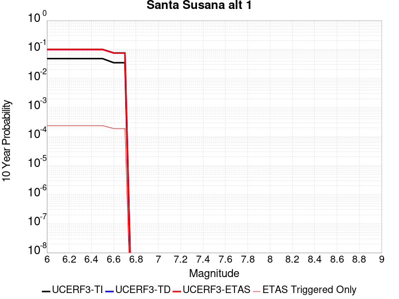 |

| Magnitude | 1 wk TI Prob | 1 wk TD Prob | 1 wk ETAS Prob | 1 wk ETAS/TD Gain | 1 wk ETAS Triggered Only | 1 mo TI Prob | 1 mo TD Prob | 1 mo ETAS Prob | 1 mo ETAS/TD Gain | 1 mo ETAS Triggered Only | 1 yr TI Prob | 1 yr TD Prob | 1 yr ETAS Prob | 1 yr ETAS/TD Gain | 1 yr ETAS Triggered Only | 10 yr TI Prob | 10 yr TD Prob | 10 yr ETAS Prob | 10 yr ETAS/TD Gain | 10 yr ETAS Triggered Only |
|-----|-----|-----|-----|-----|-----|-----|-----|-----|-----|-----|-----|-----|-----|-----|-----|-----|-----|-----|-----|-----|
| 6.0 | 9.5099895E-5 | 2.0216104E-4 | 2.3932457E-4 | 1.1838312 | 3.7171038E-5 | 4.075073E-4 | 8.6613704E-4 | 9.404147E-4 | 1.0857574 | 7.4342075E-5 | 0.00495012 | 0.010495704 | 0.010618307 | 1.0116812 | 1.2390346E-4 | 0.048412967 | 0.10018345 | 0.100372985 | 1.0018919 | 2.1063587E-4 |
| 6.1 | 9.5099895E-5 | 2.0216104E-4 | 2.3932457E-4 | 1.1838312 | 3.7171038E-5 | 4.075073E-4 | 8.6613704E-4 | 9.404147E-4 | 1.0857574 | 7.4342075E-5 | 0.00495012 | 0.010495704 | 0.010618307 | 1.0116812 | 1.2390346E-4 | 0.048412967 | 0.10018345 | 0.100372985 | 1.0018919 | 2.1063587E-4 |
| 6.2 | 9.5099895E-5 | 2.0216104E-4 | 2.3932457E-4 | 1.1838312 | 3.7171038E-5 | 4.075073E-4 | 8.6613704E-4 | 9.404147E-4 | 1.0857574 | 7.4342075E-5 | 0.00495012 | 0.010495704 | 0.010618307 | 1.0116812 | 1.2390346E-4 | 0.048412967 | 0.10018345 | 0.100372985 | 1.0018919 | 2.1063587E-4 |
| 6.3 | 9.5099895E-5 | 2.0216104E-4 | 2.3932457E-4 | 1.1838312 | 3.7171038E-5 | 4.075073E-4 | 8.6613704E-4 | 9.404147E-4 | 1.0857574 | 7.4342075E-5 | 0.00495012 | 0.010495704 | 0.010618307 | 1.0116812 | 1.2390346E-4 | 0.048412967 | 0.10018345 | 0.100372985 | 1.0018919 | 2.1063587E-4 |
| 6.4 | 9.5099895E-5 | 2.0216104E-4 | 2.3932457E-4 | 1.1838312 | 3.7171038E-5 | 4.075073E-4 | 8.6613704E-4 | 9.404147E-4 | 1.0857574 | 7.4342075E-5 | 0.00495012 | 0.010495704 | 0.010618307 | 1.0116812 | 1.2390346E-4 | 0.048412967 | 0.10018345 | 0.100372985 | 1.0018919 | 2.1063587E-4 |
| 6.5 | 9.5099895E-5 | 2.0216104E-4 | 2.3932457E-4 | 1.1838312 | 3.7171038E-5 | 4.075073E-4 | 8.6613704E-4 | 9.404147E-4 | 1.0857574 | 7.4342075E-5 | 0.00495012 | 0.010495704 | 0.010618307 | 1.0116812 | 1.2390346E-4 | 0.048412967 | 0.10018345 | 0.100372985 | 1.0018919 | 2.1063587E-4 |
| 6.6 | 6.811134E-5 | 1.4962441E-4 | 1.8678988E-4 | 1.2483917 | 3.7171038E-5 | 2.9187306E-4 | 6.410975E-4 | 7.153919E-4 | 1.1158863 | 7.4342075E-5 | 0.0035477648 | 0.007785119 | 0.007895764 | 1.0142124 | 1.1151311E-4 | 0.034916576 | 0.075827375 | 0.07601059 | 1.0024161 | 1.9824553E-4 |
| 6.7 | 6.811134E-5 | 1.4962441E-4 | 1.8678988E-4 | 1.2483917 | 3.7171038E-5 | 2.9187306E-4 | 6.410975E-4 | 7.153919E-4 | 1.1158863 | 7.4342075E-5 | 0.0035477648 | 0.007785119 | 0.007895764 | 1.0142124 | 1.1151311E-4 | 0.034916576 | 0.075827375 | 0.07601059 | 1.0024161 | 1.9824553E-4 |

## Ventura-Pitas Point
*[(top)](#table-of-contents)*

| 1 Week | 1 Month | 1 Year | 10 Year |
|-----|-----|-----|-----|
|  |  |  |  |

| Magnitude | 1 wk TI Prob | 1 wk TD Prob | 1 wk ETAS Prob | 1 wk ETAS/TD Gain | 1 wk ETAS Triggered Only | 1 mo TI Prob | 1 mo TD Prob | 1 mo ETAS Prob | 1 mo ETAS/TD Gain | 1 mo ETAS Triggered Only | 1 yr TI Prob | 1 yr TD Prob | 1 yr ETAS Prob | 1 yr ETAS/TD Gain | 1 yr ETAS Triggered Only | 10 yr TI Prob | 10 yr TD Prob | 10 yr ETAS Prob | 10 yr ETAS/TD Gain | 10 yr ETAS Triggered Only |
|-----|-----|-----|-----|-----|-----|-----|-----|-----|-----|-----|-----|-----|-----|-----|-----|-----|-----|-----|-----|-----|
| 6.0 | 1.3734005E-5 | 1.4989571E-5 | 2.7379732E-5 | 1.8265853 | 1.2390346E-5 | 5.885869E-5 | 6.423993E-5 | 1.0140858E-4 | 1.578591 | 3.7171038E-5 | 7.1636896E-4 | 7.819278E-4 | 9.18115E-4 | 1.1741686 | 1.362938E-4 | 0.00714064 | 0.007800344 | 0.007984749 | 1.0236406 | 1.8585518E-4 |
| 6.1 | 1.3734005E-5 | 1.4989571E-5 | 2.7379732E-5 | 1.8265853 | 1.2390346E-5 | 5.885869E-5 | 6.423993E-5 | 1.0140858E-4 | 1.578591 | 3.7171038E-5 | 7.1636896E-4 | 7.819278E-4 | 9.18115E-4 | 1.1741686 | 1.362938E-4 | 0.00714064 | 0.007800344 | 0.007984749 | 1.0236406 | 1.8585518E-4 |
| 6.2 | 1.3734005E-5 | 1.4989571E-5 | 2.7379732E-5 | 1.8265853 | 1.2390346E-5 | 5.885869E-5 | 6.423993E-5 | 1.0140858E-4 | 1.578591 | 3.7171038E-5 | 7.1636896E-4 | 7.819278E-4 | 9.18115E-4 | 1.1741686 | 1.362938E-4 | 0.00714064 | 0.007800344 | 0.007984749 | 1.0236406 | 1.8585518E-4 |
| 6.3 | 1.3734005E-5 | 1.4989571E-5 | 2.7379732E-5 | 1.8265853 | 1.2390346E-5 | 5.885869E-5 | 6.423993E-5 | 1.0140858E-4 | 1.578591 | 3.7171038E-5 | 7.1636896E-4 | 7.819278E-4 | 9.18115E-4 | 1.1741686 | 1.362938E-4 | 0.00714064 | 0.007800344 | 0.007984749 | 1.0236406 | 1.8585518E-4 |
| 6.4 | 1.3734005E-5 | 1.4989571E-5 | 2.7379732E-5 | 1.8265853 | 1.2390346E-5 | 5.885869E-5 | 6.423993E-5 | 1.0140858E-4 | 1.578591 | 3.7171038E-5 | 7.1636896E-4 | 7.819278E-4 | 9.18115E-4 | 1.1741686 | 1.362938E-4 | 0.00714064 | 0.007800344 | 0.007984749 | 1.0236406 | 1.8585518E-4 |
| 6.5 | 1.3734005E-5 | 1.4989571E-5 | 2.7379732E-5 | 1.8265853 | 1.2390346E-5 | 5.885869E-5 | 6.423993E-5 | 1.0140858E-4 | 1.578591 | 3.7171038E-5 | 7.1636896E-4 | 7.819278E-4 | 9.18115E-4 | 1.1741686 | 1.362938E-4 | 0.00714064 | 0.007800344 | 0.007984749 | 1.0236406 | 1.8585518E-4 |
| 6.6 | 1.3017341E-5 | 1.42015815E-5 | 2.6591752E-5 | 1.87245 | 1.2390346E-5 | 5.5787412E-5 | 6.0862993E-5 | 9.803176E-5 | 1.6106958 | 3.7171038E-5 | 6.7900005E-4 | 7.408419E-4 | 8.7703473E-4 | 1.1838353 | 1.362938E-4 | 0.006769291 | 0.0073922575 | 0.007576739 | 1.024956 | 1.8585518E-4 |
| 6.7 | 1.0029534E-5 | 1.09311E-5 | 1.09311E-5 | 1.0 | 0.0 | 4.298301E-5 | 4.6847203E-5 | 7.162673E-5 | 1.5289437 | 2.4780691E-5 | 5.2319246E-4 | 5.70299E-4 | 6.817485E-4 | 1.195423 | 1.1151311E-4 | 0.005219624 | 0.005696553 | 0.00584439 | 1.025952 | 1.4868415E-4 |
| 6.8 | 7.869905E-6 | 8.563513E-6 | 8.563513E-6 | 1.0 | 0.0 | 3.372773E-5 | 3.6700705E-5 | 4.9090595E-5 | 1.3375927 | 1.2390346E-5 | 4.1055772E-4 | 4.4682005E-4 | 5.335137E-4 | 1.1940237 | 8.673242E-5 | 0.0040980005 | 0.004467117 | 0.004578132 | 1.0248516 | 1.1151311E-4 |
| 6.9 | 7.3736396E-6 | 8.021501E-6 | 8.021501E-6 | 1.0 | 0.0 | 3.1600932E-5 | 3.4377863E-5 | 4.6767782E-5 | 1.360404 | 1.2390346E-5 | 3.8467342E-4 | 4.1855048E-4 | 5.052466E-4 | 1.2071342 | 8.673242E-5 | 0.003840082 | 0.0041855047 | 0.004296551 | 1.0265312 | 1.1151311E-4 |

## San Jacinto (Stepovers Combined)
*[(top)](#table-of-contents)*

| 1 Week | 1 Month | 1 Year | 10 Year |
|-----|-----|-----|-----|
|  |  |  |  |

| Magnitude | 1 wk TI Prob | 1 wk TD Prob | 1 wk ETAS Prob | 1 wk ETAS/TD Gain | 1 wk ETAS Triggered Only | 1 mo TI Prob | 1 mo TD Prob | 1 mo ETAS Prob | 1 mo ETAS/TD Gain | 1 mo ETAS Triggered Only | 1 yr TI Prob | 1 yr TD Prob | 1 yr ETAS Prob | 1 yr ETAS/TD Gain | 1 yr ETAS Triggered Only | 10 yr TI Prob | 10 yr TD Prob | 10 yr ETAS Prob | 10 yr ETAS/TD Gain | 10 yr ETAS Triggered Only |
|-----|-----|-----|-----|-----|-----|-----|-----|-----|-----|-----|-----|-----|-----|-----|-----|-----|-----|-----|-----|-----|
| 6.0 | 1.1968766E-4 | 2.2716755E-4 | 2.519426E-4 | 1.1090608 | 2.4780691E-5 | 5.128463E-4 | 9.731359E-4 | 0.0010102707 | 1.03816 | 3.7171038E-5 | 0.0062260423 | 0.0117805805 | 0.011866291 | 1.0072756 | 8.673242E-5 | 0.06054471 | 0.113027595 | 0.11318146 | 1.0013613 | 1.7346484E-4 |
| 6.1 | 1.1968766E-4 | 2.2716755E-4 | 2.519426E-4 | 1.1090608 | 2.4780691E-5 | 5.128463E-4 | 9.731359E-4 | 0.0010102707 | 1.03816 | 3.7171038E-5 | 0.0062260423 | 0.0117805805 | 0.011866291 | 1.0072756 | 8.673242E-5 | 0.06054471 | 0.113027595 | 0.11318146 | 1.0013613 | 1.7346484E-4 |
| 6.2 | 1.1968766E-4 | 2.2716755E-4 | 2.519426E-4 | 1.1090608 | 2.4780691E-5 | 5.128463E-4 | 9.731359E-4 | 0.0010102707 | 1.03816 | 3.7171038E-5 | 0.0062260423 | 0.0117805805 | 0.011866291 | 1.0072756 | 8.673242E-5 | 0.06054471 | 0.113027595 | 0.11318146 | 1.0013613 | 1.7346484E-4 |
| 6.3 | 1.1968766E-4 | 2.2716755E-4 | 2.519426E-4 | 1.1090608 | 2.4780691E-5 | 5.128463E-4 | 9.731359E-4 | 0.0010102707 | 1.03816 | 3.7171038E-5 | 0.0062260423 | 0.0117805805 | 0.011866291 | 1.0072756 | 8.673242E-5 | 0.06054471 | 0.113027595 | 0.11318146 | 1.0013613 | 1.7346484E-4 |
| 6.4 | 1.1968766E-4 | 2.2716755E-4 | 2.519426E-4 | 1.1090608 | 2.4780691E-5 | 5.128463E-4 | 9.731359E-4 | 0.0010102707 | 1.03816 | 3.7171038E-5 | 0.0062260423 | 0.0117805805 | 0.011866291 | 1.0072756 | 8.673242E-5 | 0.06054471 | 0.113027595 | 0.11318146 | 1.0013613 | 1.7346484E-4 |
| 6.5 | 1.1968766E-4 | 2.2716755E-4 | 2.519426E-4 | 1.1090608 | 2.4780691E-5 | 5.128463E-4 | 9.731359E-4 | 0.0010102707 | 1.03816 | 3.7171038E-5 | 0.0062260423 | 0.0117805805 | 0.011866291 | 1.0072756 | 8.673242E-5 | 0.06054471 | 0.113027595 | 0.11318146 | 1.0013613 | 1.7346484E-4 |
| 6.6 | 1.1957375E-4 | 2.2692814E-4 | 2.5170323E-4 | 1.1091758 | 2.4780691E-5 | 5.1235827E-4 | 9.7211095E-4 | 0.0010092459 | 1.0382003 | 3.7171038E-5 | 0.006220135 | 0.011768302 | 0.011854013 | 1.0072832 | 8.673242E-5 | 0.06048886 | 0.11292298 | 0.11307686 | 1.0013627 | 1.7346484E-4 |
| 6.7 | 1.1951502E-4 | 2.2680471E-4 | 2.5157977E-4 | 1.1092353 | 2.4780691E-5 | 5.1210664E-4 | 9.7158254E-4 | 0.0010087175 | 1.0382211 | 3.7171038E-5 | 0.006217089 | 0.011761972 | 0.011847684 | 1.0072873 | 8.673242E-5 | 0.060460065 | 0.11286904 | 0.11302292 | 1.0013634 | 1.7346484E-4 |
| 6.8 | 1.1939376E-4 | 2.2654171E-4 | 2.513168E-4 | 1.1093621 | 2.4780691E-5 | 5.1158713E-4 | 9.704564E-4 | 0.0010075914 | 1.0382655 | 3.7171038E-5 | 0.0062108003 | 0.011748434 | 0.011834147 | 1.0072957 | 8.673242E-5 | 0.06040061 | 0.11275068 | 0.112904586 | 1.0013651 | 1.7346484E-4 |
| 6.9 | 1.19143144E-4 | 2.2600606E-4 | 2.5078116E-4 | 1.1096214 | 2.4780691E-5 | 5.1051355E-4 | 9.6816255E-4 | 0.0010052976 | 1.0383562 | 3.7171038E-5 | 0.0061978037 | 0.011720859 | 0.011806576 | 1.0073131 | 8.673242E-5 | 0.060277723 | 0.11250938 | 0.11266332 | 1.0013683 | 1.7346484E-4 |
| 7.0 | 9.224271E-5 | 1.62278E-4 | 1.8705467E-4 | 1.1526804 | 2.4780691E-5 | 3.9526602E-4 | 6.952914E-4 | 7.3243654E-4 | 1.0534239 | 3.7171038E-5 | 0.0048017497 | 0.008436837 | 0.008510551 | 1.0087372 | 7.4342075E-5 | 0.046993118 | 0.083286285 | 0.08342259 | 1.0016365 | 1.4868415E-4 |
| 7.1 | 9.189464E-5 | 1.6160391E-4 | 1.863806E-4 | 1.1533173 | 2.4780691E-5 | 3.9377474E-4 | 6.9240405E-4 | 7.295493E-4 | 1.0536468 | 3.7171038E-5 | 0.004783673 | 0.008401991 | 0.008475709 | 1.0087738 | 7.4342075E-5 | 0.04682 | 0.0829684 | 0.083104745 | 1.0016434 | 1.4868415E-4 |
| 7.2 | 9.121798E-5 | 1.6023654E-4 | 1.8501325E-4 | 1.1546259 | 2.4780691E-5 | 3.9087565E-4 | 6.8654754E-4 | 7.236931E-4 | 1.0541048 | 3.7171038E-5 | 0.004748531 | 0.008331316 | 0.008405038 | 1.0088489 | 7.4342075E-5 | 0.046483368 | 0.08232578 | 0.08246222 | 1.0016574 | 1.4868415E-4 |
| 7.3 | 8.9773785E-5 | 1.5732428E-4 | 1.8210108E-4 | 1.1574887 | 2.4780691E-5 | 3.8468806E-4 | 6.740732E-4 | 7.1121915E-4 | 1.0551068 | 3.7171038E-5 | 0.004673523 | 0.008180636 | 0.00825437 | 1.0090132 | 7.4342075E-5 | 0.0457645 | 0.08092336 | 0.08106002 | 1.0016887 | 1.4868415E-4 |
| 7.4 | 7.3478965E-5 | 1.1931325E-4 | 1.4409098E-4 | 1.2076696 | 2.4780691E-5 | 3.1487184E-4 | 5.1127357E-4 | 5.3604157E-4 | 1.0484438 | 2.4780691E-5 | 0.0038268273 | 0.006212538 | 0.006249478 | 1.005946 | 3.7171038E-5 | 0.037615944 | 0.06262941 | 0.06271071 | 1.0012981 | 8.673242E-5 |
| 7.5 | 6.7516885E-5 | 1.08003216E-4 | 1.3278122E-4 | 1.2294192 | 2.4780691E-5 | 2.8932598E-4 | 4.6281965E-4 | 4.8758887E-4 | 1.053518 | 2.4780691E-5 | 0.003516855 | 0.005625739 | 0.005662701 | 1.0065701 | 3.7171038E-5 | 0.034617163 | 0.057019595 | 0.057101384 | 1.0014343 | 8.673242E-5 |
| 7.6 | 2.8268712E-5 | 4.2655167E-5 | 5.5044984E-5 | 1.2904646 | 1.2390346E-5 | 1.21146004E-4 | 1.8279799E-4 | 1.9518608E-4 | 1.0677693 | 1.2390346E-5 | 0.0014739545 | 0.0022238137 | 0.0022485394 | 1.0111185 | 2.4780691E-5 | 0.014642165 | 0.022920644 | 0.022981176 | 1.002641 | 6.195173E-5 |
| 7.7 | 1.673878E-5 | 2.1973781E-5 | 2.1973781E-5 | 1.0 | 0.0 | 7.173566E-5 | 9.417205E-5 | 9.417205E-5 | 1.0 | 0.0 | 8.730317E-4 | 0.0011463144 | 0.0011463144 | 1.0 | 0.0 | 0.008696098 | 0.01216197 | 0.012198689 | 1.0030192 | 3.7171038E-5 |
| 7.8 | 1.5303123E-6 | 1.9707616E-6 | 1.9707616E-6 | 1.0 | 0.0 | 6.5584645E-6 | 8.446107E-6 | 8.446107E-6 | 1.0 | 0.0 | 7.984638E-5 | 1.0282895E-4 | 1.0282895E-4 | 1.0 | 0.0 | 7.98177E-4 | 0.001066982 | 0.0010793592 | 1.0116001 | 1.2390346E-5 |

## San Jacinto (San Jacinto Valley) rev
*[(top)](#table-of-contents)*

| 1 Week | 1 Month | 1 Year | 10 Year |
|-----|-----|-----|-----|
|  |  |  |  |

| Magnitude | 1 wk TI Prob | 1 wk TD Prob | 1 wk ETAS Prob | 1 wk ETAS/TD Gain | 1 wk ETAS Triggered Only | 1 mo TI Prob | 1 mo TD Prob | 1 mo ETAS Prob | 1 mo ETAS/TD Gain | 1 mo ETAS Triggered Only | 1 yr TI Prob | 1 yr TD Prob | 1 yr ETAS Prob | 1 yr ETAS/TD Gain | 1 yr ETAS Triggered Only | 10 yr TI Prob | 10 yr TD Prob | 10 yr ETAS Prob | 10 yr ETAS/TD Gain | 10 yr ETAS Triggered Only |
|-----|-----|-----|-----|-----|-----|-----|-----|-----|-----|-----|-----|-----|-----|-----|-----|-----|-----|-----|-----|-----|
| 6.0 | 7.806946E-5 | 1.580409E-4 | 1.7042928E-4 | 1.0783873 | 1.2390346E-5 | 3.345405E-4 | 6.770383E-4 | 7.018022E-4 | 1.0365769 | 2.4780691E-5 | 0.004065426 | 0.008203736 | 0.008277467 | 1.0089877 | 7.4342075E-5 | 0.03991852 | 0.07910823 | 0.079256564 | 1.001875 | 1.610745E-4 |
| 6.1 | 7.806946E-5 | 1.580409E-4 | 1.7042928E-4 | 1.0783873 | 1.2390346E-5 | 3.345405E-4 | 6.770383E-4 | 7.018022E-4 | 1.0365769 | 2.4780691E-5 | 0.004065426 | 0.008203736 | 0.008277467 | 1.0089877 | 7.4342075E-5 | 0.03991852 | 0.07910823 | 0.079256564 | 1.001875 | 1.610745E-4 |
| 6.2 | 7.806946E-5 | 1.580409E-4 | 1.7042928E-4 | 1.0783873 | 1.2390346E-5 | 3.345405E-4 | 6.770383E-4 | 7.018022E-4 | 1.0365769 | 2.4780691E-5 | 0.004065426 | 0.008203736 | 0.008277467 | 1.0089877 | 7.4342075E-5 | 0.03991852 | 0.07910823 | 0.079256564 | 1.001875 | 1.610745E-4 |
| 6.3 | 7.806946E-5 | 1.580409E-4 | 1.7042928E-4 | 1.0783873 | 1.2390346E-5 | 3.345405E-4 | 6.770383E-4 | 7.018022E-4 | 1.0365769 | 2.4780691E-5 | 0.004065426 | 0.008203736 | 0.008277467 | 1.0089877 | 7.4342075E-5 | 0.03991852 | 0.07910823 | 0.079256564 | 1.001875 | 1.610745E-4 |
| 6.4 | 7.806946E-5 | 1.580409E-4 | 1.7042928E-4 | 1.0783873 | 1.2390346E-5 | 3.345405E-4 | 6.770383E-4 | 7.018022E-4 | 1.0365769 | 2.4780691E-5 | 0.004065426 | 0.008203736 | 0.008277467 | 1.0089877 | 7.4342075E-5 | 0.03991852 | 0.07910823 | 0.079256564 | 1.001875 | 1.610745E-4 |
| 6.5 | 7.806946E-5 | 1.580409E-4 | 1.7042928E-4 | 1.0783873 | 1.2390346E-5 | 3.345405E-4 | 6.770383E-4 | 7.018022E-4 | 1.0365769 | 2.4780691E-5 | 0.004065426 | 0.008203736 | 0.008277467 | 1.0089877 | 7.4342075E-5 | 0.03991852 | 0.07910823 | 0.079256564 | 1.001875 | 1.610745E-4 |
| 6.6 | 7.8012505E-5 | 1.5793537E-4 | 1.7032376E-4 | 1.0784396 | 1.2390346E-5 | 3.3429646E-4 | 6.765863E-4 | 7.013502E-4 | 1.0366013 | 2.4780691E-5 | 0.004062466 | 0.008198286 | 0.008272019 | 1.0089936 | 7.4342075E-5 | 0.039889984 | 0.079058796 | 0.07920713 | 1.0018764 | 1.610745E-4 |
| 6.7 | 7.8012505E-5 | 1.5793537E-4 | 1.7032376E-4 | 1.0784396 | 1.2390346E-5 | 3.3429646E-4 | 6.765863E-4 | 7.013502E-4 | 1.0366013 | 2.4780691E-5 | 0.004062466 | 0.008198286 | 0.008272019 | 1.0089936 | 7.4342075E-5 | 0.039889984 | 0.079058796 | 0.07920713 | 1.0018764 | 1.610745E-4 |
| 6.8 | 7.7891236E-5 | 1.5767448E-4 | 1.7006288E-4 | 1.0785694 | 1.2390346E-5 | 3.3377687E-4 | 6.754689E-4 | 7.0023286E-4 | 1.0366619 | 2.4780691E-5 | 0.004056163 | 0.0081848195 | 0.008258553 | 1.0090085 | 7.4342075E-5 | 0.039829224 | 0.0789369 | 0.07908526 | 1.0018795 | 1.610745E-4 |
| 6.9 | 7.764062E-5 | 1.5713525E-4 | 1.6952364E-4 | 1.0788391 | 1.2390346E-5 | 3.327031E-4 | 6.731594E-4 | 6.9792336E-4 | 1.0367877 | 2.4780691E-5 | 0.0040431386 | 0.008156981 | 0.008230717 | 1.0090395 | 7.4342075E-5 | 0.039703645 | 0.07868492 | 0.07883332 | 1.001886 | 1.610745E-4 |
| 7.0 | 5.0739076E-5 | 9.3390074E-5 | 1.0577926E-4 | 1.1326606 | 1.2390346E-5 | 2.1743505E-4 | 4.0015313E-4 | 4.2492393E-4 | 1.0619032 | 2.4780691E-5 | 0.0026440579 | 0.0048604817 | 0.0049221325 | 1.0126841 | 6.195173E-5 | 0.026128192 | 0.04834233 | 0.04846024 | 1.0024391 | 1.2390346E-4 |
| 7.1 | 5.0390987E-5 | 9.2688424E-5 | 1.0507762E-4 | 1.133665 | 1.2390346E-5 | 2.159435E-4 | 3.9714726E-4 | 4.219181E-4 | 1.062372 | 2.4780691E-5 | 0.002625942 | 0.004824109 | 0.0048857615 | 1.0127802 | 6.195173E-5 | 0.025951283 | 0.048000354 | 0.048118312 | 1.0024574 | 1.2390346E-4 |
| 7.2 | 4.9789487E-5 | 9.143531E-5 | 1.0382452E-4 | 1.135497 | 1.2390346E-5 | 2.1336606E-4 | 3.917791E-4 | 4.165501E-4 | 1.0632269 | 2.4780691E-5 | 0.0025946372 | 0.0047591375 | 0.0048207943 | 1.0129554 | 6.195173E-5 | 0.025645511 | 0.047391243 | 0.047509275 | 1.0024905 | 1.2390346E-4 |
| 7.3 | 4.9191407E-5 | 9.01359E-5 | 1.0252513E-4 | 1.1374506 | 1.2390346E-5 | 2.1080328E-4 | 3.8621208E-4 | 4.109832E-4 | 1.0641387 | 2.4780691E-5 | 0.002563509 | 0.004691701 | 0.004753362 | 1.0131426 | 6.195173E-5 | 0.025341382 | 0.04674962 | 0.046867732 | 1.0025264 | 1.2390346E-4 |
| 7.4 | 3.3192722E-5 | 5.2610532E-5 | 6.5000226E-5 | 1.2354983 | 1.2390346E-5 | 1.4224676E-4 | 2.2545758E-4 | 2.3784513E-4 | 1.054944 | 1.2390346E-5 | 0.0017304786 | 0.0027420863 | 0.002766799 | 1.0090123 | 2.4780691E-5 | 0.01717065 | 0.028029768 | 0.028089983 | 1.0021483 | 6.195173E-5 |
| 7.5 | 2.8249084E-5 | 4.2866195E-5 | 5.525601E-5 | 1.2890346 | 1.2390346E-5 | 1.2106189E-4 | 1.8370226E-4 | 1.9609033E-4 | 1.0674356 | 1.2390346E-5 | 0.0014729318 | 0.0022347996 | 0.0022595248 | 1.0110638 | 2.4780691E-5 | 0.014632072 | 0.023027074 | 0.023087598 | 1.0026284 | 6.195173E-5 |
| 7.6 | 2.7497194E-5 | 4.146988E-5 | 5.3859712E-5 | 1.298767 | 1.2390346E-5 | 1.17839794E-4 | 1.7771887E-4 | 1.9010702E-4 | 1.0697064 | 1.2390346E-5 | 0.0014337553 | 0.0021620982 | 0.0021868253 | 1.0114366 | 2.4780691E-5 | 0.0142454 | 0.022306465 | 0.022367034 | 1.0027153 | 6.195173E-5 |
| 7.7 | 1.673878E-5 | 2.1973781E-5 | 2.1973781E-5 | 1.0 | 0.0 | 7.173566E-5 | 9.417205E-5 | 9.417205E-5 | 1.0 | 0.0 | 8.730317E-4 | 0.0011463144 | 0.0011463144 | 1.0 | 0.0 | 0.008696098 | 0.01216197 | 0.012198689 | 1.0030192 | 3.7171038E-5 |
| 7.8 | 1.5303123E-6 | 1.9707616E-6 | 1.9707616E-6 | 1.0 | 0.0 | 6.5584645E-6 | 8.446107E-6 | 8.446107E-6 | 1.0 | 0.0 | 7.984638E-5 | 1.0282895E-4 | 1.0282895E-4 | 1.0 | 0.0 | 7.98177E-4 | 0.001066982 | 0.0010793592 | 1.0116001 | 1.2390346E-5 |

## Sierra Madre
*[(top)](#table-of-contents)*

| 1 Week | 1 Month | 1 Year | 10 Year |
|-----|-----|-----|-----|
|  |  |  |  |

| Magnitude | 1 wk TI Prob | 1 wk TD Prob | 1 wk ETAS Prob | 1 wk ETAS/TD Gain | 1 wk ETAS Triggered Only | 1 mo TI Prob | 1 mo TD Prob | 1 mo ETAS Prob | 1 mo ETAS/TD Gain | 1 mo ETAS Triggered Only | 1 yr TI Prob | 1 yr TD Prob | 1 yr ETAS Prob | 1 yr ETAS/TD Gain | 1 yr ETAS Triggered Only | 10 yr TI Prob | 10 yr TD Prob | 10 yr ETAS Prob | 10 yr ETAS/TD Gain | 10 yr ETAS Triggered Only |
|-----|-----|-----|-----|-----|-----|-----|-----|-----|-----|-----|-----|-----|-----|-----|-----|-----|-----|-----|-----|-----|
| 6.0 | 2.62475E-5 | 2.6538886E-5 | 6.370893E-5 | 2.4005883 | 3.7171038E-5 | 1.12484435E-4 | 1.1373365E-4 | 1.632894E-4 | 1.4357176 | 4.9561382E-5 | 0.0013686377 | 0.0013839207 | 0.0014829062 | 1.0715255 | 9.9122764E-5 | 0.01360239 | 0.0137668215 | 0.013913458 | 1.0106515 | 1.4868415E-4 |
| 6.1 | 2.62475E-5 | 2.6538886E-5 | 6.370893E-5 | 2.4005883 | 3.7171038E-5 | 1.12484435E-4 | 1.1373365E-4 | 1.632894E-4 | 1.4357176 | 4.9561382E-5 | 0.0013686377 | 0.0013839207 | 0.0014829062 | 1.0715255 | 9.9122764E-5 | 0.01360239 | 0.0137668215 | 0.013913458 | 1.0106515 | 1.4868415E-4 |
| 6.2 | 2.62475E-5 | 2.6538886E-5 | 6.370893E-5 | 2.4005883 | 3.7171038E-5 | 1.12484435E-4 | 1.1373365E-4 | 1.632894E-4 | 1.4357176 | 4.9561382E-5 | 0.0013686377 | 0.0013839207 | 0.0014829062 | 1.0715255 | 9.9122764E-5 | 0.01360239 | 0.0137668215 | 0.013913458 | 1.0106515 | 1.4868415E-4 |
| 6.3 | 2.62475E-5 | 2.6538886E-5 | 6.370893E-5 | 2.4005883 | 3.7171038E-5 | 1.12484435E-4 | 1.1373365E-4 | 1.632894E-4 | 1.4357176 | 4.9561382E-5 | 0.0013686377 | 0.0013839207 | 0.0014829062 | 1.0715255 | 9.9122764E-5 | 0.01360239 | 0.0137668215 | 0.013913458 | 1.0106515 | 1.4868415E-4 |
| 6.4 | 2.62475E-5 | 2.6538886E-5 | 6.370893E-5 | 2.4005883 | 3.7171038E-5 | 1.12484435E-4 | 1.1373365E-4 | 1.632894E-4 | 1.4357176 | 4.9561382E-5 | 0.0013686377 | 0.0013839207 | 0.0014829062 | 1.0715255 | 9.9122764E-5 | 0.01360239 | 0.0137668215 | 0.013913458 | 1.0106515 | 1.4868415E-4 |
| 6.5 | 2.62475E-5 | 2.6538886E-5 | 6.370893E-5 | 2.4005883 | 3.7171038E-5 | 1.12484435E-4 | 1.1373365E-4 | 1.632894E-4 | 1.4357176 | 4.9561382E-5 | 0.0013686377 | 0.0013839207 | 0.0014829062 | 1.0715255 | 9.9122764E-5 | 0.01360239 | 0.0137668215 | 0.013913458 | 1.0106515 | 1.4868415E-4 |
| 6.6 | 2.3026172E-5 | 2.2750124E-5 | 5.9920316E-5 | 2.6338456 | 3.7171038E-5 | 9.867986E-5 | 9.749739E-5 | 1.4705394E-4 | 1.5082859 | 4.9561382E-5 | 0.001200765 | 0.0011864736 | 0.0012854787 | 1.0834448 | 9.9122764E-5 | 0.011942975 | 0.011814732 | 0.011961659 | 1.0124359 | 1.4868415E-4 |
| 6.7 | 2.1771615E-5 | 2.125092E-5 | 5.8421167E-5 | 2.7491124 | 3.7171038E-5 | 9.3303584E-5 | 9.107268E-5 | 1.4062955E-4 | 1.5441463 | 4.9561382E-5 | 0.0011353791 | 0.0011083324 | 0.0012073454 | 1.089335 | 9.9122764E-5 | 0.0112959575 | 0.011041103 | 0.011188145 | 1.0133177 | 1.4868415E-4 |
| 6.8 | 1.8811277E-5 | 1.813049E-5 | 5.530085E-5 | 3.0501578 | 3.7171038E-5 | 8.061727E-5 | 7.770026E-5 | 1.272578E-4 | 1.6378039 | 4.9561382E-5 | 9.810732E-4 | 9.4567396E-4 | 0.0010323244 | 1.0916282 | 8.673242E-5 | 0.009767532 | 0.009429028 | 0.009551764 | 1.0130167 | 1.2390346E-4 |
| 6.9 | 1.5745054E-5 | 1.4611581E-5 | 5.1782074E-5 | 3.5439065 | 3.7171038E-5 | 6.747706E-5 | 6.262E-5 | 9.978871E-5 | 1.5935597 | 3.7171038E-5 | 8.2122354E-4 | 7.622106E-4 | 8.36496E-4 | 1.0974605 | 7.4342075E-5 | 0.008181954 | 0.007607908 | 0.0077062766 | 1.0129298 | 9.9122764E-5 |
| 7.0 | 1.4540266E-5 | 1.3339557E-5 | 2.5729736E-5 | 1.92883 | 1.2390346E-5 | 6.231394E-5 | 5.7168716E-5 | 6.955835E-5 | 1.2167206 | 1.2390346E-5 | 7.584081E-4 | 6.958848E-4 | 7.454117E-4 | 1.0711712 | 4.9561382E-5 | 0.0075582503 | 0.0069488278 | 0.0070226532 | 1.0106242 | 7.4342075E-5 |
| 7.1 | 1.2284893E-5 | 1.0947419E-5 | 2.3337629E-5 | 2.1317928 | 1.2390346E-5 | 5.264848E-5 | 4.6917092E-5 | 5.9306858E-5 | 1.2640778 | 1.2390346E-5 | 6.4080674E-4 | 5.7114166E-4 | 6.082915E-4 | 1.0650448 | 3.7171038E-5 | 0.0063896202 | 0.0057081603 | 0.005757439 | 1.008633 | 4.9561382E-5 |
| 7.2 | 5.5504106E-6 | 3.3297895E-6 | 3.3297895E-6 | 1.0 | 0.0 | 2.3787257E-5 | 1.4270517E-5 | 1.4270517E-5 | 1.0 | 0.0 | 2.8957136E-4 | 1.7374175E-4 | 1.7374175E-4 | 1.0 | 0.0 | 0.002891943 | 0.0017411701 | 0.0017411701 | 1.0 | 0.0 |

## Helendale-So Lockhart
*[(top)](#table-of-contents)*

| 1 Week | 1 Month | 1 Year | 10 Year |
|-----|-----|-----|-----|
|  |  |  |  |

| Magnitude | 1 wk TI Prob | 1 wk TD Prob | 1 wk ETAS Prob | 1 wk ETAS/TD Gain | 1 wk ETAS Triggered Only | 1 mo TI Prob | 1 mo TD Prob | 1 mo ETAS Prob | 1 mo ETAS/TD Gain | 1 mo ETAS Triggered Only | 1 yr TI Prob | 1 yr TD Prob | 1 yr ETAS Prob | 1 yr ETAS/TD Gain | 1 yr ETAS Triggered Only | 10 yr TI Prob | 10 yr TD Prob | 10 yr ETAS Prob | 10 yr ETAS/TD Gain | 10 yr ETAS Triggered Only |
|-----|-----|-----|-----|-----|-----|-----|-----|-----|-----|-----|-----|-----|-----|-----|-----|-----|-----|-----|-----|-----|
| 6.0 | 7.171715E-6 | 7.4314485E-6 | 7.4314485E-6 | 1.0 | 0.0 | 3.073556E-5 | 3.184873E-5 | 5.662863E-5 | 1.77805 | 2.4780691E-5 | 3.7414118E-4 | 3.8769832E-4 | 4.4962604E-4 | 1.1597317 | 6.195173E-5 | 0.003735119 | 0.0038711112 | 0.003994535 | 1.0318834 | 1.2390346E-4 |
| 6.1 | 7.171715E-6 | 7.4314485E-6 | 7.4314485E-6 | 1.0 | 0.0 | 3.073556E-5 | 3.184873E-5 | 5.662863E-5 | 1.77805 | 2.4780691E-5 | 3.7414118E-4 | 3.8769832E-4 | 4.4962604E-4 | 1.1597317 | 6.195173E-5 | 0.003735119 | 0.0038711112 | 0.003994535 | 1.0318834 | 1.2390346E-4 |
| 6.2 | 7.171715E-6 | 7.4314485E-6 | 7.4314485E-6 | 1.0 | 0.0 | 3.073556E-5 | 3.184873E-5 | 5.662863E-5 | 1.77805 | 2.4780691E-5 | 3.7414118E-4 | 3.8769832E-4 | 4.4962604E-4 | 1.1597317 | 6.195173E-5 | 0.003735119 | 0.0038711112 | 0.003994535 | 1.0318834 | 1.2390346E-4 |
| 6.3 | 7.171715E-6 | 7.4314485E-6 | 7.4314485E-6 | 1.0 | 0.0 | 3.073556E-5 | 3.184873E-5 | 5.662863E-5 | 1.77805 | 2.4780691E-5 | 3.7414118E-4 | 3.8769832E-4 | 4.4962604E-4 | 1.1597317 | 6.195173E-5 | 0.003735119 | 0.0038711112 | 0.003994535 | 1.0318834 | 1.2390346E-4 |
| 6.4 | 7.171715E-6 | 7.4314485E-6 | 7.4314485E-6 | 1.0 | 0.0 | 3.073556E-5 | 3.184873E-5 | 5.662863E-5 | 1.77805 | 2.4780691E-5 | 3.7414118E-4 | 3.8769832E-4 | 4.4962604E-4 | 1.1597317 | 6.195173E-5 | 0.003735119 | 0.0038711112 | 0.003994535 | 1.0318834 | 1.2390346E-4 |
| 6.5 | 7.171715E-6 | 7.4314485E-6 | 7.4314485E-6 | 1.0 | 0.0 | 3.073556E-5 | 3.184873E-5 | 5.662863E-5 | 1.77805 | 2.4780691E-5 | 3.7414118E-4 | 3.8769832E-4 | 4.4962604E-4 | 1.1597317 | 6.195173E-5 | 0.003735119 | 0.0038711112 | 0.003994535 | 1.0318834 | 1.2390346E-4 |
| 6.6 | 6.5580157E-6 | 6.7948727E-6 | 6.7948727E-6 | 1.0 | 0.0 | 2.810548E-5 | 2.9120609E-5 | 5.3900578E-5 | 1.8509427 | 2.4780691E-5 | 3.421305E-4 | 3.5449475E-4 | 4.164245E-4 | 1.1746987 | 6.195173E-5 | 0.0034160423 | 0.0035401797 | 0.003651298 | 1.0313878 | 1.1151311E-4 |
| 6.7 | 5.6879685E-6 | 5.8928526E-6 | 5.8928526E-6 | 1.0 | 0.0 | 2.4376779E-5 | 2.5254889E-5 | 5.0034952E-5 | 1.9811988 | 2.4780691E-5 | 2.9674688E-4 | 3.074438E-4 | 3.693765E-4 | 1.2014439 | 6.195173E-5 | 0.0029635092 | 0.0030710634 | 0.0031575295 | 1.0281551 | 8.673242E-5 |
| 6.8 | 4.958099E-6 | 5.135111E-6 | 5.135111E-6 | 1.0 | 0.0 | 2.1248823E-5 | 2.2007483E-5 | 3.4397555E-5 | 1.5629936 | 1.2390346E-5 | 2.586737E-4 | 2.6791706E-4 | 3.1746516E-4 | 1.1849382 | 4.9561382E-5 | 0.0025837282 | 0.0026768132 | 0.002738599 | 1.0230819 | 6.195173E-5 |
| 6.9 | 4.3792215E-6 | 4.5342804E-6 | 4.5342804E-6 | 1.0 | 0.0 | 1.8767958E-5 | 1.9432535E-5 | 3.182264E-5 | 1.6375959 | 1.2390346E-5 | 2.2847592E-4 | 2.3657428E-4 | 2.8612395E-4 | 1.2094465 | 4.9561382E-5 | 0.0022824116 | 0.0023640923 | 0.0024258976 | 1.0261433 | 6.195173E-5 |
| 7.0 | 3.858262E-6 | 3.9935144E-6 | 3.9935144E-6 | 1.0 | 0.0 | 1.6535305E-5 | 1.7115E-5 | 2.9505132E-5 | 1.7239342 | 1.2390346E-5 | 2.0129874E-4 | 2.0836401E-4 | 2.5791506E-4 | 1.23781 | 4.9561382E-5 | 0.0020111648 | 0.0020825516 | 0.0021443742 | 1.0296861 | 6.195173E-5 |
| 7.1 | 3.3854772E-6 | 3.502769E-6 | 3.502769E-6 | 1.0 | 0.0 | 1.4509107E-5 | 1.501183E-5 | 2.740199E-5 | 1.8253597 | 1.2390346E-5 | 1.7663406E-4 | 1.827625E-4 | 2.3231482E-4 | 1.2711296 | 4.9561382E-5 | 0.0017649373 | 0.0018269841 | 0.0018888226 | 1.0338473 | 6.195173E-5 |
| 7.2 | 2.9527619E-6 | 3.05382E-6 | 3.05382E-6 | 1.0 | 0.0 | 1.2654632E-5 | 1.3087783E-5 | 2.5477966E-5 | 1.9466984 | 1.2390346E-5 | 1.5405925E-4 | 1.5934087E-4 | 2.0889436E-4 | 1.3109905 | 4.9561382E-5 | 0.0015395249 | 0.0015931253 | 0.0016549783 | 1.0388249 | 6.195173E-5 |
| 7.3 | 2.553375E-6 | 2.6399916E-6 | 2.6399916E-6 | 1.0 | 0.0 | 1.0942989E-5 | 1.13142505E-5 | 1.13142505E-5 | 1.0 | 0.0 | 1.3322275E-4 | 1.3775099E-4 | 1.7491692E-4 | 1.2698051 | 3.7171038E-5 | 0.0013314291 | 0.0013775099 | 0.0014270031 | 1.0359294 | 4.9561382E-5 |

## Elysian Park (Upper)
*[(top)](#table-of-contents)*

| 1 Week | 1 Month | 1 Year | 10 Year |
|-----|-----|-----|-----|
|  |  |  |  |

| Magnitude | 1 wk TI Prob | 1 wk TD Prob | 1 wk ETAS Prob | 1 wk ETAS/TD Gain | 1 wk ETAS Triggered Only | 1 mo TI Prob | 1 mo TD Prob | 1 mo ETAS Prob | 1 mo ETAS/TD Gain | 1 mo ETAS Triggered Only | 1 yr TI Prob | 1 yr TD Prob | 1 yr ETAS Prob | 1 yr ETAS/TD Gain | 1 yr ETAS Triggered Only | 10 yr TI Prob | 10 yr TD Prob | 10 yr ETAS Prob | 10 yr ETAS/TD Gain | 10 yr ETAS Triggered Only |
|-----|-----|-----|-----|-----|-----|-----|-----|-----|-----|-----|-----|-----|-----|-----|-----|-----|-----|-----|-----|-----|
| 6.0 | 2.4686513E-5 | 3.0328916E-5 | 6.7498826E-5 | 2.2255602 | 3.7171038E-5 | 1.0579505E-4 | 1.2998107E-4 | 1.6714727E-4 | 1.2859355 | 3.7171038E-5 | 0.0012872935 | 0.0015825125 | 0.0016938492 | 1.0703543 | 1.1151311E-4 | 0.01279862 | 0.015824199 | 0.01594614 | 1.007706 | 1.2390346E-4 |
| 6.1 | 2.4686513E-5 | 3.0328916E-5 | 6.7498826E-5 | 2.2255602 | 3.7171038E-5 | 1.0579505E-4 | 1.2998107E-4 | 1.6714727E-4 | 1.2859355 | 3.7171038E-5 | 0.0012872935 | 0.0015825125 | 0.0016938492 | 1.0703543 | 1.1151311E-4 | 0.01279862 | 0.015824199 | 0.01594614 | 1.007706 | 1.2390346E-4 |
| 6.2 | 2.4686513E-5 | 3.0328916E-5 | 6.7498826E-5 | 2.2255602 | 3.7171038E-5 | 1.0579505E-4 | 1.2998107E-4 | 1.6714727E-4 | 1.2859355 | 3.7171038E-5 | 0.0012872935 | 0.0015825125 | 0.0016938492 | 1.0703543 | 1.1151311E-4 | 0.01279862 | 0.015824199 | 0.01594614 | 1.007706 | 1.2390346E-4 |
| 6.3 | 2.4686513E-5 | 3.0328916E-5 | 6.7498826E-5 | 2.2255602 | 3.7171038E-5 | 1.0579505E-4 | 1.2998107E-4 | 1.6714727E-4 | 1.2859355 | 3.7171038E-5 | 0.0012872935 | 0.0015825125 | 0.0016938492 | 1.0703543 | 1.1151311E-4 | 0.01279862 | 0.015824199 | 0.01594614 | 1.007706 | 1.2390346E-4 |
| 6.4 | 2.4686513E-5 | 3.0328916E-5 | 6.7498826E-5 | 2.2255602 | 3.7171038E-5 | 1.0579505E-4 | 1.2998107E-4 | 1.6714727E-4 | 1.2859355 | 3.7171038E-5 | 0.0012872935 | 0.0015825125 | 0.0016938492 | 1.0703543 | 1.1151311E-4 | 0.01279862 | 0.015824199 | 0.01594614 | 1.007706 | 1.2390346E-4 |
| 6.5 | 2.4686513E-5 | 3.0328916E-5 | 6.7498826E-5 | 2.2255602 | 3.7171038E-5 | 1.0579505E-4 | 1.2998107E-4 | 1.6714727E-4 | 1.2859355 | 3.7171038E-5 | 0.0012872935 | 0.0015825125 | 0.0016938492 | 1.0703543 | 1.1151311E-4 | 0.01279862 | 0.015824199 | 0.01594614 | 1.007706 | 1.2390346E-4 |

## Channel Islands Thrust
*[(top)](#table-of-contents)*

| 1 Week | 1 Month | 1 Year | 10 Year |
|-----|-----|-----|-----|
|  |  |  |  |

| Magnitude | 1 wk TI Prob | 1 wk TD Prob | 1 wk ETAS Prob | 1 wk ETAS/TD Gain | 1 wk ETAS Triggered Only | 1 mo TI Prob | 1 mo TD Prob | 1 mo ETAS Prob | 1 mo ETAS/TD Gain | 1 mo ETAS Triggered Only | 1 yr TI Prob | 1 yr TD Prob | 1 yr ETAS Prob | 1 yr ETAS/TD Gain | 1 yr ETAS Triggered Only | 10 yr TI Prob | 10 yr TD Prob | 10 yr ETAS Prob | 10 yr ETAS/TD Gain | 10 yr ETAS Triggered Only |
|-----|-----|-----|-----|-----|-----|-----|-----|-----|-----|-----|-----|-----|-----|-----|-----|-----|-----|-----|-----|-----|
| 6.0 | 1.9940422E-5 | 2.234876E-5 | 3.473883E-5 | 1.5543963 | 1.2390346E-5 | 8.545615E-5 | 9.577758E-5 | 1.08166736E-4 | 1.1293534 | 1.2390346E-5 | 0.001039932 | 0.0011655908 | 0.0012522221 | 1.074324 | 8.673242E-5 | 0.010350789 | 0.0116068935 | 0.011717112 | 1.009496 | 1.1151311E-4 |
| 6.1 | 1.9940422E-5 | 2.234876E-5 | 3.473883E-5 | 1.5543963 | 1.2390346E-5 | 8.545615E-5 | 9.577758E-5 | 1.08166736E-4 | 1.1293534 | 1.2390346E-5 | 0.001039932 | 0.0011655908 | 0.0012522221 | 1.074324 | 8.673242E-5 | 0.010350789 | 0.0116068935 | 0.011717112 | 1.009496 | 1.1151311E-4 |
| 6.2 | 1.9940422E-5 | 2.234876E-5 | 3.473883E-5 | 1.5543963 | 1.2390346E-5 | 8.545615E-5 | 9.577758E-5 | 1.08166736E-4 | 1.1293534 | 1.2390346E-5 | 0.001039932 | 0.0011655908 | 0.0012522221 | 1.074324 | 8.673242E-5 | 0.010350789 | 0.0116068935 | 0.011717112 | 1.009496 | 1.1151311E-4 |
| 6.3 | 1.9940422E-5 | 2.234876E-5 | 3.473883E-5 | 1.5543963 | 1.2390346E-5 | 8.545615E-5 | 9.577758E-5 | 1.08166736E-4 | 1.1293534 | 1.2390346E-5 | 0.001039932 | 0.0011655908 | 0.0012522221 | 1.074324 | 8.673242E-5 | 0.010350789 | 0.0116068935 | 0.011717112 | 1.009496 | 1.1151311E-4 |
| 6.4 | 1.9940422E-5 | 2.234876E-5 | 3.473883E-5 | 1.5543963 | 1.2390346E-5 | 8.545615E-5 | 9.577758E-5 | 1.08166736E-4 | 1.1293534 | 1.2390346E-5 | 0.001039932 | 0.0011655908 | 0.0012522221 | 1.074324 | 8.673242E-5 | 0.010350789 | 0.0116068935 | 0.011717112 | 1.009496 | 1.1151311E-4 |
| 6.5 | 1.9940422E-5 | 2.234876E-5 | 3.473883E-5 | 1.5543963 | 1.2390346E-5 | 8.545615E-5 | 9.577758E-5 | 1.08166736E-4 | 1.1293534 | 1.2390346E-5 | 0.001039932 | 0.0011655908 | 0.0012522221 | 1.074324 | 8.673242E-5 | 0.010350789 | 0.0116068935 | 0.011717112 | 1.009496 | 1.1151311E-4 |
| 6.6 | 1.9940422E-5 | 2.234876E-5 | 3.473883E-5 | 1.5543963 | 1.2390346E-5 | 8.545615E-5 | 9.577758E-5 | 1.08166736E-4 | 1.1293534 | 1.2390346E-5 | 0.001039932 | 0.0011655908 | 0.0012522221 | 1.074324 | 8.673242E-5 | 0.010350789 | 0.0116068935 | 0.011717112 | 1.009496 | 1.1151311E-4 |
| 6.7 | 1.5039115E-5 | 1.6832886E-5 | 2.9223023E-5 | 1.7360673 | 1.2390346E-5 | 6.445176E-5 | 7.213959E-5 | 8.452904E-5 | 1.1717428 | 1.2390346E-5 | 7.844176E-4 | 8.780601E-4 | 9.523369E-4 | 1.084592 | 7.4342075E-5 | 0.007816545 | 0.00875716 | 0.008855415 | 1.01122 | 9.9122764E-5 |
| 6.8 | 1.4337753E-5 | 1.605477E-5 | 2.8444916E-5 | 1.7717423 | 1.2390346E-5 | 6.1446066E-5 | 6.8804984E-5 | 8.119448E-5 | 1.1800668 | 1.2390346E-5 | 7.4784906E-4 | 8.3749247E-4 | 8.993923E-4 | 1.073911 | 6.195173E-5 | 0.007453373 | 0.008354535 | 0.008440544 | 1.0102948 | 8.673242E-5 |
| 6.9 | 1.1226918E-5 | 1.2540004E-5 | 2.4930194E-5 | 1.9880532 | 1.2390346E-5 | 4.8114474E-5 | 5.3742377E-5 | 6.613206E-5 | 1.2305384 | 1.2390346E-5 | 5.856363E-4 | 6.542256E-4 | 7.1613677E-4 | 1.0946327 | 6.195173E-5 | 0.0058409534 | 0.0065336456 | 0.006607502 | 1.011304 | 7.4342075E-5 |
| 7.0 | 1.0975239E-5 | 1.2259085E-5 | 2.4649278E-5 | 2.0106947 | 1.2390346E-5 | 4.703589E-5 | 5.253849E-5 | 6.492819E-5 | 1.2358212 | 1.2390346E-5 | 5.725115E-4 | 6.395769E-4 | 7.01489E-4 | 1.0968016 | 6.195173E-5 | 0.005710388 | 0.006388001 | 0.0064618685 | 1.0115634 | 7.4342075E-5 |
| 7.1 | 9.782044E-6 | 1.0913239E-5 | 2.3303448E-5 | 2.1353376 | 1.2390346E-5 | 4.1922372E-5 | 4.6770787E-5 | 5.9160553E-5 | 1.2649039 | 1.2390346E-5 | 5.102853E-4 | 5.693929E-4 | 6.189261E-4 | 1.086993 | 4.9561382E-5 | 0.0050911517 | 0.005689868 | 0.0057391473 | 1.0086609 | 4.9561382E-5 |
| 7.2 | 8.244729E-6 | 9.190053E-6 | 9.190053E-6 | 1.0 | 0.0 | 3.5334073E-5 | 3.938594E-5 | 3.938594E-5 | 1.0 | 0.0 | 4.3010744E-4 | 4.7952382E-4 | 5.1667704E-4 | 1.0774794 | 3.7171038E-5 | 0.004292759 | 0.0047952384 | 0.004832231 | 1.0077145 | 3.7171038E-5 |

## Los Alamos 2011 CFM
*[(top)](#table-of-contents)*

| 1 Week | 1 Month | 1 Year | 10 Year |
|-----|-----|-----|-----|
|  |  |  |  |

| Magnitude | 1 wk TI Prob | 1 wk TD Prob | 1 wk ETAS Prob | 1 wk ETAS/TD Gain | 1 wk ETAS Triggered Only | 1 mo TI Prob | 1 mo TD Prob | 1 mo ETAS Prob | 1 mo ETAS/TD Gain | 1 mo ETAS Triggered Only | 1 yr TI Prob | 1 yr TD Prob | 1 yr ETAS Prob | 1 yr ETAS/TD Gain | 1 yr ETAS Triggered Only | 10 yr TI Prob | 10 yr TD Prob | 10 yr ETAS Prob | 10 yr ETAS/TD Gain | 10 yr ETAS Triggered Only |
|-----|-----|-----|-----|-----|-----|-----|-----|-----|-----|-----|-----|-----|-----|-----|-----|-----|-----|-----|-----|-----|
| 6.0 | 1.3678262E-5 | 1.5031193E-5 | 6.4591826E-5 | 4.297186 | 4.9561382E-5 | 5.8619804E-5 | 6.441852E-5 | 1.13976705E-4 | 1.7693158 | 4.9561382E-5 | 7.134624E-4 | 7.841395E-4 | 8.4604265E-4 | 1.0789441 | 6.195173E-5 | 0.0071117613 | 0.007826112 | 0.007936752 | 1.0141374 | 1.1151311E-4 |
| 6.1 | 1.3678262E-5 | 1.5031193E-5 | 6.4591826E-5 | 4.297186 | 4.9561382E-5 | 5.8619804E-5 | 6.441852E-5 | 1.13976705E-4 | 1.7693158 | 4.9561382E-5 | 7.134624E-4 | 7.841395E-4 | 8.4604265E-4 | 1.0789441 | 6.195173E-5 | 0.0071117613 | 0.007826112 | 0.007936752 | 1.0141374 | 1.1151311E-4 |
| 6.2 | 1.3678262E-5 | 1.5031193E-5 | 6.4591826E-5 | 4.297186 | 4.9561382E-5 | 5.8619804E-5 | 6.441852E-5 | 1.13976705E-4 | 1.7693158 | 4.9561382E-5 | 7.134624E-4 | 7.841395E-4 | 8.4604265E-4 | 1.0789441 | 6.195173E-5 | 0.0071117613 | 0.007826112 | 0.007936752 | 1.0141374 | 1.1151311E-4 |
| 6.3 | 1.3678262E-5 | 1.5031193E-5 | 6.4591826E-5 | 4.297186 | 4.9561382E-5 | 5.8619804E-5 | 6.441852E-5 | 1.13976705E-4 | 1.7693158 | 4.9561382E-5 | 7.134624E-4 | 7.841395E-4 | 8.4604265E-4 | 1.0789441 | 6.195173E-5 | 0.0071117613 | 0.007826112 | 0.007936752 | 1.0141374 | 1.1151311E-4 |
| 6.4 | 1.3678262E-5 | 1.5031193E-5 | 6.4591826E-5 | 4.297186 | 4.9561382E-5 | 5.8619804E-5 | 6.441852E-5 | 1.13976705E-4 | 1.7693158 | 4.9561382E-5 | 7.134624E-4 | 7.841395E-4 | 8.4604265E-4 | 1.0789441 | 6.195173E-5 | 0.0071117613 | 0.007826112 | 0.007936752 | 1.0141374 | 1.1151311E-4 |
| 6.5 | 1.3678262E-5 | 1.5031193E-5 | 6.4591826E-5 | 4.297186 | 4.9561382E-5 | 5.8619804E-5 | 6.441852E-5 | 1.13976705E-4 | 1.7693158 | 4.9561382E-5 | 7.134624E-4 | 7.841395E-4 | 8.4604265E-4 | 1.0789441 | 6.195173E-5 | 0.0071117613 | 0.007826112 | 0.007936752 | 1.0141374 | 1.1151311E-4 |
| 6.6 | 1.3678262E-5 | 1.5031193E-5 | 6.4591826E-5 | 4.297186 | 4.9561382E-5 | 5.8619804E-5 | 6.441852E-5 | 1.13976705E-4 | 1.7693158 | 4.9561382E-5 | 7.134624E-4 | 7.841395E-4 | 8.4604265E-4 | 1.0789441 | 6.195173E-5 | 0.0071117613 | 0.007826112 | 0.007936752 | 1.0141374 | 1.1151311E-4 |
| 6.7 | 8.282411E-6 | 9.085969E-6 | 3.3866436E-5 | 3.727333 | 2.4780691E-5 | 3.5495563E-5 | 3.893987E-5 | 6.371959E-5 | 1.6363587 | 2.4780691E-5 | 4.3207276E-4 | 4.740929E-4 | 5.112463E-4 | 1.0783674 | 3.7171038E-5 | 0.0043123364 | 0.004740929 | 0.004802587 | 1.0130055 | 6.195173E-5 |
| 6.8 | 8.282411E-6 | 9.085969E-6 | 3.3866436E-5 | 3.727333 | 2.4780691E-5 | 3.5495563E-5 | 3.893987E-5 | 6.371959E-5 | 1.6363587 | 2.4780691E-5 | 4.3207276E-4 | 4.740929E-4 | 5.112463E-4 | 1.0783674 | 3.7171038E-5 | 0.0043123364 | 0.004740929 | 0.004802587 | 1.0130055 | 6.195173E-5 |

## Chino alt 1
*[(top)](#table-of-contents)*

| 1 Week | 1 Month | 1 Year | 10 Year |
|-----|-----|-----|-----|
|  |  |  |  |

| Magnitude | 1 wk TI Prob | 1 wk TD Prob | 1 wk ETAS Prob | 1 wk ETAS/TD Gain | 1 wk ETAS Triggered Only | 1 mo TI Prob | 1 mo TD Prob | 1 mo ETAS Prob | 1 mo ETAS/TD Gain | 1 mo ETAS Triggered Only | 1 yr TI Prob | 1 yr TD Prob | 1 yr ETAS Prob | 1 yr ETAS/TD Gain | 1 yr ETAS Triggered Only | 10 yr TI Prob | 10 yr TD Prob | 10 yr ETAS Prob | 10 yr ETAS/TD Gain | 10 yr ETAS Triggered Only |
|-----|-----|-----|-----|-----|-----|-----|-----|-----|-----|-----|-----|-----|-----|-----|-----|-----|-----|-----|-----|-----|
| 6.0 | 2.1665033E-5 | 2.5894844E-5 | 3.8284867E-5 | 1.4784746 | 1.2390346E-5 | 9.2846836E-5 | 1.10977904E-4 | 1.4814481E-4 | 1.3349037 | 3.7171038E-5 | 0.001129824 | 0.0013511538 | 0.0014377692 | 1.0641047 | 8.673242E-5 | 0.01124097 | 0.013511333 | 0.013621339 | 1.0081418 | 1.1151311E-4 |
| 6.1 | 2.1665033E-5 | 2.5894844E-5 | 3.8284867E-5 | 1.4784746 | 1.2390346E-5 | 9.2846836E-5 | 1.10977904E-4 | 1.4814481E-4 | 1.3349037 | 3.7171038E-5 | 0.001129824 | 0.0013511538 | 0.0014377692 | 1.0641047 | 8.673242E-5 | 0.01124097 | 0.013511333 | 0.013621339 | 1.0081418 | 1.1151311E-4 |
| 6.2 | 2.1665033E-5 | 2.5894844E-5 | 3.8284867E-5 | 1.4784746 | 1.2390346E-5 | 9.2846836E-5 | 1.10977904E-4 | 1.4814481E-4 | 1.3349037 | 3.7171038E-5 | 0.001129824 | 0.0013511538 | 0.0014377692 | 1.0641047 | 8.673242E-5 | 0.01124097 | 0.013511333 | 0.013621339 | 1.0081418 | 1.1151311E-4 |
| 6.3 | 2.1665033E-5 | 2.5894844E-5 | 3.8284867E-5 | 1.4784746 | 1.2390346E-5 | 9.2846836E-5 | 1.10977904E-4 | 1.4814481E-4 | 1.3349037 | 3.7171038E-5 | 0.001129824 | 0.0013511538 | 0.0014377692 | 1.0641047 | 8.673242E-5 | 0.01124097 | 0.013511333 | 0.013621339 | 1.0081418 | 1.1151311E-4 |
| 6.4 | 2.1665033E-5 | 2.5894844E-5 | 3.8284867E-5 | 1.4784746 | 1.2390346E-5 | 9.2846836E-5 | 1.10977904E-4 | 1.4814481E-4 | 1.3349037 | 3.7171038E-5 | 0.001129824 | 0.0013511538 | 0.0014377692 | 1.0641047 | 8.673242E-5 | 0.01124097 | 0.013511333 | 0.013621339 | 1.0081418 | 1.1151311E-4 |
| 6.5 | 2.1665033E-5 | 2.5894844E-5 | 3.8284867E-5 | 1.4784746 | 1.2390346E-5 | 9.2846836E-5 | 1.10977904E-4 | 1.4814481E-4 | 1.3349037 | 3.7171038E-5 | 0.001129824 | 0.0013511538 | 0.0014377692 | 1.0641047 | 8.673242E-5 | 0.01124097 | 0.013511333 | 0.013621339 | 1.0081418 | 1.1151311E-4 |

## Simi-Santa Rosa
*[(top)](#table-of-contents)*

| 1 Week | 1 Month | 1 Year | 10 Year |
|-----|-----|-----|-----|
|  |  |  |  |

| Magnitude | 1 wk TI Prob | 1 wk TD Prob | 1 wk ETAS Prob | 1 wk ETAS/TD Gain | 1 wk ETAS Triggered Only | 1 mo TI Prob | 1 mo TD Prob | 1 mo ETAS Prob | 1 mo ETAS/TD Gain | 1 mo ETAS Triggered Only | 1 yr TI Prob | 1 yr TD Prob | 1 yr ETAS Prob | 1 yr ETAS/TD Gain | 1 yr ETAS Triggered Only | 10 yr TI Prob | 10 yr TD Prob | 10 yr ETAS Prob | 10 yr ETAS/TD Gain | 10 yr ETAS Triggered Only |
|-----|-----|-----|-----|-----|-----|-----|-----|-----|-----|-----|-----|-----|-----|-----|-----|-----|-----|-----|-----|-----|
| 6.0 | 1.765222E-5 | 1.996643E-5 | 1.996643E-5 | 1.0 | 0.0 | 7.565018E-5 | 8.556876E-5 | 1.1034733E-4 | 1.289575 | 2.4780691E-5 | 9.206518E-4 | 0.0010415068 | 0.0011281489 | 1.0831891 | 8.673242E-5 | 0.009168469 | 0.010386396 | 0.0104967505 | 1.010625 | 1.1151311E-4 |
| 6.1 | 1.765222E-5 | 1.996643E-5 | 1.996643E-5 | 1.0 | 0.0 | 7.565018E-5 | 8.556876E-5 | 1.1034733E-4 | 1.289575 | 2.4780691E-5 | 9.206518E-4 | 0.0010415068 | 0.0011281489 | 1.0831891 | 8.673242E-5 | 0.009168469 | 0.010386396 | 0.0104967505 | 1.010625 | 1.1151311E-4 |
| 6.2 | 1.765222E-5 | 1.996643E-5 | 1.996643E-5 | 1.0 | 0.0 | 7.565018E-5 | 8.556876E-5 | 1.1034733E-4 | 1.289575 | 2.4780691E-5 | 9.206518E-4 | 0.0010415068 | 0.0011281489 | 1.0831891 | 8.673242E-5 | 0.009168469 | 0.010386396 | 0.0104967505 | 1.010625 | 1.1151311E-4 |
| 6.3 | 1.765222E-5 | 1.996643E-5 | 1.996643E-5 | 1.0 | 0.0 | 7.565018E-5 | 8.556876E-5 | 1.1034733E-4 | 1.289575 | 2.4780691E-5 | 9.206518E-4 | 0.0010415068 | 0.0011281489 | 1.0831891 | 8.673242E-5 | 0.009168469 | 0.010386396 | 0.0104967505 | 1.010625 | 1.1151311E-4 |
| 6.4 | 1.765222E-5 | 1.996643E-5 | 1.996643E-5 | 1.0 | 0.0 | 7.565018E-5 | 8.556876E-5 | 1.1034733E-4 | 1.289575 | 2.4780691E-5 | 9.206518E-4 | 0.0010415068 | 0.0011281489 | 1.0831891 | 8.673242E-5 | 0.009168469 | 0.010386396 | 0.0104967505 | 1.010625 | 1.1151311E-4 |
| 6.5 | 1.765222E-5 | 1.996643E-5 | 1.996643E-5 | 1.0 | 0.0 | 7.565018E-5 | 8.556876E-5 | 1.1034733E-4 | 1.289575 | 2.4780691E-5 | 9.206518E-4 | 0.0010415068 | 0.0011281489 | 1.0831891 | 8.673242E-5 | 0.009168469 | 0.010386396 | 0.0104967505 | 1.010625 | 1.1151311E-4 |
| 6.6 | 1.4207836E-5 | 1.605233E-5 | 1.605233E-5 | 1.0 | 0.0 | 6.0889306E-5 | 6.8795016E-5 | 9.3574E-5 | 1.3601857 | 2.4780691E-5 | 7.4107514E-4 | 8.374578E-4 | 9.117376E-4 | 1.0886968 | 7.4342075E-5 | 0.0073860865 | 0.0083626695 | 0.008460963 | 1.0117539 | 9.9122764E-5 |
| 6.7 | 1.1077219E-5 | 1.2498523E-5 | 1.2498523E-5 | 1.0 | 0.0 | 4.747293E-5 | 5.3565098E-5 | 6.595478E-5 | 1.2313014 | 1.2390346E-5 | 5.7782966E-4 | 6.521551E-4 | 7.140664E-4 | 1.0949334 | 6.195173E-5 | 0.0057632946 | 0.0065215505 | 0.0066077174 | 1.0132127 | 8.673242E-5 |
| 6.8 | 1.1077219E-5 | 1.2498523E-5 | 1.2498523E-5 | 1.0 | 0.0 | 4.747293E-5 | 5.3565098E-5 | 6.595478E-5 | 1.2313014 | 1.2390346E-5 | 5.7782966E-4 | 6.521551E-4 | 7.140664E-4 | 1.0949334 | 6.195173E-5 | 0.0057632946 | 0.0065215505 | 0.0066077174 | 1.0132127 | 8.673242E-5 |

## Clamshell-Sawpit
*[(top)](#table-of-contents)*

| 1 Week | 1 Month | 1 Year | 10 Year |
|-----|-----|-----|-----|
|  |  |  |  |

| Magnitude | 1 wk TI Prob | 1 wk TD Prob | 1 wk ETAS Prob | 1 wk ETAS/TD Gain | 1 wk ETAS Triggered Only | 1 mo TI Prob | 1 mo TD Prob | 1 mo ETAS Prob | 1 mo ETAS/TD Gain | 1 mo ETAS Triggered Only | 1 yr TI Prob | 1 yr TD Prob | 1 yr ETAS Prob | 1 yr ETAS/TD Gain | 1 yr ETAS Triggered Only | 10 yr TI Prob | 10 yr TD Prob | 10 yr ETAS Prob | 10 yr ETAS/TD Gain | 10 yr ETAS Triggered Only |
|-----|-----|-----|-----|-----|-----|-----|-----|-----|-----|-----|-----|-----|-----|-----|-----|-----|-----|-----|-----|-----|
| 6.0 | 1.1112015E-5 | 1.2128283E-5 | 3.6908674E-5 | 3.0431905 | 2.4780691E-5 | 4.7622052E-5 | 5.1978353E-5 | 8.9147456E-5 | 1.7150881 | 3.7171038E-5 | 5.796442E-4 | 6.328364E-4 | 7.0713146E-4 | 1.1174 | 7.4342075E-5 | 0.0057813465 | 0.0063283644 | 0.00642686 | 1.0155641 | 9.9122764E-5 |
| 6.1 | 1.1112015E-5 | 1.2128283E-5 | 3.6908674E-5 | 3.0431905 | 2.4780691E-5 | 4.7622052E-5 | 5.1978353E-5 | 8.9147456E-5 | 1.7150881 | 3.7171038E-5 | 5.796442E-4 | 6.328364E-4 | 7.0713146E-4 | 1.1174 | 7.4342075E-5 | 0.0057813465 | 0.0063283644 | 0.00642686 | 1.0155641 | 9.9122764E-5 |
| 6.2 | 1.1112015E-5 | 1.2128283E-5 | 3.6908674E-5 | 3.0431905 | 2.4780691E-5 | 4.7622052E-5 | 5.1978353E-5 | 8.9147456E-5 | 1.7150881 | 3.7171038E-5 | 5.796442E-4 | 6.328364E-4 | 7.0713146E-4 | 1.1174 | 7.4342075E-5 | 0.0057813465 | 0.0063283644 | 0.00642686 | 1.0155641 | 9.9122764E-5 |
| 6.3 | 1.1112015E-5 | 1.2128283E-5 | 3.6908674E-5 | 3.0431905 | 2.4780691E-5 | 4.7622052E-5 | 5.1978353E-5 | 8.9147456E-5 | 1.7150881 | 3.7171038E-5 | 5.796442E-4 | 6.328364E-4 | 7.0713146E-4 | 1.1174 | 7.4342075E-5 | 0.0057813465 | 0.0063283644 | 0.00642686 | 1.0155641 | 9.9122764E-5 |
| 6.4 | 1.1112015E-5 | 1.2128283E-5 | 3.6908674E-5 | 3.0431905 | 2.4780691E-5 | 4.7622052E-5 | 5.1978353E-5 | 8.9147456E-5 | 1.7150881 | 3.7171038E-5 | 5.796442E-4 | 6.328364E-4 | 7.0713146E-4 | 1.1174 | 7.4342075E-5 | 0.0057813465 | 0.0063283644 | 0.00642686 | 1.0155641 | 9.9122764E-5 |
| 6.5 | 1.1112015E-5 | 1.2128283E-5 | 3.6908674E-5 | 3.0431905 | 2.4780691E-5 | 4.7622052E-5 | 5.1978353E-5 | 8.9147456E-5 | 1.7150881 | 3.7171038E-5 | 5.796442E-4 | 6.328364E-4 | 7.0713146E-4 | 1.1174 | 7.4342075E-5 | 0.0057813465 | 0.0063283644 | 0.00642686 | 1.0155641 | 9.9122764E-5 |

## San Jacinto (Anza) rev
*[(top)](#table-of-contents)*

| 1 Week | 1 Month | 1 Year | 10 Year |
|-----|-----|-----|-----|
|  |  |  |  |

| Magnitude | 1 wk TI Prob | 1 wk TD Prob | 1 wk ETAS Prob | 1 wk ETAS/TD Gain | 1 wk ETAS Triggered Only | 1 mo TI Prob | 1 mo TD Prob | 1 mo ETAS Prob | 1 mo ETAS/TD Gain | 1 mo ETAS Triggered Only | 1 yr TI Prob | 1 yr TD Prob | 1 yr ETAS Prob | 1 yr ETAS/TD Gain | 1 yr ETAS Triggered Only | 10 yr TI Prob | 10 yr TD Prob | 10 yr ETAS Prob | 10 yr ETAS/TD Gain | 10 yr ETAS Triggered Only |
|-----|-----|-----|-----|-----|-----|-----|-----|-----|-----|-----|-----|-----|-----|-----|-----|-----|-----|-----|-----|-----|
| 6.0 | 7.9249476E-5 | 1.2833404E-4 | 1.5311156E-4 | 1.1930704 | 2.4780691E-5 | 3.3959642E-4 | 5.4991845E-4 | 5.746855E-4 | 1.0450377 | 2.4780691E-5 | 0.00412675 | 0.0066802585 | 0.0067171813 | 1.0055271 | 3.7171038E-5 | 0.04050952 | 0.067083985 | 0.0671649 | 1.0012062 | 8.673242E-5 |
| 6.1 | 7.9249476E-5 | 1.2833404E-4 | 1.5311156E-4 | 1.1930704 | 2.4780691E-5 | 3.3959642E-4 | 5.4991845E-4 | 5.746855E-4 | 1.0450377 | 2.4780691E-5 | 0.00412675 | 0.0066802585 | 0.0067171813 | 1.0055271 | 3.7171038E-5 | 0.04050952 | 0.067083985 | 0.0671649 | 1.0012062 | 8.673242E-5 |
| 6.2 | 7.9249476E-5 | 1.2833404E-4 | 1.5311156E-4 | 1.1930704 | 2.4780691E-5 | 3.3959642E-4 | 5.4991845E-4 | 5.746855E-4 | 1.0450377 | 2.4780691E-5 | 0.00412675 | 0.0066802585 | 0.0067171813 | 1.0055271 | 3.7171038E-5 | 0.04050952 | 0.067083985 | 0.0671649 | 1.0012062 | 8.673242E-5 |
| 6.3 | 7.9249476E-5 | 1.2833404E-4 | 1.5311156E-4 | 1.1930704 | 2.4780691E-5 | 3.3959642E-4 | 5.4991845E-4 | 5.746855E-4 | 1.0450377 | 2.4780691E-5 | 0.00412675 | 0.0066802585 | 0.0067171813 | 1.0055271 | 3.7171038E-5 | 0.04050952 | 0.067083985 | 0.0671649 | 1.0012062 | 8.673242E-5 |
| 6.4 | 7.9249476E-5 | 1.2833404E-4 | 1.5311156E-4 | 1.1930704 | 2.4780691E-5 | 3.3959642E-4 | 5.4991845E-4 | 5.746855E-4 | 1.0450377 | 2.4780691E-5 | 0.00412675 | 0.0066802585 | 0.0067171813 | 1.0055271 | 3.7171038E-5 | 0.04050952 | 0.067083985 | 0.0671649 | 1.0012062 | 8.673242E-5 |
| 6.5 | 7.9249476E-5 | 1.2833404E-4 | 1.5311156E-4 | 1.1930704 | 2.4780691E-5 | 3.3959642E-4 | 5.4991845E-4 | 5.746855E-4 | 1.0450377 | 2.4780691E-5 | 0.00412675 | 0.0066802585 | 0.0067171813 | 1.0055271 | 3.7171038E-5 | 0.04050952 | 0.067083985 | 0.0671649 | 1.0012062 | 8.673242E-5 |
| 6.6 | 7.913556E-5 | 1.2821962E-4 | 1.5299713E-4 | 1.1932428 | 2.4780691E-5 | 3.3910832E-4 | 5.494282E-4 | 5.741953E-4 | 1.0450779 | 2.4780691E-5 | 0.00412083 | 0.006674327 | 0.0067112497 | 1.005532 | 3.7171038E-5 | 0.04045248 | 0.067026526 | 0.06710745 | 1.0012072 | 8.673242E-5 |
| 6.7 | 7.843403E-5 | 1.2742344E-4 | 1.5220097E-4 | 1.1944504 | 2.4780691E-5 | 3.3610253E-4 | 5.460175E-4 | 5.707846E-4 | 1.0453596 | 2.4780691E-5 | 0.0040843724 | 0.0066330545 | 0.006669979 | 1.0055667 | 3.7171038E-5 | 0.04010115 | 0.0666332 | 0.06671415 | 1.0012149 | 8.673242E-5 |
| 6.8 | 7.825213E-5 | 1.2717218E-4 | 1.5194973E-4 | 1.1948346 | 2.4780691E-5 | 3.3532316E-4 | 5.449411E-4 | 5.697083E-4 | 1.0454493 | 2.4780691E-5 | 0.004074919 | 0.00662003 | 0.0066569545 | 1.0055778 | 3.7171038E-5 | 0.04001003 | 0.06650948 | 0.06659044 | 1.0012174 | 8.673242E-5 |
| 6.9 | 7.788025E-5 | 1.2661066E-4 | 1.513882E-4 | 1.1956989 | 2.4780691E-5 | 3.3372978E-4 | 5.4253556E-4 | 5.673028E-4 | 1.045651 | 2.4780691E-5 | 0.004055592 | 0.0065909196 | 0.0066278456 | 1.0056026 | 3.7171038E-5 | 0.03982372 | 0.06623408 | 0.06631507 | 1.0012227 | 8.673242E-5 |
| 7.0 | 7.723858E-5 | 1.2564783E-4 | 1.504254E-4 | 1.1971986 | 2.4780691E-5 | 3.309805E-4 | 5.3841085E-4 | 5.631782E-4 | 1.0460008 | 2.4780691E-5 | 0.0040222434 | 0.006541004 | 0.006577932 | 1.0056456 | 3.7171038E-5 | 0.03950216 | 0.065760486 | 0.06584151 | 1.0012321 | 8.673242E-5 |
| 7.1 | 7.661684E-5 | 1.246636E-4 | 1.494412E-4 | 1.1987557 | 2.4780691E-5 | 3.2831656E-4 | 5.3419446E-4 | 5.5896194E-4 | 1.0463641 | 2.4780691E-5 | 0.0039899293 | 0.0064899763 | 0.0065269065 | 1.0056903 | 3.7171038E-5 | 0.039190482 | 0.06527789 | 0.06535896 | 1.0012419 | 8.673242E-5 |
| 7.2 | 7.571461E-5 | 1.2320194E-4 | 1.4797958E-4 | 1.201114 | 2.4780691E-5 | 3.2445084E-4 | 5.279328E-4 | 5.5270037E-4 | 1.0469143 | 2.4780691E-5 | 0.003943036 | 0.0064141913 | 0.006451124 | 1.0057579 | 3.7171038E-5 | 0.038738023 | 0.06456287 | 0.064644 | 1.0012567 | 8.673242E-5 |
| 7.3 | 7.427039E-5 | 1.20714394E-4 | 1.454921E-4 | 1.2052588 | 2.4780691E-5 | 3.1826284E-4 | 5.172761E-4 | 5.42044E-4 | 1.0478814 | 2.4780691E-5 | 0.0038679668 | 0.0062852004 | 0.006322138 | 1.0058769 | 3.7171038E-5 | 0.038013313 | 0.063324034 | 0.063405275 | 1.0012829 | 8.673242E-5 |
| 7.4 | 7.3478965E-5 | 1.1931325E-4 | 1.4409098E-4 | 1.2076696 | 2.4780691E-5 | 3.1487184E-4 | 5.1127357E-4 | 5.3604157E-4 | 1.0484438 | 2.4780691E-5 | 0.0038268273 | 0.006212538 | 0.006249478 | 1.005946 | 3.7171038E-5 | 0.037615944 | 0.06262941 | 0.06271071 | 1.0012981 | 8.673242E-5 |
| 7.5 | 6.7516885E-5 | 1.08003216E-4 | 1.3278122E-4 | 1.2294192 | 2.4780691E-5 | 2.8932598E-4 | 4.6281965E-4 | 4.8758887E-4 | 1.053518 | 2.4780691E-5 | 0.003516855 | 0.005625739 | 0.005662701 | 1.0065701 | 3.7171038E-5 | 0.034617163 | 0.057019595 | 0.057101384 | 1.0014343 | 8.673242E-5 |
| 7.6 | 2.8268712E-5 | 4.2655167E-5 | 5.5044984E-5 | 1.2904646 | 1.2390346E-5 | 1.21146004E-4 | 1.8279799E-4 | 1.9518608E-4 | 1.0677693 | 1.2390346E-5 | 0.0014739545 | 0.0022238137 | 0.0022485394 | 1.0111185 | 2.4780691E-5 | 0.014642165 | 0.022920644 | 0.022981176 | 1.002641 | 6.195173E-5 |
| 7.7 | 1.673878E-5 | 2.1973781E-5 | 2.1973781E-5 | 1.0 | 0.0 | 7.173566E-5 | 9.417205E-5 | 9.417205E-5 | 1.0 | 0.0 | 8.730317E-4 | 0.0011463144 | 0.0011463144 | 1.0 | 0.0 | 0.008696098 | 0.01216197 | 0.012198689 | 1.0030192 | 3.7171038E-5 |
| 7.8 | 1.5303123E-6 | 1.9707616E-6 | 1.9707616E-6 | 1.0 | 0.0 | 6.5584645E-6 | 8.446107E-6 | 8.446107E-6 | 1.0 | 0.0 | 7.984638E-5 | 1.0282895E-4 | 1.0282895E-4 | 1.0 | 0.0 | 7.98177E-4 | 0.001066982 | 0.0010793592 | 1.0116001 | 1.2390346E-5 |

## Santa Cruz Island
*[(top)](#table-of-contents)*

| 1 Week | 1 Month | 1 Year | 10 Year |
|-----|-----|-----|-----|
|  |  |  |  |

| Magnitude | 1 wk TI Prob | 1 wk TD Prob | 1 wk ETAS Prob | 1 wk ETAS/TD Gain | 1 wk ETAS Triggered Only | 1 mo TI Prob | 1 mo TD Prob | 1 mo ETAS Prob | 1 mo ETAS/TD Gain | 1 mo ETAS Triggered Only | 1 yr TI Prob | 1 yr TD Prob | 1 yr ETAS Prob | 1 yr ETAS/TD Gain | 1 yr ETAS Triggered Only | 10 yr TI Prob | 10 yr TD Prob | 10 yr ETAS Prob | 10 yr ETAS/TD Gain | 10 yr ETAS Triggered Only |
|-----|-----|-----|-----|-----|-----|-----|-----|-----|-----|-----|-----|-----|-----|-----|-----|-----|-----|-----|-----|-----|
| 6.0 | 1.4571279E-5 | 1.590773E-5 | 1.590773E-5 | 1.0 | 0.0 | 6.2446845E-5 | 6.817458E-5 | 6.817458E-5 | 1.0 | 0.0 | 7.600251E-4 | 8.2977675E-4 | 8.545369E-4 | 1.0298395 | 2.4780691E-5 | 0.00757431 | 0.008273421 | 0.008347148 | 1.0089113 | 7.4342075E-5 |
| 6.1 | 1.4571279E-5 | 1.590773E-5 | 1.590773E-5 | 1.0 | 0.0 | 6.2446845E-5 | 6.817458E-5 | 6.817458E-5 | 1.0 | 0.0 | 7.600251E-4 | 8.2977675E-4 | 8.545369E-4 | 1.0298395 | 2.4780691E-5 | 0.00757431 | 0.008273421 | 0.008347148 | 1.0089113 | 7.4342075E-5 |
| 6.2 | 1.4571279E-5 | 1.590773E-5 | 1.590773E-5 | 1.0 | 0.0 | 6.2446845E-5 | 6.817458E-5 | 6.817458E-5 | 1.0 | 0.0 | 7.600251E-4 | 8.2977675E-4 | 8.545369E-4 | 1.0298395 | 2.4780691E-5 | 0.00757431 | 0.008273421 | 0.008347148 | 1.0089113 | 7.4342075E-5 |
| 6.3 | 1.4571279E-5 | 1.590773E-5 | 1.590773E-5 | 1.0 | 0.0 | 6.2446845E-5 | 6.817458E-5 | 6.817458E-5 | 1.0 | 0.0 | 7.600251E-4 | 8.2977675E-4 | 8.545369E-4 | 1.0298395 | 2.4780691E-5 | 0.00757431 | 0.008273421 | 0.008347148 | 1.0089113 | 7.4342075E-5 |
| 6.4 | 1.4571279E-5 | 1.590773E-5 | 1.590773E-5 | 1.0 | 0.0 | 6.2446845E-5 | 6.817458E-5 | 6.817458E-5 | 1.0 | 0.0 | 7.600251E-4 | 8.2977675E-4 | 8.545369E-4 | 1.0298395 | 2.4780691E-5 | 0.00757431 | 0.008273421 | 0.008347148 | 1.0089113 | 7.4342075E-5 |
| 6.5 | 1.4571279E-5 | 1.590773E-5 | 1.590773E-5 | 1.0 | 0.0 | 6.2446845E-5 | 6.817458E-5 | 6.817458E-5 | 1.0 | 0.0 | 7.600251E-4 | 8.2977675E-4 | 8.545369E-4 | 1.0298395 | 2.4780691E-5 | 0.00757431 | 0.008273421 | 0.008347148 | 1.0089113 | 7.4342075E-5 |
| 6.6 | 1.2903651E-5 | 1.4078563E-5 | 1.4078563E-5 | 1.0 | 0.0 | 5.530019E-5 | 6.033568E-5 | 6.033568E-5 | 1.0 | 0.0 | 6.730718E-4 | 7.344058E-4 | 7.5916835E-4 | 1.0337178 | 2.4780691E-5 | 0.006710368 | 0.0073263342 | 0.007400132 | 1.010073 | 7.4342075E-5 |
| 6.7 | 1.1244336E-5 | 1.2259967E-5 | 1.2259967E-5 | 1.0 | 0.0 | 4.8189122E-5 | 5.2542026E-5 | 5.2542026E-5 | 1.0 | 0.0 | 5.8654463E-4 | 6.395773E-4 | 6.6434214E-4 | 1.0387206 | 2.4780691E-5 | 0.0058499887 | 0.0063838377 | 0.006457705 | 1.011571 | 7.4342075E-5 |
| 6.8 | 9.568355E-6 | 1.0419911E-5 | 1.0419911E-5 | 1.0 | 0.0 | 4.100659E-5 | 4.465636E-5 | 4.465636E-5 | 1.0 | 0.0 | 4.991409E-4 | 5.4362084E-4 | 5.5600447E-4 | 1.0227798 | 1.2390346E-5 | 0.0049802125 | 0.0054293126 | 0.0054539586 | 1.0045395 | 2.4780691E-5 |
| 6.9 | 8.213362E-6 | 8.934158E-6 | 8.934158E-6 | 1.0 | 0.0 | 3.5199646E-5 | 3.8289054E-5 | 3.8289054E-5 | 1.0 | 0.0 | 4.2847142E-4 | 4.6613417E-4 | 4.7851872E-4 | 1.0265687 | 1.2390346E-5 | 0.0042764624 | 0.0046579046 | 0.0046825698 | 1.0052954 | 2.4780691E-5 |
| 7.0 | 6.972259E-6 | 7.5758644E-6 | 7.5758644E-6 | 1.0 | 0.0 | 2.9880768E-5 | 3.2467946E-5 | 3.2467946E-5 | 1.0 | 0.0 | 3.637376E-4 | 3.9528962E-4 | 4.0767508E-4 | 1.0313326 | 1.2390346E-5 | 0.0036314281 | 0.003952149 | 0.0039768317 | 1.0062454 | 2.4780691E-5 |
| 7.1 | 6.5867994E-6 | 7.155847E-6 | 7.155847E-6 | 1.0 | 0.0 | 2.8228835E-5 | 3.0667914E-5 | 3.0667914E-5 | 1.0 | 0.0 | 3.4363187E-4 | 3.7338186E-4 | 3.857676E-4 | 1.0331718 | 1.2390346E-5 | 0.0034310098 | 0.0037338187 | 0.0037585068 | 1.0066121 | 2.4780691E-5 |

## Whittier alt 1
*[(top)](#table-of-contents)*

| 1 Week | 1 Month | 1 Year | 10 Year |
|-----|-----|-----|-----|
|  |  |  |  |

| Magnitude | 1 wk TI Prob | 1 wk TD Prob | 1 wk ETAS Prob | 1 wk ETAS/TD Gain | 1 wk ETAS Triggered Only | 1 mo TI Prob | 1 mo TD Prob | 1 mo ETAS Prob | 1 mo ETAS/TD Gain | 1 mo ETAS Triggered Only | 1 yr TI Prob | 1 yr TD Prob | 1 yr ETAS Prob | 1 yr ETAS/TD Gain | 1 yr ETAS Triggered Only | 10 yr TI Prob | 10 yr TD Prob | 10 yr ETAS Prob | 10 yr ETAS/TD Gain | 10 yr ETAS Triggered Only |
|-----|-----|-----|-----|-----|-----|-----|-----|-----|-----|-----|-----|-----|-----|-----|-----|-----|-----|-----|-----|-----|
| 6.0 | 1.9677844E-5 | 3.0721494E-5 | 5.5501423E-5 | 1.8065991 | 2.4780691E-5 | 8.4330895E-5 | 1.3166165E-4 | 1.5643908E-4 | 1.1881902 | 2.4780691E-5 | 0.001026245 | 0.0016026449 | 0.0016644973 | 1.038594 | 6.195173E-5 | 0.010215186 | 0.015995702 | 0.016068855 | 1.0045733 | 7.4342075E-5 |
| 6.1 | 1.9677844E-5 | 3.0721494E-5 | 5.5501423E-5 | 1.8065991 | 2.4780691E-5 | 8.4330895E-5 | 1.3166165E-4 | 1.5643908E-4 | 1.1881902 | 2.4780691E-5 | 0.001026245 | 0.0016026449 | 0.0016644973 | 1.038594 | 6.195173E-5 | 0.010215186 | 0.015995702 | 0.016068855 | 1.0045733 | 7.4342075E-5 |
| 6.2 | 1.9677844E-5 | 3.0721494E-5 | 5.5501423E-5 | 1.8065991 | 2.4780691E-5 | 8.4330895E-5 | 1.3166165E-4 | 1.5643908E-4 | 1.1881902 | 2.4780691E-5 | 0.001026245 | 0.0016026449 | 0.0016644973 | 1.038594 | 6.195173E-5 | 0.010215186 | 0.015995702 | 0.016068855 | 1.0045733 | 7.4342075E-5 |
| 6.3 | 1.9677844E-5 | 3.0721494E-5 | 5.5501423E-5 | 1.8065991 | 2.4780691E-5 | 8.4330895E-5 | 1.3166165E-4 | 1.5643908E-4 | 1.1881902 | 2.4780691E-5 | 0.001026245 | 0.0016026449 | 0.0016644973 | 1.038594 | 6.195173E-5 | 0.010215186 | 0.015995702 | 0.016068855 | 1.0045733 | 7.4342075E-5 |
| 6.4 | 1.9677844E-5 | 3.0721494E-5 | 5.5501423E-5 | 1.8065991 | 2.4780691E-5 | 8.4330895E-5 | 1.3166165E-4 | 1.5643908E-4 | 1.1881902 | 2.4780691E-5 | 0.001026245 | 0.0016026449 | 0.0016644973 | 1.038594 | 6.195173E-5 | 0.010215186 | 0.015995702 | 0.016068855 | 1.0045733 | 7.4342075E-5 |
| 6.5 | 1.9677844E-5 | 3.0721494E-5 | 5.5501423E-5 | 1.8065991 | 2.4780691E-5 | 8.4330895E-5 | 1.3166165E-4 | 1.5643908E-4 | 1.1881902 | 2.4780691E-5 | 0.001026245 | 0.0016026449 | 0.0016644973 | 1.038594 | 6.195173E-5 | 0.010215186 | 0.015995702 | 0.016068855 | 1.0045733 | 7.4342075E-5 |
| 6.6 | 1.9631225E-5 | 3.06427E-5 | 5.5422628E-5 | 1.8086733 | 2.4780691E-5 | 8.413111E-5 | 1.3132399E-4 | 1.5610142E-4 | 1.1886741 | 2.4780691E-5 | 0.0010238149 | 0.00159854 | 0.0016603926 | 1.0386932 | 6.195173E-5 | 0.010191108 | 0.015955312 | 0.01602847 | 1.004585 | 7.4342075E-5 |
| 6.7 | 1.9536663E-5 | 3.0504027E-5 | 5.5283963E-5 | 1.8123496 | 2.4780691E-5 | 8.372587E-5 | 1.3072975E-4 | 1.555072E-4 | 1.1895318 | 2.4780691E-5 | 0.0010188858 | 0.0015913156 | 0.0016531688 | 1.0388691 | 6.195173E-5 | 0.010142268 | 0.015884183 | 0.015957344 | 1.0046059 | 7.4342075E-5 |
| 6.8 | 1.9439643E-5 | 3.0352345E-5 | 5.5132285E-5 | 1.8164093 | 2.4780691E-5 | 8.331009E-5 | 1.3007974E-4 | 1.5485722E-4 | 1.190479 | 2.4780691E-5 | 0.0010138283 | 0.0015834133 | 0.001645267 | 1.0390635 | 6.195173E-5 | 0.010092155 | 0.015806418 | 0.015879584 | 1.0046289 | 7.4342075E-5 |
| 6.9 | 1.9363486E-5 | 3.025448E-5 | 5.503442E-5 | 1.8190503 | 2.4780691E-5 | 8.298373E-5 | 1.2966036E-4 | 1.5443785E-4 | 1.1910952 | 2.4780691E-5 | 0.0010098586 | 0.0015783148 | 0.0016401687 | 1.0391898 | 6.195173E-5 | 0.010052818 | 0.0157561 | 0.01582927 | 1.0046439 | 7.4342075E-5 |
| 7.0 | 3.152724E-6 | 4.1925437E-6 | 4.1925437E-6 | 1.0 | 0.0 | 1.3511604E-5 | 1.7967934E-5 | 1.7967934E-5 | 1.0 | 0.0 | 1.6449137E-4 | 2.1873988E-4 | 2.1873988E-4 | 1.0 | 0.0 | 0.0016436966 | 0.0021877585 | 0.0021877585 | 1.0 | 0.0 |
| 7.1 | 3.0699127E-6 | 4.0761943E-6 | 4.0761943E-6 | 1.0 | 0.0 | 1.3156702E-5 | 1.74693E-5 | 1.74693E-5 | 1.0 | 0.0 | 1.6017107E-4 | 2.1267022E-4 | 2.1267022E-4 | 1.0 | 0.0 | 0.0016005568 | 0.0021271154 | 0.0021271154 | 1.0 | 0.0 |
| 7.2 | 2.2585555E-6 | 2.9159935E-6 | 2.9159935E-6 | 1.0 | 0.0 | 9.679487E-6 | 1.249706E-5 | 1.249706E-5 | 1.0 | 0.0 | 1.1784139E-4 | 1.5214195E-4 | 1.5214195E-4 | 1.0 | 0.0 | 0.0011777892 | 0.0015224252 | 0.0015224252 | 1.0 | 0.0 |
| 7.3 | 2.1766068E-6 | 2.8138447E-6 | 2.8138447E-6 | 1.0 | 0.0 | 9.3282815E-6 | 1.2059283E-5 | 1.2059283E-5 | 1.0 | 0.0 | 1.13565904E-4 | 1.4681274E-4 | 1.4681274E-4 | 1.0 | 0.0 | 0.0011350788 | 0.0014690856 | 0.0014690856 | 1.0 | 0.0 |
| 7.4 | 2.0680952E-6 | 2.676193E-6 | 2.676193E-6 | 1.0 | 0.0 | 8.863235E-6 | 1.1469352E-5 | 1.1469352E-5 | 1.0 | 0.0 | 1.0790454E-4 | 1.3963127E-4 | 1.3963127E-4 | 1.0 | 0.0 | 0.0010785216 | 0.0013971858 | 0.0013971858 | 1.0 | 0.0 |
| 7.5 | 1.4388213E-6 | 1.9265901E-6 | 1.9265901E-6 | 1.0 | 0.0 | 6.1663623E-6 | 8.256791E-6 | 8.256791E-6 | 1.0 | 0.0 | 7.507287E-5 | 1.0052218E-4 | 1.0052218E-4 | 1.0 | 0.0 | 7.504752E-4 | 0.0010053911 | 0.0010053911 | 1.0 | 0.0 |
| 7.6 | 1.2179905E-6 | 1.5985206E-6 | 1.5985206E-6 | 1.0 | 0.0 | 5.219949E-6 | 6.850787E-6 | 6.850787E-6 | 1.0 | 0.0 | 6.355102E-5 | 8.3405495E-5 | 8.3405495E-5 | 1.0 | 0.0 | 6.353285E-4 | 8.343059E-4 | 8.343059E-4 | 1.0 | 0.0 |
| 7.7 | 9.55754E-7 | 1.2252901E-6 | 1.2252901E-6 | 1.0 | 0.0 | 4.096082E-6 | 5.251235E-6 | 5.251235E-6 | 1.0 | 0.0 | 4.9868657E-5 | 6.393224E-5 | 6.393224E-5 | 1.0 | 0.0 | 4.985747E-4 | 6.396533E-4 | 6.396533E-4 | 1.0 | 0.0 |
| 7.8 | 2.1601753E-7 | 2.7489222E-7 | 2.7489222E-7 | 1.0 | 0.0 | 9.257891E-7 | 1.1781094E-6 | 1.1781094E-6 | 1.0 | 0.0 | 1.1271423E-5 | 1.4343483E-5 | 1.4343483E-5 | 1.0 | 0.0 | 1.1270852E-4 | 1.435847E-4 | 1.435847E-4 | 1.0 | 0.0 |

## Verdugo
*[(top)](#table-of-contents)*

| 1 Week | 1 Month | 1 Year | 10 Year |
|-----|-----|-----|-----|
|  |  |  |  |

| Magnitude | 1 wk TI Prob | 1 wk TD Prob | 1 wk ETAS Prob | 1 wk ETAS/TD Gain | 1 wk ETAS Triggered Only | 1 mo TI Prob | 1 mo TD Prob | 1 mo ETAS Prob | 1 mo ETAS/TD Gain | 1 mo ETAS Triggered Only | 1 yr TI Prob | 1 yr TD Prob | 1 yr ETAS Prob | 1 yr ETAS/TD Gain | 1 yr ETAS Triggered Only | 10 yr TI Prob | 10 yr TD Prob | 10 yr ETAS Prob | 10 yr ETAS/TD Gain | 10 yr ETAS Triggered Only |
|-----|-----|-----|-----|-----|-----|-----|-----|-----|-----|-----|-----|-----|-----|-----|-----|-----|-----|-----|-----|-----|
| 6.0 | 9.032242E-6 | 9.607573E-6 | 2.19978E-5 | 2.2896314 | 1.2390346E-5 | 3.8709033E-5 | 4.1174942E-5 | 6.595461E-5 | 1.6018143 | 2.4780691E-5 | 4.7118057E-4 | 5.0123956E-4 | 5.631602E-4 | 1.123535 | 6.195173E-5 | 0.0047018277 | 0.0050059874 | 0.005079957 | 1.0147762 | 7.4342075E-5 |
| 6.1 | 9.032242E-6 | 9.607573E-6 | 2.19978E-5 | 2.2896314 | 1.2390346E-5 | 3.8709033E-5 | 4.1174942E-5 | 6.595461E-5 | 1.6018143 | 2.4780691E-5 | 4.7118057E-4 | 5.0123956E-4 | 5.631602E-4 | 1.123535 | 6.195173E-5 | 0.0047018277 | 0.0050059874 | 0.005079957 | 1.0147762 | 7.4342075E-5 |
| 6.2 | 9.032242E-6 | 9.607573E-6 | 2.19978E-5 | 2.2896314 | 1.2390346E-5 | 3.8709033E-5 | 4.1174942E-5 | 6.595461E-5 | 1.6018143 | 2.4780691E-5 | 4.7118057E-4 | 5.0123956E-4 | 5.631602E-4 | 1.123535 | 6.195173E-5 | 0.0047018277 | 0.0050059874 | 0.005079957 | 1.0147762 | 7.4342075E-5 |
| 6.3 | 9.032242E-6 | 9.607573E-6 | 2.19978E-5 | 2.2896314 | 1.2390346E-5 | 3.8709033E-5 | 4.1174942E-5 | 6.595461E-5 | 1.6018143 | 2.4780691E-5 | 4.7118057E-4 | 5.0123956E-4 | 5.631602E-4 | 1.123535 | 6.195173E-5 | 0.0047018277 | 0.0050059874 | 0.005079957 | 1.0147762 | 7.4342075E-5 |
| 6.4 | 9.032242E-6 | 9.607573E-6 | 2.19978E-5 | 2.2896314 | 1.2390346E-5 | 3.8709033E-5 | 4.1174942E-5 | 6.595461E-5 | 1.6018143 | 2.4780691E-5 | 4.7118057E-4 | 5.0123956E-4 | 5.631602E-4 | 1.123535 | 6.195173E-5 | 0.0047018277 | 0.0050059874 | 0.005079957 | 1.0147762 | 7.4342075E-5 |
| 6.5 | 9.032242E-6 | 9.607573E-6 | 2.19978E-5 | 2.2896314 | 1.2390346E-5 | 3.8709033E-5 | 4.1174942E-5 | 6.595461E-5 | 1.6018143 | 2.4780691E-5 | 4.7118057E-4 | 5.0123956E-4 | 5.631602E-4 | 1.123535 | 6.195173E-5 | 0.0047018277 | 0.0050059874 | 0.005079957 | 1.0147762 | 7.4342075E-5 |
| 6.6 | 7.857296E-6 | 8.353911E-6 | 2.0744152E-5 | 2.4831667 | 1.2390346E-5 | 3.367369E-5 | 3.580226E-5 | 6.058206E-5 | 1.6921296 | 2.4780691E-5 | 4.0990004E-4 | 4.3585425E-4 | 4.97779E-4 | 1.1420767 | 6.195173E-5 | 0.0040914477 | 0.004354794 | 0.0044288123 | 1.016997 | 7.4342075E-5 |
| 6.7 | 5.667953E-6 | 6.022347E-6 | 6.022347E-6 | 1.0 | 0.0 | 2.4291001E-5 | 2.5810059E-5 | 2.5810059E-5 | 1.0 | 0.0 | 2.957028E-4 | 3.1423746E-4 | 3.266239E-4 | 1.0394175 | 1.2390346E-5 | 0.0029530963 | 0.0031423746 | 0.0031670774 | 1.0078611 | 2.4780691E-5 |
| 6.8 | 5.667953E-6 | 6.022347E-6 | 6.022347E-6 | 1.0 | 0.0 | 2.4291001E-5 | 2.5810059E-5 | 2.5810059E-5 | 1.0 | 0.0 | 2.957028E-4 | 3.1423746E-4 | 3.266239E-4 | 1.0394175 | 1.2390346E-5 | 0.0029530963 | 0.0031423746 | 0.0031670774 | 1.0078611 | 2.4780691E-5 |

## Elsinore (Stepovers Combined)
*[(top)](#table-of-contents)*

| 1 Week | 1 Month | 1 Year | 10 Year |
|-----|-----|-----|-----|
|  |  |  |  |

| Magnitude | 1 wk TI Prob | 1 wk TD Prob | 1 wk ETAS Prob | 1 wk ETAS/TD Gain | 1 wk ETAS Triggered Only | 1 mo TI Prob | 1 mo TD Prob | 1 mo ETAS Prob | 1 mo ETAS/TD Gain | 1 mo ETAS Triggered Only | 1 yr TI Prob | 1 yr TD Prob | 1 yr ETAS Prob | 1 yr ETAS/TD Gain | 1 yr ETAS Triggered Only | 10 yr TI Prob | 10 yr TD Prob | 10 yr ETAS Prob | 10 yr ETAS/TD Gain | 10 yr ETAS Triggered Only |
|-----|-----|-----|-----|-----|-----|-----|-----|-----|-----|-----|-----|-----|-----|-----|-----|-----|-----|-----|-----|-----|
| 6.0 | 6.646544E-5 | 8.957985E-5 | 1.1435833E-4 | 1.2766076 | 2.4780691E-5 | 2.8482082E-4 | 3.8387964E-4 | 4.086508E-4 | 1.0645285 | 2.4780691E-5 | 0.00346218 | 0.0046677003 | 0.004704698 | 1.0079263 | 3.7171038E-5 | 0.03408735 | 0.046230808 | 0.046289895 | 1.001278 | 6.195173E-5 |
| 6.1 | 6.646544E-5 | 8.957985E-5 | 1.1435833E-4 | 1.2766076 | 2.4780691E-5 | 2.8482082E-4 | 3.8387964E-4 | 4.086508E-4 | 1.0645285 | 2.4780691E-5 | 0.00346218 | 0.0046677003 | 0.004704698 | 1.0079263 | 3.7171038E-5 | 0.03408735 | 0.046230808 | 0.046289895 | 1.001278 | 6.195173E-5 |
| 6.2 | 6.646544E-5 | 8.957985E-5 | 1.1435833E-4 | 1.2766076 | 2.4780691E-5 | 2.8482082E-4 | 3.8387964E-4 | 4.086508E-4 | 1.0645285 | 2.4780691E-5 | 0.00346218 | 0.0046677003 | 0.004704698 | 1.0079263 | 3.7171038E-5 | 0.03408735 | 0.046230808 | 0.046289895 | 1.001278 | 6.195173E-5 |
| 6.3 | 6.646544E-5 | 8.957985E-5 | 1.1435833E-4 | 1.2766076 | 2.4780691E-5 | 2.8482082E-4 | 3.8387964E-4 | 4.086508E-4 | 1.0645285 | 2.4780691E-5 | 0.00346218 | 0.0046677003 | 0.004704698 | 1.0079263 | 3.7171038E-5 | 0.03408735 | 0.046230808 | 0.046289895 | 1.001278 | 6.195173E-5 |
| 6.4 | 6.646544E-5 | 8.957985E-5 | 1.1435833E-4 | 1.2766076 | 2.4780691E-5 | 2.8482082E-4 | 3.8387964E-4 | 4.086508E-4 | 1.0645285 | 2.4780691E-5 | 0.00346218 | 0.0046677003 | 0.004704698 | 1.0079263 | 3.7171038E-5 | 0.03408735 | 0.046230808 | 0.046289895 | 1.001278 | 6.195173E-5 |
| 6.5 | 6.646544E-5 | 8.957985E-5 | 1.1435833E-4 | 1.2766076 | 2.4780691E-5 | 2.8482082E-4 | 3.8387964E-4 | 4.086508E-4 | 1.0645285 | 2.4780691E-5 | 0.00346218 | 0.0046677003 | 0.004704698 | 1.0079263 | 3.7171038E-5 | 0.03408735 | 0.046230808 | 0.046289895 | 1.001278 | 6.195173E-5 |
| 6.6 | 6.646544E-5 | 8.957985E-5 | 1.1435833E-4 | 1.2766076 | 2.4780691E-5 | 2.8482082E-4 | 3.8387964E-4 | 4.086508E-4 | 1.0645285 | 2.4780691E-5 | 0.00346218 | 0.0046677003 | 0.004704698 | 1.0079263 | 3.7171038E-5 | 0.03408735 | 0.046230808 | 0.046289895 | 1.001278 | 6.195173E-5 |
| 6.7 | 6.642995E-5 | 8.952384E-5 | 1.1430232E-4 | 1.2767807 | 2.4780691E-5 | 2.8466873E-4 | 3.8363968E-4 | 4.0841085E-4 | 1.0645689 | 2.4780691E-5 | 0.0034603344 | 0.0046647936 | 0.0047017913 | 1.0079312 | 3.7171038E-5 | 0.03406946 | 0.046203177 | 0.046262264 | 1.0012789 | 6.195173E-5 |
| 6.8 | 6.636925E-5 | 8.943652E-5 | 1.1421499E-4 | 1.277051 | 2.4780691E-5 | 2.8440863E-4 | 3.8326555E-4 | 4.0803672E-4 | 1.0646319 | 2.4780691E-5 | 0.0034571777 | 0.004660258 | 0.004697256 | 1.007939 | 3.7171038E-5 | 0.034038864 | 0.04615963 | 0.04621872 | 1.0012802 | 6.195173E-5 |
| 6.9 | 2.99202E-5 | 3.4639877E-5 | 4.7029796E-5 | 1.3576778 | 1.2390346E-5 | 1.2822312E-4 | 1.4844954E-4 | 1.6083806E-4 | 1.0834526 | 1.2390346E-5 | 0.0015599986 | 0.001806118 | 0.0018184859 | 1.0068479 | 1.2390346E-5 | 0.015490928 | 0.018018924 | 0.018043257 | 1.0013505 | 2.4780691E-5 |
| 7.0 | 2.9867753E-5 | 3.4571654E-5 | 4.696157E-5 | 1.3583837 | 1.2390346E-5 | 1.2799838E-4 | 1.4815718E-4 | 1.605457E-4 | 1.0836173 | 1.2390346E-5 | 0.0015572662 | 0.0018025645 | 0.0018149324 | 1.0068613 | 1.2390346E-5 | 0.0154639855 | 0.017983891 | 0.018008227 | 1.0013531 | 2.4780691E-5 |
| 7.1 | 2.2490323E-5 | 2.6387466E-5 | 3.8777485E-5 | 1.4695418 | 1.2390346E-5 | 9.638354E-5 | 1.1308515E-4 | 1.254741E-4 | 1.1095542 | 1.2390346E-5 | 0.0011728378 | 0.0013761043 | 0.0013884776 | 1.0089915 | 1.2390346E-5 | 0.011666672 | 0.013749547 | 0.013773987 | 1.0017775 | 2.4780691E-5 |
| 7.2 | 2.1634029E-5 | 2.517618E-5 | 3.7566213E-5 | 1.4921331 | 1.2390346E-5 | 9.271397E-5 | 1.0789436E-4 | 1.2028337E-4 | 1.1148254 | 1.2390346E-5 | 0.001128208 | 0.001312983 | 0.001325357 | 1.0094244 | 1.2390346E-5 | 0.011224974 | 0.013125413 | 0.013149869 | 1.0018632 | 2.4780691E-5 |
| 7.3 | 1.2803008E-5 | 1.6803417E-5 | 1.6803417E-5 | 1.0 | 0.0 | 5.486888E-5 | 7.2013085E-5 | 7.2013085E-5 | 1.0 | 0.0 | 6.678239E-4 | 8.76483E-4 | 8.76483E-4 | 1.0 | 0.0 | 0.006658205 | 0.008745466 | 0.008745466 | 1.0 | 0.0 |
| 7.4 | 1.2585987E-5 | 1.6510478E-5 | 1.6510478E-5 | 1.0 | 0.0 | 5.393883E-5 | 7.07577E-5 | 7.07577E-5 | 1.0 | 0.0 | 6.565074E-4 | 8.612108E-4 | 8.612108E-4 | 1.0 | 0.0 | 0.0065457127 | 0.008593576 | 0.008593576 | 1.0 | 0.0 |
| 7.5 | 1.1869309E-5 | 1.5627958E-5 | 1.5627958E-5 | 1.0 | 0.0 | 5.0867475E-5 | 6.697567E-5 | 6.697567E-5 | 1.0 | 0.0 | 6.191355E-4 | 8.151996E-4 | 8.151996E-4 | 1.0 | 0.0 | 0.0061741336 | 0.008135691 | 0.008135691 | 1.0 | 0.0 |
| 7.6 | 1.0456552E-5 | 1.3574289E-5 | 1.3574289E-5 | 1.0 | 0.0 | 4.4813027E-5 | 5.817464E-5 | 5.817464E-5 | 1.0 | 0.0 | 5.45462E-4 | 7.081186E-4 | 7.081186E-4 | 1.0 | 0.0 | 0.0054412507 | 0.0070718653 | 0.0070718653 | 1.0 | 0.0 |
| 7.7 | 4.463199E-6 | 5.214875E-6 | 5.214875E-6 | 1.0 | 0.0 | 1.9127854E-5 | 2.2349386E-5 | 2.2349386E-5 | 1.0 | 0.0 | 2.3285674E-4 | 2.7209E-4 | 2.7209E-4 | 1.0 | 0.0 | 0.0023261288 | 0.0027239968 | 0.0027239968 | 1.0 | 0.0 |
| 7.8 | 2.1601753E-7 | 2.7489222E-7 | 2.7489222E-7 | 1.0 | 0.0 | 9.257891E-7 | 1.1781094E-6 | 1.1781094E-6 | 1.0 | 0.0 | 1.1271423E-5 | 1.4343483E-5 | 1.4343483E-5 | 1.0 | 0.0 | 1.1270852E-4 | 1.435847E-4 | 1.435847E-4 | 1.0 | 0.0 |

## Calaveras (Central) 2011 CFM
*[(top)](#table-of-contents)*

| 1 Week | 1 Month | 1 Year | 10 Year |
|-----|-----|-----|-----|
|  |  |  |  |

| Magnitude | 1 wk TI Prob | 1 wk TD Prob | 1 wk ETAS Prob | 1 wk ETAS/TD Gain | 1 wk ETAS Triggered Only | 1 mo TI Prob | 1 mo TD Prob | 1 mo ETAS Prob | 1 mo ETAS/TD Gain | 1 mo ETAS Triggered Only | 1 yr TI Prob | 1 yr TD Prob | 1 yr ETAS Prob | 1 yr ETAS/TD Gain | 1 yr ETAS Triggered Only | 10 yr TI Prob | 10 yr TD Prob | 10 yr ETAS Prob | 10 yr ETAS/TD Gain | 10 yr ETAS Triggered Only |
|-----|-----|-----|-----|-----|-----|-----|-----|-----|-----|-----|-----|-----|-----|-----|-----|-----|-----|-----|-----|-----|
| 6.0 | 2.6808938E-4 | 5.8386003E-4 | 6.333924E-4 | 1.0848361 | 4.9561382E-5 | 0.0011484486 | 0.0025008651 | 0.0025503025 | 1.0197681 | 4.9561382E-5 | 0.013892986 | 0.030145591 | 0.030193659 | 1.0015945 | 4.9561382E-5 | 0.13055827 | 0.25237754 | 0.25242385 | 1.0001835 | 6.195173E-5 |
| 6.1 | 2.6808938E-4 | 5.8386003E-4 | 6.333924E-4 | 1.0848361 | 4.9561382E-5 | 0.0011484486 | 0.0025008651 | 0.0025503025 | 1.0197681 | 4.9561382E-5 | 0.013892986 | 0.030145591 | 0.030193659 | 1.0015945 | 4.9561382E-5 | 0.13055827 | 0.25237754 | 0.25242385 | 1.0001835 | 6.195173E-5 |
| 6.2 | 2.6808938E-4 | 5.8386003E-4 | 6.333924E-4 | 1.0848361 | 4.9561382E-5 | 0.0011484486 | 0.0025008651 | 0.0025503025 | 1.0197681 | 4.9561382E-5 | 0.013892986 | 0.030145591 | 0.030193659 | 1.0015945 | 4.9561382E-5 | 0.13055827 | 0.25237754 | 0.25242385 | 1.0001835 | 6.195173E-5 |
| 6.3 | 2.6808938E-4 | 5.8386003E-4 | 6.333924E-4 | 1.0848361 | 4.9561382E-5 | 0.0011484486 | 0.0025008651 | 0.0025503025 | 1.0197681 | 4.9561382E-5 | 0.013892986 | 0.030145591 | 0.030193659 | 1.0015945 | 4.9561382E-5 | 0.13055827 | 0.25237754 | 0.25242385 | 1.0001835 | 6.195173E-5 |
| 6.4 | 1.1043065E-4 | 2.3596571E-4 | 2.7312798E-4 | 1.1574901 | 3.7171038E-5 | 4.7318838E-4 | 0.0010110455 | 0.001048179 | 1.0367278 | 3.7171038E-5 | 0.0057458607 | 0.0122675765 | 0.012304291 | 1.0029929 | 3.7171038E-5 | 0.055995476 | 0.1116302 | 0.11167423 | 1.0003945 | 4.9561382E-5 |
| 6.5 | 4.6058474E-5 | 1.0043265E-4 | 1.1282175E-4 | 1.1233573 | 1.2390346E-5 | 1.9737853E-4 | 4.3038116E-4 | 4.4276618E-4 | 1.0287769 | 1.2390346E-5 | 0.002400435 | 0.0052319476 | 0.005244273 | 1.0023558 | 1.2390346E-5 | 0.023746708 | 0.04974921 | 0.049772758 | 1.0004734 | 2.4780691E-5 |
| 6.6 | 4.0714523E-5 | 8.96959E-5 | 1.02085134E-4 | 1.1381248 | 1.2390346E-5 | 1.7447914E-4 | 3.8438084E-4 | 3.9676644E-4 | 1.0322222 | 1.2390346E-5 | 0.0021222138 | 0.004674486 | 0.004686818 | 1.0026382 | 1.2390346E-5 | 0.02102061 | 0.04470526 | 0.044728935 | 1.0005295 | 2.4780691E-5 |
| 6.7 | 3.6925157E-5 | 8.2311366E-5 | 9.470069E-5 | 1.1505178 | 1.2390346E-5 | 1.5824108E-4 | 3.527417E-4 | 3.651277E-4 | 1.0351135 | 1.2390346E-5 | 0.0019248825 | 0.0042908536 | 0.004303191 | 1.0028752 | 1.2390346E-5 | 0.019082947 | 0.041160695 | 0.041184455 | 1.0005772 | 2.4780691E-5 |
| 6.8 | 3.241399E-5 | 7.175236E-5 | 8.4141815E-5 | 1.1726696 | 1.2390346E-5 | 1.389097E-4 | 3.075001E-4 | 3.1988663E-4 | 1.0402814 | 1.2390346E-5 | 0.0016899136 | 0.0037420401 | 0.0037543841 | 1.0032988 | 1.2390346E-5 | 0.016771203 | 0.036092106 | 0.036115993 | 1.0006618 | 2.4780691E-5 |
| 6.9 | 2.7363296E-5 | 6.059934E-5 | 6.059934E-5 | 1.0 | 0.0 | 1.1726599E-4 | 2.5971147E-4 | 2.5971147E-4 | 1.0 | 0.0 | 0.0014267784 | 0.003161987 | 0.003161987 | 1.0 | 0.0 | 0.014176525 | 0.030637112 | 0.030649122 | 1.0003921 | 1.2390346E-5 |

## Pinto Mtn
*[(top)](#table-of-contents)*

| 1 Week | 1 Month | 1 Year | 10 Year |
|-----|-----|-----|-----|
|  |  |  |  |

| Magnitude | 1 wk TI Prob | 1 wk TD Prob | 1 wk ETAS Prob | 1 wk ETAS/TD Gain | 1 wk ETAS Triggered Only | 1 mo TI Prob | 1 mo TD Prob | 1 mo ETAS Prob | 1 mo ETAS/TD Gain | 1 mo ETAS Triggered Only | 1 yr TI Prob | 1 yr TD Prob | 1 yr ETAS Prob | 1 yr ETAS/TD Gain | 1 yr ETAS Triggered Only | 10 yr TI Prob | 10 yr TD Prob | 10 yr ETAS Prob | 10 yr ETAS/TD Gain | 10 yr ETAS Triggered Only |
|-----|-----|-----|-----|-----|-----|-----|-----|-----|-----|-----|-----|-----|-----|-----|-----|-----|-----|-----|-----|-----|
| 6.0 | 3.51701E-5 | 4.3047E-5 | 8.0216436E-5 | 1.8634617 | 3.7171038E-5 | 1.5072028E-4 | 1.844764E-4 | 2.2164058E-4 | 1.2014576 | 3.7171038E-5 | 0.0018334748 | 0.0022440937 | 0.0023059063 | 1.0275446 | 6.195173E-5 | 0.018184211 | 0.022254989 | 0.022315562 | 1.0027218 | 6.195173E-5 |
| 6.1 | 3.51701E-5 | 4.3047E-5 | 8.0216436E-5 | 1.8634617 | 3.7171038E-5 | 1.5072028E-4 | 1.844764E-4 | 2.2164058E-4 | 1.2014576 | 3.7171038E-5 | 0.0018334748 | 0.0022440937 | 0.0023059063 | 1.0275446 | 6.195173E-5 | 0.018184211 | 0.022254989 | 0.022315562 | 1.0027218 | 6.195173E-5 |
| 6.2 | 3.51701E-5 | 4.3047E-5 | 8.0216436E-5 | 1.8634617 | 3.7171038E-5 | 1.5072028E-4 | 1.844764E-4 | 2.2164058E-4 | 1.2014576 | 3.7171038E-5 | 0.0018334748 | 0.0022440937 | 0.0023059063 | 1.0275446 | 6.195173E-5 | 0.018184211 | 0.022254989 | 0.022315562 | 1.0027218 | 6.195173E-5 |
| 6.3 | 3.51701E-5 | 4.3047E-5 | 8.0216436E-5 | 1.8634617 | 3.7171038E-5 | 1.5072028E-4 | 1.844764E-4 | 2.2164058E-4 | 1.2014576 | 3.7171038E-5 | 0.0018334748 | 0.0022440937 | 0.0023059063 | 1.0275446 | 6.195173E-5 | 0.018184211 | 0.022254989 | 0.022315562 | 1.0027218 | 6.195173E-5 |
| 6.4 | 3.51701E-5 | 4.3047E-5 | 8.0216436E-5 | 1.8634617 | 3.7171038E-5 | 1.5072028E-4 | 1.844764E-4 | 2.2164058E-4 | 1.2014576 | 3.7171038E-5 | 0.0018334748 | 0.0022440937 | 0.0023059063 | 1.0275446 | 6.195173E-5 | 0.018184211 | 0.022254989 | 0.022315562 | 1.0027218 | 6.195173E-5 |
| 6.5 | 3.51701E-5 | 4.3047E-5 | 8.0216436E-5 | 1.8634617 | 3.7171038E-5 | 1.5072028E-4 | 1.844764E-4 | 2.2164058E-4 | 1.2014576 | 3.7171038E-5 | 0.0018334748 | 0.0022440937 | 0.0023059063 | 1.0275446 | 6.195173E-5 | 0.018184211 | 0.022254989 | 0.022315562 | 1.0027218 | 6.195173E-5 |
| 6.6 | 3.3749162E-5 | 4.1291092E-5 | 7.8460595E-5 | 1.9001821 | 3.7171038E-5 | 1.4463125E-4 | 1.7695212E-4 | 2.1411659E-4 | 1.2100255 | 3.7171038E-5 | 0.0017594631 | 0.0021526704 | 0.002202125 | 1.0229737 | 4.9561382E-5 | 0.017455976 | 0.021358717 | 0.02140722 | 1.0022708 | 4.9561382E-5 |
| 6.7 | 2.7121987E-5 | 3.3122094E-5 | 5.7901965E-5 | 1.7481371 | 2.4780691E-5 | 1.162319E-4 | 1.4194637E-4 | 1.6672355E-4 | 1.174553 | 2.4780691E-5 | 0.0014142047 | 0.0017272272 | 0.001751965 | 1.0143223 | 2.4780691E-5 | 0.014052387 | 0.01717749 | 0.017201845 | 1.0014179 | 2.4780691E-5 |
| 6.8 | 2.2587206E-5 | 2.7508535E-5 | 5.2288542E-5 | 1.9008117 | 2.4780691E-5 | 9.679872E-5 | 1.1789061E-4 | 1.4266837E-4 | 1.210176 | 2.4780691E-5 | 0.0011778872 | 0.001434766 | 0.0014595112 | 1.0172468 | 2.4780691E-5 | 0.011716634 | 0.014293642 | 0.0143180685 | 1.0017089 | 2.4780691E-5 |
| 6.9 | 2.1440546E-5 | 2.6093185E-5 | 5.087323E-5 | 1.949675 | 2.4780691E-5 | 9.1884816E-5 | 1.1182535E-4 | 1.3660327E-4 | 1.2215769 | 2.4780691E-5 | 0.0011181235 | 0.0013610155 | 0.0013857625 | 1.0181828 | 2.4780691E-5 | 0.011125144 | 0.013565313 | 0.0135897575 | 1.001802 | 2.4780691E-5 |
| 7.0 | 1.7893128E-5 | 2.1693293E-5 | 3.408337E-5 | 1.5711478 | 1.2390346E-5 | 7.6682576E-5 | 9.2970135E-5 | 1.0535933E-4 | 1.1332599 | 1.2390346E-5 | 9.332105E-4 | 0.001131712 | 0.0011440883 | 1.0109359 | 1.2390346E-5 | 0.009293012 | 0.011297592 | 0.011309842 | 1.0010843 | 1.2390346E-5 |
| 7.1 | 1.5338705E-5 | 1.854412E-5 | 3.0934236E-5 | 1.6681426 | 1.2390346E-5 | 6.573565E-5 | 7.947455E-5 | 9.186391E-5 | 1.155891 | 1.2390346E-5 | 8.0003764E-4 | 9.675582E-4 | 9.799366E-4 | 1.0127934 | 1.2390346E-5 | 0.007971635 | 0.009671222 | 0.009683493 | 1.0012687 | 1.2390346E-5 |
| 7.2 | 1.4525263E-5 | 1.7549126E-5 | 2.9939254E-5 | 1.7060254 | 1.2390346E-5 | 6.2249645E-5 | 7.521054E-5 | 8.7599954E-5 | 1.1647297 | 1.2390346E-5 | 7.5762585E-4 | 9.1568835E-4 | 9.280673E-4 | 1.0135188 | 1.2390346E-5 | 0.007550481 | 0.009156883 | 0.00916916 | 1.0013407 | 1.2390346E-5 |

## Independence rev 2011
*[(top)](#table-of-contents)*

| 1 Week | 1 Month | 1 Year | 10 Year |
|-----|-----|-----|-----|
|  |  |  |  |

| Magnitude | 1 wk TI Prob | 1 wk TD Prob | 1 wk ETAS Prob | 1 wk ETAS/TD Gain | 1 wk ETAS Triggered Only | 1 mo TI Prob | 1 mo TD Prob | 1 mo ETAS Prob | 1 mo ETAS/TD Gain | 1 mo ETAS Triggered Only | 1 yr TI Prob | 1 yr TD Prob | 1 yr ETAS Prob | 1 yr ETAS/TD Gain | 1 yr ETAS Triggered Only | 10 yr TI Prob | 10 yr TD Prob | 10 yr ETAS Prob | 10 yr ETAS/TD Gain | 10 yr ETAS Triggered Only |
|-----|-----|-----|-----|-----|-----|-----|-----|-----|-----|-----|-----|-----|-----|-----|-----|-----|-----|-----|-----|-----|
| 6.0 | 2.8756149E-6 | 2.9249488E-6 | 2.7705568E-5 | 9.472155 | 2.4780691E-5 | 1.2324005E-5 | 1.2535451E-5 | 4.970602E-5 | 3.965236 | 3.7171038E-5 | 1.5003444E-4 | 1.5261132E-4 | 1.8977668E-4 | 1.2435296 | 3.7171038E-5 | 0.0014993318 | 0.001525348 | 0.0015872052 | 1.0405529 | 6.195173E-5 |
| 6.1 | 2.8756149E-6 | 2.9249488E-6 | 2.7705568E-5 | 9.472155 | 2.4780691E-5 | 1.2324005E-5 | 1.2535451E-5 | 4.970602E-5 | 3.965236 | 3.7171038E-5 | 1.5003444E-4 | 1.5261132E-4 | 1.8977668E-4 | 1.2435296 | 3.7171038E-5 | 0.0014993318 | 0.001525348 | 0.0015872052 | 1.0405529 | 6.195173E-5 |
| 6.2 | 2.8756149E-6 | 2.9249488E-6 | 2.7705568E-5 | 9.472155 | 2.4780691E-5 | 1.2324005E-5 | 1.2535451E-5 | 4.970602E-5 | 3.965236 | 3.7171038E-5 | 1.5003444E-4 | 1.5261132E-4 | 1.8977668E-4 | 1.2435296 | 3.7171038E-5 | 0.0014993318 | 0.001525348 | 0.0015872052 | 1.0405529 | 6.195173E-5 |
| 6.3 | 2.8756149E-6 | 2.9249488E-6 | 2.7705568E-5 | 9.472155 | 2.4780691E-5 | 1.2324005E-5 | 1.2535451E-5 | 4.970602E-5 | 3.965236 | 3.7171038E-5 | 1.5003444E-4 | 1.5261132E-4 | 1.8977668E-4 | 1.2435296 | 3.7171038E-5 | 0.0014993318 | 0.001525348 | 0.0015872052 | 1.0405529 | 6.195173E-5 |
| 6.4 | 2.8756149E-6 | 2.9249488E-6 | 2.7705568E-5 | 9.472155 | 2.4780691E-5 | 1.2324005E-5 | 1.2535451E-5 | 4.970602E-5 | 3.965236 | 3.7171038E-5 | 1.5003444E-4 | 1.5261132E-4 | 1.8977668E-4 | 1.2435296 | 3.7171038E-5 | 0.0014993318 | 0.001525348 | 0.0015872052 | 1.0405529 | 6.195173E-5 |
| 6.5 | 2.8756149E-6 | 2.9249488E-6 | 2.7705568E-5 | 9.472155 | 2.4780691E-5 | 1.2324005E-5 | 1.2535451E-5 | 4.970602E-5 | 3.965236 | 3.7171038E-5 | 1.5003444E-4 | 1.5261132E-4 | 1.8977668E-4 | 1.2435296 | 3.7171038E-5 | 0.0014993318 | 0.001525348 | 0.0015872052 | 1.0405529 | 6.195173E-5 |
| 6.6 | 2.5516226E-6 | 2.5957236E-6 | 2.737635E-5 | 10.546713 | 2.4780691E-5 | 1.093548E-5 | 1.1124498E-5 | 4.829512E-5 | 4.3413305 | 3.7171038E-5 | 1.3313134E-4 | 1.3543516E-4 | 1.7260115E-4 | 1.2744192 | 3.7171038E-5 | 0.0013305161 | 0.0013538024 | 0.0014156703 | 1.0456994 | 6.195173E-5 |
| 6.7 | 2.2186603E-6 | 2.256487E-6 | 2.7037122E-5 | 11.981954 | 2.4780691E-5 | 9.50851E-6 | 9.670638E-6 | 3.4451088E-5 | 3.5624423 | 2.4780691E-5 | 1.15759954E-4 | 1.1773639E-4 | 1.4251417E-4 | 1.2104512 | 2.4780691E-5 | 0.0011569967 | 0.0011770084 | 0.0012141357 | 1.0315437 | 3.7171038E-5 |
| 6.8 | 1.9751235E-6 | 2.0086552E-6 | 2.6789296E-5 | 13.336931 | 2.4780691E-5 | 8.464787E-6 | 8.608508E-6 | 3.3388988E-5 | 3.878603 | 2.4780691E-5 | 1.0305391E-4 | 1.0480621E-4 | 1.2958431E-4 | 1.2364181 | 2.4780691E-5 | 0.0010300614 | 0.0010478286 | 0.0010849606 | 1.0354372 | 3.7171038E-5 |
| 6.9 | 1.7189924E-6 | 1.7480062E-6 | 2.6528654E-5 | 15.176521 | 2.4780691E-5 | 7.36709E-6 | 7.4914487E-6 | 3.2271953E-5 | 4.307839 | 2.4780691E-5 | 8.969063E-5 | 9.1207185E-5 | 1.1598562E-4 | 1.2716719 | 2.4780691E-5 | 8.965443E-4 | 9.119541E-4 | 9.490912E-4 | 1.0407226 | 3.7171038E-5 |
| 7.0 | 1.4014381E-6 | 1.4248745E-6 | 2.6205531E-5 | 18.391464 | 2.4780691E-5 | 6.0061493E-6 | 6.1066053E-6 | 3.0887146E-5 | 5.0579896 | 2.4780691E-5 | 7.312241E-5 | 7.434792E-5 | 9.9126766E-5 | 1.3332824 | 2.4780691E-5 | 7.3098356E-4 | 7.434792E-4 | 7.806226E-4 | 1.049959 | 3.7171038E-5 |
| 7.1 | 1.4014381E-6 | 1.4248745E-6 | 2.6205531E-5 | 18.391464 | 2.4780691E-5 | 6.0061493E-6 | 6.1066053E-6 | 3.0887146E-5 | 5.0579896 | 2.4780691E-5 | 7.312241E-5 | 7.434792E-5 | 9.9126766E-5 | 1.3332824 | 2.4780691E-5 | 7.3098356E-4 | 7.434792E-4 | 7.806226E-4 | 1.049959 | 3.7171038E-5 |

## San Jacinto (Clark) rev
*[(top)](#table-of-contents)*

| 1 Week | 1 Month | 1 Year | 10 Year |
|-----|-----|-----|-----|
|  |  |  |  |

| Magnitude | 1 wk TI Prob | 1 wk TD Prob | 1 wk ETAS Prob | 1 wk ETAS/TD Gain | 1 wk ETAS Triggered Only | 1 mo TI Prob | 1 mo TD Prob | 1 mo ETAS Prob | 1 mo ETAS/TD Gain | 1 mo ETAS Triggered Only | 1 yr TI Prob | 1 yr TD Prob | 1 yr ETAS Prob | 1 yr ETAS/TD Gain | 1 yr ETAS Triggered Only | 10 yr TI Prob | 10 yr TD Prob | 10 yr ETAS Prob | 10 yr ETAS/TD Gain | 10 yr ETAS Triggered Only |
|-----|-----|-----|-----|-----|-----|-----|-----|-----|-----|-----|-----|-----|-----|-----|-----|-----|-----|-----|-----|-----|
| 6.0 | 6.1857165E-5 | 9.865906E-5 | 1.234373E-4 | 1.2511503 | 2.4780691E-5 | 2.650752E-4 | 4.227864E-4 | 4.475566E-4 | 1.058588 | 2.4780691E-5 | 0.0032225149 | 0.0051406594 | 0.005165313 | 1.0047958 | 2.4780691E-5 | 0.031761836 | 0.05230213 | 0.05236084 | 1.0011226 | 6.195173E-5 |
| 6.1 | 6.1857165E-5 | 9.865906E-5 | 1.234373E-4 | 1.2511503 | 2.4780691E-5 | 2.650752E-4 | 4.227864E-4 | 4.475566E-4 | 1.058588 | 2.4780691E-5 | 0.0032225149 | 0.0051406594 | 0.005165313 | 1.0047958 | 2.4780691E-5 | 0.031761836 | 0.05230213 | 0.05236084 | 1.0011226 | 6.195173E-5 |
| 6.2 | 6.1857165E-5 | 9.865906E-5 | 1.234373E-4 | 1.2511503 | 2.4780691E-5 | 2.650752E-4 | 4.227864E-4 | 4.475566E-4 | 1.058588 | 2.4780691E-5 | 0.0032225149 | 0.0051406594 | 0.005165313 | 1.0047958 | 2.4780691E-5 | 0.031761836 | 0.05230213 | 0.05236084 | 1.0011226 | 6.195173E-5 |
| 6.3 | 6.1857165E-5 | 9.865906E-5 | 1.234373E-4 | 1.2511503 | 2.4780691E-5 | 2.650752E-4 | 4.227864E-4 | 4.475566E-4 | 1.058588 | 2.4780691E-5 | 0.0032225149 | 0.0051406594 | 0.005165313 | 1.0047958 | 2.4780691E-5 | 0.031761836 | 0.05230213 | 0.05236084 | 1.0011226 | 6.195173E-5 |
| 6.4 | 6.1857165E-5 | 9.865906E-5 | 1.234373E-4 | 1.2511503 | 2.4780691E-5 | 2.650752E-4 | 4.227864E-4 | 4.475566E-4 | 1.058588 | 2.4780691E-5 | 0.0032225149 | 0.0051406594 | 0.005165313 | 1.0047958 | 2.4780691E-5 | 0.031761836 | 0.05230213 | 0.05236084 | 1.0011226 | 6.195173E-5 |
| 6.5 | 6.1857165E-5 | 9.865906E-5 | 1.234373E-4 | 1.2511503 | 2.4780691E-5 | 2.650752E-4 | 4.227864E-4 | 4.475566E-4 | 1.058588 | 2.4780691E-5 | 0.0032225149 | 0.0051406594 | 0.005165313 | 1.0047958 | 2.4780691E-5 | 0.031761836 | 0.05230213 | 0.05236084 | 1.0011226 | 6.195173E-5 |
| 6.6 | 6.1629326E-5 | 9.831641E-5 | 1.2309467E-4 | 1.2520256 | 2.4780691E-5 | 2.6409896E-4 | 4.2131837E-4 | 4.460886E-4 | 1.0587922 | 2.4780691E-5 | 0.0032106643 | 0.00512287 | 0.005147524 | 1.0048125 | 2.4780691E-5 | 0.031646714 | 0.052133482 | 0.052192204 | 1.0011264 | 6.195173E-5 |
| 6.7 | 6.116108E-5 | 9.7617616E-5 | 1.2239588E-4 | 1.25383 | 2.4780691E-5 | 2.6209257E-4 | 4.183245E-4 | 4.4309482E-4 | 1.0592132 | 2.4780691E-5 | 0.0031863083 | 0.0050865905 | 0.005111245 | 1.0048469 | 2.4780691E-5 | 0.031410076 | 0.051788114 | 0.051846854 | 1.0011343 | 6.195173E-5 |
| 6.8 | 6.110044E-5 | 9.753308E-5 | 1.2231135E-4 | 1.2540499 | 2.4780691E-5 | 2.6183276E-4 | 4.1796232E-4 | 4.4273265E-4 | 1.0592645 | 2.4780691E-5 | 0.0031831542 | 0.0050822017 | 0.0051068566 | 1.0048512 | 2.4780691E-5 | 0.03137943 | 0.051745888 | 0.051804632 | 1.0011352 | 6.195173E-5 |
| 6.9 | 6.0730574E-5 | 9.694897E-5 | 1.2172726E-4 | 1.2555807 | 2.4780691E-5 | 2.6024794E-4 | 4.154598E-4 | 4.4023021E-4 | 1.0596217 | 2.4780691E-5 | 0.0031639151 | 0.005051875 | 0.0050765304 | 1.0048804 | 2.4780691E-5 | 0.031192465 | 0.051456194 | 0.051514957 | 1.001142 | 6.195173E-5 |
| 7.0 | 6.0346E-5 | 9.636309E-5 | 1.2114139E-4 | 1.2571348 | 2.4780691E-5 | 2.5860008E-4 | 4.1294965E-4 | 4.3772013E-4 | 1.0599842 | 2.4780691E-5 | 0.0031439106 | 0.005021455 | 0.0050461115 | 1.0049102 | 2.4780691E-5 | 0.030998027 | 0.051163334 | 0.051222116 | 1.0011489 | 6.195173E-5 |
| 7.1 | 5.9163158E-5 | 9.465252E-5 | 1.19430864E-4 | 1.2617822 | 2.4780691E-5 | 2.5353173E-4 | 4.0562096E-4 | 4.303916E-4 | 1.0610684 | 2.4780691E-5 | 0.0030823802 | 0.0049326345 | 0.0049572927 | 1.004999 | 2.4780691E-5 | 0.030399747 | 0.050306328 | 0.05036516 | 1.0011696 | 6.195173E-5 |
| 7.2 | 5.863685E-5 | 9.390979E-5 | 1.1868815E-4 | 1.2638528 | 2.4780691E-5 | 2.512766E-4 | 4.0243877E-4 | 4.272095E-4 | 1.0615516 | 2.4780691E-5 | 0.0030550007 | 0.004894066 | 0.0049187257 | 1.0050386 | 2.4780691E-5 | 0.030133424 | 0.04993242 | 0.049991276 | 1.0011787 | 6.195173E-5 |
| 7.3 | 5.8209655E-5 | 9.342446E-5 | 1.18202835E-4 | 1.2652236 | 2.4780691E-5 | 2.4944608E-4 | 4.0035948E-4 | 4.2513025E-4 | 1.0618713 | 2.4780691E-5 | 0.0030327768 | 0.004868864 | 0.004893524 | 1.0050648 | 2.4780691E-5 | 0.0299172 | 0.049677737 | 0.04973661 | 1.0011852 | 6.195173E-5 |
| 7.4 | 5.7813933E-5 | 9.282713E-5 | 1.1760552E-4 | 1.2669305 | 2.4780691E-5 | 2.4775046E-4 | 3.978003E-4 | 4.2257112E-4 | 1.0622696 | 2.4780691E-5 | 0.0030121899 | 0.0048378445 | 0.0048625055 | 1.0050975 | 2.4780691E-5 | 0.029716864 | 0.049371965 | 0.04943086 | 1.0011928 | 6.195173E-5 |
| 7.5 | 5.731269E-5 | 9.1954265E-5 | 1.16732685E-4 | 1.2694645 | 2.4780691E-5 | 2.4560269E-4 | 3.9406057E-4 | 4.1883148E-4 | 1.0628607 | 2.4780691E-5 | 0.0029861126 | 0.0047925147 | 0.0048171766 | 1.0051459 | 2.4780691E-5 | 0.029463045 | 0.04892991 | 0.04898883 | 1.0012041 | 6.195173E-5 |
| 7.6 | 1.8838993E-5 | 2.7586504E-5 | 3.997651E-5 | 1.4491328 | 1.2390346E-5 | 8.073604E-5 | 1.1822497E-4 | 1.3061384E-4 | 1.1047907 | 1.2390346E-5 | 9.82518E-4 | 0.001438873 | 0.0014512455 | 1.0085988 | 1.2390346E-5 | 0.009781853 | 0.015056286 | 0.015092897 | 1.0024316 | 3.7171038E-5 |
| 7.7 | 1.2895799E-5 | 1.7139906E-5 | 1.7139906E-5 | 1.0 | 0.0 | 5.526654E-5 | 7.3456744E-5 | 7.3456744E-5 | 1.0 | 0.0 | 6.726624E-4 | 8.943358E-4 | 8.943358E-4 | 1.0 | 0.0 | 0.006706299 | 0.009567577 | 0.009592121 | 1.0025653 | 2.4780691E-5 |

## San Jose
*[(top)](#table-of-contents)*

| 1 Week | 1 Month | 1 Year | 10 Year |
|-----|-----|-----|-----|
|  |  |  |  |

| Magnitude | 1 wk TI Prob | 1 wk TD Prob | 1 wk ETAS Prob | 1 wk ETAS/TD Gain | 1 wk ETAS Triggered Only | 1 mo TI Prob | 1 mo TD Prob | 1 mo ETAS Prob | 1 mo ETAS/TD Gain | 1 mo ETAS Triggered Only | 1 yr TI Prob | 1 yr TD Prob | 1 yr ETAS Prob | 1 yr ETAS/TD Gain | 1 yr ETAS Triggered Only | 10 yr TI Prob | 10 yr TD Prob | 10 yr ETAS Prob | 10 yr ETAS/TD Gain | 10 yr ETAS Triggered Only |
|-----|-----|-----|-----|-----|-----|-----|-----|-----|-----|-----|-----|-----|-----|-----|-----|-----|-----|-----|-----|-----|
| 6.0 | 9.706857E-6 | 1.0473486E-5 | 2.2863702E-5 | 2.1830077 | 1.2390346E-5 | 4.160015E-5 | 4.488637E-5 | 5.727616E-5 | 1.2760257 | 1.2390346E-5 | 5.063641E-4 | 5.4649153E-4 | 5.836423E-4 | 1.0679804 | 3.7171038E-5 | 0.0050521186 | 0.0054649157 | 0.0055265287 | 1.0112743 | 6.195173E-5 |
| 6.1 | 9.706857E-6 | 1.0473486E-5 | 2.2863702E-5 | 2.1830077 | 1.2390346E-5 | 4.160015E-5 | 4.488637E-5 | 5.727616E-5 | 1.2760257 | 1.2390346E-5 | 5.063641E-4 | 5.4649153E-4 | 5.836423E-4 | 1.0679804 | 3.7171038E-5 | 0.0050521186 | 0.0054649157 | 0.0055265287 | 1.0112743 | 6.195173E-5 |
| 6.2 | 9.706857E-6 | 1.0473486E-5 | 2.2863702E-5 | 2.1830077 | 1.2390346E-5 | 4.160015E-5 | 4.488637E-5 | 5.727616E-5 | 1.2760257 | 1.2390346E-5 | 5.063641E-4 | 5.4649153E-4 | 5.836423E-4 | 1.0679804 | 3.7171038E-5 | 0.0050521186 | 0.0054649157 | 0.0055265287 | 1.0112743 | 6.195173E-5 |
| 6.3 | 9.706857E-6 | 1.0473486E-5 | 2.2863702E-5 | 2.1830077 | 1.2390346E-5 | 4.160015E-5 | 4.488637E-5 | 5.727616E-5 | 1.2760257 | 1.2390346E-5 | 5.063641E-4 | 5.4649153E-4 | 5.836423E-4 | 1.0679804 | 3.7171038E-5 | 0.0050521186 | 0.0054649157 | 0.0055265287 | 1.0112743 | 6.195173E-5 |
| 6.4 | 9.706857E-6 | 1.0473486E-5 | 2.2863702E-5 | 2.1830077 | 1.2390346E-5 | 4.160015E-5 | 4.488637E-5 | 5.727616E-5 | 1.2760257 | 1.2390346E-5 | 5.063641E-4 | 5.4649153E-4 | 5.836423E-4 | 1.0679804 | 3.7171038E-5 | 0.0050521186 | 0.0054649157 | 0.0055265287 | 1.0112743 | 6.195173E-5 |
| 6.5 | 9.706857E-6 | 1.0473486E-5 | 2.2863702E-5 | 2.1830077 | 1.2390346E-5 | 4.160015E-5 | 4.488637E-5 | 5.727616E-5 | 1.2760257 | 1.2390346E-5 | 5.063641E-4 | 5.4649153E-4 | 5.836423E-4 | 1.0679804 | 3.7171038E-5 | 0.0050521186 | 0.0054649157 | 0.0055265287 | 1.0112743 | 6.195173E-5 |

## Elsinore (Glen Ivy) rev
*[(top)](#table-of-contents)*

| 1 Week | 1 Month | 1 Year | 10 Year |
|-----|-----|-----|-----|
|  |  |  |  |

| Magnitude | 1 wk TI Prob | 1 wk TD Prob | 1 wk ETAS Prob | 1 wk ETAS/TD Gain | 1 wk ETAS Triggered Only | 1 mo TI Prob | 1 mo TD Prob | 1 mo ETAS Prob | 1 mo ETAS/TD Gain | 1 mo ETAS Triggered Only | 1 yr TI Prob | 1 yr TD Prob | 1 yr ETAS Prob | 1 yr ETAS/TD Gain | 1 yr ETAS Triggered Only | 10 yr TI Prob | 10 yr TD Prob | 10 yr ETAS Prob | 10 yr ETAS/TD Gain | 10 yr ETAS Triggered Only |
|-----|-----|-----|-----|-----|-----|-----|-----|-----|-----|-----|-----|-----|-----|-----|-----|-----|-----|-----|-----|-----|
| 6.0 | 5.3687647E-5 | 7.371829E-5 | 9.849716E-5 | 1.3361291 | 2.4780691E-5 | 2.3006962E-4 | 3.1591902E-4 | 3.4069188E-4 | 1.0784153 | 2.4780691E-5 | 0.0027974995 | 0.0038433792 | 0.0038804074 | 1.0096343 | 3.7171038E-5 | 0.02762544 | 0.03826734 | 0.038326923 | 1.001557 | 6.195173E-5 |
| 6.1 | 5.3687647E-5 | 7.371829E-5 | 9.849716E-5 | 1.3361291 | 2.4780691E-5 | 2.3006962E-4 | 3.1591902E-4 | 3.4069188E-4 | 1.0784153 | 2.4780691E-5 | 0.0027974995 | 0.0038433792 | 0.0038804074 | 1.0096343 | 3.7171038E-5 | 0.02762544 | 0.03826734 | 0.038326923 | 1.001557 | 6.195173E-5 |
| 6.2 | 5.3687647E-5 | 7.371829E-5 | 9.849716E-5 | 1.3361291 | 2.4780691E-5 | 2.3006962E-4 | 3.1591902E-4 | 3.4069188E-4 | 1.0784153 | 2.4780691E-5 | 0.0027974995 | 0.0038433792 | 0.0038804074 | 1.0096343 | 3.7171038E-5 | 0.02762544 | 0.03826734 | 0.038326923 | 1.001557 | 6.195173E-5 |
| 6.3 | 5.3687647E-5 | 7.371829E-5 | 9.849716E-5 | 1.3361291 | 2.4780691E-5 | 2.3006962E-4 | 3.1591902E-4 | 3.4069188E-4 | 1.0784153 | 2.4780691E-5 | 0.0027974995 | 0.0038433792 | 0.0038804074 | 1.0096343 | 3.7171038E-5 | 0.02762544 | 0.03826734 | 0.038326923 | 1.001557 | 6.195173E-5 |
| 6.4 | 5.3687647E-5 | 7.371829E-5 | 9.849716E-5 | 1.3361291 | 2.4780691E-5 | 2.3006962E-4 | 3.1591902E-4 | 3.4069188E-4 | 1.0784153 | 2.4780691E-5 | 0.0027974995 | 0.0038433792 | 0.0038804074 | 1.0096343 | 3.7171038E-5 | 0.02762544 | 0.03826734 | 0.038326923 | 1.001557 | 6.195173E-5 |
| 6.5 | 5.3687647E-5 | 7.371829E-5 | 9.849716E-5 | 1.3361291 | 2.4780691E-5 | 2.3006962E-4 | 3.1591902E-4 | 3.4069188E-4 | 1.0784153 | 2.4780691E-5 | 0.0027974995 | 0.0038433792 | 0.0038804074 | 1.0096343 | 3.7171038E-5 | 0.02762544 | 0.03826734 | 0.038326923 | 1.001557 | 6.195173E-5 |
| 6.6 | 5.366434E-5 | 7.368723E-5 | 9.8466095E-5 | 1.3362708 | 2.4780691E-5 | 2.2996974E-4 | 3.157859E-4 | 3.4055876E-4 | 1.0784483 | 2.4780691E-5 | 0.0027962867 | 0.0038417643 | 0.0038787925 | 1.0096383 | 3.7171038E-5 | 0.027613612 | 0.03825175 | 0.038311332 | 1.0015576 | 6.195173E-5 |
| 6.7 | 5.3605272E-5 | 7.360545E-5 | 9.838431E-5 | 1.3366444 | 2.4780691E-5 | 2.2971665E-4 | 3.1543552E-4 | 3.4020838E-4 | 1.0785354 | 2.4780691E-5 | 0.0027932131 | 0.0038375156 | 0.003874544 | 1.009649 | 3.7171038E-5 | 0.027583642 | 0.038210876 | 0.03827046 | 1.0015594 | 6.195173E-5 |
| 6.8 | 5.3532647E-5 | 7.3514246E-5 | 9.8293116E-5 | 1.3370621 | 2.4780691E-5 | 2.2940546E-4 | 3.1504474E-4 | 3.3981763E-4 | 1.078633 | 2.4780691E-5 | 0.002789434 | 0.0038327747 | 0.0038698032 | 1.0096611 | 3.7171038E-5 | 0.02754679 | 0.038164973 | 0.03822456 | 1.0015613 | 6.195173E-5 |
| 6.9 | 1.7045348E-5 | 1.8678082E-5 | 3.1068197E-5 | 1.6633505 | 1.2390346E-5 | 7.304944E-5 | 8.004709E-5 | 9.2436436E-5 | 1.1547759 | 1.2390346E-5 | 8.8901405E-4 | 9.74247E-4 | 9.866253E-4 | 1.0127054 | 1.2390346E-5 | 0.008854659 | 0.009768393 | 0.009792931 | 1.0025121 | 2.4780691E-5 |
| 7.0 | 1.6940774E-5 | 1.8528288E-5 | 3.0918403E-5 | 1.6687135 | 1.2390346E-5 | 7.2601295E-5 | 7.940515E-5 | 9.1794514E-5 | 1.1560272 | 1.2390346E-5 | 8.835623E-4 | 9.6643844E-4 | 9.788168E-4 | 1.0128082 | 1.2390346E-5 | 0.0088005755 | 0.00969088 | 0.00971542 | 1.0025324 | 2.4780691E-5 |
| 7.1 | 1.6789645E-5 | 1.8323519E-5 | 3.071364E-5 | 1.6761866 | 1.2390346E-5 | 7.195364E-5 | 7.852762E-5 | 9.0917E-5 | 1.1577709 | 1.2390346E-5 | 8.7568344E-4 | 9.55764E-4 | 9.6814247E-4 | 1.0129514 | 1.2390346E-5 | 0.008722408 | 0.009584869 | 0.009609412 | 1.0025606 | 2.4780691E-5 |
| 7.2 | 1.5933345E-5 | 1.7110096E-5 | 2.950023E-5 | 1.7241416 | 1.2390346E-5 | 6.828398E-5 | 7.332754E-5 | 8.571697E-5 | 1.1689602 | 1.2390346E-5 | 8.310403E-4 | 8.925052E-4 | 9.048845E-4 | 1.0138702 | 1.2390346E-5 | 0.008279393 | 0.0089570135 | 0.008981572 | 1.0027418 | 2.4780691E-5 |
| 7.3 | 7.1186646E-6 | 8.762552E-6 | 8.762552E-6 | 1.0 | 0.0 | 3.0508205E-5 | 3.7553385E-5 | 3.7553385E-5 | 1.0 | 0.0 | 3.713741E-4 | 4.5714018E-4 | 4.5714018E-4 | 1.0 | 0.0 | 0.0037075407 | 0.004571716 | 0.004571716 | 1.0 | 0.0 |
| 7.4 | 6.937813E-6 | 8.529489E-6 | 8.529489E-6 | 1.0 | 0.0 | 2.9733144E-5 | 3.6554575E-5 | 3.6554575E-5 | 1.0 | 0.0 | 3.619409E-4 | 4.4498467E-4 | 4.4498467E-4 | 1.0 | 0.0 | 0.0036135197 | 0.0044503105 | 0.0044503105 | 1.0 | 0.0 |
| 7.5 | 6.22113E-6 | 7.646963E-6 | 7.646963E-6 | 1.0 | 0.0 | 2.6661715E-5 | 3.277242E-5 | 3.277242E-5 | 1.0 | 0.0 | 3.2455803E-4 | 3.989543E-4 | 3.989543E-4 | 1.0 | 0.0 | 0.003240844 | 0.0039905123 | 0.0039905123 | 1.0 | 0.0 |
| 7.6 | 5.9726967E-6 | 7.281061E-6 | 7.281061E-6 | 1.0 | 0.0 | 2.559702E-5 | 3.1204305E-5 | 3.1204305E-5 | 1.0 | 0.0 | 3.1159917E-4 | 3.798693E-4 | 3.798693E-4 | 1.0 | 0.0 | 0.003111626 | 0.0038002636 | 0.0038002636 | 1.0 | 0.0 |
| 7.7 | 4.463199E-6 | 5.214875E-6 | 5.214875E-6 | 1.0 | 0.0 | 1.9127854E-5 | 2.2349386E-5 | 2.2349386E-5 | 1.0 | 0.0 | 2.3285674E-4 | 2.7209E-4 | 2.7209E-4 | 1.0 | 0.0 | 0.0023261288 | 0.0027239968 | 0.0027239968 | 1.0 | 0.0 |
| 7.8 | 2.1601753E-7 | 2.7489222E-7 | 2.7489222E-7 | 1.0 | 0.0 | 9.257891E-7 | 1.1781094E-6 | 1.1781094E-6 | 1.0 | 0.0 | 1.1271423E-5 | 1.4343483E-5 | 1.4343483E-5 | 1.0 | 0.0 | 1.1270852E-4 | 1.435847E-4 | 1.435847E-4 | 1.0 | 0.0 |

## Hayward (So) 2011 CFM
*[(top)](#table-of-contents)*

| 1 Week | 1 Month | 1 Year | 10 Year |
|-----|-----|-----|-----|
|  |  |  |  |

| Magnitude | 1 wk TI Prob | 1 wk TD Prob | 1 wk ETAS Prob | 1 wk ETAS/TD Gain | 1 wk ETAS Triggered Only | 1 mo TI Prob | 1 mo TD Prob | 1 mo ETAS Prob | 1 mo ETAS/TD Gain | 1 mo ETAS Triggered Only | 1 yr TI Prob | 1 yr TD Prob | 1 yr ETAS Prob | 1 yr ETAS/TD Gain | 1 yr ETAS Triggered Only | 10 yr TI Prob | 10 yr TD Prob | 10 yr ETAS Prob | 10 yr ETAS/TD Gain | 10 yr ETAS Triggered Only |
|-----|-----|-----|-----|-----|-----|-----|-----|-----|-----|-----|-----|-----|-----|-----|-----|-----|-----|-----|-----|-----|
| 6.0 | 1.2701664E-4 | 2.8183177E-4 | 2.9421865E-4 | 1.0439513 | 1.2390346E-5 | 5.4424343E-4 | 0.001207496 | 0.0012322469 | 1.0204976 | 2.4780691E-5 | 0.0066060508 | 0.014638459 | 0.014675086 | 1.0025021 | 3.7171038E-5 | 0.06413091 | 0.13469909 | 0.13474198 | 1.0003184 | 4.9561382E-5 |
| 6.1 | 1.2701664E-4 | 2.8183177E-4 | 2.9421865E-4 | 1.0439513 | 1.2390346E-5 | 5.4424343E-4 | 0.001207496 | 0.0012322469 | 1.0204976 | 2.4780691E-5 | 0.0066060508 | 0.014638459 | 0.014675086 | 1.0025021 | 3.7171038E-5 | 0.06413091 | 0.13469909 | 0.13474198 | 1.0003184 | 4.9561382E-5 |
| 6.2 | 1.2701664E-4 | 2.8183177E-4 | 2.9421865E-4 | 1.0439513 | 1.2390346E-5 | 5.4424343E-4 | 0.001207496 | 0.0012322469 | 1.0204976 | 2.4780691E-5 | 0.0066060508 | 0.014638459 | 0.014675086 | 1.0025021 | 3.7171038E-5 | 0.06413091 | 0.13469909 | 0.13474198 | 1.0003184 | 4.9561382E-5 |
| 6.3 | 1.2701664E-4 | 2.8183177E-4 | 2.9421865E-4 | 1.0439513 | 1.2390346E-5 | 5.4424343E-4 | 0.001207496 | 0.0012322469 | 1.0204976 | 2.4780691E-5 | 0.0066060508 | 0.014638459 | 0.014675086 | 1.0025021 | 3.7171038E-5 | 0.06413091 | 0.13469909 | 0.13474198 | 1.0003184 | 4.9561382E-5 |
| 6.4 | 1.2701664E-4 | 2.8183177E-4 | 2.9421865E-4 | 1.0439513 | 1.2390346E-5 | 5.4424343E-4 | 0.001207496 | 0.0012322469 | 1.0204976 | 2.4780691E-5 | 0.0066060508 | 0.014638459 | 0.014675086 | 1.0025021 | 3.7171038E-5 | 0.06413091 | 0.13469909 | 0.13474198 | 1.0003184 | 4.9561382E-5 |
| 6.5 | 1.2701664E-4 | 2.8183177E-4 | 2.9421865E-4 | 1.0439513 | 1.2390346E-5 | 5.4424343E-4 | 0.001207496 | 0.0012322469 | 1.0204976 | 2.4780691E-5 | 0.0066060508 | 0.014638459 | 0.014675086 | 1.0025021 | 3.7171038E-5 | 0.06413091 | 0.13469909 | 0.13474198 | 1.0003184 | 4.9561382E-5 |
| 6.6 | 1.2617561E-4 | 2.8017466E-4 | 2.925615E-4 | 1.0442113 | 1.2390346E-5 | 5.4064055E-4 | 0.0012004005 | 0.0012251515 | 1.0206189 | 2.4780691E-5 | 0.0065624514 | 0.014553229 | 0.01458986 | 1.002517 | 3.7171038E-5 | 0.06372008 | 0.1339794 | 0.13402233 | 1.0003203 | 4.9561382E-5 |
| 6.7 | 6.106194E-5 | 1.5483651E-4 | 1.6722493E-4 | 1.0800097 | 1.2390346E-5 | 2.6166777E-4 | 6.6351274E-4 | 6.8827695E-4 | 1.037323 | 2.4780691E-5 | 0.0031811513 | 0.0080654435 | 0.008102315 | 1.0045716 | 3.7171038E-5 | 0.031359967 | 0.075871445 | 0.0759058 | 1.0004528 | 3.7171038E-5 |
| 6.8 | 6.005265E-5 | 1.523396E-4 | 1.6472806E-4 | 1.0813214 | 1.2390346E-5 | 2.573431E-4 | 6.528171E-4 | 6.775816E-4 | 1.0379349 | 2.4780691E-5 | 0.0031286513 | 0.00793618 | 0.007973055 | 1.0046465 | 3.7171038E-5 | 0.030849686 | 0.07472291 | 0.0747573 | 1.0004603 | 3.7171038E-5 |
| 6.9 | 5.8771016E-5 | 1.4917298E-4 | 1.6156149E-4 | 1.0830479 | 1.2390346E-5 | 2.5185148E-4 | 6.392526E-4 | 6.6401745E-4 | 1.0387403 | 2.4780691E-5 | 0.0030619805 | 0.007772221 | 0.0078091035 | 1.0047454 | 3.7171038E-5 | 0.030201323 | 0.073260926 | 0.07329538 | 1.0004702 | 3.7171038E-5 |
| 7.0 | 1.1420259E-5 | 2.9975652E-5 | 4.2365627E-5 | 1.4133346 | 1.2390346E-5 | 4.894305E-5 | 1.2846253E-4 | 1.4085129E-4 | 1.0964386 | 1.2390346E-5 | 5.957187E-4 | 0.0015632241 | 0.0015879661 | 1.0158275 | 2.4780691E-5 | 0.005941243 | 0.015188666 | 0.01521307 | 1.0016067 | 2.4780691E-5 |
| 7.1 | 9.497712E-6 | 2.5505822E-5 | 3.789585E-5 | 1.4857726 | 1.2390346E-5 | 4.0703846E-5 | 1.0930784E-4 | 1.2169683E-4 | 1.1133404 | 1.2390346E-5 | 4.954566E-4 | 0.0013303217 | 0.0013550693 | 1.0186028 | 2.4780691E-5 | 0.0049435347 | 0.01294365 | 0.01296811 | 1.0018897 | 2.4780691E-5 |
| 7.2 | 6.6138855E-6 | 1.8792352E-5 | 3.1182466E-5 | 1.6593168 | 1.2390346E-5 | 2.8344915E-5 | 8.053787E-5 | 9.292722E-5 | 1.1538326 | 1.2390346E-5 | 3.4504468E-4 | 9.8041E-4 | 0.0010051664 | 1.025251 | 2.4780691E-5 | 0.0034450945 | 0.009560432 | 0.009584976 | 1.0025672 | 2.4780691E-5 |
| 7.3 | 5.4382035E-6 | 1.5442325E-5 | 2.7832479E-5 | 1.8023503 | 1.2390346E-5 | 2.3306378E-5 | 6.618139E-5 | 7.857092E-5 | 1.1872056 | 1.2390346E-5 | 2.8371823E-4 | 8.0575846E-4 | 8.305192E-4 | 1.0307297 | 2.4780691E-5 | 0.0028335627 | 0.007868089 | 0.007892675 | 1.0031247 | 2.4780691E-5 |

## Emerson-Copper Mtn 2011
*[(top)](#table-of-contents)*

| 1 Week | 1 Month | 1 Year | 10 Year |
|-----|-----|-----|-----|
|  |  |  |  |

| Magnitude | 1 wk TI Prob | 1 wk TD Prob | 1 wk ETAS Prob | 1 wk ETAS/TD Gain | 1 wk ETAS Triggered Only | 1 mo TI Prob | 1 mo TD Prob | 1 mo ETAS Prob | 1 mo ETAS/TD Gain | 1 mo ETAS Triggered Only | 1 yr TI Prob | 1 yr TD Prob | 1 yr ETAS Prob | 1 yr ETAS/TD Gain | 1 yr ETAS Triggered Only | 10 yr TI Prob | 10 yr TD Prob | 10 yr ETAS Prob | 10 yr ETAS/TD Gain | 10 yr ETAS Triggered Only |
|-----|-----|-----|-----|-----|-----|-----|-----|-----|-----|-----|-----|-----|-----|-----|-----|-----|-----|-----|-----|-----|
| 6.0 | 1.3738761E-5 | 7.363802E-6 | 3.214431E-5 | 4.3651786 | 2.4780691E-5 | 5.8879075E-5 | 3.1558855E-5 | 6.872872E-5 | 2.177795 | 3.7171038E-5 | 7.166169E-4 | 3.841763E-4 | 4.2133304E-4 | 1.096718 | 3.7171038E-5 | 0.007143104 | 0.0038365931 | 0.0038859644 | 1.0128685 | 4.9561382E-5 |
| 6.1 | 1.3738761E-5 | 7.363802E-6 | 3.214431E-5 | 4.3651786 | 2.4780691E-5 | 5.8879075E-5 | 3.1558855E-5 | 6.872872E-5 | 2.177795 | 3.7171038E-5 | 7.166169E-4 | 3.841763E-4 | 4.2133304E-4 | 1.096718 | 3.7171038E-5 | 0.007143104 | 0.0038365931 | 0.0038859644 | 1.0128685 | 4.9561382E-5 |
| 6.2 | 1.3738761E-5 | 7.363802E-6 | 3.214431E-5 | 4.3651786 | 2.4780691E-5 | 5.8879075E-5 | 3.1558855E-5 | 6.872872E-5 | 2.177795 | 3.7171038E-5 | 7.166169E-4 | 3.841763E-4 | 4.2133304E-4 | 1.096718 | 3.7171038E-5 | 0.007143104 | 0.0038365931 | 0.0038859644 | 1.0128685 | 4.9561382E-5 |
| 6.3 | 1.3738761E-5 | 7.363802E-6 | 3.214431E-5 | 4.3651786 | 2.4780691E-5 | 5.8879075E-5 | 3.1558855E-5 | 6.872872E-5 | 2.177795 | 3.7171038E-5 | 7.166169E-4 | 3.841763E-4 | 4.2133304E-4 | 1.096718 | 3.7171038E-5 | 0.007143104 | 0.0038365931 | 0.0038859644 | 1.0128685 | 4.9561382E-5 |
| 6.4 | 1.3738761E-5 | 7.363802E-6 | 3.214431E-5 | 4.3651786 | 2.4780691E-5 | 5.8879075E-5 | 3.1558855E-5 | 6.872872E-5 | 2.177795 | 3.7171038E-5 | 7.166169E-4 | 3.841763E-4 | 4.2133304E-4 | 1.096718 | 3.7171038E-5 | 0.007143104 | 0.0038365931 | 0.0038859644 | 1.0128685 | 4.9561382E-5 |
| 6.5 | 1.3738761E-5 | 7.363802E-6 | 3.214431E-5 | 4.3651786 | 2.4780691E-5 | 5.8879075E-5 | 3.1558855E-5 | 6.872872E-5 | 2.177795 | 3.7171038E-5 | 7.166169E-4 | 3.841763E-4 | 4.2133304E-4 | 1.096718 | 3.7171038E-5 | 0.007143104 | 0.0038365931 | 0.0038859644 | 1.0128685 | 4.9561382E-5 |
| 6.6 | 1.2946993E-5 | 6.644407E-6 | 1.9034671E-5 | 2.8647656 | 1.2390346E-5 | 5.5485933E-5 | 2.8475804E-5 | 5.325579E-5 | 1.870212 | 2.4780691E-5 | 6.7533186E-4 | 3.4665258E-4 | 3.7142466E-4 | 1.0714608 | 2.4780691E-5 | 0.006732832 | 0.0034625726 | 0.0034996148 | 1.010698 | 3.7171038E-5 |
| 6.7 | 1.1127743E-5 | 5.301015E-6 | 1.7691294E-5 | 3.337341 | 1.2390346E-5 | 4.7689457E-5 | 2.2718517E-5 | 4.7498645E-5 | 2.090746 | 2.4780691E-5 | 5.8046443E-4 | 2.765771E-4 | 3.0135096E-4 | 1.089573 | 2.4780691E-5 | 0.005789506 | 0.00276373 | 0.0028007983 | 1.0134125 | 3.7171038E-5 |
| 6.8 | 9.893959E-6 | 4.385705E-6 | 1.6775995E-5 | 3.8251538 | 1.2390346E-5 | 4.2401993E-5 | 1.8795821E-5 | 4.3576045E-5 | 2.3183901 | 2.4780691E-5 | 5.16122E-4 | 2.2882903E-4 | 2.5360406E-4 | 1.1082687 | 2.4780691E-5 | 0.005149249 | 0.0022873012 | 0.0023243874 | 1.0162139 | 3.7171038E-5 |
| 6.9 | 8.432605E-6 | 3.3001859E-6 | 1.569049E-5 | 4.7544265 | 1.2390346E-5 | 3.6139234E-5 | 1.4143652E-5 | 3.8923994E-5 | 2.7520468 | 2.4780691E-5 | 4.3990635E-4 | 1.7219881E-4 | 1.9697523E-4 | 1.1438826 | 2.4780691E-5 | 0.0043903654 | 0.0017219725 | 0.0017590795 | 1.0215491 | 3.7171038E-5 |
| 7.0 | 8.181617E-6 | 3.2873893E-6 | 1.5677693E-5 | 4.769041 | 1.2390346E-5 | 3.5063604E-5 | 1.40888105E-5 | 3.886915E-5 | 2.7588668 | 2.4780691E-5 | 4.2681574E-4 | 1.7153122E-4 | 1.9630766E-4 | 1.1444428 | 2.4780691E-5 | 0.004259969 | 0.0017153069 | 0.0017524142 | 1.021633 | 3.7171038E-5 |
| 7.1 | 3.1700695E-6 | 5.4303326E-9 | 5.4303326E-9 | 1.0 | 0.0 | 1.3585942E-5 | 2.3272854E-8 | 2.3272854E-8 | 1.0 | 0.0 | 1.6539628E-4 | 2.83347E-7 | 2.83347E-7 | 1.0 | 0.0 | 0.0016527324 | 2.833469E-6 | 2.833469E-6 | 1.0 | 0.0 |
| 7.2 | 2.8879267E-6 | 9.331039E-10 | 9.331039E-10 | 1.0 | 0.0 | 1.237677E-5 | 3.999017E-9 | 3.999017E-9 | 1.0 | 0.0 | 1.5067676E-4 | 4.868803E-8 | 4.868803E-8 | 1.0 | 0.0 | 0.0015057464 | 4.868803E-7 | 4.868803E-7 | 1.0 | 0.0 |
| 7.3 | 2.4973094E-6 | 8.4248597E-10 | 8.4248597E-10 | 1.0 | 0.0 | 1.0702711E-5 | 3.6106542E-9 | 3.6106542E-9 | 1.0 | 0.0 | 1.3029772E-4 | 4.3959716E-8 | 4.3959716E-8 | 1.0 | 0.0 | 0.0013022134 | 4.3959716E-7 | 4.3959716E-7 | 1.0 | 0.0 |

## Hayward (No) 2011 CFM
*[(top)](#table-of-contents)*

| 1 Week | 1 Month | 1 Year | 10 Year |
|-----|-----|-----|-----|
|  |  |  |  |

| Magnitude | 1 wk TI Prob | 1 wk TD Prob | 1 wk ETAS Prob | 1 wk ETAS/TD Gain | 1 wk ETAS Triggered Only | 1 mo TI Prob | 1 mo TD Prob | 1 mo ETAS Prob | 1 mo ETAS/TD Gain | 1 mo ETAS Triggered Only | 1 yr TI Prob | 1 yr TD Prob | 1 yr ETAS Prob | 1 yr ETAS/TD Gain | 1 yr ETAS Triggered Only | 10 yr TI Prob | 10 yr TD Prob | 10 yr ETAS Prob | 10 yr ETAS/TD Gain | 10 yr ETAS Triggered Only |
|-----|-----|-----|-----|-----|-----|-----|-----|-----|-----|-----|-----|-----|-----|-----|-----|-----|-----|-----|-----|-----|
| 6.0 | 1.382333E-4 | 3.232079E-4 | 3.479806E-4 | 1.0766463 | 2.4780691E-5 | 5.9229386E-4 | 0.0013846606 | 0.0014217802 | 1.0268077 | 3.7171038E-5 | 0.007187361 | 0.016766893 | 0.016815623 | 1.0029063 | 4.9561382E-5 | 0.06959299 | 0.1516654 | 0.15170746 | 1.0002772 | 4.9561382E-5 |
| 6.1 | 1.382333E-4 | 3.232079E-4 | 3.479806E-4 | 1.0766463 | 2.4780691E-5 | 5.9229386E-4 | 0.0013846606 | 0.0014217802 | 1.0268077 | 3.7171038E-5 | 0.007187361 | 0.016766893 | 0.016815623 | 1.0029063 | 4.9561382E-5 | 0.06959299 | 0.1516654 | 0.15170746 | 1.0002772 | 4.9561382E-5 |
| 6.2 | 1.382333E-4 | 3.232079E-4 | 3.479806E-4 | 1.0766463 | 2.4780691E-5 | 5.9229386E-4 | 0.0013846606 | 0.0014217802 | 1.0268077 | 3.7171038E-5 | 0.007187361 | 0.016766893 | 0.016815623 | 1.0029063 | 4.9561382E-5 | 0.06959299 | 0.1516654 | 0.15170746 | 1.0002772 | 4.9561382E-5 |
| 6.3 | 1.382333E-4 | 3.232079E-4 | 3.479806E-4 | 1.0766463 | 2.4780691E-5 | 5.9229386E-4 | 0.0013846606 | 0.0014217802 | 1.0268077 | 3.7171038E-5 | 0.007187361 | 0.016766893 | 0.016815623 | 1.0029063 | 4.9561382E-5 | 0.06959299 | 0.1516654 | 0.15170746 | 1.0002772 | 4.9561382E-5 |
| 6.4 | 1.382333E-4 | 3.232079E-4 | 3.479806E-4 | 1.0766463 | 2.4780691E-5 | 5.9229386E-4 | 0.0013846606 | 0.0014217802 | 1.0268077 | 3.7171038E-5 | 0.007187361 | 0.016766893 | 0.016815623 | 1.0029063 | 4.9561382E-5 | 0.06959299 | 0.1516654 | 0.15170746 | 1.0002772 | 4.9561382E-5 |
| 6.5 | 1.382333E-4 | 3.232079E-4 | 3.479806E-4 | 1.0766463 | 2.4780691E-5 | 5.9229386E-4 | 0.0013846606 | 0.0014217802 | 1.0268077 | 3.7171038E-5 | 0.007187361 | 0.016766893 | 0.016815623 | 1.0029063 | 4.9561382E-5 | 0.06959299 | 0.1516654 | 0.15170746 | 1.0002772 | 4.9561382E-5 |
| 6.6 | 7.644285E-5 | 1.8948103E-4 | 2.0186903E-4 | 1.0653785 | 1.2390346E-5 | 3.2757106E-4 | 8.1190845E-4 | 8.36669E-4 | 1.0304967 | 2.4780691E-5 | 0.003980886 | 0.009857853 | 0.009894657 | 1.0037335 | 3.7171038E-5 | 0.039103247 | 0.092153184 | 0.092186935 | 1.0003662 | 3.7171038E-5 |
| 6.7 | 7.460781E-5 | 1.8587815E-4 | 1.9826619E-4 | 1.066646 | 1.2390346E-5 | 3.1970858E-4 | 7.96477E-4 | 8.21238E-4 | 1.0310881 | 2.4780691E-5 | 0.003885506 | 0.009671659 | 0.009708471 | 1.0038061 | 3.7171038E-5 | 0.03818268 | 0.09049087 | 0.09052467 | 1.0003736 | 3.7171038E-5 |
| 6.8 | 7.23009E-5 | 1.8048302E-4 | 1.9287113E-4 | 1.0686387 | 1.2390346E-5 | 3.098242E-4 | 7.733689E-4 | 7.9813047E-4 | 1.0320177 | 2.4780691E-5 | 0.0037655863 | 0.009392778 | 0.0094296 | 1.0039202 | 3.7171038E-5 | 0.037024144 | 0.088001564 | 0.088035464 | 1.0003852 | 3.7171038E-5 |
| 6.9 | 6.957746E-5 | 1.7407205E-4 | 1.8646024E-4 | 1.071167 | 1.2390346E-5 | 2.98155E-4 | 7.4590935E-4 | 7.706716E-4 | 1.0331973 | 2.4780691E-5 | 0.003623996 | 0.009061288 | 0.009098122 | 1.004065 | 3.7171038E-5 | 0.035654634 | 0.08503664 | 0.085070655 | 1.0004 | 3.7171038E-5 |
| 7.0 | 2.1073694E-5 | 5.2247637E-5 | 6.463734E-5 | 1.2371341 | 1.2390346E-5 | 9.031271E-5 | 2.2390416E-4 | 2.3629173E-4 | 1.0553253 | 1.2390346E-5 | 0.0010990025 | 0.0027234992 | 0.0027482125 | 1.0090741 | 2.4780691E-5 | 0.010935834 | 0.026391491 | 0.026415618 | 1.0009142 | 2.4780691E-5 |
| 7.1 | 1.8670535E-5 | 4.6669888E-5 | 5.9059654E-5 | 1.2654767 | 1.2390346E-5 | 8.001412E-5 | 2.0000339E-4 | 2.1239124E-4 | 1.0619383 | 1.2390346E-5 | 9.737365E-4 | 0.0024331913 | 0.0024579118 | 1.0101596 | 2.4780691E-5 | 0.009694808 | 0.023618827 | 0.023643022 | 1.0010244 | 2.4780691E-5 |
| 7.2 | 6.6138855E-6 | 1.8792352E-5 | 3.1182466E-5 | 1.6593168 | 1.2390346E-5 | 2.8344915E-5 | 8.053787E-5 | 9.292722E-5 | 1.1538326 | 1.2390346E-5 | 3.4504468E-4 | 9.8041E-4 | 0.0010051664 | 1.025251 | 2.4780691E-5 | 0.0034450945 | 0.009560432 | 0.009584976 | 1.0025672 | 2.4780691E-5 |
| 7.3 | 5.4382035E-6 | 1.5442325E-5 | 2.7832479E-5 | 1.8023503 | 1.2390346E-5 | 2.3306378E-5 | 6.618139E-5 | 7.857092E-5 | 1.1872056 | 1.2390346E-5 | 2.8371823E-4 | 8.0575846E-4 | 8.305192E-4 | 1.0307297 | 2.4780691E-5 | 0.0028335627 | 0.007868089 | 0.007892675 | 1.0031247 | 2.4780691E-5 |

## Great Valley 12
*[(top)](#table-of-contents)*

| 1 Week | 1 Month | 1 Year | 10 Year |
|-----|-----|-----|-----|
|  |  |  |  |

| Magnitude | 1 wk TI Prob | 1 wk TD Prob | 1 wk ETAS Prob | 1 wk ETAS/TD Gain | 1 wk ETAS Triggered Only | 1 mo TI Prob | 1 mo TD Prob | 1 mo ETAS Prob | 1 mo ETAS/TD Gain | 1 mo ETAS Triggered Only | 1 yr TI Prob | 1 yr TD Prob | 1 yr ETAS Prob | 1 yr ETAS/TD Gain | 1 yr ETAS Triggered Only | 10 yr TI Prob | 10 yr TD Prob | 10 yr ETAS Prob | 10 yr ETAS/TD Gain | 10 yr ETAS Triggered Only |
|-----|-----|-----|-----|-----|-----|-----|-----|-----|-----|-----|-----|-----|-----|-----|-----|-----|-----|-----|-----|-----|
| 6.0 | 4.2144962E-5 | 6.0987146E-5 | 6.0987146E-5 | 1.0 | 0.0 | 1.8060877E-4 | 2.6137347E-4 | 2.6137347E-4 | 1.0 | 0.0 | 0.002196694 | 0.0031813493 | 0.003218402 | 1.0116469 | 3.7171038E-5 | 0.021751061 | 0.031729307 | 0.031777296 | 1.0015124 | 4.9561382E-5 |
| 6.1 | 4.2144962E-5 | 6.0987146E-5 | 6.0987146E-5 | 1.0 | 0.0 | 1.8060877E-4 | 2.6137347E-4 | 2.6137347E-4 | 1.0 | 0.0 | 0.002196694 | 0.0031813493 | 0.003218402 | 1.0116469 | 3.7171038E-5 | 0.021751061 | 0.031729307 | 0.031777296 | 1.0015124 | 4.9561382E-5 |
| 6.2 | 4.2144962E-5 | 6.0987146E-5 | 6.0987146E-5 | 1.0 | 0.0 | 1.8060877E-4 | 2.6137347E-4 | 2.6137347E-4 | 1.0 | 0.0 | 0.002196694 | 0.0031813493 | 0.003218402 | 1.0116469 | 3.7171038E-5 | 0.021751061 | 0.031729307 | 0.031777296 | 1.0015124 | 4.9561382E-5 |
| 6.3 | 4.2144962E-5 | 6.0987146E-5 | 6.0987146E-5 | 1.0 | 0.0 | 1.8060877E-4 | 2.6137347E-4 | 2.6137347E-4 | 1.0 | 0.0 | 0.002196694 | 0.0031813493 | 0.003218402 | 1.0116469 | 3.7171038E-5 | 0.021751061 | 0.031729307 | 0.031777296 | 1.0015124 | 4.9561382E-5 |

## San Gregorio (North) 2011 CFM
*[(top)](#table-of-contents)*

| 1 Week | 1 Month | 1 Year | 10 Year |
|-----|-----|-----|-----|
|  |  |  |  |

| Magnitude | 1 wk TI Prob | 1 wk TD Prob | 1 wk ETAS Prob | 1 wk ETAS/TD Gain | 1 wk ETAS Triggered Only | 1 mo TI Prob | 1 mo TD Prob | 1 mo ETAS Prob | 1 mo ETAS/TD Gain | 1 mo ETAS Triggered Only | 1 yr TI Prob | 1 yr TD Prob | 1 yr ETAS Prob | 1 yr ETAS/TD Gain | 1 yr ETAS Triggered Only | 10 yr TI Prob | 10 yr TD Prob | 10 yr ETAS Prob | 10 yr ETAS/TD Gain | 10 yr ETAS Triggered Only |
|-----|-----|-----|-----|-----|-----|-----|-----|-----|-----|-----|-----|-----|-----|-----|-----|-----|-----|-----|-----|-----|
| 6.0 | 5.5588036E-5 | 7.309379E-5 | 9.787267E-5 | 1.3390012 | 2.4780691E-5 | 2.3821268E-4 | 3.1322511E-4 | 3.503845E-4 | 1.1186348 | 3.7171038E-5 | 0.0028963822 | 0.0038075363 | 0.0038445657 | 1.0097253 | 3.7171038E-5 | 0.028589217 | 0.037540782 | 0.03758848 | 1.0012707 | 4.9561382E-5 |
| 6.1 | 5.5588036E-5 | 7.309379E-5 | 9.787267E-5 | 1.3390012 | 2.4780691E-5 | 2.3821268E-4 | 3.1322511E-4 | 3.503845E-4 | 1.1186348 | 3.7171038E-5 | 0.0028963822 | 0.0038075363 | 0.0038445657 | 1.0097253 | 3.7171038E-5 | 0.028589217 | 0.037540782 | 0.03758848 | 1.0012707 | 4.9561382E-5 |
| 6.2 | 5.5588036E-5 | 7.309379E-5 | 9.787267E-5 | 1.3390012 | 2.4780691E-5 | 2.3821268E-4 | 3.1322511E-4 | 3.503845E-4 | 1.1186348 | 3.7171038E-5 | 0.0028963822 | 0.0038075363 | 0.0038445657 | 1.0097253 | 3.7171038E-5 | 0.028589217 | 0.037540782 | 0.03758848 | 1.0012707 | 4.9561382E-5 |
| 6.3 | 5.5588036E-5 | 7.309379E-5 | 9.787267E-5 | 1.3390012 | 2.4780691E-5 | 2.3821268E-4 | 3.1322511E-4 | 3.503845E-4 | 1.1186348 | 3.7171038E-5 | 0.0028963822 | 0.0038075363 | 0.0038445657 | 1.0097253 | 3.7171038E-5 | 0.028589217 | 0.037540782 | 0.03758848 | 1.0012707 | 4.9561382E-5 |
| 6.4 | 5.5588036E-5 | 7.309379E-5 | 9.787267E-5 | 1.3390012 | 2.4780691E-5 | 2.3821268E-4 | 3.1322511E-4 | 3.503845E-4 | 1.1186348 | 3.7171038E-5 | 0.0028963822 | 0.0038075363 | 0.0038445657 | 1.0097253 | 3.7171038E-5 | 0.028589217 | 0.037540782 | 0.03758848 | 1.0012707 | 4.9561382E-5 |
| 6.5 | 5.5588036E-5 | 7.309379E-5 | 9.787267E-5 | 1.3390012 | 2.4780691E-5 | 2.3821268E-4 | 3.1322511E-4 | 3.503845E-4 | 1.1186348 | 3.7171038E-5 | 0.0028963822 | 0.0038075363 | 0.0038445657 | 1.0097253 | 3.7171038E-5 | 0.028589217 | 0.037540782 | 0.03758848 | 1.0012707 | 4.9561382E-5 |
| 6.6 | 5.0958548E-5 | 6.682393E-5 | 9.160296E-5 | 1.3708109 | 2.4780691E-5 | 2.183755E-4 | 2.863609E-4 | 3.235213E-4 | 1.1297677 | 3.7171038E-5 | 0.00265548 | 0.0034816042 | 0.003518646 | 1.0106392 | 3.7171038E-5 | 0.026239716 | 0.034387864 | 0.034435723 | 1.0013916 | 4.9561382E-5 |
| 6.7 | 4.7004516E-5 | 6.144922E-5 | 8.6228385E-5 | 1.4032463 | 2.4780691E-5 | 2.0143238E-4 | 2.6333152E-4 | 3.0049277E-4 | 1.1411196 | 3.7171038E-5 | 0.0024496808 | 0.0032021217 | 0.0032391737 | 1.011571 | 3.7171038E-5 | 0.024228523 | 0.0316763 | 0.031724293 | 1.001515 | 4.9561382E-5 |
| 6.8 | 4.3033368E-5 | 5.6114783E-5 | 8.089408E-5 | 1.4415824 | 2.4780691E-5 | 1.8441568E-4 | 2.4047414E-4 | 2.7763622E-4 | 1.1545367 | 3.7171038E-5 | 0.0022429486 | 0.0029246213 | 0.0029616836 | 1.0126725 | 3.7171038E-5 | 0.02220445 | 0.028973768 | 0.029021893 | 1.001661 | 4.9561382E-5 |
| 6.9 | 3.8965114E-5 | 5.0579423E-5 | 7.535886E-5 | 1.4899114 | 2.4780691E-5 | 1.6698265E-4 | 2.1675539E-4 | 2.5391838E-4 | 1.1714512 | 3.7171038E-5 | 0.002031118 | 0.0026365893 | 0.0026736625 | 1.014061 | 3.7171038E-5 | 0.020126536 | 0.026162632 | 0.02619883 | 1.0013835 | 3.7171038E-5 |
| 7.0 | 3.5280933E-5 | 4.5518376E-5 | 7.029794E-5 | 1.5443859 | 2.4780691E-5 | 1.5119524E-4 | 1.9506861E-4 | 2.322324E-4 | 1.1905165 | 3.7171038E-5 | 0.0018392478 | 0.0023731652 | 0.002410248 | 1.0156258 | 3.7171038E-5 | 0.018240994 | 0.023584368 | 0.023620661 | 1.0015389 | 3.7171038E-5 |
| 7.1 | 3.1442076E-5 | 4.0255403E-5 | 5.264525E-5 | 1.307781 | 1.2390346E-5 | 1.347448E-4 | 1.7251623E-4 | 1.8490443E-4 | 1.0718089 | 1.2390346E-5 | 0.0016392834 | 0.002099158 | 0.0021115222 | 1.0058901 | 1.2390346E-5 | 0.016272435 | 0.02089746 | 0.02090959 | 1.0005805 | 1.2390346E-5 |
| 7.2 | 2.8039283E-5 | 3.552108E-5 | 4.7910984E-5 | 1.3488044 | 1.2390346E-5 | 1.2016282E-4 | 1.5222882E-4 | 1.6461729E-4 | 1.0813805 | 1.2390346E-5 | 0.0014620004 | 0.00185261 | 0.0018649774 | 1.0066756 | 1.2390346E-5 | 0.0145241935 | 0.018474856 | 0.018487018 | 1.0006583 | 1.2390346E-5 |
| 7.3 | 2.4776145E-5 | 3.1098632E-5 | 4.3488595E-5 | 1.3984085 | 1.2390346E-5 | 1.0617916E-4 | 1.3327754E-4 | 1.4566624E-4 | 1.092954 | 1.2390346E-5 | 0.0012919646 | 0.0016222443 | 0.0016346144 | 1.0076253 | 1.2390346E-5 | 0.012844792 | 0.0162039 | 0.01621609 | 1.0007522 | 1.2390346E-5 |
| 7.4 | 2.1508438E-5 | 2.6824098E-5 | 3.9214112E-5 | 1.4618986 | 1.2390346E-5 | 9.217577E-5 | 1.1495983E-4 | 1.2734876E-4 | 1.1077673 | 1.2390346E-5 | 0.0011216622 | 0.0013995317 | 0.0014119048 | 1.0088408 | 1.2390346E-5 | 0.011160175 | 0.014002349 | 0.014014566 | 1.0008725 | 1.2390346E-5 |

## Calaveras (No) 2011 CFM
*[(top)](#table-of-contents)*

| 1 Week | 1 Month | 1 Year | 10 Year |
|-----|-----|-----|-----|
|  |  |  |  |

| Magnitude | 1 wk TI Prob | 1 wk TD Prob | 1 wk ETAS Prob | 1 wk ETAS/TD Gain | 1 wk ETAS Triggered Only | 1 mo TI Prob | 1 mo TD Prob | 1 mo ETAS Prob | 1 mo ETAS/TD Gain | 1 mo ETAS Triggered Only | 1 yr TI Prob | 1 yr TD Prob | 1 yr ETAS Prob | 1 yr ETAS/TD Gain | 1 yr ETAS Triggered Only | 10 yr TI Prob | 10 yr TD Prob | 10 yr ETAS Prob | 10 yr ETAS/TD Gain | 10 yr ETAS Triggered Only |
|-----|-----|-----|-----|-----|-----|-----|-----|-----|-----|-----|-----|-----|-----|-----|-----|-----|-----|-----|-----|-----|
| 6.0 | 6.853089E-5 | 1.452927E-4 | 1.7006978E-4 | 1.1705322 | 2.4780691E-5 | 2.9367075E-4 | 6.225777E-4 | 6.4734294E-4 | 1.0397786 | 2.4780691E-5 | 0.0035695804 | 0.007561221 | 0.0075858138 | 1.0032525 | 2.4780691E-5 | 0.03512784 | 0.07195558 | 0.07200158 | 1.0006392 | 4.9561382E-5 |
| 6.1 | 6.853089E-5 | 1.452927E-4 | 1.7006978E-4 | 1.1705322 | 2.4780691E-5 | 2.9367075E-4 | 6.225777E-4 | 6.4734294E-4 | 1.0397786 | 2.4780691E-5 | 0.0035695804 | 0.007561221 | 0.0075858138 | 1.0032525 | 2.4780691E-5 | 0.03512784 | 0.07195558 | 0.07200158 | 1.0006392 | 4.9561382E-5 |
| 6.2 | 6.853089E-5 | 1.452927E-4 | 1.7006978E-4 | 1.1705322 | 2.4780691E-5 | 2.9367075E-4 | 6.225777E-4 | 6.4734294E-4 | 1.0397786 | 2.4780691E-5 | 0.0035695804 | 0.007561221 | 0.0075858138 | 1.0032525 | 2.4780691E-5 | 0.03512784 | 0.07195558 | 0.07200158 | 1.0006392 | 4.9561382E-5 |
| 6.3 | 6.853089E-5 | 1.452927E-4 | 1.7006978E-4 | 1.1705322 | 2.4780691E-5 | 2.9367075E-4 | 6.225777E-4 | 6.4734294E-4 | 1.0397786 | 2.4780691E-5 | 0.0035695804 | 0.007561221 | 0.0075858138 | 1.0032525 | 2.4780691E-5 | 0.03512784 | 0.07195558 | 0.07200158 | 1.0006392 | 4.9561382E-5 |
| 6.4 | 6.853089E-5 | 1.452927E-4 | 1.7006978E-4 | 1.1705322 | 2.4780691E-5 | 2.9367075E-4 | 6.225777E-4 | 6.4734294E-4 | 1.0397786 | 2.4780691E-5 | 0.0035695804 | 0.007561221 | 0.0075858138 | 1.0032525 | 2.4780691E-5 | 0.03512784 | 0.07195558 | 0.07200158 | 1.0006392 | 4.9561382E-5 |
| 6.5 | 6.853089E-5 | 1.452927E-4 | 1.7006978E-4 | 1.1705322 | 2.4780691E-5 | 2.9367075E-4 | 6.225777E-4 | 6.4734294E-4 | 1.0397786 | 2.4780691E-5 | 0.0035695804 | 0.007561221 | 0.0075858138 | 1.0032525 | 2.4780691E-5 | 0.03512784 | 0.07195558 | 0.07200158 | 1.0006392 | 4.9561382E-5 |
| 6.6 | 6.5130276E-5 | 1.385732E-4 | 1.6335046E-4 | 1.1788026 | 2.4780691E-5 | 2.7909988E-4 | 5.9379323E-4 | 6.185592E-4 | 1.0417081 | 2.4780691E-5 | 0.003392747 | 0.0072131394 | 0.0072377413 | 1.0034107 | 2.4780691E-5 | 0.033414144 | 0.06881748 | 0.06886364 | 1.0006707 | 4.9561382E-5 |
| 6.7 | 6.1341E-5 | 1.3118902E-4 | 1.5596647E-4 | 1.1888683 | 2.4780691E-5 | 2.6286353E-4 | 5.6216074E-4 | 5.869275E-4 | 1.0440564 | 2.4780691E-5 | 0.003195667 | 0.0068304855 | 0.006855097 | 1.0036032 | 2.4780691E-5 | 0.03150101 | 0.06536239 | 0.06540871 | 1.0007087 | 4.9561382E-5 |
| 6.8 | 3.241399E-5 | 7.175236E-5 | 8.4141815E-5 | 1.1726696 | 1.2390346E-5 | 1.389097E-4 | 3.075001E-4 | 3.1988663E-4 | 1.0402814 | 1.2390346E-5 | 0.0016899136 | 0.0037420401 | 0.0037543841 | 1.0032988 | 1.2390346E-5 | 0.016771203 | 0.036092106 | 0.036115993 | 1.0006618 | 2.4780691E-5 |
| 6.9 | 2.7363296E-5 | 6.059934E-5 | 6.059934E-5 | 1.0 | 0.0 | 1.1726599E-4 | 2.5971147E-4 | 2.5971147E-4 | 1.0 | 0.0 | 0.0014267784 | 0.003161987 | 0.003161987 | 1.0 | 0.0 | 0.014176525 | 0.030637112 | 0.030649122 | 1.0003921 | 1.2390346E-5 |

## Newport-Inglewood (Offshore)
*[(top)](#table-of-contents)*

| 1 Week | 1 Month | 1 Year | 10 Year |
|-----|-----|-----|-----|
|  |  |  |  |

| Magnitude | 1 wk TI Prob | 1 wk TD Prob | 1 wk ETAS Prob | 1 wk ETAS/TD Gain | 1 wk ETAS Triggered Only | 1 mo TI Prob | 1 mo TD Prob | 1 mo ETAS Prob | 1 mo ETAS/TD Gain | 1 mo ETAS Triggered Only | 1 yr TI Prob | 1 yr TD Prob | 1 yr ETAS Prob | 1 yr ETAS/TD Gain | 1 yr ETAS Triggered Only | 10 yr TI Prob | 10 yr TD Prob | 10 yr ETAS Prob | 10 yr ETAS/TD Gain | 10 yr ETAS Triggered Only |
|-----|-----|-----|-----|-----|-----|-----|-----|-----|-----|-----|-----|-----|-----|-----|-----|-----|-----|-----|-----|-----|
| 6.0 | 1.9418812E-5 | 2.0497266E-5 | 4.527745E-5 | 2.2089505 | 2.4780691E-5 | 8.322083E-5 | 8.7843E-5 | 1.12621514E-4 | 1.2820773 | 2.4780691E-5 | 0.0010127426 | 0.0010690573 | 0.0011061886 | 1.0347327 | 3.7171038E-5 | 0.010081396 | 0.010648402 | 0.010697436 | 1.0046048 | 4.9561382E-5 |
| 6.1 | 1.9418812E-5 | 2.0497266E-5 | 4.527745E-5 | 2.2089505 | 2.4780691E-5 | 8.322083E-5 | 8.7843E-5 | 1.12621514E-4 | 1.2820773 | 2.4780691E-5 | 0.0010127426 | 0.0010690573 | 0.0011061886 | 1.0347327 | 3.7171038E-5 | 0.010081396 | 0.010648402 | 0.010697436 | 1.0046048 | 4.9561382E-5 |
| 6.2 | 1.9418812E-5 | 2.0497266E-5 | 4.527745E-5 | 2.2089505 | 2.4780691E-5 | 8.322083E-5 | 8.7843E-5 | 1.12621514E-4 | 1.2820773 | 2.4780691E-5 | 0.0010127426 | 0.0010690573 | 0.0011061886 | 1.0347327 | 3.7171038E-5 | 0.010081396 | 0.010648402 | 0.010697436 | 1.0046048 | 4.9561382E-5 |
| 6.3 | 1.9418812E-5 | 2.0497266E-5 | 4.527745E-5 | 2.2089505 | 2.4780691E-5 | 8.322083E-5 | 8.7843E-5 | 1.12621514E-4 | 1.2820773 | 2.4780691E-5 | 0.0010127426 | 0.0010690573 | 0.0011061886 | 1.0347327 | 3.7171038E-5 | 0.010081396 | 0.010648402 | 0.010697436 | 1.0046048 | 4.9561382E-5 |
| 6.4 | 1.9418812E-5 | 2.0497266E-5 | 4.527745E-5 | 2.2089505 | 2.4780691E-5 | 8.322083E-5 | 8.7843E-5 | 1.12621514E-4 | 1.2820773 | 2.4780691E-5 | 0.0010127426 | 0.0010690573 | 0.0011061886 | 1.0347327 | 3.7171038E-5 | 0.010081396 | 0.010648402 | 0.010697436 | 1.0046048 | 4.9561382E-5 |
| 6.5 | 1.9418812E-5 | 2.0497266E-5 | 4.527745E-5 | 2.2089505 | 2.4780691E-5 | 8.322083E-5 | 8.7843E-5 | 1.12621514E-4 | 1.2820773 | 2.4780691E-5 | 0.0010127426 | 0.0010690573 | 0.0011061886 | 1.0347327 | 3.7171038E-5 | 0.010081396 | 0.010648402 | 0.010697436 | 1.0046048 | 4.9561382E-5 |
| 6.6 | 1.6939659E-5 | 1.7683546E-5 | 4.24638E-5 | 2.401317 | 2.4780691E-5 | 7.259652E-5 | 7.578494E-5 | 1.0056376E-4 | 1.3269622 | 2.4780691E-5 | 8.8350417E-4 | 9.2238374E-4 | 9.595205E-4 | 1.0402617 | 3.7171038E-5 | 0.008799998 | 0.00919468 | 0.0092437845 | 1.0053407 | 4.9561382E-5 |
| 6.7 | 1.4691289E-5 | 1.5149292E-5 | 3.9929608E-5 | 2.6357408 | 2.4780691E-5 | 6.2961146E-5 | 6.492444E-5 | 8.970352E-5 | 1.3816603 | 2.4780691E-5 | 7.662824E-4 | 7.9025986E-4 | 8.274015E-4 | 1.0469993 | 3.7171038E-5 | 0.007636454 | 0.007883489 | 0.00793266 | 1.0062371 | 4.9561382E-5 |
| 6.8 | 1.26037085E-5 | 1.2822538E-5 | 3.7602913E-5 | 2.9325638 | 2.4780691E-5 | 5.4014774E-5 | 5.4953085E-5 | 7.973242E-5 | 1.4509178 | 2.4780691E-5 | 6.5743143E-4 | 6.689387E-4 | 6.937028E-4 | 1.03702 | 2.4780691E-5 | 0.006554899 | 0.0066781086 | 0.0067150313 | 1.0055289 | 3.7171038E-5 |
| 6.9 | 1.1764378E-5 | 1.1934175E-5 | 3.671457E-5 | 3.076423 | 2.4780691E-5 | 5.0417784E-5 | 5.114597E-5 | 7.592539E-5 | 1.4844844 | 2.4780691E-5 | 6.1366364E-4 | 6.226143E-4 | 6.4737955E-4 | 1.0397762 | 2.4780691E-5 | 0.006119718 | 0.006217534 | 0.006254474 | 1.0059413 | 3.7171038E-5 |
| 7.0 | 4.071841E-6 | 3.3071306E-6 | 1.5697435E-5 | 4.7465425 | 1.2390346E-5 | 1.745063E-5 | 1.4173362E-5 | 2.6563532E-5 | 1.8741871 | 1.2390346E-5 | 2.124407E-4 | 1.7255088E-4 | 1.8493908E-4 | 1.0717945 | 1.2390346E-5 | 0.0021223773 | 0.0017245489 | 0.0017369179 | 1.0071723 | 1.2390346E-5 |
| 7.1 | 3.6344509E-6 | 2.9049047E-6 | 1.5295214E-5 | 5.2653065 | 1.2390346E-5 | 1.5576124E-5 | 1.2449554E-5 | 2.4839745E-5 | 1.9952317 | 1.2390346E-5 | 1.8962282E-4 | 1.5156664E-4 | 1.639551E-4 | 1.0817361 | 1.2390346E-5 | 0.0018946109 | 0.0015150115 | 0.0015273831 | 1.008166 | 1.2390346E-5 |
| 7.2 | 3.2446756E-6 | 2.5395498E-6 | 1.4929864E-5 | 5.878941 | 1.2390346E-5 | 1.3905678E-5 | 1.0883761E-5 | 2.3273971E-5 | 2.1384125 | 1.2390346E-5 | 1.6928847E-4 | 1.325056E-4 | 1.448943E-4 | 1.0934957 | 1.2390346E-5 | 0.0016915957 | 0.0013246438 | 0.0013370179 | 1.0093414 | 1.2390346E-5 |
| 7.3 | 2.898987E-6 | 2.2514312E-6 | 1.4641749E-5 | 6.503307 | 1.2390346E-5 | 1.24241715E-5 | 9.648977E-6 | 2.2039203E-5 | 2.2840974 | 1.2390346E-5 | 1.5125379E-4 | 1.1747381E-4 | 1.298627E-4 | 1.1054609 | 1.2390346E-5 | 0.0015115088 | 0.0011744945 | 0.0011868704 | 1.0105371 | 1.2390346E-5 |
| 7.4 | 2.5994284E-6 | 2.0116724E-6 | 1.4401993E-5 | 7.1592135 | 1.2390346E-5 | 1.114036E-5 | 8.621447E-6 | 2.1011685E-5 | 2.4371414 | 1.2390346E-5 | 1.3562544E-4 | 1.049649E-4 | 1.1735394E-4 | 1.1180303 | 1.2390346E-5 | 0.0013554269 | 0.00104953 | 0.0010619074 | 1.0117933 | 1.2390346E-5 |
| 7.5 | 2.2517988E-6 | 1.7516537E-6 | 1.4141978E-5 | 8.073501 | 1.2390346E-5 | 9.650531E-6 | 7.5070875E-6 | 1.989734E-5 | 2.650474 | 1.2390346E-5 | 1.17488875E-4 | 9.139879E-5 | 1.03788E-4 | 1.1355512 | 1.2390346E-5 | 0.0011742678 | 9.1398787E-4 | 9.263669E-4 | 1.013544 | 1.2390346E-5 |

## Santa Rosa Island
*[(top)](#table-of-contents)*

| 1 Week | 1 Month | 1 Year | 10 Year |
|-----|-----|-----|-----|
|  |  |  |  |

| Magnitude | 1 wk TI Prob | 1 wk TD Prob | 1 wk ETAS Prob | 1 wk ETAS/TD Gain | 1 wk ETAS Triggered Only | 1 mo TI Prob | 1 mo TD Prob | 1 mo ETAS Prob | 1 mo ETAS/TD Gain | 1 mo ETAS Triggered Only | 1 yr TI Prob | 1 yr TD Prob | 1 yr ETAS Prob | 1 yr ETAS/TD Gain | 1 yr ETAS Triggered Only | 10 yr TI Prob | 10 yr TD Prob | 10 yr ETAS Prob | 10 yr ETAS/TD Gain | 10 yr ETAS Triggered Only |
|-----|-----|-----|-----|-----|-----|-----|-----|-----|-----|-----|-----|-----|-----|-----|-----|-----|-----|-----|-----|-----|
| 6.0 | 1.7608221E-5 | 1.9925783E-5 | 4.470598E-5 | 2.2436247 | 2.4780691E-5 | 7.546163E-5 | 8.539441E-5 | 1.1017299E-4 | 1.2901663 | 2.4780691E-5 | 9.18358E-4 | 0.0010393565 | 0.0010641114 | 1.0238175 | 2.4780691E-5 | 0.009145721 | 0.010362199 | 0.010398984 | 1.00355 | 3.7171038E-5 |
| 6.1 | 1.7608221E-5 | 1.9925783E-5 | 4.470598E-5 | 2.2436247 | 2.4780691E-5 | 7.546163E-5 | 8.539441E-5 | 1.1017299E-4 | 1.2901663 | 2.4780691E-5 | 9.18358E-4 | 0.0010393565 | 0.0010641114 | 1.0238175 | 2.4780691E-5 | 0.009145721 | 0.010362199 | 0.010398984 | 1.00355 | 3.7171038E-5 |
| 6.2 | 1.7608221E-5 | 1.9925783E-5 | 4.470598E-5 | 2.2436247 | 2.4780691E-5 | 7.546163E-5 | 8.539441E-5 | 1.1017299E-4 | 1.2901663 | 2.4780691E-5 | 9.18358E-4 | 0.0010393565 | 0.0010641114 | 1.0238175 | 2.4780691E-5 | 0.009145721 | 0.010362199 | 0.010398984 | 1.00355 | 3.7171038E-5 |
| 6.3 | 1.7608221E-5 | 1.9925783E-5 | 4.470598E-5 | 2.2436247 | 2.4780691E-5 | 7.546163E-5 | 8.539441E-5 | 1.1017299E-4 | 1.2901663 | 2.4780691E-5 | 9.18358E-4 | 0.0010393565 | 0.0010641114 | 1.0238175 | 2.4780691E-5 | 0.009145721 | 0.010362199 | 0.010398984 | 1.00355 | 3.7171038E-5 |
| 6.4 | 1.7608221E-5 | 1.9925783E-5 | 4.470598E-5 | 2.2436247 | 2.4780691E-5 | 7.546163E-5 | 8.539441E-5 | 1.1017299E-4 | 1.2901663 | 2.4780691E-5 | 9.18358E-4 | 0.0010393565 | 0.0010641114 | 1.0238175 | 2.4780691E-5 | 0.009145721 | 0.010362199 | 0.010398984 | 1.00355 | 3.7171038E-5 |
| 6.5 | 1.7608221E-5 | 1.9925783E-5 | 4.470598E-5 | 2.2436247 | 2.4780691E-5 | 7.546163E-5 | 8.539441E-5 | 1.1017299E-4 | 1.2901663 | 2.4780691E-5 | 9.18358E-4 | 0.0010393565 | 0.0010641114 | 1.0238175 | 2.4780691E-5 | 0.009145721 | 0.010362199 | 0.010398984 | 1.00355 | 3.7171038E-5 |
| 6.6 | 1.4172421E-5 | 1.6018337E-5 | 2.8408485E-5 | 1.7734977 | 1.2390346E-5 | 6.0737537E-5 | 6.8649184E-5 | 8.103868E-5 | 1.1804755 | 1.2390346E-5 | 7.392286E-4 | 8.356556E-4 | 8.480356E-4 | 1.0148147 | 1.2390346E-5 | 0.0073677436 | 0.008342039 | 0.008366613 | 1.0029458 | 2.4780691E-5 |
| 6.7 | 1.1049608E-5 | 1.2472602E-5 | 2.4862793E-5 | 1.9933926 | 1.2390346E-5 | 4.7354602E-5 | 5.3453863E-5 | 6.5843546E-5 | 1.2317828 | 1.2390346E-5 | 5.763898E-4 | 6.507749E-4 | 6.631572E-4 | 1.019027 | 1.2390346E-5 | 0.0057489704 | 0.0065052104 | 0.00652983 | 1.0037845 | 2.4780691E-5 |
| 6.8 | 1.0274539E-5 | 1.1595605E-5 | 2.3985807E-5 | 2.0685256 | 1.2390346E-5 | 4.4032997E-5 | 4.9695453E-5 | 6.208518E-5 | 1.2493131 | 1.2390346E-5 | 5.3596986E-4 | 6.050421E-4 | 6.1742496E-4 | 1.0204661 | 1.2390346E-5 | 0.00534679 | 0.0060504214 | 0.006075052 | 1.0040709 | 2.4780691E-5 |

## San Gregorio (South) 2011 CFM
*[(top)](#table-of-contents)*

| 1 Week | 1 Month | 1 Year | 10 Year |
|-----|-----|-----|-----|
|  |  |  |  |

| Magnitude | 1 wk TI Prob | 1 wk TD Prob | 1 wk ETAS Prob | 1 wk ETAS/TD Gain | 1 wk ETAS Triggered Only | 1 mo TI Prob | 1 mo TD Prob | 1 mo ETAS Prob | 1 mo ETAS/TD Gain | 1 mo ETAS Triggered Only | 1 yr TI Prob | 1 yr TD Prob | 1 yr ETAS Prob | 1 yr ETAS/TD Gain | 1 yr ETAS Triggered Only | 10 yr TI Prob | 10 yr TD Prob | 10 yr ETAS Prob | 10 yr ETAS/TD Gain | 10 yr ETAS Triggered Only |
|-----|-----|-----|-----|-----|-----|-----|-----|-----|-----|-----|-----|-----|-----|-----|-----|-----|-----|-----|-----|-----|
| 6.0 | 4.5472258E-5 | 5.991556E-5 | 7.230516E-5 | 1.2067844 | 1.2390346E-5 | 1.9486654E-4 | 2.5675958E-4 | 2.8153392E-4 | 1.0964885 | 2.4780691E-5 | 0.0023699186 | 0.0031223015 | 0.0031470049 | 1.0079119 | 2.4780691E-5 | 0.023448035 | 0.03088203 | 0.030918054 | 1.0011665 | 3.7171038E-5 |
| 6.1 | 4.5472258E-5 | 5.991556E-5 | 7.230516E-5 | 1.2067844 | 1.2390346E-5 | 1.9486654E-4 | 2.5675958E-4 | 2.8153392E-4 | 1.0964885 | 2.4780691E-5 | 0.0023699186 | 0.0031223015 | 0.0031470049 | 1.0079119 | 2.4780691E-5 | 0.023448035 | 0.03088203 | 0.030918054 | 1.0011665 | 3.7171038E-5 |
| 6.2 | 4.5472258E-5 | 5.991556E-5 | 7.230516E-5 | 1.2067844 | 1.2390346E-5 | 1.9486654E-4 | 2.5675958E-4 | 2.8153392E-4 | 1.0964885 | 2.4780691E-5 | 0.0023699186 | 0.0031223015 | 0.0031470049 | 1.0079119 | 2.4780691E-5 | 0.023448035 | 0.03088203 | 0.030918054 | 1.0011665 | 3.7171038E-5 |
| 6.3 | 4.5472258E-5 | 5.991556E-5 | 7.230516E-5 | 1.2067844 | 1.2390346E-5 | 1.9486654E-4 | 2.5675958E-4 | 2.8153392E-4 | 1.0964885 | 2.4780691E-5 | 0.0023699186 | 0.0031223015 | 0.0031470049 | 1.0079119 | 2.4780691E-5 | 0.023448035 | 0.03088203 | 0.030918054 | 1.0011665 | 3.7171038E-5 |
| 6.4 | 4.5472258E-5 | 5.991556E-5 | 7.230516E-5 | 1.2067844 | 1.2390346E-5 | 1.9486654E-4 | 2.5675958E-4 | 2.8153392E-4 | 1.0964885 | 2.4780691E-5 | 0.0023699186 | 0.0031223015 | 0.0031470049 | 1.0079119 | 2.4780691E-5 | 0.023448035 | 0.03088203 | 0.030918054 | 1.0011665 | 3.7171038E-5 |
| 6.5 | 4.5472258E-5 | 5.991556E-5 | 7.230516E-5 | 1.2067844 | 1.2390346E-5 | 1.9486654E-4 | 2.5675958E-4 | 2.8153392E-4 | 1.0964885 | 2.4780691E-5 | 0.0023699186 | 0.0031223015 | 0.0031470049 | 1.0079119 | 2.4780691E-5 | 0.023448035 | 0.03088203 | 0.030918054 | 1.0011665 | 3.7171038E-5 |
| 6.6 | 4.315749E-5 | 5.674213E-5 | 6.913177E-5 | 1.2183499 | 1.2390346E-5 | 1.8494757E-4 | 2.4316214E-4 | 2.6793682E-4 | 1.1018853 | 2.4780691E-5 | 0.0022494113 | 0.002957233 | 0.0029819403 | 1.0083549 | 2.4780691E-5 | 0.02226778 | 0.02927816 | 0.029314242 | 1.0012324 | 3.7171038E-5 |
| 6.7 | 4.008459E-5 | 5.251357E-5 | 6.4903266E-5 | 1.2359332 | 1.2390346E-5 | 1.7177979E-4 | 2.250431E-4 | 2.498182E-4 | 1.1100905 | 2.4780691E-5 | 0.0020894127 | 0.002737236 | 0.0027619489 | 1.0090284 | 2.4780691E-5 | 0.020698763 | 0.02713696 | 0.02717312 | 1.0013326 | 3.7171038E-5 |
| 6.8 | 3.7885424E-5 | 4.9452636E-5 | 6.1842366E-5 | 1.2505374 | 1.2390346E-5 | 1.62356E-4 | 2.1192706E-4 | 2.367025E-4 | 1.1169055 | 2.4780691E-5 | 0.001974892 | 0.0025779405 | 0.0026026573 | 1.0095878 | 2.4780691E-5 | 0.019574333 | 0.025582204 | 0.025618425 | 1.0014158 | 3.7171038E-5 |
| 6.9 | 3.543751E-5 | 4.6004345E-5 | 5.839412E-5 | 1.2693175 | 1.2390346E-5 | 1.5186622E-4 | 1.97151E-4 | 2.2192682E-4 | 1.1256691 | 2.4780691E-5 | 0.001847403 | 0.0023984574 | 0.0024231786 | 1.0103072 | 2.4780691E-5 | 0.018321203 | 0.023827864 | 0.023852054 | 1.0010152 | 2.4780691E-5 |
| 7.0 | 3.3186065E-5 | 4.2815023E-5 | 5.5204837E-5 | 1.2893801 | 1.2390346E-5 | 1.4221824E-4 | 1.834845E-4 | 2.0826064E-4 | 1.1350312 | 2.4780691E-5 | 0.0017301317 | 0.0022324256 | 0.002257151 | 1.0110756 | 2.4780691E-5 | 0.017167237 | 0.022202516 | 0.022226747 | 1.0010914 | 2.4780691E-5 |
| 7.1 | 3.076152E-5 | 3.9376442E-5 | 5.17663E-5 | 1.3146515 | 1.2390346E-5 | 1.3182842E-4 | 1.6874976E-4 | 1.81138E-4 | 1.073412 | 1.2390346E-5 | 0.0016038293 | 0.0020533882 | 0.002065753 | 1.0060217 | 1.2390346E-5 | 0.015923034 | 0.020447142 | 0.02045928 | 1.0005935 | 1.2390346E-5 |
| 7.2 | 2.8039283E-5 | 3.552108E-5 | 4.7910984E-5 | 1.3488044 | 1.2390346E-5 | 1.2016282E-4 | 1.5222882E-4 | 1.6461729E-4 | 1.0813805 | 1.2390346E-5 | 0.0014620004 | 0.00185261 | 0.0018649774 | 1.0066756 | 1.2390346E-5 | 0.0145241935 | 0.018474856 | 0.018487018 | 1.0006583 | 1.2390346E-5 |
| 7.3 | 2.4776145E-5 | 3.1098632E-5 | 4.3488595E-5 | 1.3984085 | 1.2390346E-5 | 1.0617916E-4 | 1.3327754E-4 | 1.4566624E-4 | 1.092954 | 1.2390346E-5 | 0.0012919646 | 0.0016222443 | 0.0016346144 | 1.0076253 | 1.2390346E-5 | 0.012844792 | 0.0162039 | 0.01621609 | 1.0007522 | 1.2390346E-5 |
| 7.4 | 2.1508438E-5 | 2.6824098E-5 | 3.9214112E-5 | 1.4618986 | 1.2390346E-5 | 9.217577E-5 | 1.1495983E-4 | 1.2734876E-4 | 1.1077673 | 1.2390346E-5 | 0.0011216622 | 0.0013995317 | 0.0014119048 | 1.0088408 | 1.2390346E-5 | 0.011160175 | 0.014002349 | 0.014014566 | 1.0008725 | 1.2390346E-5 |

## Calaveras (So) 2011 CFM
*[(top)](#table-of-contents)*

| 1 Week | 1 Month | 1 Year | 10 Year |
|-----|-----|-----|-----|
|  |  |  | 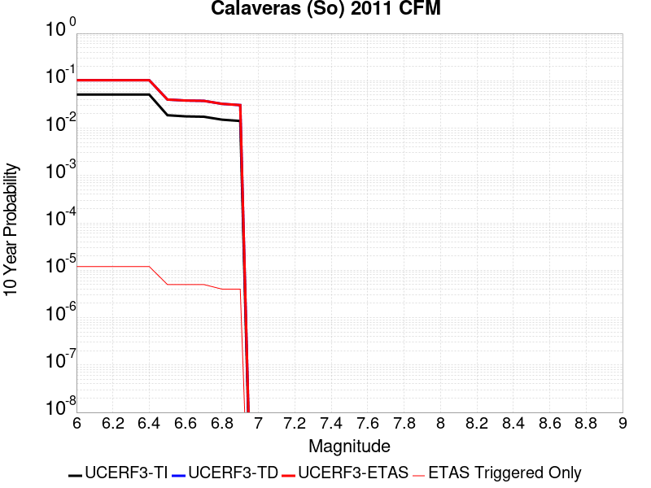 |

| Magnitude | 1 wk TI Prob | 1 wk TD Prob | 1 wk ETAS Prob | 1 wk ETAS/TD Gain | 1 wk ETAS Triggered Only | 1 mo TI Prob | 1 mo TD Prob | 1 mo ETAS Prob | 1 mo ETAS/TD Gain | 1 mo ETAS Triggered Only | 1 yr TI Prob | 1 yr TD Prob | 1 yr ETAS Prob | 1 yr ETAS/TD Gain | 1 yr ETAS Triggered Only | 10 yr TI Prob | 10 yr TD Prob | 10 yr ETAS Prob | 10 yr ETAS/TD Gain | 10 yr ETAS Triggered Only |
|-----|-----|-----|-----|-----|-----|-----|-----|-----|-----|-----|-----|-----|-----|-----|-----|-----|-----|-----|-----|-----|
| 6.0 | 1.00604906E-4 | 2.1600646E-4 | 2.4078181E-4 | 1.1146972 | 2.4780691E-5 | 4.3109263E-4 | 9.255689E-4 | 9.503267E-4 | 1.0267487 | 2.4780691E-5 | 0.0052359286 | 0.0112380525 | 0.011262555 | 1.0021803 | 2.4780691E-5 | 0.05114268 | 0.102641135 | 0.10267449 | 1.000325 | 3.7171038E-5 |
| 6.1 | 1.00604906E-4 | 2.1600646E-4 | 2.4078181E-4 | 1.1146972 | 2.4780691E-5 | 4.3109263E-4 | 9.255689E-4 | 9.503267E-4 | 1.0267487 | 2.4780691E-5 | 0.0052359286 | 0.0112380525 | 0.011262555 | 1.0021803 | 2.4780691E-5 | 0.05114268 | 0.102641135 | 0.10267449 | 1.000325 | 3.7171038E-5 |
| 6.2 | 1.00604906E-4 | 2.1600646E-4 | 2.4078181E-4 | 1.1146972 | 2.4780691E-5 | 4.3109263E-4 | 9.255689E-4 | 9.503267E-4 | 1.0267487 | 2.4780691E-5 | 0.0052359286 | 0.0112380525 | 0.011262555 | 1.0021803 | 2.4780691E-5 | 0.05114268 | 0.102641135 | 0.10267449 | 1.000325 | 3.7171038E-5 |
| 6.3 | 1.00604906E-4 | 2.1600646E-4 | 2.4078181E-4 | 1.1146972 | 2.4780691E-5 | 4.3109263E-4 | 9.255689E-4 | 9.503267E-4 | 1.0267487 | 2.4780691E-5 | 0.0052359286 | 0.0112380525 | 0.011262555 | 1.0021803 | 2.4780691E-5 | 0.05114268 | 0.102641135 | 0.10267449 | 1.000325 | 3.7171038E-5 |
| 6.4 | 1.00604906E-4 | 2.1600646E-4 | 2.4078181E-4 | 1.1146972 | 2.4780691E-5 | 4.3109263E-4 | 9.255689E-4 | 9.503267E-4 | 1.0267487 | 2.4780691E-5 | 0.0052359286 | 0.0112380525 | 0.011262555 | 1.0021803 | 2.4780691E-5 | 0.05114268 | 0.102641135 | 0.10267449 | 1.000325 | 3.7171038E-5 |
| 6.5 | 3.6232093E-5 | 8.0470694E-5 | 8.0470694E-5 | 1.0 | 0.0 | 1.5527116E-4 | 3.448549E-4 | 3.448549E-4 | 1.0 | 0.0 | 0.0018887871 | 0.004195091 | 0.004195091 | 1.0 | 0.0 | 0.018728139 | 0.040133998 | 0.040145893 | 1.0002964 | 1.2390346E-5 |
| 6.6 | 3.4288823E-5 | 7.645369E-5 | 7.645369E-5 | 1.0 | 0.0 | 1.4694381E-4 | 3.2764356E-4 | 3.2764356E-4 | 1.0 | 0.0 | 0.0017875729 | 0.003986383 | 0.003986383 | 1.0 | 0.0 | 0.017732618 | 0.03829094 | 0.038302857 | 1.0003111 | 1.2390346E-5 |
| 6.7 | 3.365726E-5 | 7.5152966E-5 | 7.5152966E-5 | 1.0 | 0.0 | 1.4423742E-4 | 3.220704E-4 | 3.220704E-4 | 1.0 | 0.0 | 0.001754676 | 0.003918774 | 0.003918774 | 1.0 | 0.0 | 0.017408855 | 0.037675563 | 0.037687488 | 1.0003165 | 1.2390346E-5 |
| 6.8 | 2.9146076E-5 | 6.459388E-5 | 6.459388E-5 | 1.0 | 0.0 | 1.2490578E-4 | 2.768274E-4 | 2.768274E-4 | 1.0 | 0.0 | 0.001519667 | 0.0033697556 | 0.0033697556 | 1.0 | 0.0 | 0.015093167 | 0.032588553 | 0.03260054 | 1.0003678 | 1.2390346E-5 |
| 6.9 | 2.7363296E-5 | 6.059934E-5 | 6.059934E-5 | 1.0 | 0.0 | 1.1726599E-4 | 2.5971147E-4 | 2.5971147E-4 | 1.0 | 0.0 | 0.0014267784 | 0.003161987 | 0.003161987 | 1.0 | 0.0 | 0.014176525 | 0.030637112 | 0.030649122 | 1.0003921 | 1.2390346E-5 |

## Imperial
*[(top)](#table-of-contents)*

| 1 Week | 1 Month | 1 Year | 10 Year |
|-----|-----|-----|-----|
|  |  |  |  |

| Magnitude | 1 wk TI Prob | 1 wk TD Prob | 1 wk ETAS Prob | 1 wk ETAS/TD Gain | 1 wk ETAS Triggered Only | 1 mo TI Prob | 1 mo TD Prob | 1 mo ETAS Prob | 1 mo ETAS/TD Gain | 1 mo ETAS Triggered Only | 1 yr TI Prob | 1 yr TD Prob | 1 yr ETAS Prob | 1 yr ETAS/TD Gain | 1 yr ETAS Triggered Only | 10 yr TI Prob | 10 yr TD Prob | 10 yr ETAS Prob | 10 yr ETAS/TD Gain | 10 yr ETAS Triggered Only |
|-----|-----|-----|-----|-----|-----|-----|-----|-----|-----|-----|-----|-----|-----|-----|-----|-----|-----|-----|-----|-----|
| 6.0 | 3.2610117E-4 | 4.2223663E-4 | 4.3462176E-4 | 1.0293322 | 1.2390346E-5 | 0.001396828 | 0.0018087402 | 0.0018211082 | 1.0068378 | 1.2390346E-5 | 0.016874276 | 0.0221874 | 0.022211632 | 1.0010921 | 2.4780691E-5 | 0.1564893 | 0.21658373 | 0.21661285 | 1.0001345 | 3.7171038E-5 |
| 6.1 | 3.2610117E-4 | 4.2223663E-4 | 4.3462176E-4 | 1.0293322 | 1.2390346E-5 | 0.001396828 | 0.0018087402 | 0.0018211082 | 1.0068378 | 1.2390346E-5 | 0.016874276 | 0.0221874 | 0.022211632 | 1.0010921 | 2.4780691E-5 | 0.1564893 | 0.21658373 | 0.21661285 | 1.0001345 | 3.7171038E-5 |
| 6.2 | 3.2610117E-4 | 4.2223663E-4 | 4.3462176E-4 | 1.0293322 | 1.2390346E-5 | 0.001396828 | 0.0018087402 | 0.0018211082 | 1.0068378 | 1.2390346E-5 | 0.016874276 | 0.0221874 | 0.022211632 | 1.0010921 | 2.4780691E-5 | 0.1564893 | 0.21658373 | 0.21661285 | 1.0001345 | 3.7171038E-5 |
| 6.3 | 3.2610117E-4 | 4.2223663E-4 | 4.3462176E-4 | 1.0293322 | 1.2390346E-5 | 0.001396828 | 0.0018087402 | 0.0018211082 | 1.0068378 | 1.2390346E-5 | 0.016874276 | 0.0221874 | 0.022211632 | 1.0010921 | 2.4780691E-5 | 0.1564893 | 0.21658373 | 0.21661285 | 1.0001345 | 3.7171038E-5 |
| 6.4 | 3.2610117E-4 | 4.2223663E-4 | 4.3462176E-4 | 1.0293322 | 1.2390346E-5 | 0.001396828 | 0.0018087402 | 0.0018211082 | 1.0068378 | 1.2390346E-5 | 0.016874276 | 0.0221874 | 0.022211632 | 1.0010921 | 2.4780691E-5 | 0.1564893 | 0.21658373 | 0.21661285 | 1.0001345 | 3.7171038E-5 |
| 6.5 | 3.2610117E-4 | 4.2223663E-4 | 4.3462176E-4 | 1.0293322 | 1.2390346E-5 | 0.001396828 | 0.0018087402 | 0.0018211082 | 1.0068378 | 1.2390346E-5 | 0.016874276 | 0.0221874 | 0.022211632 | 1.0010921 | 2.4780691E-5 | 0.1564893 | 0.21658373 | 0.21661285 | 1.0001345 | 3.7171038E-5 |
| 6.6 | 2.7505832E-4 | 3.51371E-4 | 3.6375702E-4 | 1.0352504 | 1.2390346E-5 | 0.0011782888 | 0.0015054093 | 0.0015177809 | 1.0082182 | 1.2390346E-5 | 0.014251595 | 0.018531771 | 0.018556094 | 1.0013124 | 2.4780691E-5 | 0.13371493 | 0.18699032 | 0.18702054 | 1.0001616 | 3.7171038E-5 |
| 6.7 | 2.2892522E-4 | 2.8752215E-4 | 2.9990895E-4 | 1.0430812 | 1.2390346E-5 | 9.807391E-4 | 0.0012320514 | 0.0012444265 | 1.0100443 | 1.2390346E-5 | 0.011875284 | 0.015238598 | 0.0152630005 | 1.0016015 | 2.4780691E-5 | 0.11260368 | 0.1593126 | 0.15933344 | 1.0001308 | 2.4780691E-5 |
| 6.8 | 1.8687606E-4 | 2.3508105E-4 | 2.4746847E-4 | 1.0526943 | 1.2390346E-5 | 8.0065156E-4 | 0.0010074902 | 0.0010198681 | 1.0122858 | 1.2390346E-5 | 0.009704442 | 0.012523335 | 0.012547806 | 1.001954 | 2.4780691E-5 | 0.09291432 | 0.13362566 | 0.13364713 | 1.0001607 | 2.4780691E-5 |
| 6.9 | 1.8687606E-4 | 2.3508105E-4 | 2.4746847E-4 | 1.0526943 | 1.2390346E-5 | 8.0065156E-4 | 0.0010074902 | 0.0010198681 | 1.0122858 | 1.2390346E-5 | 0.009704442 | 0.012523335 | 0.012547806 | 1.001954 | 2.4780691E-5 | 0.09291432 | 0.13362566 | 0.13364713 | 1.0001607 | 2.4780691E-5 |

## Deep Springs
*[(top)](#table-of-contents)*

| 1 Week | 1 Month | 1 Year | 10 Year |
|-----|-----|-----|-----|
|  |  |  |  |

| Magnitude | 1 wk TI Prob | 1 wk TD Prob | 1 wk ETAS Prob | 1 wk ETAS/TD Gain | 1 wk ETAS Triggered Only | 1 mo TI Prob | 1 mo TD Prob | 1 mo ETAS Prob | 1 mo ETAS/TD Gain | 1 mo ETAS Triggered Only | 1 yr TI Prob | 1 yr TD Prob | 1 yr ETAS Prob | 1 yr ETAS/TD Gain | 1 yr ETAS Triggered Only | 10 yr TI Prob | 10 yr TD Prob | 10 yr ETAS Prob | 10 yr ETAS/TD Gain | 10 yr ETAS Triggered Only |
|-----|-----|-----|-----|-----|-----|-----|-----|-----|-----|-----|-----|-----|-----|-----|-----|-----|-----|-----|-----|-----|
| 6.0 | 1.5918817E-5 | 1.7845163E-5 | 3.0235287E-5 | 1.6943128 | 1.2390346E-5 | 6.8221714E-5 | 7.64782E-5 | 8.88676E-5 | 1.1619991 | 1.2390346E-5 | 8.3028286E-4 | 9.3093317E-4 | 9.556908E-4 | 1.0265944 | 2.4780691E-5 | 0.008271876 | 0.009290814 | 0.00932764 | 1.0039637 | 3.7171038E-5 |
| 6.1 | 1.5918817E-5 | 1.7845163E-5 | 3.0235287E-5 | 1.6943128 | 1.2390346E-5 | 6.8221714E-5 | 7.64782E-5 | 8.88676E-5 | 1.1619991 | 1.2390346E-5 | 8.3028286E-4 | 9.3093317E-4 | 9.556908E-4 | 1.0265944 | 2.4780691E-5 | 0.008271876 | 0.009290814 | 0.00932764 | 1.0039637 | 3.7171038E-5 |
| 6.2 | 1.5918817E-5 | 1.7845163E-5 | 3.0235287E-5 | 1.6943128 | 1.2390346E-5 | 6.8221714E-5 | 7.64782E-5 | 8.88676E-5 | 1.1619991 | 1.2390346E-5 | 8.3028286E-4 | 9.3093317E-4 | 9.556908E-4 | 1.0265944 | 2.4780691E-5 | 0.008271876 | 0.009290814 | 0.00932764 | 1.0039637 | 3.7171038E-5 |
| 6.3 | 1.5918817E-5 | 1.7845163E-5 | 3.0235287E-5 | 1.6943128 | 1.2390346E-5 | 6.8221714E-5 | 7.64782E-5 | 8.88676E-5 | 1.1619991 | 1.2390346E-5 | 8.3028286E-4 | 9.3093317E-4 | 9.556908E-4 | 1.0265944 | 2.4780691E-5 | 0.008271876 | 0.009290814 | 0.00932764 | 1.0039637 | 3.7171038E-5 |
| 6.4 | 1.5918817E-5 | 1.7845163E-5 | 3.0235287E-5 | 1.6943128 | 1.2390346E-5 | 6.8221714E-5 | 7.64782E-5 | 8.88676E-5 | 1.1619991 | 1.2390346E-5 | 8.3028286E-4 | 9.3093317E-4 | 9.556908E-4 | 1.0265944 | 2.4780691E-5 | 0.008271876 | 0.009290814 | 0.00932764 | 1.0039637 | 3.7171038E-5 |
| 6.5 | 1.5918817E-5 | 1.7845163E-5 | 3.0235287E-5 | 1.6943128 | 1.2390346E-5 | 6.8221714E-5 | 7.64782E-5 | 8.88676E-5 | 1.1619991 | 1.2390346E-5 | 8.3028286E-4 | 9.3093317E-4 | 9.556908E-4 | 1.0265944 | 2.4780691E-5 | 0.008271876 | 0.009290814 | 0.00932764 | 1.0039637 | 3.7171038E-5 |
| 6.6 | 1.1008706E-5 | 1.2328163E-5 | 2.4718356E-5 | 2.0050316 | 1.2390346E-5 | 4.7179317E-5 | 5.2834985E-5 | 6.5224674E-5 | 1.2344979 | 1.2390346E-5 | 5.7425676E-4 | 6.4326596E-4 | 6.680307E-4 | 1.0384985 | 2.4780691E-5 | 0.0057277507 | 0.0064326595 | 0.006469591 | 1.0057414 | 3.7171038E-5 |
| 6.7 | 1.1008706E-5 | 1.2328163E-5 | 2.4718356E-5 | 2.0050316 | 1.2390346E-5 | 4.7179317E-5 | 5.2834985E-5 | 6.5224674E-5 | 1.2344979 | 1.2390346E-5 | 5.7425676E-4 | 6.4326596E-4 | 6.680307E-4 | 1.0384985 | 2.4780691E-5 | 0.0057277507 | 0.0064326595 | 0.006469591 | 1.0057414 | 3.7171038E-5 |

## Calico-Hidalgo
*[(top)](#table-of-contents)*

| 1 Week | 1 Month | 1 Year | 10 Year |
|-----|-----|-----|-----|
|  |  |  |  |

| Magnitude | 1 wk TI Prob | 1 wk TD Prob | 1 wk ETAS Prob | 1 wk ETAS/TD Gain | 1 wk ETAS Triggered Only | 1 mo TI Prob | 1 mo TD Prob | 1 mo ETAS Prob | 1 mo ETAS/TD Gain | 1 mo ETAS Triggered Only | 1 yr TI Prob | 1 yr TD Prob | 1 yr ETAS Prob | 1 yr ETAS/TD Gain | 1 yr ETAS Triggered Only | 10 yr TI Prob | 10 yr TD Prob | 10 yr ETAS Prob | 10 yr ETAS/TD Gain | 10 yr ETAS Triggered Only |
|-----|-----|-----|-----|-----|-----|-----|-----|-----|-----|-----|-----|-----|-----|-----|-----|-----|-----|-----|-----|-----|
| 6.0 | 2.0989894E-5 | 2.9615694E-5 | 4.200567E-5 | 1.4183586 | 1.2390346E-5 | 8.995359E-5 | 1.269188E-4 | 1.3930758E-4 | 1.0976118 | 1.2390346E-5 | 0.0010946346 | 0.0015442439 | 0.0015689863 | 1.0160223 | 2.4780691E-5 | 0.010892583 | 0.015345532 | 0.015382133 | 1.0023851 | 3.7171038E-5 |
| 6.1 | 2.0989894E-5 | 2.9615694E-5 | 4.200567E-5 | 1.4183586 | 1.2390346E-5 | 8.995359E-5 | 1.269188E-4 | 1.3930758E-4 | 1.0976118 | 1.2390346E-5 | 0.0010946346 | 0.0015442439 | 0.0015689863 | 1.0160223 | 2.4780691E-5 | 0.010892583 | 0.015345532 | 0.015382133 | 1.0023851 | 3.7171038E-5 |
| 6.2 | 2.0989894E-5 | 2.9615694E-5 | 4.200567E-5 | 1.4183586 | 1.2390346E-5 | 8.995359E-5 | 1.269188E-4 | 1.3930758E-4 | 1.0976118 | 1.2390346E-5 | 0.0010946346 | 0.0015442439 | 0.0015689863 | 1.0160223 | 2.4780691E-5 | 0.010892583 | 0.015345532 | 0.015382133 | 1.0023851 | 3.7171038E-5 |
| 6.3 | 2.0989894E-5 | 2.9615694E-5 | 4.200567E-5 | 1.4183586 | 1.2390346E-5 | 8.995359E-5 | 1.269188E-4 | 1.3930758E-4 | 1.0976118 | 1.2390346E-5 | 0.0010946346 | 0.0015442439 | 0.0015689863 | 1.0160223 | 2.4780691E-5 | 0.010892583 | 0.015345532 | 0.015382133 | 1.0023851 | 3.7171038E-5 |
| 6.4 | 2.0989894E-5 | 2.9615694E-5 | 4.200567E-5 | 1.4183586 | 1.2390346E-5 | 8.995359E-5 | 1.269188E-4 | 1.3930758E-4 | 1.0976118 | 1.2390346E-5 | 0.0010946346 | 0.0015442439 | 0.0015689863 | 1.0160223 | 2.4780691E-5 | 0.010892583 | 0.015345532 | 0.015382133 | 1.0023851 | 3.7171038E-5 |
| 6.5 | 2.0989894E-5 | 2.9615694E-5 | 4.200567E-5 | 1.4183586 | 1.2390346E-5 | 8.995359E-5 | 1.269188E-4 | 1.3930758E-4 | 1.0976118 | 1.2390346E-5 | 0.0010946346 | 0.0015442439 | 0.0015689863 | 1.0160223 | 2.4780691E-5 | 0.010892583 | 0.015345532 | 0.015382133 | 1.0023851 | 3.7171038E-5 |
| 6.6 | 1.929251E-5 | 2.7260403E-5 | 3.965041E-5 | 1.4545057 | 1.2390346E-5 | 8.2679566E-5 | 1.1682564E-4 | 1.2921455E-4 | 1.1060461 | 1.2390346E-5 | 0.0010061589 | 0.0014215263 | 0.0014462718 | 1.0174077 | 2.4780691E-5 | 0.0100161545 | 0.0141346 | 0.01415903 | 1.0017284 | 2.4780691E-5 |
| 6.7 | 1.699933E-5 | 2.4101535E-5 | 3.6491583E-5 | 1.5140771 | 1.2390346E-5 | 7.2852235E-5 | 1.03288774E-4 | 1.15677845E-4 | 1.1199459 | 1.2390346E-5 | 8.86615E-4 | 0.0012569166 | 0.0012816661 | 1.0196906 | 2.4780691E-5 | 0.00883086 | 0.012508152 | 0.012532623 | 1.0019563 | 2.4780691E-5 |
| 6.8 | 1.4895645E-5 | 2.0902306E-5 | 2.0902306E-5 | 1.0 | 0.0 | 6.383692E-5 | 8.9578796E-5 | 8.9578796E-5 | 1.0 | 0.0 | 7.769373E-4 | 0.001090176 | 0.001090176 | 1.0 | 0.0 | 0.0077422657 | 0.010858163 | 0.010858163 | 1.0 | 0.0 |
| 6.9 | 1.3209459E-5 | 1.8371871E-5 | 1.8371871E-5 | 1.0 | 0.0 | 5.6610737E-5 | 7.8734774E-5 | 7.8734774E-5 | 1.0 | 0.0 | 6.8901776E-4 | 9.5827354E-4 | 9.5827354E-4 | 1.0 | 0.0 | 0.0068688532 | 0.009551193 | 0.009551193 | 1.0 | 0.0 |
| 7.0 | 1.1401334E-5 | 1.5655183E-5 | 1.5655183E-5 | 1.0 | 0.0 | 4.8861944E-5 | 6.709247E-5 | 6.709247E-5 | 1.0 | 0.0 | 5.9473177E-4 | 8.166432E-4 | 8.166432E-4 | 1.0 | 0.0 | 0.0059314263 | 0.008146102 | 0.008146102 | 1.0 | 0.0 |
| 7.1 | 1.0049503E-5 | 1.3644847E-5 | 1.3644847E-5 | 1.0 | 0.0 | 4.3068587E-5 | 5.847716E-5 | 5.847716E-5 | 1.0 | 0.0 | 5.2423385E-4 | 7.118249E-4 | 7.118249E-4 | 1.0 | 0.0 | 0.005229989 | 0.007105075 | 0.007105075 | 1.0 | 0.0 |
| 7.2 | 8.817072E-6 | 1.1833239E-5 | 1.1833239E-5 | 1.0 | 0.0 | 3.7786904E-5 | 5.0713446E-5 | 5.0713446E-5 | 1.0 | 0.0 | 4.5995842E-4 | 6.1735895E-4 | 6.1735895E-4 | 1.0 | 0.0 | 0.004590076 | 0.006166015 | 0.006166015 | 1.0 | 0.0 |
| 7.3 | 7.683954E-6 | 1.0189235E-5 | 1.0189235E-5 | 1.0 | 0.0 | 3.2930817E-5 | 4.3667966E-5 | 4.3667966E-5 | 1.0 | 0.0 | 4.008589E-4 | 5.316249E-4 | 5.316249E-4 | 1.0 | 0.0 | 0.004001366 | 0.00531305 | 0.00531305 | 1.0 | 0.0 |
| 7.4 | 6.633441E-6 | 8.756893E-6 | 8.756893E-6 | 1.0 | 0.0 | 2.8428722E-5 | 3.7529542E-5 | 3.7529542E-5 | 1.0 | 0.0 | 3.460647E-4 | 4.5692216E-4 | 4.5692216E-4 | 1.0 | 0.0 | 0.0034552629 | 0.0045692218 | 0.0045692218 | 1.0 | 0.0 |

## Anacapa-Dume alt 1
*[(top)](#table-of-contents)*

| 1 Week | 1 Month | 1 Year | 10 Year |
|-----|-----|-----|-----|
|  |  |  |  |

| Magnitude | 1 wk TI Prob | 1 wk TD Prob | 1 wk ETAS Prob | 1 wk ETAS/TD Gain | 1 wk ETAS Triggered Only | 1 mo TI Prob | 1 mo TD Prob | 1 mo ETAS Prob | 1 mo ETAS/TD Gain | 1 mo ETAS Triggered Only | 1 yr TI Prob | 1 yr TD Prob | 1 yr ETAS Prob | 1 yr ETAS/TD Gain | 1 yr ETAS Triggered Only | 10 yr TI Prob | 10 yr TD Prob | 10 yr ETAS Prob | 10 yr ETAS/TD Gain | 10 yr ETAS Triggered Only |
|-----|-----|-----|-----|-----|-----|-----|-----|-----|-----|-----|-----|-----|-----|-----|-----|-----|-----|-----|-----|-----|
| 6.0 | 2.8047281E-5 | 3.3042823E-5 | 4.543276E-5 | 1.374966 | 1.2390346E-5 | 1.20197095E-4 | 1.4160581E-4 | 1.5399439E-4 | 1.0874865 | 1.2390346E-5 | 0.0014624172 | 0.0017229331 | 0.0017353022 | 1.007179 | 1.2390346E-5 | 0.014528306 | 0.017120155 | 0.01715669 | 1.002134 | 3.7171038E-5 |
| 6.1 | 2.8047281E-5 | 3.3042823E-5 | 4.543276E-5 | 1.374966 | 1.2390346E-5 | 1.20197095E-4 | 1.4160581E-4 | 1.5399439E-4 | 1.0874865 | 1.2390346E-5 | 0.0014624172 | 0.0017229331 | 0.0017353022 | 1.007179 | 1.2390346E-5 | 0.014528306 | 0.017120155 | 0.01715669 | 1.002134 | 3.7171038E-5 |
| 6.2 | 2.8047281E-5 | 3.3042823E-5 | 4.543276E-5 | 1.374966 | 1.2390346E-5 | 1.20197095E-4 | 1.4160581E-4 | 1.5399439E-4 | 1.0874865 | 1.2390346E-5 | 0.0014624172 | 0.0017229331 | 0.0017353022 | 1.007179 | 1.2390346E-5 | 0.014528306 | 0.017120155 | 0.01715669 | 1.002134 | 3.7171038E-5 |
| 6.3 | 2.8047281E-5 | 3.3042823E-5 | 4.543276E-5 | 1.374966 | 1.2390346E-5 | 1.20197095E-4 | 1.4160581E-4 | 1.5399439E-4 | 1.0874865 | 1.2390346E-5 | 0.0014624172 | 0.0017229331 | 0.0017353022 | 1.007179 | 1.2390346E-5 | 0.014528306 | 0.017120155 | 0.01715669 | 1.002134 | 3.7171038E-5 |
| 6.4 | 2.8047281E-5 | 3.3042823E-5 | 4.543276E-5 | 1.374966 | 1.2390346E-5 | 1.20197095E-4 | 1.4160581E-4 | 1.5399439E-4 | 1.0874865 | 1.2390346E-5 | 0.0014624172 | 0.0017229331 | 0.0017353022 | 1.007179 | 1.2390346E-5 | 0.014528306 | 0.017120155 | 0.01715669 | 1.002134 | 3.7171038E-5 |
| 6.5 | 2.8047281E-5 | 3.3042823E-5 | 4.543276E-5 | 1.374966 | 1.2390346E-5 | 1.20197095E-4 | 1.4160581E-4 | 1.5399439E-4 | 1.0874865 | 1.2390346E-5 | 0.0014624172 | 0.0017229331 | 0.0017353022 | 1.007179 | 1.2390346E-5 | 0.014528306 | 0.017120155 | 0.01715669 | 1.002134 | 3.7171038E-5 |
| 6.6 | 2.8047281E-5 | 3.3042823E-5 | 4.543276E-5 | 1.374966 | 1.2390346E-5 | 1.20197095E-4 | 1.4160581E-4 | 1.5399439E-4 | 1.0874865 | 1.2390346E-5 | 0.0014624172 | 0.0017229331 | 0.0017353022 | 1.007179 | 1.2390346E-5 | 0.014528306 | 0.017120155 | 0.01715669 | 1.002134 | 3.7171038E-5 |
| 6.7 | 1.8557415E-5 | 2.1779932E-5 | 3.4170007E-5 | 1.5688758 | 1.2390346E-5 | 7.952935E-5 | 9.334038E-5 | 1.0572957E-4 | 1.1327313 | 1.2390346E-5 | 9.6783973E-4 | 0.0011360307 | 0.001148407 | 1.0108943 | 1.2390346E-5 | 0.009636354 | 0.011322291 | 0.01133454 | 1.001082 | 1.2390346E-5 |
| 6.8 | 1.8557415E-5 | 2.1779932E-5 | 3.4170007E-5 | 1.5688758 | 1.2390346E-5 | 7.952935E-5 | 9.334038E-5 | 1.0572957E-4 | 1.1327313 | 1.2390346E-5 | 9.6783973E-4 | 0.0011360307 | 0.001148407 | 1.0108943 | 1.2390346E-5 | 0.009636354 | 0.011322291 | 0.01133454 | 1.001082 | 1.2390346E-5 |
| 6.9 | 1.3238843E-5 | 1.5484396E-5 | 1.5484396E-5 | 1.0 | 0.0 | 5.6736666E-5 | 6.636107E-5 | 6.636107E-5 | 1.0 | 0.0 | 6.9054996E-4 | 8.078341E-4 | 8.078341E-4 | 1.0 | 0.0 | 0.0068840804 | 0.008067372 | 0.008067372 | 1.0 | 0.0 |
| 7.0 | 1.3238843E-5 | 1.5484396E-5 | 1.5484396E-5 | 1.0 | 0.0 | 5.6736666E-5 | 6.636107E-5 | 6.636107E-5 | 1.0 | 0.0 | 6.9054996E-4 | 8.078341E-4 | 8.078341E-4 | 1.0 | 0.0 | 0.0068840804 | 0.008067372 | 0.008067372 | 1.0 | 0.0 |
| 7.1 | 1.0270256E-5 | 1.1981463E-5 | 1.1981463E-5 | 1.0 | 0.0 | 4.401464E-5 | 5.134913E-5 | 5.134913E-5 | 1.0 | 0.0 | 5.3574645E-4 | 6.2517566E-4 | 6.2517566E-4 | 1.0 | 0.0 | 0.005344567 | 0.0062517566 | 0.0062517566 | 1.0 | 0.0 |

## San Gabriel
*[(top)](#table-of-contents)*

| 1 Week | 1 Month | 1 Year | 10 Year |
|-----|-----|-----|-----|
|  |  |  |  |

| Magnitude | 1 wk TI Prob | 1 wk TD Prob | 1 wk ETAS Prob | 1 wk ETAS/TD Gain | 1 wk ETAS Triggered Only | 1 mo TI Prob | 1 mo TD Prob | 1 mo ETAS Prob | 1 mo ETAS/TD Gain | 1 mo ETAS Triggered Only | 1 yr TI Prob | 1 yr TD Prob | 1 yr ETAS Prob | 1 yr ETAS/TD Gain | 1 yr ETAS Triggered Only | 10 yr TI Prob | 10 yr TD Prob | 10 yr ETAS Prob | 10 yr ETAS/TD Gain | 10 yr ETAS Triggered Only |
|-----|-----|-----|-----|-----|-----|-----|-----|-----|-----|-----|-----|-----|-----|-----|-----|-----|-----|-----|-----|-----|
| 6.0 | 1.26160985E-5 | 1.3513258E-5 | 2.5903435E-5 | 1.9168905 | 1.2390346E-5 | 5.406787E-5 | 5.791289E-5 | 8.2692146E-5 | 1.4278712 | 2.4780691E-5 | 6.580775E-4 | 7.048994E-4 | 7.2966254E-4 | 1.0351301 | 2.4780691E-5 | 0.006561321 | 0.007030387 | 0.0070672967 | 1.00525 | 3.7171038E-5 |
| 6.1 | 1.26160985E-5 | 1.3513258E-5 | 2.5903435E-5 | 1.9168905 | 1.2390346E-5 | 5.406787E-5 | 5.791289E-5 | 8.2692146E-5 | 1.4278712 | 2.4780691E-5 | 6.580775E-4 | 7.048994E-4 | 7.2966254E-4 | 1.0351301 | 2.4780691E-5 | 0.006561321 | 0.007030387 | 0.0070672967 | 1.00525 | 3.7171038E-5 |
| 6.2 | 1.26160985E-5 | 1.3513258E-5 | 2.5903435E-5 | 1.9168905 | 1.2390346E-5 | 5.406787E-5 | 5.791289E-5 | 8.2692146E-5 | 1.4278712 | 2.4780691E-5 | 6.580775E-4 | 7.048994E-4 | 7.2966254E-4 | 1.0351301 | 2.4780691E-5 | 0.006561321 | 0.007030387 | 0.0070672967 | 1.00525 | 3.7171038E-5 |
| 6.3 | 1.26160985E-5 | 1.3513258E-5 | 2.5903435E-5 | 1.9168905 | 1.2390346E-5 | 5.406787E-5 | 5.791289E-5 | 8.2692146E-5 | 1.4278712 | 2.4780691E-5 | 6.580775E-4 | 7.048994E-4 | 7.2966254E-4 | 1.0351301 | 2.4780691E-5 | 0.006561321 | 0.007030387 | 0.0070672967 | 1.00525 | 3.7171038E-5 |
| 6.4 | 1.26160985E-5 | 1.3513258E-5 | 2.5903435E-5 | 1.9168905 | 1.2390346E-5 | 5.406787E-5 | 5.791289E-5 | 8.2692146E-5 | 1.4278712 | 2.4780691E-5 | 6.580775E-4 | 7.048994E-4 | 7.2966254E-4 | 1.0351301 | 2.4780691E-5 | 0.006561321 | 0.007030387 | 0.0070672967 | 1.00525 | 3.7171038E-5 |
| 6.5 | 1.26160985E-5 | 1.3513258E-5 | 2.5903435E-5 | 1.9168905 | 1.2390346E-5 | 5.406787E-5 | 5.791289E-5 | 8.2692146E-5 | 1.4278712 | 2.4780691E-5 | 6.580775E-4 | 7.048994E-4 | 7.2966254E-4 | 1.0351301 | 2.4780691E-5 | 0.006561321 | 0.007030387 | 0.0070672967 | 1.00525 | 3.7171038E-5 |
| 6.6 | 1.1803596E-5 | 1.264043E-5 | 2.5030618E-5 | 1.9802032 | 1.2390346E-5 | 5.058586E-5 | 5.417236E-5 | 7.895171E-5 | 1.4574168 | 2.4780691E-5 | 6.1570876E-4 | 6.5938674E-4 | 6.841511E-4 | 1.0375566 | 2.4780691E-5 | 0.0061400565 | 0.006578034 | 0.0066149603 | 1.0056136 | 3.7171038E-5 |
| 6.7 | 9.549731E-6 | 1.0215835E-5 | 2.2606053E-5 | 2.2128446 | 1.2390346E-5 | 4.0926778E-5 | 4.378162E-5 | 6.8561225E-5 | 1.565982 | 2.4780691E-5 | 4.9816957E-4 | 5.329474E-4 | 5.577149E-4 | 1.0464727 | 2.4780691E-5 | 0.0049705426 | 0.005320286 | 0.0053572594 | 1.0069495 | 3.7171038E-5 |
| 6.8 | 9.157154E-6 | 9.798772E-6 | 2.2188997E-5 | 2.264467 | 1.2390346E-5 | 3.9244354E-5 | 4.1994266E-5 | 6.6773915E-5 | 1.5900723 | 2.4780691E-5 | 4.7769528E-4 | 5.111967E-4 | 5.3596473E-4 | 1.0484511 | 2.4780691E-5 | 0.004766697 | 0.005103788 | 0.0051407693 | 1.0072459 | 3.7171038E-5 |
| 6.9 | 7.844496E-6 | 8.385175E-6 | 2.0775416E-5 | 2.4776368 | 1.2390346E-5 | 3.3618835E-5 | 3.593617E-5 | 6.0715967E-5 | 1.6895504 | 2.4780691E-5 | 4.0923245E-4 | 4.374709E-4 | 4.6224077E-4 | 1.0566206 | 2.4780691E-5 | 0.0040847966 | 0.0043696202 | 0.004406629 | 1.0084696 | 3.7171038E-5 |
| 7.0 | 6.7619258E-6 | 7.2223247E-6 | 1.961258E-5 | 2.7155495 | 1.2390346E-5 | 2.897936E-5 | 3.0952655E-5 | 5.5732577E-5 | 1.8005751 | 2.4780691E-5 | 3.527666E-4 | 3.7681893E-4 | 4.0159028E-4 | 1.0657381 | 2.4780691E-5 | 0.0035220713 | 0.0037652855 | 0.0038023165 | 1.0098349 | 3.7171038E-5 |
| 7.1 | 5.927114E-6 | 6.3258008E-6 | 1.8716068E-5 | 2.9586875 | 1.2390346E-5 | 2.540167E-5 | 2.7110491E-5 | 5.189051E-5 | 1.9140381 | 2.4780691E-5 | 3.0922145E-4 | 3.300555E-4 | 3.5482802E-4 | 1.0750556 | 2.4780691E-5 | 0.0030879152 | 0.0032991117 | 0.0033238106 | 1.0074866 | 2.4780691E-5 |
| 7.2 | 4.9482483E-6 | 5.276545E-6 | 5.276545E-6 | 1.0 | 0.0 | 2.1206606E-5 | 2.2613764E-5 | 3.5003828E-5 | 1.5478992 | 1.2390346E-5 | 2.5815985E-4 | 2.7532259E-4 | 2.8770952E-4 | 1.0449907 | 1.2390346E-5 | 0.0025786015 | 0.0027532259 | 0.002765582 | 1.0044879 | 1.2390346E-5 |

## Hosgri
*[(top)](#table-of-contents)*

| 1 Week | 1 Month | 1 Year | 10 Year |
|-----|-----|-----|-----|
|  |  |  |  |

| Magnitude | 1 wk TI Prob | 1 wk TD Prob | 1 wk ETAS Prob | 1 wk ETAS/TD Gain | 1 wk ETAS Triggered Only | 1 mo TI Prob | 1 mo TD Prob | 1 mo ETAS Prob | 1 mo ETAS/TD Gain | 1 mo ETAS Triggered Only | 1 yr TI Prob | 1 yr TD Prob | 1 yr ETAS Prob | 1 yr ETAS/TD Gain | 1 yr ETAS Triggered Only | 10 yr TI Prob | 10 yr TD Prob | 10 yr ETAS Prob | 10 yr ETAS/TD Gain | 10 yr ETAS Triggered Only |
|-----|-----|-----|-----|-----|-----|-----|-----|-----|-----|-----|-----|-----|-----|-----|-----|-----|-----|-----|-----|-----|
| 6.0 | 3.1107833E-5 | 3.720853E-5 | 6.19883E-5 | 1.6659701 | 2.4780691E-5 | 1.3331248E-4 | 1.5945687E-4 | 1.8423362E-4 | 1.155382 | 2.4780691E-5 | 0.0016218709 | 0.001939923 | 0.0019646557 | 1.0127493 | 2.4780691E-5 | 0.01610085 | 0.01925631 | 0.019292766 | 1.0018932 | 3.7171038E-5 |
| 6.1 | 3.1107833E-5 | 3.720853E-5 | 6.19883E-5 | 1.6659701 | 2.4780691E-5 | 1.3331248E-4 | 1.5945687E-4 | 1.8423362E-4 | 1.155382 | 2.4780691E-5 | 0.0016218709 | 0.001939923 | 0.0019646557 | 1.0127493 | 2.4780691E-5 | 0.01610085 | 0.01925631 | 0.019292766 | 1.0018932 | 3.7171038E-5 |
| 6.2 | 3.1107833E-5 | 3.720853E-5 | 6.19883E-5 | 1.6659701 | 2.4780691E-5 | 1.3331248E-4 | 1.5945687E-4 | 1.8423362E-4 | 1.155382 | 2.4780691E-5 | 0.0016218709 | 0.001939923 | 0.0019646557 | 1.0127493 | 2.4780691E-5 | 0.01610085 | 0.01925631 | 0.019292766 | 1.0018932 | 3.7171038E-5 |
| 6.3 | 3.1107833E-5 | 3.720853E-5 | 6.19883E-5 | 1.6659701 | 2.4780691E-5 | 1.3331248E-4 | 1.5945687E-4 | 1.8423362E-4 | 1.155382 | 2.4780691E-5 | 0.0016218709 | 0.001939923 | 0.0019646557 | 1.0127493 | 2.4780691E-5 | 0.01610085 | 0.01925631 | 0.019292766 | 1.0018932 | 3.7171038E-5 |
| 6.4 | 3.1107833E-5 | 3.720853E-5 | 6.19883E-5 | 1.6659701 | 2.4780691E-5 | 1.3331248E-4 | 1.5945687E-4 | 1.8423362E-4 | 1.155382 | 2.4780691E-5 | 0.0016218709 | 0.001939923 | 0.0019646557 | 1.0127493 | 2.4780691E-5 | 0.01610085 | 0.01925631 | 0.019292766 | 1.0018932 | 3.7171038E-5 |
| 6.5 | 3.1107833E-5 | 3.720853E-5 | 6.19883E-5 | 1.6659701 | 2.4780691E-5 | 1.3331248E-4 | 1.5945687E-4 | 1.8423362E-4 | 1.155382 | 2.4780691E-5 | 0.0016218709 | 0.001939923 | 0.0019646557 | 1.0127493 | 2.4780691E-5 | 0.01610085 | 0.01925631 | 0.019292766 | 1.0018932 | 3.7171038E-5 |
| 6.6 | 2.743495E-5 | 3.2780124E-5 | 5.7560002E-5 | 1.7559422 | 2.4780691E-5 | 1.1757306E-4 | 1.4048017E-4 | 1.6525737E-4 | 1.1763752 | 2.4780691E-5 | 0.0014305119 | 0.0017092682 | 0.0017340066 | 1.0144731 | 2.4780691E-5 | 0.014213383 | 0.016987413 | 0.017023953 | 1.002151 | 3.7171038E-5 |
| 6.7 | 2.418707E-5 | 2.8858389E-5 | 4.124838E-5 | 1.4293375 | 1.2390346E-5 | 1.0365475E-4 | 1.2367443E-4 | 1.3606325E-4 | 1.1001728 | 1.2390346E-5 | 0.001261266 | 0.0015049598 | 0.0015173315 | 1.0082207 | 1.2390346E-5 | 0.012541314 | 0.014973709 | 0.014998119 | 1.0016302 | 2.4780691E-5 |
| 6.8 | 2.1292695E-5 | 2.5360874E-5 | 3.7750906E-5 | 1.4885491 | 1.2390346E-5 | 9.125122E-5 | 1.0868641E-4 | 1.21075405E-4 | 1.1139885 | 1.2390346E-5 | 0.0011104173 | 0.0013227165 | 0.0013350904 | 1.009355 | 1.2390346E-5 | 0.011048851 | 0.013174292 | 0.013198745 | 1.0018562 | 2.4780691E-5 |
| 6.9 | 1.8692357E-5 | 2.221764E-5 | 3.460771E-5 | 1.5576681 | 1.2390346E-5 | 8.010764E-5 | 9.521646E-5 | 1.0760563E-4 | 1.1301157 | 1.2390346E-5 | 9.7487407E-4 | 0.001158906 | 0.001171282 | 1.010679 | 1.2390346E-5 | 0.009706085 | 0.01155437 | 0.011578864 | 1.0021199 | 2.4780691E-5 |
| 7.0 | 1.6336586E-5 | 1.9370036E-5 | 1.9370036E-5 | 1.0 | 0.0 | 7.001206E-5 | 8.301328E-5 | 8.301328E-5 | 1.0 | 0.0 | 8.520634E-4 | 0.0010104795 | 0.0010104795 | 1.0 | 0.0 | 0.008488038 | 0.010084504 | 0.01009677 | 1.0012163 | 1.2390346E-5 |
| 7.1 | 1.4184237E-5 | 1.6776847E-5 | 1.6776847E-5 | 1.0 | 0.0 | 6.0788174E-5 | 7.1900264E-5 | 7.1900264E-5 | 1.0 | 0.0 | 7.398447E-4 | 8.7529485E-4 | 8.7529485E-4 | 1.0 | 0.0 | 0.007373864 | 0.008744048 | 0.00875633 | 1.0014046 | 1.2390346E-5 |
| 7.2 | 1.2201091E-5 | 1.4405841E-5 | 1.4405841E-5 | 1.0 | 0.0 | 5.228934E-5 | 6.1739316E-5 | 6.1739316E-5 | 1.0 | 0.0 | 6.3643674E-4 | 7.516762E-4 | 7.516762E-4 | 1.0 | 0.0 | 0.006346171 | 0.007516762 | 0.007529059 | 1.001636 | 1.2390346E-5 |

## Rodgers Creek - Healdsburg 2011 CFM
*[(top)](#table-of-contents)*

| 1 Week | 1 Month | 1 Year | 10 Year |
|-----|-----|-----|-----|
|  |  |  |  |

| Magnitude | 1 wk TI Prob | 1 wk TD Prob | 1 wk ETAS Prob | 1 wk ETAS/TD Gain | 1 wk ETAS Triggered Only | 1 mo TI Prob | 1 mo TD Prob | 1 mo ETAS Prob | 1 mo ETAS/TD Gain | 1 mo ETAS Triggered Only | 1 yr TI Prob | 1 yr TD Prob | 1 yr ETAS Prob | 1 yr ETAS/TD Gain | 1 yr ETAS Triggered Only | 10 yr TI Prob | 10 yr TD Prob | 10 yr ETAS Prob | 10 yr ETAS/TD Gain | 10 yr ETAS Triggered Only |
|-----|-----|-----|-----|-----|-----|-----|-----|-----|-----|-----|-----|-----|-----|-----|-----|-----|-----|-----|-----|-----|
| 6.0 | 9.830927E-5 | 2.4955187E-4 | 2.743264E-4 | 1.099276 | 2.4780691E-5 | 4.212574E-4 | 0.0010693158 | 0.00109407 | 1.0231496 | 2.4780691E-5 | 0.0051167537 | 0.012984863 | 0.013021551 | 1.0028255 | 3.7171038E-5 | 0.05000532 | 0.12216672 | 0.12219935 | 1.0002671 | 3.7171038E-5 |
| 6.1 | 9.830927E-5 | 2.4955187E-4 | 2.743264E-4 | 1.099276 | 2.4780691E-5 | 4.212574E-4 | 0.0010693158 | 0.00109407 | 1.0231496 | 2.4780691E-5 | 0.0051167537 | 0.012984863 | 0.013021551 | 1.0028255 | 3.7171038E-5 | 0.05000532 | 0.12216672 | 0.12219935 | 1.0002671 | 3.7171038E-5 |
| 6.2 | 9.830927E-5 | 2.4955187E-4 | 2.743264E-4 | 1.099276 | 2.4780691E-5 | 4.212574E-4 | 0.0010693158 | 0.00109407 | 1.0231496 | 2.4780691E-5 | 0.0051167537 | 0.012984863 | 0.013021551 | 1.0028255 | 3.7171038E-5 | 0.05000532 | 0.12216672 | 0.12219935 | 1.0002671 | 3.7171038E-5 |
| 6.3 | 9.830927E-5 | 2.4955187E-4 | 2.743264E-4 | 1.099276 | 2.4780691E-5 | 4.212574E-4 | 0.0010693158 | 0.00109407 | 1.0231496 | 2.4780691E-5 | 0.0051167537 | 0.012984863 | 0.013021551 | 1.0028255 | 3.7171038E-5 | 0.05000532 | 0.12216672 | 0.12219935 | 1.0002671 | 3.7171038E-5 |
| 6.4 | 9.830927E-5 | 2.4955187E-4 | 2.743264E-4 | 1.099276 | 2.4780691E-5 | 4.212574E-4 | 0.0010693158 | 0.00109407 | 1.0231496 | 2.4780691E-5 | 0.0051167537 | 0.012984863 | 0.013021551 | 1.0028255 | 3.7171038E-5 | 0.05000532 | 0.12216672 | 0.12219935 | 1.0002671 | 3.7171038E-5 |
| 6.5 | 9.830927E-5 | 2.4955187E-4 | 2.743264E-4 | 1.099276 | 2.4780691E-5 | 4.212574E-4 | 0.0010693158 | 0.00109407 | 1.0231496 | 2.4780691E-5 | 0.0051167537 | 0.012984863 | 0.013021551 | 1.0028255 | 3.7171038E-5 | 0.05000532 | 0.12216672 | 0.12219935 | 1.0002671 | 3.7171038E-5 |
| 6.6 | 9.722793E-5 | 2.4745433E-4 | 2.722289E-4 | 1.1001177 | 2.4780691E-5 | 4.1662456E-4 | 0.001060334 | 0.0010850885 | 1.0233458 | 2.4780691E-5 | 0.0050606127 | 0.012876847 | 0.012913539 | 1.0028495 | 3.7171038E-5 | 0.049469102 | 0.12122572 | 0.121258385 | 1.0002694 | 3.7171038E-5 |
| 6.7 | 9.631043E-5 | 2.4569524E-4 | 2.7046984E-4 | 1.1008347 | 2.4780691E-5 | 4.1269368E-4 | 0.0010528011 | 0.0010775557 | 1.0235131 | 2.4780691E-5 | 0.0050129755 | 0.012786214 | 0.01282291 | 1.00287 | 3.7171038E-5 | 0.049013894 | 0.12043094 | 0.12046363 | 1.0002714 | 3.7171038E-5 |
| 6.8 | 9.5157004E-5 | 2.4311169E-4 | 2.6788635E-4 | 1.1019065 | 2.4780691E-5 | 4.0775197E-4 | 0.0010417376 | 0.0010664925 | 1.0237631 | 2.4780691E-5 | 0.0049530854 | 0.012653089 | 0.01268979 | 1.0029005 | 3.7171038E-5 | 0.048441324 | 0.1192606 | 0.11929334 | 1.0002745 | 3.7171038E-5 |
| 6.9 | 9.3715214E-5 | 2.3986747E-4 | 2.646422E-4 | 1.1032852 | 2.4780691E-5 | 4.015748E-4 | 0.0010278448 | 0.0010526001 | 1.0240846 | 2.4780691E-5 | 0.004878218 | 0.012485896 | 0.012522603 | 1.0029398 | 3.7171038E-5 | 0.047725122 | 0.11779124 | 0.11782403 | 1.0002784 | 3.7171038E-5 |
| 7.0 | 9.21773E-5 | 2.3636219E-4 | 2.6113703E-4 | 1.1048173 | 2.4780691E-5 | 3.9498575E-4 | 0.0010128339 | 0.0010375895 | 1.024442 | 2.4780691E-5 | 0.0047983527 | 0.012305218 | 0.012341931 | 1.0029836 | 3.7171038E-5 | 0.046960585 | 0.11620537 | 0.11623822 | 1.0002826 | 3.7171038E-5 |
| 7.1 | 1.8670535E-5 | 4.6669888E-5 | 5.9059654E-5 | 1.2654767 | 1.2390346E-5 | 8.001412E-5 | 2.0000339E-4 | 2.1239124E-4 | 1.0619383 | 1.2390346E-5 | 9.737365E-4 | 0.0024331913 | 0.0024579118 | 1.0101596 | 2.4780691E-5 | 0.009694808 | 0.023618827 | 0.023643022 | 1.0010244 | 2.4780691E-5 |
| 7.2 | 6.6138855E-6 | 1.8792352E-5 | 3.1182466E-5 | 1.6593168 | 1.2390346E-5 | 2.8344915E-5 | 8.053787E-5 | 9.292722E-5 | 1.1538326 | 1.2390346E-5 | 3.4504468E-4 | 9.8041E-4 | 0.0010051664 | 1.025251 | 2.4780691E-5 | 0.0034450945 | 0.009560432 | 0.009584976 | 1.0025672 | 2.4780691E-5 |
| 7.3 | 5.4382035E-6 | 1.5442325E-5 | 2.7832479E-5 | 1.8023503 | 1.2390346E-5 | 2.3306378E-5 | 6.618139E-5 | 7.857092E-5 | 1.1872056 | 1.2390346E-5 | 2.8371823E-4 | 8.0575846E-4 | 8.305192E-4 | 1.0307297 | 2.4780691E-5 | 0.0028335627 | 0.007868089 | 0.007892675 | 1.0031247 | 2.4780691E-5 |

## Los Osos 2011
*[(top)](#table-of-contents)*

| 1 Week | 1 Month | 1 Year | 10 Year |
|-----|-----|-----|-----|
|  |  |  |  |

| Magnitude | 1 wk TI Prob | 1 wk TD Prob | 1 wk ETAS Prob | 1 wk ETAS/TD Gain | 1 wk ETAS Triggered Only | 1 mo TI Prob | 1 mo TD Prob | 1 mo ETAS Prob | 1 mo ETAS/TD Gain | 1 mo ETAS Triggered Only | 1 yr TI Prob | 1 yr TD Prob | 1 yr ETAS Prob | 1 yr ETAS/TD Gain | 1 yr ETAS Triggered Only | 10 yr TI Prob | 10 yr TD Prob | 10 yr ETAS Prob | 10 yr ETAS/TD Gain | 10 yr ETAS Triggered Only |
|-----|-----|-----|-----|-----|-----|-----|-----|-----|-----|-----|-----|-----|-----|-----|-----|-----|-----|-----|-----|-----|
| 6.0 | 8.431995E-6 | 8.921914E-6 | 2.131215E-5 | 2.3887417 | 1.2390346E-5 | 3.6136626E-5 | 3.8236416E-5 | 5.0626288E-5 | 1.3240333 | 1.2390346E-5 | 4.3987457E-4 | 4.6546472E-4 | 5.0261844E-4 | 1.0798208 | 3.7171038E-5 | 0.004390049 | 0.0046484126 | 0.0046854108 | 1.0079594 | 3.7171038E-5 |
| 6.1 | 8.431995E-6 | 8.921914E-6 | 2.131215E-5 | 2.3887417 | 1.2390346E-5 | 3.6136626E-5 | 3.8236416E-5 | 5.0626288E-5 | 1.3240333 | 1.2390346E-5 | 4.3987457E-4 | 4.6546472E-4 | 5.0261844E-4 | 1.0798208 | 3.7171038E-5 | 0.004390049 | 0.0046484126 | 0.0046854108 | 1.0079594 | 3.7171038E-5 |
| 6.2 | 8.431995E-6 | 8.921914E-6 | 2.131215E-5 | 2.3887417 | 1.2390346E-5 | 3.6136626E-5 | 3.8236416E-5 | 5.0626288E-5 | 1.3240333 | 1.2390346E-5 | 4.3987457E-4 | 4.6546472E-4 | 5.0261844E-4 | 1.0798208 | 3.7171038E-5 | 0.004390049 | 0.0046484126 | 0.0046854108 | 1.0079594 | 3.7171038E-5 |
| 6.3 | 8.431995E-6 | 8.921914E-6 | 2.131215E-5 | 2.3887417 | 1.2390346E-5 | 3.6136626E-5 | 3.8236416E-5 | 5.0626288E-5 | 1.3240333 | 1.2390346E-5 | 4.3987457E-4 | 4.6546472E-4 | 5.0261844E-4 | 1.0798208 | 3.7171038E-5 | 0.004390049 | 0.0046484126 | 0.0046854108 | 1.0079594 | 3.7171038E-5 |
| 6.4 | 8.431995E-6 | 8.921914E-6 | 2.131215E-5 | 2.3887417 | 1.2390346E-5 | 3.6136626E-5 | 3.8236416E-5 | 5.0626288E-5 | 1.3240333 | 1.2390346E-5 | 4.3987457E-4 | 4.6546472E-4 | 5.0261844E-4 | 1.0798208 | 3.7171038E-5 | 0.004390049 | 0.0046484126 | 0.0046854108 | 1.0079594 | 3.7171038E-5 |
| 6.5 | 8.431995E-6 | 8.921914E-6 | 2.131215E-5 | 2.3887417 | 1.2390346E-5 | 3.6136626E-5 | 3.8236416E-5 | 5.0626288E-5 | 1.3240333 | 1.2390346E-5 | 4.3987457E-4 | 4.6546472E-4 | 5.0261844E-4 | 1.0798208 | 3.7171038E-5 | 0.004390049 | 0.0046484126 | 0.0046854108 | 1.0079594 | 3.7171038E-5 |
| 6.6 | 7.640001E-6 | 8.0825275E-6 | 2.0472773E-5 | 2.5329666 | 1.2390346E-5 | 3.274245E-5 | 3.4639146E-5 | 4.702906E-5 | 1.3576853 | 1.2390346E-5 | 3.9856642E-4 | 4.2168552E-4 | 4.4645576E-4 | 1.058741 | 2.4780691E-5 | 0.0039785234 | 0.004212338 | 0.0042370143 | 1.0058581 | 2.4780691E-5 |
| 6.7 | 6.515521E-6 | 6.8883687E-6 | 1.9278628E-5 | 2.798722 | 1.2390346E-5 | 2.7923363E-5 | 2.9521441E-5 | 4.1911422E-5 | 1.4196943 | 1.2390346E-5 | 3.399139E-4 | 3.593989E-4 | 3.8417068E-4 | 1.0689256 | 2.4780691E-5 | 0.0033939444 | 0.003591573 | 0.0036162648 | 1.0068749 | 2.4780691E-5 |
| 6.8 | 4.831725E-6 | 5.104944E-6 | 1.7495226E-5 | 3.4271142 | 1.2390346E-5 | 2.0707228E-5 | 2.1878332E-5 | 3.4268407E-5 | 1.5663172 | 1.2390346E-5 | 2.5208134E-4 | 2.6636868E-4 | 2.7875573E-4 | 1.0465034 | 1.2390346E-5 | 0.0025179558 | 0.0026636869 | 0.0026760441 | 1.0046391 | 1.2390346E-5 |
| 6.9 | 4.831725E-6 | 5.104944E-6 | 1.7495226E-5 | 3.4271142 | 1.2390346E-5 | 2.0707228E-5 | 2.1878332E-5 | 3.4268407E-5 | 1.5663172 | 1.2390346E-5 | 2.5208134E-4 | 2.6636868E-4 | 2.7875573E-4 | 1.0465034 | 1.2390346E-5 | 0.0025179558 | 0.0026636869 | 0.0026760441 | 1.0046391 | 1.2390346E-5 |

## Coronado Bank alt1
*[(top)](#table-of-contents)*

| 1 Week | 1 Month | 1 Year | 10 Year |
|-----|-----|-----|-----|
|  |  |  | 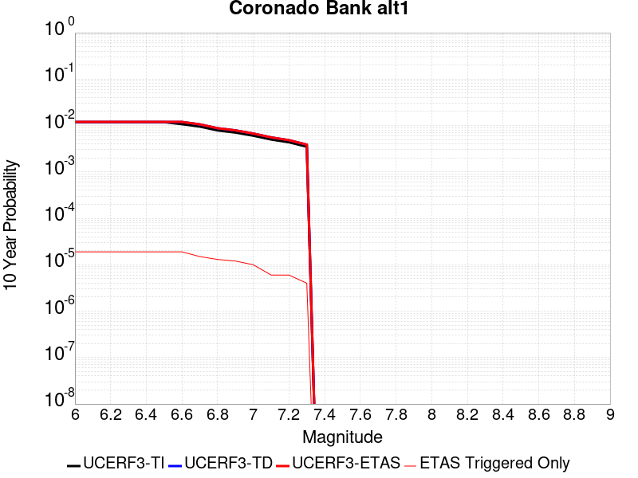 |

| Magnitude | 1 wk TI Prob | 1 wk TD Prob | 1 wk ETAS Prob | 1 wk ETAS/TD Gain | 1 wk ETAS Triggered Only | 1 mo TI Prob | 1 mo TD Prob | 1 mo ETAS Prob | 1 mo ETAS/TD Gain | 1 mo ETAS Triggered Only | 1 yr TI Prob | 1 yr TD Prob | 1 yr ETAS Prob | 1 yr ETAS/TD Gain | 1 yr ETAS Triggered Only | 10 yr TI Prob | 10 yr TD Prob | 10 yr ETAS Prob | 10 yr ETAS/TD Gain | 10 yr ETAS Triggered Only |
|-----|-----|-----|-----|-----|-----|-----|-----|-----|-----|-----|-----|-----|-----|-----|-----|-----|-----|-----|-----|-----|
| 6.0 | 2.2805418E-5 | 2.2997261E-5 | 3.5387322E-5 | 1.5387625 | 1.2390346E-5 | 9.773385E-5 | 9.8556375E-5 | 1.109455E-4 | 1.125706 | 1.2390346E-5 | 0.00118926 | 0.0011993361 | 0.0012240871 | 1.0206373 | 2.4780691E-5 | 0.011829156 | 0.011935918 | 0.011960403 | 1.0020514 | 2.4780691E-5 |
| 6.1 | 2.2805418E-5 | 2.2997261E-5 | 3.5387322E-5 | 1.5387625 | 1.2390346E-5 | 9.773385E-5 | 9.8556375E-5 | 1.109455E-4 | 1.125706 | 1.2390346E-5 | 0.00118926 | 0.0011993361 | 0.0012240871 | 1.0206373 | 2.4780691E-5 | 0.011829156 | 0.011935918 | 0.011960403 | 1.0020514 | 2.4780691E-5 |
| 6.2 | 2.2805418E-5 | 2.2997261E-5 | 3.5387322E-5 | 1.5387625 | 1.2390346E-5 | 9.773385E-5 | 9.8556375E-5 | 1.109455E-4 | 1.125706 | 1.2390346E-5 | 0.00118926 | 0.0011993361 | 0.0012240871 | 1.0206373 | 2.4780691E-5 | 0.011829156 | 0.011935918 | 0.011960403 | 1.0020514 | 2.4780691E-5 |
| 6.3 | 2.2805418E-5 | 2.2997261E-5 | 3.5387322E-5 | 1.5387625 | 1.2390346E-5 | 9.773385E-5 | 9.8556375E-5 | 1.109455E-4 | 1.125706 | 1.2390346E-5 | 0.00118926 | 0.0011993361 | 0.0012240871 | 1.0206373 | 2.4780691E-5 | 0.011829156 | 0.011935918 | 0.011960403 | 1.0020514 | 2.4780691E-5 |
| 6.4 | 2.2805418E-5 | 2.2997261E-5 | 3.5387322E-5 | 1.5387625 | 1.2390346E-5 | 9.773385E-5 | 9.8556375E-5 | 1.109455E-4 | 1.125706 | 1.2390346E-5 | 0.00118926 | 0.0011993361 | 0.0012240871 | 1.0206373 | 2.4780691E-5 | 0.011829156 | 0.011935918 | 0.011960403 | 1.0020514 | 2.4780691E-5 |
| 6.5 | 2.2805418E-5 | 2.2997261E-5 | 3.5387322E-5 | 1.5387625 | 1.2390346E-5 | 9.773385E-5 | 9.8556375E-5 | 1.109455E-4 | 1.125706 | 1.2390346E-5 | 0.00118926 | 0.0011993361 | 0.0012240871 | 1.0206373 | 2.4780691E-5 | 0.011829156 | 0.011935918 | 0.011960403 | 1.0020514 | 2.4780691E-5 |
| 6.6 | 2.0608364E-5 | 2.2997261E-5 | 3.5387322E-5 | 1.5387625 | 1.2390346E-5 | 8.831857E-5 | 9.8556375E-5 | 1.109455E-4 | 1.125706 | 1.2390346E-5 | 0.0010747481 | 0.0011993361 | 0.0012240871 | 1.0206373 | 2.4780691E-5 | 0.010695651 | 0.011935918 | 0.011960403 | 1.0020514 | 2.4780691E-5 |
| 6.7 | 1.8279972E-5 | 2.0392206E-5 | 3.27823E-5 | 1.6075896 | 1.2390346E-5 | 7.834038E-5 | 8.7392655E-5 | 9.9781915E-5 | 1.1417655 | 1.2390346E-5 | 9.533768E-4 | 0.0010635584 | 0.0010883128 | 1.023275 | 2.4780691E-5 | 0.00949297 | 0.010591865 | 0.0106163835 | 1.0023148 | 2.4780691E-5 |
| 6.8 | 1.5100513E-5 | 1.6821805E-5 | 2.9211942E-5 | 1.7365521 | 1.2390346E-5 | 6.471488E-5 | 7.209186E-5 | 8.448131E-5 | 1.1718565 | 1.2390346E-5 | 7.876188E-4 | 8.77436E-4 | 9.02195E-4 | 1.0282174 | 2.4780691E-5 | 0.007848332 | 0.008746733 | 0.008771297 | 1.0028083 | 2.4780691E-5 |
| 6.9 | 1.3558665E-5 | 1.5095915E-5 | 2.7486074E-5 | 1.8207623 | 1.2390346E-5 | 5.810727E-5 | 6.4695574E-5 | 7.708512E-5 | 1.1915053 | 1.2390346E-5 | 7.0722634E-4 | 7.874548E-4 | 8.1221596E-4 | 1.0314445 | 2.4780691E-5 | 0.0070497985 | 0.007853617 | 0.007878203 | 1.0031306 | 2.4780691E-5 |
| 7.0 | 1.1606914E-5 | 1.2905324E-5 | 2.529551E-5 | 1.9600832 | 1.2390346E-5 | 4.9742972E-5 | 5.5307755E-5 | 6.7697416E-5 | 1.2240131 | 1.2390346E-5 | 6.0545234E-4 | 6.7323423E-4 | 6.979982E-4 | 1.0367837 | 2.4780691E-5 | 0.0060380544 | 0.006718854 | 0.0067434683 | 1.0036634 | 2.4780691E-5 |
| 7.1 | 9.601701E-6 | 1.06512E-5 | 2.3041413E-5 | 2.1632693 | 1.2390346E-5 | 4.11495E-5 | 4.564759E-5 | 5.803737E-5 | 1.2714224 | 1.2390346E-5 | 5.0088E-4 | 5.556874E-4 | 5.804543E-4 | 1.0445698 | 2.4780691E-5 | 0.0049975254 | 0.005549817 | 0.0055744597 | 1.0044403 | 2.4780691E-5 |
| 7.2 | 8.368532E-6 | 9.267938E-6 | 2.1658168E-5 | 2.336892 | 1.2390346E-5 | 3.5864643E-5 | 3.971952E-5 | 5.2109375E-5 | 1.3119336 | 1.2390346E-5 | 4.3656456E-4 | 4.8354716E-4 | 5.0831586E-4 | 1.0512229 | 2.4780691E-5 | 0.004357079 | 0.0048317458 | 0.0048564067 | 1.005104 | 2.4780691E-5 |
| 7.3 | 6.710382E-6 | 7.416545E-6 | 7.416545E-6 | 1.0 | 0.0 | 2.8758463E-5 | 3.1785192E-5 | 3.1785192E-5 | 1.0 | 0.0 | 3.5007801E-4 | 3.8698473E-4 | 3.9937027E-4 | 1.0320053 | 1.2390346E-5 | 0.0034952704 | 0.0038698472 | 0.0038821895 | 1.0031893 | 1.2390346E-5 |

## North Frontal  (West)
*[(top)](#table-of-contents)*

| 1 Week | 1 Month | 1 Year | 10 Year |
|-----|-----|-----|-----|
|  |  |  |  |

| Magnitude | 1 wk TI Prob | 1 wk TD Prob | 1 wk ETAS Prob | 1 wk ETAS/TD Gain | 1 wk ETAS Triggered Only | 1 mo TI Prob | 1 mo TD Prob | 1 mo ETAS Prob | 1 mo ETAS/TD Gain | 1 mo ETAS Triggered Only | 1 yr TI Prob | 1 yr TD Prob | 1 yr ETAS Prob | 1 yr ETAS/TD Gain | 1 yr ETAS Triggered Only | 10 yr TI Prob | 10 yr TD Prob | 10 yr ETAS Prob | 10 yr ETAS/TD Gain | 10 yr ETAS Triggered Only |
|-----|-----|-----|-----|-----|-----|-----|-----|-----|-----|-----|-----|-----|-----|-----|-----|-----|-----|-----|-----|-----|
| 6.0 | 1.416208E-5 | 1.5408456E-5 | 1.5408456E-5 | 1.0 | 0.0 | 6.0693215E-5 | 6.603497E-5 | 6.603497E-5 | 1.0 | 0.0 | 7.386894E-4 | 8.037511E-4 | 8.161315E-4 | 1.0154033 | 1.2390346E-5 | 0.007362387 | 0.008015518 | 0.0080401 | 1.0030668 | 2.4780691E-5 |
| 6.1 | 1.416208E-5 | 1.5408456E-5 | 1.5408456E-5 | 1.0 | 0.0 | 6.0693215E-5 | 6.603497E-5 | 6.603497E-5 | 1.0 | 0.0 | 7.386894E-4 | 8.037511E-4 | 8.161315E-4 | 1.0154033 | 1.2390346E-5 | 0.007362387 | 0.008015518 | 0.0080401 | 1.0030668 | 2.4780691E-5 |
| 6.2 | 1.416208E-5 | 1.5408456E-5 | 1.5408456E-5 | 1.0 | 0.0 | 6.0693215E-5 | 6.603497E-5 | 6.603497E-5 | 1.0 | 0.0 | 7.386894E-4 | 8.037511E-4 | 8.161315E-4 | 1.0154033 | 1.2390346E-5 | 0.007362387 | 0.008015518 | 0.0080401 | 1.0030668 | 2.4780691E-5 |
| 6.3 | 1.416208E-5 | 1.5408456E-5 | 1.5408456E-5 | 1.0 | 0.0 | 6.0693215E-5 | 6.603497E-5 | 6.603497E-5 | 1.0 | 0.0 | 7.386894E-4 | 8.037511E-4 | 8.161315E-4 | 1.0154033 | 1.2390346E-5 | 0.007362387 | 0.008015518 | 0.0080401 | 1.0030668 | 2.4780691E-5 |
| 6.4 | 1.416208E-5 | 1.5408456E-5 | 1.5408456E-5 | 1.0 | 0.0 | 6.0693215E-5 | 6.603497E-5 | 6.603497E-5 | 1.0 | 0.0 | 7.386894E-4 | 8.037511E-4 | 8.161315E-4 | 1.0154033 | 1.2390346E-5 | 0.007362387 | 0.008015518 | 0.0080401 | 1.0030668 | 2.4780691E-5 |
| 6.5 | 1.416208E-5 | 1.5408456E-5 | 1.5408456E-5 | 1.0 | 0.0 | 6.0693215E-5 | 6.603497E-5 | 6.603497E-5 | 1.0 | 0.0 | 7.386894E-4 | 8.037511E-4 | 8.161315E-4 | 1.0154033 | 1.2390346E-5 | 0.007362387 | 0.008015518 | 0.0080401 | 1.0030668 | 2.4780691E-5 |
| 6.6 | 1.416208E-5 | 1.5408456E-5 | 1.5408456E-5 | 1.0 | 0.0 | 6.0693215E-5 | 6.603497E-5 | 6.603497E-5 | 1.0 | 0.0 | 7.386894E-4 | 8.037511E-4 | 8.161315E-4 | 1.0154033 | 1.2390346E-5 | 0.007362387 | 0.008015518 | 0.0080401 | 1.0030668 | 2.4780691E-5 |
| 6.7 | 1.02118975E-5 | 1.1093774E-5 | 1.1093774E-5 | 1.0 | 0.0 | 4.3764543E-5 | 4.754425E-5 | 4.754425E-5 | 1.0 | 0.0 | 5.32703E-4 | 5.787631E-4 | 5.9114624E-4 | 1.0213959 | 1.2390346E-5 | 0.0053142784 | 0.00577899 | 0.005803628 | 1.0042633 | 2.4780691E-5 |
| 6.8 | 1.02118975E-5 | 1.1093774E-5 | 1.1093774E-5 | 1.0 | 0.0 | 4.3764543E-5 | 4.754425E-5 | 4.754425E-5 | 1.0 | 0.0 | 5.32703E-4 | 5.787631E-4 | 5.9114624E-4 | 1.0213959 | 1.2390346E-5 | 0.0053142784 | 0.00577899 | 0.005803628 | 1.0042633 | 2.4780691E-5 |
| 6.9 | 7.711016E-6 | 8.362843E-6 | 8.362843E-6 | 1.0 | 0.0 | 3.3046796E-5 | 3.5840614E-5 | 3.5840614E-5 | 1.0 | 0.0 | 4.0227044E-4 | 4.3633426E-4 | 4.4871922E-4 | 1.0283841 | 1.2390346E-5 | 0.0040154303 | 0.004360873 | 0.004373209 | 1.0028288 | 1.2390346E-5 |
| 7.0 | 7.711016E-6 | 8.362843E-6 | 8.362843E-6 | 1.0 | 0.0 | 3.3046796E-5 | 3.5840614E-5 | 3.5840614E-5 | 1.0 | 0.0 | 4.0227044E-4 | 4.3633426E-4 | 4.4871922E-4 | 1.0283841 | 1.2390346E-5 | 0.0040154303 | 0.004360873 | 0.004373209 | 1.0028288 | 1.2390346E-5 |
| 7.1 | 6.4475635E-6 | 6.9876623E-6 | 6.9876623E-6 | 1.0 | 0.0 | 2.7632123E-5 | 2.9947125E-5 | 2.9947125E-5 | 1.0 | 0.0 | 3.3636915E-4 | 3.6460624E-4 | 3.7699207E-4 | 1.0339705 | 1.2390346E-5 | 0.0033586046 | 0.0036460625 | 0.0036584076 | 1.0033859 | 1.2390346E-5 |

## Elsinore (Temecula) rev
*[(top)](#table-of-contents)*

| 1 Week | 1 Month | 1 Year | 10 Year |
|-----|-----|-----|-----|
|  |  |  | 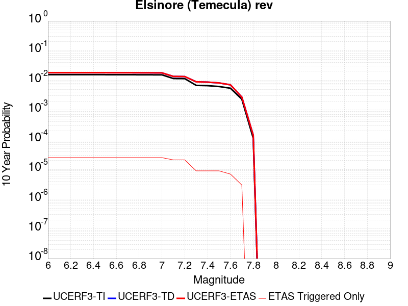 |

| Magnitude | 1 wk TI Prob | 1 wk TD Prob | 1 wk ETAS Prob | 1 wk ETAS/TD Gain | 1 wk ETAS Triggered Only | 1 mo TI Prob | 1 mo TD Prob | 1 mo ETAS Prob | 1 mo ETAS/TD Gain | 1 mo ETAS Triggered Only | 1 yr TI Prob | 1 yr TD Prob | 1 yr ETAS Prob | 1 yr ETAS/TD Gain | 1 yr ETAS Triggered Only | 10 yr TI Prob | 10 yr TD Prob | 10 yr ETAS Prob | 10 yr ETAS/TD Gain | 10 yr ETAS Triggered Only |
|-----|-----|-----|-----|-----|-----|-----|-----|-----|-----|-----|-----|-----|-----|-----|-----|-----|-----|-----|-----|-----|
| 6.0 | 2.9985375E-5 | 3.4747958E-5 | 4.7137873E-5 | 1.3565652 | 1.2390346E-5 | 1.2850242E-4 | 1.4891267E-4 | 1.6130118E-4 | 1.0831931 | 1.2390346E-5 | 0.0015633941 | 0.0018117457 | 0.0018241135 | 1.0068265 | 1.2390346E-5 | 0.01552441 | 0.018074041 | 0.018098373 | 1.0013462 | 2.4780691E-5 |
| 6.1 | 2.9985375E-5 | 3.4747958E-5 | 4.7137873E-5 | 1.3565652 | 1.2390346E-5 | 1.2850242E-4 | 1.4891267E-4 | 1.6130118E-4 | 1.0831931 | 1.2390346E-5 | 0.0015633941 | 0.0018117457 | 0.0018241135 | 1.0068265 | 1.2390346E-5 | 0.01552441 | 0.018074041 | 0.018098373 | 1.0013462 | 2.4780691E-5 |
| 6.2 | 2.9985375E-5 | 3.4747958E-5 | 4.7137873E-5 | 1.3565652 | 1.2390346E-5 | 1.2850242E-4 | 1.4891267E-4 | 1.6130118E-4 | 1.0831931 | 1.2390346E-5 | 0.0015633941 | 0.0018117457 | 0.0018241135 | 1.0068265 | 1.2390346E-5 | 0.01552441 | 0.018074041 | 0.018098373 | 1.0013462 | 2.4780691E-5 |
| 6.3 | 2.9985375E-5 | 3.4747958E-5 | 4.7137873E-5 | 1.3565652 | 1.2390346E-5 | 1.2850242E-4 | 1.4891267E-4 | 1.6130118E-4 | 1.0831931 | 1.2390346E-5 | 0.0015633941 | 0.0018117457 | 0.0018241135 | 1.0068265 | 1.2390346E-5 | 0.01552441 | 0.018074041 | 0.018098373 | 1.0013462 | 2.4780691E-5 |
| 6.4 | 2.9985375E-5 | 3.4747958E-5 | 4.7137873E-5 | 1.3565652 | 1.2390346E-5 | 1.2850242E-4 | 1.4891267E-4 | 1.6130118E-4 | 1.0831931 | 1.2390346E-5 | 0.0015633941 | 0.0018117457 | 0.0018241135 | 1.0068265 | 1.2390346E-5 | 0.01552441 | 0.018074041 | 0.018098373 | 1.0013462 | 2.4780691E-5 |
| 6.5 | 2.9985375E-5 | 3.4747958E-5 | 4.7137873E-5 | 1.3565652 | 1.2390346E-5 | 1.2850242E-4 | 1.4891267E-4 | 1.6130118E-4 | 1.0831931 | 1.2390346E-5 | 0.0015633941 | 0.0018117457 | 0.0018241135 | 1.0068265 | 1.2390346E-5 | 0.01552441 | 0.018074041 | 0.018098373 | 1.0013462 | 2.4780691E-5 |
| 6.6 | 2.9915182E-5 | 3.46808E-5 | 4.7070716E-5 | 1.3572557 | 1.2390346E-5 | 1.2820162E-4 | 1.486249E-4 | 1.610134E-4 | 1.0833541 | 1.2390346E-5 | 0.0015597371 | 0.0018082478 | 0.0018206157 | 1.0068398 | 1.2390346E-5 | 0.015488351 | 0.018039845 | 0.018064179 | 1.0013489 | 2.4780691E-5 |
| 6.7 | 2.9879424E-5 | 3.463569E-5 | 4.7025605E-5 | 1.3577211 | 1.2390346E-5 | 1.2804838E-4 | 1.4843159E-4 | 1.6082008E-4 | 1.0834627 | 1.2390346E-5 | 0.0015578741 | 0.0018058982 | 0.0018182661 | 1.0068487 | 1.2390346E-5 | 0.01546998 | 0.018016884 | 0.01804122 | 1.0013506 | 2.4780691E-5 |
| 6.8 | 2.9818717E-5 | 3.45724E-5 | 4.6962316E-5 | 1.3583759 | 1.2390346E-5 | 1.2778824E-4 | 1.4816038E-4 | 1.605489E-4 | 1.0836155 | 1.2390346E-5 | 0.0015547115 | 0.0018026017 | 0.0018149698 | 1.0068612 | 1.2390346E-5 | 0.015438793 | 0.017984249 | 0.018008584 | 1.0013531 | 2.4780691E-5 |
| 6.9 | 2.9704783E-5 | 3.4430177E-5 | 4.6820096E-5 | 1.3598564 | 1.2390346E-5 | 1.273E-4 | 1.4755092E-4 | 1.5993945E-4 | 1.083961 | 1.2390346E-5 | 0.0015487756 | 0.001795194 | 0.0018075621 | 1.0068896 | 1.2390346E-5 | 0.015380259 | 0.017911145 | 0.017935483 | 1.0013587 | 2.4780691E-5 |
| 7.0 | 2.9613002E-5 | 3.4300047E-5 | 4.6689966E-5 | 1.3612217 | 1.2390346E-5 | 1.269067E-4 | 1.4699328E-4 | 1.593818E-4 | 1.0842795 | 1.2390346E-5 | 0.0015439938 | 0.0017884158 | 0.001800784 | 1.0069157 | 1.2390346E-5 | 0.015333103 | 0.017844401 | 0.01786874 | 1.0013639 | 2.4780691E-5 |
| 7.1 | 2.2180364E-5 | 2.6018337E-5 | 3.840836E-5 | 1.4762034 | 1.2390346E-5 | 9.505524E-5 | 1.115033E-4 | 1.2389227E-4 | 1.1111085 | 1.2390346E-5 | 0.0011566831 | 0.0013568681 | 0.0013692415 | 1.0091192 | 1.2390346E-5 | 0.01150681 | 0.013559197 | 0.013583642 | 1.0018028 | 2.4780691E-5 |
| 7.2 | 2.1985565E-5 | 2.5725127E-5 | 3.811515E-5 | 1.4816313 | 1.2390346E-5 | 9.422044E-5 | 1.1024679E-4 | 1.2263577E-4 | 1.112375 | 1.2390346E-5 | 0.0011465302 | 0.0013415889 | 0.0013539626 | 1.0092232 | 1.2390346E-5 | 0.0114063285 | 0.013408055 | 0.013432504 | 1.0018234 | 2.4780691E-5 |
| 7.3 | 1.3039819E-5 | 1.715471E-5 | 1.715471E-5 | 1.0 | 0.0 | 5.5883742E-5 | 7.3518546E-5 | 7.3518546E-5 | 1.0 | 0.0 | 6.801722E-4 | 8.947971E-4 | 8.947971E-4 | 1.0 | 0.0 | 0.006780941 | 0.008927152 | 0.008927152 | 1.0 | 0.0 |
| 7.4 | 1.2750458E-5 | 1.6749926E-5 | 1.6749926E-5 | 1.0 | 0.0 | 5.464368E-5 | 7.178385E-5 | 7.178385E-5 | 1.0 | 0.0 | 6.650837E-4 | 8.736942E-4 | 8.736942E-4 | 1.0 | 0.0 | 0.006630967 | 0.008717438 | 0.008717438 | 1.0 | 0.0 |
| 7.5 | 1.1924516E-5 | 1.570584E-5 | 1.570584E-5 | 1.0 | 0.0 | 5.1104067E-5 | 6.730944E-5 | 6.730944E-5 | 1.0 | 0.0 | 6.220144E-4 | 8.192601E-4 | 8.192601E-4 | 1.0 | 0.0 | 0.006202762 | 0.008175999 | 0.008175999 | 1.0 | 0.0 |
| 7.6 | 1.0456552E-5 | 1.3574289E-5 | 1.3574289E-5 | 1.0 | 0.0 | 4.4813027E-5 | 5.817464E-5 | 5.817464E-5 | 1.0 | 0.0 | 5.45462E-4 | 7.081186E-4 | 7.081186E-4 | 1.0 | 0.0 | 0.0054412507 | 0.0070718653 | 0.0070718653 | 1.0 | 0.0 |
| 7.7 | 4.463199E-6 | 5.214875E-6 | 5.214875E-6 | 1.0 | 0.0 | 1.9127854E-5 | 2.2349386E-5 | 2.2349386E-5 | 1.0 | 0.0 | 2.3285674E-4 | 2.7209E-4 | 2.7209E-4 | 1.0 | 0.0 | 0.0023261288 | 0.0027239968 | 0.0027239968 | 1.0 | 0.0 |
| 7.8 | 2.1601753E-7 | 2.7489222E-7 | 2.7489222E-7 | 1.0 | 0.0 | 9.257891E-7 | 1.1781094E-6 | 1.1781094E-6 | 1.0 | 0.0 | 1.1271423E-5 | 1.4343483E-5 | 1.4343483E-5 | 1.0 | 0.0 | 1.1270852E-4 | 1.435847E-4 | 1.435847E-4 | 1.0 | 0.0 |

## Concord 2011 CFM
*[(top)](#table-of-contents)*

| 1 Week | 1 Month | 1 Year | 10 Year |
|-----|-----|-----|-----|
|  |  | 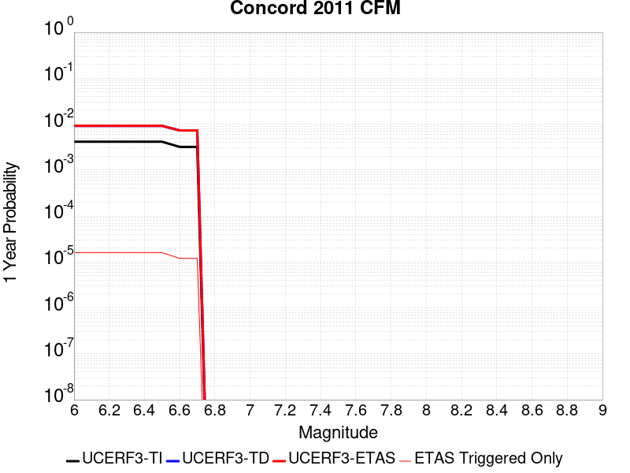 |  |

| Magnitude | 1 wk TI Prob | 1 wk TD Prob | 1 wk ETAS Prob | 1 wk ETAS/TD Gain | 1 wk ETAS Triggered Only | 1 mo TI Prob | 1 mo TD Prob | 1 mo ETAS Prob | 1 mo ETAS/TD Gain | 1 mo ETAS Triggered Only | 1 yr TI Prob | 1 yr TD Prob | 1 yr ETAS Prob | 1 yr ETAS/TD Gain | 1 yr ETAS Triggered Only | 10 yr TI Prob | 10 yr TD Prob | 10 yr ETAS Prob | 10 yr ETAS/TD Gain | 10 yr ETAS Triggered Only |
|-----|-----|-----|-----|-----|-----|-----|-----|-----|-----|-----|-----|-----|-----|-----|-----|-----|-----|-----|-----|-----|
| 6.0 | 7.9834055E-5 | 1.7647086E-4 | 1.8885902E-4 | 1.0701995 | 1.2390346E-5 | 3.421011E-4 | 7.562273E-4 | 7.686083E-4 | 1.0163721 | 1.2390346E-5 | 0.0041571283 | 0.009193515 | 0.009218069 | 1.0026706 | 2.4780691E-5 | 0.040802166 | 0.08864039 | 0.088662975 | 1.0002548 | 2.4780691E-5 |
| 6.1 | 7.9834055E-5 | 1.7647086E-4 | 1.8885902E-4 | 1.0701995 | 1.2390346E-5 | 3.421011E-4 | 7.562273E-4 | 7.686083E-4 | 1.0163721 | 1.2390346E-5 | 0.0041571283 | 0.009193515 | 0.009218069 | 1.0026706 | 2.4780691E-5 | 0.040802166 | 0.08864039 | 0.088662975 | 1.0002548 | 2.4780691E-5 |
| 6.2 | 7.9834055E-5 | 1.7647086E-4 | 1.8885902E-4 | 1.0701995 | 1.2390346E-5 | 3.421011E-4 | 7.562273E-4 | 7.686083E-4 | 1.0163721 | 1.2390346E-5 | 0.0041571283 | 0.009193515 | 0.009218069 | 1.0026706 | 2.4780691E-5 | 0.040802166 | 0.08864039 | 0.088662975 | 1.0002548 | 2.4780691E-5 |
| 6.3 | 7.9834055E-5 | 1.7647086E-4 | 1.8885902E-4 | 1.0701995 | 1.2390346E-5 | 3.421011E-4 | 7.562273E-4 | 7.686083E-4 | 1.0163721 | 1.2390346E-5 | 0.0041571283 | 0.009193515 | 0.009218069 | 1.0026706 | 2.4780691E-5 | 0.040802166 | 0.08864039 | 0.088662975 | 1.0002548 | 2.4780691E-5 |
| 6.4 | 7.9834055E-5 | 1.7647086E-4 | 1.8885902E-4 | 1.0701995 | 1.2390346E-5 | 3.421011E-4 | 7.562273E-4 | 7.686083E-4 | 1.0163721 | 1.2390346E-5 | 0.0041571283 | 0.009193515 | 0.009218069 | 1.0026706 | 2.4780691E-5 | 0.040802166 | 0.08864039 | 0.088662975 | 1.0002548 | 2.4780691E-5 |
| 6.5 | 7.9834055E-5 | 1.7647086E-4 | 1.8885902E-4 | 1.0701995 | 1.2390346E-5 | 3.421011E-4 | 7.562273E-4 | 7.686083E-4 | 1.0163721 | 1.2390346E-5 | 0.0041571283 | 0.009193515 | 0.009218069 | 1.0026706 | 2.4780691E-5 | 0.040802166 | 0.08864039 | 0.088662975 | 1.0002548 | 2.4780691E-5 |
| 6.6 | 6.153684E-5 | 1.4011236E-4 | 1.4011236E-4 | 1.0 | 0.0 | 2.6370265E-4 | 6.004815E-4 | 6.004815E-4 | 1.0 | 0.0 | 0.0032058533 | 0.0073108627 | 0.0073231626 | 1.0016824 | 1.2390346E-5 | 0.03159998 | 0.071543366 | 0.07155487 | 1.0001608 | 1.2390346E-5 |
| 6.7 | 6.153684E-5 | 1.4011236E-4 | 1.4011236E-4 | 1.0 | 0.0 | 2.6370265E-4 | 6.004815E-4 | 6.004815E-4 | 1.0 | 0.0 | 0.0032058533 | 0.0073108627 | 0.0073231626 | 1.0016824 | 1.2390346E-5 | 0.03159998 | 0.071543366 | 0.07155487 | 1.0001608 | 1.2390346E-5 |

## San Jacinto (Coyote Creek)
*[(top)](#table-of-contents)*

| 1 Week | 1 Month | 1 Year | 10 Year |
|-----|-----|-----|-----|
|  |  | 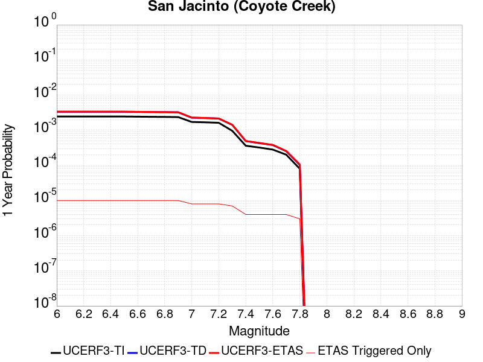 |  |

| Magnitude | 1 wk TI Prob | 1 wk TD Prob | 1 wk ETAS Prob | 1 wk ETAS/TD Gain | 1 wk ETAS Triggered Only | 1 mo TI Prob | 1 mo TD Prob | 1 mo ETAS Prob | 1 mo ETAS/TD Gain | 1 mo ETAS Triggered Only | 1 yr TI Prob | 1 yr TD Prob | 1 yr ETAS Prob | 1 yr ETAS/TD Gain | 1 yr ETAS Triggered Only | 10 yr TI Prob | 10 yr TD Prob | 10 yr ETAS Prob | 10 yr ETAS/TD Gain | 10 yr ETAS Triggered Only |
|-----|-----|-----|-----|-----|-----|-----|-----|-----|-----|-----|-----|-----|-----|-----|-----|-----|-----|-----|-----|-----|
| 6.0 | 4.69665E-5 | 6.4235006E-5 | 6.4235006E-5 | 1.0 | 0.0 | 2.0126947E-4 | 2.7526915E-4 | 2.7526915E-4 | 1.0 | 0.0 | 0.002447702 | 0.0033471098 | 0.0033471098 | 1.0 | 0.0 | 0.024209166 | 0.033357523 | 0.033381477 | 1.0007181 | 2.4780691E-5 |
| 6.1 | 4.69665E-5 | 6.4235006E-5 | 6.4235006E-5 | 1.0 | 0.0 | 2.0126947E-4 | 2.7526915E-4 | 2.7526915E-4 | 1.0 | 0.0 | 0.002447702 | 0.0033471098 | 0.0033471098 | 1.0 | 0.0 | 0.024209166 | 0.033357523 | 0.033381477 | 1.0007181 | 2.4780691E-5 |
| 6.2 | 4.69665E-5 | 6.4235006E-5 | 6.4235006E-5 | 1.0 | 0.0 | 2.0126947E-4 | 2.7526915E-4 | 2.7526915E-4 | 1.0 | 0.0 | 0.002447702 | 0.0033471098 | 0.0033471098 | 1.0 | 0.0 | 0.024209166 | 0.033357523 | 0.033381477 | 1.0007181 | 2.4780691E-5 |
| 6.3 | 4.69665E-5 | 6.4235006E-5 | 6.4235006E-5 | 1.0 | 0.0 | 2.0126947E-4 | 2.7526915E-4 | 2.7526915E-4 | 1.0 | 0.0 | 0.002447702 | 0.0033471098 | 0.0033471098 | 1.0 | 0.0 | 0.024209166 | 0.033357523 | 0.033381477 | 1.0007181 | 2.4780691E-5 |
| 6.4 | 4.69665E-5 | 6.4235006E-5 | 6.4235006E-5 | 1.0 | 0.0 | 2.0126947E-4 | 2.7526915E-4 | 2.7526915E-4 | 1.0 | 0.0 | 0.002447702 | 0.0033471098 | 0.0033471098 | 1.0 | 0.0 | 0.024209166 | 0.033357523 | 0.033381477 | 1.0007181 | 2.4780691E-5 |
| 6.5 | 4.69665E-5 | 6.4235006E-5 | 6.4235006E-5 | 1.0 | 0.0 | 2.0126947E-4 | 2.7526915E-4 | 2.7526915E-4 | 1.0 | 0.0 | 0.002447702 | 0.0033471098 | 0.0033471098 | 1.0 | 0.0 | 0.024209166 | 0.033357523 | 0.033381477 | 1.0007181 | 2.4780691E-5 |
| 6.6 | 4.65626E-5 | 6.365397E-5 | 6.365397E-5 | 1.0 | 0.0 | 1.9953873E-4 | 2.7277967E-4 | 2.7277967E-4 | 1.0 | 0.0 | 0.0024266774 | 0.0033169023 | 0.0033169023 | 1.0 | 0.0 | 0.024003487 | 0.033065155 | 0.033089116 | 1.0007247 | 2.4780691E-5 |
| 6.7 | 4.6128687E-5 | 6.303452E-5 | 6.303452E-5 | 1.0 | 0.0 | 1.9767939E-4 | 2.7012554E-4 | 2.7012554E-4 | 1.0 | 0.0 | 0.00240409 | 0.0032846953 | 0.0032846953 | 1.0 | 0.0 | 0.023782477 | 0.032753225 | 0.032777194 | 1.0007318 | 2.4780691E-5 |
| 6.8 | 4.5828285E-5 | 6.268431E-5 | 6.268431E-5 | 1.0 | 0.0 | 1.9639214E-4 | 2.6862495E-4 | 2.6862495E-4 | 1.0 | 0.0 | 0.0023884522 | 0.0032664812 | 0.0032664812 | 1.0 | 0.0 | 0.02362944 | 0.03257484 | 0.032598812 | 1.000736 | 2.4780691E-5 |
| 6.9 | 4.523555E-5 | 6.1988314E-5 | 6.1988314E-5 | 1.0 | 0.0 | 1.9385223E-4 | 2.656427E-4 | 2.656427E-4 | 1.0 | 0.0 | 0.0023575963 | 0.003230282 | 0.003230282 | 1.0 | 0.0 | 0.023327406 | 0.032220315 | 0.0322443 | 1.0007443 | 2.4780691E-5 |
| 7.0 | 3.2913522E-5 | 4.3638418E-5 | 4.3638418E-5 | 1.0 | 0.0 | 1.4105032E-4 | 1.8701174E-4 | 1.8701174E-4 | 1.0 | 0.0 | 0.0017159348 | 0.0022750867 | 0.0022750867 | 1.0 | 0.0 | 0.017027453 | 0.022874728 | 0.022886835 | 1.0005293 | 1.2390346E-5 |
| 7.1 | 3.2150587E-5 | 4.262259E-5 | 4.262259E-5 | 1.0 | 0.0 | 1.3778094E-4 | 1.8265881E-4 | 1.8265881E-4 | 1.0 | 0.0 | 0.0016761922 | 0.002222199 | 0.002222199 | 1.0 | 0.0 | 0.016636053 | 0.02235371 | 0.022365823 | 1.0005419 | 1.2390346E-5 |
| 7.2 | 3.1169668E-5 | 4.115963E-5 | 4.115963E-5 | 1.0 | 0.0 | 1.3357744E-4 | 1.7638985E-4 | 1.7638985E-4 | 1.0 | 0.0 | 0.0016250921 | 0.0021460268 | 0.0021460268 | 1.0 | 0.0 | 0.016132593 | 0.021605676 | 0.0216178 | 1.0005611 | 1.2390346E-5 |
| 7.3 | 1.8423585E-5 | 2.7220098E-5 | 2.7220098E-5 | 1.0 | 0.0 | 7.895583E-5 | 1.1665466E-4 | 1.1665466E-4 | 1.0 | 0.0 | 9.608633E-4 | 0.0014197543 | 0.0014197543 | 1.0 | 0.0 | 0.009567193 | 0.014355129 | 0.014367341 | 1.0008508 | 1.2390346E-5 |
| 7.4 | 6.9267962E-6 | 9.391728E-6 | 9.391728E-6 | 1.0 | 0.0 | 2.968593E-5 | 4.024971E-5 | 4.024971E-5 | 1.0 | 0.0 | 3.6136628E-4 | 4.899425E-4 | 4.899425E-4 | 1.0 | 0.0 | 0.003607792 | 0.005030186 | 0.005042514 | 1.0024508 | 1.2390346E-5 |
| 7.5 | 6.1587302E-6 | 8.234252E-6 | 8.234252E-6 | 1.0 | 0.0 | 2.6394291E-5 | 3.5289235E-5 | 3.5289235E-5 | 1.0 | 0.0 | 3.213031E-4 | 4.2957254E-4 | 4.2957254E-4 | 1.0 | 0.0 | 0.0032083893 | 0.004419193 | 0.004431529 | 1.0027914 | 1.2390346E-5 |
| 7.6 | 5.383844E-6 | 7.2529047E-6 | 7.2529047E-6 | 1.0 | 0.0 | 2.3073413E-5 | 3.108356E-5 | 3.108356E-5 | 1.0 | 0.0 | 2.8088258E-4 | 3.7838623E-4 | 3.7838623E-4 | 1.0 | 0.0 | 0.0028052782 | 0.0038957447 | 0.0039080866 | 1.0031681 | 1.2390346E-5 |
| 7.7 | 3.843031E-6 | 4.8339584E-6 | 4.8339584E-6 | 1.0 | 0.0 | 1.647003E-5 | 2.0716834E-5 | 2.0716834E-5 | 1.0 | 0.0 | 2.0050416E-4 | 2.5220422E-4 | 2.5220422E-4 | 1.0 | 0.0 | 0.0020032334 | 0.002619455 | 0.002631813 | 1.0047177 | 1.2390346E-5 |
| 7.8 | 1.5303123E-6 | 1.9707616E-6 | 1.9707616E-6 | 1.0 | 0.0 | 6.5584645E-6 | 8.446107E-6 | 8.446107E-6 | 1.0 | 0.0 | 7.984638E-5 | 1.0282895E-4 | 1.0282895E-4 | 1.0 | 0.0 | 7.98177E-4 | 0.001066982 | 0.0010793592 | 1.0116001 | 1.2390346E-5 |

## Newport-Inglewood alt 1
*[(top)](#table-of-contents)*

| 1 Week | 1 Month | 1 Year | 10 Year |
|-----|-----|-----|-----|
|  |  |  |  |

| Magnitude | 1 wk TI Prob | 1 wk TD Prob | 1 wk ETAS Prob | 1 wk ETAS/TD Gain | 1 wk ETAS Triggered Only | 1 mo TI Prob | 1 mo TD Prob | 1 mo ETAS Prob | 1 mo ETAS/TD Gain | 1 mo ETAS Triggered Only | 1 yr TI Prob | 1 yr TD Prob | 1 yr ETAS Prob | 1 yr ETAS/TD Gain | 1 yr ETAS Triggered Only | 10 yr TI Prob | 10 yr TD Prob | 10 yr ETAS Prob | 10 yr ETAS/TD Gain | 10 yr ETAS Triggered Only |
|-----|-----|-----|-----|-----|-----|-----|-----|-----|-----|-----|-----|-----|-----|-----|-----|-----|-----|-----|-----|-----|
| 6.0 | 1.1148327E-5 | 8.39976E-6 | 3.3180244E-5 | 3.950142 | 2.4780691E-5 | 4.777767E-5 | 3.599853E-5 | 6.077833E-5 | 1.6883558 | 2.4780691E-5 | 5.8153784E-4 | 4.3820433E-4 | 4.6297416E-4 | 1.0565257 | 2.4780691E-5 | 0.005800184 | 0.0043744235 | 0.0043990957 | 1.0056401 | 2.4780691E-5 |
| 6.1 | 1.1148327E-5 | 8.39976E-6 | 3.3180244E-5 | 3.950142 | 2.4780691E-5 | 4.777767E-5 | 3.599853E-5 | 6.077833E-5 | 1.6883558 | 2.4780691E-5 | 5.8153784E-4 | 4.3820433E-4 | 4.6297416E-4 | 1.0565257 | 2.4780691E-5 | 0.005800184 | 0.0043744235 | 0.0043990957 | 1.0056401 | 2.4780691E-5 |
| 6.2 | 1.1148327E-5 | 8.39976E-6 | 3.3180244E-5 | 3.950142 | 2.4780691E-5 | 4.777767E-5 | 3.599853E-5 | 6.077833E-5 | 1.6883558 | 2.4780691E-5 | 5.8153784E-4 | 4.3820433E-4 | 4.6297416E-4 | 1.0565257 | 2.4780691E-5 | 0.005800184 | 0.0043744235 | 0.0043990957 | 1.0056401 | 2.4780691E-5 |
| 6.3 | 1.1148327E-5 | 8.39976E-6 | 3.3180244E-5 | 3.950142 | 2.4780691E-5 | 4.777767E-5 | 3.599853E-5 | 6.077833E-5 | 1.6883558 | 2.4780691E-5 | 5.8153784E-4 | 4.3820433E-4 | 4.6297416E-4 | 1.0565257 | 2.4780691E-5 | 0.005800184 | 0.0043744235 | 0.0043990957 | 1.0056401 | 2.4780691E-5 |
| 6.4 | 1.1148327E-5 | 8.39976E-6 | 3.3180244E-5 | 3.950142 | 2.4780691E-5 | 4.777767E-5 | 3.599853E-5 | 6.077833E-5 | 1.6883558 | 2.4780691E-5 | 5.8153784E-4 | 4.3820433E-4 | 4.6297416E-4 | 1.0565257 | 2.4780691E-5 | 0.005800184 | 0.0043744235 | 0.0043990957 | 1.0056401 | 2.4780691E-5 |
| 6.5 | 1.1148327E-5 | 8.39976E-6 | 3.3180244E-5 | 3.950142 | 2.4780691E-5 | 4.777767E-5 | 3.599853E-5 | 6.077833E-5 | 1.6883558 | 2.4780691E-5 | 5.8153784E-4 | 4.3820433E-4 | 4.6297416E-4 | 1.0565257 | 2.4780691E-5 | 0.005800184 | 0.0043744235 | 0.0043990957 | 1.0056401 | 2.4780691E-5 |
| 6.6 | 1.00224415E-5 | 7.532022E-6 | 3.2312528E-5 | 4.29002 | 2.4780691E-5 | 4.2952615E-5 | 3.2279753E-5 | 5.7059642E-5 | 1.7676605 | 2.4780691E-5 | 5.228226E-4 | 3.9294525E-4 | 4.1771622E-4 | 1.0630392 | 2.4780691E-5 | 0.005215943 | 0.0039235037 | 0.0039481875 | 1.0062912 | 2.4780691E-5 |
| 6.7 | 8.770557E-6 | 6.5171002E-6 | 3.129763E-5 | 4.802386 | 2.4780691E-5 | 3.7587557E-5 | 2.7930188E-5 | 5.2710184E-5 | 1.887212 | 2.4780691E-5 | 4.575324E-4 | 3.400069E-4 | 3.6477915E-4 | 1.0728581 | 2.4780691E-5 | 0.0045659156 | 0.0033958422 | 0.0034205387 | 1.0072726 | 2.4780691E-5 |
| 6.8 | 8.263289E-6 | 6.1460423E-6 | 3.092658E-5 | 5.0319505 | 2.4780691E-5 | 3.5413614E-5 | 2.633997E-5 | 5.112001E-5 | 1.940777 | 2.4780691E-5 | 4.3107543E-4 | 3.206518E-4 | 3.4542455E-4 | 1.0772575 | 2.4780691E-5 | 0.0043024016 | 0.0032028586 | 0.0032275598 | 1.0077122 | 2.4780691E-5 |
| 6.9 | 7.711276E-6 | 5.7474776E-6 | 3.0528026E-5 | 5.311552 | 2.4780691E-5 | 3.304791E-5 | 2.4631869E-5 | 4.941195E-5 | 2.006017 | 2.4780691E-5 | 4.0228397E-4 | 2.9986154E-4 | 3.246348E-4 | 1.0826156 | 2.4780691E-5 | 0.004015565 | 0.0029955322 | 0.0030202386 | 1.0082477 | 2.4780691E-5 |
| 7.0 | 6.9854723E-6 | 5.2637565E-6 | 3.0044317E-5 | 5.707771 | 2.4780691E-5 | 2.9937395E-5 | 2.2558817E-5 | 4.733895E-5 | 2.0984678 | 2.4780691E-5 | 3.644268E-4 | 2.7462872E-4 | 2.994026E-4 | 1.0902086 | 2.4780691E-5 | 0.0036382976 | 0.0027438495 | 0.0027685622 | 1.0090066 | 2.4780691E-5 |
| 7.1 | 6.123445E-6 | 4.66162E-6 | 2.9442195E-5 | 6.3158717 | 2.4780691E-5 | 2.6243071E-5 | 1.9978273E-5 | 4.4758468E-5 | 2.2403572 | 2.4780691E-5 | 3.1946256E-4 | 2.4321795E-4 | 2.679926E-4 | 1.101862 | 2.4780691E-5 | 0.0031900369 | 0.0024304604 | 0.0024551807 | 1.010171 | 2.4780691E-5 |
| 7.2 | 3.0524068E-6 | 2.3598534E-6 | 1.475017E-5 | 6.25046 | 1.2390346E-5 | 1.3081678E-5 | 1.011364E-5 | 2.250386E-5 | 2.2251 | 1.2390346E-5 | 1.5925779E-4 | 1.2313046E-4 | 1.3551928E-4 | 1.1006154 | 1.2390346E-5 | 0.001591437 | 0.001231 | 0.001243375 | 1.0100529 | 1.2390346E-5 |
| 7.3 | 2.8490606E-6 | 2.204696E-6 | 1.4595014E-5 | 6.6199665 | 1.2390346E-5 | 1.2210203E-5 | 9.448685E-6 | 2.1838914E-5 | 2.3113177 | 1.2390346E-5 | 1.4864908E-4 | 1.1503552E-4 | 1.2742443E-4 | 1.1076965 | 1.2390346E-5 | 0.0014854969 | 0.0011501369 | 0.001162513 | 1.0107605 | 1.2390346E-5 |
| 7.4 | 2.5994284E-6 | 2.0116724E-6 | 1.4401993E-5 | 7.1592135 | 1.2390346E-5 | 1.114036E-5 | 8.621447E-6 | 2.1011685E-5 | 2.4371414 | 1.2390346E-5 | 1.3562544E-4 | 1.049649E-4 | 1.1735394E-4 | 1.1180303 | 1.2390346E-5 | 0.0013554269 | 0.00104953 | 0.0010619074 | 1.0117933 | 1.2390346E-5 |
| 7.5 | 2.2517988E-6 | 1.7516537E-6 | 1.4141978E-5 | 8.073501 | 1.2390346E-5 | 9.650531E-6 | 7.5070875E-6 | 1.989734E-5 | 2.650474 | 1.2390346E-5 | 1.17488875E-4 | 9.139879E-5 | 1.03788E-4 | 1.1355512 | 1.2390346E-5 | 0.0011742678 | 9.1398787E-4 | 9.263669E-4 | 1.013544 | 1.2390346E-5 |

## Great Valley 04a Trout Creek
*[(top)](#table-of-contents)*

| 1 Week | 1 Month | 1 Year | 10 Year |
|-----|-----|-----|-----|
|  |  |  |  |

| Magnitude | 1 wk TI Prob | 1 wk TD Prob | 1 wk ETAS Prob | 1 wk ETAS/TD Gain | 1 wk ETAS Triggered Only | 1 mo TI Prob | 1 mo TD Prob | 1 mo ETAS Prob | 1 mo ETAS/TD Gain | 1 mo ETAS Triggered Only | 1 yr TI Prob | 1 yr TD Prob | 1 yr ETAS Prob | 1 yr ETAS/TD Gain | 1 yr ETAS Triggered Only | 10 yr TI Prob | 10 yr TD Prob | 10 yr ETAS Prob | 10 yr ETAS/TD Gain | 10 yr ETAS Triggered Only |
|-----|-----|-----|-----|-----|-----|-----|-----|-----|-----|-----|-----|-----|-----|-----|-----|-----|-----|-----|-----|-----|
| 6.0 | 2.9044959E-5 | 3.7163332E-5 | 3.7163332E-5 | 1.0 | 0.0 | 1.2447246E-4 | 1.5927143E-4 | 1.5927143E-4 | 1.0 | 0.0 | 0.0015143986 | 0.001939099 | 0.0019514654 | 1.0063773 | 1.2390346E-5 | 0.015041199 | 0.019386286 | 0.019410586 | 1.0012535 | 2.4780691E-5 |
| 6.1 | 2.9044959E-5 | 3.7163332E-5 | 3.7163332E-5 | 1.0 | 0.0 | 1.2447246E-4 | 1.5927143E-4 | 1.5927143E-4 | 1.0 | 0.0 | 0.0015143986 | 0.001939099 | 0.0019514654 | 1.0063773 | 1.2390346E-5 | 0.015041199 | 0.019386286 | 0.019410586 | 1.0012535 | 2.4780691E-5 |
| 6.2 | 2.9044959E-5 | 3.7163332E-5 | 3.7163332E-5 | 1.0 | 0.0 | 1.2447246E-4 | 1.5927143E-4 | 1.5927143E-4 | 1.0 | 0.0 | 0.0015143986 | 0.001939099 | 0.0019514654 | 1.0063773 | 1.2390346E-5 | 0.015041199 | 0.019386286 | 0.019410586 | 1.0012535 | 2.4780691E-5 |
| 6.3 | 2.9044959E-5 | 3.7163332E-5 | 3.7163332E-5 | 1.0 | 0.0 | 1.2447246E-4 | 1.5927143E-4 | 1.5927143E-4 | 1.0 | 0.0 | 0.0015143986 | 0.001939099 | 0.0019514654 | 1.0063773 | 1.2390346E-5 | 0.015041199 | 0.019386286 | 0.019410586 | 1.0012535 | 2.4780691E-5 |
| 6.4 | 2.9044959E-5 | 3.7163332E-5 | 3.7163332E-5 | 1.0 | 0.0 | 1.2447246E-4 | 1.5927143E-4 | 1.5927143E-4 | 1.0 | 0.0 | 0.0015143986 | 0.001939099 | 0.0019514654 | 1.0063773 | 1.2390346E-5 | 0.015041199 | 0.019386286 | 0.019410586 | 1.0012535 | 2.4780691E-5 |

## Great Valley 04b Gordon Valley
*[(top)](#table-of-contents)*

| 1 Week | 1 Month | 1 Year | 10 Year |
|-----|-----|-----|-----|
|  |  |  |  |

| Magnitude | 1 wk TI Prob | 1 wk TD Prob | 1 wk ETAS Prob | 1 wk ETAS/TD Gain | 1 wk ETAS Triggered Only | 1 mo TI Prob | 1 mo TD Prob | 1 mo ETAS Prob | 1 mo ETAS/TD Gain | 1 mo ETAS Triggered Only | 1 yr TI Prob | 1 yr TD Prob | 1 yr ETAS Prob | 1 yr ETAS/TD Gain | 1 yr ETAS Triggered Only | 10 yr TI Prob | 10 yr TD Prob | 10 yr ETAS Prob | 10 yr ETAS/TD Gain | 10 yr ETAS Triggered Only |
|-----|-----|-----|-----|-----|-----|-----|-----|-----|-----|-----|-----|-----|-----|-----|-----|-----|-----|-----|-----|-----|
| 6.0 | 2.4076155E-5 | 2.8932132E-5 | 2.8932132E-5 | 1.0 | 0.0 | 1.03179445E-4 | 1.2399205E-4 | 1.2399205E-4 | 1.0 | 0.0 | 0.0012554857 | 0.0015091051 | 0.0015214767 | 1.008198 | 1.2390346E-5 | 0.012484163 | 0.015042224 | 0.015066632 | 1.0016227 | 2.4780691E-5 |
| 6.1 | 2.4076155E-5 | 2.8932132E-5 | 2.8932132E-5 | 1.0 | 0.0 | 1.03179445E-4 | 1.2399205E-4 | 1.2399205E-4 | 1.0 | 0.0 | 0.0012554857 | 0.0015091051 | 0.0015214767 | 1.008198 | 1.2390346E-5 | 0.012484163 | 0.015042224 | 0.015066632 | 1.0016227 | 2.4780691E-5 |
| 6.2 | 2.4076155E-5 | 2.8932132E-5 | 2.8932132E-5 | 1.0 | 0.0 | 1.03179445E-4 | 1.2399205E-4 | 1.2399205E-4 | 1.0 | 0.0 | 0.0012554857 | 0.0015091051 | 0.0015214767 | 1.008198 | 1.2390346E-5 | 0.012484163 | 0.015042224 | 0.015066632 | 1.0016227 | 2.4780691E-5 |
| 6.3 | 2.4076155E-5 | 2.8932132E-5 | 2.8932132E-5 | 1.0 | 0.0 | 1.03179445E-4 | 1.2399205E-4 | 1.2399205E-4 | 1.0 | 0.0 | 0.0012554857 | 0.0015091051 | 0.0015214767 | 1.008198 | 1.2390346E-5 | 0.012484163 | 0.015042224 | 0.015066632 | 1.0016227 | 2.4780691E-5 |
| 6.4 | 2.4076155E-5 | 2.8932132E-5 | 2.8932132E-5 | 1.0 | 0.0 | 1.03179445E-4 | 1.2399205E-4 | 1.2399205E-4 | 1.0 | 0.0 | 0.0012554857 | 0.0015091051 | 0.0015214767 | 1.008198 | 1.2390346E-5 | 0.012484163 | 0.015042224 | 0.015066632 | 1.0016227 | 2.4780691E-5 |
| 6.5 | 2.4076155E-5 | 2.8932132E-5 | 2.8932132E-5 | 1.0 | 0.0 | 1.03179445E-4 | 1.2399205E-4 | 1.2399205E-4 | 1.0 | 0.0 | 0.0012554857 | 0.0015091051 | 0.0015214767 | 1.008198 | 1.2390346E-5 | 0.012484163 | 0.015042224 | 0.015066632 | 1.0016227 | 2.4780691E-5 |
| 6.6 | 1.664996E-5 | 1.9973098E-5 | 1.9973098E-5 | 1.0 | 0.0 | 7.135502E-5 | 8.559899E-5 | 8.559899E-5 | 1.0 | 0.0 | 8.68401E-4 | 0.0010421677 | 0.0010421677 | 1.0 | 0.0 | 0.008650154 | 0.010421675 | 0.010433936 | 1.0011765 | 1.2390346E-5 |
| 6.7 | 1.664996E-5 | 1.9973098E-5 | 1.9973098E-5 | 1.0 | 0.0 | 7.135502E-5 | 8.559899E-5 | 8.559899E-5 | 1.0 | 0.0 | 8.68401E-4 | 0.0010421677 | 0.0010421677 | 1.0 | 0.0 | 0.008650154 | 0.010421675 | 0.010433936 | 1.0011765 | 1.2390346E-5 |

## Palos Verdes
*[(top)](#table-of-contents)*

| 1 Week | 1 Month | 1 Year | 10 Year |
|-----|-----|-----|-----|
|  |  |  |  |

| Magnitude | 1 wk TI Prob | 1 wk TD Prob | 1 wk ETAS Prob | 1 wk ETAS/TD Gain | 1 wk ETAS Triggered Only | 1 mo TI Prob | 1 mo TD Prob | 1 mo ETAS Prob | 1 mo ETAS/TD Gain | 1 mo ETAS Triggered Only | 1 yr TI Prob | 1 yr TD Prob | 1 yr ETAS Prob | 1 yr ETAS/TD Gain | 1 yr ETAS Triggered Only | 10 yr TI Prob | 10 yr TD Prob | 10 yr ETAS Prob | 10 yr ETAS/TD Gain | 10 yr ETAS Triggered Only |
|-----|-----|-----|-----|-----|-----|-----|-----|-----|-----|-----|-----|-----|-----|-----|-----|-----|-----|-----|-----|-----|
| 6.0 | 2.416717E-5 | 2.7219172E-5 | 3.960918E-5 | 1.4551941 | 1.2390346E-5 | 1.0356947E-4 | 1.16648946E-4 | 1.2903784E-4 | 1.1062067 | 1.2390346E-5 | 0.0012602288 | 0.0014193773 | 0.0014441229 | 1.0174341 | 2.4780691E-5 | 0.01253106 | 0.014113327 | 0.014137758 | 1.001731 | 2.4780691E-5 |
| 6.1 | 2.416717E-5 | 2.7219172E-5 | 3.960918E-5 | 1.4551941 | 1.2390346E-5 | 1.0356947E-4 | 1.16648946E-4 | 1.2903784E-4 | 1.1062067 | 1.2390346E-5 | 0.0012602288 | 0.0014193773 | 0.0014441229 | 1.0174341 | 2.4780691E-5 | 0.01253106 | 0.014113327 | 0.014137758 | 1.001731 | 2.4780691E-5 |
| 6.2 | 2.416717E-5 | 2.7219172E-5 | 3.960918E-5 | 1.4551941 | 1.2390346E-5 | 1.0356947E-4 | 1.16648946E-4 | 1.2903784E-4 | 1.1062067 | 1.2390346E-5 | 0.0012602288 | 0.0014193773 | 0.0014441229 | 1.0174341 | 2.4780691E-5 | 0.01253106 | 0.014113327 | 0.014137758 | 1.001731 | 2.4780691E-5 |
| 6.3 | 2.416717E-5 | 2.7219172E-5 | 3.960918E-5 | 1.4551941 | 1.2390346E-5 | 1.0356947E-4 | 1.16648946E-4 | 1.2903784E-4 | 1.1062067 | 1.2390346E-5 | 0.0012602288 | 0.0014193773 | 0.0014441229 | 1.0174341 | 2.4780691E-5 | 0.01253106 | 0.014113327 | 0.014137758 | 1.001731 | 2.4780691E-5 |
| 6.4 | 2.416717E-5 | 2.7219172E-5 | 3.960918E-5 | 1.4551941 | 1.2390346E-5 | 1.0356947E-4 | 1.16648946E-4 | 1.2903784E-4 | 1.1062067 | 1.2390346E-5 | 0.0012602288 | 0.0014193773 | 0.0014441229 | 1.0174341 | 2.4780691E-5 | 0.01253106 | 0.014113327 | 0.014137758 | 1.001731 | 2.4780691E-5 |
| 6.5 | 2.416717E-5 | 2.7219172E-5 | 3.960918E-5 | 1.4551941 | 1.2390346E-5 | 1.0356947E-4 | 1.16648946E-4 | 1.2903784E-4 | 1.1062067 | 1.2390346E-5 | 0.0012602288 | 0.0014193773 | 0.0014441229 | 1.0174341 | 2.4780691E-5 | 0.01253106 | 0.014113327 | 0.014137758 | 1.001731 | 2.4780691E-5 |
| 6.6 | 2.2181084E-5 | 2.4975725E-5 | 3.736576E-5 | 1.4960831 | 1.2390346E-5 | 9.505832E-5 | 1.07035E-4 | 1.1942402E-4 | 1.1157473 | 1.2390346E-5 | 0.0011567206 | 0.0013024732 | 0.0013272216 | 1.0190011 | 2.4780691E-5 | 0.0115071805 | 0.012958492 | 0.0129829515 | 1.0018876 | 2.4780691E-5 |
| 6.7 | 1.9382267E-5 | 2.1828162E-5 | 3.4218236E-5 | 1.5676188 | 1.2390346E-5 | 8.306422E-5 | 9.354648E-5 | 1.0593566E-4 | 1.1324388 | 1.2390346E-5 | 0.0010108376 | 0.0011384335 | 0.0011631859 | 1.0217426 | 2.4780691E-5 | 0.0100625185 | 0.011335945 | 0.011360444 | 1.0021613 | 2.4780691E-5 |
| 6.8 | 1.6157266E-5 | 1.8180996E-5 | 3.0571115E-5 | 1.6814874 | 1.2390346E-5 | 6.9243586E-5 | 7.791678E-5 | 9.030616E-5 | 1.1590079 | 1.2390346E-5 | 8.4271457E-4 | 9.483226E-4 | 9.730798E-4 | 1.0261062 | 2.4780691E-5 | 0.00839526 | 0.009452482 | 0.009477028 | 1.0025969 | 2.4780691E-5 |
| 6.9 | 1.3828139E-5 | 1.5540487E-5 | 2.793064E-5 | 1.7972821 | 1.2390346E-5 | 5.9262107E-5 | 6.6600944E-5 | 7.899046E-5 | 1.1860262 | 1.2390346E-5 | 7.212773E-4 | 8.1066263E-4 | 8.354232E-4 | 1.0305437 | 2.4780691E-5 | 0.007189407 | 0.008086668 | 0.008111248 | 1.0030396 | 2.4780691E-5 |
| 7.0 | 1.1833321E-5 | 1.3284609E-5 | 2.567479E-5 | 1.9326719 | 1.2390346E-5 | 5.0713246E-5 | 5.6933346E-5 | 6.932298E-5 | 1.2176166 | 1.2390346E-5 | 6.1725883E-4 | 6.930404E-4 | 7.178039E-4 | 1.0357317 | 2.4780691E-5 | 0.0061554713 | 0.006918346 | 0.006942955 | 1.0035571 | 2.4780691E-5 |
| 7.1 | 1.0044758E-5 | 1.1258023E-5 | 1.1258023E-5 | 1.0 | 0.0 | 4.304825E-5 | 4.8248323E-5 | 4.8248323E-5 | 1.0 | 0.0 | 5.239864E-4 | 5.873616E-4 | 5.997446E-4 | 1.0210825 | 1.2390346E-5 | 0.005227526 | 0.005867563 | 0.005879881 | 1.0020993 | 1.2390346E-5 |
| 7.2 | 8.481934E-6 | 9.495382E-6 | 9.495382E-6 | 1.0 | 0.0 | 3.635064E-5 | 4.0694402E-5 | 4.0694402E-5 | 1.0 | 0.0 | 4.4247916E-4 | 4.9543753E-4 | 4.9543753E-4 | 1.0 | 0.0 | 0.0044159917 | 0.0049527287 | 0.0049527287 | 1.0 | 0.0 |

## Malibu Coast alt 1
*[(top)](#table-of-contents)*

| 1 Week | 1 Month | 1 Year | 10 Year |
|-----|-----|-----|-----|
|  |  |  |  |

| Magnitude | 1 wk TI Prob | 1 wk TD Prob | 1 wk ETAS Prob | 1 wk ETAS/TD Gain | 1 wk ETAS Triggered Only | 1 mo TI Prob | 1 mo TD Prob | 1 mo ETAS Prob | 1 mo ETAS/TD Gain | 1 mo ETAS Triggered Only | 1 yr TI Prob | 1 yr TD Prob | 1 yr ETAS Prob | 1 yr ETAS/TD Gain | 1 yr ETAS Triggered Only | 10 yr TI Prob | 10 yr TD Prob | 10 yr ETAS Prob | 10 yr ETAS/TD Gain | 10 yr ETAS Triggered Only |
|-----|-----|-----|-----|-----|-----|-----|-----|-----|-----|-----|-----|-----|-----|-----|-----|-----|-----|-----|-----|-----|
| 6.0 | 5.5048527E-6 | 5.7432603E-6 | 1.8133534E-5 | 3.1573591 | 1.2390346E-5 | 2.3592012E-5 | 2.4613972E-5 | 4.9394053E-5 | 2.0067484 | 2.4780691E-5 | 2.8719488E-4 | 2.996751E-4 | 3.2444837E-4 | 1.0826671 | 2.4780691E-5 | 0.00286824 | 0.002996751 | 0.0030214575 | 1.0082444 | 2.4780691E-5 |
| 6.1 | 5.5048527E-6 | 5.7432603E-6 | 1.8133534E-5 | 3.1573591 | 1.2390346E-5 | 2.3592012E-5 | 2.4613972E-5 | 4.9394053E-5 | 2.0067484 | 2.4780691E-5 | 2.8719488E-4 | 2.996751E-4 | 3.2444837E-4 | 1.0826671 | 2.4780691E-5 | 0.00286824 | 0.002996751 | 0.0030214575 | 1.0082444 | 2.4780691E-5 |
| 6.2 | 5.5048527E-6 | 5.7432603E-6 | 1.8133534E-5 | 3.1573591 | 1.2390346E-5 | 2.3592012E-5 | 2.4613972E-5 | 4.9394053E-5 | 2.0067484 | 2.4780691E-5 | 2.8719488E-4 | 2.996751E-4 | 3.2444837E-4 | 1.0826671 | 2.4780691E-5 | 0.00286824 | 0.002996751 | 0.0030214575 | 1.0082444 | 2.4780691E-5 |
| 6.3 | 5.5048527E-6 | 5.7432603E-6 | 1.8133534E-5 | 3.1573591 | 1.2390346E-5 | 2.3592012E-5 | 2.4613972E-5 | 4.9394053E-5 | 2.0067484 | 2.4780691E-5 | 2.8719488E-4 | 2.996751E-4 | 3.2444837E-4 | 1.0826671 | 2.4780691E-5 | 0.00286824 | 0.002996751 | 0.0030214575 | 1.0082444 | 2.4780691E-5 |
| 6.4 | 5.5048527E-6 | 5.7432603E-6 | 1.8133534E-5 | 3.1573591 | 1.2390346E-5 | 2.3592012E-5 | 2.4613972E-5 | 4.9394053E-5 | 2.0067484 | 2.4780691E-5 | 2.8719488E-4 | 2.996751E-4 | 3.2444837E-4 | 1.0826671 | 2.4780691E-5 | 0.00286824 | 0.002996751 | 0.0030214575 | 1.0082444 | 2.4780691E-5 |
| 6.5 | 5.5048527E-6 | 5.7432603E-6 | 1.8133534E-5 | 3.1573591 | 1.2390346E-5 | 2.3592012E-5 | 2.4613972E-5 | 4.9394053E-5 | 2.0067484 | 2.4780691E-5 | 2.8719488E-4 | 2.996751E-4 | 3.2444837E-4 | 1.0826671 | 2.4780691E-5 | 0.00286824 | 0.002996751 | 0.0030214575 | 1.0082444 | 2.4780691E-5 |

## Great Valley 07 (Orestimba)
*[(top)](#table-of-contents)*

| 1 Week | 1 Month | 1 Year | 10 Year |
|-----|-----|-----|-----|
|  |  |  |  |

| Magnitude | 1 wk TI Prob | 1 wk TD Prob | 1 wk ETAS Prob | 1 wk ETAS/TD Gain | 1 wk ETAS Triggered Only | 1 mo TI Prob | 1 mo TD Prob | 1 mo ETAS Prob | 1 mo ETAS/TD Gain | 1 mo ETAS Triggered Only | 1 yr TI Prob | 1 yr TD Prob | 1 yr ETAS Prob | 1 yr ETAS/TD Gain | 1 yr ETAS Triggered Only | 10 yr TI Prob | 10 yr TD Prob | 10 yr ETAS Prob | 10 yr ETAS/TD Gain | 10 yr ETAS Triggered Only |
|-----|-----|-----|-----|-----|-----|-----|-----|-----|-----|-----|-----|-----|-----|-----|-----|-----|-----|-----|-----|-----|
| 6.0 | 2.841624E-5 | 3.5190245E-5 | 3.5190245E-5 | 1.0 | 0.0 | 1.21778205E-4 | 1.5081046E-4 | 1.5081046E-4 | 1.0 | 0.0 | 0.0014816412 | 0.0018352446 | 0.0018476122 | 1.0067389 | 1.2390346E-5 | 0.014718015 | 0.018267011 | 0.01829134 | 1.0013318 | 2.4780691E-5 |
| 6.1 | 2.841624E-5 | 3.5190245E-5 | 3.5190245E-5 | 1.0 | 0.0 | 1.21778205E-4 | 1.5081046E-4 | 1.5081046E-4 | 1.0 | 0.0 | 0.0014816412 | 0.0018352446 | 0.0018476122 | 1.0067389 | 1.2390346E-5 | 0.014718015 | 0.018267011 | 0.01829134 | 1.0013318 | 2.4780691E-5 |
| 6.2 | 2.841624E-5 | 3.5190245E-5 | 3.5190245E-5 | 1.0 | 0.0 | 1.21778205E-4 | 1.5081046E-4 | 1.5081046E-4 | 1.0 | 0.0 | 0.0014816412 | 0.0018352446 | 0.0018476122 | 1.0067389 | 1.2390346E-5 | 0.014718015 | 0.018267011 | 0.01829134 | 1.0013318 | 2.4780691E-5 |
| 6.3 | 2.841624E-5 | 3.5190245E-5 | 3.5190245E-5 | 1.0 | 0.0 | 1.21778205E-4 | 1.5081046E-4 | 1.5081046E-4 | 1.0 | 0.0 | 0.0014816412 | 0.0018352446 | 0.0018476122 | 1.0067389 | 1.2390346E-5 | 0.014718015 | 0.018267011 | 0.01829134 | 1.0013318 | 2.4780691E-5 |
| 6.4 | 2.841624E-5 | 3.5190245E-5 | 3.5190245E-5 | 1.0 | 0.0 | 1.21778205E-4 | 1.5081046E-4 | 1.5081046E-4 | 1.0 | 0.0 | 0.0014816412 | 0.0018352446 | 0.0018476122 | 1.0067389 | 1.2390346E-5 | 0.014718015 | 0.018267011 | 0.01829134 | 1.0013318 | 2.4780691E-5 |
| 6.5 | 2.841624E-5 | 3.5190245E-5 | 3.5190245E-5 | 1.0 | 0.0 | 1.21778205E-4 | 1.5081046E-4 | 1.5081046E-4 | 1.0 | 0.0 | 0.0014816412 | 0.0018352446 | 0.0018476122 | 1.0067389 | 1.2390346E-5 | 0.014718015 | 0.018267011 | 0.01829134 | 1.0013318 | 2.4780691E-5 |
| 6.6 | 1.9500372E-5 | 2.4072657E-5 | 2.4072657E-5 | 1.0 | 0.0 | 8.357035E-5 | 1.03168066E-4 | 1.03168066E-4 | 1.0 | 0.0 | 0.001016994 | 0.0012559886 | 0.0012683634 | 1.0098526 | 1.2390346E-5 | 0.010123523 | 0.012551772 | 0.012576242 | 1.0019495 | 2.4780691E-5 |
| 6.7 | 1.83568E-5 | 2.264984E-5 | 2.264984E-5 | 1.0 | 0.0 | 7.866963E-5 | 9.707074E-5 | 9.707074E-5 | 1.0 | 0.0 | 9.5738185E-4 | 0.0011818361 | 0.0011942118 | 1.0104716 | 1.2390346E-5 | 0.009532678 | 0.011818337 | 0.0118428245 | 1.002072 | 2.4780691E-5 |

## Holser alt 1
*[(top)](#table-of-contents)*

| 1 Week | 1 Month | 1 Year | 10 Year |
|-----|-----|-----|-----|
|  |  |  |  |

| Magnitude | 1 wk TI Prob | 1 wk TD Prob | 1 wk ETAS Prob | 1 wk ETAS/TD Gain | 1 wk ETAS Triggered Only | 1 mo TI Prob | 1 mo TD Prob | 1 mo ETAS Prob | 1 mo ETAS/TD Gain | 1 mo ETAS Triggered Only | 1 yr TI Prob | 1 yr TD Prob | 1 yr ETAS Prob | 1 yr ETAS/TD Gain | 1 yr ETAS Triggered Only | 10 yr TI Prob | 10 yr TD Prob | 10 yr ETAS Prob | 10 yr ETAS/TD Gain | 10 yr ETAS Triggered Only |
|-----|-----|-----|-----|-----|-----|-----|-----|-----|-----|-----|-----|-----|-----|-----|-----|-----|-----|-----|-----|-----|
| 6.0 | 7.962936E-6 | 8.4235735E-6 | 8.4235735E-6 | 1.0 | 0.0 | 3.4126424E-5 | 3.6100817E-5 | 4.8490714E-5 | 1.3432027 | 1.2390346E-5 | 4.1540997E-4 | 4.394895E-4 | 4.518744E-4 | 1.0281802 | 1.2390346E-5 | 0.004146343 | 0.0043911743 | 0.0044158464 | 1.0056186 | 2.4780691E-5 |
| 6.1 | 7.962936E-6 | 8.4235735E-6 | 8.4235735E-6 | 1.0 | 0.0 | 3.4126424E-5 | 3.6100817E-5 | 4.8490714E-5 | 1.3432027 | 1.2390346E-5 | 4.1540997E-4 | 4.394895E-4 | 4.518744E-4 | 1.0281802 | 1.2390346E-5 | 0.004146343 | 0.0043911743 | 0.0044158464 | 1.0056186 | 2.4780691E-5 |
| 6.2 | 7.962936E-6 | 8.4235735E-6 | 8.4235735E-6 | 1.0 | 0.0 | 3.4126424E-5 | 3.6100817E-5 | 4.8490714E-5 | 1.3432027 | 1.2390346E-5 | 4.1540997E-4 | 4.394895E-4 | 4.518744E-4 | 1.0281802 | 1.2390346E-5 | 0.004146343 | 0.0043911743 | 0.0044158464 | 1.0056186 | 2.4780691E-5 |
| 6.3 | 7.962936E-6 | 8.4235735E-6 | 8.4235735E-6 | 1.0 | 0.0 | 3.4126424E-5 | 3.6100817E-5 | 4.8490714E-5 | 1.3432027 | 1.2390346E-5 | 4.1540997E-4 | 4.394895E-4 | 4.518744E-4 | 1.0281802 | 1.2390346E-5 | 0.004146343 | 0.0043911743 | 0.0044158464 | 1.0056186 | 2.4780691E-5 |
| 6.4 | 7.962936E-6 | 8.4235735E-6 | 8.4235735E-6 | 1.0 | 0.0 | 3.4126424E-5 | 3.6100817E-5 | 4.8490714E-5 | 1.3432027 | 1.2390346E-5 | 4.1540997E-4 | 4.394895E-4 | 4.518744E-4 | 1.0281802 | 1.2390346E-5 | 0.004146343 | 0.0043911743 | 0.0044158464 | 1.0056186 | 2.4780691E-5 |
| 6.5 | 7.962936E-6 | 8.4235735E-6 | 8.4235735E-6 | 1.0 | 0.0 | 3.4126424E-5 | 3.6100817E-5 | 4.8490714E-5 | 1.3432027 | 1.2390346E-5 | 4.1540997E-4 | 4.394895E-4 | 4.518744E-4 | 1.0281802 | 1.2390346E-5 | 0.004146343 | 0.0043911743 | 0.0044158464 | 1.0056186 | 2.4780691E-5 |
| 6.6 | 5.506786E-6 | 5.810526E-6 | 5.810526E-6 | 1.0 | 0.0 | 2.3600298E-5 | 2.4902254E-5 | 3.729229E-5 | 1.4975468 | 1.2390346E-5 | 2.8729573E-4 | 3.0318493E-4 | 3.1557152E-4 | 1.0408549 | 1.2390346E-5 | 0.002869246 | 0.0030318494 | 0.003056555 | 1.0081487 | 2.4780691E-5 |
| 6.7 | 5.506786E-6 | 5.810526E-6 | 5.810526E-6 | 1.0 | 0.0 | 2.3600298E-5 | 2.4902254E-5 | 3.729229E-5 | 1.4975468 | 1.2390346E-5 | 2.8729573E-4 | 3.0318493E-4 | 3.1557152E-4 | 1.0408549 | 1.2390346E-5 | 0.002869246 | 0.0030318494 | 0.003056555 | 1.0081487 | 2.4780691E-5 |

## San Jacinto (Superstition Mtn)
*[(top)](#table-of-contents)*

| 1 Week | 1 Month | 1 Year | 10 Year |
|-----|-----|-----|-----|
|  |  |  |  |

| Magnitude | 1 wk TI Prob | 1 wk TD Prob | 1 wk ETAS Prob | 1 wk ETAS/TD Gain | 1 wk ETAS Triggered Only | 1 mo TI Prob | 1 mo TD Prob | 1 mo ETAS Prob | 1 mo ETAS/TD Gain | 1 mo ETAS Triggered Only | 1 yr TI Prob | 1 yr TD Prob | 1 yr ETAS Prob | 1 yr ETAS/TD Gain | 1 yr ETAS Triggered Only | 10 yr TI Prob | 10 yr TD Prob | 10 yr ETAS Prob | 10 yr ETAS/TD Gain | 10 yr ETAS Triggered Only |
|-----|-----|-----|-----|-----|-----|-----|-----|-----|-----|-----|-----|-----|-----|-----|-----|-----|-----|-----|-----|-----|
| 6.0 | 6.369931E-5 | 1.1782884E-4 | 1.1782884E-4 | 1.0 | 0.0 | 2.729685E-4 | 5.049214E-4 | 5.049214E-4 | 1.0 | 0.0 | 0.003318327 | 0.006136903 | 0.006136903 | 1.0 | 0.0 | 0.032692123 | 0.059778612 | 0.05980191 | 1.0003898 | 2.4780691E-5 |
| 6.1 | 6.369931E-5 | 1.1782884E-4 | 1.1782884E-4 | 1.0 | 0.0 | 2.729685E-4 | 5.049214E-4 | 5.049214E-4 | 1.0 | 0.0 | 0.003318327 | 0.006136903 | 0.006136903 | 1.0 | 0.0 | 0.032692123 | 0.059778612 | 0.05980191 | 1.0003898 | 2.4780691E-5 |
| 6.2 | 6.369931E-5 | 1.1782884E-4 | 1.1782884E-4 | 1.0 | 0.0 | 2.729685E-4 | 5.049214E-4 | 5.049214E-4 | 1.0 | 0.0 | 0.003318327 | 0.006136903 | 0.006136903 | 1.0 | 0.0 | 0.032692123 | 0.059778612 | 0.05980191 | 1.0003898 | 2.4780691E-5 |
| 6.3 | 6.369931E-5 | 1.1782884E-4 | 1.1782884E-4 | 1.0 | 0.0 | 2.729685E-4 | 5.049214E-4 | 5.049214E-4 | 1.0 | 0.0 | 0.003318327 | 0.006136903 | 0.006136903 | 1.0 | 0.0 | 0.032692123 | 0.059778612 | 0.05980191 | 1.0003898 | 2.4780691E-5 |
| 6.4 | 6.369931E-5 | 1.1782884E-4 | 1.1782884E-4 | 1.0 | 0.0 | 2.729685E-4 | 5.049214E-4 | 5.049214E-4 | 1.0 | 0.0 | 0.003318327 | 0.006136903 | 0.006136903 | 1.0 | 0.0 | 0.032692123 | 0.059778612 | 0.05980191 | 1.0003898 | 2.4780691E-5 |
| 6.5 | 6.369931E-5 | 1.1782884E-4 | 1.1782884E-4 | 1.0 | 0.0 | 2.729685E-4 | 5.049214E-4 | 5.049214E-4 | 1.0 | 0.0 | 0.003318327 | 0.006136903 | 0.006136903 | 1.0 | 0.0 | 0.032692123 | 0.059778612 | 0.05980191 | 1.0003898 | 2.4780691E-5 |
| 6.6 | 6.356468E-5 | 1.1754235E-4 | 1.1754235E-4 | 1.0 | 0.0 | 2.723916E-4 | 5.036941E-4 | 5.036941E-4 | 1.0 | 0.0 | 0.003311325 | 0.0061220443 | 0.0061220443 | 1.0 | 0.0 | 0.032624163 | 0.059641294 | 0.0596646 | 1.0003908 | 2.4780691E-5 |
| 6.7 | 3.0048706E-5 | 4.931984E-5 | 4.931984E-5 | 1.0 | 0.0 | 1.2877381E-4 | 2.1135958E-4 | 2.1135958E-4 | 1.0 | 0.0 | 0.0015666935 | 0.0025713246 | 0.0025713246 | 1.0 | 0.0 | 0.015556943 | 0.025631001 | 0.025643075 | 1.000471 | 1.2390346E-5 |
| 6.8 | 2.9819825E-5 | 4.8735175E-5 | 4.8735175E-5 | 1.0 | 0.0 | 1.2779298E-4 | 2.088543E-4 | 2.088543E-4 | 1.0 | 0.0 | 0.0015547692 | 0.0025408939 | 0.0025408939 | 1.0 | 0.0 | 0.015439362 | 0.025341224 | 0.0253533 | 1.0004766 | 1.2390346E-5 |
| 6.9 | 2.9555731E-5 | 4.8134865E-5 | 4.8134865E-5 | 1.0 | 0.0 | 1.2666127E-4 | 2.0628194E-4 | 2.0628194E-4 | 1.0 | 0.0 | 0.0015410101 | 0.002509648 | 0.002509648 | 1.0 | 0.0 | 0.015303677 | 0.025041468 | 0.025053548 | 1.0004824 | 1.2390346E-5 |
| 7.0 | 2.915559E-5 | 4.744423E-5 | 4.744423E-5 | 1.0 | 0.0 | 1.2494654E-4 | 2.0332253E-4 | 2.0332253E-4 | 1.0 | 0.0 | 0.0015201626 | 0.0024736994 | 0.0024736994 | 1.0 | 0.0 | 0.015098056 | 0.024688803 | 0.024700888 | 1.0004895 | 1.2390346E-5 |
| 7.1 | 1.5605729E-5 | 2.3894689E-5 | 2.3894689E-5 | 1.0 | 0.0 | 6.687998E-5 | 1.0240406E-4 | 1.0240406E-4 | 1.0 | 0.0 | 8.139595E-4 | 0.0012464593 | 0.0012464593 | 1.0 | 0.0 | 0.008109846 | 0.01256506 | 0.012577293 | 1.0009737 | 1.2390346E-5 |
| 7.2 | 1.4951773E-5 | 2.282491E-5 | 2.282491E-5 | 1.0 | 0.0 | 6.407745E-5 | 9.781964E-5 | 9.781964E-5 | 1.0 | 0.0 | 7.7986374E-4 | 0.001190706 | 0.001190706 | 1.0 | 0.0 | 0.0077713258 | 0.012013012 | 0.012025253 | 1.001019 | 1.2390346E-5 |
| 7.3 | 1.3807349E-5 | 2.1078144E-5 | 2.1078144E-5 | 1.0 | 0.0 | 5.917301E-5 | 9.033404E-5 | 9.033404E-5 | 1.0 | 0.0 | 7.2019326E-4 | 0.0010996633 | 0.0010996633 | 1.0 | 0.0 | 0.0071786367 | 0.011102179 | 0.0111144325 | 1.0011036 | 1.2390346E-5 |
| 7.4 | 2.3105063E-6 | 3.2496644E-6 | 3.2496644E-6 | 1.0 | 0.0 | 9.902133E-6 | 1.3927083E-5 | 1.3927083E-5 | 1.0 | 0.0 | 1.2055179E-4 | 1.6955346E-4 | 1.6955346E-4 | 1.0 | 0.0 | 0.0012048641 | 0.0017464611 | 0.0017588298 | 1.0070821 | 1.2390346E-5 |
| 7.5 | 2.3105063E-6 | 3.2496644E-6 | 3.2496644E-6 | 1.0 | 0.0 | 9.902133E-6 | 1.3927083E-5 | 1.3927083E-5 | 1.0 | 0.0 | 1.2055179E-4 | 1.6955346E-4 | 1.6955346E-4 | 1.0 | 0.0 | 0.0012048641 | 0.0017464611 | 0.0017588298 | 1.0070821 | 1.2390346E-5 |
| 7.6 | 2.3105063E-6 | 3.2496644E-6 | 3.2496644E-6 | 1.0 | 0.0 | 9.902133E-6 | 1.3927083E-5 | 1.3927083E-5 | 1.0 | 0.0 | 1.2055179E-4 | 1.6955346E-4 | 1.6955346E-4 | 1.0 | 0.0 | 0.0012048641 | 0.0017464611 | 0.0017588298 | 1.0070821 | 1.2390346E-5 |
| 7.7 | 1.5389671E-6 | 2.0643286E-6 | 2.0643286E-6 | 1.0 | 0.0 | 6.5955564E-6 | 8.847107E-6 | 8.847107E-6 | 1.0 | 0.0 | 8.029794E-5 | 1.07710875E-4 | 1.07710875E-4 | 1.0 | 0.0 | 8.0268935E-4 | 0.0011189707 | 0.0011313471 | 1.0110606 | 1.2390346E-5 |
| 7.8 | 7.6409924E-7 | 1.0693483E-6 | 1.0693483E-6 | 1.0 | 0.0 | 3.274707E-6 | 4.582921E-6 | 4.582921E-6 | 1.0 | 0.0 | 3.9868828E-5 | 5.5797067E-5 | 5.5797067E-5 | 1.0 | 0.0 | 3.9861677E-4 | 5.7725405E-4 | 5.8963726E-4 | 1.021452 | 1.2390346E-5 |

## Green Valley 2011 CFM
*[(top)](#table-of-contents)*

| 1 Week | 1 Month | 1 Year | 10 Year |
|-----|-----|-----|-----|
|  |  |  |  |

| Magnitude | 1 wk TI Prob | 1 wk TD Prob | 1 wk ETAS Prob | 1 wk ETAS/TD Gain | 1 wk ETAS Triggered Only | 1 mo TI Prob | 1 mo TD Prob | 1 mo ETAS Prob | 1 mo ETAS/TD Gain | 1 mo ETAS Triggered Only | 1 yr TI Prob | 1 yr TD Prob | 1 yr ETAS Prob | 1 yr ETAS/TD Gain | 1 yr ETAS Triggered Only | 10 yr TI Prob | 10 yr TD Prob | 10 yr ETAS Prob | 10 yr ETAS/TD Gain | 10 yr ETAS Triggered Only |
|-----|-----|-----|-----|-----|-----|-----|-----|-----|-----|-----|-----|-----|-----|-----|-----|-----|-----|-----|-----|-----|
| 6.0 | 7.9834055E-5 | 1.7647086E-4 | 1.8885902E-4 | 1.0701995 | 1.2390346E-5 | 3.421011E-4 | 7.562273E-4 | 7.686083E-4 | 1.0163721 | 1.2390346E-5 | 0.0041571283 | 0.009193515 | 0.009218069 | 1.0026706 | 2.4780691E-5 | 0.040802166 | 0.08864039 | 0.088662975 | 1.0002548 | 2.4780691E-5 |
| 6.1 | 7.9834055E-5 | 1.7647086E-4 | 1.8885902E-4 | 1.0701995 | 1.2390346E-5 | 3.421011E-4 | 7.562273E-4 | 7.686083E-4 | 1.0163721 | 1.2390346E-5 | 0.0041571283 | 0.009193515 | 0.009218069 | 1.0026706 | 2.4780691E-5 | 0.040802166 | 0.08864039 | 0.088662975 | 1.0002548 | 2.4780691E-5 |
| 6.2 | 7.9834055E-5 | 1.7647086E-4 | 1.8885902E-4 | 1.0701995 | 1.2390346E-5 | 3.421011E-4 | 7.562273E-4 | 7.686083E-4 | 1.0163721 | 1.2390346E-5 | 0.0041571283 | 0.009193515 | 0.009218069 | 1.0026706 | 2.4780691E-5 | 0.040802166 | 0.08864039 | 0.088662975 | 1.0002548 | 2.4780691E-5 |
| 6.3 | 7.9834055E-5 | 1.7647086E-4 | 1.8885902E-4 | 1.0701995 | 1.2390346E-5 | 3.421011E-4 | 7.562273E-4 | 7.686083E-4 | 1.0163721 | 1.2390346E-5 | 0.0041571283 | 0.009193515 | 0.009218069 | 1.0026706 | 2.4780691E-5 | 0.040802166 | 0.08864039 | 0.088662975 | 1.0002548 | 2.4780691E-5 |
| 6.4 | 7.9834055E-5 | 1.7647086E-4 | 1.8885902E-4 | 1.0701995 | 1.2390346E-5 | 3.421011E-4 | 7.562273E-4 | 7.686083E-4 | 1.0163721 | 1.2390346E-5 | 0.0041571283 | 0.009193515 | 0.009218069 | 1.0026706 | 2.4780691E-5 | 0.040802166 | 0.08864039 | 0.088662975 | 1.0002548 | 2.4780691E-5 |
| 6.5 | 7.9834055E-5 | 1.7647086E-4 | 1.8885902E-4 | 1.0701995 | 1.2390346E-5 | 3.421011E-4 | 7.562273E-4 | 7.686083E-4 | 1.0163721 | 1.2390346E-5 | 0.0041571283 | 0.009193515 | 0.009218069 | 1.0026706 | 2.4780691E-5 | 0.040802166 | 0.08864039 | 0.088662975 | 1.0002548 | 2.4780691E-5 |
| 6.6 | 6.153684E-5 | 1.4011236E-4 | 1.4011236E-4 | 1.0 | 0.0 | 2.6370265E-4 | 6.004815E-4 | 6.004815E-4 | 1.0 | 0.0 | 0.0032058533 | 0.0073108627 | 0.0073231626 | 1.0016824 | 1.2390346E-5 | 0.03159998 | 0.071543366 | 0.07155487 | 1.0001608 | 1.2390346E-5 |
| 6.7 | 6.153684E-5 | 1.4011236E-4 | 1.4011236E-4 | 1.0 | 0.0 | 2.6370265E-4 | 6.004815E-4 | 6.004815E-4 | 1.0 | 0.0 | 0.0032058533 | 0.0073108627 | 0.0073231626 | 1.0016824 | 1.2390346E-5 | 0.03159998 | 0.071543366 | 0.07155487 | 1.0001608 | 1.2390346E-5 |

## Rose Canyon
*[(top)](#table-of-contents)*

| 1 Week | 1 Month | 1 Year | 10 Year |
|-----|-----|-----|-----|
|  |  |  |  |

| Magnitude | 1 wk TI Prob | 1 wk TD Prob | 1 wk ETAS Prob | 1 wk ETAS/TD Gain | 1 wk ETAS Triggered Only | 1 mo TI Prob | 1 mo TD Prob | 1 mo ETAS Prob | 1 mo ETAS/TD Gain | 1 mo ETAS Triggered Only | 1 yr TI Prob | 1 yr TD Prob | 1 yr ETAS Prob | 1 yr ETAS/TD Gain | 1 yr ETAS Triggered Only | 10 yr TI Prob | 10 yr TD Prob | 10 yr ETAS Prob | 10 yr ETAS/TD Gain | 10 yr ETAS Triggered Only |
|-----|-----|-----|-----|-----|-----|-----|-----|-----|-----|-----|-----|-----|-----|-----|-----|-----|-----|-----|-----|-----|
| 6.0 | 1.9167945E-5 | 1.6478027E-5 | 4.125831E-5 | 2.503838 | 2.4780691E-5 | 8.214574E-5 | 7.06186E-5 | 9.539753E-5 | 1.3508841 | 2.4780691E-5 | 9.996655E-4 | 8.5951196E-4 | 8.8427134E-4 | 1.0288063 | 2.4780691E-5 | 0.009951805 | 0.008568751 | 0.008593319 | 1.0028672 | 2.4780691E-5 |
| 6.1 | 1.9167945E-5 | 1.6478027E-5 | 4.125831E-5 | 2.503838 | 2.4780691E-5 | 8.214574E-5 | 7.06186E-5 | 9.539753E-5 | 1.3508841 | 2.4780691E-5 | 9.996655E-4 | 8.5951196E-4 | 8.8427134E-4 | 1.0288063 | 2.4780691E-5 | 0.009951805 | 0.008568751 | 0.008593319 | 1.0028672 | 2.4780691E-5 |
| 6.2 | 1.9167945E-5 | 1.6478027E-5 | 4.125831E-5 | 2.503838 | 2.4780691E-5 | 8.214574E-5 | 7.06186E-5 | 9.539753E-5 | 1.3508841 | 2.4780691E-5 | 9.996655E-4 | 8.5951196E-4 | 8.8427134E-4 | 1.0288063 | 2.4780691E-5 | 0.009951805 | 0.008568751 | 0.008593319 | 1.0028672 | 2.4780691E-5 |
| 6.3 | 1.9167945E-5 | 1.6478027E-5 | 4.125831E-5 | 2.503838 | 2.4780691E-5 | 8.214574E-5 | 7.06186E-5 | 9.539753E-5 | 1.3508841 | 2.4780691E-5 | 9.996655E-4 | 8.5951196E-4 | 8.8427134E-4 | 1.0288063 | 2.4780691E-5 | 0.009951805 | 0.008568751 | 0.008593319 | 1.0028672 | 2.4780691E-5 |
| 6.4 | 1.9167945E-5 | 1.6478027E-5 | 4.125831E-5 | 2.503838 | 2.4780691E-5 | 8.214574E-5 | 7.06186E-5 | 9.539753E-5 | 1.3508841 | 2.4780691E-5 | 9.996655E-4 | 8.5951196E-4 | 8.8427134E-4 | 1.0288063 | 2.4780691E-5 | 0.009951805 | 0.008568751 | 0.008593319 | 1.0028672 | 2.4780691E-5 |
| 6.5 | 1.9167945E-5 | 1.6478027E-5 | 4.125831E-5 | 2.503838 | 2.4780691E-5 | 8.214574E-5 | 7.06186E-5 | 9.539753E-5 | 1.3508841 | 2.4780691E-5 | 9.996655E-4 | 8.5951196E-4 | 8.8427134E-4 | 1.0288063 | 2.4780691E-5 | 0.009951805 | 0.008568751 | 0.008593319 | 1.0028672 | 2.4780691E-5 |
| 6.6 | 1.6032436E-5 | 1.3771202E-5 | 3.8551552E-5 | 2.7994325 | 2.4780691E-5 | 6.870863E-5 | 5.901849E-5 | 8.379772E-5 | 1.4198554 | 2.4780691E-5 | 8.362065E-4 | 7.183819E-4 | 7.431448E-4 | 1.0344703 | 2.4780691E-5 | 0.008330669 | 0.0071673454 | 0.0071919486 | 1.0034326 | 2.4780691E-5 |
| 6.7 | 1.32651885E-5 | 1.1282621E-5 | 2.3672827E-5 | 2.0981672 | 1.2390346E-5 | 5.684957E-5 | 4.8353573E-5 | 6.074332E-5 | 1.2562323 | 1.2390346E-5 | 6.919237E-4 | 5.8861315E-4 | 6.009962E-4 | 1.0210377 | 1.2390346E-5 | 0.0068977326 | 0.005877156 | 0.0058894735 | 1.0020958 | 1.2390346E-5 |
| 6.8 | 1.2374002E-5 | 1.0546746E-5 | 2.293696E-5 | 2.1747904 | 1.2390346E-5 | 5.303036E-5 | 4.5199937E-5 | 5.758972E-5 | 1.2741107 | 1.2390346E-5 | 6.4545334E-4 | 5.5023754E-4 | 5.626211E-4 | 1.0225058 | 1.2390346E-5 | 0.006435818 | 0.005495354 | 0.0055076764 | 1.0022423 | 1.2390346E-5 |
| 6.9 | 3.8401595E-6 | 3.178941E-6 | 1.5569247E-5 | 4.8976207 | 1.2390346E-5 | 1.6457723E-5 | 1.3623983E-5 | 2.601416E-5 | 1.9094386 | 1.2390346E-5 | 2.0035435E-4 | 1.6586324E-4 | 1.7825153E-4 | 1.0746897 | 1.2390346E-5 | 0.0020017382 | 0.0016577742 | 0.001670144 | 1.0074617 | 1.2390346E-5 |
| 7.0 | 3.6026508E-6 | 2.9376413E-6 | 1.532795E-5 | 5.217775 | 1.2390346E-5 | 1.543984E-5 | 1.2589852E-5 | 2.4980041E-5 | 1.984141 | 1.2390346E-5 | 1.8796384E-4 | 1.5327454E-4 | 1.6566298E-4 | 1.0808252 | 1.2390346E-5 | 0.0018780495 | 0.0015320673 | 0.0015444387 | 1.008075 | 1.2390346E-5 |
| 7.1 | 3.3657313E-6 | 2.6902792E-6 | 1.5080591E-5 | 5.605586 | 1.2390346E-5 | 1.4424483E-5 | 1.1529739E-5 | 2.3919942E-5 | 2.07463 | 1.2390346E-5 | 1.7560393E-4 | 1.4036939E-4 | 1.5275799E-4 | 1.0882572 | 1.2390346E-5 | 0.0017546522 | 0.0014031857 | 0.0014155586 | 1.0088178 | 1.2390346E-5 |
| 7.2 | 3.1430025E-6 | 2.4618412E-6 | 1.4852156E-5 | 6.0329466 | 1.2390346E-5 | 1.3469941E-5 | 1.0550727E-5 | 2.2940942E-5 | 2.1743472 | 1.2390346E-5 | 1.639842E-4 | 1.2845139E-4 | 1.4084013E-4 | 1.096447 | 1.2390346E-5 | 0.0016386324 | 0.0012841492 | 0.0012965236 | 1.0096363 | 1.2390346E-5 |
| 7.3 | 2.898987E-6 | 2.2514312E-6 | 1.4641749E-5 | 6.503307 | 1.2390346E-5 | 1.24241715E-5 | 9.648977E-6 | 2.2039203E-5 | 2.2840974 | 1.2390346E-5 | 1.5125379E-4 | 1.1747381E-4 | 1.298627E-4 | 1.1054609 | 1.2390346E-5 | 0.0015115088 | 0.0011744945 | 0.0011868704 | 1.0105371 | 1.2390346E-5 |
| 7.4 | 2.5994284E-6 | 2.0116724E-6 | 1.4401993E-5 | 7.1592135 | 1.2390346E-5 | 1.114036E-5 | 8.621447E-6 | 2.1011685E-5 | 2.4371414 | 1.2390346E-5 | 1.3562544E-4 | 1.049649E-4 | 1.1735394E-4 | 1.1180303 | 1.2390346E-5 | 0.0013554269 | 0.00104953 | 0.0010619074 | 1.0117933 | 1.2390346E-5 |
| 7.5 | 2.2517988E-6 | 1.7516537E-6 | 1.4141978E-5 | 8.073501 | 1.2390346E-5 | 9.650531E-6 | 7.5070875E-6 | 1.989734E-5 | 2.650474 | 1.2390346E-5 | 1.17488875E-4 | 9.139879E-5 | 1.03788E-4 | 1.1355512 | 1.2390346E-5 | 0.0011742678 | 9.1398787E-4 | 9.263669E-4 | 1.013544 | 1.2390346E-5 |

## Great Valley 10 (Panoche)
*[(top)](#table-of-contents)*

| 1 Week | 1 Month | 1 Year | 10 Year |
|-----|-----|-----|-----|
| 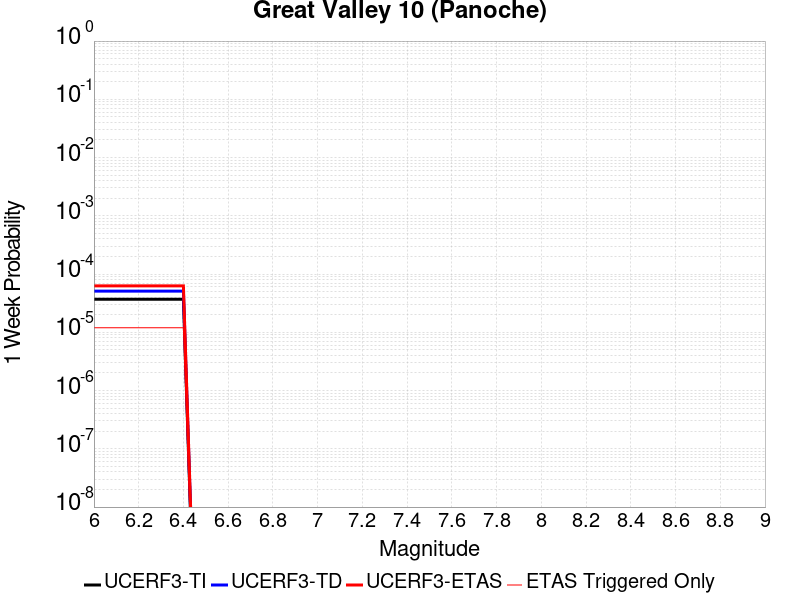 |  |  |  |

| Magnitude | 1 wk TI Prob | 1 wk TD Prob | 1 wk ETAS Prob | 1 wk ETAS/TD Gain | 1 wk ETAS Triggered Only | 1 mo TI Prob | 1 mo TD Prob | 1 mo ETAS Prob | 1 mo ETAS/TD Gain | 1 mo ETAS Triggered Only | 1 yr TI Prob | 1 yr TD Prob | 1 yr ETAS Prob | 1 yr ETAS/TD Gain | 1 yr ETAS Triggered Only | 10 yr TI Prob | 10 yr TD Prob | 10 yr ETAS Prob | 10 yr ETAS/TD Gain | 10 yr ETAS Triggered Only |
|-----|-----|-----|-----|-----|-----|-----|-----|-----|-----|-----|-----|-----|-----|-----|-----|-----|-----|-----|-----|-----|
| 6.0 | 3.6887384E-5 | 5.0836705E-5 | 7.561613E-5 | 1.4874319 | 2.4780691E-5 | 1.580792E-4 | 2.1787158E-4 | 2.4264687E-4 | 1.1137152 | 2.4780691E-5 | 0.0019229152 | 0.002652291 | 0.002677006 | 1.0093184 | 2.4780691E-5 | 0.01906361 | 0.026489226 | 0.02651335 | 1.0009108 | 2.4780691E-5 |
| 6.1 | 3.6887384E-5 | 5.0836705E-5 | 7.561613E-5 | 1.4874319 | 2.4780691E-5 | 1.580792E-4 | 2.1787158E-4 | 2.4264687E-4 | 1.1137152 | 2.4780691E-5 | 0.0019229152 | 0.002652291 | 0.002677006 | 1.0093184 | 2.4780691E-5 | 0.01906361 | 0.026489226 | 0.02651335 | 1.0009108 | 2.4780691E-5 |
| 6.2 | 3.6887384E-5 | 5.0836705E-5 | 7.561613E-5 | 1.4874319 | 2.4780691E-5 | 1.580792E-4 | 2.1787158E-4 | 2.4264687E-4 | 1.1137152 | 2.4780691E-5 | 0.0019229152 | 0.002652291 | 0.002677006 | 1.0093184 | 2.4780691E-5 | 0.01906361 | 0.026489226 | 0.02651335 | 1.0009108 | 2.4780691E-5 |
| 6.3 | 3.6887384E-5 | 5.0836705E-5 | 7.561613E-5 | 1.4874319 | 2.4780691E-5 | 1.580792E-4 | 2.1787158E-4 | 2.4264687E-4 | 1.1137152 | 2.4780691E-5 | 0.0019229152 | 0.002652291 | 0.002677006 | 1.0093184 | 2.4780691E-5 | 0.01906361 | 0.026489226 | 0.02651335 | 1.0009108 | 2.4780691E-5 |
| 6.4 | 3.6887384E-5 | 5.0836705E-5 | 7.561613E-5 | 1.4874319 | 2.4780691E-5 | 1.580792E-4 | 2.1787158E-4 | 2.4264687E-4 | 1.1137152 | 2.4780691E-5 | 0.0019229152 | 0.002652291 | 0.002677006 | 1.0093184 | 2.4780691E-5 | 0.01906361 | 0.026489226 | 0.02651335 | 1.0009108 | 2.4780691E-5 |

## Casmalia 2011 CFM
*[(top)](#table-of-contents)*

| 1 Week | 1 Month | 1 Year | 10 Year |
|-----|-----|-----|-----|
|  |  |  |  |

| Magnitude | 1 wk TI Prob | 1 wk TD Prob | 1 wk ETAS Prob | 1 wk ETAS/TD Gain | 1 wk ETAS Triggered Only | 1 mo TI Prob | 1 mo TD Prob | 1 mo ETAS Prob | 1 mo ETAS/TD Gain | 1 mo ETAS Triggered Only | 1 yr TI Prob | 1 yr TD Prob | 1 yr ETAS Prob | 1 yr ETAS/TD Gain | 1 yr ETAS Triggered Only | 10 yr TI Prob | 10 yr TD Prob | 10 yr ETAS Prob | 10 yr ETAS/TD Gain | 10 yr ETAS Triggered Only |
|-----|-----|-----|-----|-----|-----|-----|-----|-----|-----|-----|-----|-----|-----|-----|-----|-----|-----|-----|-----|-----|
| 6.0 | 4.5215784E-6 | 4.6811892E-6 | 4.6811892E-6 | 1.0 | 0.0 | 1.9378049E-5 | 2.0062238E-5 | 3.2452335E-5 | 1.6175829 | 1.2390346E-5 | 2.359022E-4 | 2.4425777E-4 | 2.690324E-4 | 1.1014283 | 2.4780691E-5 | 0.0023565195 | 0.0024425776 | 0.0024672977 | 1.0101205 | 2.4780691E-5 |
| 6.1 | 4.5215784E-6 | 4.6811892E-6 | 4.6811892E-6 | 1.0 | 0.0 | 1.9378049E-5 | 2.0062238E-5 | 3.2452335E-5 | 1.6175829 | 1.2390346E-5 | 2.359022E-4 | 2.4425777E-4 | 2.690324E-4 | 1.1014283 | 2.4780691E-5 | 0.0023565195 | 0.0024425776 | 0.0024672977 | 1.0101205 | 2.4780691E-5 |
| 6.2 | 4.5215784E-6 | 4.6811892E-6 | 4.6811892E-6 | 1.0 | 0.0 | 1.9378049E-5 | 2.0062238E-5 | 3.2452335E-5 | 1.6175829 | 1.2390346E-5 | 2.359022E-4 | 2.4425777E-4 | 2.690324E-4 | 1.1014283 | 2.4780691E-5 | 0.0023565195 | 0.0024425776 | 0.0024672977 | 1.0101205 | 2.4780691E-5 |
| 6.3 | 4.5215784E-6 | 4.6811892E-6 | 4.6811892E-6 | 1.0 | 0.0 | 1.9378049E-5 | 2.0062238E-5 | 3.2452335E-5 | 1.6175829 | 1.2390346E-5 | 2.359022E-4 | 2.4425777E-4 | 2.690324E-4 | 1.1014283 | 2.4780691E-5 | 0.0023565195 | 0.0024425776 | 0.0024672977 | 1.0101205 | 2.4780691E-5 |
| 6.4 | 4.5215784E-6 | 4.6811892E-6 | 4.6811892E-6 | 1.0 | 0.0 | 1.9378049E-5 | 2.0062238E-5 | 3.2452335E-5 | 1.6175829 | 1.2390346E-5 | 2.359022E-4 | 2.4425777E-4 | 2.690324E-4 | 1.1014283 | 2.4780691E-5 | 0.0023565195 | 0.0024425776 | 0.0024672977 | 1.0101205 | 2.4780691E-5 |
| 6.5 | 4.5215784E-6 | 4.6811892E-6 | 4.6811892E-6 | 1.0 | 0.0 | 1.9378049E-5 | 2.0062238E-5 | 3.2452335E-5 | 1.6175829 | 1.2390346E-5 | 2.359022E-4 | 2.4425777E-4 | 2.690324E-4 | 1.1014283 | 2.4780691E-5 | 0.0023565195 | 0.0024425776 | 0.0024672977 | 1.0101205 | 2.4780691E-5 |

## Great Valley 14 (Kettleman Hills)
*[(top)](#table-of-contents)*

| 1 Week | 1 Month | 1 Year | 10 Year |
|-----|-----|-----|-----|
|  |  |  |  |

| Magnitude | 1 wk TI Prob | 1 wk TD Prob | 1 wk ETAS Prob | 1 wk ETAS/TD Gain | 1 wk ETAS Triggered Only | 1 mo TI Prob | 1 mo TD Prob | 1 mo ETAS Prob | 1 mo ETAS/TD Gain | 1 mo ETAS Triggered Only | 1 yr TI Prob | 1 yr TD Prob | 1 yr ETAS Prob | 1 yr ETAS/TD Gain | 1 yr ETAS Triggered Only | 10 yr TI Prob | 10 yr TD Prob | 10 yr ETAS Prob | 10 yr ETAS/TD Gain | 10 yr ETAS Triggered Only |
|-----|-----|-----|-----|-----|-----|-----|-----|-----|-----|-----|-----|-----|-----|-----|-----|-----|-----|-----|-----|-----|
| 6.0 | 2.0537544E-5 | 2.4301013E-5 | 2.4301013E-5 | 1.0 | 0.0 | 8.801508E-5 | 1.041472E-4 | 1.2892531E-4 | 1.2379143 | 2.4780691E-5 | 0.0010710567 | 0.0012679921 | 0.0012927414 | 1.0195185 | 2.4780691E-5 | 0.010659092 | 0.0126799205 | 0.012704386 | 1.0019295 | 2.4780691E-5 |
| 6.1 | 2.0537544E-5 | 2.4301013E-5 | 2.4301013E-5 | 1.0 | 0.0 | 8.801508E-5 | 1.041472E-4 | 1.2892531E-4 | 1.2379143 | 2.4780691E-5 | 0.0010710567 | 0.0012679921 | 0.0012927414 | 1.0195185 | 2.4780691E-5 | 0.010659092 | 0.0126799205 | 0.012704386 | 1.0019295 | 2.4780691E-5 |
| 6.2 | 2.0537544E-5 | 2.4301013E-5 | 2.4301013E-5 | 1.0 | 0.0 | 8.801508E-5 | 1.041472E-4 | 1.2892531E-4 | 1.2379143 | 2.4780691E-5 | 0.0010710567 | 0.0012679921 | 0.0012927414 | 1.0195185 | 2.4780691E-5 | 0.010659092 | 0.0126799205 | 0.012704386 | 1.0019295 | 2.4780691E-5 |
| 6.3 | 2.0537544E-5 | 2.4301013E-5 | 2.4301013E-5 | 1.0 | 0.0 | 8.801508E-5 | 1.041472E-4 | 1.2892531E-4 | 1.2379143 | 2.4780691E-5 | 0.0010710567 | 0.0012679921 | 0.0012927414 | 1.0195185 | 2.4780691E-5 | 0.010659092 | 0.0126799205 | 0.012704386 | 1.0019295 | 2.4780691E-5 |
| 6.4 | 2.0537544E-5 | 2.4301013E-5 | 2.4301013E-5 | 1.0 | 0.0 | 8.801508E-5 | 1.041472E-4 | 1.2892531E-4 | 1.2379143 | 2.4780691E-5 | 0.0010710567 | 0.0012679921 | 0.0012927414 | 1.0195185 | 2.4780691E-5 | 0.010659092 | 0.0126799205 | 0.012704386 | 1.0019295 | 2.4780691E-5 |
| 6.5 | 2.0537544E-5 | 2.4301013E-5 | 2.4301013E-5 | 1.0 | 0.0 | 8.801508E-5 | 1.041472E-4 | 1.2892531E-4 | 1.2379143 | 2.4780691E-5 | 0.0010710567 | 0.0012679921 | 0.0012927414 | 1.0195185 | 2.4780691E-5 | 0.010659092 | 0.0126799205 | 0.012704386 | 1.0019295 | 2.4780691E-5 |
| 6.6 | 2.0537544E-5 | 2.4301013E-5 | 2.4301013E-5 | 1.0 | 0.0 | 8.801508E-5 | 1.041472E-4 | 1.2892531E-4 | 1.2379143 | 2.4780691E-5 | 0.0010710567 | 0.0012679921 | 0.0012927414 | 1.0195185 | 2.4780691E-5 | 0.010659092 | 0.0126799205 | 0.012704386 | 1.0019295 | 2.4780691E-5 |
| 6.7 | 2.0537544E-5 | 2.4301013E-5 | 2.4301013E-5 | 1.0 | 0.0 | 8.801508E-5 | 1.041472E-4 | 1.2892531E-4 | 1.2379143 | 2.4780691E-5 | 0.0010710567 | 0.0012679921 | 0.0012927414 | 1.0195185 | 2.4780691E-5 | 0.010659092 | 0.0126799205 | 0.012704386 | 1.0019295 | 2.4780691E-5 |
| 6.8 | 2.0537544E-5 | 2.4301013E-5 | 2.4301013E-5 | 1.0 | 0.0 | 8.801508E-5 | 1.041472E-4 | 1.2892531E-4 | 1.2379143 | 2.4780691E-5 | 0.0010710567 | 0.0012679921 | 0.0012927414 | 1.0195185 | 2.4780691E-5 | 0.010659092 | 0.0126799205 | 0.012704386 | 1.0019295 | 2.4780691E-5 |
| 6.9 | 2.0537544E-5 | 2.4301013E-5 | 2.4301013E-5 | 1.0 | 0.0 | 8.801508E-5 | 1.041472E-4 | 1.2892531E-4 | 1.2379143 | 2.4780691E-5 | 0.0010710567 | 0.0012679921 | 0.0012927414 | 1.0195185 | 2.4780691E-5 | 0.010659092 | 0.0126799205 | 0.012704386 | 1.0019295 | 2.4780691E-5 |

## Hollywood
*[(top)](#table-of-contents)*

| 1 Week | 1 Month | 1 Year | 10 Year |
|-----|-----|-----|-----|
|  | 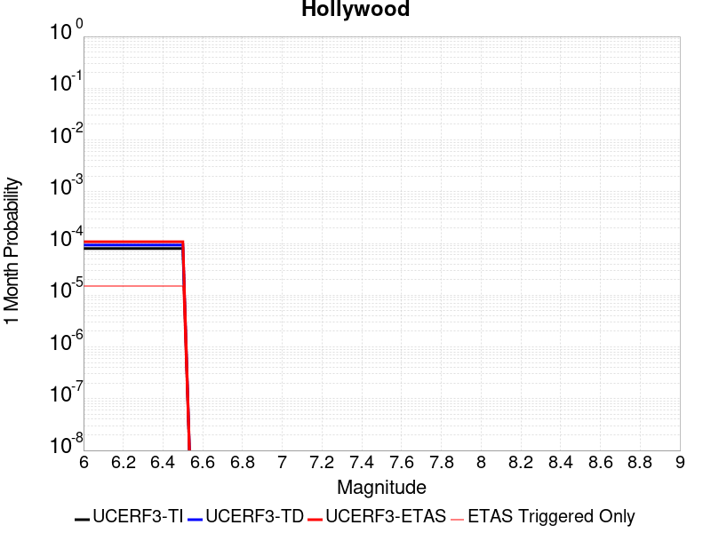 |  |  |

| Magnitude | 1 wk TI Prob | 1 wk TD Prob | 1 wk ETAS Prob | 1 wk ETAS/TD Gain | 1 wk ETAS Triggered Only | 1 mo TI Prob | 1 mo TD Prob | 1 mo ETAS Prob | 1 mo ETAS/TD Gain | 1 mo ETAS Triggered Only | 1 yr TI Prob | 1 yr TD Prob | 1 yr ETAS Prob | 1 yr ETAS/TD Gain | 1 yr ETAS Triggered Only | 10 yr TI Prob | 10 yr TD Prob | 10 yr ETAS Prob | 10 yr ETAS/TD Gain | 10 yr ETAS Triggered Only |
|-----|-----|-----|-----|-----|-----|-----|-----|-----|-----|-----|-----|-----|-----|-----|-----|-----|-----|-----|-----|-----|
| 6.0 | 1.8637298E-5 | 2.1684791E-5 | 2.1684791E-5 | 1.0 | 0.0 | 7.987169E-5 | 9.2934824E-5 | 9.2934824E-5 | 1.0 | 0.0 | 9.720039E-4 | 0.0011314814 | 0.0011438576 | 1.0109382 | 1.2390346E-5 | 0.009677634 | 0.011314785 | 0.011339285 | 1.0021653 | 2.4780691E-5 |
| 6.1 | 1.8637298E-5 | 2.1684791E-5 | 2.1684791E-5 | 1.0 | 0.0 | 7.987169E-5 | 9.2934824E-5 | 9.2934824E-5 | 1.0 | 0.0 | 9.720039E-4 | 0.0011314814 | 0.0011438576 | 1.0109382 | 1.2390346E-5 | 0.009677634 | 0.011314785 | 0.011339285 | 1.0021653 | 2.4780691E-5 |
| 6.2 | 1.8637298E-5 | 2.1684791E-5 | 2.1684791E-5 | 1.0 | 0.0 | 7.987169E-5 | 9.2934824E-5 | 9.2934824E-5 | 1.0 | 0.0 | 9.720039E-4 | 0.0011314814 | 0.0011438576 | 1.0109382 | 1.2390346E-5 | 0.009677634 | 0.011314785 | 0.011339285 | 1.0021653 | 2.4780691E-5 |
| 6.3 | 1.8637298E-5 | 2.1684791E-5 | 2.1684791E-5 | 1.0 | 0.0 | 7.987169E-5 | 9.2934824E-5 | 9.2934824E-5 | 1.0 | 0.0 | 9.720039E-4 | 0.0011314814 | 0.0011438576 | 1.0109382 | 1.2390346E-5 | 0.009677634 | 0.011314785 | 0.011339285 | 1.0021653 | 2.4780691E-5 |
| 6.4 | 1.8637298E-5 | 2.1684791E-5 | 2.1684791E-5 | 1.0 | 0.0 | 7.987169E-5 | 9.2934824E-5 | 9.2934824E-5 | 1.0 | 0.0 | 9.720039E-4 | 0.0011314814 | 0.0011438576 | 1.0109382 | 1.2390346E-5 | 0.009677634 | 0.011314785 | 0.011339285 | 1.0021653 | 2.4780691E-5 |
| 6.5 | 1.8637298E-5 | 2.1684791E-5 | 2.1684791E-5 | 1.0 | 0.0 | 7.987169E-5 | 9.2934824E-5 | 9.2934824E-5 | 1.0 | 0.0 | 9.720039E-4 | 0.0011314814 | 0.0011438576 | 1.0109382 | 1.2390346E-5 | 0.009677634 | 0.011314785 | 0.011339285 | 1.0021653 | 2.4780691E-5 |

## Mono Lake 2011 CFM
*[(top)](#table-of-contents)*

| 1 Week | 1 Month | 1 Year | 10 Year |
|-----|-----|-----|-----|
|  |  |  |  |

| Magnitude | 1 wk TI Prob | 1 wk TD Prob | 1 wk ETAS Prob | 1 wk ETAS/TD Gain | 1 wk ETAS Triggered Only | 1 mo TI Prob | 1 mo TD Prob | 1 mo ETAS Prob | 1 mo ETAS/TD Gain | 1 mo ETAS Triggered Only | 1 yr TI Prob | 1 yr TD Prob | 1 yr ETAS Prob | 1 yr ETAS/TD Gain | 1 yr ETAS Triggered Only | 10 yr TI Prob | 10 yr TD Prob | 10 yr ETAS Prob | 10 yr ETAS/TD Gain | 10 yr ETAS Triggered Only |
|-----|-----|-----|-----|-----|-----|-----|-----|-----|-----|-----|-----|-----|-----|-----|-----|-----|-----|-----|-----|-----|
| 6.0 | 5.046952E-5 | 7.691228E-5 | 8.930167E-5 | 1.1610848 | 1.2390346E-5 | 2.1628001E-4 | 3.29613E-4 | 3.4199926E-4 | 1.0375782 | 1.2390346E-5 | 0.0026300293 | 0.0040091043 | 0.004033786 | 1.0061563 | 2.4780691E-5 | 0.0259912 | 0.039705824 | 0.03972962 | 1.0005994 | 2.4780691E-5 |
| 6.1 | 5.046952E-5 | 7.691228E-5 | 8.930167E-5 | 1.1610848 | 1.2390346E-5 | 2.1628001E-4 | 3.29613E-4 | 3.4199926E-4 | 1.0375782 | 1.2390346E-5 | 0.0026300293 | 0.0040091043 | 0.004033786 | 1.0061563 | 2.4780691E-5 | 0.0259912 | 0.039705824 | 0.03972962 | 1.0005994 | 2.4780691E-5 |
| 6.2 | 5.046952E-5 | 7.691228E-5 | 8.930167E-5 | 1.1610848 | 1.2390346E-5 | 2.1628001E-4 | 3.29613E-4 | 3.4199926E-4 | 1.0375782 | 1.2390346E-5 | 0.0026300293 | 0.0040091043 | 0.004033786 | 1.0061563 | 2.4780691E-5 | 0.0259912 | 0.039705824 | 0.03972962 | 1.0005994 | 2.4780691E-5 |
| 6.3 | 5.046952E-5 | 7.691228E-5 | 8.930167E-5 | 1.1610848 | 1.2390346E-5 | 2.1628001E-4 | 3.29613E-4 | 3.4199926E-4 | 1.0375782 | 1.2390346E-5 | 0.0026300293 | 0.0040091043 | 0.004033786 | 1.0061563 | 2.4780691E-5 | 0.0259912 | 0.039705824 | 0.03972962 | 1.0005994 | 2.4780691E-5 |
| 6.4 | 5.046952E-5 | 7.691228E-5 | 8.930167E-5 | 1.1610848 | 1.2390346E-5 | 2.1628001E-4 | 3.29613E-4 | 3.4199926E-4 | 1.0375782 | 1.2390346E-5 | 0.0026300293 | 0.0040091043 | 0.004033786 | 1.0061563 | 2.4780691E-5 | 0.0259912 | 0.039705824 | 0.03972962 | 1.0005994 | 2.4780691E-5 |
| 6.5 | 5.046952E-5 | 7.691228E-5 | 8.930167E-5 | 1.1610848 | 1.2390346E-5 | 2.1628001E-4 | 3.29613E-4 | 3.4199926E-4 | 1.0375782 | 1.2390346E-5 | 0.0026300293 | 0.0040091043 | 0.004033786 | 1.0061563 | 2.4780691E-5 | 0.0259912 | 0.039705824 | 0.03972962 | 1.0005994 | 2.4780691E-5 |
| 6.6 | 4.2686057E-5 | 6.480708E-5 | 7.719662E-5 | 1.1911757 | 1.2390346E-5 | 1.8292743E-4 | 2.7774464E-4 | 2.9013155E-4 | 1.0445982 | 1.2390346E-5 | 0.0022248663 | 0.0033799042 | 0.003404601 | 1.0073069 | 2.4780691E-5 | 0.02202723 | 0.033641294 | 0.03366524 | 1.0007118 | 2.4780691E-5 |

## Great Valley 03 Mysterious Ridge
*[(top)](#table-of-contents)*

| 1 Week | 1 Month | 1 Year | 10 Year |
|-----|-----|-----|-----|
| 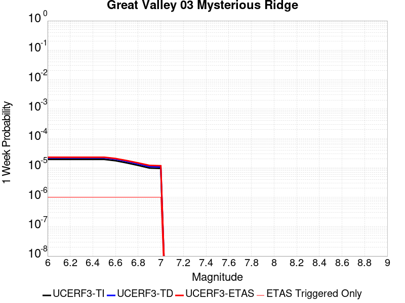 |  |  |  |

| Magnitude | 1 wk TI Prob | 1 wk TD Prob | 1 wk ETAS Prob | 1 wk ETAS/TD Gain | 1 wk ETAS Triggered Only | 1 mo TI Prob | 1 mo TD Prob | 1 mo ETAS Prob | 1 mo ETAS/TD Gain | 1 mo ETAS Triggered Only | 1 yr TI Prob | 1 yr TD Prob | 1 yr ETAS Prob | 1 yr ETAS/TD Gain | 1 yr ETAS Triggered Only | 10 yr TI Prob | 10 yr TD Prob | 10 yr ETAS Prob | 10 yr ETAS/TD Gain | 10 yr ETAS Triggered Only |
|-----|-----|-----|-----|-----|-----|-----|-----|-----|-----|-----|-----|-----|-----|-----|-----|-----|-----|-----|-----|-----|
| 6.0 | 1.9343506E-5 | 2.1910257E-5 | 3.430033E-5 | 1.565492 | 1.2390346E-5 | 8.289811E-5 | 9.389859E-5 | 1.0628777E-4 | 1.1319422 | 1.2390346E-5 | 0.0010088171 | 0.0011427705 | 0.0011551466 | 1.0108299 | 1.2390346E-5 | 0.010042497 | 0.011384191 | 0.01139644 | 1.001076 | 1.2390346E-5 |
| 6.1 | 1.9343506E-5 | 2.1910257E-5 | 3.430033E-5 | 1.565492 | 1.2390346E-5 | 8.289811E-5 | 9.389859E-5 | 1.0628777E-4 | 1.1319422 | 1.2390346E-5 | 0.0010088171 | 0.0011427705 | 0.0011551466 | 1.0108299 | 1.2390346E-5 | 0.010042497 | 0.011384191 | 0.01139644 | 1.001076 | 1.2390346E-5 |
| 6.2 | 1.9343506E-5 | 2.1910257E-5 | 3.430033E-5 | 1.565492 | 1.2390346E-5 | 8.289811E-5 | 9.389859E-5 | 1.0628777E-4 | 1.1319422 | 1.2390346E-5 | 0.0010088171 | 0.0011427705 | 0.0011551466 | 1.0108299 | 1.2390346E-5 | 0.010042497 | 0.011384191 | 0.01139644 | 1.001076 | 1.2390346E-5 |
| 6.3 | 1.9343506E-5 | 2.1910257E-5 | 3.430033E-5 | 1.565492 | 1.2390346E-5 | 8.289811E-5 | 9.389859E-5 | 1.0628777E-4 | 1.1319422 | 1.2390346E-5 | 0.0010088171 | 0.0011427705 | 0.0011551466 | 1.0108299 | 1.2390346E-5 | 0.010042497 | 0.011384191 | 0.01139644 | 1.001076 | 1.2390346E-5 |
| 6.4 | 1.9343506E-5 | 2.1910257E-5 | 3.430033E-5 | 1.565492 | 1.2390346E-5 | 8.289811E-5 | 9.389859E-5 | 1.0628777E-4 | 1.1319422 | 1.2390346E-5 | 0.0010088171 | 0.0011427705 | 0.0011551466 | 1.0108299 | 1.2390346E-5 | 0.010042497 | 0.011384191 | 0.01139644 | 1.001076 | 1.2390346E-5 |
| 6.5 | 1.9343506E-5 | 2.1910257E-5 | 3.430033E-5 | 1.565492 | 1.2390346E-5 | 8.289811E-5 | 9.389859E-5 | 1.0628777E-4 | 1.1319422 | 1.2390346E-5 | 0.0010088171 | 0.0011427705 | 0.0011551466 | 1.0108299 | 1.2390346E-5 | 0.010042497 | 0.011384191 | 0.01139644 | 1.001076 | 1.2390346E-5 |
| 6.6 | 1.7440449E-5 | 1.9750794E-5 | 3.2140895E-5 | 1.6273216 | 1.2390346E-5 | 7.474264E-5 | 8.464438E-5 | 9.703368E-5 | 1.1463687 | 1.2390346E-5 | 9.096117E-4 | 0.0010302118 | 0.0010425893 | 1.0120146 | 1.2390346E-5 | 0.009058975 | 0.010269466 | 0.0102817295 | 1.0011941 | 1.2390346E-5 |
| 6.7 | 1.468422E-5 | 1.6604492E-5 | 2.8994631E-5 | 1.746192 | 1.2390346E-5 | 6.2930856E-5 | 7.116102E-5 | 8.355048E-5 | 1.1741047 | 1.2390346E-5 | 7.659138E-4 | 8.6619187E-4 | 8.7857153E-4 | 1.014292 | 1.2390346E-5 | 0.007632794 | 0.008642968 | 0.008655251 | 1.0014212 | 1.2390346E-5 |
| 6.8 | 1.211602E-5 | 1.3673764E-5 | 2.606394E-5 | 1.9061276 | 1.2390346E-5 | 5.1924766E-5 | 5.8601363E-5 | 7.099098E-5 | 1.2114221 | 1.2390346E-5 | 6.320007E-4 | 7.133854E-4 | 7.2576693E-4 | 1.017356 | 1.2390346E-5 | 0.006302063 | 0.007125407 | 0.0071377093 | 1.0017265 | 1.2390346E-5 |
| 6.9 | 9.837659E-6 | 1.1085766E-5 | 2.3475974E-5 | 2.1176682 | 1.2390346E-5 | 4.2160715E-5 | 4.7510377E-5 | 5.9900132E-5 | 1.26078 | 1.2390346E-5 | 5.131858E-4 | 5.7842984E-4 | 5.90813E-4 | 1.0214083 | 1.2390346E-5 | 0.005120023 | 0.005783415 | 0.0057957335 | 1.00213 | 1.2390346E-5 |
| 7.0 | 9.54151E-6 | 1.0750372E-5 | 2.3140585E-5 | 2.152538 | 1.2390346E-5 | 4.0891544E-5 | 4.6073023E-5 | 5.8462796E-5 | 1.268916 | 1.2390346E-5 | 4.977408E-4 | 5.609391E-4 | 5.7332247E-4 | 1.0220761 | 1.2390346E-5 | 0.0049662744 | 0.0056093903 | 0.0056217113 | 1.0021964 | 1.2390346E-5 |

## San Joaquin Hills
*[(top)](#table-of-contents)*

| 1 Week | 1 Month | 1 Year | 10 Year |
|-----|-----|-----|-----|
|  |  |  |  |

| Magnitude | 1 wk TI Prob | 1 wk TD Prob | 1 wk ETAS Prob | 1 wk ETAS/TD Gain | 1 wk ETAS Triggered Only | 1 mo TI Prob | 1 mo TD Prob | 1 mo ETAS Prob | 1 mo ETAS/TD Gain | 1 mo ETAS Triggered Only | 1 yr TI Prob | 1 yr TD Prob | 1 yr ETAS Prob | 1 yr ETAS/TD Gain | 1 yr ETAS Triggered Only | 10 yr TI Prob | 10 yr TD Prob | 10 yr ETAS Prob | 10 yr ETAS/TD Gain | 10 yr ETAS Triggered Only |
|-----|-----|-----|-----|-----|-----|-----|-----|-----|-----|-----|-----|-----|-----|-----|-----|-----|-----|-----|-----|-----|
| 6.0 | 7.517352E-6 | 7.930626E-6 | 7.930626E-6 | 1.0 | 0.0 | 3.2216827E-5 | 3.398822E-5 | 4.6378143E-5 | 1.3645358 | 1.2390346E-5 | 3.9216926E-4 | 4.137751E-4 | 4.2616032E-4 | 1.0299323 | 1.2390346E-5 | 0.003914779 | 0.0041346652 | 0.0041470043 | 1.0029843 | 1.2390346E-5 |
| 6.1 | 7.517352E-6 | 7.930626E-6 | 7.930626E-6 | 1.0 | 0.0 | 3.2216827E-5 | 3.398822E-5 | 4.6378143E-5 | 1.3645358 | 1.2390346E-5 | 3.9216926E-4 | 4.137751E-4 | 4.2616032E-4 | 1.0299323 | 1.2390346E-5 | 0.003914779 | 0.0041346652 | 0.0041470043 | 1.0029843 | 1.2390346E-5 |
| 6.2 | 7.517352E-6 | 7.930626E-6 | 7.930626E-6 | 1.0 | 0.0 | 3.2216827E-5 | 3.398822E-5 | 4.6378143E-5 | 1.3645358 | 1.2390346E-5 | 3.9216926E-4 | 4.137751E-4 | 4.2616032E-4 | 1.0299323 | 1.2390346E-5 | 0.003914779 | 0.0041346652 | 0.0041470043 | 1.0029843 | 1.2390346E-5 |
| 6.3 | 7.517352E-6 | 7.930626E-6 | 7.930626E-6 | 1.0 | 0.0 | 3.2216827E-5 | 3.398822E-5 | 4.6378143E-5 | 1.3645358 | 1.2390346E-5 | 3.9216926E-4 | 4.137751E-4 | 4.2616032E-4 | 1.0299323 | 1.2390346E-5 | 0.003914779 | 0.0041346652 | 0.0041470043 | 1.0029843 | 1.2390346E-5 |
| 6.4 | 7.517352E-6 | 7.930626E-6 | 7.930626E-6 | 1.0 | 0.0 | 3.2216827E-5 | 3.398822E-5 | 4.6378143E-5 | 1.3645358 | 1.2390346E-5 | 3.9216926E-4 | 4.137751E-4 | 4.2616032E-4 | 1.0299323 | 1.2390346E-5 | 0.003914779 | 0.0041346652 | 0.0041470043 | 1.0029843 | 1.2390346E-5 |
| 6.5 | 7.517352E-6 | 7.930626E-6 | 7.930626E-6 | 1.0 | 0.0 | 3.2216827E-5 | 3.398822E-5 | 4.6378143E-5 | 1.3645358 | 1.2390346E-5 | 3.9216926E-4 | 4.137751E-4 | 4.2616032E-4 | 1.0299323 | 1.2390346E-5 | 0.003914779 | 0.0041346652 | 0.0041470043 | 1.0029843 | 1.2390346E-5 |
| 6.6 | 7.1722156E-6 | 7.567309E-6 | 7.567309E-6 | 1.0 | 0.0 | 3.0737705E-5 | 3.2431184E-5 | 4.482113E-5 | 1.382038 | 1.2390346E-5 | 3.7416728E-4 | 3.9482507E-4 | 4.0721052E-4 | 1.0313694 | 1.2390346E-5 | 0.003735379 | 0.003945838 | 0.0039581796 | 1.0031277 | 1.2390346E-5 |
| 6.7 | 5.595255E-6 | 5.8979463E-6 | 5.8979463E-6 | 1.0 | 0.0 | 2.3979444E-5 | 2.5276911E-5 | 3.7666945E-5 | 1.4901719 | 1.2390346E-5 | 2.9191063E-4 | 3.077464E-4 | 3.2013294E-4 | 1.0402491 | 1.2390346E-5 | 0.0029152746 | 0.003077464 | 0.0030898163 | 1.0040138 | 1.2390346E-5 |
| 6.8 | 5.595255E-6 | 5.8979463E-6 | 5.8979463E-6 | 1.0 | 0.0 | 2.3979444E-5 | 2.5276911E-5 | 3.7666945E-5 | 1.4901719 | 1.2390346E-5 | 2.9191063E-4 | 3.077464E-4 | 3.2013294E-4 | 1.0402491 | 1.2390346E-5 | 0.0029152746 | 0.003077464 | 0.0030898163 | 1.0040138 | 1.2390346E-5 |
| 6.9 | 5.595255E-6 | 5.8979463E-6 | 5.8979463E-6 | 1.0 | 0.0 | 2.3979444E-5 | 2.5276911E-5 | 3.7666945E-5 | 1.4901719 | 1.2390346E-5 | 2.9191063E-4 | 3.077464E-4 | 3.2013294E-4 | 1.0402491 | 1.2390346E-5 | 0.0029152746 | 0.003077464 | 0.0030898163 | 1.0040138 | 1.2390346E-5 |

## Santa Monica alt 1
*[(top)](#table-of-contents)*

| 1 Week | 1 Month | 1 Year | 10 Year |
|-----|-----|-----|-----|
|  |  |  |  |

| Magnitude | 1 wk TI Prob | 1 wk TD Prob | 1 wk ETAS Prob | 1 wk ETAS/TD Gain | 1 wk ETAS Triggered Only | 1 mo TI Prob | 1 mo TD Prob | 1 mo ETAS Prob | 1 mo ETAS/TD Gain | 1 mo ETAS Triggered Only | 1 yr TI Prob | 1 yr TD Prob | 1 yr ETAS Prob | 1 yr ETAS/TD Gain | 1 yr ETAS Triggered Only | 10 yr TI Prob | 10 yr TD Prob | 10 yr ETAS Prob | 10 yr ETAS/TD Gain | 10 yr ETAS Triggered Only |
|-----|-----|-----|-----|-----|-----|-----|-----|-----|-----|-----|-----|-----|-----|-----|-----|-----|-----|-----|-----|-----|
| 6.0 | 1.14914055E-5 | 1.2581658E-5 | 1.2581658E-5 | 1.0 | 0.0 | 4.9247952E-5 | 5.392139E-5 | 5.392139E-5 | 1.0 | 0.0 | 5.9942884E-4 | 6.564929E-4 | 6.564929E-4 | 1.0 | 0.0 | 0.005978145 | 0.006564929 | 0.006577238 | 1.0018749 | 1.2390346E-5 |
| 6.1 | 1.14914055E-5 | 1.2581658E-5 | 1.2581658E-5 | 1.0 | 0.0 | 4.9247952E-5 | 5.392139E-5 | 5.392139E-5 | 1.0 | 0.0 | 5.9942884E-4 | 6.564929E-4 | 6.564929E-4 | 1.0 | 0.0 | 0.005978145 | 0.006564929 | 0.006577238 | 1.0018749 | 1.2390346E-5 |
| 6.2 | 1.14914055E-5 | 1.2581658E-5 | 1.2581658E-5 | 1.0 | 0.0 | 4.9247952E-5 | 5.392139E-5 | 5.392139E-5 | 1.0 | 0.0 | 5.9942884E-4 | 6.564929E-4 | 6.564929E-4 | 1.0 | 0.0 | 0.005978145 | 0.006564929 | 0.006577238 | 1.0018749 | 1.2390346E-5 |
| 6.3 | 1.14914055E-5 | 1.2581658E-5 | 1.2581658E-5 | 1.0 | 0.0 | 4.9247952E-5 | 5.392139E-5 | 5.392139E-5 | 1.0 | 0.0 | 5.9942884E-4 | 6.564929E-4 | 6.564929E-4 | 1.0 | 0.0 | 0.005978145 | 0.006564929 | 0.006577238 | 1.0018749 | 1.2390346E-5 |
| 6.4 | 1.14914055E-5 | 1.2581658E-5 | 1.2581658E-5 | 1.0 | 0.0 | 4.9247952E-5 | 5.392139E-5 | 5.392139E-5 | 1.0 | 0.0 | 5.9942884E-4 | 6.564929E-4 | 6.564929E-4 | 1.0 | 0.0 | 0.005978145 | 0.006564929 | 0.006577238 | 1.0018749 | 1.2390346E-5 |
| 6.5 | 1.14914055E-5 | 1.2581658E-5 | 1.2581658E-5 | 1.0 | 0.0 | 4.9247952E-5 | 5.392139E-5 | 5.392139E-5 | 1.0 | 0.0 | 5.9942884E-4 | 6.564929E-4 | 6.564929E-4 | 1.0 | 0.0 | 0.005978145 | 0.006564929 | 0.006577238 | 1.0018749 | 1.2390346E-5 |

## Honey Lake 2011 CFM
*[(top)](#table-of-contents)*

| 1 Week | 1 Month | 1 Year | 10 Year |
|-----|-----|-----|-----|
|  |  |  |  |

| Magnitude | 1 wk TI Prob | 1 wk TD Prob | 1 wk ETAS Prob | 1 wk ETAS/TD Gain | 1 wk ETAS Triggered Only | 1 mo TI Prob | 1 mo TD Prob | 1 mo ETAS Prob | 1 mo ETAS/TD Gain | 1 mo ETAS Triggered Only | 1 yr TI Prob | 1 yr TD Prob | 1 yr ETAS Prob | 1 yr ETAS/TD Gain | 1 yr ETAS Triggered Only | 10 yr TI Prob | 10 yr TD Prob | 10 yr ETAS Prob | 10 yr ETAS/TD Gain | 10 yr ETAS Triggered Only |
|-----|-----|-----|-----|-----|-----|-----|-----|-----|-----|-----|-----|-----|-----|-----|-----|-----|-----|-----|-----|-----|
| 6.0 | 4.2419113E-5 | 5.7836412E-5 | 5.7836412E-5 | 1.0 | 0.0 | 1.8178353E-4 | 2.4785337E-4 | 2.4785337E-4 | 1.0 | 0.0 | 0.002210968 | 0.0030145324 | 0.0030268854 | 1.0040978 | 1.2390346E-5 | 0.021890994 | 0.029842986 | 0.029855005 | 1.0004028 | 1.2390346E-5 |
| 6.1 | 4.2419113E-5 | 5.7836412E-5 | 5.7836412E-5 | 1.0 | 0.0 | 1.8178353E-4 | 2.4785337E-4 | 2.4785337E-4 | 1.0 | 0.0 | 0.002210968 | 0.0030145324 | 0.0030268854 | 1.0040978 | 1.2390346E-5 | 0.021890994 | 0.029842986 | 0.029855005 | 1.0004028 | 1.2390346E-5 |
| 6.2 | 4.2419113E-5 | 5.7836412E-5 | 5.7836412E-5 | 1.0 | 0.0 | 1.8178353E-4 | 2.4785337E-4 | 2.4785337E-4 | 1.0 | 0.0 | 0.002210968 | 0.0030145324 | 0.0030268854 | 1.0040978 | 1.2390346E-5 | 0.021890994 | 0.029842986 | 0.029855005 | 1.0004028 | 1.2390346E-5 |
| 6.3 | 4.2419113E-5 | 5.7836412E-5 | 5.7836412E-5 | 1.0 | 0.0 | 1.8178353E-4 | 2.4785337E-4 | 2.4785337E-4 | 1.0 | 0.0 | 0.002210968 | 0.0030145324 | 0.0030268854 | 1.0040978 | 1.2390346E-5 | 0.021890994 | 0.029842986 | 0.029855005 | 1.0004028 | 1.2390346E-5 |
| 6.4 | 4.2419113E-5 | 5.7836412E-5 | 5.7836412E-5 | 1.0 | 0.0 | 1.8178353E-4 | 2.4785337E-4 | 2.4785337E-4 | 1.0 | 0.0 | 0.002210968 | 0.0030145324 | 0.0030268854 | 1.0040978 | 1.2390346E-5 | 0.021890994 | 0.029842986 | 0.029855005 | 1.0004028 | 1.2390346E-5 |
| 6.5 | 4.2419113E-5 | 5.7836412E-5 | 5.7836412E-5 | 1.0 | 0.0 | 1.8178353E-4 | 2.4785337E-4 | 2.4785337E-4 | 1.0 | 0.0 | 0.002210968 | 0.0030145324 | 0.0030268854 | 1.0040978 | 1.2390346E-5 | 0.021890994 | 0.029842986 | 0.029855005 | 1.0004028 | 1.2390346E-5 |
| 6.6 | 3.5778685E-5 | 4.865727E-5 | 4.865727E-5 | 1.0 | 0.0 | 1.533282E-4 | 2.0852126E-4 | 2.0852126E-4 | 1.0 | 0.0 | 0.0018651724 | 0.002536925 | 0.002549284 | 1.0048716 | 1.2390346E-5 | 0.01849595 | 0.025190448 | 0.025202526 | 1.0004795 | 1.2390346E-5 |
| 6.7 | 2.9777242E-5 | 4.0327057E-5 | 4.0327057E-5 | 1.0 | 0.0 | 1.2761052E-4 | 1.7282547E-4 | 1.7282547E-4 | 1.0 | 0.0 | 0.0015525507 | 0.0021032947 | 0.002115659 | 1.0058786 | 1.2390346E-5 | 0.0154174855 | 0.020948831 | 0.020960962 | 1.0005791 | 1.2390346E-5 |
| 6.8 | 2.4307292E-5 | 3.2781874E-5 | 3.2781874E-5 | 1.0 | 0.0 | 1.0416994E-4 | 1.4049283E-4 | 1.4049283E-4 | 1.0 | 0.0 | 0.0012675312 | 0.0017103229 | 0.0017226922 | 1.0072321 | 1.2390346E-5 | 0.012603257 | 0.017085526 | 0.017097704 | 1.0007128 | 1.2390346E-5 |
| 6.9 | 2.2774519E-5 | 3.0696156E-5 | 3.0696156E-5 | 1.0 | 0.0 | 9.760143E-5 | 1.3155496E-4 | 1.3155496E-4 | 1.0 | 0.0 | 0.0011876496 | 0.0016016681 | 0.0016140385 | 1.0077236 | 1.2390346E-5 | 0.011813223 | 0.016015066 | 0.016027259 | 1.0007613 | 1.2390346E-5 |

## Robinson Creek
*[(top)](#table-of-contents)*

| 1 Week | 1 Month | 1 Year | 10 Year |
|-----|-----|-----|-----|
|  |  |  |  |

| Magnitude | 1 wk TI Prob | 1 wk TD Prob | 1 wk ETAS Prob | 1 wk ETAS/TD Gain | 1 wk ETAS Triggered Only | 1 mo TI Prob | 1 mo TD Prob | 1 mo ETAS Prob | 1 mo ETAS/TD Gain | 1 mo ETAS Triggered Only | 1 yr TI Prob | 1 yr TD Prob | 1 yr ETAS Prob | 1 yr ETAS/TD Gain | 1 yr ETAS Triggered Only | 10 yr TI Prob | 10 yr TD Prob | 10 yr ETAS Prob | 10 yr ETAS/TD Gain | 10 yr ETAS Triggered Only |
|-----|-----|-----|-----|-----|-----|-----|-----|-----|-----|-----|-----|-----|-----|-----|-----|-----|-----|-----|-----|-----|
| 6.0 | 1.0723721E-5 | 1.1667189E-5 | 1.1667189E-5 | 1.0 | 0.0 | 4.5957993E-5 | 5.000224E-5 | 5.000224E-5 | 1.0 | 0.0 | 5.593949E-4 | 6.087773E-4 | 6.087773E-4 | 1.0 | 0.0 | 0.0055798884 | 0.0060877725 | 0.0061000874 | 1.0020229 | 1.2390346E-5 |
| 6.1 | 1.0723721E-5 | 1.1667189E-5 | 1.1667189E-5 | 1.0 | 0.0 | 4.5957993E-5 | 5.000224E-5 | 5.000224E-5 | 1.0 | 0.0 | 5.593949E-4 | 6.087773E-4 | 6.087773E-4 | 1.0 | 0.0 | 0.0055798884 | 0.0060877725 | 0.0061000874 | 1.0020229 | 1.2390346E-5 |
| 6.2 | 1.0723721E-5 | 1.1667189E-5 | 1.1667189E-5 | 1.0 | 0.0 | 4.5957993E-5 | 5.000224E-5 | 5.000224E-5 | 1.0 | 0.0 | 5.593949E-4 | 6.087773E-4 | 6.087773E-4 | 1.0 | 0.0 | 0.0055798884 | 0.0060877725 | 0.0061000874 | 1.0020229 | 1.2390346E-5 |
| 6.3 | 1.0723721E-5 | 1.1667189E-5 | 1.1667189E-5 | 1.0 | 0.0 | 4.5957993E-5 | 5.000224E-5 | 5.000224E-5 | 1.0 | 0.0 | 5.593949E-4 | 6.087773E-4 | 6.087773E-4 | 1.0 | 0.0 | 0.0055798884 | 0.0060877725 | 0.0061000874 | 1.0020229 | 1.2390346E-5 |
| 6.4 | 1.0723721E-5 | 1.1667189E-5 | 1.1667189E-5 | 1.0 | 0.0 | 4.5957993E-5 | 5.000224E-5 | 5.000224E-5 | 1.0 | 0.0 | 5.593949E-4 | 6.087773E-4 | 6.087773E-4 | 1.0 | 0.0 | 0.0055798884 | 0.0060877725 | 0.0061000874 | 1.0020229 | 1.2390346E-5 |
| 6.5 | 1.0723721E-5 | 1.1667189E-5 | 1.1667189E-5 | 1.0 | 0.0 | 4.5957993E-5 | 5.000224E-5 | 5.000224E-5 | 1.0 | 0.0 | 5.593949E-4 | 6.087773E-4 | 6.087773E-4 | 1.0 | 0.0 | 0.0055798884 | 0.0060877725 | 0.0061000874 | 1.0020229 | 1.2390346E-5 |

## Burnt Mtn
*[(top)](#table-of-contents)*

| 1 Week | 1 Month | 1 Year | 10 Year |
|-----|-----|-----|-----|
|  |  |  |  |

| Magnitude | 1 wk TI Prob | 1 wk TD Prob | 1 wk ETAS Prob | 1 wk ETAS/TD Gain | 1 wk ETAS Triggered Only | 1 mo TI Prob | 1 mo TD Prob | 1 mo ETAS Prob | 1 mo ETAS/TD Gain | 1 mo ETAS Triggered Only | 1 yr TI Prob | 1 yr TD Prob | 1 yr ETAS Prob | 1 yr ETAS/TD Gain | 1 yr ETAS Triggered Only | 10 yr TI Prob | 10 yr TD Prob | 10 yr ETAS Prob | 10 yr ETAS/TD Gain | 10 yr ETAS Triggered Only |
|-----|-----|-----|-----|-----|-----|-----|-----|-----|-----|-----|-----|-----|-----|-----|-----|-----|-----|-----|-----|-----|
| 6.0 | 1.1997946E-5 | 8.64995E-6 | 8.64995E-6 | 1.0 | 0.0 | 5.1418756E-5 | 3.7071215E-5 | 4.94611E-5 | 1.3342185 | 1.2390346E-5 | 6.2584353E-4 | 4.5134206E-4 | 4.637268E-4 | 1.0274398 | 1.2390346E-5 | 0.006240839 | 0.0045134206 | 0.004525755 | 1.0027329 | 1.2390346E-5 |
| 6.1 | 1.1997946E-5 | 8.64995E-6 | 8.64995E-6 | 1.0 | 0.0 | 5.1418756E-5 | 3.7071215E-5 | 4.94611E-5 | 1.3342185 | 1.2390346E-5 | 6.2584353E-4 | 4.5134206E-4 | 4.637268E-4 | 1.0274398 | 1.2390346E-5 | 0.006240839 | 0.0045134206 | 0.004525755 | 1.0027329 | 1.2390346E-5 |
| 6.2 | 1.1997946E-5 | 8.64995E-6 | 8.64995E-6 | 1.0 | 0.0 | 5.1418756E-5 | 3.7071215E-5 | 4.94611E-5 | 1.3342185 | 1.2390346E-5 | 6.2584353E-4 | 4.5134206E-4 | 4.637268E-4 | 1.0274398 | 1.2390346E-5 | 0.006240839 | 0.0045134206 | 0.004525755 | 1.0027329 | 1.2390346E-5 |
| 6.3 | 1.1997946E-5 | 8.64995E-6 | 8.64995E-6 | 1.0 | 0.0 | 5.1418756E-5 | 3.7071215E-5 | 4.94611E-5 | 1.3342185 | 1.2390346E-5 | 6.2584353E-4 | 4.5134206E-4 | 4.637268E-4 | 1.0274398 | 1.2390346E-5 | 0.006240839 | 0.0045134206 | 0.004525755 | 1.0027329 | 1.2390346E-5 |
| 6.4 | 1.1997946E-5 | 8.64995E-6 | 8.64995E-6 | 1.0 | 0.0 | 5.1418756E-5 | 3.7071215E-5 | 4.94611E-5 | 1.3342185 | 1.2390346E-5 | 6.2584353E-4 | 4.5134206E-4 | 4.637268E-4 | 1.0274398 | 1.2390346E-5 | 0.006240839 | 0.0045134206 | 0.004525755 | 1.0027329 | 1.2390346E-5 |
| 6.5 | 1.1997946E-5 | 8.64995E-6 | 8.64995E-6 | 1.0 | 0.0 | 5.1418756E-5 | 3.7071215E-5 | 4.94611E-5 | 1.3342185 | 1.2390346E-5 | 6.2584353E-4 | 4.5134206E-4 | 4.637268E-4 | 1.0274398 | 1.2390346E-5 | 0.006240839 | 0.0045134206 | 0.004525755 | 1.0027329 | 1.2390346E-5 |
| 6.6 | 1.1997946E-5 | 8.64995E-6 | 8.64995E-6 | 1.0 | 0.0 | 5.1418756E-5 | 3.7071215E-5 | 4.94611E-5 | 1.3342185 | 1.2390346E-5 | 6.2584353E-4 | 4.5134206E-4 | 4.637268E-4 | 1.0274398 | 1.2390346E-5 | 0.006240839 | 0.0045134206 | 0.004525755 | 1.0027329 | 1.2390346E-5 |

## Johnson Valley (No) 2011 rev
*[(top)](#table-of-contents)*

| 1 Week | 1 Month | 1 Year | 10 Year |
|-----|-----|-----|-----|
|  |  |  |  |

| Magnitude | 1 wk TI Prob | 1 wk TD Prob | 1 wk ETAS Prob | 1 wk ETAS/TD Gain | 1 wk ETAS Triggered Only | 1 mo TI Prob | 1 mo TD Prob | 1 mo ETAS Prob | 1 mo ETAS/TD Gain | 1 mo ETAS Triggered Only | 1 yr TI Prob | 1 yr TD Prob | 1 yr ETAS Prob | 1 yr ETAS/TD Gain | 1 yr ETAS Triggered Only | 10 yr TI Prob | 10 yr TD Prob | 10 yr ETAS Prob | 10 yr ETAS/TD Gain | 10 yr ETAS Triggered Only |
|-----|-----|-----|-----|-----|-----|-----|-----|-----|-----|-----|-----|-----|-----|-----|-----|-----|-----|-----|-----|-----|
| 6.0 | 1.5411064E-5 | 1.0176766E-5 | 2.2566985E-5 | 2.2175007 | 1.2390346E-5 | 6.6045744E-5 | 4.3614225E-5 | 5.6004028E-5 | 1.2840772 | 1.2390346E-5 | 8.0381025E-4 | 5.3091673E-4 | 5.4330047E-4 | 1.0233252 | 1.2390346E-5 | 0.00800909 | 0.005300697 | 0.0053130216 | 1.002325 | 1.2390346E-5 |
| 6.1 | 1.5411064E-5 | 1.0176766E-5 | 2.2566985E-5 | 2.2175007 | 1.2390346E-5 | 6.6045744E-5 | 4.3614225E-5 | 5.6004028E-5 | 1.2840772 | 1.2390346E-5 | 8.0381025E-4 | 5.3091673E-4 | 5.4330047E-4 | 1.0233252 | 1.2390346E-5 | 0.00800909 | 0.005300697 | 0.0053130216 | 1.002325 | 1.2390346E-5 |
| 6.2 | 1.5411064E-5 | 1.0176766E-5 | 2.2566985E-5 | 2.2175007 | 1.2390346E-5 | 6.6045744E-5 | 4.3614225E-5 | 5.6004028E-5 | 1.2840772 | 1.2390346E-5 | 8.0381025E-4 | 5.3091673E-4 | 5.4330047E-4 | 1.0233252 | 1.2390346E-5 | 0.00800909 | 0.005300697 | 0.0053130216 | 1.002325 | 1.2390346E-5 |
| 6.3 | 1.5411064E-5 | 1.0176766E-5 | 2.2566985E-5 | 2.2175007 | 1.2390346E-5 | 6.6045744E-5 | 4.3614225E-5 | 5.6004028E-5 | 1.2840772 | 1.2390346E-5 | 8.0381025E-4 | 5.3091673E-4 | 5.4330047E-4 | 1.0233252 | 1.2390346E-5 | 0.00800909 | 0.005300697 | 0.0053130216 | 1.002325 | 1.2390346E-5 |
| 6.4 | 1.5411064E-5 | 1.0176766E-5 | 2.2566985E-5 | 2.2175007 | 1.2390346E-5 | 6.6045744E-5 | 4.3614225E-5 | 5.6004028E-5 | 1.2840772 | 1.2390346E-5 | 8.0381025E-4 | 5.3091673E-4 | 5.4330047E-4 | 1.0233252 | 1.2390346E-5 | 0.00800909 | 0.005300697 | 0.0053130216 | 1.002325 | 1.2390346E-5 |
| 6.5 | 1.5411064E-5 | 1.0176766E-5 | 2.2566985E-5 | 2.2175007 | 1.2390346E-5 | 6.6045744E-5 | 4.3614225E-5 | 5.6004028E-5 | 1.2840772 | 1.2390346E-5 | 8.0381025E-4 | 5.3091673E-4 | 5.4330047E-4 | 1.0233252 | 1.2390346E-5 | 0.00800909 | 0.005300697 | 0.0053130216 | 1.002325 | 1.2390346E-5 |
| 6.6 | 1.4834682E-5 | 9.547515E-6 | 2.1937742E-5 | 2.2977436 | 1.2390346E-5 | 6.357566E-5 | 4.091752E-5 | 5.3307358E-5 | 1.3028003 | 1.2390346E-5 | 7.7375874E-4 | 4.9809937E-4 | 5.104835E-4 | 1.0248629 | 1.2390346E-5 | 0.0077107013 | 0.0049739927 | 0.0049863216 | 1.0024786 | 1.2390346E-5 |
| 6.7 | 1.0814841E-5 | 5.8714368E-6 | 1.826171E-5 | 3.1102624 | 1.2390346E-5 | 4.6348494E-5 | 2.5163265E-5 | 3.7553298E-5 | 1.4923857 | 1.2390346E-5 | 5.641468E-4 | 3.063563E-4 | 3.1874285E-4 | 1.0404319 | 1.2390346E-5 | 0.005627168 | 0.0030629311 | 0.0030752835 | 1.0040329 | 1.2390346E-5 |
| 6.8 | 1.0245956E-5 | 5.404906E-6 | 1.7795184E-5 | 3.2924132 | 1.2390346E-5 | 4.3910502E-5 | 2.3163884E-5 | 3.555394E-5 | 1.534887 | 1.2390346E-5 | 5.344792E-4 | 2.8202028E-4 | 2.9440713E-4 | 1.0439218 | 1.2390346E-5 | 0.0053319554 | 0.0028202015 | 0.0028325568 | 1.0043811 | 1.2390346E-5 |
| 6.9 | 3.2082864E-6 | 9.347539E-10 | 9.347539E-10 | 1.0 | 0.0 | 1.3749726E-5 | 4.006089E-9 | 4.006089E-9 | 1.0 | 0.0 | 1.6739006E-4 | 4.8774126E-8 | 4.8774126E-8 | 1.0 | 0.0 | 0.0016726403 | 4.8774126E-7 | 4.8774126E-7 | 1.0 | 0.0 |
| 7.0 | 3.1573343E-6 | 9.347539E-10 | 9.347539E-10 | 1.0 | 0.0 | 1.3531363E-5 | 4.006089E-9 | 4.006089E-9 | 1.0 | 0.0 | 1.6473189E-4 | 4.8774126E-8 | 4.8774126E-8 | 1.0 | 0.0 | 0.0016460982 | 4.8774126E-7 | 4.8774126E-7 | 1.0 | 0.0 |
| 7.1 | 3.0995338E-6 | 9.347539E-10 | 9.347539E-10 | 1.0 | 0.0 | 1.32836485E-5 | 4.006089E-9 | 4.006089E-9 | 1.0 | 0.0 | 1.6171642E-4 | 4.8774126E-8 | 4.8774126E-8 | 1.0 | 0.0 | 0.0016159879 | 4.8774126E-7 | 4.8774126E-7 | 1.0 | 0.0 |
| 7.2 | 2.8879267E-6 | 9.331039E-10 | 9.331039E-10 | 1.0 | 0.0 | 1.237677E-5 | 3.999017E-9 | 3.999017E-9 | 1.0 | 0.0 | 1.5067676E-4 | 4.868803E-8 | 4.868803E-8 | 1.0 | 0.0 | 0.0015057464 | 4.868803E-7 | 4.868803E-7 | 1.0 | 0.0 |
| 7.3 | 2.4973094E-6 | 8.4248597E-10 | 8.4248597E-10 | 1.0 | 0.0 | 1.0702711E-5 | 3.6106542E-9 | 3.6106542E-9 | 1.0 | 0.0 | 1.3029772E-4 | 4.3959716E-8 | 4.3959716E-8 | 1.0 | 0.0 | 0.0013022134 | 4.3959716E-7 | 4.3959716E-7 | 1.0 | 0.0 |

## San Luis Range 2011 CFM
*[(top)](#table-of-contents)*

| 1 Week | 1 Month | 1 Year | 10 Year |
|-----|-----|-----|-----|
|  |  |  |  |

| Magnitude | 1 wk TI Prob | 1 wk TD Prob | 1 wk ETAS Prob | 1 wk ETAS/TD Gain | 1 wk ETAS Triggered Only | 1 mo TI Prob | 1 mo TD Prob | 1 mo ETAS Prob | 1 mo ETAS/TD Gain | 1 mo ETAS Triggered Only | 1 yr TI Prob | 1 yr TD Prob | 1 yr ETAS Prob | 1 yr ETAS/TD Gain | 1 yr ETAS Triggered Only | 10 yr TI Prob | 10 yr TD Prob | 10 yr ETAS Prob | 10 yr ETAS/TD Gain | 10 yr ETAS Triggered Only |
|-----|-----|-----|-----|-----|-----|-----|-----|-----|-----|-----|-----|-----|-----|-----|-----|-----|-----|-----|-----|-----|
| 6.0 | 2.8589725E-6 | 2.906881E-6 | 2.906881E-6 | 1.0 | 0.0 | 1.2252682E-5 | 1.24580165E-5 | 1.24580165E-5 | 1.0 | 0.0 | 1.491662E-4 | 1.5166836E-4 | 1.6405682E-4 | 1.0816813 | 1.2390346E-5 | 0.0014906611 | 0.0015158989 | 0.0015282704 | 1.0081612 | 1.2390346E-5 |
| 6.1 | 2.8589725E-6 | 2.906881E-6 | 2.906881E-6 | 1.0 | 0.0 | 1.2252682E-5 | 1.24580165E-5 | 1.24580165E-5 | 1.0 | 0.0 | 1.491662E-4 | 1.5166836E-4 | 1.6405682E-4 | 1.0816813 | 1.2390346E-5 | 0.0014906611 | 0.0015158989 | 0.0015282704 | 1.0081612 | 1.2390346E-5 |
| 6.2 | 2.8589725E-6 | 2.906881E-6 | 2.906881E-6 | 1.0 | 0.0 | 1.2252682E-5 | 1.24580165E-5 | 1.24580165E-5 | 1.0 | 0.0 | 1.491662E-4 | 1.5166836E-4 | 1.6405682E-4 | 1.0816813 | 1.2390346E-5 | 0.0014906611 | 0.0015158989 | 0.0015282704 | 1.0081612 | 1.2390346E-5 |
| 6.3 | 2.8589725E-6 | 2.906881E-6 | 2.906881E-6 | 1.0 | 0.0 | 1.2252682E-5 | 1.24580165E-5 | 1.24580165E-5 | 1.0 | 0.0 | 1.491662E-4 | 1.5166836E-4 | 1.6405682E-4 | 1.0816813 | 1.2390346E-5 | 0.0014906611 | 0.0015158989 | 0.0015282704 | 1.0081612 | 1.2390346E-5 |
| 6.4 | 2.8589725E-6 | 2.906881E-6 | 2.906881E-6 | 1.0 | 0.0 | 1.2252682E-5 | 1.24580165E-5 | 1.24580165E-5 | 1.0 | 0.0 | 1.491662E-4 | 1.5166836E-4 | 1.6405682E-4 | 1.0816813 | 1.2390346E-5 | 0.0014906611 | 0.0015158989 | 0.0015282704 | 1.0081612 | 1.2390346E-5 |
| 6.5 | 2.8589725E-6 | 2.906881E-6 | 2.906881E-6 | 1.0 | 0.0 | 1.2252682E-5 | 1.24580165E-5 | 1.24580165E-5 | 1.0 | 0.0 | 1.491662E-4 | 1.5166836E-4 | 1.6405682E-4 | 1.0816813 | 1.2390346E-5 | 0.0014906611 | 0.0015158989 | 0.0015282704 | 1.0081612 | 1.2390346E-5 |
| 6.6 | 2.4544863E-6 | 2.495234E-6 | 2.495234E-6 | 1.0 | 0.0 | 1.0519184E-5 | 1.06938305E-5 | 1.06938305E-5 | 1.0 | 0.0 | 1.2806353E-4 | 1.3019213E-4 | 1.4258086E-4 | 1.0951573 | 1.2390346E-5 | 0.0012798976 | 0.0013014051 | 0.0013137793 | 1.0095084 | 1.2390346E-5 |
| 6.7 | 2.1688998E-6 | 2.204711E-6 | 2.204711E-6 | 1.0 | 0.0 | 9.295252E-6 | 9.448742E-6 | 9.448742E-6 | 1.0 | 0.0 | 1.1316381E-4 | 1.1503485E-4 | 1.2742377E-4 | 1.1076971 | 1.2390346E-5 | 0.001131062 | 0.0011499968 | 0.0011623729 | 1.0107619 | 1.2390346E-5 |
| 6.8 | 1.9191828E-6 | 1.950576E-6 | 1.950576E-6 | 1.0 | 0.0 | 8.2250435E-6 | 8.359599E-6 | 8.359599E-6 | 1.0 | 0.0 | 1.001353E-4 | 1.01775826E-4 | 1.1416491E-4 | 1.1217291 | 1.2390346E-5 | 0.0010009019 | 0.0010175342 | 0.0010299119 | 1.0121645 | 1.2390346E-5 |
| 6.9 | 1.6115068E-6 | 1.6374516E-6 | 1.6374516E-6 | 1.0 | 0.0 | 6.9064395E-6 | 7.0176447E-6 | 7.0176447E-6 | 1.0 | 0.0 | 8.4082654E-5 | 8.5438915E-5 | 8.5438915E-5 | 1.0 | 0.0 | 8.405085E-4 | 8.543001E-4 | 8.543001E-4 | 1.0 | 0.0 |
| 7.0 | 1.367995E-6 | 1.3898027E-6 | 1.3898027E-6 | 1.0 | 0.0 | 5.8628225E-6 | 5.956297E-6 | 5.956297E-6 | 1.0 | 0.0 | 7.137752E-5 | 7.251792E-5 | 7.251792E-5 | 1.0 | 0.0 | 7.13546E-4 | 7.251792E-4 | 7.251792E-4 | 1.0 | 0.0 |
| 7.1 | 1.367995E-6 | 1.3898027E-6 | 1.3898027E-6 | 1.0 | 0.0 | 5.8628225E-6 | 5.956297E-6 | 5.956297E-6 | 1.0 | 0.0 | 7.137752E-5 | 7.251792E-5 | 7.251792E-5 | 1.0 | 0.0 | 7.13546E-4 | 7.251792E-4 | 7.251792E-4 | 1.0 | 0.0 |

## Great Valley 09 (Laguna Seca)
*[(top)](#table-of-contents)*

| 1 Week | 1 Month | 1 Year | 10 Year |
|-----|-----|-----|-----|
|  |  |  |  |

| Magnitude | 1 wk TI Prob | 1 wk TD Prob | 1 wk ETAS Prob | 1 wk ETAS/TD Gain | 1 wk ETAS Triggered Only | 1 mo TI Prob | 1 mo TD Prob | 1 mo ETAS Prob | 1 mo ETAS/TD Gain | 1 mo ETAS Triggered Only | 1 yr TI Prob | 1 yr TD Prob | 1 yr ETAS Prob | 1 yr ETAS/TD Gain | 1 yr ETAS Triggered Only | 10 yr TI Prob | 10 yr TD Prob | 10 yr ETAS Prob | 10 yr ETAS/TD Gain | 10 yr ETAS Triggered Only |
|-----|-----|-----|-----|-----|-----|-----|-----|-----|-----|-----|-----|-----|-----|-----|-----|-----|-----|-----|-----|-----|
| 6.0 | 2.7186308E-5 | 3.3603857E-5 | 4.5993787E-5 | 1.3687055 | 1.2390346E-5 | 1.16507545E-4 | 1.4401274E-4 | 1.564013E-4 | 1.086024 | 1.2390346E-5 | 0.0014175563 | 0.0017526768 | 0.0017650455 | 1.007057 | 1.2390346E-5 | 0.014085478 | 0.017460305 | 0.01747248 | 1.0006973 | 1.2390346E-5 |
| 6.1 | 2.7186308E-5 | 3.3603857E-5 | 4.5993787E-5 | 1.3687055 | 1.2390346E-5 | 1.16507545E-4 | 1.4401274E-4 | 1.564013E-4 | 1.086024 | 1.2390346E-5 | 0.0014175563 | 0.0017526768 | 0.0017650455 | 1.007057 | 1.2390346E-5 | 0.014085478 | 0.017460305 | 0.01747248 | 1.0006973 | 1.2390346E-5 |
| 6.2 | 2.7186308E-5 | 3.3603857E-5 | 4.5993787E-5 | 1.3687055 | 1.2390346E-5 | 1.16507545E-4 | 1.4401274E-4 | 1.564013E-4 | 1.086024 | 1.2390346E-5 | 0.0014175563 | 0.0017526768 | 0.0017650455 | 1.007057 | 1.2390346E-5 | 0.014085478 | 0.017460305 | 0.01747248 | 1.0006973 | 1.2390346E-5 |
| 6.3 | 2.7186308E-5 | 3.3603857E-5 | 4.5993787E-5 | 1.3687055 | 1.2390346E-5 | 1.16507545E-4 | 1.4401274E-4 | 1.564013E-4 | 1.086024 | 1.2390346E-5 | 0.0014175563 | 0.0017526768 | 0.0017650455 | 1.007057 | 1.2390346E-5 | 0.014085478 | 0.017460305 | 0.01747248 | 1.0006973 | 1.2390346E-5 |
| 6.4 | 2.7186308E-5 | 3.3603857E-5 | 4.5993787E-5 | 1.3687055 | 1.2390346E-5 | 1.16507545E-4 | 1.4401274E-4 | 1.564013E-4 | 1.086024 | 1.2390346E-5 | 0.0014175563 | 0.0017526768 | 0.0017650455 | 1.007057 | 1.2390346E-5 | 0.014085478 | 0.017460305 | 0.01747248 | 1.0006973 | 1.2390346E-5 |
| 6.5 | 2.7186308E-5 | 3.3603857E-5 | 4.5993787E-5 | 1.3687055 | 1.2390346E-5 | 1.16507545E-4 | 1.4401274E-4 | 1.564013E-4 | 1.086024 | 1.2390346E-5 | 0.0014175563 | 0.0017526768 | 0.0017650455 | 1.007057 | 1.2390346E-5 | 0.014085478 | 0.017460305 | 0.01747248 | 1.0006973 | 1.2390346E-5 |
| 6.6 | 1.8800807E-5 | 2.3153776E-5 | 3.5543835E-5 | 1.5351205 | 1.2390346E-5 | 8.05724E-5 | 9.923046E-5 | 1.1161958E-4 | 1.124852 | 1.2390346E-5 | 9.805275E-4 | 0.0012081307 | 0.0012205062 | 1.0102434 | 1.2390346E-5 | 0.009762122 | 0.012081286 | 0.012093526 | 1.0010132 | 1.2390346E-5 |
| 6.7 | 1.8800807E-5 | 2.3153776E-5 | 3.5543835E-5 | 1.5351205 | 1.2390346E-5 | 8.05724E-5 | 9.923046E-5 | 1.1161958E-4 | 1.124852 | 1.2390346E-5 | 9.805275E-4 | 0.0012081307 | 0.0012205062 | 1.0102434 | 1.2390346E-5 | 0.009762122 | 0.012081286 | 0.012093526 | 1.0010132 | 1.2390346E-5 |

## Great Valley 11
*[(top)](#table-of-contents)*

| 1 Week | 1 Month | 1 Year | 10 Year |
|-----|-----|-----|-----|
|  |  |  |  |

| Magnitude | 1 wk TI Prob | 1 wk TD Prob | 1 wk ETAS Prob | 1 wk ETAS/TD Gain | 1 wk ETAS Triggered Only | 1 mo TI Prob | 1 mo TD Prob | 1 mo ETAS Prob | 1 mo ETAS/TD Gain | 1 mo ETAS Triggered Only | 1 yr TI Prob | 1 yr TD Prob | 1 yr ETAS Prob | 1 yr ETAS/TD Gain | 1 yr ETAS Triggered Only | 10 yr TI Prob | 10 yr TD Prob | 10 yr ETAS Prob | 10 yr ETAS/TD Gain | 10 yr ETAS Triggered Only |
|-----|-----|-----|-----|-----|-----|-----|-----|-----|-----|-----|-----|-----|-----|-----|-----|-----|-----|-----|-----|-----|
| 6.0 | 3.056394E-5 | 3.967284E-5 | 5.2062693E-5 | 1.3123007 | 1.2390346E-5 | 1.3098175E-4 | 1.7002384E-4 | 1.8241208E-4 | 1.0728618 | 1.2390346E-5 | 0.0015935361 | 0.0020699822 | 0.002082347 | 1.0059733 | 1.2390346E-5 | 0.015821574 | 0.02069238 | 0.020704513 | 1.0005864 | 1.2390346E-5 |
| 6.1 | 3.056394E-5 | 3.967284E-5 | 5.2062693E-5 | 1.3123007 | 1.2390346E-5 | 1.3098175E-4 | 1.7002384E-4 | 1.8241208E-4 | 1.0728618 | 1.2390346E-5 | 0.0015935361 | 0.0020699822 | 0.002082347 | 1.0059733 | 1.2390346E-5 | 0.015821574 | 0.02069238 | 0.020704513 | 1.0005864 | 1.2390346E-5 |
| 6.2 | 3.056394E-5 | 3.967284E-5 | 5.2062693E-5 | 1.3123007 | 1.2390346E-5 | 1.3098175E-4 | 1.7002384E-4 | 1.8241208E-4 | 1.0728618 | 1.2390346E-5 | 0.0015935361 | 0.0020699822 | 0.002082347 | 1.0059733 | 1.2390346E-5 | 0.015821574 | 0.02069238 | 0.020704513 | 1.0005864 | 1.2390346E-5 |
| 6.3 | 3.056394E-5 | 3.967284E-5 | 5.2062693E-5 | 1.3123007 | 1.2390346E-5 | 1.3098175E-4 | 1.7002384E-4 | 1.8241208E-4 | 1.0728618 | 1.2390346E-5 | 0.0015935361 | 0.0020699822 | 0.002082347 | 1.0059733 | 1.2390346E-5 | 0.015821574 | 0.02069238 | 0.020704513 | 1.0005864 | 1.2390346E-5 |
| 6.4 | 3.056394E-5 | 3.967284E-5 | 5.2062693E-5 | 1.3123007 | 1.2390346E-5 | 1.3098175E-4 | 1.7002384E-4 | 1.8241208E-4 | 1.0728618 | 1.2390346E-5 | 0.0015935361 | 0.0020699822 | 0.002082347 | 1.0059733 | 1.2390346E-5 | 0.015821574 | 0.02069238 | 0.020704513 | 1.0005864 | 1.2390346E-5 |

## San Jacinto (Borrego)
*[(top)](#table-of-contents)*

| 1 Week | 1 Month | 1 Year | 10 Year |
|-----|-----|-----|-----|
|  |  |  |  |

| Magnitude | 1 wk TI Prob | 1 wk TD Prob | 1 wk ETAS Prob | 1 wk ETAS/TD Gain | 1 wk ETAS Triggered Only | 1 mo TI Prob | 1 mo TD Prob | 1 mo ETAS Prob | 1 mo ETAS/TD Gain | 1 mo ETAS Triggered Only | 1 yr TI Prob | 1 yr TD Prob | 1 yr ETAS Prob | 1 yr ETAS/TD Gain | 1 yr ETAS Triggered Only | 10 yr TI Prob | 10 yr TD Prob | 10 yr ETAS Prob | 10 yr ETAS/TD Gain | 10 yr ETAS Triggered Only |
|-----|-----|-----|-----|-----|-----|-----|-----|-----|-----|-----|-----|-----|-----|-----|-----|-----|-----|-----|-----|-----|
| 6.0 | 9.239128E-5 | 6.746147E-5 | 6.746147E-5 | 1.0 | 0.0 | 3.9590252E-4 | 2.890956E-4 | 2.890956E-4 | 1.0 | 0.0 | 0.004809465 | 0.003515305 | 0.003515305 | 1.0 | 0.0 | 0.047066994 | 0.03517175 | 0.035183705 | 1.0003399 | 1.2390346E-5 |
| 6.1 | 9.239128E-5 | 6.746147E-5 | 6.746147E-5 | 1.0 | 0.0 | 3.9590252E-4 | 2.890956E-4 | 2.890956E-4 | 1.0 | 0.0 | 0.004809465 | 0.003515305 | 0.003515305 | 1.0 | 0.0 | 0.047066994 | 0.03517175 | 0.035183705 | 1.0003399 | 1.2390346E-5 |
| 6.2 | 9.239128E-5 | 6.746147E-5 | 6.746147E-5 | 1.0 | 0.0 | 3.9590252E-4 | 2.890956E-4 | 2.890956E-4 | 1.0 | 0.0 | 0.004809465 | 0.003515305 | 0.003515305 | 1.0 | 0.0 | 0.047066994 | 0.03517175 | 0.035183705 | 1.0003399 | 1.2390346E-5 |
| 6.3 | 9.239128E-5 | 6.746147E-5 | 6.746147E-5 | 1.0 | 0.0 | 3.9590252E-4 | 2.890956E-4 | 2.890956E-4 | 1.0 | 0.0 | 0.004809465 | 0.003515305 | 0.003515305 | 1.0 | 0.0 | 0.047066994 | 0.03517175 | 0.035183705 | 1.0003399 | 1.2390346E-5 |
| 6.4 | 9.239128E-5 | 6.746147E-5 | 6.746147E-5 | 1.0 | 0.0 | 3.9590252E-4 | 2.890956E-4 | 2.890956E-4 | 1.0 | 0.0 | 0.004809465 | 0.003515305 | 0.003515305 | 1.0 | 0.0 | 0.047066994 | 0.03517175 | 0.035183705 | 1.0003399 | 1.2390346E-5 |
| 6.5 | 9.239128E-5 | 6.746147E-5 | 6.746147E-5 | 1.0 | 0.0 | 3.9590252E-4 | 2.890956E-4 | 2.890956E-4 | 1.0 | 0.0 | 0.004809465 | 0.003515305 | 0.003515305 | 1.0 | 0.0 | 0.047066994 | 0.03517175 | 0.035183705 | 1.0003399 | 1.2390346E-5 |
| 6.6 | 9.205471E-5 | 6.722113E-5 | 6.722113E-5 | 1.0 | 0.0 | 3.9446054E-4 | 2.8806578E-4 | 2.8806578E-4 | 1.0 | 0.0 | 0.004791986 | 0.0035028076 | 0.0035028076 | 1.0 | 0.0 | 0.046899613 | 0.035048313 | 0.03506027 | 1.0003412 | 1.2390346E-5 |
| 6.7 | 9.1629794E-5 | 6.682258E-5 | 6.682258E-5 | 1.0 | 0.0 | 3.9264E-4 | 2.8635806E-4 | 2.8635806E-4 | 1.0 | 0.0 | 0.0047699185 | 0.0034820824 | 0.0034820824 | 1.0 | 0.0 | 0.046688255 | 0.034847513 | 0.03485947 | 1.0003432 | 1.2390346E-5 |
| 6.8 | 4.5613822E-5 | 6.5666274E-5 | 6.5666274E-5 | 1.0 | 0.0 | 1.9547316E-4 | 2.8140357E-4 | 2.8140357E-4 | 1.0 | 0.0 | 0.0023772882 | 0.0034219522 | 0.0034219522 | 1.0 | 0.0 | 0.02352017 | 0.034074746 | 0.03408671 | 1.0003512 | 1.2390346E-5 |
| 6.9 | 4.4921322E-5 | 6.461979E-5 | 6.461979E-5 | 1.0 | 0.0 | 1.9250574E-4 | 2.7691957E-4 | 2.7691957E-4 | 1.0 | 0.0 | 0.002341238 | 0.0033675297 | 0.0033675297 | 1.0 | 0.0 | 0.02316725 | 0.033549417 | 0.033561394 | 1.0003569 | 1.2390346E-5 |
| 7.0 | 4.3896973E-5 | 6.325712E-5 | 6.325712E-5 | 1.0 | 0.0 | 1.8811632E-4 | 2.710808E-4 | 2.710808E-4 | 1.0 | 0.0 | 0.0022879103 | 0.0032966596 | 0.0032966596 | 1.0 | 0.0 | 0.02264498 | 0.032856427 | 0.032868408 | 1.0003647 | 1.2390346E-5 |
| 7.1 | 2.9838686E-5 | 3.9105144E-5 | 3.9105144E-5 | 1.0 | 0.0 | 1.2787382E-4 | 1.6758604E-4 | 1.6758604E-4 | 1.0 | 0.0 | 0.0015557519 | 0.0020390416 | 0.0020390416 | 1.0 | 0.0 | 0.015449053 | 0.020523686 | 0.020535823 | 1.0005913 | 1.2390346E-5 |
| 7.2 | 2.8857767E-5 | 3.7642178E-5 | 3.7642178E-5 | 1.0 | 0.0 | 1.2367028E-4 | 1.6131697E-4 | 1.6131697E-4 | 1.0 | 0.0 | 0.0015046457 | 0.0019628557 | 0.0019628557 | 1.0 | 0.0 | 0.014944986 | 0.019774253 | 0.019786399 | 1.0006142 | 1.2390346E-5 |
| 7.3 | 1.6111655E-5 | 2.3702598E-5 | 2.3702598E-5 | 1.0 | 0.0 | 6.9048125E-5 | 1.0158089E-4 | 1.0158089E-4 | 1.0 | 0.0 | 8.4033667E-4 | 0.0012364498 | 0.0012364498 | 1.0 | 0.0 | 0.0083716605 | 0.012510133 | 0.012522368 | 1.000978 | 1.2390346E-5 |
| 7.4 | 4.6148393E-6 | 5.874165E-6 | 5.874165E-6 | 1.0 | 0.0 | 1.9777734E-5 | 2.5174792E-5 | 2.5174792E-5 | 1.0 | 0.0 | 2.4076729E-4 | 3.064673E-4 | 3.064673E-4 | 1.0 | 0.0 | 0.002405066 | 0.0031677345 | 0.0031800857 | 1.003899 | 1.2390346E-5 |
| 7.5 | 4.6148393E-6 | 5.874165E-6 | 5.874165E-6 | 1.0 | 0.0 | 1.9777734E-5 | 2.5174792E-5 | 2.5174792E-5 | 1.0 | 0.0 | 2.4076729E-4 | 3.064673E-4 | 3.064673E-4 | 1.0 | 0.0 | 0.002405066 | 0.0031677345 | 0.0031800857 | 1.003899 | 1.2390346E-5 |
| 7.6 | 3.839952E-6 | 4.892815E-6 | 4.892815E-6 | 1.0 | 0.0 | 1.6456834E-5 | 2.0969073E-5 | 2.0969073E-5 | 1.0 | 0.0 | 2.0034352E-4 | 2.5527467E-4 | 2.5527467E-4 | 1.0 | 0.0 | 0.00200163 | 0.0026436278 | 0.0026559855 | 1.0046744 | 1.2390346E-5 |
| 7.7 | 3.068414E-6 | 3.707481E-6 | 3.707481E-6 | 1.0 | 0.0 | 1.3150278E-5 | 1.5889133E-5 | 1.5889133E-5 | 1.0 | 0.0 | 1.6009288E-4 | 1.9343739E-4 | 1.9343739E-4 | 1.0 | 0.0 | 0.001599776 | 0.0020167015 | 0.0020290667 | 1.0061315 | 1.2390346E-5 |
| 7.8 | 1.5303123E-6 | 1.9707616E-6 | 1.9707616E-6 | 1.0 | 0.0 | 6.5584645E-6 | 8.446107E-6 | 8.446107E-6 | 1.0 | 0.0 | 7.984638E-5 | 1.0282895E-4 | 1.0282895E-4 | 1.0 | 0.0 | 7.98177E-4 | 0.001066982 | 0.0010793592 | 1.0116001 | 1.2390346E-5 |

## Hunting Creek - Berryessa 2011 CFM
*[(top)](#table-of-contents)*

| 1 Week | 1 Month | 1 Year | 10 Year |
|-----|-----|-----|-----|
|  |  |  |  |

| Magnitude | 1 wk TI Prob | 1 wk TD Prob | 1 wk ETAS Prob | 1 wk ETAS/TD Gain | 1 wk ETAS Triggered Only | 1 mo TI Prob | 1 mo TD Prob | 1 mo ETAS Prob | 1 mo ETAS/TD Gain | 1 mo ETAS Triggered Only | 1 yr TI Prob | 1 yr TD Prob | 1 yr ETAS Prob | 1 yr ETAS/TD Gain | 1 yr ETAS Triggered Only | 10 yr TI Prob | 10 yr TD Prob | 10 yr ETAS Prob | 10 yr ETAS/TD Gain | 10 yr ETAS Triggered Only |
|-----|-----|-----|-----|-----|-----|-----|-----|-----|-----|-----|-----|-----|-----|-----|-----|-----|-----|-----|-----|-----|
| 6.0 | 8.539243E-5 | 1.6866675E-4 | 1.81055E-4 | 1.0734481 | 1.2390346E-5 | 3.6591623E-4 | 7.2268036E-4 | 7.3506177E-4 | 1.0171326 | 1.2390346E-5 | 0.004445933 | 0.008761587 | 0.008773868 | 1.0014018 | 1.2390346E-5 | 0.04358031 | 0.08407048 | 0.084081836 | 1.000135 | 1.2390346E-5 |
| 6.1 | 8.539243E-5 | 1.6866675E-4 | 1.81055E-4 | 1.0734481 | 1.2390346E-5 | 3.6591623E-4 | 7.2268036E-4 | 7.3506177E-4 | 1.0171326 | 1.2390346E-5 | 0.004445933 | 0.008761587 | 0.008773868 | 1.0014018 | 1.2390346E-5 | 0.04358031 | 0.08407048 | 0.084081836 | 1.000135 | 1.2390346E-5 |
| 6.2 | 8.539243E-5 | 1.6866675E-4 | 1.81055E-4 | 1.0734481 | 1.2390346E-5 | 3.6591623E-4 | 7.2268036E-4 | 7.3506177E-4 | 1.0171326 | 1.2390346E-5 | 0.004445933 | 0.008761587 | 0.008773868 | 1.0014018 | 1.2390346E-5 | 0.04358031 | 0.08407048 | 0.084081836 | 1.000135 | 1.2390346E-5 |
| 6.3 | 8.539243E-5 | 1.6866675E-4 | 1.81055E-4 | 1.0734481 | 1.2390346E-5 | 3.6591623E-4 | 7.2268036E-4 | 7.3506177E-4 | 1.0171326 | 1.2390346E-5 | 0.004445933 | 0.008761587 | 0.008773868 | 1.0014018 | 1.2390346E-5 | 0.04358031 | 0.08407048 | 0.084081836 | 1.000135 | 1.2390346E-5 |
| 6.4 | 8.539243E-5 | 1.6866675E-4 | 1.81055E-4 | 1.0734481 | 1.2390346E-5 | 3.6591623E-4 | 7.2268036E-4 | 7.3506177E-4 | 1.0171326 | 1.2390346E-5 | 0.004445933 | 0.008761587 | 0.008773868 | 1.0014018 | 1.2390346E-5 | 0.04358031 | 0.08407048 | 0.084081836 | 1.000135 | 1.2390346E-5 |
| 6.5 | 8.539243E-5 | 1.6866675E-4 | 1.81055E-4 | 1.0734481 | 1.2390346E-5 | 3.6591623E-4 | 7.2268036E-4 | 7.3506177E-4 | 1.0171326 | 1.2390346E-5 | 0.004445933 | 0.008761587 | 0.008773868 | 1.0014018 | 1.2390346E-5 | 0.04358031 | 0.08407048 | 0.084081836 | 1.000135 | 1.2390346E-5 |
| 6.6 | 8.234729E-5 | 1.6319305E-4 | 1.7558137E-4 | 1.0759121 | 1.2390346E-5 | 3.528692E-4 | 6.9923437E-4 | 7.11616E-4 | 1.0177075 | 1.2390346E-5 | 0.004287722 | 0.008478905 | 0.00849119 | 1.0014489 | 1.2390346E-5 | 0.042059302 | 0.0815029 | 0.081514284 | 1.0001396 | 1.2390346E-5 |
| 6.7 | 6.651597E-5 | 1.3351835E-4 | 1.4590703E-4 | 1.0927864 | 1.2390346E-5 | 2.8503727E-4 | 5.7215174E-4 | 5.84535E-4 | 1.0216433 | 1.2390346E-5 | 0.0034648073 | 0.006946119 | 0.006958423 | 1.0017713 | 1.2390346E-5 | 0.034112815 | 0.06753316 | 0.06754471 | 1.0001711 | 1.2390346E-5 |
| 6.8 | 5.133638E-5 | 1.0202814E-4 | 1.1441722E-4 | 1.1214281 | 1.2390346E-5 | 2.199945E-4 | 4.3726346E-4 | 4.496484E-4 | 1.0283238 | 1.2390346E-5 | 0.0026751433 | 0.005315561 | 0.0053278855 | 1.0023186 | 1.2390346E-5 | 0.026431682 | 0.052353263 | 0.052365005 | 1.0002242 | 1.2390346E-5 |
| 6.9 | 5.133638E-5 | 1.0202814E-4 | 1.1441722E-4 | 1.1214281 | 1.2390346E-5 | 2.199945E-4 | 4.3726346E-4 | 4.496484E-4 | 1.0283238 | 1.2390346E-5 | 0.0026751433 | 0.005315561 | 0.0053278855 | 1.0023186 | 1.2390346E-5 | 0.026431682 | 0.052353263 | 0.052365005 | 1.0002242 | 1.2390346E-5 |

## North Frontal  (East)
*[(top)](#table-of-contents)*

| 1 Week | 1 Month | 1 Year | 10 Year |
|-----|-----|-----|-----|
|  |  |  |  |

| Magnitude | 1 wk TI Prob | 1 wk TD Prob | 1 wk ETAS Prob | 1 wk ETAS/TD Gain | 1 wk ETAS Triggered Only | 1 mo TI Prob | 1 mo TD Prob | 1 mo ETAS Prob | 1 mo ETAS/TD Gain | 1 mo ETAS Triggered Only | 1 yr TI Prob | 1 yr TD Prob | 1 yr ETAS Prob | 1 yr ETAS/TD Gain | 1 yr ETAS Triggered Only | 10 yr TI Prob | 10 yr TD Prob | 10 yr ETAS Prob | 10 yr ETAS/TD Gain | 10 yr ETAS Triggered Only |
|-----|-----|-----|-----|-----|-----|-----|-----|-----|-----|-----|-----|-----|-----|-----|-----|-----|-----|-----|-----|-----|
| 6.0 | 9.1043175E-6 | 9.692292E-6 | 9.692292E-6 | 1.0 | 0.0 | 3.901792E-5 | 4.153805E-5 | 5.392788E-5 | 1.2982767 | 1.2390346E-5 | 4.7493965E-4 | 5.0566456E-4 | 5.1804865E-4 | 1.0244907 | 1.2390346E-5 | 0.004739259 | 0.0050506443 | 0.005062972 | 1.0024408 | 1.2390346E-5 |
| 6.1 | 9.1043175E-6 | 9.692292E-6 | 9.692292E-6 | 1.0 | 0.0 | 3.901792E-5 | 4.153805E-5 | 5.392788E-5 | 1.2982767 | 1.2390346E-5 | 4.7493965E-4 | 5.0566456E-4 | 5.1804865E-4 | 1.0244907 | 1.2390346E-5 | 0.004739259 | 0.0050506443 | 0.005062972 | 1.0024408 | 1.2390346E-5 |
| 6.2 | 9.1043175E-6 | 9.692292E-6 | 9.692292E-6 | 1.0 | 0.0 | 3.901792E-5 | 4.153805E-5 | 5.392788E-5 | 1.2982767 | 1.2390346E-5 | 4.7493965E-4 | 5.0566456E-4 | 5.1804865E-4 | 1.0244907 | 1.2390346E-5 | 0.004739259 | 0.0050506443 | 0.005062972 | 1.0024408 | 1.2390346E-5 |
| 6.3 | 9.1043175E-6 | 9.692292E-6 | 9.692292E-6 | 1.0 | 0.0 | 3.901792E-5 | 4.153805E-5 | 5.392788E-5 | 1.2982767 | 1.2390346E-5 | 4.7493965E-4 | 5.0566456E-4 | 5.1804865E-4 | 1.0244907 | 1.2390346E-5 | 0.004739259 | 0.0050506443 | 0.005062972 | 1.0024408 | 1.2390346E-5 |
| 6.4 | 9.1043175E-6 | 9.692292E-6 | 9.692292E-6 | 1.0 | 0.0 | 3.901792E-5 | 4.153805E-5 | 5.392788E-5 | 1.2982767 | 1.2390346E-5 | 4.7493965E-4 | 5.0566456E-4 | 5.1804865E-4 | 1.0244907 | 1.2390346E-5 | 0.004739259 | 0.0050506443 | 0.005062972 | 1.0024408 | 1.2390346E-5 |
| 6.5 | 9.1043175E-6 | 9.692292E-6 | 9.692292E-6 | 1.0 | 0.0 | 3.901792E-5 | 4.153805E-5 | 5.392788E-5 | 1.2982767 | 1.2390346E-5 | 4.7493965E-4 | 5.0566456E-4 | 5.1804865E-4 | 1.0244907 | 1.2390346E-5 | 0.004739259 | 0.0050506443 | 0.005062972 | 1.0024408 | 1.2390346E-5 |
| 6.6 | 9.1043175E-6 | 9.692292E-6 | 9.692292E-6 | 1.0 | 0.0 | 3.901792E-5 | 4.153805E-5 | 5.392788E-5 | 1.2982767 | 1.2390346E-5 | 4.7493965E-4 | 5.0566456E-4 | 5.1804865E-4 | 1.0244907 | 1.2390346E-5 | 0.004739259 | 0.0050506443 | 0.005062972 | 1.0024408 | 1.2390346E-5 |
| 6.7 | 5.803986E-6 | 6.1718774E-6 | 6.1718774E-6 | 1.0 | 0.0 | 2.4873989E-5 | 2.6450904E-5 | 3.884092E-5 | 1.4684156 | 1.2390346E-5 | 3.0279873E-4 | 3.2203976E-4 | 3.3442612E-4 | 1.0384622 | 1.2390346E-5 | 0.0030238647 | 0.0032203975 | 0.003232748 | 1.0038351 | 1.2390346E-5 |
| 6.8 | 5.803986E-6 | 6.1718774E-6 | 6.1718774E-6 | 1.0 | 0.0 | 2.4873989E-5 | 2.6450904E-5 | 3.884092E-5 | 1.4684156 | 1.2390346E-5 | 3.0279873E-4 | 3.2203976E-4 | 3.3442612E-4 | 1.0384622 | 1.2390346E-5 | 0.0030238647 | 0.0032203975 | 0.003232748 | 1.0038351 | 1.2390346E-5 |

## Hat Creek-McArthur-Mayfield
*[(top)](#table-of-contents)*

| 1 Week | 1 Month | 1 Year | 10 Year |
|-----|-----|-----|-----|
| 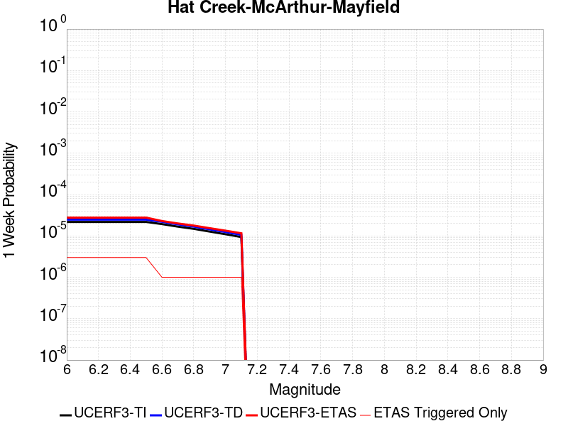 | 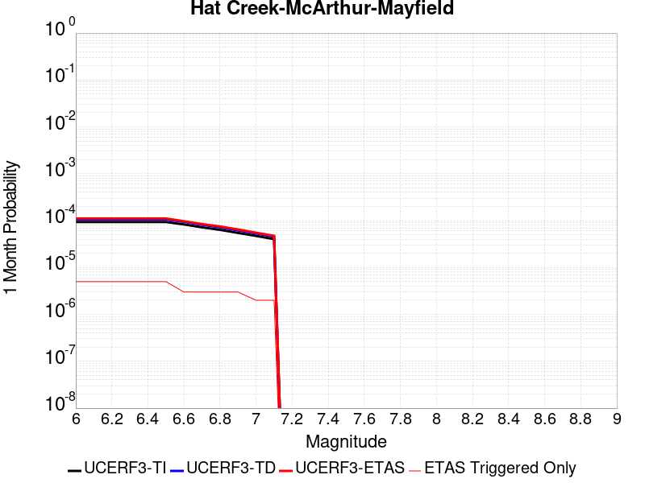 |  |  |

| Magnitude | 1 wk TI Prob | 1 wk TD Prob | 1 wk ETAS Prob | 1 wk ETAS/TD Gain | 1 wk ETAS Triggered Only | 1 mo TI Prob | 1 mo TD Prob | 1 mo ETAS Prob | 1 mo ETAS/TD Gain | 1 mo ETAS Triggered Only | 1 yr TI Prob | 1 yr TD Prob | 1 yr ETAS Prob | 1 yr ETAS/TD Gain | 1 yr ETAS Triggered Only | 10 yr TI Prob | 10 yr TD Prob | 10 yr ETAS Prob | 10 yr ETAS/TD Gain | 10 yr ETAS Triggered Only |
|-----|-----|-----|-----|-----|-----|-----|-----|-----|-----|-----|-----|-----|-----|-----|-----|-----|-----|-----|-----|-----|
| 6.0 | 2.1823456E-5 | 2.4773932E-5 | 3.716397E-5 | 1.5001241 | 1.2390346E-5 | 9.352575E-5 | 1.0617048E-4 | 1.1855951E-4 | 1.1166899 | 1.2390346E-5 | 0.0011380811 | 0.0012920036 | 0.0013043779 | 1.0095776 | 1.2390346E-5 | 0.011322702 | 0.01285923 | 0.01287146 | 1.0009512 | 1.2390346E-5 |
| 6.1 | 2.1823456E-5 | 2.4773932E-5 | 3.716397E-5 | 1.5001241 | 1.2390346E-5 | 9.352575E-5 | 1.0617048E-4 | 1.1855951E-4 | 1.1166899 | 1.2390346E-5 | 0.0011380811 | 0.0012920036 | 0.0013043779 | 1.0095776 | 1.2390346E-5 | 0.011322702 | 0.01285923 | 0.01287146 | 1.0009512 | 1.2390346E-5 |
| 6.2 | 2.1823456E-5 | 2.4773932E-5 | 3.716397E-5 | 1.5001241 | 1.2390346E-5 | 9.352575E-5 | 1.0617048E-4 | 1.1855951E-4 | 1.1166899 | 1.2390346E-5 | 0.0011380811 | 0.0012920036 | 0.0013043779 | 1.0095776 | 1.2390346E-5 | 0.011322702 | 0.01285923 | 0.01287146 | 1.0009512 | 1.2390346E-5 |
| 6.3 | 2.1823456E-5 | 2.4773932E-5 | 3.716397E-5 | 1.5001241 | 1.2390346E-5 | 9.352575E-5 | 1.0617048E-4 | 1.1855951E-4 | 1.1166899 | 1.2390346E-5 | 0.0011380811 | 0.0012920036 | 0.0013043779 | 1.0095776 | 1.2390346E-5 | 0.011322702 | 0.01285923 | 0.01287146 | 1.0009512 | 1.2390346E-5 |
| 6.4 | 2.1823456E-5 | 2.4773932E-5 | 3.716397E-5 | 1.5001241 | 1.2390346E-5 | 9.352575E-5 | 1.0617048E-4 | 1.1855951E-4 | 1.1166899 | 1.2390346E-5 | 0.0011380811 | 0.0012920036 | 0.0013043779 | 1.0095776 | 1.2390346E-5 | 0.011322702 | 0.01285923 | 0.01287146 | 1.0009512 | 1.2390346E-5 |
| 6.5 | 2.1823456E-5 | 2.4773932E-5 | 3.716397E-5 | 1.5001241 | 1.2390346E-5 | 9.352575E-5 | 1.0617048E-4 | 1.1855951E-4 | 1.1166899 | 1.2390346E-5 | 0.0011380811 | 0.0012920036 | 0.0013043779 | 1.0095776 | 1.2390346E-5 | 0.011322702 | 0.01285923 | 0.01287146 | 1.0009512 | 1.2390346E-5 |
| 6.6 | 1.9340694E-5 | 2.1946753E-5 | 3.4336827E-5 | 1.5645516 | 1.2390346E-5 | 8.288605E-5 | 9.405493E-5 | 1.0644411E-4 | 1.1317228 | 1.2390346E-5 | 0.0010086704 | 0.001144661 | 0.0011570371 | 1.010812 | 1.2390346E-5 | 0.010041044 | 0.011401833 | 0.011414083 | 1.0010743 | 1.2390346E-5 |
| 6.7 | 1.6797176E-5 | 1.9037067E-5 | 3.1427175E-5 | 1.6508414 | 1.2390346E-5 | 7.1985916E-5 | 8.1585684E-5 | 9.397502E-5 | 1.1518568 | 1.2390346E-5 | 8.7607605E-4 | 9.929959E-4 | 0.001005374 | 1.0124654 | 1.2390346E-5 | 0.0087263035 | 0.00989965 | 0.009911917 | 1.0012392 | 1.2390346E-5 |
| 6.8 | 1.4852288E-5 | 1.6815693E-5 | 2.920583E-5 | 1.7368199 | 1.2390346E-5 | 6.365111E-5 | 7.206607E-5 | 8.445552E-5 | 1.1719179 | 1.2390346E-5 | 7.7467674E-4 | 8.771936E-4 | 8.895731E-4 | 1.0141126 | 1.2390346E-5 | 0.007719817 | 0.008751296 | 0.008763579 | 1.0014035 | 1.2390346E-5 |
| 6.9 | 1.2757133E-5 | 1.4418652E-5 | 2.6808819E-5 | 1.8593152 | 1.2390346E-5 | 5.467228E-5 | 6.179356E-5 | 7.418314E-5 | 1.2004995 | 1.2390346E-5 | 6.654317E-4 | 7.522186E-4 | 7.645996E-4 | 1.0164593 | 1.2390346E-5 | 0.0066344263 | 0.007510623 | 0.0075229206 | 1.0016373 | 1.2390346E-5 |
| 7.0 | 1.10079245E-5 | 1.2422667E-5 | 2.481286E-5 | 1.9973857 | 1.2390346E-5 | 4.7175967E-5 | 5.3239713E-5 | 6.56294E-5 | 1.2327151 | 1.2390346E-5 | 5.74216E-4 | 6.4814166E-4 | 6.60524E-4 | 1.0191044 | 1.2390346E-5 | 0.005727345 | 0.0064763394 | 0.0064886496 | 1.0019008 | 1.2390346E-5 |
| 7.1 | 9.3994E-6 | 1.059216E-5 | 2.2982375E-5 | 2.1697533 | 1.2390346E-5 | 4.0282524E-5 | 4.5394972E-5 | 5.7784753E-5 | 1.2729329 | 1.2390346E-5 | 4.9032934E-4 | 5.526838E-4 | 5.650673E-4 | 1.0224061 | 1.2390346E-5 | 0.004892489 | 0.005526838 | 0.0055391598 | 1.0022295 | 1.2390346E-5 |

## Great Valley 08 (Quinto)
*[(top)](#table-of-contents)*

| 1 Week | 1 Month | 1 Year | 10 Year |
|-----|-----|-----|-----|
|  |  |  |  |

| Magnitude | 1 wk TI Prob | 1 wk TD Prob | 1 wk ETAS Prob | 1 wk ETAS/TD Gain | 1 wk ETAS Triggered Only | 1 mo TI Prob | 1 mo TD Prob | 1 mo ETAS Prob | 1 mo ETAS/TD Gain | 1 mo ETAS Triggered Only | 1 yr TI Prob | 1 yr TD Prob | 1 yr ETAS Prob | 1 yr ETAS/TD Gain | 1 yr ETAS Triggered Only | 10 yr TI Prob | 10 yr TD Prob | 10 yr ETAS Prob | 10 yr ETAS/TD Gain | 10 yr ETAS Triggered Only |
|-----|-----|-----|-----|-----|-----|-----|-----|-----|-----|-----|-----|-----|-----|-----|-----|-----|-----|-----|-----|-----|
| 6.0 | 2.5524263E-5 | 3.1194424E-5 | 3.1194424E-5 | 1.0 | 0.0 | 1.0938511E-4 | 1.3368827E-4 | 1.3368827E-4 | 1.0 | 0.0 | 0.0013309501 | 0.0016272905 | 0.0016396607 | 1.0076017 | 1.2390346E-5 | 0.013230069 | 0.016236922 | 0.01624911 | 1.0007507 | 1.2390346E-5 |
| 6.1 | 2.5524263E-5 | 3.1194424E-5 | 3.1194424E-5 | 1.0 | 0.0 | 1.0938511E-4 | 1.3368827E-4 | 1.3368827E-4 | 1.0 | 0.0 | 0.0013309501 | 0.0016272905 | 0.0016396607 | 1.0076017 | 1.2390346E-5 | 0.013230069 | 0.016236922 | 0.01624911 | 1.0007507 | 1.2390346E-5 |
| 6.2 | 2.5524263E-5 | 3.1194424E-5 | 3.1194424E-5 | 1.0 | 0.0 | 1.0938511E-4 | 1.3368827E-4 | 1.3368827E-4 | 1.0 | 0.0 | 0.0013309501 | 0.0016272905 | 0.0016396607 | 1.0076017 | 1.2390346E-5 | 0.013230069 | 0.016236922 | 0.01624911 | 1.0007507 | 1.2390346E-5 |
| 6.3 | 2.5524263E-5 | 3.1194424E-5 | 3.1194424E-5 | 1.0 | 0.0 | 1.0938511E-4 | 1.3368827E-4 | 1.3368827E-4 | 1.0 | 0.0 | 0.0013309501 | 0.0016272905 | 0.0016396607 | 1.0076017 | 1.2390346E-5 | 0.013230069 | 0.016236922 | 0.01624911 | 1.0007507 | 1.2390346E-5 |
| 6.4 | 2.5524263E-5 | 3.1194424E-5 | 3.1194424E-5 | 1.0 | 0.0 | 1.0938511E-4 | 1.3368827E-4 | 1.3368827E-4 | 1.0 | 0.0 | 0.0013309501 | 0.0016272905 | 0.0016396607 | 1.0076017 | 1.2390346E-5 | 0.013230069 | 0.016236922 | 0.01624911 | 1.0007507 | 1.2390346E-5 |
| 6.5 | 2.5524263E-5 | 3.1194424E-5 | 3.1194424E-5 | 1.0 | 0.0 | 1.0938511E-4 | 1.3368827E-4 | 1.3368827E-4 | 1.0 | 0.0 | 0.0013309501 | 0.0016272905 | 0.0016396607 | 1.0076017 | 1.2390346E-5 | 0.013230069 | 0.016236922 | 0.01624911 | 1.0007507 | 1.2390346E-5 |
| 6.6 | 2.0986998E-5 | 2.5576908E-5 | 2.5576908E-5 | 1.0 | 0.0 | 8.994117E-5 | 1.0961532E-4 | 1.0961532E-4 | 1.0 | 0.0 | 0.0010944837 | 0.0013345632 | 0.001346937 | 1.0092719 | 1.2390346E-5 | 0.010891088 | 0.013345085 | 0.013357311 | 1.0009161 | 1.2390346E-5 |

## San Andreas (Creeping Section) 2011 CFM
*[(top)](#table-of-contents)*

| 1 Week | 1 Month | 1 Year | 10 Year |
|-----|-----|-----|-----|
|  |  |  |  |

| Magnitude | 1 wk TI Prob | 1 wk TD Prob | 1 wk ETAS Prob | 1 wk ETAS/TD Gain | 1 wk ETAS Triggered Only | 1 mo TI Prob | 1 mo TD Prob | 1 mo ETAS Prob | 1 mo ETAS/TD Gain | 1 mo ETAS Triggered Only | 1 yr TI Prob | 1 yr TD Prob | 1 yr ETAS Prob | 1 yr ETAS/TD Gain | 1 yr ETAS Triggered Only | 10 yr TI Prob | 10 yr TD Prob | 10 yr ETAS Prob | 10 yr ETAS/TD Gain | 10 yr ETAS Triggered Only |
|-----|-----|-----|-----|-----|-----|-----|-----|-----|-----|-----|-----|-----|-----|-----|-----|-----|-----|-----|-----|-----|
| 6.0 | 2.0678692E-4 | 4.6456268E-4 | 4.6456268E-4 | 1.0 | 0.0 | 8.8592863E-4 | 0.0019886654 | 0.0019886654 | 1.0 | 0.0 | 0.010732949 | 0.023858009 | 0.023858009 | 1.0 | 0.0 | 0.10229127 | 0.20777887 | 0.20778869 | 1.0000472 | 1.2390346E-5 |
| 6.1 | 1.5597911E-4 | 3.5018445E-4 | 3.5018445E-4 | 1.0 | 0.0 | 6.683106E-4 | 0.0014995098 | 0.0014995098 | 1.0 | 0.0 | 0.008106367 | 0.018075831 | 0.018075831 | 1.0 | 0.0 | 0.0781696 | 0.16418044 | 0.1641908 | 1.0000631 | 1.2390346E-5 |
| 6.2 | 1.5597911E-4 | 3.5018445E-4 | 3.5018445E-4 | 1.0 | 0.0 | 6.683106E-4 | 0.0014995098 | 0.0014995098 | 1.0 | 0.0 | 0.008106367 | 0.018075831 | 0.018075831 | 1.0 | 0.0 | 0.0781696 | 0.16418044 | 0.1641908 | 1.0000631 | 1.2390346E-5 |
| 6.3 | 1.5597911E-4 | 3.5018445E-4 | 3.5018445E-4 | 1.0 | 0.0 | 6.683106E-4 | 0.0014995098 | 0.0014995098 | 1.0 | 0.0 | 0.008106367 | 0.018075831 | 0.018075831 | 1.0 | 0.0 | 0.0781696 | 0.16418044 | 0.1641908 | 1.0000631 | 1.2390346E-5 |

## Puente Hills
*[(top)](#table-of-contents)*

| 1 Week | 1 Month | 1 Year | 10 Year |
|-----|-----|-----|-----|
|  |  |  |  |

| Magnitude | 1 wk TI Prob | 1 wk TD Prob | 1 wk ETAS Prob | 1 wk ETAS/TD Gain | 1 wk ETAS Triggered Only | 1 mo TI Prob | 1 mo TD Prob | 1 mo ETAS Prob | 1 mo ETAS/TD Gain | 1 mo ETAS Triggered Only | 1 yr TI Prob | 1 yr TD Prob | 1 yr ETAS Prob | 1 yr ETAS/TD Gain | 1 yr ETAS Triggered Only | 10 yr TI Prob | 10 yr TD Prob | 10 yr ETAS Prob | 10 yr ETAS/TD Gain | 10 yr ETAS Triggered Only |
|-----|-----|-----|-----|-----|-----|-----|-----|-----|-----|-----|-----|-----|-----|-----|-----|-----|-----|-----|-----|-----|
| 6.0 | 1.0287503E-5 | 2.7754043E-6 | 1.5165715E-5 | 5.4643264 | 1.2390346E-5 | 4.4088552E-5 | 1.189455E-5 | 2.4284749E-5 | 2.04167 | 1.2390346E-5 | 5.3664594E-4 | 1.4480915E-4 | 1.571977E-4 | 1.0855509 | 1.2390346E-5 | 0.0053535183 | 0.0014474059 | 0.0014597783 | 1.008548 | 1.2390346E-5 |
| 6.1 | 1.0287503E-5 | 2.7754043E-6 | 1.5165715E-5 | 5.4643264 | 1.2390346E-5 | 4.4088552E-5 | 1.189455E-5 | 2.4284749E-5 | 2.04167 | 1.2390346E-5 | 5.3664594E-4 | 1.4480915E-4 | 1.571977E-4 | 1.0855509 | 1.2390346E-5 | 0.0053535183 | 0.0014474059 | 0.0014597783 | 1.008548 | 1.2390346E-5 |
| 6.2 | 1.0287503E-5 | 2.7754043E-6 | 1.5165715E-5 | 5.4643264 | 1.2390346E-5 | 4.4088552E-5 | 1.189455E-5 | 2.4284749E-5 | 2.04167 | 1.2390346E-5 | 5.3664594E-4 | 1.4480915E-4 | 1.571977E-4 | 1.0855509 | 1.2390346E-5 | 0.0053535183 | 0.0014474059 | 0.0014597783 | 1.008548 | 1.2390346E-5 |
| 6.3 | 1.0287503E-5 | 2.7754043E-6 | 1.5165715E-5 | 5.4643264 | 1.2390346E-5 | 4.4088552E-5 | 1.189455E-5 | 2.4284749E-5 | 2.04167 | 1.2390346E-5 | 5.3664594E-4 | 1.4480915E-4 | 1.571977E-4 | 1.0855509 | 1.2390346E-5 | 0.0053535183 | 0.0014474059 | 0.0014597783 | 1.008548 | 1.2390346E-5 |
| 6.4 | 1.0287503E-5 | 2.7754043E-6 | 1.5165715E-5 | 5.4643264 | 1.2390346E-5 | 4.4088552E-5 | 1.189455E-5 | 2.4284749E-5 | 2.04167 | 1.2390346E-5 | 5.3664594E-4 | 1.4480915E-4 | 1.571977E-4 | 1.0855509 | 1.2390346E-5 | 0.0053535183 | 0.0014474059 | 0.0014597783 | 1.008548 | 1.2390346E-5 |
| 6.5 | 1.0287503E-5 | 2.7754043E-6 | 1.5165715E-5 | 5.4643264 | 1.2390346E-5 | 4.4088552E-5 | 1.189455E-5 | 2.4284749E-5 | 2.04167 | 1.2390346E-5 | 5.3664594E-4 | 1.4480915E-4 | 1.571977E-4 | 1.0855509 | 1.2390346E-5 | 0.0053535183 | 0.0014474059 | 0.0014597783 | 1.008548 | 1.2390346E-5 |
| 6.6 | 1.0067095E-5 | 2.542514E-6 | 1.4932828E-5 | 5.873253 | 1.2390346E-5 | 4.314398E-5 | 1.0896458E-5 | 2.3286668E-5 | 2.1370862 | 1.2390346E-5 | 5.251514E-4 | 1.3265885E-4 | 1.4504755E-4 | 1.0933877 | 1.2390346E-5 | 0.0052391207 | 0.0013260479 | 0.0013384218 | 1.0093315 | 1.2390346E-5 |
| 6.7 | 7.591482E-6 | 1.9997742E-6 | 1.4390095E-5 | 7.19586 | 1.2390346E-5 | 3.2534514E-5 | 8.570445E-6 | 2.0960684E-5 | 2.4456937 | 1.2390346E-5 | 3.9603573E-4 | 1.0434237E-4 | 1.1673142E-4 | 1.1187346 | 1.2390346E-5 | 0.003953307 | 0.0010431492 | 0.0010555265 | 1.0118654 | 1.2390346E-5 |
| 6.8 | 7.141342E-6 | 1.7041792E-6 | 1.4094504E-5 | 8.270553 | 1.2390346E-5 | 3.060539E-5 | 7.3036163E-6 | 1.969387E-5 | 2.6964548 | 1.2390346E-5 | 3.7255694E-4 | 8.891999E-5 | 1.0130923E-4 | 1.1393303 | 1.2390346E-5 | 0.0037193296 | 8.8904874E-4 | 9.014281E-4 | 1.0139242 | 1.2390346E-5 |
| 6.9 | 6.066927E-6 | 1.6035817E-6 | 1.39939075E-5 | 8.726657 | 1.2390346E-5 | 2.6000856E-5 | 6.8724867E-6 | 1.9262747E-5 | 2.8028789 | 1.2390346E-5 | 3.1651446E-4 | 8.367139E-5 | 9.606069E-5 | 1.148071 | 1.2390346E-5 | 0.0031606401 | 8.3660224E-4 | 8.489822E-4 | 1.0147979 | 1.2390346E-5 |
| 7.0 | 4.852166E-6 | 1.2478142E-6 | 1.3638144E-5 | 10.929626 | 1.2390346E-5 | 2.0794832E-5 | 5.347775E-6 | 1.7738055E-5 | 3.3169034 | 1.2390346E-5 | 2.5314768E-4 | 6.510917E-5 | 7.7498706E-5 | 1.1902887 | 1.2390346E-5 | 0.0025285948 | 6.510916E-4 | 6.634739E-4 | 1.0190177 | 1.2390346E-5 |

