# Parent Section Magnitude-Probability Distributions

Only fault sections with at least one triggered aftershock are plotted. Sections are sorted by total supraseismogenic trigger rate (decreasing)

## Table Of Contents

* [Tank Canyon](#tank-canyon)
* [Little Lake](#little-lake)
* [Garlock (Central)](#garlock-central)
* [Owl Lake](#owl-lake)
* [Garlock (West)](#garlock-west)
* [Garlock (East)](#garlock-east)
* [Death Valley (So)](#death-valley-so)
* [Panamint Valley](#panamint-valley)
* [San Andreas (Mojave N)](#san-andreas-mojave-n)
* [San Andreas (Big Bend)](#san-andreas-big-bend)
* [San Andreas (Mojave S)](#san-andreas-mojave-s)
* [San Andreas (Carrizo) rev](#san-andreas-carrizo-rev)
* [San Andreas (Parkfield)](#san-andreas-parkfield)
* [San Andreas (Cholame) rev](#san-andreas-cholame-rev)
* [Blackwater](#blackwater)
* [Death Valley (Black Mtns Frontal)](#death-valley-black-mtns-frontal)
* [Hunter Mountain-Saline Valley](#hunter-mountain-saline-valley)
* [San Andreas (San Bernardino N)](#san-andreas-san-bernardino-n)
* [Cucamonga](#cucamonga)
* [Pleito](#pleito)
* [San Cayetano](#san-cayetano)
* [San Andreas (San Bernardino S)](#san-andreas-san-bernardino-s)
* [Death Valley (No)](#death-valley-no)
* [Gravel Hills-Harper Lk](#gravel-hills-harper-lk)
* [Cleghorn](#cleghorn)
* [Pitas Point (Lower West)](#pitas-point-lower-west)
* [Santa Ynez (West)](#santa-ynez-west)
* [Pitas Point (Lower)-Montalvo](#pitas-point-lower-montalvo)
* [Santa Ynez (East)](#santa-ynez-east)
* [San Andreas (San Gorgonio Pass-Garnet HIll)](#san-andreas-san-gorgonio-pass-garnet-hill)
* [Red Mountain](#red-mountain)
* [San Andreas (Coachella) rev](#san-andreas-coachella-rev)
* [San Juan](#san-juan)
* [So Sierra Nevada](#so-sierra-nevada)
* [San Jacinto (San Bernardino)](#san-jacinto-san-bernardino)
* [Oak Ridge (Onshore)](#oak-ridge-onshore)
* [Death Valley (Fish Lake Valley)](#death-valley-fish-lake-valley)
* [Mission Ridge-Arroyo Parida-Santa Ana](#mission-ridge-arroyo-parida-santa-ana)
* [Raymond](#raymond)
* [Lenwood-Lockhart-Old Woman Springs](#lenwood-lockhart-old-woman-springs)
* [Santa Susana alt 1](#santa-susana-alt-1)
* [San Jacinto (Stepovers Combined)](#san-jacinto-stepovers-combined)
* [Ventura-Pitas Point](#ventura-pitas-point)
* [San Jacinto (San Jacinto Valley) rev](#san-jacinto-san-jacinto-valley-rev)
* [Helendale-So Lockhart](#helendale-so-lockhart)
* [Simi-Santa Rosa](#simi-santa-rosa)
* [Channel Islands Thrust](#channel-islands-thrust)
* [Los Alamos 2011 CFM](#los-alamos-2011-cfm)
* [Sierra Madre](#sierra-madre)
* [Elysian Park (Upper)](#elysian-park-upper)
* [Santa Cruz Island](#santa-cruz-island)
* [Verdugo](#verdugo)
* [Clamshell-Sawpit](#clamshell-sawpit)
* [San Jacinto (Anza) rev](#san-jacinto-anza-rev)
* [Great Valley 12](#great-valley-12)
* [San Gregorio (North) 2011 CFM](#san-gregorio-north-2011-cfm)
* [Whittier alt 1](#whittier-alt-1)
* [Pinto Mtn](#pinto-mtn)
* [Chino alt 1](#chino-alt-1)
* [San Jose](#san-jose)
* [Newport-Inglewood (Offshore)](#newport-inglewood-offshore)
* [San Gregorio (South) 2011 CFM](#san-gregorio-south-2011-cfm)
* [Emerson-Copper Mtn 2011](#emerson-copper-mtn-2011)
* [Hayward (No) 2011 CFM](#hayward-no-2011-cfm)
* [Anacapa-Dume alt 1](#anacapa-dume-alt-1)
* [Elsinore (Stepovers Combined)](#elsinore-stepovers-combined)
* [Calaveras (Central) 2011 CFM](#calaveras-central-2011-cfm)
* [San Gabriel](#san-gabriel)
* [Independence rev 2011](#independence-rev-2011)
* [Elsinore (Glen Ivy) rev](#elsinore-glen-ivy-rev)
* [Los Osos 2011](#los-osos-2011)
* [Hayward (So) 2011 CFM](#hayward-so-2011-cfm)
* [Calaveras (So) 2011 CFM](#calaveras-so-2011-cfm)
* [Imperial](#imperial)
* [Concord 2011 CFM](#concord-2011-cfm)
* [Newport-Inglewood alt 1](#newport-inglewood-alt-1)
* [San Jacinto (Clark) rev](#san-jacinto-clark-rev)
* [Great Valley 04a Trout Creek](#great-valley-04a-trout-creek)
* [Great Valley 04b Gordon Valley](#great-valley-04b-gordon-valley)
* [Malibu Coast alt 1](#malibu-coast-alt-1)
* [Great Valley 07 (Orestimba)](#great-valley-07-orestimba)
* [Calaveras (No) 2011 CFM](#calaveras-no-2011-cfm)
* [Green Valley 2011 CFM](#green-valley-2011-cfm)
* [Rose Canyon](#rose-canyon)
* [Mono Lake 2011 CFM](#mono-lake-2011-cfm)
* [Santa Rosa Island](#santa-rosa-island)
* [Great Valley 03 Mysterious Ridge](#great-valley-03-mysterious-ridge)
* [Deep Springs](#deep-springs)
* [Calico-Hidalgo](#calico-hidalgo)
* [North Frontal  (West)](#north-frontal--west)
* [Elsinore (Temecula) rev](#elsinore-temecula-rev)
* [Honey Lake 2011 CFM](#honey-lake-2011-cfm)
* [Robinson Creek](#robinson-creek)
* [Burnt Mtn](#burnt-mtn)
* [San Jacinto (Coyote Creek)](#san-jacinto-coyote-creek)
* [San Luis Range 2011 CFM](#san-luis-range-2011-cfm)
* [Great Valley 09 (Laguna Seca)](#great-valley-09-laguna-seca)
* [Palos Verdes](#palos-verdes)
* [San Jacinto (Borrego)](#san-jacinto-borrego)
* [North Frontal  (East)](#north-frontal--east)
* [Holser alt 1](#holser-alt-1)
* [San Jacinto (Superstition Mtn)](#san-jacinto-superstition-mtn)
* [Great Valley 10 (Panoche)](#great-valley-10-panoche)
* [Hosgri](#hosgri)
* [Rodgers Creek - Healdsburg 2011 CFM](#rodgers-creek---healdsburg-2011-cfm)
* [Great Valley 08 (Quinto)](#great-valley-08-quinto)
* [San Andreas (Creeping Section) 2011 CFM](#san-andreas-creeping-section-2011-cfm)
* [Casmalia 2011 CFM](#casmalia-2011-cfm)
* [Hollywood](#hollywood)

## Tank Canyon
*[(top)](#table-of-contents)*

| 1 Week | 1 Month | 1 Year | 10 Year |
|-----|-----|-----|-----|
|  |  |  |  |

| Magnitude | 1 wk TI Prob | 1 wk TD Prob | 1 wk ETAS Prob | 1 wk ETAS/TD Gain | 1 wk ETAS Triggered Only | 1 mo TI Prob | 1 mo TD Prob | 1 mo ETAS Prob | 1 mo ETAS/TD Gain | 1 mo ETAS Triggered Only | 1 yr TI Prob | 1 yr TD Prob | 1 yr ETAS Prob | 1 yr ETAS/TD Gain | 1 yr ETAS Triggered Only | 10 yr TI Prob | 10 yr TD Prob | 10 yr ETAS Prob | 10 yr ETAS/TD Gain | 10 yr ETAS Triggered Only |
|-----|-----|-----|-----|-----|-----|-----|-----|-----|-----|-----|-----|-----|-----|-----|-----|-----|-----|-----|-----|-----|
| 6.0 | 2.7748038E-5 | 3.5073965E-5 | 0.021601 | 615.86993 | 0.021566683 | 1.18914744E-4 | 1.5031699E-4 | 0.027643228 | 183.89955 | 0.027497044 | 0.0014468255 | 0.0018300817 | 0.043399874 | 23.71472 | 0.041646007 | 0.014374418 | 0.018297758 | 0.073352605 | 4.00883 | 0.056081004 |
| 6.1 | 2.7748038E-5 | 3.5073965E-5 | 0.021601 | 615.86993 | 0.021566683 | 1.18914744E-4 | 1.5031699E-4 | 0.027643228 | 183.89955 | 0.027497044 | 0.0014468255 | 0.0018300817 | 0.043399874 | 23.71472 | 0.041646007 | 0.014374418 | 0.018297758 | 0.073352605 | 4.00883 | 0.056081004 |
| 6.2 | 2.7748038E-5 | 3.5073965E-5 | 0.021601 | 615.86993 | 0.021566683 | 1.18914744E-4 | 1.5031699E-4 | 0.027643228 | 183.89955 | 0.027497044 | 0.0014468255 | 0.0018300817 | 0.043399874 | 23.71472 | 0.041646007 | 0.014374418 | 0.018297758 | 0.073352605 | 4.00883 | 0.056081004 |
| 6.3 | 2.7748038E-5 | 3.5073965E-5 | 0.021601 | 615.86993 | 0.021566683 | 1.18914744E-4 | 1.5031699E-4 | 0.027643228 | 183.89955 | 0.027497044 | 0.0014468255 | 0.0018300817 | 0.043399874 | 23.71472 | 0.041646007 | 0.014374418 | 0.018297758 | 0.073352605 | 4.00883 | 0.056081004 |

## Little Lake
*[(top)](#table-of-contents)*

| 1 Week | 1 Month | 1 Year | 10 Year |
|-----|-----|-----|-----|
|  |  |  |  |

| Magnitude | 1 wk TI Prob | 1 wk TD Prob | 1 wk ETAS Prob | 1 wk ETAS/TD Gain | 1 wk ETAS Triggered Only | 1 mo TI Prob | 1 mo TD Prob | 1 mo ETAS Prob | 1 mo ETAS/TD Gain | 1 mo ETAS Triggered Only | 1 yr TI Prob | 1 yr TD Prob | 1 yr ETAS Prob | 1 yr ETAS/TD Gain | 1 yr ETAS Triggered Only | 10 yr TI Prob | 10 yr TD Prob | 10 yr ETAS Prob | 10 yr ETAS/TD Gain | 10 yr ETAS Triggered Only |
|-----|-----|-----|-----|-----|-----|-----|-----|-----|-----|-----|-----|-----|-----|-----|-----|-----|-----|-----|-----|-----|
| 6.0 | 1.27106505E-5 | 1.3900362E-5 | 0.011569363 | 832.3066 | 0.011555623 | 5.447308E-5 | 5.957219E-5 | 0.014665315 | 246.1772 | 0.014606613 | 6.630079E-4 | 7.25151E-4 | 0.020561257 | 28.35445 | 0.019850502 | 0.006610333 | 0.0072377534 | 0.032264102 | 4.457751 | 0.025208803 |
| 6.1 | 1.27106505E-5 | 1.3900362E-5 | 0.011569363 | 832.3066 | 0.011555623 | 5.447308E-5 | 5.957219E-5 | 0.014665315 | 246.1772 | 0.014606613 | 6.630079E-4 | 7.25151E-4 | 0.020561257 | 28.35445 | 0.019850502 | 0.006610333 | 0.0072377534 | 0.032264102 | 4.457751 | 0.025208803 |
| 6.2 | 1.27106505E-5 | 1.3900362E-5 | 0.011569363 | 832.3066 | 0.011555623 | 5.447308E-5 | 5.957219E-5 | 0.014665315 | 246.1772 | 0.014606613 | 6.630079E-4 | 7.25151E-4 | 0.020561257 | 28.35445 | 0.019850502 | 0.006610333 | 0.0072377534 | 0.032264102 | 4.457751 | 0.025208803 |
| 6.3 | 1.27106505E-5 | 1.3900362E-5 | 0.011569363 | 832.3066 | 0.011555623 | 5.447308E-5 | 5.957219E-5 | 0.014665315 | 246.1772 | 0.014606613 | 6.630079E-4 | 7.25151E-4 | 0.020561257 | 28.35445 | 0.019850502 | 0.006610333 | 0.0072377534 | 0.032264102 | 4.457751 | 0.025208803 |
| 6.4 | 1.27106505E-5 | 1.3900362E-5 | 0.011569363 | 832.3066 | 0.011555623 | 5.447308E-5 | 5.957219E-5 | 0.014665315 | 246.1772 | 0.014606613 | 6.630079E-4 | 7.25151E-4 | 0.020561257 | 28.35445 | 0.019850502 | 0.006610333 | 0.0072377534 | 0.032264102 | 4.457751 | 0.025208803 |
| 6.5 | 1.27106505E-5 | 1.3900362E-5 | 0.011569363 | 832.3066 | 0.011555623 | 5.447308E-5 | 5.957219E-5 | 0.014665315 | 246.1772 | 0.014606613 | 6.630079E-4 | 7.25151E-4 | 0.020561257 | 28.35445 | 0.019850502 | 0.006610333 | 0.0072377534 | 0.032264102 | 4.457751 | 0.025208803 |
| 6.6 | 1.08505255E-5 | 1.1856941E-5 | 0.009965593 | 840.486 | 0.009953854 | 4.6501424E-5 | 5.0815026E-5 | 0.012711778 | 250.15787 | 0.012661607 | 5.6600774E-4 | 6.1859656E-4 | 0.017522058 | 28.325502 | 0.016913924 | 0.005645683 | 0.006178476 | 0.027308695 | 4.419973 | 0.021261584 |
| 6.7 | 7.97625E-6 | 8.706619E-6 | 0.007769594 | 892.3778 | 0.007760955 | 3.4183482E-5 | 3.7314083E-5 | 0.009876389 | 264.68262 | 0.009839442 | 4.161044E-4 | 4.5429895E-4 | 0.013491354 | 29.697084 | 0.013042981 | 0.004153261 | 0.0045429897 | 0.020848576 | 4.589175 | 0.01638 |
| 6.8 | 7.97625E-6 | 8.706619E-6 | 0.007769594 | 892.3778 | 0.007760955 | 3.4183482E-5 | 3.7314083E-5 | 0.009876389 | 264.68262 | 0.009839442 | 4.161044E-4 | 4.5429895E-4 | 0.013491354 | 29.697084 | 0.013042981 | 0.004153261 | 0.0045429897 | 0.020848576 | 4.589175 | 0.01638 |

## Garlock (Central)
*[(top)](#table-of-contents)*

| 1 Week | 1 Month | 1 Year | 10 Year |
|-----|-----|-----|-----|
|  |  |  | 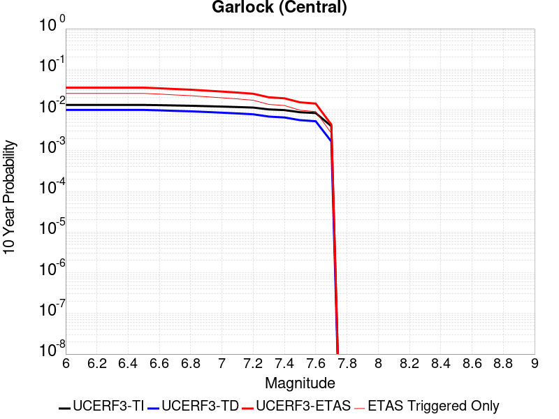 |

| Magnitude | 1 wk TI Prob | 1 wk TD Prob | 1 wk ETAS Prob | 1 wk ETAS/TD Gain | 1 wk ETAS Triggered Only | 1 mo TI Prob | 1 mo TD Prob | 1 mo ETAS Prob | 1 mo ETAS/TD Gain | 1 mo ETAS Triggered Only | 1 yr TI Prob | 1 yr TD Prob | 1 yr ETAS Prob | 1 yr ETAS/TD Gain | 1 yr ETAS Triggered Only | 10 yr TI Prob | 10 yr TD Prob | 10 yr ETAS Prob | 10 yr ETAS/TD Gain | 10 yr ETAS Triggered Only |
|-----|-----|-----|-----|-----|-----|-----|-----|-----|-----|-----|-----|-----|-----|-----|-----|-----|-----|-----|-----|-----|
| 6.0 | 2.575808E-5 | 1.9313613E-5 | 0.01161285 | 601.278 | 0.011593761 | 1.10387096E-4 | 8.277037E-5 | 0.014344966 | 173.31041 | 0.014263377 | 0.0013431342 | 0.0010073289 | 0.020456845 | 20.308012 | 0.019469127 | 0.013350452 | 0.0100695705 | 0.034949023 | 3.470756 | 0.025132528 |
| 6.1 | 2.575808E-5 | 1.9313613E-5 | 0.01161285 | 601.278 | 0.011593761 | 1.10387096E-4 | 8.277037E-5 | 0.014344966 | 173.31041 | 0.014263377 | 0.0013431342 | 0.0010073289 | 0.020456845 | 20.308012 | 0.019469127 | 0.013350452 | 0.0100695705 | 0.034949023 | 3.470756 | 0.025132528 |
| 6.2 | 2.575808E-5 | 1.9313613E-5 | 0.01161285 | 601.278 | 0.011593761 | 1.10387096E-4 | 8.277037E-5 | 0.014344966 | 173.31041 | 0.014263377 | 0.0013431342 | 0.0010073289 | 0.020456845 | 20.308012 | 0.019469127 | 0.013350452 | 0.0100695705 | 0.034949023 | 3.470756 | 0.025132528 |
| 6.3 | 2.575808E-5 | 1.9313613E-5 | 0.01161285 | 601.278 | 0.011593761 | 1.10387096E-4 | 8.277037E-5 | 0.014344966 | 173.31041 | 0.014263377 | 0.0013431342 | 0.0010073289 | 0.020456845 | 20.308012 | 0.019469127 | 0.013350452 | 0.0100695705 | 0.034949023 | 3.470756 | 0.025132528 |
| 6.4 | 2.575808E-5 | 1.9313613E-5 | 0.01161285 | 601.278 | 0.011593761 | 1.10387096E-4 | 8.277037E-5 | 0.014344966 | 173.31041 | 0.014263377 | 0.0013431342 | 0.0010073289 | 0.020456845 | 20.308012 | 0.019469127 | 0.013350452 | 0.0100695705 | 0.034949023 | 3.470756 | 0.025132528 |
| 6.5 | 2.575808E-5 | 1.9313613E-5 | 0.01161285 | 601.278 | 0.011593761 | 1.10387096E-4 | 8.277037E-5 | 0.014344966 | 173.31041 | 0.014263377 | 0.0013431342 | 0.0010073289 | 0.020456845 | 20.308012 | 0.019469127 | 0.013350452 | 0.0100695705 | 0.034949023 | 3.470756 | 0.025132528 |
| 6.6 | 2.540234E-5 | 1.885198E-5 | 0.011154754 | 591.702 | 0.011136113 | 1.0886263E-4 | 8.0792066E-5 | 0.013847271 | 171.39394 | 0.013767591 | 0.0013245966 | 9.83265E-4 | 0.019747451 | 20.083551 | 0.018782655 | 0.013167289 | 0.009831364 | 0.033791624 | 3.4371247 | 0.024198161 |
| 6.7 | 2.4966947E-5 | 1.8286464E-5 | 0.010658419 | 582.85834 | 0.010640327 | 1.06996806E-4 | 7.8368575E-5 | 0.013272865 | 169.36462 | 0.0131955305 | 0.0013019076 | 9.5378514E-4 | 0.018937455 | 19.855053 | 0.01800084 | 0.012943068 | 0.009539624 | 0.03254372 | 3.4114258 | 0.02322566 |
| 6.8 | 2.4548952E-5 | 1.7797542E-5 | 0.010295636 | 578.4864 | 0.010278021 | 1.0520555E-4 | 7.627332E-5 | 0.01283225 | 168.24037 | 0.01275695 | 0.001280125 | 9.282974E-4 | 0.018302795 | 19.71652 | 0.01739064 | 0.012727758 | 0.009286596 | 0.031408664 | 3.38215 | 0.022329431 |
| 6.9 | 2.3994342E-5 | 1.7148153E-5 | 0.009513191 | 554.7647 | 0.0094962055 | 1.0282884E-4 | 7.349039E-5 | 0.011933341 | 162.37962 | 0.011860723 | 0.0012512221 | 8.944436E-4 | 0.017031174 | 19.041082 | 0.016151177 | 0.012442005 | 0.0089510605 | 0.029606575 | 3.3076053 | 0.020842073 |
| 7.0 | 2.343005E-5 | 1.6491087E-5 | 0.008978626 | 544.4532 | 0.008962282 | 1.0041064E-4 | 7.067455E-5 | 0.011263202 | 159.36716 | 0.011193318 | 0.0012218138 | 8.601883E-4 | 0.01606391 | 18.674877 | 0.015216811 | 0.01215118 | 0.008610493 | 0.028063217 | 3.2591884 | 0.019621678 |
| 7.1 | 2.2814058E-5 | 1.5782754E-5 | 0.008367735 | 530.1822 | 0.008352084 | 9.777087E-5 | 6.763899E-5 | 0.01045937 | 154.63521 | 0.010392434 | 0.0011897103 | 8.2325895E-4 | 0.01505584 | 18.288097 | 0.014244308 | 0.011833611 | 0.00824334 | 0.02656858 | 3.2230356 | 0.018477555 |
| 7.2 | 2.2145266E-5 | 1.5027377E-5 | 0.0076805237 | 511.10208 | 0.0076656113 | 9.490483E-5 | 6.440182E-5 | 0.009617198 | 149.33115 | 0.009553411 | 0.0011548538 | 7.8387547E-4 | 0.013911901 | 17.747591 | 0.013138324 | 0.011488707 | 0.007851825 | 0.024841053 | 3.1637297 | 0.017123679 |
| 7.3 | 1.9954436E-5 | 1.3199953E-5 | 0.006229509 | 471.9342 | 0.0062163915 | 8.551621E-5 | 5.657036E-5 | 0.007778951 | 137.50931 | 0.0077228174 | 0.0010406625 | 6.8859005E-4 | 0.011283479 | 16.38635 | 0.010602189 | 0.010358025 | 0.006900618 | 0.02066789 | 2.995078 | 0.013862934 |
| 7.4 | 1.918037E-5 | 1.2553606E-5 | 0.0059047034 | 470.35916 | 0.0058922237 | 8.2198996E-5 | 5.3800417E-5 | 0.0074139168 | 137.80408 | 0.0073605124 | 0.0010003132 | 6.5488677E-4 | 0.010735615 | 16.393085 | 0.010087335 | 0.009958224 | 0.006564366 | 0.019635389 | 2.9912088 | 0.013157393 |
| 7.5 | 1.6994161E-5 | 1.0764553E-5 | 0.0044918573 | 417.28232 | 0.004481141 | 7.283008E-5 | 4.613333E-5 | 0.0057283393 | 124.16922 | 0.0056824684 | 8.863455E-4 | 5.615903E-4 | 0.008337244 | 14.8457775 | 0.007780024 | 0.008828186 | 0.005632708 | 0.015814913 | 2.8076928 | 0.010239884 |
| 7.6 | 1.621788E-5 | 1.012848E-5 | 0.0041861283 | 413.3027 | 0.004176042 | 6.950335E-5 | 4.34074E-5 | 0.0053252038 | 122.67964 | 0.005282026 | 8.458747E-4 | 5.2841863E-4 | 0.0077516316 | 14.669489 | 0.007227032 | 0.0084266225 | 0.005301458 | 0.014785254 | 2.7889037 | 0.009534343 |
| 7.7 | 7.713584E-6 | 3.2171508E-6 | 0.0010901287 | 338.84912 | 0.001086915 | 3.3057797E-5 | 1.378779E-5 | 0.0014439195 | 104.72451 | 0.0014301514 | 4.0240434E-4 | 1.6786634E-4 | 0.0023032005 | 13.720444 | 0.0021356929 | 0.0040167645 | 0.0016902693 | 0.0045457375 | 2.6893568 | 0.0028603028 |

## Owl Lake
*[(top)](#table-of-contents)*

| 1 Week | 1 Month | 1 Year | 10 Year |
|-----|-----|-----|-----|
|  |  |  |  |

| Magnitude | 1 wk TI Prob | 1 wk TD Prob | 1 wk ETAS Prob | 1 wk ETAS/TD Gain | 1 wk ETAS Triggered Only | 1 mo TI Prob | 1 mo TD Prob | 1 mo ETAS Prob | 1 mo ETAS/TD Gain | 1 mo ETAS Triggered Only | 1 yr TI Prob | 1 yr TD Prob | 1 yr ETAS Prob | 1 yr ETAS/TD Gain | 1 yr ETAS Triggered Only | 10 yr TI Prob | 10 yr TD Prob | 10 yr ETAS Prob | 10 yr ETAS/TD Gain | 10 yr ETAS Triggered Only |
|-----|-----|-----|-----|-----|-----|-----|-----|-----|-----|-----|-----|-----|-----|-----|-----|-----|-----|-----|-----|-----|
| 6.0 | 3.637175E-5 | 4.988367E-5 | 0.0044354624 | 88.91612 | 0.004385798 | 1.5586962E-4 | 2.1378716E-4 | 0.006257268 | 29.26868 | 0.0060447734 | 0.0018960608 | 0.0026025574 | 0.012530506 | 4.8146896 | 0.009953854 | 0.018799646 | 0.025995217 | 0.039813522 | 1.531571 | 0.014187102 |
| 6.1 | 3.637175E-5 | 4.988367E-5 | 0.0044354624 | 88.91612 | 0.004385798 | 1.5586962E-4 | 2.1378716E-4 | 0.006257268 | 29.26868 | 0.0060447734 | 0.0018960608 | 0.0026025574 | 0.012530506 | 4.8146896 | 0.009953854 | 0.018799646 | 0.025995217 | 0.039813522 | 1.531571 | 0.014187102 |
| 6.2 | 3.637175E-5 | 4.988367E-5 | 0.0044354624 | 88.91612 | 0.004385798 | 1.5586962E-4 | 2.1378716E-4 | 0.006257268 | 29.26868 | 0.0060447734 | 0.0018960608 | 0.0026025574 | 0.012530506 | 4.8146896 | 0.009953854 | 0.018799646 | 0.025995217 | 0.039813522 | 1.531571 | 0.014187102 |
| 6.3 | 3.637175E-5 | 4.988367E-5 | 0.0044354624 | 88.91612 | 0.004385798 | 1.5586962E-4 | 2.1378716E-4 | 0.006257268 | 29.26868 | 0.0060447734 | 0.0018960608 | 0.0026025574 | 0.012530506 | 4.8146896 | 0.009953854 | 0.018799646 | 0.025995217 | 0.039813522 | 1.531571 | 0.014187102 |
| 6.4 | 3.637175E-5 | 4.988367E-5 | 0.0044354624 | 88.91612 | 0.004385798 | 1.5586962E-4 | 2.1378716E-4 | 0.006257268 | 29.26868 | 0.0060447734 | 0.0018960608 | 0.0026025574 | 0.012530506 | 4.8146896 | 0.009953854 | 0.018799646 | 0.025995217 | 0.039813522 | 1.531571 | 0.014187102 |
| 6.5 | 3.637175E-5 | 4.988367E-5 | 0.0044354624 | 88.91612 | 0.004385798 | 1.5586962E-4 | 2.1378716E-4 | 0.006257268 | 29.26868 | 0.0060447734 | 0.0018960608 | 0.0026025574 | 0.012530506 | 4.8146896 | 0.009953854 | 0.018799646 | 0.025995217 | 0.039813522 | 1.531571 | 0.014187102 |

## Garlock (West)
*[(top)](#table-of-contents)*

| 1 Week | 1 Month | 1 Year | 10 Year |
|-----|-----|-----|-----|
|  |  |  |  |

| Magnitude | 1 wk TI Prob | 1 wk TD Prob | 1 wk ETAS Prob | 1 wk ETAS/TD Gain | 1 wk ETAS Triggered Only | 1 mo TI Prob | 1 mo TD Prob | 1 mo ETAS Prob | 1 mo ETAS/TD Gain | 1 mo ETAS Triggered Only | 1 yr TI Prob | 1 yr TD Prob | 1 yr ETAS Prob | 1 yr ETAS/TD Gain | 1 yr ETAS Triggered Only | 10 yr TI Prob | 10 yr TD Prob | 10 yr ETAS Prob | 10 yr ETAS/TD Gain | 10 yr ETAS Triggered Only |
|-----|-----|-----|-----|-----|-----|-----|-----|-----|-----|-----|-----|-----|-----|-----|-----|-----|-----|-----|-----|-----|
| 6.0 | 2.516656E-5 | 1.8065048E-5 | 0.005223722 | 289.16183 | 0.005205751 | 1.07852225E-4 | 7.741977E-5 | 0.0066365395 | 85.72151 | 0.0065596276 | 0.0013123099 | 9.42255E-4 | 0.010010397 | 10.623872 | 0.009076694 | 0.013045873 | 0.009421492 | 0.021246025 | 2.2550595 | 0.011936997 |
| 6.1 | 2.516656E-5 | 1.8065048E-5 | 0.005223722 | 289.16183 | 0.005205751 | 1.07852225E-4 | 7.741977E-5 | 0.0066365395 | 85.72151 | 0.0065596276 | 0.0013123099 | 9.42255E-4 | 0.010010397 | 10.623872 | 0.009076694 | 0.013045873 | 0.009421492 | 0.021246025 | 2.2550595 | 0.011936997 |
| 6.2 | 2.516656E-5 | 1.8065048E-5 | 0.005223722 | 289.16183 | 0.005205751 | 1.07852225E-4 | 7.741977E-5 | 0.0066365395 | 85.72151 | 0.0065596276 | 0.0013123099 | 9.42255E-4 | 0.010010397 | 10.623872 | 0.009076694 | 0.013045873 | 0.009421492 | 0.021246025 | 2.2550595 | 0.011936997 |
| 6.3 | 2.516656E-5 | 1.8065048E-5 | 0.005223722 | 289.16183 | 0.005205751 | 1.07852225E-4 | 7.741977E-5 | 0.0066365395 | 85.72151 | 0.0065596276 | 0.0013123099 | 9.42255E-4 | 0.010010397 | 10.623872 | 0.009076694 | 0.013045873 | 0.009421492 | 0.021246025 | 2.2550595 | 0.011936997 |
| 6.4 | 2.516656E-5 | 1.8065048E-5 | 0.005223722 | 289.16183 | 0.005205751 | 1.07852225E-4 | 7.741977E-5 | 0.0066365395 | 85.72151 | 0.0065596276 | 0.0013123099 | 9.42255E-4 | 0.010010397 | 10.623872 | 0.009076694 | 0.013045873 | 0.009421492 | 0.021246025 | 2.2550595 | 0.011936997 |
| 6.5 | 2.516656E-5 | 1.8065048E-5 | 0.005223722 | 289.16183 | 0.005205751 | 1.07852225E-4 | 7.741977E-5 | 0.0066365395 | 85.72151 | 0.0065596276 | 0.0013123099 | 9.42255E-4 | 0.010010397 | 10.623872 | 0.009076694 | 0.013045873 | 0.009421492 | 0.021246025 | 2.2550595 | 0.011936997 |
| 6.6 | 2.498869E-5 | 1.7877663E-5 | 0.005223536 | 292.18225 | 0.005205751 | 1.07089996E-4 | 7.6616736E-5 | 0.006635742 | 86.60956 | 0.0065596276 | 0.0013030408 | 9.3248655E-4 | 0.010000717 | 10.724784 | 0.009076694 | 0.012954267 | 0.009324339 | 0.021150032 | 2.2682605 | 0.011936997 |
| 6.7 | 2.4627925E-5 | 1.7497801E-5 | 0.005223158 | 298.50366 | 0.005205751 | 1.0554398E-4 | 7.498886E-5 | 0.0066341246 | 88.46815 | 0.0065596276 | 0.0012842404 | 9.1268384E-4 | 0.009981094 | 10.935982 | 0.009076694 | 0.012768441 | 0.009128104 | 0.020956138 | 2.2957823 | 0.011936997 |
| 6.8 | 2.4270235E-5 | 1.716136E-5 | 0.0052037546 | 303.2251 | 0.0051866826 | 1.04011146E-4 | 7.354704E-5 | 0.006613625 | 89.923744 | 0.006540559 | 0.0012656 | 8.9514436E-4 | 0.009944662 | 11.109563 | 0.009057625 | 0.012584164 | 0.0089538675 | 0.020765085 | 2.319119 | 0.011917928 |
| 6.9 | 2.3913764E-5 | 1.6823105E-5 | 0.00518435 | 308.16843 | 0.0051676137 | 1.0248353E-4 | 7.2097464E-5 | 0.0065931175 | 91.44729 | 0.0065214904 | 0.0012470228 | 8.775101E-4 | 0.009908136 | 11.291192 | 0.009038557 | 0.012400482 | 0.00877859 | 0.020572994 | 2.343542 | 0.011898859 |
| 7.0 | 2.3579369E-5 | 1.6492264E-5 | 0.005145884 | 312.01807 | 0.0051294765 | 1.0105052E-4 | 7.067965E-5 | 0.0065535745 | 92.72223 | 0.006483353 | 0.0012295957 | 8.6026196E-4 | 0.009852938 | 11.453417 | 0.00900042 | 0.012228143 | 0.008607132 | 0.020365767 | 2.3661501 | 0.011860723 |
| 7.1 | 2.3205374E-5 | 1.6105636E-5 | 0.0051454995 | 319.4844 | 0.0051294765 | 9.944781E-5 | 6.902276E-5 | 0.006532861 | 94.64792 | 0.0064642844 | 0.0012101046 | 8.401051E-4 | 0.009794858 | 11.659086 | 0.008962282 | 0.0120353615 | 0.008406721 | 0.020111008 | 2.3922536 | 0.011803516 |
| 7.2 | 2.2799322E-5 | 1.5676578E-5 | 0.0051069357 | 325.7685 | 0.005091339 | 9.770772E-5 | 6.718404E-5 | 0.006473832 | 96.359665 | 0.0064070784 | 0.0011889422 | 8.177357E-4 | 0.00965837 | 11.811115 | 0.00884787 | 0.011826012 | 0.008184515 | 0.019740125 | 2.411887 | 0.0116509665 |
| 7.3 | 1.8228246E-5 | 1.1798695E-5 | 0.004912393 | 416.35056 | 0.004900652 | 7.811871E-5 | 5.0565202E-5 | 0.0061903712 | 122.423546 | 0.0061401166 | 9.506803E-4 | 6.1551924E-4 | 0.009095862 | 14.777541 | 0.008485565 | 0.0094662355 | 0.006171021 | 0.017333167 | 2.8088005 | 0.011231456 |
| 7.4 | 1.7670916E-5 | 1.132978E-5 | 0.004778447 | 421.75992 | 0.0047671716 | 7.5730306E-5 | 4.8555645E-5 | 0.0060167643 | 123.91483 | 0.0059684985 | 9.216264E-4 | 5.9106643E-4 | 0.00882387 | 14.928727 | 0.008237672 | 0.009178135 | 0.0059269792 | 0.016750664 | 2.8261724 | 0.01088822 |
| 7.5 | 1.6994161E-5 | 1.0764553E-5 | 0.0044918573 | 417.28232 | 0.004481141 | 7.283008E-5 | 4.613333E-5 | 0.0057283393 | 124.16922 | 0.0056824684 | 8.863455E-4 | 5.615903E-4 | 0.008337244 | 14.8457775 | 0.007780024 | 0.008828186 | 0.005632708 | 0.015814913 | 2.8076928 | 0.010239884 |
| 7.6 | 1.621788E-5 | 1.012848E-5 | 0.0041861283 | 413.3027 | 0.004176042 | 6.950335E-5 | 4.34074E-5 | 0.0053252038 | 122.67964 | 0.005282026 | 8.458747E-4 | 5.2841863E-4 | 0.0077516316 | 14.669489 | 0.007227032 | 0.0084266225 | 0.005301458 | 0.014785254 | 2.7889037 | 0.009534343 |
| 7.7 | 7.713584E-6 | 3.2171508E-6 | 0.0010901287 | 338.84912 | 0.001086915 | 3.3057797E-5 | 1.378779E-5 | 0.0014439195 | 104.72451 | 0.0014301514 | 4.0240434E-4 | 1.6786634E-4 | 0.0023032005 | 13.720444 | 0.0021356929 | 0.0040167645 | 0.0016902693 | 0.0045457375 | 2.6893568 | 0.0028603028 |

## Garlock (East)
*[(top)](#table-of-contents)*

| 1 Week | 1 Month | 1 Year | 10 Year |
|-----|-----|-----|-----|
| 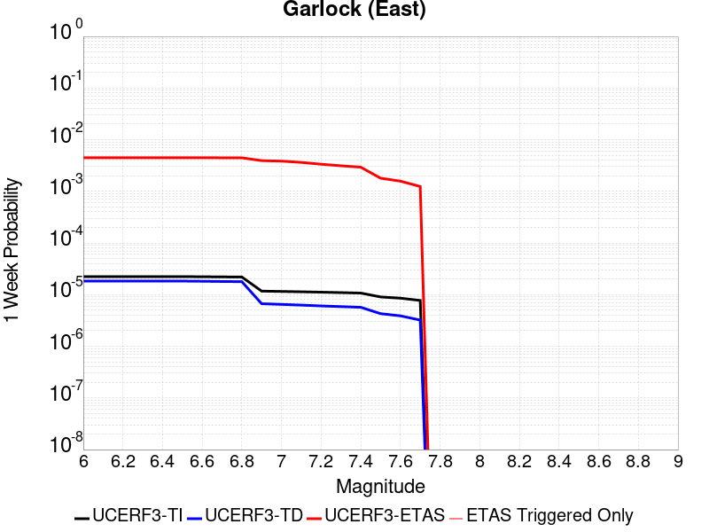 |  |  |  |

| Magnitude | 1 wk TI Prob | 1 wk TD Prob | 1 wk ETAS Prob | 1 wk ETAS/TD Gain | 1 wk ETAS Triggered Only | 1 mo TI Prob | 1 mo TD Prob | 1 mo ETAS Prob | 1 mo ETAS/TD Gain | 1 mo ETAS Triggered Only | 1 yr TI Prob | 1 yr TD Prob | 1 yr ETAS Prob | 1 yr ETAS/TD Gain | 1 yr ETAS Triggered Only | 10 yr TI Prob | 10 yr TD Prob | 10 yr ETAS Prob | 10 yr ETAS/TD Gain | 10 yr ETAS Triggered Only |
|-----|-----|-----|-----|-----|-----|-----|-----|-----|-----|-----|-----|-----|-----|-----|-----|-----|-----|-----|-----|-----|
| 6.0 | 2.2327951E-5 | 1.8303952E-5 | 0.0045947046 | 251.02255 | 0.0045764847 | 9.5687705E-5 | 7.8444085E-5 | 0.0059130043 | 75.37858 | 0.0058350177 | 0.0011643751 | 9.548048E-4 | 0.009394167 | 9.838835 | 0.008447427 | 0.0115829315 | 0.0096519785 | 0.020812798 | 2.1563244 | 0.011269593 |
| 6.1 | 2.2327951E-5 | 1.8303952E-5 | 0.0045947046 | 251.02255 | 0.0045764847 | 9.5687705E-5 | 7.8444085E-5 | 0.0059130043 | 75.37858 | 0.0058350177 | 0.0011643751 | 9.548048E-4 | 0.009394167 | 9.838835 | 0.008447427 | 0.0115829315 | 0.0096519785 | 0.020812798 | 2.1563244 | 0.011269593 |
| 6.2 | 2.2327951E-5 | 1.8303952E-5 | 0.0045947046 | 251.02255 | 0.0045764847 | 9.5687705E-5 | 7.8444085E-5 | 0.0059130043 | 75.37858 | 0.0058350177 | 0.0011643751 | 9.548048E-4 | 0.009394167 | 9.838835 | 0.008447427 | 0.0115829315 | 0.0096519785 | 0.020812798 | 2.1563244 | 0.011269593 |
| 6.3 | 2.2327951E-5 | 1.8303952E-5 | 0.0045947046 | 251.02255 | 0.0045764847 | 9.5687705E-5 | 7.8444085E-5 | 0.0059130043 | 75.37858 | 0.0058350177 | 0.0011643751 | 9.548048E-4 | 0.009394167 | 9.838835 | 0.008447427 | 0.0115829315 | 0.0096519785 | 0.020812798 | 2.1563244 | 0.011269593 |
| 6.4 | 2.2327951E-5 | 1.8303952E-5 | 0.0045947046 | 251.02255 | 0.0045764847 | 9.5687705E-5 | 7.8444085E-5 | 0.0059130043 | 75.37858 | 0.0058350177 | 0.0011643751 | 9.548048E-4 | 0.009394167 | 9.838835 | 0.008447427 | 0.0115829315 | 0.0096519785 | 0.020812798 | 2.1563244 | 0.011269593 |
| 6.5 | 2.2327951E-5 | 1.8303952E-5 | 0.0045947046 | 251.02255 | 0.0045764847 | 9.5687705E-5 | 7.8444085E-5 | 0.0059130043 | 75.37858 | 0.0058350177 | 0.0011643751 | 9.548048E-4 | 0.009394167 | 9.838835 | 0.008447427 | 0.0115829315 | 0.0096519785 | 0.020812798 | 2.1563244 | 0.011269593 |
| 6.6 | 2.222123E-5 | 1.816971E-5 | 0.0045755026 | 251.82034 | 0.004557416 | 9.523036E-5 | 7.7868805E-5 | 0.005893365 | 75.683266 | 0.005815949 | 0.0011588129 | 9.4780687E-4 | 0.009349126 | 9.863957 | 0.008409291 | 0.011527888 | 0.009581773 | 0.02066784 | 2.1569953 | 0.011193318 |
| 6.7 | 2.2076227E-5 | 1.798404E-5 | 0.0045753177 | 254.4099 | 0.004557416 | 9.4608964E-5 | 7.707312E-5 | 0.005892574 | 76.45433 | 0.005815949 | 0.0011512554 | 9.381278E-4 | 0.009339529 | 9.955498 | 0.008409291 | 0.011453095 | 0.009485973 | 0.020554224 | 2.166802 | 0.011174249 |
| 6.8 | 2.1962227E-5 | 1.7854036E-5 | 0.0045751883 | 256.25513 | 0.004557416 | 9.4120434E-5 | 7.651599E-5 | 0.00589202 | 77.00377 | 0.005815949 | 0.0011453138 | 9.313506E-4 | 0.009332809 | 10.020726 | 0.008409291 | 0.01139429 | 0.00941876 | 0.020468874 | 2.1732025 | 0.011155181 |
| 6.9 | 1.1702579E-5 | 6.6732687E-6 | 0.004030139 | 603.9228 | 0.004023493 | 5.0152947E-5 | 2.8599494E-5 | 0.005024452 | 175.68326 | 0.0049959957 | 6.10441E-4 | 3.481581E-4 | 0.0071533085 | 20.54615 | 0.0068075205 | 0.0060876687 | 0.0034954504 | 0.012084369 | 3.4571707 | 0.008619046 |
| 7.0 | 1.153538E-5 | 6.4796777E-6 | 0.003991809 | 616.0506 | 0.003985355 | 4.9436403E-5 | 2.7769835E-5 | 0.004966422 | 178.84235 | 0.0049387896 | 6.01722E-4 | 3.3806017E-4 | 0.007028906 | 20.791878 | 0.0066931085 | 0.006000953 | 0.0033946347 | 0.01183239 | 3.4856153 | 0.008466496 |
| 7.1 | 1.135938E-5 | 6.273818E-6 | 0.003819987 | 608.87756 | 0.003813737 | 4.868215E-5 | 2.6887597E-5 | 0.0047176583 | 175.45851 | 0.0046908967 | 5.925439E-4 | 3.2732222E-4 | 0.006713241 | 20.509579 | 0.0063880095 | 0.0059096646 | 0.0032873498 | 0.011383906 | 3.4629433 | 0.00812326 |
| 7.2 | 1.1168294E-5 | 6.048814E-6 | 0.0033811857 | 558.9832 | 0.0033751572 | 4.786324E-5 | 2.5923315E-5 | 0.0042209253 | 162.82352 | 0.004195111 | 5.825791E-4 | 3.1558552E-4 | 0.0060915737 | 19.30245 | 0.0057778116 | 0.005810542 | 0.0031701238 | 0.010545319 | 3.3264692 | 0.00739865 |
| 7.3 | 1.0952553E-5 | 5.8686815E-6 | 0.003114046 | 530.6211 | 0.0031081957 | 4.693867E-5 | 2.5151334E-5 | 0.003895997 | 154.9022 | 0.003870943 | 5.713284E-4 | 3.0618932E-4 | 0.0056247236 | 18.370083 | 0.0053201634 | 0.0056986175 | 0.0030760262 | 0.009919637 | 3.224822 | 0.0068647265 |
| 7.4 | 1.0735812E-5 | 5.691247E-6 | 0.0029231836 | 513.6279 | 0.0029175088 | 4.6009813E-5 | 2.4390914E-5 | 0.0037045574 | 151.88268 | 0.0036802562 | 5.600255E-4 | 2.9693378E-4 | 0.005348635 | 18.012888 | 0.0050532017 | 0.0055861627 | 0.0029833042 | 0.009466328 | 3.1731014 | 0.0065024216 |
| 7.5 | 9.0273E-6 | 4.284415E-6 | 0.001663253 | 388.21002 | 0.0016589756 | 3.8687853E-5 | 1.8361723E-5 | 0.0021730836 | 118.348564 | 0.0021547615 | 4.709228E-4 | 2.2354414E-4 | 0.0032166585 | 14.389366 | 0.0029937837 | 0.004699261 | 0.0022480614 | 0.0061864057 | 2.7518847 | 0.003947218 |
| 7.6 | 8.549585E-6 | 3.885532E-6 | 0.0014340314 | 369.06952 | 0.0014301514 | 3.6640562E-5 | 1.6652246E-5 | 0.001866284 | 112.074005 | 0.0018496625 | 4.4600753E-4 | 2.027353E-4 | 0.0028146156 | 13.883204 | 0.0026124099 | 0.0044511347 | 0.0020396118 | 0.0054649743 | 2.6794188 | 0.0034323633 |
| 7.7 | 7.713584E-6 | 3.2171508E-6 | 0.0010901287 | 338.84912 | 0.001086915 | 3.3057797E-5 | 1.378779E-5 | 0.0014439195 | 104.72451 | 0.0014301514 | 4.0240434E-4 | 1.6786634E-4 | 0.0023032005 | 13.720444 | 0.0021356929 | 0.0040167645 | 0.0016902693 | 0.0045457375 | 2.6893568 | 0.0028603028 |

## Death Valley (So)
*[(top)](#table-of-contents)*

| 1 Week | 1 Month | 1 Year | 10 Year |
|-----|-----|-----|-----|
|  |  |  |  |

| Magnitude | 1 wk TI Prob | 1 wk TD Prob | 1 wk ETAS Prob | 1 wk ETAS/TD Gain | 1 wk ETAS Triggered Only | 1 mo TI Prob | 1 mo TD Prob | 1 mo ETAS Prob | 1 mo ETAS/TD Gain | 1 mo ETAS Triggered Only | 1 yr TI Prob | 1 yr TD Prob | 1 yr ETAS Prob | 1 yr ETAS/TD Gain | 1 yr ETAS Triggered Only | 10 yr TI Prob | 10 yr TD Prob | 10 yr ETAS Prob | 10 yr ETAS/TD Gain | 10 yr ETAS Triggered Only |
|-----|-----|-----|-----|-----|-----|-----|-----|-----|-----|-----|-----|-----|-----|-----|-----|-----|-----|-----|-----|-----|
| 6.0 | 4.4658216E-5 | 6.228887E-5 | 0.002140646 | 34.366432 | 0.0020784866 | 1.9137832E-4 | 2.669324E-4 | 0.0035268073 | 13.212361 | 0.0032607452 | 0.0023275411 | 0.0032461619 | 0.008682102 | 2.6745749 | 0.005453644 | 0.023033133 | 0.032094594 | 0.040160164 | 1.2513062 | 0.008333015 |
| 6.1 | 4.4658216E-5 | 6.228887E-5 | 0.002140646 | 34.366432 | 0.0020784866 | 1.9137832E-4 | 2.669324E-4 | 0.0035268073 | 13.212361 | 0.0032607452 | 0.0023275411 | 0.0032461619 | 0.008682102 | 2.6745749 | 0.005453644 | 0.023033133 | 0.032094594 | 0.040160164 | 1.2513062 | 0.008333015 |
| 6.2 | 4.4658216E-5 | 6.228887E-5 | 0.002140646 | 34.366432 | 0.0020784866 | 1.9137832E-4 | 2.669324E-4 | 0.0035268073 | 13.212361 | 0.0032607452 | 0.0023275411 | 0.0032461619 | 0.008682102 | 2.6745749 | 0.005453644 | 0.023033133 | 0.032094594 | 0.040160164 | 1.2513062 | 0.008333015 |
| 6.3 | 4.4658216E-5 | 6.228887E-5 | 0.002140646 | 34.366432 | 0.0020784866 | 1.9137832E-4 | 2.669324E-4 | 0.0035268073 | 13.212361 | 0.0032607452 | 0.0023275411 | 0.0032461619 | 0.008682102 | 2.6745749 | 0.005453644 | 0.023033133 | 0.032094594 | 0.040160164 | 1.2513062 | 0.008333015 |
| 6.4 | 4.4658216E-5 | 6.228887E-5 | 0.002140646 | 34.366432 | 0.0020784866 | 1.9137832E-4 | 2.669324E-4 | 0.0035268073 | 13.212361 | 0.0032607452 | 0.0023275411 | 0.0032461619 | 0.008682102 | 2.6745749 | 0.005453644 | 0.023033133 | 0.032094594 | 0.040160164 | 1.2513062 | 0.008333015 |
| 6.5 | 4.4658216E-5 | 6.228887E-5 | 0.002140646 | 34.366432 | 0.0020784866 | 1.9137832E-4 | 2.669324E-4 | 0.0035268073 | 13.212361 | 0.0032607452 | 0.0023275411 | 0.0032461619 | 0.008682102 | 2.6745749 | 0.005453644 | 0.023033133 | 0.032094594 | 0.040160164 | 1.2513062 | 0.008333015 |
| 6.6 | 3.6853275E-5 | 5.1089468E-5 | 0.0018434543 | 36.082863 | 0.0017924564 | 1.5793304E-4 | 2.1894388E-4 | 0.003021427 | 13.800006 | 0.0028030968 | 0.0019211388 | 0.0026635646 | 0.007246877 | 2.720744 | 0.004595553 | 0.019046152 | 0.026430551 | 0.033336617 | 1.261291 | 0.007093551 |
| 6.7 | 2.9971921E-5 | 4.1332314E-5 | 0.0015667641 | 37.906517 | 0.0015254949 | 1.2844476E-4 | 1.7713365E-4 | 0.0025221666 | 14.238777 | 0.0023454484 | 0.0015626932 | 0.0021557007 | 0.005885106 | 2.7300203 | 0.0037374625 | 0.015517498 | 0.021467837 | 0.027084293 | 1.2616218 | 0.0057396744 |
| 6.8 | 2.8134293E-5 | 3.8737995E-5 | 0.0014497661 | 37.424915 | 0.0014110827 | 1.2056997E-4 | 1.6601657E-4 | 0.0023204202 | 13.97704 | 0.0021547615 | 0.0014669509 | 0.0020206098 | 0.0055031283 | 2.7234986 | 0.0034895695 | 0.014573049 | 0.020142367 | 0.025411423 | 1.2615907 | 0.0053773695 |
| 6.9 | 5.6768154E-6 | 7.307913E-6 | 1.0265064E-4 | 14.046505 | 9.534343E-5 | 2.4328981E-5 | 3.1319494E-5 | 1.4572802E-4 | 4.6529493 | 1.1441211E-4 | 2.961651E-4 | 3.8129094E-4 | 5.528437E-4 | 1.449926 | 1.7161817E-4 | 0.0029577068 | 0.003810565 | 0.0040955055 | 1.0747764 | 2.860303E-4 |
| 7.0 | 5.556207E-6 | 7.1531585E-6 | 1.02495906E-4 | 14.328762 | 9.534343E-5 | 2.3812097E-5 | 3.0656276E-5 | 1.4506489E-4 | 4.73198 | 1.1441211E-4 | 2.8987371E-4 | 3.7321905E-4 | 5.447732E-4 | 1.4596606 | 1.7161817E-4 | 0.002894959 | 0.003730121 | 0.0040150844 | 1.0763952 | 2.860303E-4 |
| 7.1 | 5.418659E-6 | 6.9768143E-6 | 1.0231957E-4 | 14.665658 | 9.534343E-5 | 2.3222618E-5 | 2.9900531E-5 | 1.4430922E-4 | 4.8263097 | 1.1441211E-4 | 2.826987E-4 | 3.64021E-4 | 5.3557666E-4 | 1.4712797 | 1.7161817E-4 | 0.0028233933 | 0.003638446 | 0.0039044365 | 1.0731055 | 2.669616E-4 |
| 7.2 | 5.263499E-6 | 6.7766255E-6 | 1.02119404E-4 | 15.06936 | 9.534343E-5 | 2.2557659E-5 | 2.90426E-5 | 1.4345138E-4 | 4.939344 | 1.1441211E-4 | 2.7460488E-4 | 3.5357912E-4 | 5.251366E-4 | 1.4852026 | 1.7161817E-4 | 0.002742658 | 0.003534366 | 0.0037623814 | 1.0645138 | 2.2882422E-4 |
| 7.3 | 5.0913163E-6 | 6.5556187E-6 | 1.0189842E-4 | 15.543677 | 9.534343E-5 | 2.1819744E-5 | 2.8095446E-5 | 1.4250434E-4 | 5.0721507 | 1.1441211E-4 | 2.65623E-4 | 3.420512E-4 | 5.1361066E-4 | 1.5015608 | 1.7161817E-4 | 0.0026530572 | 0.0034194465 | 0.0036474883 | 1.0666897 | 2.2882422E-4 |
| 7.4 | 5.018449E-6 | 6.4618785E-6 | 1.0180469E-4 | 15.754659 | 9.534343E-5 | 2.1507461E-5 | 2.7693712E-5 | 1.4210265E-4 | 5.1312246 | 1.1441211E-4 | 2.6182187E-4 | 3.371616E-4 | 5.087219E-4 | 1.508837 | 1.7161817E-4 | 0.0026151363 | 0.0033706997 | 0.0035987527 | 1.0676575 | 2.2882422E-4 |
| 7.5 | 4.993322E-6 | 6.430145E-6 | 1.0177296E-4 | 15.827476 | 9.534343E-5 | 2.1399776E-5 | 2.7557713E-5 | 1.4196667E-4 | 5.1516128 | 1.1441211E-4 | 2.6051112E-4 | 3.3550634E-4 | 5.070669E-4 | 1.5113482 | 1.7161817E-4 | 0.0026020592 | 0.003354197 | 0.0035822536 | 1.0679915 | 2.2882422E-4 |
| 7.6 | 4.882584E-6 | 6.2884383E-6 | 1.0163127E-4 | 16.161608 | 9.534343E-5 | 2.0925192E-5 | 2.6950413E-5 | 1.4135944E-4 | 5.245168 | 1.1441211E-4 | 2.5473442E-4 | 3.2811466E-4 | 4.996765E-4 | 1.5228716 | 1.7161817E-4 | 0.0025444264 | 0.0032805006 | 0.003508574 | 1.069524 | 2.2882422E-4 |
| 7.7 | 4.8153906E-6 | 6.202069E-6 | 8.247634E-5 | 13.298198 | 7.6274744E-5 | 2.0637224E-5 | 2.6580266E-5 | 1.21921155E-4 | 4.586905 | 9.534343E-5 | 2.5122924E-4 | 3.2360948E-4 | 4.761096E-4 | 1.4712473 | 1.5254949E-4 | 0.002509454 | 0.0032355804 | 0.0034446572 | 1.064618 | 2.0975554E-4 |
| 7.8 | 4.8153906E-6 | 6.202069E-6 | 8.247634E-5 | 13.298198 | 7.6274744E-5 | 2.0637224E-5 | 2.6580266E-5 | 1.21921155E-4 | 4.586905 | 9.534343E-5 | 2.5122924E-4 | 3.2360948E-4 | 4.761096E-4 | 1.4712473 | 1.5254949E-4 | 0.002509454 | 0.0032355804 | 0.0034446572 | 1.064618 | 2.0975554E-4 |

## Panamint Valley
*[(top)](#table-of-contents)*

| 1 Week | 1 Month | 1 Year | 10 Year |
|-----|-----|-----|-----|
|  |  |  |  |

| Magnitude | 1 wk TI Prob | 1 wk TD Prob | 1 wk ETAS Prob | 1 wk ETAS/TD Gain | 1 wk ETAS Triggered Only | 1 mo TI Prob | 1 mo TD Prob | 1 mo ETAS Prob | 1 mo ETAS/TD Gain | 1 mo ETAS Triggered Only | 1 yr TI Prob | 1 yr TD Prob | 1 yr ETAS Prob | 1 yr ETAS/TD Gain | 1 yr ETAS Triggered Only | 10 yr TI Prob | 10 yr TD Prob | 10 yr ETAS Prob | 10 yr ETAS/TD Gain | 10 yr ETAS Triggered Only |
|-----|-----|-----|-----|-----|-----|-----|-----|-----|-----|-----|-----|-----|-----|-----|-----|-----|-----|-----|-----|-----|
| 6.0 | 2.4839064E-5 | 2.5506472E-5 | 0.0022564859 | 88.467186 | 0.002231036 | 1.0644879E-4 | 1.09309134E-4 | 0.0031027654 | 28.385235 | 0.0029937837 | 0.0012952434 | 0.0013300732 | 0.005748124 | 4.32166 | 0.004423935 | 0.0128772 | 0.013225966 | 0.019529488 | 1.4766021 | 0.0063880095 |
| 6.1 | 2.4839064E-5 | 2.5506472E-5 | 0.0022564859 | 88.467186 | 0.002231036 | 1.0644879E-4 | 1.09309134E-4 | 0.0031027654 | 28.385235 | 0.0029937837 | 0.0012952434 | 0.0013300732 | 0.005748124 | 4.32166 | 0.004423935 | 0.0128772 | 0.013225966 | 0.019529488 | 1.4766021 | 0.0063880095 |
| 6.2 | 2.4839064E-5 | 2.5506472E-5 | 0.0022564859 | 88.467186 | 0.002231036 | 1.0644879E-4 | 1.09309134E-4 | 0.0031027654 | 28.385235 | 0.0029937837 | 0.0012952434 | 0.0013300732 | 0.005748124 | 4.32166 | 0.004423935 | 0.0128772 | 0.013225966 | 0.019529488 | 1.4766021 | 0.0063880095 |
| 6.3 | 2.4839064E-5 | 2.5506472E-5 | 0.0022564859 | 88.467186 | 0.002231036 | 1.0644879E-4 | 1.09309134E-4 | 0.0031027654 | 28.385235 | 0.0029937837 | 0.0012952434 | 0.0013300732 | 0.005748124 | 4.32166 | 0.004423935 | 0.0128772 | 0.013225966 | 0.019529488 | 1.4766021 | 0.0063880095 |
| 6.4 | 2.4839064E-5 | 2.5506472E-5 | 0.0022564859 | 88.467186 | 0.002231036 | 1.0644879E-4 | 1.09309134E-4 | 0.0031027654 | 28.385235 | 0.0029937837 | 0.0012952434 | 0.0013300732 | 0.005748124 | 4.32166 | 0.004423935 | 0.0128772 | 0.013225966 | 0.019529488 | 1.4766021 | 0.0063880095 |
| 6.5 | 2.4839064E-5 | 2.5506472E-5 | 0.0022564859 | 88.467186 | 0.002231036 | 1.0644879E-4 | 1.09309134E-4 | 0.0031027654 | 28.385235 | 0.0029937837 | 0.0012952434 | 0.0013300732 | 0.005748124 | 4.32166 | 0.004423935 | 0.0128772 | 0.013225966 | 0.019529488 | 1.4766021 | 0.0063880095 |
| 6.6 | 2.151644E-5 | 2.1799351E-5 | 0.0018142167 | 83.22343 | 0.0017924564 | 9.221006E-5 | 9.34227E-5 | 0.0024577188 | 26.307512 | 0.002364517 | 0.0011220792 | 0.001136874 | 0.0047177114 | 4.149722 | 0.0035849127 | 0.011164304 | 0.0113152405 | 0.016443234 | 1.4531935 | 0.0051866826 |
| 6.7 | 2.0301508E-5 | 2.043303E-5 | 0.0017175113 | 84.05564 | 0.001697113 | 8.7003566E-5 | 8.7567445E-5 | 0.0023374753 | 26.693428 | 0.002250105 | 0.0010587536 | 0.001065658 | 0.0043800734 | 4.110205 | 0.0033179512 | 0.010537235 | 0.01061009 | 0.015345546 | 1.4463165 | 0.00478624 |
| 6.8 | 1.782843E-5 | 1.789433E-5 | 0.0015242936 | 85.183044 | 0.0015064261 | 7.640532E-5 | 7.668799E-5 | 0.0020215448 | 26.360643 | 0.001945006 | 9.298377E-4 | 9.3332166E-4 | 0.0038100057 | 4.0822 | 0.0028793714 | 0.009259567 | 0.009298533 | 0.013435745 | 1.4449316 | 0.004176042 |
| 6.9 | 1.6185495E-5 | 1.6192123E-5 | 0.0012556366 | 77.546135 | 0.0012394645 | 6.936456E-5 | 6.939322E-5 | 0.0016519843 | 23.806133 | 0.0015827009 | 8.4418635E-4 | 8.4458006E-4 | 0.003302363 | 3.910065 | 0.0024598604 | 0.008409866 | 0.008418168 | 0.012029627 | 1.4290076 | 0.003642119 |
| 7.0 | 1.4473978E-5 | 1.4401701E-5 | 0.0010631643 | 73.822136 | 0.0010487777 | 6.202986E-5 | 6.172037E-5 | 0.0014155135 | 22.934301 | 0.0013538767 | 7.5495185E-4 | 7.512313E-4 | 0.0028662654 | 3.8154233 | 0.002116624 | 0.0075239222 | 0.007491346 | 0.010670886 | 1.4244285 | 0.0032035392 |
| 7.1 | 1.29175705E-5 | 1.2765824E-5 | 8.708457E-4 | 68.21696 | 8.580908E-4 | 5.535984E-5 | 5.470978E-5 | 0.0011797007 | 21.562883 | 0.0011250525 | 6.737976E-4 | 6.659326E-4 | 0.0024762515 | 3.7184713 | 0.0018115251 | 0.0067175827 | 0.0066437623 | 0.009447178 | 1.421962 | 0.0028221654 |
| 7.2 | 1.1461888E-5 | 1.1226499E-5 | 7.739654E-4 | 68.94093 | 7.627474E-4 | 4.9121452E-5 | 4.8112932E-5 | 0.0010587047 | 22.004576 | 0.0010106403 | 5.978896E-4 | 5.856619E-4 | 0.0022627234 | 3.8635318 | 0.0016780443 | 0.005962835 | 0.005845547 | 0.008385815 | 1.4345645 | 0.0025552039 |
| 7.3 | 1.011261E-5 | 9.918427E-6 | 6.582473E-4 | 66.3661 | 6.483353E-4 | 4.3339038E-5 | 4.25071E-5 | 9.1962935E-4 | 21.634724 | 8.7715953E-4 | 5.2752503E-4 | 5.1744515E-4 | 0.0019849741 | 3.8361053 | 0.0014682888 | 0.005262745 | 0.005166732 | 0.007367271 | 1.4259053 | 0.0022119675 |
| 7.4 | 4.3367913E-6 | 4.4250473E-6 | 2.5231685E-4 | 57.02015 | 2.4789292E-4 | 1.8586115E-5 | 1.896443E-5 | 3.6219426E-4 | 19.09861 | 3.4323634E-4 | 2.2626246E-4 | 2.3088178E-4 | 7.8374596E-4 | 3.394577 | 5.5299187E-4 | 0.0022603222 | 0.0023078213 | 0.0031639317 | 1.3709605 | 8.580908E-4 |
| 7.5 | 3.7993927E-6 | 3.8762123E-6 | 2.5176816E-4 | 64.95211 | 2.4789292E-4 | 1.628301E-5 | 1.6612312E-5 | 3.5984296E-4 | 21.661219 | 3.4323634E-4 | 1.9822762E-4 | 2.0225039E-4 | 7.360656E-4 | 3.6393778 | 5.339232E-4 | 0.001980509 | 0.002022061 | 0.0028022963 | 1.3858614 | 7.818161E-4 |
| 7.6 | 3.2998898E-6 | 3.365071E-6 | 1.7498266E-4 | 51.999695 | 1.7161817E-4 | 1.4142308E-5 | 1.4421733E-5 | 2.8137947E-4 | 19.510796 | 2.669616E-4 | 1.7216899E-4 | 1.755846E-4 | 5.95022E-4 | 3.3888054 | 4.1951108E-4 | 0.0017203566 | 0.001755846 | 0.0023840077 | 1.3577545 | 6.292666E-4 |

## San Andreas (Mojave N)
*[(top)](#table-of-contents)*

| 1 Week | 1 Month | 1 Year | 10 Year |
|-----|-----|-----|-----|
|  |  |  |  |

| Magnitude | 1 wk TI Prob | 1 wk TD Prob | 1 wk ETAS Prob | 1 wk ETAS/TD Gain | 1 wk ETAS Triggered Only | 1 mo TI Prob | 1 mo TD Prob | 1 mo ETAS Prob | 1 mo ETAS/TD Gain | 1 mo ETAS Triggered Only | 1 yr TI Prob | 1 yr TD Prob | 1 yr ETAS Prob | 1 yr ETAS/TD Gain | 1 yr ETAS Triggered Only | 10 yr TI Prob | 10 yr TD Prob | 10 yr ETAS Prob | 10 yr ETAS/TD Gain | 10 yr ETAS Triggered Only |
|-----|-----|-----|-----|-----|-----|-----|-----|-----|-----|-----|-----|-----|-----|-----|-----|-----|-----|-----|-----|-----|
| 6.0 | 1.0523762E-4 | 4.3662923E-4 | 0.0011418625 | 2.6151767 | 7.0554134E-4 | 4.5094037E-4 | 0.0018700866 | 0.0027646387 | 1.478348 | 8.962282E-4 | 0.005476387 | 0.022559863 | 0.024274604 | 1.0760086 | 0.0017543191 | 0.053433806 | 0.19573303 | 0.19798747 | 1.0115179 | 0.0028030968 |
| 6.1 | 1.0523762E-4 | 4.3662923E-4 | 0.0011418625 | 2.6151767 | 7.0554134E-4 | 4.5094037E-4 | 0.0018700866 | 0.0027646387 | 1.478348 | 8.962282E-4 | 0.005476387 | 0.022559863 | 0.024274604 | 1.0760086 | 0.0017543191 | 0.053433806 | 0.19573303 | 0.19798747 | 1.0115179 | 0.0028030968 |
| 6.2 | 1.0523762E-4 | 4.3662923E-4 | 0.0011418625 | 2.6151767 | 7.0554134E-4 | 4.5094037E-4 | 0.0018700866 | 0.0027646387 | 1.478348 | 8.962282E-4 | 0.005476387 | 0.022559863 | 0.024274604 | 1.0760086 | 0.0017543191 | 0.053433806 | 0.19573303 | 0.19798747 | 1.0115179 | 0.0028030968 |
| 6.3 | 1.0523762E-4 | 4.3662923E-4 | 0.0011418625 | 2.6151767 | 7.0554134E-4 | 4.5094037E-4 | 0.0018700866 | 0.0027646387 | 1.478348 | 8.962282E-4 | 0.005476387 | 0.022559863 | 0.024274604 | 1.0760086 | 0.0017543191 | 0.053433806 | 0.19573303 | 0.19798747 | 1.0115179 | 0.0028030968 |
| 6.4 | 1.0523762E-4 | 4.3662923E-4 | 0.0011418625 | 2.6151767 | 7.0554134E-4 | 4.5094037E-4 | 0.0018700866 | 0.0027646387 | 1.478348 | 8.962282E-4 | 0.005476387 | 0.022559863 | 0.024274604 | 1.0760086 | 0.0017543191 | 0.053433806 | 0.19573303 | 0.19798747 | 1.0115179 | 0.0028030968 |
| 6.5 | 1.0523762E-4 | 4.3662923E-4 | 0.0011418625 | 2.6151767 | 7.0554134E-4 | 4.5094037E-4 | 0.0018700866 | 0.0027646387 | 1.478348 | 8.962282E-4 | 0.005476387 | 0.022559863 | 0.024274604 | 1.0760086 | 0.0017543191 | 0.053433806 | 0.19573303 | 0.19798747 | 1.0115179 | 0.0028030968 |
| 6.6 | 1.05157305E-4 | 4.3648225E-4 | 0.0011417157 | 2.6157207 | 7.0554134E-4 | 4.5059633E-4 | 0.0018694578 | 0.0027640106 | 1.4785092 | 8.962282E-4 | 0.005472219 | 0.022552364 | 0.024267118 | 1.0760344 | 0.0017543191 | 0.053394135 | 0.19567315 | 0.19791242 | 1.011444 | 0.0027840282 |
| 6.7 | 1.0507546E-4 | 4.363306E-4 | 0.0011415641 | 2.6162825 | 7.0554134E-4 | 4.5024566E-4 | 0.0018688086 | 0.002763362 | 1.4786757 | 8.962282E-4 | 0.0054679713 | 0.022544624 | 0.024259394 | 1.0760611 | 0.0017543191 | 0.053353705 | 0.1956114 | 0.19785084 | 1.0114484 | 0.0027840282 |
| 6.8 | 1.0495169E-4 | 4.3606028E-4 | 0.001141294 | 2.617285 | 7.0554134E-4 | 4.4971542E-4 | 0.0018676518 | 0.0027622061 | 1.4789728 | 8.962282E-4 | 0.005461548 | 0.022530831 | 0.024245625 | 1.0761087 | 0.0017543191 | 0.053292558 | 0.19550118 | 0.19774093 | 1.0114565 | 0.0027840282 |
| 6.9 | 1.01919264E-4 | 4.2973462E-4 | 0.0010396703 | 2.419331 | 6.1019795E-4 | 4.367237E-4 | 0.0018405803 | 0.0026019237 | 1.4136432 | 7.627474E-4 | 0.0053041554 | 0.022207966 | 0.023755519 | 1.0696845 | 0.0015827009 | 0.051793266 | 0.19291273 | 0.19499038 | 1.01077 | 0.0025742725 |
| 7.0 | 1.0166431E-4 | 4.2917405E-4 | 0.0010391101 | 2.4211857 | 6.1019795E-4 | 4.356314E-4 | 0.0018381812 | 0.0025995264 | 1.4141841 | 7.627474E-4 | 0.0052909213 | 0.022179354 | 0.023726951 | 1.0697765 | 0.0015827009 | 0.0516671 | 0.19268334 | 0.1947462 | 1.010706 | 0.0025552039 |
| 7.1 | 1.01401034E-4 | 4.2859098E-4 | 0.0010385273 | 2.42312 | 6.1019795E-4 | 4.3450345E-4 | 0.0018356858 | 0.002597033 | 1.4147482 | 7.627474E-4 | 0.005277255 | 0.02214959 | 0.023697237 | 1.0698724 | 0.0015827009 | 0.051536802 | 0.19244485 | 0.19450831 | 1.0107224 | 0.0025552039 |
| 7.2 | 1.0108741E-4 | 4.278926E-4 | 0.0010378294 | 2.4254436 | 6.1019795E-4 | 4.3315982E-4 | 0.001832697 | 0.0025940465 | 1.4154258 | 7.627474E-4 | 0.0052609756 | 0.022113942 | 0.023661643 | 1.0699875 | 0.0015827009 | 0.051381566 | 0.19215985 | 0.19422404 | 1.0107421 | 0.0025552039 |
| 7.3 | 1.00634395E-4 | 4.2664207E-4 | 0.0010365797 | 2.4296236 | 6.1019795E-4 | 4.3121897E-4 | 0.001827345 | 0.0025886986 | 1.4166447 | 7.627474E-4 | 0.0052374597 | 0.022050105 | 0.023597907 | 1.0701947 | 0.0015827009 | 0.051157285 | 0.1916488 | 0.1937143 | 1.0107776 | 0.0025552039 |
| 7.4 | 1.0012071E-4 | 4.2521826E-4 | 0.0010351568 | 2.4344127 | 6.1019795E-4 | 4.290182E-4 | 0.0018212516 | 0.00258261 | 1.4180412 | 7.627474E-4 | 0.0052107936 | 0.021977417 | 0.023525333 | 1.0704322 | 0.0015827009 | 0.050902903 | 0.19106553 | 0.19311711 | 1.0107375 | 0.0025361353 |
| 7.5 | 9.339507E-5 | 4.0500556E-4 | 0.0010149564 | 2.5060306 | 6.1019795E-4 | 4.002032E-4 | 0.0017347414 | 0.0024771302 | 1.4279535 | 7.436787E-4 | 0.0048615932 | 0.020944512 | 0.022456726 | 1.0722009 | 0.0015445636 | 0.047566023 | 0.18278176 | 0.18474525 | 1.0107423 | 0.0024026544 |
| 7.6 | 9.106496E-5 | 3.9784564E-4 | 9.887398E-4 | 2.4852345 | 5.9112924E-4 | 3.9022003E-4 | 0.0017040963 | 0.0024084353 | 1.4133211 | 7.0554134E-4 | 0.0047405837 | 0.020578498 | 0.022053923 | 1.0716975 | 0.0015064261 | 0.046407226 | 0.17986235 | 0.18178594 | 1.0106947 | 0.0023454484 |
| 7.7 | 8.313271E-5 | 3.7445044E-4 | 8.891122E-4 | 2.3744454 | 5.148545E-4 | 3.5623438E-4 | 0.0016039569 | 0.0022322142 | 1.3916922 | 6.292666E-4 | 0.004328531 | 0.019381423 | 0.02069036 | 1.0675356 | 0.001334808 | 0.042451844 | 0.17016967 | 0.1719261 | 1.0103217 | 0.002116624 |
| 7.8 | 5.726896E-5 | 2.6506177E-4 | 6.65398E-4 | 2.510351 | 4.004424E-4 | 2.4541531E-4 | 0.0011355855 | 0.0016117612 | 1.4193219 | 4.7671713E-4 | 0.0029838376 | 0.013756123 | 0.0146964425 | 1.0683564 | 9.5343427E-4 | 0.0294409 | 0.12299887 | 0.12421967 | 1.0099252 | 0.0013920141 |
| 7.9 | 2.148629E-5 | 1.04210856E-4 | 2.5674445E-4 | 2.4637015 | 1.5254949E-4 | 9.208085E-5 | 4.46556E-4 | 6.371577E-4 | 1.426826 | 1.9068686E-4 | 0.0011205077 | 0.005425832 | 0.0057672057 | 1.0629164 | 3.4323634E-4 | 0.011148746 | 0.049493838 | 0.049928833 | 1.008789 | 4.5764845E-4 |
| 8.0 | 6.3800603E-6 | 3.136937E-5 | 8.857363E-5 | 2.8235705 | 5.7206056E-5 | 2.7342829E-5 | 1.3443502E-4 | 1.9163339E-4 | 1.4254723 | 5.7206056E-5 | 3.3284808E-4 | 0.0016358347 | 0.0017310221 | 1.0581889 | 9.534343E-5 | 0.0033234998 | 0.015136539 | 0.015286779 | 1.0099257 | 1.5254949E-4 |
| 8.1 | 2.2240692E-6 | 1.29589735E-5 | 3.2027412E-5 | 2.4714468 | 1.9068686E-5 | 9.531691E-6 | 5.5538447E-5 | 7.4606076E-5 | 1.343323 | 1.9068686E-5 | 1.1604215E-4 | 6.7617896E-4 | 7.1429054E-4 | 1.0563631 | 3.8137372E-5 | 0.0011598158 | 0.0061071273 | 0.006163984 | 1.0093099 | 5.7206056E-5 |

## San Andreas (Big Bend)
*[(top)](#table-of-contents)*

| 1 Week | 1 Month | 1 Year | 10 Year |
|-----|-----|-----|-----|
|  |  |  |  |

| Magnitude | 1 wk TI Prob | 1 wk TD Prob | 1 wk ETAS Prob | 1 wk ETAS/TD Gain | 1 wk ETAS Triggered Only | 1 mo TI Prob | 1 mo TD Prob | 1 mo ETAS Prob | 1 mo ETAS/TD Gain | 1 mo ETAS Triggered Only | 1 yr TI Prob | 1 yr TD Prob | 1 yr ETAS Prob | 1 yr ETAS/TD Gain | 1 yr ETAS Triggered Only | 10 yr TI Prob | 10 yr TD Prob | 10 yr ETAS Prob | 10 yr ETAS/TD Gain | 10 yr ETAS Triggered Only |
|-----|-----|-----|-----|-----|-----|-----|-----|-----|-----|-----|-----|-----|-----|-----|-----|-----|-----|-----|-----|-----|
| 6.0 | 1.0734612E-4 | 4.329521E-4 | 0.0010810067 | 2.4968274 | 6.483353E-4 | 4.5997367E-4 | 0.0018543553 | 0.0026727885 | 1.4413571 | 8.1995345E-4 | 0.005585809 | 0.0223732 | 0.023976415 | 1.0716579 | 0.0016399069 | 0.054474745 | 0.19450675 | 0.1965803 | 1.0106606 | 0.0025742725 |
| 6.1 | 1.0734612E-4 | 4.329521E-4 | 0.0010810067 | 2.4968274 | 6.483353E-4 | 4.5997367E-4 | 0.0018543553 | 0.0026727885 | 1.4413571 | 8.1995345E-4 | 0.005585809 | 0.0223732 | 0.023976415 | 1.0716579 | 0.0016399069 | 0.054474745 | 0.19450675 | 0.1965803 | 1.0106606 | 0.0025742725 |
| 6.2 | 1.0734612E-4 | 4.329521E-4 | 0.0010810067 | 2.4968274 | 6.483353E-4 | 4.5997367E-4 | 0.0018543553 | 0.0026727885 | 1.4413571 | 8.1995345E-4 | 0.005585809 | 0.0223732 | 0.023976415 | 1.0716579 | 0.0016399069 | 0.054474745 | 0.19450675 | 0.1965803 | 1.0106606 | 0.0025742725 |
| 6.3 | 1.0734612E-4 | 4.329521E-4 | 0.0010810067 | 2.4968274 | 6.483353E-4 | 4.5997367E-4 | 0.0018543553 | 0.0026727885 | 1.4413571 | 8.1995345E-4 | 0.005585809 | 0.0223732 | 0.023976415 | 1.0716579 | 0.0016399069 | 0.054474745 | 0.19450675 | 0.1965803 | 1.0106606 | 0.0025742725 |
| 6.4 | 1.0734612E-4 | 4.329521E-4 | 0.0010810067 | 2.4968274 | 6.483353E-4 | 4.5997367E-4 | 0.0018543553 | 0.0026727885 | 1.4413571 | 8.1995345E-4 | 0.005585809 | 0.0223732 | 0.023976415 | 1.0716579 | 0.0016399069 | 0.054474745 | 0.19450675 | 0.1965803 | 1.0106606 | 0.0025742725 |
| 6.5 | 1.0734612E-4 | 4.329521E-4 | 0.0010810067 | 2.4968274 | 6.483353E-4 | 4.5997367E-4 | 0.0018543553 | 0.0026727885 | 1.4413571 | 8.1995345E-4 | 0.005585809 | 0.0223732 | 0.023976415 | 1.0716579 | 0.0016399069 | 0.054474745 | 0.19450675 | 0.1965803 | 1.0106606 | 0.0025742725 |
| 6.6 | 1.0724574E-4 | 4.3276677E-4 | 0.0010808215 | 2.4974687 | 6.483353E-4 | 4.595436E-4 | 0.0018535622 | 0.002671996 | 1.4415463 | 8.1995345E-4 | 0.0055806 | 0.022363741 | 0.023966974 | 1.0716889 | 0.0016399069 | 0.054425213 | 0.19443108 | 0.19650483 | 1.0106658 | 0.0025742725 |
| 6.7 | 1.0708281E-4 | 4.324658E-4 | 0.0010805207 | 2.4985113 | 6.483353E-4 | 4.588456E-4 | 0.0018522742 | 0.0026707088 | 1.441854 | 8.1995345E-4 | 0.005572145 | 0.022348382 | 0.023951638 | 1.0717393 | 0.0016399069 | 0.054344814 | 0.19430833 | 0.1963824 | 1.0106741 | 0.0025742725 |
| 6.8 | 1.0689705E-4 | 4.320727E-4 | 0.0010801279 | 2.4998753 | 6.483353E-4 | 4.580498E-4 | 0.0018505919 | 0.002669028 | 1.4422565 | 8.1995345E-4 | 0.0055625057 | 0.022328319 | 0.02393161 | 1.0718052 | 0.0016399069 | 0.054253142 | 0.19414698 | 0.19622147 | 1.0106851 | 0.0025742725 |
| 6.9 | 1.06647094E-4 | 4.3154295E-4 | 0.0010795984 | 2.5017173 | 6.483353E-4 | 4.5697892E-4 | 0.0018483247 | 0.0026667626 | 1.4427998 | 8.1995345E-4 | 0.0055495338 | 0.022301283 | 0.023904618 | 1.0718943 | 0.0016399069 | 0.054129772 | 0.19392996 | 0.19600499 | 1.0107 | 0.0025742725 |
| 7.0 | 1.0639214E-4 | 4.3100046E-4 | 0.0010790563 | 2.5036082 | 6.483353E-4 | 4.5588662E-4 | 0.001846003 | 0.0026644429 | 1.4433578 | 8.1995345E-4 | 0.005536303 | 0.022273595 | 0.023876976 | 1.0719857 | 0.0016399069 | 0.054003917 | 0.19370714 | 0.19578275 | 1.0107152 | 0.0025742725 |
| 7.1 | 9.878347E-5 | 4.1491815E-4 | 0.0010439237 | 2.515975 | 6.292666E-4 | 4.2328905E-4 | 0.0017771729 | 0.00251953 | 1.4177179 | 7.436787E-4 | 0.005141373 | 0.02145213 | 0.022926241 | 1.0687163 | 0.0015064261 | 0.05024037 | 0.18707013 | 0.18900782 | 1.0103581 | 0.0023835858 |
| 7.2 | 9.8447454E-5 | 4.1419562E-4 | 0.0010432015 | 2.5186205 | 6.292666E-4 | 4.2184943E-4 | 0.0017740804 | 0.0025164399 | 1.4184474 | 7.436787E-4 | 0.0051239277 | 0.021415222 | 0.022889387 | 1.0688373 | 0.0015064261 | 0.05007382 | 0.18677177 | 0.18871015 | 1.0103785 | 0.0023835858 |
| 7.3 | 9.7971046E-5 | 4.1292782E-4 | 0.0010419346 | 2.5232852 | 6.292666E-4 | 4.1980835E-4 | 0.0017686546 | 0.002511018 | 1.4197334 | 7.436787E-4 | 0.0050991946 | 0.021350458 | 0.022824721 | 1.0690507 | 0.0015064261 | 0.049837634 | 0.1862459 | 0.18818556 | 1.0104145 | 0.0023835858 |
| 7.4 | 9.740844E-5 | 4.113638E-4 | 0.0010403716 | 2.529079 | 6.292666E-4 | 4.1739794E-4 | 0.0017619608 | 0.0025043292 | 1.4213308 | 7.436787E-4 | 0.0050699846 | 0.021270558 | 0.02274494 | 1.0693157 | 0.0015064261 | 0.049558636 | 0.18560115 | 0.1875268 | 1.0103753 | 0.002364517 |
| 7.5 | 9.6629556E-5 | 4.0913856E-4 | 0.0010381477 | 2.5373988 | 6.292666E-4 | 4.1406092E-4 | 0.0017524367 | 0.0024948122 | 1.4236248 | 7.436787E-4 | 0.005029545 | 0.021156862 | 0.022612752 | 1.068814 | 0.0014873574 | 0.04917225 | 0.18468793 | 0.18658465 | 1.0102699 | 0.0023263795 |
| 7.6 | 9.57783E-5 | 4.0665545E-4 | 0.0010356662 | 2.5467904 | 6.292666E-4 | 4.1041384E-4 | 0.0017418092 | 0.0024841926 | 1.426214 | 7.436787E-4 | 0.004985346 | 0.021029979 | 0.022486057 | 1.0692382 | 0.0014873574 | 0.048749782 | 0.18367083 | 0.18555437 | 1.0102549 | 0.002307311 |
| 7.7 | 8.018139E-5 | 3.5930445E-4 | 8.7397394E-4 | 2.432405 | 5.148545E-4 | 3.4358926E-4 | 0.0015391231 | 0.0021674212 | 1.4082183 | 6.292666E-4 | 0.004175178 | 0.018605733 | 0.019859564 | 1.0673895 | 0.0012776019 | 0.040976003 | 0.16405721 | 0.16576283 | 1.0103965 | 0.0020403494 |
| 7.8 | 5.450103E-5 | 2.5067478E-4 | 6.510168E-4 | 2.5970573 | 4.004424E-4 | 2.3355494E-4 | 0.0010739786 | 0.0015501837 | 1.4434029 | 4.7671713E-4 | 0.0028398235 | 0.013015171 | 0.013899734 | 1.0679641 | 8.962282E-4 | 0.028038062 | 0.116878085 | 0.11804005 | 1.0099416 | 0.0013157392 |
| 7.9 | 2.0202247E-5 | 9.5990974E-5 | 2.4852582E-4 | 2.589054 | 1.5254949E-4 | 8.6578184E-5 | 4.1133902E-4 | 6.019474E-4 | 1.4633852 | 1.9068686E-4 | 0.0010535796 | 0.004999033 | 0.0053026066 | 1.0607265 | 3.0509898E-4 | 0.010485985 | 0.04582507 | 0.046225358 | 1.0087351 | 4.1951108E-4 |
| 8.0 | 6.3800603E-6 | 3.136937E-5 | 8.857363E-5 | 2.8235705 | 5.7206056E-5 | 2.7342829E-5 | 1.3443502E-4 | 1.9163339E-4 | 1.4254723 | 5.7206056E-5 | 3.3284808E-4 | 0.0016358347 | 0.0017310221 | 1.0581889 | 9.534343E-5 | 0.0033234998 | 0.015136539 | 0.015286779 | 1.0099257 | 1.5254949E-4 |
| 8.1 | 2.2240692E-6 | 1.29589735E-5 | 3.2027412E-5 | 2.4714468 | 1.9068686E-5 | 9.531691E-6 | 5.5538447E-5 | 7.4606076E-5 | 1.343323 | 1.9068686E-5 | 1.1604215E-4 | 6.7617896E-4 | 7.1429054E-4 | 1.0563631 | 3.8137372E-5 | 0.0011598158 | 0.0061071273 | 0.006163984 | 1.0093099 | 5.7206056E-5 |

## San Andreas (Mojave S)
*[(top)](#table-of-contents)*

| 1 Week | 1 Month | 1 Year | 10 Year |
|-----|-----|-----|-----|
|  |  |  |  |

| Magnitude | 1 wk TI Prob | 1 wk TD Prob | 1 wk ETAS Prob | 1 wk ETAS/TD Gain | 1 wk ETAS Triggered Only | 1 mo TI Prob | 1 mo TD Prob | 1 mo ETAS Prob | 1 mo ETAS/TD Gain | 1 mo ETAS Triggered Only | 1 yr TI Prob | 1 yr TD Prob | 1 yr ETAS Prob | 1 yr ETAS/TD Gain | 1 yr ETAS Triggered Only | 10 yr TI Prob | 10 yr TD Prob | 10 yr ETAS Prob | 10 yr ETAS/TD Gain | 10 yr ETAS Triggered Only |
|-----|-----|-----|-----|-----|-----|-----|-----|-----|-----|-----|-----|-----|-----|-----|-----|-----|-----|-----|-----|-----|
| 6.0 | 1.2943693E-4 | 5.2341627E-4 | 0.0011523535 | 2.2016006 | 6.292666E-4 | 5.5461173E-4 | 0.0022414345 | 0.0030024725 | 1.3395315 | 7.627474E-4 | 0.0067315125 | 0.026976345 | 0.028460687 | 1.0550239 | 0.0015254949 | 0.0653122 | 0.22817664 | 0.22995748 | 1.0078046 | 0.002307311 |
| 6.1 | 1.2943693E-4 | 5.2341627E-4 | 0.0011523535 | 2.2016006 | 6.292666E-4 | 5.5461173E-4 | 0.0022414345 | 0.0030024725 | 1.3395315 | 7.627474E-4 | 0.0067315125 | 0.026976345 | 0.028460687 | 1.0550239 | 0.0015254949 | 0.0653122 | 0.22817664 | 0.22995748 | 1.0078046 | 0.002307311 |
| 6.2 | 1.2943693E-4 | 5.2341627E-4 | 0.0011523535 | 2.2016006 | 6.292666E-4 | 5.5461173E-4 | 0.0022414345 | 0.0030024725 | 1.3395315 | 7.627474E-4 | 0.0067315125 | 0.026976345 | 0.028460687 | 1.0550239 | 0.0015254949 | 0.0653122 | 0.22817664 | 0.22995748 | 1.0078046 | 0.002307311 |
| 6.3 | 1.2943693E-4 | 5.2341627E-4 | 0.0011523535 | 2.2016006 | 6.292666E-4 | 5.5461173E-4 | 0.0022414345 | 0.0030024725 | 1.3395315 | 7.627474E-4 | 0.0067315125 | 0.026976345 | 0.028460687 | 1.0550239 | 0.0015254949 | 0.0653122 | 0.22817664 | 0.22995748 | 1.0078046 | 0.002307311 |
| 6.4 | 1.2943693E-4 | 5.2341627E-4 | 0.0011523535 | 2.2016006 | 6.292666E-4 | 5.5461173E-4 | 0.0022414345 | 0.0030024725 | 1.3395315 | 7.627474E-4 | 0.0067315125 | 0.026976345 | 0.028460687 | 1.0550239 | 0.0015254949 | 0.0653122 | 0.22817664 | 0.22995748 | 1.0078046 | 0.002307311 |
| 6.5 | 1.2943693E-4 | 5.2341627E-4 | 0.0011523535 | 2.2016006 | 6.292666E-4 | 5.5461173E-4 | 0.0022414345 | 0.0030024725 | 1.3395315 | 7.627474E-4 | 0.0067315125 | 0.026976345 | 0.028460687 | 1.0550239 | 0.0015254949 | 0.0653122 | 0.22817664 | 0.22995748 | 1.0078046 | 0.002307311 |
| 6.6 | 1.2919602E-4 | 5.22933E-4 | 0.0011518706 | 2.2027113 | 6.292666E-4 | 5.535797E-4 | 0.0022393672 | 0.0030004065 | 1.3398457 | 7.627474E-4 | 0.006719025 | 0.0269518 | 0.028436178 | 1.0550754 | 0.0015254949 | 0.06519468 | 0.2279908 | 0.22977206 | 1.0078129 | 0.002307311 |
| 6.7 | 1.287887E-4 | 5.2211765E-4 | 0.0011510557 | 2.2045908 | 6.292666E-4 | 5.518348E-4 | 0.0022358787 | 0.0029969206 | 1.3403772 | 7.627474E-4 | 0.0066979113 | 0.026910376 | 0.028394818 | 1.0551624 | 0.0015254949 | 0.06499596 | 0.22767708 | 0.22945908 | 1.0078268 | 0.002307311 |
| 6.8 | 1.2835562E-4 | 5.210589E-4 | 0.0011499976 | 2.2070396 | 6.292666E-4 | 5.499795E-4 | 0.002231349 | 0.0029923944 | 1.3410697 | 7.627474E-4 | 0.0066754622 | 0.02685659 | 0.028341115 | 1.055276 | 0.0015254949 | 0.06478462 | 0.22727028 | 0.2290532 | 1.0078449 | 0.002307311 |
| 6.9 | 1.278557E-4 | 5.198382E-4 | 0.0011487777 | 2.2098756 | 6.292666E-4 | 5.4783793E-4 | 0.0022261261 | 0.0029871757 | 1.3418716 | 7.627474E-4 | 0.0066495477 | 0.02679457 | 0.028279189 | 1.0554075 | 0.0015254949 | 0.06454061 | 0.22680105 | 0.22858506 | 1.007866 | 0.002307311 |
| 7.0 | 1.2736667E-4 | 5.1865564E-4 | 0.0011475958 | 2.2126355 | 6.292666E-4 | 5.457429E-4 | 0.0022210667 | 0.00298212 | 1.3426522 | 7.627474E-4 | 0.0066241967 | 0.026734486 | 0.028219197 | 1.0555354 | 0.0015254949 | 0.06430185 | 0.22634536 | 0.22811568 | 1.0078213 | 0.0022882423 |
| 7.1 | 1.2686207E-4 | 5.1743153E-4 | 0.0011463725 | 2.2155058 | 6.292666E-4 | 5.4358126E-4 | 0.0022158294 | 0.0029768867 | 1.3434638 | 7.627474E-4 | 0.006598038 | 0.026672287 | 0.028157093 | 1.0556685 | 0.0015254949 | 0.06405542 | 0.22587313 | 0.22764452 | 1.0078424 | 0.0022882423 |
| 7.2 | 1.2627966E-4 | 5.1603396E-4 | 0.0011449759 | 2.2187994 | 6.292666E-4 | 5.4108625E-4 | 0.0022098501 | 0.002970912 | 1.3443953 | 7.627474E-4 | 0.0065678447 | 0.026601272 | 0.028067624 | 1.0551234 | 0.0015064261 | 0.06377091 | 0.22533216 | 0.22709002 | 1.0078012 | 0.0022691735 |
| 7.3 | 1.1602937E-4 | 4.828936E-4 | 0.0010927969 | 2.263018 | 6.1019795E-4 | 4.971739E-4 | 0.0020680462 | 0.0028101872 | 1.3588609 | 7.436787E-4 | 0.006036306 | 0.024914496 | 0.026309017 | 1.0559722 | 0.0014301514 | 0.05874951 | 0.21248999 | 0.21421692 | 1.0081271 | 0.002192899 |
| 7.4 | 1.1524662E-4 | 4.805332E-4 | 0.0010904379 | 2.269225 | 6.1019795E-4 | 4.938206E-4 | 0.0020579463 | 0.0028000944 | 1.3606257 | 7.436787E-4 | 0.0059957043 | 0.024794336 | 0.026189027 | 1.0562505 | 0.0014301514 | 0.058364958 | 0.21155837 | 0.21327232 | 1.0081015 | 0.00217383 |
| 7.5 | 9.4520525E-5 | 4.1331907E-4 | 0.0010232648 | 2.4757261 | 6.1019795E-4 | 4.0502506E-4 | 0.0017702914 | 0.0024936185 | 1.4085922 | 7.2461006E-4 | 0.0049200356 | 0.021363411 | 0.022707025 | 1.0628933 | 0.0013729454 | 0.048125222 | 0.18482538 | 0.18644199 | 1.0087466 | 0.0019831434 |
| 7.6 | 8.245433E-5 | 3.7524698E-4 | 9.0896984E-4 | 2.4223242 | 5.339232E-4 | 3.5332784E-4 | 0.00160733 | 0.0022355854 | 1.3908688 | 6.292666E-4 | 0.004293284 | 0.019415388 | 0.020668184 | 1.064526 | 0.0012776019 | 0.042112812 | 0.16915758 | 0.17067851 | 1.0089912 | 0.0018305938 |
| 7.7 | 7.414645E-5 | 3.5051344E-4 | 8.2706346E-4 | 2.3595772 | 4.7671713E-4 | 3.1773178E-4 | 0.0015014539 | 0.0020726556 | 1.3804324 | 5.720606E-4 | 0.0038615242 | 0.018148331 | 0.019252965 | 1.060867 | 0.0011250525 | 0.037951093 | 0.15877695 | 0.16014044 | 1.0085875 | 0.0016208383 |
| 7.8 | 6.36853E-5 | 3.084882E-4 | 7.2786986E-4 | 2.359474 | 4.1951108E-4 | 2.7290845E-4 | 0.0013215367 | 0.0018357108 | 1.3890729 | 5.148545E-4 | 0.0033175983 | 0.015991475 | 0.016985955 | 1.062188 | 0.0010106403 | 0.03268505 | 0.14064915 | 0.14192732 | 1.0090876 | 0.0014873574 |
| 7.9 | 2.148629E-5 | 1.04210856E-4 | 2.5674445E-4 | 2.4637015 | 1.5254949E-4 | 9.208085E-5 | 4.46556E-4 | 6.371577E-4 | 1.426826 | 1.9068686E-4 | 0.0011205077 | 0.005425832 | 0.0057672057 | 1.0629164 | 3.4323634E-4 | 0.011148746 | 0.049493838 | 0.049928833 | 1.008789 | 4.5764845E-4 |
| 8.0 | 6.3800603E-6 | 3.136937E-5 | 8.857363E-5 | 2.8235705 | 5.7206056E-5 | 2.7342829E-5 | 1.3443502E-4 | 1.9163339E-4 | 1.4254723 | 5.7206056E-5 | 3.3284808E-4 | 0.0016358347 | 0.0017310221 | 1.0581889 | 9.534343E-5 | 0.0033234998 | 0.015136539 | 0.015286779 | 1.0099257 | 1.5254949E-4 |
| 8.1 | 2.2240692E-6 | 1.29589735E-5 | 3.2027412E-5 | 2.4714468 | 1.9068686E-5 | 9.531691E-6 | 5.5538447E-5 | 7.4606076E-5 | 1.343323 | 1.9068686E-5 | 1.1604215E-4 | 6.7617896E-4 | 7.1429054E-4 | 1.0563631 | 3.8137372E-5 | 0.0011598158 | 0.0061071273 | 0.006163984 | 1.0093099 | 5.7206056E-5 |

## San Andreas (Carrizo) rev
*[(top)](#table-of-contents)*

| 1 Week | 1 Month | 1 Year | 10 Year |
|-----|-----|-----|-----|
|  |  |  |  |

| Magnitude | 1 wk TI Prob | 1 wk TD Prob | 1 wk ETAS Prob | 1 wk ETAS/TD Gain | 1 wk ETAS Triggered Only | 1 mo TI Prob | 1 mo TD Prob | 1 mo ETAS Prob | 1 mo ETAS/TD Gain | 1 mo ETAS Triggered Only | 1 yr TI Prob | 1 yr TD Prob | 1 yr ETAS Prob | 1 yr ETAS/TD Gain | 1 yr ETAS Triggered Only | 10 yr TI Prob | 10 yr TD Prob | 10 yr ETAS Prob | 10 yr ETAS/TD Gain | 10 yr ETAS Triggered Only |
|-----|-----|-----|-----|-----|-----|-----|-----|-----|-----|-----|-----|-----|-----|-----|-----|-----|-----|-----|-----|-----|
| 6.0 | 1.1113902E-4 | 4.4923634E-4 | 0.0010401 | 2.3152623 | 5.9112924E-4 | 4.7622315E-4 | 0.0019240503 | 0.0026282342 | 1.3659904 | 7.0554134E-4 | 0.005782614 | 0.023205092 | 0.024583431 | 1.059398 | 0.0014110827 | 0.05634437 | 0.20058148 | 0.2023955 | 1.0090438 | 0.0022691735 |
| 6.1 | 1.1113902E-4 | 4.4923634E-4 | 0.0010401 | 2.3152623 | 5.9112924E-4 | 4.7622315E-4 | 0.0019240503 | 0.0026282342 | 1.3659904 | 7.0554134E-4 | 0.005782614 | 0.023205092 | 0.024583431 | 1.059398 | 0.0014110827 | 0.05634437 | 0.20058148 | 0.2023955 | 1.0090438 | 0.0022691735 |
| 6.2 | 1.1113902E-4 | 4.4923634E-4 | 0.0010401 | 2.3152623 | 5.9112924E-4 | 4.7622315E-4 | 0.0019240503 | 0.0026282342 | 1.3659904 | 7.0554134E-4 | 0.005782614 | 0.023205092 | 0.024583431 | 1.059398 | 0.0014110827 | 0.05634437 | 0.20058148 | 0.2023955 | 1.0090438 | 0.0022691735 |
| 6.3 | 1.1113902E-4 | 4.4923634E-4 | 0.0010401 | 2.3152623 | 5.9112924E-4 | 4.7622315E-4 | 0.0019240503 | 0.0026282342 | 1.3659904 | 7.0554134E-4 | 0.005782614 | 0.023205092 | 0.024583431 | 1.059398 | 0.0014110827 | 0.05634437 | 0.20058148 | 0.2023955 | 1.0090438 | 0.0022691735 |
| 6.4 | 1.1113902E-4 | 4.4923634E-4 | 0.0010401 | 2.3152623 | 5.9112924E-4 | 4.7622315E-4 | 0.0019240503 | 0.0026282342 | 1.3659904 | 7.0554134E-4 | 0.005782614 | 0.023205092 | 0.024583431 | 1.059398 | 0.0014110827 | 0.05634437 | 0.20058148 | 0.2023955 | 1.0090438 | 0.0022691735 |
| 6.5 | 1.1113902E-4 | 4.4923634E-4 | 0.0010401 | 2.3152623 | 5.9112924E-4 | 4.7622315E-4 | 0.0019240503 | 0.0026282342 | 1.3659904 | 7.0554134E-4 | 0.005782614 | 0.023205092 | 0.024583431 | 1.059398 | 0.0014110827 | 0.05634437 | 0.20058148 | 0.2023955 | 1.0090438 | 0.0022691735 |
| 6.6 | 1.1099849E-4 | 4.4896975E-4 | 0.0010398335 | 2.3160439 | 5.9112924E-4 | 4.7562108E-4 | 0.0019229094 | 0.002627094 | 1.366208 | 7.0554134E-4 | 0.005775322 | 0.023191497 | 0.024569854 | 1.0594337 | 0.0014110827 | 0.056275163 | 0.20047371 | 0.20228797 | 1.0090499 | 0.0022691735 |
| 6.7 | 1.1077418E-4 | 4.4854544E-4 | 0.0010394095 | 2.3172894 | 5.9112924E-4 | 4.7466008E-4 | 0.0019210937 | 0.0026252796 | 1.3665547 | 7.0554134E-4 | 0.0057636844 | 0.023169862 | 0.02454825 | 1.0594906 | 0.0014110827 | 0.056164686 | 0.20030232 | 0.20211698 | 1.0090595 | 0.0022691735 |
| 6.8 | 1.105471E-4 | 4.4803345E-4 | 0.0010388979 | 2.3187952 | 5.9112924E-4 | 4.7368725E-4 | 0.0019189026 | 0.00262309 | 1.3669741 | 7.0554134E-4 | 0.0057519027 | 0.023143753 | 0.024522178 | 1.0595592 | 0.0014110827 | 0.056052838 | 0.20009586 | 0.20191099 | 1.0090712 | 0.0022691735 |
| 6.9 | 1.1025541E-4 | 4.473621E-4 | 0.0010382269 | 2.3207753 | 5.9112924E-4 | 4.7243762E-4 | 0.0019160297 | 0.0026202193 | 1.3675253 | 7.0554134E-4 | 0.0057367687 | 0.023109518 | 0.024487993 | 1.0596496 | 0.0014110827 | 0.055909142 | 0.19982636 | 0.2016421 | 1.0090866 | 0.0022691735 |
| 7.0 | 1.0991533E-4 | 4.4657878E-4 | 0.001037444 | 2.323093 | 5.9112924E-4 | 4.7098065E-4 | 0.0019126774 | 0.0026168693 | 1.3681707 | 7.0554134E-4 | 0.0057191234 | 0.023069572 | 0.0244481 | 1.0597553 | 0.0014110827 | 0.055741582 | 0.19951206 | 0.2013285 | 1.0091045 | 0.0022691735 |
| 7.1 | 1.09542365E-4 | 4.457076E-4 | 0.0010365734 | 2.3256803 | 5.9112924E-4 | 4.693828E-4 | 0.0019089493 | 0.002613144 | 1.3688911 | 7.0554134E-4 | 0.0056997715 | 0.023025142 | 0.024403736 | 1.0598733 | 0.0014110827 | 0.05555778 | 0.19916314 | 0.20098038 | 1.0091244 | 0.0022691735 |
| 7.2 | 1.05608764E-4 | 4.3706578E-4 | 0.0010279367 | 2.3519037 | 5.9112924E-4 | 4.5253045E-4 | 0.0018719663 | 0.0025761868 | 1.376193 | 7.0554134E-4 | 0.005495649 | 0.022584237 | 0.023944812 | 1.0602446 | 0.0013920141 | 0.053617116 | 0.19563848 | 0.19743304 | 1.0091728 | 0.002231036 |
| 7.3 | 1.0511766E-4 | 4.3558737E-4 | 0.0010264592 | 2.3564942 | 5.9112924E-4 | 4.5042645E-4 | 0.0018656392 | 0.0025698643 | 1.3774712 | 7.0554134E-4 | 0.0054701613 | 0.0225088 | 0.023869481 | 1.060451 | 0.0013920141 | 0.053374548 | 0.195048 | 0.19684389 | 1.0092074 | 0.002231036 |
| 7.4 | 1.04579514E-4 | 4.3395188E-4 | 0.0010248246 | 2.361609 | 5.9112924E-4 | 4.481209E-4 | 0.00185864 | 0.00256287 | 1.3788953 | 7.0554134E-4 | 0.005442232 | 0.022425342 | 0.02378614 | 1.0606812 | 0.0013920141 | 0.053108674 | 0.19439563 | 0.19619296 | 1.0092458 | 0.002231036 |
| 7.5 | 8.967509E-5 | 3.841574E-4 | 9.750596E-4 | 2.5381773 | 5.9112924E-4 | 3.842652E-4 | 0.0016455129 | 0.0023498933 | 1.4280614 | 7.0554134E-4 | 0.004668397 | 0.019879378 | 0.02122503 | 1.0676908 | 0.0013729454 | 0.045715354 | 0.17451581 | 0.17631027 | 1.0102825 | 0.00217383 |
| 7.6 | 8.902246E-5 | 3.822647E-4 | 9.7316795E-4 | 2.5457962 | 5.9112924E-4 | 3.8146903E-4 | 0.0016374114 | 0.0023417976 | 1.4301827 | 7.0554134E-4 | 0.004634499 | 0.019782541 | 0.021128325 | 1.0680289 | 0.0013729454 | 0.0453903 | 0.17373076 | 0.17551117 | 1.0102481 | 0.0021547615 |
| 7.7 | 7.776459E-5 | 3.4746045E-4 | 8.621361E-4 | 2.4812496 | 5.148545E-4 | 3.3323426E-4 | 0.0014884217 | 0.0021167516 | 1.4221451 | 6.292666E-4 | 0.0040495815 | 0.017998766 | 0.019253373 | 1.0697051 | 0.0012776019 | 0.039765768 | 0.15920663 | 0.16092214 | 1.0107753 | 0.0020403494 |
| 7.8 | 5.2312953E-5 | 2.3975673E-4 | 6.401031E-4 | 2.6698024 | 4.004424E-4 | 2.2417911E-4 | 0.0010272242 | 0.0015034517 | 1.4636061 | 4.7671713E-4 | 0.0027259644 | 0.012452538 | 0.013337607 | 1.0710753 | 8.962282E-4 | 0.026927674 | 0.112169944 | 0.1133381 | 1.0104141 | 0.0013157392 |
| 7.9 | 1.9307261E-5 | 9.060563E-5 | 2.431413E-4 | 2.683512 | 1.5254949E-4 | 8.274278E-5 | 3.8826585E-4 | 5.788787E-4 | 1.4909338 | 1.9068686E-4 | 0.0010069277 | 0.0047193347 | 0.0050229933 | 1.0643436 | 3.0509898E-4 | 0.010023774 | 0.04339103 | 0.04379234 | 1.0092486 | 4.1951108E-4 |
| 8.0 | 6.3800603E-6 | 3.136937E-5 | 8.857363E-5 | 2.8235705 | 5.7206056E-5 | 2.7342829E-5 | 1.3443502E-4 | 1.9163339E-4 | 1.4254723 | 5.7206056E-5 | 3.3284808E-4 | 0.0016358347 | 0.0017310221 | 1.0581889 | 9.534343E-5 | 0.0033234998 | 0.015136539 | 0.015286779 | 1.0099257 | 1.5254949E-4 |
| 8.1 | 2.2240692E-6 | 1.29589735E-5 | 3.2027412E-5 | 2.4714468 | 1.9068686E-5 | 9.531691E-6 | 5.5538447E-5 | 7.4606076E-5 | 1.343323 | 1.9068686E-5 | 1.1604215E-4 | 6.7617896E-4 | 7.1429054E-4 | 1.0563631 | 3.8137372E-5 | 0.0011598158 | 0.0061071273 | 0.006163984 | 1.0093099 | 5.7206056E-5 |

## San Andreas (Parkfield)
*[(top)](#table-of-contents)*

| 1 Week | 1 Month | 1 Year | 10 Year |
|-----|-----|-----|-----|
|  |  |  |  |

| Magnitude | 1 wk TI Prob | 1 wk TD Prob | 1 wk ETAS Prob | 1 wk ETAS/TD Gain | 1 wk ETAS Triggered Only | 1 mo TI Prob | 1 mo TD Prob | 1 mo ETAS Prob | 1 mo ETAS/TD Gain | 1 mo ETAS Triggered Only | 1 yr TI Prob | 1 yr TD Prob | 1 yr ETAS Prob | 1 yr ETAS/TD Gain | 1 yr ETAS Triggered Only | 10 yr TI Prob | 10 yr TD Prob | 10 yr ETAS Prob | 10 yr ETAS/TD Gain | 10 yr ETAS Triggered Only |
|-----|-----|-----|-----|-----|-----|-----|-----|-----|-----|-----|-----|-----|-----|-----|-----|-----|-----|-----|-----|-----|
| 6.0 | 7.723521E-4 | 0.0013466828 | 0.001860844 | 1.3817983 | 5.148545E-4 | 0.0033058827 | 0.0057641217 | 0.0063708024 | 1.1052512 | 6.1019795E-4 | 0.03951393 | 0.06891971 | 0.07002049 | 1.0159719 | 0.0011822585 | 0.3317935 | 0.5395069 | 0.54046404 | 1.0017741 | 0.0020784866 |
| 6.1 | 1.4269065E-4 | 5.017429E-4 | 9.210435E-4 | 1.8356881 | 4.1951108E-4 | 6.11388E-4 | 0.002148918 | 0.0026626664 | 1.2390729 | 5.148545E-4 | 0.007418273 | 0.02591448 | 0.026861783 | 1.0365549 | 9.72503E-4 | 0.0717547 | 0.22093078 | 0.22228266 | 1.006119 | 0.0017352503 |
| 6.2 | 1.4269065E-4 | 5.017429E-4 | 9.210435E-4 | 1.8356881 | 4.1951108E-4 | 6.11388E-4 | 0.002148918 | 0.0026626664 | 1.2390729 | 5.148545E-4 | 0.007418273 | 0.02591448 | 0.026861783 | 1.0365549 | 9.72503E-4 | 0.0717547 | 0.22093078 | 0.22228266 | 1.006119 | 0.0017352503 |
| 6.3 | 1.4269065E-4 | 5.017429E-4 | 9.210435E-4 | 1.8356881 | 4.1951108E-4 | 6.11388E-4 | 0.002148918 | 0.0026626664 | 1.2390729 | 5.148545E-4 | 0.007418273 | 0.02591448 | 0.026861783 | 1.0365549 | 9.72503E-4 | 0.0717547 | 0.22093078 | 0.22228266 | 1.006119 | 0.0017352503 |
| 6.4 | 1.4269065E-4 | 5.017429E-4 | 9.210435E-4 | 1.8356881 | 4.1951108E-4 | 6.11388E-4 | 0.002148918 | 0.0026626664 | 1.2390729 | 5.148545E-4 | 0.007418273 | 0.02591448 | 0.026861783 | 1.0365549 | 9.72503E-4 | 0.0717547 | 0.22093078 | 0.22228266 | 1.006119 | 0.0017352503 |
| 6.5 | 1.4269065E-4 | 5.017429E-4 | 9.210435E-4 | 1.8356881 | 4.1951108E-4 | 6.11388E-4 | 0.002148918 | 0.0026626664 | 1.2390729 | 5.148545E-4 | 0.007418273 | 0.02591448 | 0.026861783 | 1.0365549 | 9.72503E-4 | 0.0717547 | 0.22093078 | 0.22228266 | 1.006119 | 0.0017352503 |
| 6.6 | 1.4257019E-4 | 5.015525E-4 | 9.2085317E-4 | 1.8360056 | 4.1951108E-4 | 6.10872E-4 | 0.0021481037 | 0.0026618522 | 1.2391638 | 5.148545E-4 | 0.0074120336 | 0.025904845 | 0.026852155 | 1.0365689 | 9.72503E-4 | 0.07169635 | 0.22085924 | 0.22221124 | 1.0061215 | 0.0017352503 |
| 6.7 | 1.4246788E-4 | 5.013712E-4 | 9.2067197E-4 | 1.8363079 | 4.1951108E-4 | 6.1043375E-4 | 0.002147328 | 0.0026610768 | 1.2392503 | 5.148545E-4 | 0.007406734 | 0.025895536 | 0.026842857 | 1.0365824 | 9.72503E-4 | 0.07164679 | 0.22079132 | 0.22214344 | 1.006124 | 0.0017352503 |
| 6.8 | 1.4238524E-4 | 5.0115754E-4 | 9.204584E-4 | 1.8366647 | 4.1951108E-4 | 6.1007973E-4 | 0.0021464138 | 0.0026601632 | 1.2393525 | 5.148545E-4 | 0.007402453 | 0.025884695 | 0.026832025 | 1.0365981 | 9.72503E-4 | 0.07160675 | 0.22071254 | 0.22206481 | 1.0061268 | 0.0017352503 |
| 6.9 | 1.4226006E-4 | 5.008332E-4 | 9.201342E-4 | 1.8372068 | 4.1951108E-4 | 6.095435E-4 | 0.0021450259 | 0.002658776 | 1.2395077 | 5.148545E-4 | 0.007395969 | 0.025868258 | 0.026815604 | 1.0366219 | 9.72503E-4 | 0.0715461 | 0.22059278 | 0.22194524 | 1.006131 | 0.0017352503 |
| 7.0 | 1.421111E-4 | 5.0044054E-4 | 9.197417E-4 | 1.837864 | 4.1951108E-4 | 6.089054E-4 | 0.002143346 | 0.0026570968 | 1.2396958 | 5.148545E-4 | 0.0073882528 | 0.025848212 | 0.026795577 | 1.0366511 | 9.72503E-4 | 0.07147392 | 0.22044773 | 0.22180045 | 1.0061362 | 0.0017352503 |
| 7.1 | 7.911531E-5 | 3.2991724E-4 | 7.302275E-4 | 2.2133658 | 4.004424E-4 | 3.3902156E-4 | 0.0014133246 | 0.0019084096 | 1.3502983 | 4.9578585E-4 | 0.0041197776 | 0.017099971 | 0.01801836 | 1.053707 | 9.343656E-4 | 0.04044234 | 0.15168123 | 0.15305622 | 1.009065 | 0.0016208383 |
| 7.2 | 7.90033E-5 | 3.296154E-4 | 7.299258E-4 | 2.2144773 | 4.004424E-4 | 3.3854163E-4 | 0.0014120324 | 0.0019071181 | 1.3506192 | 4.9578585E-4 | 0.004113957 | 0.017084487 | 0.01800289 | 1.0537565 | 9.343656E-4 | 0.040386252 | 0.15155983 | 0.15293501 | 1.0090735 | 0.0016208383 |
| 7.3 | 7.893314E-5 | 3.2935737E-4 | 7.296679E-4 | 2.215429 | 4.004424E-4 | 3.3824102E-4 | 0.0014109277 | 0.001906014 | 1.3508942 | 4.9578585E-4 | 0.0041103107 | 0.017071247 | 0.017989663 | 1.0537989 | 9.343656E-4 | 0.04035112 | 0.15145631 | 0.15283167 | 1.0090809 | 0.0016208383 |
| 7.4 | 7.878637E-5 | 3.2884022E-4 | 7.2915095E-4 | 2.2173412 | 4.004424E-4 | 3.3761217E-4 | 0.0014087138 | 0.0019038011 | 1.3514464 | 4.9578585E-4 | 0.004102683 | 0.017044716 | 0.017963154 | 1.0538841 | 9.343656E-4 | 0.04027762 | 0.15124616 | 0.15262187 | 1.0090957 | 0.0016208383 |
| 7.5 | 6.8967216E-5 | 2.9620552E-4 | 6.965293E-4 | 2.351507 | 4.004424E-4 | 2.9554032E-4 | 0.001268987 | 0.0017641437 | 1.3901983 | 4.9578585E-4 | 0.0035922674 | 0.015367592 | 0.016287599 | 1.0598667 | 9.343656E-4 | 0.035347503 | 0.13755313 | 0.138951 | 1.0101625 | 0.0016208383 |
| 7.6 | 6.8796966E-5 | 2.9566285E-4 | 6.9598685E-4 | 2.3539882 | 4.004424E-4 | 2.948108E-4 | 0.0012666635 | 0.0017618213 | 1.390915 | 4.9578585E-4 | 0.003583415 | 0.015339702 | 0.016259735 | 1.0599772 | 9.343656E-4 | 0.0352618 | 0.13732228 | 0.13872053 | 1.0101824 | 0.0016208383 |
| 7.7 | 5.8142083E-5 | 2.6259638E-4 | 6.0574256E-4 | 2.3067439 | 3.4323634E-4 | 2.4915655E-4 | 0.0011250726 | 0.0015631589 | 1.389385 | 4.3857977E-4 | 0.0030292615 | 0.0136374645 | 0.014483853 | 1.0620635 | 8.580908E-4 | 0.029882994 | 0.122926764 | 0.12426473 | 1.0108843 | 0.0015254949 |
| 7.8 | 3.7720634E-5 | 1.7457761E-4 | 4.2242723E-4 | 2.4197104 | 2.4789292E-4 | 1.6164983E-4 | 7.480669E-4 | 0.0010529376 | 1.4075447 | 3.0509898E-4 | 0.0019663102 | 0.009085932 | 0.009633899 | 1.0603094 | 5.5299187E-4 | 0.019490024 | 0.08308776 | 0.08390952 | 1.0098903 | 8.962282E-4 |
| 7.9 | 1.41195915E-5 | 6.798084E-5 | 1.442504E-4 | 2.1219273 | 7.6274744E-5 | 6.051113E-5 | 2.9132722E-4 | 4.05706E-4 | 1.3926127 | 1.1441211E-4 | 7.36474E-4 | 0.0035434929 | 0.0037145028 | 1.0482603 | 1.7161817E-4 | 0.00734038 | 0.03258086 | 0.03285757 | 1.0084931 | 2.860303E-4 |
| 8.0 | 5.0866283E-6 | 2.564328E-5 | 8.2847866E-5 | 3.2307827 | 5.7206056E-5 | 2.1799653E-5 | 1.09896864E-4 | 1.6709663E-4 | 1.5204859 | 5.7206056E-5 | 2.6537845E-4 | 0.0013374792 | 0.0014326952 | 1.0711906 | 9.534343E-5 | 0.0026506176 | 0.012337761 | 0.0124884285 | 1.0122119 | 1.5254949E-4 |
| 8.1 | 2.2154293E-6 | 1.2907957E-5 | 3.1976397E-5 | 2.4772625 | 1.9068686E-5 | 9.494662E-6 | 5.5319815E-5 | 7.438745E-5 | 1.34468 | 1.9068686E-5 | 1.1559138E-4 | 6.7351875E-4 | 7.1163045E-4 | 1.0565859 | 3.8137372E-5 | 0.0011553128 | 0.0060832473 | 0.0061401054 | 1.0093466 | 5.7206056E-5 |

## San Andreas (Cholame) rev
*[(top)](#table-of-contents)*

| 1 Week | 1 Month | 1 Year | 10 Year |
|-----|-----|-----|-----|
|  |  |  |  |

| Magnitude | 1 wk TI Prob | 1 wk TD Prob | 1 wk ETAS Prob | 1 wk ETAS/TD Gain | 1 wk ETAS Triggered Only | 1 mo TI Prob | 1 mo TD Prob | 1 mo ETAS Prob | 1 mo ETAS/TD Gain | 1 mo ETAS Triggered Only | 1 yr TI Prob | 1 yr TD Prob | 1 yr ETAS Prob | 1 yr ETAS/TD Gain | 1 yr ETAS Triggered Only | 10 yr TI Prob | 10 yr TD Prob | 10 yr ETAS Prob | 10 yr ETAS/TD Gain | 10 yr ETAS Triggered Only |
|-----|-----|-----|-----|-----|-----|-----|-----|-----|-----|-----|-----|-----|-----|-----|-----|-----|-----|-----|-----|-----|
| 6.0 | 1.6051916E-4 | 5.7249254E-4 | 0.0011251678 | 1.9653842 | 5.5299187E-4 | 6.877579E-4 | 0.0024516056 | 0.0030983514 | 1.263805 | 6.483353E-4 | 0.00834135 | 0.029507428 | 0.030673306 | 1.0395113 | 0.0012013272 | 0.080351114 | 0.2474813 | 0.2490454 | 1.0063201 | 0.0020784866 |
| 6.1 | 1.6051916E-4 | 5.7249254E-4 | 0.0011251678 | 1.9653842 | 5.5299187E-4 | 6.877579E-4 | 0.0024516056 | 0.0030983514 | 1.263805 | 6.483353E-4 | 0.00834135 | 0.029507428 | 0.030673306 | 1.0395113 | 0.0012013272 | 0.080351114 | 0.2474813 | 0.2490454 | 1.0063201 | 0.0020784866 |
| 6.2 | 1.6051916E-4 | 5.7249254E-4 | 0.0011251678 | 1.9653842 | 5.5299187E-4 | 6.877579E-4 | 0.0024516056 | 0.0030983514 | 1.263805 | 6.483353E-4 | 0.00834135 | 0.029507428 | 0.030673306 | 1.0395113 | 0.0012013272 | 0.080351114 | 0.2474813 | 0.2490454 | 1.0063201 | 0.0020784866 |
| 6.3 | 1.6051916E-4 | 5.7249254E-4 | 0.0011251678 | 1.9653842 | 5.5299187E-4 | 6.877579E-4 | 0.0024516056 | 0.0030983514 | 1.263805 | 6.483353E-4 | 0.00834135 | 0.029507428 | 0.030673306 | 1.0395113 | 0.0012013272 | 0.080351114 | 0.2474813 | 0.2490454 | 1.0063201 | 0.0020784866 |
| 6.4 | 1.6051916E-4 | 5.7249254E-4 | 0.0011251678 | 1.9653842 | 5.5299187E-4 | 6.877579E-4 | 0.0024516056 | 0.0030983514 | 1.263805 | 6.483353E-4 | 0.00834135 | 0.029507428 | 0.030673306 | 1.0395113 | 0.0012013272 | 0.080351114 | 0.2474813 | 0.2490454 | 1.0063201 | 0.0020784866 |
| 6.5 | 1.6051916E-4 | 5.7249254E-4 | 0.0011251678 | 1.9653842 | 5.5299187E-4 | 6.877579E-4 | 0.0024516056 | 0.0030983514 | 1.263805 | 6.483353E-4 | 0.00834135 | 0.029507428 | 0.030673306 | 1.0395113 | 0.0012013272 | 0.080351114 | 0.2474813 | 0.2490454 | 1.0063201 | 0.0020784866 |
| 6.6 | 1.6029834E-4 | 5.7202484E-4 | 0.0011247004 | 1.966174 | 5.5299187E-4 | 6.86812E-4 | 0.002449605 | 0.003096352 | 1.264021 | 6.483353E-4 | 0.0083299205 | 0.029483816 | 0.030649723 | 1.039544 | 0.0012013272 | 0.08024513 | 0.24731047 | 0.24887493 | 1.0063258 | 0.0020784866 |
| 6.7 | 1.6007364E-4 | 5.7155016E-4 | 0.001124226 | 1.9669769 | 5.5299187E-4 | 6.858495E-4 | 0.0024475744 | 0.0030943227 | 1.2642406 | 6.483353E-4 | 0.008318293 | 0.029459693 | 0.03062563 | 1.0395774 | 0.0012013272 | 0.08013727 | 0.2471372 | 0.24870202 | 1.0063318 | 0.0020784866 |
| 6.8 | 1.5980547E-4 | 5.708367E-4 | 0.001123513 | 1.9681861 | 5.5299187E-4 | 6.8470073E-4 | 0.0024445227 | 0.0030912731 | 1.2645713 | 6.483353E-4 | 0.008304413 | 0.029423568 | 0.030589549 | 1.0396274 | 0.0012013272 | 0.08000852 | 0.2468793 | 0.24844465 | 1.0063405 | 0.0020784866 |
| 6.9 | 1.5943033E-4 | 5.6985184E-4 | 0.0011225286 | 1.9698604 | 5.5299187E-4 | 6.830939E-4 | 0.0024403096 | 0.0030870629 | 1.2650292 | 6.483353E-4 | 0.008284999 | 0.029373717 | 0.030539757 | 1.0396967 | 0.0012013272 | 0.0798284 | 0.24652228 | 0.24808836 | 1.0063528 | 0.0020784866 |
| 7.0 | 1.5906857E-4 | 5.6890905E-4 | 0.0011215863 | 1.9714686 | 5.5299187E-4 | 6.815443E-4 | 0.0024362765 | 0.0030830323 | 1.265469 | 6.483353E-4 | 0.008266276 | 0.029325863 | 0.030491961 | 1.0397635 | 0.0012013272 | 0.079654664 | 0.24617939 | 0.24774618 | 1.0063645 | 0.0020784866 |
| 7.1 | 9.4986666E-5 | 3.9541177E-4 | 9.2912384E-4 | 2.3497627 | 5.339232E-4 | 4.070222E-4 | 0.0016936905 | 0.0023218915 | 1.3709065 | 6.292666E-4 | 0.0049442407 | 0.020456197 | 0.021595592 | 1.0556992 | 0.0011631898 | 0.048356738 | 0.17850818 | 0.18012165 | 1.0090387 | 0.0019640746 |
| 7.2 | 9.465065E-5 | 3.9454125E-4 | 9.282538E-4 | 2.352742 | 5.339232E-4 | 4.0558254E-4 | 0.0016899646 | 0.0023181678 | 1.3717257 | 6.292666E-4 | 0.0049267923 | 0.020411683 | 0.02155113 | 1.0558233 | 0.0011631898 | 0.048189856 | 0.1781604 | 0.17977455 | 1.0090601 | 0.0019640746 |
| 7.3 | 9.4370014E-5 | 3.9359776E-4 | 9.273108E-4 | 2.3559859 | 5.339232E-4 | 4.043802E-4 | 0.0016859263 | 0.002314132 | 1.3726176 | 6.292666E-4 | 0.00491222 | 0.020363439 | 0.021502942 | 1.0559583 | 0.0011631898 | 0.048050456 | 0.17778328 | 0.17939816 | 1.0090835 | 0.0019640746 |
| 7.4 | 9.400309E-5 | 3.9239938E-4 | 9.2611305E-4 | 2.3601286 | 5.339232E-4 | 4.0280816E-4 | 0.0016807971 | 0.002309006 | 1.3737565 | 6.292666E-4 | 0.004893167 | 0.020302156 | 0.021441732 | 1.0561308 | 0.0011631898 | 0.04786817 | 0.17730153 | 0.17891738 | 1.0091136 | 0.0019640746 |
| 7.5 | 7.9358346E-5 | 3.4328582E-4 | 8.770257E-4 | 2.5547974 | 5.339232E-4 | 3.4006286E-4 | 0.0014705557 | 0.002098897 | 1.4272815 | 6.292666E-4 | 0.0041324073 | 0.017785678 | 0.01892818 | 1.0642371 | 0.0011631898 | 0.040564027 | 0.15729399 | 0.158917 | 1.0103183 | 0.0019259372 |
| 7.6 | 7.898946E-5 | 3.4216905E-4 | 8.759095E-4 | 2.5598736 | 5.339232E-4 | 3.3848232E-4 | 0.0014657748 | 0.002094119 | 1.4286772 | 6.292666E-4 | 0.0041132374 | 0.01772842 | 0.018870989 | 1.0644484 | 0.0011631898 | 0.040379323 | 0.15682538 | 0.15844928 | 1.0103549 | 0.0019259372 |
| 7.7 | 6.8013156E-5 | 3.0816178E-4 | 7.6566916E-4 | 2.484634 | 4.5764845E-4 | 2.914524E-4 | 0.0013201776 | 0.0018724394 | 1.4183239 | 5.5299187E-4 | 0.0035426598 | 0.015981914 | 0.017032694 | 1.0657481 | 0.0010678464 | 0.03486713 | 0.14234997 | 0.14390363 | 1.0109143 | 0.0018115251 |
| 7.8 | 4.7216392E-5 | 2.1851076E-4 | 5.807366E-4 | 2.6577027 | 3.6230503E-4 | 2.0234026E-4 | 9.36238E-4 | 0.0013553563 | 1.4476621 | 4.1951108E-4 | 0.0024607095 | 0.011356776 | 0.012110861 | 1.0663996 | 7.627474E-4 | 0.024336396 | 0.10266637 | 0.10372725 | 1.0103333 | 0.0011822585 |
| 7.9 | 1.604325E-5 | 7.688082E-5 | 2.1035135E-4 | 2.7360706 | 1.334808E-4 | 6.875498E-5 | 3.29461E-4 | 5.010226E-4 | 1.5207342 | 1.7161817E-4 | 8.367703E-4 | 0.0040061846 | 0.0042720768 | 1.0663704 | 2.669616E-4 | 0.008336265 | 0.036792822 | 0.037160162 | 1.009984 | 3.813737E-4 |
| 8.0 | 5.458507E-6 | 2.769139E-5 | 8.489586E-5 | 3.0657854 | 5.7206056E-5 | 2.3393392E-5 | 1.1867371E-4 | 1.7587298E-4 | 1.4819877 | 5.7206056E-5 | 2.847773E-4 | 0.0014442017 | 0.0015394074 | 1.0659227 | 9.534343E-5 | 0.0028441267 | 0.013304143 | 0.013454664 | 1.0113138 | 1.5254949E-4 |
| 8.1 | 2.2240692E-6 | 1.29589735E-5 | 3.2027412E-5 | 2.4714468 | 1.9068686E-5 | 9.531691E-6 | 5.5538447E-5 | 7.4606076E-5 | 1.343323 | 1.9068686E-5 | 1.1604215E-4 | 6.7617896E-4 | 7.1429054E-4 | 1.0563631 | 3.8137372E-5 | 0.0011598158 | 0.0061071273 | 0.006163984 | 1.0093099 | 5.7206056E-5 |

## Blackwater
*[(top)](#table-of-contents)*

| 1 Week | 1 Month | 1 Year | 10 Year |
|-----|-----|-----|-----|
|  |  |  |  |

| Magnitude | 1 wk TI Prob | 1 wk TD Prob | 1 wk ETAS Prob | 1 wk ETAS/TD Gain | 1 wk ETAS Triggered Only | 1 mo TI Prob | 1 mo TD Prob | 1 mo ETAS Prob | 1 mo ETAS/TD Gain | 1 mo ETAS Triggered Only | 1 yr TI Prob | 1 yr TD Prob | 1 yr ETAS Prob | 1 yr ETAS/TD Gain | 1 yr ETAS Triggered Only | 10 yr TI Prob | 10 yr TD Prob | 10 yr ETAS Prob | 10 yr ETAS/TD Gain | 10 yr ETAS Triggered Only |
|-----|-----|-----|-----|-----|-----|-----|-----|-----|-----|-----|-----|-----|-----|-----|-----|-----|-----|-----|-----|-----|
| 6.0 | 7.413326E-6 | 7.774191E-6 | 7.705157E-4 | 99.112015 | 7.627474E-4 | 3.177101E-5 | 3.3317654E-5 | 8.723119E-4 | 26.18167 | 8.3902216E-4 | 3.867434E-4 | 4.0558857E-4 | 0.00183516 | 4.5246835 | 0.0014301514 | 0.0038607102 | 0.0040506064 | 0.0061016823 | 1.5063628 | 0.002059418 |
| 6.1 | 7.413326E-6 | 7.774191E-6 | 7.705157E-4 | 99.112015 | 7.627474E-4 | 3.177101E-5 | 3.3317654E-5 | 8.723119E-4 | 26.18167 | 8.3902216E-4 | 3.867434E-4 | 4.0558857E-4 | 0.00183516 | 4.5246835 | 0.0014301514 | 0.0038607102 | 0.0040506064 | 0.0061016823 | 1.5063628 | 0.002059418 |
| 6.2 | 7.413326E-6 | 7.774191E-6 | 7.705157E-4 | 99.112015 | 7.627474E-4 | 3.177101E-5 | 3.3317654E-5 | 8.723119E-4 | 26.18167 | 8.3902216E-4 | 3.867434E-4 | 4.0558857E-4 | 0.00183516 | 4.5246835 | 0.0014301514 | 0.0038607102 | 0.0040506064 | 0.0061016823 | 1.5063628 | 0.002059418 |
| 6.3 | 7.413326E-6 | 7.774191E-6 | 7.705157E-4 | 99.112015 | 7.627474E-4 | 3.177101E-5 | 3.3317654E-5 | 8.723119E-4 | 26.18167 | 8.3902216E-4 | 3.867434E-4 | 4.0558857E-4 | 0.00183516 | 4.5246835 | 0.0014301514 | 0.0038607102 | 0.0040506064 | 0.0061016823 | 1.5063628 | 0.002059418 |
| 6.4 | 7.413326E-6 | 7.774191E-6 | 7.705157E-4 | 99.112015 | 7.627474E-4 | 3.177101E-5 | 3.3317654E-5 | 8.723119E-4 | 26.18167 | 8.3902216E-4 | 3.867434E-4 | 4.0558857E-4 | 0.00183516 | 4.5246835 | 0.0014301514 | 0.0038607102 | 0.0040506064 | 0.0061016823 | 1.5063628 | 0.002059418 |
| 6.5 | 7.413326E-6 | 7.774191E-6 | 7.705157E-4 | 99.112015 | 7.627474E-4 | 3.177101E-5 | 3.3317654E-5 | 8.723119E-4 | 26.18167 | 8.3902216E-4 | 3.867434E-4 | 4.0558857E-4 | 0.00183516 | 4.5246835 | 0.0014301514 | 0.0038607102 | 0.0040506064 | 0.0061016823 | 1.5063628 | 0.002059418 |
| 6.6 | 6.51988E-6 | 6.8357062E-6 | 6.3609803E-4 | 93.05521 | 6.292666E-4 | 2.7942044E-5 | 2.9295676E-5 | 7.3481636E-4 | 25.08276 | 7.0554134E-4 | 3.4014127E-4 | 3.5663793E-4 | 0.0015956605 | 4.474175 | 0.0012394645 | 0.0033962112 | 0.0035627622 | 0.0053298315 | 1.495983 | 0.0017733878 |
| 6.7 | 5.474748E-6 | 5.7374127E-6 | 5.3965754E-4 | 94.059395 | 5.339232E-4 | 2.3462993E-5 | 2.4588799E-5 | 6.347717E-4 | 25.815483 | 6.1019795E-4 | 2.856245E-4 | 2.993487E-4 | 0.0013859384 | 4.629846 | 0.001086915 | 0.0028525768 | 0.0029915334 | 0.0045694998 | 1.5274774 | 0.0015827009 |
| 6.8 | 4.643409E-6 | 4.8641823E-6 | 4.6251042E-4 | 95.08492 | 4.5764845E-4 | 1.9900172E-5 | 2.0846448E-5 | 5.356902E-4 | 25.696955 | 5.148545E-4 | 2.4225765E-4 | 2.5379687E-4 | 0.0011879253 | 4.6806145 | 9.343656E-4 | 0.0024199372 | 0.0025371225 | 0.0039256047 | 1.5472666 | 0.0013920141 |
| 6.9 | 3.883733E-6 | 4.0671357E-6 | 3.8543929E-4 | 94.76922 | 3.813737E-4 | 1.6644462E-5 | 1.7430582E-5 | 4.5600272E-4 | 26.161072 | 4.3857977E-4 | 2.0262749E-4 | 2.1221735E-4 | 0.0010510614 | 4.9527593 | 8.3902216E-4 | 0.0020244285 | 0.0021221733 | 0.0033209512 | 1.564882 | 0.0012013272 |
| 7.0 | 3.883733E-6 | 4.0671357E-6 | 3.8543929E-4 | 94.76922 | 3.813737E-4 | 1.6644462E-5 | 1.7430582E-5 | 4.5600272E-4 | 26.161072 | 4.3857977E-4 | 2.0262749E-4 | 2.1221735E-4 | 0.0010510614 | 4.9527593 | 8.3902216E-4 | 0.0020244285 | 0.0021221733 | 0.0033209512 | 1.564882 | 0.0012013272 |

## Death Valley (Black Mtns Frontal)
*[(top)](#table-of-contents)*

| 1 Week | 1 Month | 1 Year | 10 Year |
|-----|-----|-----|-----|
|  |  |  |  |

| Magnitude | 1 wk TI Prob | 1 wk TD Prob | 1 wk ETAS Prob | 1 wk ETAS/TD Gain | 1 wk ETAS Triggered Only | 1 mo TI Prob | 1 mo TD Prob | 1 mo ETAS Prob | 1 mo ETAS/TD Gain | 1 mo ETAS Triggered Only | 1 yr TI Prob | 1 yr TD Prob | 1 yr ETAS Prob | 1 yr ETAS/TD Gain | 1 yr ETAS Triggered Only | 10 yr TI Prob | 10 yr TD Prob | 10 yr ETAS Prob | 10 yr ETAS/TD Gain | 10 yr ETAS Triggered Only |
|-----|-----|-----|-----|-----|-----|-----|-----|-----|-----|-----|-----|-----|-----|-----|-----|-----|-----|-----|-----|-----|
| 6.0 | 3.897727E-5 | 4.947383E-5 | 7.3591253E-4 | 14.874784 | 6.864727E-4 | 1.6703474E-4 | 2.1201522E-4 | 0.0010317948 | 4.866607 | 8.1995345E-4 | 0.0020317512 | 0.0025785444 | 0.003985989 | 1.5458289 | 0.0014110827 | 0.020132754 | 0.025518417 | 0.027450955 | 1.075731 | 0.0019831434 |
| 6.1 | 3.897727E-5 | 4.947383E-5 | 7.3591253E-4 | 14.874784 | 6.864727E-4 | 1.6703474E-4 | 2.1201522E-4 | 0.0010317948 | 4.866607 | 8.1995345E-4 | 0.0020317512 | 0.0025785444 | 0.003985989 | 1.5458289 | 0.0014110827 | 0.020132754 | 0.025518417 | 0.027450955 | 1.075731 | 0.0019831434 |
| 6.2 | 3.897727E-5 | 4.947383E-5 | 7.3591253E-4 | 14.874784 | 6.864727E-4 | 1.6703474E-4 | 2.1201522E-4 | 0.0010317948 | 4.866607 | 8.1995345E-4 | 0.0020317512 | 0.0025785444 | 0.003985989 | 1.5458289 | 0.0014110827 | 0.020132754 | 0.025518417 | 0.027450955 | 1.075731 | 0.0019831434 |
| 6.3 | 3.897727E-5 | 4.947383E-5 | 7.3591253E-4 | 14.874784 | 6.864727E-4 | 1.6703474E-4 | 2.1201522E-4 | 0.0010317948 | 4.866607 | 8.1995345E-4 | 0.0020317512 | 0.0025785444 | 0.003985989 | 1.5458289 | 0.0014110827 | 0.020132754 | 0.025518417 | 0.027450955 | 1.075731 | 0.0019831434 |
| 6.4 | 3.897727E-5 | 4.947383E-5 | 7.3591253E-4 | 14.874784 | 6.864727E-4 | 1.6703474E-4 | 2.1201522E-4 | 0.0010317948 | 4.866607 | 8.1995345E-4 | 0.0020317512 | 0.0025785444 | 0.003985989 | 1.5458289 | 0.0014110827 | 0.020132754 | 0.025518417 | 0.027450955 | 1.075731 | 0.0019831434 |
| 6.5 | 3.897727E-5 | 4.947383E-5 | 7.3591253E-4 | 14.874784 | 6.864727E-4 | 1.6703474E-4 | 2.1201522E-4 | 0.0010317948 | 4.866607 | 8.1995345E-4 | 0.0020317512 | 0.0025785444 | 0.003985989 | 1.5458289 | 0.0014110827 | 0.020132754 | 0.025518417 | 0.027450955 | 1.075731 | 0.0019831434 |
| 6.6 | 3.4230983E-5 | 4.342495E-5 | 5.7732494E-4 | 13.294776 | 5.339232E-4 | 1.4669597E-4 | 1.8609542E-4 | 8.5337524E-4 | 4.585686 | 6.67404E-4 | 0.0017845602 | 0.0022636733 | 0.0035193576 | 1.554711 | 0.0012585332 | 0.017702973 | 0.022437919 | 0.024190158 | 1.0780927 | 0.0017924564 |
| 6.7 | 3.1676747E-5 | 4.019097E-5 | 5.168889E-4 | 12.860823 | 4.7671713E-4 | 1.3575044E-4 | 1.7223743E-4 | 7.823303E-4 | 4.542162 | 6.1019795E-4 | 0.0016515085 | 0.0020952902 | 0.003237014 | 1.5449002 | 0.0011441212 | 0.016392887 | 0.020786978 | 0.022355452 | 1.0754546 | 0.0016017696 |
| 6.8 | 2.9047482E-5 | 3.684629E-5 | 4.5634192E-4 | 12.385016 | 4.1951108E-4 | 1.2448327E-4 | 1.5790488E-4 | 7.108094E-4 | 4.501504 | 5.5299187E-4 | 0.00151453 | 0.0019211107 | 0.0029488415 | 1.5349671 | 0.001029709 | 0.015042495 | 0.019076241 | 0.02051652 | 1.0755012 | 0.0014682888 |
| 6.9 | 2.5887868E-5 | 3.279623E-5 | 3.9508936E-4 | 12.046792 | 3.6230503E-4 | 1.10943285E-4 | 1.4054945E-4 | 6.362656E-4 | 4.526987 | 4.9578585E-4 | 0.0013498975 | 0.0017101576 | 0.0026429254 | 1.5454279 | 9.343656E-4 | 0.01341727 | 0.01700073 | 0.018312845 | 1.0771799 | 0.001334808 |
| 7.0 | 2.244997E-5 | 2.8405042E-5 | 3.5256348E-4 | 12.4120035 | 3.2416766E-4 | 9.621061E-5 | 1.2173196E-4 | 5.4119196E-4 | 4.4457674 | 4.1951108E-4 | 0.0011707348 | 0.0014813873 | 0.0022810856 | 1.5398307 | 8.008848E-4 | 0.011645862 | 0.014745472 | 0.015872722 | 1.0764472 | 0.0011441212 |
| 7.1 | 1.989245E-5 | 2.5153167E-5 | 3.1117626E-4 | 12.371255 | 2.860303E-4 | 8.525057E-5 | 1.07796564E-4 | 4.7006254E-4 | 4.360645 | 3.6230503E-4 | 0.0010374314 | 0.0013119389 | 0.001997511 | 1.522564 | 6.864727E-4 | 0.010326017 | 0.013071986 | 0.014031776 | 1.0734235 | 9.72503E-4 |
| 7.2 | 1.8805691E-5 | 2.3778988E-5 | 3.0980248E-4 | 13.028413 | 2.860303E-4 | 8.059333E-5 | 1.0190769E-4 | 4.641758E-4 | 4.5548654 | 3.6230503E-4 | 9.807821E-4 | 0.0012403254 | 0.0019069016 | 1.5374204 | 6.67404E-4 | 0.009764646 | 0.012364016 | 0.013267996 | 1.0731138 | 9.152969E-4 |
| 7.3 | 6.7321266E-6 | 8.65193E-6 | 1.03994535E-4 | 12.019807 | 9.534343E-5 | 2.8851653E-5 | 3.707942E-5 | 1.7055527E-4 | 4.5997286 | 1.334808E-4 | 3.5121225E-4 | 4.5139133E-4 | 6.4199214E-4 | 1.4222517 | 1.9068686E-4 | 0.0035065769 | 0.004508958 | 0.004755733 | 1.0547299 | 2.4789292E-4 |
| 7.4 | 6.319214E-6 | 8.125558E-6 | 1.0346821E-4 | 12.733674 | 9.534343E-5 | 2.7082066E-5 | 3.48236E-5 | 1.6829975E-4 | 4.8329225 | 1.334808E-4 | 3.2967425E-4 | 4.2393777E-4 | 6.145438E-4 | 1.4496084 | 1.9068686E-4 | 0.003291856 | 0.0042355005 | 0.004482344 | 1.0582795 | 2.4789292E-4 |
| 7.5 | 6.0176867E-6 | 7.741697E-6 | 1.03084385E-4 | 13.315477 | 9.534343E-5 | 2.578983E-5 | 3.317852E-5 | 1.6665489E-4 | 5.0229754 | 1.334808E-4 | 3.1394596E-4 | 4.0391652E-4 | 5.9452635E-4 | 1.471904 | 1.9068686E-4 | 0.0031350278 | 0.004036032 | 0.0042829243 | 1.061172 | 2.4789292E-4 |
| 7.6 | 5.6024205E-6 | 7.211712E-6 | 1.0255445E-4 | 14.220542 | 9.534343E-5 | 2.4010153E-5 | 3.0907213E-5 | 1.4531579E-4 | 4.701679 | 1.1441211E-4 | 2.9228439E-4 | 3.762732E-4 | 5.478268E-4 | 1.4559283 | 1.7161817E-4 | 0.0029190024 | 0.0037605667 | 0.0039885305 | 1.0606195 | 2.2882422E-4 |
| 7.7 | 5.132066E-6 | 6.6084267E-6 | 8.288267E-5 | 12.5419655 | 7.6274744E-5 | 2.1994381E-5 | 2.8321763E-5 | 1.236625E-4 | 4.3663416 | 9.534343E-5 | 2.677487E-4 | 3.4480577E-4 | 4.973026E-4 | 1.442269 | 1.5254949E-4 | 0.0026742632 | 0.00344691 | 0.0036559426 | 1.0606434 | 2.0975554E-4 |
| 7.8 | 4.8153906E-6 | 6.202069E-6 | 8.247634E-5 | 13.298198 | 7.6274744E-5 | 2.0637224E-5 | 2.6580266E-5 | 1.21921155E-4 | 4.586905 | 9.534343E-5 | 2.5122924E-4 | 3.2360948E-4 | 4.761096E-4 | 1.4712473 | 1.5254949E-4 | 0.002509454 | 0.0032355804 | 0.0034446572 | 1.064618 | 2.0975554E-4 |

## Hunter Mountain-Saline Valley
*[(top)](#table-of-contents)*

| 1 Week | 1 Month | 1 Year | 10 Year |
|-----|-----|-----|-----|
|  |  |  |  |

| Magnitude | 1 wk TI Prob | 1 wk TD Prob | 1 wk ETAS Prob | 1 wk ETAS/TD Gain | 1 wk ETAS Triggered Only | 1 mo TI Prob | 1 mo TD Prob | 1 mo ETAS Prob | 1 mo ETAS/TD Gain | 1 mo ETAS Triggered Only | 1 yr TI Prob | 1 yr TD Prob | 1 yr ETAS Prob | 1 yr ETAS/TD Gain | 1 yr ETAS Triggered Only | 10 yr TI Prob | 10 yr TD Prob | 10 yr ETAS Prob | 10 yr ETAS/TD Gain | 10 yr ETAS Triggered Only |
|-----|-----|-----|-----|-----|-----|-----|-----|-----|-----|-----|-----|-----|-----|-----|-----|-----|-----|-----|-----|-----|
| 6.0 | 2.6350473E-5 | 3.0151663E-5 | 6.403312E-4 | 21.237011 | 6.1019795E-4 | 1.12925714E-4 | 1.2921583E-4 | 9.6812955E-4 | 7.4923453 | 8.3902216E-4 | 0.0013740034 | 0.0015722114 | 0.0027526112 | 1.7507894 | 0.0011822585 | 0.01365539 | 0.015625311 | 0.017277136 | 1.1057147 | 0.0016780443 |
| 6.1 | 2.6350473E-5 | 3.0151663E-5 | 6.403312E-4 | 21.237011 | 6.1019795E-4 | 1.12925714E-4 | 1.2921583E-4 | 9.6812955E-4 | 7.4923453 | 8.3902216E-4 | 0.0013740034 | 0.0015722114 | 0.0027526112 | 1.7507894 | 0.0011822585 | 0.01365539 | 0.015625311 | 0.017277136 | 1.1057147 | 0.0016780443 |
| 6.2 | 2.6350473E-5 | 3.0151663E-5 | 6.403312E-4 | 21.237011 | 6.1019795E-4 | 1.12925714E-4 | 1.2921583E-4 | 9.6812955E-4 | 7.4923453 | 8.3902216E-4 | 0.0013740034 | 0.0015722114 | 0.0027526112 | 1.7507894 | 0.0011822585 | 0.01365539 | 0.015625311 | 0.017277136 | 1.1057147 | 0.0016780443 |
| 6.3 | 2.6350473E-5 | 3.0151663E-5 | 6.403312E-4 | 21.237011 | 6.1019795E-4 | 1.12925714E-4 | 1.2921583E-4 | 9.6812955E-4 | 7.4923453 | 8.3902216E-4 | 0.0013740034 | 0.0015722114 | 0.0027526112 | 1.7507894 | 0.0011822585 | 0.01365539 | 0.015625311 | 0.017277136 | 1.1057147 | 0.0016780443 |
| 6.4 | 2.6350473E-5 | 3.0151663E-5 | 6.403312E-4 | 21.237011 | 6.1019795E-4 | 1.12925714E-4 | 1.2921583E-4 | 9.6812955E-4 | 7.4923453 | 8.3902216E-4 | 0.0013740034 | 0.0015722114 | 0.0027526112 | 1.7507894 | 0.0011822585 | 0.01365539 | 0.015625311 | 0.017277136 | 1.1057147 | 0.0016780443 |
| 6.5 | 2.6350473E-5 | 3.0151663E-5 | 6.403312E-4 | 21.237011 | 6.1019795E-4 | 1.12925714E-4 | 1.2921583E-4 | 9.6812955E-4 | 7.4923453 | 8.3902216E-4 | 0.0013740034 | 0.0015722114 | 0.0027526112 | 1.7507894 | 0.0011822585 | 0.01365539 | 0.015625311 | 0.017277136 | 1.1057147 | 0.0016780443 |
| 6.6 | 2.3915805E-5 | 2.727318E-5 | 6.183863E-4 | 22.673788 | 5.9112924E-4 | 1.0249228E-4 | 1.1688063E-4 | 9.1767183E-4 | 7.8513594 | 8.008848E-4 | 0.0012471292 | 0.0014222359 | 0.002545688 | 1.7899199 | 0.0011250525 | 0.012401534 | 0.014145577 | 0.01570589 | 1.1103039 | 0.0015827009 |
| 6.7 | 2.1143418E-5 | 2.4001838E-5 | 5.197758E-4 | 21.655664 | 4.9578585E-4 | 9.06115E-5 | 1.0286176E-4 | 7.701971E-4 | 7.487691 | 6.67404E-4 | 0.0011026367 | 0.0012517641 | 0.0022420946 | 1.7911478 | 9.915717E-4 | 0.010971815 | 0.012461145 | 0.013892306 | 1.1148499 | 0.0014492201 |
| 6.8 | 1.8590634E-5 | 2.0984402E-5 | 4.5955495E-4 | 21.899837 | 4.3857977E-4 | 7.967171E-5 | 8.993084E-5 | 6.8100693E-4 | 7.5725627 | 5.9112924E-4 | 9.6957135E-4 | 0.0010944982 | 0.0019897455 | 1.8179523 | 8.962282E-4 | 0.00965352 | 0.010904897 | 0.012225148 | 1.1210697 | 0.001334808 |
| 6.9 | 1.6592752E-5 | 1.863061E-5 | 4.572022E-4 | 24.540377 | 4.3857977E-4 | 7.110986E-5 | 7.984381E-5 | 6.518587E-4 | 8.164173 | 5.720606E-4 | 8.6541864E-4 | 9.7180397E-4 | 0.001848111 | 1.9017324 | 8.7715953E-4 | 0.008620561 | 0.009689213 | 0.010992204 | 1.1344784 | 0.0013157392 |
| 7.0 | 1.4621345E-5 | 1.6318016E-5 | 4.5489063E-4 | 27.876589 | 4.3857977E-4 | 6.2661406E-5 | 6.993326E-5 | 6.4195384E-4 | 9.179521 | 5.720606E-4 | 7.6263555E-4 | 8.512428E-4 | 0.0017276556 | 2.0295687 | 8.7715953E-4 | 0.0076002358 | 0.008493364 | 0.009797928 | 1.1535981 | 0.0013157392 |
| 7.1 | 1.4214311E-5 | 1.5853855E-5 | 4.353583E-4 | 27.46072 | 4.1951108E-4 | 6.0917053E-5 | 6.79441E-5 | 6.01831E-4 | 8.857738 | 5.339232E-4 | 7.414127E-4 | 8.2704343E-4 | 0.0016653717 | 2.0136447 | 8.3902216E-4 | 0.0073894397 | 0.0082531925 | 0.00952025 | 1.1535233 | 0.0012776019 |
| 7.2 | 5.322531E-6 | 5.4705556E-6 | 2.7243068E-4 | 49.799454 | 2.669616E-4 | 2.2810646E-5 | 2.3445109E-5 | 3.8574165E-4 | 16.452969 | 3.6230503E-4 | 2.7768422E-4 | 2.8542118E-4 | 8.9544494E-4 | 3.137276 | 6.1019795E-4 | 0.0027733748 | 0.002851954 | 0.003783655 | 1.3266885 | 9.343656E-4 |
| 7.3 | 4.9197506E-6 | 5.0347303E-6 | 2.529264E-4 | 50.236336 | 2.4789292E-4 | 2.1084476E-5 | 2.1577318E-5 | 3.6480624E-4 | 16.906933 | 3.4323634E-4 | 2.5667323E-4 | 2.6268652E-4 | 8.155331E-4 | 3.104587 | 5.5299187E-4 | 0.0025637697 | 0.0026251655 | 0.0035000225 | 1.3332578 | 8.7715953E-4 |
| 7.4 | 4.3367913E-6 | 4.4250473E-6 | 2.5231685E-4 | 57.02015 | 2.4789292E-4 | 1.8586115E-5 | 1.896443E-5 | 3.6219426E-4 | 19.09861 | 3.4323634E-4 | 2.2626246E-4 | 2.3088178E-4 | 7.8374596E-4 | 3.394577 | 5.5299187E-4 | 0.0022603222 | 0.0023078213 | 0.0031639317 | 1.3709605 | 8.580908E-4 |
| 7.5 | 3.7993927E-6 | 3.8762123E-6 | 2.5176816E-4 | 64.95211 | 2.4789292E-4 | 1.628301E-5 | 1.6612312E-5 | 3.5984296E-4 | 21.661219 | 3.4323634E-4 | 1.9822762E-4 | 2.0225039E-4 | 7.360656E-4 | 3.6393778 | 5.339232E-4 | 0.001980509 | 0.002022061 | 0.0028022963 | 1.3858614 | 7.818161E-4 |
| 7.6 | 3.2998898E-6 | 3.365071E-6 | 1.7498266E-4 | 51.999695 | 1.7161817E-4 | 1.4142308E-5 | 1.4421733E-5 | 2.8137947E-4 | 19.510796 | 2.669616E-4 | 1.7216899E-4 | 1.755846E-4 | 5.95022E-4 | 3.3888054 | 4.1951108E-4 | 0.0017203566 | 0.001755846 | 0.0023840077 | 1.3577545 | 6.292666E-4 |

## San Andreas (San Bernardino N)
*[(top)](#table-of-contents)*

| 1 Week | 1 Month | 1 Year | 10 Year |
|-----|-----|-----|-----|
|  | 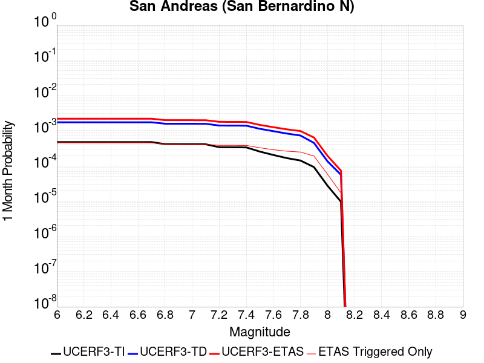 |  |  |

| Magnitude | 1 wk TI Prob | 1 wk TD Prob | 1 wk ETAS Prob | 1 wk ETAS/TD Gain | 1 wk ETAS Triggered Only | 1 mo TI Prob | 1 mo TD Prob | 1 mo ETAS Prob | 1 mo ETAS/TD Gain | 1 mo ETAS Triggered Only | 1 yr TI Prob | 1 yr TD Prob | 1 yr ETAS Prob | 1 yr ETAS/TD Gain | 1 yr ETAS Triggered Only | 10 yr TI Prob | 10 yr TD Prob | 10 yr ETAS Prob | 10 yr ETAS/TD Gain | 10 yr ETAS Triggered Only |
|-----|-----|-----|-----|-----|-----|-----|-----|-----|-----|-----|-----|-----|-----|-----|-----|-----|-----|-----|-----|-----|
| 6.0 | 1.0995041E-4 | 4.016633E-4 | 8.4006693E-4 | 2.0914705 | 4.3857977E-4 | 4.7113094E-4 | 0.0017203542 | 0.0022914305 | 1.3319528 | 5.720606E-4 | 0.0057209437 | 0.020758318 | 0.021803997 | 1.050374 | 0.0010678464 | 0.055758867 | 0.17985137 | 0.18100867 | 1.0064348 | 0.0014110827 |
| 6.1 | 1.0995041E-4 | 4.016633E-4 | 8.4006693E-4 | 2.0914705 | 4.3857977E-4 | 4.7113094E-4 | 0.0017203542 | 0.0022914305 | 1.3319528 | 5.720606E-4 | 0.0057209437 | 0.020758318 | 0.021803997 | 1.050374 | 0.0010678464 | 0.055758867 | 0.17985137 | 0.18100867 | 1.0064348 | 0.0014110827 |
| 6.2 | 1.0995041E-4 | 4.016633E-4 | 8.4006693E-4 | 2.0914705 | 4.3857977E-4 | 4.7113094E-4 | 0.0017203542 | 0.0022914305 | 1.3319528 | 5.720606E-4 | 0.0057209437 | 0.020758318 | 0.021803997 | 1.050374 | 0.0010678464 | 0.055758867 | 0.17985137 | 0.18100867 | 1.0064348 | 0.0014110827 |
| 6.3 | 1.0995041E-4 | 4.016633E-4 | 8.4006693E-4 | 2.0914705 | 4.3857977E-4 | 4.7113094E-4 | 0.0017203542 | 0.0022914305 | 1.3319528 | 5.720606E-4 | 0.0057209437 | 0.020758318 | 0.021803997 | 1.050374 | 0.0010678464 | 0.055758867 | 0.17985137 | 0.18100867 | 1.0064348 | 0.0014110827 |
| 6.4 | 1.0995041E-4 | 4.016633E-4 | 8.4006693E-4 | 2.0914705 | 4.3857977E-4 | 4.7113094E-4 | 0.0017203542 | 0.0022914305 | 1.3319528 | 5.720606E-4 | 0.0057209437 | 0.020758318 | 0.021803997 | 1.050374 | 0.0010678464 | 0.055758867 | 0.17985137 | 0.18100867 | 1.0064348 | 0.0014110827 |
| 6.5 | 1.0995041E-4 | 4.016633E-4 | 8.4006693E-4 | 2.0914705 | 4.3857977E-4 | 4.7113094E-4 | 0.0017203542 | 0.0022914305 | 1.3319528 | 5.720606E-4 | 0.0057209437 | 0.020758318 | 0.021803997 | 1.050374 | 0.0010678464 | 0.055758867 | 0.17985137 | 0.18100867 | 1.0064348 | 0.0014110827 |
| 6.6 | 1.09829954E-4 | 4.014158E-4 | 8.3981955E-4 | 2.0921435 | 4.3857977E-4 | 4.7061488E-4 | 0.0017192949 | 0.0022903718 | 1.3321577 | 5.720606E-4 | 0.0057146936 | 0.020745667 | 0.02179136 | 1.0504054 | 0.0010678464 | 0.05569951 | 0.17974973 | 0.18090717 | 1.0064392 | 0.0014110827 |
| 6.7 | 1.0968671E-4 | 4.0112622E-4 | 8.395301E-4 | 2.0929325 | 4.3857977E-4 | 4.7000122E-4 | 0.0017180555 | 0.0022891331 | 1.3323977 | 5.720606E-4 | 0.005707261 | 0.020730862 | 0.021776572 | 1.0504421 | 0.0010678464 | 0.05562892 | 0.17963059 | 0.1807882 | 1.0064443 | 0.0014110827 |
| 6.8 | 9.6153904E-5 | 3.6562132E-4 | 8.0404076E-4 | 2.199108 | 4.3857977E-4 | 4.1202307E-4 | 0.0015660744 | 0.002137239 | 1.364711 | 5.720606E-4 | 0.0050048484 | 0.018912675 | 0.019885492 | 1.0514374 | 9.915717E-4 | 0.048936214 | 0.16500922 | 0.16612376 | 1.0067545 | 0.001334808 |
| 6.9 | 9.59246E-5 | 3.6505362E-4 | 8.034733E-4 | 2.2009733 | 4.3857977E-4 | 4.1104064E-4 | 0.0015636444 | 0.0021348104 | 1.3652787 | 5.720606E-4 | 0.0049929423 | 0.0188836 | 0.01985645 | 1.0515181 | 9.915717E-4 | 0.048822403 | 0.164772 | 0.16588688 | 1.0067661 | 0.001334808 |
| 7.0 | 9.5669224E-5 | 3.64425E-4 | 8.0284494E-4 | 2.2030458 | 4.3857977E-4 | 4.0994651E-4 | 0.0015609534 | 0.002132121 | 1.3659095 | 5.720606E-4 | 0.004979682 | 0.018851407 | 0.019824287 | 1.0516077 | 9.915717E-4 | 0.048695635 | 0.16450974 | 0.16562496 | 1.0067791 | 0.001334808 |
| 7.1 | 9.5384006E-5 | 3.6372882E-4 | 8.0214906E-4 | 2.2053492 | 4.3857977E-4 | 4.0872456E-4 | 0.0015579734 | 0.0021291429 | 1.3666104 | 5.720606E-4 | 0.0049648727 | 0.018815754 | 0.019788668 | 1.0517074 | 9.915717E-4 | 0.04855404 | 0.16421874 | 0.16533434 | 1.0067934 | 0.001334808 |
| 7.2 | 7.876192E-5 | 3.2410742E-4 | 6.672325E-4 | 2.0586772 | 3.4323634E-4 | 3.375074E-4 | 0.0013883485 | 0.0018453617 | 1.3291775 | 4.5764845E-4 | 0.0041014124 | 0.01678248 | 0.017551174 | 1.0458034 | 7.818161E-4 | 0.040265374 | 0.14711435 | 0.14805764 | 1.0064119 | 0.0011059837 |
| 7.3 | 7.8294186E-5 | 3.2266052E-4 | 6.657861E-4 | 2.063426 | 3.4323634E-4 | 3.3550337E-4 | 0.0013821543 | 0.0018391701 | 1.3306547 | 4.5764845E-4 | 0.004077105 | 0.016708223 | 0.017476978 | 1.0460105 | 7.818161E-4 | 0.040031098 | 0.14649805 | 0.14744201 | 1.0064435 | 0.0011059837 |
| 7.4 | 7.778049E-5 | 3.210994E-4 | 6.642255E-4 | 2.068598 | 3.4323634E-4 | 3.3330236E-4 | 0.0013754707 | 0.0018324896 | 1.3322637 | 4.5764845E-4 | 0.0040504076 | 0.016628098 | 0.017396914 | 1.0462359 | 7.818161E-4 | 0.039773732 | 0.14583014 | 0.14677484 | 1.0064781 | 0.0011059837 |
| 7.5 | 5.9146343E-5 | 2.6189696E-4 | 5.859797E-4 | 2.2374437 | 3.2416766E-4 | 2.534597E-4 | 0.0011219733 | 0.0015410137 | 1.3734852 | 4.1951108E-4 | 0.0030815054 | 0.01358183 | 0.01427779 | 1.0512419 | 7.0554134E-4 | 0.03039124 | 0.120311 | 0.121166505 | 1.0071107 | 9.72503E-4 |
| 7.6 | 4.7335114E-5 | 2.2432729E-4 | 4.721646E-4 | 2.1048024 | 2.4789292E-4 | 2.02849E-4 | 9.6108246E-4 | 0.0012849385 | 1.3369701 | 3.2416766E-4 | 0.0024668893 | 0.011644533 | 0.012247625 | 1.0517919 | 6.1019795E-4 | 0.024396837 | 0.10364283 | 0.10439489 | 1.0072563 | 8.3902216E-4 |
| 7.7 | 3.8561506E-5 | 1.9188043E-4 | 4.397258E-4 | 2.2916656 | 2.4789292E-4 | 1.6525312E-4 | 8.22116E-4 | 0.0011460171 | 1.3939847 | 3.2416766E-4 | 0.0020101 | 0.009968772 | 0.010554008 | 1.058707 | 5.9112924E-4 | 0.01992015 | 0.08914556 | 0.089840315 | 1.0077934 | 7.627474E-4 |
| 7.8 | 3.2975342E-5 | 1.6895565E-4 | 3.7867576E-4 | 2.2412732 | 2.0975554E-4 | 1.4131523E-4 | 7.23923E-4 | 0.0010097462 | 1.3948255 | 2.860303E-4 | 0.0017191551 | 0.008783187 | 0.009331321 | 1.0624073 | 5.5299187E-4 | 0.017059162 | 0.07850971 | 0.07917743 | 1.008505 | 7.2461006E-4 |
| 7.9 | 2.148629E-5 | 1.04210856E-4 | 2.5674445E-4 | 2.4637015 | 1.5254949E-4 | 9.208085E-5 | 4.46556E-4 | 6.371577E-4 | 1.426826 | 1.9068686E-4 | 0.0011205077 | 0.005425832 | 0.0057672057 | 1.0629164 | 3.4323634E-4 | 0.011148746 | 0.049493838 | 0.049928833 | 1.008789 | 4.5764845E-4 |
| 8.0 | 6.3800603E-6 | 3.136937E-5 | 8.857363E-5 | 2.8235705 | 5.7206056E-5 | 2.7342829E-5 | 1.3443502E-4 | 1.9163339E-4 | 1.4254723 | 5.7206056E-5 | 3.3284808E-4 | 0.0016358347 | 0.0017310221 | 1.0581889 | 9.534343E-5 | 0.0033234998 | 0.015136539 | 0.015286779 | 1.0099257 | 1.5254949E-4 |
| 8.1 | 2.2240692E-6 | 1.29589735E-5 | 3.2027412E-5 | 2.4714468 | 1.9068686E-5 | 9.531691E-6 | 5.5538447E-5 | 7.4606076E-5 | 1.343323 | 1.9068686E-5 | 1.1604215E-4 | 6.7617896E-4 | 7.1429054E-4 | 1.0563631 | 3.8137372E-5 | 0.0011598158 | 0.0061071273 | 0.006163984 | 1.0093099 | 5.7206056E-5 |

## Cucamonga
*[(top)](#table-of-contents)*

| 1 Week | 1 Month | 1 Year | 10 Year |
|-----|-----|-----|-----|
|  |  |  |  |

| Magnitude | 1 wk TI Prob | 1 wk TD Prob | 1 wk ETAS Prob | 1 wk ETAS/TD Gain | 1 wk ETAS Triggered Only | 1 mo TI Prob | 1 mo TD Prob | 1 mo ETAS Prob | 1 mo ETAS/TD Gain | 1 mo ETAS Triggered Only | 1 yr TI Prob | 1 yr TD Prob | 1 yr ETAS Prob | 1 yr ETAS/TD Gain | 1 yr ETAS Triggered Only | 10 yr TI Prob | 10 yr TD Prob | 10 yr ETAS Prob | 10 yr ETAS/TD Gain | 10 yr ETAS Triggered Only |
|-----|-----|-----|-----|-----|-----|-----|-----|-----|-----|-----|-----|-----|-----|-----|-----|-----|-----|-----|-----|-----|
| 6.0 | 9.287573E-5 | 1.8282168E-4 | 4.3066926E-4 | 2.3556795 | 2.4789292E-4 | 3.9797812E-4 | 7.831635E-4 | 0.0011451847 | 1.4622551 | 3.6230503E-4 | 0.0048346235 | 0.009502821 | 0.010314982 | 1.0854653 | 8.1995345E-4 | 0.047307868 | 0.09186649 | 0.09302673 | 1.0126295 | 0.0012776019 |
| 6.1 | 9.287573E-5 | 1.8282168E-4 | 4.3066926E-4 | 2.3556795 | 2.4789292E-4 | 3.9797812E-4 | 7.831635E-4 | 0.0011451847 | 1.4622551 | 3.6230503E-4 | 0.0048346235 | 0.009502821 | 0.010314982 | 1.0854653 | 8.1995345E-4 | 0.047307868 | 0.09186649 | 0.09302673 | 1.0126295 | 0.0012776019 |
| 6.2 | 9.287573E-5 | 1.8282168E-4 | 4.3066926E-4 | 2.3556795 | 2.4789292E-4 | 3.9797812E-4 | 7.831635E-4 | 0.0011451847 | 1.4622551 | 3.6230503E-4 | 0.0048346235 | 0.009502821 | 0.010314982 | 1.0854653 | 8.1995345E-4 | 0.047307868 | 0.09186649 | 0.09302673 | 1.0126295 | 0.0012776019 |
| 6.3 | 9.287573E-5 | 1.8282168E-4 | 4.3066926E-4 | 2.3556795 | 2.4789292E-4 | 3.9797812E-4 | 7.831635E-4 | 0.0011451847 | 1.4622551 | 3.6230503E-4 | 0.0048346235 | 0.009502821 | 0.010314982 | 1.0854653 | 8.1995345E-4 | 0.047307868 | 0.09186649 | 0.09302673 | 1.0126295 | 0.0012776019 |
| 6.4 | 9.287573E-5 | 1.8282168E-4 | 4.3066926E-4 | 2.3556795 | 2.4789292E-4 | 3.9797812E-4 | 7.831635E-4 | 0.0011451847 | 1.4622551 | 3.6230503E-4 | 0.0048346235 | 0.009502821 | 0.010314982 | 1.0854653 | 8.1995345E-4 | 0.047307868 | 0.09186649 | 0.09302673 | 1.0126295 | 0.0012776019 |
| 6.5 | 9.287573E-5 | 1.8282168E-4 | 4.3066926E-4 | 2.3556795 | 2.4789292E-4 | 3.9797812E-4 | 7.831635E-4 | 0.0011451847 | 1.4622551 | 3.6230503E-4 | 0.0048346235 | 0.009502821 | 0.010314982 | 1.0854653 | 8.1995345E-4 | 0.047307868 | 0.09186649 | 0.09302673 | 1.0126295 | 0.0012776019 |

## Pleito
*[(top)](#table-of-contents)*

| 1 Week | 1 Month | 1 Year | 10 Year |
|-----|-----|-----|-----|
|  |  |  |  |

| Magnitude | 1 wk TI Prob | 1 wk TD Prob | 1 wk ETAS Prob | 1 wk ETAS/TD Gain | 1 wk ETAS Triggered Only | 1 mo TI Prob | 1 mo TD Prob | 1 mo ETAS Prob | 1 mo ETAS/TD Gain | 1 mo ETAS Triggered Only | 1 yr TI Prob | 1 yr TD Prob | 1 yr ETAS Prob | 1 yr ETAS/TD Gain | 1 yr ETAS Triggered Only | 10 yr TI Prob | 10 yr TD Prob | 10 yr ETAS Prob | 10 yr ETAS/TD Gain | 10 yr ETAS Triggered Only |
|-----|-----|-----|-----|-----|-----|-----|-----|-----|-----|-----|-----|-----|-----|-----|-----|-----|-----|-----|-----|-----|
| 6.0 | 2.8975299E-5 | 3.5014233E-5 | 1.6849035E-4 | 4.812053 | 1.334808E-4 | 1.2417394E-4 | 1.5005456E-4 | 3.9791028E-4 | 2.6517706 | 2.4789292E-4 | 0.0015107692 | 0.0018257706 | 0.002491956 | 1.364879 | 6.67404E-4 | 0.015005396 | 0.018145941 | 0.019344192 | 1.0660341 | 0.0012203959 |
| 6.1 | 2.8975299E-5 | 3.5014233E-5 | 1.6849035E-4 | 4.812053 | 1.334808E-4 | 1.2417394E-4 | 1.5005456E-4 | 3.9791028E-4 | 2.6517706 | 2.4789292E-4 | 0.0015107692 | 0.0018257706 | 0.002491956 | 1.364879 | 6.67404E-4 | 0.015005396 | 0.018145941 | 0.019344192 | 1.0660341 | 0.0012203959 |
| 6.2 | 2.8975299E-5 | 3.5014233E-5 | 1.6849035E-4 | 4.812053 | 1.334808E-4 | 1.2417394E-4 | 1.5005456E-4 | 3.9791028E-4 | 2.6517706 | 2.4789292E-4 | 0.0015107692 | 0.0018257706 | 0.002491956 | 1.364879 | 6.67404E-4 | 0.015005396 | 0.018145941 | 0.019344192 | 1.0660341 | 0.0012203959 |
| 6.3 | 2.8975299E-5 | 3.5014233E-5 | 1.6849035E-4 | 4.812053 | 1.334808E-4 | 1.2417394E-4 | 1.5005456E-4 | 3.9791028E-4 | 2.6517706 | 2.4789292E-4 | 0.0015107692 | 0.0018257706 | 0.002491956 | 1.364879 | 6.67404E-4 | 0.015005396 | 0.018145941 | 0.019344192 | 1.0660341 | 0.0012203959 |
| 6.4 | 2.8975299E-5 | 3.5014233E-5 | 1.6849035E-4 | 4.812053 | 1.334808E-4 | 1.2417394E-4 | 1.5005456E-4 | 3.9791028E-4 | 2.6517706 | 2.4789292E-4 | 0.0015107692 | 0.0018257706 | 0.002491956 | 1.364879 | 6.67404E-4 | 0.015005396 | 0.018145941 | 0.019344192 | 1.0660341 | 0.0012203959 |
| 6.5 | 2.8975299E-5 | 3.5014233E-5 | 1.6849035E-4 | 4.812053 | 1.334808E-4 | 1.2417394E-4 | 1.5005456E-4 | 3.9791028E-4 | 2.6517706 | 2.4789292E-4 | 0.0015107692 | 0.0018257706 | 0.002491956 | 1.364879 | 6.67404E-4 | 0.015005396 | 0.018145941 | 0.019344192 | 1.0660341 | 0.0012203959 |
| 6.6 | 2.6446418E-5 | 3.190913E-5 | 1.6538567E-4 | 5.1830206 | 1.334808E-4 | 1.1333687E-4 | 1.367484E-4 | 3.6554135E-4 | 2.673094 | 2.2882422E-4 | 0.0013790029 | 0.0016640209 | 0.0023112774 | 1.3889713 | 6.483353E-4 | 0.013704768 | 0.016553096 | 0.017734539 | 1.0713729 | 0.0012013272 |
| 6.7 | 2.26497E-5 | 2.7271499E-5 | 1.2261233E-4 | 4.495988 | 9.534343E-5 | 9.706653E-5 | 1.1687469E-4 | 2.6940633E-4 | 2.305087 | 1.5254949E-4 | 0.0011811443 | 0.0014223875 | 0.0019555513 | 1.3748372 | 5.339232E-4 | 0.01174886 | 0.0141689 | 0.015146423 | 1.0689907 | 9.915717E-4 |
| 6.8 | 1.799965E-5 | 2.159839E-5 | 7.880321E-5 | 3.6485686 | 5.7206056E-5 | 7.713908E-5 | 9.256323E-5 | 2.0696475E-4 | 2.2359285 | 1.1441211E-4 | 9.387636E-4 | 0.0011267258 | 0.0015076698 | 1.3380983 | 3.813737E-4 | 0.009348078 | 0.011244575 | 0.01197989 | 1.065393 | 7.436787E-4 |
| 6.9 | 1.799965E-5 | 2.159839E-5 | 7.880321E-5 | 3.6485686 | 5.7206056E-5 | 7.713908E-5 | 9.256323E-5 | 2.0696475E-4 | 2.2359285 | 1.1441211E-4 | 9.387636E-4 | 0.0011267258 | 0.0015076698 | 1.3380983 | 3.813737E-4 | 0.009348078 | 0.011244575 | 0.01197989 | 1.065393 | 7.436787E-4 |
| 7.0 | 1.3666451E-5 | 1.6355421E-5 | 7.356054E-5 | 4.4976244 | 5.7206056E-5 | 5.8569192E-5 | 7.009466E-5 | 1.6543141E-4 | 2.360114 | 9.534343E-5 | 7.128466E-4 | 8.5340254E-4 | 0.0011201362 | 1.3125533 | 2.669616E-4 | 0.0071056425 | 0.008534024 | 0.00906339 | 1.0620302 | 5.339232E-4 |

## San Cayetano
*[(top)](#table-of-contents)*

| 1 Week | 1 Month | 1 Year | 10 Year |
|-----|-----|-----|-----|
|  | 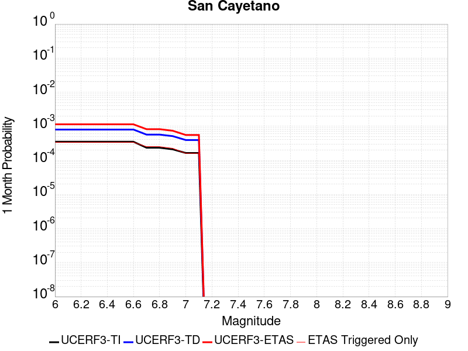 |  |  |

| Magnitude | 1 wk TI Prob | 1 wk TD Prob | 1 wk ETAS Prob | 1 wk ETAS/TD Gain | 1 wk ETAS Triggered Only | 1 mo TI Prob | 1 mo TD Prob | 1 mo ETAS Prob | 1 mo ETAS/TD Gain | 1 mo ETAS Triggered Only | 1 yr TI Prob | 1 yr TD Prob | 1 yr ETAS Prob | 1 yr ETAS/TD Gain | 1 yr ETAS Triggered Only | 10 yr TI Prob | 10 yr TD Prob | 10 yr ETAS Prob | 10 yr ETAS/TD Gain | 10 yr ETAS Triggered Only |
|-----|-----|-----|-----|-----|-----|-----|-----|-----|-----|-----|-----|-----|-----|-----|-----|-----|-----|-----|-----|-----|
| 6.0 | 8.1875E-5 | 1.8670029E-4 | 5.4893765E-4 | 2.940208 | 3.6230503E-4 | 3.5084566E-4 | 7.9996156E-4 | 0.0012381905 | 1.5478125 | 4.3857977E-4 | 0.004263182 | 0.009708474 | 0.010369399 | 1.0680771 | 6.67404E-4 | 0.041823186 | 0.09218576 | 0.09320709 | 1.0110792 | 0.0011250525 |
| 6.1 | 8.1875E-5 | 1.8670029E-4 | 5.4893765E-4 | 2.940208 | 3.6230503E-4 | 3.5084566E-4 | 7.9996156E-4 | 0.0012381905 | 1.5478125 | 4.3857977E-4 | 0.004263182 | 0.009708474 | 0.010369399 | 1.0680771 | 6.67404E-4 | 0.041823186 | 0.09218576 | 0.09320709 | 1.0110792 | 0.0011250525 |
| 6.2 | 8.1875E-5 | 1.8670029E-4 | 5.4893765E-4 | 2.940208 | 3.6230503E-4 | 3.5084566E-4 | 7.9996156E-4 | 0.0012381905 | 1.5478125 | 4.3857977E-4 | 0.004263182 | 0.009708474 | 0.010369399 | 1.0680771 | 6.67404E-4 | 0.041823186 | 0.09218576 | 0.09320709 | 1.0110792 | 0.0011250525 |
| 6.3 | 8.1875E-5 | 1.8670029E-4 | 5.4893765E-4 | 2.940208 | 3.6230503E-4 | 3.5084566E-4 | 7.9996156E-4 | 0.0012381905 | 1.5478125 | 4.3857977E-4 | 0.004263182 | 0.009708474 | 0.010369399 | 1.0680771 | 6.67404E-4 | 0.041823186 | 0.09218576 | 0.09320709 | 1.0110792 | 0.0011250525 |
| 6.4 | 8.1875E-5 | 1.8670029E-4 | 5.4893765E-4 | 2.940208 | 3.6230503E-4 | 3.5084566E-4 | 7.9996156E-4 | 0.0012381905 | 1.5478125 | 4.3857977E-4 | 0.004263182 | 0.009708474 | 0.010369399 | 1.0680771 | 6.67404E-4 | 0.041823186 | 0.09218576 | 0.09320709 | 1.0110792 | 0.0011250525 |
| 6.5 | 8.1875E-5 | 1.8670029E-4 | 5.4893765E-4 | 2.940208 | 3.6230503E-4 | 3.5084566E-4 | 7.9996156E-4 | 0.0012381905 | 1.5478125 | 4.3857977E-4 | 0.004263182 | 0.009708474 | 0.010369399 | 1.0680771 | 6.67404E-4 | 0.041823186 | 0.09218576 | 0.09320709 | 1.0110792 | 0.0011250525 |
| 6.6 | 8.1875E-5 | 1.8670029E-4 | 5.4893765E-4 | 2.940208 | 3.6230503E-4 | 3.5084566E-4 | 7.9996156E-4 | 0.0012381905 | 1.5478125 | 4.3857977E-4 | 0.004263182 | 0.009708474 | 0.010369399 | 1.0680771 | 6.67404E-4 | 0.041823186 | 0.09218576 | 0.09320709 | 1.0110792 | 0.0011250525 |
| 6.7 | 5.4643962E-5 | 1.3262422E-4 | 3.9955042E-4 | 3.0126503 | 2.669616E-4 | 2.341674E-4 | 5.6833174E-4 | 8.923152E-4 | 1.5700604 | 3.2416766E-4 | 0.0028472608 | 0.006909191 | 0.0074015516 | 1.0712616 | 4.9578585E-4 | 0.028110553 | 0.06647811 | 0.06724355 | 1.0115142 | 8.1995345E-4 |
| 6.8 | 5.4643962E-5 | 1.3262422E-4 | 3.9955042E-4 | 3.0126503 | 2.669616E-4 | 2.341674E-4 | 5.6833174E-4 | 8.923152E-4 | 1.5700604 | 3.2416766E-4 | 0.0028472608 | 0.006909191 | 0.0074015516 | 1.0712616 | 4.9578585E-4 | 0.028110553 | 0.06647811 | 0.06724355 | 1.0115142 | 8.1995345E-4 |
| 6.9 | 4.9065253E-5 | 1.1962955E-4 | 3.484264E-4 | 2.9125445 | 2.2882422E-4 | 2.102627E-4 | 5.1266217E-4 | 7.9854584E-4 | 1.5576453 | 2.860303E-4 | 0.002556943 | 0.006235295 | 0.00667114 | 1.0698997 | 4.3857977E-4 | 0.02527722 | 0.06024073 | 0.06093961 | 1.0116014 | 7.436787E-4 |
| 7.0 | 3.8281665E-5 | 9.1909E-5 | 2.635114E-4 | 2.8670902 | 1.7161817E-4 | 1.6405396E-4 | 3.938957E-4 | 6.2262977E-4 | 1.5806971 | 2.2882422E-4 | 0.0019955272 | 0.0047956803 | 0.0051372703 | 1.0712287 | 3.4323634E-4 | 0.019777026 | 0.04680347 | 0.047385108 | 1.0124272 | 6.1019795E-4 |
| 7.1 | 3.8281665E-5 | 9.1909E-5 | 2.635114E-4 | 2.8670902 | 1.7161817E-4 | 1.6405396E-4 | 3.938957E-4 | 6.2262977E-4 | 1.5806971 | 2.2882422E-4 | 0.0019955272 | 0.0047956803 | 0.0051372703 | 1.0712287 | 3.4323634E-4 | 0.019777026 | 0.04680347 | 0.047385108 | 1.0124272 | 6.1019795E-4 |

## San Andreas (San Bernardino S)
*[(top)](#table-of-contents)*

| 1 Week | 1 Month | 1 Year | 10 Year |
|-----|-----|-----|-----|
|  |  |  |  |

| Magnitude | 1 wk TI Prob | 1 wk TD Prob | 1 wk ETAS Prob | 1 wk ETAS/TD Gain | 1 wk ETAS Triggered Only | 1 mo TI Prob | 1 mo TD Prob | 1 mo ETAS Prob | 1 mo ETAS/TD Gain | 1 mo ETAS Triggered Only | 1 yr TI Prob | 1 yr TD Prob | 1 yr ETAS Prob | 1 yr ETAS/TD Gain | 1 yr ETAS Triggered Only | 10 yr TI Prob | 10 yr TD Prob | 10 yr ETAS Prob | 10 yr ETAS/TD Gain | 10 yr ETAS Triggered Only |
|-----|-----|-----|-----|-----|-----|-----|-----|-----|-----|-----|-----|-----|-----|-----|-----|-----|-----|-----|-----|-----|
| 6.0 | 8.432835E-5 | 3.0557657E-4 | 6.677709E-4 | 2.1852815 | 3.6230503E-4 | 3.6135715E-4 | 0.0013090015 | 0.0017470071 | 1.3346105 | 4.3857977E-4 | 0.004390651 | 0.015828904 | 0.016579578 | 1.0474242 | 7.627474E-4 | 0.043049086 | 0.14053506 | 0.14138727 | 1.0060642 | 9.915717E-4 |
| 6.1 | 8.432835E-5 | 3.0557657E-4 | 6.677709E-4 | 2.1852815 | 3.6230503E-4 | 3.6135715E-4 | 0.0013090015 | 0.0017470071 | 1.3346105 | 4.3857977E-4 | 0.004390651 | 0.015828904 | 0.016579578 | 1.0474242 | 7.627474E-4 | 0.043049086 | 0.14053506 | 0.14138727 | 1.0060642 | 9.915717E-4 |
| 6.2 | 8.432835E-5 | 3.0557657E-4 | 6.677709E-4 | 2.1852815 | 3.6230503E-4 | 3.6135715E-4 | 0.0013090015 | 0.0017470071 | 1.3346105 | 4.3857977E-4 | 0.004390651 | 0.015828904 | 0.016579578 | 1.0474242 | 7.627474E-4 | 0.043049086 | 0.14053506 | 0.14138727 | 1.0060642 | 9.915717E-4 |
| 6.3 | 8.432835E-5 | 3.0557657E-4 | 6.677709E-4 | 2.1852815 | 3.6230503E-4 | 3.6135715E-4 | 0.0013090015 | 0.0017470071 | 1.3346105 | 4.3857977E-4 | 0.004390651 | 0.015828904 | 0.016579578 | 1.0474242 | 7.627474E-4 | 0.043049086 | 0.14053506 | 0.14138727 | 1.0060642 | 9.915717E-4 |
| 6.4 | 8.432835E-5 | 3.0557657E-4 | 6.677709E-4 | 2.1852815 | 3.6230503E-4 | 3.6135715E-4 | 0.0013090015 | 0.0017470071 | 1.3346105 | 4.3857977E-4 | 0.004390651 | 0.015828904 | 0.016579578 | 1.0474242 | 7.627474E-4 | 0.043049086 | 0.14053506 | 0.14138727 | 1.0060642 | 9.915717E-4 |
| 6.5 | 8.432835E-5 | 3.0557657E-4 | 6.677709E-4 | 2.1852815 | 3.6230503E-4 | 3.6135715E-4 | 0.0013090015 | 0.0017470071 | 1.3346105 | 4.3857977E-4 | 0.004390651 | 0.015828904 | 0.016579578 | 1.0474242 | 7.627474E-4 | 0.043049086 | 0.14053506 | 0.14138727 | 1.0060642 | 9.915717E-4 |
| 6.6 | 8.422796E-5 | 3.053887E-4 | 6.675831E-4 | 2.186011 | 3.6230503E-4 | 3.6092702E-4 | 0.0013081972 | 0.0017462032 | 1.3348166 | 4.3857977E-4 | 0.0043854355 | 0.015819253 | 0.016569935 | 1.0474536 | 7.627474E-4 | 0.04299896 | 0.14045276 | 0.14130506 | 1.0060682 | 9.915717E-4 |
| 6.7 | 8.4024105E-5 | 3.050066E-4 | 6.672011E-4 | 2.1874974 | 3.6230503E-4 | 3.600536E-4 | 0.0013065612 | 0.0017445679 | 1.3352363 | 4.3857977E-4 | 0.004374844 | 0.015799625 | 0.016550321 | 1.0475136 | 7.627474E-4 | 0.042897146 | 0.14028531 | 0.14113778 | 1.0060767 | 9.915717E-4 |
| 6.8 | 8.383834E-5 | 3.0460325E-4 | 6.667979E-4 | 2.1890702 | 3.6230503E-4 | 3.592577E-4 | 0.0013048343 | 0.0017428418 | 1.3356806 | 4.3857977E-4 | 0.004365193 | 0.015778905 | 0.016529616 | 1.0475769 | 7.627474E-4 | 0.042804368 | 0.14010844 | 0.14096108 | 1.0060856 | 9.915717E-4 |
| 6.9 | 8.269897E-5 | 3.0217436E-4 | 6.643699E-4 | 2.198631 | 3.6230503E-4 | 3.54376E-4 | 0.0012944351 | 0.0017324472 | 1.3383808 | 4.3857977E-4 | 0.004305995 | 0.015654119 | 0.016404925 | 1.0479623 | 7.627474E-4 | 0.042235088 | 0.13903125 | 0.13988496 | 1.0061405 | 9.915717E-4 |
| 7.0 | 8.240144E-5 | 3.0153047E-4 | 6.6372624E-4 | 2.2011912 | 3.6230503E-4 | 3.5310123E-4 | 0.0012916784 | 0.0017296916 | 1.3391039 | 4.3857977E-4 | 0.004290536 | 0.015621036 | 0.016371869 | 1.0480654 | 7.627474E-4 | 0.042086378 | 0.13874839 | 0.1396024 | 1.006155 | 9.915717E-4 |
| 7.1 | 8.209429E-5 | 3.0086326E-4 | 6.630593E-4 | 2.203856 | 3.6230503E-4 | 3.5178522E-4 | 0.0012888217 | 0.0017268362 | 1.3398566 | 4.3857977E-4 | 0.0042745764 | 0.015586754 | 0.016337613 | 1.0481728 | 7.627474E-4 | 0.041932825 | 0.13845524 | 0.13930953 | 1.0061702 | 9.915717E-4 |
| 7.2 | 6.547198E-5 | 2.6130548E-4 | 5.281973E-4 | 2.0213788 | 2.669616E-4 | 2.80564E-4 | 0.0011194341 | 0.0014432389 | 1.2892575 | 3.2416766E-4 | 0.003410517 | 0.013550194 | 0.014095693 | 1.0402576 | 5.5299187E-4 | 0.03358648 | 0.12084773 | 0.12151831 | 1.0055488 | 7.627474E-4 |
| 7.3 | 6.498085E-5 | 2.5983856E-4 | 5.267308E-4 | 2.0271463 | 2.669616E-4 | 2.7845963E-4 | 0.0011131528 | 0.0014369596 | 1.2908916 | 3.2416766E-4 | 0.0033849762 | 0.013474667 | 0.014020208 | 1.0404863 | 5.5299187E-4 | 0.033338774 | 0.12019604 | 0.1208671 | 1.0055832 | 7.627474E-4 |
| 7.4 | 5.658229E-5 | 2.4132969E-4 | 5.0822686E-4 | 2.1059442 | 2.669616E-4 | 2.4247299E-4 | 0.0010338924 | 0.0013577249 | 1.3132168 | 3.2416766E-4 | 0.0029481123 | 0.0125208525 | 0.01306692 | 1.0436127 | 5.5299187E-4 | 0.02909307 | 0.111656904 | 0.11233448 | 1.0060685 | 7.627474E-4 |
| 7.5 | 5.1594427E-5 | 2.278611E-4 | 4.7569754E-4 | 2.0876644 | 2.4789292E-4 | 2.2110023E-4 | 9.7621355E-4 | 0.0012810146 | 1.312228 | 3.0509898E-4 | 0.002688572 | 0.011826312 | 0.012335078 | 1.0430198 | 5.148545E-4 | 0.026562763 | 0.10549111 | 0.10613928 | 1.0061443 | 7.2461006E-4 |
| 7.6 | 3.6604233E-5 | 1.7518568E-4 | 3.6583914E-4 | 2.0882936 | 1.9068686E-4 | 1.5686586E-4 | 7.5060193E-4 | 9.983088E-4 | 1.3300109 | 2.4789292E-4 | 0.0019081688 | 0.009104266 | 0.009557748 | 1.0498098 | 4.5764845E-4 | 0.018918669 | 0.08175703 | 0.08233485 | 1.0070676 | 6.292666E-4 |
| 7.7 | 2.7987022E-5 | 1.432022E-4 | 3.3386174E-4 | 2.3314009 | 1.9068686E-4 | 1.1993887E-4 | 6.13598E-4 | 8.6133875E-4 | 1.403751 | 2.4789292E-4 | 0.0014592775 | 0.0074482826 | 0.007883596 | 1.0584447 | 4.3857977E-4 | 0.01449732 | 0.06712321 | 0.06763908 | 1.0076854 | 5.5299187E-4 |
| 7.8 | 2.2592892E-5 | 1.21067766E-4 | 2.735988E-4 | 2.2598813 | 1.5254949E-4 | 9.682308E-5 | 5.1877514E-4 | 7.2842184E-4 | 1.4041187 | 2.0975554E-4 | 0.0011781835 | 0.0063007227 | 0.006698642 | 1.0631546 | 4.004424E-4 | 0.011719566 | 0.05660409 | 0.057089802 | 1.0085808 | 5.148545E-4 |
| 7.9 | 1.2843913E-5 | 6.366969E-5 | 1.9714198E-4 | 3.096324 | 1.334808E-4 | 5.504418E-5 | 2.7284448E-4 | 4.2535237E-4 | 1.5589552 | 1.5254949E-4 | 6.699568E-4 | 0.003317339 | 0.0036024207 | 1.0859368 | 2.860303E-4 | 0.0066794064 | 0.030455248 | 0.030788032 | 1.010927 | 3.4323634E-4 |
| 8.0 | 6.3800603E-6 | 3.136937E-5 | 8.857363E-5 | 2.8235705 | 5.7206056E-5 | 2.7342829E-5 | 1.3443502E-4 | 1.9163339E-4 | 1.4254723 | 5.7206056E-5 | 3.3284808E-4 | 0.0016358347 | 0.0017310221 | 1.0581889 | 9.534343E-5 | 0.0033234998 | 0.015136539 | 0.015286779 | 1.0099257 | 1.5254949E-4 |
| 8.1 | 2.2240692E-6 | 1.29589735E-5 | 3.2027412E-5 | 2.4714468 | 1.9068686E-5 | 9.531691E-6 | 5.5538447E-5 | 7.4606076E-5 | 1.343323 | 1.9068686E-5 | 1.1604215E-4 | 6.7617896E-4 | 7.1429054E-4 | 1.0563631 | 3.8137372E-5 | 0.0011598158 | 0.0061071273 | 0.006163984 | 1.0093099 | 5.7206056E-5 |

## Death Valley (No)
*[(top)](#table-of-contents)*

| 1 Week | 1 Month | 1 Year | 10 Year |
|-----|-----|-----|-----|
| 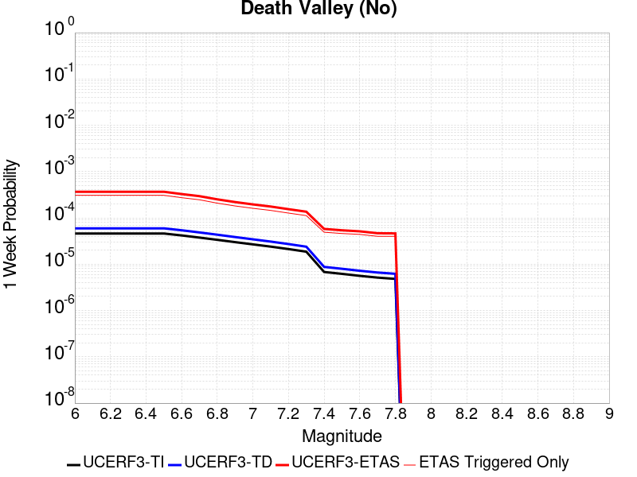 |  |  |  |

| Magnitude | 1 wk TI Prob | 1 wk TD Prob | 1 wk ETAS Prob | 1 wk ETAS/TD Gain | 1 wk ETAS Triggered Only | 1 mo TI Prob | 1 mo TD Prob | 1 mo ETAS Prob | 1 mo ETAS/TD Gain | 1 mo ETAS Triggered Only | 1 yr TI Prob | 1 yr TD Prob | 1 yr ETAS Prob | 1 yr ETAS/TD Gain | 1 yr ETAS Triggered Only | 10 yr TI Prob | 10 yr TD Prob | 10 yr ETAS Prob | 10 yr ETAS/TD Gain | 10 yr ETAS Triggered Only |
|-----|-----|-----|-----|-----|-----|-----|-----|-----|-----|-----|-----|-----|-----|-----|-----|-----|-----|-----|-----|-----|
| 6.0 | 4.5975892E-5 | 5.9477E-5 | 3.4549026E-4 | 5.8088045 | 2.860303E-4 | 1.9702465E-4 | 2.548782E-4 | 6.742823E-4 | 2.6455083 | 4.1951108E-4 | 0.0023961363 | 0.003099011 | 0.0038784042 | 1.2514974 | 7.818161E-4 | 0.02370464 | 0.030588351 | 0.03151262 | 1.0302165 | 9.5343427E-4 |
| 6.1 | 4.5975892E-5 | 5.9477E-5 | 3.4549026E-4 | 5.8088045 | 2.860303E-4 | 1.9702465E-4 | 2.548782E-4 | 6.742823E-4 | 2.6455083 | 4.1951108E-4 | 0.0023961363 | 0.003099011 | 0.0038784042 | 1.2514974 | 7.818161E-4 | 0.02370464 | 0.030588351 | 0.03151262 | 1.0302165 | 9.5343427E-4 |
| 6.2 | 4.5975892E-5 | 5.9477E-5 | 3.4549026E-4 | 5.8088045 | 2.860303E-4 | 1.9702465E-4 | 2.548782E-4 | 6.742823E-4 | 2.6455083 | 4.1951108E-4 | 0.0023961363 | 0.003099011 | 0.0038784042 | 1.2514974 | 7.818161E-4 | 0.02370464 | 0.030588351 | 0.03151262 | 1.0302165 | 9.5343427E-4 |
| 6.3 | 4.5975892E-5 | 5.9477E-5 | 3.4549026E-4 | 5.8088045 | 2.860303E-4 | 1.9702465E-4 | 2.548782E-4 | 6.742823E-4 | 2.6455083 | 4.1951108E-4 | 0.0023961363 | 0.003099011 | 0.0038784042 | 1.2514974 | 7.818161E-4 | 0.02370464 | 0.030588351 | 0.03151262 | 1.0302165 | 9.5343427E-4 |
| 6.4 | 4.5975892E-5 | 5.9477E-5 | 3.4549026E-4 | 5.8088045 | 2.860303E-4 | 1.9702465E-4 | 2.548782E-4 | 6.742823E-4 | 2.6455083 | 4.1951108E-4 | 0.0023961363 | 0.003099011 | 0.0038784042 | 1.2514974 | 7.818161E-4 | 0.02370464 | 0.030588351 | 0.03151262 | 1.0302165 | 9.5343427E-4 |
| 6.5 | 4.5975892E-5 | 5.9477E-5 | 3.4549026E-4 | 5.8088045 | 2.860303E-4 | 1.9702465E-4 | 2.548782E-4 | 6.742823E-4 | 2.6455083 | 4.1951108E-4 | 0.0023961363 | 0.003099011 | 0.0038784042 | 1.2514974 | 7.818161E-4 | 0.02370464 | 0.030588351 | 0.03151262 | 1.0302165 | 9.5343427E-4 |
| 6.6 | 4.1757343E-5 | 5.400243E-5 | 3.2094962E-4 | 5.9432435 | 2.669616E-4 | 1.7894777E-4 | 2.3142013E-4 | 6.317698E-4 | 2.7299693 | 4.004424E-4 | 0.002176512 | 0.0028141933 | 0.003498734 | 1.2432458 | 6.864727E-4 | 0.021553177 | 0.02781613 | 0.028631812 | 1.0293242 | 8.3902216E-4 |
| 6.7 | 3.751902E-5 | 4.847215E-5 | 2.9635304E-4 | 6.113883 | 2.4789292E-4 | 1.607859E-4 | 2.0772294E-4 | 5.890174E-4 | 2.8355916 | 3.813737E-4 | 0.0019558107 | 0.0025263957 | 0.0031540727 | 1.2484475 | 6.292666E-4 | 0.019386867 | 0.025007667 | 0.025769932 | 1.0304812 | 7.818161E-4 |
| 6.8 | 3.358376E-5 | 4.333242E-5 | 2.7214672E-4 | 6.2804413 | 2.2882422E-4 | 1.4392247E-4 | 1.8569885E-4 | 5.2887143E-4 | 2.848006 | 3.4323634E-4 | 0.0017508477 | 0.0022588398 | 0.0028296083 | 1.2526821 | 5.720606E-4 | 0.017371172 | 0.022389125 | 0.023097511 | 1.0316398 | 7.2461006E-4 |
| 6.9 | 2.9934512E-5 | 3.8558388E-5 | 2.4830585E-4 | 6.439736 | 2.0975554E-4 | 1.2828446E-4 | 1.6524145E-4 | 4.5122448E-4 | 2.7306979 | 2.860303E-4 | 0.0015607442 | 0.002010258 | 0.0025240774 | 1.2555988 | 5.148545E-4 | 0.0154982805 | 0.019950643 | 0.020604732 | 1.0327853 | 6.67404E-4 |
| 7.0 | 2.6778222E-5 | 3.444248E-5 | 2.2512277E-4 | 6.5361953 | 1.9068686E-4 | 1.1475876E-4 | 1.4760396E-4 | 4.1452615E-4 | 2.8083675 | 2.669616E-4 | 0.0013962924 | 0.001795896 | 0.0022907914 | 1.2755703 | 4.9578585E-4 | 0.013875516 | 0.017843472 | 0.018480238 | 1.0356863 | 6.483353E-4 |
| 7.1 | 2.3953568E-5 | 3.076199E-5 | 1.8330678E-4 | 5.958873 | 1.5254949E-4 | 1.0265411E-4 | 1.3183212E-4 | 3.6062617E-4 | 2.7354956 | 2.2882422E-4 | 0.0012490972 | 0.0016041726 | 0.0020230107 | 1.2610929 | 4.1951108E-4 | 0.012420994 | 0.015955374 | 0.016480777 | 1.0329297 | 5.339232E-4 |
| 7.2 | 2.121599E-5 | 2.720663E-5 | 1.6068379E-4 | 5.906053 | 1.334808E-4 | 9.09225E-5 | 1.16596304E-4 | 3.263274E-4 | 2.7987797 | 2.0975554E-4 | 0.0011064193 | 0.0014189329 | 0.0018188072 | 1.2818133 | 4.004424E-4 | 0.0110092675 | 0.0141279865 | 0.014635568 | 1.0359273 | 5.148545E-4 |
| 7.3 | 1.8611821E-5 | 2.3849978E-5 | 1.3825936E-4 | 5.797044 | 1.1441211E-4 | 7.976251E-5 | 1.0221185E-4 | 2.928792E-4 | 2.8654134 | 1.9068686E-4 | 9.706759E-4 | 0.0012440139 | 0.0016058682 | 1.2908764 | 3.6230503E-4 | 0.009664469 | 0.0123994695 | 0.012870275 | 1.0379698 | 4.7671713E-4 |
| 7.4 | 6.786848E-6 | 8.734327E-6 | 1.0407692E-4 | 11.915849 | 9.534343E-5 | 2.9086168E-5 | 3.7432535E-5 | 1.7090833E-4 | 4.5657697 | 1.334808E-4 | 3.5406655E-4 | 4.5568874E-4 | 6.4628874E-4 | 1.4182678 | 1.9068686E-4 | 0.0035350295 | 0.004551757 | 0.0047985218 | 1.054213 | 2.4789292E-4 |
| 7.5 | 6.183793E-6 | 7.958103E-6 | 1.0330077E-4 | 12.980577 | 9.534343E-5 | 2.65017E-5 | 3.410595E-5 | 1.675822E-4 | 4.9135766 | 1.334808E-4 | 3.2261043E-4 | 4.1520374E-4 | 6.058114E-4 | 1.4590702 | 1.9068686E-4 | 0.003221425 | 0.0041484893 | 0.004395354 | 1.0595071 | 2.4789292E-4 |
| 7.6 | 5.6024205E-6 | 7.211712E-6 | 1.0255445E-4 | 14.220542 | 9.534343E-5 | 2.4010153E-5 | 3.0907213E-5 | 1.4531579E-4 | 4.701679 | 1.1441211E-4 | 2.9228439E-4 | 3.762732E-4 | 5.478268E-4 | 1.4559283 | 1.7161817E-4 | 0.0029190024 | 0.0037605667 | 0.0039885305 | 1.0606195 | 2.2882422E-4 |
| 7.7 | 5.132066E-6 | 6.6084267E-6 | 8.288267E-5 | 12.5419655 | 7.6274744E-5 | 2.1994381E-5 | 2.8321763E-5 | 1.236625E-4 | 4.3663416 | 9.534343E-5 | 2.677487E-4 | 3.4480577E-4 | 4.973026E-4 | 1.442269 | 1.5254949E-4 | 0.0026742632 | 0.00344691 | 0.0036559426 | 1.0606434 | 2.0975554E-4 |
| 7.8 | 4.8153906E-6 | 6.202069E-6 | 8.247634E-5 | 13.298198 | 7.6274744E-5 | 2.0637224E-5 | 2.6580266E-5 | 1.21921155E-4 | 4.586905 | 9.534343E-5 | 2.5122924E-4 | 3.2360948E-4 | 4.761096E-4 | 1.4712473 | 1.5254949E-4 | 0.002509454 | 0.0032355804 | 0.0034446572 | 1.064618 | 2.0975554E-4 |

## Gravel Hills-Harper Lk
*[(top)](#table-of-contents)*

| 1 Week | 1 Month | 1 Year | 10 Year |
|-----|-----|-----|-----|
|  |  |  |  |

| Magnitude | 1 wk TI Prob | 1 wk TD Prob | 1 wk ETAS Prob | 1 wk ETAS/TD Gain | 1 wk ETAS Triggered Only | 1 mo TI Prob | 1 mo TD Prob | 1 mo ETAS Prob | 1 mo ETAS/TD Gain | 1 mo ETAS Triggered Only | 1 yr TI Prob | 1 yr TD Prob | 1 yr ETAS Prob | 1 yr ETAS/TD Gain | 1 yr ETAS Triggered Only | 10 yr TI Prob | 10 yr TD Prob | 10 yr ETAS Prob | 10 yr ETAS/TD Gain | 10 yr ETAS Triggered Only |
|-----|-----|-----|-----|-----|-----|-----|-----|-----|-----|-----|-----|-----|-----|-----|-----|-----|-----|-----|-----|-----|
| 6.0 | 1.0695174E-5 | 1.1443446E-5 | 1.2585425E-4 | 10.997932 | 1.1441211E-4 | 4.583565E-5 | 4.904268E-5 | 2.778557E-4 | 5.6655893 | 2.2882422E-4 | 5.5790617E-4 | 5.9697754E-4 | 0.0011496393 | 1.9257665 | 5.5299187E-4 | 0.0055650757 | 0.005958305 | 0.006716508 | 1.1272514 | 7.627474E-4 |
| 6.1 | 1.0695174E-5 | 1.1443446E-5 | 1.2585425E-4 | 10.997932 | 1.1441211E-4 | 4.583565E-5 | 4.904268E-5 | 2.778557E-4 | 5.6655893 | 2.2882422E-4 | 5.5790617E-4 | 5.9697754E-4 | 0.0011496393 | 1.9257665 | 5.5299187E-4 | 0.0055650757 | 0.005958305 | 0.006716508 | 1.1272514 | 7.627474E-4 |
| 6.2 | 1.0695174E-5 | 1.1443446E-5 | 1.2585425E-4 | 10.997932 | 1.1441211E-4 | 4.583565E-5 | 4.904268E-5 | 2.778557E-4 | 5.6655893 | 2.2882422E-4 | 5.5790617E-4 | 5.9697754E-4 | 0.0011496393 | 1.9257665 | 5.5299187E-4 | 0.0055650757 | 0.005958305 | 0.006716508 | 1.1272514 | 7.627474E-4 |
| 6.3 | 1.0695174E-5 | 1.1443446E-5 | 1.2585425E-4 | 10.997932 | 1.1441211E-4 | 4.583565E-5 | 4.904268E-5 | 2.778557E-4 | 5.6655893 | 2.2882422E-4 | 5.5790617E-4 | 5.9697754E-4 | 0.0011496393 | 1.9257665 | 5.5299187E-4 | 0.0055650757 | 0.005958305 | 0.006716508 | 1.1272514 | 7.627474E-4 |
| 6.4 | 1.0695174E-5 | 1.1443446E-5 | 1.2585425E-4 | 10.997932 | 1.1441211E-4 | 4.583565E-5 | 4.904268E-5 | 2.778557E-4 | 5.6655893 | 2.2882422E-4 | 5.5790617E-4 | 5.9697754E-4 | 0.0011496393 | 1.9257665 | 5.5299187E-4 | 0.0055650757 | 0.005958305 | 0.006716508 | 1.1272514 | 7.627474E-4 |
| 6.5 | 1.0695174E-5 | 1.1443446E-5 | 1.2585425E-4 | 10.997932 | 1.1441211E-4 | 4.583565E-5 | 4.904268E-5 | 2.778557E-4 | 5.6655893 | 2.2882422E-4 | 5.5790617E-4 | 5.9697754E-4 | 0.0011496393 | 1.9257665 | 5.5299187E-4 | 0.0055650757 | 0.005958305 | 0.006716508 | 1.1272514 | 7.627474E-4 |
| 6.6 | 9.406204E-6 | 1.0059137E-5 | 1.054016E-4 | 10.478196 | 9.534343E-5 | 4.0311683E-5 | 4.3110133E-5 | 2.5285664E-4 | 5.865364 | 2.0975554E-4 | 4.906842E-4 | 5.247856E-4 | 0.0010012526 | 1.9079269 | 4.7671713E-4 | 0.0048960214 | 0.005239992 | 0.0058469926 | 1.11584 | 6.1019795E-4 |
| 6.7 | 7.8983985E-6 | 8.44031E-6 | 6.564589E-5 | 7.7776628 | 5.7206056E-5 | 3.384984E-5 | 3.6172514E-5 | 2.0778447E-4 | 5.744264 | 1.7161817E-4 | 4.1204385E-4 | 4.4035696E-4 | 8.596833E-4 | 1.9522419 | 4.1951108E-4 | 0.004112807 | 0.0043993196 | 0.004949879 | 1.1251464 | 5.5299187E-4 |
| 6.8 | 6.69903E-6 | 7.1536347E-6 | 4.5290733E-5 | 6.3311496 | 3.8137372E-5 | 2.8709812E-5 | 3.0658328E-5 | 1.2599883E-4 | 4.109775 | 9.534343E-5 | 3.494859E-4 | 3.7324644E-4 | 6.7823153E-4 | 1.8171145 | 3.0509898E-4 | 0.003489368 | 0.00373063 | 0.004148576 | 1.112031 | 4.1951108E-4 |
| 6.9 | 5.603049E-6 | 5.978078E-6 | 4.4115222E-5 | 7.379499 | 3.8137372E-5 | 2.4012847E-5 | 2.5620335E-5 | 1.2096132E-4 | 4.721301 | 9.534343E-5 | 2.9231719E-4 | 3.1192758E-4 | 5.9786864E-4 | 1.9166905 | 2.860303E-4 | 0.0029193296 | 0.003119276 | 0.0035184692 | 1.1279763 | 4.004424E-4 |
| 7.0 | 5.603049E-6 | 5.978078E-6 | 4.4115222E-5 | 7.379499 | 3.8137372E-5 | 2.4012847E-5 | 2.5620335E-5 | 1.2096132E-4 | 4.721301 | 9.534343E-5 | 2.9231719E-4 | 3.1192758E-4 | 5.9786864E-4 | 1.9166905 | 2.860303E-4 | 0.0029193296 | 0.003119276 | 0.0035184692 | 1.1279763 | 4.004424E-4 |

## Cleghorn
*[(top)](#table-of-contents)*

| 1 Week | 1 Month | 1 Year | 10 Year |
|-----|-----|-----|-----|
|  |  |  |  |

| Magnitude | 1 wk TI Prob | 1 wk TD Prob | 1 wk ETAS Prob | 1 wk ETAS/TD Gain | 1 wk ETAS Triggered Only | 1 mo TI Prob | 1 mo TD Prob | 1 mo ETAS Prob | 1 mo ETAS/TD Gain | 1 mo ETAS Triggered Only | 1 yr TI Prob | 1 yr TD Prob | 1 yr ETAS Prob | 1 yr ETAS/TD Gain | 1 yr ETAS Triggered Only | 10 yr TI Prob | 10 yr TD Prob | 10 yr ETAS Prob | 10 yr ETAS/TD Gain | 10 yr ETAS Triggered Only |
|-----|-----|-----|-----|-----|-----|-----|-----|-----|-----|-----|-----|-----|-----|-----|-----|-----|-----|-----|-----|-----|
| 6.0 | 5.4416636E-5 | 8.607012E-5 | 2.1953942E-4 | 2.5507045 | 1.334808E-4 | 2.331933E-4 | 3.6884286E-4 | 5.594594E-4 | 1.516796 | 1.9068686E-4 | 0.0028354323 | 0.0044848183 | 0.004845498 | 1.0804225 | 3.6230503E-4 | 0.027995259 | 0.04426744 | 0.044978198 | 1.016056 | 7.436787E-4 |
| 6.1 | 5.4416636E-5 | 8.607012E-5 | 2.1953942E-4 | 2.5507045 | 1.334808E-4 | 2.331933E-4 | 3.6884286E-4 | 5.594594E-4 | 1.516796 | 1.9068686E-4 | 0.0028354323 | 0.0044848183 | 0.004845498 | 1.0804225 | 3.6230503E-4 | 0.027995259 | 0.04426744 | 0.044978198 | 1.016056 | 7.436787E-4 |
| 6.2 | 5.4416636E-5 | 8.607012E-5 | 2.1953942E-4 | 2.5507045 | 1.334808E-4 | 2.331933E-4 | 3.6884286E-4 | 5.594594E-4 | 1.516796 | 1.9068686E-4 | 0.0028354323 | 0.0044848183 | 0.004845498 | 1.0804225 | 3.6230503E-4 | 0.027995259 | 0.04426744 | 0.044978198 | 1.016056 | 7.436787E-4 |
| 6.3 | 5.4416636E-5 | 8.607012E-5 | 2.1953942E-4 | 2.5507045 | 1.334808E-4 | 2.331933E-4 | 3.6884286E-4 | 5.594594E-4 | 1.516796 | 1.9068686E-4 | 0.0028354323 | 0.0044848183 | 0.004845498 | 1.0804225 | 3.6230503E-4 | 0.027995259 | 0.04426744 | 0.044978198 | 1.016056 | 7.436787E-4 |
| 6.4 | 5.4416636E-5 | 8.607012E-5 | 2.1953942E-4 | 2.5507045 | 1.334808E-4 | 2.331933E-4 | 3.6884286E-4 | 5.594594E-4 | 1.516796 | 1.9068686E-4 | 0.0028354323 | 0.0044848183 | 0.004845498 | 1.0804225 | 3.6230503E-4 | 0.027995259 | 0.04426744 | 0.044978198 | 1.016056 | 7.436787E-4 |
| 6.5 | 5.4416636E-5 | 8.607012E-5 | 2.1953942E-4 | 2.5507045 | 1.334808E-4 | 2.331933E-4 | 3.6884286E-4 | 5.594594E-4 | 1.516796 | 1.9068686E-4 | 0.0028354323 | 0.0044848183 | 0.004845498 | 1.0804225 | 3.6230503E-4 | 0.027995259 | 0.04426744 | 0.044978198 | 1.016056 | 7.436787E-4 |
| 6.6 | 3.7632213E-5 | 5.9786213E-5 | 1.5512394E-4 | 2.594644 | 9.534343E-5 | 1.6127095E-4 | 2.5622663E-4 | 3.8967322E-4 | 1.5208147 | 1.334808E-4 | 0.0019617055 | 0.0031189616 | 0.0033850905 | 1.0853262 | 2.669616E-4 | 0.019444784 | 0.031117557 | 0.031745717 | 1.0201867 | 6.483353E-4 |
| 6.7 | 3.7632213E-5 | 5.9786213E-5 | 1.5512394E-4 | 2.594644 | 9.534343E-5 | 1.6127095E-4 | 2.5622663E-4 | 3.8967322E-4 | 1.5208147 | 1.334808E-4 | 0.0019617055 | 0.0031189616 | 0.0033850905 | 1.0853262 | 2.669616E-4 | 0.019444784 | 0.031117557 | 0.031745717 | 1.0201867 | 6.483353E-4 |

## Pitas Point (Lower West)
*[(top)](#table-of-contents)*

| 1 Week | 1 Month | 1 Year | 10 Year |
|-----|-----|-----|-----|
|  |  |  |  |

| Magnitude | 1 wk TI Prob | 1 wk TD Prob | 1 wk ETAS Prob | 1 wk ETAS/TD Gain | 1 wk ETAS Triggered Only | 1 mo TI Prob | 1 mo TD Prob | 1 mo ETAS Prob | 1 mo ETAS/TD Gain | 1 mo ETAS Triggered Only | 1 yr TI Prob | 1 yr TD Prob | 1 yr ETAS Prob | 1 yr ETAS/TD Gain | 1 yr ETAS Triggered Only | 10 yr TI Prob | 10 yr TD Prob | 10 yr ETAS Prob | 10 yr ETAS/TD Gain | 10 yr ETAS Triggered Only |
|-----|-----|-----|-----|-----|-----|-----|-----|-----|-----|-----|-----|-----|-----|-----|-----|-----|-----|-----|-----|-----|
| 6.0 | 3.3491036E-5 | 4.2920976E-5 | 1.19192446E-4 | 2.777021 | 7.6274744E-5 | 1.4352512E-4 | 1.8393977E-4 | 3.364612E-4 | 1.8291922 | 1.5254949E-4 | 0.0017460176 | 0.0022381744 | 0.0025425905 | 1.1360109 | 3.0509898E-4 | 0.017323626 | 0.022255175 | 0.022814503 | 1.0251325 | 5.720606E-4 |
| 6.1 | 3.3491036E-5 | 4.2920976E-5 | 1.19192446E-4 | 2.777021 | 7.6274744E-5 | 1.4352512E-4 | 1.8393977E-4 | 3.364612E-4 | 1.8291922 | 1.5254949E-4 | 0.0017460176 | 0.0022381744 | 0.0025425905 | 1.1360109 | 3.0509898E-4 | 0.017323626 | 0.022255175 | 0.022814503 | 1.0251325 | 5.720606E-4 |
| 6.2 | 3.3491036E-5 | 4.2920976E-5 | 1.19192446E-4 | 2.777021 | 7.6274744E-5 | 1.4352512E-4 | 1.8393977E-4 | 3.364612E-4 | 1.8291922 | 1.5254949E-4 | 0.0017460176 | 0.0022381744 | 0.0025425905 | 1.1360109 | 3.0509898E-4 | 0.017323626 | 0.022255175 | 0.022814503 | 1.0251325 | 5.720606E-4 |
| 6.3 | 3.3491036E-5 | 4.2920976E-5 | 1.19192446E-4 | 2.777021 | 7.6274744E-5 | 1.4352512E-4 | 1.8393977E-4 | 3.364612E-4 | 1.8291922 | 1.5254949E-4 | 0.0017460176 | 0.0022381744 | 0.0025425905 | 1.1360109 | 3.0509898E-4 | 0.017323626 | 0.022255175 | 0.022814503 | 1.0251325 | 5.720606E-4 |
| 6.4 | 3.3491036E-5 | 4.2920976E-5 | 1.19192446E-4 | 2.777021 | 7.6274744E-5 | 1.4352512E-4 | 1.8393977E-4 | 3.364612E-4 | 1.8291922 | 1.5254949E-4 | 0.0017460176 | 0.0022381744 | 0.0025425905 | 1.1360109 | 3.0509898E-4 | 0.017323626 | 0.022255175 | 0.022814503 | 1.0251325 | 5.720606E-4 |
| 6.5 | 3.3491036E-5 | 4.2920976E-5 | 1.19192446E-4 | 2.777021 | 7.6274744E-5 | 1.4352512E-4 | 1.8393977E-4 | 3.364612E-4 | 1.8291922 | 1.5254949E-4 | 0.0017460176 | 0.0022381744 | 0.0025425905 | 1.1360109 | 3.0509898E-4 | 0.017323626 | 0.022255175 | 0.022814503 | 1.0251325 | 5.720606E-4 |
| 6.6 | 3.3491036E-5 | 4.2920976E-5 | 1.19192446E-4 | 2.777021 | 7.6274744E-5 | 1.4352512E-4 | 1.8393977E-4 | 3.364612E-4 | 1.8291922 | 1.5254949E-4 | 0.0017460176 | 0.0022381744 | 0.0025425905 | 1.1360109 | 3.0509898E-4 | 0.017323626 | 0.022255175 | 0.022814503 | 1.0251325 | 5.720606E-4 |
| 6.7 | 3.3491036E-5 | 4.2920976E-5 | 1.19192446E-4 | 2.777021 | 7.6274744E-5 | 1.4352512E-4 | 1.8393977E-4 | 3.364612E-4 | 1.8291922 | 1.5254949E-4 | 0.0017460176 | 0.0022381744 | 0.0025425905 | 1.1360109 | 3.0509898E-4 | 0.017323626 | 0.022255175 | 0.022814503 | 1.0251325 | 5.720606E-4 |
| 6.8 | 1.993871E-5 | 2.5410276E-5 | 1.0168308E-4 | 4.001652 | 7.6274744E-5 | 8.544882E-5 | 1.08901186E-4 | 2.4236745E-4 | 2.225572 | 1.334808E-4 | 0.0010398427 | 0.0013258704 | 0.0015163044 | 1.1436294 | 1.9068686E-4 | 0.010349905 | 0.013258544 | 0.0136348605 | 1.028383 | 3.813737E-4 |
| 6.9 | 1.993871E-5 | 2.5410276E-5 | 1.0168308E-4 | 4.001652 | 7.6274744E-5 | 8.544882E-5 | 1.08901186E-4 | 2.4236745E-4 | 2.225572 | 1.334808E-4 | 0.0010398427 | 0.0013258704 | 0.0015163044 | 1.1436294 | 1.9068686E-4 | 0.010349905 | 0.013258544 | 0.0136348605 | 1.028383 | 3.813737E-4 |
| 7.0 | 1.993871E-5 | 2.5410276E-5 | 1.0168308E-4 | 4.001652 | 7.6274744E-5 | 8.544882E-5 | 1.08901186E-4 | 2.4236745E-4 | 2.225572 | 1.334808E-4 | 0.0010398427 | 0.0013258704 | 0.0015163044 | 1.1436294 | 1.9068686E-4 | 0.010349905 | 0.013258544 | 0.0136348605 | 1.028383 | 3.813737E-4 |
| 7.1 | 1.993871E-5 | 2.5410276E-5 | 1.0168308E-4 | 4.001652 | 7.6274744E-5 | 8.544882E-5 | 1.08901186E-4 | 2.4236745E-4 | 2.225572 | 1.334808E-4 | 0.0010398427 | 0.0013258704 | 0.0015163044 | 1.1436294 | 1.9068686E-4 | 0.010349905 | 0.013258544 | 0.0136348605 | 1.028383 | 3.813737E-4 |

## Santa Ynez (West)
*[(top)](#table-of-contents)*

| 1 Week | 1 Month | 1 Year | 10 Year |
|-----|-----|-----|-----|
|  |  |  |  |

| Magnitude | 1 wk TI Prob | 1 wk TD Prob | 1 wk ETAS Prob | 1 wk ETAS/TD Gain | 1 wk ETAS Triggered Only | 1 mo TI Prob | 1 mo TD Prob | 1 mo ETAS Prob | 1 mo ETAS/TD Gain | 1 mo ETAS Triggered Only | 1 yr TI Prob | 1 yr TD Prob | 1 yr ETAS Prob | 1 yr ETAS/TD Gain | 1 yr ETAS Triggered Only | 10 yr TI Prob | 10 yr TD Prob | 10 yr ETAS Prob | 10 yr ETAS/TD Gain | 10 yr ETAS Triggered Only |
|-----|-----|-----|-----|-----|-----|-----|-----|-----|-----|-----|-----|-----|-----|-----|-----|-----|-----|-----|-----|-----|
| 6.0 | 2.685192E-5 | 3.1815256E-5 | 8.901949E-5 | 2.7980127 | 5.7206056E-5 | 1.1507458E-4 | 1.3634498E-4 | 2.6980758E-4 | 1.9788597 | 1.334808E-4 | 0.0014001325 | 0.0016589161 | 0.0019063979 | 1.1491828 | 2.4789292E-4 | 0.013913437 | 0.016483301 | 0.016970916 | 1.0295823 | 4.9578585E-4 |
| 6.1 | 2.685192E-5 | 3.1815256E-5 | 8.901949E-5 | 2.7980127 | 5.7206056E-5 | 1.1507458E-4 | 1.3634498E-4 | 2.6980758E-4 | 1.9788597 | 1.334808E-4 | 0.0014001325 | 0.0016589161 | 0.0019063979 | 1.1491828 | 2.4789292E-4 | 0.013913437 | 0.016483301 | 0.016970916 | 1.0295823 | 4.9578585E-4 |
| 6.2 | 2.685192E-5 | 3.1815256E-5 | 8.901949E-5 | 2.7980127 | 5.7206056E-5 | 1.1507458E-4 | 1.3634498E-4 | 2.6980758E-4 | 1.9788597 | 1.334808E-4 | 0.0014001325 | 0.0016589161 | 0.0019063979 | 1.1491828 | 2.4789292E-4 | 0.013913437 | 0.016483301 | 0.016970916 | 1.0295823 | 4.9578585E-4 |
| 6.3 | 2.685192E-5 | 3.1815256E-5 | 8.901949E-5 | 2.7980127 | 5.7206056E-5 | 1.1507458E-4 | 1.3634498E-4 | 2.6980758E-4 | 1.9788597 | 1.334808E-4 | 0.0014001325 | 0.0016589161 | 0.0019063979 | 1.1491828 | 2.4789292E-4 | 0.013913437 | 0.016483301 | 0.016970916 | 1.0295823 | 4.9578585E-4 |
| 6.4 | 2.685192E-5 | 3.1815256E-5 | 8.901949E-5 | 2.7980127 | 5.7206056E-5 | 1.1507458E-4 | 1.3634498E-4 | 2.6980758E-4 | 1.9788597 | 1.334808E-4 | 0.0014001325 | 0.0016589161 | 0.0019063979 | 1.1491828 | 2.4789292E-4 | 0.013913437 | 0.016483301 | 0.016970916 | 1.0295823 | 4.9578585E-4 |
| 6.5 | 2.685192E-5 | 3.1815256E-5 | 8.901949E-5 | 2.7980127 | 5.7206056E-5 | 1.1507458E-4 | 1.3634498E-4 | 2.6980758E-4 | 1.9788597 | 1.334808E-4 | 0.0014001325 | 0.0016589161 | 0.0019063979 | 1.1491828 | 2.4789292E-4 | 0.013913437 | 0.016483301 | 0.016970916 | 1.0295823 | 4.9578585E-4 |
| 6.6 | 2.3238055E-5 | 2.7473923E-5 | 8.467841E-5 | 3.0821373 | 5.7206056E-5 | 9.9587865E-5 | 1.1774108E-4 | 2.5120616E-4 | 2.1335473 | 1.334808E-4 | 0.0012118078 | 0.0014327333 | 0.0016421883 | 1.1461927 | 2.0975554E-4 | 0.012052209 | 0.014252615 | 0.014703741 | 1.0316521 | 4.5764845E-4 |
| 6.7 | 2.0120693E-5 | 2.3740045E-5 | 8.0944745E-5 | 3.4096289 | 5.7206056E-5 | 8.622869E-5 | 1.0174008E-4 | 2.3520729E-4 | 2.311845 | 1.334808E-4 | 0.0010493286 | 0.001238158 | 0.0014476537 | 1.1691996 | 2.0975554E-4 | 0.010443876 | 0.012329982 | 0.012763154 | 1.0351316 | 4.3857977E-4 |
| 6.8 | 1.7365224E-5 | 2.0450778E-5 | 7.765566E-5 | 3.7971985 | 5.7206056E-5 | 7.442026E-5 | 8.764423E-5 | 2.2111333E-4 | 2.522851 | 1.334808E-4 | 9.056901E-4 | 0.0010667199 | 0.0012762517 | 1.1964263 | 2.0975554E-4 | 0.009020077 | 0.010633079 | 0.01104813 | 1.0390339 | 4.1951108E-4 |
| 6.9 | 1.6294387E-5 | 1.9182638E-5 | 7.6387594E-5 | 3.9821215 | 5.7206056E-5 | 6.983122E-5 | 8.220969E-5 | 2.1567952E-4 | 2.623529 | 1.334808E-4 | 8.4986346E-4 | 0.0010006167 | 0.0012101624 | 1.2094165 | 2.0975554E-4 | 0.008466206 | 0.009978135 | 0.010374582 | 1.0397315 | 4.004424E-4 |
| 7.0 | 6.8679647E-6 | 7.996758E-6 | 6.520236E-5 | 8.153599 | 5.7206056E-5 | 2.9433802E-5 | 3.427155E-5 | 1.10543675E-4 | 3.2255232 | 7.6274744E-5 | 3.5829764E-4 | 4.1720842E-4 | 5.5063353E-4 | 1.3198044 | 1.334808E-4 | 0.0035772047 | 0.0041674105 | 0.004376292 | 1.0501226 | 2.0975554E-4 |
| 7.1 | 6.1421692E-6 | 7.1455725E-6 | 6.435122E-5 | 9.005747 | 5.7206056E-5 | 2.6323318E-5 | 3.0623705E-5 | 1.06896114E-4 | 3.490633 | 7.6274744E-5 | 3.2043926E-4 | 3.7281192E-4 | 5.0624297E-4 | 1.3579044 | 1.334808E-4 | 0.0031997757 | 0.0037250149 | 0.0038959938 | 1.0459002 | 1.7161817E-4 |
| 7.2 | 5.357108E-6 | 6.2256004E-6 | 6.3431304E-5 | 10.188785 | 5.7206056E-5 | 2.2958831E-5 | 2.6681053E-5 | 1.0295376E-4 | 3.8586843 | 7.6274744E-5 | 2.7948793E-4 | 3.248254E-4 | 4.5826283E-4 | 1.4107975 | 1.334808E-4 | 0.0027913668 | 0.0032466452 | 0.0033986992 | 1.0468342 | 1.5254949E-4 |
| 7.3 | 4.632513E-6 | 5.3767917E-6 | 4.351396E-5 | 8.092922 | 3.8137372E-5 | 1.9853476E-5 | 2.3043369E-5 | 8.024811E-5 | 3.4824815 | 5.7206056E-5 | 2.4168925E-4 | 2.8054876E-4 | 3.9492876E-4 | 1.407701 | 1.1441211E-4 | 0.0024142656 | 0.00280507 | 0.0029381765 | 1.0474521 | 1.334808E-4 |

## Pitas Point (Lower)-Montalvo
*[(top)](#table-of-contents)*

| 1 Week | 1 Month | 1 Year | 10 Year |
|-----|-----|-----|-----|
|  |  |  |  |

| Magnitude | 1 wk TI Prob | 1 wk TD Prob | 1 wk ETAS Prob | 1 wk ETAS/TD Gain | 1 wk ETAS Triggered Only | 1 mo TI Prob | 1 mo TD Prob | 1 mo ETAS Prob | 1 mo ETAS/TD Gain | 1 mo ETAS Triggered Only | 1 yr TI Prob | 1 yr TD Prob | 1 yr ETAS Prob | 1 yr ETAS/TD Gain | 1 yr ETAS Triggered Only | 10 yr TI Prob | 10 yr TD Prob | 10 yr ETAS Prob | 10 yr ETAS/TD Gain | 10 yr ETAS Triggered Only |
|-----|-----|-----|-----|-----|-----|-----|-----|-----|-----|-----|-----|-----|-----|-----|-----|-----|-----|-----|-----|-----|
| 6.0 | 2.7185706E-5 | 3.4195575E-5 | 1.2953574E-4 | 3.788085 | 9.534343E-5 | 1.1650496E-4 | 1.4655244E-4 | 2.9907958E-4 | 2.0407681 | 1.5254949E-4 | 0.0014175249 | 0.0017842753 | 0.0020317258 | 1.138684 | 2.4789292E-4 | 0.014085168 | 0.017842641 | 0.018348308 | 1.0283405 | 5.148545E-4 |
| 6.1 | 2.7185706E-5 | 3.4195575E-5 | 1.2953574E-4 | 3.788085 | 9.534343E-5 | 1.1650496E-4 | 1.4655244E-4 | 2.9907958E-4 | 2.0407681 | 1.5254949E-4 | 0.0014175249 | 0.0017842753 | 0.0020317258 | 1.138684 | 2.4789292E-4 | 0.014085168 | 0.017842641 | 0.018348308 | 1.0283405 | 5.148545E-4 |
| 6.2 | 2.7185706E-5 | 3.4195575E-5 | 1.2953574E-4 | 3.788085 | 9.534343E-5 | 1.1650496E-4 | 1.4655244E-4 | 2.9907958E-4 | 2.0407681 | 1.5254949E-4 | 0.0014175249 | 0.0017842753 | 0.0020317258 | 1.138684 | 2.4789292E-4 | 0.014085168 | 0.017842641 | 0.018348308 | 1.0283405 | 5.148545E-4 |
| 6.3 | 2.7185706E-5 | 3.4195575E-5 | 1.2953574E-4 | 3.788085 | 9.534343E-5 | 1.1650496E-4 | 1.4655244E-4 | 2.9907958E-4 | 2.0407681 | 1.5254949E-4 | 0.0014175249 | 0.0017842753 | 0.0020317258 | 1.138684 | 2.4789292E-4 | 0.014085168 | 0.017842641 | 0.018348308 | 1.0283405 | 5.148545E-4 |
| 6.4 | 2.7185706E-5 | 3.4195575E-5 | 1.2953574E-4 | 3.788085 | 9.534343E-5 | 1.1650496E-4 | 1.4655244E-4 | 2.9907958E-4 | 2.0407681 | 1.5254949E-4 | 0.0014175249 | 0.0017842753 | 0.0020317258 | 1.138684 | 2.4789292E-4 | 0.014085168 | 0.017842641 | 0.018348308 | 1.0283405 | 5.148545E-4 |
| 6.5 | 2.7185706E-5 | 3.4195575E-5 | 1.2953574E-4 | 3.788085 | 9.534343E-5 | 1.1650496E-4 | 1.4655244E-4 | 2.9907958E-4 | 2.0407681 | 1.5254949E-4 | 0.0014175249 | 0.0017842753 | 0.0020317258 | 1.138684 | 2.4789292E-4 | 0.014085168 | 0.017842641 | 0.018348308 | 1.0283405 | 5.148545E-4 |
| 6.6 | 2.7185706E-5 | 3.4195575E-5 | 1.2953574E-4 | 3.788085 | 9.534343E-5 | 1.1650496E-4 | 1.4655244E-4 | 2.9907958E-4 | 2.0407681 | 1.5254949E-4 | 0.0014175249 | 0.0017842753 | 0.0020317258 | 1.138684 | 2.4789292E-4 | 0.014085168 | 0.017842641 | 0.018348308 | 1.0283405 | 5.148545E-4 |
| 6.7 | 2.7185706E-5 | 3.4195575E-5 | 1.2953574E-4 | 3.788085 | 9.534343E-5 | 1.1650496E-4 | 1.4655244E-4 | 2.9907958E-4 | 2.0407681 | 1.5254949E-4 | 0.0014175249 | 0.0017842753 | 0.0020317258 | 1.138684 | 2.4789292E-4 | 0.014085168 | 0.017842641 | 0.018348308 | 1.0283405 | 5.148545E-4 |
| 6.8 | 2.7185706E-5 | 3.4195575E-5 | 1.2953574E-4 | 3.788085 | 9.534343E-5 | 1.1650496E-4 | 1.4655244E-4 | 2.9907958E-4 | 2.0407681 | 1.5254949E-4 | 0.0014175249 | 0.0017842753 | 0.0020317258 | 1.138684 | 2.4789292E-4 | 0.014085168 | 0.017842641 | 0.018348308 | 1.0283405 | 5.148545E-4 |
| 6.9 | 2.7185706E-5 | 3.4195575E-5 | 1.2953574E-4 | 3.788085 | 9.534343E-5 | 1.1650496E-4 | 1.4655244E-4 | 2.9907958E-4 | 2.0407681 | 1.5254949E-4 | 0.0014175249 | 0.0017842753 | 0.0020317258 | 1.138684 | 2.4789292E-4 | 0.014085168 | 0.017842641 | 0.018348308 | 1.0283405 | 5.148545E-4 |
| 7.0 | 2.7185706E-5 | 3.4195575E-5 | 1.2953574E-4 | 3.788085 | 9.534343E-5 | 1.1650496E-4 | 1.4655244E-4 | 2.9907958E-4 | 2.0407681 | 1.5254949E-4 | 0.0014175249 | 0.0017842753 | 0.0020317258 | 1.138684 | 2.4789292E-4 | 0.014085168 | 0.017842641 | 0.018348308 | 1.0283405 | 5.148545E-4 |
| 7.1 | 2.7185706E-5 | 3.4195575E-5 | 1.2953574E-4 | 3.788085 | 9.534343E-5 | 1.1650496E-4 | 1.4655244E-4 | 2.9907958E-4 | 2.0407681 | 1.5254949E-4 | 0.0014175249 | 0.0017842753 | 0.0020317258 | 1.138684 | 2.4789292E-4 | 0.014085168 | 0.017842641 | 0.018348308 | 1.0283405 | 5.148545E-4 |

## Santa Ynez (East)
*[(top)](#table-of-contents)*

| 1 Week | 1 Month | 1 Year | 10 Year |
|-----|-----|-----|-----|
|  |  |  |  |

| Magnitude | 1 wk TI Prob | 1 wk TD Prob | 1 wk ETAS Prob | 1 wk ETAS/TD Gain | 1 wk ETAS Triggered Only | 1 mo TI Prob | 1 mo TD Prob | 1 mo ETAS Prob | 1 mo ETAS/TD Gain | 1 mo ETAS Triggered Only | 1 yr TI Prob | 1 yr TD Prob | 1 yr ETAS Prob | 1 yr ETAS/TD Gain | 1 yr ETAS Triggered Only | 10 yr TI Prob | 10 yr TD Prob | 10 yr ETAS Prob | 10 yr ETAS/TD Gain | 10 yr ETAS Triggered Only |
|-----|-----|-----|-----|-----|-----|-----|-----|-----|-----|-----|-----|-----|-----|-----|-----|-----|-----|-----|-----|-----|
| 6.0 | 2.3428358E-5 | 2.7130885E-5 | 1.2247173E-4 | 4.514107 | 9.534343E-5 | 1.00403384E-4 | 1.16270545E-4 | 2.4973584E-4 | 2.1478856 | 1.334808E-4 | 0.0012217257 | 0.0014147647 | 0.0016813487 | 1.1884298 | 2.669616E-4 | 0.012150308 | 0.014066651 | 0.014536662 | 1.0334132 | 4.7671713E-4 |
| 6.1 | 2.3428358E-5 | 2.7130885E-5 | 1.2247173E-4 | 4.514107 | 9.534343E-5 | 1.00403384E-4 | 1.16270545E-4 | 2.4973584E-4 | 2.1478856 | 1.334808E-4 | 0.0012217257 | 0.0014147647 | 0.0016813487 | 1.1884298 | 2.669616E-4 | 0.012150308 | 0.014066651 | 0.014536662 | 1.0334132 | 4.7671713E-4 |
| 6.2 | 2.3428358E-5 | 2.7130885E-5 | 1.2247173E-4 | 4.514107 | 9.534343E-5 | 1.00403384E-4 | 1.16270545E-4 | 2.4973584E-4 | 2.1478856 | 1.334808E-4 | 0.0012217257 | 0.0014147647 | 0.0016813487 | 1.1884298 | 2.669616E-4 | 0.012150308 | 0.014066651 | 0.014536662 | 1.0334132 | 4.7671713E-4 |
| 6.3 | 2.3428358E-5 | 2.7130885E-5 | 1.2247173E-4 | 4.514107 | 9.534343E-5 | 1.00403384E-4 | 1.16270545E-4 | 2.4973584E-4 | 2.1478856 | 1.334808E-4 | 0.0012217257 | 0.0014147647 | 0.0016813487 | 1.1884298 | 2.669616E-4 | 0.012150308 | 0.014066651 | 0.014536662 | 1.0334132 | 4.7671713E-4 |
| 6.4 | 2.3428358E-5 | 2.7130885E-5 | 1.2247173E-4 | 4.514107 | 9.534343E-5 | 1.00403384E-4 | 1.16270545E-4 | 2.4973584E-4 | 2.1478856 | 1.334808E-4 | 0.0012217257 | 0.0014147647 | 0.0016813487 | 1.1884298 | 2.669616E-4 | 0.012150308 | 0.014066651 | 0.014536662 | 1.0334132 | 4.7671713E-4 |
| 6.5 | 2.3428358E-5 | 2.7130885E-5 | 1.2247173E-4 | 4.514107 | 9.534343E-5 | 1.00403384E-4 | 1.16270545E-4 | 2.4973584E-4 | 2.1478856 | 1.334808E-4 | 0.0012217257 | 0.0014147647 | 0.0016813487 | 1.1884298 | 2.669616E-4 | 0.012150308 | 0.014066651 | 0.014536662 | 1.0334132 | 4.7671713E-4 |
| 6.6 | 2.1941343E-5 | 2.5408908E-5 | 1.20749915E-4 | 4.752267 | 9.534343E-5 | 9.403093E-5 | 1.0889128E-4 | 2.4235755E-4 | 2.2256837 | 1.334808E-4 | 0.0011442254 | 0.0013250347 | 0.0015725992 | 1.1868362 | 2.4789292E-4 | 0.011383517 | 0.013180321 | 0.01361312 | 1.0328368 | 4.3857977E-4 |
| 6.7 | 1.9331053E-5 | 2.2379061E-5 | 1.1772035E-4 | 5.26029 | 9.534343E-5 | 8.2844745E-5 | 9.590723E-5 | 2.2937522E-4 | 2.3916364 | 1.334808E-4 | 0.001008168 | 0.0011671331 | 0.0014147367 | 1.2121469 | 2.4789292E-4 | 0.010036064 | 0.011618788 | 0.012052272 | 1.0373089 | 4.3857977E-4 |
| 6.8 | 1.7302833E-5 | 2.0024241E-5 | 1.1536576E-4 | 5.761305 | 9.534343E-5 | 7.415289E-5 | 8.5815846E-5 | 2.0021814E-4 | 2.333114 | 1.1441211E-4 | 9.024375E-4 | 0.0010443943 | 0.0012539309 | 1.2006297 | 2.0975554E-4 | 0.008987815 | 0.010403484 | 0.01079976 | 1.0380907 | 4.004424E-4 |
| 6.9 | 1.5430072E-5 | 1.7849516E-5 | 1.1319124E-4 | 6.3414183 | 9.534343E-5 | 6.6127206E-5 | 7.6496166E-5 | 1.9089953E-4 | 2.4955437 | 1.1441211E-4 | 8.048013E-4 | 9.3102927E-4 | 0.0011405895 | 1.2250845 | 2.0975554E-4 | 0.008018929 | 0.0092798015 | 0.0096198525 | 1.0366442 | 3.4323634E-4 |
| 7.0 | 1.355306E-5 | 1.5666186E-5 | 1.1100812E-4 | 7.085842 | 9.534343E-5 | 5.808325E-5 | 6.7139554E-5 | 1.8154398E-4 | 2.7039797 | 1.1441211E-4 | 7.0693414E-4 | 8.172031E-4 | 0.0010267872 | 1.2564652 | 2.0975554E-4 | 0.0070468946 | 0.008150392 | 0.008471918 | 1.0394491 | 3.2416766E-4 |
| 7.1 | 1.17999725E-5 | 1.36319095E-5 | 1.0897404E-4 | 7.9940405 | 9.534343E-5 | 5.0570332E-5 | 5.842164E-5 | 1.7282707E-4 | 2.9582715 | 1.1441211E-4 | 6.155198E-4 | 7.11136E-4 | 9.2074234E-4 | 1.2947487 | 2.0975554E-4 | 0.0061381776 | 0.0070969095 | 0.0073809098 | 1.0400175 | 2.860303E-4 |
| 7.2 | 5.357108E-6 | 6.2256004E-6 | 6.3431304E-5 | 10.188785 | 5.7206056E-5 | 2.2958831E-5 | 2.6681053E-5 | 1.0295376E-4 | 3.8586843 | 7.6274744E-5 | 2.7948793E-4 | 3.248254E-4 | 4.5826283E-4 | 1.4107975 | 1.334808E-4 | 0.0027913668 | 0.0032466452 | 0.0033986992 | 1.0468342 | 1.5254949E-4 |
| 7.3 | 4.632513E-6 | 5.3767917E-6 | 4.351396E-5 | 8.092922 | 3.8137372E-5 | 1.9853476E-5 | 2.3043369E-5 | 8.024811E-5 | 3.4824815 | 5.7206056E-5 | 2.4168925E-4 | 2.8054876E-4 | 3.9492876E-4 | 1.407701 | 1.1441211E-4 | 0.0024142656 | 0.00280507 | 0.0029381765 | 1.0474521 | 1.334808E-4 |

## San Andreas (San Gorgonio Pass-Garnet HIll)
*[(top)](#table-of-contents)*

| 1 Week | 1 Month | 1 Year | 10 Year |
|-----|-----|-----|-----|
|  |  |  |  |

| Magnitude | 1 wk TI Prob | 1 wk TD Prob | 1 wk ETAS Prob | 1 wk ETAS/TD Gain | 1 wk ETAS Triggered Only | 1 mo TI Prob | 1 mo TD Prob | 1 mo ETAS Prob | 1 mo ETAS/TD Gain | 1 mo ETAS Triggered Only | 1 yr TI Prob | 1 yr TD Prob | 1 yr ETAS Prob | 1 yr ETAS/TD Gain | 1 yr ETAS Triggered Only | 10 yr TI Prob | 10 yr TD Prob | 10 yr ETAS Prob | 10 yr ETAS/TD Gain | 10 yr ETAS Triggered Only |
|-----|-----|-----|-----|-----|-----|-----|-----|-----|-----|-----|-----|-----|-----|-----|-----|-----|-----|-----|-----|-----|
| 6.0 | 6.406053E-5 | 2.5446463E-4 | 3.6884763E-4 | 1.4495045 | 1.1441211E-4 | 2.7451623E-4 | 0.0010901445 | 0.0012615756 | 1.1572554 | 1.7161817E-4 | 0.0033371134 | 0.013198856 | 0.013481111 | 1.0213848 | 2.860303E-4 | 0.03287443 | 0.11774556 | 0.1181325 | 1.0032862 | 4.3857977E-4 |
| 6.1 | 6.406053E-5 | 2.5446463E-4 | 3.6884763E-4 | 1.4495045 | 1.1441211E-4 | 2.7451623E-4 | 0.0010901445 | 0.0012615756 | 1.1572554 | 1.7161817E-4 | 0.0033371134 | 0.013198856 | 0.013481111 | 1.0213848 | 2.860303E-4 | 0.03287443 | 0.11774556 | 0.1181325 | 1.0032862 | 4.3857977E-4 |
| 6.2 | 6.406053E-5 | 2.5446463E-4 | 3.6884763E-4 | 1.4495045 | 1.1441211E-4 | 2.7451623E-4 | 0.0010901445 | 0.0012615756 | 1.1572554 | 1.7161817E-4 | 0.0033371134 | 0.013198856 | 0.013481111 | 1.0213848 | 2.860303E-4 | 0.03287443 | 0.11774556 | 0.1181325 | 1.0032862 | 4.3857977E-4 |
| 6.3 | 6.406053E-5 | 2.5446463E-4 | 3.6884763E-4 | 1.4495045 | 1.1441211E-4 | 2.7451623E-4 | 0.0010901445 | 0.0012615756 | 1.1572554 | 1.7161817E-4 | 0.0033371134 | 0.013198856 | 0.013481111 | 1.0213848 | 2.860303E-4 | 0.03287443 | 0.11774556 | 0.1181325 | 1.0032862 | 4.3857977E-4 |
| 6.4 | 6.406053E-5 | 2.5446463E-4 | 3.6884763E-4 | 1.4495045 | 1.1441211E-4 | 2.7451623E-4 | 0.0010901445 | 0.0012615756 | 1.1572554 | 1.7161817E-4 | 0.0033371134 | 0.013198856 | 0.013481111 | 1.0213848 | 2.860303E-4 | 0.03287443 | 0.11774556 | 0.1181325 | 1.0032862 | 4.3857977E-4 |
| 6.5 | 6.406053E-5 | 2.5446463E-4 | 3.6884763E-4 | 1.4495045 | 1.1441211E-4 | 2.7451623E-4 | 0.0010901445 | 0.0012615756 | 1.1572554 | 1.7161817E-4 | 0.0033371134 | 0.013198856 | 0.013481111 | 1.0213848 | 2.860303E-4 | 0.03287443 | 0.11774556 | 0.1181325 | 1.0032862 | 4.3857977E-4 |
| 6.6 | 6.394007E-5 | 2.5425098E-4 | 3.6863398E-4 | 1.4498824 | 1.1441211E-4 | 2.7400005E-4 | 0.0010892297 | 0.0012606609 | 1.1573876 | 1.7161817E-4 | 0.0033308482 | 0.013187864 | 0.013470122 | 1.0214028 | 2.860303E-4 | 0.032813635 | 0.11764885 | 0.11803582 | 1.0032893 | 4.3857977E-4 |
| 6.7 | 6.367558E-5 | 2.5377903E-4 | 3.681621E-4 | 1.4507192 | 1.1441211E-4 | 2.728668E-4 | 0.001087209 | 0.0012586406 | 1.1576804 | 1.7161817E-4 | 0.003317093 | 0.013163578 | 0.013445843 | 1.0214429 | 2.860303E-4 | 0.032680146 | 0.11743534 | 0.117822416 | 1.003296 | 4.3857977E-4 |
| 6.8 | 6.342804E-5 | 2.53231E-4 | 3.6761415E-4 | 1.4516948 | 1.1441211E-4 | 2.7180612E-4 | 0.0010848623 | 0.0012562942 | 1.1580219 | 1.7161817E-4 | 0.0033042182 | 0.013135359 | 0.013417632 | 1.0214896 | 2.860303E-4 | 0.03255518 | 0.11718895 | 0.11757614 | 1.0033039 | 4.3857977E-4 |
| 6.9 | 6.311567E-5 | 2.5253315E-4 | 3.6691639E-4 | 1.4529433 | 1.1441211E-4 | 2.704677E-4 | 0.001081874 | 0.0012533065 | 1.1584588 | 1.7161817E-4 | 0.0032879722 | 0.013099421 | 0.013381705 | 1.0215493 | 2.860303E-4 | 0.03239748 | 0.116875 | 0.11726232 | 1.003314 | 4.3857977E-4 |
| 7.0 | 6.275471E-5 | 2.516945E-4 | 3.6607782E-4 | 1.454453 | 1.1441211E-4 | 2.6892102E-4 | 0.0010782827 | 0.0012497158 | 1.1589872 | 1.7161817E-4 | 0.0032691984 | 0.013056225 | 0.013338521 | 1.0216216 | 2.860303E-4 | 0.032215208 | 0.11649866 | 0.11688614 | 1.003326 | 4.3857977E-4 |
| 7.1 | 5.698032E-5 | 2.4105505E-4 | 3.5543958E-4 | 1.4745162 | 1.1441211E-4 | 2.4417852E-4 | 0.0010327251 | 0.001204166 | 1.1660084 | 1.7161817E-4 | 0.0029688207 | 0.012508327 | 0.01279078 | 1.0225811 | 2.860303E-4 | 0.029294705 | 0.111619234 | 0.11199192 | 1.0033389 | 4.1951108E-4 |
| 7.2 | 5.6554676E-5 | 2.3997852E-4 | 3.5436318E-4 | 1.4766455 | 1.1441211E-4 | 2.4235467E-4 | 0.0010281149 | 0.0011995566 | 1.1667534 | 1.7161817E-4 | 0.0029466755 | 0.012452842 | 0.01273531 | 1.022683 | 2.860303E-4 | 0.02907908 | 0.11113716 | 0.111510046 | 1.0033551 | 4.1951108E-4 |
| 7.3 | 5.6086934E-5 | 2.3837794E-4 | 3.5276279E-4 | 1.4798466 | 1.1441211E-4 | 2.4035043E-4 | 0.0010212607 | 0.0011927036 | 1.1678737 | 1.7161817E-4 | 0.0029223398 | 0.012370342 | 0.012652835 | 1.0228362 | 2.860303E-4 | 0.028842075 | 0.11042753 | 0.11080072 | 1.0033795 | 4.1951108E-4 |
| 7.4 | 3.770566E-5 | 1.74606E-4 | 2.8899813E-4 | 1.6551443 | 1.1441211E-4 | 1.6158567E-4 | 7.4812124E-4 | 9.005566E-4 | 1.2037575 | 1.5254949E-4 | 0.0019655304 | 0.009074706 | 0.009339245 | 1.0291512 | 2.669616E-4 | 0.019482363 | 0.081598505 | 0.08196627 | 1.0045071 | 4.004424E-4 |
| 7.5 | 3.2925338E-5 | 1.6180723E-4 | 2.5713522E-4 | 1.5891454 | 9.534343E-5 | 1.4110096E-4 | 6.932988E-4 | 8.266871E-4 | 1.1923965 | 1.334808E-4 | 0.0017165504 | 0.008412451 | 0.00863935 | 1.0269718 | 2.2882422E-4 | 0.017033515 | 0.07553181 | 0.075866744 | 1.0044345 | 3.6230503E-4 |
| 7.6 | 2.755807E-5 | 1.3971048E-4 | 2.3504058E-4 | 1.6823404 | 9.534343E-5 | 1.1810067E-4 | 5.986425E-4 | 7.320434E-4 | 1.222839 | 1.334808E-4 | 0.0014369272 | 0.0072677988 | 0.00749496 | 1.0312558 | 2.2882422E-4 | 0.014276713 | 0.06540738 | 0.06574599 | 1.0051769 | 3.6230503E-4 |
| 7.7 | 2.1845604E-5 | 1.16577445E-4 | 2.1190976E-4 | 1.8177595 | 9.534343E-5 | 9.3620656E-5 | 4.9953954E-4 | 6.3295366E-4 | 1.2670742 | 1.334808E-4 | 0.0011392354 | 0.006068057 | 0.006295493 | 1.0374808 | 2.2882422E-4 | 0.011334128 | 0.054707337 | 0.05501377 | 1.0056013 | 3.2416766E-4 |
| 7.8 | 1.6634915E-5 | 9.5212796E-5 | 1.5241341E-4 | 1.600766 | 5.7206056E-5 | 7.1290546E-5 | 4.0800648E-4 | 5.03311E-4 | 1.2335858 | 9.534343E-5 | 8.6761673E-4 | 0.0049589034 | 0.005148645 | 1.0382627 | 1.9068686E-4 | 0.008642371 | 0.044416133 | 0.04468946 | 1.0061537 | 2.860303E-4 |
| 7.9 | 8.077817E-6 | 4.28294E-5 | 8.096514E-5 | 1.8904103 | 3.8137372E-5 | 3.461876E-5 | 1.8354366E-4 | 2.2167402E-4 | 1.2077456 | 3.8137372E-5 | 4.2140187E-4 | 0.0022327097 | 0.00232784 | 1.0426077 | 9.534343E-5 | 0.0042060367 | 0.020394128 | 0.020524887 | 1.0064116 | 1.334808E-4 |
| 8.0 | 4.568552E-6 | 2.316693E-5 | 6.130341E-5 | 2.6461606 | 3.8137372E-5 | 1.957936E-5 | 9.928437E-5 | 1.3741796E-4 | 1.3840845 | 3.8137372E-5 | 2.3835264E-4 | 0.0012083502 | 0.0012654872 | 1.0472851 | 5.7206056E-5 | 0.0023809716 | 0.011144294 | 0.011238576 | 1.00846 | 9.534343E-5 |
| 8.1 | 2.2240692E-6 | 1.29589735E-5 | 3.2027412E-5 | 2.4714468 | 1.9068686E-5 | 9.531691E-6 | 5.5538447E-5 | 7.4606076E-5 | 1.343323 | 1.9068686E-5 | 1.1604215E-4 | 6.7617896E-4 | 7.1429054E-4 | 1.0563631 | 3.8137372E-5 | 0.0011598158 | 0.0061071273 | 0.006163984 | 1.0093099 | 5.7206056E-5 |

## Red Mountain
*[(top)](#table-of-contents)*

| 1 Week | 1 Month | 1 Year | 10 Year |
|-----|-----|-----|-----|
|  |  |  |  |

| Magnitude | 1 wk TI Prob | 1 wk TD Prob | 1 wk ETAS Prob | 1 wk ETAS/TD Gain | 1 wk ETAS Triggered Only | 1 mo TI Prob | 1 mo TD Prob | 1 mo ETAS Prob | 1 mo ETAS/TD Gain | 1 mo ETAS Triggered Only | 1 yr TI Prob | 1 yr TD Prob | 1 yr ETAS Prob | 1 yr ETAS/TD Gain | 1 yr ETAS Triggered Only | 10 yr TI Prob | 10 yr TD Prob | 10 yr ETAS Prob | 10 yr ETAS/TD Gain | 10 yr ETAS Triggered Only |
|-----|-----|-----|-----|-----|-----|-----|-----|-----|-----|-----|-----|-----|-----|-----|-----|-----|-----|-----|-----|-----|
| 6.0 | 2.454631E-5 | 2.766036E-5 | 6.5796674E-5 | 2.3787353 | 3.8137372E-5 | 1.0519423E-4 | 1.18539596E-4 | 1.948053E-4 | 1.6433774 | 7.6274744E-5 | 0.0012799873 | 0.0014423667 | 0.0016137374 | 1.1188121 | 1.7161817E-4 | 0.012726397 | 0.014340373 | 0.014753868 | 1.0288343 | 4.1951108E-4 |
| 6.1 | 2.454631E-5 | 2.766036E-5 | 6.5796674E-5 | 2.3787353 | 3.8137372E-5 | 1.0519423E-4 | 1.18539596E-4 | 1.948053E-4 | 1.6433774 | 7.6274744E-5 | 0.0012799873 | 0.0014423667 | 0.0016137374 | 1.1188121 | 1.7161817E-4 | 0.012726397 | 0.014340373 | 0.014753868 | 1.0288343 | 4.1951108E-4 |
| 6.2 | 2.454631E-5 | 2.766036E-5 | 6.5796674E-5 | 2.3787353 | 3.8137372E-5 | 1.0519423E-4 | 1.18539596E-4 | 1.948053E-4 | 1.6433774 | 7.6274744E-5 | 0.0012799873 | 0.0014423667 | 0.0016137374 | 1.1188121 | 1.7161817E-4 | 0.012726397 | 0.014340373 | 0.014753868 | 1.0288343 | 4.1951108E-4 |
| 6.3 | 2.454631E-5 | 2.766036E-5 | 6.5796674E-5 | 2.3787353 | 3.8137372E-5 | 1.0519423E-4 | 1.18539596E-4 | 1.948053E-4 | 1.6433774 | 7.6274744E-5 | 0.0012799873 | 0.0014423667 | 0.0016137374 | 1.1188121 | 1.7161817E-4 | 0.012726397 | 0.014340373 | 0.014753868 | 1.0288343 | 4.1951108E-4 |
| 6.4 | 2.454631E-5 | 2.766036E-5 | 6.5796674E-5 | 2.3787353 | 3.8137372E-5 | 1.0519423E-4 | 1.18539596E-4 | 1.948053E-4 | 1.6433774 | 7.6274744E-5 | 0.0012799873 | 0.0014423667 | 0.0016137374 | 1.1188121 | 1.7161817E-4 | 0.012726397 | 0.014340373 | 0.014753868 | 1.0288343 | 4.1951108E-4 |
| 6.5 | 2.454631E-5 | 2.766036E-5 | 6.5796674E-5 | 2.3787353 | 3.8137372E-5 | 1.0519423E-4 | 1.18539596E-4 | 1.948053E-4 | 1.6433774 | 7.6274744E-5 | 0.0012799873 | 0.0014423667 | 0.0016137374 | 1.1188121 | 1.7161817E-4 | 0.012726397 | 0.014340373 | 0.014753868 | 1.0288343 | 4.1951108E-4 |
| 6.6 | 2.2412336E-5 | 2.524622E-5 | 6.338263E-5 | 2.5105789 | 3.8137372E-5 | 9.6049334E-5 | 1.08194174E-4 | 1.8446066E-4 | 1.7049038 | 7.6274744E-5 | 0.0011687733 | 0.0013165694 | 0.0014879616 | 1.130181 | 1.7161817E-4 | 0.011626452 | 0.013097815 | 0.013493013 | 1.0301728 | 4.004424E-4 |
| 6.7 | 1.9718891E-5 | 2.2200657E-5 | 6.033718E-5 | 2.7178106 | 3.8137372E-5 | 8.45068E-5 | 9.5142765E-5 | 1.7141025E-4 | 1.801611 | 7.6274744E-5 | 0.0010283845 | 0.0011578472 | 0.0013292667 | 1.1480502 | 1.7161817E-4 | 0.010236385 | 0.01152803 | 0.011923856 | 1.034336 | 4.004424E-4 |
| 6.8 | 1.7471099E-5 | 1.9655563E-5 | 5.7792186E-5 | 2.9402456 | 3.8137372E-5 | 7.487399E-5 | 8.4235966E-5 | 1.6050428E-4 | 1.9054128 | 7.6274744E-5 | 9.1120956E-4 | 0.0010251886 | 0.0011966308 | 1.1672299 | 1.7161817E-4 | 0.009074822 | 0.010214295 | 0.0105162775 | 1.0295647 | 3.0509898E-4 |
| 6.9 | 1.4678319E-5 | 1.6492819E-5 | 5.462956E-5 | 3.312324 | 3.8137372E-5 | 6.2905565E-5 | 7.068214E-5 | 1.4695148E-4 | 2.079047 | 7.6274744E-5 | 7.656061E-4 | 8.6031196E-4 | 9.936779E-4 | 1.1550205 | 1.334808E-4 | 0.007629738 | 0.008579323 | 0.008825089 | 1.0286463 | 2.4789292E-4 |
| 7.0 | 1.3467646E-5 | 1.5122167E-5 | 5.3258962E-5 | 3.5219133 | 3.8137372E-5 | 5.7717203E-5 | 6.480822E-5 | 1.4107801E-4 | 2.176854 | 7.6274744E-5 | 7.024804E-4 | 7.888507E-4 | 9.222262E-4 | 1.1690757 | 1.334808E-4 | 0.0070026387 | 0.007869966 | 0.008115908 | 1.0312507 | 2.4789292E-4 |
| 7.1 | 1.1752249E-5 | 1.3174863E-5 | 3.2243297E-5 | 2.4473345 | 1.9068686E-5 | 5.0365805E-5 | 5.6463014E-5 | 1.1366584E-4 | 2.0131025 | 5.7206056E-5 | 6.1303115E-4 | 6.87316E-4 | 8.0164947E-4 | 1.1663477 | 1.1441211E-4 | 0.0061134277 | 0.00686129 | 0.0070696063 | 1.030361 | 2.0975554E-4 |
| 7.2 | 1.0311001E-5 | 1.1541763E-5 | 1.1541763E-5 | 1.0 | 0.0 | 4.4189255E-5 | 4.94643E-5 | 8.759979E-5 | 1.7709699 | 3.8137372E-5 | 5.378713E-4 | 6.0215656E-4 | 6.783854E-4 | 1.126593 | 7.6274744E-5 | 0.0053657135 | 0.00601458 | 0.0061283037 | 1.018908 | 1.1441211E-4 |
| 7.3 | 8.985892E-6 | 1.0043356E-5 | 1.0043356E-5 | 1.0 | 0.0 | 3.85104E-5 | 4.304278E-5 | 8.117851E-5 | 1.885996 | 3.8137372E-5 | 4.6876323E-4 | 5.2401435E-4 | 6.002491E-4 | 1.1454822 | 7.6274744E-5 | 0.0046777567 | 0.005237055 | 0.005331899 | 1.0181102 | 9.534343E-5 |
| 7.4 | 7.757385E-6 | 8.661384E-6 | 8.661384E-6 | 1.0 | 0.0 | 3.3245513E-5 | 3.7120215E-5 | 5.618819E-5 | 1.5136818 | 1.9068686E-5 | 4.0468894E-4 | 4.519386E-4 | 5.091188E-4 | 1.1265221 | 5.7206056E-5 | 0.0040395274 | 0.004519386 | 0.004595316 | 1.016801 | 7.6274744E-5 |

## San Andreas (Coachella) rev
*[(top)](#table-of-contents)*

| 1 Week | 1 Month | 1 Year | 10 Year |
|-----|-----|-----|-----|
|  |  |  |  |

| Magnitude | 1 wk TI Prob | 1 wk TD Prob | 1 wk ETAS Prob | 1 wk ETAS/TD Gain | 1 wk ETAS Triggered Only | 1 mo TI Prob | 1 mo TD Prob | 1 mo ETAS Prob | 1 mo ETAS/TD Gain | 1 mo ETAS Triggered Only | 1 yr TI Prob | 1 yr TD Prob | 1 yr ETAS Prob | 1 yr ETAS/TD Gain | 1 yr ETAS Triggered Only | 10 yr TI Prob | 10 yr TD Prob | 10 yr ETAS Prob | 10 yr ETAS/TD Gain | 10 yr ETAS Triggered Only |
|-----|-----|-----|-----|-----|-----|-----|-----|-----|-----|-----|-----|-----|-----|-----|-----|-----|-----|-----|-----|-----|
| 6.0 | 1.4215116E-4 | 5.186186E-4 | 6.3297135E-4 | 1.220495 | 1.1441211E-4 | 6.09077E-4 | 0.0022216013 | 0.0023738118 | 1.0685139 | 1.5254949E-4 | 0.0073903278 | 0.026862355 | 0.027085032 | 1.0082896 | 2.2882422E-4 | 0.07149333 | 0.23013055 | 0.23042417 | 1.0012758 | 3.813737E-4 |
| 6.1 | 1.4215116E-4 | 5.186186E-4 | 6.3297135E-4 | 1.220495 | 1.1441211E-4 | 6.09077E-4 | 0.0022216013 | 0.0023738118 | 1.0685139 | 1.5254949E-4 | 0.0073903278 | 0.026862355 | 0.027085032 | 1.0082896 | 2.2882422E-4 | 0.07149333 | 0.23013055 | 0.23042417 | 1.0012758 | 3.813737E-4 |
| 6.2 | 1.4215116E-4 | 5.186186E-4 | 6.3297135E-4 | 1.220495 | 1.1441211E-4 | 6.09077E-4 | 0.0022216013 | 0.0023738118 | 1.0685139 | 1.5254949E-4 | 0.0073903278 | 0.026862355 | 0.027085032 | 1.0082896 | 2.2882422E-4 | 0.07149333 | 0.23013055 | 0.23042417 | 1.0012758 | 3.813737E-4 |
| 6.3 | 1.4215116E-4 | 5.186186E-4 | 6.3297135E-4 | 1.220495 | 1.1441211E-4 | 6.09077E-4 | 0.0022216013 | 0.0023738118 | 1.0685139 | 1.5254949E-4 | 0.0073903278 | 0.026862355 | 0.027085032 | 1.0082896 | 2.2882422E-4 | 0.07149333 | 0.23013055 | 0.23042417 | 1.0012758 | 3.813737E-4 |
| 6.4 | 1.4215116E-4 | 5.186186E-4 | 6.3297135E-4 | 1.220495 | 1.1441211E-4 | 6.09077E-4 | 0.0022216013 | 0.0023738118 | 1.0685139 | 1.5254949E-4 | 0.0073903278 | 0.026862355 | 0.027085032 | 1.0082896 | 2.2882422E-4 | 0.07149333 | 0.23013055 | 0.23042417 | 1.0012758 | 3.813737E-4 |
| 6.5 | 1.4215116E-4 | 5.186186E-4 | 6.3297135E-4 | 1.220495 | 1.1441211E-4 | 6.09077E-4 | 0.0022216013 | 0.0023738118 | 1.0685139 | 1.5254949E-4 | 0.0073903278 | 0.026862355 | 0.027085032 | 1.0082896 | 2.2882422E-4 | 0.07149333 | 0.23013055 | 0.23042417 | 1.0012758 | 3.813737E-4 |
| 6.6 | 1.419504E-4 | 5.181686E-4 | 6.3252146E-4 | 1.2206866 | 1.1441211E-4 | 6.08217E-4 | 0.0022196763 | 0.002371887 | 1.0685735 | 1.5254949E-4 | 0.007379928 | 0.026839495 | 0.027062178 | 1.0082968 | 2.2882422E-4 | 0.071396045 | 0.22996132 | 0.230255 | 1.0012771 | 3.813737E-4 |
| 6.7 | 1.417257E-4 | 5.176668E-4 | 6.320197E-4 | 1.2209005 | 1.1441211E-4 | 6.0725445E-4 | 0.0022175293 | 0.0023697405 | 1.06864 | 1.5254949E-4 | 0.007368289 | 0.026814 | 0.02703669 | 1.008305 | 2.2882422E-4 | 0.071287155 | 0.22977221 | 0.23006596 | 1.0012784 | 3.813737E-4 |
| 6.8 | 1.414573E-4 | 5.168337E-4 | 6.3118665E-4 | 1.2212569 | 1.1441211E-4 | 6.0610473E-4 | 0.0022139647 | 0.0023661763 | 1.0687507 | 1.5254949E-4 | 0.0073543857 | 0.02677167 | 0.02699437 | 1.0083184 | 2.2882422E-4 | 0.07115707 | 0.22946371 | 0.22975758 | 1.0012807 | 3.813737E-4 |
| 6.9 | 1.4122782E-4 | 5.16135E-4 | 6.3048804E-4 | 1.2215565 | 1.1441211E-4 | 6.0512166E-4 | 0.0022109754 | 0.0023631877 | 1.068844 | 1.5254949E-4 | 0.0073424974 | 0.026736172 | 0.02695888 | 1.0083297 | 2.2882422E-4 | 0.071045816 | 0.22920302 | 0.22949697 | 1.0012826 | 3.813737E-4 |
| 7.0 | 3.518344E-5 | 1.7667694E-4 | 2.1480757E-4 | 1.2158213 | 3.8137372E-5 | 1.5077746E-4 | 7.570029E-4 | 8.332199E-4 | 1.1006826 | 7.6274744E-5 | 0.0018341698 | 0.009183929 | 0.009335078 | 1.0164579 | 1.5254949E-4 | 0.018191047 | 0.08167031 | 0.08189795 | 1.0027874 | 2.4789292E-4 |
| 7.1 | 3.494209E-5 | 1.7597742E-4 | 2.1410808E-4 | 1.2166792 | 3.8137372E-5 | 1.4974322E-4 | 7.5400673E-4 | 8.3022396E-4 | 1.1010829 | 7.6274744E-5 | 0.0018215991 | 0.009147758 | 0.009298911 | 1.0165236 | 1.5254949E-4 | 0.018067393 | 0.08135258 | 0.0815803 | 1.0027993 | 2.4789292E-4 |
| 7.2 | 3.469566E-5 | 1.7526992E-4 | 2.134006E-4 | 1.2175541 | 3.8137372E-5 | 1.486872E-4 | 7.509763E-4 | 8.271938E-4 | 1.1014912 | 7.6274744E-5 | 0.0018087636 | 0.009111172 | 0.009262332 | 1.0165906 | 1.5254949E-4 | 0.017941121 | 0.081028596 | 0.081256405 | 1.0028114 | 2.4789292E-4 |
| 7.3 | 3.4415007E-5 | 1.7414277E-4 | 2.122735E-4 | 1.2189624 | 3.8137372E-5 | 1.4748455E-4 | 7.4614846E-4 | 8.223663E-4 | 1.1021483 | 7.6274744E-5 | 0.0017941454 | 0.009052882 | 0.0092040505 | 1.0166984 | 1.5254949E-4 | 0.017797293 | 0.0805192 | 0.08074713 | 1.0028307 | 2.4789292E-4 |
| 7.4 | 2.4040828E-5 | 1.2752844E-4 | 1.6566095E-4 | 1.2990118 | 3.8137372E-5 | 1.03028055E-4 | 5.4645713E-4 | 6.036319E-4 | 1.1046281 | 5.7206056E-5 | 0.0012536447 | 0.006636575 | 0.00676917 | 1.0199795 | 1.334808E-4 | 0.012465959 | 0.05921359 | 0.059428863 | 1.0036355 | 2.2882422E-4 |
| 7.5 | 2.3755325E-5 | 1.2645396E-4 | 1.645865E-4 | 1.3015528 | 3.8137372E-5 | 1.01804566E-4 | 5.418541E-4 | 5.990292E-4 | 1.1055174 | 5.7206056E-5 | 0.0012387658 | 0.006580873 | 0.0067134756 | 1.0201497 | 1.334808E-4 | 0.012318831 | 0.058711812 | 0.0589272 | 1.0036685 | 2.2882422E-4 |
| 7.6 | 1.8671783E-5 | 1.0518968E-4 | 1.4332304E-4 | 1.36252 | 3.8137372E-5 | 8.001947E-5 | 4.507533E-4 | 5.0793355E-4 | 1.1268549 | 5.7206056E-5 | 9.7380154E-4 | 0.005477352 | 0.005610102 | 1.0242361 | 1.334808E-4 | 0.009695454 | 0.048804447 | 0.049022105 | 1.0044597 | 2.2882422E-4 |
| 7.7 | 1.3209655E-5 | 8.279697E-5 | 1.2093119E-4 | 1.460575 | 3.8137372E-5 | 5.6611578E-5 | 3.5481108E-4 | 4.1199682E-4 | 1.1611724 | 5.7206056E-5 | 6.89028E-4 | 0.004313955 | 0.00444686 | 1.0308081 | 1.334808E-4 | 0.0068689547 | 0.038274445 | 0.03845783 | 1.0047914 | 1.9068686E-4 |
| 7.8 | 1.2769314E-5 | 8.019109E-5 | 1.183254E-4 | 1.475543 | 3.8137372E-5 | 5.4724485E-5 | 3.4364598E-4 | 4.008324E-4 | 1.1664108 | 5.7206056E-5 | 6.660669E-4 | 0.004178549 | 0.004311472 | 1.0318108 | 1.334808E-4 | 0.00664074 | 0.03708048 | 0.037264097 | 1.0049518 | 1.9068686E-4 |
| 7.9 | 5.8437E-6 | 3.3993063E-5 | 5.3061103E-5 | 1.5609391 | 1.9068686E-5 | 2.5044188E-5 | 1.4567829E-4 | 1.6474421E-4 | 1.1308768 | 1.9068686E-5 | 3.0487034E-4 | 0.0017725222 | 0.0018486618 | 1.0429555 | 7.6274744E-5 | 0.003044524 | 0.015995512 | 0.01608933 | 1.0058653 | 9.534343E-5 |
| 8.0 | 2.9995317E-6 | 1.7081222E-5 | 3.614958E-5 | 2.1163347 | 1.9068686E-5 | 1.2855072E-5 | 7.320436E-5 | 9.227165E-5 | 1.2604666 | 1.9068686E-5 | 1.5649926E-4 | 8.9110894E-4 | 9.292123E-4 | 1.0427595 | 3.8137372E-5 | 0.001563891 | 0.008076503 | 0.008133247 | 1.0070258 | 5.7206056E-5 |
| 8.1 | 2.2240692E-6 | 1.29589735E-5 | 3.2027412E-5 | 2.4714468 | 1.9068686E-5 | 9.531691E-6 | 5.5538447E-5 | 7.4606076E-5 | 1.343323 | 1.9068686E-5 | 1.1604215E-4 | 6.7617896E-4 | 7.1429054E-4 | 1.0563631 | 3.8137372E-5 | 0.0011598158 | 0.0061071273 | 0.006163984 | 1.0093099 | 5.7206056E-5 |

## San Juan
*[(top)](#table-of-contents)*

| 1 Week | 1 Month | 1 Year | 10 Year |
|-----|-----|-----|-----|
|  |  |  |  |

| Magnitude | 1 wk TI Prob | 1 wk TD Prob | 1 wk ETAS Prob | 1 wk ETAS/TD Gain | 1 wk ETAS Triggered Only | 1 mo TI Prob | 1 mo TD Prob | 1 mo ETAS Prob | 1 mo ETAS/TD Gain | 1 mo ETAS Triggered Only | 1 yr TI Prob | 1 yr TD Prob | 1 yr ETAS Prob | 1 yr ETAS/TD Gain | 1 yr ETAS Triggered Only | 10 yr TI Prob | 10 yr TD Prob | 10 yr ETAS Prob | 10 yr ETAS/TD Gain | 10 yr ETAS Triggered Only |
|-----|-----|-----|-----|-----|-----|-----|-----|-----|-----|-----|-----|-----|-----|-----|-----|-----|-----|-----|-----|-----|
| 6.0 | 1.5480582E-5 | 1.6991073E-5 | 5.5127795E-5 | 3.2445154 | 3.8137372E-5 | 6.6343666E-5 | 7.281725E-5 | 1.6815374E-4 | 2.3092568 | 9.534343E-5 | 8.074348E-4 | 8.8626205E-4 | 0.0010767799 | 1.2149678 | 1.9068686E-4 | 0.008045073 | 0.008834435 | 0.009212439 | 1.0427877 | 3.813737E-4 |
| 6.1 | 1.5480582E-5 | 1.6991073E-5 | 5.5127795E-5 | 3.2445154 | 3.8137372E-5 | 6.6343666E-5 | 7.281725E-5 | 1.6815374E-4 | 2.3092568 | 9.534343E-5 | 8.074348E-4 | 8.8626205E-4 | 0.0010767799 | 1.2149678 | 1.9068686E-4 | 0.008045073 | 0.008834435 | 0.009212439 | 1.0427877 | 3.813737E-4 |
| 6.2 | 1.5480582E-5 | 1.6991073E-5 | 5.5127795E-5 | 3.2445154 | 3.8137372E-5 | 6.6343666E-5 | 7.281725E-5 | 1.6815374E-4 | 2.3092568 | 9.534343E-5 | 8.074348E-4 | 8.8626205E-4 | 0.0010767799 | 1.2149678 | 1.9068686E-4 | 0.008045073 | 0.008834435 | 0.009212439 | 1.0427877 | 3.813737E-4 |
| 6.3 | 1.5480582E-5 | 1.6991073E-5 | 5.5127795E-5 | 3.2445154 | 3.8137372E-5 | 6.6343666E-5 | 7.281725E-5 | 1.6815374E-4 | 2.3092568 | 9.534343E-5 | 8.074348E-4 | 8.8626205E-4 | 0.0010767799 | 1.2149678 | 1.9068686E-4 | 0.008045073 | 0.008834435 | 0.009212439 | 1.0427877 | 3.813737E-4 |
| 6.4 | 1.5480582E-5 | 1.6991073E-5 | 5.5127795E-5 | 3.2445154 | 3.8137372E-5 | 6.6343666E-5 | 7.281725E-5 | 1.6815374E-4 | 2.3092568 | 9.534343E-5 | 8.074348E-4 | 8.8626205E-4 | 0.0010767799 | 1.2149678 | 1.9068686E-4 | 0.008045073 | 0.008834435 | 0.009212439 | 1.0427877 | 3.813737E-4 |
| 6.5 | 1.5480582E-5 | 1.6991073E-5 | 5.5127795E-5 | 3.2445154 | 3.8137372E-5 | 6.6343666E-5 | 7.281725E-5 | 1.6815374E-4 | 2.3092568 | 9.534343E-5 | 8.074348E-4 | 8.8626205E-4 | 0.0010767799 | 1.2149678 | 1.9068686E-4 | 0.008045073 | 0.008834435 | 0.009212439 | 1.0427877 | 3.813737E-4 |
| 6.6 | 1.3888578E-5 | 1.5238386E-5 | 5.3375177E-5 | 3.5026789 | 3.8137372E-5 | 5.952112E-5 | 6.530614E-5 | 1.415759E-4 | 2.1678803 | 7.6274744E-5 | 7.244287E-4 | 7.9488434E-4 | 9.4731257E-4 | 1.1917615 | 1.5254949E-4 | 0.007220716 | 0.007927506 | 0.008268022 | 1.0429536 | 3.4323634E-4 |
| 6.7 | 1.19326105E-5 | 1.3077807E-5 | 5.121468E-5 | 3.9161518 | 3.8137372E-5 | 5.1138755E-5 | 5.6046945E-5 | 1.3231741E-4 | 2.360832 | 7.6274744E-5 | 6.2243646E-4 | 6.8222906E-4 | 8.3467446E-4 | 1.223452 | 1.5254949E-4 | 0.0062069595 | 0.006808338 | 0.0071113603 | 1.0445075 | 3.0509898E-4 |
| 6.8 | 1.0103744E-5 | 1.1057104E-5 | 4.9194052E-5 | 4.4490905 | 3.8137372E-5 | 4.330104E-5 | 4.7387122E-5 | 1.04590465E-4 | 2.2071495 | 5.7206056E-5 | 5.270626E-4 | 5.768559E-4 | 7.1025966E-4 | 1.2312602 | 1.334808E-4 | 0.005258143 | 0.0057604914 | 0.0060259155 | 1.0460765 | 2.669616E-4 |
| 6.9 | 8.642364E-6 | 9.446245E-6 | 4.7583257E-5 | 5.0372667 | 3.8137372E-5 | 3.703818E-5 | 4.048367E-5 | 9.768741E-5 | 2.4130077 | 5.7206056E-5 | 4.508465E-4 | 4.928469E-4 | 6.072026E-4 | 1.232031 | 1.1441211E-4 | 0.0044993293 | 0.0049243723 | 0.0051710443 | 1.0500921 | 2.4789292E-4 |
| 7.0 | 7.3015253E-6 | 7.97175E-6 | 4.6108817E-5 | 5.784027 | 3.8137372E-5 | 3.1291875E-5 | 3.4164583E-5 | 9.136869E-5 | 2.6743684 | 5.7206056E-5 | 3.8091198E-4 | 4.1594342E-4 | 5.3030794E-4 | 1.274952 | 1.1441211E-4 | 0.0038025973 | 0.004158416 | 0.0043862886 | 1.054798 | 2.2882422E-4 |

## So Sierra Nevada
*[(top)](#table-of-contents)*

| 1 Week | 1 Month | 1 Year | 10 Year |
|-----|-----|-----|-----|
|  |  |  |  |

| Magnitude | 1 wk TI Prob | 1 wk TD Prob | 1 wk ETAS Prob | 1 wk ETAS/TD Gain | 1 wk ETAS Triggered Only | 1 mo TI Prob | 1 mo TD Prob | 1 mo ETAS Prob | 1 mo ETAS/TD Gain | 1 mo ETAS Triggered Only | 1 yr TI Prob | 1 yr TD Prob | 1 yr ETAS Prob | 1 yr ETAS/TD Gain | 1 yr ETAS Triggered Only | 10 yr TI Prob | 10 yr TD Prob | 10 yr ETAS Prob | 10 yr ETAS/TD Gain | 10 yr ETAS Triggered Only |
|-----|-----|-----|-----|-----|-----|-----|-----|-----|-----|-----|-----|-----|-----|-----|-----|-----|-----|-----|-----|-----|
| 6.0 | 1.1224332E-6 | 1.1279002E-6 | 1.3460855E-4 | 119.344376 | 1.334808E-4 | 4.8104193E-6 | 4.83385E-6 | 1.9551978E-4 | 40.448044 | 1.9068686E-4 | 5.856528E-5 | 5.8850677E-5 | 3.4486412E-4 | 5.8599854 | 2.860303E-4 | 5.8549846E-4 | 5.8836513E-4 | 9.5045695E-4 | 1.6154203 | 3.6230503E-4 |
| 6.1 | 1.1224332E-6 | 1.1279002E-6 | 1.3460855E-4 | 119.344376 | 1.334808E-4 | 4.8104193E-6 | 4.83385E-6 | 1.9551978E-4 | 40.448044 | 1.9068686E-4 | 5.856528E-5 | 5.8850677E-5 | 3.4486412E-4 | 5.8599854 | 2.860303E-4 | 5.8549846E-4 | 5.8836513E-4 | 9.5045695E-4 | 1.6154203 | 3.6230503E-4 |
| 6.2 | 1.1224332E-6 | 1.1279002E-6 | 1.3460855E-4 | 119.344376 | 1.334808E-4 | 4.8104193E-6 | 4.83385E-6 | 1.9551978E-4 | 40.448044 | 1.9068686E-4 | 5.856528E-5 | 5.8850677E-5 | 3.4486412E-4 | 5.8599854 | 2.860303E-4 | 5.8549846E-4 | 5.8836513E-4 | 9.5045695E-4 | 1.6154203 | 3.6230503E-4 |
| 6.3 | 1.1224332E-6 | 1.1279002E-6 | 1.3460855E-4 | 119.344376 | 1.334808E-4 | 4.8104193E-6 | 4.83385E-6 | 1.9551978E-4 | 40.448044 | 1.9068686E-4 | 5.856528E-5 | 5.8850677E-5 | 3.4486412E-4 | 5.8599854 | 2.860303E-4 | 5.8549846E-4 | 5.8836513E-4 | 9.5045695E-4 | 1.6154203 | 3.6230503E-4 |
| 6.4 | 1.1224332E-6 | 1.1279002E-6 | 1.3460855E-4 | 119.344376 | 1.334808E-4 | 4.8104193E-6 | 4.83385E-6 | 1.9551978E-4 | 40.448044 | 1.9068686E-4 | 5.856528E-5 | 5.8850677E-5 | 3.4486412E-4 | 5.8599854 | 2.860303E-4 | 5.8549846E-4 | 5.8836513E-4 | 9.5045695E-4 | 1.6154203 | 3.6230503E-4 |
| 6.5 | 1.1224332E-6 | 1.1279002E-6 | 1.3460855E-4 | 119.344376 | 1.334808E-4 | 4.8104193E-6 | 4.83385E-6 | 1.9551978E-4 | 40.448044 | 1.9068686E-4 | 5.856528E-5 | 5.8850677E-5 | 3.4486412E-4 | 5.8599854 | 2.860303E-4 | 5.8549846E-4 | 5.8836513E-4 | 9.5045695E-4 | 1.6154203 | 3.6230503E-4 |
| 6.6 | 9.894615E-7 | 9.942721E-7 | 1.1540627E-4 | 116.071106 | 1.1441211E-4 | 4.2405422E-6 | 4.26116E-6 | 1.758786E-4 | 41.274815 | 1.7161817E-4 | 5.162738E-5 | 5.187853E-5 | 2.9975857E-4 | 5.778085 | 2.4789292E-4 | 5.161539E-4 | 5.186781E-4 | 8.0456E-4 | 1.551174 | 2.860303E-4 |
| 6.7 | 9.162716E-7 | 9.207134E-7 | 1.1533272E-4 | 125.26453 | 1.1441211E-4 | 3.926872E-6 | 3.945909E-6 | 1.755634E-4 | 44.492508 | 1.7161817E-4 | 4.780862E-5 | 4.8040525E-5 | 2.7685377E-4 | 5.762921 | 2.2882422E-4 | 4.7798335E-4 | 4.8031515E-4 | 7.4714853E-4 | 1.555538 | 2.669616E-4 |
| 6.8 | 7.657727E-7 | 7.694662E-7 | 1.15181494E-4 | 149.69011 | 1.1441211E-4 | 3.281879E-6 | 3.297709E-6 | 1.7491532E-4 | 53.041462 | 1.7161817E-4 | 3.9956143E-5 | 4.0149003E-5 | 2.6896404E-4 | 6.699146 | 2.2882422E-4 | 3.994896E-4 | 4.014309E-4 | 6.682853E-4 | 1.6647581 | 2.669616E-4 |
| 6.9 | 7.1341805E-7 | 7.168437E-7 | 9.6060205E-5 | 134.00438 | 9.534343E-5 | 3.0575022E-6 | 3.0721847E-6 | 1.556212E-4 | 50.6549 | 1.5254949E-4 | 3.7224454E-5 | 3.740334E-5 | 2.4715104E-4 | 6.607726 | 2.0975554E-4 | 3.721822E-4 | 3.7398373E-4 | 6.217839E-4 | 1.6625962 | 2.4789292E-4 |
| 7.0 | 6.4606763E-7 | 6.491541E-7 | 5.7855174E-5 | 89.12394 | 5.7206056E-5 | 2.7688584E-6 | 2.7820868E-6 | 1.1719388E-4 | 42.12445 | 1.1441211E-4 | 3.3710327E-5 | 3.3871514E-5 | 2.0548387E-4 | 6.066569 | 1.7161817E-4 | 3.3705216E-4 | 3.386767E-4 | 5.483612E-4 | 1.6191288 | 2.0975554E-4 |
| 7.1 | 5.6480405E-7 | 5.674726E-7 | 5.7773497E-5 | 101.808426 | 5.7206056E-5 | 2.4205865E-6 | 2.432024E-6 | 1.1684386E-4 | 48.043873 | 1.1441211E-4 | 2.9470242E-5 | 2.9609624E-5 | 1.8215459E-4 | 6.151871 | 1.5254949E-4 | 2.9466333E-4 | 2.960699E-4 | 4.8670027E-4 | 1.6438696 | 1.9068686E-4 |
| 7.2 | 4.8135706E-7 | 4.835969E-7 | 5.7689627E-5 | 119.292786 | 5.7206056E-5 | 2.062957E-6 | 2.0725574E-6 | 1.16484436E-4 | 56.203236 | 1.1441211E-4 | 2.5116213E-5 | 2.5233227E-5 | 1.5871065E-4 | 6.2897487 | 1.334808E-4 | 2.5113375E-4 | 2.5231662E-4 | 3.8576373E-4 | 1.5288875 | 1.334808E-4 |
| 7.3 | 4.2344834E-7 | 4.253936E-7 | 3.856275E-5 | 90.651924 | 3.8137372E-5 | 1.8147773E-6 | 1.823115E-6 | 9.716637E-5 | 53.296894 | 9.534343E-5 | 2.209469E-5 | 2.2196331E-5 | 1.366059E-4 | 6.1544366 | 1.1441211E-4 | 2.2092494E-4 | 2.2195408E-4 | 3.363408E-4 | 1.5153621 | 1.1441211E-4 |
| 7.4 | 3.701308E-7 | 3.7181007E-7 | 1.944049E-5 | 52.286076 | 1.9068686E-5 | 1.5862739E-6 | 1.5934714E-6 | 5.8799436E-5 | 36.90021 | 5.7206056E-5 | 1.9312713E-5 | 1.9400473E-5 | 7.660542E-5 | 3.9486365 | 5.7206056E-5 | 1.9311035E-4 | 1.9400066E-4 | 2.5119563E-4 | 1.2948184 | 5.7206056E-5 |
| 7.5 | 3.2063204E-7 | 3.2207842E-7 | 1.9390758E-5 | 60.205082 | 1.9068686E-5 | 1.3741366E-6 | 1.3803361E-6 | 5.8586313E-5 | 42.443512 | 5.7206056E-5 | 1.6729984E-5 | 1.6805592E-5 | 7.4010684E-5 | 4.403932 | 5.7206056E-5 | 1.6728725E-4 | 1.6805592E-4 | 2.2525237E-4 | 1.3403417 | 5.7206056E-5 |

## San Jacinto (San Bernardino)
*[(top)](#table-of-contents)*

| 1 Week | 1 Month | 1 Year | 10 Year |
|-----|-----|-----|-----|
|  |  |  |  |

| Magnitude | 1 wk TI Prob | 1 wk TD Prob | 1 wk ETAS Prob | 1 wk ETAS/TD Gain | 1 wk ETAS Triggered Only | 1 mo TI Prob | 1 mo TD Prob | 1 mo ETAS Prob | 1 mo ETAS/TD Gain | 1 mo ETAS Triggered Only | 1 yr TI Prob | 1 yr TD Prob | 1 yr ETAS Prob | 1 yr ETAS/TD Gain | 1 yr ETAS Triggered Only | 10 yr TI Prob | 10 yr TD Prob | 10 yr ETAS Prob | 10 yr ETAS/TD Gain | 10 yr ETAS Triggered Only |
|-----|-----|-----|-----|-----|-----|-----|-----|-----|-----|-----|-----|-----|-----|-----|-----|-----|-----|-----|-----|-----|
| 6.0 | 6.770798E-5 | 1.266041E-4 | 1.8380291E-4 | 1.4517927 | 5.7206056E-5 | 2.901448E-4 | 5.424351E-4 | 6.1866845E-4 | 1.1405392 | 7.6274744E-5 | 0.0035267917 | 0.0065838103 | 0.0067732413 | 1.0287724 | 1.9068686E-4 | 0.03471343 | 0.064538844 | 0.06484209 | 1.0046986 | 3.2416766E-4 |
| 6.1 | 6.770798E-5 | 1.266041E-4 | 1.8380291E-4 | 1.4517927 | 5.7206056E-5 | 2.901448E-4 | 5.424351E-4 | 6.1866845E-4 | 1.1405392 | 7.6274744E-5 | 0.0035267917 | 0.0065838103 | 0.0067732413 | 1.0287724 | 1.9068686E-4 | 0.03471343 | 0.064538844 | 0.06484209 | 1.0046986 | 3.2416766E-4 |
| 6.2 | 6.770798E-5 | 1.266041E-4 | 1.8380291E-4 | 1.4517927 | 5.7206056E-5 | 2.901448E-4 | 5.424351E-4 | 6.1866845E-4 | 1.1405392 | 7.6274744E-5 | 0.0035267917 | 0.0065838103 | 0.0067732413 | 1.0287724 | 1.9068686E-4 | 0.03471343 | 0.064538844 | 0.06484209 | 1.0046986 | 3.2416766E-4 |
| 6.3 | 6.770798E-5 | 1.266041E-4 | 1.8380291E-4 | 1.4517927 | 5.7206056E-5 | 2.901448E-4 | 5.424351E-4 | 6.1866845E-4 | 1.1405392 | 7.6274744E-5 | 0.0035267917 | 0.0065838103 | 0.0067732413 | 1.0287724 | 1.9068686E-4 | 0.03471343 | 0.064538844 | 0.06484209 | 1.0046986 | 3.2416766E-4 |
| 6.4 | 6.770798E-5 | 1.266041E-4 | 1.8380291E-4 | 1.4517927 | 5.7206056E-5 | 2.901448E-4 | 5.424351E-4 | 6.1866845E-4 | 1.1405392 | 7.6274744E-5 | 0.0035267917 | 0.0065838103 | 0.0067732413 | 1.0287724 | 1.9068686E-4 | 0.03471343 | 0.064538844 | 0.06484209 | 1.0046986 | 3.2416766E-4 |
| 6.5 | 6.770798E-5 | 1.266041E-4 | 1.8380291E-4 | 1.4517927 | 5.7206056E-5 | 2.901448E-4 | 5.424351E-4 | 6.1866845E-4 | 1.1405392 | 7.6274744E-5 | 0.0035267917 | 0.0065838103 | 0.0067732413 | 1.0287724 | 1.9068686E-4 | 0.03471343 | 0.064538844 | 0.06484209 | 1.0046986 | 3.2416766E-4 |
| 6.6 | 6.742141E-5 | 1.2610736E-4 | 1.8330621E-4 | 1.4535725 | 5.7206056E-5 | 2.889169E-4 | 5.403072E-4 | 6.165407E-4 | 1.1410929 | 7.6274744E-5 | 0.00351189 | 0.0065580956 | 0.006747532 | 1.0288858 | 1.9068686E-4 | 0.034569066 | 0.064300194 | 0.06460352 | 1.0047174 | 3.2416766E-4 |
| 6.7 | 6.71276E-5 | 1.2559396E-4 | 1.8279282E-4 | 1.4554269 | 5.7206056E-5 | 2.8765798E-4 | 5.3810794E-4 | 6.1434164E-4 | 1.1416699 | 7.6274744E-5 | 0.0034966122 | 0.0065315217 | 0.0067209634 | 1.0290042 | 1.9068686E-4 | 0.034421038 | 0.06405372 | 0.064357124 | 1.0047367 | 3.2416766E-4 |
| 6.8 | 6.664797E-5 | 1.246922E-4 | 1.8189113E-4 | 1.4587209 | 5.7206056E-5 | 2.8560287E-4 | 5.34245E-4 | 6.10479E-4 | 1.1426948 | 7.6274744E-5 | 0.0034716716 | 0.0064848163 | 0.0066742664 | 1.0292145 | 1.9068686E-4 | 0.034179345 | 0.06361825 | 0.063921794 | 1.0047714 | 3.2416766E-4 |
| 6.9 | 6.6334556E-5 | 1.2409322E-4 | 1.8129218E-4 | 1.4609354 | 5.7206056E-5 | 2.8425996E-4 | 5.316793E-4 | 6.079135E-4 | 1.1433837 | 7.6274744E-5 | 0.0034553735 | 0.0064537986 | 0.006624309 | 1.0264202 | 1.7161817E-4 | 0.034021374 | 0.06332935 | 0.06361512 | 1.0045125 | 3.0509898E-4 |
| 7.0 | 6.6140106E-5 | 1.237124E-4 | 1.8091137E-4 | 1.4623544 | 5.7206056E-5 | 2.834268E-4 | 5.3004787E-4 | 6.062822E-4 | 1.1438253 | 7.6274744E-5 | 0.0034452619 | 0.0064340793 | 0.0066045932 | 1.0265017 | 1.7161817E-4 | 0.033923354 | 0.06314599 | 0.06343182 | 1.0045265 | 3.0509898E-4 |
| 7.1 | 3.950743E-5 | 7.372838E-5 | 9.279566E-5 | 1.2586153 | 1.9068686E-5 | 1.6930657E-4 | 3.1591134E-4 | 3.34974E-4 | 1.0603418 | 1.9068686E-5 | 0.0020593586 | 0.003838852 | 0.003914834 | 1.0197929 | 7.6274744E-5 | 0.020403787 | 0.03836328 | 0.038473304 | 1.0028679 | 1.1441211E-4 |
| 7.2 | 3.9056304E-5 | 7.278862E-5 | 9.1855916E-5 | 1.2619544 | 1.9068686E-5 | 1.6737341E-4 | 3.1188547E-4 | 3.309482E-4 | 1.061121 | 1.9068686E-5 | 0.0020358667 | 0.0037901076 | 0.0038660932 | 1.0200484 | 7.6274744E-5 | 0.020173162 | 0.03790224 | 0.038012315 | 1.0029042 | 1.1441211E-4 |
| 7.3 | 3.8629096E-5 | 7.181476E-5 | 9.088207E-5 | 1.265507 | 1.9068686E-5 | 1.6554276E-4 | 3.0771297E-4 | 3.2677577E-4 | 1.06195 | 1.9068686E-5 | 0.00201362 | 0.0037395307 | 0.0038155203 | 1.0203207 | 7.6274744E-5 | 0.019954717 | 0.03741947 | 0.0375296 | 1.0029432 | 1.1441211E-4 |
| 7.4 | 2.2630244E-5 | 3.4288696E-5 | 5.3356725E-5 | 1.5561025 | 1.9068686E-5 | 9.698315E-5 | 1.4694584E-4 | 1.6601171E-4 | 1.1297477 | 1.9068686E-5 | 0.0011801302 | 0.0017880509 | 0.00182612 | 1.0212909 | 3.8137372E-5 | 0.011738827 | 0.01851639 | 0.018572537 | 1.0030323 | 5.7206056E-5 |
| 7.5 | 2.187835E-5 | 3.2830816E-5 | 5.1898878E-5 | 1.5807976 | 1.9068686E-5 | 9.376098E-5 | 1.4069847E-4 | 1.5976447E-4 | 1.1355096 | 1.9068686E-5 | 0.0011409421 | 0.0017121107 | 0.0017501828 | 1.022237 | 3.8137372E-5 | 0.01135102 | 0.017765915 | 0.017822105 | 1.0031627 | 5.7206056E-5 |
| 7.6 | 2.1126454E-5 | 3.1434487E-5 | 5.050257E-5 | 1.6065977 | 1.9068686E-5 | 9.053881E-5 | 1.3471482E-4 | 1.5378094E-4 | 1.1415294 | 1.9068686E-5 | 0.0011017525 | 0.0016393713 | 0.0016774462 | 1.0232253 | 3.8137372E-5 | 0.010963061 | 0.017041424 | 0.017097656 | 1.0032997 | 5.7206056E-5 |
| 7.7 | 1.5200701E-5 | 2.0237094E-5 | 2.0237094E-5 | 1.0 | 0.0 | 6.514423E-5 | 8.672961E-5 | 8.672961E-5 | 1.0 | 0.0 | 7.9284236E-4 | 0.0010557924 | 0.0010557924 | 1.0 | 0.0 | 0.007900197 | 0.011221906 | 0.011240761 | 1.0016801 | 1.9068686E-5 |
| 7.8 | 1.5303123E-6 | 1.9707616E-6 | 1.9707616E-6 | 1.0 | 0.0 | 6.5584645E-6 | 8.446107E-6 | 8.446107E-6 | 1.0 | 0.0 | 7.984638E-5 | 1.0282895E-4 | 1.0282895E-4 | 1.0 | 0.0 | 7.98177E-4 | 0.001066982 | 0.0010860304 | 1.0178525 | 1.9068686E-5 |

## Oak Ridge (Onshore)
*[(top)](#table-of-contents)*

| 1 Week | 1 Month | 1 Year | 10 Year |
|-----|-----|-----|-----|
|  |  |  |  |

| Magnitude | 1 wk TI Prob | 1 wk TD Prob | 1 wk ETAS Prob | 1 wk ETAS/TD Gain | 1 wk ETAS Triggered Only | 1 mo TI Prob | 1 mo TD Prob | 1 mo ETAS Prob | 1 mo ETAS/TD Gain | 1 mo ETAS Triggered Only | 1 yr TI Prob | 1 yr TD Prob | 1 yr ETAS Prob | 1 yr ETAS/TD Gain | 1 yr ETAS Triggered Only | 10 yr TI Prob | 10 yr TD Prob | 10 yr ETAS Prob | 10 yr ETAS/TD Gain | 10 yr ETAS Triggered Only |
|-----|-----|-----|-----|-----|-----|-----|-----|-----|-----|-----|-----|-----|-----|-----|-----|-----|-----|-----|-----|-----|
| 6.0 | 4.0081308E-5 | 5.2264888E-5 | 9.0400266E-5 | 1.7296557 | 3.8137372E-5 | 1.7176573E-4 | 2.2397783E-4 | 2.811711E-4 | 1.2553523 | 5.7206056E-5 | 0.0020892418 | 0.0027243528 | 0.0028955033 | 1.0628225 | 1.7161817E-4 | 0.020697087 | 0.02699201 | 0.02727032 | 1.0103108 | 2.860303E-4 |
| 6.1 | 4.0081308E-5 | 5.2264888E-5 | 9.0400266E-5 | 1.7296557 | 3.8137372E-5 | 1.7176573E-4 | 2.2397783E-4 | 2.811711E-4 | 1.2553523 | 5.7206056E-5 | 0.0020892418 | 0.0027243528 | 0.0028955033 | 1.0628225 | 1.7161817E-4 | 0.020697087 | 0.02699201 | 0.02727032 | 1.0103108 | 2.860303E-4 |
| 6.2 | 4.0081308E-5 | 5.2264888E-5 | 9.0400266E-5 | 1.7296557 | 3.8137372E-5 | 1.7176573E-4 | 2.2397783E-4 | 2.811711E-4 | 1.2553523 | 5.7206056E-5 | 0.0020892418 | 0.0027243528 | 0.0028955033 | 1.0628225 | 1.7161817E-4 | 0.020697087 | 0.02699201 | 0.02727032 | 1.0103108 | 2.860303E-4 |
| 6.3 | 4.0081308E-5 | 5.2264888E-5 | 9.0400266E-5 | 1.7296557 | 3.8137372E-5 | 1.7176573E-4 | 2.2397783E-4 | 2.811711E-4 | 1.2553523 | 5.7206056E-5 | 0.0020892418 | 0.0027243528 | 0.0028955033 | 1.0628225 | 1.7161817E-4 | 0.020697087 | 0.02699201 | 0.02727032 | 1.0103108 | 2.860303E-4 |
| 6.4 | 4.0081308E-5 | 5.2264888E-5 | 9.0400266E-5 | 1.7296557 | 3.8137372E-5 | 1.7176573E-4 | 2.2397783E-4 | 2.811711E-4 | 1.2553523 | 5.7206056E-5 | 0.0020892418 | 0.0027243528 | 0.0028955033 | 1.0628225 | 1.7161817E-4 | 0.020697087 | 0.02699201 | 0.02727032 | 1.0103108 | 2.860303E-4 |
| 6.5 | 4.0081308E-5 | 5.2264888E-5 | 9.0400266E-5 | 1.7296557 | 3.8137372E-5 | 1.7176573E-4 | 2.2397783E-4 | 2.811711E-4 | 1.2553523 | 5.7206056E-5 | 0.0020892418 | 0.0027243528 | 0.0028955033 | 1.0628225 | 1.7161817E-4 | 0.020697087 | 0.02699201 | 0.02727032 | 1.0103108 | 2.860303E-4 |
| 6.6 | 4.0081308E-5 | 5.2264888E-5 | 9.0400266E-5 | 1.7296557 | 3.8137372E-5 | 1.7176573E-4 | 2.2397783E-4 | 2.811711E-4 | 1.2553523 | 5.7206056E-5 | 0.0020892418 | 0.0027243528 | 0.0028955033 | 1.0628225 | 1.7161817E-4 | 0.020697087 | 0.02699201 | 0.02727032 | 1.0103108 | 2.860303E-4 |
| 6.7 | 3.0016534E-5 | 3.908297E-5 | 7.721885E-5 | 1.9757673 | 3.8137372E-5 | 1.2863595E-4 | 1.6749227E-4 | 2.0562325E-4 | 1.2276582 | 3.8137372E-5 | 0.0015650174 | 0.0020381245 | 0.0021713332 | 1.0653585 | 1.334808E-4 | 0.015540415 | 0.020274134 | 0.020442273 | 1.0082933 | 1.7161817E-4 |
| 6.8 | 2.4562401E-5 | 3.183199E-5 | 6.996815E-5 | 2.198045 | 3.8137372E-5 | 1.0526319E-4 | 1.3642012E-4 | 1.7455229E-4 | 1.2795202 | 3.8137372E-5 | 0.0012808258 | 0.0016604326 | 0.0017365806 | 1.0458604 | 7.6274744E-5 | 0.012734687 | 0.01655699 | 0.016669506 | 1.0067958 | 1.1441211E-4 |
| 6.9 | 2.3845261E-5 | 3.090968E-5 | 6.904587E-5 | 2.2337945 | 3.8137372E-5 | 1.0218997E-4 | 1.3246776E-4 | 1.7060008E-4 | 1.2878611 | 3.8137372E-5 | 0.0012434528 | 0.0016123839 | 0.0016885356 | 1.0472293 | 7.6274744E-5 | 0.01236518 | 0.016083475 | 0.016196048 | 1.0069993 | 1.1441211E-4 |
| 7.0 | 2.2210486E-5 | 2.8783488E-5 | 6.691976E-5 | 2.324936 | 3.8137372E-5 | 9.5184325E-5 | 1.2335637E-4 | 1.6148904E-4 | 1.309126 | 3.8137372E-5 | 0.001158253 | 0.0015016058 | 0.001577766 | 1.0507191 | 7.6274744E-5 | 0.011522347 | 0.014990693 | 0.0151033895 | 1.0075178 | 1.1441211E-4 |
| 7.1 | 1.9072411E-5 | 2.4648589E-5 | 6.278502E-5 | 2.5472054 | 3.8137372E-5 | 8.173635E-5 | 1.05636806E-4 | 1.4377014E-4 | 1.3609854 | 3.8137372E-5 | 9.946857E-4 | 0.0012861256 | 0.0013623023 | 1.0592295 | 7.6274744E-5 | 0.009902451 | 0.012860967 | 0.012973907 | 1.0087817 | 1.1441211E-4 |

## Death Valley (Fish Lake Valley)
*[(top)](#table-of-contents)*

| 1 Week | 1 Month | 1 Year | 10 Year |
|-----|-----|-----|-----|
|  |  |  |  |

| Magnitude | 1 wk TI Prob | 1 wk TD Prob | 1 wk ETAS Prob | 1 wk ETAS/TD Gain | 1 wk ETAS Triggered Only | 1 mo TI Prob | 1 mo TD Prob | 1 mo ETAS Prob | 1 mo ETAS/TD Gain | 1 mo ETAS Triggered Only | 1 yr TI Prob | 1 yr TD Prob | 1 yr ETAS Prob | 1 yr ETAS/TD Gain | 1 yr ETAS Triggered Only | 10 yr TI Prob | 10 yr TD Prob | 10 yr ETAS Prob | 10 yr ETAS/TD Gain | 10 yr ETAS Triggered Only |
|-----|-----|-----|-----|-----|-----|-----|-----|-----|-----|-----|-----|-----|-----|-----|-----|-----|-----|-----|-----|-----|
| 6.0 | 4.3822485E-5 | 5.789578E-5 | 1.9136885E-4 | 3.3054023 | 1.334808E-4 | 1.8779714E-4 | 2.4810387E-4 | 4.1967945E-4 | 1.6915474 | 1.7161817E-4 | 0.0022840325 | 0.0030169503 | 0.0032640954 | 1.0819188 | 2.4789292E-4 | 0.022606993 | 0.02980764 | 0.030103646 | 1.0099305 | 3.0509898E-4 |
| 6.1 | 4.3822485E-5 | 5.789578E-5 | 1.9136885E-4 | 3.3054023 | 1.334808E-4 | 1.8779714E-4 | 2.4810387E-4 | 4.1967945E-4 | 1.6915474 | 1.7161817E-4 | 0.0022840325 | 0.0030169503 | 0.0032640954 | 1.0819188 | 2.4789292E-4 | 0.022606993 | 0.02980764 | 0.030103646 | 1.0099305 | 3.0509898E-4 |
| 6.2 | 4.3822485E-5 | 5.789578E-5 | 1.9136885E-4 | 3.3054023 | 1.334808E-4 | 1.8779714E-4 | 2.4810387E-4 | 4.1967945E-4 | 1.6915474 | 1.7161817E-4 | 0.0022840325 | 0.0030169503 | 0.0032640954 | 1.0819188 | 2.4789292E-4 | 0.022606993 | 0.02980764 | 0.030103646 | 1.0099305 | 3.0509898E-4 |
| 6.3 | 4.3822485E-5 | 5.789578E-5 | 1.9136885E-4 | 3.3054023 | 1.334808E-4 | 1.8779714E-4 | 2.4810387E-4 | 4.1967945E-4 | 1.6915474 | 1.7161817E-4 | 0.0022840325 | 0.0030169503 | 0.0032640954 | 1.0819188 | 2.4789292E-4 | 0.022606993 | 0.02980764 | 0.030103646 | 1.0099305 | 3.0509898E-4 |
| 6.4 | 4.3822485E-5 | 5.789578E-5 | 1.9136885E-4 | 3.3054023 | 1.334808E-4 | 1.8779714E-4 | 2.4810387E-4 | 4.1967945E-4 | 1.6915474 | 1.7161817E-4 | 0.0022840325 | 0.0030169503 | 0.0032640954 | 1.0819188 | 2.4789292E-4 | 0.022606993 | 0.02980764 | 0.030103646 | 1.0099305 | 3.0509898E-4 |
| 6.5 | 4.3822485E-5 | 5.789578E-5 | 1.9136885E-4 | 3.3054023 | 1.334808E-4 | 1.8779714E-4 | 2.4810387E-4 | 4.1967945E-4 | 1.6915474 | 1.7161817E-4 | 0.0022840325 | 0.0030169503 | 0.0032640954 | 1.0819188 | 2.4789292E-4 | 0.022606993 | 0.02980764 | 0.030103646 | 1.0099305 | 3.0509898E-4 |
| 6.6 | 3.9688453E-5 | 5.2355826E-5 | 1.8582963E-4 | 3.5493593 | 1.334808E-4 | 1.7008229E-4 | 2.2436565E-4 | 3.959453E-4 | 1.7647324 | 1.7161817E-4 | 0.002068785 | 0.002728719 | 0.0029759353 | 1.090598 | 2.4789292E-4 | 0.020496314 | 0.027001087 | 0.027297948 | 1.0109944 | 3.0509898E-4 |
| 6.7 | 3.5513025E-5 | 4.675536E-5 | 1.8022991E-4 | 3.8547435 | 1.334808E-4 | 1.5218981E-4 | 2.003676E-4 | 3.7195138E-4 | 1.8563449 | 1.7161817E-4 | 0.0018513361 | 0.0024372523 | 0.002684541 | 1.1014621 | 2.4789292E-4 | 0.018359885 | 0.024155488 | 0.024453219 | 1.0123255 | 3.0509898E-4 |
| 6.8 | 3.1370295E-5 | 4.1173662E-5 | 1.7464897E-4 | 4.241764 | 1.334808E-4 | 1.344372E-4 | 1.764495E-4 | 3.4803737E-4 | 1.9724476 | 1.7161817E-4 | 0.0016355439 | 0.0021466594 | 0.0023749925 | 1.1063666 | 2.2882422E-4 | 0.016235588 | 0.021308923 | 0.021588858 | 1.013137 | 2.860303E-4 |
| 6.9 | 2.7690912E-5 | 3.6226913E-5 | 1.6970288E-4 | 4.684442 | 1.334808E-4 | 1.1866994E-4 | 1.5525181E-4 | 3.2684335E-4 | 2.1052465 | 1.7161817E-4 | 0.0014438488 | 0.0018890527 | 0.0021174445 | 1.1209029 | 2.2882422E-4 | 0.014345038 | 0.01877914 | 0.0190598 | 1.0149453 | 2.860303E-4 |
| 7.0 | 2.4585379E-5 | 3.2061664E-5 | 1.6553818E-4 | 5.163119 | 1.334808E-4 | 1.0536166E-4 | 1.3740273E-4 | 3.0899732E-4 | 2.2488441 | 1.7161817E-4 | 0.0012820233 | 0.0016720932 | 0.0019005347 | 1.1366202 | 2.2882422E-4 | 0.012746523 | 0.01664401 | 0.01692528 | 1.0168991 | 2.860303E-4 |
| 7.1 | 2.173166E-5 | 2.8279528E-5 | 1.4268841E-4 | 5.0456433 | 1.1441211E-4 | 9.313236E-5 | 1.2119515E-4 | 2.7372615E-4 | 2.2585568 | 1.5254949E-4 | 0.0011332966 | 0.0014750471 | 0.0016844932 | 1.1419928 | 2.0975554E-4 | 0.011275344 | 0.014701023 | 0.01496406 | 1.0178925 | 2.669616E-4 |
| 7.2 | 6.825694E-6 | 8.797788E-6 | 8.507186E-5 | 9.669687 | 7.6274744E-5 | 2.9252646E-5 | 3.77045E-5 | 1.521123E-4 | 4.0343275 | 1.1441211E-4 | 3.5609276E-4 | 4.5899855E-4 | 6.30538E-4 | 1.3737253 | 1.7161817E-4 | 0.0035552268 | 0.004584719 | 0.004812494 | 1.0496814 | 2.2882422E-4 |
| 7.3 | 6.481329E-6 | 8.352135E-6 | 8.462624E-5 | 10.132288 | 7.6274744E-5 | 2.7776827E-5 | 3.5794616E-5 | 1.5020263E-4 | 4.196235 | 1.1441211E-4 | 3.381304E-4 | 4.357552E-4 | 6.072986E-4 | 1.3936691 | 1.7161817E-4 | 0.0033761635 | 0.0043532187 | 0.0045810468 | 1.0523355 | 2.2882422E-4 |
| 7.4 | 6.1412834E-6 | 7.910633E-6 | 8.418477E-5 | 10.641976 | 7.6274744E-5 | 2.631952E-5 | 3.3902514E-5 | 1.4831075E-4 | 4.374624 | 1.1441211E-4 | 3.2039304E-4 | 4.1272782E-4 | 5.8427517E-4 | 1.4156427 | 1.7161817E-4 | 0.003199315 | 0.004123822 | 0.0043517025 | 1.0552596 | 2.2882422E-4 |
| 7.5 | 5.8397554E-6 | 7.51827E-6 | 8.379244E-5 | 11.145175 | 7.6274744E-5 | 2.5027284E-5 | 3.2221E-5 | 1.4662943E-4 | 4.5507407 | 1.1441211E-4 | 3.0466457E-4 | 3.9226297E-4 | 5.6381384E-4 | 1.4373363 | 1.7161817E-4 | 0.003042472 | 0.003919913 | 0.00414784 | 1.058146 | 2.2882422E-4 |
| 7.6 | 5.5352266E-6 | 7.1253426E-6 | 8.3399544E-5 | 11.704636 | 7.6274744E-5 | 2.3722185E-5 | 3.0537067E-5 | 1.2587759E-4 | 4.122124 | 9.534343E-5 | 2.8877932E-4 | 3.7176826E-4 | 5.2426104E-4 | 1.4101824 | 1.5254949E-4 | 0.0028840434 | 0.0037156683 | 0.0039246446 | 1.0562419 | 2.0975554E-4 |
| 7.7 | 5.132066E-6 | 6.6084267E-6 | 8.288267E-5 | 12.5419655 | 7.6274744E-5 | 2.1994381E-5 | 2.8321763E-5 | 1.236625E-4 | 4.3663416 | 9.534343E-5 | 2.677487E-4 | 3.4480577E-4 | 4.973026E-4 | 1.442269 | 1.5254949E-4 | 0.0026742632 | 0.00344691 | 0.0036559426 | 1.0606434 | 2.0975554E-4 |
| 7.8 | 4.8153906E-6 | 6.202069E-6 | 8.247634E-5 | 13.298198 | 7.6274744E-5 | 2.0637224E-5 | 2.6580266E-5 | 1.21921155E-4 | 4.586905 | 9.534343E-5 | 2.5122924E-4 | 3.2360948E-4 | 4.761096E-4 | 1.4712473 | 1.5254949E-4 | 0.002509454 | 0.0032355804 | 0.0034446572 | 1.064618 | 2.0975554E-4 |

## Mission Ridge-Arroyo Parida-Santa Ana
*[(top)](#table-of-contents)*

| 1 Week | 1 Month | 1 Year | 10 Year |
|-----|-----|-----|-----|
|  |  |  |  |

| Magnitude | 1 wk TI Prob | 1 wk TD Prob | 1 wk ETAS Prob | 1 wk ETAS/TD Gain | 1 wk ETAS Triggered Only | 1 mo TI Prob | 1 mo TD Prob | 1 mo ETAS Prob | 1 mo ETAS/TD Gain | 1 mo ETAS Triggered Only | 1 yr TI Prob | 1 yr TD Prob | 1 yr ETAS Prob | 1 yr ETAS/TD Gain | 1 yr ETAS Triggered Only | 10 yr TI Prob | 10 yr TD Prob | 10 yr ETAS Prob | 10 yr ETAS/TD Gain | 10 yr ETAS Triggered Only |
|-----|-----|-----|-----|-----|-----|-----|-----|-----|-----|-----|-----|-----|-----|-----|-----|-----|-----|-----|-----|-----|
| 6.0 | 7.834363E-6 | 8.254548E-6 | 2.7323076E-5 | 3.3100631 | 1.9068686E-5 | 3.357541E-5 | 3.5376324E-5 | 9.258036E-5 | 2.6170144 | 5.7206056E-5 | 4.0870393E-4 | 4.306516E-4 | 5.2595395E-4 | 1.2212981 | 9.534343E-5 | 0.0040795305 | 0.00430111 | 0.0045669232 | 1.0618011 | 2.669616E-4 |
| 6.1 | 7.834363E-6 | 8.254548E-6 | 2.7323076E-5 | 3.3100631 | 1.9068686E-5 | 3.357541E-5 | 3.5376324E-5 | 9.258036E-5 | 2.6170144 | 5.7206056E-5 | 4.0870393E-4 | 4.306516E-4 | 5.2595395E-4 | 1.2212981 | 9.534343E-5 | 0.0040795305 | 0.00430111 | 0.0045669232 | 1.0618011 | 2.669616E-4 |
| 6.2 | 7.834363E-6 | 8.254548E-6 | 2.7323076E-5 | 3.3100631 | 1.9068686E-5 | 3.357541E-5 | 3.5376324E-5 | 9.258036E-5 | 2.6170144 | 5.7206056E-5 | 4.0870393E-4 | 4.306516E-4 | 5.2595395E-4 | 1.2212981 | 9.534343E-5 | 0.0040795305 | 0.00430111 | 0.0045669232 | 1.0618011 | 2.669616E-4 |
| 6.3 | 7.834363E-6 | 8.254548E-6 | 2.7323076E-5 | 3.3100631 | 1.9068686E-5 | 3.357541E-5 | 3.5376324E-5 | 9.258036E-5 | 2.6170144 | 5.7206056E-5 | 4.0870393E-4 | 4.306516E-4 | 5.2595395E-4 | 1.2212981 | 9.534343E-5 | 0.0040795305 | 0.00430111 | 0.0045669232 | 1.0618011 | 2.669616E-4 |
| 6.4 | 7.834363E-6 | 8.254548E-6 | 2.7323076E-5 | 3.3100631 | 1.9068686E-5 | 3.357541E-5 | 3.5376324E-5 | 9.258036E-5 | 2.6170144 | 5.7206056E-5 | 4.0870393E-4 | 4.306516E-4 | 5.2595395E-4 | 1.2212981 | 9.534343E-5 | 0.0040795305 | 0.00430111 | 0.0045669232 | 1.0618011 | 2.669616E-4 |
| 6.5 | 7.834363E-6 | 8.254548E-6 | 2.7323076E-5 | 3.3100631 | 1.9068686E-5 | 3.357541E-5 | 3.5376324E-5 | 9.258036E-5 | 2.6170144 | 5.7206056E-5 | 4.0870393E-4 | 4.306516E-4 | 5.2595395E-4 | 1.2212981 | 9.534343E-5 | 0.0040795305 | 0.00430111 | 0.0045669232 | 1.0618011 | 2.669616E-4 |
| 6.6 | 6.3056787E-6 | 6.639724E-6 | 2.5708283E-5 | 3.8718903 | 1.9068686E-5 | 2.7024058E-5 | 2.8455815E-5 | 8.566024E-5 | 3.0102897 | 5.7206056E-5 | 3.2896822E-4 | 3.4642397E-4 | 4.4173436E-4 | 1.2751265 | 9.534343E-5 | 0.0032848166 | 0.0034617314 | 0.003708766 | 1.0713617 | 2.4789292E-4 |
| 6.7 | 4.9162536E-6 | 5.1728953E-6 | 2.4241483E-5 | 4.68625 | 1.9068686E-5 | 2.1069487E-5 | 2.2169526E-5 | 7.937432E-5 | 3.5803342 | 5.7206056E-5 | 2.564908E-4 | 2.699095E-4 | 3.652272E-4 | 1.3531469 | 9.534343E-5 | 0.0025619497 | 0.002698656 | 0.0029078454 | 1.0775162 | 2.0975554E-4 |
| 6.8 | 4.5714046E-6 | 4.809432E-6 | 2.3878027E-5 | 4.964833 | 1.9068686E-5 | 1.9591585E-5 | 2.0611853E-5 | 7.781673E-5 | 3.775339 | 5.7206056E-5 | 2.3850145E-4 | 2.509493E-4 | 3.4626882E-4 | 1.3798357 | 9.534343E-5 | 0.0023824563 | 0.0025094931 | 0.0026806805 | 1.068216 | 1.7161817E-4 |

## Raymond
*[(top)](#table-of-contents)*

| 1 Week | 1 Month | 1 Year | 10 Year |
|-----|-----|-----|-----|
|  |  |  |  |

| Magnitude | 1 wk TI Prob | 1 wk TD Prob | 1 wk ETAS Prob | 1 wk ETAS/TD Gain | 1 wk ETAS Triggered Only | 1 mo TI Prob | 1 mo TD Prob | 1 mo ETAS Prob | 1 mo ETAS/TD Gain | 1 mo ETAS Triggered Only | 1 yr TI Prob | 1 yr TD Prob | 1 yr ETAS Prob | 1 yr ETAS/TD Gain | 1 yr ETAS Triggered Only | 10 yr TI Prob | 10 yr TD Prob | 10 yr ETAS Prob | 10 yr ETAS/TD Gain | 10 yr ETAS Triggered Only |
|-----|-----|-----|-----|-----|-----|-----|-----|-----|-----|-----|-----|-----|-----|-----|-----|-----|-----|-----|-----|-----|
| 6.0 | 2.9380968E-5 | 3.7712594E-5 | 9.491649E-5 | 2.516838 | 5.7206056E-5 | 1.2591235E-4 | 1.616254E-4 | 2.3788781E-4 | 1.4718467 | 7.6274744E-5 | 0.0015319049 | 0.0019677528 | 0.0021580644 | 1.0967152 | 1.9068686E-4 | 0.015213877 | 0.0196723 | 0.019915316 | 1.0123532 | 2.4789292E-4 |
| 6.1 | 2.9380968E-5 | 3.7712594E-5 | 9.491649E-5 | 2.516838 | 5.7206056E-5 | 1.2591235E-4 | 1.616254E-4 | 2.3788781E-4 | 1.4718467 | 7.6274744E-5 | 0.0015319049 | 0.0019677528 | 0.0021580644 | 1.0967152 | 1.9068686E-4 | 0.015213877 | 0.0196723 | 0.019915316 | 1.0123532 | 2.4789292E-4 |
| 6.2 | 2.9380968E-5 | 3.7712594E-5 | 9.491649E-5 | 2.516838 | 5.7206056E-5 | 1.2591235E-4 | 1.616254E-4 | 2.3788781E-4 | 1.4718467 | 7.6274744E-5 | 0.0015319049 | 0.0019677528 | 0.0021580644 | 1.0967152 | 1.9068686E-4 | 0.015213877 | 0.0196723 | 0.019915316 | 1.0123532 | 2.4789292E-4 |
| 6.3 | 2.9380968E-5 | 3.7712594E-5 | 9.491649E-5 | 2.516838 | 5.7206056E-5 | 1.2591235E-4 | 1.616254E-4 | 2.3788781E-4 | 1.4718467 | 7.6274744E-5 | 0.0015319049 | 0.0019677528 | 0.0021580644 | 1.0967152 | 1.9068686E-4 | 0.015213877 | 0.0196723 | 0.019915316 | 1.0123532 | 2.4789292E-4 |
| 6.4 | 2.9380968E-5 | 3.7712594E-5 | 9.491649E-5 | 2.516838 | 5.7206056E-5 | 1.2591235E-4 | 1.616254E-4 | 2.3788781E-4 | 1.4718467 | 7.6274744E-5 | 0.0015319049 | 0.0019677528 | 0.0021580644 | 1.0967152 | 1.9068686E-4 | 0.015213877 | 0.0196723 | 0.019915316 | 1.0123532 | 2.4789292E-4 |
| 6.5 | 2.9380968E-5 | 3.7712594E-5 | 9.491649E-5 | 2.516838 | 5.7206056E-5 | 1.2591235E-4 | 1.616254E-4 | 2.3788781E-4 | 1.4718467 | 7.6274744E-5 | 0.0015319049 | 0.0019677528 | 0.0021580644 | 1.0967152 | 1.9068686E-4 | 0.015213877 | 0.0196723 | 0.019915316 | 1.0123532 | 2.4789292E-4 |
| 6.6 | 2.9380968E-5 | 3.7712594E-5 | 9.491649E-5 | 2.516838 | 5.7206056E-5 | 1.2591235E-4 | 1.616254E-4 | 2.3788781E-4 | 1.4718467 | 7.6274744E-5 | 0.0015319049 | 0.0019677528 | 0.0021580644 | 1.0967152 | 1.9068686E-4 | 0.015213877 | 0.0196723 | 0.019915316 | 1.0123532 | 2.4789292E-4 |

## Lenwood-Lockhart-Old Woman Springs
*[(top)](#table-of-contents)*

| 1 Week | 1 Month | 1 Year | 10 Year |
|-----|-----|-----|-----|
|  |  |  |  |

| Magnitude | 1 wk TI Prob | 1 wk TD Prob | 1 wk ETAS Prob | 1 wk ETAS/TD Gain | 1 wk ETAS Triggered Only | 1 mo TI Prob | 1 mo TD Prob | 1 mo ETAS Prob | 1 mo ETAS/TD Gain | 1 mo ETAS Triggered Only | 1 yr TI Prob | 1 yr TD Prob | 1 yr ETAS Prob | 1 yr ETAS/TD Gain | 1 yr ETAS Triggered Only | 10 yr TI Prob | 10 yr TD Prob | 10 yr ETAS Prob | 10 yr ETAS/TD Gain | 10 yr ETAS Triggered Only |
|-----|-----|-----|-----|-----|-----|-----|-----|-----|-----|-----|-----|-----|-----|-----|-----|-----|-----|-----|-----|-----|
| 6.0 | 1.1036675E-5 | 1.13471315E-5 | 8.762101E-5 | 7.7218637 | 7.6274744E-5 | 4.7299174E-5 | 4.862975E-5 | 1.8210406E-4 | 3.7447047 | 1.334808E-4 | 5.7571527E-4 | 5.9192255E-4 | 7.4438174E-4 | 1.2575661 | 1.5254949E-4 | 0.0057422607 | 0.005905067 | 0.0061325403 | 1.0385216 | 2.2882422E-4 |
| 6.1 | 1.1036675E-5 | 1.13471315E-5 | 8.762101E-5 | 7.7218637 | 7.6274744E-5 | 4.7299174E-5 | 4.862975E-5 | 1.8210406E-4 | 3.7447047 | 1.334808E-4 | 5.7571527E-4 | 5.9192255E-4 | 7.4438174E-4 | 1.2575661 | 1.5254949E-4 | 0.0057422607 | 0.005905067 | 0.0061325403 | 1.0385216 | 2.2882422E-4 |
| 6.2 | 1.1036675E-5 | 1.13471315E-5 | 8.762101E-5 | 7.7218637 | 7.6274744E-5 | 4.7299174E-5 | 4.862975E-5 | 1.8210406E-4 | 3.7447047 | 1.334808E-4 | 5.7571527E-4 | 5.9192255E-4 | 7.4438174E-4 | 1.2575661 | 1.5254949E-4 | 0.0057422607 | 0.005905067 | 0.0061325403 | 1.0385216 | 2.2882422E-4 |
| 6.3 | 1.1036675E-5 | 1.13471315E-5 | 8.762101E-5 | 7.7218637 | 7.6274744E-5 | 4.7299174E-5 | 4.862975E-5 | 1.8210406E-4 | 3.7447047 | 1.334808E-4 | 5.7571527E-4 | 5.9192255E-4 | 7.4438174E-4 | 1.2575661 | 1.5254949E-4 | 0.0057422607 | 0.005905067 | 0.0061325403 | 1.0385216 | 2.2882422E-4 |
| 6.4 | 1.1036675E-5 | 1.13471315E-5 | 8.762101E-5 | 7.7218637 | 7.6274744E-5 | 4.7299174E-5 | 4.862975E-5 | 1.8210406E-4 | 3.7447047 | 1.334808E-4 | 5.7571527E-4 | 5.9192255E-4 | 7.4438174E-4 | 1.2575661 | 1.5254949E-4 | 0.0057422607 | 0.005905067 | 0.0061325403 | 1.0385216 | 2.2882422E-4 |
| 6.5 | 1.1036675E-5 | 1.13471315E-5 | 8.762101E-5 | 7.7218637 | 7.6274744E-5 | 4.7299174E-5 | 4.862975E-5 | 1.8210406E-4 | 3.7447047 | 1.334808E-4 | 5.7571527E-4 | 5.9192255E-4 | 7.4438174E-4 | 1.2575661 | 1.5254949E-4 | 0.0057422607 | 0.005905067 | 0.0061325403 | 1.0385216 | 2.2882422E-4 |
| 6.6 | 1.006756E-5 | 1.03174325E-5 | 8.659139E-5 | 8.392726 | 7.6274744E-5 | 4.314597E-5 | 4.421691E-5 | 1.5862397E-4 | 3.587405 | 1.1441211E-4 | 5.251756E-4 | 5.3822406E-4 | 6.71633E-4 | 1.2478688 | 1.334808E-4 | 0.0052393614 | 0.005370801 | 0.0055794297 | 1.0388451 | 2.0975554E-4 |
| 6.7 | 8.832586E-6 | 9.00346E-6 | 4.714049E-5 | 5.235819 | 3.8137372E-5 | 3.785339E-5 | 3.858578E-5 | 1.14857576E-4 | 2.9766817 | 7.6274744E-5 | 4.6076757E-4 | 4.696966E-4 | 5.4593553E-4 | 1.1623152 | 7.6274744E-5 | 0.0045981337 | 0.004688617 | 0.0048404513 | 1.0323836 | 1.5254949E-4 |
| 6.8 | 7.710114E-6 | 7.83513E-6 | 2.6903666E-5 | 3.4337227 | 1.9068686E-5 | 3.304293E-5 | 3.3578788E-5 | 9.078292E-5 | 2.7035794 | 5.7206056E-5 | 4.0222338E-4 | 4.08761E-4 | 4.6594365E-4 | 1.1398927 | 5.7206056E-5 | 0.0040149614 | 0.004081657 | 0.004214593 | 1.0325692 | 1.334808E-4 |
| 6.9 | 6.7952105E-6 | 6.8845156E-6 | 2.595307E-5 | 3.7697744 | 1.9068686E-5 | 2.9122006E-5 | 2.9504821E-5 | 8.670919E-5 | 2.9388142 | 5.7206056E-5 | 3.5450273E-4 | 3.5917785E-4 | 4.1636336E-4 | 1.1592122 | 5.7206056E-5 | 0.0035393774 | 0.0035875305 | 0.0037015323 | 1.0317771 | 1.1441211E-4 |
| 7.0 | 6.0172265E-6 | 6.073082E-6 | 6.073082E-6 | 1.0 | 0.0 | 2.5787858E-5 | 2.6027325E-5 | 6.41637E-5 | 2.4652438 | 3.8137372E-5 | 3.1392195E-4 | 3.168524E-4 | 3.549777E-4 | 1.1203251 | 3.8137372E-5 | 0.0031347885 | 0.0031655584 | 0.0032415919 | 1.0240189 | 7.6274744E-5 |
| 7.1 | 5.316028E-6 | 5.341159E-6 | 5.341159E-6 | 1.0 | 0.0 | 2.2782777E-5 | 2.289057E-5 | 6.102707E-5 | 2.6660352 | 3.8137372E-5 | 2.77345E-4 | 2.7867281E-4 | 3.1679956E-4 | 1.1368154 | 3.8137372E-5 | 0.0027699913 | 0.0027847814 | 0.002841828 | 1.0204852 | 5.7206056E-5 |
| 7.2 | 4.6786963E-6 | 4.6755235E-6 | 4.6755235E-6 | 1.0 | 0.0 | 2.0051402E-5 | 2.0037893E-5 | 5.81745E-5 | 2.9032245 | 3.8137372E-5 | 2.4409847E-4 | 2.4394978E-4 | 2.8207785E-4 | 1.1562947 | 3.8137372E-5 | 0.0024383052 | 0.0024383632 | 0.0024954297 | 1.0234036 | 5.7206056E-5 |
| 7.3 | 4.0944874E-6 | 4.0799887E-6 | 4.0799887E-6 | 1.0 | 0.0 | 1.7547685E-5 | 1.7485638E-5 | 5.5622342E-5 | 3.1810303 | 3.8137372E-5 | 2.1362212E-4 | 2.1288253E-4 | 2.5101178E-4 | 1.1791093 | 3.8137372E-5 | 0.0021341688 | 0.002128325 | 0.0021854092 | 1.0268213 | 5.7206056E-5 |
| 7.4 | 3.5544638E-6 | 3.5373362E-6 | 3.5373362E-6 | 1.0 | 0.0 | 1.5233327E-5 | 1.5160012E-5 | 5.3296804E-5 | 3.5156176 | 3.8137372E-5 | 1.8544997E-4 | 1.8457315E-4 | 2.2270347E-4 | 1.2065866 | 3.8137372E-5 | 0.0018529529 | 0.0018457314 | 0.001902832 | 1.0309365 | 5.7206056E-5 |

## Santa Susana alt 1
*[(top)](#table-of-contents)*

| 1 Week | 1 Month | 1 Year | 10 Year |
|-----|-----|-----|-----|
|  | 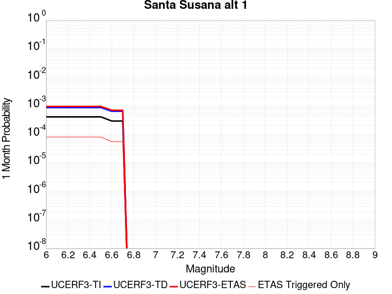 |  |  |

| Magnitude | 1 wk TI Prob | 1 wk TD Prob | 1 wk ETAS Prob | 1 wk ETAS/TD Gain | 1 wk ETAS Triggered Only | 1 mo TI Prob | 1 mo TD Prob | 1 mo ETAS Prob | 1 mo ETAS/TD Gain | 1 mo ETAS Triggered Only | 1 yr TI Prob | 1 yr TD Prob | 1 yr ETAS Prob | 1 yr ETAS/TD Gain | 1 yr ETAS Triggered Only | 10 yr TI Prob | 10 yr TD Prob | 10 yr ETAS Prob | 10 yr ETAS/TD Gain | 10 yr ETAS Triggered Only |
|-----|-----|-----|-----|-----|-----|-----|-----|-----|-----|-----|-----|-----|-----|-----|-----|-----|-----|-----|-----|-----|
| 6.0 | 9.5099895E-5 | 2.0216104E-4 | 2.4029071E-4 | 1.1886103 | 3.8137372E-5 | 4.075073E-4 | 8.6613704E-4 | 9.423457E-4 | 1.0879868 | 7.6274744E-5 | 0.00495012 | 0.010495704 | 0.010608914 | 1.0107864 | 1.1441211E-4 | 0.048412967 | 0.10018345 | 0.10037219 | 1.001884 | 2.0975554E-4 |
| 6.1 | 9.5099895E-5 | 2.0216104E-4 | 2.4029071E-4 | 1.1886103 | 3.8137372E-5 | 4.075073E-4 | 8.6613704E-4 | 9.423457E-4 | 1.0879868 | 7.6274744E-5 | 0.00495012 | 0.010495704 | 0.010608914 | 1.0107864 | 1.1441211E-4 | 0.048412967 | 0.10018345 | 0.10037219 | 1.001884 | 2.0975554E-4 |
| 6.2 | 9.5099895E-5 | 2.0216104E-4 | 2.4029071E-4 | 1.1886103 | 3.8137372E-5 | 4.075073E-4 | 8.6613704E-4 | 9.423457E-4 | 1.0879868 | 7.6274744E-5 | 0.00495012 | 0.010495704 | 0.010608914 | 1.0107864 | 1.1441211E-4 | 0.048412967 | 0.10018345 | 0.10037219 | 1.001884 | 2.0975554E-4 |
| 6.3 | 9.5099895E-5 | 2.0216104E-4 | 2.4029071E-4 | 1.1886103 | 3.8137372E-5 | 4.075073E-4 | 8.6613704E-4 | 9.423457E-4 | 1.0879868 | 7.6274744E-5 | 0.00495012 | 0.010495704 | 0.010608914 | 1.0107864 | 1.1441211E-4 | 0.048412967 | 0.10018345 | 0.10037219 | 1.001884 | 2.0975554E-4 |
| 6.4 | 9.5099895E-5 | 2.0216104E-4 | 2.4029071E-4 | 1.1886103 | 3.8137372E-5 | 4.075073E-4 | 8.6613704E-4 | 9.423457E-4 | 1.0879868 | 7.6274744E-5 | 0.00495012 | 0.010495704 | 0.010608914 | 1.0107864 | 1.1441211E-4 | 0.048412967 | 0.10018345 | 0.10037219 | 1.001884 | 2.0975554E-4 |
| 6.5 | 9.5099895E-5 | 2.0216104E-4 | 2.4029071E-4 | 1.1886103 | 3.8137372E-5 | 4.075073E-4 | 8.6613704E-4 | 9.423457E-4 | 1.0879868 | 7.6274744E-5 | 0.00495012 | 0.010495704 | 0.010608914 | 1.0107864 | 1.1441211E-4 | 0.048412967 | 0.10018345 | 0.10037219 | 1.001884 | 2.0975554E-4 |
| 6.6 | 6.811134E-5 | 1.4962441E-4 | 1.8775607E-4 | 1.2548492 | 3.8137372E-5 | 2.9187306E-4 | 6.410975E-4 | 7.1732333E-4 | 1.118899 | 7.6274744E-5 | 0.0035477648 | 0.007785119 | 0.007898641 | 1.0145818 | 1.1441211E-4 | 0.034916576 | 0.075827375 | 0.076021224 | 1.0025564 | 2.0975554E-4 |
| 6.7 | 6.811134E-5 | 1.4962441E-4 | 1.8775607E-4 | 1.2548492 | 3.8137372E-5 | 2.9187306E-4 | 6.410975E-4 | 7.1732333E-4 | 1.118899 | 7.6274744E-5 | 0.0035477648 | 0.007785119 | 0.007898641 | 1.0145818 | 1.1441211E-4 | 0.034916576 | 0.075827375 | 0.076021224 | 1.0025564 | 2.0975554E-4 |

## San Jacinto (Stepovers Combined)
*[(top)](#table-of-contents)*

| 1 Week | 1 Month | 1 Year | 10 Year |
|-----|-----|-----|-----|
|  |  |  |  |

| Magnitude | 1 wk TI Prob | 1 wk TD Prob | 1 wk ETAS Prob | 1 wk ETAS/TD Gain | 1 wk ETAS Triggered Only | 1 mo TI Prob | 1 mo TD Prob | 1 mo ETAS Prob | 1 mo ETAS/TD Gain | 1 mo ETAS Triggered Only | 1 yr TI Prob | 1 yr TD Prob | 1 yr ETAS Prob | 1 yr ETAS/TD Gain | 1 yr ETAS Triggered Only | 10 yr TI Prob | 10 yr TD Prob | 10 yr ETAS Prob | 10 yr ETAS/TD Gain | 10 yr ETAS Triggered Only |
|-----|-----|-----|-----|-----|-----|-----|-----|-----|-----|-----|-----|-----|-----|-----|-----|-----|-----|-----|-----|-----|
| 6.0 | 1.1968766E-4 | 2.2716755E-4 | 2.462319E-4 | 1.083922 | 1.9068686E-5 | 5.128463E-4 | 9.731359E-4 | 9.92186E-4 | 1.0195761 | 1.9068686E-5 | 0.0062260423 | 0.0117805805 | 0.011874801 | 1.0079979 | 9.534343E-5 | 0.06054471 | 0.113027595 | 0.11317982 | 1.0013467 | 1.7161817E-4 |
| 6.1 | 1.1968766E-4 | 2.2716755E-4 | 2.462319E-4 | 1.083922 | 1.9068686E-5 | 5.128463E-4 | 9.731359E-4 | 9.92186E-4 | 1.0195761 | 1.9068686E-5 | 0.0062260423 | 0.0117805805 | 0.011874801 | 1.0079979 | 9.534343E-5 | 0.06054471 | 0.113027595 | 0.11317982 | 1.0013467 | 1.7161817E-4 |
| 6.2 | 1.1968766E-4 | 2.2716755E-4 | 2.462319E-4 | 1.083922 | 1.9068686E-5 | 5.128463E-4 | 9.731359E-4 | 9.92186E-4 | 1.0195761 | 1.9068686E-5 | 0.0062260423 | 0.0117805805 | 0.011874801 | 1.0079979 | 9.534343E-5 | 0.06054471 | 0.113027595 | 0.11317982 | 1.0013467 | 1.7161817E-4 |
| 6.3 | 1.1968766E-4 | 2.2716755E-4 | 2.462319E-4 | 1.083922 | 1.9068686E-5 | 5.128463E-4 | 9.731359E-4 | 9.92186E-4 | 1.0195761 | 1.9068686E-5 | 0.0062260423 | 0.0117805805 | 0.011874801 | 1.0079979 | 9.534343E-5 | 0.06054471 | 0.113027595 | 0.11317982 | 1.0013467 | 1.7161817E-4 |
| 6.4 | 1.1968766E-4 | 2.2716755E-4 | 2.462319E-4 | 1.083922 | 1.9068686E-5 | 5.128463E-4 | 9.731359E-4 | 9.92186E-4 | 1.0195761 | 1.9068686E-5 | 0.0062260423 | 0.0117805805 | 0.011874801 | 1.0079979 | 9.534343E-5 | 0.06054471 | 0.113027595 | 0.11317982 | 1.0013467 | 1.7161817E-4 |
| 6.5 | 1.1968766E-4 | 2.2716755E-4 | 2.462319E-4 | 1.083922 | 1.9068686E-5 | 5.128463E-4 | 9.731359E-4 | 9.92186E-4 | 1.0195761 | 1.9068686E-5 | 0.0062260423 | 0.0117805805 | 0.011874801 | 1.0079979 | 9.534343E-5 | 0.06054471 | 0.113027595 | 0.11317982 | 1.0013467 | 1.7161817E-4 |
| 6.6 | 1.1957375E-4 | 2.2692814E-4 | 2.459925E-4 | 1.0840106 | 1.9068686E-5 | 5.1235827E-4 | 9.7211095E-4 | 9.911611E-4 | 1.0195967 | 1.9068686E-5 | 0.006220135 | 0.011768302 | 0.011862523 | 1.0080063 | 9.534343E-5 | 0.06048886 | 0.11292298 | 0.11307522 | 1.0013481 | 1.7161817E-4 |
| 6.7 | 1.1951502E-4 | 2.2680471E-4 | 2.4586907E-4 | 1.0840563 | 1.9068686E-5 | 5.1210664E-4 | 9.7158254E-4 | 9.906327E-4 | 1.0196073 | 1.9068686E-5 | 0.006217089 | 0.011761972 | 0.011856194 | 1.0080107 | 9.534343E-5 | 0.060460065 | 0.11286904 | 0.113021284 | 1.0013489 | 1.7161817E-4 |
| 6.8 | 1.1939376E-4 | 2.2654171E-4 | 2.456061E-4 | 1.0841539 | 1.9068686E-5 | 5.1158713E-4 | 9.704564E-4 | 9.895066E-4 | 1.0196301 | 1.9068686E-5 | 0.0062108003 | 0.011748434 | 0.011842658 | 1.00802 | 9.534343E-5 | 0.06040061 | 0.11275068 | 0.11290295 | 1.0013505 | 1.7161817E-4 |
| 6.9 | 1.19143144E-4 | 2.2600606E-4 | 2.4507043E-4 | 1.0843533 | 1.9068686E-5 | 5.1051355E-4 | 9.6816255E-4 | 9.872128E-4 | 1.0196767 | 1.9068686E-5 | 0.0061978037 | 0.011720859 | 0.011815086 | 1.0080391 | 9.534343E-5 | 0.060277723 | 0.11250938 | 0.11266168 | 1.0013537 | 1.7161817E-4 |
| 7.0 | 9.224271E-5 | 1.62278E-4 | 1.8134358E-4 | 1.1174872 | 1.9068686E-5 | 3.9526602E-4 | 6.952914E-4 | 7.1434677E-4 | 1.0274063 | 1.9068686E-5 | 0.0048017497 | 0.008436837 | 0.008512468 | 1.0089644 | 7.6274744E-5 | 0.046993118 | 0.083286285 | 0.08340865 | 1.0014691 | 1.334808E-4 |
| 7.1 | 9.189464E-5 | 1.6160391E-4 | 1.8066952E-4 | 1.1179774 | 1.9068686E-5 | 3.9377474E-4 | 6.9240405E-4 | 7.1145955E-4 | 1.0275208 | 1.9068686E-5 | 0.004783673 | 0.008401991 | 0.008477625 | 1.0090019 | 7.6274744E-5 | 0.04682 | 0.0829684 | 0.083090805 | 1.0014753 | 1.334808E-4 |
| 7.2 | 9.121798E-5 | 1.6023654E-4 | 1.7930217E-4 | 1.1189843 | 1.9068686E-5 | 3.9087565E-4 | 6.8654754E-4 | 7.0560316E-4 | 1.0277557 | 1.9068686E-5 | 0.004748531 | 0.008331316 | 0.008406955 | 1.0090789 | 7.6274744E-5 | 0.046483368 | 0.08232578 | 0.082448274 | 1.0014879 | 1.334808E-4 |
| 7.3 | 8.9773785E-5 | 1.5732428E-4 | 1.7638996E-4 | 1.1211872 | 1.9068686E-5 | 3.8468806E-4 | 6.740732E-4 | 6.93129E-4 | 1.0282696 | 1.9068686E-5 | 0.004673523 | 0.008180636 | 0.008256287 | 1.0092475 | 7.6274744E-5 | 0.0457645 | 0.08092336 | 0.081046045 | 1.001516 | 1.334808E-4 |
| 7.4 | 7.3478965E-5 | 1.1931325E-4 | 1.3837966E-4 | 1.1598012 | 1.9068686E-5 | 3.1487184E-4 | 5.1127357E-4 | 5.303325E-4 | 1.0372773 | 1.9068686E-5 | 0.0038268273 | 0.006212538 | 0.0062504383 | 1.0061007 | 3.8137372E-5 | 0.037615944 | 0.06262941 | 0.062700905 | 1.0011415 | 7.6274744E-5 |
| 7.5 | 6.7516885E-5 | 1.08003216E-4 | 1.2706984E-4 | 1.1765376 | 1.9068686E-5 | 2.8932598E-4 | 4.6281965E-4 | 4.818795E-4 | 1.041182 | 1.9068686E-5 | 0.003516855 | 0.005625739 | 0.005663662 | 1.0067409 | 3.8137372E-5 | 0.034617163 | 0.057019595 | 0.05709152 | 1.0012615 | 7.6274744E-5 |
| 7.6 | 2.8268712E-5 | 4.2655167E-5 | 6.172304E-5 | 1.4470237 | 1.9068686E-5 | 1.21146004E-4 | 1.8279799E-4 | 2.018632E-4 | 1.1042966 | 1.9068686E-5 | 0.0014739545 | 0.0022238137 | 0.0022618663 | 1.0171114 | 3.8137372E-5 | 0.014642165 | 0.022920644 | 0.02297654 | 1.0024387 | 5.7206056E-5 |
| 7.7 | 1.673878E-5 | 2.1973781E-5 | 2.1973781E-5 | 1.0 | 0.0 | 7.173566E-5 | 9.417205E-5 | 9.417205E-5 | 1.0 | 0.0 | 8.730317E-4 | 0.0011463144 | 0.0011463144 | 1.0 | 0.0 | 0.008696098 | 0.01216197 | 0.012180807 | 1.0015488 | 1.9068686E-5 |
| 7.8 | 1.5303123E-6 | 1.9707616E-6 | 1.9707616E-6 | 1.0 | 0.0 | 6.5584645E-6 | 8.446107E-6 | 8.446107E-6 | 1.0 | 0.0 | 7.984638E-5 | 1.0282895E-4 | 1.0282895E-4 | 1.0 | 0.0 | 7.98177E-4 | 0.001066982 | 0.0010860304 | 1.0178525 | 1.9068686E-5 |

## Ventura-Pitas Point
*[(top)](#table-of-contents)*

| 1 Week | 1 Month | 1 Year | 10 Year |
|-----|-----|-----|-----|
|  |  |  |  |

| Magnitude | 1 wk TI Prob | 1 wk TD Prob | 1 wk ETAS Prob | 1 wk ETAS/TD Gain | 1 wk ETAS Triggered Only | 1 mo TI Prob | 1 mo TD Prob | 1 mo ETAS Prob | 1 mo ETAS/TD Gain | 1 mo ETAS Triggered Only | 1 yr TI Prob | 1 yr TD Prob | 1 yr ETAS Prob | 1 yr ETAS/TD Gain | 1 yr ETAS Triggered Only | 10 yr TI Prob | 10 yr TD Prob | 10 yr ETAS Prob | 10 yr ETAS/TD Gain | 10 yr ETAS Triggered Only |
|-----|-----|-----|-----|-----|-----|-----|-----|-----|-----|-----|-----|-----|-----|-----|-----|-----|-----|-----|-----|-----|
| 6.0 | 1.3734005E-5 | 1.4989571E-5 | 1.4989571E-5 | 1.0 | 0.0 | 5.885869E-5 | 6.423993E-5 | 1.02374855E-4 | 1.5936327 | 3.8137372E-5 | 7.1636896E-4 | 7.819278E-4 | 8.7719667E-4 | 1.1218385 | 9.534343E-5 | 0.00714064 | 0.007800344 | 0.007951704 | 1.0194042 | 1.5254949E-4 |
| 6.1 | 1.3734005E-5 | 1.4989571E-5 | 1.4989571E-5 | 1.0 | 0.0 | 5.885869E-5 | 6.423993E-5 | 1.02374855E-4 | 1.5936327 | 3.8137372E-5 | 7.1636896E-4 | 7.819278E-4 | 8.7719667E-4 | 1.1218385 | 9.534343E-5 | 0.00714064 | 0.007800344 | 0.007951704 | 1.0194042 | 1.5254949E-4 |
| 6.2 | 1.3734005E-5 | 1.4989571E-5 | 1.4989571E-5 | 1.0 | 0.0 | 5.885869E-5 | 6.423993E-5 | 1.02374855E-4 | 1.5936327 | 3.8137372E-5 | 7.1636896E-4 | 7.819278E-4 | 8.7719667E-4 | 1.1218385 | 9.534343E-5 | 0.00714064 | 0.007800344 | 0.007951704 | 1.0194042 | 1.5254949E-4 |
| 6.3 | 1.3734005E-5 | 1.4989571E-5 | 1.4989571E-5 | 1.0 | 0.0 | 5.885869E-5 | 6.423993E-5 | 1.02374855E-4 | 1.5936327 | 3.8137372E-5 | 7.1636896E-4 | 7.819278E-4 | 8.7719667E-4 | 1.1218385 | 9.534343E-5 | 0.00714064 | 0.007800344 | 0.007951704 | 1.0194042 | 1.5254949E-4 |
| 6.4 | 1.3734005E-5 | 1.4989571E-5 | 1.4989571E-5 | 1.0 | 0.0 | 5.885869E-5 | 6.423993E-5 | 1.02374855E-4 | 1.5936327 | 3.8137372E-5 | 7.1636896E-4 | 7.819278E-4 | 8.7719667E-4 | 1.1218385 | 9.534343E-5 | 0.00714064 | 0.007800344 | 0.007951704 | 1.0194042 | 1.5254949E-4 |
| 6.5 | 1.3734005E-5 | 1.4989571E-5 | 1.4989571E-5 | 1.0 | 0.0 | 5.885869E-5 | 6.423993E-5 | 1.02374855E-4 | 1.5936327 | 3.8137372E-5 | 7.1636896E-4 | 7.819278E-4 | 8.7719667E-4 | 1.1218385 | 9.534343E-5 | 0.00714064 | 0.007800344 | 0.007951704 | 1.0194042 | 1.5254949E-4 |
| 6.6 | 1.3017341E-5 | 1.42015815E-5 | 1.42015815E-5 | 1.0 | 0.0 | 5.5787412E-5 | 6.0862993E-5 | 9.899804E-5 | 1.626572 | 3.8137372E-5 | 6.7900005E-4 | 7.408419E-4 | 8.361147E-4 | 1.1286007 | 9.534343E-5 | 0.006769291 | 0.0073922575 | 0.0075436793 | 1.0204839 | 1.5254949E-4 |
| 6.7 | 1.0029534E-5 | 1.09311E-5 | 1.09311E-5 | 1.0 | 0.0 | 4.298301E-5 | 4.6847203E-5 | 8.4982785E-5 | 1.8140419 | 3.8137372E-5 | 5.2319246E-4 | 5.70299E-4 | 6.4653024E-4 | 1.1336689 | 7.6274744E-5 | 0.005219624 | 0.005696553 | 0.0058103134 | 1.01997 | 1.1441211E-4 |
| 6.8 | 7.869905E-6 | 8.563513E-6 | 8.563513E-6 | 1.0 | 0.0 | 3.372773E-5 | 3.6700705E-5 | 5.576869E-5 | 1.5195537 | 1.9068686E-5 | 4.1055772E-4 | 4.4682005E-4 | 4.8494036E-4 | 1.0853148 | 3.8137372E-5 | 0.0040980005 | 0.004467117 | 0.0045240675 | 1.0127488 | 5.7206056E-5 |
| 6.9 | 7.3736396E-6 | 8.021501E-6 | 8.021501E-6 | 1.0 | 0.0 | 3.1600932E-5 | 3.4377863E-5 | 5.3445892E-5 | 1.5546601 | 1.9068686E-5 | 3.8467342E-4 | 4.1855048E-4 | 4.566719E-4 | 1.0910796 | 3.8137372E-5 | 0.003840082 | 0.0041855047 | 0.0042424714 | 1.0136105 | 5.7206056E-5 |

## San Jacinto (San Jacinto Valley) rev
*[(top)](#table-of-contents)*

| 1 Week | 1 Month | 1 Year | 10 Year |
|-----|-----|-----|-----|
|  |  |  |  |

| Magnitude | 1 wk TI Prob | 1 wk TD Prob | 1 wk ETAS Prob | 1 wk ETAS/TD Gain | 1 wk ETAS Triggered Only | 1 mo TI Prob | 1 mo TD Prob | 1 mo ETAS Prob | 1 mo ETAS/TD Gain | 1 mo ETAS Triggered Only | 1 yr TI Prob | 1 yr TD Prob | 1 yr ETAS Prob | 1 yr ETAS/TD Gain | 1 yr ETAS Triggered Only | 10 yr TI Prob | 10 yr TD Prob | 10 yr ETAS Prob | 10 yr ETAS/TD Gain | 10 yr ETAS Triggered Only |
|-----|-----|-----|-----|-----|-----|-----|-----|-----|-----|-----|-----|-----|-----|-----|-----|-----|-----|-----|-----|-----|
| 6.0 | 7.806946E-5 | 1.580409E-4 | 1.7710657E-4 | 1.1206375 | 1.9068686E-5 | 3.345405E-4 | 6.770383E-4 | 6.9609407E-4 | 1.0281458 | 1.9068686E-5 | 0.004065426 | 0.008203736 | 0.0082982965 | 1.0115266 | 9.534343E-5 | 0.03991852 | 0.07910823 | 0.07926627 | 1.0019978 | 1.7161817E-4 |
| 6.1 | 7.806946E-5 | 1.580409E-4 | 1.7710657E-4 | 1.1206375 | 1.9068686E-5 | 3.345405E-4 | 6.770383E-4 | 6.9609407E-4 | 1.0281458 | 1.9068686E-5 | 0.004065426 | 0.008203736 | 0.0082982965 | 1.0115266 | 9.534343E-5 | 0.03991852 | 0.07910823 | 0.07926627 | 1.0019978 | 1.7161817E-4 |
| 6.2 | 7.806946E-5 | 1.580409E-4 | 1.7710657E-4 | 1.1206375 | 1.9068686E-5 | 3.345405E-4 | 6.770383E-4 | 6.9609407E-4 | 1.0281458 | 1.9068686E-5 | 0.004065426 | 0.008203736 | 0.0082982965 | 1.0115266 | 9.534343E-5 | 0.03991852 | 0.07910823 | 0.07926627 | 1.0019978 | 1.7161817E-4 |
| 6.3 | 7.806946E-5 | 1.580409E-4 | 1.7710657E-4 | 1.1206375 | 1.9068686E-5 | 3.345405E-4 | 6.770383E-4 | 6.9609407E-4 | 1.0281458 | 1.9068686E-5 | 0.004065426 | 0.008203736 | 0.0082982965 | 1.0115266 | 9.534343E-5 | 0.03991852 | 0.07910823 | 0.07926627 | 1.0019978 | 1.7161817E-4 |
| 6.4 | 7.806946E-5 | 1.580409E-4 | 1.7710657E-4 | 1.1206375 | 1.9068686E-5 | 3.345405E-4 | 6.770383E-4 | 6.9609407E-4 | 1.0281458 | 1.9068686E-5 | 0.004065426 | 0.008203736 | 0.0082982965 | 1.0115266 | 9.534343E-5 | 0.03991852 | 0.07910823 | 0.07926627 | 1.0019978 | 1.7161817E-4 |
| 6.5 | 7.806946E-5 | 1.580409E-4 | 1.7710657E-4 | 1.1206375 | 1.9068686E-5 | 3.345405E-4 | 6.770383E-4 | 6.9609407E-4 | 1.0281458 | 1.9068686E-5 | 0.004065426 | 0.008203736 | 0.0082982965 | 1.0115266 | 9.534343E-5 | 0.03991852 | 0.07910823 | 0.07926627 | 1.0019978 | 1.7161817E-4 |
| 6.6 | 7.8012505E-5 | 1.5793537E-4 | 1.7700104E-4 | 1.1207182 | 1.9068686E-5 | 3.3429646E-4 | 6.765863E-4 | 6.95642E-4 | 1.0281646 | 1.9068686E-5 | 0.004062466 | 0.008198286 | 0.008292848 | 1.0115343 | 9.534343E-5 | 0.039889984 | 0.079058796 | 0.079216845 | 1.0019991 | 1.7161817E-4 |
| 6.7 | 7.8012505E-5 | 1.5793537E-4 | 1.7700104E-4 | 1.1207182 | 1.9068686E-5 | 3.3429646E-4 | 6.765863E-4 | 6.95642E-4 | 1.0281646 | 1.9068686E-5 | 0.004062466 | 0.008198286 | 0.008292848 | 1.0115343 | 9.534343E-5 | 0.039889984 | 0.079058796 | 0.079216845 | 1.0019991 | 1.7161817E-4 |
| 6.8 | 7.7891236E-5 | 1.5767448E-4 | 1.7674016E-4 | 1.1209179 | 1.9068686E-5 | 3.3377687E-4 | 6.754689E-4 | 6.945247E-4 | 1.0282112 | 1.9068686E-5 | 0.004056163 | 0.0081848195 | 0.008279382 | 1.0115535 | 9.534343E-5 | 0.039829224 | 0.0789369 | 0.07909497 | 1.0020025 | 1.7161817E-4 |
| 6.9 | 7.764062E-5 | 1.5713525E-4 | 1.7620093E-4 | 1.121333 | 1.9068686E-5 | 3.327031E-4 | 6.731594E-4 | 6.922152E-4 | 1.028308 | 1.9068686E-5 | 0.0040431386 | 0.008156981 | 0.008251547 | 1.0115932 | 9.534343E-5 | 0.039703645 | 0.07868492 | 0.078843035 | 1.0020095 | 1.7161817E-4 |
| 7.0 | 5.0739076E-5 | 9.3390074E-5 | 1.1245698E-4 | 1.2041641 | 1.9068686E-5 | 2.1743505E-4 | 4.0015313E-4 | 4.192142E-4 | 1.0476344 | 1.9068686E-5 | 0.0026440579 | 0.0048604817 | 0.004936386 | 1.0156165 | 7.6274744E-5 | 0.026128192 | 0.04834233 | 0.04845121 | 1.0022523 | 1.1441211E-4 |
| 7.1 | 5.0390987E-5 | 9.2688424E-5 | 1.1175534E-4 | 1.2057098 | 1.9068686E-5 | 2.159435E-4 | 3.9714726E-4 | 4.1620838E-4 | 1.0479951 | 1.9068686E-5 | 0.002625942 | 0.004824109 | 0.0049000154 | 1.0157349 | 7.6274744E-5 | 0.025951283 | 0.048000354 | 0.048109274 | 1.0022691 | 1.1441211E-4 |
| 7.2 | 4.9789487E-5 | 9.143531E-5 | 1.10502246E-4 | 1.2085294 | 1.9068686E-5 | 2.1336606E-4 | 3.917791E-4 | 4.108403E-4 | 1.048653 | 1.9068686E-5 | 0.0025946372 | 0.0047591375 | 0.004835049 | 1.0159507 | 7.6274744E-5 | 0.025645511 | 0.047391243 | 0.047500234 | 1.0022998 | 1.1441211E-4 |
| 7.3 | 4.9191407E-5 | 9.01359E-5 | 1.0920287E-4 | 1.2115358 | 1.9068686E-5 | 2.1080328E-4 | 3.8621208E-4 | 4.052734E-4 | 1.0493546 | 1.9068686E-5 | 0.002563509 | 0.004691701 | 0.004767618 | 1.0161811 | 7.6274744E-5 | 0.025341382 | 0.04674962 | 0.046858687 | 1.0023329 | 1.1441211E-4 |
| 7.4 | 3.3192722E-5 | 5.2610532E-5 | 7.1678216E-5 | 1.3624309 | 1.9068686E-5 | 1.4224676E-4 | 2.2545758E-4 | 2.4452197E-4 | 1.0845586 | 1.9068686E-5 | 0.0017304786 | 0.0027420863 | 0.002780119 | 1.01387 | 3.8137372E-5 | 0.01717065 | 0.028029768 | 0.028085371 | 1.0019836 | 5.7206056E-5 |
| 7.5 | 2.8249084E-5 | 4.2866195E-5 | 6.1934064E-5 | 1.4448229 | 1.9068686E-5 | 1.2106189E-4 | 1.8370226E-4 | 2.0276743E-4 | 1.103783 | 1.9068686E-5 | 0.0014729318 | 0.0022347996 | 0.0022728515 | 1.0170271 | 3.8137372E-5 | 0.014632072 | 0.023027074 | 0.023082962 | 1.0024271 | 5.7206056E-5 |
| 7.6 | 2.7497194E-5 | 4.146988E-5 | 6.0537775E-5 | 1.4598011 | 1.9068686E-5 | 1.17839794E-4 | 1.7771887E-4 | 1.9678417E-4 | 1.1072779 | 1.9068686E-5 | 0.0014337553 | 0.0021620982 | 0.002200153 | 1.0176009 | 3.8137372E-5 | 0.0142454 | 0.022306465 | 0.022362394 | 1.0025073 | 5.7206056E-5 |
| 7.7 | 1.673878E-5 | 2.1973781E-5 | 2.1973781E-5 | 1.0 | 0.0 | 7.173566E-5 | 9.417205E-5 | 9.417205E-5 | 1.0 | 0.0 | 8.730317E-4 | 0.0011463144 | 0.0011463144 | 1.0 | 0.0 | 0.008696098 | 0.01216197 | 0.012180807 | 1.0015488 | 1.9068686E-5 |
| 7.8 | 1.5303123E-6 | 1.9707616E-6 | 1.9707616E-6 | 1.0 | 0.0 | 6.5584645E-6 | 8.446107E-6 | 8.446107E-6 | 1.0 | 0.0 | 7.984638E-5 | 1.0282895E-4 | 1.0282895E-4 | 1.0 | 0.0 | 7.98177E-4 | 0.001066982 | 0.0010860304 | 1.0178525 | 1.9068686E-5 |

## Helendale-So Lockhart
*[(top)](#table-of-contents)*

| 1 Week | 1 Month | 1 Year | 10 Year |
|-----|-----|-----|-----|
|  |  |  |  |

| Magnitude | 1 wk TI Prob | 1 wk TD Prob | 1 wk ETAS Prob | 1 wk ETAS/TD Gain | 1 wk ETAS Triggered Only | 1 mo TI Prob | 1 mo TD Prob | 1 mo ETAS Prob | 1 mo ETAS/TD Gain | 1 mo ETAS Triggered Only | 1 yr TI Prob | 1 yr TD Prob | 1 yr ETAS Prob | 1 yr ETAS/TD Gain | 1 yr ETAS Triggered Only | 10 yr TI Prob | 10 yr TD Prob | 10 yr ETAS Prob | 10 yr ETAS/TD Gain | 10 yr ETAS Triggered Only |
|-----|-----|-----|-----|-----|-----|-----|-----|-----|-----|-----|-----|-----|-----|-----|-----|-----|-----|-----|-----|-----|
| 6.0 | 7.171715E-6 | 7.4314485E-6 | 7.4314485E-6 | 1.0 | 0.0 | 3.073556E-5 | 3.184873E-5 | 5.0916806E-5 | 1.5987077 | 1.9068686E-5 | 3.7414118E-4 | 3.8769832E-4 | 4.639435E-4 | 1.1966611 | 7.6274744E-5 | 0.003735119 | 0.0038711112 | 0.00402307 | 1.0392547 | 1.5254949E-4 |
| 6.1 | 7.171715E-6 | 7.4314485E-6 | 7.4314485E-6 | 1.0 | 0.0 | 3.073556E-5 | 3.184873E-5 | 5.0916806E-5 | 1.5987077 | 1.9068686E-5 | 3.7414118E-4 | 3.8769832E-4 | 4.639435E-4 | 1.1966611 | 7.6274744E-5 | 0.003735119 | 0.0038711112 | 0.00402307 | 1.0392547 | 1.5254949E-4 |
| 6.2 | 7.171715E-6 | 7.4314485E-6 | 7.4314485E-6 | 1.0 | 0.0 | 3.073556E-5 | 3.184873E-5 | 5.0916806E-5 | 1.5987077 | 1.9068686E-5 | 3.7414118E-4 | 3.8769832E-4 | 4.639435E-4 | 1.1966611 | 7.6274744E-5 | 0.003735119 | 0.0038711112 | 0.00402307 | 1.0392547 | 1.5254949E-4 |
| 6.3 | 7.171715E-6 | 7.4314485E-6 | 7.4314485E-6 | 1.0 | 0.0 | 3.073556E-5 | 3.184873E-5 | 5.0916806E-5 | 1.5987077 | 1.9068686E-5 | 3.7414118E-4 | 3.8769832E-4 | 4.639435E-4 | 1.1966611 | 7.6274744E-5 | 0.003735119 | 0.0038711112 | 0.00402307 | 1.0392547 | 1.5254949E-4 |
| 6.4 | 7.171715E-6 | 7.4314485E-6 | 7.4314485E-6 | 1.0 | 0.0 | 3.073556E-5 | 3.184873E-5 | 5.0916806E-5 | 1.5987077 | 1.9068686E-5 | 3.7414118E-4 | 3.8769832E-4 | 4.639435E-4 | 1.1966611 | 7.6274744E-5 | 0.003735119 | 0.0038711112 | 0.00402307 | 1.0392547 | 1.5254949E-4 |
| 6.5 | 7.171715E-6 | 7.4314485E-6 | 7.4314485E-6 | 1.0 | 0.0 | 3.073556E-5 | 3.184873E-5 | 5.0916806E-5 | 1.5987077 | 1.9068686E-5 | 3.7414118E-4 | 3.8769832E-4 | 4.639435E-4 | 1.1966611 | 7.6274744E-5 | 0.003735119 | 0.0038711112 | 0.00402307 | 1.0392547 | 1.5254949E-4 |
| 6.6 | 6.5580157E-6 | 6.7948727E-6 | 6.7948727E-6 | 1.0 | 0.0 | 2.810548E-5 | 2.9120609E-5 | 4.818874E-5 | 1.6547985 | 1.9068686E-5 | 3.421305E-4 | 3.5449475E-4 | 4.3074245E-4 | 1.2150884 | 7.6274744E-5 | 0.0034160423 | 0.0035401797 | 0.003692189 | 1.0429384 | 1.5254949E-4 |
| 6.7 | 5.6879685E-6 | 5.8928526E-6 | 5.8928526E-6 | 1.0 | 0.0 | 2.4376779E-5 | 2.5254889E-5 | 4.4323093E-5 | 1.7550303 | 1.9068686E-5 | 2.9674688E-4 | 3.074438E-4 | 3.8369512E-4 | 1.248017 | 7.6274744E-5 | 0.0029635092 | 0.0030710634 | 0.0031851241 | 1.0371405 | 1.1441211E-4 |
| 6.8 | 4.958099E-6 | 5.135111E-6 | 5.135111E-6 | 1.0 | 0.0 | 2.1248823E-5 | 2.2007483E-5 | 4.107575E-5 | 1.8664446 | 1.9068686E-5 | 2.586737E-4 | 2.6791706E-4 | 3.4417136E-4 | 1.2846191 | 7.6274744E-5 | 0.0025837282 | 0.0026768132 | 0.0027719014 | 1.0355229 | 9.534343E-5 |
| 6.9 | 4.3792215E-6 | 4.5342804E-6 | 4.5342804E-6 | 1.0 | 0.0 | 1.8767958E-5 | 1.9432535E-5 | 3.850085E-5 | 1.9812572 | 1.9068686E-5 | 2.2847592E-4 | 2.3657428E-4 | 3.12831E-4 | 1.3223373 | 7.6274744E-5 | 0.0022824116 | 0.0023640923 | 0.0024592103 | 1.0402344 | 9.534343E-5 |
| 7.0 | 3.858262E-6 | 3.9935144E-6 | 3.9935144E-6 | 1.0 | 0.0 | 1.6535305E-5 | 1.7115E-5 | 3.618336E-5 | 2.1141315 | 1.9068686E-5 | 2.0129874E-4 | 2.0836401E-4 | 2.8462286E-4 | 1.3659886 | 7.6274744E-5 | 0.0020111648 | 0.0020825516 | 0.0021776964 | 1.0456867 | 9.534343E-5 |
| 7.1 | 3.3854772E-6 | 3.502769E-6 | 3.502769E-6 | 1.0 | 0.0 | 1.4509107E-5 | 1.501183E-5 | 3.408023E-5 | 2.2702248 | 1.9068686E-5 | 1.7663406E-4 | 1.827625E-4 | 2.590233E-4 | 1.4172672 | 7.6274744E-5 | 0.0017649373 | 0.0018269841 | 0.0019221533 | 1.0520909 | 9.534343E-5 |
| 7.2 | 2.9527619E-6 | 3.05382E-6 | 3.05382E-6 | 1.0 | 0.0 | 1.2654632E-5 | 1.3087783E-5 | 3.215622E-5 | 2.4569645 | 1.9068686E-5 | 1.5405925E-4 | 1.5934087E-4 | 2.3560345E-4 | 1.4786129 | 7.6274744E-5 | 0.0015395249 | 0.0015931253 | 0.0016883168 | 1.0597514 | 9.534343E-5 |
| 7.3 | 2.553375E-6 | 2.6399916E-6 | 2.6399916E-6 | 1.0 | 0.0 | 1.0942989E-5 | 1.13142505E-5 | 1.13142505E-5 | 1.0 | 0.0 | 1.3322275E-4 | 1.3775099E-4 | 1.9494917E-4 | 1.4152287 | 5.7206056E-5 | 0.0013314291 | 0.0013775099 | 0.0014536796 | 1.0552952 | 7.6274744E-5 |

## Simi-Santa Rosa
*[(top)](#table-of-contents)*

| 1 Week | 1 Month | 1 Year | 10 Year |
|-----|-----|-----|-----|
|  |  |  |  |

| Magnitude | 1 wk TI Prob | 1 wk TD Prob | 1 wk ETAS Prob | 1 wk ETAS/TD Gain | 1 wk ETAS Triggered Only | 1 mo TI Prob | 1 mo TD Prob | 1 mo ETAS Prob | 1 mo ETAS/TD Gain | 1 mo ETAS Triggered Only | 1 yr TI Prob | 1 yr TD Prob | 1 yr ETAS Prob | 1 yr ETAS/TD Gain | 1 yr ETAS Triggered Only | 10 yr TI Prob | 10 yr TD Prob | 10 yr ETAS Prob | 10 yr ETAS/TD Gain | 10 yr ETAS Triggered Only |
|-----|-----|-----|-----|-----|-----|-----|-----|-----|-----|-----|-----|-----|-----|-----|-----|-----|-----|-----|-----|-----|
| 6.0 | 1.765222E-5 | 1.996643E-5 | 1.996643E-5 | 1.0 | 0.0 | 7.565018E-5 | 8.556876E-5 | 1.2370286E-4 | 1.4456545 | 3.8137372E-5 | 9.206518E-4 | 0.0010415068 | 0.0011557997 | 1.1097381 | 1.1441211E-4 | 0.009168469 | 0.010386396 | 0.010537361 | 1.0145348 | 1.5254949E-4 |
| 6.1 | 1.765222E-5 | 1.996643E-5 | 1.996643E-5 | 1.0 | 0.0 | 7.565018E-5 | 8.556876E-5 | 1.2370286E-4 | 1.4456545 | 3.8137372E-5 | 9.206518E-4 | 0.0010415068 | 0.0011557997 | 1.1097381 | 1.1441211E-4 | 0.009168469 | 0.010386396 | 0.010537361 | 1.0145348 | 1.5254949E-4 |
| 6.2 | 1.765222E-5 | 1.996643E-5 | 1.996643E-5 | 1.0 | 0.0 | 7.565018E-5 | 8.556876E-5 | 1.2370286E-4 | 1.4456545 | 3.8137372E-5 | 9.206518E-4 | 0.0010415068 | 0.0011557997 | 1.1097381 | 1.1441211E-4 | 0.009168469 | 0.010386396 | 0.010537361 | 1.0145348 | 1.5254949E-4 |
| 6.3 | 1.765222E-5 | 1.996643E-5 | 1.996643E-5 | 1.0 | 0.0 | 7.565018E-5 | 8.556876E-5 | 1.2370286E-4 | 1.4456545 | 3.8137372E-5 | 9.206518E-4 | 0.0010415068 | 0.0011557997 | 1.1097381 | 1.1441211E-4 | 0.009168469 | 0.010386396 | 0.010537361 | 1.0145348 | 1.5254949E-4 |
| 6.4 | 1.765222E-5 | 1.996643E-5 | 1.996643E-5 | 1.0 | 0.0 | 7.565018E-5 | 8.556876E-5 | 1.2370286E-4 | 1.4456545 | 3.8137372E-5 | 9.206518E-4 | 0.0010415068 | 0.0011557997 | 1.1097381 | 1.1441211E-4 | 0.009168469 | 0.010386396 | 0.010537361 | 1.0145348 | 1.5254949E-4 |
| 6.5 | 1.765222E-5 | 1.996643E-5 | 1.996643E-5 | 1.0 | 0.0 | 7.565018E-5 | 8.556876E-5 | 1.2370286E-4 | 1.4456545 | 3.8137372E-5 | 9.206518E-4 | 0.0010415068 | 0.0011557997 | 1.1097381 | 1.1441211E-4 | 0.009168469 | 0.010386396 | 0.010537361 | 1.0145348 | 1.5254949E-4 |
| 6.6 | 1.4207836E-5 | 1.605233E-5 | 1.605233E-5 | 1.0 | 0.0 | 6.0889306E-5 | 6.8795016E-5 | 1.06929765E-4 | 1.5543243 | 3.8137372E-5 | 7.4107514E-4 | 8.374578E-4 | 9.3272136E-4 | 1.1137533 | 9.534343E-5 | 0.0073860865 | 0.0083626695 | 0.008495034 | 1.015828 | 1.334808E-4 |
| 6.7 | 1.1077219E-5 | 1.2498523E-5 | 1.2498523E-5 | 1.0 | 0.0 | 4.747293E-5 | 5.3565098E-5 | 7.263276E-5 | 1.3559718 | 1.9068686E-5 | 5.7782966E-4 | 6.521551E-4 | 7.2838005E-4 | 1.1168817 | 7.6274744E-5 | 0.0057632946 | 0.0065215505 | 0.0066352165 | 1.0174292 | 1.1441211E-4 |
| 6.8 | 1.1077219E-5 | 1.2498523E-5 | 1.2498523E-5 | 1.0 | 0.0 | 4.747293E-5 | 5.3565098E-5 | 7.263276E-5 | 1.3559718 | 1.9068686E-5 | 5.7782966E-4 | 6.521551E-4 | 7.2838005E-4 | 1.1168817 | 7.6274744E-5 | 0.0057632946 | 0.0065215505 | 0.0066352165 | 1.0174292 | 1.1441211E-4 |

## Channel Islands Thrust
*[(top)](#table-of-contents)*

| 1 Week | 1 Month | 1 Year | 10 Year |
|-----|-----|-----|-----|
|  |  |  |  |

| Magnitude | 1 wk TI Prob | 1 wk TD Prob | 1 wk ETAS Prob | 1 wk ETAS/TD Gain | 1 wk ETAS Triggered Only | 1 mo TI Prob | 1 mo TD Prob | 1 mo ETAS Prob | 1 mo ETAS/TD Gain | 1 mo ETAS Triggered Only | 1 yr TI Prob | 1 yr TD Prob | 1 yr ETAS Prob | 1 yr ETAS/TD Gain | 1 yr ETAS Triggered Only | 10 yr TI Prob | 10 yr TD Prob | 10 yr ETAS Prob | 10 yr ETAS/TD Gain | 10 yr ETAS Triggered Only |
|-----|-----|-----|-----|-----|-----|-----|-----|-----|-----|-----|-----|-----|-----|-----|-----|-----|-----|-----|-----|-----|
| 6.0 | 1.9940422E-5 | 2.234876E-5 | 4.141702E-5 | 1.8532133 | 1.9068686E-5 | 8.545615E-5 | 9.577758E-5 | 1.14844435E-4 | 1.1990744 | 1.9068686E-5 | 0.001039932 | 0.0011655908 | 0.0012798696 | 1.0980437 | 1.1441211E-4 | 0.010350789 | 0.0116068935 | 0.011738825 | 1.0113666 | 1.334808E-4 |
| 6.1 | 1.9940422E-5 | 2.234876E-5 | 4.141702E-5 | 1.8532133 | 1.9068686E-5 | 8.545615E-5 | 9.577758E-5 | 1.14844435E-4 | 1.1990744 | 1.9068686E-5 | 0.001039932 | 0.0011655908 | 0.0012798696 | 1.0980437 | 1.1441211E-4 | 0.010350789 | 0.0116068935 | 0.011738825 | 1.0113666 | 1.334808E-4 |
| 6.2 | 1.9940422E-5 | 2.234876E-5 | 4.141702E-5 | 1.8532133 | 1.9068686E-5 | 8.545615E-5 | 9.577758E-5 | 1.14844435E-4 | 1.1990744 | 1.9068686E-5 | 0.001039932 | 0.0011655908 | 0.0012798696 | 1.0980437 | 1.1441211E-4 | 0.010350789 | 0.0116068935 | 0.011738825 | 1.0113666 | 1.334808E-4 |
| 6.3 | 1.9940422E-5 | 2.234876E-5 | 4.141702E-5 | 1.8532133 | 1.9068686E-5 | 8.545615E-5 | 9.577758E-5 | 1.14844435E-4 | 1.1990744 | 1.9068686E-5 | 0.001039932 | 0.0011655908 | 0.0012798696 | 1.0980437 | 1.1441211E-4 | 0.010350789 | 0.0116068935 | 0.011738825 | 1.0113666 | 1.334808E-4 |
| 6.4 | 1.9940422E-5 | 2.234876E-5 | 4.141702E-5 | 1.8532133 | 1.9068686E-5 | 8.545615E-5 | 9.577758E-5 | 1.14844435E-4 | 1.1990744 | 1.9068686E-5 | 0.001039932 | 0.0011655908 | 0.0012798696 | 1.0980437 | 1.1441211E-4 | 0.010350789 | 0.0116068935 | 0.011738825 | 1.0113666 | 1.334808E-4 |
| 6.5 | 1.9940422E-5 | 2.234876E-5 | 4.141702E-5 | 1.8532133 | 1.9068686E-5 | 8.545615E-5 | 9.577758E-5 | 1.14844435E-4 | 1.1990744 | 1.9068686E-5 | 0.001039932 | 0.0011655908 | 0.0012798696 | 1.0980437 | 1.1441211E-4 | 0.010350789 | 0.0116068935 | 0.011738825 | 1.0113666 | 1.334808E-4 |
| 6.6 | 1.9940422E-5 | 2.234876E-5 | 4.141702E-5 | 1.8532133 | 1.9068686E-5 | 8.545615E-5 | 9.577758E-5 | 1.14844435E-4 | 1.1990744 | 1.9068686E-5 | 0.001039932 | 0.0011655908 | 0.0012798696 | 1.0980437 | 1.1441211E-4 | 0.010350789 | 0.0116068935 | 0.011738825 | 1.0113666 | 1.334808E-4 |
| 6.7 | 1.5039115E-5 | 1.6832886E-5 | 3.5901252E-5 | 2.1328042 | 1.9068686E-5 | 6.445176E-5 | 7.213959E-5 | 9.12069E-5 | 1.2643113 | 1.9068686E-5 | 7.844176E-4 | 8.780601E-4 | 9.923717E-4 | 1.1301866 | 1.1441211E-4 | 0.007816545 | 0.00875716 | 0.008889472 | 1.015109 | 1.334808E-4 |
| 6.8 | 1.4337753E-5 | 1.605477E-5 | 3.512315E-5 | 2.1877081 | 1.9068686E-5 | 6.1446066E-5 | 6.8804984E-5 | 8.787236E-5 | 1.277122 | 1.9068686E-5 | 7.4784906E-4 | 8.3749247E-4 | 9.32756E-4 | 1.1137486 | 9.534343E-5 | 0.007453373 | 0.008354535 | 0.008467992 | 1.0135802 | 1.1441211E-4 |
| 6.9 | 1.1226918E-5 | 1.2540004E-5 | 3.160845E-5 | 2.5206094 | 1.9068686E-5 | 4.8114474E-5 | 5.3742377E-5 | 7.2810035E-5 | 1.3547975 | 1.9068686E-5 | 5.856363E-4 | 6.542256E-4 | 7.4950664E-4 | 1.1456394 | 9.534343E-5 | 0.0058409534 | 0.0065336456 | 0.006628366 | 1.0144974 | 9.534343E-5 |
| 7.0 | 1.0975239E-5 | 1.2259085E-5 | 3.1327538E-5 | 2.5554547 | 1.9068686E-5 | 4.703589E-5 | 5.253849E-5 | 7.160618E-5 | 1.3629279 | 1.9068686E-5 | 5.725115E-4 | 6.395769E-4 | 7.348593E-4 | 1.1489773 | 9.534343E-5 | 0.005710388 | 0.006388001 | 0.0064827357 | 1.01483 | 9.534343E-5 |
| 7.1 | 9.782044E-6 | 1.0913239E-5 | 2.9981717E-5 | 2.7472794 | 1.9068686E-5 | 4.1922372E-5 | 4.6770787E-5 | 6.583858E-5 | 1.407686 | 1.9068686E-5 | 5.102853E-4 | 5.693929E-4 | 6.4562424E-4 | 1.1338817 | 7.6274744E-5 | 0.0050911517 | 0.005689868 | 0.0057657086 | 1.013329 | 7.6274744E-5 |
| 7.2 | 8.244729E-6 | 9.190053E-6 | 9.190053E-6 | 1.0 | 0.0 | 3.5334073E-5 | 3.938594E-5 | 3.938594E-5 | 1.0 | 0.0 | 4.3010744E-4 | 4.7952382E-4 | 5.3670246E-4 | 1.1192404 | 5.7206056E-5 | 0.004292759 | 0.0047952384 | 0.00485217 | 1.0118725 | 5.7206056E-5 |

## Los Alamos 2011 CFM
*[(top)](#table-of-contents)*

| 1 Week | 1 Month | 1 Year | 10 Year |
|-----|-----|-----|-----|
|  |  |  |  |

| Magnitude | 1 wk TI Prob | 1 wk TD Prob | 1 wk ETAS Prob | 1 wk ETAS/TD Gain | 1 wk ETAS Triggered Only | 1 mo TI Prob | 1 mo TD Prob | 1 mo ETAS Prob | 1 mo ETAS/TD Gain | 1 mo ETAS Triggered Only | 1 yr TI Prob | 1 yr TD Prob | 1 yr ETAS Prob | 1 yr ETAS/TD Gain | 1 yr ETAS Triggered Only | 10 yr TI Prob | 10 yr TD Prob | 10 yr ETAS Prob | 10 yr ETAS/TD Gain | 10 yr ETAS Triggered Only |
|-----|-----|-----|-----|-----|-----|-----|-----|-----|-----|-----|-----|-----|-----|-----|-----|-----|-----|-----|-----|-----|
| 6.0 | 1.3678262E-5 | 1.5031193E-5 | 7.223639E-5 | 4.8057656 | 5.7206056E-5 | 5.8619804E-5 | 6.441852E-5 | 1.2162089E-4 | 1.8879802 | 5.7206056E-5 | 7.134624E-4 | 7.841395E-4 | 8.6035446E-4 | 1.0971956 | 7.6274744E-5 | 0.0071117613 | 0.007826112 | 0.007958548 | 1.0169224 | 1.334808E-4 |
| 6.1 | 1.3678262E-5 | 1.5031193E-5 | 7.223639E-5 | 4.8057656 | 5.7206056E-5 | 5.8619804E-5 | 6.441852E-5 | 1.2162089E-4 | 1.8879802 | 5.7206056E-5 | 7.134624E-4 | 7.841395E-4 | 8.6035446E-4 | 1.0971956 | 7.6274744E-5 | 0.0071117613 | 0.007826112 | 0.007958548 | 1.0169224 | 1.334808E-4 |
| 6.2 | 1.3678262E-5 | 1.5031193E-5 | 7.223639E-5 | 4.8057656 | 5.7206056E-5 | 5.8619804E-5 | 6.441852E-5 | 1.2162089E-4 | 1.8879802 | 5.7206056E-5 | 7.134624E-4 | 7.841395E-4 | 8.6035446E-4 | 1.0971956 | 7.6274744E-5 | 0.0071117613 | 0.007826112 | 0.007958548 | 1.0169224 | 1.334808E-4 |
| 6.3 | 1.3678262E-5 | 1.5031193E-5 | 7.223639E-5 | 4.8057656 | 5.7206056E-5 | 5.8619804E-5 | 6.441852E-5 | 1.2162089E-4 | 1.8879802 | 5.7206056E-5 | 7.134624E-4 | 7.841395E-4 | 8.6035446E-4 | 1.0971956 | 7.6274744E-5 | 0.0071117613 | 0.007826112 | 0.007958548 | 1.0169224 | 1.334808E-4 |
| 6.4 | 1.3678262E-5 | 1.5031193E-5 | 7.223639E-5 | 4.8057656 | 5.7206056E-5 | 5.8619804E-5 | 6.441852E-5 | 1.2162089E-4 | 1.8879802 | 5.7206056E-5 | 7.134624E-4 | 7.841395E-4 | 8.6035446E-4 | 1.0971956 | 7.6274744E-5 | 0.0071117613 | 0.007826112 | 0.007958548 | 1.0169224 | 1.334808E-4 |
| 6.5 | 1.3678262E-5 | 1.5031193E-5 | 7.223639E-5 | 4.8057656 | 5.7206056E-5 | 5.8619804E-5 | 6.441852E-5 | 1.2162089E-4 | 1.8879802 | 5.7206056E-5 | 7.134624E-4 | 7.841395E-4 | 8.6035446E-4 | 1.0971956 | 7.6274744E-5 | 0.0071117613 | 0.007826112 | 0.007958548 | 1.0169224 | 1.334808E-4 |
| 6.6 | 1.3678262E-5 | 1.5031193E-5 | 7.223639E-5 | 4.8057656 | 5.7206056E-5 | 5.8619804E-5 | 6.441852E-5 | 1.2162089E-4 | 1.8879802 | 5.7206056E-5 | 7.134624E-4 | 7.841395E-4 | 8.6035446E-4 | 1.0971956 | 7.6274744E-5 | 0.0071117613 | 0.007826112 | 0.007958548 | 1.0169224 | 1.334808E-4 |
| 6.7 | 8.282411E-6 | 9.085969E-6 | 2.8154482E-5 | 3.0986767 | 1.9068686E-5 | 3.5495563E-5 | 3.893987E-5 | 5.8007812E-5 | 1.4896766 | 1.9068686E-5 | 4.3207276E-4 | 4.740929E-4 | 5.122122E-4 | 1.0804046 | 3.8137372E-5 | 0.0043123364 | 0.004740929 | 0.004797864 | 1.0120093 | 5.7206056E-5 |
| 6.8 | 8.282411E-6 | 9.085969E-6 | 2.8154482E-5 | 3.0986767 | 1.9068686E-5 | 3.5495563E-5 | 3.893987E-5 | 5.8007812E-5 | 1.4896766 | 1.9068686E-5 | 4.3207276E-4 | 4.740929E-4 | 5.122122E-4 | 1.0804046 | 3.8137372E-5 | 0.0043123364 | 0.004740929 | 0.004797864 | 1.0120093 | 5.7206056E-5 |

## Sierra Madre
*[(top)](#table-of-contents)*

| 1 Week | 1 Month | 1 Year | 10 Year |
|-----|-----|-----|-----|
|  |  |  |  |

| Magnitude | 1 wk TI Prob | 1 wk TD Prob | 1 wk ETAS Prob | 1 wk ETAS/TD Gain | 1 wk ETAS Triggered Only | 1 mo TI Prob | 1 mo TD Prob | 1 mo ETAS Prob | 1 mo ETAS/TD Gain | 1 mo ETAS Triggered Only | 1 yr TI Prob | 1 yr TD Prob | 1 yr ETAS Prob | 1 yr ETAS/TD Gain | 1 yr ETAS Triggered Only | 10 yr TI Prob | 10 yr TD Prob | 10 yr ETAS Prob | 10 yr ETAS/TD Gain | 10 yr ETAS Triggered Only |
|-----|-----|-----|-----|-----|-----|-----|-----|-----|-----|-----|-----|-----|-----|-----|-----|-----|-----|-----|-----|-----|
| 6.0 | 2.62475E-5 | 2.6538886E-5 | 4.5607063E-5 | 1.7184997 | 1.9068686E-5 | 1.12484435E-4 | 1.1373365E-4 | 1.3280017E-4 | 1.1676419 | 1.9068686E-5 | 0.0013686377 | 0.0013839207 | 0.0014791321 | 1.0687984 | 9.534343E-5 | 0.01360239 | 0.0137668215 | 0.013898464 | 1.0095624 | 1.334808E-4 |
| 6.1 | 2.62475E-5 | 2.6538886E-5 | 4.5607063E-5 | 1.7184997 | 1.9068686E-5 | 1.12484435E-4 | 1.1373365E-4 | 1.3280017E-4 | 1.1676419 | 1.9068686E-5 | 0.0013686377 | 0.0013839207 | 0.0014791321 | 1.0687984 | 9.534343E-5 | 0.01360239 | 0.0137668215 | 0.013898464 | 1.0095624 | 1.334808E-4 |
| 6.2 | 2.62475E-5 | 2.6538886E-5 | 4.5607063E-5 | 1.7184997 | 1.9068686E-5 | 1.12484435E-4 | 1.1373365E-4 | 1.3280017E-4 | 1.1676419 | 1.9068686E-5 | 0.0013686377 | 0.0013839207 | 0.0014791321 | 1.0687984 | 9.534343E-5 | 0.01360239 | 0.0137668215 | 0.013898464 | 1.0095624 | 1.334808E-4 |
| 6.3 | 2.62475E-5 | 2.6538886E-5 | 4.5607063E-5 | 1.7184997 | 1.9068686E-5 | 1.12484435E-4 | 1.1373365E-4 | 1.3280017E-4 | 1.1676419 | 1.9068686E-5 | 0.0013686377 | 0.0013839207 | 0.0014791321 | 1.0687984 | 9.534343E-5 | 0.01360239 | 0.0137668215 | 0.013898464 | 1.0095624 | 1.334808E-4 |
| 6.4 | 2.62475E-5 | 2.6538886E-5 | 4.5607063E-5 | 1.7184997 | 1.9068686E-5 | 1.12484435E-4 | 1.1373365E-4 | 1.3280017E-4 | 1.1676419 | 1.9068686E-5 | 0.0013686377 | 0.0013839207 | 0.0014791321 | 1.0687984 | 9.534343E-5 | 0.01360239 | 0.0137668215 | 0.013898464 | 1.0095624 | 1.334808E-4 |
| 6.5 | 2.62475E-5 | 2.6538886E-5 | 4.5607063E-5 | 1.7184997 | 1.9068686E-5 | 1.12484435E-4 | 1.1373365E-4 | 1.3280017E-4 | 1.1676419 | 1.9068686E-5 | 0.0013686377 | 0.0013839207 | 0.0014791321 | 1.0687984 | 9.534343E-5 | 0.01360239 | 0.0137668215 | 0.013898464 | 1.0095624 | 1.334808E-4 |
| 6.6 | 2.3026172E-5 | 2.2750124E-5 | 4.1818374E-5 | 1.8381604 | 1.9068686E-5 | 9.867986E-5 | 9.749739E-5 | 1.1656422E-4 | 1.1955625 | 1.9068686E-5 | 0.001200765 | 0.0011864736 | 0.0012817039 | 1.0802633 | 9.534343E-5 | 0.011942975 | 0.011814732 | 0.011946635 | 1.0111643 | 1.334808E-4 |
| 6.7 | 2.1771615E-5 | 2.125092E-5 | 4.03192E-5 | 1.897292 | 1.9068686E-5 | 9.3303584E-5 | 9.107268E-5 | 1.10139634E-4 | 1.2093596 | 1.9068686E-5 | 0.0011353791 | 0.0011083324 | 0.0012035703 | 1.0859289 | 9.534343E-5 | 0.0112959575 | 0.011041103 | 0.0111731095 | 1.011956 | 1.334808E-4 |
| 6.8 | 1.8811277E-5 | 1.813049E-5 | 3.7198828E-5 | 2.0517278 | 1.9068686E-5 | 8.061727E-5 | 7.770026E-5 | 9.676746E-5 | 1.2453943 | 1.9068686E-5 | 9.810732E-4 | 9.4567396E-4 | 0.0010218766 | 1.0805802 | 7.6274744E-5 | 0.009767532 | 0.009429028 | 0.009542362 | 1.0120196 | 1.1441211E-4 |
| 6.9 | 1.5745054E-5 | 1.4611581E-5 | 3.3679986E-5 | 2.30502 | 1.9068686E-5 | 6.747706E-5 | 6.262E-5 | 8.168749E-5 | 1.3044952 | 1.9068686E-5 | 8.2122354E-4 | 7.622106E-4 | 8.3842716E-4 | 1.0999942 | 7.6274744E-5 | 0.008181954 | 0.007607908 | 0.0077025257 | 1.0124367 | 9.534343E-5 |
| 7.0 | 1.4540266E-5 | 1.3339557E-5 | 3.240799E-5 | 2.429465 | 1.9068686E-5 | 6.231394E-5 | 5.7168716E-5 | 7.623631E-5 | 1.333532 | 1.9068686E-5 | 7.584081E-4 | 6.958848E-4 | 7.7210646E-4 | 1.109532 | 7.6274744E-5 | 0.0075582503 | 0.0069488278 | 0.007043509 | 1.0136255 | 9.534343E-5 |
| 7.1 | 1.2284893E-5 | 1.0947419E-5 | 3.0015895E-5 | 2.741824 | 1.9068686E-5 | 5.264848E-5 | 4.6917092E-5 | 6.598488E-5 | 1.4064146 | 1.9068686E-5 | 6.4080674E-4 | 5.7114166E-4 | 6.283151E-4 | 1.1001037 | 5.7206056E-5 | 0.0063896202 | 0.0057081603 | 0.00576504 | 1.0099646 | 5.7206056E-5 |
| 7.2 | 5.5504106E-6 | 3.3297895E-6 | 3.3297895E-6 | 1.0 | 0.0 | 2.3787257E-5 | 1.4270517E-5 | 1.4270517E-5 | 1.0 | 0.0 | 2.8957136E-4 | 1.7374175E-4 | 1.7374175E-4 | 1.0 | 0.0 | 0.002891943 | 0.0017411701 | 0.0017411701 | 1.0 | 0.0 |

## Elysian Park (Upper)
*[(top)](#table-of-contents)*

| 1 Week | 1 Month | 1 Year | 10 Year |
|-----|-----|-----|-----|
|  |  |  |  |

| Magnitude | 1 wk TI Prob | 1 wk TD Prob | 1 wk ETAS Prob | 1 wk ETAS/TD Gain | 1 wk ETAS Triggered Only | 1 mo TI Prob | 1 mo TD Prob | 1 mo ETAS Prob | 1 mo ETAS/TD Gain | 1 mo ETAS Triggered Only | 1 yr TI Prob | 1 yr TD Prob | 1 yr ETAS Prob | 1 yr ETAS/TD Gain | 1 yr ETAS Triggered Only | 10 yr TI Prob | 10 yr TD Prob | 10 yr ETAS Prob | 10 yr ETAS/TD Gain | 10 yr ETAS Triggered Only |
|-----|-----|-----|-----|-----|-----|-----|-----|-----|-----|-----|-----|-----|-----|-----|-----|-----|-----|-----|-----|-----|
| 6.0 | 2.4686513E-5 | 3.0328916E-5 | 6.846513E-5 | 2.257421 | 3.8137372E-5 | 1.0579505E-4 | 1.2998107E-4 | 1.6811347E-4 | 1.2933689 | 3.8137372E-5 | 0.0012872935 | 0.0015825125 | 0.0017157821 | 1.0842139 | 1.334808E-4 | 0.01279862 | 0.015824199 | 0.015955567 | 1.0083017 | 1.334808E-4 |
| 6.1 | 2.4686513E-5 | 3.0328916E-5 | 6.846513E-5 | 2.257421 | 3.8137372E-5 | 1.0579505E-4 | 1.2998107E-4 | 1.6811347E-4 | 1.2933689 | 3.8137372E-5 | 0.0012872935 | 0.0015825125 | 0.0017157821 | 1.0842139 | 1.334808E-4 | 0.01279862 | 0.015824199 | 0.015955567 | 1.0083017 | 1.334808E-4 |
| 6.2 | 2.4686513E-5 | 3.0328916E-5 | 6.846513E-5 | 2.257421 | 3.8137372E-5 | 1.0579505E-4 | 1.2998107E-4 | 1.6811347E-4 | 1.2933689 | 3.8137372E-5 | 0.0012872935 | 0.0015825125 | 0.0017157821 | 1.0842139 | 1.334808E-4 | 0.01279862 | 0.015824199 | 0.015955567 | 1.0083017 | 1.334808E-4 |
| 6.3 | 2.4686513E-5 | 3.0328916E-5 | 6.846513E-5 | 2.257421 | 3.8137372E-5 | 1.0579505E-4 | 1.2998107E-4 | 1.6811347E-4 | 1.2933689 | 3.8137372E-5 | 0.0012872935 | 0.0015825125 | 0.0017157821 | 1.0842139 | 1.334808E-4 | 0.01279862 | 0.015824199 | 0.015955567 | 1.0083017 | 1.334808E-4 |
| 6.4 | 2.4686513E-5 | 3.0328916E-5 | 6.846513E-5 | 2.257421 | 3.8137372E-5 | 1.0579505E-4 | 1.2998107E-4 | 1.6811347E-4 | 1.2933689 | 3.8137372E-5 | 0.0012872935 | 0.0015825125 | 0.0017157821 | 1.0842139 | 1.334808E-4 | 0.01279862 | 0.015824199 | 0.015955567 | 1.0083017 | 1.334808E-4 |
| 6.5 | 2.4686513E-5 | 3.0328916E-5 | 6.846513E-5 | 2.257421 | 3.8137372E-5 | 1.0579505E-4 | 1.2998107E-4 | 1.6811347E-4 | 1.2933689 | 3.8137372E-5 | 0.0012872935 | 0.0015825125 | 0.0017157821 | 1.0842139 | 1.334808E-4 | 0.01279862 | 0.015824199 | 0.015955567 | 1.0083017 | 1.334808E-4 |

## Santa Cruz Island
*[(top)](#table-of-contents)*

| 1 Week | 1 Month | 1 Year | 10 Year |
|-----|-----|-----|-----|
|  |  |  |  |

| Magnitude | 1 wk TI Prob | 1 wk TD Prob | 1 wk ETAS Prob | 1 wk ETAS/TD Gain | 1 wk ETAS Triggered Only | 1 mo TI Prob | 1 mo TD Prob | 1 mo ETAS Prob | 1 mo ETAS/TD Gain | 1 mo ETAS Triggered Only | 1 yr TI Prob | 1 yr TD Prob | 1 yr ETAS Prob | 1 yr ETAS/TD Gain | 1 yr ETAS Triggered Only | 10 yr TI Prob | 10 yr TD Prob | 10 yr ETAS Prob | 10 yr ETAS/TD Gain | 10 yr ETAS Triggered Only |
|-----|-----|-----|-----|-----|-----|-----|-----|-----|-----|-----|-----|-----|-----|-----|-----|-----|-----|-----|-----|-----|
| 6.0 | 1.4571279E-5 | 1.590773E-5 | 1.590773E-5 | 1.0 | 0.0 | 6.2446845E-5 | 6.817458E-5 | 6.817458E-5 | 1.0 | 0.0 | 7.600251E-4 | 8.2977675E-4 | 8.678825E-4 | 1.0459229 | 3.8137372E-5 | 0.00757431 | 0.008273421 | 0.008367975 | 1.0114287 | 9.534343E-5 |
| 6.1 | 1.4571279E-5 | 1.590773E-5 | 1.590773E-5 | 1.0 | 0.0 | 6.2446845E-5 | 6.817458E-5 | 6.817458E-5 | 1.0 | 0.0 | 7.600251E-4 | 8.2977675E-4 | 8.678825E-4 | 1.0459229 | 3.8137372E-5 | 0.00757431 | 0.008273421 | 0.008367975 | 1.0114287 | 9.534343E-5 |
| 6.2 | 1.4571279E-5 | 1.590773E-5 | 1.590773E-5 | 1.0 | 0.0 | 6.2446845E-5 | 6.817458E-5 | 6.817458E-5 | 1.0 | 0.0 | 7.600251E-4 | 8.2977675E-4 | 8.678825E-4 | 1.0459229 | 3.8137372E-5 | 0.00757431 | 0.008273421 | 0.008367975 | 1.0114287 | 9.534343E-5 |
| 6.3 | 1.4571279E-5 | 1.590773E-5 | 1.590773E-5 | 1.0 | 0.0 | 6.2446845E-5 | 6.817458E-5 | 6.817458E-5 | 1.0 | 0.0 | 7.600251E-4 | 8.2977675E-4 | 8.678825E-4 | 1.0459229 | 3.8137372E-5 | 0.00757431 | 0.008273421 | 0.008367975 | 1.0114287 | 9.534343E-5 |
| 6.4 | 1.4571279E-5 | 1.590773E-5 | 1.590773E-5 | 1.0 | 0.0 | 6.2446845E-5 | 6.817458E-5 | 6.817458E-5 | 1.0 | 0.0 | 7.600251E-4 | 8.2977675E-4 | 8.678825E-4 | 1.0459229 | 3.8137372E-5 | 0.00757431 | 0.008273421 | 0.008367975 | 1.0114287 | 9.534343E-5 |
| 6.5 | 1.4571279E-5 | 1.590773E-5 | 1.590773E-5 | 1.0 | 0.0 | 6.2446845E-5 | 6.817458E-5 | 6.817458E-5 | 1.0 | 0.0 | 7.600251E-4 | 8.2977675E-4 | 8.678825E-4 | 1.0459229 | 3.8137372E-5 | 0.00757431 | 0.008273421 | 0.008367975 | 1.0114287 | 9.534343E-5 |
| 6.6 | 1.2903651E-5 | 1.4078563E-5 | 1.4078563E-5 | 1.0 | 0.0 | 5.530019E-5 | 6.033568E-5 | 6.033568E-5 | 1.0 | 0.0 | 6.730718E-4 | 7.344058E-4 | 7.725152E-4 | 1.0518914 | 3.8137372E-5 | 0.006710368 | 0.0073263342 | 0.0074209794 | 1.0129185 | 9.534343E-5 |
| 6.7 | 1.1244336E-5 | 1.2259967E-5 | 1.2259967E-5 | 1.0 | 0.0 | 4.8189122E-5 | 5.2542026E-5 | 5.2542026E-5 | 1.0 | 0.0 | 5.8654463E-4 | 6.395773E-4 | 6.7769026E-4 | 1.0595909 | 3.8137372E-5 | 0.0058499887 | 0.0063838377 | 0.0064785723 | 1.0148398 | 9.534343E-5 |
| 6.8 | 9.568355E-6 | 1.0419911E-5 | 1.0419911E-5 | 1.0 | 0.0 | 4.100659E-5 | 4.465636E-5 | 4.465636E-5 | 1.0 | 0.0 | 4.991409E-4 | 5.4362084E-4 | 5.6267914E-4 | 1.0350581 | 1.9068686E-5 | 0.0049802125 | 0.0054293126 | 0.005467243 | 1.0069863 | 3.8137372E-5 |
| 6.9 | 8.213362E-6 | 8.934158E-6 | 8.934158E-6 | 1.0 | 0.0 | 3.5199646E-5 | 3.8289054E-5 | 3.8289054E-5 | 1.0 | 0.0 | 4.2847142E-4 | 4.6613417E-4 | 4.8519394E-4 | 1.040889 | 1.9068686E-5 | 0.0042764624 | 0.0046579046 | 0.0046958644 | 1.0081495 | 3.8137372E-5 |
| 7.0 | 6.972259E-6 | 7.5758644E-6 | 7.5758644E-6 | 1.0 | 0.0 | 2.9880768E-5 | 3.2467946E-5 | 3.2467946E-5 | 1.0 | 0.0 | 3.637376E-4 | 3.9528962E-4 | 4.1435077E-4 | 1.0482208 | 1.9068686E-5 | 0.0036314281 | 0.003952149 | 0.0039901356 | 1.0096116 | 3.8137372E-5 |
| 7.1 | 6.5867994E-6 | 7.155847E-6 | 7.155847E-6 | 1.0 | 0.0 | 2.8228835E-5 | 3.0667914E-5 | 3.0667914E-5 | 1.0 | 0.0 | 3.4363187E-4 | 3.7338186E-4 | 3.9244344E-4 | 1.0510511 | 1.9068686E-5 | 0.0034310098 | 0.0037338187 | 0.0037718138 | 1.010176 | 3.8137372E-5 |

## Verdugo
*[(top)](#table-of-contents)*

| 1 Week | 1 Month | 1 Year | 10 Year |
|-----|-----|-----|-----|
|  |  |  | 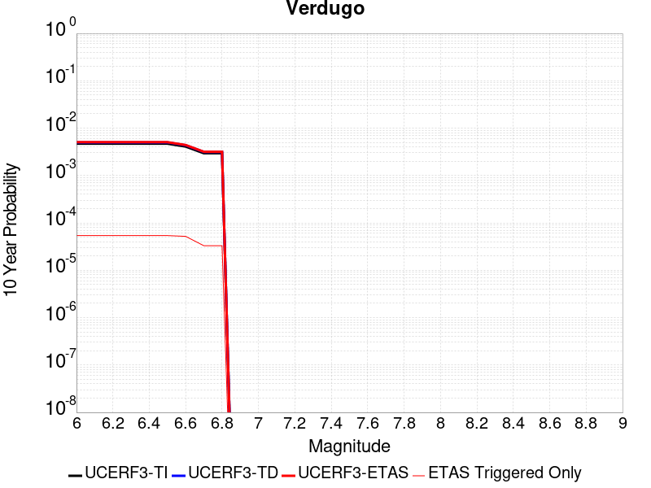 |

| Magnitude | 1 wk TI Prob | 1 wk TD Prob | 1 wk ETAS Prob | 1 wk ETAS/TD Gain | 1 wk ETAS Triggered Only | 1 mo TI Prob | 1 mo TD Prob | 1 mo ETAS Prob | 1 mo ETAS/TD Gain | 1 mo ETAS Triggered Only | 1 yr TI Prob | 1 yr TD Prob | 1 yr ETAS Prob | 1 yr ETAS/TD Gain | 1 yr ETAS Triggered Only | 10 yr TI Prob | 10 yr TD Prob | 10 yr ETAS Prob | 10 yr ETAS/TD Gain | 10 yr ETAS Triggered Only |
|-----|-----|-----|-----|-----|-----|-----|-----|-----|-----|-----|-----|-----|-----|-----|-----|-----|-----|-----|-----|-----|
| 6.0 | 9.032242E-6 | 9.607573E-6 | 2.8676075E-5 | 2.9847367 | 1.9068686E-5 | 3.8709033E-5 | 4.1174942E-5 | 7.931075E-5 | 1.9261895 | 3.8137372E-5 | 4.7118057E-4 | 5.0123956E-4 | 5.7747605E-4 | 1.1520959 | 7.6274744E-5 | 0.0047018277 | 0.0050059874 | 0.0051008537 | 1.0189506 | 9.534343E-5 |
| 6.1 | 9.032242E-6 | 9.607573E-6 | 2.8676075E-5 | 2.9847367 | 1.9068686E-5 | 3.8709033E-5 | 4.1174942E-5 | 7.931075E-5 | 1.9261895 | 3.8137372E-5 | 4.7118057E-4 | 5.0123956E-4 | 5.7747605E-4 | 1.1520959 | 7.6274744E-5 | 0.0047018277 | 0.0050059874 | 0.0051008537 | 1.0189506 | 9.534343E-5 |
| 6.2 | 9.032242E-6 | 9.607573E-6 | 2.8676075E-5 | 2.9847367 | 1.9068686E-5 | 3.8709033E-5 | 4.1174942E-5 | 7.931075E-5 | 1.9261895 | 3.8137372E-5 | 4.7118057E-4 | 5.0123956E-4 | 5.7747605E-4 | 1.1520959 | 7.6274744E-5 | 0.0047018277 | 0.0050059874 | 0.0051008537 | 1.0189506 | 9.534343E-5 |
| 6.3 | 9.032242E-6 | 9.607573E-6 | 2.8676075E-5 | 2.9847367 | 1.9068686E-5 | 3.8709033E-5 | 4.1174942E-5 | 7.931075E-5 | 1.9261895 | 3.8137372E-5 | 4.7118057E-4 | 5.0123956E-4 | 5.7747605E-4 | 1.1520959 | 7.6274744E-5 | 0.0047018277 | 0.0050059874 | 0.0051008537 | 1.0189506 | 9.534343E-5 |
| 6.4 | 9.032242E-6 | 9.607573E-6 | 2.8676075E-5 | 2.9847367 | 1.9068686E-5 | 3.8709033E-5 | 4.1174942E-5 | 7.931075E-5 | 1.9261895 | 3.8137372E-5 | 4.7118057E-4 | 5.0123956E-4 | 5.7747605E-4 | 1.1520959 | 7.6274744E-5 | 0.0047018277 | 0.0050059874 | 0.0051008537 | 1.0189506 | 9.534343E-5 |
| 6.5 | 9.032242E-6 | 9.607573E-6 | 2.8676075E-5 | 2.9847367 | 1.9068686E-5 | 3.8709033E-5 | 4.1174942E-5 | 7.931075E-5 | 1.9261895 | 3.8137372E-5 | 4.7118057E-4 | 5.0123956E-4 | 5.7747605E-4 | 1.1520959 | 7.6274744E-5 | 0.0047018277 | 0.0050059874 | 0.0051008537 | 1.0189506 | 9.534343E-5 |
| 6.6 | 7.857296E-6 | 8.353911E-6 | 2.7422437E-5 | 3.2825868 | 1.9068686E-5 | 3.367369E-5 | 3.580226E-5 | 7.393827E-5 | 2.0651844 | 3.8137372E-5 | 4.0990004E-4 | 4.3585425E-4 | 5.1209575E-4 | 1.1749243 | 7.6274744E-5 | 0.0040914477 | 0.004354794 | 0.0044497224 | 1.0217986 | 9.534343E-5 |
| 6.7 | 5.667953E-6 | 6.022347E-6 | 6.022347E-6 | 1.0 | 0.0 | 2.4291001E-5 | 2.5810059E-5 | 2.5810059E-5 | 1.0 | 0.0 | 2.957028E-4 | 3.1423746E-4 | 3.1423746E-4 | 1.0 | 0.0 | 0.0029530963 | 0.0031423746 | 0.0031613833 | 1.0060492 | 1.9068686E-5 |
| 6.8 | 5.667953E-6 | 6.022347E-6 | 6.022347E-6 | 1.0 | 0.0 | 2.4291001E-5 | 2.5810059E-5 | 2.5810059E-5 | 1.0 | 0.0 | 2.957028E-4 | 3.1423746E-4 | 3.1423746E-4 | 1.0 | 0.0 | 0.0029530963 | 0.0031423746 | 0.0031613833 | 1.0060492 | 1.9068686E-5 |

## Clamshell-Sawpit
*[(top)](#table-of-contents)*

| 1 Week | 1 Month | 1 Year | 10 Year |
|-----|-----|-----|-----|
|  |  |  |  |

| Magnitude | 1 wk TI Prob | 1 wk TD Prob | 1 wk ETAS Prob | 1 wk ETAS/TD Gain | 1 wk ETAS Triggered Only | 1 mo TI Prob | 1 mo TD Prob | 1 mo ETAS Prob | 1 mo ETAS/TD Gain | 1 mo ETAS Triggered Only | 1 yr TI Prob | 1 yr TD Prob | 1 yr ETAS Prob | 1 yr ETAS/TD Gain | 1 yr ETAS Triggered Only | 10 yr TI Prob | 10 yr TD Prob | 10 yr ETAS Prob | 10 yr ETAS/TD Gain | 10 yr ETAS Triggered Only |
|-----|-----|-----|-----|-----|-----|-----|-----|-----|-----|-----|-----|-----|-----|-----|-----|-----|-----|-----|-----|-----|
| 6.0 | 1.1112015E-5 | 1.2128283E-5 | 5.026519E-5 | 4.1444607 | 3.8137372E-5 | 4.7622052E-5 | 5.1978353E-5 | 9.011374E-5 | 1.7336782 | 3.8137372E-5 | 5.796442E-4 | 6.328364E-4 | 6.900063E-4 | 1.0903391 | 5.7206056E-5 | 0.0057813465 | 0.0063283644 | 0.0064231046 | 1.0149707 | 9.534343E-5 |
| 6.1 | 1.1112015E-5 | 1.2128283E-5 | 5.026519E-5 | 4.1444607 | 3.8137372E-5 | 4.7622052E-5 | 5.1978353E-5 | 9.011374E-5 | 1.7336782 | 3.8137372E-5 | 5.796442E-4 | 6.328364E-4 | 6.900063E-4 | 1.0903391 | 5.7206056E-5 | 0.0057813465 | 0.0063283644 | 0.0064231046 | 1.0149707 | 9.534343E-5 |
| 6.2 | 1.1112015E-5 | 1.2128283E-5 | 5.026519E-5 | 4.1444607 | 3.8137372E-5 | 4.7622052E-5 | 5.1978353E-5 | 9.011374E-5 | 1.7336782 | 3.8137372E-5 | 5.796442E-4 | 6.328364E-4 | 6.900063E-4 | 1.0903391 | 5.7206056E-5 | 0.0057813465 | 0.0063283644 | 0.0064231046 | 1.0149707 | 9.534343E-5 |
| 6.3 | 1.1112015E-5 | 1.2128283E-5 | 5.026519E-5 | 4.1444607 | 3.8137372E-5 | 4.7622052E-5 | 5.1978353E-5 | 9.011374E-5 | 1.7336782 | 3.8137372E-5 | 5.796442E-4 | 6.328364E-4 | 6.900063E-4 | 1.0903391 | 5.7206056E-5 | 0.0057813465 | 0.0063283644 | 0.0064231046 | 1.0149707 | 9.534343E-5 |
| 6.4 | 1.1112015E-5 | 1.2128283E-5 | 5.026519E-5 | 4.1444607 | 3.8137372E-5 | 4.7622052E-5 | 5.1978353E-5 | 9.011374E-5 | 1.7336782 | 3.8137372E-5 | 5.796442E-4 | 6.328364E-4 | 6.900063E-4 | 1.0903391 | 5.7206056E-5 | 0.0057813465 | 0.0063283644 | 0.0064231046 | 1.0149707 | 9.534343E-5 |
| 6.5 | 1.1112015E-5 | 1.2128283E-5 | 5.026519E-5 | 4.1444607 | 3.8137372E-5 | 4.7622052E-5 | 5.1978353E-5 | 9.011374E-5 | 1.7336782 | 3.8137372E-5 | 5.796442E-4 | 6.328364E-4 | 6.900063E-4 | 1.0903391 | 5.7206056E-5 | 0.0057813465 | 0.0063283644 | 0.0064231046 | 1.0149707 | 9.534343E-5 |

## San Jacinto (Anza) rev
*[(top)](#table-of-contents)*

| 1 Week | 1 Month | 1 Year | 10 Year |
|-----|-----|-----|-----|
|  |  | 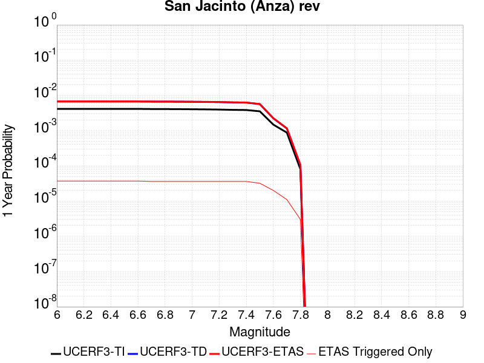 |  |

| Magnitude | 1 wk TI Prob | 1 wk TD Prob | 1 wk ETAS Prob | 1 wk ETAS/TD Gain | 1 wk ETAS Triggered Only | 1 mo TI Prob | 1 mo TD Prob | 1 mo ETAS Prob | 1 mo ETAS/TD Gain | 1 mo ETAS Triggered Only | 1 yr TI Prob | 1 yr TD Prob | 1 yr ETAS Prob | 1 yr ETAS/TD Gain | 1 yr ETAS Triggered Only | 10 yr TI Prob | 10 yr TD Prob | 10 yr ETAS Prob | 10 yr ETAS/TD Gain | 10 yr ETAS Triggered Only |
|-----|-----|-----|-----|-----|-----|-----|-----|-----|-----|-----|-----|-----|-----|-----|-----|-----|-----|-----|-----|-----|
| 6.0 | 7.9249476E-5 | 1.2833404E-4 | 1.4740028E-4 | 1.1485673 | 1.9068686E-5 | 3.3959642E-4 | 5.4991845E-4 | 5.689766E-4 | 1.0346564 | 1.9068686E-5 | 0.00412675 | 0.0066802585 | 0.0067181415 | 1.0056708 | 3.8137372E-5 | 0.04050952 | 0.067083985 | 0.067155145 | 1.0010607 | 7.6274744E-5 |
| 6.1 | 7.9249476E-5 | 1.2833404E-4 | 1.4740028E-4 | 1.1485673 | 1.9068686E-5 | 3.3959642E-4 | 5.4991845E-4 | 5.689766E-4 | 1.0346564 | 1.9068686E-5 | 0.00412675 | 0.0066802585 | 0.0067181415 | 1.0056708 | 3.8137372E-5 | 0.04050952 | 0.067083985 | 0.067155145 | 1.0010607 | 7.6274744E-5 |
| 6.2 | 7.9249476E-5 | 1.2833404E-4 | 1.4740028E-4 | 1.1485673 | 1.9068686E-5 | 3.3959642E-4 | 5.4991845E-4 | 5.689766E-4 | 1.0346564 | 1.9068686E-5 | 0.00412675 | 0.0066802585 | 0.0067181415 | 1.0056708 | 3.8137372E-5 | 0.04050952 | 0.067083985 | 0.067155145 | 1.0010607 | 7.6274744E-5 |
| 6.3 | 7.9249476E-5 | 1.2833404E-4 | 1.4740028E-4 | 1.1485673 | 1.9068686E-5 | 3.3959642E-4 | 5.4991845E-4 | 5.689766E-4 | 1.0346564 | 1.9068686E-5 | 0.00412675 | 0.0066802585 | 0.0067181415 | 1.0056708 | 3.8137372E-5 | 0.04050952 | 0.067083985 | 0.067155145 | 1.0010607 | 7.6274744E-5 |
| 6.4 | 7.9249476E-5 | 1.2833404E-4 | 1.4740028E-4 | 1.1485673 | 1.9068686E-5 | 3.3959642E-4 | 5.4991845E-4 | 5.689766E-4 | 1.0346564 | 1.9068686E-5 | 0.00412675 | 0.0066802585 | 0.0067181415 | 1.0056708 | 3.8137372E-5 | 0.04050952 | 0.067083985 | 0.067155145 | 1.0010607 | 7.6274744E-5 |
| 6.5 | 7.9249476E-5 | 1.2833404E-4 | 1.4740028E-4 | 1.1485673 | 1.9068686E-5 | 3.3959642E-4 | 5.4991845E-4 | 5.689766E-4 | 1.0346564 | 1.9068686E-5 | 0.00412675 | 0.0066802585 | 0.0067181415 | 1.0056708 | 3.8137372E-5 | 0.04050952 | 0.067083985 | 0.067155145 | 1.0010607 | 7.6274744E-5 |
| 6.6 | 7.913556E-5 | 1.2821962E-4 | 1.4728586E-4 | 1.1486999 | 1.9068686E-5 | 3.3910832E-4 | 5.494282E-4 | 5.684864E-4 | 1.0346874 | 1.9068686E-5 | 0.00412083 | 0.006674327 | 0.00671221 | 1.0056759 | 3.8137372E-5 | 0.04045248 | 0.067026526 | 0.067097686 | 1.0010617 | 7.6274744E-5 |
| 6.7 | 7.843403E-5 | 1.2742344E-4 | 1.4648969E-4 | 1.1496291 | 1.9068686E-5 | 3.3610253E-4 | 5.460175E-4 | 5.650757E-4 | 1.0349041 | 1.9068686E-5 | 0.0040843724 | 0.0066330545 | 0.0066709393 | 1.0057114 | 3.8137372E-5 | 0.04010115 | 0.0666332 | 0.06670439 | 1.0010685 | 7.6274744E-5 |
| 6.8 | 7.825213E-5 | 1.2717218E-4 | 1.4623845E-4 | 1.1499248 | 1.9068686E-5 | 3.3532316E-4 | 5.449411E-4 | 5.639994E-4 | 1.0349731 | 1.9068686E-5 | 0.004074919 | 0.00662003 | 0.0066579147 | 1.0057228 | 3.8137372E-5 | 0.04001003 | 0.06650948 | 0.06658068 | 1.0010705 | 7.6274744E-5 |
| 6.9 | 7.788025E-5 | 1.2661066E-4 | 1.4567692E-4 | 1.1505898 | 1.9068686E-5 | 3.3372978E-4 | 5.4253556E-4 | 5.615939E-4 | 1.0351282 | 1.9068686E-5 | 0.004055592 | 0.0065909196 | 0.0066288053 | 1.0057483 | 3.8137372E-5 | 0.03982372 | 0.06623408 | 0.0663053 | 1.0010753 | 7.6274744E-5 |
| 7.0 | 7.723858E-5 | 1.2564783E-4 | 1.4471411E-4 | 1.1517439 | 1.9068686E-5 | 3.309805E-4 | 5.3841085E-4 | 5.5746926E-4 | 1.0353975 | 1.9068686E-5 | 0.0040222434 | 0.006541004 | 0.006578892 | 1.0057924 | 3.8137372E-5 | 0.03950216 | 0.065760486 | 0.06583174 | 1.0010836 | 7.6274744E-5 |
| 7.1 | 7.661684E-5 | 1.246636E-4 | 1.437299E-4 | 1.1529421 | 1.9068686E-5 | 3.2831656E-4 | 5.3419446E-4 | 5.53253E-4 | 1.0356771 | 1.9068686E-5 | 0.0039899293 | 0.0064899763 | 0.0065278662 | 1.0058382 | 3.8137372E-5 | 0.039190482 | 0.06527789 | 0.065349184 | 1.0010922 | 7.6274744E-5 |
| 7.2 | 7.571461E-5 | 1.2320194E-4 | 1.4226827E-4 | 1.1547568 | 1.9068686E-5 | 3.2445084E-4 | 5.279328E-4 | 5.4699136E-4 | 1.0361005 | 1.9068686E-5 | 0.003943036 | 0.0064141913 | 0.006452084 | 1.0059077 | 3.8137372E-5 | 0.038738023 | 0.06456287 | 0.06463422 | 1.0011051 | 7.6274744E-5 |
| 7.3 | 7.427039E-5 | 1.20714394E-4 | 1.3978078E-4 | 1.1579462 | 1.9068686E-5 | 3.1826284E-4 | 5.172761E-4 | 5.3633493E-4 | 1.0368446 | 1.9068686E-5 | 0.0038679668 | 0.0062852004 | 0.006323098 | 1.0060297 | 3.8137372E-5 | 0.038013313 | 0.063324034 | 0.06339548 | 1.0011282 | 7.6274744E-5 |
| 7.4 | 7.3478965E-5 | 1.1931325E-4 | 1.3837966E-4 | 1.1598012 | 1.9068686E-5 | 3.1487184E-4 | 5.1127357E-4 | 5.303325E-4 | 1.0372773 | 1.9068686E-5 | 0.0038268273 | 0.006212538 | 0.0062504383 | 1.0061007 | 3.8137372E-5 | 0.037615944 | 0.06262941 | 0.062700905 | 1.0011415 | 7.6274744E-5 |
| 7.5 | 6.7516885E-5 | 1.08003216E-4 | 1.2706984E-4 | 1.1765376 | 1.9068686E-5 | 2.8932598E-4 | 4.6281965E-4 | 4.818795E-4 | 1.041182 | 1.9068686E-5 | 0.003516855 | 0.005625739 | 0.005663662 | 1.0067409 | 3.8137372E-5 | 0.034617163 | 0.057019595 | 0.05709152 | 1.0012615 | 7.6274744E-5 |
| 7.6 | 2.8268712E-5 | 4.2655167E-5 | 6.172304E-5 | 1.4470237 | 1.9068686E-5 | 1.21146004E-4 | 1.8279799E-4 | 2.018632E-4 | 1.1042966 | 1.9068686E-5 | 0.0014739545 | 0.0022238137 | 0.0022618663 | 1.0171114 | 3.8137372E-5 | 0.014642165 | 0.022920644 | 0.02297654 | 1.0024387 | 5.7206056E-5 |
| 7.7 | 1.673878E-5 | 2.1973781E-5 | 2.1973781E-5 | 1.0 | 0.0 | 7.173566E-5 | 9.417205E-5 | 9.417205E-5 | 1.0 | 0.0 | 8.730317E-4 | 0.0011463144 | 0.0011463144 | 1.0 | 0.0 | 0.008696098 | 0.01216197 | 0.012180807 | 1.0015488 | 1.9068686E-5 |
| 7.8 | 1.5303123E-6 | 1.9707616E-6 | 1.9707616E-6 | 1.0 | 0.0 | 6.5584645E-6 | 8.446107E-6 | 8.446107E-6 | 1.0 | 0.0 | 7.984638E-5 | 1.0282895E-4 | 1.0282895E-4 | 1.0 | 0.0 | 7.98177E-4 | 0.001066982 | 0.0010860304 | 1.0178525 | 1.9068686E-5 |

## Great Valley 12
*[(top)](#table-of-contents)*

| 1 Week | 1 Month | 1 Year | 10 Year |
|-----|-----|-----|-----|
|  |  |  |  |

| Magnitude | 1 wk TI Prob | 1 wk TD Prob | 1 wk ETAS Prob | 1 wk ETAS/TD Gain | 1 wk ETAS Triggered Only | 1 mo TI Prob | 1 mo TD Prob | 1 mo ETAS Prob | 1 mo ETAS/TD Gain | 1 mo ETAS Triggered Only | 1 yr TI Prob | 1 yr TD Prob | 1 yr ETAS Prob | 1 yr ETAS/TD Gain | 1 yr ETAS Triggered Only | 10 yr TI Prob | 10 yr TD Prob | 10 yr ETAS Prob | 10 yr ETAS/TD Gain | 10 yr ETAS Triggered Only |
|-----|-----|-----|-----|-----|-----|-----|-----|-----|-----|-----|-----|-----|-----|-----|-----|-----|-----|-----|-----|-----|
| 6.0 | 4.2144962E-5 | 6.0987146E-5 | 6.0987146E-5 | 1.0 | 0.0 | 1.8060877E-4 | 2.6137347E-4 | 2.6137347E-4 | 1.0 | 0.0 | 0.002196694 | 0.0031813493 | 0.0032383732 | 1.0179245 | 5.7206056E-5 | 0.021751061 | 0.031729307 | 0.03180316 | 1.0023277 | 7.6274744E-5 |
| 6.1 | 4.2144962E-5 | 6.0987146E-5 | 6.0987146E-5 | 1.0 | 0.0 | 1.8060877E-4 | 2.6137347E-4 | 2.6137347E-4 | 1.0 | 0.0 | 0.002196694 | 0.0031813493 | 0.0032383732 | 1.0179245 | 5.7206056E-5 | 0.021751061 | 0.031729307 | 0.03180316 | 1.0023277 | 7.6274744E-5 |
| 6.2 | 4.2144962E-5 | 6.0987146E-5 | 6.0987146E-5 | 1.0 | 0.0 | 1.8060877E-4 | 2.6137347E-4 | 2.6137347E-4 | 1.0 | 0.0 | 0.002196694 | 0.0031813493 | 0.0032383732 | 1.0179245 | 5.7206056E-5 | 0.021751061 | 0.031729307 | 0.03180316 | 1.0023277 | 7.6274744E-5 |
| 6.3 | 4.2144962E-5 | 6.0987146E-5 | 6.0987146E-5 | 1.0 | 0.0 | 1.8060877E-4 | 2.6137347E-4 | 2.6137347E-4 | 1.0 | 0.0 | 0.002196694 | 0.0031813493 | 0.0032383732 | 1.0179245 | 5.7206056E-5 | 0.021751061 | 0.031729307 | 0.03180316 | 1.0023277 | 7.6274744E-5 |

## San Gregorio (North) 2011 CFM
*[(top)](#table-of-contents)*

| 1 Week | 1 Month | 1 Year | 10 Year |
|-----|-----|-----|-----|
|  |  |  |  |

| Magnitude | 1 wk TI Prob | 1 wk TD Prob | 1 wk ETAS Prob | 1 wk ETAS/TD Gain | 1 wk ETAS Triggered Only | 1 mo TI Prob | 1 mo TD Prob | 1 mo ETAS Prob | 1 mo ETAS/TD Gain | 1 mo ETAS Triggered Only | 1 yr TI Prob | 1 yr TD Prob | 1 yr ETAS Prob | 1 yr ETAS/TD Gain | 1 yr ETAS Triggered Only | 10 yr TI Prob | 10 yr TD Prob | 10 yr ETAS Prob | 10 yr ETAS/TD Gain | 10 yr ETAS Triggered Only |
|-----|-----|-----|-----|-----|-----|-----|-----|-----|-----|-----|-----|-----|-----|-----|-----|-----|-----|-----|-----|-----|
| 6.0 | 5.5588036E-5 | 7.309379E-5 | 1.1122837E-4 | 1.5217212 | 3.8137372E-5 | 2.3821268E-4 | 3.1322511E-4 | 3.7041327E-4 | 1.1825784 | 5.7206056E-5 | 0.0028963822 | 0.0038075363 | 0.0038645244 | 1.0149672 | 5.7206056E-5 | 0.028589217 | 0.037540782 | 0.037614193 | 1.0019555 | 7.6274744E-5 |
| 6.1 | 5.5588036E-5 | 7.309379E-5 | 1.1122837E-4 | 1.5217212 | 3.8137372E-5 | 2.3821268E-4 | 3.1322511E-4 | 3.7041327E-4 | 1.1825784 | 5.7206056E-5 | 0.0028963822 | 0.0038075363 | 0.0038645244 | 1.0149672 | 5.7206056E-5 | 0.028589217 | 0.037540782 | 0.037614193 | 1.0019555 | 7.6274744E-5 |
| 6.2 | 5.5588036E-5 | 7.309379E-5 | 1.1122837E-4 | 1.5217212 | 3.8137372E-5 | 2.3821268E-4 | 3.1322511E-4 | 3.7041327E-4 | 1.1825784 | 5.7206056E-5 | 0.0028963822 | 0.0038075363 | 0.0038645244 | 1.0149672 | 5.7206056E-5 | 0.028589217 | 0.037540782 | 0.037614193 | 1.0019555 | 7.6274744E-5 |
| 6.3 | 5.5588036E-5 | 7.309379E-5 | 1.1122837E-4 | 1.5217212 | 3.8137372E-5 | 2.3821268E-4 | 3.1322511E-4 | 3.7041327E-4 | 1.1825784 | 5.7206056E-5 | 0.0028963822 | 0.0038075363 | 0.0038645244 | 1.0149672 | 5.7206056E-5 | 0.028589217 | 0.037540782 | 0.037614193 | 1.0019555 | 7.6274744E-5 |
| 6.4 | 5.5588036E-5 | 7.309379E-5 | 1.1122837E-4 | 1.5217212 | 3.8137372E-5 | 2.3821268E-4 | 3.1322511E-4 | 3.7041327E-4 | 1.1825784 | 5.7206056E-5 | 0.0028963822 | 0.0038075363 | 0.0038645244 | 1.0149672 | 5.7206056E-5 | 0.028589217 | 0.037540782 | 0.037614193 | 1.0019555 | 7.6274744E-5 |
| 6.5 | 5.5588036E-5 | 7.309379E-5 | 1.1122837E-4 | 1.5217212 | 3.8137372E-5 | 2.3821268E-4 | 3.1322511E-4 | 3.7041327E-4 | 1.1825784 | 5.7206056E-5 | 0.0028963822 | 0.0038075363 | 0.0038645244 | 1.0149672 | 5.7206056E-5 | 0.028589217 | 0.037540782 | 0.037614193 | 1.0019555 | 7.6274744E-5 |
| 6.6 | 5.0958548E-5 | 6.682393E-5 | 1.0495875E-4 | 1.5706762 | 3.8137372E-5 | 2.183755E-4 | 2.863609E-4 | 3.4355058E-4 | 1.1997119 | 5.7206056E-5 | 0.00265548 | 0.0034816042 | 0.003538611 | 1.0163738 | 5.7206056E-5 | 0.026239716 | 0.034387864 | 0.034461517 | 1.0021418 | 7.6274744E-5 |
| 6.7 | 4.7004516E-5 | 6.144922E-5 | 9.958425E-5 | 1.6205941 | 3.8137372E-5 | 2.0143238E-4 | 2.6333152E-4 | 3.2052252E-4 | 1.2171825 | 5.7206056E-5 | 0.0024496808 | 0.0032021217 | 0.0032591445 | 1.0178078 | 5.7206056E-5 | 0.024228523 | 0.0316763 | 0.031750157 | 1.0023316 | 7.6274744E-5 |
| 6.8 | 4.3033368E-5 | 5.6114783E-5 | 9.425001E-5 | 1.6795933 | 3.8137372E-5 | 1.8441568E-4 | 2.4047414E-4 | 2.9766644E-4 | 1.2378314 | 5.7206056E-5 | 0.0022429486 | 0.0029246213 | 0.00298166 | 1.019503 | 5.7206056E-5 | 0.02220445 | 0.028973768 | 0.029047832 | 1.0025563 | 7.6274744E-5 |
| 6.9 | 3.8965114E-5 | 5.0579423E-5 | 8.871486E-5 | 1.7539715 | 3.8137372E-5 | 1.6698265E-4 | 2.1675539E-4 | 2.7394906E-4 | 1.2638627 | 5.7206056E-5 | 0.002031118 | 0.0026365893 | 0.0026936447 | 1.0216398 | 5.7206056E-5 | 0.020126536 | 0.026162632 | 0.02621834 | 1.0021293 | 5.7206056E-5 |
| 7.0 | 3.5280933E-5 | 4.5518376E-5 | 8.365401E-5 | 1.8378075 | 3.8137372E-5 | 1.5119524E-4 | 1.9506861E-4 | 2.522635E-4 | 1.293204 | 5.7206056E-5 | 0.0018392478 | 0.0023731652 | 0.0024302355 | 1.0240482 | 5.7206056E-5 | 0.018240994 | 0.023584368 | 0.023640225 | 1.0023683 | 5.7206056E-5 |
| 7.1 | 3.1442076E-5 | 4.0255403E-5 | 5.932332E-5 | 1.4736735 | 1.9068686E-5 | 1.347448E-4 | 1.7251623E-4 | 1.9158162E-4 | 1.1105137 | 1.9068686E-5 | 0.0016392834 | 0.002099158 | 0.0021181866 | 1.0090649 | 1.9068686E-5 | 0.016272435 | 0.02089746 | 0.02091613 | 1.0008935 | 1.9068686E-5 |
| 7.2 | 2.8039283E-5 | 3.552108E-5 | 5.4589087E-5 | 1.5368083 | 1.9068686E-5 | 1.2016282E-4 | 1.5222882E-4 | 1.7129461E-4 | 1.1252443 | 1.9068686E-5 | 0.0014620004 | 0.00185261 | 0.0018716434 | 1.0102738 | 1.9068686E-5 | 0.0145241935 | 0.018474856 | 0.018493572 | 1.001013 | 1.9068686E-5 |
| 7.3 | 2.4776145E-5 | 3.1098632E-5 | 5.0166727E-5 | 1.6131489 | 1.9068686E-5 | 1.0617916E-4 | 1.3327754E-4 | 1.523437E-4 | 1.1430559 | 1.9068686E-5 | 0.0012919646 | 0.0016222443 | 0.001641282 | 1.0117354 | 1.9068686E-5 | 0.012844792 | 0.0162039 | 0.016222661 | 1.0011578 | 1.9068686E-5 |
| 7.4 | 2.1508438E-5 | 2.6824098E-5 | 4.5892273E-5 | 1.7108598 | 1.9068686E-5 | 9.217577E-5 | 1.1495983E-4 | 1.3402633E-4 | 1.1658535 | 1.9068686E-5 | 0.0011216622 | 0.0013995317 | 0.0014185738 | 1.013606 | 1.9068686E-5 | 0.011160175 | 0.014002349 | 0.014021151 | 1.0013428 | 1.9068686E-5 |

## Whittier alt 1
*[(top)](#table-of-contents)*

| 1 Week | 1 Month | 1 Year | 10 Year |
|-----|-----|-----|-----|
|  |  |  |  |

| Magnitude | 1 wk TI Prob | 1 wk TD Prob | 1 wk ETAS Prob | 1 wk ETAS/TD Gain | 1 wk ETAS Triggered Only | 1 mo TI Prob | 1 mo TD Prob | 1 mo ETAS Prob | 1 mo ETAS/TD Gain | 1 mo ETAS Triggered Only | 1 yr TI Prob | 1 yr TD Prob | 1 yr ETAS Prob | 1 yr ETAS/TD Gain | 1 yr ETAS Triggered Only | 10 yr TI Prob | 10 yr TD Prob | 10 yr ETAS Prob | 10 yr ETAS/TD Gain | 10 yr ETAS Triggered Only |
|-----|-----|-----|-----|-----|-----|-----|-----|-----|-----|-----|-----|-----|-----|-----|-----|-----|-----|-----|-----|-----|
| 6.0 | 1.9677844E-5 | 3.0721494E-5 | 6.885769E-5 | 2.2413523 | 3.8137372E-5 | 8.4330895E-5 | 1.3166165E-4 | 1.69794E-4 | 1.2896239 | 3.8137372E-5 | 0.001026245 | 0.0016026449 | 0.0016787974 | 1.0475168 | 7.6274744E-5 | 0.010215186 | 0.015995702 | 0.016070757 | 1.0046922 | 7.6274744E-5 |
| 6.1 | 1.9677844E-5 | 3.0721494E-5 | 6.885769E-5 | 2.2413523 | 3.8137372E-5 | 8.4330895E-5 | 1.3166165E-4 | 1.69794E-4 | 1.2896239 | 3.8137372E-5 | 0.001026245 | 0.0016026449 | 0.0016787974 | 1.0475168 | 7.6274744E-5 | 0.010215186 | 0.015995702 | 0.016070757 | 1.0046922 | 7.6274744E-5 |
| 6.2 | 1.9677844E-5 | 3.0721494E-5 | 6.885769E-5 | 2.2413523 | 3.8137372E-5 | 8.4330895E-5 | 1.3166165E-4 | 1.69794E-4 | 1.2896239 | 3.8137372E-5 | 0.001026245 | 0.0016026449 | 0.0016787974 | 1.0475168 | 7.6274744E-5 | 0.010215186 | 0.015995702 | 0.016070757 | 1.0046922 | 7.6274744E-5 |
| 6.3 | 1.9677844E-5 | 3.0721494E-5 | 6.885769E-5 | 2.2413523 | 3.8137372E-5 | 8.4330895E-5 | 1.3166165E-4 | 1.69794E-4 | 1.2896239 | 3.8137372E-5 | 0.001026245 | 0.0016026449 | 0.0016787974 | 1.0475168 | 7.6274744E-5 | 0.010215186 | 0.015995702 | 0.016070757 | 1.0046922 | 7.6274744E-5 |
| 6.4 | 1.9677844E-5 | 3.0721494E-5 | 6.885769E-5 | 2.2413523 | 3.8137372E-5 | 8.4330895E-5 | 1.3166165E-4 | 1.69794E-4 | 1.2896239 | 3.8137372E-5 | 0.001026245 | 0.0016026449 | 0.0016787974 | 1.0475168 | 7.6274744E-5 | 0.010215186 | 0.015995702 | 0.016070757 | 1.0046922 | 7.6274744E-5 |
| 6.5 | 1.9677844E-5 | 3.0721494E-5 | 6.885769E-5 | 2.2413523 | 3.8137372E-5 | 8.4330895E-5 | 1.3166165E-4 | 1.69794E-4 | 1.2896239 | 3.8137372E-5 | 0.001026245 | 0.0016026449 | 0.0016787974 | 1.0475168 | 7.6274744E-5 | 0.010215186 | 0.015995702 | 0.016070757 | 1.0046922 | 7.6274744E-5 |
| 6.6 | 1.9631225E-5 | 3.06427E-5 | 6.87789E-5 | 2.2445445 | 3.8137372E-5 | 8.413111E-5 | 1.3132399E-4 | 1.6945635E-4 | 1.2903686 | 3.8137372E-5 | 0.0010238149 | 0.00159854 | 0.0016746927 | 1.047639 | 7.6274744E-5 | 0.010191108 | 0.015955312 | 0.016030371 | 1.0047042 | 7.6274744E-5 |
| 6.7 | 1.9536663E-5 | 3.0504027E-5 | 6.8640235E-5 | 2.2502024 | 3.8137372E-5 | 8.372587E-5 | 1.3072975E-4 | 1.6886213E-4 | 1.2916887 | 3.8137372E-5 | 0.0010188858 | 0.0015913156 | 0.001667469 | 1.0478556 | 7.6274744E-5 | 0.010142268 | 0.015884183 | 0.015959246 | 1.0047257 | 7.6274744E-5 |
| 6.8 | 1.9439643E-5 | 3.0352345E-5 | 6.848856E-5 | 2.2564504 | 3.8137372E-5 | 8.331009E-5 | 1.3007974E-4 | 1.6821215E-4 | 1.2931464 | 3.8137372E-5 | 0.0010138283 | 0.0015834133 | 0.0016595674 | 1.0480949 | 7.6274744E-5 | 0.010092155 | 0.015806418 | 0.015881488 | 1.0047493 | 7.6274744E-5 |
| 6.9 | 1.9363486E-5 | 3.025448E-5 | 6.83907E-5 | 2.2605147 | 3.8137372E-5 | 8.298373E-5 | 1.2966036E-4 | 1.677928E-4 | 1.2940947 | 3.8137372E-5 | 0.0010098586 | 0.0015783148 | 0.0016544692 | 1.0482504 | 7.6274744E-5 | 0.010052818 | 0.0157561 | 0.015831172 | 1.0047647 | 7.6274744E-5 |
| 7.0 | 3.152724E-6 | 4.1925437E-6 | 4.1925437E-6 | 1.0 | 0.0 | 1.3511604E-5 | 1.7967934E-5 | 1.7967934E-5 | 1.0 | 0.0 | 1.6449137E-4 | 2.1873988E-4 | 2.1873988E-4 | 1.0 | 0.0 | 0.0016436966 | 0.0021877585 | 0.0021877585 | 1.0 | 0.0 |
| 7.1 | 3.0699127E-6 | 4.0761943E-6 | 4.0761943E-6 | 1.0 | 0.0 | 1.3156702E-5 | 1.74693E-5 | 1.74693E-5 | 1.0 | 0.0 | 1.6017107E-4 | 2.1267022E-4 | 2.1267022E-4 | 1.0 | 0.0 | 0.0016005568 | 0.0021271154 | 0.0021271154 | 1.0 | 0.0 |
| 7.2 | 2.2585555E-6 | 2.9159935E-6 | 2.9159935E-6 | 1.0 | 0.0 | 9.679487E-6 | 1.249706E-5 | 1.249706E-5 | 1.0 | 0.0 | 1.1784139E-4 | 1.5214195E-4 | 1.5214195E-4 | 1.0 | 0.0 | 0.0011777892 | 0.0015224252 | 0.0015224252 | 1.0 | 0.0 |
| 7.3 | 2.1766068E-6 | 2.8138447E-6 | 2.8138447E-6 | 1.0 | 0.0 | 9.3282815E-6 | 1.2059283E-5 | 1.2059283E-5 | 1.0 | 0.0 | 1.13565904E-4 | 1.4681274E-4 | 1.4681274E-4 | 1.0 | 0.0 | 0.0011350788 | 0.0014690856 | 0.0014690856 | 1.0 | 0.0 |
| 7.4 | 2.0680952E-6 | 2.676193E-6 | 2.676193E-6 | 1.0 | 0.0 | 8.863235E-6 | 1.1469352E-5 | 1.1469352E-5 | 1.0 | 0.0 | 1.0790454E-4 | 1.3963127E-4 | 1.3963127E-4 | 1.0 | 0.0 | 0.0010785216 | 0.0013971858 | 0.0013971858 | 1.0 | 0.0 |
| 7.5 | 1.4388213E-6 | 1.9265901E-6 | 1.9265901E-6 | 1.0 | 0.0 | 6.1663623E-6 | 8.256791E-6 | 8.256791E-6 | 1.0 | 0.0 | 7.507287E-5 | 1.0052218E-4 | 1.0052218E-4 | 1.0 | 0.0 | 7.504752E-4 | 0.0010053911 | 0.0010053911 | 1.0 | 0.0 |
| 7.6 | 1.2179905E-6 | 1.5985206E-6 | 1.5985206E-6 | 1.0 | 0.0 | 5.219949E-6 | 6.850787E-6 | 6.850787E-6 | 1.0 | 0.0 | 6.355102E-5 | 8.3405495E-5 | 8.3405495E-5 | 1.0 | 0.0 | 6.353285E-4 | 8.343059E-4 | 8.343059E-4 | 1.0 | 0.0 |
| 7.7 | 9.55754E-7 | 1.2252901E-6 | 1.2252901E-6 | 1.0 | 0.0 | 4.096082E-6 | 5.251235E-6 | 5.251235E-6 | 1.0 | 0.0 | 4.9868657E-5 | 6.393224E-5 | 6.393224E-5 | 1.0 | 0.0 | 4.985747E-4 | 6.396533E-4 | 6.396533E-4 | 1.0 | 0.0 |
| 7.8 | 2.1601753E-7 | 2.7489222E-7 | 2.7489222E-7 | 1.0 | 0.0 | 9.257891E-7 | 1.1781094E-6 | 1.1781094E-6 | 1.0 | 0.0 | 1.1271423E-5 | 1.4343483E-5 | 1.4343483E-5 | 1.0 | 0.0 | 1.1270852E-4 | 1.435847E-4 | 1.435847E-4 | 1.0 | 0.0 |

## Pinto Mtn
*[(top)](#table-of-contents)*

| 1 Week | 1 Month | 1 Year | 10 Year |
|-----|-----|-----|-----|
| 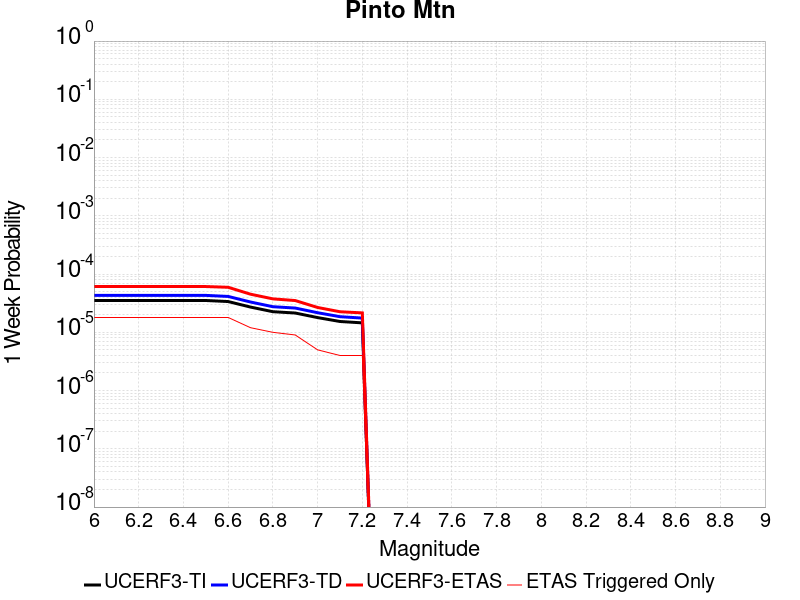 |  |  |  |

| Magnitude | 1 wk TI Prob | 1 wk TD Prob | 1 wk ETAS Prob | 1 wk ETAS/TD Gain | 1 wk ETAS Triggered Only | 1 mo TI Prob | 1 mo TD Prob | 1 mo ETAS Prob | 1 mo ETAS/TD Gain | 1 mo ETAS Triggered Only | 1 yr TI Prob | 1 yr TD Prob | 1 yr ETAS Prob | 1 yr ETAS/TD Gain | 1 yr ETAS Triggered Only | 10 yr TI Prob | 10 yr TD Prob | 10 yr ETAS Prob | 10 yr ETAS/TD Gain | 10 yr ETAS Triggered Only |
|-----|-----|-----|-----|-----|-----|-----|-----|-----|-----|-----|-----|-----|-----|-----|-----|-----|-----|-----|-----|-----|
| 6.0 | 3.51701E-5 | 4.3047E-5 | 1.00250596E-4 | 2.3288636 | 5.7206056E-5 | 1.5072028E-4 | 1.844764E-4 | 2.416719E-4 | 1.3100424 | 5.7206056E-5 | 0.0018334748 | 0.0022440937 | 0.0023201972 | 1.0339128 | 7.6274744E-5 | 0.018184211 | 0.022254989 | 0.022329567 | 1.0033511 | 7.6274744E-5 |
| 6.1 | 3.51701E-5 | 4.3047E-5 | 1.00250596E-4 | 2.3288636 | 5.7206056E-5 | 1.5072028E-4 | 1.844764E-4 | 2.416719E-4 | 1.3100424 | 5.7206056E-5 | 0.0018334748 | 0.0022440937 | 0.0023201972 | 1.0339128 | 7.6274744E-5 | 0.018184211 | 0.022254989 | 0.022329567 | 1.0033511 | 7.6274744E-5 |
| 6.2 | 3.51701E-5 | 4.3047E-5 | 1.00250596E-4 | 2.3288636 | 5.7206056E-5 | 1.5072028E-4 | 1.844764E-4 | 2.416719E-4 | 1.3100424 | 5.7206056E-5 | 0.0018334748 | 0.0022440937 | 0.0023201972 | 1.0339128 | 7.6274744E-5 | 0.018184211 | 0.022254989 | 0.022329567 | 1.0033511 | 7.6274744E-5 |
| 6.3 | 3.51701E-5 | 4.3047E-5 | 1.00250596E-4 | 2.3288636 | 5.7206056E-5 | 1.5072028E-4 | 1.844764E-4 | 2.416719E-4 | 1.3100424 | 5.7206056E-5 | 0.0018334748 | 0.0022440937 | 0.0023201972 | 1.0339128 | 7.6274744E-5 | 0.018184211 | 0.022254989 | 0.022329567 | 1.0033511 | 7.6274744E-5 |
| 6.4 | 3.51701E-5 | 4.3047E-5 | 1.00250596E-4 | 2.3288636 | 5.7206056E-5 | 1.5072028E-4 | 1.844764E-4 | 2.416719E-4 | 1.3100424 | 5.7206056E-5 | 0.0018334748 | 0.0022440937 | 0.0023201972 | 1.0339128 | 7.6274744E-5 | 0.018184211 | 0.022254989 | 0.022329567 | 1.0033511 | 7.6274744E-5 |
| 6.5 | 3.51701E-5 | 4.3047E-5 | 1.00250596E-4 | 2.3288636 | 5.7206056E-5 | 1.5072028E-4 | 1.844764E-4 | 2.416719E-4 | 1.3100424 | 5.7206056E-5 | 0.0018334748 | 0.0022440937 | 0.0023201972 | 1.0339128 | 7.6274744E-5 | 0.018184211 | 0.022254989 | 0.022329567 | 1.0033511 | 7.6274744E-5 |
| 6.6 | 3.3749162E-5 | 4.1291092E-5 | 9.8494784E-5 | 2.3853762 | 5.7206056E-5 | 1.4463125E-4 | 1.7695212E-4 | 2.3414806E-4 | 1.3232282 | 5.7206056E-5 | 0.0017594631 | 0.0021526704 | 0.0022287809 | 1.0353563 | 7.6274744E-5 | 0.017455976 | 0.021358717 | 0.021433363 | 1.0034949 | 7.6274744E-5 |
| 6.7 | 2.7121987E-5 | 3.3122094E-5 | 7.1258204E-5 | 2.1513796 | 3.8137372E-5 | 1.162319E-4 | 1.4194637E-4 | 1.8007832E-4 | 1.2686363 | 3.8137372E-5 | 0.0014142047 | 0.0017272272 | 0.0017652987 | 1.0220419 | 3.8137372E-5 | 0.014052387 | 0.01717749 | 0.017214973 | 1.002182 | 3.8137372E-5 |
| 6.8 | 2.2587206E-5 | 2.7508535E-5 | 6.5644854E-5 | 2.3863451 | 3.8137372E-5 | 9.679872E-5 | 1.1789061E-4 | 1.5602348E-4 | 1.3234599 | 3.8137372E-5 | 0.0011778872 | 0.001434766 | 0.0014728487 | 1.0265428 | 3.8137372E-5 | 0.011716634 | 0.014293642 | 0.014331235 | 1.00263 | 3.8137372E-5 |
| 6.9 | 2.1440546E-5 | 2.6093185E-5 | 6.422956E-5 | 2.4615455 | 3.8137372E-5 | 9.1884816E-5 | 1.1182535E-4 | 1.4995846E-4 | 1.3410059 | 3.8137372E-5 | 0.0011181235 | 0.0013610155 | 0.001399101 | 1.0279831 | 3.8137372E-5 | 0.011125144 | 0.013565313 | 0.013602933 | 1.0027733 | 3.8137372E-5 |
| 7.0 | 1.7893128E-5 | 2.1693293E-5 | 4.0761566E-5 | 1.8789939 | 1.9068686E-5 | 7.6682576E-5 | 9.2970135E-5 | 1.1203704E-4 | 1.2050865 | 1.9068686E-5 | 9.332105E-4 | 0.001131712 | 0.0011507592 | 1.0168303 | 1.9068686E-5 | 0.009293012 | 0.011297592 | 0.011316445 | 1.0016688 | 1.9068686E-5 |
| 7.1 | 1.5338705E-5 | 1.854412E-5 | 3.761245E-5 | 2.0282683 | 1.9068686E-5 | 6.573565E-5 | 7.947455E-5 | 9.854172E-5 | 1.2399154 | 1.9068686E-5 | 8.0003764E-4 | 9.675582E-4 | 9.866084E-4 | 1.019689 | 1.9068686E-5 | 0.007971635 | 0.009671222 | 0.009690107 | 1.0019526 | 1.9068686E-5 |
| 7.2 | 1.4525263E-5 | 1.7549126E-5 | 3.6617475E-5 | 2.0865698 | 1.9068686E-5 | 6.2249645E-5 | 7.521054E-5 | 9.427779E-5 | 1.2535183 | 1.9068686E-5 | 7.5762585E-4 | 9.1568835E-4 | 9.3473954E-4 | 1.0208054 | 1.9068686E-5 | 0.007550481 | 0.009156883 | 0.009175777 | 1.0020634 | 1.9068686E-5 |

## Chino alt 1
*[(top)](#table-of-contents)*

| 1 Week | 1 Month | 1 Year | 10 Year |
|-----|-----|-----|-----|
|  |  |  |  |

| Magnitude | 1 wk TI Prob | 1 wk TD Prob | 1 wk ETAS Prob | 1 wk ETAS/TD Gain | 1 wk ETAS Triggered Only | 1 mo TI Prob | 1 mo TD Prob | 1 mo ETAS Prob | 1 mo ETAS/TD Gain | 1 mo ETAS Triggered Only | 1 yr TI Prob | 1 yr TD Prob | 1 yr ETAS Prob | 1 yr ETAS/TD Gain | 1 yr ETAS Triggered Only | 10 yr TI Prob | 10 yr TD Prob | 10 yr ETAS Prob | 10 yr ETAS/TD Gain | 10 yr ETAS Triggered Only |
|-----|-----|-----|-----|-----|-----|-----|-----|-----|-----|-----|-----|-----|-----|-----|-----|-----|-----|-----|-----|-----|
| 6.0 | 2.1665033E-5 | 2.5894844E-5 | 4.4963035E-5 | 1.7363702 | 1.9068686E-5 | 9.2846836E-5 | 1.10977904E-4 | 1.3004447E-4 | 1.1718051 | 1.9068686E-5 | 0.001129824 | 0.0013511538 | 0.0014082827 | 1.0422815 | 5.7206056E-5 | 0.01124097 | 0.013511333 | 0.013586576 | 1.005569 | 7.6274744E-5 |
| 6.1 | 2.1665033E-5 | 2.5894844E-5 | 4.4963035E-5 | 1.7363702 | 1.9068686E-5 | 9.2846836E-5 | 1.10977904E-4 | 1.3004447E-4 | 1.1718051 | 1.9068686E-5 | 0.001129824 | 0.0013511538 | 0.0014082827 | 1.0422815 | 5.7206056E-5 | 0.01124097 | 0.013511333 | 0.013586576 | 1.005569 | 7.6274744E-5 |
| 6.2 | 2.1665033E-5 | 2.5894844E-5 | 4.4963035E-5 | 1.7363702 | 1.9068686E-5 | 9.2846836E-5 | 1.10977904E-4 | 1.3004447E-4 | 1.1718051 | 1.9068686E-5 | 0.001129824 | 0.0013511538 | 0.0014082827 | 1.0422815 | 5.7206056E-5 | 0.01124097 | 0.013511333 | 0.013586576 | 1.005569 | 7.6274744E-5 |
| 6.3 | 2.1665033E-5 | 2.5894844E-5 | 4.4963035E-5 | 1.7363702 | 1.9068686E-5 | 9.2846836E-5 | 1.10977904E-4 | 1.3004447E-4 | 1.1718051 | 1.9068686E-5 | 0.001129824 | 0.0013511538 | 0.0014082827 | 1.0422815 | 5.7206056E-5 | 0.01124097 | 0.013511333 | 0.013586576 | 1.005569 | 7.6274744E-5 |
| 6.4 | 2.1665033E-5 | 2.5894844E-5 | 4.4963035E-5 | 1.7363702 | 1.9068686E-5 | 9.2846836E-5 | 1.10977904E-4 | 1.3004447E-4 | 1.1718051 | 1.9068686E-5 | 0.001129824 | 0.0013511538 | 0.0014082827 | 1.0422815 | 5.7206056E-5 | 0.01124097 | 0.013511333 | 0.013586576 | 1.005569 | 7.6274744E-5 |
| 6.5 | 2.1665033E-5 | 2.5894844E-5 | 4.4963035E-5 | 1.7363702 | 1.9068686E-5 | 9.2846836E-5 | 1.10977904E-4 | 1.3004447E-4 | 1.1718051 | 1.9068686E-5 | 0.001129824 | 0.0013511538 | 0.0014082827 | 1.0422815 | 5.7206056E-5 | 0.01124097 | 0.013511333 | 0.013586576 | 1.005569 | 7.6274744E-5 |

## San Jose
*[(top)](#table-of-contents)*

| 1 Week | 1 Month | 1 Year | 10 Year |
|-----|-----|-----|-----|
|  |  |  |  |

| Magnitude | 1 wk TI Prob | 1 wk TD Prob | 1 wk ETAS Prob | 1 wk ETAS/TD Gain | 1 wk ETAS Triggered Only | 1 mo TI Prob | 1 mo TD Prob | 1 mo ETAS Prob | 1 mo ETAS/TD Gain | 1 mo ETAS Triggered Only | 1 yr TI Prob | 1 yr TD Prob | 1 yr ETAS Prob | 1 yr ETAS/TD Gain | 1 yr ETAS Triggered Only | 10 yr TI Prob | 10 yr TD Prob | 10 yr ETAS Prob | 10 yr ETAS/TD Gain | 10 yr ETAS Triggered Only |
|-----|-----|-----|-----|-----|-----|-----|-----|-----|-----|-----|-----|-----|-----|-----|-----|-----|-----|-----|-----|-----|
| 6.0 | 9.706857E-6 | 1.0473486E-5 | 1.0473486E-5 | 1.0 | 0.0 | 4.160015E-5 | 4.488637E-5 | 4.488637E-5 | 1.0 | 0.0 | 5.063641E-4 | 5.4649153E-4 | 5.8460806E-4 | 1.0697477 | 3.8137372E-5 | 0.0050521186 | 0.0054649157 | 0.0055407733 | 1.0138808 | 7.6274744E-5 |
| 6.1 | 9.706857E-6 | 1.0473486E-5 | 1.0473486E-5 | 1.0 | 0.0 | 4.160015E-5 | 4.488637E-5 | 4.488637E-5 | 1.0 | 0.0 | 5.063641E-4 | 5.4649153E-4 | 5.8460806E-4 | 1.0697477 | 3.8137372E-5 | 0.0050521186 | 0.0054649157 | 0.0055407733 | 1.0138808 | 7.6274744E-5 |
| 6.2 | 9.706857E-6 | 1.0473486E-5 | 1.0473486E-5 | 1.0 | 0.0 | 4.160015E-5 | 4.488637E-5 | 4.488637E-5 | 1.0 | 0.0 | 5.063641E-4 | 5.4649153E-4 | 5.8460806E-4 | 1.0697477 | 3.8137372E-5 | 0.0050521186 | 0.0054649157 | 0.0055407733 | 1.0138808 | 7.6274744E-5 |
| 6.3 | 9.706857E-6 | 1.0473486E-5 | 1.0473486E-5 | 1.0 | 0.0 | 4.160015E-5 | 4.488637E-5 | 4.488637E-5 | 1.0 | 0.0 | 5.063641E-4 | 5.4649153E-4 | 5.8460806E-4 | 1.0697477 | 3.8137372E-5 | 0.0050521186 | 0.0054649157 | 0.0055407733 | 1.0138808 | 7.6274744E-5 |
| 6.4 | 9.706857E-6 | 1.0473486E-5 | 1.0473486E-5 | 1.0 | 0.0 | 4.160015E-5 | 4.488637E-5 | 4.488637E-5 | 1.0 | 0.0 | 5.063641E-4 | 5.4649153E-4 | 5.8460806E-4 | 1.0697477 | 3.8137372E-5 | 0.0050521186 | 0.0054649157 | 0.0055407733 | 1.0138808 | 7.6274744E-5 |
| 6.5 | 9.706857E-6 | 1.0473486E-5 | 1.0473486E-5 | 1.0 | 0.0 | 4.160015E-5 | 4.488637E-5 | 4.488637E-5 | 1.0 | 0.0 | 5.063641E-4 | 5.4649153E-4 | 5.8460806E-4 | 1.0697477 | 3.8137372E-5 | 0.0050521186 | 0.0054649157 | 0.0055407733 | 1.0138808 | 7.6274744E-5 |

## Newport-Inglewood (Offshore)
*[(top)](#table-of-contents)*

| 1 Week | 1 Month | 1 Year | 10 Year |
|-----|-----|-----|-----|
|  |  |  |  |

| Magnitude | 1 wk TI Prob | 1 wk TD Prob | 1 wk ETAS Prob | 1 wk ETAS/TD Gain | 1 wk ETAS Triggered Only | 1 mo TI Prob | 1 mo TD Prob | 1 mo ETAS Prob | 1 mo ETAS/TD Gain | 1 mo ETAS Triggered Only | 1 yr TI Prob | 1 yr TD Prob | 1 yr ETAS Prob | 1 yr ETAS/TD Gain | 1 yr ETAS Triggered Only | 10 yr TI Prob | 10 yr TD Prob | 10 yr ETAS Prob | 10 yr ETAS/TD Gain | 10 yr ETAS Triggered Only |
|-----|-----|-----|-----|-----|-----|-----|-----|-----|-----|-----|-----|-----|-----|-----|-----|-----|-----|-----|-----|-----|
| 6.0 | 1.9418812E-5 | 2.0497266E-5 | 5.8633857E-5 | 2.8605695 | 3.8137372E-5 | 8.322083E-5 | 8.7843E-5 | 1.2597702E-4 | 1.4341156 | 3.8137372E-5 | 0.0010127426 | 0.0010690573 | 0.0011262022 | 1.0534536 | 5.7206056E-5 | 0.010081396 | 0.010648402 | 0.010723865 | 1.0070868 | 7.6274744E-5 |
| 6.1 | 1.9418812E-5 | 2.0497266E-5 | 5.8633857E-5 | 2.8605695 | 3.8137372E-5 | 8.322083E-5 | 8.7843E-5 | 1.2597702E-4 | 1.4341156 | 3.8137372E-5 | 0.0010127426 | 0.0010690573 | 0.0011262022 | 1.0534536 | 5.7206056E-5 | 0.010081396 | 0.010648402 | 0.010723865 | 1.0070868 | 7.6274744E-5 |
| 6.2 | 1.9418812E-5 | 2.0497266E-5 | 5.8633857E-5 | 2.8605695 | 3.8137372E-5 | 8.322083E-5 | 8.7843E-5 | 1.2597702E-4 | 1.4341156 | 3.8137372E-5 | 0.0010127426 | 0.0010690573 | 0.0011262022 | 1.0534536 | 5.7206056E-5 | 0.010081396 | 0.010648402 | 0.010723865 | 1.0070868 | 7.6274744E-5 |
| 6.3 | 1.9418812E-5 | 2.0497266E-5 | 5.8633857E-5 | 2.8605695 | 3.8137372E-5 | 8.322083E-5 | 8.7843E-5 | 1.2597702E-4 | 1.4341156 | 3.8137372E-5 | 0.0010127426 | 0.0010690573 | 0.0011262022 | 1.0534536 | 5.7206056E-5 | 0.010081396 | 0.010648402 | 0.010723865 | 1.0070868 | 7.6274744E-5 |
| 6.4 | 1.9418812E-5 | 2.0497266E-5 | 5.8633857E-5 | 2.8605695 | 3.8137372E-5 | 8.322083E-5 | 8.7843E-5 | 1.2597702E-4 | 1.4341156 | 3.8137372E-5 | 0.0010127426 | 0.0010690573 | 0.0011262022 | 1.0534536 | 5.7206056E-5 | 0.010081396 | 0.010648402 | 0.010723865 | 1.0070868 | 7.6274744E-5 |
| 6.5 | 1.9418812E-5 | 2.0497266E-5 | 5.8633857E-5 | 2.8605695 | 3.8137372E-5 | 8.322083E-5 | 8.7843E-5 | 1.2597702E-4 | 1.4341156 | 3.8137372E-5 | 0.0010127426 | 0.0010690573 | 0.0011262022 | 1.0534536 | 5.7206056E-5 | 0.010081396 | 0.010648402 | 0.010723865 | 1.0070868 | 7.6274744E-5 |
| 6.6 | 1.6939659E-5 | 1.7683546E-5 | 5.582024E-5 | 3.1566205 | 3.8137372E-5 | 7.259652E-5 | 7.578494E-5 | 1.1391943E-4 | 1.5031934 | 3.8137372E-5 | 8.8350417E-4 | 9.2238374E-4 | 9.79537E-4 | 1.0619626 | 5.7206056E-5 | 0.008799998 | 0.00919468 | 0.009270253 | 1.0082192 | 7.6274744E-5 |
| 6.7 | 1.4691289E-5 | 1.5149292E-5 | 5.3286087E-5 | 3.5173976 | 3.8137372E-5 | 6.2961146E-5 | 6.492444E-5 | 1.03059334E-4 | 1.5873735 | 3.8137372E-5 | 7.662824E-4 | 7.9025986E-4 | 8.474207E-4 | 1.0723317 | 5.7206056E-5 | 0.007636454 | 0.007883489 | 0.007959163 | 1.009599 | 7.6274744E-5 |
| 6.8 | 1.26037085E-5 | 1.2822538E-5 | 5.095942E-5 | 3.974207 | 3.8137372E-5 | 5.4014774E-5 | 5.4953085E-5 | 9.308836E-5 | 1.6939605 | 3.8137372E-5 | 6.5743143E-4 | 6.689387E-4 | 7.0705055E-4 | 1.0569736 | 3.8137372E-5 | 0.006554899 | 0.0066781086 | 0.0067349323 | 1.008509 | 5.7206056E-5 |
| 6.9 | 1.1764378E-5 | 1.1934175E-5 | 5.007109E-5 | 4.1956058 | 3.8137372E-5 | 5.0417784E-5 | 5.114597E-5 | 8.928139E-5 | 1.7456193 | 3.8137372E-5 | 6.1366364E-4 | 6.226143E-4 | 6.607279E-4 | 1.0612155 | 3.8137372E-5 | 0.006119718 | 0.006217534 | 0.0062743844 | 1.0091436 | 5.7206056E-5 |
| 7.0 | 4.071841E-6 | 3.3071306E-6 | 2.2375752E-5 | 6.7659116 | 1.9068686E-5 | 1.745063E-5 | 1.4173362E-5 | 3.3241777E-5 | 2.34537 | 1.9068686E-5 | 2.124407E-4 | 1.7255088E-4 | 1.9161627E-4 | 1.1104914 | 1.9068686E-5 | 0.0021223773 | 0.0017245489 | 0.0017435846 | 1.0110382 | 1.9068686E-5 |
| 7.1 | 3.6344509E-6 | 2.9049047E-6 | 2.1973534E-5 | 7.5642877 | 1.9068686E-5 | 1.5576124E-5 | 1.2449554E-5 | 3.1518E-5 | 2.5316572 | 1.9068686E-5 | 1.8962282E-4 | 1.5156664E-4 | 1.7063244E-4 | 1.1257915 | 1.9068686E-5 | 0.0018946109 | 0.0015150115 | 0.0015340514 | 1.0125674 | 1.9068686E-5 |
| 7.2 | 3.2446756E-6 | 2.5395498E-6 | 2.1608186E-5 | 8.508668 | 1.9068686E-5 | 1.3905678E-5 | 1.0883761E-5 | 2.995224E-5 | 2.7520118 | 1.9068686E-5 | 1.6928847E-4 | 1.325056E-4 | 1.5157174E-4 | 1.1438894 | 1.9068686E-5 | 0.0016915957 | 0.0013246438 | 0.0013436873 | 1.0143763 | 1.9068686E-5 |
| 7.3 | 2.898987E-6 | 2.2514312E-6 | 2.1320073E-5 | 9.469564 | 1.9068686E-5 | 1.24241715E-5 | 9.648977E-6 | 2.8717479E-5 | 2.97622 | 1.9068686E-5 | 1.5125379E-4 | 1.1747381E-4 | 1.3654026E-4 | 1.1623038 | 1.9068686E-5 | 0.0015115088 | 0.0011744945 | 0.0011935409 | 1.0162166 | 1.9068686E-5 |
| 7.4 | 2.5994284E-6 | 2.0116724E-6 | 2.108032E-5 | 10.479002 | 1.9068686E-5 | 1.114036E-5 | 8.621447E-6 | 2.7689968E-5 | 3.2117543 | 1.9068686E-5 | 1.3562544E-4 | 1.049649E-4 | 1.2403158E-4 | 1.1816481 | 1.9068686E-5 | 0.0013554269 | 0.00104953 | 0.0010685787 | 1.0181497 | 1.9068686E-5 |
| 7.5 | 2.2517988E-6 | 1.7516537E-6 | 2.0820306E-5 | 11.8860855 | 1.9068686E-5 | 9.650531E-6 | 7.5070875E-6 | 2.657563E-5 | 3.540072 | 1.9068686E-5 | 1.17488875E-4 | 9.139879E-5 | 1.1046573E-4 | 1.2086127 | 1.9068686E-5 | 0.0011742678 | 9.1398787E-4 | 9.330391E-4 | 1.0208441 | 1.9068686E-5 |

## San Gregorio (South) 2011 CFM
*[(top)](#table-of-contents)*

| 1 Week | 1 Month | 1 Year | 10 Year |
|-----|-----|-----|-----|
|  |  |  |  |

| Magnitude | 1 wk TI Prob | 1 wk TD Prob | 1 wk ETAS Prob | 1 wk ETAS/TD Gain | 1 wk ETAS Triggered Only | 1 mo TI Prob | 1 mo TD Prob | 1 mo ETAS Prob | 1 mo ETAS/TD Gain | 1 mo ETAS Triggered Only | 1 yr TI Prob | 1 yr TD Prob | 1 yr ETAS Prob | 1 yr ETAS/TD Gain | 1 yr ETAS Triggered Only | 10 yr TI Prob | 10 yr TD Prob | 10 yr ETAS Prob | 10 yr ETAS/TD Gain | 10 yr ETAS Triggered Only |
|-----|-----|-----|-----|-----|-----|-----|-----|-----|-----|-----|-----|-----|-----|-----|-----|-----|-----|-----|-----|-----|
| 6.0 | 4.5472258E-5 | 5.991556E-5 | 7.89831E-5 | 1.3182403 | 1.9068686E-5 | 1.9486654E-4 | 2.5675958E-4 | 2.9488717E-4 | 1.1484952 | 3.8137372E-5 | 0.0023699186 | 0.0031223015 | 0.0031603198 | 1.0121764 | 3.8137372E-5 | 0.023448035 | 0.03088203 | 0.03093747 | 1.0017952 | 5.7206056E-5 |
| 6.1 | 4.5472258E-5 | 5.991556E-5 | 7.89831E-5 | 1.3182403 | 1.9068686E-5 | 1.9486654E-4 | 2.5675958E-4 | 2.9488717E-4 | 1.1484952 | 3.8137372E-5 | 0.0023699186 | 0.0031223015 | 0.0031603198 | 1.0121764 | 3.8137372E-5 | 0.023448035 | 0.03088203 | 0.03093747 | 1.0017952 | 5.7206056E-5 |
| 6.2 | 4.5472258E-5 | 5.991556E-5 | 7.89831E-5 | 1.3182403 | 1.9068686E-5 | 1.9486654E-4 | 2.5675958E-4 | 2.9488717E-4 | 1.1484952 | 3.8137372E-5 | 0.0023699186 | 0.0031223015 | 0.0031603198 | 1.0121764 | 3.8137372E-5 | 0.023448035 | 0.03088203 | 0.03093747 | 1.0017952 | 5.7206056E-5 |
| 6.3 | 4.5472258E-5 | 5.991556E-5 | 7.89831E-5 | 1.3182403 | 1.9068686E-5 | 1.9486654E-4 | 2.5675958E-4 | 2.9488717E-4 | 1.1484952 | 3.8137372E-5 | 0.0023699186 | 0.0031223015 | 0.0031603198 | 1.0121764 | 3.8137372E-5 | 0.023448035 | 0.03088203 | 0.03093747 | 1.0017952 | 5.7206056E-5 |
| 6.4 | 4.5472258E-5 | 5.991556E-5 | 7.89831E-5 | 1.3182403 | 1.9068686E-5 | 1.9486654E-4 | 2.5675958E-4 | 2.9488717E-4 | 1.1484952 | 3.8137372E-5 | 0.0023699186 | 0.0031223015 | 0.0031603198 | 1.0121764 | 3.8137372E-5 | 0.023448035 | 0.03088203 | 0.03093747 | 1.0017952 | 5.7206056E-5 |
| 6.5 | 4.5472258E-5 | 5.991556E-5 | 7.89831E-5 | 1.3182403 | 1.9068686E-5 | 1.9486654E-4 | 2.5675958E-4 | 2.9488717E-4 | 1.1484952 | 3.8137372E-5 | 0.0023699186 | 0.0031223015 | 0.0031603198 | 1.0121764 | 3.8137372E-5 | 0.023448035 | 0.03088203 | 0.03093747 | 1.0017952 | 5.7206056E-5 |
| 6.6 | 4.315749E-5 | 5.674213E-5 | 7.580973E-5 | 1.3360397 | 1.9068686E-5 | 1.8494757E-4 | 2.4316214E-4 | 2.8129024E-4 | 1.1568011 | 3.8137372E-5 | 0.0022494113 | 0.002957233 | 0.0029952575 | 1.0128582 | 3.8137372E-5 | 0.02226778 | 0.02927816 | 0.02933369 | 1.0018966 | 5.7206056E-5 |
| 6.7 | 4.008459E-5 | 5.251357E-5 | 7.158126E-5 | 1.3631002 | 1.9068686E-5 | 1.7177979E-4 | 2.250431E-4 | 2.6317188E-4 | 1.1694288 | 3.8137372E-5 | 0.0020894127 | 0.002737236 | 0.002775269 | 1.0138947 | 3.8137372E-5 | 0.020698763 | 0.02713696 | 0.027192613 | 1.0020509 | 5.7206056E-5 |
| 6.8 | 3.7885424E-5 | 4.9452636E-5 | 6.852038E-5 | 1.3855759 | 1.9068686E-5 | 1.62356E-4 | 2.1192706E-4 | 2.5005636E-4 | 1.1799171 | 3.8137372E-5 | 0.001974892 | 0.0025779405 | 0.0026159794 | 1.0147556 | 3.8137372E-5 | 0.019574333 | 0.025582204 | 0.025637947 | 1.0021789 | 5.7206056E-5 |
| 6.9 | 3.543751E-5 | 4.6004345E-5 | 6.507215E-5 | 1.4144784 | 1.9068686E-5 | 1.5186622E-4 | 1.97151E-4 | 2.3528087E-4 | 1.1934043 | 3.8137372E-5 | 0.001847403 | 0.0023984574 | 0.0024365033 | 1.0158627 | 3.8137372E-5 | 0.018321203 | 0.023827864 | 0.023865093 | 1.0015624 | 3.8137372E-5 |
| 7.0 | 3.3186065E-5 | 4.2815023E-5 | 6.188289E-5 | 1.4453546 | 1.9068686E-5 | 1.4221824E-4 | 1.834845E-4 | 2.2161487E-4 | 1.2078125 | 3.8137372E-5 | 0.0017301317 | 0.0022324256 | 0.0022704778 | 1.0170453 | 3.8137372E-5 | 0.017167237 | 0.022202516 | 0.022239806 | 1.0016795 | 3.8137372E-5 |
| 7.1 | 3.076152E-5 | 3.9376442E-5 | 5.8444377E-5 | 1.4842472 | 1.9068686E-5 | 1.3182842E-4 | 1.6874976E-4 | 1.8781523E-4 | 1.1129807 | 1.9068686E-5 | 0.0016038293 | 0.0020533882 | 0.0020724176 | 1.0092673 | 1.9068686E-5 | 0.015923034 | 0.020447142 | 0.020465821 | 1.0009135 | 1.9068686E-5 |
| 7.2 | 2.8039283E-5 | 3.552108E-5 | 5.4589087E-5 | 1.5368083 | 1.9068686E-5 | 1.2016282E-4 | 1.5222882E-4 | 1.7129461E-4 | 1.1252443 | 1.9068686E-5 | 0.0014620004 | 0.00185261 | 0.0018716434 | 1.0102738 | 1.9068686E-5 | 0.0145241935 | 0.018474856 | 0.018493572 | 1.001013 | 1.9068686E-5 |
| 7.3 | 2.4776145E-5 | 3.1098632E-5 | 5.0166727E-5 | 1.6131489 | 1.9068686E-5 | 1.0617916E-4 | 1.3327754E-4 | 1.523437E-4 | 1.1430559 | 1.9068686E-5 | 0.0012919646 | 0.0016222443 | 0.001641282 | 1.0117354 | 1.9068686E-5 | 0.012844792 | 0.0162039 | 0.016222661 | 1.0011578 | 1.9068686E-5 |
| 7.4 | 2.1508438E-5 | 2.6824098E-5 | 4.5892273E-5 | 1.7108598 | 1.9068686E-5 | 9.217577E-5 | 1.1495983E-4 | 1.3402633E-4 | 1.1658535 | 1.9068686E-5 | 0.0011216622 | 0.0013995317 | 0.0014185738 | 1.013606 | 1.9068686E-5 | 0.011160175 | 0.014002349 | 0.014021151 | 1.0013428 | 1.9068686E-5 |

## Emerson-Copper Mtn 2011
*[(top)](#table-of-contents)*

| 1 Week | 1 Month | 1 Year | 10 Year |
|-----|-----|-----|-----|
|  |  |  |  |

| Magnitude | 1 wk TI Prob | 1 wk TD Prob | 1 wk ETAS Prob | 1 wk ETAS/TD Gain | 1 wk ETAS Triggered Only | 1 mo TI Prob | 1 mo TD Prob | 1 mo ETAS Prob | 1 mo ETAS/TD Gain | 1 mo ETAS Triggered Only | 1 yr TI Prob | 1 yr TD Prob | 1 yr ETAS Prob | 1 yr ETAS/TD Gain | 1 yr ETAS Triggered Only | 10 yr TI Prob | 10 yr TD Prob | 10 yr ETAS Prob | 10 yr ETAS/TD Gain | 10 yr ETAS Triggered Only |
|-----|-----|-----|-----|-----|-----|-----|-----|-----|-----|-----|-----|-----|-----|-----|-----|-----|-----|-----|-----|-----|
| 6.0 | 1.3738761E-5 | 7.363802E-6 | 4.5500892E-5 | 6.178994 | 3.8137372E-5 | 5.8879075E-5 | 3.1558855E-5 | 8.87631E-5 | 2.8126214 | 5.7206056E-5 | 7.166169E-4 | 3.841763E-4 | 4.4136037E-4 | 1.1488485 | 5.7206056E-5 | 0.007143104 | 0.0038365931 | 0.0038935798 | 1.0148535 | 5.7206056E-5 |
| 6.1 | 1.3738761E-5 | 7.363802E-6 | 4.5500892E-5 | 6.178994 | 3.8137372E-5 | 5.8879075E-5 | 3.1558855E-5 | 8.87631E-5 | 2.8126214 | 5.7206056E-5 | 7.166169E-4 | 3.841763E-4 | 4.4136037E-4 | 1.1488485 | 5.7206056E-5 | 0.007143104 | 0.0038365931 | 0.0038935798 | 1.0148535 | 5.7206056E-5 |
| 6.2 | 1.3738761E-5 | 7.363802E-6 | 4.5500892E-5 | 6.178994 | 3.8137372E-5 | 5.8879075E-5 | 3.1558855E-5 | 8.87631E-5 | 2.8126214 | 5.7206056E-5 | 7.166169E-4 | 3.841763E-4 | 4.4136037E-4 | 1.1488485 | 5.7206056E-5 | 0.007143104 | 0.0038365931 | 0.0038935798 | 1.0148535 | 5.7206056E-5 |
| 6.3 | 1.3738761E-5 | 7.363802E-6 | 4.5500892E-5 | 6.178994 | 3.8137372E-5 | 5.8879075E-5 | 3.1558855E-5 | 8.87631E-5 | 2.8126214 | 5.7206056E-5 | 7.166169E-4 | 3.841763E-4 | 4.4136037E-4 | 1.1488485 | 5.7206056E-5 | 0.007143104 | 0.0038365931 | 0.0038935798 | 1.0148535 | 5.7206056E-5 |
| 6.4 | 1.3738761E-5 | 7.363802E-6 | 4.5500892E-5 | 6.178994 | 3.8137372E-5 | 5.8879075E-5 | 3.1558855E-5 | 8.87631E-5 | 2.8126214 | 5.7206056E-5 | 7.166169E-4 | 3.841763E-4 | 4.4136037E-4 | 1.1488485 | 5.7206056E-5 | 0.007143104 | 0.0038365931 | 0.0038935798 | 1.0148535 | 5.7206056E-5 |
| 6.5 | 1.3738761E-5 | 7.363802E-6 | 4.5500892E-5 | 6.178994 | 3.8137372E-5 | 5.8879075E-5 | 3.1558855E-5 | 8.87631E-5 | 2.8126214 | 5.7206056E-5 | 7.166169E-4 | 3.841763E-4 | 4.4136037E-4 | 1.1488485 | 5.7206056E-5 | 0.007143104 | 0.0038365931 | 0.0038935798 | 1.0148535 | 5.7206056E-5 |
| 6.6 | 1.2946993E-5 | 6.644407E-6 | 2.5712967E-5 | 3.8698661 | 1.9068686E-5 | 5.5485933E-5 | 2.8475804E-5 | 6.661209E-5 | 2.3392522 | 3.8137372E-5 | 6.7533186E-4 | 3.4665258E-4 | 3.847767E-4 | 1.109978 | 3.8137372E-5 | 0.006732832 | 0.0034625726 | 0.0035005778 | 1.0109761 | 3.8137372E-5 |
| 6.7 | 1.1127743E-5 | 5.301015E-6 | 2.43696E-5 | 4.5971575 | 1.9068686E-5 | 4.7689457E-5 | 2.2718517E-5 | 6.085502E-5 | 2.678653 | 3.8137372E-5 | 5.8046443E-4 | 2.765771E-4 | 3.1470394E-4 | 1.1378524 | 3.8137372E-5 | 0.005789506 | 0.00276373 | 0.002801762 | 1.013761 | 3.8137372E-5 |
| 6.8 | 9.893959E-6 | 4.385705E-6 | 2.3454306E-5 | 5.347899 | 1.9068686E-5 | 4.2401993E-5 | 1.8795821E-5 | 5.6932477E-5 | 3.0289965 | 3.8137372E-5 | 5.16122E-4 | 2.2882903E-4 | 2.6695768E-4 | 1.166625 | 3.8137372E-5 | 0.005149249 | 0.0022873012 | 0.0023253516 | 1.0166354 | 3.8137372E-5 |
| 6.9 | 8.432605E-6 | 3.3001859E-6 | 2.2368808E-5 | 6.778045 | 1.9068686E-5 | 3.6139234E-5 | 1.4143652E-5 | 5.2280484E-5 | 3.696392 | 3.8137372E-5 | 4.3990635E-4 | 1.7219881E-4 | 2.1032961E-4 | 1.2214347 | 3.8137372E-5 | 0.0043903654 | 0.0017219725 | 0.0017600443 | 1.0221094 | 3.8137372E-5 |
| 7.0 | 8.181617E-6 | 3.2873893E-6 | 2.2356013E-5 | 6.800537 | 1.9068686E-5 | 3.5063604E-5 | 1.40888105E-5 | 5.2225645E-5 | 3.706888 | 3.8137372E-5 | 4.2681574E-4 | 1.7153122E-4 | 2.0966204E-4 | 1.2222967 | 3.8137372E-5 | 0.004259969 | 0.0017153069 | 0.0017533789 | 1.0221955 | 3.8137372E-5 |
| 7.1 | 3.1700695E-6 | 5.4303326E-9 | 5.4303326E-9 | 1.0 | 0.0 | 1.3585942E-5 | 2.3272854E-8 | 2.3272854E-8 | 1.0 | 0.0 | 1.6539628E-4 | 2.83347E-7 | 2.83347E-7 | 1.0 | 0.0 | 0.0016527324 | 2.833469E-6 | 2.833469E-6 | 1.0 | 0.0 |
| 7.2 | 2.8879267E-6 | 9.331039E-10 | 9.331039E-10 | 1.0 | 0.0 | 1.237677E-5 | 3.999017E-9 | 3.999017E-9 | 1.0 | 0.0 | 1.5067676E-4 | 4.868803E-8 | 4.868803E-8 | 1.0 | 0.0 | 0.0015057464 | 4.868803E-7 | 4.868803E-7 | 1.0 | 0.0 |
| 7.3 | 2.4973094E-6 | 8.4248597E-10 | 8.4248597E-10 | 1.0 | 0.0 | 1.0702711E-5 | 3.6106542E-9 | 3.6106542E-9 | 1.0 | 0.0 | 1.3029772E-4 | 4.3959716E-8 | 4.3959716E-8 | 1.0 | 0.0 | 0.0013022134 | 4.3959716E-7 | 4.3959716E-7 | 1.0 | 0.0 |

## Hayward (No) 2011 CFM
*[(top)](#table-of-contents)*

| 1 Week | 1 Month | 1 Year | 10 Year |
|-----|-----|-----|-----|
|  |  |  |  |

| Magnitude | 1 wk TI Prob | 1 wk TD Prob | 1 wk ETAS Prob | 1 wk ETAS/TD Gain | 1 wk ETAS Triggered Only | 1 mo TI Prob | 1 mo TD Prob | 1 mo ETAS Prob | 1 mo ETAS/TD Gain | 1 mo ETAS Triggered Only | 1 yr TI Prob | 1 yr TD Prob | 1 yr ETAS Prob | 1 yr ETAS/TD Gain | 1 yr ETAS Triggered Only | 10 yr TI Prob | 10 yr TD Prob | 10 yr ETAS Prob | 10 yr ETAS/TD Gain | 10 yr ETAS Triggered Only |
|-----|-----|-----|-----|-----|-----|-----|-----|-----|-----|-----|-----|-----|-----|-----|-----|-----|-----|-----|-----|-----|
| 6.0 | 1.382333E-4 | 3.232079E-4 | 3.6133293E-4 | 1.1179583 | 3.8137372E-5 | 5.9229386E-4 | 0.0013846606 | 0.0014417875 | 1.0412569 | 5.7206056E-5 | 0.007187361 | 0.016766893 | 0.01682314 | 1.0033547 | 5.7206056E-5 | 0.06959299 | 0.1516654 | 0.15171394 | 1.00032 | 5.7206056E-5 |
| 6.1 | 1.382333E-4 | 3.232079E-4 | 3.6133293E-4 | 1.1179583 | 3.8137372E-5 | 5.9229386E-4 | 0.0013846606 | 0.0014417875 | 1.0412569 | 5.7206056E-5 | 0.007187361 | 0.016766893 | 0.01682314 | 1.0033547 | 5.7206056E-5 | 0.06959299 | 0.1516654 | 0.15171394 | 1.00032 | 5.7206056E-5 |
| 6.2 | 1.382333E-4 | 3.232079E-4 | 3.6133293E-4 | 1.1179583 | 3.8137372E-5 | 5.9229386E-4 | 0.0013846606 | 0.0014417875 | 1.0412569 | 5.7206056E-5 | 0.007187361 | 0.016766893 | 0.01682314 | 1.0033547 | 5.7206056E-5 | 0.06959299 | 0.1516654 | 0.15171394 | 1.00032 | 5.7206056E-5 |
| 6.3 | 1.382333E-4 | 3.232079E-4 | 3.6133293E-4 | 1.1179583 | 3.8137372E-5 | 5.9229386E-4 | 0.0013846606 | 0.0014417875 | 1.0412569 | 5.7206056E-5 | 0.007187361 | 0.016766893 | 0.01682314 | 1.0033547 | 5.7206056E-5 | 0.06959299 | 0.1516654 | 0.15171394 | 1.00032 | 5.7206056E-5 |
| 6.4 | 1.382333E-4 | 3.232079E-4 | 3.6133293E-4 | 1.1179583 | 3.8137372E-5 | 5.9229386E-4 | 0.0013846606 | 0.0014417875 | 1.0412569 | 5.7206056E-5 | 0.007187361 | 0.016766893 | 0.01682314 | 1.0033547 | 5.7206056E-5 | 0.06959299 | 0.1516654 | 0.15171394 | 1.00032 | 5.7206056E-5 |
| 6.5 | 1.382333E-4 | 3.232079E-4 | 3.6133293E-4 | 1.1179583 | 3.8137372E-5 | 5.9229386E-4 | 0.0013846606 | 0.0014417875 | 1.0412569 | 5.7206056E-5 | 0.007187361 | 0.016766893 | 0.01682314 | 1.0033547 | 5.7206056E-5 | 0.06959299 | 0.1516654 | 0.15171394 | 1.00032 | 5.7206056E-5 |
| 6.6 | 7.644285E-5 | 1.8948103E-4 | 2.085461E-4 | 1.1006173 | 1.9068686E-5 | 3.2757106E-4 | 8.1190845E-4 | 8.5001485E-4 | 1.0469344 | 3.8137372E-5 | 0.003980886 | 0.009857853 | 0.009895614 | 1.0038306 | 3.8137372E-5 | 0.039103247 | 0.092153184 | 0.09218781 | 1.0003757 | 3.8137372E-5 |
| 6.7 | 7.460781E-5 | 1.8587815E-4 | 2.049433E-4 | 1.1025679 | 1.9068686E-5 | 3.1970858E-4 | 7.96477E-4 | 8.3458406E-4 | 1.0478444 | 3.8137372E-5 | 0.003885506 | 0.009671659 | 0.009709427 | 1.003905 | 3.8137372E-5 | 0.03818268 | 0.09049087 | 0.09052555 | 1.0003833 | 3.8137372E-5 |
| 6.8 | 7.23009E-5 | 1.8048302E-4 | 1.9954826E-4 | 1.1056346 | 1.9068686E-5 | 3.098242E-4 | 7.733689E-4 | 8.1147684E-4 | 1.0492752 | 3.8137372E-5 | 0.0037655863 | 0.009392778 | 0.0094305575 | 1.0040221 | 3.8137372E-5 | 0.037024144 | 0.088001564 | 0.08803634 | 1.0003952 | 3.8137372E-5 |
| 6.9 | 6.957746E-5 | 1.7407205E-4 | 1.9313741E-4 | 1.1095257 | 1.9068686E-5 | 2.98155E-4 | 7.4590935E-4 | 7.8401825E-4 | 1.0510906 | 3.8137372E-5 | 0.003623996 | 0.009061288 | 0.009099079 | 1.0041707 | 3.8137372E-5 | 0.035654634 | 0.08503664 | 0.08507154 | 1.0004103 | 3.8137372E-5 |
| 7.0 | 2.1073694E-5 | 5.2247637E-5 | 7.131533E-5 | 1.3649484 | 1.9068686E-5 | 9.031271E-5 | 2.2390416E-4 | 2.4296857E-4 | 1.0851455 | 1.9068686E-5 | 0.0010990025 | 0.0027234992 | 0.002742516 | 1.0069824 | 1.9068686E-5 | 0.010935834 | 0.026391491 | 0.026410056 | 1.0007035 | 1.9068686E-5 |
| 7.1 | 1.8670535E-5 | 4.6669888E-5 | 6.573768E-5 | 1.4085674 | 1.9068686E-5 | 8.001412E-5 | 2.0000339E-4 | 2.1906826E-4 | 1.0953227 | 1.9068686E-5 | 9.737365E-4 | 0.0024331913 | 0.0024522138 | 1.0078179 | 1.9068686E-5 | 0.009694808 | 0.023618827 | 0.023637446 | 1.0007883 | 1.9068686E-5 |
| 7.2 | 6.6138855E-6 | 1.8792352E-5 | 3.786068E-5 | 2.0146854 | 1.9068686E-5 | 2.8344915E-5 | 8.053787E-5 | 9.960502E-5 | 1.2367476 | 1.9068686E-5 | 3.4504468E-4 | 9.8041E-4 | 9.9946E-4 | 1.0194306 | 1.9068686E-5 | 0.0034450945 | 0.009560432 | 0.009579319 | 1.0019754 | 1.9068686E-5 |
| 7.3 | 5.4382035E-6 | 1.5442325E-5 | 3.4510715E-5 | 2.2348135 | 1.9068686E-5 | 2.3306378E-5 | 6.618139E-5 | 8.5248816E-5 | 1.2881086 | 1.9068686E-5 | 2.8371823E-4 | 8.0575846E-4 | 8.2481175E-4 | 1.0236465 | 1.9068686E-5 | 0.0028335627 | 0.007868089 | 0.007887008 | 1.0024045 | 1.9068686E-5 |

## Anacapa-Dume alt 1
*[(top)](#table-of-contents)*

| 1 Week | 1 Month | 1 Year | 10 Year |
|-----|-----|-----|-----|
|  |  |  |  |

| Magnitude | 1 wk TI Prob | 1 wk TD Prob | 1 wk ETAS Prob | 1 wk ETAS/TD Gain | 1 wk ETAS Triggered Only | 1 mo TI Prob | 1 mo TD Prob | 1 mo ETAS Prob | 1 mo ETAS/TD Gain | 1 mo ETAS Triggered Only | 1 yr TI Prob | 1 yr TD Prob | 1 yr ETAS Prob | 1 yr ETAS/TD Gain | 1 yr ETAS Triggered Only | 10 yr TI Prob | 10 yr TD Prob | 10 yr ETAS Prob | 10 yr ETAS/TD Gain | 10 yr ETAS Triggered Only |
|-----|-----|-----|-----|-----|-----|-----|-----|-----|-----|-----|-----|-----|-----|-----|-----|-----|-----|-----|-----|-----|
| 6.0 | 2.8047281E-5 | 3.3042823E-5 | 5.2110878E-5 | 1.577071 | 1.9068686E-5 | 1.20197095E-4 | 1.4160581E-4 | 1.6067179E-4 | 1.1346413 | 1.9068686E-5 | 0.0014624172 | 0.0017229331 | 0.001741969 | 1.0110486 | 1.9068686E-5 | 0.014528306 | 0.017120155 | 0.017176382 | 1.0032842 | 5.7206056E-5 |
| 6.1 | 2.8047281E-5 | 3.3042823E-5 | 5.2110878E-5 | 1.577071 | 1.9068686E-5 | 1.20197095E-4 | 1.4160581E-4 | 1.6067179E-4 | 1.1346413 | 1.9068686E-5 | 0.0014624172 | 0.0017229331 | 0.001741969 | 1.0110486 | 1.9068686E-5 | 0.014528306 | 0.017120155 | 0.017176382 | 1.0032842 | 5.7206056E-5 |
| 6.2 | 2.8047281E-5 | 3.3042823E-5 | 5.2110878E-5 | 1.577071 | 1.9068686E-5 | 1.20197095E-4 | 1.4160581E-4 | 1.6067179E-4 | 1.1346413 | 1.9068686E-5 | 0.0014624172 | 0.0017229331 | 0.001741969 | 1.0110486 | 1.9068686E-5 | 0.014528306 | 0.017120155 | 0.017176382 | 1.0032842 | 5.7206056E-5 |
| 6.3 | 2.8047281E-5 | 3.3042823E-5 | 5.2110878E-5 | 1.577071 | 1.9068686E-5 | 1.20197095E-4 | 1.4160581E-4 | 1.6067179E-4 | 1.1346413 | 1.9068686E-5 | 0.0014624172 | 0.0017229331 | 0.001741969 | 1.0110486 | 1.9068686E-5 | 0.014528306 | 0.017120155 | 0.017176382 | 1.0032842 | 5.7206056E-5 |
| 6.4 | 2.8047281E-5 | 3.3042823E-5 | 5.2110878E-5 | 1.577071 | 1.9068686E-5 | 1.20197095E-4 | 1.4160581E-4 | 1.6067179E-4 | 1.1346413 | 1.9068686E-5 | 0.0014624172 | 0.0017229331 | 0.001741969 | 1.0110486 | 1.9068686E-5 | 0.014528306 | 0.017120155 | 0.017176382 | 1.0032842 | 5.7206056E-5 |
| 6.5 | 2.8047281E-5 | 3.3042823E-5 | 5.2110878E-5 | 1.577071 | 1.9068686E-5 | 1.20197095E-4 | 1.4160581E-4 | 1.6067179E-4 | 1.1346413 | 1.9068686E-5 | 0.0014624172 | 0.0017229331 | 0.001741969 | 1.0110486 | 1.9068686E-5 | 0.014528306 | 0.017120155 | 0.017176382 | 1.0032842 | 5.7206056E-5 |
| 6.6 | 2.8047281E-5 | 3.3042823E-5 | 5.2110878E-5 | 1.577071 | 1.9068686E-5 | 1.20197095E-4 | 1.4160581E-4 | 1.6067179E-4 | 1.1346413 | 1.9068686E-5 | 0.0014624172 | 0.0017229331 | 0.001741969 | 1.0110486 | 1.9068686E-5 | 0.014528306 | 0.017120155 | 0.017176382 | 1.0032842 | 5.7206056E-5 |
| 6.7 | 1.8557415E-5 | 2.1779932E-5 | 4.08482E-5 | 1.8754972 | 1.9068686E-5 | 7.952935E-5 | 9.334038E-5 | 1.1240728E-4 | 1.2042729 | 1.9068686E-5 | 9.6783973E-4 | 0.0011360307 | 0.0011550777 | 1.0167663 | 1.9068686E-5 | 0.009636354 | 0.011322291 | 0.011341143 | 1.0016651 | 1.9068686E-5 |
| 6.8 | 1.8557415E-5 | 2.1779932E-5 | 4.08482E-5 | 1.8754972 | 1.9068686E-5 | 7.952935E-5 | 9.334038E-5 | 1.1240728E-4 | 1.2042729 | 1.9068686E-5 | 9.6783973E-4 | 0.0011360307 | 0.0011550777 | 1.0167663 | 1.9068686E-5 | 0.009636354 | 0.011322291 | 0.011341143 | 1.0016651 | 1.9068686E-5 |
| 6.9 | 1.3238843E-5 | 1.5484396E-5 | 1.5484396E-5 | 1.0 | 0.0 | 5.6736666E-5 | 6.636107E-5 | 6.636107E-5 | 1.0 | 0.0 | 6.9054996E-4 | 8.078341E-4 | 8.078341E-4 | 1.0 | 0.0 | 0.0068840804 | 0.008067372 | 0.008067372 | 1.0 | 0.0 |
| 7.0 | 1.3238843E-5 | 1.5484396E-5 | 1.5484396E-5 | 1.0 | 0.0 | 5.6736666E-5 | 6.636107E-5 | 6.636107E-5 | 1.0 | 0.0 | 6.9054996E-4 | 8.078341E-4 | 8.078341E-4 | 1.0 | 0.0 | 0.0068840804 | 0.008067372 | 0.008067372 | 1.0 | 0.0 |
| 7.1 | 1.0270256E-5 | 1.1981463E-5 | 1.1981463E-5 | 1.0 | 0.0 | 4.401464E-5 | 5.134913E-5 | 5.134913E-5 | 1.0 | 0.0 | 5.3574645E-4 | 6.2517566E-4 | 6.2517566E-4 | 1.0 | 0.0 | 0.005344567 | 0.0062517566 | 0.0062517566 | 1.0 | 0.0 |

## Elsinore (Stepovers Combined)
*[(top)](#table-of-contents)*

| 1 Week | 1 Month | 1 Year | 10 Year |
|-----|-----|-----|-----|
|  |  |  |  |

| Magnitude | 1 wk TI Prob | 1 wk TD Prob | 1 wk ETAS Prob | 1 wk ETAS/TD Gain | 1 wk ETAS Triggered Only | 1 mo TI Prob | 1 mo TD Prob | 1 mo ETAS Prob | 1 mo ETAS/TD Gain | 1 mo ETAS Triggered Only | 1 yr TI Prob | 1 yr TD Prob | 1 yr ETAS Prob | 1 yr ETAS/TD Gain | 1 yr ETAS Triggered Only | 10 yr TI Prob | 10 yr TD Prob | 10 yr ETAS Prob | 10 yr ETAS/TD Gain | 10 yr ETAS Triggered Only |
|-----|-----|-----|-----|-----|-----|-----|-----|-----|-----|-----|-----|-----|-----|-----|-----|-----|-----|-----|-----|-----|
| 6.0 | 6.646544E-5 | 8.957985E-5 | 1.277138E-4 | 1.4256979 | 3.8137372E-5 | 2.8482082E-4 | 3.8387964E-4 | 4.2200237E-4 | 1.0993091 | 3.8137372E-5 | 0.00346218 | 0.0046677003 | 0.0047056596 | 1.0081323 | 3.8137372E-5 | 0.03408735 | 0.046230808 | 0.04628537 | 1.0011802 | 5.7206056E-5 |
| 6.1 | 6.646544E-5 | 8.957985E-5 | 1.277138E-4 | 1.4256979 | 3.8137372E-5 | 2.8482082E-4 | 3.8387964E-4 | 4.2200237E-4 | 1.0993091 | 3.8137372E-5 | 0.00346218 | 0.0046677003 | 0.0047056596 | 1.0081323 | 3.8137372E-5 | 0.03408735 | 0.046230808 | 0.04628537 | 1.0011802 | 5.7206056E-5 |
| 6.2 | 6.646544E-5 | 8.957985E-5 | 1.277138E-4 | 1.4256979 | 3.8137372E-5 | 2.8482082E-4 | 3.8387964E-4 | 4.2200237E-4 | 1.0993091 | 3.8137372E-5 | 0.00346218 | 0.0046677003 | 0.0047056596 | 1.0081323 | 3.8137372E-5 | 0.03408735 | 0.046230808 | 0.04628537 | 1.0011802 | 5.7206056E-5 |
| 6.3 | 6.646544E-5 | 8.957985E-5 | 1.277138E-4 | 1.4256979 | 3.8137372E-5 | 2.8482082E-4 | 3.8387964E-4 | 4.2200237E-4 | 1.0993091 | 3.8137372E-5 | 0.00346218 | 0.0046677003 | 0.0047056596 | 1.0081323 | 3.8137372E-5 | 0.03408735 | 0.046230808 | 0.04628537 | 1.0011802 | 5.7206056E-5 |
| 6.4 | 6.646544E-5 | 8.957985E-5 | 1.277138E-4 | 1.4256979 | 3.8137372E-5 | 2.8482082E-4 | 3.8387964E-4 | 4.2200237E-4 | 1.0993091 | 3.8137372E-5 | 0.00346218 | 0.0046677003 | 0.0047056596 | 1.0081323 | 3.8137372E-5 | 0.03408735 | 0.046230808 | 0.04628537 | 1.0011802 | 5.7206056E-5 |
| 6.5 | 6.646544E-5 | 8.957985E-5 | 1.277138E-4 | 1.4256979 | 3.8137372E-5 | 2.8482082E-4 | 3.8387964E-4 | 4.2200237E-4 | 1.0993091 | 3.8137372E-5 | 0.00346218 | 0.0046677003 | 0.0047056596 | 1.0081323 | 3.8137372E-5 | 0.03408735 | 0.046230808 | 0.04628537 | 1.0011802 | 5.7206056E-5 |
| 6.6 | 6.646544E-5 | 8.957985E-5 | 1.277138E-4 | 1.4256979 | 3.8137372E-5 | 2.8482082E-4 | 3.8387964E-4 | 4.2200237E-4 | 1.0993091 | 3.8137372E-5 | 0.00346218 | 0.0046677003 | 0.0047056596 | 1.0081323 | 3.8137372E-5 | 0.03408735 | 0.046230808 | 0.04628537 | 1.0011802 | 5.7206056E-5 |
| 6.7 | 6.642995E-5 | 8.952384E-5 | 1.276578E-4 | 1.4259642 | 3.8137372E-5 | 2.8466873E-4 | 3.8363968E-4 | 4.217624E-4 | 1.0993712 | 3.8137372E-5 | 0.0034603344 | 0.0046647936 | 0.004702753 | 1.0081375 | 3.8137372E-5 | 0.03406946 | 0.046203177 | 0.046257738 | 1.0011809 | 5.7206056E-5 |
| 6.8 | 6.636925E-5 | 8.943652E-5 | 1.2757049E-4 | 1.4263802 | 3.8137372E-5 | 2.8440863E-4 | 3.8326555E-4 | 4.2138828E-4 | 1.0994682 | 3.8137372E-5 | 0.0034571777 | 0.004660258 | 0.004698218 | 1.0081455 | 3.8137372E-5 | 0.034038864 | 0.04615963 | 0.046214193 | 1.0011821 | 5.7206056E-5 |
| 6.9 | 2.99202E-5 | 3.4639877E-5 | 5.3707903E-5 | 1.5504645 | 1.9068686E-5 | 1.2822312E-4 | 1.4844954E-4 | 1.675154E-4 | 1.1284332 | 1.9068686E-5 | 0.0015599986 | 0.001806118 | 0.0018251522 | 1.0105388 | 1.9068686E-5 | 0.015490928 | 0.018018924 | 0.018037649 | 1.0010391 | 1.9068686E-5 |
| 7.0 | 2.9867753E-5 | 3.4571654E-5 | 5.363968E-5 | 1.5515509 | 1.9068686E-5 | 1.2799838E-4 | 1.4815718E-4 | 1.6722304E-4 | 1.1286867 | 1.9068686E-5 | 0.0015572662 | 0.0018025645 | 0.0018215987 | 1.0105596 | 1.9068686E-5 | 0.0154639855 | 0.017983891 | 0.018002618 | 1.0010413 | 1.9068686E-5 |
| 7.1 | 2.2490323E-5 | 2.6387466E-5 | 4.545565E-5 | 1.7226228 | 1.9068686E-5 | 9.638354E-5 | 1.1308515E-4 | 1.3215169E-4 | 1.1686033 | 1.9068686E-5 | 0.0011728378 | 0.0013761043 | 0.0013951467 | 1.0138379 | 1.9068686E-5 | 0.011666672 | 0.013749547 | 0.0137683535 | 1.0013678 | 1.9068686E-5 |
| 7.2 | 2.1634029E-5 | 2.517618E-5 | 4.4244385E-5 | 1.7573907 | 1.9068686E-5 | 9.271397E-5 | 1.0789436E-4 | 1.26961E-4 | 1.1767157 | 1.9068686E-5 | 0.001128208 | 0.001312983 | 0.0013320266 | 1.0145041 | 1.9068686E-5 | 0.011224974 | 0.013125413 | 0.013144231 | 1.0014337 | 1.9068686E-5 |
| 7.3 | 1.2803008E-5 | 1.6803417E-5 | 1.6803417E-5 | 1.0 | 0.0 | 5.486888E-5 | 7.2013085E-5 | 7.2013085E-5 | 1.0 | 0.0 | 6.678239E-4 | 8.76483E-4 | 8.76483E-4 | 1.0 | 0.0 | 0.006658205 | 0.008745466 | 0.008745466 | 1.0 | 0.0 |
| 7.4 | 1.2585987E-5 | 1.6510478E-5 | 1.6510478E-5 | 1.0 | 0.0 | 5.393883E-5 | 7.07577E-5 | 7.07577E-5 | 1.0 | 0.0 | 6.565074E-4 | 8.612108E-4 | 8.612108E-4 | 1.0 | 0.0 | 0.0065457127 | 0.008593576 | 0.008593576 | 1.0 | 0.0 |
| 7.5 | 1.1869309E-5 | 1.5627958E-5 | 1.5627958E-5 | 1.0 | 0.0 | 5.0867475E-5 | 6.697567E-5 | 6.697567E-5 | 1.0 | 0.0 | 6.191355E-4 | 8.151996E-4 | 8.151996E-4 | 1.0 | 0.0 | 0.0061741336 | 0.008135691 | 0.008135691 | 1.0 | 0.0 |
| 7.6 | 1.0456552E-5 | 1.3574289E-5 | 1.3574289E-5 | 1.0 | 0.0 | 4.4813027E-5 | 5.817464E-5 | 5.817464E-5 | 1.0 | 0.0 | 5.45462E-4 | 7.081186E-4 | 7.081186E-4 | 1.0 | 0.0 | 0.0054412507 | 0.0070718653 | 0.0070718653 | 1.0 | 0.0 |
| 7.7 | 4.463199E-6 | 5.214875E-6 | 5.214875E-6 | 1.0 | 0.0 | 1.9127854E-5 | 2.2349386E-5 | 2.2349386E-5 | 1.0 | 0.0 | 2.3285674E-4 | 2.7209E-4 | 2.7209E-4 | 1.0 | 0.0 | 0.0023261288 | 0.0027239968 | 0.0027239968 | 1.0 | 0.0 |
| 7.8 | 2.1601753E-7 | 2.7489222E-7 | 2.7489222E-7 | 1.0 | 0.0 | 9.257891E-7 | 1.1781094E-6 | 1.1781094E-6 | 1.0 | 0.0 | 1.1271423E-5 | 1.4343483E-5 | 1.4343483E-5 | 1.0 | 0.0 | 1.1270852E-4 | 1.435847E-4 | 1.435847E-4 | 1.0 | 0.0 |

## Calaveras (Central) 2011 CFM
*[(top)](#table-of-contents)*

| 1 Week | 1 Month | 1 Year | 10 Year |
|-----|-----|-----|-----|
|  |  |  |  |

| Magnitude | 1 wk TI Prob | 1 wk TD Prob | 1 wk ETAS Prob | 1 wk ETAS/TD Gain | 1 wk ETAS Triggered Only | 1 mo TI Prob | 1 mo TD Prob | 1 mo ETAS Prob | 1 mo ETAS/TD Gain | 1 mo ETAS Triggered Only | 1 yr TI Prob | 1 yr TD Prob | 1 yr ETAS Prob | 1 yr ETAS/TD Gain | 1 yr ETAS Triggered Only | 10 yr TI Prob | 10 yr TD Prob | 10 yr ETAS Prob | 10 yr ETAS/TD Gain | 10 yr ETAS Triggered Only |
|-----|-----|-----|-----|-----|-----|-----|-----|-----|-----|-----|-----|-----|-----|-----|-----|-----|-----|-----|-----|-----|
| 6.0 | 2.6808938E-4 | 5.8386003E-4 | 6.4103265E-4 | 1.0979218 | 5.7206056E-5 | 0.0011484486 | 0.0025008651 | 0.0025579282 | 1.0228173 | 5.7206056E-5 | 0.013892986 | 0.030145591 | 0.030201072 | 1.0018405 | 5.7206056E-5 | 0.13055827 | 0.25237754 | 0.2524203 | 1.0001695 | 5.7206056E-5 |
| 6.1 | 2.6808938E-4 | 5.8386003E-4 | 6.4103265E-4 | 1.0979218 | 5.7206056E-5 | 0.0011484486 | 0.0025008651 | 0.0025579282 | 1.0228173 | 5.7206056E-5 | 0.013892986 | 0.030145591 | 0.030201072 | 1.0018405 | 5.7206056E-5 | 0.13055827 | 0.25237754 | 0.2524203 | 1.0001695 | 5.7206056E-5 |
| 6.2 | 2.6808938E-4 | 5.8386003E-4 | 6.4103265E-4 | 1.0979218 | 5.7206056E-5 | 0.0011484486 | 0.0025008651 | 0.0025579282 | 1.0228173 | 5.7206056E-5 | 0.013892986 | 0.030145591 | 0.030201072 | 1.0018405 | 5.7206056E-5 | 0.13055827 | 0.25237754 | 0.2524203 | 1.0001695 | 5.7206056E-5 |
| 6.3 | 2.6808938E-4 | 5.8386003E-4 | 6.4103265E-4 | 1.0979218 | 5.7206056E-5 | 0.0011484486 | 0.0025008651 | 0.0025579282 | 1.0228173 | 5.7206056E-5 | 0.013892986 | 0.030145591 | 0.030201072 | 1.0018405 | 5.7206056E-5 | 0.13055827 | 0.25237754 | 0.2524203 | 1.0001695 | 5.7206056E-5 |
| 6.4 | 1.1043065E-4 | 2.3596571E-4 | 2.931583E-4 | 1.2423766 | 5.7206056E-5 | 4.7318838E-4 | 0.0010110455 | 0.0010681937 | 1.0565239 | 5.7206056E-5 | 0.0057458607 | 0.0122675765 | 0.012324081 | 1.004606 | 5.7206056E-5 | 0.055995476 | 0.1116302 | 0.11168102 | 1.0004553 | 5.7206056E-5 |
| 6.5 | 4.6058474E-5 | 1.0043265E-4 | 1.1949942E-4 | 1.1898463 | 1.9068686E-5 | 1.9737853E-4 | 4.3038116E-4 | 4.4944164E-4 | 1.0442874 | 1.9068686E-5 | 0.002400435 | 0.0052319476 | 0.005250917 | 1.0036256 | 1.9068686E-5 | 0.023746708 | 0.04974921 | 0.04976733 | 1.0003642 | 1.9068686E-5 |
| 6.6 | 4.0714523E-5 | 8.96959E-5 | 1.0876288E-4 | 1.2125735 | 1.9068686E-5 | 1.7447914E-4 | 3.8438084E-4 | 4.034422E-4 | 1.0495898 | 1.9068686E-5 | 0.0021222138 | 0.004674486 | 0.0046934653 | 1.0040603 | 1.9068686E-5 | 0.02102061 | 0.04470526 | 0.044723477 | 1.0004075 | 1.9068686E-5 |
| 6.7 | 3.6925157E-5 | 8.2311366E-5 | 1.01378486E-4 | 1.2316462 | 1.9068686E-5 | 1.5824108E-4 | 3.527417E-4 | 3.7180368E-4 | 1.0540395 | 1.9068686E-5 | 0.0019248825 | 0.0042908536 | 0.0043098405 | 1.0044249 | 1.9068686E-5 | 0.019082947 | 0.041160695 | 0.04117898 | 1.0004442 | 1.9068686E-5 |
| 6.8 | 3.241399E-5 | 7.175236E-5 | 9.0819674E-5 | 1.2657379 | 1.9068686E-5 | 1.389097E-4 | 3.075001E-4 | 3.2656293E-4 | 1.0619929 | 1.9068686E-5 | 0.0016899136 | 0.0037420401 | 0.0037610375 | 1.0050768 | 1.9068686E-5 | 0.016771203 | 0.036092106 | 0.036110487 | 1.0005093 | 1.9068686E-5 |
| 6.9 | 2.7363296E-5 | 6.059934E-5 | 6.059934E-5 | 1.0 | 0.0 | 1.1726599E-4 | 2.5971147E-4 | 2.5971147E-4 | 1.0 | 0.0 | 0.0014267784 | 0.003161987 | 0.003161987 | 1.0 | 0.0 | 0.014176525 | 0.030637112 | 0.030637112 | 1.0 | 0.0 |

## San Gabriel
*[(top)](#table-of-contents)*

| 1 Week | 1 Month | 1 Year | 10 Year |
|-----|-----|-----|-----|
|  |  |  |  |

| Magnitude | 1 wk TI Prob | 1 wk TD Prob | 1 wk ETAS Prob | 1 wk ETAS/TD Gain | 1 wk ETAS Triggered Only | 1 mo TI Prob | 1 mo TD Prob | 1 mo ETAS Prob | 1 mo ETAS/TD Gain | 1 mo ETAS Triggered Only | 1 yr TI Prob | 1 yr TD Prob | 1 yr ETAS Prob | 1 yr ETAS/TD Gain | 1 yr ETAS Triggered Only | 10 yr TI Prob | 10 yr TD Prob | 10 yr ETAS Prob | 10 yr ETAS/TD Gain | 10 yr ETAS Triggered Only |
|-----|-----|-----|-----|-----|-----|-----|-----|-----|-----|-----|-----|-----|-----|-----|-----|-----|-----|-----|-----|-----|
| 6.0 | 1.26160985E-5 | 1.3513258E-5 | 3.2581684E-5 | 2.4110904 | 1.9068686E-5 | 5.406787E-5 | 5.791289E-5 | 9.6048054E-5 | 1.6584917 | 3.8137372E-5 | 6.580775E-4 | 7.048994E-4 | 7.4300985E-4 | 1.0540651 | 3.8137372E-5 | 0.006561321 | 0.007030387 | 0.0070871906 | 1.0080798 | 5.7206056E-5 |
| 6.1 | 1.26160985E-5 | 1.3513258E-5 | 3.2581684E-5 | 2.4110904 | 1.9068686E-5 | 5.406787E-5 | 5.791289E-5 | 9.6048054E-5 | 1.6584917 | 3.8137372E-5 | 6.580775E-4 | 7.048994E-4 | 7.4300985E-4 | 1.0540651 | 3.8137372E-5 | 0.006561321 | 0.007030387 | 0.0070871906 | 1.0080798 | 5.7206056E-5 |
| 6.2 | 1.26160985E-5 | 1.3513258E-5 | 3.2581684E-5 | 2.4110904 | 1.9068686E-5 | 5.406787E-5 | 5.791289E-5 | 9.6048054E-5 | 1.6584917 | 3.8137372E-5 | 6.580775E-4 | 7.048994E-4 | 7.4300985E-4 | 1.0540651 | 3.8137372E-5 | 0.006561321 | 0.007030387 | 0.0070871906 | 1.0080798 | 5.7206056E-5 |
| 6.3 | 1.26160985E-5 | 1.3513258E-5 | 3.2581684E-5 | 2.4110904 | 1.9068686E-5 | 5.406787E-5 | 5.791289E-5 | 9.6048054E-5 | 1.6584917 | 3.8137372E-5 | 6.580775E-4 | 7.048994E-4 | 7.4300985E-4 | 1.0540651 | 3.8137372E-5 | 0.006561321 | 0.007030387 | 0.0070871906 | 1.0080798 | 5.7206056E-5 |
| 6.4 | 1.26160985E-5 | 1.3513258E-5 | 3.2581684E-5 | 2.4110904 | 1.9068686E-5 | 5.406787E-5 | 5.791289E-5 | 9.6048054E-5 | 1.6584917 | 3.8137372E-5 | 6.580775E-4 | 7.048994E-4 | 7.4300985E-4 | 1.0540651 | 3.8137372E-5 | 0.006561321 | 0.007030387 | 0.0070871906 | 1.0080798 | 5.7206056E-5 |
| 6.5 | 1.26160985E-5 | 1.3513258E-5 | 3.2581684E-5 | 2.4110904 | 1.9068686E-5 | 5.406787E-5 | 5.791289E-5 | 9.6048054E-5 | 1.6584917 | 3.8137372E-5 | 6.580775E-4 | 7.048994E-4 | 7.4300985E-4 | 1.0540651 | 3.8137372E-5 | 0.006561321 | 0.007030387 | 0.0070871906 | 1.0080798 | 5.7206056E-5 |
| 6.6 | 1.1803596E-5 | 1.264043E-5 | 3.1708874E-5 | 2.5085282 | 1.9068686E-5 | 5.058586E-5 | 5.417236E-5 | 9.2307666E-5 | 1.7039624 | 3.8137372E-5 | 6.1570876E-4 | 6.5938674E-4 | 6.9749897E-4 | 1.0577995 | 3.8137372E-5 | 0.0061400565 | 0.006578034 | 0.0066348636 | 1.0086393 | 5.7206056E-5 |
| 6.7 | 9.549731E-6 | 1.0215835E-5 | 2.9284325E-5 | 2.8665621 | 1.9068686E-5 | 4.0926778E-5 | 4.378162E-5 | 8.191732E-5 | 1.8710437 | 3.8137372E-5 | 4.9816957E-4 | 5.329474E-4 | 5.710645E-4 | 1.0715212 | 3.8137372E-5 | 0.0049705426 | 0.005320286 | 0.005377188 | 1.0106952 | 5.7206056E-5 |
| 6.8 | 9.157154E-6 | 9.798772E-6 | 2.886727E-5 | 2.946009 | 1.9068686E-5 | 3.9244354E-5 | 4.1994266E-5 | 8.0130034E-5 | 1.9081185 | 3.8137372E-5 | 4.7769528E-4 | 5.111967E-4 | 5.4931454E-4 | 1.074566 | 3.8137372E-5 | 0.004766697 | 0.005103788 | 0.005160702 | 1.0111513 | 5.7206056E-5 |
| 6.9 | 7.844496E-6 | 8.385175E-6 | 2.74537E-5 | 3.2740762 | 1.9068686E-5 | 3.3618835E-5 | 3.593617E-5 | 7.4072166E-5 | 2.061215 | 3.8137372E-5 | 4.0923245E-4 | 4.374709E-4 | 4.755916E-4 | 1.0871388 | 3.8137372E-5 | 0.0040847966 | 0.0043696202 | 0.0044265767 | 1.0130346 | 5.7206056E-5 |
| 7.0 | 6.7619258E-6 | 7.2223247E-6 | 2.6290872E-5 | 3.640223 | 1.9068686E-5 | 2.897936E-5 | 3.0952655E-5 | 6.908884E-5 | 2.2320814 | 3.8137372E-5 | 3.527666E-4 | 3.7681893E-4 | 4.1494193E-4 | 1.1011707 | 3.8137372E-5 | 0.0035220713 | 0.0037652855 | 0.0038222761 | 1.0151358 | 5.7206056E-5 |
| 7.1 | 5.927114E-6 | 6.3258008E-6 | 2.5394365E-5 | 4.0144114 | 1.9068686E-5 | 2.540167E-5 | 2.7110491E-5 | 6.524683E-5 | 2.4067004 | 3.8137372E-5 | 3.0922145E-4 | 3.300555E-4 | 3.6818028E-4 | 1.1155102 | 3.8137372E-5 | 0.0030879152 | 0.0032991117 | 0.0033371232 | 1.0115217 | 3.8137372E-5 |
| 7.2 | 4.9482483E-6 | 5.276545E-6 | 5.276545E-6 | 1.0 | 0.0 | 2.1206606E-5 | 2.2613764E-5 | 4.168202E-5 | 1.8432145 | 1.9068686E-5 | 2.5815985E-4 | 2.7532259E-4 | 2.94386E-4 | 1.0692403 | 1.9068686E-5 | 0.0025786015 | 0.0027532259 | 0.002772242 | 1.0069069 | 1.9068686E-5 |

## Independence rev 2011
*[(top)](#table-of-contents)*

| 1 Week | 1 Month | 1 Year | 10 Year |
|-----|-----|-----|-----|
|  |  |  |  |

| Magnitude | 1 wk TI Prob | 1 wk TD Prob | 1 wk ETAS Prob | 1 wk ETAS/TD Gain | 1 wk ETAS Triggered Only | 1 mo TI Prob | 1 mo TD Prob | 1 mo ETAS Prob | 1 mo ETAS/TD Gain | 1 mo ETAS Triggered Only | 1 yr TI Prob | 1 yr TD Prob | 1 yr ETAS Prob | 1 yr ETAS/TD Gain | 1 yr ETAS Triggered Only | 10 yr TI Prob | 10 yr TD Prob | 10 yr ETAS Prob | 10 yr ETAS/TD Gain | 10 yr ETAS Triggered Only |
|-----|-----|-----|-----|-----|-----|-----|-----|-----|-----|-----|-----|-----|-----|-----|-----|-----|-----|-----|-----|-----|
| 6.0 | 2.8756149E-6 | 2.9249488E-6 | 2.199358E-5 | 7.5193033 | 1.9068686E-5 | 1.2324005E-5 | 1.2535451E-5 | 5.0672345E-5 | 4.042323 | 3.8137372E-5 | 1.5003444E-4 | 1.5261132E-4 | 1.9074287E-4 | 1.2498605 | 3.8137372E-5 | 0.0014993318 | 0.001525348 | 0.0015824669 | 1.0374464 | 5.7206056E-5 |
| 6.1 | 2.8756149E-6 | 2.9249488E-6 | 2.199358E-5 | 7.5193033 | 1.9068686E-5 | 1.2324005E-5 | 1.2535451E-5 | 5.0672345E-5 | 4.042323 | 3.8137372E-5 | 1.5003444E-4 | 1.5261132E-4 | 1.9074287E-4 | 1.2498605 | 3.8137372E-5 | 0.0014993318 | 0.001525348 | 0.0015824669 | 1.0374464 | 5.7206056E-5 |
| 6.2 | 2.8756149E-6 | 2.9249488E-6 | 2.199358E-5 | 7.5193033 | 1.9068686E-5 | 1.2324005E-5 | 1.2535451E-5 | 5.0672345E-5 | 4.042323 | 3.8137372E-5 | 1.5003444E-4 | 1.5261132E-4 | 1.9074287E-4 | 1.2498605 | 3.8137372E-5 | 0.0014993318 | 0.001525348 | 0.0015824669 | 1.0374464 | 5.7206056E-5 |
| 6.3 | 2.8756149E-6 | 2.9249488E-6 | 2.199358E-5 | 7.5193033 | 1.9068686E-5 | 1.2324005E-5 | 1.2535451E-5 | 5.0672345E-5 | 4.042323 | 3.8137372E-5 | 1.5003444E-4 | 1.5261132E-4 | 1.9074287E-4 | 1.2498605 | 3.8137372E-5 | 0.0014993318 | 0.001525348 | 0.0015824669 | 1.0374464 | 5.7206056E-5 |
| 6.4 | 2.8756149E-6 | 2.9249488E-6 | 2.199358E-5 | 7.5193033 | 1.9068686E-5 | 1.2324005E-5 | 1.2535451E-5 | 5.0672345E-5 | 4.042323 | 3.8137372E-5 | 1.5003444E-4 | 1.5261132E-4 | 1.9074287E-4 | 1.2498605 | 3.8137372E-5 | 0.0014993318 | 0.001525348 | 0.0015824669 | 1.0374464 | 5.7206056E-5 |
| 6.5 | 2.8756149E-6 | 2.9249488E-6 | 2.199358E-5 | 7.5193033 | 1.9068686E-5 | 1.2324005E-5 | 1.2535451E-5 | 5.0672345E-5 | 4.042323 | 3.8137372E-5 | 1.5003444E-4 | 1.5261132E-4 | 1.9074287E-4 | 1.2498605 | 3.8137372E-5 | 0.0014993318 | 0.001525348 | 0.0015824669 | 1.0374464 | 5.7206056E-5 |
| 6.6 | 2.5516226E-6 | 2.5957236E-6 | 2.166436E-5 | 8.346174 | 1.9068686E-5 | 1.093548E-5 | 1.1124498E-5 | 4.9261445E-5 | 4.428195 | 3.8137372E-5 | 1.3313134E-4 | 1.3543516E-4 | 1.7356736E-4 | 1.2815533 | 3.8137372E-5 | 0.0013305161 | 0.0013538024 | 0.001410931 | 1.0421987 | 5.7206056E-5 |
| 6.7 | 2.2186603E-6 | 2.256487E-6 | 2.132513E-5 | 9.450588 | 1.9068686E-5 | 9.50851E-6 | 9.670638E-6 | 2.873914E-5 | 2.9717934 | 1.9068686E-5 | 1.15759954E-4 | 1.1773639E-4 | 1.3680283E-4 | 1.1619418 | 1.9068686E-5 | 0.0011569967 | 0.0011770084 | 0.0012151009 | 1.0323638 | 3.8137372E-5 |
| 6.8 | 1.9751235E-6 | 2.0086552E-6 | 2.1077301E-5 | 10.493241 | 1.9068686E-5 | 8.464787E-6 | 8.608508E-6 | 2.767703E-5 | 3.2150784 | 1.9068686E-5 | 1.0305391E-4 | 1.0480621E-4 | 1.238729E-4 | 1.1819233 | 1.9068686E-5 | 0.0010300614 | 0.0010478286 | 0.001085926 | 1.0363585 | 3.8137372E-5 |
| 6.9 | 1.7189924E-6 | 1.7480062E-6 | 2.0816658E-5 | 11.908801 | 1.9068686E-5 | 7.36709E-6 | 7.4914487E-6 | 2.6559992E-5 | 3.5453746 | 1.9068686E-5 | 8.969063E-5 | 9.1207185E-5 | 1.1027413E-4 | 1.2090509 | 1.9068686E-5 | 8.965443E-4 | 9.119541E-4 | 9.500567E-4 | 1.0417813 | 3.8137372E-5 |
| 7.0 | 1.4014381E-6 | 1.4248745E-6 | 2.0493533E-5 | 14.382693 | 1.9068686E-5 | 6.0061493E-6 | 6.1066053E-6 | 2.5175174E-5 | 4.122614 | 1.9068686E-5 | 7.312241E-5 | 7.434792E-5 | 9.341518E-5 | 1.25646 | 1.9068686E-5 | 7.3098356E-4 | 7.434792E-4 | 7.815882E-4 | 1.0512577 | 3.8137372E-5 |
| 7.1 | 1.4014381E-6 | 1.4248745E-6 | 2.0493533E-5 | 14.382693 | 1.9068686E-5 | 6.0061493E-6 | 6.1066053E-6 | 2.5175174E-5 | 4.122614 | 1.9068686E-5 | 7.312241E-5 | 7.434792E-5 | 9.341518E-5 | 1.25646 | 1.9068686E-5 | 7.3098356E-4 | 7.434792E-4 | 7.815882E-4 | 1.0512577 | 3.8137372E-5 |

## Elsinore (Glen Ivy) rev
*[(top)](#table-of-contents)*

| 1 Week | 1 Month | 1 Year | 10 Year |
|-----|-----|-----|-----|
|  |  |  |  |

| Magnitude | 1 wk TI Prob | 1 wk TD Prob | 1 wk ETAS Prob | 1 wk ETAS/TD Gain | 1 wk ETAS Triggered Only | 1 mo TI Prob | 1 mo TD Prob | 1 mo ETAS Prob | 1 mo ETAS/TD Gain | 1 mo ETAS Triggered Only | 1 yr TI Prob | 1 yr TD Prob | 1 yr ETAS Prob | 1 yr ETAS/TD Gain | 1 yr ETAS Triggered Only | 10 yr TI Prob | 10 yr TD Prob | 10 yr ETAS Prob | 10 yr ETAS/TD Gain | 10 yr ETAS Triggered Only |
|-----|-----|-----|-----|-----|-----|-----|-----|-----|-----|-----|-----|-----|-----|-----|-----|-----|-----|-----|-----|-----|
| 6.0 | 5.3687647E-5 | 7.371829E-5 | 1.1185285E-4 | 1.5173012 | 3.8137372E-5 | 2.3006962E-4 | 3.1591902E-4 | 3.5404434E-4 | 1.1206807 | 3.8137372E-5 | 0.0027974995 | 0.0038433792 | 0.00388137 | 1.0098847 | 3.8137372E-5 | 0.02762544 | 0.03826734 | 0.038322356 | 1.0014377 | 5.7206056E-5 |
| 6.1 | 5.3687647E-5 | 7.371829E-5 | 1.1185285E-4 | 1.5173012 | 3.8137372E-5 | 2.3006962E-4 | 3.1591902E-4 | 3.5404434E-4 | 1.1206807 | 3.8137372E-5 | 0.0027974995 | 0.0038433792 | 0.00388137 | 1.0098847 | 3.8137372E-5 | 0.02762544 | 0.03826734 | 0.038322356 | 1.0014377 | 5.7206056E-5 |
| 6.2 | 5.3687647E-5 | 7.371829E-5 | 1.1185285E-4 | 1.5173012 | 3.8137372E-5 | 2.3006962E-4 | 3.1591902E-4 | 3.5404434E-4 | 1.1206807 | 3.8137372E-5 | 0.0027974995 | 0.0038433792 | 0.00388137 | 1.0098847 | 3.8137372E-5 | 0.02762544 | 0.03826734 | 0.038322356 | 1.0014377 | 5.7206056E-5 |
| 6.3 | 5.3687647E-5 | 7.371829E-5 | 1.1185285E-4 | 1.5173012 | 3.8137372E-5 | 2.3006962E-4 | 3.1591902E-4 | 3.5404434E-4 | 1.1206807 | 3.8137372E-5 | 0.0027974995 | 0.0038433792 | 0.00388137 | 1.0098847 | 3.8137372E-5 | 0.02762544 | 0.03826734 | 0.038322356 | 1.0014377 | 5.7206056E-5 |
| 6.4 | 5.3687647E-5 | 7.371829E-5 | 1.1185285E-4 | 1.5173012 | 3.8137372E-5 | 2.3006962E-4 | 3.1591902E-4 | 3.5404434E-4 | 1.1206807 | 3.8137372E-5 | 0.0027974995 | 0.0038433792 | 0.00388137 | 1.0098847 | 3.8137372E-5 | 0.02762544 | 0.03826734 | 0.038322356 | 1.0014377 | 5.7206056E-5 |
| 6.5 | 5.3687647E-5 | 7.371829E-5 | 1.1185285E-4 | 1.5173012 | 3.8137372E-5 | 2.3006962E-4 | 3.1591902E-4 | 3.5404434E-4 | 1.1206807 | 3.8137372E-5 | 0.0027974995 | 0.0038433792 | 0.00388137 | 1.0098847 | 3.8137372E-5 | 0.02762544 | 0.03826734 | 0.038322356 | 1.0014377 | 5.7206056E-5 |
| 6.6 | 5.366434E-5 | 7.368723E-5 | 1.1182179E-4 | 1.5175192 | 3.8137372E-5 | 2.2996974E-4 | 3.157859E-4 | 3.5391122E-4 | 1.1207316 | 3.8137372E-5 | 0.0027962867 | 0.0038417643 | 0.003879755 | 1.0098889 | 3.8137372E-5 | 0.027613612 | 0.03825175 | 0.03830677 | 1.0014383 | 5.7206056E-5 |
| 6.7 | 5.3605272E-5 | 7.360545E-5 | 1.1174001E-4 | 1.5180943 | 3.8137372E-5 | 2.2971665E-4 | 3.1543552E-4 | 3.5356084E-4 | 1.1208657 | 3.8137372E-5 | 0.0027932131 | 0.0038375156 | 0.0038755066 | 1.0098999 | 3.8137372E-5 | 0.027583642 | 0.038210876 | 0.038265895 | 1.0014399 | 5.7206056E-5 |
| 6.8 | 5.3532647E-5 | 7.3514246E-5 | 1.1164881E-4 | 1.5187371 | 3.8137372E-5 | 2.2940546E-4 | 3.1504474E-4 | 3.531701E-4 | 1.1210157 | 3.8137372E-5 | 0.002789434 | 0.0038327747 | 0.003870766 | 1.0099121 | 3.8137372E-5 | 0.02754679 | 0.038164973 | 0.038219996 | 1.0014417 | 5.7206056E-5 |
| 6.9 | 1.7045348E-5 | 1.8678082E-5 | 3.7746413E-5 | 2.0208933 | 1.9068686E-5 | 7.304944E-5 | 8.004709E-5 | 9.9114244E-5 | 1.2381992 | 1.9068686E-5 | 8.8901405E-4 | 9.74247E-4 | 9.932971E-4 | 1.0195537 | 1.9068686E-5 | 0.008854659 | 0.009768393 | 0.009787275 | 1.001933 | 1.9068686E-5 |
| 7.0 | 1.6940774E-5 | 1.8528288E-5 | 3.759662E-5 | 2.029147 | 1.9068686E-5 | 7.2601295E-5 | 7.940515E-5 | 9.847232E-5 | 1.2401251 | 1.9068686E-5 | 8.835623E-4 | 9.6643844E-4 | 9.854886E-4 | 1.0197119 | 1.9068686E-5 | 0.0088005755 | 0.00969088 | 0.009709763 | 1.0019486 | 1.9068686E-5 |
| 7.1 | 1.6789645E-5 | 1.8323519E-5 | 3.7391856E-5 | 2.0406482 | 1.9068686E-5 | 7.195364E-5 | 7.852762E-5 | 9.759481E-5 | 1.2428087 | 1.9068686E-5 | 8.7568344E-4 | 9.55764E-4 | 9.748144E-4 | 1.0199322 | 1.9068686E-5 | 0.008722408 | 0.009584869 | 0.009603756 | 1.0019704 | 1.9068686E-5 |
| 7.2 | 1.5933345E-5 | 1.7110096E-5 | 3.6178455E-5 | 2.1144507 | 1.9068686E-5 | 6.828398E-5 | 7.332754E-5 | 9.2394825E-5 | 1.260029 | 1.9068686E-5 | 8.310403E-4 | 8.925052E-4 | 9.115569E-4 | 1.0213463 | 1.9068686E-5 | 0.008279393 | 0.0089570135 | 0.008975911 | 1.0021099 | 1.9068686E-5 |
| 7.3 | 7.1186646E-6 | 8.762552E-6 | 8.762552E-6 | 1.0 | 0.0 | 3.0508205E-5 | 3.7553385E-5 | 3.7553385E-5 | 1.0 | 0.0 | 3.713741E-4 | 4.5714018E-4 | 4.5714018E-4 | 1.0 | 0.0 | 0.0037075407 | 0.004571716 | 0.004571716 | 1.0 | 0.0 |
| 7.4 | 6.937813E-6 | 8.529489E-6 | 8.529489E-6 | 1.0 | 0.0 | 2.9733144E-5 | 3.6554575E-5 | 3.6554575E-5 | 1.0 | 0.0 | 3.619409E-4 | 4.4498467E-4 | 4.4498467E-4 | 1.0 | 0.0 | 0.0036135197 | 0.0044503105 | 0.0044503105 | 1.0 | 0.0 |
| 7.5 | 6.22113E-6 | 7.646963E-6 | 7.646963E-6 | 1.0 | 0.0 | 2.6661715E-5 | 3.277242E-5 | 3.277242E-5 | 1.0 | 0.0 | 3.2455803E-4 | 3.989543E-4 | 3.989543E-4 | 1.0 | 0.0 | 0.003240844 | 0.0039905123 | 0.0039905123 | 1.0 | 0.0 |
| 7.6 | 5.9726967E-6 | 7.281061E-6 | 7.281061E-6 | 1.0 | 0.0 | 2.559702E-5 | 3.1204305E-5 | 3.1204305E-5 | 1.0 | 0.0 | 3.1159917E-4 | 3.798693E-4 | 3.798693E-4 | 1.0 | 0.0 | 0.003111626 | 0.0038002636 | 0.0038002636 | 1.0 | 0.0 |
| 7.7 | 4.463199E-6 | 5.214875E-6 | 5.214875E-6 | 1.0 | 0.0 | 1.9127854E-5 | 2.2349386E-5 | 2.2349386E-5 | 1.0 | 0.0 | 2.3285674E-4 | 2.7209E-4 | 2.7209E-4 | 1.0 | 0.0 | 0.0023261288 | 0.0027239968 | 0.0027239968 | 1.0 | 0.0 |
| 7.8 | 2.1601753E-7 | 2.7489222E-7 | 2.7489222E-7 | 1.0 | 0.0 | 9.257891E-7 | 1.1781094E-6 | 1.1781094E-6 | 1.0 | 0.0 | 1.1271423E-5 | 1.4343483E-5 | 1.4343483E-5 | 1.0 | 0.0 | 1.1270852E-4 | 1.435847E-4 | 1.435847E-4 | 1.0 | 0.0 |

## Los Osos 2011
*[(top)](#table-of-contents)*

| 1 Week | 1 Month | 1 Year | 10 Year |
|-----|-----|-----|-----|
|  |  |  |  |

| Magnitude | 1 wk TI Prob | 1 wk TD Prob | 1 wk ETAS Prob | 1 wk ETAS/TD Gain | 1 wk ETAS Triggered Only | 1 mo TI Prob | 1 mo TD Prob | 1 mo ETAS Prob | 1 mo ETAS/TD Gain | 1 mo ETAS Triggered Only | 1 yr TI Prob | 1 yr TD Prob | 1 yr ETAS Prob | 1 yr ETAS/TD Gain | 1 yr ETAS Triggered Only | 10 yr TI Prob | 10 yr TD Prob | 10 yr ETAS Prob | 10 yr ETAS/TD Gain | 10 yr ETAS Triggered Only |
|-----|-----|-----|-----|-----|-----|-----|-----|-----|-----|-----|-----|-----|-----|-----|-----|-----|-----|-----|-----|-----|
| 6.0 | 8.431995E-6 | 8.921914E-6 | 2.7990429E-5 | 3.1372674 | 1.9068686E-5 | 3.6136626E-5 | 3.8236416E-5 | 5.7304373E-5 | 1.4986858 | 1.9068686E-5 | 4.3987457E-4 | 4.6546472E-4 | 5.2264414E-4 | 1.1228437 | 5.7206056E-5 | 0.004390049 | 0.0046484126 | 0.0047053527 | 1.0122494 | 5.7206056E-5 |
| 6.1 | 8.431995E-6 | 8.921914E-6 | 2.7990429E-5 | 3.1372674 | 1.9068686E-5 | 3.6136626E-5 | 3.8236416E-5 | 5.7304373E-5 | 1.4986858 | 1.9068686E-5 | 4.3987457E-4 | 4.6546472E-4 | 5.2264414E-4 | 1.1228437 | 5.7206056E-5 | 0.004390049 | 0.0046484126 | 0.0047053527 | 1.0122494 | 5.7206056E-5 |
| 6.2 | 8.431995E-6 | 8.921914E-6 | 2.7990429E-5 | 3.1372674 | 1.9068686E-5 | 3.6136626E-5 | 3.8236416E-5 | 5.7304373E-5 | 1.4986858 | 1.9068686E-5 | 4.3987457E-4 | 4.6546472E-4 | 5.2264414E-4 | 1.1228437 | 5.7206056E-5 | 0.004390049 | 0.0046484126 | 0.0047053527 | 1.0122494 | 5.7206056E-5 |
| 6.3 | 8.431995E-6 | 8.921914E-6 | 2.7990429E-5 | 3.1372674 | 1.9068686E-5 | 3.6136626E-5 | 3.8236416E-5 | 5.7304373E-5 | 1.4986858 | 1.9068686E-5 | 4.3987457E-4 | 4.6546472E-4 | 5.2264414E-4 | 1.1228437 | 5.7206056E-5 | 0.004390049 | 0.0046484126 | 0.0047053527 | 1.0122494 | 5.7206056E-5 |
| 6.4 | 8.431995E-6 | 8.921914E-6 | 2.7990429E-5 | 3.1372674 | 1.9068686E-5 | 3.6136626E-5 | 3.8236416E-5 | 5.7304373E-5 | 1.4986858 | 1.9068686E-5 | 4.3987457E-4 | 4.6546472E-4 | 5.2264414E-4 | 1.1228437 | 5.7206056E-5 | 0.004390049 | 0.0046484126 | 0.0047053527 | 1.0122494 | 5.7206056E-5 |
| 6.5 | 8.431995E-6 | 8.921914E-6 | 2.7990429E-5 | 3.1372674 | 1.9068686E-5 | 3.6136626E-5 | 3.8236416E-5 | 5.7304373E-5 | 1.4986858 | 1.9068686E-5 | 4.3987457E-4 | 4.6546472E-4 | 5.2264414E-4 | 1.1228437 | 5.7206056E-5 | 0.004390049 | 0.0046484126 | 0.0047053527 | 1.0122494 | 5.7206056E-5 |
| 6.6 | 7.640001E-6 | 8.0825275E-6 | 2.715106E-5 | 3.3592286 | 1.9068686E-5 | 3.274245E-5 | 3.4639146E-5 | 5.3707172E-5 | 1.5504762 | 1.9068686E-5 | 3.9856642E-4 | 4.2168552E-4 | 4.598068E-4 | 1.0904021 | 3.8137372E-5 | 0.0039785234 | 0.004212338 | 0.004250315 | 1.0090156 | 3.8137372E-5 |
| 6.7 | 6.515521E-6 | 6.8883687E-6 | 2.5956922E-5 | 3.768225 | 1.9068686E-5 | 2.7923363E-5 | 2.9521441E-5 | 4.8589565E-5 | 1.6459075 | 1.9068686E-5 | 3.399139E-4 | 3.593989E-4 | 3.9752256E-4 | 1.1060762 | 3.8137372E-5 | 0.0033939444 | 0.003591573 | 0.0036295734 | 1.0105804 | 3.8137372E-5 |
| 6.8 | 4.831725E-6 | 5.104944E-6 | 2.4173532E-5 | 4.7353177 | 1.9068686E-5 | 2.0707228E-5 | 2.1878332E-5 | 4.09466E-5 | 1.8715595 | 1.9068686E-5 | 2.5208134E-4 | 2.6636868E-4 | 2.854323E-4 | 1.0715685 | 1.9068686E-5 | 0.0025179558 | 0.0026636869 | 0.0026827047 | 1.0071397 | 1.9068686E-5 |
| 6.9 | 4.831725E-6 | 5.104944E-6 | 2.4173532E-5 | 4.7353177 | 1.9068686E-5 | 2.0707228E-5 | 2.1878332E-5 | 4.09466E-5 | 1.8715595 | 1.9068686E-5 | 2.5208134E-4 | 2.6636868E-4 | 2.854323E-4 | 1.0715685 | 1.9068686E-5 | 0.0025179558 | 0.0026636869 | 0.0026827047 | 1.0071397 | 1.9068686E-5 |

## Hayward (So) 2011 CFM
*[(top)](#table-of-contents)*

| 1 Week | 1 Month | 1 Year | 10 Year |
|-----|-----|-----|-----|
|  |  |  |  |

| Magnitude | 1 wk TI Prob | 1 wk TD Prob | 1 wk ETAS Prob | 1 wk ETAS/TD Gain | 1 wk ETAS Triggered Only | 1 mo TI Prob | 1 mo TD Prob | 1 mo ETAS Prob | 1 mo ETAS/TD Gain | 1 mo ETAS Triggered Only | 1 yr TI Prob | 1 yr TD Prob | 1 yr ETAS Prob | 1 yr ETAS/TD Gain | 1 yr ETAS Triggered Only | 10 yr TI Prob | 10 yr TD Prob | 10 yr ETAS Prob | 10 yr ETAS/TD Gain | 10 yr ETAS Triggered Only |
|-----|-----|-----|-----|-----|-----|-----|-----|-----|-----|-----|-----|-----|-----|-----|-----|-----|-----|-----|-----|-----|
| 6.0 | 1.2701664E-4 | 2.8183177E-4 | 3.008951E-4 | 1.0676408 | 1.9068686E-5 | 5.4424343E-4 | 0.001207496 | 0.0012455874 | 1.0315458 | 3.8137372E-5 | 0.0066060508 | 0.014638459 | 0.014676038 | 1.0025672 | 3.8137372E-5 | 0.06413091 | 0.13469909 | 0.13473208 | 1.000245 | 3.8137372E-5 |
| 6.1 | 1.2701664E-4 | 2.8183177E-4 | 3.008951E-4 | 1.0676408 | 1.9068686E-5 | 5.4424343E-4 | 0.001207496 | 0.0012455874 | 1.0315458 | 3.8137372E-5 | 0.0066060508 | 0.014638459 | 0.014676038 | 1.0025672 | 3.8137372E-5 | 0.06413091 | 0.13469909 | 0.13473208 | 1.000245 | 3.8137372E-5 |
| 6.2 | 1.2701664E-4 | 2.8183177E-4 | 3.008951E-4 | 1.0676408 | 1.9068686E-5 | 5.4424343E-4 | 0.001207496 | 0.0012455874 | 1.0315458 | 3.8137372E-5 | 0.0066060508 | 0.014638459 | 0.014676038 | 1.0025672 | 3.8137372E-5 | 0.06413091 | 0.13469909 | 0.13473208 | 1.000245 | 3.8137372E-5 |
| 6.3 | 1.2701664E-4 | 2.8183177E-4 | 3.008951E-4 | 1.0676408 | 1.9068686E-5 | 5.4424343E-4 | 0.001207496 | 0.0012455874 | 1.0315458 | 3.8137372E-5 | 0.0066060508 | 0.014638459 | 0.014676038 | 1.0025672 | 3.8137372E-5 | 0.06413091 | 0.13469909 | 0.13473208 | 1.000245 | 3.8137372E-5 |
| 6.4 | 1.2701664E-4 | 2.8183177E-4 | 3.008951E-4 | 1.0676408 | 1.9068686E-5 | 5.4424343E-4 | 0.001207496 | 0.0012455874 | 1.0315458 | 3.8137372E-5 | 0.0066060508 | 0.014638459 | 0.014676038 | 1.0025672 | 3.8137372E-5 | 0.06413091 | 0.13469909 | 0.13473208 | 1.000245 | 3.8137372E-5 |
| 6.5 | 1.2701664E-4 | 2.8183177E-4 | 3.008951E-4 | 1.0676408 | 1.9068686E-5 | 5.4424343E-4 | 0.001207496 | 0.0012455874 | 1.0315458 | 3.8137372E-5 | 0.0066060508 | 0.014638459 | 0.014676038 | 1.0025672 | 3.8137372E-5 | 0.06413091 | 0.13469909 | 0.13473208 | 1.000245 | 3.8137372E-5 |
| 6.6 | 1.2617561E-4 | 2.8017466E-4 | 2.99238E-4 | 1.068041 | 1.9068686E-5 | 5.4064055E-4 | 0.0012004005 | 0.0012384922 | 1.0317324 | 3.8137372E-5 | 0.0065624514 | 0.014553229 | 0.014590812 | 1.0025824 | 3.8137372E-5 | 0.06372008 | 0.1339794 | 0.13401243 | 1.0002465 | 3.8137372E-5 |
| 6.7 | 6.106194E-5 | 1.5483651E-4 | 1.7390224E-4 | 1.1231346 | 1.9068686E-5 | 2.6166777E-4 | 6.6351274E-4 | 7.016248E-4 | 1.0574398 | 3.8137372E-5 | 0.0031811513 | 0.0080654435 | 0.008103273 | 1.0046904 | 3.8137372E-5 | 0.031359967 | 0.075871445 | 0.075906694 | 1.0004646 | 3.8137372E-5 |
| 6.8 | 6.005265E-5 | 1.523396E-4 | 1.7140538E-4 | 1.1251532 | 1.9068686E-5 | 2.573431E-4 | 6.528171E-4 | 6.909296E-4 | 1.0583816 | 3.8137372E-5 | 0.0031286513 | 0.00793618 | 0.007974015 | 1.0047674 | 3.8137372E-5 | 0.030849686 | 0.07472291 | 0.074758194 | 1.0004722 | 3.8137372E-5 |
| 6.9 | 5.8771016E-5 | 1.4917298E-4 | 1.6823882E-4 | 1.1278102 | 1.9068686E-5 | 2.5185148E-4 | 6.392526E-4 | 6.773656E-4 | 1.0596212 | 3.8137372E-5 | 0.0030619805 | 0.007772221 | 0.0078100623 | 1.0048687 | 3.8137372E-5 | 0.030201323 | 0.073260926 | 0.07329627 | 1.0004824 | 3.8137372E-5 |
| 7.0 | 1.1420259E-5 | 2.9975652E-5 | 4.9043767E-5 | 1.6361201 | 1.9068686E-5 | 4.894305E-5 | 1.2846253E-4 | 1.4752877E-4 | 1.1484187 | 1.9068686E-5 | 5.957187E-4 | 0.0015632241 | 0.001582263 | 1.0121793 | 1.9068686E-5 | 0.005941243 | 0.015188666 | 0.015207445 | 1.0012364 | 1.9068686E-5 |
| 7.1 | 9.497712E-6 | 2.5505822E-5 | 4.4574022E-5 | 1.7476019 | 1.9068686E-5 | 4.0703846E-5 | 1.0930784E-4 | 1.2837444E-4 | 1.1744304 | 1.9068686E-5 | 4.954566E-4 | 0.0013303217 | 0.001349365 | 1.0143148 | 1.9068686E-5 | 0.0049435347 | 0.01294365 | 0.012962472 | 1.0014541 | 1.9068686E-5 |
| 7.2 | 6.6138855E-6 | 1.8792352E-5 | 3.786068E-5 | 2.0146854 | 1.9068686E-5 | 2.8344915E-5 | 8.053787E-5 | 9.960502E-5 | 1.2367476 | 1.9068686E-5 | 3.4504468E-4 | 9.8041E-4 | 9.9946E-4 | 1.0194306 | 1.9068686E-5 | 0.0034450945 | 0.009560432 | 0.009579319 | 1.0019754 | 1.9068686E-5 |
| 7.3 | 5.4382035E-6 | 1.5442325E-5 | 3.4510715E-5 | 2.2348135 | 1.9068686E-5 | 2.3306378E-5 | 6.618139E-5 | 8.5248816E-5 | 1.2881086 | 1.9068686E-5 | 2.8371823E-4 | 8.0575846E-4 | 8.2481175E-4 | 1.0236465 | 1.9068686E-5 | 0.0028335627 | 0.007868089 | 0.007887008 | 1.0024045 | 1.9068686E-5 |

## Calaveras (So) 2011 CFM
*[(top)](#table-of-contents)*

| 1 Week | 1 Month | 1 Year | 10 Year |
|-----|-----|-----|-----|
|  |  |  |  |

| Magnitude | 1 wk TI Prob | 1 wk TD Prob | 1 wk ETAS Prob | 1 wk ETAS/TD Gain | 1 wk ETAS Triggered Only | 1 mo TI Prob | 1 mo TD Prob | 1 mo ETAS Prob | 1 mo ETAS/TD Gain | 1 mo ETAS Triggered Only | 1 yr TI Prob | 1 yr TD Prob | 1 yr ETAS Prob | 1 yr ETAS/TD Gain | 1 yr ETAS Triggered Only | 10 yr TI Prob | 10 yr TD Prob | 10 yr ETAS Prob | 10 yr ETAS/TD Gain | 10 yr ETAS Triggered Only |
|-----|-----|-----|-----|-----|-----|-----|-----|-----|-----|-----|-----|-----|-----|-----|-----|-----|-----|-----|-----|-----|
| 6.0 | 1.00604906E-4 | 2.1600646E-4 | 2.541356E-4 | 1.1765184 | 3.8137372E-5 | 4.3109263E-4 | 9.255689E-4 | 9.6367096E-4 | 1.0411661 | 3.8137372E-5 | 0.0052359286 | 0.0112380525 | 0.011275762 | 1.0033555 | 3.8137372E-5 | 0.05114268 | 0.102641135 | 0.10267536 | 1.0003334 | 3.8137372E-5 |
| 6.1 | 1.00604906E-4 | 2.1600646E-4 | 2.541356E-4 | 1.1765184 | 3.8137372E-5 | 4.3109263E-4 | 9.255689E-4 | 9.6367096E-4 | 1.0411661 | 3.8137372E-5 | 0.0052359286 | 0.0112380525 | 0.011275762 | 1.0033555 | 3.8137372E-5 | 0.05114268 | 0.102641135 | 0.10267536 | 1.0003334 | 3.8137372E-5 |
| 6.2 | 1.00604906E-4 | 2.1600646E-4 | 2.541356E-4 | 1.1765184 | 3.8137372E-5 | 4.3109263E-4 | 9.255689E-4 | 9.6367096E-4 | 1.0411661 | 3.8137372E-5 | 0.0052359286 | 0.0112380525 | 0.011275762 | 1.0033555 | 3.8137372E-5 | 0.05114268 | 0.102641135 | 0.10267536 | 1.0003334 | 3.8137372E-5 |
| 6.3 | 1.00604906E-4 | 2.1600646E-4 | 2.541356E-4 | 1.1765184 | 3.8137372E-5 | 4.3109263E-4 | 9.255689E-4 | 9.6367096E-4 | 1.0411661 | 3.8137372E-5 | 0.0052359286 | 0.0112380525 | 0.011275762 | 1.0033555 | 3.8137372E-5 | 0.05114268 | 0.102641135 | 0.10267536 | 1.0003334 | 3.8137372E-5 |
| 6.4 | 1.00604906E-4 | 2.1600646E-4 | 2.541356E-4 | 1.1765184 | 3.8137372E-5 | 4.3109263E-4 | 9.255689E-4 | 9.6367096E-4 | 1.0411661 | 3.8137372E-5 | 0.0052359286 | 0.0112380525 | 0.011275762 | 1.0033555 | 3.8137372E-5 | 0.05114268 | 0.102641135 | 0.10267536 | 1.0003334 | 3.8137372E-5 |
| 6.5 | 3.6232093E-5 | 8.0470694E-5 | 8.0470694E-5 | 1.0 | 0.0 | 1.5527116E-4 | 3.448549E-4 | 3.448549E-4 | 1.0 | 0.0 | 0.0018887871 | 0.004195091 | 0.004195091 | 1.0 | 0.0 | 0.018728139 | 0.040133998 | 0.040133998 | 1.0 | 0.0 |
| 6.6 | 3.4288823E-5 | 7.645369E-5 | 7.645369E-5 | 1.0 | 0.0 | 1.4694381E-4 | 3.2764356E-4 | 3.2764356E-4 | 1.0 | 0.0 | 0.0017875729 | 0.003986383 | 0.003986383 | 1.0 | 0.0 | 0.017732618 | 0.03829094 | 0.03829094 | 1.0 | 0.0 |
| 6.7 | 3.365726E-5 | 7.5152966E-5 | 7.5152966E-5 | 1.0 | 0.0 | 1.4423742E-4 | 3.220704E-4 | 3.220704E-4 | 1.0 | 0.0 | 0.001754676 | 0.003918774 | 0.003918774 | 1.0 | 0.0 | 0.017408855 | 0.037675563 | 0.037675563 | 1.0 | 0.0 |
| 6.8 | 2.9146076E-5 | 6.459388E-5 | 6.459388E-5 | 1.0 | 0.0 | 1.2490578E-4 | 2.768274E-4 | 2.768274E-4 | 1.0 | 0.0 | 0.001519667 | 0.0033697556 | 0.0033697556 | 1.0 | 0.0 | 0.015093167 | 0.032588553 | 0.032588553 | 1.0 | 0.0 |
| 6.9 | 2.7363296E-5 | 6.059934E-5 | 6.059934E-5 | 1.0 | 0.0 | 1.1726599E-4 | 2.5971147E-4 | 2.5971147E-4 | 1.0 | 0.0 | 0.0014267784 | 0.003161987 | 0.003161987 | 1.0 | 0.0 | 0.014176525 | 0.030637112 | 0.030637112 | 1.0 | 0.0 |

## Imperial
*[(top)](#table-of-contents)*

| 1 Week | 1 Month | 1 Year | 10 Year |
|-----|-----|-----|-----|
|  |  |  |  |

| Magnitude | 1 wk TI Prob | 1 wk TD Prob | 1 wk ETAS Prob | 1 wk ETAS/TD Gain | 1 wk ETAS Triggered Only | 1 mo TI Prob | 1 mo TD Prob | 1 mo ETAS Prob | 1 mo ETAS/TD Gain | 1 mo ETAS Triggered Only | 1 yr TI Prob | 1 yr TD Prob | 1 yr ETAS Prob | 1 yr ETAS/TD Gain | 1 yr ETAS Triggered Only | 10 yr TI Prob | 10 yr TD Prob | 10 yr ETAS Prob | 10 yr ETAS/TD Gain | 10 yr ETAS Triggered Only |
|-----|-----|-----|-----|-----|-----|-----|-----|-----|-----|-----|-----|-----|-----|-----|-----|-----|-----|-----|-----|-----|
| 6.0 | 3.2610117E-4 | 4.2223663E-4 | 4.2223663E-4 | 1.0 | 0.0 | 0.001396828 | 0.0018087402 | 0.0018087402 | 1.0 | 0.0 | 0.016874276 | 0.0221874 | 0.022206048 | 1.0008404 | 1.9068686E-5 | 0.1564893 | 0.21658373 | 0.2166136 | 1.0001379 | 3.8137372E-5 |
| 6.1 | 3.2610117E-4 | 4.2223663E-4 | 4.2223663E-4 | 1.0 | 0.0 | 0.001396828 | 0.0018087402 | 0.0018087402 | 1.0 | 0.0 | 0.016874276 | 0.0221874 | 0.022206048 | 1.0008404 | 1.9068686E-5 | 0.1564893 | 0.21658373 | 0.2166136 | 1.0001379 | 3.8137372E-5 |
| 6.2 | 3.2610117E-4 | 4.2223663E-4 | 4.2223663E-4 | 1.0 | 0.0 | 0.001396828 | 0.0018087402 | 0.0018087402 | 1.0 | 0.0 | 0.016874276 | 0.0221874 | 0.022206048 | 1.0008404 | 1.9068686E-5 | 0.1564893 | 0.21658373 | 0.2166136 | 1.0001379 | 3.8137372E-5 |
| 6.3 | 3.2610117E-4 | 4.2223663E-4 | 4.2223663E-4 | 1.0 | 0.0 | 0.001396828 | 0.0018087402 | 0.0018087402 | 1.0 | 0.0 | 0.016874276 | 0.0221874 | 0.022206048 | 1.0008404 | 1.9068686E-5 | 0.1564893 | 0.21658373 | 0.2166136 | 1.0001379 | 3.8137372E-5 |
| 6.4 | 3.2610117E-4 | 4.2223663E-4 | 4.2223663E-4 | 1.0 | 0.0 | 0.001396828 | 0.0018087402 | 0.0018087402 | 1.0 | 0.0 | 0.016874276 | 0.0221874 | 0.022206048 | 1.0008404 | 1.9068686E-5 | 0.1564893 | 0.21658373 | 0.2166136 | 1.0001379 | 3.8137372E-5 |
| 6.5 | 3.2610117E-4 | 4.2223663E-4 | 4.2223663E-4 | 1.0 | 0.0 | 0.001396828 | 0.0018087402 | 0.0018087402 | 1.0 | 0.0 | 0.016874276 | 0.0221874 | 0.022206048 | 1.0008404 | 1.9068686E-5 | 0.1564893 | 0.21658373 | 0.2166136 | 1.0001379 | 3.8137372E-5 |
| 6.6 | 2.7505832E-4 | 3.51371E-4 | 3.51371E-4 | 1.0 | 0.0 | 0.0011782888 | 0.0015054093 | 0.0015054093 | 1.0 | 0.0 | 0.014251595 | 0.018531771 | 0.018550487 | 1.00101 | 1.9068686E-5 | 0.13371493 | 0.18699032 | 0.18702133 | 1.0001658 | 3.8137372E-5 |
| 6.7 | 2.2892522E-4 | 2.8752215E-4 | 2.8752215E-4 | 1.0 | 0.0 | 9.807391E-4 | 0.0012320514 | 0.0012320514 | 1.0 | 0.0 | 0.011875284 | 0.015238598 | 0.015257375 | 1.0012323 | 1.9068686E-5 | 0.11260368 | 0.1593126 | 0.15932864 | 1.0001006 | 1.9068686E-5 |
| 6.8 | 1.8687606E-4 | 2.3508105E-4 | 2.3508105E-4 | 1.0 | 0.0 | 8.0065156E-4 | 0.0010074902 | 0.0010074902 | 1.0 | 0.0 | 0.009704442 | 0.012523335 | 0.012542166 | 1.0015036 | 1.9068686E-5 | 0.09291432 | 0.13362566 | 0.13364218 | 1.0001236 | 1.9068686E-5 |
| 6.9 | 1.8687606E-4 | 2.3508105E-4 | 2.3508105E-4 | 1.0 | 0.0 | 8.0065156E-4 | 0.0010074902 | 0.0010074902 | 1.0 | 0.0 | 0.009704442 | 0.012523335 | 0.012542166 | 1.0015036 | 1.9068686E-5 | 0.09291432 | 0.13362566 | 0.13364218 | 1.0001236 | 1.9068686E-5 |

## Concord 2011 CFM
*[(top)](#table-of-contents)*

| 1 Week | 1 Month | 1 Year | 10 Year |
|-----|-----|-----|-----|
|  |  |  |  |

| Magnitude | 1 wk TI Prob | 1 wk TD Prob | 1 wk ETAS Prob | 1 wk ETAS/TD Gain | 1 wk ETAS Triggered Only | 1 mo TI Prob | 1 mo TD Prob | 1 mo ETAS Prob | 1 mo ETAS/TD Gain | 1 mo ETAS Triggered Only | 1 yr TI Prob | 1 yr TD Prob | 1 yr ETAS Prob | 1 yr ETAS/TD Gain | 1 yr ETAS Triggered Only | 10 yr TI Prob | 10 yr TD Prob | 10 yr ETAS Prob | 10 yr ETAS/TD Gain | 10 yr ETAS Triggered Only |
|-----|-----|-----|-----|-----|-----|-----|-----|-----|-----|-----|-----|-----|-----|-----|-----|-----|-----|-----|-----|-----|
| 6.0 | 7.9834055E-5 | 1.7647086E-4 | 1.9553618E-4 | 1.1080366 | 1.9068686E-5 | 3.421011E-4 | 7.562273E-4 | 7.752816E-4 | 1.0251964 | 1.9068686E-5 | 0.0041571283 | 0.009193515 | 0.009231302 | 1.0041101 | 3.8137372E-5 | 0.040802166 | 0.08864039 | 0.08867515 | 1.0003921 | 3.8137372E-5 |
| 6.1 | 7.9834055E-5 | 1.7647086E-4 | 1.9553618E-4 | 1.1080366 | 1.9068686E-5 | 3.421011E-4 | 7.562273E-4 | 7.752816E-4 | 1.0251964 | 1.9068686E-5 | 0.0041571283 | 0.009193515 | 0.009231302 | 1.0041101 | 3.8137372E-5 | 0.040802166 | 0.08864039 | 0.08867515 | 1.0003921 | 3.8137372E-5 |
| 6.2 | 7.9834055E-5 | 1.7647086E-4 | 1.9553618E-4 | 1.1080366 | 1.9068686E-5 | 3.421011E-4 | 7.562273E-4 | 7.752816E-4 | 1.0251964 | 1.9068686E-5 | 0.0041571283 | 0.009193515 | 0.009231302 | 1.0041101 | 3.8137372E-5 | 0.040802166 | 0.08864039 | 0.08867515 | 1.0003921 | 3.8137372E-5 |
| 6.3 | 7.9834055E-5 | 1.7647086E-4 | 1.9553618E-4 | 1.1080366 | 1.9068686E-5 | 3.421011E-4 | 7.562273E-4 | 7.752816E-4 | 1.0251964 | 1.9068686E-5 | 0.0041571283 | 0.009193515 | 0.009231302 | 1.0041101 | 3.8137372E-5 | 0.040802166 | 0.08864039 | 0.08867515 | 1.0003921 | 3.8137372E-5 |
| 6.4 | 7.9834055E-5 | 1.7647086E-4 | 1.9553618E-4 | 1.1080366 | 1.9068686E-5 | 3.421011E-4 | 7.562273E-4 | 7.752816E-4 | 1.0251964 | 1.9068686E-5 | 0.0041571283 | 0.009193515 | 0.009231302 | 1.0041101 | 3.8137372E-5 | 0.040802166 | 0.08864039 | 0.08867515 | 1.0003921 | 3.8137372E-5 |
| 6.5 | 7.9834055E-5 | 1.7647086E-4 | 1.9553618E-4 | 1.1080366 | 1.9068686E-5 | 3.421011E-4 | 7.562273E-4 | 7.752816E-4 | 1.0251964 | 1.9068686E-5 | 0.0041571283 | 0.009193515 | 0.009231302 | 1.0041101 | 3.8137372E-5 | 0.040802166 | 0.08864039 | 0.08867515 | 1.0003921 | 3.8137372E-5 |
| 6.6 | 6.153684E-5 | 1.4011236E-4 | 1.4011236E-4 | 1.0 | 0.0 | 2.6370265E-4 | 6.004815E-4 | 6.004815E-4 | 1.0 | 0.0 | 0.0032058533 | 0.0073108627 | 0.0073297922 | 1.0025892 | 1.9068686E-5 | 0.03159998 | 0.071543366 | 0.07156107 | 1.0002475 | 1.9068686E-5 |
| 6.7 | 6.153684E-5 | 1.4011236E-4 | 1.4011236E-4 | 1.0 | 0.0 | 2.6370265E-4 | 6.004815E-4 | 6.004815E-4 | 1.0 | 0.0 | 0.0032058533 | 0.0073108627 | 0.0073297922 | 1.0025892 | 1.9068686E-5 | 0.03159998 | 0.071543366 | 0.07156107 | 1.0002475 | 1.9068686E-5 |

## Newport-Inglewood alt 1
*[(top)](#table-of-contents)*

| 1 Week | 1 Month | 1 Year | 10 Year |
|-----|-----|-----|-----|
| 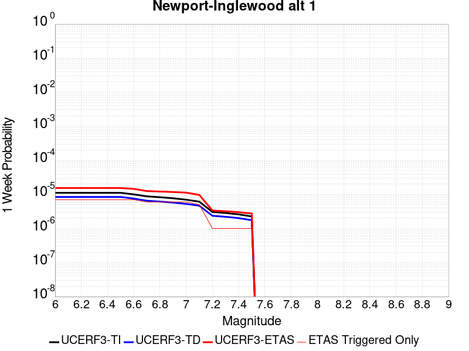 |  |  |  |

| Magnitude | 1 wk TI Prob | 1 wk TD Prob | 1 wk ETAS Prob | 1 wk ETAS/TD Gain | 1 wk ETAS Triggered Only | 1 mo TI Prob | 1 mo TD Prob | 1 mo ETAS Prob | 1 mo ETAS/TD Gain | 1 mo ETAS Triggered Only | 1 yr TI Prob | 1 yr TD Prob | 1 yr ETAS Prob | 1 yr ETAS/TD Gain | 1 yr ETAS Triggered Only | 10 yr TI Prob | 10 yr TD Prob | 10 yr ETAS Prob | 10 yr ETAS/TD Gain | 10 yr ETAS Triggered Only |
|-----|-----|-----|-----|-----|-----|-----|-----|-----|-----|-----|-----|-----|-----|-----|-----|-----|-----|-----|-----|-----|
| 6.0 | 1.1148327E-5 | 8.39976E-6 | 4.653681E-5 | 5.540255 | 3.8137372E-5 | 4.777767E-5 | 3.599853E-5 | 7.413453E-5 | 2.0593765 | 3.8137372E-5 | 5.8153784E-4 | 4.3820433E-4 | 4.76325E-4 | 1.0869929 | 3.8137372E-5 | 0.005800184 | 0.0043744235 | 0.004412394 | 1.0086801 | 3.8137372E-5 |
| 6.1 | 1.1148327E-5 | 8.39976E-6 | 4.653681E-5 | 5.540255 | 3.8137372E-5 | 4.777767E-5 | 3.599853E-5 | 7.413453E-5 | 2.0593765 | 3.8137372E-5 | 5.8153784E-4 | 4.3820433E-4 | 4.76325E-4 | 1.0869929 | 3.8137372E-5 | 0.005800184 | 0.0043744235 | 0.004412394 | 1.0086801 | 3.8137372E-5 |
| 6.2 | 1.1148327E-5 | 8.39976E-6 | 4.653681E-5 | 5.540255 | 3.8137372E-5 | 4.777767E-5 | 3.599853E-5 | 7.413453E-5 | 2.0593765 | 3.8137372E-5 | 5.8153784E-4 | 4.3820433E-4 | 4.76325E-4 | 1.0869929 | 3.8137372E-5 | 0.005800184 | 0.0043744235 | 0.004412394 | 1.0086801 | 3.8137372E-5 |
| 6.3 | 1.1148327E-5 | 8.39976E-6 | 4.653681E-5 | 5.540255 | 3.8137372E-5 | 4.777767E-5 | 3.599853E-5 | 7.413453E-5 | 2.0593765 | 3.8137372E-5 | 5.8153784E-4 | 4.3820433E-4 | 4.76325E-4 | 1.0869929 | 3.8137372E-5 | 0.005800184 | 0.0043744235 | 0.004412394 | 1.0086801 | 3.8137372E-5 |
| 6.4 | 1.1148327E-5 | 8.39976E-6 | 4.653681E-5 | 5.540255 | 3.8137372E-5 | 4.777767E-5 | 3.599853E-5 | 7.413453E-5 | 2.0593765 | 3.8137372E-5 | 5.8153784E-4 | 4.3820433E-4 | 4.76325E-4 | 1.0869929 | 3.8137372E-5 | 0.005800184 | 0.0043744235 | 0.004412394 | 1.0086801 | 3.8137372E-5 |
| 6.5 | 1.1148327E-5 | 8.39976E-6 | 4.653681E-5 | 5.540255 | 3.8137372E-5 | 4.777767E-5 | 3.599853E-5 | 7.413453E-5 | 2.0593765 | 3.8137372E-5 | 5.8153784E-4 | 4.3820433E-4 | 4.76325E-4 | 1.0869929 | 3.8137372E-5 | 0.005800184 | 0.0043744235 | 0.004412394 | 1.0086801 | 3.8137372E-5 |
| 6.6 | 1.00224415E-5 | 7.532022E-6 | 4.5669105E-5 | 6.063326 | 3.8137372E-5 | 4.2952615E-5 | 3.2279753E-5 | 7.0415896E-5 | 2.181426 | 3.8137372E-5 | 5.228226E-4 | 3.9294525E-4 | 4.3106766E-4 | 1.097017 | 3.8137372E-5 | 0.005215943 | 0.0039235037 | 0.0039614914 | 1.009682 | 3.8137372E-5 |
| 6.7 | 8.770557E-6 | 6.5171002E-6 | 4.465422E-5 | 6.8518543 | 3.8137372E-5 | 3.7587557E-5 | 2.7930188E-5 | 6.6066495E-5 | 2.3654153 | 3.8137372E-5 | 4.575324E-4 | 3.400069E-4 | 3.7813128E-4 | 1.1121284 | 3.8137372E-5 | 0.0045659156 | 0.0033958422 | 0.00343385 | 1.0111924 | 3.8137372E-5 |
| 6.8 | 8.263289E-6 | 6.1460423E-6 | 4.428318E-5 | 7.2051535 | 3.8137372E-5 | 3.5413614E-5 | 2.633997E-5 | 6.4476335E-5 | 2.4478514 | 3.8137372E-5 | 4.3107543E-4 | 3.206518E-4 | 3.5877695E-4 | 1.1188989 | 3.8137372E-5 | 0.0043024016 | 0.0032028586 | 0.0032408738 | 1.0118692 | 3.8137372E-5 |
| 6.9 | 7.711276E-6 | 5.7474776E-6 | 4.388463E-5 | 7.635459 | 3.8137372E-5 | 3.304791E-5 | 2.4631869E-5 | 6.2768304E-5 | 2.5482557 | 3.8137372E-5 | 4.0228397E-4 | 2.9986154E-4 | 3.3798747E-4 | 1.1271452 | 3.8137372E-5 | 0.004015565 | 0.0029955322 | 0.0030335553 | 1.0126933 | 3.8137372E-5 |
| 7.0 | 6.9854723E-6 | 5.2637565E-6 | 4.3400927E-5 | 8.245238 | 3.8137372E-5 | 2.9937395E-5 | 2.2558817E-5 | 6.069533E-5 | 2.6905367 | 3.8137372E-5 | 3.644268E-4 | 2.7462872E-4 | 3.127556E-4 | 1.1388307 | 3.8137372E-5 | 0.0036382976 | 0.0027438495 | 0.0027818822 | 1.0138611 | 3.8137372E-5 |
| 7.1 | 6.123445E-6 | 4.66162E-6 | 4.2798813E-5 | 9.181103 | 3.8137372E-5 | 2.6243071E-5 | 1.9978273E-5 | 5.811488E-5 | 2.908904 | 3.8137372E-5 | 3.1946256E-4 | 2.4321795E-4 | 2.8134603E-4 | 1.1567651 | 3.8137372E-5 | 0.0031900369 | 0.0024304604 | 0.002468505 | 1.0156533 | 3.8137372E-5 |
| 7.2 | 3.0524068E-6 | 2.3598534E-6 | 2.1428494E-5 | 9.080435 | 1.9068686E-5 | 1.3081678E-5 | 1.011364E-5 | 2.9182132E-5 | 2.8854234 | 1.9068686E-5 | 1.5925779E-4 | 1.2313046E-4 | 1.4219679E-4 | 1.1548467 | 1.9068686E-5 | 0.001591437 | 0.001231 | 0.0012500451 | 1.0154713 | 1.9068686E-5 |
| 7.3 | 2.8490606E-6 | 2.204696E-6 | 2.127334E-5 | 9.649103 | 1.9068686E-5 | 1.2210203E-5 | 9.448685E-6 | 2.851719E-5 | 3.0181122 | 1.9068686E-5 | 1.4864908E-4 | 1.1503552E-4 | 1.3410201E-4 | 1.1657444 | 1.9068686E-5 | 0.0014854969 | 0.0011501369 | 0.0011691838 | 1.0165604 | 1.9068686E-5 |
| 7.4 | 2.5994284E-6 | 2.0116724E-6 | 2.108032E-5 | 10.479002 | 1.9068686E-5 | 1.114036E-5 | 8.621447E-6 | 2.7689968E-5 | 3.2117543 | 1.9068686E-5 | 1.3562544E-4 | 1.049649E-4 | 1.2403158E-4 | 1.1816481 | 1.9068686E-5 | 0.0013554269 | 0.00104953 | 0.0010685787 | 1.0181497 | 1.9068686E-5 |
| 7.5 | 2.2517988E-6 | 1.7516537E-6 | 2.0820306E-5 | 11.8860855 | 1.9068686E-5 | 9.650531E-6 | 7.5070875E-6 | 2.657563E-5 | 3.540072 | 1.9068686E-5 | 1.17488875E-4 | 9.139879E-5 | 1.1046573E-4 | 1.2086127 | 1.9068686E-5 | 0.0011742678 | 9.1398787E-4 | 9.330391E-4 | 1.0208441 | 1.9068686E-5 |

## San Jacinto (Clark) rev
*[(top)](#table-of-contents)*

| 1 Week | 1 Month | 1 Year | 10 Year |
|-----|-----|-----|-----|
|  |  |  |  |

| Magnitude | 1 wk TI Prob | 1 wk TD Prob | 1 wk ETAS Prob | 1 wk ETAS/TD Gain | 1 wk ETAS Triggered Only | 1 mo TI Prob | 1 mo TD Prob | 1 mo ETAS Prob | 1 mo ETAS/TD Gain | 1 mo ETAS Triggered Only | 1 yr TI Prob | 1 yr TD Prob | 1 yr ETAS Prob | 1 yr ETAS/TD Gain | 1 yr ETAS Triggered Only | 10 yr TI Prob | 10 yr TD Prob | 10 yr ETAS Prob | 10 yr ETAS/TD Gain | 10 yr ETAS Triggered Only |
|-----|-----|-----|-----|-----|-----|-----|-----|-----|-----|-----|-----|-----|-----|-----|-----|-----|-----|-----|-----|-----|
| 6.0 | 6.1857165E-5 | 9.865906E-5 | 1.1772587E-4 | 1.1932595 | 1.9068686E-5 | 2.650752E-4 | 4.227864E-4 | 4.4184702E-4 | 1.0450833 | 1.9068686E-5 | 0.0032225149 | 0.0051406594 | 0.00515963 | 1.0036904 | 1.9068686E-5 | 0.031761836 | 0.05230213 | 0.052338272 | 1.000691 | 3.8137372E-5 |
| 6.1 | 6.1857165E-5 | 9.865906E-5 | 1.1772587E-4 | 1.1932595 | 1.9068686E-5 | 2.650752E-4 | 4.227864E-4 | 4.4184702E-4 | 1.0450833 | 1.9068686E-5 | 0.0032225149 | 0.0051406594 | 0.00515963 | 1.0036904 | 1.9068686E-5 | 0.031761836 | 0.05230213 | 0.052338272 | 1.000691 | 3.8137372E-5 |
| 6.2 | 6.1857165E-5 | 9.865906E-5 | 1.1772587E-4 | 1.1932595 | 1.9068686E-5 | 2.650752E-4 | 4.227864E-4 | 4.4184702E-4 | 1.0450833 | 1.9068686E-5 | 0.0032225149 | 0.0051406594 | 0.00515963 | 1.0036904 | 1.9068686E-5 | 0.031761836 | 0.05230213 | 0.052338272 | 1.000691 | 3.8137372E-5 |
| 6.3 | 6.1857165E-5 | 9.865906E-5 | 1.1772587E-4 | 1.1932595 | 1.9068686E-5 | 2.650752E-4 | 4.227864E-4 | 4.4184702E-4 | 1.0450833 | 1.9068686E-5 | 0.0032225149 | 0.0051406594 | 0.00515963 | 1.0036904 | 1.9068686E-5 | 0.031761836 | 0.05230213 | 0.052338272 | 1.000691 | 3.8137372E-5 |
| 6.4 | 6.1857165E-5 | 9.865906E-5 | 1.1772587E-4 | 1.1932595 | 1.9068686E-5 | 2.650752E-4 | 4.227864E-4 | 4.4184702E-4 | 1.0450833 | 1.9068686E-5 | 0.0032225149 | 0.0051406594 | 0.00515963 | 1.0036904 | 1.9068686E-5 | 0.031761836 | 0.05230213 | 0.052338272 | 1.000691 | 3.8137372E-5 |
| 6.5 | 6.1857165E-5 | 9.865906E-5 | 1.1772587E-4 | 1.1932595 | 1.9068686E-5 | 2.650752E-4 | 4.227864E-4 | 4.4184702E-4 | 1.0450833 | 1.9068686E-5 | 0.0032225149 | 0.0051406594 | 0.00515963 | 1.0036904 | 1.9068686E-5 | 0.031761836 | 0.05230213 | 0.052338272 | 1.000691 | 3.8137372E-5 |
| 6.6 | 6.1629326E-5 | 9.831641E-5 | 1.1738322E-4 | 1.1939331 | 1.9068686E-5 | 2.6409896E-4 | 4.2131837E-4 | 4.4037902E-4 | 1.0452405 | 1.9068686E-5 | 0.0032106643 | 0.00512287 | 0.0051418412 | 1.0037032 | 1.9068686E-5 | 0.031646714 | 0.052133482 | 0.052169632 | 1.0006934 | 3.8137372E-5 |
| 6.7 | 6.116108E-5 | 9.7617616E-5 | 1.1668444E-4 | 1.1953216 | 1.9068686E-5 | 2.6209257E-4 | 4.183245E-4 | 4.373852E-4 | 1.0455644 | 1.9068686E-5 | 0.0031863083 | 0.0050865905 | 0.005105562 | 1.0037297 | 1.9068686E-5 | 0.031410076 | 0.051788114 | 0.051824275 | 1.0006983 | 3.8137372E-5 |
| 6.8 | 6.110044E-5 | 9.753308E-5 | 1.16599906E-4 | 1.1954908 | 1.9068686E-5 | 2.6183276E-4 | 4.1796232E-4 | 4.3702303E-4 | 1.0456039 | 1.9068686E-5 | 0.0031831542 | 0.0050822017 | 0.0051011737 | 1.003733 | 1.9068686E-5 | 0.03137943 | 0.051745888 | 0.05178205 | 1.0006989 | 3.8137372E-5 |
| 6.9 | 6.0730574E-5 | 9.694897E-5 | 1.16015806E-4 | 1.1966687 | 1.9068686E-5 | 2.6024794E-4 | 4.154598E-4 | 4.3452057E-4 | 1.0458788 | 1.9068686E-5 | 0.0031639151 | 0.005051875 | 0.0050708475 | 1.0037555 | 1.9068686E-5 | 0.031192465 | 0.051456194 | 0.05149237 | 1.000703 | 3.8137372E-5 |
| 7.0 | 6.0346E-5 | 9.636309E-5 | 1.1542993E-4 | 1.1978647 | 1.9068686E-5 | 2.5860008E-4 | 4.1294965E-4 | 4.3201048E-4 | 1.0461577 | 1.9068686E-5 | 0.0031439106 | 0.005021455 | 0.005040428 | 1.0037783 | 1.9068686E-5 | 0.030998027 | 0.051163334 | 0.051199522 | 1.0007073 | 3.8137372E-5 |
| 7.1 | 5.9163158E-5 | 9.465252E-5 | 1.137194E-4 | 1.2014408 | 1.9068686E-5 | 2.5353173E-4 | 4.0562096E-4 | 4.246819E-4 | 1.0469921 | 1.9068686E-5 | 0.0030823802 | 0.0049326345 | 0.0049516093 | 1.0038468 | 1.9068686E-5 | 0.030399747 | 0.050306328 | 0.050342545 | 1.00072 | 3.8137372E-5 |
| 7.2 | 5.863685E-5 | 9.390979E-5 | 1.1297668E-4 | 1.2030342 | 1.9068686E-5 | 2.512766E-4 | 4.0243877E-4 | 4.214998E-4 | 1.0473638 | 1.9068686E-5 | 0.0030550007 | 0.004894066 | 0.0049130414 | 1.0038772 | 1.9068686E-5 | 0.030133424 | 0.04993242 | 0.049968652 | 1.0007256 | 3.8137372E-5 |
| 7.3 | 5.8209655E-5 | 9.342446E-5 | 1.1249137E-4 | 1.204089 | 1.9068686E-5 | 2.4944608E-4 | 4.0035948E-4 | 4.1942054E-4 | 1.0476098 | 1.9068686E-5 | 0.0030327768 | 0.004868864 | 0.00488784 | 1.0038974 | 1.9068686E-5 | 0.0299172 | 0.049677737 | 0.04971398 | 1.0007296 | 3.8137372E-5 |
| 7.4 | 5.7813933E-5 | 9.282713E-5 | 1.1189405E-4 | 1.2054024 | 1.9068686E-5 | 2.4775046E-4 | 3.978003E-4 | 4.1686138E-4 | 1.0479163 | 1.9068686E-5 | 0.0030121899 | 0.0048378445 | 0.004856821 | 1.0039225 | 1.9068686E-5 | 0.029716864 | 0.049371965 | 0.04940822 | 1.0007343 | 3.8137372E-5 |
| 7.5 | 5.731269E-5 | 9.1954265E-5 | 1.110212E-4 | 1.2073523 | 1.9068686E-5 | 2.4560269E-4 | 3.9406057E-4 | 4.1312174E-4 | 1.0483712 | 1.9068686E-5 | 0.0029861126 | 0.0047925147 | 0.004811492 | 1.0039598 | 1.9068686E-5 | 0.029463045 | 0.04892991 | 0.04896618 | 1.0007412 | 3.8137372E-5 |
| 7.6 | 1.8838993E-5 | 2.7586504E-5 | 4.6654663E-5 | 1.6912134 | 1.9068686E-5 | 8.073604E-5 | 1.1822497E-4 | 1.372914E-4 | 1.1612724 | 1.9068686E-5 | 9.82518E-4 | 0.001438873 | 0.0014579142 | 1.0132334 | 1.9068686E-5 | 0.009781853 | 0.015056286 | 0.015075068 | 1.0012474 | 1.9068686E-5 |
| 7.7 | 1.2895799E-5 | 1.7139906E-5 | 1.7139906E-5 | 1.0 | 0.0 | 5.526654E-5 | 7.3456744E-5 | 7.3456744E-5 | 1.0 | 0.0 | 6.726624E-4 | 8.943358E-4 | 8.943358E-4 | 1.0 | 0.0 | 0.006706299 | 0.009567577 | 0.009567577 | 1.0 | 0.0 |

## Great Valley 04a Trout Creek
*[(top)](#table-of-contents)*

| 1 Week | 1 Month | 1 Year | 10 Year |
|-----|-----|-----|-----|
|  |  |  |  |

| Magnitude | 1 wk TI Prob | 1 wk TD Prob | 1 wk ETAS Prob | 1 wk ETAS/TD Gain | 1 wk ETAS Triggered Only | 1 mo TI Prob | 1 mo TD Prob | 1 mo ETAS Prob | 1 mo ETAS/TD Gain | 1 mo ETAS Triggered Only | 1 yr TI Prob | 1 yr TD Prob | 1 yr ETAS Prob | 1 yr ETAS/TD Gain | 1 yr ETAS Triggered Only | 10 yr TI Prob | 10 yr TD Prob | 10 yr ETAS Prob | 10 yr ETAS/TD Gain | 10 yr ETAS Triggered Only |
|-----|-----|-----|-----|-----|-----|-----|-----|-----|-----|-----|-----|-----|-----|-----|-----|-----|-----|-----|-----|-----|
| 6.0 | 2.9044959E-5 | 3.7163332E-5 | 3.7163332E-5 | 1.0 | 0.0 | 1.2447246E-4 | 1.5927143E-4 | 1.5927143E-4 | 1.0 | 0.0 | 0.0015143986 | 0.001939099 | 0.0019581309 | 1.0098147 | 1.9068686E-5 | 0.015041199 | 0.019386286 | 0.019423684 | 1.001929 | 3.8137372E-5 |
| 6.1 | 2.9044959E-5 | 3.7163332E-5 | 3.7163332E-5 | 1.0 | 0.0 | 1.2447246E-4 | 1.5927143E-4 | 1.5927143E-4 | 1.0 | 0.0 | 0.0015143986 | 0.001939099 | 0.0019581309 | 1.0098147 | 1.9068686E-5 | 0.015041199 | 0.019386286 | 0.019423684 | 1.001929 | 3.8137372E-5 |
| 6.2 | 2.9044959E-5 | 3.7163332E-5 | 3.7163332E-5 | 1.0 | 0.0 | 1.2447246E-4 | 1.5927143E-4 | 1.5927143E-4 | 1.0 | 0.0 | 0.0015143986 | 0.001939099 | 0.0019581309 | 1.0098147 | 1.9068686E-5 | 0.015041199 | 0.019386286 | 0.019423684 | 1.001929 | 3.8137372E-5 |
| 6.3 | 2.9044959E-5 | 3.7163332E-5 | 3.7163332E-5 | 1.0 | 0.0 | 1.2447246E-4 | 1.5927143E-4 | 1.5927143E-4 | 1.0 | 0.0 | 0.0015143986 | 0.001939099 | 0.0019581309 | 1.0098147 | 1.9068686E-5 | 0.015041199 | 0.019386286 | 0.019423684 | 1.001929 | 3.8137372E-5 |
| 6.4 | 2.9044959E-5 | 3.7163332E-5 | 3.7163332E-5 | 1.0 | 0.0 | 1.2447246E-4 | 1.5927143E-4 | 1.5927143E-4 | 1.0 | 0.0 | 0.0015143986 | 0.001939099 | 0.0019581309 | 1.0098147 | 1.9068686E-5 | 0.015041199 | 0.019386286 | 0.019423684 | 1.001929 | 3.8137372E-5 |

## Great Valley 04b Gordon Valley
*[(top)](#table-of-contents)*

| 1 Week | 1 Month | 1 Year | 10 Year |
|-----|-----|-----|-----|
|  |  | 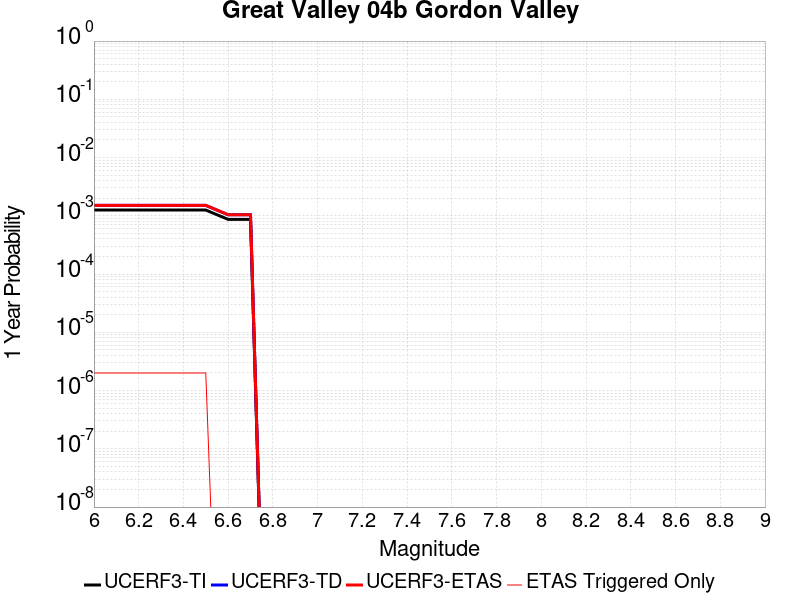 |  |

| Magnitude | 1 wk TI Prob | 1 wk TD Prob | 1 wk ETAS Prob | 1 wk ETAS/TD Gain | 1 wk ETAS Triggered Only | 1 mo TI Prob | 1 mo TD Prob | 1 mo ETAS Prob | 1 mo ETAS/TD Gain | 1 mo ETAS Triggered Only | 1 yr TI Prob | 1 yr TD Prob | 1 yr ETAS Prob | 1 yr ETAS/TD Gain | 1 yr ETAS Triggered Only | 10 yr TI Prob | 10 yr TD Prob | 10 yr ETAS Prob | 10 yr ETAS/TD Gain | 10 yr ETAS Triggered Only |
|-----|-----|-----|-----|-----|-----|-----|-----|-----|-----|-----|-----|-----|-----|-----|-----|-----|-----|-----|-----|-----|
| 6.0 | 2.4076155E-5 | 2.8932132E-5 | 2.8932132E-5 | 1.0 | 0.0 | 1.03179445E-4 | 1.2399205E-4 | 1.2399205E-4 | 1.0 | 0.0 | 0.0012554857 | 0.0015091051 | 0.0015281449 | 1.0126166 | 1.9068686E-5 | 0.012484163 | 0.015042224 | 0.015079787 | 1.0024972 | 3.8137372E-5 |
| 6.1 | 2.4076155E-5 | 2.8932132E-5 | 2.8932132E-5 | 1.0 | 0.0 | 1.03179445E-4 | 1.2399205E-4 | 1.2399205E-4 | 1.0 | 0.0 | 0.0012554857 | 0.0015091051 | 0.0015281449 | 1.0126166 | 1.9068686E-5 | 0.012484163 | 0.015042224 | 0.015079787 | 1.0024972 | 3.8137372E-5 |
| 6.2 | 2.4076155E-5 | 2.8932132E-5 | 2.8932132E-5 | 1.0 | 0.0 | 1.03179445E-4 | 1.2399205E-4 | 1.2399205E-4 | 1.0 | 0.0 | 0.0012554857 | 0.0015091051 | 0.0015281449 | 1.0126166 | 1.9068686E-5 | 0.012484163 | 0.015042224 | 0.015079787 | 1.0024972 | 3.8137372E-5 |
| 6.3 | 2.4076155E-5 | 2.8932132E-5 | 2.8932132E-5 | 1.0 | 0.0 | 1.03179445E-4 | 1.2399205E-4 | 1.2399205E-4 | 1.0 | 0.0 | 0.0012554857 | 0.0015091051 | 0.0015281449 | 1.0126166 | 1.9068686E-5 | 0.012484163 | 0.015042224 | 0.015079787 | 1.0024972 | 3.8137372E-5 |
| 6.4 | 2.4076155E-5 | 2.8932132E-5 | 2.8932132E-5 | 1.0 | 0.0 | 1.03179445E-4 | 1.2399205E-4 | 1.2399205E-4 | 1.0 | 0.0 | 0.0012554857 | 0.0015091051 | 0.0015281449 | 1.0126166 | 1.9068686E-5 | 0.012484163 | 0.015042224 | 0.015079787 | 1.0024972 | 3.8137372E-5 |
| 6.5 | 2.4076155E-5 | 2.8932132E-5 | 2.8932132E-5 | 1.0 | 0.0 | 1.03179445E-4 | 1.2399205E-4 | 1.2399205E-4 | 1.0 | 0.0 | 0.0012554857 | 0.0015091051 | 0.0015281449 | 1.0126166 | 1.9068686E-5 | 0.012484163 | 0.015042224 | 0.015079787 | 1.0024972 | 3.8137372E-5 |
| 6.6 | 1.664996E-5 | 1.9973098E-5 | 1.9973098E-5 | 1.0 | 0.0 | 7.135502E-5 | 8.559899E-5 | 8.559899E-5 | 1.0 | 0.0 | 8.68401E-4 | 0.0010421677 | 0.0010421677 | 1.0 | 0.0 | 0.008650154 | 0.010421675 | 0.010440544 | 1.0018107 | 1.9068686E-5 |
| 6.7 | 1.664996E-5 | 1.9973098E-5 | 1.9973098E-5 | 1.0 | 0.0 | 7.135502E-5 | 8.559899E-5 | 8.559899E-5 | 1.0 | 0.0 | 8.68401E-4 | 0.0010421677 | 0.0010421677 | 1.0 | 0.0 | 0.008650154 | 0.010421675 | 0.010440544 | 1.0018107 | 1.9068686E-5 |

## Malibu Coast alt 1
*[(top)](#table-of-contents)*

| 1 Week | 1 Month | 1 Year | 10 Year |
|-----|-----|-----|-----|
|  |  |  |  |

| Magnitude | 1 wk TI Prob | 1 wk TD Prob | 1 wk ETAS Prob | 1 wk ETAS/TD Gain | 1 wk ETAS Triggered Only | 1 mo TI Prob | 1 mo TD Prob | 1 mo ETAS Prob | 1 mo ETAS/TD Gain | 1 mo ETAS Triggered Only | 1 yr TI Prob | 1 yr TD Prob | 1 yr ETAS Prob | 1 yr ETAS/TD Gain | 1 yr ETAS Triggered Only | 10 yr TI Prob | 10 yr TD Prob | 10 yr ETAS Prob | 10 yr ETAS/TD Gain | 10 yr ETAS Triggered Only |
|-----|-----|-----|-----|-----|-----|-----|-----|-----|-----|-----|-----|-----|-----|-----|-----|-----|-----|-----|-----|-----|
| 6.0 | 5.5048527E-6 | 5.7432603E-6 | 2.4811836E-5 | 4.3201656 | 1.9068686E-5 | 2.3592012E-5 | 2.4613972E-5 | 6.2750405E-5 | 2.5493815 | 3.8137372E-5 | 2.8719488E-4 | 2.996751E-4 | 3.3780106E-4 | 1.1272242 | 3.8137372E-5 | 0.00286824 | 0.002996751 | 0.0030347742 | 1.0126882 | 3.8137372E-5 |
| 6.1 | 5.5048527E-6 | 5.7432603E-6 | 2.4811836E-5 | 4.3201656 | 1.9068686E-5 | 2.3592012E-5 | 2.4613972E-5 | 6.2750405E-5 | 2.5493815 | 3.8137372E-5 | 2.8719488E-4 | 2.996751E-4 | 3.3780106E-4 | 1.1272242 | 3.8137372E-5 | 0.00286824 | 0.002996751 | 0.0030347742 | 1.0126882 | 3.8137372E-5 |
| 6.2 | 5.5048527E-6 | 5.7432603E-6 | 2.4811836E-5 | 4.3201656 | 1.9068686E-5 | 2.3592012E-5 | 2.4613972E-5 | 6.2750405E-5 | 2.5493815 | 3.8137372E-5 | 2.8719488E-4 | 2.996751E-4 | 3.3780106E-4 | 1.1272242 | 3.8137372E-5 | 0.00286824 | 0.002996751 | 0.0030347742 | 1.0126882 | 3.8137372E-5 |
| 6.3 | 5.5048527E-6 | 5.7432603E-6 | 2.4811836E-5 | 4.3201656 | 1.9068686E-5 | 2.3592012E-5 | 2.4613972E-5 | 6.2750405E-5 | 2.5493815 | 3.8137372E-5 | 2.8719488E-4 | 2.996751E-4 | 3.3780106E-4 | 1.1272242 | 3.8137372E-5 | 0.00286824 | 0.002996751 | 0.0030347742 | 1.0126882 | 3.8137372E-5 |
| 6.4 | 5.5048527E-6 | 5.7432603E-6 | 2.4811836E-5 | 4.3201656 | 1.9068686E-5 | 2.3592012E-5 | 2.4613972E-5 | 6.2750405E-5 | 2.5493815 | 3.8137372E-5 | 2.8719488E-4 | 2.996751E-4 | 3.3780106E-4 | 1.1272242 | 3.8137372E-5 | 0.00286824 | 0.002996751 | 0.0030347742 | 1.0126882 | 3.8137372E-5 |
| 6.5 | 5.5048527E-6 | 5.7432603E-6 | 2.4811836E-5 | 4.3201656 | 1.9068686E-5 | 2.3592012E-5 | 2.4613972E-5 | 6.2750405E-5 | 2.5493815 | 3.8137372E-5 | 2.8719488E-4 | 2.996751E-4 | 3.3780106E-4 | 1.1272242 | 3.8137372E-5 | 0.00286824 | 0.002996751 | 0.0030347742 | 1.0126882 | 3.8137372E-5 |

## Great Valley 07 (Orestimba)
*[(top)](#table-of-contents)*

| 1 Week | 1 Month | 1 Year | 10 Year |
|-----|-----|-----|-----|
|  |  |  |  |

| Magnitude | 1 wk TI Prob | 1 wk TD Prob | 1 wk ETAS Prob | 1 wk ETAS/TD Gain | 1 wk ETAS Triggered Only | 1 mo TI Prob | 1 mo TD Prob | 1 mo ETAS Prob | 1 mo ETAS/TD Gain | 1 mo ETAS Triggered Only | 1 yr TI Prob | 1 yr TD Prob | 1 yr ETAS Prob | 1 yr ETAS/TD Gain | 1 yr ETAS Triggered Only | 10 yr TI Prob | 10 yr TD Prob | 10 yr ETAS Prob | 10 yr ETAS/TD Gain | 10 yr ETAS Triggered Only |
|-----|-----|-----|-----|-----|-----|-----|-----|-----|-----|-----|-----|-----|-----|-----|-----|-----|-----|-----|-----|-----|
| 6.0 | 2.841624E-5 | 3.5190245E-5 | 3.5190245E-5 | 1.0 | 0.0 | 1.21778205E-4 | 1.5081046E-4 | 1.5081046E-4 | 1.0 | 0.0 | 0.0014816412 | 0.0018352446 | 0.0018542784 | 1.0103712 | 1.9068686E-5 | 0.014718015 | 0.018267011 | 0.018304452 | 1.0020497 | 3.8137372E-5 |
| 6.1 | 2.841624E-5 | 3.5190245E-5 | 3.5190245E-5 | 1.0 | 0.0 | 1.21778205E-4 | 1.5081046E-4 | 1.5081046E-4 | 1.0 | 0.0 | 0.0014816412 | 0.0018352446 | 0.0018542784 | 1.0103712 | 1.9068686E-5 | 0.014718015 | 0.018267011 | 0.018304452 | 1.0020497 | 3.8137372E-5 |
| 6.2 | 2.841624E-5 | 3.5190245E-5 | 3.5190245E-5 | 1.0 | 0.0 | 1.21778205E-4 | 1.5081046E-4 | 1.5081046E-4 | 1.0 | 0.0 | 0.0014816412 | 0.0018352446 | 0.0018542784 | 1.0103712 | 1.9068686E-5 | 0.014718015 | 0.018267011 | 0.018304452 | 1.0020497 | 3.8137372E-5 |
| 6.3 | 2.841624E-5 | 3.5190245E-5 | 3.5190245E-5 | 1.0 | 0.0 | 1.21778205E-4 | 1.5081046E-4 | 1.5081046E-4 | 1.0 | 0.0 | 0.0014816412 | 0.0018352446 | 0.0018542784 | 1.0103712 | 1.9068686E-5 | 0.014718015 | 0.018267011 | 0.018304452 | 1.0020497 | 3.8137372E-5 |
| 6.4 | 2.841624E-5 | 3.5190245E-5 | 3.5190245E-5 | 1.0 | 0.0 | 1.21778205E-4 | 1.5081046E-4 | 1.5081046E-4 | 1.0 | 0.0 | 0.0014816412 | 0.0018352446 | 0.0018542784 | 1.0103712 | 1.9068686E-5 | 0.014718015 | 0.018267011 | 0.018304452 | 1.0020497 | 3.8137372E-5 |
| 6.5 | 2.841624E-5 | 3.5190245E-5 | 3.5190245E-5 | 1.0 | 0.0 | 1.21778205E-4 | 1.5081046E-4 | 1.5081046E-4 | 1.0 | 0.0 | 0.0014816412 | 0.0018352446 | 0.0018542784 | 1.0103712 | 1.9068686E-5 | 0.014718015 | 0.018267011 | 0.018304452 | 1.0020497 | 3.8137372E-5 |
| 6.6 | 1.9500372E-5 | 2.4072657E-5 | 2.4072657E-5 | 1.0 | 0.0 | 8.357035E-5 | 1.03168066E-4 | 1.03168066E-4 | 1.0 | 0.0 | 0.001016994 | 0.0012559886 | 0.0012750333 | 1.0151632 | 1.9068686E-5 | 0.010123523 | 0.012551772 | 0.01258943 | 1.0030003 | 3.8137372E-5 |
| 6.7 | 1.83568E-5 | 2.264984E-5 | 2.264984E-5 | 1.0 | 0.0 | 7.866963E-5 | 9.707074E-5 | 9.707074E-5 | 1.0 | 0.0 | 9.5738185E-4 | 0.0011818361 | 0.0012008823 | 1.0161158 | 1.9068686E-5 | 0.009532678 | 0.011818337 | 0.011856023 | 1.0031888 | 3.8137372E-5 |

## Calaveras (No) 2011 CFM
*[(top)](#table-of-contents)*

| 1 Week | 1 Month | 1 Year | 10 Year |
|-----|-----|-----|-----|
|  |  |  |  |

| Magnitude | 1 wk TI Prob | 1 wk TD Prob | 1 wk ETAS Prob | 1 wk ETAS/TD Gain | 1 wk ETAS Triggered Only | 1 mo TI Prob | 1 mo TD Prob | 1 mo ETAS Prob | 1 mo ETAS/TD Gain | 1 mo ETAS Triggered Only | 1 yr TI Prob | 1 yr TD Prob | 1 yr ETAS Prob | 1 yr ETAS/TD Gain | 1 yr ETAS Triggered Only | 10 yr TI Prob | 10 yr TD Prob | 10 yr ETAS Prob | 10 yr ETAS/TD Gain | 10 yr ETAS Triggered Only |
|-----|-----|-----|-----|-----|-----|-----|-----|-----|-----|-----|-----|-----|-----|-----|-----|-----|-----|-----|-----|-----|
| 6.0 | 6.853089E-5 | 1.452927E-4 | 1.643586E-4 | 1.1312242 | 1.9068686E-5 | 2.9367075E-4 | 6.225777E-4 | 6.4163445E-4 | 1.0306095 | 1.9068686E-5 | 0.0035695804 | 0.007561221 | 0.0075801453 | 1.0025028 | 1.9068686E-5 | 0.03512784 | 0.07195558 | 0.071990974 | 1.0004919 | 3.8137372E-5 |
| 6.1 | 6.853089E-5 | 1.452927E-4 | 1.643586E-4 | 1.1312242 | 1.9068686E-5 | 2.9367075E-4 | 6.225777E-4 | 6.4163445E-4 | 1.0306095 | 1.9068686E-5 | 0.0035695804 | 0.007561221 | 0.0075801453 | 1.0025028 | 1.9068686E-5 | 0.03512784 | 0.07195558 | 0.071990974 | 1.0004919 | 3.8137372E-5 |
| 6.2 | 6.853089E-5 | 1.452927E-4 | 1.643586E-4 | 1.1312242 | 1.9068686E-5 | 2.9367075E-4 | 6.225777E-4 | 6.4163445E-4 | 1.0306095 | 1.9068686E-5 | 0.0035695804 | 0.007561221 | 0.0075801453 | 1.0025028 | 1.9068686E-5 | 0.03512784 | 0.07195558 | 0.071990974 | 1.0004919 | 3.8137372E-5 |
| 6.3 | 6.853089E-5 | 1.452927E-4 | 1.643586E-4 | 1.1312242 | 1.9068686E-5 | 2.9367075E-4 | 6.225777E-4 | 6.4163445E-4 | 1.0306095 | 1.9068686E-5 | 0.0035695804 | 0.007561221 | 0.0075801453 | 1.0025028 | 1.9068686E-5 | 0.03512784 | 0.07195558 | 0.071990974 | 1.0004919 | 3.8137372E-5 |
| 6.4 | 6.853089E-5 | 1.452927E-4 | 1.643586E-4 | 1.1312242 | 1.9068686E-5 | 2.9367075E-4 | 6.225777E-4 | 6.4163445E-4 | 1.0306095 | 1.9068686E-5 | 0.0035695804 | 0.007561221 | 0.0075801453 | 1.0025028 | 1.9068686E-5 | 0.03512784 | 0.07195558 | 0.071990974 | 1.0004919 | 3.8137372E-5 |
| 6.5 | 6.853089E-5 | 1.452927E-4 | 1.643586E-4 | 1.1312242 | 1.9068686E-5 | 2.9367075E-4 | 6.225777E-4 | 6.4163445E-4 | 1.0306095 | 1.9068686E-5 | 0.0035695804 | 0.007561221 | 0.0075801453 | 1.0025028 | 1.9068686E-5 | 0.03512784 | 0.07195558 | 0.071990974 | 1.0004919 | 3.8137372E-5 |
| 6.6 | 6.5130276E-5 | 1.385732E-4 | 1.5763924E-4 | 1.1375883 | 1.9068686E-5 | 2.7909988E-4 | 5.9379323E-4 | 6.128506E-4 | 1.0320942 | 1.9068686E-5 | 0.003392747 | 0.0072131394 | 0.0072320704 | 1.0026245 | 1.9068686E-5 | 0.033414144 | 0.06881748 | 0.068853 | 1.000516 | 3.8137372E-5 |
| 6.7 | 6.1341E-5 | 1.3118902E-4 | 1.502552E-4 | 1.1453336 | 1.9068686E-5 | 2.6286353E-4 | 5.6216074E-4 | 5.812187E-4 | 1.0339013 | 1.9068686E-5 | 0.003195667 | 0.0068304855 | 0.006849424 | 1.0027727 | 1.9068686E-5 | 0.03150101 | 0.06536239 | 0.06539803 | 1.0005454 | 3.8137372E-5 |
| 6.8 | 3.241399E-5 | 7.175236E-5 | 9.0819674E-5 | 1.2657379 | 1.9068686E-5 | 1.389097E-4 | 3.075001E-4 | 3.2656293E-4 | 1.0619929 | 1.9068686E-5 | 0.0016899136 | 0.0037420401 | 0.0037610375 | 1.0050768 | 1.9068686E-5 | 0.016771203 | 0.036092106 | 0.036110487 | 1.0005093 | 1.9068686E-5 |
| 6.9 | 2.7363296E-5 | 6.059934E-5 | 6.059934E-5 | 1.0 | 0.0 | 1.1726599E-4 | 2.5971147E-4 | 2.5971147E-4 | 1.0 | 0.0 | 0.0014267784 | 0.003161987 | 0.003161987 | 1.0 | 0.0 | 0.014176525 | 0.030637112 | 0.030637112 | 1.0 | 0.0 |

## Green Valley 2011 CFM
*[(top)](#table-of-contents)*

| 1 Week | 1 Month | 1 Year | 10 Year |
|-----|-----|-----|-----|
|  |  |  |  |

| Magnitude | 1 wk TI Prob | 1 wk TD Prob | 1 wk ETAS Prob | 1 wk ETAS/TD Gain | 1 wk ETAS Triggered Only | 1 mo TI Prob | 1 mo TD Prob | 1 mo ETAS Prob | 1 mo ETAS/TD Gain | 1 mo ETAS Triggered Only | 1 yr TI Prob | 1 yr TD Prob | 1 yr ETAS Prob | 1 yr ETAS/TD Gain | 1 yr ETAS Triggered Only | 10 yr TI Prob | 10 yr TD Prob | 10 yr ETAS Prob | 10 yr ETAS/TD Gain | 10 yr ETAS Triggered Only |
|-----|-----|-----|-----|-----|-----|-----|-----|-----|-----|-----|-----|-----|-----|-----|-----|-----|-----|-----|-----|-----|
| 6.0 | 7.9834055E-5 | 1.7647086E-4 | 1.9553618E-4 | 1.1080366 | 1.9068686E-5 | 3.421011E-4 | 7.562273E-4 | 7.752816E-4 | 1.0251964 | 1.9068686E-5 | 0.0041571283 | 0.009193515 | 0.009231302 | 1.0041101 | 3.8137372E-5 | 0.040802166 | 0.08864039 | 0.08867515 | 1.0003921 | 3.8137372E-5 |
| 6.1 | 7.9834055E-5 | 1.7647086E-4 | 1.9553618E-4 | 1.1080366 | 1.9068686E-5 | 3.421011E-4 | 7.562273E-4 | 7.752816E-4 | 1.0251964 | 1.9068686E-5 | 0.0041571283 | 0.009193515 | 0.009231302 | 1.0041101 | 3.8137372E-5 | 0.040802166 | 0.08864039 | 0.08867515 | 1.0003921 | 3.8137372E-5 |
| 6.2 | 7.9834055E-5 | 1.7647086E-4 | 1.9553618E-4 | 1.1080366 | 1.9068686E-5 | 3.421011E-4 | 7.562273E-4 | 7.752816E-4 | 1.0251964 | 1.9068686E-5 | 0.0041571283 | 0.009193515 | 0.009231302 | 1.0041101 | 3.8137372E-5 | 0.040802166 | 0.08864039 | 0.08867515 | 1.0003921 | 3.8137372E-5 |
| 6.3 | 7.9834055E-5 | 1.7647086E-4 | 1.9553618E-4 | 1.1080366 | 1.9068686E-5 | 3.421011E-4 | 7.562273E-4 | 7.752816E-4 | 1.0251964 | 1.9068686E-5 | 0.0041571283 | 0.009193515 | 0.009231302 | 1.0041101 | 3.8137372E-5 | 0.040802166 | 0.08864039 | 0.08867515 | 1.0003921 | 3.8137372E-5 |
| 6.4 | 7.9834055E-5 | 1.7647086E-4 | 1.9553618E-4 | 1.1080366 | 1.9068686E-5 | 3.421011E-4 | 7.562273E-4 | 7.752816E-4 | 1.0251964 | 1.9068686E-5 | 0.0041571283 | 0.009193515 | 0.009231302 | 1.0041101 | 3.8137372E-5 | 0.040802166 | 0.08864039 | 0.08867515 | 1.0003921 | 3.8137372E-5 |
| 6.5 | 7.9834055E-5 | 1.7647086E-4 | 1.9553618E-4 | 1.1080366 | 1.9068686E-5 | 3.421011E-4 | 7.562273E-4 | 7.752816E-4 | 1.0251964 | 1.9068686E-5 | 0.0041571283 | 0.009193515 | 0.009231302 | 1.0041101 | 3.8137372E-5 | 0.040802166 | 0.08864039 | 0.08867515 | 1.0003921 | 3.8137372E-5 |
| 6.6 | 6.153684E-5 | 1.4011236E-4 | 1.4011236E-4 | 1.0 | 0.0 | 2.6370265E-4 | 6.004815E-4 | 6.004815E-4 | 1.0 | 0.0 | 0.0032058533 | 0.0073108627 | 0.0073297922 | 1.0025892 | 1.9068686E-5 | 0.03159998 | 0.071543366 | 0.07156107 | 1.0002475 | 1.9068686E-5 |
| 6.7 | 6.153684E-5 | 1.4011236E-4 | 1.4011236E-4 | 1.0 | 0.0 | 2.6370265E-4 | 6.004815E-4 | 6.004815E-4 | 1.0 | 0.0 | 0.0032058533 | 0.0073108627 | 0.0073297922 | 1.0025892 | 1.9068686E-5 | 0.03159998 | 0.071543366 | 0.07156107 | 1.0002475 | 1.9068686E-5 |

## Rose Canyon
*[(top)](#table-of-contents)*

| 1 Week | 1 Month | 1 Year | 10 Year |
|-----|-----|-----|-----|
|  |  |  |  |

| Magnitude | 1 wk TI Prob | 1 wk TD Prob | 1 wk ETAS Prob | 1 wk ETAS/TD Gain | 1 wk ETAS Triggered Only | 1 mo TI Prob | 1 mo TD Prob | 1 mo ETAS Prob | 1 mo ETAS/TD Gain | 1 mo ETAS Triggered Only | 1 yr TI Prob | 1 yr TD Prob | 1 yr ETAS Prob | 1 yr ETAS/TD Gain | 1 yr ETAS Triggered Only | 10 yr TI Prob | 10 yr TD Prob | 10 yr ETAS Prob | 10 yr ETAS/TD Gain | 10 yr ETAS Triggered Only |
|-----|-----|-----|-----|-----|-----|-----|-----|-----|-----|-----|-----|-----|-----|-----|-----|-----|-----|-----|-----|-----|
| 6.0 | 1.9167945E-5 | 1.6478027E-5 | 5.4614768E-5 | 3.3144 | 3.8137372E-5 | 8.214574E-5 | 7.06186E-5 | 1.0875327E-4 | 1.540009 | 3.8137372E-5 | 9.996655E-4 | 8.5951196E-4 | 8.976165E-4 | 1.0443329 | 3.8137372E-5 | 0.009951805 | 0.008568751 | 0.0086065605 | 1.0044127 | 3.8137372E-5 |
| 6.1 | 1.9167945E-5 | 1.6478027E-5 | 5.4614768E-5 | 3.3144 | 3.8137372E-5 | 8.214574E-5 | 7.06186E-5 | 1.0875327E-4 | 1.540009 | 3.8137372E-5 | 9.996655E-4 | 8.5951196E-4 | 8.976165E-4 | 1.0443329 | 3.8137372E-5 | 0.009951805 | 0.008568751 | 0.0086065605 | 1.0044127 | 3.8137372E-5 |
| 6.2 | 1.9167945E-5 | 1.6478027E-5 | 5.4614768E-5 | 3.3144 | 3.8137372E-5 | 8.214574E-5 | 7.06186E-5 | 1.0875327E-4 | 1.540009 | 3.8137372E-5 | 9.996655E-4 | 8.5951196E-4 | 8.976165E-4 | 1.0443329 | 3.8137372E-5 | 0.009951805 | 0.008568751 | 0.0086065605 | 1.0044127 | 3.8137372E-5 |
| 6.3 | 1.9167945E-5 | 1.6478027E-5 | 5.4614768E-5 | 3.3144 | 3.8137372E-5 | 8.214574E-5 | 7.06186E-5 | 1.0875327E-4 | 1.540009 | 3.8137372E-5 | 9.996655E-4 | 8.5951196E-4 | 8.976165E-4 | 1.0443329 | 3.8137372E-5 | 0.009951805 | 0.008568751 | 0.0086065605 | 1.0044127 | 3.8137372E-5 |
| 6.4 | 1.9167945E-5 | 1.6478027E-5 | 5.4614768E-5 | 3.3144 | 3.8137372E-5 | 8.214574E-5 | 7.06186E-5 | 1.0875327E-4 | 1.540009 | 3.8137372E-5 | 9.996655E-4 | 8.5951196E-4 | 8.976165E-4 | 1.0443329 | 3.8137372E-5 | 0.009951805 | 0.008568751 | 0.0086065605 | 1.0044127 | 3.8137372E-5 |
| 6.5 | 1.9167945E-5 | 1.6478027E-5 | 5.4614768E-5 | 3.3144 | 3.8137372E-5 | 8.214574E-5 | 7.06186E-5 | 1.0875327E-4 | 1.540009 | 3.8137372E-5 | 9.996655E-4 | 8.5951196E-4 | 8.976165E-4 | 1.0443329 | 3.8137372E-5 | 0.009951805 | 0.008568751 | 0.0086065605 | 1.0044127 | 3.8137372E-5 |
| 6.6 | 1.6032436E-5 | 1.3771202E-5 | 5.190805E-5 | 3.7693186 | 3.8137372E-5 | 6.870863E-5 | 5.901849E-5 | 9.7153614E-5 | 1.6461555 | 3.8137372E-5 | 8.362065E-4 | 7.183819E-4 | 7.5649185E-4 | 1.0530497 | 3.8137372E-5 | 0.008330669 | 0.0071673454 | 0.0072052097 | 1.0052829 | 3.8137372E-5 |
| 6.7 | 1.32651885E-5 | 1.1282621E-5 | 3.0351091E-5 | 2.6900744 | 1.9068686E-5 | 5.684957E-5 | 4.8353573E-5 | 6.742134E-5 | 1.3943403 | 1.9068686E-5 | 6.919237E-4 | 5.8861315E-4 | 6.0767063E-4 | 1.0323769 | 1.9068686E-5 | 0.0068977326 | 0.005877156 | 0.0058961124 | 1.0032254 | 1.9068686E-5 |
| 6.8 | 1.2374002E-5 | 1.0546746E-5 | 2.961523E-5 | 2.807997 | 1.9068686E-5 | 5.303036E-5 | 4.5199937E-5 | 6.426776E-5 | 1.4218551 | 1.9068686E-5 | 6.4545334E-4 | 5.5023754E-4 | 5.692958E-4 | 1.0346363 | 1.9068686E-5 | 0.006435818 | 0.005495354 | 0.005514318 | 1.0034509 | 1.9068686E-5 |
| 6.9 | 3.8401595E-6 | 3.178941E-6 | 2.2247566E-5 | 6.9984202 | 1.9068686E-5 | 1.6457723E-5 | 1.3623983E-5 | 3.269241E-5 | 2.399622 | 1.9068686E-5 | 2.0035435E-4 | 1.6586324E-4 | 1.8492877E-4 | 1.1149472 | 1.9068686E-5 | 0.0020017382 | 0.0016577742 | 0.0016768113 | 1.0114836 | 1.9068686E-5 |
| 7.0 | 3.6026508E-6 | 2.9376413E-6 | 2.200627E-5 | 7.491136 | 1.9068686E-5 | 1.543984E-5 | 1.2589852E-5 | 3.16583E-5 | 2.5145884 | 1.9068686E-5 | 1.8796384E-4 | 1.5327454E-4 | 1.723403E-4 | 1.1243896 | 1.9068686E-5 | 0.0018780495 | 0.0015320673 | 0.0015511068 | 1.0124273 | 1.9068686E-5 |
| 7.1 | 3.3657313E-6 | 2.6902792E-6 | 2.1758913E-5 | 8.0879755 | 1.9068686E-5 | 1.4424483E-5 | 1.1529739E-5 | 3.0598203E-5 | 2.6538506 | 1.9068686E-5 | 1.7560393E-4 | 1.4036939E-4 | 1.594354E-4 | 1.1358274 | 1.9068686E-5 | 0.0017546522 | 0.0014031857 | 0.0014222276 | 1.0135705 | 1.9068686E-5 |
| 7.2 | 3.1430025E-6 | 2.4618412E-6 | 2.1530479E-5 | 8.745682 | 1.9068686E-5 | 1.3469941E-5 | 1.0550727E-5 | 2.961921E-5 | 2.8073149 | 1.9068686E-5 | 1.639842E-4 | 1.2845139E-4 | 1.4751761E-4 | 1.1484315 | 1.9068686E-5 | 0.0016386324 | 0.0012841492 | 0.0013031934 | 1.0148302 | 1.9068686E-5 |
| 7.3 | 2.898987E-6 | 2.2514312E-6 | 2.1320073E-5 | 9.469564 | 1.9068686E-5 | 1.24241715E-5 | 9.648977E-6 | 2.8717479E-5 | 2.97622 | 1.9068686E-5 | 1.5125379E-4 | 1.1747381E-4 | 1.3654026E-4 | 1.1623038 | 1.9068686E-5 | 0.0015115088 | 0.0011744945 | 0.0011935409 | 1.0162166 | 1.9068686E-5 |
| 7.4 | 2.5994284E-6 | 2.0116724E-6 | 2.108032E-5 | 10.479002 | 1.9068686E-5 | 1.114036E-5 | 8.621447E-6 | 2.7689968E-5 | 3.2117543 | 1.9068686E-5 | 1.3562544E-4 | 1.049649E-4 | 1.2403158E-4 | 1.1816481 | 1.9068686E-5 | 0.0013554269 | 0.00104953 | 0.0010685787 | 1.0181497 | 1.9068686E-5 |
| 7.5 | 2.2517988E-6 | 1.7516537E-6 | 2.0820306E-5 | 11.8860855 | 1.9068686E-5 | 9.650531E-6 | 7.5070875E-6 | 2.657563E-5 | 3.540072 | 1.9068686E-5 | 1.17488875E-4 | 9.139879E-5 | 1.1046573E-4 | 1.2086127 | 1.9068686E-5 | 0.0011742678 | 9.1398787E-4 | 9.330391E-4 | 1.0208441 | 1.9068686E-5 |

## Mono Lake 2011 CFM
*[(top)](#table-of-contents)*

| 1 Week | 1 Month | 1 Year | 10 Year |
|-----|-----|-----|-----|
|  |  |  |  |

| Magnitude | 1 wk TI Prob | 1 wk TD Prob | 1 wk ETAS Prob | 1 wk ETAS/TD Gain | 1 wk ETAS Triggered Only | 1 mo TI Prob | 1 mo TD Prob | 1 mo ETAS Prob | 1 mo ETAS/TD Gain | 1 mo ETAS Triggered Only | 1 yr TI Prob | 1 yr TD Prob | 1 yr ETAS Prob | 1 yr ETAS/TD Gain | 1 yr ETAS Triggered Only | 10 yr TI Prob | 10 yr TD Prob | 10 yr ETAS Prob | 10 yr ETAS/TD Gain | 10 yr ETAS Triggered Only |
|-----|-----|-----|-----|-----|-----|-----|-----|-----|-----|-----|-----|-----|-----|-----|-----|-----|-----|-----|-----|-----|
| 6.0 | 5.046952E-5 | 7.691228E-5 | 9.597949E-5 | 1.2479087 | 1.9068686E-5 | 2.1628001E-4 | 3.29613E-4 | 3.4867538E-4 | 1.0578327 | 1.9068686E-5 | 0.0026300293 | 0.0040091043 | 0.004047089 | 1.0094745 | 3.8137372E-5 | 0.0259912 | 0.039705824 | 0.039742447 | 1.0009223 | 3.8137372E-5 |
| 6.1 | 5.046952E-5 | 7.691228E-5 | 9.597949E-5 | 1.2479087 | 1.9068686E-5 | 2.1628001E-4 | 3.29613E-4 | 3.4867538E-4 | 1.0578327 | 1.9068686E-5 | 0.0026300293 | 0.0040091043 | 0.004047089 | 1.0094745 | 3.8137372E-5 | 0.0259912 | 0.039705824 | 0.039742447 | 1.0009223 | 3.8137372E-5 |
| 6.2 | 5.046952E-5 | 7.691228E-5 | 9.597949E-5 | 1.2479087 | 1.9068686E-5 | 2.1628001E-4 | 3.29613E-4 | 3.4867538E-4 | 1.0578327 | 1.9068686E-5 | 0.0026300293 | 0.0040091043 | 0.004047089 | 1.0094745 | 3.8137372E-5 | 0.0259912 | 0.039705824 | 0.039742447 | 1.0009223 | 3.8137372E-5 |
| 6.3 | 5.046952E-5 | 7.691228E-5 | 9.597949E-5 | 1.2479087 | 1.9068686E-5 | 2.1628001E-4 | 3.29613E-4 | 3.4867538E-4 | 1.0578327 | 1.9068686E-5 | 0.0026300293 | 0.0040091043 | 0.004047089 | 1.0094745 | 3.8137372E-5 | 0.0259912 | 0.039705824 | 0.039742447 | 1.0009223 | 3.8137372E-5 |
| 6.4 | 5.046952E-5 | 7.691228E-5 | 9.597949E-5 | 1.2479087 | 1.9068686E-5 | 2.1628001E-4 | 3.29613E-4 | 3.4867538E-4 | 1.0578327 | 1.9068686E-5 | 0.0026300293 | 0.0040091043 | 0.004047089 | 1.0094745 | 3.8137372E-5 | 0.0259912 | 0.039705824 | 0.039742447 | 1.0009223 | 3.8137372E-5 |
| 6.5 | 5.046952E-5 | 7.691228E-5 | 9.597949E-5 | 1.2479087 | 1.9068686E-5 | 2.1628001E-4 | 3.29613E-4 | 3.4867538E-4 | 1.0578327 | 1.9068686E-5 | 0.0026300293 | 0.0040091043 | 0.004047089 | 1.0094745 | 3.8137372E-5 | 0.0259912 | 0.039705824 | 0.039742447 | 1.0009223 | 3.8137372E-5 |
| 6.6 | 4.2686057E-5 | 6.480708E-5 | 8.387453E-5 | 1.2942187 | 1.9068686E-5 | 1.8292743E-4 | 2.7774464E-4 | 2.9680802E-4 | 1.0686364 | 1.9068686E-5 | 0.0022248663 | 0.0033799042 | 0.0034179126 | 1.0112454 | 3.8137372E-5 | 0.02202723 | 0.033641294 | 0.033678148 | 1.0010955 | 3.8137372E-5 |

## Santa Rosa Island
*[(top)](#table-of-contents)*

| 1 Week | 1 Month | 1 Year | 10 Year |
|-----|-----|-----|-----|
|  |  |  |  |

| Magnitude | 1 wk TI Prob | 1 wk TD Prob | 1 wk ETAS Prob | 1 wk ETAS/TD Gain | 1 wk ETAS Triggered Only | 1 mo TI Prob | 1 mo TD Prob | 1 mo ETAS Prob | 1 mo ETAS/TD Gain | 1 mo ETAS Triggered Only | 1 yr TI Prob | 1 yr TD Prob | 1 yr ETAS Prob | 1 yr ETAS/TD Gain | 1 yr ETAS Triggered Only | 10 yr TI Prob | 10 yr TD Prob | 10 yr ETAS Prob | 10 yr ETAS/TD Gain | 10 yr ETAS Triggered Only |
|-----|-----|-----|-----|-----|-----|-----|-----|-----|-----|-----|-----|-----|-----|-----|-----|-----|-----|-----|-----|-----|
| 6.0 | 1.7608221E-5 | 1.9925783E-5 | 3.899409E-5 | 1.9569664 | 1.9068686E-5 | 7.546163E-5 | 8.539441E-5 | 1.0446147E-4 | 1.2232822 | 1.9068686E-5 | 9.18358E-4 | 0.0010393565 | 0.0010584054 | 1.0183276 | 1.9068686E-5 | 0.009145721 | 0.010362199 | 0.010381069 | 1.0018212 | 1.9068686E-5 |
| 6.1 | 1.7608221E-5 | 1.9925783E-5 | 3.899409E-5 | 1.9569664 | 1.9068686E-5 | 7.546163E-5 | 8.539441E-5 | 1.0446147E-4 | 1.2232822 | 1.9068686E-5 | 9.18358E-4 | 0.0010393565 | 0.0010584054 | 1.0183276 | 1.9068686E-5 | 0.009145721 | 0.010362199 | 0.010381069 | 1.0018212 | 1.9068686E-5 |
| 6.2 | 1.7608221E-5 | 1.9925783E-5 | 3.899409E-5 | 1.9569664 | 1.9068686E-5 | 7.546163E-5 | 8.539441E-5 | 1.0446147E-4 | 1.2232822 | 1.9068686E-5 | 9.18358E-4 | 0.0010393565 | 0.0010584054 | 1.0183276 | 1.9068686E-5 | 0.009145721 | 0.010362199 | 0.010381069 | 1.0018212 | 1.9068686E-5 |
| 6.3 | 1.7608221E-5 | 1.9925783E-5 | 3.899409E-5 | 1.9569664 | 1.9068686E-5 | 7.546163E-5 | 8.539441E-5 | 1.0446147E-4 | 1.2232822 | 1.9068686E-5 | 9.18358E-4 | 0.0010393565 | 0.0010584054 | 1.0183276 | 1.9068686E-5 | 0.009145721 | 0.010362199 | 0.010381069 | 1.0018212 | 1.9068686E-5 |
| 6.4 | 1.7608221E-5 | 1.9925783E-5 | 3.899409E-5 | 1.9569664 | 1.9068686E-5 | 7.546163E-5 | 8.539441E-5 | 1.0446147E-4 | 1.2232822 | 1.9068686E-5 | 9.18358E-4 | 0.0010393565 | 0.0010584054 | 1.0183276 | 1.9068686E-5 | 0.009145721 | 0.010362199 | 0.010381069 | 1.0018212 | 1.9068686E-5 |
| 6.5 | 1.7608221E-5 | 1.9925783E-5 | 3.899409E-5 | 1.9569664 | 1.9068686E-5 | 7.546163E-5 | 8.539441E-5 | 1.0446147E-4 | 1.2232822 | 1.9068686E-5 | 9.18358E-4 | 0.0010393565 | 0.0010584054 | 1.0183276 | 1.9068686E-5 | 0.009145721 | 0.010362199 | 0.010381069 | 1.0018212 | 1.9068686E-5 |
| 6.6 | 1.4172421E-5 | 1.6018337E-5 | 1.6018337E-5 | 1.0 | 0.0 | 6.0737537E-5 | 6.8649184E-5 | 6.8649184E-5 | 1.0 | 0.0 | 7.392286E-4 | 8.356556E-4 | 8.356556E-4 | 1.0 | 0.0 | 0.0073677436 | 0.008342039 | 0.008342039 | 1.0 | 0.0 |
| 6.7 | 1.1049608E-5 | 1.2472602E-5 | 1.2472602E-5 | 1.0 | 0.0 | 4.7354602E-5 | 5.3453863E-5 | 5.3453863E-5 | 1.0 | 0.0 | 5.763898E-4 | 6.507749E-4 | 6.507749E-4 | 1.0 | 0.0 | 0.0057489704 | 0.0065052104 | 0.0065052104 | 1.0 | 0.0 |
| 6.8 | 1.0274539E-5 | 1.1595605E-5 | 1.1595605E-5 | 1.0 | 0.0 | 4.4032997E-5 | 4.9695453E-5 | 4.9695453E-5 | 1.0 | 0.0 | 5.3596986E-4 | 6.050421E-4 | 6.050421E-4 | 1.0 | 0.0 | 0.00534679 | 0.0060504214 | 0.0060504214 | 1.0 | 0.0 |

## Great Valley 03 Mysterious Ridge
*[(top)](#table-of-contents)*

| 1 Week | 1 Month | 1 Year | 10 Year |
|-----|-----|-----|-----|
|  |  |  |  |

| Magnitude | 1 wk TI Prob | 1 wk TD Prob | 1 wk ETAS Prob | 1 wk ETAS/TD Gain | 1 wk ETAS Triggered Only | 1 mo TI Prob | 1 mo TD Prob | 1 mo ETAS Prob | 1 mo ETAS/TD Gain | 1 mo ETAS Triggered Only | 1 yr TI Prob | 1 yr TD Prob | 1 yr ETAS Prob | 1 yr ETAS/TD Gain | 1 yr ETAS Triggered Only | 10 yr TI Prob | 10 yr TD Prob | 10 yr ETAS Prob | 10 yr ETAS/TD Gain | 10 yr ETAS Triggered Only |
|-----|-----|-----|-----|-----|-----|-----|-----|-----|-----|-----|-----|-----|-----|-----|-----|-----|-----|-----|-----|-----|
| 6.0 | 1.9343506E-5 | 2.1910257E-5 | 4.0978524E-5 | 1.8702896 | 1.9068686E-5 | 8.289811E-5 | 9.389859E-5 | 1.12965485E-4 | 1.2030584 | 1.9068686E-5 | 0.0010088171 | 0.0011427705 | 0.0011618173 | 1.0166672 | 1.9068686E-5 | 0.010042497 | 0.011384191 | 0.011403042 | 1.0016559 | 1.9068686E-5 |
| 6.1 | 1.9343506E-5 | 2.1910257E-5 | 4.0978524E-5 | 1.8702896 | 1.9068686E-5 | 8.289811E-5 | 9.389859E-5 | 1.12965485E-4 | 1.2030584 | 1.9068686E-5 | 0.0010088171 | 0.0011427705 | 0.0011618173 | 1.0166672 | 1.9068686E-5 | 0.010042497 | 0.011384191 | 0.011403042 | 1.0016559 | 1.9068686E-5 |
| 6.2 | 1.9343506E-5 | 2.1910257E-5 | 4.0978524E-5 | 1.8702896 | 1.9068686E-5 | 8.289811E-5 | 9.389859E-5 | 1.12965485E-4 | 1.2030584 | 1.9068686E-5 | 0.0010088171 | 0.0011427705 | 0.0011618173 | 1.0166672 | 1.9068686E-5 | 0.010042497 | 0.011384191 | 0.011403042 | 1.0016559 | 1.9068686E-5 |
| 6.3 | 1.9343506E-5 | 2.1910257E-5 | 4.0978524E-5 | 1.8702896 | 1.9068686E-5 | 8.289811E-5 | 9.389859E-5 | 1.12965485E-4 | 1.2030584 | 1.9068686E-5 | 0.0010088171 | 0.0011427705 | 0.0011618173 | 1.0166672 | 1.9068686E-5 | 0.010042497 | 0.011384191 | 0.011403042 | 1.0016559 | 1.9068686E-5 |
| 6.4 | 1.9343506E-5 | 2.1910257E-5 | 4.0978524E-5 | 1.8702896 | 1.9068686E-5 | 8.289811E-5 | 9.389859E-5 | 1.12965485E-4 | 1.2030584 | 1.9068686E-5 | 0.0010088171 | 0.0011427705 | 0.0011618173 | 1.0166672 | 1.9068686E-5 | 0.010042497 | 0.011384191 | 0.011403042 | 1.0016559 | 1.9068686E-5 |
| 6.5 | 1.9343506E-5 | 2.1910257E-5 | 4.0978524E-5 | 1.8702896 | 1.9068686E-5 | 8.289811E-5 | 9.389859E-5 | 1.12965485E-4 | 1.2030584 | 1.9068686E-5 | 0.0010088171 | 0.0011427705 | 0.0011618173 | 1.0166672 | 1.9068686E-5 | 0.010042497 | 0.011384191 | 0.011403042 | 1.0016559 | 1.9068686E-5 |
| 6.6 | 1.7440449E-5 | 1.9750794E-5 | 3.8819104E-5 | 1.9654452 | 1.9068686E-5 | 7.474264E-5 | 8.464438E-5 | 1.03711456E-4 | 1.225261 | 1.9068686E-5 | 9.096117E-4 | 0.0010302118 | 0.0010492608 | 1.0184904 | 1.9068686E-5 | 0.009058975 | 0.010269466 | 0.010288339 | 1.0018377 | 1.9068686E-5 |
| 6.7 | 1.468422E-5 | 1.6604492E-5 | 3.567286E-5 | 2.1483862 | 1.9068686E-5 | 6.2930856E-5 | 7.116102E-5 | 9.022835E-5 | 1.2679462 | 1.9068686E-5 | 7.659138E-4 | 8.6619187E-4 | 8.8524405E-4 | 1.0219953 | 1.9068686E-5 | 0.007632794 | 0.008642968 | 0.008661872 | 1.0021873 | 1.9068686E-5 |
| 6.8 | 1.211602E-5 | 1.3673764E-5 | 3.274219E-5 | 2.3945262 | 1.9068686E-5 | 5.1924766E-5 | 5.8601363E-5 | 7.7668934E-5 | 1.3253776 | 1.9068686E-5 | 6.320007E-4 | 7.133854E-4 | 7.324405E-4 | 1.0267107 | 1.9068686E-5 | 0.006302063 | 0.007125407 | 0.00714434 | 1.002657 | 1.9068686E-5 |
| 6.9 | 9.837659E-6 | 1.1085766E-5 | 3.015424E-5 | 2.7200863 | 1.9068686E-5 | 4.2160715E-5 | 4.7510377E-5 | 6.6578155E-5 | 1.4013393 | 1.9068686E-5 | 5.131858E-4 | 5.7842984E-4 | 5.974875E-4 | 1.0329472 | 1.9068686E-5 | 0.005120023 | 0.005783415 | 0.005802373 | 1.003278 | 1.9068686E-5 |
| 7.0 | 9.54151E-6 | 1.0750372E-5 | 2.9818852E-5 | 2.7737508 | 1.9068686E-5 | 4.0891544E-5 | 4.6073023E-5 | 6.5140826E-5 | 1.4138606 | 1.9068686E-5 | 4.977408E-4 | 5.609391E-4 | 5.79997E-4 | 1.0339751 | 1.9068686E-5 | 0.0049662744 | 0.0056093903 | 0.005628352 | 1.0033803 | 1.9068686E-5 |

## Deep Springs
*[(top)](#table-of-contents)*

| 1 Week | 1 Month | 1 Year | 10 Year |
|-----|-----|-----|-----|
|  |  |  |  |

| Magnitude | 1 wk TI Prob | 1 wk TD Prob | 1 wk ETAS Prob | 1 wk ETAS/TD Gain | 1 wk ETAS Triggered Only | 1 mo TI Prob | 1 mo TD Prob | 1 mo ETAS Prob | 1 mo ETAS/TD Gain | 1 mo ETAS Triggered Only | 1 yr TI Prob | 1 yr TD Prob | 1 yr ETAS Prob | 1 yr ETAS/TD Gain | 1 yr ETAS Triggered Only | 10 yr TI Prob | 10 yr TD Prob | 10 yr ETAS Prob | 10 yr ETAS/TD Gain | 10 yr ETAS Triggered Only |
|-----|-----|-----|-----|-----|-----|-----|-----|-----|-----|-----|-----|-----|-----|-----|-----|-----|-----|-----|-----|-----|
| 6.0 | 1.5918817E-5 | 1.7845163E-5 | 1.7845163E-5 | 1.0 | 0.0 | 6.8221714E-5 | 7.64782E-5 | 7.64782E-5 | 1.0 | 0.0 | 8.3028286E-4 | 9.3093317E-4 | 9.3093317E-4 | 1.0 | 0.0 | 0.008271876 | 0.009290814 | 0.009309705 | 1.0020334 | 1.9068686E-5 |
| 6.1 | 1.5918817E-5 | 1.7845163E-5 | 1.7845163E-5 | 1.0 | 0.0 | 6.8221714E-5 | 7.64782E-5 | 7.64782E-5 | 1.0 | 0.0 | 8.3028286E-4 | 9.3093317E-4 | 9.3093317E-4 | 1.0 | 0.0 | 0.008271876 | 0.009290814 | 0.009309705 | 1.0020334 | 1.9068686E-5 |
| 6.2 | 1.5918817E-5 | 1.7845163E-5 | 1.7845163E-5 | 1.0 | 0.0 | 6.8221714E-5 | 7.64782E-5 | 7.64782E-5 | 1.0 | 0.0 | 8.3028286E-4 | 9.3093317E-4 | 9.3093317E-4 | 1.0 | 0.0 | 0.008271876 | 0.009290814 | 0.009309705 | 1.0020334 | 1.9068686E-5 |
| 6.3 | 1.5918817E-5 | 1.7845163E-5 | 1.7845163E-5 | 1.0 | 0.0 | 6.8221714E-5 | 7.64782E-5 | 7.64782E-5 | 1.0 | 0.0 | 8.3028286E-4 | 9.3093317E-4 | 9.3093317E-4 | 1.0 | 0.0 | 0.008271876 | 0.009290814 | 0.009309705 | 1.0020334 | 1.9068686E-5 |
| 6.4 | 1.5918817E-5 | 1.7845163E-5 | 1.7845163E-5 | 1.0 | 0.0 | 6.8221714E-5 | 7.64782E-5 | 7.64782E-5 | 1.0 | 0.0 | 8.3028286E-4 | 9.3093317E-4 | 9.3093317E-4 | 1.0 | 0.0 | 0.008271876 | 0.009290814 | 0.009309705 | 1.0020334 | 1.9068686E-5 |
| 6.5 | 1.5918817E-5 | 1.7845163E-5 | 1.7845163E-5 | 1.0 | 0.0 | 6.8221714E-5 | 7.64782E-5 | 7.64782E-5 | 1.0 | 0.0 | 8.3028286E-4 | 9.3093317E-4 | 9.3093317E-4 | 1.0 | 0.0 | 0.008271876 | 0.009290814 | 0.009309705 | 1.0020334 | 1.9068686E-5 |
| 6.6 | 1.1008706E-5 | 1.2328163E-5 | 1.2328163E-5 | 1.0 | 0.0 | 4.7179317E-5 | 5.2834985E-5 | 5.2834985E-5 | 1.0 | 0.0 | 5.7425676E-4 | 6.4326596E-4 | 6.4326596E-4 | 1.0 | 0.0 | 0.0057277507 | 0.0064326595 | 0.0064516054 | 1.0029453 | 1.9068686E-5 |
| 6.7 | 1.1008706E-5 | 1.2328163E-5 | 1.2328163E-5 | 1.0 | 0.0 | 4.7179317E-5 | 5.2834985E-5 | 5.2834985E-5 | 1.0 | 0.0 | 5.7425676E-4 | 6.4326596E-4 | 6.4326596E-4 | 1.0 | 0.0 | 0.0057277507 | 0.0064326595 | 0.0064516054 | 1.0029453 | 1.9068686E-5 |

## Calico-Hidalgo
*[(top)](#table-of-contents)*

| 1 Week | 1 Month | 1 Year | 10 Year |
|-----|-----|-----|-----|
|  |  |  |  |

| Magnitude | 1 wk TI Prob | 1 wk TD Prob | 1 wk ETAS Prob | 1 wk ETAS/TD Gain | 1 wk ETAS Triggered Only | 1 mo TI Prob | 1 mo TD Prob | 1 mo ETAS Prob | 1 mo ETAS/TD Gain | 1 mo ETAS Triggered Only | 1 yr TI Prob | 1 yr TD Prob | 1 yr ETAS Prob | 1 yr ETAS/TD Gain | 1 yr ETAS Triggered Only | 10 yr TI Prob | 10 yr TD Prob | 10 yr ETAS Prob | 10 yr ETAS/TD Gain | 10 yr ETAS Triggered Only |
|-----|-----|-----|-----|-----|-----|-----|-----|-----|-----|-----|-----|-----|-----|-----|-----|-----|-----|-----|-----|-----|
| 6.0 | 2.0989894E-5 | 2.9615694E-5 | 2.9615694E-5 | 1.0 | 0.0 | 8.995359E-5 | 1.269188E-4 | 1.269188E-4 | 1.0 | 0.0 | 0.0010946346 | 0.0015442439 | 0.0015632831 | 1.0123292 | 1.9068686E-5 | 0.010892583 | 0.015345532 | 0.015364309 | 1.0012236 | 1.9068686E-5 |
| 6.1 | 2.0989894E-5 | 2.9615694E-5 | 2.9615694E-5 | 1.0 | 0.0 | 8.995359E-5 | 1.269188E-4 | 1.269188E-4 | 1.0 | 0.0 | 0.0010946346 | 0.0015442439 | 0.0015632831 | 1.0123292 | 1.9068686E-5 | 0.010892583 | 0.015345532 | 0.015364309 | 1.0012236 | 1.9068686E-5 |
| 6.2 | 2.0989894E-5 | 2.9615694E-5 | 2.9615694E-5 | 1.0 | 0.0 | 8.995359E-5 | 1.269188E-4 | 1.269188E-4 | 1.0 | 0.0 | 0.0010946346 | 0.0015442439 | 0.0015632831 | 1.0123292 | 1.9068686E-5 | 0.010892583 | 0.015345532 | 0.015364309 | 1.0012236 | 1.9068686E-5 |
| 6.3 | 2.0989894E-5 | 2.9615694E-5 | 2.9615694E-5 | 1.0 | 0.0 | 8.995359E-5 | 1.269188E-4 | 1.269188E-4 | 1.0 | 0.0 | 0.0010946346 | 0.0015442439 | 0.0015632831 | 1.0123292 | 1.9068686E-5 | 0.010892583 | 0.015345532 | 0.015364309 | 1.0012236 | 1.9068686E-5 |
| 6.4 | 2.0989894E-5 | 2.9615694E-5 | 2.9615694E-5 | 1.0 | 0.0 | 8.995359E-5 | 1.269188E-4 | 1.269188E-4 | 1.0 | 0.0 | 0.0010946346 | 0.0015442439 | 0.0015632831 | 1.0123292 | 1.9068686E-5 | 0.010892583 | 0.015345532 | 0.015364309 | 1.0012236 | 1.9068686E-5 |
| 6.5 | 2.0989894E-5 | 2.9615694E-5 | 2.9615694E-5 | 1.0 | 0.0 | 8.995359E-5 | 1.269188E-4 | 1.269188E-4 | 1.0 | 0.0 | 0.0010946346 | 0.0015442439 | 0.0015632831 | 1.0123292 | 1.9068686E-5 | 0.010892583 | 0.015345532 | 0.015364309 | 1.0012236 | 1.9068686E-5 |
| 6.6 | 1.929251E-5 | 2.7260403E-5 | 2.7260403E-5 | 1.0 | 0.0 | 8.2679566E-5 | 1.1682564E-4 | 1.1682564E-4 | 1.0 | 0.0 | 0.0010061589 | 0.0014215263 | 0.0014405679 | 1.0133952 | 1.9068686E-5 | 0.0100161545 | 0.0141346 | 0.0141533995 | 1.00133 | 1.9068686E-5 |
| 6.7 | 1.699933E-5 | 2.4101535E-5 | 2.4101535E-5 | 1.0 | 0.0 | 7.2852235E-5 | 1.03288774E-4 | 1.03288774E-4 | 1.0 | 0.0 | 8.86615E-4 | 0.0012569166 | 0.0012759613 | 1.015152 | 1.9068686E-5 | 0.00883086 | 0.012508152 | 0.012526982 | 1.0015054 | 1.9068686E-5 |
| 6.8 | 1.4895645E-5 | 2.0902306E-5 | 2.0902306E-5 | 1.0 | 0.0 | 6.383692E-5 | 8.9578796E-5 | 8.9578796E-5 | 1.0 | 0.0 | 7.769373E-4 | 0.001090176 | 0.001090176 | 1.0 | 0.0 | 0.0077422657 | 0.010858163 | 0.010858163 | 1.0 | 0.0 |
| 6.9 | 1.3209459E-5 | 1.8371871E-5 | 1.8371871E-5 | 1.0 | 0.0 | 5.6610737E-5 | 7.8734774E-5 | 7.8734774E-5 | 1.0 | 0.0 | 6.8901776E-4 | 9.5827354E-4 | 9.5827354E-4 | 1.0 | 0.0 | 0.0068688532 | 0.009551193 | 0.009551193 | 1.0 | 0.0 |
| 7.0 | 1.1401334E-5 | 1.5655183E-5 | 1.5655183E-5 | 1.0 | 0.0 | 4.8861944E-5 | 6.709247E-5 | 6.709247E-5 | 1.0 | 0.0 | 5.9473177E-4 | 8.166432E-4 | 8.166432E-4 | 1.0 | 0.0 | 0.0059314263 | 0.008146102 | 0.008146102 | 1.0 | 0.0 |
| 7.1 | 1.0049503E-5 | 1.3644847E-5 | 1.3644847E-5 | 1.0 | 0.0 | 4.3068587E-5 | 5.847716E-5 | 5.847716E-5 | 1.0 | 0.0 | 5.2423385E-4 | 7.118249E-4 | 7.118249E-4 | 1.0 | 0.0 | 0.005229989 | 0.007105075 | 0.007105075 | 1.0 | 0.0 |
| 7.2 | 8.817072E-6 | 1.1833239E-5 | 1.1833239E-5 | 1.0 | 0.0 | 3.7786904E-5 | 5.0713446E-5 | 5.0713446E-5 | 1.0 | 0.0 | 4.5995842E-4 | 6.1735895E-4 | 6.1735895E-4 | 1.0 | 0.0 | 0.004590076 | 0.006166015 | 0.006166015 | 1.0 | 0.0 |
| 7.3 | 7.683954E-6 | 1.0189235E-5 | 1.0189235E-5 | 1.0 | 0.0 | 3.2930817E-5 | 4.3667966E-5 | 4.3667966E-5 | 1.0 | 0.0 | 4.008589E-4 | 5.316249E-4 | 5.316249E-4 | 1.0 | 0.0 | 0.004001366 | 0.00531305 | 0.00531305 | 1.0 | 0.0 |
| 7.4 | 6.633441E-6 | 8.756893E-6 | 8.756893E-6 | 1.0 | 0.0 | 2.8428722E-5 | 3.7529542E-5 | 3.7529542E-5 | 1.0 | 0.0 | 3.460647E-4 | 4.5692216E-4 | 4.5692216E-4 | 1.0 | 0.0 | 0.0034552629 | 0.0045692218 | 0.0045692218 | 1.0 | 0.0 |

## North Frontal  (West)
*[(top)](#table-of-contents)*

| 1 Week | 1 Month | 1 Year | 10 Year |
|-----|-----|-----|-----|
|  |  |  |  |

| Magnitude | 1 wk TI Prob | 1 wk TD Prob | 1 wk ETAS Prob | 1 wk ETAS/TD Gain | 1 wk ETAS Triggered Only | 1 mo TI Prob | 1 mo TD Prob | 1 mo ETAS Prob | 1 mo ETAS/TD Gain | 1 mo ETAS Triggered Only | 1 yr TI Prob | 1 yr TD Prob | 1 yr ETAS Prob | 1 yr ETAS/TD Gain | 1 yr ETAS Triggered Only | 10 yr TI Prob | 10 yr TD Prob | 10 yr ETAS Prob | 10 yr ETAS/TD Gain | 10 yr ETAS Triggered Only |
|-----|-----|-----|-----|-----|-----|-----|-----|-----|-----|-----|-----|-----|-----|-----|-----|-----|-----|-----|-----|-----|
| 6.0 | 1.416208E-5 | 1.5408456E-5 | 1.5408456E-5 | 1.0 | 0.0 | 6.0693215E-5 | 6.603497E-5 | 6.603497E-5 | 1.0 | 0.0 | 7.386894E-4 | 8.037511E-4 | 8.2280446E-4 | 1.0237056 | 1.9068686E-5 | 0.007362387 | 0.008015518 | 0.008034434 | 1.0023599 | 1.9068686E-5 |
| 6.1 | 1.416208E-5 | 1.5408456E-5 | 1.5408456E-5 | 1.0 | 0.0 | 6.0693215E-5 | 6.603497E-5 | 6.603497E-5 | 1.0 | 0.0 | 7.386894E-4 | 8.037511E-4 | 8.2280446E-4 | 1.0237056 | 1.9068686E-5 | 0.007362387 | 0.008015518 | 0.008034434 | 1.0023599 | 1.9068686E-5 |
| 6.2 | 1.416208E-5 | 1.5408456E-5 | 1.5408456E-5 | 1.0 | 0.0 | 6.0693215E-5 | 6.603497E-5 | 6.603497E-5 | 1.0 | 0.0 | 7.386894E-4 | 8.037511E-4 | 8.2280446E-4 | 1.0237056 | 1.9068686E-5 | 0.007362387 | 0.008015518 | 0.008034434 | 1.0023599 | 1.9068686E-5 |
| 6.3 | 1.416208E-5 | 1.5408456E-5 | 1.5408456E-5 | 1.0 | 0.0 | 6.0693215E-5 | 6.603497E-5 | 6.603497E-5 | 1.0 | 0.0 | 7.386894E-4 | 8.037511E-4 | 8.2280446E-4 | 1.0237056 | 1.9068686E-5 | 0.007362387 | 0.008015518 | 0.008034434 | 1.0023599 | 1.9068686E-5 |
| 6.4 | 1.416208E-5 | 1.5408456E-5 | 1.5408456E-5 | 1.0 | 0.0 | 6.0693215E-5 | 6.603497E-5 | 6.603497E-5 | 1.0 | 0.0 | 7.386894E-4 | 8.037511E-4 | 8.2280446E-4 | 1.0237056 | 1.9068686E-5 | 0.007362387 | 0.008015518 | 0.008034434 | 1.0023599 | 1.9068686E-5 |
| 6.5 | 1.416208E-5 | 1.5408456E-5 | 1.5408456E-5 | 1.0 | 0.0 | 6.0693215E-5 | 6.603497E-5 | 6.603497E-5 | 1.0 | 0.0 | 7.386894E-4 | 8.037511E-4 | 8.2280446E-4 | 1.0237056 | 1.9068686E-5 | 0.007362387 | 0.008015518 | 0.008034434 | 1.0023599 | 1.9068686E-5 |
| 6.6 | 1.416208E-5 | 1.5408456E-5 | 1.5408456E-5 | 1.0 | 0.0 | 6.0693215E-5 | 6.603497E-5 | 6.603497E-5 | 1.0 | 0.0 | 7.386894E-4 | 8.037511E-4 | 8.2280446E-4 | 1.0237056 | 1.9068686E-5 | 0.007362387 | 0.008015518 | 0.008034434 | 1.0023599 | 1.9068686E-5 |
| 6.7 | 1.02118975E-5 | 1.1093774E-5 | 1.1093774E-5 | 1.0 | 0.0 | 4.3764543E-5 | 4.754425E-5 | 4.754425E-5 | 1.0 | 0.0 | 5.32703E-4 | 5.787631E-4 | 5.9782073E-4 | 1.0329282 | 1.9068686E-5 | 0.0053142784 | 0.00577899 | 0.0057979487 | 1.0032806 | 1.9068686E-5 |
| 6.8 | 1.02118975E-5 | 1.1093774E-5 | 1.1093774E-5 | 1.0 | 0.0 | 4.3764543E-5 | 4.754425E-5 | 4.754425E-5 | 1.0 | 0.0 | 5.32703E-4 | 5.787631E-4 | 5.9782073E-4 | 1.0329282 | 1.9068686E-5 | 0.0053142784 | 0.00577899 | 0.0057979487 | 1.0032806 | 1.9068686E-5 |
| 6.9 | 7.711016E-6 | 8.362843E-6 | 8.362843E-6 | 1.0 | 0.0 | 3.3046796E-5 | 3.5840614E-5 | 3.5840614E-5 | 1.0 | 0.0 | 4.0227044E-4 | 4.3633426E-4 | 4.5539462E-4 | 1.0436829 | 1.9068686E-5 | 0.0040154303 | 0.004360873 | 0.0043798583 | 1.0043536 | 1.9068686E-5 |
| 7.0 | 7.711016E-6 | 8.362843E-6 | 8.362843E-6 | 1.0 | 0.0 | 3.3046796E-5 | 3.5840614E-5 | 3.5840614E-5 | 1.0 | 0.0 | 4.0227044E-4 | 4.3633426E-4 | 4.5539462E-4 | 1.0436829 | 1.9068686E-5 | 0.0040154303 | 0.004360873 | 0.0043798583 | 1.0043536 | 1.9068686E-5 |
| 7.1 | 6.4475635E-6 | 6.9876623E-6 | 6.9876623E-6 | 1.0 | 0.0 | 2.7632123E-5 | 2.9947125E-5 | 2.9947125E-5 | 1.0 | 0.0 | 3.3636915E-4 | 3.6460624E-4 | 3.8366797E-4 | 1.0522803 | 1.9068686E-5 | 0.0033586046 | 0.0036460625 | 0.0036650614 | 1.0052109 | 1.9068686E-5 |

## Elsinore (Temecula) rev
*[(top)](#table-of-contents)*

| 1 Week | 1 Month | 1 Year | 10 Year |
|-----|-----|-----|-----|
|  |  |  |  |

| Magnitude | 1 wk TI Prob | 1 wk TD Prob | 1 wk ETAS Prob | 1 wk ETAS/TD Gain | 1 wk ETAS Triggered Only | 1 mo TI Prob | 1 mo TD Prob | 1 mo ETAS Prob | 1 mo ETAS/TD Gain | 1 mo ETAS Triggered Only | 1 yr TI Prob | 1 yr TD Prob | 1 yr ETAS Prob | 1 yr ETAS/TD Gain | 1 yr ETAS Triggered Only | 10 yr TI Prob | 10 yr TD Prob | 10 yr ETAS Prob | 10 yr ETAS/TD Gain | 10 yr ETAS Triggered Only |
|-----|-----|-----|-----|-----|-----|-----|-----|-----|-----|-----|-----|-----|-----|-----|-----|-----|-----|-----|-----|-----|
| 6.0 | 2.9985375E-5 | 3.4747958E-5 | 5.381598E-5 | 1.5487523 | 1.9068686E-5 | 1.2850242E-4 | 1.4891267E-4 | 1.6797852E-4 | 1.1280338 | 1.9068686E-5 | 0.0015633941 | 0.0018117457 | 0.0018307798 | 1.0105059 | 1.9068686E-5 | 0.01552441 | 0.018074041 | 0.018092765 | 1.0010359 | 1.9068686E-5 |
| 6.1 | 2.9985375E-5 | 3.4747958E-5 | 5.381598E-5 | 1.5487523 | 1.9068686E-5 | 1.2850242E-4 | 1.4891267E-4 | 1.6797852E-4 | 1.1280338 | 1.9068686E-5 | 0.0015633941 | 0.0018117457 | 0.0018307798 | 1.0105059 | 1.9068686E-5 | 0.01552441 | 0.018074041 | 0.018092765 | 1.0010359 | 1.9068686E-5 |
| 6.2 | 2.9985375E-5 | 3.4747958E-5 | 5.381598E-5 | 1.5487523 | 1.9068686E-5 | 1.2850242E-4 | 1.4891267E-4 | 1.6797852E-4 | 1.1280338 | 1.9068686E-5 | 0.0015633941 | 0.0018117457 | 0.0018307798 | 1.0105059 | 1.9068686E-5 | 0.01552441 | 0.018074041 | 0.018092765 | 1.0010359 | 1.9068686E-5 |
| 6.3 | 2.9985375E-5 | 3.4747958E-5 | 5.381598E-5 | 1.5487523 | 1.9068686E-5 | 1.2850242E-4 | 1.4891267E-4 | 1.6797852E-4 | 1.1280338 | 1.9068686E-5 | 0.0015633941 | 0.0018117457 | 0.0018307798 | 1.0105059 | 1.9068686E-5 | 0.01552441 | 0.018074041 | 0.018092765 | 1.0010359 | 1.9068686E-5 |
| 6.4 | 2.9985375E-5 | 3.4747958E-5 | 5.381598E-5 | 1.5487523 | 1.9068686E-5 | 1.2850242E-4 | 1.4891267E-4 | 1.6797852E-4 | 1.1280338 | 1.9068686E-5 | 0.0015633941 | 0.0018117457 | 0.0018307798 | 1.0105059 | 1.9068686E-5 | 0.01552441 | 0.018074041 | 0.018092765 | 1.0010359 | 1.9068686E-5 |
| 6.5 | 2.9985375E-5 | 3.4747958E-5 | 5.381598E-5 | 1.5487523 | 1.9068686E-5 | 1.2850242E-4 | 1.4891267E-4 | 1.6797852E-4 | 1.1280338 | 1.9068686E-5 | 0.0015633941 | 0.0018117457 | 0.0018307798 | 1.0105059 | 1.9068686E-5 | 0.01552441 | 0.018074041 | 0.018092765 | 1.0010359 | 1.9068686E-5 |
| 6.6 | 2.9915182E-5 | 3.46808E-5 | 5.3748827E-5 | 1.5498149 | 1.9068686E-5 | 1.2820162E-4 | 1.486249E-4 | 1.6769076E-4 | 1.1282817 | 1.9068686E-5 | 0.0015597371 | 0.0018082478 | 0.0018272819 | 1.0105263 | 1.9068686E-5 | 0.015488351 | 0.018039845 | 0.018058568 | 1.001038 | 1.9068686E-5 |
| 6.7 | 2.9879424E-5 | 3.463569E-5 | 5.3703712E-5 | 1.5505311 | 1.9068686E-5 | 1.2804838E-4 | 1.4843159E-4 | 1.6749743E-4 | 1.1284487 | 1.9068686E-5 | 0.0015578741 | 0.0018058982 | 0.0018249324 | 1.01054 | 1.9068686E-5 | 0.01546998 | 0.018016884 | 0.01803561 | 1.0010393 | 1.9068686E-5 |
| 6.8 | 2.9818717E-5 | 3.45724E-5 | 5.3640426E-5 | 1.551539 | 1.9068686E-5 | 1.2778824E-4 | 1.4816038E-4 | 1.6722624E-4 | 1.1286839 | 1.9068686E-5 | 0.0015547115 | 0.0018026017 | 0.0018216361 | 1.0105593 | 1.9068686E-5 | 0.015438793 | 0.017984249 | 0.018002974 | 1.0010412 | 1.9068686E-5 |
| 6.9 | 2.9704783E-5 | 3.4430177E-5 | 5.3498206E-5 | 1.5538173 | 1.9068686E-5 | 1.273E-4 | 1.4755092E-4 | 1.666168E-4 | 1.1292155 | 1.9068686E-5 | 0.0015487756 | 0.001795194 | 0.0018142284 | 1.010603 | 1.9068686E-5 | 0.015380259 | 0.017911145 | 0.017929874 | 1.0010456 | 1.9068686E-5 |
| 7.0 | 2.9613002E-5 | 3.4300047E-5 | 5.3368076E-5 | 1.5559186 | 1.9068686E-5 | 1.269067E-4 | 1.4699328E-4 | 1.6605917E-4 | 1.1297058 | 1.9068686E-5 | 0.0015439938 | 0.0017884158 | 0.0018074504 | 1.0106432 | 1.9068686E-5 | 0.015333103 | 0.017844401 | 0.01786313 | 1.0010495 | 1.9068686E-5 |
| 7.1 | 2.2180364E-5 | 2.6018337E-5 | 4.5086526E-5 | 1.732875 | 1.9068686E-5 | 9.505524E-5 | 1.115033E-4 | 1.3056987E-4 | 1.1709955 | 1.9068686E-5 | 0.0011566831 | 0.0013568681 | 0.0013759108 | 1.0140344 | 1.9068686E-5 | 0.01150681 | 0.013559197 | 0.013578008 | 1.0013872 | 1.9068686E-5 |
| 7.2 | 2.1985565E-5 | 2.5725127E-5 | 4.479332E-5 | 1.7412285 | 1.9068686E-5 | 9.422044E-5 | 1.1024679E-4 | 1.2931337E-4 | 1.1729445 | 1.9068686E-5 | 0.0011465302 | 0.0013415889 | 0.001360632 | 1.0141945 | 1.9068686E-5 | 0.0114063285 | 0.013408055 | 0.013426868 | 1.0014031 | 1.9068686E-5 |
| 7.3 | 1.3039819E-5 | 1.715471E-5 | 1.715471E-5 | 1.0 | 0.0 | 5.5883742E-5 | 7.3518546E-5 | 7.3518546E-5 | 1.0 | 0.0 | 6.801722E-4 | 8.947971E-4 | 8.947971E-4 | 1.0 | 0.0 | 0.006780941 | 0.008927152 | 0.008927152 | 1.0 | 0.0 |
| 7.4 | 1.2750458E-5 | 1.6749926E-5 | 1.6749926E-5 | 1.0 | 0.0 | 5.464368E-5 | 7.178385E-5 | 7.178385E-5 | 1.0 | 0.0 | 6.650837E-4 | 8.736942E-4 | 8.736942E-4 | 1.0 | 0.0 | 0.006630967 | 0.008717438 | 0.008717438 | 1.0 | 0.0 |
| 7.5 | 1.1924516E-5 | 1.570584E-5 | 1.570584E-5 | 1.0 | 0.0 | 5.1104067E-5 | 6.730944E-5 | 6.730944E-5 | 1.0 | 0.0 | 6.220144E-4 | 8.192601E-4 | 8.192601E-4 | 1.0 | 0.0 | 0.006202762 | 0.008175999 | 0.008175999 | 1.0 | 0.0 |
| 7.6 | 1.0456552E-5 | 1.3574289E-5 | 1.3574289E-5 | 1.0 | 0.0 | 4.4813027E-5 | 5.817464E-5 | 5.817464E-5 | 1.0 | 0.0 | 5.45462E-4 | 7.081186E-4 | 7.081186E-4 | 1.0 | 0.0 | 0.0054412507 | 0.0070718653 | 0.0070718653 | 1.0 | 0.0 |
| 7.7 | 4.463199E-6 | 5.214875E-6 | 5.214875E-6 | 1.0 | 0.0 | 1.9127854E-5 | 2.2349386E-5 | 2.2349386E-5 | 1.0 | 0.0 | 2.3285674E-4 | 2.7209E-4 | 2.7209E-4 | 1.0 | 0.0 | 0.0023261288 | 0.0027239968 | 0.0027239968 | 1.0 | 0.0 |
| 7.8 | 2.1601753E-7 | 2.7489222E-7 | 2.7489222E-7 | 1.0 | 0.0 | 9.257891E-7 | 1.1781094E-6 | 1.1781094E-6 | 1.0 | 0.0 | 1.1271423E-5 | 1.4343483E-5 | 1.4343483E-5 | 1.0 | 0.0 | 1.1270852E-4 | 1.435847E-4 | 1.435847E-4 | 1.0 | 0.0 |

## Honey Lake 2011 CFM
*[(top)](#table-of-contents)*

| 1 Week | 1 Month | 1 Year | 10 Year |
|-----|-----|-----|-----|
|  |  |  |  |

| Magnitude | 1 wk TI Prob | 1 wk TD Prob | 1 wk ETAS Prob | 1 wk ETAS/TD Gain | 1 wk ETAS Triggered Only | 1 mo TI Prob | 1 mo TD Prob | 1 mo ETAS Prob | 1 mo ETAS/TD Gain | 1 mo ETAS Triggered Only | 1 yr TI Prob | 1 yr TD Prob | 1 yr ETAS Prob | 1 yr ETAS/TD Gain | 1 yr ETAS Triggered Only | 10 yr TI Prob | 10 yr TD Prob | 10 yr ETAS Prob | 10 yr ETAS/TD Gain | 10 yr ETAS Triggered Only |
|-----|-----|-----|-----|-----|-----|-----|-----|-----|-----|-----|-----|-----|-----|-----|-----|-----|-----|-----|-----|-----|
| 6.0 | 4.2419113E-5 | 5.7836412E-5 | 5.7836412E-5 | 1.0 | 0.0 | 1.8178353E-4 | 2.4785337E-4 | 2.4785337E-4 | 1.0 | 0.0 | 0.002210968 | 0.0030145324 | 0.0030335437 | 1.0063065 | 1.9068686E-5 | 0.021890994 | 0.029842986 | 0.029861486 | 1.0006199 | 1.9068686E-5 |
| 6.1 | 4.2419113E-5 | 5.7836412E-5 | 5.7836412E-5 | 1.0 | 0.0 | 1.8178353E-4 | 2.4785337E-4 | 2.4785337E-4 | 1.0 | 0.0 | 0.002210968 | 0.0030145324 | 0.0030335437 | 1.0063065 | 1.9068686E-5 | 0.021890994 | 0.029842986 | 0.029861486 | 1.0006199 | 1.9068686E-5 |
| 6.2 | 4.2419113E-5 | 5.7836412E-5 | 5.7836412E-5 | 1.0 | 0.0 | 1.8178353E-4 | 2.4785337E-4 | 2.4785337E-4 | 1.0 | 0.0 | 0.002210968 | 0.0030145324 | 0.0030335437 | 1.0063065 | 1.9068686E-5 | 0.021890994 | 0.029842986 | 0.029861486 | 1.0006199 | 1.9068686E-5 |
| 6.3 | 4.2419113E-5 | 5.7836412E-5 | 5.7836412E-5 | 1.0 | 0.0 | 1.8178353E-4 | 2.4785337E-4 | 2.4785337E-4 | 1.0 | 0.0 | 0.002210968 | 0.0030145324 | 0.0030335437 | 1.0063065 | 1.9068686E-5 | 0.021890994 | 0.029842986 | 0.029861486 | 1.0006199 | 1.9068686E-5 |
| 6.4 | 4.2419113E-5 | 5.7836412E-5 | 5.7836412E-5 | 1.0 | 0.0 | 1.8178353E-4 | 2.4785337E-4 | 2.4785337E-4 | 1.0 | 0.0 | 0.002210968 | 0.0030145324 | 0.0030335437 | 1.0063065 | 1.9068686E-5 | 0.021890994 | 0.029842986 | 0.029861486 | 1.0006199 | 1.9068686E-5 |
| 6.5 | 4.2419113E-5 | 5.7836412E-5 | 5.7836412E-5 | 1.0 | 0.0 | 1.8178353E-4 | 2.4785337E-4 | 2.4785337E-4 | 1.0 | 0.0 | 0.002210968 | 0.0030145324 | 0.0030335437 | 1.0063065 | 1.9068686E-5 | 0.021890994 | 0.029842986 | 0.029861486 | 1.0006199 | 1.9068686E-5 |
| 6.6 | 3.5778685E-5 | 4.865727E-5 | 4.865727E-5 | 1.0 | 0.0 | 1.533282E-4 | 2.0852126E-4 | 2.0852126E-4 | 1.0 | 0.0 | 0.0018651724 | 0.002536925 | 0.0025559454 | 1.0074974 | 1.9068686E-5 | 0.01849595 | 0.025190448 | 0.025209036 | 1.0007379 | 1.9068686E-5 |
| 6.7 | 2.9777242E-5 | 4.0327057E-5 | 4.0327057E-5 | 1.0 | 0.0 | 1.2761052E-4 | 1.7282547E-4 | 1.7282547E-4 | 1.0 | 0.0 | 0.0015525507 | 0.0021032947 | 0.0021223233 | 1.009047 | 1.9068686E-5 | 0.0154174855 | 0.020948831 | 0.0209675 | 1.0008912 | 1.9068686E-5 |
| 6.8 | 2.4307292E-5 | 3.2781874E-5 | 3.2781874E-5 | 1.0 | 0.0 | 1.0416994E-4 | 1.4049283E-4 | 1.4049283E-4 | 1.0 | 0.0 | 0.0012675312 | 0.0017103229 | 0.001729359 | 1.0111301 | 1.9068686E-5 | 0.012603257 | 0.017085526 | 0.017104268 | 1.001097 | 1.9068686E-5 |
| 6.9 | 2.2774519E-5 | 3.0696156E-5 | 3.0696156E-5 | 1.0 | 0.0 | 9.760143E-5 | 1.3155496E-4 | 1.3155496E-4 | 1.0 | 0.0 | 0.0011876496 | 0.0016016681 | 0.0016207062 | 1.0118865 | 1.9068686E-5 | 0.011813223 | 0.016015066 | 0.01603383 | 1.0011716 | 1.9068686E-5 |

## Robinson Creek
*[(top)](#table-of-contents)*

| 1 Week | 1 Month | 1 Year | 10 Year |
|-----|-----|-----|-----|
|  |  |  |  |

| Magnitude | 1 wk TI Prob | 1 wk TD Prob | 1 wk ETAS Prob | 1 wk ETAS/TD Gain | 1 wk ETAS Triggered Only | 1 mo TI Prob | 1 mo TD Prob | 1 mo ETAS Prob | 1 mo ETAS/TD Gain | 1 mo ETAS Triggered Only | 1 yr TI Prob | 1 yr TD Prob | 1 yr ETAS Prob | 1 yr ETAS/TD Gain | 1 yr ETAS Triggered Only | 10 yr TI Prob | 10 yr TD Prob | 10 yr ETAS Prob | 10 yr ETAS/TD Gain | 10 yr ETAS Triggered Only |
|-----|-----|-----|-----|-----|-----|-----|-----|-----|-----|-----|-----|-----|-----|-----|-----|-----|-----|-----|-----|-----|
| 6.0 | 1.0723721E-5 | 1.1667189E-5 | 1.1667189E-5 | 1.0 | 0.0 | 4.5957993E-5 | 5.000224E-5 | 5.000224E-5 | 1.0 | 0.0 | 5.593949E-4 | 6.087773E-4 | 6.087773E-4 | 1.0 | 0.0 | 0.0055798884 | 0.0060877725 | 0.0061067254 | 1.0031133 | 1.9068686E-5 |
| 6.1 | 1.0723721E-5 | 1.1667189E-5 | 1.1667189E-5 | 1.0 | 0.0 | 4.5957993E-5 | 5.000224E-5 | 5.000224E-5 | 1.0 | 0.0 | 5.593949E-4 | 6.087773E-4 | 6.087773E-4 | 1.0 | 0.0 | 0.0055798884 | 0.0060877725 | 0.0061067254 | 1.0031133 | 1.9068686E-5 |
| 6.2 | 1.0723721E-5 | 1.1667189E-5 | 1.1667189E-5 | 1.0 | 0.0 | 4.5957993E-5 | 5.000224E-5 | 5.000224E-5 | 1.0 | 0.0 | 5.593949E-4 | 6.087773E-4 | 6.087773E-4 | 1.0 | 0.0 | 0.0055798884 | 0.0060877725 | 0.0061067254 | 1.0031133 | 1.9068686E-5 |
| 6.3 | 1.0723721E-5 | 1.1667189E-5 | 1.1667189E-5 | 1.0 | 0.0 | 4.5957993E-5 | 5.000224E-5 | 5.000224E-5 | 1.0 | 0.0 | 5.593949E-4 | 6.087773E-4 | 6.087773E-4 | 1.0 | 0.0 | 0.0055798884 | 0.0060877725 | 0.0061067254 | 1.0031133 | 1.9068686E-5 |
| 6.4 | 1.0723721E-5 | 1.1667189E-5 | 1.1667189E-5 | 1.0 | 0.0 | 4.5957993E-5 | 5.000224E-5 | 5.000224E-5 | 1.0 | 0.0 | 5.593949E-4 | 6.087773E-4 | 6.087773E-4 | 1.0 | 0.0 | 0.0055798884 | 0.0060877725 | 0.0061067254 | 1.0031133 | 1.9068686E-5 |
| 6.5 | 1.0723721E-5 | 1.1667189E-5 | 1.1667189E-5 | 1.0 | 0.0 | 4.5957993E-5 | 5.000224E-5 | 5.000224E-5 | 1.0 | 0.0 | 5.593949E-4 | 6.087773E-4 | 6.087773E-4 | 1.0 | 0.0 | 0.0055798884 | 0.0060877725 | 0.0061067254 | 1.0031133 | 1.9068686E-5 |

## Burnt Mtn
*[(top)](#table-of-contents)*

| 1 Week | 1 Month | 1 Year | 10 Year |
|-----|-----|-----|-----|
|  |  |  |  |

| Magnitude | 1 wk TI Prob | 1 wk TD Prob | 1 wk ETAS Prob | 1 wk ETAS/TD Gain | 1 wk ETAS Triggered Only | 1 mo TI Prob | 1 mo TD Prob | 1 mo ETAS Prob | 1 mo ETAS/TD Gain | 1 mo ETAS Triggered Only | 1 yr TI Prob | 1 yr TD Prob | 1 yr ETAS Prob | 1 yr ETAS/TD Gain | 1 yr ETAS Triggered Only | 10 yr TI Prob | 10 yr TD Prob | 10 yr ETAS Prob | 10 yr ETAS/TD Gain | 10 yr ETAS Triggered Only |
|-----|-----|-----|-----|-----|-----|-----|-----|-----|-----|-----|-----|-----|-----|-----|-----|-----|-----|-----|-----|-----|
| 6.0 | 1.1997946E-5 | 8.64995E-6 | 8.64995E-6 | 1.0 | 0.0 | 5.1418756E-5 | 3.7071215E-5 | 5.6139193E-5 | 1.5143608 | 1.9068686E-5 | 6.2584353E-4 | 4.5134206E-4 | 4.7040213E-4 | 1.0422298 | 1.9068686E-5 | 0.006240839 | 0.0045134206 | 0.0045324033 | 1.0042058 | 1.9068686E-5 |
| 6.1 | 1.1997946E-5 | 8.64995E-6 | 8.64995E-6 | 1.0 | 0.0 | 5.1418756E-5 | 3.7071215E-5 | 5.6139193E-5 | 1.5143608 | 1.9068686E-5 | 6.2584353E-4 | 4.5134206E-4 | 4.7040213E-4 | 1.0422298 | 1.9068686E-5 | 0.006240839 | 0.0045134206 | 0.0045324033 | 1.0042058 | 1.9068686E-5 |
| 6.2 | 1.1997946E-5 | 8.64995E-6 | 8.64995E-6 | 1.0 | 0.0 | 5.1418756E-5 | 3.7071215E-5 | 5.6139193E-5 | 1.5143608 | 1.9068686E-5 | 6.2584353E-4 | 4.5134206E-4 | 4.7040213E-4 | 1.0422298 | 1.9068686E-5 | 0.006240839 | 0.0045134206 | 0.0045324033 | 1.0042058 | 1.9068686E-5 |
| 6.3 | 1.1997946E-5 | 8.64995E-6 | 8.64995E-6 | 1.0 | 0.0 | 5.1418756E-5 | 3.7071215E-5 | 5.6139193E-5 | 1.5143608 | 1.9068686E-5 | 6.2584353E-4 | 4.5134206E-4 | 4.7040213E-4 | 1.0422298 | 1.9068686E-5 | 0.006240839 | 0.0045134206 | 0.0045324033 | 1.0042058 | 1.9068686E-5 |
| 6.4 | 1.1997946E-5 | 8.64995E-6 | 8.64995E-6 | 1.0 | 0.0 | 5.1418756E-5 | 3.7071215E-5 | 5.6139193E-5 | 1.5143608 | 1.9068686E-5 | 6.2584353E-4 | 4.5134206E-4 | 4.7040213E-4 | 1.0422298 | 1.9068686E-5 | 0.006240839 | 0.0045134206 | 0.0045324033 | 1.0042058 | 1.9068686E-5 |
| 6.5 | 1.1997946E-5 | 8.64995E-6 | 8.64995E-6 | 1.0 | 0.0 | 5.1418756E-5 | 3.7071215E-5 | 5.6139193E-5 | 1.5143608 | 1.9068686E-5 | 6.2584353E-4 | 4.5134206E-4 | 4.7040213E-4 | 1.0422298 | 1.9068686E-5 | 0.006240839 | 0.0045134206 | 0.0045324033 | 1.0042058 | 1.9068686E-5 |
| 6.6 | 1.1997946E-5 | 8.64995E-6 | 8.64995E-6 | 1.0 | 0.0 | 5.1418756E-5 | 3.7071215E-5 | 5.6139193E-5 | 1.5143608 | 1.9068686E-5 | 6.2584353E-4 | 4.5134206E-4 | 4.7040213E-4 | 1.0422298 | 1.9068686E-5 | 0.006240839 | 0.0045134206 | 0.0045324033 | 1.0042058 | 1.9068686E-5 |

## San Jacinto (Coyote Creek)
*[(top)](#table-of-contents)*

| 1 Week | 1 Month | 1 Year | 10 Year |
|-----|-----|-----|-----|
|  | 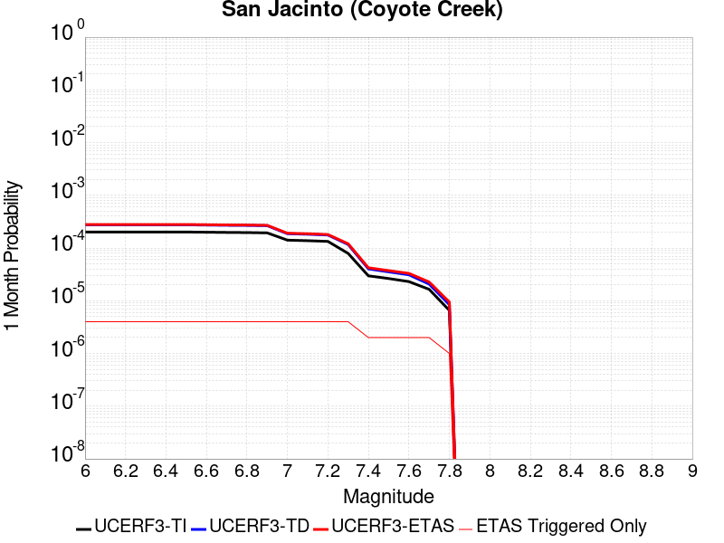 |  |  |

| Magnitude | 1 wk TI Prob | 1 wk TD Prob | 1 wk ETAS Prob | 1 wk ETAS/TD Gain | 1 wk ETAS Triggered Only | 1 mo TI Prob | 1 mo TD Prob | 1 mo ETAS Prob | 1 mo ETAS/TD Gain | 1 mo ETAS Triggered Only | 1 yr TI Prob | 1 yr TD Prob | 1 yr ETAS Prob | 1 yr ETAS/TD Gain | 1 yr ETAS Triggered Only | 10 yr TI Prob | 10 yr TD Prob | 10 yr ETAS Prob | 10 yr ETAS/TD Gain | 10 yr ETAS Triggered Only |
|-----|-----|-----|-----|-----|-----|-----|-----|-----|-----|-----|-----|-----|-----|-----|-----|-----|-----|-----|-----|-----|
| 6.0 | 4.69665E-5 | 6.4235006E-5 | 6.4235006E-5 | 1.0 | 0.0 | 2.0126947E-4 | 2.7526915E-4 | 2.7526915E-4 | 1.0 | 0.0 | 0.002447702 | 0.0033471098 | 0.0033471098 | 1.0 | 0.0 | 0.024209166 | 0.033357523 | 0.033375956 | 1.0005525 | 1.9068686E-5 |
| 6.1 | 4.69665E-5 | 6.4235006E-5 | 6.4235006E-5 | 1.0 | 0.0 | 2.0126947E-4 | 2.7526915E-4 | 2.7526915E-4 | 1.0 | 0.0 | 0.002447702 | 0.0033471098 | 0.0033471098 | 1.0 | 0.0 | 0.024209166 | 0.033357523 | 0.033375956 | 1.0005525 | 1.9068686E-5 |
| 6.2 | 4.69665E-5 | 6.4235006E-5 | 6.4235006E-5 | 1.0 | 0.0 | 2.0126947E-4 | 2.7526915E-4 | 2.7526915E-4 | 1.0 | 0.0 | 0.002447702 | 0.0033471098 | 0.0033471098 | 1.0 | 0.0 | 0.024209166 | 0.033357523 | 0.033375956 | 1.0005525 | 1.9068686E-5 |
| 6.3 | 4.69665E-5 | 6.4235006E-5 | 6.4235006E-5 | 1.0 | 0.0 | 2.0126947E-4 | 2.7526915E-4 | 2.7526915E-4 | 1.0 | 0.0 | 0.002447702 | 0.0033471098 | 0.0033471098 | 1.0 | 0.0 | 0.024209166 | 0.033357523 | 0.033375956 | 1.0005525 | 1.9068686E-5 |
| 6.4 | 4.69665E-5 | 6.4235006E-5 | 6.4235006E-5 | 1.0 | 0.0 | 2.0126947E-4 | 2.7526915E-4 | 2.7526915E-4 | 1.0 | 0.0 | 0.002447702 | 0.0033471098 | 0.0033471098 | 1.0 | 0.0 | 0.024209166 | 0.033357523 | 0.033375956 | 1.0005525 | 1.9068686E-5 |
| 6.5 | 4.69665E-5 | 6.4235006E-5 | 6.4235006E-5 | 1.0 | 0.0 | 2.0126947E-4 | 2.7526915E-4 | 2.7526915E-4 | 1.0 | 0.0 | 0.002447702 | 0.0033471098 | 0.0033471098 | 1.0 | 0.0 | 0.024209166 | 0.033357523 | 0.033375956 | 1.0005525 | 1.9068686E-5 |
| 6.6 | 4.65626E-5 | 6.365397E-5 | 6.365397E-5 | 1.0 | 0.0 | 1.9953873E-4 | 2.7277967E-4 | 2.7277967E-4 | 1.0 | 0.0 | 0.0024266774 | 0.0033169023 | 0.0033169023 | 1.0 | 0.0 | 0.024003487 | 0.033065155 | 0.03308359 | 1.0005577 | 1.9068686E-5 |
| 6.7 | 4.6128687E-5 | 6.303452E-5 | 6.303452E-5 | 1.0 | 0.0 | 1.9767939E-4 | 2.7012554E-4 | 2.7012554E-4 | 1.0 | 0.0 | 0.00240409 | 0.0032846953 | 0.0032846953 | 1.0 | 0.0 | 0.023782477 | 0.032753225 | 0.03277167 | 1.0005631 | 1.9068686E-5 |
| 6.8 | 4.5828285E-5 | 6.268431E-5 | 6.268431E-5 | 1.0 | 0.0 | 1.9639214E-4 | 2.6862495E-4 | 2.6862495E-4 | 1.0 | 0.0 | 0.0023884522 | 0.0032664812 | 0.0032664812 | 1.0 | 0.0 | 0.02362944 | 0.03257484 | 0.032593284 | 1.0005664 | 1.9068686E-5 |
| 6.9 | 4.523555E-5 | 6.1988314E-5 | 6.1988314E-5 | 1.0 | 0.0 | 1.9385223E-4 | 2.656427E-4 | 2.656427E-4 | 1.0 | 0.0 | 0.0023575963 | 0.003230282 | 0.003230282 | 1.0 | 0.0 | 0.023327406 | 0.032220315 | 0.03223877 | 1.0005728 | 1.9068686E-5 |
| 7.0 | 3.2913522E-5 | 4.3638418E-5 | 4.3638418E-5 | 1.0 | 0.0 | 1.4105032E-4 | 1.8701174E-4 | 1.8701174E-4 | 1.0 | 0.0 | 0.0017159348 | 0.0022750867 | 0.0022750867 | 1.0 | 0.0 | 0.017027453 | 0.022874728 | 0.02289336 | 1.0008146 | 1.9068686E-5 |
| 7.1 | 3.2150587E-5 | 4.262259E-5 | 4.262259E-5 | 1.0 | 0.0 | 1.3778094E-4 | 1.8265881E-4 | 1.8265881E-4 | 1.0 | 0.0 | 0.0016761922 | 0.002222199 | 0.002222199 | 1.0 | 0.0 | 0.016636053 | 0.02235371 | 0.022372352 | 1.000834 | 1.9068686E-5 |
| 7.2 | 3.1169668E-5 | 4.115963E-5 | 4.115963E-5 | 1.0 | 0.0 | 1.3357744E-4 | 1.7638985E-4 | 1.7638985E-4 | 1.0 | 0.0 | 0.0016250921 | 0.0021460268 | 0.0021460268 | 1.0 | 0.0 | 0.016132593 | 0.021605676 | 0.021624334 | 1.0008636 | 1.9068686E-5 |
| 7.3 | 1.8423585E-5 | 2.7220098E-5 | 2.7220098E-5 | 1.0 | 0.0 | 7.895583E-5 | 1.1665466E-4 | 1.1665466E-4 | 1.0 | 0.0 | 9.608633E-4 | 0.0014197543 | 0.0014197543 | 1.0 | 0.0 | 0.009567193 | 0.014355129 | 0.014373924 | 1.0013093 | 1.9068686E-5 |
| 7.4 | 6.9267962E-6 | 9.391728E-6 | 9.391728E-6 | 1.0 | 0.0 | 2.968593E-5 | 4.024971E-5 | 4.024971E-5 | 1.0 | 0.0 | 3.6136628E-4 | 4.899425E-4 | 4.899425E-4 | 1.0 | 0.0 | 0.003607792 | 0.005030186 | 0.0050491584 | 1.0037718 | 1.9068686E-5 |
| 7.5 | 6.1587302E-6 | 8.234252E-6 | 8.234252E-6 | 1.0 | 0.0 | 2.6394291E-5 | 3.5289235E-5 | 3.5289235E-5 | 1.0 | 0.0 | 3.213031E-4 | 4.2957254E-4 | 4.2957254E-4 | 1.0 | 0.0 | 0.0032083893 | 0.004419193 | 0.0044381777 | 1.004296 | 1.9068686E-5 |
| 7.6 | 5.383844E-6 | 7.2529047E-6 | 7.2529047E-6 | 1.0 | 0.0 | 2.3073413E-5 | 3.108356E-5 | 3.108356E-5 | 1.0 | 0.0 | 2.8088258E-4 | 3.7838623E-4 | 3.7838623E-4 | 1.0 | 0.0 | 0.0028052782 | 0.0038957447 | 0.003914739 | 1.0048757 | 1.9068686E-5 |
| 7.7 | 3.843031E-6 | 4.8339584E-6 | 4.8339584E-6 | 1.0 | 0.0 | 1.647003E-5 | 2.0716834E-5 | 2.0716834E-5 | 1.0 | 0.0 | 2.0050416E-4 | 2.5220422E-4 | 2.5220422E-4 | 1.0 | 0.0 | 0.0020032334 | 0.002619455 | 0.0026384739 | 1.0072606 | 1.9068686E-5 |
| 7.8 | 1.5303123E-6 | 1.9707616E-6 | 1.9707616E-6 | 1.0 | 0.0 | 6.5584645E-6 | 8.446107E-6 | 8.446107E-6 | 1.0 | 0.0 | 7.984638E-5 | 1.0282895E-4 | 1.0282895E-4 | 1.0 | 0.0 | 7.98177E-4 | 0.001066982 | 0.0010860304 | 1.0178525 | 1.9068686E-5 |

## San Luis Range 2011 CFM
*[(top)](#table-of-contents)*

| 1 Week | 1 Month | 1 Year | 10 Year |
|-----|-----|-----|-----|
|  |  |  |  |

| Magnitude | 1 wk TI Prob | 1 wk TD Prob | 1 wk ETAS Prob | 1 wk ETAS/TD Gain | 1 wk ETAS Triggered Only | 1 mo TI Prob | 1 mo TD Prob | 1 mo ETAS Prob | 1 mo ETAS/TD Gain | 1 mo ETAS Triggered Only | 1 yr TI Prob | 1 yr TD Prob | 1 yr ETAS Prob | 1 yr ETAS/TD Gain | 1 yr ETAS Triggered Only | 10 yr TI Prob | 10 yr TD Prob | 10 yr ETAS Prob | 10 yr ETAS/TD Gain | 10 yr ETAS Triggered Only |
|-----|-----|-----|-----|-----|-----|-----|-----|-----|-----|-----|-----|-----|-----|-----|-----|-----|-----|-----|-----|-----|
| 6.0 | 2.8589725E-6 | 2.906881E-6 | 2.906881E-6 | 1.0 | 0.0 | 1.2252682E-5 | 1.24580165E-5 | 1.24580165E-5 | 1.0 | 0.0 | 1.491662E-4 | 1.5166836E-4 | 1.7073414E-4 | 1.1257071 | 1.9068686E-5 | 0.0014906611 | 0.0015158989 | 0.0015349386 | 1.01256 | 1.9068686E-5 |
| 6.1 | 2.8589725E-6 | 2.906881E-6 | 2.906881E-6 | 1.0 | 0.0 | 1.2252682E-5 | 1.24580165E-5 | 1.24580165E-5 | 1.0 | 0.0 | 1.491662E-4 | 1.5166836E-4 | 1.7073414E-4 | 1.1257071 | 1.9068686E-5 | 0.0014906611 | 0.0015158989 | 0.0015349386 | 1.01256 | 1.9068686E-5 |
| 6.2 | 2.8589725E-6 | 2.906881E-6 | 2.906881E-6 | 1.0 | 0.0 | 1.2252682E-5 | 1.24580165E-5 | 1.24580165E-5 | 1.0 | 0.0 | 1.491662E-4 | 1.5166836E-4 | 1.7073414E-4 | 1.1257071 | 1.9068686E-5 | 0.0014906611 | 0.0015158989 | 0.0015349386 | 1.01256 | 1.9068686E-5 |
| 6.3 | 2.8589725E-6 | 2.906881E-6 | 2.906881E-6 | 1.0 | 0.0 | 1.2252682E-5 | 1.24580165E-5 | 1.24580165E-5 | 1.0 | 0.0 | 1.491662E-4 | 1.5166836E-4 | 1.7073414E-4 | 1.1257071 | 1.9068686E-5 | 0.0014906611 | 0.0015158989 | 0.0015349386 | 1.01256 | 1.9068686E-5 |
| 6.4 | 2.8589725E-6 | 2.906881E-6 | 2.906881E-6 | 1.0 | 0.0 | 1.2252682E-5 | 1.24580165E-5 | 1.24580165E-5 | 1.0 | 0.0 | 1.491662E-4 | 1.5166836E-4 | 1.7073414E-4 | 1.1257071 | 1.9068686E-5 | 0.0014906611 | 0.0015158989 | 0.0015349386 | 1.01256 | 1.9068686E-5 |
| 6.5 | 2.8589725E-6 | 2.906881E-6 | 2.906881E-6 | 1.0 | 0.0 | 1.2252682E-5 | 1.24580165E-5 | 1.24580165E-5 | 1.0 | 0.0 | 1.491662E-4 | 1.5166836E-4 | 1.7073414E-4 | 1.1257071 | 1.9068686E-5 | 0.0014906611 | 0.0015158989 | 0.0015349386 | 1.01256 | 1.9068686E-5 |
| 6.6 | 2.4544863E-6 | 2.495234E-6 | 2.495234E-6 | 1.0 | 0.0 | 1.0519184E-5 | 1.06938305E-5 | 1.06938305E-5 | 1.0 | 0.0 | 1.2806353E-4 | 1.3019213E-4 | 1.4925833E-4 | 1.1464467 | 1.9068686E-5 | 0.0012798976 | 0.0013014051 | 0.0013204489 | 1.0146333 | 1.9068686E-5 |
| 6.7 | 2.1688998E-6 | 2.204711E-6 | 2.204711E-6 | 1.0 | 0.0 | 9.295252E-6 | 9.448742E-6 | 9.448742E-6 | 1.0 | 0.0 | 1.1316381E-4 | 1.1503485E-4 | 1.3410134E-4 | 1.1657454 | 1.9068686E-5 | 0.001131062 | 0.0011499968 | 0.0011690436 | 1.0165625 | 1.9068686E-5 |
| 6.8 | 1.9191828E-6 | 1.950576E-6 | 1.950576E-6 | 1.0 | 0.0 | 8.2250435E-6 | 8.359599E-6 | 8.359599E-6 | 1.0 | 0.0 | 1.001353E-4 | 1.01775826E-4 | 1.2084257E-4 | 1.1873406 | 1.9068686E-5 | 0.0010009019 | 0.0010175342 | 0.0010365834 | 1.018721 | 1.9068686E-5 |
| 6.9 | 1.6115068E-6 | 1.6374516E-6 | 1.6374516E-6 | 1.0 | 0.0 | 6.9064395E-6 | 7.0176447E-6 | 7.0176447E-6 | 1.0 | 0.0 | 8.4082654E-5 | 8.5438915E-5 | 8.5438915E-5 | 1.0 | 0.0 | 8.405085E-4 | 8.543001E-4 | 8.543001E-4 | 1.0 | 0.0 |
| 7.0 | 1.367995E-6 | 1.3898027E-6 | 1.3898027E-6 | 1.0 | 0.0 | 5.8628225E-6 | 5.956297E-6 | 5.956297E-6 | 1.0 | 0.0 | 7.137752E-5 | 7.251792E-5 | 7.251792E-5 | 1.0 | 0.0 | 7.13546E-4 | 7.251792E-4 | 7.251792E-4 | 1.0 | 0.0 |
| 7.1 | 1.367995E-6 | 1.3898027E-6 | 1.3898027E-6 | 1.0 | 0.0 | 5.8628225E-6 | 5.956297E-6 | 5.956297E-6 | 1.0 | 0.0 | 7.137752E-5 | 7.251792E-5 | 7.251792E-5 | 1.0 | 0.0 | 7.13546E-4 | 7.251792E-4 | 7.251792E-4 | 1.0 | 0.0 |

## Great Valley 09 (Laguna Seca)
*[(top)](#table-of-contents)*

| 1 Week | 1 Month | 1 Year | 10 Year |
|-----|-----|-----|-----|
|  |  |  |  |

| Magnitude | 1 wk TI Prob | 1 wk TD Prob | 1 wk ETAS Prob | 1 wk ETAS/TD Gain | 1 wk ETAS Triggered Only | 1 mo TI Prob | 1 mo TD Prob | 1 mo ETAS Prob | 1 mo ETAS/TD Gain | 1 mo ETAS Triggered Only | 1 yr TI Prob | 1 yr TD Prob | 1 yr ETAS Prob | 1 yr ETAS/TD Gain | 1 yr ETAS Triggered Only | 10 yr TI Prob | 10 yr TD Prob | 10 yr ETAS Prob | 10 yr ETAS/TD Gain | 10 yr ETAS Triggered Only |
|-----|-----|-----|-----|-----|-----|-----|-----|-----|-----|-----|-----|-----|-----|-----|-----|-----|-----|-----|-----|-----|
| 6.0 | 2.7186308E-5 | 3.3603857E-5 | 5.26719E-5 | 1.5674362 | 1.9068686E-5 | 1.16507545E-4 | 1.4401274E-4 | 1.6307867E-4 | 1.1323906 | 1.9068686E-5 | 0.0014175563 | 0.0017526768 | 0.0017717121 | 1.0108607 | 1.9068686E-5 | 0.014085478 | 0.017460305 | 0.01747904 | 1.001073 | 1.9068686E-5 |
| 6.1 | 2.7186308E-5 | 3.3603857E-5 | 5.26719E-5 | 1.5674362 | 1.9068686E-5 | 1.16507545E-4 | 1.4401274E-4 | 1.6307867E-4 | 1.1323906 | 1.9068686E-5 | 0.0014175563 | 0.0017526768 | 0.0017717121 | 1.0108607 | 1.9068686E-5 | 0.014085478 | 0.017460305 | 0.01747904 | 1.001073 | 1.9068686E-5 |
| 6.2 | 2.7186308E-5 | 3.3603857E-5 | 5.26719E-5 | 1.5674362 | 1.9068686E-5 | 1.16507545E-4 | 1.4401274E-4 | 1.6307867E-4 | 1.1323906 | 1.9068686E-5 | 0.0014175563 | 0.0017526768 | 0.0017717121 | 1.0108607 | 1.9068686E-5 | 0.014085478 | 0.017460305 | 0.01747904 | 1.001073 | 1.9068686E-5 |
| 6.3 | 2.7186308E-5 | 3.3603857E-5 | 5.26719E-5 | 1.5674362 | 1.9068686E-5 | 1.16507545E-4 | 1.4401274E-4 | 1.6307867E-4 | 1.1323906 | 1.9068686E-5 | 0.0014175563 | 0.0017526768 | 0.0017717121 | 1.0108607 | 1.9068686E-5 | 0.014085478 | 0.017460305 | 0.01747904 | 1.001073 | 1.9068686E-5 |
| 6.4 | 2.7186308E-5 | 3.3603857E-5 | 5.26719E-5 | 1.5674362 | 1.9068686E-5 | 1.16507545E-4 | 1.4401274E-4 | 1.6307867E-4 | 1.1323906 | 1.9068686E-5 | 0.0014175563 | 0.0017526768 | 0.0017717121 | 1.0108607 | 1.9068686E-5 | 0.014085478 | 0.017460305 | 0.01747904 | 1.001073 | 1.9068686E-5 |
| 6.5 | 2.7186308E-5 | 3.3603857E-5 | 5.26719E-5 | 1.5674362 | 1.9068686E-5 | 1.16507545E-4 | 1.4401274E-4 | 1.6307867E-4 | 1.1323906 | 1.9068686E-5 | 0.0014175563 | 0.0017526768 | 0.0017717121 | 1.0108607 | 1.9068686E-5 | 0.014085478 | 0.017460305 | 0.01747904 | 1.001073 | 1.9068686E-5 |
| 6.6 | 1.8800807E-5 | 2.3153776E-5 | 4.222202E-5 | 1.823548 | 1.9068686E-5 | 8.05724E-5 | 9.923046E-5 | 1.18297256E-4 | 1.1921465 | 1.9068686E-5 | 9.805275E-4 | 0.0012081307 | 0.0012271764 | 1.0157646 | 1.9068686E-5 | 0.009762122 | 0.012081286 | 0.012100125 | 1.0015593 | 1.9068686E-5 |
| 6.7 | 1.8800807E-5 | 2.3153776E-5 | 4.222202E-5 | 1.823548 | 1.9068686E-5 | 8.05724E-5 | 9.923046E-5 | 1.18297256E-4 | 1.1921465 | 1.9068686E-5 | 9.805275E-4 | 0.0012081307 | 0.0012271764 | 1.0157646 | 1.9068686E-5 | 0.009762122 | 0.012081286 | 0.012100125 | 1.0015593 | 1.9068686E-5 |

## Palos Verdes
*[(top)](#table-of-contents)*

| 1 Week | 1 Month | 1 Year | 10 Year |
|-----|-----|-----|-----|
|  |  |  | 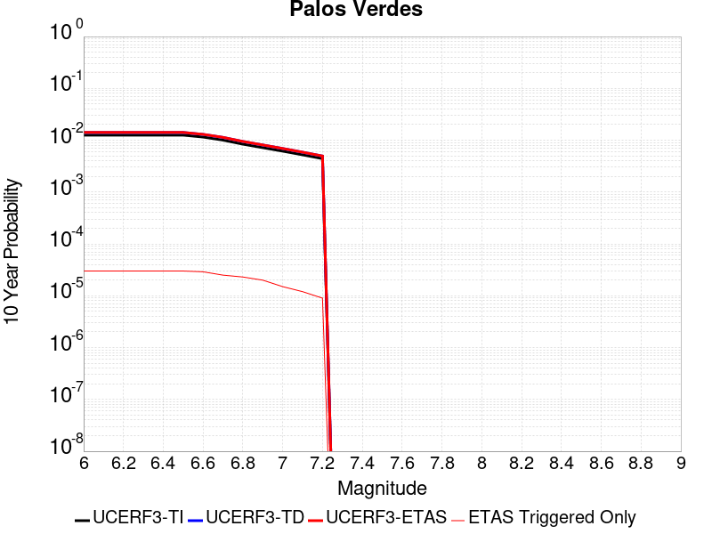 |

| Magnitude | 1 wk TI Prob | 1 wk TD Prob | 1 wk ETAS Prob | 1 wk ETAS/TD Gain | 1 wk ETAS Triggered Only | 1 mo TI Prob | 1 mo TD Prob | 1 mo ETAS Prob | 1 mo ETAS/TD Gain | 1 mo ETAS Triggered Only | 1 yr TI Prob | 1 yr TD Prob | 1 yr ETAS Prob | 1 yr ETAS/TD Gain | 1 yr ETAS Triggered Only | 10 yr TI Prob | 10 yr TD Prob | 10 yr ETAS Prob | 10 yr ETAS/TD Gain | 10 yr ETAS Triggered Only |
|-----|-----|-----|-----|-----|-----|-----|-----|-----|-----|-----|-----|-----|-----|-----|-----|-----|-----|-----|-----|-----|
| 6.0 | 2.416717E-5 | 2.7219172E-5 | 2.7219172E-5 | 1.0 | 0.0 | 1.0356947E-4 | 1.16648946E-4 | 1.16648946E-4 | 1.0 | 0.0 | 0.0012602288 | 0.0014193773 | 0.001438419 | 1.0134155 | 1.9068686E-5 | 0.01253106 | 0.014113327 | 0.014132126 | 1.001332 | 1.9068686E-5 |
| 6.1 | 2.416717E-5 | 2.7219172E-5 | 2.7219172E-5 | 1.0 | 0.0 | 1.0356947E-4 | 1.16648946E-4 | 1.16648946E-4 | 1.0 | 0.0 | 0.0012602288 | 0.0014193773 | 0.001438419 | 1.0134155 | 1.9068686E-5 | 0.01253106 | 0.014113327 | 0.014132126 | 1.001332 | 1.9068686E-5 |
| 6.2 | 2.416717E-5 | 2.7219172E-5 | 2.7219172E-5 | 1.0 | 0.0 | 1.0356947E-4 | 1.16648946E-4 | 1.16648946E-4 | 1.0 | 0.0 | 0.0012602288 | 0.0014193773 | 0.001438419 | 1.0134155 | 1.9068686E-5 | 0.01253106 | 0.014113327 | 0.014132126 | 1.001332 | 1.9068686E-5 |
| 6.3 | 2.416717E-5 | 2.7219172E-5 | 2.7219172E-5 | 1.0 | 0.0 | 1.0356947E-4 | 1.16648946E-4 | 1.16648946E-4 | 1.0 | 0.0 | 0.0012602288 | 0.0014193773 | 0.001438419 | 1.0134155 | 1.9068686E-5 | 0.01253106 | 0.014113327 | 0.014132126 | 1.001332 | 1.9068686E-5 |
| 6.4 | 2.416717E-5 | 2.7219172E-5 | 2.7219172E-5 | 1.0 | 0.0 | 1.0356947E-4 | 1.16648946E-4 | 1.16648946E-4 | 1.0 | 0.0 | 0.0012602288 | 0.0014193773 | 0.001438419 | 1.0134155 | 1.9068686E-5 | 0.01253106 | 0.014113327 | 0.014132126 | 1.001332 | 1.9068686E-5 |
| 6.5 | 2.416717E-5 | 2.7219172E-5 | 2.7219172E-5 | 1.0 | 0.0 | 1.0356947E-4 | 1.16648946E-4 | 1.16648946E-4 | 1.0 | 0.0 | 0.0012602288 | 0.0014193773 | 0.001438419 | 1.0134155 | 1.9068686E-5 | 0.01253106 | 0.014113327 | 0.014132126 | 1.001332 | 1.9068686E-5 |
| 6.6 | 2.2181084E-5 | 2.4975725E-5 | 2.4975725E-5 | 1.0 | 0.0 | 9.505832E-5 | 1.07035E-4 | 1.07035E-4 | 1.0 | 0.0 | 0.0011567206 | 0.0013024732 | 0.001321517 | 1.0146213 | 1.9068686E-5 | 0.0115071805 | 0.012958492 | 0.012977313 | 1.0014524 | 1.9068686E-5 |
| 6.7 | 1.9382267E-5 | 2.1828162E-5 | 2.1828162E-5 | 1.0 | 0.0 | 8.306422E-5 | 9.354648E-5 | 9.354648E-5 | 1.0 | 0.0 | 0.0010108376 | 0.0011384335 | 0.0011574804 | 1.0167309 | 1.9068686E-5 | 0.0100625185 | 0.011335945 | 0.0113547975 | 1.0016631 | 1.9068686E-5 |
| 6.8 | 1.6157266E-5 | 1.8180996E-5 | 1.8180996E-5 | 1.0 | 0.0 | 6.9243586E-5 | 7.791678E-5 | 7.791678E-5 | 1.0 | 0.0 | 8.4271457E-4 | 9.483226E-4 | 9.673732E-4 | 1.0200888 | 1.9068686E-5 | 0.00839526 | 0.009452482 | 0.00947137 | 1.0019983 | 1.9068686E-5 |
| 6.9 | 1.3828139E-5 | 1.5540487E-5 | 1.5540487E-5 | 1.0 | 0.0 | 5.9262107E-5 | 6.6600944E-5 | 6.6600944E-5 | 1.0 | 0.0 | 7.212773E-4 | 8.1066263E-4 | 8.2971586E-4 | 1.0235033 | 1.9068686E-5 | 0.007189407 | 0.008086668 | 0.008105583 | 1.002339 | 1.9068686E-5 |
| 7.0 | 1.1833321E-5 | 1.3284609E-5 | 1.3284609E-5 | 1.0 | 0.0 | 5.0713246E-5 | 5.6933346E-5 | 5.6933346E-5 | 1.0 | 0.0 | 6.1725883E-4 | 6.930404E-4 | 7.120958E-4 | 1.0274955 | 1.9068686E-5 | 0.0061554713 | 0.006918346 | 0.0069372826 | 1.0027372 | 1.9068686E-5 |
| 7.1 | 1.0044758E-5 | 1.1258023E-5 | 1.1258023E-5 | 1.0 | 0.0 | 4.304825E-5 | 4.8248323E-5 | 4.8248323E-5 | 1.0 | 0.0 | 5.239864E-4 | 5.873616E-4 | 6.0641905E-4 | 1.0324459 | 1.9068686E-5 | 0.005227526 | 0.005867563 | 0.00588652 | 1.0032308 | 1.9068686E-5 |
| 7.2 | 8.481934E-6 | 9.495382E-6 | 9.495382E-6 | 1.0 | 0.0 | 3.635064E-5 | 4.0694402E-5 | 4.0694402E-5 | 1.0 | 0.0 | 4.4247916E-4 | 4.9543753E-4 | 4.9543753E-4 | 1.0 | 0.0 | 0.0044159917 | 0.0049527287 | 0.0049527287 | 1.0 | 0.0 |

## San Jacinto (Borrego)
*[(top)](#table-of-contents)*

| 1 Week | 1 Month | 1 Year | 10 Year |
|-----|-----|-----|-----|
|  |  |  |  |

| Magnitude | 1 wk TI Prob | 1 wk TD Prob | 1 wk ETAS Prob | 1 wk ETAS/TD Gain | 1 wk ETAS Triggered Only | 1 mo TI Prob | 1 mo TD Prob | 1 mo ETAS Prob | 1 mo ETAS/TD Gain | 1 mo ETAS Triggered Only | 1 yr TI Prob | 1 yr TD Prob | 1 yr ETAS Prob | 1 yr ETAS/TD Gain | 1 yr ETAS Triggered Only | 10 yr TI Prob | 10 yr TD Prob | 10 yr ETAS Prob | 10 yr ETAS/TD Gain | 10 yr ETAS Triggered Only |
|-----|-----|-----|-----|-----|-----|-----|-----|-----|-----|-----|-----|-----|-----|-----|-----|-----|-----|-----|-----|-----|
| 6.0 | 9.239128E-5 | 6.746147E-5 | 6.746147E-5 | 1.0 | 0.0 | 3.9590252E-4 | 2.890956E-4 | 2.890956E-4 | 1.0 | 0.0 | 0.004809465 | 0.003515305 | 0.003515305 | 1.0 | 0.0 | 0.047066994 | 0.03517175 | 0.03519015 | 1.0005231 | 1.9068686E-5 |
| 6.1 | 9.239128E-5 | 6.746147E-5 | 6.746147E-5 | 1.0 | 0.0 | 3.9590252E-4 | 2.890956E-4 | 2.890956E-4 | 1.0 | 0.0 | 0.004809465 | 0.003515305 | 0.003515305 | 1.0 | 0.0 | 0.047066994 | 0.03517175 | 0.03519015 | 1.0005231 | 1.9068686E-5 |
| 6.2 | 9.239128E-5 | 6.746147E-5 | 6.746147E-5 | 1.0 | 0.0 | 3.9590252E-4 | 2.890956E-4 | 2.890956E-4 | 1.0 | 0.0 | 0.004809465 | 0.003515305 | 0.003515305 | 1.0 | 0.0 | 0.047066994 | 0.03517175 | 0.03519015 | 1.0005231 | 1.9068686E-5 |
| 6.3 | 9.239128E-5 | 6.746147E-5 | 6.746147E-5 | 1.0 | 0.0 | 3.9590252E-4 | 2.890956E-4 | 2.890956E-4 | 1.0 | 0.0 | 0.004809465 | 0.003515305 | 0.003515305 | 1.0 | 0.0 | 0.047066994 | 0.03517175 | 0.03519015 | 1.0005231 | 1.9068686E-5 |
| 6.4 | 9.239128E-5 | 6.746147E-5 | 6.746147E-5 | 1.0 | 0.0 | 3.9590252E-4 | 2.890956E-4 | 2.890956E-4 | 1.0 | 0.0 | 0.004809465 | 0.003515305 | 0.003515305 | 1.0 | 0.0 | 0.047066994 | 0.03517175 | 0.03519015 | 1.0005231 | 1.9068686E-5 |
| 6.5 | 9.239128E-5 | 6.746147E-5 | 6.746147E-5 | 1.0 | 0.0 | 3.9590252E-4 | 2.890956E-4 | 2.890956E-4 | 1.0 | 0.0 | 0.004809465 | 0.003515305 | 0.003515305 | 1.0 | 0.0 | 0.047066994 | 0.03517175 | 0.03519015 | 1.0005231 | 1.9068686E-5 |
| 6.6 | 9.205471E-5 | 6.722113E-5 | 6.722113E-5 | 1.0 | 0.0 | 3.9446054E-4 | 2.8806578E-4 | 2.8806578E-4 | 1.0 | 0.0 | 0.004791986 | 0.0035028076 | 0.0035028076 | 1.0 | 0.0 | 0.046899613 | 0.035048313 | 0.035066716 | 1.000525 | 1.9068686E-5 |
| 6.7 | 9.1629794E-5 | 6.682258E-5 | 6.682258E-5 | 1.0 | 0.0 | 3.9264E-4 | 2.8635806E-4 | 2.8635806E-4 | 1.0 | 0.0 | 0.0047699185 | 0.0034820824 | 0.0034820824 | 1.0 | 0.0 | 0.046688255 | 0.034847513 | 0.034865916 | 1.0005281 | 1.9068686E-5 |
| 6.8 | 4.5613822E-5 | 6.5666274E-5 | 6.5666274E-5 | 1.0 | 0.0 | 1.9547316E-4 | 2.8140357E-4 | 2.8140357E-4 | 1.0 | 0.0 | 0.0023772882 | 0.0034219522 | 0.0034219522 | 1.0 | 0.0 | 0.02352017 | 0.034074746 | 0.034093164 | 1.0005405 | 1.9068686E-5 |
| 6.9 | 4.4921322E-5 | 6.461979E-5 | 6.461979E-5 | 1.0 | 0.0 | 1.9250574E-4 | 2.7691957E-4 | 2.7691957E-4 | 1.0 | 0.0 | 0.002341238 | 0.0033675297 | 0.0033675297 | 1.0 | 0.0 | 0.02316725 | 0.033549417 | 0.033567846 | 1.0005493 | 1.9068686E-5 |
| 7.0 | 4.3896973E-5 | 6.325712E-5 | 6.325712E-5 | 1.0 | 0.0 | 1.8811632E-4 | 2.710808E-4 | 2.710808E-4 | 1.0 | 0.0 | 0.0022879103 | 0.0032966596 | 0.0032966596 | 1.0 | 0.0 | 0.02264498 | 0.032856427 | 0.032874867 | 1.0005612 | 1.9068686E-5 |
| 7.1 | 2.9838686E-5 | 3.9105144E-5 | 3.9105144E-5 | 1.0 | 0.0 | 1.2787382E-4 | 1.6758604E-4 | 1.6758604E-4 | 1.0 | 0.0 | 0.0015557519 | 0.0020390416 | 0.0020390416 | 1.0 | 0.0 | 0.015449053 | 0.020523686 | 0.020542365 | 1.00091 | 1.9068686E-5 |
| 7.2 | 2.8857767E-5 | 3.7642178E-5 | 3.7642178E-5 | 1.0 | 0.0 | 1.2367028E-4 | 1.6131697E-4 | 1.6131697E-4 | 1.0 | 0.0 | 0.0015046457 | 0.0019628557 | 0.0019628557 | 1.0 | 0.0 | 0.014944986 | 0.019774253 | 0.019792944 | 1.0009452 | 1.9068686E-5 |
| 7.3 | 1.6111655E-5 | 2.3702598E-5 | 2.3702598E-5 | 1.0 | 0.0 | 6.9048125E-5 | 1.0158089E-4 | 1.0158089E-4 | 1.0 | 0.0 | 8.4033667E-4 | 0.0012364498 | 0.0012364498 | 1.0 | 0.0 | 0.0083716605 | 0.012510133 | 0.012528962 | 1.0015051 | 1.9068686E-5 |
| 7.4 | 4.6148393E-6 | 5.874165E-6 | 5.874165E-6 | 1.0 | 0.0 | 1.9777734E-5 | 2.5174792E-5 | 2.5174792E-5 | 1.0 | 0.0 | 2.4076729E-4 | 3.064673E-4 | 3.064673E-4 | 1.0 | 0.0 | 0.002405066 | 0.0031677345 | 0.0031867428 | 1.0060006 | 1.9068686E-5 |
| 7.5 | 4.6148393E-6 | 5.874165E-6 | 5.874165E-6 | 1.0 | 0.0 | 1.9777734E-5 | 2.5174792E-5 | 2.5174792E-5 | 1.0 | 0.0 | 2.4076729E-4 | 3.064673E-4 | 3.064673E-4 | 1.0 | 0.0 | 0.002405066 | 0.0031677345 | 0.0031867428 | 1.0060006 | 1.9068686E-5 |
| 7.6 | 3.839952E-6 | 4.892815E-6 | 4.892815E-6 | 1.0 | 0.0 | 1.6456834E-5 | 2.0969073E-5 | 2.0969073E-5 | 1.0 | 0.0 | 2.0034352E-4 | 2.5527467E-4 | 2.5527467E-4 | 1.0 | 0.0 | 0.00200163 | 0.0026436278 | 0.0026626461 | 1.007194 | 1.9068686E-5 |
| 7.7 | 3.068414E-6 | 3.707481E-6 | 3.707481E-6 | 1.0 | 0.0 | 1.3150278E-5 | 1.5889133E-5 | 1.5889133E-5 | 1.0 | 0.0 | 1.6009288E-4 | 1.9343739E-4 | 1.9343739E-4 | 1.0 | 0.0 | 0.001599776 | 0.0020167015 | 0.0020357317 | 1.0094364 | 1.9068686E-5 |
| 7.8 | 1.5303123E-6 | 1.9707616E-6 | 1.9707616E-6 | 1.0 | 0.0 | 6.5584645E-6 | 8.446107E-6 | 8.446107E-6 | 1.0 | 0.0 | 7.984638E-5 | 1.0282895E-4 | 1.0282895E-4 | 1.0 | 0.0 | 7.98177E-4 | 0.001066982 | 0.0010860304 | 1.0178525 | 1.9068686E-5 |

## North Frontal  (East)
*[(top)](#table-of-contents)*

| 1 Week | 1 Month | 1 Year | 10 Year |
|-----|-----|-----|-----|
|  |  |  |  |

| Magnitude | 1 wk TI Prob | 1 wk TD Prob | 1 wk ETAS Prob | 1 wk ETAS/TD Gain | 1 wk ETAS Triggered Only | 1 mo TI Prob | 1 mo TD Prob | 1 mo ETAS Prob | 1 mo ETAS/TD Gain | 1 mo ETAS Triggered Only | 1 yr TI Prob | 1 yr TD Prob | 1 yr ETAS Prob | 1 yr ETAS/TD Gain | 1 yr ETAS Triggered Only | 10 yr TI Prob | 10 yr TD Prob | 10 yr ETAS Prob | 10 yr ETAS/TD Gain | 10 yr ETAS Triggered Only |
|-----|-----|-----|-----|-----|-----|-----|-----|-----|-----|-----|-----|-----|-----|-----|-----|-----|-----|-----|-----|-----|
| 6.0 | 9.1043175E-6 | 9.692292E-6 | 9.692292E-6 | 1.0 | 0.0 | 3.901792E-5 | 4.153805E-5 | 6.0605944E-5 | 1.4590464 | 1.9068686E-5 | 4.7493965E-4 | 5.0566456E-4 | 5.247236E-4 | 1.0376911 | 1.9068686E-5 | 0.004739259 | 0.0050506443 | 0.0050696167 | 1.0037564 | 1.9068686E-5 |
| 6.1 | 9.1043175E-6 | 9.692292E-6 | 9.692292E-6 | 1.0 | 0.0 | 3.901792E-5 | 4.153805E-5 | 6.0605944E-5 | 1.4590464 | 1.9068686E-5 | 4.7493965E-4 | 5.0566456E-4 | 5.247236E-4 | 1.0376911 | 1.9068686E-5 | 0.004739259 | 0.0050506443 | 0.0050696167 | 1.0037564 | 1.9068686E-5 |
| 6.2 | 9.1043175E-6 | 9.692292E-6 | 9.692292E-6 | 1.0 | 0.0 | 3.901792E-5 | 4.153805E-5 | 6.0605944E-5 | 1.4590464 | 1.9068686E-5 | 4.7493965E-4 | 5.0566456E-4 | 5.247236E-4 | 1.0376911 | 1.9068686E-5 | 0.004739259 | 0.0050506443 | 0.0050696167 | 1.0037564 | 1.9068686E-5 |
| 6.3 | 9.1043175E-6 | 9.692292E-6 | 9.692292E-6 | 1.0 | 0.0 | 3.901792E-5 | 4.153805E-5 | 6.0605944E-5 | 1.4590464 | 1.9068686E-5 | 4.7493965E-4 | 5.0566456E-4 | 5.247236E-4 | 1.0376911 | 1.9068686E-5 | 0.004739259 | 0.0050506443 | 0.0050696167 | 1.0037564 | 1.9068686E-5 |
| 6.4 | 9.1043175E-6 | 9.692292E-6 | 9.692292E-6 | 1.0 | 0.0 | 3.901792E-5 | 4.153805E-5 | 6.0605944E-5 | 1.4590464 | 1.9068686E-5 | 4.7493965E-4 | 5.0566456E-4 | 5.247236E-4 | 1.0376911 | 1.9068686E-5 | 0.004739259 | 0.0050506443 | 0.0050696167 | 1.0037564 | 1.9068686E-5 |
| 6.5 | 9.1043175E-6 | 9.692292E-6 | 9.692292E-6 | 1.0 | 0.0 | 3.901792E-5 | 4.153805E-5 | 6.0605944E-5 | 1.4590464 | 1.9068686E-5 | 4.7493965E-4 | 5.0566456E-4 | 5.247236E-4 | 1.0376911 | 1.9068686E-5 | 0.004739259 | 0.0050506443 | 0.0050696167 | 1.0037564 | 1.9068686E-5 |
| 6.6 | 9.1043175E-6 | 9.692292E-6 | 9.692292E-6 | 1.0 | 0.0 | 3.901792E-5 | 4.153805E-5 | 6.0605944E-5 | 1.4590464 | 1.9068686E-5 | 4.7493965E-4 | 5.0566456E-4 | 5.247236E-4 | 1.0376911 | 1.9068686E-5 | 0.004739259 | 0.0050506443 | 0.0050696167 | 1.0037564 | 1.9068686E-5 |
| 6.7 | 5.803986E-6 | 6.1718774E-6 | 6.1718774E-6 | 1.0 | 0.0 | 2.4873989E-5 | 2.6450904E-5 | 4.5519086E-5 | 1.7208896 | 1.9068686E-5 | 3.0279873E-4 | 3.2203976E-4 | 3.411023E-4 | 1.0591931 | 1.9068686E-5 | 0.0030238647 | 0.0032203975 | 0.0032394049 | 1.0059022 | 1.9068686E-5 |
| 6.8 | 5.803986E-6 | 6.1718774E-6 | 6.1718774E-6 | 1.0 | 0.0 | 2.4873989E-5 | 2.6450904E-5 | 4.5519086E-5 | 1.7208896 | 1.9068686E-5 | 3.0279873E-4 | 3.2203976E-4 | 3.411023E-4 | 1.0591931 | 1.9068686E-5 | 0.0030238647 | 0.0032203975 | 0.0032394049 | 1.0059022 | 1.9068686E-5 |

## Holser alt 1
*[(top)](#table-of-contents)*

| 1 Week | 1 Month | 1 Year | 10 Year |
|-----|-----|-----|-----|
|  |  |  |  |

| Magnitude | 1 wk TI Prob | 1 wk TD Prob | 1 wk ETAS Prob | 1 wk ETAS/TD Gain | 1 wk ETAS Triggered Only | 1 mo TI Prob | 1 mo TD Prob | 1 mo ETAS Prob | 1 mo ETAS/TD Gain | 1 mo ETAS Triggered Only | 1 yr TI Prob | 1 yr TD Prob | 1 yr ETAS Prob | 1 yr ETAS/TD Gain | 1 yr ETAS Triggered Only | 10 yr TI Prob | 10 yr TD Prob | 10 yr ETAS Prob | 10 yr ETAS/TD Gain | 10 yr ETAS Triggered Only |
|-----|-----|-----|-----|-----|-----|-----|-----|-----|-----|-----|-----|-----|-----|-----|-----|-----|-----|-----|-----|-----|
| 6.0 | 7.962936E-6 | 8.4235735E-6 | 8.4235735E-6 | 1.0 | 0.0 | 3.4126424E-5 | 3.6100817E-5 | 3.6100817E-5 | 1.0 | 0.0 | 4.1540997E-4 | 4.394895E-4 | 4.394895E-4 | 1.0 | 0.0 | 0.004146343 | 0.0043911743 | 0.0044101593 | 1.0043235 | 1.9068686E-5 |
| 6.1 | 7.962936E-6 | 8.4235735E-6 | 8.4235735E-6 | 1.0 | 0.0 | 3.4126424E-5 | 3.6100817E-5 | 3.6100817E-5 | 1.0 | 0.0 | 4.1540997E-4 | 4.394895E-4 | 4.394895E-4 | 1.0 | 0.0 | 0.004146343 | 0.0043911743 | 0.0044101593 | 1.0043235 | 1.9068686E-5 |
| 6.2 | 7.962936E-6 | 8.4235735E-6 | 8.4235735E-6 | 1.0 | 0.0 | 3.4126424E-5 | 3.6100817E-5 | 3.6100817E-5 | 1.0 | 0.0 | 4.1540997E-4 | 4.394895E-4 | 4.394895E-4 | 1.0 | 0.0 | 0.004146343 | 0.0043911743 | 0.0044101593 | 1.0043235 | 1.9068686E-5 |
| 6.3 | 7.962936E-6 | 8.4235735E-6 | 8.4235735E-6 | 1.0 | 0.0 | 3.4126424E-5 | 3.6100817E-5 | 3.6100817E-5 | 1.0 | 0.0 | 4.1540997E-4 | 4.394895E-4 | 4.394895E-4 | 1.0 | 0.0 | 0.004146343 | 0.0043911743 | 0.0044101593 | 1.0043235 | 1.9068686E-5 |
| 6.4 | 7.962936E-6 | 8.4235735E-6 | 8.4235735E-6 | 1.0 | 0.0 | 3.4126424E-5 | 3.6100817E-5 | 3.6100817E-5 | 1.0 | 0.0 | 4.1540997E-4 | 4.394895E-4 | 4.394895E-4 | 1.0 | 0.0 | 0.004146343 | 0.0043911743 | 0.0044101593 | 1.0043235 | 1.9068686E-5 |
| 6.5 | 7.962936E-6 | 8.4235735E-6 | 8.4235735E-6 | 1.0 | 0.0 | 3.4126424E-5 | 3.6100817E-5 | 3.6100817E-5 | 1.0 | 0.0 | 4.1540997E-4 | 4.394895E-4 | 4.394895E-4 | 1.0 | 0.0 | 0.004146343 | 0.0043911743 | 0.0044101593 | 1.0043235 | 1.9068686E-5 |
| 6.6 | 5.506786E-6 | 5.810526E-6 | 5.810526E-6 | 1.0 | 0.0 | 2.3600298E-5 | 2.4902254E-5 | 2.4902254E-5 | 1.0 | 0.0 | 2.8729573E-4 | 3.0318493E-4 | 3.0318493E-4 | 1.0 | 0.0 | 0.002869246 | 0.0030318494 | 0.0030508603 | 1.0062704 | 1.9068686E-5 |
| 6.7 | 5.506786E-6 | 5.810526E-6 | 5.810526E-6 | 1.0 | 0.0 | 2.3600298E-5 | 2.4902254E-5 | 2.4902254E-5 | 1.0 | 0.0 | 2.8729573E-4 | 3.0318493E-4 | 3.0318493E-4 | 1.0 | 0.0 | 0.002869246 | 0.0030318494 | 0.0030508603 | 1.0062704 | 1.9068686E-5 |

## San Jacinto (Superstition Mtn)
*[(top)](#table-of-contents)*

| 1 Week | 1 Month | 1 Year | 10 Year |
|-----|-----|-----|-----|
| 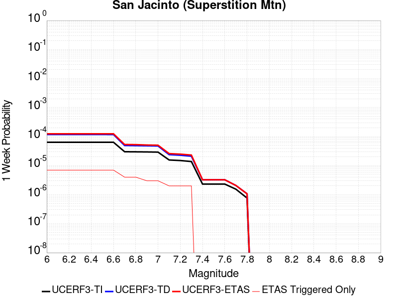 |  |  |  |

| Magnitude | 1 wk TI Prob | 1 wk TD Prob | 1 wk ETAS Prob | 1 wk ETAS/TD Gain | 1 wk ETAS Triggered Only | 1 mo TI Prob | 1 mo TD Prob | 1 mo ETAS Prob | 1 mo ETAS/TD Gain | 1 mo ETAS Triggered Only | 1 yr TI Prob | 1 yr TD Prob | 1 yr ETAS Prob | 1 yr ETAS/TD Gain | 1 yr ETAS Triggered Only | 10 yr TI Prob | 10 yr TD Prob | 10 yr ETAS Prob | 10 yr ETAS/TD Gain | 10 yr ETAS Triggered Only |
|-----|-----|-----|-----|-----|-----|-----|-----|-----|-----|-----|-----|-----|-----|-----|-----|-----|-----|-----|-----|-----|
| 6.0 | 6.369931E-5 | 1.1782884E-4 | 1.1782884E-4 | 1.0 | 0.0 | 2.729685E-4 | 5.049214E-4 | 5.049214E-4 | 1.0 | 0.0 | 0.003318327 | 0.006136903 | 0.006136903 | 1.0 | 0.0 | 0.032692123 | 0.059778612 | 0.05979654 | 1.0002999 | 1.9068686E-5 |
| 6.1 | 6.369931E-5 | 1.1782884E-4 | 1.1782884E-4 | 1.0 | 0.0 | 2.729685E-4 | 5.049214E-4 | 5.049214E-4 | 1.0 | 0.0 | 0.003318327 | 0.006136903 | 0.006136903 | 1.0 | 0.0 | 0.032692123 | 0.059778612 | 0.05979654 | 1.0002999 | 1.9068686E-5 |
| 6.2 | 6.369931E-5 | 1.1782884E-4 | 1.1782884E-4 | 1.0 | 0.0 | 2.729685E-4 | 5.049214E-4 | 5.049214E-4 | 1.0 | 0.0 | 0.003318327 | 0.006136903 | 0.006136903 | 1.0 | 0.0 | 0.032692123 | 0.059778612 | 0.05979654 | 1.0002999 | 1.9068686E-5 |
| 6.3 | 6.369931E-5 | 1.1782884E-4 | 1.1782884E-4 | 1.0 | 0.0 | 2.729685E-4 | 5.049214E-4 | 5.049214E-4 | 1.0 | 0.0 | 0.003318327 | 0.006136903 | 0.006136903 | 1.0 | 0.0 | 0.032692123 | 0.059778612 | 0.05979654 | 1.0002999 | 1.9068686E-5 |
| 6.4 | 6.369931E-5 | 1.1782884E-4 | 1.1782884E-4 | 1.0 | 0.0 | 2.729685E-4 | 5.049214E-4 | 5.049214E-4 | 1.0 | 0.0 | 0.003318327 | 0.006136903 | 0.006136903 | 1.0 | 0.0 | 0.032692123 | 0.059778612 | 0.05979654 | 1.0002999 | 1.9068686E-5 |
| 6.5 | 6.369931E-5 | 1.1782884E-4 | 1.1782884E-4 | 1.0 | 0.0 | 2.729685E-4 | 5.049214E-4 | 5.049214E-4 | 1.0 | 0.0 | 0.003318327 | 0.006136903 | 0.006136903 | 1.0 | 0.0 | 0.032692123 | 0.059778612 | 0.05979654 | 1.0002999 | 1.9068686E-5 |
| 6.6 | 6.356468E-5 | 1.1754235E-4 | 1.1754235E-4 | 1.0 | 0.0 | 2.723916E-4 | 5.036941E-4 | 5.036941E-4 | 1.0 | 0.0 | 0.003311325 | 0.0061220443 | 0.0061220443 | 1.0 | 0.0 | 0.032624163 | 0.059641294 | 0.059659228 | 1.0003006 | 1.9068686E-5 |
| 6.7 | 3.0048706E-5 | 4.931984E-5 | 4.931984E-5 | 1.0 | 0.0 | 1.2877381E-4 | 2.1135958E-4 | 2.1135958E-4 | 1.0 | 0.0 | 0.0015666935 | 0.0025713246 | 0.0025713246 | 1.0 | 0.0 | 0.015556943 | 0.025631001 | 0.025649581 | 1.0007249 | 1.9068686E-5 |
| 6.8 | 2.9819825E-5 | 4.8735175E-5 | 4.8735175E-5 | 1.0 | 0.0 | 1.2779298E-4 | 2.088543E-4 | 2.088543E-4 | 1.0 | 0.0 | 0.0015547692 | 0.0025408939 | 0.0025408939 | 1.0 | 0.0 | 0.015439362 | 0.025341224 | 0.02535981 | 1.0007334 | 1.9068686E-5 |
| 6.9 | 2.9555731E-5 | 4.8134865E-5 | 4.8134865E-5 | 1.0 | 0.0 | 1.2666127E-4 | 2.0628194E-4 | 2.0628194E-4 | 1.0 | 0.0 | 0.0015410101 | 0.002509648 | 0.002509648 | 1.0 | 0.0 | 0.015303677 | 0.025041468 | 0.02506006 | 1.0007424 | 1.9068686E-5 |
| 7.0 | 2.915559E-5 | 4.744423E-5 | 4.744423E-5 | 1.0 | 0.0 | 1.2494654E-4 | 2.0332253E-4 | 2.0332253E-4 | 1.0 | 0.0 | 0.0015201626 | 0.0024736994 | 0.0024736994 | 1.0 | 0.0 | 0.015098056 | 0.024688803 | 0.024707401 | 1.0007533 | 1.9068686E-5 |
| 7.1 | 1.5605729E-5 | 2.3894689E-5 | 2.3894689E-5 | 1.0 | 0.0 | 6.687998E-5 | 1.0240406E-4 | 1.0240406E-4 | 1.0 | 0.0 | 8.139595E-4 | 0.0012464593 | 0.0012464593 | 1.0 | 0.0 | 0.008109846 | 0.01256506 | 0.012583888 | 1.0014986 | 1.9068686E-5 |
| 7.2 | 1.4951773E-5 | 2.282491E-5 | 2.282491E-5 | 1.0 | 0.0 | 6.407745E-5 | 9.781964E-5 | 9.781964E-5 | 1.0 | 0.0 | 7.7986374E-4 | 0.001190706 | 0.001190706 | 1.0 | 0.0 | 0.0077713258 | 0.012013012 | 0.012031851 | 1.0015683 | 1.9068686E-5 |
| 7.3 | 1.3807349E-5 | 2.1078144E-5 | 2.1078144E-5 | 1.0 | 0.0 | 5.917301E-5 | 9.033404E-5 | 9.033404E-5 | 1.0 | 0.0 | 7.2019326E-4 | 0.0010996633 | 0.0010996633 | 1.0 | 0.0 | 0.0071786367 | 0.011102179 | 0.0111210365 | 1.0016985 | 1.9068686E-5 |
| 7.4 | 2.3105063E-6 | 3.2496644E-6 | 3.2496644E-6 | 1.0 | 0.0 | 9.902133E-6 | 1.3927083E-5 | 1.3927083E-5 | 1.0 | 0.0 | 1.2055179E-4 | 1.6955346E-4 | 1.6955346E-4 | 1.0 | 0.0 | 0.0012048641 | 0.0017464611 | 0.0017654966 | 1.0108994 | 1.9068686E-5 |
| 7.5 | 2.3105063E-6 | 3.2496644E-6 | 3.2496644E-6 | 1.0 | 0.0 | 9.902133E-6 | 1.3927083E-5 | 1.3927083E-5 | 1.0 | 0.0 | 1.2055179E-4 | 1.6955346E-4 | 1.6955346E-4 | 1.0 | 0.0 | 0.0012048641 | 0.0017464611 | 0.0017654966 | 1.0108994 | 1.9068686E-5 |
| 7.6 | 2.3105063E-6 | 3.2496644E-6 | 3.2496644E-6 | 1.0 | 0.0 | 9.902133E-6 | 1.3927083E-5 | 1.3927083E-5 | 1.0 | 0.0 | 1.2055179E-4 | 1.6955346E-4 | 1.6955346E-4 | 1.0 | 0.0 | 0.0012048641 | 0.0017464611 | 0.0017654966 | 1.0108994 | 1.9068686E-5 |
| 7.7 | 1.5389671E-6 | 2.0643286E-6 | 2.0643286E-6 | 1.0 | 0.0 | 6.5955564E-6 | 8.847107E-6 | 8.847107E-6 | 1.0 | 0.0 | 8.029794E-5 | 1.07710875E-4 | 1.07710875E-4 | 1.0 | 0.0 | 8.0268935E-4 | 0.0011189707 | 0.001138018 | 1.0170223 | 1.9068686E-5 |
| 7.8 | 7.6409924E-7 | 1.0693483E-6 | 1.0693483E-6 | 1.0 | 0.0 | 3.274707E-6 | 4.582921E-6 | 4.582921E-6 | 1.0 | 0.0 | 3.9868828E-5 | 5.5797067E-5 | 5.5797067E-5 | 1.0 | 0.0 | 3.9861677E-4 | 5.7725405E-4 | 5.9631176E-4 | 1.0330144 | 1.9068686E-5 |

## Great Valley 10 (Panoche)
*[(top)](#table-of-contents)*

| 1 Week | 1 Month | 1 Year | 10 Year |
|-----|-----|-----|-----|
|  |  |  |  |

| Magnitude | 1 wk TI Prob | 1 wk TD Prob | 1 wk ETAS Prob | 1 wk ETAS/TD Gain | 1 wk ETAS Triggered Only | 1 mo TI Prob | 1 mo TD Prob | 1 mo ETAS Prob | 1 mo ETAS/TD Gain | 1 mo ETAS Triggered Only | 1 yr TI Prob | 1 yr TD Prob | 1 yr ETAS Prob | 1 yr ETAS/TD Gain | 1 yr ETAS Triggered Only | 10 yr TI Prob | 10 yr TD Prob | 10 yr ETAS Prob | 10 yr ETAS/TD Gain | 10 yr ETAS Triggered Only |
|-----|-----|-----|-----|-----|-----|-----|-----|-----|-----|-----|-----|-----|-----|-----|-----|-----|-----|-----|-----|-----|
| 6.0 | 3.6887384E-5 | 5.0836705E-5 | 6.990442E-5 | 1.3750777 | 1.9068686E-5 | 1.580792E-4 | 2.1787158E-4 | 2.3693612E-4 | 1.0875036 | 1.9068686E-5 | 0.0019229152 | 0.002652291 | 0.002671309 | 1.0071704 | 1.9068686E-5 | 0.01906361 | 0.026489226 | 0.02650779 | 1.0007008 | 1.9068686E-5 |
| 6.1 | 3.6887384E-5 | 5.0836705E-5 | 6.990442E-5 | 1.3750777 | 1.9068686E-5 | 1.580792E-4 | 2.1787158E-4 | 2.3693612E-4 | 1.0875036 | 1.9068686E-5 | 0.0019229152 | 0.002652291 | 0.002671309 | 1.0071704 | 1.9068686E-5 | 0.01906361 | 0.026489226 | 0.02650779 | 1.0007008 | 1.9068686E-5 |
| 6.2 | 3.6887384E-5 | 5.0836705E-5 | 6.990442E-5 | 1.3750777 | 1.9068686E-5 | 1.580792E-4 | 2.1787158E-4 | 2.3693612E-4 | 1.0875036 | 1.9068686E-5 | 0.0019229152 | 0.002652291 | 0.002671309 | 1.0071704 | 1.9068686E-5 | 0.01906361 | 0.026489226 | 0.02650779 | 1.0007008 | 1.9068686E-5 |
| 6.3 | 3.6887384E-5 | 5.0836705E-5 | 6.990442E-5 | 1.3750777 | 1.9068686E-5 | 1.580792E-4 | 2.1787158E-4 | 2.3693612E-4 | 1.0875036 | 1.9068686E-5 | 0.0019229152 | 0.002652291 | 0.002671309 | 1.0071704 | 1.9068686E-5 | 0.01906361 | 0.026489226 | 0.02650779 | 1.0007008 | 1.9068686E-5 |
| 6.4 | 3.6887384E-5 | 5.0836705E-5 | 6.990442E-5 | 1.3750777 | 1.9068686E-5 | 1.580792E-4 | 2.1787158E-4 | 2.3693612E-4 | 1.0875036 | 1.9068686E-5 | 0.0019229152 | 0.002652291 | 0.002671309 | 1.0071704 | 1.9068686E-5 | 0.01906361 | 0.026489226 | 0.02650779 | 1.0007008 | 1.9068686E-5 |

## Hosgri
*[(top)](#table-of-contents)*

| 1 Week | 1 Month | 1 Year | 10 Year |
|-----|-----|-----|-----|
|  |  |  |  |

| Magnitude | 1 wk TI Prob | 1 wk TD Prob | 1 wk ETAS Prob | 1 wk ETAS/TD Gain | 1 wk ETAS Triggered Only | 1 mo TI Prob | 1 mo TD Prob | 1 mo ETAS Prob | 1 mo ETAS/TD Gain | 1 mo ETAS Triggered Only | 1 yr TI Prob | 1 yr TD Prob | 1 yr ETAS Prob | 1 yr ETAS/TD Gain | 1 yr ETAS Triggered Only | 10 yr TI Prob | 10 yr TD Prob | 10 yr ETAS Prob | 10 yr ETAS/TD Gain | 10 yr ETAS Triggered Only |
|-----|-----|-----|-----|-----|-----|-----|-----|-----|-----|-----|-----|-----|-----|-----|-----|-----|-----|-----|-----|-----|
| 6.0 | 3.1107833E-5 | 3.720853E-5 | 5.6276505E-5 | 1.5124625 | 1.9068686E-5 | 1.3331248E-4 | 1.5945687E-4 | 1.7852253E-4 | 1.1195662 | 1.9068686E-5 | 0.0016218709 | 0.001939923 | 0.0019589546 | 1.0098106 | 1.9068686E-5 | 0.01610085 | 0.01925631 | 0.019275013 | 1.0009712 | 1.9068686E-5 |
| 6.1 | 3.1107833E-5 | 3.720853E-5 | 5.6276505E-5 | 1.5124625 | 1.9068686E-5 | 1.3331248E-4 | 1.5945687E-4 | 1.7852253E-4 | 1.1195662 | 1.9068686E-5 | 0.0016218709 | 0.001939923 | 0.0019589546 | 1.0098106 | 1.9068686E-5 | 0.01610085 | 0.01925631 | 0.019275013 | 1.0009712 | 1.9068686E-5 |
| 6.2 | 3.1107833E-5 | 3.720853E-5 | 5.6276505E-5 | 1.5124625 | 1.9068686E-5 | 1.3331248E-4 | 1.5945687E-4 | 1.7852253E-4 | 1.1195662 | 1.9068686E-5 | 0.0016218709 | 0.001939923 | 0.0019589546 | 1.0098106 | 1.9068686E-5 | 0.01610085 | 0.01925631 | 0.019275013 | 1.0009712 | 1.9068686E-5 |
| 6.3 | 3.1107833E-5 | 3.720853E-5 | 5.6276505E-5 | 1.5124625 | 1.9068686E-5 | 1.3331248E-4 | 1.5945687E-4 | 1.7852253E-4 | 1.1195662 | 1.9068686E-5 | 0.0016218709 | 0.001939923 | 0.0019589546 | 1.0098106 | 1.9068686E-5 | 0.01610085 | 0.01925631 | 0.019275013 | 1.0009712 | 1.9068686E-5 |
| 6.4 | 3.1107833E-5 | 3.720853E-5 | 5.6276505E-5 | 1.5124625 | 1.9068686E-5 | 1.3331248E-4 | 1.5945687E-4 | 1.7852253E-4 | 1.1195662 | 1.9068686E-5 | 0.0016218709 | 0.001939923 | 0.0019589546 | 1.0098106 | 1.9068686E-5 | 0.01610085 | 0.01925631 | 0.019275013 | 1.0009712 | 1.9068686E-5 |
| 6.5 | 3.1107833E-5 | 3.720853E-5 | 5.6276505E-5 | 1.5124625 | 1.9068686E-5 | 1.3331248E-4 | 1.5945687E-4 | 1.7852253E-4 | 1.1195662 | 1.9068686E-5 | 0.0016218709 | 0.001939923 | 0.0019589546 | 1.0098106 | 1.9068686E-5 | 0.01610085 | 0.01925631 | 0.019275013 | 1.0009712 | 1.9068686E-5 |
| 6.6 | 2.743495E-5 | 3.2780124E-5 | 5.1848183E-5 | 1.5816958 | 1.9068686E-5 | 1.1757306E-4 | 1.4048017E-4 | 1.5954618E-4 | 1.1357203 | 1.9068686E-5 | 0.0014305119 | 0.0017092682 | 0.0017283043 | 1.011137 | 1.9068686E-5 | 0.014213383 | 0.016987413 | 0.017006157 | 1.0011034 | 1.9068686E-5 |
| 6.7 | 2.418707E-5 | 2.8858389E-5 | 4.7926525E-5 | 1.6607485 | 1.9068686E-5 | 1.0365475E-4 | 1.2367443E-4 | 1.4274076E-4 | 1.1541655 | 1.9068686E-5 | 0.001261266 | 0.0015049598 | 0.0015239997 | 1.0126514 | 1.9068686E-5 | 0.012541314 | 0.014973709 | 0.014992492 | 1.0012544 | 1.9068686E-5 |
| 6.8 | 2.1292695E-5 | 2.5360874E-5 | 4.4429074E-5 | 1.7518748 | 1.9068686E-5 | 9.125122E-5 | 1.0868641E-4 | 1.2775302E-4 | 1.1754278 | 1.9068686E-5 | 0.0011104173 | 0.0013227165 | 0.0013417599 | 1.0143973 | 1.9068686E-5 | 0.011048851 | 0.013174292 | 0.013193109 | 1.0014284 | 1.9068686E-5 |
| 6.9 | 1.8692357E-5 | 2.221764E-5 | 4.1285904E-5 | 1.8582487 | 1.9068686E-5 | 8.010764E-5 | 9.521646E-5 | 1.14283335E-4 | 1.2002476 | 1.9068686E-5 | 9.7487407E-4 | 0.001158906 | 0.0011779526 | 1.016435 | 1.9068686E-5 | 0.009706085 | 0.01155437 | 0.011573219 | 1.0016313 | 1.9068686E-5 |
| 7.0 | 1.6336586E-5 | 1.9370036E-5 | 1.9370036E-5 | 1.0 | 0.0 | 7.001206E-5 | 8.301328E-5 | 8.301328E-5 | 1.0 | 0.0 | 8.520634E-4 | 0.0010104795 | 0.0010104795 | 1.0 | 0.0 | 0.008488038 | 0.010084504 | 0.010084504 | 1.0 | 0.0 |
| 7.1 | 1.4184237E-5 | 1.6776847E-5 | 1.6776847E-5 | 1.0 | 0.0 | 6.0788174E-5 | 7.1900264E-5 | 7.1900264E-5 | 1.0 | 0.0 | 7.398447E-4 | 8.7529485E-4 | 8.7529485E-4 | 1.0 | 0.0 | 0.007373864 | 0.008744048 | 0.008744048 | 1.0 | 0.0 |
| 7.2 | 1.2201091E-5 | 1.4405841E-5 | 1.4405841E-5 | 1.0 | 0.0 | 5.228934E-5 | 6.1739316E-5 | 6.1739316E-5 | 1.0 | 0.0 | 6.3643674E-4 | 7.516762E-4 | 7.516762E-4 | 1.0 | 0.0 | 0.006346171 | 0.007516762 | 0.007516762 | 1.0 | 0.0 |

## Rodgers Creek - Healdsburg 2011 CFM
*[(top)](#table-of-contents)*

| 1 Week | 1 Month | 1 Year | 10 Year |
|-----|-----|-----|-----|
|  |  |  |  |

| Magnitude | 1 wk TI Prob | 1 wk TD Prob | 1 wk ETAS Prob | 1 wk ETAS/TD Gain | 1 wk ETAS Triggered Only | 1 mo TI Prob | 1 mo TD Prob | 1 mo ETAS Prob | 1 mo ETAS/TD Gain | 1 mo ETAS Triggered Only | 1 yr TI Prob | 1 yr TD Prob | 1 yr ETAS Prob | 1 yr ETAS/TD Gain | 1 yr ETAS Triggered Only | 10 yr TI Prob | 10 yr TD Prob | 10 yr ETAS Prob | 10 yr ETAS/TD Gain | 10 yr ETAS Triggered Only |
|-----|-----|-----|-----|-----|-----|-----|-----|-----|-----|-----|-----|-----|-----|-----|-----|-----|-----|-----|-----|-----|
| 6.0 | 9.830927E-5 | 2.4955187E-4 | 2.686158E-4 | 1.0763927 | 1.9068686E-5 | 4.212574E-4 | 0.0010693158 | 0.0010883642 | 1.0178136 | 1.9068686E-5 | 0.0051167537 | 0.012984863 | 0.013003684 | 1.0014495 | 1.9068686E-5 | 0.05000532 | 0.12216672 | 0.12218346 | 1.000137 | 1.9068686E-5 |
| 6.1 | 9.830927E-5 | 2.4955187E-4 | 2.686158E-4 | 1.0763927 | 1.9068686E-5 | 4.212574E-4 | 0.0010693158 | 0.0010883642 | 1.0178136 | 1.9068686E-5 | 0.0051167537 | 0.012984863 | 0.013003684 | 1.0014495 | 1.9068686E-5 | 0.05000532 | 0.12216672 | 0.12218346 | 1.000137 | 1.9068686E-5 |
| 6.2 | 9.830927E-5 | 2.4955187E-4 | 2.686158E-4 | 1.0763927 | 1.9068686E-5 | 4.212574E-4 | 0.0010693158 | 0.0010883642 | 1.0178136 | 1.9068686E-5 | 0.0051167537 | 0.012984863 | 0.013003684 | 1.0014495 | 1.9068686E-5 | 0.05000532 | 0.12216672 | 0.12218346 | 1.000137 | 1.9068686E-5 |
| 6.3 | 9.830927E-5 | 2.4955187E-4 | 2.686158E-4 | 1.0763927 | 1.9068686E-5 | 4.212574E-4 | 0.0010693158 | 0.0010883642 | 1.0178136 | 1.9068686E-5 | 0.0051167537 | 0.012984863 | 0.013003684 | 1.0014495 | 1.9068686E-5 | 0.05000532 | 0.12216672 | 0.12218346 | 1.000137 | 1.9068686E-5 |
| 6.4 | 9.830927E-5 | 2.4955187E-4 | 2.686158E-4 | 1.0763927 | 1.9068686E-5 | 4.212574E-4 | 0.0010693158 | 0.0010883642 | 1.0178136 | 1.9068686E-5 | 0.0051167537 | 0.012984863 | 0.013003684 | 1.0014495 | 1.9068686E-5 | 0.05000532 | 0.12216672 | 0.12218346 | 1.000137 | 1.9068686E-5 |
| 6.5 | 9.830927E-5 | 2.4955187E-4 | 2.686158E-4 | 1.0763927 | 1.9068686E-5 | 4.212574E-4 | 0.0010693158 | 0.0010883642 | 1.0178136 | 1.9068686E-5 | 0.0051167537 | 0.012984863 | 0.013003684 | 1.0014495 | 1.9068686E-5 | 0.05000532 | 0.12216672 | 0.12218346 | 1.000137 | 1.9068686E-5 |
| 6.6 | 9.722793E-5 | 2.4745433E-4 | 2.665183E-4 | 1.0770403 | 1.9068686E-5 | 4.1662456E-4 | 0.001060334 | 0.0010793825 | 1.0179646 | 1.9068686E-5 | 0.0050606127 | 0.012876847 | 0.01289567 | 1.0014617 | 1.9068686E-5 | 0.049469102 | 0.12122572 | 0.12124248 | 1.0001383 | 1.9068686E-5 |
| 6.7 | 9.631043E-5 | 2.4569524E-4 | 2.6475923E-4 | 1.077592 | 1.9068686E-5 | 4.1269368E-4 | 0.0010528011 | 0.0010718497 | 1.0180932 | 1.9068686E-5 | 0.0050129755 | 0.012786214 | 0.012805039 | 1.0014722 | 1.9068686E-5 | 0.049013894 | 0.12043094 | 0.12044771 | 1.0001392 | 1.9068686E-5 |
| 6.8 | 9.5157004E-5 | 2.4311169E-4 | 2.6217574E-4 | 1.0784168 | 1.9068686E-5 | 4.0775197E-4 | 0.0010417376 | 0.0010607864 | 1.0182856 | 1.9068686E-5 | 0.0049530854 | 0.012653089 | 0.012671917 | 1.001488 | 1.9068686E-5 | 0.048441324 | 0.1192606 | 0.1192774 | 1.0001408 | 1.9068686E-5 |
| 6.9 | 9.3715214E-5 | 2.3986747E-4 | 2.5893157E-4 | 1.0794777 | 1.9068686E-5 | 4.015748E-4 | 0.0010278448 | 0.0010468939 | 1.018533 | 1.9068686E-5 | 0.004878218 | 0.012485896 | 0.012504727 | 1.0015081 | 1.9068686E-5 | 0.047725122 | 0.11779124 | 0.11780806 | 1.0001428 | 1.9068686E-5 |
| 7.0 | 9.21773E-5 | 2.3636219E-4 | 2.5542636E-4 | 1.0806566 | 1.9068686E-5 | 3.9498575E-4 | 0.0010128339 | 0.0010318833 | 1.018808 | 1.9068686E-5 | 0.0047983527 | 0.012305218 | 0.012324052 | 1.0015305 | 1.9068686E-5 | 0.046960585 | 0.11620537 | 0.116222225 | 1.0001451 | 1.9068686E-5 |
| 7.1 | 1.8670535E-5 | 4.6669888E-5 | 6.573768E-5 | 1.4085674 | 1.9068686E-5 | 8.001412E-5 | 2.0000339E-4 | 2.1906826E-4 | 1.0953227 | 1.9068686E-5 | 9.737365E-4 | 0.0024331913 | 0.0024522138 | 1.0078179 | 1.9068686E-5 | 0.009694808 | 0.023618827 | 0.023637446 | 1.0007883 | 1.9068686E-5 |
| 7.2 | 6.6138855E-6 | 1.8792352E-5 | 3.786068E-5 | 2.0146854 | 1.9068686E-5 | 2.8344915E-5 | 8.053787E-5 | 9.960502E-5 | 1.2367476 | 1.9068686E-5 | 3.4504468E-4 | 9.8041E-4 | 9.9946E-4 | 1.0194306 | 1.9068686E-5 | 0.0034450945 | 0.009560432 | 0.009579319 | 1.0019754 | 1.9068686E-5 |
| 7.3 | 5.4382035E-6 | 1.5442325E-5 | 3.4510715E-5 | 2.2348135 | 1.9068686E-5 | 2.3306378E-5 | 6.618139E-5 | 8.5248816E-5 | 1.2881086 | 1.9068686E-5 | 2.8371823E-4 | 8.0575846E-4 | 8.2481175E-4 | 1.0236465 | 1.9068686E-5 | 0.0028335627 | 0.007868089 | 0.007887008 | 1.0024045 | 1.9068686E-5 |

## Great Valley 08 (Quinto)
*[(top)](#table-of-contents)*

| 1 Week | 1 Month | 1 Year | 10 Year |
|-----|-----|-----|-----|
|  |  |  | 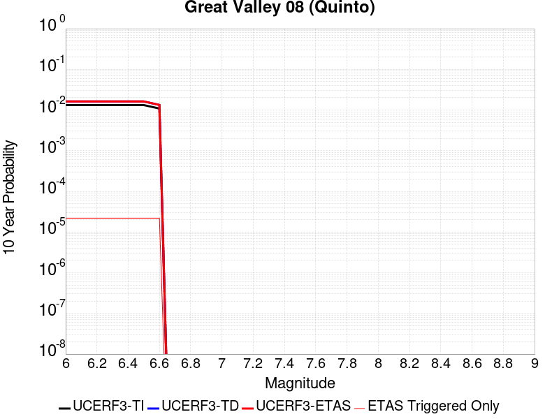 |

| Magnitude | 1 wk TI Prob | 1 wk TD Prob | 1 wk ETAS Prob | 1 wk ETAS/TD Gain | 1 wk ETAS Triggered Only | 1 mo TI Prob | 1 mo TD Prob | 1 mo ETAS Prob | 1 mo ETAS/TD Gain | 1 mo ETAS Triggered Only | 1 yr TI Prob | 1 yr TD Prob | 1 yr ETAS Prob | 1 yr ETAS/TD Gain | 1 yr ETAS Triggered Only | 10 yr TI Prob | 10 yr TD Prob | 10 yr ETAS Prob | 10 yr ETAS/TD Gain | 10 yr ETAS Triggered Only |
|-----|-----|-----|-----|-----|-----|-----|-----|-----|-----|-----|-----|-----|-----|-----|-----|-----|-----|-----|-----|-----|
| 6.0 | 2.5524263E-5 | 3.1194424E-5 | 3.1194424E-5 | 1.0 | 0.0 | 1.0938511E-4 | 1.3368827E-4 | 1.3368827E-4 | 1.0 | 0.0 | 0.0013309501 | 0.0016272905 | 0.0016463283 | 1.011699 | 1.9068686E-5 | 0.013230069 | 0.016236922 | 0.01625568 | 1.0011554 | 1.9068686E-5 |
| 6.1 | 2.5524263E-5 | 3.1194424E-5 | 3.1194424E-5 | 1.0 | 0.0 | 1.0938511E-4 | 1.3368827E-4 | 1.3368827E-4 | 1.0 | 0.0 | 0.0013309501 | 0.0016272905 | 0.0016463283 | 1.011699 | 1.9068686E-5 | 0.013230069 | 0.016236922 | 0.01625568 | 1.0011554 | 1.9068686E-5 |
| 6.2 | 2.5524263E-5 | 3.1194424E-5 | 3.1194424E-5 | 1.0 | 0.0 | 1.0938511E-4 | 1.3368827E-4 | 1.3368827E-4 | 1.0 | 0.0 | 0.0013309501 | 0.0016272905 | 0.0016463283 | 1.011699 | 1.9068686E-5 | 0.013230069 | 0.016236922 | 0.01625568 | 1.0011554 | 1.9068686E-5 |
| 6.3 | 2.5524263E-5 | 3.1194424E-5 | 3.1194424E-5 | 1.0 | 0.0 | 1.0938511E-4 | 1.3368827E-4 | 1.3368827E-4 | 1.0 | 0.0 | 0.0013309501 | 0.0016272905 | 0.0016463283 | 1.011699 | 1.9068686E-5 | 0.013230069 | 0.016236922 | 0.01625568 | 1.0011554 | 1.9068686E-5 |
| 6.4 | 2.5524263E-5 | 3.1194424E-5 | 3.1194424E-5 | 1.0 | 0.0 | 1.0938511E-4 | 1.3368827E-4 | 1.3368827E-4 | 1.0 | 0.0 | 0.0013309501 | 0.0016272905 | 0.0016463283 | 1.011699 | 1.9068686E-5 | 0.013230069 | 0.016236922 | 0.01625568 | 1.0011554 | 1.9068686E-5 |
| 6.5 | 2.5524263E-5 | 3.1194424E-5 | 3.1194424E-5 | 1.0 | 0.0 | 1.0938511E-4 | 1.3368827E-4 | 1.3368827E-4 | 1.0 | 0.0 | 0.0013309501 | 0.0016272905 | 0.0016463283 | 1.011699 | 1.9068686E-5 | 0.013230069 | 0.016236922 | 0.01625568 | 1.0011554 | 1.9068686E-5 |
| 6.6 | 2.0986998E-5 | 2.5576908E-5 | 2.5576908E-5 | 1.0 | 0.0 | 8.994117E-5 | 1.0961532E-4 | 1.0961532E-4 | 1.0 | 0.0 | 0.0010944837 | 0.0013345632 | 0.0013536065 | 1.0142692 | 1.9068686E-5 | 0.010891088 | 0.013345085 | 0.0133639 | 1.0014098 | 1.9068686E-5 |

## San Andreas (Creeping Section) 2011 CFM
*[(top)](#table-of-contents)*

| 1 Week | 1 Month | 1 Year | 10 Year |
|-----|-----|-----|-----|
|  |  | 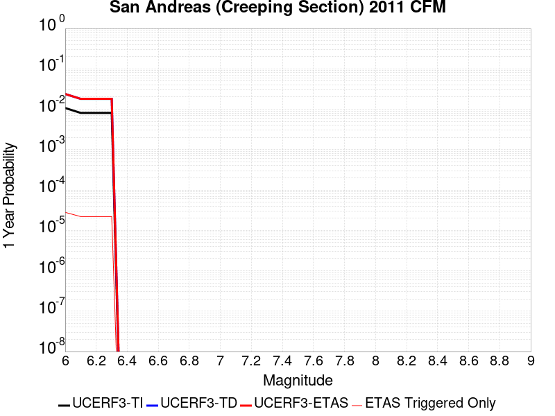 |  |

| Magnitude | 1 wk TI Prob | 1 wk TD Prob | 1 wk ETAS Prob | 1 wk ETAS/TD Gain | 1 wk ETAS Triggered Only | 1 mo TI Prob | 1 mo TD Prob | 1 mo ETAS Prob | 1 mo ETAS/TD Gain | 1 mo ETAS Triggered Only | 1 yr TI Prob | 1 yr TD Prob | 1 yr ETAS Prob | 1 yr ETAS/TD Gain | 1 yr ETAS Triggered Only | 10 yr TI Prob | 10 yr TD Prob | 10 yr ETAS Prob | 10 yr ETAS/TD Gain | 10 yr ETAS Triggered Only |
|-----|-----|-----|-----|-----|-----|-----|-----|-----|-----|-----|-----|-----|-----|-----|-----|-----|-----|-----|-----|-----|
| 6.0 | 2.0678692E-4 | 4.6456268E-4 | 4.6456268E-4 | 1.0 | 0.0 | 8.8592863E-4 | 0.0019886654 | 0.0019886654 | 1.0 | 0.0 | 0.010732949 | 0.023858009 | 0.023858009 | 1.0 | 0.0 | 0.10229127 | 0.20777887 | 0.20779398 | 1.0000727 | 1.9068686E-5 |
| 6.1 | 1.5597911E-4 | 3.5018445E-4 | 3.5018445E-4 | 1.0 | 0.0 | 6.683106E-4 | 0.0014995098 | 0.0014995098 | 1.0 | 0.0 | 0.008106367 | 0.018075831 | 0.018075831 | 1.0 | 0.0 | 0.0781696 | 0.16418044 | 0.16419637 | 1.000097 | 1.9068686E-5 |
| 6.2 | 1.5597911E-4 | 3.5018445E-4 | 3.5018445E-4 | 1.0 | 0.0 | 6.683106E-4 | 0.0014995098 | 0.0014995098 | 1.0 | 0.0 | 0.008106367 | 0.018075831 | 0.018075831 | 1.0 | 0.0 | 0.0781696 | 0.16418044 | 0.16419637 | 1.000097 | 1.9068686E-5 |
| 6.3 | 1.5597911E-4 | 3.5018445E-4 | 3.5018445E-4 | 1.0 | 0.0 | 6.683106E-4 | 0.0014995098 | 0.0014995098 | 1.0 | 0.0 | 0.008106367 | 0.018075831 | 0.018075831 | 1.0 | 0.0 | 0.0781696 | 0.16418044 | 0.16419637 | 1.000097 | 1.9068686E-5 |

## Casmalia 2011 CFM
*[(top)](#table-of-contents)*

| 1 Week | 1 Month | 1 Year | 10 Year |
|-----|-----|-----|-----|
|  |  |  |  |

| Magnitude | 1 wk TI Prob | 1 wk TD Prob | 1 wk ETAS Prob | 1 wk ETAS/TD Gain | 1 wk ETAS Triggered Only | 1 mo TI Prob | 1 mo TD Prob | 1 mo ETAS Prob | 1 mo ETAS/TD Gain | 1 mo ETAS Triggered Only | 1 yr TI Prob | 1 yr TD Prob | 1 yr ETAS Prob | 1 yr ETAS/TD Gain | 1 yr ETAS Triggered Only | 10 yr TI Prob | 10 yr TD Prob | 10 yr ETAS Prob | 10 yr ETAS/TD Gain | 10 yr ETAS Triggered Only |
|-----|-----|-----|-----|-----|-----|-----|-----|-----|-----|-----|-----|-----|-----|-----|-----|-----|-----|-----|-----|-----|
| 6.0 | 4.5215784E-6 | 4.6811892E-6 | 4.6811892E-6 | 1.0 | 0.0 | 1.9378049E-5 | 2.0062238E-5 | 2.0062238E-5 | 1.0 | 0.0 | 2.359022E-4 | 2.4425777E-4 | 2.633218E-4 | 1.0780488 | 1.9068686E-5 | 0.0023565195 | 0.0024425776 | 0.0024615997 | 1.0077877 | 1.9068686E-5 |
| 6.1 | 4.5215784E-6 | 4.6811892E-6 | 4.6811892E-6 | 1.0 | 0.0 | 1.9378049E-5 | 2.0062238E-5 | 2.0062238E-5 | 1.0 | 0.0 | 2.359022E-4 | 2.4425777E-4 | 2.633218E-4 | 1.0780488 | 1.9068686E-5 | 0.0023565195 | 0.0024425776 | 0.0024615997 | 1.0077877 | 1.9068686E-5 |
| 6.2 | 4.5215784E-6 | 4.6811892E-6 | 4.6811892E-6 | 1.0 | 0.0 | 1.9378049E-5 | 2.0062238E-5 | 2.0062238E-5 | 1.0 | 0.0 | 2.359022E-4 | 2.4425777E-4 | 2.633218E-4 | 1.0780488 | 1.9068686E-5 | 0.0023565195 | 0.0024425776 | 0.0024615997 | 1.0077877 | 1.9068686E-5 |
| 6.3 | 4.5215784E-6 | 4.6811892E-6 | 4.6811892E-6 | 1.0 | 0.0 | 1.9378049E-5 | 2.0062238E-5 | 2.0062238E-5 | 1.0 | 0.0 | 2.359022E-4 | 2.4425777E-4 | 2.633218E-4 | 1.0780488 | 1.9068686E-5 | 0.0023565195 | 0.0024425776 | 0.0024615997 | 1.0077877 | 1.9068686E-5 |
| 6.4 | 4.5215784E-6 | 4.6811892E-6 | 4.6811892E-6 | 1.0 | 0.0 | 1.9378049E-5 | 2.0062238E-5 | 2.0062238E-5 | 1.0 | 0.0 | 2.359022E-4 | 2.4425777E-4 | 2.633218E-4 | 1.0780488 | 1.9068686E-5 | 0.0023565195 | 0.0024425776 | 0.0024615997 | 1.0077877 | 1.9068686E-5 |
| 6.5 | 4.5215784E-6 | 4.6811892E-6 | 4.6811892E-6 | 1.0 | 0.0 | 1.9378049E-5 | 2.0062238E-5 | 2.0062238E-5 | 1.0 | 0.0 | 2.359022E-4 | 2.4425777E-4 | 2.633218E-4 | 1.0780488 | 1.9068686E-5 | 0.0023565195 | 0.0024425776 | 0.0024615997 | 1.0077877 | 1.9068686E-5 |

## Hollywood
*[(top)](#table-of-contents)*

| 1 Week | 1 Month | 1 Year | 10 Year |
|-----|-----|-----|-----|
|  |  |  |  |

| Magnitude | 1 wk TI Prob | 1 wk TD Prob | 1 wk ETAS Prob | 1 wk ETAS/TD Gain | 1 wk ETAS Triggered Only | 1 mo TI Prob | 1 mo TD Prob | 1 mo ETAS Prob | 1 mo ETAS/TD Gain | 1 mo ETAS Triggered Only | 1 yr TI Prob | 1 yr TD Prob | 1 yr ETAS Prob | 1 yr ETAS/TD Gain | 1 yr ETAS Triggered Only | 10 yr TI Prob | 10 yr TD Prob | 10 yr ETAS Prob | 10 yr ETAS/TD Gain | 10 yr ETAS Triggered Only |
|-----|-----|-----|-----|-----|-----|-----|-----|-----|-----|-----|-----|-----|-----|-----|-----|-----|-----|-----|-----|-----|
| 6.0 | 1.8637298E-5 | 2.1684791E-5 | 2.1684791E-5 | 1.0 | 0.0 | 7.987169E-5 | 9.2934824E-5 | 9.2934824E-5 | 1.0 | 0.0 | 9.720039E-4 | 0.0011314814 | 0.0011505284 | 1.0168338 | 1.9068686E-5 | 0.009677634 | 0.011314785 | 0.011333638 | 1.0016662 | 1.9068686E-5 |
| 6.1 | 1.8637298E-5 | 2.1684791E-5 | 2.1684791E-5 | 1.0 | 0.0 | 7.987169E-5 | 9.2934824E-5 | 9.2934824E-5 | 1.0 | 0.0 | 9.720039E-4 | 0.0011314814 | 0.0011505284 | 1.0168338 | 1.9068686E-5 | 0.009677634 | 0.011314785 | 0.011333638 | 1.0016662 | 1.9068686E-5 |
| 6.2 | 1.8637298E-5 | 2.1684791E-5 | 2.1684791E-5 | 1.0 | 0.0 | 7.987169E-5 | 9.2934824E-5 | 9.2934824E-5 | 1.0 | 0.0 | 9.720039E-4 | 0.0011314814 | 0.0011505284 | 1.0168338 | 1.9068686E-5 | 0.009677634 | 0.011314785 | 0.011333638 | 1.0016662 | 1.9068686E-5 |
| 6.3 | 1.8637298E-5 | 2.1684791E-5 | 2.1684791E-5 | 1.0 | 0.0 | 7.987169E-5 | 9.2934824E-5 | 9.2934824E-5 | 1.0 | 0.0 | 9.720039E-4 | 0.0011314814 | 0.0011505284 | 1.0168338 | 1.9068686E-5 | 0.009677634 | 0.011314785 | 0.011333638 | 1.0016662 | 1.9068686E-5 |
| 6.4 | 1.8637298E-5 | 2.1684791E-5 | 2.1684791E-5 | 1.0 | 0.0 | 7.987169E-5 | 9.2934824E-5 | 9.2934824E-5 | 1.0 | 0.0 | 9.720039E-4 | 0.0011314814 | 0.0011505284 | 1.0168338 | 1.9068686E-5 | 0.009677634 | 0.011314785 | 0.011333638 | 1.0016662 | 1.9068686E-5 |
| 6.5 | 1.8637298E-5 | 2.1684791E-5 | 2.1684791E-5 | 1.0 | 0.0 | 7.987169E-5 | 9.2934824E-5 | 9.2934824E-5 | 1.0 | 0.0 | 9.720039E-4 | 0.0011314814 | 0.0011505284 | 1.0168338 | 1.9068686E-5 | 0.009677634 | 0.011314785 | 0.011333638 | 1.0016662 | 1.9068686E-5 |

