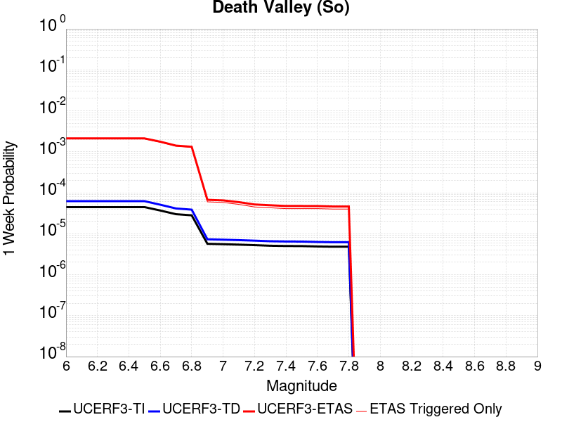
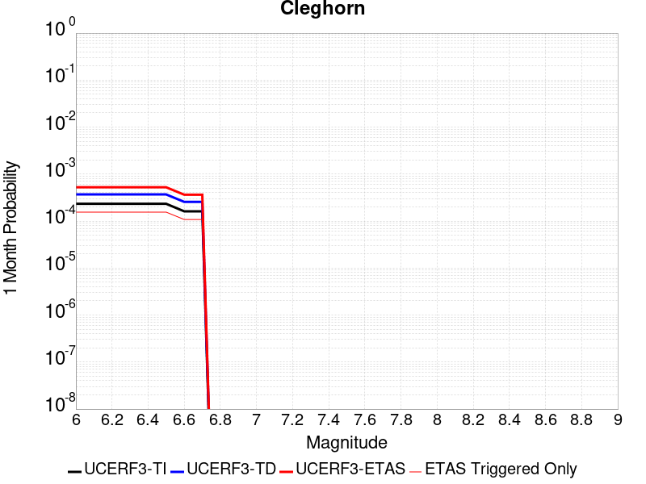
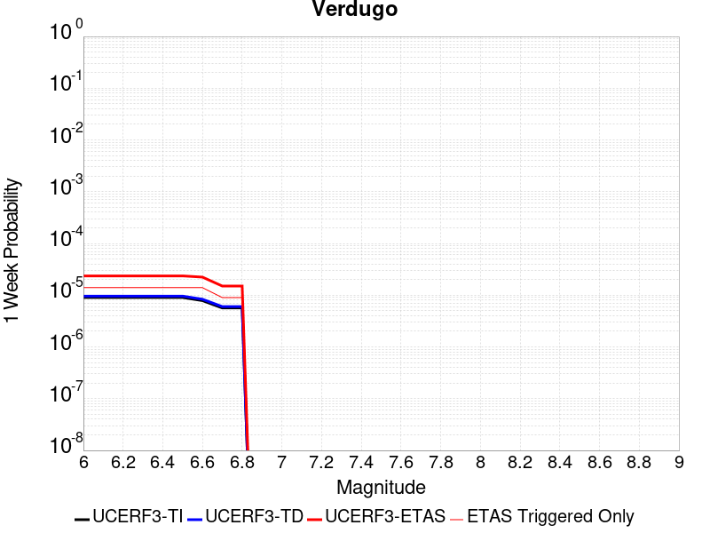
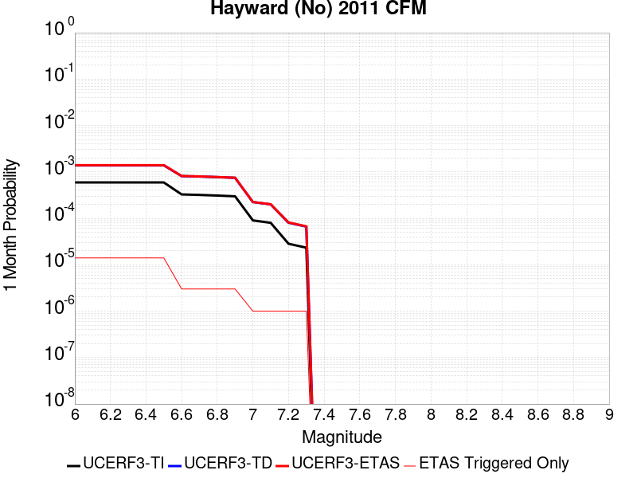
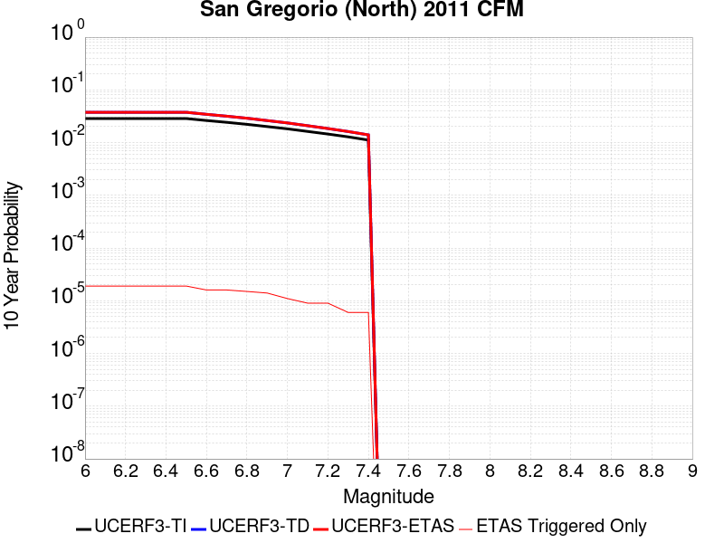
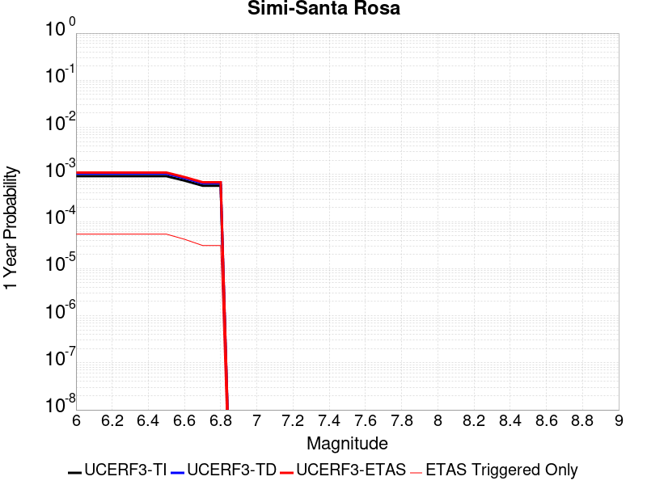

# Parent Section Magnitude-Probability Distributions

Only fault sections with at least one triggered aftershock are plotted. Sections are sorted by total supraseismogenic trigger rate (decreasing)

## Table Of Contents

* [Tank Canyon](#tank-canyon)
* [Garlock (Central)](#garlock-central)
* [Little Lake](#little-lake)
* [Owl Lake](#owl-lake)
* [Garlock (West)](#garlock-west)
* [Garlock (East)](#garlock-east)
* [Death Valley (So)](#death-valley-so)
* [Panamint Valley](#panamint-valley)
* [San Andreas (Mojave N)](#san-andreas-mojave-n)
* [San Andreas (Big Bend)](#san-andreas-big-bend)
* [San Andreas (Carrizo) rev](#san-andreas-carrizo-rev)
* [San Andreas (Mojave S)](#san-andreas-mojave-s)
* [Death Valley (Black Mtns Frontal)](#death-valley-black-mtns-frontal)
* [Blackwater](#blackwater)
* [San Andreas (Cholame) rev](#san-andreas-cholame-rev)
* [San Andreas (Parkfield)](#san-andreas-parkfield)
* [Hunter Mountain-Saline Valley](#hunter-mountain-saline-valley)
* [San Andreas (San Bernardino N)](#san-andreas-san-bernardino-n)
* [Cucamonga](#cucamonga)
* [San Cayetano](#san-cayetano)
* [Pleito](#pleito)
* [Death Valley (No)](#death-valley-no)
* [San Andreas (San Bernardino S)](#san-andreas-san-bernardino-s)
* [Gravel Hills-Harper Lk](#gravel-hills-harper-lk)
* [Cleghorn](#cleghorn)
* [Pitas Point (Lower West)](#pitas-point-lower-west)
* [Santa Ynez (West)](#santa-ynez-west)
* [Pitas Point (Lower)-Montalvo](#pitas-point-lower-montalvo)
* [San Juan](#san-juan)
* [Santa Ynez (East)](#santa-ynez-east)
* [San Andreas (San Gorgonio Pass-Garnet HIll)](#san-andreas-san-gorgonio-pass-garnet-hill)
* [Red Mountain](#red-mountain)
* [San Jacinto (San Bernardino)](#san-jacinto-san-bernardino)
* [So Sierra Nevada](#so-sierra-nevada)
* [San Andreas (Coachella) rev](#san-andreas-coachella-rev)
* [Death Valley (Fish Lake Valley)](#death-valley-fish-lake-valley)
* [Mission Ridge-Arroyo Parida-Santa Ana](#mission-ridge-arroyo-parida-santa-ana)
* [Lenwood-Lockhart-Old Woman Springs](#lenwood-lockhart-old-woman-springs)
* [Oak Ridge (Onshore)](#oak-ridge-onshore)
* [San Jacinto (Stepovers Combined)](#san-jacinto-stepovers-combined)
* [Santa Susana alt 1](#santa-susana-alt-1)
* [San Jacinto (San Jacinto Valley) rev](#san-jacinto-san-jacinto-valley-rev)
* [Ventura-Pitas Point](#ventura-pitas-point)
* [Helendale-So Lockhart](#helendale-so-lockhart)
* [Raymond](#raymond)
* [Channel Islands Thrust](#channel-islands-thrust)
* [Los Alamos 2011 CFM](#los-alamos-2011-cfm)
* [Sierra Madre](#sierra-madre)
* [Elysian Park (Upper)](#elysian-park-upper)
* [Chino alt 1](#chino-alt-1)
* [Santa Cruz Island](#santa-cruz-island)
* [Verdugo](#verdugo)
* [San Jacinto (Anza) rev](#san-jacinto-anza-rev)
* [Hayward (No) 2011 CFM](#hayward-no-2011-cfm)
* [Great Valley 12](#great-valley-12)
* [Anacapa-Dume alt 1](#anacapa-dume-alt-1)
* [San Gregorio (North) 2011 CFM](#san-gregorio-north-2011-cfm)
* [Whittier alt 1](#whittier-alt-1)
* [San Gabriel](#san-gabriel)
* [Independence rev 2011](#independence-rev-2011)
* [San Jose](#san-jose)
* [Simi-Santa Rosa](#simi-santa-rosa)
* [Hayward (So) 2011 CFM](#hayward-so-2011-cfm)
* [San Gregorio (South) 2011 CFM](#san-gregorio-south-2011-cfm)
* [Emerson-Copper Mtn 2011](#emerson-copper-mtn-2011)
* [Elsinore (Stepovers Combined)](#elsinore-stepovers-combined)
* [Pinto Mtn](#pinto-mtn)
* [San Jacinto (Clark) rev](#san-jacinto-clark-rev)
* [Calaveras (No) 2011 CFM](#calaveras-no-2011-cfm)
* [Elsinore (Glen Ivy) rev](#elsinore-glen-ivy-rev)
* [Clamshell-Sawpit](#clamshell-sawpit)
* [Los Osos 2011](#los-osos-2011)
* [Santa Rosa Island](#santa-rosa-island)
* [Great Valley 03 Mysterious Ridge](#great-valley-03-mysterious-ridge)
* [Imperial](#imperial)
* [Deep Springs](#deep-springs)
* [North Frontal  (West)](#north-frontal--west)
* [Elsinore (Temecula) rev](#elsinore-temecula-rev)
* [Robinson Creek](#robinson-creek)
* [Concord 2011 CFM](#concord-2011-cfm)
* [Burnt Mtn](#burnt-mtn)
* [San Luis Range 2011 CFM](#san-luis-range-2011-cfm)
* [Calaveras (Central) 2011 CFM](#calaveras-central-2011-cfm)
* [Newport-Inglewood alt 1](#newport-inglewood-alt-1)
* [Great Valley 09 (Laguna Seca)](#great-valley-09-laguna-seca)
* [Great Valley 04a Trout Creek](#great-valley-04a-trout-creek)
* [Great Valley 04b Gordon Valley](#great-valley-04b-gordon-valley)
* [Palos Verdes](#palos-verdes)
* [Malibu Coast alt 1](#malibu-coast-alt-1)
* [Great Valley 07 (Orestimba)](#great-valley-07-orestimba)
* [North Frontal  (East)](#north-frontal--east)
* [Holser alt 1](#holser-alt-1)
* [Green Valley 2011 CFM](#green-valley-2011-cfm)
* [Rose Canyon](#rose-canyon)
* [Great Valley 10 (Panoche)](#great-valley-10-panoche)
* [Hosgri](#hosgri)
* [Rodgers Creek - Healdsburg 2011 CFM](#rodgers-creek---healdsburg-2011-cfm)
* [San Andreas (Creeping Section) 2011 CFM](#san-andreas-creeping-section-2011-cfm)
* [Casmalia 2011 CFM](#casmalia-2011-cfm)
* [Newport-Inglewood (Offshore)](#newport-inglewood-offshore)
* [Hollywood](#hollywood)
* [Mono Lake 2011 CFM](#mono-lake-2011-cfm)

## Tank Canyon
*[(top)](#table-of-contents)*

| 1 Week | 1 Month | 1 Year | 10 Year |
|-----|-----|-----|-----|
|  |  |  |  |

| Magnitude | 1 wk TI Prob | 1 wk TD Prob | 1 wk ETAS Prob | 1 wk ETAS/TD Gain | 1 wk ETAS Triggered Only | 1 mo TI Prob | 1 mo TD Prob | 1 mo ETAS Prob | 1 mo ETAS/TD Gain | 1 mo ETAS Triggered Only | 1 yr TI Prob | 1 yr TD Prob | 1 yr ETAS Prob | 1 yr ETAS/TD Gain | 1 yr ETAS Triggered Only | 10 yr TI Prob | 10 yr TD Prob | 10 yr ETAS Prob | 10 yr ETAS/TD Gain | 10 yr ETAS Triggered Only |
|-----|-----|-----|-----|-----|-----|-----|-----|-----|-----|-----|-----|-----|-----|-----|-----|-----|-----|-----|-----|-----|
| 6.0 | 2.7748038E-5 | 3.5073965E-5 | 0.02097023 | 597.8859 | 0.020935891 | 1.18914744E-4 | 1.5031699E-4 | 0.026881997 | 178.83537 | 0.026735699 | 0.0014468255 | 0.0018300817 | 0.042947475 | 23.467518 | 0.04119278 | 0.014374418 | 0.018297758 | 0.07281826 | 3.9796271 | 0.055536695 |
| 6.1 | 2.7748038E-5 | 3.5073965E-5 | 0.02097023 | 597.8859 | 0.020935891 | 1.18914744E-4 | 1.5031699E-4 | 0.026881997 | 178.83537 | 0.026735699 | 0.0014468255 | 0.0018300817 | 0.042947475 | 23.467518 | 0.04119278 | 0.014374418 | 0.018297758 | 0.07281826 | 3.9796271 | 0.055536695 |
| 6.2 | 2.7748038E-5 | 3.5073965E-5 | 0.02097023 | 597.8859 | 0.020935891 | 1.18914744E-4 | 1.5031699E-4 | 0.026881997 | 178.83537 | 0.026735699 | 0.0014468255 | 0.0018300817 | 0.042947475 | 23.467518 | 0.04119278 | 0.014374418 | 0.018297758 | 0.07281826 | 3.9796271 | 0.055536695 |
| 6.3 | 2.7748038E-5 | 3.5073965E-5 | 0.02097023 | 597.8859 | 0.020935891 | 1.18914744E-4 | 1.5031699E-4 | 0.026881997 | 178.83537 | 0.026735699 | 0.0014468255 | 0.0018300817 | 0.042947475 | 23.467518 | 0.04119278 | 0.014374418 | 0.018297758 | 0.07281826 | 3.9796271 | 0.055536695 |

## Garlock (Central)
*[(top)](#table-of-contents)*

| 1 Week | 1 Month | 1 Year | 10 Year |
|-----|-----|-----|-----|
|  |  |  |  |

| Magnitude | 1 wk TI Prob | 1 wk TD Prob | 1 wk ETAS Prob | 1 wk ETAS/TD Gain | 1 wk ETAS Triggered Only | 1 mo TI Prob | 1 mo TD Prob | 1 mo ETAS Prob | 1 mo ETAS/TD Gain | 1 mo ETAS Triggered Only | 1 yr TI Prob | 1 yr TD Prob | 1 yr ETAS Prob | 1 yr ETAS/TD Gain | 1 yr ETAS Triggered Only | 10 yr TI Prob | 10 yr TD Prob | 10 yr ETAS Prob | 10 yr ETAS/TD Gain | 10 yr ETAS Triggered Only |
|-----|-----|-----|-----|-----|-----|-----|-----|-----|-----|-----|-----|-----|-----|-----|-----|-----|-----|-----|-----|-----|
| 6.0 | 2.575808E-5 | 1.9313613E-5 | 0.011477249 | 594.25696 | 0.011458157 | 1.10387096E-4 | 8.277037E-5 | 0.01434063 | 173.25801 | 0.014259039 | 0.0013431342 | 0.0010073289 | 0.020650284 | 20.500044 | 0.019662762 | 0.013350452 | 0.0100695705 | 0.035359763 | 3.5115464 | 0.025547445 |
| 6.1 | 2.575808E-5 | 1.9313613E-5 | 0.011477249 | 594.25696 | 0.011458157 | 1.10387096E-4 | 8.277037E-5 | 0.01434063 | 173.25801 | 0.014259039 | 0.0013431342 | 0.0010073289 | 0.020650284 | 20.500044 | 0.019662762 | 0.013350452 | 0.0100695705 | 0.035359763 | 3.5115464 | 0.025547445 |
| 6.2 | 2.575808E-5 | 1.9313613E-5 | 0.011477249 | 594.25696 | 0.011458157 | 1.10387096E-4 | 8.277037E-5 | 0.01434063 | 173.25801 | 0.014259039 | 0.0013431342 | 0.0010073289 | 0.020650284 | 20.500044 | 0.019662762 | 0.013350452 | 0.0100695705 | 0.035359763 | 3.5115464 | 0.025547445 |
| 6.3 | 2.575808E-5 | 1.9313613E-5 | 0.011477249 | 594.25696 | 0.011458157 | 1.10387096E-4 | 8.277037E-5 | 0.01434063 | 173.25801 | 0.014259039 | 0.0013431342 | 0.0010073289 | 0.020650284 | 20.500044 | 0.019662762 | 0.013350452 | 0.0100695705 | 0.035359763 | 3.5115464 | 0.025547445 |
| 6.4 | 2.575808E-5 | 1.9313613E-5 | 0.011477249 | 594.25696 | 0.011458157 | 1.10387096E-4 | 8.277037E-5 | 0.01434063 | 173.25801 | 0.014259039 | 0.0013431342 | 0.0010073289 | 0.020650284 | 20.500044 | 0.019662762 | 0.013350452 | 0.0100695705 | 0.035359763 | 3.5115464 | 0.025547445 |
| 6.5 | 2.575808E-5 | 1.9313613E-5 | 0.011477249 | 594.25696 | 0.011458157 | 1.10387096E-4 | 8.277037E-5 | 0.01434063 | 173.25801 | 0.014259039 | 0.0013431342 | 0.0010073289 | 0.020650284 | 20.500044 | 0.019662762 | 0.013350452 | 0.0100695705 | 0.035359763 | 3.5115464 | 0.025547445 |
| 6.6 | 2.540234E-5 | 1.885198E-5 | 0.011052424 | 586.2739 | 0.01103378 | 1.0886263E-4 | 8.0792066E-5 | 0.013857759 | 171.52376 | 0.013778079 | 0.0013245966 | 9.83265E-4 | 0.019920096 | 20.259132 | 0.01895547 | 0.013167289 | 0.009831364 | 0.03417518 | 3.476138 | 0.024585526 |
| 6.7 | 2.4966947E-5 | 1.8286464E-5 | 0.010401167 | 568.79047 | 0.01038307 | 1.06996806E-4 | 7.8368575E-5 | 0.013091551 | 167.05103 | 0.013014202 | 0.0013019076 | 9.5378514E-4 | 0.018873643 | 19.788149 | 0.017936965 | 0.012943068 | 0.009539624 | 0.032713696 | 3.4292438 | 0.023397272 |
| 6.8 | 2.4548952E-5 | 1.7797542E-5 | 0.010174353 | 571.6718 | 0.010156737 | 1.0520555E-4 | 7.627332E-5 | 0.012750008 | 167.16211 | 0.012674701 | 0.001280125 | 9.282974E-4 | 0.01842463 | 19.847767 | 0.01751259 | 0.012727758 | 0.009286596 | 0.031765863 | 3.420614 | 0.02268998 |
| 6.9 | 2.3994342E-5 | 1.7148153E-5 | 0.009353263 | 545.43854 | 0.009336276 | 1.0282884E-4 | 7.349039E-5 | 0.011785412 | 160.36671 | 0.011712782 | 0.0012512221 | 8.944436E-4 | 0.01703458 | 19.044891 | 0.016154585 | 0.012442005 | 0.0089510605 | 0.029811708 | 3.3305223 | 0.021049058 |
| 7.0 | 2.343005E-5 | 1.6491087E-5 | 0.008786787 | 532.8204 | 0.008770441 | 1.0041064E-4 | 7.067455E-5 | 0.011131965 | 157.51024 | 0.011062072 | 0.0012218138 | 8.601883E-4 | 0.016039787 | 18.646832 | 0.015192667 | 0.01215118 | 0.008610493 | 0.02824419 | 3.2802062 | 0.01980422 |
| 7.1 | 2.2814058E-5 | 1.5782754E-5 | 0.008248551 | 522.6306 | 0.008232898 | 9.777087E-5 | 6.763899E-5 | 0.010393428 | 153.6603 | 0.010326487 | 0.0011897103 | 8.2325895E-4 | 0.015070559 | 18.305977 | 0.014259039 | 0.011833611 | 0.00824334 | 0.026846142 | 3.256707 | 0.018757427 |
| 7.2 | 2.2145266E-5 | 1.5027377E-5 | 0.0075405184 | 501.78537 | 0.007525604 | 9.490483E-5 | 6.440182E-5 | 0.0095415255 | 148.15614 | 0.009477735 | 0.0011548538 | 7.8387547E-4 | 0.014014033 | 17.877882 | 0.013240537 | 0.011488707 | 0.007851825 | 0.0251427 | 3.2021472 | 0.017427715 |
| 7.3 | 1.9954436E-5 | 1.3199953E-5 | 0.006039262 | 457.52145 | 0.0060261413 | 8.551621E-5 | 5.657036E-5 | 0.007610039 | 134.52342 | 0.007553896 | 0.0010406625 | 6.8859005E-4 | 0.011234144 | 16.314705 | 0.010552821 | 0.010358025 | 0.006900618 | 0.020696007 | 2.9991527 | 0.013891246 |
| 7.4 | 1.918037E-5 | 1.2553606E-5 | 0.005727414 | 456.23657 | 0.0057149325 | 8.2198996E-5 | 5.3800417E-5 | 0.007267807 | 135.0883 | 0.007214395 | 0.0010003132 | 6.5488677E-4 | 0.010663605 | 16.283129 | 0.010015277 | 0.009958224 | 0.006564366 | 0.019577457 | 2.9823835 | 0.013099078 |
| 7.5 | 1.6994161E-5 | 1.0764553E-5 | 0.004226189 | 392.6024 | 0.00421547 | 7.283008E-5 | 4.613333E-5 | 0.0055344785 | 119.96703 | 0.0054885983 | 8.863455E-4 | 5.615903E-4 | 0.00813952 | 14.493697 | 0.0075821877 | 0.008828186 | 0.005632708 | 0.0157885 | 2.8030033 | 0.01021332 |
| 7.6 | 1.621788E-5 | 1.012848E-5 | 0.0038860582 | 383.67633 | 0.003875969 | 6.950335E-5 | 4.34074E-5 | 0.00510741 | 117.66219 | 0.005064222 | 8.458747E-4 | 5.2841863E-4 | 0.0075693405 | 14.324514 | 0.0070446446 | 0.0084266225 | 0.005301458 | 0.014728947 | 2.7782824 | 0.009477735 |
| 7.7 | 7.713584E-6 | 3.2171508E-6 | 9.0855005E-4 | 282.4083 | 9.053358E-4 | 3.3057797E-5 | 1.378779E-5 | 0.0012868987 | 93.33612 | 0.0012731286 | 4.0240434E-4 | 1.6786634E-4 | 0.0021762429 | 12.964142 | 0.0020087138 | 0.0040167645 | 0.0016902693 | 0.0045146616 | 2.6709719 | 0.0028291745 |

## Little Lake
*[(top)](#table-of-contents)*

| 1 Week | 1 Month | 1 Year | 10 Year |
|-----|-----|-----|-----|
|  |  |  |  |

| Magnitude | 1 wk TI Prob | 1 wk TD Prob | 1 wk ETAS Prob | 1 wk ETAS/TD Gain | 1 wk ETAS Triggered Only | 1 mo TI Prob | 1 mo TD Prob | 1 mo ETAS Prob | 1 mo ETAS/TD Gain | 1 mo ETAS Triggered Only | 1 yr TI Prob | 1 yr TD Prob | 1 yr ETAS Prob | 1 yr ETAS/TD Gain | 1 yr ETAS Triggered Only | 10 yr TI Prob | 10 yr TD Prob | 10 yr ETAS Prob | 10 yr ETAS/TD Gain | 10 yr ETAS Triggered Only |
|-----|-----|-----|-----|-----|-----|-----|-----|-----|-----|-----|-----|-----|-----|-----|-----|-----|-----|-----|-----|-----|
| 6.0 | 1.27106505E-5 | 1.3900362E-5 | 0.012264055 | 882.28314 | 0.012250326 | 5.447308E-5 | 5.957219E-5 | 0.015279624 | 256.4892 | 0.015220959 | 6.630079E-4 | 7.25151E-4 | 0.020995623 | 28.95345 | 0.020285182 | 0.006610333 | 0.0072377534 | 0.03226325 | 4.457633 | 0.025207944 |
| 6.1 | 1.27106505E-5 | 1.3900362E-5 | 0.012264055 | 882.28314 | 0.012250326 | 5.447308E-5 | 5.957219E-5 | 0.015279624 | 256.4892 | 0.015220959 | 6.630079E-4 | 7.25151E-4 | 0.020995623 | 28.95345 | 0.020285182 | 0.006610333 | 0.0072377534 | 0.03226325 | 4.457633 | 0.025207944 |
| 6.2 | 1.27106505E-5 | 1.3900362E-5 | 0.012264055 | 882.28314 | 0.012250326 | 5.447308E-5 | 5.957219E-5 | 0.015279624 | 256.4892 | 0.015220959 | 6.630079E-4 | 7.25151E-4 | 0.020995623 | 28.95345 | 0.020285182 | 0.006610333 | 0.0072377534 | 0.03226325 | 4.457633 | 0.025207944 |
| 6.3 | 1.27106505E-5 | 1.3900362E-5 | 0.012264055 | 882.28314 | 0.012250326 | 5.447308E-5 | 5.957219E-5 | 0.015279624 | 256.4892 | 0.015220959 | 6.630079E-4 | 7.25151E-4 | 0.020995623 | 28.95345 | 0.020285182 | 0.006610333 | 0.0072377534 | 0.03226325 | 4.457633 | 0.025207944 |
| 6.4 | 1.27106505E-5 | 1.3900362E-5 | 0.012264055 | 882.28314 | 0.012250326 | 5.447308E-5 | 5.957219E-5 | 0.015279624 | 256.4892 | 0.015220959 | 6.630079E-4 | 7.25151E-4 | 0.020995623 | 28.95345 | 0.020285182 | 0.006610333 | 0.0072377534 | 0.03226325 | 4.457633 | 0.025207944 |
| 6.5 | 1.27106505E-5 | 1.3900362E-5 | 0.012264055 | 882.28314 | 0.012250326 | 5.447308E-5 | 5.957219E-5 | 0.015279624 | 256.4892 | 0.015220959 | 6.630079E-4 | 7.25151E-4 | 0.020995623 | 28.95345 | 0.020285182 | 0.006610333 | 0.0072377534 | 0.03226325 | 4.457633 | 0.025207944 |
| 6.6 | 1.08505255E-5 | 1.1856941E-5 | 0.010451387 | 881.45734 | 0.010439654 | 4.6501424E-5 | 5.0815026E-5 | 0.013120937 | 258.20978 | 0.013070786 | 5.6600774E-4 | 6.1859656E-4 | 0.017865885 | 28.88132 | 0.017257964 | 0.005645683 | 0.006178476 | 0.027322419 | 4.422194 | 0.021275392 |
| 6.7 | 7.97625E-6 | 8.706619E-6 | 0.007986909 | 917.3376 | 0.007978272 | 3.4183482E-5 | 3.7314083E-5 | 0.010023927 | 268.63657 | 0.0099869855 | 4.161044E-4 | 4.5429895E-4 | 0.013603983 | 29.945004 | 0.0131556615 | 0.004153261 | 0.0045429897 | 0.020624185 | 4.5397825 | 0.016154585 |
| 6.8 | 7.97625E-6 | 8.706619E-6 | 0.007986909 | 917.3376 | 0.007978272 | 3.4183482E-5 | 3.7314083E-5 | 0.010023927 | 268.63657 | 0.0099869855 | 4.161044E-4 | 4.5429895E-4 | 0.013603983 | 29.945004 | 0.0131556615 | 0.004153261 | 0.0045429897 | 0.020624185 | 4.5397825 | 0.016154585 |

## Owl Lake
*[(top)](#table-of-contents)*

| 1 Week | 1 Month | 1 Year | 10 Year |
|-----|-----|-----|-----|
|  |  |  |  |

| Magnitude | 1 wk TI Prob | 1 wk TD Prob | 1 wk ETAS Prob | 1 wk ETAS/TD Gain | 1 wk ETAS Triggered Only | 1 mo TI Prob | 1 mo TD Prob | 1 mo ETAS Prob | 1 mo ETAS/TD Gain | 1 mo ETAS Triggered Only | 1 yr TI Prob | 1 yr TD Prob | 1 yr ETAS Prob | 1 yr ETAS/TD Gain | 1 yr ETAS Triggered Only | 10 yr TI Prob | 10 yr TD Prob | 10 yr ETAS Prob | 10 yr ETAS/TD Gain | 10 yr ETAS Triggered Only |
|-----|-----|-----|-----|-----|-----|-----|-----|-----|-----|-----|-----|-----|-----|-----|-----|-----|-----|-----|-----|-----|
| 6.0 | 3.637175E-5 | 4.988367E-5 | 0.004180272 | 83.800415 | 0.004130595 | 1.5586962E-4 | 2.1378716E-4 | 0.0059840693 | 27.990778 | 0.005771516 | 0.0018960608 | 0.0026025574 | 0.011970971 | 4.599695 | 0.009392859 | 0.018799646 | 0.025995217 | 0.03958047 | 1.5226059 | 0.01394783 |
| 6.1 | 3.637175E-5 | 4.988367E-5 | 0.004180272 | 83.800415 | 0.004130595 | 1.5586962E-4 | 2.1378716E-4 | 0.0059840693 | 27.990778 | 0.005771516 | 0.0018960608 | 0.0026025574 | 0.011970971 | 4.599695 | 0.009392859 | 0.018799646 | 0.025995217 | 0.03958047 | 1.5226059 | 0.01394783 |
| 6.2 | 3.637175E-5 | 4.988367E-5 | 0.004180272 | 83.800415 | 0.004130595 | 1.5586962E-4 | 2.1378716E-4 | 0.0059840693 | 27.990778 | 0.005771516 | 0.0018960608 | 0.0026025574 | 0.011970971 | 4.599695 | 0.009392859 | 0.018799646 | 0.025995217 | 0.03958047 | 1.5226059 | 0.01394783 |
| 6.3 | 3.637175E-5 | 4.988367E-5 | 0.004180272 | 83.800415 | 0.004130595 | 1.5586962E-4 | 2.1378716E-4 | 0.0059840693 | 27.990778 | 0.005771516 | 0.0018960608 | 0.0026025574 | 0.011970971 | 4.599695 | 0.009392859 | 0.018799646 | 0.025995217 | 0.03958047 | 1.5226059 | 0.01394783 |
| 6.4 | 3.637175E-5 | 4.988367E-5 | 0.004180272 | 83.800415 | 0.004130595 | 1.5586962E-4 | 2.1378716E-4 | 0.0059840693 | 27.990778 | 0.005771516 | 0.0018960608 | 0.0026025574 | 0.011970971 | 4.599695 | 0.009392859 | 0.018799646 | 0.025995217 | 0.03958047 | 1.5226059 | 0.01394783 |
| 6.5 | 3.637175E-5 | 4.988367E-5 | 0.004180272 | 83.800415 | 0.004130595 | 1.5586962E-4 | 2.1378716E-4 | 0.0059840693 | 27.990778 | 0.005771516 | 0.0018960608 | 0.0026025574 | 0.011970971 | 4.599695 | 0.009392859 | 0.018799646 | 0.025995217 | 0.03958047 | 1.5226059 | 0.01394783 |

## Garlock (West)
*[(top)](#table-of-contents)*

| 1 Week | 1 Month | 1 Year | 10 Year |
|-----|-----|-----|-----|
|  |  |  |  |

| Magnitude | 1 wk TI Prob | 1 wk TD Prob | 1 wk ETAS Prob | 1 wk ETAS/TD Gain | 1 wk ETAS Triggered Only | 1 mo TI Prob | 1 mo TD Prob | 1 mo ETAS Prob | 1 mo ETAS/TD Gain | 1 mo ETAS Triggered Only | 1 yr TI Prob | 1 yr TD Prob | 1 yr ETAS Prob | 1 yr ETAS/TD Gain | 1 yr ETAS Triggered Only | 10 yr TI Prob | 10 yr TD Prob | 10 yr ETAS Prob | 10 yr ETAS/TD Gain | 10 yr ETAS Triggered Only |
|-----|-----|-----|-----|-----|-----|-----|-----|-----|-----|-----|-----|-----|-----|-----|-----|-----|-----|-----|-----|-----|
| 6.0 | 2.516656E-5 | 1.8065048E-5 | 0.004969031 | 275.06326 | 0.004951055 | 1.07852225E-4 | 7.741977E-5 | 0.00641428 | 82.85067 | 0.0063373507 | 0.0013123099 | 9.42255E-4 | 0.0097044315 | 10.299156 | 0.008770441 | 0.013045873 | 0.009421492 | 0.021051947 | 2.23446 | 0.011741074 |
| 6.1 | 2.516656E-5 | 1.8065048E-5 | 0.004969031 | 275.06326 | 0.004951055 | 1.07852225E-4 | 7.741977E-5 | 0.00641428 | 82.85067 | 0.0063373507 | 0.0013123099 | 9.42255E-4 | 0.0097044315 | 10.299156 | 0.008770441 | 0.013045873 | 0.009421492 | 0.021051947 | 2.23446 | 0.011741074 |
| 6.2 | 2.516656E-5 | 1.8065048E-5 | 0.004969031 | 275.06326 | 0.004951055 | 1.07852225E-4 | 7.741977E-5 | 0.00641428 | 82.85067 | 0.0063373507 | 0.0013123099 | 9.42255E-4 | 0.0097044315 | 10.299156 | 0.008770441 | 0.013045873 | 0.009421492 | 0.021051947 | 2.23446 | 0.011741074 |
| 6.3 | 2.516656E-5 | 1.8065048E-5 | 0.004969031 | 275.06326 | 0.004951055 | 1.07852225E-4 | 7.741977E-5 | 0.00641428 | 82.85067 | 0.0063373507 | 0.0013123099 | 9.42255E-4 | 0.0097044315 | 10.299156 | 0.008770441 | 0.013045873 | 0.009421492 | 0.021051947 | 2.23446 | 0.011741074 |
| 6.4 | 2.516656E-5 | 1.8065048E-5 | 0.004969031 | 275.06326 | 0.004951055 | 1.07852225E-4 | 7.741977E-5 | 0.00641428 | 82.85067 | 0.0063373507 | 0.0013123099 | 9.42255E-4 | 0.0097044315 | 10.299156 | 0.008770441 | 0.013045873 | 0.009421492 | 0.021051947 | 2.23446 | 0.011741074 |
| 6.5 | 2.516656E-5 | 1.8065048E-5 | 0.004969031 | 275.06326 | 0.004951055 | 1.07852225E-4 | 7.741977E-5 | 0.00641428 | 82.85067 | 0.0063373507 | 0.0013123099 | 9.42255E-4 | 0.0097044315 | 10.299156 | 0.008770441 | 0.013045873 | 0.009421492 | 0.021051947 | 2.23446 | 0.011741074 |
| 6.6 | 2.498869E-5 | 1.7877663E-5 | 0.0049688444 | 277.9359 | 0.004951055 | 1.07089996E-4 | 7.6616736E-5 | 0.006413482 | 83.708626 | 0.0063373507 | 0.0013030408 | 9.3248655E-4 | 0.009694749 | 10.396664 | 0.008770441 | 0.012954267 | 0.009324339 | 0.020955935 | 2.2474444 | 0.011741074 |
| 6.7 | 2.4627925E-5 | 1.7497801E-5 | 0.0049684662 | 283.94806 | 0.004951055 | 1.0554398E-4 | 7.498886E-5 | 0.0064118644 | 85.504234 | 0.0063373507 | 0.0012842404 | 9.1268384E-4 | 0.00967512 | 10.600736 | 0.008770441 | 0.012768441 | 0.009128104 | 0.020762004 | 2.2745144 | 0.011741074 |
| 6.8 | 2.4270235E-5 | 1.716136E-5 | 0.0049398406 | 287.8467 | 0.0049227634 | 1.04011146E-4 | 7.354704E-5 | 0.006382142 | 86.77633 | 0.006309059 | 0.0012656 | 8.9514436E-4 | 0.0096294675 | 10.757447 | 0.008742149 | 0.012584164 | 0.0089538675 | 0.020561775 | 2.2964127 | 0.011712782 |
| 6.9 | 2.3913764E-5 | 1.6823105E-5 | 0.0049112127 | 291.9326 | 0.0048944717 | 1.0248353E-4 | 7.2097464E-5 | 0.006352412 | 88.10867 | 0.0062807673 | 0.0012470228 | 8.775101E-4 | 0.009583721 | 10.921494 | 0.008713857 | 0.012400482 | 0.00877859 | 0.020360507 | 2.319337 | 0.01168449 |
| 7.0 | 2.3579369E-5 | 1.6492264E-5 | 0.0048825922 | 296.0535 | 0.00486618 | 1.0105052E-4 | 7.067965E-5 | 0.006322713 | 89.455925 | 0.0062524755 | 0.0012295957 | 8.6026196E-4 | 0.009538355 | 11.087734 | 0.008685566 | 0.012228143 | 0.008607132 | 0.020163005 | 2.3425925 | 0.011656199 |
| 7.1 | 2.3205374E-5 | 1.6105636E-5 | 0.004882207 | 303.13657 | 0.00486618 | 9.944781E-5 | 6.902276E-5 | 0.006292777 | 91.169586 | 0.006224184 | 0.0012101046 | 8.401051E-4 | 0.009461838 | 11.262684 | 0.008628982 | 0.0120353615 | 0.008406721 | 0.019908821 | 2.368203 | 0.011599615 |
| 7.2 | 2.2799322E-5 | 1.5676578E-5 | 0.0048251976 | 307.7966 | 0.0048095966 | 9.770772E-5 | 6.718404E-5 | 0.00623437 | 92.795395 | 0.0061676004 | 0.0011889422 | 8.177357E-4 | 0.009383124 | 11.47452 | 0.008572399 | 0.011826012 | 0.008184515 | 0.019605013 | 2.3953786 | 0.01151474 |
| 7.3 | 1.8228246E-5 | 1.1798695E-5 | 0.004566716 | 387.05264 | 0.0045549707 | 7.811871E-5 | 5.0565202E-5 | 0.00590666 | 116.812744 | 0.005856391 | 9.506803E-4 | 6.1551924E-4 | 0.008758526 | 14.229492 | 0.008148022 | 0.0094662355 | 0.006171021 | 0.017136712 | 2.7769654 | 0.01103378 |
| 7.4 | 1.7670916E-5 | 1.132978E-5 | 0.004424792 | 390.54526 | 0.004413512 | 7.5730306E-5 | 4.8555645E-5 | 0.00573492 | 118.11027 | 0.0056866407 | 9.216264E-4 | 5.9106643E-4 | 0.008479797 | 14.346607 | 0.007893397 | 0.009178135 | 0.0059269792 | 0.01652975 | 2.7888997 | 0.010665988 |
| 7.5 | 1.6994161E-5 | 1.0764553E-5 | 0.004226189 | 392.6024 | 0.00421547 | 7.283008E-5 | 4.613333E-5 | 0.0055344785 | 119.96703 | 0.0054885983 | 8.863455E-4 | 5.615903E-4 | 0.00813952 | 14.493697 | 0.0075821877 | 0.008828186 | 0.005632708 | 0.0157885 | 2.8030033 | 0.01021332 |
| 7.6 | 1.621788E-5 | 1.012848E-5 | 0.0038860582 | 383.67633 | 0.003875969 | 6.950335E-5 | 4.34074E-5 | 0.00510741 | 117.66219 | 0.005064222 | 8.458747E-4 | 5.2841863E-4 | 0.0075693405 | 14.324514 | 0.0070446446 | 0.0084266225 | 0.005301458 | 0.014728947 | 2.7782824 | 0.009477735 |
| 7.7 | 7.713584E-6 | 3.2171508E-6 | 9.0855005E-4 | 282.4083 | 9.053358E-4 | 3.3057797E-5 | 1.378779E-5 | 0.0012868987 | 93.33612 | 0.0012731286 | 4.0240434E-4 | 1.6786634E-4 | 0.0021762429 | 12.964142 | 0.0020087138 | 0.0040167645 | 0.0016902693 | 0.0045146616 | 2.6709719 | 0.0028291745 |

## Garlock (East)
*[(top)](#table-of-contents)*

| 1 Week | 1 Month | 1 Year | 10 Year |
|-----|-----|-----|-----|
|  |  |  |  |

| Magnitude | 1 wk TI Prob | 1 wk TD Prob | 1 wk ETAS Prob | 1 wk ETAS/TD Gain | 1 wk ETAS Triggered Only | 1 mo TI Prob | 1 mo TD Prob | 1 mo ETAS Prob | 1 mo ETAS/TD Gain | 1 mo ETAS Triggered Only | 1 yr TI Prob | 1 yr TD Prob | 1 yr ETAS Prob | 1 yr ETAS/TD Gain | 1 yr ETAS Triggered Only | 10 yr TI Prob | 10 yr TD Prob | 10 yr ETAS Prob | 10 yr ETAS/TD Gain | 10 yr ETAS Triggered Only |
|-----|-----|-----|-----|-----|-----|-----|-----|-----|-----|-----|-----|-----|-----|-----|-----|-----|-----|-----|-----|-----|
| 6.0 | 2.2327951E-5 | 1.8303952E-5 | 0.0042336965 | 231.2996 | 0.00421547 | 9.5687705E-5 | 7.8444085E-5 | 0.0054817433 | 69.8809 | 0.005403723 | 0.0011643751 | 9.548048E-4 | 0.008981989 | 9.407146 | 0.008034855 | 0.0115829315 | 0.0096519785 | 0.020523224 | 2.126323 | 0.0109771965 |
| 6.1 | 2.2327951E-5 | 1.8303952E-5 | 0.0042336965 | 231.2996 | 0.00421547 | 9.5687705E-5 | 7.8444085E-5 | 0.0054817433 | 69.8809 | 0.005403723 | 0.0011643751 | 9.548048E-4 | 0.008981989 | 9.407146 | 0.008034855 | 0.0115829315 | 0.0096519785 | 0.020523224 | 2.126323 | 0.0109771965 |
| 6.2 | 2.2327951E-5 | 1.8303952E-5 | 0.0042336965 | 231.2996 | 0.00421547 | 9.5687705E-5 | 7.8444085E-5 | 0.0054817433 | 69.8809 | 0.005403723 | 0.0011643751 | 9.548048E-4 | 0.008981989 | 9.407146 | 0.008034855 | 0.0115829315 | 0.0096519785 | 0.020523224 | 2.126323 | 0.0109771965 |
| 6.3 | 2.2327951E-5 | 1.8303952E-5 | 0.0042336965 | 231.2996 | 0.00421547 | 9.5687705E-5 | 7.8444085E-5 | 0.0054817433 | 69.8809 | 0.005403723 | 0.0011643751 | 9.548048E-4 | 0.008981989 | 9.407146 | 0.008034855 | 0.0115829315 | 0.0096519785 | 0.020523224 | 2.126323 | 0.0109771965 |
| 6.4 | 2.2327951E-5 | 1.8303952E-5 | 0.0042336965 | 231.2996 | 0.00421547 | 9.5687705E-5 | 7.8444085E-5 | 0.0054817433 | 69.8809 | 0.005403723 | 0.0011643751 | 9.548048E-4 | 0.008981989 | 9.407146 | 0.008034855 | 0.0115829315 | 0.0096519785 | 0.020523224 | 2.126323 | 0.0109771965 |
| 6.5 | 2.2327951E-5 | 1.8303952E-5 | 0.0042336965 | 231.2996 | 0.00421547 | 9.5687705E-5 | 7.8444085E-5 | 0.0054817433 | 69.8809 | 0.005403723 | 0.0011643751 | 9.548048E-4 | 0.008981989 | 9.407146 | 0.008034855 | 0.0115829315 | 0.0096519785 | 0.020523224 | 2.126323 | 0.0109771965 |
| 6.6 | 2.222123E-5 | 1.816971E-5 | 0.0042052716 | 231.44408 | 0.0041871783 | 9.523036E-5 | 7.7868805E-5 | 0.0054528816 | 70.02653 | 0.0053754314 | 0.0011588129 | 9.4780687E-4 | 0.008918517 | 9.409636 | 0.007978272 | 0.011527888 | 0.009581773 | 0.020397747 | 2.1288073 | 0.010920613 |
| 6.7 | 2.2076227E-5 | 1.798404E-5 | 0.0042050867 | 233.82326 | 0.0041871783 | 9.4608964E-5 | 7.707312E-5 | 0.0054520904 | 70.73919 | 0.0053754314 | 0.0011512554 | 9.381278E-4 | 0.008908915 | 9.496483 | 0.007978272 | 0.011453095 | 0.009485973 | 0.02027497 | 2.1373632 | 0.010892321 |
| 6.8 | 2.1962227E-5 | 1.7854036E-5 | 0.0042049573 | 235.5186 | 0.0041871783 | 9.4120434E-5 | 7.651599E-5 | 0.0054515363 | 71.24702 | 0.0053754314 | 0.0011453138 | 9.313506E-4 | 0.008902192 | 9.558369 | 0.007978272 | 0.01139429 | 0.00941876 | 0.020180464 | 2.142582 | 0.01086403 |
| 6.9 | 1.1702579E-5 | 6.6732687E-6 | 0.0038260333 | 573.3372 | 0.0038193855 | 5.0152947E-5 | 2.8599494E-5 | 0.004753186 | 166.19826 | 0.0047247214 | 6.10441E-4 | 3.481581E-4 | 0.0070509673 | 20.2522 | 0.0067051435 | 0.0060876687 | 0.0034954504 | 0.012037884 | 3.4438722 | 0.008572399 |
| 7.0 | 1.153538E-5 | 6.4796777E-6 | 0.0037692573 | 581.70447 | 0.003762802 | 4.9436403E-5 | 2.7769835E-5 | 0.004667487 | 168.07759 | 0.0046398463 | 6.01722E-4 | 3.3806017E-4 | 0.006871244 | 20.325504 | 0.006535393 | 0.006000953 | 0.0033946347 | 0.011740563 | 3.4585645 | 0.008374357 |
| 7.1 | 1.135938E-5 | 6.273818E-6 | 0.0036275943 | 578.2116 | 0.0036213433 | 4.868215E-5 | 2.6887597E-5 | 0.004468572 | 166.19453 | 0.004441804 | 5.925439E-4 | 3.2732222E-4 | 0.0066060335 | 20.18205 | 0.0062807673 | 0.0059096646 | 0.0032873498 | 0.011352189 | 3.4532952 | 0.008091439 |
| 7.2 | 1.1168294E-5 | 6.048814E-6 | 0.0032312882 | 534.2019 | 0.0032252588 | 4.786324E-5 | 2.5923315E-5 | 0.004043247 | 155.96951 | 0.0040174276 | 5.825791E-4 | 3.1558552E-4 | 0.0061135627 | 19.372126 | 0.0057998076 | 0.005810542 | 0.0031701238 | 0.010615466 | 3.3485968 | 0.0074690203 |
| 7.3 | 1.0952553E-5 | 5.8686815E-6 | 0.0029764844 | 507.18112 | 0.002970633 | 4.693867E-5 | 2.5151334E-5 | 0.0037029856 | 147.2282 | 0.0036779267 | 5.713284E-4 | 3.0618932E-4 | 0.0055668424 | 18.181047 | 0.0052622645 | 0.0056986175 | 0.0030760262 | 0.009873363 | 3.2097788 | 0.0068183104 |
| 7.4 | 1.0735812E-5 | 5.691247E-6 | 0.002806558 | 493.13586 | 0.0028008828 | 4.6009813E-5 | 2.4390914E-5 | 0.0035324816 | 144.82776 | 0.0035081764 | 5.600255E-4 | 2.9693378E-4 | 0.0052748024 | 17.764236 | 0.004979347 | 0.0055861627 | 0.0029833042 | 0.009358164 | 3.136845 | 0.006393934 |
| 7.5 | 9.0273E-6 | 4.284415E-6 | 0.0013905739 | 324.56564 | 0.0013862954 | 3.8687853E-5 | 1.8361723E-5 | 0.0018855826 | 102.69093 | 0.0018672551 | 4.709228E-4 | 2.2354414E-4 | 0.0028823735 | 12.89398 | 0.002659424 | 0.004699261 | 0.0022480614 | 0.005945948 | 2.6449225 | 0.0037062184 |
| 7.6 | 8.549585E-6 | 3.885532E-6 | 0.0011355509 | 292.2511 | 0.0011316697 | 3.6640562E-5 | 1.6652246E-5 | 0.0015726723 | 94.44205 | 0.001556046 | 4.4600753E-4 | 2.027353E-4 | 0.002522188 | 12.440794 | 0.0023199231 | 0.0044511347 | 0.0020396118 | 0.0052300585 | 2.564242 | 0.003196967 |
| 7.7 | 7.713584E-6 | 3.2171508E-6 | 9.0855005E-4 | 282.4083 | 9.053358E-4 | 3.3057797E-5 | 1.378779E-5 | 0.0012868987 | 93.33612 | 0.0012731286 | 4.0240434E-4 | 1.6786634E-4 | 0.0021762429 | 12.964142 | 0.0020087138 | 0.0040167645 | 0.0016902693 | 0.0045146616 | 2.6709719 | 0.0028291745 |

## Death Valley (So)
*[(top)](#table-of-contents)*

| 1 Week | 1 Month | 1 Year | 10 Year |
|-----|-----|-----|-----|
|  |  |  |  |

| Magnitude | 1 wk TI Prob | 1 wk TD Prob | 1 wk ETAS Prob | 1 wk ETAS/TD Gain | 1 wk ETAS Triggered Only | 1 mo TI Prob | 1 mo TD Prob | 1 mo ETAS Prob | 1 mo ETAS/TD Gain | 1 mo ETAS Triggered Only | 1 yr TI Prob | 1 yr TD Prob | 1 yr ETAS Prob | 1 yr ETAS/TD Gain | 1 yr ETAS Triggered Only | 10 yr TI Prob | 10 yr TD Prob | 10 yr ETAS Prob | 10 yr ETAS/TD Gain | 10 yr ETAS Triggered Only |
|-----|-----|-----|-----|-----|-----|-----|-----|-----|-----|-----|-----|-----|-----|-----|-----|-----|-----|-----|-----|-----|
| 6.0 | 4.4658216E-5 | 6.228887E-5 | 0.0020991676 | 33.700527 | 0.0020370055 | 1.9137832E-4 | 2.669324E-4 | 0.003434762 | 12.867535 | 0.0031686754 | 0.0023275411 | 0.0032461619 | 0.008547744 | 2.633185 | 0.005318848 | 0.023033133 | 0.032094594 | 0.04006326 | 1.2482868 | 0.008232898 |
| 6.1 | 4.4658216E-5 | 6.228887E-5 | 0.0020991676 | 33.700527 | 0.0020370055 | 1.9137832E-4 | 2.669324E-4 | 0.003434762 | 12.867535 | 0.0031686754 | 0.0023275411 | 0.0032461619 | 0.008547744 | 2.633185 | 0.005318848 | 0.023033133 | 0.032094594 | 0.04006326 | 1.2482868 | 0.008232898 |
| 6.2 | 4.4658216E-5 | 6.228887E-5 | 0.0020991676 | 33.700527 | 0.0020370055 | 1.9137832E-4 | 2.669324E-4 | 0.003434762 | 12.867535 | 0.0031686754 | 0.0023275411 | 0.0032461619 | 0.008547744 | 2.633185 | 0.005318848 | 0.023033133 | 0.032094594 | 0.04006326 | 1.2482868 | 0.008232898 |
| 6.3 | 4.4658216E-5 | 6.228887E-5 | 0.0020991676 | 33.700527 | 0.0020370055 | 1.9137832E-4 | 2.669324E-4 | 0.003434762 | 12.867535 | 0.0031686754 | 0.0023275411 | 0.0032461619 | 0.008547744 | 2.633185 | 0.005318848 | 0.023033133 | 0.032094594 | 0.04006326 | 1.2482868 | 0.008232898 |
| 6.4 | 4.4658216E-5 | 6.228887E-5 | 0.0020991676 | 33.700527 | 0.0020370055 | 1.9137832E-4 | 2.669324E-4 | 0.003434762 | 12.867535 | 0.0031686754 | 0.0023275411 | 0.0032461619 | 0.008547744 | 2.633185 | 0.005318848 | 0.023033133 | 0.032094594 | 0.04006326 | 1.2482868 | 0.008232898 |
| 6.5 | 4.4658216E-5 | 6.228887E-5 | 0.0020991676 | 33.700527 | 0.0020370055 | 1.9137832E-4 | 2.669324E-4 | 0.003434762 | 12.867535 | 0.0031686754 | 0.0023275411 | 0.0032461619 | 0.008547744 | 2.633185 | 0.005318848 | 0.023033133 | 0.032094594 | 0.04006326 | 1.2482868 | 0.008232898 |
| 6.6 | 3.6853275E-5 | 5.1089468E-5 | 0.001805088 | 35.3319 | 0.0017540882 | 1.5793304E-4 | 2.1894388E-4 | 0.0029626423 | 13.531514 | 0.0027442991 | 0.0019211388 | 0.0026635646 | 0.0070935376 | 2.6631746 | 0.004441804 | 0.019046152 | 0.026430551 | 0.033316545 | 1.2605317 | 0.0070729363 |
| 6.7 | 2.9971921E-5 | 4.1332314E-5 | 0.0015690234 | 37.961178 | 0.0015277542 | 1.2844476E-4 | 1.7713365E-4 | 0.0025249324 | 14.254393 | 0.0023482149 | 0.0015626932 | 0.0021557007 | 0.0057692374 | 2.6762702 | 0.0036213433 | 0.015517498 | 0.021467837 | 0.027004713 | 1.2579149 | 0.005658349 |
| 6.8 | 2.8134293E-5 | 3.8737995E-5 | 0.0013966891 | 36.05476 | 0.0013580037 | 1.2056997E-4 | 1.6601657E-4 | 0.0023441191 | 14.119791 | 0.0021784643 | 0.0014669509 | 0.0020206098 | 0.0054369937 | 2.6907687 | 0.003423301 | 0.014573049 | 0.020142367 | 0.025381802 | 1.2601202 | 0.0053471397 |
| 6.9 | 5.6768154E-6 | 7.307913E-6 | 1.2047406E-4 | 16.485426 | 1.1316698E-4 | 2.4328981E-5 | 3.1319494E-5 | 1.7277378E-4 | 5.5164933 | 1.4145872E-4 | 2.961651E-4 | 3.8129094E-4 | 5.226957E-4 | 1.370858 | 1.4145872E-4 | 0.0029577068 | 0.003810565 | 0.0041205883 | 1.0813589 | 3.1120918E-4 |
| 7.0 | 5.556207E-6 | 7.1531585E-6 | 1.20319324E-4 | 16.820448 | 1.1316698E-4 | 2.3812097E-5 | 3.0656276E-5 | 1.7211067E-4 | 5.614207 | 1.4145872E-4 | 2.8987371E-4 | 3.7321905E-4 | 5.14625E-4 | 1.3788818 | 1.4145872E-4 | 0.002894959 | 0.003730121 | 0.0040401695 | 1.0831202 | 3.1120918E-4 |
| 7.1 | 5.418659E-6 | 6.9768143E-6 | 1.20143006E-4 | 17.220324 | 1.1316698E-4 | 2.3222618E-5 | 2.9900531E-5 | 1.7135503E-4 | 5.7308354 | 1.4145872E-4 | 2.826987E-4 | 3.64021E-4 | 5.0542824E-4 | 1.388459 | 1.4145872E-4 | 0.0028233933 | 0.003638446 | 0.0039203344 | 1.0774748 | 2.8291743E-4 |
| 7.2 | 5.263499E-6 | 6.7766255E-6 | 1.1994284E-4 | 17.699493 | 1.1316698E-4 | 2.2557659E-5 | 2.90426E-5 | 1.7049721E-4 | 5.8705907 | 1.4145872E-4 | 2.7460488E-4 | 3.5357912E-4 | 4.949878E-4 | 1.3999351 | 1.4145872E-4 | 0.002742658 | 0.003534366 | 0.0037598999 | 1.0638118 | 2.2633396E-4 |
| 7.3 | 5.0913163E-6 | 6.5556187E-6 | 1.1972185E-4 | 18.26248 | 1.1316698E-4 | 2.1819744E-5 | 2.8095446E-5 | 1.695502E-4 | 6.0347924 | 1.4145872E-4 | 2.65623E-4 | 3.420512E-4 | 4.8346154E-4 | 1.4134187 | 1.4145872E-4 | 0.0026530572 | 0.0034194465 | 0.0036450066 | 1.0659639 | 2.2633396E-4 |
| 7.4 | 5.018449E-6 | 6.4618785E-6 | 1.1962812E-4 | 18.512903 | 1.1316698E-4 | 2.1507461E-5 | 2.7693712E-5 | 1.6914852E-4 | 6.107831 | 1.4145872E-4 | 2.6182187E-4 | 3.371616E-4 | 4.7857262E-4 | 1.4194162 | 1.4145872E-4 | 0.0026151363 | 0.0033706997 | 0.0035962707 | 1.0669211 | 2.2633396E-4 |
| 7.5 | 4.993322E-6 | 6.430145E-6 | 1.1959639E-4 | 18.59933 | 1.1316698E-4 | 2.1399776E-5 | 2.7557713E-5 | 1.6901254E-4 | 6.1330395 | 1.4145872E-4 | 2.6051112E-4 | 3.3550634E-4 | 4.7691757E-4 | 1.4214861 | 1.4145872E-4 | 0.0026020592 | 0.003354197 | 0.0035797718 | 1.0672514 | 2.2633396E-4 |
| 7.6 | 4.882584E-6 | 6.2884383E-6 | 1.1945471E-4 | 18.995926 | 1.1316698E-4 | 2.0925192E-5 | 2.6950413E-5 | 1.6840533E-4 | 6.2487106 | 1.4145872E-4 | 2.5473442E-4 | 3.2811466E-4 | 4.6952697E-4 | 1.4309844 | 1.4145872E-4 | 0.0025444264 | 0.0032805006 | 0.0035060921 | 1.0687674 | 2.2633396E-4 |
| 7.7 | 4.8153906E-6 | 6.202069E-6 | 9.107678E-5 | 14.684902 | 8.487523E-5 | 2.0637224E-5 | 2.6580266E-5 | 1.3974424E-4 | 5.257443 | 1.1316698E-4 | 2.5122924E-4 | 3.2360948E-4 | 4.3673985E-4 | 1.3495891 | 1.1316698E-4 | 0.002509454 | 0.0032355804 | 0.003432982 | 1.0610096 | 1.9804221E-4 |
| 7.8 | 4.8153906E-6 | 6.202069E-6 | 9.107678E-5 | 14.684902 | 8.487523E-5 | 2.0637224E-5 | 2.6580266E-5 | 1.3974424E-4 | 5.257443 | 1.1316698E-4 | 2.5122924E-4 | 3.2360948E-4 | 4.3673985E-4 | 1.3495891 | 1.1316698E-4 | 0.002509454 | 0.0032355804 | 0.003432982 | 1.0610096 | 1.9804221E-4 |

## Panamint Valley
*[(top)](#table-of-contents)*

| 1 Week | 1 Month | 1 Year | 10 Year |
|-----|-----|-----|-----|
|  |  |  |  |

| Magnitude | 1 wk TI Prob | 1 wk TD Prob | 1 wk ETAS Prob | 1 wk ETAS/TD Gain | 1 wk ETAS Triggered Only | 1 mo TI Prob | 1 mo TD Prob | 1 mo ETAS Prob | 1 mo ETAS/TD Gain | 1 mo ETAS Triggered Only | 1 yr TI Prob | 1 yr TD Prob | 1 yr ETAS Prob | 1 yr ETAS/TD Gain | 1 yr ETAS Triggered Only | 10 yr TI Prob | 10 yr TD Prob | 10 yr ETAS Prob | 10 yr ETAS/TD Gain | 10 yr ETAS Triggered Only |
|-----|-----|-----|-----|-----|-----|-----|-----|-----|-----|-----|-----|-----|-----|-----|-----|-----|-----|-----|-----|-----|
| 6.0 | 2.4839064E-5 | 2.5506472E-5 | 0.0021190422 | 83.078606 | 0.0020935892 | 1.0644879E-4 | 1.09309134E-4 | 0.0029381744 | 26.879496 | 0.0028291745 | 0.0012952434 | 0.0013300732 | 0.005511682 | 4.1438937 | 0.0041871783 | 0.0128772 | 0.013225966 | 0.01922824 | 1.4538251 | 0.0060827252 |
| 6.1 | 2.4839064E-5 | 2.5506472E-5 | 0.0021190422 | 83.078606 | 0.0020935892 | 1.0644879E-4 | 1.09309134E-4 | 0.0029381744 | 26.879496 | 0.0028291745 | 0.0012952434 | 0.0013300732 | 0.005511682 | 4.1438937 | 0.0041871783 | 0.0128772 | 0.013225966 | 0.01922824 | 1.4538251 | 0.0060827252 |
| 6.2 | 2.4839064E-5 | 2.5506472E-5 | 0.0021190422 | 83.078606 | 0.0020935892 | 1.0644879E-4 | 1.09309134E-4 | 0.0029381744 | 26.879496 | 0.0028291745 | 0.0012952434 | 0.0013300732 | 0.005511682 | 4.1438937 | 0.0041871783 | 0.0128772 | 0.013225966 | 0.01922824 | 1.4538251 | 0.0060827252 |
| 6.3 | 2.4839064E-5 | 2.5506472E-5 | 0.0021190422 | 83.078606 | 0.0020935892 | 1.0644879E-4 | 1.09309134E-4 | 0.0029381744 | 26.879496 | 0.0028291745 | 0.0012952434 | 0.0013300732 | 0.005511682 | 4.1438937 | 0.0041871783 | 0.0128772 | 0.013225966 | 0.01922824 | 1.4538251 | 0.0060827252 |
| 6.4 | 2.4839064E-5 | 2.5506472E-5 | 0.0021190422 | 83.078606 | 0.0020935892 | 1.0644879E-4 | 1.09309134E-4 | 0.0029381744 | 26.879496 | 0.0028291745 | 0.0012952434 | 0.0013300732 | 0.005511682 | 4.1438937 | 0.0041871783 | 0.0128772 | 0.013225966 | 0.01922824 | 1.4538251 | 0.0060827252 |
| 6.5 | 2.4839064E-5 | 2.5506472E-5 | 0.0021190422 | 83.078606 | 0.0020935892 | 1.0644879E-4 | 1.09309134E-4 | 0.0029381744 | 26.879496 | 0.0028291745 | 0.0012952434 | 0.0013300732 | 0.005511682 | 4.1438937 | 0.0041871783 | 0.0128772 | 0.013225966 | 0.01922824 | 1.4538251 | 0.0060827252 |
| 6.6 | 2.151644E-5 | 2.1799351E-5 | 0.0016061025 | 73.67662 | 0.0015843377 | 9.221006E-5 | 9.34227E-5 | 0.0022433945 | 24.013376 | 0.0021501726 | 0.0011220792 | 0.001136874 | 0.004443245 | 3.9083002 | 0.0033101342 | 0.011164304 | 0.0113152405 | 0.016126359 | 1.4251893 | 0.00486618 |
| 6.7 | 2.0301508E-5 | 2.043303E-5 | 0.0014632825 | 71.61359 | 0.001442879 | 8.7003566E-5 | 8.7567445E-5 | 0.0020961054 | 23.93704 | 0.0020087138 | 0.0010587536 | 0.001065658 | 0.004089649 | 3.8376744 | 0.0030272168 | 0.010537235 | 0.01061009 | 0.015032757 | 1.416836 | 0.0044700955 |
| 6.8 | 1.782843E-5 | 1.789433E-5 | 0.0013475826 | 75.30779 | 0.001329712 | 7.640532E-5 | 7.668799E-5 | 0.0018589312 | 24.240189 | 0.0017823799 | 9.298377E-4 | 9.3332166E-4 | 0.0035902634 | 3.846759 | 0.002659424 | 0.009259567 | 0.009298533 | 0.013194519 | 1.4189893 | 0.0039325524 |
| 6.9 | 1.6185495E-5 | 1.6192123E-5 | 0.0010346784 | 63.90011 | 0.0010185027 | 6.936456E-5 | 6.939322E-5 | 0.0014838823 | 21.383677 | 0.0014145873 | 8.4418635E-4 | 8.4458006E-4 | 0.0030494723 | 3.6106374 | 0.002206756 | 0.008409866 | 0.008418168 | 0.0118126515 | 1.403233 | 0.003423301 |
| 7.0 | 1.4473978E-5 | 1.4401701E-5 | 8.631418E-4 | 59.933323 | 8.4875233E-4 | 6.202986E-5 | 6.172037E-5 | 0.0012499003 | 20.251019 | 0.0011882533 | 7.5495185E-4 | 7.512313E-4 | 0.0026170837 | 3.4837255 | 0.0018672551 | 0.0075239222 | 0.007491346 | 0.010467805 | 1.3973197 | 0.0029989248 |
| 7.1 | 1.29175705E-5 | 1.2765824E-5 | 7.200504E-4 | 56.404537 | 7.072936E-4 | 5.535984E-5 | 5.470978E-5 | 0.0010731568 | 19.615448 | 0.0010185027 | 6.737976E-4 | 6.659326E-4 | 0.002334034 | 3.50491 | 0.001669213 | 0.0067175827 | 0.0066437623 | 0.009369829 | 1.4103197 | 0.0027442991 |
| 7.2 | 1.1461888E-5 | 1.1226499E-5 | 6.619293E-4 | 58.96133 | 6.5071014E-4 | 4.9121452E-5 | 4.8112932E-5 | 9.816956E-4 | 20.403986 | 9.3362754E-4 | 5.978896E-4 | 5.856619E-4 | 0.0021690717 | 3.7036245 | 0.0015843377 | 0.005962835 | 0.005845547 | 0.008320667 | 1.4234197 | 0.0024896734 |
| 7.3 | 1.011261E-5 | 9.918427E-6 | 5.757477E-4 | 58.048286 | 5.6583487E-4 | 4.3339038E-5 | 4.25071E-5 | 8.629328E-4 | 20.300909 | 8.204606E-4 | 5.2752503E-4 | 5.1744515E-4 | 0.0019030233 | 3.6777294 | 0.0013862954 | 0.005262745 | 0.005166732 | 0.0073620863 | 1.424902 | 0.002206756 |
| 7.4 | 4.3367913E-6 | 4.4250473E-6 | 1.4588314E-4 | 32.96759 | 1.4145872E-4 | 1.8586115E-5 | 1.896443E-5 | 2.735853E-4 | 14.426233 | 2.546257E-4 | 2.2626246E-4 | 2.3088178E-4 | 7.117304E-4 | 3.0826616 | 4.8095966E-4 | 0.0022603222 | 0.0023078213 | 0.0031263884 | 1.3546926 | 8.204606E-4 |
| 7.5 | 3.7993927E-6 | 3.8762123E-6 | 1.4533439E-4 | 37.49392 | 1.4145872E-4 | 1.628301E-5 | 1.6612312E-5 | 2.712338E-4 | 16.327274 | 2.546257E-4 | 1.9822762E-4 | 2.0225039E-4 | 6.8311277E-4 | 3.3775597 | 4.8095966E-4 | 0.001980509 | 0.002022061 | 0.002756159 | 1.3630444 | 7.3558534E-4 |
| 7.6 | 3.2998898E-6 | 3.365071E-6 | 8.824002E-5 | 26.222334 | 8.487523E-5 | 1.4142308E-5 | 1.4421733E-5 | 2.1246109E-4 | 14.732008 | 1.9804221E-4 | 1.7216899E-4 | 1.755846E-4 | 5.433127E-4 | 3.0943072 | 3.6779267E-4 | 0.0017203566 | 0.001755846 | 0.0023206873 | 1.3216919 | 5.6583487E-4 |

## San Andreas (Mojave N)
*[(top)](#table-of-contents)*

| 1 Week | 1 Month | 1 Year | 10 Year |
|-----|-----|-----|-----|
|  |  |  |  |

| Magnitude | 1 wk TI Prob | 1 wk TD Prob | 1 wk ETAS Prob | 1 wk ETAS/TD Gain | 1 wk ETAS Triggered Only | 1 mo TI Prob | 1 mo TD Prob | 1 mo ETAS Prob | 1 mo ETAS/TD Gain | 1 mo ETAS Triggered Only | 1 yr TI Prob | 1 yr TD Prob | 1 yr ETAS Prob | 1 yr ETAS/TD Gain | 1 yr ETAS Triggered Only | 10 yr TI Prob | 10 yr TD Prob | 10 yr ETAS Prob | 10 yr ETAS/TD Gain | 10 yr ETAS Triggered Only |
|-----|-----|-----|-----|-----|-----|-----|-----|-----|-----|-----|-----|-----|-----|-----|-----|-----|-----|-----|-----|-----|
| 6.0 | 1.0523762E-4 | 4.3662923E-4 | 0.0010304964 | 2.360118 | 5.9412664E-4 | 4.5094037E-4 | 0.0018700866 | 0.0026607742 | 1.4228079 | 7.9216884E-4 | 0.005476387 | 0.022559863 | 0.024080804 | 1.0674181 | 0.001556046 | 0.053433806 | 0.19573303 | 0.19784915 | 1.0108113 | 0.0026311323 |
| 6.1 | 1.0523762E-4 | 4.3662923E-4 | 0.0010304964 | 2.360118 | 5.9412664E-4 | 4.5094037E-4 | 0.0018700866 | 0.0026607742 | 1.4228079 | 7.9216884E-4 | 0.005476387 | 0.022559863 | 0.024080804 | 1.0674181 | 0.001556046 | 0.053433806 | 0.19573303 | 0.19784915 | 1.0108113 | 0.0026311323 |
| 6.2 | 1.0523762E-4 | 4.3662923E-4 | 0.0010304964 | 2.360118 | 5.9412664E-4 | 4.5094037E-4 | 0.0018700866 | 0.0026607742 | 1.4228079 | 7.9216884E-4 | 0.005476387 | 0.022559863 | 0.024080804 | 1.0674181 | 0.001556046 | 0.053433806 | 0.19573303 | 0.19784915 | 1.0108113 | 0.0026311323 |
| 6.3 | 1.0523762E-4 | 4.3662923E-4 | 0.0010304964 | 2.360118 | 5.9412664E-4 | 4.5094037E-4 | 0.0018700866 | 0.0026607742 | 1.4228079 | 7.9216884E-4 | 0.005476387 | 0.022559863 | 0.024080804 | 1.0674181 | 0.001556046 | 0.053433806 | 0.19573303 | 0.19784915 | 1.0108113 | 0.0026311323 |
| 6.4 | 1.0523762E-4 | 4.3662923E-4 | 0.0010304964 | 2.360118 | 5.9412664E-4 | 4.5094037E-4 | 0.0018700866 | 0.0026607742 | 1.4228079 | 7.9216884E-4 | 0.005476387 | 0.022559863 | 0.024080804 | 1.0674181 | 0.001556046 | 0.053433806 | 0.19573303 | 0.19784915 | 1.0108113 | 0.0026311323 |
| 6.5 | 1.0523762E-4 | 4.3662923E-4 | 0.0010304964 | 2.360118 | 5.9412664E-4 | 4.5094037E-4 | 0.0018700866 | 0.0026607742 | 1.4228079 | 7.9216884E-4 | 0.005476387 | 0.022559863 | 0.024080804 | 1.0674181 | 0.001556046 | 0.053433806 | 0.19573303 | 0.19784915 | 1.0108113 | 0.0026311323 |
| 6.6 | 1.05157305E-4 | 4.3648225E-4 | 0.0010303495 | 2.3605762 | 5.9412664E-4 | 4.5059633E-4 | 0.0018694578 | 0.0026601458 | 1.4229504 | 7.9216884E-4 | 0.005472219 | 0.022552364 | 0.024073318 | 1.067441 | 0.001556046 | 0.053394135 | 0.19567315 | 0.19776669 | 1.0106992 | 0.0026028405 |
| 6.7 | 1.0507546E-4 | 4.363306E-4 | 0.001030198 | 2.3610492 | 5.9412664E-4 | 4.5024566E-4 | 0.0018688086 | 0.002659497 | 1.4230976 | 7.9216884E-4 | 0.0054679713 | 0.022544624 | 0.024065591 | 1.0674647 | 0.001556046 | 0.053353705 | 0.1956114 | 0.19770509 | 1.0107033 | 0.0026028405 |
| 6.8 | 1.0495169E-4 | 4.3606028E-4 | 0.0010299279 | 2.3618934 | 5.9412664E-4 | 4.4971542E-4 | 0.0018676518 | 0.002658341 | 1.4233601 | 7.9216884E-4 | 0.005461548 | 0.022530831 | 0.024051819 | 1.0675069 | 0.001556046 | 0.053292558 | 0.19550118 | 0.19759516 | 1.0107108 | 0.0026028405 |
| 6.9 | 1.01919264E-4 | 4.2973462E-4 | 9.104876E-4 | 2.1187205 | 4.8095966E-4 | 4.367237E-4 | 0.0018405803 | 0.0025183323 | 1.3682275 | 6.7900185E-4 | 0.0053041554 | 0.022207966 | 0.023563474 | 1.0610371 | 0.0013862954 | 0.051793266 | 0.19291273 | 0.1948536 | 1.0100609 | 0.0024047983 |
| 7.0 | 1.0166431E-4 | 4.2917405E-4 | 9.099273E-4 | 2.1201825 | 4.8095966E-4 | 4.356314E-4 | 0.0018381812 | 0.0025159349 | 1.3687088 | 6.7900185E-4 | 0.0052909213 | 0.022179354 | 0.023534901 | 1.0611175 | 0.0013862954 | 0.0516671 | 0.19268334 | 0.19460192 | 1.0099572 | 0.0023765066 |
| 7.1 | 1.01401034E-4 | 4.2859098E-4 | 9.093445E-4 | 2.121707 | 4.8095966E-4 | 4.3450345E-4 | 0.0018356858 | 0.0025134413 | 1.3692111 | 6.7900185E-4 | 0.005277255 | 0.02214959 | 0.023505181 | 1.0612016 | 0.0013862954 | 0.051536802 | 0.19244485 | 0.194364 | 1.0099726 | 0.0023765066 |
| 7.2 | 1.0108741E-4 | 4.278926E-4 | 9.0864644E-4 | 2.1235385 | 4.8095966E-4 | 4.3315982E-4 | 0.001832697 | 0.0025104543 | 1.3698143 | 6.7900185E-4 | 0.0052609756 | 0.022113942 | 0.02346958 | 1.0613024 | 0.0013862954 | 0.051381566 | 0.19215985 | 0.19407968 | 1.0099908 | 0.0023765066 |
| 7.3 | 1.00634395E-4 | 4.2664207E-4 | 9.0739655E-4 | 2.1268332 | 4.8095966E-4 | 4.3121897E-4 | 0.001827345 | 0.0025051062 | 1.3708993 | 6.7900185E-4 | 0.0052374597 | 0.022050105 | 0.023405831 | 1.061484 | 0.0013862954 | 0.051157285 | 0.1916488 | 0.19356985 | 1.0100238 | 0.0023765066 |
| 7.4 | 1.0012071E-4 | 4.2521826E-4 | 9.0597343E-4 | 2.1306078 | 4.8095966E-4 | 4.290182E-4 | 0.0018212516 | 0.0024990167 | 1.3721426 | 6.7900185E-4 | 0.0052107936 | 0.021977417 | 0.023333246 | 1.0616919 | 0.0013862954 | 0.050902903 | 0.19106553 | 0.19296509 | 1.0099419 | 0.0023482149 |
| 7.5 | 9.339507E-5 | 4.0500556E-4 | 8.857704E-4 | 2.1870575 | 4.8095966E-4 | 4.002032E-4 | 0.0017347414 | 0.0023843227 | 1.3744543 | 6.5071014E-4 | 0.0048615932 | 0.020944512 | 0.022246374 | 1.0621576 | 0.001329712 | 0.047566023 | 0.18278176 | 0.18460828 | 1.009993 | 0.0022350478 |
| 7.6 | 9.106496E-5 | 3.9784564E-4 | 8.7861397E-4 | 2.2084293 | 4.8095966E-4 | 3.9022003E-4 | 0.0017040963 | 0.0023536975 | 1.3811998 | 6.5071014E-4 | 0.0047405837 | 0.020578498 | 0.021880846 | 1.0632869 | 0.001329712 | 0.046407226 | 0.17986235 | 0.1816722 | 1.0100623 | 0.002206756 |
| 7.7 | 8.313271E-5 | 3.7445044E-4 | 7.986677E-4 | 2.1329062 | 4.2437617E-4 | 3.5623438E-4 | 0.0016039569 | 0.0021971306 | 1.3698189 | 5.9412664E-4 | 0.004328531 | 0.019381423 | 0.020546645 | 1.0601206 | 0.0011882533 | 0.042451844 | 0.17016967 | 0.17183656 | 1.0097954 | 0.0020087138 |
| 7.8 | 5.726896E-5 | 2.6506177E-4 | 5.7618844E-4 | 2.1737895 | 3.1120918E-4 | 2.4541531E-4 | 0.0011355855 | 0.0015594796 | 1.3732826 | 4.2437617E-4 | 0.0029838376 | 0.013756123 | 0.014509493 | 1.054766 | 7.638771E-4 | 0.0294409 | 0.12299887 | 0.12411541 | 1.0090775 | 0.0012731286 |
| 7.9 | 2.148629E-5 | 1.04210856E-4 | 2.4565484E-4 | 2.3572865 | 1.4145872E-4 | 9.208085E-5 | 4.46556E-4 | 6.4450974E-4 | 1.44329 | 1.9804221E-4 | 0.0011205077 | 0.005425832 | 0.0057634907 | 1.0622318 | 3.3950093E-4 | 0.011148746 | 0.049493838 | 0.0499241 | 1.0086932 | 4.526679E-4 |
| 8.0 | 6.3800603E-6 | 3.136937E-5 | 8.7951084E-5 | 2.8037248 | 5.658349E-5 | 2.7342829E-5 | 1.3443502E-4 | 1.910109E-4 | 1.4208418 | 5.658349E-5 | 3.3284808E-4 | 0.0016358347 | 0.0017205711 | 1.0518001 | 8.487523E-5 | 0.0033234998 | 0.015136539 | 0.015247993 | 1.0073632 | 1.1316698E-4 |
| 8.1 | 2.2240692E-6 | 1.29589735E-5 | 4.125035E-5 | 3.1831496 | 2.8291744E-5 | 9.531691E-6 | 5.5538447E-5 | 8.382862E-5 | 1.50938 | 2.8291744E-5 | 1.1604215E-4 | 6.7617896E-4 | 7.327242E-4 | 1.0836246 | 5.658349E-5 | 0.0011598158 | 0.0061071273 | 0.006191484 | 1.0138129 | 8.487523E-5 |

## San Andreas (Big Bend)
*[(top)](#table-of-contents)*

| 1 Week | 1 Month | 1 Year | 10 Year |
|-----|-----|-----|-----|
|  |  |  |  |

| Magnitude | 1 wk TI Prob | 1 wk TD Prob | 1 wk ETAS Prob | 1 wk ETAS/TD Gain | 1 wk ETAS Triggered Only | 1 mo TI Prob | 1 mo TD Prob | 1 mo ETAS Prob | 1 mo ETAS/TD Gain | 1 mo ETAS Triggered Only | 1 yr TI Prob | 1 yr TD Prob | 1 yr ETAS Prob | 1 yr ETAS/TD Gain | 1 yr ETAS Triggered Only | 10 yr TI Prob | 10 yr TD Prob | 10 yr ETAS Prob | 10 yr ETAS/TD Gain | 10 yr ETAS Triggered Only |
|-----|-----|-----|-----|-----|-----|-----|-----|-----|-----|-----|-----|-----|-----|-----|-----|-----|-----|-----|-----|-----|
| 6.0 | 1.0734612E-4 | 4.329521E-4 | 9.41983E-4 | 2.1757212 | 5.092514E-4 | 4.5997367E-4 | 0.0018543553 | 0.002616816 | 1.4111729 | 7.638771E-4 | 0.005585809 | 0.0223732 | 0.023811456 | 1.0642848 | 0.0014711707 | 0.054474745 | 0.19450675 | 0.19648938 | 1.0101931 | 0.0024613817 |
| 6.1 | 1.0734612E-4 | 4.329521E-4 | 9.41983E-4 | 2.1757212 | 5.092514E-4 | 4.5997367E-4 | 0.0018543553 | 0.002616816 | 1.4111729 | 7.638771E-4 | 0.005585809 | 0.0223732 | 0.023811456 | 1.0642848 | 0.0014711707 | 0.054474745 | 0.19450675 | 0.19648938 | 1.0101931 | 0.0024613817 |
| 6.2 | 1.0734612E-4 | 4.329521E-4 | 9.41983E-4 | 2.1757212 | 5.092514E-4 | 4.5997367E-4 | 0.0018543553 | 0.002616816 | 1.4111729 | 7.638771E-4 | 0.005585809 | 0.0223732 | 0.023811456 | 1.0642848 | 0.0014711707 | 0.054474745 | 0.19450675 | 0.19648938 | 1.0101931 | 0.0024613817 |
| 6.3 | 1.0734612E-4 | 4.329521E-4 | 9.41983E-4 | 2.1757212 | 5.092514E-4 | 4.5997367E-4 | 0.0018543553 | 0.002616816 | 1.4111729 | 7.638771E-4 | 0.005585809 | 0.0223732 | 0.023811456 | 1.0642848 | 0.0014711707 | 0.054474745 | 0.19450675 | 0.19648938 | 1.0101931 | 0.0024613817 |
| 6.4 | 1.0734612E-4 | 4.329521E-4 | 9.41983E-4 | 2.1757212 | 5.092514E-4 | 4.5997367E-4 | 0.0018543553 | 0.002616816 | 1.4111729 | 7.638771E-4 | 0.005585809 | 0.0223732 | 0.023811456 | 1.0642848 | 0.0014711707 | 0.054474745 | 0.19450675 | 0.19648938 | 1.0101931 | 0.0024613817 |
| 6.5 | 1.0734612E-4 | 4.329521E-4 | 9.41983E-4 | 2.1757212 | 5.092514E-4 | 4.5997367E-4 | 0.0018543553 | 0.002616816 | 1.4111729 | 7.638771E-4 | 0.005585809 | 0.0223732 | 0.023811456 | 1.0642848 | 0.0014711707 | 0.054474745 | 0.19450675 | 0.19648938 | 1.0101931 | 0.0024613817 |
| 6.6 | 1.0724574E-4 | 4.3276677E-4 | 9.417978E-4 | 2.1762247 | 5.092514E-4 | 4.595436E-4 | 0.0018535622 | 0.0026160234 | 1.4113492 | 7.638771E-4 | 0.0055806 | 0.022363741 | 0.02380201 | 1.0643126 | 0.0014711707 | 0.054425213 | 0.19443108 | 0.19641389 | 1.010198 | 0.0024613817 |
| 6.7 | 1.0708281E-4 | 4.324658E-4 | 9.41497E-4 | 2.1770437 | 5.092514E-4 | 4.588456E-4 | 0.0018522742 | 0.0026147363 | 1.4116358 | 7.638771E-4 | 0.005572145 | 0.022348382 | 0.023786673 | 1.0643578 | 0.0014711707 | 0.054344814 | 0.19430833 | 0.19629145 | 1.010206 | 0.0024613817 |
| 6.8 | 1.0689705E-4 | 4.320727E-4 | 9.411041E-4 | 2.1781151 | 5.092514E-4 | 4.580498E-4 | 0.0018505919 | 0.0026130553 | 1.4120106 | 7.638771E-4 | 0.0055625057 | 0.022328319 | 0.02376664 | 1.0644169 | 0.0014711707 | 0.054253142 | 0.19414698 | 0.1961305 | 1.0102166 | 0.0024613817 |
| 6.9 | 1.06647094E-4 | 4.3154295E-4 | 9.4057457E-4 | 2.1795619 | 5.092514E-4 | 4.5697892E-4 | 0.0018483247 | 0.0026107898 | 1.412517 | 7.638771E-4 | 0.0055495338 | 0.022301283 | 0.023739645 | 1.0644968 | 0.0014711707 | 0.054129772 | 0.19392996 | 0.195914 | 1.0102308 | 0.0024613817 |
| 7.0 | 1.0639214E-4 | 4.3100046E-4 | 9.4003236E-4 | 2.1810472 | 5.092514E-4 | 4.5588662E-4 | 0.001846003 | 0.00260847 | 1.4130367 | 7.638771E-4 | 0.005536303 | 0.022273595 | 0.023711998 | 1.0645788 | 0.0014711707 | 0.054003917 | 0.19370714 | 0.19569173 | 1.0102453 | 0.0024613817 |
| 7.1 | 9.878347E-5 | 4.1491815E-4 | 9.2395826E-4 | 2.2268445 | 5.092514E-4 | 4.2328905E-4 | 0.0017771729 | 0.002454968 | 1.3813895 | 6.7900185E-4 | 0.005141373 | 0.02145213 | 0.022753317 | 1.0606554 | 0.001329712 | 0.05024037 | 0.18707013 | 0.18893307 | 1.0099585 | 0.0022916312 |
| 7.2 | 9.8447454E-5 | 4.1419562E-4 | 9.232361E-4 | 2.2289858 | 5.092514E-4 | 4.2184943E-4 | 0.0017740804 | 0.0024518778 | 1.3820555 | 6.7900185E-4 | 0.0051239277 | 0.021415222 | 0.022716459 | 1.0607622 | 0.001329712 | 0.05007382 | 0.18677177 | 0.18863538 | 1.009978 | 0.0022916312 |
| 7.3 | 9.7971046E-5 | 4.1292782E-4 | 9.2196895E-4 | 2.2327604 | 5.092514E-4 | 4.1980835E-4 | 0.0017686546 | 0.0024464554 | 1.3832297 | 6.7900185E-4 | 0.0050991946 | 0.021350458 | 0.02265178 | 1.0609505 | 0.001329712 | 0.049837634 | 0.1862459 | 0.18811072 | 1.0100127 | 0.0022916312 |
| 7.4 | 9.740844E-5 | 4.113638E-4 | 9.204057E-4 | 2.2374494 | 5.092514E-4 | 4.1739794E-4 | 0.0017619608 | 0.0024397662 | 1.3846881 | 6.7900185E-4 | 0.0050699846 | 0.021270558 | 0.022571987 | 1.0611845 | 0.001329712 | 0.049558636 | 0.18560115 | 0.1874444 | 1.0099313 | 0.0022633395 |
| 7.5 | 9.6629556E-5 | 4.0913856E-4 | 9.181816E-4 | 2.2441826 | 5.092514E-4 | 4.1406092E-4 | 0.0017524367 | 0.0024302488 | 1.3867825 | 6.7900185E-4 | 0.005029545 | 0.021156862 | 0.022430748 | 1.0602115 | 0.0013014203 | 0.04917225 | 0.18468793 | 0.18648712 | 1.0097418 | 0.002206756 |
| 7.6 | 9.57783E-5 | 4.0665545E-4 | 9.1569975E-4 | 2.251783 | 5.092514E-4 | 4.1041384E-4 | 0.0017418092 | 0.0024196284 | 1.3891467 | 6.7900185E-4 | 0.004985346 | 0.021029979 | 0.02230403 | 1.0605826 | 0.0013014203 | 0.048749782 | 0.18367083 | 0.18544918 | 1.0096822 | 0.0021784643 |
| 7.7 | 8.018139E-5 | 3.5930445E-4 | 7.8352814E-4 | 2.1806803 | 4.2437617E-4 | 3.4358926E-4 | 0.0015391231 | 0.0021323352 | 1.3854222 | 5.9412664E-4 | 0.004175178 | 0.018605733 | 0.019716347 | 1.059692 | 0.0011316697 | 0.040976003 | 0.16405721 | 0.16568908 | 1.009947 | 0.0019521303 |
| 7.8 | 5.450103E-5 | 2.5067478E-4 | 5.6180597E-4 | 2.2411747 | 3.1120918E-4 | 2.3355494E-4 | 0.0010739786 | 0.001497899 | 1.3947196 | 4.2437617E-4 | 0.0028398235 | 0.013015171 | 0.013713258 | 1.0536364 | 7.072936E-4 | 0.028038062 | 0.116878085 | 0.11795244 | 1.0091921 | 0.001216545 |
| 7.9 | 2.0202247E-5 | 9.5990974E-5 | 2.3743612E-4 | 2.4735255 | 1.4145872E-4 | 8.6578184E-5 | 4.1133902E-4 | 6.0929975E-4 | 1.4812593 | 1.9804221E-4 | 0.0010535796 | 0.004999033 | 0.0053086863 | 1.0619427 | 3.1120918E-4 | 0.010485985 | 0.04582507 | 0.04623 | 1.0088364 | 4.2437617E-4 |
| 8.0 | 6.3800603E-6 | 3.136937E-5 | 8.7951084E-5 | 2.8037248 | 5.658349E-5 | 2.7342829E-5 | 1.3443502E-4 | 1.910109E-4 | 1.4208418 | 5.658349E-5 | 3.3284808E-4 | 0.0016358347 | 0.0017205711 | 1.0518001 | 8.487523E-5 | 0.0033234998 | 0.015136539 | 0.015247993 | 1.0073632 | 1.1316698E-4 |
| 8.1 | 2.2240692E-6 | 1.29589735E-5 | 4.125035E-5 | 3.1831496 | 2.8291744E-5 | 9.531691E-6 | 5.5538447E-5 | 8.382862E-5 | 1.50938 | 2.8291744E-5 | 1.1604215E-4 | 6.7617896E-4 | 7.327242E-4 | 1.0836246 | 5.658349E-5 | 0.0011598158 | 0.0061071273 | 0.006191484 | 1.0138129 | 8.487523E-5 |

## San Andreas (Carrizo) rev
*[(top)](#table-of-contents)*

| 1 Week | 1 Month | 1 Year | 10 Year |
|-----|-----|-----|-----|
|  |  |  |  |

| Magnitude | 1 wk TI Prob | 1 wk TD Prob | 1 wk ETAS Prob | 1 wk ETAS/TD Gain | 1 wk ETAS Triggered Only | 1 mo TI Prob | 1 mo TD Prob | 1 mo ETAS Prob | 1 mo ETAS/TD Gain | 1 mo ETAS Triggered Only | 1 yr TI Prob | 1 yr TD Prob | 1 yr ETAS Prob | 1 yr ETAS/TD Gain | 1 yr ETAS Triggered Only | 10 yr TI Prob | 10 yr TD Prob | 10 yr ETAS Prob | 10 yr ETAS/TD Gain | 10 yr ETAS Triggered Only |
|-----|-----|-----|-----|-----|-----|-----|-----|-----|-----|-----|-----|-----|-----|-----|-----|-----|-----|-----|-----|-----|
| 6.0 | 1.1113902E-4 | 4.4923634E-4 | 9.58259E-4 | 2.1330843 | 5.092514E-4 | 4.7622315E-4 | 0.0019240503 | 0.0026017458 | 1.3522234 | 6.7900185E-4 | 0.005782614 | 0.023205092 | 0.024448678 | 1.053591 | 0.0012731286 | 0.05634437 | 0.20058148 | 0.20236821 | 1.0089078 | 0.0022350478 |
| 6.1 | 1.1113902E-4 | 4.4923634E-4 | 9.58259E-4 | 2.1330843 | 5.092514E-4 | 4.7622315E-4 | 0.0019240503 | 0.0026017458 | 1.3522234 | 6.7900185E-4 | 0.005782614 | 0.023205092 | 0.024448678 | 1.053591 | 0.0012731286 | 0.05634437 | 0.20058148 | 0.20236821 | 1.0089078 | 0.0022350478 |
| 6.2 | 1.1113902E-4 | 4.4923634E-4 | 9.58259E-4 | 2.1330843 | 5.092514E-4 | 4.7622315E-4 | 0.0019240503 | 0.0026017458 | 1.3522234 | 6.7900185E-4 | 0.005782614 | 0.023205092 | 0.024448678 | 1.053591 | 0.0012731286 | 0.05634437 | 0.20058148 | 0.20236821 | 1.0089078 | 0.0022350478 |
| 6.3 | 1.1113902E-4 | 4.4923634E-4 | 9.58259E-4 | 2.1330843 | 5.092514E-4 | 4.7622315E-4 | 0.0019240503 | 0.0026017458 | 1.3522234 | 6.7900185E-4 | 0.005782614 | 0.023205092 | 0.024448678 | 1.053591 | 0.0012731286 | 0.05634437 | 0.20058148 | 0.20236821 | 1.0089078 | 0.0022350478 |
| 6.4 | 1.1113902E-4 | 4.4923634E-4 | 9.58259E-4 | 2.1330843 | 5.092514E-4 | 4.7622315E-4 | 0.0019240503 | 0.0026017458 | 1.3522234 | 6.7900185E-4 | 0.005782614 | 0.023205092 | 0.024448678 | 1.053591 | 0.0012731286 | 0.05634437 | 0.20058148 | 0.20236821 | 1.0089078 | 0.0022350478 |
| 6.5 | 1.1113902E-4 | 4.4923634E-4 | 9.58259E-4 | 2.1330843 | 5.092514E-4 | 4.7622315E-4 | 0.0019240503 | 0.0026017458 | 1.3522234 | 6.7900185E-4 | 0.005782614 | 0.023205092 | 0.024448678 | 1.053591 | 0.0012731286 | 0.05634437 | 0.20058148 | 0.20236821 | 1.0089078 | 0.0022350478 |
| 6.6 | 1.1099849E-4 | 4.4896975E-4 | 9.579925E-4 | 2.1337574 | 5.092514E-4 | 4.7562108E-4 | 0.0019229094 | 0.0026006056 | 1.3524327 | 6.7900185E-4 | 0.005775322 | 0.023191497 | 0.024435101 | 1.0536232 | 0.0012731286 | 0.056275163 | 0.20047371 | 0.20226069 | 1.0089138 | 0.0022350478 |
| 6.7 | 1.1077418E-4 | 4.4854544E-4 | 9.575684E-4 | 2.1348302 | 5.092514E-4 | 4.7466008E-4 | 0.0019210937 | 0.0025987912 | 1.3527665 | 6.7900185E-4 | 0.0057636844 | 0.023169862 | 0.024413493 | 1.0536745 | 0.0012731286 | 0.056164686 | 0.20030232 | 0.20208968 | 1.0089233 | 0.0022350478 |
| 6.8 | 1.105471E-4 | 4.4803345E-4 | 9.570567E-4 | 2.1361277 | 5.092514E-4 | 4.7368725E-4 | 0.0019189026 | 0.0025966016 | 1.35317 | 6.7900185E-4 | 0.0057519027 | 0.023143753 | 0.024387417 | 1.0537364 | 0.0012731286 | 0.056052838 | 0.20009586 | 0.20188369 | 1.0089349 | 0.0022350478 |
| 6.9 | 1.1025541E-4 | 4.473621E-4 | 9.563857E-4 | 2.1378334 | 5.092514E-4 | 4.7243762E-4 | 0.0019160297 | 0.0025937306 | 1.3537006 | 6.7900185E-4 | 0.0057367687 | 0.023109518 | 0.024353227 | 1.053818 | 0.0012731286 | 0.055909142 | 0.19982636 | 0.20161478 | 1.0089499 | 0.0022350478 |
| 7.0 | 1.0991533E-4 | 4.4657878E-4 | 9.5560274E-4 | 2.13983 | 5.092514E-4 | 4.7098065E-4 | 0.0019126774 | 0.0025903806 | 1.3543217 | 6.7900185E-4 | 0.0057191234 | 0.023069572 | 0.024313329 | 1.0539134 | 0.0012731286 | 0.055741582 | 0.19951206 | 0.20130119 | 1.0089675 | 0.0022350478 |
| 7.1 | 1.09542365E-4 | 4.457076E-4 | 9.54732E-4 | 2.142059 | 5.092514E-4 | 4.693828E-4 | 0.0019089493 | 0.002586655 | 1.355015 | 6.7900185E-4 | 0.0056997715 | 0.023025142 | 0.024268957 | 1.0540198 | 0.0012731286 | 0.05555778 | 0.19916314 | 0.20095305 | 1.0089872 | 0.0022350478 |
| 7.2 | 1.05608764E-4 | 4.3706578E-4 | 9.4609463E-4 | 2.1646504 | 5.092514E-4 | 4.5253045E-4 | 0.0018719663 | 0.0025496972 | 1.3620422 | 6.7900185E-4 | 0.005495649 | 0.022584237 | 0.023828613 | 1.0550994 | 0.0012731286 | 0.053617116 | 0.19563848 | 0.1974135 | 1.009073 | 0.002206756 |
| 7.3 | 1.0511766E-4 | 4.3558737E-4 | 9.446169E-4 | 2.168605 | 5.092514E-4 | 4.5042645E-4 | 0.0018656392 | 0.0025433744 | 1.3632723 | 6.7900185E-4 | 0.0054701613 | 0.0225088 | 0.023753272 | 1.0552882 | 0.0012731286 | 0.053374548 | 0.195048 | 0.19682434 | 1.0091071 | 0.002206756 |
| 7.4 | 1.04579514E-4 | 4.3395188E-4 | 9.4298227E-4 | 2.1730113 | 5.092514E-4 | 4.481209E-4 | 0.00185864 | 0.0025363797 | 1.3646429 | 6.7900185E-4 | 0.005442232 | 0.022425342 | 0.02366992 | 1.0554987 | 0.0012731286 | 0.053108674 | 0.19439563 | 0.1961734 | 1.0091451 | 0.002206756 |
| 7.5 | 8.967509E-5 | 3.841574E-4 | 8.9321315E-4 | 2.3251228 | 5.092514E-4 | 3.842652E-4 | 0.0016455129 | 0.0023233974 | 1.4119594 | 6.7900185E-4 | 0.004668397 | 0.019879378 | 0.021099469 | 1.0613747 | 0.0012448367 | 0.045715354 | 0.17451581 | 0.17626739 | 1.0100368 | 0.0021218809 |
| 7.6 | 8.902246E-5 | 3.822647E-4 | 8.913214E-4 | 2.3316865 | 5.092514E-4 | 3.8146903E-4 | 0.0016374114 | 0.0023153014 | 1.4140011 | 6.7900185E-4 | 0.004634499 | 0.019782541 | 0.02100275 | 1.0616812 | 0.0012448367 | 0.0453903 | 0.17373076 | 0.17546062 | 1.0099572 | 0.0020935892 |
| 7.7 | 7.776459E-5 | 3.4746045E-4 | 7.7168917E-4 | 2.220941 | 4.2437617E-4 | 3.3323426E-4 | 0.0014884217 | 0.002081664 | 1.3985714 | 5.9412664E-4 | 0.0040495815 | 0.017998766 | 0.019110067 | 1.0617431 | 0.0011316697 | 0.039765768 | 0.15920663 | 0.16084796 | 1.0103095 | 0.0019521303 |
| 7.8 | 5.2312953E-5 | 2.3975673E-4 | 5.5089133E-4 | 2.2977095 | 3.1120918E-4 | 2.2417911E-4 | 0.0010272242 | 0.0014511645 | 1.4127047 | 4.2437617E-4 | 0.0027259644 | 0.012452538 | 0.0131510245 | 1.0560919 | 7.072936E-4 | 0.026927674 | 0.112169944 | 0.11325003 | 1.009629 | 0.001216545 |
| 7.9 | 1.9307261E-5 | 9.060563E-5 | 2.3205153E-4 | 2.561116 | 1.4145872E-4 | 8.274278E-5 | 3.8826585E-4 | 5.862312E-4 | 1.5098705 | 1.9804221E-4 | 0.0010069277 | 0.0047193347 | 0.005029075 | 1.0656322 | 3.1120918E-4 | 0.010023774 | 0.04339103 | 0.043796994 | 1.0093559 | 4.2437617E-4 |
| 8.0 | 6.3800603E-6 | 3.136937E-5 | 8.7951084E-5 | 2.8037248 | 5.658349E-5 | 2.7342829E-5 | 1.3443502E-4 | 1.910109E-4 | 1.4208418 | 5.658349E-5 | 3.3284808E-4 | 0.0016358347 | 0.0017205711 | 1.0518001 | 8.487523E-5 | 0.0033234998 | 0.015136539 | 0.015247993 | 1.0073632 | 1.1316698E-4 |
| 8.1 | 2.2240692E-6 | 1.29589735E-5 | 4.125035E-5 | 3.1831496 | 2.8291744E-5 | 9.531691E-6 | 5.5538447E-5 | 8.382862E-5 | 1.50938 | 2.8291744E-5 | 1.1604215E-4 | 6.7617896E-4 | 7.327242E-4 | 1.0836246 | 5.658349E-5 | 0.0011598158 | 0.0061071273 | 0.006191484 | 1.0138129 | 8.487523E-5 |

## San Andreas (Mojave S)
*[(top)](#table-of-contents)*

| 1 Week | 1 Month | 1 Year | 10 Year |
|-----|-----|-----|-----|
|  |  |  |  |

| Magnitude | 1 wk TI Prob | 1 wk TD Prob | 1 wk ETAS Prob | 1 wk ETAS/TD Gain | 1 wk ETAS Triggered Only | 1 mo TI Prob | 1 mo TD Prob | 1 mo ETAS Prob | 1 mo ETAS/TD Gain | 1 mo ETAS Triggered Only | 1 yr TI Prob | 1 yr TD Prob | 1 yr ETAS Prob | 1 yr ETAS/TD Gain | 1 yr ETAS Triggered Only | 10 yr TI Prob | 10 yr TD Prob | 10 yr ETAS Prob | 10 yr ETAS/TD Gain | 10 yr ETAS Triggered Only |
|-----|-----|-----|-----|-----|-----|-----|-----|-----|-----|-----|-----|-----|-----|-----|-----|-----|-----|-----|-----|-----|
| 6.0 | 1.2943693E-4 | 5.2341627E-4 | 0.0010324011 | 1.9724284 | 5.092514E-4 | 5.5461173E-4 | 0.0022414345 | 0.0028906863 | 1.2896589 | 6.5071014E-4 | 0.0067315125 | 0.026976345 | 0.028215129 | 1.0459211 | 0.0012731286 | 0.0653122 | 0.22817664 | 0.22981435 | 1.0071774 | 0.0021218809 |
| 6.1 | 1.2943693E-4 | 5.2341627E-4 | 0.0010324011 | 1.9724284 | 5.092514E-4 | 5.5461173E-4 | 0.0022414345 | 0.0028906863 | 1.2896589 | 6.5071014E-4 | 0.0067315125 | 0.026976345 | 0.028215129 | 1.0459211 | 0.0012731286 | 0.0653122 | 0.22817664 | 0.22981435 | 1.0071774 | 0.0021218809 |
| 6.2 | 1.2943693E-4 | 5.2341627E-4 | 0.0010324011 | 1.9724284 | 5.092514E-4 | 5.5461173E-4 | 0.0022414345 | 0.0028906863 | 1.2896589 | 6.5071014E-4 | 0.0067315125 | 0.026976345 | 0.028215129 | 1.0459211 | 0.0012731286 | 0.0653122 | 0.22817664 | 0.22981435 | 1.0071774 | 0.0021218809 |
| 6.3 | 1.2943693E-4 | 5.2341627E-4 | 0.0010324011 | 1.9724284 | 5.092514E-4 | 5.5461173E-4 | 0.0022414345 | 0.0028906863 | 1.2896589 | 6.5071014E-4 | 0.0067315125 | 0.026976345 | 0.028215129 | 1.0459211 | 0.0012731286 | 0.0653122 | 0.22817664 | 0.22981435 | 1.0071774 | 0.0021218809 |
| 6.4 | 1.2943693E-4 | 5.2341627E-4 | 0.0010324011 | 1.9724284 | 5.092514E-4 | 5.5461173E-4 | 0.0022414345 | 0.0028906863 | 1.2896589 | 6.5071014E-4 | 0.0067315125 | 0.026976345 | 0.028215129 | 1.0459211 | 0.0012731286 | 0.0653122 | 0.22817664 | 0.22981435 | 1.0071774 | 0.0021218809 |
| 6.5 | 1.2943693E-4 | 5.2341627E-4 | 0.0010324011 | 1.9724284 | 5.092514E-4 | 5.5461173E-4 | 0.0022414345 | 0.0028906863 | 1.2896589 | 6.5071014E-4 | 0.0067315125 | 0.026976345 | 0.028215129 | 1.0459211 | 0.0012731286 | 0.0653122 | 0.22817664 | 0.22981435 | 1.0071774 | 0.0021218809 |
| 6.6 | 1.2919602E-4 | 5.22933E-4 | 0.0010319181 | 1.9733275 | 5.092514E-4 | 5.535797E-4 | 0.0022393672 | 0.0028886201 | 1.289927 | 6.5071014E-4 | 0.006719025 | 0.0269518 | 0.028190615 | 1.0459641 | 0.0012731286 | 0.06519468 | 0.2279908 | 0.22962892 | 1.007185 | 0.0021218809 |
| 6.7 | 1.287887E-4 | 5.2211765E-4 | 0.0010311032 | 1.9748484 | 5.092514E-4 | 5.518348E-4 | 0.0022358787 | 0.0028851337 | 1.2903804 | 6.5071014E-4 | 0.0066979113 | 0.026910376 | 0.028149243 | 1.0460368 | 0.0012731286 | 0.06499596 | 0.22767708 | 0.22931586 | 1.0071979 | 0.0021218809 |
| 6.8 | 1.2835562E-4 | 5.210589E-4 | 0.001030045 | 1.9768301 | 5.092514E-4 | 5.499795E-4 | 0.002231349 | 0.002880607 | 1.2909712 | 6.5071014E-4 | 0.0066754622 | 0.02685659 | 0.028095527 | 1.0461316 | 0.0012731286 | 0.06478462 | 0.22727028 | 0.22890991 | 1.0072145 | 0.0021218809 |
| 6.9 | 1.278557E-4 | 5.198382E-4 | 0.0010288248 | 1.9791253 | 5.092514E-4 | 5.4783793E-4 | 0.0022261261 | 0.0028753877 | 1.2916553 | 6.5071014E-4 | 0.0066495477 | 0.02679457 | 0.028033584 | 1.0462413 | 0.0012731286 | 0.06454061 | 0.22680105 | 0.2284417 | 1.0072339 | 0.0021218809 |
| 7.0 | 1.2736667E-4 | 5.1865564E-4 | 0.0010276429 | 1.9813589 | 5.092514E-4 | 5.457429E-4 | 0.0022210667 | 0.0028703315 | 1.2923212 | 6.5071014E-4 | 0.0066241967 | 0.026734486 | 0.027973577 | 1.0463481 | 0.0012731286 | 0.06430185 | 0.22634536 | 0.22796507 | 1.0071559 | 0.0020935892 |
| 7.1 | 1.2686207E-4 | 5.1743153E-4 | 0.0010264195 | 1.9836817 | 5.092514E-4 | 5.4358126E-4 | 0.0022158294 | 0.0028650977 | 1.2930137 | 6.5071014E-4 | 0.006598038 | 0.026672287 | 0.027911458 | 1.0464591 | 0.0012731286 | 0.06405542 | 0.22587313 | 0.22749384 | 1.0071753 | 0.0020935892 |
| 7.2 | 1.2627966E-4 | 5.1603396E-4 | 0.0010250226 | 1.9863471 | 5.092514E-4 | 5.4108625E-4 | 0.0022098501 | 0.0028591224 | 1.2938082 | 6.5071014E-4 | 0.0065678447 | 0.026601272 | 0.027812993 | 1.0455513 | 0.0012448367 | 0.06377091 | 0.22533216 | 0.22693208 | 1.0071002 | 0.0020652974 |
| 7.3 | 1.1602937E-4 | 4.828936E-4 | 9.63621E-4 | 1.9955142 | 4.8095966E-4 | 4.971739E-4 | 0.0020680462 | 0.0026891774 | 1.3003469 | 6.2241836E-4 | 0.006036306 | 0.024914496 | 0.026073145 | 1.046505 | 0.0011882533 | 0.05874951 | 0.21248999 | 0.21407187 | 1.0074445 | 0.0020087138 |
| 7.4 | 1.1524662E-4 | 4.805332E-4 | 9.6126174E-4 | 2.0004065 | 4.8095966E-4 | 4.938206E-4 | 0.0020579463 | 0.0026790837 | 1.301824 | 6.2241836E-4 | 0.0059957043 | 0.024794336 | 0.025953127 | 1.0467361 | 0.0011882533 | 0.058364958 | 0.21155837 | 0.21311982 | 1.0073807 | 0.001980422 |
| 7.5 | 9.4520525E-5 | 4.1331907E-4 | 8.9408E-4 | 2.1631713 | 4.8095966E-4 | 4.0502506E-4 | 0.0017702914 | 0.0023633663 | 1.3350154 | 5.9412664E-4 | 0.0049200356 | 0.021363411 | 0.022443216 | 1.0505446 | 0.001103378 | 0.048125222 | 0.18482538 | 0.1863014 | 1.007986 | 0.0018106716 |
| 7.6 | 8.245433E-5 | 3.7524698E-4 | 7.994639E-4 | 2.1305006 | 4.2437617E-4 | 3.5332784E-4 | 0.00160733 | 0.002144009 | 1.3338948 | 5.3754315E-4 | 0.004293284 | 0.019415388 | 0.020441858 | 1.052869 | 0.0010467946 | 0.042112812 | 0.16915758 | 0.17054443 | 1.0081986 | 0.001669213 |
| 7.7 | 7.414645E-5 | 3.5051344E-4 | 7.46459E-4 | 2.129616 | 3.9608442E-4 | 3.1773178E-4 | 0.0015014539 | 0.0020099408 | 1.338663 | 5.092514E-4 | 0.0038615242 | 0.018148331 | 0.019065015 | 1.0505106 | 9.3362754E-4 | 0.037951093 | 0.15877695 | 0.16003834 | 1.0079443 | 0.0014994624 |
| 7.8 | 6.36853E-5 | 3.084882E-4 | 6.196014E-4 | 2.0085092 | 3.1120918E-4 | 2.7290845E-4 | 0.0013215367 | 0.001745352 | 1.3206989 | 4.2437617E-4 | 0.0033175983 | 0.015991475 | 0.016770978 | 1.0487448 | 7.9216884E-4 | 0.03268505 | 0.14064915 | 0.14179185 | 1.0081244 | 0.001329712 |
| 7.9 | 2.148629E-5 | 1.04210856E-4 | 2.4565484E-4 | 2.3572865 | 1.4145872E-4 | 9.208085E-5 | 4.46556E-4 | 6.4450974E-4 | 1.44329 | 1.9804221E-4 | 0.0011205077 | 0.005425832 | 0.0057634907 | 1.0622318 | 3.3950093E-4 | 0.011148746 | 0.049493838 | 0.0499241 | 1.0086932 | 4.526679E-4 |
| 8.0 | 6.3800603E-6 | 3.136937E-5 | 8.7951084E-5 | 2.8037248 | 5.658349E-5 | 2.7342829E-5 | 1.3443502E-4 | 1.910109E-4 | 1.4208418 | 5.658349E-5 | 3.3284808E-4 | 0.0016358347 | 0.0017205711 | 1.0518001 | 8.487523E-5 | 0.0033234998 | 0.015136539 | 0.015247993 | 1.0073632 | 1.1316698E-4 |
| 8.1 | 2.2240692E-6 | 1.29589735E-5 | 4.125035E-5 | 3.1831496 | 2.8291744E-5 | 9.531691E-6 | 5.5538447E-5 | 8.382862E-5 | 1.50938 | 2.8291744E-5 | 1.1604215E-4 | 6.7617896E-4 | 7.327242E-4 | 1.0836246 | 5.658349E-5 | 0.0011598158 | 0.0061071273 | 0.006191484 | 1.0138129 | 8.487523E-5 |

## Death Valley (Black Mtns Frontal)
*[(top)](#table-of-contents)*

| 1 Week | 1 Month | 1 Year | 10 Year |
|-----|-----|-----|-----|
|  |  |  |  |

| Magnitude | 1 wk TI Prob | 1 wk TD Prob | 1 wk ETAS Prob | 1 wk ETAS/TD Gain | 1 wk ETAS Triggered Only | 1 mo TI Prob | 1 mo TD Prob | 1 mo ETAS Prob | 1 mo ETAS/TD Gain | 1 mo ETAS Triggered Only | 1 yr TI Prob | 1 yr TD Prob | 1 yr ETAS Prob | 1 yr ETAS/TD Gain | 1 yr ETAS Triggered Only | 10 yr TI Prob | 10 yr TD Prob | 10 yr ETAS Prob | 10 yr ETAS/TD Gain | 10 yr ETAS Triggered Only |
|-----|-----|-----|-----|-----|-----|-----|-----|-----|-----|-----|-----|-----|-----|-----|-----|-----|-----|-----|-----|-----|
| 6.0 | 3.897727E-5 | 4.947383E-5 | 8.698938E-4 | 17.582909 | 8.204606E-4 | 1.6703474E-4 | 2.1201522E-4 | 0.0011737306 | 5.5360675 | 9.619193E-4 | 0.0020317512 | 0.0025785444 | 0.004045922 | 1.5690719 | 0.0014711707 | 0.020132754 | 0.025518417 | 0.027475871 | 1.0767075 | 0.0020087138 |
| 6.1 | 3.897727E-5 | 4.947383E-5 | 8.698938E-4 | 17.582909 | 8.204606E-4 | 1.6703474E-4 | 2.1201522E-4 | 0.0011737306 | 5.5360675 | 9.619193E-4 | 0.0020317512 | 0.0025785444 | 0.004045922 | 1.5690719 | 0.0014711707 | 0.020132754 | 0.025518417 | 0.027475871 | 1.0767075 | 0.0020087138 |
| 6.2 | 3.897727E-5 | 4.947383E-5 | 8.698938E-4 | 17.582909 | 8.204606E-4 | 1.6703474E-4 | 2.1201522E-4 | 0.0011737306 | 5.5360675 | 9.619193E-4 | 0.0020317512 | 0.0025785444 | 0.004045922 | 1.5690719 | 0.0014711707 | 0.020132754 | 0.025518417 | 0.027475871 | 1.0767075 | 0.0020087138 |
| 6.3 | 3.897727E-5 | 4.947383E-5 | 8.698938E-4 | 17.582909 | 8.204606E-4 | 1.6703474E-4 | 2.1201522E-4 | 0.0011737306 | 5.5360675 | 9.619193E-4 | 0.0020317512 | 0.0025785444 | 0.004045922 | 1.5690719 | 0.0014711707 | 0.020132754 | 0.025518417 | 0.027475871 | 1.0767075 | 0.0020087138 |
| 6.4 | 3.897727E-5 | 4.947383E-5 | 8.698938E-4 | 17.582909 | 8.204606E-4 | 1.6703474E-4 | 2.1201522E-4 | 0.0011737306 | 5.5360675 | 9.619193E-4 | 0.0020317512 | 0.0025785444 | 0.004045922 | 1.5690719 | 0.0014711707 | 0.020132754 | 0.025518417 | 0.027475871 | 1.0767075 | 0.0020087138 |
| 6.5 | 3.897727E-5 | 4.947383E-5 | 8.698938E-4 | 17.582909 | 8.204606E-4 | 1.6703474E-4 | 2.1201522E-4 | 0.0011737306 | 5.5360675 | 9.619193E-4 | 0.0020317512 | 0.0025785444 | 0.004045922 | 1.5690719 | 0.0014711707 | 0.020132754 | 0.025518417 | 0.027475871 | 1.0767075 | 0.0020087138 |
| 6.6 | 3.4230983E-5 | 4.342495E-5 | 6.375258E-4 | 14.681095 | 5.9412664E-4 | 1.4669597E-4 | 1.8609542E-4 | 9.215439E-4 | 4.9519963 | 7.3558534E-4 | 0.0017845602 | 0.0022636733 | 0.0035056921 | 1.5486741 | 0.0012448367 | 0.017702973 | 0.022437919 | 0.024124993 | 1.0751885 | 0.0017257964 |
| 6.7 | 3.1676747E-5 | 4.019097E-5 | 5.494219E-4 | 13.670281 | 5.092514E-4 | 1.3575044E-4 | 1.7223743E-4 | 8.228355E-4 | 4.7773323 | 6.5071014E-4 | 0.0016515085 | 0.0020952902 | 0.0031681238 | 1.5120215 | 0.0010750863 | 0.016392887 | 0.020786978 | 0.022227569 | 1.0693024 | 0.0014711707 |
| 6.8 | 2.9047482E-5 | 3.684629E-5 | 4.6120683E-4 | 12.517049 | 4.2437617E-4 | 1.2448327E-4 | 1.5790488E-4 | 7.2365045E-4 | 4.5828247 | 5.6583487E-4 | 0.00151453 | 0.0019211107 | 0.002881182 | 1.4997481 | 9.619193E-4 | 0.015042495 | 0.019076241 | 0.020408338 | 1.0698302 | 0.0013580037 |
| 6.9 | 2.5887868E-5 | 3.279623E-5 | 3.7228604E-4 | 11.351488 | 3.3950093E-4 | 1.10943285E-4 | 1.4054945E-4 | 6.214415E-4 | 4.421515 | 4.8095966E-4 | 0.0013498975 | 0.0017101576 | 0.0025574584 | 1.4954519 | 8.4875233E-4 | 0.01341727 | 0.01700073 | 0.018224403 | 1.0719777 | 0.0012448367 |
| 7.0 | 2.244997E-5 | 2.8405042E-5 | 3.3960538E-4 | 11.955813 | 3.1120918E-4 | 9.621061E-5 | 1.2173196E-4 | 5.460565E-4 | 4.4857283 | 4.2437617E-4 | 0.0011707348 | 0.0014813873 | 0.002215883 | 1.4958161 | 7.3558534E-4 | 0.011645862 | 0.014745472 | 0.015804706 | 1.0718344 | 0.0010750863 |
| 7.1 | 1.989245E-5 | 2.5153167E-5 | 2.7977247E-4 | 11.122752 | 2.546257E-4 | 8.525057E-5 | 1.07796564E-4 | 4.755496E-4 | 4.411547 | 3.6779267E-4 | 0.0010374314 | 0.0013119389 | 0.001905286 | 1.4522674 | 5.9412664E-4 | 0.010326017 | 0.013071986 | 0.013937565 | 1.0662163 | 8.770441E-4 |
| 7.2 | 1.8805691E-5 | 2.3778988E-5 | 2.7839863E-4 | 11.707758 | 2.546257E-4 | 8.059333E-5 | 1.0190769E-4 | 4.696629E-4 | 4.608709 | 3.6779267E-4 | 9.807821E-4 | 0.0012403254 | 0.0018054585 | 1.4556329 | 5.6583487E-4 | 0.009764646 | 0.012364016 | 0.01314639 | 1.0632783 | 7.9216884E-4 |
| 7.3 | 6.7321266E-6 | 8.65193E-6 | 1.2181793E-4 | 14.079855 | 1.1316698E-4 | 2.8851653E-5 | 3.707942E-5 | 2.0682359E-4 | 5.577854 | 1.6975046E-4 | 3.5121225E-4 | 4.5139133E-4 | 6.210652E-4 | 1.3758907 | 1.6975046E-4 | 0.0035065769 | 0.004508958 | 0.004762436 | 1.0562165 | 2.546257E-4 |
| 7.4 | 6.319214E-6 | 8.125558E-6 | 1.2129162E-4 | 14.927173 | 1.1316698E-4 | 2.7082066E-5 | 3.48236E-5 | 2.0456816E-4 | 5.8744116 | 1.6975046E-4 | 3.2967425E-4 | 4.2393777E-4 | 5.936163E-4 | 1.4002439 | 1.6975046E-4 | 0.003291856 | 0.0042355005 | 0.004489048 | 1.0598624 | 2.546257E-4 |
| 7.5 | 6.0176867E-6 | 7.741697E-6 | 1.209078E-4 | 15.617739 | 1.1316698E-4 | 2.578983E-5 | 3.317852E-5 | 2.0292336E-4 | 6.116106 | 1.6975046E-4 | 3.1394596E-4 | 4.0391652E-4 | 5.7359843E-4 | 1.4200915 | 1.6975046E-4 | 0.0031350278 | 0.004036032 | 0.00428963 | 1.0628335 | 2.546257E-4 |
| 7.6 | 5.6024205E-6 | 7.211712E-6 | 1.20377874E-4 | 16.691998 | 1.1316698E-4 | 2.4010153E-5 | 3.0907213E-5 | 1.7236156E-4 | 5.5767426 | 1.4145872E-4 | 2.9228439E-4 | 3.762732E-4 | 5.176787E-4 | 1.3758054 | 1.4145872E-4 | 0.0029190024 | 0.0037605667 | 0.0039860494 | 1.0599598 | 2.2633396E-4 |
| 7.7 | 5.132066E-6 | 6.6084267E-6 | 9.1483096E-5 | 13.8434 | 8.487523E-5 | 2.1994381E-5 | 2.8321763E-5 | 1.4148554E-4 | 4.995647 | 1.1316698E-4 | 2.677487E-4 | 3.4480577E-4 | 4.5793373E-4 | 1.3280919 | 1.1316698E-4 | 0.0026742632 | 0.00344691 | 0.0036442697 | 1.0572569 | 1.9804221E-4 |
| 7.8 | 4.8153906E-6 | 6.202069E-6 | 9.107678E-5 | 14.684902 | 8.487523E-5 | 2.0637224E-5 | 2.6580266E-5 | 1.3974424E-4 | 5.257443 | 1.1316698E-4 | 2.5122924E-4 | 3.2360948E-4 | 4.3673985E-4 | 1.3495891 | 1.1316698E-4 | 0.002509454 | 0.0032355804 | 0.003432982 | 1.0610096 | 1.9804221E-4 |

## Blackwater
*[(top)](#table-of-contents)*

| 1 Week | 1 Month | 1 Year | 10 Year |
|-----|-----|-----|-----|
|  |  |  |  |

| Magnitude | 1 wk TI Prob | 1 wk TD Prob | 1 wk ETAS Prob | 1 wk ETAS/TD Gain | 1 wk ETAS Triggered Only | 1 mo TI Prob | 1 mo TD Prob | 1 mo ETAS Prob | 1 mo ETAS/TD Gain | 1 mo ETAS Triggered Only | 1 yr TI Prob | 1 yr TD Prob | 1 yr ETAS Prob | 1 yr ETAS/TD Gain | 1 yr ETAS Triggered Only | 10 yr TI Prob | 10 yr TD Prob | 10 yr ETAS Prob | 10 yr ETAS/TD Gain | 10 yr ETAS Triggered Only |
|-----|-----|-----|-----|-----|-----|-----|-----|-----|-----|-----|-----|-----|-----|-----|-----|-----|-----|-----|-----|-----|
| 6.0 | 7.413326E-6 | 7.774191E-6 | 7.999369E-4 | 102.896484 | 7.9216884E-4 | 3.177101E-5 | 3.3317654E-5 | 8.537509E-4 | 25.624578 | 8.204606E-4 | 3.867434E-4 | 4.0558857E-4 | 0.0018196021 | 4.486325 | 0.0014145873 | 0.0038607102 | 0.0040506064 | 0.006107538 | 1.5078083 | 0.0020652974 |
| 6.1 | 7.413326E-6 | 7.774191E-6 | 7.999369E-4 | 102.896484 | 7.9216884E-4 | 3.177101E-5 | 3.3317654E-5 | 8.537509E-4 | 25.624578 | 8.204606E-4 | 3.867434E-4 | 4.0558857E-4 | 0.0018196021 | 4.486325 | 0.0014145873 | 0.0038607102 | 0.0040506064 | 0.006107538 | 1.5078083 | 0.0020652974 |
| 6.2 | 7.413326E-6 | 7.774191E-6 | 7.999369E-4 | 102.896484 | 7.9216884E-4 | 3.177101E-5 | 3.3317654E-5 | 8.537509E-4 | 25.624578 | 8.204606E-4 | 3.867434E-4 | 4.0558857E-4 | 0.0018196021 | 4.486325 | 0.0014145873 | 0.0038607102 | 0.0040506064 | 0.006107538 | 1.5078083 | 0.0020652974 |
| 6.3 | 7.413326E-6 | 7.774191E-6 | 7.999369E-4 | 102.896484 | 7.9216884E-4 | 3.177101E-5 | 3.3317654E-5 | 8.537509E-4 | 25.624578 | 8.204606E-4 | 3.867434E-4 | 4.0558857E-4 | 0.0018196021 | 4.486325 | 0.0014145873 | 0.0038607102 | 0.0040506064 | 0.006107538 | 1.5078083 | 0.0020652974 |
| 6.4 | 7.413326E-6 | 7.774191E-6 | 7.999369E-4 | 102.896484 | 7.9216884E-4 | 3.177101E-5 | 3.3317654E-5 | 8.537509E-4 | 25.624578 | 8.204606E-4 | 3.867434E-4 | 4.0558857E-4 | 0.0018196021 | 4.486325 | 0.0014145873 | 0.0038607102 | 0.0040506064 | 0.006107538 | 1.5078083 | 0.0020652974 |
| 6.5 | 7.413326E-6 | 7.774191E-6 | 7.999369E-4 | 102.896484 | 7.9216884E-4 | 3.177101E-5 | 3.3317654E-5 | 8.537509E-4 | 25.624578 | 8.204606E-4 | 3.867434E-4 | 4.0558857E-4 | 0.0018196021 | 4.486325 | 0.0014145873 | 0.0038607102 | 0.0040506064 | 0.006107538 | 1.5078083 | 0.0020652974 |
| 6.6 | 6.51988E-6 | 6.8357062E-6 | 6.858329E-4 | 100.330956 | 6.7900185E-4 | 2.7942044E-5 | 2.9295676E-5 | 7.365686E-4 | 25.14257 | 7.072936E-4 | 3.4014127E-4 | 3.5663793E-4 | 0.0016293124 | 4.5685334 | 0.0012731286 | 0.0033962112 | 0.0035627622 | 0.005366983 | 1.5064106 | 0.0018106716 |
| 6.7 | 5.474748E-6 | 5.7374127E-6 | 5.715691E-4 | 99.6214 | 5.6583487E-4 | 2.3462993E-5 | 2.4588799E-5 | 6.187008E-4 | 25.161898 | 5.9412664E-4 | 2.856245E-4 | 2.993487E-4 | 0.0014306797 | 4.7793083 | 0.0011316697 | 0.0028525768 | 0.0029915334 | 0.0045993384 | 1.5374519 | 0.0016126294 |
| 6.8 | 4.643409E-6 | 4.8641823E-6 | 4.858215E-4 | 99.87732 | 4.8095966E-4 | 1.9900172E-5 | 2.0846448E-5 | 5.300872E-4 | 25.42818 | 5.092514E-4 | 2.4225765E-4 | 2.5379687E-4 | 0.001215472 | 4.789153 | 9.619193E-4 | 0.0024199372 | 0.0025371225 | 0.003948121 | 1.5561411 | 0.0014145873 |
| 6.9 | 3.883733E-6 | 4.0671357E-6 | 4.0014996E-4 | 98.38618 | 3.9608442E-4 | 1.6644462E-5 | 1.7430582E-5 | 4.4179935E-4 | 25.346218 | 4.2437617E-4 | 2.0262749E-4 | 2.1221735E-4 | 0.0010607896 | 4.9986 | 8.4875233E-4 | 0.0020244285 | 0.0021221733 | 0.003307905 | 1.5587345 | 0.0011882533 |
| 7.0 | 3.883733E-6 | 4.0671357E-6 | 4.0014996E-4 | 98.38618 | 3.9608442E-4 | 1.6644462E-5 | 1.7430582E-5 | 4.4179935E-4 | 25.346218 | 4.2437617E-4 | 2.0262749E-4 | 2.1221735E-4 | 0.0010607896 | 4.9986 | 8.4875233E-4 | 0.0020244285 | 0.0021221733 | 0.003307905 | 1.5587345 | 0.0011882533 |

## San Andreas (Cholame) rev
*[(top)](#table-of-contents)*

| 1 Week | 1 Month | 1 Year | 10 Year |
|-----|-----|-----|-----|
|  |  |  |  |

| Magnitude | 1 wk TI Prob | 1 wk TD Prob | 1 wk ETAS Prob | 1 wk ETAS/TD Gain | 1 wk ETAS Triggered Only | 1 mo TI Prob | 1 mo TD Prob | 1 mo ETAS Prob | 1 mo ETAS/TD Gain | 1 mo ETAS Triggered Only | 1 yr TI Prob | 1 yr TD Prob | 1 yr ETAS Prob | 1 yr ETAS/TD Gain | 1 yr ETAS Triggered Only | 10 yr TI Prob | 10 yr TD Prob | 10 yr ETAS Prob | 10 yr ETAS/TD Gain | 10 yr ETAS Triggered Only |
|-----|-----|-----|-----|-----|-----|-----|-----|-----|-----|-----|-----|-----|-----|-----|-----|-----|-----|-----|-----|-----|
| 6.0 | 1.6051916E-4 | 5.7249254E-4 | 0.0010531768 | 1.8396342 | 4.8095966E-4 | 6.877579E-4 | 0.0024516056 | 0.0030724981 | 1.2532595 | 6.2241836E-4 | 0.00834135 | 0.029507428 | 0.030578248 | 1.0362898 | 0.001103378 | 0.080351114 | 0.2474813 | 0.24901418 | 1.006194 | 0.0020370055 |
| 6.1 | 1.6051916E-4 | 5.7249254E-4 | 0.0010531768 | 1.8396342 | 4.8095966E-4 | 6.877579E-4 | 0.0024516056 | 0.0030724981 | 1.2532595 | 6.2241836E-4 | 0.00834135 | 0.029507428 | 0.030578248 | 1.0362898 | 0.001103378 | 0.080351114 | 0.2474813 | 0.24901418 | 1.006194 | 0.0020370055 |
| 6.2 | 1.6051916E-4 | 5.7249254E-4 | 0.0010531768 | 1.8396342 | 4.8095966E-4 | 6.877579E-4 | 0.0024516056 | 0.0030724981 | 1.2532595 | 6.2241836E-4 | 0.00834135 | 0.029507428 | 0.030578248 | 1.0362898 | 0.001103378 | 0.080351114 | 0.2474813 | 0.24901418 | 1.006194 | 0.0020370055 |
| 6.3 | 1.6051916E-4 | 5.7249254E-4 | 0.0010531768 | 1.8396342 | 4.8095966E-4 | 6.877579E-4 | 0.0024516056 | 0.0030724981 | 1.2532595 | 6.2241836E-4 | 0.00834135 | 0.029507428 | 0.030578248 | 1.0362898 | 0.001103378 | 0.080351114 | 0.2474813 | 0.24901418 | 1.006194 | 0.0020370055 |
| 6.4 | 1.6051916E-4 | 5.7249254E-4 | 0.0010531768 | 1.8396342 | 4.8095966E-4 | 6.877579E-4 | 0.0024516056 | 0.0030724981 | 1.2532595 | 6.2241836E-4 | 0.00834135 | 0.029507428 | 0.030578248 | 1.0362898 | 0.001103378 | 0.080351114 | 0.2474813 | 0.24901418 | 1.006194 | 0.0020370055 |
| 6.5 | 1.6051916E-4 | 5.7249254E-4 | 0.0010531768 | 1.8396342 | 4.8095966E-4 | 6.877579E-4 | 0.0024516056 | 0.0030724981 | 1.2532595 | 6.2241836E-4 | 0.00834135 | 0.029507428 | 0.030578248 | 1.0362898 | 0.001103378 | 0.080351114 | 0.2474813 | 0.24901418 | 1.006194 | 0.0020370055 |
| 6.6 | 1.6029834E-4 | 5.7202484E-4 | 0.0010527094 | 1.8403211 | 4.8095966E-4 | 6.86812E-4 | 0.002449605 | 0.0030704986 | 1.2534668 | 6.2241836E-4 | 0.0083299205 | 0.029483816 | 0.030554662 | 1.0363199 | 0.001103378 | 0.08024513 | 0.24731047 | 0.24884371 | 1.0061996 | 0.0020370055 |
| 6.7 | 1.6007364E-4 | 5.7155016E-4 | 0.0010522349 | 1.8410194 | 4.8095966E-4 | 6.858495E-4 | 0.0024475744 | 0.0030684692 | 1.2536777 | 6.2241836E-4 | 0.008318293 | 0.029459693 | 0.030530566 | 1.0363505 | 0.001103378 | 0.08013727 | 0.2471372 | 0.24867079 | 1.0062054 | 0.0020370055 |
| 6.8 | 1.5980547E-4 | 5.708367E-4 | 0.0010515219 | 1.842071 | 4.8095966E-4 | 6.8470073E-4 | 0.0024445227 | 0.0030654194 | 1.2539952 | 6.2241836E-4 | 0.008304413 | 0.029423568 | 0.030494481 | 1.0363964 | 0.001103378 | 0.08000852 | 0.2468793 | 0.24841341 | 1.006214 | 0.0020370055 |
| 6.9 | 1.5943033E-4 | 5.6985184E-4 | 0.0010505375 | 1.8435273 | 4.8095966E-4 | 6.830939E-4 | 0.0024403096 | 0.003061209 | 1.2544347 | 6.2241836E-4 | 0.008284999 | 0.029373717 | 0.030444685 | 1.03646 | 0.001103378 | 0.0798284 | 0.24652228 | 0.24805711 | 1.006226 | 0.0020370055 |
| 7.0 | 1.5906857E-4 | 5.6890905E-4 | 0.0010495951 | 1.844926 | 4.8095966E-4 | 6.815443E-4 | 0.0024362765 | 0.0030571786 | 1.254857 | 6.2241836E-4 | 0.008266276 | 0.029325863 | 0.030396884 | 1.0365213 | 0.001103378 | 0.079654664 | 0.24617939 | 0.24771492 | 1.0062375 | 0.0020370055 |
| 7.1 | 9.4986666E-5 | 3.9541177E-4 | 8.7618124E-4 | 2.2158704 | 4.8095966E-4 | 4.070222E-4 | 0.0016936905 | 0.0023150549 | 1.3668699 | 6.2241836E-4 | 0.0049442407 | 0.020456197 | 0.02150929 | 1.0514804 | 0.0010750863 | 0.048356738 | 0.17850818 | 0.18011183 | 1.0089837 | 0.0019521303 |
| 7.2 | 9.465065E-5 | 3.9454125E-4 | 8.7531115E-4 | 2.2185543 | 4.8095966E-4 | 4.0558254E-4 | 0.0016899646 | 0.002311331 | 1.3676802 | 6.2241836E-4 | 0.0049267923 | 0.020411683 | 0.021464825 | 1.0515951 | 0.0010750863 | 0.048189856 | 0.1781604 | 0.17976473 | 1.0090051 | 0.0019521303 |
| 7.3 | 9.4370014E-5 | 3.9359776E-4 | 8.743681E-4 | 2.2214763 | 4.8095966E-4 | 4.043802E-4 | 0.0016859263 | 0.0023072953 | 1.3685623 | 6.2241836E-4 | 0.00491222 | 0.020363439 | 0.021416632 | 1.0517198 | 0.0010750863 | 0.048050456 | 0.17778328 | 0.17938834 | 1.0090283 | 0.0019521303 |
| 7.4 | 9.400309E-5 | 3.9239938E-4 | 8.731703E-4 | 2.225208 | 4.8095966E-4 | 4.0280816E-4 | 0.0016807971 | 0.0023021693 | 1.369689 | 6.2241836E-4 | 0.004893167 | 0.020302156 | 0.021355417 | 1.0518792 | 0.0010750863 | 0.04786817 | 0.17730153 | 0.17890754 | 1.0090581 | 0.0019521303 |
| 7.5 | 7.9358346E-5 | 3.4328582E-4 | 8.240804E-4 | 2.4005663 | 4.8095966E-4 | 3.4006286E-4 | 0.0014705557 | 0.0020920588 | 1.4226315 | 6.2241836E-4 | 0.0041324073 | 0.017785678 | 0.018841643 | 1.0593717 | 0.0010750863 | 0.040564027 | 0.15729399 | 0.15889138 | 1.0101554 | 0.0018955469 |
| 7.6 | 7.898946E-5 | 3.4216905E-4 | 8.229641E-4 | 2.405139 | 4.8095966E-4 | 3.3848232E-4 | 0.0014657748 | 0.0020872809 | 1.424012 | 6.2241836E-4 | 0.0041132374 | 0.01772842 | 0.018784447 | 1.0595669 | 0.0010750863 | 0.040379323 | 0.15682538 | 0.15842365 | 1.0101914 | 0.0018955469 |
| 7.7 | 6.8013156E-5 | 3.0816178E-4 | 7.041241E-4 | 2.2849174 | 3.9608442E-4 | 2.914524E-4 | 0.0013201776 | 0.001857011 | 1.4066373 | 5.3754315E-4 | 0.0035426598 | 0.015981914 | 0.01692846 | 1.059226 | 9.619193E-4 | 0.03486713 | 0.14234997 | 0.14385438 | 1.0105683 | 0.0017540882 |
| 7.8 | 4.7216392E-5 | 2.1851076E-4 | 5.2965194E-4 | 2.423917 | 3.1120918E-4 | 2.0234026E-4 | 9.36238E-4 | 0.0013319516 | 1.4226635 | 3.9608442E-4 | 0.0024607095 | 0.011356776 | 0.011972126 | 1.0541835 | 6.2241836E-4 | 0.024336396 | 0.10266637 | 0.10368186 | 1.0098912 | 0.0011316697 |
| 7.9 | 1.604325E-5 | 7.688082E-5 | 2.1832867E-4 | 2.8398328 | 1.4145872E-4 | 6.875498E-5 | 3.29461E-4 | 5.2743795E-4 | 1.6009116 | 1.9804221E-4 | 8.367703E-4 | 0.0040061846 | 0.004287969 | 1.0703373 | 2.8291743E-4 | 0.008336265 | 0.036792822 | 0.037174333 | 1.0103692 | 3.9608442E-4 |
| 8.0 | 5.458507E-6 | 2.769139E-5 | 8.427331E-5 | 3.0433037 | 5.658349E-5 | 2.3393392E-5 | 1.1867371E-4 | 1.7525049E-4 | 1.4767423 | 5.658349E-5 | 2.847773E-4 | 0.0014442017 | 0.0015289542 | 1.0586848 | 8.487523E-5 | 0.0028441267 | 0.013304143 | 0.013415805 | 1.0083929 | 1.1316698E-4 |
| 8.1 | 2.2240692E-6 | 1.29589735E-5 | 4.125035E-5 | 3.1831496 | 2.8291744E-5 | 9.531691E-6 | 5.5538447E-5 | 8.382862E-5 | 1.50938 | 2.8291744E-5 | 1.1604215E-4 | 6.7617896E-4 | 7.327242E-4 | 1.0836246 | 5.658349E-5 | 0.0011598158 | 0.0061071273 | 0.006191484 | 1.0138129 | 8.487523E-5 |

## San Andreas (Parkfield)
*[(top)](#table-of-contents)*

| 1 Week | 1 Month | 1 Year | 10 Year |
|-----|-----|-----|-----|
|  |  |  |  |

| Magnitude | 1 wk TI Prob | 1 wk TD Prob | 1 wk ETAS Prob | 1 wk ETAS/TD Gain | 1 wk ETAS Triggered Only | 1 mo TI Prob | 1 mo TD Prob | 1 mo ETAS Prob | 1 mo ETAS/TD Gain | 1 mo ETAS Triggered Only | 1 yr TI Prob | 1 yr TD Prob | 1 yr ETAS Prob | 1 yr ETAS/TD Gain | 1 yr ETAS Triggered Only | 10 yr TI Prob | 10 yr TD Prob | 10 yr ETAS Prob | 10 yr ETAS/TD Gain | 10 yr ETAS Triggered Only |
|-----|-----|-----|-----|-----|-----|-----|-----|-----|-----|-----|-----|-----|-----|-----|-----|-----|-----|-----|-----|-----|
| 6.0 | 7.723521E-4 | 0.0013466828 | 0.0017987412 | 1.3356829 | 4.526679E-4 | 0.0033058827 | 0.0057641217 | 0.0063548237 | 1.1024791 | 5.9412664E-4 | 0.03951393 | 0.06891971 | 0.06989436 | 1.0141418 | 0.0010467946 | 0.3317935 | 0.5395069 | 0.5403928 | 1.0016421 | 0.0019238386 |
| 6.1 | 1.4269065E-4 | 5.017429E-4 | 8.4107346E-4 | 1.6763037 | 3.3950093E-4 | 6.11388E-4 | 0.002148918 | 0.0026288442 | 1.2233338 | 4.8095966E-4 | 0.007418273 | 0.02591448 | 0.026768798 | 1.0329667 | 8.770441E-4 | 0.0717547 | 0.22093078 | 0.22220917 | 1.0057864 | 0.0016409212 |
| 6.2 | 1.4269065E-4 | 5.017429E-4 | 8.4107346E-4 | 1.6763037 | 3.3950093E-4 | 6.11388E-4 | 0.002148918 | 0.0026288442 | 1.2233338 | 4.8095966E-4 | 0.007418273 | 0.02591448 | 0.026768798 | 1.0329667 | 8.770441E-4 | 0.0717547 | 0.22093078 | 0.22220917 | 1.0057864 | 0.0016409212 |
| 6.3 | 1.4269065E-4 | 5.017429E-4 | 8.4107346E-4 | 1.6763037 | 3.3950093E-4 | 6.11388E-4 | 0.002148918 | 0.0026288442 | 1.2233338 | 4.8095966E-4 | 0.007418273 | 0.02591448 | 0.026768798 | 1.0329667 | 8.770441E-4 | 0.0717547 | 0.22093078 | 0.22220917 | 1.0057864 | 0.0016409212 |
| 6.4 | 1.4269065E-4 | 5.017429E-4 | 8.4107346E-4 | 1.6763037 | 3.3950093E-4 | 6.11388E-4 | 0.002148918 | 0.0026288442 | 1.2233338 | 4.8095966E-4 | 0.007418273 | 0.02591448 | 0.026768798 | 1.0329667 | 8.770441E-4 | 0.0717547 | 0.22093078 | 0.22220917 | 1.0057864 | 0.0016409212 |
| 6.5 | 1.4269065E-4 | 5.017429E-4 | 8.4107346E-4 | 1.6763037 | 3.3950093E-4 | 6.11388E-4 | 0.002148918 | 0.0026288442 | 1.2233338 | 4.8095966E-4 | 0.007418273 | 0.02591448 | 0.026768798 | 1.0329667 | 8.770441E-4 | 0.0717547 | 0.22093078 | 0.22220917 | 1.0057864 | 0.0016409212 |
| 6.6 | 1.4257019E-4 | 5.015525E-4 | 8.408832E-4 | 1.6765606 | 3.3950093E-4 | 6.10872E-4 | 0.0021481037 | 0.00262803 | 1.2234187 | 4.8095966E-4 | 0.0074120336 | 0.025904845 | 0.02675917 | 1.0329794 | 8.770441E-4 | 0.07169635 | 0.22085924 | 0.22213775 | 1.0057888 | 0.0016409212 |
| 6.7 | 1.4246788E-4 | 5.013712E-4 | 8.40702E-4 | 1.6768053 | 3.3950093E-4 | 6.1043375E-4 | 0.002147328 | 0.002627255 | 1.2234995 | 4.8095966E-4 | 0.007406734 | 0.025895536 | 0.02674987 | 1.0329915 | 8.770441E-4 | 0.07164679 | 0.22079132 | 0.22206993 | 1.0057911 | 0.0016409212 |
| 6.8 | 1.4238524E-4 | 5.0115754E-4 | 8.4048836E-4 | 1.677094 | 3.3950093E-4 | 6.1007973E-4 | 0.0021464138 | 0.002626341 | 1.223595 | 4.8095966E-4 | 0.007402453 | 0.025884695 | 0.026739039 | 1.0330057 | 8.770441E-4 | 0.07160675 | 0.22071254 | 0.2219913 | 1.0057937 | 0.0016409212 |
| 6.9 | 1.4226006E-4 | 5.008332E-4 | 8.4016414E-4 | 1.6775327 | 3.3950093E-4 | 6.095435E-4 | 0.0021450259 | 0.0026249539 | 1.22374 | 4.8095966E-4 | 0.007395969 | 0.025868258 | 0.026722616 | 1.0330272 | 8.770441E-4 | 0.0715461 | 0.22059278 | 0.22187172 | 1.0057977 | 0.0016409212 |
| 7.0 | 1.421111E-4 | 5.0044054E-4 | 8.397716E-4 | 1.6780646 | 3.3950093E-4 | 6.089054E-4 | 0.002143346 | 0.0026232747 | 1.2239157 | 4.8095966E-4 | 0.0073882528 | 0.025848212 | 0.026702587 | 1.0330535 | 8.770441E-4 | 0.07147392 | 0.22044773 | 0.22172691 | 1.0058026 | 0.0016409212 |
| 7.1 | 7.911531E-5 | 3.2991724E-4 | 6.6930614E-4 | 2.0287092 | 3.3950093E-4 | 3.3902156E-4 | 0.0014133246 | 0.0018936045 | 1.3398228 | 4.8095966E-4 | 0.0041197776 | 0.017099971 | 0.01793421 | 1.0487859 | 8.4875233E-4 | 0.04044234 | 0.15168123 | 0.15300126 | 1.0087026 | 0.001556046 |
| 7.2 | 7.90033E-5 | 3.296154E-4 | 6.6900445E-4 | 2.0296516 | 3.3950093E-4 | 3.3854163E-4 | 0.0014120324 | 0.0018923129 | 1.3401343 | 4.8095966E-4 | 0.004113957 | 0.017084487 | 0.01791874 | 1.048831 | 8.4875233E-4 | 0.040386252 | 0.15155983 | 0.15288004 | 1.0087109 | 0.001556046 |
| 7.3 | 7.893314E-5 | 3.2935737E-4 | 6.687465E-4 | 2.0304585 | 3.3950093E-4 | 3.3824102E-4 | 0.0014109277 | 0.0018912088 | 1.3404009 | 4.8095966E-4 | 0.0041103107 | 0.017071247 | 0.017905511 | 1.0488695 | 8.4875233E-4 | 0.04035112 | 0.15145631 | 0.15277669 | 1.0087179 | 0.001556046 |
| 7.4 | 7.878637E-5 | 3.2884022E-4 | 6.682295E-4 | 2.0320797 | 3.3950093E-4 | 3.3761217E-4 | 0.0014087138 | 0.0018889959 | 1.3409367 | 4.8095966E-4 | 0.004102683 | 0.017044716 | 0.017879 | 1.0489469 | 8.4875233E-4 | 0.04027762 | 0.15124616 | 0.15256687 | 1.0087321 | 0.001556046 |
| 7.5 | 6.8967216E-5 | 2.9620552E-4 | 6.356059E-4 | 2.1458273 | 3.3950093E-4 | 2.9554032E-4 | 0.001268987 | 0.0017493364 | 1.3785298 | 4.8095966E-4 | 0.0035922674 | 0.015367592 | 0.016203301 | 1.0543813 | 8.4875233E-4 | 0.035347503 | 0.13755313 | 0.13889512 | 1.0097563 | 0.001556046 |
| 7.6 | 6.8796966E-5 | 2.9566285E-4 | 6.350634E-4 | 2.147931 | 3.3950093E-4 | 2.948108E-4 | 0.0012666635 | 0.001747014 | 1.379225 | 4.8095966E-4 | 0.003583415 | 0.015339702 | 0.016175436 | 1.0544816 | 8.4875233E-4 | 0.0352618 | 0.13732228 | 0.13866463 | 1.0097753 | 0.001556046 |
| 7.7 | 5.8142083E-5 | 2.6259638E-4 | 5.4543954E-4 | 2.0771022 | 2.8291743E-4 | 2.4915655E-4 | 0.0011250726 | 0.0015489713 | 1.3767745 | 4.2437617E-4 | 0.0030292615 | 0.0136374645 | 0.014390925 | 1.0552492 | 7.638771E-4 | 0.029882994 | 0.122926764 | 0.12419227 | 1.0102948 | 0.001442879 |
| 7.8 | 3.7720634E-5 | 1.7457761E-4 | 3.7258523E-4 | 2.1342099 | 1.9804221E-4 | 1.6164983E-4 | 7.480669E-4 | 0.0010307727 | 1.3779151 | 2.8291743E-4 | 0.0019663102 | 0.009085932 | 0.009506452 | 1.0462825 | 4.2437617E-4 | 0.019490024 | 0.08308776 | 0.08384005 | 1.0090542 | 8.204606E-4 |
| 7.9 | 1.41195915E-5 | 6.798084E-5 | 1.528503E-4 | 2.248432 | 8.487523E-5 | 6.051113E-5 | 2.9132722E-4 | 4.3274474E-4 | 1.485425 | 1.4145872E-4 | 7.36474E-4 | 0.0035434929 | 0.0037408334 | 1.0556909 | 1.9804221E-4 | 0.00734038 | 0.03258086 | 0.03288193 | 1.0092407 | 3.1120918E-4 |
| 8.0 | 5.0866283E-6 | 2.564328E-5 | 8.222532E-5 | 3.2065055 | 5.658349E-5 | 2.1799653E-5 | 1.09896864E-4 | 1.6647414E-4 | 1.5148215 | 5.658349E-5 | 2.6537845E-4 | 0.0013374792 | 0.001422241 | 1.0633743 | 8.487523E-5 | 0.0026506176 | 0.012337761 | 0.012449532 | 1.0090592 | 1.1316698E-4 |
| 8.1 | 2.2154293E-6 | 1.2907957E-5 | 4.1199335E-5 | 3.1917782 | 2.8291744E-5 | 9.494662E-6 | 5.5319815E-5 | 8.360999E-5 | 1.5113932 | 2.8291744E-5 | 1.1559138E-4 | 6.7351875E-4 | 7.300641E-4 | 1.0839552 | 5.658349E-5 | 0.0011553128 | 0.0060832473 | 0.0061676065 | 1.0138674 | 8.487523E-5 |

## Hunter Mountain-Saline Valley
*[(top)](#table-of-contents)*

| 1 Week | 1 Month | 1 Year | 10 Year |
|-----|-----|-----|-----|
|  |  |  |  |

| Magnitude | 1 wk TI Prob | 1 wk TD Prob | 1 wk ETAS Prob | 1 wk ETAS/TD Gain | 1 wk ETAS Triggered Only | 1 mo TI Prob | 1 mo TD Prob | 1 mo ETAS Prob | 1 mo ETAS/TD Gain | 1 mo ETAS Triggered Only | 1 yr TI Prob | 1 yr TD Prob | 1 yr ETAS Prob | 1 yr ETAS/TD Gain | 1 yr ETAS Triggered Only | 10 yr TI Prob | 10 yr TD Prob | 10 yr ETAS Prob | 10 yr ETAS/TD Gain | 10 yr ETAS Triggered Only |
|-----|-----|-----|-----|-----|-----|-----|-----|-----|-----|-----|-----|-----|-----|-----|-----|-----|-----|-----|-----|-----|
| 6.0 | 2.6350473E-5 | 3.0151663E-5 | 4.8280592E-4 | 16.01258 | 4.526679E-4 | 1.12925714E-4 | 1.2921583E-4 | 7.7984185E-4 | 6.0351887 | 6.5071014E-4 | 0.0013740034 | 0.0015722114 | 0.002504371 | 1.5928972 | 9.3362754E-4 | 0.01365539 | 0.015625311 | 0.017073495 | 1.0926819 | 0.0014711707 |
| 6.1 | 2.6350473E-5 | 3.0151663E-5 | 4.8280592E-4 | 16.01258 | 4.526679E-4 | 1.12925714E-4 | 1.2921583E-4 | 7.7984185E-4 | 6.0351887 | 6.5071014E-4 | 0.0013740034 | 0.0015722114 | 0.002504371 | 1.5928972 | 9.3362754E-4 | 0.01365539 | 0.015625311 | 0.017073495 | 1.0926819 | 0.0014711707 |
| 6.2 | 2.6350473E-5 | 3.0151663E-5 | 4.8280592E-4 | 16.01258 | 4.526679E-4 | 1.12925714E-4 | 1.2921583E-4 | 7.7984185E-4 | 6.0351887 | 6.5071014E-4 | 0.0013740034 | 0.0015722114 | 0.002504371 | 1.5928972 | 9.3362754E-4 | 0.01365539 | 0.015625311 | 0.017073495 | 1.0926819 | 0.0014711707 |
| 6.3 | 2.6350473E-5 | 3.0151663E-5 | 4.8280592E-4 | 16.01258 | 4.526679E-4 | 1.12925714E-4 | 1.2921583E-4 | 7.7984185E-4 | 6.0351887 | 6.5071014E-4 | 0.0013740034 | 0.0015722114 | 0.002504371 | 1.5928972 | 9.3362754E-4 | 0.01365539 | 0.015625311 | 0.017073495 | 1.0926819 | 0.0014711707 |
| 6.4 | 2.6350473E-5 | 3.0151663E-5 | 4.8280592E-4 | 16.01258 | 4.526679E-4 | 1.12925714E-4 | 1.2921583E-4 | 7.7984185E-4 | 6.0351887 | 6.5071014E-4 | 0.0013740034 | 0.0015722114 | 0.002504371 | 1.5928972 | 9.3362754E-4 | 0.01365539 | 0.015625311 | 0.017073495 | 1.0926819 | 0.0014711707 |
| 6.5 | 2.6350473E-5 | 3.0151663E-5 | 4.8280592E-4 | 16.01258 | 4.526679E-4 | 1.12925714E-4 | 1.2921583E-4 | 7.7984185E-4 | 6.0351887 | 6.5071014E-4 | 0.0013740034 | 0.0015722114 | 0.002504371 | 1.5928972 | 9.3362754E-4 | 0.01365539 | 0.015625311 | 0.017073495 | 1.0926819 | 0.0014711707 |
| 6.6 | 2.3915805E-5 | 2.727318E-5 | 4.5163778E-4 | 16.559776 | 4.2437617E-4 | 1.0249228E-4 | 1.1688063E-4 | 7.1093783E-4 | 6.0825977 | 5.9412664E-4 | 0.0012471292 | 0.0014222359 | 0.0022980326 | 1.6157887 | 8.770441E-4 | 0.012401534 | 0.014145577 | 0.015484371 | 1.094644 | 0.0013580037 |
| 6.7 | 2.1143418E-5 | 2.4001838E-5 | 3.6349462E-4 | 15.144449 | 3.3950093E-4 | 9.06115E-5 | 1.0286176E-4 | 5.8377197E-4 | 5.675306 | 4.8095966E-4 | 0.0011026367 | 0.0012517641 | 0.002014685 | 1.6094766 | 7.638771E-4 | 0.010971815 | 0.012461145 | 0.01369047 | 1.0986526 | 0.0012448367 |
| 6.8 | 1.8590634E-5 | 2.0984402E-5 | 3.038959E-4 | 14.481991 | 2.8291743E-4 | 7.967171E-5 | 8.993084E-5 | 4.8597963E-4 | 5.4039264 | 3.9608442E-4 | 9.6957135E-4 | 0.0010944982 | 0.0017444962 | 1.5938776 | 6.5071014E-4 | 0.00965352 | 0.010904897 | 0.012024226 | 1.1026447 | 0.0011316697 |
| 6.9 | 1.6592752E-5 | 1.863061E-5 | 3.0154278E-4 | 16.18534 | 2.8291743E-4 | 7.110986E-5 | 7.984381E-5 | 4.758966E-4 | 5.9603443 | 3.9608442E-4 | 8.6541864E-4 | 9.7180397E-4 | 0.0016218817 | 1.6689392 | 6.5071014E-4 | 0.008620561 | 0.009689213 | 0.010809918 | 1.1156652 | 0.0011316697 |
| 7.0 | 1.4621345E-5 | 1.6318016E-5 | 2.9923086E-4 | 18.337452 | 2.8291743E-4 | 6.2661406E-5 | 6.993326E-5 | 4.6599E-4 | 6.663353 | 3.9608442E-4 | 7.6263555E-4 | 8.512428E-4 | 0.001501399 | 1.763773 | 6.5071014E-4 | 0.0076002358 | 0.008493364 | 0.009615422 | 1.13211 | 0.0011316697 |
| 7.1 | 1.4214311E-5 | 1.5853855E-5 | 2.9876683E-4 | 18.845058 | 2.8291743E-4 | 6.0917053E-5 | 6.79441E-5 | 4.640016E-4 | 6.829167 | 3.9608442E-4 | 7.414127E-4 | 8.2704343E-4 | 0.0014772154 | 1.7861401 | 6.5071014E-4 | 0.0073894397 | 0.0082531925 | 0.009375523 | 1.1359874 | 0.0011316697 |
| 7.2 | 5.322531E-6 | 5.4705556E-6 | 1.7522009E-4 | 32.02967 | 1.6975046E-4 | 2.2810646E-5 | 2.3445109E-5 | 3.063559E-4 | 13.066944 | 2.8291743E-4 | 2.7768422E-4 | 2.8542118E-4 | 8.2281086E-4 | 2.8827956 | 5.3754315E-4 | 0.0027733748 | 0.002851954 | 0.0037547078 | 1.3165387 | 9.053358E-4 |
| 7.3 | 4.9197506E-6 | 5.0347303E-6 | 1.4649273E-4 | 29.096443 | 1.4145872E-4 | 2.1084476E-5 | 2.1577318E-5 | 2.7619753E-4 | 12.8003645 | 2.546257E-4 | 2.5667323E-4 | 2.6268652E-4 | 7.435198E-4 | 2.8304455 | 4.8095966E-4 | 0.0025637697 | 0.0026251655 | 0.0034716898 | 1.3224651 | 8.4875233E-4 |
| 7.4 | 4.3367913E-6 | 4.4250473E-6 | 1.4588314E-4 | 32.96759 | 1.4145872E-4 | 1.8586115E-5 | 1.896443E-5 | 2.735853E-4 | 14.426233 | 2.546257E-4 | 2.2626246E-4 | 2.3088178E-4 | 7.117304E-4 | 3.0826616 | 4.8095966E-4 | 0.0022603222 | 0.0023078213 | 0.0031263884 | 1.3546926 | 8.204606E-4 |
| 7.5 | 3.7993927E-6 | 3.8762123E-6 | 1.4533439E-4 | 37.49392 | 1.4145872E-4 | 1.628301E-5 | 1.6612312E-5 | 2.712338E-4 | 16.327274 | 2.546257E-4 | 1.9822762E-4 | 2.0225039E-4 | 6.8311277E-4 | 3.3775597 | 4.8095966E-4 | 0.001980509 | 0.002022061 | 0.002756159 | 1.3630444 | 7.3558534E-4 |
| 7.6 | 3.2998898E-6 | 3.365071E-6 | 8.824002E-5 | 26.222334 | 8.487523E-5 | 1.4142308E-5 | 1.4421733E-5 | 2.1246109E-4 | 14.732008 | 1.9804221E-4 | 1.7216899E-4 | 1.755846E-4 | 5.433127E-4 | 3.0943072 | 3.6779267E-4 | 0.0017203566 | 0.001755846 | 0.0023206873 | 1.3216919 | 5.6583487E-4 |

## San Andreas (San Bernardino N)
*[(top)](#table-of-contents)*

| 1 Week | 1 Month | 1 Year | 10 Year |
|-----|-----|-----|-----|
|  |  |  |  |

| Magnitude | 1 wk TI Prob | 1 wk TD Prob | 1 wk ETAS Prob | 1 wk ETAS/TD Gain | 1 wk ETAS Triggered Only | 1 mo TI Prob | 1 mo TD Prob | 1 mo ETAS Prob | 1 mo ETAS/TD Gain | 1 mo ETAS Triggered Only | 1 yr TI Prob | 1 yr TD Prob | 1 yr ETAS Prob | 1 yr ETAS/TD Gain | 1 yr ETAS Triggered Only | 10 yr TI Prob | 10 yr TD Prob | 10 yr ETAS Prob | 10 yr ETAS/TD Gain | 10 yr ETAS Triggered Only |
|-----|-----|-----|-----|-----|-----|-----|-----|-----|-----|-----|-----|-----|-----|-----|-----|-----|-----|-----|-----|-----|
| 6.0 | 1.0995041E-4 | 4.016633E-4 | 7.9758867E-4 | 1.9857144 | 3.9608442E-4 | 4.7113094E-4 | 0.0017203542 | 0.0022569725 | 1.3119231 | 5.3754315E-4 | 0.0057209437 | 0.020758318 | 0.021755679 | 1.0480464 | 0.0010185027 | 0.055758867 | 0.17985137 | 0.18091872 | 1.0059347 | 0.0013014203 |
| 6.1 | 1.0995041E-4 | 4.016633E-4 | 7.9758867E-4 | 1.9857144 | 3.9608442E-4 | 4.7113094E-4 | 0.0017203542 | 0.0022569725 | 1.3119231 | 5.3754315E-4 | 0.0057209437 | 0.020758318 | 0.021755679 | 1.0480464 | 0.0010185027 | 0.055758867 | 0.17985137 | 0.18091872 | 1.0059347 | 0.0013014203 |
| 6.2 | 1.0995041E-4 | 4.016633E-4 | 7.9758867E-4 | 1.9857144 | 3.9608442E-4 | 4.7113094E-4 | 0.0017203542 | 0.0022569725 | 1.3119231 | 5.3754315E-4 | 0.0057209437 | 0.020758318 | 0.021755679 | 1.0480464 | 0.0010185027 | 0.055758867 | 0.17985137 | 0.18091872 | 1.0059347 | 0.0013014203 |
| 6.3 | 1.0995041E-4 | 4.016633E-4 | 7.9758867E-4 | 1.9857144 | 3.9608442E-4 | 4.7113094E-4 | 0.0017203542 | 0.0022569725 | 1.3119231 | 5.3754315E-4 | 0.0057209437 | 0.020758318 | 0.021755679 | 1.0480464 | 0.0010185027 | 0.055758867 | 0.17985137 | 0.18091872 | 1.0059347 | 0.0013014203 |
| 6.4 | 1.0995041E-4 | 4.016633E-4 | 7.9758867E-4 | 1.9857144 | 3.9608442E-4 | 4.7113094E-4 | 0.0017203542 | 0.0022569725 | 1.3119231 | 5.3754315E-4 | 0.0057209437 | 0.020758318 | 0.021755679 | 1.0480464 | 0.0010185027 | 0.055758867 | 0.17985137 | 0.18091872 | 1.0059347 | 0.0013014203 |
| 6.5 | 1.0995041E-4 | 4.016633E-4 | 7.9758867E-4 | 1.9857144 | 3.9608442E-4 | 4.7113094E-4 | 0.0017203542 | 0.0022569725 | 1.3119231 | 5.3754315E-4 | 0.0057209437 | 0.020758318 | 0.021755679 | 1.0480464 | 0.0010185027 | 0.055758867 | 0.17985137 | 0.18091872 | 1.0059347 | 0.0013014203 |
| 6.6 | 1.09829954E-4 | 4.014158E-4 | 7.973412E-4 | 1.9863224 | 3.9608442E-4 | 4.7061488E-4 | 0.0017192949 | 0.0022559138 | 1.3121157 | 5.3754315E-4 | 0.0057146936 | 0.020745667 | 0.02174304 | 1.0480763 | 0.0010185027 | 0.05569951 | 0.17974973 | 0.18081722 | 1.0059388 | 0.0013014203 |
| 6.7 | 1.0968671E-4 | 4.0112622E-4 | 7.9705176E-4 | 1.9870348 | 3.9608442E-4 | 4.7000122E-4 | 0.0017180555 | 0.0022546751 | 1.3123413 | 5.3754315E-4 | 0.005707261 | 0.020730862 | 0.021728251 | 1.0481113 | 0.0010185027 | 0.05562892 | 0.17963059 | 0.18069825 | 1.0059435 | 0.0013014203 |
| 6.8 | 9.6153904E-5 | 3.6562132E-4 | 7.615609E-4 | 2.0829227 | 3.9608442E-4 | 4.1202307E-4 | 0.0015660744 | 0.0021027757 | 1.3427049 | 5.3754315E-4 | 0.0050048484 | 0.018912675 | 0.0198564 | 1.0498992 | 9.619193E-4 | 0.048936214 | 0.16500922 | 0.16604865 | 1.0062993 | 0.0012448367 |
| 6.9 | 9.59246E-5 | 3.6505362E-4 | 7.6099345E-4 | 2.0846074 | 3.9608442E-4 | 4.1104064E-4 | 0.0015636444 | 0.002100347 | 1.3432382 | 5.3754315E-4 | 0.0049929423 | 0.0188836 | 0.019827357 | 1.0499774 | 9.619193E-4 | 0.048822403 | 0.164772 | 0.16581173 | 1.0063101 | 0.0012448367 |
| 7.0 | 9.5669224E-5 | 3.64425E-4 | 7.603651E-4 | 2.086479 | 3.9608442E-4 | 4.0994651E-4 | 0.0015609534 | 0.0020976576 | 1.343831 | 5.3754315E-4 | 0.004979682 | 0.018851407 | 0.019795194 | 1.0500644 | 9.619193E-4 | 0.048695635 | 0.16450974 | 0.1655498 | 1.0063221 | 0.0012448367 |
| 7.1 | 9.5384006E-5 | 3.6372882E-4 | 7.596692E-4 | 2.0885592 | 3.9608442E-4 | 4.0872456E-4 | 0.0015579734 | 0.002094679 | 1.3444896 | 5.3754315E-4 | 0.0049648727 | 0.018815754 | 0.019759573 | 1.0501611 | 9.619193E-4 | 0.04855404 | 0.16421874 | 0.16525914 | 1.0063355 | 0.0012448367 |
| 7.2 | 7.876192E-5 | 3.2410742E-4 | 6.0693314E-4 | 1.8726298 | 2.8291743E-4 | 3.375074E-4 | 0.0013883485 | 0.0017838831 | 1.2848957 | 3.9608442E-4 | 0.0041014124 | 0.01678248 | 0.01750572 | 1.043095 | 7.3558534E-4 | 0.040265374 | 0.14711435 | 0.14798303 | 1.0059047 | 0.0010185027 |
| 7.3 | 7.8294186E-5 | 3.2266052E-4 | 6.054867E-4 | 1.876544 | 2.8291743E-4 | 3.3550337E-4 | 0.0013821543 | 0.0017776912 | 1.2861743 | 3.9608442E-4 | 0.004077105 | 0.016708223 | 0.01743152 | 1.0432898 | 7.3558534E-4 | 0.040031098 | 0.14649805 | 0.14736734 | 1.0059339 | 0.0010185027 |
| 7.4 | 7.778049E-5 | 3.210994E-4 | 6.0392596E-4 | 1.880807 | 2.8291743E-4 | 3.3330236E-4 | 0.0013754707 | 0.0017710103 | 1.2875668 | 3.9608442E-4 | 0.0040504076 | 0.016628098 | 0.01735145 | 1.0435019 | 7.3558534E-4 | 0.039773732 | 0.14583014 | 0.14670011 | 1.0059657 | 0.0010185027 |
| 7.5 | 5.9146343E-5 | 2.6189696E-4 | 5.447403E-4 | 2.0799794 | 2.8291743E-4 | 2.534597E-4 | 0.0011219733 | 0.0014893534 | 1.327441 | 3.6779267E-4 | 0.0030815054 | 0.01358183 | 0.014223703 | 1.0472597 | 6.5071014E-4 | 0.03039124 | 0.120311 | 0.121107414 | 1.0066196 | 9.053358E-4 |
| 7.6 | 4.7335114E-5 | 2.2432729E-4 | 4.5061047E-4 | 2.008719 | 2.2633396E-4 | 2.02849E-4 | 9.6108246E-4 | 0.0012719926 | 1.3234999 | 3.1120918E-4 | 0.0024668893 | 0.011644533 | 0.012231741 | 1.0504278 | 5.9412664E-4 | 0.024396837 | 0.10364283 | 0.10435289 | 1.0068511 | 7.9216884E-4 |
| 7.7 | 3.8561506E-5 | 1.9188043E-4 | 4.1817097E-4 | 2.1793308 | 2.2633396E-4 | 1.6525312E-4 | 8.22116E-4 | 0.0011330693 | 1.3782353 | 3.1120918E-4 | 0.0020101 | 0.009968772 | 0.010528966 | 1.0561949 | 5.6583487E-4 | 0.01992015 | 0.08914556 | 0.0897898 | 1.0072268 | 7.072936E-4 |
| 7.8 | 3.2975342E-5 | 1.6895565E-4 | 3.3867743E-4 | 2.0045345 | 1.6975046E-4 | 1.4131523E-4 | 7.23923E-4 | 9.783644E-4 | 1.3514757 | 2.546257E-4 | 0.0017191551 | 0.008783187 | 0.0092879655 | 1.057471 | 5.092514E-4 | 0.017059162 | 0.07850971 | 0.07910933 | 1.0076376 | 6.5071014E-4 |
| 7.9 | 2.148629E-5 | 1.04210856E-4 | 2.4565484E-4 | 2.3572865 | 1.4145872E-4 | 9.208085E-5 | 4.46556E-4 | 6.4450974E-4 | 1.44329 | 1.9804221E-4 | 0.0011205077 | 0.005425832 | 0.0057634907 | 1.0622318 | 3.3950093E-4 | 0.011148746 | 0.049493838 | 0.0499241 | 1.0086932 | 4.526679E-4 |
| 8.0 | 6.3800603E-6 | 3.136937E-5 | 8.7951084E-5 | 2.8037248 | 5.658349E-5 | 2.7342829E-5 | 1.3443502E-4 | 1.910109E-4 | 1.4208418 | 5.658349E-5 | 3.3284808E-4 | 0.0016358347 | 0.0017205711 | 1.0518001 | 8.487523E-5 | 0.0033234998 | 0.015136539 | 0.015247993 | 1.0073632 | 1.1316698E-4 |
| 8.1 | 2.2240692E-6 | 1.29589735E-5 | 4.125035E-5 | 3.1831496 | 2.8291744E-5 | 9.531691E-6 | 5.5538447E-5 | 8.382862E-5 | 1.50938 | 2.8291744E-5 | 1.1604215E-4 | 6.7617896E-4 | 7.327242E-4 | 1.0836246 | 5.658349E-5 | 0.0011598158 | 0.0061071273 | 0.006191484 | 1.0138129 | 8.487523E-5 |

## Cucamonga
*[(top)](#table-of-contents)*

| 1 Week | 1 Month | 1 Year | 10 Year |
|-----|-----|-----|-----|
|  |  |  |  |

| Magnitude | 1 wk TI Prob | 1 wk TD Prob | 1 wk ETAS Prob | 1 wk ETAS/TD Gain | 1 wk ETAS Triggered Only | 1 mo TI Prob | 1 mo TD Prob | 1 mo ETAS Prob | 1 mo ETAS/TD Gain | 1 mo ETAS Triggered Only | 1 yr TI Prob | 1 yr TD Prob | 1 yr ETAS Prob | 1 yr ETAS/TD Gain | 1 yr ETAS Triggered Only | 10 yr TI Prob | 10 yr TD Prob | 10 yr ETAS Prob | 10 yr ETAS/TD Gain | 10 yr ETAS Triggered Only |
|-----|-----|-----|-----|-----|-----|-----|-----|-----|-----|-----|-----|-----|-----|-----|-----|-----|-----|-----|-----|-----|
| 6.0 | 9.287573E-5 | 1.8282168E-4 | 4.3740083E-4 | 2.3925 | 2.546257E-4 | 3.9797812E-4 | 7.831635E-4 | 0.0011789377 | 1.5053533 | 3.9608442E-4 | 0.0048346235 | 0.009502821 | 0.01037153 | 1.091416 | 8.770441E-4 | 0.047307868 | 0.09186649 | 0.09304836 | 1.0128651 | 0.0013014203 |
| 6.1 | 9.287573E-5 | 1.8282168E-4 | 4.3740083E-4 | 2.3925 | 2.546257E-4 | 3.9797812E-4 | 7.831635E-4 | 0.0011789377 | 1.5053533 | 3.9608442E-4 | 0.0048346235 | 0.009502821 | 0.01037153 | 1.091416 | 8.770441E-4 | 0.047307868 | 0.09186649 | 0.09304836 | 1.0128651 | 0.0013014203 |
| 6.2 | 9.287573E-5 | 1.8282168E-4 | 4.3740083E-4 | 2.3925 | 2.546257E-4 | 3.9797812E-4 | 7.831635E-4 | 0.0011789377 | 1.5053533 | 3.9608442E-4 | 0.0048346235 | 0.009502821 | 0.01037153 | 1.091416 | 8.770441E-4 | 0.047307868 | 0.09186649 | 0.09304836 | 1.0128651 | 0.0013014203 |
| 6.3 | 9.287573E-5 | 1.8282168E-4 | 4.3740083E-4 | 2.3925 | 2.546257E-4 | 3.9797812E-4 | 7.831635E-4 | 0.0011789377 | 1.5053533 | 3.9608442E-4 | 0.0048346235 | 0.009502821 | 0.01037153 | 1.091416 | 8.770441E-4 | 0.047307868 | 0.09186649 | 0.09304836 | 1.0128651 | 0.0013014203 |
| 6.4 | 9.287573E-5 | 1.8282168E-4 | 4.3740083E-4 | 2.3925 | 2.546257E-4 | 3.9797812E-4 | 7.831635E-4 | 0.0011789377 | 1.5053533 | 3.9608442E-4 | 0.0048346235 | 0.009502821 | 0.01037153 | 1.091416 | 8.770441E-4 | 0.047307868 | 0.09186649 | 0.09304836 | 1.0128651 | 0.0013014203 |
| 6.5 | 9.287573E-5 | 1.8282168E-4 | 4.3740083E-4 | 2.3925 | 2.546257E-4 | 3.9797812E-4 | 7.831635E-4 | 0.0011789377 | 1.5053533 | 3.9608442E-4 | 0.0048346235 | 0.009502821 | 0.01037153 | 1.091416 | 8.770441E-4 | 0.047307868 | 0.09186649 | 0.09304836 | 1.0128651 | 0.0013014203 |

## San Cayetano
*[(top)](#table-of-contents)*

| 1 Week | 1 Month | 1 Year | 10 Year |
|-----|-----|-----|-----|
|  |  |  |  |

| Magnitude | 1 wk TI Prob | 1 wk TD Prob | 1 wk ETAS Prob | 1 wk ETAS/TD Gain | 1 wk ETAS Triggered Only | 1 mo TI Prob | 1 mo TD Prob | 1 mo ETAS Prob | 1 mo ETAS/TD Gain | 1 mo ETAS Triggered Only | 1 yr TI Prob | 1 yr TD Prob | 1 yr ETAS Prob | 1 yr ETAS/TD Gain | 1 yr ETAS Triggered Only | 10 yr TI Prob | 10 yr TD Prob | 10 yr ETAS Prob | 10 yr ETAS/TD Gain | 10 yr ETAS Triggered Only |
|-----|-----|-----|-----|-----|-----|-----|-----|-----|-----|-----|-----|-----|-----|-----|-----|-----|-----|-----|-----|-----|
| 6.0 | 8.1875E-5 | 1.8670029E-4 | 5.544243E-4 | 2.9695954 | 3.6779267E-4 | 3.5084566E-4 | 7.9996156E-4 | 0.0012522674 | 1.5654094 | 4.526679E-4 | 0.004263182 | 0.009708474 | 0.01032485 | 1.0634884 | 6.2241836E-4 | 0.041823186 | 0.09218576 | 0.09316173 | 1.0105871 | 0.0010750863 |
| 6.1 | 8.1875E-5 | 1.8670029E-4 | 5.544243E-4 | 2.9695954 | 3.6779267E-4 | 3.5084566E-4 | 7.9996156E-4 | 0.0012522674 | 1.5654094 | 4.526679E-4 | 0.004263182 | 0.009708474 | 0.01032485 | 1.0634884 | 6.2241836E-4 | 0.041823186 | 0.09218576 | 0.09316173 | 1.0105871 | 0.0010750863 |
| 6.2 | 8.1875E-5 | 1.8670029E-4 | 5.544243E-4 | 2.9695954 | 3.6779267E-4 | 3.5084566E-4 | 7.9996156E-4 | 0.0012522674 | 1.5654094 | 4.526679E-4 | 0.004263182 | 0.009708474 | 0.01032485 | 1.0634884 | 6.2241836E-4 | 0.041823186 | 0.09218576 | 0.09316173 | 1.0105871 | 0.0010750863 |
| 6.3 | 8.1875E-5 | 1.8670029E-4 | 5.544243E-4 | 2.9695954 | 3.6779267E-4 | 3.5084566E-4 | 7.9996156E-4 | 0.0012522674 | 1.5654094 | 4.526679E-4 | 0.004263182 | 0.009708474 | 0.01032485 | 1.0634884 | 6.2241836E-4 | 0.041823186 | 0.09218576 | 0.09316173 | 1.0105871 | 0.0010750863 |
| 6.4 | 8.1875E-5 | 1.8670029E-4 | 5.544243E-4 | 2.9695954 | 3.6779267E-4 | 3.5084566E-4 | 7.9996156E-4 | 0.0012522674 | 1.5654094 | 4.526679E-4 | 0.004263182 | 0.009708474 | 0.01032485 | 1.0634884 | 6.2241836E-4 | 0.041823186 | 0.09218576 | 0.09316173 | 1.0105871 | 0.0010750863 |
| 6.5 | 8.1875E-5 | 1.8670029E-4 | 5.544243E-4 | 2.9695954 | 3.6779267E-4 | 3.5084566E-4 | 7.9996156E-4 | 0.0012522674 | 1.5654094 | 4.526679E-4 | 0.004263182 | 0.009708474 | 0.01032485 | 1.0634884 | 6.2241836E-4 | 0.041823186 | 0.09218576 | 0.09316173 | 1.0105871 | 0.0010750863 |
| 6.6 | 8.1875E-5 | 1.8670029E-4 | 5.544243E-4 | 2.9695954 | 3.6779267E-4 | 3.5084566E-4 | 7.9996156E-4 | 0.0012522674 | 1.5654094 | 4.526679E-4 | 0.004263182 | 0.009708474 | 0.01032485 | 1.0634884 | 6.2241836E-4 | 0.041823186 | 0.09218576 | 0.09316173 | 1.0105871 | 0.0010750863 |
| 6.7 | 5.4643962E-5 | 1.3262422E-4 | 3.8721616E-4 | 2.919649 | 2.546257E-4 | 2.341674E-4 | 5.6833174E-4 | 8.793641E-4 | 1.5472724 | 3.1120918E-4 | 0.0028472608 | 0.006909191 | 0.007330635 | 1.0609976 | 4.2437617E-4 | 0.028110553 | 0.06647811 | 0.067191206 | 1.0107268 | 7.638771E-4 |
| 6.8 | 5.4643962E-5 | 1.3262422E-4 | 3.8721616E-4 | 2.919649 | 2.546257E-4 | 2.341674E-4 | 5.6833174E-4 | 8.793641E-4 | 1.5472724 | 3.1120918E-4 | 0.0028472608 | 0.006909191 | 0.007330635 | 1.0609976 | 4.2437617E-4 | 0.028110553 | 0.06647811 | 0.067191206 | 1.0107268 | 7.638771E-4 |
| 6.9 | 4.9065253E-5 | 1.1962955E-4 | 3.4593642E-4 | 2.8917305 | 2.2633396E-4 | 2.102627E-4 | 5.1266217E-4 | 7.954346E-4 | 1.5515765 | 2.8291743E-4 | 0.002556943 | 0.006235295 | 0.0066007944 | 1.0586178 | 3.6779267E-4 | 0.02527722 | 0.06024073 | 0.06087883 | 1.0105925 | 6.7900185E-4 |
| 7.0 | 3.8281665E-5 | 9.1909E-5 | 2.6164387E-4 | 2.846771 | 1.6975046E-4 | 1.6405396E-4 | 3.938957E-4 | 6.201405E-4 | 1.5743774 | 2.2633396E-4 | 0.0019955272 | 0.0047956803 | 0.0051053967 | 1.0645825 | 3.1120918E-4 | 0.019777026 | 0.04680347 | 0.04736979 | 1.0121 | 5.9412664E-4 |
| 7.1 | 3.8281665E-5 | 9.1909E-5 | 2.6164387E-4 | 2.846771 | 1.6975046E-4 | 1.6405396E-4 | 3.938957E-4 | 6.201405E-4 | 1.5743774 | 2.2633396E-4 | 0.0019955272 | 0.0047956803 | 0.0051053967 | 1.0645825 | 3.1120918E-4 | 0.019777026 | 0.04680347 | 0.04736979 | 1.0121 | 5.9412664E-4 |

## Pleito
*[(top)](#table-of-contents)*

| 1 Week | 1 Month | 1 Year | 10 Year |
|-----|-----|-----|-----|
|  |  |  |  |

| Magnitude | 1 wk TI Prob | 1 wk TD Prob | 1 wk ETAS Prob | 1 wk ETAS/TD Gain | 1 wk ETAS Triggered Only | 1 mo TI Prob | 1 mo TD Prob | 1 mo ETAS Prob | 1 mo ETAS/TD Gain | 1 mo ETAS Triggered Only | 1 yr TI Prob | 1 yr TD Prob | 1 yr ETAS Prob | 1 yr ETAS/TD Gain | 1 yr ETAS Triggered Only | 10 yr TI Prob | 10 yr TD Prob | 10 yr ETAS Prob | 10 yr ETAS/TD Gain | 10 yr ETAS Triggered Only |
|-----|-----|-----|-----|-----|-----|-----|-----|-----|-----|-----|-----|-----|-----|-----|-----|-----|-----|-----|-----|-----|
| 6.0 | 2.8975299E-5 | 3.5014233E-5 | 1.4817725E-4 | 4.2319145 | 1.1316698E-4 | 1.2417394E-4 | 1.5005456E-4 | 4.0464205E-4 | 2.6966329 | 2.546257E-4 | 0.0015107692 | 0.0018257706 | 0.0024188126 | 1.3248173 | 5.9412664E-4 | 0.015005396 | 0.018145941 | 0.019284854 | 1.062764 | 0.0011599616 |
| 6.1 | 2.8975299E-5 | 3.5014233E-5 | 1.4817725E-4 | 4.2319145 | 1.1316698E-4 | 1.2417394E-4 | 1.5005456E-4 | 4.0464205E-4 | 2.6966329 | 2.546257E-4 | 0.0015107692 | 0.0018257706 | 0.0024188126 | 1.3248173 | 5.9412664E-4 | 0.015005396 | 0.018145941 | 0.019284854 | 1.062764 | 0.0011599616 |
| 6.2 | 2.8975299E-5 | 3.5014233E-5 | 1.4817725E-4 | 4.2319145 | 1.1316698E-4 | 1.2417394E-4 | 1.5005456E-4 | 4.0464205E-4 | 2.6966329 | 2.546257E-4 | 0.0015107692 | 0.0018257706 | 0.0024188126 | 1.3248173 | 5.9412664E-4 | 0.015005396 | 0.018145941 | 0.019284854 | 1.062764 | 0.0011599616 |
| 6.3 | 2.8975299E-5 | 3.5014233E-5 | 1.4817725E-4 | 4.2319145 | 1.1316698E-4 | 1.2417394E-4 | 1.5005456E-4 | 4.0464205E-4 | 2.6966329 | 2.546257E-4 | 0.0015107692 | 0.0018257706 | 0.0024188126 | 1.3248173 | 5.9412664E-4 | 0.015005396 | 0.018145941 | 0.019284854 | 1.062764 | 0.0011599616 |
| 6.4 | 2.8975299E-5 | 3.5014233E-5 | 1.4817725E-4 | 4.2319145 | 1.1316698E-4 | 1.2417394E-4 | 1.5005456E-4 | 4.0464205E-4 | 2.6966329 | 2.546257E-4 | 0.0015107692 | 0.0018257706 | 0.0024188126 | 1.3248173 | 5.9412664E-4 | 0.015005396 | 0.018145941 | 0.019284854 | 1.062764 | 0.0011599616 |
| 6.5 | 2.8975299E-5 | 3.5014233E-5 | 1.4817725E-4 | 4.2319145 | 1.1316698E-4 | 1.2417394E-4 | 1.5005456E-4 | 4.0464205E-4 | 2.6966329 | 2.546257E-4 | 0.0015107692 | 0.0018257706 | 0.0024188126 | 1.3248173 | 5.9412664E-4 | 0.015005396 | 0.018145941 | 0.019284854 | 1.062764 | 0.0011599616 |
| 6.6 | 2.6446418E-5 | 3.190913E-5 | 1.450725E-4 | 4.546426 | 1.1316698E-4 | 1.1333687E-4 | 1.367484E-4 | 3.630514E-4 | 2.654886 | 2.2633396E-4 | 0.0013790029 | 0.0016640209 | 0.0022289143 | 1.3394749 | 5.6583487E-4 | 0.013704768 | 0.016553096 | 0.017666034 | 1.0672344 | 0.0011316697 |
| 6.7 | 2.26497E-5 | 2.7271499E-5 | 8.385345E-5 | 3.0747647 | 5.658349E-5 | 9.706653E-5 | 1.1687469E-4 | 2.3002844E-4 | 1.968163 | 1.1316698E-4 | 0.0011811443 | 0.0014223875 | 0.0018461602 | 1.2979305 | 4.2437617E-4 | 0.01174886 | 0.0141689 | 0.015033518 | 1.0610222 | 8.770441E-4 |
| 6.8 | 1.799965E-5 | 2.159839E-5 | 7.818066E-5 | 3.6197448 | 5.658349E-5 | 7.713908E-5 | 9.256323E-5 | 2.0571973E-4 | 2.222478 | 1.1316698E-4 | 9.387636E-4 | 0.0011267258 | 0.0014658442 | 1.3009769 | 3.3950093E-4 | 0.009348078 | 0.011244575 | 0.011915941 | 1.0597059 | 6.7900185E-4 |
| 6.9 | 1.799965E-5 | 2.159839E-5 | 7.818066E-5 | 3.6197448 | 5.658349E-5 | 7.713908E-5 | 9.256323E-5 | 2.0571973E-4 | 2.222478 | 1.1316698E-4 | 9.387636E-4 | 0.0011267258 | 0.0014658442 | 1.3009769 | 3.3950093E-4 | 0.009348078 | 0.011244575 | 0.011915941 | 1.0597059 | 6.7900185E-4 |
| 7.0 | 1.3666451E-5 | 1.6355421E-5 | 7.293798E-5 | 4.45956 | 5.658349E-5 | 5.8569192E-5 | 7.009466E-5 | 1.5496394E-4 | 2.2107809 | 8.487523E-5 | 7.128466E-4 | 8.5340254E-4 | 0.0010795433 | 1.2649872 | 2.2633396E-4 | 0.0071056425 | 0.008534024 | 0.009010878 | 1.055877 | 4.8095966E-4 |

## Death Valley (No)
*[(top)](#table-of-contents)*

| 1 Week | 1 Month | 1 Year | 10 Year |
|-----|-----|-----|-----|
|  |  |  |  |

| Magnitude | 1 wk TI Prob | 1 wk TD Prob | 1 wk ETAS Prob | 1 wk ETAS/TD Gain | 1 wk ETAS Triggered Only | 1 mo TI Prob | 1 mo TD Prob | 1 mo ETAS Prob | 1 mo ETAS/TD Gain | 1 mo ETAS Triggered Only | 1 yr TI Prob | 1 yr TD Prob | 1 yr ETAS Prob | 1 yr ETAS/TD Gain | 1 yr ETAS Triggered Only | 10 yr TI Prob | 10 yr TD Prob | 10 yr ETAS Prob | 10 yr ETAS/TD Gain | 10 yr ETAS Triggered Only |
|-----|-----|-----|-----|-----|-----|-----|-----|-----|-----|-----|-----|-----|-----|-----|-----|-----|-----|-----|-----|-----|
| 6.0 | 4.5975892E-5 | 5.9477E-5 | 3.7066767E-4 | 6.232118 | 3.1120918E-4 | 1.9702465E-4 | 2.548782E-4 | 7.3571526E-4 | 2.8865368 | 4.8095966E-4 | 0.0023961363 | 0.003099011 | 0.003916929 | 1.2639288 | 8.204606E-4 | 0.02370464 | 0.030588351 | 0.031603128 | 1.0331752 | 0.0010467946 |
| 6.1 | 4.5975892E-5 | 5.9477E-5 | 3.7066767E-4 | 6.232118 | 3.1120918E-4 | 1.9702465E-4 | 2.548782E-4 | 7.3571526E-4 | 2.8865368 | 4.8095966E-4 | 0.0023961363 | 0.003099011 | 0.003916929 | 1.2639288 | 8.204606E-4 | 0.02370464 | 0.030588351 | 0.031603128 | 1.0331752 | 0.0010467946 |
| 6.2 | 4.5975892E-5 | 5.9477E-5 | 3.7066767E-4 | 6.232118 | 3.1120918E-4 | 1.9702465E-4 | 2.548782E-4 | 7.3571526E-4 | 2.8865368 | 4.8095966E-4 | 0.0023961363 | 0.003099011 | 0.003916929 | 1.2639288 | 8.204606E-4 | 0.02370464 | 0.030588351 | 0.031603128 | 1.0331752 | 0.0010467946 |
| 6.3 | 4.5975892E-5 | 5.9477E-5 | 3.7066767E-4 | 6.232118 | 3.1120918E-4 | 1.9702465E-4 | 2.548782E-4 | 7.3571526E-4 | 2.8865368 | 4.8095966E-4 | 0.0023961363 | 0.003099011 | 0.003916929 | 1.2639288 | 8.204606E-4 | 0.02370464 | 0.030588351 | 0.031603128 | 1.0331752 | 0.0010467946 |
| 6.4 | 4.5975892E-5 | 5.9477E-5 | 3.7066767E-4 | 6.232118 | 3.1120918E-4 | 1.9702465E-4 | 2.548782E-4 | 7.3571526E-4 | 2.8865368 | 4.8095966E-4 | 0.0023961363 | 0.003099011 | 0.003916929 | 1.2639288 | 8.204606E-4 | 0.02370464 | 0.030588351 | 0.031603128 | 1.0331752 | 0.0010467946 |
| 6.5 | 4.5975892E-5 | 5.9477E-5 | 3.7066767E-4 | 6.232118 | 3.1120918E-4 | 1.9702465E-4 | 2.548782E-4 | 7.3571526E-4 | 2.8865368 | 4.8095966E-4 | 0.0023961363 | 0.003099011 | 0.003916929 | 1.2639288 | 8.204606E-4 | 0.02370464 | 0.030588351 | 0.031603128 | 1.0331752 | 0.0010467946 |
| 6.6 | 4.1757343E-5 | 5.400243E-5 | 3.369046E-4 | 6.238693 | 2.8291743E-4 | 1.7894777E-4 | 2.3142013E-4 | 6.8398326E-4 | 2.9555912 | 4.526679E-4 | 0.002176512 | 0.0028141933 | 0.0035477085 | 1.2606485 | 7.3558534E-4 | 0.021553177 | 0.02781613 | 0.028723788 | 1.0326307 | 9.3362754E-4 |
| 6.7 | 3.751902E-5 | 4.847215E-5 | 3.313759E-4 | 6.836418 | 2.8291743E-4 | 1.607859E-4 | 2.0772294E-4 | 6.602968E-4 | 3.178738 | 4.526679E-4 | 0.0019558107 | 0.0025263957 | 0.0032036824 | 1.268084 | 6.7900185E-4 | 0.019386867 | 0.025007667 | 0.02586278 | 1.034194 | 8.770441E-4 |
| 6.8 | 3.358376E-5 | 4.333242E-5 | 2.979471E-4 | 6.875847 | 2.546257E-4 | 1.4392247E-4 | 1.8569885E-4 | 5.817097E-4 | 3.1325436 | 3.9608442E-4 | 0.0017508477 | 0.0022588398 | 0.0028516245 | 1.2624288 | 5.9412664E-4 | 0.017371172 | 0.022389125 | 0.023163557 | 1.0345896 | 7.9216884E-4 |
| 6.9 | 2.9934512E-5 | 3.8558388E-5 | 2.9317426E-4 | 7.603385 | 2.546257E-4 | 1.2828446E-4 | 1.6524145E-4 | 5.329734E-4 | 3.2254217 | 3.6779267E-4 | 0.0015607442 | 0.002010258 | 0.0025749553 | 1.280908 | 5.6583487E-4 | 0.0154982805 | 0.019950643 | 0.020699281 | 1.0375245 | 7.638771E-4 |
| 7.0 | 2.6778222E-5 | 3.444248E-5 | 2.6076863E-4 | 7.5711346 | 2.2633396E-4 | 1.1475876E-4 | 1.4760396E-4 | 4.870548E-4 | 3.2997406 | 3.3950093E-4 | 0.0013962924 | 0.001795896 | 0.0023324736 | 1.29878 | 5.3754315E-4 | 0.013875516 | 0.017843472 | 0.01856593 | 1.0404887 | 7.3558534E-4 |
| 7.1 | 2.3953568E-5 | 3.076199E-5 | 2.0050723E-4 | 6.518019 | 1.6975046E-4 | 1.0265411E-4 | 1.3183212E-4 | 4.1471227E-4 | 3.1457605 | 2.8291743E-4 | 0.0012490972 | 0.0016041726 | 0.002027868 | 1.2641208 | 4.2437617E-4 | 0.012420994 | 0.015955374 | 0.01651218 | 1.0348978 | 5.6583487E-4 |
| 7.2 | 2.121599E-5 | 2.720663E-5 | 1.9695247E-4 | 7.2391353 | 1.6975046E-4 | 9.09225E-5 | 1.16596304E-4 | 3.9948078E-4 | 3.426187 | 2.8291743E-4 | 0.0011064193 | 0.0014189329 | 0.0018427069 | 1.2986568 | 4.2437617E-4 | 0.0110092675 | 0.0141279865 | 0.014685827 | 1.0394849 | 5.6583487E-4 |
| 7.3 | 1.8611821E-5 | 2.3849978E-5 | 1.6530533E-4 | 6.9310474 | 1.4145872E-4 | 7.976251E-5 | 1.0221185E-4 | 3.5681154E-4 | 3.4909017 | 2.546257E-4 | 9.706759E-4 | 0.0012440139 | 0.001611349 | 1.2952821 | 3.6779267E-4 | 0.009664469 | 0.0123994695 | 0.012902407 | 1.0405612 | 5.092514E-4 |
| 7.4 | 6.786848E-6 | 8.734327E-6 | 1.2190032E-4 | 13.956464 | 1.1316698E-4 | 2.9086168E-5 | 3.7432535E-5 | 2.0717665E-4 | 5.534668 | 1.6975046E-4 | 3.5406655E-4 | 4.5568874E-4 | 6.2536186E-4 | 1.3723443 | 1.6975046E-4 | 0.0035350295 | 0.004551757 | 0.004805224 | 1.0556855 | 2.546257E-4 |
| 7.5 | 6.183793E-6 | 7.958103E-6 | 1.2112418E-4 | 15.220233 | 1.1316698E-4 | 2.65017E-5 | 3.410595E-5 | 2.0385064E-4 | 5.976981 | 1.6975046E-4 | 3.2261043E-4 | 4.1520374E-4 | 5.8488373E-4 | 1.4086668 | 1.6975046E-4 | 0.003221425 | 0.0041484893 | 0.0044020587 | 1.0611233 | 2.546257E-4 |
| 7.6 | 5.6024205E-6 | 7.211712E-6 | 1.20377874E-4 | 16.691998 | 1.1316698E-4 | 2.4010153E-5 | 3.0907213E-5 | 1.7236156E-4 | 5.5767426 | 1.4145872E-4 | 2.9228439E-4 | 3.762732E-4 | 5.176787E-4 | 1.3758054 | 1.4145872E-4 | 0.0029190024 | 0.0037605667 | 0.0039860494 | 1.0599598 | 2.2633396E-4 |
| 7.7 | 5.132066E-6 | 6.6084267E-6 | 9.1483096E-5 | 13.8434 | 8.487523E-5 | 2.1994381E-5 | 2.8321763E-5 | 1.4148554E-4 | 4.995647 | 1.1316698E-4 | 2.677487E-4 | 3.4480577E-4 | 4.5793373E-4 | 1.3280919 | 1.1316698E-4 | 0.0026742632 | 0.00344691 | 0.0036442697 | 1.0572569 | 1.9804221E-4 |
| 7.8 | 4.8153906E-6 | 6.202069E-6 | 9.107678E-5 | 14.684902 | 8.487523E-5 | 2.0637224E-5 | 2.6580266E-5 | 1.3974424E-4 | 5.257443 | 1.1316698E-4 | 2.5122924E-4 | 3.2360948E-4 | 4.3673985E-4 | 1.3495891 | 1.1316698E-4 | 0.002509454 | 0.0032355804 | 0.003432982 | 1.0610096 | 1.9804221E-4 |

## San Andreas (San Bernardino S)
*[(top)](#table-of-contents)*

| 1 Week | 1 Month | 1 Year | 10 Year |
|-----|-----|-----|-----|
|  |  |  |  |

| Magnitude | 1 wk TI Prob | 1 wk TD Prob | 1 wk ETAS Prob | 1 wk ETAS/TD Gain | 1 wk ETAS Triggered Only | 1 mo TI Prob | 1 mo TD Prob | 1 mo ETAS Prob | 1 mo ETAS/TD Gain | 1 mo ETAS Triggered Only | 1 yr TI Prob | 1 yr TD Prob | 1 yr ETAS Prob | 1 yr ETAS/TD Gain | 1 yr ETAS Triggered Only | 10 yr TI Prob | 10 yr TD Prob | 10 yr ETAS Prob | 10 yr ETAS/TD Gain | 10 yr ETAS Triggered Only |
|-----|-----|-----|-----|-----|-----|-----|-----|-----|-----|-----|-----|-----|-----|-----|-----|-----|-----|-----|-----|-----|
| 6.0 | 8.432835E-5 | 3.0557657E-4 | 6.4497377E-4 | 2.110678 | 3.3950093E-4 | 3.6135715E-4 | 0.0013090015 | 0.0017328222 | 1.323774 | 4.2437617E-4 | 0.004390651 | 0.015828904 | 0.01658069 | 1.0474945 | 7.638771E-4 | 0.043049086 | 0.14053506 | 0.14133747 | 1.0057098 | 9.3362754E-4 |
| 6.1 | 8.432835E-5 | 3.0557657E-4 | 6.4497377E-4 | 2.110678 | 3.3950093E-4 | 3.6135715E-4 | 0.0013090015 | 0.0017328222 | 1.323774 | 4.2437617E-4 | 0.004390651 | 0.015828904 | 0.01658069 | 1.0474945 | 7.638771E-4 | 0.043049086 | 0.14053506 | 0.14133747 | 1.0057098 | 9.3362754E-4 |
| 6.2 | 8.432835E-5 | 3.0557657E-4 | 6.4497377E-4 | 2.110678 | 3.3950093E-4 | 3.6135715E-4 | 0.0013090015 | 0.0017328222 | 1.323774 | 4.2437617E-4 | 0.004390651 | 0.015828904 | 0.01658069 | 1.0474945 | 7.638771E-4 | 0.043049086 | 0.14053506 | 0.14133747 | 1.0057098 | 9.3362754E-4 |
| 6.3 | 8.432835E-5 | 3.0557657E-4 | 6.4497377E-4 | 2.110678 | 3.3950093E-4 | 3.6135715E-4 | 0.0013090015 | 0.0017328222 | 1.323774 | 4.2437617E-4 | 0.004390651 | 0.015828904 | 0.01658069 | 1.0474945 | 7.638771E-4 | 0.043049086 | 0.14053506 | 0.14133747 | 1.0057098 | 9.3362754E-4 |
| 6.4 | 8.432835E-5 | 3.0557657E-4 | 6.4497377E-4 | 2.110678 | 3.3950093E-4 | 3.6135715E-4 | 0.0013090015 | 0.0017328222 | 1.323774 | 4.2437617E-4 | 0.004390651 | 0.015828904 | 0.01658069 | 1.0474945 | 7.638771E-4 | 0.043049086 | 0.14053506 | 0.14133747 | 1.0057098 | 9.3362754E-4 |
| 6.5 | 8.432835E-5 | 3.0557657E-4 | 6.4497377E-4 | 2.110678 | 3.3950093E-4 | 3.6135715E-4 | 0.0013090015 | 0.0017328222 | 1.323774 | 4.2437617E-4 | 0.004390651 | 0.015828904 | 0.01658069 | 1.0474945 | 7.638771E-4 | 0.043049086 | 0.14053506 | 0.14133747 | 1.0057098 | 9.3362754E-4 |
| 6.6 | 8.422796E-5 | 3.053887E-4 | 6.4478593E-4 | 2.1113615 | 3.3950093E-4 | 3.6092702E-4 | 0.0013081972 | 0.0017320182 | 1.3239733 | 4.2437617E-4 | 0.0043854355 | 0.015819253 | 0.016571047 | 1.047524 | 7.638771E-4 | 0.04299896 | 0.14045276 | 0.14125524 | 1.0057137 | 9.3362754E-4 |
| 6.7 | 8.4024105E-5 | 3.050066E-4 | 6.44404E-4 | 2.1127543 | 3.3950093E-4 | 3.600536E-4 | 0.0013065612 | 0.0017303828 | 1.3243796 | 4.2437617E-4 | 0.004374844 | 0.015799625 | 0.016551433 | 1.0475839 | 7.638771E-4 | 0.042897146 | 0.14028531 | 0.14108796 | 1.0057216 | 9.3362754E-4 |
| 6.8 | 8.383834E-5 | 3.0460325E-4 | 6.440008E-4 | 2.1142282 | 3.3950093E-4 | 3.592577E-4 | 0.0013048343 | 0.0017286567 | 1.3248094 | 4.2437617E-4 | 0.004365193 | 0.015778905 | 0.016530728 | 1.0476474 | 7.638771E-4 | 0.042804368 | 0.14010844 | 0.14091125 | 1.00573 | 9.3362754E-4 |
| 6.9 | 8.269897E-5 | 3.0217436E-4 | 6.415727E-4 | 2.123187 | 3.3950093E-4 | 3.54376E-4 | 0.0012944351 | 0.001718262 | 1.3274223 | 4.2437617E-4 | 0.004305995 | 0.015654119 | 0.016406037 | 1.0480334 | 7.638771E-4 | 0.042235088 | 0.13903125 | 0.13983507 | 1.0057817 | 9.3362754E-4 |
| 7.0 | 8.240144E-5 | 3.0153047E-4 | 6.4092904E-4 | 2.1255863 | 3.3950093E-4 | 3.5310123E-4 | 0.0012916784 | 0.0017155063 | 1.3281219 | 4.2437617E-4 | 0.004290536 | 0.015621036 | 0.01637298 | 1.0481367 | 7.638771E-4 | 0.042086378 | 0.13874839 | 0.13955249 | 1.0057952 | 9.3362754E-4 |
| 7.1 | 8.209429E-5 | 3.0086326E-4 | 6.4026203E-4 | 2.1280832 | 3.3950093E-4 | 3.5178522E-4 | 0.0012888217 | 0.0017126509 | 1.3288502 | 4.2437617E-4 | 0.0042745764 | 0.015586754 | 0.016338725 | 1.0482442 | 7.638771E-4 | 0.041932825 | 0.13845524 | 0.1392596 | 1.0058095 | 9.3362754E-4 |
| 7.2 | 6.547198E-5 | 2.6130548E-4 | 4.8758028E-4 | 1.8659399 | 2.2633396E-4 | 2.80564E-4 | 0.0011194341 | 0.0014020349 | 1.2524496 | 2.8291743E-4 | 0.003410517 | 0.013550194 | 0.014080454 | 1.039133 | 5.3754315E-4 | 0.03358648 | 0.12084773 | 0.12146955 | 1.0051454 | 7.072936E-4 |
| 7.3 | 6.498085E-5 | 2.5983856E-4 | 4.861137E-4 | 1.8708297 | 2.2633396E-4 | 2.7845963E-4 | 0.0011131528 | 0.0013957553 | 1.2538757 | 2.8291743E-4 | 0.0033849762 | 0.013474667 | 0.014004967 | 1.0393553 | 5.3754315E-4 | 0.033338774 | 0.12019604 | 0.12081832 | 1.0051773 | 7.072936E-4 |
| 7.4 | 5.658229E-5 | 2.4132969E-4 | 4.6760903E-4 | 1.9376358 | 2.2633396E-4 | 2.4247299E-4 | 0.0010338924 | 0.0013165174 | 1.2733601 | 2.8291743E-4 | 0.0029481123 | 0.0125208525 | 0.013051665 | 1.0423943 | 5.3754315E-4 | 0.02909307 | 0.111656904 | 0.11228523 | 1.0056273 | 7.072936E-4 |
| 7.5 | 5.1594427E-5 | 2.278611E-4 | 4.5414348E-4 | 1.9930716 | 2.2633396E-4 | 2.2110023E-4 | 9.7621355E-4 | 0.0012588548 | 1.2895281 | 2.8291743E-4 | 0.002688572 | 0.011826312 | 0.012329541 | 1.0425516 | 5.092514E-4 | 0.026562763 | 0.10549111 | 0.10609849 | 1.0057576 | 6.7900185E-4 |
| 7.6 | 3.6604233E-5 | 1.7518568E-4 | 3.449064E-4 | 1.9688048 | 1.6975046E-4 | 1.5686586E-4 | 7.5060193E-4 | 9.76766E-4 | 1.3013103 | 2.2633396E-4 | 0.0019081688 | 0.009104266 | 0.009552813 | 1.0492678 | 4.526679E-4 | 0.018918669 | 0.08175703 | 0.082276605 | 1.006355 | 5.6583487E-4 |
| 7.7 | 2.7987022E-5 | 1.432022E-4 | 3.1292834E-4 | 2.1852202 | 1.6975046E-4 | 1.1993887E-4 | 6.13598E-4 | 8.3979307E-4 | 1.3686373 | 2.2633396E-4 | 0.0014592775 | 0.0074482826 | 0.007869498 | 1.056552 | 4.2437617E-4 | 0.01449732 | 0.06712321 | 0.067571886 | 1.0066844 | 4.8095966E-4 |
| 7.8 | 2.2592892E-5 | 1.21067766E-4 | 2.3422105E-4 | 1.9346277 | 1.1316698E-4 | 9.682308E-5 | 5.1877514E-4 | 6.8843755E-4 | 1.3270442 | 1.6975046E-4 | 0.0011781835 | 0.0063007227 | 0.006666198 | 1.0580053 | 3.6779267E-4 | 0.011719566 | 0.05660409 | 0.057004444 | 1.0070729 | 4.2437617E-4 |
| 7.9 | 1.2843913E-5 | 6.366969E-5 | 1.7682946E-4 | 2.7772942 | 1.1316698E-4 | 5.504418E-5 | 2.7284448E-4 | 4.1426462E-4 | 1.5183177 | 1.4145872E-4 | 6.699568E-4 | 0.003317339 | 0.0035711203 | 1.0765014 | 2.546257E-4 | 0.0066794064 | 0.030455248 | 0.03072955 | 1.0090067 | 2.8291743E-4 |
| 8.0 | 6.3800603E-6 | 3.136937E-5 | 8.7951084E-5 | 2.8037248 | 5.658349E-5 | 2.7342829E-5 | 1.3443502E-4 | 1.910109E-4 | 1.4208418 | 5.658349E-5 | 3.3284808E-4 | 0.0016358347 | 0.0017205711 | 1.0518001 | 8.487523E-5 | 0.0033234998 | 0.015136539 | 0.015247993 | 1.0073632 | 1.1316698E-4 |
| 8.1 | 2.2240692E-6 | 1.29589735E-5 | 4.125035E-5 | 3.1831496 | 2.8291744E-5 | 9.531691E-6 | 5.5538447E-5 | 8.382862E-5 | 1.50938 | 2.8291744E-5 | 1.1604215E-4 | 6.7617896E-4 | 7.327242E-4 | 1.0836246 | 5.658349E-5 | 0.0011598158 | 0.0061071273 | 0.006191484 | 1.0138129 | 8.487523E-5 |

## Gravel Hills-Harper Lk
*[(top)](#table-of-contents)*

| 1 Week | 1 Month | 1 Year | 10 Year |
|-----|-----|-----|-----|
|  |  |  |  |

| Magnitude | 1 wk TI Prob | 1 wk TD Prob | 1 wk ETAS Prob | 1 wk ETAS/TD Gain | 1 wk ETAS Triggered Only | 1 mo TI Prob | 1 mo TD Prob | 1 mo ETAS Prob | 1 mo ETAS/TD Gain | 1 mo ETAS Triggered Only | 1 yr TI Prob | 1 yr TD Prob | 1 yr ETAS Prob | 1 yr ETAS/TD Gain | 1 yr ETAS Triggered Only | 10 yr TI Prob | 10 yr TD Prob | 10 yr ETAS Prob | 10 yr ETAS/TD Gain | 10 yr ETAS Triggered Only |
|-----|-----|-----|-----|-----|-----|-----|-----|-----|-----|-----|-----|-----|-----|-----|-----|-----|-----|-----|-----|-----|
| 6.0 | 1.0695174E-5 | 1.1443446E-5 | 1.8119196E-4 | 15.83369 | 1.6975046E-4 | 4.583565E-5 | 4.904268E-5 | 3.3194624E-4 | 6.768518 | 2.8291743E-4 | 5.5790617E-4 | 5.9697754E-4 | 0.0011624746 | 1.947267 | 5.6583487E-4 | 0.0055650757 | 0.005958305 | 0.0067457543 | 1.1321598 | 7.9216884E-4 |
| 6.1 | 1.0695174E-5 | 1.1443446E-5 | 1.8119196E-4 | 15.83369 | 1.6975046E-4 | 4.583565E-5 | 4.904268E-5 | 3.3194624E-4 | 6.768518 | 2.8291743E-4 | 5.5790617E-4 | 5.9697754E-4 | 0.0011624746 | 1.947267 | 5.6583487E-4 | 0.0055650757 | 0.005958305 | 0.0067457543 | 1.1321598 | 7.9216884E-4 |
| 6.2 | 1.0695174E-5 | 1.1443446E-5 | 1.8119196E-4 | 15.83369 | 1.6975046E-4 | 4.583565E-5 | 4.904268E-5 | 3.3194624E-4 | 6.768518 | 2.8291743E-4 | 5.5790617E-4 | 5.9697754E-4 | 0.0011624746 | 1.947267 | 5.6583487E-4 | 0.0055650757 | 0.005958305 | 0.0067457543 | 1.1321598 | 7.9216884E-4 |
| 6.3 | 1.0695174E-5 | 1.1443446E-5 | 1.8119196E-4 | 15.83369 | 1.6975046E-4 | 4.583565E-5 | 4.904268E-5 | 3.3194624E-4 | 6.768518 | 2.8291743E-4 | 5.5790617E-4 | 5.9697754E-4 | 0.0011624746 | 1.947267 | 5.6583487E-4 | 0.0055650757 | 0.005958305 | 0.0067457543 | 1.1321598 | 7.9216884E-4 |
| 6.4 | 1.0695174E-5 | 1.1443446E-5 | 1.8119196E-4 | 15.83369 | 1.6975046E-4 | 4.583565E-5 | 4.904268E-5 | 3.3194624E-4 | 6.768518 | 2.8291743E-4 | 5.5790617E-4 | 5.9697754E-4 | 0.0011624746 | 1.947267 | 5.6583487E-4 | 0.0055650757 | 0.005958305 | 0.0067457543 | 1.1321598 | 7.9216884E-4 |
| 6.5 | 1.0695174E-5 | 1.1443446E-5 | 1.8119196E-4 | 15.83369 | 1.6975046E-4 | 4.583565E-5 | 4.904268E-5 | 3.3194624E-4 | 6.768518 | 2.8291743E-4 | 5.5790617E-4 | 5.9697754E-4 | 0.0011624746 | 1.947267 | 5.6583487E-4 | 0.0055650757 | 0.005958305 | 0.0067457543 | 1.1321598 | 7.9216884E-4 |
| 6.6 | 9.406204E-6 | 1.0059137E-5 | 1.5151643E-4 | 15.062569 | 1.4145872E-4 | 4.0311683E-5 | 4.3110133E-5 | 2.9772485E-4 | 6.9061456 | 2.546257E-4 | 4.906842E-4 | 5.247856E-4 | 0.0010054929 | 1.9160069 | 4.8095966E-4 | 0.0048960214 | 0.005239992 | 0.005859149 | 1.1181599 | 6.2241836E-4 |
| 6.7 | 7.8983985E-6 | 8.44031E-6 | 9.3314826E-5 | 11.055853 | 8.487523E-5 | 3.384984E-5 | 3.6172514E-5 | 2.3420756E-4 | 6.4747386 | 1.9804221E-4 | 4.1204385E-4 | 4.4035696E-4 | 8.3626696E-4 | 1.8990661 | 3.9608442E-4 | 0.004112807 | 0.0043993196 | 0.004934498 | 1.1216502 | 5.3754315E-4 |
| 6.8 | 6.69903E-6 | 7.1536347E-6 | 6.373672E-5 | 8.909698 | 5.658349E-5 | 2.8709812E-5 | 3.0658328E-5 | 1.7211272E-4 | 5.6138973 | 1.4145872E-4 | 3.494859E-4 | 3.7324644E-4 | 6.843395E-4 | 1.8334789 | 3.1120918E-4 | 0.003489368 | 0.00373063 | 0.004153423 | 1.1133301 | 4.2437617E-4 |
| 6.9 | 5.603049E-6 | 5.978078E-6 | 6.256123E-5 | 10.465107 | 5.658349E-5 | 2.4012847E-5 | 2.5620335E-5 | 1.6707543E-4 | 6.521204 | 1.4145872E-4 | 2.9231719E-4 | 3.1192758E-4 | 5.947568E-4 | 1.9067143 | 2.8291743E-4 | 0.0029193296 | 0.003119276 | 0.0035141248 | 1.1265836 | 3.9608442E-4 |
| 7.0 | 5.603049E-6 | 5.978078E-6 | 6.256123E-5 | 10.465107 | 5.658349E-5 | 2.4012847E-5 | 2.5620335E-5 | 1.6707543E-4 | 6.521204 | 1.4145872E-4 | 2.9231719E-4 | 3.1192758E-4 | 5.947568E-4 | 1.9067143 | 2.8291743E-4 | 0.0029193296 | 0.003119276 | 0.0035141248 | 1.1265836 | 3.9608442E-4 |

## Cleghorn
*[(top)](#table-of-contents)*

| 1 Week | 1 Month | 1 Year | 10 Year |
|-----|-----|-----|-----|
|  |  |  |  |

| Magnitude | 1 wk TI Prob | 1 wk TD Prob | 1 wk ETAS Prob | 1 wk ETAS/TD Gain | 1 wk ETAS Triggered Only | 1 mo TI Prob | 1 mo TD Prob | 1 mo ETAS Prob | 1 mo ETAS/TD Gain | 1 mo ETAS Triggered Only | 1 yr TI Prob | 1 yr TD Prob | 1 yr ETAS Prob | 1 yr ETAS/TD Gain | 1 yr ETAS Triggered Only | 10 yr TI Prob | 10 yr TD Prob | 10 yr ETAS Prob | 10 yr ETAS/TD Gain | 10 yr ETAS Triggered Only |
|-----|-----|-----|-----|-----|-----|-----|-----|-----|-----|-----|-----|-----|-----|-----|-----|-----|-----|-----|-----|-----|
| 6.0 | 5.4416636E-5 | 8.607012E-5 | 2.2751666E-4 | 2.6433876 | 1.4145872E-4 | 2.331933E-4 | 3.6884286E-4 | 5.66812E-4 | 1.5367304 | 1.9804221E-4 | 0.0028354323 | 0.0044848183 | 0.0048509613 | 1.0816406 | 3.6779267E-4 | 0.027995259 | 0.04426744 | 0.044916384 | 1.0146596 | 6.7900185E-4 |
| 6.1 | 5.4416636E-5 | 8.607012E-5 | 2.2751666E-4 | 2.6433876 | 1.4145872E-4 | 2.331933E-4 | 3.6884286E-4 | 5.66812E-4 | 1.5367304 | 1.9804221E-4 | 0.0028354323 | 0.0044848183 | 0.0048509613 | 1.0816406 | 3.6779267E-4 | 0.027995259 | 0.04426744 | 0.044916384 | 1.0146596 | 6.7900185E-4 |
| 6.2 | 5.4416636E-5 | 8.607012E-5 | 2.2751666E-4 | 2.6433876 | 1.4145872E-4 | 2.331933E-4 | 3.6884286E-4 | 5.66812E-4 | 1.5367304 | 1.9804221E-4 | 0.0028354323 | 0.0044848183 | 0.0048509613 | 1.0816406 | 3.6779267E-4 | 0.027995259 | 0.04426744 | 0.044916384 | 1.0146596 | 6.7900185E-4 |
| 6.3 | 5.4416636E-5 | 8.607012E-5 | 2.2751666E-4 | 2.6433876 | 1.4145872E-4 | 2.331933E-4 | 3.6884286E-4 | 5.66812E-4 | 1.5367304 | 1.9804221E-4 | 0.0028354323 | 0.0044848183 | 0.0048509613 | 1.0816406 | 3.6779267E-4 | 0.027995259 | 0.04426744 | 0.044916384 | 1.0146596 | 6.7900185E-4 |
| 6.4 | 5.4416636E-5 | 8.607012E-5 | 2.2751666E-4 | 2.6433876 | 1.4145872E-4 | 2.331933E-4 | 3.6884286E-4 | 5.66812E-4 | 1.5367304 | 1.9804221E-4 | 0.0028354323 | 0.0044848183 | 0.0048509613 | 1.0816406 | 3.6779267E-4 | 0.027995259 | 0.04426744 | 0.044916384 | 1.0146596 | 6.7900185E-4 |
| 6.5 | 5.4416636E-5 | 8.607012E-5 | 2.2751666E-4 | 2.6433876 | 1.4145872E-4 | 2.331933E-4 | 3.6884286E-4 | 5.66812E-4 | 1.5367304 | 1.9804221E-4 | 0.0028354323 | 0.0044848183 | 0.0048509613 | 1.0816406 | 3.6779267E-4 | 0.027995259 | 0.04426744 | 0.044916384 | 1.0146596 | 6.7900185E-4 |
| 6.6 | 3.7632213E-5 | 5.9786213E-5 | 1.7294643E-4 | 2.8927476 | 1.1316698E-4 | 1.6127095E-4 | 2.5622663E-4 | 4.259336E-4 | 1.6623316 | 1.6975046E-4 | 0.0019617055 | 0.0031189616 | 0.0034574037 | 1.1085111 | 3.3950093E-4 | 0.019444784 | 0.031117557 | 0.03174802 | 1.0202607 | 6.5071014E-4 |
| 6.7 | 3.7632213E-5 | 5.9786213E-5 | 1.7294643E-4 | 2.8927476 | 1.1316698E-4 | 1.6127095E-4 | 2.5622663E-4 | 4.259336E-4 | 1.6623316 | 1.6975046E-4 | 0.0019617055 | 0.0031189616 | 0.0034574037 | 1.1085111 | 3.3950093E-4 | 0.019444784 | 0.031117557 | 0.03174802 | 1.0202607 | 6.5071014E-4 |

## Pitas Point (Lower West)
*[(top)](#table-of-contents)*

| 1 Week | 1 Month | 1 Year | 10 Year |
|-----|-----|-----|-----|
|  |  |  |  |

| Magnitude | 1 wk TI Prob | 1 wk TD Prob | 1 wk ETAS Prob | 1 wk ETAS/TD Gain | 1 wk ETAS Triggered Only | 1 mo TI Prob | 1 mo TD Prob | 1 mo ETAS Prob | 1 mo ETAS/TD Gain | 1 mo ETAS Triggered Only | 1 yr TI Prob | 1 yr TD Prob | 1 yr ETAS Prob | 1 yr ETAS/TD Gain | 1 yr ETAS Triggered Only | 10 yr TI Prob | 10 yr TD Prob | 10 yr ETAS Prob | 10 yr ETAS/TD Gain | 10 yr ETAS Triggered Only |
|-----|-----|-----|-----|-----|-----|-----|-----|-----|-----|-----|-----|-----|-----|-----|-----|-----|-----|-----|-----|-----|
| 6.0 | 3.3491036E-5 | 4.2920976E-5 | 1.2779256E-4 | 2.977392 | 8.487523E-5 | 1.4352512E-4 | 1.8393977E-4 | 3.8194555E-4 | 2.0764709 | 1.9804221E-4 | 0.0017460176 | 0.0022381744 | 0.0025769153 | 1.151347 | 3.3950093E-4 | 0.017323626 | 0.022255175 | 0.02286374 | 1.027345 | 6.2241836E-4 |
| 6.1 | 3.3491036E-5 | 4.2920976E-5 | 1.2779256E-4 | 2.977392 | 8.487523E-5 | 1.4352512E-4 | 1.8393977E-4 | 3.8194555E-4 | 2.0764709 | 1.9804221E-4 | 0.0017460176 | 0.0022381744 | 0.0025769153 | 1.151347 | 3.3950093E-4 | 0.017323626 | 0.022255175 | 0.02286374 | 1.027345 | 6.2241836E-4 |
| 6.2 | 3.3491036E-5 | 4.2920976E-5 | 1.2779256E-4 | 2.977392 | 8.487523E-5 | 1.4352512E-4 | 1.8393977E-4 | 3.8194555E-4 | 2.0764709 | 1.9804221E-4 | 0.0017460176 | 0.0022381744 | 0.0025769153 | 1.151347 | 3.3950093E-4 | 0.017323626 | 0.022255175 | 0.02286374 | 1.027345 | 6.2241836E-4 |
| 6.3 | 3.3491036E-5 | 4.2920976E-5 | 1.2779256E-4 | 2.977392 | 8.487523E-5 | 1.4352512E-4 | 1.8393977E-4 | 3.8194555E-4 | 2.0764709 | 1.9804221E-4 | 0.0017460176 | 0.0022381744 | 0.0025769153 | 1.151347 | 3.3950093E-4 | 0.017323626 | 0.022255175 | 0.02286374 | 1.027345 | 6.2241836E-4 |
| 6.4 | 3.3491036E-5 | 4.2920976E-5 | 1.2779256E-4 | 2.977392 | 8.487523E-5 | 1.4352512E-4 | 1.8393977E-4 | 3.8194555E-4 | 2.0764709 | 1.9804221E-4 | 0.0017460176 | 0.0022381744 | 0.0025769153 | 1.151347 | 3.3950093E-4 | 0.017323626 | 0.022255175 | 0.02286374 | 1.027345 | 6.2241836E-4 |
| 6.5 | 3.3491036E-5 | 4.2920976E-5 | 1.2779256E-4 | 2.977392 | 8.487523E-5 | 1.4352512E-4 | 1.8393977E-4 | 3.8194555E-4 | 2.0764709 | 1.9804221E-4 | 0.0017460176 | 0.0022381744 | 0.0025769153 | 1.151347 | 3.3950093E-4 | 0.017323626 | 0.022255175 | 0.02286374 | 1.027345 | 6.2241836E-4 |
| 6.6 | 3.3491036E-5 | 4.2920976E-5 | 1.2779256E-4 | 2.977392 | 8.487523E-5 | 1.4352512E-4 | 1.8393977E-4 | 3.8194555E-4 | 2.0764709 | 1.9804221E-4 | 0.0017460176 | 0.0022381744 | 0.0025769153 | 1.151347 | 3.3950093E-4 | 0.017323626 | 0.022255175 | 0.02286374 | 1.027345 | 6.2241836E-4 |
| 6.7 | 3.3491036E-5 | 4.2920976E-5 | 1.2779256E-4 | 2.977392 | 8.487523E-5 | 1.4352512E-4 | 1.8393977E-4 | 3.8194555E-4 | 2.0764709 | 1.9804221E-4 | 0.0017460176 | 0.0022381744 | 0.0025769153 | 1.151347 | 3.3950093E-4 | 0.017323626 | 0.022255175 | 0.02286374 | 1.027345 | 6.2241836E-4 |
| 6.8 | 1.993871E-5 | 2.5410276E-5 | 1.10283356E-4 | 4.3401084 | 8.487523E-5 | 8.544882E-5 | 1.08901186E-4 | 2.7863318E-4 | 2.558587 | 1.6975046E-4 | 0.0010398427 | 0.0013258704 | 0.0015519042 | 1.1704797 | 2.2633396E-4 | 0.010349905 | 0.013258544 | 0.0136772925 | 1.0315834 | 4.2437617E-4 |
| 6.9 | 1.993871E-5 | 2.5410276E-5 | 1.10283356E-4 | 4.3401084 | 8.487523E-5 | 8.544882E-5 | 1.08901186E-4 | 2.7863318E-4 | 2.558587 | 1.6975046E-4 | 0.0010398427 | 0.0013258704 | 0.0015519042 | 1.1704797 | 2.2633396E-4 | 0.010349905 | 0.013258544 | 0.0136772925 | 1.0315834 | 4.2437617E-4 |
| 7.0 | 1.993871E-5 | 2.5410276E-5 | 1.10283356E-4 | 4.3401084 | 8.487523E-5 | 8.544882E-5 | 1.08901186E-4 | 2.7863318E-4 | 2.558587 | 1.6975046E-4 | 0.0010398427 | 0.0013258704 | 0.0015519042 | 1.1704797 | 2.2633396E-4 | 0.010349905 | 0.013258544 | 0.0136772925 | 1.0315834 | 4.2437617E-4 |
| 7.1 | 1.993871E-5 | 2.5410276E-5 | 1.10283356E-4 | 4.3401084 | 8.487523E-5 | 8.544882E-5 | 1.08901186E-4 | 2.7863318E-4 | 2.558587 | 1.6975046E-4 | 0.0010398427 | 0.0013258704 | 0.0015519042 | 1.1704797 | 2.2633396E-4 | 0.010349905 | 0.013258544 | 0.0136772925 | 1.0315834 | 4.2437617E-4 |

## Santa Ynez (West)
*[(top)](#table-of-contents)*

| 1 Week | 1 Month | 1 Year | 10 Year |
|-----|-----|-----|-----|
|  |  |  |  |

| Magnitude | 1 wk TI Prob | 1 wk TD Prob | 1 wk ETAS Prob | 1 wk ETAS/TD Gain | 1 wk ETAS Triggered Only | 1 mo TI Prob | 1 mo TD Prob | 1 mo ETAS Prob | 1 mo ETAS/TD Gain | 1 mo ETAS Triggered Only | 1 yr TI Prob | 1 yr TD Prob | 1 yr ETAS Prob | 1 yr ETAS/TD Gain | 1 yr ETAS Triggered Only | 10 yr TI Prob | 10 yr TD Prob | 10 yr ETAS Prob | 10 yr ETAS/TD Gain | 10 yr ETAS Triggered Only |
|-----|-----|-----|-----|-----|-----|-----|-----|-----|-----|-----|-----|-----|-----|-----|-----|-----|-----|-----|-----|-----|
| 6.0 | 2.685192E-5 | 3.1815256E-5 | 8.839694E-5 | 2.7784452 | 5.658349E-5 | 1.1507458E-4 | 1.3634498E-4 | 3.060723E-4 | 2.2448373 | 1.6975046E-4 | 0.0014001325 | 0.0016589161 | 0.0019413643 | 1.1702607 | 2.8291743E-4 | 0.013913437 | 0.016483301 | 0.01703981 | 1.033762 | 5.6583487E-4 |
| 6.1 | 2.685192E-5 | 3.1815256E-5 | 8.839694E-5 | 2.7784452 | 5.658349E-5 | 1.1507458E-4 | 1.3634498E-4 | 3.060723E-4 | 2.2448373 | 1.6975046E-4 | 0.0014001325 | 0.0016589161 | 0.0019413643 | 1.1702607 | 2.8291743E-4 | 0.013913437 | 0.016483301 | 0.01703981 | 1.033762 | 5.6583487E-4 |
| 6.2 | 2.685192E-5 | 3.1815256E-5 | 8.839694E-5 | 2.7784452 | 5.658349E-5 | 1.1507458E-4 | 1.3634498E-4 | 3.060723E-4 | 2.2448373 | 1.6975046E-4 | 0.0014001325 | 0.0016589161 | 0.0019413643 | 1.1702607 | 2.8291743E-4 | 0.013913437 | 0.016483301 | 0.01703981 | 1.033762 | 5.6583487E-4 |
| 6.3 | 2.685192E-5 | 3.1815256E-5 | 8.839694E-5 | 2.7784452 | 5.658349E-5 | 1.1507458E-4 | 1.3634498E-4 | 3.060723E-4 | 2.2448373 | 1.6975046E-4 | 0.0014001325 | 0.0016589161 | 0.0019413643 | 1.1702607 | 2.8291743E-4 | 0.013913437 | 0.016483301 | 0.01703981 | 1.033762 | 5.6583487E-4 |
| 6.4 | 2.685192E-5 | 3.1815256E-5 | 8.839694E-5 | 2.7784452 | 5.658349E-5 | 1.1507458E-4 | 1.3634498E-4 | 3.060723E-4 | 2.2448373 | 1.6975046E-4 | 0.0014001325 | 0.0016589161 | 0.0019413643 | 1.1702607 | 2.8291743E-4 | 0.013913437 | 0.016483301 | 0.01703981 | 1.033762 | 5.6583487E-4 |
| 6.5 | 2.685192E-5 | 3.1815256E-5 | 8.839694E-5 | 2.7784452 | 5.658349E-5 | 1.1507458E-4 | 1.3634498E-4 | 3.060723E-4 | 2.2448373 | 1.6975046E-4 | 0.0014001325 | 0.0016589161 | 0.0019413643 | 1.1702607 | 2.8291743E-4 | 0.013913437 | 0.016483301 | 0.01703981 | 1.033762 | 5.6583487E-4 |
| 6.6 | 2.3238055E-5 | 2.7473923E-5 | 8.405586E-5 | 3.0594778 | 5.658349E-5 | 9.9587865E-5 | 1.1774108E-4 | 2.8747157E-4 | 2.441557 | 1.6975046E-4 | 0.0012118078 | 0.0014327333 | 0.0016587429 | 1.1577473 | 2.2633396E-4 | 0.012052209 | 0.014252615 | 0.014754608 | 1.0352211 | 5.092514E-4 |
| 6.7 | 2.0120693E-5 | 2.3740045E-5 | 8.032219E-5 | 3.383405 | 5.658349E-5 | 8.622869E-5 | 1.0174008E-4 | 2.7147328E-4 | 2.668302 | 1.6975046E-4 | 0.0010493286 | 0.001238158 | 0.0014642117 | 1.1825726 | 2.2633396E-4 | 0.010443876 | 0.012329982 | 0.012805011 | 1.0385264 | 4.8095966E-4 |
| 6.8 | 1.7365224E-5 | 2.0450778E-5 | 7.703311E-5 | 3.766757 | 5.658349E-5 | 7.442026E-5 | 8.764423E-5 | 2.573798E-4 | 2.9366431 | 1.6975046E-4 | 9.056901E-4 | 0.0010667199 | 0.0012928124 | 1.2119511 | 2.2633396E-4 | 0.009020077 | 0.010633079 | 0.011080934 | 1.042119 | 4.526679E-4 |
| 6.9 | 1.6294387E-5 | 1.9182638E-5 | 7.576504E-5 | 3.9496675 | 5.658349E-5 | 6.983122E-5 | 8.220969E-5 | 2.519462E-4 | 3.0646777 | 1.6975046E-4 | 8.4986346E-4 | 0.0010006167 | 0.0012267242 | 1.2259681 | 2.2633396E-4 | 0.008466206 | 0.009978135 | 0.010398277 | 1.0421063 | 4.2437617E-4 |
| 7.0 | 6.8679647E-6 | 7.996758E-6 | 6.457979E-5 | 8.0757475 | 5.658349E-5 | 2.9433802E-5 | 3.427155E-5 | 1.1914387E-4 | 3.476466 | 8.487523E-5 | 3.5829764E-4 | 4.1720842E-4 | 5.303282E-4 | 1.2711349 | 1.1316698E-4 | 0.0035772047 | 0.0041674105 | 0.0043364535 | 1.0405631 | 1.6975046E-4 |
| 7.1 | 6.1421692E-6 | 7.1455725E-6 | 6.372866E-5 | 8.918621 | 5.658349E-5 | 2.6323318E-5 | 3.0623705E-5 | 1.1549634E-4 | 3.7714686 | 8.487523E-5 | 3.2043926E-4 | 3.7281192E-4 | 4.859367E-4 | 1.3034366 | 1.1316698E-4 | 0.0031997757 | 0.0037250149 | 0.0038659465 | 1.0378339 | 1.4145872E-4 |
| 7.2 | 5.357108E-6 | 6.2256004E-6 | 6.280874E-5 | 10.088784 | 5.658349E-5 | 2.2958831E-5 | 2.6681053E-5 | 1.1155402E-4 | 4.1810203 | 8.487523E-5 | 2.7948793E-4 | 3.248254E-4 | 4.379556E-4 | 1.3482801 | 1.1316698E-4 | 0.0027913668 | 0.0032466452 | 0.0033876447 | 1.0434293 | 1.4145872E-4 |
| 7.3 | 4.632513E-6 | 5.3767917E-6 | 6.1959974E-5 | 11.523597 | 5.658349E-5 | 1.9853476E-5 | 2.3043369E-5 | 1.0791665E-4 | 4.6831975 | 8.487523E-5 | 2.4168925E-4 | 2.8054876E-4 | 3.93684E-4 | 1.403264 | 1.1316698E-4 | 0.0024142656 | 0.00280507 | 0.002946132 | 1.0502882 | 1.4145872E-4 |

## Pitas Point (Lower)-Montalvo
*[(top)](#table-of-contents)*

| 1 Week | 1 Month | 1 Year | 10 Year |
|-----|-----|-----|-----|
|  |  |  |  |

| Magnitude | 1 wk TI Prob | 1 wk TD Prob | 1 wk ETAS Prob | 1 wk ETAS/TD Gain | 1 wk ETAS Triggered Only | 1 mo TI Prob | 1 mo TD Prob | 1 mo ETAS Prob | 1 mo ETAS/TD Gain | 1 mo ETAS Triggered Only | 1 yr TI Prob | 1 yr TD Prob | 1 yr ETAS Prob | 1 yr ETAS/TD Gain | 1 yr ETAS Triggered Only | 10 yr TI Prob | 10 yr TD Prob | 10 yr ETAS Prob | 10 yr ETAS/TD Gain | 10 yr ETAS Triggered Only |
|-----|-----|-----|-----|-----|-----|-----|-----|-----|-----|-----|-----|-----|-----|-----|-----|-----|-----|-----|-----|-----|
| 6.0 | 2.7185706E-5 | 3.4195575E-5 | 1.4735867E-4 | 4.3092914 | 1.1316698E-4 | 1.1650496E-4 | 1.4655244E-4 | 3.1627802E-4 | 2.1581218 | 1.6975046E-4 | 0.0014175249 | 0.0017842753 | 0.002066688 | 1.1582786 | 2.8291743E-4 | 0.014085168 | 0.017842641 | 0.018370593 | 1.0295893 | 5.3754315E-4 |
| 6.1 | 2.7185706E-5 | 3.4195575E-5 | 1.4735867E-4 | 4.3092914 | 1.1316698E-4 | 1.1650496E-4 | 1.4655244E-4 | 3.1627802E-4 | 2.1581218 | 1.6975046E-4 | 0.0014175249 | 0.0017842753 | 0.002066688 | 1.1582786 | 2.8291743E-4 | 0.014085168 | 0.017842641 | 0.018370593 | 1.0295893 | 5.3754315E-4 |
| 6.2 | 2.7185706E-5 | 3.4195575E-5 | 1.4735867E-4 | 4.3092914 | 1.1316698E-4 | 1.1650496E-4 | 1.4655244E-4 | 3.1627802E-4 | 2.1581218 | 1.6975046E-4 | 0.0014175249 | 0.0017842753 | 0.002066688 | 1.1582786 | 2.8291743E-4 | 0.014085168 | 0.017842641 | 0.018370593 | 1.0295893 | 5.3754315E-4 |
| 6.3 | 2.7185706E-5 | 3.4195575E-5 | 1.4735867E-4 | 4.3092914 | 1.1316698E-4 | 1.1650496E-4 | 1.4655244E-4 | 3.1627802E-4 | 2.1581218 | 1.6975046E-4 | 0.0014175249 | 0.0017842753 | 0.002066688 | 1.1582786 | 2.8291743E-4 | 0.014085168 | 0.017842641 | 0.018370593 | 1.0295893 | 5.3754315E-4 |
| 6.4 | 2.7185706E-5 | 3.4195575E-5 | 1.4735867E-4 | 4.3092914 | 1.1316698E-4 | 1.1650496E-4 | 1.4655244E-4 | 3.1627802E-4 | 2.1581218 | 1.6975046E-4 | 0.0014175249 | 0.0017842753 | 0.002066688 | 1.1582786 | 2.8291743E-4 | 0.014085168 | 0.017842641 | 0.018370593 | 1.0295893 | 5.3754315E-4 |
| 6.5 | 2.7185706E-5 | 3.4195575E-5 | 1.4735867E-4 | 4.3092914 | 1.1316698E-4 | 1.1650496E-4 | 1.4655244E-4 | 3.1627802E-4 | 2.1581218 | 1.6975046E-4 | 0.0014175249 | 0.0017842753 | 0.002066688 | 1.1582786 | 2.8291743E-4 | 0.014085168 | 0.017842641 | 0.018370593 | 1.0295893 | 5.3754315E-4 |
| 6.6 | 2.7185706E-5 | 3.4195575E-5 | 1.4735867E-4 | 4.3092914 | 1.1316698E-4 | 1.1650496E-4 | 1.4655244E-4 | 3.1627802E-4 | 2.1581218 | 1.6975046E-4 | 0.0014175249 | 0.0017842753 | 0.002066688 | 1.1582786 | 2.8291743E-4 | 0.014085168 | 0.017842641 | 0.018370593 | 1.0295893 | 5.3754315E-4 |
| 6.7 | 2.7185706E-5 | 3.4195575E-5 | 1.4735867E-4 | 4.3092914 | 1.1316698E-4 | 1.1650496E-4 | 1.4655244E-4 | 3.1627802E-4 | 2.1581218 | 1.6975046E-4 | 0.0014175249 | 0.0017842753 | 0.002066688 | 1.1582786 | 2.8291743E-4 | 0.014085168 | 0.017842641 | 0.018370593 | 1.0295893 | 5.3754315E-4 |
| 6.8 | 2.7185706E-5 | 3.4195575E-5 | 1.4735867E-4 | 4.3092914 | 1.1316698E-4 | 1.1650496E-4 | 1.4655244E-4 | 3.1627802E-4 | 2.1581218 | 1.6975046E-4 | 0.0014175249 | 0.0017842753 | 0.002066688 | 1.1582786 | 2.8291743E-4 | 0.014085168 | 0.017842641 | 0.018370593 | 1.0295893 | 5.3754315E-4 |
| 6.9 | 2.7185706E-5 | 3.4195575E-5 | 1.4735867E-4 | 4.3092914 | 1.1316698E-4 | 1.1650496E-4 | 1.4655244E-4 | 3.1627802E-4 | 2.1581218 | 1.6975046E-4 | 0.0014175249 | 0.0017842753 | 0.002066688 | 1.1582786 | 2.8291743E-4 | 0.014085168 | 0.017842641 | 0.018370593 | 1.0295893 | 5.3754315E-4 |
| 7.0 | 2.7185706E-5 | 3.4195575E-5 | 1.4735867E-4 | 4.3092914 | 1.1316698E-4 | 1.1650496E-4 | 1.4655244E-4 | 3.1627802E-4 | 2.1581218 | 1.6975046E-4 | 0.0014175249 | 0.0017842753 | 0.002066688 | 1.1582786 | 2.8291743E-4 | 0.014085168 | 0.017842641 | 0.018370593 | 1.0295893 | 5.3754315E-4 |
| 7.1 | 2.7185706E-5 | 3.4195575E-5 | 1.4735867E-4 | 4.3092914 | 1.1316698E-4 | 1.1650496E-4 | 1.4655244E-4 | 3.1627802E-4 | 2.1581218 | 1.6975046E-4 | 0.0014175249 | 0.0017842753 | 0.002066688 | 1.1582786 | 2.8291743E-4 | 0.014085168 | 0.017842641 | 0.018370593 | 1.0295893 | 5.3754315E-4 |

## San Juan
*[(top)](#table-of-contents)*

| 1 Week | 1 Month | 1 Year | 10 Year |
|-----|-----|-----|-----|
|  |  |  |  |

| Magnitude | 1 wk TI Prob | 1 wk TD Prob | 1 wk ETAS Prob | 1 wk ETAS/TD Gain | 1 wk ETAS Triggered Only | 1 mo TI Prob | 1 mo TD Prob | 1 mo ETAS Prob | 1 mo ETAS/TD Gain | 1 mo ETAS Triggered Only | 1 yr TI Prob | 1 yr TD Prob | 1 yr ETAS Prob | 1 yr ETAS/TD Gain | 1 yr ETAS Triggered Only | 10 yr TI Prob | 10 yr TD Prob | 10 yr ETAS Prob | 10 yr ETAS/TD Gain | 10 yr ETAS Triggered Only |
|-----|-----|-----|-----|-----|-----|-----|-----|-----|-----|-----|-----|-----|-----|-----|-----|-----|-----|-----|-----|-----|
| 6.0 | 1.5480582E-5 | 1.6991073E-5 | 4.5282337E-5 | 2.6650665 | 2.8291744E-5 | 6.6343666E-5 | 7.281725E-5 | 1.85976E-4 | 2.55401 | 1.1316698E-4 | 8.074348E-4 | 8.8626205E-4 | 0.001055862 | 1.1913656 | 1.6975046E-4 | 0.008045073 | 0.008834435 | 0.009283103 | 1.0507864 | 4.526679E-4 |
| 6.1 | 1.5480582E-5 | 1.6991073E-5 | 4.5282337E-5 | 2.6650665 | 2.8291744E-5 | 6.6343666E-5 | 7.281725E-5 | 1.85976E-4 | 2.55401 | 1.1316698E-4 | 8.074348E-4 | 8.8626205E-4 | 0.001055862 | 1.1913656 | 1.6975046E-4 | 0.008045073 | 0.008834435 | 0.009283103 | 1.0507864 | 4.526679E-4 |
| 6.2 | 1.5480582E-5 | 1.6991073E-5 | 4.5282337E-5 | 2.6650665 | 2.8291744E-5 | 6.6343666E-5 | 7.281725E-5 | 1.85976E-4 | 2.55401 | 1.1316698E-4 | 8.074348E-4 | 8.8626205E-4 | 0.001055862 | 1.1913656 | 1.6975046E-4 | 0.008045073 | 0.008834435 | 0.009283103 | 1.0507864 | 4.526679E-4 |
| 6.3 | 1.5480582E-5 | 1.6991073E-5 | 4.5282337E-5 | 2.6650665 | 2.8291744E-5 | 6.6343666E-5 | 7.281725E-5 | 1.85976E-4 | 2.55401 | 1.1316698E-4 | 8.074348E-4 | 8.8626205E-4 | 0.001055862 | 1.1913656 | 1.6975046E-4 | 0.008045073 | 0.008834435 | 0.009283103 | 1.0507864 | 4.526679E-4 |
| 6.4 | 1.5480582E-5 | 1.6991073E-5 | 4.5282337E-5 | 2.6650665 | 2.8291744E-5 | 6.6343666E-5 | 7.281725E-5 | 1.85976E-4 | 2.55401 | 1.1316698E-4 | 8.074348E-4 | 8.8626205E-4 | 0.001055862 | 1.1913656 | 1.6975046E-4 | 0.008045073 | 0.008834435 | 0.009283103 | 1.0507864 | 4.526679E-4 |
| 6.5 | 1.5480582E-5 | 1.6991073E-5 | 4.5282337E-5 | 2.6650665 | 2.8291744E-5 | 6.6343666E-5 | 7.281725E-5 | 1.85976E-4 | 2.55401 | 1.1316698E-4 | 8.074348E-4 | 8.8626205E-4 | 0.001055862 | 1.1913656 | 1.6975046E-4 | 0.008045073 | 0.008834435 | 0.009283103 | 1.0507864 | 4.526679E-4 |
| 6.6 | 1.3888578E-5 | 1.5238386E-5 | 4.35297E-5 | 2.856582 | 2.8291744E-5 | 5.952112E-5 | 6.530614E-5 | 1.5017584E-4 | 2.2995667 | 8.487523E-5 | 7.244287E-4 | 7.9488434E-4 | 9.0796134E-4 | 1.1422559 | 1.1316698E-4 | 0.007220716 | 0.007927506 | 0.008320451 | 1.0495672 | 3.9608442E-4 |
| 6.7 | 1.19326105E-5 | 1.3077807E-5 | 4.136918E-5 | 3.1633117 | 2.8291744E-5 | 5.1138755E-5 | 5.6046945E-5 | 1.4091741E-4 | 2.5142748 | 8.487523E-5 | 6.2243646E-4 | 6.8222906E-4 | 7.9531886E-4 | 1.165765 | 1.1316698E-4 | 0.0062069595 | 0.006808338 | 0.0071455278 | 1.049526 | 3.3950093E-4 |
| 6.8 | 1.0103744E-5 | 1.1057104E-5 | 3.9348535E-5 | 3.5586658 | 2.8291744E-5 | 4.330104E-5 | 4.7387122E-5 | 1.03967934E-4 | 2.1940124 | 5.658349E-5 | 5.270626E-4 | 5.768559E-4 | 6.6168216E-4 | 1.1470493 | 8.487523E-5 | 0.005258143 | 0.0057604914 | 0.006041779 | 1.0488305 | 2.8291743E-4 |
| 6.9 | 8.642364E-6 | 9.446245E-6 | 3.7737722E-5 | 3.9949973 | 2.8291744E-5 | 3.703818E-5 | 4.048367E-5 | 9.706487E-5 | 2.3976302 | 5.658349E-5 | 4.508465E-4 | 4.928469E-4 | 5.776803E-4 | 1.1721293 | 8.487523E-5 | 0.0044993293 | 0.0049243723 | 0.005205896 | 1.0571696 | 2.8291743E-4 |
| 7.0 | 7.3015253E-6 | 7.97175E-6 | 3.6263267E-5 | 4.548972 | 2.8291744E-5 | 3.1291875E-5 | 3.4164583E-5 | 9.074614E-5 | 2.6561465 | 5.658349E-5 | 3.8091198E-4 | 4.1594342E-4 | 5.007834E-4 | 1.2039698 | 8.487523E-5 | 0.0038025973 | 0.004158416 | 0.004411983 | 1.0609767 | 2.546257E-4 |

## Santa Ynez (East)
*[(top)](#table-of-contents)*

| 1 Week | 1 Month | 1 Year | 10 Year |
|-----|-----|-----|-----|
|  |  |  |  |

| Magnitude | 1 wk TI Prob | 1 wk TD Prob | 1 wk ETAS Prob | 1 wk ETAS/TD Gain | 1 wk ETAS Triggered Only | 1 mo TI Prob | 1 mo TD Prob | 1 mo ETAS Prob | 1 mo ETAS/TD Gain | 1 mo ETAS Triggered Only | 1 yr TI Prob | 1 yr TD Prob | 1 yr ETAS Prob | 1 yr ETAS/TD Gain | 1 yr ETAS Triggered Only | 10 yr TI Prob | 10 yr TD Prob | 10 yr ETAS Prob | 10 yr ETAS/TD Gain | 10 yr ETAS Triggered Only |
|-----|-----|-----|-----|-----|-----|-----|-----|-----|-----|-----|-----|-----|-----|-----|-----|-----|-----|-----|-----|-----|
| 6.0 | 2.3428358E-5 | 2.7130885E-5 | 1.12003814E-4 | 4.1282773 | 8.487523E-5 | 1.00403384E-4 | 1.16270545E-4 | 2.5771282E-4 | 2.2164927 | 1.4145872E-4 | 0.0012217257 | 0.0014147647 | 0.0016407785 | 1.1597536 | 2.2633396E-4 | 0.012150308 | 0.014066651 | 0.014485057 | 1.0297446 | 4.2437617E-4 |
| 6.1 | 2.3428358E-5 | 2.7130885E-5 | 1.12003814E-4 | 4.1282773 | 8.487523E-5 | 1.00403384E-4 | 1.16270545E-4 | 2.5771282E-4 | 2.2164927 | 1.4145872E-4 | 0.0012217257 | 0.0014147647 | 0.0016407785 | 1.1597536 | 2.2633396E-4 | 0.012150308 | 0.014066651 | 0.014485057 | 1.0297446 | 4.2437617E-4 |
| 6.2 | 2.3428358E-5 | 2.7130885E-5 | 1.12003814E-4 | 4.1282773 | 8.487523E-5 | 1.00403384E-4 | 1.16270545E-4 | 2.5771282E-4 | 2.2164927 | 1.4145872E-4 | 0.0012217257 | 0.0014147647 | 0.0016407785 | 1.1597536 | 2.2633396E-4 | 0.012150308 | 0.014066651 | 0.014485057 | 1.0297446 | 4.2437617E-4 |
| 6.3 | 2.3428358E-5 | 2.7130885E-5 | 1.12003814E-4 | 4.1282773 | 8.487523E-5 | 1.00403384E-4 | 1.16270545E-4 | 2.5771282E-4 | 2.2164927 | 1.4145872E-4 | 0.0012217257 | 0.0014147647 | 0.0016407785 | 1.1597536 | 2.2633396E-4 | 0.012150308 | 0.014066651 | 0.014485057 | 1.0297446 | 4.2437617E-4 |
| 6.4 | 2.3428358E-5 | 2.7130885E-5 | 1.12003814E-4 | 4.1282773 | 8.487523E-5 | 1.00403384E-4 | 1.16270545E-4 | 2.5771282E-4 | 2.2164927 | 1.4145872E-4 | 0.0012217257 | 0.0014147647 | 0.0016407785 | 1.1597536 | 2.2633396E-4 | 0.012150308 | 0.014066651 | 0.014485057 | 1.0297446 | 4.2437617E-4 |
| 6.5 | 2.3428358E-5 | 2.7130885E-5 | 1.12003814E-4 | 4.1282773 | 8.487523E-5 | 1.00403384E-4 | 1.16270545E-4 | 2.5771282E-4 | 2.2164927 | 1.4145872E-4 | 0.0012217257 | 0.0014147647 | 0.0016407785 | 1.1597536 | 2.2633396E-4 | 0.012150308 | 0.014066651 | 0.014485057 | 1.0297446 | 4.2437617E-4 |
| 6.6 | 2.1941343E-5 | 2.5408908E-5 | 1.1028199E-4 | 4.340288 | 8.487523E-5 | 9.403093E-5 | 1.0889128E-4 | 2.503346E-4 | 2.2989407 | 1.4145872E-4 | 0.0011442254 | 0.0013250347 | 0.0015510687 | 1.1705873 | 2.2633396E-4 | 0.011383517 | 0.013180321 | 0.013571185 | 1.0296551 | 3.9608442E-4 |
| 6.7 | 1.9331053E-5 | 2.2379061E-5 | 1.07252396E-4 | 4.7925334 | 8.487523E-5 | 8.2844745E-5 | 9.590723E-5 | 2.3735239E-4 | 2.4748123 | 1.4145872E-4 | 0.001008168 | 0.0011671331 | 0.0013932029 | 1.1936966 | 2.2633396E-4 | 0.010036064 | 0.011618788 | 0.012010271 | 1.0336939 | 3.9608442E-4 |
| 6.8 | 1.7302833E-5 | 2.0024241E-5 | 1.0489778E-4 | 5.238539 | 8.487523E-5 | 7.415289E-5 | 8.5815846E-5 | 1.9897311E-4 | 2.3186057 | 1.1316698E-4 | 9.024375E-4 | 0.0010443943 | 0.0012422297 | 1.189426 | 1.9804221E-4 | 0.008987815 | 0.010403484 | 0.010767451 | 1.0349851 | 3.6779267E-4 |
| 6.9 | 1.5430072E-5 | 1.7849516E-5 | 1.02723236E-4 | 5.7549596 | 8.487523E-5 | 6.6127206E-5 | 7.6496166E-5 | 1.8965449E-4 | 2.4792678 | 1.1316698E-4 | 8.048013E-4 | 9.3102927E-4 | 0.0011288871 | 1.2125151 | 1.9804221E-4 | 0.008018929 | 0.0092798015 | 0.009616151 | 1.0362455 | 3.3950093E-4 |
| 7.0 | 1.355306E-5 | 1.5666186E-5 | 1.0054009E-4 | 6.4176493 | 8.487523E-5 | 5.808325E-5 | 6.7139554E-5 | 1.8029893E-4 | 2.6854355 | 1.1316698E-4 | 7.0693414E-4 | 8.172031E-4 | 0.0010150834 | 1.2421435 | 1.9804221E-4 | 0.0070468946 | 0.008150392 | 0.008459065 | 1.0378721 | 3.1120918E-4 |
| 7.1 | 1.17999725E-5 | 1.36319095E-5 | 9.850599E-5 | 7.2261324 | 8.487523E-5 | 5.0570332E-5 | 5.842164E-5 | 1.7158201E-4 | 2.9369597 | 1.1316698E-4 | 6.155198E-4 | 7.11136E-4 | 9.0903736E-4 | 1.2782891 | 1.9804221E-4 | 0.0061381776 | 0.0070969095 | 0.007377819 | 1.039582 | 2.8291743E-4 |
| 7.2 | 5.357108E-6 | 6.2256004E-6 | 6.280874E-5 | 10.088784 | 5.658349E-5 | 2.2958831E-5 | 2.6681053E-5 | 1.1155402E-4 | 4.1810203 | 8.487523E-5 | 2.7948793E-4 | 3.248254E-4 | 4.379556E-4 | 1.3482801 | 1.1316698E-4 | 0.0027913668 | 0.0032466452 | 0.0033876447 | 1.0434293 | 1.4145872E-4 |
| 7.3 | 4.632513E-6 | 5.3767917E-6 | 6.1959974E-5 | 11.523597 | 5.658349E-5 | 1.9853476E-5 | 2.3043369E-5 | 1.0791665E-4 | 4.6831975 | 8.487523E-5 | 2.4168925E-4 | 2.8054876E-4 | 3.93684E-4 | 1.403264 | 1.1316698E-4 | 0.0024142656 | 0.00280507 | 0.002946132 | 1.0502882 | 1.4145872E-4 |

## San Andreas (San Gorgonio Pass-Garnet HIll)
*[(top)](#table-of-contents)*

| 1 Week | 1 Month | 1 Year | 10 Year |
|-----|-----|-----|-----|
|  |  |  |  |

| Magnitude | 1 wk TI Prob | 1 wk TD Prob | 1 wk ETAS Prob | 1 wk ETAS/TD Gain | 1 wk ETAS Triggered Only | 1 mo TI Prob | 1 mo TD Prob | 1 mo ETAS Prob | 1 mo ETAS/TD Gain | 1 mo ETAS Triggered Only | 1 yr TI Prob | 1 yr TD Prob | 1 yr ETAS Prob | 1 yr ETAS/TD Gain | 1 yr ETAS Triggered Only | 10 yr TI Prob | 10 yr TD Prob | 10 yr ETAS Prob | 10 yr ETAS/TD Gain | 10 yr ETAS Triggered Only |
|-----|-----|-----|-----|-----|-----|-----|-----|-----|-----|-----|-----|-----|-----|-----|-----|-----|-----|-----|-----|-----|
| 6.0 | 6.406053E-5 | 2.5446463E-4 | 3.676028E-4 | 1.4446126 | 1.1316698E-4 | 2.7451623E-4 | 0.0010901445 | 0.0012597099 | 1.1555439 | 1.6975046E-4 | 0.0033371134 | 0.013198856 | 0.013505958 | 1.0232673 | 3.1120918E-4 | 0.03287443 | 0.11774556 | 0.11811997 | 1.0031798 | 4.2437617E-4 |
| 6.1 | 6.406053E-5 | 2.5446463E-4 | 3.676028E-4 | 1.4446126 | 1.1316698E-4 | 2.7451623E-4 | 0.0010901445 | 0.0012597099 | 1.1555439 | 1.6975046E-4 | 0.0033371134 | 0.013198856 | 0.013505958 | 1.0232673 | 3.1120918E-4 | 0.03287443 | 0.11774556 | 0.11811997 | 1.0031798 | 4.2437617E-4 |
| 6.2 | 6.406053E-5 | 2.5446463E-4 | 3.676028E-4 | 1.4446126 | 1.1316698E-4 | 2.7451623E-4 | 0.0010901445 | 0.0012597099 | 1.1555439 | 1.6975046E-4 | 0.0033371134 | 0.013198856 | 0.013505958 | 1.0232673 | 3.1120918E-4 | 0.03287443 | 0.11774556 | 0.11811997 | 1.0031798 | 4.2437617E-4 |
| 6.3 | 6.406053E-5 | 2.5446463E-4 | 3.676028E-4 | 1.4446126 | 1.1316698E-4 | 2.7451623E-4 | 0.0010901445 | 0.0012597099 | 1.1555439 | 1.6975046E-4 | 0.0033371134 | 0.013198856 | 0.013505958 | 1.0232673 | 3.1120918E-4 | 0.03287443 | 0.11774556 | 0.11811997 | 1.0031798 | 4.2437617E-4 |
| 6.4 | 6.406053E-5 | 2.5446463E-4 | 3.676028E-4 | 1.4446126 | 1.1316698E-4 | 2.7451623E-4 | 0.0010901445 | 0.0012597099 | 1.1555439 | 1.6975046E-4 | 0.0033371134 | 0.013198856 | 0.013505958 | 1.0232673 | 3.1120918E-4 | 0.03287443 | 0.11774556 | 0.11811997 | 1.0031798 | 4.2437617E-4 |
| 6.5 | 6.406053E-5 | 2.5446463E-4 | 3.676028E-4 | 1.4446126 | 1.1316698E-4 | 2.7451623E-4 | 0.0010901445 | 0.0012597099 | 1.1555439 | 1.6975046E-4 | 0.0033371134 | 0.013198856 | 0.013505958 | 1.0232673 | 3.1120918E-4 | 0.03287443 | 0.11774556 | 0.11811997 | 1.0031798 | 4.2437617E-4 |
| 6.6 | 6.394007E-5 | 2.5425098E-4 | 3.6738918E-4 | 1.4449863 | 1.1316698E-4 | 2.7400005E-4 | 0.0010892297 | 0.0012587953 | 1.1556748 | 1.6975046E-4 | 0.0033308482 | 0.013187864 | 0.013494968 | 1.0232869 | 3.1120918E-4 | 0.032813635 | 0.11764885 | 0.11802329 | 1.0031828 | 4.2437617E-4 |
| 6.7 | 6.367558E-5 | 2.5377903E-4 | 3.669173E-4 | 1.445814 | 1.1316698E-4 | 2.728668E-4 | 0.001087209 | 0.0012567749 | 1.1559644 | 1.6975046E-4 | 0.003317093 | 0.013163578 | 0.013470691 | 1.0233305 | 3.1120918E-4 | 0.032680146 | 0.11743534 | 0.117809884 | 1.0031893 | 4.2437617E-4 |
| 6.8 | 6.342804E-5 | 2.53231E-4 | 3.6636932E-4 | 1.4467791 | 1.1316698E-4 | 2.7180612E-4 | 0.0010848623 | 0.0012544285 | 1.1563022 | 1.6975046E-4 | 0.0033042182 | 0.013135359 | 0.01344248 | 1.0233812 | 3.1120918E-4 | 0.03255518 | 0.11718895 | 0.1175636 | 1.003197 | 4.2437617E-4 |
| 6.9 | 6.311567E-5 | 2.5253315E-4 | 3.6567156E-4 | 1.448014 | 1.1316698E-4 | 2.704677E-4 | 0.001081874 | 0.0012514408 | 1.1567343 | 1.6975046E-4 | 0.0032879722 | 0.013099421 | 0.013406553 | 1.0234463 | 3.1120918E-4 | 0.03239748 | 0.116875 | 0.11724978 | 1.0032066 | 4.2437617E-4 |
| 7.0 | 6.275471E-5 | 2.516945E-4 | 3.64833E-4 | 1.4495072 | 1.1316698E-4 | 2.6892102E-4 | 0.0010782827 | 0.0012478501 | 1.157257 | 1.6975046E-4 | 0.0032691984 | 0.013056225 | 0.013363371 | 1.0235249 | 3.1120918E-4 | 0.032215208 | 0.11649866 | 0.11687359 | 1.0032184 | 4.2437617E-4 |
| 7.1 | 5.698032E-5 | 2.4105505E-4 | 3.5419475E-4 | 1.4693521 | 1.1316698E-4 | 2.4417852E-4 | 0.0010327251 | 0.0012023002 | 1.1642016 | 1.6975046E-4 | 0.0029688207 | 0.012508327 | 0.012815643 | 1.0245689 | 3.1120918E-4 | 0.029294705 | 0.111619234 | 0.11197111 | 1.0031525 | 3.9608442E-4 |
| 7.2 | 5.6554676E-5 | 2.3997852E-4 | 3.5311832E-4 | 1.4714581 | 1.1316698E-4 | 2.4235467E-4 | 0.0010281149 | 0.0011976908 | 1.1649387 | 1.6975046E-4 | 0.0029466755 | 0.012452842 | 0.012760175 | 1.0246798 | 3.1120918E-4 | 0.02907908 | 0.11113716 | 0.11148923 | 1.0031679 | 3.9608442E-4 |
| 7.3 | 5.6086934E-5 | 2.3837794E-4 | 3.5151793E-4 | 1.4746245 | 1.1316698E-4 | 2.4035043E-4 | 0.0010212607 | 0.0011908378 | 1.1660469 | 1.6975046E-4 | 0.0029223398 | 0.012370342 | 0.012677702 | 1.0248464 | 3.1120918E-4 | 0.028842075 | 0.11042753 | 0.11077988 | 1.0031908 | 3.9608442E-4 |
| 7.4 | 3.770566E-5 | 1.74606E-4 | 2.877532E-4 | 1.6480145 | 1.1316698E-4 | 1.6158567E-4 | 7.4812124E-4 | 8.894741E-4 | 1.1889439 | 1.4145872E-4 | 0.0019655304 | 0.009074706 | 0.009355056 | 1.0308936 | 2.8291743E-4 | 0.019482363 | 0.081598505 | 0.081936285 | 1.0041395 | 3.6779267E-4 |
| 7.5 | 3.2925338E-5 | 1.6180723E-4 | 2.749559E-4 | 1.6992806 | 1.1316698E-4 | 1.4110096E-4 | 6.932988E-4 | 8.346595E-4 | 1.2038957 | 1.4145872E-4 | 0.0017165504 | 0.008412451 | 0.008664934 | 1.0300131 | 2.546257E-4 | 0.017033515 | 0.07553181 | 0.075845666 | 1.0041553 | 3.3950093E-4 |
| 7.6 | 2.755807E-5 | 1.3971048E-4 | 2.5286165E-4 | 1.8098974 | 1.1316698E-4 | 1.1810067E-4 | 5.986425E-4 | 7.400166E-4 | 1.2361577 | 1.4145872E-4 | 0.0014369272 | 0.0072677988 | 0.0075205737 | 1.0347801 | 2.546257E-4 | 0.014276713 | 0.06540738 | 0.06572467 | 1.0048511 | 3.3950093E-4 |
| 7.7 | 2.1845604E-5 | 1.16577445E-4 | 2.2973123E-4 | 1.9706318 | 1.1316698E-4 | 9.3620656E-5 | 4.9953954E-4 | 6.409276E-4 | 1.2830367 | 1.4145872E-4 | 0.0011392354 | 0.006068057 | 0.006321138 | 1.041707 | 2.546257E-4 | 0.011334128 | 0.054707337 | 0.05500152 | 1.0053774 | 3.1120918E-4 |
| 7.8 | 1.6634915E-5 | 9.5212796E-5 | 1.517909E-4 | 1.5942279 | 5.658349E-5 | 7.1290546E-5 | 4.0800648E-4 | 4.9284706E-4 | 1.2079394 | 8.487523E-5 | 8.6761673E-4 | 0.0049589034 | 0.005155964 | 1.0397387 | 1.9804221E-4 | 0.008642371 | 0.044416133 | 0.04465945 | 1.0054781 | 2.546257E-4 |
| 7.9 | 8.077817E-6 | 4.28294E-5 | 9.941046E-5 | 2.32108 | 5.658349E-5 | 3.461876E-5 | 1.8354366E-4 | 2.4011676E-4 | 1.308227 | 5.658349E-5 | 4.2140187E-4 | 0.0022327097 | 0.002345624 | 1.0505728 | 1.1316698E-4 | 0.0042060367 | 0.020394128 | 0.020532703 | 1.0067948 | 1.4145872E-4 |
| 8.0 | 4.568552E-6 | 2.316693E-5 | 7.974911E-5 | 3.4423685 | 5.658349E-5 | 1.957936E-5 | 9.928437E-5 | 1.5586225E-4 | 1.5698568 | 5.658349E-5 | 2.3835264E-4 | 0.0012083502 | 0.0012931229 | 1.0701557 | 8.487523E-5 | 0.0023809716 | 0.011144294 | 0.0112562 | 1.0100415 | 1.1316698E-4 |
| 8.1 | 2.2240692E-6 | 1.29589735E-5 | 4.125035E-5 | 3.1831496 | 2.8291744E-5 | 9.531691E-6 | 5.5538447E-5 | 8.382862E-5 | 1.50938 | 2.8291744E-5 | 1.1604215E-4 | 6.7617896E-4 | 7.327242E-4 | 1.0836246 | 5.658349E-5 | 0.0011598158 | 0.0061071273 | 0.006191484 | 1.0138129 | 8.487523E-5 |

## Red Mountain
*[(top)](#table-of-contents)*

| 1 Week | 1 Month | 1 Year | 10 Year |
|-----|-----|-----|-----|
|  |  |  |  |

| Magnitude | 1 wk TI Prob | 1 wk TD Prob | 1 wk ETAS Prob | 1 wk ETAS/TD Gain | 1 wk ETAS Triggered Only | 1 mo TI Prob | 1 mo TD Prob | 1 mo ETAS Prob | 1 mo ETAS/TD Gain | 1 mo ETAS Triggered Only | 1 yr TI Prob | 1 yr TD Prob | 1 yr ETAS Prob | 1 yr ETAS/TD Gain | 1 yr ETAS Triggered Only | 10 yr TI Prob | 10 yr TD Prob | 10 yr ETAS Prob | 10 yr ETAS/TD Gain | 10 yr ETAS Triggered Only |
|-----|-----|-----|-----|-----|-----|-----|-----|-----|-----|-----|-----|-----|-----|-----|-----|-----|-----|-----|-----|-----|
| 6.0 | 2.454631E-5 | 2.766036E-5 | 5.5951325E-5 | 2.022798 | 2.8291744E-5 | 1.0519423E-4 | 1.18539596E-4 | 2.0340476E-4 | 1.7159226 | 8.487523E-5 | 0.0012799873 | 0.0014423667 | 0.0016118723 | 1.1175191 | 1.6975046E-4 | 0.012726397 | 0.014340373 | 0.014758663 | 1.0291687 | 4.2437617E-4 |
| 6.1 | 2.454631E-5 | 2.766036E-5 | 5.5951325E-5 | 2.022798 | 2.8291744E-5 | 1.0519423E-4 | 1.18539596E-4 | 2.0340476E-4 | 1.7159226 | 8.487523E-5 | 0.0012799873 | 0.0014423667 | 0.0016118723 | 1.1175191 | 1.6975046E-4 | 0.012726397 | 0.014340373 | 0.014758663 | 1.0291687 | 4.2437617E-4 |
| 6.2 | 2.454631E-5 | 2.766036E-5 | 5.5951325E-5 | 2.022798 | 2.8291744E-5 | 1.0519423E-4 | 1.18539596E-4 | 2.0340476E-4 | 1.7159226 | 8.487523E-5 | 0.0012799873 | 0.0014423667 | 0.0016118723 | 1.1175191 | 1.6975046E-4 | 0.012726397 | 0.014340373 | 0.014758663 | 1.0291687 | 4.2437617E-4 |
| 6.3 | 2.454631E-5 | 2.766036E-5 | 5.5951325E-5 | 2.022798 | 2.8291744E-5 | 1.0519423E-4 | 1.18539596E-4 | 2.0340476E-4 | 1.7159226 | 8.487523E-5 | 0.0012799873 | 0.0014423667 | 0.0016118723 | 1.1175191 | 1.6975046E-4 | 0.012726397 | 0.014340373 | 0.014758663 | 1.0291687 | 4.2437617E-4 |
| 6.4 | 2.454631E-5 | 2.766036E-5 | 5.5951325E-5 | 2.022798 | 2.8291744E-5 | 1.0519423E-4 | 1.18539596E-4 | 2.0340476E-4 | 1.7159226 | 8.487523E-5 | 0.0012799873 | 0.0014423667 | 0.0016118723 | 1.1175191 | 1.6975046E-4 | 0.012726397 | 0.014340373 | 0.014758663 | 1.0291687 | 4.2437617E-4 |
| 6.5 | 2.454631E-5 | 2.766036E-5 | 5.5951325E-5 | 2.022798 | 2.8291744E-5 | 1.0519423E-4 | 1.18539596E-4 | 2.0340476E-4 | 1.7159226 | 8.487523E-5 | 0.0012799873 | 0.0014423667 | 0.0016118723 | 1.1175191 | 1.6975046E-4 | 0.012726397 | 0.014340373 | 0.014758663 | 1.0291687 | 4.2437617E-4 |
| 6.6 | 2.2412336E-5 | 2.524622E-5 | 5.353725E-5 | 2.1206045 | 2.8291744E-5 | 9.6049334E-5 | 1.08194174E-4 | 1.9306022E-4 | 1.7843865 | 8.487523E-5 | 0.0011687733 | 0.0013165694 | 0.0014860963 | 1.1287642 | 1.6975046E-4 | 0.011626452 | 0.013097815 | 0.013516633 | 1.0319761 | 4.2437617E-4 |
| 6.7 | 1.9718891E-5 | 2.2200657E-5 | 5.0491773E-5 | 2.2743368 | 2.8291744E-5 | 8.45068E-5 | 9.5142765E-5 | 1.8000993E-4 | 1.891998 | 8.487523E-5 | 0.0010283845 | 0.0011578472 | 0.0013274011 | 1.146439 | 1.6975046E-4 | 0.010236385 | 0.01152803 | 0.011947514 | 1.0363882 | 4.2437617E-4 |
| 6.8 | 1.7471099E-5 | 1.9655563E-5 | 4.7946753E-5 | 2.4393475 | 2.8291744E-5 | 7.487399E-5 | 8.4235966E-5 | 1.6910405E-4 | 2.0075042 | 8.487523E-5 | 9.1120956E-4 | 0.0010251886 | 0.001194765 | 1.16541 | 1.6975046E-4 | 0.009074822 | 0.010214295 | 0.0104943225 | 1.0274153 | 2.8291743E-4 |
| 6.9 | 1.4678319E-5 | 1.6492819E-5 | 4.4784098E-5 | 2.7153695 | 2.8291744E-5 | 6.2905565E-5 | 7.068214E-5 | 1.5555137E-4 | 2.2007167 | 8.487523E-5 | 7.656061E-4 | 8.6031196E-4 | 0.001001649 | 1.1642858 | 1.4145872E-4 | 0.007629738 | 0.008579323 | 0.008803715 | 1.026155 | 2.2633396E-4 |
| 7.0 | 1.3467646E-5 | 1.5122167E-5 | 4.341348E-5 | 2.8708508 | 2.8291744E-5 | 5.7717203E-5 | 6.480822E-5 | 1.4967794E-4 | 2.309552 | 8.487523E-5 | 7.024804E-4 | 7.888507E-4 | 9.301978E-4 | 1.1791811 | 1.4145872E-4 | 0.0070026387 | 0.007869966 | 0.008094519 | 1.0285329 | 2.2633396E-4 |
| 7.1 | 1.1752249E-5 | 1.3174863E-5 | 4.1466235E-5 | 3.147375 | 2.8291744E-5 | 5.0365805E-5 | 5.6463014E-5 | 1.4133345E-4 | 2.5031157 | 8.487523E-5 | 6.1303115E-4 | 6.87316E-4 | 8.286775E-4 | 1.2056718 | 1.4145872E-4 | 0.0061134277 | 0.00686129 | 0.007057973 | 1.0286657 | 1.9804221E-4 |
| 7.2 | 1.0311001E-5 | 1.1541763E-5 | 1.1541763E-5 | 1.0 | 0.0 | 4.4189255E-5 | 4.94643E-5 | 1.0604499E-4 | 2.1438692 | 5.658349E-5 | 5.378713E-4 | 6.0215656E-4 | 6.8698067E-4 | 1.1408672 | 8.487523E-5 | 0.0053657135 | 0.00601458 | 0.006127066 | 1.0187023 | 1.1316698E-4 |
| 7.3 | 8.985892E-6 | 1.0043356E-5 | 1.0043356E-5 | 1.0 | 0.0 | 3.85104E-5 | 4.304278E-5 | 9.962383E-5 | 2.3145306 | 5.658349E-5 | 4.6876323E-4 | 5.2401435E-4 | 6.088451E-4 | 1.1618863 | 8.487523E-5 | 0.0046777567 | 0.005237055 | 0.005321486 | 1.0161217 | 8.487523E-5 |
| 7.4 | 7.757385E-6 | 8.661384E-6 | 8.661384E-6 | 1.0 | 0.0 | 3.3245513E-5 | 3.7120215E-5 | 6.541091E-5 | 1.7621372 | 2.8291744E-5 | 4.0468894E-4 | 4.519386E-4 | 5.0849654E-4 | 1.1251451 | 5.658349E-5 | 0.0040395274 | 0.004519386 | 0.004575714 | 1.0124636 | 5.658349E-5 |

## San Jacinto (San Bernardino)
*[(top)](#table-of-contents)*

| 1 Week | 1 Month | 1 Year | 10 Year |
|-----|-----|-----|-----|
|  |  |  |  |

| Magnitude | 1 wk TI Prob | 1 wk TD Prob | 1 wk ETAS Prob | 1 wk ETAS/TD Gain | 1 wk ETAS Triggered Only | 1 mo TI Prob | 1 mo TD Prob | 1 mo ETAS Prob | 1 mo ETAS/TD Gain | 1 mo ETAS Triggered Only | 1 yr TI Prob | 1 yr TD Prob | 1 yr ETAS Prob | 1 yr ETAS/TD Gain | 1 yr ETAS Triggered Only | 10 yr TI Prob | 10 yr TD Prob | 10 yr ETAS Prob | 10 yr ETAS/TD Gain | 10 yr ETAS Triggered Only |
|-----|-----|-----|-----|-----|-----|-----|-----|-----|-----|-----|-----|-----|-----|-----|-----|-----|-----|-----|-----|-----|
| 6.0 | 6.770798E-5 | 1.266041E-4 | 2.1146859E-4 | 1.670314 | 8.487523E-5 | 2.901448E-4 | 5.424351E-4 | 6.555407E-4 | 1.2085146 | 1.1316698E-4 | 0.0035267917 | 0.0065838103 | 0.006864865 | 1.0426887 | 2.8291743E-4 | 0.03471343 | 0.064538844 | 0.06490936 | 1.0057411 | 3.9608442E-4 |
| 6.1 | 6.770798E-5 | 1.266041E-4 | 2.1146859E-4 | 1.670314 | 8.487523E-5 | 2.901448E-4 | 5.424351E-4 | 6.555407E-4 | 1.2085146 | 1.1316698E-4 | 0.0035267917 | 0.0065838103 | 0.006864865 | 1.0426887 | 2.8291743E-4 | 0.03471343 | 0.064538844 | 0.06490936 | 1.0057411 | 3.9608442E-4 |
| 6.2 | 6.770798E-5 | 1.266041E-4 | 2.1146859E-4 | 1.670314 | 8.487523E-5 | 2.901448E-4 | 5.424351E-4 | 6.555407E-4 | 1.2085146 | 1.1316698E-4 | 0.0035267917 | 0.0065838103 | 0.006864865 | 1.0426887 | 2.8291743E-4 | 0.03471343 | 0.064538844 | 0.06490936 | 1.0057411 | 3.9608442E-4 |
| 6.3 | 6.770798E-5 | 1.266041E-4 | 2.1146859E-4 | 1.670314 | 8.487523E-5 | 2.901448E-4 | 5.424351E-4 | 6.555407E-4 | 1.2085146 | 1.1316698E-4 | 0.0035267917 | 0.0065838103 | 0.006864865 | 1.0426887 | 2.8291743E-4 | 0.03471343 | 0.064538844 | 0.06490936 | 1.0057411 | 3.9608442E-4 |
| 6.4 | 6.770798E-5 | 1.266041E-4 | 2.1146859E-4 | 1.670314 | 8.487523E-5 | 2.901448E-4 | 5.424351E-4 | 6.555407E-4 | 1.2085146 | 1.1316698E-4 | 0.0035267917 | 0.0065838103 | 0.006864865 | 1.0426887 | 2.8291743E-4 | 0.03471343 | 0.064538844 | 0.06490936 | 1.0057411 | 3.9608442E-4 |
| 6.5 | 6.770798E-5 | 1.266041E-4 | 2.1146859E-4 | 1.670314 | 8.487523E-5 | 2.901448E-4 | 5.424351E-4 | 6.555407E-4 | 1.2085146 | 1.1316698E-4 | 0.0035267917 | 0.0065838103 | 0.006864865 | 1.0426887 | 2.8291743E-4 | 0.03471343 | 0.064538844 | 0.06490936 | 1.0057411 | 3.9608442E-4 |
| 6.6 | 6.742141E-5 | 1.2610736E-4 | 2.109719E-4 | 1.6729546 | 8.487523E-5 | 2.889169E-4 | 5.403072E-4 | 6.53413E-4 | 1.2093362 | 1.1316698E-4 | 0.00351189 | 0.0065580956 | 0.0068391575 | 1.0428573 | 2.8291743E-4 | 0.034569066 | 0.064300194 | 0.064670816 | 1.0057639 | 3.9608442E-4 |
| 6.7 | 6.71276E-5 | 1.2559396E-4 | 2.1045853E-4 | 1.6757059 | 8.487523E-5 | 2.8765798E-4 | 5.3810794E-4 | 6.5121404E-4 | 1.2101922 | 1.1316698E-4 | 0.0034966122 | 0.0065315217 | 0.0068125916 | 1.0430328 | 2.8291743E-4 | 0.034421038 | 0.06405372 | 0.06442444 | 1.0057875 | 3.9608442E-4 |
| 6.8 | 6.664797E-5 | 1.246922E-4 | 2.0955685E-4 | 1.6805931 | 8.487523E-5 | 2.8560287E-4 | 5.34245E-4 | 6.473515E-4 | 1.2117128 | 1.1316698E-4 | 0.0034716716 | 0.0064848163 | 0.006765899 | 1.0433447 | 2.8291743E-4 | 0.034179345 | 0.06361825 | 0.06398914 | 1.0058299 | 3.9608442E-4 |
| 6.9 | 6.6334556E-5 | 1.2409322E-4 | 2.0895792E-4 | 1.6838787 | 8.487523E-5 | 2.8425996E-4 | 5.316793E-4 | 6.447861E-4 | 1.212735 | 1.1316698E-4 | 0.0034553735 | 0.0064537986 | 0.0067067808 | 1.039199 | 2.546257E-4 | 0.034021374 | 0.06332935 | 0.06367385 | 1.0054399 | 3.6779267E-4 |
| 7.0 | 6.6140106E-5 | 1.237124E-4 | 2.0857713E-4 | 1.685984 | 8.487523E-5 | 2.834268E-4 | 5.3004787E-4 | 6.4315484E-4 | 1.2133901 | 1.1316698E-4 | 0.0034452619 | 0.0064340793 | 0.006687067 | 1.0393199 | 2.546257E-4 | 0.033923354 | 0.06314599 | 0.063490555 | 1.0054567 | 3.6779267E-4 |
| 7.1 | 3.950743E-5 | 7.372838E-5 | 1.02018035E-4 | 1.3837011 | 2.8291744E-5 | 1.6930657E-4 | 3.1591134E-4 | 3.4419415E-4 | 1.0895277 | 2.8291744E-5 | 0.0020593586 | 0.003838852 | 0.0039515845 | 1.0293663 | 1.1316698E-4 | 0.020403787 | 0.03836328 | 0.03849931 | 1.0035459 | 1.4145872E-4 |
| 7.2 | 3.9056304E-5 | 7.278862E-5 | 1.0107831E-4 | 1.3886553 | 2.8291744E-5 | 1.6737341E-4 | 3.1188547E-4 | 3.401684E-4 | 1.0906837 | 2.8291744E-5 | 0.0020358667 | 0.0037901076 | 0.0039028456 | 1.0297453 | 1.1316698E-4 | 0.020173162 | 0.03790224 | 0.038038336 | 1.0035907 | 1.4145872E-4 |
| 7.3 | 3.8629096E-5 | 7.181476E-5 | 1.00104466E-4 | 1.3939261 | 2.8291744E-5 | 1.6554276E-4 | 3.0771297E-4 | 3.35996E-4 | 1.0919137 | 2.8291744E-5 | 0.00201362 | 0.0037395307 | 0.0038522745 | 1.0301492 | 1.1316698E-4 | 0.019954717 | 0.03741947 | 0.037555635 | 1.0036389 | 1.4145872E-4 |
| 7.4 | 2.2630244E-5 | 3.4288696E-5 | 6.257947E-5 | 1.8250759 | 2.8291744E-5 | 9.698315E-5 | 1.4694584E-4 | 1.7523342E-4 | 1.1925035 | 2.8291744E-5 | 0.0011801302 | 0.0017880509 | 0.0018445331 | 1.0315888 | 5.658349E-5 | 0.011738827 | 0.01851639 | 0.018571924 | 1.0029993 | 5.658349E-5 |
| 7.5 | 2.187835E-5 | 3.2830816E-5 | 6.112163E-5 | 1.8617152 | 2.8291744E-5 | 9.376098E-5 | 1.4069847E-4 | 1.6898623E-4 | 1.2010524 | 2.8291744E-5 | 0.0011409421 | 0.0017121107 | 0.0017685974 | 1.0329924 | 5.658349E-5 | 0.01135102 | 0.017765915 | 0.017821494 | 1.0031284 | 5.658349E-5 |
| 7.6 | 2.1126454E-5 | 3.1434487E-5 | 5.9725342E-5 | 1.8999941 | 2.8291744E-5 | 9.053881E-5 | 1.3471482E-4 | 1.6300275E-4 | 1.2099838 | 2.8291744E-5 | 0.0011017525 | 0.0016393713 | 0.001695862 | 1.0344588 | 5.658349E-5 | 0.010963061 | 0.017041424 | 0.017097045 | 1.0032637 | 5.658349E-5 |
| 7.7 | 1.5200701E-5 | 2.0237094E-5 | 2.0237094E-5 | 1.0 | 0.0 | 6.514423E-5 | 8.672961E-5 | 8.672961E-5 | 1.0 | 0.0 | 7.9284236E-4 | 0.0010557924 | 0.0010557924 | 1.0 | 0.0 | 0.007900197 | 0.011221906 | 0.011221906 | 1.0 | 0.0 |
| 7.8 | 1.5303123E-6 | 1.9707616E-6 | 1.9707616E-6 | 1.0 | 0.0 | 6.5584645E-6 | 8.446107E-6 | 8.446107E-6 | 1.0 | 0.0 | 7.984638E-5 | 1.0282895E-4 | 1.0282895E-4 | 1.0 | 0.0 | 7.98177E-4 | 0.001066982 | 0.001066982 | 1.0 | 0.0 |

## So Sierra Nevada
*[(top)](#table-of-contents)*

| 1 Week | 1 Month | 1 Year | 10 Year |
|-----|-----|-----|-----|
|  |  |  |  |

| Magnitude | 1 wk TI Prob | 1 wk TD Prob | 1 wk ETAS Prob | 1 wk ETAS/TD Gain | 1 wk ETAS Triggered Only | 1 mo TI Prob | 1 mo TD Prob | 1 mo ETAS Prob | 1 mo ETAS/TD Gain | 1 mo ETAS Triggered Only | 1 yr TI Prob | 1 yr TD Prob | 1 yr ETAS Prob | 1 yr ETAS/TD Gain | 1 yr ETAS Triggered Only | 10 yr TI Prob | 10 yr TD Prob | 10 yr ETAS Prob | 10 yr ETAS/TD Gain | 10 yr ETAS Triggered Only |
|-----|-----|-----|-----|-----|-----|-----|-----|-----|-----|-----|-----|-----|-----|-----|-----|-----|-----|-----|-----|-----|
| 6.0 | 1.1224332E-6 | 1.1279002E-6 | 1.9916988E-4 | 176.58467 | 1.9804221E-4 | 4.8104193E-6 | 4.83385E-6 | 2.311667E-4 | 47.822483 | 2.2633396E-4 | 5.856528E-5 | 5.8850677E-5 | 3.9833164E-4 | 6.7685137 | 3.3950093E-4 | 5.8549846E-4 | 5.8836513E-4 | 9.842165E-4 | 1.6727989 | 3.9608442E-4 |
| 6.1 | 1.1224332E-6 | 1.1279002E-6 | 1.9916988E-4 | 176.58467 | 1.9804221E-4 | 4.8104193E-6 | 4.83385E-6 | 2.311667E-4 | 47.822483 | 2.2633396E-4 | 5.856528E-5 | 5.8850677E-5 | 3.9833164E-4 | 6.7685137 | 3.3950093E-4 | 5.8549846E-4 | 5.8836513E-4 | 9.842165E-4 | 1.6727989 | 3.9608442E-4 |
| 6.2 | 1.1224332E-6 | 1.1279002E-6 | 1.9916988E-4 | 176.58467 | 1.9804221E-4 | 4.8104193E-6 | 4.83385E-6 | 2.311667E-4 | 47.822483 | 2.2633396E-4 | 5.856528E-5 | 5.8850677E-5 | 3.9833164E-4 | 6.7685137 | 3.3950093E-4 | 5.8549846E-4 | 5.8836513E-4 | 9.842165E-4 | 1.6727989 | 3.9608442E-4 |
| 6.3 | 1.1224332E-6 | 1.1279002E-6 | 1.9916988E-4 | 176.58467 | 1.9804221E-4 | 4.8104193E-6 | 4.83385E-6 | 2.311667E-4 | 47.822483 | 2.2633396E-4 | 5.856528E-5 | 5.8850677E-5 | 3.9833164E-4 | 6.7685137 | 3.3950093E-4 | 5.8549846E-4 | 5.8836513E-4 | 9.842165E-4 | 1.6727989 | 3.9608442E-4 |
| 6.4 | 1.1224332E-6 | 1.1279002E-6 | 1.9916988E-4 | 176.58467 | 1.9804221E-4 | 4.8104193E-6 | 4.83385E-6 | 2.311667E-4 | 47.822483 | 2.2633396E-4 | 5.856528E-5 | 5.8850677E-5 | 3.9833164E-4 | 6.7685137 | 3.3950093E-4 | 5.8549846E-4 | 5.8836513E-4 | 9.842165E-4 | 1.6727989 | 3.9608442E-4 |
| 6.5 | 1.1224332E-6 | 1.1279002E-6 | 1.9916988E-4 | 176.58467 | 1.9804221E-4 | 4.8104193E-6 | 4.83385E-6 | 2.311667E-4 | 47.822483 | 2.2633396E-4 | 5.856528E-5 | 5.8850677E-5 | 3.9833164E-4 | 6.7685137 | 3.3950093E-4 | 5.8549846E-4 | 5.8836513E-4 | 9.842165E-4 | 1.6727989 | 3.9608442E-4 |
| 6.6 | 9.894615E-7 | 9.942721E-7 | 1.7074458E-4 | 171.72821 | 1.6975046E-4 | 4.2405422E-6 | 4.26116E-6 | 2.0230253E-4 | 47.475925 | 1.9804221E-4 | 5.162738E-5 | 5.187853E-5 | 3.347813E-4 | 6.453176 | 2.8291743E-4 | 5.161539E-4 | 5.186781E-4 | 8.297259E-4 | 1.5996933 | 3.1120918E-4 |
| 6.7 | 9.162716E-7 | 9.207134E-7 | 1.7067102E-4 | 185.36826 | 1.6975046E-4 | 3.926872E-6 | 3.945909E-6 | 2.0198734E-4 | 51.18905 | 1.9804221E-4 | 4.780862E-5 | 4.8040525E-5 | 3.02654E-4 | 6.2999725 | 2.546257E-4 | 4.7798335E-4 | 4.8031515E-4 | 7.6309673E-4 | 1.5887417 | 2.8291743E-4 |
| 6.8 | 7.657727E-7 | 7.694662E-7 | 1.7051981E-4 | 221.60791 | 1.6975046E-4 | 3.281879E-6 | 3.297709E-6 | 2.0133927E-4 | 61.054283 | 1.9804221E-4 | 3.9956143E-5 | 4.0149003E-5 | 2.9476447E-4 | 7.341763 | 2.546257E-4 | 3.994896E-4 | 4.014309E-4 | 6.842348E-4 | 1.7044896 | 2.8291743E-4 |
| 6.9 | 7.1341805E-7 | 7.168437E-7 | 1.4217547E-4 | 198.33537 | 1.4145872E-4 | 3.0575022E-6 | 3.0721847E-6 | 1.7282213E-4 | 56.253822 | 1.6975046E-4 | 3.7224454E-5 | 3.740334E-5 | 2.6372884E-4 | 7.0509434 | 2.2633396E-4 | 3.721822E-4 | 3.7398373E-4 | 6.285142E-4 | 1.6805924 | 2.546257E-4 |
| 7.0 | 6.4606763E-7 | 6.491541E-7 | 8.5524334E-5 | 131.74734 | 8.487523E-5 | 2.7688584E-6 | 2.7820868E-6 | 1.1594875E-4 | 41.6769 | 1.1316698E-4 | 3.3710327E-5 | 3.3871514E-5 | 2.0361623E-4 | 6.01143 | 1.6975046E-4 | 3.3705216E-4 | 3.386767E-4 | 5.366518E-4 | 1.5845549 | 1.9804221E-4 |
| 7.1 | 5.6480405E-7 | 5.674726E-7 | 8.5442654E-5 | 150.567 | 8.487523E-5 | 2.4205865E-6 | 2.432024E-6 | 1.1559873E-4 | 47.5319 | 1.1316698E-4 | 2.9470242E-5 | 2.9609624E-5 | 1.9935507E-4 | 6.732779 | 1.6975046E-4 | 2.9466333E-4 | 2.960699E-4 | 4.940535E-4 | 1.6687056 | 1.9804221E-4 |
| 7.2 | 4.8135706E-7 | 4.835969E-7 | 8.535879E-5 | 176.50812 | 8.487523E-5 | 2.062957E-6 | 2.0725574E-6 | 1.152393E-4 | 55.602463 | 1.1316698E-4 | 2.5116213E-5 | 2.5233227E-5 | 1.6668838E-4 | 6.605908 | 1.4145872E-4 | 2.5113375E-4 | 2.5231662E-4 | 3.9373967E-4 | 1.5604982 | 1.4145872E-4 |
| 7.3 | 4.2344834E-7 | 4.253936E-7 | 5.700886E-5 | 134.01437 | 5.658349E-5 | 1.8147773E-6 | 1.823115E-6 | 8.669819E-5 | 47.554977 | 8.487523E-5 | 2.209469E-5 | 2.2196331E-5 | 1.353608E-4 | 6.098341 | 1.1316698E-4 | 2.2092494E-4 | 2.2195408E-4 | 3.3509595E-4 | 1.5097535 | 1.1316698E-4 |
| 7.4 | 3.701308E-7 | 3.7181007E-7 | 2.8663544E-5 | 77.091896 | 2.8291744E-5 | 1.5862739E-6 | 1.5934714E-6 | 5.817687E-5 | 36.509514 | 5.658349E-5 | 1.9312713E-5 | 1.9400473E-5 | 7.598286E-5 | 3.9165468 | 5.658349E-5 | 1.9311035E-4 | 1.9400066E-4 | 2.5057318E-4 | 1.2916099 | 5.658349E-5 |
| 7.5 | 3.2063204E-7 | 3.2207842E-7 | 2.8613813E-5 | 88.84114 | 2.8291744E-5 | 1.3741366E-6 | 1.3803361E-6 | 5.7963745E-5 | 41.99249 | 5.658349E-5 | 1.6729984E-5 | 1.6805592E-5 | 7.338813E-5 | 4.3668876 | 5.658349E-5 | 1.6728725E-4 | 1.6805592E-4 | 2.246299E-4 | 1.3366379 | 5.658349E-5 |

## San Andreas (Coachella) rev
*[(top)](#table-of-contents)*

| 1 Week | 1 Month | 1 Year | 10 Year |
|-----|-----|-----|-----|
|  |  |  |  |

| Magnitude | 1 wk TI Prob | 1 wk TD Prob | 1 wk ETAS Prob | 1 wk ETAS/TD Gain | 1 wk ETAS Triggered Only | 1 mo TI Prob | 1 mo TD Prob | 1 mo ETAS Prob | 1 mo ETAS/TD Gain | 1 mo ETAS Triggered Only | 1 yr TI Prob | 1 yr TD Prob | 1 yr ETAS Prob | 1 yr ETAS/TD Gain | 1 yr ETAS Triggered Only | 10 yr TI Prob | 10 yr TD Prob | 10 yr ETAS Prob | 10 yr ETAS/TD Gain | 10 yr ETAS Triggered Only |
|-----|-----|-----|-----|-----|-----|-----|-----|-----|-----|-----|-----|-----|-----|-----|-----|-----|-----|-----|-----|-----|
| 6.0 | 1.4215116E-4 | 5.186186E-4 | 6.3172687E-4 | 1.2180953 | 1.1316698E-4 | 6.09077E-4 | 0.0022216013 | 0.0023627458 | 1.0635327 | 1.4145872E-4 | 0.0073903278 | 0.026862355 | 0.027082609 | 1.0081993 | 2.2633396E-4 | 0.07149333 | 0.23013055 | 0.2304137 | 1.0012304 | 3.6779267E-4 |
| 6.1 | 1.4215116E-4 | 5.186186E-4 | 6.3172687E-4 | 1.2180953 | 1.1316698E-4 | 6.09077E-4 | 0.0022216013 | 0.0023627458 | 1.0635327 | 1.4145872E-4 | 0.0073903278 | 0.026862355 | 0.027082609 | 1.0081993 | 2.2633396E-4 | 0.07149333 | 0.23013055 | 0.2304137 | 1.0012304 | 3.6779267E-4 |
| 6.2 | 1.4215116E-4 | 5.186186E-4 | 6.3172687E-4 | 1.2180953 | 1.1316698E-4 | 6.09077E-4 | 0.0022216013 | 0.0023627458 | 1.0635327 | 1.4145872E-4 | 0.0073903278 | 0.026862355 | 0.027082609 | 1.0081993 | 2.2633396E-4 | 0.07149333 | 0.23013055 | 0.2304137 | 1.0012304 | 3.6779267E-4 |
| 6.3 | 1.4215116E-4 | 5.186186E-4 | 6.3172687E-4 | 1.2180953 | 1.1316698E-4 | 6.09077E-4 | 0.0022216013 | 0.0023627458 | 1.0635327 | 1.4145872E-4 | 0.0073903278 | 0.026862355 | 0.027082609 | 1.0081993 | 2.2633396E-4 | 0.07149333 | 0.23013055 | 0.2304137 | 1.0012304 | 3.6779267E-4 |
| 6.4 | 1.4215116E-4 | 5.186186E-4 | 6.3172687E-4 | 1.2180953 | 1.1316698E-4 | 6.09077E-4 | 0.0022216013 | 0.0023627458 | 1.0635327 | 1.4145872E-4 | 0.0073903278 | 0.026862355 | 0.027082609 | 1.0081993 | 2.2633396E-4 | 0.07149333 | 0.23013055 | 0.2304137 | 1.0012304 | 3.6779267E-4 |
| 6.5 | 1.4215116E-4 | 5.186186E-4 | 6.3172687E-4 | 1.2180953 | 1.1316698E-4 | 6.09077E-4 | 0.0022216013 | 0.0023627458 | 1.0635327 | 1.4145872E-4 | 0.0073903278 | 0.026862355 | 0.027082609 | 1.0081993 | 2.2633396E-4 | 0.07149333 | 0.23013055 | 0.2304137 | 1.0012304 | 3.6779267E-4 |
| 6.6 | 1.419504E-4 | 5.181686E-4 | 6.31277E-4 | 1.2182848 | 1.1316698E-4 | 6.08217E-4 | 0.0022196763 | 0.002360821 | 1.063588 | 1.4145872E-4 | 0.007379928 | 0.026839495 | 0.027059754 | 1.0082065 | 2.2633396E-4 | 0.071396045 | 0.22996132 | 0.23024453 | 1.0012316 | 3.6779267E-4 |
| 6.7 | 1.417257E-4 | 5.176668E-4 | 6.3077523E-4 | 1.2184966 | 1.1316698E-4 | 6.0725445E-4 | 0.0022175293 | 0.0023586743 | 1.0636497 | 1.4145872E-4 | 0.007368289 | 0.026814 | 0.027034266 | 1.0082146 | 2.2633396E-4 | 0.071287155 | 0.22977221 | 0.2300555 | 1.0012329 | 3.6779267E-4 |
| 6.8 | 1.414573E-4 | 5.168337E-4 | 6.2994217E-4 | 1.218849 | 1.1316698E-4 | 6.0610473E-4 | 0.0022139647 | 0.0023551101 | 1.0637524 | 1.4145872E-4 | 0.0073543857 | 0.02677167 | 0.026991945 | 1.008228 | 2.2633396E-4 | 0.07115707 | 0.22946371 | 0.22974712 | 1.001235 | 3.6779267E-4 |
| 6.9 | 1.4122782E-4 | 5.16135E-4 | 6.2924356E-4 | 1.2191453 | 1.1316698E-4 | 6.0512166E-4 | 0.0022109754 | 0.0023521213 | 1.0638387 | 1.4145872E-4 | 0.0073424974 | 0.026736172 | 0.026956454 | 1.0082392 | 2.2633396E-4 | 0.071045816 | 0.22920302 | 0.22948651 | 1.0012369 | 3.6779267E-4 |
| 7.0 | 3.518344E-5 | 1.7667694E-4 | 2.049637E-4 | 1.1601044 | 2.8291744E-5 | 1.5077746E-4 | 7.570029E-4 | 8.1354356E-4 | 1.0746901 | 5.658349E-5 | 0.0018341698 | 0.009183929 | 0.009324089 | 1.0152614 | 1.4145872E-4 | 0.018191047 | 0.08167031 | 0.081878155 | 1.002545 | 2.2633396E-4 |
| 7.1 | 3.494209E-5 | 1.7597742E-4 | 2.0426419E-4 | 1.1607409 | 2.8291744E-5 | 1.4974322E-4 | 7.5400673E-4 | 8.1054756E-4 | 1.0749872 | 5.658349E-5 | 0.0018215991 | 0.009147758 | 0.009287922 | 1.0153223 | 1.4145872E-4 | 0.018067393 | 0.08135258 | 0.0815605 | 1.0025558 | 2.2633396E-4 |
| 7.2 | 3.469566E-5 | 1.7526992E-4 | 2.0355672E-4 | 1.1613898 | 2.8291744E-5 | 1.486872E-4 | 7.509763E-4 | 8.075173E-4 | 1.07529 | 5.658349E-5 | 0.0018087636 | 0.009111172 | 0.009251341 | 1.0153844 | 1.4145872E-4 | 0.017941121 | 0.081028596 | 0.08123659 | 1.0025669 | 2.2633396E-4 |
| 7.3 | 3.4415007E-5 | 1.7414277E-4 | 2.0242958E-4 | 1.1624346 | 2.8291744E-5 | 1.4748455E-4 | 7.4614846E-4 | 8.026897E-4 | 1.0757775 | 5.658349E-5 | 0.0017941454 | 0.009052882 | 0.00919306 | 1.0154843 | 1.4145872E-4 | 0.017797293 | 0.0805192 | 0.08072731 | 1.0025846 | 2.2633396E-4 |
| 7.4 | 2.4040828E-5 | 1.2752844E-4 | 1.5581658E-4 | 1.2218182 | 2.8291744E-5 | 1.03028055E-4 | 5.4645713E-4 | 5.747334E-4 | 1.0517447 | 2.8291744E-5 | 0.0012536447 | 0.006636575 | 0.006748991 | 1.0169388 | 1.1316698E-4 | 0.012465959 | 0.05921359 | 0.059399907 | 1.0031465 | 1.9804221E-4 |
| 7.5 | 2.3755325E-5 | 1.2645396E-4 | 1.5474213E-4 | 1.2237033 | 2.8291744E-5 | 1.01804566E-4 | 5.418541E-4 | 5.7013053E-4 | 1.0521846 | 2.8291744E-5 | 0.0012387658 | 0.006580873 | 0.006693295 | 1.0170832 | 1.1316698E-4 | 0.012318831 | 0.058711812 | 0.058898225 | 1.0031751 | 1.9804221E-4 |
| 7.6 | 1.8671783E-5 | 1.0518968E-4 | 1.3347845E-4 | 1.268931 | 2.8291744E-5 | 8.001947E-5 | 4.507533E-4 | 4.790323E-4 | 1.0627372 | 2.8291744E-5 | 9.7380154E-4 | 0.005477352 | 0.005589899 | 1.0205477 | 1.1316698E-4 | 0.009695454 | 0.048804447 | 0.048992824 | 1.0038599 | 1.9804221E-4 |
| 7.7 | 1.3209655E-5 | 8.279697E-5 | 1.11086374E-4 | 1.341672 | 2.8291744E-5 | 5.6611578E-5 | 3.5481108E-4 | 3.830928E-4 | 1.0797092 | 2.8291744E-5 | 6.89028E-4 | 0.004313955 | 0.004426634 | 1.0261196 | 1.1316698E-4 | 0.0068689547 | 0.038274445 | 0.038437698 | 1.0042653 | 1.6975046E-4 |
| 7.8 | 1.2769314E-5 | 8.019109E-5 | 1.0848056E-4 | 1.3527758 | 2.8291744E-5 | 5.4724485E-5 | 3.4364598E-4 | 3.71928E-4 | 1.0822998 | 2.8291744E-5 | 6.660669E-4 | 0.004178549 | 0.0042912434 | 1.0269697 | 1.1316698E-4 | 0.00664074 | 0.03708048 | 0.037243936 | 1.0044081 | 1.6975046E-4 |
| 7.9 | 5.8437E-6 | 3.3993063E-5 | 6.228385E-5 | 1.8322517 | 2.8291744E-5 | 2.5044188E-5 | 1.4567829E-4 | 1.7396592E-4 | 1.1941787 | 2.8291744E-5 | 3.0487034E-4 | 0.0017725222 | 0.0018572471 | 1.047799 | 8.487523E-5 | 0.003044524 | 0.015995512 | 0.016106868 | 1.0069617 | 1.1316698E-4 |
| 8.0 | 2.9995317E-6 | 1.7081222E-5 | 4.5372482E-5 | 2.6562786 | 2.8291744E-5 | 1.2855072E-5 | 7.320436E-5 | 1.01494035E-4 | 1.3864479 | 2.8291744E-5 | 1.5649926E-4 | 8.9110894E-4 | 9.47642E-4 | 1.0634413 | 5.658349E-5 | 0.001563891 | 0.008076503 | 0.008160693 | 1.010424 | 8.487523E-5 |
| 8.1 | 2.2240692E-6 | 1.29589735E-5 | 4.125035E-5 | 3.1831496 | 2.8291744E-5 | 9.531691E-6 | 5.5538447E-5 | 8.382862E-5 | 1.50938 | 2.8291744E-5 | 1.1604215E-4 | 6.7617896E-4 | 7.327242E-4 | 1.0836246 | 5.658349E-5 | 0.0011598158 | 0.0061071273 | 0.006191484 | 1.0138129 | 8.487523E-5 |

## Death Valley (Fish Lake Valley)
*[(top)](#table-of-contents)*

| 1 Week | 1 Month | 1 Year | 10 Year |
|-----|-----|-----|-----|
|  |  |  |  |

| Magnitude | 1 wk TI Prob | 1 wk TD Prob | 1 wk ETAS Prob | 1 wk ETAS/TD Gain | 1 wk ETAS Triggered Only | 1 mo TI Prob | 1 mo TD Prob | 1 mo ETAS Prob | 1 mo ETAS/TD Gain | 1 mo ETAS Triggered Only | 1 yr TI Prob | 1 yr TD Prob | 1 yr ETAS Prob | 1 yr ETAS/TD Gain | 1 yr ETAS Triggered Only | 10 yr TI Prob | 10 yr TD Prob | 10 yr ETAS Prob | 10 yr ETAS/TD Gain | 10 yr ETAS Triggered Only |
|-----|-----|-----|-----|-----|-----|-----|-----|-----|-----|-----|-----|-----|-----|-----|-----|-----|-----|-----|-----|-----|
| 6.0 | 4.3822485E-5 | 5.789578E-5 | 2.2763642E-4 | 3.931831 | 1.6975046E-4 | 1.8779714E-4 | 2.4810387E-4 | 4.7438167E-4 | 1.9120286 | 2.2633396E-4 | 0.0022840325 | 0.0030169503 | 0.003270808 | 1.0841438 | 2.546257E-4 | 0.022606993 | 0.02980764 | 0.030137023 | 1.0110502 | 3.3950093E-4 |
| 6.1 | 4.3822485E-5 | 5.789578E-5 | 2.2763642E-4 | 3.931831 | 1.6975046E-4 | 1.8779714E-4 | 2.4810387E-4 | 4.7438167E-4 | 1.9120286 | 2.2633396E-4 | 0.0022840325 | 0.0030169503 | 0.003270808 | 1.0841438 | 2.546257E-4 | 0.022606993 | 0.02980764 | 0.030137023 | 1.0110502 | 3.3950093E-4 |
| 6.2 | 4.3822485E-5 | 5.789578E-5 | 2.2763642E-4 | 3.931831 | 1.6975046E-4 | 1.8779714E-4 | 2.4810387E-4 | 4.7438167E-4 | 1.9120286 | 2.2633396E-4 | 0.0022840325 | 0.0030169503 | 0.003270808 | 1.0841438 | 2.546257E-4 | 0.022606993 | 0.02980764 | 0.030137023 | 1.0110502 | 3.3950093E-4 |
| 6.3 | 4.3822485E-5 | 5.789578E-5 | 2.2763642E-4 | 3.931831 | 1.6975046E-4 | 1.8779714E-4 | 2.4810387E-4 | 4.7438167E-4 | 1.9120286 | 2.2633396E-4 | 0.0022840325 | 0.0030169503 | 0.003270808 | 1.0841438 | 2.546257E-4 | 0.022606993 | 0.02980764 | 0.030137023 | 1.0110502 | 3.3950093E-4 |
| 6.4 | 4.3822485E-5 | 5.789578E-5 | 2.2763642E-4 | 3.931831 | 1.6975046E-4 | 1.8779714E-4 | 2.4810387E-4 | 4.7438167E-4 | 1.9120286 | 2.2633396E-4 | 0.0022840325 | 0.0030169503 | 0.003270808 | 1.0841438 | 2.546257E-4 | 0.022606993 | 0.02980764 | 0.030137023 | 1.0110502 | 3.3950093E-4 |
| 6.5 | 4.3822485E-5 | 5.789578E-5 | 2.2763642E-4 | 3.931831 | 1.6975046E-4 | 1.8779714E-4 | 2.4810387E-4 | 4.7438167E-4 | 1.9120286 | 2.2633396E-4 | 0.0022840325 | 0.0030169503 | 0.003270808 | 1.0841438 | 2.546257E-4 | 0.022606993 | 0.02980764 | 0.030137023 | 1.0110502 | 3.3950093E-4 |
| 6.6 | 3.9688453E-5 | 5.2355826E-5 | 2.220974E-4 | 4.2420764 | 1.6975046E-4 | 1.7008229E-4 | 2.2436565E-4 | 4.5064883E-4 | 2.0085464 | 2.2633396E-4 | 0.002068785 | 0.002728719 | 0.00298265 | 1.0930587 | 2.546257E-4 | 0.020496314 | 0.027001087 | 0.027331421 | 1.0122341 | 3.3950093E-4 |
| 6.7 | 3.5513025E-5 | 4.675536E-5 | 2.164979E-4 | 4.63044 | 1.6975046E-4 | 1.5218981E-4 | 2.003676E-4 | 4.2665622E-4 | 2.129367 | 2.2633396E-4 | 0.0018513361 | 0.0024372523 | 0.0026912573 | 1.1042178 | 2.546257E-4 | 0.018359885 | 0.024155488 | 0.02448679 | 1.0137153 | 3.3950093E-4 |
| 6.8 | 3.1370295E-5 | 4.1173662E-5 | 2.1091715E-4 | 5.1226225 | 1.6975046E-4 | 1.344372E-4 | 1.764495E-4 | 4.0274352E-4 | 2.282486 | 2.2633396E-4 | 0.0016355439 | 0.0021466594 | 0.0023725075 | 1.1052091 | 2.2633396E-4 | 0.016235588 | 0.021308923 | 0.021613501 | 1.0142934 | 3.1120918E-4 |
| 6.9 | 2.7690912E-5 | 3.6226913E-5 | 2.0597123E-4 | 5.685586 | 1.6975046E-4 | 1.1866994E-4 | 1.5525181E-4 | 3.8155064E-4 | 2.4576242 | 2.2633396E-4 | 0.0014438488 | 0.0018890527 | 0.002114959 | 1.1195872 | 2.2633396E-4 | 0.014345038 | 0.01877914 | 0.019084506 | 1.0162609 | 3.1120918E-4 |
| 7.0 | 2.4585379E-5 | 3.2061664E-5 | 2.0180669E-4 | 6.2943296 | 1.6975046E-4 | 1.0536166E-4 | 1.3740273E-4 | 3.637056E-4 | 2.6470041 | 2.2633396E-4 | 0.0012820233 | 0.0016720932 | 0.0018980487 | 1.1351333 | 2.2633396E-4 | 0.012746523 | 0.01664401 | 0.016950041 | 1.0183867 | 3.1120918E-4 |
| 7.1 | 2.173166E-5 | 2.8279528E-5 | 1.6973425E-4 | 6.0020185 | 1.4145872E-4 | 9.313236E-5 | 1.2119515E-4 | 3.1921337E-4 | 2.633879 | 1.9804221E-4 | 0.0011332966 | 0.0014750471 | 0.0016727971 | 1.1340636 | 1.9804221E-4 | 0.011275344 | 0.014701023 | 0.014979782 | 1.0189618 | 2.8291743E-4 |
| 7.2 | 6.825694E-6 | 8.797788E-6 | 9.367227E-5 | 10.647253 | 8.487523E-5 | 2.9252646E-5 | 3.77045E-5 | 1.7915788E-4 | 4.7516313 | 1.4145872E-4 | 3.5609276E-4 | 4.5899855E-4 | 6.0039235E-4 | 1.3080485 | 1.4145872E-4 | 0.0035552268 | 0.004584719 | 0.004810015 | 1.0491407 | 2.2633396E-4 |
| 7.3 | 6.481329E-6 | 8.352135E-6 | 9.322666E-5 | 11.162015 | 8.487523E-5 | 2.7776827E-5 | 3.5794616E-5 | 1.7724828E-4 | 4.9518137 | 1.4145872E-4 | 3.381304E-4 | 4.357552E-4 | 5.771523E-4 | 1.3244874 | 1.4145872E-4 | 0.0033761635 | 0.0043532187 | 0.0045785676 | 1.051766 | 2.2633396E-4 |
| 7.4 | 6.1412834E-6 | 7.910633E-6 | 9.2785194E-5 | 11.729175 | 8.487523E-5 | 2.631952E-5 | 3.3902514E-5 | 1.7535644E-4 | 5.172373 | 1.4145872E-4 | 3.2039304E-4 | 4.1272782E-4 | 5.541282E-4 | 1.3425995 | 1.4145872E-4 | 0.003199315 | 0.004123822 | 0.0043492224 | 1.0546582 | 2.2633396E-4 |
| 7.5 | 5.8397554E-6 | 7.51827E-6 | 9.239287E-5 | 12.289112 | 8.487523E-5 | 2.5027284E-5 | 3.2221E-5 | 1.7367517E-4 | 5.3901234 | 1.4145872E-4 | 3.0466457E-4 | 3.9226297E-4 | 5.336662E-4 | 1.3604807 | 1.4145872E-4 | 0.003042472 | 0.003919913 | 0.0041453596 | 1.0575132 | 2.2633396E-4 |
| 7.6 | 5.5352266E-6 | 7.1253426E-6 | 9.199997E-5 | 12.911655 | 8.487523E-5 | 2.3722185E-5 | 3.0537067E-5 | 1.4370058E-4 | 4.7057757 | 1.1316698E-4 | 2.8877932E-4 | 3.7176826E-4 | 4.8489316E-4 | 1.3042887 | 1.1316698E-4 | 0.0028840434 | 0.0037156683 | 0.0039129746 | 1.0531012 | 1.9804221E-4 |
| 7.7 | 5.132066E-6 | 6.6084267E-6 | 9.1483096E-5 | 13.8434 | 8.487523E-5 | 2.1994381E-5 | 2.8321763E-5 | 1.4148554E-4 | 4.995647 | 1.1316698E-4 | 2.677487E-4 | 3.4480577E-4 | 4.5793373E-4 | 1.3280919 | 1.1316698E-4 | 0.0026742632 | 0.00344691 | 0.0036442697 | 1.0572569 | 1.9804221E-4 |
| 7.8 | 4.8153906E-6 | 6.202069E-6 | 9.107678E-5 | 14.684902 | 8.487523E-5 | 2.0637224E-5 | 2.6580266E-5 | 1.3974424E-4 | 5.257443 | 1.1316698E-4 | 2.5122924E-4 | 3.2360948E-4 | 4.3673985E-4 | 1.3495891 | 1.1316698E-4 | 0.002509454 | 0.0032355804 | 0.003432982 | 1.0610096 | 1.9804221E-4 |

## Mission Ridge-Arroyo Parida-Santa Ana
*[(top)](#table-of-contents)*

| 1 Week | 1 Month | 1 Year | 10 Year |
|-----|-----|-----|-----|
|  |  |  |  |

| Magnitude | 1 wk TI Prob | 1 wk TD Prob | 1 wk ETAS Prob | 1 wk ETAS/TD Gain | 1 wk ETAS Triggered Only | 1 mo TI Prob | 1 mo TD Prob | 1 mo ETAS Prob | 1 mo ETAS/TD Gain | 1 mo ETAS Triggered Only | 1 yr TI Prob | 1 yr TD Prob | 1 yr ETAS Prob | 1 yr ETAS/TD Gain | 1 yr ETAS Triggered Only | 10 yr TI Prob | 10 yr TD Prob | 10 yr ETAS Prob | 10 yr ETAS/TD Gain | 10 yr ETAS Triggered Only |
|-----|-----|-----|-----|-----|-----|-----|-----|-----|-----|-----|-----|-----|-----|-----|-----|-----|-----|-----|-----|-----|
| 6.0 | 7.834363E-6 | 8.254548E-6 | 3.654606E-5 | 4.4273844 | 2.8291744E-5 | 3.357541E-5 | 3.5376324E-5 | 9.1957816E-5 | 2.5994167 | 5.658349E-5 | 4.0870393E-4 | 4.306516E-4 | 5.4376986E-4 | 1.2626677 | 1.1316698E-4 | 0.0040795305 | 0.00430111 | 0.004610981 | 1.0720444 | 3.1120918E-4 |
| 6.1 | 7.834363E-6 | 8.254548E-6 | 3.654606E-5 | 4.4273844 | 2.8291744E-5 | 3.357541E-5 | 3.5376324E-5 | 9.1957816E-5 | 2.5994167 | 5.658349E-5 | 4.0870393E-4 | 4.306516E-4 | 5.4376986E-4 | 1.2626677 | 1.1316698E-4 | 0.0040795305 | 0.00430111 | 0.004610981 | 1.0720444 | 3.1120918E-4 |
| 6.2 | 7.834363E-6 | 8.254548E-6 | 3.654606E-5 | 4.4273844 | 2.8291744E-5 | 3.357541E-5 | 3.5376324E-5 | 9.1957816E-5 | 2.5994167 | 5.658349E-5 | 4.0870393E-4 | 4.306516E-4 | 5.4376986E-4 | 1.2626677 | 1.1316698E-4 | 0.0040795305 | 0.00430111 | 0.004610981 | 1.0720444 | 3.1120918E-4 |
| 6.3 | 7.834363E-6 | 8.254548E-6 | 3.654606E-5 | 4.4273844 | 2.8291744E-5 | 3.357541E-5 | 3.5376324E-5 | 9.1957816E-5 | 2.5994167 | 5.658349E-5 | 4.0870393E-4 | 4.306516E-4 | 5.4376986E-4 | 1.2626677 | 1.1316698E-4 | 0.0040795305 | 0.00430111 | 0.004610981 | 1.0720444 | 3.1120918E-4 |
| 6.4 | 7.834363E-6 | 8.254548E-6 | 3.654606E-5 | 4.4273844 | 2.8291744E-5 | 3.357541E-5 | 3.5376324E-5 | 9.1957816E-5 | 2.5994167 | 5.658349E-5 | 4.0870393E-4 | 4.306516E-4 | 5.4376986E-4 | 1.2626677 | 1.1316698E-4 | 0.0040795305 | 0.00430111 | 0.004610981 | 1.0720444 | 3.1120918E-4 |
| 6.5 | 7.834363E-6 | 8.254548E-6 | 3.654606E-5 | 4.4273844 | 2.8291744E-5 | 3.357541E-5 | 3.5376324E-5 | 9.1957816E-5 | 2.5994167 | 5.658349E-5 | 4.0870393E-4 | 4.306516E-4 | 5.4376986E-4 | 1.2626677 | 1.1316698E-4 | 0.0040795305 | 0.00430111 | 0.004610981 | 1.0720444 | 3.1120918E-4 |
| 6.6 | 6.3056787E-6 | 6.639724E-6 | 3.493128E-5 | 5.260954 | 2.8291744E-5 | 2.7024058E-5 | 2.8455815E-5 | 8.50377E-5 | 2.988412 | 5.658349E-5 | 3.2896822E-4 | 3.4642397E-4 | 4.5955172E-4 | 1.3265587 | 1.1316698E-4 | 0.0032848166 | 0.0034617314 | 0.0037436695 | 1.0814443 | 2.8291743E-4 |
| 6.7 | 4.9162536E-6 | 5.1728953E-6 | 3.3464494E-5 | 6.4691997 | 2.8291744E-5 | 2.1069487E-5 | 2.2169526E-5 | 7.8751764E-5 | 3.5522528 | 5.658349E-5 | 2.564908E-4 | 2.699095E-4 | 3.8304593E-4 | 1.4191643 | 1.1316698E-4 | 0.0025619497 | 0.002698656 | 0.00298081 | 1.1045535 | 2.8291743E-4 |
| 6.8 | 4.5714046E-6 | 4.809432E-6 | 3.310104E-5 | 6.8825254 | 2.8291744E-5 | 1.9591585E-5 | 2.0611853E-5 | 7.719418E-5 | 3.7451353 | 5.658349E-5 | 2.3850145E-4 | 2.509493E-4 | 3.6408787E-4 | 1.4508424 | 1.1316698E-4 | 0.0023824563 | 0.0025094931 | 0.002735259 | 1.0899647 | 2.2633396E-4 |

## Lenwood-Lockhart-Old Woman Springs
*[(top)](#table-of-contents)*

| 1 Week | 1 Month | 1 Year | 10 Year |
|-----|-----|-----|-----|
|  |  |  |  |

| Magnitude | 1 wk TI Prob | 1 wk TD Prob | 1 wk ETAS Prob | 1 wk ETAS/TD Gain | 1 wk ETAS Triggered Only | 1 mo TI Prob | 1 mo TD Prob | 1 mo ETAS Prob | 1 mo ETAS/TD Gain | 1 mo ETAS Triggered Only | 1 yr TI Prob | 1 yr TD Prob | 1 yr ETAS Prob | 1 yr ETAS/TD Gain | 1 yr ETAS Triggered Only | 10 yr TI Prob | 10 yr TD Prob | 10 yr ETAS Prob | 10 yr ETAS/TD Gain | 10 yr ETAS Triggered Only |
|-----|-----|-----|-----|-----|-----|-----|-----|-----|-----|-----|-----|-----|-----|-----|-----|-----|-----|-----|-----|-----|
| 6.0 | 1.1036675E-5 | 1.13471315E-5 | 9.62214E-5 | 8.479799 | 8.487523E-5 | 4.7299174E-5 | 4.862975E-5 | 2.1837196E-4 | 4.4905014 | 1.6975046E-4 | 5.7571527E-4 | 5.9192255E-4 | 7.898476E-4 | 1.3343765 | 1.9804221E-4 | 0.0057422607 | 0.005905067 | 0.006186314 | 1.047628 | 2.8291743E-4 |
| 6.1 | 1.1036675E-5 | 1.13471315E-5 | 9.62214E-5 | 8.479799 | 8.487523E-5 | 4.7299174E-5 | 4.862975E-5 | 2.1837196E-4 | 4.4905014 | 1.6975046E-4 | 5.7571527E-4 | 5.9192255E-4 | 7.898476E-4 | 1.3343765 | 1.9804221E-4 | 0.0057422607 | 0.005905067 | 0.006186314 | 1.047628 | 2.8291743E-4 |
| 6.2 | 1.1036675E-5 | 1.13471315E-5 | 9.62214E-5 | 8.479799 | 8.487523E-5 | 4.7299174E-5 | 4.862975E-5 | 2.1837196E-4 | 4.4905014 | 1.6975046E-4 | 5.7571527E-4 | 5.9192255E-4 | 7.898476E-4 | 1.3343765 | 1.9804221E-4 | 0.0057422607 | 0.005905067 | 0.006186314 | 1.047628 | 2.8291743E-4 |
| 6.3 | 1.1036675E-5 | 1.13471315E-5 | 9.62214E-5 | 8.479799 | 8.487523E-5 | 4.7299174E-5 | 4.862975E-5 | 2.1837196E-4 | 4.4905014 | 1.6975046E-4 | 5.7571527E-4 | 5.9192255E-4 | 7.898476E-4 | 1.3343765 | 1.9804221E-4 | 0.0057422607 | 0.005905067 | 0.006186314 | 1.047628 | 2.8291743E-4 |
| 6.4 | 1.1036675E-5 | 1.13471315E-5 | 9.62214E-5 | 8.479799 | 8.487523E-5 | 4.7299174E-5 | 4.862975E-5 | 2.1837196E-4 | 4.4905014 | 1.6975046E-4 | 5.7571527E-4 | 5.9192255E-4 | 7.898476E-4 | 1.3343765 | 1.9804221E-4 | 0.0057422607 | 0.005905067 | 0.006186314 | 1.047628 | 2.8291743E-4 |
| 6.5 | 1.1036675E-5 | 1.13471315E-5 | 9.62214E-5 | 8.479799 | 8.487523E-5 | 4.7299174E-5 | 4.862975E-5 | 2.1837196E-4 | 4.4905014 | 1.6975046E-4 | 5.7571527E-4 | 5.9192255E-4 | 7.898476E-4 | 1.3343765 | 1.9804221E-4 | 0.0057422607 | 0.005905067 | 0.006186314 | 1.047628 | 2.8291743E-4 |
| 6.6 | 1.006756E-5 | 1.03174325E-5 | 9.519179E-5 | 9.226306 | 8.487523E-5 | 4.314597E-5 | 4.421691E-5 | 1.8566937E-4 | 4.199058 | 1.4145872E-4 | 5.251756E-4 | 5.3822406E-4 | 7.0788315E-4 | 1.3152202 | 1.6975046E-4 | 0.0052393614 | 0.005370801 | 0.0056240587 | 1.0471547 | 2.546257E-4 |
| 6.7 | 8.832586E-6 | 9.00346E-6 | 6.558644E-5 | 7.2845817 | 5.658349E-5 | 3.785339E-5 | 3.858578E-5 | 1.5174839E-4 | 3.9327545 | 1.1316698E-4 | 4.6076757E-4 | 4.696966E-4 | 5.8281043E-4 | 1.2408231 | 1.1316698E-4 | 0.0045981337 | 0.004688617 | 0.004885731 | 1.042041 | 1.9804221E-4 |
| 6.8 | 7.710114E-6 | 7.83513E-6 | 3.6126654E-5 | 4.610855 | 2.8291744E-5 | 3.304293E-5 | 3.3578788E-5 | 1.1845117E-4 | 3.5275595 | 8.487523E-5 | 4.0222338E-4 | 4.08761E-4 | 4.9360155E-4 | 1.2075554 | 8.487523E-5 | 0.0040149614 | 0.004081657 | 0.0042507146 | 1.0414189 | 1.6975046E-4 |
| 6.9 | 6.7952105E-6 | 6.8845156E-6 | 3.5176065E-5 | 5.109447 | 2.8291744E-5 | 2.9122006E-5 | 2.9504821E-5 | 1.1437755E-4 | 3.8765714 | 8.487523E-5 | 3.5450273E-4 | 3.5917785E-4 | 4.440226E-4 | 1.2362193 | 8.487523E-5 | 0.0035393774 | 0.0035875305 | 0.0037284817 | 1.0392892 | 1.4145872E-4 |
| 7.0 | 6.0172265E-6 | 6.073082E-6 | 6.073082E-6 | 1.0 | 0.0 | 2.5787858E-5 | 2.6027325E-5 | 8.260934E-5 | 3.1739466 | 5.658349E-5 | 3.1392195E-4 | 3.168524E-4 | 3.7341798E-4 | 1.1785234 | 5.658349E-5 | 0.0031347885 | 0.0031655584 | 0.0032783672 | 1.0356363 | 1.1316698E-4 |
| 7.1 | 5.316028E-6 | 5.341159E-6 | 5.341159E-6 | 1.0 | 0.0 | 2.2782777E-5 | 2.289057E-5 | 7.947277E-5 | 3.471856 | 5.658349E-5 | 2.77345E-4 | 2.7867281E-4 | 3.3524056E-4 | 1.2029897 | 5.658349E-5 | 0.0027699913 | 0.0027847814 | 0.0028694202 | 1.0303934 | 8.487523E-5 |
| 7.2 | 4.6786963E-6 | 4.6755235E-6 | 4.6755235E-6 | 1.0 | 0.0 | 2.0051402E-5 | 2.0037893E-5 | 7.662025E-5 | 3.8237677 | 5.658349E-5 | 2.4409847E-4 | 2.4394978E-4 | 3.0051946E-4 | 1.2318907 | 5.658349E-5 | 0.0024383052 | 0.0024383632 | 0.0025230316 | 1.0347234 | 8.487523E-5 |
| 7.3 | 4.0944874E-6 | 4.0799887E-6 | 4.0799887E-6 | 1.0 | 0.0 | 1.7547685E-5 | 1.7485638E-5 | 7.4068135E-5 | 4.2359414 | 5.658349E-5 | 2.1362212E-4 | 2.1288253E-4 | 2.6945397E-4 | 1.2657402 | 5.658349E-5 | 0.0021341688 | 0.002128325 | 0.0022130196 | 1.039794 | 8.487523E-5 |
| 7.4 | 3.5544638E-6 | 3.5373362E-6 | 3.5373362E-6 | 1.0 | 0.0 | 1.5233327E-5 | 1.5160012E-5 | 7.1742645E-5 | 4.7323604 | 5.658349E-5 | 1.8544997E-4 | 1.8457315E-4 | 2.4114619E-4 | 1.3065075 | 5.658349E-5 | 0.0018529529 | 0.0018457314 | 0.00193045 | 1.0458997 | 8.487523E-5 |

## Oak Ridge (Onshore)
*[(top)](#table-of-contents)*

| 1 Week | 1 Month | 1 Year | 10 Year |
|-----|-----|-----|-----|
|  |  |  |  |

| Magnitude | 1 wk TI Prob | 1 wk TD Prob | 1 wk ETAS Prob | 1 wk ETAS/TD Gain | 1 wk ETAS Triggered Only | 1 mo TI Prob | 1 mo TD Prob | 1 mo ETAS Prob | 1 mo ETAS/TD Gain | 1 mo ETAS Triggered Only | 1 yr TI Prob | 1 yr TD Prob | 1 yr ETAS Prob | 1 yr ETAS/TD Gain | 1 yr ETAS Triggered Only | 10 yr TI Prob | 10 yr TD Prob | 10 yr ETAS Prob | 10 yr ETAS/TD Gain | 10 yr ETAS Triggered Only |
|-----|-----|-----|-----|-----|-----|-----|-----|-----|-----|-----|-----|-----|-----|-----|-----|-----|-----|-----|-----|-----|
| 6.0 | 4.0081308E-5 | 5.2264888E-5 | 8.055515E-5 | 1.5412862 | 2.8291744E-5 | 1.7176573E-4 | 2.2397783E-4 | 2.8054864E-4 | 1.2525733 | 5.658349E-5 | 0.0020892418 | 0.0027243528 | 0.002865426 | 1.0517824 | 1.4145872E-4 | 0.020697087 | 0.02699201 | 0.027212234 | 1.0081589 | 2.2633396E-4 |
| 6.1 | 4.0081308E-5 | 5.2264888E-5 | 8.055515E-5 | 1.5412862 | 2.8291744E-5 | 1.7176573E-4 | 2.2397783E-4 | 2.8054864E-4 | 1.2525733 | 5.658349E-5 | 0.0020892418 | 0.0027243528 | 0.002865426 | 1.0517824 | 1.4145872E-4 | 0.020697087 | 0.02699201 | 0.027212234 | 1.0081589 | 2.2633396E-4 |
| 6.2 | 4.0081308E-5 | 5.2264888E-5 | 8.055515E-5 | 1.5412862 | 2.8291744E-5 | 1.7176573E-4 | 2.2397783E-4 | 2.8054864E-4 | 1.2525733 | 5.658349E-5 | 0.0020892418 | 0.0027243528 | 0.002865426 | 1.0517824 | 1.4145872E-4 | 0.020697087 | 0.02699201 | 0.027212234 | 1.0081589 | 2.2633396E-4 |
| 6.3 | 4.0081308E-5 | 5.2264888E-5 | 8.055515E-5 | 1.5412862 | 2.8291744E-5 | 1.7176573E-4 | 2.2397783E-4 | 2.8054864E-4 | 1.2525733 | 5.658349E-5 | 0.0020892418 | 0.0027243528 | 0.002865426 | 1.0517824 | 1.4145872E-4 | 0.020697087 | 0.02699201 | 0.027212234 | 1.0081589 | 2.2633396E-4 |
| 6.4 | 4.0081308E-5 | 5.2264888E-5 | 8.055515E-5 | 1.5412862 | 2.8291744E-5 | 1.7176573E-4 | 2.2397783E-4 | 2.8054864E-4 | 1.2525733 | 5.658349E-5 | 0.0020892418 | 0.0027243528 | 0.002865426 | 1.0517824 | 1.4145872E-4 | 0.020697087 | 0.02699201 | 0.027212234 | 1.0081589 | 2.2633396E-4 |
| 6.5 | 4.0081308E-5 | 5.2264888E-5 | 8.055515E-5 | 1.5412862 | 2.8291744E-5 | 1.7176573E-4 | 2.2397783E-4 | 2.8054864E-4 | 1.2525733 | 5.658349E-5 | 0.0020892418 | 0.0027243528 | 0.002865426 | 1.0517824 | 1.4145872E-4 | 0.020697087 | 0.02699201 | 0.027212234 | 1.0081589 | 2.2633396E-4 |
| 6.6 | 4.0081308E-5 | 5.2264888E-5 | 8.055515E-5 | 1.5412862 | 2.8291744E-5 | 1.7176573E-4 | 2.2397783E-4 | 2.8054864E-4 | 1.2525733 | 5.658349E-5 | 0.0020892418 | 0.0027243528 | 0.002865426 | 1.0517824 | 1.4145872E-4 | 0.020697087 | 0.02699201 | 0.027212234 | 1.0081589 | 2.2633396E-4 |
| 6.7 | 3.0016534E-5 | 3.908297E-5 | 6.737361E-5 | 1.7238611 | 2.8291744E-5 | 1.2863595E-4 | 1.6749227E-4 | 1.9577927E-4 | 1.1688855 | 2.8291744E-5 | 0.0015650174 | 0.0020381245 | 0.0021228266 | 1.0415589 | 8.487523E-5 | 0.015540415 | 0.020274134 | 0.020385008 | 1.0054687 | 1.1316698E-4 |
| 6.8 | 2.4562401E-5 | 3.183199E-5 | 6.0122835E-5 | 1.8887551 | 2.8291744E-5 | 1.0526319E-4 | 1.3642012E-4 | 1.64708E-4 | 1.2073586 | 2.8291744E-5 | 0.0012808258 | 0.0016604326 | 0.0017451668 | 1.0510315 | 8.487523E-5 | 0.012734687 | 0.01655699 | 0.016668282 | 1.0067219 | 1.1316698E-4 |
| 6.9 | 2.3845261E-5 | 3.090968E-5 | 5.920055E-5 | 1.9152755 | 2.8291744E-5 | 1.0218997E-4 | 1.3246776E-4 | 1.6075575E-4 | 1.2135463 | 2.8291744E-5 | 0.0012434528 | 0.0016123839 | 0.0016971222 | 1.0525547 | 8.487523E-5 | 0.01236518 | 0.016083475 | 0.016194822 | 1.0069231 | 1.1316698E-4 |
| 7.0 | 2.2210486E-5 | 2.8783488E-5 | 5.7074416E-5 | 1.9828875 | 2.8291744E-5 | 9.5184325E-5 | 1.2335637E-4 | 1.5164462E-4 | 1.2293214 | 2.8291744E-5 | 0.001158253 | 0.0015016058 | 0.0015863536 | 1.0564381 | 8.487523E-5 | 0.011522347 | 0.014990693 | 0.015102164 | 1.007436 | 1.1316698E-4 |
| 7.1 | 1.9072411E-5 | 2.4648589E-5 | 5.2939635E-5 | 2.1477757 | 2.8291744E-5 | 8.173635E-5 | 1.05636806E-4 | 1.3392557E-4 | 1.2677926 | 2.8291744E-5 | 9.946857E-4 | 0.0012861256 | 0.0013708917 | 1.0659081 | 8.487523E-5 | 0.009902451 | 0.012860967 | 0.012972678 | 1.0086861 | 1.1316698E-4 |

## San Jacinto (Stepovers Combined)
*[(top)](#table-of-contents)*

| 1 Week | 1 Month | 1 Year | 10 Year |
|-----|-----|-----|-----|
|  |  |  |  |

| Magnitude | 1 wk TI Prob | 1 wk TD Prob | 1 wk ETAS Prob | 1 wk ETAS/TD Gain | 1 wk ETAS Triggered Only | 1 mo TI Prob | 1 mo TD Prob | 1 mo ETAS Prob | 1 mo ETAS/TD Gain | 1 mo ETAS Triggered Only | 1 yr TI Prob | 1 yr TD Prob | 1 yr ETAS Prob | 1 yr ETAS/TD Gain | 1 yr ETAS Triggered Only | 10 yr TI Prob | 10 yr TD Prob | 10 yr ETAS Prob | 10 yr ETAS/TD Gain | 10 yr ETAS Triggered Only |
|-----|-----|-----|-----|-----|-----|-----|-----|-----|-----|-----|-----|-----|-----|-----|-----|-----|-----|-----|-----|-----|
| 6.0 | 1.1968766E-4 | 2.2716755E-4 | 2.5545288E-4 | 1.124513 | 2.8291744E-5 | 5.128463E-4 | 9.731359E-4 | 0.0010014 | 1.0290445 | 2.8291744E-5 | 0.0062260423 | 0.0117805805 | 0.011920372 | 1.0118663 | 1.4145872E-4 | 0.06054471 | 0.113027595 | 0.11322835 | 1.0017761 | 2.2633396E-4 |
| 6.1 | 1.1968766E-4 | 2.2716755E-4 | 2.5545288E-4 | 1.124513 | 2.8291744E-5 | 5.128463E-4 | 9.731359E-4 | 0.0010014 | 1.0290445 | 2.8291744E-5 | 0.0062260423 | 0.0117805805 | 0.011920372 | 1.0118663 | 1.4145872E-4 | 0.06054471 | 0.113027595 | 0.11322835 | 1.0017761 | 2.2633396E-4 |
| 6.2 | 1.1968766E-4 | 2.2716755E-4 | 2.5545288E-4 | 1.124513 | 2.8291744E-5 | 5.128463E-4 | 9.731359E-4 | 0.0010014 | 1.0290445 | 2.8291744E-5 | 0.0062260423 | 0.0117805805 | 0.011920372 | 1.0118663 | 1.4145872E-4 | 0.06054471 | 0.113027595 | 0.11322835 | 1.0017761 | 2.2633396E-4 |
| 6.3 | 1.1968766E-4 | 2.2716755E-4 | 2.5545288E-4 | 1.124513 | 2.8291744E-5 | 5.128463E-4 | 9.731359E-4 | 0.0010014 | 1.0290445 | 2.8291744E-5 | 0.0062260423 | 0.0117805805 | 0.011920372 | 1.0118663 | 1.4145872E-4 | 0.06054471 | 0.113027595 | 0.11322835 | 1.0017761 | 2.2633396E-4 |
| 6.4 | 1.1968766E-4 | 2.2716755E-4 | 2.5545288E-4 | 1.124513 | 2.8291744E-5 | 5.128463E-4 | 9.731359E-4 | 0.0010014 | 1.0290445 | 2.8291744E-5 | 0.0062260423 | 0.0117805805 | 0.011920372 | 1.0118663 | 1.4145872E-4 | 0.06054471 | 0.113027595 | 0.11322835 | 1.0017761 | 2.2633396E-4 |
| 6.5 | 1.1968766E-4 | 2.2716755E-4 | 2.5545288E-4 | 1.124513 | 2.8291744E-5 | 5.128463E-4 | 9.731359E-4 | 0.0010014 | 1.0290445 | 2.8291744E-5 | 0.0062260423 | 0.0117805805 | 0.011920372 | 1.0118663 | 1.4145872E-4 | 0.06054471 | 0.113027595 | 0.11322835 | 1.0017761 | 2.2633396E-4 |
| 6.6 | 1.1957375E-4 | 2.2692814E-4 | 2.5521347E-4 | 1.1246444 | 2.8291744E-5 | 5.1235827E-4 | 9.7211095E-4 | 0.0010003751 | 1.0290751 | 2.8291744E-5 | 0.006220135 | 0.011768302 | 0.011908096 | 1.0118788 | 1.4145872E-4 | 0.06048886 | 0.11292298 | 0.11312376 | 1.001778 | 2.2633396E-4 |
| 6.7 | 1.1951502E-4 | 2.2680471E-4 | 2.5509004E-4 | 1.1247122 | 2.8291744E-5 | 5.1210664E-4 | 9.7158254E-4 | 9.998468E-4 | 1.029091 | 2.8291744E-5 | 0.006217089 | 0.011761972 | 0.011901767 | 1.0118853 | 1.4145872E-4 | 0.060460065 | 0.11286904 | 0.113069825 | 1.001779 | 2.2633396E-4 |
| 6.8 | 1.1939376E-4 | 2.2654171E-4 | 2.5482706E-4 | 1.1248571 | 2.8291744E-5 | 5.1158713E-4 | 9.704564E-4 | 9.987206E-4 | 1.0291247 | 2.8291744E-5 | 0.0062108003 | 0.011748434 | 0.011888231 | 1.0118992 | 1.4145872E-4 | 0.06040061 | 0.11275068 | 0.112951495 | 1.0017811 | 2.2633396E-4 |
| 6.9 | 1.19143144E-4 | 2.2600606E-4 | 2.542914E-4 | 1.1251531 | 2.8291744E-5 | 5.1051355E-4 | 9.6816255E-4 | 9.964269E-4 | 1.0291938 | 2.8291744E-5 | 0.0061978037 | 0.011720859 | 0.01186066 | 1.0119275 | 1.4145872E-4 | 0.060277723 | 0.11250938 | 0.112710245 | 1.0017854 | 2.2633396E-4 |
| 7.0 | 9.224271E-5 | 1.62278E-4 | 1.9056514E-4 | 1.174313 | 2.8291744E-5 | 3.9526602E-4 | 6.952914E-4 | 7.235634E-4 | 1.0406622 | 2.8291744E-5 | 0.0048017497 | 0.008436837 | 0.0085490495 | 1.0133003 | 1.1316698E-4 | 0.046993118 | 0.083286285 | 0.0834419 | 1.0018684 | 1.6975046E-4 |
| 7.1 | 9.189464E-5 | 1.6160391E-4 | 1.8989109E-4 | 1.1750401 | 2.8291744E-5 | 3.9377474E-4 | 6.9240405E-4 | 7.206762E-4 | 1.0408319 | 2.8291744E-5 | 0.004783673 | 0.008401991 | 0.008514208 | 1.0133559 | 1.1316698E-4 | 0.04682 | 0.0829684 | 0.083124064 | 1.0018762 | 1.6975046E-4 |
| 7.2 | 9.121798E-5 | 1.6023654E-4 | 1.8852374E-4 | 1.176534 | 2.8291744E-5 | 3.9087565E-4 | 6.8654754E-4 | 7.148199E-4 | 1.0411804 | 2.8291744E-5 | 0.004748531 | 0.008331316 | 0.00844354 | 1.0134702 | 1.1316698E-4 | 0.046483368 | 0.08232578 | 0.082481556 | 1.0018922 | 1.6975046E-4 |
| 7.3 | 8.9773785E-5 | 1.5732428E-4 | 1.8561157E-4 | 1.1798024 | 2.8291744E-5 | 3.8468806E-4 | 6.740732E-4 | 7.0234586E-4 | 1.0419431 | 2.8291744E-5 | 0.004673523 | 0.008180636 | 0.008292877 | 1.0137204 | 1.1316698E-4 | 0.0457645 | 0.08092336 | 0.08107938 | 1.001928 | 1.6975046E-4 |
| 7.4 | 7.3478965E-5 | 1.1931325E-4 | 1.4760162E-4 | 1.2370933 | 2.8291744E-5 | 3.1487184E-4 | 5.1127357E-4 | 5.3955085E-4 | 1.0553075 | 2.8291744E-5 | 0.0038268273 | 0.006212538 | 0.00626877 | 1.0090513 | 5.658349E-5 | 0.037615944 | 0.06262941 | 0.06270897 | 1.0012703 | 8.487523E-5 |
| 7.5 | 6.7516885E-5 | 1.08003216E-4 | 1.362919E-4 | 1.2619245 | 2.8291744E-5 | 2.8932598E-4 | 4.6281965E-4 | 4.910983E-4 | 1.0611008 | 2.8291744E-5 | 0.003516855 | 0.005625739 | 0.005682004 | 1.0100014 | 5.658349E-5 | 0.034617163 | 0.057019595 | 0.05709963 | 1.0014037 | 8.487523E-5 |
| 7.6 | 2.8268712E-5 | 4.2655167E-5 | 7.094571E-5 | 1.6632382 | 2.8291744E-5 | 1.21146004E-4 | 1.8279799E-4 | 2.1108457E-4 | 1.1547422 | 2.8291744E-5 | 0.0014739545 | 0.0022238137 | 0.0022802714 | 1.0253878 | 5.658349E-5 | 0.014642165 | 0.022920644 | 0.022975931 | 1.0024121 | 5.658349E-5 |
| 7.7 | 1.673878E-5 | 2.1973781E-5 | 2.1973781E-5 | 1.0 | 0.0 | 7.173566E-5 | 9.417205E-5 | 9.417205E-5 | 1.0 | 0.0 | 8.730317E-4 | 0.0011463144 | 0.0011463144 | 1.0 | 0.0 | 0.008696098 | 0.01216197 | 0.01216197 | 1.0 | 0.0 |
| 7.8 | 1.5303123E-6 | 1.9707616E-6 | 1.9707616E-6 | 1.0 | 0.0 | 6.5584645E-6 | 8.446107E-6 | 8.446107E-6 | 1.0 | 0.0 | 7.984638E-5 | 1.0282895E-4 | 1.0282895E-4 | 1.0 | 0.0 | 7.98177E-4 | 0.001066982 | 0.001066982 | 1.0 | 0.0 |

## Santa Susana alt 1
*[(top)](#table-of-contents)*

| 1 Week | 1 Month | 1 Year | 10 Year |
|-----|-----|-----|-----|
|  |  |  |  |

| Magnitude | 1 wk TI Prob | 1 wk TD Prob | 1 wk ETAS Prob | 1 wk ETAS/TD Gain | 1 wk ETAS Triggered Only | 1 mo TI Prob | 1 mo TD Prob | 1 mo ETAS Prob | 1 mo ETAS/TD Gain | 1 mo ETAS Triggered Only | 1 yr TI Prob | 1 yr TD Prob | 1 yr ETAS Prob | 1 yr ETAS/TD Gain | 1 yr ETAS Triggered Only | 10 yr TI Prob | 10 yr TD Prob | 10 yr ETAS Prob | 10 yr ETAS/TD Gain | 10 yr ETAS Triggered Only |
|-----|-----|-----|-----|-----|-----|-----|-----|-----|-----|-----|-----|-----|-----|-----|-----|-----|-----|-----|-----|-----|
| 6.0 | 9.5099895E-5 | 2.0216104E-4 | 2.3044707E-4 | 1.1399183 | 2.8291744E-5 | 4.075073E-4 | 8.6613704E-4 | 9.509388E-4 | 1.097908 | 8.487523E-5 | 0.00495012 | 0.010495704 | 0.010607683 | 1.010669 | 1.1316698E-4 | 0.048412967 | 0.10018345 | 0.10041256 | 1.0022869 | 2.546257E-4 |
| 6.1 | 9.5099895E-5 | 2.0216104E-4 | 2.3044707E-4 | 1.1399183 | 2.8291744E-5 | 4.075073E-4 | 8.6613704E-4 | 9.509388E-4 | 1.097908 | 8.487523E-5 | 0.00495012 | 0.010495704 | 0.010607683 | 1.010669 | 1.1316698E-4 | 0.048412967 | 0.10018345 | 0.10041256 | 1.0022869 | 2.546257E-4 |
| 6.2 | 9.5099895E-5 | 2.0216104E-4 | 2.3044707E-4 | 1.1399183 | 2.8291744E-5 | 4.075073E-4 | 8.6613704E-4 | 9.509388E-4 | 1.097908 | 8.487523E-5 | 0.00495012 | 0.010495704 | 0.010607683 | 1.010669 | 1.1316698E-4 | 0.048412967 | 0.10018345 | 0.10041256 | 1.0022869 | 2.546257E-4 |
| 6.3 | 9.5099895E-5 | 2.0216104E-4 | 2.3044707E-4 | 1.1399183 | 2.8291744E-5 | 4.075073E-4 | 8.6613704E-4 | 9.509388E-4 | 1.097908 | 8.487523E-5 | 0.00495012 | 0.010495704 | 0.010607683 | 1.010669 | 1.1316698E-4 | 0.048412967 | 0.10018345 | 0.10041256 | 1.0022869 | 2.546257E-4 |
| 6.4 | 9.5099895E-5 | 2.0216104E-4 | 2.3044707E-4 | 1.1399183 | 2.8291744E-5 | 4.075073E-4 | 8.6613704E-4 | 9.509388E-4 | 1.097908 | 8.487523E-5 | 0.00495012 | 0.010495704 | 0.010607683 | 1.010669 | 1.1316698E-4 | 0.048412967 | 0.10018345 | 0.10041256 | 1.0022869 | 2.546257E-4 |
| 6.5 | 9.5099895E-5 | 2.0216104E-4 | 2.3044707E-4 | 1.1399183 | 2.8291744E-5 | 4.075073E-4 | 8.6613704E-4 | 9.509388E-4 | 1.097908 | 8.487523E-5 | 0.00495012 | 0.010495704 | 0.010607683 | 1.010669 | 1.1316698E-4 | 0.048412967 | 0.10018345 | 0.10041256 | 1.0022869 | 2.546257E-4 |
| 6.6 | 6.811134E-5 | 1.4962441E-4 | 1.7791192E-4 | 1.1890568 | 2.8291744E-5 | 2.9187306E-4 | 6.410975E-4 | 7.259183E-4 | 1.1323056 | 8.487523E-5 | 0.0035477648 | 0.007785119 | 0.007897405 | 1.0144231 | 1.1316698E-4 | 0.034916576 | 0.075827375 | 0.076062694 | 1.0031034 | 2.546257E-4 |
| 6.7 | 6.811134E-5 | 1.4962441E-4 | 1.7791192E-4 | 1.1890568 | 2.8291744E-5 | 2.9187306E-4 | 6.410975E-4 | 7.259183E-4 | 1.1323056 | 8.487523E-5 | 0.0035477648 | 0.007785119 | 0.007897405 | 1.0144231 | 1.1316698E-4 | 0.034916576 | 0.075827375 | 0.076062694 | 1.0031034 | 2.546257E-4 |

## San Jacinto (San Jacinto Valley) rev
*[(top)](#table-of-contents)*

| 1 Week | 1 Month | 1 Year | 10 Year |
|-----|-----|-----|-----|
|  |  |  |  |

| Magnitude | 1 wk TI Prob | 1 wk TD Prob | 1 wk ETAS Prob | 1 wk ETAS/TD Gain | 1 wk ETAS Triggered Only | 1 mo TI Prob | 1 mo TD Prob | 1 mo ETAS Prob | 1 mo ETAS/TD Gain | 1 mo ETAS Triggered Only | 1 yr TI Prob | 1 yr TD Prob | 1 yr ETAS Prob | 1 yr ETAS/TD Gain | 1 yr ETAS Triggered Only | 10 yr TI Prob | 10 yr TD Prob | 10 yr ETAS Prob | 10 yr ETAS/TD Gain | 10 yr ETAS Triggered Only |
|-----|-----|-----|-----|-----|-----|-----|-----|-----|-----|-----|-----|-----|-----|-----|-----|-----|-----|-----|-----|-----|
| 6.0 | 7.806946E-5 | 1.580409E-4 | 1.8632817E-4 | 1.178987 | 2.8291744E-5 | 3.345405E-4 | 6.770383E-4 | 7.053109E-4 | 1.0417593 | 2.8291744E-5 | 0.004065426 | 0.008203736 | 0.008344034 | 1.0171018 | 1.4145872E-4 | 0.03991852 | 0.07910823 | 0.07931666 | 1.0026348 | 2.2633396E-4 |
| 6.1 | 7.806946E-5 | 1.580409E-4 | 1.8632817E-4 | 1.178987 | 2.8291744E-5 | 3.345405E-4 | 6.770383E-4 | 7.053109E-4 | 1.0417593 | 2.8291744E-5 | 0.004065426 | 0.008203736 | 0.008344034 | 1.0171018 | 1.4145872E-4 | 0.03991852 | 0.07910823 | 0.07931666 | 1.0026348 | 2.2633396E-4 |
| 6.2 | 7.806946E-5 | 1.580409E-4 | 1.8632817E-4 | 1.178987 | 2.8291744E-5 | 3.345405E-4 | 6.770383E-4 | 7.053109E-4 | 1.0417593 | 2.8291744E-5 | 0.004065426 | 0.008203736 | 0.008344034 | 1.0171018 | 1.4145872E-4 | 0.03991852 | 0.07910823 | 0.07931666 | 1.0026348 | 2.2633396E-4 |
| 6.3 | 7.806946E-5 | 1.580409E-4 | 1.8632817E-4 | 1.178987 | 2.8291744E-5 | 3.345405E-4 | 6.770383E-4 | 7.053109E-4 | 1.0417593 | 2.8291744E-5 | 0.004065426 | 0.008203736 | 0.008344034 | 1.0171018 | 1.4145872E-4 | 0.03991852 | 0.07910823 | 0.07931666 | 1.0026348 | 2.2633396E-4 |
| 6.4 | 7.806946E-5 | 1.580409E-4 | 1.8632817E-4 | 1.178987 | 2.8291744E-5 | 3.345405E-4 | 6.770383E-4 | 7.053109E-4 | 1.0417593 | 2.8291744E-5 | 0.004065426 | 0.008203736 | 0.008344034 | 1.0171018 | 1.4145872E-4 | 0.03991852 | 0.07910823 | 0.07931666 | 1.0026348 | 2.2633396E-4 |
| 6.5 | 7.806946E-5 | 1.580409E-4 | 1.8632817E-4 | 1.178987 | 2.8291744E-5 | 3.345405E-4 | 6.770383E-4 | 7.053109E-4 | 1.0417593 | 2.8291744E-5 | 0.004065426 | 0.008203736 | 0.008344034 | 1.0171018 | 1.4145872E-4 | 0.03991852 | 0.07910823 | 0.07931666 | 1.0026348 | 2.2633396E-4 |
| 6.6 | 7.8012505E-5 | 1.5793537E-4 | 1.8622265E-4 | 1.1791067 | 2.8291744E-5 | 3.3429646E-4 | 6.765863E-4 | 7.0485886E-4 | 1.0417871 | 2.8291744E-5 | 0.004062466 | 0.008198286 | 0.0083385855 | 1.0171132 | 1.4145872E-4 | 0.039889984 | 0.079058796 | 0.07926723 | 1.0026366 | 2.2633396E-4 |
| 6.7 | 7.8012505E-5 | 1.5793537E-4 | 1.8622265E-4 | 1.1791067 | 2.8291744E-5 | 3.3429646E-4 | 6.765863E-4 | 7.0485886E-4 | 1.0417871 | 2.8291744E-5 | 0.004062466 | 0.008198286 | 0.0083385855 | 1.0171132 | 1.4145872E-4 | 0.039889984 | 0.079058796 | 0.07926723 | 1.0026366 | 2.2633396E-4 |
| 6.8 | 7.7891236E-5 | 1.5767448E-4 | 1.8596176E-4 | 1.1794031 | 2.8291744E-5 | 3.3377687E-4 | 6.754689E-4 | 7.037415E-4 | 1.0418563 | 2.8291744E-5 | 0.004056163 | 0.0081848195 | 0.00832512 | 1.0171416 | 1.4145872E-4 | 0.039829224 | 0.0789369 | 0.079145364 | 1.002641 | 2.2633396E-4 |
| 6.9 | 7.764062E-5 | 1.5713525E-4 | 1.8542254E-4 | 1.1800188 | 2.8291744E-5 | 3.327031E-4 | 6.731594E-4 | 7.0143206E-4 | 1.042 | 2.8291744E-5 | 0.0040431386 | 0.008156981 | 0.008297286 | 1.0172006 | 1.4145872E-4 | 0.039703645 | 0.07868492 | 0.078893445 | 1.0026501 | 2.2633396E-4 |
| 7.0 | 5.0739076E-5 | 9.3390074E-5 | 1.2167918E-4 | 1.3029133 | 2.8291744E-5 | 2.1743505E-4 | 4.0015313E-4 | 4.2843356E-4 | 1.070674 | 2.8291744E-5 | 0.0026440579 | 0.0048604817 | 0.0049730986 | 1.0231699 | 1.1316698E-4 | 0.026128192 | 0.04834233 | 0.04847695 | 1.0027847 | 1.4145872E-4 |
| 7.1 | 5.0390987E-5 | 9.2688424E-5 | 1.20977544E-4 | 1.3052067 | 2.8291744E-5 | 2.159435E-4 | 3.9714726E-4 | 4.2542777E-4 | 1.0712091 | 2.8291744E-5 | 0.002625942 | 0.004824109 | 0.00493673 | 1.0233455 | 1.1316698E-4 | 0.025951283 | 0.048000354 | 0.048135024 | 1.0028056 | 1.4145872E-4 |
| 7.2 | 4.9789487E-5 | 9.143531E-5 | 1.19724464E-4 | 1.3093898 | 2.8291744E-5 | 2.1336606E-4 | 3.917791E-4 | 4.2005975E-4 | 1.0721853 | 2.8291744E-5 | 0.0025946372 | 0.0047591375 | 0.004871766 | 1.0236657 | 1.1316698E-4 | 0.025645511 | 0.047391243 | 0.047526 | 1.0028435 | 1.4145872E-4 |
| 7.3 | 4.9191407E-5 | 9.01359E-5 | 1.18425094E-4 | 1.3138505 | 2.8291744E-5 | 2.1080328E-4 | 3.8621208E-4 | 4.144929E-4 | 1.0732261 | 2.8291744E-5 | 0.002563509 | 0.004691701 | 0.004804337 | 1.0240076 | 1.1316698E-4 | 0.025341382 | 0.04674962 | 0.04688447 | 1.0028844 | 1.4145872E-4 |
| 7.4 | 3.3192722E-5 | 5.2610532E-5 | 8.090078E-5 | 1.5377299 | 2.8291744E-5 | 1.4224676E-4 | 2.2545758E-4 | 2.5374294E-4 | 1.1254576 | 2.8291744E-5 | 0.0017304786 | 0.0027420863 | 0.0027985147 | 1.0205786 | 5.658349E-5 | 0.01717065 | 0.028029768 | 0.028084766 | 1.0019621 | 5.658349E-5 |
| 7.5 | 2.8249084E-5 | 4.2866195E-5 | 7.1156726E-5 | 1.659973 | 2.8291744E-5 | 1.2106189E-4 | 1.8370226E-4 | 2.1198881E-4 | 1.1539804 | 2.8291744E-5 | 0.0014729318 | 0.0022347996 | 0.0022912566 | 1.0252627 | 5.658349E-5 | 0.014632072 | 0.023027074 | 0.023082355 | 1.0024006 | 5.658349E-5 |
| 7.6 | 2.7497194E-5 | 4.146988E-5 | 6.976045E-5 | 1.6821957 | 2.8291744E-5 | 1.17839794E-4 | 1.7771887E-4 | 2.0600558E-4 | 1.1591655 | 2.8291744E-5 | 0.0014337553 | 0.0021620982 | 0.0022185594 | 1.0261141 | 5.658349E-5 | 0.0142454 | 0.022306465 | 0.022361785 | 1.00248 | 5.658349E-5 |
| 7.7 | 1.673878E-5 | 2.1973781E-5 | 2.1973781E-5 | 1.0 | 0.0 | 7.173566E-5 | 9.417205E-5 | 9.417205E-5 | 1.0 | 0.0 | 8.730317E-4 | 0.0011463144 | 0.0011463144 | 1.0 | 0.0 | 0.008696098 | 0.01216197 | 0.01216197 | 1.0 | 0.0 |
| 7.8 | 1.5303123E-6 | 1.9707616E-6 | 1.9707616E-6 | 1.0 | 0.0 | 6.5584645E-6 | 8.446107E-6 | 8.446107E-6 | 1.0 | 0.0 | 7.984638E-5 | 1.0282895E-4 | 1.0282895E-4 | 1.0 | 0.0 | 7.98177E-4 | 0.001066982 | 0.001066982 | 1.0 | 0.0 |

## Ventura-Pitas Point
*[(top)](#table-of-contents)*

| 1 Week | 1 Month | 1 Year | 10 Year |
|-----|-----|-----|-----|
|  |  |  |  |

| Magnitude | 1 wk TI Prob | 1 wk TD Prob | 1 wk ETAS Prob | 1 wk ETAS/TD Gain | 1 wk ETAS Triggered Only | 1 mo TI Prob | 1 mo TD Prob | 1 mo ETAS Prob | 1 mo ETAS/TD Gain | 1 mo ETAS Triggered Only | 1 yr TI Prob | 1 yr TD Prob | 1 yr ETAS Prob | 1 yr ETAS/TD Gain | 1 yr ETAS Triggered Only | 10 yr TI Prob | 10 yr TD Prob | 10 yr ETAS Prob | 10 yr ETAS/TD Gain | 10 yr ETAS Triggered Only |
|-----|-----|-----|-----|-----|-----|-----|-----|-----|-----|-----|-----|-----|-----|-----|-----|-----|-----|-----|-----|-----|
| 6.0 | 1.3734005E-5 | 1.4989571E-5 | 1.4989571E-5 | 1.0 | 0.0 | 5.885869E-5 | 6.423993E-5 | 9.252986E-5 | 1.4403791 | 2.8291744E-5 | 7.1636896E-4 | 7.819278E-4 | 8.667367E-4 | 1.1084613 | 8.487523E-5 | 0.00714064 | 0.007800344 | 0.00796877 | 1.0215921 | 1.6975046E-4 |
| 6.1 | 1.3734005E-5 | 1.4989571E-5 | 1.4989571E-5 | 1.0 | 0.0 | 5.885869E-5 | 6.423993E-5 | 9.252986E-5 | 1.4403791 | 2.8291744E-5 | 7.1636896E-4 | 7.819278E-4 | 8.667367E-4 | 1.1084613 | 8.487523E-5 | 0.00714064 | 0.007800344 | 0.00796877 | 1.0215921 | 1.6975046E-4 |
| 6.2 | 1.3734005E-5 | 1.4989571E-5 | 1.4989571E-5 | 1.0 | 0.0 | 5.885869E-5 | 6.423993E-5 | 9.252986E-5 | 1.4403791 | 2.8291744E-5 | 7.1636896E-4 | 7.819278E-4 | 8.667367E-4 | 1.1084613 | 8.487523E-5 | 0.00714064 | 0.007800344 | 0.00796877 | 1.0215921 | 1.6975046E-4 |
| 6.3 | 1.3734005E-5 | 1.4989571E-5 | 1.4989571E-5 | 1.0 | 0.0 | 5.885869E-5 | 6.423993E-5 | 9.252986E-5 | 1.4403791 | 2.8291744E-5 | 7.1636896E-4 | 7.819278E-4 | 8.667367E-4 | 1.1084613 | 8.487523E-5 | 0.00714064 | 0.007800344 | 0.00796877 | 1.0215921 | 1.6975046E-4 |
| 6.4 | 1.3734005E-5 | 1.4989571E-5 | 1.4989571E-5 | 1.0 | 0.0 | 5.885869E-5 | 6.423993E-5 | 9.252986E-5 | 1.4403791 | 2.8291744E-5 | 7.1636896E-4 | 7.819278E-4 | 8.667367E-4 | 1.1084613 | 8.487523E-5 | 0.00714064 | 0.007800344 | 0.00796877 | 1.0215921 | 1.6975046E-4 |
| 6.5 | 1.3734005E-5 | 1.4989571E-5 | 1.4989571E-5 | 1.0 | 0.0 | 5.885869E-5 | 6.423993E-5 | 9.252986E-5 | 1.4403791 | 2.8291744E-5 | 7.1636896E-4 | 7.819278E-4 | 8.667367E-4 | 1.1084613 | 8.487523E-5 | 0.00714064 | 0.007800344 | 0.00796877 | 1.0215921 | 1.6975046E-4 |
| 6.6 | 1.3017341E-5 | 1.42015815E-5 | 1.42015815E-5 | 1.0 | 0.0 | 5.5787412E-5 | 6.0862993E-5 | 8.9153014E-5 | 1.4648149 | 2.8291744E-5 | 6.7900005E-4 | 7.408419E-4 | 8.2565425E-4 | 1.1144811 | 8.487523E-5 | 0.006769291 | 0.0073922575 | 0.0075607533 | 1.0227935 | 1.6975046E-4 |
| 6.7 | 1.0029534E-5 | 1.09311E-5 | 1.09311E-5 | 1.0 | 0.0 | 4.298301E-5 | 4.6847203E-5 | 7.513762E-5 | 1.6038871 | 2.8291744E-5 | 5.2319246E-4 | 5.70299E-4 | 6.551258E-4 | 1.148741 | 8.487523E-5 | 0.005219624 | 0.005696553 | 0.005837206 | 1.0246909 | 1.4145872E-4 |
| 6.8 | 7.869905E-6 | 8.563513E-6 | 8.563513E-6 | 1.0 | 0.0 | 3.372773E-5 | 3.6700705E-5 | 3.6700705E-5 | 1.0 | 0.0 | 4.1055772E-4 | 4.4682005E-4 | 4.7509914E-4 | 1.0632896 | 2.8291744E-5 | 0.0040980005 | 0.004467117 | 0.0045234477 | 1.0126101 | 5.658349E-5 |
| 6.9 | 7.3736396E-6 | 8.021501E-6 | 8.021501E-6 | 1.0 | 0.0 | 3.1600932E-5 | 3.4377863E-5 | 3.4377863E-5 | 1.0 | 0.0 | 3.8467342E-4 | 4.1855048E-4 | 4.4683038E-4 | 1.0675663 | 2.8291744E-5 | 0.003840082 | 0.0041855047 | 0.0042418516 | 1.0134623 | 5.658349E-5 |

## Helendale-So Lockhart
*[(top)](#table-of-contents)*

| 1 Week | 1 Month | 1 Year | 10 Year |
|-----|-----|-----|-----|
|  |  |  |  |

| Magnitude | 1 wk TI Prob | 1 wk TD Prob | 1 wk ETAS Prob | 1 wk ETAS/TD Gain | 1 wk ETAS Triggered Only | 1 mo TI Prob | 1 mo TD Prob | 1 mo ETAS Prob | 1 mo ETAS/TD Gain | 1 mo ETAS Triggered Only | 1 yr TI Prob | 1 yr TD Prob | 1 yr ETAS Prob | 1 yr ETAS/TD Gain | 1 yr ETAS Triggered Only | 10 yr TI Prob | 10 yr TD Prob | 10 yr ETAS Prob | 10 yr ETAS/TD Gain | 10 yr ETAS Triggered Only |
|-----|-----|-----|-----|-----|-----|-----|-----|-----|-----|-----|-----|-----|-----|-----|-----|-----|-----|-----|-----|-----|
| 6.0 | 7.171715E-6 | 7.4314485E-6 | 7.4314485E-6 | 1.0 | 0.0 | 3.073556E-5 | 3.184873E-5 | 6.013957E-5 | 1.888288 | 2.8291744E-5 | 3.7414118E-4 | 3.8769832E-4 | 4.4425987E-4 | 1.1458906 | 5.658349E-5 | 0.003735119 | 0.0038711112 | 0.0040402045 | 1.0436808 | 1.6975046E-4 |
| 6.1 | 7.171715E-6 | 7.4314485E-6 | 7.4314485E-6 | 1.0 | 0.0 | 3.073556E-5 | 3.184873E-5 | 6.013957E-5 | 1.888288 | 2.8291744E-5 | 3.7414118E-4 | 3.8769832E-4 | 4.4425987E-4 | 1.1458906 | 5.658349E-5 | 0.003735119 | 0.0038711112 | 0.0040402045 | 1.0436808 | 1.6975046E-4 |
| 6.2 | 7.171715E-6 | 7.4314485E-6 | 7.4314485E-6 | 1.0 | 0.0 | 3.073556E-5 | 3.184873E-5 | 6.013957E-5 | 1.888288 | 2.8291744E-5 | 3.7414118E-4 | 3.8769832E-4 | 4.4425987E-4 | 1.1458906 | 5.658349E-5 | 0.003735119 | 0.0038711112 | 0.0040402045 | 1.0436808 | 1.6975046E-4 |
| 6.3 | 7.171715E-6 | 7.4314485E-6 | 7.4314485E-6 | 1.0 | 0.0 | 3.073556E-5 | 3.184873E-5 | 6.013957E-5 | 1.888288 | 2.8291744E-5 | 3.7414118E-4 | 3.8769832E-4 | 4.4425987E-4 | 1.1458906 | 5.658349E-5 | 0.003735119 | 0.0038711112 | 0.0040402045 | 1.0436808 | 1.6975046E-4 |
| 6.4 | 7.171715E-6 | 7.4314485E-6 | 7.4314485E-6 | 1.0 | 0.0 | 3.073556E-5 | 3.184873E-5 | 6.013957E-5 | 1.888288 | 2.8291744E-5 | 3.7414118E-4 | 3.8769832E-4 | 4.4425987E-4 | 1.1458906 | 5.658349E-5 | 0.003735119 | 0.0038711112 | 0.0040402045 | 1.0436808 | 1.6975046E-4 |
| 6.5 | 7.171715E-6 | 7.4314485E-6 | 7.4314485E-6 | 1.0 | 0.0 | 3.073556E-5 | 3.184873E-5 | 6.013957E-5 | 1.888288 | 2.8291744E-5 | 3.7414118E-4 | 3.8769832E-4 | 4.4425987E-4 | 1.1458906 | 5.658349E-5 | 0.003735119 | 0.0038711112 | 0.0040402045 | 1.0436808 | 1.6975046E-4 |
| 6.6 | 6.5580157E-6 | 6.7948727E-6 | 6.7948727E-6 | 1.0 | 0.0 | 2.810548E-5 | 2.9120609E-5 | 5.741153E-5 | 1.9715085 | 2.8291744E-5 | 3.421305E-4 | 3.5449475E-4 | 4.1105816E-4 | 1.1595607 | 5.658349E-5 | 0.0034160423 | 0.0035401797 | 0.003709329 | 1.0477799 | 1.6975046E-4 |
| 6.7 | 5.6879685E-6 | 5.8928526E-6 | 5.8928526E-6 | 1.0 | 0.0 | 2.4376779E-5 | 2.5254889E-5 | 5.354592E-5 | 2.12022 | 2.8291744E-5 | 2.9674688E-4 | 3.074438E-4 | 3.640099E-4 | 1.1839883 | 5.658349E-5 | 0.0029635092 | 0.0030710634 | 0.003183883 | 1.0367362 | 1.1316698E-4 |
| 6.8 | 4.958099E-6 | 5.135111E-6 | 5.135111E-6 | 1.0 | 0.0 | 2.1248823E-5 | 2.2007483E-5 | 5.0298608E-5 | 2.2855227 | 2.8291744E-5 | 2.586737E-4 | 2.6791706E-4 | 3.244854E-4 | 1.2111412 | 5.658349E-5 | 0.0025837282 | 0.0026768132 | 0.0027614613 | 1.0316226 | 8.487523E-5 |
| 6.9 | 4.3792215E-6 | 4.5342804E-6 | 4.5342804E-6 | 1.0 | 0.0 | 1.8767958E-5 | 1.9432535E-5 | 4.772373E-5 | 2.4558673 | 2.8291744E-5 | 2.2847592E-4 | 2.3657428E-4 | 2.9314437E-4 | 1.2391219 | 5.658349E-5 | 0.0022824116 | 0.0023640923 | 0.002448767 | 1.0358169 | 8.487523E-5 |
| 7.0 | 3.858262E-6 | 3.9935144E-6 | 3.9935144E-6 | 1.0 | 0.0 | 1.6535305E-5 | 1.7115E-5 | 4.540626E-5 | 2.6530097 | 2.8291744E-5 | 2.0129874E-4 | 2.0836401E-4 | 2.6493572E-4 | 1.2715042 | 5.658349E-5 | 0.0020111648 | 0.0020825516 | 0.00216725 | 1.0406705 | 8.487523E-5 |
| 7.1 | 3.3854772E-6 | 3.502769E-6 | 3.502769E-6 | 1.0 | 0.0 | 1.4509107E-5 | 1.501183E-5 | 4.330315E-5 | 2.8846016 | 2.8291744E-5 | 1.7663406E-4 | 1.827625E-4 | 2.3933564E-4 | 1.3095447 | 5.658349E-5 | 0.0017649373 | 0.0018269841 | 0.0019117043 | 1.0463716 | 8.487523E-5 |
| 7.2 | 2.9527619E-6 | 3.05382E-6 | 3.05382E-6 | 1.0 | 0.0 | 1.2654632E-5 | 1.3087783E-5 | 4.1379157E-5 | 3.1616628 | 2.8291744E-5 | 1.5405925E-4 | 1.5934087E-4 | 2.1591534E-4 | 1.3550531 | 5.658349E-5 | 0.0015395249 | 0.0015931253 | 0.0016778653 | 1.0531911 | 8.487523E-5 |
| 7.3 | 2.553375E-6 | 2.6399916E-6 | 2.6399916E-6 | 1.0 | 0.0 | 1.0942989E-5 | 1.13142505E-5 | 1.13142505E-5 | 1.0 | 0.0 | 1.3322275E-4 | 1.3775099E-4 | 1.6603884E-4 | 1.2053549 | 2.8291744E-5 | 0.0013314291 | 0.0013775099 | 0.0014340155 | 1.04102 | 5.658349E-5 |

## Raymond
*[(top)](#table-of-contents)*

| 1 Week | 1 Month | 1 Year | 10 Year |
|-----|-----|-----|-----|
|  |  |  |  |

| Magnitude | 1 wk TI Prob | 1 wk TD Prob | 1 wk ETAS Prob | 1 wk ETAS/TD Gain | 1 wk ETAS Triggered Only | 1 mo TI Prob | 1 mo TD Prob | 1 mo ETAS Prob | 1 mo ETAS/TD Gain | 1 mo ETAS Triggered Only | 1 yr TI Prob | 1 yr TD Prob | 1 yr ETAS Prob | 1 yr ETAS/TD Gain | 1 yr ETAS Triggered Only | 10 yr TI Prob | 10 yr TD Prob | 10 yr ETAS Prob | 10 yr ETAS/TD Gain | 10 yr ETAS Triggered Only |
|-----|-----|-----|-----|-----|-----|-----|-----|-----|-----|-----|-----|-----|-----|-----|-----|-----|-----|-----|-----|-----|
| 6.0 | 2.9380968E-5 | 3.7712594E-5 | 9.429395E-5 | 2.5003304 | 5.658349E-5 | 1.2591235E-4 | 1.616254E-4 | 2.4648692E-4 | 1.5250506 | 8.487523E-5 | 0.0015319049 | 0.0019677528 | 0.002080697 | 1.0573976 | 1.1316698E-4 | 0.015213877 | 0.0196723 | 0.019838711 | 1.0084592 | 1.6975046E-4 |
| 6.1 | 2.9380968E-5 | 3.7712594E-5 | 9.429395E-5 | 2.5003304 | 5.658349E-5 | 1.2591235E-4 | 1.616254E-4 | 2.4648692E-4 | 1.5250506 | 8.487523E-5 | 0.0015319049 | 0.0019677528 | 0.002080697 | 1.0573976 | 1.1316698E-4 | 0.015213877 | 0.0196723 | 0.019838711 | 1.0084592 | 1.6975046E-4 |
| 6.2 | 2.9380968E-5 | 3.7712594E-5 | 9.429395E-5 | 2.5003304 | 5.658349E-5 | 1.2591235E-4 | 1.616254E-4 | 2.4648692E-4 | 1.5250506 | 8.487523E-5 | 0.0015319049 | 0.0019677528 | 0.002080697 | 1.0573976 | 1.1316698E-4 | 0.015213877 | 0.0196723 | 0.019838711 | 1.0084592 | 1.6975046E-4 |
| 6.3 | 2.9380968E-5 | 3.7712594E-5 | 9.429395E-5 | 2.5003304 | 5.658349E-5 | 1.2591235E-4 | 1.616254E-4 | 2.4648692E-4 | 1.5250506 | 8.487523E-5 | 0.0015319049 | 0.0019677528 | 0.002080697 | 1.0573976 | 1.1316698E-4 | 0.015213877 | 0.0196723 | 0.019838711 | 1.0084592 | 1.6975046E-4 |
| 6.4 | 2.9380968E-5 | 3.7712594E-5 | 9.429395E-5 | 2.5003304 | 5.658349E-5 | 1.2591235E-4 | 1.616254E-4 | 2.4648692E-4 | 1.5250506 | 8.487523E-5 | 0.0015319049 | 0.0019677528 | 0.002080697 | 1.0573976 | 1.1316698E-4 | 0.015213877 | 0.0196723 | 0.019838711 | 1.0084592 | 1.6975046E-4 |
| 6.5 | 2.9380968E-5 | 3.7712594E-5 | 9.429395E-5 | 2.5003304 | 5.658349E-5 | 1.2591235E-4 | 1.616254E-4 | 2.4648692E-4 | 1.5250506 | 8.487523E-5 | 0.0015319049 | 0.0019677528 | 0.002080697 | 1.0573976 | 1.1316698E-4 | 0.015213877 | 0.0196723 | 0.019838711 | 1.0084592 | 1.6975046E-4 |
| 6.6 | 2.9380968E-5 | 3.7712594E-5 | 9.429395E-5 | 2.5003304 | 5.658349E-5 | 1.2591235E-4 | 1.616254E-4 | 2.4648692E-4 | 1.5250506 | 8.487523E-5 | 0.0015319049 | 0.0019677528 | 0.002080697 | 1.0573976 | 1.1316698E-4 | 0.015213877 | 0.0196723 | 0.019838711 | 1.0084592 | 1.6975046E-4 |

## Channel Islands Thrust
*[(top)](#table-of-contents)*

| 1 Week | 1 Month | 1 Year | 10 Year |
|-----|-----|-----|-----|
|  |  |  |  |

| Magnitude | 1 wk TI Prob | 1 wk TD Prob | 1 wk ETAS Prob | 1 wk ETAS/TD Gain | 1 wk ETAS Triggered Only | 1 mo TI Prob | 1 mo TD Prob | 1 mo ETAS Prob | 1 mo ETAS/TD Gain | 1 mo ETAS Triggered Only | 1 yr TI Prob | 1 yr TD Prob | 1 yr ETAS Prob | 1 yr ETAS/TD Gain | 1 yr ETAS Triggered Only | 10 yr TI Prob | 10 yr TD Prob | 10 yr ETAS Prob | 10 yr ETAS/TD Gain | 10 yr ETAS Triggered Only |
|-----|-----|-----|-----|-----|-----|-----|-----|-----|-----|-----|-----|-----|-----|-----|-----|-----|-----|-----|-----|-----|
| 6.0 | 1.9940422E-5 | 2.234876E-5 | 5.0639872E-5 | 2.2658918 | 2.8291744E-5 | 8.545615E-5 | 9.577758E-5 | 1.2406662E-4 | 1.2953618 | 2.8291744E-5 | 0.001039932 | 0.0011655908 | 0.0012786259 | 1.0969766 | 1.1316698E-4 | 0.010350789 | 0.0116068935 | 0.01174671 | 1.012046 | 1.4145872E-4 |
| 6.1 | 1.9940422E-5 | 2.234876E-5 | 5.0639872E-5 | 2.2658918 | 2.8291744E-5 | 8.545615E-5 | 9.577758E-5 | 1.2406662E-4 | 1.2953618 | 2.8291744E-5 | 0.001039932 | 0.0011655908 | 0.0012786259 | 1.0969766 | 1.1316698E-4 | 0.010350789 | 0.0116068935 | 0.01174671 | 1.012046 | 1.4145872E-4 |
| 6.2 | 1.9940422E-5 | 2.234876E-5 | 5.0639872E-5 | 2.2658918 | 2.8291744E-5 | 8.545615E-5 | 9.577758E-5 | 1.2406662E-4 | 1.2953618 | 2.8291744E-5 | 0.001039932 | 0.0011655908 | 0.0012786259 | 1.0969766 | 1.1316698E-4 | 0.010350789 | 0.0116068935 | 0.01174671 | 1.012046 | 1.4145872E-4 |
| 6.3 | 1.9940422E-5 | 2.234876E-5 | 5.0639872E-5 | 2.2658918 | 2.8291744E-5 | 8.545615E-5 | 9.577758E-5 | 1.2406662E-4 | 1.2953618 | 2.8291744E-5 | 0.001039932 | 0.0011655908 | 0.0012786259 | 1.0969766 | 1.1316698E-4 | 0.010350789 | 0.0116068935 | 0.01174671 | 1.012046 | 1.4145872E-4 |
| 6.4 | 1.9940422E-5 | 2.234876E-5 | 5.0639872E-5 | 2.2658918 | 2.8291744E-5 | 8.545615E-5 | 9.577758E-5 | 1.2406662E-4 | 1.2953618 | 2.8291744E-5 | 0.001039932 | 0.0011655908 | 0.0012786259 | 1.0969766 | 1.1316698E-4 | 0.010350789 | 0.0116068935 | 0.01174671 | 1.012046 | 1.4145872E-4 |
| 6.5 | 1.9940422E-5 | 2.234876E-5 | 5.0639872E-5 | 2.2658918 | 2.8291744E-5 | 8.545615E-5 | 9.577758E-5 | 1.2406662E-4 | 1.2953618 | 2.8291744E-5 | 0.001039932 | 0.0011655908 | 0.0012786259 | 1.0969766 | 1.1316698E-4 | 0.010350789 | 0.0116068935 | 0.01174671 | 1.012046 | 1.4145872E-4 |
| 6.6 | 1.9940422E-5 | 2.234876E-5 | 5.0639872E-5 | 2.2658918 | 2.8291744E-5 | 8.545615E-5 | 9.577758E-5 | 1.2406662E-4 | 1.2953618 | 2.8291744E-5 | 0.001039932 | 0.0011655908 | 0.0012786259 | 1.0969766 | 1.1316698E-4 | 0.010350789 | 0.0116068935 | 0.01174671 | 1.012046 | 1.4145872E-4 |
| 6.7 | 1.5039115E-5 | 1.6832886E-5 | 4.5124154E-5 | 2.6807141 | 2.8291744E-5 | 6.445176E-5 | 7.213959E-5 | 1.0042929E-4 | 1.3921523 | 2.8291744E-5 | 7.844176E-4 | 8.780601E-4 | 9.911277E-4 | 1.1287698 | 1.1316698E-4 | 0.007816545 | 0.00875716 | 0.00889738 | 1.0160121 | 1.4145872E-4 |
| 6.8 | 1.4337753E-5 | 1.605477E-5 | 4.434606E-5 | 2.7621734 | 2.8291744E-5 | 6.1446066E-5 | 6.8804984E-5 | 9.709478E-5 | 1.4111592 | 2.8291744E-5 | 7.4784906E-4 | 8.3749247E-4 | 9.222966E-4 | 1.1012596 | 8.487523E-5 | 0.007453373 | 0.008354535 | 0.008466757 | 1.0134324 | 1.1316698E-4 |
| 6.9 | 1.1226918E-5 | 1.2540004E-5 | 4.0831394E-5 | 3.256091 | 2.8291744E-5 | 4.8114474E-5 | 5.3742377E-5 | 8.20326E-5 | 1.5264044 | 2.8291744E-5 | 5.856363E-4 | 6.542256E-4 | 7.3904527E-4 | 1.129649 | 8.487523E-5 | 0.0058409534 | 0.0065336456 | 0.006617966 | 1.0129056 | 8.487523E-5 |
| 7.0 | 1.0975239E-5 | 1.2259085E-5 | 4.0550483E-5 | 3.3077903 | 2.8291744E-5 | 4.703589E-5 | 5.253849E-5 | 8.082875E-5 | 1.5384673 | 2.8291744E-5 | 5.725115E-4 | 6.395769E-4 | 7.2439783E-4 | 1.1326205 | 8.487523E-5 | 0.005710388 | 0.006388001 | 0.0064723343 | 1.0132018 | 8.487523E-5 |
| 7.1 | 9.782044E-6 | 1.0913239E-5 | 3.9204675E-5 | 3.592396 | 2.8291744E-5 | 4.1922372E-5 | 4.6770787E-5 | 7.506121E-5 | 1.6048738 | 2.8291744E-5 | 5.102853E-4 | 5.693929E-4 | 6.542198E-4 | 1.1489778 | 8.487523E-5 | 0.0050911517 | 0.005689868 | 0.00577426 | 1.014832 | 8.487523E-5 |
| 7.2 | 8.244729E-6 | 9.190053E-6 | 9.190053E-6 | 1.0 | 0.0 | 3.5334073E-5 | 3.938594E-5 | 3.938594E-5 | 1.0 | 0.0 | 4.3010744E-4 | 4.7952382E-4 | 5.3608016E-4 | 1.1179427 | 5.658349E-5 | 0.004292759 | 0.0047952384 | 0.0048515503 | 1.0117433 | 5.658349E-5 |

## Los Alamos 2011 CFM
*[(top)](#table-of-contents)*

| 1 Week | 1 Month | 1 Year | 10 Year |
|-----|-----|-----|-----|
|  |  |  |  |

| Magnitude | 1 wk TI Prob | 1 wk TD Prob | 1 wk ETAS Prob | 1 wk ETAS/TD Gain | 1 wk ETAS Triggered Only | 1 mo TI Prob | 1 mo TD Prob | 1 mo ETAS Prob | 1 mo ETAS/TD Gain | 1 mo ETAS Triggered Only | 1 yr TI Prob | 1 yr TD Prob | 1 yr ETAS Prob | 1 yr ETAS/TD Gain | 1 yr ETAS Triggered Only | 10 yr TI Prob | 10 yr TD Prob | 10 yr ETAS Prob | 10 yr ETAS/TD Gain | 10 yr ETAS Triggered Only |
|-----|-----|-----|-----|-----|-----|-----|-----|-----|-----|-----|-----|-----|-----|-----|-----|-----|-----|-----|-----|-----|
| 6.0 | 1.3678262E-5 | 1.5031193E-5 | 7.161383E-5 | 4.764348 | 5.658349E-5 | 5.8619804E-5 | 6.441852E-5 | 1.2099836E-4 | 1.8783164 | 5.658349E-5 | 7.134624E-4 | 7.841395E-4 | 8.689482E-4 | 1.1081551 | 8.487523E-5 | 0.0071117613 | 0.007826112 | 0.007966463 | 1.0179337 | 1.4145872E-4 |
| 6.1 | 1.3678262E-5 | 1.5031193E-5 | 7.161383E-5 | 4.764348 | 5.658349E-5 | 5.8619804E-5 | 6.441852E-5 | 1.2099836E-4 | 1.8783164 | 5.658349E-5 | 7.134624E-4 | 7.841395E-4 | 8.689482E-4 | 1.1081551 | 8.487523E-5 | 0.0071117613 | 0.007826112 | 0.007966463 | 1.0179337 | 1.4145872E-4 |
| 6.2 | 1.3678262E-5 | 1.5031193E-5 | 7.161383E-5 | 4.764348 | 5.658349E-5 | 5.8619804E-5 | 6.441852E-5 | 1.2099836E-4 | 1.8783164 | 5.658349E-5 | 7.134624E-4 | 7.841395E-4 | 8.689482E-4 | 1.1081551 | 8.487523E-5 | 0.0071117613 | 0.007826112 | 0.007966463 | 1.0179337 | 1.4145872E-4 |
| 6.3 | 1.3678262E-5 | 1.5031193E-5 | 7.161383E-5 | 4.764348 | 5.658349E-5 | 5.8619804E-5 | 6.441852E-5 | 1.2099836E-4 | 1.8783164 | 5.658349E-5 | 7.134624E-4 | 7.841395E-4 | 8.689482E-4 | 1.1081551 | 8.487523E-5 | 0.0071117613 | 0.007826112 | 0.007966463 | 1.0179337 | 1.4145872E-4 |
| 6.4 | 1.3678262E-5 | 1.5031193E-5 | 7.161383E-5 | 4.764348 | 5.658349E-5 | 5.8619804E-5 | 6.441852E-5 | 1.2099836E-4 | 1.8783164 | 5.658349E-5 | 7.134624E-4 | 7.841395E-4 | 8.689482E-4 | 1.1081551 | 8.487523E-5 | 0.0071117613 | 0.007826112 | 0.007966463 | 1.0179337 | 1.4145872E-4 |
| 6.5 | 1.3678262E-5 | 1.5031193E-5 | 7.161383E-5 | 4.764348 | 5.658349E-5 | 5.8619804E-5 | 6.441852E-5 | 1.2099836E-4 | 1.8783164 | 5.658349E-5 | 7.134624E-4 | 7.841395E-4 | 8.689482E-4 | 1.1081551 | 8.487523E-5 | 0.0071117613 | 0.007826112 | 0.007966463 | 1.0179337 | 1.4145872E-4 |
| 6.6 | 1.3678262E-5 | 1.5031193E-5 | 7.161383E-5 | 4.764348 | 5.658349E-5 | 5.8619804E-5 | 6.441852E-5 | 1.2099836E-4 | 1.8783164 | 5.658349E-5 | 7.134624E-4 | 7.841395E-4 | 8.689482E-4 | 1.1081551 | 8.487523E-5 | 0.0071117613 | 0.007826112 | 0.007966463 | 1.0179337 | 1.4145872E-4 |
| 6.7 | 8.282411E-6 | 9.085969E-6 | 3.7377456E-5 | 4.1137557 | 2.8291744E-5 | 3.5495563E-5 | 3.893987E-5 | 6.723051E-5 | 1.7265213 | 2.8291744E-5 | 4.3207276E-4 | 4.740929E-4 | 5.3064956E-4 | 1.1192945 | 5.658349E-5 | 0.0043123364 | 0.004740929 | 0.004825402 | 1.0178177 | 8.487523E-5 |
| 6.8 | 8.282411E-6 | 9.085969E-6 | 3.7377456E-5 | 4.1137557 | 2.8291744E-5 | 3.5495563E-5 | 3.893987E-5 | 6.723051E-5 | 1.7265213 | 2.8291744E-5 | 4.3207276E-4 | 4.740929E-4 | 5.3064956E-4 | 1.1192945 | 5.658349E-5 | 0.0043123364 | 0.004740929 | 0.004825402 | 1.0178177 | 8.487523E-5 |

## Sierra Madre
*[(top)](#table-of-contents)*

| 1 Week | 1 Month | 1 Year | 10 Year |
|-----|-----|-----|-----|
|  |  |  |  |

| Magnitude | 1 wk TI Prob | 1 wk TD Prob | 1 wk ETAS Prob | 1 wk ETAS/TD Gain | 1 wk ETAS Triggered Only | 1 mo TI Prob | 1 mo TD Prob | 1 mo ETAS Prob | 1 mo ETAS/TD Gain | 1 mo ETAS Triggered Only | 1 yr TI Prob | 1 yr TD Prob | 1 yr ETAS Prob | 1 yr ETAS/TD Gain | 1 yr ETAS Triggered Only | 10 yr TI Prob | 10 yr TD Prob | 10 yr ETAS Prob | 10 yr ETAS/TD Gain | 10 yr ETAS Triggered Only |
|-----|-----|-----|-----|-----|-----|-----|-----|-----|-----|-----|-----|-----|-----|-----|-----|-----|-----|-----|-----|-----|
| 6.0 | 2.62475E-5 | 2.6538886E-5 | 5.4829878E-5 | 2.0660205 | 2.8291744E-5 | 1.12484435E-4 | 1.1373365E-4 | 1.4202218E-4 | 1.2487261 | 2.8291744E-5 | 0.0013686377 | 0.0013839207 | 0.001496931 | 1.0816596 | 1.1316698E-4 | 0.01360239 | 0.0137668215 | 0.013906333 | 1.0101339 | 1.4145872E-4 |
| 6.1 | 2.62475E-5 | 2.6538886E-5 | 5.4829878E-5 | 2.0660205 | 2.8291744E-5 | 1.12484435E-4 | 1.1373365E-4 | 1.4202218E-4 | 1.2487261 | 2.8291744E-5 | 0.0013686377 | 0.0013839207 | 0.001496931 | 1.0816596 | 1.1316698E-4 | 0.01360239 | 0.0137668215 | 0.013906333 | 1.0101339 | 1.4145872E-4 |
| 6.2 | 2.62475E-5 | 2.6538886E-5 | 5.4829878E-5 | 2.0660205 | 2.8291744E-5 | 1.12484435E-4 | 1.1373365E-4 | 1.4202218E-4 | 1.2487261 | 2.8291744E-5 | 0.0013686377 | 0.0013839207 | 0.001496931 | 1.0816596 | 1.1316698E-4 | 0.01360239 | 0.0137668215 | 0.013906333 | 1.0101339 | 1.4145872E-4 |
| 6.3 | 2.62475E-5 | 2.6538886E-5 | 5.4829878E-5 | 2.0660205 | 2.8291744E-5 | 1.12484435E-4 | 1.1373365E-4 | 1.4202218E-4 | 1.2487261 | 2.8291744E-5 | 0.0013686377 | 0.0013839207 | 0.001496931 | 1.0816596 | 1.1316698E-4 | 0.01360239 | 0.0137668215 | 0.013906333 | 1.0101339 | 1.4145872E-4 |
| 6.4 | 2.62475E-5 | 2.6538886E-5 | 5.4829878E-5 | 2.0660205 | 2.8291744E-5 | 1.12484435E-4 | 1.1373365E-4 | 1.4202218E-4 | 1.2487261 | 2.8291744E-5 | 0.0013686377 | 0.0013839207 | 0.001496931 | 1.0816596 | 1.1316698E-4 | 0.01360239 | 0.0137668215 | 0.013906333 | 1.0101339 | 1.4145872E-4 |
| 6.5 | 2.62475E-5 | 2.6538886E-5 | 5.4829878E-5 | 2.0660205 | 2.8291744E-5 | 1.12484435E-4 | 1.1373365E-4 | 1.4202218E-4 | 1.2487261 | 2.8291744E-5 | 0.0013686377 | 0.0013839207 | 0.001496931 | 1.0816596 | 1.1316698E-4 | 0.01360239 | 0.0137668215 | 0.013906333 | 1.0101339 | 1.4145872E-4 |
| 6.6 | 2.3026172E-5 | 2.2750124E-5 | 5.1041225E-5 | 2.2435582 | 2.8291744E-5 | 9.867986E-5 | 9.749739E-5 | 1.2578638E-4 | 1.2901512 | 2.8291744E-5 | 0.001200765 | 0.0011864736 | 0.0012995063 | 1.0952678 | 1.1316698E-4 | 0.011942975 | 0.011814732 | 0.01195452 | 1.0118316 | 1.4145872E-4 |
| 6.7 | 2.1771615E-5 | 2.125092E-5 | 4.9542065E-5 | 2.3312902 | 2.8291744E-5 | 9.3303584E-5 | 9.107268E-5 | 1.1936185E-4 | 1.3106219 | 2.8291744E-5 | 0.0011353791 | 0.0011083324 | 0.001221374 | 1.1019925 | 1.1316698E-4 | 0.0112959575 | 0.011041103 | 0.011181 | 1.0126705 | 1.4145872E-4 |
| 6.8 | 1.8811277E-5 | 1.813049E-5 | 4.642172E-5 | 2.560423 | 2.8291744E-5 | 8.061727E-5 | 7.770026E-5 | 1.05989806E-4 | 1.3640857 | 2.8291744E-5 | 9.810732E-4 | 9.4567396E-4 | 0.001030469 | 1.0896661 | 8.487523E-5 | 0.009767532 | 0.009429028 | 0.009541129 | 1.0118889 | 1.1316698E-4 |
| 6.9 | 1.5745054E-5 | 1.4611581E-5 | 4.2902913E-5 | 2.9362266 | 2.8291744E-5 | 6.747706E-5 | 6.262E-5 | 9.0909976E-5 | 1.4517722 | 2.8291744E-5 | 8.2122354E-4 | 7.622106E-4 | 8.470211E-4 | 1.1112691 | 8.487523E-5 | 0.008181954 | 0.007607908 | 0.007720214 | 1.0147618 | 1.1316698E-4 |
| 7.0 | 1.4540266E-5 | 1.3339557E-5 | 4.1630923E-5 | 3.1208625 | 2.8291744E-5 | 6.231394E-5 | 5.7168716E-5 | 8.545884E-5 | 1.4948533 | 2.8291744E-5 | 7.584081E-4 | 6.958848E-4 | 7.8070094E-4 | 1.1218824 | 8.487523E-5 | 0.0075582503 | 0.0069488278 | 0.0070612086 | 1.0161726 | 1.1316698E-4 |
| 7.1 | 1.2284893E-5 | 1.0947419E-5 | 3.9238854E-5 | 3.5843017 | 2.8291744E-5 | 5.264848E-5 | 4.6917092E-5 | 7.5207514E-5 | 1.6029874 | 2.8291744E-5 | 6.4080674E-4 | 5.7114166E-4 | 6.5596844E-4 | 1.1485214 | 8.487523E-5 | 0.0063896202 | 0.0057081603 | 0.005792551 | 1.0147842 | 8.487523E-5 |
| 7.2 | 5.5504106E-6 | 3.3297895E-6 | 3.3297895E-6 | 1.0 | 0.0 | 2.3787257E-5 | 1.4270517E-5 | 1.4270517E-5 | 1.0 | 0.0 | 2.8957136E-4 | 1.7374175E-4 | 1.7374175E-4 | 1.0 | 0.0 | 0.002891943 | 0.0017411701 | 0.0017411701 | 1.0 | 0.0 |

## Elysian Park (Upper)
*[(top)](#table-of-contents)*

| 1 Week | 1 Month | 1 Year | 10 Year |
|-----|-----|-----|-----|
|  |  |  |  |

| Magnitude | 1 wk TI Prob | 1 wk TD Prob | 1 wk ETAS Prob | 1 wk ETAS/TD Gain | 1 wk ETAS Triggered Only | 1 mo TI Prob | 1 mo TD Prob | 1 mo ETAS Prob | 1 mo ETAS/TD Gain | 1 mo ETAS Triggered Only | 1 yr TI Prob | 1 yr TD Prob | 1 yr ETAS Prob | 1 yr ETAS/TD Gain | 1 yr ETAS Triggered Only | 10 yr TI Prob | 10 yr TD Prob | 10 yr ETAS Prob | 10 yr ETAS/TD Gain | 10 yr ETAS Triggered Only |
|-----|-----|-----|-----|-----|-----|-----|-----|-----|-----|-----|-----|-----|-----|-----|-----|-----|-----|-----|-----|-----|
| 6.0 | 2.4686513E-5 | 3.0328916E-5 | 8.691069E-5 | 2.8656049 | 5.658349E-5 | 1.0579505E-4 | 1.2998107E-4 | 1.865572E-4 | 1.4352645 | 5.658349E-5 | 0.0012872935 | 0.0015825125 | 0.0016955005 | 1.0713978 | 1.1316698E-4 | 0.01279862 | 0.015824199 | 0.015935574 | 1.0070384 | 1.1316698E-4 |
| 6.1 | 2.4686513E-5 | 3.0328916E-5 | 8.691069E-5 | 2.8656049 | 5.658349E-5 | 1.0579505E-4 | 1.2998107E-4 | 1.865572E-4 | 1.4352645 | 5.658349E-5 | 0.0012872935 | 0.0015825125 | 0.0016955005 | 1.0713978 | 1.1316698E-4 | 0.01279862 | 0.015824199 | 0.015935574 | 1.0070384 | 1.1316698E-4 |
| 6.2 | 2.4686513E-5 | 3.0328916E-5 | 8.691069E-5 | 2.8656049 | 5.658349E-5 | 1.0579505E-4 | 1.2998107E-4 | 1.865572E-4 | 1.4352645 | 5.658349E-5 | 0.0012872935 | 0.0015825125 | 0.0016955005 | 1.0713978 | 1.1316698E-4 | 0.01279862 | 0.015824199 | 0.015935574 | 1.0070384 | 1.1316698E-4 |
| 6.3 | 2.4686513E-5 | 3.0328916E-5 | 8.691069E-5 | 2.8656049 | 5.658349E-5 | 1.0579505E-4 | 1.2998107E-4 | 1.865572E-4 | 1.4352645 | 5.658349E-5 | 0.0012872935 | 0.0015825125 | 0.0016955005 | 1.0713978 | 1.1316698E-4 | 0.01279862 | 0.015824199 | 0.015935574 | 1.0070384 | 1.1316698E-4 |
| 6.4 | 2.4686513E-5 | 3.0328916E-5 | 8.691069E-5 | 2.8656049 | 5.658349E-5 | 1.0579505E-4 | 1.2998107E-4 | 1.865572E-4 | 1.4352645 | 5.658349E-5 | 0.0012872935 | 0.0015825125 | 0.0016955005 | 1.0713978 | 1.1316698E-4 | 0.01279862 | 0.015824199 | 0.015935574 | 1.0070384 | 1.1316698E-4 |
| 6.5 | 2.4686513E-5 | 3.0328916E-5 | 8.691069E-5 | 2.8656049 | 5.658349E-5 | 1.0579505E-4 | 1.2998107E-4 | 1.865572E-4 | 1.4352645 | 5.658349E-5 | 0.0012872935 | 0.0015825125 | 0.0016955005 | 1.0713978 | 1.1316698E-4 | 0.01279862 | 0.015824199 | 0.015935574 | 1.0070384 | 1.1316698E-4 |

## Chino alt 1
*[(top)](#table-of-contents)*

| 1 Week | 1 Month | 1 Year | 10 Year |
|-----|-----|-----|-----|
|  |  |  |  |

| Magnitude | 1 wk TI Prob | 1 wk TD Prob | 1 wk ETAS Prob | 1 wk ETAS/TD Gain | 1 wk ETAS Triggered Only | 1 mo TI Prob | 1 mo TD Prob | 1 mo ETAS Prob | 1 mo ETAS/TD Gain | 1 mo ETAS Triggered Only | 1 yr TI Prob | 1 yr TD Prob | 1 yr ETAS Prob | 1 yr ETAS/TD Gain | 1 yr ETAS Triggered Only | 10 yr TI Prob | 10 yr TD Prob | 10 yr ETAS Prob | 10 yr ETAS/TD Gain | 10 yr ETAS Triggered Only |
|-----|-----|-----|-----|-----|-----|-----|-----|-----|-----|-----|-----|-----|-----|-----|-----|-----|-----|-----|-----|-----|
| 6.0 | 2.1665033E-5 | 2.5894844E-5 | 5.4185857E-5 | 2.0925345 | 2.8291744E-5 | 9.2846836E-5 | 1.10977904E-4 | 1.392665E-4 | 1.2549031 | 2.8291744E-5 | 0.001129824 | 0.0013511538 | 0.0014359144 | 1.062732 | 8.487523E-5 | 0.01124097 | 0.013511333 | 0.01362297 | 1.0082625 | 1.1316698E-4 |
| 6.1 | 2.1665033E-5 | 2.5894844E-5 | 5.4185857E-5 | 2.0925345 | 2.8291744E-5 | 9.2846836E-5 | 1.10977904E-4 | 1.392665E-4 | 1.2549031 | 2.8291744E-5 | 0.001129824 | 0.0013511538 | 0.0014359144 | 1.062732 | 8.487523E-5 | 0.01124097 | 0.013511333 | 0.01362297 | 1.0082625 | 1.1316698E-4 |
| 6.2 | 2.1665033E-5 | 2.5894844E-5 | 5.4185857E-5 | 2.0925345 | 2.8291744E-5 | 9.2846836E-5 | 1.10977904E-4 | 1.392665E-4 | 1.2549031 | 2.8291744E-5 | 0.001129824 | 0.0013511538 | 0.0014359144 | 1.062732 | 8.487523E-5 | 0.01124097 | 0.013511333 | 0.01362297 | 1.0082625 | 1.1316698E-4 |
| 6.3 | 2.1665033E-5 | 2.5894844E-5 | 5.4185857E-5 | 2.0925345 | 2.8291744E-5 | 9.2846836E-5 | 1.10977904E-4 | 1.392665E-4 | 1.2549031 | 2.8291744E-5 | 0.001129824 | 0.0013511538 | 0.0014359144 | 1.062732 | 8.487523E-5 | 0.01124097 | 0.013511333 | 0.01362297 | 1.0082625 | 1.1316698E-4 |
| 6.4 | 2.1665033E-5 | 2.5894844E-5 | 5.4185857E-5 | 2.0925345 | 2.8291744E-5 | 9.2846836E-5 | 1.10977904E-4 | 1.392665E-4 | 1.2549031 | 2.8291744E-5 | 0.001129824 | 0.0013511538 | 0.0014359144 | 1.062732 | 8.487523E-5 | 0.01124097 | 0.013511333 | 0.01362297 | 1.0082625 | 1.1316698E-4 |
| 6.5 | 2.1665033E-5 | 2.5894844E-5 | 5.4185857E-5 | 2.0925345 | 2.8291744E-5 | 9.2846836E-5 | 1.10977904E-4 | 1.392665E-4 | 1.2549031 | 2.8291744E-5 | 0.001129824 | 0.0013511538 | 0.0014359144 | 1.062732 | 8.487523E-5 | 0.01124097 | 0.013511333 | 0.01362297 | 1.0082625 | 1.1316698E-4 |

## Santa Cruz Island
*[(top)](#table-of-contents)*

| 1 Week | 1 Month | 1 Year | 10 Year |
|-----|-----|-----|-----|
|  |  |  |  |

| Magnitude | 1 wk TI Prob | 1 wk TD Prob | 1 wk ETAS Prob | 1 wk ETAS/TD Gain | 1 wk ETAS Triggered Only | 1 mo TI Prob | 1 mo TD Prob | 1 mo ETAS Prob | 1 mo ETAS/TD Gain | 1 mo ETAS Triggered Only | 1 yr TI Prob | 1 yr TD Prob | 1 yr ETAS Prob | 1 yr ETAS/TD Gain | 1 yr ETAS Triggered Only | 10 yr TI Prob | 10 yr TD Prob | 10 yr ETAS Prob | 10 yr ETAS/TD Gain | 10 yr ETAS Triggered Only |
|-----|-----|-----|-----|-----|-----|-----|-----|-----|-----|-----|-----|-----|-----|-----|-----|-----|-----|-----|-----|-----|
| 6.0 | 1.4571279E-5 | 1.590773E-5 | 1.590773E-5 | 1.0 | 0.0 | 6.2446845E-5 | 6.817458E-5 | 6.817458E-5 | 1.0 | 0.0 | 7.600251E-4 | 8.2977675E-4 | 8.8631327E-4 | 1.0681347 | 5.658349E-5 | 0.00757431 | 0.008273421 | 0.008357594 | 1.0101739 | 8.487523E-5 |
| 6.1 | 1.4571279E-5 | 1.590773E-5 | 1.590773E-5 | 1.0 | 0.0 | 6.2446845E-5 | 6.817458E-5 | 6.817458E-5 | 1.0 | 0.0 | 7.600251E-4 | 8.2977675E-4 | 8.8631327E-4 | 1.0681347 | 5.658349E-5 | 0.00757431 | 0.008273421 | 0.008357594 | 1.0101739 | 8.487523E-5 |
| 6.2 | 1.4571279E-5 | 1.590773E-5 | 1.590773E-5 | 1.0 | 0.0 | 6.2446845E-5 | 6.817458E-5 | 6.817458E-5 | 1.0 | 0.0 | 7.600251E-4 | 8.2977675E-4 | 8.8631327E-4 | 1.0681347 | 5.658349E-5 | 0.00757431 | 0.008273421 | 0.008357594 | 1.0101739 | 8.487523E-5 |
| 6.3 | 1.4571279E-5 | 1.590773E-5 | 1.590773E-5 | 1.0 | 0.0 | 6.2446845E-5 | 6.817458E-5 | 6.817458E-5 | 1.0 | 0.0 | 7.600251E-4 | 8.2977675E-4 | 8.8631327E-4 | 1.0681347 | 5.658349E-5 | 0.00757431 | 0.008273421 | 0.008357594 | 1.0101739 | 8.487523E-5 |
| 6.4 | 1.4571279E-5 | 1.590773E-5 | 1.590773E-5 | 1.0 | 0.0 | 6.2446845E-5 | 6.817458E-5 | 6.817458E-5 | 1.0 | 0.0 | 7.600251E-4 | 8.2977675E-4 | 8.8631327E-4 | 1.0681347 | 5.658349E-5 | 0.00757431 | 0.008273421 | 0.008357594 | 1.0101739 | 8.487523E-5 |
| 6.5 | 1.4571279E-5 | 1.590773E-5 | 1.590773E-5 | 1.0 | 0.0 | 6.2446845E-5 | 6.817458E-5 | 6.817458E-5 | 1.0 | 0.0 | 7.600251E-4 | 8.2977675E-4 | 8.8631327E-4 | 1.0681347 | 5.658349E-5 | 0.00757431 | 0.008273421 | 0.008357594 | 1.0101739 | 8.487523E-5 |
| 6.6 | 1.2903651E-5 | 1.4078563E-5 | 1.4078563E-5 | 1.0 | 0.0 | 5.530019E-5 | 6.033568E-5 | 6.033568E-5 | 1.0 | 0.0 | 6.730718E-4 | 7.344058E-4 | 7.9094776E-4 | 1.07699 | 5.658349E-5 | 0.006710368 | 0.0073263342 | 0.0074105877 | 1.0115001 | 8.487523E-5 |
| 6.7 | 1.1244336E-5 | 1.2259967E-5 | 1.2259967E-5 | 1.0 | 0.0 | 4.8189122E-5 | 5.2542026E-5 | 5.2542026E-5 | 1.0 | 0.0 | 5.8654463E-4 | 6.395773E-4 | 6.961246E-4 | 1.0884136 | 5.658349E-5 | 0.0058499887 | 0.0063838377 | 0.006468171 | 1.0132104 | 8.487523E-5 |
| 6.8 | 9.568355E-6 | 1.0419911E-5 | 1.0419911E-5 | 1.0 | 0.0 | 4.100659E-5 | 4.465636E-5 | 4.465636E-5 | 1.0 | 0.0 | 4.991409E-4 | 5.4362084E-4 | 5.718972E-4 | 1.0520148 | 2.8291744E-5 | 0.0049802125 | 0.0054293126 | 0.005485589 | 1.0103652 | 5.658349E-5 |
| 6.9 | 8.213362E-6 | 8.934158E-6 | 8.934158E-6 | 1.0 | 0.0 | 3.5199646E-5 | 3.8289054E-5 | 3.8289054E-5 | 1.0 | 0.0 | 4.2847142E-4 | 4.6613417E-4 | 4.944127E-4 | 1.0606661 | 2.8291744E-5 | 0.0042764624 | 0.0046579046 | 0.0047142245 | 1.0120913 | 5.658349E-5 |
| 7.0 | 6.972259E-6 | 7.5758644E-6 | 7.5758644E-6 | 1.0 | 0.0 | 2.9880768E-5 | 3.2467946E-5 | 3.2467946E-5 | 1.0 | 0.0 | 3.637376E-4 | 3.9528962E-4 | 4.235702E-4 | 1.0715439 | 2.8291744E-5 | 0.0036314281 | 0.003952149 | 0.0040085088 | 1.0142605 | 5.658349E-5 |
| 7.1 | 6.5867994E-6 | 7.155847E-6 | 7.155847E-6 | 1.0 | 0.0 | 2.8228835E-5 | 3.0667914E-5 | 3.0667914E-5 | 1.0 | 0.0 | 3.4363187E-4 | 3.7338186E-4 | 4.0166304E-4 | 1.0757433 | 2.8291744E-5 | 0.0034310098 | 0.0037338187 | 0.003790191 | 1.0150977 | 5.658349E-5 |

## Verdugo
*[(top)](#table-of-contents)*

| 1 Week | 1 Month | 1 Year | 10 Year |
|-----|-----|-----|-----|
|  |  |  |  |

| Magnitude | 1 wk TI Prob | 1 wk TD Prob | 1 wk ETAS Prob | 1 wk ETAS/TD Gain | 1 wk ETAS Triggered Only | 1 mo TI Prob | 1 mo TD Prob | 1 mo ETAS Prob | 1 mo ETAS/TD Gain | 1 mo ETAS Triggered Only | 1 yr TI Prob | 1 yr TD Prob | 1 yr ETAS Prob | 1 yr ETAS/TD Gain | 1 yr ETAS Triggered Only | 10 yr TI Prob | 10 yr TD Prob | 10 yr ETAS Prob | 10 yr ETAS/TD Gain | 10 yr ETAS Triggered Only |
|-----|-----|-----|-----|-----|-----|-----|-----|-----|-----|-----|-----|-----|-----|-----|-----|-----|-----|-----|-----|-----|
| 6.0 | 9.032242E-6 | 9.607573E-6 | 3.7899044E-5 | 3.9447055 | 2.8291744E-5 | 3.8709033E-5 | 4.1174942E-5 | 9.77561E-5 | 2.3741648 | 5.658349E-5 | 4.7118057E-4 | 5.0123956E-4 | 5.860722E-4 | 1.1692458 | 8.487523E-5 | 0.0047018277 | 0.0050059874 | 0.005118588 | 1.0224931 | 1.1316698E-4 |
| 6.1 | 9.032242E-6 | 9.607573E-6 | 3.7899044E-5 | 3.9447055 | 2.8291744E-5 | 3.8709033E-5 | 4.1174942E-5 | 9.77561E-5 | 2.3741648 | 5.658349E-5 | 4.7118057E-4 | 5.0123956E-4 | 5.860722E-4 | 1.1692458 | 8.487523E-5 | 0.0047018277 | 0.0050059874 | 0.005118588 | 1.0224931 | 1.1316698E-4 |
| 6.2 | 9.032242E-6 | 9.607573E-6 | 3.7899044E-5 | 3.9447055 | 2.8291744E-5 | 3.8709033E-5 | 4.1174942E-5 | 9.77561E-5 | 2.3741648 | 5.658349E-5 | 4.7118057E-4 | 5.0123956E-4 | 5.860722E-4 | 1.1692458 | 8.487523E-5 | 0.0047018277 | 0.0050059874 | 0.005118588 | 1.0224931 | 1.1316698E-4 |
| 6.3 | 9.032242E-6 | 9.607573E-6 | 3.7899044E-5 | 3.9447055 | 2.8291744E-5 | 3.8709033E-5 | 4.1174942E-5 | 9.77561E-5 | 2.3741648 | 5.658349E-5 | 4.7118057E-4 | 5.0123956E-4 | 5.860722E-4 | 1.1692458 | 8.487523E-5 | 0.0047018277 | 0.0050059874 | 0.005118588 | 1.0224931 | 1.1316698E-4 |
| 6.4 | 9.032242E-6 | 9.607573E-6 | 3.7899044E-5 | 3.9447055 | 2.8291744E-5 | 3.8709033E-5 | 4.1174942E-5 | 9.77561E-5 | 2.3741648 | 5.658349E-5 | 4.7118057E-4 | 5.0123956E-4 | 5.860722E-4 | 1.1692458 | 8.487523E-5 | 0.0047018277 | 0.0050059874 | 0.005118588 | 1.0224931 | 1.1316698E-4 |
| 6.5 | 9.032242E-6 | 9.607573E-6 | 3.7899044E-5 | 3.9447055 | 2.8291744E-5 | 3.8709033E-5 | 4.1174942E-5 | 9.77561E-5 | 2.3741648 | 5.658349E-5 | 4.7118057E-4 | 5.0123956E-4 | 5.860722E-4 | 1.1692458 | 8.487523E-5 | 0.0047018277 | 0.0050059874 | 0.005118588 | 1.0224931 | 1.1316698E-4 |
| 6.6 | 7.857296E-6 | 8.353911E-6 | 3.664542E-5 | 4.3866186 | 2.8291744E-5 | 3.367369E-5 | 3.580226E-5 | 9.238372E-5 | 2.580388 | 5.658349E-5 | 4.0990004E-4 | 4.3585425E-4 | 5.206925E-4 | 1.1946481 | 8.487523E-5 | 0.0040914477 | 0.004354794 | 0.0044674682 | 1.0258735 | 1.1316698E-4 |
| 6.7 | 5.667953E-6 | 6.022347E-6 | 6.022347E-6 | 1.0 | 0.0 | 2.4291001E-5 | 2.5810059E-5 | 2.5810059E-5 | 1.0 | 0.0 | 2.957028E-4 | 3.1423746E-4 | 3.1423746E-4 | 1.0 | 0.0 | 0.0029530963 | 0.0031423746 | 0.0031705776 | 1.008975 | 2.8291744E-5 |
| 6.8 | 5.667953E-6 | 6.022347E-6 | 6.022347E-6 | 1.0 | 0.0 | 2.4291001E-5 | 2.5810059E-5 | 2.5810059E-5 | 1.0 | 0.0 | 2.957028E-4 | 3.1423746E-4 | 3.1423746E-4 | 1.0 | 0.0 | 0.0029530963 | 0.0031423746 | 0.0031705776 | 1.008975 | 2.8291744E-5 |

## San Jacinto (Anza) rev
*[(top)](#table-of-contents)*

| 1 Week | 1 Month | 1 Year | 10 Year |
|-----|-----|-----|-----|
|  |  |  |  |

| Magnitude | 1 wk TI Prob | 1 wk TD Prob | 1 wk ETAS Prob | 1 wk ETAS/TD Gain | 1 wk ETAS Triggered Only | 1 mo TI Prob | 1 mo TD Prob | 1 mo ETAS Prob | 1 mo ETAS/TD Gain | 1 mo ETAS Triggered Only | 1 yr TI Prob | 1 yr TD Prob | 1 yr ETAS Prob | 1 yr ETAS/TD Gain | 1 yr ETAS Triggered Only | 10 yr TI Prob | 10 yr TD Prob | 10 yr ETAS Prob | 10 yr ETAS/TD Gain | 10 yr ETAS Triggered Only |
|-----|-----|-----|-----|-----|-----|-----|-----|-----|-----|-----|-----|-----|-----|-----|-----|-----|-----|-----|-----|-----|
| 6.0 | 7.9249476E-5 | 1.2833404E-4 | 1.5662216E-4 | 1.2204256 | 2.8291744E-5 | 3.3959642E-4 | 5.4991845E-4 | 5.781946E-4 | 1.0514189 | 2.8291744E-5 | 0.00412675 | 0.0066802585 | 0.0067364643 | 1.0084137 | 5.658349E-5 | 0.04050952 | 0.067083985 | 0.06716317 | 1.0011803 | 8.487523E-5 |
| 6.1 | 7.9249476E-5 | 1.2833404E-4 | 1.5662216E-4 | 1.2204256 | 2.8291744E-5 | 3.3959642E-4 | 5.4991845E-4 | 5.781946E-4 | 1.0514189 | 2.8291744E-5 | 0.00412675 | 0.0066802585 | 0.0067364643 | 1.0084137 | 5.658349E-5 | 0.04050952 | 0.067083985 | 0.06716317 | 1.0011803 | 8.487523E-5 |
| 6.2 | 7.9249476E-5 | 1.2833404E-4 | 1.5662216E-4 | 1.2204256 | 2.8291744E-5 | 3.3959642E-4 | 5.4991845E-4 | 5.781946E-4 | 1.0514189 | 2.8291744E-5 | 0.00412675 | 0.0066802585 | 0.0067364643 | 1.0084137 | 5.658349E-5 | 0.04050952 | 0.067083985 | 0.06716317 | 1.0011803 | 8.487523E-5 |
| 6.3 | 7.9249476E-5 | 1.2833404E-4 | 1.5662216E-4 | 1.2204256 | 2.8291744E-5 | 3.3959642E-4 | 5.4991845E-4 | 5.781946E-4 | 1.0514189 | 2.8291744E-5 | 0.00412675 | 0.0066802585 | 0.0067364643 | 1.0084137 | 5.658349E-5 | 0.04050952 | 0.067083985 | 0.06716317 | 1.0011803 | 8.487523E-5 |
| 6.4 | 7.9249476E-5 | 1.2833404E-4 | 1.5662216E-4 | 1.2204256 | 2.8291744E-5 | 3.3959642E-4 | 5.4991845E-4 | 5.781946E-4 | 1.0514189 | 2.8291744E-5 | 0.00412675 | 0.0066802585 | 0.0067364643 | 1.0084137 | 5.658349E-5 | 0.04050952 | 0.067083985 | 0.06716317 | 1.0011803 | 8.487523E-5 |
| 6.5 | 7.9249476E-5 | 1.2833404E-4 | 1.5662216E-4 | 1.2204256 | 2.8291744E-5 | 3.3959642E-4 | 5.4991845E-4 | 5.781946E-4 | 1.0514189 | 2.8291744E-5 | 0.00412675 | 0.0066802585 | 0.0067364643 | 1.0084137 | 5.658349E-5 | 0.04050952 | 0.067083985 | 0.06716317 | 1.0011803 | 8.487523E-5 |
| 6.6 | 7.913556E-5 | 1.2821962E-4 | 1.5650773E-4 | 1.2206224 | 2.8291744E-5 | 3.3910832E-4 | 5.494282E-4 | 5.777044E-4 | 1.0514648 | 2.8291744E-5 | 0.00412083 | 0.006674327 | 0.0067305327 | 1.0084212 | 5.658349E-5 | 0.04045248 | 0.067026526 | 0.06710571 | 1.0011814 | 8.487523E-5 |
| 6.7 | 7.843403E-5 | 1.2742344E-4 | 1.5571158E-4 | 1.2220011 | 2.8291744E-5 | 3.3610253E-4 | 5.460175E-4 | 5.742938E-4 | 1.0517864 | 2.8291744E-5 | 0.0040843724 | 0.0066330545 | 0.006689263 | 1.008474 | 5.658349E-5 | 0.04010115 | 0.0666332 | 0.066712424 | 1.0011889 | 8.487523E-5 |
| 6.8 | 7.825213E-5 | 1.2717218E-4 | 1.5546034E-4 | 1.2224398 | 2.8291744E-5 | 3.3532316E-4 | 5.449411E-4 | 5.7321746E-4 | 1.0518888 | 2.8291744E-5 | 0.004074919 | 0.00662003 | 0.0066762385 | 1.0084907 | 5.658349E-5 | 0.04001003 | 0.06650948 | 0.06658871 | 1.0011913 | 8.487523E-5 |
| 6.9 | 7.788025E-5 | 1.2661066E-4 | 1.5489881E-4 | 1.2234265 | 2.8291744E-5 | 3.3372978E-4 | 5.4253556E-4 | 5.70812E-4 | 1.052119 | 2.8291744E-5 | 0.004055592 | 0.0065909196 | 0.00664713 | 1.0085285 | 5.658349E-5 | 0.03982372 | 0.06623408 | 0.066313334 | 1.0011966 | 8.487523E-5 |
| 7.0 | 7.723858E-5 | 1.2564783E-4 | 1.5393602E-4 | 1.2251387 | 2.8291744E-5 | 3.309805E-4 | 5.3841085E-4 | 5.666874E-4 | 1.0525185 | 2.8291744E-5 | 0.0040222434 | 0.006541004 | 0.006597217 | 1.008594 | 5.658349E-5 | 0.03950216 | 0.065760486 | 0.065839775 | 1.0012058 | 8.487523E-5 |
| 7.1 | 7.661684E-5 | 1.246636E-4 | 1.5295182E-4 | 1.2269164 | 2.8291744E-5 | 3.2831656E-4 | 5.3419446E-4 | 5.624711E-4 | 1.0529332 | 2.8291744E-5 | 0.0039899293 | 0.0064899763 | 0.006546193 | 1.008662 | 5.658349E-5 | 0.039190482 | 0.06527789 | 0.06535722 | 1.0012153 | 8.487523E-5 |
| 7.2 | 7.571461E-5 | 1.2320194E-4 | 1.514902E-4 | 1.2296089 | 2.8291744E-5 | 3.2445084E-4 | 5.279328E-4 | 5.562096E-4 | 1.0535613 | 2.8291744E-5 | 0.003943036 | 0.0064141913 | 0.006470412 | 1.008765 | 5.658349E-5 | 0.038738023 | 0.06456287 | 0.064642265 | 1.0012298 | 8.487523E-5 |
| 7.3 | 7.427039E-5 | 1.20714394E-4 | 1.4900272E-4 | 1.234341 | 2.8291744E-5 | 3.1826284E-4 | 5.172761E-4 | 5.455532E-4 | 1.0546654 | 2.8291744E-5 | 0.0038679668 | 0.0062852004 | 0.006341428 | 1.0089461 | 5.658349E-5 | 0.038013313 | 0.063324034 | 0.06340353 | 1.0012555 | 8.487523E-5 |
| 7.4 | 7.3478965E-5 | 1.1931325E-4 | 1.4760162E-4 | 1.2370933 | 2.8291744E-5 | 3.1487184E-4 | 5.1127357E-4 | 5.3955085E-4 | 1.0553075 | 2.8291744E-5 | 0.0038268273 | 0.006212538 | 0.00626877 | 1.0090513 | 5.658349E-5 | 0.037615944 | 0.06262941 | 0.06270897 | 1.0012703 | 8.487523E-5 |
| 7.5 | 6.7516885E-5 | 1.08003216E-4 | 1.362919E-4 | 1.2619245 | 2.8291744E-5 | 2.8932598E-4 | 4.6281965E-4 | 4.910983E-4 | 1.0611008 | 2.8291744E-5 | 0.003516855 | 0.005625739 | 0.005682004 | 1.0100014 | 5.658349E-5 | 0.034617163 | 0.057019595 | 0.05709963 | 1.0014037 | 8.487523E-5 |
| 7.6 | 2.8268712E-5 | 4.2655167E-5 | 7.094571E-5 | 1.6632382 | 2.8291744E-5 | 1.21146004E-4 | 1.8279799E-4 | 2.1108457E-4 | 1.1547422 | 2.8291744E-5 | 0.0014739545 | 0.0022238137 | 0.0022802714 | 1.0253878 | 5.658349E-5 | 0.014642165 | 0.022920644 | 0.022975931 | 1.0024121 | 5.658349E-5 |
| 7.7 | 1.673878E-5 | 2.1973781E-5 | 2.1973781E-5 | 1.0 | 0.0 | 7.173566E-5 | 9.417205E-5 | 9.417205E-5 | 1.0 | 0.0 | 8.730317E-4 | 0.0011463144 | 0.0011463144 | 1.0 | 0.0 | 0.008696098 | 0.01216197 | 0.01216197 | 1.0 | 0.0 |
| 7.8 | 1.5303123E-6 | 1.9707616E-6 | 1.9707616E-6 | 1.0 | 0.0 | 6.5584645E-6 | 8.446107E-6 | 8.446107E-6 | 1.0 | 0.0 | 7.984638E-5 | 1.0282895E-4 | 1.0282895E-4 | 1.0 | 0.0 | 7.98177E-4 | 0.001066982 | 0.001066982 | 1.0 | 0.0 |

## Hayward (No) 2011 CFM
*[(top)](#table-of-contents)*

| 1 Week | 1 Month | 1 Year | 10 Year |
|-----|-----|-----|-----|
|  |  |  |  |

| Magnitude | 1 wk TI Prob | 1 wk TD Prob | 1 wk ETAS Prob | 1 wk ETAS/TD Gain | 1 wk ETAS Triggered Only | 1 mo TI Prob | 1 mo TD Prob | 1 mo ETAS Prob | 1 mo ETAS/TD Gain | 1 mo ETAS Triggered Only | 1 yr TI Prob | 1 yr TD Prob | 1 yr ETAS Prob | 1 yr ETAS/TD Gain | 1 yr ETAS Triggered Only | 10 yr TI Prob | 10 yr TD Prob | 10 yr ETAS Prob | 10 yr ETAS/TD Gain | 10 yr ETAS Triggered Only |
|-----|-----|-----|-----|-----|-----|-----|-----|-----|-----|-----|-----|-----|-----|-----|-----|-----|-----|-----|-----|-----|
| 6.0 | 1.382333E-4 | 3.232079E-4 | 3.797731E-4 | 1.1750119 | 5.658349E-5 | 5.9229386E-4 | 0.0013846606 | 0.0014694183 | 1.061212 | 8.487523E-5 | 0.007187361 | 0.016766893 | 0.016850345 | 1.0049772 | 8.487523E-5 | 0.06959299 | 0.1516654 | 0.1517374 | 1.0004747 | 8.487523E-5 |
| 6.1 | 1.382333E-4 | 3.232079E-4 | 3.797731E-4 | 1.1750119 | 5.658349E-5 | 5.9229386E-4 | 0.0013846606 | 0.0014694183 | 1.061212 | 8.487523E-5 | 0.007187361 | 0.016766893 | 0.016850345 | 1.0049772 | 8.487523E-5 | 0.06959299 | 0.1516654 | 0.1517374 | 1.0004747 | 8.487523E-5 |
| 6.2 | 1.382333E-4 | 3.232079E-4 | 3.797731E-4 | 1.1750119 | 5.658349E-5 | 5.9229386E-4 | 0.0013846606 | 0.0014694183 | 1.061212 | 8.487523E-5 | 0.007187361 | 0.016766893 | 0.016850345 | 1.0049772 | 8.487523E-5 | 0.06959299 | 0.1516654 | 0.1517374 | 1.0004747 | 8.487523E-5 |
| 6.3 | 1.382333E-4 | 3.232079E-4 | 3.797731E-4 | 1.1750119 | 5.658349E-5 | 5.9229386E-4 | 0.0013846606 | 0.0014694183 | 1.061212 | 8.487523E-5 | 0.007187361 | 0.016766893 | 0.016850345 | 1.0049772 | 8.487523E-5 | 0.06959299 | 0.1516654 | 0.1517374 | 1.0004747 | 8.487523E-5 |
| 6.4 | 1.382333E-4 | 3.232079E-4 | 3.797731E-4 | 1.1750119 | 5.658349E-5 | 5.9229386E-4 | 0.0013846606 | 0.0014694183 | 1.061212 | 8.487523E-5 | 0.007187361 | 0.016766893 | 0.016850345 | 1.0049772 | 8.487523E-5 | 0.06959299 | 0.1516654 | 0.1517374 | 1.0004747 | 8.487523E-5 |
| 6.5 | 1.382333E-4 | 3.232079E-4 | 3.797731E-4 | 1.1750119 | 5.658349E-5 | 5.9229386E-4 | 0.0013846606 | 0.0014694183 | 1.061212 | 8.487523E-5 | 0.007187361 | 0.016766893 | 0.016850345 | 1.0049772 | 8.487523E-5 | 0.06959299 | 0.1516654 | 0.1517374 | 1.0004747 | 8.487523E-5 |
| 6.6 | 7.644285E-5 | 1.8948103E-4 | 2.1776742E-4 | 1.1492834 | 2.8291744E-5 | 3.2757106E-4 | 8.1190845E-4 | 8.6844596E-4 | 1.0696354 | 5.658349E-5 | 0.003980886 | 0.009857853 | 0.0099138785 | 1.0056833 | 5.658349E-5 | 0.039103247 | 0.092153184 | 0.092204556 | 1.0005574 | 5.658349E-5 |
| 6.7 | 7.460781E-5 | 1.8587815E-4 | 2.1416464E-4 | 1.1521776 | 2.8291744E-5 | 3.1970858E-4 | 7.96477E-4 | 8.5301546E-4 | 1.0709857 | 5.658349E-5 | 0.003885506 | 0.009671659 | 0.009727695 | 1.0057938 | 5.658349E-5 | 0.03818268 | 0.09049087 | 0.09054233 | 1.0005687 | 5.658349E-5 |
| 6.8 | 7.23009E-5 | 1.8048302E-4 | 2.0876966E-4 | 1.1567274 | 2.8291744E-5 | 3.098242E-4 | 7.733689E-4 | 8.299087E-4 | 1.0731083 | 5.658349E-5 | 0.0037655863 | 0.009392778 | 0.00944883 | 1.0059676 | 5.658349E-5 | 0.037024144 | 0.088001564 | 0.08805317 | 1.0005864 | 5.658349E-5 |
| 6.9 | 6.957746E-5 | 1.7407205E-4 | 2.0235887E-4 | 1.1625006 | 2.8291744E-5 | 2.98155E-4 | 7.4590935E-4 | 8.0245064E-4 | 1.0758018 | 5.658349E-5 | 0.003623996 | 0.009061288 | 0.009117358 | 1.0061879 | 5.658349E-5 | 0.035654634 | 0.08503664 | 0.08508842 | 1.0006088 | 5.658349E-5 |
| 7.0 | 2.1073694E-5 | 5.2247637E-5 | 8.05379E-5 | 1.541465 | 2.8291744E-5 | 9.031271E-5 | 2.2390416E-4 | 2.5218958E-4 | 1.1263282 | 2.8291744E-5 | 0.0010990025 | 0.0027234992 | 0.002751714 | 1.0103598 | 2.8291744E-5 | 0.010935834 | 0.026391491 | 0.026419036 | 1.0010437 | 2.8291744E-5 |
| 7.1 | 1.8670535E-5 | 4.6669888E-5 | 7.496031E-5 | 1.6061815 | 2.8291744E-5 | 8.001412E-5 | 2.0000339E-4 | 2.2828947E-4 | 1.141428 | 2.8291744E-5 | 9.737365E-4 | 0.0024331913 | 0.0024614143 | 1.0115992 | 2.8291744E-5 | 0.009694808 | 0.023618827 | 0.023646452 | 1.0011696 | 2.8291744E-5 |
| 7.2 | 6.6138855E-6 | 1.8792352E-5 | 4.7083566E-5 | 2.505464 | 2.8291744E-5 | 2.8344915E-5 | 8.053787E-5 | 1.0882734E-4 | 1.3512567 | 2.8291744E-5 | 3.4504468E-4 | 9.8041E-4 | 0.001008674 | 1.0288287 | 2.8291744E-5 | 0.0034450945 | 0.009560432 | 0.009588454 | 1.002931 | 2.8291744E-5 |
| 7.3 | 5.4382035E-6 | 1.5442325E-5 | 4.373363E-5 | 2.8320627 | 2.8291744E-5 | 2.3306378E-5 | 6.618139E-5 | 9.447127E-5 | 1.4274596 | 2.8291744E-5 | 2.8371823E-4 | 8.0575846E-4 | 8.3402736E-4 | 1.0350837 | 2.8291744E-5 | 0.0028335627 | 0.007868089 | 0.007896158 | 1.0035675 | 2.8291744E-5 |

## Great Valley 12
*[(top)](#table-of-contents)*

| 1 Week | 1 Month | 1 Year | 10 Year |
|-----|-----|-----|-----|
|  |  |  |  |

| Magnitude | 1 wk TI Prob | 1 wk TD Prob | 1 wk ETAS Prob | 1 wk ETAS/TD Gain | 1 wk ETAS Triggered Only | 1 mo TI Prob | 1 mo TD Prob | 1 mo ETAS Prob | 1 mo ETAS/TD Gain | 1 mo ETAS Triggered Only | 1 yr TI Prob | 1 yr TD Prob | 1 yr ETAS Prob | 1 yr ETAS/TD Gain | 1 yr ETAS Triggered Only | 10 yr TI Prob | 10 yr TD Prob | 10 yr ETAS Prob | 10 yr ETAS/TD Gain | 10 yr ETAS Triggered Only |
|-----|-----|-----|-----|-----|-----|-----|-----|-----|-----|-----|-----|-----|-----|-----|-----|-----|-----|-----|-----|-----|
| 6.0 | 4.2144962E-5 | 6.0987146E-5 | 6.0987146E-5 | 1.0 | 0.0 | 1.8060877E-4 | 2.6137347E-4 | 2.6137347E-4 | 1.0 | 0.0 | 0.002196694 | 0.0031813493 | 0.0032377527 | 1.0177294 | 5.658349E-5 | 0.021751061 | 0.031729307 | 0.03181149 | 1.0025901 | 8.487523E-5 |
| 6.1 | 4.2144962E-5 | 6.0987146E-5 | 6.0987146E-5 | 1.0 | 0.0 | 1.8060877E-4 | 2.6137347E-4 | 2.6137347E-4 | 1.0 | 0.0 | 0.002196694 | 0.0031813493 | 0.0032377527 | 1.0177294 | 5.658349E-5 | 0.021751061 | 0.031729307 | 0.03181149 | 1.0025901 | 8.487523E-5 |
| 6.2 | 4.2144962E-5 | 6.0987146E-5 | 6.0987146E-5 | 1.0 | 0.0 | 1.8060877E-4 | 2.6137347E-4 | 2.6137347E-4 | 1.0 | 0.0 | 0.002196694 | 0.0031813493 | 0.0032377527 | 1.0177294 | 5.658349E-5 | 0.021751061 | 0.031729307 | 0.03181149 | 1.0025901 | 8.487523E-5 |
| 6.3 | 4.2144962E-5 | 6.0987146E-5 | 6.0987146E-5 | 1.0 | 0.0 | 1.8060877E-4 | 2.6137347E-4 | 2.6137347E-4 | 1.0 | 0.0 | 0.002196694 | 0.0031813493 | 0.0032377527 | 1.0177294 | 5.658349E-5 | 0.021751061 | 0.031729307 | 0.03181149 | 1.0025901 | 8.487523E-5 |

## Anacapa-Dume alt 1
*[(top)](#table-of-contents)*

| 1 Week | 1 Month | 1 Year | 10 Year |
|-----|-----|-----|-----|
|  |  |  |  |

| Magnitude | 1 wk TI Prob | 1 wk TD Prob | 1 wk ETAS Prob | 1 wk ETAS/TD Gain | 1 wk ETAS Triggered Only | 1 mo TI Prob | 1 mo TD Prob | 1 mo ETAS Prob | 1 mo ETAS/TD Gain | 1 mo ETAS Triggered Only | 1 yr TI Prob | 1 yr TD Prob | 1 yr ETAS Prob | 1 yr ETAS/TD Gain | 1 yr ETAS Triggered Only | 10 yr TI Prob | 10 yr TD Prob | 10 yr ETAS Prob | 10 yr ETAS/TD Gain | 10 yr ETAS Triggered Only |
|-----|-----|-----|-----|-----|-----|-----|-----|-----|-----|-----|-----|-----|-----|-----|-----|-----|-----|-----|-----|-----|
| 6.0 | 2.8047281E-5 | 3.3042823E-5 | 6.133363E-5 | 1.8561863 | 2.8291744E-5 | 1.20197095E-4 | 1.4160581E-4 | 1.6989354E-4 | 1.199764 | 2.8291744E-5 | 0.0014624172 | 0.0017229331 | 0.0017511762 | 1.0163924 | 2.8291744E-5 | 0.014528306 | 0.017120155 | 0.017203577 | 1.0048728 | 8.487523E-5 |
| 6.1 | 2.8047281E-5 | 3.3042823E-5 | 6.133363E-5 | 1.8561863 | 2.8291744E-5 | 1.20197095E-4 | 1.4160581E-4 | 1.6989354E-4 | 1.199764 | 2.8291744E-5 | 0.0014624172 | 0.0017229331 | 0.0017511762 | 1.0163924 | 2.8291744E-5 | 0.014528306 | 0.017120155 | 0.017203577 | 1.0048728 | 8.487523E-5 |
| 6.2 | 2.8047281E-5 | 3.3042823E-5 | 6.133363E-5 | 1.8561863 | 2.8291744E-5 | 1.20197095E-4 | 1.4160581E-4 | 1.6989354E-4 | 1.199764 | 2.8291744E-5 | 0.0014624172 | 0.0017229331 | 0.0017511762 | 1.0163924 | 2.8291744E-5 | 0.014528306 | 0.017120155 | 0.017203577 | 1.0048728 | 8.487523E-5 |
| 6.3 | 2.8047281E-5 | 3.3042823E-5 | 6.133363E-5 | 1.8561863 | 2.8291744E-5 | 1.20197095E-4 | 1.4160581E-4 | 1.6989354E-4 | 1.199764 | 2.8291744E-5 | 0.0014624172 | 0.0017229331 | 0.0017511762 | 1.0163924 | 2.8291744E-5 | 0.014528306 | 0.017120155 | 0.017203577 | 1.0048728 | 8.487523E-5 |
| 6.4 | 2.8047281E-5 | 3.3042823E-5 | 6.133363E-5 | 1.8561863 | 2.8291744E-5 | 1.20197095E-4 | 1.4160581E-4 | 1.6989354E-4 | 1.199764 | 2.8291744E-5 | 0.0014624172 | 0.0017229331 | 0.0017511762 | 1.0163924 | 2.8291744E-5 | 0.014528306 | 0.017120155 | 0.017203577 | 1.0048728 | 8.487523E-5 |
| 6.5 | 2.8047281E-5 | 3.3042823E-5 | 6.133363E-5 | 1.8561863 | 2.8291744E-5 | 1.20197095E-4 | 1.4160581E-4 | 1.6989354E-4 | 1.199764 | 2.8291744E-5 | 0.0014624172 | 0.0017229331 | 0.0017511762 | 1.0163924 | 2.8291744E-5 | 0.014528306 | 0.017120155 | 0.017203577 | 1.0048728 | 8.487523E-5 |
| 6.6 | 2.8047281E-5 | 3.3042823E-5 | 6.133363E-5 | 1.8561863 | 2.8291744E-5 | 1.20197095E-4 | 1.4160581E-4 | 1.6989354E-4 | 1.199764 | 2.8291744E-5 | 0.0014624172 | 0.0017229331 | 0.0017511762 | 1.0163924 | 2.8291744E-5 | 0.014528306 | 0.017120155 | 0.017203577 | 1.0048728 | 8.487523E-5 |
| 6.7 | 1.8557415E-5 | 2.1779932E-5 | 5.007106E-5 | 2.298954 | 2.8291744E-5 | 7.952935E-5 | 9.334038E-5 | 1.21629484E-4 | 1.3030747 | 2.8291744E-5 | 9.6783973E-4 | 0.0011360307 | 0.0011642904 | 1.0248758 | 2.8291744E-5 | 0.009636354 | 0.011322291 | 0.011350262 | 1.0024705 | 2.8291744E-5 |
| 6.8 | 1.8557415E-5 | 2.1779932E-5 | 5.007106E-5 | 2.298954 | 2.8291744E-5 | 7.952935E-5 | 9.334038E-5 | 1.21629484E-4 | 1.3030747 | 2.8291744E-5 | 9.6783973E-4 | 0.0011360307 | 0.0011642904 | 1.0248758 | 2.8291744E-5 | 0.009636354 | 0.011322291 | 0.011350262 | 1.0024705 | 2.8291744E-5 |
| 6.9 | 1.3238843E-5 | 1.5484396E-5 | 1.5484396E-5 | 1.0 | 0.0 | 5.6736666E-5 | 6.636107E-5 | 6.636107E-5 | 1.0 | 0.0 | 6.9054996E-4 | 8.078341E-4 | 8.078341E-4 | 1.0 | 0.0 | 0.0068840804 | 0.008067372 | 0.008067372 | 1.0 | 0.0 |
| 7.0 | 1.3238843E-5 | 1.5484396E-5 | 1.5484396E-5 | 1.0 | 0.0 | 5.6736666E-5 | 6.636107E-5 | 6.636107E-5 | 1.0 | 0.0 | 6.9054996E-4 | 8.078341E-4 | 8.078341E-4 | 1.0 | 0.0 | 0.0068840804 | 0.008067372 | 0.008067372 | 1.0 | 0.0 |
| 7.1 | 1.0270256E-5 | 1.1981463E-5 | 1.1981463E-5 | 1.0 | 0.0 | 4.401464E-5 | 5.134913E-5 | 5.134913E-5 | 1.0 | 0.0 | 5.3574645E-4 | 6.2517566E-4 | 6.2517566E-4 | 1.0 | 0.0 | 0.005344567 | 0.0062517566 | 0.0062517566 | 1.0 | 0.0 |

## San Gregorio (North) 2011 CFM
*[(top)](#table-of-contents)*

| 1 Week | 1 Month | 1 Year | 10 Year |
|-----|-----|-----|-----|
|  |  |  |  |

| Magnitude | 1 wk TI Prob | 1 wk TD Prob | 1 wk ETAS Prob | 1 wk ETAS/TD Gain | 1 wk ETAS Triggered Only | 1 mo TI Prob | 1 mo TD Prob | 1 mo ETAS Prob | 1 mo ETAS/TD Gain | 1 mo ETAS Triggered Only | 1 yr TI Prob | 1 yr TD Prob | 1 yr ETAS Prob | 1 yr ETAS/TD Gain | 1 yr ETAS Triggered Only | 10 yr TI Prob | 10 yr TD Prob | 10 yr ETAS Prob | 10 yr ETAS/TD Gain | 10 yr ETAS Triggered Only |
|-----|-----|-----|-----|-----|-----|-----|-----|-----|-----|-----|-----|-----|-----|-----|-----|-----|-----|-----|-----|-----|
| 6.0 | 5.5588036E-5 | 7.309379E-5 | 1.2967314E-4 | 1.7740651 | 5.658349E-5 | 2.3821268E-4 | 3.1322511E-4 | 3.9807378E-4 | 1.2708871 | 8.487523E-5 | 0.0028963822 | 0.0038075363 | 0.0038920883 | 1.0222065 | 8.487523E-5 | 0.028589217 | 0.037540782 | 0.03762247 | 1.002176 | 8.487523E-5 |
| 6.1 | 5.5588036E-5 | 7.309379E-5 | 1.2967314E-4 | 1.7740651 | 5.658349E-5 | 2.3821268E-4 | 3.1322511E-4 | 3.9807378E-4 | 1.2708871 | 8.487523E-5 | 0.0028963822 | 0.0038075363 | 0.0038920883 | 1.0222065 | 8.487523E-5 | 0.028589217 | 0.037540782 | 0.03762247 | 1.002176 | 8.487523E-5 |
| 6.2 | 5.5588036E-5 | 7.309379E-5 | 1.2967314E-4 | 1.7740651 | 5.658349E-5 | 2.3821268E-4 | 3.1322511E-4 | 3.9807378E-4 | 1.2708871 | 8.487523E-5 | 0.0028963822 | 0.0038075363 | 0.0038920883 | 1.0222065 | 8.487523E-5 | 0.028589217 | 0.037540782 | 0.03762247 | 1.002176 | 8.487523E-5 |
| 6.3 | 5.5588036E-5 | 7.309379E-5 | 1.2967314E-4 | 1.7740651 | 5.658349E-5 | 2.3821268E-4 | 3.1322511E-4 | 3.9807378E-4 | 1.2708871 | 8.487523E-5 | 0.0028963822 | 0.0038075363 | 0.0038920883 | 1.0222065 | 8.487523E-5 | 0.028589217 | 0.037540782 | 0.03762247 | 1.002176 | 8.487523E-5 |
| 6.4 | 5.5588036E-5 | 7.309379E-5 | 1.2967314E-4 | 1.7740651 | 5.658349E-5 | 2.3821268E-4 | 3.1322511E-4 | 3.9807378E-4 | 1.2708871 | 8.487523E-5 | 0.0028963822 | 0.0038075363 | 0.0038920883 | 1.0222065 | 8.487523E-5 | 0.028589217 | 0.037540782 | 0.03762247 | 1.002176 | 8.487523E-5 |
| 6.5 | 5.5588036E-5 | 7.309379E-5 | 1.2967314E-4 | 1.7740651 | 5.658349E-5 | 2.3821268E-4 | 3.1322511E-4 | 3.9807378E-4 | 1.2708871 | 8.487523E-5 | 0.0028963822 | 0.0038075363 | 0.0038920883 | 1.0222065 | 8.487523E-5 | 0.028589217 | 0.037540782 | 0.03762247 | 1.002176 | 8.487523E-5 |
| 6.6 | 5.0958548E-5 | 6.682393E-5 | 1.2340363E-4 | 1.8466984 | 5.658349E-5 | 2.183755E-4 | 2.863609E-4 | 3.7121182E-4 | 1.2963077 | 8.487523E-5 | 0.00265548 | 0.0034816042 | 0.0035661838 | 1.0242933 | 8.487523E-5 | 0.026239716 | 0.034387864 | 0.03446982 | 1.0023834 | 8.487523E-5 |
| 6.7 | 4.7004516E-5 | 6.144922E-5 | 1.1802923E-4 | 1.9207605 | 5.658349E-5 | 2.0143238E-4 | 2.6333152E-4 | 3.481844E-4 | 1.3222283 | 8.487523E-5 | 0.0024496808 | 0.0032021217 | 0.0032867251 | 1.0264211 | 8.487523E-5 | 0.024228523 | 0.0316763 | 0.031758487 | 1.0025946 | 8.487523E-5 |
| 6.8 | 4.3033368E-5 | 5.6114783E-5 | 1.12695096E-4 | 2.008296 | 5.658349E-5 | 1.8441568E-4 | 2.4047414E-4 | 3.2532896E-4 | 1.3528646 | 8.487523E-5 | 0.0022429486 | 0.0029246213 | 0.0030092483 | 1.028936 | 8.487523E-5 | 0.02220445 | 0.028973768 | 0.029056184 | 1.0028445 | 8.487523E-5 |
| 6.9 | 3.8965114E-5 | 5.0579423E-5 | 1.0716005E-4 | 2.118649 | 5.658349E-5 | 1.6698265E-4 | 2.1675539E-4 | 3.0161222E-4 | 1.3914866 | 8.487523E-5 | 0.002031118 | 0.0026365893 | 0.0027212407 | 1.0321064 | 8.487523E-5 | 0.020126536 | 0.026162632 | 0.026245287 | 1.0031593 | 8.487523E-5 |
| 7.0 | 3.5280933E-5 | 4.5518376E-5 | 1.02099286E-4 | 2.2430346 | 5.658349E-5 | 1.5119524E-4 | 1.9506861E-4 | 2.7992728E-4 | 1.4350196 | 8.487523E-5 | 0.0018392478 | 0.0023731652 | 0.002457839 | 1.0356797 | 8.487523E-5 | 0.018240994 | 0.023584368 | 0.02366724 | 1.0035139 | 8.487523E-5 |
| 7.1 | 3.1442076E-5 | 4.0255403E-5 | 6.854601E-5 | 1.7027779 | 2.8291744E-5 | 1.347448E-4 | 1.7251623E-4 | 2.008031E-4 | 1.1639664 | 2.8291744E-5 | 0.0016392834 | 0.002099158 | 0.0021273904 | 1.0134494 | 2.8291744E-5 | 0.016272435 | 0.02089746 | 0.02092516 | 1.0013255 | 2.8291744E-5 |
| 7.2 | 2.8039283E-5 | 3.552108E-5 | 6.381182E-5 | 1.7964493 | 2.8291744E-5 | 1.2016282E-4 | 1.5222882E-4 | 1.8051626E-4 | 1.1858218 | 2.8291744E-5 | 0.0014620004 | 0.00185261 | 0.0018808494 | 1.015243 | 2.8291744E-5 | 0.0145241935 | 0.018474856 | 0.018502625 | 1.0015031 | 2.8291744E-5 |
| 7.3 | 2.4776145E-5 | 3.1098632E-5 | 5.93895E-5 | 1.9097141 | 2.8291744E-5 | 1.0617916E-4 | 1.3327754E-4 | 1.6156552E-4 | 1.2122486 | 2.8291744E-5 | 0.0012919646 | 0.0016222443 | 0.0016504901 | 1.0174116 | 2.8291744E-5 | 0.012844792 | 0.0162039 | 0.016231734 | 1.0017177 | 2.8291744E-5 |
| 7.4 | 2.1508438E-5 | 2.6824098E-5 | 5.5115084E-5 | 2.0546854 | 2.8291744E-5 | 9.217577E-5 | 1.1495983E-4 | 1.4324833E-4 | 1.2460729 | 2.8291744E-5 | 0.0011216622 | 0.0013995317 | 0.0014277839 | 1.0201869 | 2.8291744E-5 | 0.011160175 | 0.014002349 | 0.014030245 | 1.0019922 | 2.8291744E-5 |

## Whittier alt 1
*[(top)](#table-of-contents)*

| 1 Week | 1 Month | 1 Year | 10 Year |
|-----|-----|-----|-----|
|  |  |  |  |

| Magnitude | 1 wk TI Prob | 1 wk TD Prob | 1 wk ETAS Prob | 1 wk ETAS/TD Gain | 1 wk ETAS Triggered Only | 1 mo TI Prob | 1 mo TD Prob | 1 mo ETAS Prob | 1 mo ETAS/TD Gain | 1 mo ETAS Triggered Only | 1 yr TI Prob | 1 yr TD Prob | 1 yr ETAS Prob | 1 yr ETAS/TD Gain | 1 yr ETAS Triggered Only | 10 yr TI Prob | 10 yr TD Prob | 10 yr ETAS Prob | 10 yr ETAS/TD Gain | 10 yr ETAS Triggered Only |
|-----|-----|-----|-----|-----|-----|-----|-----|-----|-----|-----|-----|-----|-----|-----|-----|-----|-----|-----|-----|-----|
| 6.0 | 1.9677844E-5 | 3.0721494E-5 | 5.9012367E-5 | 1.9208822 | 2.8291744E-5 | 8.4330895E-5 | 1.3166165E-4 | 1.5994968E-4 | 1.2148539 | 2.8291744E-5 | 0.001026245 | 0.0016026449 | 0.0016873841 | 1.0528746 | 8.487523E-5 | 0.010215186 | 0.015995702 | 0.016079219 | 1.0052212 | 8.487523E-5 |
| 6.1 | 1.9677844E-5 | 3.0721494E-5 | 5.9012367E-5 | 1.9208822 | 2.8291744E-5 | 8.4330895E-5 | 1.3166165E-4 | 1.5994968E-4 | 1.2148539 | 2.8291744E-5 | 0.001026245 | 0.0016026449 | 0.0016873841 | 1.0528746 | 8.487523E-5 | 0.010215186 | 0.015995702 | 0.016079219 | 1.0052212 | 8.487523E-5 |
| 6.2 | 1.9677844E-5 | 3.0721494E-5 | 5.9012367E-5 | 1.9208822 | 2.8291744E-5 | 8.4330895E-5 | 1.3166165E-4 | 1.5994968E-4 | 1.2148539 | 2.8291744E-5 | 0.001026245 | 0.0016026449 | 0.0016873841 | 1.0528746 | 8.487523E-5 | 0.010215186 | 0.015995702 | 0.016079219 | 1.0052212 | 8.487523E-5 |
| 6.3 | 1.9677844E-5 | 3.0721494E-5 | 5.9012367E-5 | 1.9208822 | 2.8291744E-5 | 8.4330895E-5 | 1.3166165E-4 | 1.5994968E-4 | 1.2148539 | 2.8291744E-5 | 0.001026245 | 0.0016026449 | 0.0016873841 | 1.0528746 | 8.487523E-5 | 0.010215186 | 0.015995702 | 0.016079219 | 1.0052212 | 8.487523E-5 |
| 6.4 | 1.9677844E-5 | 3.0721494E-5 | 5.9012367E-5 | 1.9208822 | 2.8291744E-5 | 8.4330895E-5 | 1.3166165E-4 | 1.5994968E-4 | 1.2148539 | 2.8291744E-5 | 0.001026245 | 0.0016026449 | 0.0016873841 | 1.0528746 | 8.487523E-5 | 0.010215186 | 0.015995702 | 0.016079219 | 1.0052212 | 8.487523E-5 |
| 6.5 | 1.9677844E-5 | 3.0721494E-5 | 5.9012367E-5 | 1.9208822 | 2.8291744E-5 | 8.4330895E-5 | 1.3166165E-4 | 1.5994968E-4 | 1.2148539 | 2.8291744E-5 | 0.001026245 | 0.0016026449 | 0.0016873841 | 1.0528746 | 8.487523E-5 | 0.010215186 | 0.015995702 | 0.016079219 | 1.0052212 | 8.487523E-5 |
| 6.6 | 1.9631225E-5 | 3.06427E-5 | 5.8933576E-5 | 1.9232502 | 2.8291744E-5 | 8.413111E-5 | 1.3132399E-4 | 1.5961201E-4 | 1.2154064 | 2.8291744E-5 | 0.0010238149 | 0.00159854 | 0.0016832795 | 1.0530106 | 8.487523E-5 | 0.010191108 | 0.015955312 | 0.016038833 | 1.0052347 | 8.487523E-5 |
| 6.7 | 1.9536663E-5 | 3.0504027E-5 | 5.8794907E-5 | 1.9274474 | 2.8291744E-5 | 8.372587E-5 | 1.3072975E-4 | 1.590178E-4 | 1.2163857 | 2.8291744E-5 | 0.0010188858 | 0.0015913156 | 0.0016760558 | 1.0532516 | 8.487523E-5 | 0.010142268 | 0.015884183 | 0.01596771 | 1.0052586 | 8.487523E-5 |
| 6.8 | 1.9439643E-5 | 3.0352345E-5 | 5.864323E-5 | 1.9320824 | 2.8291744E-5 | 8.331009E-5 | 1.3007974E-4 | 1.5836781E-4 | 1.2174671 | 2.8291744E-5 | 0.0010138283 | 0.0015834133 | 0.0016681543 | 1.0535178 | 8.487523E-5 | 0.010092155 | 0.015806418 | 0.015889952 | 1.0052848 | 8.487523E-5 |
| 6.9 | 1.9363486E-5 | 3.025448E-5 | 5.8545367E-5 | 1.9350976 | 2.8291744E-5 | 8.298373E-5 | 1.2966036E-4 | 1.5794844E-4 | 1.2181705 | 2.8291744E-5 | 0.0010098586 | 0.0015783148 | 0.0016630561 | 1.053691 | 8.487523E-5 | 0.010052818 | 0.0157561 | 0.015839638 | 1.005302 | 8.487523E-5 |
| 7.0 | 3.152724E-6 | 4.1925437E-6 | 4.1925437E-6 | 1.0 | 0.0 | 1.3511604E-5 | 1.7967934E-5 | 1.7967934E-5 | 1.0 | 0.0 | 1.6449137E-4 | 2.1873988E-4 | 2.1873988E-4 | 1.0 | 0.0 | 0.0016436966 | 0.0021877585 | 0.0021877585 | 1.0 | 0.0 |
| 7.1 | 3.0699127E-6 | 4.0761943E-6 | 4.0761943E-6 | 1.0 | 0.0 | 1.3156702E-5 | 1.74693E-5 | 1.74693E-5 | 1.0 | 0.0 | 1.6017107E-4 | 2.1267022E-4 | 2.1267022E-4 | 1.0 | 0.0 | 0.0016005568 | 0.0021271154 | 0.0021271154 | 1.0 | 0.0 |
| 7.2 | 2.2585555E-6 | 2.9159935E-6 | 2.9159935E-6 | 1.0 | 0.0 | 9.679487E-6 | 1.249706E-5 | 1.249706E-5 | 1.0 | 0.0 | 1.1784139E-4 | 1.5214195E-4 | 1.5214195E-4 | 1.0 | 0.0 | 0.0011777892 | 0.0015224252 | 0.0015224252 | 1.0 | 0.0 |
| 7.3 | 2.1766068E-6 | 2.8138447E-6 | 2.8138447E-6 | 1.0 | 0.0 | 9.3282815E-6 | 1.2059283E-5 | 1.2059283E-5 | 1.0 | 0.0 | 1.13565904E-4 | 1.4681274E-4 | 1.4681274E-4 | 1.0 | 0.0 | 0.0011350788 | 0.0014690856 | 0.0014690856 | 1.0 | 0.0 |
| 7.4 | 2.0680952E-6 | 2.676193E-6 | 2.676193E-6 | 1.0 | 0.0 | 8.863235E-6 | 1.1469352E-5 | 1.1469352E-5 | 1.0 | 0.0 | 1.0790454E-4 | 1.3963127E-4 | 1.3963127E-4 | 1.0 | 0.0 | 0.0010785216 | 0.0013971858 | 0.0013971858 | 1.0 | 0.0 |
| 7.5 | 1.4388213E-6 | 1.9265901E-6 | 1.9265901E-6 | 1.0 | 0.0 | 6.1663623E-6 | 8.256791E-6 | 8.256791E-6 | 1.0 | 0.0 | 7.507287E-5 | 1.0052218E-4 | 1.0052218E-4 | 1.0 | 0.0 | 7.504752E-4 | 0.0010053911 | 0.0010053911 | 1.0 | 0.0 |
| 7.6 | 1.2179905E-6 | 1.5985206E-6 | 1.5985206E-6 | 1.0 | 0.0 | 5.219949E-6 | 6.850787E-6 | 6.850787E-6 | 1.0 | 0.0 | 6.355102E-5 | 8.3405495E-5 | 8.3405495E-5 | 1.0 | 0.0 | 6.353285E-4 | 8.343059E-4 | 8.343059E-4 | 1.0 | 0.0 |
| 7.7 | 9.55754E-7 | 1.2252901E-6 | 1.2252901E-6 | 1.0 | 0.0 | 4.096082E-6 | 5.251235E-6 | 5.251235E-6 | 1.0 | 0.0 | 4.9868657E-5 | 6.393224E-5 | 6.393224E-5 | 1.0 | 0.0 | 4.985747E-4 | 6.396533E-4 | 6.396533E-4 | 1.0 | 0.0 |
| 7.8 | 2.1601753E-7 | 2.7489222E-7 | 2.7489222E-7 | 1.0 | 0.0 | 9.257891E-7 | 1.1781094E-6 | 1.1781094E-6 | 1.0 | 0.0 | 1.1271423E-5 | 1.4343483E-5 | 1.4343483E-5 | 1.0 | 0.0 | 1.1270852E-4 | 1.435847E-4 | 1.435847E-4 | 1.0 | 0.0 |

## San Gabriel
*[(top)](#table-of-contents)*

| 1 Week | 1 Month | 1 Year | 10 Year |
|-----|-----|-----|-----|
|  |  |  |  |

| Magnitude | 1 wk TI Prob | 1 wk TD Prob | 1 wk ETAS Prob | 1 wk ETAS/TD Gain | 1 wk ETAS Triggered Only | 1 mo TI Prob | 1 mo TD Prob | 1 mo ETAS Prob | 1 mo ETAS/TD Gain | 1 mo ETAS Triggered Only | 1 yr TI Prob | 1 yr TD Prob | 1 yr ETAS Prob | 1 yr ETAS/TD Gain | 1 yr ETAS Triggered Only | 10 yr TI Prob | 10 yr TD Prob | 10 yr ETAS Prob | 10 yr ETAS/TD Gain | 10 yr ETAS Triggered Only |
|-----|-----|-----|-----|-----|-----|-----|-----|-----|-----|-----|-----|-----|-----|-----|-----|-----|-----|-----|-----|-----|
| 6.0 | 1.26160985E-5 | 1.3513258E-5 | 4.180462E-5 | 3.0936005 | 2.8291744E-5 | 5.406787E-5 | 5.791289E-5 | 1.144931E-4 | 1.9769882 | 5.658349E-5 | 6.580775E-4 | 7.048994E-4 | 7.6144293E-4 | 1.0802151 | 5.658349E-5 | 0.006561321 | 0.007030387 | 0.007114665 | 1.0119878 | 8.487523E-5 |
| 6.1 | 1.26160985E-5 | 1.3513258E-5 | 4.180462E-5 | 3.0936005 | 2.8291744E-5 | 5.406787E-5 | 5.791289E-5 | 1.144931E-4 | 1.9769882 | 5.658349E-5 | 6.580775E-4 | 7.048994E-4 | 7.6144293E-4 | 1.0802151 | 5.658349E-5 | 0.006561321 | 0.007030387 | 0.007114665 | 1.0119878 | 8.487523E-5 |
| 6.2 | 1.26160985E-5 | 1.3513258E-5 | 4.180462E-5 | 3.0936005 | 2.8291744E-5 | 5.406787E-5 | 5.791289E-5 | 1.144931E-4 | 1.9769882 | 5.658349E-5 | 6.580775E-4 | 7.048994E-4 | 7.6144293E-4 | 1.0802151 | 5.658349E-5 | 0.006561321 | 0.007030387 | 0.007114665 | 1.0119878 | 8.487523E-5 |
| 6.3 | 1.26160985E-5 | 1.3513258E-5 | 4.180462E-5 | 3.0936005 | 2.8291744E-5 | 5.406787E-5 | 5.791289E-5 | 1.144931E-4 | 1.9769882 | 5.658349E-5 | 6.580775E-4 | 7.048994E-4 | 7.6144293E-4 | 1.0802151 | 5.658349E-5 | 0.006561321 | 0.007030387 | 0.007114665 | 1.0119878 | 8.487523E-5 |
| 6.4 | 1.26160985E-5 | 1.3513258E-5 | 4.180462E-5 | 3.0936005 | 2.8291744E-5 | 5.406787E-5 | 5.791289E-5 | 1.144931E-4 | 1.9769882 | 5.658349E-5 | 6.580775E-4 | 7.048994E-4 | 7.6144293E-4 | 1.0802151 | 5.658349E-5 | 0.006561321 | 0.007030387 | 0.007114665 | 1.0119878 | 8.487523E-5 |
| 6.5 | 1.26160985E-5 | 1.3513258E-5 | 4.180462E-5 | 3.0936005 | 2.8291744E-5 | 5.406787E-5 | 5.791289E-5 | 1.144931E-4 | 1.9769882 | 5.658349E-5 | 6.580775E-4 | 7.048994E-4 | 7.6144293E-4 | 1.0802151 | 5.658349E-5 | 0.006561321 | 0.007030387 | 0.007114665 | 1.0119878 | 8.487523E-5 |
| 6.6 | 1.1803596E-5 | 1.264043E-5 | 4.0931816E-5 | 3.2381666 | 2.8291744E-5 | 5.058586E-5 | 5.417236E-5 | 1.10752786E-4 | 2.044452 | 5.658349E-5 | 6.1570876E-4 | 6.5938674E-4 | 7.159329E-4 | 1.0857557 | 5.658349E-5 | 0.0061400565 | 0.006578034 | 0.0066623506 | 1.012818 | 8.487523E-5 |
| 6.7 | 9.549731E-6 | 1.0215835E-5 | 3.850729E-5 | 3.769373 | 2.8291744E-5 | 4.0926778E-5 | 4.378162E-5 | 1.0036263E-4 | 2.2923462 | 5.658349E-5 | 4.9816957E-4 | 5.329474E-4 | 5.8950076E-4 | 1.1061143 | 5.658349E-5 | 0.0049705426 | 0.005320286 | 0.00540471 | 1.0158683 | 8.487523E-5 |
| 6.8 | 9.157154E-6 | 9.798772E-6 | 3.809024E-5 | 3.8872461 | 2.8291744E-5 | 3.9244354E-5 | 4.1994266E-5 | 9.857538E-5 | 2.3473532 | 5.658349E-5 | 4.7769528E-4 | 5.111967E-4 | 5.6775124E-4 | 1.1106317 | 5.658349E-5 | 0.004766697 | 0.005103788 | 0.00518823 | 1.0165449 | 8.487523E-5 |
| 6.9 | 7.844496E-6 | 8.385175E-6 | 3.667668E-5 | 4.3739915 | 2.8291744E-5 | 3.3618835E-5 | 3.593617E-5 | 9.251762E-5 | 2.574499 | 5.658349E-5 | 4.0923245E-4 | 4.374709E-4 | 4.9402966E-4 | 1.1292857 | 5.658349E-5 | 0.0040847966 | 0.0043696202 | 0.0044541247 | 1.0193391 | 8.487523E-5 |
| 7.0 | 6.7619258E-6 | 7.2223247E-6 | 3.5513865E-5 | 4.9172344 | 2.8291744E-5 | 2.897936E-5 | 3.0952655E-5 | 8.753439E-5 | 2.8280091 | 5.658349E-5 | 3.527666E-4 | 3.7681893E-4 | 4.333811E-4 | 1.1501044 | 5.658349E-5 | 0.0035220713 | 0.0037652855 | 0.0038498412 | 1.0224566 | 8.487523E-5 |
| 7.1 | 5.927114E-6 | 6.3258008E-6 | 3.4617366E-5 | 5.472409 | 2.8291744E-5 | 2.540167E-5 | 2.7110491E-5 | 8.3692445E-5 | 3.0870872 | 5.658349E-5 | 3.0922145E-4 | 3.300555E-4 | 3.8662032E-4 | 1.1713797 | 5.658349E-5 | 0.0030879152 | 0.0032991117 | 0.0033555084 | 1.0170945 | 5.658349E-5 |
| 7.2 | 4.9482483E-6 | 5.276545E-6 | 5.276545E-6 | 1.0 | 0.0 | 2.1206606E-5 | 2.2613764E-5 | 5.090487E-5 | 2.251057 | 2.8291744E-5 | 2.5815985E-4 | 2.7532259E-4 | 3.0360653E-4 | 1.1027303 | 2.8291744E-5 | 0.0025786015 | 0.0027532259 | 0.0027814396 | 1.0102476 | 2.8291744E-5 |

## Independence rev 2011
*[(top)](#table-of-contents)*

| 1 Week | 1 Month | 1 Year | 10 Year |
|-----|-----|-----|-----|
|  |  |  |  |

| Magnitude | 1 wk TI Prob | 1 wk TD Prob | 1 wk ETAS Prob | 1 wk ETAS/TD Gain | 1 wk ETAS Triggered Only | 1 mo TI Prob | 1 mo TD Prob | 1 mo ETAS Prob | 1 mo ETAS/TD Gain | 1 mo ETAS Triggered Only | 1 yr TI Prob | 1 yr TD Prob | 1 yr ETAS Prob | 1 yr ETAS/TD Gain | 1 yr ETAS Triggered Only | 10 yr TI Prob | 10 yr TD Prob | 10 yr ETAS Prob | 10 yr ETAS/TD Gain | 10 yr ETAS Triggered Only |
|-----|-----|-----|-----|-----|-----|-----|-----|-----|-----|-----|-----|-----|-----|-----|-----|-----|-----|-----|-----|-----|
| 6.0 | 2.8756149E-6 | 2.9249488E-6 | 3.1216612E-5 | 10.672532 | 2.8291744E-5 | 1.2324005E-5 | 1.2535451E-5 | 6.911823E-5 | 5.5138206 | 5.658349E-5 | 1.5003444E-4 | 1.5261132E-4 | 2.0918617E-4 | 1.370712 | 5.658349E-5 | 0.0014993318 | 0.001525348 | 0.0016100938 | 1.0555583 | 8.487523E-5 |
| 6.1 | 2.8756149E-6 | 2.9249488E-6 | 3.1216612E-5 | 10.672532 | 2.8291744E-5 | 1.2324005E-5 | 1.2535451E-5 | 6.911823E-5 | 5.5138206 | 5.658349E-5 | 1.5003444E-4 | 1.5261132E-4 | 2.0918617E-4 | 1.370712 | 5.658349E-5 | 0.0014993318 | 0.001525348 | 0.0016100938 | 1.0555583 | 8.487523E-5 |
| 6.2 | 2.8756149E-6 | 2.9249488E-6 | 3.1216612E-5 | 10.672532 | 2.8291744E-5 | 1.2324005E-5 | 1.2535451E-5 | 6.911823E-5 | 5.5138206 | 5.658349E-5 | 1.5003444E-4 | 1.5261132E-4 | 2.0918617E-4 | 1.370712 | 5.658349E-5 | 0.0014993318 | 0.001525348 | 0.0016100938 | 1.0555583 | 8.487523E-5 |
| 6.3 | 2.8756149E-6 | 2.9249488E-6 | 3.1216612E-5 | 10.672532 | 2.8291744E-5 | 1.2324005E-5 | 1.2535451E-5 | 6.911823E-5 | 5.5138206 | 5.658349E-5 | 1.5003444E-4 | 1.5261132E-4 | 2.0918617E-4 | 1.370712 | 5.658349E-5 | 0.0014993318 | 0.001525348 | 0.0016100938 | 1.0555583 | 8.487523E-5 |
| 6.4 | 2.8756149E-6 | 2.9249488E-6 | 3.1216612E-5 | 10.672532 | 2.8291744E-5 | 1.2324005E-5 | 1.2535451E-5 | 6.911823E-5 | 5.5138206 | 5.658349E-5 | 1.5003444E-4 | 1.5261132E-4 | 2.0918617E-4 | 1.370712 | 5.658349E-5 | 0.0014993318 | 0.001525348 | 0.0016100938 | 1.0555583 | 8.487523E-5 |
| 6.5 | 2.8756149E-6 | 2.9249488E-6 | 3.1216612E-5 | 10.672532 | 2.8291744E-5 | 1.2324005E-5 | 1.2535451E-5 | 6.911823E-5 | 5.5138206 | 5.658349E-5 | 1.5003444E-4 | 1.5261132E-4 | 2.0918617E-4 | 1.370712 | 5.658349E-5 | 0.0014993318 | 0.001525348 | 0.0016100938 | 1.0555583 | 8.487523E-5 |
| 6.6 | 2.5516226E-6 | 2.5957236E-6 | 3.0887393E-5 | 11.89934 | 2.8291744E-5 | 1.093548E-5 | 1.1124498E-5 | 6.7707355E-5 | 6.0863295 | 5.658349E-5 | 1.3313134E-4 | 1.3543516E-4 | 1.9201098E-4 | 1.4177337 | 5.658349E-5 | 0.0013305161 | 0.0013538024 | 0.0014385628 | 1.0626091 | 8.487523E-5 |
| 6.7 | 2.2186603E-6 | 2.256487E-6 | 3.0548166E-5 | 13.537932 | 2.8291744E-5 | 9.50851E-6 | 9.670638E-6 | 3.796211E-5 | 3.925502 | 2.8291744E-5 | 1.15759954E-4 | 1.1773639E-4 | 1.460248E-4 | 1.2402691 | 2.8291744E-5 | 0.0011569967 | 0.0011770084 | 0.0012335253 | 1.0480174 | 5.658349E-5 |
| 6.8 | 1.9751235E-6 | 2.0086552E-6 | 3.0300343E-5 | 15.08489 | 2.8291744E-5 | 8.464787E-6 | 8.608508E-6 | 3.6900008E-5 | 4.286458 | 2.8291744E-5 | 1.0305391E-4 | 1.0480621E-4 | 1.3309499E-4 | 1.2699151 | 2.8291744E-5 | 0.0010300614 | 0.0010478286 | 0.0011043528 | 1.0539441 | 5.658349E-5 |
| 6.9 | 1.7189924E-6 | 1.7480062E-6 | 3.00397E-5 | 17.185122 | 2.8291744E-5 | 7.36709E-6 | 7.4914487E-6 | 3.578298E-5 | 4.7765102 | 2.8291744E-5 | 8.969063E-5 | 9.1207185E-5 | 1.1949635E-4 | 1.3101637 | 2.8291744E-5 | 8.965443E-4 | 9.119541E-4 | 9.6848595E-4 | 1.0619898 | 5.658349E-5 |
| 7.0 | 1.4014381E-6 | 1.4248745E-6 | 2.9716579E-5 | 20.855576 | 2.8291744E-5 | 6.0061493E-6 | 6.1066053E-6 | 3.4398177E-5 | 5.632946 | 2.8291744E-5 | 7.312241E-5 | 7.434792E-5 | 1.0263756E-4 | 1.3805035 | 2.8291744E-5 | 7.3098356E-4 | 7.434792E-4 | 8.000206E-4 | 1.0760498 | 5.658349E-5 |
| 7.1 | 1.4014381E-6 | 1.4248745E-6 | 2.9716579E-5 | 20.855576 | 2.8291744E-5 | 6.0061493E-6 | 6.1066053E-6 | 3.4398177E-5 | 5.632946 | 2.8291744E-5 | 7.312241E-5 | 7.434792E-5 | 1.0263756E-4 | 1.3805035 | 2.8291744E-5 | 7.3098356E-4 | 7.434792E-4 | 8.000206E-4 | 1.0760498 | 5.658349E-5 |

## San Jose
*[(top)](#table-of-contents)*

| 1 Week | 1 Month | 1 Year | 10 Year |
|-----|-----|-----|-----|
|  |  |  |  |

| Magnitude | 1 wk TI Prob | 1 wk TD Prob | 1 wk ETAS Prob | 1 wk ETAS/TD Gain | 1 wk ETAS Triggered Only | 1 mo TI Prob | 1 mo TD Prob | 1 mo ETAS Prob | 1 mo ETAS/TD Gain | 1 mo ETAS Triggered Only | 1 yr TI Prob | 1 yr TD Prob | 1 yr ETAS Prob | 1 yr ETAS/TD Gain | 1 yr ETAS Triggered Only | 10 yr TI Prob | 10 yr TD Prob | 10 yr ETAS Prob | 10 yr ETAS/TD Gain | 10 yr ETAS Triggered Only |
|-----|-----|-----|-----|-----|-----|-----|-----|-----|-----|-----|-----|-----|-----|-----|-----|-----|-----|-----|-----|-----|
| 6.0 | 9.706857E-6 | 1.0473486E-5 | 1.0473486E-5 | 1.0 | 0.0 | 4.160015E-5 | 4.488637E-5 | 4.488637E-5 | 1.0 | 0.0 | 5.063641E-4 | 5.4649153E-4 | 5.747678E-4 | 1.0517415 | 2.8291744E-5 | 0.0050521186 | 0.0054649157 | 0.005549327 | 1.0154461 | 8.487523E-5 |
| 6.1 | 9.706857E-6 | 1.0473486E-5 | 1.0473486E-5 | 1.0 | 0.0 | 4.160015E-5 | 4.488637E-5 | 4.488637E-5 | 1.0 | 0.0 | 5.063641E-4 | 5.4649153E-4 | 5.747678E-4 | 1.0517415 | 2.8291744E-5 | 0.0050521186 | 0.0054649157 | 0.005549327 | 1.0154461 | 8.487523E-5 |
| 6.2 | 9.706857E-6 | 1.0473486E-5 | 1.0473486E-5 | 1.0 | 0.0 | 4.160015E-5 | 4.488637E-5 | 4.488637E-5 | 1.0 | 0.0 | 5.063641E-4 | 5.4649153E-4 | 5.747678E-4 | 1.0517415 | 2.8291744E-5 | 0.0050521186 | 0.0054649157 | 0.005549327 | 1.0154461 | 8.487523E-5 |
| 6.3 | 9.706857E-6 | 1.0473486E-5 | 1.0473486E-5 | 1.0 | 0.0 | 4.160015E-5 | 4.488637E-5 | 4.488637E-5 | 1.0 | 0.0 | 5.063641E-4 | 5.4649153E-4 | 5.747678E-4 | 1.0517415 | 2.8291744E-5 | 0.0050521186 | 0.0054649157 | 0.005549327 | 1.0154461 | 8.487523E-5 |
| 6.4 | 9.706857E-6 | 1.0473486E-5 | 1.0473486E-5 | 1.0 | 0.0 | 4.160015E-5 | 4.488637E-5 | 4.488637E-5 | 1.0 | 0.0 | 5.063641E-4 | 5.4649153E-4 | 5.747678E-4 | 1.0517415 | 2.8291744E-5 | 0.0050521186 | 0.0054649157 | 0.005549327 | 1.0154461 | 8.487523E-5 |
| 6.5 | 9.706857E-6 | 1.0473486E-5 | 1.0473486E-5 | 1.0 | 0.0 | 4.160015E-5 | 4.488637E-5 | 4.488637E-5 | 1.0 | 0.0 | 5.063641E-4 | 5.4649153E-4 | 5.747678E-4 | 1.0517415 | 2.8291744E-5 | 0.0050521186 | 0.0054649157 | 0.005549327 | 1.0154461 | 8.487523E-5 |

## Simi-Santa Rosa
*[(top)](#table-of-contents)*

| 1 Week | 1 Month | 1 Year | 10 Year |
|-----|-----|-----|-----|
|  |  |  |  |

| Magnitude | 1 wk TI Prob | 1 wk TD Prob | 1 wk ETAS Prob | 1 wk ETAS/TD Gain | 1 wk ETAS Triggered Only | 1 mo TI Prob | 1 mo TD Prob | 1 mo ETAS Prob | 1 mo ETAS/TD Gain | 1 mo ETAS Triggered Only | 1 yr TI Prob | 1 yr TD Prob | 1 yr ETAS Prob | 1 yr ETAS/TD Gain | 1 yr ETAS Triggered Only | 10 yr TI Prob | 10 yr TD Prob | 10 yr ETAS Prob | 10 yr ETAS/TD Gain | 10 yr ETAS Triggered Only |
|-----|-----|-----|-----|-----|-----|-----|-----|-----|-----|-----|-----|-----|-----|-----|-----|-----|-----|-----|-----|-----|
| 6.0 | 1.765222E-5 | 1.996643E-5 | 1.996643E-5 | 1.0 | 0.0 | 7.565018E-5 | 8.556876E-5 | 1.13858085E-4 | 1.3306034 | 2.8291744E-5 | 9.206518E-4 | 0.0010415068 | 0.0010980314 | 1.0542719 | 5.658349E-5 | 0.009168469 | 0.010386396 | 0.010470389 | 1.0080869 | 8.487523E-5 |
| 6.1 | 1.765222E-5 | 1.996643E-5 | 1.996643E-5 | 1.0 | 0.0 | 7.565018E-5 | 8.556876E-5 | 1.13858085E-4 | 1.3306034 | 2.8291744E-5 | 9.206518E-4 | 0.0010415068 | 0.0010980314 | 1.0542719 | 5.658349E-5 | 0.009168469 | 0.010386396 | 0.010470389 | 1.0080869 | 8.487523E-5 |
| 6.2 | 1.765222E-5 | 1.996643E-5 | 1.996643E-5 | 1.0 | 0.0 | 7.565018E-5 | 8.556876E-5 | 1.13858085E-4 | 1.3306034 | 2.8291744E-5 | 9.206518E-4 | 0.0010415068 | 0.0010980314 | 1.0542719 | 5.658349E-5 | 0.009168469 | 0.010386396 | 0.010470389 | 1.0080869 | 8.487523E-5 |
| 6.3 | 1.765222E-5 | 1.996643E-5 | 1.996643E-5 | 1.0 | 0.0 | 7.565018E-5 | 8.556876E-5 | 1.13858085E-4 | 1.3306034 | 2.8291744E-5 | 9.206518E-4 | 0.0010415068 | 0.0010980314 | 1.0542719 | 5.658349E-5 | 0.009168469 | 0.010386396 | 0.010470389 | 1.0080869 | 8.487523E-5 |
| 6.4 | 1.765222E-5 | 1.996643E-5 | 1.996643E-5 | 1.0 | 0.0 | 7.565018E-5 | 8.556876E-5 | 1.13858085E-4 | 1.3306034 | 2.8291744E-5 | 9.206518E-4 | 0.0010415068 | 0.0010980314 | 1.0542719 | 5.658349E-5 | 0.009168469 | 0.010386396 | 0.010470389 | 1.0080869 | 8.487523E-5 |
| 6.5 | 1.765222E-5 | 1.996643E-5 | 1.996643E-5 | 1.0 | 0.0 | 7.565018E-5 | 8.556876E-5 | 1.13858085E-4 | 1.3306034 | 2.8291744E-5 | 9.206518E-4 | 0.0010415068 | 0.0010980314 | 1.0542719 | 5.658349E-5 | 0.009168469 | 0.010386396 | 0.010470389 | 1.0080869 | 8.487523E-5 |
| 6.6 | 1.4207836E-5 | 1.605233E-5 | 1.605233E-5 | 1.0 | 0.0 | 6.0889306E-5 | 6.8795016E-5 | 9.708481E-5 | 1.4112188 | 2.8291744E-5 | 7.4107514E-4 | 8.374578E-4 | 8.939939E-4 | 1.0675092 | 5.658349E-5 | 0.0073860865 | 0.0083626695 | 0.008446835 | 1.0100645 | 8.487523E-5 |
| 6.7 | 1.1077219E-5 | 1.2498523E-5 | 1.2498523E-5 | 1.0 | 0.0 | 4.747293E-5 | 5.3565098E-5 | 5.3565098E-5 | 1.0 | 0.0 | 5.7782966E-4 | 6.521551E-4 | 6.8042835E-4 | 1.0433537 | 2.8291744E-5 | 0.0057632946 | 0.0065215505 | 0.006577765 | 1.0086198 | 5.658349E-5 |
| 6.8 | 1.1077219E-5 | 1.2498523E-5 | 1.2498523E-5 | 1.0 | 0.0 | 4.747293E-5 | 5.3565098E-5 | 5.3565098E-5 | 1.0 | 0.0 | 5.7782966E-4 | 6.521551E-4 | 6.8042835E-4 | 1.0433537 | 2.8291744E-5 | 0.0057632946 | 0.0065215505 | 0.006577765 | 1.0086198 | 5.658349E-5 |

## Hayward (So) 2011 CFM
*[(top)](#table-of-contents)*

| 1 Week | 1 Month | 1 Year | 10 Year |
|-----|-----|-----|-----|
|  |  |  |  |

| Magnitude | 1 wk TI Prob | 1 wk TD Prob | 1 wk ETAS Prob | 1 wk ETAS/TD Gain | 1 wk ETAS Triggered Only | 1 mo TI Prob | 1 mo TD Prob | 1 mo ETAS Prob | 1 mo ETAS/TD Gain | 1 mo ETAS Triggered Only | 1 yr TI Prob | 1 yr TD Prob | 1 yr ETAS Prob | 1 yr ETAS/TD Gain | 1 yr ETAS Triggered Only | 10 yr TI Prob | 10 yr TD Prob | 10 yr ETAS Prob | 10 yr ETAS/TD Gain | 10 yr ETAS Triggered Only |
|-----|-----|-----|-----|-----|-----|-----|-----|-----|-----|-----|-----|-----|-----|-----|-----|-----|-----|-----|-----|-----|
| 6.0 | 1.2701664E-4 | 2.8183177E-4 | 3.1011555E-4 | 1.1003569 | 2.8291744E-5 | 5.4424343E-4 | 0.001207496 | 0.0012640113 | 1.0468036 | 5.658349E-5 | 0.0066060508 | 0.014638459 | 0.014694215 | 1.0038089 | 5.658349E-5 | 0.06413091 | 0.13469909 | 0.13474804 | 1.0003635 | 5.658349E-5 |
| 6.1 | 1.2701664E-4 | 2.8183177E-4 | 3.1011555E-4 | 1.1003569 | 2.8291744E-5 | 5.4424343E-4 | 0.001207496 | 0.0012640113 | 1.0468036 | 5.658349E-5 | 0.0066060508 | 0.014638459 | 0.014694215 | 1.0038089 | 5.658349E-5 | 0.06413091 | 0.13469909 | 0.13474804 | 1.0003635 | 5.658349E-5 |
| 6.2 | 1.2701664E-4 | 2.8183177E-4 | 3.1011555E-4 | 1.1003569 | 2.8291744E-5 | 5.4424343E-4 | 0.001207496 | 0.0012640113 | 1.0468036 | 5.658349E-5 | 0.0066060508 | 0.014638459 | 0.014694215 | 1.0038089 | 5.658349E-5 | 0.06413091 | 0.13469909 | 0.13474804 | 1.0003635 | 5.658349E-5 |
| 6.3 | 1.2701664E-4 | 2.8183177E-4 | 3.1011555E-4 | 1.1003569 | 2.8291744E-5 | 5.4424343E-4 | 0.001207496 | 0.0012640113 | 1.0468036 | 5.658349E-5 | 0.0066060508 | 0.014638459 | 0.014694215 | 1.0038089 | 5.658349E-5 | 0.06413091 | 0.13469909 | 0.13474804 | 1.0003635 | 5.658349E-5 |
| 6.4 | 1.2701664E-4 | 2.8183177E-4 | 3.1011555E-4 | 1.1003569 | 2.8291744E-5 | 5.4424343E-4 | 0.001207496 | 0.0012640113 | 1.0468036 | 5.658349E-5 | 0.0066060508 | 0.014638459 | 0.014694215 | 1.0038089 | 5.658349E-5 | 0.06413091 | 0.13469909 | 0.13474804 | 1.0003635 | 5.658349E-5 |
| 6.5 | 1.2701664E-4 | 2.8183177E-4 | 3.1011555E-4 | 1.1003569 | 2.8291744E-5 | 5.4424343E-4 | 0.001207496 | 0.0012640113 | 1.0468036 | 5.658349E-5 | 0.0066060508 | 0.014638459 | 0.014694215 | 1.0038089 | 5.658349E-5 | 0.06413091 | 0.13469909 | 0.13474804 | 1.0003635 | 5.658349E-5 |
| 6.6 | 1.2617561E-4 | 2.8017466E-4 | 3.0845846E-4 | 1.1009507 | 2.8291744E-5 | 5.4064055E-4 | 0.0012004005 | 0.0012569161 | 1.0470806 | 5.658349E-5 | 0.0065624514 | 0.014553229 | 0.0146089895 | 1.0038315 | 5.658349E-5 | 0.06372008 | 0.1339794 | 0.1340284 | 1.0003657 | 5.658349E-5 |
| 6.7 | 6.106194E-5 | 1.5483651E-4 | 1.8312388E-4 | 1.1826918 | 2.8291744E-5 | 2.6166777E-4 | 6.6351274E-4 | 7.200587E-4 | 1.0852221 | 5.658349E-5 | 0.0031811513 | 0.0080654435 | 0.008121571 | 1.006959 | 5.658349E-5 | 0.031359967 | 0.075871445 | 0.07592374 | 1.0006891 | 5.658349E-5 |
| 6.8 | 6.005265E-5 | 1.523396E-4 | 1.8062704E-4 | 1.1856867 | 2.8291744E-5 | 2.573431E-4 | 6.528171E-4 | 7.0936367E-4 | 1.0866193 | 5.658349E-5 | 0.0031286513 | 0.00793618 | 0.007992314 | 1.0070733 | 5.658349E-5 | 0.030849686 | 0.07472291 | 0.07477526 | 1.0007007 | 5.658349E-5 |
| 6.9 | 5.8771016E-5 | 1.4917298E-4 | 1.774605E-4 | 1.189629 | 2.8291744E-5 | 2.5185148E-4 | 6.392526E-4 | 6.957999E-4 | 1.0884585 | 5.658349E-5 | 0.0030619805 | 0.007772221 | 0.007828365 | 1.0072236 | 5.658349E-5 | 0.030201323 | 0.073260926 | 0.07331336 | 1.0007157 | 5.658349E-5 |
| 7.0 | 1.1420259E-5 | 2.9975652E-5 | 5.826655E-5 | 1.9437958 | 2.8291744E-5 | 4.894305E-5 | 1.2846253E-4 | 1.5675064E-4 | 1.2202052 | 2.8291744E-5 | 5.957187E-4 | 0.0015632241 | 0.0015914717 | 1.01807 | 2.8291744E-5 | 0.005941243 | 0.015188666 | 0.0152165275 | 1.0018344 | 2.8291744E-5 |
| 7.1 | 9.497712E-6 | 2.5505822E-5 | 5.3796844E-5 | 2.1091986 | 2.8291744E-5 | 4.0703846E-5 | 1.0930784E-4 | 1.375965E-4 | 1.258798 | 2.8291744E-5 | 4.954566E-4 | 0.0013303217 | 0.0013585758 | 1.0212386 | 2.8291744E-5 | 0.0049435347 | 0.01294365 | 0.012971575 | 1.0021574 | 2.8291744E-5 |
| 7.2 | 6.6138855E-6 | 1.8792352E-5 | 4.7083566E-5 | 2.505464 | 2.8291744E-5 | 2.8344915E-5 | 8.053787E-5 | 1.0882734E-4 | 1.3512567 | 2.8291744E-5 | 3.4504468E-4 | 9.8041E-4 | 0.001008674 | 1.0288287 | 2.8291744E-5 | 0.0034450945 | 0.009560432 | 0.009588454 | 1.002931 | 2.8291744E-5 |
| 7.3 | 5.4382035E-6 | 1.5442325E-5 | 4.373363E-5 | 2.8320627 | 2.8291744E-5 | 2.3306378E-5 | 6.618139E-5 | 9.447127E-5 | 1.4274596 | 2.8291744E-5 | 2.8371823E-4 | 8.0575846E-4 | 8.3402736E-4 | 1.0350837 | 2.8291744E-5 | 0.0028335627 | 0.007868089 | 0.007896158 | 1.0035675 | 2.8291744E-5 |

## San Gregorio (South) 2011 CFM
*[(top)](#table-of-contents)*

| 1 Week | 1 Month | 1 Year | 10 Year |
|-----|-----|-----|-----|
|  |  |  |  |

| Magnitude | 1 wk TI Prob | 1 wk TD Prob | 1 wk ETAS Prob | 1 wk ETAS/TD Gain | 1 wk ETAS Triggered Only | 1 mo TI Prob | 1 mo TD Prob | 1 mo ETAS Prob | 1 mo ETAS/TD Gain | 1 mo ETAS Triggered Only | 1 yr TI Prob | 1 yr TD Prob | 1 yr ETAS Prob | 1 yr ETAS/TD Gain | 1 yr ETAS Triggered Only | 10 yr TI Prob | 10 yr TD Prob | 10 yr ETAS Prob | 10 yr ETAS/TD Gain | 10 yr ETAS Triggered Only |
|-----|-----|-----|-----|-----|-----|-----|-----|-----|-----|-----|-----|-----|-----|-----|-----|-----|-----|-----|-----|-----|
| 6.0 | 4.5472258E-5 | 5.991556E-5 | 8.820561E-5 | 1.4721653 | 2.8291744E-5 | 1.9486654E-4 | 2.5675958E-4 | 3.1332855E-4 | 1.2203188 | 5.658349E-5 | 0.0023699186 | 0.0031223015 | 0.0031787083 | 1.0180658 | 5.658349E-5 | 0.023448035 | 0.03088203 | 0.030936867 | 1.0017756 | 5.658349E-5 |
| 6.1 | 4.5472258E-5 | 5.991556E-5 | 8.820561E-5 | 1.4721653 | 2.8291744E-5 | 1.9486654E-4 | 2.5675958E-4 | 3.1332855E-4 | 1.2203188 | 5.658349E-5 | 0.0023699186 | 0.0031223015 | 0.0031787083 | 1.0180658 | 5.658349E-5 | 0.023448035 | 0.03088203 | 0.030936867 | 1.0017756 | 5.658349E-5 |
| 6.2 | 4.5472258E-5 | 5.991556E-5 | 8.820561E-5 | 1.4721653 | 2.8291744E-5 | 1.9486654E-4 | 2.5675958E-4 | 3.1332855E-4 | 1.2203188 | 5.658349E-5 | 0.0023699186 | 0.0031223015 | 0.0031787083 | 1.0180658 | 5.658349E-5 | 0.023448035 | 0.03088203 | 0.030936867 | 1.0017756 | 5.658349E-5 |
| 6.3 | 4.5472258E-5 | 5.991556E-5 | 8.820561E-5 | 1.4721653 | 2.8291744E-5 | 1.9486654E-4 | 2.5675958E-4 | 3.1332855E-4 | 1.2203188 | 5.658349E-5 | 0.0023699186 | 0.0031223015 | 0.0031787083 | 1.0180658 | 5.658349E-5 | 0.023448035 | 0.03088203 | 0.030936867 | 1.0017756 | 5.658349E-5 |
| 6.4 | 4.5472258E-5 | 5.991556E-5 | 8.820561E-5 | 1.4721653 | 2.8291744E-5 | 1.9486654E-4 | 2.5675958E-4 | 3.1332855E-4 | 1.2203188 | 5.658349E-5 | 0.0023699186 | 0.0031223015 | 0.0031787083 | 1.0180658 | 5.658349E-5 | 0.023448035 | 0.03088203 | 0.030936867 | 1.0017756 | 5.658349E-5 |
| 6.5 | 4.5472258E-5 | 5.991556E-5 | 8.820561E-5 | 1.4721653 | 2.8291744E-5 | 1.9486654E-4 | 2.5675958E-4 | 3.1332855E-4 | 1.2203188 | 5.658349E-5 | 0.0023699186 | 0.0031223015 | 0.0031787083 | 1.0180658 | 5.658349E-5 | 0.023448035 | 0.03088203 | 0.030936867 | 1.0017756 | 5.658349E-5 |
| 6.6 | 4.315749E-5 | 5.674213E-5 | 8.503227E-5 | 1.4985738 | 2.8291744E-5 | 1.8494757E-4 | 2.4316214E-4 | 2.9973188E-4 | 1.232642 | 5.658349E-5 | 0.0022494113 | 0.002957233 | 0.003013649 | 1.0190773 | 5.658349E-5 | 0.02226778 | 0.02927816 | 0.029333087 | 1.001876 | 5.658349E-5 |
| 6.7 | 4.008459E-5 | 5.251357E-5 | 8.080383E-5 | 1.5387229 | 2.8291744E-5 | 1.7177979E-4 | 2.250431E-4 | 2.8161384E-4 | 1.2513775 | 5.658349E-5 | 0.0020894127 | 0.002737236 | 0.0027936646 | 1.0206152 | 5.658349E-5 | 0.020698763 | 0.02713696 | 0.027192006 | 1.0020285 | 5.658349E-5 |
| 6.8 | 3.7885424E-5 | 4.9452636E-5 | 7.774298E-5 | 1.5720695 | 2.8291744E-5 | 1.62356E-4 | 2.1192706E-4 | 2.6849855E-4 | 1.2669386 | 5.658349E-5 | 0.001974892 | 0.0025779405 | 0.002634378 | 1.0218925 | 5.658349E-5 | 0.019574333 | 0.025582204 | 0.02563734 | 1.0021553 | 5.658349E-5 |
| 6.9 | 3.543751E-5 | 4.6004345E-5 | 7.429479E-5 | 1.6149516 | 2.8291744E-5 | 1.5186622E-4 | 1.97151E-4 | 2.5372335E-4 | 1.2869493 | 5.658349E-5 | 0.001847403 | 0.0023984574 | 0.002454905 | 1.023535 | 5.658349E-5 | 0.018321203 | 0.023827864 | 0.023883099 | 1.0023181 | 5.658349E-5 |
| 7.0 | 3.3186065E-5 | 4.2815023E-5 | 7.1105555E-5 | 1.6607618 | 2.8291744E-5 | 1.4221824E-4 | 1.834845E-4 | 2.400576E-4 | 1.3083264 | 5.658349E-5 | 0.0017301317 | 0.0022324256 | 0.0022888829 | 1.0252897 | 5.658349E-5 | 0.017167237 | 0.022202516 | 0.022257844 | 1.002492 | 5.658349E-5 |
| 7.1 | 3.076152E-5 | 3.9376442E-5 | 6.7667075E-5 | 1.7184658 | 2.8291744E-5 | 1.3182842E-4 | 1.6874976E-4 | 1.9703672E-4 | 1.1676267 | 2.8291744E-5 | 0.0016038293 | 0.0020533882 | 0.0020816217 | 1.0137498 | 2.8291744E-5 | 0.015923034 | 0.020447142 | 0.020474857 | 1.0013554 | 2.8291744E-5 |
| 7.2 | 2.8039283E-5 | 3.552108E-5 | 6.381182E-5 | 1.7964493 | 2.8291744E-5 | 1.2016282E-4 | 1.5222882E-4 | 1.8051626E-4 | 1.1858218 | 2.8291744E-5 | 0.0014620004 | 0.00185261 | 0.0018808494 | 1.015243 | 2.8291744E-5 | 0.0145241935 | 0.018474856 | 0.018502625 | 1.0015031 | 2.8291744E-5 |
| 7.3 | 2.4776145E-5 | 3.1098632E-5 | 5.93895E-5 | 1.9097141 | 2.8291744E-5 | 1.0617916E-4 | 1.3327754E-4 | 1.6156552E-4 | 1.2122486 | 2.8291744E-5 | 0.0012919646 | 0.0016222443 | 0.0016504901 | 1.0174116 | 2.8291744E-5 | 0.012844792 | 0.0162039 | 0.016231734 | 1.0017177 | 2.8291744E-5 |
| 7.4 | 2.1508438E-5 | 2.6824098E-5 | 5.5115084E-5 | 2.0546854 | 2.8291744E-5 | 9.217577E-5 | 1.1495983E-4 | 1.4324833E-4 | 1.2460729 | 2.8291744E-5 | 0.0011216622 | 0.0013995317 | 0.0014277839 | 1.0201869 | 2.8291744E-5 | 0.011160175 | 0.014002349 | 0.014030245 | 1.0019922 | 2.8291744E-5 |

## Emerson-Copper Mtn 2011
*[(top)](#table-of-contents)*

| 1 Week | 1 Month | 1 Year | 10 Year |
|-----|-----|-----|-----|
|  |  |  |  |

| Magnitude | 1 wk TI Prob | 1 wk TD Prob | 1 wk ETAS Prob | 1 wk ETAS/TD Gain | 1 wk ETAS Triggered Only | 1 mo TI Prob | 1 mo TD Prob | 1 mo ETAS Prob | 1 mo ETAS/TD Gain | 1 mo ETAS Triggered Only | 1 yr TI Prob | 1 yr TD Prob | 1 yr ETAS Prob | 1 yr ETAS/TD Gain | 1 yr ETAS Triggered Only | 10 yr TI Prob | 10 yr TD Prob | 10 yr ETAS Prob | 10 yr ETAS/TD Gain | 10 yr ETAS Triggered Only |
|-----|-----|-----|-----|-----|-----|-----|-----|-----|-----|-----|-----|-----|-----|-----|-----|-----|-----|-----|-----|-----|
| 6.0 | 1.3738761E-5 | 7.363802E-6 | 3.565534E-5 | 4.841974 | 2.8291744E-5 | 5.8879075E-5 | 3.1558855E-5 | 8.814056E-5 | 2.7928946 | 5.658349E-5 | 7.166169E-4 | 3.841763E-4 | 4.4073805E-4 | 1.1472286 | 5.658349E-5 | 0.007143104 | 0.0038365931 | 0.0038929596 | 1.0146918 | 5.658349E-5 |
| 6.1 | 1.3738761E-5 | 7.363802E-6 | 3.565534E-5 | 4.841974 | 2.8291744E-5 | 5.8879075E-5 | 3.1558855E-5 | 8.814056E-5 | 2.7928946 | 5.658349E-5 | 7.166169E-4 | 3.841763E-4 | 4.4073805E-4 | 1.1472286 | 5.658349E-5 | 0.007143104 | 0.0038365931 | 0.0038929596 | 1.0146918 | 5.658349E-5 |
| 6.2 | 1.3738761E-5 | 7.363802E-6 | 3.565534E-5 | 4.841974 | 2.8291744E-5 | 5.8879075E-5 | 3.1558855E-5 | 8.814056E-5 | 2.7928946 | 5.658349E-5 | 7.166169E-4 | 3.841763E-4 | 4.4073805E-4 | 1.1472286 | 5.658349E-5 | 0.007143104 | 0.0038365931 | 0.0038929596 | 1.0146918 | 5.658349E-5 |
| 6.3 | 1.3738761E-5 | 7.363802E-6 | 3.565534E-5 | 4.841974 | 2.8291744E-5 | 5.8879075E-5 | 3.1558855E-5 | 8.814056E-5 | 2.7928946 | 5.658349E-5 | 7.166169E-4 | 3.841763E-4 | 4.4073805E-4 | 1.1472286 | 5.658349E-5 | 0.007143104 | 0.0038365931 | 0.0038929596 | 1.0146918 | 5.658349E-5 |
| 6.4 | 1.3738761E-5 | 7.363802E-6 | 3.565534E-5 | 4.841974 | 2.8291744E-5 | 5.8879075E-5 | 3.1558855E-5 | 8.814056E-5 | 2.7928946 | 5.658349E-5 | 7.166169E-4 | 3.841763E-4 | 4.4073805E-4 | 1.1472286 | 5.658349E-5 | 0.007143104 | 0.0038365931 | 0.0038929596 | 1.0146918 | 5.658349E-5 |
| 6.5 | 1.3738761E-5 | 7.363802E-6 | 3.565534E-5 | 4.841974 | 2.8291744E-5 | 5.8879075E-5 | 3.1558855E-5 | 8.814056E-5 | 2.7928946 | 5.658349E-5 | 7.166169E-4 | 3.841763E-4 | 4.4073805E-4 | 1.1472286 | 5.658349E-5 | 0.007143104 | 0.0038365931 | 0.0038929596 | 1.0146918 | 5.658349E-5 |
| 6.6 | 1.2946993E-5 | 6.644407E-6 | 6.644407E-6 | 1.0 | 0.0 | 5.5485933E-5 | 2.8475804E-5 | 5.676674E-5 | 1.993508 | 2.8291744E-5 | 6.7533186E-4 | 3.4665258E-4 | 3.7493452E-4 | 1.0815859 | 2.8291744E-5 | 0.006732832 | 0.0034625726 | 0.0034907663 | 1.0081425 | 2.8291744E-5 |
| 6.7 | 1.1127743E-5 | 5.301015E-6 | 5.301015E-6 | 1.0 | 0.0 | 4.7689457E-5 | 2.2718517E-5 | 5.1009618E-5 | 2.2452881 | 2.8291744E-5 | 5.8046443E-4 | 2.765771E-4 | 3.0486105E-4 | 1.1022642 | 2.8291744E-5 | 0.005789506 | 0.00276373 | 0.0027919435 | 1.0102085 | 2.8291744E-5 |
| 6.8 | 9.893959E-6 | 4.385705E-6 | 4.385705E-6 | 1.0 | 0.0 | 4.2401993E-5 | 1.8795821E-5 | 4.7087033E-5 | 2.5051863 | 2.8291744E-5 | 5.16122E-4 | 2.2882903E-4 | 2.571143E-4 | 1.1236087 | 2.8291744E-5 | 0.005149249 | 0.0022873012 | 0.0023155285 | 1.0123408 | 2.8291744E-5 |
| 6.9 | 8.432605E-6 | 3.3001859E-6 | 3.3001859E-6 | 1.0 | 0.0 | 3.6139234E-5 | 1.4143652E-5 | 4.2434996E-5 | 3.0002856 | 2.8291744E-5 | 4.3990635E-4 | 1.7219881E-4 | 2.0048568E-4 | 1.1642687 | 2.8291744E-5 | 0.0043903654 | 0.0017219725 | 0.0017502155 | 1.0164015 | 2.8291744E-5 |
| 7.0 | 8.181617E-6 | 3.2873893E-6 | 3.2873893E-6 | 1.0 | 0.0 | 3.5063604E-5 | 1.40888105E-5 | 4.2380158E-5 | 3.008072 | 2.8291744E-5 | 4.2681574E-4 | 1.7153122E-4 | 1.9981811E-4 | 1.1649082 | 2.8291744E-5 | 0.004259969 | 0.0017153069 | 0.0017435502 | 1.0164654 | 2.8291744E-5 |
| 7.1 | 3.1700695E-6 | 5.4303326E-9 | 5.4303326E-9 | 1.0 | 0.0 | 1.3585942E-5 | 2.3272854E-8 | 2.3272854E-8 | 1.0 | 0.0 | 1.6539628E-4 | 2.83347E-7 | 2.83347E-7 | 1.0 | 0.0 | 0.0016527324 | 2.833469E-6 | 2.833469E-6 | 1.0 | 0.0 |
| 7.2 | 2.8879267E-6 | 9.331039E-10 | 9.331039E-10 | 1.0 | 0.0 | 1.237677E-5 | 3.999017E-9 | 3.999017E-9 | 1.0 | 0.0 | 1.5067676E-4 | 4.868803E-8 | 4.868803E-8 | 1.0 | 0.0 | 0.0015057464 | 4.868803E-7 | 4.868803E-7 | 1.0 | 0.0 |
| 7.3 | 2.4973094E-6 | 8.4248597E-10 | 8.4248597E-10 | 1.0 | 0.0 | 1.0702711E-5 | 3.6106542E-9 | 3.6106542E-9 | 1.0 | 0.0 | 1.3029772E-4 | 4.3959716E-8 | 4.3959716E-8 | 1.0 | 0.0 | 0.0013022134 | 4.3959716E-7 | 4.3959716E-7 | 1.0 | 0.0 |

## Elsinore (Stepovers Combined)
*[(top)](#table-of-contents)*

| 1 Week | 1 Month | 1 Year | 10 Year |
|-----|-----|-----|-----|
|  |  |  |  |

| Magnitude | 1 wk TI Prob | 1 wk TD Prob | 1 wk ETAS Prob | 1 wk ETAS/TD Gain | 1 wk ETAS Triggered Only | 1 mo TI Prob | 1 mo TD Prob | 1 mo ETAS Prob | 1 mo ETAS/TD Gain | 1 mo ETAS Triggered Only | 1 yr TI Prob | 1 yr TD Prob | 1 yr ETAS Prob | 1 yr ETAS/TD Gain | 1 yr ETAS Triggered Only | 10 yr TI Prob | 10 yr TD Prob | 10 yr ETAS Prob | 10 yr ETAS/TD Gain | 10 yr ETAS Triggered Only |
|-----|-----|-----|-----|-----|-----|-----|-----|-----|-----|-----|-----|-----|-----|-----|-----|-----|-----|-----|-----|-----|
| 6.0 | 6.646544E-5 | 8.957985E-5 | 1.4615827E-4 | 1.6315976 | 5.658349E-5 | 2.8482082E-4 | 3.8387964E-4 | 4.404414E-4 | 1.1473424 | 5.658349E-5 | 0.00346218 | 0.0046677003 | 0.0047240197 | 1.0120658 | 5.658349E-5 | 0.03408735 | 0.046230808 | 0.046284776 | 1.0011673 | 5.658349E-5 |
| 6.1 | 6.646544E-5 | 8.957985E-5 | 1.4615827E-4 | 1.6315976 | 5.658349E-5 | 2.8482082E-4 | 3.8387964E-4 | 4.404414E-4 | 1.1473424 | 5.658349E-5 | 0.00346218 | 0.0046677003 | 0.0047240197 | 1.0120658 | 5.658349E-5 | 0.03408735 | 0.046230808 | 0.046284776 | 1.0011673 | 5.658349E-5 |
| 6.2 | 6.646544E-5 | 8.957985E-5 | 1.4615827E-4 | 1.6315976 | 5.658349E-5 | 2.8482082E-4 | 3.8387964E-4 | 4.404414E-4 | 1.1473424 | 5.658349E-5 | 0.00346218 | 0.0046677003 | 0.0047240197 | 1.0120658 | 5.658349E-5 | 0.03408735 | 0.046230808 | 0.046284776 | 1.0011673 | 5.658349E-5 |
| 6.3 | 6.646544E-5 | 8.957985E-5 | 1.4615827E-4 | 1.6315976 | 5.658349E-5 | 2.8482082E-4 | 3.8387964E-4 | 4.404414E-4 | 1.1473424 | 5.658349E-5 | 0.00346218 | 0.0046677003 | 0.0047240197 | 1.0120658 | 5.658349E-5 | 0.03408735 | 0.046230808 | 0.046284776 | 1.0011673 | 5.658349E-5 |
| 6.4 | 6.646544E-5 | 8.957985E-5 | 1.4615827E-4 | 1.6315976 | 5.658349E-5 | 2.8482082E-4 | 3.8387964E-4 | 4.404414E-4 | 1.1473424 | 5.658349E-5 | 0.00346218 | 0.0046677003 | 0.0047240197 | 1.0120658 | 5.658349E-5 | 0.03408735 | 0.046230808 | 0.046284776 | 1.0011673 | 5.658349E-5 |
| 6.5 | 6.646544E-5 | 8.957985E-5 | 1.4615827E-4 | 1.6315976 | 5.658349E-5 | 2.8482082E-4 | 3.8387964E-4 | 4.404414E-4 | 1.1473424 | 5.658349E-5 | 0.00346218 | 0.0046677003 | 0.0047240197 | 1.0120658 | 5.658349E-5 | 0.03408735 | 0.046230808 | 0.046284776 | 1.0011673 | 5.658349E-5 |
| 6.6 | 6.646544E-5 | 8.957985E-5 | 1.4615827E-4 | 1.6315976 | 5.658349E-5 | 2.8482082E-4 | 3.8387964E-4 | 4.404414E-4 | 1.1473424 | 5.658349E-5 | 0.00346218 | 0.0046677003 | 0.0047240197 | 1.0120658 | 5.658349E-5 | 0.03408735 | 0.046230808 | 0.046284776 | 1.0011673 | 5.658349E-5 |
| 6.7 | 6.642995E-5 | 8.952384E-5 | 1.4610226E-4 | 1.6319928 | 5.658349E-5 | 2.8466873E-4 | 3.8363968E-4 | 4.4020146E-4 | 1.1474346 | 5.658349E-5 | 0.0034603344 | 0.0046647936 | 0.004721113 | 1.0120733 | 5.658349E-5 | 0.03406946 | 0.046203177 | 0.046257146 | 1.0011681 | 5.658349E-5 |
| 6.8 | 6.636925E-5 | 8.943652E-5 | 1.4601495E-4 | 1.63261 | 5.658349E-5 | 2.8440863E-4 | 3.8326555E-4 | 4.3982733E-4 | 1.1475786 | 5.658349E-5 | 0.0034571777 | 0.004660258 | 0.004716578 | 1.0120851 | 5.658349E-5 | 0.034038864 | 0.04615963 | 0.0462136 | 1.0011692 | 5.658349E-5 |
| 6.9 | 2.99202E-5 | 3.4639877E-5 | 6.2930645E-5 | 1.8167108 | 2.8291744E-5 | 1.2822312E-4 | 1.4844954E-4 | 1.7673708E-4 | 1.1905533 | 2.8291744E-5 | 0.0015599986 | 0.001806118 | 0.0018343587 | 1.0156361 | 2.8291744E-5 | 0.015490928 | 0.018018924 | 0.018046705 | 1.0015419 | 2.8291744E-5 |
| 7.0 | 2.9867753E-5 | 3.4571654E-5 | 6.286242E-5 | 1.8183227 | 2.8291744E-5 | 1.2799838E-4 | 1.4815718E-4 | 1.7644474E-4 | 1.1909293 | 2.8291744E-5 | 0.0015572662 | 0.0018025645 | 0.0018308052 | 1.015667 | 2.8291744E-5 | 0.0154639855 | 0.017983891 | 0.018011674 | 1.0015448 | 2.8291744E-5 |
| 7.1 | 2.2490323E-5 | 2.6387466E-5 | 5.4678465E-5 | 2.0721378 | 2.8291744E-5 | 9.638354E-5 | 1.1308515E-4 | 1.413737E-4 | 1.2501526 | 2.8291744E-5 | 0.0011728378 | 0.0013761043 | 0.0014043571 | 1.020531 | 2.8291744E-5 | 0.011666672 | 0.013749547 | 0.01377745 | 1.0020293 | 2.8291744E-5 |
| 7.2 | 2.1634029E-5 | 2.517618E-5 | 5.346721E-5 | 2.123722 | 2.8291744E-5 | 9.271397E-5 | 1.0789436E-4 | 1.3618305E-4 | 1.2621888 | 2.8291744E-5 | 0.001128208 | 0.001312983 | 0.0013412376 | 1.0215194 | 2.8291744E-5 | 0.011224974 | 0.013125413 | 0.013153333 | 1.0021272 | 2.8291744E-5 |
| 7.3 | 1.2803008E-5 | 1.6803417E-5 | 1.6803417E-5 | 1.0 | 0.0 | 5.486888E-5 | 7.2013085E-5 | 7.2013085E-5 | 1.0 | 0.0 | 6.678239E-4 | 8.76483E-4 | 8.76483E-4 | 1.0 | 0.0 | 0.006658205 | 0.008745466 | 0.008745466 | 1.0 | 0.0 |
| 7.4 | 1.2585987E-5 | 1.6510478E-5 | 1.6510478E-5 | 1.0 | 0.0 | 5.393883E-5 | 7.07577E-5 | 7.07577E-5 | 1.0 | 0.0 | 6.565074E-4 | 8.612108E-4 | 8.612108E-4 | 1.0 | 0.0 | 0.0065457127 | 0.008593576 | 0.008593576 | 1.0 | 0.0 |
| 7.5 | 1.1869309E-5 | 1.5627958E-5 | 1.5627958E-5 | 1.0 | 0.0 | 5.0867475E-5 | 6.697567E-5 | 6.697567E-5 | 1.0 | 0.0 | 6.191355E-4 | 8.151996E-4 | 8.151996E-4 | 1.0 | 0.0 | 0.0061741336 | 0.008135691 | 0.008135691 | 1.0 | 0.0 |
| 7.6 | 1.0456552E-5 | 1.3574289E-5 | 1.3574289E-5 | 1.0 | 0.0 | 4.4813027E-5 | 5.817464E-5 | 5.817464E-5 | 1.0 | 0.0 | 5.45462E-4 | 7.081186E-4 | 7.081186E-4 | 1.0 | 0.0 | 0.0054412507 | 0.0070718653 | 0.0070718653 | 1.0 | 0.0 |
| 7.7 | 4.463199E-6 | 5.214875E-6 | 5.214875E-6 | 1.0 | 0.0 | 1.9127854E-5 | 2.2349386E-5 | 2.2349386E-5 | 1.0 | 0.0 | 2.3285674E-4 | 2.7209E-4 | 2.7209E-4 | 1.0 | 0.0 | 0.0023261288 | 0.0027239968 | 0.0027239968 | 1.0 | 0.0 |
| 7.8 | 2.1601753E-7 | 2.7489222E-7 | 2.7489222E-7 | 1.0 | 0.0 | 9.257891E-7 | 1.1781094E-6 | 1.1781094E-6 | 1.0 | 0.0 | 1.1271423E-5 | 1.4343483E-5 | 1.4343483E-5 | 1.0 | 0.0 | 1.1270852E-4 | 1.435847E-4 | 1.435847E-4 | 1.0 | 0.0 |

## Pinto Mtn
*[(top)](#table-of-contents)*

| 1 Week | 1 Month | 1 Year | 10 Year |
|-----|-----|-----|-----|
|  |  |  |  |

| Magnitude | 1 wk TI Prob | 1 wk TD Prob | 1 wk ETAS Prob | 1 wk ETAS/TD Gain | 1 wk ETAS Triggered Only | 1 mo TI Prob | 1 mo TD Prob | 1 mo ETAS Prob | 1 mo ETAS/TD Gain | 1 mo ETAS Triggered Only | 1 yr TI Prob | 1 yr TD Prob | 1 yr ETAS Prob | 1 yr ETAS/TD Gain | 1 yr ETAS Triggered Only | 10 yr TI Prob | 10 yr TD Prob | 10 yr ETAS Prob | 10 yr ETAS/TD Gain | 10 yr ETAS Triggered Only |
|-----|-----|-----|-----|-----|-----|-----|-----|-----|-----|-----|-----|-----|-----|-----|-----|-----|-----|-----|-----|-----|
| 6.0 | 3.51701E-5 | 4.3047E-5 | 7.133753E-5 | 1.6572009 | 2.8291744E-5 | 1.5072028E-4 | 1.844764E-4 | 2.1276293E-4 | 1.1533341 | 2.8291744E-5 | 0.0018334748 | 0.0022440937 | 0.00230055 | 1.0251578 | 5.658349E-5 | 0.018184211 | 0.022254989 | 0.022310313 | 1.0024859 | 5.658349E-5 |
| 6.1 | 3.51701E-5 | 4.3047E-5 | 7.133753E-5 | 1.6572009 | 2.8291744E-5 | 1.5072028E-4 | 1.844764E-4 | 2.1276293E-4 | 1.1533341 | 2.8291744E-5 | 0.0018334748 | 0.0022440937 | 0.00230055 | 1.0251578 | 5.658349E-5 | 0.018184211 | 0.022254989 | 0.022310313 | 1.0024859 | 5.658349E-5 |
| 6.2 | 3.51701E-5 | 4.3047E-5 | 7.133753E-5 | 1.6572009 | 2.8291744E-5 | 1.5072028E-4 | 1.844764E-4 | 2.1276293E-4 | 1.1533341 | 2.8291744E-5 | 0.0018334748 | 0.0022440937 | 0.00230055 | 1.0251578 | 5.658349E-5 | 0.018184211 | 0.022254989 | 0.022310313 | 1.0024859 | 5.658349E-5 |
| 6.3 | 3.51701E-5 | 4.3047E-5 | 7.133753E-5 | 1.6572009 | 2.8291744E-5 | 1.5072028E-4 | 1.844764E-4 | 2.1276293E-4 | 1.1533341 | 2.8291744E-5 | 0.0018334748 | 0.0022440937 | 0.00230055 | 1.0251578 | 5.658349E-5 | 0.018184211 | 0.022254989 | 0.022310313 | 1.0024859 | 5.658349E-5 |
| 6.4 | 3.51701E-5 | 4.3047E-5 | 7.133753E-5 | 1.6572009 | 2.8291744E-5 | 1.5072028E-4 | 1.844764E-4 | 2.1276293E-4 | 1.1533341 | 2.8291744E-5 | 0.0018334748 | 0.0022440937 | 0.00230055 | 1.0251578 | 5.658349E-5 | 0.018184211 | 0.022254989 | 0.022310313 | 1.0024859 | 5.658349E-5 |
| 6.5 | 3.51701E-5 | 4.3047E-5 | 7.133753E-5 | 1.6572009 | 2.8291744E-5 | 1.5072028E-4 | 1.844764E-4 | 2.1276293E-4 | 1.1533341 | 2.8291744E-5 | 0.0018334748 | 0.0022440937 | 0.00230055 | 1.0251578 | 5.658349E-5 | 0.018184211 | 0.022254989 | 0.022310313 | 1.0024859 | 5.658349E-5 |
| 6.6 | 3.3749162E-5 | 4.1291092E-5 | 6.958167E-5 | 1.6851497 | 2.8291744E-5 | 1.4463125E-4 | 1.7695212E-4 | 2.0523886E-4 | 1.1598554 | 2.8291744E-5 | 0.0017594631 | 0.0021526704 | 0.002209132 | 1.0262287 | 5.658349E-5 | 0.017455976 | 0.021358717 | 0.021414092 | 1.0025926 | 5.658349E-5 |
| 6.7 | 2.7121987E-5 | 3.3122094E-5 | 3.3122094E-5 | 1.0 | 0.0 | 1.162319E-4 | 1.4194637E-4 | 1.4194637E-4 | 1.0 | 0.0 | 0.0014142047 | 0.0017272272 | 0.0017272272 | 1.0 | 0.0 | 0.014052387 | 0.01717749 | 0.01717749 | 1.0 | 0.0 |
| 6.8 | 2.2587206E-5 | 2.7508535E-5 | 2.7508535E-5 | 1.0 | 0.0 | 9.679872E-5 | 1.1789061E-4 | 1.1789061E-4 | 1.0 | 0.0 | 0.0011778872 | 0.001434766 | 0.001434766 | 1.0 | 0.0 | 0.011716634 | 0.014293642 | 0.014293642 | 1.0 | 0.0 |
| 6.9 | 2.1440546E-5 | 2.6093185E-5 | 2.6093185E-5 | 1.0 | 0.0 | 9.1884816E-5 | 1.1182535E-4 | 1.1182535E-4 | 1.0 | 0.0 | 0.0011181235 | 0.0013610155 | 0.0013610155 | 1.0 | 0.0 | 0.011125144 | 0.013565313 | 0.013565313 | 1.0 | 0.0 |
| 7.0 | 1.7893128E-5 | 2.1693293E-5 | 2.1693293E-5 | 1.0 | 0.0 | 7.6682576E-5 | 9.2970135E-5 | 9.2970135E-5 | 1.0 | 0.0 | 9.332105E-4 | 0.001131712 | 0.001131712 | 1.0 | 0.0 | 0.009293012 | 0.011297592 | 0.011297592 | 1.0 | 0.0 |
| 7.1 | 1.5338705E-5 | 1.854412E-5 | 1.854412E-5 | 1.0 | 0.0 | 6.573565E-5 | 7.947455E-5 | 7.947455E-5 | 1.0 | 0.0 | 8.0003764E-4 | 9.675582E-4 | 9.675582E-4 | 1.0 | 0.0 | 0.007971635 | 0.009671222 | 0.009671222 | 1.0 | 0.0 |
| 7.2 | 1.4525263E-5 | 1.7549126E-5 | 1.7549126E-5 | 1.0 | 0.0 | 6.2249645E-5 | 7.521054E-5 | 7.521054E-5 | 1.0 | 0.0 | 7.5762585E-4 | 9.1568835E-4 | 9.1568835E-4 | 1.0 | 0.0 | 0.007550481 | 0.009156883 | 0.009156883 | 1.0 | 0.0 |

## San Jacinto (Clark) rev
*[(top)](#table-of-contents)*

| 1 Week | 1 Month | 1 Year | 10 Year |
|-----|-----|-----|-----|
|  |  |  |  |

| Magnitude | 1 wk TI Prob | 1 wk TD Prob | 1 wk ETAS Prob | 1 wk ETAS/TD Gain | 1 wk ETAS Triggered Only | 1 mo TI Prob | 1 mo TD Prob | 1 mo ETAS Prob | 1 mo ETAS/TD Gain | 1 mo ETAS Triggered Only | 1 yr TI Prob | 1 yr TD Prob | 1 yr ETAS Prob | 1 yr ETAS/TD Gain | 1 yr ETAS Triggered Only | 10 yr TI Prob | 10 yr TD Prob | 10 yr ETAS Prob | 10 yr ETAS/TD Gain | 10 yr ETAS Triggered Only |
|-----|-----|-----|-----|-----|-----|-----|-----|-----|-----|-----|-----|-----|-----|-----|-----|-----|-----|-----|-----|-----|
| 6.0 | 6.1857165E-5 | 9.865906E-5 | 1.2694801E-4 | 1.2867345 | 2.8291744E-5 | 2.650752E-4 | 4.227864E-4 | 4.5106618E-4 | 1.066889 | 2.8291744E-5 | 0.0032225149 | 0.0051406594 | 0.005168806 | 1.0054753 | 2.8291744E-5 | 0.031761836 | 0.05230213 | 0.052355755 | 1.0010253 | 5.658349E-5 |
| 6.1 | 6.1857165E-5 | 9.865906E-5 | 1.2694801E-4 | 1.2867345 | 2.8291744E-5 | 2.650752E-4 | 4.227864E-4 | 4.5106618E-4 | 1.066889 | 2.8291744E-5 | 0.0032225149 | 0.0051406594 | 0.005168806 | 1.0054753 | 2.8291744E-5 | 0.031761836 | 0.05230213 | 0.052355755 | 1.0010253 | 5.658349E-5 |
| 6.2 | 6.1857165E-5 | 9.865906E-5 | 1.2694801E-4 | 1.2867345 | 2.8291744E-5 | 2.650752E-4 | 4.227864E-4 | 4.5106618E-4 | 1.066889 | 2.8291744E-5 | 0.0032225149 | 0.0051406594 | 0.005168806 | 1.0054753 | 2.8291744E-5 | 0.031761836 | 0.05230213 | 0.052355755 | 1.0010253 | 5.658349E-5 |
| 6.3 | 6.1857165E-5 | 9.865906E-5 | 1.2694801E-4 | 1.2867345 | 2.8291744E-5 | 2.650752E-4 | 4.227864E-4 | 4.5106618E-4 | 1.066889 | 2.8291744E-5 | 0.0032225149 | 0.0051406594 | 0.005168806 | 1.0054753 | 2.8291744E-5 | 0.031761836 | 0.05230213 | 0.052355755 | 1.0010253 | 5.658349E-5 |
| 6.4 | 6.1857165E-5 | 9.865906E-5 | 1.2694801E-4 | 1.2867345 | 2.8291744E-5 | 2.650752E-4 | 4.227864E-4 | 4.5106618E-4 | 1.066889 | 2.8291744E-5 | 0.0032225149 | 0.0051406594 | 0.005168806 | 1.0054753 | 2.8291744E-5 | 0.031761836 | 0.05230213 | 0.052355755 | 1.0010253 | 5.658349E-5 |
| 6.5 | 6.1857165E-5 | 9.865906E-5 | 1.2694801E-4 | 1.2867345 | 2.8291744E-5 | 2.650752E-4 | 4.227864E-4 | 4.5106618E-4 | 1.066889 | 2.8291744E-5 | 0.0032225149 | 0.0051406594 | 0.005168806 | 1.0054753 | 2.8291744E-5 | 0.031761836 | 0.05230213 | 0.052355755 | 1.0010253 | 5.658349E-5 |
| 6.6 | 6.1629326E-5 | 9.831641E-5 | 1.2660537E-4 | 1.2877339 | 2.8291744E-5 | 2.6409896E-4 | 4.2131837E-4 | 4.4959818E-4 | 1.0671222 | 2.8291744E-5 | 0.0032106643 | 0.00512287 | 0.005151017 | 1.0054944 | 2.8291744E-5 | 0.031646714 | 0.052133482 | 0.052187115 | 1.0010288 | 5.658349E-5 |
| 6.7 | 6.116108E-5 | 9.7617616E-5 | 1.2590659E-4 | 1.2897938 | 2.8291744E-5 | 2.6209257E-4 | 4.183245E-4 | 4.466044E-4 | 1.0676028 | 2.8291744E-5 | 0.0031863083 | 0.0050865905 | 0.0051147384 | 1.0055337 | 2.8291744E-5 | 0.031410076 | 0.051788114 | 0.051841766 | 1.001036 | 5.658349E-5 |
| 6.8 | 6.110044E-5 | 9.753308E-5 | 1.2582206E-4 | 1.290045 | 2.8291744E-5 | 2.6183276E-4 | 4.1796232E-4 | 4.4624225E-4 | 1.0676614 | 2.8291744E-5 | 0.0031831542 | 0.0050822017 | 0.0051103495 | 1.0055386 | 2.8291744E-5 | 0.03137943 | 0.051745888 | 0.051799543 | 1.0010369 | 5.658349E-5 |
| 6.9 | 6.0730574E-5 | 9.694897E-5 | 1.2523797E-4 | 1.2917928 | 2.8291744E-5 | 2.6024794E-4 | 4.154598E-4 | 4.437398E-4 | 1.0680691 | 2.8291744E-5 | 0.0031639151 | 0.005051875 | 0.005080024 | 1.005572 | 2.8291744E-5 | 0.031192465 | 0.051456194 | 0.051509865 | 1.0010431 | 5.658349E-5 |
| 7.0 | 6.0346E-5 | 9.636309E-5 | 1.246521E-4 | 1.293567 | 2.8291744E-5 | 2.5860008E-4 | 4.1294965E-4 | 4.4122973E-4 | 1.0684831 | 2.8291744E-5 | 0.0031439106 | 0.005021455 | 0.005049605 | 1.0056059 | 2.8291744E-5 | 0.030998027 | 0.051163334 | 0.051217023 | 1.0010494 | 5.658349E-5 |
| 7.1 | 5.9163158E-5 | 9.465252E-5 | 1.229416E-4 | 1.2988728 | 2.8291744E-5 | 2.5353173E-4 | 4.0562096E-4 | 4.3390124E-4 | 1.069721 | 2.8291744E-5 | 0.0030823802 | 0.0049326345 | 0.0049607866 | 1.0057074 | 2.8291744E-5 | 0.030399747 | 0.050306328 | 0.050360065 | 1.0010682 | 5.658349E-5 |
| 7.2 | 5.863685E-5 | 9.390979E-5 | 1.2219888E-4 | 1.3012369 | 2.8291744E-5 | 2.512766E-4 | 4.0243877E-4 | 4.3071914E-4 | 1.0702724 | 2.8291744E-5 | 0.0030550007 | 0.004894066 | 0.0049222196 | 1.0057526 | 2.8291744E-5 | 0.030133424 | 0.04993242 | 0.049986176 | 1.0010766 | 5.658349E-5 |
| 7.3 | 5.8209655E-5 | 9.342446E-5 | 1.21713565E-4 | 1.3028018 | 2.8291744E-5 | 2.4944608E-4 | 4.0035948E-4 | 4.286399E-4 | 1.0706376 | 2.8291744E-5 | 0.0030327768 | 0.004868864 | 0.004897018 | 1.0057825 | 2.8291744E-5 | 0.0299172 | 0.049677737 | 0.04973151 | 1.0010824 | 5.658349E-5 |
| 7.4 | 5.7813933E-5 | 9.282713E-5 | 1.2111625E-4 | 1.3047506 | 2.8291744E-5 | 2.4775046E-4 | 3.978003E-4 | 4.2608078E-4 | 1.0710921 | 2.8291744E-5 | 0.0030121899 | 0.0048378445 | 0.0048659993 | 1.0058197 | 2.8291744E-5 | 0.029716864 | 0.049371965 | 0.049425755 | 1.0010895 | 5.658349E-5 |
| 7.5 | 5.731269E-5 | 9.1954265E-5 | 1.20243414E-4 | 1.3076437 | 2.8291744E-5 | 2.4560269E-4 | 3.9406057E-4 | 4.2234117E-4 | 1.0717671 | 2.8291744E-5 | 0.0029861126 | 0.0047925147 | 0.0048206705 | 1.005875 | 2.8291744E-5 | 0.029463045 | 0.04892991 | 0.048983727 | 1.0010998 | 5.658349E-5 |
| 7.6 | 1.8838993E-5 | 2.7586504E-5 | 5.5877466E-5 | 2.0255363 | 2.8291744E-5 | 8.073604E-5 | 1.1822497E-4 | 1.4651337E-4 | 1.239276 | 2.8291744E-5 | 9.82518E-4 | 0.001438873 | 0.0014671241 | 1.0196341 | 2.8291744E-5 | 0.009781853 | 0.015056286 | 0.015084152 | 1.0018507 | 2.8291744E-5 |
| 7.7 | 1.2895799E-5 | 1.7139906E-5 | 1.7139906E-5 | 1.0 | 0.0 | 5.526654E-5 | 7.3456744E-5 | 7.3456744E-5 | 1.0 | 0.0 | 6.726624E-4 | 8.943358E-4 | 8.943358E-4 | 1.0 | 0.0 | 0.006706299 | 0.009567577 | 0.009567577 | 1.0 | 0.0 |

## Calaveras (No) 2011 CFM
*[(top)](#table-of-contents)*

| 1 Week | 1 Month | 1 Year | 10 Year |
|-----|-----|-----|-----|
|  |  |  |  |

| Magnitude | 1 wk TI Prob | 1 wk TD Prob | 1 wk ETAS Prob | 1 wk ETAS/TD Gain | 1 wk ETAS Triggered Only | 1 mo TI Prob | 1 mo TD Prob | 1 mo ETAS Prob | 1 mo ETAS/TD Gain | 1 mo ETAS Triggered Only | 1 yr TI Prob | 1 yr TD Prob | 1 yr ETAS Prob | 1 yr ETAS/TD Gain | 1 yr ETAS Triggered Only | 10 yr TI Prob | 10 yr TD Prob | 10 yr ETAS Prob | 10 yr ETAS/TD Gain | 10 yr ETAS Triggered Only |
|-----|-----|-----|-----|-----|-----|-----|-----|-----|-----|-----|-----|-----|-----|-----|-----|-----|-----|-----|-----|-----|
| 6.0 | 6.853089E-5 | 1.452927E-4 | 1.7358032E-4 | 1.1946942 | 2.8291744E-5 | 2.9367075E-4 | 6.225777E-4 | 6.508518E-4 | 1.0454146 | 2.8291744E-5 | 0.0035695804 | 0.007561221 | 0.0075892983 | 1.0037134 | 2.8291744E-5 | 0.03512784 | 0.07195558 | 0.07200809 | 1.0007298 | 5.658349E-5 |
| 6.1 | 6.853089E-5 | 1.452927E-4 | 1.7358032E-4 | 1.1946942 | 2.8291744E-5 | 2.9367075E-4 | 6.225777E-4 | 6.508518E-4 | 1.0454146 | 2.8291744E-5 | 0.0035695804 | 0.007561221 | 0.0075892983 | 1.0037134 | 2.8291744E-5 | 0.03512784 | 0.07195558 | 0.07200809 | 1.0007298 | 5.658349E-5 |
| 6.2 | 6.853089E-5 | 1.452927E-4 | 1.7358032E-4 | 1.1946942 | 2.8291744E-5 | 2.9367075E-4 | 6.225777E-4 | 6.508518E-4 | 1.0454146 | 2.8291744E-5 | 0.0035695804 | 0.007561221 | 0.0075892983 | 1.0037134 | 2.8291744E-5 | 0.03512784 | 0.07195558 | 0.07200809 | 1.0007298 | 5.658349E-5 |
| 6.3 | 6.853089E-5 | 1.452927E-4 | 1.7358032E-4 | 1.1946942 | 2.8291744E-5 | 2.9367075E-4 | 6.225777E-4 | 6.508518E-4 | 1.0454146 | 2.8291744E-5 | 0.0035695804 | 0.007561221 | 0.0075892983 | 1.0037134 | 2.8291744E-5 | 0.03512784 | 0.07195558 | 0.07200809 | 1.0007298 | 5.658349E-5 |
| 6.4 | 6.853089E-5 | 1.452927E-4 | 1.7358032E-4 | 1.1946942 | 2.8291744E-5 | 2.9367075E-4 | 6.225777E-4 | 6.508518E-4 | 1.0454146 | 2.8291744E-5 | 0.0035695804 | 0.007561221 | 0.0075892983 | 1.0037134 | 2.8291744E-5 | 0.03512784 | 0.07195558 | 0.07200809 | 1.0007298 | 5.658349E-5 |
| 6.5 | 6.853089E-5 | 1.452927E-4 | 1.7358032E-4 | 1.1946942 | 2.8291744E-5 | 2.9367075E-4 | 6.225777E-4 | 6.508518E-4 | 1.0454146 | 2.8291744E-5 | 0.0035695804 | 0.007561221 | 0.0075892983 | 1.0037134 | 2.8291744E-5 | 0.03512784 | 0.07195558 | 0.07200809 | 1.0007298 | 5.658349E-5 |
| 6.6 | 6.5130276E-5 | 1.385732E-4 | 1.6686102E-4 | 1.2041364 | 2.8291744E-5 | 2.7909988E-4 | 5.9379323E-4 | 6.220682E-4 | 1.0476174 | 2.8291744E-5 | 0.003392747 | 0.0072131394 | 0.007241227 | 1.003894 | 2.8291744E-5 | 0.033414144 | 0.06881748 | 0.06887017 | 1.0007657 | 5.658349E-5 |
| 6.7 | 6.1341E-5 | 1.3118902E-4 | 1.5947706E-4 | 1.215628 | 2.8291744E-5 | 2.6286353E-4 | 5.6216074E-4 | 5.9043657E-4 | 1.0502985 | 2.8291744E-5 | 0.003195667 | 0.0068304855 | 0.006858584 | 1.0041137 | 2.8291744E-5 | 0.03150101 | 0.06536239 | 0.06541527 | 1.0008091 | 5.658349E-5 |
| 6.8 | 3.241399E-5 | 7.175236E-5 | 1.00042074E-4 | 1.3942688 | 2.8291744E-5 | 1.389097E-4 | 3.075001E-4 | 3.3578314E-4 | 1.0919774 | 2.8291744E-5 | 0.0016899136 | 0.0037420401 | 0.0037702261 | 1.0075322 | 2.8291744E-5 | 0.016771203 | 0.036092106 | 0.03611938 | 1.0007555 | 2.8291744E-5 |
| 6.9 | 2.7363296E-5 | 6.059934E-5 | 6.059934E-5 | 1.0 | 0.0 | 1.1726599E-4 | 2.5971147E-4 | 2.5971147E-4 | 1.0 | 0.0 | 0.0014267784 | 0.003161987 | 0.003161987 | 1.0 | 0.0 | 0.014176525 | 0.030637112 | 0.030637112 | 1.0 | 0.0 |

## Elsinore (Glen Ivy) rev
*[(top)](#table-of-contents)*

| 1 Week | 1 Month | 1 Year | 10 Year |
|-----|-----|-----|-----|
|  |  |  |  |

| Magnitude | 1 wk TI Prob | 1 wk TD Prob | 1 wk ETAS Prob | 1 wk ETAS/TD Gain | 1 wk ETAS Triggered Only | 1 mo TI Prob | 1 mo TD Prob | 1 mo ETAS Prob | 1 mo ETAS/TD Gain | 1 mo ETAS Triggered Only | 1 yr TI Prob | 1 yr TD Prob | 1 yr ETAS Prob | 1 yr ETAS/TD Gain | 1 yr ETAS Triggered Only | 10 yr TI Prob | 10 yr TD Prob | 10 yr ETAS Prob | 10 yr ETAS/TD Gain | 10 yr ETAS Triggered Only |
|-----|-----|-----|-----|-----|-----|-----|-----|-----|-----|-----|-----|-----|-----|-----|-----|-----|-----|-----|-----|-----|
| 6.0 | 5.3687647E-5 | 7.371829E-5 | 1.3029762E-4 | 1.7675071 | 5.658349E-5 | 2.3006962E-4 | 3.1591902E-4 | 3.7248462E-4 | 1.179051 | 5.658349E-5 | 0.0027974995 | 0.0038433792 | 0.0038997452 | 1.0146657 | 5.658349E-5 | 0.02762544 | 0.03826734 | 0.03832176 | 1.001422 | 5.658349E-5 |
| 6.1 | 5.3687647E-5 | 7.371829E-5 | 1.3029762E-4 | 1.7675071 | 5.658349E-5 | 2.3006962E-4 | 3.1591902E-4 | 3.7248462E-4 | 1.179051 | 5.658349E-5 | 0.0027974995 | 0.0038433792 | 0.0038997452 | 1.0146657 | 5.658349E-5 | 0.02762544 | 0.03826734 | 0.03832176 | 1.001422 | 5.658349E-5 |
| 6.2 | 5.3687647E-5 | 7.371829E-5 | 1.3029762E-4 | 1.7675071 | 5.658349E-5 | 2.3006962E-4 | 3.1591902E-4 | 3.7248462E-4 | 1.179051 | 5.658349E-5 | 0.0027974995 | 0.0038433792 | 0.0038997452 | 1.0146657 | 5.658349E-5 | 0.02762544 | 0.03826734 | 0.03832176 | 1.001422 | 5.658349E-5 |
| 6.3 | 5.3687647E-5 | 7.371829E-5 | 1.3029762E-4 | 1.7675071 | 5.658349E-5 | 2.3006962E-4 | 3.1591902E-4 | 3.7248462E-4 | 1.179051 | 5.658349E-5 | 0.0027974995 | 0.0038433792 | 0.0038997452 | 1.0146657 | 5.658349E-5 | 0.02762544 | 0.03826734 | 0.03832176 | 1.001422 | 5.658349E-5 |
| 6.4 | 5.3687647E-5 | 7.371829E-5 | 1.3029762E-4 | 1.7675071 | 5.658349E-5 | 2.3006962E-4 | 3.1591902E-4 | 3.7248462E-4 | 1.179051 | 5.658349E-5 | 0.0027974995 | 0.0038433792 | 0.0038997452 | 1.0146657 | 5.658349E-5 | 0.02762544 | 0.03826734 | 0.03832176 | 1.001422 | 5.658349E-5 |
| 6.5 | 5.3687647E-5 | 7.371829E-5 | 1.3029762E-4 | 1.7675071 | 5.658349E-5 | 2.3006962E-4 | 3.1591902E-4 | 3.7248462E-4 | 1.179051 | 5.658349E-5 | 0.0027974995 | 0.0038433792 | 0.0038997452 | 1.0146657 | 5.658349E-5 | 0.02762544 | 0.03826734 | 0.03832176 | 1.001422 | 5.658349E-5 |
| 6.6 | 5.366434E-5 | 7.368723E-5 | 1.3026655E-4 | 1.7678307 | 5.658349E-5 | 2.2996974E-4 | 3.157859E-4 | 3.7235153E-4 | 1.1791265 | 5.658349E-5 | 0.0027962867 | 0.0038417643 | 0.0038981303 | 1.0146719 | 5.658349E-5 | 0.027613612 | 0.03825175 | 0.03830617 | 1.0014226 | 5.658349E-5 |
| 6.7 | 5.3605272E-5 | 7.360545E-5 | 1.3018478E-4 | 1.7686839 | 5.658349E-5 | 2.2971665E-4 | 3.1543552E-4 | 3.7200114E-4 | 1.1793256 | 5.658349E-5 | 0.0027932131 | 0.0038375156 | 0.003893882 | 1.0146883 | 5.658349E-5 | 0.027583642 | 0.038210876 | 0.038265295 | 1.0014242 | 5.658349E-5 |
| 6.8 | 5.3532647E-5 | 7.3514246E-5 | 1.3009357E-4 | 1.7696376 | 5.658349E-5 | 2.2940546E-4 | 3.1504474E-4 | 3.716104E-4 | 1.179548 | 5.658349E-5 | 0.002789434 | 0.0038327747 | 0.0038891414 | 1.0147065 | 5.658349E-5 | 0.02754679 | 0.038164973 | 0.038219396 | 1.001426 | 5.658349E-5 |
| 6.9 | 1.7045348E-5 | 1.8678082E-5 | 4.6969297E-5 | 2.5146747 | 2.8291744E-5 | 7.304944E-5 | 8.004709E-5 | 1.08336564E-4 | 1.3534105 | 2.8291744E-5 | 8.8901405E-4 | 9.74247E-4 | 0.0010025111 | 1.0290114 | 2.8291744E-5 | 0.008854659 | 0.009768393 | 0.009796408 | 1.0028679 | 2.8291744E-5 |
| 7.0 | 1.6940774E-5 | 1.8528288E-5 | 4.681951E-5 | 2.5269203 | 2.8291744E-5 | 7.2601295E-5 | 7.940515E-5 | 1.0769465E-4 | 1.3562678 | 2.8291744E-5 | 8.835623E-4 | 9.6643844E-4 | 9.947028E-4 | 1.029246 | 2.8291744E-5 | 0.0088005755 | 0.00969088 | 0.009718898 | 1.0028912 | 2.8291744E-5 |
| 7.1 | 1.6789645E-5 | 1.8323519E-5 | 4.6614747E-5 | 2.5439842 | 2.8291744E-5 | 7.195364E-5 | 7.852762E-5 | 1.0681715E-4 | 1.3602493 | 2.8291744E-5 | 8.7568344E-4 | 9.55764E-4 | 9.840287E-4 | 1.0295728 | 2.8291744E-5 | 0.008722408 | 0.009584869 | 0.00961289 | 1.0029234 | 2.8291744E-5 |
| 7.2 | 1.5933345E-5 | 1.7110096E-5 | 4.5401357E-5 | 2.6534834 | 2.8291744E-5 | 6.828398E-5 | 7.332754E-5 | 1.0161721E-4 | 1.3857987 | 2.8291744E-5 | 8.310403E-4 | 8.925052E-4 | 9.207717E-4 | 1.0316709 | 2.8291744E-5 | 0.008279393 | 0.0089570135 | 0.008985052 | 1.0031303 | 2.8291744E-5 |
| 7.3 | 7.1186646E-6 | 8.762552E-6 | 8.762552E-6 | 1.0 | 0.0 | 3.0508205E-5 | 3.7553385E-5 | 3.7553385E-5 | 1.0 | 0.0 | 3.713741E-4 | 4.5714018E-4 | 4.5714018E-4 | 1.0 | 0.0 | 0.0037075407 | 0.004571716 | 0.004571716 | 1.0 | 0.0 |
| 7.4 | 6.937813E-6 | 8.529489E-6 | 8.529489E-6 | 1.0 | 0.0 | 2.9733144E-5 | 3.6554575E-5 | 3.6554575E-5 | 1.0 | 0.0 | 3.619409E-4 | 4.4498467E-4 | 4.4498467E-4 | 1.0 | 0.0 | 0.0036135197 | 0.0044503105 | 0.0044503105 | 1.0 | 0.0 |
| 7.5 | 6.22113E-6 | 7.646963E-6 | 7.646963E-6 | 1.0 | 0.0 | 2.6661715E-5 | 3.277242E-5 | 3.277242E-5 | 1.0 | 0.0 | 3.2455803E-4 | 3.989543E-4 | 3.989543E-4 | 1.0 | 0.0 | 0.003240844 | 0.0039905123 | 0.0039905123 | 1.0 | 0.0 |
| 7.6 | 5.9726967E-6 | 7.281061E-6 | 7.281061E-6 | 1.0 | 0.0 | 2.559702E-5 | 3.1204305E-5 | 3.1204305E-5 | 1.0 | 0.0 | 3.1159917E-4 | 3.798693E-4 | 3.798693E-4 | 1.0 | 0.0 | 0.003111626 | 0.0038002636 | 0.0038002636 | 1.0 | 0.0 |
| 7.7 | 4.463199E-6 | 5.214875E-6 | 5.214875E-6 | 1.0 | 0.0 | 1.9127854E-5 | 2.2349386E-5 | 2.2349386E-5 | 1.0 | 0.0 | 2.3285674E-4 | 2.7209E-4 | 2.7209E-4 | 1.0 | 0.0 | 0.0023261288 | 0.0027239968 | 0.0027239968 | 1.0 | 0.0 |
| 7.8 | 2.1601753E-7 | 2.7489222E-7 | 2.7489222E-7 | 1.0 | 0.0 | 9.257891E-7 | 1.1781094E-6 | 1.1781094E-6 | 1.0 | 0.0 | 1.1271423E-5 | 1.4343483E-5 | 1.4343483E-5 | 1.0 | 0.0 | 1.1270852E-4 | 1.435847E-4 | 1.435847E-4 | 1.0 | 0.0 |

## Clamshell-Sawpit
*[(top)](#table-of-contents)*

| 1 Week | 1 Month | 1 Year | 10 Year |
|-----|-----|-----|-----|
|  |  |  |  |

| Magnitude | 1 wk TI Prob | 1 wk TD Prob | 1 wk ETAS Prob | 1 wk ETAS/TD Gain | 1 wk ETAS Triggered Only | 1 mo TI Prob | 1 mo TD Prob | 1 mo ETAS Prob | 1 mo ETAS/TD Gain | 1 mo ETAS Triggered Only | 1 yr TI Prob | 1 yr TD Prob | 1 yr ETAS Prob | 1 yr ETAS/TD Gain | 1 yr ETAS Triggered Only | 10 yr TI Prob | 10 yr TD Prob | 10 yr ETAS Prob | 10 yr ETAS/TD Gain | 10 yr ETAS Triggered Only |
|-----|-----|-----|-----|-----|-----|-----|-----|-----|-----|-----|-----|-----|-----|-----|-----|-----|-----|-----|-----|-----|
| 6.0 | 1.1112015E-5 | 1.2128283E-5 | 1.2128283E-5 | 1.0 | 0.0 | 4.7622052E-5 | 5.1978353E-5 | 5.1978353E-5 | 1.0 | 0.0 | 5.796442E-4 | 6.328364E-4 | 6.611103E-4 | 1.044678 | 2.8291744E-5 | 0.0057813465 | 0.0063283644 | 0.0063845897 | 1.0088847 | 5.658349E-5 |
| 6.1 | 1.1112015E-5 | 1.2128283E-5 | 1.2128283E-5 | 1.0 | 0.0 | 4.7622052E-5 | 5.1978353E-5 | 5.1978353E-5 | 1.0 | 0.0 | 5.796442E-4 | 6.328364E-4 | 6.611103E-4 | 1.044678 | 2.8291744E-5 | 0.0057813465 | 0.0063283644 | 0.0063845897 | 1.0088847 | 5.658349E-5 |
| 6.2 | 1.1112015E-5 | 1.2128283E-5 | 1.2128283E-5 | 1.0 | 0.0 | 4.7622052E-5 | 5.1978353E-5 | 5.1978353E-5 | 1.0 | 0.0 | 5.796442E-4 | 6.328364E-4 | 6.611103E-4 | 1.044678 | 2.8291744E-5 | 0.0057813465 | 0.0063283644 | 0.0063845897 | 1.0088847 | 5.658349E-5 |
| 6.3 | 1.1112015E-5 | 1.2128283E-5 | 1.2128283E-5 | 1.0 | 0.0 | 4.7622052E-5 | 5.1978353E-5 | 5.1978353E-5 | 1.0 | 0.0 | 5.796442E-4 | 6.328364E-4 | 6.611103E-4 | 1.044678 | 2.8291744E-5 | 0.0057813465 | 0.0063283644 | 0.0063845897 | 1.0088847 | 5.658349E-5 |
| 6.4 | 1.1112015E-5 | 1.2128283E-5 | 1.2128283E-5 | 1.0 | 0.0 | 4.7622052E-5 | 5.1978353E-5 | 5.1978353E-5 | 1.0 | 0.0 | 5.796442E-4 | 6.328364E-4 | 6.611103E-4 | 1.044678 | 2.8291744E-5 | 0.0057813465 | 0.0063283644 | 0.0063845897 | 1.0088847 | 5.658349E-5 |
| 6.5 | 1.1112015E-5 | 1.2128283E-5 | 1.2128283E-5 | 1.0 | 0.0 | 4.7622052E-5 | 5.1978353E-5 | 5.1978353E-5 | 1.0 | 0.0 | 5.796442E-4 | 6.328364E-4 | 6.611103E-4 | 1.044678 | 2.8291744E-5 | 0.0057813465 | 0.0063283644 | 0.0063845897 | 1.0088847 | 5.658349E-5 |

## Los Osos 2011
*[(top)](#table-of-contents)*

| 1 Week | 1 Month | 1 Year | 10 Year |
|-----|-----|-----|-----|
|  |  |  |  |

| Magnitude | 1 wk TI Prob | 1 wk TD Prob | 1 wk ETAS Prob | 1 wk ETAS/TD Gain | 1 wk ETAS Triggered Only | 1 mo TI Prob | 1 mo TD Prob | 1 mo ETAS Prob | 1 mo ETAS/TD Gain | 1 mo ETAS Triggered Only | 1 yr TI Prob | 1 yr TD Prob | 1 yr ETAS Prob | 1 yr ETAS/TD Gain | 1 yr ETAS Triggered Only | 10 yr TI Prob | 10 yr TD Prob | 10 yr ETAS Prob | 10 yr ETAS/TD Gain | 10 yr ETAS Triggered Only |
|-----|-----|-----|-----|-----|-----|-----|-----|-----|-----|-----|-----|-----|-----|-----|-----|-----|-----|-----|-----|-----|
| 6.0 | 8.431995E-6 | 8.921914E-6 | 3.7213405E-5 | 4.1710114 | 2.8291744E-5 | 3.6136626E-5 | 3.8236416E-5 | 6.652708E-5 | 1.739888 | 2.8291744E-5 | 4.3987457E-4 | 4.6546472E-4 | 5.2202184E-4 | 1.1215068 | 5.658349E-5 | 0.004390049 | 0.0046484126 | 0.004704733 | 1.0121161 | 5.658349E-5 |
| 6.1 | 8.431995E-6 | 8.921914E-6 | 3.7213405E-5 | 4.1710114 | 2.8291744E-5 | 3.6136626E-5 | 3.8236416E-5 | 6.652708E-5 | 1.739888 | 2.8291744E-5 | 4.3987457E-4 | 4.6546472E-4 | 5.2202184E-4 | 1.1215068 | 5.658349E-5 | 0.004390049 | 0.0046484126 | 0.004704733 | 1.0121161 | 5.658349E-5 |
| 6.2 | 8.431995E-6 | 8.921914E-6 | 3.7213405E-5 | 4.1710114 | 2.8291744E-5 | 3.6136626E-5 | 3.8236416E-5 | 6.652708E-5 | 1.739888 | 2.8291744E-5 | 4.3987457E-4 | 4.6546472E-4 | 5.2202184E-4 | 1.1215068 | 5.658349E-5 | 0.004390049 | 0.0046484126 | 0.004704733 | 1.0121161 | 5.658349E-5 |
| 6.3 | 8.431995E-6 | 8.921914E-6 | 3.7213405E-5 | 4.1710114 | 2.8291744E-5 | 3.6136626E-5 | 3.8236416E-5 | 6.652708E-5 | 1.739888 | 2.8291744E-5 | 4.3987457E-4 | 4.6546472E-4 | 5.2202184E-4 | 1.1215068 | 5.658349E-5 | 0.004390049 | 0.0046484126 | 0.004704733 | 1.0121161 | 5.658349E-5 |
| 6.4 | 8.431995E-6 | 8.921914E-6 | 3.7213405E-5 | 4.1710114 | 2.8291744E-5 | 3.6136626E-5 | 3.8236416E-5 | 6.652708E-5 | 1.739888 | 2.8291744E-5 | 4.3987457E-4 | 4.6546472E-4 | 5.2202184E-4 | 1.1215068 | 5.658349E-5 | 0.004390049 | 0.0046484126 | 0.004704733 | 1.0121161 | 5.658349E-5 |
| 6.5 | 8.431995E-6 | 8.921914E-6 | 3.7213405E-5 | 4.1710114 | 2.8291744E-5 | 3.6136626E-5 | 3.8236416E-5 | 6.652708E-5 | 1.739888 | 2.8291744E-5 | 4.3987457E-4 | 4.6546472E-4 | 5.2202184E-4 | 1.1215068 | 5.658349E-5 | 0.004390049 | 0.0046484126 | 0.004704733 | 1.0121161 | 5.658349E-5 |
| 6.6 | 7.640001E-6 | 8.0825275E-6 | 3.6374044E-5 | 4.50033 | 2.8291744E-5 | 3.274245E-5 | 3.4639146E-5 | 6.292991E-5 | 1.8167281 | 2.8291744E-5 | 3.9856642E-4 | 4.2168552E-4 | 4.7824514E-4 | 1.1341275 | 5.658349E-5 | 0.0039785234 | 0.004212338 | 0.004268683 | 1.0133762 | 5.658349E-5 |
| 6.7 | 6.515521E-6 | 6.8883687E-6 | 3.5179917E-5 | 5.107148 | 2.8291744E-5 | 2.7923363E-5 | 2.9521441E-5 | 5.781235E-5 | 1.9583174 | 2.8291744E-5 | 3.399139E-4 | 3.593989E-4 | 4.1596204E-4 | 1.1573826 | 5.658349E-5 | 0.0033939444 | 0.003591573 | 0.0036479533 | 1.015698 | 5.658349E-5 |
| 6.8 | 4.831725E-6 | 5.104944E-6 | 3.3396544E-5 | 6.5420003 | 2.8291744E-5 | 2.0707228E-5 | 2.1878332E-5 | 5.0169456E-5 | 2.2931116 | 2.8291744E-5 | 2.5208134E-4 | 2.6636868E-4 | 2.9465288E-4 | 1.1061845 | 2.8291744E-5 | 0.0025179558 | 0.0026636869 | 0.0026919032 | 1.0105929 | 2.8291744E-5 |
| 6.9 | 4.831725E-6 | 5.104944E-6 | 3.3396544E-5 | 6.5420003 | 2.8291744E-5 | 2.0707228E-5 | 2.1878332E-5 | 5.0169456E-5 | 2.2931116 | 2.8291744E-5 | 2.5208134E-4 | 2.6636868E-4 | 2.9465288E-4 | 1.1061845 | 2.8291744E-5 | 0.0025179558 | 0.0026636869 | 0.0026919032 | 1.0105929 | 2.8291744E-5 |

## Santa Rosa Island
*[(top)](#table-of-contents)*

| 1 Week | 1 Month | 1 Year | 10 Year |
|-----|-----|-----|-----|
|  |  |  |  |

| Magnitude | 1 wk TI Prob | 1 wk TD Prob | 1 wk ETAS Prob | 1 wk ETAS/TD Gain | 1 wk ETAS Triggered Only | 1 mo TI Prob | 1 mo TD Prob | 1 mo ETAS Prob | 1 mo ETAS/TD Gain | 1 mo ETAS Triggered Only | 1 yr TI Prob | 1 yr TD Prob | 1 yr ETAS Prob | 1 yr ETAS/TD Gain | 1 yr ETAS Triggered Only | 10 yr TI Prob | 10 yr TD Prob | 10 yr ETAS Prob | 10 yr ETAS/TD Gain | 10 yr ETAS Triggered Only |
|-----|-----|-----|-----|-----|-----|-----|-----|-----|-----|-----|-----|-----|-----|-----|-----|-----|-----|-----|-----|-----|
| 6.0 | 1.7608221E-5 | 1.9925783E-5 | 4.8216963E-5 | 2.4198277 | 2.8291744E-5 | 7.546163E-5 | 8.539441E-5 | 1.1368374E-4 | 1.3312784 | 2.8291744E-5 | 9.18358E-4 | 0.0010393565 | 0.0010676188 | 1.0271921 | 2.8291744E-5 | 0.009145721 | 0.010362199 | 0.010390197 | 1.002702 | 2.8291744E-5 |
| 6.1 | 1.7608221E-5 | 1.9925783E-5 | 4.8216963E-5 | 2.4198277 | 2.8291744E-5 | 7.546163E-5 | 8.539441E-5 | 1.1368374E-4 | 1.3312784 | 2.8291744E-5 | 9.18358E-4 | 0.0010393565 | 0.0010676188 | 1.0271921 | 2.8291744E-5 | 0.009145721 | 0.010362199 | 0.010390197 | 1.002702 | 2.8291744E-5 |
| 6.2 | 1.7608221E-5 | 1.9925783E-5 | 4.8216963E-5 | 2.4198277 | 2.8291744E-5 | 7.546163E-5 | 8.539441E-5 | 1.1368374E-4 | 1.3312784 | 2.8291744E-5 | 9.18358E-4 | 0.0010393565 | 0.0010676188 | 1.0271921 | 2.8291744E-5 | 0.009145721 | 0.010362199 | 0.010390197 | 1.002702 | 2.8291744E-5 |
| 6.3 | 1.7608221E-5 | 1.9925783E-5 | 4.8216963E-5 | 2.4198277 | 2.8291744E-5 | 7.546163E-5 | 8.539441E-5 | 1.1368374E-4 | 1.3312784 | 2.8291744E-5 | 9.18358E-4 | 0.0010393565 | 0.0010676188 | 1.0271921 | 2.8291744E-5 | 0.009145721 | 0.010362199 | 0.010390197 | 1.002702 | 2.8291744E-5 |
| 6.4 | 1.7608221E-5 | 1.9925783E-5 | 4.8216963E-5 | 2.4198277 | 2.8291744E-5 | 7.546163E-5 | 8.539441E-5 | 1.1368374E-4 | 1.3312784 | 2.8291744E-5 | 9.18358E-4 | 0.0010393565 | 0.0010676188 | 1.0271921 | 2.8291744E-5 | 0.009145721 | 0.010362199 | 0.010390197 | 1.002702 | 2.8291744E-5 |
| 6.5 | 1.7608221E-5 | 1.9925783E-5 | 4.8216963E-5 | 2.4198277 | 2.8291744E-5 | 7.546163E-5 | 8.539441E-5 | 1.1368374E-4 | 1.3312784 | 2.8291744E-5 | 9.18358E-4 | 0.0010393565 | 0.0010676188 | 1.0271921 | 2.8291744E-5 | 0.009145721 | 0.010362199 | 0.010390197 | 1.002702 | 2.8291744E-5 |
| 6.6 | 1.4172421E-5 | 1.6018337E-5 | 1.6018337E-5 | 1.0 | 0.0 | 6.0737537E-5 | 6.8649184E-5 | 6.8649184E-5 | 1.0 | 0.0 | 7.392286E-4 | 8.356556E-4 | 8.356556E-4 | 1.0 | 0.0 | 0.0073677436 | 0.008342039 | 0.008342039 | 1.0 | 0.0 |
| 6.7 | 1.1049608E-5 | 1.2472602E-5 | 1.2472602E-5 | 1.0 | 0.0 | 4.7354602E-5 | 5.3453863E-5 | 5.3453863E-5 | 1.0 | 0.0 | 5.763898E-4 | 6.507749E-4 | 6.507749E-4 | 1.0 | 0.0 | 0.0057489704 | 0.0065052104 | 0.0065052104 | 1.0 | 0.0 |
| 6.8 | 1.0274539E-5 | 1.1595605E-5 | 1.1595605E-5 | 1.0 | 0.0 | 4.4032997E-5 | 4.9695453E-5 | 4.9695453E-5 | 1.0 | 0.0 | 5.3596986E-4 | 6.050421E-4 | 6.050421E-4 | 1.0 | 0.0 | 0.00534679 | 0.0060504214 | 0.0060504214 | 1.0 | 0.0 |

## Great Valley 03 Mysterious Ridge
*[(top)](#table-of-contents)*

| 1 Week | 1 Month | 1 Year | 10 Year |
|-----|-----|-----|-----|
|  |  |  |  |

| Magnitude | 1 wk TI Prob | 1 wk TD Prob | 1 wk ETAS Prob | 1 wk ETAS/TD Gain | 1 wk ETAS Triggered Only | 1 mo TI Prob | 1 mo TD Prob | 1 mo ETAS Prob | 1 mo ETAS/TD Gain | 1 mo ETAS Triggered Only | 1 yr TI Prob | 1 yr TD Prob | 1 yr ETAS Prob | 1 yr ETAS/TD Gain | 1 yr ETAS Triggered Only | 10 yr TI Prob | 10 yr TD Prob | 10 yr ETAS Prob | 10 yr ETAS/TD Gain | 10 yr ETAS Triggered Only |
|-----|-----|-----|-----|-----|-----|-----|-----|-----|-----|-----|-----|-----|-----|-----|-----|-----|-----|-----|-----|-----|
| 6.0 | 1.9343506E-5 | 2.1910257E-5 | 5.020138E-5 | 2.2912276 | 2.8291744E-5 | 8.289811E-5 | 9.389859E-5 | 1.2218767E-4 | 1.3012727 | 2.8291744E-5 | 0.0010088171 | 0.0011427705 | 0.0011710299 | 1.0247289 | 2.8291744E-5 | 0.010042497 | 0.011384191 | 0.0114121605 | 1.0024569 | 2.8291744E-5 |
| 6.1 | 1.9343506E-5 | 2.1910257E-5 | 5.020138E-5 | 2.2912276 | 2.8291744E-5 | 8.289811E-5 | 9.389859E-5 | 1.2218767E-4 | 1.3012727 | 2.8291744E-5 | 0.0010088171 | 0.0011427705 | 0.0011710299 | 1.0247289 | 2.8291744E-5 | 0.010042497 | 0.011384191 | 0.0114121605 | 1.0024569 | 2.8291744E-5 |
| 6.2 | 1.9343506E-5 | 2.1910257E-5 | 5.020138E-5 | 2.2912276 | 2.8291744E-5 | 8.289811E-5 | 9.389859E-5 | 1.2218767E-4 | 1.3012727 | 2.8291744E-5 | 0.0010088171 | 0.0011427705 | 0.0011710299 | 1.0247289 | 2.8291744E-5 | 0.010042497 | 0.011384191 | 0.0114121605 | 1.0024569 | 2.8291744E-5 |
| 6.3 | 1.9343506E-5 | 2.1910257E-5 | 5.020138E-5 | 2.2912276 | 2.8291744E-5 | 8.289811E-5 | 9.389859E-5 | 1.2218767E-4 | 1.3012727 | 2.8291744E-5 | 0.0010088171 | 0.0011427705 | 0.0011710299 | 1.0247289 | 2.8291744E-5 | 0.010042497 | 0.011384191 | 0.0114121605 | 1.0024569 | 2.8291744E-5 |
| 6.4 | 1.9343506E-5 | 2.1910257E-5 | 5.020138E-5 | 2.2912276 | 2.8291744E-5 | 8.289811E-5 | 9.389859E-5 | 1.2218767E-4 | 1.3012727 | 2.8291744E-5 | 0.0010088171 | 0.0011427705 | 0.0011710299 | 1.0247289 | 2.8291744E-5 | 0.010042497 | 0.011384191 | 0.0114121605 | 1.0024569 | 2.8291744E-5 |
| 6.5 | 1.9343506E-5 | 2.1910257E-5 | 5.020138E-5 | 2.2912276 | 2.8291744E-5 | 8.289811E-5 | 9.389859E-5 | 1.2218767E-4 | 1.3012727 | 2.8291744E-5 | 0.0010088171 | 0.0011427705 | 0.0011710299 | 1.0247289 | 2.8291744E-5 | 0.010042497 | 0.011384191 | 0.0114121605 | 1.0024569 | 2.8291744E-5 |
| 6.6 | 1.7440449E-5 | 1.9750794E-5 | 4.804198E-5 | 2.4324074 | 2.8291744E-5 | 7.474264E-5 | 8.464438E-5 | 1.1293373E-4 | 1.3342141 | 2.8291744E-5 | 9.096117E-4 | 0.0010302118 | 0.0010584743 | 1.0274338 | 2.8291744E-5 | 0.009058975 | 0.010269466 | 0.010297467 | 1.0027267 | 2.8291744E-5 |
| 6.7 | 1.468422E-5 | 1.6604492E-5 | 4.4895765E-5 | 2.7038326 | 2.8291744E-5 | 6.2930856E-5 | 7.116102E-5 | 9.945075E-5 | 1.3975453 | 2.8291744E-5 | 7.659138E-4 | 8.6619187E-4 | 8.9445914E-4 | 1.0326339 | 2.8291744E-5 | 0.007632794 | 0.008642968 | 0.0086710155 | 1.0032451 | 2.8291744E-5 |
| 6.8 | 1.211602E-5 | 1.3673764E-5 | 4.1965122E-5 | 3.0690248 | 2.8291744E-5 | 5.1924766E-5 | 5.8601363E-5 | 8.689145E-5 | 1.4827547 | 2.8291744E-5 | 6.320007E-4 | 7.133854E-4 | 7.41657E-4 | 1.0396302 | 2.8291744E-5 | 0.006302063 | 0.007125407 | 0.0071534975 | 1.0039423 | 2.8291744E-5 |
| 6.9 | 9.837659E-6 | 1.1085766E-5 | 3.93772E-5 | 3.55205 | 2.8291744E-5 | 4.2160715E-5 | 4.7510377E-5 | 7.580077E-5 | 1.5954573 | 2.8291744E-5 | 5.131858E-4 | 5.7842984E-4 | 6.067052E-4 | 1.048883 | 2.8291744E-5 | 0.005120023 | 0.005783415 | 0.0058115427 | 1.0048636 | 2.8291744E-5 |
| 7.0 | 9.54151E-6 | 1.0750372E-5 | 3.9041814E-5 | 3.6316707 | 2.8291744E-5 | 4.0891544E-5 | 4.6073023E-5 | 7.436347E-5 | 1.6140349 | 2.8291744E-5 | 4.977408E-4 | 5.609391E-4 | 5.892149E-4 | 1.0504081 | 2.8291744E-5 | 0.0049662744 | 0.0056093903 | 0.0056375237 | 1.0050154 | 2.8291744E-5 |

## Imperial
*[(top)](#table-of-contents)*

| 1 Week | 1 Month | 1 Year | 10 Year |
|-----|-----|-----|-----|
|  |  |  |  |

| Magnitude | 1 wk TI Prob | 1 wk TD Prob | 1 wk ETAS Prob | 1 wk ETAS/TD Gain | 1 wk ETAS Triggered Only | 1 mo TI Prob | 1 mo TD Prob | 1 mo ETAS Prob | 1 mo ETAS/TD Gain | 1 mo ETAS Triggered Only | 1 yr TI Prob | 1 yr TD Prob | 1 yr ETAS Prob | 1 yr ETAS/TD Gain | 1 yr ETAS Triggered Only | 10 yr TI Prob | 10 yr TD Prob | 10 yr ETAS Prob | 10 yr ETAS/TD Gain | 10 yr ETAS Triggered Only |
|-----|-----|-----|-----|-----|-----|-----|-----|-----|-----|-----|-----|-----|-----|-----|-----|-----|-----|-----|-----|-----|
| 6.0 | 3.2610117E-4 | 4.2223663E-4 | 4.2223663E-4 | 1.0 | 0.0 | 0.001396828 | 0.0018087402 | 0.0018087402 | 1.0 | 0.0 | 0.016874276 | 0.0221874 | 0.022215065 | 1.0012468 | 2.8291744E-5 | 0.1564893 | 0.21658373 | 0.21660589 | 1.0001023 | 2.8291744E-5 |
| 6.1 | 3.2610117E-4 | 4.2223663E-4 | 4.2223663E-4 | 1.0 | 0.0 | 0.001396828 | 0.0018087402 | 0.0018087402 | 1.0 | 0.0 | 0.016874276 | 0.0221874 | 0.022215065 | 1.0012468 | 2.8291744E-5 | 0.1564893 | 0.21658373 | 0.21660589 | 1.0001023 | 2.8291744E-5 |
| 6.2 | 3.2610117E-4 | 4.2223663E-4 | 4.2223663E-4 | 1.0 | 0.0 | 0.001396828 | 0.0018087402 | 0.0018087402 | 1.0 | 0.0 | 0.016874276 | 0.0221874 | 0.022215065 | 1.0012468 | 2.8291744E-5 | 0.1564893 | 0.21658373 | 0.21660589 | 1.0001023 | 2.8291744E-5 |
| 6.3 | 3.2610117E-4 | 4.2223663E-4 | 4.2223663E-4 | 1.0 | 0.0 | 0.001396828 | 0.0018087402 | 0.0018087402 | 1.0 | 0.0 | 0.016874276 | 0.0221874 | 0.022215065 | 1.0012468 | 2.8291744E-5 | 0.1564893 | 0.21658373 | 0.21660589 | 1.0001023 | 2.8291744E-5 |
| 6.4 | 3.2610117E-4 | 4.2223663E-4 | 4.2223663E-4 | 1.0 | 0.0 | 0.001396828 | 0.0018087402 | 0.0018087402 | 1.0 | 0.0 | 0.016874276 | 0.0221874 | 0.022215065 | 1.0012468 | 2.8291744E-5 | 0.1564893 | 0.21658373 | 0.21660589 | 1.0001023 | 2.8291744E-5 |
| 6.5 | 3.2610117E-4 | 4.2223663E-4 | 4.2223663E-4 | 1.0 | 0.0 | 0.001396828 | 0.0018087402 | 0.0018087402 | 1.0 | 0.0 | 0.016874276 | 0.0221874 | 0.022215065 | 1.0012468 | 2.8291744E-5 | 0.1564893 | 0.21658373 | 0.21660589 | 1.0001023 | 2.8291744E-5 |
| 6.6 | 2.7505832E-4 | 3.51371E-4 | 3.51371E-4 | 1.0 | 0.0 | 0.0011782888 | 0.0015054093 | 0.0015054093 | 1.0 | 0.0 | 0.014251595 | 0.018531771 | 0.01855954 | 1.0014983 | 2.8291744E-5 | 0.13371493 | 0.18699032 | 0.18701333 | 1.000123 | 2.8291744E-5 |
| 6.7 | 2.2892522E-4 | 2.8752215E-4 | 2.8752215E-4 | 1.0 | 0.0 | 9.807391E-4 | 0.0012320514 | 0.0012320514 | 1.0 | 0.0 | 0.011875284 | 0.015238598 | 0.0152664585 | 1.0018283 | 2.8291744E-5 | 0.11260368 | 0.1593126 | 0.15933639 | 1.0001493 | 2.8291744E-5 |
| 6.8 | 1.8687606E-4 | 2.3508105E-4 | 2.3508105E-4 | 1.0 | 0.0 | 8.0065156E-4 | 0.0010074902 | 0.0010074902 | 1.0 | 0.0 | 0.009704442 | 0.012523335 | 0.012551273 | 1.0022309 | 2.8291744E-5 | 0.09291432 | 0.13362566 | 0.13365017 | 1.0001835 | 2.8291744E-5 |
| 6.9 | 1.8687606E-4 | 2.3508105E-4 | 2.3508105E-4 | 1.0 | 0.0 | 8.0065156E-4 | 0.0010074902 | 0.0010074902 | 1.0 | 0.0 | 0.009704442 | 0.012523335 | 0.012551273 | 1.0022309 | 2.8291744E-5 | 0.09291432 | 0.13362566 | 0.13365017 | 1.0001835 | 2.8291744E-5 |

## Deep Springs
*[(top)](#table-of-contents)*

| 1 Week | 1 Month | 1 Year | 10 Year |
|-----|-----|-----|-----|
|  |  |  |  |

| Magnitude | 1 wk TI Prob | 1 wk TD Prob | 1 wk ETAS Prob | 1 wk ETAS/TD Gain | 1 wk ETAS Triggered Only | 1 mo TI Prob | 1 mo TD Prob | 1 mo ETAS Prob | 1 mo ETAS/TD Gain | 1 mo ETAS Triggered Only | 1 yr TI Prob | 1 yr TD Prob | 1 yr ETAS Prob | 1 yr ETAS/TD Gain | 1 yr ETAS Triggered Only | 10 yr TI Prob | 10 yr TD Prob | 10 yr ETAS Prob | 10 yr ETAS/TD Gain | 10 yr ETAS Triggered Only |
|-----|-----|-----|-----|-----|-----|-----|-----|-----|-----|-----|-----|-----|-----|-----|-----|-----|-----|-----|-----|-----|
| 6.0 | 1.5918817E-5 | 1.7845163E-5 | 1.7845163E-5 | 1.0 | 0.0 | 6.8221714E-5 | 7.64782E-5 | 7.64782E-5 | 1.0 | 0.0 | 8.3028286E-4 | 9.3093317E-4 | 9.3093317E-4 | 1.0 | 0.0 | 0.008271876 | 0.009290814 | 0.009318843 | 1.0030168 | 2.8291744E-5 |
| 6.1 | 1.5918817E-5 | 1.7845163E-5 | 1.7845163E-5 | 1.0 | 0.0 | 6.8221714E-5 | 7.64782E-5 | 7.64782E-5 | 1.0 | 0.0 | 8.3028286E-4 | 9.3093317E-4 | 9.3093317E-4 | 1.0 | 0.0 | 0.008271876 | 0.009290814 | 0.009318843 | 1.0030168 | 2.8291744E-5 |
| 6.2 | 1.5918817E-5 | 1.7845163E-5 | 1.7845163E-5 | 1.0 | 0.0 | 6.8221714E-5 | 7.64782E-5 | 7.64782E-5 | 1.0 | 0.0 | 8.3028286E-4 | 9.3093317E-4 | 9.3093317E-4 | 1.0 | 0.0 | 0.008271876 | 0.009290814 | 0.009318843 | 1.0030168 | 2.8291744E-5 |
| 6.3 | 1.5918817E-5 | 1.7845163E-5 | 1.7845163E-5 | 1.0 | 0.0 | 6.8221714E-5 | 7.64782E-5 | 7.64782E-5 | 1.0 | 0.0 | 8.3028286E-4 | 9.3093317E-4 | 9.3093317E-4 | 1.0 | 0.0 | 0.008271876 | 0.009290814 | 0.009318843 | 1.0030168 | 2.8291744E-5 |
| 6.4 | 1.5918817E-5 | 1.7845163E-5 | 1.7845163E-5 | 1.0 | 0.0 | 6.8221714E-5 | 7.64782E-5 | 7.64782E-5 | 1.0 | 0.0 | 8.3028286E-4 | 9.3093317E-4 | 9.3093317E-4 | 1.0 | 0.0 | 0.008271876 | 0.009290814 | 0.009318843 | 1.0030168 | 2.8291744E-5 |
| 6.5 | 1.5918817E-5 | 1.7845163E-5 | 1.7845163E-5 | 1.0 | 0.0 | 6.8221714E-5 | 7.64782E-5 | 7.64782E-5 | 1.0 | 0.0 | 8.3028286E-4 | 9.3093317E-4 | 9.3093317E-4 | 1.0 | 0.0 | 0.008271876 | 0.009290814 | 0.009318843 | 1.0030168 | 2.8291744E-5 |
| 6.6 | 1.1008706E-5 | 1.2328163E-5 | 1.2328163E-5 | 1.0 | 0.0 | 4.7179317E-5 | 5.2834985E-5 | 5.2834985E-5 | 1.0 | 0.0 | 5.7425676E-4 | 6.4326596E-4 | 6.4326596E-4 | 1.0 | 0.0 | 0.0057277507 | 0.0064326595 | 0.006460769 | 1.0043699 | 2.8291744E-5 |
| 6.7 | 1.1008706E-5 | 1.2328163E-5 | 1.2328163E-5 | 1.0 | 0.0 | 4.7179317E-5 | 5.2834985E-5 | 5.2834985E-5 | 1.0 | 0.0 | 5.7425676E-4 | 6.4326596E-4 | 6.4326596E-4 | 1.0 | 0.0 | 0.0057277507 | 0.0064326595 | 0.006460769 | 1.0043699 | 2.8291744E-5 |

## North Frontal  (West)
*[(top)](#table-of-contents)*

| 1 Week | 1 Month | 1 Year | 10 Year |
|-----|-----|-----|-----|
|  |  |  |  |

| Magnitude | 1 wk TI Prob | 1 wk TD Prob | 1 wk ETAS Prob | 1 wk ETAS/TD Gain | 1 wk ETAS Triggered Only | 1 mo TI Prob | 1 mo TD Prob | 1 mo ETAS Prob | 1 mo ETAS/TD Gain | 1 mo ETAS Triggered Only | 1 yr TI Prob | 1 yr TD Prob | 1 yr ETAS Prob | 1 yr ETAS/TD Gain | 1 yr ETAS Triggered Only | 10 yr TI Prob | 10 yr TD Prob | 10 yr ETAS Prob | 10 yr ETAS/TD Gain | 10 yr ETAS Triggered Only |
|-----|-----|-----|-----|-----|-----|-----|-----|-----|-----|-----|-----|-----|-----|-----|-----|-----|-----|-----|-----|-----|
| 6.0 | 1.416208E-5 | 1.5408456E-5 | 1.5408456E-5 | 1.0 | 0.0 | 6.0693215E-5 | 6.603497E-5 | 6.603497E-5 | 1.0 | 0.0 | 7.386894E-4 | 8.037511E-4 | 8.3202013E-4 | 1.0351714 | 2.8291744E-5 | 0.007362387 | 0.008015518 | 0.0080435835 | 1.0035013 | 2.8291744E-5 |
| 6.1 | 1.416208E-5 | 1.5408456E-5 | 1.5408456E-5 | 1.0 | 0.0 | 6.0693215E-5 | 6.603497E-5 | 6.603497E-5 | 1.0 | 0.0 | 7.386894E-4 | 8.037511E-4 | 8.3202013E-4 | 1.0351714 | 2.8291744E-5 | 0.007362387 | 0.008015518 | 0.0080435835 | 1.0035013 | 2.8291744E-5 |
| 6.2 | 1.416208E-5 | 1.5408456E-5 | 1.5408456E-5 | 1.0 | 0.0 | 6.0693215E-5 | 6.603497E-5 | 6.603497E-5 | 1.0 | 0.0 | 7.386894E-4 | 8.037511E-4 | 8.3202013E-4 | 1.0351714 | 2.8291744E-5 | 0.007362387 | 0.008015518 | 0.0080435835 | 1.0035013 | 2.8291744E-5 |
| 6.3 | 1.416208E-5 | 1.5408456E-5 | 1.5408456E-5 | 1.0 | 0.0 | 6.0693215E-5 | 6.603497E-5 | 6.603497E-5 | 1.0 | 0.0 | 7.386894E-4 | 8.037511E-4 | 8.3202013E-4 | 1.0351714 | 2.8291744E-5 | 0.007362387 | 0.008015518 | 0.0080435835 | 1.0035013 | 2.8291744E-5 |
| 6.4 | 1.416208E-5 | 1.5408456E-5 | 1.5408456E-5 | 1.0 | 0.0 | 6.0693215E-5 | 6.603497E-5 | 6.603497E-5 | 1.0 | 0.0 | 7.386894E-4 | 8.037511E-4 | 8.3202013E-4 | 1.0351714 | 2.8291744E-5 | 0.007362387 | 0.008015518 | 0.0080435835 | 1.0035013 | 2.8291744E-5 |
| 6.5 | 1.416208E-5 | 1.5408456E-5 | 1.5408456E-5 | 1.0 | 0.0 | 6.0693215E-5 | 6.603497E-5 | 6.603497E-5 | 1.0 | 0.0 | 7.386894E-4 | 8.037511E-4 | 8.3202013E-4 | 1.0351714 | 2.8291744E-5 | 0.007362387 | 0.008015518 | 0.0080435835 | 1.0035013 | 2.8291744E-5 |
| 6.6 | 1.416208E-5 | 1.5408456E-5 | 1.5408456E-5 | 1.0 | 0.0 | 6.0693215E-5 | 6.603497E-5 | 6.603497E-5 | 1.0 | 0.0 | 7.386894E-4 | 8.037511E-4 | 8.3202013E-4 | 1.0351714 | 2.8291744E-5 | 0.007362387 | 0.008015518 | 0.0080435835 | 1.0035013 | 2.8291744E-5 |
| 6.7 | 1.02118975E-5 | 1.1093774E-5 | 1.1093774E-5 | 1.0 | 0.0 | 4.3764543E-5 | 4.754425E-5 | 4.754425E-5 | 1.0 | 0.0 | 5.32703E-4 | 5.787631E-4 | 6.0703844E-4 | 1.0488548 | 2.8291744E-5 | 0.0053142784 | 0.00577899 | 0.0058071185 | 1.0048673 | 2.8291744E-5 |
| 6.8 | 1.02118975E-5 | 1.1093774E-5 | 1.1093774E-5 | 1.0 | 0.0 | 4.3764543E-5 | 4.754425E-5 | 4.754425E-5 | 1.0 | 0.0 | 5.32703E-4 | 5.787631E-4 | 6.0703844E-4 | 1.0488548 | 2.8291744E-5 | 0.0053142784 | 0.00577899 | 0.0058071185 | 1.0048673 | 2.8291744E-5 |
| 6.9 | 7.711016E-6 | 8.362843E-6 | 8.362843E-6 | 1.0 | 0.0 | 3.3046796E-5 | 3.5840614E-5 | 3.5840614E-5 | 1.0 | 0.0 | 4.0227044E-4 | 4.3633426E-4 | 4.6461367E-4 | 1.0648113 | 2.8291744E-5 | 0.0040154303 | 0.004360873 | 0.004389041 | 1.0064594 | 2.8291744E-5 |
| 7.0 | 7.711016E-6 | 8.362843E-6 | 8.362843E-6 | 1.0 | 0.0 | 3.3046796E-5 | 3.5840614E-5 | 3.5840614E-5 | 1.0 | 0.0 | 4.0227044E-4 | 4.3633426E-4 | 4.6461367E-4 | 1.0648113 | 2.8291744E-5 | 0.0040154303 | 0.004360873 | 0.004389041 | 1.0064594 | 2.8291744E-5 |
| 7.1 | 6.4475635E-6 | 6.9876623E-6 | 6.9876623E-6 | 1.0 | 0.0 | 2.7632123E-5 | 2.9947125E-5 | 2.9947125E-5 | 1.0 | 0.0 | 3.3636915E-4 | 3.6460624E-4 | 3.9288765E-4 | 1.0775671 | 2.8291744E-5 | 0.0033586046 | 0.0036460625 | 0.003674251 | 1.0077312 | 2.8291744E-5 |

## Elsinore (Temecula) rev
*[(top)](#table-of-contents)*

| 1 Week | 1 Month | 1 Year | 10 Year |
|-----|-----|-----|-----|
|  |  |  |  |

| Magnitude | 1 wk TI Prob | 1 wk TD Prob | 1 wk ETAS Prob | 1 wk ETAS/TD Gain | 1 wk ETAS Triggered Only | 1 mo TI Prob | 1 mo TD Prob | 1 mo ETAS Prob | 1 mo ETAS/TD Gain | 1 mo ETAS Triggered Only | 1 yr TI Prob | 1 yr TD Prob | 1 yr ETAS Prob | 1 yr ETAS/TD Gain | 1 yr ETAS Triggered Only | 10 yr TI Prob | 10 yr TD Prob | 10 yr ETAS Prob | 10 yr ETAS/TD Gain | 10 yr ETAS Triggered Only |
|-----|-----|-----|-----|-----|-----|-----|-----|-----|-----|-----|-----|-----|-----|-----|-----|-----|-----|-----|-----|-----|
| 6.0 | 2.9985375E-5 | 3.4747958E-5 | 6.303872E-5 | 1.8141705 | 2.8291744E-5 | 1.2850242E-4 | 1.4891267E-4 | 1.7720021E-4 | 1.1899605 | 2.8291744E-5 | 0.0015633941 | 0.0018117457 | 0.0018399861 | 1.0155874 | 2.8291744E-5 | 0.01552441 | 0.018074041 | 0.01810182 | 1.0015371 | 2.8291744E-5 |
| 6.1 | 2.9985375E-5 | 3.4747958E-5 | 6.303872E-5 | 1.8141705 | 2.8291744E-5 | 1.2850242E-4 | 1.4891267E-4 | 1.7720021E-4 | 1.1899605 | 2.8291744E-5 | 0.0015633941 | 0.0018117457 | 0.0018399861 | 1.0155874 | 2.8291744E-5 | 0.01552441 | 0.018074041 | 0.01810182 | 1.0015371 | 2.8291744E-5 |
| 6.2 | 2.9985375E-5 | 3.4747958E-5 | 6.303872E-5 | 1.8141705 | 2.8291744E-5 | 1.2850242E-4 | 1.4891267E-4 | 1.7720021E-4 | 1.1899605 | 2.8291744E-5 | 0.0015633941 | 0.0018117457 | 0.0018399861 | 1.0155874 | 2.8291744E-5 | 0.01552441 | 0.018074041 | 0.01810182 | 1.0015371 | 2.8291744E-5 |
| 6.3 | 2.9985375E-5 | 3.4747958E-5 | 6.303872E-5 | 1.8141705 | 2.8291744E-5 | 1.2850242E-4 | 1.4891267E-4 | 1.7720021E-4 | 1.1899605 | 2.8291744E-5 | 0.0015633941 | 0.0018117457 | 0.0018399861 | 1.0155874 | 2.8291744E-5 | 0.01552441 | 0.018074041 | 0.01810182 | 1.0015371 | 2.8291744E-5 |
| 6.4 | 2.9985375E-5 | 3.4747958E-5 | 6.303872E-5 | 1.8141705 | 2.8291744E-5 | 1.2850242E-4 | 1.4891267E-4 | 1.7720021E-4 | 1.1899605 | 2.8291744E-5 | 0.0015633941 | 0.0018117457 | 0.0018399861 | 1.0155874 | 2.8291744E-5 | 0.01552441 | 0.018074041 | 0.01810182 | 1.0015371 | 2.8291744E-5 |
| 6.5 | 2.9985375E-5 | 3.4747958E-5 | 6.303872E-5 | 1.8141705 | 2.8291744E-5 | 1.2850242E-4 | 1.4891267E-4 | 1.7720021E-4 | 1.1899605 | 2.8291744E-5 | 0.0015633941 | 0.0018117457 | 0.0018399861 | 1.0155874 | 2.8291744E-5 | 0.01552441 | 0.018074041 | 0.01810182 | 1.0015371 | 2.8291744E-5 |
| 6.6 | 2.9915182E-5 | 3.46808E-5 | 6.2971565E-5 | 1.8157471 | 2.8291744E-5 | 1.2820162E-4 | 1.486249E-4 | 1.7691244E-4 | 1.1903284 | 2.8291744E-5 | 0.0015597371 | 0.0018082478 | 0.0018364884 | 1.0156176 | 2.8291744E-5 | 0.015488351 | 0.018039845 | 0.018067626 | 1.00154 | 2.8291744E-5 |
| 6.7 | 2.9879424E-5 | 3.463569E-5 | 6.2926454E-5 | 1.8168097 | 2.8291744E-5 | 1.2804838E-4 | 1.4843159E-4 | 1.7671913E-4 | 1.1905763 | 2.8291744E-5 | 0.0015578741 | 0.0018058982 | 0.0018341389 | 1.015638 | 2.8291744E-5 | 0.01546998 | 0.018016884 | 0.018044667 | 1.001542 | 2.8291744E-5 |
| 6.8 | 2.9818717E-5 | 3.45724E-5 | 6.286317E-5 | 1.818305 | 2.8291744E-5 | 1.2778824E-4 | 1.4816038E-4 | 1.7644792E-4 | 1.1909252 | 2.8291744E-5 | 0.0015547115 | 0.0018026017 | 0.0018308425 | 1.0156666 | 2.8291744E-5 | 0.015438793 | 0.017984249 | 0.018012032 | 1.0015448 | 2.8291744E-5 |
| 6.9 | 2.9704783E-5 | 3.4430177E-5 | 6.2720945E-5 | 1.8216853 | 2.8291744E-5 | 1.273E-4 | 1.4755092E-4 | 1.7583849E-4 | 1.1917139 | 2.8291744E-5 | 0.0015487756 | 0.001795194 | 0.001823435 | 1.0157315 | 2.8291744E-5 | 0.015380259 | 0.017911145 | 0.01793893 | 1.0015513 | 2.8291744E-5 |
| 7.0 | 2.9613002E-5 | 3.4300047E-5 | 6.259082E-5 | 1.8248028 | 2.8291744E-5 | 1.269067E-4 | 1.4699328E-4 | 1.7528086E-4 | 1.1924413 | 2.8291744E-5 | 0.0015439938 | 0.0017884158 | 0.001816657 | 1.0157912 | 2.8291744E-5 | 0.015333103 | 0.017844401 | 0.017872188 | 1.0015572 | 2.8291744E-5 |
| 7.1 | 2.2180364E-5 | 2.6018337E-5 | 5.4309345E-5 | 2.0873487 | 2.8291744E-5 | 9.505524E-5 | 1.115033E-4 | 1.397919E-4 | 1.2537018 | 2.8291744E-5 | 0.0011566831 | 0.0013568681 | 0.0013851214 | 1.0208225 | 2.8291744E-5 | 0.01150681 | 0.013559197 | 0.013587105 | 1.0020583 | 2.8291744E-5 |
| 7.2 | 2.1985565E-5 | 2.5725127E-5 | 5.401614E-5 | 2.0997427 | 2.8291744E-5 | 9.422044E-5 | 1.1024679E-4 | 1.3853541E-4 | 1.2565937 | 2.8291744E-5 | 0.0011465302 | 0.0013415889 | 0.0013698427 | 1.02106 | 2.8291744E-5 | 0.0114063285 | 0.013408055 | 0.013435967 | 1.0020818 | 2.8291744E-5 |
| 7.3 | 1.3039819E-5 | 1.715471E-5 | 1.715471E-5 | 1.0 | 0.0 | 5.5883742E-5 | 7.3518546E-5 | 7.3518546E-5 | 1.0 | 0.0 | 6.801722E-4 | 8.947971E-4 | 8.947971E-4 | 1.0 | 0.0 | 0.006780941 | 0.008927152 | 0.008927152 | 1.0 | 0.0 |
| 7.4 | 1.2750458E-5 | 1.6749926E-5 | 1.6749926E-5 | 1.0 | 0.0 | 5.464368E-5 | 7.178385E-5 | 7.178385E-5 | 1.0 | 0.0 | 6.650837E-4 | 8.736942E-4 | 8.736942E-4 | 1.0 | 0.0 | 0.006630967 | 0.008717438 | 0.008717438 | 1.0 | 0.0 |
| 7.5 | 1.1924516E-5 | 1.570584E-5 | 1.570584E-5 | 1.0 | 0.0 | 5.1104067E-5 | 6.730944E-5 | 6.730944E-5 | 1.0 | 0.0 | 6.220144E-4 | 8.192601E-4 | 8.192601E-4 | 1.0 | 0.0 | 0.006202762 | 0.008175999 | 0.008175999 | 1.0 | 0.0 |
| 7.6 | 1.0456552E-5 | 1.3574289E-5 | 1.3574289E-5 | 1.0 | 0.0 | 4.4813027E-5 | 5.817464E-5 | 5.817464E-5 | 1.0 | 0.0 | 5.45462E-4 | 7.081186E-4 | 7.081186E-4 | 1.0 | 0.0 | 0.0054412507 | 0.0070718653 | 0.0070718653 | 1.0 | 0.0 |
| 7.7 | 4.463199E-6 | 5.214875E-6 | 5.214875E-6 | 1.0 | 0.0 | 1.9127854E-5 | 2.2349386E-5 | 2.2349386E-5 | 1.0 | 0.0 | 2.3285674E-4 | 2.7209E-4 | 2.7209E-4 | 1.0 | 0.0 | 0.0023261288 | 0.0027239968 | 0.0027239968 | 1.0 | 0.0 |
| 7.8 | 2.1601753E-7 | 2.7489222E-7 | 2.7489222E-7 | 1.0 | 0.0 | 9.257891E-7 | 1.1781094E-6 | 1.1781094E-6 | 1.0 | 0.0 | 1.1271423E-5 | 1.4343483E-5 | 1.4343483E-5 | 1.0 | 0.0 | 1.1270852E-4 | 1.435847E-4 | 1.435847E-4 | 1.0 | 0.0 |

## Robinson Creek
*[(top)](#table-of-contents)*

| 1 Week | 1 Month | 1 Year | 10 Year |
|-----|-----|-----|-----|
|  |  |  |  |

| Magnitude | 1 wk TI Prob | 1 wk TD Prob | 1 wk ETAS Prob | 1 wk ETAS/TD Gain | 1 wk ETAS Triggered Only | 1 mo TI Prob | 1 mo TD Prob | 1 mo ETAS Prob | 1 mo ETAS/TD Gain | 1 mo ETAS Triggered Only | 1 yr TI Prob | 1 yr TD Prob | 1 yr ETAS Prob | 1 yr ETAS/TD Gain | 1 yr ETAS Triggered Only | 10 yr TI Prob | 10 yr TD Prob | 10 yr ETAS Prob | 10 yr ETAS/TD Gain | 10 yr ETAS Triggered Only |
|-----|-----|-----|-----|-----|-----|-----|-----|-----|-----|-----|-----|-----|-----|-----|-----|-----|-----|-----|-----|-----|
| 6.0 | 1.0723721E-5 | 1.1667189E-5 | 1.1667189E-5 | 1.0 | 0.0 | 4.5957993E-5 | 5.000224E-5 | 5.000224E-5 | 1.0 | 0.0 | 5.593949E-4 | 6.087773E-4 | 6.087773E-4 | 1.0 | 0.0 | 0.0055798884 | 0.0060877725 | 0.006115892 | 1.004619 | 2.8291744E-5 |
| 6.1 | 1.0723721E-5 | 1.1667189E-5 | 1.1667189E-5 | 1.0 | 0.0 | 4.5957993E-5 | 5.000224E-5 | 5.000224E-5 | 1.0 | 0.0 | 5.593949E-4 | 6.087773E-4 | 6.087773E-4 | 1.0 | 0.0 | 0.0055798884 | 0.0060877725 | 0.006115892 | 1.004619 | 2.8291744E-5 |
| 6.2 | 1.0723721E-5 | 1.1667189E-5 | 1.1667189E-5 | 1.0 | 0.0 | 4.5957993E-5 | 5.000224E-5 | 5.000224E-5 | 1.0 | 0.0 | 5.593949E-4 | 6.087773E-4 | 6.087773E-4 | 1.0 | 0.0 | 0.0055798884 | 0.0060877725 | 0.006115892 | 1.004619 | 2.8291744E-5 |
| 6.3 | 1.0723721E-5 | 1.1667189E-5 | 1.1667189E-5 | 1.0 | 0.0 | 4.5957993E-5 | 5.000224E-5 | 5.000224E-5 | 1.0 | 0.0 | 5.593949E-4 | 6.087773E-4 | 6.087773E-4 | 1.0 | 0.0 | 0.0055798884 | 0.0060877725 | 0.006115892 | 1.004619 | 2.8291744E-5 |
| 6.4 | 1.0723721E-5 | 1.1667189E-5 | 1.1667189E-5 | 1.0 | 0.0 | 4.5957993E-5 | 5.000224E-5 | 5.000224E-5 | 1.0 | 0.0 | 5.593949E-4 | 6.087773E-4 | 6.087773E-4 | 1.0 | 0.0 | 0.0055798884 | 0.0060877725 | 0.006115892 | 1.004619 | 2.8291744E-5 |
| 6.5 | 1.0723721E-5 | 1.1667189E-5 | 1.1667189E-5 | 1.0 | 0.0 | 4.5957993E-5 | 5.000224E-5 | 5.000224E-5 | 1.0 | 0.0 | 5.593949E-4 | 6.087773E-4 | 6.087773E-4 | 1.0 | 0.0 | 0.0055798884 | 0.0060877725 | 0.006115892 | 1.004619 | 2.8291744E-5 |

## Concord 2011 CFM
*[(top)](#table-of-contents)*

| 1 Week | 1 Month | 1 Year | 10 Year |
|-----|-----|-----|-----|
|  |  |  |  |

| Magnitude | 1 wk TI Prob | 1 wk TD Prob | 1 wk ETAS Prob | 1 wk ETAS/TD Gain | 1 wk ETAS Triggered Only | 1 mo TI Prob | 1 mo TD Prob | 1 mo ETAS Prob | 1 mo ETAS/TD Gain | 1 mo ETAS Triggered Only | 1 yr TI Prob | 1 yr TD Prob | 1 yr ETAS Prob | 1 yr ETAS/TD Gain | 1 yr ETAS Triggered Only | 10 yr TI Prob | 10 yr TD Prob | 10 yr ETAS Prob | 10 yr ETAS/TD Gain | 10 yr ETAS Triggered Only |
|-----|-----|-----|-----|-----|-----|-----|-----|-----|-----|-----|-----|-----|-----|-----|-----|-----|-----|-----|-----|-----|
| 6.0 | 7.9834055E-5 | 1.7647086E-4 | 1.7647086E-4 | 1.0 | 0.0 | 3.421011E-4 | 7.562273E-4 | 7.562273E-4 | 1.0 | 0.0 | 0.0041571283 | 0.009193515 | 0.009221547 | 1.003049 | 2.8291744E-5 | 0.040802166 | 0.08864039 | 0.08866618 | 1.0002909 | 2.8291744E-5 |
| 6.1 | 7.9834055E-5 | 1.7647086E-4 | 1.7647086E-4 | 1.0 | 0.0 | 3.421011E-4 | 7.562273E-4 | 7.562273E-4 | 1.0 | 0.0 | 0.0041571283 | 0.009193515 | 0.009221547 | 1.003049 | 2.8291744E-5 | 0.040802166 | 0.08864039 | 0.08866618 | 1.0002909 | 2.8291744E-5 |
| 6.2 | 7.9834055E-5 | 1.7647086E-4 | 1.7647086E-4 | 1.0 | 0.0 | 3.421011E-4 | 7.562273E-4 | 7.562273E-4 | 1.0 | 0.0 | 0.0041571283 | 0.009193515 | 0.009221547 | 1.003049 | 2.8291744E-5 | 0.040802166 | 0.08864039 | 0.08866618 | 1.0002909 | 2.8291744E-5 |
| 6.3 | 7.9834055E-5 | 1.7647086E-4 | 1.7647086E-4 | 1.0 | 0.0 | 3.421011E-4 | 7.562273E-4 | 7.562273E-4 | 1.0 | 0.0 | 0.0041571283 | 0.009193515 | 0.009221547 | 1.003049 | 2.8291744E-5 | 0.040802166 | 0.08864039 | 0.08866618 | 1.0002909 | 2.8291744E-5 |
| 6.4 | 7.9834055E-5 | 1.7647086E-4 | 1.7647086E-4 | 1.0 | 0.0 | 3.421011E-4 | 7.562273E-4 | 7.562273E-4 | 1.0 | 0.0 | 0.0041571283 | 0.009193515 | 0.009221547 | 1.003049 | 2.8291744E-5 | 0.040802166 | 0.08864039 | 0.08866618 | 1.0002909 | 2.8291744E-5 |
| 6.5 | 7.9834055E-5 | 1.7647086E-4 | 1.7647086E-4 | 1.0 | 0.0 | 3.421011E-4 | 7.562273E-4 | 7.562273E-4 | 1.0 | 0.0 | 0.0041571283 | 0.009193515 | 0.009221547 | 1.003049 | 2.8291744E-5 | 0.040802166 | 0.08864039 | 0.08866618 | 1.0002909 | 2.8291744E-5 |
| 6.6 | 6.153684E-5 | 1.4011236E-4 | 1.4011236E-4 | 1.0 | 0.0 | 2.6370265E-4 | 6.004815E-4 | 6.004815E-4 | 1.0 | 0.0 | 0.0032058533 | 0.0073108627 | 0.0073389476 | 1.0038415 | 2.8291744E-5 | 0.03159998 | 0.071543366 | 0.07156963 | 1.0003672 | 2.8291744E-5 |
| 6.7 | 6.153684E-5 | 1.4011236E-4 | 1.4011236E-4 | 1.0 | 0.0 | 2.6370265E-4 | 6.004815E-4 | 6.004815E-4 | 1.0 | 0.0 | 0.0032058533 | 0.0073108627 | 0.0073389476 | 1.0038415 | 2.8291744E-5 | 0.03159998 | 0.071543366 | 0.07156963 | 1.0003672 | 2.8291744E-5 |

## Burnt Mtn
*[(top)](#table-of-contents)*

| 1 Week | 1 Month | 1 Year | 10 Year |
|-----|-----|-----|-----|
|  |  |  |  |

| Magnitude | 1 wk TI Prob | 1 wk TD Prob | 1 wk ETAS Prob | 1 wk ETAS/TD Gain | 1 wk ETAS Triggered Only | 1 mo TI Prob | 1 mo TD Prob | 1 mo ETAS Prob | 1 mo ETAS/TD Gain | 1 mo ETAS Triggered Only | 1 yr TI Prob | 1 yr TD Prob | 1 yr ETAS Prob | 1 yr ETAS/TD Gain | 1 yr ETAS Triggered Only | 10 yr TI Prob | 10 yr TD Prob | 10 yr ETAS Prob | 10 yr ETAS/TD Gain | 10 yr ETAS Triggered Only |
|-----|-----|-----|-----|-----|-----|-----|-----|-----|-----|-----|-----|-----|-----|-----|-----|-----|-----|-----|-----|-----|
| 6.0 | 1.1997946E-5 | 8.64995E-6 | 8.64995E-6 | 1.0 | 0.0 | 5.1418756E-5 | 3.7071215E-5 | 6.536191E-5 | 1.7631445 | 2.8291744E-5 | 6.2584353E-4 | 4.5134206E-4 | 4.7962103E-4 | 1.0626553 | 2.8291744E-5 | 0.006240839 | 0.0045134206 | 0.0045415848 | 1.00624 | 2.8291744E-5 |
| 6.1 | 1.1997946E-5 | 8.64995E-6 | 8.64995E-6 | 1.0 | 0.0 | 5.1418756E-5 | 3.7071215E-5 | 6.536191E-5 | 1.7631445 | 2.8291744E-5 | 6.2584353E-4 | 4.5134206E-4 | 4.7962103E-4 | 1.0626553 | 2.8291744E-5 | 0.006240839 | 0.0045134206 | 0.0045415848 | 1.00624 | 2.8291744E-5 |
| 6.2 | 1.1997946E-5 | 8.64995E-6 | 8.64995E-6 | 1.0 | 0.0 | 5.1418756E-5 | 3.7071215E-5 | 6.536191E-5 | 1.7631445 | 2.8291744E-5 | 6.2584353E-4 | 4.5134206E-4 | 4.7962103E-4 | 1.0626553 | 2.8291744E-5 | 0.006240839 | 0.0045134206 | 0.0045415848 | 1.00624 | 2.8291744E-5 |
| 6.3 | 1.1997946E-5 | 8.64995E-6 | 8.64995E-6 | 1.0 | 0.0 | 5.1418756E-5 | 3.7071215E-5 | 6.536191E-5 | 1.7631445 | 2.8291744E-5 | 6.2584353E-4 | 4.5134206E-4 | 4.7962103E-4 | 1.0626553 | 2.8291744E-5 | 0.006240839 | 0.0045134206 | 0.0045415848 | 1.00624 | 2.8291744E-5 |
| 6.4 | 1.1997946E-5 | 8.64995E-6 | 8.64995E-6 | 1.0 | 0.0 | 5.1418756E-5 | 3.7071215E-5 | 6.536191E-5 | 1.7631445 | 2.8291744E-5 | 6.2584353E-4 | 4.5134206E-4 | 4.7962103E-4 | 1.0626553 | 2.8291744E-5 | 0.006240839 | 0.0045134206 | 0.0045415848 | 1.00624 | 2.8291744E-5 |
| 6.5 | 1.1997946E-5 | 8.64995E-6 | 8.64995E-6 | 1.0 | 0.0 | 5.1418756E-5 | 3.7071215E-5 | 6.536191E-5 | 1.7631445 | 2.8291744E-5 | 6.2584353E-4 | 4.5134206E-4 | 4.7962103E-4 | 1.0626553 | 2.8291744E-5 | 0.006240839 | 0.0045134206 | 0.0045415848 | 1.00624 | 2.8291744E-5 |
| 6.6 | 1.1997946E-5 | 8.64995E-6 | 8.64995E-6 | 1.0 | 0.0 | 5.1418756E-5 | 3.7071215E-5 | 6.536191E-5 | 1.7631445 | 2.8291744E-5 | 6.2584353E-4 | 4.5134206E-4 | 4.7962103E-4 | 1.0626553 | 2.8291744E-5 | 0.006240839 | 0.0045134206 | 0.0045415848 | 1.00624 | 2.8291744E-5 |

## San Luis Range 2011 CFM
*[(top)](#table-of-contents)*

| 1 Week | 1 Month | 1 Year | 10 Year |
|-----|-----|-----|-----|
|  |  |  |  |

| Magnitude | 1 wk TI Prob | 1 wk TD Prob | 1 wk ETAS Prob | 1 wk ETAS/TD Gain | 1 wk ETAS Triggered Only | 1 mo TI Prob | 1 mo TD Prob | 1 mo ETAS Prob | 1 mo ETAS/TD Gain | 1 mo ETAS Triggered Only | 1 yr TI Prob | 1 yr TD Prob | 1 yr ETAS Prob | 1 yr ETAS/TD Gain | 1 yr ETAS Triggered Only | 10 yr TI Prob | 10 yr TD Prob | 10 yr ETAS Prob | 10 yr ETAS/TD Gain | 10 yr ETAS Triggered Only |
|-----|-----|-----|-----|-----|-----|-----|-----|-----|-----|-----|-----|-----|-----|-----|-----|-----|-----|-----|-----|-----|
| 6.0 | 2.8589725E-6 | 2.906881E-6 | 2.906881E-6 | 1.0 | 0.0 | 1.2252682E-5 | 1.24580165E-5 | 1.24580165E-5 | 1.0 | 0.0 | 1.491662E-4 | 1.5166836E-4 | 1.7995581E-4 | 1.1865087 | 2.8291744E-5 | 0.0014906611 | 0.0015158989 | 0.0015441476 | 1.018635 | 2.8291744E-5 |
| 6.1 | 2.8589725E-6 | 2.906881E-6 | 2.906881E-6 | 1.0 | 0.0 | 1.2252682E-5 | 1.24580165E-5 | 1.24580165E-5 | 1.0 | 0.0 | 1.491662E-4 | 1.5166836E-4 | 1.7995581E-4 | 1.1865087 | 2.8291744E-5 | 0.0014906611 | 0.0015158989 | 0.0015441476 | 1.018635 | 2.8291744E-5 |
| 6.2 | 2.8589725E-6 | 2.906881E-6 | 2.906881E-6 | 1.0 | 0.0 | 1.2252682E-5 | 1.24580165E-5 | 1.24580165E-5 | 1.0 | 0.0 | 1.491662E-4 | 1.5166836E-4 | 1.7995581E-4 | 1.1865087 | 2.8291744E-5 | 0.0014906611 | 0.0015158989 | 0.0015441476 | 1.018635 | 2.8291744E-5 |
| 6.3 | 2.8589725E-6 | 2.906881E-6 | 2.906881E-6 | 1.0 | 0.0 | 1.2252682E-5 | 1.24580165E-5 | 1.24580165E-5 | 1.0 | 0.0 | 1.491662E-4 | 1.5166836E-4 | 1.7995581E-4 | 1.1865087 | 2.8291744E-5 | 0.0014906611 | 0.0015158989 | 0.0015441476 | 1.018635 | 2.8291744E-5 |
| 6.4 | 2.8589725E-6 | 2.906881E-6 | 2.906881E-6 | 1.0 | 0.0 | 1.2252682E-5 | 1.24580165E-5 | 1.24580165E-5 | 1.0 | 0.0 | 1.491662E-4 | 1.5166836E-4 | 1.7995581E-4 | 1.1865087 | 2.8291744E-5 | 0.0014906611 | 0.0015158989 | 0.0015441476 | 1.018635 | 2.8291744E-5 |
| 6.5 | 2.8589725E-6 | 2.906881E-6 | 2.906881E-6 | 1.0 | 0.0 | 1.2252682E-5 | 1.24580165E-5 | 1.24580165E-5 | 1.0 | 0.0 | 1.491662E-4 | 1.5166836E-4 | 1.7995581E-4 | 1.1865087 | 2.8291744E-5 | 0.0014906611 | 0.0015158989 | 0.0015441476 | 1.018635 | 2.8291744E-5 |
| 6.6 | 2.4544863E-6 | 2.495234E-6 | 2.495234E-6 | 1.0 | 0.0 | 1.0519184E-5 | 1.06938305E-5 | 1.06938305E-5 | 1.0 | 0.0 | 1.2806353E-4 | 1.3019213E-4 | 1.5848018E-4 | 1.2172793 | 2.8291744E-5 | 0.0012798976 | 0.0013014051 | 0.0013296601 | 1.0217111 | 2.8291744E-5 |
| 6.7 | 2.1688998E-6 | 2.204711E-6 | 2.204711E-6 | 1.0 | 0.0 | 9.295252E-6 | 9.448742E-6 | 9.448742E-6 | 1.0 | 0.0 | 1.1316381E-4 | 1.1503485E-4 | 1.4332334E-4 | 1.2459123 | 2.8291744E-5 | 0.001131062 | 0.0011499968 | 0.001178256 | 1.0245733 | 2.8291744E-5 |
| 6.8 | 1.9191828E-6 | 1.950576E-6 | 1.950576E-6 | 1.0 | 0.0 | 8.2250435E-6 | 8.359599E-6 | 8.359599E-6 | 1.0 | 0.0 | 1.001353E-4 | 1.01775826E-4 | 1.3006468E-4 | 1.2779527 | 2.8291744E-5 | 0.0010009019 | 0.0010175342 | 0.0010457971 | 1.0277759 | 2.8291744E-5 |
| 6.9 | 1.6115068E-6 | 1.6374516E-6 | 1.6374516E-6 | 1.0 | 0.0 | 6.9064395E-6 | 7.0176447E-6 | 7.0176447E-6 | 1.0 | 0.0 | 8.4082654E-5 | 8.5438915E-5 | 8.5438915E-5 | 1.0 | 0.0 | 8.405085E-4 | 8.543001E-4 | 8.543001E-4 | 1.0 | 0.0 |
| 7.0 | 1.367995E-6 | 1.3898027E-6 | 1.3898027E-6 | 1.0 | 0.0 | 5.8628225E-6 | 5.956297E-6 | 5.956297E-6 | 1.0 | 0.0 | 7.137752E-5 | 7.251792E-5 | 7.251792E-5 | 1.0 | 0.0 | 7.13546E-4 | 7.251792E-4 | 7.251792E-4 | 1.0 | 0.0 |
| 7.1 | 1.367995E-6 | 1.3898027E-6 | 1.3898027E-6 | 1.0 | 0.0 | 5.8628225E-6 | 5.956297E-6 | 5.956297E-6 | 1.0 | 0.0 | 7.137752E-5 | 7.251792E-5 | 7.251792E-5 | 1.0 | 0.0 | 7.13546E-4 | 7.251792E-4 | 7.251792E-4 | 1.0 | 0.0 |

## Calaveras (Central) 2011 CFM
*[(top)](#table-of-contents)*

| 1 Week | 1 Month | 1 Year | 10 Year |
|-----|-----|-----|-----|
|  |  |  |  |

| Magnitude | 1 wk TI Prob | 1 wk TD Prob | 1 wk ETAS Prob | 1 wk ETAS/TD Gain | 1 wk ETAS Triggered Only | 1 mo TI Prob | 1 mo TD Prob | 1 mo ETAS Prob | 1 mo ETAS/TD Gain | 1 mo ETAS Triggered Only | 1 yr TI Prob | 1 yr TD Prob | 1 yr ETAS Prob | 1 yr ETAS/TD Gain | 1 yr ETAS Triggered Only | 10 yr TI Prob | 10 yr TD Prob | 10 yr ETAS Prob | 10 yr ETAS/TD Gain | 10 yr ETAS Triggered Only |
|-----|-----|-----|-----|-----|-----|-----|-----|-----|-----|-----|-----|-----|-----|-----|-----|-----|-----|-----|-----|-----|
| 6.0 | 2.6808938E-4 | 5.8386003E-4 | 6.121352E-4 | 1.048428 | 2.8291744E-5 | 0.0011484486 | 0.0025008651 | 0.002529086 | 1.0112845 | 2.8291744E-5 | 0.013892986 | 0.030145591 | 0.03017303 | 1.0009102 | 2.8291744E-5 | 0.13055827 | 0.25237754 | 0.2523987 | 1.0000838 | 2.8291744E-5 |
| 6.1 | 2.6808938E-4 | 5.8386003E-4 | 6.121352E-4 | 1.048428 | 2.8291744E-5 | 0.0011484486 | 0.0025008651 | 0.002529086 | 1.0112845 | 2.8291744E-5 | 0.013892986 | 0.030145591 | 0.03017303 | 1.0009102 | 2.8291744E-5 | 0.13055827 | 0.25237754 | 0.2523987 | 1.0000838 | 2.8291744E-5 |
| 6.2 | 2.6808938E-4 | 5.8386003E-4 | 6.121352E-4 | 1.048428 | 2.8291744E-5 | 0.0011484486 | 0.0025008651 | 0.002529086 | 1.0112845 | 2.8291744E-5 | 0.013892986 | 0.030145591 | 0.03017303 | 1.0009102 | 2.8291744E-5 | 0.13055827 | 0.25237754 | 0.2523987 | 1.0000838 | 2.8291744E-5 |
| 6.3 | 2.6808938E-4 | 5.8386003E-4 | 6.121352E-4 | 1.048428 | 2.8291744E-5 | 0.0011484486 | 0.0025008651 | 0.002529086 | 1.0112845 | 2.8291744E-5 | 0.013892986 | 0.030145591 | 0.03017303 | 1.0009102 | 2.8291744E-5 | 0.13055827 | 0.25237754 | 0.2523987 | 1.0000838 | 2.8291744E-5 |
| 6.4 | 1.1043065E-4 | 2.3596571E-4 | 2.642508E-4 | 1.1198694 | 2.8291744E-5 | 4.7318838E-4 | 0.0010110455 | 0.0010393086 | 1.0279543 | 2.8291744E-5 | 0.0057458607 | 0.0122675765 | 0.012295521 | 1.002278 | 2.8291744E-5 | 0.055995476 | 0.1116302 | 0.11165533 | 1.0002252 | 2.8291744E-5 |
| 6.5 | 4.6058474E-5 | 1.0043265E-4 | 1.2872156E-4 | 1.2816703 | 2.8291744E-5 | 1.9737853E-4 | 4.3038116E-4 | 4.5866074E-4 | 1.0657082 | 2.8291744E-5 | 0.002400435 | 0.0052319476 | 0.0052600913 | 1.0053792 | 2.8291744E-5 | 0.023746708 | 0.04974921 | 0.049776092 | 1.0005404 | 2.8291744E-5 |
| 6.6 | 4.0714523E-5 | 8.96959E-5 | 1.1798511E-4 | 1.3153902 | 2.8291744E-5 | 1.7447914E-4 | 3.8438084E-4 | 4.126617E-4 | 1.0735751 | 2.8291744E-5 | 0.0021222138 | 0.004674486 | 0.0047026454 | 1.0060241 | 2.8291744E-5 | 0.02102061 | 0.04470526 | 0.044732288 | 1.0006045 | 2.8291744E-5 |
| 6.7 | 3.6925157E-5 | 8.2311366E-5 | 1.10600784E-4 | 1.3436878 | 2.8291744E-5 | 1.5824108E-4 | 3.527417E-4 | 3.8102348E-4 | 1.080177 | 2.8291744E-5 | 0.0019248825 | 0.0042908536 | 0.004319024 | 1.0065652 | 2.8291744E-5 | 0.019082947 | 0.041160695 | 0.041187823 | 1.0006591 | 2.8291744E-5 |
| 6.8 | 3.241399E-5 | 7.175236E-5 | 1.00042074E-4 | 1.3942688 | 2.8291744E-5 | 1.389097E-4 | 3.075001E-4 | 3.3578314E-4 | 1.0919774 | 2.8291744E-5 | 0.0016899136 | 0.0037420401 | 0.0037702261 | 1.0075322 | 2.8291744E-5 | 0.016771203 | 0.036092106 | 0.03611938 | 1.0007555 | 2.8291744E-5 |
| 6.9 | 2.7363296E-5 | 6.059934E-5 | 6.059934E-5 | 1.0 | 0.0 | 1.1726599E-4 | 2.5971147E-4 | 2.5971147E-4 | 1.0 | 0.0 | 0.0014267784 | 0.003161987 | 0.003161987 | 1.0 | 0.0 | 0.014176525 | 0.030637112 | 0.030637112 | 1.0 | 0.0 |

## Newport-Inglewood alt 1
*[(top)](#table-of-contents)*

| 1 Week | 1 Month | 1 Year | 10 Year |
|-----|-----|-----|-----|
|  |  |  |  |

| Magnitude | 1 wk TI Prob | 1 wk TD Prob | 1 wk ETAS Prob | 1 wk ETAS/TD Gain | 1 wk ETAS Triggered Only | 1 mo TI Prob | 1 mo TD Prob | 1 mo ETAS Prob | 1 mo ETAS/TD Gain | 1 mo ETAS Triggered Only | 1 yr TI Prob | 1 yr TD Prob | 1 yr ETAS Prob | 1 yr ETAS/TD Gain | 1 yr ETAS Triggered Only | 10 yr TI Prob | 10 yr TD Prob | 10 yr ETAS Prob | 10 yr ETAS/TD Gain | 10 yr ETAS Triggered Only |
|-----|-----|-----|-----|-----|-----|-----|-----|-----|-----|-----|-----|-----|-----|-----|-----|-----|-----|-----|-----|-----|
| 6.0 | 1.1148327E-5 | 8.39976E-6 | 3.6691268E-5 | 4.368133 | 2.8291744E-5 | 4.777767E-5 | 3.599853E-5 | 6.4289256E-5 | 1.7858856 | 2.8291744E-5 | 5.8153784E-4 | 4.3820433E-4 | 4.6648367E-4 | 1.0645347 | 2.8291744E-5 | 0.005800184 | 0.0043744235 | 0.0044025914 | 1.0064392 | 2.8291744E-5 |
| 6.1 | 1.1148327E-5 | 8.39976E-6 | 3.6691268E-5 | 4.368133 | 2.8291744E-5 | 4.777767E-5 | 3.599853E-5 | 6.4289256E-5 | 1.7858856 | 2.8291744E-5 | 5.8153784E-4 | 4.3820433E-4 | 4.6648367E-4 | 1.0645347 | 2.8291744E-5 | 0.005800184 | 0.0043744235 | 0.0044025914 | 1.0064392 | 2.8291744E-5 |
| 6.2 | 1.1148327E-5 | 8.39976E-6 | 3.6691268E-5 | 4.368133 | 2.8291744E-5 | 4.777767E-5 | 3.599853E-5 | 6.4289256E-5 | 1.7858856 | 2.8291744E-5 | 5.8153784E-4 | 4.3820433E-4 | 4.6648367E-4 | 1.0645347 | 2.8291744E-5 | 0.005800184 | 0.0043744235 | 0.0044025914 | 1.0064392 | 2.8291744E-5 |
| 6.3 | 1.1148327E-5 | 8.39976E-6 | 3.6691268E-5 | 4.368133 | 2.8291744E-5 | 4.777767E-5 | 3.599853E-5 | 6.4289256E-5 | 1.7858856 | 2.8291744E-5 | 5.8153784E-4 | 4.3820433E-4 | 4.6648367E-4 | 1.0645347 | 2.8291744E-5 | 0.005800184 | 0.0043744235 | 0.0044025914 | 1.0064392 | 2.8291744E-5 |
| 6.4 | 1.1148327E-5 | 8.39976E-6 | 3.6691268E-5 | 4.368133 | 2.8291744E-5 | 4.777767E-5 | 3.599853E-5 | 6.4289256E-5 | 1.7858856 | 2.8291744E-5 | 5.8153784E-4 | 4.3820433E-4 | 4.6648367E-4 | 1.0645347 | 2.8291744E-5 | 0.005800184 | 0.0043744235 | 0.0044025914 | 1.0064392 | 2.8291744E-5 |
| 6.5 | 1.1148327E-5 | 8.39976E-6 | 3.6691268E-5 | 4.368133 | 2.8291744E-5 | 4.777767E-5 | 3.599853E-5 | 6.4289256E-5 | 1.7858856 | 2.8291744E-5 | 5.8153784E-4 | 4.3820433E-4 | 4.6648367E-4 | 1.0645347 | 2.8291744E-5 | 0.005800184 | 0.0043744235 | 0.0044025914 | 1.0064392 | 2.8291744E-5 |
| 6.6 | 1.00224415E-5 | 7.532022E-6 | 3.5823552E-5 | 4.756167 | 2.8291744E-5 | 4.2952615E-5 | 3.2279753E-5 | 6.0570583E-5 | 1.8764266 | 2.8291744E-5 | 5.228226E-4 | 3.9294525E-4 | 4.2122588E-4 | 1.0719709 | 2.8291744E-5 | 0.005215943 | 0.0039235037 | 0.0039516846 | 1.0071826 | 2.8291744E-5 |
| 6.7 | 8.770557E-6 | 6.5171002E-6 | 3.480866E-5 | 5.341127 | 2.8291744E-5 | 3.7587557E-5 | 2.7930188E-5 | 5.6221143E-5 | 2.0129168 | 2.8291744E-5 | 4.575324E-4 | 3.400069E-4 | 3.68289E-4 | 1.083181 | 2.8291744E-5 | 0.0045659156 | 0.0033958422 | 0.0034240377 | 1.008303 | 2.8291744E-5 |
| 6.8 | 8.263289E-6 | 6.1460423E-6 | 3.4437613E-5 | 5.6032176 | 2.8291744E-5 | 3.5413614E-5 | 2.633997E-5 | 5.463097E-5 | 2.074071 | 2.8291744E-5 | 4.3107543E-4 | 3.206518E-4 | 3.4893447E-4 | 1.0882037 | 2.8291744E-5 | 0.0043024016 | 0.0032028586 | 0.0032310598 | 1.008805 | 2.8291744E-5 |
| 6.9 | 7.711276E-6 | 5.7474776E-6 | 3.4039058E-5 | 5.9224343 | 2.8291744E-5 | 3.304791E-5 | 2.4631869E-5 | 5.292292E-5 | 2.1485546 | 2.8291744E-5 | 4.0228397E-4 | 2.9986154E-4 | 3.2814482E-4 | 1.094321 | 2.8291744E-5 | 0.004015565 | 0.0029955322 | 0.0030237392 | 1.0094163 | 2.8291744E-5 |
| 7.0 | 6.9854723E-6 | 5.2637565E-6 | 3.3555352E-5 | 6.3747916 | 2.8291744E-5 | 2.9937395E-5 | 2.2558817E-5 | 5.084992E-5 | 2.2541041 | 2.8291744E-5 | 3.644268E-4 | 2.7462872E-4 | 3.029127E-4 | 1.1029899 | 2.8291744E-5 | 0.0036382976 | 0.0027438495 | 0.0027720635 | 1.0102826 | 2.8291744E-5 |
| 7.1 | 6.123445E-6 | 4.66162E-6 | 3.2953234E-5 | 7.0690513 | 2.8291744E-5 | 2.6243071E-5 | 1.9978273E-5 | 4.8269452E-5 | 2.4160974 | 2.8291744E-5 | 3.1946256E-4 | 2.4321795E-4 | 2.715028E-4 | 1.1162943 | 2.8291744E-5 | 0.0031900369 | 0.0024304604 | 0.0024586834 | 1.0116122 | 2.8291744E-5 |
| 7.2 | 3.0524068E-6 | 2.3598534E-6 | 2.3598534E-6 | 1.0 | 0.0 | 1.3081678E-5 | 1.011364E-5 | 1.011364E-5 | 1.0 | 0.0 | 1.5925779E-4 | 1.2313046E-4 | 1.2313046E-4 | 1.0 | 0.0 | 0.001591437 | 0.001231 | 0.001231 | 1.0 | 0.0 |
| 7.3 | 2.8490606E-6 | 2.204696E-6 | 2.204696E-6 | 1.0 | 0.0 | 1.2210203E-5 | 9.448685E-6 | 9.448685E-6 | 1.0 | 0.0 | 1.4864908E-4 | 1.1503552E-4 | 1.1503552E-4 | 1.0 | 0.0 | 0.0014854969 | 0.0011501369 | 0.0011501369 | 1.0 | 0.0 |
| 7.4 | 2.5994284E-6 | 2.0116724E-6 | 2.0116724E-6 | 1.0 | 0.0 | 1.114036E-5 | 8.621447E-6 | 8.621447E-6 | 1.0 | 0.0 | 1.3562544E-4 | 1.049649E-4 | 1.049649E-4 | 1.0 | 0.0 | 0.0013554269 | 0.00104953 | 0.00104953 | 1.0 | 0.0 |
| 7.5 | 2.2517988E-6 | 1.7516537E-6 | 1.7516537E-6 | 1.0 | 0.0 | 9.650531E-6 | 7.5070875E-6 | 7.5070875E-6 | 1.0 | 0.0 | 1.17488875E-4 | 9.139879E-5 | 9.139879E-5 | 1.0 | 0.0 | 0.0011742678 | 9.1398787E-4 | 9.1398787E-4 | 1.0 | 0.0 |

## Great Valley 09 (Laguna Seca)
*[(top)](#table-of-contents)*

| 1 Week | 1 Month | 1 Year | 10 Year |
|-----|-----|-----|-----|
|  |  |  |  |

| Magnitude | 1 wk TI Prob | 1 wk TD Prob | 1 wk ETAS Prob | 1 wk ETAS/TD Gain | 1 wk ETAS Triggered Only | 1 mo TI Prob | 1 mo TD Prob | 1 mo ETAS Prob | 1 mo ETAS/TD Gain | 1 mo ETAS Triggered Only | 1 yr TI Prob | 1 yr TD Prob | 1 yr ETAS Prob | 1 yr ETAS/TD Gain | 1 yr ETAS Triggered Only | 10 yr TI Prob | 10 yr TD Prob | 10 yr ETAS Prob | 10 yr ETAS/TD Gain | 10 yr ETAS Triggered Only |
|-----|-----|-----|-----|-----|-----|-----|-----|-----|-----|-----|-----|-----|-----|-----|-----|-----|-----|-----|-----|-----|
| 6.0 | 2.7186308E-5 | 3.3603857E-5 | 6.189465E-5 | 1.8418913 | 2.8291744E-5 | 1.16507545E-4 | 1.4401274E-4 | 1.7230041E-4 | 1.1964247 | 2.8291744E-5 | 0.0014175563 | 0.0017526768 | 0.0017809189 | 1.0161138 | 2.8291744E-5 | 0.014085478 | 0.017460305 | 0.017488101 | 1.001592 | 2.8291744E-5 |
| 6.1 | 2.7186308E-5 | 3.3603857E-5 | 6.189465E-5 | 1.8418913 | 2.8291744E-5 | 1.16507545E-4 | 1.4401274E-4 | 1.7230041E-4 | 1.1964247 | 2.8291744E-5 | 0.0014175563 | 0.0017526768 | 0.0017809189 | 1.0161138 | 2.8291744E-5 | 0.014085478 | 0.017460305 | 0.017488101 | 1.001592 | 2.8291744E-5 |
| 6.2 | 2.7186308E-5 | 3.3603857E-5 | 6.189465E-5 | 1.8418913 | 2.8291744E-5 | 1.16507545E-4 | 1.4401274E-4 | 1.7230041E-4 | 1.1964247 | 2.8291744E-5 | 0.0014175563 | 0.0017526768 | 0.0017809189 | 1.0161138 | 2.8291744E-5 | 0.014085478 | 0.017460305 | 0.017488101 | 1.001592 | 2.8291744E-5 |
| 6.3 | 2.7186308E-5 | 3.3603857E-5 | 6.189465E-5 | 1.8418913 | 2.8291744E-5 | 1.16507545E-4 | 1.4401274E-4 | 1.7230041E-4 | 1.1964247 | 2.8291744E-5 | 0.0014175563 | 0.0017526768 | 0.0017809189 | 1.0161138 | 2.8291744E-5 | 0.014085478 | 0.017460305 | 0.017488101 | 1.001592 | 2.8291744E-5 |
| 6.4 | 2.7186308E-5 | 3.3603857E-5 | 6.189465E-5 | 1.8418913 | 2.8291744E-5 | 1.16507545E-4 | 1.4401274E-4 | 1.7230041E-4 | 1.1964247 | 2.8291744E-5 | 0.0014175563 | 0.0017526768 | 0.0017809189 | 1.0161138 | 2.8291744E-5 | 0.014085478 | 0.017460305 | 0.017488101 | 1.001592 | 2.8291744E-5 |
| 6.5 | 2.7186308E-5 | 3.3603857E-5 | 6.189465E-5 | 1.8418913 | 2.8291744E-5 | 1.16507545E-4 | 1.4401274E-4 | 1.7230041E-4 | 1.1964247 | 2.8291744E-5 | 0.0014175563 | 0.0017526768 | 0.0017809189 | 1.0161138 | 2.8291744E-5 | 0.014085478 | 0.017460305 | 0.017488101 | 1.001592 | 2.8291744E-5 |
| 6.6 | 1.8800807E-5 | 2.3153776E-5 | 5.1444866E-5 | 2.221878 | 2.8291744E-5 | 8.05724E-5 | 9.923046E-5 | 1.2751941E-4 | 1.2850832 | 2.8291744E-5 | 9.805275E-4 | 0.0012081307 | 0.0012363883 | 1.0233895 | 2.8291744E-5 | 0.009762122 | 0.012081286 | 0.012109236 | 1.0023135 | 2.8291744E-5 |
| 6.7 | 1.8800807E-5 | 2.3153776E-5 | 5.1444866E-5 | 2.221878 | 2.8291744E-5 | 8.05724E-5 | 9.923046E-5 | 1.2751941E-4 | 1.2850832 | 2.8291744E-5 | 9.805275E-4 | 0.0012081307 | 0.0012363883 | 1.0233895 | 2.8291744E-5 | 0.009762122 | 0.012081286 | 0.012109236 | 1.0023135 | 2.8291744E-5 |

## Great Valley 04a Trout Creek
*[(top)](#table-of-contents)*

| 1 Week | 1 Month | 1 Year | 10 Year |
|-----|-----|-----|-----|
|  |  |  |  |

| Magnitude | 1 wk TI Prob | 1 wk TD Prob | 1 wk ETAS Prob | 1 wk ETAS/TD Gain | 1 wk ETAS Triggered Only | 1 mo TI Prob | 1 mo TD Prob | 1 mo ETAS Prob | 1 mo ETAS/TD Gain | 1 mo ETAS Triggered Only | 1 yr TI Prob | 1 yr TD Prob | 1 yr ETAS Prob | 1 yr ETAS/TD Gain | 1 yr ETAS Triggered Only | 10 yr TI Prob | 10 yr TD Prob | 10 yr ETAS Prob | 10 yr ETAS/TD Gain | 10 yr ETAS Triggered Only |
|-----|-----|-----|-----|-----|-----|-----|-----|-----|-----|-----|-----|-----|-----|-----|-----|-----|-----|-----|-----|-----|
| 6.0 | 2.9044959E-5 | 3.7163332E-5 | 3.7163332E-5 | 1.0 | 0.0 | 1.2447246E-4 | 1.5927143E-4 | 1.5927143E-4 | 1.0 | 0.0 | 0.0015143986 | 0.001939099 | 0.001939099 | 1.0 | 0.0 | 0.015041199 | 0.019386286 | 0.019414028 | 1.0014311 | 2.8291744E-5 |
| 6.1 | 2.9044959E-5 | 3.7163332E-5 | 3.7163332E-5 | 1.0 | 0.0 | 1.2447246E-4 | 1.5927143E-4 | 1.5927143E-4 | 1.0 | 0.0 | 0.0015143986 | 0.001939099 | 0.001939099 | 1.0 | 0.0 | 0.015041199 | 0.019386286 | 0.019414028 | 1.0014311 | 2.8291744E-5 |
| 6.2 | 2.9044959E-5 | 3.7163332E-5 | 3.7163332E-5 | 1.0 | 0.0 | 1.2447246E-4 | 1.5927143E-4 | 1.5927143E-4 | 1.0 | 0.0 | 0.0015143986 | 0.001939099 | 0.001939099 | 1.0 | 0.0 | 0.015041199 | 0.019386286 | 0.019414028 | 1.0014311 | 2.8291744E-5 |
| 6.3 | 2.9044959E-5 | 3.7163332E-5 | 3.7163332E-5 | 1.0 | 0.0 | 1.2447246E-4 | 1.5927143E-4 | 1.5927143E-4 | 1.0 | 0.0 | 0.0015143986 | 0.001939099 | 0.001939099 | 1.0 | 0.0 | 0.015041199 | 0.019386286 | 0.019414028 | 1.0014311 | 2.8291744E-5 |
| 6.4 | 2.9044959E-5 | 3.7163332E-5 | 3.7163332E-5 | 1.0 | 0.0 | 1.2447246E-4 | 1.5927143E-4 | 1.5927143E-4 | 1.0 | 0.0 | 0.0015143986 | 0.001939099 | 0.001939099 | 1.0 | 0.0 | 0.015041199 | 0.019386286 | 0.019414028 | 1.0014311 | 2.8291744E-5 |

## Great Valley 04b Gordon Valley
*[(top)](#table-of-contents)*

| 1 Week | 1 Month | 1 Year | 10 Year |
|-----|-----|-----|-----|
|  |  |  |  |

| Magnitude | 1 wk TI Prob | 1 wk TD Prob | 1 wk ETAS Prob | 1 wk ETAS/TD Gain | 1 wk ETAS Triggered Only | 1 mo TI Prob | 1 mo TD Prob | 1 mo ETAS Prob | 1 mo ETAS/TD Gain | 1 mo ETAS Triggered Only | 1 yr TI Prob | 1 yr TD Prob | 1 yr ETAS Prob | 1 yr ETAS/TD Gain | 1 yr ETAS Triggered Only | 10 yr TI Prob | 10 yr TD Prob | 10 yr ETAS Prob | 10 yr ETAS/TD Gain | 10 yr ETAS Triggered Only |
|-----|-----|-----|-----|-----|-----|-----|-----|-----|-----|-----|-----|-----|-----|-----|-----|-----|-----|-----|-----|-----|
| 6.0 | 2.4076155E-5 | 2.8932132E-5 | 2.8932132E-5 | 1.0 | 0.0 | 1.03179445E-4 | 1.2399205E-4 | 1.2399205E-4 | 1.0 | 0.0 | 0.0012554857 | 0.0015091051 | 0.0015091051 | 1.0 | 0.0 | 0.012484163 | 0.015042224 | 0.01507009 | 1.0018525 | 2.8291744E-5 |
| 6.1 | 2.4076155E-5 | 2.8932132E-5 | 2.8932132E-5 | 1.0 | 0.0 | 1.03179445E-4 | 1.2399205E-4 | 1.2399205E-4 | 1.0 | 0.0 | 0.0012554857 | 0.0015091051 | 0.0015091051 | 1.0 | 0.0 | 0.012484163 | 0.015042224 | 0.01507009 | 1.0018525 | 2.8291744E-5 |
| 6.2 | 2.4076155E-5 | 2.8932132E-5 | 2.8932132E-5 | 1.0 | 0.0 | 1.03179445E-4 | 1.2399205E-4 | 1.2399205E-4 | 1.0 | 0.0 | 0.0012554857 | 0.0015091051 | 0.0015091051 | 1.0 | 0.0 | 0.012484163 | 0.015042224 | 0.01507009 | 1.0018525 | 2.8291744E-5 |
| 6.3 | 2.4076155E-5 | 2.8932132E-5 | 2.8932132E-5 | 1.0 | 0.0 | 1.03179445E-4 | 1.2399205E-4 | 1.2399205E-4 | 1.0 | 0.0 | 0.0012554857 | 0.0015091051 | 0.0015091051 | 1.0 | 0.0 | 0.012484163 | 0.015042224 | 0.01507009 | 1.0018525 | 2.8291744E-5 |
| 6.4 | 2.4076155E-5 | 2.8932132E-5 | 2.8932132E-5 | 1.0 | 0.0 | 1.03179445E-4 | 1.2399205E-4 | 1.2399205E-4 | 1.0 | 0.0 | 0.0012554857 | 0.0015091051 | 0.0015091051 | 1.0 | 0.0 | 0.012484163 | 0.015042224 | 0.01507009 | 1.0018525 | 2.8291744E-5 |
| 6.5 | 2.4076155E-5 | 2.8932132E-5 | 2.8932132E-5 | 1.0 | 0.0 | 1.03179445E-4 | 1.2399205E-4 | 1.2399205E-4 | 1.0 | 0.0 | 0.0012554857 | 0.0015091051 | 0.0015091051 | 1.0 | 0.0 | 0.012484163 | 0.015042224 | 0.01507009 | 1.0018525 | 2.8291744E-5 |
| 6.6 | 1.664996E-5 | 1.9973098E-5 | 1.9973098E-5 | 1.0 | 0.0 | 7.135502E-5 | 8.559899E-5 | 8.559899E-5 | 1.0 | 0.0 | 8.68401E-4 | 0.0010421677 | 0.0010421677 | 1.0 | 0.0 | 0.008650154 | 0.010421675 | 0.010449671 | 1.0026864 | 2.8291744E-5 |
| 6.7 | 1.664996E-5 | 1.9973098E-5 | 1.9973098E-5 | 1.0 | 0.0 | 7.135502E-5 | 8.559899E-5 | 8.559899E-5 | 1.0 | 0.0 | 8.68401E-4 | 0.0010421677 | 0.0010421677 | 1.0 | 0.0 | 0.008650154 | 0.010421675 | 0.010449671 | 1.0026864 | 2.8291744E-5 |

## Palos Verdes
*[(top)](#table-of-contents)*

| 1 Week | 1 Month | 1 Year | 10 Year |
|-----|-----|-----|-----|
|  |  |  |  |

| Magnitude | 1 wk TI Prob | 1 wk TD Prob | 1 wk ETAS Prob | 1 wk ETAS/TD Gain | 1 wk ETAS Triggered Only | 1 mo TI Prob | 1 mo TD Prob | 1 mo ETAS Prob | 1 mo ETAS/TD Gain | 1 mo ETAS Triggered Only | 1 yr TI Prob | 1 yr TD Prob | 1 yr ETAS Prob | 1 yr ETAS/TD Gain | 1 yr ETAS Triggered Only | 10 yr TI Prob | 10 yr TD Prob | 10 yr ETAS Prob | 10 yr ETAS/TD Gain | 10 yr ETAS Triggered Only |
|-----|-----|-----|-----|-----|-----|-----|-----|-----|-----|-----|-----|-----|-----|-----|-----|-----|-----|-----|-----|-----|
| 6.0 | 2.416717E-5 | 2.7219172E-5 | 2.7219172E-5 | 1.0 | 0.0 | 1.0356947E-4 | 1.16648946E-4 | 1.16648946E-4 | 1.0 | 0.0 | 0.0012602288 | 0.0014193773 | 0.001447629 | 1.0199043 | 2.8291744E-5 | 0.01253106 | 0.014113327 | 0.01414122 | 1.0019764 | 2.8291744E-5 |
| 6.1 | 2.416717E-5 | 2.7219172E-5 | 2.7219172E-5 | 1.0 | 0.0 | 1.0356947E-4 | 1.16648946E-4 | 1.16648946E-4 | 1.0 | 0.0 | 0.0012602288 | 0.0014193773 | 0.001447629 | 1.0199043 | 2.8291744E-5 | 0.01253106 | 0.014113327 | 0.01414122 | 1.0019764 | 2.8291744E-5 |
| 6.2 | 2.416717E-5 | 2.7219172E-5 | 2.7219172E-5 | 1.0 | 0.0 | 1.0356947E-4 | 1.16648946E-4 | 1.16648946E-4 | 1.0 | 0.0 | 0.0012602288 | 0.0014193773 | 0.001447629 | 1.0199043 | 2.8291744E-5 | 0.01253106 | 0.014113327 | 0.01414122 | 1.0019764 | 2.8291744E-5 |
| 6.3 | 2.416717E-5 | 2.7219172E-5 | 2.7219172E-5 | 1.0 | 0.0 | 1.0356947E-4 | 1.16648946E-4 | 1.16648946E-4 | 1.0 | 0.0 | 0.0012602288 | 0.0014193773 | 0.001447629 | 1.0199043 | 2.8291744E-5 | 0.01253106 | 0.014113327 | 0.01414122 | 1.0019764 | 2.8291744E-5 |
| 6.4 | 2.416717E-5 | 2.7219172E-5 | 2.7219172E-5 | 1.0 | 0.0 | 1.0356947E-4 | 1.16648946E-4 | 1.16648946E-4 | 1.0 | 0.0 | 0.0012602288 | 0.0014193773 | 0.001447629 | 1.0199043 | 2.8291744E-5 | 0.01253106 | 0.014113327 | 0.01414122 | 1.0019764 | 2.8291744E-5 |
| 6.5 | 2.416717E-5 | 2.7219172E-5 | 2.7219172E-5 | 1.0 | 0.0 | 1.0356947E-4 | 1.16648946E-4 | 1.16648946E-4 | 1.0 | 0.0 | 0.0012602288 | 0.0014193773 | 0.001447629 | 1.0199043 | 2.8291744E-5 | 0.01253106 | 0.014113327 | 0.01414122 | 1.0019764 | 2.8291744E-5 |
| 6.6 | 2.2181084E-5 | 2.4975725E-5 | 2.4975725E-5 | 1.0 | 0.0 | 9.505832E-5 | 1.07035E-4 | 1.07035E-4 | 1.0 | 0.0 | 0.0011567206 | 0.0013024732 | 0.0013307282 | 1.0216932 | 2.8291744E-5 | 0.0115071805 | 0.012958492 | 0.012986417 | 1.002155 | 2.8291744E-5 |
| 6.7 | 1.9382267E-5 | 2.1828162E-5 | 2.1828162E-5 | 1.0 | 0.0 | 8.306422E-5 | 9.354648E-5 | 9.354648E-5 | 1.0 | 0.0 | 0.0010108376 | 0.0011384335 | 0.0011666929 | 1.0248232 | 2.8291744E-5 | 0.0100625185 | 0.011335945 | 0.011363916 | 1.0024675 | 2.8291744E-5 |
| 6.8 | 1.6157266E-5 | 1.8180996E-5 | 1.8180996E-5 | 1.0 | 0.0 | 6.9243586E-5 | 7.791678E-5 | 7.791678E-5 | 1.0 | 0.0 | 8.4271457E-4 | 9.483226E-4 | 9.765875E-4 | 1.0298052 | 2.8291744E-5 | 0.00839526 | 0.009452482 | 0.009480505 | 1.0029647 | 2.8291744E-5 |
| 6.9 | 1.3828139E-5 | 1.5540487E-5 | 1.5540487E-5 | 1.0 | 0.0 | 5.9262107E-5 | 6.6600944E-5 | 6.6600944E-5 | 1.0 | 0.0 | 7.212773E-4 | 8.1066263E-4 | 8.389314E-4 | 1.0348712 | 2.8291744E-5 | 0.007189407 | 0.008086668 | 0.008114731 | 1.0034703 | 2.8291744E-5 |
| 7.0 | 1.1833321E-5 | 1.3284609E-5 | 1.3284609E-5 | 1.0 | 0.0 | 5.0713246E-5 | 5.6933346E-5 | 5.6933346E-5 | 1.0 | 0.0 | 6.1725883E-4 | 6.930404E-4 | 7.2131254E-4 | 1.0407944 | 2.8291744E-5 | 0.0061554713 | 0.006918346 | 0.0069464417 | 1.0040611 | 2.8291744E-5 |
| 7.1 | 1.0044758E-5 | 1.1258023E-5 | 1.1258023E-5 | 1.0 | 0.0 | 4.304825E-5 | 4.8248323E-5 | 4.8248323E-5 | 1.0 | 0.0 | 5.239864E-4 | 5.873616E-4 | 6.156367E-4 | 1.0481392 | 2.8291744E-5 | 0.005227526 | 0.005867563 | 0.005895689 | 1.0047934 | 2.8291744E-5 |
| 7.2 | 8.481934E-6 | 9.495382E-6 | 9.495382E-6 | 1.0 | 0.0 | 3.635064E-5 | 4.0694402E-5 | 4.0694402E-5 | 1.0 | 0.0 | 4.4247916E-4 | 4.9543753E-4 | 4.9543753E-4 | 1.0 | 0.0 | 0.0044159917 | 0.0049527287 | 0.0049527287 | 1.0 | 0.0 |

## Malibu Coast alt 1
*[(top)](#table-of-contents)*

| 1 Week | 1 Month | 1 Year | 10 Year |
|-----|-----|-----|-----|
|  |  |  |  |

| Magnitude | 1 wk TI Prob | 1 wk TD Prob | 1 wk ETAS Prob | 1 wk ETAS/TD Gain | 1 wk ETAS Triggered Only | 1 mo TI Prob | 1 mo TD Prob | 1 mo ETAS Prob | 1 mo ETAS/TD Gain | 1 mo ETAS Triggered Only | 1 yr TI Prob | 1 yr TD Prob | 1 yr ETAS Prob | 1 yr ETAS/TD Gain | 1 yr ETAS Triggered Only | 10 yr TI Prob | 10 yr TD Prob | 10 yr ETAS Prob | 10 yr ETAS/TD Gain | 10 yr ETAS Triggered Only |
|-----|-----|-----|-----|-----|-----|-----|-----|-----|-----|-----|-----|-----|-----|-----|-----|-----|-----|-----|-----|-----|
| 6.0 | 5.5048527E-6 | 5.7432603E-6 | 5.7432603E-6 | 1.0 | 0.0 | 2.3592012E-5 | 2.4613972E-5 | 5.290502E-5 | 2.1493897 | 2.8291744E-5 | 2.8719488E-4 | 2.996751E-4 | 3.2795838E-4 | 1.0943798 | 2.8291744E-5 | 0.00286824 | 0.002996751 | 0.003024958 | 1.0094125 | 2.8291744E-5 |
| 6.1 | 5.5048527E-6 | 5.7432603E-6 | 5.7432603E-6 | 1.0 | 0.0 | 2.3592012E-5 | 2.4613972E-5 | 5.290502E-5 | 2.1493897 | 2.8291744E-5 | 2.8719488E-4 | 2.996751E-4 | 3.2795838E-4 | 1.0943798 | 2.8291744E-5 | 0.00286824 | 0.002996751 | 0.003024958 | 1.0094125 | 2.8291744E-5 |
| 6.2 | 5.5048527E-6 | 5.7432603E-6 | 5.7432603E-6 | 1.0 | 0.0 | 2.3592012E-5 | 2.4613972E-5 | 5.290502E-5 | 2.1493897 | 2.8291744E-5 | 2.8719488E-4 | 2.996751E-4 | 3.2795838E-4 | 1.0943798 | 2.8291744E-5 | 0.00286824 | 0.002996751 | 0.003024958 | 1.0094125 | 2.8291744E-5 |
| 6.3 | 5.5048527E-6 | 5.7432603E-6 | 5.7432603E-6 | 1.0 | 0.0 | 2.3592012E-5 | 2.4613972E-5 | 5.290502E-5 | 2.1493897 | 2.8291744E-5 | 2.8719488E-4 | 2.996751E-4 | 3.2795838E-4 | 1.0943798 | 2.8291744E-5 | 0.00286824 | 0.002996751 | 0.003024958 | 1.0094125 | 2.8291744E-5 |
| 6.4 | 5.5048527E-6 | 5.7432603E-6 | 5.7432603E-6 | 1.0 | 0.0 | 2.3592012E-5 | 2.4613972E-5 | 5.290502E-5 | 2.1493897 | 2.8291744E-5 | 2.8719488E-4 | 2.996751E-4 | 3.2795838E-4 | 1.0943798 | 2.8291744E-5 | 0.00286824 | 0.002996751 | 0.003024958 | 1.0094125 | 2.8291744E-5 |
| 6.5 | 5.5048527E-6 | 5.7432603E-6 | 5.7432603E-6 | 1.0 | 0.0 | 2.3592012E-5 | 2.4613972E-5 | 5.290502E-5 | 2.1493897 | 2.8291744E-5 | 2.8719488E-4 | 2.996751E-4 | 3.2795838E-4 | 1.0943798 | 2.8291744E-5 | 0.00286824 | 0.002996751 | 0.003024958 | 1.0094125 | 2.8291744E-5 |

## Great Valley 07 (Orestimba)
*[(top)](#table-of-contents)*

| 1 Week | 1 Month | 1 Year | 10 Year |
|-----|-----|-----|-----|
|  |  |  |  |

| Magnitude | 1 wk TI Prob | 1 wk TD Prob | 1 wk ETAS Prob | 1 wk ETAS/TD Gain | 1 wk ETAS Triggered Only | 1 mo TI Prob | 1 mo TD Prob | 1 mo ETAS Prob | 1 mo ETAS/TD Gain | 1 mo ETAS Triggered Only | 1 yr TI Prob | 1 yr TD Prob | 1 yr ETAS Prob | 1 yr ETAS/TD Gain | 1 yr ETAS Triggered Only | 10 yr TI Prob | 10 yr TD Prob | 10 yr ETAS Prob | 10 yr ETAS/TD Gain | 10 yr ETAS Triggered Only |
|-----|-----|-----|-----|-----|-----|-----|-----|-----|-----|-----|-----|-----|-----|-----|-----|-----|-----|-----|-----|-----|
| 6.0 | 2.841624E-5 | 3.5190245E-5 | 3.5190245E-5 | 1.0 | 0.0 | 1.21778205E-4 | 1.5081046E-4 | 1.5081046E-4 | 1.0 | 0.0 | 0.0014816412 | 0.0018352446 | 0.0018634845 | 1.0153875 | 2.8291744E-5 | 0.014718015 | 0.018267011 | 0.018294787 | 1.0015205 | 2.8291744E-5 |
| 6.1 | 2.841624E-5 | 3.5190245E-5 | 3.5190245E-5 | 1.0 | 0.0 | 1.21778205E-4 | 1.5081046E-4 | 1.5081046E-4 | 1.0 | 0.0 | 0.0014816412 | 0.0018352446 | 0.0018634845 | 1.0153875 | 2.8291744E-5 | 0.014718015 | 0.018267011 | 0.018294787 | 1.0015205 | 2.8291744E-5 |
| 6.2 | 2.841624E-5 | 3.5190245E-5 | 3.5190245E-5 | 1.0 | 0.0 | 1.21778205E-4 | 1.5081046E-4 | 1.5081046E-4 | 1.0 | 0.0 | 0.0014816412 | 0.0018352446 | 0.0018634845 | 1.0153875 | 2.8291744E-5 | 0.014718015 | 0.018267011 | 0.018294787 | 1.0015205 | 2.8291744E-5 |
| 6.3 | 2.841624E-5 | 3.5190245E-5 | 3.5190245E-5 | 1.0 | 0.0 | 1.21778205E-4 | 1.5081046E-4 | 1.5081046E-4 | 1.0 | 0.0 | 0.0014816412 | 0.0018352446 | 0.0018634845 | 1.0153875 | 2.8291744E-5 | 0.014718015 | 0.018267011 | 0.018294787 | 1.0015205 | 2.8291744E-5 |
| 6.4 | 2.841624E-5 | 3.5190245E-5 | 3.5190245E-5 | 1.0 | 0.0 | 1.21778205E-4 | 1.5081046E-4 | 1.5081046E-4 | 1.0 | 0.0 | 0.0014816412 | 0.0018352446 | 0.0018634845 | 1.0153875 | 2.8291744E-5 | 0.014718015 | 0.018267011 | 0.018294787 | 1.0015205 | 2.8291744E-5 |
| 6.5 | 2.841624E-5 | 3.5190245E-5 | 3.5190245E-5 | 1.0 | 0.0 | 1.21778205E-4 | 1.5081046E-4 | 1.5081046E-4 | 1.0 | 0.0 | 0.0014816412 | 0.0018352446 | 0.0018634845 | 1.0153875 | 2.8291744E-5 | 0.014718015 | 0.018267011 | 0.018294787 | 1.0015205 | 2.8291744E-5 |
| 6.6 | 1.9500372E-5 | 2.4072657E-5 | 2.4072657E-5 | 1.0 | 0.0 | 8.357035E-5 | 1.03168066E-4 | 1.03168066E-4 | 1.0 | 0.0 | 0.001016994 | 0.0012559886 | 0.0012842448 | 1.0224972 | 2.8291744E-5 | 0.010123523 | 0.012551772 | 0.012579708 | 1.0022258 | 2.8291744E-5 |
| 6.7 | 1.83568E-5 | 2.264984E-5 | 2.264984E-5 | 1.0 | 0.0 | 7.866963E-5 | 9.707074E-5 | 9.707074E-5 | 1.0 | 0.0 | 9.5738185E-4 | 0.0011818361 | 0.0012100944 | 1.0239105 | 2.8291744E-5 | 0.009532678 | 0.011818337 | 0.011846295 | 1.0023656 | 2.8291744E-5 |

## North Frontal  (East)
*[(top)](#table-of-contents)*

| 1 Week | 1 Month | 1 Year | 10 Year |
|-----|-----|-----|-----|
|  |  |  |  |

| Magnitude | 1 wk TI Prob | 1 wk TD Prob | 1 wk ETAS Prob | 1 wk ETAS/TD Gain | 1 wk ETAS Triggered Only | 1 mo TI Prob | 1 mo TD Prob | 1 mo ETAS Prob | 1 mo ETAS/TD Gain | 1 mo ETAS Triggered Only | 1 yr TI Prob | 1 yr TD Prob | 1 yr ETAS Prob | 1 yr ETAS/TD Gain | 1 yr ETAS Triggered Only | 10 yr TI Prob | 10 yr TD Prob | 10 yr ETAS Prob | 10 yr ETAS/TD Gain | 10 yr ETAS Triggered Only |
|-----|-----|-----|-----|-----|-----|-----|-----|-----|-----|-----|-----|-----|-----|-----|-----|-----|-----|-----|-----|-----|
| 6.0 | 9.1043175E-6 | 9.692292E-6 | 9.692292E-6 | 1.0 | 0.0 | 3.901792E-5 | 4.153805E-5 | 6.982862E-5 | 1.681076 | 2.8291744E-5 | 4.7493965E-4 | 5.0566456E-4 | 5.3394196E-4 | 1.0559213 | 2.8291744E-5 | 0.004739259 | 0.0050506443 | 0.005078793 | 1.0055733 | 2.8291744E-5 |
| 6.1 | 9.1043175E-6 | 9.692292E-6 | 9.692292E-6 | 1.0 | 0.0 | 3.901792E-5 | 4.153805E-5 | 6.982862E-5 | 1.681076 | 2.8291744E-5 | 4.7493965E-4 | 5.0566456E-4 | 5.3394196E-4 | 1.0559213 | 2.8291744E-5 | 0.004739259 | 0.0050506443 | 0.005078793 | 1.0055733 | 2.8291744E-5 |
| 6.2 | 9.1043175E-6 | 9.692292E-6 | 9.692292E-6 | 1.0 | 0.0 | 3.901792E-5 | 4.153805E-5 | 6.982862E-5 | 1.681076 | 2.8291744E-5 | 4.7493965E-4 | 5.0566456E-4 | 5.3394196E-4 | 1.0559213 | 2.8291744E-5 | 0.004739259 | 0.0050506443 | 0.005078793 | 1.0055733 | 2.8291744E-5 |
| 6.3 | 9.1043175E-6 | 9.692292E-6 | 9.692292E-6 | 1.0 | 0.0 | 3.901792E-5 | 4.153805E-5 | 6.982862E-5 | 1.681076 | 2.8291744E-5 | 4.7493965E-4 | 5.0566456E-4 | 5.3394196E-4 | 1.0559213 | 2.8291744E-5 | 0.004739259 | 0.0050506443 | 0.005078793 | 1.0055733 | 2.8291744E-5 |
| 6.4 | 9.1043175E-6 | 9.692292E-6 | 9.692292E-6 | 1.0 | 0.0 | 3.901792E-5 | 4.153805E-5 | 6.982862E-5 | 1.681076 | 2.8291744E-5 | 4.7493965E-4 | 5.0566456E-4 | 5.3394196E-4 | 1.0559213 | 2.8291744E-5 | 0.004739259 | 0.0050506443 | 0.005078793 | 1.0055733 | 2.8291744E-5 |
| 6.5 | 9.1043175E-6 | 9.692292E-6 | 9.692292E-6 | 1.0 | 0.0 | 3.901792E-5 | 4.153805E-5 | 6.982862E-5 | 1.681076 | 2.8291744E-5 | 4.7493965E-4 | 5.0566456E-4 | 5.3394196E-4 | 1.0559213 | 2.8291744E-5 | 0.004739259 | 0.0050506443 | 0.005078793 | 1.0055733 | 2.8291744E-5 |
| 6.6 | 9.1043175E-6 | 9.692292E-6 | 9.692292E-6 | 1.0 | 0.0 | 3.901792E-5 | 4.153805E-5 | 6.982862E-5 | 1.681076 | 2.8291744E-5 | 4.7493965E-4 | 5.0566456E-4 | 5.3394196E-4 | 1.0559213 | 2.8291744E-5 | 0.004739259 | 0.0050506443 | 0.005078793 | 1.0055733 | 2.8291744E-5 |
| 6.7 | 5.803986E-6 | 6.1718774E-6 | 6.1718774E-6 | 1.0 | 0.0 | 2.4873989E-5 | 2.6450904E-5 | 5.47419E-5 | 2.0695662 | 2.8291744E-5 | 3.0279873E-4 | 3.2203976E-4 | 3.503224E-4 | 1.0878234 | 2.8291744E-5 | 0.0030238647 | 0.0032203975 | 0.0032485982 | 1.0087569 | 2.8291744E-5 |
| 6.8 | 5.803986E-6 | 6.1718774E-6 | 6.1718774E-6 | 1.0 | 0.0 | 2.4873989E-5 | 2.6450904E-5 | 5.47419E-5 | 2.0695662 | 2.8291744E-5 | 3.0279873E-4 | 3.2203976E-4 | 3.503224E-4 | 1.0878234 | 2.8291744E-5 | 0.0030238647 | 0.0032203975 | 0.0032485982 | 1.0087569 | 2.8291744E-5 |

## Holser alt 1
*[(top)](#table-of-contents)*

| 1 Week | 1 Month | 1 Year | 10 Year |
|-----|-----|-----|-----|
|  |  |  |  |

| Magnitude | 1 wk TI Prob | 1 wk TD Prob | 1 wk ETAS Prob | 1 wk ETAS/TD Gain | 1 wk ETAS Triggered Only | 1 mo TI Prob | 1 mo TD Prob | 1 mo ETAS Prob | 1 mo ETAS/TD Gain | 1 mo ETAS Triggered Only | 1 yr TI Prob | 1 yr TD Prob | 1 yr ETAS Prob | 1 yr ETAS/TD Gain | 1 yr ETAS Triggered Only | 10 yr TI Prob | 10 yr TD Prob | 10 yr ETAS Prob | 10 yr ETAS/TD Gain | 10 yr ETAS Triggered Only |
|-----|-----|-----|-----|-----|-----|-----|-----|-----|-----|-----|-----|-----|-----|-----|-----|-----|-----|-----|-----|-----|
| 6.0 | 7.962936E-6 | 8.4235735E-6 | 8.4235735E-6 | 1.0 | 0.0 | 3.4126424E-5 | 3.6100817E-5 | 3.6100817E-5 | 1.0 | 0.0 | 4.1540997E-4 | 4.394895E-4 | 4.394895E-4 | 1.0 | 0.0 | 0.004146343 | 0.0043911743 | 0.004419342 | 1.0064145 | 2.8291744E-5 |
| 6.1 | 7.962936E-6 | 8.4235735E-6 | 8.4235735E-6 | 1.0 | 0.0 | 3.4126424E-5 | 3.6100817E-5 | 3.6100817E-5 | 1.0 | 0.0 | 4.1540997E-4 | 4.394895E-4 | 4.394895E-4 | 1.0 | 0.0 | 0.004146343 | 0.0043911743 | 0.004419342 | 1.0064145 | 2.8291744E-5 |
| 6.2 | 7.962936E-6 | 8.4235735E-6 | 8.4235735E-6 | 1.0 | 0.0 | 3.4126424E-5 | 3.6100817E-5 | 3.6100817E-5 | 1.0 | 0.0 | 4.1540997E-4 | 4.394895E-4 | 4.394895E-4 | 1.0 | 0.0 | 0.004146343 | 0.0043911743 | 0.004419342 | 1.0064145 | 2.8291744E-5 |
| 6.3 | 7.962936E-6 | 8.4235735E-6 | 8.4235735E-6 | 1.0 | 0.0 | 3.4126424E-5 | 3.6100817E-5 | 3.6100817E-5 | 1.0 | 0.0 | 4.1540997E-4 | 4.394895E-4 | 4.394895E-4 | 1.0 | 0.0 | 0.004146343 | 0.0043911743 | 0.004419342 | 1.0064145 | 2.8291744E-5 |
| 6.4 | 7.962936E-6 | 8.4235735E-6 | 8.4235735E-6 | 1.0 | 0.0 | 3.4126424E-5 | 3.6100817E-5 | 3.6100817E-5 | 1.0 | 0.0 | 4.1540997E-4 | 4.394895E-4 | 4.394895E-4 | 1.0 | 0.0 | 0.004146343 | 0.0043911743 | 0.004419342 | 1.0064145 | 2.8291744E-5 |
| 6.5 | 7.962936E-6 | 8.4235735E-6 | 8.4235735E-6 | 1.0 | 0.0 | 3.4126424E-5 | 3.6100817E-5 | 3.6100817E-5 | 1.0 | 0.0 | 4.1540997E-4 | 4.394895E-4 | 4.394895E-4 | 1.0 | 0.0 | 0.004146343 | 0.0043911743 | 0.004419342 | 1.0064145 | 2.8291744E-5 |
| 6.6 | 5.506786E-6 | 5.810526E-6 | 5.810526E-6 | 1.0 | 0.0 | 2.3600298E-5 | 2.4902254E-5 | 2.4902254E-5 | 1.0 | 0.0 | 2.8729573E-4 | 3.0318493E-4 | 3.0318493E-4 | 1.0 | 0.0 | 0.002869246 | 0.0030318494 | 0.0030600554 | 1.0093032 | 2.8291744E-5 |
| 6.7 | 5.506786E-6 | 5.810526E-6 | 5.810526E-6 | 1.0 | 0.0 | 2.3600298E-5 | 2.4902254E-5 | 2.4902254E-5 | 1.0 | 0.0 | 2.8729573E-4 | 3.0318493E-4 | 3.0318493E-4 | 1.0 | 0.0 | 0.002869246 | 0.0030318494 | 0.0030600554 | 1.0093032 | 2.8291744E-5 |

## Green Valley 2011 CFM
*[(top)](#table-of-contents)*

| 1 Week | 1 Month | 1 Year | 10 Year |
|-----|-----|-----|-----|
|  |  |  |  |

| Magnitude | 1 wk TI Prob | 1 wk TD Prob | 1 wk ETAS Prob | 1 wk ETAS/TD Gain | 1 wk ETAS Triggered Only | 1 mo TI Prob | 1 mo TD Prob | 1 mo ETAS Prob | 1 mo ETAS/TD Gain | 1 mo ETAS Triggered Only | 1 yr TI Prob | 1 yr TD Prob | 1 yr ETAS Prob | 1 yr ETAS/TD Gain | 1 yr ETAS Triggered Only | 10 yr TI Prob | 10 yr TD Prob | 10 yr ETAS Prob | 10 yr ETAS/TD Gain | 10 yr ETAS Triggered Only |
|-----|-----|-----|-----|-----|-----|-----|-----|-----|-----|-----|-----|-----|-----|-----|-----|-----|-----|-----|-----|-----|
| 6.0 | 7.9834055E-5 | 1.7647086E-4 | 1.7647086E-4 | 1.0 | 0.0 | 3.421011E-4 | 7.562273E-4 | 7.562273E-4 | 1.0 | 0.0 | 0.0041571283 | 0.009193515 | 0.009221547 | 1.003049 | 2.8291744E-5 | 0.040802166 | 0.08864039 | 0.08866618 | 1.0002909 | 2.8291744E-5 |
| 6.1 | 7.9834055E-5 | 1.7647086E-4 | 1.7647086E-4 | 1.0 | 0.0 | 3.421011E-4 | 7.562273E-4 | 7.562273E-4 | 1.0 | 0.0 | 0.0041571283 | 0.009193515 | 0.009221547 | 1.003049 | 2.8291744E-5 | 0.040802166 | 0.08864039 | 0.08866618 | 1.0002909 | 2.8291744E-5 |
| 6.2 | 7.9834055E-5 | 1.7647086E-4 | 1.7647086E-4 | 1.0 | 0.0 | 3.421011E-4 | 7.562273E-4 | 7.562273E-4 | 1.0 | 0.0 | 0.0041571283 | 0.009193515 | 0.009221547 | 1.003049 | 2.8291744E-5 | 0.040802166 | 0.08864039 | 0.08866618 | 1.0002909 | 2.8291744E-5 |
| 6.3 | 7.9834055E-5 | 1.7647086E-4 | 1.7647086E-4 | 1.0 | 0.0 | 3.421011E-4 | 7.562273E-4 | 7.562273E-4 | 1.0 | 0.0 | 0.0041571283 | 0.009193515 | 0.009221547 | 1.003049 | 2.8291744E-5 | 0.040802166 | 0.08864039 | 0.08866618 | 1.0002909 | 2.8291744E-5 |
| 6.4 | 7.9834055E-5 | 1.7647086E-4 | 1.7647086E-4 | 1.0 | 0.0 | 3.421011E-4 | 7.562273E-4 | 7.562273E-4 | 1.0 | 0.0 | 0.0041571283 | 0.009193515 | 0.009221547 | 1.003049 | 2.8291744E-5 | 0.040802166 | 0.08864039 | 0.08866618 | 1.0002909 | 2.8291744E-5 |
| 6.5 | 7.9834055E-5 | 1.7647086E-4 | 1.7647086E-4 | 1.0 | 0.0 | 3.421011E-4 | 7.562273E-4 | 7.562273E-4 | 1.0 | 0.0 | 0.0041571283 | 0.009193515 | 0.009221547 | 1.003049 | 2.8291744E-5 | 0.040802166 | 0.08864039 | 0.08866618 | 1.0002909 | 2.8291744E-5 |
| 6.6 | 6.153684E-5 | 1.4011236E-4 | 1.4011236E-4 | 1.0 | 0.0 | 2.6370265E-4 | 6.004815E-4 | 6.004815E-4 | 1.0 | 0.0 | 0.0032058533 | 0.0073108627 | 0.0073389476 | 1.0038415 | 2.8291744E-5 | 0.03159998 | 0.071543366 | 0.07156963 | 1.0003672 | 2.8291744E-5 |
| 6.7 | 6.153684E-5 | 1.4011236E-4 | 1.4011236E-4 | 1.0 | 0.0 | 2.6370265E-4 | 6.004815E-4 | 6.004815E-4 | 1.0 | 0.0 | 0.0032058533 | 0.0073108627 | 0.0073389476 | 1.0038415 | 2.8291744E-5 | 0.03159998 | 0.071543366 | 0.07156963 | 1.0003672 | 2.8291744E-5 |

## Rose Canyon
*[(top)](#table-of-contents)*

| 1 Week | 1 Month | 1 Year | 10 Year |
|-----|-----|-----|-----|
|  |  |  |  |

| Magnitude | 1 wk TI Prob | 1 wk TD Prob | 1 wk ETAS Prob | 1 wk ETAS/TD Gain | 1 wk ETAS Triggered Only | 1 mo TI Prob | 1 mo TD Prob | 1 mo ETAS Prob | 1 mo ETAS/TD Gain | 1 mo ETAS Triggered Only | 1 yr TI Prob | 1 yr TD Prob | 1 yr ETAS Prob | 1 yr ETAS/TD Gain | 1 yr ETAS Triggered Only | 10 yr TI Prob | 10 yr TD Prob | 10 yr ETAS Prob | 10 yr ETAS/TD Gain | 10 yr ETAS Triggered Only |
|-----|-----|-----|-----|-----|-----|-----|-----|-----|-----|-----|-----|-----|-----|-----|-----|-----|-----|-----|-----|-----|
| 6.0 | 1.9167945E-5 | 1.6478027E-5 | 4.4769306E-5 | 2.7169094 | 2.8291744E-5 | 8.214574E-5 | 7.06186E-5 | 9.890834E-5 | 1.4005991 | 2.8291744E-5 | 9.996655E-4 | 8.5951196E-4 | 8.8777934E-4 | 1.0328878 | 2.8291744E-5 | 0.009951805 | 0.008568751 | 0.008596799 | 1.0032735 | 2.8291744E-5 |
| 6.1 | 1.9167945E-5 | 1.6478027E-5 | 4.4769306E-5 | 2.7169094 | 2.8291744E-5 | 8.214574E-5 | 7.06186E-5 | 9.890834E-5 | 1.4005991 | 2.8291744E-5 | 9.996655E-4 | 8.5951196E-4 | 8.8777934E-4 | 1.0328878 | 2.8291744E-5 | 0.009951805 | 0.008568751 | 0.008596799 | 1.0032735 | 2.8291744E-5 |
| 6.2 | 1.9167945E-5 | 1.6478027E-5 | 4.4769306E-5 | 2.7169094 | 2.8291744E-5 | 8.214574E-5 | 7.06186E-5 | 9.890834E-5 | 1.4005991 | 2.8291744E-5 | 9.996655E-4 | 8.5951196E-4 | 8.8777934E-4 | 1.0328878 | 2.8291744E-5 | 0.009951805 | 0.008568751 | 0.008596799 | 1.0032735 | 2.8291744E-5 |
| 6.3 | 1.9167945E-5 | 1.6478027E-5 | 4.4769306E-5 | 2.7169094 | 2.8291744E-5 | 8.214574E-5 | 7.06186E-5 | 9.890834E-5 | 1.4005991 | 2.8291744E-5 | 9.996655E-4 | 8.5951196E-4 | 8.8777934E-4 | 1.0328878 | 2.8291744E-5 | 0.009951805 | 0.008568751 | 0.008596799 | 1.0032735 | 2.8291744E-5 |
| 6.4 | 1.9167945E-5 | 1.6478027E-5 | 4.4769306E-5 | 2.7169094 | 2.8291744E-5 | 8.214574E-5 | 7.06186E-5 | 9.890834E-5 | 1.4005991 | 2.8291744E-5 | 9.996655E-4 | 8.5951196E-4 | 8.8777934E-4 | 1.0328878 | 2.8291744E-5 | 0.009951805 | 0.008568751 | 0.008596799 | 1.0032735 | 2.8291744E-5 |
| 6.5 | 1.9167945E-5 | 1.6478027E-5 | 4.4769306E-5 | 2.7169094 | 2.8291744E-5 | 8.214574E-5 | 7.06186E-5 | 9.890834E-5 | 1.4005991 | 2.8291744E-5 | 9.996655E-4 | 8.5951196E-4 | 8.8777934E-4 | 1.0328878 | 2.8291744E-5 | 0.009951805 | 0.008568751 | 0.008596799 | 1.0032735 | 2.8291744E-5 |
| 6.6 | 1.6032436E-5 | 1.3771202E-5 | 4.206256E-5 | 3.0543852 | 2.8291744E-5 | 6.870863E-5 | 5.901849E-5 | 8.730857E-5 | 1.4793426 | 2.8291744E-5 | 8.362065E-4 | 7.183819E-4 | 7.466533E-4 | 1.0393543 | 2.8291744E-5 | 0.008330669 | 0.0071673454 | 0.0071954345 | 1.003919 | 2.8291744E-5 |
| 6.7 | 1.32651885E-5 | 1.1282621E-5 | 1.1282621E-5 | 1.0 | 0.0 | 5.684957E-5 | 4.8353573E-5 | 4.8353573E-5 | 1.0 | 0.0 | 6.919237E-4 | 5.8861315E-4 | 5.8861315E-4 | 1.0 | 0.0 | 0.0068977326 | 0.005877156 | 0.005877156 | 1.0 | 0.0 |
| 6.8 | 1.2374002E-5 | 1.0546746E-5 | 1.0546746E-5 | 1.0 | 0.0 | 5.303036E-5 | 4.5199937E-5 | 4.5199937E-5 | 1.0 | 0.0 | 6.4545334E-4 | 5.5023754E-4 | 5.5023754E-4 | 1.0 | 0.0 | 0.006435818 | 0.005495354 | 0.005495354 | 1.0 | 0.0 |
| 6.9 | 3.8401595E-6 | 3.178941E-6 | 3.178941E-6 | 1.0 | 0.0 | 1.6457723E-5 | 1.3623983E-5 | 1.3623983E-5 | 1.0 | 0.0 | 2.0035435E-4 | 1.6586324E-4 | 1.6586324E-4 | 1.0 | 0.0 | 0.0020017382 | 0.0016577742 | 0.0016577742 | 1.0 | 0.0 |
| 7.0 | 3.6026508E-6 | 2.9376413E-6 | 2.9376413E-6 | 1.0 | 0.0 | 1.543984E-5 | 1.2589852E-5 | 1.2589852E-5 | 1.0 | 0.0 | 1.8796384E-4 | 1.5327454E-4 | 1.5327454E-4 | 1.0 | 0.0 | 0.0018780495 | 0.0015320673 | 0.0015320673 | 1.0 | 0.0 |
| 7.1 | 3.3657313E-6 | 2.6902792E-6 | 2.6902792E-6 | 1.0 | 0.0 | 1.4424483E-5 | 1.1529739E-5 | 1.1529739E-5 | 1.0 | 0.0 | 1.7560393E-4 | 1.4036939E-4 | 1.4036939E-4 | 1.0 | 0.0 | 0.0017546522 | 0.0014031857 | 0.0014031857 | 1.0 | 0.0 |
| 7.2 | 3.1430025E-6 | 2.4618412E-6 | 2.4618412E-6 | 1.0 | 0.0 | 1.3469941E-5 | 1.0550727E-5 | 1.0550727E-5 | 1.0 | 0.0 | 1.639842E-4 | 1.2845139E-4 | 1.2845139E-4 | 1.0 | 0.0 | 0.0016386324 | 0.0012841492 | 0.0012841492 | 1.0 | 0.0 |
| 7.3 | 2.898987E-6 | 2.2514312E-6 | 2.2514312E-6 | 1.0 | 0.0 | 1.24241715E-5 | 9.648977E-6 | 9.648977E-6 | 1.0 | 0.0 | 1.5125379E-4 | 1.1747381E-4 | 1.1747381E-4 | 1.0 | 0.0 | 0.0015115088 | 0.0011744945 | 0.0011744945 | 1.0 | 0.0 |
| 7.4 | 2.5994284E-6 | 2.0116724E-6 | 2.0116724E-6 | 1.0 | 0.0 | 1.114036E-5 | 8.621447E-6 | 8.621447E-6 | 1.0 | 0.0 | 1.3562544E-4 | 1.049649E-4 | 1.049649E-4 | 1.0 | 0.0 | 0.0013554269 | 0.00104953 | 0.00104953 | 1.0 | 0.0 |
| 7.5 | 2.2517988E-6 | 1.7516537E-6 | 1.7516537E-6 | 1.0 | 0.0 | 9.650531E-6 | 7.5070875E-6 | 7.5070875E-6 | 1.0 | 0.0 | 1.17488875E-4 | 9.139879E-5 | 9.139879E-5 | 1.0 | 0.0 | 0.0011742678 | 9.1398787E-4 | 9.1398787E-4 | 1.0 | 0.0 |

## Great Valley 10 (Panoche)
*[(top)](#table-of-contents)*

| 1 Week | 1 Month | 1 Year | 10 Year |
|-----|-----|-----|-----|
|  |  |  |  |

| Magnitude | 1 wk TI Prob | 1 wk TD Prob | 1 wk ETAS Prob | 1 wk ETAS/TD Gain | 1 wk ETAS Triggered Only | 1 mo TI Prob | 1 mo TD Prob | 1 mo ETAS Prob | 1 mo ETAS/TD Gain | 1 mo ETAS Triggered Only | 1 yr TI Prob | 1 yr TD Prob | 1 yr ETAS Prob | 1 yr ETAS/TD Gain | 1 yr ETAS Triggered Only | 10 yr TI Prob | 10 yr TD Prob | 10 yr ETAS Prob | 10 yr ETAS/TD Gain | 10 yr ETAS Triggered Only |
|-----|-----|-----|-----|-----|-----|-----|-----|-----|-----|-----|-----|-----|-----|-----|-----|-----|-----|-----|-----|-----|
| 6.0 | 3.6887384E-5 | 5.0836705E-5 | 7.912701E-5 | 1.5564938 | 2.8291744E-5 | 1.580792E-4 | 2.1787158E-4 | 2.4615717E-4 | 1.1298269 | 2.8291744E-5 | 0.0019229152 | 0.002652291 | 0.0026805075 | 1.0106386 | 2.8291744E-5 | 0.01906361 | 0.026489226 | 0.026516767 | 1.0010397 | 2.8291744E-5 |
| 6.1 | 3.6887384E-5 | 5.0836705E-5 | 7.912701E-5 | 1.5564938 | 2.8291744E-5 | 1.580792E-4 | 2.1787158E-4 | 2.4615717E-4 | 1.1298269 | 2.8291744E-5 | 0.0019229152 | 0.002652291 | 0.0026805075 | 1.0106386 | 2.8291744E-5 | 0.01906361 | 0.026489226 | 0.026516767 | 1.0010397 | 2.8291744E-5 |
| 6.2 | 3.6887384E-5 | 5.0836705E-5 | 7.912701E-5 | 1.5564938 | 2.8291744E-5 | 1.580792E-4 | 2.1787158E-4 | 2.4615717E-4 | 1.1298269 | 2.8291744E-5 | 0.0019229152 | 0.002652291 | 0.0026805075 | 1.0106386 | 2.8291744E-5 | 0.01906361 | 0.026489226 | 0.026516767 | 1.0010397 | 2.8291744E-5 |
| 6.3 | 3.6887384E-5 | 5.0836705E-5 | 7.912701E-5 | 1.5564938 | 2.8291744E-5 | 1.580792E-4 | 2.1787158E-4 | 2.4615717E-4 | 1.1298269 | 2.8291744E-5 | 0.0019229152 | 0.002652291 | 0.0026805075 | 1.0106386 | 2.8291744E-5 | 0.01906361 | 0.026489226 | 0.026516767 | 1.0010397 | 2.8291744E-5 |
| 6.4 | 3.6887384E-5 | 5.0836705E-5 | 7.912701E-5 | 1.5564938 | 2.8291744E-5 | 1.580792E-4 | 2.1787158E-4 | 2.4615717E-4 | 1.1298269 | 2.8291744E-5 | 0.0019229152 | 0.002652291 | 0.0026805075 | 1.0106386 | 2.8291744E-5 | 0.01906361 | 0.026489226 | 0.026516767 | 1.0010397 | 2.8291744E-5 |

## Hosgri
*[(top)](#table-of-contents)*

| 1 Week | 1 Month | 1 Year | 10 Year |
|-----|-----|-----|-----|
|  |  |  |  |

| Magnitude | 1 wk TI Prob | 1 wk TD Prob | 1 wk ETAS Prob | 1 wk ETAS/TD Gain | 1 wk ETAS Triggered Only | 1 mo TI Prob | 1 mo TD Prob | 1 mo ETAS Prob | 1 mo ETAS/TD Gain | 1 mo ETAS Triggered Only | 1 yr TI Prob | 1 yr TD Prob | 1 yr ETAS Prob | 1 yr ETAS/TD Gain | 1 yr ETAS Triggered Only | 10 yr TI Prob | 10 yr TD Prob | 10 yr ETAS Prob | 10 yr ETAS/TD Gain | 10 yr ETAS Triggered Only |
|-----|-----|-----|-----|-----|-----|-----|-----|-----|-----|-----|-----|-----|-----|-----|-----|-----|-----|-----|-----|-----|
| 6.0 | 3.1107833E-5 | 3.720853E-5 | 6.5499225E-5 | 1.760328 | 2.8291744E-5 | 1.3331248E-4 | 1.5945687E-4 | 1.8774411E-4 | 1.1773974 | 2.8291744E-5 | 0.0016218709 | 0.001939923 | 0.0019681598 | 1.0145557 | 2.8291744E-5 | 0.01610085 | 0.01925631 | 0.019284058 | 1.0014409 | 2.8291744E-5 |
| 6.1 | 3.1107833E-5 | 3.720853E-5 | 6.5499225E-5 | 1.760328 | 2.8291744E-5 | 1.3331248E-4 | 1.5945687E-4 | 1.8774411E-4 | 1.1773974 | 2.8291744E-5 | 0.0016218709 | 0.001939923 | 0.0019681598 | 1.0145557 | 2.8291744E-5 | 0.01610085 | 0.01925631 | 0.019284058 | 1.0014409 | 2.8291744E-5 |
| 6.2 | 3.1107833E-5 | 3.720853E-5 | 6.5499225E-5 | 1.760328 | 2.8291744E-5 | 1.3331248E-4 | 1.5945687E-4 | 1.8774411E-4 | 1.1773974 | 2.8291744E-5 | 0.0016218709 | 0.001939923 | 0.0019681598 | 1.0145557 | 2.8291744E-5 | 0.01610085 | 0.01925631 | 0.019284058 | 1.0014409 | 2.8291744E-5 |
| 6.3 | 3.1107833E-5 | 3.720853E-5 | 6.5499225E-5 | 1.760328 | 2.8291744E-5 | 1.3331248E-4 | 1.5945687E-4 | 1.8774411E-4 | 1.1773974 | 2.8291744E-5 | 0.0016218709 | 0.001939923 | 0.0019681598 | 1.0145557 | 2.8291744E-5 | 0.01610085 | 0.01925631 | 0.019284058 | 1.0014409 | 2.8291744E-5 |
| 6.4 | 3.1107833E-5 | 3.720853E-5 | 6.5499225E-5 | 1.760328 | 2.8291744E-5 | 1.3331248E-4 | 1.5945687E-4 | 1.8774411E-4 | 1.1773974 | 2.8291744E-5 | 0.0016218709 | 0.001939923 | 0.0019681598 | 1.0145557 | 2.8291744E-5 | 0.01610085 | 0.01925631 | 0.019284058 | 1.0014409 | 2.8291744E-5 |
| 6.5 | 3.1107833E-5 | 3.720853E-5 | 6.5499225E-5 | 1.760328 | 2.8291744E-5 | 1.3331248E-4 | 1.5945687E-4 | 1.8774411E-4 | 1.1773974 | 2.8291744E-5 | 0.0016218709 | 0.001939923 | 0.0019681598 | 1.0145557 | 2.8291744E-5 | 0.01610085 | 0.01925631 | 0.019284058 | 1.0014409 | 2.8291744E-5 |
| 6.6 | 2.743495E-5 | 3.2780124E-5 | 6.107094E-5 | 1.863048 | 2.8291744E-5 | 1.1757306E-4 | 1.4048017E-4 | 1.6876793E-4 | 1.2013649 | 2.8291744E-5 | 0.0014305119 | 0.0017092682 | 0.0017375116 | 1.0165237 | 2.8291744E-5 | 0.014213383 | 0.016987413 | 0.017015224 | 1.0016372 | 2.8291744E-5 |
| 6.7 | 2.418707E-5 | 2.8858389E-5 | 5.714932E-5 | 1.9803363 | 2.8291744E-5 | 1.0365475E-4 | 1.2367443E-4 | 1.5196268E-4 | 1.2287315 | 2.8291744E-5 | 0.001261266 | 0.0015049598 | 0.001533209 | 1.0187707 | 2.8291744E-5 | 0.012541314 | 0.014973709 | 0.015001577 | 1.0018611 | 2.8291744E-5 |
| 6.8 | 2.1292695E-5 | 2.5360874E-5 | 5.36519E-5 | 2.1155384 | 2.8291744E-5 | 9.125122E-5 | 1.0868641E-4 | 1.3697508E-4 | 1.2602779 | 2.8291744E-5 | 0.0011104173 | 0.0013227165 | 0.0013509708 | 1.0213609 | 2.8291744E-5 | 0.011048851 | 0.013174292 | 0.013202211 | 1.0021192 | 2.8291744E-5 |
| 6.9 | 1.8692357E-5 | 2.221764E-5 | 5.0508756E-5 | 2.2733626 | 2.8291744E-5 | 8.010764E-5 | 9.521646E-5 | 1.2350551E-4 | 1.2971025 | 2.8291744E-5 | 9.7487407E-4 | 0.001158906 | 0.001187165 | 1.0243841 | 2.8291744E-5 | 0.009706085 | 0.01155437 | 0.0115823345 | 1.0024203 | 2.8291744E-5 |
| 7.0 | 1.6336586E-5 | 1.9370036E-5 | 1.9370036E-5 | 1.0 | 0.0 | 7.001206E-5 | 8.301328E-5 | 8.301328E-5 | 1.0 | 0.0 | 8.520634E-4 | 0.0010104795 | 0.0010104795 | 1.0 | 0.0 | 0.008488038 | 0.010084504 | 0.010084504 | 1.0 | 0.0 |
| 7.1 | 1.4184237E-5 | 1.6776847E-5 | 1.6776847E-5 | 1.0 | 0.0 | 6.0788174E-5 | 7.1900264E-5 | 7.1900264E-5 | 1.0 | 0.0 | 7.398447E-4 | 8.7529485E-4 | 8.7529485E-4 | 1.0 | 0.0 | 0.007373864 | 0.008744048 | 0.008744048 | 1.0 | 0.0 |
| 7.2 | 1.2201091E-5 | 1.4405841E-5 | 1.4405841E-5 | 1.0 | 0.0 | 5.228934E-5 | 6.1739316E-5 | 6.1739316E-5 | 1.0 | 0.0 | 6.3643674E-4 | 7.516762E-4 | 7.516762E-4 | 1.0 | 0.0 | 0.006346171 | 0.007516762 | 0.007516762 | 1.0 | 0.0 |

## Rodgers Creek - Healdsburg 2011 CFM
*[(top)](#table-of-contents)*

| 1 Week | 1 Month | 1 Year | 10 Year |
|-----|-----|-----|-----|
|  |  |  |  |

| Magnitude | 1 wk TI Prob | 1 wk TD Prob | 1 wk ETAS Prob | 1 wk ETAS/TD Gain | 1 wk ETAS Triggered Only | 1 mo TI Prob | 1 mo TD Prob | 1 mo ETAS Prob | 1 mo ETAS/TD Gain | 1 mo ETAS Triggered Only | 1 yr TI Prob | 1 yr TD Prob | 1 yr ETAS Prob | 1 yr ETAS/TD Gain | 1 yr ETAS Triggered Only | 10 yr TI Prob | 10 yr TD Prob | 10 yr ETAS Prob | 10 yr ETAS/TD Gain | 10 yr ETAS Triggered Only |
|-----|-----|-----|-----|-----|-----|-----|-----|-----|-----|-----|-----|-----|-----|-----|-----|-----|-----|-----|-----|-----|
| 6.0 | 9.830927E-5 | 2.4955187E-4 | 2.7783657E-4 | 1.1133419 | 2.8291744E-5 | 4.212574E-4 | 0.0010693158 | 0.0010975774 | 1.0264295 | 2.8291744E-5 | 0.0051167537 | 0.012984863 | 0.013012787 | 1.0021505 | 2.8291744E-5 | 0.05000532 | 0.12216672 | 0.122191556 | 1.0002033 | 2.8291744E-5 |
| 6.1 | 9.830927E-5 | 2.4955187E-4 | 2.7783657E-4 | 1.1133419 | 2.8291744E-5 | 4.212574E-4 | 0.0010693158 | 0.0010975774 | 1.0264295 | 2.8291744E-5 | 0.0051167537 | 0.012984863 | 0.013012787 | 1.0021505 | 2.8291744E-5 | 0.05000532 | 0.12216672 | 0.122191556 | 1.0002033 | 2.8291744E-5 |
| 6.2 | 9.830927E-5 | 2.4955187E-4 | 2.7783657E-4 | 1.1133419 | 2.8291744E-5 | 4.212574E-4 | 0.0010693158 | 0.0010975774 | 1.0264295 | 2.8291744E-5 | 0.0051167537 | 0.012984863 | 0.013012787 | 1.0021505 | 2.8291744E-5 | 0.05000532 | 0.12216672 | 0.122191556 | 1.0002033 | 2.8291744E-5 |
| 6.3 | 9.830927E-5 | 2.4955187E-4 | 2.7783657E-4 | 1.1133419 | 2.8291744E-5 | 4.212574E-4 | 0.0010693158 | 0.0010975774 | 1.0264295 | 2.8291744E-5 | 0.0051167537 | 0.012984863 | 0.013012787 | 1.0021505 | 2.8291744E-5 | 0.05000532 | 0.12216672 | 0.122191556 | 1.0002033 | 2.8291744E-5 |
| 6.4 | 9.830927E-5 | 2.4955187E-4 | 2.7783657E-4 | 1.1133419 | 2.8291744E-5 | 4.212574E-4 | 0.0010693158 | 0.0010975774 | 1.0264295 | 2.8291744E-5 | 0.0051167537 | 0.012984863 | 0.013012787 | 1.0021505 | 2.8291744E-5 | 0.05000532 | 0.12216672 | 0.122191556 | 1.0002033 | 2.8291744E-5 |
| 6.5 | 9.830927E-5 | 2.4955187E-4 | 2.7783657E-4 | 1.1133419 | 2.8291744E-5 | 4.212574E-4 | 0.0010693158 | 0.0010975774 | 1.0264295 | 2.8291744E-5 | 0.0051167537 | 0.012984863 | 0.013012787 | 1.0021505 | 2.8291744E-5 | 0.05000532 | 0.12216672 | 0.122191556 | 1.0002033 | 2.8291744E-5 |
| 6.6 | 9.722793E-5 | 2.4745433E-4 | 2.757391E-4 | 1.1143029 | 2.8291744E-5 | 4.1662456E-4 | 0.001060334 | 0.0010885957 | 1.0266536 | 2.8291744E-5 | 0.0050606127 | 0.012876847 | 0.012904774 | 1.0021688 | 2.8291744E-5 | 0.049469102 | 0.12122572 | 0.121250585 | 1.000205 | 2.8291744E-5 |
| 6.7 | 9.631043E-5 | 2.4569524E-4 | 2.7398003E-4 | 1.1151215 | 2.8291744E-5 | 4.1269368E-4 | 0.0010528011 | 0.0010810631 | 1.0268445 | 2.8291744E-5 | 0.0050129755 | 0.012786214 | 0.012814145 | 1.0021844 | 2.8291744E-5 | 0.049013894 | 0.12043094 | 0.120455824 | 1.0002066 | 2.8291744E-5 |
| 6.8 | 9.5157004E-5 | 2.4311169E-4 | 2.7139657E-4 | 1.1163452 | 2.8291744E-5 | 4.0775197E-4 | 0.0010417376 | 0.0010699999 | 1.0271299 | 2.8291744E-5 | 0.0049530854 | 0.012653089 | 0.012681023 | 1.0022076 | 2.8291744E-5 | 0.048441324 | 0.1192606 | 0.119285524 | 1.000209 | 2.8291744E-5 |
| 6.9 | 9.3715214E-5 | 2.3986747E-4 | 2.6815242E-4 | 1.1179191 | 2.8291744E-5 | 4.015748E-4 | 0.0010278448 | 0.0010561075 | 1.027497 | 2.8291744E-5 | 0.004878218 | 0.012485896 | 0.012513835 | 1.0022376 | 2.8291744E-5 | 0.047725122 | 0.11779124 | 0.117816195 | 1.0002118 | 2.8291744E-5 |
| 7.0 | 9.21773E-5 | 2.3636219E-4 | 2.6464724E-4 | 1.1196682 | 2.8291744E-5 | 3.9498575E-4 | 0.0010128339 | 0.0010410971 | 1.027905 | 2.8291744E-5 | 0.0047983527 | 0.012305218 | 0.012333161 | 1.0022708 | 2.8291744E-5 | 0.046960585 | 0.11620537 | 0.116230376 | 1.0002152 | 2.8291744E-5 |
| 7.1 | 1.8670535E-5 | 4.6669888E-5 | 7.496031E-5 | 1.6061815 | 2.8291744E-5 | 8.001412E-5 | 2.0000339E-4 | 2.2828947E-4 | 1.141428 | 2.8291744E-5 | 9.737365E-4 | 0.0024331913 | 0.0024614143 | 1.0115992 | 2.8291744E-5 | 0.009694808 | 0.023618827 | 0.023646452 | 1.0011696 | 2.8291744E-5 |
| 7.2 | 6.6138855E-6 | 1.8792352E-5 | 4.7083566E-5 | 2.505464 | 2.8291744E-5 | 2.8344915E-5 | 8.053787E-5 | 1.0882734E-4 | 1.3512567 | 2.8291744E-5 | 3.4504468E-4 | 9.8041E-4 | 0.001008674 | 1.0288287 | 2.8291744E-5 | 0.0034450945 | 0.009560432 | 0.009588454 | 1.002931 | 2.8291744E-5 |
| 7.3 | 5.4382035E-6 | 1.5442325E-5 | 4.373363E-5 | 2.8320627 | 2.8291744E-5 | 2.3306378E-5 | 6.618139E-5 | 9.447127E-5 | 1.4274596 | 2.8291744E-5 | 2.8371823E-4 | 8.0575846E-4 | 8.3402736E-4 | 1.0350837 | 2.8291744E-5 | 0.0028335627 | 0.007868089 | 0.007896158 | 1.0035675 | 2.8291744E-5 |

## San Andreas (Creeping Section) 2011 CFM
*[(top)](#table-of-contents)*

| 1 Week | 1 Month | 1 Year | 10 Year |
|-----|-----|-----|-----|
|  |  |  |  |

| Magnitude | 1 wk TI Prob | 1 wk TD Prob | 1 wk ETAS Prob | 1 wk ETAS/TD Gain | 1 wk ETAS Triggered Only | 1 mo TI Prob | 1 mo TD Prob | 1 mo ETAS Prob | 1 mo ETAS/TD Gain | 1 mo ETAS Triggered Only | 1 yr TI Prob | 1 yr TD Prob | 1 yr ETAS Prob | 1 yr ETAS/TD Gain | 1 yr ETAS Triggered Only | 10 yr TI Prob | 10 yr TD Prob | 10 yr ETAS Prob | 10 yr ETAS/TD Gain | 10 yr ETAS Triggered Only |
|-----|-----|-----|-----|-----|-----|-----|-----|-----|-----|-----|-----|-----|-----|-----|-----|-----|-----|-----|-----|-----|
| 6.0 | 2.0678692E-4 | 4.6456268E-4 | 4.6456268E-4 | 1.0 | 0.0 | 8.8592863E-4 | 0.0019886654 | 0.0019886654 | 1.0 | 0.0 | 0.010732949 | 0.023858009 | 0.023858009 | 1.0 | 0.0 | 0.10229127 | 0.20777887 | 0.20780128 | 1.0001079 | 2.8291744E-5 |
| 6.1 | 1.5597911E-4 | 3.5018445E-4 | 3.5018445E-4 | 1.0 | 0.0 | 6.683106E-4 | 0.0014995098 | 0.0014995098 | 1.0 | 0.0 | 0.008106367 | 0.018075831 | 0.018075831 | 1.0 | 0.0 | 0.0781696 | 0.16418044 | 0.16420408 | 1.000144 | 2.8291744E-5 |
| 6.2 | 1.5597911E-4 | 3.5018445E-4 | 3.5018445E-4 | 1.0 | 0.0 | 6.683106E-4 | 0.0014995098 | 0.0014995098 | 1.0 | 0.0 | 0.008106367 | 0.018075831 | 0.018075831 | 1.0 | 0.0 | 0.0781696 | 0.16418044 | 0.16420408 | 1.000144 | 2.8291744E-5 |
| 6.3 | 1.5597911E-4 | 3.5018445E-4 | 3.5018445E-4 | 1.0 | 0.0 | 6.683106E-4 | 0.0014995098 | 0.0014995098 | 1.0 | 0.0 | 0.008106367 | 0.018075831 | 0.018075831 | 1.0 | 0.0 | 0.0781696 | 0.16418044 | 0.16420408 | 1.000144 | 2.8291744E-5 |

## Casmalia 2011 CFM
*[(top)](#table-of-contents)*

| 1 Week | 1 Month | 1 Year | 10 Year |
|-----|-----|-----|-----|
|  |  |  |  |

| Magnitude | 1 wk TI Prob | 1 wk TD Prob | 1 wk ETAS Prob | 1 wk ETAS/TD Gain | 1 wk ETAS Triggered Only | 1 mo TI Prob | 1 mo TD Prob | 1 mo ETAS Prob | 1 mo ETAS/TD Gain | 1 mo ETAS Triggered Only | 1 yr TI Prob | 1 yr TD Prob | 1 yr ETAS Prob | 1 yr ETAS/TD Gain | 1 yr ETAS Triggered Only | 10 yr TI Prob | 10 yr TD Prob | 10 yr ETAS Prob | 10 yr ETAS/TD Gain | 10 yr ETAS Triggered Only |
|-----|-----|-----|-----|-----|-----|-----|-----|-----|-----|-----|-----|-----|-----|-----|-----|-----|-----|-----|-----|-----|
| 6.0 | 4.5215784E-6 | 4.6811892E-6 | 4.6811892E-6 | 1.0 | 0.0 | 1.9378049E-5 | 2.0062238E-5 | 2.0062238E-5 | 1.0 | 0.0 | 2.359022E-4 | 2.4425777E-4 | 2.725426E-4 | 1.1157991 | 2.8291744E-5 | 0.0023565195 | 0.0024425776 | 0.0024708002 | 1.0115545 | 2.8291744E-5 |
| 6.1 | 4.5215784E-6 | 4.6811892E-6 | 4.6811892E-6 | 1.0 | 0.0 | 1.9378049E-5 | 2.0062238E-5 | 2.0062238E-5 | 1.0 | 0.0 | 2.359022E-4 | 2.4425777E-4 | 2.725426E-4 | 1.1157991 | 2.8291744E-5 | 0.0023565195 | 0.0024425776 | 0.0024708002 | 1.0115545 | 2.8291744E-5 |
| 6.2 | 4.5215784E-6 | 4.6811892E-6 | 4.6811892E-6 | 1.0 | 0.0 | 1.9378049E-5 | 2.0062238E-5 | 2.0062238E-5 | 1.0 | 0.0 | 2.359022E-4 | 2.4425777E-4 | 2.725426E-4 | 1.1157991 | 2.8291744E-5 | 0.0023565195 | 0.0024425776 | 0.0024708002 | 1.0115545 | 2.8291744E-5 |
| 6.3 | 4.5215784E-6 | 4.6811892E-6 | 4.6811892E-6 | 1.0 | 0.0 | 1.9378049E-5 | 2.0062238E-5 | 2.0062238E-5 | 1.0 | 0.0 | 2.359022E-4 | 2.4425777E-4 | 2.725426E-4 | 1.1157991 | 2.8291744E-5 | 0.0023565195 | 0.0024425776 | 0.0024708002 | 1.0115545 | 2.8291744E-5 |
| 6.4 | 4.5215784E-6 | 4.6811892E-6 | 4.6811892E-6 | 1.0 | 0.0 | 1.9378049E-5 | 2.0062238E-5 | 2.0062238E-5 | 1.0 | 0.0 | 2.359022E-4 | 2.4425777E-4 | 2.725426E-4 | 1.1157991 | 2.8291744E-5 | 0.0023565195 | 0.0024425776 | 0.0024708002 | 1.0115545 | 2.8291744E-5 |
| 6.5 | 4.5215784E-6 | 4.6811892E-6 | 4.6811892E-6 | 1.0 | 0.0 | 1.9378049E-5 | 2.0062238E-5 | 2.0062238E-5 | 1.0 | 0.0 | 2.359022E-4 | 2.4425777E-4 | 2.725426E-4 | 1.1157991 | 2.8291744E-5 | 0.0023565195 | 0.0024425776 | 0.0024708002 | 1.0115545 | 2.8291744E-5 |

## Newport-Inglewood (Offshore)
*[(top)](#table-of-contents)*

| 1 Week | 1 Month | 1 Year | 10 Year |
|-----|-----|-----|-----|
|  |  |  |  |

| Magnitude | 1 wk TI Prob | 1 wk TD Prob | 1 wk ETAS Prob | 1 wk ETAS/TD Gain | 1 wk ETAS Triggered Only | 1 mo TI Prob | 1 mo TD Prob | 1 mo ETAS Prob | 1 mo ETAS/TD Gain | 1 mo ETAS Triggered Only | 1 yr TI Prob | 1 yr TD Prob | 1 yr ETAS Prob | 1 yr ETAS/TD Gain | 1 yr ETAS Triggered Only | 10 yr TI Prob | 10 yr TD Prob | 10 yr ETAS Prob | 10 yr ETAS/TD Gain | 10 yr ETAS Triggered Only |
|-----|-----|-----|-----|-----|-----|-----|-----|-----|-----|-----|-----|-----|-----|-----|-----|-----|-----|-----|-----|-----|
| 6.0 | 1.9418812E-5 | 2.0497266E-5 | 4.878843E-5 | 2.380241 | 2.8291744E-5 | 8.322083E-5 | 8.7843E-5 | 1.1613226E-4 | 1.3220434 | 2.8291744E-5 | 0.0010127426 | 0.0010690573 | 0.0010973188 | 1.0264359 | 2.8291744E-5 | 0.010081396 | 0.010648402 | 0.010676392 | 1.0026286 | 2.8291744E-5 |
| 6.1 | 1.9418812E-5 | 2.0497266E-5 | 4.878843E-5 | 2.380241 | 2.8291744E-5 | 8.322083E-5 | 8.7843E-5 | 1.1613226E-4 | 1.3220434 | 2.8291744E-5 | 0.0010127426 | 0.0010690573 | 0.0010973188 | 1.0264359 | 2.8291744E-5 | 0.010081396 | 0.010648402 | 0.010676392 | 1.0026286 | 2.8291744E-5 |
| 6.2 | 1.9418812E-5 | 2.0497266E-5 | 4.878843E-5 | 2.380241 | 2.8291744E-5 | 8.322083E-5 | 8.7843E-5 | 1.1613226E-4 | 1.3220434 | 2.8291744E-5 | 0.0010127426 | 0.0010690573 | 0.0010973188 | 1.0264359 | 2.8291744E-5 | 0.010081396 | 0.010648402 | 0.010676392 | 1.0026286 | 2.8291744E-5 |
| 6.3 | 1.9418812E-5 | 2.0497266E-5 | 4.878843E-5 | 2.380241 | 2.8291744E-5 | 8.322083E-5 | 8.7843E-5 | 1.1613226E-4 | 1.3220434 | 2.8291744E-5 | 0.0010127426 | 0.0010690573 | 0.0010973188 | 1.0264359 | 2.8291744E-5 | 0.010081396 | 0.010648402 | 0.010676392 | 1.0026286 | 2.8291744E-5 |
| 6.4 | 1.9418812E-5 | 2.0497266E-5 | 4.878843E-5 | 2.380241 | 2.8291744E-5 | 8.322083E-5 | 8.7843E-5 | 1.1613226E-4 | 1.3220434 | 2.8291744E-5 | 0.0010127426 | 0.0010690573 | 0.0010973188 | 1.0264359 | 2.8291744E-5 | 0.010081396 | 0.010648402 | 0.010676392 | 1.0026286 | 2.8291744E-5 |
| 6.5 | 1.9418812E-5 | 2.0497266E-5 | 4.878843E-5 | 2.380241 | 2.8291744E-5 | 8.322083E-5 | 8.7843E-5 | 1.1613226E-4 | 1.3220434 | 2.8291744E-5 | 0.0010127426 | 0.0010690573 | 0.0010973188 | 1.0264359 | 2.8291744E-5 | 0.010081396 | 0.010648402 | 0.010676392 | 1.0026286 | 2.8291744E-5 |
| 6.6 | 1.6939659E-5 | 1.7683546E-5 | 4.597479E-5 | 2.5998626 | 2.8291744E-5 | 7.259652E-5 | 7.578494E-5 | 1.0407455E-4 | 1.3732879 | 2.8291744E-5 | 8.8350417E-4 | 9.2238374E-4 | 9.506494E-4 | 1.0306442 | 2.8291744E-5 | 0.008799998 | 0.00919468 | 0.0092227105 | 1.0030487 | 2.8291744E-5 |
| 6.7 | 1.4691289E-5 | 1.5149292E-5 | 4.3440607E-5 | 2.8675008 | 2.8291744E-5 | 6.2961146E-5 | 6.492444E-5 | 9.3214345E-5 | 1.435736 | 2.8291744E-5 | 7.662824E-4 | 7.9025986E-4 | 8.185292E-4 | 1.0357723 | 2.8291744E-5 | 0.007636454 | 0.007883489 | 0.007911558 | 1.0035604 | 2.8291744E-5 |
| 6.8 | 1.26037085E-5 | 1.2822538E-5 | 4.111392E-5 | 3.2063792 | 2.8291744E-5 | 5.4014774E-5 | 5.4953085E-5 | 8.324328E-5 | 1.5148063 | 2.8291744E-5 | 6.5743143E-4 | 6.689387E-4 | 6.972115E-4 | 1.0422652 | 2.8291744E-5 | 0.006554899 | 0.0066781086 | 0.0067062113 | 1.0042082 | 2.8291744E-5 |
| 6.9 | 1.1764378E-5 | 1.1934175E-5 | 4.0225583E-5 | 3.3706212 | 2.8291744E-5 | 5.0417784E-5 | 5.114597E-5 | 7.9436264E-5 | 1.5531286 | 2.8291744E-5 | 6.1366364E-4 | 6.226143E-4 | 6.508884E-4 | 1.045412 | 2.8291744E-5 | 0.006119718 | 0.006217534 | 0.00624565 | 1.004522 | 2.8291744E-5 |
| 7.0 | 4.071841E-6 | 3.3071306E-6 | 3.3071306E-6 | 1.0 | 0.0 | 1.745063E-5 | 1.4173362E-5 | 1.4173362E-5 | 1.0 | 0.0 | 2.124407E-4 | 1.7255088E-4 | 1.7255088E-4 | 1.0 | 0.0 | 0.0021223773 | 0.0017245489 | 0.0017245489 | 1.0 | 0.0 |
| 7.1 | 3.6344509E-6 | 2.9049047E-6 | 2.9049047E-6 | 1.0 | 0.0 | 1.5576124E-5 | 1.2449554E-5 | 1.2449554E-5 | 1.0 | 0.0 | 1.8962282E-4 | 1.5156664E-4 | 1.5156664E-4 | 1.0 | 0.0 | 0.0018946109 | 0.0015150115 | 0.0015150115 | 1.0 | 0.0 |
| 7.2 | 3.2446756E-6 | 2.5395498E-6 | 2.5395498E-6 | 1.0 | 0.0 | 1.3905678E-5 | 1.0883761E-5 | 1.0883761E-5 | 1.0 | 0.0 | 1.6928847E-4 | 1.325056E-4 | 1.325056E-4 | 1.0 | 0.0 | 0.0016915957 | 0.0013246438 | 0.0013246438 | 1.0 | 0.0 |
| 7.3 | 2.898987E-6 | 2.2514312E-6 | 2.2514312E-6 | 1.0 | 0.0 | 1.24241715E-5 | 9.648977E-6 | 9.648977E-6 | 1.0 | 0.0 | 1.5125379E-4 | 1.1747381E-4 | 1.1747381E-4 | 1.0 | 0.0 | 0.0015115088 | 0.0011744945 | 0.0011744945 | 1.0 | 0.0 |
| 7.4 | 2.5994284E-6 | 2.0116724E-6 | 2.0116724E-6 | 1.0 | 0.0 | 1.114036E-5 | 8.621447E-6 | 8.621447E-6 | 1.0 | 0.0 | 1.3562544E-4 | 1.049649E-4 | 1.049649E-4 | 1.0 | 0.0 | 0.0013554269 | 0.00104953 | 0.00104953 | 1.0 | 0.0 |
| 7.5 | 2.2517988E-6 | 1.7516537E-6 | 1.7516537E-6 | 1.0 | 0.0 | 9.650531E-6 | 7.5070875E-6 | 7.5070875E-6 | 1.0 | 0.0 | 1.17488875E-4 | 9.139879E-5 | 9.139879E-5 | 1.0 | 0.0 | 0.0011742678 | 9.1398787E-4 | 9.1398787E-4 | 1.0 | 0.0 |

## Hollywood
*[(top)](#table-of-contents)*

| 1 Week | 1 Month | 1 Year | 10 Year |
|-----|-----|-----|-----|
|  |  |  |  |

| Magnitude | 1 wk TI Prob | 1 wk TD Prob | 1 wk ETAS Prob | 1 wk ETAS/TD Gain | 1 wk ETAS Triggered Only | 1 mo TI Prob | 1 mo TD Prob | 1 mo ETAS Prob | 1 mo ETAS/TD Gain | 1 mo ETAS Triggered Only | 1 yr TI Prob | 1 yr TD Prob | 1 yr ETAS Prob | 1 yr ETAS/TD Gain | 1 yr ETAS Triggered Only | 10 yr TI Prob | 10 yr TD Prob | 10 yr ETAS Prob | 10 yr ETAS/TD Gain | 10 yr ETAS Triggered Only |
|-----|-----|-----|-----|-----|-----|-----|-----|-----|-----|-----|-----|-----|-----|-----|-----|-----|-----|-----|-----|-----|
| 6.0 | 1.8637298E-5 | 2.1684791E-5 | 2.1684791E-5 | 1.0 | 0.0 | 7.987169E-5 | 9.2934824E-5 | 9.2934824E-5 | 1.0 | 0.0 | 9.720039E-4 | 0.0011314814 | 0.0011597411 | 1.0249759 | 2.8291744E-5 | 0.009677634 | 0.011314785 | 0.011342756 | 1.0024722 | 2.8291744E-5 |
| 6.1 | 1.8637298E-5 | 2.1684791E-5 | 2.1684791E-5 | 1.0 | 0.0 | 7.987169E-5 | 9.2934824E-5 | 9.2934824E-5 | 1.0 | 0.0 | 9.720039E-4 | 0.0011314814 | 0.0011597411 | 1.0249759 | 2.8291744E-5 | 0.009677634 | 0.011314785 | 0.011342756 | 1.0024722 | 2.8291744E-5 |
| 6.2 | 1.8637298E-5 | 2.1684791E-5 | 2.1684791E-5 | 1.0 | 0.0 | 7.987169E-5 | 9.2934824E-5 | 9.2934824E-5 | 1.0 | 0.0 | 9.720039E-4 | 0.0011314814 | 0.0011597411 | 1.0249759 | 2.8291744E-5 | 0.009677634 | 0.011314785 | 0.011342756 | 1.0024722 | 2.8291744E-5 |
| 6.3 | 1.8637298E-5 | 2.1684791E-5 | 2.1684791E-5 | 1.0 | 0.0 | 7.987169E-5 | 9.2934824E-5 | 9.2934824E-5 | 1.0 | 0.0 | 9.720039E-4 | 0.0011314814 | 0.0011597411 | 1.0249759 | 2.8291744E-5 | 0.009677634 | 0.011314785 | 0.011342756 | 1.0024722 | 2.8291744E-5 |
| 6.4 | 1.8637298E-5 | 2.1684791E-5 | 2.1684791E-5 | 1.0 | 0.0 | 7.987169E-5 | 9.2934824E-5 | 9.2934824E-5 | 1.0 | 0.0 | 9.720039E-4 | 0.0011314814 | 0.0011597411 | 1.0249759 | 2.8291744E-5 | 0.009677634 | 0.011314785 | 0.011342756 | 1.0024722 | 2.8291744E-5 |
| 6.5 | 1.8637298E-5 | 2.1684791E-5 | 2.1684791E-5 | 1.0 | 0.0 | 7.987169E-5 | 9.2934824E-5 | 9.2934824E-5 | 1.0 | 0.0 | 9.720039E-4 | 0.0011314814 | 0.0011597411 | 1.0249759 | 2.8291744E-5 | 0.009677634 | 0.011314785 | 0.011342756 | 1.0024722 | 2.8291744E-5 |

## Mono Lake 2011 CFM
*[(top)](#table-of-contents)*

| 1 Week | 1 Month | 1 Year | 10 Year |
|-----|-----|-----|-----|
|  |  |  |  |

| Magnitude | 1 wk TI Prob | 1 wk TD Prob | 1 wk ETAS Prob | 1 wk ETAS/TD Gain | 1 wk ETAS Triggered Only | 1 mo TI Prob | 1 mo TD Prob | 1 mo ETAS Prob | 1 mo ETAS/TD Gain | 1 mo ETAS Triggered Only | 1 yr TI Prob | 1 yr TD Prob | 1 yr ETAS Prob | 1 yr ETAS/TD Gain | 1 yr ETAS Triggered Only | 10 yr TI Prob | 10 yr TD Prob | 10 yr ETAS Prob | 10 yr ETAS/TD Gain | 10 yr ETAS Triggered Only |
|-----|-----|-----|-----|-----|-----|-----|-----|-----|-----|-----|-----|-----|-----|-----|-----|-----|-----|-----|-----|-----|
| 6.0 | 5.046952E-5 | 7.691228E-5 | 7.691228E-5 | 1.0 | 0.0 | 2.1628001E-4 | 3.29613E-4 | 3.29613E-4 | 1.0 | 0.0 | 0.0026300293 | 0.0040091043 | 0.0040372824 | 1.0070286 | 2.8291744E-5 | 0.0259912 | 0.039705824 | 0.039732993 | 1.0006843 | 2.8291744E-5 |
| 6.1 | 5.046952E-5 | 7.691228E-5 | 7.691228E-5 | 1.0 | 0.0 | 2.1628001E-4 | 3.29613E-4 | 3.29613E-4 | 1.0 | 0.0 | 0.0026300293 | 0.0040091043 | 0.0040372824 | 1.0070286 | 2.8291744E-5 | 0.0259912 | 0.039705824 | 0.039732993 | 1.0006843 | 2.8291744E-5 |
| 6.2 | 5.046952E-5 | 7.691228E-5 | 7.691228E-5 | 1.0 | 0.0 | 2.1628001E-4 | 3.29613E-4 | 3.29613E-4 | 1.0 | 0.0 | 0.0026300293 | 0.0040091043 | 0.0040372824 | 1.0070286 | 2.8291744E-5 | 0.0259912 | 0.039705824 | 0.039732993 | 1.0006843 | 2.8291744E-5 |
| 6.3 | 5.046952E-5 | 7.691228E-5 | 7.691228E-5 | 1.0 | 0.0 | 2.1628001E-4 | 3.29613E-4 | 3.29613E-4 | 1.0 | 0.0 | 0.0026300293 | 0.0040091043 | 0.0040372824 | 1.0070286 | 2.8291744E-5 | 0.0259912 | 0.039705824 | 0.039732993 | 1.0006843 | 2.8291744E-5 |
| 6.4 | 5.046952E-5 | 7.691228E-5 | 7.691228E-5 | 1.0 | 0.0 | 2.1628001E-4 | 3.29613E-4 | 3.29613E-4 | 1.0 | 0.0 | 0.0026300293 | 0.0040091043 | 0.0040372824 | 1.0070286 | 2.8291744E-5 | 0.0259912 | 0.039705824 | 0.039732993 | 1.0006843 | 2.8291744E-5 |
| 6.5 | 5.046952E-5 | 7.691228E-5 | 7.691228E-5 | 1.0 | 0.0 | 2.1628001E-4 | 3.29613E-4 | 3.29613E-4 | 1.0 | 0.0 | 0.0026300293 | 0.0040091043 | 0.0040372824 | 1.0070286 | 2.8291744E-5 | 0.0259912 | 0.039705824 | 0.039732993 | 1.0006843 | 2.8291744E-5 |
| 6.6 | 4.2686057E-5 | 6.480708E-5 | 6.480708E-5 | 1.0 | 0.0 | 1.8292743E-4 | 2.7774464E-4 | 2.7774464E-4 | 1.0 | 0.0 | 0.0022248663 | 0.0033799042 | 0.0034081002 | 1.0083423 | 2.8291744E-5 | 0.02202723 | 0.033641294 | 0.033668634 | 1.0008126 | 2.8291744E-5 |

