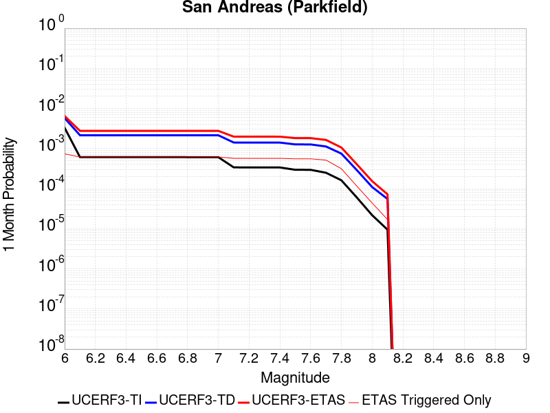
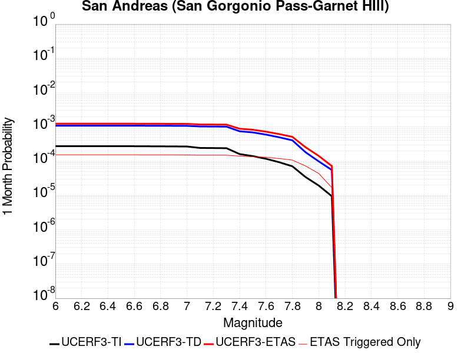
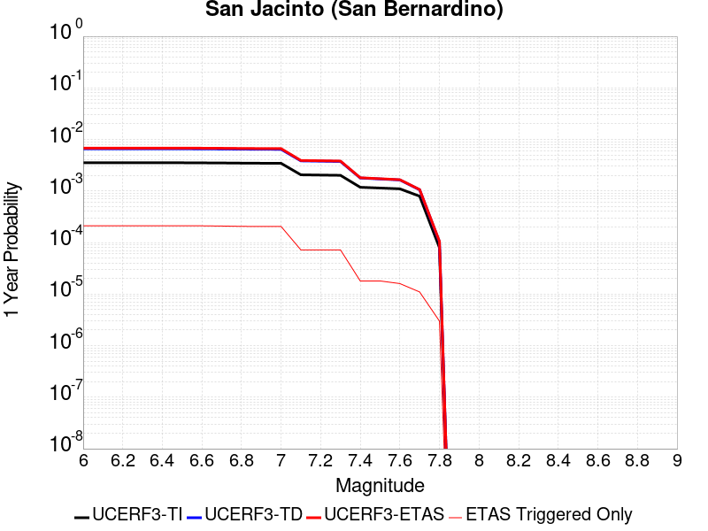
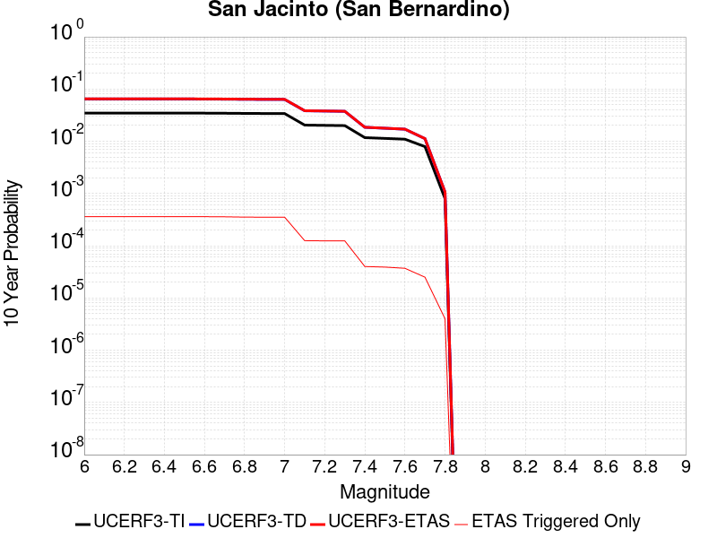
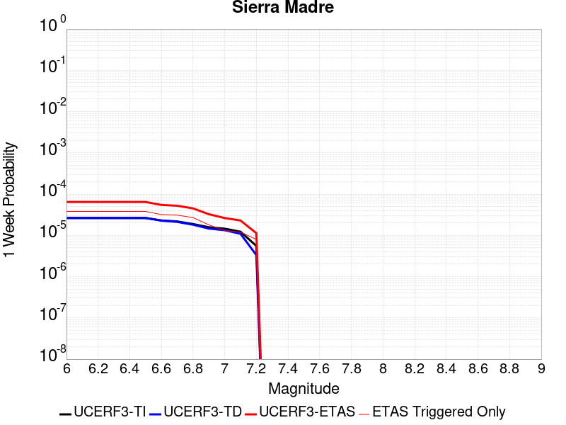
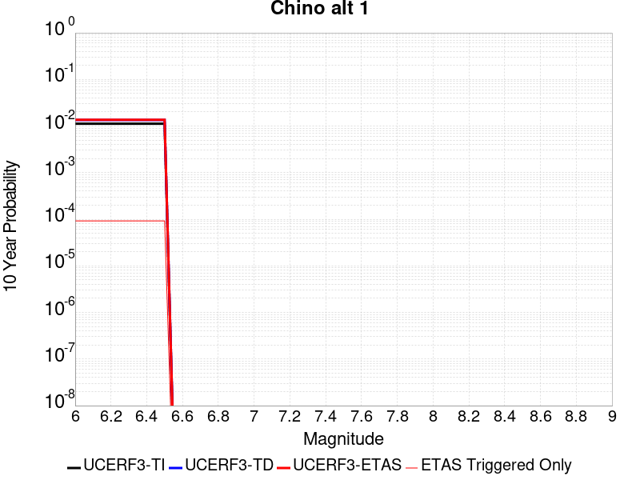
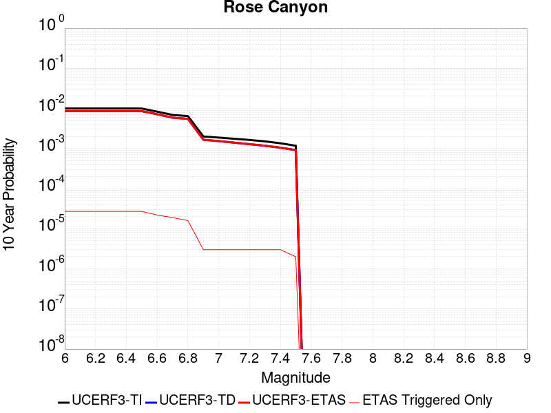
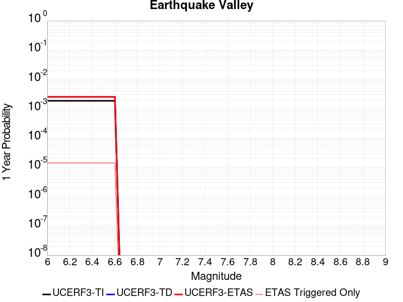
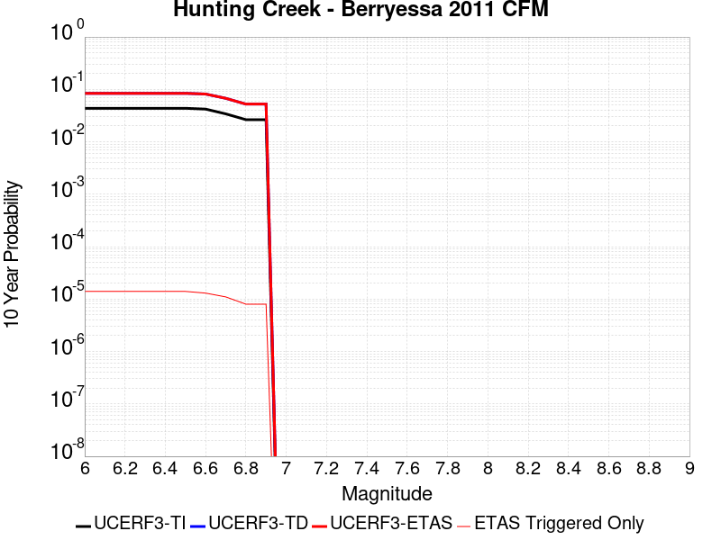
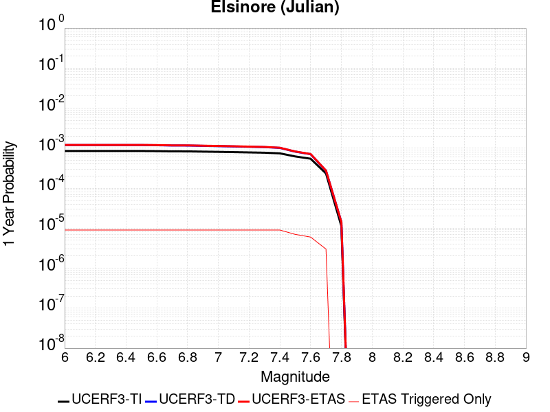

# Parent Section Magnitude-Probability Distributions

Only fault sections with at least one triggered aftershock are plotted. Sections are sorted by total supraseismogenic trigger rate (decreasing)

## Table Of Contents

* [Tank Canyon](#tank-canyon)
* [Garlock (Central)](#garlock-central)
* [Little Lake](#little-lake)
* [Owl Lake](#owl-lake)
* [Garlock (West)](#garlock-west)
* [Garlock (East)](#garlock-east)
* [Death Valley (So)](#death-valley-so)
* [Panamint Valley](#panamint-valley)
* [San Andreas (Mojave N)](#san-andreas-mojave-n)
* [San Andreas (Big Bend)](#san-andreas-big-bend)
* [San Andreas (Mojave S)](#san-andreas-mojave-s)
* [San Andreas (Carrizo) rev](#san-andreas-carrizo-rev)
* [Blackwater](#blackwater)
* [San Andreas (Cholame) rev](#san-andreas-cholame-rev)
* [San Andreas (Parkfield)](#san-andreas-parkfield)
* [Death Valley (Black Mtns Frontal)](#death-valley-black-mtns-frontal)
* [Hunter Mountain-Saline Valley](#hunter-mountain-saline-valley)
* [San Andreas (San Bernardino N)](#san-andreas-san-bernardino-n)
* [Cucamonga](#cucamonga)
* [Pleito](#pleito)
* [San Cayetano](#san-cayetano)
* [Death Valley (No)](#death-valley-no)
* [Gravel Hills-Harper Lk](#gravel-hills-harper-lk)
* [San Andreas (San Bernardino S)](#san-andreas-san-bernardino-s)
* [Cleghorn](#cleghorn)
* [Pitas Point (Lower West)](#pitas-point-lower-west)
* [Red Mountain](#red-mountain)
* [San Andreas (Coachella) rev](#san-andreas-coachella-rev)
* [Santa Ynez (West)](#santa-ynez-west)
* [San Andreas (San Gorgonio Pass-Garnet HIll)](#san-andreas-san-gorgonio-pass-garnet-hill)
* [San Jacinto (San Bernardino)](#san-jacinto-san-bernardino)
* [Santa Ynez (East)](#santa-ynez-east)
* [Pitas Point (Lower)-Montalvo](#pitas-point-lower-montalvo)
* [Lenwood-Lockhart-Old Woman Springs](#lenwood-lockhart-old-woman-springs)
* [So Sierra Nevada](#so-sierra-nevada)
* [Death Valley (Fish Lake Valley)](#death-valley-fish-lake-valley)
* [Santa Susana alt 1](#santa-susana-alt-1)
* [San Juan](#san-juan)
* [Sierra Madre](#sierra-madre)
* [Oak Ridge (Onshore)](#oak-ridge-onshore)
* [San Jacinto (Stepovers Combined)](#san-jacinto-stepovers-combined)
* [Raymond](#raymond)
* [San Jacinto (San Jacinto Valley) rev](#san-jacinto-san-jacinto-valley-rev)
* [Mission Ridge-Arroyo Parida-Santa Ana](#mission-ridge-arroyo-parida-santa-ana)
* [Clamshell-Sawpit](#clamshell-sawpit)
* [Elysian Park (Upper)](#elysian-park-upper)
* [Ventura-Pitas Point](#ventura-pitas-point)
* [Chino alt 1](#chino-alt-1)
* [Helendale-So Lockhart](#helendale-so-lockhart)
* [Channel Islands Thrust](#channel-islands-thrust)
* [Elsinore (Stepovers Combined)](#elsinore-stepovers-combined)
* [Calico-Hidalgo](#calico-hidalgo)
* [Simi-Santa Rosa](#simi-santa-rosa)
* [Elsinore (Glen Ivy) rev](#elsinore-glen-ivy-rev)
* [Whittier alt 1](#whittier-alt-1)
* [Los Alamos 2011 CFM](#los-alamos-2011-cfm)
* [Santa Cruz Island](#santa-cruz-island)
* [San Jose](#san-jose)
* [Verdugo](#verdugo)
* [San Jacinto (Anza) rev](#san-jacinto-anza-rev)
* [Independence rev 2011](#independence-rev-2011)
* [Hollywood](#hollywood)
* [San Gabriel](#san-gabriel)
* [Pinto Mtn](#pinto-mtn)
* [North Frontal  (West)](#north-frontal--west)
* [Santa Rosa Island](#santa-rosa-island)
* [Mono Lake 2011 CFM](#mono-lake-2011-cfm)
* [Calaveras (Central) 2011 CFM](#calaveras-central-2011-cfm)
* [Hayward (No) 2011 CFM](#hayward-no-2011-cfm)
* [Great Valley 12](#great-valley-12)
* [Imperial](#imperial)
* [San Jacinto (Clark) rev](#san-jacinto-clark-rev)
* [Newport-Inglewood (Offshore)](#newport-inglewood-offshore)
* [Concord 2011 CFM](#concord-2011-cfm)
* [Hayward (So) 2011 CFM](#hayward-so-2011-cfm)
* [Anacapa-Dume alt 1](#anacapa-dume-alt-1)
* [Sierra Madre (San Fernando)](#sierra-madre-san-fernando)
* [San Andreas (Creeping Section) 2011 CFM](#san-andreas-creeping-section-2011-cfm)
* [Green Valley 2011 CFM](#green-valley-2011-cfm)
* [Great Valley 10 (Panoche)](#great-valley-10-panoche)
* [Elsinore (Temecula) rev](#elsinore-temecula-rev)
* [San Jacinto (Superstition Mtn)](#san-jacinto-superstition-mtn)
* [Hosgri](#hosgri)
* [Holser alt 1](#holser-alt-1)
* [Santa Monica alt 1](#santa-monica-alt-1)
* [Great Valley 08 (Quinto)](#great-valley-08-quinto)
* [Deep Springs](#deep-springs)
* [Johnson Valley (No) 2011 rev](#johnson-valley-no-2011-rev)
* [Rose Canyon](#rose-canyon)
* [Great Valley 14 (Kettleman Hills)](#great-valley-14-kettleman-hills)
* [San Joaquin Hills](#san-joaquin-hills)
* [San Gregorio (North) 2011 CFM](#san-gregorio-north-2011-cfm)
* [Great Valley 11](#great-valley-11)
* [Puente Hills](#puente-hills)
* [Los Osos 2011](#los-osos-2011)
* [Casmalia 2011 CFM](#casmalia-2011-cfm)
* [Calaveras (No) 2011 CFM](#calaveras-no-2011-cfm)
* [Rodgers Creek - Healdsburg 2011 CFM](#rodgers-creek---healdsburg-2011-cfm)
* [San Gregorio (South) 2011 CFM](#san-gregorio-south-2011-cfm)
* [Emerson-Copper Mtn 2011](#emerson-copper-mtn-2011)
* [Palos Verdes](#palos-verdes)
* [San Jacinto (Borrego)](#san-jacinto-borrego)
* [San Jacinto (Coyote Creek)](#san-jacinto-coyote-creek)
* [Hat Creek-McArthur-Mayfield](#hat-creek-mcarthur-mayfield)
* [Coronado Bank alt1](#coronado-bank-alt1)
* [Great Valley 09 (Laguna Seca)](#great-valley-09-laguna-seca)
* [Newport-Inglewood alt 1](#newport-inglewood-alt-1)
* [North Frontal  (East)](#north-frontal--east)
* [Great Valley 04b Gordon Valley](#great-valley-04b-gordon-valley)
* [Round Valley](#round-valley)
* [Great Valley 07 (Orestimba)](#great-valley-07-orestimba)
* [Earthquake Valley](#earthquake-valley)
* [San Luis Range 2011 CFM](#san-luis-range-2011-cfm)
* [Malibu Coast alt 1](#malibu-coast-alt-1)
* [Honey Lake 2011 CFM](#honey-lake-2011-cfm)
* [White Mountains](#white-mountains)
* [Calaveras (So) 2011 CFM](#calaveras-so-2011-cfm)
* [Robinson Creek](#robinson-creek)
* [Ortigalita (South)](#ortigalita-south)
* [Great Valley 04a Trout Creek](#great-valley-04a-trout-creek)
* [Hunting Creek - Berryessa 2011 CFM](#hunting-creek---berryessa-2011-cfm)
* [Rinconada 2011 CFM](#rinconada-2011-cfm)
* [Ortigalita (North)](#ortigalita-north)
* [Bartlett Springs 2011 CFM](#bartlett-springs-2011-cfm)
* [Maacama 2011 CFM](#maacama-2011-cfm)
* [West Napa 2011 CFM](#west-napa-2011-cfm)
* [Elsinore (Coyote Mountains)](#elsinore-coyote-mountains)
* [Likely 2011 CFM](#likely-2011-cfm)
* [Pisgah-Bullion Mtn-Mesquite Lk](#pisgah-bullion-mtn-mesquite-lk)
* [Hartley Springs 2011 CFM](#hartley-springs-2011-cfm)
* [Elsinore (Julian)](#elsinore-julian)
* [Collayami 2011 CFM](#collayami-2011-cfm)
* [Point Reyes 2011 CFM](#point-reyes-2011-cfm)
* [Great Valley 03 Mysterious Ridge](#great-valley-03-mysterious-ridge)
* [Little Salmon (Onshore)](#little-salmon-onshore)
* [Greenville (No) 2011 CFM](#greenville-no-2011-cfm)
* [Burnt Mtn](#burnt-mtn)
* [Gillem - Big Crack 2011 CFM](#gillem---big-crack-2011-cfm)
* [Lions Head 2011 CFM](#lions-head-2011-cfm)
* [West Tahoe](#west-tahoe)

## Tank Canyon
*[(top)](#table-of-contents)*

| 1 Week | 1 Month | 1 Year | 10 Year |
|-----|-----|-----|-----|
|  |  |  |  |

| Magnitude | 1 wk TI Prob | 1 wk TD Prob | 1 wk ETAS Prob | 1 wk ETAS/TD Gain | 1 wk ETAS Triggered Only | 1 mo TI Prob | 1 mo TD Prob | 1 mo ETAS Prob | 1 mo ETAS/TD Gain | 1 mo ETAS Triggered Only | 1 yr TI Prob | 1 yr TD Prob | 1 yr ETAS Prob | 1 yr ETAS/TD Gain | 1 yr ETAS Triggered Only | 10 yr TI Prob | 10 yr TD Prob | 10 yr ETAS Prob | 10 yr ETAS/TD Gain | 10 yr ETAS Triggered Only |
|-----|-----|-----|-----|-----|-----|-----|-----|-----|-----|-----|-----|-----|-----|-----|-----|-----|-----|-----|-----|-----|
| 6.0 | 2.7748038E-5 | 3.5073965E-5 | 0.020781234 | 592.49744 | 0.020746889 | 1.18914744E-4 | 1.5031699E-4 | 0.027787307 | 184.85805 | 0.027641144 | 0.0014468255 | 0.0018300817 | 0.043500878 | 23.769909 | 0.041747198 | 0.014374418 | 0.018297758 | 0.074073195 | 4.0482116 | 0.056815024 |
| 6.1 | 2.7748038E-5 | 3.5073965E-5 | 0.020781234 | 592.49744 | 0.020746889 | 1.18914744E-4 | 1.5031699E-4 | 0.027787307 | 184.85805 | 0.027641144 | 0.0014468255 | 0.0018300817 | 0.043500878 | 23.769909 | 0.041747198 | 0.014374418 | 0.018297758 | 0.074073195 | 4.0482116 | 0.056815024 |
| 6.2 | 2.7748038E-5 | 3.5073965E-5 | 0.020781234 | 592.49744 | 0.020746889 | 1.18914744E-4 | 1.5031699E-4 | 0.027787307 | 184.85805 | 0.027641144 | 0.0014468255 | 0.0018300817 | 0.043500878 | 23.769909 | 0.041747198 | 0.014374418 | 0.018297758 | 0.074073195 | 4.0482116 | 0.056815024 |
| 6.3 | 2.7748038E-5 | 3.5073965E-5 | 0.020781234 | 592.49744 | 0.020746889 | 1.18914744E-4 | 1.5031699E-4 | 0.027787307 | 184.85805 | 0.027641144 | 0.0014468255 | 0.0018300817 | 0.043500878 | 23.769909 | 0.041747198 | 0.014374418 | 0.018297758 | 0.074073195 | 4.0482116 | 0.056815024 |

## Garlock (Central)
*[(top)](#table-of-contents)*

| 1 Week | 1 Month | 1 Year | 10 Year |
|-----|-----|-----|-----|
|  |  |  |  |

| Magnitude | 1 wk TI Prob | 1 wk TD Prob | 1 wk ETAS Prob | 1 wk ETAS/TD Gain | 1 wk ETAS Triggered Only | 1 mo TI Prob | 1 mo TD Prob | 1 mo ETAS Prob | 1 mo ETAS/TD Gain | 1 mo ETAS Triggered Only | 1 yr TI Prob | 1 yr TD Prob | 1 yr ETAS Prob | 1 yr ETAS/TD Gain | 1 yr ETAS Triggered Only | 10 yr TI Prob | 10 yr TD Prob | 10 yr ETAS Prob | 10 yr ETAS/TD Gain | 10 yr ETAS Triggered Only |
|-----|-----|-----|-----|-----|-----|-----|-----|-----|-----|-----|-----|-----|-----|-----|-----|-----|-----|-----|-----|-----|
| 6.0 | 2.575808E-5 | 1.9313613E-5 | 0.011761917 | 608.9962 | 0.01174283 | 1.10387096E-4 | 8.277037E-5 | 0.01479215 | 178.7131 | 0.014710597 | 0.0013431342 | 0.0010073289 | 0.021284942 | 21.130083 | 0.020298058 | 0.013350452 | 0.0100695705 | 0.035570513 | 3.5324757 | 0.025760338 |
| 6.1 | 2.575808E-5 | 1.9313613E-5 | 0.011761917 | 608.9962 | 0.01174283 | 1.10387096E-4 | 8.277037E-5 | 0.01479215 | 178.7131 | 0.014710597 | 0.0013431342 | 0.0010073289 | 0.021284942 | 21.130083 | 0.020298058 | 0.013350452 | 0.0100695705 | 0.035570513 | 3.5324757 | 0.025760338 |
| 6.2 | 2.575808E-5 | 1.9313613E-5 | 0.011761917 | 608.9962 | 0.01174283 | 1.10387096E-4 | 8.277037E-5 | 0.01479215 | 178.7131 | 0.014710597 | 0.0013431342 | 0.0010073289 | 0.021284942 | 21.130083 | 0.020298058 | 0.013350452 | 0.0100695705 | 0.035570513 | 3.5324757 | 0.025760338 |
| 6.3 | 2.575808E-5 | 1.9313613E-5 | 0.011761917 | 608.9962 | 0.01174283 | 1.10387096E-4 | 8.277037E-5 | 0.01479215 | 178.7131 | 0.014710597 | 0.0013431342 | 0.0010073289 | 0.021284942 | 21.130083 | 0.020298058 | 0.013350452 | 0.0100695705 | 0.035570513 | 3.5324757 | 0.025760338 |
| 6.4 | 2.575808E-5 | 1.9313613E-5 | 0.011761917 | 608.9962 | 0.01174283 | 1.10387096E-4 | 8.277037E-5 | 0.01479215 | 178.7131 | 0.014710597 | 0.0013431342 | 0.0010073289 | 0.021284942 | 21.130083 | 0.020298058 | 0.013350452 | 0.0100695705 | 0.035570513 | 3.5324757 | 0.025760338 |
| 6.5 | 2.575808E-5 | 1.9313613E-5 | 0.011761917 | 608.9962 | 0.01174283 | 1.10387096E-4 | 8.277037E-5 | 0.01479215 | 178.7131 | 0.014710597 | 0.0013431342 | 0.0010073289 | 0.021284942 | 21.130083 | 0.020298058 | 0.013350452 | 0.0100695705 | 0.035570513 | 3.5324757 | 0.025760338 |
| 6.6 | 2.540234E-5 | 1.885198E-5 | 0.011282109 | 598.45746 | 0.011263468 | 1.0886263E-4 | 8.0792066E-5 | 0.0142040225 | 175.80962 | 0.014124371 | 0.0013245966 | 9.83265E-4 | 0.020459149 | 20.80736 | 0.019495051 | 0.013167289 | 0.009831364 | 0.034322634 | 3.4911363 | 0.024734443 |
| 6.7 | 2.4966947E-5 | 1.8286464E-5 | 0.010799143 | 590.55396 | 0.010781054 | 1.06996806E-4 | 7.8368575E-5 | 0.013594083 | 173.46344 | 0.0135167735 | 0.0013019076 | 9.5378514E-4 | 0.01960665 | 20.556673 | 0.018670673 | 0.012943068 | 0.009539624 | 0.03297664 | 3.4568071 | 0.02366275 |
| 6.8 | 2.4548952E-5 | 1.7797542E-5 | 0.01038953 | 583.7621 | 0.010371917 | 1.0520555E-4 | 7.627332E-5 | 0.013060789 | 171.23668 | 0.012985506 | 0.001280125 | 9.282974E-4 | 0.018812932 | 20.26606 | 0.017901251 | 0.012727758 | 0.009286596 | 0.03174953 | 3.4188554 | 0.022673493 |
| 6.9 | 2.3994342E-5 | 1.7148153E-5 | 0.009723289 | 567.01666 | 0.009706307 | 1.0282884E-4 | 7.349039E-5 | 0.012224564 | 166.34236 | 0.012151967 | 0.0012512221 | 8.944436E-4 | 0.017644888 | 19.727222 | 0.01676544 | 0.012442005 | 0.0089510605 | 0.029999416 | 3.351493 | 0.021238463 |
| 7.0 | 2.343005E-5 | 1.6491087E-5 | 0.009133369 | 553.8367 | 0.009117029 | 1.0041064E-4 | 7.067455E-5 | 0.01151653 | 162.9516 | 0.011446664 | 0.0012218138 | 8.601883E-4 | 0.016635004 | 19.338795 | 0.015788397 | 0.01215118 | 0.008610493 | 0.028452266 | 3.3043718 | 0.020014105 |
| 7.1 | 2.2814058E-5 | 1.5782754E-5 | 0.008589196 | 544.214 | 0.008573549 | 9.777087E-5 | 6.763899E-5 | 0.010820487 | 159.97409 | 0.010753575 | 0.0011897103 | 8.2325895E-4 | 0.015616318 | 18.968903 | 0.014805248 | 0.011833611 | 0.00824334 | 0.026896369 | 3.2627997 | 0.018808069 |
| 7.2 | 2.2145266E-5 | 1.5027377E-5 | 0.007986964 | 531.4942 | 0.007972057 | 9.490483E-5 | 6.440182E-5 | 0.010063178 | 156.2561 | 0.00999942 | 0.0011548538 | 7.8387547E-4 | 0.014506664 | 18.506338 | 0.013733555 | 0.011488707 | 0.007851825 | 0.02513995 | 3.201797 | 0.017424943 |
| 7.3 | 1.9954436E-5 | 1.3199953E-5 | 0.006421904 | 486.50958 | 0.0064087887 | 8.551621E-5 | 5.657036E-5 | 0.008070919 | 142.67046 | 0.008014802 | 0.0010406625 | 6.8859005E-4 | 0.011745978 | 17.058012 | 0.011065007 | 0.010358025 | 0.006900618 | 0.0208123 | 3.0160053 | 0.014008348 |
| 7.4 | 1.918037E-5 | 1.2553606E-5 | 0.006039609 | 481.10553 | 0.0060271313 | 8.2198996E-5 | 5.3800417E-5 | 0.0075827297 | 140.94183 | 0.007529334 | 0.0010003132 | 6.5488677E-4 | 0.011029165 | 16.841331 | 0.010381077 | 0.009958224 | 0.006564366 | 0.019622358 | 2.9892237 | 0.013144275 |
| 7.5 | 1.6994161E-5 | 1.0764553E-5 | 0.00465472 | 432.41183 | 0.0046440056 | 7.283008E-5 | 4.613333E-5 | 0.0058623212 | 127.073456 | 0.0058164564 | 8.863455E-4 | 5.615903E-4 | 0.008492552 | 15.122326 | 0.007935418 | 0.008828186 | 0.005632708 | 0.015609201 | 2.7711716 | 0.010033006 |
| 7.6 | 1.621788E-5 | 1.012848E-5 | 0.0043640304 | 430.86722 | 0.004353946 | 6.950335E-5 | 4.34074E-5 | 0.005484077 | 126.33968 | 0.0054409057 | 8.458747E-4 | 5.2841863E-4 | 0.007937811 | 15.021824 | 0.0074133105 | 0.0084266225 | 0.005301458 | 0.014628303 | 2.7592983 | 0.009376556 |
| 7.7 | 7.713584E-6 | 3.2171508E-6 | 0.0012336762 | 383.46854 | 0.0012304629 | 3.3057797E-5 | 1.378779E-5 | 0.0015190232 | 110.17163 | 0.0015052562 | 4.0240434E-4 | 1.6786634E-4 | 0.0022528914 | 13.420746 | 0.0020853751 | 0.0040167645 | 0.0016902693 | 0.0044213645 | 2.615775 | 0.002735719 |

## Little Lake
*[(top)](#table-of-contents)*

| 1 Week | 1 Month | 1 Year | 10 Year |
|-----|-----|-----|-----|
|  |  |  |  |

| Magnitude | 1 wk TI Prob | 1 wk TD Prob | 1 wk ETAS Prob | 1 wk ETAS/TD Gain | 1 wk ETAS Triggered Only | 1 mo TI Prob | 1 mo TD Prob | 1 mo ETAS Prob | 1 mo ETAS/TD Gain | 1 mo ETAS Triggered Only | 1 yr TI Prob | 1 yr TD Prob | 1 yr ETAS Prob | 1 yr ETAS/TD Gain | 1 yr ETAS Triggered Only | 10 yr TI Prob | 10 yr TD Prob | 10 yr ETAS Prob | 10 yr ETAS/TD Gain | 10 yr ETAS Triggered Only |
|-----|-----|-----|-----|-----|-----|-----|-----|-----|-----|-----|-----|-----|-----|-----|-----|-----|-----|-----|-----|-----|
| 6.0 | 1.27106505E-5 | 1.3900362E-5 | 0.01142682 | 822.05194 | 0.011413079 | 5.447308E-5 | 5.957219E-5 | 0.0145708425 | 244.59135 | 0.014512135 | 6.630079E-4 | 7.25151E-4 | 0.020895602 | 28.81552 | 0.020185089 | 0.006610333 | 0.0072377534 | 0.03279952 | 4.5317264 | 0.025748124 |
| 6.1 | 1.27106505E-5 | 1.3900362E-5 | 0.01142682 | 822.05194 | 0.011413079 | 5.447308E-5 | 5.957219E-5 | 0.0145708425 | 244.59135 | 0.014512135 | 6.630079E-4 | 7.25151E-4 | 0.020895602 | 28.81552 | 0.020185089 | 0.006610333 | 0.0072377534 | 0.03279952 | 4.5317264 | 0.025748124 |
| 6.2 | 1.27106505E-5 | 1.3900362E-5 | 0.01142682 | 822.05194 | 0.011413079 | 5.447308E-5 | 5.957219E-5 | 0.0145708425 | 244.59135 | 0.014512135 | 6.630079E-4 | 7.25151E-4 | 0.020895602 | 28.81552 | 0.020185089 | 0.006610333 | 0.0072377534 | 0.03279952 | 4.5317264 | 0.025748124 |
| 6.3 | 1.27106505E-5 | 1.3900362E-5 | 0.01142682 | 822.05194 | 0.011413079 | 5.447308E-5 | 5.957219E-5 | 0.0145708425 | 244.59135 | 0.014512135 | 6.630079E-4 | 7.25151E-4 | 0.020895602 | 28.81552 | 0.020185089 | 0.006610333 | 0.0072377534 | 0.03279952 | 4.5317264 | 0.025748124 |
| 6.4 | 1.27106505E-5 | 1.3900362E-5 | 0.01142682 | 822.05194 | 0.011413079 | 5.447308E-5 | 5.957219E-5 | 0.0145708425 | 244.59135 | 0.014512135 | 6.630079E-4 | 7.25151E-4 | 0.020895602 | 28.81552 | 0.020185089 | 0.006610333 | 0.0072377534 | 0.03279952 | 4.5317264 | 0.025748124 |
| 6.5 | 1.27106505E-5 | 1.3900362E-5 | 0.01142682 | 822.05194 | 0.011413079 | 5.447308E-5 | 5.957219E-5 | 0.0145708425 | 244.59135 | 0.014512135 | 6.630079E-4 | 7.25151E-4 | 0.020895602 | 28.81552 | 0.020185089 | 0.006610333 | 0.0072377534 | 0.03279952 | 4.5317264 | 0.025748124 |
| 6.6 | 1.08505255E-5 | 1.1856941E-5 | 0.00970889 | 818.836 | 0.009697148 | 4.6501424E-5 | 5.0815026E-5 | 0.0123884035 | 243.7941 | 0.0123382155 | 5.6600774E-4 | 6.1859656E-4 | 0.017709315 | 28.628216 | 0.017101297 | 0.005645683 | 0.006178476 | 0.027892595 | 4.514478 | 0.021849114 |
| 6.7 | 7.97625E-6 | 8.706619E-6 | 0.0070799906 | 813.17334 | 0.0070713456 | 3.4183482E-5 | 3.7314083E-5 | 0.00903493 | 242.1319 | 0.008997952 | 4.161044E-4 | 4.5429895E-4 | 0.013024955 | 28.670448 | 0.01257637 | 0.004153261 | 0.0045429897 | 0.020615268 | 4.53782 | 0.016145628 |
| 6.8 | 7.97625E-6 | 8.706619E-6 | 0.0070799906 | 813.17334 | 0.0070713456 | 3.4183482E-5 | 3.7314083E-5 | 0.00903493 | 242.1319 | 0.008997952 | 4.161044E-4 | 4.5429895E-4 | 0.013024955 | 28.670448 | 0.01257637 | 0.004153261 | 0.0045429897 | 0.020615268 | 4.53782 | 0.016145628 |

## Owl Lake
*[(top)](#table-of-contents)*

| 1 Week | 1 Month | 1 Year | 10 Year |
|-----|-----|-----|-----|
|  |  |  |  |

| Magnitude | 1 wk TI Prob | 1 wk TD Prob | 1 wk ETAS Prob | 1 wk ETAS/TD Gain | 1 wk ETAS Triggered Only | 1 mo TI Prob | 1 mo TD Prob | 1 mo ETAS Prob | 1 mo ETAS/TD Gain | 1 mo ETAS Triggered Only | 1 yr TI Prob | 1 yr TD Prob | 1 yr ETAS Prob | 1 yr ETAS/TD Gain | 1 yr ETAS Triggered Only | 10 yr TI Prob | 10 yr TD Prob | 10 yr ETAS Prob | 10 yr ETAS/TD Gain | 10 yr ETAS Triggered Only |
|-----|-----|-----|-----|-----|-----|-----|-----|-----|-----|-----|-----|-----|-----|-----|-----|-----|-----|-----|-----|-----|
| 6.0 | 3.637175E-5 | 4.988367E-5 | 0.0043791877 | 87.787994 | 0.00432952 | 1.5586962E-4 | 2.1378716E-4 | 0.006346471 | 29.685932 | 0.0061339955 | 0.0018960608 | 0.0026025574 | 0.0124510955 | 4.7841773 | 0.009874236 | 0.018799646 | 0.025995217 | 0.039609678 | 1.5237293 | 0.013977815 |
| 6.1 | 3.637175E-5 | 4.988367E-5 | 0.0043791877 | 87.787994 | 0.00432952 | 1.5586962E-4 | 2.1378716E-4 | 0.006346471 | 29.685932 | 0.0061339955 | 0.0018960608 | 0.0026025574 | 0.0124510955 | 4.7841773 | 0.009874236 | 0.018799646 | 0.025995217 | 0.039609678 | 1.5237293 | 0.013977815 |
| 6.2 | 3.637175E-5 | 4.988367E-5 | 0.0043791877 | 87.787994 | 0.00432952 | 1.5586962E-4 | 2.1378716E-4 | 0.006346471 | 29.685932 | 0.0061339955 | 0.0018960608 | 0.0026025574 | 0.0124510955 | 4.7841773 | 0.009874236 | 0.018799646 | 0.025995217 | 0.039609678 | 1.5237293 | 0.013977815 |
| 6.3 | 3.637175E-5 | 4.988367E-5 | 0.0043791877 | 87.787994 | 0.00432952 | 1.5586962E-4 | 2.1378716E-4 | 0.006346471 | 29.685932 | 0.0061339955 | 0.0018960608 | 0.0026025574 | 0.0124510955 | 4.7841773 | 0.009874236 | 0.018799646 | 0.025995217 | 0.039609678 | 1.5237293 | 0.013977815 |
| 6.4 | 3.637175E-5 | 4.988367E-5 | 0.0043791877 | 87.787994 | 0.00432952 | 1.5586962E-4 | 2.1378716E-4 | 0.006346471 | 29.685932 | 0.0061339955 | 0.0018960608 | 0.0026025574 | 0.0124510955 | 4.7841773 | 0.009874236 | 0.018799646 | 0.025995217 | 0.039609678 | 1.5237293 | 0.013977815 |
| 6.5 | 3.637175E-5 | 4.988367E-5 | 0.0043791877 | 87.787994 | 0.00432952 | 1.5586962E-4 | 2.1378716E-4 | 0.006346471 | 29.685932 | 0.0061339955 | 0.0018960608 | 0.0026025574 | 0.0124510955 | 4.7841773 | 0.009874236 | 0.018799646 | 0.025995217 | 0.039609678 | 1.5237293 | 0.013977815 |

## Garlock (West)
*[(top)](#table-of-contents)*

| 1 Week | 1 Month | 1 Year | 10 Year |
|-----|-----|-----|-----|
|  |  |  |  |

| Magnitude | 1 wk TI Prob | 1 wk TD Prob | 1 wk ETAS Prob | 1 wk ETAS/TD Gain | 1 wk ETAS Triggered Only | 1 mo TI Prob | 1 mo TD Prob | 1 mo ETAS Prob | 1 mo ETAS/TD Gain | 1 mo ETAS Triggered Only | 1 yr TI Prob | 1 yr TD Prob | 1 yr ETAS Prob | 1 yr ETAS/TD Gain | 1 yr ETAS Triggered Only | 10 yr TI Prob | 10 yr TD Prob | 10 yr ETAS Prob | 10 yr ETAS/TD Gain | 10 yr ETAS Triggered Only |
|-----|-----|-----|-----|-----|-----|-----|-----|-----|-----|-----|-----|-----|-----|-----|-----|-----|-----|-----|-----|-----|
| 6.0 | 2.516656E-5 | 1.8065048E-5 | 0.005440553 | 301.1646 | 0.005422586 | 1.07852225E-4 | 7.741977E-5 | 0.006876499 | 88.82097 | 0.0067996057 | 0.0013123099 | 9.42255E-4 | 0.010300824 | 10.932097 | 0.009367395 | 0.013045873 | 0.009421492 | 0.021198863 | 2.2500536 | 0.011889387 |
| 6.1 | 2.516656E-5 | 1.8065048E-5 | 0.005440553 | 301.1646 | 0.005422586 | 1.07852225E-4 | 7.741977E-5 | 0.006876499 | 88.82097 | 0.0067996057 | 0.0013123099 | 9.42255E-4 | 0.010300824 | 10.932097 | 0.009367395 | 0.013045873 | 0.009421492 | 0.021198863 | 2.2500536 | 0.011889387 |
| 6.2 | 2.516656E-5 | 1.8065048E-5 | 0.005440553 | 301.1646 | 0.005422586 | 1.07852225E-4 | 7.741977E-5 | 0.006876499 | 88.82097 | 0.0067996057 | 0.0013123099 | 9.42255E-4 | 0.010300824 | 10.932097 | 0.009367395 | 0.013045873 | 0.009421492 | 0.021198863 | 2.2500536 | 0.011889387 |
| 6.3 | 2.516656E-5 | 1.8065048E-5 | 0.005440553 | 301.1646 | 0.005422586 | 1.07852225E-4 | 7.741977E-5 | 0.006876499 | 88.82097 | 0.0067996057 | 0.0013123099 | 9.42255E-4 | 0.010300824 | 10.932097 | 0.009367395 | 0.013045873 | 0.009421492 | 0.021198863 | 2.2500536 | 0.011889387 |
| 6.4 | 2.516656E-5 | 1.8065048E-5 | 0.005440553 | 301.1646 | 0.005422586 | 1.07852225E-4 | 7.741977E-5 | 0.006876499 | 88.82097 | 0.0067996057 | 0.0013123099 | 9.42255E-4 | 0.010300824 | 10.932097 | 0.009367395 | 0.013045873 | 0.009421492 | 0.021198863 | 2.2500536 | 0.011889387 |
| 6.5 | 2.516656E-5 | 1.8065048E-5 | 0.005440553 | 301.1646 | 0.005422586 | 1.07852225E-4 | 7.741977E-5 | 0.006876499 | 88.82097 | 0.0067996057 | 0.0013123099 | 9.42255E-4 | 0.010300824 | 10.932097 | 0.009367395 | 0.013045873 | 0.009421492 | 0.021198863 | 2.2500536 | 0.011889387 |
| 6.6 | 2.498869E-5 | 1.7877663E-5 | 0.005440367 | 304.31085 | 0.005422586 | 1.07089996E-4 | 7.6616736E-5 | 0.0068757012 | 89.74151 | 0.0067996057 | 0.0013030408 | 9.3248655E-4 | 0.010291147 | 11.036242 | 0.009367395 | 0.012954267 | 0.009324339 | 0.021102866 | 2.2632022 | 0.011889387 |
| 6.7 | 2.4627925E-5 | 1.7497801E-5 | 0.0054338826 | 310.5466 | 0.0054164794 | 1.0554398E-4 | 7.498886E-5 | 0.0068679783 | 91.586655 | 0.006793499 | 0.0012842404 | 9.1268384E-4 | 0.010265429 | 11.247519 | 0.0093612885 | 0.012768441 | 0.009128104 | 0.020896861 | 2.2892883 | 0.011877174 |
| 6.8 | 2.4270235E-5 | 1.716136E-5 | 0.005430495 | 316.43735 | 0.0054134266 | 1.04011146E-4 | 7.354704E-5 | 0.0068634935 | 93.32114 | 0.0067904457 | 0.0012656 | 8.9514436E-4 | 0.010245003 | 11.445086 | 0.009358236 | 0.012584164 | 0.0089538675 | 0.020721668 | 2.31427 | 0.011874121 |
| 6.9 | 2.3913764E-5 | 1.6823105E-5 | 0.0054271054 | 322.5983 | 0.005410373 | 1.0248353E-4 | 7.2097464E-5 | 0.006859001 | 95.13512 | 0.0067873923 | 0.0012470228 | 8.775101E-4 | 0.010224483 | 11.651698 | 0.009355183 | 0.012400482 | 0.00877859 | 0.020545445 | 2.3404038 | 0.011871067 |
| 7.0 | 2.3579369E-5 | 1.6492264E-5 | 0.0054115104 | 328.12415 | 0.005395107 | 1.0105052E-4 | 7.067965E-5 | 0.0068423273 | 96.8076 | 0.006772126 | 0.0012295957 | 8.6026196E-4 | 0.010192144 | 11.847721 | 0.0093399165 | 0.012228143 | 0.008607132 | 0.020360889 | 2.3655832 | 0.011855801 |
| 7.1 | 2.3205374E-5 | 1.6105636E-5 | 0.005398913 | 335.21884 | 0.0053828936 | 9.944781E-5 | 6.902276E-5 | 0.0068162573 | 98.75375 | 0.0067477003 | 0.0012101046 | 8.401051E-4 | 0.010126415 | 12.053747 | 0.009294117 | 0.0120353615 | 0.008406721 | 0.020108357 | 2.3919382 | 0.011800842 |
| 7.2 | 2.2799322E-5 | 1.5676578E-5 | 0.005352688 | 341.4449 | 0.005337095 | 9.770772E-5 | 6.718404E-5 | 0.0067472635 | 100.42956 | 0.0066805286 | 0.0011889422 | 8.177357E-4 | 0.009976121 | 12.199689 | 0.00916588 | 0.011826012 | 0.008184515 | 0.019716162 | 2.4089592 | 0.011626806 |
| 7.3 | 1.8228246E-5 | 1.1798695E-5 | 0.0051961695 | 440.40207 | 0.005184432 | 7.811871E-5 | 5.0565202E-5 | 0.0065506226 | 129.54803 | 0.006500386 | 9.506803E-4 | 6.1551924E-4 | 0.009504185 | 15.440923 | 0.008894141 | 0.0094662355 | 0.006171021 | 0.017377121 | 2.815923 | 0.011275682 |
| 7.4 | 1.7670916E-5 | 1.132978E-5 | 0.005006403 | 441.88 | 0.00499513 | 7.5730306E-5 | 4.8555645E-5 | 0.0062921653 | 129.58669 | 0.0062439125 | 9.216264E-4 | 5.9106643E-4 | 0.009092416 | 15.383069 | 0.008506376 | 0.009178135 | 0.0059269792 | 0.01664717 | 2.8087106 | 0.010784107 |
| 7.5 | 1.6994161E-5 | 1.0764553E-5 | 0.00465472 | 432.41183 | 0.0046440056 | 7.283008E-5 | 4.613333E-5 | 0.0058623212 | 127.073456 | 0.0058164564 | 8.863455E-4 | 5.615903E-4 | 0.008492552 | 15.122326 | 0.007935418 | 0.008828186 | 0.005632708 | 0.015609201 | 2.7711716 | 0.010033006 |
| 7.6 | 1.621788E-5 | 1.012848E-5 | 0.0043640304 | 430.86722 | 0.004353946 | 6.950335E-5 | 4.34074E-5 | 0.005484077 | 126.33968 | 0.0054409057 | 8.458747E-4 | 5.2841863E-4 | 0.007937811 | 15.021824 | 0.0074133105 | 0.0084266225 | 0.005301458 | 0.014628303 | 2.7592983 | 0.009376556 |
| 7.7 | 7.713584E-6 | 3.2171508E-6 | 0.0012336762 | 383.46854 | 0.0012304629 | 3.3057797E-5 | 1.378779E-5 | 0.0015190232 | 110.17163 | 0.0015052562 | 4.0240434E-4 | 1.6786634E-4 | 0.0022528914 | 13.420746 | 0.0020853751 | 0.0040167645 | 0.0016902693 | 0.0044213645 | 2.615775 | 0.002735719 |

## Garlock (East)
*[(top)](#table-of-contents)*

| 1 Week | 1 Month | 1 Year | 10 Year |
|-----|-----|-----|-----|
|  |  |  |  |

| Magnitude | 1 wk TI Prob | 1 wk TD Prob | 1 wk ETAS Prob | 1 wk ETAS/TD Gain | 1 wk ETAS Triggered Only | 1 mo TI Prob | 1 mo TD Prob | 1 mo ETAS Prob | 1 mo ETAS/TD Gain | 1 mo ETAS Triggered Only | 1 yr TI Prob | 1 yr TD Prob | 1 yr ETAS Prob | 1 yr ETAS/TD Gain | 1 yr ETAS Triggered Only | 10 yr TI Prob | 10 yr TD Prob | 10 yr ETAS Prob | 10 yr ETAS/TD Gain | 10 yr ETAS Triggered Only |
|-----|-----|-----|-----|-----|-----|-----|-----|-----|-----|-----|-----|-----|-----|-----|-----|-----|-----|-----|-----|-----|
| 6.0 | 2.2327951E-5 | 1.8303952E-5 | 0.0044942982 | 245.53705 | 0.004476076 | 9.5687705E-5 | 7.8444085E-5 | 0.0057631643 | 73.46844 | 0.0056851665 | 0.0011643751 | 9.548048E-4 | 0.009221233 | 9.657716 | 0.008274329 | 0.0115829315 | 0.0096519785 | 0.020534592 | 2.1275008 | 0.010988675 |
| 6.1 | 2.2327951E-5 | 1.8303952E-5 | 0.0044942982 | 245.53705 | 0.004476076 | 9.5687705E-5 | 7.8444085E-5 | 0.0057631643 | 73.46844 | 0.0056851665 | 0.0011643751 | 9.548048E-4 | 0.009221233 | 9.657716 | 0.008274329 | 0.0115829315 | 0.0096519785 | 0.020534592 | 2.1275008 | 0.010988675 |
| 6.2 | 2.2327951E-5 | 1.8303952E-5 | 0.0044942982 | 245.53705 | 0.004476076 | 9.5687705E-5 | 7.8444085E-5 | 0.0057631643 | 73.46844 | 0.0056851665 | 0.0011643751 | 9.548048E-4 | 0.009221233 | 9.657716 | 0.008274329 | 0.0115829315 | 0.0096519785 | 0.020534592 | 2.1275008 | 0.010988675 |
| 6.3 | 2.2327951E-5 | 1.8303952E-5 | 0.0044942982 | 245.53705 | 0.004476076 | 9.5687705E-5 | 7.8444085E-5 | 0.0057631643 | 73.46844 | 0.0056851665 | 0.0011643751 | 9.548048E-4 | 0.009221233 | 9.657716 | 0.008274329 | 0.0115829315 | 0.0096519785 | 0.020534592 | 2.1275008 | 0.010988675 |
| 6.4 | 2.2327951E-5 | 1.8303952E-5 | 0.0044942982 | 245.53705 | 0.004476076 | 9.5687705E-5 | 7.8444085E-5 | 0.0057631643 | 73.46844 | 0.0056851665 | 0.0011643751 | 9.548048E-4 | 0.009221233 | 9.657716 | 0.008274329 | 0.0115829315 | 0.0096519785 | 0.020534592 | 2.1275008 | 0.010988675 |
| 6.5 | 2.2327951E-5 | 1.8303952E-5 | 0.0044942982 | 245.53705 | 0.004476076 | 9.5687705E-5 | 7.8444085E-5 | 0.0057631643 | 73.46844 | 0.0056851665 | 0.0011643751 | 9.548048E-4 | 0.009221233 | 9.657716 | 0.008274329 | 0.0115829315 | 0.0096519785 | 0.020534592 | 2.1275008 | 0.010988675 |
| 6.6 | 2.222123E-5 | 1.816971E-5 | 0.0044880584 | 247.00769 | 0.00446997 | 9.523036E-5 | 7.7868805E-5 | 0.0057503805 | 73.84704 | 0.0056729536 | 0.0011588129 | 9.4780687E-4 | 0.009192941 | 9.699171 | 0.008252956 | 0.011527888 | 0.009581773 | 0.02042887 | 2.1320553 | 0.010952037 |
| 6.7 | 2.2076227E-5 | 1.798404E-5 | 0.004481767 | 249.20801 | 0.004463863 | 9.4608964E-5 | 7.707312E-5 | 0.00574043 | 74.48031 | 0.0056637935 | 0.0011512554 | 9.381278E-4 | 0.00917114 | 9.776003 | 0.008240744 | 0.011453095 | 0.009485973 | 0.020309925 | 2.141048 | 0.01092761 |
| 6.8 | 2.1962227E-5 | 1.7854036E-5 | 0.004475531 | 250.67336 | 0.004457757 | 9.4120434E-5 | 7.651599E-5 | 0.0057337703 | 74.93558 | 0.005657687 | 0.0011453138 | 9.313506E-4 | 0.009152217 | 9.826823 | 0.00822853 | 0.01139429 | 0.00941876 | 0.020216225 | 2.1463785 | 0.010900131 |
| 6.9 | 1.1702579E-5 | 6.6732687E-6 | 0.003933137 | 589.38684 | 0.00392649 | 5.0152947E-5 | 2.8599494E-5 | 0.004919779 | 172.02328 | 0.004891319 | 6.10441E-4 | 3.481581E-4 | 0.007105718 | 20.409458 | 0.006759913 | 0.0060876687 | 0.0034954504 | 0.012035987 | 3.4433296 | 0.008570495 |
| 7.0 | 1.153538E-5 | 6.4796777E-6 | 0.0038596662 | 595.65717 | 0.0038532116 | 4.9436403E-5 | 2.7769835E-5 | 0.0048212516 | 173.6147 | 0.004793615 | 6.01722E-4 | 3.3806017E-4 | 0.0069705467 | 20.61925 | 0.0066347294 | 0.006000953 | 0.0033946347 | 0.011783891 | 3.4713283 | 0.008417833 |
| 7.1 | 1.135938E-5 | 6.273818E-6 | 0.0036579475 | 583.0497 | 0.0036516965 | 4.868215E-5 | 2.6887597E-5 | 0.004585279 | 170.5351 | 0.0045585143 | 5.925439E-4 | 3.2732222E-4 | 0.006639393 | 20.283966 | 0.0063141375 | 0.0059096646 | 0.0032873498 | 0.011297107 | 3.4365394 | 0.008036175 |
| 7.2 | 1.1168294E-5 | 6.048814E-6 | 0.0033646123 | 556.2433 | 0.0033585837 | 4.786324E-5 | 2.5923315E-5 | 0.0042301505 | 163.17938 | 0.004204336 | 5.825791E-4 | 3.1558552E-4 | 0.006145468 | 19.473225 | 0.0058317226 | 0.005810542 | 0.0031701238 | 0.01055689 | 3.330119 | 0.007410257 |
| 7.3 | 1.0952553E-5 | 5.8686815E-6 | 0.0031568124 | 537.90826 | 0.0031509623 | 4.693867E-5 | 2.5151334E-5 | 0.0039576488 | 157.35344 | 0.003932596 | 5.713284E-4 | 3.0618932E-4 | 0.0057606907 | 18.814146 | 0.005456172 | 0.0056986175 | 0.0030760262 | 0.009967339 | 3.2403297 | 0.006912576 |
| 7.4 | 1.0735812E-5 | 5.691247E-6 | 0.0029642815 | 520.8492 | 0.002958607 | 4.6009813E-5 | 2.4390914E-5 | 0.0037279024 | 152.8398 | 0.003703602 | 5.600255E-4 | 2.9693378E-4 | 0.005455408 | 18.37247 | 0.0051600058 | 0.0055861627 | 0.0029833042 | 0.009503872 | 3.1856863 | 0.0065400787 |
| 7.5 | 9.0273E-6 | 4.284415E-6 | 0.0017995924 | 420.03223 | 0.0017953156 | 3.8687853E-5 | 1.8361723E-5 | 0.0022685716 | 123.54894 | 0.0022502511 | 4.709228E-4 | 2.2354414E-4 | 0.0032791721 | 14.669014 | 0.0030563113 | 0.004699261 | 0.0022480614 | 0.006126121 | 2.7250686 | 0.0038867975 |
| 7.6 | 8.549585E-6 | 3.885532E-6 | 0.00159768 | 411.18695 | 0.0015938006 | 3.6640562E-5 | 1.6652246E-5 | 0.002001237 | 120.17819 | 0.0019846177 | 4.4600753E-4 | 2.027353E-4 | 0.0029165314 | 14.385908 | 0.0027143464 | 0.0044511347 | 0.0020396118 | 0.0054949443 | 2.6941128 | 0.0034623945 |
| 7.7 | 7.713584E-6 | 3.2171508E-6 | 0.0012336762 | 383.46854 | 0.0012304629 | 3.3057797E-5 | 1.378779E-5 | 0.0015190232 | 110.17163 | 0.0015052562 | 4.0240434E-4 | 1.6786634E-4 | 0.0022528914 | 13.420746 | 0.0020853751 | 0.0040167645 | 0.0016902693 | 0.0044213645 | 2.615775 | 0.002735719 |

## Death Valley (So)
*[(top)](#table-of-contents)*

| 1 Week | 1 Month | 1 Year | 10 Year |
|-----|-----|-----|-----|
|  |  |  |  |

| Magnitude | 1 wk TI Prob | 1 wk TD Prob | 1 wk ETAS Prob | 1 wk ETAS/TD Gain | 1 wk ETAS Triggered Only | 1 mo TI Prob | 1 mo TD Prob | 1 mo ETAS Prob | 1 mo ETAS/TD Gain | 1 mo ETAS Triggered Only | 1 yr TI Prob | 1 yr TD Prob | 1 yr ETAS Prob | 1 yr ETAS/TD Gain | 1 yr ETAS Triggered Only | 10 yr TI Prob | 10 yr TD Prob | 10 yr ETAS Prob | 10 yr ETAS/TD Gain | 10 yr ETAS Triggered Only |
|-----|-----|-----|-----|-----|-----|-----|-----|-----|-----|-----|-----|-----|-----|-----|-----|-----|-----|-----|-----|-----|
| 6.0 | 4.4658216E-5 | 6.228887E-5 | 0.002086473 | 33.49672 | 0.00202431 | 1.9137832E-4 | 2.669324E-4 | 0.0032369595 | 12.1265135 | 0.00297082 | 0.0023275411 | 0.0032461619 | 0.008401591 | 2.5881615 | 0.005172219 | 0.023033133 | 0.032094594 | 0.0397044 | 1.2371056 | 0.0078621395 |
| 6.1 | 4.4658216E-5 | 6.228887E-5 | 0.002086473 | 33.49672 | 0.00202431 | 1.9137832E-4 | 2.669324E-4 | 0.0032369595 | 12.1265135 | 0.00297082 | 0.0023275411 | 0.0032461619 | 0.008401591 | 2.5881615 | 0.005172219 | 0.023033133 | 0.032094594 | 0.0397044 | 1.2371056 | 0.0078621395 |
| 6.2 | 4.4658216E-5 | 6.228887E-5 | 0.002086473 | 33.49672 | 0.00202431 | 1.9137832E-4 | 2.669324E-4 | 0.0032369595 | 12.1265135 | 0.00297082 | 0.0023275411 | 0.0032461619 | 0.008401591 | 2.5881615 | 0.005172219 | 0.023033133 | 0.032094594 | 0.0397044 | 1.2371056 | 0.0078621395 |
| 6.3 | 4.4658216E-5 | 6.228887E-5 | 0.002086473 | 33.49672 | 0.00202431 | 1.9137832E-4 | 2.669324E-4 | 0.0032369595 | 12.1265135 | 0.00297082 | 0.0023275411 | 0.0032461619 | 0.008401591 | 2.5881615 | 0.005172219 | 0.023033133 | 0.032094594 | 0.0397044 | 1.2371056 | 0.0078621395 |
| 6.4 | 4.4658216E-5 | 6.228887E-5 | 0.002086473 | 33.49672 | 0.00202431 | 1.9137832E-4 | 2.669324E-4 | 0.0032369595 | 12.1265135 | 0.00297082 | 0.0023275411 | 0.0032461619 | 0.008401591 | 2.5881615 | 0.005172219 | 0.023033133 | 0.032094594 | 0.0397044 | 1.2371056 | 0.0078621395 |
| 6.5 | 4.4658216E-5 | 6.228887E-5 | 0.002086473 | 33.49672 | 0.00202431 | 1.9137832E-4 | 2.669324E-4 | 0.0032369595 | 12.1265135 | 0.00297082 | 0.0023275411 | 0.0032461619 | 0.008401591 | 2.5881615 | 0.005172219 | 0.023033133 | 0.032094594 | 0.0397044 | 1.2371056 | 0.0078621395 |
| 6.6 | 3.6853275E-5 | 5.1089468E-5 | 0.0017547203 | 34.34603 | 0.001703718 | 1.5793304E-4 | 2.1894388E-4 | 0.002709857 | 12.376947 | 0.0024914586 | 0.0019211388 | 0.0026635646 | 0.0070120036 | 2.6325638 | 0.0043600523 | 0.019046152 | 0.026430551 | 0.032824524 | 1.2419161 | 0.006567558 |
| 6.7 | 2.9971921E-5 | 4.1332314E-5 | 0.0014152416 | 34.24056 | 0.0013739661 | 1.2844476E-4 | 1.7713365E-4 | 0.0021766634 | 12.288255 | 0.001999884 | 0.0015626932 | 0.0021557007 | 0.005613678 | 2.6041083 | 0.0034654478 | 0.015517498 | 0.021467837 | 0.026642554 | 1.241045 | 0.005288243 |
| 6.8 | 2.8134293E-5 | 3.8737995E-5 | 0.001327163 | 34.259983 | 0.0012884749 | 1.2056997E-4 | 1.6601657E-4 | 0.0020465113 | 12.32715 | 0.0018808069 | 0.0014669509 | 0.0020206098 | 0.005293183 | 2.6195967 | 0.0032791991 | 0.014573049 | 0.020142367 | 0.025024915 | 1.242402 | 0.004982917 |
| 6.9 | 5.6768154E-6 | 7.307913E-6 | 6.531939E-5 | 8.938172 | 5.80119E-5 | 2.4328981E-5 | 3.1319494E-5 | 1.2291437E-4 | 3.9245322 | 9.1597736E-5 | 2.961651E-4 | 3.8129094E-4 | 5.1863515E-4 | 1.3602085 | 1.3739661E-4 | 0.0029577068 | 0.003810565 | 0.004023479 | 1.0558746 | 2.1372805E-4 |
| 7.0 | 5.556207E-6 | 7.1531585E-6 | 6.211141E-5 | 8.683075 | 5.4958644E-5 | 2.3812097E-5 | 3.0656276E-5 | 1.16144874E-4 | 3.788617 | 8.549122E-5 | 2.8987371E-4 | 3.7321905E-4 | 4.983559E-4 | 1.3352907 | 1.2518358E-4 | 0.002894959 | 0.003730121 | 0.0039308844 | 1.0538222 | 2.0151502E-4 |
| 7.1 | 5.418659E-6 | 6.9768143E-6 | 5.58286E-5 | 8.002019 | 4.885213E-5 | 2.3222618E-5 | 2.9900531E-5 | 1.0928287E-4 | 3.6548803 | 7.938471E-5 | 2.826987E-4 | 3.64021E-4 | 4.8000255E-4 | 1.3186123 | 1.160238E-4 | 0.0028233933 | 0.003638446 | 0.0038240172 | 1.0510029 | 1.8624874E-4 |
| 7.2 | 5.263499E-6 | 6.7766255E-6 | 5.562842E-5 | 8.208868 | 4.885213E-5 | 2.2557659E-5 | 2.90426E-5 | 1.0537183E-4 | 3.628182 | 7.633145E-5 | 2.7460488E-4 | 3.5357912E-4 | 4.665097E-4 | 1.3193928 | 1.1297055E-4 | 0.002742658 | 0.003534366 | 0.0037047442 | 1.0482061 | 1.7098244E-4 |
| 7.3 | 5.0913163E-6 | 6.5556187E-6 | 5.235419E-5 | 7.9861555 | 4.5798868E-5 | 2.1819744E-5 | 2.8095446E-5 | 1.0137158E-4 | 3.6081142 | 7.327819E-5 | 2.65623E-4 | 3.420512E-4 | 4.4887868E-4 | 1.3123143 | 1.0686403E-4 | 0.0026530572 | 0.0034194465 | 0.0035746302 | 1.0453827 | 1.5571616E-4 |
| 7.4 | 5.018449E-6 | 6.4618785E-6 | 4.9207214E-5 | 7.6150017 | 4.274561E-5 | 2.1507461E-5 | 2.7693712E-5 | 9.486353E-5 | 3.4254537 | 6.717168E-5 | 2.6182187E-4 | 3.371616E-4 | 4.348329E-4 | 1.2896869 | 9.770426E-5 | 0.0026151363 | 0.0033706997 | 0.0035137192 | 1.0424302 | 1.4350313E-4 |
| 7.5 | 4.993322E-6 | 6.430145E-6 | 4.917548E-5 | 7.647648 | 4.274561E-5 | 2.1399776E-5 | 2.7557713E-5 | 9.472754E-5 | 3.4374237 | 6.717168E-5 | 2.6051112E-4 | 3.3550634E-4 | 4.331778E-4 | 1.2911166 | 9.770426E-5 | 0.0026020592 | 0.003354197 | 0.0034972187 | 1.0426396 | 1.4350313E-4 |
| 7.6 | 4.882584E-6 | 6.2884383E-6 | 4.903378E-5 | 7.79745 | 4.274561E-5 | 2.0925192E-5 | 2.6950413E-5 | 9.4120274E-5 | 3.4923503 | 6.717168E-5 | 2.5473442E-4 | 3.2811466E-4 | 4.2578686E-4 | 1.297677 | 9.770426E-5 | 0.0025444264 | 0.0032805006 | 0.0034144032 | 1.0408177 | 1.3434335E-4 |
| 7.7 | 4.8153906E-6 | 6.202069E-6 | 4.5894176E-5 | 7.3998175 | 3.9692353E-5 | 2.0637224E-5 | 2.6580266E-5 | 8.153745E-5 | 3.0675933 | 5.4958644E-5 | 2.5122924E-4 | 3.2360948E-4 | 4.0907305E-4 | 1.2640947 | 8.549122E-5 | 0.002509454 | 0.0032355804 | 0.0033573157 | 1.0376239 | 1.2213032E-4 |
| 7.8 | 4.8153906E-6 | 6.202069E-6 | 4.5894176E-5 | 7.3998175 | 3.9692353E-5 | 2.0637224E-5 | 2.6580266E-5 | 8.153745E-5 | 3.0675933 | 5.4958644E-5 | 2.5122924E-4 | 3.2360948E-4 | 4.0907305E-4 | 1.2640947 | 8.549122E-5 | 0.002509454 | 0.0032355804 | 0.0033573157 | 1.0376239 | 1.2213032E-4 |

## Panamint Valley
*[(top)](#table-of-contents)*

| 1 Week | 1 Month | 1 Year | 10 Year |
|-----|-----|-----|-----|
|  |  |  |  |

| Magnitude | 1 wk TI Prob | 1 wk TD Prob | 1 wk ETAS Prob | 1 wk ETAS/TD Gain | 1 wk ETAS Triggered Only | 1 mo TI Prob | 1 mo TD Prob | 1 mo ETAS Prob | 1 mo ETAS/TD Gain | 1 mo ETAS Triggered Only | 1 yr TI Prob | 1 yr TD Prob | 1 yr ETAS Prob | 1 yr ETAS/TD Gain | 1 yr ETAS Triggered Only | 10 yr TI Prob | 10 yr TD Prob | 10 yr ETAS Prob | 10 yr ETAS/TD Gain | 10 yr ETAS Triggered Only |
|-----|-----|-----|-----|-----|-----|-----|-----|-----|-----|-----|-----|-----|-----|-----|-----|-----|-----|-----|-----|-----|
| 6.0 | 2.4839064E-5 | 2.5506472E-5 | 0.0022268493 | 87.30527 | 0.002201399 | 1.0644879E-4 | 1.09309134E-4 | 0.0029485286 | 26.97422 | 0.00283953 | 0.0012952434 | 0.0013300732 | 0.0057453103 | 4.3195443 | 0.0044211177 | 0.0128772 | 0.013225966 | 0.019456593 | 1.4710906 | 0.0063141375 |
| 6.1 | 2.4839064E-5 | 2.5506472E-5 | 0.0022268493 | 87.30527 | 0.002201399 | 1.0644879E-4 | 1.09309134E-4 | 0.0029485286 | 26.97422 | 0.00283953 | 0.0012952434 | 0.0013300732 | 0.0057453103 | 4.3195443 | 0.0044211177 | 0.0128772 | 0.013225966 | 0.019456593 | 1.4710906 | 0.0063141375 |
| 6.2 | 2.4839064E-5 | 2.5506472E-5 | 0.0022268493 | 87.30527 | 0.002201399 | 1.0644879E-4 | 1.09309134E-4 | 0.0029485286 | 26.97422 | 0.00283953 | 0.0012952434 | 0.0013300732 | 0.0057453103 | 4.3195443 | 0.0044211177 | 0.0128772 | 0.013225966 | 0.019456593 | 1.4710906 | 0.0063141375 |
| 6.3 | 2.4839064E-5 | 2.5506472E-5 | 0.0022268493 | 87.30527 | 0.002201399 | 1.0644879E-4 | 1.09309134E-4 | 0.0029485286 | 26.97422 | 0.00283953 | 0.0012952434 | 0.0013300732 | 0.0057453103 | 4.3195443 | 0.0044211177 | 0.0128772 | 0.013225966 | 0.019456593 | 1.4710906 | 0.0063141375 |
| 6.4 | 2.4839064E-5 | 2.5506472E-5 | 0.0022268493 | 87.30527 | 0.002201399 | 1.0644879E-4 | 1.09309134E-4 | 0.0029485286 | 26.97422 | 0.00283953 | 0.0012952434 | 0.0013300732 | 0.0057453103 | 4.3195443 | 0.0044211177 | 0.0128772 | 0.013225966 | 0.019456593 | 1.4710906 | 0.0063141375 |
| 6.5 | 2.4839064E-5 | 2.5506472E-5 | 0.0022268493 | 87.30527 | 0.002201399 | 1.0644879E-4 | 1.09309134E-4 | 0.0029485286 | 26.97422 | 0.00283953 | 0.0012952434 | 0.0013300732 | 0.0057453103 | 4.3195443 | 0.0044211177 | 0.0128772 | 0.013225966 | 0.019456593 | 1.4710906 | 0.0063141375 |
| 6.6 | 2.151644E-5 | 2.1799351E-5 | 0.001835395 | 84.19495 | 0.0018136352 | 9.221006E-5 | 9.34227E-5 | 0.0024350528 | 26.064894 | 0.0023418488 | 0.0011220792 | 0.001136874 | 0.004824066 | 4.243273 | 0.003691389 | 0.011164304 | 0.0113152405 | 0.016480252 | 1.4564651 | 0.0052241245 |
| 6.7 | 2.0301508E-5 | 2.043303E-5 | 0.0017180098 | 84.08003 | 0.0016976114 | 8.7003566E-5 | 8.7567445E-5 | 0.0022765617 | 25.997808 | 0.002189186 | 0.0010587536 | 0.001065658 | 0.0044664126 | 4.191225 | 0.0034043826 | 0.010537235 | 0.01061009 | 0.015389094 | 1.4504207 | 0.0048302542 |
| 6.8 | 1.782843E-5 | 1.789433E-5 | 0.0014925916 | 83.41142 | 0.0014747236 | 7.640532E-5 | 7.668799E-5 | 0.0019665097 | 25.642996 | 0.0018899667 | 9.298377E-4 | 9.3332166E-4 | 0.0038739152 | 4.1506753 | 0.0029433407 | 0.009259567 | 0.009298533 | 0.013427477 | 1.4440424 | 0.004167697 |
| 6.9 | 1.6185495E-5 | 1.6192123E-5 | 0.0013260186 | 81.892815 | 0.0013098477 | 6.936456E-5 | 6.939322E-5 | 0.0017455155 | 25.153976 | 0.0016762386 | 8.4418635E-4 | 8.4458006E-4 | 0.0034559616 | 4.091929 | 0.002613589 | 0.008409866 | 0.008418168 | 0.012096647 | 1.4369692 | 0.0037097083 |
| 7.0 | 1.4473978E-5 | 1.4401701E-5 | 0.0011685166 | 81.137405 | 0.0011541315 | 6.202986E-5 | 6.172037E-5 | 0.0015516183 | 25.139486 | 0.0014899899 | 7.5495185E-4 | 7.512313E-4 | 0.0030486074 | 4.0581474 | 0.0022991032 | 0.0075239222 | 0.007491346 | 0.010739919 | 1.4336433 | 0.0032730924 |
| 7.1 | 1.29175705E-5 | 1.2765824E-5 | 0.0010081152 | 78.96985 | 9.953621E-4 | 5.535984E-5 | 5.470978E-5 | 0.0013431142 | 24.549799 | 0.0012884749 | 6.737976E-4 | 6.659326E-4 | 0.002655331 | 3.987387 | 0.0019907241 | 0.0067175827 | 0.0066437623 | 0.009485658 | 1.4277539 | 0.0028609028 |
| 7.2 | 1.1461888E-5 | 1.1226499E-5 | 8.997146E-4 | 80.142044 | 8.884981E-4 | 4.9121452E-5 | 4.8112932E-5 | 0.0011869234 | 24.669529 | 0.0011388652 | 5.978896E-4 | 5.856619E-4 | 0.0023372055 | 3.9907079 | 0.00175257 | 0.005962835 | 0.005845547 | 0.008364937 | 1.4309931 | 0.0025342042 |
| 7.3 | 1.011261E-5 | 9.918427E-6 | 7.7627855E-4 | 78.2663 | 7.6636777E-4 | 4.3339038E-5 | 4.25071E-5 | 0.0010317207 | 24.271725 | 9.892556E-4 | 5.2752503E-4 | 5.1744515E-4 | 0.0020188708 | 3.901613 | 0.0015022029 | 0.005262745 | 0.005166732 | 0.007350682 | 1.4226947 | 0.0021952924 |
| 7.4 | 4.3367913E-6 | 4.4250473E-6 | 2.761638E-4 | 62.409233 | 2.7173996E-4 | 1.8586115E-5 | 1.896443E-5 | 3.4260363E-4 | 18.06559 | 3.2364533E-4 | 2.2626246E-4 | 2.3088178E-4 | 6.73502E-4 | 2.917086 | 4.427224E-4 | 0.0022603222 | 0.0023078213 | 0.0029718953 | 1.2877494 | 6.6561025E-4 |
| 7.5 | 3.7993927E-6 | 3.8762123E-6 | 2.542424E-4 | 65.59042 | 2.5036716E-4 | 1.628301E-5 | 1.6612312E-5 | 3.1277342E-4 | 18.827806 | 2.9616602E-4 | 1.9822762E-4 | 2.0225039E-4 | 6.113042E-4 | 3.022512 | 4.0913656E-4 | 0.001980509 | 0.002022061 | 0.0026253837 | 1.2983701 | 6.0454506E-4 |
| 7.6 | 3.2998898E-6 | 3.365071E-6 | 2.231989E-4 | 66.32814 | 2.1983458E-4 | 1.4142308E-5 | 1.4421733E-5 | 2.8005135E-4 | 19.418703 | 2.6563345E-4 | 1.7216899E-4 | 1.755846E-4 | 5.480167E-4 | 3.1210976 | 3.7249748E-4 | 0.0017203566 | 0.001755846 | 0.0022953236 | 1.3072467 | 5.4042664E-4 |

## San Andreas (Mojave N)
*[(top)](#table-of-contents)*

| 1 Week | 1 Month | 1 Year | 10 Year |
|-----|-----|-----|-----|
|  |  |  |  |

| Magnitude | 1 wk TI Prob | 1 wk TD Prob | 1 wk ETAS Prob | 1 wk ETAS/TD Gain | 1 wk ETAS Triggered Only | 1 mo TI Prob | 1 mo TD Prob | 1 mo ETAS Prob | 1 mo ETAS/TD Gain | 1 mo ETAS Triggered Only | 1 yr TI Prob | 1 yr TD Prob | 1 yr ETAS Prob | 1 yr ETAS/TD Gain | 1 yr ETAS Triggered Only | 10 yr TI Prob | 10 yr TD Prob | 10 yr ETAS Prob | 10 yr ETAS/TD Gain | 10 yr ETAS Triggered Only |
|-----|-----|-----|-----|-----|-----|-----|-----|-----|-----|-----|-----|-----|-----|-----|-----|-----|-----|-----|-----|-----|
| 6.0 | 1.0523762E-4 | 4.3662923E-4 | 0.0011324681 | 2.5936608 | 6.9614284E-4 | 4.5094037E-4 | 0.0018700866 | 0.0028574923 | 1.5279999 | 9.892556E-4 | 0.005476387 | 0.022559863 | 0.024272894 | 1.0759327 | 0.00175257 | 0.053433806 | 0.19573303 | 0.19788416 | 1.0109901 | 0.002674654 |
| 6.1 | 1.0523762E-4 | 4.3662923E-4 | 0.0011324681 | 2.5936608 | 6.9614284E-4 | 4.5094037E-4 | 0.0018700866 | 0.0028574923 | 1.5279999 | 9.892556E-4 | 0.005476387 | 0.022559863 | 0.024272894 | 1.0759327 | 0.00175257 | 0.053433806 | 0.19573303 | 0.19788416 | 1.0109901 | 0.002674654 |
| 6.2 | 1.0523762E-4 | 4.3662923E-4 | 0.0011324681 | 2.5936608 | 6.9614284E-4 | 4.5094037E-4 | 0.0018700866 | 0.0028574923 | 1.5279999 | 9.892556E-4 | 0.005476387 | 0.022559863 | 0.024272894 | 1.0759327 | 0.00175257 | 0.053433806 | 0.19573303 | 0.19788416 | 1.0109901 | 0.002674654 |
| 6.3 | 1.0523762E-4 | 4.3662923E-4 | 0.0011324681 | 2.5936608 | 6.9614284E-4 | 4.5094037E-4 | 0.0018700866 | 0.0028574923 | 1.5279999 | 9.892556E-4 | 0.005476387 | 0.022559863 | 0.024272894 | 1.0759327 | 0.00175257 | 0.053433806 | 0.19573303 | 0.19788416 | 1.0109901 | 0.002674654 |
| 6.4 | 1.0523762E-4 | 4.3662923E-4 | 0.0011324681 | 2.5936608 | 6.9614284E-4 | 4.5094037E-4 | 0.0018700866 | 0.0028574923 | 1.5279999 | 9.892556E-4 | 0.005476387 | 0.022559863 | 0.024272894 | 1.0759327 | 0.00175257 | 0.053433806 | 0.19573303 | 0.19788416 | 1.0109901 | 0.002674654 |
| 6.5 | 1.0523762E-4 | 4.3662923E-4 | 0.0011324681 | 2.5936608 | 6.9614284E-4 | 4.5094037E-4 | 0.0018700866 | 0.0028574923 | 1.5279999 | 9.892556E-4 | 0.005476387 | 0.022559863 | 0.024272894 | 1.0759327 | 0.00175257 | 0.053433806 | 0.19573303 | 0.19788416 | 1.0109901 | 0.002674654 |
| 6.6 | 1.05157305E-4 | 4.3648225E-4 | 0.0011323212 | 2.5941975 | 6.9614284E-4 | 4.5059633E-4 | 0.0018694578 | 0.002856864 | 1.5281779 | 9.892556E-4 | 0.005472219 | 0.022552364 | 0.02426541 | 1.0759586 | 0.00175257 | 0.053394135 | 0.19567315 | 0.197822 | 1.0109818 | 0.0026716008 |
| 6.7 | 1.0507546E-4 | 4.363306E-4 | 0.0011321696 | 2.594752 | 6.9614284E-4 | 4.5024566E-4 | 0.0018688086 | 0.002853168 | 1.5267309 | 9.862023E-4 | 0.0054679713 | 0.022544624 | 0.024251716 | 1.0757205 | 0.0017464636 | 0.053353705 | 0.1956114 | 0.19775549 | 1.0109609 | 0.002665494 |
| 6.8 | 1.0495169E-4 | 4.3606028E-4 | 0.0011318995 | 2.595741 | 6.9614284E-4 | 4.4971542E-4 | 0.0018676518 | 0.0028520122 | 1.5270578 | 9.862023E-4 | 0.005461548 | 0.022530831 | 0.024234962 | 1.0756354 | 0.0017434102 | 0.053292558 | 0.19550118 | 0.1976382 | 1.010931 | 0.0026563345 |
| 6.9 | 1.01919264E-4 | 4.2973462E-4 | 0.0010736953 | 2.4985075 | 6.4423744E-4 | 4.367237E-4 | 0.0018405803 | 0.002760967 | 1.5000525 | 9.220839E-4 | 0.0053041554 | 0.022207966 | 0.023793241 | 1.0713831 | 0.00162128 | 0.051793266 | 0.19291273 | 0.19491369 | 1.0103724 | 0.0024792454 |
| 7.0 | 1.0166431E-4 | 4.2917405E-4 | 0.001070083 | 2.4933546 | 6.4118416E-4 | 4.356314E-4 | 0.0018381812 | 0.0027555225 | 1.4990484 | 9.1903063E-4 | 0.0052909213 | 0.022179354 | 0.023758704 | 1.0712081 | 0.0016151734 | 0.0516671 | 0.19268334 | 0.19467747 | 1.0103493 | 0.0024700856 |
| 7.1 | 1.01401034E-4 | 4.2859098E-4 | 0.0010695003 | 2.495387 | 6.4118416E-4 | 4.3450345E-4 | 0.0018356858 | 0.0027530293 | 1.499728 | 9.1903063E-4 | 0.005277255 | 0.02214959 | 0.023726003 | 1.0711712 | 0.0016121202 | 0.051536802 | 0.19244485 | 0.19443217 | 1.0103267 | 0.0024609258 |
| 7.2 | 1.0108741E-4 | 4.278926E-4 | 0.0010688024 | 2.4978287 | 6.4118416E-4 | 4.3315982E-4 | 0.001832697 | 0.0027500433 | 1.5005445 | 9.1903063E-4 | 0.0052609756 | 0.022113942 | 0.023681454 | 1.0708835 | 0.0016029604 | 0.051381566 | 0.19215985 | 0.19413802 | 1.0102944 | 0.002448713 |
| 7.3 | 1.00634395E-4 | 4.2664207E-4 | 0.0010675527 | 2.5022209 | 6.4118416E-4 | 4.3121897E-4 | 0.001827345 | 0.0027386008 | 1.4986775 | 9.129241E-4 | 0.0052374597 | 0.022050105 | 0.023611747 | 1.0708225 | 0.001596854 | 0.051157285 | 0.1916488 | 0.19361094 | 1.0102382 | 0.00242734 |
| 7.4 | 1.0012071E-4 | 4.2521826E-4 | 0.0010661298 | 2.5072532 | 6.4118416E-4 | 4.290182E-4 | 0.0018212516 | 0.002732513 | 1.500349 | 9.129241E-4 | 0.0052107936 | 0.021977417 | 0.02353619 | 1.0709261 | 0.0015938006 | 0.050902903 | 0.19106553 | 0.19302168 | 1.010238 | 0.0024181802 |
| 7.5 | 9.339507E-5 | 4.0500556E-4 | 0.0010093058 | 2.4920788 | 6.0454506E-4 | 4.002032E-4 | 0.0017347414 | 0.0025881706 | 1.4919634 | 8.549122E-4 | 0.0048615932 | 0.020944512 | 0.022412263 | 1.070078 | 0.0014991497 | 0.047566023 | 0.18278176 | 0.18464066 | 1.0101701 | 0.0022746772 |
| 7.6 | 9.106496E-5 | 3.9784564E-4 | 9.807859E-4 | 2.4652421 | 5.8317225E-4 | 3.9022003E-4 | 0.0017040963 | 0.0025301191 | 1.4847277 | 8.274329E-4 | 0.0047405837 | 0.020578498 | 0.022013903 | 1.0697527 | 0.0014655638 | 0.046407226 | 0.17986235 | 0.18169034 | 1.0101633 | 0.0022288784 |
| 7.7 | 8.313271E-5 | 3.7445044E-4 | 8.994142E-4 | 2.4019578 | 5.2516034E-4 | 3.5623438E-4 | 0.0016039569 | 0.002356902 | 1.4694297 | 7.541547E-4 | 0.004328531 | 0.019381423 | 0.02068684 | 1.0673542 | 0.0013312205 | 0.042451844 | 0.17016967 | 0.17183936 | 1.009812 | 0.002012097 |
| 7.8 | 5.726896E-5 | 2.6506177E-4 | 6.1304093E-4 | 2.3128228 | 3.4807142E-4 | 2.4541531E-4 | 0.0011355855 | 0.001638801 | 1.4431331 | 5.0378754E-4 | 0.0029838376 | 0.013756123 | 0.014602287 | 1.0615118 | 8.579655E-4 | 0.0294409 | 0.12299887 | 0.124152966 | 1.009383 | 0.0013159541 |
| 7.9 | 2.148629E-5 | 1.04210856E-4 | 2.2022257E-4 | 2.1132402 | 1.160238E-4 | 9.208085E-5 | 4.46556E-4 | 6.3882535E-4 | 1.4305605 | 1.9235525E-4 | 0.0011205077 | 0.005425832 | 0.0057537947 | 1.0604447 | 3.2975187E-4 | 0.011148746 | 0.049493838 | 0.04995818 | 1.0093818 | 4.885213E-4 |
| 8.0 | 6.3800603E-6 | 3.136937E-5 | 5.579467E-5 | 1.7786353 | 2.4426065E-5 | 2.7342829E-5 | 1.3443502E-4 | 1.771749E-4 | 1.3179221 | 4.274561E-5 | 3.3284808E-4 | 0.0016358347 | 0.0017028964 | 1.0409955 | 6.717168E-5 | 0.0033234998 | 0.015136539 | 0.015232764 | 1.0063572 | 9.770426E-5 |
| 8.1 | 2.2240692E-6 | 1.29589735E-5 | 1.906541E-5 | 1.471213 | 6.106516E-6 | 9.531691E-6 | 5.5538447E-5 | 6.77508E-5 | 1.2198901 | 1.2213032E-5 | 1.1604215E-4 | 6.7617896E-4 | 6.9448614E-4 | 1.0270745 | 1.8319548E-5 | 0.0011598158 | 0.0061071273 | 0.0061435425 | 1.0059627 | 3.6639096E-5 |

## San Andreas (Big Bend)
*[(top)](#table-of-contents)*

| 1 Week | 1 Month | 1 Year | 10 Year |
|-----|-----|-----|-----|
|  |  |  |  |

| Magnitude | 1 wk TI Prob | 1 wk TD Prob | 1 wk ETAS Prob | 1 wk ETAS/TD Gain | 1 wk ETAS Triggered Only | 1 mo TI Prob | 1 mo TD Prob | 1 mo ETAS Prob | 1 mo ETAS/TD Gain | 1 mo ETAS Triggered Only | 1 yr TI Prob | 1 yr TD Prob | 1 yr ETAS Prob | 1 yr ETAS/TD Gain | 1 yr ETAS Triggered Only | 10 yr TI Prob | 10 yr TD Prob | 10 yr ETAS Prob | 10 yr ETAS/TD Gain | 10 yr ETAS Triggered Only |
|-----|-----|-----|-----|-----|-----|-----|-----|-----|-----|-----|-----|-----|-----|-----|-----|-----|-----|-----|-----|-----|
| 6.0 | 1.0734612E-4 | 4.329521E-4 | 0.0010769106 | 2.4873667 | 6.4423744E-4 | 4.5997367E-4 | 0.0018543553 | 0.002777777 | 1.4979745 | 9.251372E-4 | 0.005585809 | 0.0223732 | 0.023958206 | 1.0708439 | 0.00162128 | 0.054474745 | 0.19450675 | 0.19651113 | 1.010305 | 0.0024884052 |
| 6.1 | 1.0734612E-4 | 4.329521E-4 | 0.0010769106 | 2.4873667 | 6.4423744E-4 | 4.5997367E-4 | 0.0018543553 | 0.002777777 | 1.4979745 | 9.251372E-4 | 0.005585809 | 0.0223732 | 0.023958206 | 1.0708439 | 0.00162128 | 0.054474745 | 0.19450675 | 0.19651113 | 1.010305 | 0.0024884052 |
| 6.2 | 1.0734612E-4 | 4.329521E-4 | 0.0010769106 | 2.4873667 | 6.4423744E-4 | 4.5997367E-4 | 0.0018543553 | 0.002777777 | 1.4979745 | 9.251372E-4 | 0.005585809 | 0.0223732 | 0.023958206 | 1.0708439 | 0.00162128 | 0.054474745 | 0.19450675 | 0.19651113 | 1.010305 | 0.0024884052 |
| 6.3 | 1.0734612E-4 | 4.329521E-4 | 0.0010769106 | 2.4873667 | 6.4423744E-4 | 4.5997367E-4 | 0.0018543553 | 0.002777777 | 1.4979745 | 9.251372E-4 | 0.005585809 | 0.0223732 | 0.023958206 | 1.0708439 | 0.00162128 | 0.054474745 | 0.19450675 | 0.19651113 | 1.010305 | 0.0024884052 |
| 6.4 | 1.0734612E-4 | 4.329521E-4 | 0.0010769106 | 2.4873667 | 6.4423744E-4 | 4.5997367E-4 | 0.0018543553 | 0.002777777 | 1.4979745 | 9.251372E-4 | 0.005585809 | 0.0223732 | 0.023958206 | 1.0708439 | 0.00162128 | 0.054474745 | 0.19450675 | 0.19651113 | 1.010305 | 0.0024884052 |
| 6.5 | 1.0734612E-4 | 4.329521E-4 | 0.0010769106 | 2.4873667 | 6.4423744E-4 | 4.5997367E-4 | 0.0018543553 | 0.002777777 | 1.4979745 | 9.251372E-4 | 0.005585809 | 0.0223732 | 0.023958206 | 1.0708439 | 0.00162128 | 0.054474745 | 0.19450675 | 0.19651113 | 1.010305 | 0.0024884052 |
| 6.6 | 1.0724574E-4 | 4.3276677E-4 | 0.0010767254 | 2.488004 | 6.4423744E-4 | 4.595436E-4 | 0.0018535622 | 0.0027769846 | 1.498188 | 9.251372E-4 | 0.0055806 | 0.022363741 | 0.023948763 | 1.0708747 | 0.00162128 | 0.054425213 | 0.19443108 | 0.19643566 | 1.0103099 | 0.0024884052 |
| 6.7 | 1.0708281E-4 | 4.324658E-4 | 0.0010764246 | 2.48904 | 6.4423744E-4 | 4.588456E-4 | 0.0018522742 | 0.0027726502 | 1.4968897 | 9.220839E-4 | 0.005572145 | 0.022348382 | 0.023930443 | 1.0707909 | 0.0016182268 | 0.054344814 | 0.19430833 | 0.19631076 | 1.0103054 | 0.002485352 |
| 6.8 | 1.0689705E-4 | 4.320727E-4 | 0.0010760318 | 2.490395 | 6.4423744E-4 | 4.580498E-4 | 0.0018505919 | 0.0027709694 | 1.4973422 | 9.220839E-4 | 0.0055625057 | 0.022328319 | 0.023907429 | 1.0707222 | 0.0016151734 | 0.054253142 | 0.19414698 | 0.19614244 | 1.010278 | 0.0024761923 |
| 6.9 | 1.06647094E-4 | 4.3154295E-4 | 0.0010755024 | 2.4922256 | 6.4423744E-4 | 4.5697892E-4 | 0.0018483247 | 0.0027687042 | 1.4979534 | 9.220839E-4 | 0.0055495338 | 0.022301283 | 0.023877451 | 1.0706761 | 0.0016121202 | 0.054129772 | 0.19392996 | 0.19592348 | 1.0102797 | 0.002473139 |
| 7.0 | 1.0639214E-4 | 4.3100046E-4 | 0.0010719083 | 2.4870236 | 6.4118416E-4 | 4.5588662E-4 | 0.001846003 | 0.0027633372 | 1.4969299 | 9.1903063E-4 | 0.005536303 | 0.022273595 | 0.023843838 | 1.0704979 | 0.0016060137 | 0.054003917 | 0.19370714 | 0.19569628 | 1.0102688 | 0.0024670325 |
| 7.1 | 9.878347E-5 | 4.1491815E-4 | 0.0010100565 | 2.434351 | 5.953853E-4 | 4.2328905E-4 | 0.0017771729 | 0.0026214223 | 1.4750519 | 8.457525E-4 | 0.005141373 | 0.02145213 | 0.022916133 | 1.068245 | 0.0014960964 | 0.05024037 | 0.18707013 | 0.18892176 | 1.0098981 | 0.0022777305 |
| 7.2 | 9.8447454E-5 | 4.1419562E-4 | 0.0010093343 | 2.4368541 | 5.953853E-4 | 4.2184943E-4 | 0.0017740804 | 0.0026183326 | 1.4758815 | 8.457525E-4 | 0.0051239277 | 0.021415222 | 0.022873303 | 1.0680863 | 0.0014899899 | 0.05007382 | 0.18677177 | 0.18861662 | 1.0098777 | 0.0022685707 |
| 7.3 | 9.7971046E-5 | 4.1292782E-4 | 0.0010080673 | 2.4412675 | 5.953853E-4 | 4.1980835E-4 | 0.0017686546 | 0.0026068154 | 1.4738975 | 8.396459E-4 | 0.0050991946 | 0.021350458 | 0.02280266 | 1.0680174 | 0.0014838834 | 0.049837634 | 0.1862459 | 0.18807954 | 1.0098453 | 0.0022533045 |
| 7.4 | 9.740844E-5 | 4.113638E-4 | 0.0010065042 | 2.4467494 | 5.953853E-4 | 4.1739794E-4 | 0.0017619608 | 0.0026001274 | 1.475701 | 8.396459E-4 | 0.0050699846 | 0.021270558 | 0.02271989 | 1.0681379 | 0.0014808301 | 0.049558636 | 0.18560115 | 0.18742877 | 1.009847 | 0.0022441447 |
| 7.5 | 9.6629556E-5 | 4.0913856E-4 | 9.981763E-4 | 2.4397023 | 5.892788E-4 | 4.1406092E-4 | 0.0017524367 | 0.0025814676 | 1.4730731 | 8.304862E-4 | 0.005029545 | 0.021156862 | 0.022585442 | 1.0675232 | 0.0014594573 | 0.04917225 | 0.18468793 | 0.1864952 | 1.0097855 | 0.0022166653 |
| 7.6 | 9.57783E-5 | 4.0665545E-4 | 9.895905E-4 | 2.4334865 | 5.8317225E-4 | 4.1041384E-4 | 0.0017418092 | 0.002564753 | 1.4724649 | 8.243797E-4 | 0.004985346 | 0.021029979 | 0.022449777 | 1.067513 | 0.0014502975 | 0.048749782 | 0.18367083 | 0.1854679 | 1.0097842 | 0.002201399 |
| 7.7 | 8.018139E-5 | 3.5930445E-4 | 8.7206747E-4 | 2.427099 | 5.129473E-4 | 3.4358926E-4 | 0.0015391231 | 0.0022738257 | 1.4773514 | 7.358352E-4 | 0.004175178 | 0.018605733 | 0.019876229 | 1.0682851 | 0.0012945813 | 0.040976003 | 0.16405721 | 0.16569582 | 1.0099881 | 0.0019601916 |
| 7.8 | 5.450103E-5 | 2.5067478E-4 | 5.86449E-4 | 2.3394814 | 3.3585838E-4 | 2.3355494E-4 | 0.0010739786 | 0.0015589253 | 1.4515421 | 4.8546802E-4 | 0.0028398235 | 0.013015171 | 0.013831834 | 1.0627471 | 8.274329E-4 | 0.028038062 | 0.116878085 | 0.11799979 | 1.0095972 | 0.0012701553 |
| 7.9 | 2.0202247E-5 | 9.5990974E-5 | 1.9979179E-4 | 2.08136 | 1.0381077E-4 | 8.6578184E-5 | 4.1133902E-4 | 5.853031E-4 | 1.4229215 | 1.7403571E-4 | 0.0010535796 | 0.004999033 | 0.0052997945 | 1.060164 | 3.0227253E-4 | 0.010485985 | 0.04582507 | 0.046262074 | 1.0095363 | 4.579887E-4 |
| 8.0 | 6.3800603E-6 | 3.136937E-5 | 5.579467E-5 | 1.7786353 | 2.4426065E-5 | 2.7342829E-5 | 1.3443502E-4 | 1.771749E-4 | 1.3179221 | 4.274561E-5 | 3.3284808E-4 | 0.0016358347 | 0.0017028964 | 1.0409955 | 6.717168E-5 | 0.0033234998 | 0.015136539 | 0.015232764 | 1.0063572 | 9.770426E-5 |
| 8.1 | 2.2240692E-6 | 1.29589735E-5 | 1.906541E-5 | 1.471213 | 6.106516E-6 | 9.531691E-6 | 5.5538447E-5 | 6.77508E-5 | 1.2198901 | 1.2213032E-5 | 1.1604215E-4 | 6.7617896E-4 | 6.9448614E-4 | 1.0270745 | 1.8319548E-5 | 0.0011598158 | 0.0061071273 | 0.0061435425 | 1.0059627 | 3.6639096E-5 |

## San Andreas (Mojave S)
*[(top)](#table-of-contents)*

| 1 Week | 1 Month | 1 Year | 10 Year |
|-----|-----|-----|-----|
|  |  |  |  |

| Magnitude | 1 wk TI Prob | 1 wk TD Prob | 1 wk ETAS Prob | 1 wk ETAS/TD Gain | 1 wk ETAS Triggered Only | 1 mo TI Prob | 1 mo TD Prob | 1 mo ETAS Prob | 1 mo ETAS/TD Gain | 1 mo ETAS Triggered Only | 1 yr TI Prob | 1 yr TD Prob | 1 yr ETAS Prob | 1 yr ETAS/TD Gain | 1 yr ETAS Triggered Only | 10 yr TI Prob | 10 yr TD Prob | 10 yr ETAS Prob | 10 yr ETAS/TD Gain | 10 yr ETAS Triggered Only |
|-----|-----|-----|-----|-----|-----|-----|-----|-----|-----|-----|-----|-----|-----|-----|-----|-----|-----|-----|-----|-----|
| 6.0 | 1.2943693E-4 | 5.2341627E-4 | 0.0011184899 | 2.1369033 | 5.953853E-4 | 5.5461173E-4 | 0.0022414345 | 0.0030852915 | 1.3764807 | 8.457525E-4 | 0.0067315125 | 0.026976345 | 0.02842614 | 1.0537432 | 0.0014899899 | 0.0653122 | 0.22817664 | 0.22993465 | 1.0077046 | 0.0022777305 |
| 6.1 | 1.2943693E-4 | 5.2341627E-4 | 0.0011184899 | 2.1369033 | 5.953853E-4 | 5.5461173E-4 | 0.0022414345 | 0.0030852915 | 1.3764807 | 8.457525E-4 | 0.0067315125 | 0.026976345 | 0.02842614 | 1.0537432 | 0.0014899899 | 0.0653122 | 0.22817664 | 0.22993465 | 1.0077046 | 0.0022777305 |
| 6.2 | 1.2943693E-4 | 5.2341627E-4 | 0.0011184899 | 2.1369033 | 5.953853E-4 | 5.5461173E-4 | 0.0022414345 | 0.0030852915 | 1.3764807 | 8.457525E-4 | 0.0067315125 | 0.026976345 | 0.02842614 | 1.0537432 | 0.0014899899 | 0.0653122 | 0.22817664 | 0.22993465 | 1.0077046 | 0.0022777305 |
| 6.3 | 1.2943693E-4 | 5.2341627E-4 | 0.0011184899 | 2.1369033 | 5.953853E-4 | 5.5461173E-4 | 0.0022414345 | 0.0030852915 | 1.3764807 | 8.457525E-4 | 0.0067315125 | 0.026976345 | 0.02842614 | 1.0537432 | 0.0014899899 | 0.0653122 | 0.22817664 | 0.22993465 | 1.0077046 | 0.0022777305 |
| 6.4 | 1.2943693E-4 | 5.2341627E-4 | 0.0011184899 | 2.1369033 | 5.953853E-4 | 5.5461173E-4 | 0.0022414345 | 0.0030852915 | 1.3764807 | 8.457525E-4 | 0.0067315125 | 0.026976345 | 0.02842614 | 1.0537432 | 0.0014899899 | 0.0653122 | 0.22817664 | 0.22993465 | 1.0077046 | 0.0022777305 |
| 6.5 | 1.2943693E-4 | 5.2341627E-4 | 0.0011184899 | 2.1369033 | 5.953853E-4 | 5.5461173E-4 | 0.0022414345 | 0.0030852915 | 1.3764807 | 8.457525E-4 | 0.0067315125 | 0.026976345 | 0.02842614 | 1.0537432 | 0.0014899899 | 0.0653122 | 0.22817664 | 0.22993465 | 1.0077046 | 0.0022777305 |
| 6.6 | 1.2919602E-4 | 5.22933E-4 | 0.001118007 | 2.1379545 | 5.953853E-4 | 5.535797E-4 | 0.0022393672 | 0.0030801794 | 1.3754686 | 8.426992E-4 | 0.006719025 | 0.0269518 | 0.02839866 | 1.0536833 | 0.0014869366 | 0.06519468 | 0.2279908 | 0.22974688 | 1.0077024 | 0.0022746772 |
| 6.7 | 1.287887E-4 | 5.2211765E-4 | 0.0011171921 | 2.1397326 | 5.953853E-4 | 5.518348E-4 | 0.0022358787 | 0.0030736472 | 1.3746933 | 8.396459E-4 | 0.0066979113 | 0.026910376 | 0.028354326 | 1.0536578 | 0.0014838834 | 0.06499596 | 0.22767708 | 0.22943151 | 1.0077058 | 0.002271624 |
| 6.8 | 1.2835562E-4 | 5.210589E-4 | 0.0011130823 | 2.1361928 | 5.9233204E-4 | 5.499795E-4 | 0.002231349 | 0.0030660748 | 1.3740903 | 8.365927E-4 | 0.0066754622 | 0.02685659 | 0.028294679 | 1.0535469 | 0.0014777769 | 0.06478462 | 0.22727028 | 0.22902091 | 1.0077028 | 0.0022655174 |
| 6.9 | 1.278557E-4 | 5.198382E-4 | 0.0011118622 | 2.1388624 | 5.9233204E-4 | 5.4783793E-4 | 0.0022261261 | 0.0030608566 | 1.37497 | 8.365927E-4 | 0.0066495477 | 0.02679457 | 0.02823275 | 1.0536743 | 0.0014777769 | 0.06454061 | 0.22680105 | 0.22855276 | 1.0077235 | 0.0022655174 |
| 7.0 | 1.2736667E-4 | 5.1865564E-4 | 0.0011106804 | 2.1414604 | 5.9233204E-4 | 5.457429E-4 | 0.0022210667 | 0.0030558014 | 1.375826 | 8.365927E-4 | 0.0066241967 | 0.026734486 | 0.028172756 | 1.0537983 | 0.0014777769 | 0.06430185 | 0.22634536 | 0.22809337 | 1.0077227 | 0.002259411 |
| 7.1 | 1.2686207E-4 | 5.1743153E-4 | 0.0011064054 | 2.1382644 | 5.892788E-4 | 5.4358126E-4 | 0.0022158294 | 0.003047522 | 1.3753413 | 8.335394E-4 | 0.006598038 | 0.026672287 | 0.028107677 | 1.0538157 | 0.0014747236 | 0.06405542 | 0.22587313 | 0.22761747 | 1.0077226 | 0.0022533045 |
| 7.2 | 1.2627966E-4 | 5.1603396E-4 | 0.0011050086 | 2.1413486 | 5.892788E-4 | 5.4108625E-4 | 0.0022098501 | 0.0030415477 | 1.3763592 | 8.335394E-4 | 0.0065678447 | 0.026601272 | 0.02803082 | 1.0537399 | 0.0014686171 | 0.06377091 | 0.22533216 | 0.22707298 | 1.0077256 | 0.0022471978 |
| 7.3 | 1.1602937E-4 | 4.828936E-4 | 0.0010444218 | 2.1628404 | 5.6179945E-4 | 4.971739E-4 | 0.0020680462 | 0.0028693925 | 1.3874894 | 8.030069E-4 | 0.006036306 | 0.024914496 | 0.026289957 | 1.0552073 | 0.0014106052 | 0.05874951 | 0.21248999 | 0.21419236 | 1.0080115 | 0.0021617066 |
| 7.4 | 1.1524662E-4 | 4.805332E-4 | 0.0010420626 | 2.168555 | 5.6179945E-4 | 4.938206E-4 | 0.0020579463 | 0.0028593005 | 1.3893951 | 8.030069E-4 | 0.0059957043 | 0.024794336 | 0.026166989 | 1.0553615 | 0.0014075519 | 0.058364958 | 0.21155837 | 0.21325554 | 1.0080222 | 0.0021525468 |
| 7.5 | 9.4520525E-5 | 4.1331907E-4 | 9.2300243E-4 | 2.2331474 | 5.098941E-4 | 4.0502506E-4 | 0.0017702914 | 0.0024926325 | 1.4080352 | 7.2362216E-4 | 0.0049200356 | 0.021363411 | 0.02260643 | 1.0581845 | 0.0012701553 | 0.048125222 | 0.18482538 | 0.1863959 | 1.0084974 | 0.0019266058 |
| 7.6 | 8.245433E-5 | 3.7524698E-4 | 8.361159E-4 | 2.228175 | 4.6104196E-4 | 3.5332784E-4 | 0.00160733 | 0.0022627255 | 1.4077541 | 6.5645046E-4 | 0.004293284 | 0.019415388 | 0.020571064 | 1.0595237 | 0.0011785576 | 0.042112812 | 0.16915758 | 0.17065682 | 1.008863 | 0.0018044754 |
| 7.7 | 7.414645E-5 | 3.5051344E-4 | 7.595066E-4 | 2.1668403 | 4.0913656E-4 | 3.1773178E-4 | 0.0015014539 | 0.0020928967 | 1.3939133 | 5.9233204E-4 | 0.0038615242 | 0.018148331 | 0.01917959 | 1.056824 | 0.0010503207 | 0.037951093 | 0.15877695 | 0.16012026 | 1.0084604 | 0.001596854 |
| 7.8 | 6.36853E-5 | 3.084882E-4 | 6.7476614E-4 | 2.187332 | 3.6639094E-4 | 2.7290845E-4 | 0.0013215367 | 0.0018521015 | 1.4014757 | 5.312669E-4 | 0.0033175983 | 0.015991475 | 0.016892806 | 1.0563631 | 9.159774E-4 | 0.03268505 | 0.14064915 | 0.14184299 | 1.008488 | 0.0013892323 |
| 7.9 | 2.148629E-5 | 1.04210856E-4 | 2.2022257E-4 | 2.1132402 | 1.160238E-4 | 9.208085E-5 | 4.46556E-4 | 6.3882535E-4 | 1.4305605 | 1.9235525E-4 | 0.0011205077 | 0.005425832 | 0.0057537947 | 1.0604447 | 3.2975187E-4 | 0.011148746 | 0.049493838 | 0.04995818 | 1.0093818 | 4.885213E-4 |
| 8.0 | 6.3800603E-6 | 3.136937E-5 | 5.579467E-5 | 1.7786353 | 2.4426065E-5 | 2.7342829E-5 | 1.3443502E-4 | 1.771749E-4 | 1.3179221 | 4.274561E-5 | 3.3284808E-4 | 0.0016358347 | 0.0017028964 | 1.0409955 | 6.717168E-5 | 0.0033234998 | 0.015136539 | 0.015232764 | 1.0063572 | 9.770426E-5 |
| 8.1 | 2.2240692E-6 | 1.29589735E-5 | 1.906541E-5 | 1.471213 | 6.106516E-6 | 9.531691E-6 | 5.5538447E-5 | 6.77508E-5 | 1.2198901 | 1.2213032E-5 | 1.1604215E-4 | 6.7617896E-4 | 6.9448614E-4 | 1.0270745 | 1.8319548E-5 | 0.0011598158 | 0.0061071273 | 0.0061435425 | 1.0059627 | 3.6639096E-5 |

## San Andreas (Carrizo) rev
*[(top)](#table-of-contents)*

| 1 Week | 1 Month | 1 Year | 10 Year |
|-----|-----|-----|-----|
|  |  |  |  |

| Magnitude | 1 wk TI Prob | 1 wk TD Prob | 1 wk ETAS Prob | 1 wk ETAS/TD Gain | 1 wk ETAS Triggered Only | 1 mo TI Prob | 1 mo TD Prob | 1 mo ETAS Prob | 1 mo ETAS/TD Gain | 1 mo ETAS Triggered Only | 1 yr TI Prob | 1 yr TD Prob | 1 yr ETAS Prob | 1 yr ETAS/TD Gain | 1 yr ETAS Triggered Only | 10 yr TI Prob | 10 yr TD Prob | 10 yr ETAS Prob | 10 yr ETAS/TD Gain | 10 yr ETAS Triggered Only |
|-----|-----|-----|-----|-----|-----|-----|-----|-----|-----|-----|-----|-----|-----|-----|-----|-----|-----|-----|-----|-----|
| 6.0 | 1.1113902E-4 | 4.4923634E-4 | 0.0010168873 | 2.2635906 | 5.67906E-4 | 4.7622315E-4 | 0.0019240503 | 0.0027224647 | 1.4149655 | 7.999536E-4 | 0.005782614 | 0.023205092 | 0.024571035 | 1.0588639 | 0.0013983921 | 0.05634437 | 0.20058148 | 0.20227785 | 1.0084573 | 0.0021220143 |
| 6.1 | 1.1113902E-4 | 4.4923634E-4 | 0.0010168873 | 2.2635906 | 5.67906E-4 | 4.7622315E-4 | 0.0019240503 | 0.0027224647 | 1.4149655 | 7.999536E-4 | 0.005782614 | 0.023205092 | 0.024571035 | 1.0588639 | 0.0013983921 | 0.05634437 | 0.20058148 | 0.20227785 | 1.0084573 | 0.0021220143 |
| 6.2 | 1.1113902E-4 | 4.4923634E-4 | 0.0010168873 | 2.2635906 | 5.67906E-4 | 4.7622315E-4 | 0.0019240503 | 0.0027224647 | 1.4149655 | 7.999536E-4 | 0.005782614 | 0.023205092 | 0.024571035 | 1.0588639 | 0.0013983921 | 0.05634437 | 0.20058148 | 0.20227785 | 1.0084573 | 0.0021220143 |
| 6.3 | 1.1113902E-4 | 4.4923634E-4 | 0.0010168873 | 2.2635906 | 5.67906E-4 | 4.7622315E-4 | 0.0019240503 | 0.0027224647 | 1.4149655 | 7.999536E-4 | 0.005782614 | 0.023205092 | 0.024571035 | 1.0588639 | 0.0013983921 | 0.05634437 | 0.20058148 | 0.20227785 | 1.0084573 | 0.0021220143 |
| 6.4 | 1.1113902E-4 | 4.4923634E-4 | 0.0010168873 | 2.2635906 | 5.67906E-4 | 4.7622315E-4 | 0.0019240503 | 0.0027224647 | 1.4149655 | 7.999536E-4 | 0.005782614 | 0.023205092 | 0.024571035 | 1.0588639 | 0.0013983921 | 0.05634437 | 0.20058148 | 0.20227785 | 1.0084573 | 0.0021220143 |
| 6.5 | 1.1113902E-4 | 4.4923634E-4 | 0.0010168873 | 2.2635906 | 5.67906E-4 | 4.7622315E-4 | 0.0019240503 | 0.0027224647 | 1.4149655 | 7.999536E-4 | 0.005782614 | 0.023205092 | 0.024571035 | 1.0588639 | 0.0013983921 | 0.05634437 | 0.20058148 | 0.20227785 | 1.0084573 | 0.0021220143 |
| 6.6 | 1.1099849E-4 | 4.4896975E-4 | 0.0010166208 | 2.2643414 | 5.67906E-4 | 4.7562108E-4 | 0.0019229094 | 0.0027213248 | 1.4152122 | 7.999536E-4 | 0.005775322 | 0.023191497 | 0.024557458 | 1.0588993 | 0.0013983921 | 0.056275163 | 0.20047371 | 0.20217031 | 1.008463 | 0.0021220143 |
| 6.7 | 1.1077418E-4 | 4.4854544E-4 | 0.0010161967 | 2.265538 | 5.67906E-4 | 4.7466008E-4 | 0.0019210937 | 0.0027195103 | 1.4156053 | 7.999536E-4 | 0.0057636844 | 0.023169862 | 0.024535853 | 1.0589556 | 0.0013983921 | 0.056164686 | 0.20030232 | 0.20199929 | 1.0084721 | 0.0021220143 |
| 6.8 | 1.105471E-4 | 4.4803345E-4 | 0.001015685 | 2.2669847 | 5.67906E-4 | 4.7368725E-4 | 0.0019189026 | 0.0027173213 | 1.4160808 | 7.999536E-4 | 0.0057519027 | 0.023143753 | 0.024509782 | 1.0590236 | 0.0013983921 | 0.056052838 | 0.20009586 | 0.20179082 | 1.0084708 | 0.002118961 |
| 6.9 | 1.1025541E-4 | 4.473621E-4 | 0.001015014 | 2.2688868 | 5.67906E-4 | 4.7243762E-4 | 0.0019160297 | 0.0027144505 | 1.4167058 | 7.999536E-4 | 0.0057367687 | 0.023109518 | 0.024475595 | 1.0591131 | 0.0013983921 | 0.055909142 | 0.19982636 | 0.20152189 | 1.0084851 | 0.002118961 |
| 7.0 | 1.0991533E-4 | 4.4657878E-4 | 0.0010142311 | 2.2711136 | 5.67906E-4 | 4.7098065E-4 | 0.0019126774 | 0.002711101 | 1.4174377 | 7.999536E-4 | 0.0057191234 | 0.023069572 | 0.024435703 | 1.0592179 | 0.0013983921 | 0.055741582 | 0.19951206 | 0.20120826 | 1.0085018 | 0.002118961 |
| 7.1 | 1.09542365E-4 | 4.457076E-4 | 0.0010133605 | 2.2735991 | 5.67906E-4 | 4.693828E-4 | 0.0019089493 | 0.002707376 | 1.4182544 | 7.999536E-4 | 0.0056997715 | 0.023025142 | 0.024391336 | 1.0593349 | 0.0013983921 | 0.05555778 | 0.19916314 | 0.20086008 | 1.0085204 | 0.002118961 |
| 7.2 | 1.05608764E-4 | 4.3706578E-4 | 0.0010016717 | 2.2918098 | 5.6485273E-4 | 4.5253045E-4 | 0.0018719663 | 0.002667375 | 1.4249054 | 7.969003E-4 | 0.005495649 | 0.022584237 | 0.023945078 | 1.0602562 | 0.0013922857 | 0.053617116 | 0.19563848 | 0.19733307 | 1.0086619 | 0.002106748 |
| 7.3 | 1.0511766E-4 | 4.3558737E-4 | 0.001000194 | 2.2961962 | 5.6485273E-4 | 4.5042645E-4 | 0.0018656392 | 0.0026549578 | 1.423082 | 7.907938E-4 | 0.0054701613 | 0.0225088 | 0.023863778 | 1.0601977 | 0.0013861791 | 0.053374548 | 0.195048 | 0.19673647 | 1.0086566 | 0.0020975883 |
| 7.4 | 1.04579514E-4 | 4.3395188E-4 | 9.985595E-4 | 2.3010836 | 5.6485273E-4 | 4.481209E-4 | 0.00185864 | 0.002647964 | 1.4246783 | 7.907938E-4 | 0.005442232 | 0.022425342 | 0.023777451 | 1.0602938 | 0.0013831259 | 0.053108674 | 0.19439563 | 0.196083 | 1.0086801 | 0.002094535 |
| 7.5 | 8.967509E-5 | 3.841574E-4 | 9.335327E-4 | 2.4300787 | 5.4958643E-4 | 3.842652E-4 | 0.0016455129 | 0.0024197642 | 1.4705229 | 7.755275E-4 | 0.004668397 | 0.019879378 | 0.021196105 | 1.0662358 | 0.0013434335 | 0.045715354 | 0.17451581 | 0.17619692 | 1.0096331 | 0.002036523 |
| 7.6 | 8.902246E-5 | 3.822647E-4 | 9.2858897E-4 | 2.429178 | 5.465332E-4 | 3.8146903E-4 | 0.0016374114 | 0.002408621 | 1.470993 | 7.724743E-4 | 0.004634499 | 0.019782541 | 0.021093411 | 1.066264 | 0.001337327 | 0.0453903 | 0.17373076 | 0.17540339 | 1.0096277 | 0.00202431 |
| 7.7 | 7.776459E-5 | 3.4746045E-4 | 8.5412513E-4 | 2.458194 | 5.068408E-4 | 3.3323426E-4 | 0.0014884217 | 0.0022140155 | 1.4874921 | 7.266754E-4 | 0.0040495815 | 0.017998766 | 0.01924606 | 1.0692989 | 0.0012701553 | 0.039765768 | 0.15920663 | 0.16082138 | 1.0101424 | 0.0019204993 |
| 7.8 | 5.2312953E-5 | 2.3975673E-4 | 5.7248207E-4 | 2.3877623 | 3.3280512E-4 | 2.2417911E-4 | 0.0010272242 | 0.0015060934 | 1.4661777 | 4.793615E-4 | 0.0027259644 | 0.012452538 | 0.013248561 | 1.0639246 | 8.060601E-4 | 0.026927674 | 0.112169944 | 0.1132651 | 1.0097634 | 0.0012335163 |
| 7.9 | 1.9307261E-5 | 9.060563E-5 | 1.94407E-4 | 2.1456392 | 1.0381077E-4 | 8.274278E-5 | 3.8826585E-4 | 5.591819E-4 | 1.4402037 | 1.7098244E-4 | 0.0010069277 | 0.0047193347 | 0.005008025 | 1.0611719 | 2.900595E-4 | 0.010023774 | 0.04339103 | 0.043811623 | 1.009693 | 4.3966915E-4 |
| 8.0 | 6.3800603E-6 | 3.136937E-5 | 5.579467E-5 | 1.7786353 | 2.4426065E-5 | 2.7342829E-5 | 1.3443502E-4 | 1.771749E-4 | 1.3179221 | 4.274561E-5 | 3.3284808E-4 | 0.0016358347 | 0.0017028964 | 1.0409955 | 6.717168E-5 | 0.0033234998 | 0.015136539 | 0.015232764 | 1.0063572 | 9.770426E-5 |
| 8.1 | 2.2240692E-6 | 1.29589735E-5 | 1.906541E-5 | 1.471213 | 6.106516E-6 | 9.531691E-6 | 5.5538447E-5 | 6.77508E-5 | 1.2198901 | 1.2213032E-5 | 1.1604215E-4 | 6.7617896E-4 | 6.9448614E-4 | 1.0270745 | 1.8319548E-5 | 0.0011598158 | 0.0061071273 | 0.0061435425 | 1.0059627 | 3.6639096E-5 |

## Blackwater
*[(top)](#table-of-contents)*

| 1 Week | 1 Month | 1 Year | 10 Year |
|-----|-----|-----|-----|
|  |  |  |  |

| Magnitude | 1 wk TI Prob | 1 wk TD Prob | 1 wk ETAS Prob | 1 wk ETAS/TD Gain | 1 wk ETAS Triggered Only | 1 mo TI Prob | 1 mo TD Prob | 1 mo ETAS Prob | 1 mo ETAS/TD Gain | 1 mo ETAS Triggered Only | 1 yr TI Prob | 1 yr TD Prob | 1 yr ETAS Prob | 1 yr ETAS/TD Gain | 1 yr ETAS Triggered Only | 10 yr TI Prob | 10 yr TD Prob | 10 yr ETAS Prob | 10 yr ETAS/TD Gain | 10 yr ETAS Triggered Only |
|-----|-----|-----|-----|-----|-----|-----|-----|-----|-----|-----|-----|-----|-----|-----|-----|-----|-----|-----|-----|-----|
| 6.0 | 7.413326E-6 | 7.774191E-6 | 7.0085836E-4 | 90.15194 | 6.9308956E-4 | 3.177101E-5 | 3.3317654E-5 | 9.4010506E-4 | 28.216423 | 9.068176E-4 | 3.867434E-4 | 4.0558857E-4 | 0.0018491938 | 4.5592847 | 0.001444191 | 0.0038607102 | 0.0040506064 | 0.006033267 | 1.4894725 | 0.0019907241 |
| 6.1 | 7.413326E-6 | 7.774191E-6 | 7.0085836E-4 | 90.15194 | 6.9308956E-4 | 3.177101E-5 | 3.3317654E-5 | 9.4010506E-4 | 28.216423 | 9.068176E-4 | 3.867434E-4 | 4.0558857E-4 | 0.0018491938 | 4.5592847 | 0.001444191 | 0.0038607102 | 0.0040506064 | 0.006033267 | 1.4894725 | 0.0019907241 |
| 6.2 | 7.413326E-6 | 7.774191E-6 | 7.0085836E-4 | 90.15194 | 6.9308956E-4 | 3.177101E-5 | 3.3317654E-5 | 9.4010506E-4 | 28.216423 | 9.068176E-4 | 3.867434E-4 | 4.0558857E-4 | 0.0018491938 | 4.5592847 | 0.001444191 | 0.0038607102 | 0.0040506064 | 0.006033267 | 1.4894725 | 0.0019907241 |
| 6.3 | 7.413326E-6 | 7.774191E-6 | 7.0085836E-4 | 90.15194 | 6.9308956E-4 | 3.177101E-5 | 3.3317654E-5 | 9.4010506E-4 | 28.216423 | 9.068176E-4 | 3.867434E-4 | 4.0558857E-4 | 0.0018491938 | 4.5592847 | 0.001444191 | 0.0038607102 | 0.0040506064 | 0.006033267 | 1.4894725 | 0.0019907241 |
| 6.4 | 7.413326E-6 | 7.774191E-6 | 7.0085836E-4 | 90.15194 | 6.9308956E-4 | 3.177101E-5 | 3.3317654E-5 | 9.4010506E-4 | 28.216423 | 9.068176E-4 | 3.867434E-4 | 4.0558857E-4 | 0.0018491938 | 4.5592847 | 0.001444191 | 0.0038607102 | 0.0040506064 | 0.006033267 | 1.4894725 | 0.0019907241 |
| 6.5 | 7.413326E-6 | 7.774191E-6 | 7.0085836E-4 | 90.15194 | 6.9308956E-4 | 3.177101E-5 | 3.3317654E-5 | 9.4010506E-4 | 28.216423 | 9.068176E-4 | 3.867434E-4 | 4.0558857E-4 | 0.0018491938 | 4.5592847 | 0.001444191 | 0.0038607102 | 0.0040506064 | 0.006033267 | 1.4894725 | 0.0019907241 |
| 6.6 | 6.51988E-6 | 6.8357062E-6 | 5.8695074E-4 | 85.86542 | 5.80119E-4 | 2.7942044E-5 | 2.9295676E-5 | 8.048005E-4 | 27.471647 | 7.755275E-4 | 3.4014127E-4 | 3.5663793E-4 | 0.0016263403 | 4.5601997 | 0.0012701553 | 0.0033962112 | 0.0035627622 | 0.005315173 | 1.4918686 | 0.0017586766 |
| 6.7 | 5.474748E-6 | 5.7374127E-6 | 5.1562855E-4 | 89.87127 | 5.098941E-4 | 2.3462993E-5 | 2.4588799E-5 | 6.9628906E-4 | 28.317326 | 6.7171676E-4 | 2.856245E-4 | 2.993487E-4 | 0.0014256636 | 4.762552 | 0.0011266522 | 0.0028525768 | 0.0029915334 | 0.0045318604 | 1.5148954 | 0.0015449486 |
| 6.8 | 4.643409E-6 | 4.8641823E-6 | 4.3231822E-4 | 88.877884 | 4.274561E-4 | 1.9900172E-5 | 2.0846448E-5 | 5.79581E-4 | 27.802387 | 5.587462E-4 | 2.4225765E-4 | 2.5379687E-4 | 0.0012061716 | 4.7525077 | 9.526165E-4 | 0.0024199372 | 0.0025371225 | 0.0038558291 | 1.5197645 | 0.0013220607 |
| 6.9 | 3.883733E-6 | 4.0671357E-6 | 3.5824362E-4 | 88.08253 | 3.5417793E-4 | 1.6644462E-5 | 1.7430582E-5 | 4.815177E-4 | 27.624878 | 4.640952E-4 | 2.0262749E-4 | 2.1221735E-4 | 0.0010272642 | 4.8406234 | 8.152199E-4 | 0.0020244285 | 0.0021221733 | 0.0032312009 | 1.5225904 | 0.0011113859 |
| 7.0 | 3.883733E-6 | 4.0671357E-6 | 3.5824362E-4 | 88.08253 | 3.5417793E-4 | 1.6644462E-5 | 1.7430582E-5 | 4.815177E-4 | 27.624878 | 4.640952E-4 | 2.0262749E-4 | 2.1221735E-4 | 0.0010272642 | 4.8406234 | 8.152199E-4 | 0.0020244285 | 0.0021221733 | 0.0032312009 | 1.5225904 | 0.0011113859 |

## San Andreas (Cholame) rev
*[(top)](#table-of-contents)*

| 1 Week | 1 Month | 1 Year | 10 Year |
|-----|-----|-----|-----|
|  |  |  |  |

| Magnitude | 1 wk TI Prob | 1 wk TD Prob | 1 wk ETAS Prob | 1 wk ETAS/TD Gain | 1 wk ETAS Triggered Only | 1 mo TI Prob | 1 mo TD Prob | 1 mo ETAS Prob | 1 mo ETAS/TD Gain | 1 mo ETAS Triggered Only | 1 yr TI Prob | 1 yr TD Prob | 1 yr ETAS Prob | 1 yr ETAS/TD Gain | 1 yr ETAS Triggered Only | 10 yr TI Prob | 10 yr TD Prob | 10 yr ETAS Prob | 10 yr ETAS/TD Gain | 10 yr ETAS Triggered Only |
|-----|-----|-----|-----|-----|-----|-----|-----|-----|-----|-----|-----|-----|-----|-----|-----|-----|-----|-----|-----|-----|
| 6.0 | 1.6051916E-4 | 5.7249254E-4 | 0.0010943008 | 1.9114672 | 5.221071E-4 | 6.877579E-4 | 0.0024516056 | 0.0031612706 | 1.2894695 | 7.114091E-4 | 0.00834135 | 0.029507428 | 0.030686768 | 1.0399675 | 0.0012151967 | 0.080351114 | 0.2474813 | 0.24890354 | 1.0057468 | 0.0018899667 |
| 6.1 | 1.6051916E-4 | 5.7249254E-4 | 0.0010943008 | 1.9114672 | 5.221071E-4 | 6.877579E-4 | 0.0024516056 | 0.0031612706 | 1.2894695 | 7.114091E-4 | 0.00834135 | 0.029507428 | 0.030686768 | 1.0399675 | 0.0012151967 | 0.080351114 | 0.2474813 | 0.24890354 | 1.0057468 | 0.0018899667 |
| 6.2 | 1.6051916E-4 | 5.7249254E-4 | 0.0010943008 | 1.9114672 | 5.221071E-4 | 6.877579E-4 | 0.0024516056 | 0.0031612706 | 1.2894695 | 7.114091E-4 | 0.00834135 | 0.029507428 | 0.030686768 | 1.0399675 | 0.0012151967 | 0.080351114 | 0.2474813 | 0.24890354 | 1.0057468 | 0.0018899667 |
| 6.3 | 1.6051916E-4 | 5.7249254E-4 | 0.0010943008 | 1.9114672 | 5.221071E-4 | 6.877579E-4 | 0.0024516056 | 0.0031612706 | 1.2894695 | 7.114091E-4 | 0.00834135 | 0.029507428 | 0.030686768 | 1.0399675 | 0.0012151967 | 0.080351114 | 0.2474813 | 0.24890354 | 1.0057468 | 0.0018899667 |
| 6.4 | 1.6051916E-4 | 5.7249254E-4 | 0.0010943008 | 1.9114672 | 5.221071E-4 | 6.877579E-4 | 0.0024516056 | 0.0031612706 | 1.2894695 | 7.114091E-4 | 0.00834135 | 0.029507428 | 0.030686768 | 1.0399675 | 0.0012151967 | 0.080351114 | 0.2474813 | 0.24890354 | 1.0057468 | 0.0018899667 |
| 6.5 | 1.6051916E-4 | 5.7249254E-4 | 0.0010943008 | 1.9114672 | 5.221071E-4 | 6.877579E-4 | 0.0024516056 | 0.0031612706 | 1.2894695 | 7.114091E-4 | 0.00834135 | 0.029507428 | 0.030686768 | 1.0399675 | 0.0012151967 | 0.080351114 | 0.2474813 | 0.24890354 | 1.0057468 | 0.0018899667 |
| 6.6 | 1.6029834E-4 | 5.7202484E-4 | 0.0010938334 | 1.912213 | 5.221071E-4 | 6.86812E-4 | 0.002449605 | 0.0031592713 | 1.2897065 | 7.114091E-4 | 0.0083299205 | 0.029483816 | 0.030663185 | 1.0400006 | 0.0012151967 | 0.08024513 | 0.24731047 | 0.24873304 | 1.0057521 | 0.0018899667 |
| 6.7 | 1.6007364E-4 | 5.7155016E-4 | 0.0010933588 | 1.912971 | 5.221071E-4 | 6.858495E-4 | 0.0024475744 | 0.0031572422 | 1.2899474 | 7.114091E-4 | 0.008318293 | 0.029459693 | 0.03063909 | 1.0400343 | 0.0012151967 | 0.08013727 | 0.2471372 | 0.24856009 | 1.0057575 | 0.0018899667 |
| 6.8 | 1.5980547E-4 | 5.708367E-4 | 0.0010926458 | 1.9141127 | 5.221071E-4 | 6.8470073E-4 | 0.0024445227 | 0.0031541926 | 1.2903103 | 7.114091E-4 | 0.008304413 | 0.029423568 | 0.03060301 | 1.040085 | 0.0012151967 | 0.08000852 | 0.2468793 | 0.24830267 | 1.0057654 | 0.0018899667 |
| 6.9 | 1.5943033E-4 | 5.6985184E-4 | 0.0010916614 | 1.9156934 | 5.221071E-4 | 6.830939E-4 | 0.0024403096 | 0.0031499825 | 1.2908127 | 7.114091E-4 | 0.008284999 | 0.029373717 | 0.03055322 | 1.040155 | 0.0012151967 | 0.0798284 | 0.24652228 | 0.24794632 | 1.0057765 | 0.0018899667 |
| 7.0 | 1.5906857E-4 | 5.6890905E-4 | 0.0010907191 | 1.9172118 | 5.221071E-4 | 6.815443E-4 | 0.0024362765 | 0.0031459525 | 1.2912953 | 7.114091E-4 | 0.008266276 | 0.029325863 | 0.030505424 | 1.0402225 | 0.0012151967 | 0.079654664 | 0.24617939 | 0.24760409 | 1.0057873 | 0.0018899667 |
| 7.1 | 9.4986666E-5 | 3.9541177E-4 | 8.8679197E-4 | 2.2427049 | 4.915745E-4 | 4.070222E-4 | 0.0016936905 | 0.0023673177 | 1.3977274 | 6.7477004E-4 | 0.0049442407 | 0.020456197 | 0.021598682 | 1.0558504 | 0.0011663445 | 0.048356738 | 0.17850818 | 0.179978 | 1.0082339 | 0.0017892092 |
| 7.2 | 9.465065E-5 | 3.9454125E-4 | 8.859218E-4 | 2.2454479 | 4.915745E-4 | 4.0558254E-4 | 0.0016899646 | 0.0023635942 | 1.3986058 | 6.7477004E-4 | 0.0049267923 | 0.020411683 | 0.02155422 | 1.0559747 | 0.0011663445 | 0.048189856 | 0.1781604 | 0.17962833 | 1.0082394 | 0.001786156 |
| 7.3 | 9.4370014E-5 | 3.9359776E-4 | 8.849788E-4 | 2.2484345 | 4.915745E-4 | 4.043802E-4 | 0.0016859263 | 0.0023595586 | 1.3995622 | 6.7477004E-4 | 0.00491222 | 0.020363439 | 0.021506032 | 1.05611 | 0.0011663445 | 0.048050456 | 0.17778328 | 0.17925188 | 1.0082606 | 0.001786156 |
| 7.4 | 9.400309E-5 | 3.9239938E-4 | 8.83781E-4 | 2.2522488 | 4.915745E-4 | 4.0280816E-4 | 0.0016807971 | 0.0023544328 | 1.4007835 | 6.7477004E-4 | 0.004893167 | 0.020302156 | 0.021444822 | 1.056283 | 0.0011663445 | 0.04786817 | 0.17730153 | 0.178771 | 1.0082879 | 0.001786156 |
| 7.5 | 7.9358346E-5 | 3.4328582E-4 | 8.25535E-4 | 2.4048035 | 4.8241476E-4 | 3.4006286E-4 | 0.0014705557 | 0.0021351872 | 1.4519594 | 6.6561025E-4 | 0.0041324073 | 0.017785678 | 0.018910285 | 1.0632311 | 0.0011449717 | 0.040564027 | 0.15729399 | 0.15876575 | 1.0093567 | 0.0017464636 |
| 7.6 | 7.898946E-5 | 3.4216905E-4 | 8.2441873E-4 | 2.4093902 | 4.8241476E-4 | 3.3848232E-4 | 0.0014657748 | 0.0021304095 | 1.4534357 | 6.6561025E-4 | 0.0041132374 | 0.01772842 | 0.018850094 | 1.0632699 | 0.0011419185 | 0.040379323 | 0.15682538 | 0.1582928 | 1.0093571 | 0.001740357 |
| 7.7 | 6.8013156E-5 | 3.0816178E-4 | 7.568524E-4 | 2.456023 | 4.488289E-4 | 2.914524E-4 | 0.0013201776 | 0.0019452691 | 1.4734905 | 6.2591786E-4 | 0.0035426598 | 0.015981914 | 0.017045492 | 1.066549 | 0.0010808533 | 0.03486713 | 0.14234997 | 0.14376403 | 1.0099337 | 0.0016487594 |
| 7.8 | 4.7216392E-5 | 2.1851076E-4 | 5.1766465E-4 | 2.369058 | 2.9921927E-4 | 2.0234026E-4 | 9.36238E-4 | 0.0013541427 | 1.446366 | 4.1829635E-4 | 0.0024607095 | 0.011356776 | 0.012060106 | 1.0619304 | 7.114091E-4 | 0.024336396 | 0.10266637 | 0.10366092 | 1.0096872 | 0.0011083327 |
| 7.9 | 1.604325E-5 | 7.688082E-5 | 1.5625943E-4 | 2.032489 | 7.938471E-5 | 6.875498E-5 | 3.29461E-4 | 4.5765558E-4 | 1.389104 | 1.2823683E-4 | 8.367703E-4 | 0.0040061846 | 0.0042312206 | 1.0561721 | 2.259411E-4 | 0.008336265 | 0.036792822 | 0.03713691 | 1.0093521 | 3.5723118E-4 |
| 8.0 | 5.458507E-6 | 2.769139E-5 | 4.601043E-5 | 1.6615429 | 1.8319548E-5 | 2.3393392E-5 | 1.1867371E-4 | 1.4614977E-4 | 1.2315261 | 2.7479322E-5 | 2.847773E-4 | 0.0014442017 | 0.001496032 | 1.0358887 | 5.1905386E-5 | 0.0028441267 | 0.013304143 | 0.013385485 | 1.006114 | 8.243797E-5 |
| 8.1 | 2.2240692E-6 | 1.29589735E-5 | 1.906541E-5 | 1.471213 | 6.106516E-6 | 9.531691E-6 | 5.5538447E-5 | 6.77508E-5 | 1.2198901 | 1.2213032E-5 | 1.1604215E-4 | 6.7617896E-4 | 6.9448614E-4 | 1.0270745 | 1.8319548E-5 | 0.0011598158 | 0.0061071273 | 0.0061435425 | 1.0059627 | 3.6639096E-5 |

## San Andreas (Parkfield)
*[(top)](#table-of-contents)*

| 1 Week | 1 Month | 1 Year | 10 Year |
|-----|-----|-----|-----|
|  |  |  |  |

| Magnitude | 1 wk TI Prob | 1 wk TD Prob | 1 wk ETAS Prob | 1 wk ETAS/TD Gain | 1 wk ETAS Triggered Only | 1 mo TI Prob | 1 mo TD Prob | 1 mo ETAS Prob | 1 mo ETAS/TD Gain | 1 mo ETAS Triggered Only | 1 yr TI Prob | 1 yr TD Prob | 1 yr ETAS Prob | 1 yr ETAS/TD Gain | 1 yr ETAS Triggered Only | 10 yr TI Prob | 10 yr TD Prob | 10 yr ETAS Prob | 10 yr ETAS/TD Gain | 10 yr ETAS Triggered Only |
|-----|-----|-----|-----|-----|-----|-----|-----|-----|-----|-----|-----|-----|-----|-----|-----|-----|-----|-----|-----|-----|
| 6.0 | 7.723521E-4 | 0.0013466828 | 0.0018772342 | 1.3939692 | 5.312669E-4 | 0.0033058827 | 0.0057641217 | 0.0064926795 | 1.1263953 | 7.327819E-4 | 0.03951393 | 0.06891971 | 0.07005684 | 1.0164994 | 0.0012213032 | 0.3317935 | 0.5395069 | 0.54036736 | 1.0015949 | 0.0018685939 |
| 6.1 | 1.4269065E-4 | 5.017429E-4 | 9.3508797E-4 | 1.8636795 | 4.3356264E-4 | 6.11388E-4 | 0.002148918 | 0.0027399773 | 1.2750497 | 5.9233204E-4 | 0.007418273 | 0.02591448 | 0.026907843 | 1.0383322 | 0.0010197882 | 0.0717547 | 0.22093078 | 0.22217247 | 1.0056202 | 0.0015938006 |
| 6.2 | 1.4269065E-4 | 5.017429E-4 | 9.3508797E-4 | 1.8636795 | 4.3356264E-4 | 6.11388E-4 | 0.002148918 | 0.0027399773 | 1.2750497 | 5.9233204E-4 | 0.007418273 | 0.02591448 | 0.026907843 | 1.0383322 | 0.0010197882 | 0.0717547 | 0.22093078 | 0.22217247 | 1.0056202 | 0.0015938006 |
| 6.3 | 1.4269065E-4 | 5.017429E-4 | 9.3508797E-4 | 1.8636795 | 4.3356264E-4 | 6.11388E-4 | 0.002148918 | 0.0027399773 | 1.2750497 | 5.9233204E-4 | 0.007418273 | 0.02591448 | 0.026907843 | 1.0383322 | 0.0010197882 | 0.0717547 | 0.22093078 | 0.22217247 | 1.0056202 | 0.0015938006 |
| 6.4 | 1.4269065E-4 | 5.017429E-4 | 9.3508797E-4 | 1.8636795 | 4.3356264E-4 | 6.11388E-4 | 0.002148918 | 0.0027399773 | 1.2750497 | 5.9233204E-4 | 0.007418273 | 0.02591448 | 0.026907843 | 1.0383322 | 0.0010197882 | 0.0717547 | 0.22093078 | 0.22217247 | 1.0056202 | 0.0015938006 |
| 6.5 | 1.4269065E-4 | 5.017429E-4 | 9.3508797E-4 | 1.8636795 | 4.3356264E-4 | 6.11388E-4 | 0.002148918 | 0.0027399773 | 1.2750497 | 5.9233204E-4 | 0.007418273 | 0.02591448 | 0.026907843 | 1.0383322 | 0.0010197882 | 0.0717547 | 0.22093078 | 0.22217247 | 1.0056202 | 0.0015938006 |
| 6.6 | 1.4257019E-4 | 5.015525E-4 | 9.348977E-4 | 1.8640076 | 4.3356264E-4 | 6.10872E-4 | 0.0021481037 | 0.002739163 | 1.2751541 | 5.9233204E-4 | 0.0074120336 | 0.025904845 | 0.026898216 | 1.0383469 | 0.0010197882 | 0.07169635 | 0.22085924 | 0.22210103 | 1.0056225 | 0.0015938006 |
| 6.7 | 1.4246788E-4 | 5.013712E-4 | 9.347165E-4 | 1.8643202 | 4.3356264E-4 | 6.1043375E-4 | 0.002147328 | 0.002738388 | 1.2752538 | 5.9233204E-4 | 0.007406734 | 0.025895536 | 0.026888916 | 1.0383611 | 0.0010197882 | 0.07164679 | 0.22079132 | 0.22203322 | 1.0056248 | 0.0015938006 |
| 6.8 | 1.4238524E-4 | 5.0115754E-4 | 9.345029E-4 | 1.8646889 | 4.3356264E-4 | 6.1007973E-4 | 0.0021464138 | 0.0027374744 | 1.2753713 | 5.9233204E-4 | 0.007402453 | 0.025884695 | 0.026878087 | 1.0383775 | 0.0010197882 | 0.07160675 | 0.22071254 | 0.22195458 | 1.0056274 | 0.0015938006 |
| 6.9 | 1.4226006E-4 | 5.008332E-4 | 9.341787E-4 | 1.865249 | 4.3356264E-4 | 6.095435E-4 | 0.0021450259 | 0.0027360874 | 1.2755498 | 5.9233204E-4 | 0.007395969 | 0.025868258 | 0.026861666 | 1.0384026 | 0.0010197882 | 0.0715461 | 0.22059278 | 0.221835 | 1.0056313 | 0.0015938006 |
| 7.0 | 1.421111E-4 | 5.0044054E-4 | 9.337862E-4 | 1.8659283 | 4.3356264E-4 | 6.089054E-4 | 0.002143346 | 0.0027344085 | 1.2757663 | 5.9233204E-4 | 0.0073882528 | 0.025848212 | 0.02684164 | 1.0384332 | 0.0010197882 | 0.07147392 | 0.22044773 | 0.22169018 | 1.005636 | 0.0015938006 |
| 7.1 | 7.911531E-5 | 3.2991724E-4 | 7.328143E-4 | 2.2212064 | 4.0303005E-4 | 3.3902156E-4 | 0.0014133246 | 0.0019682322 | 1.3926257 | 5.5569294E-4 | 0.0041197776 | 0.017099971 | 0.018054305 | 1.055809 | 9.7093603E-4 | 0.04044234 | 0.15168123 | 0.15294781 | 1.0083503 | 0.0014930431 |
| 7.2 | 7.90033E-5 | 3.296154E-4 | 7.325126E-4 | 2.222325 | 4.0303005E-4 | 3.3854163E-4 | 0.0014120324 | 0.0019669407 | 1.3929855 | 5.5569294E-4 | 0.004113957 | 0.017084487 | 0.018038835 | 1.0558605 | 9.7093603E-4 | 0.040386252 | 0.15155983 | 0.15282659 | 1.0083581 | 0.0014930431 |
| 7.3 | 7.893314E-5 | 3.2935737E-4 | 7.322547E-4 | 2.223283 | 4.0303005E-4 | 3.3824102E-4 | 0.0014109277 | 0.0019658366 | 1.3932936 | 5.5569294E-4 | 0.0041103107 | 0.017071247 | 0.018025609 | 1.0559046 | 9.7093603E-4 | 0.04035112 | 0.15145631 | 0.15272322 | 1.0083649 | 0.0014930431 |
| 7.4 | 7.878637E-5 | 3.2884022E-4 | 7.3173776E-4 | 2.2252076 | 4.0303005E-4 | 3.3761217E-4 | 0.0014087138 | 0.0019636238 | 1.3939127 | 5.5569294E-4 | 0.004102683 | 0.017044716 | 0.017999101 | 1.0559931 | 9.7093603E-4 | 0.04027762 | 0.15124616 | 0.1525134 | 1.0083786 | 0.0014930431 |
| 7.5 | 6.8967216E-5 | 2.9620552E-4 | 6.9301145E-4 | 2.3396306 | 3.9692354E-4 | 2.9554032E-4 | 0.001268987 | 0.001817876 | 1.4325411 | 5.4958643E-4 | 0.0035922674 | 0.015367592 | 0.016317595 | 1.0618186 | 9.648295E-4 | 0.035347503 | 0.13755313 | 0.13883026 | 1.0092847 | 0.0014808301 |
| 7.6 | 6.8796966E-5 | 2.9566285E-4 | 6.92469E-4 | 2.3420901 | 3.9692354E-4 | 2.948108E-4 | 0.0012666635 | 0.0018155539 | 1.4333355 | 5.4958643E-4 | 0.003583415 | 0.015339702 | 0.016289731 | 1.0619327 | 9.648295E-4 | 0.0352618 | 0.13732228 | 0.13859712 | 1.0092835 | 0.0014777769 |
| 7.7 | 5.8142083E-5 | 2.6259638E-4 | 6.319436E-4 | 2.4065206 | 3.6944423E-4 | 2.4915655E-4 | 0.0011250726 | 0.0016404926 | 1.4581217 | 5.160006E-4 | 0.0030292615 | 0.0136374645 | 0.014534928 | 1.0658087 | 9.098709E-4 | 0.029882994 | 0.122926764 | 0.1241479 | 1.0099338 | 0.0013922857 |
| 7.8 | 3.7720634E-5 | 1.7457761E-4 | 4.0047924E-4 | 2.29399 | 2.259411E-4 | 1.6164983E-4 | 7.480669E-4 | 0.0010623172 | 1.4200832 | 3.1448557E-4 | 0.0019663102 | 0.009085932 | 0.009627499 | 1.059605 | 5.465332E-4 | 0.019490024 | 0.08308776 | 0.083877236 | 1.0095017 | 8.610187E-4 |
| 7.9 | 1.41195915E-5 | 6.798084E-5 | 1.2904186E-4 | 1.898209 | 6.106516E-5 | 6.051113E-5 | 2.9132722E-4 | 3.9510775E-4 | 1.3562336 | 1.0381077E-4 | 7.36474E-4 | 0.0035434929 | 0.0037351665 | 1.0540917 | 1.9235525E-4 | 0.00734038 | 0.03258086 | 0.032882147 | 1.0092473 | 3.1143232E-4 |
| 8.0 | 5.0866283E-6 | 2.564328E-5 | 4.3962358E-5 | 1.7143812 | 1.8319548E-5 | 2.1799653E-5 | 1.09896864E-4 | 1.3432025E-4 | 1.2222391 | 2.4426065E-5 | 2.6537845E-4 | 0.0013374792 | 0.001386266 | 1.0364766 | 4.885213E-5 | 0.0026506176 | 0.012337761 | 0.012413151 | 1.0061104 | 7.633145E-5 |
| 8.1 | 2.2154293E-6 | 1.2907957E-5 | 1.9014395E-5 | 1.4730754 | 6.106516E-6 | 9.494662E-6 | 5.5319815E-5 | 6.753217E-5 | 1.2207592 | 1.2213032E-5 | 1.1559138E-4 | 6.7351875E-4 | 6.91826E-4 | 1.0271814 | 1.8319548E-5 | 0.0011553128 | 0.0060832473 | 0.006116629 | 1.0054874 | 3.358584E-5 |

## Death Valley (Black Mtns Frontal)
*[(top)](#table-of-contents)*

| 1 Week | 1 Month | 1 Year | 10 Year |
|-----|-----|-----|-----|
|  |  |  |  |

| Magnitude | 1 wk TI Prob | 1 wk TD Prob | 1 wk ETAS Prob | 1 wk ETAS/TD Gain | 1 wk ETAS Triggered Only | 1 mo TI Prob | 1 mo TD Prob | 1 mo ETAS Prob | 1 mo ETAS/TD Gain | 1 mo ETAS Triggered Only | 1 yr TI Prob | 1 yr TD Prob | 1 yr ETAS Prob | 1 yr ETAS/TD Gain | 1 yr ETAS Triggered Only | 10 yr TI Prob | 10 yr TD Prob | 10 yr ETAS Prob | 10 yr ETAS/TD Gain | 10 yr ETAS Triggered Only |
|-----|-----|-----|-----|-----|-----|-----|-----|-----|-----|-----|-----|-----|-----|-----|-----|-----|-----|-----|-----|-----|
| 6.0 | 3.897727E-5 | 4.947383E-5 | 6.2040484E-4 | 12.540061 | 5.7095924E-4 | 1.6703474E-4 | 2.1201522E-4 | 0.001005694 | 4.743499 | 7.938471E-4 | 0.0020317512 | 0.0025785444 | 0.0038606515 | 1.4972212 | 0.0012854217 | 0.020132754 | 0.025518417 | 0.027247092 | 1.0677422 | 0.0017739428 |
| 6.1 | 3.897727E-5 | 4.947383E-5 | 6.2040484E-4 | 12.540061 | 5.7095924E-4 | 1.6703474E-4 | 2.1201522E-4 | 0.001005694 | 4.743499 | 7.938471E-4 | 0.0020317512 | 0.0025785444 | 0.0038606515 | 1.4972212 | 0.0012854217 | 0.020132754 | 0.025518417 | 0.027247092 | 1.0677422 | 0.0017739428 |
| 6.2 | 3.897727E-5 | 4.947383E-5 | 6.2040484E-4 | 12.540061 | 5.7095924E-4 | 1.6703474E-4 | 2.1201522E-4 | 0.001005694 | 4.743499 | 7.938471E-4 | 0.0020317512 | 0.0025785444 | 0.0038606515 | 1.4972212 | 0.0012854217 | 0.020132754 | 0.025518417 | 0.027247092 | 1.0677422 | 0.0017739428 |
| 6.3 | 3.897727E-5 | 4.947383E-5 | 6.2040484E-4 | 12.540061 | 5.7095924E-4 | 1.6703474E-4 | 2.1201522E-4 | 0.001005694 | 4.743499 | 7.938471E-4 | 0.0020317512 | 0.0025785444 | 0.0038606515 | 1.4972212 | 0.0012854217 | 0.020132754 | 0.025518417 | 0.027247092 | 1.0677422 | 0.0017739428 |
| 6.4 | 3.897727E-5 | 4.947383E-5 | 6.2040484E-4 | 12.540061 | 5.7095924E-4 | 1.6703474E-4 | 2.1201522E-4 | 0.001005694 | 4.743499 | 7.938471E-4 | 0.0020317512 | 0.0025785444 | 0.0038606515 | 1.4972212 | 0.0012854217 | 0.020132754 | 0.025518417 | 0.027247092 | 1.0677422 | 0.0017739428 |
| 6.5 | 3.897727E-5 | 4.947383E-5 | 6.2040484E-4 | 12.540061 | 5.7095924E-4 | 1.6703474E-4 | 2.1201522E-4 | 0.001005694 | 4.743499 | 7.938471E-4 | 0.0020317512 | 0.0025785444 | 0.0038606515 | 1.4972212 | 0.0012854217 | 0.020132754 | 0.025518417 | 0.027247092 | 1.0677422 | 0.0017739428 |
| 6.6 | 3.4230983E-5 | 4.342495E-5 | 5.227656E-4 | 12.038371 | 4.793615E-4 | 1.4669597E-4 | 1.8609542E-4 | 8.6073985E-4 | 4.625261 | 6.7477004E-4 | 0.0017845602 | 0.0022636733 | 0.003369497 | 1.4885086 | 0.0011083327 | 0.017702973 | 0.022437919 | 0.023966111 | 1.0681075 | 0.0015632681 |
| 6.7 | 3.1676747E-5 | 4.019097E-5 | 4.7984245E-4 | 11.93906 | 4.3966915E-4 | 1.3575044E-4 | 1.7223743E-4 | 7.858366E-4 | 4.562519 | 6.1370485E-4 | 0.0016515085 | 0.0020952902 | 0.0031068479 | 1.4827769 | 0.0010136816 | 0.016392887 | 0.020786978 | 0.022174241 | 1.066737 | 0.0014167117 |
| 6.8 | 2.9047482E-5 | 3.684629E-5 | 4.2154262E-4 | 11.440572 | 3.847105E-4 | 1.2448327E-4 | 1.5790488E-4 | 7.1045733E-4 | 4.499274 | 5.526397E-4 | 0.00151453 | 0.0019211107 | 0.0028353282 | 1.4758798 | 9.159774E-4 | 0.015042495 | 0.019076241 | 0.020328157 | 1.065627 | 0.0012762619 |
| 6.9 | 2.5887868E-5 | 3.279623E-5 | 3.6559044E-4 | 11.147331 | 3.3280512E-4 | 1.10943285E-4 | 1.4054945E-4 | 6.3205493E-4 | 4.4970284 | 4.915745E-4 | 0.0013498975 | 0.0017101576 | 0.0025209354 | 1.4740953 | 8.121666E-4 | 0.01341727 | 0.01700073 | 0.018117232 | 1.0656738 | 0.001135812 |
| 7.0 | 2.244997E-5 | 2.8405042E-5 | 2.9403094E-4 | 10.351364 | 2.6563345E-4 | 9.621061E-5 | 1.2173196E-4 | 5.2776583E-4 | 4.335475 | 4.060833E-4 | 0.0011707348 | 0.0014813873 | 0.0021704014 | 1.4651141 | 6.900363E-4 | 0.011645862 | 0.014745472 | 0.015708108 | 1.0652834 | 9.770426E-4 |
| 7.1 | 1.989245E-5 | 2.5153167E-5 | 2.480354E-4 | 9.861 | 2.2288783E-4 | 8.525057E-5 | 1.07796564E-4 | 4.5277752E-4 | 4.2002964 | 3.4501814E-4 | 0.0010374314 | 0.0013119389 | 0.0018790998 | 1.4323075 | 5.67906E-4 | 0.010326017 | 0.013071986 | 0.013888602 | 1.0624708 | 8.274329E-4 |
| 7.2 | 1.8805691E-5 | 2.3778988E-5 | 2.4055515E-4 | 10.116291 | 2.1678132E-4 | 8.059333E-5 | 1.0190769E-4 | 4.3773183E-4 | 4.295376 | 3.3585838E-4 | 9.807821E-4 | 0.0012403254 | 0.0017892302 | 1.442549 | 5.4958643E-4 | 0.009764646 | 0.012364016 | 0.013142017 | 1.0629246 | 7.877406E-4 |
| 7.3 | 6.7321266E-6 | 8.65193E-6 | 6.3610096E-5 | 7.3521276 | 5.4958644E-5 | 2.8851653E-5 | 3.707942E-5 | 1.2562062E-4 | 3.3878798 | 8.854448E-5 | 3.5121225E-4 | 4.5139133E-4 | 5.826222E-4 | 1.2907252 | 1.3129009E-4 | 0.0035065769 | 0.004508958 | 0.004694367 | 1.0411202 | 1.8624874E-4 |
| 7.4 | 6.319214E-6 | 8.125558E-6 | 5.697729E-5 | 7.0121074 | 4.885213E-5 | 2.7082066E-5 | 3.48236E-5 | 1.1420554E-4 | 3.2795444 | 7.938471E-5 | 3.2967425E-4 | 4.2393777E-4 | 5.399124E-4 | 1.2735652 | 1.160238E-4 | 0.003291856 | 0.0042355005 | 0.0044027185 | 1.0394801 | 1.6792919E-4 |
| 7.5 | 6.0176867E-6 | 7.741697E-6 | 5.6593446E-5 | 7.310212 | 4.885213E-5 | 2.578983E-5 | 3.317852E-5 | 1.0950744E-4 | 3.3005521 | 7.633145E-5 | 3.1394596E-4 | 4.0391652E-4 | 5.168414E-4 | 1.2795749 | 1.1297055E-4 | 0.0031350278 | 0.004036032 | 0.0041941605 | 1.0391792 | 1.5876941E-4 |
| 7.6 | 5.6024205E-6 | 7.211712E-6 | 5.6063487E-5 | 7.77395 | 4.885213E-5 | 2.4010153E-5 | 3.0907213E-5 | 1.0418314E-4 | 3.3708358 | 7.327819E-5 | 2.9228439E-4 | 3.762732E-4 | 4.8614913E-4 | 1.292011 | 1.0991729E-4 | 0.0029190024 | 0.0037605667 | 0.0039065722 | 1.0388253 | 1.4655638E-4 |
| 7.7 | 5.132066E-6 | 6.6084267E-6 | 4.630052E-5 | 7.006284 | 3.9692353E-5 | 2.1994381E-5 | 2.8321763E-5 | 8.327885E-5 | 2.9404542 | 5.4958644E-5 | 2.677487E-4 | 3.4480577E-4 | 4.302675E-4 | 1.2478547 | 8.549122E-5 | 0.0026742632 | 0.00344691 | 0.0035686195 | 1.0353097 | 1.2213032E-4 |
| 7.8 | 4.8153906E-6 | 6.202069E-6 | 4.5894176E-5 | 7.3998175 | 3.9692353E-5 | 2.0637224E-5 | 2.6580266E-5 | 8.153745E-5 | 3.0675933 | 5.4958644E-5 | 2.5122924E-4 | 3.2360948E-4 | 4.0907305E-4 | 1.2640947 | 8.549122E-5 | 0.002509454 | 0.0032355804 | 0.0033573157 | 1.0376239 | 1.2213032E-4 |

## Hunter Mountain-Saline Valley
*[(top)](#table-of-contents)*

| 1 Week | 1 Month | 1 Year | 10 Year |
|-----|-----|-----|-----|
|  |  |  |  |

| Magnitude | 1 wk TI Prob | 1 wk TD Prob | 1 wk ETAS Prob | 1 wk ETAS/TD Gain | 1 wk ETAS Triggered Only | 1 mo TI Prob | 1 mo TD Prob | 1 mo ETAS Prob | 1 mo ETAS/TD Gain | 1 mo ETAS Triggered Only | 1 yr TI Prob | 1 yr TD Prob | 1 yr ETAS Prob | 1 yr ETAS/TD Gain | 1 yr ETAS Triggered Only | 10 yr TI Prob | 10 yr TD Prob | 10 yr ETAS Prob | 10 yr ETAS/TD Gain | 10 yr ETAS Triggered Only |
|-----|-----|-----|-----|-----|-----|-----|-----|-----|-----|-----|-----|-----|-----|-----|-----|-----|-----|-----|-----|-----|
| 6.0 | 2.6350473E-5 | 3.0151663E-5 | 5.614025E-4 | 18.61929 | 5.312669E-4 | 1.12925714E-4 | 1.2921583E-4 | 8.3137443E-4 | 6.4339986 | 7.0224935E-4 | 0.0013740034 | 0.0015722114 | 0.0025629601 | 1.6301625 | 9.923088E-4 | 0.01365539 | 0.015625311 | 0.017031908 | 1.0900204 | 0.0014289247 |
| 6.1 | 2.6350473E-5 | 3.0151663E-5 | 5.614025E-4 | 18.61929 | 5.312669E-4 | 1.12925714E-4 | 1.2921583E-4 | 8.3137443E-4 | 6.4339986 | 7.0224935E-4 | 0.0013740034 | 0.0015722114 | 0.0025629601 | 1.6301625 | 9.923088E-4 | 0.01365539 | 0.015625311 | 0.017031908 | 1.0900204 | 0.0014289247 |
| 6.2 | 2.6350473E-5 | 3.0151663E-5 | 5.614025E-4 | 18.61929 | 5.312669E-4 | 1.12925714E-4 | 1.2921583E-4 | 8.3137443E-4 | 6.4339986 | 7.0224935E-4 | 0.0013740034 | 0.0015722114 | 0.0025629601 | 1.6301625 | 9.923088E-4 | 0.01365539 | 0.015625311 | 0.017031908 | 1.0900204 | 0.0014289247 |
| 6.3 | 2.6350473E-5 | 3.0151663E-5 | 5.614025E-4 | 18.61929 | 5.312669E-4 | 1.12925714E-4 | 1.2921583E-4 | 8.3137443E-4 | 6.4339986 | 7.0224935E-4 | 0.0013740034 | 0.0015722114 | 0.0025629601 | 1.6301625 | 9.923088E-4 | 0.01365539 | 0.015625311 | 0.017031908 | 1.0900204 | 0.0014289247 |
| 6.4 | 2.6350473E-5 | 3.0151663E-5 | 5.614025E-4 | 18.61929 | 5.312669E-4 | 1.12925714E-4 | 1.2921583E-4 | 8.3137443E-4 | 6.4339986 | 7.0224935E-4 | 0.0013740034 | 0.0015722114 | 0.0025629601 | 1.6301625 | 9.923088E-4 | 0.01365539 | 0.015625311 | 0.017031908 | 1.0900204 | 0.0014289247 |
| 6.5 | 2.6350473E-5 | 3.0151663E-5 | 5.614025E-4 | 18.61929 | 5.312669E-4 | 1.12925714E-4 | 1.2921583E-4 | 8.3137443E-4 | 6.4339986 | 7.0224935E-4 | 0.0013740034 | 0.0015722114 | 0.0025629601 | 1.6301625 | 9.923088E-4 | 0.01365539 | 0.015625311 | 0.017031908 | 1.0900204 | 0.0014289247 |
| 6.6 | 2.3915805E-5 | 2.727318E-5 | 5.3410017E-4 | 19.583347 | 5.068408E-4 | 1.0249228E-4 | 1.1688063E-4 | 7.8241306E-4 | 6.694121 | 6.6561025E-4 | 0.0012471292 | 0.0014222359 | 0.0023613018 | 1.6602745 | 9.4040344E-4 | 0.012401534 | 0.014145577 | 0.015482047 | 1.0944797 | 0.0013556465 |
| 6.7 | 2.1143418E-5 | 2.4001838E-5 | 4.8197954E-4 | 20.080944 | 4.579887E-4 | 9.06115E-5 | 1.0286176E-4 | 6.951329E-4 | 6.7579327 | 5.9233204E-4 | 0.0011026367 | 0.0012517641 | 0.0021056063 | 1.682111 | 8.549122E-4 | 0.010971815 | 0.012461145 | 0.01367929 | 1.0977554 | 0.0012335163 |
| 6.8 | 1.8590634E-5 | 2.0984402E-5 | 4.5148475E-4 | 21.515255 | 4.3050936E-4 | 7.967171E-5 | 8.993084E-5 | 6.3336187E-4 | 7.042766 | 5.434799E-4 | 9.6957135E-4 | 0.0010944982 | 0.0018722268 | 1.7105801 | 7.785808E-4 | 0.00965352 | 0.010904897 | 0.012019263 | 1.1021895 | 0.0011266522 |
| 6.9 | 1.6592752E-5 | 1.863061E-5 | 4.4607877E-4 | 23.943325 | 4.274561E-4 | 7.110986E-5 | 7.984381E-5 | 6.141213E-4 | 7.6915326 | 5.3432013E-4 | 8.6541864E-4 | 9.7180397E-4 | 0.0017252258 | 1.7752817 | 7.541547E-4 | 0.008620561 | 0.009689213 | 0.010762617 | 1.1107835 | 0.0010839066 |
| 7.0 | 1.4621345E-5 | 1.6318016E-5 | 4.193415E-4 | 25.698067 | 4.0303005E-4 | 6.2661406E-5 | 6.993326E-5 | 5.675795E-4 | 8.116016 | 4.9768103E-4 | 7.6263555E-4 | 8.512428E-4 | 0.0015681477 | 1.8421861 | 7.1751565E-4 | 0.0076002358 | 0.008493364 | 0.009522655 | 1.1211877 | 0.0010381077 |
| 7.1 | 1.4214311E-5 | 1.5853855E-5 | 4.0666468E-4 | 25.650839 | 3.9081703E-4 | 6.0917053E-5 | 6.79441E-5 | 5.503261E-4 | 8.099689 | 4.8241476E-4 | 7.414127E-4 | 8.2704343E-4 | 0.0015256612 | 1.8447173 | 6.9919607E-4 | 0.0073894397 | 0.0082531925 | 0.009261536 | 1.1221762 | 0.0010167349 |
| 7.2 | 5.322531E-6 | 5.4705556E-6 | 3.046882E-4 | 55.696022 | 2.9921927E-4 | 2.2810646E-5 | 2.3445109E-5 | 3.7761472E-4 | 16.106333 | 3.5417793E-4 | 2.7768422E-4 | 2.8542118E-4 | 8.043269E-4 | 2.8180351 | 5.1905384E-4 | 0.0027733748 | 0.002851954 | 0.0036191808 | 1.2690179 | 7.69421E-4 |
| 7.3 | 4.9197506E-6 | 5.0347303E-6 | 2.9203953E-4 | 58.005 | 2.8700626E-4 | 2.1084476E-5 | 2.1577318E-5 | 3.6353484E-4 | 16.84801 | 3.419649E-4 | 2.5667323E-4 | 2.6268652E-4 | 7.48027E-4 | 2.8476036 | 4.8546802E-4 | 0.0025637697 | 0.0026251655 | 0.0033499333 | 1.2760845 | 7.266754E-4 |
| 7.4 | 4.3367913E-6 | 4.4250473E-6 | 2.761638E-4 | 62.409233 | 2.7173996E-4 | 1.8586115E-5 | 1.896443E-5 | 3.4260363E-4 | 18.06559 | 3.2364533E-4 | 2.2626246E-4 | 2.3088178E-4 | 6.73502E-4 | 2.917086 | 4.427224E-4 | 0.0022603222 | 0.0023078213 | 0.0029718953 | 1.2877494 | 6.6561025E-4 |
| 7.5 | 3.7993927E-6 | 3.8762123E-6 | 2.542424E-4 | 65.59042 | 2.5036716E-4 | 1.628301E-5 | 1.6612312E-5 | 3.1277342E-4 | 18.827806 | 2.9616602E-4 | 1.9822762E-4 | 2.0225039E-4 | 6.113042E-4 | 3.022512 | 4.0913656E-4 | 0.001980509 | 0.002022061 | 0.0026253837 | 1.2983701 | 6.0454506E-4 |
| 7.6 | 3.2998898E-6 | 3.365071E-6 | 2.231989E-4 | 66.32814 | 2.1983458E-4 | 1.4142308E-5 | 1.4421733E-5 | 2.8005135E-4 | 19.418703 | 2.6563345E-4 | 1.7216899E-4 | 1.755846E-4 | 5.480167E-4 | 3.1210976 | 3.7249748E-4 | 0.0017203566 | 0.001755846 | 0.0022953236 | 1.3072467 | 5.4042664E-4 |

## San Andreas (San Bernardino N)
*[(top)](#table-of-contents)*

| 1 Week | 1 Month | 1 Year | 10 Year |
|-----|-----|-----|-----|
|  |  |  |  |

| Magnitude | 1 wk TI Prob | 1 wk TD Prob | 1 wk ETAS Prob | 1 wk ETAS/TD Gain | 1 wk ETAS Triggered Only | 1 mo TI Prob | 1 mo TD Prob | 1 mo ETAS Prob | 1 mo ETAS/TD Gain | 1 mo ETAS Triggered Only | 1 yr TI Prob | 1 yr TD Prob | 1 yr ETAS Prob | 1 yr ETAS/TD Gain | 1 yr ETAS Triggered Only | 10 yr TI Prob | 10 yr TD Prob | 10 yr ETAS Prob | 10 yr ETAS/TD Gain | 10 yr ETAS Triggered Only |
|-----|-----|-----|-----|-----|-----|-----|-----|-----|-----|-----|-----|-----|-----|-----|-----|-----|-----|-----|-----|-----|
| 6.0 | 1.0995041E-4 | 4.016633E-4 | 6.977104E-4 | 1.7370528 | 2.9616602E-4 | 4.7113094E-4 | 0.0017203542 | 0.002186699 | 1.2710749 | 4.6714846E-4 | 0.0057209437 | 0.020758318 | 0.021583524 | 1.0397531 | 8.426992E-4 | 0.055758867 | 0.17985137 | 0.18090059 | 1.0058339 | 0.0012793151 |
| 6.1 | 1.0995041E-4 | 4.016633E-4 | 6.977104E-4 | 1.7370528 | 2.9616602E-4 | 4.7113094E-4 | 0.0017203542 | 0.002186699 | 1.2710749 | 4.6714846E-4 | 0.0057209437 | 0.020758318 | 0.021583524 | 1.0397531 | 8.426992E-4 | 0.055758867 | 0.17985137 | 0.18090059 | 1.0058339 | 0.0012793151 |
| 6.2 | 1.0995041E-4 | 4.016633E-4 | 6.977104E-4 | 1.7370528 | 2.9616602E-4 | 4.7113094E-4 | 0.0017203542 | 0.002186699 | 1.2710749 | 4.6714846E-4 | 0.0057209437 | 0.020758318 | 0.021583524 | 1.0397531 | 8.426992E-4 | 0.055758867 | 0.17985137 | 0.18090059 | 1.0058339 | 0.0012793151 |
| 6.3 | 1.0995041E-4 | 4.016633E-4 | 6.977104E-4 | 1.7370528 | 2.9616602E-4 | 4.7113094E-4 | 0.0017203542 | 0.002186699 | 1.2710749 | 4.6714846E-4 | 0.0057209437 | 0.020758318 | 0.021583524 | 1.0397531 | 8.426992E-4 | 0.055758867 | 0.17985137 | 0.18090059 | 1.0058339 | 0.0012793151 |
| 6.4 | 1.0995041E-4 | 4.016633E-4 | 6.977104E-4 | 1.7370528 | 2.9616602E-4 | 4.7113094E-4 | 0.0017203542 | 0.002186699 | 1.2710749 | 4.6714846E-4 | 0.0057209437 | 0.020758318 | 0.021583524 | 1.0397531 | 8.426992E-4 | 0.055758867 | 0.17985137 | 0.18090059 | 1.0058339 | 0.0012793151 |
| 6.5 | 1.0995041E-4 | 4.016633E-4 | 6.977104E-4 | 1.7370528 | 2.9616602E-4 | 4.7113094E-4 | 0.0017203542 | 0.002186699 | 1.2710749 | 4.6714846E-4 | 0.0057209437 | 0.020758318 | 0.021583524 | 1.0397531 | 8.426992E-4 | 0.055758867 | 0.17985137 | 0.18090059 | 1.0058339 | 0.0012793151 |
| 6.6 | 1.09829954E-4 | 4.014158E-4 | 6.9746294E-4 | 1.7375075 | 2.9616602E-4 | 4.7061488E-4 | 0.0017192949 | 0.0021856402 | 1.2712421 | 4.6714846E-4 | 0.0057146936 | 0.020745667 | 0.021570884 | 1.0397778 | 8.426992E-4 | 0.05569951 | 0.17974973 | 0.18079908 | 1.0058379 | 0.0012793151 |
| 6.7 | 1.0968671E-4 | 4.0112622E-4 | 6.9717347E-4 | 1.7380401 | 2.9616602E-4 | 4.7000122E-4 | 0.0017180555 | 0.0021844013 | 1.2714382 | 4.6714846E-4 | 0.005707261 | 0.020730862 | 0.021556092 | 1.0398068 | 8.426992E-4 | 0.05562892 | 0.17963059 | 0.18068011 | 1.0058426 | 0.0012793151 |
| 6.8 | 9.6153904E-5 | 3.6562132E-4 | 6.3726195E-4 | 1.7429562 | 2.7173996E-4 | 4.1202307E-4 | 0.0015660744 | 0.0019837157 | 1.2666804 | 4.1829635E-4 | 0.0050048484 | 0.018912675 | 0.019634593 | 1.0381712 | 7.358352E-4 | 0.048936214 | 0.16500922 | 0.16596016 | 1.0057629 | 0.0011388652 |
| 6.9 | 9.59246E-5 | 3.6505362E-4 | 6.3669437E-4 | 1.7441119 | 2.7173996E-4 | 4.1104064E-4 | 0.0015636444 | 0.0019812866 | 1.2670954 | 4.1829635E-4 | 0.0049929423 | 0.0188836 | 0.019605542 | 1.038231 | 7.358352E-4 | 0.048822403 | 0.164772 | 0.16572322 | 1.005773 | 0.0011388652 |
| 7.0 | 9.5669224E-5 | 3.64425E-4 | 6.360659E-4 | 1.745396 | 2.7173996E-4 | 4.0994651E-4 | 0.0015609534 | 0.001978597 | 1.2675565 | 4.1829635E-4 | 0.004979682 | 0.018851407 | 0.019573372 | 1.0382977 | 7.358352E-4 | 0.048695635 | 0.16450974 | 0.16546126 | 1.0057839 | 0.0011388652 |
| 7.1 | 9.5384006E-5 | 3.6372882E-4 | 6.353699E-4 | 1.7468232 | 2.7173996E-4 | 4.0872456E-4 | 0.0015579734 | 0.001975618 | 1.2680691 | 4.1829635E-4 | 0.0049648727 | 0.018815754 | 0.019537743 | 1.0383716 | 7.358352E-4 | 0.04855404 | 0.16421874 | 0.16517058 | 1.0057962 | 0.0011388652 |
| 7.2 | 7.876192E-5 | 3.2410742E-4 | 5.7134114E-4 | 1.7628143 | 2.473139E-4 | 3.375074E-4 | 0.0013883485 | 0.0017633779 | 1.2701262 | 3.7555074E-4 | 0.0041014124 | 0.01678248 | 0.017430916 | 1.0386376 | 6.5950374E-4 | 0.040265374 | 0.14711435 | 0.14799714 | 1.0060006 | 0.0010350544 |
| 7.3 | 7.8294186E-5 | 3.2266052E-4 | 5.698946E-4 | 1.766236 | 2.473139E-4 | 3.3550337E-4 | 0.0013821543 | 0.0017571859 | 1.2713385 | 3.7555074E-4 | 0.004077105 | 0.016708223 | 0.017353706 | 1.0386326 | 6.5645046E-4 | 0.040031098 | 0.14649805 | 0.14737886 | 1.0060124 | 0.0010320012 |
| 7.4 | 7.778049E-5 | 3.210994E-4 | 5.6833384E-4 | 1.7699625 | 2.473139E-4 | 3.3330236E-4 | 0.0013754707 | 0.0017505048 | 1.2726588 | 3.7555074E-4 | 0.0040504076 | 0.016628098 | 0.01727063 | 1.0386413 | 6.5339723E-4 | 0.039773732 | 0.14583014 | 0.14670904 | 1.0060269 | 0.0010289479 |
| 7.5 | 5.9146343E-5 | 2.6189696E-4 | 4.877789E-4 | 1.8624839 | 2.259411E-4 | 2.534597E-4 | 0.0011219733 | 0.0014635545 | 1.3044468 | 3.419649E-4 | 0.0030815054 | 0.01358183 | 0.014166118 | 1.0430198 | 5.9233204E-4 | 0.03039124 | 0.120311 | 0.12110872 | 1.0066304 | 9.068176E-4 |
| 7.6 | 4.7335114E-5 | 2.2432729E-4 | 4.0748168E-4 | 1.8164605 | 1.8319547E-4 | 2.02849E-4 | 9.6108246E-4 | 0.0012417122 | 1.2919934 | 2.8089972E-4 | 0.0024668893 | 0.011644533 | 0.012148489 | 1.0432783 | 5.098941E-4 | 0.024396837 | 0.10364283 | 0.10435713 | 1.006892 | 7.969003E-4 |
| 7.7 | 3.8561506E-5 | 1.9188043E-4 | 3.5977742E-4 | 1.8750082 | 1.6792919E-4 | 1.6525312E-4 | 8.22116E-4 | 0.0010844803 | 1.3191329 | 2.6258017E-4 | 0.0020101 | 0.009968772 | 0.010437309 | 1.0470005 | 4.73255E-4 | 0.01992015 | 0.08914556 | 0.08979077 | 1.0072377 | 7.0835586E-4 |
| 7.8 | 3.2975342E-5 | 1.6895565E-4 | 3.2159276E-4 | 1.9034152 | 1.526629E-4 | 1.4131523E-4 | 7.23923E-4 | 9.710578E-4 | 1.3413829 | 2.473139E-4 | 0.0017191551 | 0.008783187 | 0.009218994 | 1.0496184 | 4.3966915E-4 | 0.017059162 | 0.07850971 | 0.07911462 | 1.007705 | 6.5645046E-4 |
| 7.9 | 2.148629E-5 | 1.04210856E-4 | 2.2022257E-4 | 2.1132402 | 1.160238E-4 | 9.208085E-5 | 4.46556E-4 | 6.3882535E-4 | 1.4305605 | 1.9235525E-4 | 0.0011205077 | 0.005425832 | 0.0057537947 | 1.0604447 | 3.2975187E-4 | 0.011148746 | 0.049493838 | 0.04995818 | 1.0093818 | 4.885213E-4 |
| 8.0 | 6.3800603E-6 | 3.136937E-5 | 5.579467E-5 | 1.7786353 | 2.4426065E-5 | 2.7342829E-5 | 1.3443502E-4 | 1.771749E-4 | 1.3179221 | 4.274561E-5 | 3.3284808E-4 | 0.0016358347 | 0.0017028964 | 1.0409955 | 6.717168E-5 | 0.0033234998 | 0.015136539 | 0.015232764 | 1.0063572 | 9.770426E-5 |
| 8.1 | 2.2240692E-6 | 1.29589735E-5 | 1.906541E-5 | 1.471213 | 6.106516E-6 | 9.531691E-6 | 5.5538447E-5 | 6.77508E-5 | 1.2198901 | 1.2213032E-5 | 1.1604215E-4 | 6.7617896E-4 | 6.9448614E-4 | 1.0270745 | 1.8319548E-5 | 0.0011598158 | 0.0061071273 | 0.0061435425 | 1.0059627 | 3.6639096E-5 |

## Cucamonga
*[(top)](#table-of-contents)*

| 1 Week | 1 Month | 1 Year | 10 Year |
|-----|-----|-----|-----|
|  |  |  |  |

| Magnitude | 1 wk TI Prob | 1 wk TD Prob | 1 wk ETAS Prob | 1 wk ETAS/TD Gain | 1 wk ETAS Triggered Only | 1 mo TI Prob | 1 mo TD Prob | 1 mo ETAS Prob | 1 mo ETAS/TD Gain | 1 mo ETAS Triggered Only | 1 yr TI Prob | 1 yr TD Prob | 1 yr ETAS Prob | 1 yr ETAS/TD Gain | 1 yr ETAS Triggered Only | 10 yr TI Prob | 10 yr TD Prob | 10 yr ETAS Prob | 10 yr ETAS/TD Gain | 10 yr ETAS Triggered Only |
|-----|-----|-----|-----|-----|-----|-----|-----|-----|-----|-----|-----|-----|-----|-----|-----|-----|-----|-----|-----|-----|
| 6.0 | 9.287573E-5 | 1.8282168E-4 | 3.8124717E-4 | 2.0853498 | 1.9846177E-4 | 3.9797812E-4 | 7.831635E-4 | 0.0011157079 | 1.4246169 | 3.3280512E-4 | 0.0048346235 | 0.009502821 | 0.010195373 | 1.0728786 | 6.9919607E-4 | 0.047307868 | 0.09186649 | 0.09292292 | 1.0114995 | 0.0011632913 |
| 6.1 | 9.287573E-5 | 1.8282168E-4 | 3.8124717E-4 | 2.0853498 | 1.9846177E-4 | 3.9797812E-4 | 7.831635E-4 | 0.0011157079 | 1.4246169 | 3.3280512E-4 | 0.0048346235 | 0.009502821 | 0.010195373 | 1.0728786 | 6.9919607E-4 | 0.047307868 | 0.09186649 | 0.09292292 | 1.0114995 | 0.0011632913 |
| 6.2 | 9.287573E-5 | 1.8282168E-4 | 3.8124717E-4 | 2.0853498 | 1.9846177E-4 | 3.9797812E-4 | 7.831635E-4 | 0.0011157079 | 1.4246169 | 3.3280512E-4 | 0.0048346235 | 0.009502821 | 0.010195373 | 1.0728786 | 6.9919607E-4 | 0.047307868 | 0.09186649 | 0.09292292 | 1.0114995 | 0.0011632913 |
| 6.3 | 9.287573E-5 | 1.8282168E-4 | 3.8124717E-4 | 2.0853498 | 1.9846177E-4 | 3.9797812E-4 | 7.831635E-4 | 0.0011157079 | 1.4246169 | 3.3280512E-4 | 0.0048346235 | 0.009502821 | 0.010195373 | 1.0728786 | 6.9919607E-4 | 0.047307868 | 0.09186649 | 0.09292292 | 1.0114995 | 0.0011632913 |
| 6.4 | 9.287573E-5 | 1.8282168E-4 | 3.8124717E-4 | 2.0853498 | 1.9846177E-4 | 3.9797812E-4 | 7.831635E-4 | 0.0011157079 | 1.4246169 | 3.3280512E-4 | 0.0048346235 | 0.009502821 | 0.010195373 | 1.0728786 | 6.9919607E-4 | 0.047307868 | 0.09186649 | 0.09292292 | 1.0114995 | 0.0011632913 |
| 6.5 | 9.287573E-5 | 1.8282168E-4 | 3.8124717E-4 | 2.0853498 | 1.9846177E-4 | 3.9797812E-4 | 7.831635E-4 | 0.0011157079 | 1.4246169 | 3.3280512E-4 | 0.0048346235 | 0.009502821 | 0.010195373 | 1.0728786 | 6.9919607E-4 | 0.047307868 | 0.09186649 | 0.09292292 | 1.0114995 | 0.0011632913 |

## Pleito
*[(top)](#table-of-contents)*

| 1 Week | 1 Month | 1 Year | 10 Year |
|-----|-----|-----|-----|
|  |  |  |  |

| Magnitude | 1 wk TI Prob | 1 wk TD Prob | 1 wk ETAS Prob | 1 wk ETAS/TD Gain | 1 wk ETAS Triggered Only | 1 mo TI Prob | 1 mo TD Prob | 1 mo ETAS Prob | 1 mo ETAS/TD Gain | 1 mo ETAS Triggered Only | 1 yr TI Prob | 1 yr TD Prob | 1 yr ETAS Prob | 1 yr ETAS/TD Gain | 1 yr ETAS Triggered Only | 10 yr TI Prob | 10 yr TD Prob | 10 yr ETAS Prob | 10 yr ETAS/TD Gain | 10 yr ETAS Triggered Only |
|-----|-----|-----|-----|-----|-----|-----|-----|-----|-----|-----|-----|-----|-----|-----|-----|-----|-----|-----|-----|-----|
| 6.0 | 2.8975299E-5 | 3.5014233E-5 | 1.8461864E-4 | 5.272674 | 1.4960964E-4 | 1.2417394E-4 | 1.5005456E-4 | 4.2175374E-4 | 2.8106692 | 2.7173996E-4 | 0.0015107692 | 0.0018257706 | 0.0024048304 | 1.3171592 | 5.80119E-4 | 0.015005396 | 0.018145941 | 0.019213177 | 1.058814 | 0.0010869598 |
| 6.1 | 2.8975299E-5 | 3.5014233E-5 | 1.8461864E-4 | 5.272674 | 1.4960964E-4 | 1.2417394E-4 | 1.5005456E-4 | 4.2175374E-4 | 2.8106692 | 2.7173996E-4 | 0.0015107692 | 0.0018257706 | 0.0024048304 | 1.3171592 | 5.80119E-4 | 0.015005396 | 0.018145941 | 0.019213177 | 1.058814 | 0.0010869598 |
| 6.2 | 2.8975299E-5 | 3.5014233E-5 | 1.8461864E-4 | 5.272674 | 1.4960964E-4 | 1.2417394E-4 | 1.5005456E-4 | 4.2175374E-4 | 2.8106692 | 2.7173996E-4 | 0.0015107692 | 0.0018257706 | 0.0024048304 | 1.3171592 | 5.80119E-4 | 0.015005396 | 0.018145941 | 0.019213177 | 1.058814 | 0.0010869598 |
| 6.3 | 2.8975299E-5 | 3.5014233E-5 | 1.8461864E-4 | 5.272674 | 1.4960964E-4 | 1.2417394E-4 | 1.5005456E-4 | 4.2175374E-4 | 2.8106692 | 2.7173996E-4 | 0.0015107692 | 0.0018257706 | 0.0024048304 | 1.3171592 | 5.80119E-4 | 0.015005396 | 0.018145941 | 0.019213177 | 1.058814 | 0.0010869598 |
| 6.4 | 2.8975299E-5 | 3.5014233E-5 | 1.8461864E-4 | 5.272674 | 1.4960964E-4 | 1.2417394E-4 | 1.5005456E-4 | 4.2175374E-4 | 2.8106692 | 2.7173996E-4 | 0.0015107692 | 0.0018257706 | 0.0024048304 | 1.3171592 | 5.80119E-4 | 0.015005396 | 0.018145941 | 0.019213177 | 1.058814 | 0.0010869598 |
| 6.5 | 2.8975299E-5 | 3.5014233E-5 | 1.8461864E-4 | 5.272674 | 1.4960964E-4 | 1.2417394E-4 | 1.5005456E-4 | 4.2175374E-4 | 2.8106692 | 2.7173996E-4 | 0.0015107692 | 0.0018257706 | 0.0024048304 | 1.3171592 | 5.80119E-4 | 0.015005396 | 0.018145941 | 0.019213177 | 1.058814 | 0.0010869598 |
| 6.6 | 2.6446418E-5 | 3.190913E-5 | 1.7235451E-4 | 5.401417 | 1.4044986E-4 | 1.1333687E-4 | 1.367484E-4 | 3.7792278E-4 | 2.7636359 | 2.4120738E-4 | 0.0013790029 | 0.0016640209 | 0.002197452 | 1.3205675 | 5.3432013E-4 | 0.013704768 | 0.016553096 | 0.017549999 | 1.0602245 | 0.0010136816 |
| 6.7 | 2.26497E-5 | 2.7271499E-5 | 1.5550484E-4 | 5.7021008 | 1.2823683E-4 | 9.706653E-5 | 1.1687469E-4 | 3.3363065E-4 | 2.8546016 | 2.1678132E-4 | 0.0011811443 | 0.0014223875 | 0.0018919205 | 1.330102 | 4.7020172E-4 | 0.01174886 | 0.0141689 | 0.01504481 | 1.0618191 | 8.884981E-4 |
| 6.8 | 1.799965E-5 | 2.159839E-5 | 1.4067288E-4 | 6.5131187 | 1.1907706E-4 | 7.713908E-5 | 9.256323E-5 | 2.7879473E-4 | 3.0119383 | 1.8624874E-4 | 9.387636E-4 | 0.0011267258 | 0.0015140526 | 1.3437632 | 3.8776375E-4 | 0.009348078 | 0.011244575 | 0.01198723 | 1.0660456 | 7.5110147E-4 |
| 6.9 | 1.799965E-5 | 2.159839E-5 | 1.4067288E-4 | 6.5131187 | 1.1907706E-4 | 7.713908E-5 | 9.256323E-5 | 2.7879473E-4 | 3.0119383 | 1.8624874E-4 | 9.387636E-4 | 0.0011267258 | 0.0015140526 | 1.3437632 | 3.8776375E-4 | 0.009348078 | 0.011244575 | 0.01198723 | 1.0660456 | 7.5110147E-4 |
| 7.0 | 1.3666451E-5 | 1.6355421E-5 | 1.04898456E-4 | 6.413681 | 8.854448E-5 | 5.8569192E-5 | 7.009466E-5 | 2.1358773E-4 | 3.0471325 | 1.4350313E-4 | 7.128466E-4 | 8.5340254E-4 | 0.0011584677 | 1.3574693 | 3.053258E-4 | 0.0071056425 | 0.008534024 | 0.00913341 | 1.0702349 | 6.0454506E-4 |

## San Cayetano
*[(top)](#table-of-contents)*

| 1 Week | 1 Month | 1 Year | 10 Year |
|-----|-----|-----|-----|
|  |  |  |  |

| Magnitude | 1 wk TI Prob | 1 wk TD Prob | 1 wk ETAS Prob | 1 wk ETAS/TD Gain | 1 wk ETAS Triggered Only | 1 mo TI Prob | 1 mo TD Prob | 1 mo ETAS Prob | 1 mo ETAS/TD Gain | 1 mo ETAS Triggered Only | 1 yr TI Prob | 1 yr TD Prob | 1 yr ETAS Prob | 1 yr ETAS/TD Gain | 1 yr ETAS Triggered Only | 10 yr TI Prob | 10 yr TD Prob | 10 yr ETAS Prob | 10 yr ETAS/TD Gain | 10 yr ETAS Triggered Only |
|-----|-----|-----|-----|-----|-----|-----|-----|-----|-----|-----|-----|-----|-----|-----|-----|-----|-----|-----|-----|-----|
| 6.0 | 8.1875E-5 | 1.8670029E-4 | 4.3091533E-4 | 2.3080592 | 2.4426065E-4 | 3.5084566E-4 | 7.9996156E-4 | 0.0011447037 | 1.4309484 | 3.4501814E-4 | 0.004263182 | 0.009708474 | 0.01030715 | 1.0616653 | 6.0454506E-4 | 0.041823186 | 0.09218576 | 0.093033925 | 1.0092007 | 9.342969E-4 |
| 6.1 | 8.1875E-5 | 1.8670029E-4 | 4.3091533E-4 | 2.3080592 | 2.4426065E-4 | 3.5084566E-4 | 7.9996156E-4 | 0.0011447037 | 1.4309484 | 3.4501814E-4 | 0.004263182 | 0.009708474 | 0.01030715 | 1.0616653 | 6.0454506E-4 | 0.041823186 | 0.09218576 | 0.093033925 | 1.0092007 | 9.342969E-4 |
| 6.2 | 8.1875E-5 | 1.8670029E-4 | 4.3091533E-4 | 2.3080592 | 2.4426065E-4 | 3.5084566E-4 | 7.9996156E-4 | 0.0011447037 | 1.4309484 | 3.4501814E-4 | 0.004263182 | 0.009708474 | 0.01030715 | 1.0616653 | 6.0454506E-4 | 0.041823186 | 0.09218576 | 0.093033925 | 1.0092007 | 9.342969E-4 |
| 6.3 | 8.1875E-5 | 1.8670029E-4 | 4.3091533E-4 | 2.3080592 | 2.4426065E-4 | 3.5084566E-4 | 7.9996156E-4 | 0.0011447037 | 1.4309484 | 3.4501814E-4 | 0.004263182 | 0.009708474 | 0.01030715 | 1.0616653 | 6.0454506E-4 | 0.041823186 | 0.09218576 | 0.093033925 | 1.0092007 | 9.342969E-4 |
| 6.4 | 8.1875E-5 | 1.8670029E-4 | 4.3091533E-4 | 2.3080592 | 2.4426065E-4 | 3.5084566E-4 | 7.9996156E-4 | 0.0011447037 | 1.4309484 | 3.4501814E-4 | 0.004263182 | 0.009708474 | 0.01030715 | 1.0616653 | 6.0454506E-4 | 0.041823186 | 0.09218576 | 0.093033925 | 1.0092007 | 9.342969E-4 |
| 6.5 | 8.1875E-5 | 1.8670029E-4 | 4.3091533E-4 | 2.3080592 | 2.4426065E-4 | 3.5084566E-4 | 7.9996156E-4 | 0.0011447037 | 1.4309484 | 3.4501814E-4 | 0.004263182 | 0.009708474 | 0.01030715 | 1.0616653 | 6.0454506E-4 | 0.041823186 | 0.09218576 | 0.093033925 | 1.0092007 | 9.342969E-4 |
| 6.6 | 8.1875E-5 | 1.8670029E-4 | 4.3091533E-4 | 2.3080592 | 2.4426065E-4 | 3.5084566E-4 | 7.9996156E-4 | 0.0011447037 | 1.4309484 | 3.4501814E-4 | 0.004263182 | 0.009708474 | 0.01030715 | 1.0616653 | 6.0454506E-4 | 0.041823186 | 0.09218576 | 0.093033925 | 1.0092007 | 9.342969E-4 |
| 6.7 | 5.4643962E-5 | 1.3262422E-4 | 3.03584E-4 | 2.289054 | 1.7098244E-4 | 2.341674E-4 | 5.6833174E-4 | 8.216081E-4 | 1.4456488 | 2.534204E-4 | 0.0028472608 | 0.006909191 | 0.0073579513 | 1.0649512 | 4.518822E-4 | 0.028110553 | 0.06647811 | 0.06713367 | 1.0098614 | 7.0224935E-4 |
| 6.8 | 5.4643962E-5 | 1.3262422E-4 | 3.03584E-4 | 2.289054 | 1.7098244E-4 | 2.341674E-4 | 5.6833174E-4 | 8.216081E-4 | 1.4456488 | 2.534204E-4 | 0.0028472608 | 0.006909191 | 0.0073579513 | 1.0649512 | 4.518822E-4 | 0.028110553 | 0.06647811 | 0.06713367 | 1.0098614 | 7.0224935E-4 |
| 6.9 | 4.9065253E-5 | 1.1962955E-4 | 2.722742E-4 | 2.2759776 | 1.526629E-4 | 2.102627E-4 | 5.1266217E-4 | 7.3543575E-4 | 1.4345427 | 2.2288783E-4 | 0.002556943 | 0.006235295 | 0.0066327774 | 1.0637473 | 3.999768E-4 | 0.02527722 | 0.06024073 | 0.060834683 | 1.0098596 | 6.320244E-4 |
| 7.0 | 3.8281665E-5 | 9.1909E-5 | 1.987632E-4 | 2.1626089 | 1.0686403E-4 | 1.6405396E-4 | 3.938957E-4 | 5.5565464E-4 | 1.4106643 | 1.6182267E-4 | 0.0019955272 | 0.0047956803 | 0.0050934646 | 1.0620943 | 2.9921927E-4 | 0.019777026 | 0.04680347 | 0.04726913 | 1.0099492 | 4.885213E-4 |
| 7.1 | 3.8281665E-5 | 9.1909E-5 | 1.987632E-4 | 2.1626089 | 1.0686403E-4 | 1.6405396E-4 | 3.938957E-4 | 5.5565464E-4 | 1.4106643 | 1.6182267E-4 | 0.0019955272 | 0.0047956803 | 0.0050934646 | 1.0620943 | 2.9921927E-4 | 0.019777026 | 0.04680347 | 0.04726913 | 1.0099492 | 4.885213E-4 |

## Death Valley (No)
*[(top)](#table-of-contents)*

| 1 Week | 1 Month | 1 Year | 10 Year |
|-----|-----|-----|-----|
|  |  |  |  |

| Magnitude | 1 wk TI Prob | 1 wk TD Prob | 1 wk ETAS Prob | 1 wk ETAS/TD Gain | 1 wk ETAS Triggered Only | 1 mo TI Prob | 1 mo TD Prob | 1 mo ETAS Prob | 1 mo ETAS/TD Gain | 1 mo ETAS Triggered Only | 1 yr TI Prob | 1 yr TD Prob | 1 yr ETAS Prob | 1 yr ETAS/TD Gain | 1 yr ETAS Triggered Only | 10 yr TI Prob | 10 yr TD Prob | 10 yr ETAS Prob | 10 yr ETAS/TD Gain | 10 yr ETAS Triggered Only |
|-----|-----|-----|-----|-----|-----|-----|-----|-----|-----|-----|-----|-----|-----|-----|-----|-----|-----|-----|-----|-----|
| 6.0 | 4.5975892E-5 | 5.9477E-5 | 3.6783773E-4 | 6.1845374 | 3.0837907E-4 | 1.9702465E-4 | 2.548782E-4 | 7.066452E-4 | 2.7724822 | 4.518822E-4 | 0.0023961363 | 0.003099011 | 0.0037929965 | 1.2239377 | 6.9614284E-4 | 0.02370464 | 0.030588351 | 0.03150887 | 1.0300938 | 9.495632E-4 |
| 6.1 | 4.5975892E-5 | 5.9477E-5 | 3.6783773E-4 | 6.1845374 | 3.0837907E-4 | 1.9702465E-4 | 2.548782E-4 | 7.066452E-4 | 2.7724822 | 4.518822E-4 | 0.0023961363 | 0.003099011 | 0.0037929965 | 1.2239377 | 6.9614284E-4 | 0.02370464 | 0.030588351 | 0.03150887 | 1.0300938 | 9.495632E-4 |
| 6.2 | 4.5975892E-5 | 5.9477E-5 | 3.6783773E-4 | 6.1845374 | 3.0837907E-4 | 1.9702465E-4 | 2.548782E-4 | 7.066452E-4 | 2.7724822 | 4.518822E-4 | 0.0023961363 | 0.003099011 | 0.0037929965 | 1.2239377 | 6.9614284E-4 | 0.02370464 | 0.030588351 | 0.03150887 | 1.0300938 | 9.495632E-4 |
| 6.3 | 4.5975892E-5 | 5.9477E-5 | 3.6783773E-4 | 6.1845374 | 3.0837907E-4 | 1.9702465E-4 | 2.548782E-4 | 7.066452E-4 | 2.7724822 | 4.518822E-4 | 0.0023961363 | 0.003099011 | 0.0037929965 | 1.2239377 | 6.9614284E-4 | 0.02370464 | 0.030588351 | 0.03150887 | 1.0300938 | 9.495632E-4 |
| 6.4 | 4.5975892E-5 | 5.9477E-5 | 3.6783773E-4 | 6.1845374 | 3.0837907E-4 | 1.9702465E-4 | 2.548782E-4 | 7.066452E-4 | 2.7724822 | 4.518822E-4 | 0.0023961363 | 0.003099011 | 0.0037929965 | 1.2239377 | 6.9614284E-4 | 0.02370464 | 0.030588351 | 0.03150887 | 1.0300938 | 9.495632E-4 |
| 6.5 | 4.5975892E-5 | 5.9477E-5 | 3.6783773E-4 | 6.1845374 | 3.0837907E-4 | 1.9702465E-4 | 2.548782E-4 | 7.066452E-4 | 2.7724822 | 4.518822E-4 | 0.0023961363 | 0.003099011 | 0.0037929965 | 1.2239377 | 6.9614284E-4 | 0.02370464 | 0.030588351 | 0.03150887 | 1.0300938 | 9.495632E-4 |
| 6.6 | 4.1757343E-5 | 5.400243E-5 | 3.1656845E-4 | 5.8621144 | 2.6258017E-4 | 1.7894777E-4 | 2.3142013E-4 | 6.3130434E-4 | 2.727958 | 3.999768E-4 | 0.002176512 | 0.0028141933 | 0.0034292156 | 1.218543 | 6.1675813E-4 | 0.021553177 | 0.02781613 | 0.028641324 | 1.0296661 | 8.488057E-4 |
| 6.7 | 3.751902E-5 | 4.847215E-5 | 2.805085E-4 | 5.787004 | 2.320476E-4 | 1.607859E-4 | 2.0772294E-4 | 5.6182727E-4 | 2.7046955 | 3.5417793E-4 | 0.0019558107 | 0.0025263957 | 0.0030745938 | 1.2169882 | 5.4958643E-4 | 0.019386867 | 0.025007667 | 0.025751894 | 1.0297599 | 7.633145E-4 |
| 6.8 | 3.358376E-5 | 4.333242E-5 | 2.4178559E-4 | 5.579785 | 1.9846177E-4 | 1.4392247E-4 | 1.8569885E-4 | 4.8486257E-4 | 2.6110156 | 2.9921927E-4 | 0.0017508477 | 0.0022588398 | 0.0027371186 | 1.2117364 | 4.793615E-4 | 0.017371172 | 0.022389125 | 0.023054758 | 1.0297302 | 6.8087655E-4 |
| 6.9 | 2.9934512E-5 | 3.8558388E-5 | 2.064811E-4 | 5.3550243 | 1.6792919E-4 | 1.2828446E-4 | 1.6524145E-4 | 4.2167274E-4 | 2.5518582 | 2.5647366E-4 | 0.0015607442 | 0.002010258 | 0.0024338076 | 1.2106942 | 4.2440285E-4 | 0.0154982805 | 0.019950643 | 0.020537142 | 1.0293975 | 5.9843855E-4 |
| 7.0 | 2.6778222E-5 | 3.444248E-5 | 1.8099381E-4 | 5.254959 | 1.4655638E-4 | 1.1475876E-4 | 1.4760396E-4 | 3.7961733E-4 | 2.5718641 | 2.320476E-4 | 0.0013962924 | 0.001795896 | 0.0021799156 | 1.2138318 | 3.847105E-4 | 0.013875516 | 0.017843472 | 0.018377254 | 1.0299147 | 5.434799E-4 |
| 7.1 | 2.3953568E-5 | 3.076199E-5 | 1.6204805E-4 | 5.2678013 | 1.3129009E-4 | 1.0265411E-4 | 1.3183212E-4 | 3.4858484E-4 | 2.6441574 | 2.1678132E-4 | 0.0012490972 | 0.0016041726 | 0.0019516856 | 1.2166307 | 3.4807142E-4 | 0.012420994 | 0.015955374 | 0.016439104 | 1.0303178 | 4.915745E-4 |
| 7.2 | 2.121599E-5 | 2.720663E-5 | 1.4628045E-4 | 5.3766475 | 1.1907706E-4 | 9.09225E-5 | 1.16596304E-4 | 3.1503494E-4 | 2.7019289 | 1.9846177E-4 | 0.0011064193 | 0.0014189329 | 0.0017360213 | 1.2234695 | 3.1753883E-4 | 0.0110092675 | 0.0141279865 | 0.014567465 | 1.031107 | 4.4577566E-4 |
| 7.3 | 1.8611821E-5 | 2.3849978E-5 | 1.2460508E-4 | 5.224537 | 1.0075751E-4 | 7.976251E-5 | 1.0221185E-4 | 2.7317682E-4 | 2.6726532 | 1.7098244E-4 | 9.706759E-4 | 0.0012440139 | 0.0015215147 | 1.223069 | 2.7784647E-4 | 0.009664469 | 0.0123994695 | 0.012788456 | 1.0313712 | 3.938703E-4 |
| 7.4 | 6.786848E-6 | 8.734327E-6 | 6.063926E-5 | 6.942637 | 5.1905386E-5 | 2.9086168E-5 | 3.7432535E-5 | 1.19867414E-4 | 3.2022254 | 8.243797E-5 | 3.5406655E-4 | 4.5568874E-4 | 5.7471154E-4 | 1.2611932 | 1.1907706E-4 | 0.0035350295 | 0.004551757 | 0.004725001 | 1.0380608 | 1.7403571E-4 |
| 7.5 | 6.183793E-6 | 7.958103E-6 | 5.680984E-5 | 7.138616 | 4.885213E-5 | 2.65017E-5 | 3.410595E-5 | 1.104348E-4 | 3.237992 | 7.633145E-5 | 3.2261043E-4 | 4.1520374E-4 | 5.2812736E-4 | 1.2719716 | 1.1297055E-4 | 0.003221425 | 0.0041484893 | 0.0043066 | 1.0381129 | 1.5876941E-4 |
| 7.6 | 5.6024205E-6 | 7.211712E-6 | 5.6063487E-5 | 7.77395 | 4.885213E-5 | 2.4010153E-5 | 3.0907213E-5 | 1.0418314E-4 | 3.3708358 | 7.327819E-5 | 2.9228439E-4 | 3.762732E-4 | 4.8614913E-4 | 1.292011 | 1.0991729E-4 | 0.0029190024 | 0.0037605667 | 0.0039065722 | 1.0388253 | 1.4655638E-4 |
| 7.7 | 5.132066E-6 | 6.6084267E-6 | 4.630052E-5 | 7.006284 | 3.9692353E-5 | 2.1994381E-5 | 2.8321763E-5 | 8.327885E-5 | 2.9404542 | 5.4958644E-5 | 2.677487E-4 | 3.4480577E-4 | 4.302675E-4 | 1.2478547 | 8.549122E-5 | 0.0026742632 | 0.00344691 | 0.0035686195 | 1.0353097 | 1.2213032E-4 |
| 7.8 | 4.8153906E-6 | 6.202069E-6 | 4.5894176E-5 | 7.3998175 | 3.9692353E-5 | 2.0637224E-5 | 2.6580266E-5 | 8.153745E-5 | 3.0675933 | 5.4958644E-5 | 2.5122924E-4 | 3.2360948E-4 | 4.0907305E-4 | 1.2640947 | 8.549122E-5 | 0.002509454 | 0.0032355804 | 0.0033573157 | 1.0376239 | 1.2213032E-4 |

## Gravel Hills-Harper Lk
*[(top)](#table-of-contents)*

| 1 Week | 1 Month | 1 Year | 10 Year |
|-----|-----|-----|-----|
|  |  |  |  |

| Magnitude | 1 wk TI Prob | 1 wk TD Prob | 1 wk ETAS Prob | 1 wk ETAS/TD Gain | 1 wk ETAS Triggered Only | 1 mo TI Prob | 1 mo TD Prob | 1 mo ETAS Prob | 1 mo ETAS/TD Gain | 1 mo ETAS Triggered Only | 1 yr TI Prob | 1 yr TD Prob | 1 yr ETAS Prob | 1 yr ETAS/TD Gain | 1 yr ETAS Triggered Only | 10 yr TI Prob | 10 yr TD Prob | 10 yr ETAS Prob | 10 yr ETAS/TD Gain | 10 yr ETAS Triggered Only |
|-----|-----|-----|-----|-----|-----|-----|-----|-----|-----|-----|-----|-----|-----|-----|-----|-----|-----|-----|-----|-----|
| 6.0 | 1.0695174E-5 | 1.1443446E-5 | 2.3432873E-4 | 20.477112 | 2.2288783E-4 | 4.583565E-5 | 4.904268E-5 | 3.7572527E-4 | 7.6611896 | 3.2669862E-4 | 5.5790617E-4 | 5.9697754E-4 | 0.0011218244 | 1.8791736 | 5.2516034E-4 | 0.0055650757 | 0.005958305 | 0.0067049316 | 1.1253085 | 7.5110147E-4 |
| 6.1 | 1.0695174E-5 | 1.1443446E-5 | 2.3432873E-4 | 20.477112 | 2.2288783E-4 | 4.583565E-5 | 4.904268E-5 | 3.7572527E-4 | 7.6611896 | 3.2669862E-4 | 5.5790617E-4 | 5.9697754E-4 | 0.0011218244 | 1.8791736 | 5.2516034E-4 | 0.0055650757 | 0.005958305 | 0.0067049316 | 1.1253085 | 7.5110147E-4 |
| 6.2 | 1.0695174E-5 | 1.1443446E-5 | 2.3432873E-4 | 20.477112 | 2.2288783E-4 | 4.583565E-5 | 4.904268E-5 | 3.7572527E-4 | 7.6611896 | 3.2669862E-4 | 5.5790617E-4 | 5.9697754E-4 | 0.0011218244 | 1.8791736 | 5.2516034E-4 | 0.0055650757 | 0.005958305 | 0.0067049316 | 1.1253085 | 7.5110147E-4 |
| 6.3 | 1.0695174E-5 | 1.1443446E-5 | 2.3432873E-4 | 20.477112 | 2.2288783E-4 | 4.583565E-5 | 4.904268E-5 | 3.7572527E-4 | 7.6611896 | 3.2669862E-4 | 5.5790617E-4 | 5.9697754E-4 | 0.0011218244 | 1.8791736 | 5.2516034E-4 | 0.0055650757 | 0.005958305 | 0.0067049316 | 1.1253085 | 7.5110147E-4 |
| 6.4 | 1.0695174E-5 | 1.1443446E-5 | 2.3432873E-4 | 20.477112 | 2.2288783E-4 | 4.583565E-5 | 4.904268E-5 | 3.7572527E-4 | 7.6611896 | 3.2669862E-4 | 5.5790617E-4 | 5.9697754E-4 | 0.0011218244 | 1.8791736 | 5.2516034E-4 | 0.0055650757 | 0.005958305 | 0.0067049316 | 1.1253085 | 7.5110147E-4 |
| 6.5 | 1.0695174E-5 | 1.1443446E-5 | 2.3432873E-4 | 20.477112 | 2.2288783E-4 | 4.583565E-5 | 4.904268E-5 | 3.7572527E-4 | 7.6611896 | 3.2669862E-4 | 5.5790617E-4 | 5.9697754E-4 | 0.0011218244 | 1.8791736 | 5.2516034E-4 | 0.0055650757 | 0.005958305 | 0.0067049316 | 1.1253085 | 7.5110147E-4 |
| 6.6 | 9.406204E-6 | 1.0059137E-5 | 1.9325277E-4 | 19.211666 | 1.8319547E-4 | 4.0311683E-5 | 4.3110133E-5 | 3.2399775E-4 | 7.5155826 | 2.8089972E-4 | 4.906842E-4 | 5.247856E-4 | 9.7643066E-4 | 1.8606278 | 4.518822E-4 | 0.0048960214 | 0.005239992 | 0.0058778166 | 1.1217223 | 6.4118416E-4 |
| 6.7 | 7.8983985E-6 | 8.44031E-6 | 1.4583576E-4 | 17.278484 | 1.3739661E-4 | 3.384984E-5 | 3.6172514E-5 | 2.6210543E-4 | 7.2459836 | 2.259411E-4 | 4.1204385E-4 | 4.4035696E-4 | 8.1574236E-4 | 1.8524569 | 3.7555074E-4 | 0.004112807 | 0.0043993196 | 0.00491609 | 1.117466 | 5.1905384E-4 |
| 6.8 | 6.69903E-6 | 7.1536347E-6 | 1.17070136E-4 | 16.365126 | 1.0991729E-4 | 2.8709812E-5 | 3.0658328E-5 | 2.1690136E-4 | 7.074794 | 1.8624874E-4 | 3.494859E-4 | 3.7324644E-4 | 6.8456255E-4 | 1.8340764 | 3.1143232E-4 | 0.003489368 | 0.00373063 | 0.004162575 | 1.1157835 | 4.3356264E-4 |
| 6.9 | 5.603049E-6 | 5.978078E-6 | 1.0368175E-4 | 17.343658 | 9.770426E-5 | 2.4012847E-5 | 2.5620335E-5 | 1.8438569E-4 | 7.196849 | 1.5876941E-4 | 2.9231719E-4 | 3.1192758E-4 | 5.805305E-4 | 1.8611065 | 2.686867E-4 | 0.0029193296 | 0.003119276 | 0.0034875677 | 1.1180696 | 3.6944423E-4 |
| 7.0 | 5.603049E-6 | 5.978078E-6 | 1.0368175E-4 | 17.343658 | 9.770426E-5 | 2.4012847E-5 | 2.5620335E-5 | 1.8438569E-4 | 7.196849 | 1.5876941E-4 | 2.9231719E-4 | 3.1192758E-4 | 5.805305E-4 | 1.8611065 | 2.686867E-4 | 0.0029193296 | 0.003119276 | 0.0034875677 | 1.1180696 | 3.6944423E-4 |

## San Andreas (San Bernardino S)
*[(top)](#table-of-contents)*

| 1 Week | 1 Month | 1 Year | 10 Year |
|-----|-----|-----|-----|
|  |  |  |  |

| Magnitude | 1 wk TI Prob | 1 wk TD Prob | 1 wk ETAS Prob | 1 wk ETAS/TD Gain | 1 wk ETAS Triggered Only | 1 mo TI Prob | 1 mo TD Prob | 1 mo ETAS Prob | 1 mo ETAS/TD Gain | 1 mo ETAS Triggered Only | 1 yr TI Prob | 1 yr TD Prob | 1 yr ETAS Prob | 1 yr ETAS/TD Gain | 1 yr ETAS Triggered Only | 10 yr TI Prob | 10 yr TD Prob | 10 yr ETAS Prob | 10 yr ETAS/TD Gain | 10 yr ETAS Triggered Only |
|-----|-----|-----|-----|-----|-----|-----|-----|-----|-----|-----|-----|-----|-----|-----|-----|-----|-----|-----|-----|-----|
| 6.0 | 8.432835E-5 | 3.0557657E-4 | 4.948207E-4 | 1.6193019 | 1.89302E-4 | 3.6135715E-4 | 0.0013090015 | 0.001595632 | 1.2189689 | 2.8700626E-4 | 0.004390651 | 0.015828904 | 0.016318707 | 1.0309436 | 4.9768103E-4 | 0.043049086 | 0.14053506 | 0.14117272 | 1.0045375 | 7.419417E-4 |
| 6.1 | 8.432835E-5 | 3.0557657E-4 | 4.948207E-4 | 1.6193019 | 1.89302E-4 | 3.6135715E-4 | 0.0013090015 | 0.001595632 | 1.2189689 | 2.8700626E-4 | 0.004390651 | 0.015828904 | 0.016318707 | 1.0309436 | 4.9768103E-4 | 0.043049086 | 0.14053506 | 0.14117272 | 1.0045375 | 7.419417E-4 |
| 6.2 | 8.432835E-5 | 3.0557657E-4 | 4.948207E-4 | 1.6193019 | 1.89302E-4 | 3.6135715E-4 | 0.0013090015 | 0.001595632 | 1.2189689 | 2.8700626E-4 | 0.004390651 | 0.015828904 | 0.016318707 | 1.0309436 | 4.9768103E-4 | 0.043049086 | 0.14053506 | 0.14117272 | 1.0045375 | 7.419417E-4 |
| 6.3 | 8.432835E-5 | 3.0557657E-4 | 4.948207E-4 | 1.6193019 | 1.89302E-4 | 3.6135715E-4 | 0.0013090015 | 0.001595632 | 1.2189689 | 2.8700626E-4 | 0.004390651 | 0.015828904 | 0.016318707 | 1.0309436 | 4.9768103E-4 | 0.043049086 | 0.14053506 | 0.14117272 | 1.0045375 | 7.419417E-4 |
| 6.4 | 8.432835E-5 | 3.0557657E-4 | 4.948207E-4 | 1.6193019 | 1.89302E-4 | 3.6135715E-4 | 0.0013090015 | 0.001595632 | 1.2189689 | 2.8700626E-4 | 0.004390651 | 0.015828904 | 0.016318707 | 1.0309436 | 4.9768103E-4 | 0.043049086 | 0.14053506 | 0.14117272 | 1.0045375 | 7.419417E-4 |
| 6.5 | 8.432835E-5 | 3.0557657E-4 | 4.948207E-4 | 1.6193019 | 1.89302E-4 | 3.6135715E-4 | 0.0013090015 | 0.001595632 | 1.2189689 | 2.8700626E-4 | 0.004390651 | 0.015828904 | 0.016318707 | 1.0309436 | 4.9768103E-4 | 0.043049086 | 0.14053506 | 0.14117272 | 1.0045375 | 7.419417E-4 |
| 6.6 | 8.422796E-5 | 3.053887E-4 | 4.9463287E-4 | 1.619683 | 1.89302E-4 | 3.6092702E-4 | 0.0013081972 | 0.001594828 | 1.2191037 | 2.8700626E-4 | 0.0043854355 | 0.015819253 | 0.016309062 | 1.0309628 | 4.9768103E-4 | 0.04299896 | 0.14045276 | 0.14109048 | 1.0045406 | 7.419417E-4 |
| 6.7 | 8.4024105E-5 | 3.050066E-4 | 4.9425085E-4 | 1.6204596 | 1.89302E-4 | 3.600536E-4 | 0.0013065612 | 0.0015931925 | 1.2193784 | 2.8700626E-4 | 0.004374844 | 0.015799625 | 0.016289443 | 1.0310019 | 4.9768103E-4 | 0.042897146 | 0.14028531 | 0.14092317 | 1.0045469 | 7.419417E-4 |
| 6.8 | 8.383834E-5 | 3.0460325E-4 | 4.938476E-4 | 1.6212814 | 1.89302E-4 | 3.592577E-4 | 0.0013048343 | 0.001591466 | 1.2196691 | 2.8700626E-4 | 0.004365193 | 0.015778905 | 0.016268732 | 1.0310433 | 4.9768103E-4 | 0.042804368 | 0.14010844 | 0.14074643 | 1.0045536 | 7.419417E-4 |
| 6.9 | 8.269897E-5 | 3.0217436E-4 | 4.9141917E-4 | 1.6262769 | 1.89302E-4 | 3.54376E-4 | 0.0012944351 | 0.0015810699 | 1.2214361 | 2.8700626E-4 | 0.004305995 | 0.015654119 | 0.016141003 | 1.0311027 | 4.946278E-4 | 0.042235088 | 0.13903125 | 0.1396674 | 1.0045756 | 7.3888846E-4 |
| 7.0 | 8.240144E-5 | 3.0153047E-4 | 4.907754E-4 | 1.6276145 | 1.89302E-4 | 3.5310123E-4 | 0.0012916784 | 0.0015783139 | 1.2219094 | 2.8700626E-4 | 0.004290536 | 0.015621036 | 0.016107937 | 1.0311695 | 4.946278E-4 | 0.042086378 | 0.13874839 | 0.13938476 | 1.0045865 | 7.3888846E-4 |
| 7.1 | 8.209429E-5 | 3.0086326E-4 | 4.9010833E-4 | 1.6290069 | 1.89302E-4 | 3.5178522E-4 | 0.0012888217 | 0.001575458 | 1.2224019 | 2.8700626E-4 | 0.0042745764 | 0.015586754 | 0.016073672 | 1.0312393 | 4.946278E-4 | 0.041932825 | 0.13845524 | 0.13909183 | 1.0045978 | 7.3888846E-4 |
| 7.2 | 6.547198E-5 | 2.6130548E-4 | 4.2613831E-4 | 1.6308051 | 1.6487594E-4 | 2.80564E-4 | 0.0011194341 | 0.0013634214 | 1.2179558 | 2.4426065E-4 | 0.003410517 | 0.013550194 | 0.013962822 | 1.0304519 | 4.1829635E-4 | 0.03358648 | 0.12084773 | 0.12140606 | 1.0046201 | 6.3507765E-4 |
| 7.3 | 6.498085E-5 | 2.5983856E-4 | 4.2467166E-4 | 1.6343673 | 1.6487594E-4 | 2.7845963E-4 | 0.0011131528 | 0.0013571415 | 1.2191871 | 2.4426065E-4 | 0.0033849762 | 0.013474667 | 0.013887327 | 1.0306249 | 4.1829635E-4 | 0.033338774 | 0.12019604 | 0.12075478 | 1.0046486 | 6.3507765E-4 |
| 7.4 | 5.658229E-5 | 2.4132969E-4 | 4.0616584E-4 | 1.683033 | 1.6487594E-4 | 2.4247299E-4 | 0.0010338924 | 0.0012779005 | 1.2360091 | 2.4426065E-4 | 0.0029481123 | 0.0125208525 | 0.012933912 | 1.0329896 | 4.1829635E-4 | 0.02909307 | 0.111656904 | 0.11222107 | 1.0050527 | 6.3507765E-4 |
| 7.5 | 5.1594427E-5 | 2.278611E-4 | 3.8659433E-4 | 1.6966228 | 1.5876941E-4 | 2.2110023E-4 | 9.7621355E-4 | 0.0012110849 | 1.2405943 | 2.3510086E-4 | 0.002688572 | 0.011826312 | 0.0122245755 | 1.033676 | 4.0303005E-4 | 0.026562763 | 0.10549111 | 0.10603188 | 1.0051262 | 6.0454506E-4 |
| 7.6 | 3.6604233E-5 | 1.7518568E-4 | 3.0340004E-4 | 1.731877 | 1.2823683E-4 | 1.5686586E-4 | 7.5060193E-4 | 9.428128E-4 | 1.2560756 | 1.9235525E-4 | 0.0019081688 | 0.009104266 | 0.009440092 | 1.0368867 | 3.3891163E-4 | 0.018918669 | 0.08175703 | 0.08222804 | 1.0057611 | 5.129473E-4 |
| 7.7 | 2.7987022E-5 | 1.432022E-4 | 2.592094E-4 | 1.8100936 | 1.160238E-4 | 1.1993887E-4 | 6.13598E-4 | 7.9057825E-4 | 1.2884303 | 1.7708896E-4 | 0.0014592775 | 0.0074482826 | 0.0077513345 | 1.0406874 | 3.053258E-4 | 0.01449732 | 0.06712321 | 0.06752482 | 1.0059832 | 4.3050936E-4 |
| 7.8 | 2.2592892E-5 | 1.21067766E-4 | 2.2181308E-4 | 1.8321398 | 1.0075751E-4 | 9.682308E-5 | 5.1877514E-4 | 6.8051385E-4 | 1.3117703 | 1.6182267E-4 | 0.0011781835 | 0.0063007227 | 0.006576819 | 1.0438197 | 2.7784647E-4 | 0.011719566 | 0.05660409 | 0.056969907 | 1.0064627 | 3.8776375E-4 |
| 7.9 | 1.2843913E-5 | 6.366969E-5 | 1.3999628E-4 | 2.19879 | 7.633145E-5 | 5.504418E-5 | 2.7284448E-4 | 3.9799392E-4 | 1.4586841 | 1.2518358E-4 | 6.699568E-4 | 0.003317339 | 0.0035151427 | 1.0596272 | 1.9846177E-4 | 0.0066794064 | 0.030455248 | 0.030712793 | 1.0084565 | 2.6563345E-4 |
| 8.0 | 6.3800603E-6 | 3.136937E-5 | 5.579467E-5 | 1.7786353 | 2.4426065E-5 | 2.7342829E-5 | 1.3443502E-4 | 1.771749E-4 | 1.3179221 | 4.274561E-5 | 3.3284808E-4 | 0.0016358347 | 0.0017028964 | 1.0409955 | 6.717168E-5 | 0.0033234998 | 0.015136539 | 0.015232764 | 1.0063572 | 9.770426E-5 |
| 8.1 | 2.2240692E-6 | 1.29589735E-5 | 1.906541E-5 | 1.471213 | 6.106516E-6 | 9.531691E-6 | 5.5538447E-5 | 6.77508E-5 | 1.2198901 | 1.2213032E-5 | 1.1604215E-4 | 6.7617896E-4 | 6.9448614E-4 | 1.0270745 | 1.8319548E-5 | 0.0011598158 | 0.0061071273 | 0.0061435425 | 1.0059627 | 3.6639096E-5 |

## Cleghorn
*[(top)](#table-of-contents)*

| 1 Week | 1 Month | 1 Year | 10 Year |
|-----|-----|-----|-----|
|  |  |  |  |

| Magnitude | 1 wk TI Prob | 1 wk TD Prob | 1 wk ETAS Prob | 1 wk ETAS/TD Gain | 1 wk ETAS Triggered Only | 1 mo TI Prob | 1 mo TD Prob | 1 mo ETAS Prob | 1 mo ETAS/TD Gain | 1 mo ETAS Triggered Only | 1 yr TI Prob | 1 yr TD Prob | 1 yr ETAS Prob | 1 yr ETAS/TD Gain | 1 yr ETAS Triggered Only | 10 yr TI Prob | 10 yr TD Prob | 10 yr ETAS Prob | 10 yr ETAS/TD Gain | 10 yr ETAS Triggered Only |
|-----|-----|-----|-----|-----|-----|-----|-----|-----|-----|-----|-----|-----|-----|-----|-----|-----|-----|-----|-----|-----|
| 6.0 | 5.4416636E-5 | 8.607012E-5 | 1.8376597E-4 | 2.1350727 | 9.770426E-5 | 2.331933E-4 | 3.6884286E-4 | 5.245016E-4 | 1.4220191 | 1.5571616E-4 | 0.0028354323 | 0.0044848183 | 0.0048252493 | 1.0759075 | 3.419649E-4 | 0.027995259 | 0.04426744 | 0.04487732 | 1.0137773 | 6.3813094E-4 |
| 6.1 | 5.4416636E-5 | 8.607012E-5 | 1.8376597E-4 | 2.1350727 | 9.770426E-5 | 2.331933E-4 | 3.6884286E-4 | 5.245016E-4 | 1.4220191 | 1.5571616E-4 | 0.0028354323 | 0.0044848183 | 0.0048252493 | 1.0759075 | 3.419649E-4 | 0.027995259 | 0.04426744 | 0.04487732 | 1.0137773 | 6.3813094E-4 |
| 6.2 | 5.4416636E-5 | 8.607012E-5 | 1.8376597E-4 | 2.1350727 | 9.770426E-5 | 2.331933E-4 | 3.6884286E-4 | 5.245016E-4 | 1.4220191 | 1.5571616E-4 | 0.0028354323 | 0.0044848183 | 0.0048252493 | 1.0759075 | 3.419649E-4 | 0.027995259 | 0.04426744 | 0.04487732 | 1.0137773 | 6.3813094E-4 |
| 6.3 | 5.4416636E-5 | 8.607012E-5 | 1.8376597E-4 | 2.1350727 | 9.770426E-5 | 2.331933E-4 | 3.6884286E-4 | 5.245016E-4 | 1.4220191 | 1.5571616E-4 | 0.0028354323 | 0.0044848183 | 0.0048252493 | 1.0759075 | 3.419649E-4 | 0.027995259 | 0.04426744 | 0.04487732 | 1.0137773 | 6.3813094E-4 |
| 6.4 | 5.4416636E-5 | 8.607012E-5 | 1.8376597E-4 | 2.1350727 | 9.770426E-5 | 2.331933E-4 | 3.6884286E-4 | 5.245016E-4 | 1.4220191 | 1.5571616E-4 | 0.0028354323 | 0.0044848183 | 0.0048252493 | 1.0759075 | 3.419649E-4 | 0.027995259 | 0.04426744 | 0.04487732 | 1.0137773 | 6.3813094E-4 |
| 6.5 | 5.4416636E-5 | 8.607012E-5 | 1.8376597E-4 | 2.1350727 | 9.770426E-5 | 2.331933E-4 | 3.6884286E-4 | 5.245016E-4 | 1.4220191 | 1.5571616E-4 | 0.0028354323 | 0.0044848183 | 0.0048252493 | 1.0759075 | 3.419649E-4 | 0.027995259 | 0.04426744 | 0.04487732 | 1.0137773 | 6.3813094E-4 |
| 6.6 | 3.7632213E-5 | 5.9786213E-5 | 1.3916618E-4 | 2.3277302 | 7.938471E-5 | 1.6127095E-4 | 2.5622663E-4 | 3.7527317E-4 | 1.4646143 | 1.1907706E-4 | 0.0019617055 | 0.0031189616 | 0.003377679 | 1.0829499 | 2.5952692E-4 | 0.019444784 | 0.031117557 | 0.03160567 | 1.015686 | 5.0378754E-4 |
| 6.7 | 3.7632213E-5 | 5.9786213E-5 | 1.3916618E-4 | 2.3277302 | 7.938471E-5 | 1.6127095E-4 | 2.5622663E-4 | 3.7527317E-4 | 1.4646143 | 1.1907706E-4 | 0.0019617055 | 0.0031189616 | 0.003377679 | 1.0829499 | 2.5952692E-4 | 0.019444784 | 0.031117557 | 0.03160567 | 1.015686 | 5.0378754E-4 |

## Pitas Point (Lower West)
*[(top)](#table-of-contents)*

| 1 Week | 1 Month | 1 Year | 10 Year |
|-----|-----|-----|-----|
|  |  |  |  |

| Magnitude | 1 wk TI Prob | 1 wk TD Prob | 1 wk ETAS Prob | 1 wk ETAS/TD Gain | 1 wk ETAS Triggered Only | 1 mo TI Prob | 1 mo TD Prob | 1 mo ETAS Prob | 1 mo ETAS/TD Gain | 1 mo ETAS Triggered Only | 1 yr TI Prob | 1 yr TD Prob | 1 yr ETAS Prob | 1 yr ETAS/TD Gain | 1 yr ETAS Triggered Only | 10 yr TI Prob | 10 yr TD Prob | 10 yr ETAS Prob | 10 yr ETAS/TD Gain | 10 yr ETAS Triggered Only |
|-----|-----|-----|-----|-----|-----|-----|-----|-----|-----|-----|-----|-----|-----|-----|-----|-----|-----|-----|-----|-----|
| 6.0 | 3.3491036E-5 | 4.2920976E-5 | 1.3451479E-4 | 3.1340103 | 9.1597736E-5 | 1.4352512E-4 | 1.8393977E-4 | 3.365746E-4 | 1.8298087 | 1.526629E-4 | 0.0017460176 | 0.0022381744 | 0.0025032132 | 1.1184175 | 2.6563345E-4 | 0.017323626 | 0.022255175 | 0.02270297 | 1.020121 | 4.579887E-4 |
| 6.1 | 3.3491036E-5 | 4.2920976E-5 | 1.3451479E-4 | 3.1340103 | 9.1597736E-5 | 1.4352512E-4 | 1.8393977E-4 | 3.365746E-4 | 1.8298087 | 1.526629E-4 | 0.0017460176 | 0.0022381744 | 0.0025032132 | 1.1184175 | 2.6563345E-4 | 0.017323626 | 0.022255175 | 0.02270297 | 1.020121 | 4.579887E-4 |
| 6.2 | 3.3491036E-5 | 4.2920976E-5 | 1.3451479E-4 | 3.1340103 | 9.1597736E-5 | 1.4352512E-4 | 1.8393977E-4 | 3.365746E-4 | 1.8298087 | 1.526629E-4 | 0.0017460176 | 0.0022381744 | 0.0025032132 | 1.1184175 | 2.6563345E-4 | 0.017323626 | 0.022255175 | 0.02270297 | 1.020121 | 4.579887E-4 |
| 6.3 | 3.3491036E-5 | 4.2920976E-5 | 1.3451479E-4 | 3.1340103 | 9.1597736E-5 | 1.4352512E-4 | 1.8393977E-4 | 3.365746E-4 | 1.8298087 | 1.526629E-4 | 0.0017460176 | 0.0022381744 | 0.0025032132 | 1.1184175 | 2.6563345E-4 | 0.017323626 | 0.022255175 | 0.02270297 | 1.020121 | 4.579887E-4 |
| 6.4 | 3.3491036E-5 | 4.2920976E-5 | 1.3451479E-4 | 3.1340103 | 9.1597736E-5 | 1.4352512E-4 | 1.8393977E-4 | 3.365746E-4 | 1.8298087 | 1.526629E-4 | 0.0017460176 | 0.0022381744 | 0.0025032132 | 1.1184175 | 2.6563345E-4 | 0.017323626 | 0.022255175 | 0.02270297 | 1.020121 | 4.579887E-4 |
| 6.5 | 3.3491036E-5 | 4.2920976E-5 | 1.3451479E-4 | 3.1340103 | 9.1597736E-5 | 1.4352512E-4 | 1.8393977E-4 | 3.365746E-4 | 1.8298087 | 1.526629E-4 | 0.0017460176 | 0.0022381744 | 0.0025032132 | 1.1184175 | 2.6563345E-4 | 0.017323626 | 0.022255175 | 0.02270297 | 1.020121 | 4.579887E-4 |
| 6.6 | 3.3491036E-5 | 4.2920976E-5 | 1.3451479E-4 | 3.1340103 | 9.1597736E-5 | 1.4352512E-4 | 1.8393977E-4 | 3.365746E-4 | 1.8298087 | 1.526629E-4 | 0.0017460176 | 0.0022381744 | 0.0025032132 | 1.1184175 | 2.6563345E-4 | 0.017323626 | 0.022255175 | 0.02270297 | 1.020121 | 4.579887E-4 |
| 6.7 | 3.3491036E-5 | 4.2920976E-5 | 1.3451479E-4 | 3.1340103 | 9.1597736E-5 | 1.4352512E-4 | 1.8393977E-4 | 3.365746E-4 | 1.8298087 | 1.526629E-4 | 0.0017460176 | 0.0022381744 | 0.0025032132 | 1.1184175 | 2.6563345E-4 | 0.017323626 | 0.022255175 | 0.02270297 | 1.020121 | 4.579887E-4 |
| 6.8 | 1.993871E-5 | 2.5410276E-5 | 9.5633426E-5 | 3.763573 | 7.022493E-5 | 8.544882E-5 | 1.08901186E-4 | 2.310182E-4 | 2.1213562 | 1.2213032E-4 | 0.0010398427 | 0.0013258704 | 0.0015149214 | 1.1425864 | 1.89302E-4 | 0.010349905 | 0.013258544 | 0.013559821 | 1.0227233 | 3.053258E-4 |
| 6.9 | 1.993871E-5 | 2.5410276E-5 | 9.5633426E-5 | 3.763573 | 7.022493E-5 | 8.544882E-5 | 1.08901186E-4 | 2.310182E-4 | 2.1213562 | 1.2213032E-4 | 0.0010398427 | 0.0013258704 | 0.0015149214 | 1.1425864 | 1.89302E-4 | 0.010349905 | 0.013258544 | 0.013559821 | 1.0227233 | 3.053258E-4 |
| 7.0 | 1.993871E-5 | 2.5410276E-5 | 9.5633426E-5 | 3.763573 | 7.022493E-5 | 8.544882E-5 | 1.08901186E-4 | 2.310182E-4 | 2.1213562 | 1.2213032E-4 | 0.0010398427 | 0.0013258704 | 0.0015149214 | 1.1425864 | 1.89302E-4 | 0.010349905 | 0.013258544 | 0.013559821 | 1.0227233 | 3.053258E-4 |
| 7.1 | 1.993871E-5 | 2.5410276E-5 | 9.5633426E-5 | 3.763573 | 7.022493E-5 | 8.544882E-5 | 1.08901186E-4 | 2.310182E-4 | 2.1213562 | 1.2213032E-4 | 0.0010398427 | 0.0013258704 | 0.0015149214 | 1.1425864 | 1.89302E-4 | 0.010349905 | 0.013258544 | 0.013559821 | 1.0227233 | 3.053258E-4 |

## Red Mountain
*[(top)](#table-of-contents)*

| 1 Week | 1 Month | 1 Year | 10 Year |
|-----|-----|-----|-----|
|  |  |  |  |

| Magnitude | 1 wk TI Prob | 1 wk TD Prob | 1 wk ETAS Prob | 1 wk ETAS/TD Gain | 1 wk ETAS Triggered Only | 1 mo TI Prob | 1 mo TD Prob | 1 mo ETAS Prob | 1 mo ETAS/TD Gain | 1 mo ETAS Triggered Only | 1 yr TI Prob | 1 yr TD Prob | 1 yr ETAS Prob | 1 yr ETAS/TD Gain | 1 yr ETAS Triggered Only | 10 yr TI Prob | 10 yr TD Prob | 10 yr ETAS Prob | 10 yr ETAS/TD Gain | 10 yr ETAS Triggered Only |
|-----|-----|-----|-----|-----|-----|-----|-----|-----|-----|-----|-----|-----|-----|-----|-----|-----|-----|-----|-----|-----|
| 6.0 | 2.454631E-5 | 2.766036E-5 | 8.567066E-5 | 3.0972357 | 5.80119E-5 | 1.0519423E-4 | 1.18539596E-4 | 2.2844385E-4 | 1.9271523 | 1.0991729E-4 | 0.0012799873 | 0.0014423667 | 0.0016344446 | 1.1331685 | 1.9235525E-4 | 0.012726397 | 0.014340373 | 0.014698501 | 1.0249734 | 3.633377E-4 |
| 6.1 | 2.454631E-5 | 2.766036E-5 | 8.567066E-5 | 3.0972357 | 5.80119E-5 | 1.0519423E-4 | 1.18539596E-4 | 2.2844385E-4 | 1.9271523 | 1.0991729E-4 | 0.0012799873 | 0.0014423667 | 0.0016344446 | 1.1331685 | 1.9235525E-4 | 0.012726397 | 0.014340373 | 0.014698501 | 1.0249734 | 3.633377E-4 |
| 6.2 | 2.454631E-5 | 2.766036E-5 | 8.567066E-5 | 3.0972357 | 5.80119E-5 | 1.0519423E-4 | 1.18539596E-4 | 2.2844385E-4 | 1.9271523 | 1.0991729E-4 | 0.0012799873 | 0.0014423667 | 0.0016344446 | 1.1331685 | 1.9235525E-4 | 0.012726397 | 0.014340373 | 0.014698501 | 1.0249734 | 3.633377E-4 |
| 6.3 | 2.454631E-5 | 2.766036E-5 | 8.567066E-5 | 3.0972357 | 5.80119E-5 | 1.0519423E-4 | 1.18539596E-4 | 2.2844385E-4 | 1.9271523 | 1.0991729E-4 | 0.0012799873 | 0.0014423667 | 0.0016344446 | 1.1331685 | 1.9235525E-4 | 0.012726397 | 0.014340373 | 0.014698501 | 1.0249734 | 3.633377E-4 |
| 6.4 | 2.454631E-5 | 2.766036E-5 | 8.567066E-5 | 3.0972357 | 5.80119E-5 | 1.0519423E-4 | 1.18539596E-4 | 2.2844385E-4 | 1.9271523 | 1.0991729E-4 | 0.0012799873 | 0.0014423667 | 0.0016344446 | 1.1331685 | 1.9235525E-4 | 0.012726397 | 0.014340373 | 0.014698501 | 1.0249734 | 3.633377E-4 |
| 6.5 | 2.454631E-5 | 2.766036E-5 | 8.567066E-5 | 3.0972357 | 5.80119E-5 | 1.0519423E-4 | 1.18539596E-4 | 2.2844385E-4 | 1.9271523 | 1.0991729E-4 | 0.0012799873 | 0.0014423667 | 0.0016344446 | 1.1331685 | 1.9235525E-4 | 0.012726397 | 0.014340373 | 0.014698501 | 1.0249734 | 3.633377E-4 |
| 6.6 | 2.2412336E-5 | 2.524622E-5 | 7.71503E-5 | 3.0559146 | 5.1905386E-5 | 9.6049334E-5 | 1.08194174E-4 | 2.0894078E-4 | 1.9311649 | 1.0075751E-4 | 0.0011687733 | 0.0013165694 | 0.0015025729 | 1.141279 | 1.8624874E-4 | 0.011626452 | 0.013097815 | 0.013438314 | 1.0259967 | 3.4501814E-4 |
| 6.7 | 1.9718891E-5 | 2.2200657E-5 | 6.494532E-5 | 2.9253783 | 4.274561E-5 | 8.45068E-5 | 9.5142765E-5 | 1.8673179E-4 | 1.9626484 | 9.1597736E-5 | 0.0010283845 | 0.0011578472 | 0.0013255819 | 1.1448678 | 1.6792919E-4 | 0.010236385 | 0.01152803 | 0.011844926 | 1.0274892 | 3.2059208E-4 |
| 6.8 | 1.7471099E-5 | 1.9655563E-5 | 5.9347138E-5 | 3.0193558 | 3.9692353E-5 | 7.487399E-5 | 8.4235966E-5 | 1.5140198E-4 | 1.7973557 | 6.717168E-5 | 9.1120956E-4 | 0.0010251886 | 0.0011563441 | 1.127933 | 1.3129009E-4 | 0.009074822 | 0.010214295 | 0.010477215 | 1.0257404 | 2.6563345E-4 |
| 6.9 | 1.4678319E-5 | 1.6492819E-5 | 4.3971686E-5 | 2.666111 | 2.7479322E-5 | 6.2905565E-5 | 7.068214E-5 | 1.2258385E-4 | 1.7342975 | 5.1905386E-5 | 7.656061E-4 | 8.6031196E-4 | 9.701347E-4 | 1.1276546 | 1.0991729E-4 | 0.007629738 | 0.008579323 | 0.008812407 | 1.027168 | 2.3510086E-4 |
| 7.0 | 1.3467646E-5 | 1.5122167E-5 | 4.2601074E-5 | 2.8171277 | 2.7479322E-5 | 5.7717203E-5 | 6.480822E-5 | 1.1671024E-4 | 1.8008555 | 5.1905386E-5 | 7.024804E-4 | 7.888507E-4 | 8.9257956E-4 | 1.1314937 | 1.0381077E-4 | 0.0070026387 | 0.007869966 | 0.0080911005 | 1.0280985 | 2.2288783E-4 |
| 7.1 | 1.1752249E-5 | 1.3174863E-5 | 3.7600603E-5 | 2.8539655 | 2.4426065E-5 | 5.0365805E-5 | 5.6463014E-5 | 1.022593E-4 | 1.8110846 | 4.5798868E-5 | 6.1303115E-4 | 6.87316E-4 | 7.757996E-4 | 1.1287379 | 8.854448E-5 | 0.0061134277 | 0.00686129 | 0.0070462604 | 1.0269586 | 1.8624874E-4 |
| 7.2 | 1.0311001E-5 | 1.1541763E-5 | 3.2914322E-5 | 2.8517585 | 2.1372805E-5 | 4.4189255E-5 | 4.94643E-5 | 8.915469E-5 | 1.8024048 | 3.9692353E-5 | 5.378713E-4 | 6.0215656E-4 | 6.78442E-4 | 1.1266872 | 7.633145E-5 | 0.0053657135 | 0.00601458 | 0.0061632893 | 1.0247248 | 1.4960964E-4 |
| 7.3 | 8.985892E-6 | 1.0043356E-5 | 2.5309493E-5 | 2.5200233 | 1.526629E-5 | 3.85104E-5 | 4.304278E-5 | 7.662717E-5 | 1.7802562 | 3.358584E-5 | 4.6876323E-4 | 5.2401435E-4 | 5.911508E-4 | 1.1281196 | 6.717168E-5 | 0.0046777567 | 0.005237055 | 0.0053676576 | 1.0249381 | 1.3129009E-4 |
| 7.4 | 7.757385E-6 | 8.661384E-6 | 2.087431E-5 | 2.4100435 | 1.2213032E-5 | 3.3245513E-5 | 3.7120215E-5 | 6.154537E-5 | 1.6580015 | 2.4426065E-5 | 4.0468894E-4 | 4.519386E-4 | 5.0382054E-4 | 1.1147987 | 5.1905386E-5 | 0.0040395274 | 0.004519386 | 0.0046288064 | 1.0242114 | 1.0991729E-4 |

## San Andreas (Coachella) rev
*[(top)](#table-of-contents)*

| 1 Week | 1 Month | 1 Year | 10 Year |
|-----|-----|-----|-----|
|  |  |  |  |

| Magnitude | 1 wk TI Prob | 1 wk TD Prob | 1 wk ETAS Prob | 1 wk ETAS/TD Gain | 1 wk ETAS Triggered Only | 1 mo TI Prob | 1 mo TD Prob | 1 mo ETAS Prob | 1 mo ETAS/TD Gain | 1 mo ETAS Triggered Only | 1 yr TI Prob | 1 yr TD Prob | 1 yr ETAS Prob | 1 yr ETAS/TD Gain | 1 yr ETAS Triggered Only | 10 yr TI Prob | 10 yr TD Prob | 10 yr ETAS Prob | 10 yr ETAS/TD Gain | 10 yr ETAS Triggered Only |
|-----|-----|-----|-----|-----|-----|-----|-----|-----|-----|-----|-----|-----|-----|-----|-----|-----|-----|-----|-----|-----|
| 6.0 | 1.4215116E-4 | 5.186186E-4 | 6.2542723E-4 | 1.2059482 | 1.0686403E-4 | 6.09077E-4 | 0.0022216013 | 0.002386111 | 1.0740501 | 1.6487594E-4 | 0.0073903278 | 0.026862355 | 0.027117882 | 1.0095124 | 2.6258017E-4 | 0.07149333 | 0.23013055 | 0.23044084 | 1.0013483 | 4.0303005E-4 |
| 6.1 | 1.4215116E-4 | 5.186186E-4 | 6.2542723E-4 | 1.2059482 | 1.0686403E-4 | 6.09077E-4 | 0.0022216013 | 0.002386111 | 1.0740501 | 1.6487594E-4 | 0.0073903278 | 0.026862355 | 0.027117882 | 1.0095124 | 2.6258017E-4 | 0.07149333 | 0.23013055 | 0.23044084 | 1.0013483 | 4.0303005E-4 |
| 6.2 | 1.4215116E-4 | 5.186186E-4 | 6.2542723E-4 | 1.2059482 | 1.0686403E-4 | 6.09077E-4 | 0.0022216013 | 0.002386111 | 1.0740501 | 1.6487594E-4 | 0.0073903278 | 0.026862355 | 0.027117882 | 1.0095124 | 2.6258017E-4 | 0.07149333 | 0.23013055 | 0.23044084 | 1.0013483 | 4.0303005E-4 |
| 6.3 | 1.4215116E-4 | 5.186186E-4 | 6.2542723E-4 | 1.2059482 | 1.0686403E-4 | 6.09077E-4 | 0.0022216013 | 0.002386111 | 1.0740501 | 1.6487594E-4 | 0.0073903278 | 0.026862355 | 0.027117882 | 1.0095124 | 2.6258017E-4 | 0.07149333 | 0.23013055 | 0.23044084 | 1.0013483 | 4.0303005E-4 |
| 6.4 | 1.4215116E-4 | 5.186186E-4 | 6.2542723E-4 | 1.2059482 | 1.0686403E-4 | 6.09077E-4 | 0.0022216013 | 0.002386111 | 1.0740501 | 1.6487594E-4 | 0.0073903278 | 0.026862355 | 0.027117882 | 1.0095124 | 2.6258017E-4 | 0.07149333 | 0.23013055 | 0.23044084 | 1.0013483 | 4.0303005E-4 |
| 6.5 | 1.4215116E-4 | 5.186186E-4 | 6.2542723E-4 | 1.2059482 | 1.0686403E-4 | 6.09077E-4 | 0.0022216013 | 0.002386111 | 1.0740501 | 1.6487594E-4 | 0.0073903278 | 0.026862355 | 0.027117882 | 1.0095124 | 2.6258017E-4 | 0.07149333 | 0.23013055 | 0.23044084 | 1.0013483 | 4.0303005E-4 |
| 6.6 | 1.419504E-4 | 5.181686E-4 | 6.249773E-4 | 1.2061272 | 1.0686403E-4 | 6.08217E-4 | 0.0022196763 | 0.0023841863 | 1.0741144 | 1.6487594E-4 | 0.007379928 | 0.026839495 | 0.02709503 | 1.0095208 | 2.6258017E-4 | 0.071396045 | 0.22996132 | 0.23027167 | 1.0013496 | 4.0303005E-4 |
| 6.7 | 1.417257E-4 | 5.176668E-4 | 6.2447554E-4 | 1.2063271 | 1.0686403E-4 | 6.0725445E-4 | 0.0022175293 | 0.0023820396 | 1.0741863 | 1.6487594E-4 | 0.007368289 | 0.026814 | 0.02706954 | 1.0095301 | 2.6258017E-4 | 0.071287155 | 0.22977221 | 0.23008265 | 1.001351 | 4.0303005E-4 |
| 6.8 | 1.414573E-4 | 5.168337E-4 | 6.2364247E-4 | 1.2066599 | 1.0686403E-4 | 6.0610473E-4 | 0.0022139647 | 0.0023784756 | 1.074306 | 1.6487594E-4 | 0.0073543857 | 0.02677167 | 0.027027221 | 1.0095456 | 2.6258017E-4 | 0.07115707 | 0.22946371 | 0.22977427 | 1.0013534 | 4.0303005E-4 |
| 6.9 | 1.4122782E-4 | 5.16135E-4 | 6.2294386E-4 | 1.2069398 | 1.0686403E-4 | 6.0512166E-4 | 0.0022109754 | 0.0023754868 | 1.0744067 | 1.6487594E-4 | 0.0073424974 | 0.026736172 | 0.026991732 | 1.0095586 | 2.6258017E-4 | 0.071045816 | 0.22920302 | 0.22951366 | 1.0013554 | 4.0303005E-4 |
| 7.0 | 3.518344E-5 | 1.7667694E-4 | 2.4078404E-4 | 1.3628492 | 6.4118416E-5 | 1.5077746E-4 | 7.570029E-4 | 8.6378603E-4 | 1.1410604 | 1.0686403E-4 | 0.0018341698 | 0.009183929 | 0.009368468 | 1.0200936 | 1.8624874E-4 | 0.018191047 | 0.08167031 | 0.08191144 | 1.0029526 | 2.6258017E-4 |
| 7.1 | 3.494209E-5 | 1.7597742E-4 | 2.4008456E-4 | 1.3642918 | 6.4118416E-5 | 1.4974322E-4 | 7.5400673E-4 | 8.6079014E-4 | 1.1416214 | 1.0686403E-4 | 0.0018215991 | 0.009147758 | 0.009332302 | 1.0201738 | 1.8624874E-4 | 0.018067393 | 0.08135258 | 0.0815938 | 1.0029651 | 2.6258017E-4 |
| 7.2 | 3.469566E-5 | 1.7526992E-4 | 2.393771E-4 | 1.3657626 | 6.4118416E-5 | 1.486872E-4 | 7.509763E-4 | 8.577601E-4 | 1.1421933 | 1.0686403E-4 | 0.0018087636 | 0.009111172 | 0.009295723 | 1.0202556 | 1.8624874E-4 | 0.017941121 | 0.081028596 | 0.0812699 | 1.002978 | 2.6258017E-4 |
| 7.3 | 3.4415007E-5 | 1.7414277E-4 | 2.3825002E-4 | 1.3681304 | 6.4118416E-5 | 1.4748455E-4 | 7.4614846E-4 | 8.5293275E-4 | 1.143114 | 1.0686403E-4 | 0.0017941454 | 0.009052882 | 0.009237445 | 1.0203872 | 1.8624874E-4 | 0.017797293 | 0.0805192 | 0.08075783 | 1.0029637 | 2.5952692E-4 |
| 7.4 | 2.4040828E-5 | 1.2752844E-4 | 1.8553295E-4 | 1.4548358 | 5.80119E-5 | 1.03028055E-4 | 5.4645713E-4 | 6.410564E-4 | 1.1731138 | 9.4651E-5 | 0.0012536447 | 0.006636575 | 0.0068064225 | 1.0255927 | 1.7098244E-4 | 0.012465959 | 0.05921359 | 0.059440512 | 1.0038323 | 2.4120738E-4 |
| 7.5 | 2.3755325E-5 | 1.2645396E-4 | 1.8445852E-4 | 1.4587011 | 5.80119E-5 | 1.01804566E-4 | 5.418541E-4 | 6.364538E-4 | 1.1745852 | 9.4651E-5 | 0.0012387658 | 0.006580873 | 0.0067507303 | 1.0258107 | 1.7098244E-4 | 0.012318831 | 0.058711812 | 0.058938857 | 1.0038671 | 2.4120738E-4 |
| 7.6 | 1.8671783E-5 | 1.0518968E-4 | 1.6014255E-4 | 1.5224168 | 5.4958644E-5 | 8.001947E-5 | 4.507533E-4 | 5.423098E-4 | 1.2031188 | 9.1597736E-5 | 9.7380154E-4 | 0.005477352 | 0.005641325 | 1.0299366 | 1.6487594E-4 | 0.009695454 | 0.048804447 | 0.04902227 | 1.0044631 | 2.2899435E-4 |
| 7.7 | 1.3209655E-5 | 8.279697E-5 | 1.3469806E-4 | 1.6268476 | 5.1905386E-5 | 5.6611578E-5 | 3.5481108E-4 | 4.4027195E-4 | 1.2408631 | 8.549122E-5 | 6.89028E-4 | 0.004313955 | 0.0044720396 | 1.0366449 | 1.5876941E-4 | 0.0068689547 | 0.038274445 | 0.03847118 | 1.0051402 | 2.0456828E-4 |
| 7.8 | 1.2769314E-5 | 8.019109E-5 | 1.3209232E-4 | 1.6472193 | 5.1905386E-5 | 5.4724485E-5 | 3.4364598E-4 | 4.2910784E-4 | 1.2486916 | 8.549122E-5 | 6.660669E-4 | 0.004178549 | 0.004333615 | 1.0371099 | 1.5571616E-4 | 0.00664074 | 0.03708048 | 0.037274525 | 1.005233 | 2.0151502E-4 |
| 7.9 | 5.8437E-6 | 3.3993063E-5 | 6.4524604E-5 | 1.8981698 | 3.053258E-5 | 2.5044188E-5 | 1.4567829E-4 | 2.0062894E-4 | 1.3772054 | 5.4958644E-5 | 3.0487034E-4 | 0.0017725222 | 0.0018609099 | 1.0498654 | 8.854448E-5 | 0.003044524 | 0.015995512 | 0.016112683 | 1.0073253 | 1.1907706E-4 |
| 8.0 | 2.9995317E-6 | 1.7081222E-5 | 2.6240838E-5 | 1.536239 | 9.159774E-6 | 1.2855072E-5 | 7.320436E-5 | 9.4575604E-5 | 1.2919395 | 2.1372805E-5 | 1.5649926E-4 | 8.9110894E-4 | 9.185638E-4 | 1.0308098 | 2.7479322E-5 | 0.001563891 | 0.008076503 | 0.008121932 | 1.0056249 | 4.5798868E-5 |
| 8.1 | 2.2240692E-6 | 1.29589735E-5 | 1.906541E-5 | 1.471213 | 6.106516E-6 | 9.531691E-6 | 5.5538447E-5 | 6.77508E-5 | 1.2198901 | 1.2213032E-5 | 1.1604215E-4 | 6.7617896E-4 | 6.9448614E-4 | 1.0270745 | 1.8319548E-5 | 0.0011598158 | 0.0061071273 | 0.0061435425 | 1.0059627 | 3.6639096E-5 |

## Santa Ynez (West)
*[(top)](#table-of-contents)*

| 1 Week | 1 Month | 1 Year | 10 Year |
|-----|-----|-----|-----|
|  |  |  |  |

| Magnitude | 1 wk TI Prob | 1 wk TD Prob | 1 wk ETAS Prob | 1 wk ETAS/TD Gain | 1 wk ETAS Triggered Only | 1 mo TI Prob | 1 mo TD Prob | 1 mo ETAS Prob | 1 mo ETAS/TD Gain | 1 mo ETAS Triggered Only | 1 yr TI Prob | 1 yr TD Prob | 1 yr ETAS Prob | 1 yr ETAS/TD Gain | 1 yr ETAS Triggered Only | 10 yr TI Prob | 10 yr TD Prob | 10 yr ETAS Prob | 10 yr ETAS/TD Gain | 10 yr ETAS Triggered Only |
|-----|-----|-----|-----|-----|-----|-----|-----|-----|-----|-----|-----|-----|-----|-----|-----|-----|-----|-----|-----|-----|
| 6.0 | 2.685192E-5 | 3.1815256E-5 | 8.371899E-5 | 2.6314104 | 5.1905386E-5 | 1.1507458E-4 | 1.3634498E-4 | 2.3708875E-4 | 1.7388887 | 1.0075751E-4 | 0.0014001325 | 0.0016589161 | 0.0018753378 | 1.1304597 | 2.1678132E-4 | 0.013913437 | 0.016483301 | 0.01686167 | 1.0229547 | 3.847105E-4 |
| 6.1 | 2.685192E-5 | 3.1815256E-5 | 8.371899E-5 | 2.6314104 | 5.1905386E-5 | 1.1507458E-4 | 1.3634498E-4 | 2.3708875E-4 | 1.7388887 | 1.0075751E-4 | 0.0014001325 | 0.0016589161 | 0.0018753378 | 1.1304597 | 2.1678132E-4 | 0.013913437 | 0.016483301 | 0.01686167 | 1.0229547 | 3.847105E-4 |
| 6.2 | 2.685192E-5 | 3.1815256E-5 | 8.371899E-5 | 2.6314104 | 5.1905386E-5 | 1.1507458E-4 | 1.3634498E-4 | 2.3708875E-4 | 1.7388887 | 1.0075751E-4 | 0.0014001325 | 0.0016589161 | 0.0018753378 | 1.1304597 | 2.1678132E-4 | 0.013913437 | 0.016483301 | 0.01686167 | 1.0229547 | 3.847105E-4 |
| 6.3 | 2.685192E-5 | 3.1815256E-5 | 8.371899E-5 | 2.6314104 | 5.1905386E-5 | 1.1507458E-4 | 1.3634498E-4 | 2.3708875E-4 | 1.7388887 | 1.0075751E-4 | 0.0014001325 | 0.0016589161 | 0.0018753378 | 1.1304597 | 2.1678132E-4 | 0.013913437 | 0.016483301 | 0.01686167 | 1.0229547 | 3.847105E-4 |
| 6.4 | 2.685192E-5 | 3.1815256E-5 | 8.371899E-5 | 2.6314104 | 5.1905386E-5 | 1.1507458E-4 | 1.3634498E-4 | 2.3708875E-4 | 1.7388887 | 1.0075751E-4 | 0.0014001325 | 0.0016589161 | 0.0018753378 | 1.1304597 | 2.1678132E-4 | 0.013913437 | 0.016483301 | 0.01686167 | 1.0229547 | 3.847105E-4 |
| 6.5 | 2.685192E-5 | 3.1815256E-5 | 8.371899E-5 | 2.6314104 | 5.1905386E-5 | 1.1507458E-4 | 1.3634498E-4 | 2.3708875E-4 | 1.7388887 | 1.0075751E-4 | 0.0014001325 | 0.0016589161 | 0.0018753378 | 1.1304597 | 2.1678132E-4 | 0.013913437 | 0.016483301 | 0.01686167 | 1.0229547 | 3.847105E-4 |
| 6.6 | 2.3238055E-5 | 2.7473923E-5 | 7.937788E-5 | 2.889208 | 5.1905386E-5 | 9.9587865E-5 | 1.1774108E-4 | 2.1848673E-4 | 1.8556542 | 1.0075751E-4 | 0.0012118078 | 0.0014327333 | 0.0016248128 | 1.1340652 | 1.9235525E-4 | 0.012052209 | 0.014252615 | 0.014589706 | 1.0236511 | 3.419649E-4 |
| 6.7 | 2.0120693E-5 | 2.3740045E-5 | 7.56442E-5 | 3.1863544 | 5.1905386E-5 | 8.622869E-5 | 1.0174008E-4 | 1.933285E-4 | 1.9002197 | 9.1597736E-5 | 0.0010493286 | 0.001238158 | 0.0014058793 | 1.1354603 | 1.6792919E-4 | 0.010443876 | 0.012329982 | 0.012625512 | 1.0239685 | 2.9921927E-4 |
| 6.8 | 1.7365224E-5 | 2.0450778E-5 | 6.624871E-5 | 3.2394226 | 4.5798868E-5 | 7.442026E-5 | 8.764423E-5 | 1.7312796E-4 | 1.9753493 | 8.549122E-5 | 9.056901E-4 | 0.0010667199 | 0.00122227 | 1.1458209 | 1.5571616E-4 | 0.009020077 | 0.010633079 | 0.010907971 | 1.0258526 | 2.7784647E-4 |
| 6.9 | 1.6294387E-5 | 1.9182638E-5 | 6.498063E-5 | 3.387471 | 4.5798868E-5 | 6.983122E-5 | 8.220969E-5 | 1.6769388E-4 | 2.0398312 | 8.549122E-5 | 8.4986346E-4 | 0.0010006167 | 0.0011531269 | 1.1524161 | 1.526629E-4 | 0.008466206 | 0.009978135 | 0.0102471635 | 1.0269618 | 2.7173996E-4 |
| 7.0 | 6.8679647E-6 | 7.996758E-6 | 3.2422628E-5 | 4.0544715 | 2.4426065E-5 | 2.9433802E-5 | 3.427155E-5 | 7.70157E-5 | 2.2472196 | 4.274561E-5 | 3.5829764E-4 | 4.1720842E-4 | 5.0266396E-4 | 1.2048271 | 8.549122E-5 | 0.0035772047 | 0.0041674105 | 0.0043042344 | 1.0328319 | 1.3739661E-4 |
| 7.1 | 6.1421692E-6 | 7.1455725E-6 | 2.546499E-5 | 3.5637436 | 1.8319548E-5 | 2.6323318E-5 | 3.0623705E-5 | 6.4208514E-5 | 2.0966933 | 3.358584E-5 | 3.2043926E-4 | 3.7281192E-4 | 4.4911492E-4 | 1.2046689 | 7.633145E-5 | 0.0031997757 | 0.0037250149 | 0.0038406064 | 1.0310311 | 1.160238E-4 |
| 7.2 | 5.357108E-6 | 6.2256004E-6 | 2.4545034E-5 | 3.9425972 | 1.8319548E-5 | 2.2958831E-5 | 2.6681053E-5 | 6.0265993E-5 | 2.2587562 | 3.358584E-5 | 2.7948793E-4 | 3.248254E-4 | 3.9807978E-4 | 1.2255193 | 7.327819E-5 | 0.0027913668 | 0.0032466452 | 0.0033531622 | 1.0328083 | 1.0686403E-4 |
| 7.3 | 4.632513E-6 | 5.3767917E-6 | 2.0643E-5 | 3.8392782 | 1.526629E-5 | 1.9853476E-5 | 2.3043369E-5 | 5.3575244E-5 | 2.3249745 | 3.053258E-5 | 2.4168925E-4 | 2.8054876E-4 | 3.4159678E-4 | 1.2176023 | 6.106516E-5 | 0.0024142656 | 0.00280507 | 0.0028994556 | 1.0336481 | 9.4651E-5 |

## San Andreas (San Gorgonio Pass-Garnet HIll)
*[(top)](#table-of-contents)*

| 1 Week | 1 Month | 1 Year | 10 Year |
|-----|-----|-----|-----|
|  |  |  |  |

| Magnitude | 1 wk TI Prob | 1 wk TD Prob | 1 wk ETAS Prob | 1 wk ETAS/TD Gain | 1 wk ETAS Triggered Only | 1 mo TI Prob | 1 mo TD Prob | 1 mo ETAS Prob | 1 mo ETAS/TD Gain | 1 mo ETAS Triggered Only | 1 yr TI Prob | 1 yr TD Prob | 1 yr ETAS Prob | 1 yr ETAS/TD Gain | 1 yr ETAS Triggered Only | 10 yr TI Prob | 10 yr TD Prob | 10 yr ETAS Prob | 10 yr ETAS/TD Gain | 10 yr ETAS Triggered Only |
|-----|-----|-----|-----|-----|-----|-----|-----|-----|-----|-----|-----|-----|-----|-----|-----|-----|-----|-----|-----|-----|
| 6.0 | 6.406053E-5 | 2.5446463E-4 | 3.4603904E-4 | 1.359871 | 9.1597736E-5 | 2.7451623E-4 | 0.0010901445 | 0.001239591 | 1.1370888 | 1.4960964E-4 | 0.0033371134 | 0.013198856 | 0.013451945 | 1.019175 | 2.5647366E-4 | 0.03287443 | 0.11774556 | 0.11809036 | 1.0029284 | 3.9081703E-4 |
| 6.1 | 6.406053E-5 | 2.5446463E-4 | 3.4603904E-4 | 1.359871 | 9.1597736E-5 | 2.7451623E-4 | 0.0010901445 | 0.001239591 | 1.1370888 | 1.4960964E-4 | 0.0033371134 | 0.013198856 | 0.013451945 | 1.019175 | 2.5647366E-4 | 0.03287443 | 0.11774556 | 0.11809036 | 1.0029284 | 3.9081703E-4 |
| 6.2 | 6.406053E-5 | 2.5446463E-4 | 3.4603904E-4 | 1.359871 | 9.1597736E-5 | 2.7451623E-4 | 0.0010901445 | 0.001239591 | 1.1370888 | 1.4960964E-4 | 0.0033371134 | 0.013198856 | 0.013451945 | 1.019175 | 2.5647366E-4 | 0.03287443 | 0.11774556 | 0.11809036 | 1.0029284 | 3.9081703E-4 |
| 6.3 | 6.406053E-5 | 2.5446463E-4 | 3.4603904E-4 | 1.359871 | 9.1597736E-5 | 2.7451623E-4 | 0.0010901445 | 0.001239591 | 1.1370888 | 1.4960964E-4 | 0.0033371134 | 0.013198856 | 0.013451945 | 1.019175 | 2.5647366E-4 | 0.03287443 | 0.11774556 | 0.11809036 | 1.0029284 | 3.9081703E-4 |
| 6.4 | 6.406053E-5 | 2.5446463E-4 | 3.4603904E-4 | 1.359871 | 9.1597736E-5 | 2.7451623E-4 | 0.0010901445 | 0.001239591 | 1.1370888 | 1.4960964E-4 | 0.0033371134 | 0.013198856 | 0.013451945 | 1.019175 | 2.5647366E-4 | 0.03287443 | 0.11774556 | 0.11809036 | 1.0029284 | 3.9081703E-4 |
| 6.5 | 6.406053E-5 | 2.5446463E-4 | 3.4603904E-4 | 1.359871 | 9.1597736E-5 | 2.7451623E-4 | 0.0010901445 | 0.001239591 | 1.1370888 | 1.4960964E-4 | 0.0033371134 | 0.013198856 | 0.013451945 | 1.019175 | 2.5647366E-4 | 0.03287443 | 0.11774556 | 0.11809036 | 1.0029284 | 3.9081703E-4 |
| 6.6 | 6.394007E-5 | 2.5425098E-4 | 3.4582542E-4 | 1.3601735 | 9.1597736E-5 | 2.7400005E-4 | 0.0010892297 | 0.0012386764 | 1.137204 | 1.4960964E-4 | 0.0033308482 | 0.013187864 | 0.0134409545 | 1.0191913 | 2.5647366E-4 | 0.032813635 | 0.11764885 | 0.11799368 | 1.0029311 | 3.9081703E-4 |
| 6.7 | 6.367558E-5 | 2.5377903E-4 | 3.453535E-4 | 1.3608434 | 9.1597736E-5 | 2.728668E-4 | 0.001087209 | 0.0012366559 | 1.1374593 | 1.4960964E-4 | 0.003317093 | 0.013163578 | 0.013416676 | 1.0192271 | 2.5647366E-4 | 0.032680146 | 0.11743534 | 0.11778026 | 1.0029371 | 3.9081703E-4 |
| 6.8 | 6.342804E-5 | 2.53231E-4 | 3.4480554E-4 | 1.3616245 | 9.1597736E-5 | 2.7180612E-4 | 0.0010848623 | 0.0012343096 | 1.137757 | 1.4960964E-4 | 0.0033042182 | 0.013135359 | 0.013388464 | 1.019269 | 2.5647366E-4 | 0.03255518 | 0.11718895 | 0.117533974 | 1.0029441 | 3.9081703E-4 |
| 6.9 | 6.311567E-5 | 2.5253315E-4 | 3.4410777E-4 | 1.362624 | 9.1597736E-5 | 2.704677E-4 | 0.001081874 | 0.0012313218 | 1.1381379 | 1.4960964E-4 | 0.0032879722 | 0.013099421 | 0.013352535 | 1.0193225 | 2.5647366E-4 | 0.03239748 | 0.116875 | 0.11722014 | 1.002953 | 3.9081703E-4 |
| 7.0 | 6.275471E-5 | 2.516945E-4 | 3.4326917E-4 | 1.3638327 | 9.1597736E-5 | 2.6892102E-4 | 0.0010782827 | 0.001227731 | 1.1385984 | 1.4960964E-4 | 0.0032691984 | 0.013056225 | 0.01330935 | 1.0193874 | 2.5647366E-4 | 0.032215208 | 0.11649866 | 0.11684395 | 1.0029639 | 3.9081703E-4 |
| 7.1 | 5.698032E-5 | 2.4105505E-4 | 3.326307E-4 | 1.3798952 | 9.1597736E-5 | 2.4417852E-4 | 0.0010327251 | 0.0011821801 | 1.1447192 | 1.4960964E-4 | 0.0029688207 | 0.012508327 | 0.012761592 | 1.0202478 | 2.5647366E-4 | 0.029294705 | 0.111619234 | 0.11196372 | 1.0030862 | 3.8776375E-4 |
| 7.2 | 5.6554676E-5 | 2.3997852E-4 | 3.3155427E-4 | 1.3815998 | 9.1597736E-5 | 2.4235467E-4 | 0.0010281149 | 0.0011775708 | 1.1453688 | 1.4960964E-4 | 0.0029466755 | 0.012452842 | 0.012706121 | 1.0203391 | 2.5647366E-4 | 0.02907908 | 0.11113716 | 0.11148183 | 1.0031013 | 3.8776375E-4 |
| 7.3 | 5.6086934E-5 | 2.3837794E-4 | 3.2995385E-4 | 1.3841627 | 9.1597736E-5 | 2.4035043E-4 | 0.0010212607 | 0.0011707175 | 1.1463455 | 1.4960964E-4 | 0.0029223398 | 0.012370342 | 0.0126236435 | 1.0204765 | 2.5647366E-4 | 0.028842075 | 0.11042753 | 0.11076976 | 1.0030991 | 3.847105E-4 |
| 7.4 | 3.770566E-5 | 1.74606E-4 | 2.600823E-4 | 1.4895382 | 8.549122E-5 | 1.6158567E-4 | 7.4812124E-4 | 8.8541507E-4 | 1.1835182 | 1.3739661E-4 | 0.0019655304 | 0.009074706 | 0.009313725 | 1.0263389 | 2.4120738E-4 | 0.019482363 | 0.081598505 | 0.081934996 | 1.0041238 | 3.6639094E-4 |
| 7.5 | 3.2925338E-5 | 1.6180723E-4 | 2.4117909E-4 | 1.4905335 | 7.938471E-5 | 1.4110096E-4 | 6.932988E-4 | 8.2144677E-4 | 1.1848379 | 1.2823683E-4 | 0.0017165504 | 0.008412451 | 0.008636491 | 1.026632 | 2.259411E-4 | 0.017033515 | 0.07553181 | 0.0758423 | 1.0041107 | 3.3585838E-4 |
| 7.6 | 2.755807E-5 | 1.3971048E-4 | 2.1603127E-4 | 1.5462781 | 7.633145E-5 | 1.1810067E-4 | 5.986425E-4 | 7.2375115E-4 | 1.2089872 | 1.2518358E-4 | 0.0014369272 | 0.0072677988 | 0.0074860356 | 1.0300279 | 2.1983458E-4 | 0.014276713 | 0.06540738 | 0.06570985 | 1.0046245 | 3.2364533E-4 |
| 7.7 | 2.1845604E-5 | 1.16577445E-4 | 1.898471E-4 | 1.6285062 | 7.327819E-5 | 9.3620656E-5 | 4.9953954E-4 | 6.1855715E-4 | 1.2382545 | 1.1907706E-4 | 0.0011392354 | 0.006068057 | 0.0062774536 | 1.034508 | 2.106748E-4 | 0.011334128 | 0.054707337 | 0.0549873 | 1.0051175 | 2.9616602E-4 |
| 7.8 | 1.6634915E-5 | 9.5212796E-5 | 1.5627214E-4 | 1.6412935 | 6.106516E-5 | 7.1290546E-5 | 4.0800648E-4 | 5.148269E-4 | 1.2618107 | 1.0686403E-4 | 8.6761673E-4 | 0.0049589034 | 0.0051442287 | 1.0373722 | 1.8624874E-4 | 0.008642371 | 0.044416133 | 0.044661216 | 1.0055178 | 2.5647366E-4 |
| 7.9 | 8.077817E-6 | 4.28294E-5 | 8.2520055E-5 | 1.9267151 | 3.9692353E-5 | 3.461876E-5 | 1.8354366E-4 | 2.5680842E-4 | 1.3991679 | 7.327819E-5 | 4.2140187E-4 | 0.0022327097 | 0.0023454279 | 1.050485 | 1.1297055E-4 | 0.0042060367 | 0.020394128 | 0.020540686 | 1.0071863 | 1.4960964E-4 |
| 8.0 | 4.568552E-6 | 2.316693E-5 | 3.8432863E-5 | 1.6589538 | 1.526629E-5 | 1.957936E-5 | 9.928437E-5 | 1.3286687E-4 | 1.3382456 | 3.358584E-5 | 2.3835264E-4 | 0.0012083502 | 0.0012540937 | 1.0378562 | 4.5798868E-5 | 0.0023809716 | 0.011144294 | 0.011213738 | 1.0062312 | 7.022493E-5 |
| 8.1 | 2.2240692E-6 | 1.29589735E-5 | 1.906541E-5 | 1.471213 | 6.106516E-6 | 9.531691E-6 | 5.5538447E-5 | 6.77508E-5 | 1.2198901 | 1.2213032E-5 | 1.1604215E-4 | 6.7617896E-4 | 6.9448614E-4 | 1.0270745 | 1.8319548E-5 | 0.0011598158 | 0.0061071273 | 0.0061435425 | 1.0059627 | 3.6639096E-5 |

## San Jacinto (San Bernardino)
*[(top)](#table-of-contents)*

| 1 Week | 1 Month | 1 Year | 10 Year |
|-----|-----|-----|-----|
|  |  |  |  |

| Magnitude | 1 wk TI Prob | 1 wk TD Prob | 1 wk ETAS Prob | 1 wk ETAS/TD Gain | 1 wk ETAS Triggered Only | 1 mo TI Prob | 1 mo TD Prob | 1 mo ETAS Prob | 1 mo ETAS/TD Gain | 1 mo ETAS Triggered Only | 1 yr TI Prob | 1 yr TD Prob | 1 yr ETAS Prob | 1 yr ETAS/TD Gain | 1 yr ETAS Triggered Only | 10 yr TI Prob | 10 yr TD Prob | 10 yr ETAS Prob | 10 yr ETAS/TD Gain | 10 yr ETAS Triggered Only |
|-----|-----|-----|-----|-----|-----|-----|-----|-----|-----|-----|-----|-----|-----|-----|-----|-----|-----|-----|-----|-----|
| 6.0 | 6.770798E-5 | 1.266041E-4 | 1.9682014E-4 | 1.5546111 | 7.022493E-5 | 2.901448E-4 | 5.424351E-4 | 6.5229274E-4 | 1.2025268 | 1.0991729E-4 | 0.0035267917 | 0.0065838103 | 0.00681433 | 1.0350131 | 2.320476E-4 | 0.03471343 | 0.064538844 | 0.06489872 | 1.0055763 | 3.847105E-4 |
| 6.1 | 6.770798E-5 | 1.266041E-4 | 1.9682014E-4 | 1.5546111 | 7.022493E-5 | 2.901448E-4 | 5.424351E-4 | 6.5229274E-4 | 1.2025268 | 1.0991729E-4 | 0.0035267917 | 0.0065838103 | 0.00681433 | 1.0350131 | 2.320476E-4 | 0.03471343 | 0.064538844 | 0.06489872 | 1.0055763 | 3.847105E-4 |
| 6.2 | 6.770798E-5 | 1.266041E-4 | 1.9682014E-4 | 1.5546111 | 7.022493E-5 | 2.901448E-4 | 5.424351E-4 | 6.5229274E-4 | 1.2025268 | 1.0991729E-4 | 0.0035267917 | 0.0065838103 | 0.00681433 | 1.0350131 | 2.320476E-4 | 0.03471343 | 0.064538844 | 0.06489872 | 1.0055763 | 3.847105E-4 |
| 6.3 | 6.770798E-5 | 1.266041E-4 | 1.9682014E-4 | 1.5546111 | 7.022493E-5 | 2.901448E-4 | 5.424351E-4 | 6.5229274E-4 | 1.2025268 | 1.0991729E-4 | 0.0035267917 | 0.0065838103 | 0.00681433 | 1.0350131 | 2.320476E-4 | 0.03471343 | 0.064538844 | 0.06489872 | 1.0055763 | 3.847105E-4 |
| 6.4 | 6.770798E-5 | 1.266041E-4 | 1.9682014E-4 | 1.5546111 | 7.022493E-5 | 2.901448E-4 | 5.424351E-4 | 6.5229274E-4 | 1.2025268 | 1.0991729E-4 | 0.0035267917 | 0.0065838103 | 0.00681433 | 1.0350131 | 2.320476E-4 | 0.03471343 | 0.064538844 | 0.06489872 | 1.0055763 | 3.847105E-4 |
| 6.5 | 6.770798E-5 | 1.266041E-4 | 1.9682014E-4 | 1.5546111 | 7.022493E-5 | 2.901448E-4 | 5.424351E-4 | 6.5229274E-4 | 1.2025268 | 1.0991729E-4 | 0.0035267917 | 0.0065838103 | 0.00681433 | 1.0350131 | 2.320476E-4 | 0.03471343 | 0.064538844 | 0.06489872 | 1.0055763 | 3.847105E-4 |
| 6.6 | 6.742141E-5 | 1.2610736E-4 | 1.9632345E-4 | 1.556796 | 7.022493E-5 | 2.889169E-4 | 5.403072E-4 | 6.501651E-4 | 1.2033249 | 1.0991729E-4 | 0.00351189 | 0.0065580956 | 0.0067886217 | 1.0351514 | 2.320476E-4 | 0.034569066 | 0.064300194 | 0.06466017 | 1.0055983 | 3.847105E-4 |
| 6.7 | 6.71276E-5 | 1.2559396E-4 | 1.9581006E-4 | 1.5590724 | 7.022493E-5 | 2.8765798E-4 | 5.3810794E-4 | 6.479661E-4 | 1.2041563 | 1.0991729E-4 | 0.0034966122 | 0.0065315217 | 0.0067590205 | 1.0348309 | 2.2899435E-4 | 0.034421038 | 0.06405372 | 0.06441093 | 1.0055767 | 3.8165724E-4 |
| 6.8 | 6.664797E-5 | 1.246922E-4 | 1.9490837E-4 | 1.5631161 | 7.022493E-5 | 2.8560287E-4 | 5.34245E-4 | 6.4410357E-4 | 1.2056333 | 1.0991729E-4 | 0.0034716716 | 0.0064848163 | 0.0067123254 | 1.0350834 | 2.2899435E-4 | 0.034179345 | 0.06361825 | 0.06397563 | 1.0056175 | 3.8165724E-4 |
| 6.9 | 6.6334556E-5 | 1.2409322E-4 | 1.9430944E-4 | 1.5658344 | 7.022493E-5 | 2.8425996E-4 | 5.316793E-4 | 6.415382E-4 | 1.2066262 | 1.0991729E-4 | 0.0034553735 | 0.0064537986 | 0.0066782814 | 1.0347831 | 2.259411E-4 | 0.034021374 | 0.06332935 | 0.06368397 | 1.0055997 | 3.78604E-4 |
| 7.0 | 6.6140106E-5 | 1.237124E-4 | 1.9392864E-4 | 1.5675765 | 7.022493E-5 | 2.834268E-4 | 5.3004787E-4 | 6.399069E-4 | 1.2072625 | 1.0991729E-4 | 0.0034452619 | 0.0064340793 | 0.0066585667 | 1.0348904 | 2.259411E-4 | 0.033923354 | 0.06314599 | 0.06350069 | 1.0056171 | 3.78604E-4 |
| 7.1 | 3.950743E-5 | 7.372838E-5 | 9.815264E-5 | 1.3312736 | 2.4426065E-5 | 1.6930657E-4 | 3.1591134E-4 | 3.5864345E-4 | 1.1352662 | 4.274561E-5 | 0.0020593586 | 0.003838852 | 0.003924015 | 1.0221845 | 8.549122E-5 | 0.020403787 | 0.03836328 | 0.038495407 | 1.0034441 | 1.3739661E-4 |
| 7.2 | 3.9056304E-5 | 7.278862E-5 | 9.7212906E-5 | 1.3355509 | 2.4426065E-5 | 1.6737341E-4 | 3.1188547E-4 | 3.5461775E-4 | 1.1370127 | 4.274561E-5 | 0.0020358667 | 0.0037901076 | 0.0038752747 | 1.022471 | 8.549122E-5 | 0.020173162 | 0.03790224 | 0.038034428 | 1.0034876 | 1.3739661E-4 |
| 7.3 | 3.8629096E-5 | 7.181476E-5 | 9.623906E-5 | 1.3401016 | 2.4426065E-5 | 1.6554276E-4 | 3.0771297E-4 | 3.5044542E-4 | 1.1388712 | 4.274561E-5 | 0.00201362 | 0.0037395307 | 0.0038247022 | 1.022776 | 8.549122E-5 | 0.019954717 | 0.03741947 | 0.037551723 | 1.0035344 | 1.3739661E-4 |
| 7.4 | 2.2630244E-5 | 3.4288696E-5 | 4.0395003E-5 | 1.1780851 | 6.106516E-6 | 9.698315E-5 | 1.4694584E-4 | 1.5610426E-4 | 1.0623252 | 9.159774E-6 | 0.0011801302 | 0.0017880509 | 0.0018063376 | 1.0102272 | 1.8319548E-5 | 0.011738827 | 0.01851639 | 0.01856134 | 1.0024276 | 4.5798868E-5 |
| 7.5 | 2.187835E-5 | 3.2830816E-5 | 3.8937134E-5 | 1.1859934 | 6.106516E-6 | 9.376098E-5 | 1.4069847E-4 | 1.4985695E-4 | 1.065093 | 9.159774E-6 | 0.0011409421 | 0.0017121107 | 0.001730399 | 1.0106816 | 1.8319548E-5 | 0.01135102 | 0.017765915 | 0.0178109 | 1.0025321 | 4.5798868E-5 |
| 7.6 | 2.1126454E-5 | 3.1434487E-5 | 3.754081E-5 | 1.1942556 | 6.106516E-6 | 9.053881E-5 | 1.3471482E-4 | 1.4387336E-4 | 1.0679847 | 9.159774E-6 | 0.0011017525 | 0.0016393713 | 0.0016576608 | 1.0111564 | 1.8319548E-5 | 0.010963061 | 0.017041424 | 0.017086443 | 1.0026417 | 4.5798868E-5 |
| 7.7 | 1.5200701E-5 | 2.0237094E-5 | 2.329029E-5 | 1.1508713 | 3.053258E-6 | 6.514423E-5 | 8.672961E-5 | 8.97826E-5 | 1.0352013 | 3.053258E-6 | 7.9284236E-4 | 0.0010557924 | 0.0010618925 | 1.0057777 | 6.106516E-6 | 0.007900197 | 0.011221906 | 0.011252096 | 1.0026903 | 3.053258E-5 |
| 7.8 | 1.5303123E-6 | 1.9707616E-6 | 1.9707616E-6 | 1.0 | 0.0 | 6.5584645E-6 | 8.446107E-6 | 8.446107E-6 | 1.0 | 0.0 | 7.984638E-5 | 1.0282895E-4 | 1.0282895E-4 | 1.0 | 0.0 | 7.98177E-4 | 0.001066982 | 0.001070032 | 1.0028585 | 3.053258E-6 |

## Santa Ynez (East)
*[(top)](#table-of-contents)*

| 1 Week | 1 Month | 1 Year | 10 Year |
|-----|-----|-----|-----|
|  |  |  |  |

| Magnitude | 1 wk TI Prob | 1 wk TD Prob | 1 wk ETAS Prob | 1 wk ETAS/TD Gain | 1 wk ETAS Triggered Only | 1 mo TI Prob | 1 mo TD Prob | 1 mo ETAS Prob | 1 mo ETAS/TD Gain | 1 mo ETAS Triggered Only | 1 yr TI Prob | 1 yr TD Prob | 1 yr ETAS Prob | 1 yr ETAS/TD Gain | 1 yr ETAS Triggered Only | 10 yr TI Prob | 10 yr TD Prob | 10 yr ETAS Prob | 10 yr ETAS/TD Gain | 10 yr ETAS Triggered Only |
|-----|-----|-----|-----|-----|-----|-----|-----|-----|-----|-----|-----|-----|-----|-----|-----|-----|-----|-----|-----|-----|
| 6.0 | 2.3428358E-5 | 2.7130885E-5 | 8.208804E-5 | 3.0256307 | 5.4958644E-5 | 1.00403384E-4 | 1.16270545E-4 | 2.1091054E-4 | 1.8139635 | 9.4651E-5 | 0.0012217257 | 0.0014147647 | 0.0016251415 | 1.1487008 | 2.106748E-4 | 0.012150308 | 0.014066651 | 0.014418857 | 1.0250384 | 3.5723118E-4 |
| 6.1 | 2.3428358E-5 | 2.7130885E-5 | 8.208804E-5 | 3.0256307 | 5.4958644E-5 | 1.00403384E-4 | 1.16270545E-4 | 2.1091054E-4 | 1.8139635 | 9.4651E-5 | 0.0012217257 | 0.0014147647 | 0.0016251415 | 1.1487008 | 2.106748E-4 | 0.012150308 | 0.014066651 | 0.014418857 | 1.0250384 | 3.5723118E-4 |
| 6.2 | 2.3428358E-5 | 2.7130885E-5 | 8.208804E-5 | 3.0256307 | 5.4958644E-5 | 1.00403384E-4 | 1.16270545E-4 | 2.1091054E-4 | 1.8139635 | 9.4651E-5 | 0.0012217257 | 0.0014147647 | 0.0016251415 | 1.1487008 | 2.106748E-4 | 0.012150308 | 0.014066651 | 0.014418857 | 1.0250384 | 3.5723118E-4 |
| 6.3 | 2.3428358E-5 | 2.7130885E-5 | 8.208804E-5 | 3.0256307 | 5.4958644E-5 | 1.00403384E-4 | 1.16270545E-4 | 2.1091054E-4 | 1.8139635 | 9.4651E-5 | 0.0012217257 | 0.0014147647 | 0.0016251415 | 1.1487008 | 2.106748E-4 | 0.012150308 | 0.014066651 | 0.014418857 | 1.0250384 | 3.5723118E-4 |
| 6.4 | 2.3428358E-5 | 2.7130885E-5 | 8.208804E-5 | 3.0256307 | 5.4958644E-5 | 1.00403384E-4 | 1.16270545E-4 | 2.1091054E-4 | 1.8139635 | 9.4651E-5 | 0.0012217257 | 0.0014147647 | 0.0016251415 | 1.1487008 | 2.106748E-4 | 0.012150308 | 0.014066651 | 0.014418857 | 1.0250384 | 3.5723118E-4 |
| 6.5 | 2.3428358E-5 | 2.7130885E-5 | 8.208804E-5 | 3.0256307 | 5.4958644E-5 | 1.00403384E-4 | 1.16270545E-4 | 2.1091054E-4 | 1.8139635 | 9.4651E-5 | 0.0012217257 | 0.0014147647 | 0.0016251415 | 1.1487008 | 2.106748E-4 | 0.012150308 | 0.014066651 | 0.014418857 | 1.0250384 | 3.5723118E-4 |
| 6.6 | 2.1941343E-5 | 2.5408908E-5 | 8.036615E-5 | 3.1629126 | 5.4958644E-5 | 9.403093E-5 | 1.0889128E-4 | 2.0353198E-4 | 1.8691301 | 9.4651E-5 | 0.0011442254 | 0.0013250347 | 0.0015293319 | 1.1541826 | 2.0456828E-4 | 0.011383517 | 0.013180321 | 0.01350874 | 1.0249174 | 3.3280512E-4 |
| 6.7 | 1.9331053E-5 | 2.2379061E-5 | 7.4283285E-5 | 3.319321 | 5.1905386E-5 | 8.2844745E-5 | 9.590723E-5 | 1.8444321E-4 | 1.923142 | 8.854448E-5 | 0.001008168 | 0.0011671331 | 0.0013409657 | 1.1489398 | 1.7403571E-4 | 0.010036064 | 0.011618788 | 0.011911513 | 1.025194 | 2.9616602E-4 |
| 6.8 | 1.7302833E-5 | 2.0024241E-5 | 6.58222E-5 | 3.2871253 | 4.5798868E-5 | 7.415289E-5 | 8.5815846E-5 | 1.6519375E-4 | 1.9249794 | 7.938471E-5 | 9.024375E-4 | 0.0010443943 | 0.0011999479 | 1.1489414 | 1.5571616E-4 | 0.008987815 | 0.010403484 | 0.010666354 | 1.0252675 | 2.6563345E-4 |
| 6.9 | 1.5430072E-5 | 1.7849516E-5 | 5.754116E-5 | 3.223682 | 3.9692353E-5 | 6.6127206E-5 | 7.6496166E-5 | 1.436627E-4 | 1.8780379 | 6.717168E-5 | 8.048013E-4 | 9.3102927E-4 | 0.0010713483 | 1.1507139 | 1.4044986E-4 | 0.008018929 | 0.0092798015 | 0.009506671 | 1.0244477 | 2.2899435E-4 |
| 7.0 | 1.355306E-5 | 1.5666186E-5 | 5.230471E-5 | 3.3387008 | 3.6639096E-5 | 5.808325E-5 | 6.7139554E-5 | 1.3125366E-4 | 1.954938 | 6.4118416E-5 | 7.0693414E-4 | 8.172031E-4 | 9.4838586E-4 | 1.1605265 | 1.3129009E-4 | 0.0070468946 | 0.008150392 | 0.00835935 | 1.0256377 | 2.106748E-4 |
| 7.1 | 1.17999725E-5 | 1.36319095E-5 | 4.4164073E-5 | 3.2397568 | 3.053258E-5 | 5.0570332E-5 | 5.842164E-5 | 1.1337707E-4 | 1.9406692 | 5.4958644E-5 | 6.155198E-4 | 7.11136E-4 | 8.3317945E-4 | 1.1716176 | 1.2213032E-4 | 0.0061381776 | 0.0070969095 | 0.0072818366 | 1.0260574 | 1.8624874E-4 |
| 7.2 | 5.357108E-6 | 6.2256004E-6 | 2.4545034E-5 | 3.9425972 | 1.8319548E-5 | 2.2958831E-5 | 2.6681053E-5 | 6.0265993E-5 | 2.2587562 | 3.358584E-5 | 2.7948793E-4 | 3.248254E-4 | 3.9807978E-4 | 1.2255193 | 7.327819E-5 | 0.0027913668 | 0.0032466452 | 0.0033531622 | 1.0328083 | 1.0686403E-4 |
| 7.3 | 4.632513E-6 | 5.3767917E-6 | 2.0643E-5 | 3.8392782 | 1.526629E-5 | 1.9853476E-5 | 2.3043369E-5 | 5.3575244E-5 | 2.3249745 | 3.053258E-5 | 2.4168925E-4 | 2.8054876E-4 | 3.4159678E-4 | 1.2176023 | 6.106516E-5 | 0.0024142656 | 0.00280507 | 0.0028994556 | 1.0336481 | 9.4651E-5 |

## Pitas Point (Lower)-Montalvo
*[(top)](#table-of-contents)*

| 1 Week | 1 Month | 1 Year | 10 Year |
|-----|-----|-----|-----|
|  |  |  |  |

| Magnitude | 1 wk TI Prob | 1 wk TD Prob | 1 wk ETAS Prob | 1 wk ETAS/TD Gain | 1 wk ETAS Triggered Only | 1 mo TI Prob | 1 mo TD Prob | 1 mo ETAS Prob | 1 mo ETAS/TD Gain | 1 mo ETAS Triggered Only | 1 yr TI Prob | 1 yr TD Prob | 1 yr ETAS Prob | 1 yr ETAS/TD Gain | 1 yr ETAS Triggered Only | 10 yr TI Prob | 10 yr TD Prob | 10 yr ETAS Prob | 10 yr ETAS/TD Gain | 10 yr ETAS Triggered Only |
|-----|-----|-----|-----|-----|-----|-----|-----|-----|-----|-----|-----|-----|-----|-----|-----|-----|-----|-----|-----|-----|
| 6.0 | 2.7185706E-5 | 3.4195575E-5 | 1.07471256E-4 | 3.1428413 | 7.327819E-5 | 1.1650496E-4 | 1.4655244E-4 | 2.5950643E-4 | 1.7707411 | 1.1297055E-4 | 0.0014175249 | 0.0017842753 | 0.001997622 | 1.1195705 | 2.1372805E-4 | 0.014085168 | 0.017842641 | 0.0181905 | 1.019496 | 3.5417793E-4 |
| 6.1 | 2.7185706E-5 | 3.4195575E-5 | 1.07471256E-4 | 3.1428413 | 7.327819E-5 | 1.1650496E-4 | 1.4655244E-4 | 2.5950643E-4 | 1.7707411 | 1.1297055E-4 | 0.0014175249 | 0.0017842753 | 0.001997622 | 1.1195705 | 2.1372805E-4 | 0.014085168 | 0.017842641 | 0.0181905 | 1.019496 | 3.5417793E-4 |
| 6.2 | 2.7185706E-5 | 3.4195575E-5 | 1.07471256E-4 | 3.1428413 | 7.327819E-5 | 1.1650496E-4 | 1.4655244E-4 | 2.5950643E-4 | 1.7707411 | 1.1297055E-4 | 0.0014175249 | 0.0017842753 | 0.001997622 | 1.1195705 | 2.1372805E-4 | 0.014085168 | 0.017842641 | 0.0181905 | 1.019496 | 3.5417793E-4 |
| 6.3 | 2.7185706E-5 | 3.4195575E-5 | 1.07471256E-4 | 3.1428413 | 7.327819E-5 | 1.1650496E-4 | 1.4655244E-4 | 2.5950643E-4 | 1.7707411 | 1.1297055E-4 | 0.0014175249 | 0.0017842753 | 0.001997622 | 1.1195705 | 2.1372805E-4 | 0.014085168 | 0.017842641 | 0.0181905 | 1.019496 | 3.5417793E-4 |
| 6.4 | 2.7185706E-5 | 3.4195575E-5 | 1.07471256E-4 | 3.1428413 | 7.327819E-5 | 1.1650496E-4 | 1.4655244E-4 | 2.5950643E-4 | 1.7707411 | 1.1297055E-4 | 0.0014175249 | 0.0017842753 | 0.001997622 | 1.1195705 | 2.1372805E-4 | 0.014085168 | 0.017842641 | 0.0181905 | 1.019496 | 3.5417793E-4 |
| 6.5 | 2.7185706E-5 | 3.4195575E-5 | 1.07471256E-4 | 3.1428413 | 7.327819E-5 | 1.1650496E-4 | 1.4655244E-4 | 2.5950643E-4 | 1.7707411 | 1.1297055E-4 | 0.0014175249 | 0.0017842753 | 0.001997622 | 1.1195705 | 2.1372805E-4 | 0.014085168 | 0.017842641 | 0.0181905 | 1.019496 | 3.5417793E-4 |
| 6.6 | 2.7185706E-5 | 3.4195575E-5 | 1.07471256E-4 | 3.1428413 | 7.327819E-5 | 1.1650496E-4 | 1.4655244E-4 | 2.5950643E-4 | 1.7707411 | 1.1297055E-4 | 0.0014175249 | 0.0017842753 | 0.001997622 | 1.1195705 | 2.1372805E-4 | 0.014085168 | 0.017842641 | 0.0181905 | 1.019496 | 3.5417793E-4 |
| 6.7 | 2.7185706E-5 | 3.4195575E-5 | 1.07471256E-4 | 3.1428413 | 7.327819E-5 | 1.1650496E-4 | 1.4655244E-4 | 2.5950643E-4 | 1.7707411 | 1.1297055E-4 | 0.0014175249 | 0.0017842753 | 0.001997622 | 1.1195705 | 2.1372805E-4 | 0.014085168 | 0.017842641 | 0.0181905 | 1.019496 | 3.5417793E-4 |
| 6.8 | 2.7185706E-5 | 3.4195575E-5 | 1.07471256E-4 | 3.1428413 | 7.327819E-5 | 1.1650496E-4 | 1.4655244E-4 | 2.5950643E-4 | 1.7707411 | 1.1297055E-4 | 0.0014175249 | 0.0017842753 | 0.001997622 | 1.1195705 | 2.1372805E-4 | 0.014085168 | 0.017842641 | 0.0181905 | 1.019496 | 3.5417793E-4 |
| 6.9 | 2.7185706E-5 | 3.4195575E-5 | 1.07471256E-4 | 3.1428413 | 7.327819E-5 | 1.1650496E-4 | 1.4655244E-4 | 2.5950643E-4 | 1.7707411 | 1.1297055E-4 | 0.0014175249 | 0.0017842753 | 0.001997622 | 1.1195705 | 2.1372805E-4 | 0.014085168 | 0.017842641 | 0.0181905 | 1.019496 | 3.5417793E-4 |
| 7.0 | 2.7185706E-5 | 3.4195575E-5 | 1.07471256E-4 | 3.1428413 | 7.327819E-5 | 1.1650496E-4 | 1.4655244E-4 | 2.5950643E-4 | 1.7707411 | 1.1297055E-4 | 0.0014175249 | 0.0017842753 | 0.001997622 | 1.1195705 | 2.1372805E-4 | 0.014085168 | 0.017842641 | 0.0181905 | 1.019496 | 3.5417793E-4 |
| 7.1 | 2.7185706E-5 | 3.4195575E-5 | 1.07471256E-4 | 3.1428413 | 7.327819E-5 | 1.1650496E-4 | 1.4655244E-4 | 2.5950643E-4 | 1.7707411 | 1.1297055E-4 | 0.0014175249 | 0.0017842753 | 0.001997622 | 1.1195705 | 2.1372805E-4 | 0.014085168 | 0.017842641 | 0.0181905 | 1.019496 | 3.5417793E-4 |

## Lenwood-Lockhart-Old Woman Springs
*[(top)](#table-of-contents)*

| 1 Week | 1 Month | 1 Year | 10 Year |
|-----|-----|-----|-----|
|  |  |  |  |

| Magnitude | 1 wk TI Prob | 1 wk TD Prob | 1 wk ETAS Prob | 1 wk ETAS/TD Gain | 1 wk ETAS Triggered Only | 1 mo TI Prob | 1 mo TD Prob | 1 mo ETAS Prob | 1 mo ETAS/TD Gain | 1 mo ETAS Triggered Only | 1 yr TI Prob | 1 yr TD Prob | 1 yr ETAS Prob | 1 yr ETAS/TD Gain | 1 yr ETAS Triggered Only | 10 yr TI Prob | 10 yr TD Prob | 10 yr ETAS Prob | 10 yr ETAS/TD Gain | 10 yr ETAS Triggered Only |
|-----|-----|-----|-----|-----|-----|-----|-----|-----|-----|-----|-----|-----|-----|-----|-----|-----|-----|-----|-----|-----|
| 6.0 | 1.1036675E-5 | 1.13471315E-5 | 1.0905028E-4 | 9.610382 | 9.770426E-5 | 4.7299174E-5 | 4.862975E-5 | 1.8296657E-4 | 3.7624412 | 1.3434335E-4 | 5.7571527E-4 | 5.9192255E-4 | 7.933183E-4 | 1.34024 | 2.0151502E-4 | 0.0057422607 | 0.005905067 | 0.006181273 | 1.0467744 | 2.7784647E-4 |
| 6.1 | 1.1036675E-5 | 1.13471315E-5 | 1.0905028E-4 | 9.610382 | 9.770426E-5 | 4.7299174E-5 | 4.862975E-5 | 1.8296657E-4 | 3.7624412 | 1.3434335E-4 | 5.7571527E-4 | 5.9192255E-4 | 7.933183E-4 | 1.34024 | 2.0151502E-4 | 0.0057422607 | 0.005905067 | 0.006181273 | 1.0467744 | 2.7784647E-4 |
| 6.2 | 1.1036675E-5 | 1.13471315E-5 | 1.0905028E-4 | 9.610382 | 9.770426E-5 | 4.7299174E-5 | 4.862975E-5 | 1.8296657E-4 | 3.7624412 | 1.3434335E-4 | 5.7571527E-4 | 5.9192255E-4 | 7.933183E-4 | 1.34024 | 2.0151502E-4 | 0.0057422607 | 0.005905067 | 0.006181273 | 1.0467744 | 2.7784647E-4 |
| 6.3 | 1.1036675E-5 | 1.13471315E-5 | 1.0905028E-4 | 9.610382 | 9.770426E-5 | 4.7299174E-5 | 4.862975E-5 | 1.8296657E-4 | 3.7624412 | 1.3434335E-4 | 5.7571527E-4 | 5.9192255E-4 | 7.933183E-4 | 1.34024 | 2.0151502E-4 | 0.0057422607 | 0.005905067 | 0.006181273 | 1.0467744 | 2.7784647E-4 |
| 6.4 | 1.1036675E-5 | 1.13471315E-5 | 1.0905028E-4 | 9.610382 | 9.770426E-5 | 4.7299174E-5 | 4.862975E-5 | 1.8296657E-4 | 3.7624412 | 1.3434335E-4 | 5.7571527E-4 | 5.9192255E-4 | 7.933183E-4 | 1.34024 | 2.0151502E-4 | 0.0057422607 | 0.005905067 | 0.006181273 | 1.0467744 | 2.7784647E-4 |
| 6.5 | 1.1036675E-5 | 1.13471315E-5 | 1.0905028E-4 | 9.610382 | 9.770426E-5 | 4.7299174E-5 | 4.862975E-5 | 1.8296657E-4 | 3.7624412 | 1.3434335E-4 | 5.7571527E-4 | 5.9192255E-4 | 7.933183E-4 | 1.34024 | 2.0151502E-4 | 0.0057422607 | 0.005905067 | 0.006181273 | 1.0467744 | 2.7784647E-4 |
| 6.6 | 1.006756E-5 | 1.03174325E-5 | 9.275455E-5 | 8.99008 | 8.243797E-5 | 4.314597E-5 | 4.421691E-5 | 1.5718245E-4 | 3.5548043 | 1.1297055E-4 | 5.251756E-4 | 5.3822406E-4 | 7.1521767E-4 | 1.3288475 | 1.7708896E-4 | 0.0052393614 | 0.005370801 | 0.005610713 | 1.0446696 | 2.4120738E-4 |
| 6.7 | 8.832586E-6 | 9.00346E-6 | 7.006807E-5 | 7.782349 | 6.106516E-5 | 3.785339E-5 | 3.858578E-5 | 1.3017998E-4 | 3.3737814 | 9.1597736E-5 | 4.6076757E-4 | 4.696966E-4 | 6.222878E-4 | 1.3248718 | 1.526629E-4 | 0.0045981337 | 0.004688617 | 0.004901343 | 1.0453707 | 2.1372805E-4 |
| 6.8 | 7.710114E-6 | 7.83513E-6 | 6.584658E-5 | 8.404017 | 5.80119E-5 | 3.304293E-5 | 3.3578788E-5 | 1.1906714E-4 | 3.5459034 | 8.549122E-5 | 4.0222338E-4 | 4.08761E-4 | 5.491534E-4 | 1.3434585 | 1.4044986E-4 | 0.0040149614 | 0.004081657 | 0.004279309 | 1.0484244 | 1.9846177E-4 |
| 6.9 | 6.7952105E-6 | 6.8845156E-6 | 5.5736306E-5 | 8.095894 | 4.885213E-5 | 2.9122006E-5 | 2.9504821E-5 | 9.6674514E-5 | 3.2765667 | 6.717168E-5 | 3.5450273E-4 | 3.5917785E-4 | 4.5684702E-4 | 1.2719243 | 9.770426E-5 | 0.0035393774 | 0.0035875305 | 0.0037396457 | 1.0424011 | 1.526629E-4 |
| 7.0 | 6.0172265E-6 | 6.073082E-6 | 4.2711956E-5 | 7.0329947 | 3.6639096E-5 | 2.5787858E-5 | 2.6027325E-5 | 8.098454E-5 | 3.1115198 | 5.4958644E-5 | 3.1392195E-4 | 3.168524E-4 | 3.9926427E-4 | 1.2600954 | 8.243797E-5 | 0.0031347885 | 0.0031655584 | 0.0032994766 | 1.0423048 | 1.3434335E-4 |
| 7.1 | 5.316028E-6 | 5.341159E-6 | 3.5873574E-5 | 6.71644 | 3.053258E-5 | 2.2782777E-5 | 2.289057E-5 | 7.174158E-5 | 3.1341107 | 4.885213E-5 | 2.77345E-4 | 2.7867281E-4 | 3.54983E-4 | 1.2738343 | 7.633145E-5 | 0.0027699913 | 0.0027847814 | 0.0029065716 | 1.0437342 | 1.2213032E-4 |
| 7.2 | 4.6786963E-6 | 4.6755235E-6 | 3.5207962E-5 | 7.530271 | 3.053258E-5 | 2.0051402E-5 | 2.0037893E-5 | 6.888904E-5 | 3.4379385 | 4.885213E-5 | 2.4409847E-4 | 2.4394978E-4 | 3.202626E-4 | 1.3128219 | 7.633145E-5 | 0.0024383052 | 0.0024383632 | 0.0025601957 | 1.0499649 | 1.2213032E-4 |
| 7.3 | 4.0944874E-6 | 4.0799887E-6 | 3.1559197E-5 | 7.735119 | 2.7479322E-5 | 1.7547685E-5 | 1.7485638E-5 | 6.3283704E-5 | 3.619182 | 4.5798868E-5 | 2.1362212E-4 | 2.1288253E-4 | 2.769873E-4 | 1.3011274 | 6.4118416E-5 | 0.0021341688 | 0.002128325 | 0.0022319148 | 1.048672 | 1.0381077E-4 |
| 7.4 | 3.5544638E-6 | 3.5373362E-6 | 3.101656E-5 | 8.768338 | 2.7479322E-5 | 1.5233327E-5 | 1.5160012E-5 | 5.7904974E-5 | 3.8195865 | 4.274561E-5 | 1.8544997E-4 | 1.8457315E-4 | 2.4562704E-4 | 1.3307842 | 6.106516E-5 | 0.0018529529 | 0.0018457314 | 0.0019402078 | 1.0511863 | 9.4651E-5 |

## So Sierra Nevada
*[(top)](#table-of-contents)*

| 1 Week | 1 Month | 1 Year | 10 Year |
|-----|-----|-----|-----|
|  |  |  |  |

| Magnitude | 1 wk TI Prob | 1 wk TD Prob | 1 wk ETAS Prob | 1 wk ETAS/TD Gain | 1 wk ETAS Triggered Only | 1 mo TI Prob | 1 mo TD Prob | 1 mo ETAS Prob | 1 mo ETAS/TD Gain | 1 mo ETAS Triggered Only | 1 yr TI Prob | 1 yr TD Prob | 1 yr ETAS Prob | 1 yr ETAS/TD Gain | 1 yr ETAS Triggered Only | 10 yr TI Prob | 10 yr TD Prob | 10 yr ETAS Prob | 10 yr ETAS/TD Gain | 10 yr ETAS Triggered Only |
|-----|-----|-----|-----|-----|-----|-----|-----|-----|-----|-----|-----|-----|-----|-----|-----|-----|-----|-----|-----|-----|
| 6.0 | 1.1224332E-6 | 1.1279002E-6 | 5.9139737E-5 | 52.433483 | 5.80119E-5 | 4.8104193E-6 | 4.83385E-6 | 1.0559088E-4 | 21.844053 | 1.0075751E-4 | 5.856528E-5 | 5.8850677E-5 | 2.3287615E-4 | 3.957068 | 1.7403571E-4 | 5.8549846E-4 | 5.8836513E-4 | 8.4163644E-4 | 1.4304662 | 2.534204E-4 |
| 6.1 | 1.1224332E-6 | 1.1279002E-6 | 5.9139737E-5 | 52.433483 | 5.80119E-5 | 4.8104193E-6 | 4.83385E-6 | 1.0559088E-4 | 21.844053 | 1.0075751E-4 | 5.856528E-5 | 5.8850677E-5 | 2.3287615E-4 | 3.957068 | 1.7403571E-4 | 5.8549846E-4 | 5.8836513E-4 | 8.4163644E-4 | 1.4304662 | 2.534204E-4 |
| 6.2 | 1.1224332E-6 | 1.1279002E-6 | 5.9139737E-5 | 52.433483 | 5.80119E-5 | 4.8104193E-6 | 4.83385E-6 | 1.0559088E-4 | 21.844053 | 1.0075751E-4 | 5.856528E-5 | 5.8850677E-5 | 2.3287615E-4 | 3.957068 | 1.7403571E-4 | 5.8549846E-4 | 5.8836513E-4 | 8.4163644E-4 | 1.4304662 | 2.534204E-4 |
| 6.3 | 1.1224332E-6 | 1.1279002E-6 | 5.9139737E-5 | 52.433483 | 5.80119E-5 | 4.8104193E-6 | 4.83385E-6 | 1.0559088E-4 | 21.844053 | 1.0075751E-4 | 5.856528E-5 | 5.8850677E-5 | 2.3287615E-4 | 3.957068 | 1.7403571E-4 | 5.8549846E-4 | 5.8836513E-4 | 8.4163644E-4 | 1.4304662 | 2.534204E-4 |
| 6.4 | 1.1224332E-6 | 1.1279002E-6 | 5.9139737E-5 | 52.433483 | 5.80119E-5 | 4.8104193E-6 | 4.83385E-6 | 1.0559088E-4 | 21.844053 | 1.0075751E-4 | 5.856528E-5 | 5.8850677E-5 | 2.3287615E-4 | 3.957068 | 1.7403571E-4 | 5.8549846E-4 | 5.8836513E-4 | 8.4163644E-4 | 1.4304662 | 2.534204E-4 |
| 6.5 | 1.1224332E-6 | 1.1279002E-6 | 5.9139737E-5 | 52.433483 | 5.80119E-5 | 4.8104193E-6 | 4.83385E-6 | 1.0559088E-4 | 21.844053 | 1.0075751E-4 | 5.856528E-5 | 5.8850677E-5 | 2.3287615E-4 | 3.957068 | 1.7403571E-4 | 5.8549846E-4 | 5.8836513E-4 | 8.4163644E-4 | 1.4304662 | 2.534204E-4 |
| 6.6 | 9.894615E-7 | 9.942721E-7 | 4.6793095E-5 | 47.062664 | 4.5798868E-5 | 4.2405422E-6 | 4.26116E-6 | 9.280526E-5 | 21.779343 | 8.854448E-5 | 5.162738E-5 | 5.187853E-5 | 2.0453351E-4 | 3.9425464 | 1.526629E-4 | 5.161539E-4 | 5.186781E-4 | 7.322953E-4 | 1.4118493 | 2.1372805E-4 |
| 6.7 | 9.162716E-7 | 9.207134E-7 | 4.3666285E-5 | 47.42658 | 4.274561E-5 | 3.926872E-6 | 3.945909E-6 | 8.94368E-5 | 22.6657 | 8.549122E-5 | 4.780862E-5 | 4.8040525E-5 | 1.8237742E-4 | 3.7963245 | 1.3434335E-4 | 4.7798335E-4 | 4.8031515E-4 | 6.6342263E-4 | 1.3812237 | 1.8319547E-4 |
| 6.8 | 7.657727E-7 | 7.694662E-7 | 4.3515047E-5 | 56.552246 | 4.274561E-5 | 3.281879E-6 | 3.297709E-6 | 8.57354E-5 | 25.998474 | 8.243797E-5 | 3.9956143E-5 | 4.0149003E-5 | 1.5922128E-4 | 3.9657593 | 1.1907706E-4 | 3.994896E-4 | 4.014309E-4 | 5.6318863E-4 | 1.4029528 | 1.6182267E-4 |
| 6.9 | 7.1341805E-7 | 7.168437E-7 | 3.7355912E-5 | 52.111656 | 3.6639096E-5 | 3.0575022E-6 | 3.0721847E-6 | 7.635015E-5 | 24.852072 | 7.327819E-5 | 3.7224454E-5 | 3.740334E-5 | 1.4731652E-4 | 3.9385924 | 1.0991729E-4 | 3.721822E-4 | 3.7398373E-4 | 5.265895E-4 | 1.4080547 | 1.526629E-4 |
| 7.0 | 6.4606763E-7 | 6.491541E-7 | 2.8128457E-5 | 43.33094 | 2.7479322E-5 | 2.7688584E-6 | 2.7820868E-6 | 6.0793827E-5 | 21.85188 | 5.80119E-5 | 3.3710327E-5 | 3.3871514E-5 | 1.22413E-4 | 3.6140397 | 8.854448E-5 | 3.3705216E-4 | 3.386767E-4 | 4.6687011E-4 | 1.3785126 | 1.2823683E-4 |
| 7.1 | 5.6480405E-7 | 5.674726E-7 | 2.4993522E-5 | 44.04357 | 2.4426065E-5 | 2.4205865E-6 | 2.432024E-6 | 5.7390534E-5 | 23.597847 | 5.4958644E-5 | 2.9470242E-5 | 2.9609624E-5 | 1.0288565E-4 | 3.4747367 | 7.327819E-5 | 2.9466333E-4 | 2.960699E-4 | 3.9984993E-4 | 1.3505255 | 1.0381077E-4 |
| 7.2 | 4.8135706E-7 | 4.835969E-7 | 2.4909648E-5 | 51.509113 | 2.4426065E-5 | 2.062957E-6 | 2.0725574E-6 | 5.3977834E-5 | 26.044073 | 5.1905386E-5 | 2.5116213E-5 | 2.5233227E-5 | 8.6296845E-5 | 3.4199686 | 6.106516E-5 | 2.5113375E-4 | 2.5231662E-4 | 3.3473378E-4 | 1.3266418 | 8.243797E-5 |
| 7.3 | 4.2344834E-7 | 4.253936E-7 | 2.179819E-5 | 51.2424 | 2.1372805E-5 | 1.8147773E-6 | 1.823115E-6 | 5.0675153E-5 | 27.795918 | 4.885213E-5 | 2.209469E-5 | 2.2196331E-5 | 7.715375E-5 | 3.4759688 | 5.4958644E-5 | 2.2092494E-4 | 2.2195408E-4 | 2.9826857E-4 | 1.3438302 | 7.633145E-5 |
| 7.4 | 3.701308E-7 | 3.7181007E-7 | 1.8691351E-5 | 50.271236 | 1.8319548E-5 | 1.5862739E-6 | 1.5934714E-6 | 3.823251E-5 | 23.99322 | 3.6639096E-5 | 1.9312713E-5 | 1.9400473E-5 | 5.9092057E-5 | 3.045908 | 3.9692353E-5 | 1.9311035E-4 | 1.9400066E-4 | 2.520013E-4 | 1.2989714 | 5.80119E-5 |
| 7.5 | 3.2063204E-7 | 3.2207842E-7 | 1.864162E-5 | 57.879135 | 1.8319548E-5 | 1.3741366E-6 | 1.3803361E-6 | 3.4966128E-5 | 25.331604 | 3.358584E-5 | 1.6729984E-5 | 1.6805592E-5 | 5.3444073E-5 | 3.1801362 | 3.6639096E-5 | 1.6728725E-4 | 1.6805592E-4 | 2.2300534E-4 | 1.3269709 | 5.4958644E-5 |

## Death Valley (Fish Lake Valley)
*[(top)](#table-of-contents)*

| 1 Week | 1 Month | 1 Year | 10 Year |
|-----|-----|-----|-----|
|  |  |  |  |

| Magnitude | 1 wk TI Prob | 1 wk TD Prob | 1 wk ETAS Prob | 1 wk ETAS/TD Gain | 1 wk ETAS Triggered Only | 1 mo TI Prob | 1 mo TD Prob | 1 mo ETAS Prob | 1 mo ETAS/TD Gain | 1 mo ETAS Triggered Only | 1 yr TI Prob | 1 yr TD Prob | 1 yr ETAS Prob | 1 yr ETAS/TD Gain | 1 yr ETAS Triggered Only | 10 yr TI Prob | 10 yr TD Prob | 10 yr ETAS Prob | 10 yr ETAS/TD Gain | 10 yr ETAS Triggered Only |
|-----|-----|-----|-----|-----|-----|-----|-----|-----|-----|-----|-----|-----|-----|-----|-----|-----|-----|-----|-----|-----|
| 6.0 | 4.3822485E-5 | 5.789578E-5 | 1.525413E-4 | 2.6347568 | 9.4651E-5 | 1.8779714E-4 | 2.4810387E-4 | 3.7325636E-4 | 1.504436 | 1.2518358E-4 | 0.0022840325 | 0.0030169503 | 0.0032026372 | 1.0615479 | 1.8624874E-4 | 0.022606993 | 0.02980764 | 0.030050546 | 1.008149 | 2.5036716E-4 |
| 6.1 | 4.3822485E-5 | 5.789578E-5 | 1.525413E-4 | 2.6347568 | 9.4651E-5 | 1.8779714E-4 | 2.4810387E-4 | 3.7325636E-4 | 1.504436 | 1.2518358E-4 | 0.0022840325 | 0.0030169503 | 0.0032026372 | 1.0615479 | 1.8624874E-4 | 0.022606993 | 0.02980764 | 0.030050546 | 1.008149 | 2.5036716E-4 |
| 6.2 | 4.3822485E-5 | 5.789578E-5 | 1.525413E-4 | 2.6347568 | 9.4651E-5 | 1.8779714E-4 | 2.4810387E-4 | 3.7325636E-4 | 1.504436 | 1.2518358E-4 | 0.0022840325 | 0.0030169503 | 0.0032026372 | 1.0615479 | 1.8624874E-4 | 0.022606993 | 0.02980764 | 0.030050546 | 1.008149 | 2.5036716E-4 |
| 6.3 | 4.3822485E-5 | 5.789578E-5 | 1.525413E-4 | 2.6347568 | 9.4651E-5 | 1.8779714E-4 | 2.4810387E-4 | 3.7325636E-4 | 1.504436 | 1.2518358E-4 | 0.0022840325 | 0.0030169503 | 0.0032026372 | 1.0615479 | 1.8624874E-4 | 0.022606993 | 0.02980764 | 0.030050546 | 1.008149 | 2.5036716E-4 |
| 6.4 | 4.3822485E-5 | 5.789578E-5 | 1.525413E-4 | 2.6347568 | 9.4651E-5 | 1.8779714E-4 | 2.4810387E-4 | 3.7325636E-4 | 1.504436 | 1.2518358E-4 | 0.0022840325 | 0.0030169503 | 0.0032026372 | 1.0615479 | 1.8624874E-4 | 0.022606993 | 0.02980764 | 0.030050546 | 1.008149 | 2.5036716E-4 |
| 6.5 | 4.3822485E-5 | 5.789578E-5 | 1.525413E-4 | 2.6347568 | 9.4651E-5 | 1.8779714E-4 | 2.4810387E-4 | 3.7325636E-4 | 1.504436 | 1.2518358E-4 | 0.0022840325 | 0.0030169503 | 0.0032026372 | 1.0615479 | 1.8624874E-4 | 0.022606993 | 0.02980764 | 0.030050546 | 1.008149 | 2.5036716E-4 |
| 6.6 | 3.9688453E-5 | 5.2355826E-5 | 1.4700186E-4 | 2.8077462 | 9.4651E-5 | 1.7008229E-4 | 2.2436565E-4 | 3.4952114E-4 | 1.5578194 | 1.2518358E-4 | 0.002068785 | 0.002728719 | 0.0029144594 | 1.0680687 | 1.8624874E-4 | 0.020496314 | 0.027001087 | 0.027241722 | 1.0089121 | 2.473139E-4 |
| 6.7 | 3.5513025E-5 | 4.675536E-5 | 1.3224258E-4 | 2.8283942 | 8.549122E-5 | 1.5218981E-4 | 2.003676E-4 | 3.133155E-4 | 1.5637034 | 1.1297055E-4 | 0.0018513361 | 0.0024372523 | 0.002604772 | 1.0687331 | 1.6792919E-4 | 0.018359885 | 0.024155488 | 0.024375973 | 1.0091276 | 2.259411E-4 |
| 6.8 | 3.1370295E-5 | 4.1173662E-5 | 1.2666137E-4 | 3.0762715 | 8.549122E-5 | 1.344372E-4 | 1.764495E-4 | 2.894001E-4 | 1.6401299 | 1.1297055E-4 | 0.0016355439 | 0.0021466594 | 0.0023111813 | 1.076641 | 1.6487594E-4 | 0.016235588 | 0.021308923 | 0.021527061 | 1.010237 | 2.2288783E-4 |
| 6.9 | 2.7690912E-5 | 3.6226913E-5 | 1.125556E-4 | 3.1069608 | 7.633145E-5 | 1.1866994E-4 | 1.5525181E-4 | 2.5904647E-4 | 1.6685568 | 1.0381077E-4 | 0.0014438488 | 0.0018890527 | 0.0020383797 | 1.0790486 | 1.4960964E-4 | 0.014345038 | 0.01877914 | 0.018973876 | 1.0103698 | 1.9846177E-4 |
| 7.0 | 2.4585379E-5 | 3.2061664E-5 | 1.0228435E-4 | 3.1902382 | 7.022493E-5 | 1.0536166E-4 | 1.3740273E-4 | 2.3509357E-4 | 1.7109817 | 9.770426E-5 | 0.0012820233 | 0.0016720932 | 0.0018153563 | 1.0856789 | 1.4350313E-4 | 0.012746523 | 0.01664401 | 0.016833164 | 1.0113647 | 1.9235525E-4 |
| 7.1 | 2.173166E-5 | 2.8279528E-5 | 9.54493E-5 | 3.3752086 | 6.717168E-5 | 9.313236E-5 | 1.2119515E-4 | 2.1583468E-4 | 1.7808855 | 9.4651E-5 | 0.0011332966 | 0.0014750471 | 0.0016152897 | 1.0950768 | 1.4044986E-4 | 0.011275344 | 0.014701023 | 0.014884534 | 1.0124829 | 1.8624874E-4 |
| 7.2 | 6.825694E-6 | 8.797788E-6 | 5.7649486E-5 | 6.5527253 | 4.885213E-5 | 2.9252646E-5 | 3.77045E-5 | 1.0792679E-4 | 2.8624377 | 7.022493E-5 | 3.5609276E-4 | 4.5899855E-4 | 5.6581356E-4 | 1.2327131 | 1.0686403E-4 | 0.0035552268 | 0.004584719 | 0.0047306037 | 1.0318197 | 1.4655638E-4 |
| 7.3 | 6.481329E-6 | 8.352135E-6 | 5.7203855E-5 | 6.84901 | 4.885213E-5 | 2.7776827E-5 | 3.5794616E-5 | 1.0601703E-4 | 2.961815 | 7.022493E-5 | 3.381304E-4 | 4.357552E-4 | 5.425727E-4 | 1.2451319 | 1.0686403E-4 | 0.0033761635 | 0.0043532187 | 0.0044991374 | 1.0335196 | 1.4655638E-4 |
| 7.4 | 6.1412834E-6 | 7.910633E-6 | 5.6762376E-5 | 7.175453 | 4.885213E-5 | 2.631952E-5 | 3.3902514E-5 | 1.0107191E-4 | 2.9812512 | 6.717168E-5 | 3.2039304E-4 | 4.1272782E-4 | 5.164958E-4 | 1.2514198 | 1.0381077E-4 | 0.003199315 | 0.004123822 | 0.0042667333 | 1.0346551 | 1.4350313E-4 |
| 7.5 | 5.8397554E-6 | 7.51827E-6 | 5.3316795E-5 | 7.091631 | 4.5798868E-5 | 2.5027284E-5 | 3.2221E-5 | 9.633735E-5 | 2.9898932 | 6.4118416E-5 | 3.0466457E-4 | 3.9226297E-4 | 4.9298094E-4 | 1.2567614 | 1.0075751E-4 | 0.003042472 | 0.003919913 | 0.004056771 | 1.0349135 | 1.3739661E-4 |
| 7.6 | 5.5352266E-6 | 7.1253426E-6 | 5.2923886E-5 | 7.4275565 | 4.5798868E-5 | 2.3722185E-5 | 3.0537067E-5 | 9.160036E-5 | 2.999645 | 6.106516E-5 | 2.8877932E-4 | 3.7176826E-4 | 4.6943617E-4 | 1.2627119 | 9.770426E-5 | 0.0028840434 | 0.0037156683 | 0.0038495124 | 1.0360216 | 1.3434335E-4 |
| 7.7 | 5.132066E-6 | 6.6084267E-6 | 4.630052E-5 | 7.006284 | 3.9692353E-5 | 2.1994381E-5 | 2.8321763E-5 | 8.327885E-5 | 2.9404542 | 5.4958644E-5 | 2.677487E-4 | 3.4480577E-4 | 4.302675E-4 | 1.2478547 | 8.549122E-5 | 0.0026742632 | 0.00344691 | 0.0035686195 | 1.0353097 | 1.2213032E-4 |
| 7.8 | 4.8153906E-6 | 6.202069E-6 | 4.5894176E-5 | 7.3998175 | 3.9692353E-5 | 2.0637224E-5 | 2.6580266E-5 | 8.153745E-5 | 3.0675933 | 5.4958644E-5 | 2.5122924E-4 | 3.2360948E-4 | 4.0907305E-4 | 1.2640947 | 8.549122E-5 | 0.002509454 | 0.0032355804 | 0.0033573157 | 1.0376239 | 1.2213032E-4 |

## Santa Susana alt 1
*[(top)](#table-of-contents)*

| 1 Week | 1 Month | 1 Year | 10 Year |
|-----|-----|-----|-----|
|  |  |  |  |

| Magnitude | 1 wk TI Prob | 1 wk TD Prob | 1 wk ETAS Prob | 1 wk ETAS/TD Gain | 1 wk ETAS Triggered Only | 1 mo TI Prob | 1 mo TD Prob | 1 mo ETAS Prob | 1 mo ETAS/TD Gain | 1 mo ETAS Triggered Only | 1 yr TI Prob | 1 yr TD Prob | 1 yr ETAS Prob | 1 yr ETAS/TD Gain | 1 yr ETAS Triggered Only | 10 yr TI Prob | 10 yr TD Prob | 10 yr ETAS Prob | 10 yr ETAS/TD Gain | 10 yr ETAS Triggered Only |
|-----|-----|-----|-----|-----|-----|-----|-----|-----|-----|-----|-----|-----|-----|-----|-----|-----|-----|-----|-----|-----|
| 6.0 | 9.5099895E-5 | 2.0216104E-4 | 2.601612E-4 | 1.2869009 | 5.80119E-5 | 4.075073E-4 | 8.6613704E-4 | 9.485036E-4 | 1.0950965 | 8.243797E-5 | 0.00495012 | 0.010495704 | 0.010643743 | 1.0141047 | 1.4960964E-4 | 0.048412967 | 0.10018345 | 0.10040049 | 1.0021664 | 2.4120738E-4 |
| 6.1 | 9.5099895E-5 | 2.0216104E-4 | 2.601612E-4 | 1.2869009 | 5.80119E-5 | 4.075073E-4 | 8.6613704E-4 | 9.485036E-4 | 1.0950965 | 8.243797E-5 | 0.00495012 | 0.010495704 | 0.010643743 | 1.0141047 | 1.4960964E-4 | 0.048412967 | 0.10018345 | 0.10040049 | 1.0021664 | 2.4120738E-4 |
| 6.2 | 9.5099895E-5 | 2.0216104E-4 | 2.601612E-4 | 1.2869009 | 5.80119E-5 | 4.075073E-4 | 8.6613704E-4 | 9.485036E-4 | 1.0950965 | 8.243797E-5 | 0.00495012 | 0.010495704 | 0.010643743 | 1.0141047 | 1.4960964E-4 | 0.048412967 | 0.10018345 | 0.10040049 | 1.0021664 | 2.4120738E-4 |
| 6.3 | 9.5099895E-5 | 2.0216104E-4 | 2.601612E-4 | 1.2869009 | 5.80119E-5 | 4.075073E-4 | 8.6613704E-4 | 9.485036E-4 | 1.0950965 | 8.243797E-5 | 0.00495012 | 0.010495704 | 0.010643743 | 1.0141047 | 1.4960964E-4 | 0.048412967 | 0.10018345 | 0.10040049 | 1.0021664 | 2.4120738E-4 |
| 6.4 | 9.5099895E-5 | 2.0216104E-4 | 2.601612E-4 | 1.2869009 | 5.80119E-5 | 4.075073E-4 | 8.6613704E-4 | 9.485036E-4 | 1.0950965 | 8.243797E-5 | 0.00495012 | 0.010495704 | 0.010643743 | 1.0141047 | 1.4960964E-4 | 0.048412967 | 0.10018345 | 0.10040049 | 1.0021664 | 2.4120738E-4 |
| 6.5 | 9.5099895E-5 | 2.0216104E-4 | 2.601612E-4 | 1.2869009 | 5.80119E-5 | 4.075073E-4 | 8.6613704E-4 | 9.485036E-4 | 1.0950965 | 8.243797E-5 | 0.00495012 | 0.010495704 | 0.010643743 | 1.0141047 | 1.4960964E-4 | 0.048412967 | 0.10018345 | 0.10040049 | 1.0021664 | 2.4120738E-4 |
| 6.6 | 6.811134E-5 | 1.4962441E-4 | 1.8625802E-4 | 1.2448372 | 3.6639096E-5 | 2.9187306E-4 | 6.410975E-4 | 6.990722E-4 | 1.0904304 | 5.80119E-5 | 0.0035477648 | 0.007785119 | 0.007891151 | 1.0136199 | 1.0686403E-4 | 0.034916576 | 0.075827375 | 0.07599668 | 1.0022328 | 1.8319547E-4 |
| 6.7 | 6.811134E-5 | 1.4962441E-4 | 1.8625802E-4 | 1.2448372 | 3.6639096E-5 | 2.9187306E-4 | 6.410975E-4 | 6.990722E-4 | 1.0904304 | 5.80119E-5 | 0.0035477648 | 0.007785119 | 0.007891151 | 1.0136199 | 1.0686403E-4 | 0.034916576 | 0.075827375 | 0.07599668 | 1.0022328 | 1.8319547E-4 |

## San Juan
*[(top)](#table-of-contents)*

| 1 Week | 1 Month | 1 Year | 10 Year |
|-----|-----|-----|-----|
|  |  |  |  |

| Magnitude | 1 wk TI Prob | 1 wk TD Prob | 1 wk ETAS Prob | 1 wk ETAS/TD Gain | 1 wk ETAS Triggered Only | 1 mo TI Prob | 1 mo TD Prob | 1 mo ETAS Prob | 1 mo ETAS/TD Gain | 1 mo ETAS Triggered Only | 1 yr TI Prob | 1 yr TD Prob | 1 yr ETAS Prob | 1 yr ETAS/TD Gain | 1 yr ETAS Triggered Only | 10 yr TI Prob | 10 yr TD Prob | 10 yr ETAS Prob | 10 yr ETAS/TD Gain | 10 yr ETAS Triggered Only |
|-----|-----|-----|-----|-----|-----|-----|-----|-----|-----|-----|-----|-----|-----|-----|-----|-----|-----|-----|-----|-----|
| 6.0 | 1.5480582E-5 | 1.6991073E-5 | 5.9735958E-5 | 3.5157263 | 4.274561E-5 | 6.6343666E-5 | 7.281725E-5 | 1.4303708E-4 | 1.9643294 | 7.022493E-5 | 8.074348E-4 | 8.8626205E-4 | 0.0010052336 | 1.1342397 | 1.1907706E-4 | 0.008045073 | 0.008834435 | 0.009055353 | 1.0250065 | 2.2288783E-4 |
| 6.1 | 1.5480582E-5 | 1.6991073E-5 | 5.9735958E-5 | 3.5157263 | 4.274561E-5 | 6.6343666E-5 | 7.281725E-5 | 1.4303708E-4 | 1.9643294 | 7.022493E-5 | 8.074348E-4 | 8.8626205E-4 | 0.0010052336 | 1.1342397 | 1.1907706E-4 | 0.008045073 | 0.008834435 | 0.009055353 | 1.0250065 | 2.2288783E-4 |
| 6.2 | 1.5480582E-5 | 1.6991073E-5 | 5.9735958E-5 | 3.5157263 | 4.274561E-5 | 6.6343666E-5 | 7.281725E-5 | 1.4303708E-4 | 1.9643294 | 7.022493E-5 | 8.074348E-4 | 8.8626205E-4 | 0.0010052336 | 1.1342397 | 1.1907706E-4 | 0.008045073 | 0.008834435 | 0.009055353 | 1.0250065 | 2.2288783E-4 |
| 6.3 | 1.5480582E-5 | 1.6991073E-5 | 5.9735958E-5 | 3.5157263 | 4.274561E-5 | 6.6343666E-5 | 7.281725E-5 | 1.4303708E-4 | 1.9643294 | 7.022493E-5 | 8.074348E-4 | 8.8626205E-4 | 0.0010052336 | 1.1342397 | 1.1907706E-4 | 0.008045073 | 0.008834435 | 0.009055353 | 1.0250065 | 2.2288783E-4 |
| 6.4 | 1.5480582E-5 | 1.6991073E-5 | 5.9735958E-5 | 3.5157263 | 4.274561E-5 | 6.6343666E-5 | 7.281725E-5 | 1.4303708E-4 | 1.9643294 | 7.022493E-5 | 8.074348E-4 | 8.8626205E-4 | 0.0010052336 | 1.1342397 | 1.1907706E-4 | 0.008045073 | 0.008834435 | 0.009055353 | 1.0250065 | 2.2288783E-4 |
| 6.5 | 1.5480582E-5 | 1.6991073E-5 | 5.9735958E-5 | 3.5157263 | 4.274561E-5 | 6.6343666E-5 | 7.281725E-5 | 1.4303708E-4 | 1.9643294 | 7.022493E-5 | 8.074348E-4 | 8.8626205E-4 | 0.0010052336 | 1.1342397 | 1.1907706E-4 | 0.008045073 | 0.008834435 | 0.009055353 | 1.0250065 | 2.2288783E-4 |
| 6.6 | 1.3888578E-5 | 1.5238386E-5 | 5.4930137E-5 | 3.6047213 | 3.9692353E-5 | 5.952112E-5 | 6.530614E-5 | 1.2942037E-4 | 1.9817488 | 6.4118416E-5 | 7.244287E-4 | 7.9488434E-4 | 9.047142E-4 | 1.138171 | 1.0991729E-4 | 0.007220716 | 0.007927506 | 0.008127424 | 1.0252182 | 2.0151502E-4 |
| 6.7 | 1.19326105E-5 | 1.3077807E-5 | 4.9716426E-5 | 3.801587 | 3.6639096E-5 | 5.1138755E-5 | 5.6046945E-5 | 1.0794942E-4 | 1.9260536 | 5.1905386E-5 | 6.2243646E-4 | 6.8222906E-4 | 7.7376433E-4 | 1.1341709 | 9.1597736E-5 | 0.0062069595 | 0.006808338 | 0.006975124 | 1.0244973 | 1.6792919E-4 |
| 6.8 | 1.0103744E-5 | 1.1057104E-5 | 4.1589345E-5 | 3.7613237 | 3.053258E-5 | 4.330104E-5 | 4.7387122E-5 | 9.013071E-5 | 1.9020084 | 4.274561E-5 | 5.270626E-4 | 5.768559E-4 | 6.592463E-4 | 1.1428267 | 8.243797E-5 | 0.005258143 | 0.0057604914 | 0.0059062038 | 1.0252951 | 1.4655638E-4 |
| 6.9 | 8.642364E-6 | 9.446245E-6 | 3.387208E-5 | 3.5857718 | 2.4426065E-5 | 3.703818E-5 | 4.048367E-5 | 7.712128E-5 | 1.9049973 | 3.6639096E-5 | 4.508465E-4 | 4.928469E-4 | 5.6608894E-4 | 1.1486102 | 7.327819E-5 | 0.0044993293 | 0.0049243723 | 0.005055016 | 1.02653 | 1.3129009E-4 |
| 7.0 | 7.3015253E-6 | 7.97175E-6 | 2.6291153E-5 | 3.2980402 | 1.8319548E-5 | 3.1291875E-5 | 3.4164583E-5 | 6.469612E-5 | 1.8936604 | 3.053258E-5 | 3.8091198E-4 | 4.1594342E-4 | 4.8308718E-4 | 1.1614251 | 6.717168E-5 | 0.0038025973 | 0.004158416 | 0.004270917 | 1.0270537 | 1.1297055E-4 |

## Sierra Madre
*[(top)](#table-of-contents)*

| 1 Week | 1 Month | 1 Year | 10 Year |
|-----|-----|-----|-----|
|  |  |  |  |

| Magnitude | 1 wk TI Prob | 1 wk TD Prob | 1 wk ETAS Prob | 1 wk ETAS/TD Gain | 1 wk ETAS Triggered Only | 1 mo TI Prob | 1 mo TD Prob | 1 mo ETAS Prob | 1 mo ETAS/TD Gain | 1 mo ETAS Triggered Only | 1 yr TI Prob | 1 yr TD Prob | 1 yr ETAS Prob | 1 yr ETAS/TD Gain | 1 yr ETAS Triggered Only | 10 yr TI Prob | 10 yr TD Prob | 10 yr ETAS Prob | 10 yr ETAS/TD Gain | 10 yr ETAS Triggered Only |
|-----|-----|-----|-----|-----|-----|-----|-----|-----|-----|-----|-----|-----|-----|-----|-----|-----|-----|-----|-----|-----|
| 6.0 | 2.62475E-5 | 2.6538886E-5 | 7.233654E-5 | 2.725681 | 4.5798868E-5 | 1.12484435E-4 | 1.1373365E-4 | 1.839506E-4 | 1.6173806 | 7.022493E-5 | 0.0013686377 | 0.0013839207 | 0.0015241761 | 1.1013465 | 1.4044986E-4 | 0.01360239 | 0.0137668215 | 0.013974596 | 1.0150924 | 2.106748E-4 |
| 6.1 | 2.62475E-5 | 2.6538886E-5 | 7.233654E-5 | 2.725681 | 4.5798868E-5 | 1.12484435E-4 | 1.1373365E-4 | 1.839506E-4 | 1.6173806 | 7.022493E-5 | 0.0013686377 | 0.0013839207 | 0.0015241761 | 1.1013465 | 1.4044986E-4 | 0.01360239 | 0.0137668215 | 0.013974596 | 1.0150924 | 2.106748E-4 |
| 6.2 | 2.62475E-5 | 2.6538886E-5 | 7.233654E-5 | 2.725681 | 4.5798868E-5 | 1.12484435E-4 | 1.1373365E-4 | 1.839506E-4 | 1.6173806 | 7.022493E-5 | 0.0013686377 | 0.0013839207 | 0.0015241761 | 1.1013465 | 1.4044986E-4 | 0.01360239 | 0.0137668215 | 0.013974596 | 1.0150924 | 2.106748E-4 |
| 6.3 | 2.62475E-5 | 2.6538886E-5 | 7.233654E-5 | 2.725681 | 4.5798868E-5 | 1.12484435E-4 | 1.1373365E-4 | 1.839506E-4 | 1.6173806 | 7.022493E-5 | 0.0013686377 | 0.0013839207 | 0.0015241761 | 1.1013465 | 1.4044986E-4 | 0.01360239 | 0.0137668215 | 0.013974596 | 1.0150924 | 2.106748E-4 |
| 6.4 | 2.62475E-5 | 2.6538886E-5 | 7.233654E-5 | 2.725681 | 4.5798868E-5 | 1.12484435E-4 | 1.1373365E-4 | 1.839506E-4 | 1.6173806 | 7.022493E-5 | 0.0013686377 | 0.0013839207 | 0.0015241761 | 1.1013465 | 1.4044986E-4 | 0.01360239 | 0.0137668215 | 0.013974596 | 1.0150924 | 2.106748E-4 |
| 6.5 | 2.62475E-5 | 2.6538886E-5 | 7.233654E-5 | 2.725681 | 4.5798868E-5 | 1.12484435E-4 | 1.1373365E-4 | 1.839506E-4 | 1.6173806 | 7.022493E-5 | 0.0013686377 | 0.0013839207 | 0.0015241761 | 1.1013465 | 1.4044986E-4 | 0.01360239 | 0.0137668215 | 0.013974596 | 1.0150924 | 2.106748E-4 |
| 6.6 | 2.3026172E-5 | 2.2750124E-5 | 6.244158E-5 | 2.7446697 | 3.9692353E-5 | 9.867986E-5 | 9.749739E-5 | 1.5245068E-4 | 1.5636386 | 5.4958644E-5 | 0.001200765 | 0.0011864736 | 0.0012993101 | 1.0951024 | 1.1297055E-4 | 0.011942975 | 0.011814732 | 0.0119957635 | 1.0153224 | 1.8319547E-4 |
| 6.7 | 2.1771615E-5 | 2.125092E-5 | 6.094243E-5 | 2.867755 | 3.9692353E-5 | 9.3303584E-5 | 9.107268E-5 | 1.4602632E-4 | 1.6034042 | 5.4958644E-5 | 0.0011353791 | 0.0011083324 | 0.0012181279 | 1.0990636 | 1.0991729E-4 | 0.0112959575 | 0.011041103 | 0.011216236 | 1.015862 | 1.7708896E-4 |
| 6.8 | 1.8811277E-5 | 1.813049E-5 | 5.1715717E-5 | 2.8524172 | 3.358584E-5 | 8.061727E-5 | 7.770026E-5 | 1.2654859E-4 | 1.6286765 | 4.885213E-5 | 9.810732E-4 | 9.4567396E-4 | 0.0010432858 | 1.1032194 | 9.770426E-5 | 0.009767532 | 0.009429028 | 0.009583277 | 1.0163589 | 1.5571616E-4 |
| 6.9 | 1.5745054E-5 | 1.4611581E-5 | 3.9037288E-5 | 2.6716676 | 2.4426065E-5 | 6.747706E-5 | 6.262E-5 | 9.92568E-5 | 1.5850655 | 3.6639096E-5 | 8.2122354E-4 | 7.622106E-4 | 8.3848386E-4 | 1.1000684 | 7.633145E-5 | 0.008181954 | 0.007607908 | 0.007726079 | 1.0155326 | 1.1907706E-4 |
| 7.0 | 1.4540266E-5 | 1.3339557E-5 | 2.8605644E-5 | 2.1444223 | 1.526629E-5 | 6.231394E-5 | 5.7168716E-5 | 8.464647E-5 | 1.4806432 | 2.7479322E-5 | 7.584081E-4 | 6.958848E-4 | 7.599586E-4 | 1.0920753 | 6.4118416E-5 | 0.0075582503 | 0.0069488278 | 0.0070488853 | 1.0143992 | 1.0075751E-4 |
| 7.1 | 1.2284893E-5 | 1.0947419E-5 | 2.6213542E-5 | 2.3944952 | 1.526629E-5 | 5.264848E-5 | 4.6917092E-5 | 7.134201E-5 | 1.5205975 | 2.4426065E-5 | 6.4080674E-4 | 5.7114166E-4 | 6.2301743E-4 | 1.0908282 | 5.1905386E-5 | 0.0063896202 | 0.0057081603 | 0.0057810205 | 1.0127642 | 7.327819E-5 |
| 7.2 | 5.5504106E-6 | 3.3297895E-6 | 6.3830375E-6 | 1.9169492 | 3.053258E-6 | 2.3787257E-5 | 1.4270517E-5 | 2.0376945E-5 | 1.4279052 | 6.106516E-6 | 2.8957136E-4 | 1.7374175E-4 | 1.9205811E-4 | 1.105423 | 1.8319548E-5 | 0.002891943 | 0.0017411701 | 0.0017655536 | 1.0140041 | 2.4426065E-5 |

## Oak Ridge (Onshore)
*[(top)](#table-of-contents)*

| 1 Week | 1 Month | 1 Year | 10 Year |
|-----|-----|-----|-----|
|  |  |  |  |

| Magnitude | 1 wk TI Prob | 1 wk TD Prob | 1 wk ETAS Prob | 1 wk ETAS/TD Gain | 1 wk ETAS Triggered Only | 1 mo TI Prob | 1 mo TD Prob | 1 mo ETAS Prob | 1 mo ETAS/TD Gain | 1 mo ETAS Triggered Only | 1 yr TI Prob | 1 yr TD Prob | 1 yr ETAS Prob | 1 yr ETAS/TD Gain | 1 yr ETAS Triggered Only | 10 yr TI Prob | 10 yr TD Prob | 10 yr ETAS Prob | 10 yr ETAS/TD Gain | 10 yr ETAS Triggered Only |
|-----|-----|-----|-----|-----|-----|-----|-----|-----|-----|-----|-----|-----|-----|-----|-----|-----|-----|-----|-----|-----|
| 6.0 | 4.0081308E-5 | 5.2264888E-5 | 8.279587E-5 | 1.5841585 | 3.053258E-5 | 1.7176573E-4 | 2.2397783E-4 | 2.7892416E-4 | 1.2453204 | 5.4958644E-5 | 0.0020892418 | 0.0027243528 | 0.00285224 | 1.0469424 | 1.2823683E-4 | 0.020697087 | 0.02699201 | 0.027191058 | 1.0073743 | 2.0456828E-4 |
| 6.1 | 4.0081308E-5 | 5.2264888E-5 | 8.279587E-5 | 1.5841585 | 3.053258E-5 | 1.7176573E-4 | 2.2397783E-4 | 2.7892416E-4 | 1.2453204 | 5.4958644E-5 | 0.0020892418 | 0.0027243528 | 0.00285224 | 1.0469424 | 1.2823683E-4 | 0.020697087 | 0.02699201 | 0.027191058 | 1.0073743 | 2.0456828E-4 |
| 6.2 | 4.0081308E-5 | 5.2264888E-5 | 8.279587E-5 | 1.5841585 | 3.053258E-5 | 1.7176573E-4 | 2.2397783E-4 | 2.7892416E-4 | 1.2453204 | 5.4958644E-5 | 0.0020892418 | 0.0027243528 | 0.00285224 | 1.0469424 | 1.2823683E-4 | 0.020697087 | 0.02699201 | 0.027191058 | 1.0073743 | 2.0456828E-4 |
| 6.3 | 4.0081308E-5 | 5.2264888E-5 | 8.279587E-5 | 1.5841585 | 3.053258E-5 | 1.7176573E-4 | 2.2397783E-4 | 2.7892416E-4 | 1.2453204 | 5.4958644E-5 | 0.0020892418 | 0.0027243528 | 0.00285224 | 1.0469424 | 1.2823683E-4 | 0.020697087 | 0.02699201 | 0.027191058 | 1.0073743 | 2.0456828E-4 |
| 6.4 | 4.0081308E-5 | 5.2264888E-5 | 8.279587E-5 | 1.5841585 | 3.053258E-5 | 1.7176573E-4 | 2.2397783E-4 | 2.7892416E-4 | 1.2453204 | 5.4958644E-5 | 0.0020892418 | 0.0027243528 | 0.00285224 | 1.0469424 | 1.2823683E-4 | 0.020697087 | 0.02699201 | 0.027191058 | 1.0073743 | 2.0456828E-4 |
| 6.5 | 4.0081308E-5 | 5.2264888E-5 | 8.279587E-5 | 1.5841585 | 3.053258E-5 | 1.7176573E-4 | 2.2397783E-4 | 2.7892416E-4 | 1.2453204 | 5.4958644E-5 | 0.0020892418 | 0.0027243528 | 0.00285224 | 1.0469424 | 1.2823683E-4 | 0.020697087 | 0.02699201 | 0.027191058 | 1.0073743 | 2.0456828E-4 |
| 6.6 | 4.0081308E-5 | 5.2264888E-5 | 8.279587E-5 | 1.5841585 | 3.053258E-5 | 1.7176573E-4 | 2.2397783E-4 | 2.7892416E-4 | 1.2453204 | 5.4958644E-5 | 0.0020892418 | 0.0027243528 | 0.00285224 | 1.0469424 | 1.2823683E-4 | 0.020697087 | 0.02699201 | 0.027191058 | 1.0073743 | 2.0456828E-4 |
| 6.7 | 3.0016534E-5 | 3.908297E-5 | 6.350808E-5 | 1.6249553 | 2.4426065E-5 | 1.2863595E-4 | 1.6749227E-4 | 2.1023072E-4 | 1.2551668 | 4.274561E-5 | 0.0015650174 | 0.0020381245 | 0.0021356295 | 1.0478406 | 9.770426E-5 | 0.015540415 | 0.020274134 | 0.020426694 | 1.0075248 | 1.5571616E-4 |
| 6.8 | 2.4562401E-5 | 3.183199E-5 | 5.3204116E-5 | 1.671404 | 2.1372805E-5 | 1.0526319E-4 | 1.3642012E-4 | 1.7000137E-4 | 1.2461606 | 3.358584E-5 | 0.0012808258 | 0.0016604326 | 0.0017366372 | 1.0458945 | 7.633145E-5 | 0.012734687 | 0.01655699 | 0.016677098 | 1.0072542 | 1.2213032E-4 |
| 6.9 | 2.3845261E-5 | 3.090968E-5 | 5.2281826E-5 | 1.6914386 | 2.1372805E-5 | 1.0218997E-4 | 1.3246776E-4 | 1.629963E-4 | 1.2304602 | 3.053258E-5 | 0.0012434528 | 0.0016123839 | 0.0016855439 | 1.0453738 | 7.327819E-5 | 0.01236518 | 0.016083475 | 0.016197633 | 1.0070978 | 1.160238E-4 |
| 7.0 | 2.2210486E-5 | 2.8783488E-5 | 5.015568E-5 | 1.7425157 | 2.1372805E-5 | 9.5184325E-5 | 1.2335637E-4 | 1.5388518E-4 | 1.2474847 | 3.053258E-5 | 0.001158253 | 0.0015016058 | 0.001574774 | 1.0487266 | 7.327819E-5 | 0.011522347 | 0.014990693 | 0.015104977 | 1.0076237 | 1.160238E-4 |
| 7.1 | 1.9072411E-5 | 2.4648589E-5 | 4.602087E-5 | 1.8670793 | 2.1372805E-5 | 8.173635E-5 | 1.05636806E-4 | 1.3311322E-4 | 1.2601027 | 2.7479322E-5 | 9.946857E-4 | 0.0012861256 | 0.0013501616 | 1.0497898 | 6.4118416E-5 | 0.009902451 | 0.012860967 | 0.012966456 | 1.0082023 | 1.0686403E-4 |

## San Jacinto (Stepovers Combined)
*[(top)](#table-of-contents)*

| 1 Week | 1 Month | 1 Year | 10 Year |
|-----|-----|-----|-----|
|  |  |  |  |

| Magnitude | 1 wk TI Prob | 1 wk TD Prob | 1 wk ETAS Prob | 1 wk ETAS/TD Gain | 1 wk ETAS Triggered Only | 1 mo TI Prob | 1 mo TD Prob | 1 mo ETAS Prob | 1 mo ETAS/TD Gain | 1 mo ETAS Triggered Only | 1 yr TI Prob | 1 yr TD Prob | 1 yr ETAS Prob | 1 yr ETAS/TD Gain | 1 yr ETAS Triggered Only | 10 yr TI Prob | 10 yr TD Prob | 10 yr ETAS Prob | 10 yr ETAS/TD Gain | 10 yr ETAS Triggered Only |
|-----|-----|-----|-----|-----|-----|-----|-----|-----|-----|-----|-----|-----|-----|-----|-----|-----|-----|-----|-----|-----|
| 6.0 | 1.1968766E-4 | 2.2716755E-4 | 2.6990345E-4 | 1.188125 | 4.274561E-5 | 5.128463E-4 | 9.731359E-4 | 0.0010341416 | 1.0626899 | 6.106516E-5 | 0.0062260423 | 0.0117805805 | 0.0119012715 | 1.010245 | 1.2213032E-4 | 0.06054471 | 0.113027595 | 0.113214456 | 1.0016532 | 2.106748E-4 |
| 6.1 | 1.1968766E-4 | 2.2716755E-4 | 2.6990345E-4 | 1.188125 | 4.274561E-5 | 5.128463E-4 | 9.731359E-4 | 0.0010341416 | 1.0626899 | 6.106516E-5 | 0.0062260423 | 0.0117805805 | 0.0119012715 | 1.010245 | 1.2213032E-4 | 0.06054471 | 0.113027595 | 0.113214456 | 1.0016532 | 2.106748E-4 |
| 6.2 | 1.1968766E-4 | 2.2716755E-4 | 2.6990345E-4 | 1.188125 | 4.274561E-5 | 5.128463E-4 | 9.731359E-4 | 0.0010341416 | 1.0626899 | 6.106516E-5 | 0.0062260423 | 0.0117805805 | 0.0119012715 | 1.010245 | 1.2213032E-4 | 0.06054471 | 0.113027595 | 0.113214456 | 1.0016532 | 2.106748E-4 |
| 6.3 | 1.1968766E-4 | 2.2716755E-4 | 2.6990345E-4 | 1.188125 | 4.274561E-5 | 5.128463E-4 | 9.731359E-4 | 0.0010341416 | 1.0626899 | 6.106516E-5 | 0.0062260423 | 0.0117805805 | 0.0119012715 | 1.010245 | 1.2213032E-4 | 0.06054471 | 0.113027595 | 0.113214456 | 1.0016532 | 2.106748E-4 |
| 6.4 | 1.1968766E-4 | 2.2716755E-4 | 2.6990345E-4 | 1.188125 | 4.274561E-5 | 5.128463E-4 | 9.731359E-4 | 0.0010341416 | 1.0626899 | 6.106516E-5 | 0.0062260423 | 0.0117805805 | 0.0119012715 | 1.010245 | 1.2213032E-4 | 0.06054471 | 0.113027595 | 0.113214456 | 1.0016532 | 2.106748E-4 |
| 6.5 | 1.1968766E-4 | 2.2716755E-4 | 2.6990345E-4 | 1.188125 | 4.274561E-5 | 5.128463E-4 | 9.731359E-4 | 0.0010341416 | 1.0626899 | 6.106516E-5 | 0.0062260423 | 0.0117805805 | 0.0119012715 | 1.010245 | 1.2213032E-4 | 0.06054471 | 0.113027595 | 0.113214456 | 1.0016532 | 2.106748E-4 |
| 6.6 | 1.1957375E-4 | 2.2692814E-4 | 2.6966404E-4 | 1.1883235 | 4.274561E-5 | 5.1235827E-4 | 9.7211095E-4 | 0.0010331167 | 1.0627561 | 6.106516E-5 | 0.006220135 | 0.011768302 | 0.011888995 | 1.0102558 | 1.2213032E-4 | 0.06048886 | 0.11292298 | 0.113109864 | 1.001655 | 2.106748E-4 |
| 6.7 | 1.1951502E-4 | 2.2680471E-4 | 2.6954061E-4 | 1.188426 | 4.274561E-5 | 5.1210664E-4 | 9.7158254E-4 | 0.0010325883 | 1.0627902 | 6.106516E-5 | 0.006217089 | 0.011761972 | 0.011882666 | 1.0102614 | 1.2213032E-4 | 0.060460065 | 0.11286904 | 0.11305594 | 1.0016558 | 2.106748E-4 |
| 6.8 | 1.1939376E-4 | 2.2654171E-4 | 2.6927763E-4 | 1.1886449 | 4.274561E-5 | 5.1158713E-4 | 9.704564E-4 | 0.0010314622 | 1.0628631 | 6.106516E-5 | 0.0062108003 | 0.011748434 | 0.01186913 | 1.0102733 | 1.2213032E-4 | 0.06040061 | 0.11275068 | 0.11293761 | 1.0016578 | 2.106748E-4 |
| 6.9 | 1.19143144E-4 | 2.2600606E-4 | 2.68742E-4 | 1.189092 | 4.274561E-5 | 5.1051355E-4 | 9.6816255E-4 | 0.0010291686 | 1.0630122 | 6.106516E-5 | 0.0061978037 | 0.011720859 | 0.011841559 | 1.0102978 | 1.2213032E-4 | 0.060277723 | 0.11250938 | 0.11269635 | 1.0016618 | 2.106748E-4 |
| 7.0 | 9.224271E-5 | 1.62278E-4 | 1.8975286E-4 | 1.1693074 | 2.7479322E-5 | 3.9526602E-4 | 6.952914E-4 | 7.410584E-4 | 1.0658243 | 4.5798868E-5 | 0.0048017497 | 0.008436837 | 0.008530689 | 1.0111241 | 9.4651E-5 | 0.046993118 | 0.083286285 | 0.08343463 | 1.0017811 | 1.6182267E-4 |
| 7.1 | 9.189464E-5 | 1.6160391E-4 | 1.890788E-4 | 1.1700137 | 2.7479322E-5 | 3.9377474E-4 | 6.9240405E-4 | 7.381712E-4 | 1.0660989 | 4.5798868E-5 | 0.004783673 | 0.008401991 | 0.008495847 | 1.0111706 | 9.4651E-5 | 0.04682 | 0.0829684 | 0.08311399 | 1.0017549 | 1.5876941E-4 |
| 7.2 | 9.121798E-5 | 1.6023654E-4 | 1.8771146E-4 | 1.1714648 | 2.7479322E-5 | 3.9087565E-4 | 6.8654754E-4 | 7.32315E-4 | 1.0666631 | 4.5798868E-5 | 0.004748531 | 0.008331316 | 0.008425178 | 1.0112662 | 9.4651E-5 | 0.046483368 | 0.08232578 | 0.08246868 | 1.0017357 | 1.5571616E-4 |
| 7.3 | 8.9773785E-5 | 1.5732428E-4 | 1.8479928E-4 | 1.1746392 | 2.7479322E-5 | 3.8468806E-4 | 6.740732E-4 | 7.1984116E-4 | 1.0678977 | 4.5798868E-5 | 0.004673523 | 0.008180636 | 0.008274513 | 1.0114754 | 9.4651E-5 | 0.0457645 | 0.08092336 | 0.08106648 | 1.0017685 | 1.5571616E-4 |
| 7.4 | 7.3478965E-5 | 1.1931325E-4 | 1.2847193E-4 | 1.0767616 | 9.159774E-6 | 3.1487184E-4 | 5.1127357E-4 | 5.2348035E-4 | 1.0238752 | 1.2213032E-5 | 0.0038268273 | 0.006212538 | 0.006239847 | 1.0043957 | 2.7479322E-5 | 0.037615944 | 0.06262941 | 0.062686644 | 1.000914 | 6.106516E-5 |
| 7.5 | 6.7516885E-5 | 1.08003216E-4 | 1.17161995E-4 | 1.0848011 | 9.159774E-6 | 2.8932598E-4 | 4.6281965E-4 | 4.7502702E-4 | 1.0263761 | 1.2213032E-5 | 0.003516855 | 0.005625739 | 0.0056500277 | 1.0043174 | 2.4426065E-5 | 0.034617163 | 0.057019595 | 0.0570743 | 1.0009594 | 5.80119E-5 |
| 7.6 | 2.8268712E-5 | 4.2655167E-5 | 4.8761423E-5 | 1.1431539 | 6.106516E-6 | 1.21146004E-4 | 1.8279799E-4 | 1.9195609E-4 | 1.0500996 | 9.159774E-6 | 0.0014739545 | 0.0022238137 | 0.0022420925 | 1.0082196 | 1.8319548E-5 | 0.014642165 | 0.022920644 | 0.022965394 | 1.0019524 | 4.5798868E-5 |
| 7.7 | 1.673878E-5 | 2.1973781E-5 | 2.5026973E-5 | 1.138947 | 3.053258E-6 | 7.173566E-5 | 9.417205E-5 | 9.722502E-5 | 1.0324191 | 3.053258E-6 | 8.730317E-4 | 0.0011463144 | 0.001152414 | 1.005321 | 6.106516E-6 | 0.008696098 | 0.01216197 | 0.012192132 | 1.0024799 | 3.053258E-5 |
| 7.8 | 1.5303123E-6 | 1.9707616E-6 | 1.9707616E-6 | 1.0 | 0.0 | 6.5584645E-6 | 8.446107E-6 | 8.446107E-6 | 1.0 | 0.0 | 7.984638E-5 | 1.0282895E-4 | 1.0282895E-4 | 1.0 | 0.0 | 7.98177E-4 | 0.001066982 | 0.001070032 | 1.0028585 | 3.053258E-6 |

## Raymond
*[(top)](#table-of-contents)*

| 1 Week | 1 Month | 1 Year | 10 Year |
|-----|-----|-----|-----|
|  |  |  |  |

| Magnitude | 1 wk TI Prob | 1 wk TD Prob | 1 wk ETAS Prob | 1 wk ETAS/TD Gain | 1 wk ETAS Triggered Only | 1 mo TI Prob | 1 mo TD Prob | 1 mo ETAS Prob | 1 mo ETAS/TD Gain | 1 mo ETAS Triggered Only | 1 yr TI Prob | 1 yr TD Prob | 1 yr ETAS Prob | 1 yr ETAS/TD Gain | 1 yr ETAS Triggered Only | 10 yr TI Prob | 10 yr TD Prob | 10 yr ETAS Prob | 10 yr ETAS/TD Gain | 10 yr ETAS Triggered Only |
|-----|-----|-----|-----|-----|-----|-----|-----|-----|-----|-----|-----|-----|-----|-----|-----|-----|-----|-----|-----|-----|
| 6.0 | 2.9380968E-5 | 3.7712594E-5 | 8.656288E-5 | 2.2953308 | 4.885213E-5 | 1.2591235E-4 | 1.616254E-4 | 2.4099728E-4 | 1.4910854 | 7.938471E-5 | 0.0015319049 | 0.0019677528 | 0.0021109735 | 1.072784 | 1.4350313E-4 | 0.015213877 | 0.0196723 | 0.01987883 | 1.0104985 | 2.106748E-4 |
| 6.1 | 2.9380968E-5 | 3.7712594E-5 | 8.656288E-5 | 2.2953308 | 4.885213E-5 | 1.2591235E-4 | 1.616254E-4 | 2.4099728E-4 | 1.4910854 | 7.938471E-5 | 0.0015319049 | 0.0019677528 | 0.0021109735 | 1.072784 | 1.4350313E-4 | 0.015213877 | 0.0196723 | 0.01987883 | 1.0104985 | 2.106748E-4 |
| 6.2 | 2.9380968E-5 | 3.7712594E-5 | 8.656288E-5 | 2.2953308 | 4.885213E-5 | 1.2591235E-4 | 1.616254E-4 | 2.4099728E-4 | 1.4910854 | 7.938471E-5 | 0.0015319049 | 0.0019677528 | 0.0021109735 | 1.072784 | 1.4350313E-4 | 0.015213877 | 0.0196723 | 0.01987883 | 1.0104985 | 2.106748E-4 |
| 6.3 | 2.9380968E-5 | 3.7712594E-5 | 8.656288E-5 | 2.2953308 | 4.885213E-5 | 1.2591235E-4 | 1.616254E-4 | 2.4099728E-4 | 1.4910854 | 7.938471E-5 | 0.0015319049 | 0.0019677528 | 0.0021109735 | 1.072784 | 1.4350313E-4 | 0.015213877 | 0.0196723 | 0.01987883 | 1.0104985 | 2.106748E-4 |
| 6.4 | 2.9380968E-5 | 3.7712594E-5 | 8.656288E-5 | 2.2953308 | 4.885213E-5 | 1.2591235E-4 | 1.616254E-4 | 2.4099728E-4 | 1.4910854 | 7.938471E-5 | 0.0015319049 | 0.0019677528 | 0.0021109735 | 1.072784 | 1.4350313E-4 | 0.015213877 | 0.0196723 | 0.01987883 | 1.0104985 | 2.106748E-4 |
| 6.5 | 2.9380968E-5 | 3.7712594E-5 | 8.656288E-5 | 2.2953308 | 4.885213E-5 | 1.2591235E-4 | 1.616254E-4 | 2.4099728E-4 | 1.4910854 | 7.938471E-5 | 0.0015319049 | 0.0019677528 | 0.0021109735 | 1.072784 | 1.4350313E-4 | 0.015213877 | 0.0196723 | 0.01987883 | 1.0104985 | 2.106748E-4 |
| 6.6 | 2.9380968E-5 | 3.7712594E-5 | 8.656288E-5 | 2.2953308 | 4.885213E-5 | 1.2591235E-4 | 1.616254E-4 | 2.4099728E-4 | 1.4910854 | 7.938471E-5 | 0.0015319049 | 0.0019677528 | 0.0021109735 | 1.072784 | 1.4350313E-4 | 0.015213877 | 0.0196723 | 0.01987883 | 1.0104985 | 2.106748E-4 |

## San Jacinto (San Jacinto Valley) rev
*[(top)](#table-of-contents)*

| 1 Week | 1 Month | 1 Year | 10 Year |
|-----|-----|-----|-----|
|  |  |  |  |

| Magnitude | 1 wk TI Prob | 1 wk TD Prob | 1 wk ETAS Prob | 1 wk ETAS/TD Gain | 1 wk ETAS Triggered Only | 1 mo TI Prob | 1 mo TD Prob | 1 mo ETAS Prob | 1 mo ETAS/TD Gain | 1 mo ETAS Triggered Only | 1 yr TI Prob | 1 yr TD Prob | 1 yr ETAS Prob | 1 yr ETAS/TD Gain | 1 yr ETAS Triggered Only | 10 yr TI Prob | 10 yr TD Prob | 10 yr ETAS Prob | 10 yr ETAS/TD Gain | 10 yr ETAS Triggered Only |
|-----|-----|-----|-----|-----|-----|-----|-----|-----|-----|-----|-----|-----|-----|-----|-----|-----|-----|-----|-----|-----|
| 6.0 | 7.806946E-5 | 1.580409E-4 | 1.9772697E-4 | 1.2511127 | 3.9692353E-5 | 3.345405E-4 | 6.770383E-4 | 7.350109E-4 | 1.0856268 | 5.80119E-5 | 0.004065426 | 0.008203736 | 0.008318808 | 1.0140268 | 1.160238E-4 | 0.03991852 | 0.07910823 | 0.07928537 | 1.0022392 | 1.9235525E-4 |
| 6.1 | 7.806946E-5 | 1.580409E-4 | 1.9772697E-4 | 1.2511127 | 3.9692353E-5 | 3.345405E-4 | 6.770383E-4 | 7.350109E-4 | 1.0856268 | 5.80119E-5 | 0.004065426 | 0.008203736 | 0.008318808 | 1.0140268 | 1.160238E-4 | 0.03991852 | 0.07910823 | 0.07928537 | 1.0022392 | 1.9235525E-4 |
| 6.2 | 7.806946E-5 | 1.580409E-4 | 1.9772697E-4 | 1.2511127 | 3.9692353E-5 | 3.345405E-4 | 6.770383E-4 | 7.350109E-4 | 1.0856268 | 5.80119E-5 | 0.004065426 | 0.008203736 | 0.008318808 | 1.0140268 | 1.160238E-4 | 0.03991852 | 0.07910823 | 0.07928537 | 1.0022392 | 1.9235525E-4 |
| 6.3 | 7.806946E-5 | 1.580409E-4 | 1.9772697E-4 | 1.2511127 | 3.9692353E-5 | 3.345405E-4 | 6.770383E-4 | 7.350109E-4 | 1.0856268 | 5.80119E-5 | 0.004065426 | 0.008203736 | 0.008318808 | 1.0140268 | 1.160238E-4 | 0.03991852 | 0.07910823 | 0.07928537 | 1.0022392 | 1.9235525E-4 |
| 6.4 | 7.806946E-5 | 1.580409E-4 | 1.9772697E-4 | 1.2511127 | 3.9692353E-5 | 3.345405E-4 | 6.770383E-4 | 7.350109E-4 | 1.0856268 | 5.80119E-5 | 0.004065426 | 0.008203736 | 0.008318808 | 1.0140268 | 1.160238E-4 | 0.03991852 | 0.07910823 | 0.07928537 | 1.0022392 | 1.9235525E-4 |
| 6.5 | 7.806946E-5 | 1.580409E-4 | 1.9772697E-4 | 1.2511127 | 3.9692353E-5 | 3.345405E-4 | 6.770383E-4 | 7.350109E-4 | 1.0856268 | 5.80119E-5 | 0.004065426 | 0.008203736 | 0.008318808 | 1.0140268 | 1.160238E-4 | 0.03991852 | 0.07910823 | 0.07928537 | 1.0022392 | 1.9235525E-4 |
| 6.6 | 7.8012505E-5 | 1.5793537E-4 | 1.9762146E-4 | 1.2512805 | 3.9692353E-5 | 3.3429646E-4 | 6.765863E-4 | 7.345589E-4 | 1.0856841 | 5.80119E-5 | 0.004062466 | 0.008198286 | 0.00831336 | 1.0140362 | 1.160238E-4 | 0.039889984 | 0.079058796 | 0.07923594 | 1.0022407 | 1.9235525E-4 |
| 6.7 | 7.8012505E-5 | 1.5793537E-4 | 1.9762146E-4 | 1.2512805 | 3.9692353E-5 | 3.3429646E-4 | 6.765863E-4 | 7.345589E-4 | 1.0856841 | 5.80119E-5 | 0.004062466 | 0.008198286 | 0.00831336 | 1.0140362 | 1.160238E-4 | 0.039889984 | 0.079058796 | 0.07923594 | 1.0022407 | 1.9235525E-4 |
| 6.8 | 7.7891236E-5 | 1.5767448E-4 | 1.9736058E-4 | 1.2516963 | 3.9692353E-5 | 3.3377687E-4 | 6.754689E-4 | 7.334416E-4 | 1.0858259 | 5.80119E-5 | 0.004056163 | 0.0081848195 | 0.008299894 | 1.0140594 | 1.160238E-4 | 0.039829224 | 0.0789369 | 0.07911407 | 1.0022445 | 1.9235525E-4 |
| 6.9 | 7.764062E-5 | 1.5713525E-4 | 1.9682136E-4 | 1.2525603 | 3.9692353E-5 | 3.327031E-4 | 6.731594E-4 | 7.311322E-4 | 1.0861205 | 5.80119E-5 | 0.0040431386 | 0.008156981 | 0.008272059 | 1.0141078 | 1.160238E-4 | 0.039703645 | 0.07868492 | 0.078862146 | 1.0022522 | 1.9235525E-4 |
| 7.0 | 5.0739076E-5 | 9.3390074E-5 | 1.17813855E-4 | 1.2615244 | 2.4426065E-5 | 2.1743505E-4 | 4.0015313E-4 | 4.4288166E-4 | 1.1067804 | 4.274561E-5 | 0.0026440579 | 0.0048604817 | 0.004948596 | 1.0181286 | 8.854448E-5 | 0.026128192 | 0.04834233 | 0.04847599 | 1.0027648 | 1.4044986E-4 |
| 7.1 | 5.0390987E-5 | 9.2688424E-5 | 1.1711222E-4 | 1.2635043 | 2.4426065E-5 | 2.159435E-4 | 3.9714726E-4 | 4.398759E-4 | 1.1075889 | 4.274561E-5 | 0.002625942 | 0.004824109 | 0.004912226 | 1.0182661 | 8.854448E-5 | 0.025951283 | 0.048000354 | 0.048134062 | 1.0027856 | 1.4044986E-4 |
| 7.2 | 4.9789487E-5 | 9.143531E-5 | 1.1585914E-4 | 1.267116 | 2.4426065E-5 | 2.1336606E-4 | 3.917791E-4 | 4.3450797E-4 | 1.1090636 | 4.274561E-5 | 0.0025946372 | 0.0047591375 | 0.0048472607 | 1.0185167 | 8.854448E-5 | 0.025645511 | 0.047391243 | 0.047525037 | 1.0028232 | 1.4044986E-4 |
| 7.3 | 4.9191407E-5 | 9.01359E-5 | 1.1455976E-4 | 1.2709671 | 2.4426065E-5 | 2.1080328E-4 | 3.8621208E-4 | 4.289412E-4 | 1.1106364 | 4.274561E-5 | 0.002563509 | 0.004691701 | 0.00477983 | 1.018784 | 8.854448E-5 | 0.025341382 | 0.04674962 | 0.046883505 | 1.0028639 | 1.4044986E-4 |
| 7.4 | 3.3192722E-5 | 5.2610532E-5 | 5.8716727E-5 | 1.1160641 | 6.106516E-6 | 1.4224676E-4 | 2.2545758E-4 | 2.3461529E-4 | 1.0406183 | 9.159774E-6 | 0.0017304786 | 0.0027420863 | 0.0027634006 | 1.007773 | 2.1372805E-5 | 0.01717065 | 0.028029768 | 0.028077252 | 1.001694 | 4.885213E-5 |
| 7.5 | 2.8249084E-5 | 4.2866195E-5 | 4.897245E-5 | 1.1424491 | 6.106516E-6 | 1.2106189E-4 | 1.8370226E-4 | 1.9286035E-4 | 1.0498528 | 9.159774E-6 | 0.0014729318 | 0.0022347996 | 0.0022530782 | 1.0081791 | 1.8319548E-5 | 0.014632072 | 0.023027074 | 0.023071818 | 1.0019431 | 4.5798868E-5 |
| 7.6 | 2.7497194E-5 | 4.146988E-5 | 4.757614E-5 | 1.1472458 | 6.106516E-6 | 1.17839794E-4 | 1.7771887E-4 | 1.8687702E-4 | 1.0515317 | 9.159774E-6 | 0.0014337553 | 0.0021620982 | 0.0021803782 | 1.0084547 | 1.8319548E-5 | 0.0142454 | 0.022306465 | 0.02235124 | 1.0020074 | 4.5798868E-5 |
| 7.7 | 1.673878E-5 | 2.1973781E-5 | 2.5026973E-5 | 1.138947 | 3.053258E-6 | 7.173566E-5 | 9.417205E-5 | 9.722502E-5 | 1.0324191 | 3.053258E-6 | 8.730317E-4 | 0.0011463144 | 0.001152414 | 1.005321 | 6.106516E-6 | 0.008696098 | 0.01216197 | 0.012192132 | 1.0024799 | 3.053258E-5 |
| 7.8 | 1.5303123E-6 | 1.9707616E-6 | 1.9707616E-6 | 1.0 | 0.0 | 6.5584645E-6 | 8.446107E-6 | 8.446107E-6 | 1.0 | 0.0 | 7.984638E-5 | 1.0282895E-4 | 1.0282895E-4 | 1.0 | 0.0 | 7.98177E-4 | 0.001066982 | 0.001070032 | 1.0028585 | 3.053258E-6 |

## Mission Ridge-Arroyo Parida-Santa Ana
*[(top)](#table-of-contents)*

| 1 Week | 1 Month | 1 Year | 10 Year |
|-----|-----|-----|-----|
|  |  |  |  |

| Magnitude | 1 wk TI Prob | 1 wk TD Prob | 1 wk ETAS Prob | 1 wk ETAS/TD Gain | 1 wk ETAS Triggered Only | 1 mo TI Prob | 1 mo TD Prob | 1 mo ETAS Prob | 1 mo ETAS/TD Gain | 1 mo ETAS Triggered Only | 1 yr TI Prob | 1 yr TD Prob | 1 yr ETAS Prob | 1 yr ETAS/TD Gain | 1 yr ETAS Triggered Only | 10 yr TI Prob | 10 yr TD Prob | 10 yr ETAS Prob | 10 yr ETAS/TD Gain | 10 yr ETAS Triggered Only |
|-----|-----|-----|-----|-----|-----|-----|-----|-----|-----|-----|-----|-----|-----|-----|-----|-----|-----|-----|-----|-----|
| 6.0 | 7.834363E-6 | 8.254548E-6 | 3.268041E-5 | 3.959079 | 2.4426065E-5 | 3.357541E-5 | 3.5376324E-5 | 8.117357E-5 | 2.2945733 | 4.5798868E-5 | 4.0870393E-4 | 4.306516E-4 | 5.222099E-4 | 1.212604 | 9.1597736E-5 | 0.0040795305 | 0.00430111 | 0.0044743973 | 1.0402889 | 1.7403571E-4 |
| 6.1 | 7.834363E-6 | 8.254548E-6 | 3.268041E-5 | 3.959079 | 2.4426065E-5 | 3.357541E-5 | 3.5376324E-5 | 8.117357E-5 | 2.2945733 | 4.5798868E-5 | 4.0870393E-4 | 4.306516E-4 | 5.222099E-4 | 1.212604 | 9.1597736E-5 | 0.0040795305 | 0.00430111 | 0.0044743973 | 1.0402889 | 1.7403571E-4 |
| 6.2 | 7.834363E-6 | 8.254548E-6 | 3.268041E-5 | 3.959079 | 2.4426065E-5 | 3.357541E-5 | 3.5376324E-5 | 8.117357E-5 | 2.2945733 | 4.5798868E-5 | 4.0870393E-4 | 4.306516E-4 | 5.222099E-4 | 1.212604 | 9.1597736E-5 | 0.0040795305 | 0.00430111 | 0.0044743973 | 1.0402889 | 1.7403571E-4 |
| 6.3 | 7.834363E-6 | 8.254548E-6 | 3.268041E-5 | 3.959079 | 2.4426065E-5 | 3.357541E-5 | 3.5376324E-5 | 8.117357E-5 | 2.2945733 | 4.5798868E-5 | 4.0870393E-4 | 4.306516E-4 | 5.222099E-4 | 1.212604 | 9.1597736E-5 | 0.0040795305 | 0.00430111 | 0.0044743973 | 1.0402889 | 1.7403571E-4 |
| 6.4 | 7.834363E-6 | 8.254548E-6 | 3.268041E-5 | 3.959079 | 2.4426065E-5 | 3.357541E-5 | 3.5376324E-5 | 8.117357E-5 | 2.2945733 | 4.5798868E-5 | 4.0870393E-4 | 4.306516E-4 | 5.222099E-4 | 1.212604 | 9.1597736E-5 | 0.0040795305 | 0.00430111 | 0.0044743973 | 1.0402889 | 1.7403571E-4 |
| 6.5 | 7.834363E-6 | 8.254548E-6 | 3.268041E-5 | 3.959079 | 2.4426065E-5 | 3.357541E-5 | 3.5376324E-5 | 8.117357E-5 | 2.2945733 | 4.5798868E-5 | 4.0870393E-4 | 4.306516E-4 | 5.222099E-4 | 1.212604 | 9.1597736E-5 | 0.0040795305 | 0.00430111 | 0.0044743973 | 1.0402889 | 1.7403571E-4 |
| 6.6 | 6.3056787E-6 | 6.639724E-6 | 2.495915E-5 | 3.7590644 | 1.8319548E-5 | 2.7024058E-5 | 2.8455815E-5 | 6.204069E-5 | 2.1802466 | 3.358584E-5 | 3.2896822E-4 | 3.4642397E-4 | 4.1662456E-4 | 1.2026436 | 7.022493E-5 | 0.0032848166 | 0.0034617314 | 0.0036047378 | 1.0413107 | 1.4350313E-4 |
| 6.7 | 4.9162536E-6 | 5.1728953E-6 | 2.0439105E-5 | 3.9511926 | 1.526629E-5 | 2.1069487E-5 | 2.2169526E-5 | 5.2701427E-5 | 2.3772013 | 3.053258E-5 | 2.564908E-4 | 2.699095E-4 | 3.2485332E-4 | 1.2035638 | 5.4958644E-5 | 0.0025619497 | 0.002698656 | 0.0028082766 | 1.0406204 | 1.0991729E-4 |
| 6.8 | 4.5714046E-6 | 4.809432E-6 | 2.007565E-5 | 4.1742244 | 1.526629E-5 | 1.9591585E-5 | 2.0611853E-5 | 4.809061E-5 | 2.333153 | 2.7479322E-5 | 2.3850145E-4 | 2.509493E-4 | 3.0284165E-4 | 1.2067842 | 5.1905386E-5 | 0.0023824563 | 0.0025094931 | 0.0026099978 | 1.0400498 | 1.0075751E-4 |

## Clamshell-Sawpit
*[(top)](#table-of-contents)*

| 1 Week | 1 Month | 1 Year | 10 Year |
|-----|-----|-----|-----|
|  |  |  |  |

| Magnitude | 1 wk TI Prob | 1 wk TD Prob | 1 wk ETAS Prob | 1 wk ETAS/TD Gain | 1 wk ETAS Triggered Only | 1 mo TI Prob | 1 mo TD Prob | 1 mo ETAS Prob | 1 mo ETAS/TD Gain | 1 mo ETAS Triggered Only | 1 yr TI Prob | 1 yr TD Prob | 1 yr ETAS Prob | 1 yr ETAS/TD Gain | 1 yr ETAS Triggered Only | 10 yr TI Prob | 10 yr TD Prob | 10 yr ETAS Prob | 10 yr ETAS/TD Gain | 10 yr ETAS Triggered Only |
|-----|-----|-----|-----|-----|-----|-----|-----|-----|-----|-----|-----|-----|-----|-----|-----|-----|-----|-----|-----|-----|
| 6.0 | 1.1112015E-5 | 1.2128283E-5 | 4.5713714E-5 | 3.7691827 | 3.358584E-5 | 4.7622052E-5 | 5.1978353E-5 | 1.0082794E-4 | 1.9398063 | 4.885213E-5 | 5.796442E-4 | 6.328364E-4 | 7.2742754E-4 | 1.1494716 | 9.4651E-5 | 0.0057813465 | 0.0063283644 | 0.006492197 | 1.0258886 | 1.6487594E-4 |
| 6.1 | 1.1112015E-5 | 1.2128283E-5 | 4.5713714E-5 | 3.7691827 | 3.358584E-5 | 4.7622052E-5 | 5.1978353E-5 | 1.0082794E-4 | 1.9398063 | 4.885213E-5 | 5.796442E-4 | 6.328364E-4 | 7.2742754E-4 | 1.1494716 | 9.4651E-5 | 0.0057813465 | 0.0063283644 | 0.006492197 | 1.0258886 | 1.6487594E-4 |
| 6.2 | 1.1112015E-5 | 1.2128283E-5 | 4.5713714E-5 | 3.7691827 | 3.358584E-5 | 4.7622052E-5 | 5.1978353E-5 | 1.0082794E-4 | 1.9398063 | 4.885213E-5 | 5.796442E-4 | 6.328364E-4 | 7.2742754E-4 | 1.1494716 | 9.4651E-5 | 0.0057813465 | 0.0063283644 | 0.006492197 | 1.0258886 | 1.6487594E-4 |
| 6.3 | 1.1112015E-5 | 1.2128283E-5 | 4.5713714E-5 | 3.7691827 | 3.358584E-5 | 4.7622052E-5 | 5.1978353E-5 | 1.0082794E-4 | 1.9398063 | 4.885213E-5 | 5.796442E-4 | 6.328364E-4 | 7.2742754E-4 | 1.1494716 | 9.4651E-5 | 0.0057813465 | 0.0063283644 | 0.006492197 | 1.0258886 | 1.6487594E-4 |
| 6.4 | 1.1112015E-5 | 1.2128283E-5 | 4.5713714E-5 | 3.7691827 | 3.358584E-5 | 4.7622052E-5 | 5.1978353E-5 | 1.0082794E-4 | 1.9398063 | 4.885213E-5 | 5.796442E-4 | 6.328364E-4 | 7.2742754E-4 | 1.1494716 | 9.4651E-5 | 0.0057813465 | 0.0063283644 | 0.006492197 | 1.0258886 | 1.6487594E-4 |
| 6.5 | 1.1112015E-5 | 1.2128283E-5 | 4.5713714E-5 | 3.7691827 | 3.358584E-5 | 4.7622052E-5 | 5.1978353E-5 | 1.0082794E-4 | 1.9398063 | 4.885213E-5 | 5.796442E-4 | 6.328364E-4 | 7.2742754E-4 | 1.1494716 | 9.4651E-5 | 0.0057813465 | 0.0063283644 | 0.006492197 | 1.0258886 | 1.6487594E-4 |

## Elysian Park (Upper)
*[(top)](#table-of-contents)*

| 1 Week | 1 Month | 1 Year | 10 Year |
|-----|-----|-----|-----|
|  |  |  |  |

| Magnitude | 1 wk TI Prob | 1 wk TD Prob | 1 wk ETAS Prob | 1 wk ETAS/TD Gain | 1 wk ETAS Triggered Only | 1 mo TI Prob | 1 mo TD Prob | 1 mo ETAS Prob | 1 mo ETAS/TD Gain | 1 mo ETAS Triggered Only | 1 yr TI Prob | 1 yr TD Prob | 1 yr ETAS Prob | 1 yr ETAS/TD Gain | 1 yr ETAS Triggered Only | 10 yr TI Prob | 10 yr TD Prob | 10 yr ETAS Prob | 10 yr ETAS/TD Gain | 10 yr ETAS Triggered Only |
|-----|-----|-----|-----|-----|-----|-----|-----|-----|-----|-----|-----|-----|-----|-----|-----|-----|-----|-----|-----|-----|
| 6.0 | 2.4686513E-5 | 3.0328916E-5 | 6.69669E-5 | 2.2080216 | 3.6639096E-5 | 1.0579505E-4 | 1.2998107E-4 | 1.8493256E-4 | 1.4227654 | 5.4958644E-5 | 0.0012872935 | 0.0015825125 | 0.0016953043 | 1.0712738 | 1.1297055E-4 | 0.01279862 | 0.015824199 | 0.015980454 | 1.0098746 | 1.5876941E-4 |
| 6.1 | 2.4686513E-5 | 3.0328916E-5 | 6.69669E-5 | 2.2080216 | 3.6639096E-5 | 1.0579505E-4 | 1.2998107E-4 | 1.8493256E-4 | 1.4227654 | 5.4958644E-5 | 0.0012872935 | 0.0015825125 | 0.0016953043 | 1.0712738 | 1.1297055E-4 | 0.01279862 | 0.015824199 | 0.015980454 | 1.0098746 | 1.5876941E-4 |
| 6.2 | 2.4686513E-5 | 3.0328916E-5 | 6.69669E-5 | 2.2080216 | 3.6639096E-5 | 1.0579505E-4 | 1.2998107E-4 | 1.8493256E-4 | 1.4227654 | 5.4958644E-5 | 0.0012872935 | 0.0015825125 | 0.0016953043 | 1.0712738 | 1.1297055E-4 | 0.01279862 | 0.015824199 | 0.015980454 | 1.0098746 | 1.5876941E-4 |
| 6.3 | 2.4686513E-5 | 3.0328916E-5 | 6.69669E-5 | 2.2080216 | 3.6639096E-5 | 1.0579505E-4 | 1.2998107E-4 | 1.8493256E-4 | 1.4227654 | 5.4958644E-5 | 0.0012872935 | 0.0015825125 | 0.0016953043 | 1.0712738 | 1.1297055E-4 | 0.01279862 | 0.015824199 | 0.015980454 | 1.0098746 | 1.5876941E-4 |
| 6.4 | 2.4686513E-5 | 3.0328916E-5 | 6.69669E-5 | 2.2080216 | 3.6639096E-5 | 1.0579505E-4 | 1.2998107E-4 | 1.8493256E-4 | 1.4227654 | 5.4958644E-5 | 0.0012872935 | 0.0015825125 | 0.0016953043 | 1.0712738 | 1.1297055E-4 | 0.01279862 | 0.015824199 | 0.015980454 | 1.0098746 | 1.5876941E-4 |
| 6.5 | 2.4686513E-5 | 3.0328916E-5 | 6.69669E-5 | 2.2080216 | 3.6639096E-5 | 1.0579505E-4 | 1.2998107E-4 | 1.8493256E-4 | 1.4227654 | 5.4958644E-5 | 0.0012872935 | 0.0015825125 | 0.0016953043 | 1.0712738 | 1.1297055E-4 | 0.01279862 | 0.015824199 | 0.015980454 | 1.0098746 | 1.5876941E-4 |

## Ventura-Pitas Point
*[(top)](#table-of-contents)*

| 1 Week | 1 Month | 1 Year | 10 Year |
|-----|-----|-----|-----|
|  |  |  |  |

| Magnitude | 1 wk TI Prob | 1 wk TD Prob | 1 wk ETAS Prob | 1 wk ETAS/TD Gain | 1 wk ETAS Triggered Only | 1 mo TI Prob | 1 mo TD Prob | 1 mo ETAS Prob | 1 mo ETAS/TD Gain | 1 mo ETAS Triggered Only | 1 yr TI Prob | 1 yr TD Prob | 1 yr ETAS Prob | 1 yr ETAS/TD Gain | 1 yr ETAS Triggered Only | 10 yr TI Prob | 10 yr TD Prob | 10 yr ETAS Prob | 10 yr ETAS/TD Gain | 10 yr ETAS Triggered Only |
|-----|-----|-----|-----|-----|-----|-----|-----|-----|-----|-----|-----|-----|-----|-----|-----|-----|-----|-----|-----|-----|
| 6.0 | 1.3734005E-5 | 1.4989571E-5 | 3.3308846E-5 | 2.2221346 | 1.8319548E-5 | 5.885869E-5 | 6.423993E-5 | 9.782361E-5 | 1.5227851 | 3.358584E-5 | 7.1636896E-4 | 7.819278E-4 | 8.5819955E-4 | 1.0975432 | 7.633145E-5 | 0.00714064 | 0.007800344 | 0.00793061 | 1.0167 | 1.3129009E-4 |
| 6.1 | 1.3734005E-5 | 1.4989571E-5 | 3.3308846E-5 | 2.2221346 | 1.8319548E-5 | 5.885869E-5 | 6.423993E-5 | 9.782361E-5 | 1.5227851 | 3.358584E-5 | 7.1636896E-4 | 7.819278E-4 | 8.5819955E-4 | 1.0975432 | 7.633145E-5 | 0.00714064 | 0.007800344 | 0.00793061 | 1.0167 | 1.3129009E-4 |
| 6.2 | 1.3734005E-5 | 1.4989571E-5 | 3.3308846E-5 | 2.2221346 | 1.8319548E-5 | 5.885869E-5 | 6.423993E-5 | 9.782361E-5 | 1.5227851 | 3.358584E-5 | 7.1636896E-4 | 7.819278E-4 | 8.5819955E-4 | 1.0975432 | 7.633145E-5 | 0.00714064 | 0.007800344 | 0.00793061 | 1.0167 | 1.3129009E-4 |
| 6.3 | 1.3734005E-5 | 1.4989571E-5 | 3.3308846E-5 | 2.2221346 | 1.8319548E-5 | 5.885869E-5 | 6.423993E-5 | 9.782361E-5 | 1.5227851 | 3.358584E-5 | 7.1636896E-4 | 7.819278E-4 | 8.5819955E-4 | 1.0975432 | 7.633145E-5 | 0.00714064 | 0.007800344 | 0.00793061 | 1.0167 | 1.3129009E-4 |
| 6.4 | 1.3734005E-5 | 1.4989571E-5 | 3.3308846E-5 | 2.2221346 | 1.8319548E-5 | 5.885869E-5 | 6.423993E-5 | 9.782361E-5 | 1.5227851 | 3.358584E-5 | 7.1636896E-4 | 7.819278E-4 | 8.5819955E-4 | 1.0975432 | 7.633145E-5 | 0.00714064 | 0.007800344 | 0.00793061 | 1.0167 | 1.3129009E-4 |
| 6.5 | 1.3734005E-5 | 1.4989571E-5 | 3.3308846E-5 | 2.2221346 | 1.8319548E-5 | 5.885869E-5 | 6.423993E-5 | 9.782361E-5 | 1.5227851 | 3.358584E-5 | 7.1636896E-4 | 7.819278E-4 | 8.5819955E-4 | 1.0975432 | 7.633145E-5 | 0.00714064 | 0.007800344 | 0.00793061 | 1.0167 | 1.3129009E-4 |
| 6.6 | 1.3017341E-5 | 1.42015815E-5 | 3.252087E-5 | 2.289947 | 1.8319548E-5 | 5.5787412E-5 | 6.0862993E-5 | 9.444678E-5 | 1.5517933 | 3.358584E-5 | 6.7900005E-4 | 7.408419E-4 | 8.171168E-4 | 1.102957 | 7.633145E-5 | 0.006769291 | 0.0073922575 | 0.0075195464 | 1.0172192 | 1.2823683E-4 |
| 6.7 | 1.0029534E-5 | 1.09311E-5 | 2.3143999E-5 | 2.1172616 | 1.2213032E-5 | 4.298301E-5 | 4.6847203E-5 | 7.127212E-5 | 1.5213741 | 2.4426065E-5 | 5.2319246E-4 | 5.70299E-4 | 6.2827783E-4 | 1.101664 | 5.80119E-5 | 0.005219624 | 0.005696553 | 0.0057967366 | 1.0175867 | 1.0075751E-4 |
| 6.8 | 7.869905E-6 | 8.563513E-6 | 2.077644E-5 | 2.4261587 | 1.2213032E-5 | 3.372773E-5 | 3.6700705E-5 | 5.807273E-5 | 1.5823327 | 2.1372805E-5 | 4.1055772E-4 | 4.4682005E-4 | 4.987022E-4 | 1.1161143 | 5.1905386E-5 | 0.0040980005 | 0.004467117 | 0.004555266 | 1.0197328 | 8.854448E-5 |
| 6.9 | 7.3736396E-6 | 8.021501E-6 | 2.0234434E-5 | 2.5225248 | 1.2213032E-5 | 3.1600932E-5 | 3.4377863E-5 | 5.5749933E-5 | 1.6216812 | 2.1372805E-5 | 3.8467342E-4 | 4.1855048E-4 | 4.6738217E-4 | 1.1166686 | 4.885213E-5 | 0.003840082 | 0.0041855047 | 0.0042675976 | 1.0196136 | 8.243797E-5 |

## Chino alt 1
*[(top)](#table-of-contents)*

| 1 Week | 1 Month | 1 Year | 10 Year |
|-----|-----|-----|-----|
|  |  |  |  |

| Magnitude | 1 wk TI Prob | 1 wk TD Prob | 1 wk ETAS Prob | 1 wk ETAS/TD Gain | 1 wk ETAS Triggered Only | 1 mo TI Prob | 1 mo TD Prob | 1 mo ETAS Prob | 1 mo ETAS/TD Gain | 1 mo ETAS Triggered Only | 1 yr TI Prob | 1 yr TD Prob | 1 yr ETAS Prob | 1 yr ETAS/TD Gain | 1 yr ETAS Triggered Only | 10 yr TI Prob | 10 yr TD Prob | 10 yr ETAS Prob | 10 yr ETAS/TD Gain | 10 yr ETAS Triggered Only |
|-----|-----|-----|-----|-----|-----|-----|-----|-----|-----|-----|-----|-----|-----|-----|-----|-----|-----|-----|-----|-----|
| 6.0 | 2.1665033E-5 | 2.5894844E-5 | 5.6426634E-5 | 2.1790683 | 3.053258E-5 | 9.2846836E-5 | 1.10977904E-4 | 1.598246E-4 | 1.440148 | 4.885213E-5 | 0.001129824 | 0.0013511538 | 0.0014395787 | 1.065444 | 8.854448E-5 | 0.01124097 | 0.013511333 | 0.013637836 | 1.0093628 | 1.2823683E-4 |
| 6.1 | 2.1665033E-5 | 2.5894844E-5 | 5.6426634E-5 | 2.1790683 | 3.053258E-5 | 9.2846836E-5 | 1.10977904E-4 | 1.598246E-4 | 1.440148 | 4.885213E-5 | 0.001129824 | 0.0013511538 | 0.0014395787 | 1.065444 | 8.854448E-5 | 0.01124097 | 0.013511333 | 0.013637836 | 1.0093628 | 1.2823683E-4 |
| 6.2 | 2.1665033E-5 | 2.5894844E-5 | 5.6426634E-5 | 2.1790683 | 3.053258E-5 | 9.2846836E-5 | 1.10977904E-4 | 1.598246E-4 | 1.440148 | 4.885213E-5 | 0.001129824 | 0.0013511538 | 0.0014395787 | 1.065444 | 8.854448E-5 | 0.01124097 | 0.013511333 | 0.013637836 | 1.0093628 | 1.2823683E-4 |
| 6.3 | 2.1665033E-5 | 2.5894844E-5 | 5.6426634E-5 | 2.1790683 | 3.053258E-5 | 9.2846836E-5 | 1.10977904E-4 | 1.598246E-4 | 1.440148 | 4.885213E-5 | 0.001129824 | 0.0013511538 | 0.0014395787 | 1.065444 | 8.854448E-5 | 0.01124097 | 0.013511333 | 0.013637836 | 1.0093628 | 1.2823683E-4 |
| 6.4 | 2.1665033E-5 | 2.5894844E-5 | 5.6426634E-5 | 2.1790683 | 3.053258E-5 | 9.2846836E-5 | 1.10977904E-4 | 1.598246E-4 | 1.440148 | 4.885213E-5 | 0.001129824 | 0.0013511538 | 0.0014395787 | 1.065444 | 8.854448E-5 | 0.01124097 | 0.013511333 | 0.013637836 | 1.0093628 | 1.2823683E-4 |
| 6.5 | 2.1665033E-5 | 2.5894844E-5 | 5.6426634E-5 | 2.1790683 | 3.053258E-5 | 9.2846836E-5 | 1.10977904E-4 | 1.598246E-4 | 1.440148 | 4.885213E-5 | 0.001129824 | 0.0013511538 | 0.0014395787 | 1.065444 | 8.854448E-5 | 0.01124097 | 0.013511333 | 0.013637836 | 1.0093628 | 1.2823683E-4 |

## Helendale-So Lockhart
*[(top)](#table-of-contents)*

| 1 Week | 1 Month | 1 Year | 10 Year |
|-----|-----|-----|-----|
|  |  |  |  |

| Magnitude | 1 wk TI Prob | 1 wk TD Prob | 1 wk ETAS Prob | 1 wk ETAS/TD Gain | 1 wk ETAS Triggered Only | 1 mo TI Prob | 1 mo TD Prob | 1 mo ETAS Prob | 1 mo ETAS/TD Gain | 1 mo ETAS Triggered Only | 1 yr TI Prob | 1 yr TD Prob | 1 yr ETAS Prob | 1 yr ETAS/TD Gain | 1 yr ETAS Triggered Only | 10 yr TI Prob | 10 yr TD Prob | 10 yr ETAS Prob | 10 yr ETAS/TD Gain | 10 yr ETAS Triggered Only |
|-----|-----|-----|-----|-----|-----|-----|-----|-----|-----|-----|-----|-----|-----|-----|-----|-----|-----|-----|-----|-----|
| 6.0 | 7.171715E-6 | 7.4314485E-6 | 4.7123507E-5 | 6.341093 | 3.9692353E-5 | 3.073556E-5 | 3.184873E-5 | 9.59651E-5 | 3.0131533 | 6.4118416E-5 | 3.7414118E-4 | 3.8769832E-4 | 4.6400016E-4 | 1.1968073 | 7.633145E-5 | 0.003735119 | 0.0038711112 | 0.0039897272 | 1.0306413 | 1.1907706E-4 |
| 6.1 | 7.171715E-6 | 7.4314485E-6 | 4.7123507E-5 | 6.341093 | 3.9692353E-5 | 3.073556E-5 | 3.184873E-5 | 9.59651E-5 | 3.0131533 | 6.4118416E-5 | 3.7414118E-4 | 3.8769832E-4 | 4.6400016E-4 | 1.1968073 | 7.633145E-5 | 0.003735119 | 0.0038711112 | 0.0039897272 | 1.0306413 | 1.1907706E-4 |
| 6.2 | 7.171715E-6 | 7.4314485E-6 | 4.7123507E-5 | 6.341093 | 3.9692353E-5 | 3.073556E-5 | 3.184873E-5 | 9.59651E-5 | 3.0131533 | 6.4118416E-5 | 3.7414118E-4 | 3.8769832E-4 | 4.6400016E-4 | 1.1968073 | 7.633145E-5 | 0.003735119 | 0.0038711112 | 0.0039897272 | 1.0306413 | 1.1907706E-4 |
| 6.3 | 7.171715E-6 | 7.4314485E-6 | 4.7123507E-5 | 6.341093 | 3.9692353E-5 | 3.073556E-5 | 3.184873E-5 | 9.59651E-5 | 3.0131533 | 6.4118416E-5 | 3.7414118E-4 | 3.8769832E-4 | 4.6400016E-4 | 1.1968073 | 7.633145E-5 | 0.003735119 | 0.0038711112 | 0.0039897272 | 1.0306413 | 1.1907706E-4 |
| 6.4 | 7.171715E-6 | 7.4314485E-6 | 4.7123507E-5 | 6.341093 | 3.9692353E-5 | 3.073556E-5 | 3.184873E-5 | 9.59651E-5 | 3.0131533 | 6.4118416E-5 | 3.7414118E-4 | 3.8769832E-4 | 4.6400016E-4 | 1.1968073 | 7.633145E-5 | 0.003735119 | 0.0038711112 | 0.0039897272 | 1.0306413 | 1.1907706E-4 |
| 6.5 | 7.171715E-6 | 7.4314485E-6 | 4.7123507E-5 | 6.341093 | 3.9692353E-5 | 3.073556E-5 | 3.184873E-5 | 9.59651E-5 | 3.0131533 | 6.4118416E-5 | 3.7414118E-4 | 3.8769832E-4 | 4.6400016E-4 | 1.1968073 | 7.633145E-5 | 0.003735119 | 0.0038711112 | 0.0039897272 | 1.0306413 | 1.1907706E-4 |
| 6.6 | 6.5580157E-6 | 6.7948727E-6 | 4.038048E-5 | 5.942787 | 3.358584E-5 | 2.810548E-5 | 2.9120609E-5 | 8.713082E-5 | 2.9920673 | 5.80119E-5 | 3.421305E-4 | 3.5449475E-4 | 4.246948E-4 | 1.1980284 | 7.022493E-5 | 0.0034160423 | 0.0035401797 | 0.0036466653 | 1.0300791 | 1.0686403E-4 |
| 6.7 | 5.6879685E-6 | 5.8928526E-6 | 3.6425252E-5 | 6.1812596 | 3.053258E-5 | 2.4376779E-5 | 2.5254889E-5 | 7.10526E-5 | 2.8134198 | 4.5798868E-5 | 2.9674688E-4 | 3.074438E-4 | 3.6543788E-4 | 1.1886331 | 5.80119E-5 | 0.0029635092 | 0.0030710634 | 0.0031532482 | 1.026761 | 8.243797E-5 |
| 6.8 | 4.958099E-6 | 5.135111E-6 | 2.6507807E-5 | 5.1620708 | 2.1372805E-5 | 2.1248823E-5 | 2.2007483E-5 | 5.5592584E-5 | 2.5260763 | 3.358584E-5 | 2.586737E-4 | 2.6791706E-4 | 3.1370367E-4 | 1.1708984 | 4.5798868E-5 | 0.0025837282 | 0.0026768132 | 0.0027407599 | 1.0238892 | 6.4118416E-5 |
| 6.9 | 4.3792215E-6 | 4.5342804E-6 | 2.590699E-5 | 5.7135835 | 2.1372805E-5 | 1.8767958E-5 | 1.9432535E-5 | 4.996452E-5 | 2.5711787 | 3.053258E-5 | 2.2847592E-4 | 2.3657428E-4 | 2.7930978E-4 | 1.1806431 | 4.274561E-5 | 0.0022824116 | 0.0023640923 | 0.002421967 | 1.0244807 | 5.80119E-5 |
| 7.0 | 3.858262E-6 | 3.9935144E-6 | 2.231299E-5 | 5.5873065 | 1.8319548E-5 | 1.6535305E-5 | 1.7115E-5 | 4.459385E-5 | 2.605542 | 2.7479322E-5 | 2.0129874E-4 | 2.0836401E-4 | 2.4499546E-4 | 1.1758051 | 3.6639096E-5 | 0.0020111648 | 0.0020825516 | 0.002131302 | 1.023409 | 4.885213E-5 |
| 7.1 | 3.3854772E-6 | 3.502769E-6 | 1.5715757E-5 | 4.486667 | 1.2213032E-5 | 1.4509107E-5 | 1.501183E-5 | 3.6384314E-5 | 2.4237094 | 2.1372805E-5 | 1.7663406E-4 | 1.827625E-4 | 2.1328949E-4 | 1.1670309 | 3.053258E-5 | 0.0017649373 | 0.0018269841 | 0.0018635562 | 1.0200177 | 3.6639096E-5 |
| 7.2 | 2.9527619E-6 | 3.05382E-6 | 1.5266814E-5 | 4.999252 | 1.2213032E-5 | 1.2654632E-5 | 1.3087783E-5 | 3.446031E-5 | 2.6330135 | 2.1372805E-5 | 1.5405925E-4 | 1.5934087E-4 | 1.8986859E-4 | 1.1915874 | 3.053258E-5 | 0.0015395249 | 0.0015931253 | 0.001629706 | 1.0229616 | 3.6639096E-5 |
| 7.3 | 2.553375E-6 | 2.6399916E-6 | 1.4852992E-5 | 5.6261506 | 1.2213032E-5 | 1.0942989E-5 | 1.13142505E-5 | 2.9633591E-5 | 2.6191387 | 1.8319548E-5 | 1.3322275E-4 | 1.3775099E-4 | 1.6522653E-4 | 1.199458 | 2.7479322E-5 | 0.0013314291 | 0.0013775099 | 0.0014110495 | 1.024348 | 3.358584E-5 |

## Channel Islands Thrust
*[(top)](#table-of-contents)*

| 1 Week | 1 Month | 1 Year | 10 Year |
|-----|-----|-----|-----|
|  |  |  |  |

| Magnitude | 1 wk TI Prob | 1 wk TD Prob | 1 wk ETAS Prob | 1 wk ETAS/TD Gain | 1 wk ETAS Triggered Only | 1 mo TI Prob | 1 mo TD Prob | 1 mo ETAS Prob | 1 mo ETAS/TD Gain | 1 mo ETAS Triggered Only | 1 yr TI Prob | 1 yr TD Prob | 1 yr ETAS Prob | 1 yr ETAS/TD Gain | 1 yr ETAS Triggered Only | 10 yr TI Prob | 10 yr TD Prob | 10 yr ETAS Prob | 10 yr ETAS/TD Gain | 10 yr ETAS Triggered Only |
|-----|-----|-----|-----|-----|-----|-----|-----|-----|-----|-----|-----|-----|-----|-----|-----|-----|-----|-----|-----|-----|
| 6.0 | 1.9940422E-5 | 2.234876E-5 | 4.3721087E-5 | 1.9563093 | 2.1372805E-5 | 8.545615E-5 | 9.577758E-5 | 1.2630723E-4 | 1.3187557 | 3.053258E-5 | 0.001039932 | 0.0011655908 | 0.0012357339 | 1.0601782 | 7.022493E-5 | 0.010350789 | 0.0116068935 | 0.011712517 | 1.0091001 | 1.0686403E-4 |
| 6.1 | 1.9940422E-5 | 2.234876E-5 | 4.3721087E-5 | 1.9563093 | 2.1372805E-5 | 8.545615E-5 | 9.577758E-5 | 1.2630723E-4 | 1.3187557 | 3.053258E-5 | 0.001039932 | 0.0011655908 | 0.0012357339 | 1.0601782 | 7.022493E-5 | 0.010350789 | 0.0116068935 | 0.011712517 | 1.0091001 | 1.0686403E-4 |
| 6.2 | 1.9940422E-5 | 2.234876E-5 | 4.3721087E-5 | 1.9563093 | 2.1372805E-5 | 8.545615E-5 | 9.577758E-5 | 1.2630723E-4 | 1.3187557 | 3.053258E-5 | 0.001039932 | 0.0011655908 | 0.0012357339 | 1.0601782 | 7.022493E-5 | 0.010350789 | 0.0116068935 | 0.011712517 | 1.0091001 | 1.0686403E-4 |
| 6.3 | 1.9940422E-5 | 2.234876E-5 | 4.3721087E-5 | 1.9563093 | 2.1372805E-5 | 8.545615E-5 | 9.577758E-5 | 1.2630723E-4 | 1.3187557 | 3.053258E-5 | 0.001039932 | 0.0011655908 | 0.0012357339 | 1.0601782 | 7.022493E-5 | 0.010350789 | 0.0116068935 | 0.011712517 | 1.0091001 | 1.0686403E-4 |
| 6.4 | 1.9940422E-5 | 2.234876E-5 | 4.3721087E-5 | 1.9563093 | 2.1372805E-5 | 8.545615E-5 | 9.577758E-5 | 1.2630723E-4 | 1.3187557 | 3.053258E-5 | 0.001039932 | 0.0011655908 | 0.0012357339 | 1.0601782 | 7.022493E-5 | 0.010350789 | 0.0116068935 | 0.011712517 | 1.0091001 | 1.0686403E-4 |
| 6.5 | 1.9940422E-5 | 2.234876E-5 | 4.3721087E-5 | 1.9563093 | 2.1372805E-5 | 8.545615E-5 | 9.577758E-5 | 1.2630723E-4 | 1.3187557 | 3.053258E-5 | 0.001039932 | 0.0011655908 | 0.0012357339 | 1.0601782 | 7.022493E-5 | 0.010350789 | 0.0116068935 | 0.011712517 | 1.0091001 | 1.0686403E-4 |
| 6.6 | 1.9940422E-5 | 2.234876E-5 | 4.3721087E-5 | 1.9563093 | 2.1372805E-5 | 8.545615E-5 | 9.577758E-5 | 1.2630723E-4 | 1.3187557 | 3.053258E-5 | 0.001039932 | 0.0011655908 | 0.0012357339 | 1.0601782 | 7.022493E-5 | 0.010350789 | 0.0116068935 | 0.011712517 | 1.0091001 | 1.0686403E-4 |
| 6.7 | 1.5039115E-5 | 1.6832886E-5 | 3.5152127E-5 | 2.0883005 | 1.8319548E-5 | 6.445176E-5 | 7.213959E-5 | 9.961693E-5 | 1.3808912 | 2.7479322E-5 | 7.844176E-4 | 8.780601E-4 | 9.329705E-4 | 1.062536 | 5.4958644E-5 | 0.007816545 | 0.00875716 | 0.008841903 | 1.0096769 | 8.549122E-5 |
| 6.8 | 1.4337753E-5 | 1.605477E-5 | 3.4374025E-5 | 2.1410475 | 1.8319548E-5 | 6.1446066E-5 | 6.8804984E-5 | 9.628241E-5 | 1.3993523 | 2.7479322E-5 | 7.4784906E-4 | 8.3749247E-4 | 8.893544E-4 | 1.0619253 | 5.1905386E-5 | 0.007453373 | 0.008354535 | 0.008436285 | 1.009785 | 8.243797E-5 |
| 6.9 | 1.1226918E-5 | 1.2540004E-5 | 3.0859323E-5 | 2.4608703 | 1.8319548E-5 | 4.8114474E-5 | 5.3742377E-5 | 8.122022E-5 | 1.5112883 | 2.7479322E-5 | 5.856363E-4 | 6.542256E-4 | 7.0304575E-4 | 1.0746229 | 4.885213E-5 | 0.0058409534 | 0.0065336456 | 0.006597345 | 1.0097494 | 6.4118416E-5 |
| 7.0 | 1.0975239E-5 | 1.2259085E-5 | 3.057841E-5 | 2.4943466 | 1.8319548E-5 | 4.703589E-5 | 5.253849E-5 | 8.001637E-5 | 1.5230047 | 2.7479322E-5 | 5.725115E-4 | 6.395769E-4 | 6.8839773E-4 | 1.076333 | 4.885213E-5 | 0.005710388 | 0.006388001 | 0.00645171 | 1.0099732 | 6.4118416E-5 |
| 7.1 | 9.782044E-6 | 1.0913239E-5 | 2.9232586E-5 | 2.6786354 | 1.8319548E-5 | 4.1922372E-5 | 4.6770787E-5 | 7.119571E-5 | 1.522226 | 2.4426065E-5 | 5.102853E-4 | 5.693929E-4 | 6.121142E-4 | 1.0750295 | 4.274561E-5 | 0.0050911517 | 0.005689868 | 0.0057445136 | 1.0096041 | 5.4958644E-5 |
| 7.2 | 8.244729E-6 | 9.190053E-6 | 2.1402971E-5 | 2.3289282 | 1.2213032E-5 | 3.5334073E-5 | 3.938594E-5 | 5.7704765E-5 | 1.4651108 | 1.8319548E-5 | 4.3010744E-4 | 4.7952382E-4 | 5.161453E-4 | 1.0763706 | 3.6639096E-5 | 0.004292759 | 0.0047952384 | 0.004843856 | 1.0101388 | 4.885213E-5 |

## Elsinore (Stepovers Combined)
*[(top)](#table-of-contents)*

| 1 Week | 1 Month | 1 Year | 10 Year |
|-----|-----|-----|-----|
|  |  |  |  |

| Magnitude | 1 wk TI Prob | 1 wk TD Prob | 1 wk ETAS Prob | 1 wk ETAS/TD Gain | 1 wk ETAS Triggered Only | 1 mo TI Prob | 1 mo TD Prob | 1 mo ETAS Prob | 1 mo ETAS/TD Gain | 1 mo ETAS Triggered Only | 1 yr TI Prob | 1 yr TD Prob | 1 yr ETAS Prob | 1 yr ETAS/TD Gain | 1 yr ETAS Triggered Only | 10 yr TI Prob | 10 yr TD Prob | 10 yr ETAS Prob | 10 yr ETAS/TD Gain | 10 yr ETAS Triggered Only |
|-----|-----|-----|-----|-----|-----|-----|-----|-----|-----|-----|-----|-----|-----|-----|-----|-----|-----|-----|-----|-----|
| 6.0 | 6.646544E-5 | 8.957985E-5 | 1.201097E-4 | 1.3408115 | 3.053258E-5 | 2.8482082E-4 | 3.8387964E-4 | 4.2050466E-4 | 1.0954076 | 3.6639096E-5 | 0.00346218 | 0.0046677003 | 0.0047254413 | 1.0123703 | 5.80119E-5 | 0.03408735 | 0.046230808 | 0.046321083 | 1.0019526 | 9.4651E-5 |
| 6.1 | 6.646544E-5 | 8.957985E-5 | 1.201097E-4 | 1.3408115 | 3.053258E-5 | 2.8482082E-4 | 3.8387964E-4 | 4.2050466E-4 | 1.0954076 | 3.6639096E-5 | 0.00346218 | 0.0046677003 | 0.0047254413 | 1.0123703 | 5.80119E-5 | 0.03408735 | 0.046230808 | 0.046321083 | 1.0019526 | 9.4651E-5 |
| 6.2 | 6.646544E-5 | 8.957985E-5 | 1.201097E-4 | 1.3408115 | 3.053258E-5 | 2.8482082E-4 | 3.8387964E-4 | 4.2050466E-4 | 1.0954076 | 3.6639096E-5 | 0.00346218 | 0.0046677003 | 0.0047254413 | 1.0123703 | 5.80119E-5 | 0.03408735 | 0.046230808 | 0.046321083 | 1.0019526 | 9.4651E-5 |
| 6.3 | 6.646544E-5 | 8.957985E-5 | 1.201097E-4 | 1.3408115 | 3.053258E-5 | 2.8482082E-4 | 3.8387964E-4 | 4.2050466E-4 | 1.0954076 | 3.6639096E-5 | 0.00346218 | 0.0046677003 | 0.0047254413 | 1.0123703 | 5.80119E-5 | 0.03408735 | 0.046230808 | 0.046321083 | 1.0019526 | 9.4651E-5 |
| 6.4 | 6.646544E-5 | 8.957985E-5 | 1.201097E-4 | 1.3408115 | 3.053258E-5 | 2.8482082E-4 | 3.8387964E-4 | 4.2050466E-4 | 1.0954076 | 3.6639096E-5 | 0.00346218 | 0.0046677003 | 0.0047254413 | 1.0123703 | 5.80119E-5 | 0.03408735 | 0.046230808 | 0.046321083 | 1.0019526 | 9.4651E-5 |
| 6.5 | 6.646544E-5 | 8.957985E-5 | 1.201097E-4 | 1.3408115 | 3.053258E-5 | 2.8482082E-4 | 3.8387964E-4 | 4.2050466E-4 | 1.0954076 | 3.6639096E-5 | 0.00346218 | 0.0046677003 | 0.0047254413 | 1.0123703 | 5.80119E-5 | 0.03408735 | 0.046230808 | 0.046321083 | 1.0019526 | 9.4651E-5 |
| 6.6 | 6.646544E-5 | 8.957985E-5 | 1.201097E-4 | 1.3408115 | 3.053258E-5 | 2.8482082E-4 | 3.8387964E-4 | 4.2050466E-4 | 1.0954076 | 3.6639096E-5 | 0.00346218 | 0.0046677003 | 0.0047254413 | 1.0123703 | 5.80119E-5 | 0.03408735 | 0.046230808 | 0.046321083 | 1.0019526 | 9.4651E-5 |
| 6.7 | 6.642995E-5 | 8.952384E-5 | 1.20053686E-4 | 1.3410248 | 3.053258E-5 | 2.8466873E-4 | 3.8363968E-4 | 4.2026473E-4 | 1.0954673 | 3.6639096E-5 | 0.0034603344 | 0.0046647936 | 0.0047225347 | 1.0123781 | 5.80119E-5 | 0.03406946 | 0.046203177 | 0.046293452 | 1.001954 | 9.4651E-5 |
| 6.8 | 6.636925E-5 | 8.943652E-5 | 1.1996637E-4 | 1.3413577 | 3.053258E-5 | 2.8440863E-4 | 3.8326555E-4 | 4.198906E-4 | 1.0955606 | 3.6639096E-5 | 0.0034571777 | 0.004660258 | 0.0047179996 | 1.0123903 | 5.80119E-5 | 0.034038864 | 0.04615963 | 0.046249907 | 1.0019559 | 9.4651E-5 |
| 6.9 | 2.99202E-5 | 3.4639877E-5 | 4.990564E-5 | 1.440699 | 1.526629E-5 | 1.2822312E-4 | 1.4844954E-4 | 1.6371357E-4 | 1.102823 | 1.526629E-5 | 0.0015599986 | 0.001806118 | 0.0018244045 | 1.0101247 | 1.8319548E-5 | 0.015490928 | 0.018018924 | 0.018045908 | 1.0014975 | 2.7479322E-5 |
| 7.0 | 2.9867753E-5 | 3.4571654E-5 | 4.9837417E-5 | 1.4415687 | 1.526629E-5 | 1.2799838E-4 | 1.4815718E-4 | 1.6342122E-4 | 1.1030259 | 1.526629E-5 | 0.0015572662 | 0.0018025645 | 0.001820851 | 1.0101447 | 1.8319548E-5 | 0.0154639855 | 0.017983891 | 0.018010877 | 1.0015005 | 2.7479322E-5 |
| 7.1 | 2.2490323E-5 | 2.6387466E-5 | 3.5547E-5 | 1.3471168 | 9.159774E-6 | 9.638354E-5 | 1.1308515E-4 | 1.2224389E-4 | 1.0809897 | 9.159774E-6 | 0.0011728378 | 0.0013761043 | 0.0013883006 | 1.0088629 | 1.2213032E-5 | 0.011666672 | 0.013749547 | 0.013767615 | 1.001314 | 1.8319548E-5 |
| 7.2 | 2.1634029E-5 | 2.517618E-5 | 3.4335724E-5 | 1.3638178 | 9.159774E-6 | 9.271397E-5 | 1.0789436E-4 | 1.1705315E-4 | 1.0848866 | 9.159774E-6 | 0.001128208 | 0.001312983 | 0.0013251799 | 1.0092895 | 1.2213032E-5 | 0.011224974 | 0.013125413 | 0.013143492 | 1.0013775 | 1.8319548E-5 |
| 7.3 | 1.2803008E-5 | 1.6803417E-5 | 1.6803417E-5 | 1.0 | 0.0 | 5.486888E-5 | 7.2013085E-5 | 7.2013085E-5 | 1.0 | 0.0 | 6.678239E-4 | 8.76483E-4 | 8.7953353E-4 | 1.0034804 | 3.053258E-6 | 0.006658205 | 0.008745466 | 0.008748492 | 1.0003461 | 3.053258E-6 |
| 7.4 | 1.2585987E-5 | 1.6510478E-5 | 1.6510478E-5 | 1.0 | 0.0 | 5.393883E-5 | 7.07577E-5 | 7.07577E-5 | 1.0 | 0.0 | 6.565074E-4 | 8.612108E-4 | 8.642614E-4 | 1.0035423 | 3.053258E-6 | 0.0065457127 | 0.008593576 | 0.008596603 | 1.0003523 | 3.053258E-6 |
| 7.5 | 1.1869309E-5 | 1.5627958E-5 | 1.5627958E-5 | 1.0 | 0.0 | 5.0867475E-5 | 6.697567E-5 | 6.697567E-5 | 1.0 | 0.0 | 6.191355E-4 | 8.151996E-4 | 8.1825035E-4 | 1.0037423 | 3.053258E-6 | 0.0061741336 | 0.008135691 | 0.00813872 | 1.0003723 | 3.053258E-6 |
| 7.6 | 1.0456552E-5 | 1.3574289E-5 | 1.3574289E-5 | 1.0 | 0.0 | 4.4813027E-5 | 5.817464E-5 | 5.817464E-5 | 1.0 | 0.0 | 5.45462E-4 | 7.081186E-4 | 7.1116973E-4 | 1.0043087 | 3.053258E-6 | 0.0054412507 | 0.0070718653 | 0.007074897 | 1.0004287 | 3.053258E-6 |
| 7.7 | 4.463199E-6 | 5.214875E-6 | 5.214875E-6 | 1.0 | 0.0 | 1.9127854E-5 | 2.2349386E-5 | 2.2349386E-5 | 1.0 | 0.0 | 2.3285674E-4 | 2.7209E-4 | 2.7514243E-4 | 1.0112184 | 3.053258E-6 | 0.0023261288 | 0.0027239968 | 0.0027270415 | 1.0011178 | 3.053258E-6 |
| 7.8 | 2.1601753E-7 | 2.7489222E-7 | 2.7489222E-7 | 1.0 | 0.0 | 9.257891E-7 | 1.1781094E-6 | 1.1781094E-6 | 1.0 | 0.0 | 1.1271423E-5 | 1.4343483E-5 | 1.4343483E-5 | 1.0 | 0.0 | 1.1270852E-4 | 1.435847E-4 | 1.435847E-4 | 1.0 | 0.0 |

## Calico-Hidalgo
*[(top)](#table-of-contents)*

| 1 Week | 1 Month | 1 Year | 10 Year |
|-----|-----|-----|-----|
|  |  |  |  |

| Magnitude | 1 wk TI Prob | 1 wk TD Prob | 1 wk ETAS Prob | 1 wk ETAS/TD Gain | 1 wk ETAS Triggered Only | 1 mo TI Prob | 1 mo TD Prob | 1 mo ETAS Prob | 1 mo ETAS/TD Gain | 1 mo ETAS Triggered Only | 1 yr TI Prob | 1 yr TD Prob | 1 yr ETAS Prob | 1 yr ETAS/TD Gain | 1 yr ETAS Triggered Only | 10 yr TI Prob | 10 yr TD Prob | 10 yr ETAS Prob | 10 yr ETAS/TD Gain | 10 yr ETAS Triggered Only |
|-----|-----|-----|-----|-----|-----|-----|-----|-----|-----|-----|-----|-----|-----|-----|-----|-----|-----|-----|-----|-----|
| 6.0 | 2.0989894E-5 | 2.9615694E-5 | 6.014737E-5 | 2.0309289 | 3.053258E-5 | 8.995359E-5 | 1.269188E-4 | 1.6965899E-4 | 1.3367522 | 4.274561E-5 | 0.0010946346 | 0.0015442439 | 0.0016143604 | 1.045405 | 7.022493E-5 | 0.010892583 | 0.015345532 | 0.015435725 | 1.0058774 | 9.1597736E-5 |
| 6.1 | 2.0989894E-5 | 2.9615694E-5 | 6.014737E-5 | 2.0309289 | 3.053258E-5 | 8.995359E-5 | 1.269188E-4 | 1.6965899E-4 | 1.3367522 | 4.274561E-5 | 0.0010946346 | 0.0015442439 | 0.0016143604 | 1.045405 | 7.022493E-5 | 0.010892583 | 0.015345532 | 0.015435725 | 1.0058774 | 9.1597736E-5 |
| 6.2 | 2.0989894E-5 | 2.9615694E-5 | 6.014737E-5 | 2.0309289 | 3.053258E-5 | 8.995359E-5 | 1.269188E-4 | 1.6965899E-4 | 1.3367522 | 4.274561E-5 | 0.0010946346 | 0.0015442439 | 0.0016143604 | 1.045405 | 7.022493E-5 | 0.010892583 | 0.015345532 | 0.015435725 | 1.0058774 | 9.1597736E-5 |
| 6.3 | 2.0989894E-5 | 2.9615694E-5 | 6.014737E-5 | 2.0309289 | 3.053258E-5 | 8.995359E-5 | 1.269188E-4 | 1.6965899E-4 | 1.3367522 | 4.274561E-5 | 0.0010946346 | 0.0015442439 | 0.0016143604 | 1.045405 | 7.022493E-5 | 0.010892583 | 0.015345532 | 0.015435725 | 1.0058774 | 9.1597736E-5 |
| 6.4 | 2.0989894E-5 | 2.9615694E-5 | 6.014737E-5 | 2.0309289 | 3.053258E-5 | 8.995359E-5 | 1.269188E-4 | 1.6965899E-4 | 1.3367522 | 4.274561E-5 | 0.0010946346 | 0.0015442439 | 0.0016143604 | 1.045405 | 7.022493E-5 | 0.010892583 | 0.015345532 | 0.015435725 | 1.0058774 | 9.1597736E-5 |
| 6.5 | 2.0989894E-5 | 2.9615694E-5 | 6.014737E-5 | 2.0309289 | 3.053258E-5 | 8.995359E-5 | 1.269188E-4 | 1.6965899E-4 | 1.3367522 | 4.274561E-5 | 0.0010946346 | 0.0015442439 | 0.0016143604 | 1.045405 | 7.022493E-5 | 0.010892583 | 0.015345532 | 0.015435725 | 1.0058774 | 9.1597736E-5 |
| 6.6 | 1.929251E-5 | 2.7260403E-5 | 5.4738975E-5 | 2.0080032 | 2.7479322E-5 | 8.2679566E-5 | 1.1682564E-4 | 1.5346045E-4 | 1.3135854 | 3.6639096E-5 | 0.0010061589 | 0.0014215263 | 0.0014825048 | 1.0428964 | 6.106516E-5 | 0.0100161545 | 0.0141346 | 0.014209853 | 1.005324 | 7.633145E-5 |
| 6.7 | 1.699933E-5 | 2.4101535E-5 | 4.5473826E-5 | 1.8867605 | 2.1372805E-5 | 7.2852235E-5 | 1.03288774E-4 | 1.338182E-4 | 1.2955735 | 3.053258E-5 | 8.86615E-4 | 0.0012569166 | 0.0013087568 | 1.0412439 | 5.1905386E-5 | 0.00883086 | 0.012508152 | 0.012571469 | 1.005062 | 6.4118416E-5 |
| 6.8 | 1.4895645E-5 | 2.0902306E-5 | 3.6168276E-5 | 1.7303487 | 1.526629E-5 | 6.383692E-5 | 8.9578796E-5 | 1.1400267E-4 | 1.2726524 | 2.4426065E-5 | 7.769373E-4 | 0.001090176 | 0.0011298251 | 1.0363694 | 3.9692353E-5 | 0.0077422657 | 0.010858163 | 0.010903465 | 1.0041721 | 4.5798868E-5 |
| 6.9 | 1.3209459E-5 | 1.8371871E-5 | 3.363788E-5 | 1.8309447 | 1.526629E-5 | 5.6610737E-5 | 7.8734774E-5 | 1.0315891E-4 | 1.3102078 | 2.4426065E-5 | 6.8901776E-4 | 9.5827354E-4 | 9.918272E-4 | 1.0350147 | 3.358584E-5 | 0.0068688532 | 0.009551193 | 0.009590507 | 1.004116 | 3.9692353E-5 |
| 7.0 | 1.1401334E-5 | 1.5655183E-5 | 3.0921234E-5 | 1.9751436 | 1.526629E-5 | 4.8861944E-5 | 6.709247E-5 | 9.151689E-5 | 1.3640412 | 2.4426065E-5 | 5.9473177E-4 | 8.166432E-4 | 8.502016E-4 | 1.0410931 | 3.358584E-5 | 0.0059314263 | 0.008146102 | 0.008185471 | 1.0048329 | 3.9692353E-5 |
| 7.1 | 1.0049503E-5 | 1.3644847E-5 | 2.5857713E-5 | 1.8950533 | 1.2213032E-5 | 4.3068587E-5 | 5.847716E-5 | 7.9848716E-5 | 1.3654684 | 2.1372805E-5 | 5.2423385E-4 | 7.118249E-4 | 7.392847E-4 | 1.0385766 | 2.7479322E-5 | 0.005229989 | 0.007105075 | 0.007138422 | 1.0046934 | 3.358584E-5 |
| 7.2 | 8.817072E-6 | 1.1833239E-5 | 1.7939683E-5 | 1.5160416 | 6.106516E-6 | 3.7786904E-5 | 5.0713446E-5 | 6.292586E-5 | 1.2408121 | 1.2213032E-5 | 4.5995842E-4 | 6.1735895E-4 | 6.356672E-4 | 1.0296557 | 1.8319548E-5 | 0.004590076 | 0.006166015 | 0.00619029 | 1.003937 | 2.4426065E-5 |
| 7.3 | 7.683954E-6 | 1.0189235E-5 | 1.629569E-5 | 1.5993044 | 6.106516E-6 | 3.2930817E-5 | 4.3667966E-5 | 5.5880464E-5 | 1.2796673 | 1.2213032E-5 | 4.008589E-4 | 5.316249E-4 | 5.499347E-4 | 1.0344412 | 1.8319548E-5 | 0.004001366 | 0.00531305 | 0.0053373463 | 1.004573 | 2.4426065E-5 |
| 7.4 | 6.633441E-6 | 8.756893E-6 | 1.1810124E-5 | 1.3486661 | 3.053258E-6 | 2.8428722E-5 | 3.7529542E-5 | 4.6688972E-5 | 1.2440592 | 9.159774E-6 | 3.460647E-4 | 4.5692216E-4 | 4.7218148E-4 | 1.0333959 | 1.526629E-5 | 0.0034552629 | 0.0045692218 | 0.004590497 | 1.0046562 | 2.1372805E-5 |

## Simi-Santa Rosa
*[(top)](#table-of-contents)*

| 1 Week | 1 Month | 1 Year | 10 Year |
|-----|-----|-----|-----|
|  |  |  |  |

| Magnitude | 1 wk TI Prob | 1 wk TD Prob | 1 wk ETAS Prob | 1 wk ETAS/TD Gain | 1 wk ETAS Triggered Only | 1 mo TI Prob | 1 mo TD Prob | 1 mo ETAS Prob | 1 mo ETAS/TD Gain | 1 mo ETAS Triggered Only | 1 yr TI Prob | 1 yr TD Prob | 1 yr ETAS Prob | 1 yr ETAS/TD Gain | 1 yr ETAS Triggered Only | 10 yr TI Prob | 10 yr TD Prob | 10 yr ETAS Prob | 10 yr ETAS/TD Gain | 10 yr ETAS Triggered Only |
|-----|-----|-----|-----|-----|-----|-----|-----|-----|-----|-----|-----|-----|-----|-----|-----|-----|-----|-----|-----|-----|
| 6.0 | 1.765222E-5 | 1.996643E-5 | 2.6072823E-5 | 1.3058331 | 6.106516E-6 | 7.565018E-5 | 8.556876E-5 | 1.0388674E-4 | 1.2140732 | 1.8319548E-5 | 9.206518E-4 | 0.0010415068 | 0.0010964082 | 1.0527134 | 5.4958644E-5 | 0.009168469 | 0.010386396 | 0.010474021 | 1.0084364 | 8.854448E-5 |
| 6.1 | 1.765222E-5 | 1.996643E-5 | 2.6072823E-5 | 1.3058331 | 6.106516E-6 | 7.565018E-5 | 8.556876E-5 | 1.0388674E-4 | 1.2140732 | 1.8319548E-5 | 9.206518E-4 | 0.0010415068 | 0.0010964082 | 1.0527134 | 5.4958644E-5 | 0.009168469 | 0.010386396 | 0.010474021 | 1.0084364 | 8.854448E-5 |
| 6.2 | 1.765222E-5 | 1.996643E-5 | 2.6072823E-5 | 1.3058331 | 6.106516E-6 | 7.565018E-5 | 8.556876E-5 | 1.0388674E-4 | 1.2140732 | 1.8319548E-5 | 9.206518E-4 | 0.0010415068 | 0.0010964082 | 1.0527134 | 5.4958644E-5 | 0.009168469 | 0.010386396 | 0.010474021 | 1.0084364 | 8.854448E-5 |
| 6.3 | 1.765222E-5 | 1.996643E-5 | 2.6072823E-5 | 1.3058331 | 6.106516E-6 | 7.565018E-5 | 8.556876E-5 | 1.0388674E-4 | 1.2140732 | 1.8319548E-5 | 9.206518E-4 | 0.0010415068 | 0.0010964082 | 1.0527134 | 5.4958644E-5 | 0.009168469 | 0.010386396 | 0.010474021 | 1.0084364 | 8.854448E-5 |
| 6.4 | 1.765222E-5 | 1.996643E-5 | 2.6072823E-5 | 1.3058331 | 6.106516E-6 | 7.565018E-5 | 8.556876E-5 | 1.0388674E-4 | 1.2140732 | 1.8319548E-5 | 9.206518E-4 | 0.0010415068 | 0.0010964082 | 1.0527134 | 5.4958644E-5 | 0.009168469 | 0.010386396 | 0.010474021 | 1.0084364 | 8.854448E-5 |
| 6.5 | 1.765222E-5 | 1.996643E-5 | 2.6072823E-5 | 1.3058331 | 6.106516E-6 | 7.565018E-5 | 8.556876E-5 | 1.0388674E-4 | 1.2140732 | 1.8319548E-5 | 9.206518E-4 | 0.0010415068 | 0.0010964082 | 1.0527134 | 5.4958644E-5 | 0.009168469 | 0.010386396 | 0.010474021 | 1.0084364 | 8.854448E-5 |
| 6.6 | 1.4207836E-5 | 1.605233E-5 | 1.9105539E-5 | 1.1902034 | 3.053258E-6 | 6.0889306E-5 | 6.8795016E-5 | 8.100721E-5 | 1.1775156 | 1.2213032E-5 | 7.4107514E-4 | 8.374578E-4 | 8.771169E-4 | 1.0473566 | 3.9692353E-5 | 0.0073860865 | 0.0083626695 | 0.008432307 | 1.0083272 | 7.022493E-5 |
| 6.7 | 1.1077219E-5 | 1.2498523E-5 | 1.2498523E-5 | 1.0 | 0.0 | 4.747293E-5 | 5.3565098E-5 | 5.9671285E-5 | 1.1139957 | 6.106516E-6 | 5.7782966E-4 | 6.521551E-4 | 6.826677E-4 | 1.0467875 | 3.053258E-5 | 0.0057632946 | 0.0065215505 | 0.006579184 | 1.0088375 | 5.80119E-5 |
| 6.8 | 1.1077219E-5 | 1.2498523E-5 | 1.2498523E-5 | 1.0 | 0.0 | 4.747293E-5 | 5.3565098E-5 | 5.9671285E-5 | 1.1139957 | 6.106516E-6 | 5.7782966E-4 | 6.521551E-4 | 6.826677E-4 | 1.0467875 | 3.053258E-5 | 0.0057632946 | 0.0065215505 | 0.006579184 | 1.0088375 | 5.80119E-5 |

## Elsinore (Glen Ivy) rev
*[(top)](#table-of-contents)*

| 1 Week | 1 Month | 1 Year | 10 Year |
|-----|-----|-----|-----|
|  |  |  |  |

| Magnitude | 1 wk TI Prob | 1 wk TD Prob | 1 wk ETAS Prob | 1 wk ETAS/TD Gain | 1 wk ETAS Triggered Only | 1 mo TI Prob | 1 mo TD Prob | 1 mo ETAS Prob | 1 mo ETAS/TD Gain | 1 mo ETAS Triggered Only | 1 yr TI Prob | 1 yr TD Prob | 1 yr ETAS Prob | 1 yr ETAS/TD Gain | 1 yr ETAS Triggered Only | 10 yr TI Prob | 10 yr TD Prob | 10 yr ETAS Prob | 10 yr ETAS/TD Gain | 10 yr ETAS Triggered Only |
|-----|-----|-----|-----|-----|-----|-----|-----|-----|-----|-----|-----|-----|-----|-----|-----|-----|-----|-----|-----|-----|
| 6.0 | 5.3687647E-5 | 7.371829E-5 | 9.814256E-5 | 1.3313189 | 2.4426065E-5 | 2.3006962E-4 | 3.1591902E-4 | 3.4644196E-4 | 1.0966163 | 3.053258E-5 | 0.0027974995 | 0.0038433792 | 0.003895085 | 1.0134532 | 5.1905386E-5 | 0.02762544 | 0.03826734 | 0.03834956 | 1.0021485 | 8.549122E-5 |
| 6.1 | 5.3687647E-5 | 7.371829E-5 | 9.814256E-5 | 1.3313189 | 2.4426065E-5 | 2.3006962E-4 | 3.1591902E-4 | 3.4644196E-4 | 1.0966163 | 3.053258E-5 | 0.0027974995 | 0.0038433792 | 0.003895085 | 1.0134532 | 5.1905386E-5 | 0.02762544 | 0.03826734 | 0.03834956 | 1.0021485 | 8.549122E-5 |
| 6.2 | 5.3687647E-5 | 7.371829E-5 | 9.814256E-5 | 1.3313189 | 2.4426065E-5 | 2.3006962E-4 | 3.1591902E-4 | 3.4644196E-4 | 1.0966163 | 3.053258E-5 | 0.0027974995 | 0.0038433792 | 0.003895085 | 1.0134532 | 5.1905386E-5 | 0.02762544 | 0.03826734 | 0.03834956 | 1.0021485 | 8.549122E-5 |
| 6.3 | 5.3687647E-5 | 7.371829E-5 | 9.814256E-5 | 1.3313189 | 2.4426065E-5 | 2.3006962E-4 | 3.1591902E-4 | 3.4644196E-4 | 1.0966163 | 3.053258E-5 | 0.0027974995 | 0.0038433792 | 0.003895085 | 1.0134532 | 5.1905386E-5 | 0.02762544 | 0.03826734 | 0.03834956 | 1.0021485 | 8.549122E-5 |
| 6.4 | 5.3687647E-5 | 7.371829E-5 | 9.814256E-5 | 1.3313189 | 2.4426065E-5 | 2.3006962E-4 | 3.1591902E-4 | 3.4644196E-4 | 1.0966163 | 3.053258E-5 | 0.0027974995 | 0.0038433792 | 0.003895085 | 1.0134532 | 5.1905386E-5 | 0.02762544 | 0.03826734 | 0.03834956 | 1.0021485 | 8.549122E-5 |
| 6.5 | 5.3687647E-5 | 7.371829E-5 | 9.814256E-5 | 1.3313189 | 2.4426065E-5 | 2.3006962E-4 | 3.1591902E-4 | 3.4644196E-4 | 1.0966163 | 3.053258E-5 | 0.0027974995 | 0.0038433792 | 0.003895085 | 1.0134532 | 5.1905386E-5 | 0.02762544 | 0.03826734 | 0.03834956 | 1.0021485 | 8.549122E-5 |
| 6.6 | 5.366434E-5 | 7.368723E-5 | 9.811149E-5 | 1.3314586 | 2.4426065E-5 | 2.2996974E-4 | 3.157859E-4 | 3.4630884E-4 | 1.096657 | 3.053258E-5 | 0.0027962867 | 0.0038417643 | 0.0038934702 | 1.013459 | 5.1905386E-5 | 0.027613612 | 0.03825175 | 0.03833397 | 1.0021495 | 8.549122E-5 |
| 6.7 | 5.3605272E-5 | 7.360545E-5 | 9.802971E-5 | 1.3318269 | 2.4426065E-5 | 2.2971665E-4 | 3.1543552E-4 | 3.4595846E-4 | 1.0967644 | 3.053258E-5 | 0.0027932131 | 0.0038375156 | 0.0038892217 | 1.0134739 | 5.1905386E-5 | 0.027583642 | 0.038210876 | 0.0382931 | 1.0021518 | 8.549122E-5 |
| 6.8 | 5.3532647E-5 | 7.3514246E-5 | 9.7938515E-5 | 1.3322386 | 2.4426065E-5 | 2.2940546E-4 | 3.1504474E-4 | 3.455677E-4 | 1.0968845 | 3.053258E-5 | 0.002789434 | 0.0038327747 | 0.003884481 | 1.0134906 | 5.1905386E-5 | 0.02754679 | 0.038164973 | 0.0382472 | 1.0021546 | 8.549122E-5 |
| 6.9 | 1.7045348E-5 | 1.8678082E-5 | 2.7837685E-5 | 1.4903932 | 9.159774E-6 | 7.304944E-5 | 8.004709E-5 | 8.920613E-5 | 1.1144207 | 9.159774E-6 | 8.8901405E-4 | 9.74247E-4 | 9.864481E-4 | 1.0125237 | 1.2213032E-5 | 0.008854659 | 0.009768393 | 0.009786533 | 1.001857 | 1.8319548E-5 |
| 7.0 | 1.6940774E-5 | 1.8528288E-5 | 2.7687893E-5 | 1.4943578 | 9.159774E-6 | 7.2601295E-5 | 7.940515E-5 | 8.85642E-5 | 1.1153457 | 9.159774E-6 | 8.835623E-4 | 9.6643844E-4 | 9.786397E-4 | 1.012625 | 1.2213032E-5 | 0.0088005755 | 0.00969088 | 0.009709022 | 1.0018721 | 1.8319548E-5 |
| 7.1 | 1.6789645E-5 | 1.8323519E-5 | 2.7483125E-5 | 1.4998825 | 9.159774E-6 | 7.195364E-5 | 7.852762E-5 | 8.7686676E-5 | 1.1166348 | 9.159774E-6 | 8.7568344E-4 | 9.55764E-4 | 9.679653E-4 | 1.0127661 | 1.2213032E-5 | 0.008722408 | 0.009584869 | 0.009603013 | 1.0018929 | 1.8319548E-5 |
| 7.2 | 1.5933345E-5 | 1.7110096E-5 | 2.6269714E-5 | 1.535334 | 9.159774E-6 | 6.828398E-5 | 7.332754E-5 | 8.248664E-5 | 1.1249068 | 9.159774E-6 | 8.310403E-4 | 8.925052E-4 | 9.0470735E-4 | 1.0136718 | 1.2213032E-5 | 0.008279393 | 0.0089570135 | 0.008975169 | 1.0020269 | 1.8319548E-5 |
| 7.3 | 7.1186646E-6 | 8.762552E-6 | 8.762552E-6 | 1.0 | 0.0 | 3.0508205E-5 | 3.7553385E-5 | 3.7553385E-5 | 1.0 | 0.0 | 3.713741E-4 | 4.5714018E-4 | 4.6019204E-4 | 1.006676 | 3.053258E-6 | 0.0037075407 | 0.004571716 | 0.004574755 | 1.0006648 | 3.053258E-6 |
| 7.4 | 6.937813E-6 | 8.529489E-6 | 8.529489E-6 | 1.0 | 0.0 | 2.9733144E-5 | 3.6554575E-5 | 3.6554575E-5 | 1.0 | 0.0 | 3.619409E-4 | 4.4498467E-4 | 4.480366E-4 | 1.0068585 | 3.053258E-6 | 0.0036135197 | 0.0044503105 | 0.0044533503 | 1.0006831 | 3.053258E-6 |
| 7.5 | 6.22113E-6 | 7.646963E-6 | 7.646963E-6 | 1.0 | 0.0 | 2.6661715E-5 | 3.277242E-5 | 3.277242E-5 | 1.0 | 0.0 | 3.2455803E-4 | 3.989543E-4 | 4.0200632E-4 | 1.0076501 | 3.053258E-6 | 0.003240844 | 0.0039905123 | 0.003993553 | 1.0007621 | 3.053258E-6 |
| 7.6 | 5.9726967E-6 | 7.281061E-6 | 7.281061E-6 | 1.0 | 0.0 | 2.559702E-5 | 3.1204305E-5 | 3.1204305E-5 | 1.0 | 0.0 | 3.1159917E-4 | 3.798693E-4 | 3.829214E-4 | 1.0080346 | 3.053258E-6 | 0.003111626 | 0.0038002636 | 0.0038033053 | 1.0008004 | 3.053258E-6 |
| 7.7 | 4.463199E-6 | 5.214875E-6 | 5.214875E-6 | 1.0 | 0.0 | 1.9127854E-5 | 2.2349386E-5 | 2.2349386E-5 | 1.0 | 0.0 | 2.3285674E-4 | 2.7209E-4 | 2.7514243E-4 | 1.0112184 | 3.053258E-6 | 0.0023261288 | 0.0027239968 | 0.0027270415 | 1.0011178 | 3.053258E-6 |
| 7.8 | 2.1601753E-7 | 2.7489222E-7 | 2.7489222E-7 | 1.0 | 0.0 | 9.257891E-7 | 1.1781094E-6 | 1.1781094E-6 | 1.0 | 0.0 | 1.1271423E-5 | 1.4343483E-5 | 1.4343483E-5 | 1.0 | 0.0 | 1.1270852E-4 | 1.435847E-4 | 1.435847E-4 | 1.0 | 0.0 |

## Whittier alt 1
*[(top)](#table-of-contents)*

| 1 Week | 1 Month | 1 Year | 10 Year |
|-----|-----|-----|-----|
|  |  |  |  |

| Magnitude | 1 wk TI Prob | 1 wk TD Prob | 1 wk ETAS Prob | 1 wk ETAS/TD Gain | 1 wk ETAS Triggered Only | 1 mo TI Prob | 1 mo TD Prob | 1 mo ETAS Prob | 1 mo ETAS/TD Gain | 1 mo ETAS Triggered Only | 1 yr TI Prob | 1 yr TD Prob | 1 yr ETAS Prob | 1 yr ETAS/TD Gain | 1 yr ETAS Triggered Only | 10 yr TI Prob | 10 yr TD Prob | 10 yr ETAS Prob | 10 yr ETAS/TD Gain | 10 yr ETAS Triggered Only |
|-----|-----|-----|-----|-----|-----|-----|-----|-----|-----|-----|-----|-----|-----|-----|-----|-----|-----|-----|-----|-----|
| 6.0 | 1.9677844E-5 | 3.0721494E-5 | 5.209364E-5 | 1.6956742 | 2.1372805E-5 | 8.4330895E-5 | 1.3166165E-4 | 1.5913736E-4 | 1.2086842 | 2.7479322E-5 | 0.001026245 | 0.0016026449 | 0.0016605639 | 1.0361396 | 5.80119E-5 | 0.010215186 | 0.015995702 | 0.016076822 | 1.0050713 | 8.243797E-5 |
| 6.1 | 1.9677844E-5 | 3.0721494E-5 | 5.209364E-5 | 1.6956742 | 2.1372805E-5 | 8.4330895E-5 | 1.3166165E-4 | 1.5913736E-4 | 1.2086842 | 2.7479322E-5 | 0.001026245 | 0.0016026449 | 0.0016605639 | 1.0361396 | 5.80119E-5 | 0.010215186 | 0.015995702 | 0.016076822 | 1.0050713 | 8.243797E-5 |
| 6.2 | 1.9677844E-5 | 3.0721494E-5 | 5.209364E-5 | 1.6956742 | 2.1372805E-5 | 8.4330895E-5 | 1.3166165E-4 | 1.5913736E-4 | 1.2086842 | 2.7479322E-5 | 0.001026245 | 0.0016026449 | 0.0016605639 | 1.0361396 | 5.80119E-5 | 0.010215186 | 0.015995702 | 0.016076822 | 1.0050713 | 8.243797E-5 |
| 6.3 | 1.9677844E-5 | 3.0721494E-5 | 5.209364E-5 | 1.6956742 | 2.1372805E-5 | 8.4330895E-5 | 1.3166165E-4 | 1.5913736E-4 | 1.2086842 | 2.7479322E-5 | 0.001026245 | 0.0016026449 | 0.0016605639 | 1.0361396 | 5.80119E-5 | 0.010215186 | 0.015995702 | 0.016076822 | 1.0050713 | 8.243797E-5 |
| 6.4 | 1.9677844E-5 | 3.0721494E-5 | 5.209364E-5 | 1.6956742 | 2.1372805E-5 | 8.4330895E-5 | 1.3166165E-4 | 1.5913736E-4 | 1.2086842 | 2.7479322E-5 | 0.001026245 | 0.0016026449 | 0.0016605639 | 1.0361396 | 5.80119E-5 | 0.010215186 | 0.015995702 | 0.016076822 | 1.0050713 | 8.243797E-5 |
| 6.5 | 1.9677844E-5 | 3.0721494E-5 | 5.209364E-5 | 1.6956742 | 2.1372805E-5 | 8.4330895E-5 | 1.3166165E-4 | 1.5913736E-4 | 1.2086842 | 2.7479322E-5 | 0.001026245 | 0.0016026449 | 0.0016605639 | 1.0361396 | 5.80119E-5 | 0.010215186 | 0.015995702 | 0.016076822 | 1.0050713 | 8.243797E-5 |
| 6.6 | 1.9631225E-5 | 3.06427E-5 | 5.201485E-5 | 1.6974632 | 2.1372805E-5 | 8.413111E-5 | 1.3132399E-4 | 1.5879971E-4 | 1.2092208 | 2.7479322E-5 | 0.0010238149 | 0.00159854 | 0.0016564592 | 1.0362326 | 5.80119E-5 | 0.010191108 | 0.015955312 | 0.016036436 | 1.0050844 | 8.243797E-5 |
| 6.7 | 1.9536663E-5 | 3.0504027E-5 | 5.187618E-5 | 1.7006339 | 2.1372805E-5 | 8.372587E-5 | 1.3072975E-4 | 1.5820548E-4 | 1.2101719 | 2.7479322E-5 | 0.0010188858 | 0.0015913156 | 0.0016492353 | 1.0363973 | 5.80119E-5 | 0.010142268 | 0.015884183 | 0.01596531 | 1.0051075 | 8.243797E-5 |
| 6.8 | 1.9439643E-5 | 3.0352345E-5 | 5.1724503E-5 | 1.7041353 | 2.1372805E-5 | 8.331009E-5 | 1.3007974E-4 | 1.5755549E-4 | 1.2112223 | 2.7479322E-5 | 0.0010138283 | 0.0015834133 | 0.0016413335 | 1.0365793 | 5.80119E-5 | 0.010092155 | 0.015806418 | 0.015887553 | 1.005133 | 8.243797E-5 |
| 6.9 | 1.9363486E-5 | 3.025448E-5 | 5.1626637E-5 | 1.706413 | 2.1372805E-5 | 8.298373E-5 | 1.2966036E-4 | 1.5713612E-4 | 1.2119056 | 2.7479322E-5 | 0.0010098586 | 0.0015783148 | 0.0016362352 | 1.0366976 | 5.80119E-5 | 0.010052818 | 0.0157561 | 0.01583724 | 1.0051497 | 8.243797E-5 |
| 7.0 | 3.152724E-6 | 4.1925437E-6 | 4.1925437E-6 | 1.0 | 0.0 | 1.3511604E-5 | 1.7967934E-5 | 1.7967934E-5 | 1.0 | 0.0 | 1.6449137E-4 | 2.1873988E-4 | 2.2179248E-4 | 1.0139554 | 3.053258E-6 | 0.0016436966 | 0.0021877585 | 0.002190805 | 1.0013926 | 3.053258E-6 |
| 7.1 | 3.0699127E-6 | 4.0761943E-6 | 4.0761943E-6 | 1.0 | 0.0 | 1.3156702E-5 | 1.74693E-5 | 1.74693E-5 | 1.0 | 0.0 | 1.6017107E-4 | 2.1267022E-4 | 2.1572283E-4 | 1.0143538 | 3.053258E-6 | 0.0016005568 | 0.0021271154 | 0.0021301622 | 1.0014323 | 3.053258E-6 |
| 7.2 | 2.2585555E-6 | 2.9159935E-6 | 2.9159935E-6 | 1.0 | 0.0 | 9.679487E-6 | 1.249706E-5 | 1.249706E-5 | 1.0 | 0.0 | 1.1784139E-4 | 1.5214195E-4 | 1.5519475E-4 | 1.0200654 | 3.053258E-6 | 0.0011777892 | 0.0015224252 | 0.0015254739 | 1.0020025 | 3.053258E-6 |
| 7.3 | 2.1766068E-6 | 2.8138447E-6 | 2.8138447E-6 | 1.0 | 0.0 | 9.3282815E-6 | 1.2059283E-5 | 1.2059283E-5 | 1.0 | 0.0 | 1.13565904E-4 | 1.4681274E-4 | 1.4986555E-4 | 1.0207939 | 3.053258E-6 | 0.0011350788 | 0.0014690856 | 0.0014721344 | 1.0020753 | 3.053258E-6 |
| 7.4 | 2.0680952E-6 | 2.676193E-6 | 2.676193E-6 | 1.0 | 0.0 | 8.863235E-6 | 1.1469352E-5 | 1.1469352E-5 | 1.0 | 0.0 | 1.0790454E-4 | 1.3963127E-4 | 1.426841E-4 | 1.0218636 | 3.053258E-6 | 0.0010785216 | 0.0013971858 | 0.0014002349 | 1.0021822 | 3.053258E-6 |
| 7.5 | 1.4388213E-6 | 1.9265901E-6 | 1.9265901E-6 | 1.0 | 0.0 | 6.1663623E-6 | 8.256791E-6 | 8.256791E-6 | 1.0 | 0.0 | 7.507287E-5 | 1.0052218E-4 | 1.0357513E-4 | 1.030371 | 3.053258E-6 | 7.504752E-4 | 0.0010053911 | 0.0010084413 | 1.0030339 | 3.053258E-6 |
| 7.6 | 1.2179905E-6 | 1.5985206E-6 | 1.5985206E-6 | 1.0 | 0.0 | 5.219949E-6 | 6.850787E-6 | 6.850787E-6 | 1.0 | 0.0 | 6.355102E-5 | 8.3405495E-5 | 8.64585E-5 | 1.0366043 | 3.053258E-6 | 6.353285E-4 | 8.343059E-4 | 8.373566E-4 | 1.0036566 | 3.053258E-6 |
| 7.7 | 9.55754E-7 | 1.2252901E-6 | 1.2252901E-6 | 1.0 | 0.0 | 4.096082E-6 | 5.251235E-6 | 5.251235E-6 | 1.0 | 0.0 | 4.9868657E-5 | 6.393224E-5 | 6.69853E-5 | 1.0477546 | 3.053258E-6 | 4.985747E-4 | 6.396533E-4 | 6.427046E-4 | 1.0047703 | 3.053258E-6 |
| 7.8 | 2.1601753E-7 | 2.7489222E-7 | 2.7489222E-7 | 1.0 | 0.0 | 9.257891E-7 | 1.1781094E-6 | 1.1781094E-6 | 1.0 | 0.0 | 1.1271423E-5 | 1.4343483E-5 | 1.4343483E-5 | 1.0 | 0.0 | 1.1270852E-4 | 1.435847E-4 | 1.435847E-4 | 1.0 | 0.0 |

## Los Alamos 2011 CFM
*[(top)](#table-of-contents)*

| 1 Week | 1 Month | 1 Year | 10 Year |
|-----|-----|-----|-----|
|  |  |  |  |

| Magnitude | 1 wk TI Prob | 1 wk TD Prob | 1 wk ETAS Prob | 1 wk ETAS/TD Gain | 1 wk ETAS Triggered Only | 1 mo TI Prob | 1 mo TD Prob | 1 mo ETAS Prob | 1 mo ETAS/TD Gain | 1 mo ETAS Triggered Only | 1 yr TI Prob | 1 yr TD Prob | 1 yr ETAS Prob | 1 yr ETAS/TD Gain | 1 yr ETAS Triggered Only | 10 yr TI Prob | 10 yr TD Prob | 10 yr ETAS Prob | 10 yr ETAS/TD Gain | 10 yr ETAS Triggered Only |
|-----|-----|-----|-----|-----|-----|-----|-----|-----|-----|-----|-----|-----|-----|-----|-----|-----|-----|-----|-----|-----|
| 6.0 | 1.3678262E-5 | 1.5031193E-5 | 3.945689E-5 | 2.6250005 | 2.4426065E-5 | 5.8619804E-5 | 6.441852E-5 | 9.494913E-5 | 1.4739416 | 3.053258E-5 | 7.134624E-4 | 7.841395E-4 | 8.3905505E-4 | 1.0700328 | 5.4958644E-5 | 0.0071117613 | 0.007826112 | 0.007907905 | 1.0104513 | 8.243797E-5 |
| 6.1 | 1.3678262E-5 | 1.5031193E-5 | 3.945689E-5 | 2.6250005 | 2.4426065E-5 | 5.8619804E-5 | 6.441852E-5 | 9.494913E-5 | 1.4739416 | 3.053258E-5 | 7.134624E-4 | 7.841395E-4 | 8.3905505E-4 | 1.0700328 | 5.4958644E-5 | 0.0071117613 | 0.007826112 | 0.007907905 | 1.0104513 | 8.243797E-5 |
| 6.2 | 1.3678262E-5 | 1.5031193E-5 | 3.945689E-5 | 2.6250005 | 2.4426065E-5 | 5.8619804E-5 | 6.441852E-5 | 9.494913E-5 | 1.4739416 | 3.053258E-5 | 7.134624E-4 | 7.841395E-4 | 8.3905505E-4 | 1.0700328 | 5.4958644E-5 | 0.0071117613 | 0.007826112 | 0.007907905 | 1.0104513 | 8.243797E-5 |
| 6.3 | 1.3678262E-5 | 1.5031193E-5 | 3.945689E-5 | 2.6250005 | 2.4426065E-5 | 5.8619804E-5 | 6.441852E-5 | 9.494913E-5 | 1.4739416 | 3.053258E-5 | 7.134624E-4 | 7.841395E-4 | 8.3905505E-4 | 1.0700328 | 5.4958644E-5 | 0.0071117613 | 0.007826112 | 0.007907905 | 1.0104513 | 8.243797E-5 |
| 6.4 | 1.3678262E-5 | 1.5031193E-5 | 3.945689E-5 | 2.6250005 | 2.4426065E-5 | 5.8619804E-5 | 6.441852E-5 | 9.494913E-5 | 1.4739416 | 3.053258E-5 | 7.134624E-4 | 7.841395E-4 | 8.3905505E-4 | 1.0700328 | 5.4958644E-5 | 0.0071117613 | 0.007826112 | 0.007907905 | 1.0104513 | 8.243797E-5 |
| 6.5 | 1.3678262E-5 | 1.5031193E-5 | 3.945689E-5 | 2.6250005 | 2.4426065E-5 | 5.8619804E-5 | 6.441852E-5 | 9.494913E-5 | 1.4739416 | 3.053258E-5 | 7.134624E-4 | 7.841395E-4 | 8.3905505E-4 | 1.0700328 | 5.4958644E-5 | 0.0071117613 | 0.007826112 | 0.007907905 | 1.0104513 | 8.243797E-5 |
| 6.6 | 1.3678262E-5 | 1.5031193E-5 | 3.945689E-5 | 2.6250005 | 2.4426065E-5 | 5.8619804E-5 | 6.441852E-5 | 9.494913E-5 | 1.4739416 | 3.053258E-5 | 7.134624E-4 | 7.841395E-4 | 8.3905505E-4 | 1.0700328 | 5.4958644E-5 | 0.0071117613 | 0.007826112 | 0.007907905 | 1.0104513 | 8.243797E-5 |
| 6.7 | 8.282411E-6 | 9.085969E-6 | 2.435212E-5 | 2.6801896 | 1.526629E-5 | 3.5495563E-5 | 3.893987E-5 | 5.7258705E-5 | 1.4704391 | 1.8319548E-5 | 4.3207276E-4 | 4.740929E-4 | 5.137664E-4 | 1.083683 | 3.9692353E-5 | 0.0043123364 | 0.004740929 | 0.004795627 | 1.0115374 | 5.4958644E-5 |
| 6.8 | 8.282411E-6 | 9.085969E-6 | 2.435212E-5 | 2.6801896 | 1.526629E-5 | 3.5495563E-5 | 3.893987E-5 | 5.7258705E-5 | 1.4704391 | 1.8319548E-5 | 4.3207276E-4 | 4.740929E-4 | 5.137664E-4 | 1.083683 | 3.9692353E-5 | 0.0043123364 | 0.004740929 | 0.004795627 | 1.0115374 | 5.4958644E-5 |

## Santa Cruz Island
*[(top)](#table-of-contents)*

| 1 Week | 1 Month | 1 Year | 10 Year |
|-----|-----|-----|-----|
|  |  |  |  |

| Magnitude | 1 wk TI Prob | 1 wk TD Prob | 1 wk ETAS Prob | 1 wk ETAS/TD Gain | 1 wk ETAS Triggered Only | 1 mo TI Prob | 1 mo TD Prob | 1 mo ETAS Prob | 1 mo ETAS/TD Gain | 1 mo ETAS Triggered Only | 1 yr TI Prob | 1 yr TD Prob | 1 yr ETAS Prob | 1 yr ETAS/TD Gain | 1 yr ETAS Triggered Only | 10 yr TI Prob | 10 yr TD Prob | 10 yr ETAS Prob | 10 yr ETAS/TD Gain | 10 yr ETAS Triggered Only |
|-----|-----|-----|-----|-----|-----|-----|-----|-----|-----|-----|-----|-----|-----|-----|-----|-----|-----|-----|-----|-----|
| 6.0 | 1.4571279E-5 | 1.590773E-5 | 2.5067358E-5 | 1.5757973 | 9.159774E-6 | 6.2446845E-5 | 6.817458E-5 | 8.649288E-5 | 1.2686969 | 1.8319548E-5 | 7.600251E-4 | 8.2977675E-4 | 8.6638547E-4 | 1.0441188 | 3.6639096E-5 | 0.00757431 | 0.008273421 | 0.008352148 | 1.0095158 | 7.938471E-5 |
| 6.1 | 1.4571279E-5 | 1.590773E-5 | 2.5067358E-5 | 1.5757973 | 9.159774E-6 | 6.2446845E-5 | 6.817458E-5 | 8.649288E-5 | 1.2686969 | 1.8319548E-5 | 7.600251E-4 | 8.2977675E-4 | 8.6638547E-4 | 1.0441188 | 3.6639096E-5 | 0.00757431 | 0.008273421 | 0.008352148 | 1.0095158 | 7.938471E-5 |
| 6.2 | 1.4571279E-5 | 1.590773E-5 | 2.5067358E-5 | 1.5757973 | 9.159774E-6 | 6.2446845E-5 | 6.817458E-5 | 8.649288E-5 | 1.2686969 | 1.8319548E-5 | 7.600251E-4 | 8.2977675E-4 | 8.6638547E-4 | 1.0441188 | 3.6639096E-5 | 0.00757431 | 0.008273421 | 0.008352148 | 1.0095158 | 7.938471E-5 |
| 6.3 | 1.4571279E-5 | 1.590773E-5 | 2.5067358E-5 | 1.5757973 | 9.159774E-6 | 6.2446845E-5 | 6.817458E-5 | 8.649288E-5 | 1.2686969 | 1.8319548E-5 | 7.600251E-4 | 8.2977675E-4 | 8.6638547E-4 | 1.0441188 | 3.6639096E-5 | 0.00757431 | 0.008273421 | 0.008352148 | 1.0095158 | 7.938471E-5 |
| 6.4 | 1.4571279E-5 | 1.590773E-5 | 2.5067358E-5 | 1.5757973 | 9.159774E-6 | 6.2446845E-5 | 6.817458E-5 | 8.649288E-5 | 1.2686969 | 1.8319548E-5 | 7.600251E-4 | 8.2977675E-4 | 8.6638547E-4 | 1.0441188 | 3.6639096E-5 | 0.00757431 | 0.008273421 | 0.008352148 | 1.0095158 | 7.938471E-5 |
| 6.5 | 1.4571279E-5 | 1.590773E-5 | 2.5067358E-5 | 1.5757973 | 9.159774E-6 | 6.2446845E-5 | 6.817458E-5 | 8.649288E-5 | 1.2686969 | 1.8319548E-5 | 7.600251E-4 | 8.2977675E-4 | 8.6638547E-4 | 1.0441188 | 3.6639096E-5 | 0.00757431 | 0.008273421 | 0.008352148 | 1.0095158 | 7.938471E-5 |
| 6.6 | 1.2903651E-5 | 1.4078563E-5 | 2.3238208E-5 | 1.6506094 | 9.159774E-6 | 5.530019E-5 | 6.033568E-5 | 7.865412E-5 | 1.3036088 | 1.8319548E-5 | 6.730718E-4 | 7.344058E-4 | 7.64916E-4 | 1.041544 | 3.053258E-5 | 0.006710368 | 0.0073263342 | 0.0073960447 | 1.009515 | 7.022493E-5 |
| 6.7 | 1.1244336E-5 | 1.2259967E-5 | 2.1419628E-5 | 1.7471197 | 9.159774E-6 | 4.8189122E-5 | 5.2542026E-5 | 7.086061E-5 | 1.3486464 | 1.8319548E-5 | 5.8654463E-4 | 6.395773E-4 | 6.700904E-4 | 1.0477082 | 3.053258E-5 | 0.0058499887 | 0.0063838377 | 0.006444513 | 1.0095046 | 6.106516E-5 |
| 6.8 | 9.568355E-6 | 1.0419911E-5 | 1.957959E-5 | 1.8790554 | 9.159774E-6 | 4.100659E-5 | 4.465636E-5 | 5.992197E-5 | 1.3418462 | 1.526629E-5 | 4.991409E-4 | 5.4362084E-4 | 5.64982E-4 | 1.0392942 | 2.1372805E-5 | 0.0049802125 | 0.0054293126 | 0.0054687895 | 1.007271 | 3.9692353E-5 |
| 6.9 | 8.213362E-6 | 8.934158E-6 | 1.8093851E-5 | 2.025244 | 9.159774E-6 | 3.5199646E-5 | 3.8289054E-5 | 5.355476E-5 | 1.3986963 | 1.526629E-5 | 4.2847142E-4 | 4.6613417E-4 | 4.8749702E-4 | 1.0458298 | 2.1372805E-5 | 0.0042764624 | 0.0046579046 | 0.0046974123 | 1.0084819 | 3.9692353E-5 |
| 7.0 | 6.972259E-6 | 7.5758644E-6 | 1.3682334E-5 | 1.8060427 | 6.106516E-6 | 2.9880768E-5 | 3.2467946E-5 | 3.8574264E-5 | 1.1880722 | 6.106516E-6 | 3.637376E-4 | 3.9528962E-4 | 4.0749784E-4 | 1.0308841 | 1.2213032E-5 | 0.0036314281 | 0.003952149 | 0.0039825607 | 1.0076951 | 3.053258E-5 |
| 7.1 | 6.5867994E-6 | 7.155847E-6 | 1.3262319E-5 | 1.8533542 | 6.106516E-6 | 2.8228835E-5 | 3.0667914E-5 | 3.6774243E-5 | 1.1991113 | 6.106516E-6 | 3.4363187E-4 | 3.7338186E-4 | 3.8559033E-4 | 1.032697 | 1.2213032E-5 | 0.0034310098 | 0.0037338187 | 0.0037642373 | 1.0081468 | 3.053258E-5 |

## San Jose
*[(top)](#table-of-contents)*

| 1 Week | 1 Month | 1 Year | 10 Year |
|-----|-----|-----|-----|
|  |  |  |  |

| Magnitude | 1 wk TI Prob | 1 wk TD Prob | 1 wk ETAS Prob | 1 wk ETAS/TD Gain | 1 wk ETAS Triggered Only | 1 mo TI Prob | 1 mo TD Prob | 1 mo ETAS Prob | 1 mo ETAS/TD Gain | 1 mo ETAS Triggered Only | 1 yr TI Prob | 1 yr TD Prob | 1 yr ETAS Prob | 1 yr ETAS/TD Gain | 1 yr ETAS Triggered Only | 10 yr TI Prob | 10 yr TD Prob | 10 yr ETAS Prob | 10 yr ETAS/TD Gain | 10 yr ETAS Triggered Only |
|-----|-----|-----|-----|-----|-----|-----|-----|-----|-----|-----|-----|-----|-----|-----|-----|-----|-----|-----|-----|-----|
| 6.0 | 9.706857E-6 | 1.0473486E-5 | 2.268639E-5 | 2.1660783 | 1.2213032E-5 | 4.160015E-5 | 4.488637E-5 | 6.0151975E-5 | 1.3400944 | 1.526629E-5 | 5.063641E-4 | 5.4649153E-4 | 5.922654E-4 | 1.0837594 | 4.5798868E-5 | 0.0050521186 | 0.0054649157 | 0.0055408296 | 1.0138912 | 7.633145E-5 |
| 6.1 | 9.706857E-6 | 1.0473486E-5 | 2.268639E-5 | 2.1660783 | 1.2213032E-5 | 4.160015E-5 | 4.488637E-5 | 6.0151975E-5 | 1.3400944 | 1.526629E-5 | 5.063641E-4 | 5.4649153E-4 | 5.922654E-4 | 1.0837594 | 4.5798868E-5 | 0.0050521186 | 0.0054649157 | 0.0055408296 | 1.0138912 | 7.633145E-5 |
| 6.2 | 9.706857E-6 | 1.0473486E-5 | 2.268639E-5 | 2.1660783 | 1.2213032E-5 | 4.160015E-5 | 4.488637E-5 | 6.0151975E-5 | 1.3400944 | 1.526629E-5 | 5.063641E-4 | 5.4649153E-4 | 5.922654E-4 | 1.0837594 | 4.5798868E-5 | 0.0050521186 | 0.0054649157 | 0.0055408296 | 1.0138912 | 7.633145E-5 |
| 6.3 | 9.706857E-6 | 1.0473486E-5 | 2.268639E-5 | 2.1660783 | 1.2213032E-5 | 4.160015E-5 | 4.488637E-5 | 6.0151975E-5 | 1.3400944 | 1.526629E-5 | 5.063641E-4 | 5.4649153E-4 | 5.922654E-4 | 1.0837594 | 4.5798868E-5 | 0.0050521186 | 0.0054649157 | 0.0055408296 | 1.0138912 | 7.633145E-5 |
| 6.4 | 9.706857E-6 | 1.0473486E-5 | 2.268639E-5 | 2.1660783 | 1.2213032E-5 | 4.160015E-5 | 4.488637E-5 | 6.0151975E-5 | 1.3400944 | 1.526629E-5 | 5.063641E-4 | 5.4649153E-4 | 5.922654E-4 | 1.0837594 | 4.5798868E-5 | 0.0050521186 | 0.0054649157 | 0.0055408296 | 1.0138912 | 7.633145E-5 |
| 6.5 | 9.706857E-6 | 1.0473486E-5 | 2.268639E-5 | 2.1660783 | 1.2213032E-5 | 4.160015E-5 | 4.488637E-5 | 6.0151975E-5 | 1.3400944 | 1.526629E-5 | 5.063641E-4 | 5.4649153E-4 | 5.922654E-4 | 1.0837594 | 4.5798868E-5 | 0.0050521186 | 0.0054649157 | 0.0055408296 | 1.0138912 | 7.633145E-5 |

## Verdugo
*[(top)](#table-of-contents)*

| 1 Week | 1 Month | 1 Year | 10 Year |
|-----|-----|-----|-----|
|  |  |  |  |

| Magnitude | 1 wk TI Prob | 1 wk TD Prob | 1 wk ETAS Prob | 1 wk ETAS/TD Gain | 1 wk ETAS Triggered Only | 1 mo TI Prob | 1 mo TD Prob | 1 mo ETAS Prob | 1 mo ETAS/TD Gain | 1 mo ETAS Triggered Only | 1 yr TI Prob | 1 yr TD Prob | 1 yr ETAS Prob | 1 yr ETAS/TD Gain | 1 yr ETAS Triggered Only | 10 yr TI Prob | 10 yr TD Prob | 10 yr ETAS Prob | 10 yr ETAS/TD Gain | 10 yr ETAS Triggered Only |
|-----|-----|-----|-----|-----|-----|-----|-----|-----|-----|-----|-----|-----|-----|-----|-----|-----|-----|-----|-----|-----|
| 6.0 | 9.032242E-6 | 9.607573E-6 | 3.0980173E-5 | 3.2245579 | 2.1372805E-5 | 3.8709033E-5 | 4.1174942E-5 | 7.1706265E-5 | 1.7415025 | 3.053258E-5 | 4.7118057E-4 | 5.0123956E-4 | 5.5617065E-4 | 1.1095905 | 5.4958644E-5 | 0.0047018277 | 0.0050059874 | 0.0050788987 | 1.0145649 | 7.327819E-5 |
| 6.1 | 9.032242E-6 | 9.607573E-6 | 3.0980173E-5 | 3.2245579 | 2.1372805E-5 | 3.8709033E-5 | 4.1174942E-5 | 7.1706265E-5 | 1.7415025 | 3.053258E-5 | 4.7118057E-4 | 5.0123956E-4 | 5.5617065E-4 | 1.1095905 | 5.4958644E-5 | 0.0047018277 | 0.0050059874 | 0.0050788987 | 1.0145649 | 7.327819E-5 |
| 6.2 | 9.032242E-6 | 9.607573E-6 | 3.0980173E-5 | 3.2245579 | 2.1372805E-5 | 3.8709033E-5 | 4.1174942E-5 | 7.1706265E-5 | 1.7415025 | 3.053258E-5 | 4.7118057E-4 | 5.0123956E-4 | 5.5617065E-4 | 1.1095905 | 5.4958644E-5 | 0.0047018277 | 0.0050059874 | 0.0050788987 | 1.0145649 | 7.327819E-5 |
| 6.3 | 9.032242E-6 | 9.607573E-6 | 3.0980173E-5 | 3.2245579 | 2.1372805E-5 | 3.8709033E-5 | 4.1174942E-5 | 7.1706265E-5 | 1.7415025 | 3.053258E-5 | 4.7118057E-4 | 5.0123956E-4 | 5.5617065E-4 | 1.1095905 | 5.4958644E-5 | 0.0047018277 | 0.0050059874 | 0.0050788987 | 1.0145649 | 7.327819E-5 |
| 6.4 | 9.032242E-6 | 9.607573E-6 | 3.0980173E-5 | 3.2245579 | 2.1372805E-5 | 3.8709033E-5 | 4.1174942E-5 | 7.1706265E-5 | 1.7415025 | 3.053258E-5 | 4.7118057E-4 | 5.0123956E-4 | 5.5617065E-4 | 1.1095905 | 5.4958644E-5 | 0.0047018277 | 0.0050059874 | 0.0050788987 | 1.0145649 | 7.327819E-5 |
| 6.5 | 9.032242E-6 | 9.607573E-6 | 3.0980173E-5 | 3.2245579 | 2.1372805E-5 | 3.8709033E-5 | 4.1174942E-5 | 7.1706265E-5 | 1.7415025 | 3.053258E-5 | 4.7118057E-4 | 5.0123956E-4 | 5.5617065E-4 | 1.1095905 | 5.4958644E-5 | 0.0047018277 | 0.0050059874 | 0.0050788987 | 1.0145649 | 7.327819E-5 |
| 6.6 | 7.857296E-6 | 8.353911E-6 | 2.9726538E-5 | 3.558398 | 2.1372805E-5 | 3.367369E-5 | 3.580226E-5 | 6.32806E-5 | 1.7675029 | 2.7479322E-5 | 4.0990004E-4 | 4.3585425E-4 | 4.846851E-4 | 1.1120348 | 4.885213E-5 | 0.0040914477 | 0.004354794 | 0.0044216732 | 1.0153576 | 6.717168E-5 |
| 6.7 | 5.667953E-6 | 6.022347E-6 | 1.8235305E-5 | 3.02794 | 1.2213032E-5 | 2.4291001E-5 | 2.5810059E-5 | 4.1075953E-5 | 1.5914708 | 1.526629E-5 | 2.957028E-4 | 3.1423746E-4 | 3.3560354E-4 | 1.0679934 | 2.1372805E-5 | 0.0029530963 | 0.0031423746 | 0.003175855 | 1.0106544 | 3.358584E-5 |
| 6.8 | 5.667953E-6 | 6.022347E-6 | 1.8235305E-5 | 3.02794 | 1.2213032E-5 | 2.4291001E-5 | 2.5810059E-5 | 4.1075953E-5 | 1.5914708 | 1.526629E-5 | 2.957028E-4 | 3.1423746E-4 | 3.3560354E-4 | 1.0679934 | 2.1372805E-5 | 0.0029530963 | 0.0031423746 | 0.003175855 | 1.0106544 | 3.358584E-5 |

## San Jacinto (Anza) rev
*[(top)](#table-of-contents)*

| 1 Week | 1 Month | 1 Year | 10 Year |
|-----|-----|-----|-----|
|  |  |  |  |

| Magnitude | 1 wk TI Prob | 1 wk TD Prob | 1 wk ETAS Prob | 1 wk ETAS/TD Gain | 1 wk ETAS Triggered Only | 1 mo TI Prob | 1 mo TD Prob | 1 mo ETAS Prob | 1 mo ETAS/TD Gain | 1 mo ETAS Triggered Only | 1 yr TI Prob | 1 yr TD Prob | 1 yr ETAS Prob | 1 yr ETAS/TD Gain | 1 yr ETAS Triggered Only | 10 yr TI Prob | 10 yr TD Prob | 10 yr ETAS Prob | 10 yr ETAS/TD Gain | 10 yr ETAS Triggered Only |
|-----|-----|-----|-----|-----|-----|-----|-----|-----|-----|-----|-----|-----|-----|-----|-----|-----|-----|-----|-----|-----|
| 6.0 | 7.9249476E-5 | 1.2833404E-4 | 1.3749265E-4 | 1.0713654 | 9.159774E-6 | 3.3959642E-4 | 5.4991845E-4 | 5.6212477E-4 | 1.0221967 | 1.2213032E-5 | 0.00412675 | 0.0066802585 | 0.006707554 | 1.004086 | 2.7479322E-5 | 0.04050952 | 0.067083985 | 0.0671495 | 1.0009766 | 7.022493E-5 |
| 6.1 | 7.9249476E-5 | 1.2833404E-4 | 1.3749265E-4 | 1.0713654 | 9.159774E-6 | 3.3959642E-4 | 5.4991845E-4 | 5.6212477E-4 | 1.0221967 | 1.2213032E-5 | 0.00412675 | 0.0066802585 | 0.006707554 | 1.004086 | 2.7479322E-5 | 0.04050952 | 0.067083985 | 0.0671495 | 1.0009766 | 7.022493E-5 |
| 6.2 | 7.9249476E-5 | 1.2833404E-4 | 1.3749265E-4 | 1.0713654 | 9.159774E-6 | 3.3959642E-4 | 5.4991845E-4 | 5.6212477E-4 | 1.0221967 | 1.2213032E-5 | 0.00412675 | 0.0066802585 | 0.006707554 | 1.004086 | 2.7479322E-5 | 0.04050952 | 0.067083985 | 0.0671495 | 1.0009766 | 7.022493E-5 |
| 6.3 | 7.9249476E-5 | 1.2833404E-4 | 1.3749265E-4 | 1.0713654 | 9.159774E-6 | 3.3959642E-4 | 5.4991845E-4 | 5.6212477E-4 | 1.0221967 | 1.2213032E-5 | 0.00412675 | 0.0066802585 | 0.006707554 | 1.004086 | 2.7479322E-5 | 0.04050952 | 0.067083985 | 0.0671495 | 1.0009766 | 7.022493E-5 |
| 6.4 | 7.9249476E-5 | 1.2833404E-4 | 1.3749265E-4 | 1.0713654 | 9.159774E-6 | 3.3959642E-4 | 5.4991845E-4 | 5.6212477E-4 | 1.0221967 | 1.2213032E-5 | 0.00412675 | 0.0066802585 | 0.006707554 | 1.004086 | 2.7479322E-5 | 0.04050952 | 0.067083985 | 0.0671495 | 1.0009766 | 7.022493E-5 |
| 6.5 | 7.9249476E-5 | 1.2833404E-4 | 1.3749265E-4 | 1.0713654 | 9.159774E-6 | 3.3959642E-4 | 5.4991845E-4 | 5.6212477E-4 | 1.0221967 | 1.2213032E-5 | 0.00412675 | 0.0066802585 | 0.006707554 | 1.004086 | 2.7479322E-5 | 0.04050952 | 0.067083985 | 0.0671495 | 1.0009766 | 7.022493E-5 |
| 6.6 | 7.913556E-5 | 1.2821962E-4 | 1.3737821E-4 | 1.071429 | 9.159774E-6 | 3.3910832E-4 | 5.494282E-4 | 5.6163454E-4 | 1.0222164 | 1.2213032E-5 | 0.00412083 | 0.006674327 | 0.006701623 | 1.0040897 | 2.7479322E-5 | 0.04045248 | 0.067026526 | 0.067092046 | 1.0009775 | 7.022493E-5 |
| 6.7 | 7.843403E-5 | 1.2742344E-4 | 1.3658205E-4 | 1.0718753 | 9.159774E-6 | 3.3610253E-4 | 5.460175E-4 | 5.5822387E-4 | 1.0223553 | 1.2213032E-5 | 0.0040843724 | 0.0066330545 | 0.0066603515 | 1.0041153 | 2.7479322E-5 | 0.04010115 | 0.0666332 | 0.066698745 | 1.0009837 | 7.022493E-5 |
| 6.8 | 7.825213E-5 | 1.2717218E-4 | 1.363308E-4 | 1.0720174 | 9.159774E-6 | 3.3532316E-4 | 5.449411E-4 | 5.571475E-4 | 1.0223994 | 1.2213032E-5 | 0.004074919 | 0.00662003 | 0.006647327 | 1.0041234 | 2.7479322E-5 | 0.04001003 | 0.06650948 | 0.066575035 | 1.0009856 | 7.022493E-5 |
| 6.9 | 7.788025E-5 | 1.2661066E-4 | 1.3576927E-4 | 1.0723368 | 9.159774E-6 | 3.3372978E-4 | 5.4253556E-4 | 5.5474194E-4 | 1.0224988 | 1.2213032E-5 | 0.004055592 | 0.0065909196 | 0.0066182176 | 1.0041418 | 2.7479322E-5 | 0.03982372 | 0.06623408 | 0.066299655 | 1.00099 | 7.022493E-5 |
| 7.0 | 7.723858E-5 | 1.2564783E-4 | 1.3480645E-4 | 1.0728912 | 9.159774E-6 | 3.309805E-4 | 5.3841085E-4 | 5.5061735E-4 | 1.0226712 | 1.2213032E-5 | 0.0040222434 | 0.006541004 | 0.006568304 | 1.0041736 | 2.7479322E-5 | 0.03950216 | 0.065760486 | 0.06582609 | 1.0009977 | 7.022493E-5 |
| 7.1 | 7.661684E-5 | 1.246636E-4 | 1.3382224E-4 | 1.0734668 | 9.159774E-6 | 3.2831656E-4 | 5.3419446E-4 | 5.46401E-4 | 1.0228503 | 1.2213032E-5 | 0.0039899293 | 0.0064899763 | 0.0065172776 | 1.0042067 | 2.7479322E-5 | 0.039190482 | 0.06527789 | 0.065340675 | 1.0009618 | 6.717168E-5 |
| 7.2 | 7.571461E-5 | 1.2320194E-4 | 1.3236058E-4 | 1.0743384 | 9.159774E-6 | 3.2445084E-4 | 5.279328E-4 | 5.401393E-4 | 1.0231215 | 1.2213032E-5 | 0.003943036 | 0.0064141913 | 0.0064414944 | 1.0042566 | 2.7479322E-5 | 0.038738023 | 0.06456287 | 0.06462285 | 1.000929 | 6.4118416E-5 |
| 7.3 | 7.427039E-5 | 1.20714394E-4 | 1.2987306E-4 | 1.0758705 | 9.159774E-6 | 3.1826284E-4 | 5.172761E-4 | 5.2948284E-4 | 1.0235981 | 1.2213032E-5 | 0.0038679668 | 0.0062852004 | 0.006312507 | 1.0043446 | 2.7479322E-5 | 0.038013313 | 0.063324034 | 0.06338409 | 1.0009484 | 6.4118416E-5 |
| 7.4 | 7.3478965E-5 | 1.1931325E-4 | 1.2847193E-4 | 1.0767616 | 9.159774E-6 | 3.1487184E-4 | 5.1127357E-4 | 5.2348035E-4 | 1.0238752 | 1.2213032E-5 | 0.0038268273 | 0.006212538 | 0.006239847 | 1.0043957 | 2.7479322E-5 | 0.037615944 | 0.06262941 | 0.062686644 | 1.000914 | 6.106516E-5 |
| 7.5 | 6.7516885E-5 | 1.08003216E-4 | 1.17161995E-4 | 1.0848011 | 9.159774E-6 | 2.8932598E-4 | 4.6281965E-4 | 4.7502702E-4 | 1.0263761 | 1.2213032E-5 | 0.003516855 | 0.005625739 | 0.0056500277 | 1.0043174 | 2.4426065E-5 | 0.034617163 | 0.057019595 | 0.0570743 | 1.0009594 | 5.80119E-5 |
| 7.6 | 2.8268712E-5 | 4.2655167E-5 | 4.8761423E-5 | 1.1431539 | 6.106516E-6 | 1.21146004E-4 | 1.8279799E-4 | 1.9195609E-4 | 1.0500996 | 9.159774E-6 | 0.0014739545 | 0.0022238137 | 0.0022420925 | 1.0082196 | 1.8319548E-5 | 0.014642165 | 0.022920644 | 0.022965394 | 1.0019524 | 4.5798868E-5 |
| 7.7 | 1.673878E-5 | 2.1973781E-5 | 2.5026973E-5 | 1.138947 | 3.053258E-6 | 7.173566E-5 | 9.417205E-5 | 9.722502E-5 | 1.0324191 | 3.053258E-6 | 8.730317E-4 | 0.0011463144 | 0.001152414 | 1.005321 | 6.106516E-6 | 0.008696098 | 0.01216197 | 0.012192132 | 1.0024799 | 3.053258E-5 |
| 7.8 | 1.5303123E-6 | 1.9707616E-6 | 1.9707616E-6 | 1.0 | 0.0 | 6.5584645E-6 | 8.446107E-6 | 8.446107E-6 | 1.0 | 0.0 | 7.984638E-5 | 1.0282895E-4 | 1.0282895E-4 | 1.0 | 0.0 | 7.98177E-4 | 0.001066982 | 0.001070032 | 1.0028585 | 3.053258E-6 |

## Independence rev 2011
*[(top)](#table-of-contents)*

| 1 Week | 1 Month | 1 Year | 10 Year |
|-----|-----|-----|-----|
|  |  |  |  |

| Magnitude | 1 wk TI Prob | 1 wk TD Prob | 1 wk ETAS Prob | 1 wk ETAS/TD Gain | 1 wk ETAS Triggered Only | 1 mo TI Prob | 1 mo TD Prob | 1 mo ETAS Prob | 1 mo ETAS/TD Gain | 1 mo ETAS Triggered Only | 1 yr TI Prob | 1 yr TD Prob | 1 yr ETAS Prob | 1 yr ETAS/TD Gain | 1 yr ETAS Triggered Only | 10 yr TI Prob | 10 yr TD Prob | 10 yr ETAS Prob | 10 yr ETAS/TD Gain | 10 yr ETAS Triggered Only |
|-----|-----|-----|-----|-----|-----|-----|-----|-----|-----|-----|-----|-----|-----|-----|-----|-----|-----|-----|-----|-----|
| 6.0 | 2.8756149E-6 | 2.9249488E-6 | 2.4297693E-5 | 8.307049 | 2.1372805E-5 | 1.2324005E-5 | 1.2535451E-5 | 4.612087E-5 | 3.6792347 | 3.358584E-5 | 1.5003444E-4 | 1.5261132E-4 | 2.0450877E-4 | 1.340063 | 5.1905386E-5 | 0.0014993318 | 0.001525348 | 0.0015954658 | 1.0459684 | 7.022493E-5 |
| 6.1 | 2.8756149E-6 | 2.9249488E-6 | 2.4297693E-5 | 8.307049 | 2.1372805E-5 | 1.2324005E-5 | 1.2535451E-5 | 4.612087E-5 | 3.6792347 | 3.358584E-5 | 1.5003444E-4 | 1.5261132E-4 | 2.0450877E-4 | 1.340063 | 5.1905386E-5 | 0.0014993318 | 0.001525348 | 0.0015954658 | 1.0459684 | 7.022493E-5 |
| 6.2 | 2.8756149E-6 | 2.9249488E-6 | 2.4297693E-5 | 8.307049 | 2.1372805E-5 | 1.2324005E-5 | 1.2535451E-5 | 4.612087E-5 | 3.6792347 | 3.358584E-5 | 1.5003444E-4 | 1.5261132E-4 | 2.0450877E-4 | 1.340063 | 5.1905386E-5 | 0.0014993318 | 0.001525348 | 0.0015954658 | 1.0459684 | 7.022493E-5 |
| 6.3 | 2.8756149E-6 | 2.9249488E-6 | 2.4297693E-5 | 8.307049 | 2.1372805E-5 | 1.2324005E-5 | 1.2535451E-5 | 4.612087E-5 | 3.6792347 | 3.358584E-5 | 1.5003444E-4 | 1.5261132E-4 | 2.0450877E-4 | 1.340063 | 5.1905386E-5 | 0.0014993318 | 0.001525348 | 0.0015954658 | 1.0459684 | 7.022493E-5 |
| 6.4 | 2.8756149E-6 | 2.9249488E-6 | 2.4297693E-5 | 8.307049 | 2.1372805E-5 | 1.2324005E-5 | 1.2535451E-5 | 4.612087E-5 | 3.6792347 | 3.358584E-5 | 1.5003444E-4 | 1.5261132E-4 | 2.0450877E-4 | 1.340063 | 5.1905386E-5 | 0.0014993318 | 0.001525348 | 0.0015954658 | 1.0459684 | 7.022493E-5 |
| 6.5 | 2.8756149E-6 | 2.9249488E-6 | 2.4297693E-5 | 8.307049 | 2.1372805E-5 | 1.2324005E-5 | 1.2535451E-5 | 4.612087E-5 | 3.6792347 | 3.358584E-5 | 1.5003444E-4 | 1.5261132E-4 | 2.0450877E-4 | 1.340063 | 5.1905386E-5 | 0.0014993318 | 0.001525348 | 0.0015954658 | 1.0459684 | 7.022493E-5 |
| 6.6 | 2.5516226E-6 | 2.5957236E-6 | 2.3968474E-5 | 9.233831 | 2.1372805E-5 | 1.093548E-5 | 1.1124498E-5 | 4.4709963E-5 | 4.0190544 | 3.358584E-5 | 1.3313134E-4 | 1.3543516E-4 | 1.8733351E-4 | 1.3831971 | 5.1905386E-5 | 0.0013305161 | 0.0013538024 | 0.0014239323 | 1.0518022 | 7.022493E-5 |
| 6.7 | 2.2186603E-6 | 2.256487E-6 | 2.0575993E-5 | 9.118596 | 1.8319548E-5 | 9.50851E-6 | 9.670638E-6 | 3.4096465E-5 | 3.525772 | 2.4426065E-5 | 1.15759954E-4 | 1.1773639E-4 | 1.5742407E-4 | 1.3370893 | 3.9692353E-5 | 0.0011569967 | 0.0011770084 | 0.0012319024 | 1.0466385 | 5.4958644E-5 |
| 6.8 | 1.9751235E-6 | 2.0086552E-6 | 2.0328167E-5 | 10.120287 | 1.8319548E-5 | 8.464787E-6 | 8.608508E-6 | 3.303436E-5 | 3.8374083 | 2.4426065E-5 | 1.0305391E-4 | 1.0480621E-4 | 1.444944E-4 | 1.3786817 | 3.9692353E-5 | 0.0010300614 | 0.0010478286 | 0.0011027296 | 1.0523951 | 5.4958644E-5 |
| 6.9 | 1.7189924E-6 | 1.7480062E-6 | 2.0067522E-5 | 11.480235 | 1.8319548E-5 | 7.36709E-6 | 7.4914487E-6 | 3.191733E-5 | 4.260502 | 2.4426065E-5 | 8.969063E-5 | 9.1207185E-5 | 1.3089592E-4 | 1.4351492 | 3.9692353E-5 | 8.965443E-4 | 9.119541E-4 | 9.6381217E-4 | 1.0568647 | 5.1905386E-5 |
| 7.0 | 1.4014381E-6 | 1.4248745E-6 | 1.6691143E-5 | 11.714114 | 1.526629E-5 | 6.0061493E-6 | 6.1066053E-6 | 2.747928E-5 | 4.4999275 | 2.1372805E-5 | 7.312241E-5 | 7.434792E-5 | 1.0793126E-4 | 1.4517052 | 3.358584E-5 | 7.3098356E-4 | 7.434792E-4 | 7.83142E-4 | 1.0533476 | 3.9692353E-5 |
| 7.1 | 1.4014381E-6 | 1.4248745E-6 | 1.6691143E-5 | 11.714114 | 1.526629E-5 | 6.0061493E-6 | 6.1066053E-6 | 2.747928E-5 | 4.4999275 | 2.1372805E-5 | 7.312241E-5 | 7.434792E-5 | 1.0793126E-4 | 1.4517052 | 3.358584E-5 | 7.3098356E-4 | 7.434792E-4 | 7.83142E-4 | 1.0533476 | 3.9692353E-5 |

## Hollywood
*[(top)](#table-of-contents)*

| 1 Week | 1 Month | 1 Year | 10 Year |
|-----|-----|-----|-----|
|  |  |  |  |

| Magnitude | 1 wk TI Prob | 1 wk TD Prob | 1 wk ETAS Prob | 1 wk ETAS/TD Gain | 1 wk ETAS Triggered Only | 1 mo TI Prob | 1 mo TD Prob | 1 mo ETAS Prob | 1 mo ETAS/TD Gain | 1 mo ETAS Triggered Only | 1 yr TI Prob | 1 yr TD Prob | 1 yr ETAS Prob | 1 yr ETAS/TD Gain | 1 yr ETAS Triggered Only | 10 yr TI Prob | 10 yr TD Prob | 10 yr ETAS Prob | 10 yr ETAS/TD Gain | 10 yr ETAS Triggered Only |
|-----|-----|-----|-----|-----|-----|-----|-----|-----|-----|-----|-----|-----|-----|-----|-----|-----|-----|-----|-----|-----|
| 6.0 | 1.8637298E-5 | 2.1684791E-5 | 2.7791175E-5 | 1.2815975 | 6.106516E-6 | 7.987169E-5 | 9.2934824E-5 | 1.11252666E-4 | 1.1971042 | 1.8319548E-5 | 9.720039E-4 | 0.0011314814 | 0.0011619794 | 1.026954 | 3.053258E-5 | 0.009677634 | 0.011314785 | 0.011375159 | 1.0053359 | 6.106516E-5 |
| 6.1 | 1.8637298E-5 | 2.1684791E-5 | 2.7791175E-5 | 1.2815975 | 6.106516E-6 | 7.987169E-5 | 9.2934824E-5 | 1.11252666E-4 | 1.1971042 | 1.8319548E-5 | 9.720039E-4 | 0.0011314814 | 0.0011619794 | 1.026954 | 3.053258E-5 | 0.009677634 | 0.011314785 | 0.011375159 | 1.0053359 | 6.106516E-5 |
| 6.2 | 1.8637298E-5 | 2.1684791E-5 | 2.7791175E-5 | 1.2815975 | 6.106516E-6 | 7.987169E-5 | 9.2934824E-5 | 1.11252666E-4 | 1.1971042 | 1.8319548E-5 | 9.720039E-4 | 0.0011314814 | 0.0011619794 | 1.026954 | 3.053258E-5 | 0.009677634 | 0.011314785 | 0.011375159 | 1.0053359 | 6.106516E-5 |
| 6.3 | 1.8637298E-5 | 2.1684791E-5 | 2.7791175E-5 | 1.2815975 | 6.106516E-6 | 7.987169E-5 | 9.2934824E-5 | 1.11252666E-4 | 1.1971042 | 1.8319548E-5 | 9.720039E-4 | 0.0011314814 | 0.0011619794 | 1.026954 | 3.053258E-5 | 0.009677634 | 0.011314785 | 0.011375159 | 1.0053359 | 6.106516E-5 |
| 6.4 | 1.8637298E-5 | 2.1684791E-5 | 2.7791175E-5 | 1.2815975 | 6.106516E-6 | 7.987169E-5 | 9.2934824E-5 | 1.11252666E-4 | 1.1971042 | 1.8319548E-5 | 9.720039E-4 | 0.0011314814 | 0.0011619794 | 1.026954 | 3.053258E-5 | 0.009677634 | 0.011314785 | 0.011375159 | 1.0053359 | 6.106516E-5 |
| 6.5 | 1.8637298E-5 | 2.1684791E-5 | 2.7791175E-5 | 1.2815975 | 6.106516E-6 | 7.987169E-5 | 9.2934824E-5 | 1.11252666E-4 | 1.1971042 | 1.8319548E-5 | 9.720039E-4 | 0.0011314814 | 0.0011619794 | 1.026954 | 3.053258E-5 | 0.009677634 | 0.011314785 | 0.011375159 | 1.0053359 | 6.106516E-5 |

## San Gabriel
*[(top)](#table-of-contents)*

| 1 Week | 1 Month | 1 Year | 10 Year |
|-----|-----|-----|-----|
|  |  |  |  |

| Magnitude | 1 wk TI Prob | 1 wk TD Prob | 1 wk ETAS Prob | 1 wk ETAS/TD Gain | 1 wk ETAS Triggered Only | 1 mo TI Prob | 1 mo TD Prob | 1 mo ETAS Prob | 1 mo ETAS/TD Gain | 1 mo ETAS Triggered Only | 1 yr TI Prob | 1 yr TD Prob | 1 yr ETAS Prob | 1 yr ETAS/TD Gain | 1 yr ETAS Triggered Only | 10 yr TI Prob | 10 yr TD Prob | 10 yr ETAS Prob | 10 yr ETAS/TD Gain | 10 yr ETAS Triggered Only |
|-----|-----|-----|-----|-----|-----|-----|-----|-----|-----|-----|-----|-----|-----|-----|-----|-----|-----|-----|-----|-----|
| 6.0 | 1.26160985E-5 | 1.3513258E-5 | 3.4885776E-5 | 2.5815961 | 2.1372805E-5 | 5.406787E-5 | 5.791289E-5 | 8.84437E-5 | 1.5271851 | 3.053258E-5 | 6.580775E-4 | 7.048994E-4 | 7.4761483E-4 | 1.060598 | 4.274561E-5 | 0.006561321 | 0.007030387 | 0.007087991 | 1.0081936 | 5.80119E-5 |
| 6.1 | 1.26160985E-5 | 1.3513258E-5 | 3.4885776E-5 | 2.5815961 | 2.1372805E-5 | 5.406787E-5 | 5.791289E-5 | 8.84437E-5 | 1.5271851 | 3.053258E-5 | 6.580775E-4 | 7.048994E-4 | 7.4761483E-4 | 1.060598 | 4.274561E-5 | 0.006561321 | 0.007030387 | 0.007087991 | 1.0081936 | 5.80119E-5 |
| 6.2 | 1.26160985E-5 | 1.3513258E-5 | 3.4885776E-5 | 2.5815961 | 2.1372805E-5 | 5.406787E-5 | 5.791289E-5 | 8.84437E-5 | 1.5271851 | 3.053258E-5 | 6.580775E-4 | 7.048994E-4 | 7.4761483E-4 | 1.060598 | 4.274561E-5 | 0.006561321 | 0.007030387 | 0.007087991 | 1.0081936 | 5.80119E-5 |
| 6.3 | 1.26160985E-5 | 1.3513258E-5 | 3.4885776E-5 | 2.5815961 | 2.1372805E-5 | 5.406787E-5 | 5.791289E-5 | 8.84437E-5 | 1.5271851 | 3.053258E-5 | 6.580775E-4 | 7.048994E-4 | 7.4761483E-4 | 1.060598 | 4.274561E-5 | 0.006561321 | 0.007030387 | 0.007087991 | 1.0081936 | 5.80119E-5 |
| 6.4 | 1.26160985E-5 | 1.3513258E-5 | 3.4885776E-5 | 2.5815961 | 2.1372805E-5 | 5.406787E-5 | 5.791289E-5 | 8.84437E-5 | 1.5271851 | 3.053258E-5 | 6.580775E-4 | 7.048994E-4 | 7.4761483E-4 | 1.060598 | 4.274561E-5 | 0.006561321 | 0.007030387 | 0.007087991 | 1.0081936 | 5.80119E-5 |
| 6.5 | 1.26160985E-5 | 1.3513258E-5 | 3.4885776E-5 | 2.5815961 | 2.1372805E-5 | 5.406787E-5 | 5.791289E-5 | 8.84437E-5 | 1.5271851 | 3.053258E-5 | 6.580775E-4 | 7.048994E-4 | 7.4761483E-4 | 1.060598 | 4.274561E-5 | 0.006561321 | 0.007030387 | 0.007087991 | 1.0081936 | 5.80119E-5 |
| 6.6 | 1.1803596E-5 | 1.264043E-5 | 3.0959745E-5 | 2.4492638 | 1.8319548E-5 | 5.058586E-5 | 5.417236E-5 | 8.165019E-5 | 1.5072298 | 2.7479322E-5 | 6.1570876E-4 | 6.5938674E-4 | 6.960017E-4 | 1.0555288 | 3.6639096E-5 | 0.0061400565 | 0.006578034 | 0.0066265645 | 1.0073777 | 4.885213E-5 |
| 6.7 | 9.549731E-6 | 1.0215835E-5 | 2.8535194E-5 | 2.793232 | 1.8319548E-5 | 4.0926778E-5 | 4.378162E-5 | 6.820662E-5 | 1.5578824 | 2.4426065E-5 | 4.9816957E-4 | 5.329474E-4 | 5.665154E-4 | 1.0629854 | 3.358584E-5 | 0.0049705426 | 0.005320286 | 0.005365841 | 1.0085626 | 4.5798868E-5 |
| 6.8 | 9.157154E-6 | 9.798772E-6 | 2.811814E-5 | 2.8695576 | 1.8319548E-5 | 3.9244354E-5 | 4.1994266E-5 | 6.641931E-5 | 1.581628 | 2.4426065E-5 | 4.7769528E-4 | 5.111967E-4 | 5.447654E-4 | 1.0656668 | 3.358584E-5 | 0.004766697 | 0.005103788 | 0.005149353 | 1.0089277 | 4.5798868E-5 |
| 6.9 | 7.844496E-6 | 8.385175E-6 | 2.6704569E-5 | 3.1847363 | 1.8319548E-5 | 3.3618835E-5 | 3.593617E-5 | 5.7308207E-5 | 1.5947223 | 2.1372805E-5 | 4.0923245E-4 | 4.374709E-4 | 4.6493823E-4 | 1.0627866 | 2.7479322E-5 | 0.0040847966 | 0.0043696202 | 0.004406099 | 1.0083483 | 3.6639096E-5 |
| 7.0 | 6.7619258E-6 | 7.2223247E-6 | 2.554174E-5 | 3.5364983 | 1.8319548E-5 | 2.897936E-5 | 3.0952655E-5 | 5.2324798E-5 | 1.6904786 | 2.1372805E-5 | 3.527666E-4 | 3.7681893E-4 | 4.012358E-4 | 1.0647973 | 2.4426065E-5 | 0.0035220713 | 0.0037652855 | 0.0037987449 | 1.0088863 | 3.358584E-5 |
| 7.1 | 5.927114E-6 | 6.3258008E-6 | 2.4645233E-5 | 3.8959863 | 1.8319548E-5 | 2.540167E-5 | 2.7110491E-5 | 4.8482718E-5 | 1.7883378 | 2.1372805E-5 | 3.0922145E-4 | 3.300555E-4 | 3.544735E-4 | 1.0739815 | 2.4426065E-5 | 0.0030879152 | 0.0032991117 | 0.0033295436 | 1.0092243 | 3.053258E-5 |
| 7.2 | 4.9482483E-6 | 5.276545E-6 | 1.7489512E-5 | 3.3145766 | 1.2213032E-5 | 2.1206606E-5 | 2.2613764E-5 | 3.787971E-5 | 1.6750731 | 1.526629E-5 | 2.5815985E-4 | 2.7532259E-4 | 2.9363707E-4 | 1.0665202 | 1.8319548E-5 | 0.0025786015 | 0.0027532259 | 0.0027775846 | 1.0088474 | 2.4426065E-5 |

## Pinto Mtn
*[(top)](#table-of-contents)*

| 1 Week | 1 Month | 1 Year | 10 Year |
|-----|-----|-----|-----|
|  |  |  |  |

| Magnitude | 1 wk TI Prob | 1 wk TD Prob | 1 wk ETAS Prob | 1 wk ETAS/TD Gain | 1 wk ETAS Triggered Only | 1 mo TI Prob | 1 mo TD Prob | 1 mo ETAS Prob | 1 mo ETAS/TD Gain | 1 mo ETAS Triggered Only | 1 yr TI Prob | 1 yr TD Prob | 1 yr ETAS Prob | 1 yr ETAS/TD Gain | 1 yr ETAS Triggered Only | 10 yr TI Prob | 10 yr TD Prob | 10 yr ETAS Prob | 10 yr ETAS/TD Gain | 10 yr ETAS Triggered Only |
|-----|-----|-----|-----|-----|-----|-----|-----|-----|-----|-----|-----|-----|-----|-----|-----|-----|-----|-----|-----|-----|
| 6.0 | 3.51701E-5 | 4.3047E-5 | 6.7472014E-5 | 1.5674033 | 2.4426065E-5 | 1.5072028E-4 | 1.844764E-4 | 2.1195065E-4 | 1.148931 | 2.7479322E-5 | 0.0018334748 | 0.0022440937 | 0.0022867434 | 1.0190053 | 4.274561E-5 | 0.018184211 | 0.022254989 | 0.022308724 | 1.0024146 | 5.4958644E-5 |
| 6.1 | 3.51701E-5 | 4.3047E-5 | 6.7472014E-5 | 1.5674033 | 2.4426065E-5 | 1.5072028E-4 | 1.844764E-4 | 2.1195065E-4 | 1.148931 | 2.7479322E-5 | 0.0018334748 | 0.0022440937 | 0.0022867434 | 1.0190053 | 4.274561E-5 | 0.018184211 | 0.022254989 | 0.022308724 | 1.0024146 | 5.4958644E-5 |
| 6.2 | 3.51701E-5 | 4.3047E-5 | 6.7472014E-5 | 1.5674033 | 2.4426065E-5 | 1.5072028E-4 | 1.844764E-4 | 2.1195065E-4 | 1.148931 | 2.7479322E-5 | 0.0018334748 | 0.0022440937 | 0.0022867434 | 1.0190053 | 4.274561E-5 | 0.018184211 | 0.022254989 | 0.022308724 | 1.0024146 | 5.4958644E-5 |
| 6.3 | 3.51701E-5 | 4.3047E-5 | 6.7472014E-5 | 1.5674033 | 2.4426065E-5 | 1.5072028E-4 | 1.844764E-4 | 2.1195065E-4 | 1.148931 | 2.7479322E-5 | 0.0018334748 | 0.0022440937 | 0.0022867434 | 1.0190053 | 4.274561E-5 | 0.018184211 | 0.022254989 | 0.022308724 | 1.0024146 | 5.4958644E-5 |
| 6.4 | 3.51701E-5 | 4.3047E-5 | 6.7472014E-5 | 1.5674033 | 2.4426065E-5 | 1.5072028E-4 | 1.844764E-4 | 2.1195065E-4 | 1.148931 | 2.7479322E-5 | 0.0018334748 | 0.0022440937 | 0.0022867434 | 1.0190053 | 4.274561E-5 | 0.018184211 | 0.022254989 | 0.022308724 | 1.0024146 | 5.4958644E-5 |
| 6.5 | 3.51701E-5 | 4.3047E-5 | 6.7472014E-5 | 1.5674033 | 2.4426065E-5 | 1.5072028E-4 | 1.844764E-4 | 2.1195065E-4 | 1.148931 | 2.7479322E-5 | 0.0018334748 | 0.0022440937 | 0.0022867434 | 1.0190053 | 4.274561E-5 | 0.018184211 | 0.022254989 | 0.022308724 | 1.0024146 | 5.4958644E-5 |
| 6.6 | 3.3749162E-5 | 4.1291092E-5 | 6.571615E-5 | 1.5915333 | 2.4426065E-5 | 1.4463125E-4 | 1.7695212E-4 | 2.0442659E-4 | 1.155265 | 2.7479322E-5 | 0.0017594631 | 0.0021526704 | 0.0021922772 | 1.018399 | 3.9692353E-5 | 0.017455976 | 0.021358717 | 0.021403538 | 1.0020984 | 4.5798868E-5 |
| 6.7 | 2.7121987E-5 | 3.3122094E-5 | 5.1441035E-5 | 1.5530732 | 1.8319548E-5 | 1.162319E-4 | 1.4194637E-4 | 1.6331614E-4 | 1.1505482 | 2.1372805E-5 | 0.0014142047 | 0.0017272272 | 0.001751611 | 1.0141174 | 2.4426065E-5 | 0.014052387 | 0.01717749 | 0.017201496 | 1.0013976 | 2.4426065E-5 |
| 6.8 | 2.2587206E-5 | 2.7508535E-5 | 4.2774405E-5 | 1.5549504 | 1.526629E-5 | 9.679872E-5 | 1.1789061E-4 | 1.36208E-4 | 1.1553762 | 1.8319548E-5 | 0.0011778872 | 0.001434766 | 0.0014561082 | 1.014875 | 2.1372805E-5 | 0.011716634 | 0.014293642 | 0.014314709 | 1.0014739 | 2.1372805E-5 |
| 6.9 | 2.1440546E-5 | 2.6093185E-5 | 3.8305898E-5 | 1.4680423 | 1.2213032E-5 | 9.1884816E-5 | 1.1182535E-4 | 1.2708994E-4 | 1.1365038 | 1.526629E-5 | 0.0011181235 | 0.0013610155 | 0.0013793102 | 1.0134419 | 1.8319548E-5 | 0.011125144 | 0.013565313 | 0.013583384 | 1.0013322 | 1.8319548E-5 |
| 7.0 | 1.7893128E-5 | 2.1693293E-5 | 2.7799677E-5 | 1.2814871 | 6.106516E-6 | 7.6682576E-5 | 9.2970135E-5 | 1.0212905E-4 | 1.0985147 | 9.159774E-6 | 9.332105E-4 | 0.001131712 | 0.0011408614 | 1.0080845 | 9.159774E-6 | 0.009293012 | 0.011297592 | 0.011306648 | 1.0008016 | 9.159774E-6 |
| 7.1 | 1.5338705E-5 | 1.854412E-5 | 2.4650522E-5 | 1.3292905 | 6.106516E-6 | 6.573565E-5 | 7.947455E-5 | 8.86336E-5 | 1.115245 | 9.159774E-6 | 8.0003764E-4 | 9.675582E-4 | 9.767091E-4 | 1.0094577 | 9.159774E-6 | 0.007971635 | 0.009671222 | 0.0096802935 | 1.0009379 | 9.159774E-6 |
| 7.2 | 1.4525263E-5 | 1.7549126E-5 | 2.3655535E-5 | 1.3479608 | 6.106516E-6 | 6.2249645E-5 | 7.521054E-5 | 8.4369625E-5 | 1.1217793 | 9.159774E-6 | 7.5762585E-4 | 9.1568835E-4 | 9.248397E-4 | 1.009994 | 9.159774E-6 | 0.007550481 | 0.009156883 | 0.009165959 | 1.0009911 | 9.159774E-6 |

## North Frontal  (West)
*[(top)](#table-of-contents)*

| 1 Week | 1 Month | 1 Year | 10 Year |
|-----|-----|-----|-----|
|  |  |  |  |

| Magnitude | 1 wk TI Prob | 1 wk TD Prob | 1 wk ETAS Prob | 1 wk ETAS/TD Gain | 1 wk ETAS Triggered Only | 1 mo TI Prob | 1 mo TD Prob | 1 mo ETAS Prob | 1 mo ETAS/TD Gain | 1 mo ETAS Triggered Only | 1 yr TI Prob | 1 yr TD Prob | 1 yr ETAS Prob | 1 yr ETAS/TD Gain | 1 yr ETAS Triggered Only | 10 yr TI Prob | 10 yr TD Prob | 10 yr ETAS Prob | 10 yr ETAS/TD Gain | 10 yr ETAS Triggered Only |
|-----|-----|-----|-----|-----|-----|-----|-----|-----|-----|-----|-----|-----|-----|-----|-----|-----|-----|-----|-----|-----|
| 6.0 | 1.416208E-5 | 1.5408456E-5 | 2.4568088E-5 | 1.594455 | 9.159774E-6 | 6.0693215E-5 | 6.603497E-5 | 7.82472E-5 | 1.1849357 | 1.2213032E-5 | 7.386894E-4 | 8.037511E-4 | 8.2510675E-4 | 1.02657 | 2.1372805E-5 | 0.007362387 | 0.008015518 | 0.008067007 | 1.0064237 | 5.1905386E-5 |
| 6.1 | 1.416208E-5 | 1.5408456E-5 | 2.4568088E-5 | 1.594455 | 9.159774E-6 | 6.0693215E-5 | 6.603497E-5 | 7.82472E-5 | 1.1849357 | 1.2213032E-5 | 7.386894E-4 | 8.037511E-4 | 8.2510675E-4 | 1.02657 | 2.1372805E-5 | 0.007362387 | 0.008015518 | 0.008067007 | 1.0064237 | 5.1905386E-5 |
| 6.2 | 1.416208E-5 | 1.5408456E-5 | 2.4568088E-5 | 1.594455 | 9.159774E-6 | 6.0693215E-5 | 6.603497E-5 | 7.82472E-5 | 1.1849357 | 1.2213032E-5 | 7.386894E-4 | 8.037511E-4 | 8.2510675E-4 | 1.02657 | 2.1372805E-5 | 0.007362387 | 0.008015518 | 0.008067007 | 1.0064237 | 5.1905386E-5 |
| 6.3 | 1.416208E-5 | 1.5408456E-5 | 2.4568088E-5 | 1.594455 | 9.159774E-6 | 6.0693215E-5 | 6.603497E-5 | 7.82472E-5 | 1.1849357 | 1.2213032E-5 | 7.386894E-4 | 8.037511E-4 | 8.2510675E-4 | 1.02657 | 2.1372805E-5 | 0.007362387 | 0.008015518 | 0.008067007 | 1.0064237 | 5.1905386E-5 |
| 6.4 | 1.416208E-5 | 1.5408456E-5 | 2.4568088E-5 | 1.594455 | 9.159774E-6 | 6.0693215E-5 | 6.603497E-5 | 7.82472E-5 | 1.1849357 | 1.2213032E-5 | 7.386894E-4 | 8.037511E-4 | 8.2510675E-4 | 1.02657 | 2.1372805E-5 | 0.007362387 | 0.008015518 | 0.008067007 | 1.0064237 | 5.1905386E-5 |
| 6.5 | 1.416208E-5 | 1.5408456E-5 | 2.4568088E-5 | 1.594455 | 9.159774E-6 | 6.0693215E-5 | 6.603497E-5 | 7.82472E-5 | 1.1849357 | 1.2213032E-5 | 7.386894E-4 | 8.037511E-4 | 8.2510675E-4 | 1.02657 | 2.1372805E-5 | 0.007362387 | 0.008015518 | 0.008067007 | 1.0064237 | 5.1905386E-5 |
| 6.6 | 1.416208E-5 | 1.5408456E-5 | 2.4568088E-5 | 1.594455 | 9.159774E-6 | 6.0693215E-5 | 6.603497E-5 | 7.82472E-5 | 1.1849357 | 1.2213032E-5 | 7.386894E-4 | 8.037511E-4 | 8.2510675E-4 | 1.02657 | 2.1372805E-5 | 0.007362387 | 0.008015518 | 0.008067007 | 1.0064237 | 5.1905386E-5 |
| 6.7 | 1.02118975E-5 | 1.1093774E-5 | 1.7200222E-5 | 1.5504392 | 6.106516E-6 | 4.3764543E-5 | 4.754425E-5 | 5.670359E-5 | 1.1926486 | 9.159774E-6 | 5.32703E-4 | 5.787631E-4 | 5.97072E-4 | 1.0316346 | 1.8319548E-5 | 0.0053142784 | 0.00577899 | 0.005821489 | 1.007354 | 4.274561E-5 |
| 6.8 | 1.02118975E-5 | 1.1093774E-5 | 1.7200222E-5 | 1.5504392 | 6.106516E-6 | 4.3764543E-5 | 4.754425E-5 | 5.670359E-5 | 1.1926486 | 9.159774E-6 | 5.32703E-4 | 5.787631E-4 | 5.97072E-4 | 1.0316346 | 1.8319548E-5 | 0.0053142784 | 0.00577899 | 0.005821489 | 1.007354 | 4.274561E-5 |
| 6.9 | 7.711016E-6 | 8.362843E-6 | 1.1416075E-5 | 1.365095 | 3.053258E-6 | 3.3046796E-5 | 3.5840614E-5 | 4.194691E-5 | 1.1703737 | 6.106516E-6 | 4.0227044E-4 | 4.3633426E-4 | 4.4854198E-4 | 1.0279778 | 1.2213032E-5 | 0.0040154303 | 0.004360873 | 0.0043882322 | 1.0062739 | 2.7479322E-5 |
| 7.0 | 7.711016E-6 | 8.362843E-6 | 1.1416075E-5 | 1.365095 | 3.053258E-6 | 3.3046796E-5 | 3.5840614E-5 | 4.194691E-5 | 1.1703737 | 6.106516E-6 | 4.0227044E-4 | 4.3633426E-4 | 4.4854198E-4 | 1.0279778 | 1.2213032E-5 | 0.0040154303 | 0.004360873 | 0.0043882322 | 1.0062739 | 2.7479322E-5 |
| 7.1 | 6.4475635E-6 | 6.9876623E-6 | 1.0040899E-5 | 1.4369467 | 3.053258E-6 | 2.7632123E-5 | 2.9947125E-5 | 3.6053458E-5 | 1.2039038 | 6.106516E-6 | 3.3636915E-4 | 3.6460624E-4 | 3.768148E-4 | 1.0334843 | 1.2213032E-5 | 0.0033586046 | 0.0036460625 | 0.0036734415 | 1.0075092 | 2.7479322E-5 |

## Santa Rosa Island
*[(top)](#table-of-contents)*

| 1 Week | 1 Month | 1 Year | 10 Year |
|-----|-----|-----|-----|
|  |  |  |  |

| Magnitude | 1 wk TI Prob | 1 wk TD Prob | 1 wk ETAS Prob | 1 wk ETAS/TD Gain | 1 wk ETAS Triggered Only | 1 mo TI Prob | 1 mo TD Prob | 1 mo ETAS Prob | 1 mo ETAS/TD Gain | 1 mo ETAS Triggered Only | 1 yr TI Prob | 1 yr TD Prob | 1 yr ETAS Prob | 1 yr ETAS/TD Gain | 1 yr ETAS Triggered Only | 10 yr TI Prob | 10 yr TD Prob | 10 yr ETAS Prob | 10 yr ETAS/TD Gain | 10 yr ETAS Triggered Only |
|-----|-----|-----|-----|-----|-----|-----|-----|-----|-----|-----|-----|-----|-----|-----|-----|-----|-----|-----|-----|-----|
| 6.0 | 1.7608221E-5 | 1.9925783E-5 | 3.519177E-5 | 1.7661422 | 1.526629E-5 | 7.546163E-5 | 8.539441E-5 | 1.0676539E-4 | 1.250262 | 2.1372805E-5 | 9.18358E-4 | 0.0010393565 | 0.0010759574 | 1.035215 | 3.6639096E-5 | 0.009145721 | 0.010362199 | 0.010410544 | 1.0046656 | 4.885213E-5 |
| 6.1 | 1.7608221E-5 | 1.9925783E-5 | 3.519177E-5 | 1.7661422 | 1.526629E-5 | 7.546163E-5 | 8.539441E-5 | 1.0676539E-4 | 1.250262 | 2.1372805E-5 | 9.18358E-4 | 0.0010393565 | 0.0010759574 | 1.035215 | 3.6639096E-5 | 0.009145721 | 0.010362199 | 0.010410544 | 1.0046656 | 4.885213E-5 |
| 6.2 | 1.7608221E-5 | 1.9925783E-5 | 3.519177E-5 | 1.7661422 | 1.526629E-5 | 7.546163E-5 | 8.539441E-5 | 1.0676539E-4 | 1.250262 | 2.1372805E-5 | 9.18358E-4 | 0.0010393565 | 0.0010759574 | 1.035215 | 3.6639096E-5 | 0.009145721 | 0.010362199 | 0.010410544 | 1.0046656 | 4.885213E-5 |
| 6.3 | 1.7608221E-5 | 1.9925783E-5 | 3.519177E-5 | 1.7661422 | 1.526629E-5 | 7.546163E-5 | 8.539441E-5 | 1.0676539E-4 | 1.250262 | 2.1372805E-5 | 9.18358E-4 | 0.0010393565 | 0.0010759574 | 1.035215 | 3.6639096E-5 | 0.009145721 | 0.010362199 | 0.010410544 | 1.0046656 | 4.885213E-5 |
| 6.4 | 1.7608221E-5 | 1.9925783E-5 | 3.519177E-5 | 1.7661422 | 1.526629E-5 | 7.546163E-5 | 8.539441E-5 | 1.0676539E-4 | 1.250262 | 2.1372805E-5 | 9.18358E-4 | 0.0010393565 | 0.0010759574 | 1.035215 | 3.6639096E-5 | 0.009145721 | 0.010362199 | 0.010410544 | 1.0046656 | 4.885213E-5 |
| 6.5 | 1.7608221E-5 | 1.9925783E-5 | 3.519177E-5 | 1.7661422 | 1.526629E-5 | 7.546163E-5 | 8.539441E-5 | 1.0676539E-4 | 1.250262 | 2.1372805E-5 | 9.18358E-4 | 0.0010393565 | 0.0010759574 | 1.035215 | 3.6639096E-5 | 0.009145721 | 0.010362199 | 0.010410544 | 1.0046656 | 4.885213E-5 |
| 6.6 | 1.4172421E-5 | 1.6018337E-5 | 2.5177966E-5 | 1.5718213 | 9.159774E-6 | 6.0737537E-5 | 6.8649184E-5 | 8.086138E-5 | 1.1778928 | 1.2213032E-5 | 7.392286E-4 | 8.356556E-4 | 8.6006126E-4 | 1.0292054 | 2.4426065E-5 | 0.0073677436 | 0.008342039 | 0.008375345 | 1.0039926 | 3.358584E-5 |
| 6.7 | 1.1049608E-5 | 1.2472602E-5 | 2.1632262E-5 | 1.7343824 | 9.159774E-6 | 4.7354602E-5 | 5.3453863E-5 | 6.261315E-5 | 1.1713493 | 9.159774E-6 | 5.763898E-4 | 6.507749E-4 | 6.690825E-4 | 1.0281321 | 1.8319548E-5 | 0.0057489704 | 0.0065052104 | 0.006526444 | 1.0032641 | 2.1372805E-5 |
| 6.8 | 1.0274539E-5 | 1.1595605E-5 | 2.0755273E-5 | 1.7899258 | 9.159774E-6 | 4.4032997E-5 | 4.9695453E-5 | 5.885477E-5 | 1.184309 | 9.159774E-6 | 5.3596986E-4 | 6.050421E-4 | 6.2335056E-4 | 1.0302598 | 1.8319548E-5 | 0.00534679 | 0.0060504214 | 0.006071665 | 1.0035111 | 2.1372805E-5 |

## Mono Lake 2011 CFM
*[(top)](#table-of-contents)*

| 1 Week | 1 Month | 1 Year | 10 Year |
|-----|-----|-----|-----|
|  |  |  |  |

| Magnitude | 1 wk TI Prob | 1 wk TD Prob | 1 wk ETAS Prob | 1 wk ETAS/TD Gain | 1 wk ETAS Triggered Only | 1 mo TI Prob | 1 mo TD Prob | 1 mo ETAS Prob | 1 mo ETAS/TD Gain | 1 mo ETAS Triggered Only | 1 yr TI Prob | 1 yr TD Prob | 1 yr ETAS Prob | 1 yr ETAS/TD Gain | 1 yr ETAS Triggered Only | 10 yr TI Prob | 10 yr TD Prob | 10 yr ETAS Prob | 10 yr ETAS/TD Gain | 10 yr ETAS Triggered Only |
|-----|-----|-----|-----|-----|-----|-----|-----|-----|-----|-----|-----|-----|-----|-----|-----|-----|-----|-----|-----|-----|
| 6.0 | 5.046952E-5 | 7.691228E-5 | 9.217739E-5 | 1.1984744 | 1.526629E-5 | 2.1628001E-4 | 3.29613E-4 | 3.4487425E-4 | 1.0463005 | 1.526629E-5 | 0.0026300293 | 0.0040091043 | 0.0040334323 | 1.0060682 | 2.4426065E-5 | 0.0259912 | 0.039705824 | 0.039746873 | 1.0010338 | 4.274561E-5 |
| 6.1 | 5.046952E-5 | 7.691228E-5 | 9.217739E-5 | 1.1984744 | 1.526629E-5 | 2.1628001E-4 | 3.29613E-4 | 3.4487425E-4 | 1.0463005 | 1.526629E-5 | 0.0026300293 | 0.0040091043 | 0.0040334323 | 1.0060682 | 2.4426065E-5 | 0.0259912 | 0.039705824 | 0.039746873 | 1.0010338 | 4.274561E-5 |
| 6.2 | 5.046952E-5 | 7.691228E-5 | 9.217739E-5 | 1.1984744 | 1.526629E-5 | 2.1628001E-4 | 3.29613E-4 | 3.4487425E-4 | 1.0463005 | 1.526629E-5 | 0.0026300293 | 0.0040091043 | 0.0040334323 | 1.0060682 | 2.4426065E-5 | 0.0259912 | 0.039705824 | 0.039746873 | 1.0010338 | 4.274561E-5 |
| 6.3 | 5.046952E-5 | 7.691228E-5 | 9.217739E-5 | 1.1984744 | 1.526629E-5 | 2.1628001E-4 | 3.29613E-4 | 3.4487425E-4 | 1.0463005 | 1.526629E-5 | 0.0026300293 | 0.0040091043 | 0.0040334323 | 1.0060682 | 2.4426065E-5 | 0.0259912 | 0.039705824 | 0.039746873 | 1.0010338 | 4.274561E-5 |
| 6.4 | 5.046952E-5 | 7.691228E-5 | 9.217739E-5 | 1.1984744 | 1.526629E-5 | 2.1628001E-4 | 3.29613E-4 | 3.4487425E-4 | 1.0463005 | 1.526629E-5 | 0.0026300293 | 0.0040091043 | 0.0040334323 | 1.0060682 | 2.4426065E-5 | 0.0259912 | 0.039705824 | 0.039746873 | 1.0010338 | 4.274561E-5 |
| 6.5 | 5.046952E-5 | 7.691228E-5 | 9.217739E-5 | 1.1984744 | 1.526629E-5 | 2.1628001E-4 | 3.29613E-4 | 3.4487425E-4 | 1.0463005 | 1.526629E-5 | 0.0026300293 | 0.0040091043 | 0.0040334323 | 1.0060682 | 2.4426065E-5 | 0.0259912 | 0.039705824 | 0.039746873 | 1.0010338 | 4.274561E-5 |
| 6.6 | 4.2686057E-5 | 6.480708E-5 | 7.701932E-5 | 1.18844 | 1.2213032E-5 | 1.8292743E-4 | 2.7774464E-4 | 2.8995427E-4 | 1.04396 | 1.2213032E-5 | 0.0022248663 | 0.0033799042 | 0.0034012047 | 1.0063021 | 2.1372805E-5 | 0.02202723 | 0.033641294 | 0.033679653 | 1.0011402 | 3.9692353E-5 |

## Calaveras (Central) 2011 CFM
*[(top)](#table-of-contents)*

| 1 Week | 1 Month | 1 Year | 10 Year |
|-----|-----|-----|-----|
|  |  |  |  |

| Magnitude | 1 wk TI Prob | 1 wk TD Prob | 1 wk ETAS Prob | 1 wk ETAS/TD Gain | 1 wk ETAS Triggered Only | 1 mo TI Prob | 1 mo TD Prob | 1 mo ETAS Prob | 1 mo ETAS/TD Gain | 1 mo ETAS Triggered Only | 1 yr TI Prob | 1 yr TD Prob | 1 yr ETAS Prob | 1 yr ETAS/TD Gain | 1 yr ETAS Triggered Only | 10 yr TI Prob | 10 yr TD Prob | 10 yr ETAS Prob | 10 yr ETAS/TD Gain | 10 yr ETAS Triggered Only |
|-----|-----|-----|-----|-----|-----|-----|-----|-----|-----|-----|-----|-----|-----|-----|-----|-----|-----|-----|-----|-----|
| 6.0 | 2.6808938E-4 | 5.8386003E-4 | 6.0216885E-4 | 1.0313582 | 1.8319548E-5 | 0.0011484486 | 0.0025008651 | 0.0025252302 | 1.0097426 | 2.4426065E-5 | 0.013892986 | 0.030145591 | 0.030172242 | 1.000884 | 2.7479322E-5 | 0.13055827 | 0.25237754 | 0.2524095 | 1.0001266 | 4.274561E-5 |
| 6.1 | 2.6808938E-4 | 5.8386003E-4 | 6.0216885E-4 | 1.0313582 | 1.8319548E-5 | 0.0011484486 | 0.0025008651 | 0.0025252302 | 1.0097426 | 2.4426065E-5 | 0.013892986 | 0.030145591 | 0.030172242 | 1.000884 | 2.7479322E-5 | 0.13055827 | 0.25237754 | 0.2524095 | 1.0001266 | 4.274561E-5 |
| 6.2 | 2.6808938E-4 | 5.8386003E-4 | 6.0216885E-4 | 1.0313582 | 1.8319548E-5 | 0.0011484486 | 0.0025008651 | 0.0025252302 | 1.0097426 | 2.4426065E-5 | 0.013892986 | 0.030145591 | 0.030172242 | 1.000884 | 2.7479322E-5 | 0.13055827 | 0.25237754 | 0.2524095 | 1.0001266 | 4.274561E-5 |
| 6.3 | 2.6808938E-4 | 5.8386003E-4 | 6.0216885E-4 | 1.0313582 | 1.8319548E-5 | 0.0011484486 | 0.0025008651 | 0.0025252302 | 1.0097426 | 2.4426065E-5 | 0.013892986 | 0.030145591 | 0.030172242 | 1.000884 | 2.7479322E-5 | 0.13055827 | 0.25237754 | 0.2524095 | 1.0001266 | 4.274561E-5 |
| 6.4 | 1.1043065E-4 | 2.3596571E-4 | 2.4817587E-4 | 1.0517454 | 1.2213032E-5 | 4.7318838E-4 | 0.0010110455 | 0.0010232462 | 1.0120674 | 1.2213032E-5 | 0.0057458607 | 0.0122675765 | 0.012279639 | 1.0009834 | 1.2213032E-5 | 0.055995476 | 0.1116302 | 0.11164376 | 1.0001215 | 1.526629E-5 |
| 6.5 | 4.6058474E-5 | 1.0043265E-4 | 1.034856E-4 | 1.030398 | 3.053258E-6 | 1.9737853E-4 | 4.3038116E-4 | 4.334331E-4 | 1.0070913 | 3.053258E-6 | 0.002400435 | 0.0052319476 | 0.005234985 | 1.0005805 | 3.053258E-6 | 0.023746708 | 0.04974921 | 0.04975501 | 1.0001166 | 6.106516E-6 |
| 6.6 | 4.0714523E-5 | 8.96959E-5 | 9.274889E-5 | 1.034037 | 3.053258E-6 | 1.7447914E-4 | 3.8438084E-4 | 3.8743293E-4 | 1.0079403 | 3.053258E-6 | 0.0021222138 | 0.004674486 | 0.004677525 | 1.0006502 | 3.053258E-6 | 0.02102061 | 0.04470526 | 0.044711094 | 1.0001305 | 6.106516E-6 |
| 6.7 | 3.6925157E-5 | 8.2311366E-5 | 8.536438E-5 | 1.0370909 | 3.053258E-6 | 1.5824108E-4 | 3.527417E-4 | 3.557939E-4 | 1.0086527 | 3.053258E-6 | 0.0019248825 | 0.0042908536 | 0.0042938935 | 1.0007085 | 3.053258E-6 | 0.019082947 | 0.041160695 | 0.04116655 | 1.0001422 | 6.106516E-6 |
| 6.8 | 3.241399E-5 | 7.175236E-5 | 7.480539E-5 | 1.0425496 | 3.053258E-6 | 1.389097E-4 | 3.075001E-4 | 3.1055242E-4 | 1.0099262 | 3.053258E-6 | 0.0016899136 | 0.0037420401 | 0.003745082 | 1.0008129 | 3.053258E-6 | 0.016771203 | 0.036092106 | 0.036097992 | 1.0001631 | 6.106516E-6 |
| 6.9 | 2.7363296E-5 | 6.059934E-5 | 6.059934E-5 | 1.0 | 0.0 | 1.1726599E-4 | 2.5971147E-4 | 2.5971147E-4 | 1.0 | 0.0 | 0.0014267784 | 0.003161987 | 0.003161987 | 1.0 | 0.0 | 0.014176525 | 0.030637112 | 0.030640071 | 1.0000966 | 3.053258E-6 |

## Hayward (No) 2011 CFM
*[(top)](#table-of-contents)*

| 1 Week | 1 Month | 1 Year | 10 Year |
|-----|-----|-----|-----|
|  |  |  |  |

| Magnitude | 1 wk TI Prob | 1 wk TD Prob | 1 wk ETAS Prob | 1 wk ETAS/TD Gain | 1 wk ETAS Triggered Only | 1 mo TI Prob | 1 mo TD Prob | 1 mo ETAS Prob | 1 mo ETAS/TD Gain | 1 mo ETAS Triggered Only | 1 yr TI Prob | 1 yr TD Prob | 1 yr ETAS Prob | 1 yr ETAS/TD Gain | 1 yr ETAS Triggered Only | 10 yr TI Prob | 10 yr TD Prob | 10 yr ETAS Prob | 10 yr ETAS/TD Gain | 10 yr ETAS Triggered Only |
|-----|-----|-----|-----|-----|-----|-----|-----|-----|-----|-----|-----|-----|-----|-----|-----|-----|-----|-----|-----|-----|
| 6.0 | 1.382333E-4 | 3.232079E-4 | 3.35417E-4 | 1.0377747 | 1.2213032E-5 | 5.9229386E-4 | 0.0013846606 | 0.0014060038 | 1.015414 | 2.1372805E-5 | 0.007187361 | 0.016766893 | 0.016802918 | 1.0021485 | 3.6639096E-5 | 0.06959299 | 0.1516654 | 0.15170167 | 1.0002391 | 4.274561E-5 |
| 6.1 | 1.382333E-4 | 3.232079E-4 | 3.35417E-4 | 1.0377747 | 1.2213032E-5 | 5.9229386E-4 | 0.0013846606 | 0.0014060038 | 1.015414 | 2.1372805E-5 | 0.007187361 | 0.016766893 | 0.016802918 | 1.0021485 | 3.6639096E-5 | 0.06959299 | 0.1516654 | 0.15170167 | 1.0002391 | 4.274561E-5 |
| 6.2 | 1.382333E-4 | 3.232079E-4 | 3.35417E-4 | 1.0377747 | 1.2213032E-5 | 5.9229386E-4 | 0.0013846606 | 0.0014060038 | 1.015414 | 2.1372805E-5 | 0.007187361 | 0.016766893 | 0.016802918 | 1.0021485 | 3.6639096E-5 | 0.06959299 | 0.1516654 | 0.15170167 | 1.0002391 | 4.274561E-5 |
| 6.3 | 1.382333E-4 | 3.232079E-4 | 3.35417E-4 | 1.0377747 | 1.2213032E-5 | 5.9229386E-4 | 0.0013846606 | 0.0014060038 | 1.015414 | 2.1372805E-5 | 0.007187361 | 0.016766893 | 0.016802918 | 1.0021485 | 3.6639096E-5 | 0.06959299 | 0.1516654 | 0.15170167 | 1.0002391 | 4.274561E-5 |
| 6.4 | 1.382333E-4 | 3.232079E-4 | 3.35417E-4 | 1.0377747 | 1.2213032E-5 | 5.9229386E-4 | 0.0013846606 | 0.0014060038 | 1.015414 | 2.1372805E-5 | 0.007187361 | 0.016766893 | 0.016802918 | 1.0021485 | 3.6639096E-5 | 0.06959299 | 0.1516654 | 0.15170167 | 1.0002391 | 4.274561E-5 |
| 6.5 | 1.382333E-4 | 3.232079E-4 | 3.35417E-4 | 1.0377747 | 1.2213032E-5 | 5.9229386E-4 | 0.0013846606 | 0.0014060038 | 1.015414 | 2.1372805E-5 | 0.007187361 | 0.016766893 | 0.016802918 | 1.0021485 | 3.6639096E-5 | 0.06959299 | 0.1516654 | 0.15170167 | 1.0002391 | 4.274561E-5 |
| 6.6 | 7.644285E-5 | 1.8948103E-4 | 1.9253371E-4 | 1.0161108 | 3.053258E-6 | 3.2757106E-4 | 8.1190845E-4 | 8.210608E-4 | 1.0112727 | 9.159774E-6 | 0.003980886 | 0.009857853 | 0.009879014 | 1.0021467 | 2.1372805E-5 | 0.039103247 | 0.092153184 | 0.092178136 | 1.0002707 | 2.7479322E-5 |
| 6.7 | 7.460781E-5 | 1.8587815E-4 | 1.8893085E-4 | 1.0164231 | 3.053258E-6 | 3.1970858E-4 | 7.96477E-4 | 8.0562953E-4 | 1.0114912 | 9.159774E-6 | 0.003885506 | 0.009671659 | 0.009692824 | 1.0021884 | 2.1372805E-5 | 0.03818268 | 0.09049087 | 0.09051586 | 1.0002762 | 2.7479322E-5 |
| 6.8 | 7.23009E-5 | 1.8048302E-4 | 1.8353573E-4 | 1.0169141 | 3.053258E-6 | 3.098242E-4 | 7.733689E-4 | 7.825216E-4 | 1.0118349 | 9.159774E-6 | 0.0037655863 | 0.009392778 | 0.00941395 | 1.0022541 | 2.1372805E-5 | 0.037024144 | 0.088001564 | 0.08802663 | 1.0002848 | 2.7479322E-5 |
| 6.9 | 6.957746E-5 | 1.7407205E-4 | 1.7712478E-4 | 1.0175371 | 3.053258E-6 | 2.98155E-4 | 7.4590935E-4 | 7.5506227E-4 | 1.0122708 | 9.159774E-6 | 0.003623996 | 0.009061288 | 0.009082467 | 1.0023373 | 2.1372805E-5 | 0.035654634 | 0.08503664 | 0.08506179 | 1.0002956 | 2.7479322E-5 |
| 7.0 | 2.1073694E-5 | 5.2247637E-5 | 5.5300734E-5 | 1.0584352 | 3.053258E-6 | 9.031271E-5 | 2.2390416E-4 | 2.2695673E-4 | 1.0136334 | 3.053258E-6 | 0.0010990025 | 0.0027234992 | 0.002735679 | 1.0044721 | 1.2213032E-5 | 0.010935834 | 0.026391491 | 0.026403382 | 1.0004505 | 1.2213032E-5 |
| 7.1 | 1.8670535E-5 | 4.6669888E-5 | 4.9723003E-5 | 1.0654194 | 3.053258E-6 | 8.001412E-5 | 2.0000339E-4 | 2.0305603E-4 | 1.015263 | 3.053258E-6 | 9.737365E-4 | 0.0024331913 | 0.002442329 | 1.0037553 | 9.159774E-6 | 0.009694808 | 0.023618827 | 0.023627771 | 1.0003786 | 9.159774E-6 |
| 7.2 | 6.6138855E-6 | 1.8792352E-5 | 2.1845553E-5 | 1.1624703 | 3.053258E-6 | 2.8344915E-5 | 8.053787E-5 | 8.359089E-5 | 1.0379078 | 3.053258E-6 | 3.4504468E-4 | 9.8041E-4 | 9.895607E-4 | 1.0093336 | 9.159774E-6 | 0.0034450945 | 0.009560432 | 0.009569504 | 1.0009489 | 9.159774E-6 |
| 7.3 | 5.4382035E-6 | 1.5442325E-5 | 1.8495535E-5 | 1.1977171 | 3.053258E-6 | 2.3306378E-5 | 6.618139E-5 | 6.923445E-5 | 1.0461316 | 3.053258E-6 | 2.8371823E-4 | 8.0575846E-4 | 8.1491086E-4 | 1.0113587 | 9.159774E-6 | 0.0028335627 | 0.007868089 | 0.007877177 | 1.001155 | 9.159774E-6 |

## Great Valley 12
*[(top)](#table-of-contents)*

| 1 Week | 1 Month | 1 Year | 10 Year |
|-----|-----|-----|-----|
|  |  |  |  |

| Magnitude | 1 wk TI Prob | 1 wk TD Prob | 1 wk ETAS Prob | 1 wk ETAS/TD Gain | 1 wk ETAS Triggered Only | 1 mo TI Prob | 1 mo TD Prob | 1 mo ETAS Prob | 1 mo ETAS/TD Gain | 1 mo ETAS Triggered Only | 1 yr TI Prob | 1 yr TD Prob | 1 yr ETAS Prob | 1 yr ETAS/TD Gain | 1 yr ETAS Triggered Only | 10 yr TI Prob | 10 yr TD Prob | 10 yr ETAS Prob | 10 yr ETAS/TD Gain | 10 yr ETAS Triggered Only |
|-----|-----|-----|-----|-----|-----|-----|-----|-----|-----|-----|-----|-----|-----|-----|-----|-----|-----|-----|-----|-----|
| 6.0 | 4.2144962E-5 | 6.0987146E-5 | 6.7093286E-5 | 1.1001219 | 6.106516E-6 | 1.8060877E-4 | 2.6137347E-4 | 2.7053087E-4 | 1.0350356 | 9.159774E-6 | 0.002196694 | 0.0031813493 | 0.003208741 | 1.0086101 | 2.7479322E-5 | 0.021751061 | 0.031729307 | 0.031770695 | 1.0013045 | 4.274561E-5 |
| 6.1 | 4.2144962E-5 | 6.0987146E-5 | 6.7093286E-5 | 1.1001219 | 6.106516E-6 | 1.8060877E-4 | 2.6137347E-4 | 2.7053087E-4 | 1.0350356 | 9.159774E-6 | 0.002196694 | 0.0031813493 | 0.003208741 | 1.0086101 | 2.7479322E-5 | 0.021751061 | 0.031729307 | 0.031770695 | 1.0013045 | 4.274561E-5 |
| 6.2 | 4.2144962E-5 | 6.0987146E-5 | 6.7093286E-5 | 1.1001219 | 6.106516E-6 | 1.8060877E-4 | 2.6137347E-4 | 2.7053087E-4 | 1.0350356 | 9.159774E-6 | 0.002196694 | 0.0031813493 | 0.003208741 | 1.0086101 | 2.7479322E-5 | 0.021751061 | 0.031729307 | 0.031770695 | 1.0013045 | 4.274561E-5 |
| 6.3 | 4.2144962E-5 | 6.0987146E-5 | 6.7093286E-5 | 1.1001219 | 6.106516E-6 | 1.8060877E-4 | 2.6137347E-4 | 2.7053087E-4 | 1.0350356 | 9.159774E-6 | 0.002196694 | 0.0031813493 | 0.003208741 | 1.0086101 | 2.7479322E-5 | 0.021751061 | 0.031729307 | 0.031770695 | 1.0013045 | 4.274561E-5 |

## Imperial
*[(top)](#table-of-contents)*

| 1 Week | 1 Month | 1 Year | 10 Year |
|-----|-----|-----|-----|
|  |  |  |  |

| Magnitude | 1 wk TI Prob | 1 wk TD Prob | 1 wk ETAS Prob | 1 wk ETAS/TD Gain | 1 wk ETAS Triggered Only | 1 mo TI Prob | 1 mo TD Prob | 1 mo ETAS Prob | 1 mo ETAS/TD Gain | 1 mo ETAS Triggered Only | 1 yr TI Prob | 1 yr TD Prob | 1 yr ETAS Prob | 1 yr ETAS/TD Gain | 1 yr ETAS Triggered Only | 10 yr TI Prob | 10 yr TD Prob | 10 yr ETAS Prob | 10 yr ETAS/TD Gain | 10 yr ETAS Triggered Only |
|-----|-----|-----|-----|-----|-----|-----|-----|-----|-----|-----|-----|-----|-----|-----|-----|-----|-----|-----|-----|-----|
| 6.0 | 3.2610117E-4 | 4.2223663E-4 | 4.436004E-4 | 1.0505967 | 2.1372805E-5 | 0.001396828 | 0.0018087402 | 0.0018331221 | 1.0134801 | 2.4426065E-5 | 0.016874276 | 0.0221874 | 0.022214271 | 1.001211 | 2.7479322E-5 | 0.1564893 | 0.21658373 | 0.21661481 | 1.0001435 | 3.9692353E-5 |
| 6.1 | 3.2610117E-4 | 4.2223663E-4 | 4.436004E-4 | 1.0505967 | 2.1372805E-5 | 0.001396828 | 0.0018087402 | 0.0018331221 | 1.0134801 | 2.4426065E-5 | 0.016874276 | 0.0221874 | 0.022214271 | 1.001211 | 2.7479322E-5 | 0.1564893 | 0.21658373 | 0.21661481 | 1.0001435 | 3.9692353E-5 |
| 6.2 | 3.2610117E-4 | 4.2223663E-4 | 4.436004E-4 | 1.0505967 | 2.1372805E-5 | 0.001396828 | 0.0018087402 | 0.0018331221 | 1.0134801 | 2.4426065E-5 | 0.016874276 | 0.0221874 | 0.022214271 | 1.001211 | 2.7479322E-5 | 0.1564893 | 0.21658373 | 0.21661481 | 1.0001435 | 3.9692353E-5 |
| 6.3 | 3.2610117E-4 | 4.2223663E-4 | 4.436004E-4 | 1.0505967 | 2.1372805E-5 | 0.001396828 | 0.0018087402 | 0.0018331221 | 1.0134801 | 2.4426065E-5 | 0.016874276 | 0.0221874 | 0.022214271 | 1.001211 | 2.7479322E-5 | 0.1564893 | 0.21658373 | 0.21661481 | 1.0001435 | 3.9692353E-5 |
| 6.4 | 3.2610117E-4 | 4.2223663E-4 | 4.436004E-4 | 1.0505967 | 2.1372805E-5 | 0.001396828 | 0.0018087402 | 0.0018331221 | 1.0134801 | 2.4426065E-5 | 0.016874276 | 0.0221874 | 0.022214271 | 1.001211 | 2.7479322E-5 | 0.1564893 | 0.21658373 | 0.21661481 | 1.0001435 | 3.9692353E-5 |
| 6.5 | 3.2610117E-4 | 4.2223663E-4 | 4.436004E-4 | 1.0505967 | 2.1372805E-5 | 0.001396828 | 0.0018087402 | 0.0018331221 | 1.0134801 | 2.4426065E-5 | 0.016874276 | 0.0221874 | 0.022214271 | 1.001211 | 2.7479322E-5 | 0.1564893 | 0.21658373 | 0.21661481 | 1.0001435 | 3.9692353E-5 |
| 6.6 | 2.7505832E-4 | 3.51371E-4 | 3.6663195E-4 | 1.0434325 | 1.526629E-5 | 0.0011782888 | 0.0015054093 | 0.0015237012 | 1.0121509 | 1.8319548E-5 | 0.014251595 | 0.018531771 | 0.018552748 | 1.0011319 | 2.1372805E-5 | 0.13371493 | 0.18699032 | 0.18701763 | 1.000146 | 3.358584E-5 |
| 6.7 | 2.2892522E-4 | 2.8752215E-4 | 2.9973168E-4 | 1.0424646 | 1.2213032E-5 | 9.807391E-4 | 0.0012320514 | 0.0012472988 | 1.0123757 | 1.526629E-5 | 0.011875284 | 0.015238598 | 0.015256638 | 1.0011839 | 1.8319548E-5 | 0.11260368 | 0.1593126 | 0.15933572 | 1.000145 | 2.7479322E-5 |
| 6.8 | 1.8687606E-4 | 2.3508105E-4 | 2.4423868E-4 | 1.0389552 | 9.159774E-6 | 8.0065156E-4 | 0.0010074902 | 0.001019691 | 1.01211 | 1.2213032E-5 | 0.009704442 | 0.012523335 | 0.012538411 | 1.0012038 | 1.526629E-5 | 0.09291432 | 0.13362566 | 0.13364682 | 1.0001583 | 2.4426065E-5 |
| 6.9 | 1.8687606E-4 | 2.3508105E-4 | 2.4423868E-4 | 1.0389552 | 9.159774E-6 | 8.0065156E-4 | 0.0010074902 | 0.001019691 | 1.01211 | 1.2213032E-5 | 0.009704442 | 0.012523335 | 0.012538411 | 1.0012038 | 1.526629E-5 | 0.09291432 | 0.13362566 | 0.13364682 | 1.0001583 | 2.4426065E-5 |

## San Jacinto (Clark) rev
*[(top)](#table-of-contents)*

| 1 Week | 1 Month | 1 Year | 10 Year |
|-----|-----|-----|-----|
|  |  |  |  |

| Magnitude | 1 wk TI Prob | 1 wk TD Prob | 1 wk ETAS Prob | 1 wk ETAS/TD Gain | 1 wk ETAS Triggered Only | 1 mo TI Prob | 1 mo TD Prob | 1 mo ETAS Prob | 1 mo ETAS/TD Gain | 1 mo ETAS Triggered Only | 1 yr TI Prob | 1 yr TD Prob | 1 yr ETAS Prob | 1 yr ETAS/TD Gain | 1 yr ETAS Triggered Only | 10 yr TI Prob | 10 yr TD Prob | 10 yr ETAS Prob | 10 yr ETAS/TD Gain | 10 yr ETAS Triggered Only |
|-----|-----|-----|-----|-----|-----|-----|-----|-----|-----|-----|-----|-----|-----|-----|-----|-----|-----|-----|-----|-----|
| 6.0 | 6.1857165E-5 | 9.865906E-5 | 1.0476497E-4 | 1.061889 | 6.106516E-6 | 2.650752E-4 | 4.227864E-4 | 4.2889034E-4 | 1.0144374 | 6.106516E-6 | 0.0032225149 | 0.0051406594 | 0.0051528094 | 1.0023636 | 1.2213032E-5 | 0.031761836 | 0.05230213 | 0.052339748 | 1.0007192 | 3.9692353E-5 |
| 6.1 | 6.1857165E-5 | 9.865906E-5 | 1.0476497E-4 | 1.061889 | 6.106516E-6 | 2.650752E-4 | 4.227864E-4 | 4.2889034E-4 | 1.0144374 | 6.106516E-6 | 0.0032225149 | 0.0051406594 | 0.0051528094 | 1.0023636 | 1.2213032E-5 | 0.031761836 | 0.05230213 | 0.052339748 | 1.0007192 | 3.9692353E-5 |
| 6.2 | 6.1857165E-5 | 9.865906E-5 | 1.0476497E-4 | 1.061889 | 6.106516E-6 | 2.650752E-4 | 4.227864E-4 | 4.2889034E-4 | 1.0144374 | 6.106516E-6 | 0.0032225149 | 0.0051406594 | 0.0051528094 | 1.0023636 | 1.2213032E-5 | 0.031761836 | 0.05230213 | 0.052339748 | 1.0007192 | 3.9692353E-5 |
| 6.3 | 6.1857165E-5 | 9.865906E-5 | 1.0476497E-4 | 1.061889 | 6.106516E-6 | 2.650752E-4 | 4.227864E-4 | 4.2889034E-4 | 1.0144374 | 6.106516E-6 | 0.0032225149 | 0.0051406594 | 0.0051528094 | 1.0023636 | 1.2213032E-5 | 0.031761836 | 0.05230213 | 0.052339748 | 1.0007192 | 3.9692353E-5 |
| 6.4 | 6.1857165E-5 | 9.865906E-5 | 1.0476497E-4 | 1.061889 | 6.106516E-6 | 2.650752E-4 | 4.227864E-4 | 4.2889034E-4 | 1.0144374 | 6.106516E-6 | 0.0032225149 | 0.0051406594 | 0.0051528094 | 1.0023636 | 1.2213032E-5 | 0.031761836 | 0.05230213 | 0.052339748 | 1.0007192 | 3.9692353E-5 |
| 6.5 | 6.1857165E-5 | 9.865906E-5 | 1.0476497E-4 | 1.061889 | 6.106516E-6 | 2.650752E-4 | 4.227864E-4 | 4.2889034E-4 | 1.0144374 | 6.106516E-6 | 0.0032225149 | 0.0051406594 | 0.0051528094 | 1.0023636 | 1.2213032E-5 | 0.031761836 | 0.05230213 | 0.052339748 | 1.0007192 | 3.9692353E-5 |
| 6.6 | 6.1629326E-5 | 9.831641E-5 | 1.04422325E-4 | 1.0621047 | 6.106516E-6 | 2.6409896E-4 | 4.2131837E-4 | 4.2742232E-4 | 1.0144877 | 6.106516E-6 | 0.0032106643 | 0.00512287 | 0.0051350207 | 1.0023718 | 1.2213032E-5 | 0.031646714 | 0.052133482 | 0.052171104 | 1.0007217 | 3.9692353E-5 |
| 6.7 | 6.116108E-5 | 9.7617616E-5 | 1.03723534E-4 | 1.0625494 | 6.106516E-6 | 2.6209257E-4 | 4.183245E-4 | 4.2442846E-4 | 1.0145915 | 6.106516E-6 | 0.0031863083 | 0.0050865905 | 0.0050987415 | 1.0023888 | 1.2213032E-5 | 0.031410076 | 0.051788114 | 0.05182575 | 1.0007267 | 3.9692353E-5 |
| 6.8 | 6.110044E-5 | 9.753308E-5 | 1.03639E-4 | 1.0626036 | 6.106516E-6 | 2.6183276E-4 | 4.1796232E-4 | 4.240663E-4 | 1.0146041 | 6.106516E-6 | 0.0031831542 | 0.0050822017 | 0.0050943526 | 1.0023909 | 1.2213032E-5 | 0.03137943 | 0.051745888 | 0.051783524 | 1.0007274 | 3.9692353E-5 |
| 6.9 | 6.0730574E-5 | 9.694897E-5 | 1.03054896E-4 | 1.0629808 | 6.106516E-6 | 2.6024794E-4 | 4.154598E-4 | 4.2156377E-4 | 1.0146921 | 6.106516E-6 | 0.0031639151 | 0.005051875 | 0.0050640265 | 1.0024053 | 1.2213032E-5 | 0.031192465 | 0.051456194 | 0.051493846 | 1.0007317 | 3.9692353E-5 |
| 7.0 | 6.0346E-5 | 9.636309E-5 | 1.02469014E-4 | 1.0633638 | 6.106516E-6 | 2.5860008E-4 | 4.1294965E-4 | 4.1905366E-4 | 1.0147815 | 6.106516E-6 | 0.0031439106 | 0.005021455 | 0.005033607 | 1.00242 | 1.2213032E-5 | 0.030998027 | 0.051163334 | 0.051200997 | 1.0007361 | 3.9692353E-5 |
| 7.1 | 5.9163158E-5 | 9.465252E-5 | 1.0075846E-4 | 1.064509 | 6.106516E-6 | 2.5353173E-4 | 4.0562096E-4 | 4.11725E-4 | 1.0150486 | 6.106516E-6 | 0.0030823802 | 0.0049326345 | 0.0049447874 | 1.0024637 | 1.2213032E-5 | 0.030399747 | 0.050306328 | 0.050344024 | 1.0007493 | 3.9692353E-5 |
| 7.2 | 5.863685E-5 | 9.390979E-5 | 1.0001573E-4 | 1.0650192 | 6.106516E-6 | 2.512766E-4 | 4.0243877E-4 | 4.0854284E-4 | 1.0151677 | 6.106516E-6 | 0.0030550007 | 0.004894066 | 0.0049062194 | 1.0024832 | 1.2213032E-5 | 0.030133424 | 0.04993242 | 0.049970128 | 1.0007552 | 3.9692353E-5 |
| 7.3 | 5.8209655E-5 | 9.342446E-5 | 9.953041E-5 | 1.0653571 | 6.106516E-6 | 2.4944608E-4 | 4.0035948E-4 | 4.0646354E-4 | 1.0152465 | 6.106516E-6 | 0.0030327768 | 0.004868864 | 0.0048810174 | 1.0024961 | 1.2213032E-5 | 0.0299172 | 0.049677737 | 0.04971546 | 1.0007594 | 3.9692353E-5 |
| 7.4 | 5.7813933E-5 | 9.282713E-5 | 9.893309E-5 | 1.0657777 | 6.106516E-6 | 2.4775046E-4 | 3.978003E-4 | 4.0390436E-4 | 1.0153446 | 6.106516E-6 | 0.0030121899 | 0.0048378445 | 0.0048499983 | 1.0025122 | 1.2213032E-5 | 0.029716864 | 0.049371965 | 0.049406797 | 1.0007055 | 3.6639096E-5 |
| 7.5 | 5.731269E-5 | 9.1954265E-5 | 9.806022E-5 | 1.0664021 | 6.106516E-6 | 2.4560269E-4 | 3.9406057E-4 | 4.0016466E-4 | 1.0154903 | 6.106516E-6 | 0.0029861126 | 0.0047925147 | 0.004804669 | 1.0025362 | 1.2213032E-5 | 0.029463045 | 0.04892991 | 0.048964757 | 1.0007122 | 3.6639096E-5 |
| 7.6 | 1.8838993E-5 | 2.7586504E-5 | 3.063968E-5 | 1.1106764 | 3.053258E-6 | 8.073604E-5 | 1.1822497E-4 | 1.21277866E-4 | 1.0258228 | 3.053258E-6 | 9.82518E-4 | 0.001438873 | 0.0014449707 | 1.0042379 | 6.106516E-6 | 0.009781853 | 0.015056286 | 0.015080344 | 1.0015979 | 2.4426065E-5 |
| 7.7 | 1.2895799E-5 | 1.7139906E-5 | 1.7139906E-5 | 1.0 | 0.0 | 5.526654E-5 | 7.3456744E-5 | 7.3456744E-5 | 1.0 | 0.0 | 6.726624E-4 | 8.943358E-4 | 8.9738634E-4 | 1.0034109 | 3.053258E-6 | 0.006706299 | 0.009567577 | 0.009588745 | 1.0022125 | 2.1372805E-5 |

## Newport-Inglewood (Offshore)
*[(top)](#table-of-contents)*

| 1 Week | 1 Month | 1 Year | 10 Year |
|-----|-----|-----|-----|
|  |  |  |  |

| Magnitude | 1 wk TI Prob | 1 wk TD Prob | 1 wk ETAS Prob | 1 wk ETAS/TD Gain | 1 wk ETAS Triggered Only | 1 mo TI Prob | 1 mo TD Prob | 1 mo ETAS Prob | 1 mo ETAS/TD Gain | 1 mo ETAS Triggered Only | 1 yr TI Prob | 1 yr TD Prob | 1 yr ETAS Prob | 1 yr ETAS/TD Gain | 1 yr ETAS Triggered Only | 10 yr TI Prob | 10 yr TD Prob | 10 yr ETAS Prob | 10 yr ETAS/TD Gain | 10 yr ETAS Triggered Only |
|-----|-----|-----|-----|-----|-----|-----|-----|-----|-----|-----|-----|-----|-----|-----|-----|-----|-----|-----|-----|-----|
| 6.0 | 1.9418812E-5 | 2.0497266E-5 | 3.8816437E-5 | 1.8937373 | 1.8319548E-5 | 8.322083E-5 | 8.7843E-5 | 1.0616094E-4 | 1.2085304 | 1.8319548E-5 | 0.0010127426 | 0.0010690573 | 0.0010934572 | 1.0228238 | 2.4426065E-5 | 0.010081396 | 0.010648402 | 0.010684651 | 1.0034041 | 3.6639096E-5 |
| 6.1 | 1.9418812E-5 | 2.0497266E-5 | 3.8816437E-5 | 1.8937373 | 1.8319548E-5 | 8.322083E-5 | 8.7843E-5 | 1.0616094E-4 | 1.2085304 | 1.8319548E-5 | 0.0010127426 | 0.0010690573 | 0.0010934572 | 1.0228238 | 2.4426065E-5 | 0.010081396 | 0.010648402 | 0.010684651 | 1.0034041 | 3.6639096E-5 |
| 6.2 | 1.9418812E-5 | 2.0497266E-5 | 3.8816437E-5 | 1.8937373 | 1.8319548E-5 | 8.322083E-5 | 8.7843E-5 | 1.0616094E-4 | 1.2085304 | 1.8319548E-5 | 0.0010127426 | 0.0010690573 | 0.0010934572 | 1.0228238 | 2.4426065E-5 | 0.010081396 | 0.010648402 | 0.010684651 | 1.0034041 | 3.6639096E-5 |
| 6.3 | 1.9418812E-5 | 2.0497266E-5 | 3.8816437E-5 | 1.8937373 | 1.8319548E-5 | 8.322083E-5 | 8.7843E-5 | 1.0616094E-4 | 1.2085304 | 1.8319548E-5 | 0.0010127426 | 0.0010690573 | 0.0010934572 | 1.0228238 | 2.4426065E-5 | 0.010081396 | 0.010648402 | 0.010684651 | 1.0034041 | 3.6639096E-5 |
| 6.4 | 1.9418812E-5 | 2.0497266E-5 | 3.8816437E-5 | 1.8937373 | 1.8319548E-5 | 8.322083E-5 | 8.7843E-5 | 1.0616094E-4 | 1.2085304 | 1.8319548E-5 | 0.0010127426 | 0.0010690573 | 0.0010934572 | 1.0228238 | 2.4426065E-5 | 0.010081396 | 0.010648402 | 0.010684651 | 1.0034041 | 3.6639096E-5 |
| 6.5 | 1.9418812E-5 | 2.0497266E-5 | 3.8816437E-5 | 1.8937373 | 1.8319548E-5 | 8.322083E-5 | 8.7843E-5 | 1.0616094E-4 | 1.2085304 | 1.8319548E-5 | 0.0010127426 | 0.0010690573 | 0.0010934572 | 1.0228238 | 2.4426065E-5 | 0.010081396 | 0.010648402 | 0.010684651 | 1.0034041 | 3.6639096E-5 |
| 6.6 | 1.6939659E-5 | 1.7683546E-5 | 3.600277E-5 | 2.0359476 | 1.8319548E-5 | 7.259652E-5 | 7.578494E-5 | 9.41031E-5 | 1.2417123 | 1.8319548E-5 | 8.8350417E-4 | 9.2238374E-4 | 9.467873E-4 | 1.0264571 | 2.4426065E-5 | 0.008799998 | 0.00919468 | 0.009230982 | 1.0039482 | 3.6639096E-5 |
| 6.7 | 1.4691289E-5 | 1.5149292E-5 | 3.346856E-5 | 2.2092493 | 1.8319548E-5 | 6.2961146E-5 | 6.492444E-5 | 8.32428E-5 | 1.282149 | 1.8319548E-5 | 7.662824E-4 | 7.9025986E-4 | 8.146666E-4 | 1.0308845 | 2.4426065E-5 | 0.007636454 | 0.007883489 | 0.00791984 | 1.0046109 | 3.6639096E-5 |
| 6.8 | 1.26037085E-5 | 1.2822538E-5 | 3.114185E-5 | 2.4286807 | 1.8319548E-5 | 5.4014774E-5 | 5.4953085E-5 | 7.327163E-5 | 1.3333488 | 1.8319548E-5 | 6.5743143E-4 | 6.689387E-4 | 6.902972E-4 | 1.0319289 | 2.1372805E-5 | 0.006554899 | 0.0066781086 | 0.006708437 | 1.0045415 | 3.053258E-5 |
| 6.9 | 1.1764378E-5 | 1.1934175E-5 | 3.0253505E-5 | 2.535031 | 1.8319548E-5 | 5.0417784E-5 | 5.114597E-5 | 6.946458E-5 | 1.3581634 | 1.8319548E-5 | 6.1366364E-4 | 6.226143E-4 | 6.439738E-4 | 1.0343062 | 2.1372805E-5 | 0.006119718 | 0.006217534 | 0.006244843 | 1.0043921 | 2.7479322E-5 |
| 7.0 | 4.071841E-6 | 3.3071306E-6 | 9.413627E-6 | 2.8464634 | 6.106516E-6 | 1.745063E-5 | 1.4173362E-5 | 2.0279791E-5 | 1.4308385 | 6.106516E-6 | 2.124407E-4 | 1.7255088E-4 | 1.8170908E-4 | 1.0530753 | 9.159774E-6 | 0.0021223773 | 0.0017245489 | 0.0017336928 | 1.0053022 | 9.159774E-6 |
| 7.1 | 3.6344509E-6 | 2.9049047E-6 | 5.958154E-6 | 2.0510669 | 3.053258E-6 | 1.5576124E-5 | 1.2449554E-5 | 1.5502774E-5 | 1.2452474 | 3.053258E-6 | 1.8962282E-4 | 1.5156664E-4 | 1.5767223E-4 | 1.0402832 | 6.106516E-6 | 0.0018946109 | 0.0015150115 | 0.0015211088 | 1.0040246 | 6.106516E-6 |
| 7.2 | 3.2446756E-6 | 2.5395498E-6 | 5.5928E-6 | 2.20228 | 3.053258E-6 | 1.3905678E-5 | 1.0883761E-5 | 1.3936986E-5 | 1.2805303 | 3.053258E-6 | 1.6928847E-4 | 1.325056E-4 | 1.3555844E-4 | 1.0230395 | 3.053258E-6 | 0.0016915957 | 0.0013246438 | 0.0013276931 | 1.0023019 | 3.053258E-6 |
| 7.3 | 2.898987E-6 | 2.2514312E-6 | 5.3046824E-6 | 2.3561378 | 3.053258E-6 | 1.24241715E-5 | 9.648977E-6 | 1.2702206E-5 | 1.3164303 | 3.053258E-6 | 1.5125379E-4 | 1.1747381E-4 | 1.2052671E-4 | 1.0259879 | 3.053258E-6 | 0.0015115088 | 0.0011744945 | 0.0011775442 | 1.0025966 | 3.053258E-6 |
| 7.4 | 2.5994284E-6 | 2.0116724E-6 | 5.064924E-6 | 2.517768 | 3.053258E-6 | 1.114036E-5 | 8.621447E-6 | 1.1674678E-5 | 1.3541437 | 3.053258E-6 | 1.3562544E-4 | 1.049649E-4 | 1.0801783E-4 | 1.0290853 | 3.053258E-6 | 0.0013554269 | 0.00104953 | 0.0010525801 | 1.0029061 | 3.053258E-6 |
| 7.5 | 2.2517988E-6 | 1.7516537E-6 | 4.8049064E-6 | 2.7430687 | 3.053258E-6 | 9.650531E-6 | 7.5070875E-6 | 1.0560322E-5 | 1.4067137 | 3.053258E-6 | 1.17488875E-4 | 9.139879E-5 | 9.445177E-5 | 1.0334028 | 3.053258E-6 | 0.0011742678 | 9.1398787E-4 | 9.1703836E-4 | 1.0033375 | 3.053258E-6 |

## Concord 2011 CFM
*[(top)](#table-of-contents)*

| 1 Week | 1 Month | 1 Year | 10 Year |
|-----|-----|-----|-----|
|  |  |  |  |

| Magnitude | 1 wk TI Prob | 1 wk TD Prob | 1 wk ETAS Prob | 1 wk ETAS/TD Gain | 1 wk ETAS Triggered Only | 1 mo TI Prob | 1 mo TD Prob | 1 mo ETAS Prob | 1 mo ETAS/TD Gain | 1 mo ETAS Triggered Only | 1 yr TI Prob | 1 yr TD Prob | 1 yr ETAS Prob | 1 yr ETAS/TD Gain | 1 yr ETAS Triggered Only | 10 yr TI Prob | 10 yr TD Prob | 10 yr ETAS Prob | 10 yr ETAS/TD Gain | 10 yr ETAS Triggered Only |
|-----|-----|-----|-----|-----|-----|-----|-----|-----|-----|-----|-----|-----|-----|-----|-----|-----|-----|-----|-----|-----|
| 6.0 | 7.9834055E-5 | 1.7647086E-4 | 1.8868173E-4 | 1.0691949 | 1.2213032E-5 | 3.421011E-4 | 7.562273E-4 | 7.684311E-4 | 1.0161377 | 1.2213032E-5 | 0.0041571283 | 0.009193515 | 0.009217717 | 1.0026325 | 2.4426065E-5 | 0.040802166 | 0.08864039 | 0.08866822 | 1.0003139 | 3.053258E-5 |
| 6.1 | 7.9834055E-5 | 1.7647086E-4 | 1.8868173E-4 | 1.0691949 | 1.2213032E-5 | 3.421011E-4 | 7.562273E-4 | 7.684311E-4 | 1.0161377 | 1.2213032E-5 | 0.0041571283 | 0.009193515 | 0.009217717 | 1.0026325 | 2.4426065E-5 | 0.040802166 | 0.08864039 | 0.08866822 | 1.0003139 | 3.053258E-5 |
| 6.2 | 7.9834055E-5 | 1.7647086E-4 | 1.8868173E-4 | 1.0691949 | 1.2213032E-5 | 3.421011E-4 | 7.562273E-4 | 7.684311E-4 | 1.0161377 | 1.2213032E-5 | 0.0041571283 | 0.009193515 | 0.009217717 | 1.0026325 | 2.4426065E-5 | 0.040802166 | 0.08864039 | 0.08866822 | 1.0003139 | 3.053258E-5 |
| 6.3 | 7.9834055E-5 | 1.7647086E-4 | 1.8868173E-4 | 1.0691949 | 1.2213032E-5 | 3.421011E-4 | 7.562273E-4 | 7.684311E-4 | 1.0161377 | 1.2213032E-5 | 0.0041571283 | 0.009193515 | 0.009217717 | 1.0026325 | 2.4426065E-5 | 0.040802166 | 0.08864039 | 0.08866822 | 1.0003139 | 3.053258E-5 |
| 6.4 | 7.9834055E-5 | 1.7647086E-4 | 1.8868173E-4 | 1.0691949 | 1.2213032E-5 | 3.421011E-4 | 7.562273E-4 | 7.684311E-4 | 1.0161377 | 1.2213032E-5 | 0.0041571283 | 0.009193515 | 0.009217717 | 1.0026325 | 2.4426065E-5 | 0.040802166 | 0.08864039 | 0.08866822 | 1.0003139 | 3.053258E-5 |
| 6.5 | 7.9834055E-5 | 1.7647086E-4 | 1.8868173E-4 | 1.0691949 | 1.2213032E-5 | 3.421011E-4 | 7.562273E-4 | 7.684311E-4 | 1.0161377 | 1.2213032E-5 | 0.0041571283 | 0.009193515 | 0.009217717 | 1.0026325 | 2.4426065E-5 | 0.040802166 | 0.08864039 | 0.08866822 | 1.0003139 | 3.053258E-5 |
| 6.6 | 6.153684E-5 | 1.4011236E-4 | 1.4621802E-4 | 1.0435768 | 6.106516E-6 | 2.6370265E-4 | 6.004815E-4 | 6.065844E-4 | 1.0101633 | 6.106516E-6 | 0.0032058533 | 0.0073108627 | 0.0073260176 | 1.0020729 | 1.526629E-5 | 0.03159998 | 0.071543366 | 0.07156321 | 1.0002774 | 2.1372805E-5 |
| 6.7 | 6.153684E-5 | 1.4011236E-4 | 1.4621802E-4 | 1.0435768 | 6.106516E-6 | 2.6370265E-4 | 6.004815E-4 | 6.065844E-4 | 1.0101633 | 6.106516E-6 | 0.0032058533 | 0.0073108627 | 0.0073260176 | 1.0020729 | 1.526629E-5 | 0.03159998 | 0.071543366 | 0.07156321 | 1.0002774 | 2.1372805E-5 |

## Hayward (So) 2011 CFM
*[(top)](#table-of-contents)*

| 1 Week | 1 Month | 1 Year | 10 Year |
|-----|-----|-----|-----|
|  |  |  |  |

| Magnitude | 1 wk TI Prob | 1 wk TD Prob | 1 wk ETAS Prob | 1 wk ETAS/TD Gain | 1 wk ETAS Triggered Only | 1 mo TI Prob | 1 mo TD Prob | 1 mo ETAS Prob | 1 mo ETAS/TD Gain | 1 mo ETAS Triggered Only | 1 yr TI Prob | 1 yr TD Prob | 1 yr ETAS Prob | 1 yr ETAS/TD Gain | 1 yr ETAS Triggered Only | 10 yr TI Prob | 10 yr TD Prob | 10 yr ETAS Prob | 10 yr ETAS/TD Gain | 10 yr ETAS Triggered Only |
|-----|-----|-----|-----|-----|-----|-----|-----|-----|-----|-----|-----|-----|-----|-----|-----|-----|-----|-----|-----|-----|
| 6.0 | 1.2701664E-4 | 2.8183177E-4 | 2.8488418E-4 | 1.0108305 | 3.053258E-6 | 5.4424343E-4 | 0.001207496 | 0.0012166448 | 1.0075766 | 9.159774E-6 | 0.0066060508 | 0.014638459 | 0.014659519 | 1.0014386 | 2.1372805E-5 | 0.06413091 | 0.13469909 | 0.13472551 | 1.0001961 | 3.053258E-5 |
| 6.1 | 1.2701664E-4 | 2.8183177E-4 | 2.8488418E-4 | 1.0108305 | 3.053258E-6 | 5.4424343E-4 | 0.001207496 | 0.0012166448 | 1.0075766 | 9.159774E-6 | 0.0066060508 | 0.014638459 | 0.014659519 | 1.0014386 | 2.1372805E-5 | 0.06413091 | 0.13469909 | 0.13472551 | 1.0001961 | 3.053258E-5 |
| 6.2 | 1.2701664E-4 | 2.8183177E-4 | 2.8488418E-4 | 1.0108305 | 3.053258E-6 | 5.4424343E-4 | 0.001207496 | 0.0012166448 | 1.0075766 | 9.159774E-6 | 0.0066060508 | 0.014638459 | 0.014659519 | 1.0014386 | 2.1372805E-5 | 0.06413091 | 0.13469909 | 0.13472551 | 1.0001961 | 3.053258E-5 |
| 6.3 | 1.2701664E-4 | 2.8183177E-4 | 2.8488418E-4 | 1.0108305 | 3.053258E-6 | 5.4424343E-4 | 0.001207496 | 0.0012166448 | 1.0075766 | 9.159774E-6 | 0.0066060508 | 0.014638459 | 0.014659519 | 1.0014386 | 2.1372805E-5 | 0.06413091 | 0.13469909 | 0.13472551 | 1.0001961 | 3.053258E-5 |
| 6.4 | 1.2701664E-4 | 2.8183177E-4 | 2.8488418E-4 | 1.0108305 | 3.053258E-6 | 5.4424343E-4 | 0.001207496 | 0.0012166448 | 1.0075766 | 9.159774E-6 | 0.0066060508 | 0.014638459 | 0.014659519 | 1.0014386 | 2.1372805E-5 | 0.06413091 | 0.13469909 | 0.13472551 | 1.0001961 | 3.053258E-5 |
| 6.5 | 1.2701664E-4 | 2.8183177E-4 | 2.8488418E-4 | 1.0108305 | 3.053258E-6 | 5.4424343E-4 | 0.001207496 | 0.0012166448 | 1.0075766 | 9.159774E-6 | 0.0066060508 | 0.014638459 | 0.014659519 | 1.0014386 | 2.1372805E-5 | 0.06413091 | 0.13469909 | 0.13472551 | 1.0001961 | 3.053258E-5 |
| 6.6 | 1.2617561E-4 | 2.8017466E-4 | 2.8322704E-4 | 1.0108947 | 3.053258E-6 | 5.4064055E-4 | 0.0012004005 | 0.0012095494 | 1.0076214 | 9.159774E-6 | 0.0065624514 | 0.014553229 | 0.014574291 | 1.0014472 | 2.1372805E-5 | 0.06372008 | 0.1339794 | 0.13400584 | 1.0001974 | 3.053258E-5 |
| 6.7 | 6.106194E-5 | 1.5483651E-4 | 1.578893E-4 | 1.0197161 | 3.053258E-6 | 2.6166777E-4 | 6.6351274E-4 | 6.726664E-4 | 1.0137959 | 9.159774E-6 | 0.0031811513 | 0.0080654435 | 0.0080836145 | 1.002253 | 1.8319548E-5 | 0.031359967 | 0.075871445 | 0.0758912 | 1.0002604 | 2.1372805E-5 |
| 6.8 | 6.005265E-5 | 1.523396E-4 | 1.553924E-4 | 1.0200394 | 3.053258E-6 | 2.573431E-4 | 6.528171E-4 | 6.619709E-4 | 1.014022 | 9.159774E-6 | 0.0031286513 | 0.00793618 | 0.0079543535 | 1.00229 | 1.8319548E-5 | 0.030849686 | 0.07472291 | 0.07474268 | 1.0002646 | 2.1372805E-5 |
| 6.9 | 5.8771016E-5 | 1.4917298E-4 | 1.5222578E-4 | 1.0204649 | 3.053258E-6 | 2.5185148E-4 | 6.392526E-4 | 6.484065E-4 | 1.0143198 | 9.159774E-6 | 0.0030619805 | 0.007772221 | 0.0077903983 | 1.0023388 | 1.8319548E-5 | 0.030201323 | 0.073260926 | 0.07328074 | 1.0002704 | 2.1372805E-5 |
| 7.0 | 1.1420259E-5 | 2.9975652E-5 | 3.302882E-5 | 1.1018549 | 3.053258E-6 | 4.894305E-5 | 1.2846253E-4 | 1.315154E-4 | 1.0237646 | 3.053258E-6 | 5.957187E-4 | 0.0015632241 | 0.0015723696 | 1.0058504 | 9.159774E-6 | 0.005941243 | 0.015188666 | 0.015197686 | 1.0005939 | 9.159774E-6 |
| 7.1 | 9.497712E-6 | 2.5505822E-5 | 2.8559003E-5 | 1.1197052 | 3.053258E-6 | 4.0703846E-5 | 1.0930784E-4 | 1.12360765E-4 | 1.0279295 | 3.053258E-6 | 4.954566E-4 | 0.0013303217 | 0.0013394692 | 1.0068762 | 9.159774E-6 | 0.0049435347 | 0.01294365 | 0.012952691 | 1.0006984 | 9.159774E-6 |
| 7.2 | 6.6138855E-6 | 1.8792352E-5 | 2.1845553E-5 | 1.1624703 | 3.053258E-6 | 2.8344915E-5 | 8.053787E-5 | 8.359089E-5 | 1.0379078 | 3.053258E-6 | 3.4504468E-4 | 9.8041E-4 | 9.895607E-4 | 1.0093336 | 9.159774E-6 | 0.0034450945 | 0.009560432 | 0.009569504 | 1.0009489 | 9.159774E-6 |
| 7.3 | 5.4382035E-6 | 1.5442325E-5 | 1.8495535E-5 | 1.1977171 | 3.053258E-6 | 2.3306378E-5 | 6.618139E-5 | 6.923445E-5 | 1.0461316 | 3.053258E-6 | 2.8371823E-4 | 8.0575846E-4 | 8.1491086E-4 | 1.0113587 | 9.159774E-6 | 0.0028335627 | 0.007868089 | 0.007877177 | 1.001155 | 9.159774E-6 |

## Anacapa-Dume alt 1
*[(top)](#table-of-contents)*

| 1 Week | 1 Month | 1 Year | 10 Year |
|-----|-----|-----|-----|
|  |  |  |  |

| Magnitude | 1 wk TI Prob | 1 wk TD Prob | 1 wk ETAS Prob | 1 wk ETAS/TD Gain | 1 wk ETAS Triggered Only | 1 mo TI Prob | 1 mo TD Prob | 1 mo ETAS Prob | 1 mo ETAS/TD Gain | 1 mo ETAS Triggered Only | 1 yr TI Prob | 1 yr TD Prob | 1 yr ETAS Prob | 1 yr ETAS/TD Gain | 1 yr ETAS Triggered Only | 10 yr TI Prob | 10 yr TD Prob | 10 yr ETAS Prob | 10 yr ETAS/TD Gain | 10 yr ETAS Triggered Only |
|-----|-----|-----|-----|-----|-----|-----|-----|-----|-----|-----|-----|-----|-----|-----|-----|-----|-----|-----|-----|-----|
| 6.0 | 2.8047281E-5 | 3.3042823E-5 | 4.2202293E-5 | 1.2772 | 9.159774E-6 | 1.20197095E-4 | 1.4160581E-4 | 1.5992275E-4 | 1.1293517 | 1.8319548E-5 | 0.0014624172 | 0.0017229331 | 0.0017442692 | 1.0123836 | 2.1372805E-5 | 0.014528306 | 0.017120155 | 0.017150166 | 1.0017529 | 3.053258E-5 |
| 6.1 | 2.8047281E-5 | 3.3042823E-5 | 4.2202293E-5 | 1.2772 | 9.159774E-6 | 1.20197095E-4 | 1.4160581E-4 | 1.5992275E-4 | 1.1293517 | 1.8319548E-5 | 0.0014624172 | 0.0017229331 | 0.0017442692 | 1.0123836 | 2.1372805E-5 | 0.014528306 | 0.017120155 | 0.017150166 | 1.0017529 | 3.053258E-5 |
| 6.2 | 2.8047281E-5 | 3.3042823E-5 | 4.2202293E-5 | 1.2772 | 9.159774E-6 | 1.20197095E-4 | 1.4160581E-4 | 1.5992275E-4 | 1.1293517 | 1.8319548E-5 | 0.0014624172 | 0.0017229331 | 0.0017442692 | 1.0123836 | 2.1372805E-5 | 0.014528306 | 0.017120155 | 0.017150166 | 1.0017529 | 3.053258E-5 |
| 6.3 | 2.8047281E-5 | 3.3042823E-5 | 4.2202293E-5 | 1.2772 | 9.159774E-6 | 1.20197095E-4 | 1.4160581E-4 | 1.5992275E-4 | 1.1293517 | 1.8319548E-5 | 0.0014624172 | 0.0017229331 | 0.0017442692 | 1.0123836 | 2.1372805E-5 | 0.014528306 | 0.017120155 | 0.017150166 | 1.0017529 | 3.053258E-5 |
| 6.4 | 2.8047281E-5 | 3.3042823E-5 | 4.2202293E-5 | 1.2772 | 9.159774E-6 | 1.20197095E-4 | 1.4160581E-4 | 1.5992275E-4 | 1.1293517 | 1.8319548E-5 | 0.0014624172 | 0.0017229331 | 0.0017442692 | 1.0123836 | 2.1372805E-5 | 0.014528306 | 0.017120155 | 0.017150166 | 1.0017529 | 3.053258E-5 |
| 6.5 | 2.8047281E-5 | 3.3042823E-5 | 4.2202293E-5 | 1.2772 | 9.159774E-6 | 1.20197095E-4 | 1.4160581E-4 | 1.5992275E-4 | 1.1293517 | 1.8319548E-5 | 0.0014624172 | 0.0017229331 | 0.0017442692 | 1.0123836 | 2.1372805E-5 | 0.014528306 | 0.017120155 | 0.017150166 | 1.0017529 | 3.053258E-5 |
| 6.6 | 2.8047281E-5 | 3.3042823E-5 | 4.2202293E-5 | 1.2772 | 9.159774E-6 | 1.20197095E-4 | 1.4160581E-4 | 1.5992275E-4 | 1.1293517 | 1.8319548E-5 | 0.0014624172 | 0.0017229331 | 0.0017442692 | 1.0123836 | 2.1372805E-5 | 0.014528306 | 0.017120155 | 0.017150166 | 1.0017529 | 3.053258E-5 |
| 6.7 | 1.8557415E-5 | 2.1779932E-5 | 2.4833123E-5 | 1.1401837 | 3.053258E-6 | 7.952935E-5 | 9.334038E-5 | 1.02499296E-4 | 1.0981239 | 9.159774E-6 | 9.6783973E-4 | 0.0011360307 | 0.0011451801 | 1.0080538 | 9.159774E-6 | 0.009636354 | 0.011322291 | 0.011334365 | 1.0010664 | 1.2213032E-5 |
| 6.8 | 1.8557415E-5 | 2.1779932E-5 | 2.4833123E-5 | 1.1401837 | 3.053258E-6 | 7.952935E-5 | 9.334038E-5 | 1.02499296E-4 | 1.0981239 | 9.159774E-6 | 9.6783973E-4 | 0.0011360307 | 0.0011451801 | 1.0080538 | 9.159774E-6 | 0.009636354 | 0.011322291 | 0.011334365 | 1.0010664 | 1.2213032E-5 |
| 6.9 | 1.3238843E-5 | 1.5484396E-5 | 1.5484396E-5 | 1.0 | 0.0 | 5.6736666E-5 | 6.636107E-5 | 7.246718E-5 | 1.0920135 | 6.106516E-6 | 6.9054996E-4 | 8.078341E-4 | 8.1393565E-4 | 1.007553 | 6.106516E-6 | 0.0068840804 | 0.008067372 | 0.008076458 | 1.0011263 | 9.159774E-6 |
| 7.0 | 1.3238843E-5 | 1.5484396E-5 | 1.5484396E-5 | 1.0 | 0.0 | 5.6736666E-5 | 6.636107E-5 | 7.246718E-5 | 1.0920135 | 6.106516E-6 | 6.9054996E-4 | 8.078341E-4 | 8.1393565E-4 | 1.007553 | 6.106516E-6 | 0.0068840804 | 0.008067372 | 0.008076458 | 1.0011263 | 9.159774E-6 |
| 7.1 | 1.0270256E-5 | 1.1981463E-5 | 1.1981463E-5 | 1.0 | 0.0 | 4.401464E-5 | 5.134913E-5 | 5.440223E-5 | 1.0594577 | 3.053258E-6 | 5.3574645E-4 | 6.2517566E-4 | 6.28227E-4 | 1.0048808 | 3.053258E-6 | 0.005344567 | 0.0062517566 | 0.0062578246 | 1.0009706 | 6.106516E-6 |

## Sierra Madre (San Fernando)
*[(top)](#table-of-contents)*

| 1 Week | 1 Month | 1 Year | 10 Year |
|-----|-----|-----|-----|
|  |  |  |  |

| Magnitude | 1 wk TI Prob | 1 wk TD Prob | 1 wk ETAS Prob | 1 wk ETAS/TD Gain | 1 wk ETAS Triggered Only | 1 mo TI Prob | 1 mo TD Prob | 1 mo ETAS Prob | 1 mo ETAS/TD Gain | 1 mo ETAS Triggered Only | 1 yr TI Prob | 1 yr TD Prob | 1 yr ETAS Prob | 1 yr ETAS/TD Gain | 1 yr ETAS Triggered Only | 10 yr TI Prob | 10 yr TD Prob | 10 yr ETAS Prob | 10 yr ETAS/TD Gain | 10 yr ETAS Triggered Only |
|-----|-----|-----|-----|-----|-----|-----|-----|-----|-----|-----|-----|-----|-----|-----|-----|-----|-----|-----|-----|-----|
| 6.0 | 2.76706E-5 | 4.4463613E-6 | 7.499606E-6 | 1.6866838 | 3.053258E-6 | 1.1858289E-4 | 1.9055766E-5 | 2.8215365E-5 | 1.4806734 | 9.159774E-6 | 0.0014427905 | 2.3199158E-4 | 2.5641196E-4 | 1.1052642 | 2.4426065E-5 | 0.01433459 | 0.0023232098 | 0.0023536715 | 1.0131118 | 3.053258E-5 |
| 6.1 | 2.76706E-5 | 4.4463613E-6 | 7.499606E-6 | 1.6866838 | 3.053258E-6 | 1.1858289E-4 | 1.9055766E-5 | 2.8215365E-5 | 1.4806734 | 9.159774E-6 | 0.0014427905 | 2.3199158E-4 | 2.5641196E-4 | 1.1052642 | 2.4426065E-5 | 0.01433459 | 0.0023232098 | 0.0023536715 | 1.0131118 | 3.053258E-5 |
| 6.2 | 2.76706E-5 | 4.4463613E-6 | 7.499606E-6 | 1.6866838 | 3.053258E-6 | 1.1858289E-4 | 1.9055766E-5 | 2.8215365E-5 | 1.4806734 | 9.159774E-6 | 0.0014427905 | 2.3199158E-4 | 2.5641196E-4 | 1.1052642 | 2.4426065E-5 | 0.01433459 | 0.0023232098 | 0.0023536715 | 1.0131118 | 3.053258E-5 |
| 6.3 | 2.76706E-5 | 4.4463613E-6 | 7.499606E-6 | 1.6866838 | 3.053258E-6 | 1.1858289E-4 | 1.9055766E-5 | 2.8215365E-5 | 1.4806734 | 9.159774E-6 | 0.0014427905 | 2.3199158E-4 | 2.5641196E-4 | 1.1052642 | 2.4426065E-5 | 0.01433459 | 0.0023232098 | 0.0023536715 | 1.0131118 | 3.053258E-5 |
| 6.4 | 2.76706E-5 | 4.4463613E-6 | 7.499606E-6 | 1.6866838 | 3.053258E-6 | 1.1858289E-4 | 1.9055766E-5 | 2.8215365E-5 | 1.4806734 | 9.159774E-6 | 0.0014427905 | 2.3199158E-4 | 2.5641196E-4 | 1.1052642 | 2.4426065E-5 | 0.01433459 | 0.0023232098 | 0.0023536715 | 1.0131118 | 3.053258E-5 |
| 6.5 | 2.76706E-5 | 4.4463613E-6 | 7.499606E-6 | 1.6866838 | 3.053258E-6 | 1.1858289E-4 | 1.9055766E-5 | 2.8215365E-5 | 1.4806734 | 9.159774E-6 | 0.0014427905 | 2.3199158E-4 | 2.5641196E-4 | 1.1052642 | 2.4426065E-5 | 0.01433459 | 0.0023232098 | 0.0023536715 | 1.0131118 | 3.053258E-5 |
| 6.6 | 7.4064433E-6 | 4.4463613E-6 | 7.499606E-6 | 1.6866838 | 3.053258E-6 | 3.1741514E-5 | 1.9055766E-5 | 2.8215365E-5 | 1.4806734 | 9.159774E-6 | 3.863844E-4 | 2.3199158E-4 | 2.5641196E-4 | 1.1052642 | 2.4426065E-5 | 0.0038571327 | 0.0023232098 | 0.0023536712 | 1.0131118 | 3.053258E-5 |
| 6.7 | 7.4064433E-6 | 4.4463613E-6 | 7.499606E-6 | 1.6866838 | 3.053258E-6 | 3.1741514E-5 | 1.9055766E-5 | 2.8215365E-5 | 1.4806734 | 9.159774E-6 | 3.863844E-4 | 2.3199158E-4 | 2.5641196E-4 | 1.1052642 | 2.4426065E-5 | 0.0038571327 | 0.0023232098 | 0.0023536712 | 1.0131118 | 3.053258E-5 |
| 6.8 | 6.925624E-6 | 4.2295183E-6 | 7.2827634E-6 | 1.7218895 | 3.053258E-6 | 2.9680907E-5 | 1.8126451E-5 | 2.7286058E-5 | 1.5053172 | 9.159774E-6 | 3.613051E-4 | 2.2067946E-4 | 2.4510015E-4 | 1.1106613 | 2.4426065E-5 | 0.0036071825 | 0.0022100909 | 0.0022405558 | 1.0137845 | 3.053258E-5 |
| 6.9 | 6.8073305E-6 | 4.1955877E-6 | 7.248833E-6 | 1.7277277 | 3.053258E-6 | 2.9173947E-5 | 1.7981036E-5 | 2.7140644E-5 | 1.509404 | 9.159774E-6 | 3.551349E-4 | 2.1890938E-4 | 2.433301E-4 | 1.1115563 | 2.4426065E-5 | 0.003545679 | 0.0021923676 | 0.0022228332 | 1.0138962 | 3.053258E-5 |
| 7.0 | 6.5550776E-6 | 4.0390173E-6 | 7.092263E-6 | 1.7559377 | 3.053258E-6 | 2.8092887E-5 | 1.7310029E-5 | 2.6469645E-5 | 1.5291508 | 9.159774E-6 | 3.4197723E-4 | 2.1074146E-4 | 2.3516238E-4 | 1.115881 | 2.4426065E-5 | 0.0034145142 | 0.0021107546 | 0.0021412226 | 1.0144347 | 3.053258E-5 |
| 7.1 | 6.141366E-6 | 3.8129206E-6 | 6.866167E-6 | 1.8007631 | 3.053258E-6 | 2.6319874E-5 | 1.6341055E-5 | 2.550068E-5 | 1.5605283 | 9.159774E-6 | 3.2039735E-4 | 1.9894639E-4 | 2.233676E-4 | 1.1227527 | 2.4426065E-5 | 0.003199358 | 0.001992886 | 0.0020233577 | 1.0152903 | 3.053258E-5 |
| 7.2 | 5.5504106E-6 | 3.3297895E-6 | 6.3830375E-6 | 1.9169492 | 3.053258E-6 | 2.3787257E-5 | 1.4270517E-5 | 2.0376945E-5 | 1.4279052 | 6.106516E-6 | 2.8957136E-4 | 1.7374175E-4 | 1.9205811E-4 | 1.105423 | 1.8319548E-5 | 0.002891943 | 0.0017411701 | 0.0017655536 | 1.0140041 | 2.4426065E-5 |

## San Andreas (Creeping Section) 2011 CFM
*[(top)](#table-of-contents)*

| 1 Week | 1 Month | 1 Year | 10 Year |
|-----|-----|-----|-----|
|  |  |  |  |

| Magnitude | 1 wk TI Prob | 1 wk TD Prob | 1 wk ETAS Prob | 1 wk ETAS/TD Gain | 1 wk ETAS Triggered Only | 1 mo TI Prob | 1 mo TD Prob | 1 mo ETAS Prob | 1 mo ETAS/TD Gain | 1 mo ETAS Triggered Only | 1 yr TI Prob | 1 yr TD Prob | 1 yr ETAS Prob | 1 yr ETAS/TD Gain | 1 yr ETAS Triggered Only | 10 yr TI Prob | 10 yr TD Prob | 10 yr ETAS Prob | 10 yr ETAS/TD Gain | 10 yr ETAS Triggered Only |
|-----|-----|-----|-----|-----|-----|-----|-----|-----|-----|-----|-----|-----|-----|-----|-----|-----|-----|-----|-----|-----|
| 6.0 | 2.0678692E-4 | 4.6456268E-4 | 4.737182E-4 | 1.0197078 | 9.159774E-6 | 8.8592863E-4 | 0.0019886654 | 0.0020039014 | 1.0076613 | 1.526629E-5 | 0.010732949 | 0.023858009 | 0.02387589 | 1.0007496 | 1.8319548E-5 | 0.10229127 | 0.20777887 | 0.20780306 | 1.0001165 | 3.053258E-5 |
| 6.1 | 1.5597911E-4 | 3.5018445E-4 | 3.59341E-4 | 1.0261478 | 9.159774E-6 | 6.683106E-4 | 0.0014995098 | 0.0015117045 | 1.0081325 | 1.2213032E-5 | 0.008106367 | 0.018075831 | 0.01809082 | 1.0008293 | 1.526629E-5 | 0.0781696 | 0.16418044 | 0.1642034 | 1.00014 | 2.7479322E-5 |
| 6.2 | 1.5597911E-4 | 3.5018445E-4 | 3.59341E-4 | 1.0261478 | 9.159774E-6 | 6.683106E-4 | 0.0014995098 | 0.0015117045 | 1.0081325 | 1.2213032E-5 | 0.008106367 | 0.018075831 | 0.01809082 | 1.0008293 | 1.526629E-5 | 0.0781696 | 0.16418044 | 0.1642034 | 1.00014 | 2.7479322E-5 |
| 6.3 | 1.5597911E-4 | 3.5018445E-4 | 3.59341E-4 | 1.0261478 | 9.159774E-6 | 6.683106E-4 | 0.0014995098 | 0.0015117045 | 1.0081325 | 1.2213032E-5 | 0.008106367 | 0.018075831 | 0.01809082 | 1.0008293 | 1.526629E-5 | 0.0781696 | 0.16418044 | 0.1642034 | 1.00014 | 2.7479322E-5 |

## Green Valley 2011 CFM
*[(top)](#table-of-contents)*

| 1 Week | 1 Month | 1 Year | 10 Year |
|-----|-----|-----|-----|
|  |  |  |  |

| Magnitude | 1 wk TI Prob | 1 wk TD Prob | 1 wk ETAS Prob | 1 wk ETAS/TD Gain | 1 wk ETAS Triggered Only | 1 mo TI Prob | 1 mo TD Prob | 1 mo ETAS Prob | 1 mo ETAS/TD Gain | 1 mo ETAS Triggered Only | 1 yr TI Prob | 1 yr TD Prob | 1 yr ETAS Prob | 1 yr ETAS/TD Gain | 1 yr ETAS Triggered Only | 10 yr TI Prob | 10 yr TD Prob | 10 yr ETAS Prob | 10 yr ETAS/TD Gain | 10 yr ETAS Triggered Only |
|-----|-----|-----|-----|-----|-----|-----|-----|-----|-----|-----|-----|-----|-----|-----|-----|-----|-----|-----|-----|-----|
| 6.0 | 7.9834055E-5 | 1.7647086E-4 | 1.8868173E-4 | 1.0691949 | 1.2213032E-5 | 3.421011E-4 | 7.562273E-4 | 7.684311E-4 | 1.0161377 | 1.2213032E-5 | 0.0041571283 | 0.009193515 | 0.009217717 | 1.0026325 | 2.4426065E-5 | 0.040802166 | 0.08864039 | 0.08866822 | 1.0003139 | 3.053258E-5 |
| 6.1 | 7.9834055E-5 | 1.7647086E-4 | 1.8868173E-4 | 1.0691949 | 1.2213032E-5 | 3.421011E-4 | 7.562273E-4 | 7.684311E-4 | 1.0161377 | 1.2213032E-5 | 0.0041571283 | 0.009193515 | 0.009217717 | 1.0026325 | 2.4426065E-5 | 0.040802166 | 0.08864039 | 0.08866822 | 1.0003139 | 3.053258E-5 |
| 6.2 | 7.9834055E-5 | 1.7647086E-4 | 1.8868173E-4 | 1.0691949 | 1.2213032E-5 | 3.421011E-4 | 7.562273E-4 | 7.684311E-4 | 1.0161377 | 1.2213032E-5 | 0.0041571283 | 0.009193515 | 0.009217717 | 1.0026325 | 2.4426065E-5 | 0.040802166 | 0.08864039 | 0.08866822 | 1.0003139 | 3.053258E-5 |
| 6.3 | 7.9834055E-5 | 1.7647086E-4 | 1.8868173E-4 | 1.0691949 | 1.2213032E-5 | 3.421011E-4 | 7.562273E-4 | 7.684311E-4 | 1.0161377 | 1.2213032E-5 | 0.0041571283 | 0.009193515 | 0.009217717 | 1.0026325 | 2.4426065E-5 | 0.040802166 | 0.08864039 | 0.08866822 | 1.0003139 | 3.053258E-5 |
| 6.4 | 7.9834055E-5 | 1.7647086E-4 | 1.8868173E-4 | 1.0691949 | 1.2213032E-5 | 3.421011E-4 | 7.562273E-4 | 7.684311E-4 | 1.0161377 | 1.2213032E-5 | 0.0041571283 | 0.009193515 | 0.009217717 | 1.0026325 | 2.4426065E-5 | 0.040802166 | 0.08864039 | 0.08866822 | 1.0003139 | 3.053258E-5 |
| 6.5 | 7.9834055E-5 | 1.7647086E-4 | 1.8868173E-4 | 1.0691949 | 1.2213032E-5 | 3.421011E-4 | 7.562273E-4 | 7.684311E-4 | 1.0161377 | 1.2213032E-5 | 0.0041571283 | 0.009193515 | 0.009217717 | 1.0026325 | 2.4426065E-5 | 0.040802166 | 0.08864039 | 0.08866822 | 1.0003139 | 3.053258E-5 |
| 6.6 | 6.153684E-5 | 1.4011236E-4 | 1.4621802E-4 | 1.0435768 | 6.106516E-6 | 2.6370265E-4 | 6.004815E-4 | 6.065844E-4 | 1.0101633 | 6.106516E-6 | 0.0032058533 | 0.0073108627 | 0.0073260176 | 1.0020729 | 1.526629E-5 | 0.03159998 | 0.071543366 | 0.07156321 | 1.0002774 | 2.1372805E-5 |
| 6.7 | 6.153684E-5 | 1.4011236E-4 | 1.4621802E-4 | 1.0435768 | 6.106516E-6 | 2.6370265E-4 | 6.004815E-4 | 6.065844E-4 | 1.0101633 | 6.106516E-6 | 0.0032058533 | 0.0073108627 | 0.0073260176 | 1.0020729 | 1.526629E-5 | 0.03159998 | 0.071543366 | 0.07156321 | 1.0002774 | 2.1372805E-5 |

## Great Valley 10 (Panoche)
*[(top)](#table-of-contents)*

| 1 Week | 1 Month | 1 Year | 10 Year |
|-----|-----|-----|-----|
|  |  |  |  |

| Magnitude | 1 wk TI Prob | 1 wk TD Prob | 1 wk ETAS Prob | 1 wk ETAS/TD Gain | 1 wk ETAS Triggered Only | 1 mo TI Prob | 1 mo TD Prob | 1 mo ETAS Prob | 1 mo ETAS/TD Gain | 1 mo ETAS Triggered Only | 1 yr TI Prob | 1 yr TD Prob | 1 yr ETAS Prob | 1 yr ETAS/TD Gain | 1 yr ETAS Triggered Only | 10 yr TI Prob | 10 yr TD Prob | 10 yr ETAS Prob | 10 yr ETAS/TD Gain | 10 yr ETAS Triggered Only |
|-----|-----|-----|-----|-----|-----|-----|-----|-----|-----|-----|-----|-----|-----|-----|-----|-----|-----|-----|-----|-----|
| 6.0 | 3.6887384E-5 | 5.0836705E-5 | 6.610222E-5 | 1.3002853 | 1.526629E-5 | 1.580792E-4 | 2.1787158E-4 | 2.3618714E-4 | 1.0840658 | 1.8319548E-5 | 0.0019229152 | 0.002652291 | 0.0026766523 | 1.009185 | 2.4426065E-5 | 0.01906361 | 0.026489226 | 0.026515977 | 1.00101 | 2.7479322E-5 |
| 6.1 | 3.6887384E-5 | 5.0836705E-5 | 6.610222E-5 | 1.3002853 | 1.526629E-5 | 1.580792E-4 | 2.1787158E-4 | 2.3618714E-4 | 1.0840658 | 1.8319548E-5 | 0.0019229152 | 0.002652291 | 0.0026766523 | 1.009185 | 2.4426065E-5 | 0.01906361 | 0.026489226 | 0.026515977 | 1.00101 | 2.7479322E-5 |
| 6.2 | 3.6887384E-5 | 5.0836705E-5 | 6.610222E-5 | 1.3002853 | 1.526629E-5 | 1.580792E-4 | 2.1787158E-4 | 2.3618714E-4 | 1.0840658 | 1.8319548E-5 | 0.0019229152 | 0.002652291 | 0.0026766523 | 1.009185 | 2.4426065E-5 | 0.01906361 | 0.026489226 | 0.026515977 | 1.00101 | 2.7479322E-5 |
| 6.3 | 3.6887384E-5 | 5.0836705E-5 | 6.610222E-5 | 1.3002853 | 1.526629E-5 | 1.580792E-4 | 2.1787158E-4 | 2.3618714E-4 | 1.0840658 | 1.8319548E-5 | 0.0019229152 | 0.002652291 | 0.0026766523 | 1.009185 | 2.4426065E-5 | 0.01906361 | 0.026489226 | 0.026515977 | 1.00101 | 2.7479322E-5 |
| 6.4 | 3.6887384E-5 | 5.0836705E-5 | 6.610222E-5 | 1.3002853 | 1.526629E-5 | 1.580792E-4 | 2.1787158E-4 | 2.3618714E-4 | 1.0840658 | 1.8319548E-5 | 0.0019229152 | 0.002652291 | 0.0026766523 | 1.009185 | 2.4426065E-5 | 0.01906361 | 0.026489226 | 0.026515977 | 1.00101 | 2.7479322E-5 |

## Elsinore (Temecula) rev
*[(top)](#table-of-contents)*

| 1 Week | 1 Month | 1 Year | 10 Year |
|-----|-----|-----|-----|
|  |  |  |  |

| Magnitude | 1 wk TI Prob | 1 wk TD Prob | 1 wk ETAS Prob | 1 wk ETAS/TD Gain | 1 wk ETAS Triggered Only | 1 mo TI Prob | 1 mo TD Prob | 1 mo ETAS Prob | 1 mo ETAS/TD Gain | 1 mo ETAS Triggered Only | 1 yr TI Prob | 1 yr TD Prob | 1 yr ETAS Prob | 1 yr ETAS/TD Gain | 1 yr ETAS Triggered Only | 10 yr TI Prob | 10 yr TD Prob | 10 yr ETAS Prob | 10 yr ETAS/TD Gain | 10 yr ETAS Triggered Only |
|-----|-----|-----|-----|-----|-----|-----|-----|-----|-----|-----|-----|-----|-----|-----|-----|-----|-----|-----|-----|-----|
| 6.0 | 2.9985375E-5 | 3.4747958E-5 | 5.0013718E-5 | 1.4393282 | 1.526629E-5 | 1.2850242E-4 | 1.4891267E-4 | 1.641767E-4 | 1.1025032 | 1.526629E-5 | 0.0015633941 | 0.0018117457 | 0.001830032 | 1.0100932 | 1.8319548E-5 | 0.01552441 | 0.018074041 | 0.018101024 | 1.0014929 | 2.7479322E-5 |
| 6.1 | 2.9985375E-5 | 3.4747958E-5 | 5.0013718E-5 | 1.4393282 | 1.526629E-5 | 1.2850242E-4 | 1.4891267E-4 | 1.641767E-4 | 1.1025032 | 1.526629E-5 | 0.0015633941 | 0.0018117457 | 0.001830032 | 1.0100932 | 1.8319548E-5 | 0.01552441 | 0.018074041 | 0.018101024 | 1.0014929 | 2.7479322E-5 |
| 6.2 | 2.9985375E-5 | 3.4747958E-5 | 5.0013718E-5 | 1.4393282 | 1.526629E-5 | 1.2850242E-4 | 1.4891267E-4 | 1.641767E-4 | 1.1025032 | 1.526629E-5 | 0.0015633941 | 0.0018117457 | 0.001830032 | 1.0100932 | 1.8319548E-5 | 0.01552441 | 0.018074041 | 0.018101024 | 1.0014929 | 2.7479322E-5 |
| 6.3 | 2.9985375E-5 | 3.4747958E-5 | 5.0013718E-5 | 1.4393282 | 1.526629E-5 | 1.2850242E-4 | 1.4891267E-4 | 1.641767E-4 | 1.1025032 | 1.526629E-5 | 0.0015633941 | 0.0018117457 | 0.001830032 | 1.0100932 | 1.8319548E-5 | 0.01552441 | 0.018074041 | 0.018101024 | 1.0014929 | 2.7479322E-5 |
| 6.4 | 2.9985375E-5 | 3.4747958E-5 | 5.0013718E-5 | 1.4393282 | 1.526629E-5 | 1.2850242E-4 | 1.4891267E-4 | 1.641767E-4 | 1.1025032 | 1.526629E-5 | 0.0015633941 | 0.0018117457 | 0.001830032 | 1.0100932 | 1.8319548E-5 | 0.01552441 | 0.018074041 | 0.018101024 | 1.0014929 | 2.7479322E-5 |
| 6.5 | 2.9985375E-5 | 3.4747958E-5 | 5.0013718E-5 | 1.4393282 | 1.526629E-5 | 1.2850242E-4 | 1.4891267E-4 | 1.641767E-4 | 1.1025032 | 1.526629E-5 | 0.0015633941 | 0.0018117457 | 0.001830032 | 1.0100932 | 1.8319548E-5 | 0.01552441 | 0.018074041 | 0.018101024 | 1.0014929 | 2.7479322E-5 |
| 6.6 | 2.9915182E-5 | 3.46808E-5 | 4.994656E-5 | 1.440179 | 1.526629E-5 | 1.2820162E-4 | 1.486249E-4 | 1.6388892E-4 | 1.1027017 | 1.526629E-5 | 0.0015597371 | 0.0018082478 | 0.0018265342 | 1.0101128 | 1.8319548E-5 | 0.015488351 | 0.018039845 | 0.018066827 | 1.0014957 | 2.7479322E-5 |
| 6.7 | 2.9879424E-5 | 3.463569E-5 | 4.990145E-5 | 1.4407524 | 1.526629E-5 | 1.2804838E-4 | 1.4843159E-4 | 1.636956E-4 | 1.1028354 | 1.526629E-5 | 0.0015578741 | 0.0018058982 | 0.0018241847 | 1.010126 | 1.8319548E-5 | 0.01546998 | 0.018016884 | 0.018043868 | 1.0014977 | 2.7479322E-5 |
| 6.8 | 2.9818717E-5 | 3.45724E-5 | 4.9838163E-5 | 1.4415592 | 1.526629E-5 | 1.2778824E-4 | 1.4816038E-4 | 1.6342441E-4 | 1.1030236 | 1.526629E-5 | 0.0015547115 | 0.0018026017 | 0.0018208883 | 1.0101445 | 1.8319548E-5 | 0.015438793 | 0.017984249 | 0.018011233 | 1.0015005 | 2.7479322E-5 |
| 6.9 | 2.9704783E-5 | 3.4430177E-5 | 4.9695944E-5 | 1.4433832 | 1.526629E-5 | 1.273E-4 | 1.4755092E-4 | 1.6281496E-4 | 1.1034492 | 1.526629E-5 | 0.0015487756 | 0.001795194 | 0.0018134806 | 1.0101864 | 1.8319548E-5 | 0.015380259 | 0.017911145 | 0.017938133 | 1.0015067 | 2.7479322E-5 |
| 7.0 | 2.9613002E-5 | 3.4300047E-5 | 4.9565813E-5 | 1.4450655 | 1.526629E-5 | 1.269067E-4 | 1.4699328E-4 | 1.6225733E-4 | 1.1038418 | 1.526629E-5 | 0.0015439938 | 0.0017884158 | 0.0018067027 | 1.0102252 | 1.8319548E-5 | 0.015333103 | 0.017844401 | 0.017871391 | 1.0015124 | 2.7479322E-5 |
| 7.1 | 2.2180364E-5 | 2.6018337E-5 | 3.5177873E-5 | 1.3520415 | 9.159774E-6 | 9.505524E-5 | 1.115033E-4 | 1.2066205E-4 | 1.0821389 | 9.159774E-6 | 0.0011566831 | 0.0013568681 | 0.0013690644 | 1.0089887 | 1.2213032E-5 | 0.01150681 | 0.013559197 | 0.013577268 | 1.0013328 | 1.8319548E-5 |
| 7.2 | 2.1985565E-5 | 2.5725127E-5 | 3.4884662E-5 | 1.3560542 | 9.159774E-6 | 9.422044E-5 | 1.1024679E-4 | 1.1940555E-4 | 1.0830752 | 9.159774E-6 | 0.0011465302 | 0.0013415889 | 0.0013537855 | 1.0090911 | 1.2213032E-5 | 0.0114063285 | 0.013408055 | 0.013426129 | 1.001348 | 1.8319548E-5 |
| 7.3 | 1.3039819E-5 | 1.715471E-5 | 1.715471E-5 | 1.0 | 0.0 | 5.5883742E-5 | 7.3518546E-5 | 7.3518546E-5 | 1.0 | 0.0 | 6.801722E-4 | 8.947971E-4 | 8.978476E-4 | 1.0034091 | 3.053258E-6 | 0.006780941 | 0.008927152 | 0.008930177 | 1.0003389 | 3.053258E-6 |
| 7.4 | 1.2750458E-5 | 1.6749926E-5 | 1.6749926E-5 | 1.0 | 0.0 | 5.464368E-5 | 7.178385E-5 | 7.178385E-5 | 1.0 | 0.0 | 6.650837E-4 | 8.736942E-4 | 8.767448E-4 | 1.0034916 | 3.053258E-6 | 0.006630967 | 0.008717438 | 0.008720464 | 1.0003471 | 3.053258E-6 |
| 7.5 | 1.1924516E-5 | 1.570584E-5 | 1.570584E-5 | 1.0 | 0.0 | 5.1104067E-5 | 6.730944E-5 | 6.730944E-5 | 1.0 | 0.0 | 6.220144E-4 | 8.192601E-4 | 8.2231086E-4 | 1.0037237 | 3.053258E-6 | 0.006202762 | 0.008175999 | 0.008179027 | 1.0003704 | 3.053258E-6 |
| 7.6 | 1.0456552E-5 | 1.3574289E-5 | 1.3574289E-5 | 1.0 | 0.0 | 4.4813027E-5 | 5.817464E-5 | 5.817464E-5 | 1.0 | 0.0 | 5.45462E-4 | 7.081186E-4 | 7.1116973E-4 | 1.0043087 | 3.053258E-6 | 0.0054412507 | 0.0070718653 | 0.007074897 | 1.0004287 | 3.053258E-6 |
| 7.7 | 4.463199E-6 | 5.214875E-6 | 5.214875E-6 | 1.0 | 0.0 | 1.9127854E-5 | 2.2349386E-5 | 2.2349386E-5 | 1.0 | 0.0 | 2.3285674E-4 | 2.7209E-4 | 2.7514243E-4 | 1.0112184 | 3.053258E-6 | 0.0023261288 | 0.0027239968 | 0.0027270415 | 1.0011178 | 3.053258E-6 |
| 7.8 | 2.1601753E-7 | 2.7489222E-7 | 2.7489222E-7 | 1.0 | 0.0 | 9.257891E-7 | 1.1781094E-6 | 1.1781094E-6 | 1.0 | 0.0 | 1.1271423E-5 | 1.4343483E-5 | 1.4343483E-5 | 1.0 | 0.0 | 1.1270852E-4 | 1.435847E-4 | 1.435847E-4 | 1.0 | 0.0 |

## San Jacinto (Superstition Mtn)
*[(top)](#table-of-contents)*

| 1 Week | 1 Month | 1 Year | 10 Year |
|-----|-----|-----|-----|
|  |  |  |  |

| Magnitude | 1 wk TI Prob | 1 wk TD Prob | 1 wk ETAS Prob | 1 wk ETAS/TD Gain | 1 wk ETAS Triggered Only | 1 mo TI Prob | 1 mo TD Prob | 1 mo ETAS Prob | 1 mo ETAS/TD Gain | 1 mo ETAS Triggered Only | 1 yr TI Prob | 1 yr TD Prob | 1 yr ETAS Prob | 1 yr ETAS/TD Gain | 1 yr ETAS Triggered Only | 10 yr TI Prob | 10 yr TD Prob | 10 yr ETAS Prob | 10 yr ETAS/TD Gain | 10 yr ETAS Triggered Only |
|-----|-----|-----|-----|-----|-----|-----|-----|-----|-----|-----|-----|-----|-----|-----|-----|-----|-----|-----|-----|-----|
| 6.0 | 6.369931E-5 | 1.1782884E-4 | 1.2088174E-4 | 1.0259095 | 3.053258E-6 | 2.729685E-4 | 5.049214E-4 | 5.0797313E-4 | 1.0060439 | 3.053258E-6 | 0.003318327 | 0.006136903 | 0.006142972 | 1.000989 | 6.106516E-6 | 0.032692123 | 0.059778612 | 0.059804447 | 1.0004323 | 2.7479322E-5 |
| 6.1 | 6.369931E-5 | 1.1782884E-4 | 1.2088174E-4 | 1.0259095 | 3.053258E-6 | 2.729685E-4 | 5.049214E-4 | 5.0797313E-4 | 1.0060439 | 3.053258E-6 | 0.003318327 | 0.006136903 | 0.006142972 | 1.000989 | 6.106516E-6 | 0.032692123 | 0.059778612 | 0.059804447 | 1.0004323 | 2.7479322E-5 |
| 6.2 | 6.369931E-5 | 1.1782884E-4 | 1.2088174E-4 | 1.0259095 | 3.053258E-6 | 2.729685E-4 | 5.049214E-4 | 5.0797313E-4 | 1.0060439 | 3.053258E-6 | 0.003318327 | 0.006136903 | 0.006142972 | 1.000989 | 6.106516E-6 | 0.032692123 | 0.059778612 | 0.059804447 | 1.0004323 | 2.7479322E-5 |
| 6.3 | 6.369931E-5 | 1.1782884E-4 | 1.2088174E-4 | 1.0259095 | 3.053258E-6 | 2.729685E-4 | 5.049214E-4 | 5.0797313E-4 | 1.0060439 | 3.053258E-6 | 0.003318327 | 0.006136903 | 0.006142972 | 1.000989 | 6.106516E-6 | 0.032692123 | 0.059778612 | 0.059804447 | 1.0004323 | 2.7479322E-5 |
| 6.4 | 6.369931E-5 | 1.1782884E-4 | 1.2088174E-4 | 1.0259095 | 3.053258E-6 | 2.729685E-4 | 5.049214E-4 | 5.0797313E-4 | 1.0060439 | 3.053258E-6 | 0.003318327 | 0.006136903 | 0.006142972 | 1.000989 | 6.106516E-6 | 0.032692123 | 0.059778612 | 0.059804447 | 1.0004323 | 2.7479322E-5 |
| 6.5 | 6.369931E-5 | 1.1782884E-4 | 1.2088174E-4 | 1.0259095 | 3.053258E-6 | 2.729685E-4 | 5.049214E-4 | 5.0797313E-4 | 1.0060439 | 3.053258E-6 | 0.003318327 | 0.006136903 | 0.006142972 | 1.000989 | 6.106516E-6 | 0.032692123 | 0.059778612 | 0.059804447 | 1.0004323 | 2.7479322E-5 |
| 6.6 | 6.356468E-5 | 1.1754235E-4 | 1.2059525E-4 | 1.0259727 | 3.053258E-6 | 2.723916E-4 | 5.036941E-4 | 5.067458E-4 | 1.0060587 | 3.053258E-6 | 0.003311325 | 0.0061220443 | 0.0061281137 | 1.0009913 | 6.106516E-6 | 0.032624163 | 0.059641294 | 0.059667137 | 1.0004332 | 2.7479322E-5 |
| 6.7 | 3.0048706E-5 | 4.931984E-5 | 5.2372947E-5 | 1.0619042 | 3.053258E-6 | 1.2877381E-4 | 2.1135958E-4 | 2.144122E-4 | 1.0144428 | 3.053258E-6 | 0.0015666935 | 0.0025713246 | 0.0025774152 | 1.0023687 | 6.106516E-6 | 0.015556943 | 0.025631001 | 0.025645876 | 1.0005803 | 1.526629E-5 |
| 6.8 | 2.9819825E-5 | 4.8735175E-5 | 5.1788287E-5 | 1.062647 | 3.053258E-6 | 1.2779298E-4 | 2.088543E-4 | 2.1190691E-4 | 1.014616 | 3.053258E-6 | 0.0015547692 | 0.0025408939 | 0.0025439395 | 1.0011986 | 3.053258E-6 | 0.015439362 | 0.025341224 | 0.025353126 | 1.0004697 | 1.2213032E-5 |
| 6.9 | 2.9555731E-5 | 4.8134865E-5 | 5.1187977E-5 | 1.0634283 | 3.053258E-6 | 1.2666127E-4 | 2.0628194E-4 | 2.0933457E-4 | 1.0147983 | 3.053258E-6 | 0.0015410101 | 0.002509648 | 0.0025126936 | 1.0012136 | 3.053258E-6 | 0.015303677 | 0.025041468 | 0.025053376 | 1.0004755 | 1.2213032E-5 |
| 7.0 | 2.915559E-5 | 4.744423E-5 | 5.0497343E-5 | 1.0643517 | 3.053258E-6 | 1.2494654E-4 | 2.0332253E-4 | 2.0637517E-4 | 1.0150138 | 3.053258E-6 | 0.0015201626 | 0.0024736994 | 0.0024767453 | 1.0012312 | 3.053258E-6 | 0.015098056 | 0.024688803 | 0.024700714 | 1.0004824 | 1.2213032E-5 |
| 7.1 | 1.5605729E-5 | 2.3894689E-5 | 2.3894689E-5 | 1.0 | 0.0 | 6.687998E-5 | 1.0240406E-4 | 1.0240406E-4 | 1.0 | 0.0 | 8.139595E-4 | 0.0012464593 | 0.0012464593 | 1.0 | 0.0 | 0.008109846 | 0.01256506 | 0.012571089 | 1.0004799 | 6.106516E-6 |
| 7.2 | 1.4951773E-5 | 2.282491E-5 | 2.282491E-5 | 1.0 | 0.0 | 6.407745E-5 | 9.781964E-5 | 9.781964E-5 | 1.0 | 0.0 | 7.7986374E-4 | 0.001190706 | 0.001190706 | 1.0 | 0.0 | 0.0077713258 | 0.012013012 | 0.012019045 | 1.0005022 | 6.106516E-6 |
| 7.3 | 1.3807349E-5 | 2.1078144E-5 | 2.1078144E-5 | 1.0 | 0.0 | 5.917301E-5 | 9.033404E-5 | 9.033404E-5 | 1.0 | 0.0 | 7.2019326E-4 | 0.0010996633 | 0.0010996633 | 1.0 | 0.0 | 0.0071786367 | 0.011102179 | 0.011108218 | 1.000544 | 6.106516E-6 |
| 7.4 | 2.3105063E-6 | 3.2496644E-6 | 3.2496644E-6 | 1.0 | 0.0 | 9.902133E-6 | 1.3927083E-5 | 1.3927083E-5 | 1.0 | 0.0 | 1.2055179E-4 | 1.6955346E-4 | 1.6955346E-4 | 1.0 | 0.0 | 0.0012048641 | 0.0017464611 | 0.001749509 | 1.0017452 | 3.053258E-6 |
| 7.5 | 2.3105063E-6 | 3.2496644E-6 | 3.2496644E-6 | 1.0 | 0.0 | 9.902133E-6 | 1.3927083E-5 | 1.3927083E-5 | 1.0 | 0.0 | 1.2055179E-4 | 1.6955346E-4 | 1.6955346E-4 | 1.0 | 0.0 | 0.0012048641 | 0.0017464611 | 0.001749509 | 1.0017452 | 3.053258E-6 |
| 7.6 | 2.3105063E-6 | 3.2496644E-6 | 3.2496644E-6 | 1.0 | 0.0 | 9.902133E-6 | 1.3927083E-5 | 1.3927083E-5 | 1.0 | 0.0 | 1.2055179E-4 | 1.6955346E-4 | 1.6955346E-4 | 1.0 | 0.0 | 0.0012048641 | 0.0017464611 | 0.001749509 | 1.0017452 | 3.053258E-6 |
| 7.7 | 1.5389671E-6 | 2.0643286E-6 | 2.0643286E-6 | 1.0 | 0.0 | 6.5955564E-6 | 8.847107E-6 | 8.847107E-6 | 1.0 | 0.0 | 8.029794E-5 | 1.07710875E-4 | 1.07710875E-4 | 1.0 | 0.0 | 8.0268935E-4 | 0.0011189707 | 0.0011220205 | 1.0027256 | 3.053258E-6 |
| 7.8 | 7.6409924E-7 | 1.0693483E-6 | 1.0693483E-6 | 1.0 | 0.0 | 3.274707E-6 | 4.582921E-6 | 4.582921E-6 | 1.0 | 0.0 | 3.9868828E-5 | 5.5797067E-5 | 5.5797067E-5 | 1.0 | 0.0 | 3.9861677E-4 | 5.7725405E-4 | 5.803056E-4 | 1.0052862 | 3.053258E-6 |

## Hosgri
*[(top)](#table-of-contents)*

| 1 Week | 1 Month | 1 Year | 10 Year |
|-----|-----|-----|-----|
|  |  |  |  |

| Magnitude | 1 wk TI Prob | 1 wk TD Prob | 1 wk ETAS Prob | 1 wk ETAS/TD Gain | 1 wk ETAS Triggered Only | 1 mo TI Prob | 1 mo TD Prob | 1 mo ETAS Prob | 1 mo ETAS/TD Gain | 1 mo ETAS Triggered Only | 1 yr TI Prob | 1 yr TD Prob | 1 yr ETAS Prob | 1 yr ETAS/TD Gain | 1 yr ETAS Triggered Only | 10 yr TI Prob | 10 yr TD Prob | 10 yr ETAS Prob | 10 yr ETAS/TD Gain | 10 yr ETAS Triggered Only |
|-----|-----|-----|-----|-----|-----|-----|-----|-----|-----|-----|-----|-----|-----|-----|-----|-----|-----|-----|-----|-----|
| 6.0 | 3.1107833E-5 | 3.720853E-5 | 4.6367964E-5 | 1.2461649 | 9.159774E-6 | 1.3331248E-4 | 1.5945687E-4 | 1.686152E-4 | 1.0574344 | 9.159774E-6 | 0.0016218709 | 0.001939923 | 0.0019521123 | 1.0062834 | 1.2213032E-5 | 0.01610085 | 0.01925631 | 0.019283261 | 1.0013995 | 2.7479322E-5 |
| 6.1 | 3.1107833E-5 | 3.720853E-5 | 4.6367964E-5 | 1.2461649 | 9.159774E-6 | 1.3331248E-4 | 1.5945687E-4 | 1.686152E-4 | 1.0574344 | 9.159774E-6 | 0.0016218709 | 0.001939923 | 0.0019521123 | 1.0062834 | 1.2213032E-5 | 0.01610085 | 0.01925631 | 0.019283261 | 1.0013995 | 2.7479322E-5 |
| 6.2 | 3.1107833E-5 | 3.720853E-5 | 4.6367964E-5 | 1.2461649 | 9.159774E-6 | 1.3331248E-4 | 1.5945687E-4 | 1.686152E-4 | 1.0574344 | 9.159774E-6 | 0.0016218709 | 0.001939923 | 0.0019521123 | 1.0062834 | 1.2213032E-5 | 0.01610085 | 0.01925631 | 0.019283261 | 1.0013995 | 2.7479322E-5 |
| 6.3 | 3.1107833E-5 | 3.720853E-5 | 4.6367964E-5 | 1.2461649 | 9.159774E-6 | 1.3331248E-4 | 1.5945687E-4 | 1.686152E-4 | 1.0574344 | 9.159774E-6 | 0.0016218709 | 0.001939923 | 0.0019521123 | 1.0062834 | 1.2213032E-5 | 0.01610085 | 0.01925631 | 0.019283261 | 1.0013995 | 2.7479322E-5 |
| 6.4 | 3.1107833E-5 | 3.720853E-5 | 4.6367964E-5 | 1.2461649 | 9.159774E-6 | 1.3331248E-4 | 1.5945687E-4 | 1.686152E-4 | 1.0574344 | 9.159774E-6 | 0.0016218709 | 0.001939923 | 0.0019521123 | 1.0062834 | 1.2213032E-5 | 0.01610085 | 0.01925631 | 0.019283261 | 1.0013995 | 2.7479322E-5 |
| 6.5 | 3.1107833E-5 | 3.720853E-5 | 4.6367964E-5 | 1.2461649 | 9.159774E-6 | 1.3331248E-4 | 1.5945687E-4 | 1.686152E-4 | 1.0574344 | 9.159774E-6 | 0.0016218709 | 0.001939923 | 0.0019521123 | 1.0062834 | 1.2213032E-5 | 0.01610085 | 0.01925631 | 0.019283261 | 1.0013995 | 2.7479322E-5 |
| 6.6 | 2.743495E-5 | 3.2780124E-5 | 4.19396E-5 | 1.2794216 | 9.159774E-6 | 1.1757306E-4 | 1.4048017E-4 | 1.4963865E-4 | 1.0651941 | 9.159774E-6 | 0.0014305119 | 0.0017092682 | 0.0017184124 | 1.0053498 | 9.159774E-6 | 0.014213383 | 0.016987413 | 0.017008422 | 1.0012368 | 2.1372805E-5 |
| 6.7 | 2.418707E-5 | 2.8858389E-5 | 3.4964727E-5 | 1.2115967 | 6.106516E-6 | 1.0365475E-4 | 1.2367443E-4 | 1.297802E-4 | 1.0493696 | 6.106516E-6 | 0.001261266 | 0.0015049598 | 0.0015110571 | 1.0040514 | 6.106516E-6 | 0.012541314 | 0.014973709 | 0.01498574 | 1.0008035 | 1.2213032E-5 |
| 6.8 | 2.1292695E-5 | 2.5360874E-5 | 3.1467236E-5 | 1.2407788 | 6.106516E-6 | 9.125122E-5 | 1.0868641E-4 | 1.1479226E-4 | 1.0561786 | 6.106516E-6 | 0.0011104173 | 0.0013227165 | 0.0013288149 | 1.0046105 | 6.106516E-6 | 0.011048851 | 0.013174292 | 0.013186344 | 1.0009148 | 1.2213032E-5 |
| 6.9 | 1.8692357E-5 | 2.221764E-5 | 2.8324022E-5 | 1.2748438 | 6.106516E-6 | 8.010764E-5 | 9.521646E-5 | 1.013224E-4 | 1.0641268 | 6.106516E-6 | 9.7487407E-4 | 0.001158906 | 0.0011650055 | 1.0052631 | 6.106516E-6 | 0.009706085 | 0.01155437 | 0.0115664415 | 1.0010448 | 1.2213032E-5 |
| 7.0 | 1.6336586E-5 | 1.9370036E-5 | 1.9370036E-5 | 1.0 | 0.0 | 7.001206E-5 | 8.301328E-5 | 8.301328E-5 | 1.0 | 0.0 | 8.520634E-4 | 0.0010104795 | 0.0010104795 | 1.0 | 0.0 | 0.008488038 | 0.010084504 | 0.0100905495 | 1.0005994 | 6.106516E-6 |
| 7.1 | 1.4184237E-5 | 1.6776847E-5 | 1.6776847E-5 | 1.0 | 0.0 | 6.0788174E-5 | 7.1900264E-5 | 7.1900264E-5 | 1.0 | 0.0 | 7.398447E-4 | 8.7529485E-4 | 8.7529485E-4 | 1.0 | 0.0 | 0.007373864 | 0.008744048 | 0.008747075 | 1.0003462 | 3.053258E-6 |
| 7.2 | 1.2201091E-5 | 1.4405841E-5 | 1.4405841E-5 | 1.0 | 0.0 | 5.228934E-5 | 6.1739316E-5 | 6.1739316E-5 | 1.0 | 0.0 | 6.3643674E-4 | 7.516762E-4 | 7.516762E-4 | 1.0 | 0.0 | 0.006346171 | 0.007516762 | 0.0075197923 | 1.0004032 | 3.053258E-6 |

## Holser alt 1
*[(top)](#table-of-contents)*

| 1 Week | 1 Month | 1 Year | 10 Year |
|-----|-----|-----|-----|
|  |  |  |  |

| Magnitude | 1 wk TI Prob | 1 wk TD Prob | 1 wk ETAS Prob | 1 wk ETAS/TD Gain | 1 wk ETAS Triggered Only | 1 mo TI Prob | 1 mo TD Prob | 1 mo ETAS Prob | 1 mo ETAS/TD Gain | 1 mo ETAS Triggered Only | 1 yr TI Prob | 1 yr TD Prob | 1 yr ETAS Prob | 1 yr ETAS/TD Gain | 1 yr ETAS Triggered Only | 10 yr TI Prob | 10 yr TD Prob | 10 yr ETAS Prob | 10 yr ETAS/TD Gain | 10 yr ETAS Triggered Only |
|-----|-----|-----|-----|-----|-----|-----|-----|-----|-----|-----|-----|-----|-----|-----|-----|-----|-----|-----|-----|-----|
| 6.0 | 7.962936E-6 | 8.4235735E-6 | 1.4530038E-5 | 1.7249256 | 6.106516E-6 | 3.4126424E-5 | 3.6100817E-5 | 4.8313406E-5 | 1.3382913 | 1.2213032E-5 | 4.1540997E-4 | 4.394895E-4 | 4.5474907E-4 | 1.0347211 | 1.526629E-5 | 0.004146343 | 0.0043911743 | 0.0044185333 | 1.0062304 | 2.7479322E-5 |
| 6.1 | 7.962936E-6 | 8.4235735E-6 | 1.4530038E-5 | 1.7249256 | 6.106516E-6 | 3.4126424E-5 | 3.6100817E-5 | 4.8313406E-5 | 1.3382913 | 1.2213032E-5 | 4.1540997E-4 | 4.394895E-4 | 4.5474907E-4 | 1.0347211 | 1.526629E-5 | 0.004146343 | 0.0043911743 | 0.0044185333 | 1.0062304 | 2.7479322E-5 |
| 6.2 | 7.962936E-6 | 8.4235735E-6 | 1.4530038E-5 | 1.7249256 | 6.106516E-6 | 3.4126424E-5 | 3.6100817E-5 | 4.8313406E-5 | 1.3382913 | 1.2213032E-5 | 4.1540997E-4 | 4.394895E-4 | 4.5474907E-4 | 1.0347211 | 1.526629E-5 | 0.004146343 | 0.0043911743 | 0.0044185333 | 1.0062304 | 2.7479322E-5 |
| 6.3 | 7.962936E-6 | 8.4235735E-6 | 1.4530038E-5 | 1.7249256 | 6.106516E-6 | 3.4126424E-5 | 3.6100817E-5 | 4.8313406E-5 | 1.3382913 | 1.2213032E-5 | 4.1540997E-4 | 4.394895E-4 | 4.5474907E-4 | 1.0347211 | 1.526629E-5 | 0.004146343 | 0.0043911743 | 0.0044185333 | 1.0062304 | 2.7479322E-5 |
| 6.4 | 7.962936E-6 | 8.4235735E-6 | 1.4530038E-5 | 1.7249256 | 6.106516E-6 | 3.4126424E-5 | 3.6100817E-5 | 4.8313406E-5 | 1.3382913 | 1.2213032E-5 | 4.1540997E-4 | 4.394895E-4 | 4.5474907E-4 | 1.0347211 | 1.526629E-5 | 0.004146343 | 0.0043911743 | 0.0044185333 | 1.0062304 | 2.7479322E-5 |
| 6.5 | 7.962936E-6 | 8.4235735E-6 | 1.4530038E-5 | 1.7249256 | 6.106516E-6 | 3.4126424E-5 | 3.6100817E-5 | 4.8313406E-5 | 1.3382913 | 1.2213032E-5 | 4.1540997E-4 | 4.394895E-4 | 4.5474907E-4 | 1.0347211 | 1.526629E-5 | 0.004146343 | 0.0043911743 | 0.0044185333 | 1.0062304 | 2.7479322E-5 |
| 6.6 | 5.506786E-6 | 5.810526E-6 | 8.863766E-6 | 1.5254672 | 3.053258E-6 | 2.3600298E-5 | 2.4902254E-5 | 3.1008618E-5 | 1.2452133 | 6.106516E-6 | 2.8729573E-4 | 3.0318493E-4 | 3.1234193E-4 | 1.0302026 | 9.159774E-6 | 0.002869246 | 0.0030318494 | 0.0030470693 | 1.00502 | 1.526629E-5 |
| 6.7 | 5.506786E-6 | 5.810526E-6 | 8.863766E-6 | 1.5254672 | 3.053258E-6 | 2.3600298E-5 | 2.4902254E-5 | 3.1008618E-5 | 1.2452133 | 6.106516E-6 | 2.8729573E-4 | 3.0318493E-4 | 3.1234193E-4 | 1.0302026 | 9.159774E-6 | 0.002869246 | 0.0030318494 | 0.0030470693 | 1.00502 | 1.526629E-5 |

## Santa Monica alt 1
*[(top)](#table-of-contents)*

| 1 Week | 1 Month | 1 Year | 10 Year |
|-----|-----|-----|-----|
|  |  |  |  |

| Magnitude | 1 wk TI Prob | 1 wk TD Prob | 1 wk ETAS Prob | 1 wk ETAS/TD Gain | 1 wk ETAS Triggered Only | 1 mo TI Prob | 1 mo TD Prob | 1 mo ETAS Prob | 1 mo ETAS/TD Gain | 1 mo ETAS Triggered Only | 1 yr TI Prob | 1 yr TD Prob | 1 yr ETAS Prob | 1 yr ETAS/TD Gain | 1 yr ETAS Triggered Only | 10 yr TI Prob | 10 yr TD Prob | 10 yr ETAS Prob | 10 yr ETAS/TD Gain | 10 yr ETAS Triggered Only |
|-----|-----|-----|-----|-----|-----|-----|-----|-----|-----|-----|-----|-----|-----|-----|-----|-----|-----|-----|-----|-----|
| 6.0 | 1.14914055E-5 | 1.2581658E-5 | 2.1741316E-5 | 1.7280169 | 9.159774E-6 | 4.9247952E-5 | 5.392139E-5 | 6.308067E-5 | 1.1698636 | 9.159774E-6 | 5.9942884E-4 | 6.564929E-4 | 6.717492E-4 | 1.023239 | 1.526629E-5 | 0.005978145 | 0.006564929 | 0.006592228 | 1.0041583 | 2.7479322E-5 |
| 6.1 | 1.14914055E-5 | 1.2581658E-5 | 2.1741316E-5 | 1.7280169 | 9.159774E-6 | 4.9247952E-5 | 5.392139E-5 | 6.308067E-5 | 1.1698636 | 9.159774E-6 | 5.9942884E-4 | 6.564929E-4 | 6.717492E-4 | 1.023239 | 1.526629E-5 | 0.005978145 | 0.006564929 | 0.006592228 | 1.0041583 | 2.7479322E-5 |
| 6.2 | 1.14914055E-5 | 1.2581658E-5 | 2.1741316E-5 | 1.7280169 | 9.159774E-6 | 4.9247952E-5 | 5.392139E-5 | 6.308067E-5 | 1.1698636 | 9.159774E-6 | 5.9942884E-4 | 6.564929E-4 | 6.717492E-4 | 1.023239 | 1.526629E-5 | 0.005978145 | 0.006564929 | 0.006592228 | 1.0041583 | 2.7479322E-5 |
| 6.3 | 1.14914055E-5 | 1.2581658E-5 | 2.1741316E-5 | 1.7280169 | 9.159774E-6 | 4.9247952E-5 | 5.392139E-5 | 6.308067E-5 | 1.1698636 | 9.159774E-6 | 5.9942884E-4 | 6.564929E-4 | 6.717492E-4 | 1.023239 | 1.526629E-5 | 0.005978145 | 0.006564929 | 0.006592228 | 1.0041583 | 2.7479322E-5 |
| 6.4 | 1.14914055E-5 | 1.2581658E-5 | 2.1741316E-5 | 1.7280169 | 9.159774E-6 | 4.9247952E-5 | 5.392139E-5 | 6.308067E-5 | 1.1698636 | 9.159774E-6 | 5.9942884E-4 | 6.564929E-4 | 6.717492E-4 | 1.023239 | 1.526629E-5 | 0.005978145 | 0.006564929 | 0.006592228 | 1.0041583 | 2.7479322E-5 |
| 6.5 | 1.14914055E-5 | 1.2581658E-5 | 2.1741316E-5 | 1.7280169 | 9.159774E-6 | 4.9247952E-5 | 5.392139E-5 | 6.308067E-5 | 1.1698636 | 9.159774E-6 | 5.9942884E-4 | 6.564929E-4 | 6.717492E-4 | 1.023239 | 1.526629E-5 | 0.005978145 | 0.006564929 | 0.006592228 | 1.0041583 | 2.7479322E-5 |

## Great Valley 08 (Quinto)
*[(top)](#table-of-contents)*

| 1 Week | 1 Month | 1 Year | 10 Year |
|-----|-----|-----|-----|
|  |  |  |  |

| Magnitude | 1 wk TI Prob | 1 wk TD Prob | 1 wk ETAS Prob | 1 wk ETAS/TD Gain | 1 wk ETAS Triggered Only | 1 mo TI Prob | 1 mo TD Prob | 1 mo ETAS Prob | 1 mo ETAS/TD Gain | 1 mo ETAS Triggered Only | 1 yr TI Prob | 1 yr TD Prob | 1 yr ETAS Prob | 1 yr ETAS/TD Gain | 1 yr ETAS Triggered Only | 10 yr TI Prob | 10 yr TD Prob | 10 yr ETAS Prob | 10 yr ETAS/TD Gain | 10 yr ETAS Triggered Only |
|-----|-----|-----|-----|-----|-----|-----|-----|-----|-----|-----|-----|-----|-----|-----|-----|-----|-----|-----|-----|-----|
| 6.0 | 2.5524263E-5 | 3.1194424E-5 | 3.4247587E-5 | 1.0978752 | 3.053258E-6 | 1.0938511E-4 | 1.3368827E-4 | 1.3674113E-4 | 1.0228356 | 3.053258E-6 | 0.0013309501 | 0.0016272905 | 0.0016455803 | 1.0112394 | 1.8319548E-5 | 0.013230069 | 0.016236922 | 0.016263956 | 1.0016649 | 2.7479322E-5 |
| 6.1 | 2.5524263E-5 | 3.1194424E-5 | 3.4247587E-5 | 1.0978752 | 3.053258E-6 | 1.0938511E-4 | 1.3368827E-4 | 1.3674113E-4 | 1.0228356 | 3.053258E-6 | 0.0013309501 | 0.0016272905 | 0.0016455803 | 1.0112394 | 1.8319548E-5 | 0.013230069 | 0.016236922 | 0.016263956 | 1.0016649 | 2.7479322E-5 |
| 6.2 | 2.5524263E-5 | 3.1194424E-5 | 3.4247587E-5 | 1.0978752 | 3.053258E-6 | 1.0938511E-4 | 1.3368827E-4 | 1.3674113E-4 | 1.0228356 | 3.053258E-6 | 0.0013309501 | 0.0016272905 | 0.0016455803 | 1.0112394 | 1.8319548E-5 | 0.013230069 | 0.016236922 | 0.016263956 | 1.0016649 | 2.7479322E-5 |
| 6.3 | 2.5524263E-5 | 3.1194424E-5 | 3.4247587E-5 | 1.0978752 | 3.053258E-6 | 1.0938511E-4 | 1.3368827E-4 | 1.3674113E-4 | 1.0228356 | 3.053258E-6 | 0.0013309501 | 0.0016272905 | 0.0016455803 | 1.0112394 | 1.8319548E-5 | 0.013230069 | 0.016236922 | 0.016263956 | 1.0016649 | 2.7479322E-5 |
| 6.4 | 2.5524263E-5 | 3.1194424E-5 | 3.4247587E-5 | 1.0978752 | 3.053258E-6 | 1.0938511E-4 | 1.3368827E-4 | 1.3674113E-4 | 1.0228356 | 3.053258E-6 | 0.0013309501 | 0.0016272905 | 0.0016455803 | 1.0112394 | 1.8319548E-5 | 0.013230069 | 0.016236922 | 0.016263956 | 1.0016649 | 2.7479322E-5 |
| 6.5 | 2.5524263E-5 | 3.1194424E-5 | 3.4247587E-5 | 1.0978752 | 3.053258E-6 | 1.0938511E-4 | 1.3368827E-4 | 1.3674113E-4 | 1.0228356 | 3.053258E-6 | 0.0013309501 | 0.0016272905 | 0.0016455803 | 1.0112394 | 1.8319548E-5 | 0.013230069 | 0.016236922 | 0.016263956 | 1.0016649 | 2.7479322E-5 |
| 6.6 | 2.0986998E-5 | 2.5576908E-5 | 2.8630087E-5 | 1.1193725 | 3.053258E-6 | 8.994117E-5 | 1.0961532E-4 | 1.1266825E-4 | 1.0278512 | 3.053258E-6 | 0.0010944837 | 0.0013345632 | 0.0013528583 | 1.0137087 | 1.8319548E-5 | 0.010891088 | 0.013345085 | 0.013372198 | 1.0020317 | 2.7479322E-5 |

## Deep Springs
*[(top)](#table-of-contents)*

| 1 Week | 1 Month | 1 Year | 10 Year |
|-----|-----|-----|-----|
|  |  |  |  |

| Magnitude | 1 wk TI Prob | 1 wk TD Prob | 1 wk ETAS Prob | 1 wk ETAS/TD Gain | 1 wk ETAS Triggered Only | 1 mo TI Prob | 1 mo TD Prob | 1 mo ETAS Prob | 1 mo ETAS/TD Gain | 1 mo ETAS Triggered Only | 1 yr TI Prob | 1 yr TD Prob | 1 yr ETAS Prob | 1 yr ETAS/TD Gain | 1 yr ETAS Triggered Only | 10 yr TI Prob | 10 yr TD Prob | 10 yr ETAS Prob | 10 yr ETAS/TD Gain | 10 yr ETAS Triggered Only |
|-----|-----|-----|-----|-----|-----|-----|-----|-----|-----|-----|-----|-----|-----|-----|-----|-----|-----|-----|-----|-----|
| 6.0 | 1.5918817E-5 | 1.7845163E-5 | 2.7004773E-5 | 1.5132825 | 9.159774E-6 | 6.8221714E-5 | 7.64782E-5 | 9.174333E-5 | 1.1996009 | 1.526629E-5 | 8.3028286E-4 | 9.3093317E-4 | 9.4923563E-4 | 1.0196604 | 1.8319548E-5 | 0.008271876 | 0.009290814 | 0.009318038 | 1.0029302 | 2.7479322E-5 |
| 6.1 | 1.5918817E-5 | 1.7845163E-5 | 2.7004773E-5 | 1.5132825 | 9.159774E-6 | 6.8221714E-5 | 7.64782E-5 | 9.174333E-5 | 1.1996009 | 1.526629E-5 | 8.3028286E-4 | 9.3093317E-4 | 9.4923563E-4 | 1.0196604 | 1.8319548E-5 | 0.008271876 | 0.009290814 | 0.009318038 | 1.0029302 | 2.7479322E-5 |
| 6.2 | 1.5918817E-5 | 1.7845163E-5 | 2.7004773E-5 | 1.5132825 | 9.159774E-6 | 6.8221714E-5 | 7.64782E-5 | 9.174333E-5 | 1.1996009 | 1.526629E-5 | 8.3028286E-4 | 9.3093317E-4 | 9.4923563E-4 | 1.0196604 | 1.8319548E-5 | 0.008271876 | 0.009290814 | 0.009318038 | 1.0029302 | 2.7479322E-5 |
| 6.3 | 1.5918817E-5 | 1.7845163E-5 | 2.7004773E-5 | 1.5132825 | 9.159774E-6 | 6.8221714E-5 | 7.64782E-5 | 9.174333E-5 | 1.1996009 | 1.526629E-5 | 8.3028286E-4 | 9.3093317E-4 | 9.4923563E-4 | 1.0196604 | 1.8319548E-5 | 0.008271876 | 0.009290814 | 0.009318038 | 1.0029302 | 2.7479322E-5 |
| 6.4 | 1.5918817E-5 | 1.7845163E-5 | 2.7004773E-5 | 1.5132825 | 9.159774E-6 | 6.8221714E-5 | 7.64782E-5 | 9.174333E-5 | 1.1996009 | 1.526629E-5 | 8.3028286E-4 | 9.3093317E-4 | 9.4923563E-4 | 1.0196604 | 1.8319548E-5 | 0.008271876 | 0.009290814 | 0.009318038 | 1.0029302 | 2.7479322E-5 |
| 6.5 | 1.5918817E-5 | 1.7845163E-5 | 2.7004773E-5 | 1.5132825 | 9.159774E-6 | 6.8221714E-5 | 7.64782E-5 | 9.174333E-5 | 1.1996009 | 1.526629E-5 | 8.3028286E-4 | 9.3093317E-4 | 9.4923563E-4 | 1.0196604 | 1.8319548E-5 | 0.008271876 | 0.009290814 | 0.009318038 | 1.0029302 | 2.7479322E-5 |
| 6.6 | 1.1008706E-5 | 1.2328163E-5 | 2.1487824E-5 | 1.7429867 | 9.159774E-6 | 4.7179317E-5 | 5.2834985E-5 | 6.5047374E-5 | 1.231142 | 1.2213032E-5 | 5.7425676E-4 | 6.4326596E-4 | 6.585224E-4 | 1.0237172 | 1.526629E-5 | 0.0057277507 | 0.0064326595 | 0.0064538945 | 1.0033011 | 2.1372805E-5 |
| 6.7 | 1.1008706E-5 | 1.2328163E-5 | 2.1487824E-5 | 1.7429867 | 9.159774E-6 | 4.7179317E-5 | 5.2834985E-5 | 6.5047374E-5 | 1.231142 | 1.2213032E-5 | 5.7425676E-4 | 6.4326596E-4 | 6.585224E-4 | 1.0237172 | 1.526629E-5 | 0.0057277507 | 0.0064326595 | 0.0064538945 | 1.0033011 | 2.1372805E-5 |

## Johnson Valley (No) 2011 rev
*[(top)](#table-of-contents)*

| 1 Week | 1 Month | 1 Year | 10 Year |
|-----|-----|-----|-----|
|  |  |  |  |

| Magnitude | 1 wk TI Prob | 1 wk TD Prob | 1 wk ETAS Prob | 1 wk ETAS/TD Gain | 1 wk ETAS Triggered Only | 1 mo TI Prob | 1 mo TD Prob | 1 mo ETAS Prob | 1 mo ETAS/TD Gain | 1 mo ETAS Triggered Only | 1 yr TI Prob | 1 yr TD Prob | 1 yr ETAS Prob | 1 yr ETAS/TD Gain | 1 yr ETAS Triggered Only | 10 yr TI Prob | 10 yr TD Prob | 10 yr ETAS Prob | 10 yr ETAS/TD Gain | 10 yr ETAS Triggered Only |
|-----|-----|-----|-----|-----|-----|-----|-----|-----|-----|-----|-----|-----|-----|-----|-----|-----|-----|-----|-----|-----|
| 6.0 | 1.5411064E-5 | 1.0176766E-5 | 1.628322E-5 | 1.6000388 | 6.106516E-6 | 6.6045744E-5 | 4.3614225E-5 | 5.2773597E-5 | 1.2100089 | 9.159774E-6 | 8.0381025E-4 | 5.3091673E-4 | 5.4922653E-4 | 1.0344871 | 1.8319548E-5 | 0.00800909 | 0.005300697 | 0.0053249933 | 1.0045837 | 2.4426065E-5 |
| 6.1 | 1.5411064E-5 | 1.0176766E-5 | 1.628322E-5 | 1.6000388 | 6.106516E-6 | 6.6045744E-5 | 4.3614225E-5 | 5.2773597E-5 | 1.2100089 | 9.159774E-6 | 8.0381025E-4 | 5.3091673E-4 | 5.4922653E-4 | 1.0344871 | 1.8319548E-5 | 0.00800909 | 0.005300697 | 0.0053249933 | 1.0045837 | 2.4426065E-5 |
| 6.2 | 1.5411064E-5 | 1.0176766E-5 | 1.628322E-5 | 1.6000388 | 6.106516E-6 | 6.6045744E-5 | 4.3614225E-5 | 5.2773597E-5 | 1.2100089 | 9.159774E-6 | 8.0381025E-4 | 5.3091673E-4 | 5.4922653E-4 | 1.0344871 | 1.8319548E-5 | 0.00800909 | 0.005300697 | 0.0053249933 | 1.0045837 | 2.4426065E-5 |
| 6.3 | 1.5411064E-5 | 1.0176766E-5 | 1.628322E-5 | 1.6000388 | 6.106516E-6 | 6.6045744E-5 | 4.3614225E-5 | 5.2773597E-5 | 1.2100089 | 9.159774E-6 | 8.0381025E-4 | 5.3091673E-4 | 5.4922653E-4 | 1.0344871 | 1.8319548E-5 | 0.00800909 | 0.005300697 | 0.0053249933 | 1.0045837 | 2.4426065E-5 |
| 6.4 | 1.5411064E-5 | 1.0176766E-5 | 1.628322E-5 | 1.6000388 | 6.106516E-6 | 6.6045744E-5 | 4.3614225E-5 | 5.2773597E-5 | 1.2100089 | 9.159774E-6 | 8.0381025E-4 | 5.3091673E-4 | 5.4922653E-4 | 1.0344871 | 1.8319548E-5 | 0.00800909 | 0.005300697 | 0.0053249933 | 1.0045837 | 2.4426065E-5 |
| 6.5 | 1.5411064E-5 | 1.0176766E-5 | 1.628322E-5 | 1.6000388 | 6.106516E-6 | 6.6045744E-5 | 4.3614225E-5 | 5.2773597E-5 | 1.2100089 | 9.159774E-6 | 8.0381025E-4 | 5.3091673E-4 | 5.4922653E-4 | 1.0344871 | 1.8319548E-5 | 0.00800909 | 0.005300697 | 0.0053249933 | 1.0045837 | 2.4426065E-5 |
| 6.6 | 1.4834682E-5 | 9.547515E-6 | 1.5653974E-5 | 1.6395861 | 6.106516E-6 | 6.357566E-5 | 4.091752E-5 | 5.007692E-5 | 1.2238503 | 9.159774E-6 | 7.7375874E-4 | 4.9809937E-4 | 5.1640975E-4 | 1.0367606 | 1.8319548E-5 | 0.0077107013 | 0.0049739927 | 0.0049982974 | 1.0048864 | 2.4426065E-5 |
| 6.7 | 1.0814841E-5 | 5.8714368E-6 | 8.924677E-6 | 1.5200158 | 3.053258E-6 | 4.6348494E-5 | 2.5163265E-5 | 2.8216446E-5 | 1.1213349 | 3.053258E-6 | 5.641468E-4 | 3.063563E-4 | 3.1246094E-4 | 1.0199267 | 6.106516E-6 | 0.005627168 | 0.0030629311 | 0.0030751068 | 1.0039752 | 1.2213032E-5 |
| 6.8 | 1.0245956E-5 | 5.404906E-6 | 8.458148E-6 | 1.5649018 | 3.053258E-6 | 4.3910502E-5 | 2.3163884E-5 | 2.621707E-5 | 1.131808 | 3.053258E-6 | 5.344792E-4 | 2.8202028E-4 | 2.8812507E-4 | 1.0216466 | 6.106516E-6 | 0.0053319554 | 0.0028202015 | 0.0028323801 | 1.0043184 | 1.2213032E-5 |
| 6.9 | 3.2082864E-6 | 9.347539E-10 | 9.347539E-10 | 1.0 | 0.0 | 1.3749726E-5 | 4.006089E-9 | 4.006089E-9 | 1.0 | 0.0 | 1.6739006E-4 | 4.8774126E-8 | 4.8774126E-8 | 1.0 | 0.0 | 0.0016726403 | 4.8774126E-7 | 4.8774126E-7 | 1.0 | 0.0 |
| 7.0 | 3.1573343E-6 | 9.347539E-10 | 9.347539E-10 | 1.0 | 0.0 | 1.3531363E-5 | 4.006089E-9 | 4.006089E-9 | 1.0 | 0.0 | 1.6473189E-4 | 4.8774126E-8 | 4.8774126E-8 | 1.0 | 0.0 | 0.0016460982 | 4.8774126E-7 | 4.8774126E-7 | 1.0 | 0.0 |
| 7.1 | 3.0995338E-6 | 9.347539E-10 | 9.347539E-10 | 1.0 | 0.0 | 1.32836485E-5 | 4.006089E-9 | 4.006089E-9 | 1.0 | 0.0 | 1.6171642E-4 | 4.8774126E-8 | 4.8774126E-8 | 1.0 | 0.0 | 0.0016159879 | 4.8774126E-7 | 4.8774126E-7 | 1.0 | 0.0 |
| 7.2 | 2.8879267E-6 | 9.331039E-10 | 9.331039E-10 | 1.0 | 0.0 | 1.237677E-5 | 3.999017E-9 | 3.999017E-9 | 1.0 | 0.0 | 1.5067676E-4 | 4.868803E-8 | 4.868803E-8 | 1.0 | 0.0 | 0.0015057464 | 4.868803E-7 | 4.868803E-7 | 1.0 | 0.0 |
| 7.3 | 2.4973094E-6 | 8.4248597E-10 | 8.4248597E-10 | 1.0 | 0.0 | 1.0702711E-5 | 3.6106542E-9 | 3.6106542E-9 | 1.0 | 0.0 | 1.3029772E-4 | 4.3959716E-8 | 4.3959716E-8 | 1.0 | 0.0 | 0.0013022134 | 4.3959716E-7 | 4.3959716E-7 | 1.0 | 0.0 |

## Rose Canyon
*[(top)](#table-of-contents)*

| 1 Week | 1 Month | 1 Year | 10 Year |
|-----|-----|-----|-----|
|  |  |  |  |

| Magnitude | 1 wk TI Prob | 1 wk TD Prob | 1 wk ETAS Prob | 1 wk ETAS/TD Gain | 1 wk ETAS Triggered Only | 1 mo TI Prob | 1 mo TD Prob | 1 mo ETAS Prob | 1 mo ETAS/TD Gain | 1 mo ETAS Triggered Only | 1 yr TI Prob | 1 yr TD Prob | 1 yr ETAS Prob | 1 yr ETAS/TD Gain | 1 yr ETAS Triggered Only | 10 yr TI Prob | 10 yr TD Prob | 10 yr ETAS Prob | 10 yr ETAS/TD Gain | 10 yr ETAS Triggered Only |
|-----|-----|-----|-----|-----|-----|-----|-----|-----|-----|-----|-----|-----|-----|-----|-----|-----|-----|-----|-----|-----|
| 6.0 | 1.9167945E-5 | 1.6478027E-5 | 3.1744064E-5 | 1.9264482 | 1.526629E-5 | 8.214574E-5 | 7.06186E-5 | 8.58838E-5 | 1.2161642 | 1.526629E-5 | 9.996655E-4 | 8.5951196E-4 | 8.7781576E-4 | 1.0212955 | 1.8319548E-5 | 0.009951805 | 0.008568751 | 0.008592967 | 1.0028262 | 2.4426065E-5 |
| 6.1 | 1.9167945E-5 | 1.6478027E-5 | 3.1744064E-5 | 1.9264482 | 1.526629E-5 | 8.214574E-5 | 7.06186E-5 | 8.58838E-5 | 1.2161642 | 1.526629E-5 | 9.996655E-4 | 8.5951196E-4 | 8.7781576E-4 | 1.0212955 | 1.8319548E-5 | 0.009951805 | 0.008568751 | 0.008592967 | 1.0028262 | 2.4426065E-5 |
| 6.2 | 1.9167945E-5 | 1.6478027E-5 | 3.1744064E-5 | 1.9264482 | 1.526629E-5 | 8.214574E-5 | 7.06186E-5 | 8.58838E-5 | 1.2161642 | 1.526629E-5 | 9.996655E-4 | 8.5951196E-4 | 8.7781576E-4 | 1.0212955 | 1.8319548E-5 | 0.009951805 | 0.008568751 | 0.008592967 | 1.0028262 | 2.4426065E-5 |
| 6.3 | 1.9167945E-5 | 1.6478027E-5 | 3.1744064E-5 | 1.9264482 | 1.526629E-5 | 8.214574E-5 | 7.06186E-5 | 8.58838E-5 | 1.2161642 | 1.526629E-5 | 9.996655E-4 | 8.5951196E-4 | 8.7781576E-4 | 1.0212955 | 1.8319548E-5 | 0.009951805 | 0.008568751 | 0.008592967 | 1.0028262 | 2.4426065E-5 |
| 6.4 | 1.9167945E-5 | 1.6478027E-5 | 3.1744064E-5 | 1.9264482 | 1.526629E-5 | 8.214574E-5 | 7.06186E-5 | 8.58838E-5 | 1.2161642 | 1.526629E-5 | 9.996655E-4 | 8.5951196E-4 | 8.7781576E-4 | 1.0212955 | 1.8319548E-5 | 0.009951805 | 0.008568751 | 0.008592967 | 1.0028262 | 2.4426065E-5 |
| 6.5 | 1.9167945E-5 | 1.6478027E-5 | 3.1744064E-5 | 1.9264482 | 1.526629E-5 | 8.214574E-5 | 7.06186E-5 | 8.58838E-5 | 1.2161642 | 1.526629E-5 | 9.996655E-4 | 8.5951196E-4 | 8.7781576E-4 | 1.0212955 | 1.8319548E-5 | 0.009951805 | 0.008568751 | 0.008592967 | 1.0028262 | 2.4426065E-5 |
| 6.6 | 1.6032436E-5 | 1.3771202E-5 | 2.5984065E-5 | 1.8868408 | 1.2213032E-5 | 6.870863E-5 | 5.901849E-5 | 7.12308E-5 | 1.2069235 | 1.2213032E-5 | 8.362065E-4 | 7.183819E-4 | 7.336372E-4 | 1.0212357 | 1.526629E-5 | 0.008330669 | 0.0071673454 | 0.007188565 | 1.0029606 | 2.1372805E-5 |
| 6.7 | 1.32651885E-5 | 1.1282621E-5 | 2.0442292E-5 | 1.8118389 | 9.159774E-6 | 5.684957E-5 | 4.8353573E-5 | 5.7512905E-5 | 1.189424 | 9.159774E-6 | 6.919237E-4 | 5.8861315E-4 | 6.00819E-4 | 1.0207366 | 1.2213032E-5 | 0.0068977326 | 0.005877156 | 0.005895368 | 1.0030987 | 1.8319548E-5 |
| 6.8 | 1.2374002E-5 | 1.0546746E-5 | 1.6653197E-5 | 1.5789891 | 6.106516E-6 | 5.303036E-5 | 4.5199937E-5 | 5.1306175E-5 | 1.135094 | 6.106516E-6 | 6.4545334E-4 | 5.5023754E-4 | 5.5939227E-4 | 1.0166378 | 9.159774E-6 | 0.006435818 | 0.005495354 | 0.0055105365 | 1.0027628 | 1.526629E-5 |
| 6.9 | 3.8401595E-6 | 3.178941E-6 | 6.232189E-6 | 1.9604608 | 3.053258E-6 | 1.6457723E-5 | 1.3623983E-5 | 1.66772E-5 | 1.224106 | 3.053258E-6 | 2.0035435E-4 | 1.6586324E-4 | 1.68916E-4 | 1.0184052 | 3.053258E-6 | 0.0020017382 | 0.0016577742 | 0.0016608224 | 1.0018387 | 3.053258E-6 |
| 7.0 | 3.6026508E-6 | 2.9376413E-6 | 5.9908903E-6 | 2.0393538 | 3.053258E-6 | 1.543984E-5 | 1.2589852E-5 | 1.5643072E-5 | 1.2425144 | 3.053258E-6 | 1.8796384E-4 | 1.5327454E-4 | 1.5632733E-4 | 1.0199171 | 3.053258E-6 | 0.0018780495 | 0.0015320673 | 0.0015351159 | 1.0019898 | 3.053258E-6 |
| 7.1 | 3.3657313E-6 | 2.6902792E-6 | 5.743529E-6 | 2.1349194 | 3.053258E-6 | 1.4424483E-5 | 1.1529739E-5 | 1.4582962E-5 | 1.2648128 | 3.053258E-6 | 1.7560393E-4 | 1.4036939E-4 | 1.4342222E-4 | 1.0217485 | 3.053258E-6 | 0.0017546522 | 0.0014031857 | 0.0014062347 | 1.002173 | 3.053258E-6 |
| 7.2 | 3.1430025E-6 | 2.4618412E-6 | 5.5150917E-6 | 2.2402306 | 3.053258E-6 | 1.3469941E-5 | 1.0550727E-5 | 1.36039525E-5 | 1.2893853 | 3.053258E-6 | 1.639842E-4 | 1.2845139E-4 | 1.3150425E-4 | 1.0237668 | 3.053258E-6 | 0.0016386324 | 0.0012841492 | 0.0012871985 | 1.0023746 | 3.053258E-6 |
| 7.3 | 2.898987E-6 | 2.2514312E-6 | 5.3046824E-6 | 2.3561378 | 3.053258E-6 | 1.24241715E-5 | 9.648977E-6 | 1.2702206E-5 | 1.3164303 | 3.053258E-6 | 1.5125379E-4 | 1.1747381E-4 | 1.2052671E-4 | 1.0259879 | 3.053258E-6 | 0.0015115088 | 0.0011744945 | 0.0011775442 | 1.0025966 | 3.053258E-6 |
| 7.4 | 2.5994284E-6 | 2.0116724E-6 | 5.064924E-6 | 2.517768 | 3.053258E-6 | 1.114036E-5 | 8.621447E-6 | 1.1674678E-5 | 1.3541437 | 3.053258E-6 | 1.3562544E-4 | 1.049649E-4 | 1.0801783E-4 | 1.0290853 | 3.053258E-6 | 0.0013554269 | 0.00104953 | 0.0010525801 | 1.0029061 | 3.053258E-6 |
| 7.5 | 2.2517988E-6 | 1.7516537E-6 | 4.8049064E-6 | 2.7430687 | 3.053258E-6 | 9.650531E-6 | 7.5070875E-6 | 1.0560322E-5 | 1.4067137 | 3.053258E-6 | 1.17488875E-4 | 9.139879E-5 | 9.445177E-5 | 1.0334028 | 3.053258E-6 | 0.0011742678 | 9.1398787E-4 | 9.1703836E-4 | 1.0033375 | 3.053258E-6 |

## Great Valley 14 (Kettleman Hills)
*[(top)](#table-of-contents)*

| 1 Week | 1 Month | 1 Year | 10 Year |
|-----|-----|-----|-----|
|  |  |  |  |

| Magnitude | 1 wk TI Prob | 1 wk TD Prob | 1 wk ETAS Prob | 1 wk ETAS/TD Gain | 1 wk ETAS Triggered Only | 1 mo TI Prob | 1 mo TD Prob | 1 mo ETAS Prob | 1 mo ETAS/TD Gain | 1 mo ETAS Triggered Only | 1 yr TI Prob | 1 yr TD Prob | 1 yr ETAS Prob | 1 yr ETAS/TD Gain | 1 yr ETAS Triggered Only | 10 yr TI Prob | 10 yr TD Prob | 10 yr ETAS Prob | 10 yr ETAS/TD Gain | 10 yr ETAS Triggered Only |
|-----|-----|-----|-----|-----|-----|-----|-----|-----|-----|-----|-----|-----|-----|-----|-----|-----|-----|-----|-----|-----|
| 6.0 | 2.0537544E-5 | 2.4301013E-5 | 2.7354197E-5 | 1.1256402 | 3.053258E-6 | 8.801508E-5 | 1.041472E-4 | 1.16358955E-4 | 1.1172549 | 1.2213032E-5 | 0.0010710567 | 0.0012679921 | 0.0012862885 | 1.0144293 | 1.8319548E-5 | 0.010659092 | 0.0126799205 | 0.012704036 | 1.001902 | 2.4426065E-5 |
| 6.1 | 2.0537544E-5 | 2.4301013E-5 | 2.7354197E-5 | 1.1256402 | 3.053258E-6 | 8.801508E-5 | 1.041472E-4 | 1.16358955E-4 | 1.1172549 | 1.2213032E-5 | 0.0010710567 | 0.0012679921 | 0.0012862885 | 1.0144293 | 1.8319548E-5 | 0.010659092 | 0.0126799205 | 0.012704036 | 1.001902 | 2.4426065E-5 |
| 6.2 | 2.0537544E-5 | 2.4301013E-5 | 2.7354197E-5 | 1.1256402 | 3.053258E-6 | 8.801508E-5 | 1.041472E-4 | 1.16358955E-4 | 1.1172549 | 1.2213032E-5 | 0.0010710567 | 0.0012679921 | 0.0012862885 | 1.0144293 | 1.8319548E-5 | 0.010659092 | 0.0126799205 | 0.012704036 | 1.001902 | 2.4426065E-5 |
| 6.3 | 2.0537544E-5 | 2.4301013E-5 | 2.7354197E-5 | 1.1256402 | 3.053258E-6 | 8.801508E-5 | 1.041472E-4 | 1.16358955E-4 | 1.1172549 | 1.2213032E-5 | 0.0010710567 | 0.0012679921 | 0.0012862885 | 1.0144293 | 1.8319548E-5 | 0.010659092 | 0.0126799205 | 0.012704036 | 1.001902 | 2.4426065E-5 |
| 6.4 | 2.0537544E-5 | 2.4301013E-5 | 2.7354197E-5 | 1.1256402 | 3.053258E-6 | 8.801508E-5 | 1.041472E-4 | 1.16358955E-4 | 1.1172549 | 1.2213032E-5 | 0.0010710567 | 0.0012679921 | 0.0012862885 | 1.0144293 | 1.8319548E-5 | 0.010659092 | 0.0126799205 | 0.012704036 | 1.001902 | 2.4426065E-5 |
| 6.5 | 2.0537544E-5 | 2.4301013E-5 | 2.7354197E-5 | 1.1256402 | 3.053258E-6 | 8.801508E-5 | 1.041472E-4 | 1.16358955E-4 | 1.1172549 | 1.2213032E-5 | 0.0010710567 | 0.0012679921 | 0.0012862885 | 1.0144293 | 1.8319548E-5 | 0.010659092 | 0.0126799205 | 0.012704036 | 1.001902 | 2.4426065E-5 |
| 6.6 | 2.0537544E-5 | 2.4301013E-5 | 2.7354197E-5 | 1.1256402 | 3.053258E-6 | 8.801508E-5 | 1.041472E-4 | 1.16358955E-4 | 1.1172549 | 1.2213032E-5 | 0.0010710567 | 0.0012679921 | 0.0012862885 | 1.0144293 | 1.8319548E-5 | 0.010659092 | 0.0126799205 | 0.012704036 | 1.001902 | 2.4426065E-5 |
| 6.7 | 2.0537544E-5 | 2.4301013E-5 | 2.7354197E-5 | 1.1256402 | 3.053258E-6 | 8.801508E-5 | 1.041472E-4 | 1.16358955E-4 | 1.1172549 | 1.2213032E-5 | 0.0010710567 | 0.0012679921 | 0.0012862885 | 1.0144293 | 1.8319548E-5 | 0.010659092 | 0.0126799205 | 0.012704036 | 1.001902 | 2.4426065E-5 |
| 6.8 | 2.0537544E-5 | 2.4301013E-5 | 2.7354197E-5 | 1.1256402 | 3.053258E-6 | 8.801508E-5 | 1.041472E-4 | 1.16358955E-4 | 1.1172549 | 1.2213032E-5 | 0.0010710567 | 0.0012679921 | 0.0012862885 | 1.0144293 | 1.8319548E-5 | 0.010659092 | 0.0126799205 | 0.012704036 | 1.001902 | 2.4426065E-5 |
| 6.9 | 2.0537544E-5 | 2.4301013E-5 | 2.7354197E-5 | 1.1256402 | 3.053258E-6 | 8.801508E-5 | 1.041472E-4 | 1.16358955E-4 | 1.1172549 | 1.2213032E-5 | 0.0010710567 | 0.0012679921 | 0.0012862885 | 1.0144293 | 1.8319548E-5 | 0.010659092 | 0.0126799205 | 0.012704036 | 1.001902 | 2.4426065E-5 |

## San Joaquin Hills
*[(top)](#table-of-contents)*

| 1 Week | 1 Month | 1 Year | 10 Year |
|-----|-----|-----|-----|
|  |  |  |  |

| Magnitude | 1 wk TI Prob | 1 wk TD Prob | 1 wk ETAS Prob | 1 wk ETAS/TD Gain | 1 wk ETAS Triggered Only | 1 mo TI Prob | 1 mo TD Prob | 1 mo ETAS Prob | 1 mo ETAS/TD Gain | 1 mo ETAS Triggered Only | 1 yr TI Prob | 1 yr TD Prob | 1 yr ETAS Prob | 1 yr ETAS/TD Gain | 1 yr ETAS Triggered Only | 10 yr TI Prob | 10 yr TD Prob | 10 yr ETAS Prob | 10 yr ETAS/TD Gain | 10 yr ETAS Triggered Only |
|-----|-----|-----|-----|-----|-----|-----|-----|-----|-----|-----|-----|-----|-----|-----|-----|-----|-----|-----|-----|-----|
| 6.0 | 7.517352E-6 | 7.930626E-6 | 1.7090328E-5 | 2.1549783 | 9.159774E-6 | 3.2216827E-5 | 3.398822E-5 | 4.925399E-5 | 1.4491489 | 1.526629E-5 | 3.9216926E-4 | 4.137751E-4 | 4.3208708E-4 | 1.0442559 | 1.8319548E-5 | 0.003914779 | 0.0041346652 | 0.0041589905 | 1.0058832 | 2.4426065E-5 |
| 6.1 | 7.517352E-6 | 7.930626E-6 | 1.7090328E-5 | 2.1549783 | 9.159774E-6 | 3.2216827E-5 | 3.398822E-5 | 4.925399E-5 | 1.4491489 | 1.526629E-5 | 3.9216926E-4 | 4.137751E-4 | 4.3208708E-4 | 1.0442559 | 1.8319548E-5 | 0.003914779 | 0.0041346652 | 0.0041589905 | 1.0058832 | 2.4426065E-5 |
| 6.2 | 7.517352E-6 | 7.930626E-6 | 1.7090328E-5 | 2.1549783 | 9.159774E-6 | 3.2216827E-5 | 3.398822E-5 | 4.925399E-5 | 1.4491489 | 1.526629E-5 | 3.9216926E-4 | 4.137751E-4 | 4.3208708E-4 | 1.0442559 | 1.8319548E-5 | 0.003914779 | 0.0041346652 | 0.0041589905 | 1.0058832 | 2.4426065E-5 |
| 6.3 | 7.517352E-6 | 7.930626E-6 | 1.7090328E-5 | 2.1549783 | 9.159774E-6 | 3.2216827E-5 | 3.398822E-5 | 4.925399E-5 | 1.4491489 | 1.526629E-5 | 3.9216926E-4 | 4.137751E-4 | 4.3208708E-4 | 1.0442559 | 1.8319548E-5 | 0.003914779 | 0.0041346652 | 0.0041589905 | 1.0058832 | 2.4426065E-5 |
| 6.4 | 7.517352E-6 | 7.930626E-6 | 1.7090328E-5 | 2.1549783 | 9.159774E-6 | 3.2216827E-5 | 3.398822E-5 | 4.925399E-5 | 1.4491489 | 1.526629E-5 | 3.9216926E-4 | 4.137751E-4 | 4.3208708E-4 | 1.0442559 | 1.8319548E-5 | 0.003914779 | 0.0041346652 | 0.0041589905 | 1.0058832 | 2.4426065E-5 |
| 6.5 | 7.517352E-6 | 7.930626E-6 | 1.7090328E-5 | 2.1549783 | 9.159774E-6 | 3.2216827E-5 | 3.398822E-5 | 4.925399E-5 | 1.4491489 | 1.526629E-5 | 3.9216926E-4 | 4.137751E-4 | 4.3208708E-4 | 1.0442559 | 1.8319548E-5 | 0.003914779 | 0.0041346652 | 0.0041589905 | 1.0058832 | 2.4426065E-5 |
| 6.6 | 7.1722156E-6 | 7.567309E-6 | 1.3673779E-5 | 1.8069539 | 6.106516E-6 | 3.0737705E-5 | 3.2431184E-5 | 4.464382E-5 | 1.3765707 | 1.2213032E-5 | 3.7416728E-4 | 3.9482507E-4 | 4.1008534E-4 | 1.0386508 | 1.526629E-5 | 0.003735379 | 0.003945838 | 0.003967127 | 1.0053952 | 2.1372805E-5 |
| 6.7 | 5.595255E-6 | 5.8979463E-6 | 1.2004426E-5 | 2.035357 | 6.106516E-6 | 2.3979444E-5 | 2.5276911E-5 | 3.7489634E-5 | 1.4831573 | 1.2213032E-5 | 2.9191063E-4 | 3.077464E-4 | 3.23008E-4 | 1.0495914 | 1.526629E-5 | 0.0029152746 | 0.003077464 | 0.003098771 | 1.0069236 | 2.1372805E-5 |
| 6.8 | 5.595255E-6 | 5.8979463E-6 | 1.2004426E-5 | 2.035357 | 6.106516E-6 | 2.3979444E-5 | 2.5276911E-5 | 3.7489634E-5 | 1.4831573 | 1.2213032E-5 | 2.9191063E-4 | 3.077464E-4 | 3.23008E-4 | 1.0495914 | 1.526629E-5 | 0.0029152746 | 0.003077464 | 0.003098771 | 1.0069236 | 2.1372805E-5 |
| 6.9 | 5.595255E-6 | 5.8979463E-6 | 1.2004426E-5 | 2.035357 | 6.106516E-6 | 2.3979444E-5 | 2.5276911E-5 | 3.7489634E-5 | 1.4831573 | 1.2213032E-5 | 2.9191063E-4 | 3.077464E-4 | 3.23008E-4 | 1.0495914 | 1.526629E-5 | 0.0029152746 | 0.003077464 | 0.003098771 | 1.0069236 | 2.1372805E-5 |

## San Gregorio (North) 2011 CFM
*[(top)](#table-of-contents)*

| 1 Week | 1 Month | 1 Year | 10 Year |
|-----|-----|-----|-----|
|  |  |  |  |

| Magnitude | 1 wk TI Prob | 1 wk TD Prob | 1 wk ETAS Prob | 1 wk ETAS/TD Gain | 1 wk ETAS Triggered Only | 1 mo TI Prob | 1 mo TD Prob | 1 mo ETAS Prob | 1 mo ETAS/TD Gain | 1 mo ETAS Triggered Only | 1 yr TI Prob | 1 yr TD Prob | 1 yr ETAS Prob | 1 yr ETAS/TD Gain | 1 yr ETAS Triggered Only | 10 yr TI Prob | 10 yr TD Prob | 10 yr ETAS Prob | 10 yr ETAS/TD Gain | 10 yr ETAS Triggered Only |
|-----|-----|-----|-----|-----|-----|-----|-----|-----|-----|-----|-----|-----|-----|-----|-----|-----|-----|-----|-----|-----|
| 6.0 | 5.5588036E-5 | 7.309379E-5 | 8.225289E-5 | 1.1253062 | 9.159774E-6 | 2.3821268E-4 | 3.1322511E-4 | 3.2543432E-4 | 1.038979 | 1.2213032E-5 | 0.0028963822 | 0.0038075363 | 0.003825786 | 1.004793 | 1.8319548E-5 | 0.028589217 | 0.037540782 | 0.03756429 | 1.0006262 | 2.4426065E-5 |
| 6.1 | 5.5588036E-5 | 7.309379E-5 | 8.225289E-5 | 1.1253062 | 9.159774E-6 | 2.3821268E-4 | 3.1322511E-4 | 3.2543432E-4 | 1.038979 | 1.2213032E-5 | 0.0028963822 | 0.0038075363 | 0.003825786 | 1.004793 | 1.8319548E-5 | 0.028589217 | 0.037540782 | 0.03756429 | 1.0006262 | 2.4426065E-5 |
| 6.2 | 5.5588036E-5 | 7.309379E-5 | 8.225289E-5 | 1.1253062 | 9.159774E-6 | 2.3821268E-4 | 3.1322511E-4 | 3.2543432E-4 | 1.038979 | 1.2213032E-5 | 0.0028963822 | 0.0038075363 | 0.003825786 | 1.004793 | 1.8319548E-5 | 0.028589217 | 0.037540782 | 0.03756429 | 1.0006262 | 2.4426065E-5 |
| 6.3 | 5.5588036E-5 | 7.309379E-5 | 8.225289E-5 | 1.1253062 | 9.159774E-6 | 2.3821268E-4 | 3.1322511E-4 | 3.2543432E-4 | 1.038979 | 1.2213032E-5 | 0.0028963822 | 0.0038075363 | 0.003825786 | 1.004793 | 1.8319548E-5 | 0.028589217 | 0.037540782 | 0.03756429 | 1.0006262 | 2.4426065E-5 |
| 6.4 | 5.5588036E-5 | 7.309379E-5 | 8.225289E-5 | 1.1253062 | 9.159774E-6 | 2.3821268E-4 | 3.1322511E-4 | 3.2543432E-4 | 1.038979 | 1.2213032E-5 | 0.0028963822 | 0.0038075363 | 0.003825786 | 1.004793 | 1.8319548E-5 | 0.028589217 | 0.037540782 | 0.03756429 | 1.0006262 | 2.4426065E-5 |
| 6.5 | 5.5588036E-5 | 7.309379E-5 | 8.225289E-5 | 1.1253062 | 9.159774E-6 | 2.3821268E-4 | 3.1322511E-4 | 3.2543432E-4 | 1.038979 | 1.2213032E-5 | 0.0028963822 | 0.0038075363 | 0.003825786 | 1.004793 | 1.8319548E-5 | 0.028589217 | 0.037540782 | 0.03756429 | 1.0006262 | 2.4426065E-5 |
| 6.6 | 5.0958548E-5 | 6.682393E-5 | 7.598309E-5 | 1.1370641 | 9.159774E-6 | 2.183755E-4 | 2.863609E-4 | 2.9857043E-4 | 1.0426369 | 1.2213032E-5 | 0.00265548 | 0.0034816042 | 0.00349986 | 1.0052435 | 1.8319548E-5 | 0.026239716 | 0.034387864 | 0.03441145 | 1.0006859 | 2.4426065E-5 |
| 6.7 | 4.7004516E-5 | 6.144922E-5 | 7.060843E-5 | 1.1490533 | 9.159774E-6 | 2.0143238E-4 | 2.6333152E-4 | 2.7554133E-4 | 1.0463667 | 1.2213032E-5 | 0.0024496808 | 0.0032021217 | 0.0032203824 | 1.0057027 | 1.8319548E-5 | 0.024228523 | 0.0316763 | 0.03169995 | 1.0007467 | 2.4426065E-5 |
| 6.8 | 4.3033368E-5 | 5.6114783E-5 | 6.2220955E-5 | 1.1088158 | 6.106516E-6 | 1.8441568E-4 | 2.4047414E-4 | 2.496317E-4 | 1.0380813 | 9.159774E-6 | 0.0022429486 | 0.0029246213 | 0.0029398429 | 1.0052047 | 1.526629E-5 | 0.02220445 | 0.028973768 | 0.028994521 | 1.0007163 | 2.1372805E-5 |
| 6.9 | 3.8965114E-5 | 5.0579423E-5 | 5.668563E-5 | 1.1207252 | 6.106516E-6 | 1.6698265E-4 | 2.1675539E-4 | 2.2591317E-4 | 1.0422494 | 9.159774E-6 | 0.002031118 | 0.0026365893 | 0.0026518155 | 1.0057749 | 1.526629E-5 | 0.020126536 | 0.026162632 | 0.026180472 | 1.0006819 | 1.8319548E-5 |
| 7.0 | 3.5280933E-5 | 4.5518376E-5 | 5.162461E-5 | 1.1341488 | 6.106516E-6 | 1.5119524E-4 | 1.9506861E-4 | 2.042266E-4 | 1.0469475 | 9.159774E-6 | 0.0018392478 | 0.0023731652 | 0.0023883951 | 1.0064176 | 1.526629E-5 | 0.018240994 | 0.023584368 | 0.023602255 | 1.0007584 | 1.8319548E-5 |
| 7.1 | 3.1442076E-5 | 4.0255403E-5 | 4.3308537E-5 | 1.075844 | 3.053258E-6 | 1.347448E-4 | 1.7251623E-4 | 1.7556896E-4 | 1.0176953 | 3.053258E-6 | 0.0016392834 | 0.002099158 | 0.0021082985 | 1.0043544 | 9.159774E-6 | 0.016272435 | 0.02089746 | 0.020909417 | 1.0005722 | 1.2213032E-5 |
| 7.2 | 2.8039283E-5 | 3.552108E-5 | 3.8574228E-5 | 1.0859531 | 3.053258E-6 | 1.2016282E-4 | 1.5222882E-4 | 1.5528161E-4 | 1.020054 | 3.053258E-6 | 0.0014620004 | 0.00185261 | 0.0018617528 | 1.0049351 | 9.159774E-6 | 0.0145241935 | 0.018474856 | 0.018486843 | 1.0006489 | 1.2213032E-5 |
| 7.3 | 2.4776145E-5 | 3.1098632E-5 | 3.4151795E-5 | 1.0981767 | 3.053258E-6 | 1.0617916E-4 | 1.3327754E-4 | 1.363304E-4 | 1.022906 | 3.053258E-6 | 0.0012919646 | 0.0016222443 | 0.0016283408 | 1.0037582 | 6.106516E-6 | 0.012844792 | 0.0162039 | 0.016212912 | 1.0005561 | 9.159774E-6 |
| 7.4 | 2.1508438E-5 | 2.6824098E-5 | 2.9877274E-5 | 1.1138221 | 3.053258E-6 | 9.217577E-5 | 1.1495983E-4 | 1.18012744E-4 | 1.0265563 | 3.053258E-6 | 0.0011216622 | 0.0013995317 | 0.0014056297 | 1.0043571 | 6.106516E-6 | 0.011160175 | 0.014002349 | 0.01401138 | 1.000645 | 9.159774E-6 |

## Great Valley 11
*[(top)](#table-of-contents)*

| 1 Week | 1 Month | 1 Year | 10 Year |
|-----|-----|-----|-----|
|  |  |  |  |

| Magnitude | 1 wk TI Prob | 1 wk TD Prob | 1 wk ETAS Prob | 1 wk ETAS/TD Gain | 1 wk ETAS Triggered Only | 1 mo TI Prob | 1 mo TD Prob | 1 mo ETAS Prob | 1 mo ETAS/TD Gain | 1 mo ETAS Triggered Only | 1 yr TI Prob | 1 yr TD Prob | 1 yr ETAS Prob | 1 yr ETAS/TD Gain | 1 yr ETAS Triggered Only | 10 yr TI Prob | 10 yr TD Prob | 10 yr ETAS Prob | 10 yr ETAS/TD Gain | 10 yr ETAS Triggered Only |
|-----|-----|-----|-----|-----|-----|-----|-----|-----|-----|-----|-----|-----|-----|-----|-----|-----|-----|-----|-----|-----|
| 6.0 | 3.056394E-5 | 3.967284E-5 | 4.5779114E-5 | 1.1539158 | 6.106516E-6 | 1.3098175E-4 | 1.7002384E-4 | 1.822348E-4 | 1.0718191 | 1.2213032E-5 | 0.0015935361 | 0.0020699822 | 0.0020943577 | 1.0117757 | 2.4426065E-5 | 0.015821574 | 0.02069238 | 0.0207163 | 1.001156 | 2.4426065E-5 |
| 6.1 | 3.056394E-5 | 3.967284E-5 | 4.5779114E-5 | 1.1539158 | 6.106516E-6 | 1.3098175E-4 | 1.7002384E-4 | 1.822348E-4 | 1.0718191 | 1.2213032E-5 | 0.0015935361 | 0.0020699822 | 0.0020943577 | 1.0117757 | 2.4426065E-5 | 0.015821574 | 0.02069238 | 0.0207163 | 1.001156 | 2.4426065E-5 |
| 6.2 | 3.056394E-5 | 3.967284E-5 | 4.5779114E-5 | 1.1539158 | 6.106516E-6 | 1.3098175E-4 | 1.7002384E-4 | 1.822348E-4 | 1.0718191 | 1.2213032E-5 | 0.0015935361 | 0.0020699822 | 0.0020943577 | 1.0117757 | 2.4426065E-5 | 0.015821574 | 0.02069238 | 0.0207163 | 1.001156 | 2.4426065E-5 |
| 6.3 | 3.056394E-5 | 3.967284E-5 | 4.5779114E-5 | 1.1539158 | 6.106516E-6 | 1.3098175E-4 | 1.7002384E-4 | 1.822348E-4 | 1.0718191 | 1.2213032E-5 | 0.0015935361 | 0.0020699822 | 0.0020943577 | 1.0117757 | 2.4426065E-5 | 0.015821574 | 0.02069238 | 0.0207163 | 1.001156 | 2.4426065E-5 |
| 6.4 | 3.056394E-5 | 3.967284E-5 | 4.5779114E-5 | 1.1539158 | 6.106516E-6 | 1.3098175E-4 | 1.7002384E-4 | 1.822348E-4 | 1.0718191 | 1.2213032E-5 | 0.0015935361 | 0.0020699822 | 0.0020943577 | 1.0117757 | 2.4426065E-5 | 0.015821574 | 0.02069238 | 0.0207163 | 1.001156 | 2.4426065E-5 |

## Puente Hills
*[(top)](#table-of-contents)*

| 1 Week | 1 Month | 1 Year | 10 Year |
|-----|-----|-----|-----|
|  |  |  |  |

| Magnitude | 1 wk TI Prob | 1 wk TD Prob | 1 wk ETAS Prob | 1 wk ETAS/TD Gain | 1 wk ETAS Triggered Only | 1 mo TI Prob | 1 mo TD Prob | 1 mo ETAS Prob | 1 mo ETAS/TD Gain | 1 mo ETAS Triggered Only | 1 yr TI Prob | 1 yr TD Prob | 1 yr ETAS Prob | 1 yr ETAS/TD Gain | 1 yr ETAS Triggered Only | 10 yr TI Prob | 10 yr TD Prob | 10 yr ETAS Prob | 10 yr ETAS/TD Gain | 10 yr ETAS Triggered Only |
|-----|-----|-----|-----|-----|-----|-----|-----|-----|-----|-----|-----|-----|-----|-----|-----|-----|-----|-----|-----|-----|
| 6.0 | 1.0287503E-5 | 2.7754043E-6 | 5.8286537E-6 | 2.1001098 | 3.053258E-6 | 4.4088552E-5 | 1.189455E-5 | 1.4947772E-5 | 1.2566909 | 3.053258E-6 | 5.3664594E-4 | 1.4480915E-4 | 1.6007324E-4 | 1.1054082 | 1.526629E-5 | 0.0053535183 | 0.0014474059 | 0.0014717965 | 1.0168513 | 2.4426065E-5 |
| 6.1 | 1.0287503E-5 | 2.7754043E-6 | 5.8286537E-6 | 2.1001098 | 3.053258E-6 | 4.4088552E-5 | 1.189455E-5 | 1.4947772E-5 | 1.2566909 | 3.053258E-6 | 5.3664594E-4 | 1.4480915E-4 | 1.6007324E-4 | 1.1054082 | 1.526629E-5 | 0.0053535183 | 0.0014474059 | 0.0014717965 | 1.0168513 | 2.4426065E-5 |
| 6.2 | 1.0287503E-5 | 2.7754043E-6 | 5.8286537E-6 | 2.1001098 | 3.053258E-6 | 4.4088552E-5 | 1.189455E-5 | 1.4947772E-5 | 1.2566909 | 3.053258E-6 | 5.3664594E-4 | 1.4480915E-4 | 1.6007324E-4 | 1.1054082 | 1.526629E-5 | 0.0053535183 | 0.0014474059 | 0.0014717965 | 1.0168513 | 2.4426065E-5 |
| 6.3 | 1.0287503E-5 | 2.7754043E-6 | 5.8286537E-6 | 2.1001098 | 3.053258E-6 | 4.4088552E-5 | 1.189455E-5 | 1.4947772E-5 | 1.2566909 | 3.053258E-6 | 5.3664594E-4 | 1.4480915E-4 | 1.6007324E-4 | 1.1054082 | 1.526629E-5 | 0.0053535183 | 0.0014474059 | 0.0014717965 | 1.0168513 | 2.4426065E-5 |
| 6.4 | 1.0287503E-5 | 2.7754043E-6 | 5.8286537E-6 | 2.1001098 | 3.053258E-6 | 4.4088552E-5 | 1.189455E-5 | 1.4947772E-5 | 1.2566909 | 3.053258E-6 | 5.3664594E-4 | 1.4480915E-4 | 1.6007324E-4 | 1.1054082 | 1.526629E-5 | 0.0053535183 | 0.0014474059 | 0.0014717965 | 1.0168513 | 2.4426065E-5 |
| 6.5 | 1.0287503E-5 | 2.7754043E-6 | 5.8286537E-6 | 2.1001098 | 3.053258E-6 | 4.4088552E-5 | 1.189455E-5 | 1.4947772E-5 | 1.2566909 | 3.053258E-6 | 5.3664594E-4 | 1.4480915E-4 | 1.6007324E-4 | 1.1054082 | 1.526629E-5 | 0.0053535183 | 0.0014474059 | 0.0014717965 | 1.0168513 | 2.4426065E-5 |
| 6.6 | 1.0067095E-5 | 2.542514E-6 | 5.5957644E-6 | 2.2008784 | 3.053258E-6 | 4.314398E-5 | 1.0896458E-5 | 1.3949682E-5 | 1.2802035 | 3.053258E-6 | 5.251514E-4 | 1.3265885E-4 | 1.4792311E-4 | 1.115064 | 1.526629E-5 | 0.0052391207 | 0.0013260479 | 0.0013504416 | 1.0183958 | 2.4426065E-5 |
| 6.7 | 7.591482E-6 | 1.9997742E-6 | 5.053026E-6 | 2.5267982 | 3.053258E-6 | 3.2534514E-5 | 8.570445E-6 | 1.1623677E-5 | 1.3562512 | 3.053258E-6 | 3.9603573E-4 | 1.0434237E-4 | 1.13501184E-4 | 1.0877765 | 9.159774E-6 | 0.003953307 | 0.0010431492 | 0.0010583996 | 1.0146196 | 1.526629E-5 |
| 6.8 | 7.141342E-6 | 1.7041792E-6 | 4.757432E-6 | 2.7916267 | 3.053258E-6 | 3.060539E-5 | 7.3036163E-6 | 1.0356852E-5 | 1.4180443 | 3.053258E-6 | 3.7255694E-4 | 8.891999E-5 | 9.807895E-5 | 1.1030023 | 9.159774E-6 | 0.0037193296 | 8.8904874E-4 | 9.043015E-4 | 1.0171562 | 1.526629E-5 |
| 6.9 | 6.066927E-6 | 1.6035817E-6 | 4.656835E-6 | 2.904021 | 3.053258E-6 | 2.6000856E-5 | 6.8724867E-6 | 9.925723E-6 | 1.4442697 | 3.053258E-6 | 3.1651446E-4 | 8.367139E-5 | 9.283039E-5 | 1.109464 | 9.159774E-6 | 0.0031606401 | 8.3660224E-4 | 8.5185573E-4 | 1.0182327 | 1.526629E-5 |
| 7.0 | 4.852166E-6 | 1.2478142E-6 | 4.301068E-6 | 3.446882 | 3.053258E-6 | 2.0794832E-5 | 5.347775E-6 | 8.401017E-6 | 1.5709368 | 3.053258E-6 | 2.5314768E-4 | 6.510917E-5 | 7.426834E-5 | 1.1406741 | 9.159774E-6 | 0.0025285948 | 6.510916E-4 | 6.6634803E-4 | 1.0234319 | 1.526629E-5 |

## Los Osos 2011
*[(top)](#table-of-contents)*

| 1 Week | 1 Month | 1 Year | 10 Year |
|-----|-----|-----|-----|
|  |  |  |  |

| Magnitude | 1 wk TI Prob | 1 wk TD Prob | 1 wk ETAS Prob | 1 wk ETAS/TD Gain | 1 wk ETAS Triggered Only | 1 mo TI Prob | 1 mo TD Prob | 1 mo ETAS Prob | 1 mo ETAS/TD Gain | 1 mo ETAS Triggered Only | 1 yr TI Prob | 1 yr TD Prob | 1 yr ETAS Prob | 1 yr ETAS/TD Gain | 1 yr ETAS Triggered Only | 10 yr TI Prob | 10 yr TD Prob | 10 yr ETAS Prob | 10 yr ETAS/TD Gain | 10 yr ETAS Triggered Only |
|-----|-----|-----|-----|-----|-----|-----|-----|-----|-----|-----|-----|-----|-----|-----|-----|-----|-----|-----|-----|-----|
| 6.0 | 8.431995E-6 | 8.921914E-6 | 2.1134836E-5 | 2.368868 | 1.2213032E-5 | 3.6136626E-5 | 3.8236416E-5 | 5.044898E-5 | 1.3193961 | 1.2213032E-5 | 4.3987457E-4 | 4.6546472E-4 | 4.8377574E-4 | 1.0393392 | 1.8319548E-5 | 0.004390049 | 0.0046484126 | 0.004672725 | 1.0052303 | 2.4426065E-5 |
| 6.1 | 8.431995E-6 | 8.921914E-6 | 2.1134836E-5 | 2.368868 | 1.2213032E-5 | 3.6136626E-5 | 3.8236416E-5 | 5.044898E-5 | 1.3193961 | 1.2213032E-5 | 4.3987457E-4 | 4.6546472E-4 | 4.8377574E-4 | 1.0393392 | 1.8319548E-5 | 0.004390049 | 0.0046484126 | 0.004672725 | 1.0052303 | 2.4426065E-5 |
| 6.2 | 8.431995E-6 | 8.921914E-6 | 2.1134836E-5 | 2.368868 | 1.2213032E-5 | 3.6136626E-5 | 3.8236416E-5 | 5.044898E-5 | 1.3193961 | 1.2213032E-5 | 4.3987457E-4 | 4.6546472E-4 | 4.8377574E-4 | 1.0393392 | 1.8319548E-5 | 0.004390049 | 0.0046484126 | 0.004672725 | 1.0052303 | 2.4426065E-5 |
| 6.3 | 8.431995E-6 | 8.921914E-6 | 2.1134836E-5 | 2.368868 | 1.2213032E-5 | 3.6136626E-5 | 3.8236416E-5 | 5.044898E-5 | 1.3193961 | 1.2213032E-5 | 4.3987457E-4 | 4.6546472E-4 | 4.8377574E-4 | 1.0393392 | 1.8319548E-5 | 0.004390049 | 0.0046484126 | 0.004672725 | 1.0052303 | 2.4426065E-5 |
| 6.4 | 8.431995E-6 | 8.921914E-6 | 2.1134836E-5 | 2.368868 | 1.2213032E-5 | 3.6136626E-5 | 3.8236416E-5 | 5.044898E-5 | 1.3193961 | 1.2213032E-5 | 4.3987457E-4 | 4.6546472E-4 | 4.8377574E-4 | 1.0393392 | 1.8319548E-5 | 0.004390049 | 0.0046484126 | 0.004672725 | 1.0052303 | 2.4426065E-5 |
| 6.5 | 8.431995E-6 | 8.921914E-6 | 2.1134836E-5 | 2.368868 | 1.2213032E-5 | 3.6136626E-5 | 3.8236416E-5 | 5.044898E-5 | 1.3193961 | 1.2213032E-5 | 4.3987457E-4 | 4.6546472E-4 | 4.8377574E-4 | 1.0393392 | 1.8319548E-5 | 0.004390049 | 0.0046484126 | 0.004672725 | 1.0052303 | 2.4426065E-5 |
| 6.6 | 7.640001E-6 | 8.0825275E-6 | 2.0295462E-5 | 2.5110288 | 1.2213032E-5 | 3.274245E-5 | 3.4639146E-5 | 4.6851754E-5 | 1.3525667 | 1.2213032E-5 | 3.9856642E-4 | 4.2168552E-4 | 4.3694535E-4 | 1.0361878 | 1.526629E-5 | 0.0039785234 | 0.004212338 | 0.0042305803 | 1.0043308 | 1.8319548E-5 |
| 6.7 | 6.515521E-6 | 6.8883687E-6 | 1.9101317E-5 | 2.7729812 | 1.2213032E-5 | 2.7923363E-5 | 2.9521441E-5 | 4.1734114E-5 | 1.4136882 | 1.2213032E-5 | 3.399139E-4 | 3.593989E-4 | 3.746597E-4 | 1.042462 | 1.526629E-5 | 0.0033939444 | 0.003591573 | 0.0036098268 | 1.0050824 | 1.8319548E-5 |
| 6.8 | 4.831725E-6 | 5.104944E-6 | 1.4264671E-5 | 2.7942855 | 9.159774E-6 | 2.0707228E-5 | 2.1878332E-5 | 3.1037904E-5 | 1.4186596 | 9.159774E-6 | 2.5208134E-4 | 2.6636868E-4 | 2.7552602E-4 | 1.0343784 | 9.159774E-6 | 0.0025179558 | 0.0026636869 | 0.0026728222 | 1.0034297 | 9.159774E-6 |
| 6.9 | 4.831725E-6 | 5.104944E-6 | 1.4264671E-5 | 2.7942855 | 9.159774E-6 | 2.0707228E-5 | 2.1878332E-5 | 3.1037904E-5 | 1.4186596 | 9.159774E-6 | 2.5208134E-4 | 2.6636868E-4 | 2.7552602E-4 | 1.0343784 | 9.159774E-6 | 0.0025179558 | 0.0026636869 | 0.0026728222 | 1.0034297 | 9.159774E-6 |

## Casmalia 2011 CFM
*[(top)](#table-of-contents)*

| 1 Week | 1 Month | 1 Year | 10 Year |
|-----|-----|-----|-----|
|  |  |  |  |

| Magnitude | 1 wk TI Prob | 1 wk TD Prob | 1 wk ETAS Prob | 1 wk ETAS/TD Gain | 1 wk ETAS Triggered Only | 1 mo TI Prob | 1 mo TD Prob | 1 mo ETAS Prob | 1 mo ETAS/TD Gain | 1 mo ETAS Triggered Only | 1 yr TI Prob | 1 yr TD Prob | 1 yr ETAS Prob | 1 yr ETAS/TD Gain | 1 yr ETAS Triggered Only | 10 yr TI Prob | 10 yr TD Prob | 10 yr ETAS Prob | 10 yr ETAS/TD Gain | 10 yr ETAS Triggered Only |
|-----|-----|-----|-----|-----|-----|-----|-----|-----|-----|-----|-----|-----|-----|-----|-----|-----|-----|-----|-----|-----|
| 6.0 | 4.5215784E-6 | 4.6811892E-6 | 4.6811892E-6 | 1.0 | 0.0 | 1.9378049E-5 | 2.0062238E-5 | 2.3115435E-5 | 1.1521863 | 3.053258E-6 | 2.359022E-4 | 2.4425777E-4 | 2.534153E-4 | 1.0374913 | 9.159774E-6 | 0.0023565195 | 0.0024425776 | 0.0024638982 | 1.0087287 | 2.1372805E-5 |
| 6.1 | 4.5215784E-6 | 4.6811892E-6 | 4.6811892E-6 | 1.0 | 0.0 | 1.9378049E-5 | 2.0062238E-5 | 2.3115435E-5 | 1.1521863 | 3.053258E-6 | 2.359022E-4 | 2.4425777E-4 | 2.534153E-4 | 1.0374913 | 9.159774E-6 | 0.0023565195 | 0.0024425776 | 0.0024638982 | 1.0087287 | 2.1372805E-5 |
| 6.2 | 4.5215784E-6 | 4.6811892E-6 | 4.6811892E-6 | 1.0 | 0.0 | 1.9378049E-5 | 2.0062238E-5 | 2.3115435E-5 | 1.1521863 | 3.053258E-6 | 2.359022E-4 | 2.4425777E-4 | 2.534153E-4 | 1.0374913 | 9.159774E-6 | 0.0023565195 | 0.0024425776 | 0.0024638982 | 1.0087287 | 2.1372805E-5 |
| 6.3 | 4.5215784E-6 | 4.6811892E-6 | 4.6811892E-6 | 1.0 | 0.0 | 1.9378049E-5 | 2.0062238E-5 | 2.3115435E-5 | 1.1521863 | 3.053258E-6 | 2.359022E-4 | 2.4425777E-4 | 2.534153E-4 | 1.0374913 | 9.159774E-6 | 0.0023565195 | 0.0024425776 | 0.0024638982 | 1.0087287 | 2.1372805E-5 |
| 6.4 | 4.5215784E-6 | 4.6811892E-6 | 4.6811892E-6 | 1.0 | 0.0 | 1.9378049E-5 | 2.0062238E-5 | 2.3115435E-5 | 1.1521863 | 3.053258E-6 | 2.359022E-4 | 2.4425777E-4 | 2.534153E-4 | 1.0374913 | 9.159774E-6 | 0.0023565195 | 0.0024425776 | 0.0024638982 | 1.0087287 | 2.1372805E-5 |
| 6.5 | 4.5215784E-6 | 4.6811892E-6 | 4.6811892E-6 | 1.0 | 0.0 | 1.9378049E-5 | 2.0062238E-5 | 2.3115435E-5 | 1.1521863 | 3.053258E-6 | 2.359022E-4 | 2.4425777E-4 | 2.534153E-4 | 1.0374913 | 9.159774E-6 | 0.0023565195 | 0.0024425776 | 0.0024638982 | 1.0087287 | 2.1372805E-5 |

## Calaveras (No) 2011 CFM
*[(top)](#table-of-contents)*

| 1 Week | 1 Month | 1 Year | 10 Year |
|-----|-----|-----|-----|
|  |  |  |  |

| Magnitude | 1 wk TI Prob | 1 wk TD Prob | 1 wk ETAS Prob | 1 wk ETAS/TD Gain | 1 wk ETAS Triggered Only | 1 mo TI Prob | 1 mo TD Prob | 1 mo ETAS Prob | 1 mo ETAS/TD Gain | 1 mo ETAS Triggered Only | 1 yr TI Prob | 1 yr TD Prob | 1 yr ETAS Prob | 1 yr ETAS/TD Gain | 1 yr ETAS Triggered Only | 10 yr TI Prob | 10 yr TD Prob | 10 yr ETAS Prob | 10 yr ETAS/TD Gain | 10 yr ETAS Triggered Only |
|-----|-----|-----|-----|-----|-----|-----|-----|-----|-----|-----|-----|-----|-----|-----|-----|-----|-----|-----|-----|-----|
| 6.0 | 6.853089E-5 | 1.452927E-4 | 1.5139832E-4 | 1.042023 | 6.106516E-6 | 2.9367075E-4 | 6.225777E-4 | 6.286804E-4 | 1.0098023 | 6.106516E-6 | 0.0035695804 | 0.007561221 | 0.0075733415 | 1.001603 | 1.2213032E-5 | 0.03512784 | 0.07195558 | 0.07197541 | 1.0002756 | 2.1372805E-5 |
| 6.1 | 6.853089E-5 | 1.452927E-4 | 1.5139832E-4 | 1.042023 | 6.106516E-6 | 2.9367075E-4 | 6.225777E-4 | 6.286804E-4 | 1.0098023 | 6.106516E-6 | 0.0035695804 | 0.007561221 | 0.0075733415 | 1.001603 | 1.2213032E-5 | 0.03512784 | 0.07195558 | 0.07197541 | 1.0002756 | 2.1372805E-5 |
| 6.2 | 6.853089E-5 | 1.452927E-4 | 1.5139832E-4 | 1.042023 | 6.106516E-6 | 2.9367075E-4 | 6.225777E-4 | 6.286804E-4 | 1.0098023 | 6.106516E-6 | 0.0035695804 | 0.007561221 | 0.0075733415 | 1.001603 | 1.2213032E-5 | 0.03512784 | 0.07195558 | 0.07197541 | 1.0002756 | 2.1372805E-5 |
| 6.3 | 6.853089E-5 | 1.452927E-4 | 1.5139832E-4 | 1.042023 | 6.106516E-6 | 2.9367075E-4 | 6.225777E-4 | 6.286804E-4 | 1.0098023 | 6.106516E-6 | 0.0035695804 | 0.007561221 | 0.0075733415 | 1.001603 | 1.2213032E-5 | 0.03512784 | 0.07195558 | 0.07197541 | 1.0002756 | 2.1372805E-5 |
| 6.4 | 6.853089E-5 | 1.452927E-4 | 1.5139832E-4 | 1.042023 | 6.106516E-6 | 2.9367075E-4 | 6.225777E-4 | 6.286804E-4 | 1.0098023 | 6.106516E-6 | 0.0035695804 | 0.007561221 | 0.0075733415 | 1.001603 | 1.2213032E-5 | 0.03512784 | 0.07195558 | 0.07197541 | 1.0002756 | 2.1372805E-5 |
| 6.5 | 6.853089E-5 | 1.452927E-4 | 1.5139832E-4 | 1.042023 | 6.106516E-6 | 2.9367075E-4 | 6.225777E-4 | 6.286804E-4 | 1.0098023 | 6.106516E-6 | 0.0035695804 | 0.007561221 | 0.0075733415 | 1.001603 | 1.2213032E-5 | 0.03512784 | 0.07195558 | 0.07197541 | 1.0002756 | 2.1372805E-5 |
| 6.6 | 6.5130276E-5 | 1.385732E-4 | 1.4467887E-4 | 1.044061 | 6.106516E-6 | 2.7909988E-4 | 5.9379323E-4 | 5.998961E-4 | 1.0102777 | 6.106516E-6 | 0.003392747 | 0.0072131394 | 0.0072252643 | 1.001681 | 1.2213032E-5 | 0.033414144 | 0.06881748 | 0.06883739 | 1.0002892 | 2.1372805E-5 |
| 6.7 | 6.1341E-5 | 1.3118902E-4 | 1.3729474E-4 | 1.0465413 | 6.106516E-6 | 2.6286353E-4 | 5.6216074E-4 | 5.682638E-4 | 1.0108565 | 6.106516E-6 | 0.003195667 | 0.0068304855 | 0.006842615 | 1.0017759 | 1.2213032E-5 | 0.03150101 | 0.06536239 | 0.06538236 | 1.0003057 | 2.1372805E-5 |
| 6.8 | 3.241399E-5 | 7.175236E-5 | 7.480539E-5 | 1.0425496 | 3.053258E-6 | 1.389097E-4 | 3.075001E-4 | 3.1055242E-4 | 1.0099262 | 3.053258E-6 | 0.0016899136 | 0.0037420401 | 0.003745082 | 1.0008129 | 3.053258E-6 | 0.016771203 | 0.036092106 | 0.036097992 | 1.0001631 | 6.106516E-6 |
| 6.9 | 2.7363296E-5 | 6.059934E-5 | 6.059934E-5 | 1.0 | 0.0 | 1.1726599E-4 | 2.5971147E-4 | 2.5971147E-4 | 1.0 | 0.0 | 0.0014267784 | 0.003161987 | 0.003161987 | 1.0 | 0.0 | 0.014176525 | 0.030637112 | 0.030640071 | 1.0000966 | 3.053258E-6 |

## Rodgers Creek - Healdsburg 2011 CFM
*[(top)](#table-of-contents)*

| 1 Week | 1 Month | 1 Year | 10 Year |
|-----|-----|-----|-----|
|  |  |  |  |

| Magnitude | 1 wk TI Prob | 1 wk TD Prob | 1 wk ETAS Prob | 1 wk ETAS/TD Gain | 1 wk ETAS Triggered Only | 1 mo TI Prob | 1 mo TD Prob | 1 mo ETAS Prob | 1 mo ETAS/TD Gain | 1 mo ETAS Triggered Only | 1 yr TI Prob | 1 yr TD Prob | 1 yr ETAS Prob | 1 yr ETAS/TD Gain | 1 yr ETAS Triggered Only | 10 yr TI Prob | 10 yr TD Prob | 10 yr ETAS Prob | 10 yr ETAS/TD Gain | 10 yr ETAS Triggered Only |
|-----|-----|-----|-----|-----|-----|-----|-----|-----|-----|-----|-----|-----|-----|-----|-----|-----|-----|-----|-----|-----|
| 6.0 | 9.830927E-5 | 2.4955187E-4 | 2.5870936E-4 | 1.0366957 | 9.159774E-6 | 4.212574E-4 | 0.0010693158 | 0.0010784658 | 1.0085568 | 9.159774E-6 | 0.0051167537 | 0.012984863 | 0.013002945 | 1.0013925 | 1.8319548E-5 | 0.05000532 | 0.12216672 | 0.12218548 | 1.0001535 | 2.1372805E-5 |
| 6.1 | 9.830927E-5 | 2.4955187E-4 | 2.5870936E-4 | 1.0366957 | 9.159774E-6 | 4.212574E-4 | 0.0010693158 | 0.0010784658 | 1.0085568 | 9.159774E-6 | 0.0051167537 | 0.012984863 | 0.013002945 | 1.0013925 | 1.8319548E-5 | 0.05000532 | 0.12216672 | 0.12218548 | 1.0001535 | 2.1372805E-5 |
| 6.2 | 9.830927E-5 | 2.4955187E-4 | 2.5870936E-4 | 1.0366957 | 9.159774E-6 | 4.212574E-4 | 0.0010693158 | 0.0010784658 | 1.0085568 | 9.159774E-6 | 0.0051167537 | 0.012984863 | 0.013002945 | 1.0013925 | 1.8319548E-5 | 0.05000532 | 0.12216672 | 0.12218548 | 1.0001535 | 2.1372805E-5 |
| 6.3 | 9.830927E-5 | 2.4955187E-4 | 2.5870936E-4 | 1.0366957 | 9.159774E-6 | 4.212574E-4 | 0.0010693158 | 0.0010784658 | 1.0085568 | 9.159774E-6 | 0.0051167537 | 0.012984863 | 0.013002945 | 1.0013925 | 1.8319548E-5 | 0.05000532 | 0.12216672 | 0.12218548 | 1.0001535 | 2.1372805E-5 |
| 6.4 | 9.830927E-5 | 2.4955187E-4 | 2.5870936E-4 | 1.0366957 | 9.159774E-6 | 4.212574E-4 | 0.0010693158 | 0.0010784658 | 1.0085568 | 9.159774E-6 | 0.0051167537 | 0.012984863 | 0.013002945 | 1.0013925 | 1.8319548E-5 | 0.05000532 | 0.12216672 | 0.12218548 | 1.0001535 | 2.1372805E-5 |
| 6.5 | 9.830927E-5 | 2.4955187E-4 | 2.5870936E-4 | 1.0366957 | 9.159774E-6 | 4.212574E-4 | 0.0010693158 | 0.0010784658 | 1.0085568 | 9.159774E-6 | 0.0051167537 | 0.012984863 | 0.013002945 | 1.0013925 | 1.8319548E-5 | 0.05000532 | 0.12216672 | 0.12218548 | 1.0001535 | 2.1372805E-5 |
| 6.6 | 9.722793E-5 | 2.4745433E-4 | 2.5661185E-4 | 1.0370069 | 9.159774E-6 | 4.1662456E-4 | 0.001060334 | 0.001069484 | 1.0086294 | 9.159774E-6 | 0.0050606127 | 0.012876847 | 0.01289493 | 1.0014044 | 1.8319548E-5 | 0.049469102 | 0.12122572 | 0.121244505 | 1.000155 | 2.1372805E-5 |
| 6.7 | 9.631043E-5 | 2.4569524E-4 | 2.5485276E-4 | 1.0372719 | 9.159774E-6 | 4.1269368E-4 | 0.0010528011 | 0.0010619513 | 1.0086912 | 9.159774E-6 | 0.0050129755 | 0.012786214 | 0.0128043 | 1.0014144 | 1.8319548E-5 | 0.049013894 | 0.12043094 | 0.12044974 | 1.000156 | 2.1372805E-5 |
| 6.8 | 9.5157004E-5 | 2.4311169E-4 | 2.5226924E-4 | 1.0376681 | 9.159774E-6 | 4.0775197E-4 | 0.0010417376 | 0.0010508879 | 1.0087836 | 9.159774E-6 | 0.0049530854 | 0.012653089 | 0.012671177 | 1.0014296 | 1.8319548E-5 | 0.048441324 | 0.1192606 | 0.11927943 | 1.0001578 | 2.1372805E-5 |
| 6.9 | 9.3715214E-5 | 2.3986747E-4 | 2.4902503E-4 | 1.0381776 | 9.159774E-6 | 4.015748E-4 | 0.0010278448 | 0.0010369952 | 1.0089024 | 9.159774E-6 | 0.004878218 | 0.012485896 | 0.012503987 | 1.0014489 | 1.8319548E-5 | 0.047725122 | 0.11779124 | 0.11781009 | 1.0001601 | 2.1372805E-5 |
| 7.0 | 9.21773E-5 | 2.3636219E-4 | 2.455198E-4 | 1.038744 | 9.159774E-6 | 3.9498575E-4 | 0.0010128339 | 0.0010219845 | 1.0090345 | 9.159774E-6 | 0.0047983527 | 0.012305218 | 0.0123233115 | 1.0014704 | 1.8319548E-5 | 0.046960585 | 0.11620537 | 0.11622156 | 1.0001394 | 1.8319548E-5 |
| 7.1 | 1.8670535E-5 | 4.6669888E-5 | 4.9723003E-5 | 1.0654194 | 3.053258E-6 | 8.001412E-5 | 2.0000339E-4 | 2.0305603E-4 | 1.015263 | 3.053258E-6 | 9.737365E-4 | 0.0024331913 | 0.002442329 | 1.0037553 | 9.159774E-6 | 0.009694808 | 0.023618827 | 0.023627771 | 1.0003786 | 9.159774E-6 |
| 7.2 | 6.6138855E-6 | 1.8792352E-5 | 2.1845553E-5 | 1.1624703 | 3.053258E-6 | 2.8344915E-5 | 8.053787E-5 | 8.359089E-5 | 1.0379078 | 3.053258E-6 | 3.4504468E-4 | 9.8041E-4 | 9.895607E-4 | 1.0093336 | 9.159774E-6 | 0.0034450945 | 0.009560432 | 0.009569504 | 1.0009489 | 9.159774E-6 |
| 7.3 | 5.4382035E-6 | 1.5442325E-5 | 1.8495535E-5 | 1.1977171 | 3.053258E-6 | 2.3306378E-5 | 6.618139E-5 | 6.923445E-5 | 1.0461316 | 3.053258E-6 | 2.8371823E-4 | 8.0575846E-4 | 8.1491086E-4 | 1.0113587 | 9.159774E-6 | 0.0028335627 | 0.007868089 | 0.007877177 | 1.001155 | 9.159774E-6 |

## San Gregorio (South) 2011 CFM
*[(top)](#table-of-contents)*

| 1 Week | 1 Month | 1 Year | 10 Year |
|-----|-----|-----|-----|
|  |  |  |  |

| Magnitude | 1 wk TI Prob | 1 wk TD Prob | 1 wk ETAS Prob | 1 wk ETAS/TD Gain | 1 wk ETAS Triggered Only | 1 mo TI Prob | 1 mo TD Prob | 1 mo ETAS Prob | 1 mo ETAS/TD Gain | 1 mo ETAS Triggered Only | 1 yr TI Prob | 1 yr TD Prob | 1 yr ETAS Prob | 1 yr ETAS/TD Gain | 1 yr ETAS Triggered Only | 10 yr TI Prob | 10 yr TD Prob | 10 yr ETAS Prob | 10 yr ETAS/TD Gain | 10 yr ETAS Triggered Only |
|-----|-----|-----|-----|-----|-----|-----|-----|-----|-----|-----|-----|-----|-----|-----|-----|-----|-----|-----|-----|-----|
| 6.0 | 4.5472258E-5 | 5.991556E-5 | 6.296864E-5 | 1.0509562 | 3.053258E-6 | 1.9486654E-4 | 2.5675958E-4 | 2.65917E-4 | 1.0356654 | 9.159774E-6 | 0.0023699186 | 0.0031223015 | 0.00313752 | 1.0048741 | 1.526629E-5 | 0.023448035 | 0.03088203 | 0.030902743 | 1.0006707 | 2.1372805E-5 |
| 6.1 | 4.5472258E-5 | 5.991556E-5 | 6.296864E-5 | 1.0509562 | 3.053258E-6 | 1.9486654E-4 | 2.5675958E-4 | 2.65917E-4 | 1.0356654 | 9.159774E-6 | 0.0023699186 | 0.0031223015 | 0.00313752 | 1.0048741 | 1.526629E-5 | 0.023448035 | 0.03088203 | 0.030902743 | 1.0006707 | 2.1372805E-5 |
| 6.2 | 4.5472258E-5 | 5.991556E-5 | 6.296864E-5 | 1.0509562 | 3.053258E-6 | 1.9486654E-4 | 2.5675958E-4 | 2.65917E-4 | 1.0356654 | 9.159774E-6 | 0.0023699186 | 0.0031223015 | 0.00313752 | 1.0048741 | 1.526629E-5 | 0.023448035 | 0.03088203 | 0.030902743 | 1.0006707 | 2.1372805E-5 |
| 6.3 | 4.5472258E-5 | 5.991556E-5 | 6.296864E-5 | 1.0509562 | 3.053258E-6 | 1.9486654E-4 | 2.5675958E-4 | 2.65917E-4 | 1.0356654 | 9.159774E-6 | 0.0023699186 | 0.0031223015 | 0.00313752 | 1.0048741 | 1.526629E-5 | 0.023448035 | 0.03088203 | 0.030902743 | 1.0006707 | 2.1372805E-5 |
| 6.4 | 4.5472258E-5 | 5.991556E-5 | 6.296864E-5 | 1.0509562 | 3.053258E-6 | 1.9486654E-4 | 2.5675958E-4 | 2.65917E-4 | 1.0356654 | 9.159774E-6 | 0.0023699186 | 0.0031223015 | 0.00313752 | 1.0048741 | 1.526629E-5 | 0.023448035 | 0.03088203 | 0.030902743 | 1.0006707 | 2.1372805E-5 |
| 6.5 | 4.5472258E-5 | 5.991556E-5 | 6.296864E-5 | 1.0509562 | 3.053258E-6 | 1.9486654E-4 | 2.5675958E-4 | 2.65917E-4 | 1.0356654 | 9.159774E-6 | 0.0023699186 | 0.0031223015 | 0.00313752 | 1.0048741 | 1.526629E-5 | 0.023448035 | 0.03088203 | 0.030902743 | 1.0006707 | 2.1372805E-5 |
| 6.6 | 4.315749E-5 | 5.674213E-5 | 5.9795217E-5 | 1.0538063 | 3.053258E-6 | 1.8494757E-4 | 2.4316214E-4 | 2.523197E-4 | 1.0376602 | 9.159774E-6 | 0.0022494113 | 0.002957233 | 0.002972454 | 1.0051471 | 1.526629E-5 | 0.02226778 | 0.02927816 | 0.029298907 | 1.0007086 | 2.1372805E-5 |
| 6.7 | 4.008459E-5 | 5.251357E-5 | 5.5566667E-5 | 1.0581392 | 3.053258E-6 | 1.7177979E-4 | 2.250431E-4 | 2.3114824E-4 | 1.0271288 | 6.106516E-6 | 0.0020894127 | 0.002737236 | 0.0027494156 | 1.0044496 | 1.2213032E-5 | 0.020698763 | 0.02713696 | 0.02715478 | 1.0006567 | 1.8319548E-5 |
| 6.8 | 3.7885424E-5 | 4.9452636E-5 | 5.250574E-5 | 1.061738 | 3.053258E-6 | 1.62356E-4 | 2.1192706E-4 | 2.1803228E-4 | 1.0288081 | 6.106516E-6 | 0.001974892 | 0.0025779405 | 0.002590122 | 1.0047253 | 1.2213032E-5 | 0.019574333 | 0.025582204 | 0.025600055 | 1.0006977 | 1.8319548E-5 |
| 6.9 | 3.543751E-5 | 4.6004345E-5 | 4.905746E-5 | 1.0663658 | 3.053258E-6 | 1.5186622E-4 | 1.97151E-4 | 2.0325632E-4 | 1.0309677 | 6.106516E-6 | 0.001847403 | 0.0023984574 | 0.002410641 | 1.0050799 | 1.2213032E-5 | 0.018321203 | 0.023827864 | 0.023842765 | 1.0006254 | 1.526629E-5 |
| 7.0 | 3.3186065E-5 | 4.2815023E-5 | 4.586815E-5 | 1.0713097 | 3.053258E-6 | 1.4221824E-4 | 1.834845E-4 | 1.8958989E-4 | 1.0332748 | 6.106516E-6 | 0.0017301317 | 0.0022324256 | 0.0022446115 | 1.0054585 | 1.2213032E-5 | 0.017167237 | 0.022202516 | 0.022217443 | 1.0006723 | 1.526629E-5 |
| 7.1 | 3.076152E-5 | 3.9376442E-5 | 4.242958E-5 | 1.0775372 | 3.053258E-6 | 1.3182842E-4 | 1.6874976E-4 | 1.718025E-4 | 1.0180904 | 3.053258E-6 | 0.0016038293 | 0.0020533882 | 0.002062529 | 1.0044516 | 9.159774E-6 | 0.015923034 | 0.020447142 | 0.020459106 | 1.0005851 | 1.2213032E-5 |
| 7.2 | 2.8039283E-5 | 3.552108E-5 | 3.8574228E-5 | 1.0859531 | 3.053258E-6 | 1.2016282E-4 | 1.5222882E-4 | 1.5528161E-4 | 1.020054 | 3.053258E-6 | 0.0014620004 | 0.00185261 | 0.0018617528 | 1.0049351 | 9.159774E-6 | 0.0145241935 | 0.018474856 | 0.018486843 | 1.0006489 | 1.2213032E-5 |
| 7.3 | 2.4776145E-5 | 3.1098632E-5 | 3.4151795E-5 | 1.0981767 | 3.053258E-6 | 1.0617916E-4 | 1.3327754E-4 | 1.363304E-4 | 1.022906 | 3.053258E-6 | 0.0012919646 | 0.0016222443 | 0.0016283408 | 1.0037582 | 6.106516E-6 | 0.012844792 | 0.0162039 | 0.016212912 | 1.0005561 | 9.159774E-6 |
| 7.4 | 2.1508438E-5 | 2.6824098E-5 | 2.9877274E-5 | 1.1138221 | 3.053258E-6 | 9.217577E-5 | 1.1495983E-4 | 1.18012744E-4 | 1.0265563 | 3.053258E-6 | 0.0011216622 | 0.0013995317 | 0.0014056297 | 1.0043571 | 6.106516E-6 | 0.011160175 | 0.014002349 | 0.01401138 | 1.000645 | 9.159774E-6 |

## Emerson-Copper Mtn 2011
*[(top)](#table-of-contents)*

| 1 Week | 1 Month | 1 Year | 10 Year |
|-----|-----|-----|-----|
|  |  |  |  |

| Magnitude | 1 wk TI Prob | 1 wk TD Prob | 1 wk ETAS Prob | 1 wk ETAS/TD Gain | 1 wk ETAS Triggered Only | 1 mo TI Prob | 1 mo TD Prob | 1 mo ETAS Prob | 1 mo ETAS/TD Gain | 1 mo ETAS Triggered Only | 1 yr TI Prob | 1 yr TD Prob | 1 yr ETAS Prob | 1 yr ETAS/TD Gain | 1 yr ETAS Triggered Only | 10 yr TI Prob | 10 yr TD Prob | 10 yr ETAS Prob | 10 yr ETAS/TD Gain | 10 yr ETAS Triggered Only |
|-----|-----|-----|-----|-----|-----|-----|-----|-----|-----|-----|-----|-----|-----|-----|-----|-----|-----|-----|-----|-----|
| 6.0 | 1.3738761E-5 | 7.363802E-6 | 1.6523509E-5 | 2.2438827 | 9.159774E-6 | 5.8879075E-5 | 3.1558855E-5 | 4.682466E-5 | 1.4837251 | 1.526629E-5 | 7.166169E-4 | 3.841763E-4 | 3.994367E-4 | 1.0397224 | 1.526629E-5 | 0.007143104 | 0.0038365931 | 0.003857884 | 1.0055494 | 2.1372805E-5 |
| 6.1 | 1.3738761E-5 | 7.363802E-6 | 1.6523509E-5 | 2.2438827 | 9.159774E-6 | 5.8879075E-5 | 3.1558855E-5 | 4.682466E-5 | 1.4837251 | 1.526629E-5 | 7.166169E-4 | 3.841763E-4 | 3.994367E-4 | 1.0397224 | 1.526629E-5 | 0.007143104 | 0.0038365931 | 0.003857884 | 1.0055494 | 2.1372805E-5 |
| 6.2 | 1.3738761E-5 | 7.363802E-6 | 1.6523509E-5 | 2.2438827 | 9.159774E-6 | 5.8879075E-5 | 3.1558855E-5 | 4.682466E-5 | 1.4837251 | 1.526629E-5 | 7.166169E-4 | 3.841763E-4 | 3.994367E-4 | 1.0397224 | 1.526629E-5 | 0.007143104 | 0.0038365931 | 0.003857884 | 1.0055494 | 2.1372805E-5 |
| 6.3 | 1.3738761E-5 | 7.363802E-6 | 1.6523509E-5 | 2.2438827 | 9.159774E-6 | 5.8879075E-5 | 3.1558855E-5 | 4.682466E-5 | 1.4837251 | 1.526629E-5 | 7.166169E-4 | 3.841763E-4 | 3.994367E-4 | 1.0397224 | 1.526629E-5 | 0.007143104 | 0.0038365931 | 0.003857884 | 1.0055494 | 2.1372805E-5 |
| 6.4 | 1.3738761E-5 | 7.363802E-6 | 1.6523509E-5 | 2.2438827 | 9.159774E-6 | 5.8879075E-5 | 3.1558855E-5 | 4.682466E-5 | 1.4837251 | 1.526629E-5 | 7.166169E-4 | 3.841763E-4 | 3.994367E-4 | 1.0397224 | 1.526629E-5 | 0.007143104 | 0.0038365931 | 0.003857884 | 1.0055494 | 2.1372805E-5 |
| 6.5 | 1.3738761E-5 | 7.363802E-6 | 1.6523509E-5 | 2.2438827 | 9.159774E-6 | 5.8879075E-5 | 3.1558855E-5 | 4.682466E-5 | 1.4837251 | 1.526629E-5 | 7.166169E-4 | 3.841763E-4 | 3.994367E-4 | 1.0397224 | 1.526629E-5 | 0.007143104 | 0.0038365931 | 0.003857884 | 1.0055494 | 2.1372805E-5 |
| 6.6 | 1.2946993E-5 | 6.644407E-6 | 1.2750883E-5 | 1.9190398 | 6.106516E-6 | 5.5485933E-5 | 2.8475804E-5 | 4.0688486E-5 | 1.4288794 | 1.2213032E-5 | 6.7533186E-4 | 3.4665258E-4 | 3.5886138E-4 | 1.0352191 | 1.2213032E-5 | 0.006732832 | 0.0034625726 | 0.0034808286 | 1.0052724 | 1.8319548E-5 |
| 6.7 | 1.1127743E-5 | 5.301015E-6 | 1.1407498E-5 | 2.151946 | 6.106516E-6 | 4.7689457E-5 | 2.2718517E-5 | 3.4931272E-5 | 1.5375683 | 1.2213032E-5 | 5.8046443E-4 | 2.765771E-4 | 2.8878677E-4 | 1.0441456 | 1.2213032E-5 | 0.005789506 | 0.00276373 | 0.002781999 | 1.0066103 | 1.8319548E-5 |
| 6.8 | 9.893959E-6 | 4.385705E-6 | 1.0492194E-5 | 2.392362 | 6.106516E-6 | 4.2401993E-5 | 1.8795821E-5 | 3.100862E-5 | 1.6497616 | 1.2213032E-5 | 5.16122E-4 | 2.2882903E-4 | 2.4103926E-4 | 1.0533596 | 1.2213032E-5 | 0.005149249 | 0.0022873012 | 0.0023025328 | 1.0066592 | 1.526629E-5 |
| 6.9 | 8.432605E-6 | 3.3001859E-6 | 9.406682E-6 | 2.8503492 | 6.106516E-6 | 3.6139234E-5 | 1.4143652E-5 | 2.6356513E-5 | 1.8634869 | 1.2213032E-5 | 4.3990635E-4 | 1.7219881E-4 | 1.8440974E-4 | 1.0709118 | 1.2213032E-5 | 0.0043903654 | 0.0017219725 | 0.0017372125 | 1.0088503 | 1.526629E-5 |
| 7.0 | 8.181617E-6 | 3.2873893E-6 | 9.393885E-6 | 2.8575518 | 6.106516E-6 | 3.5063604E-5 | 1.40888105E-5 | 2.630167E-5 | 1.8668481 | 1.2213032E-5 | 4.2681574E-4 | 1.7153122E-4 | 1.8374216E-4 | 1.0711879 | 1.2213032E-5 | 0.004259969 | 0.0017153069 | 0.001730547 | 1.0088848 | 1.526629E-5 |
| 7.1 | 3.1700695E-6 | 5.4303326E-9 | 5.4303326E-9 | 1.0 | 0.0 | 1.3585942E-5 | 2.3272854E-8 | 2.3272854E-8 | 1.0 | 0.0 | 1.6539628E-4 | 2.83347E-7 | 2.83347E-7 | 1.0 | 0.0 | 0.0016527324 | 2.833469E-6 | 2.833469E-6 | 1.0 | 0.0 |
| 7.2 | 2.8879267E-6 | 9.331039E-10 | 9.331039E-10 | 1.0 | 0.0 | 1.237677E-5 | 3.999017E-9 | 3.999017E-9 | 1.0 | 0.0 | 1.5067676E-4 | 4.868803E-8 | 4.868803E-8 | 1.0 | 0.0 | 0.0015057464 | 4.868803E-7 | 4.868803E-7 | 1.0 | 0.0 |
| 7.3 | 2.4973094E-6 | 8.4248597E-10 | 8.4248597E-10 | 1.0 | 0.0 | 1.0702711E-5 | 3.6106542E-9 | 3.6106542E-9 | 1.0 | 0.0 | 1.3029772E-4 | 4.3959716E-8 | 4.3959716E-8 | 1.0 | 0.0 | 0.0013022134 | 4.3959716E-7 | 4.3959716E-7 | 1.0 | 0.0 |

## Palos Verdes
*[(top)](#table-of-contents)*

| 1 Week | 1 Month | 1 Year | 10 Year |
|-----|-----|-----|-----|
|  |  |  |  |

| Magnitude | 1 wk TI Prob | 1 wk TD Prob | 1 wk ETAS Prob | 1 wk ETAS/TD Gain | 1 wk ETAS Triggered Only | 1 mo TI Prob | 1 mo TD Prob | 1 mo ETAS Prob | 1 mo ETAS/TD Gain | 1 mo ETAS Triggered Only | 1 yr TI Prob | 1 yr TD Prob | 1 yr ETAS Prob | 1 yr ETAS/TD Gain | 1 yr ETAS Triggered Only | 10 yr TI Prob | 10 yr TD Prob | 10 yr ETAS Prob | 10 yr ETAS/TD Gain | 10 yr ETAS Triggered Only |
|-----|-----|-----|-----|-----|-----|-----|-----|-----|-----|-----|-----|-----|-----|-----|-----|-----|-----|-----|-----|-----|
| 6.0 | 2.416717E-5 | 2.7219172E-5 | 3.332552E-5 | 1.2243401 | 6.106516E-6 | 1.0356947E-4 | 1.16648946E-4 | 1.2275475E-4 | 1.0523434 | 6.106516E-6 | 0.0012602288 | 0.0014193773 | 0.0014285241 | 1.0064442 | 9.159774E-6 | 0.01253106 | 0.014113327 | 0.014134398 | 1.001493 | 2.1372805E-5 |
| 6.1 | 2.416717E-5 | 2.7219172E-5 | 3.332552E-5 | 1.2243401 | 6.106516E-6 | 1.0356947E-4 | 1.16648946E-4 | 1.2275475E-4 | 1.0523434 | 6.106516E-6 | 0.0012602288 | 0.0014193773 | 0.0014285241 | 1.0064442 | 9.159774E-6 | 0.01253106 | 0.014113327 | 0.014134398 | 1.001493 | 2.1372805E-5 |
| 6.2 | 2.416717E-5 | 2.7219172E-5 | 3.332552E-5 | 1.2243401 | 6.106516E-6 | 1.0356947E-4 | 1.16648946E-4 | 1.2275475E-4 | 1.0523434 | 6.106516E-6 | 0.0012602288 | 0.0014193773 | 0.0014285241 | 1.0064442 | 9.159774E-6 | 0.01253106 | 0.014113327 | 0.014134398 | 1.001493 | 2.1372805E-5 |
| 6.3 | 2.416717E-5 | 2.7219172E-5 | 3.332552E-5 | 1.2243401 | 6.106516E-6 | 1.0356947E-4 | 1.16648946E-4 | 1.2275475E-4 | 1.0523434 | 6.106516E-6 | 0.0012602288 | 0.0014193773 | 0.0014285241 | 1.0064442 | 9.159774E-6 | 0.01253106 | 0.014113327 | 0.014134398 | 1.001493 | 2.1372805E-5 |
| 6.4 | 2.416717E-5 | 2.7219172E-5 | 3.332552E-5 | 1.2243401 | 6.106516E-6 | 1.0356947E-4 | 1.16648946E-4 | 1.2275475E-4 | 1.0523434 | 6.106516E-6 | 0.0012602288 | 0.0014193773 | 0.0014285241 | 1.0064442 | 9.159774E-6 | 0.01253106 | 0.014113327 | 0.014134398 | 1.001493 | 2.1372805E-5 |
| 6.5 | 2.416717E-5 | 2.7219172E-5 | 3.332552E-5 | 1.2243401 | 6.106516E-6 | 1.0356947E-4 | 1.16648946E-4 | 1.2275475E-4 | 1.0523434 | 6.106516E-6 | 0.0012602288 | 0.0014193773 | 0.0014285241 | 1.0064442 | 9.159774E-6 | 0.01253106 | 0.014113327 | 0.014134398 | 1.001493 | 2.1372805E-5 |
| 6.6 | 2.2181084E-5 | 2.4975725E-5 | 3.1082087E-5 | 1.2444919 | 6.106516E-6 | 9.505832E-5 | 1.07035E-4 | 1.13140864E-4 | 1.0570455 | 6.106516E-6 | 0.0011567206 | 0.0013024732 | 0.001311621 | 1.0070235 | 9.159774E-6 | 0.0115071805 | 0.012958492 | 0.012979588 | 1.0016279 | 2.1372805E-5 |
| 6.7 | 1.9382267E-5 | 2.1828162E-5 | 2.7934544E-5 | 1.279748 | 6.106516E-6 | 8.306422E-5 | 9.354648E-5 | 9.965242E-5 | 1.0652717 | 6.106516E-6 | 0.0010108376 | 0.0011384335 | 0.0011475828 | 1.0080367 | 9.159774E-6 | 0.0100625185 | 0.011335945 | 0.011357076 | 1.0018641 | 2.1372805E-5 |
| 6.8 | 1.6157266E-5 | 1.8180996E-5 | 2.4287401E-5 | 1.3358675 | 6.106516E-6 | 6.9243586E-5 | 7.791678E-5 | 8.4022824E-5 | 1.0783662 | 6.106516E-6 | 8.4271457E-4 | 9.483226E-4 | 9.574737E-4 | 1.0096498 | 9.159774E-6 | 0.00839526 | 0.009452482 | 0.009473653 | 1.0022397 | 2.1372805E-5 |
| 6.9 | 1.3828139E-5 | 1.5540487E-5 | 2.1646909E-5 | 1.3929362 | 6.106516E-6 | 5.9262107E-5 | 6.6600944E-5 | 7.270705E-5 | 1.0916821 | 6.106516E-6 | 7.212773E-4 | 8.1066263E-4 | 8.19815E-4 | 1.01129 | 9.159774E-6 | 0.007189407 | 0.008086668 | 0.008101811 | 1.0018725 | 1.526629E-5 |
| 7.0 | 1.1833321E-5 | 1.3284609E-5 | 1.9391044E-5 | 1.4596623 | 6.106516E-6 | 5.0713246E-5 | 5.6933346E-5 | 6.3039515E-5 | 1.1072512 | 6.106516E-6 | 6.1725883E-4 | 6.930404E-4 | 7.021938E-4 | 1.0132077 | 9.159774E-6 | 0.0061554713 | 0.006918346 | 0.006930474 | 1.0017531 | 1.2213032E-5 |
| 7.1 | 1.0044758E-5 | 1.1258023E-5 | 1.4311247E-5 | 1.2712042 | 3.053258E-6 | 4.304825E-5 | 4.8248323E-5 | 5.130143E-5 | 1.0632792 | 3.053258E-6 | 5.239864E-4 | 5.873616E-4 | 5.934645E-4 | 1.0103904 | 6.106516E-6 | 0.005227526 | 0.005867563 | 0.005876669 | 1.001552 | 9.159774E-6 |
| 7.2 | 8.481934E-6 | 9.495382E-6 | 1.2548611E-5 | 1.3215488 | 3.053258E-6 | 3.635064E-5 | 4.0694402E-5 | 4.3747536E-5 | 1.0750259 | 3.053258E-6 | 4.4247916E-4 | 4.9543753E-4 | 4.984893E-4 | 1.0061597 | 3.053258E-6 | 0.0044159917 | 0.0049527287 | 0.004958805 | 1.0012269 | 6.106516E-6 |

## San Jacinto (Borrego)
*[(top)](#table-of-contents)*

| 1 Week | 1 Month | 1 Year | 10 Year |
|-----|-----|-----|-----|
|  |  |  |  |

| Magnitude | 1 wk TI Prob | 1 wk TD Prob | 1 wk ETAS Prob | 1 wk ETAS/TD Gain | 1 wk ETAS Triggered Only | 1 mo TI Prob | 1 mo TD Prob | 1 mo ETAS Prob | 1 mo ETAS/TD Gain | 1 mo ETAS Triggered Only | 1 yr TI Prob | 1 yr TD Prob | 1 yr ETAS Prob | 1 yr ETAS/TD Gain | 1 yr ETAS Triggered Only | 10 yr TI Prob | 10 yr TD Prob | 10 yr ETAS Prob | 10 yr ETAS/TD Gain | 10 yr ETAS Triggered Only |
|-----|-----|-----|-----|-----|-----|-----|-----|-----|-----|-----|-----|-----|-----|-----|-----|-----|-----|-----|-----|-----|
| 6.0 | 9.239128E-5 | 6.746147E-5 | 7.051453E-5 | 1.0452563 | 3.053258E-6 | 3.9590252E-4 | 2.890956E-4 | 2.9214798E-4 | 1.0105584 | 3.053258E-6 | 0.004809465 | 0.003515305 | 0.00352139 | 1.001731 | 6.106516E-6 | 0.047066994 | 0.03517175 | 0.035189427 | 1.0005026 | 1.8319548E-5 |
| 6.1 | 9.239128E-5 | 6.746147E-5 | 7.051453E-5 | 1.0452563 | 3.053258E-6 | 3.9590252E-4 | 2.890956E-4 | 2.9214798E-4 | 1.0105584 | 3.053258E-6 | 0.004809465 | 0.003515305 | 0.00352139 | 1.001731 | 6.106516E-6 | 0.047066994 | 0.03517175 | 0.035189427 | 1.0005026 | 1.8319548E-5 |
| 6.2 | 9.239128E-5 | 6.746147E-5 | 7.051453E-5 | 1.0452563 | 3.053258E-6 | 3.9590252E-4 | 2.890956E-4 | 2.9214798E-4 | 1.0105584 | 3.053258E-6 | 0.004809465 | 0.003515305 | 0.00352139 | 1.001731 | 6.106516E-6 | 0.047066994 | 0.03517175 | 0.035189427 | 1.0005026 | 1.8319548E-5 |
| 6.3 | 9.239128E-5 | 6.746147E-5 | 7.051453E-5 | 1.0452563 | 3.053258E-6 | 3.9590252E-4 | 2.890956E-4 | 2.9214798E-4 | 1.0105584 | 3.053258E-6 | 0.004809465 | 0.003515305 | 0.00352139 | 1.001731 | 6.106516E-6 | 0.047066994 | 0.03517175 | 0.035189427 | 1.0005026 | 1.8319548E-5 |
| 6.4 | 9.239128E-5 | 6.746147E-5 | 7.051453E-5 | 1.0452563 | 3.053258E-6 | 3.9590252E-4 | 2.890956E-4 | 2.9214798E-4 | 1.0105584 | 3.053258E-6 | 0.004809465 | 0.003515305 | 0.00352139 | 1.001731 | 6.106516E-6 | 0.047066994 | 0.03517175 | 0.035189427 | 1.0005026 | 1.8319548E-5 |
| 6.5 | 9.239128E-5 | 6.746147E-5 | 7.051453E-5 | 1.0452563 | 3.053258E-6 | 3.9590252E-4 | 2.890956E-4 | 2.9214798E-4 | 1.0105584 | 3.053258E-6 | 0.004809465 | 0.003515305 | 0.00352139 | 1.001731 | 6.106516E-6 | 0.047066994 | 0.03517175 | 0.035189427 | 1.0005026 | 1.8319548E-5 |
| 6.6 | 9.205471E-5 | 6.722113E-5 | 7.027419E-5 | 1.045418 | 3.053258E-6 | 3.9446054E-4 | 2.8806578E-4 | 2.9111817E-4 | 1.0105962 | 3.053258E-6 | 0.004791986 | 0.0035028076 | 0.0035088926 | 1.0017372 | 6.106516E-6 | 0.046899613 | 0.035048313 | 0.035065994 | 1.0005044 | 1.8319548E-5 |
| 6.7 | 9.1629794E-5 | 6.682258E-5 | 6.987563E-5 | 1.045689 | 3.053258E-6 | 3.9264E-4 | 2.8635806E-4 | 2.8941044E-4 | 1.0106593 | 3.053258E-6 | 0.0047699185 | 0.0034820824 | 0.0034881677 | 1.0017476 | 6.106516E-6 | 0.046688255 | 0.034847513 | 0.034865193 | 1.0005074 | 1.8319548E-5 |
| 6.8 | 4.5613822E-5 | 6.5666274E-5 | 6.871933E-5 | 1.0464935 | 3.053258E-6 | 1.9547316E-4 | 2.8140357E-4 | 2.8445598E-4 | 1.0108471 | 3.053258E-6 | 0.0023772882 | 0.0034219522 | 0.003424995 | 1.0008892 | 3.053258E-6 | 0.02352017 | 0.034074746 | 0.03408949 | 1.0004327 | 1.526629E-5 |
| 6.9 | 4.4921322E-5 | 6.461979E-5 | 6.7672845E-5 | 1.0472466 | 3.053258E-6 | 1.9250574E-4 | 2.7691957E-4 | 2.7997198E-4 | 1.0110227 | 3.053258E-6 | 0.002341238 | 0.0033675297 | 0.0033705726 | 1.0009036 | 3.053258E-6 | 0.02316725 | 0.033549417 | 0.033561222 | 1.0003518 | 1.2213032E-5 |
| 7.0 | 4.3896973E-5 | 6.325712E-5 | 6.631018E-5 | 1.0482644 | 3.053258E-6 | 1.8811632E-4 | 2.710808E-4 | 2.7413323E-4 | 1.0112603 | 3.053258E-6 | 0.0022879103 | 0.0032966596 | 0.0032997027 | 1.0009232 | 3.053258E-6 | 0.02264498 | 0.032856427 | 0.032868236 | 1.0003595 | 1.2213032E-5 |
| 7.1 | 2.9838686E-5 | 3.9105144E-5 | 3.9105144E-5 | 1.0 | 0.0 | 1.2787382E-4 | 1.6758604E-4 | 1.6758604E-4 | 1.0 | 0.0 | 0.0015557519 | 0.0020390416 | 0.0020390416 | 1.0 | 0.0 | 0.015449053 | 0.020523686 | 0.020529667 | 1.0002915 | 6.106516E-6 |
| 7.2 | 2.8857767E-5 | 3.7642178E-5 | 3.7642178E-5 | 1.0 | 0.0 | 1.2367028E-4 | 1.6131697E-4 | 1.6131697E-4 | 1.0 | 0.0 | 0.0015046457 | 0.0019628557 | 0.0019628557 | 1.0 | 0.0 | 0.014944986 | 0.019774253 | 0.01978024 | 1.0003027 | 6.106516E-6 |
| 7.3 | 1.6111655E-5 | 2.3702598E-5 | 2.3702598E-5 | 1.0 | 0.0 | 6.9048125E-5 | 1.0158089E-4 | 1.0158089E-4 | 1.0 | 0.0 | 8.4033667E-4 | 0.0012364498 | 0.0012364498 | 1.0 | 0.0 | 0.0083716605 | 0.012510133 | 0.012516162 | 1.000482 | 6.106516E-6 |
| 7.4 | 4.6148393E-6 | 5.874165E-6 | 5.874165E-6 | 1.0 | 0.0 | 1.9777734E-5 | 2.5174792E-5 | 2.5174792E-5 | 1.0 | 0.0 | 2.4076729E-4 | 3.064673E-4 | 3.064673E-4 | 1.0 | 0.0 | 0.002405066 | 0.0031677345 | 0.003170778 | 1.0009608 | 3.053258E-6 |
| 7.5 | 4.6148393E-6 | 5.874165E-6 | 5.874165E-6 | 1.0 | 0.0 | 1.9777734E-5 | 2.5174792E-5 | 2.5174792E-5 | 1.0 | 0.0 | 2.4076729E-4 | 3.064673E-4 | 3.064673E-4 | 1.0 | 0.0 | 0.002405066 | 0.0031677345 | 0.003170778 | 1.0009608 | 3.053258E-6 |
| 7.6 | 3.839952E-6 | 4.892815E-6 | 4.892815E-6 | 1.0 | 0.0 | 1.6456834E-5 | 2.0969073E-5 | 2.0969073E-5 | 1.0 | 0.0 | 2.0034352E-4 | 2.5527467E-4 | 2.5527467E-4 | 1.0 | 0.0 | 0.00200163 | 0.0026436278 | 0.002646673 | 1.0011519 | 3.053258E-6 |
| 7.7 | 3.068414E-6 | 3.707481E-6 | 3.707481E-6 | 1.0 | 0.0 | 1.3150278E-5 | 1.5889133E-5 | 1.5889133E-5 | 1.0 | 0.0 | 1.6009288E-4 | 1.9343739E-4 | 1.9343739E-4 | 1.0 | 0.0 | 0.001599776 | 0.0020167015 | 0.0020197486 | 1.001511 | 3.053258E-6 |
| 7.8 | 1.5303123E-6 | 1.9707616E-6 | 1.9707616E-6 | 1.0 | 0.0 | 6.5584645E-6 | 8.446107E-6 | 8.446107E-6 | 1.0 | 0.0 | 7.984638E-5 | 1.0282895E-4 | 1.0282895E-4 | 1.0 | 0.0 | 7.98177E-4 | 0.001066982 | 0.001070032 | 1.0028585 | 3.053258E-6 |

## San Jacinto (Coyote Creek)
*[(top)](#table-of-contents)*

| 1 Week | 1 Month | 1 Year | 10 Year |
|-----|-----|-----|-----|
|  |  |  |  |

| Magnitude | 1 wk TI Prob | 1 wk TD Prob | 1 wk ETAS Prob | 1 wk ETAS/TD Gain | 1 wk ETAS Triggered Only | 1 mo TI Prob | 1 mo TD Prob | 1 mo ETAS Prob | 1 mo ETAS/TD Gain | 1 mo ETAS Triggered Only | 1 yr TI Prob | 1 yr TD Prob | 1 yr ETAS Prob | 1 yr ETAS/TD Gain | 1 yr ETAS Triggered Only | 10 yr TI Prob | 10 yr TD Prob | 10 yr ETAS Prob | 10 yr ETAS/TD Gain | 10 yr ETAS Triggered Only |
|-----|-----|-----|-----|-----|-----|-----|-----|-----|-----|-----|-----|-----|-----|-----|-----|-----|-----|-----|-----|-----|
| 6.0 | 4.69665E-5 | 6.4235006E-5 | 6.728806E-5 | 1.0475296 | 3.053258E-6 | 2.0126947E-4 | 2.7526915E-4 | 2.783216E-4 | 1.0110888 | 3.053258E-6 | 0.002447702 | 0.0033471098 | 0.0033501529 | 1.0009092 | 3.053258E-6 | 0.024209166 | 0.033357523 | 0.03337523 | 1.0005308 | 1.8319548E-5 |
| 6.1 | 4.69665E-5 | 6.4235006E-5 | 6.728806E-5 | 1.0475296 | 3.053258E-6 | 2.0126947E-4 | 2.7526915E-4 | 2.783216E-4 | 1.0110888 | 3.053258E-6 | 0.002447702 | 0.0033471098 | 0.0033501529 | 1.0009092 | 3.053258E-6 | 0.024209166 | 0.033357523 | 0.03337523 | 1.0005308 | 1.8319548E-5 |
| 6.2 | 4.69665E-5 | 6.4235006E-5 | 6.728806E-5 | 1.0475296 | 3.053258E-6 | 2.0126947E-4 | 2.7526915E-4 | 2.783216E-4 | 1.0110888 | 3.053258E-6 | 0.002447702 | 0.0033471098 | 0.0033501529 | 1.0009092 | 3.053258E-6 | 0.024209166 | 0.033357523 | 0.03337523 | 1.0005308 | 1.8319548E-5 |
| 6.3 | 4.69665E-5 | 6.4235006E-5 | 6.728806E-5 | 1.0475296 | 3.053258E-6 | 2.0126947E-4 | 2.7526915E-4 | 2.783216E-4 | 1.0110888 | 3.053258E-6 | 0.002447702 | 0.0033471098 | 0.0033501529 | 1.0009092 | 3.053258E-6 | 0.024209166 | 0.033357523 | 0.03337523 | 1.0005308 | 1.8319548E-5 |
| 6.4 | 4.69665E-5 | 6.4235006E-5 | 6.728806E-5 | 1.0475296 | 3.053258E-6 | 2.0126947E-4 | 2.7526915E-4 | 2.783216E-4 | 1.0110888 | 3.053258E-6 | 0.002447702 | 0.0033471098 | 0.0033501529 | 1.0009092 | 3.053258E-6 | 0.024209166 | 0.033357523 | 0.03337523 | 1.0005308 | 1.8319548E-5 |
| 6.5 | 4.69665E-5 | 6.4235006E-5 | 6.728806E-5 | 1.0475296 | 3.053258E-6 | 2.0126947E-4 | 2.7526915E-4 | 2.783216E-4 | 1.0110888 | 3.053258E-6 | 0.002447702 | 0.0033471098 | 0.0033501529 | 1.0009092 | 3.053258E-6 | 0.024209166 | 0.033357523 | 0.03337523 | 1.0005308 | 1.8319548E-5 |
| 6.6 | 4.65626E-5 | 6.365397E-5 | 6.6707034E-5 | 1.0479635 | 3.053258E-6 | 1.9953873E-4 | 2.7277967E-4 | 2.7583208E-4 | 1.01119 | 3.053258E-6 | 0.0024266774 | 0.0033169023 | 0.0033199454 | 1.0009174 | 3.053258E-6 | 0.024003487 | 0.033065155 | 0.03308287 | 1.0005357 | 1.8319548E-5 |
| 6.7 | 4.6128687E-5 | 6.303452E-5 | 6.608759E-5 | 1.0484349 | 3.053258E-6 | 1.9767939E-4 | 2.7012554E-4 | 2.7317798E-4 | 1.0113001 | 3.053258E-6 | 0.00240409 | 0.0032846953 | 0.0032877387 | 1.0009265 | 3.053258E-6 | 0.023782477 | 0.032753225 | 0.032770943 | 1.000541 | 1.8319548E-5 |
| 6.8 | 4.5828285E-5 | 6.268431E-5 | 6.573738E-5 | 1.0487055 | 3.053258E-6 | 1.9639214E-4 | 2.6862495E-4 | 2.716774E-4 | 1.0113631 | 3.053258E-6 | 0.0023884522 | 0.0032664812 | 0.0032695245 | 1.0009316 | 3.053258E-6 | 0.02362944 | 0.03257484 | 0.03259256 | 1.0005441 | 1.8319548E-5 |
| 6.9 | 4.523555E-5 | 6.1988314E-5 | 6.5041386E-5 | 1.0492523 | 3.053258E-6 | 1.9385223E-4 | 2.656427E-4 | 2.6869518E-4 | 1.0114908 | 3.053258E-6 | 0.0023575963 | 0.003230282 | 0.0032333254 | 1.0009421 | 3.053258E-6 | 0.023327406 | 0.032220315 | 0.03223509 | 1.0004586 | 1.526629E-5 |
| 7.0 | 3.2913522E-5 | 4.3638418E-5 | 4.669154E-5 | 1.0699642 | 3.053258E-6 | 1.4105032E-4 | 1.8701174E-4 | 1.9006443E-4 | 1.0163234 | 3.053258E-6 | 0.0017159348 | 0.0022750867 | 0.002278133 | 1.001339 | 3.053258E-6 | 0.017027453 | 0.022874728 | 0.022886662 | 1.0005217 | 1.2213032E-5 |
| 7.1 | 3.2150587E-5 | 4.262259E-5 | 4.567572E-5 | 1.0716317 | 3.053258E-6 | 1.3778094E-4 | 1.8265881E-4 | 1.8571151E-4 | 1.0167125 | 3.053258E-6 | 0.0016761922 | 0.002222199 | 0.0022252453 | 1.0013709 | 3.053258E-6 | 0.016636053 | 0.02235371 | 0.02236565 | 1.0005342 | 1.2213032E-5 |
| 7.2 | 3.1169668E-5 | 4.115963E-5 | 4.421276E-5 | 1.0741779 | 3.053258E-6 | 1.3357744E-4 | 1.7638985E-4 | 1.7944256E-4 | 1.0173067 | 3.053258E-6 | 0.0016250921 | 0.0021460268 | 0.0021490734 | 1.0014197 | 3.053258E-6 | 0.016132593 | 0.021605676 | 0.021617627 | 1.000553 | 1.2213032E-5 |
| 7.3 | 1.8423585E-5 | 2.7220098E-5 | 3.0273273E-5 | 1.1121662 | 3.053258E-6 | 7.895583E-5 | 1.1665466E-4 | 1.19707554E-4 | 1.0261704 | 3.053258E-6 | 9.608633E-4 | 0.0014197543 | 0.0014228033 | 1.0021476 | 3.053258E-6 | 0.009567193 | 0.014355129 | 0.014367167 | 1.0008385 | 1.2213032E-5 |
| 7.4 | 6.9267962E-6 | 9.391728E-6 | 1.2444957E-5 | 1.3250977 | 3.053258E-6 | 2.968593E-5 | 4.024971E-5 | 4.3302847E-5 | 1.0758548 | 3.053258E-6 | 3.6136628E-4 | 4.899425E-4 | 4.9299427E-4 | 1.0062288 | 3.053258E-6 | 0.003607792 | 0.005030186 | 0.0050392994 | 1.0018117 | 9.159774E-6 |
| 7.5 | 6.1587302E-6 | 8.234252E-6 | 1.1287485E-5 | 1.3707966 | 3.053258E-6 | 2.6394291E-5 | 3.5289235E-5 | 3.8342387E-5 | 1.0865179 | 3.053258E-6 | 3.213031E-4 | 4.2957254E-4 | 4.3262448E-4 | 1.0071046 | 3.053258E-6 | 0.0032083893 | 0.004419193 | 0.0044283126 | 1.0020635 | 9.159774E-6 |
| 7.6 | 5.383844E-6 | 7.2529047E-6 | 1.030614E-5 | 1.4209673 | 3.053258E-6 | 2.3073413E-5 | 3.108356E-5 | 3.4136723E-5 | 1.0982244 | 3.053258E-6 | 2.8088258E-4 | 3.7838623E-4 | 3.8143832E-4 | 1.008066 | 3.053258E-6 | 0.0028052782 | 0.0038957447 | 0.0039048686 | 1.0023421 | 9.159774E-6 |
| 7.7 | 3.843031E-6 | 4.8339584E-6 | 7.887202E-6 | 1.6316239 | 3.053258E-6 | 1.647003E-5 | 2.0716834E-5 | 2.3770028E-5 | 1.1473775 | 3.053258E-6 | 2.0050416E-4 | 2.5220422E-4 | 2.552567E-4 | 1.0121032 | 3.053258E-6 | 0.0020032334 | 0.002619455 | 0.002628591 | 1.0034877 | 9.159774E-6 |
| 7.8 | 1.5303123E-6 | 1.9707616E-6 | 1.9707616E-6 | 1.0 | 0.0 | 6.5584645E-6 | 8.446107E-6 | 8.446107E-6 | 1.0 | 0.0 | 7.984638E-5 | 1.0282895E-4 | 1.0282895E-4 | 1.0 | 0.0 | 7.98177E-4 | 0.001066982 | 0.001070032 | 1.0028585 | 3.053258E-6 |

## Hat Creek-McArthur-Mayfield
*[(top)](#table-of-contents)*

| 1 Week | 1 Month | 1 Year | 10 Year |
|-----|-----|-----|-----|
|  |  |  |  |

| Magnitude | 1 wk TI Prob | 1 wk TD Prob | 1 wk ETAS Prob | 1 wk ETAS/TD Gain | 1 wk ETAS Triggered Only | 1 mo TI Prob | 1 mo TD Prob | 1 mo ETAS Prob | 1 mo ETAS/TD Gain | 1 mo ETAS Triggered Only | 1 yr TI Prob | 1 yr TD Prob | 1 yr ETAS Prob | 1 yr ETAS/TD Gain | 1 yr ETAS Triggered Only | 10 yr TI Prob | 10 yr TD Prob | 10 yr ETAS Prob | 10 yr ETAS/TD Gain | 10 yr ETAS Triggered Only |
|-----|-----|-----|-----|-----|-----|-----|-----|-----|-----|-----|-----|-----|-----|-----|-----|-----|-----|-----|-----|-----|
| 6.0 | 2.1823456E-5 | 2.4773932E-5 | 3.3933477E-5 | 1.3697252 | 9.159774E-6 | 9.352575E-5 | 1.0617048E-4 | 1.2143515E-4 | 1.1437751 | 1.526629E-5 | 0.0011380811 | 0.0012920036 | 0.0013102995 | 1.0141609 | 1.8319548E-5 | 0.011322702 | 0.01285923 | 0.012877313 | 1.0014063 | 1.8319548E-5 |
| 6.1 | 2.1823456E-5 | 2.4773932E-5 | 3.3933477E-5 | 1.3697252 | 9.159774E-6 | 9.352575E-5 | 1.0617048E-4 | 1.2143515E-4 | 1.1437751 | 1.526629E-5 | 0.0011380811 | 0.0012920036 | 0.0013102995 | 1.0141609 | 1.8319548E-5 | 0.011322702 | 0.01285923 | 0.012877313 | 1.0014063 | 1.8319548E-5 |
| 6.2 | 2.1823456E-5 | 2.4773932E-5 | 3.3933477E-5 | 1.3697252 | 9.159774E-6 | 9.352575E-5 | 1.0617048E-4 | 1.2143515E-4 | 1.1437751 | 1.526629E-5 | 0.0011380811 | 0.0012920036 | 0.0013102995 | 1.0141609 | 1.8319548E-5 | 0.011322702 | 0.01285923 | 0.012877313 | 1.0014063 | 1.8319548E-5 |
| 6.3 | 2.1823456E-5 | 2.4773932E-5 | 3.3933477E-5 | 1.3697252 | 9.159774E-6 | 9.352575E-5 | 1.0617048E-4 | 1.2143515E-4 | 1.1437751 | 1.526629E-5 | 0.0011380811 | 0.0012920036 | 0.0013102995 | 1.0141609 | 1.8319548E-5 | 0.011322702 | 0.01285923 | 0.012877313 | 1.0014063 | 1.8319548E-5 |
| 6.4 | 2.1823456E-5 | 2.4773932E-5 | 3.3933477E-5 | 1.3697252 | 9.159774E-6 | 9.352575E-5 | 1.0617048E-4 | 1.2143515E-4 | 1.1437751 | 1.526629E-5 | 0.0011380811 | 0.0012920036 | 0.0013102995 | 1.0141609 | 1.8319548E-5 | 0.011322702 | 0.01285923 | 0.012877313 | 1.0014063 | 1.8319548E-5 |
| 6.5 | 2.1823456E-5 | 2.4773932E-5 | 3.3933477E-5 | 1.3697252 | 9.159774E-6 | 9.352575E-5 | 1.0617048E-4 | 1.2143515E-4 | 1.1437751 | 1.526629E-5 | 0.0011380811 | 0.0012920036 | 0.0013102995 | 1.0141609 | 1.8319548E-5 | 0.011322702 | 0.01285923 | 0.012877313 | 1.0014063 | 1.8319548E-5 |
| 6.6 | 1.9340694E-5 | 2.1946753E-5 | 2.4999943E-5 | 1.1391181 | 3.053258E-6 | 8.288605E-5 | 9.405493E-5 | 1.0321384E-4 | 1.0973784 | 9.159774E-6 | 0.0010086704 | 0.001144661 | 0.0011538103 | 1.007993 | 9.159774E-6 | 0.010041044 | 0.011401833 | 0.011410888 | 1.0007942 | 9.159774E-6 |
| 6.7 | 1.6797176E-5 | 1.9037067E-5 | 2.2090266E-5 | 1.1603818 | 3.053258E-6 | 7.1985916E-5 | 8.1585684E-5 | 9.074471E-5 | 1.1122627 | 9.159774E-6 | 8.7607605E-4 | 9.929959E-4 | 0.0010021466 | 1.0092152 | 9.159774E-6 | 0.0087263035 | 0.00989965 | 0.009908718 | 1.0009161 | 9.159774E-6 |
| 6.8 | 1.4852288E-5 | 1.6815693E-5 | 1.98689E-5 | 1.1815689 | 3.053258E-6 | 6.365111E-5 | 7.206607E-5 | 8.122518E-5 | 1.1270933 | 9.159774E-6 | 7.7467674E-4 | 8.771936E-4 | 8.8634534E-4 | 1.010433 | 9.159774E-6 | 0.007719817 | 0.008751296 | 0.008760376 | 1.0010375 | 9.159774E-6 |
| 6.9 | 1.2757133E-5 | 1.4418652E-5 | 1.7471866E-5 | 1.2117544 | 3.053258E-6 | 5.467228E-5 | 6.179356E-5 | 7.095277E-5 | 1.1482227 | 9.159774E-6 | 6.654317E-4 | 7.522186E-4 | 7.6137146E-4 | 1.0121678 | 9.159774E-6 | 0.0066344263 | 0.007510623 | 0.007519714 | 1.0012105 | 9.159774E-6 |
| 7.0 | 1.10079245E-5 | 1.2422667E-5 | 1.5475887E-5 | 1.2457781 | 3.053258E-6 | 4.7175967E-5 | 5.3239713E-5 | 5.9345904E-5 | 1.1146924 | 6.106516E-6 | 5.74216E-4 | 6.4814166E-4 | 6.542443E-4 | 1.0094155 | 6.106516E-6 | 0.005727345 | 0.0064763394 | 0.0064824065 | 1.0009367 | 6.106516E-6 |
| 7.1 | 9.3994E-6 | 1.059216E-5 | 1.36453855E-5 | 1.2882533 | 3.053258E-6 | 4.0282524E-5 | 4.5394972E-5 | 5.150121E-5 | 1.1345135 | 6.106516E-6 | 4.9032934E-4 | 5.526838E-4 | 5.587869E-4 | 1.0110427 | 6.106516E-6 | 0.004892489 | 0.005526838 | 0.0055329106 | 1.0010988 | 6.106516E-6 |

## Coronado Bank alt1
*[(top)](#table-of-contents)*

| 1 Week | 1 Month | 1 Year | 10 Year |
|-----|-----|-----|-----|
|  |  |  |  |

| Magnitude | 1 wk TI Prob | 1 wk TD Prob | 1 wk ETAS Prob | 1 wk ETAS/TD Gain | 1 wk ETAS Triggered Only | 1 mo TI Prob | 1 mo TD Prob | 1 mo ETAS Prob | 1 mo ETAS/TD Gain | 1 mo ETAS Triggered Only | 1 yr TI Prob | 1 yr TD Prob | 1 yr ETAS Prob | 1 yr ETAS/TD Gain | 1 yr ETAS Triggered Only | 10 yr TI Prob | 10 yr TD Prob | 10 yr ETAS Prob | 10 yr ETAS/TD Gain | 10 yr ETAS Triggered Only |
|-----|-----|-----|-----|-----|-----|-----|-----|-----|-----|-----|-----|-----|-----|-----|-----|-----|-----|-----|-----|-----|
| 6.0 | 2.2805418E-5 | 2.2997261E-5 | 2.9103636E-5 | 1.2655262 | 6.106516E-6 | 9.773385E-5 | 9.8556375E-5 | 1.0466229E-4 | 1.0619535 | 6.106516E-6 | 0.00118926 | 0.0011993361 | 0.0012084849 | 1.0076282 | 9.159774E-6 | 0.011829156 | 0.011935918 | 0.011951002 | 1.0012637 | 1.526629E-5 |
| 6.1 | 2.2805418E-5 | 2.2997261E-5 | 2.9103636E-5 | 1.2655262 | 6.106516E-6 | 9.773385E-5 | 9.8556375E-5 | 1.0466229E-4 | 1.0619535 | 6.106516E-6 | 0.00118926 | 0.0011993361 | 0.0012084849 | 1.0076282 | 9.159774E-6 | 0.011829156 | 0.011935918 | 0.011951002 | 1.0012637 | 1.526629E-5 |
| 6.2 | 2.2805418E-5 | 2.2997261E-5 | 2.9103636E-5 | 1.2655262 | 6.106516E-6 | 9.773385E-5 | 9.8556375E-5 | 1.0466229E-4 | 1.0619535 | 6.106516E-6 | 0.00118926 | 0.0011993361 | 0.0012084849 | 1.0076282 | 9.159774E-6 | 0.011829156 | 0.011935918 | 0.011951002 | 1.0012637 | 1.526629E-5 |
| 6.3 | 2.2805418E-5 | 2.2997261E-5 | 2.9103636E-5 | 1.2655262 | 6.106516E-6 | 9.773385E-5 | 9.8556375E-5 | 1.0466229E-4 | 1.0619535 | 6.106516E-6 | 0.00118926 | 0.0011993361 | 0.0012084849 | 1.0076282 | 9.159774E-6 | 0.011829156 | 0.011935918 | 0.011951002 | 1.0012637 | 1.526629E-5 |
| 6.4 | 2.2805418E-5 | 2.2997261E-5 | 2.9103636E-5 | 1.2655262 | 6.106516E-6 | 9.773385E-5 | 9.8556375E-5 | 1.0466229E-4 | 1.0619535 | 6.106516E-6 | 0.00118926 | 0.0011993361 | 0.0012084849 | 1.0076282 | 9.159774E-6 | 0.011829156 | 0.011935918 | 0.011951002 | 1.0012637 | 1.526629E-5 |
| 6.5 | 2.2805418E-5 | 2.2997261E-5 | 2.9103636E-5 | 1.2655262 | 6.106516E-6 | 9.773385E-5 | 9.8556375E-5 | 1.0466229E-4 | 1.0619535 | 6.106516E-6 | 0.00118926 | 0.0011993361 | 0.0012084849 | 1.0076282 | 9.159774E-6 | 0.011829156 | 0.011935918 | 0.011951002 | 1.0012637 | 1.526629E-5 |
| 6.6 | 2.0608364E-5 | 2.2997261E-5 | 2.9103636E-5 | 1.2655262 | 6.106516E-6 | 8.831857E-5 | 9.8556375E-5 | 1.0466229E-4 | 1.0619535 | 6.106516E-6 | 0.0010747481 | 0.0011993361 | 0.0012084849 | 1.0076282 | 9.159774E-6 | 0.010695651 | 0.011935918 | 0.011951002 | 1.0012637 | 1.526629E-5 |
| 6.7 | 1.8279972E-5 | 2.0392206E-5 | 2.64986E-5 | 1.2994473 | 6.106516E-6 | 7.834038E-5 | 8.7392655E-5 | 9.349864E-5 | 1.0698683 | 6.106516E-6 | 9.533768E-4 | 0.0010635584 | 0.0010727085 | 1.0086032 | 9.159774E-6 | 0.00949297 | 0.010591865 | 0.01060697 | 1.0014261 | 1.526629E-5 |
| 6.8 | 1.5100513E-5 | 1.6821805E-5 | 1.9875011E-5 | 1.1815029 | 3.053258E-6 | 6.471488E-5 | 7.209186E-5 | 7.51449E-5 | 1.0423492 | 3.053258E-6 | 7.876188E-4 | 8.77436E-4 | 8.8353717E-4 | 1.0069534 | 6.106516E-6 | 0.007848332 | 0.008746733 | 0.008758839 | 1.0013841 | 1.2213032E-5 |
| 6.9 | 1.3558665E-5 | 1.5095915E-5 | 1.8149127E-5 | 1.2022542 | 3.053258E-6 | 5.810727E-5 | 6.4695574E-5 | 6.774864E-5 | 1.0471911 | 3.053258E-6 | 7.0722634E-4 | 7.874548E-4 | 7.935565E-4 | 1.0077486 | 6.106516E-6 | 0.0070497985 | 0.007853617 | 0.007865734 | 1.0015429 | 1.2213032E-5 |
| 7.0 | 1.1606914E-5 | 1.2905324E-5 | 1.5958543E-5 | 1.236586 | 3.053258E-6 | 4.9742972E-5 | 5.5307755E-5 | 5.8360845E-5 | 1.0552018 | 3.053258E-6 | 6.0545234E-4 | 6.7323423E-4 | 6.793366E-4 | 1.0090643 | 6.106516E-6 | 0.0060380544 | 0.006718854 | 0.006730985 | 1.0018055 | 1.2213032E-5 |
| 7.1 | 9.601701E-6 | 1.06512E-5 | 1.3704425E-5 | 1.2866555 | 3.053258E-6 | 4.11495E-5 | 4.564759E-5 | 4.870071E-5 | 1.0668845 | 3.053258E-6 | 5.0088E-4 | 5.556874E-4 | 5.6179054E-4 | 1.010983 | 6.106516E-6 | 0.0049975254 | 0.005549817 | 0.0055589257 | 1.0016413 | 9.159774E-6 |
| 7.2 | 8.368532E-6 | 9.267938E-6 | 1.2321168E-5 | 1.32944 | 3.053258E-6 | 3.5864643E-5 | 3.971952E-5 | 4.277266E-5 | 1.0768675 | 3.053258E-6 | 4.3656456E-4 | 4.8354716E-4 | 4.896507E-4 | 1.0126225 | 6.106516E-6 | 0.004357079 | 0.0048317458 | 0.0048408615 | 1.0018866 | 9.159774E-6 |
| 7.3 | 6.710382E-6 | 7.416545E-6 | 7.416545E-6 | 1.0 | 0.0 | 2.8758463E-5 | 3.1785192E-5 | 3.1785192E-5 | 1.0 | 0.0 | 3.5007801E-4 | 3.8698473E-4 | 3.900368E-4 | 1.0078868 | 3.053258E-6 | 0.0034952704 | 0.0038698472 | 0.00387593 | 1.0015719 | 6.106516E-6 |

## Great Valley 09 (Laguna Seca)
*[(top)](#table-of-contents)*

| 1 Week | 1 Month | 1 Year | 10 Year |
|-----|-----|-----|-----|
|  |  |  |  |

| Magnitude | 1 wk TI Prob | 1 wk TD Prob | 1 wk ETAS Prob | 1 wk ETAS/TD Gain | 1 wk ETAS Triggered Only | 1 mo TI Prob | 1 mo TD Prob | 1 mo ETAS Prob | 1 mo ETAS/TD Gain | 1 mo ETAS Triggered Only | 1 yr TI Prob | 1 yr TD Prob | 1 yr ETAS Prob | 1 yr ETAS/TD Gain | 1 yr ETAS Triggered Only | 10 yr TI Prob | 10 yr TD Prob | 10 yr ETAS Prob | 10 yr ETAS/TD Gain | 10 yr ETAS Triggered Only |
|-----|-----|-----|-----|-----|-----|-----|-----|-----|-----|-----|-----|-----|-----|-----|-----|-----|-----|-----|-----|-----|
| 6.0 | 2.7186308E-5 | 3.3603857E-5 | 3.971017E-5 | 1.1817145 | 6.106516E-6 | 1.16507545E-4 | 1.4401274E-4 | 1.5317119E-4 | 1.0635947 | 9.159774E-6 | 0.0014175563 | 0.0017526768 | 0.0017648684 | 1.006956 | 1.2213032E-5 | 0.014085478 | 0.017460305 | 0.017475305 | 1.000859 | 1.526629E-5 |
| 6.1 | 2.7186308E-5 | 3.3603857E-5 | 3.971017E-5 | 1.1817145 | 6.106516E-6 | 1.16507545E-4 | 1.4401274E-4 | 1.5317119E-4 | 1.0635947 | 9.159774E-6 | 0.0014175563 | 0.0017526768 | 0.0017648684 | 1.006956 | 1.2213032E-5 | 0.014085478 | 0.017460305 | 0.017475305 | 1.000859 | 1.526629E-5 |
| 6.2 | 2.7186308E-5 | 3.3603857E-5 | 3.971017E-5 | 1.1817145 | 6.106516E-6 | 1.16507545E-4 | 1.4401274E-4 | 1.5317119E-4 | 1.0635947 | 9.159774E-6 | 0.0014175563 | 0.0017526768 | 0.0017648684 | 1.006956 | 1.2213032E-5 | 0.014085478 | 0.017460305 | 0.017475305 | 1.000859 | 1.526629E-5 |
| 6.3 | 2.7186308E-5 | 3.3603857E-5 | 3.971017E-5 | 1.1817145 | 6.106516E-6 | 1.16507545E-4 | 1.4401274E-4 | 1.5317119E-4 | 1.0635947 | 9.159774E-6 | 0.0014175563 | 0.0017526768 | 0.0017648684 | 1.006956 | 1.2213032E-5 | 0.014085478 | 0.017460305 | 0.017475305 | 1.000859 | 1.526629E-5 |
| 6.4 | 2.7186308E-5 | 3.3603857E-5 | 3.971017E-5 | 1.1817145 | 6.106516E-6 | 1.16507545E-4 | 1.4401274E-4 | 1.5317119E-4 | 1.0635947 | 9.159774E-6 | 0.0014175563 | 0.0017526768 | 0.0017648684 | 1.006956 | 1.2213032E-5 | 0.014085478 | 0.017460305 | 0.017475305 | 1.000859 | 1.526629E-5 |
| 6.5 | 2.7186308E-5 | 3.3603857E-5 | 3.971017E-5 | 1.1817145 | 6.106516E-6 | 1.16507545E-4 | 1.4401274E-4 | 1.5317119E-4 | 1.0635947 | 9.159774E-6 | 0.0014175563 | 0.0017526768 | 0.0017648684 | 1.006956 | 1.2213032E-5 | 0.014085478 | 0.017460305 | 0.017475305 | 1.000859 | 1.526629E-5 |
| 6.6 | 1.8800807E-5 | 2.3153776E-5 | 2.9260149E-5 | 1.2637312 | 6.106516E-6 | 8.05724E-5 | 9.923046E-5 | 1.0838933E-4 | 1.0922989 | 9.159774E-6 | 9.805275E-4 | 0.0012081307 | 0.0012203291 | 1.0100968 | 1.2213032E-5 | 0.009762122 | 0.012081286 | 0.012096368 | 1.0012484 | 1.526629E-5 |
| 6.7 | 1.8800807E-5 | 2.3153776E-5 | 2.9260149E-5 | 1.2637312 | 6.106516E-6 | 8.05724E-5 | 9.923046E-5 | 1.0838933E-4 | 1.0922989 | 9.159774E-6 | 9.805275E-4 | 0.0012081307 | 0.0012203291 | 1.0100968 | 1.2213032E-5 | 0.009762122 | 0.012081286 | 0.012096368 | 1.0012484 | 1.526629E-5 |

## Newport-Inglewood alt 1
*[(top)](#table-of-contents)*

| 1 Week | 1 Month | 1 Year | 10 Year |
|-----|-----|-----|-----|
|  |  |  |  |

| Magnitude | 1 wk TI Prob | 1 wk TD Prob | 1 wk ETAS Prob | 1 wk ETAS/TD Gain | 1 wk ETAS Triggered Only | 1 mo TI Prob | 1 mo TD Prob | 1 mo ETAS Prob | 1 mo ETAS/TD Gain | 1 mo ETAS Triggered Only | 1 yr TI Prob | 1 yr TD Prob | 1 yr ETAS Prob | 1 yr ETAS/TD Gain | 1 yr ETAS Triggered Only | 10 yr TI Prob | 10 yr TD Prob | 10 yr ETAS Prob | 10 yr ETAS/TD Gain | 10 yr ETAS Triggered Only |
|-----|-----|-----|-----|-----|-----|-----|-----|-----|-----|-----|-----|-----|-----|-----|-----|-----|-----|-----|-----|-----|
| 6.0 | 1.1148327E-5 | 8.39976E-6 | 1.7559456E-5 | 2.0904713 | 9.159774E-6 | 4.777767E-5 | 3.599853E-5 | 4.8211125E-5 | 1.3392525 | 1.2213032E-5 | 5.8153784E-4 | 4.3820433E-4 | 4.5346393E-4 | 1.0348231 | 1.526629E-5 | 0.005800184 | 0.0043744235 | 0.004389623 | 1.0034746 | 1.526629E-5 |
| 6.1 | 1.1148327E-5 | 8.39976E-6 | 1.7559456E-5 | 2.0904713 | 9.159774E-6 | 4.777767E-5 | 3.599853E-5 | 4.8211125E-5 | 1.3392525 | 1.2213032E-5 | 5.8153784E-4 | 4.3820433E-4 | 4.5346393E-4 | 1.0348231 | 1.526629E-5 | 0.005800184 | 0.0043744235 | 0.004389623 | 1.0034746 | 1.526629E-5 |
| 6.2 | 1.1148327E-5 | 8.39976E-6 | 1.7559456E-5 | 2.0904713 | 9.159774E-6 | 4.777767E-5 | 3.599853E-5 | 4.8211125E-5 | 1.3392525 | 1.2213032E-5 | 5.8153784E-4 | 4.3820433E-4 | 4.5346393E-4 | 1.0348231 | 1.526629E-5 | 0.005800184 | 0.0043744235 | 0.004389623 | 1.0034746 | 1.526629E-5 |
| 6.3 | 1.1148327E-5 | 8.39976E-6 | 1.7559456E-5 | 2.0904713 | 9.159774E-6 | 4.777767E-5 | 3.599853E-5 | 4.8211125E-5 | 1.3392525 | 1.2213032E-5 | 5.8153784E-4 | 4.3820433E-4 | 4.5346393E-4 | 1.0348231 | 1.526629E-5 | 0.005800184 | 0.0043744235 | 0.004389623 | 1.0034746 | 1.526629E-5 |
| 6.4 | 1.1148327E-5 | 8.39976E-6 | 1.7559456E-5 | 2.0904713 | 9.159774E-6 | 4.777767E-5 | 3.599853E-5 | 4.8211125E-5 | 1.3392525 | 1.2213032E-5 | 5.8153784E-4 | 4.3820433E-4 | 4.5346393E-4 | 1.0348231 | 1.526629E-5 | 0.005800184 | 0.0043744235 | 0.004389623 | 1.0034746 | 1.526629E-5 |
| 6.5 | 1.1148327E-5 | 8.39976E-6 | 1.7559456E-5 | 2.0904713 | 9.159774E-6 | 4.777767E-5 | 3.599853E-5 | 4.8211125E-5 | 1.3392525 | 1.2213032E-5 | 5.8153784E-4 | 4.3820433E-4 | 4.5346393E-4 | 1.0348231 | 1.526629E-5 | 0.005800184 | 0.0043744235 | 0.004389623 | 1.0034746 | 1.526629E-5 |
| 6.6 | 1.00224415E-5 | 7.532022E-6 | 1.6691727E-5 | 2.2161016 | 9.159774E-6 | 4.2952615E-5 | 3.2279753E-5 | 4.449239E-5 | 1.3783374 | 1.2213032E-5 | 5.228226E-4 | 3.9294525E-4 | 4.0820555E-4 | 1.0388356 | 1.526629E-5 | 0.005215943 | 0.0039235037 | 0.0039387103 | 1.0038757 | 1.526629E-5 |
| 6.7 | 8.770557E-6 | 6.5171002E-6 | 1.5676815E-5 | 2.4054892 | 9.159774E-6 | 3.7587557E-5 | 2.7930188E-5 | 4.0142877E-5 | 1.4372578 | 1.2213032E-5 | 4.575324E-4 | 3.400069E-4 | 3.5526798E-4 | 1.0448847 | 1.526629E-5 | 0.0045659156 | 0.0033958422 | 0.0034110565 | 1.0044804 | 1.526629E-5 |
| 6.8 | 8.263289E-6 | 6.1460423E-6 | 1.530576E-5 | 2.490344 | 9.159774E-6 | 3.5413614E-5 | 2.633997E-5 | 3.855268E-5 | 1.4636569 | 1.2213032E-5 | 4.3107543E-4 | 3.206518E-4 | 3.359132E-4 | 1.0475949 | 1.526629E-5 | 0.0043024016 | 0.0032028586 | 0.003218076 | 1.0047512 | 1.526629E-5 |
| 6.9 | 7.711276E-6 | 5.7474776E-6 | 1.4907198E-5 | 2.5936942 | 9.159774E-6 | 3.304791E-5 | 2.4631869E-5 | 3.68446E-5 | 1.4958102 | 1.2213032E-5 | 4.0228397E-4 | 2.9986154E-4 | 3.1512327E-4 | 1.0508958 | 1.526629E-5 | 0.004015565 | 0.0029955322 | 0.0030107526 | 1.005081 | 1.526629E-5 |
| 7.0 | 6.9854723E-6 | 5.2637565E-6 | 1.4423483E-5 | 2.74015 | 9.159774E-6 | 2.9937395E-5 | 2.2558817E-5 | 3.1718384E-5 | 1.4060305 | 9.159774E-6 | 3.644268E-4 | 2.7462872E-4 | 2.868384E-4 | 1.0444589 | 1.2213032E-5 | 0.0036382976 | 0.0027438495 | 0.002756029 | 1.0044389 | 1.2213032E-5 |
| 7.1 | 6.123445E-6 | 4.66162E-6 | 1.0768108E-5 | 2.3099496 | 6.106516E-6 | 2.6243071E-5 | 1.9978273E-5 | 2.6084668E-5 | 1.3056518 | 6.106516E-6 | 3.1946256E-4 | 2.4321795E-4 | 2.523755E-4 | 1.0376517 | 9.159774E-6 | 0.0031900369 | 0.0024304604 | 0.0024395979 | 1.0037596 | 9.159774E-6 |
| 7.2 | 3.0524068E-6 | 2.3598534E-6 | 5.413104E-6 | 2.2938306 | 3.053258E-6 | 1.3081678E-5 | 1.011364E-5 | 1.3166867E-5 | 1.301892 | 3.053258E-6 | 1.5925779E-4 | 1.2313046E-4 | 1.2618334E-4 | 1.0247939 | 3.053258E-6 | 0.001591437 | 0.001231 | 0.0012340494 | 1.0024773 | 3.053258E-6 |
| 7.3 | 2.8490606E-6 | 2.204696E-6 | 5.257947E-6 | 2.3848853 | 3.053258E-6 | 1.2210203E-5 | 9.448685E-6 | 1.2501914E-5 | 1.323138 | 3.053258E-6 | 1.4864908E-4 | 1.1503552E-4 | 1.1808842E-4 | 1.0265388 | 3.053258E-6 | 0.0014854969 | 0.0011501369 | 0.0011531867 | 1.0026517 | 3.053258E-6 |
| 7.4 | 2.5994284E-6 | 2.0116724E-6 | 5.064924E-6 | 2.517768 | 3.053258E-6 | 1.114036E-5 | 8.621447E-6 | 1.1674678E-5 | 1.3541437 | 3.053258E-6 | 1.3562544E-4 | 1.049649E-4 | 1.0801783E-4 | 1.0290853 | 3.053258E-6 | 0.0013554269 | 0.00104953 | 0.0010525801 | 1.0029061 | 3.053258E-6 |
| 7.5 | 2.2517988E-6 | 1.7516537E-6 | 4.8049064E-6 | 2.7430687 | 3.053258E-6 | 9.650531E-6 | 7.5070875E-6 | 1.0560322E-5 | 1.4067137 | 3.053258E-6 | 1.17488875E-4 | 9.139879E-5 | 9.445177E-5 | 1.0334028 | 3.053258E-6 | 0.0011742678 | 9.1398787E-4 | 9.1703836E-4 | 1.0033375 | 3.053258E-6 |

## North Frontal  (East)
*[(top)](#table-of-contents)*

| 1 Week | 1 Month | 1 Year | 10 Year |
|-----|-----|-----|-----|
|  |  |  |  |

| Magnitude | 1 wk TI Prob | 1 wk TD Prob | 1 wk ETAS Prob | 1 wk ETAS/TD Gain | 1 wk ETAS Triggered Only | 1 mo TI Prob | 1 mo TD Prob | 1 mo ETAS Prob | 1 mo ETAS/TD Gain | 1 mo ETAS Triggered Only | 1 yr TI Prob | 1 yr TD Prob | 1 yr ETAS Prob | 1 yr ETAS/TD Gain | 1 yr ETAS Triggered Only | 10 yr TI Prob | 10 yr TD Prob | 10 yr ETAS Prob | 10 yr ETAS/TD Gain | 10 yr ETAS Triggered Only |
|-----|-----|-----|-----|-----|-----|-----|-----|-----|-----|-----|-----|-----|-----|-----|-----|-----|-----|-----|-----|-----|
| 6.0 | 9.1043175E-6 | 9.692292E-6 | 1.5798749E-5 | 1.6300323 | 6.106516E-6 | 3.901792E-5 | 4.153805E-5 | 5.0697443E-5 | 1.2205061 | 9.159774E-6 | 4.7493965E-4 | 5.0566456E-4 | 5.178714E-4 | 1.0241402 | 1.2213032E-5 | 0.004739259 | 0.0050506443 | 0.0050658337 | 1.0030074 | 1.526629E-5 |
| 6.1 | 9.1043175E-6 | 9.692292E-6 | 1.5798749E-5 | 1.6300323 | 6.106516E-6 | 3.901792E-5 | 4.153805E-5 | 5.0697443E-5 | 1.2205061 | 9.159774E-6 | 4.7493965E-4 | 5.0566456E-4 | 5.178714E-4 | 1.0241402 | 1.2213032E-5 | 0.004739259 | 0.0050506443 | 0.0050658337 | 1.0030074 | 1.526629E-5 |
| 6.2 | 9.1043175E-6 | 9.692292E-6 | 1.5798749E-5 | 1.6300323 | 6.106516E-6 | 3.901792E-5 | 4.153805E-5 | 5.0697443E-5 | 1.2205061 | 9.159774E-6 | 4.7493965E-4 | 5.0566456E-4 | 5.178714E-4 | 1.0241402 | 1.2213032E-5 | 0.004739259 | 0.0050506443 | 0.0050658337 | 1.0030074 | 1.526629E-5 |
| 6.3 | 9.1043175E-6 | 9.692292E-6 | 1.5798749E-5 | 1.6300323 | 6.106516E-6 | 3.901792E-5 | 4.153805E-5 | 5.0697443E-5 | 1.2205061 | 9.159774E-6 | 4.7493965E-4 | 5.0566456E-4 | 5.178714E-4 | 1.0241402 | 1.2213032E-5 | 0.004739259 | 0.0050506443 | 0.0050658337 | 1.0030074 | 1.526629E-5 |
| 6.4 | 9.1043175E-6 | 9.692292E-6 | 1.5798749E-5 | 1.6300323 | 6.106516E-6 | 3.901792E-5 | 4.153805E-5 | 5.0697443E-5 | 1.2205061 | 9.159774E-6 | 4.7493965E-4 | 5.0566456E-4 | 5.178714E-4 | 1.0241402 | 1.2213032E-5 | 0.004739259 | 0.0050506443 | 0.0050658337 | 1.0030074 | 1.526629E-5 |
| 6.5 | 9.1043175E-6 | 9.692292E-6 | 1.5798749E-5 | 1.6300323 | 6.106516E-6 | 3.901792E-5 | 4.153805E-5 | 5.0697443E-5 | 1.2205061 | 9.159774E-6 | 4.7493965E-4 | 5.0566456E-4 | 5.178714E-4 | 1.0241402 | 1.2213032E-5 | 0.004739259 | 0.0050506443 | 0.0050658337 | 1.0030074 | 1.526629E-5 |
| 6.6 | 9.1043175E-6 | 9.692292E-6 | 1.5798749E-5 | 1.6300323 | 6.106516E-6 | 3.901792E-5 | 4.153805E-5 | 5.0697443E-5 | 1.2205061 | 9.159774E-6 | 4.7493965E-4 | 5.0566456E-4 | 5.178714E-4 | 1.0241402 | 1.2213032E-5 | 0.004739259 | 0.0050506443 | 0.0050658337 | 1.0030074 | 1.526629E-5 |
| 6.7 | 5.803986E-6 | 6.1718774E-6 | 9.225117E-6 | 1.4947019 | 3.053258E-6 | 2.4873989E-5 | 2.6450904E-5 | 3.255726E-5 | 1.2308562 | 6.106516E-6 | 3.0279873E-4 | 3.2203976E-4 | 3.3119658E-4 | 1.0284338 | 9.159774E-6 | 0.0030238647 | 0.0032203975 | 0.0032325713 | 1.0037801 | 1.2213032E-5 |
| 6.8 | 5.803986E-6 | 6.1718774E-6 | 9.225117E-6 | 1.4947019 | 3.053258E-6 | 2.4873989E-5 | 2.6450904E-5 | 3.255726E-5 | 1.2308562 | 6.106516E-6 | 3.0279873E-4 | 3.2203976E-4 | 3.3119658E-4 | 1.0284338 | 9.159774E-6 | 0.0030238647 | 0.0032203975 | 0.0032325713 | 1.0037801 | 1.2213032E-5 |

## Great Valley 04b Gordon Valley
*[(top)](#table-of-contents)*

| 1 Week | 1 Month | 1 Year | 10 Year |
|-----|-----|-----|-----|
|  |  |  |  |

| Magnitude | 1 wk TI Prob | 1 wk TD Prob | 1 wk ETAS Prob | 1 wk ETAS/TD Gain | 1 wk ETAS Triggered Only | 1 mo TI Prob | 1 mo TD Prob | 1 mo ETAS Prob | 1 mo ETAS/TD Gain | 1 mo ETAS Triggered Only | 1 yr TI Prob | 1 yr TD Prob | 1 yr ETAS Prob | 1 yr ETAS/TD Gain | 1 yr ETAS Triggered Only | 10 yr TI Prob | 10 yr TD Prob | 10 yr ETAS Prob | 10 yr ETAS/TD Gain | 10 yr ETAS Triggered Only |
|-----|-----|-----|-----|-----|-----|-----|-----|-----|-----|-----|-----|-----|-----|-----|-----|-----|-----|-----|-----|-----|
| 6.0 | 2.4076155E-5 | 2.8932132E-5 | 2.8932132E-5 | 1.0 | 0.0 | 1.03179445E-4 | 1.2399205E-4 | 1.2399205E-4 | 1.0 | 0.0 | 0.0012554857 | 0.0015091051 | 0.0015121537 | 1.0020201 | 3.053258E-6 | 0.012484163 | 0.015042224 | 0.015054253 | 1.0007997 | 1.2213032E-5 |
| 6.1 | 2.4076155E-5 | 2.8932132E-5 | 2.8932132E-5 | 1.0 | 0.0 | 1.03179445E-4 | 1.2399205E-4 | 1.2399205E-4 | 1.0 | 0.0 | 0.0012554857 | 0.0015091051 | 0.0015121537 | 1.0020201 | 3.053258E-6 | 0.012484163 | 0.015042224 | 0.015054253 | 1.0007997 | 1.2213032E-5 |
| 6.2 | 2.4076155E-5 | 2.8932132E-5 | 2.8932132E-5 | 1.0 | 0.0 | 1.03179445E-4 | 1.2399205E-4 | 1.2399205E-4 | 1.0 | 0.0 | 0.0012554857 | 0.0015091051 | 0.0015121537 | 1.0020201 | 3.053258E-6 | 0.012484163 | 0.015042224 | 0.015054253 | 1.0007997 | 1.2213032E-5 |
| 6.3 | 2.4076155E-5 | 2.8932132E-5 | 2.8932132E-5 | 1.0 | 0.0 | 1.03179445E-4 | 1.2399205E-4 | 1.2399205E-4 | 1.0 | 0.0 | 0.0012554857 | 0.0015091051 | 0.0015121537 | 1.0020201 | 3.053258E-6 | 0.012484163 | 0.015042224 | 0.015054253 | 1.0007997 | 1.2213032E-5 |
| 6.4 | 2.4076155E-5 | 2.8932132E-5 | 2.8932132E-5 | 1.0 | 0.0 | 1.03179445E-4 | 1.2399205E-4 | 1.2399205E-4 | 1.0 | 0.0 | 0.0012554857 | 0.0015091051 | 0.0015121537 | 1.0020201 | 3.053258E-6 | 0.012484163 | 0.015042224 | 0.015054253 | 1.0007997 | 1.2213032E-5 |
| 6.5 | 2.4076155E-5 | 2.8932132E-5 | 2.8932132E-5 | 1.0 | 0.0 | 1.03179445E-4 | 1.2399205E-4 | 1.2399205E-4 | 1.0 | 0.0 | 0.0012554857 | 0.0015091051 | 0.0015121537 | 1.0020201 | 3.053258E-6 | 0.012484163 | 0.015042224 | 0.015054253 | 1.0007997 | 1.2213032E-5 |
| 6.6 | 1.664996E-5 | 1.9973098E-5 | 1.9973098E-5 | 1.0 | 0.0 | 7.135502E-5 | 8.559899E-5 | 8.559899E-5 | 1.0 | 0.0 | 8.68401E-4 | 0.0010421677 | 0.0010421677 | 1.0 | 0.0 | 0.008650154 | 0.010421675 | 0.010430738 | 1.0008698 | 9.159774E-6 |
| 6.7 | 1.664996E-5 | 1.9973098E-5 | 1.9973098E-5 | 1.0 | 0.0 | 7.135502E-5 | 8.559899E-5 | 8.559899E-5 | 1.0 | 0.0 | 8.68401E-4 | 0.0010421677 | 0.0010421677 | 1.0 | 0.0 | 0.008650154 | 0.010421675 | 0.010430738 | 1.0008698 | 9.159774E-6 |

## Round Valley
*[(top)](#table-of-contents)*

| 1 Week | 1 Month | 1 Year | 10 Year |
|-----|-----|-----|-----|
|  |  |  |  |

| Magnitude | 1 wk TI Prob | 1 wk TD Prob | 1 wk ETAS Prob | 1 wk ETAS/TD Gain | 1 wk ETAS Triggered Only | 1 mo TI Prob | 1 mo TD Prob | 1 mo ETAS Prob | 1 mo ETAS/TD Gain | 1 mo ETAS Triggered Only | 1 yr TI Prob | 1 yr TD Prob | 1 yr ETAS Prob | 1 yr ETAS/TD Gain | 1 yr ETAS Triggered Only | 10 yr TI Prob | 10 yr TD Prob | 10 yr ETAS Prob | 10 yr ETAS/TD Gain | 10 yr ETAS Triggered Only |
|-----|-----|-----|-----|-----|-----|-----|-----|-----|-----|-----|-----|-----|-----|-----|-----|-----|-----|-----|-----|-----|
| 6.0 | 1.5129573E-5 | 1.668525E-5 | 2.584487E-5 | 1.5489652 | 9.159774E-6 | 6.483941E-5 | 7.1506845E-5 | 8.066596E-5 | 1.1280873 | 9.159774E-6 | 7.8913395E-4 | 8.7035226E-4 | 8.795041E-4 | 1.0105151 | 9.159774E-6 | 0.007863375 | 0.008679682 | 0.00869179 | 1.0013949 | 1.2213032E-5 |
| 6.1 | 1.5129573E-5 | 1.668525E-5 | 2.584487E-5 | 1.5489652 | 9.159774E-6 | 6.483941E-5 | 7.1506845E-5 | 8.066596E-5 | 1.1280873 | 9.159774E-6 | 7.8913395E-4 | 8.7035226E-4 | 8.795041E-4 | 1.0105151 | 9.159774E-6 | 0.007863375 | 0.008679682 | 0.00869179 | 1.0013949 | 1.2213032E-5 |
| 6.2 | 1.5129573E-5 | 1.668525E-5 | 2.584487E-5 | 1.5489652 | 9.159774E-6 | 6.483941E-5 | 7.1506845E-5 | 8.066596E-5 | 1.1280873 | 9.159774E-6 | 7.8913395E-4 | 8.7035226E-4 | 8.795041E-4 | 1.0105151 | 9.159774E-6 | 0.007863375 | 0.008679682 | 0.00869179 | 1.0013949 | 1.2213032E-5 |
| 6.3 | 1.5129573E-5 | 1.668525E-5 | 2.584487E-5 | 1.5489652 | 9.159774E-6 | 6.483941E-5 | 7.1506845E-5 | 8.066596E-5 | 1.1280873 | 9.159774E-6 | 7.8913395E-4 | 8.7035226E-4 | 8.795041E-4 | 1.0105151 | 9.159774E-6 | 0.007863375 | 0.008679682 | 0.00869179 | 1.0013949 | 1.2213032E-5 |
| 6.4 | 1.5129573E-5 | 1.668525E-5 | 2.584487E-5 | 1.5489652 | 9.159774E-6 | 6.483941E-5 | 7.1506845E-5 | 8.066596E-5 | 1.1280873 | 9.159774E-6 | 7.8913395E-4 | 8.7035226E-4 | 8.795041E-4 | 1.0105151 | 9.159774E-6 | 0.007863375 | 0.008679682 | 0.00869179 | 1.0013949 | 1.2213032E-5 |
| 6.5 | 1.5129573E-5 | 1.668525E-5 | 2.584487E-5 | 1.5489652 | 9.159774E-6 | 6.483941E-5 | 7.1506845E-5 | 8.066596E-5 | 1.1280873 | 9.159774E-6 | 7.8913395E-4 | 8.7035226E-4 | 8.795041E-4 | 1.0105151 | 9.159774E-6 | 0.007863375 | 0.008679682 | 0.00869179 | 1.0013949 | 1.2213032E-5 |
| 6.6 | 1.4434947E-5 | 1.5912143E-5 | 2.5071771E-5 | 1.5756377 | 9.159774E-6 | 6.186259E-5 | 6.81937E-5 | 7.7352845E-5 | 1.1343108 | 9.159774E-6 | 7.529168E-4 | 8.3004584E-4 | 8.39198E-4 | 1.0110261 | 9.159774E-6 | 0.0075037093 | 0.00827966 | 0.008291772 | 1.0014628 | 1.2213032E-5 |
| 6.7 | 1.15477105E-5 | 1.2717341E-5 | 1.882378E-5 | 1.4801663 | 6.106516E-6 | 4.948925E-5 | 5.4502318E-5 | 6.06085E-5 | 1.1120353 | 6.106516E-6 | 6.02365E-4 | 6.6346437E-4 | 6.6956686E-4 | 1.0091978 | 6.106516E-6 | 0.0060073487 | 0.0066247126 | 0.0066338116 | 1.0013735 | 9.159774E-6 |
| 6.8 | 8.959772E-6 | 9.845762E-6 | 9.845762E-6 | 1.0 | 0.0 | 3.8398455E-5 | 4.2195978E-5 | 4.2195978E-5 | 1.0 | 0.0 | 4.674009E-4 | 5.1371043E-4 | 5.1371043E-4 | 1.0 | 0.0 | 0.0046641906 | 0.0051345914 | 0.005137629 | 1.0005916 | 3.053258E-6 |
| 6.9 | 7.926176E-6 | 8.705021E-6 | 8.705021E-6 | 1.0 | 0.0 | 3.3968885E-5 | 3.7307233E-5 | 3.7307233E-5 | 1.0 | 0.0 | 4.1349267E-4 | 4.5421557E-4 | 4.5421557E-4 | 1.0 | 0.0 | 0.004127241 | 0.0045421557 | 0.004545195 | 1.0006691 | 3.053258E-6 |
| 7.0 | 7.926176E-6 | 8.705021E-6 | 8.705021E-6 | 1.0 | 0.0 | 3.3968885E-5 | 3.7307233E-5 | 3.7307233E-5 | 1.0 | 0.0 | 4.1349267E-4 | 4.5421557E-4 | 4.5421557E-4 | 1.0 | 0.0 | 0.004127241 | 0.0045421557 | 0.004545195 | 1.0006691 | 3.053258E-6 |

## Great Valley 07 (Orestimba)
*[(top)](#table-of-contents)*

| 1 Week | 1 Month | 1 Year | 10 Year |
|-----|-----|-----|-----|
|  |  |  |  |

| Magnitude | 1 wk TI Prob | 1 wk TD Prob | 1 wk ETAS Prob | 1 wk ETAS/TD Gain | 1 wk ETAS Triggered Only | 1 mo TI Prob | 1 mo TD Prob | 1 mo ETAS Prob | 1 mo ETAS/TD Gain | 1 mo ETAS Triggered Only | 1 yr TI Prob | 1 yr TD Prob | 1 yr ETAS Prob | 1 yr ETAS/TD Gain | 1 yr ETAS Triggered Only | 10 yr TI Prob | 10 yr TD Prob | 10 yr ETAS Prob | 10 yr ETAS/TD Gain | 10 yr ETAS Triggered Only |
|-----|-----|-----|-----|-----|-----|-----|-----|-----|-----|-----|-----|-----|-----|-----|-----|-----|-----|-----|-----|-----|
| 6.0 | 2.841624E-5 | 3.5190245E-5 | 3.5190245E-5 | 1.0 | 0.0 | 1.21778205E-4 | 1.5081046E-4 | 1.5386326E-4 | 1.0202426 | 3.053258E-6 | 0.0014816412 | 0.0018352446 | 0.00184134 | 1.0033213 | 6.106516E-6 | 0.014718015 | 0.018267011 | 0.018279001 | 1.0006564 | 1.2213032E-5 |
| 6.1 | 2.841624E-5 | 3.5190245E-5 | 3.5190245E-5 | 1.0 | 0.0 | 1.21778205E-4 | 1.5081046E-4 | 1.5386326E-4 | 1.0202426 | 3.053258E-6 | 0.0014816412 | 0.0018352446 | 0.00184134 | 1.0033213 | 6.106516E-6 | 0.014718015 | 0.018267011 | 0.018279001 | 1.0006564 | 1.2213032E-5 |
| 6.2 | 2.841624E-5 | 3.5190245E-5 | 3.5190245E-5 | 1.0 | 0.0 | 1.21778205E-4 | 1.5081046E-4 | 1.5386326E-4 | 1.0202426 | 3.053258E-6 | 0.0014816412 | 0.0018352446 | 0.00184134 | 1.0033213 | 6.106516E-6 | 0.014718015 | 0.018267011 | 0.018279001 | 1.0006564 | 1.2213032E-5 |
| 6.3 | 2.841624E-5 | 3.5190245E-5 | 3.5190245E-5 | 1.0 | 0.0 | 1.21778205E-4 | 1.5081046E-4 | 1.5386326E-4 | 1.0202426 | 3.053258E-6 | 0.0014816412 | 0.0018352446 | 0.00184134 | 1.0033213 | 6.106516E-6 | 0.014718015 | 0.018267011 | 0.018279001 | 1.0006564 | 1.2213032E-5 |
| 6.4 | 2.841624E-5 | 3.5190245E-5 | 3.5190245E-5 | 1.0 | 0.0 | 1.21778205E-4 | 1.5081046E-4 | 1.5386326E-4 | 1.0202426 | 3.053258E-6 | 0.0014816412 | 0.0018352446 | 0.00184134 | 1.0033213 | 6.106516E-6 | 0.014718015 | 0.018267011 | 0.018279001 | 1.0006564 | 1.2213032E-5 |
| 6.5 | 2.841624E-5 | 3.5190245E-5 | 3.5190245E-5 | 1.0 | 0.0 | 1.21778205E-4 | 1.5081046E-4 | 1.5386326E-4 | 1.0202426 | 3.053258E-6 | 0.0014816412 | 0.0018352446 | 0.00184134 | 1.0033213 | 6.106516E-6 | 0.014718015 | 0.018267011 | 0.018279001 | 1.0006564 | 1.2213032E-5 |
| 6.6 | 1.9500372E-5 | 2.4072657E-5 | 2.4072657E-5 | 1.0 | 0.0 | 8.357035E-5 | 1.03168066E-4 | 1.0622101E-4 | 1.0295919 | 3.053258E-6 | 0.001016994 | 0.0012559886 | 0.0012620875 | 1.0048559 | 6.106516E-6 | 0.010123523 | 0.012551772 | 0.012563832 | 1.0009608 | 1.2213032E-5 |
| 6.7 | 1.83568E-5 | 2.264984E-5 | 2.264984E-5 | 1.0 | 0.0 | 7.866963E-5 | 9.707074E-5 | 1.001237E-4 | 1.0314509 | 3.053258E-6 | 9.5738185E-4 | 0.0011818361 | 0.0011879355 | 1.0051608 | 6.106516E-6 | 0.009532678 | 0.011818337 | 0.011830405 | 1.0010211 | 1.2213032E-5 |

## Earthquake Valley
*[(top)](#table-of-contents)*

| 1 Week | 1 Month | 1 Year | 10 Year |
|-----|-----|-----|-----|
|  |  |  |  |

| Magnitude | 1 wk TI Prob | 1 wk TD Prob | 1 wk ETAS Prob | 1 wk ETAS/TD Gain | 1 wk ETAS Triggered Only | 1 mo TI Prob | 1 mo TD Prob | 1 mo ETAS Prob | 1 mo ETAS/TD Gain | 1 mo ETAS Triggered Only | 1 yr TI Prob | 1 yr TD Prob | 1 yr ETAS Prob | 1 yr ETAS/TD Gain | 1 yr ETAS Triggered Only | 10 yr TI Prob | 10 yr TD Prob | 10 yr ETAS Prob | 10 yr ETAS/TD Gain | 10 yr ETAS Triggered Only |
|-----|-----|-----|-----|-----|-----|-----|-----|-----|-----|-----|-----|-----|-----|-----|-----|-----|-----|-----|-----|-----|
| 6.0 | 3.5437843E-5 | 4.817542E-5 | 5.4281645E-5 | 1.1267498 | 6.106516E-6 | 1.5186763E-4 | 2.064661E-4 | 2.1562398E-4 | 1.0443554 | 9.159774E-6 | 0.0018474202 | 0.0025134909 | 0.0025226276 | 1.003635 | 9.159774E-6 | 0.018321373 | 0.025109923 | 0.025121829 | 1.0004742 | 1.2213032E-5 |
| 6.1 | 3.5437843E-5 | 4.817542E-5 | 5.4281645E-5 | 1.1267498 | 6.106516E-6 | 1.5186763E-4 | 2.064661E-4 | 2.1562398E-4 | 1.0443554 | 9.159774E-6 | 0.0018474202 | 0.0025134909 | 0.0025226276 | 1.003635 | 9.159774E-6 | 0.018321373 | 0.025109923 | 0.025121829 | 1.0004742 | 1.2213032E-5 |
| 6.2 | 3.5437843E-5 | 4.817542E-5 | 5.4281645E-5 | 1.1267498 | 6.106516E-6 | 1.5186763E-4 | 2.064661E-4 | 2.1562398E-4 | 1.0443554 | 9.159774E-6 | 0.0018474202 | 0.0025134909 | 0.0025226276 | 1.003635 | 9.159774E-6 | 0.018321373 | 0.025109923 | 0.025121829 | 1.0004742 | 1.2213032E-5 |
| 6.3 | 3.5437843E-5 | 4.817542E-5 | 5.4281645E-5 | 1.1267498 | 6.106516E-6 | 1.5186763E-4 | 2.064661E-4 | 2.1562398E-4 | 1.0443554 | 9.159774E-6 | 0.0018474202 | 0.0025134909 | 0.0025226276 | 1.003635 | 9.159774E-6 | 0.018321373 | 0.025109923 | 0.025121829 | 1.0004742 | 1.2213032E-5 |
| 6.4 | 3.5437843E-5 | 4.817542E-5 | 5.4281645E-5 | 1.1267498 | 6.106516E-6 | 1.5186763E-4 | 2.064661E-4 | 2.1562398E-4 | 1.0443554 | 9.159774E-6 | 0.0018474202 | 0.0025134909 | 0.0025226276 | 1.003635 | 9.159774E-6 | 0.018321373 | 0.025109923 | 0.025121829 | 1.0004742 | 1.2213032E-5 |
| 6.5 | 3.5437843E-5 | 4.817542E-5 | 5.4281645E-5 | 1.1267498 | 6.106516E-6 | 1.5186763E-4 | 2.064661E-4 | 2.1562398E-4 | 1.0443554 | 9.159774E-6 | 0.0018474202 | 0.0025134909 | 0.0025226276 | 1.003635 | 9.159774E-6 | 0.018321373 | 0.025109923 | 0.025121829 | 1.0004742 | 1.2213032E-5 |
| 6.6 | 3.5437843E-5 | 4.817542E-5 | 5.4281645E-5 | 1.1267498 | 6.106516E-6 | 1.5186763E-4 | 2.064661E-4 | 2.1562398E-4 | 1.0443554 | 9.159774E-6 | 0.0018474202 | 0.0025134909 | 0.0025226276 | 1.003635 | 9.159774E-6 | 0.018321373 | 0.025109923 | 0.025121829 | 1.0004742 | 1.2213032E-5 |

## San Luis Range 2011 CFM
*[(top)](#table-of-contents)*

| 1 Week | 1 Month | 1 Year | 10 Year |
|-----|-----|-----|-----|
|  |  |  |  |

| Magnitude | 1 wk TI Prob | 1 wk TD Prob | 1 wk ETAS Prob | 1 wk ETAS/TD Gain | 1 wk ETAS Triggered Only | 1 mo TI Prob | 1 mo TD Prob | 1 mo ETAS Prob | 1 mo ETAS/TD Gain | 1 mo ETAS Triggered Only | 1 yr TI Prob | 1 yr TD Prob | 1 yr ETAS Prob | 1 yr ETAS/TD Gain | 1 yr ETAS Triggered Only | 10 yr TI Prob | 10 yr TD Prob | 10 yr ETAS Prob | 10 yr ETAS/TD Gain | 10 yr ETAS Triggered Only |
|-----|-----|-----|-----|-----|-----|-----|-----|-----|-----|-----|-----|-----|-----|-----|-----|-----|-----|-----|-----|-----|
| 6.0 | 2.8589725E-6 | 2.906881E-6 | 5.9601302E-6 | 2.0503523 | 3.053258E-6 | 1.2252682E-5 | 1.24580165E-5 | 1.8564457E-5 | 1.4901614 | 6.106516E-6 | 1.491662E-4 | 1.5166836E-4 | 1.6387952E-4 | 1.0805124 | 1.2213032E-5 | 0.0014906611 | 0.0015158989 | 0.0015280934 | 1.0080444 | 1.2213032E-5 |
| 6.1 | 2.8589725E-6 | 2.906881E-6 | 5.9601302E-6 | 2.0503523 | 3.053258E-6 | 1.2252682E-5 | 1.24580165E-5 | 1.8564457E-5 | 1.4901614 | 6.106516E-6 | 1.491662E-4 | 1.5166836E-4 | 1.6387952E-4 | 1.0805124 | 1.2213032E-5 | 0.0014906611 | 0.0015158989 | 0.0015280934 | 1.0080444 | 1.2213032E-5 |
| 6.2 | 2.8589725E-6 | 2.906881E-6 | 5.9601302E-6 | 2.0503523 | 3.053258E-6 | 1.2252682E-5 | 1.24580165E-5 | 1.8564457E-5 | 1.4901614 | 6.106516E-6 | 1.491662E-4 | 1.5166836E-4 | 1.6387952E-4 | 1.0805124 | 1.2213032E-5 | 0.0014906611 | 0.0015158989 | 0.0015280934 | 1.0080444 | 1.2213032E-5 |
| 6.3 | 2.8589725E-6 | 2.906881E-6 | 5.9601302E-6 | 2.0503523 | 3.053258E-6 | 1.2252682E-5 | 1.24580165E-5 | 1.8564457E-5 | 1.4901614 | 6.106516E-6 | 1.491662E-4 | 1.5166836E-4 | 1.6387952E-4 | 1.0805124 | 1.2213032E-5 | 0.0014906611 | 0.0015158989 | 0.0015280934 | 1.0080444 | 1.2213032E-5 |
| 6.4 | 2.8589725E-6 | 2.906881E-6 | 5.9601302E-6 | 2.0503523 | 3.053258E-6 | 1.2252682E-5 | 1.24580165E-5 | 1.8564457E-5 | 1.4901614 | 6.106516E-6 | 1.491662E-4 | 1.5166836E-4 | 1.6387952E-4 | 1.0805124 | 1.2213032E-5 | 0.0014906611 | 0.0015158989 | 0.0015280934 | 1.0080444 | 1.2213032E-5 |
| 6.5 | 2.8589725E-6 | 2.906881E-6 | 5.9601302E-6 | 2.0503523 | 3.053258E-6 | 1.2252682E-5 | 1.24580165E-5 | 1.8564457E-5 | 1.4901614 | 6.106516E-6 | 1.491662E-4 | 1.5166836E-4 | 1.6387952E-4 | 1.0805124 | 1.2213032E-5 | 0.0014906611 | 0.0015158989 | 0.0015280934 | 1.0080444 | 1.2213032E-5 |
| 6.6 | 2.4544863E-6 | 2.495234E-6 | 2.495234E-6 | 1.0 | 0.0 | 1.0519184E-5 | 1.06938305E-5 | 1.06938305E-5 | 1.0 | 0.0 | 1.2806353E-4 | 1.3019213E-4 | 1.3629785E-4 | 1.0468978 | 6.106516E-6 | 0.0012798976 | 0.0013014051 | 0.0013075037 | 1.0046861 | 6.106516E-6 |
| 6.7 | 2.1688998E-6 | 2.204711E-6 | 2.204711E-6 | 1.0 | 0.0 | 9.295252E-6 | 9.448742E-6 | 9.448742E-6 | 1.0 | 0.0 | 1.1316381E-4 | 1.1503485E-4 | 1.2114066E-4 | 1.0530779 | 6.106516E-6 | 0.001131062 | 0.0011499968 | 0.0011560963 | 1.005304 | 6.106516E-6 |
| 6.8 | 1.9191828E-6 | 1.950576E-6 | 1.950576E-6 | 1.0 | 0.0 | 8.2250435E-6 | 8.359599E-6 | 8.359599E-6 | 1.0 | 0.0 | 1.001353E-4 | 1.01775826E-4 | 1.0788172E-4 | 1.0599935 | 6.106516E-6 | 0.0010009019 | 0.0010175342 | 0.0010236345 | 1.0059952 | 6.106516E-6 |
| 6.9 | 1.6115068E-6 | 1.6374516E-6 | 1.6374516E-6 | 1.0 | 0.0 | 6.9064395E-6 | 7.0176447E-6 | 7.0176447E-6 | 1.0 | 0.0 | 8.4082654E-5 | 8.5438915E-5 | 8.849191E-5 | 1.0357331 | 3.053258E-6 | 8.405085E-4 | 8.543001E-4 | 8.5735077E-4 | 1.0035709 | 3.053258E-6 |
| 7.0 | 1.367995E-6 | 1.3898027E-6 | 1.3898027E-6 | 1.0 | 0.0 | 5.8628225E-6 | 5.956297E-6 | 5.956297E-6 | 1.0 | 0.0 | 7.137752E-5 | 7.251792E-5 | 7.5570955E-5 | 1.0421004 | 3.053258E-6 | 7.13546E-4 | 7.251792E-4 | 7.282302E-4 | 1.0042073 | 3.053258E-6 |
| 7.1 | 1.367995E-6 | 1.3898027E-6 | 1.3898027E-6 | 1.0 | 0.0 | 5.8628225E-6 | 5.956297E-6 | 5.956297E-6 | 1.0 | 0.0 | 7.137752E-5 | 7.251792E-5 | 7.5570955E-5 | 1.0421004 | 3.053258E-6 | 7.13546E-4 | 7.251792E-4 | 7.282302E-4 | 1.0042073 | 3.053258E-6 |

## Malibu Coast alt 1
*[(top)](#table-of-contents)*

| 1 Week | 1 Month | 1 Year | 10 Year |
|-----|-----|-----|-----|
|  |  |  |  |

| Magnitude | 1 wk TI Prob | 1 wk TD Prob | 1 wk ETAS Prob | 1 wk ETAS/TD Gain | 1 wk ETAS Triggered Only | 1 mo TI Prob | 1 mo TD Prob | 1 mo ETAS Prob | 1 mo ETAS/TD Gain | 1 mo ETAS Triggered Only | 1 yr TI Prob | 1 yr TD Prob | 1 yr ETAS Prob | 1 yr ETAS/TD Gain | 1 yr ETAS Triggered Only | 10 yr TI Prob | 10 yr TD Prob | 10 yr ETAS Prob | 10 yr ETAS/TD Gain | 10 yr ETAS Triggered Only |
|-----|-----|-----|-----|-----|-----|-----|-----|-----|-----|-----|-----|-----|-----|-----|-----|-----|-----|-----|-----|-----|
| 6.0 | 5.5048527E-6 | 5.7432603E-6 | 1.1849741E-5 | 2.063243 | 6.106516E-6 | 2.3592012E-5 | 2.4613972E-5 | 3.3773522E-5 | 1.372128 | 9.159774E-6 | 2.8719488E-4 | 2.996751E-4 | 3.1188448E-4 | 1.040742 | 1.2213032E-5 | 0.00286824 | 0.002996751 | 0.0030089275 | 1.0040632 | 1.2213032E-5 |
| 6.1 | 5.5048527E-6 | 5.7432603E-6 | 1.1849741E-5 | 2.063243 | 6.106516E-6 | 2.3592012E-5 | 2.4613972E-5 | 3.3773522E-5 | 1.372128 | 9.159774E-6 | 2.8719488E-4 | 2.996751E-4 | 3.1188448E-4 | 1.040742 | 1.2213032E-5 | 0.00286824 | 0.002996751 | 0.0030089275 | 1.0040632 | 1.2213032E-5 |
| 6.2 | 5.5048527E-6 | 5.7432603E-6 | 1.1849741E-5 | 2.063243 | 6.106516E-6 | 2.3592012E-5 | 2.4613972E-5 | 3.3773522E-5 | 1.372128 | 9.159774E-6 | 2.8719488E-4 | 2.996751E-4 | 3.1188448E-4 | 1.040742 | 1.2213032E-5 | 0.00286824 | 0.002996751 | 0.0030089275 | 1.0040632 | 1.2213032E-5 |
| 6.3 | 5.5048527E-6 | 5.7432603E-6 | 1.1849741E-5 | 2.063243 | 6.106516E-6 | 2.3592012E-5 | 2.4613972E-5 | 3.3773522E-5 | 1.372128 | 9.159774E-6 | 2.8719488E-4 | 2.996751E-4 | 3.1188448E-4 | 1.040742 | 1.2213032E-5 | 0.00286824 | 0.002996751 | 0.0030089275 | 1.0040632 | 1.2213032E-5 |
| 6.4 | 5.5048527E-6 | 5.7432603E-6 | 1.1849741E-5 | 2.063243 | 6.106516E-6 | 2.3592012E-5 | 2.4613972E-5 | 3.3773522E-5 | 1.372128 | 9.159774E-6 | 2.8719488E-4 | 2.996751E-4 | 3.1188448E-4 | 1.040742 | 1.2213032E-5 | 0.00286824 | 0.002996751 | 0.0030089275 | 1.0040632 | 1.2213032E-5 |
| 6.5 | 5.5048527E-6 | 5.7432603E-6 | 1.1849741E-5 | 2.063243 | 6.106516E-6 | 2.3592012E-5 | 2.4613972E-5 | 3.3773522E-5 | 1.372128 | 9.159774E-6 | 2.8719488E-4 | 2.996751E-4 | 3.1188448E-4 | 1.040742 | 1.2213032E-5 | 0.00286824 | 0.002996751 | 0.0030089275 | 1.0040632 | 1.2213032E-5 |

## Honey Lake 2011 CFM
*[(top)](#table-of-contents)*

| 1 Week | 1 Month | 1 Year | 10 Year |
|-----|-----|-----|-----|
|  |  |  |  |

| Magnitude | 1 wk TI Prob | 1 wk TD Prob | 1 wk ETAS Prob | 1 wk ETAS/TD Gain | 1 wk ETAS Triggered Only | 1 mo TI Prob | 1 mo TD Prob | 1 mo ETAS Prob | 1 mo ETAS/TD Gain | 1 mo ETAS Triggered Only | 1 yr TI Prob | 1 yr TD Prob | 1 yr ETAS Prob | 1 yr ETAS/TD Gain | 1 yr ETAS Triggered Only | 10 yr TI Prob | 10 yr TD Prob | 10 yr ETAS Prob | 10 yr ETAS/TD Gain | 10 yr ETAS Triggered Only |
|-----|-----|-----|-----|-----|-----|-----|-----|-----|-----|-----|-----|-----|-----|-----|-----|-----|-----|-----|-----|-----|
| 6.0 | 4.2419113E-5 | 5.7836412E-5 | 5.7836412E-5 | 1.0 | 0.0 | 1.8178353E-4 | 2.4785337E-4 | 2.4785337E-4 | 1.0 | 0.0 | 0.002210968 | 0.0030145324 | 0.0030206204 | 1.0020196 | 6.106516E-6 | 0.021890994 | 0.029842986 | 0.029854834 | 1.0003971 | 1.2213032E-5 |
| 6.1 | 4.2419113E-5 | 5.7836412E-5 | 5.7836412E-5 | 1.0 | 0.0 | 1.8178353E-4 | 2.4785337E-4 | 2.4785337E-4 | 1.0 | 0.0 | 0.002210968 | 0.0030145324 | 0.0030206204 | 1.0020196 | 6.106516E-6 | 0.021890994 | 0.029842986 | 0.029854834 | 1.0003971 | 1.2213032E-5 |
| 6.2 | 4.2419113E-5 | 5.7836412E-5 | 5.7836412E-5 | 1.0 | 0.0 | 1.8178353E-4 | 2.4785337E-4 | 2.4785337E-4 | 1.0 | 0.0 | 0.002210968 | 0.0030145324 | 0.0030206204 | 1.0020196 | 6.106516E-6 | 0.021890994 | 0.029842986 | 0.029854834 | 1.0003971 | 1.2213032E-5 |
| 6.3 | 4.2419113E-5 | 5.7836412E-5 | 5.7836412E-5 | 1.0 | 0.0 | 1.8178353E-4 | 2.4785337E-4 | 2.4785337E-4 | 1.0 | 0.0 | 0.002210968 | 0.0030145324 | 0.0030206204 | 1.0020196 | 6.106516E-6 | 0.021890994 | 0.029842986 | 0.029854834 | 1.0003971 | 1.2213032E-5 |
| 6.4 | 4.2419113E-5 | 5.7836412E-5 | 5.7836412E-5 | 1.0 | 0.0 | 1.8178353E-4 | 2.4785337E-4 | 2.4785337E-4 | 1.0 | 0.0 | 0.002210968 | 0.0030145324 | 0.0030206204 | 1.0020196 | 6.106516E-6 | 0.021890994 | 0.029842986 | 0.029854834 | 1.0003971 | 1.2213032E-5 |
| 6.5 | 4.2419113E-5 | 5.7836412E-5 | 5.7836412E-5 | 1.0 | 0.0 | 1.8178353E-4 | 2.4785337E-4 | 2.4785337E-4 | 1.0 | 0.0 | 0.002210968 | 0.0030145324 | 0.0030206204 | 1.0020196 | 6.106516E-6 | 0.021890994 | 0.029842986 | 0.029854834 | 1.0003971 | 1.2213032E-5 |
| 6.6 | 3.5778685E-5 | 4.865727E-5 | 4.865727E-5 | 1.0 | 0.0 | 1.533282E-4 | 2.0852126E-4 | 2.0852126E-4 | 1.0 | 0.0 | 0.0018651724 | 0.002536925 | 0.002543016 | 1.002401 | 6.106516E-6 | 0.01849595 | 0.025190448 | 0.025202353 | 1.0004727 | 1.2213032E-5 |
| 6.7 | 2.9777242E-5 | 4.0327057E-5 | 4.0327057E-5 | 1.0 | 0.0 | 1.2761052E-4 | 1.7282547E-4 | 1.7282547E-4 | 1.0 | 0.0 | 0.0015525507 | 0.0021032947 | 0.0021093884 | 1.0028973 | 6.106516E-6 | 0.0154174855 | 0.020948831 | 0.020960787 | 1.0005708 | 1.2213032E-5 |
| 6.8 | 2.4307292E-5 | 3.2781874E-5 | 3.2781874E-5 | 1.0 | 0.0 | 1.0416994E-4 | 1.4049283E-4 | 1.4049283E-4 | 1.0 | 0.0 | 0.0012675312 | 0.0017103229 | 0.001716419 | 1.0035642 | 6.106516E-6 | 0.012603257 | 0.017085526 | 0.017097529 | 1.0007026 | 1.2213032E-5 |
| 6.9 | 2.2774519E-5 | 3.0696156E-5 | 3.0696156E-5 | 1.0 | 0.0 | 9.760143E-5 | 1.3155496E-4 | 1.3155496E-4 | 1.0 | 0.0 | 0.0011876496 | 0.0016016681 | 0.0016077647 | 1.0038065 | 6.106516E-6 | 0.011813223 | 0.016015066 | 0.016027084 | 1.0007504 | 1.2213032E-5 |

## White Mountains
*[(top)](#table-of-contents)*

| 1 Week | 1 Month | 1 Year | 10 Year |
|-----|-----|-----|-----|
|  |  |  |  |

| Magnitude | 1 wk TI Prob | 1 wk TD Prob | 1 wk ETAS Prob | 1 wk ETAS/TD Gain | 1 wk ETAS Triggered Only | 1 mo TI Prob | 1 mo TD Prob | 1 mo ETAS Prob | 1 mo ETAS/TD Gain | 1 mo ETAS Triggered Only | 1 yr TI Prob | 1 yr TD Prob | 1 yr ETAS Prob | 1 yr ETAS/TD Gain | 1 yr ETAS Triggered Only | 10 yr TI Prob | 10 yr TD Prob | 10 yr ETAS Prob | 10 yr ETAS/TD Gain | 10 yr ETAS Triggered Only |
|-----|-----|-----|-----|-----|-----|-----|-----|-----|-----|-----|-----|-----|-----|-----|-----|-----|-----|-----|-----|-----|
| 6.0 | 1.17818645E-5 | 9.78196E-6 | 1.28351885E-5 | 1.3121284 | 3.053258E-6 | 5.049273E-5 | 4.19221E-5 | 4.497523E-5 | 1.0728287 | 3.053258E-6 | 6.145756E-4 | 5.1029754E-4 | 5.194526E-4 | 1.0179408 | 9.159774E-6 | 0.006128787 | 0.005092789 | 0.0051049395 | 1.0023859 | 1.2213032E-5 |
| 6.1 | 1.17818645E-5 | 9.78196E-6 | 1.28351885E-5 | 1.3121284 | 3.053258E-6 | 5.049273E-5 | 4.19221E-5 | 4.497523E-5 | 1.0728287 | 3.053258E-6 | 6.145756E-4 | 5.1029754E-4 | 5.194526E-4 | 1.0179408 | 9.159774E-6 | 0.006128787 | 0.005092789 | 0.0051049395 | 1.0023859 | 1.2213032E-5 |
| 6.2 | 1.17818645E-5 | 9.78196E-6 | 1.28351885E-5 | 1.3121284 | 3.053258E-6 | 5.049273E-5 | 4.19221E-5 | 4.497523E-5 | 1.0728287 | 3.053258E-6 | 6.145756E-4 | 5.1029754E-4 | 5.194526E-4 | 1.0179408 | 9.159774E-6 | 0.006128787 | 0.005092789 | 0.0051049395 | 1.0023859 | 1.2213032E-5 |
| 6.3 | 1.17818645E-5 | 9.78196E-6 | 1.28351885E-5 | 1.3121284 | 3.053258E-6 | 5.049273E-5 | 4.19221E-5 | 4.497523E-5 | 1.0728287 | 3.053258E-6 | 6.145756E-4 | 5.1029754E-4 | 5.194526E-4 | 1.0179408 | 9.159774E-6 | 0.006128787 | 0.005092789 | 0.0051049395 | 1.0023859 | 1.2213032E-5 |
| 6.4 | 1.17818645E-5 | 9.78196E-6 | 1.28351885E-5 | 1.3121284 | 3.053258E-6 | 5.049273E-5 | 4.19221E-5 | 4.497523E-5 | 1.0728287 | 3.053258E-6 | 6.145756E-4 | 5.1029754E-4 | 5.194526E-4 | 1.0179408 | 9.159774E-6 | 0.006128787 | 0.005092789 | 0.0051049395 | 1.0023859 | 1.2213032E-5 |
| 6.5 | 1.17818645E-5 | 9.78196E-6 | 1.28351885E-5 | 1.3121284 | 3.053258E-6 | 5.049273E-5 | 4.19221E-5 | 4.497523E-5 | 1.0728287 | 3.053258E-6 | 6.145756E-4 | 5.1029754E-4 | 5.194526E-4 | 1.0179408 | 9.159774E-6 | 0.006128787 | 0.005092789 | 0.0051049395 | 1.0023859 | 1.2213032E-5 |
| 6.6 | 1.0418851E-5 | 8.601228E-6 | 1.165446E-5 | 1.3549763 | 3.053258E-6 | 4.4651457E-5 | 3.6861973E-5 | 3.9915118E-5 | 1.0828264 | 3.053258E-6 | 5.434959E-4 | 4.4871747E-4 | 4.5787313E-4 | 1.0204041 | 9.159774E-6 | 0.0054216855 | 0.0044796285 | 0.0044887476 | 1.0020356 | 9.159774E-6 |
| 6.7 | 9.210677E-6 | 7.477168E-6 | 1.0530403E-5 | 1.4083412 | 3.053258E-6 | 3.9473733E-5 | 3.20447E-5 | 3.509786E-5 | 1.0952781 | 3.053258E-6 | 4.804867E-4 | 3.900896E-4 | 3.992458E-4 | 1.0234721 | 9.159774E-6 | 0.0047944915 | 0.0038955477 | 0.0039046719 | 1.0023422 | 9.159774E-6 |
| 6.8 | 8.211876E-6 | 6.649268E-6 | 9.702506E-6 | 1.459184 | 3.053258E-6 | 3.519328E-5 | 2.8496637E-5 | 3.1549807E-5 | 1.1071415 | 3.053258E-6 | 4.2839395E-4 | 3.469065E-4 | 3.560631E-4 | 1.026395 | 9.159774E-6 | 0.0042756903 | 0.00346514 | 0.003474268 | 1.0026343 | 9.159774E-6 |
| 6.9 | 7.3301526E-6 | 5.9145773E-6 | 8.967817E-6 | 1.5162228 | 3.053258E-6 | 3.141456E-5 | 2.5348027E-5 | 2.8401208E-5 | 1.1204504 | 3.053258E-6 | 3.8240515E-4 | 3.0858364E-4 | 3.1774057E-4 | 1.0296742 | 9.159774E-6 | 0.0038174777 | 0.003083034 | 0.0030921656 | 1.0029619 | 9.159774E-6 |
| 7.0 | 6.338452E-6 | 5.1713537E-6 | 8.224596E-6 | 1.5904145 | 3.053258E-6 | 2.7164511E-5 | 2.2162842E-5 | 2.5216032E-5 | 1.1377617 | 3.053258E-6 | 3.3067772E-4 | 2.6981422E-4 | 2.7897154E-4 | 1.0339392 | 9.159774E-6 | 0.003301861 | 0.0026963425 | 0.0027054776 | 1.0033879 | 9.159774E-6 |
| 7.1 | 5.5617493E-6 | 4.5614056E-6 | 7.61465E-6 | 1.6693647 | 3.053258E-6 | 2.3835852E-5 | 1.954882E-5 | 2.2602018E-5 | 1.1561832 | 3.053258E-6 | 2.9016283E-4 | 2.3799589E-4 | 2.4715348E-4 | 1.0384779 | 9.159774E-6 | 0.0028978426 | 0.0023788814 | 0.0023880193 | 1.0038413 | 9.159774E-6 |
| 7.2 | 4.850874E-6 | 3.965666E-6 | 7.0189117E-6 | 1.7699201 | 3.053258E-6 | 2.0789295E-5 | 1.6995684E-5 | 2.004889E-5 | 1.179646 | 3.053258E-6 | 2.5308027E-4 | 2.0691776E-4 | 2.1302301E-4 | 1.0295057 | 6.106516E-6 | 0.0025279224 | 0.002068716 | 0.00207481 | 1.0029458 | 6.106516E-6 |
| 7.3 | 4.1947515E-6 | 3.448504E-6 | 6.501751E-6 | 1.8853832 | 3.053258E-6 | 1.7977383E-5 | 1.4779303E-5 | 1.7832515E-5 | 1.2065871 | 3.053258E-6 | 2.1885266E-4 | 1.7993801E-4 | 1.8604343E-4 | 1.0339307 | 6.106516E-6 | 0.0021863724 | 0.00179938 | 0.0018054756 | 1.0033876 | 6.106516E-6 |

## Calaveras (So) 2011 CFM
*[(top)](#table-of-contents)*

| 1 Week | 1 Month | 1 Year | 10 Year |
|-----|-----|-----|-----|
|  |  |  |  |

| Magnitude | 1 wk TI Prob | 1 wk TD Prob | 1 wk ETAS Prob | 1 wk ETAS/TD Gain | 1 wk ETAS Triggered Only | 1 mo TI Prob | 1 mo TD Prob | 1 mo ETAS Prob | 1 mo ETAS/TD Gain | 1 mo ETAS Triggered Only | 1 yr TI Prob | 1 yr TD Prob | 1 yr ETAS Prob | 1 yr ETAS/TD Gain | 1 yr ETAS Triggered Only | 10 yr TI Prob | 10 yr TD Prob | 10 yr ETAS Prob | 10 yr ETAS/TD Gain | 10 yr ETAS Triggered Only |
|-----|-----|-----|-----|-----|-----|-----|-----|-----|-----|-----|-----|-----|-----|-----|-----|-----|-----|-----|-----|-----|
| 6.0 | 1.00604906E-4 | 2.1600646E-4 | 2.2516426E-4 | 1.042396 | 9.159774E-6 | 4.3109263E-4 | 9.255689E-4 | 9.347202E-4 | 1.0098872 | 9.159774E-6 | 0.0052359286 | 0.0112380525 | 0.01124711 | 1.0008059 | 9.159774E-6 | 0.05114268 | 0.102641135 | 0.102652095 | 1.0001068 | 1.2213032E-5 |
| 6.1 | 1.00604906E-4 | 2.1600646E-4 | 2.2516426E-4 | 1.042396 | 9.159774E-6 | 4.3109263E-4 | 9.255689E-4 | 9.347202E-4 | 1.0098872 | 9.159774E-6 | 0.0052359286 | 0.0112380525 | 0.01124711 | 1.0008059 | 9.159774E-6 | 0.05114268 | 0.102641135 | 0.102652095 | 1.0001068 | 1.2213032E-5 |
| 6.2 | 1.00604906E-4 | 2.1600646E-4 | 2.2516426E-4 | 1.042396 | 9.159774E-6 | 4.3109263E-4 | 9.255689E-4 | 9.347202E-4 | 1.0098872 | 9.159774E-6 | 0.0052359286 | 0.0112380525 | 0.01124711 | 1.0008059 | 9.159774E-6 | 0.05114268 | 0.102641135 | 0.102652095 | 1.0001068 | 1.2213032E-5 |
| 6.3 | 1.00604906E-4 | 2.1600646E-4 | 2.2516426E-4 | 1.042396 | 9.159774E-6 | 4.3109263E-4 | 9.255689E-4 | 9.347202E-4 | 1.0098872 | 9.159774E-6 | 0.0052359286 | 0.0112380525 | 0.01124711 | 1.0008059 | 9.159774E-6 | 0.05114268 | 0.102641135 | 0.102652095 | 1.0001068 | 1.2213032E-5 |
| 6.4 | 1.00604906E-4 | 2.1600646E-4 | 2.2516426E-4 | 1.042396 | 9.159774E-6 | 4.3109263E-4 | 9.255689E-4 | 9.347202E-4 | 1.0098872 | 9.159774E-6 | 0.0052359286 | 0.0112380525 | 0.01124711 | 1.0008059 | 9.159774E-6 | 0.05114268 | 0.102641135 | 0.102652095 | 1.0001068 | 1.2213032E-5 |
| 6.5 | 3.6232093E-5 | 8.0470694E-5 | 8.0470694E-5 | 1.0 | 0.0 | 1.5527116E-4 | 3.448549E-4 | 3.448549E-4 | 1.0 | 0.0 | 0.0018887871 | 0.004195091 | 0.004195091 | 1.0 | 0.0 | 0.018728139 | 0.040133998 | 0.04013693 | 1.0000731 | 3.053258E-6 |
| 6.6 | 3.4288823E-5 | 7.645369E-5 | 7.645369E-5 | 1.0 | 0.0 | 1.4694381E-4 | 3.2764356E-4 | 3.2764356E-4 | 1.0 | 0.0 | 0.0017875729 | 0.003986383 | 0.003986383 | 1.0 | 0.0 | 0.017732618 | 0.03829094 | 0.03829388 | 1.0000767 | 3.053258E-6 |
| 6.7 | 3.365726E-5 | 7.5152966E-5 | 7.5152966E-5 | 1.0 | 0.0 | 1.4423742E-4 | 3.220704E-4 | 3.220704E-4 | 1.0 | 0.0 | 0.001754676 | 0.003918774 | 0.003918774 | 1.0 | 0.0 | 0.017408855 | 0.037675563 | 0.037678503 | 1.000078 | 3.053258E-6 |
| 6.8 | 2.9146076E-5 | 6.459388E-5 | 6.459388E-5 | 1.0 | 0.0 | 1.2490578E-4 | 2.768274E-4 | 2.768274E-4 | 1.0 | 0.0 | 0.001519667 | 0.0033697556 | 0.0033697556 | 1.0 | 0.0 | 0.015093167 | 0.032588553 | 0.032591507 | 1.0000906 | 3.053258E-6 |
| 6.9 | 2.7363296E-5 | 6.059934E-5 | 6.059934E-5 | 1.0 | 0.0 | 1.1726599E-4 | 2.5971147E-4 | 2.5971147E-4 | 1.0 | 0.0 | 0.0014267784 | 0.003161987 | 0.003161987 | 1.0 | 0.0 | 0.014176525 | 0.030637112 | 0.030640071 | 1.0000966 | 3.053258E-6 |

## Robinson Creek
*[(top)](#table-of-contents)*

| 1 Week | 1 Month | 1 Year | 10 Year |
|-----|-----|-----|-----|
|  |  |  |  |

| Magnitude | 1 wk TI Prob | 1 wk TD Prob | 1 wk ETAS Prob | 1 wk ETAS/TD Gain | 1 wk ETAS Triggered Only | 1 mo TI Prob | 1 mo TD Prob | 1 mo ETAS Prob | 1 mo ETAS/TD Gain | 1 mo ETAS Triggered Only | 1 yr TI Prob | 1 yr TD Prob | 1 yr ETAS Prob | 1 yr ETAS/TD Gain | 1 yr ETAS Triggered Only | 10 yr TI Prob | 10 yr TD Prob | 10 yr ETAS Prob | 10 yr ETAS/TD Gain | 10 yr ETAS Triggered Only |
|-----|-----|-----|-----|-----|-----|-----|-----|-----|-----|-----|-----|-----|-----|-----|-----|-----|-----|-----|-----|-----|
| 6.0 | 1.0723721E-5 | 1.1667189E-5 | 1.1667189E-5 | 1.0 | 0.0 | 4.5957993E-5 | 5.000224E-5 | 5.3055344E-5 | 1.0610594 | 3.053258E-6 | 5.593949E-4 | 6.087773E-4 | 6.1182864E-4 | 1.0050124 | 3.053258E-6 | 0.0055798884 | 0.0060877725 | 0.0060999114 | 1.0019939 | 1.2213032E-5 |
| 6.1 | 1.0723721E-5 | 1.1667189E-5 | 1.1667189E-5 | 1.0 | 0.0 | 4.5957993E-5 | 5.000224E-5 | 5.3055344E-5 | 1.0610594 | 3.053258E-6 | 5.593949E-4 | 6.087773E-4 | 6.1182864E-4 | 1.0050124 | 3.053258E-6 | 0.0055798884 | 0.0060877725 | 0.0060999114 | 1.0019939 | 1.2213032E-5 |
| 6.2 | 1.0723721E-5 | 1.1667189E-5 | 1.1667189E-5 | 1.0 | 0.0 | 4.5957993E-5 | 5.000224E-5 | 5.3055344E-5 | 1.0610594 | 3.053258E-6 | 5.593949E-4 | 6.087773E-4 | 6.1182864E-4 | 1.0050124 | 3.053258E-6 | 0.0055798884 | 0.0060877725 | 0.0060999114 | 1.0019939 | 1.2213032E-5 |
| 6.3 | 1.0723721E-5 | 1.1667189E-5 | 1.1667189E-5 | 1.0 | 0.0 | 4.5957993E-5 | 5.000224E-5 | 5.3055344E-5 | 1.0610594 | 3.053258E-6 | 5.593949E-4 | 6.087773E-4 | 6.1182864E-4 | 1.0050124 | 3.053258E-6 | 0.0055798884 | 0.0060877725 | 0.0060999114 | 1.0019939 | 1.2213032E-5 |
| 6.4 | 1.0723721E-5 | 1.1667189E-5 | 1.1667189E-5 | 1.0 | 0.0 | 4.5957993E-5 | 5.000224E-5 | 5.3055344E-5 | 1.0610594 | 3.053258E-6 | 5.593949E-4 | 6.087773E-4 | 6.1182864E-4 | 1.0050124 | 3.053258E-6 | 0.0055798884 | 0.0060877725 | 0.0060999114 | 1.0019939 | 1.2213032E-5 |
| 6.5 | 1.0723721E-5 | 1.1667189E-5 | 1.1667189E-5 | 1.0 | 0.0 | 4.5957993E-5 | 5.000224E-5 | 5.3055344E-5 | 1.0610594 | 3.053258E-6 | 5.593949E-4 | 6.087773E-4 | 6.1182864E-4 | 1.0050124 | 3.053258E-6 | 0.0055798884 | 0.0060877725 | 0.0060999114 | 1.0019939 | 1.2213032E-5 |

## Ortigalita (South)
*[(top)](#table-of-contents)*

| 1 Week | 1 Month | 1 Year | 10 Year |
|-----|-----|-----|-----|
|  |  |  |  |

| Magnitude | 1 wk TI Prob | 1 wk TD Prob | 1 wk ETAS Prob | 1 wk ETAS/TD Gain | 1 wk ETAS Triggered Only | 1 mo TI Prob | 1 mo TD Prob | 1 mo ETAS Prob | 1 mo ETAS/TD Gain | 1 mo ETAS Triggered Only | 1 yr TI Prob | 1 yr TD Prob | 1 yr ETAS Prob | 1 yr ETAS/TD Gain | 1 yr ETAS Triggered Only | 10 yr TI Prob | 10 yr TD Prob | 10 yr ETAS Prob | 10 yr ETAS/TD Gain | 10 yr ETAS Triggered Only |
|-----|-----|-----|-----|-----|-----|-----|-----|-----|-----|-----|-----|-----|-----|-----|-----|-----|-----|-----|-----|-----|
| 6.0 | 1.4857814E-5 | 1.6363798E-5 | 1.6363798E-5 | 1.0 | 0.0 | 6.3674786E-5 | 7.0129216E-5 | 7.0129216E-5 | 1.0 | 0.0 | 7.749648E-4 | 8.5358426E-4 | 8.596856E-4 | 1.0071479 | 6.106516E-6 | 0.007722678 | 0.00851246 | 0.008521541 | 1.0010669 | 9.159774E-6 |
| 6.1 | 1.4857814E-5 | 1.6363798E-5 | 1.6363798E-5 | 1.0 | 0.0 | 6.3674786E-5 | 7.0129216E-5 | 7.0129216E-5 | 1.0 | 0.0 | 7.749648E-4 | 8.5358426E-4 | 8.596856E-4 | 1.0071479 | 6.106516E-6 | 0.007722678 | 0.00851246 | 0.008521541 | 1.0010669 | 9.159774E-6 |
| 6.2 | 1.4857814E-5 | 1.6363798E-5 | 1.6363798E-5 | 1.0 | 0.0 | 6.3674786E-5 | 7.0129216E-5 | 7.0129216E-5 | 1.0 | 0.0 | 7.749648E-4 | 8.5358426E-4 | 8.596856E-4 | 1.0071479 | 6.106516E-6 | 0.007722678 | 0.00851246 | 0.008521541 | 1.0010669 | 9.159774E-6 |
| 6.3 | 1.4857814E-5 | 1.6363798E-5 | 1.6363798E-5 | 1.0 | 0.0 | 6.3674786E-5 | 7.0129216E-5 | 7.0129216E-5 | 1.0 | 0.0 | 7.749648E-4 | 8.5358426E-4 | 8.596856E-4 | 1.0071479 | 6.106516E-6 | 0.007722678 | 0.00851246 | 0.008521541 | 1.0010669 | 9.159774E-6 |
| 6.4 | 1.4857814E-5 | 1.6363798E-5 | 1.6363798E-5 | 1.0 | 0.0 | 6.3674786E-5 | 7.0129216E-5 | 7.0129216E-5 | 1.0 | 0.0 | 7.749648E-4 | 8.5358426E-4 | 8.596856E-4 | 1.0071479 | 6.106516E-6 | 0.007722678 | 0.00851246 | 0.008521541 | 1.0010669 | 9.159774E-6 |
| 6.5 | 1.4857814E-5 | 1.6363798E-5 | 1.6363798E-5 | 1.0 | 0.0 | 6.3674786E-5 | 7.0129216E-5 | 7.0129216E-5 | 1.0 | 0.0 | 7.749648E-4 | 8.5358426E-4 | 8.596856E-4 | 1.0071479 | 6.106516E-6 | 0.007722678 | 0.00851246 | 0.008521541 | 1.0010669 | 9.159774E-6 |
| 6.6 | 1.3155901E-5 | 1.4481668E-5 | 1.4481668E-5 | 1.0 | 0.0 | 5.6381214E-5 | 6.206335E-5 | 6.206335E-5 | 1.0 | 0.0 | 6.862251E-4 | 7.554543E-4 | 7.615562E-4 | 1.0080771 | 6.106516E-6 | 0.006841099 | 0.0075381896 | 0.0075472803 | 1.0012059 | 9.159774E-6 |
| 6.7 | 1.1435482E-5 | 1.257952E-5 | 1.257952E-5 | 1.0 | 0.0 | 4.9008286E-5 | 5.3911648E-5 | 5.3911648E-5 | 1.0 | 0.0 | 5.965125E-4 | 6.56271E-4 | 6.5932225E-4 | 1.0046494 | 3.053258E-6 | 0.0059491387 | 0.006552586 | 0.0065586525 | 1.0009258 | 6.106516E-6 |
| 6.8 | 9.95085E-6 | 1.09376715E-5 | 1.09376715E-5 | 1.0 | 0.0 | 4.2645803E-5 | 4.687542E-5 | 4.687542E-5 | 1.0 | 0.0 | 5.1908894E-4 | 5.706525E-4 | 5.7370396E-4 | 1.0053474 | 3.053258E-6 | 0.0051787808 | 0.0057010585 | 0.005704094 | 1.0005325 | 3.053258E-6 |
| 6.9 | 8.322863E-6 | 9.140197E-6 | 9.140197E-6 | 1.0 | 0.0 | 3.5668927E-5 | 3.917221E-5 | 3.917221E-5 | 1.0 | 0.0 | 4.3418267E-4 | 4.7690995E-4 | 4.7690995E-4 | 1.0 | 0.0 | 0.004333353 | 0.0047679534 | 0.0047679534 | 1.0 | 0.0 |
| 7.0 | 7.83641E-6 | 8.6048385E-6 | 8.6048385E-6 | 1.0 | 0.0 | 3.3584183E-5 | 3.687788E-5 | 3.687788E-5 | 1.0 | 0.0 | 4.088107E-4 | 4.4898817E-4 | 4.4898817E-4 | 1.0 | 0.0 | 0.0040805945 | 0.0044898815 | 0.0044898815 | 1.0 | 0.0 |

## Great Valley 04a Trout Creek
*[(top)](#table-of-contents)*

| 1 Week | 1 Month | 1 Year | 10 Year |
|-----|-----|-----|-----|
|  |  |  |  |

| Magnitude | 1 wk TI Prob | 1 wk TD Prob | 1 wk ETAS Prob | 1 wk ETAS/TD Gain | 1 wk ETAS Triggered Only | 1 mo TI Prob | 1 mo TD Prob | 1 mo ETAS Prob | 1 mo ETAS/TD Gain | 1 mo ETAS Triggered Only | 1 yr TI Prob | 1 yr TD Prob | 1 yr ETAS Prob | 1 yr ETAS/TD Gain | 1 yr ETAS Triggered Only | 10 yr TI Prob | 10 yr TD Prob | 10 yr ETAS Prob | 10 yr ETAS/TD Gain | 10 yr ETAS Triggered Only |
|-----|-----|-----|-----|-----|-----|-----|-----|-----|-----|-----|-----|-----|-----|-----|-----|-----|-----|-----|-----|-----|
| 6.0 | 2.9044959E-5 | 3.7163332E-5 | 4.0216477E-5 | 1.0821548 | 3.053258E-6 | 1.2447246E-4 | 1.5927143E-4 | 1.623242E-4 | 1.0191671 | 3.053258E-6 | 0.0015143986 | 0.001939099 | 0.0019451937 | 1.0031431 | 6.106516E-6 | 0.015041199 | 0.019386286 | 0.019395268 | 1.0004634 | 9.159774E-6 |
| 6.1 | 2.9044959E-5 | 3.7163332E-5 | 4.0216477E-5 | 1.0821548 | 3.053258E-6 | 1.2447246E-4 | 1.5927143E-4 | 1.623242E-4 | 1.0191671 | 3.053258E-6 | 0.0015143986 | 0.001939099 | 0.0019451937 | 1.0031431 | 6.106516E-6 | 0.015041199 | 0.019386286 | 0.019395268 | 1.0004634 | 9.159774E-6 |
| 6.2 | 2.9044959E-5 | 3.7163332E-5 | 4.0216477E-5 | 1.0821548 | 3.053258E-6 | 1.2447246E-4 | 1.5927143E-4 | 1.623242E-4 | 1.0191671 | 3.053258E-6 | 0.0015143986 | 0.001939099 | 0.0019451937 | 1.0031431 | 6.106516E-6 | 0.015041199 | 0.019386286 | 0.019395268 | 1.0004634 | 9.159774E-6 |
| 6.3 | 2.9044959E-5 | 3.7163332E-5 | 4.0216477E-5 | 1.0821548 | 3.053258E-6 | 1.2447246E-4 | 1.5927143E-4 | 1.623242E-4 | 1.0191671 | 3.053258E-6 | 0.0015143986 | 0.001939099 | 0.0019451937 | 1.0031431 | 6.106516E-6 | 0.015041199 | 0.019386286 | 0.019395268 | 1.0004634 | 9.159774E-6 |
| 6.4 | 2.9044959E-5 | 3.7163332E-5 | 4.0216477E-5 | 1.0821548 | 3.053258E-6 | 1.2447246E-4 | 1.5927143E-4 | 1.623242E-4 | 1.0191671 | 3.053258E-6 | 0.0015143986 | 0.001939099 | 0.0019451937 | 1.0031431 | 6.106516E-6 | 0.015041199 | 0.019386286 | 0.019395268 | 1.0004634 | 9.159774E-6 |

## Hunting Creek - Berryessa 2011 CFM
*[(top)](#table-of-contents)*

| 1 Week | 1 Month | 1 Year | 10 Year |
|-----|-----|-----|-----|
|  |  |  |  |

| Magnitude | 1 wk TI Prob | 1 wk TD Prob | 1 wk ETAS Prob | 1 wk ETAS/TD Gain | 1 wk ETAS Triggered Only | 1 mo TI Prob | 1 mo TD Prob | 1 mo ETAS Prob | 1 mo ETAS/TD Gain | 1 mo ETAS Triggered Only | 1 yr TI Prob | 1 yr TD Prob | 1 yr ETAS Prob | 1 yr ETAS/TD Gain | 1 yr ETAS Triggered Only | 10 yr TI Prob | 10 yr TD Prob | 10 yr ETAS Prob | 10 yr ETAS/TD Gain | 10 yr ETAS Triggered Only |
|-----|-----|-----|-----|-----|-----|-----|-----|-----|-----|-----|-----|-----|-----|-----|-----|-----|-----|-----|-----|-----|
| 6.0 | 8.539243E-5 | 1.6866675E-4 | 1.7477223E-4 | 1.0361985 | 6.106516E-6 | 3.6591623E-4 | 7.2268036E-4 | 7.2878244E-4 | 1.0084437 | 6.106516E-6 | 0.004445933 | 0.008761587 | 0.008770666 | 1.0010363 | 9.159774E-6 | 0.04358031 | 0.08407048 | 0.08407887 | 1.0000998 | 9.159774E-6 |
| 6.1 | 8.539243E-5 | 1.6866675E-4 | 1.7477223E-4 | 1.0361985 | 6.106516E-6 | 3.6591623E-4 | 7.2268036E-4 | 7.2878244E-4 | 1.0084437 | 6.106516E-6 | 0.004445933 | 0.008761587 | 0.008770666 | 1.0010363 | 9.159774E-6 | 0.04358031 | 0.08407048 | 0.08407887 | 1.0000998 | 9.159774E-6 |
| 6.2 | 8.539243E-5 | 1.6866675E-4 | 1.7477223E-4 | 1.0361985 | 6.106516E-6 | 3.6591623E-4 | 7.2268036E-4 | 7.2878244E-4 | 1.0084437 | 6.106516E-6 | 0.004445933 | 0.008761587 | 0.008770666 | 1.0010363 | 9.159774E-6 | 0.04358031 | 0.08407048 | 0.08407887 | 1.0000998 | 9.159774E-6 |
| 6.3 | 8.539243E-5 | 1.6866675E-4 | 1.7477223E-4 | 1.0361985 | 6.106516E-6 | 3.6591623E-4 | 7.2268036E-4 | 7.2878244E-4 | 1.0084437 | 6.106516E-6 | 0.004445933 | 0.008761587 | 0.008770666 | 1.0010363 | 9.159774E-6 | 0.04358031 | 0.08407048 | 0.08407887 | 1.0000998 | 9.159774E-6 |
| 6.4 | 8.539243E-5 | 1.6866675E-4 | 1.7477223E-4 | 1.0361985 | 6.106516E-6 | 3.6591623E-4 | 7.2268036E-4 | 7.2878244E-4 | 1.0084437 | 6.106516E-6 | 0.004445933 | 0.008761587 | 0.008770666 | 1.0010363 | 9.159774E-6 | 0.04358031 | 0.08407048 | 0.08407887 | 1.0000998 | 9.159774E-6 |
| 6.5 | 8.539243E-5 | 1.6866675E-4 | 1.7477223E-4 | 1.0361985 | 6.106516E-6 | 3.6591623E-4 | 7.2268036E-4 | 7.2878244E-4 | 1.0084437 | 6.106516E-6 | 0.004445933 | 0.008761587 | 0.008770666 | 1.0010363 | 9.159774E-6 | 0.04358031 | 0.08407048 | 0.08407887 | 1.0000998 | 9.159774E-6 |
| 6.6 | 8.234729E-5 | 1.6319305E-4 | 1.6929857E-4 | 1.0374129 | 6.106516E-6 | 3.528692E-4 | 6.9923437E-4 | 7.0533657E-4 | 1.0087271 | 6.106516E-6 | 0.004287722 | 0.008478905 | 0.008487986 | 1.0010711 | 9.159774E-6 | 0.042059302 | 0.0815029 | 0.08151132 | 1.0001032 | 9.159774E-6 |
| 6.7 | 6.651597E-5 | 1.3351835E-4 | 1.3962406E-4 | 1.0457293 | 6.106516E-6 | 2.8503727E-4 | 5.7215174E-4 | 5.7825475E-4 | 1.0106668 | 6.106516E-6 | 0.0034648073 | 0.006946119 | 0.0069552152 | 1.0013095 | 9.159774E-6 | 0.034112815 | 0.06753316 | 0.067541696 | 1.0001265 | 9.159774E-6 |
| 6.8 | 5.133638E-5 | 1.0202814E-4 | 1.0813403E-4 | 1.0598452 | 6.106516E-6 | 2.199945E-4 | 4.3726346E-4 | 4.433673E-4 | 1.0139592 | 6.106516E-6 | 0.0026751433 | 0.005315561 | 0.005324672 | 1.001714 | 9.159774E-6 | 0.026431682 | 0.052353263 | 0.052361943 | 1.0001658 | 9.159774E-6 |
| 6.9 | 5.133638E-5 | 1.0202814E-4 | 1.0813403E-4 | 1.0598452 | 6.106516E-6 | 2.199945E-4 | 4.3726346E-4 | 4.433673E-4 | 1.0139592 | 6.106516E-6 | 0.0026751433 | 0.005315561 | 0.005324672 | 1.001714 | 9.159774E-6 | 0.026431682 | 0.052353263 | 0.052361943 | 1.0001658 | 9.159774E-6 |

## Rinconada 2011 CFM
*[(top)](#table-of-contents)*

| 1 Week | 1 Month | 1 Year | 10 Year |
|-----|-----|-----|-----|
|  |  |  |  |

| Magnitude | 1 wk TI Prob | 1 wk TD Prob | 1 wk ETAS Prob | 1 wk ETAS/TD Gain | 1 wk ETAS Triggered Only | 1 mo TI Prob | 1 mo TD Prob | 1 mo ETAS Prob | 1 mo ETAS/TD Gain | 1 mo ETAS Triggered Only | 1 yr TI Prob | 1 yr TD Prob | 1 yr ETAS Prob | 1 yr ETAS/TD Gain | 1 yr ETAS Triggered Only | 10 yr TI Prob | 10 yr TD Prob | 10 yr ETAS Prob | 10 yr ETAS/TD Gain | 10 yr ETAS Triggered Only |
|-----|-----|-----|-----|-----|-----|-----|-----|-----|-----|-----|-----|-----|-----|-----|-----|-----|-----|-----|-----|-----|
| 6.0 | 1.1071962E-5 | 1.1724135E-5 | 1.783058E-5 | 1.5208439 | 6.106516E-6 | 4.74504E-5 | 5.024544E-5 | 5.6351648E-5 | 1.1215277 | 6.106516E-6 | 5.775555E-4 | 6.115867E-4 | 6.176895E-4 | 1.0099787 | 6.106516E-6 | 0.0057605673 | 0.006101035 | 0.0061071045 | 1.0009948 | 6.106516E-6 |
| 6.1 | 1.1071962E-5 | 1.1724135E-5 | 1.783058E-5 | 1.5208439 | 6.106516E-6 | 4.74504E-5 | 5.024544E-5 | 5.6351648E-5 | 1.1215277 | 6.106516E-6 | 5.775555E-4 | 6.115867E-4 | 6.176895E-4 | 1.0099787 | 6.106516E-6 | 0.0057605673 | 0.006101035 | 0.0061071045 | 1.0009948 | 6.106516E-6 |
| 6.2 | 1.1071962E-5 | 1.1724135E-5 | 1.783058E-5 | 1.5208439 | 6.106516E-6 | 4.74504E-5 | 5.024544E-5 | 5.6351648E-5 | 1.1215277 | 6.106516E-6 | 5.775555E-4 | 6.115867E-4 | 6.176895E-4 | 1.0099787 | 6.106516E-6 | 0.0057605673 | 0.006101035 | 0.0061071045 | 1.0009948 | 6.106516E-6 |
| 6.3 | 1.1071962E-5 | 1.1724135E-5 | 1.783058E-5 | 1.5208439 | 6.106516E-6 | 4.74504E-5 | 5.024544E-5 | 5.6351648E-5 | 1.1215277 | 6.106516E-6 | 5.775555E-4 | 6.115867E-4 | 6.176895E-4 | 1.0099787 | 6.106516E-6 | 0.0057605673 | 0.006101035 | 0.0061071045 | 1.0009948 | 6.106516E-6 |
| 6.4 | 1.1071962E-5 | 1.1724135E-5 | 1.783058E-5 | 1.5208439 | 6.106516E-6 | 4.74504E-5 | 5.024544E-5 | 5.6351648E-5 | 1.1215277 | 6.106516E-6 | 5.775555E-4 | 6.115867E-4 | 6.176895E-4 | 1.0099787 | 6.106516E-6 | 0.0057605673 | 0.006101035 | 0.0061071045 | 1.0009948 | 6.106516E-6 |
| 6.5 | 1.1071962E-5 | 1.1724135E-5 | 1.783058E-5 | 1.5208439 | 6.106516E-6 | 4.74504E-5 | 5.024544E-5 | 5.6351648E-5 | 1.1215277 | 6.106516E-6 | 5.775555E-4 | 6.115867E-4 | 6.176895E-4 | 1.0099787 | 6.106516E-6 | 0.0057605673 | 0.006101035 | 0.0061071045 | 1.0009948 | 6.106516E-6 |
| 6.6 | 1.0302408E-5 | 1.0909815E-5 | 1.7016264E-5 | 1.5597208 | 6.106516E-6 | 4.4152428E-5 | 4.6755624E-5 | 5.2861855E-5 | 1.1305989 | 6.106516E-6 | 5.374232E-4 | 5.6912116E-4 | 5.752242E-4 | 1.0107236 | 6.106516E-6 | 0.0053612534 | 0.005678627 | 0.005684699 | 1.0010692 | 6.106516E-6 |
| 6.7 | 9.66584E-6 | 1.0235816E-5 | 1.634227E-5 | 1.596577 | 6.106516E-6 | 4.142437E-5 | 4.386716E-5 | 4.997341E-5 | 1.1391987 | 6.106516E-6 | 5.0422497E-4 | 5.339719E-4 | 5.400752E-4 | 1.0114299 | 6.106516E-6 | 0.005030824 | 0.0053288722 | 0.0053349463 | 1.0011399 | 6.106516E-6 |
| 6.8 | 8.79599E-6 | 9.312425E-6 | 1.5418884E-5 | 1.6557324 | 6.106516E-6 | 3.7696555E-5 | 3.9909897E-5 | 4.601617E-5 | 1.1530014 | 6.106516E-6 | 4.588589E-4 | 4.8581464E-4 | 4.919182E-4 | 1.0125636 | 6.106516E-6 | 0.004579126 | 0.0048494954 | 0.0048555722 | 1.0012531 | 6.106516E-6 |
| 6.9 | 7.69202E-6 | 8.138578E-6 | 1.42450435E-5 | 1.7503113 | 6.106516E-6 | 3.2965385E-5 | 3.4879264E-5 | 4.0985567E-5 | 1.1750697 | 6.106516E-6 | 4.0127963E-4 | 4.2459206E-4 | 4.3069597E-4 | 1.0143759 | 6.106516E-6 | 0.004005558 | 0.004239751 | 0.0042458316 | 1.0014342 | 6.106516E-6 |
| 7.0 | 6.497495E-6 | 6.8676477E-6 | 1.2974122E-5 | 1.8891653 | 6.106516E-6 | 2.784611E-5 | 2.9432555E-5 | 3.553889E-5 | 1.2074687 | 6.106516E-6 | 3.3897365E-4 | 3.5830197E-4 | 3.644063E-4 | 1.0170368 | 6.106516E-6 | 0.0033845706 | 0.0035791604 | 0.003585245 | 1.0017 | 6.106516E-6 |
| 7.1 | 5.7995403E-6 | 6.1257683E-6 | 1.2232247E-5 | 1.996851 | 6.106516E-6 | 2.4854935E-5 | 2.625314E-5 | 3.2359494E-5 | 1.2325952 | 6.106516E-6 | 3.0256683E-4 | 3.196045E-4 | 3.2570906E-4 | 1.0191004 | 6.106516E-6 | 0.0030215518 | 0.0031933533 | 0.0031994404 | 1.0019062 | 6.106516E-6 |
| 7.2 | 5.130714E-6 | 5.414656E-6 | 1.1521139E-5 | 2.1277695 | 6.106516E-6 | 2.1988588E-5 | 2.320557E-5 | 2.9311945E-5 | 1.2631426 | 6.106516E-6 | 2.6767817E-4 | 2.825105E-4 | 2.886153E-4 | 1.0216091 | 6.106516E-6 | 0.0026735596 | 0.0028234075 | 0.0028294967 | 1.0021567 | 6.106516E-6 |
| 7.3 | 4.295291E-6 | 4.5275724E-6 | 7.5808166E-6 | 1.6743667 | 3.053258E-6 | 1.840826E-5 | 1.9403846E-5 | 2.2457045E-5 | 1.1573502 | 3.053258E-6 | 2.2409752E-4 | 2.3623534E-4 | 2.3928788E-4 | 1.0129216 | 3.053258E-6 | 0.0022387167 | 0.0023617179 | 0.002364764 | 1.0012897 | 3.053258E-6 |
| 7.4 | 3.6962015E-6 | 3.894617E-6 | 6.947863E-6 | 1.7839657 | 3.053258E-6 | 1.5840767E-5 | 1.6691214E-5 | 1.974442E-5 | 1.182923 | 3.053258E-6 | 1.9284427E-4 | 2.0321553E-4 | 2.0626817E-4 | 1.0150217 | 3.053258E-6 | 0.0019267701 | 0.0020321554 | 0.0020352025 | 1.0014994 | 3.053258E-6 |

## Ortigalita (North)
*[(top)](#table-of-contents)*

| 1 Week | 1 Month | 1 Year | 10 Year |
|-----|-----|-----|-----|
|  |  |  |  |

| Magnitude | 1 wk TI Prob | 1 wk TD Prob | 1 wk ETAS Prob | 1 wk ETAS/TD Gain | 1 wk ETAS Triggered Only | 1 mo TI Prob | 1 mo TD Prob | 1 mo ETAS Prob | 1 mo ETAS/TD Gain | 1 mo ETAS Triggered Only | 1 yr TI Prob | 1 yr TD Prob | 1 yr ETAS Prob | 1 yr ETAS/TD Gain | 1 yr ETAS Triggered Only | 10 yr TI Prob | 10 yr TD Prob | 10 yr ETAS Prob | 10 yr ETAS/TD Gain | 10 yr ETAS Triggered Only |
|-----|-----|-----|-----|-----|-----|-----|-----|-----|-----|-----|-----|-----|-----|-----|-----|-----|-----|-----|-----|-----|
| 6.0 | 1.2851045E-5 | 1.4149535E-5 | 1.4149535E-5 | 1.0 | 0.0 | 5.5074743E-5 | 6.0639988E-5 | 6.0639988E-5 | 1.0 | 0.0 | 6.7032874E-4 | 7.381366E-4 | 7.411876E-4 | 1.0041333 | 3.053258E-6 | 0.006683103 | 0.007366162 | 0.0073722233 | 1.0008229 | 6.106516E-6 |
| 6.1 | 1.2851045E-5 | 1.4149535E-5 | 1.4149535E-5 | 1.0 | 0.0 | 5.5074743E-5 | 6.0639988E-5 | 6.0639988E-5 | 1.0 | 0.0 | 6.7032874E-4 | 7.381366E-4 | 7.411876E-4 | 1.0041333 | 3.053258E-6 | 0.006683103 | 0.007366162 | 0.0073722233 | 1.0008229 | 6.106516E-6 |
| 6.2 | 1.2851045E-5 | 1.4149535E-5 | 1.4149535E-5 | 1.0 | 0.0 | 5.5074743E-5 | 6.0639988E-5 | 6.0639988E-5 | 1.0 | 0.0 | 6.7032874E-4 | 7.381366E-4 | 7.411876E-4 | 1.0041333 | 3.053258E-6 | 0.006683103 | 0.007366162 | 0.0073722233 | 1.0008229 | 6.106516E-6 |
| 6.3 | 1.2851045E-5 | 1.4149535E-5 | 1.4149535E-5 | 1.0 | 0.0 | 5.5074743E-5 | 6.0639988E-5 | 6.0639988E-5 | 1.0 | 0.0 | 6.7032874E-4 | 7.381366E-4 | 7.411876E-4 | 1.0041333 | 3.053258E-6 | 0.006683103 | 0.007366162 | 0.0073722233 | 1.0008229 | 6.106516E-6 |
| 6.4 | 1.2851045E-5 | 1.4149535E-5 | 1.4149535E-5 | 1.0 | 0.0 | 5.5074743E-5 | 6.0639988E-5 | 6.0639988E-5 | 1.0 | 0.0 | 6.7032874E-4 | 7.381366E-4 | 7.411876E-4 | 1.0041333 | 3.053258E-6 | 0.006683103 | 0.007366162 | 0.0073722233 | 1.0008229 | 6.106516E-6 |
| 6.5 | 1.2851045E-5 | 1.4149535E-5 | 1.4149535E-5 | 1.0 | 0.0 | 5.5074743E-5 | 6.0639988E-5 | 6.0639988E-5 | 1.0 | 0.0 | 6.7032874E-4 | 7.381366E-4 | 7.411876E-4 | 1.0041333 | 3.053258E-6 | 0.006683103 | 0.007366162 | 0.0073722233 | 1.0008229 | 6.106516E-6 |
| 6.6 | 1.2121653E-5 | 1.3341035E-5 | 1.3341035E-5 | 1.0 | 0.0 | 5.1948908E-5 | 5.7175144E-5 | 5.7175144E-5 | 1.0 | 0.0 | 6.322944E-4 | 6.9597963E-4 | 6.9903076E-4 | 1.0043839 | 3.053258E-6 | 0.0063049835 | 0.006947282 | 0.006953346 | 1.0008729 | 6.106516E-6 |
| 6.7 | 1.1138555E-5 | 1.225241E-5 | 1.225241E-5 | 1.0 | 0.0 | 4.7735793E-5 | 5.2509804E-5 | 5.2509804E-5 | 1.0 | 0.0 | 5.810283E-4 | 6.3921354E-4 | 6.4226484E-4 | 1.0047735 | 3.053258E-6 | 0.0057951147 | 0.0063829916 | 0.006389059 | 1.0009506 | 6.106516E-6 |
| 6.8 | 9.95085E-6 | 1.09376715E-5 | 1.09376715E-5 | 1.0 | 0.0 | 4.2645803E-5 | 4.687542E-5 | 4.687542E-5 | 1.0 | 0.0 | 5.1908894E-4 | 5.706525E-4 | 5.7370396E-4 | 1.0053474 | 3.053258E-6 | 0.0051787808 | 0.0057010585 | 0.005704094 | 1.0005325 | 3.053258E-6 |
| 6.9 | 8.322863E-6 | 9.140197E-6 | 9.140197E-6 | 1.0 | 0.0 | 3.5668927E-5 | 3.917221E-5 | 3.917221E-5 | 1.0 | 0.0 | 4.3418267E-4 | 4.7690995E-4 | 4.7690995E-4 | 1.0 | 0.0 | 0.004333353 | 0.0047679534 | 0.0047679534 | 1.0 | 0.0 |
| 7.0 | 7.83641E-6 | 8.6048385E-6 | 8.6048385E-6 | 1.0 | 0.0 | 3.3584183E-5 | 3.687788E-5 | 3.687788E-5 | 1.0 | 0.0 | 4.088107E-4 | 4.4898817E-4 | 4.4898817E-4 | 1.0 | 0.0 | 0.0040805945 | 0.0044898815 | 0.0044898815 | 1.0 | 0.0 |

## Bartlett Springs 2011 CFM
*[(top)](#table-of-contents)*

| 1 Week | 1 Month | 1 Year | 10 Year |
|-----|-----|-----|-----|
|  |  |  |  |

| Magnitude | 1 wk TI Prob | 1 wk TD Prob | 1 wk ETAS Prob | 1 wk ETAS/TD Gain | 1 wk ETAS Triggered Only | 1 mo TI Prob | 1 mo TD Prob | 1 mo ETAS Prob | 1 mo ETAS/TD Gain | 1 mo ETAS Triggered Only | 1 yr TI Prob | 1 yr TD Prob | 1 yr ETAS Prob | 1 yr ETAS/TD Gain | 1 yr ETAS Triggered Only | 10 yr TI Prob | 10 yr TD Prob | 10 yr ETAS Prob | 10 yr ETAS/TD Gain | 10 yr ETAS Triggered Only |
|-----|-----|-----|-----|-----|-----|-----|-----|-----|-----|-----|-----|-----|-----|-----|-----|-----|-----|-----|-----|-----|
| 6.0 | 8.242153E-5 | 1.3548869E-4 | 1.3854154E-4 | 1.0225321 | 3.053258E-6 | 3.531873E-4 | 5.805392E-4 | 5.835907E-4 | 1.0052563 | 3.053258E-6 | 0.0042915796 | 0.007045981 | 0.007049013 | 1.0004302 | 3.053258E-6 | 0.042096417 | 0.06832537 | 0.06833106 | 1.0000832 | 6.106516E-6 |
| 6.1 | 8.242153E-5 | 1.3548869E-4 | 1.3854154E-4 | 1.0225321 | 3.053258E-6 | 3.531873E-4 | 5.805392E-4 | 5.835907E-4 | 1.0052563 | 3.053258E-6 | 0.0042915796 | 0.007045981 | 0.007049013 | 1.0004302 | 3.053258E-6 | 0.042096417 | 0.06832537 | 0.06833106 | 1.0000832 | 6.106516E-6 |
| 6.2 | 8.242153E-5 | 1.3548869E-4 | 1.3854154E-4 | 1.0225321 | 3.053258E-6 | 3.531873E-4 | 5.805392E-4 | 5.835907E-4 | 1.0052563 | 3.053258E-6 | 0.0042915796 | 0.007045981 | 0.007049013 | 1.0004302 | 3.053258E-6 | 0.042096417 | 0.06832537 | 0.06833106 | 1.0000832 | 6.106516E-6 |
| 6.3 | 8.242153E-5 | 1.3548869E-4 | 1.3854154E-4 | 1.0225321 | 3.053258E-6 | 3.531873E-4 | 5.805392E-4 | 5.835907E-4 | 1.0052563 | 3.053258E-6 | 0.0042915796 | 0.007045981 | 0.007049013 | 1.0004302 | 3.053258E-6 | 0.042096417 | 0.06832537 | 0.06833106 | 1.0000832 | 6.106516E-6 |
| 6.4 | 8.242153E-5 | 1.3548869E-4 | 1.3854154E-4 | 1.0225321 | 3.053258E-6 | 3.531873E-4 | 5.805392E-4 | 5.835907E-4 | 1.0052563 | 3.053258E-6 | 0.0042915796 | 0.007045981 | 0.007049013 | 1.0004302 | 3.053258E-6 | 0.042096417 | 0.06832537 | 0.06833106 | 1.0000832 | 6.106516E-6 |
| 6.5 | 8.242153E-5 | 1.3548869E-4 | 1.3854154E-4 | 1.0225321 | 3.053258E-6 | 3.531873E-4 | 5.805392E-4 | 5.835907E-4 | 1.0052563 | 3.053258E-6 | 0.0042915796 | 0.007045981 | 0.007049013 | 1.0004302 | 3.053258E-6 | 0.042096417 | 0.06832537 | 0.06833106 | 1.0000832 | 6.106516E-6 |
| 6.6 | 7.3732925E-5 | 1.2139435E-4 | 1.2444724E-4 | 1.0251485 | 3.053258E-6 | 3.1595997E-4 | 5.201647E-4 | 5.232164E-4 | 1.0058668 | 3.053258E-6 | 0.0038400285 | 0.006316066 | 0.0063190996 | 1.0004804 | 3.053258E-6 | 0.037743475 | 0.061516248 | 0.061519112 | 1.0000466 | 3.053258E-6 |
| 6.7 | 6.4427455E-5 | 1.0639332E-4 | 1.0944626E-4 | 1.0286947 | 3.053258E-6 | 2.7608842E-4 | 4.5590108E-4 | 4.5895294E-4 | 1.0066942 | 3.053258E-6 | 0.0033561962 | 0.005538538 | 0.005541574 | 1.0005482 | 3.053258E-6 | 0.03305959 | 0.054209318 | 0.054212205 | 1.0000533 | 3.053258E-6 |
| 6.8 | 5.705542E-5 | 9.3937684E-5 | 9.699066E-5 | 1.0324999 | 3.053258E-6 | 2.445003E-4 | 4.025391E-4 | 4.0559113E-4 | 1.007582 | 3.053258E-6 | 0.0029727279 | 0.0048922407 | 0.0048952787 | 1.0006211 | 3.053258E-6 | 0.029332744 | 0.04807333 | 0.048076235 | 1.0000604 | 3.053258E-6 |
| 6.9 | 4.917994E-5 | 8.06976E-5 | 8.06976E-5 | 1.0 | 0.0 | 2.1075415E-4 | 3.458147E-4 | 3.458147E-4 | 1.0 | 0.0 | 0.0025629124 | 0.004204774 | 0.004204774 | 1.0 | 0.0 | 0.02533555 | 0.04150473 | 0.04150473 | 1.0 | 0.0 |
| 7.0 | 4.3285007E-5 | 7.0767834E-5 | 7.0767834E-5 | 1.0 | 0.0 | 1.8549398E-4 | 3.03271E-4 | 3.03271E-4 | 1.0 | 0.0 | 0.00225605 | 0.0036888847 | 0.0036888847 | 1.0 | 0.0 | 0.022332832 | 0.036549065 | 0.036549065 | 1.0 | 0.0 |
| 7.1 | 3.7582267E-5 | 6.121996E-5 | 6.121996E-5 | 1.0 | 0.0 | 1.6105692E-4 | 2.623618E-4 | 2.623618E-4 | 1.0 | 0.0 | 0.0019591043 | 0.0031925675 | 0.0031925675 | 1.0 | 0.0 | 0.019419227 | 0.03175786 | 0.03175786 | 1.0 | 0.0 |
| 7.2 | 3.232781E-5 | 5.250154E-5 | 5.250154E-5 | 1.0 | 0.0 | 1.385404E-4 | 2.2500534E-4 | 2.2500534E-4 | 1.0 | 0.0 | 0.0016854245 | 0.0027391335 | 0.0027391335 | 1.0 | 0.0 | 0.016726987 | 0.027359791 | 0.027359791 | 1.0 | 0.0 |

## Maacama 2011 CFM
*[(top)](#table-of-contents)*

| 1 Week | 1 Month | 1 Year | 10 Year |
|-----|-----|-----|-----|
|  |  |  |  |

| Magnitude | 1 wk TI Prob | 1 wk TD Prob | 1 wk ETAS Prob | 1 wk ETAS/TD Gain | 1 wk ETAS Triggered Only | 1 mo TI Prob | 1 mo TD Prob | 1 mo ETAS Prob | 1 mo ETAS/TD Gain | 1 mo ETAS Triggered Only | 1 yr TI Prob | 1 yr TD Prob | 1 yr ETAS Prob | 1 yr ETAS/TD Gain | 1 yr ETAS Triggered Only | 10 yr TI Prob | 10 yr TD Prob | 10 yr ETAS Prob | 10 yr ETAS/TD Gain | 10 yr ETAS Triggered Only |
|-----|-----|-----|-----|-----|-----|-----|-----|-----|-----|-----|-----|-----|-----|-----|-----|-----|-----|-----|-----|-----|
| 6.0 | 1.1397471E-4 | 2.3888213E-4 | 2.4193466E-4 | 1.0127784 | 3.053258E-6 | 4.883716E-4 | 0.0010233513 | 0.0010264015 | 1.0029806 | 3.053258E-6 | 0.005929726 | 0.0123792365 | 0.012382252 | 1.0002435 | 3.053258E-6 | 0.057739746 | 0.11623567 | 0.11624107 | 1.0000464 | 6.106516E-6 |
| 6.1 | 1.1397471E-4 | 2.3888213E-4 | 2.4193466E-4 | 1.0127784 | 3.053258E-6 | 4.883716E-4 | 0.0010233513 | 0.0010264015 | 1.0029806 | 3.053258E-6 | 0.005929726 | 0.0123792365 | 0.012382252 | 1.0002435 | 3.053258E-6 | 0.057739746 | 0.11623567 | 0.11624107 | 1.0000464 | 6.106516E-6 |
| 6.2 | 1.1397471E-4 | 2.3888213E-4 | 2.4193466E-4 | 1.0127784 | 3.053258E-6 | 4.883716E-4 | 0.0010233513 | 0.0010264015 | 1.0029806 | 3.053258E-6 | 0.005929726 | 0.0123792365 | 0.012382252 | 1.0002435 | 3.053258E-6 | 0.057739746 | 0.11623567 | 0.11624107 | 1.0000464 | 6.106516E-6 |
| 6.3 | 1.1397471E-4 | 2.3888213E-4 | 2.4193466E-4 | 1.0127784 | 3.053258E-6 | 4.883716E-4 | 0.0010233513 | 0.0010264015 | 1.0029806 | 3.053258E-6 | 0.005929726 | 0.0123792365 | 0.012382252 | 1.0002435 | 3.053258E-6 | 0.057739746 | 0.11623567 | 0.11624107 | 1.0000464 | 6.106516E-6 |
| 6.4 | 1.1397471E-4 | 2.3888213E-4 | 2.4193466E-4 | 1.0127784 | 3.053258E-6 | 4.883716E-4 | 0.0010233513 | 0.0010264015 | 1.0029806 | 3.053258E-6 | 0.005929726 | 0.0123792365 | 0.012382252 | 1.0002435 | 3.053258E-6 | 0.057739746 | 0.11623567 | 0.11624107 | 1.0000464 | 6.106516E-6 |
| 6.5 | 1.1397471E-4 | 2.3888213E-4 | 2.4193466E-4 | 1.0127784 | 3.053258E-6 | 4.883716E-4 | 0.0010233513 | 0.0010264015 | 1.0029806 | 3.053258E-6 | 0.005929726 | 0.0123792365 | 0.012382252 | 1.0002435 | 3.053258E-6 | 0.057739746 | 0.11623567 | 0.11624107 | 1.0000464 | 6.106516E-6 |
| 6.6 | 1.0527533E-4 | 2.2283354E-4 | 2.258861E-4 | 1.0136989 | 3.053258E-6 | 4.5110195E-4 | 9.5463224E-4 | 9.5768255E-4 | 1.0031953 | 3.053258E-6 | 0.0054783444 | 0.011553699 | 0.011556717 | 1.0002612 | 3.053258E-6 | 0.053452436 | 0.108992726 | 0.108998165 | 1.00005 | 6.106516E-6 |
| 6.7 | 9.575816E-5 | 2.0519714E-4 | 2.0824977E-4 | 1.0148766 | 3.053258E-6 | 4.1032754E-4 | 8.7910803E-4 | 8.821586E-4 | 1.0034701 | 3.053258E-6 | 0.0049843 | 0.010645687 | 0.010648707 | 1.0002837 | 3.053258E-6 | 0.048739783 | 0.1009658 | 0.10097129 | 1.0000544 | 6.106516E-6 |
| 6.8 | 8.04535E-5 | 1.726804E-4 | 1.726804E-4 | 1.0 | 0.0 | 3.4475516E-4 | 7.3985505E-4 | 7.3985505E-4 | 1.0 | 0.0 | 0.004189318 | 0.0089691775 | 0.0089691775 | 1.0 | 0.0 | 0.041112173 | 0.08595115 | 0.08595115 | 1.0 | 0.0 |
| 6.9 | 7.2530966E-5 | 1.5590987E-4 | 1.5590987E-4 | 1.0 | 0.0 | 3.1080993E-4 | 6.6803093E-4 | 6.6803093E-4 | 1.0 | 0.0 | 0.0037775463 | 0.00810342 | 0.00810342 | 1.0 | 0.0 | 0.037139744 | 0.078110136 | 0.078110136 | 1.0 | 0.0 |
| 7.0 | 6.260435E-5 | 1.3465792E-4 | 1.3465792E-4 | 1.0 | 0.0 | 2.6827675E-4 | 5.7700626E-4 | 5.7700626E-4 | 1.0 | 0.0 | 0.0032613778 | 0.0070053353 | 0.0070053353 | 1.0 | 0.0 | 0.03213927 | 0.068087414 | 0.068087414 | 1.0 | 0.0 |
| 7.1 | 5.5055898E-5 | 1.1855079E-4 | 1.1855079E-4 | 1.0 | 0.0 | 2.359325E-4 | 5.080153E-4 | 5.080153E-4 | 1.0 | 0.0 | 0.0028686945 | 0.0061722714 | 0.0061722714 | 1.0 | 0.0 | 0.02831944 | 0.060414217 | 0.060414217 | 1.0 | 0.0 |
| 7.2 | 4.9762843E-5 | 1.0731735E-4 | 1.0731735E-4 | 1.0 | 0.0 | 2.132519E-4 | 4.5990077E-4 | 4.5990077E-4 | 1.0 | 0.0 | 0.0025932505 | 0.0055908677 | 0.0055908677 | 1.0 | 0.0 | 0.025631964 | 0.05502247 | 0.05502247 | 1.0 | 0.0 |
| 7.3 | 4.247324E-5 | 9.040619E-5 | 9.040619E-5 | 1.0 | 0.0 | 1.8201546E-4 | 3.874551E-4 | 3.874551E-4 | 1.0 | 0.0 | 0.002213786 | 0.004714052 | 0.004714052 | 1.0 | 0.0 | 0.021918617 | 0.046766482 | 0.046766482 | 1.0 | 0.0 |

## West Napa 2011 CFM
*[(top)](#table-of-contents)*

| 1 Week | 1 Month | 1 Year | 10 Year |
|-----|-----|-----|-----|
|  |  |  |  |

| Magnitude | 1 wk TI Prob | 1 wk TD Prob | 1 wk ETAS Prob | 1 wk ETAS/TD Gain | 1 wk ETAS Triggered Only | 1 mo TI Prob | 1 mo TD Prob | 1 mo ETAS Prob | 1 mo ETAS/TD Gain | 1 mo ETAS Triggered Only | 1 yr TI Prob | 1 yr TD Prob | 1 yr ETAS Prob | 1 yr ETAS/TD Gain | 1 yr ETAS Triggered Only | 10 yr TI Prob | 10 yr TD Prob | 10 yr ETAS Prob | 10 yr ETAS/TD Gain | 10 yr ETAS Triggered Only |
|-----|-----|-----|-----|-----|-----|-----|-----|-----|-----|-----|-----|-----|-----|-----|-----|-----|-----|-----|-----|-----|
| 6.0 | 1.7783477E-5 | 2.0537549E-5 | 2.6643938E-5 | 1.2973281 | 6.106516E-6 | 7.621267E-5 | 8.801807E-5 | 9.412404E-5 | 1.0693718 | 6.106516E-6 | 9.2749426E-4 | 0.0010716199 | 0.0010777198 | 1.0056922 | 6.106516E-6 | 0.009236327 | 0.010716184 | 0.0107222255 | 1.0005637 | 6.106516E-6 |
| 6.1 | 1.7783477E-5 | 2.0537549E-5 | 2.6643938E-5 | 1.2973281 | 6.106516E-6 | 7.621267E-5 | 8.801807E-5 | 9.412404E-5 | 1.0693718 | 6.106516E-6 | 9.2749426E-4 | 0.0010716199 | 0.0010777198 | 1.0056922 | 6.106516E-6 | 0.009236327 | 0.010716184 | 0.0107222255 | 1.0005637 | 6.106516E-6 |
| 6.2 | 1.7783477E-5 | 2.0537549E-5 | 2.6643938E-5 | 1.2973281 | 6.106516E-6 | 7.621267E-5 | 8.801807E-5 | 9.412404E-5 | 1.0693718 | 6.106516E-6 | 9.2749426E-4 | 0.0010716199 | 0.0010777198 | 1.0056922 | 6.106516E-6 | 0.009236327 | 0.010716184 | 0.0107222255 | 1.0005637 | 6.106516E-6 |
| 6.3 | 1.7783477E-5 | 2.0537549E-5 | 2.6643938E-5 | 1.2973281 | 6.106516E-6 | 7.621267E-5 | 8.801807E-5 | 9.412404E-5 | 1.0693718 | 6.106516E-6 | 9.2749426E-4 | 0.0010716199 | 0.0010777198 | 1.0056922 | 6.106516E-6 | 0.009236327 | 0.010716184 | 0.0107222255 | 1.0005637 | 6.106516E-6 |
| 6.4 | 1.7783477E-5 | 2.0537549E-5 | 2.6643938E-5 | 1.2973281 | 6.106516E-6 | 7.621267E-5 | 8.801807E-5 | 9.412404E-5 | 1.0693718 | 6.106516E-6 | 9.2749426E-4 | 0.0010716199 | 0.0010777198 | 1.0056922 | 6.106516E-6 | 0.009236327 | 0.010716184 | 0.0107222255 | 1.0005637 | 6.106516E-6 |
| 6.5 | 1.7783477E-5 | 2.0537549E-5 | 2.6643938E-5 | 1.2973281 | 6.106516E-6 | 7.621267E-5 | 8.801807E-5 | 9.412404E-5 | 1.0693718 | 6.106516E-6 | 9.2749426E-4 | 0.0010716199 | 0.0010777198 | 1.0056922 | 6.106516E-6 | 0.009236327 | 0.010716184 | 0.0107222255 | 1.0005637 | 6.106516E-6 |

## Elsinore (Coyote Mountains)
*[(top)](#table-of-contents)*

| 1 Week | 1 Month | 1 Year | 10 Year |
|-----|-----|-----|-----|
|  |  |  |  |

| Magnitude | 1 wk TI Prob | 1 wk TD Prob | 1 wk ETAS Prob | 1 wk ETAS/TD Gain | 1 wk ETAS Triggered Only | 1 mo TI Prob | 1 mo TD Prob | 1 mo ETAS Prob | 1 mo ETAS/TD Gain | 1 mo ETAS Triggered Only | 1 yr TI Prob | 1 yr TD Prob | 1 yr ETAS Prob | 1 yr ETAS/TD Gain | 1 yr ETAS Triggered Only | 10 yr TI Prob | 10 yr TD Prob | 10 yr ETAS Prob | 10 yr ETAS/TD Gain | 10 yr ETAS Triggered Only |
|-----|-----|-----|-----|-----|-----|-----|-----|-----|-----|-----|-----|-----|-----|-----|-----|-----|-----|-----|-----|-----|
| 6.0 | 3.0311965E-5 | 3.994109E-5 | 3.994109E-5 | 1.0 | 0.0 | 1.2990195E-4 | 1.7116935E-4 | 1.7116935E-4 | 1.0 | 0.0 | 0.0015804088 | 0.0020827882 | 0.002088882 | 1.0029258 | 6.106516E-6 | 0.015692165 | 0.020715257 | 0.020721236 | 1.0002887 | 6.106516E-6 |
| 6.1 | 3.0311965E-5 | 3.994109E-5 | 3.994109E-5 | 1.0 | 0.0 | 1.2990195E-4 | 1.7116935E-4 | 1.7116935E-4 | 1.0 | 0.0 | 0.0015804088 | 0.0020827882 | 0.002088882 | 1.0029258 | 6.106516E-6 | 0.015692165 | 0.020715257 | 0.020721236 | 1.0002887 | 6.106516E-6 |
| 6.2 | 3.0311965E-5 | 3.994109E-5 | 3.994109E-5 | 1.0 | 0.0 | 1.2990195E-4 | 1.7116935E-4 | 1.7116935E-4 | 1.0 | 0.0 | 0.0015804088 | 0.0020827882 | 0.002088882 | 1.0029258 | 6.106516E-6 | 0.015692165 | 0.020715257 | 0.020721236 | 1.0002887 | 6.106516E-6 |
| 6.3 | 3.0311965E-5 | 3.994109E-5 | 3.994109E-5 | 1.0 | 0.0 | 1.2990195E-4 | 1.7116935E-4 | 1.7116935E-4 | 1.0 | 0.0 | 0.0015804088 | 0.0020827882 | 0.002088882 | 1.0029258 | 6.106516E-6 | 0.015692165 | 0.020715257 | 0.020721236 | 1.0002887 | 6.106516E-6 |
| 6.4 | 3.0311965E-5 | 3.994109E-5 | 3.994109E-5 | 1.0 | 0.0 | 1.2990195E-4 | 1.7116935E-4 | 1.7116935E-4 | 1.0 | 0.0 | 0.0015804088 | 0.0020827882 | 0.002088882 | 1.0029258 | 6.106516E-6 | 0.015692165 | 0.020715257 | 0.020721236 | 1.0002887 | 6.106516E-6 |
| 6.5 | 3.0311965E-5 | 3.994109E-5 | 3.994109E-5 | 1.0 | 0.0 | 1.2990195E-4 | 1.7116935E-4 | 1.7116935E-4 | 1.0 | 0.0 | 0.0015804088 | 0.0020827882 | 0.002088882 | 1.0029258 | 6.106516E-6 | 0.015692165 | 0.020715257 | 0.020721236 | 1.0002887 | 6.106516E-6 |
| 6.6 | 3.0265346E-5 | 3.988092E-5 | 3.988092E-5 | 1.0 | 0.0 | 1.2970218E-4 | 1.7091153E-4 | 1.7091153E-4 | 1.0 | 0.0 | 0.0015779801 | 0.0020796552 | 0.002085749 | 1.0029302 | 6.106516E-6 | 0.01566822 | 0.020684522 | 0.0206905 | 1.0002891 | 6.106516E-6 |
| 6.7 | 3.0194358E-5 | 3.978925E-5 | 3.978925E-5 | 1.0 | 0.0 | 1.2939797E-4 | 1.705187E-4 | 1.705187E-4 | 1.0 | 0.0 | 0.0015742818 | 0.002074882 | 0.0020809758 | 1.002937 | 6.106516E-6 | 0.01563176 | 0.020637691 | 0.020643672 | 1.0002898 | 6.106516E-6 |
| 6.8 | 3.012086E-5 | 3.969423E-5 | 3.969423E-5 | 1.0 | 0.0 | 1.2908301E-4 | 1.7011153E-4 | 1.7011153E-4 | 1.0 | 0.0 | 0.0015704527 | 0.002069934 | 0.002076028 | 1.002944 | 6.106516E-6 | 0.0155940065 | 0.020589132 | 0.020595113 | 1.0002905 | 6.106516E-6 |
| 6.9 | 1.1573938E-5 | 1.5760072E-5 | 1.5760072E-5 | 1.0 | 0.0 | 4.9601647E-5 | 6.7541885E-5 | 6.7541885E-5 | 1.0 | 0.0 | 6.037327E-4 | 8.2209584E-4 | 8.2209584E-4 | 1.0 | 0.0 | 0.006020951 | 0.0082034515 | 0.0082034515 | 1.0 | 0.0 |
| 7.0 | 1.1534603E-5 | 1.5714604E-5 | 1.5714604E-5 | 1.0 | 0.0 | 4.9433074E-5 | 6.7347035E-5 | 6.7347035E-5 | 1.0 | 0.0 | 6.016815E-4 | 8.1972533E-4 | 8.1972533E-4 | 1.0 | 0.0 | 0.00600055 | 0.008179921 | 0.008179921 | 1.0 | 0.0 |
| 7.1 | 1.1452482E-5 | 1.5613095E-5 | 1.5613095E-5 | 1.0 | 0.0 | 4.908114E-5 | 6.691202E-5 | 6.691202E-5 | 1.0 | 0.0 | 5.973991E-4 | 8.14433E-4 | 8.14433E-4 | 1.0 | 0.0 | 0.0059579564 | 0.008127386 | 0.008127386 | 1.0 | 0.0 |
| 7.2 | 1.1348771E-5 | 1.5475387E-5 | 1.5475387E-5 | 1.0 | 0.0 | 4.8636684E-5 | 6.632187E-5 | 6.632187E-5 | 1.0 | 0.0 | 5.919907E-4 | 8.0725324E-4 | 8.0725324E-4 | 1.0 | 0.0 | 0.005904162 | 0.008056112 | 0.008056112 | 1.0 | 0.0 |
| 7.3 | 1.1250434E-5 | 1.531563E-5 | 1.531563E-5 | 1.0 | 0.0 | 4.8215254E-5 | 6.5637236E-5 | 6.5637236E-5 | 1.0 | 0.0 | 5.8686256E-4 | 7.9892395E-4 | 7.9892395E-4 | 1.0 | 0.0 | 0.005853152 | 0.007973419 | 0.007973419 | 1.0 | 0.0 |
| 7.4 | 1.1178093E-5 | 1.5190572E-5 | 1.5190572E-5 | 1.0 | 0.0 | 4.7905232E-5 | 6.5101296E-5 | 6.5101296E-5 | 1.0 | 0.0 | 5.830901E-4 | 7.924037E-4 | 7.924037E-4 | 1.0 | 0.0 | 0.005815625 | 0.007908682 | 0.007908682 | 1.0 | 0.0 |
| 7.5 | 9.060744E-6 | 1.1679365E-5 | 1.1679365E-5 | 1.0 | 0.0 | 3.883118E-5 | 5.0053855E-5 | 5.0053855E-5 | 1.0 | 0.0 | 4.7266704E-4 | 6.0930493E-4 | 6.0930493E-4 | 1.0 | 0.0 | 0.0047166296 | 0.0060878657 | 0.0060878657 | 1.0 | 0.0 |
| 7.6 | 8.950329E-6 | 1.1523338E-5 | 1.1523338E-5 | 1.0 | 0.0 | 3.835799E-5 | 4.938519E-5 | 4.938519E-5 | 1.0 | 0.0 | 4.6690844E-4 | 6.0116843E-4 | 6.0116843E-4 | 1.0 | 0.0 | 0.0046592862 | 0.006006978 | 0.006006978 | 1.0 | 0.0 |
| 7.7 | 4.2479364E-6 | 4.9388354E-6 | 4.9388354E-6 | 1.0 | 0.0 | 1.8205315E-5 | 2.116638E-5 | 2.116638E-5 | 1.0 | 0.0 | 2.2162717E-4 | 2.5769032E-4 | 2.5769032E-4 | 1.0 | 0.0 | 0.0022140627 | 0.002580199 | 0.002580199 | 1.0 | 0.0 |
| 7.8 | 2.1601753E-7 | 2.7489222E-7 | 2.7489222E-7 | 1.0 | 0.0 | 9.257891E-7 | 1.1781094E-6 | 1.1781094E-6 | 1.0 | 0.0 | 1.1271423E-5 | 1.4343483E-5 | 1.4343483E-5 | 1.0 | 0.0 | 1.1270852E-4 | 1.435847E-4 | 1.435847E-4 | 1.0 | 0.0 |

## Likely 2011 CFM
*[(top)](#table-of-contents)*

| 1 Week | 1 Month | 1 Year | 10 Year |
|-----|-----|-----|-----|
|  |  |  |  |

| Magnitude | 1 wk TI Prob | 1 wk TD Prob | 1 wk ETAS Prob | 1 wk ETAS/TD Gain | 1 wk ETAS Triggered Only | 1 mo TI Prob | 1 mo TD Prob | 1 mo ETAS Prob | 1 mo ETAS/TD Gain | 1 mo ETAS Triggered Only | 1 yr TI Prob | 1 yr TD Prob | 1 yr ETAS Prob | 1 yr ETAS/TD Gain | 1 yr ETAS Triggered Only | 10 yr TI Prob | 10 yr TD Prob | 10 yr ETAS Prob | 10 yr ETAS/TD Gain | 10 yr ETAS Triggered Only |
|-----|-----|-----|-----|-----|-----|-----|-----|-----|-----|-----|-----|-----|-----|-----|-----|-----|-----|-----|-----|-----|
| 6.0 | 4.8283173E-6 | 4.977288E-6 | 4.977288E-6 | 1.0 | 0.0 | 2.0692623E-5 | 2.1331109E-5 | 2.1331109E-5 | 1.0 | 0.0 | 2.5190358E-4 | 2.5968385E-4 | 2.627363E-4 | 1.0117545 | 3.053258E-6 | 0.0025161821 | 0.0025946426 | 0.0025976878 | 1.0011737 | 3.053258E-6 |
| 6.1 | 4.8283173E-6 | 4.977288E-6 | 4.977288E-6 | 1.0 | 0.0 | 2.0692623E-5 | 2.1331109E-5 | 2.1331109E-5 | 1.0 | 0.0 | 2.5190358E-4 | 2.5968385E-4 | 2.627363E-4 | 1.0117545 | 3.053258E-6 | 0.0025161821 | 0.0025946426 | 0.0025976878 | 1.0011737 | 3.053258E-6 |
| 6.2 | 4.8283173E-6 | 4.977288E-6 | 4.977288E-6 | 1.0 | 0.0 | 2.0692623E-5 | 2.1331109E-5 | 2.1331109E-5 | 1.0 | 0.0 | 2.5190358E-4 | 2.5968385E-4 | 2.627363E-4 | 1.0117545 | 3.053258E-6 | 0.0025161821 | 0.0025946426 | 0.0025976878 | 1.0011737 | 3.053258E-6 |
| 6.3 | 4.8283173E-6 | 4.977288E-6 | 4.977288E-6 | 1.0 | 0.0 | 2.0692623E-5 | 2.1331109E-5 | 2.1331109E-5 | 1.0 | 0.0 | 2.5190358E-4 | 2.5968385E-4 | 2.627363E-4 | 1.0117545 | 3.053258E-6 | 0.0025161821 | 0.0025946426 | 0.0025976878 | 1.0011737 | 3.053258E-6 |
| 6.4 | 4.8283173E-6 | 4.977288E-6 | 4.977288E-6 | 1.0 | 0.0 | 2.0692623E-5 | 2.1331109E-5 | 2.1331109E-5 | 1.0 | 0.0 | 2.5190358E-4 | 2.5968385E-4 | 2.627363E-4 | 1.0117545 | 3.053258E-6 | 0.0025161821 | 0.0025946426 | 0.0025976878 | 1.0011737 | 3.053258E-6 |
| 6.5 | 4.8283173E-6 | 4.977288E-6 | 4.977288E-6 | 1.0 | 0.0 | 2.0692623E-5 | 2.1331109E-5 | 2.1331109E-5 | 1.0 | 0.0 | 2.5190358E-4 | 2.5968385E-4 | 2.627363E-4 | 1.0117545 | 3.053258E-6 | 0.0025161821 | 0.0025946426 | 0.0025976878 | 1.0011737 | 3.053258E-6 |
| 6.6 | 4.1529042E-6 | 4.2800852E-6 | 4.2800852E-6 | 1.0 | 0.0 | 1.779804E-5 | 1.834314E-5 | 1.834314E-5 | 1.0 | 0.0 | 2.1666959E-4 | 2.2331333E-4 | 2.263659E-4 | 1.0136695 | 3.053258E-6 | 0.0021645846 | 0.00223172 | 0.0022347663 | 1.0013651 | 3.053258E-6 |
| 6.7 | 3.5450967E-6 | 3.6525942E-6 | 3.6525942E-6 | 1.0 | 0.0 | 1.5193183E-5 | 1.5653928E-5 | 1.5653928E-5 | 1.0 | 0.0 | 1.849613E-4 | 1.905783E-4 | 1.9363099E-4 | 1.0160179 | 3.053258E-6 | 0.0018480743 | 0.0019049724 | 0.0019080198 | 1.0015998 | 3.053258E-6 |
| 6.8 | 2.9935204E-6 | 3.0833778E-6 | 3.0833778E-6 | 1.0 | 0.0 | 1.282931E-5 | 1.3214457E-5 | 1.3214457E-5 | 1.0 | 0.0 | 1.5618566E-4 | 1.6088245E-4 | 1.6393521E-4 | 1.0189751 | 3.053258E-6 | 0.0015607593 | 0.0016084755 | 0.0016115238 | 1.0018952 | 3.053258E-6 |
| 6.9 | 2.4887156E-6 | 2.5627064E-6 | 2.5627064E-6 | 1.0 | 0.0 | 1.0665881E-5 | 1.0983028E-5 | 1.0983028E-5 | 1.0 | 0.0 | 1.2984936E-4 | 1.3371836E-4 | 1.3677121E-4 | 1.0228305 | 3.053258E-6 | 0.0012977351 | 0.0013371836 | 0.0013402328 | 1.0022804 | 3.053258E-6 |

## Pisgah-Bullion Mtn-Mesquite Lk
*[(top)](#table-of-contents)*

| 1 Week | 1 Month | 1 Year | 10 Year |
|-----|-----|-----|-----|
|  |  |  |  |

| Magnitude | 1 wk TI Prob | 1 wk TD Prob | 1 wk ETAS Prob | 1 wk ETAS/TD Gain | 1 wk ETAS Triggered Only | 1 mo TI Prob | 1 mo TD Prob | 1 mo ETAS Prob | 1 mo ETAS/TD Gain | 1 mo ETAS Triggered Only | 1 yr TI Prob | 1 yr TD Prob | 1 yr ETAS Prob | 1 yr ETAS/TD Gain | 1 yr ETAS Triggered Only | 10 yr TI Prob | 10 yr TD Prob | 10 yr ETAS Prob | 10 yr ETAS/TD Gain | 10 yr ETAS Triggered Only |
|-----|-----|-----|-----|-----|-----|-----|-----|-----|-----|-----|-----|-----|-----|-----|-----|-----|-----|-----|-----|-----|
| 6.0 | 9.757405E-6 | 3.2571834E-6 | 6.310431E-6 | 1.9373891 | 3.053258E-6 | 4.181678E-5 | 1.3959294E-5 | 1.701251E-5 | 1.2187228 | 3.053258E-6 | 5.090004E-4 | 1.6994326E-4 | 1.72996E-4 | 1.0179633 | 3.053258E-6 | 0.005078361 | 0.0016983406 | 0.0017013887 | 1.0017947 | 3.053258E-6 |
| 6.1 | 9.757405E-6 | 3.2571834E-6 | 6.310431E-6 | 1.9373891 | 3.053258E-6 | 4.181678E-5 | 1.3959294E-5 | 1.701251E-5 | 1.2187228 | 3.053258E-6 | 5.090004E-4 | 1.6994326E-4 | 1.72996E-4 | 1.0179633 | 3.053258E-6 | 0.005078361 | 0.0016983406 | 0.0017013887 | 1.0017947 | 3.053258E-6 |
| 6.2 | 9.757405E-6 | 3.2571834E-6 | 6.310431E-6 | 1.9373891 | 3.053258E-6 | 4.181678E-5 | 1.3959294E-5 | 1.701251E-5 | 1.2187228 | 3.053258E-6 | 5.090004E-4 | 1.6994326E-4 | 1.72996E-4 | 1.0179633 | 3.053258E-6 | 0.005078361 | 0.0016983406 | 0.0017013887 | 1.0017947 | 3.053258E-6 |
| 6.3 | 9.757405E-6 | 3.2571834E-6 | 6.310431E-6 | 1.9373891 | 3.053258E-6 | 4.181678E-5 | 1.3959294E-5 | 1.701251E-5 | 1.2187228 | 3.053258E-6 | 5.090004E-4 | 1.6994326E-4 | 1.72996E-4 | 1.0179633 | 3.053258E-6 | 0.005078361 | 0.0016983406 | 0.0017013887 | 1.0017947 | 3.053258E-6 |
| 6.4 | 9.757405E-6 | 3.2571834E-6 | 6.310431E-6 | 1.9373891 | 3.053258E-6 | 4.181678E-5 | 1.3959294E-5 | 1.701251E-5 | 1.2187228 | 3.053258E-6 | 5.090004E-4 | 1.6994326E-4 | 1.72996E-4 | 1.0179633 | 3.053258E-6 | 0.005078361 | 0.0016983406 | 0.0017013887 | 1.0017947 | 3.053258E-6 |
| 6.5 | 9.757405E-6 | 3.2571834E-6 | 6.310431E-6 | 1.9373891 | 3.053258E-6 | 4.181678E-5 | 1.3959294E-5 | 1.701251E-5 | 1.2187228 | 3.053258E-6 | 5.090004E-4 | 1.6994326E-4 | 1.72996E-4 | 1.0179633 | 3.053258E-6 | 0.005078361 | 0.0016983406 | 0.0017013887 | 1.0017947 | 3.053258E-6 |
| 6.6 | 8.852213E-6 | 2.7291178E-6 | 5.782367E-6 | 2.118768 | 3.053258E-6 | 3.7937505E-5 | 1.1696178E-5 | 1.47494E-5 | 1.2610445 | 3.053258E-6 | 4.6179123E-4 | 1.4239372E-4 | 1.4544655E-4 | 1.0214393 | 3.053258E-6 | 0.004608328 | 0.0014232274 | 0.0014262763 | 1.0021423 | 3.053258E-6 |
| 6.7 | 7.756385E-6 | 2.2853417E-6 | 5.3385925E-6 | 2.336015 | 3.053258E-6 | 3.3241224E-5 | 9.794297E-6 | 1.2847524E-5 | 1.3117353 | 3.053258E-6 | 4.0463675E-4 | 1.1924106E-4 | 1.2229395E-4 | 1.0256027 | 3.053258E-6 | 0.0040390077 | 0.0011919696 | 0.0011950192 | 1.0025585 | 3.053258E-6 |
| 6.8 | 6.8437944E-6 | 2.0638372E-6 | 5.1170887E-6 | 2.4794054 | 3.053258E-6 | 2.9330216E-5 | 8.844998E-6 | 1.1898229E-5 | 1.3451929 | 3.053258E-6 | 3.570369E-4 | 1.07684544E-4 | 1.1073747E-4 | 1.0283507 | 3.053258E-6 | 0.0035646379 | 0.0010765212 | 0.0010795712 | 1.0028331 | 3.053258E-6 |
| 6.9 | 5.8630926E-6 | 1.8587051E-6 | 1.8587051E-6 | 1.0 | 0.0 | 2.5127298E-5 | 7.965866E-6 | 7.965866E-6 | 1.0 | 0.0 | 3.058819E-4 | 9.698211E-5 | 9.698211E-5 | 1.0 | 0.0 | 0.003054612 | 9.695946E-4 | 9.695946E-4 | 1.0 | 0.0 |
| 7.0 | 5.1241714E-6 | 1.7030331E-6 | 1.7030331E-6 | 1.0 | 0.0 | 2.196055E-5 | 7.2987045E-6 | 7.2987045E-6 | 1.0 | 0.0 | 2.6733687E-4 | 8.8860106E-5 | 8.8860106E-5 | 1.0 | 0.0 | 0.0026701551 | 8.88442E-4 | 8.88442E-4 | 1.0 | 0.0 |
| 7.1 | 4.4490575E-6 | 1.5093489E-6 | 1.5093489E-6 | 1.0 | 0.0 | 1.906725E-5 | 6.468633E-6 | 6.468633E-6 | 1.0 | 0.0 | 2.3211904E-4 | 7.875475E-5 | 7.875475E-5 | 1.0 | 0.0 | 0.0023187674 | 7.8746333E-4 | 7.8746333E-4 | 1.0 | 0.0 |
| 7.2 | 3.827017E-6 | 1.2527248E-6 | 1.2527248E-6 | 1.0 | 0.0 | 1.6401398E-5 | 5.3688204E-6 | 5.3688204E-6 | 1.0 | 0.0 | 1.9966872E-4 | 6.536539E-5 | 6.536539E-5 | 1.0 | 0.0 | 0.0019948941 | 6.5365393E-4 | 6.5365393E-4 | 1.0 | 0.0 |

## Hartley Springs 2011 CFM
*[(top)](#table-of-contents)*

| 1 Week | 1 Month | 1 Year | 10 Year |
|-----|-----|-----|-----|
|  |  |  |  |

| Magnitude | 1 wk TI Prob | 1 wk TD Prob | 1 wk ETAS Prob | 1 wk ETAS/TD Gain | 1 wk ETAS Triggered Only | 1 mo TI Prob | 1 mo TD Prob | 1 mo ETAS Prob | 1 mo ETAS/TD Gain | 1 mo ETAS Triggered Only | 1 yr TI Prob | 1 yr TD Prob | 1 yr ETAS Prob | 1 yr ETAS/TD Gain | 1 yr ETAS Triggered Only | 10 yr TI Prob | 10 yr TD Prob | 10 yr ETAS Prob | 10 yr ETAS/TD Gain | 10 yr ETAS Triggered Only |
|-----|-----|-----|-----|-----|-----|-----|-----|-----|-----|-----|-----|-----|-----|-----|-----|-----|-----|-----|-----|-----|
| 6.0 | 9.687499E-6 | 1.0368633E-5 | 1.0368633E-5 | 1.0 | 0.0 | 4.1517193E-5 | 4.4436638E-5 | 4.748976E-5 | 1.0687073 | 3.053258E-6 | 5.0535455E-4 | 5.409523E-4 | 5.440039E-4 | 1.0056412 | 3.053258E-6 | 0.0050420687 | 0.005403274 | 0.005406311 | 1.0005621 | 3.053258E-6 |
| 6.1 | 9.687499E-6 | 1.0368633E-5 | 1.0368633E-5 | 1.0 | 0.0 | 4.1517193E-5 | 4.4436638E-5 | 4.748976E-5 | 1.0687073 | 3.053258E-6 | 5.0535455E-4 | 5.409523E-4 | 5.440039E-4 | 1.0056412 | 3.053258E-6 | 0.0050420687 | 0.005403274 | 0.005406311 | 1.0005621 | 3.053258E-6 |
| 6.2 | 9.687499E-6 | 1.0368633E-5 | 1.0368633E-5 | 1.0 | 0.0 | 4.1517193E-5 | 4.4436638E-5 | 4.748976E-5 | 1.0687073 | 3.053258E-6 | 5.0535455E-4 | 5.409523E-4 | 5.440039E-4 | 1.0056412 | 3.053258E-6 | 0.0050420687 | 0.005403274 | 0.005406311 | 1.0005621 | 3.053258E-6 |
| 6.3 | 9.687499E-6 | 1.0368633E-5 | 1.0368633E-5 | 1.0 | 0.0 | 4.1517193E-5 | 4.4436638E-5 | 4.748976E-5 | 1.0687073 | 3.053258E-6 | 5.0535455E-4 | 5.409523E-4 | 5.440039E-4 | 1.0056412 | 3.053258E-6 | 0.0050420687 | 0.005403274 | 0.005406311 | 1.0005621 | 3.053258E-6 |
| 6.4 | 9.687499E-6 | 1.0368633E-5 | 1.0368633E-5 | 1.0 | 0.0 | 4.1517193E-5 | 4.4436638E-5 | 4.748976E-5 | 1.0687073 | 3.053258E-6 | 5.0535455E-4 | 5.409523E-4 | 5.440039E-4 | 1.0056412 | 3.053258E-6 | 0.0050420687 | 0.005403274 | 0.005406311 | 1.0005621 | 3.053258E-6 |
| 6.5 | 9.687499E-6 | 1.0368633E-5 | 1.0368633E-5 | 1.0 | 0.0 | 4.1517193E-5 | 4.4436638E-5 | 4.748976E-5 | 1.0687073 | 3.053258E-6 | 5.0535455E-4 | 5.409523E-4 | 5.440039E-4 | 1.0056412 | 3.053258E-6 | 0.0050420687 | 0.005403274 | 0.005406311 | 1.0005621 | 3.053258E-6 |
| 6.6 | 6.6994126E-6 | 7.1661625E-6 | 7.1661625E-6 | 1.0 | 0.0 | 2.8711453E-5 | 3.0712123E-5 | 3.0712123E-5 | 1.0 | 0.0 | 3.4950586E-4 | 3.739201E-4 | 3.739201E-4 | 1.0 | 0.0 | 0.0034895667 | 0.0037392012 | 0.0037392012 | 1.0 | 0.0 |
| 6.7 | 6.6994126E-6 | 7.1661625E-6 | 7.1661625E-6 | 1.0 | 0.0 | 2.8711453E-5 | 3.0712123E-5 | 3.0712123E-5 | 1.0 | 0.0 | 3.4950586E-4 | 3.739201E-4 | 3.739201E-4 | 1.0 | 0.0 | 0.0034895667 | 0.0037392012 | 0.0037392012 | 1.0 | 0.0 |

## Elsinore (Julian)
*[(top)](#table-of-contents)*

| 1 Week | 1 Month | 1 Year | 10 Year |
|-----|-----|-----|-----|
|  |  |  |  |

| Magnitude | 1 wk TI Prob | 1 wk TD Prob | 1 wk ETAS Prob | 1 wk ETAS/TD Gain | 1 wk ETAS Triggered Only | 1 mo TI Prob | 1 mo TD Prob | 1 mo ETAS Prob | 1 mo ETAS/TD Gain | 1 mo ETAS Triggered Only | 1 yr TI Prob | 1 yr TD Prob | 1 yr ETAS Prob | 1 yr ETAS/TD Gain | 1 yr ETAS Triggered Only | 10 yr TI Prob | 10 yr TD Prob | 10 yr ETAS Prob | 10 yr ETAS/TD Gain | 10 yr ETAS Triggered Only |
|-----|-----|-----|-----|-----|-----|-----|-----|-----|-----|-----|-----|-----|-----|-----|-----|-----|-----|-----|-----|-----|
| 6.0 | 1.6316579E-5 | 2.2937022E-5 | 2.2937022E-5 | 1.0 | 0.0 | 6.992632E-5 | 9.8298326E-5 | 9.8298326E-5 | 1.0 | 0.0 | 8.510204E-4 | 0.0011962154 | 0.001199265 | 1.0025494 | 3.053258E-6 | 0.008477687 | 0.011913514 | 0.011916531 | 1.0002532 | 3.053258E-6 |
| 6.1 | 1.6316579E-5 | 2.2937022E-5 | 2.2937022E-5 | 1.0 | 0.0 | 6.992632E-5 | 9.8298326E-5 | 9.8298326E-5 | 1.0 | 0.0 | 8.510204E-4 | 0.0011962154 | 0.001199265 | 1.0025494 | 3.053258E-6 | 0.008477687 | 0.011913514 | 0.011916531 | 1.0002532 | 3.053258E-6 |
| 6.2 | 1.6316579E-5 | 2.2937022E-5 | 2.2937022E-5 | 1.0 | 0.0 | 6.992632E-5 | 9.8298326E-5 | 9.8298326E-5 | 1.0 | 0.0 | 8.510204E-4 | 0.0011962154 | 0.001199265 | 1.0025494 | 3.053258E-6 | 0.008477687 | 0.011913514 | 0.011916531 | 1.0002532 | 3.053258E-6 |
| 6.3 | 1.6316579E-5 | 2.2937022E-5 | 2.2937022E-5 | 1.0 | 0.0 | 6.992632E-5 | 9.8298326E-5 | 9.8298326E-5 | 1.0 | 0.0 | 8.510204E-4 | 0.0011962154 | 0.001199265 | 1.0025494 | 3.053258E-6 | 0.008477687 | 0.011913514 | 0.011916531 | 1.0002532 | 3.053258E-6 |
| 6.4 | 1.6316579E-5 | 2.2937022E-5 | 2.2937022E-5 | 1.0 | 0.0 | 6.992632E-5 | 9.8298326E-5 | 9.8298326E-5 | 1.0 | 0.0 | 8.510204E-4 | 0.0011962154 | 0.001199265 | 1.0025494 | 3.053258E-6 | 0.008477687 | 0.011913514 | 0.011916531 | 1.0002532 | 3.053258E-6 |
| 6.5 | 1.6316579E-5 | 2.2937022E-5 | 2.2937022E-5 | 1.0 | 0.0 | 6.992632E-5 | 9.8298326E-5 | 9.8298326E-5 | 1.0 | 0.0 | 8.510204E-4 | 0.0011962154 | 0.001199265 | 1.0025494 | 3.053258E-6 | 0.008477687 | 0.011913514 | 0.011916531 | 1.0002532 | 3.053258E-6 |
| 6.6 | 1.6187845E-5 | 2.2737193E-5 | 2.2737193E-5 | 1.0 | 0.0 | 6.937464E-5 | 9.744198E-5 | 9.744198E-5 | 1.0 | 0.0 | 8.443089E-4 | 0.0011858008 | 0.0011888505 | 1.0025718 | 3.053258E-6 | 0.008411082 | 0.01181048 | 0.011813497 | 1.0002555 | 3.053258E-6 |
| 6.7 | 1.5985162E-5 | 2.2371887E-5 | 2.2371887E-5 | 1.0 | 0.0 | 6.850604E-5 | 9.58765E-5 | 9.58765E-5 | 1.0 | 0.0 | 8.3374185E-4 | 0.0011667616 | 0.0011698112 | 1.0026138 | 3.053258E-6 | 0.008306207 | 0.011622093 | 0.011625111 | 1.0002596 | 3.053258E-6 |
| 6.8 | 1.5961046E-5 | 2.2344699E-5 | 2.2344699E-5 | 1.0 | 0.0 | 6.840269E-5 | 9.575999E-5 | 9.575999E-5 | 1.0 | 0.0 | 8.324845E-4 | 0.0011653446 | 0.0011683942 | 1.002617 | 3.053258E-6 | 0.008293727 | 0.011608072 | 0.011611089 | 1.00026 | 3.053258E-6 |
| 6.9 | 1.5722166E-5 | 2.1942922E-5 | 2.1942922E-5 | 1.0 | 0.0 | 6.737897E-5 | 9.4038216E-5 | 9.4038216E-5 | 1.0 | 0.0 | 8.2003017E-4 | 0.0011444042 | 0.001147454 | 1.0026649 | 3.053258E-6 | 0.008170107 | 0.011400834 | 0.011403852 | 1.0002648 | 3.053258E-6 |
| 7.0 | 1.5513018E-5 | 2.1584812E-5 | 2.1584812E-5 | 1.0 | 0.0 | 6.648267E-5 | 9.250357E-5 | 9.250357E-5 | 1.0 | 0.0 | 8.0912595E-4 | 0.0011257393 | 0.0011287892 | 1.0027092 | 3.053258E-6 | 0.008061862 | 0.011216079 | 0.011219098 | 1.0002692 | 3.053258E-6 |
| 7.1 | 1.527908E-5 | 2.1219155E-5 | 2.1219155E-5 | 1.0 | 0.0 | 6.5480126E-5 | 9.093658E-5 | 9.093658E-5 | 1.0 | 0.0 | 7.9692894E-4 | 0.0011066807 | 0.0011097306 | 1.0027559 | 3.053258E-6 | 0.007940771 | 0.011027294 | 0.0110303145 | 1.0002738 | 3.053258E-6 |
| 7.2 | 1.5025522E-5 | 2.082222E-5 | 2.082222E-5 | 1.0 | 0.0 | 6.4393505E-5 | 8.9235546E-5 | 8.9235546E-5 | 1.0 | 0.0 | 7.8370894E-4 | 0.0010859915 | 0.0010890415 | 1.0028085 | 3.053258E-6 | 0.0078095077 | 0.010822412 | 0.010825432 | 1.0002791 | 3.053258E-6 |
| 7.3 | 1.4779679E-5 | 2.0420333E-5 | 2.0420333E-5 | 1.0 | 0.0 | 6.333994E-5 | 8.751328E-5 | 8.751328E-5 | 1.0 | 0.0 | 7.708909E-4 | 0.0010650436 | 0.0010680937 | 1.0028638 | 3.053258E-6 | 0.007682222 | 0.010614914 | 0.010617935 | 1.0002846 | 3.053258E-6 |
| 7.4 | 1.4238534E-5 | 1.9488383E-5 | 1.9488383E-5 | 1.0 | 0.0 | 6.1020863E-5 | 8.351947E-5 | 8.351947E-5 | 1.0 | 0.0 | 7.4267574E-4 | 0.001016465 | 0.0010195152 | 1.0030007 | 3.053258E-6 | 0.007401986 | 0.010133445 | 0.010136468 | 1.0002983 | 3.053258E-6 |
| 7.5 | 1.1924516E-5 | 1.570584E-5 | 1.570584E-5 | 1.0 | 0.0 | 5.1104067E-5 | 6.730944E-5 | 6.730944E-5 | 1.0 | 0.0 | 6.220144E-4 | 8.192601E-4 | 8.2231086E-4 | 1.0037237 | 3.053258E-6 | 0.006202762 | 0.008175999 | 0.008179027 | 1.0003704 | 3.053258E-6 |
| 7.6 | 1.0456552E-5 | 1.3574289E-5 | 1.3574289E-5 | 1.0 | 0.0 | 4.4813027E-5 | 5.817464E-5 | 5.817464E-5 | 1.0 | 0.0 | 5.45462E-4 | 7.081186E-4 | 7.1116973E-4 | 1.0043087 | 3.053258E-6 | 0.0054412507 | 0.0070718653 | 0.007074897 | 1.0004287 | 3.053258E-6 |
| 7.7 | 4.463199E-6 | 5.214875E-6 | 5.214875E-6 | 1.0 | 0.0 | 1.9127854E-5 | 2.2349386E-5 | 2.2349386E-5 | 1.0 | 0.0 | 2.3285674E-4 | 2.7209E-4 | 2.7514243E-4 | 1.0112184 | 3.053258E-6 | 0.0023261288 | 0.0027239968 | 0.0027270415 | 1.0011178 | 3.053258E-6 |
| 7.8 | 2.1601753E-7 | 2.7489222E-7 | 2.7489222E-7 | 1.0 | 0.0 | 9.257891E-7 | 1.1781094E-6 | 1.1781094E-6 | 1.0 | 0.0 | 1.1271423E-5 | 1.4343483E-5 | 1.4343483E-5 | 1.0 | 0.0 | 1.1270852E-4 | 1.435847E-4 | 1.435847E-4 | 1.0 | 0.0 |

## Collayami 2011 CFM
*[(top)](#table-of-contents)*

| 1 Week | 1 Month | 1 Year | 10 Year |
|-----|-----|-----|-----|
|  |  |  |  |

| Magnitude | 1 wk TI Prob | 1 wk TD Prob | 1 wk ETAS Prob | 1 wk ETAS/TD Gain | 1 wk ETAS Triggered Only | 1 mo TI Prob | 1 mo TD Prob | 1 mo ETAS Prob | 1 mo ETAS/TD Gain | 1 mo ETAS Triggered Only | 1 yr TI Prob | 1 yr TD Prob | 1 yr ETAS Prob | 1 yr ETAS/TD Gain | 1 yr ETAS Triggered Only | 10 yr TI Prob | 10 yr TD Prob | 10 yr ETAS Prob | 10 yr ETAS/TD Gain | 10 yr ETAS Triggered Only |
|-----|-----|-----|-----|-----|-----|-----|-----|-----|-----|-----|-----|-----|-----|-----|-----|-----|-----|-----|-----|-----|
| 6.0 | 1.2952825E-5 | 1.4354933E-5 | 1.4354933E-5 | 1.0 | 0.0 | 5.551093E-5 | 6.152114E-5 | 6.152114E-5 | 1.0 | 0.0 | 6.7563594E-4 | 7.490199E-4 | 7.490199E-4 | 1.0 | 0.0 | 0.006735855 | 0.007490199 | 0.0074932296 | 1.0004046 | 3.053258E-6 |
| 6.1 | 1.2952825E-5 | 1.4354933E-5 | 1.4354933E-5 | 1.0 | 0.0 | 5.551093E-5 | 6.152114E-5 | 6.152114E-5 | 1.0 | 0.0 | 6.7563594E-4 | 7.490199E-4 | 7.490199E-4 | 1.0 | 0.0 | 0.006735855 | 0.007490199 | 0.0074932296 | 1.0004046 | 3.053258E-6 |
| 6.2 | 1.2952825E-5 | 1.4354933E-5 | 1.4354933E-5 | 1.0 | 0.0 | 5.551093E-5 | 6.152114E-5 | 6.152114E-5 | 1.0 | 0.0 | 6.7563594E-4 | 7.490199E-4 | 7.490199E-4 | 1.0 | 0.0 | 0.006735855 | 0.007490199 | 0.0074932296 | 1.0004046 | 3.053258E-6 |
| 6.3 | 1.2952825E-5 | 1.4354933E-5 | 1.4354933E-5 | 1.0 | 0.0 | 5.551093E-5 | 6.152114E-5 | 6.152114E-5 | 1.0 | 0.0 | 6.7563594E-4 | 7.490199E-4 | 7.490199E-4 | 1.0 | 0.0 | 0.006735855 | 0.007490199 | 0.0074932296 | 1.0004046 | 3.053258E-6 |
| 6.4 | 1.2952825E-5 | 1.4354933E-5 | 1.4354933E-5 | 1.0 | 0.0 | 5.551093E-5 | 6.152114E-5 | 6.152114E-5 | 1.0 | 0.0 | 6.7563594E-4 | 7.490199E-4 | 7.490199E-4 | 1.0 | 0.0 | 0.006735855 | 0.007490199 | 0.0074932296 | 1.0004046 | 3.053258E-6 |
| 6.5 | 1.2952825E-5 | 1.4354933E-5 | 1.4354933E-5 | 1.0 | 0.0 | 5.551093E-5 | 6.152114E-5 | 6.152114E-5 | 1.0 | 0.0 | 6.7563594E-4 | 7.490199E-4 | 7.490199E-4 | 1.0 | 0.0 | 0.006735855 | 0.007490199 | 0.0074932296 | 1.0004046 | 3.053258E-6 |

## Point Reyes 2011 CFM
*[(top)](#table-of-contents)*

| 1 Week | 1 Month | 1 Year | 10 Year |
|-----|-----|-----|-----|
|  |  |  |  |

| Magnitude | 1 wk TI Prob | 1 wk TD Prob | 1 wk ETAS Prob | 1 wk ETAS/TD Gain | 1 wk ETAS Triggered Only | 1 mo TI Prob | 1 mo TD Prob | 1 mo ETAS Prob | 1 mo ETAS/TD Gain | 1 mo ETAS Triggered Only | 1 yr TI Prob | 1 yr TD Prob | 1 yr ETAS Prob | 1 yr ETAS/TD Gain | 1 yr ETAS Triggered Only | 10 yr TI Prob | 10 yr TD Prob | 10 yr ETAS Prob | 10 yr ETAS/TD Gain | 10 yr ETAS Triggered Only |
|-----|-----|-----|-----|-----|-----|-----|-----|-----|-----|-----|-----|-----|-----|-----|-----|-----|-----|-----|-----|-----|
| 6.0 | 5.880186E-6 | 6.1172223E-6 | 6.1172223E-6 | 1.0 | 0.0 | 2.5200554E-5 | 2.6216505E-5 | 2.9269682E-5 | 1.1164602 | 3.053258E-6 | 3.0677355E-4 | 3.191572E-4 | 3.222095E-4 | 1.0095636 | 3.053258E-6 | 0.003063504 | 0.0031887568 | 0.0031918003 | 1.0009545 | 3.053258E-6 |
| 6.1 | 5.880186E-6 | 6.1172223E-6 | 6.1172223E-6 | 1.0 | 0.0 | 2.5200554E-5 | 2.6216505E-5 | 2.9269682E-5 | 1.1164602 | 3.053258E-6 | 3.0677355E-4 | 3.191572E-4 | 3.222095E-4 | 1.0095636 | 3.053258E-6 | 0.003063504 | 0.0031887568 | 0.0031918003 | 1.0009545 | 3.053258E-6 |
| 6.2 | 5.880186E-6 | 6.1172223E-6 | 6.1172223E-6 | 1.0 | 0.0 | 2.5200554E-5 | 2.6216505E-5 | 2.9269682E-5 | 1.1164602 | 3.053258E-6 | 3.0677355E-4 | 3.191572E-4 | 3.222095E-4 | 1.0095636 | 3.053258E-6 | 0.003063504 | 0.0031887568 | 0.0031918003 | 1.0009545 | 3.053258E-6 |
| 6.3 | 5.880186E-6 | 6.1172223E-6 | 6.1172223E-6 | 1.0 | 0.0 | 2.5200554E-5 | 2.6216505E-5 | 2.9269682E-5 | 1.1164602 | 3.053258E-6 | 3.0677355E-4 | 3.191572E-4 | 3.222095E-4 | 1.0095636 | 3.053258E-6 | 0.003063504 | 0.0031887568 | 0.0031918003 | 1.0009545 | 3.053258E-6 |
| 6.4 | 5.880186E-6 | 6.1172223E-6 | 6.1172223E-6 | 1.0 | 0.0 | 2.5200554E-5 | 2.6216505E-5 | 2.9269682E-5 | 1.1164602 | 3.053258E-6 | 3.0677355E-4 | 3.191572E-4 | 3.222095E-4 | 1.0095636 | 3.053258E-6 | 0.003063504 | 0.0031887568 | 0.0031918003 | 1.0009545 | 3.053258E-6 |
| 6.5 | 5.880186E-6 | 6.1172223E-6 | 6.1172223E-6 | 1.0 | 0.0 | 2.5200554E-5 | 2.6216505E-5 | 2.9269682E-5 | 1.1164602 | 3.053258E-6 | 3.0677355E-4 | 3.191572E-4 | 3.222095E-4 | 1.0095636 | 3.053258E-6 | 0.003063504 | 0.0031887568 | 0.0031918003 | 1.0009545 | 3.053258E-6 |
| 6.6 | 4.962286E-6 | 5.1612233E-6 | 5.1612233E-6 | 1.0 | 0.0 | 2.1266766E-5 | 2.211944E-5 | 2.211944E-5 | 1.0 | 0.0 | 2.588921E-4 | 2.6928863E-4 | 2.6928863E-4 | 1.0 | 0.0 | 0.002585907 | 0.002691363 | 0.002691363 | 1.0 | 0.0 |
| 6.7 | 3.6899585E-6 | 3.8359885E-6 | 3.8359885E-6 | 1.0 | 0.0 | 1.5814012E-5 | 1.6439944E-5 | 1.6439944E-5 | 1.0 | 0.0 | 1.9251858E-4 | 2.0015506E-4 | 2.0015506E-4 | 1.0 | 0.0 | 0.0019235188 | 0.0020014285 | 0.0020014285 | 1.0 | 0.0 |
| 6.8 | 3.560543E-6 | 3.7012655E-6 | 3.7012655E-6 | 1.0 | 0.0 | 1.525938E-5 | 1.5862566E-5 | 1.5862566E-5 | 1.0 | 0.0 | 1.8576712E-4 | 1.9312675E-4 | 1.9312675E-4 | 1.0 | 0.0 | 0.001856119 | 0.0019312674 | 0.0019312674 | 1.0 | 0.0 |

## Great Valley 03 Mysterious Ridge
*[(top)](#table-of-contents)*

| 1 Week | 1 Month | 1 Year | 10 Year |
|-----|-----|-----|-----|
|  |  |  |  |

| Magnitude | 1 wk TI Prob | 1 wk TD Prob | 1 wk ETAS Prob | 1 wk ETAS/TD Gain | 1 wk ETAS Triggered Only | 1 mo TI Prob | 1 mo TD Prob | 1 mo ETAS Prob | 1 mo ETAS/TD Gain | 1 mo ETAS Triggered Only | 1 yr TI Prob | 1 yr TD Prob | 1 yr ETAS Prob | 1 yr ETAS/TD Gain | 1 yr ETAS Triggered Only | 10 yr TI Prob | 10 yr TD Prob | 10 yr ETAS Prob | 10 yr ETAS/TD Gain | 10 yr ETAS Triggered Only |
|-----|-----|-----|-----|-----|-----|-----|-----|-----|-----|-----|-----|-----|-----|-----|-----|-----|-----|-----|-----|-----|
| 6.0 | 1.9343506E-5 | 2.1910257E-5 | 2.4963447E-5 | 1.1393498 | 3.053258E-6 | 8.289811E-5 | 9.389859E-5 | 9.695156E-5 | 1.0325135 | 3.053258E-6 | 0.0010088171 | 0.0011427705 | 0.0011458202 | 1.0026687 | 3.053258E-6 | 0.010042497 | 0.011384191 | 0.011387209 | 1.0002651 | 3.053258E-6 |
| 6.1 | 1.9343506E-5 | 2.1910257E-5 | 2.4963447E-5 | 1.1393498 | 3.053258E-6 | 8.289811E-5 | 9.389859E-5 | 9.695156E-5 | 1.0325135 | 3.053258E-6 | 0.0010088171 | 0.0011427705 | 0.0011458202 | 1.0026687 | 3.053258E-6 | 0.010042497 | 0.011384191 | 0.011387209 | 1.0002651 | 3.053258E-6 |
| 6.2 | 1.9343506E-5 | 2.1910257E-5 | 2.4963447E-5 | 1.1393498 | 3.053258E-6 | 8.289811E-5 | 9.389859E-5 | 9.695156E-5 | 1.0325135 | 3.053258E-6 | 0.0010088171 | 0.0011427705 | 0.0011458202 | 1.0026687 | 3.053258E-6 | 0.010042497 | 0.011384191 | 0.011387209 | 1.0002651 | 3.053258E-6 |
| 6.3 | 1.9343506E-5 | 2.1910257E-5 | 2.4963447E-5 | 1.1393498 | 3.053258E-6 | 8.289811E-5 | 9.389859E-5 | 9.695156E-5 | 1.0325135 | 3.053258E-6 | 0.0010088171 | 0.0011427705 | 0.0011458202 | 1.0026687 | 3.053258E-6 | 0.010042497 | 0.011384191 | 0.011387209 | 1.0002651 | 3.053258E-6 |
| 6.4 | 1.9343506E-5 | 2.1910257E-5 | 2.4963447E-5 | 1.1393498 | 3.053258E-6 | 8.289811E-5 | 9.389859E-5 | 9.695156E-5 | 1.0325135 | 3.053258E-6 | 0.0010088171 | 0.0011427705 | 0.0011458202 | 1.0026687 | 3.053258E-6 | 0.010042497 | 0.011384191 | 0.011387209 | 1.0002651 | 3.053258E-6 |
| 6.5 | 1.9343506E-5 | 2.1910257E-5 | 2.4963447E-5 | 1.1393498 | 3.053258E-6 | 8.289811E-5 | 9.389859E-5 | 9.695156E-5 | 1.0325135 | 3.053258E-6 | 0.0010088171 | 0.0011427705 | 0.0011458202 | 1.0026687 | 3.053258E-6 | 0.010042497 | 0.011384191 | 0.011387209 | 1.0002651 | 3.053258E-6 |
| 6.6 | 1.7440449E-5 | 1.9750794E-5 | 2.2803992E-5 | 1.1545861 | 3.053258E-6 | 7.474264E-5 | 8.464438E-5 | 8.769738E-5 | 1.0360686 | 3.053258E-6 | 9.096117E-4 | 0.0010302118 | 0.0010332619 | 1.0029607 | 3.053258E-6 | 0.009058975 | 0.010269466 | 0.010272488 | 1.0002942 | 3.053258E-6 |
| 6.7 | 1.468422E-5 | 1.6604492E-5 | 1.9657698E-5 | 1.1838784 | 3.053258E-6 | 6.2930856E-5 | 7.116102E-5 | 7.421406E-5 | 1.0429033 | 3.053258E-6 | 7.659138E-4 | 8.6619187E-4 | 8.6924253E-4 | 1.0035219 | 3.053258E-6 | 0.007632794 | 0.008642968 | 0.008645995 | 1.0003502 | 3.053258E-6 |
| 6.8 | 1.211602E-5 | 1.3673764E-5 | 1.672698E-5 | 1.2232901 | 3.053258E-6 | 5.1924766E-5 | 5.8601363E-5 | 6.165444E-5 | 1.0520991 | 3.053258E-6 | 6.320007E-4 | 7.133854E-4 | 7.164365E-4 | 1.0042769 | 3.053258E-6 | 0.006302063 | 0.007125407 | 0.007128439 | 1.0004255 | 3.053258E-6 |
| 6.9 | 9.837659E-6 | 1.1085766E-5 | 1.413899E-5 | 1.2754184 | 3.053258E-6 | 4.2160715E-5 | 4.7510377E-5 | 5.056349E-5 | 1.064262 | 3.053258E-6 | 5.131858E-4 | 5.7842984E-4 | 5.814813E-4 | 1.0052755 | 3.053258E-6 | 0.005120023 | 0.005783415 | 0.00578645 | 1.0005249 | 3.053258E-6 |
| 7.0 | 9.54151E-6 | 1.0750372E-5 | 1.38035975E-5 | 1.2840111 | 3.053258E-6 | 4.0891544E-5 | 4.6073023E-5 | 4.912614E-5 | 1.0662669 | 3.053258E-6 | 4.977408E-4 | 5.609391E-4 | 5.639906E-4 | 1.0054401 | 3.053258E-6 | 0.0049662744 | 0.0056093903 | 0.005612427 | 1.0005412 | 3.053258E-6 |

## Little Salmon (Onshore)
*[(top)](#table-of-contents)*

| 1 Week | 1 Month | 1 Year | 10 Year |
|-----|-----|-----|-----|
|  |  |  |  |

| Magnitude | 1 wk TI Prob | 1 wk TD Prob | 1 wk ETAS Prob | 1 wk ETAS/TD Gain | 1 wk ETAS Triggered Only | 1 mo TI Prob | 1 mo TD Prob | 1 mo ETAS Prob | 1 mo ETAS/TD Gain | 1 mo ETAS Triggered Only | 1 yr TI Prob | 1 yr TD Prob | 1 yr ETAS Prob | 1 yr ETAS/TD Gain | 1 yr ETAS Triggered Only | 10 yr TI Prob | 10 yr TD Prob | 10 yr ETAS Prob | 10 yr ETAS/TD Gain | 10 yr ETAS Triggered Only |
|-----|-----|-----|-----|-----|-----|-----|-----|-----|-----|-----|-----|-----|-----|-----|-----|-----|-----|-----|-----|-----|
| 6.0 | 4.6568723E-5 | 7.707324E-5 | 7.707324E-5 | 1.0 | 0.0 | 1.9956498E-4 | 3.302865E-4 | 3.302865E-4 | 1.0 | 0.0 | 0.0024269961 | 0.004016383 | 0.004016383 | 1.0 | 0.0 | 0.024006605 | 0.039698143 | 0.039701074 | 1.0000739 | 3.053258E-6 |
| 6.1 | 4.6568723E-5 | 7.707324E-5 | 7.707324E-5 | 1.0 | 0.0 | 1.9956498E-4 | 3.302865E-4 | 3.302865E-4 | 1.0 | 0.0 | 0.0024269961 | 0.004016383 | 0.004016383 | 1.0 | 0.0 | 0.024006605 | 0.039698143 | 0.039701074 | 1.0000739 | 3.053258E-6 |
| 6.2 | 4.6568723E-5 | 7.707324E-5 | 7.707324E-5 | 1.0 | 0.0 | 1.9956498E-4 | 3.302865E-4 | 3.302865E-4 | 1.0 | 0.0 | 0.0024269961 | 0.004016383 | 0.004016383 | 1.0 | 0.0 | 0.024006605 | 0.039698143 | 0.039701074 | 1.0000739 | 3.053258E-6 |
| 6.3 | 4.6568723E-5 | 7.707324E-5 | 7.707324E-5 | 1.0 | 0.0 | 1.9956498E-4 | 3.302865E-4 | 3.302865E-4 | 1.0 | 0.0 | 0.0024269961 | 0.004016383 | 0.004016383 | 1.0 | 0.0 | 0.024006605 | 0.039698143 | 0.039701074 | 1.0000739 | 3.053258E-6 |
| 6.4 | 4.6568723E-5 | 7.707324E-5 | 7.707324E-5 | 1.0 | 0.0 | 1.9956498E-4 | 3.302865E-4 | 3.302865E-4 | 1.0 | 0.0 | 0.0024269961 | 0.004016383 | 0.004016383 | 1.0 | 0.0 | 0.024006605 | 0.039698143 | 0.039701074 | 1.0000739 | 3.053258E-6 |
| 6.5 | 4.6568723E-5 | 7.707324E-5 | 7.707324E-5 | 1.0 | 0.0 | 1.9956498E-4 | 3.302865E-4 | 3.302865E-4 | 1.0 | 0.0 | 0.0024269961 | 0.004016383 | 0.004016383 | 1.0 | 0.0 | 0.024006605 | 0.039698143 | 0.039701074 | 1.0000739 | 3.053258E-6 |
| 6.6 | 4.6568723E-5 | 7.707324E-5 | 7.707324E-5 | 1.0 | 0.0 | 1.9956498E-4 | 3.302865E-4 | 3.302865E-4 | 1.0 | 0.0 | 0.0024269961 | 0.004016383 | 0.004016383 | 1.0 | 0.0 | 0.024006605 | 0.039698143 | 0.039701074 | 1.0000739 | 3.053258E-6 |
| 6.7 | 4.6568723E-5 | 7.707324E-5 | 7.707324E-5 | 1.0 | 0.0 | 1.9956498E-4 | 3.302865E-4 | 3.302865E-4 | 1.0 | 0.0 | 0.0024269961 | 0.004016383 | 0.004016383 | 1.0 | 0.0 | 0.024006605 | 0.039698143 | 0.039701074 | 1.0000739 | 3.053258E-6 |
| 6.8 | 2.817612E-5 | 4.3363176E-5 | 4.3363176E-5 | 1.0 | 0.0 | 1.2074922E-4 | 1.858391E-4 | 1.858391E-4 | 1.0 | 0.0 | 0.0014691303 | 0.0022620468 | 0.0022620468 | 1.0 | 0.0 | 0.014594556 | 0.022384832 | 0.022387816 | 1.0001334 | 3.053258E-6 |
| 6.9 | 2.817612E-5 | 4.3363176E-5 | 4.3363176E-5 | 1.0 | 0.0 | 1.2074922E-4 | 1.858391E-4 | 1.858391E-4 | 1.0 | 0.0 | 0.0014691303 | 0.0022620468 | 0.0022620468 | 1.0 | 0.0 | 0.014594556 | 0.022384832 | 0.022387816 | 1.0001334 | 3.053258E-6 |
| 7.0 | 2.817612E-5 | 4.3363176E-5 | 4.3363176E-5 | 1.0 | 0.0 | 1.2074922E-4 | 1.858391E-4 | 1.858391E-4 | 1.0 | 0.0 | 0.0014691303 | 0.0022620468 | 0.0022620468 | 1.0 | 0.0 | 0.014594556 | 0.022384832 | 0.022387816 | 1.0001334 | 3.053258E-6 |
| 7.1 | 6.2777285E-6 | 5.618754E-6 | 5.618754E-6 | 1.0 | 0.0 | 2.6904274E-5 | 2.4080293E-5 | 2.4080293E-5 | 1.0 | 0.0 | 3.275103E-4 | 2.931631E-4 | 2.931631E-4 | 1.0 | 0.0 | 0.0032702803 | 0.0029313108 | 0.0029313108 | 1.0 | 0.0 |
| 7.2 | 6.2777285E-6 | 5.618754E-6 | 5.618754E-6 | 1.0 | 0.0 | 2.6904274E-5 | 2.4080293E-5 | 2.4080293E-5 | 1.0 | 0.0 | 3.275103E-4 | 2.931631E-4 | 2.931631E-4 | 1.0 | 0.0 | 0.0032702803 | 0.0029313108 | 0.0029313108 | 1.0 | 0.0 |
| 7.3 | 6.061432E-6 | 5.4547E-6 | 5.4547E-6 | 1.0 | 0.0 | 2.5977308E-5 | 2.3377217E-5 | 2.3377217E-5 | 1.0 | 0.0 | 3.1622782E-4 | 2.846054E-4 | 2.846054E-4 | 1.0 | 0.0 | 0.003157782 | 0.002845529 | 0.002845529 | 1.0 | 0.0 |
| 7.4 | 5.3761873E-6 | 4.8759243E-6 | 4.8759243E-6 | 1.0 | 0.0 | 2.30406E-5 | 2.089679E-5 | 2.089679E-5 | 1.0 | 0.0 | 2.804832E-4 | 2.5441346E-4 | 2.5441346E-4 | 1.0 | 0.0 | 0.0028012944 | 0.0025439227 | 0.0025439227 | 1.0 | 0.0 |
| 7.5 | 4.876217E-6 | 4.4262965E-6 | 4.4262965E-6 | 1.0 | 0.0 | 2.0897905E-5 | 1.8969842E-5 | 1.8969842E-5 | 1.0 | 0.0 | 2.544023E-4 | 2.3095783E-4 | 2.3095783E-4 | 1.0 | 0.0 | 0.0025411125 | 0.0023095782 | 0.0023095782 | 1.0 | 0.0 |

## Greenville (No) 2011 CFM
*[(top)](#table-of-contents)*

| 1 Week | 1 Month | 1 Year | 10 Year |
|-----|-----|-----|-----|
|  |  |  |  |

| Magnitude | 1 wk TI Prob | 1 wk TD Prob | 1 wk ETAS Prob | 1 wk ETAS/TD Gain | 1 wk ETAS Triggered Only | 1 mo TI Prob | 1 mo TD Prob | 1 mo ETAS Prob | 1 mo ETAS/TD Gain | 1 mo ETAS Triggered Only | 1 yr TI Prob | 1 yr TD Prob | 1 yr ETAS Prob | 1 yr ETAS/TD Gain | 1 yr ETAS Triggered Only | 10 yr TI Prob | 10 yr TD Prob | 10 yr ETAS Prob | 10 yr ETAS/TD Gain | 10 yr ETAS Triggered Only |
|-----|-----|-----|-----|-----|-----|-----|-----|-----|-----|-----|-----|-----|-----|-----|-----|-----|-----|-----|-----|-----|
| 6.0 | 3.63306E-5 | 4.6667676E-5 | 4.6667676E-5 | 1.0 | 0.0 | 1.5569327E-4 | 1.9999327E-4 | 1.9999327E-4 | 1.0 | 0.0 | 0.0018939174 | 0.0024329948 | 0.0024329948 | 1.0 | 0.0 | 0.018778576 | 0.024141787 | 0.024144767 | 1.0001234 | 3.053258E-6 |
| 6.1 | 3.63306E-5 | 4.6667676E-5 | 4.6667676E-5 | 1.0 | 0.0 | 1.5569327E-4 | 1.9999327E-4 | 1.9999327E-4 | 1.0 | 0.0 | 0.0018939174 | 0.0024329948 | 0.0024329948 | 1.0 | 0.0 | 0.018778576 | 0.024141787 | 0.024144767 | 1.0001234 | 3.053258E-6 |
| 6.2 | 3.63306E-5 | 4.6667676E-5 | 4.6667676E-5 | 1.0 | 0.0 | 1.5569327E-4 | 1.9999327E-4 | 1.9999327E-4 | 1.0 | 0.0 | 0.0018939174 | 0.0024329948 | 0.0024329948 | 1.0 | 0.0 | 0.018778576 | 0.024141787 | 0.024144767 | 1.0001234 | 3.053258E-6 |
| 6.3 | 3.63306E-5 | 4.6667676E-5 | 4.6667676E-5 | 1.0 | 0.0 | 1.5569327E-4 | 1.9999327E-4 | 1.9999327E-4 | 1.0 | 0.0 | 0.0018939174 | 0.0024329948 | 0.0024329948 | 1.0 | 0.0 | 0.018778576 | 0.024141787 | 0.024144767 | 1.0001234 | 3.053258E-6 |
| 6.4 | 3.63306E-5 | 4.6667676E-5 | 4.6667676E-5 | 1.0 | 0.0 | 1.5569327E-4 | 1.9999327E-4 | 1.9999327E-4 | 1.0 | 0.0 | 0.0018939174 | 0.0024329948 | 0.0024329948 | 1.0 | 0.0 | 0.018778576 | 0.024141787 | 0.024144767 | 1.0001234 | 3.053258E-6 |
| 6.5 | 3.63306E-5 | 4.6667676E-5 | 4.6667676E-5 | 1.0 | 0.0 | 1.5569327E-4 | 1.9999327E-4 | 1.9999327E-4 | 1.0 | 0.0 | 0.0018939174 | 0.0024329948 | 0.0024329948 | 1.0 | 0.0 | 0.018778576 | 0.024141787 | 0.024144767 | 1.0001234 | 3.053258E-6 |
| 6.6 | 2.9615265E-5 | 3.7887366E-5 | 3.7887366E-5 | 1.0 | 0.0 | 1.2691639E-4 | 1.6236881E-4 | 1.6236881E-4 | 1.0 | 0.0 | 0.0015441116 | 0.0019758374 | 0.0019758374 | 1.0 | 0.0 | 0.015334264 | 0.019660108 | 0.019663101 | 1.0001522 | 3.053258E-6 |
| 6.7 | 2.6531234E-5 | 3.391368E-5 | 3.391368E-5 | 1.0 | 0.0 | 1.13700335E-4 | 1.453407E-4 | 1.453407E-4 | 1.0 | 0.0 | 0.0013834225 | 0.0017688754 | 0.0017688754 | 1.0 | 0.0 | 0.013748418 | 0.01762526 | 0.017628258 | 1.0001702 | 3.053258E-6 |
| 6.8 | 1.9943202E-5 | 2.533084E-5 | 2.533084E-5 | 1.0 | 0.0 | 8.546806E-5 | 1.08560555E-4 | 1.08560555E-4 | 1.0 | 0.0 | 0.001040077 | 0.0013216892 | 0.0013216892 | 1.0 | 0.0 | 0.010352224 | 0.013213348 | 0.013213348 | 1.0 | 0.0 |
| 6.9 | 1.950561E-5 | 2.4769395E-5 | 2.4769395E-5 | 1.0 | 0.0 | 8.35928E-5 | 1.0615455E-4 | 1.0615455E-4 | 1.0 | 0.0 | 0.0010172671 | 0.0012924309 | 0.0012924309 | 1.0 | 0.0 | 0.010126229 | 0.012924177 | 0.012924177 | 1.0 | 0.0 |

## Burnt Mtn
*[(top)](#table-of-contents)*

| 1 Week | 1 Month | 1 Year | 10 Year |
|-----|-----|-----|-----|
|  |  |  |  |

| Magnitude | 1 wk TI Prob | 1 wk TD Prob | 1 wk ETAS Prob | 1 wk ETAS/TD Gain | 1 wk ETAS Triggered Only | 1 mo TI Prob | 1 mo TD Prob | 1 mo ETAS Prob | 1 mo ETAS/TD Gain | 1 mo ETAS Triggered Only | 1 yr TI Prob | 1 yr TD Prob | 1 yr ETAS Prob | 1 yr ETAS/TD Gain | 1 yr ETAS Triggered Only | 10 yr TI Prob | 10 yr TD Prob | 10 yr ETAS Prob | 10 yr ETAS/TD Gain | 10 yr ETAS Triggered Only |
|-----|-----|-----|-----|-----|-----|-----|-----|-----|-----|-----|-----|-----|-----|-----|-----|-----|-----|-----|-----|-----|
| 6.0 | 1.1997946E-5 | 8.64995E-6 | 8.64995E-6 | 1.0 | 0.0 | 5.1418756E-5 | 3.7071215E-5 | 4.012436E-5 | 1.082359 | 3.053258E-6 | 6.2584353E-4 | 4.5134206E-4 | 4.5439394E-4 | 1.0067618 | 3.053258E-6 | 0.006240839 | 0.0045134206 | 0.00451646 | 1.0006734 | 3.053258E-6 |
| 6.1 | 1.1997946E-5 | 8.64995E-6 | 8.64995E-6 | 1.0 | 0.0 | 5.1418756E-5 | 3.7071215E-5 | 4.012436E-5 | 1.082359 | 3.053258E-6 | 6.2584353E-4 | 4.5134206E-4 | 4.5439394E-4 | 1.0067618 | 3.053258E-6 | 0.006240839 | 0.0045134206 | 0.00451646 | 1.0006734 | 3.053258E-6 |
| 6.2 | 1.1997946E-5 | 8.64995E-6 | 8.64995E-6 | 1.0 | 0.0 | 5.1418756E-5 | 3.7071215E-5 | 4.012436E-5 | 1.082359 | 3.053258E-6 | 6.2584353E-4 | 4.5134206E-4 | 4.5439394E-4 | 1.0067618 | 3.053258E-6 | 0.006240839 | 0.0045134206 | 0.00451646 | 1.0006734 | 3.053258E-6 |
| 6.3 | 1.1997946E-5 | 8.64995E-6 | 8.64995E-6 | 1.0 | 0.0 | 5.1418756E-5 | 3.7071215E-5 | 4.012436E-5 | 1.082359 | 3.053258E-6 | 6.2584353E-4 | 4.5134206E-4 | 4.5439394E-4 | 1.0067618 | 3.053258E-6 | 0.006240839 | 0.0045134206 | 0.00451646 | 1.0006734 | 3.053258E-6 |
| 6.4 | 1.1997946E-5 | 8.64995E-6 | 8.64995E-6 | 1.0 | 0.0 | 5.1418756E-5 | 3.7071215E-5 | 4.012436E-5 | 1.082359 | 3.053258E-6 | 6.2584353E-4 | 4.5134206E-4 | 4.5439394E-4 | 1.0067618 | 3.053258E-6 | 0.006240839 | 0.0045134206 | 0.00451646 | 1.0006734 | 3.053258E-6 |
| 6.5 | 1.1997946E-5 | 8.64995E-6 | 8.64995E-6 | 1.0 | 0.0 | 5.1418756E-5 | 3.7071215E-5 | 4.012436E-5 | 1.082359 | 3.053258E-6 | 6.2584353E-4 | 4.5134206E-4 | 4.5439394E-4 | 1.0067618 | 3.053258E-6 | 0.006240839 | 0.0045134206 | 0.00451646 | 1.0006734 | 3.053258E-6 |
| 6.6 | 1.1997946E-5 | 8.64995E-6 | 8.64995E-6 | 1.0 | 0.0 | 5.1418756E-5 | 3.7071215E-5 | 4.012436E-5 | 1.082359 | 3.053258E-6 | 6.2584353E-4 | 4.5134206E-4 | 4.5439394E-4 | 1.0067618 | 3.053258E-6 | 0.006240839 | 0.0045134206 | 0.00451646 | 1.0006734 | 3.053258E-6 |

## Gillem - Big Crack 2011 CFM
*[(top)](#table-of-contents)*

| 1 Week | 1 Month | 1 Year | 10 Year |
|-----|-----|-----|-----|
|  |  |  |  |

| Magnitude | 1 wk TI Prob | 1 wk TD Prob | 1 wk ETAS Prob | 1 wk ETAS/TD Gain | 1 wk ETAS Triggered Only | 1 mo TI Prob | 1 mo TD Prob | 1 mo ETAS Prob | 1 mo ETAS/TD Gain | 1 mo ETAS Triggered Only | 1 yr TI Prob | 1 yr TD Prob | 1 yr ETAS Prob | 1 yr ETAS/TD Gain | 1 yr ETAS Triggered Only | 10 yr TI Prob | 10 yr TD Prob | 10 yr ETAS Prob | 10 yr ETAS/TD Gain | 10 yr ETAS Triggered Only |
|-----|-----|-----|-----|-----|-----|-----|-----|-----|-----|-----|-----|-----|-----|-----|-----|-----|-----|-----|-----|-----|
| 6.0 | 1.910764E-5 | 2.1994592E-5 | 2.1994592E-5 | 1.0 | 0.0 | 8.1887316E-5 | 9.426067E-5 | 9.731364E-5 | 1.0323886 | 3.053258E-6 | 9.96522E-4 | 0.0011472917 | 0.0011503415 | 1.0026582 | 3.053258E-6 | 0.009920651 | 0.011440402 | 0.01144342 | 1.0002638 | 3.053258E-6 |
| 6.1 | 1.910764E-5 | 2.1994592E-5 | 2.1994592E-5 | 1.0 | 0.0 | 8.1887316E-5 | 9.426067E-5 | 9.731364E-5 | 1.0323886 | 3.053258E-6 | 9.96522E-4 | 0.0011472917 | 0.0011503415 | 1.0026582 | 3.053258E-6 | 0.009920651 | 0.011440402 | 0.01144342 | 1.0002638 | 3.053258E-6 |
| 6.2 | 1.910764E-5 | 2.1994592E-5 | 2.1994592E-5 | 1.0 | 0.0 | 8.1887316E-5 | 9.426067E-5 | 9.731364E-5 | 1.0323886 | 3.053258E-6 | 9.96522E-4 | 0.0011472917 | 0.0011503415 | 1.0026582 | 3.053258E-6 | 0.009920651 | 0.011440402 | 0.01144342 | 1.0002638 | 3.053258E-6 |
| 6.3 | 1.910764E-5 | 2.1994592E-5 | 2.1994592E-5 | 1.0 | 0.0 | 8.1887316E-5 | 9.426067E-5 | 9.731364E-5 | 1.0323886 | 3.053258E-6 | 9.96522E-4 | 0.0011472917 | 0.0011503415 | 1.0026582 | 3.053258E-6 | 0.009920651 | 0.011440402 | 0.01144342 | 1.0002638 | 3.053258E-6 |
| 6.4 | 1.910764E-5 | 2.1994592E-5 | 2.1994592E-5 | 1.0 | 0.0 | 8.1887316E-5 | 9.426067E-5 | 9.731364E-5 | 1.0323886 | 3.053258E-6 | 9.96522E-4 | 0.0011472917 | 0.0011503415 | 1.0026582 | 3.053258E-6 | 0.009920651 | 0.011440402 | 0.01144342 | 1.0002638 | 3.053258E-6 |
| 6.5 | 1.910764E-5 | 2.1994592E-5 | 2.1994592E-5 | 1.0 | 0.0 | 8.1887316E-5 | 9.426067E-5 | 9.731364E-5 | 1.0323886 | 3.053258E-6 | 9.96522E-4 | 0.0011472917 | 0.0011503415 | 1.0026582 | 3.053258E-6 | 0.009920651 | 0.011440402 | 0.01144342 | 1.0002638 | 3.053258E-6 |
| 6.6 | 1.3213953E-5 | 1.5149388E-5 | 1.5149388E-5 | 1.0 | 0.0 | 5.6629997E-5 | 6.4925705E-5 | 6.797876E-5 | 1.0470239 | 3.053258E-6 | 6.892521E-4 | 7.904269E-4 | 7.9347775E-4 | 1.0038598 | 3.053258E-6 | 0.0068711825 | 0.0079000015 | 0.00790303 | 1.0003834 | 3.053258E-6 |
| 6.7 | 1.21310995E-5 | 1.3896347E-5 | 1.3896347E-5 | 1.0 | 0.0 | 5.198939E-5 | 5.9555772E-5 | 6.260885E-5 | 1.0512642 | 3.053258E-6 | 6.32787E-4 | 7.2509155E-4 | 7.2814256E-4 | 1.0042078 | 3.053258E-6 | 0.0063098813 | 0.0072509153 | 0.0072539467 | 1.0004181 | 3.053258E-6 |

## Lions Head 2011 CFM
*[(top)](#table-of-contents)*

| 1 Week | 1 Month | 1 Year | 10 Year |
|-----|-----|-----|-----|
|  |  |  |  |

| Magnitude | 1 wk TI Prob | 1 wk TD Prob | 1 wk ETAS Prob | 1 wk ETAS/TD Gain | 1 wk ETAS Triggered Only | 1 mo TI Prob | 1 mo TD Prob | 1 mo ETAS Prob | 1 mo ETAS/TD Gain | 1 mo ETAS Triggered Only | 1 yr TI Prob | 1 yr TD Prob | 1 yr ETAS Prob | 1 yr ETAS/TD Gain | 1 yr ETAS Triggered Only | 10 yr TI Prob | 10 yr TD Prob | 10 yr ETAS Prob | 10 yr ETAS/TD Gain | 10 yr ETAS Triggered Only |
|-----|-----|-----|-----|-----|-----|-----|-----|-----|-----|-----|-----|-----|-----|-----|-----|-----|-----|-----|-----|-----|
| 6.0 | 3.9644272E-7 | 3.975295E-7 | 3.975295E-7 | 1.0 | 0.0 | 1.6990391E-6 | 1.7036973E-6 | 1.7036973E-6 | 1.0 | 0.0 | 2.0685604E-5 | 2.0742418E-5 | 2.0742418E-5 | 1.0 | 0.0 | 2.0683679E-4 | 2.0741469E-4 | 2.1046732E-4 | 1.0147175 | 3.053258E-6 |
| 6.1 | 3.9644272E-7 | 3.975295E-7 | 3.975295E-7 | 1.0 | 0.0 | 1.6990391E-6 | 1.7036973E-6 | 1.7036973E-6 | 1.0 | 0.0 | 2.0685604E-5 | 2.0742418E-5 | 2.0742418E-5 | 1.0 | 0.0 | 2.0683679E-4 | 2.0741469E-4 | 2.1046732E-4 | 1.0147175 | 3.053258E-6 |
| 6.2 | 3.9644272E-7 | 3.975295E-7 | 3.975295E-7 | 1.0 | 0.0 | 1.6990391E-6 | 1.7036973E-6 | 1.7036973E-6 | 1.0 | 0.0 | 2.0685604E-5 | 2.0742418E-5 | 2.0742418E-5 | 1.0 | 0.0 | 2.0683679E-4 | 2.0741469E-4 | 2.1046732E-4 | 1.0147175 | 3.053258E-6 |
| 6.3 | 3.9644272E-7 | 3.975295E-7 | 3.975295E-7 | 1.0 | 0.0 | 1.6990391E-6 | 1.7036973E-6 | 1.7036973E-6 | 1.0 | 0.0 | 2.0685604E-5 | 2.0742418E-5 | 2.0742418E-5 | 1.0 | 0.0 | 2.0683679E-4 | 2.0741469E-4 | 2.1046732E-4 | 1.0147175 | 3.053258E-6 |
| 6.4 | 3.9644272E-7 | 3.975295E-7 | 3.975295E-7 | 1.0 | 0.0 | 1.6990391E-6 | 1.7036973E-6 | 1.7036973E-6 | 1.0 | 0.0 | 2.0685604E-5 | 2.0742418E-5 | 2.0742418E-5 | 1.0 | 0.0 | 2.0683679E-4 | 2.0741469E-4 | 2.1046732E-4 | 1.0147175 | 3.053258E-6 |
| 6.5 | 3.9644272E-7 | 3.975295E-7 | 3.975295E-7 | 1.0 | 0.0 | 1.6990391E-6 | 1.7036973E-6 | 1.7036973E-6 | 1.0 | 0.0 | 2.0685604E-5 | 2.0742418E-5 | 2.0742418E-5 | 1.0 | 0.0 | 2.0683679E-4 | 2.0741469E-4 | 2.1046732E-4 | 1.0147175 | 3.053258E-6 |
| 6.6 | 2.741605E-7 | 2.7490307E-7 | 2.7490307E-7 | 1.0 | 0.0 | 1.174973E-6 | 1.178156E-6 | 1.178156E-6 | 1.0 | 0.0 | 1.4305203E-5 | 1.4344049E-5 | 1.4344049E-5 | 1.0 | 0.0 | 1.4304282E-4 | 1.434405E-4 | 1.434405E-4 | 1.0 | 0.0 |
| 6.7 | 2.741605E-7 | 2.7490307E-7 | 2.7490307E-7 | 1.0 | 0.0 | 1.174973E-6 | 1.178156E-6 | 1.178156E-6 | 1.0 | 0.0 | 1.4305203E-5 | 1.4344049E-5 | 1.4344049E-5 | 1.0 | 0.0 | 1.4304282E-4 | 1.434405E-4 | 1.434405E-4 | 1.0 | 0.0 |

## West Tahoe
*[(top)](#table-of-contents)*

| 1 Week | 1 Month | 1 Year | 10 Year |
|-----|-----|-----|-----|
|  |  |  |  |

| Magnitude | 1 wk TI Prob | 1 wk TD Prob | 1 wk ETAS Prob | 1 wk ETAS/TD Gain | 1 wk ETAS Triggered Only | 1 mo TI Prob | 1 mo TD Prob | 1 mo ETAS Prob | 1 mo ETAS/TD Gain | 1 mo ETAS Triggered Only | 1 yr TI Prob | 1 yr TD Prob | 1 yr ETAS Prob | 1 yr ETAS/TD Gain | 1 yr ETAS Triggered Only | 10 yr TI Prob | 10 yr TD Prob | 10 yr ETAS Prob | 10 yr ETAS/TD Gain | 10 yr ETAS Triggered Only |
|-----|-----|-----|-----|-----|-----|-----|-----|-----|-----|-----|-----|-----|-----|-----|-----|-----|-----|-----|-----|-----|
| 6.0 | 9.18365E-6 | 9.709047E-6 | 9.709047E-6 | 1.0 | 0.0 | 3.9357907E-5 | 4.1609703E-5 | 4.1609703E-5 | 1.0 | 0.0 | 4.7907716E-4 | 5.065095E-4 | 5.095612E-4 | 1.006025 | 3.053258E-6 | 0.0047804564 | 0.0050564157 | 0.005059453 | 1.0006008 | 3.053258E-6 |
| 6.1 | 9.18365E-6 | 9.709047E-6 | 9.709047E-6 | 1.0 | 0.0 | 3.9357907E-5 | 4.1609703E-5 | 4.1609703E-5 | 1.0 | 0.0 | 4.7907716E-4 | 5.065095E-4 | 5.095612E-4 | 1.006025 | 3.053258E-6 | 0.0047804564 | 0.0050564157 | 0.005059453 | 1.0006008 | 3.053258E-6 |
| 6.2 | 9.18365E-6 | 9.709047E-6 | 9.709047E-6 | 1.0 | 0.0 | 3.9357907E-5 | 4.1609703E-5 | 4.1609703E-5 | 1.0 | 0.0 | 4.7907716E-4 | 5.065095E-4 | 5.095612E-4 | 1.006025 | 3.053258E-6 | 0.0047804564 | 0.0050564157 | 0.005059453 | 1.0006008 | 3.053258E-6 |
| 6.3 | 9.18365E-6 | 9.709047E-6 | 9.709047E-6 | 1.0 | 0.0 | 3.9357907E-5 | 4.1609703E-5 | 4.1609703E-5 | 1.0 | 0.0 | 4.7907716E-4 | 5.065095E-4 | 5.095612E-4 | 1.006025 | 3.053258E-6 | 0.0047804564 | 0.0050564157 | 0.005059453 | 1.0006008 | 3.053258E-6 |
| 6.4 | 9.18365E-6 | 9.709047E-6 | 9.709047E-6 | 1.0 | 0.0 | 3.9357907E-5 | 4.1609703E-5 | 4.1609703E-5 | 1.0 | 0.0 | 4.7907716E-4 | 5.065095E-4 | 5.095612E-4 | 1.006025 | 3.053258E-6 | 0.0047804564 | 0.0050564157 | 0.005059453 | 1.0006008 | 3.053258E-6 |
| 6.5 | 9.18365E-6 | 9.709047E-6 | 9.709047E-6 | 1.0 | 0.0 | 3.9357907E-5 | 4.1609703E-5 | 4.1609703E-5 | 1.0 | 0.0 | 4.7907716E-4 | 5.065095E-4 | 5.095612E-4 | 1.006025 | 3.053258E-6 | 0.0047804564 | 0.0050564157 | 0.005059453 | 1.0006008 | 3.053258E-6 |
| 6.6 | 8.164356E-6 | 8.6257305E-6 | 8.6257305E-6 | 1.0 | 0.0 | 3.4989625E-5 | 3.6967052E-5 | 3.6967052E-5 | 1.0 | 0.0 | 4.259154E-4 | 4.500096E-4 | 4.5306148E-4 | 1.0067818 | 3.053258E-6 | 0.004251 | 0.004493797 | 0.0044968366 | 1.0006764 | 3.053258E-6 |
| 6.7 | 7.1083327E-6 | 7.510388E-6 | 7.510388E-6 | 1.0 | 0.0 | 3.0463927E-5 | 3.2187138E-5 | 3.2187138E-5 | 1.0 | 0.0 | 3.708352E-4 | 3.918357E-4 | 3.948878E-4 | 1.0077891 | 3.053258E-6 | 0.0037021697 | 0.0039141746 | 0.003917216 | 1.000777 | 3.053258E-6 |
| 6.8 | 6.3750726E-6 | 6.7311666E-6 | 6.7311666E-6 | 1.0 | 0.0 | 2.7321454E-5 | 2.8847693E-5 | 2.8847693E-5 | 1.0 | 0.0 | 3.3258792E-4 | 3.5119147E-4 | 3.5119147E-4 | 1.0 | 0.0 | 0.0033209058 | 0.0035090533 | 0.0035090533 | 1.0 | 0.0 |
| 6.9 | 5.126961E-6 | 5.410055E-6 | 5.410055E-6 | 1.0 | 0.0 | 2.1972504E-5 | 2.3185894E-5 | 2.3185894E-5 | 1.0 | 0.0 | 2.674824E-4 | 2.8227826E-4 | 2.8227826E-4 | 1.0 | 0.0 | 0.0026716068 | 0.0028218026 | 0.0028218026 | 1.0 | 0.0 |
| 7.0 | 4.331526E-6 | 4.5688944E-6 | 4.5688944E-6 | 1.0 | 0.0 | 1.856355E-5 | 1.9580977E-5 | 1.9580977E-5 | 1.0 | 0.0 | 2.2598778E-4 | 2.3839838E-4 | 2.3839838E-4 | 1.0 | 0.0 | 0.002257581 | 0.002383984 | 0.002383984 | 1.0 | 0.0 |

