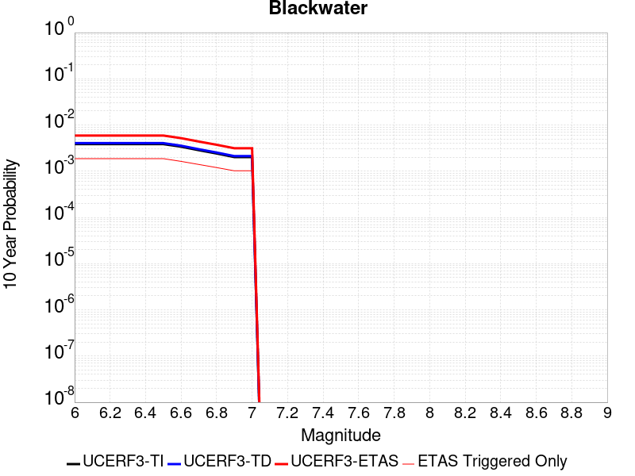
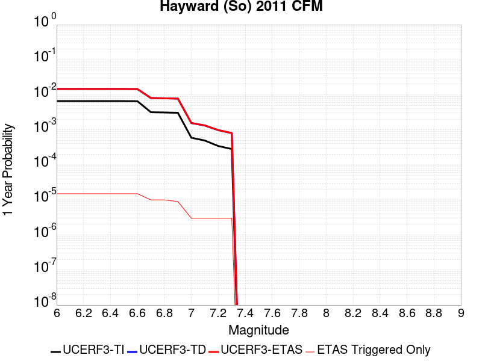
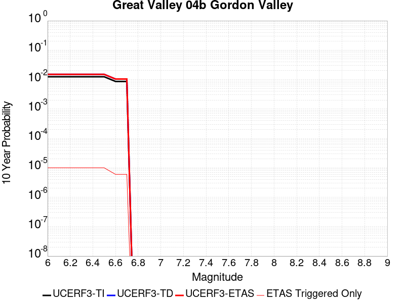
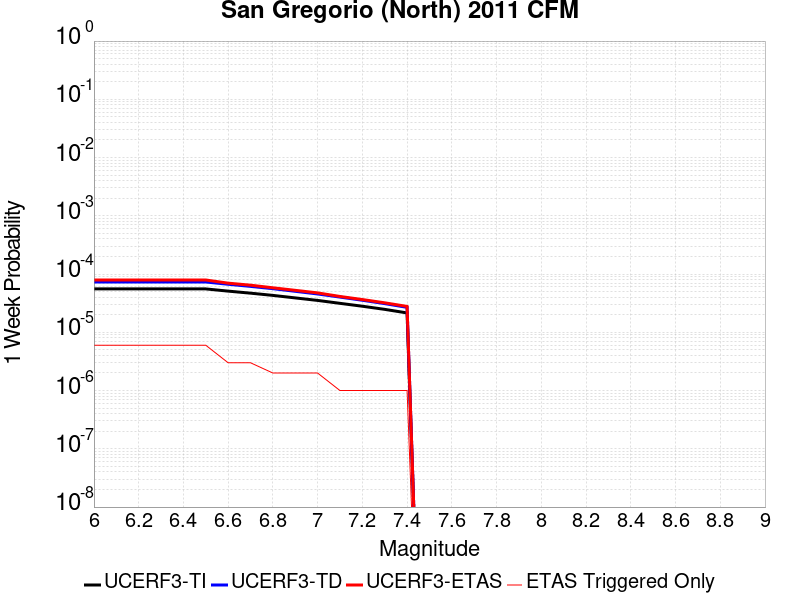

# Parent Section Magnitude-Probability Distributions

Only fault sections with at least one triggered aftershock are plotted. Sections are sorted by total supraseismogenic trigger rate (decreasing)

## Table Of Contents

* [Tank Canyon](#tank-canyon)
* [Little Lake](#little-lake)
* [Garlock (Central)](#garlock-central)
* [Owl Lake](#owl-lake)
* [Garlock (West)](#garlock-west)
* [Garlock (East)](#garlock-east)
* [Death Valley (So)](#death-valley-so)
* [Panamint Valley](#panamint-valley)
* [San Andreas (Mojave N)](#san-andreas-mojave-n)
* [San Andreas (Big Bend)](#san-andreas-big-bend)
* [San Andreas (Mojave S)](#san-andreas-mojave-s)
* [Blackwater](#blackwater)
* [San Andreas (Carrizo) rev](#san-andreas-carrizo-rev)
* [San Andreas (Cholame) rev](#san-andreas-cholame-rev)
* [San Andreas (Parkfield)](#san-andreas-parkfield)
* [Death Valley (Black Mtns Frontal)](#death-valley-black-mtns-frontal)
* [Hunter Mountain-Saline Valley](#hunter-mountain-saline-valley)
* [San Andreas (San Bernardino N)](#san-andreas-san-bernardino-n)
* [Cucamonga](#cucamonga)
* [Pleito](#pleito)
* [Death Valley (No)](#death-valley-no)
* [San Cayetano](#san-cayetano)
* [San Andreas (San Bernardino S)](#san-andreas-san-bernardino-s)
* [Gravel Hills-Harper Lk](#gravel-hills-harper-lk)
* [San Andreas (Coachella) rev](#san-andreas-coachella-rev)
* [San Andreas (San Gorgonio Pass-Garnet HIll)](#san-andreas-san-gorgonio-pass-garnet-hill)
* [Pitas Point (Lower)-Montalvo](#pitas-point-lower-montalvo)
* [Red Mountain](#red-mountain)
* [Pitas Point (Lower West)](#pitas-point-lower-west)
* [San Jacinto (San Bernardino)](#san-jacinto-san-bernardino)
* [Santa Ynez (East)](#santa-ynez-east)
* [Mission Ridge-Arroyo Parida-Santa Ana](#mission-ridge-arroyo-parida-santa-ana)
* [So Sierra Nevada](#so-sierra-nevada)
* [Cleghorn](#cleghorn)
* [Santa Ynez (West)](#santa-ynez-west)
* [Death Valley (Fish Lake Valley)](#death-valley-fish-lake-valley)
* [Lenwood-Lockhart-Old Woman Springs](#lenwood-lockhart-old-woman-springs)
* [San Jose](#san-jose)
* [San Juan](#san-juan)
* [Santa Susana alt 1](#santa-susana-alt-1)
* [Ventura-Pitas Point](#ventura-pitas-point)
* [Elysian Park (Upper)](#elysian-park-upper)
* [Independence rev 2011](#independence-rev-2011)
* [Raymond](#raymond)
* [San Jacinto (Stepovers Combined)](#san-jacinto-stepovers-combined)
* [Elsinore (Glen Ivy) rev](#elsinore-glen-ivy-rev)
* [Elsinore (Stepovers Combined)](#elsinore-stepovers-combined)
* [San Jacinto (San Jacinto Valley) rev](#san-jacinto-san-jacinto-valley-rev)
* [Hayward (So) 2011 CFM](#hayward-so-2011-cfm)
* [San Gregorio (South) 2011 CFM](#san-gregorio-south-2011-cfm)
* [Oak Ridge (Onshore)](#oak-ridge-onshore)
* [Great Valley 03 Mysterious Ridge](#great-valley-03-mysterious-ridge)
* [Chino alt 1](#chino-alt-1)
* [Imperial](#imperial)
* [San Gabriel](#san-gabriel)
* [San Jacinto (Anza) rev](#san-jacinto-anza-rev)
* [San Jacinto (Clark) rev](#san-jacinto-clark-rev)
* [Great Valley 04a Trout Creek](#great-valley-04a-trout-creek)
* [Helendale-So Lockhart](#helendale-so-lockhart)
* [Great Valley 04b Gordon Valley](#great-valley-04b-gordon-valley)
* [Los Alamos 2011 CFM](#los-alamos-2011-cfm)
* [Sierra Madre](#sierra-madre)
* [Emerson-Copper Mtn 2011](#emerson-copper-mtn-2011)
* [Calaveras (No) 2011 CFM](#calaveras-no-2011-cfm)
* [Verdugo](#verdugo)
* [Elsinore (Temecula) rev](#elsinore-temecula-rev)
* [Hayward (No) 2011 CFM](#hayward-no-2011-cfm)
* [Rose Canyon](#rose-canyon)
* [Robinson Creek](#robinson-creek)
* [Great Valley 12](#great-valley-12)
* [Anacapa-Dume alt 1](#anacapa-dume-alt-1)
* [Simi-Santa Rosa](#simi-santa-rosa)
* [Burnt Mtn](#burnt-mtn)
* [San Gregorio (North) 2011 CFM](#san-gregorio-north-2011-cfm)
* [Whittier alt 1](#whittier-alt-1)
* [Mono Lake 2011 CFM](#mono-lake-2011-cfm)

## Tank Canyon
*[(top)](#table-of-contents)*

| 1 Week | 1 Month | 1 Year | 10 Year |
|-----|-----|-----|-----|
|  |  |  |  |

| Magnitude | 1 wk TI Prob | 1 wk TD Prob | 1 wk ETAS Prob | 1 wk ETAS/TD Gain | 1 wk ETAS Triggered Only | 1 mo TI Prob | 1 mo TD Prob | 1 mo ETAS Prob | 1 mo ETAS/TD Gain | 1 mo ETAS Triggered Only | 1 yr TI Prob | 1 yr TD Prob | 1 yr ETAS Prob | 1 yr ETAS/TD Gain | 1 yr ETAS Triggered Only | 10 yr TI Prob | 10 yr TD Prob | 10 yr ETAS Prob | 10 yr ETAS/TD Gain | 10 yr ETAS Triggered Only |
|-----|-----|-----|-----|-----|-----|-----|-----|-----|-----|-----|-----|-----|-----|-----|-----|-----|-----|-----|-----|-----|
| 6.0 | 2.7748038E-5 | 3.5073965E-5 | 0.020764101 | 592.009 | 0.020729754 | 1.18914744E-4 | 1.5031699E-4 | 0.026859034 | 178.68262 | 0.026712732 | 0.0014468255 | 0.0018300817 | 0.042877264 | 23.429153 | 0.04112244 | 0.014374418 | 0.018297758 | 0.072317444 | 3.9522567 | 0.055026542 |
| 6.1 | 2.7748038E-5 | 3.5073965E-5 | 0.020764101 | 592.009 | 0.020729754 | 1.18914744E-4 | 1.5031699E-4 | 0.026859034 | 178.68262 | 0.026712732 | 0.0014468255 | 0.0018300817 | 0.042877264 | 23.429153 | 0.04112244 | 0.014374418 | 0.018297758 | 0.072317444 | 3.9522567 | 0.055026542 |
| 6.2 | 2.7748038E-5 | 3.5073965E-5 | 0.020764101 | 592.009 | 0.020729754 | 1.18914744E-4 | 1.5031699E-4 | 0.026859034 | 178.68262 | 0.026712732 | 0.0014468255 | 0.0018300817 | 0.042877264 | 23.429153 | 0.04112244 | 0.014374418 | 0.018297758 | 0.072317444 | 3.9522567 | 0.055026542 |
| 6.3 | 2.7748038E-5 | 3.5073965E-5 | 0.020764101 | 592.009 | 0.020729754 | 1.18914744E-4 | 1.5031699E-4 | 0.026859034 | 178.68262 | 0.026712732 | 0.0014468255 | 0.0018300817 | 0.042877264 | 23.429153 | 0.04112244 | 0.014374418 | 0.018297758 | 0.072317444 | 3.9522567 | 0.055026542 |

## Little Lake
*[(top)](#table-of-contents)*

| 1 Week | 1 Month | 1 Year | 10 Year |
|-----|-----|-----|-----|
|  |  |  |  |

| Magnitude | 1 wk TI Prob | 1 wk TD Prob | 1 wk ETAS Prob | 1 wk ETAS/TD Gain | 1 wk ETAS Triggered Only | 1 mo TI Prob | 1 mo TD Prob | 1 mo ETAS Prob | 1 mo ETAS/TD Gain | 1 mo ETAS Triggered Only | 1 yr TI Prob | 1 yr TD Prob | 1 yr ETAS Prob | 1 yr ETAS/TD Gain | 1 yr ETAS Triggered Only | 10 yr TI Prob | 10 yr TD Prob | 10 yr ETAS Prob | 10 yr ETAS/TD Gain | 10 yr ETAS Triggered Only |
|-----|-----|-----|-----|-----|-----|-----|-----|-----|-----|-----|-----|-----|-----|-----|-----|-----|-----|-----|-----|-----|
| 6.0 | 1.27106505E-5 | 1.3900362E-5 | 0.010968496 | 789.0799 | 0.010954749 | 5.447308E-5 | 5.957219E-5 | 0.014721208 | 247.11545 | 0.01466251 | 6.630079E-4 | 7.25151E-4 | 0.020766225 | 28.637104 | 0.020055616 | 0.006610333 | 0.0072377534 | 0.032418627 | 4.4791007 | 0.025364457 |
| 6.1 | 1.27106505E-5 | 1.3900362E-5 | 0.010968496 | 789.0799 | 0.010954749 | 5.447308E-5 | 5.957219E-5 | 0.014721208 | 247.11545 | 0.01466251 | 6.630079E-4 | 7.25151E-4 | 0.020766225 | 28.637104 | 0.020055616 | 0.006610333 | 0.0072377534 | 0.032418627 | 4.4791007 | 0.025364457 |
| 6.2 | 1.27106505E-5 | 1.3900362E-5 | 0.010968496 | 789.0799 | 0.010954749 | 5.447308E-5 | 5.957219E-5 | 0.014721208 | 247.11545 | 0.01466251 | 6.630079E-4 | 7.25151E-4 | 0.020766225 | 28.637104 | 0.020055616 | 0.006610333 | 0.0072377534 | 0.032418627 | 4.4791007 | 0.025364457 |
| 6.3 | 1.27106505E-5 | 1.3900362E-5 | 0.010968496 | 789.0799 | 0.010954749 | 5.447308E-5 | 5.957219E-5 | 0.014721208 | 247.11545 | 0.01466251 | 6.630079E-4 | 7.25151E-4 | 0.020766225 | 28.637104 | 0.020055616 | 0.006610333 | 0.0072377534 | 0.032418627 | 4.4791007 | 0.025364457 |
| 6.4 | 1.27106505E-5 | 1.3900362E-5 | 0.010968496 | 789.0799 | 0.010954749 | 5.447308E-5 | 5.957219E-5 | 0.014721208 | 247.11545 | 0.01466251 | 6.630079E-4 | 7.25151E-4 | 0.020766225 | 28.637104 | 0.020055616 | 0.006610333 | 0.0072377534 | 0.032418627 | 4.4791007 | 0.025364457 |
| 6.5 | 1.27106505E-5 | 1.3900362E-5 | 0.010968496 | 789.0799 | 0.010954749 | 5.447308E-5 | 5.957219E-5 | 0.014721208 | 247.11545 | 0.01466251 | 6.630079E-4 | 7.25151E-4 | 0.020766225 | 28.637104 | 0.020055616 | 0.006610333 | 0.0072377534 | 0.032418627 | 4.4791007 | 0.025364457 |
| 6.6 | 1.08505255E-5 | 1.1856941E-5 | 0.009365416 | 789.86786 | 0.00935367 | 4.6501424E-5 | 5.0815026E-5 | 0.012606004 | 248.0763 | 0.012555827 | 5.6600774E-4 | 6.1859656E-4 | 0.017545845 | 28.363956 | 0.016937727 | 0.005645683 | 0.006178476 | 0.027701365 | 4.483527 | 0.021656696 |
| 6.7 | 7.97625E-6 | 8.706619E-6 | 0.0063286987 | 726.8836 | 0.006320047 | 3.4183482E-5 | 3.7314083E-5 | 0.00888505 | 238.11519 | 0.008848066 | 4.161044E-4 | 4.5429895E-4 | 0.012835964 | 28.254442 | 0.012387292 | 0.004153261 | 0.0045429897 | 0.020229386 | 4.4528794 | 0.015757984 |
| 6.8 | 7.97625E-6 | 8.706619E-6 | 0.0063286987 | 726.8836 | 0.006320047 | 3.4183482E-5 | 3.7314083E-5 | 0.00888505 | 238.11519 | 0.008848066 | 4.161044E-4 | 4.5429895E-4 | 0.012835964 | 28.254442 | 0.012387292 | 0.004153261 | 0.0045429897 | 0.020229386 | 4.4528794 | 0.015757984 |

## Garlock (Central)
*[(top)](#table-of-contents)*

| 1 Week | 1 Month | 1 Year | 10 Year |
|-----|-----|-----|-----|
|  |  |  |  |

| Magnitude | 1 wk TI Prob | 1 wk TD Prob | 1 wk ETAS Prob | 1 wk ETAS/TD Gain | 1 wk ETAS Triggered Only | 1 mo TI Prob | 1 mo TD Prob | 1 mo ETAS Prob | 1 mo ETAS/TD Gain | 1 mo ETAS Triggered Only | 1 yr TI Prob | 1 yr TD Prob | 1 yr ETAS Prob | 1 yr ETAS/TD Gain | 1 yr ETAS Triggered Only | 10 yr TI Prob | 10 yr TD Prob | 10 yr ETAS Prob | 10 yr ETAS/TD Gain | 10 yr ETAS Triggered Only |
|-----|-----|-----|-----|-----|-----|-----|-----|-----|-----|-----|-----|-----|-----|-----|-----|-----|-----|-----|-----|-----|
| 6.0 | 2.575808E-5 | 1.9313613E-5 | 0.01215357 | 629.2748 | 0.012134491 | 1.10387096E-4 | 8.277037E-5 | 0.014659806 | 177.11418 | 0.014578242 | 0.0013431342 | 0.0010073289 | 0.020116735 | 19.970377 | 0.019128677 | 0.013350452 | 0.0100695705 | 0.03501178 | 3.4769883 | 0.02519592 |
| 6.1 | 2.575808E-5 | 1.9313613E-5 | 0.01215357 | 629.2748 | 0.012134491 | 1.10387096E-4 | 8.277037E-5 | 0.014659806 | 177.11418 | 0.014578242 | 0.0013431342 | 0.0010073289 | 0.020116735 | 19.970377 | 0.019128677 | 0.013350452 | 0.0100695705 | 0.03501178 | 3.4769883 | 0.02519592 |
| 6.2 | 2.575808E-5 | 1.9313613E-5 | 0.01215357 | 629.2748 | 0.012134491 | 1.10387096E-4 | 8.277037E-5 | 0.014659806 | 177.11418 | 0.014578242 | 0.0013431342 | 0.0010073289 | 0.020116735 | 19.970377 | 0.019128677 | 0.013350452 | 0.0100695705 | 0.03501178 | 3.4769883 | 0.02519592 |
| 6.3 | 2.575808E-5 | 1.9313613E-5 | 0.01215357 | 629.2748 | 0.012134491 | 1.10387096E-4 | 8.277037E-5 | 0.014659806 | 177.11418 | 0.014578242 | 0.0013431342 | 0.0010073289 | 0.020116735 | 19.970377 | 0.019128677 | 0.013350452 | 0.0100695705 | 0.03501178 | 3.4769883 | 0.02519592 |
| 6.4 | 2.575808E-5 | 1.9313613E-5 | 0.01215357 | 629.2748 | 0.012134491 | 1.10387096E-4 | 8.277037E-5 | 0.014659806 | 177.11418 | 0.014578242 | 0.0013431342 | 0.0010073289 | 0.020116735 | 19.970377 | 0.019128677 | 0.013350452 | 0.0100695705 | 0.03501178 | 3.4769883 | 0.02519592 |
| 6.5 | 2.575808E-5 | 1.9313613E-5 | 0.01215357 | 629.2748 | 0.012134491 | 1.10387096E-4 | 8.277037E-5 | 0.014659806 | 177.11418 | 0.014578242 | 0.0013431342 | 0.0010073289 | 0.020116735 | 19.970377 | 0.019128677 | 0.013350452 | 0.0100695705 | 0.03501178 | 3.4769883 | 0.02519592 |
| 6.6 | 2.540234E-5 | 1.885198E-5 | 0.011816051 | 626.7804 | 0.011797422 | 1.0886263E-4 | 8.0792066E-5 | 0.014320814 | 177.2552 | 0.014241173 | 0.0013245966 | 9.83265E-4 | 0.019588025 | 19.921412 | 0.018623073 | 0.013167289 | 0.009831364 | 0.034112066 | 3.4697182 | 0.024521783 |
| 6.7 | 2.4966947E-5 | 1.8286464E-5 | 0.010888569 | 595.4442 | 0.010870481 | 1.06996806E-4 | 7.8368575E-5 | 0.013307298 | 169.804 | 0.013229965 | 0.0013019076 | 9.5378514E-4 | 0.018380478 | 19.271088 | 0.017443331 | 0.012943068 | 0.009539624 | 0.032325137 | 3.3885126 | 0.023004971 |
| 6.8 | 2.4548952E-5 | 1.7797542E-5 | 0.0106352875 | 597.5706 | 0.010617679 | 1.0520555E-4 | 7.627332E-5 | 0.013052447 | 171.1273 | 0.012977163 | 0.001280125 | 9.282974E-4 | 0.01801868 | 19.41046 | 0.017106261 | 0.012727758 | 0.009286596 | 0.031493537 | 3.3912895 | 0.022415102 |
| 6.9 | 2.3994342E-5 | 1.7148153E-5 | 0.009791987 | 571.02277 | 0.009775006 | 1.0282884E-4 | 7.349039E-5 | 0.011954306 | 162.66489 | 0.011881689 | 0.0012512221 | 8.944436E-4 | 0.016133182 | 18.037115 | 0.015252381 | 0.012442005 | 0.0089510605 | 0.029244723 | 3.2671795 | 0.020476952 |
| 7.0 | 2.343005E-5 | 1.6491087E-5 | 0.009285741 | 563.0763 | 0.009269402 | 1.0041064E-4 | 7.067455E-5 | 0.011361694 | 160.76077 | 0.011291818 | 0.0012218138 | 8.601883E-4 | 0.015257501 | 17.737396 | 0.014409708 | 0.01215118 | 0.008610493 | 0.027908627 | 3.241235 | 0.019465744 |
| 7.1 | 2.2814058E-5 | 1.5782754E-5 | 0.008863709 | 561.60724 | 0.008848066 | 9.777087E-5 | 6.763899E-5 | 0.0107688615 | 159.21086 | 0.010701947 | 0.0011897103 | 8.2325895E-4 | 0.01454752 | 17.670649 | 0.013735569 | 0.011833611 | 0.00824334 | 0.02679647 | 3.250681 | 0.01870734 |
| 7.2 | 2.2145266E-5 | 1.5027377E-5 | 0.0080203 | 533.7126 | 0.008005393 | 9.490483E-5 | 6.440182E-5 | 0.009923041 | 154.08011 | 0.009859273 | 0.0011548538 | 7.8387547E-4 | 0.013414062 | 17.11249 | 0.012640094 | 0.011488707 | 0.007851825 | 0.025158193 | 3.2041204 | 0.017443331 |
| 7.3 | 1.9954436E-5 | 1.3199953E-5 | 0.006501696 | 492.55447 | 0.0064885817 | 8.551621E-5 | 5.657036E-5 | 0.007977248 | 141.01462 | 0.007921126 | 0.0010406625 | 6.8859005E-4 | 0.010709493 | 15.552785 | 0.010027808 | 0.010358025 | 0.006900618 | 0.020541403 | 2.9767485 | 0.013735569 |
| 7.4 | 1.918037E-5 | 1.2553606E-5 | 0.0063325213 | 504.43845 | 0.006320047 | 8.2198996E-5 | 5.3800417E-5 | 0.0078059747 | 145.09134 | 0.0077525913 | 0.0010003132 | 6.5488677E-4 | 0.010507704 | 16.045069 | 0.009859273 | 0.009958224 | 0.006564366 | 0.019874914 | 3.0276973 | 0.0133985 |
| 7.5 | 1.6994161E-5 | 1.0764553E-5 | 0.004476883 | 415.89124 | 0.0044661667 | 7.283008E-5 | 4.613333E-5 | 0.005776045 | 125.2033 | 0.0057301763 | 8.863455E-4 | 5.615903E-4 | 0.007888728 | 14.047123 | 0.007331255 | 0.008828186 | 0.005632708 | 0.015939202 | 2.8297584 | 0.010364877 |
| 7.6 | 1.621788E-5 | 1.012848E-5 | 0.0039706514 | 392.02835 | 0.003960563 | 6.950335E-5 | 4.34074E-5 | 0.0051834895 | 119.41488 | 0.005140305 | 8.458747E-4 | 5.2841863E-4 | 0.0070977947 | 13.432142 | 0.006572849 | 0.0084266225 | 0.005301458 | 0.01460554 | 2.7550044 | 0.00935367 |
| 7.7 | 7.713584E-6 | 3.2171508E-6 | 8.458874E-4 | 262.9306 | 8.4267295E-4 | 3.3057797E-5 | 1.378779E-5 | 0.0012777798 | 92.67474 | 0.0012640094 | 4.0240434E-4 | 1.6786634E-4 | 0.0021056887 | 12.543842 | 0.0019381478 | 0.0040167645 | 0.0016902693 | 0.00446639 | 2.6424131 | 0.0027808207 |

## Owl Lake
*[(top)](#table-of-contents)*

| 1 Week | 1 Month | 1 Year | 10 Year |
|-----|-----|-----|-----|
|  |  |  |  |

| Magnitude | 1 wk TI Prob | 1 wk TD Prob | 1 wk ETAS Prob | 1 wk ETAS/TD Gain | 1 wk ETAS Triggered Only | 1 mo TI Prob | 1 mo TD Prob | 1 mo ETAS Prob | 1 mo ETAS/TD Gain | 1 mo ETAS Triggered Only | 1 yr TI Prob | 1 yr TD Prob | 1 yr ETAS Prob | 1 yr ETAS/TD Gain | 1 yr ETAS Triggered Only | 10 yr TI Prob | 10 yr TD Prob | 10 yr ETAS Prob | 10 yr ETAS/TD Gain | 10 yr ETAS Triggered Only |
|-----|-----|-----|-----|-----|-----|-----|-----|-----|-----|-----|-----|-----|-----|-----|-----|-----|-----|-----|-----|-----|
| 6.0 | 3.637175E-5 | 4.988367E-5 | 0.0046843537 | 93.905556 | 0.004634701 | 1.5586962E-4 | 2.1378716E-4 | 0.005942738 | 27.797451 | 0.0057301763 | 0.0018960608 | 0.0026025574 | 0.0112595 | 4.3263216 | 0.0086795315 | 0.018799646 | 0.025995217 | 0.038717113 | 1.4893937 | 0.013061431 |
| 6.1 | 3.637175E-5 | 4.988367E-5 | 0.0046843537 | 93.905556 | 0.004634701 | 1.5586962E-4 | 2.1378716E-4 | 0.005942738 | 27.797451 | 0.0057301763 | 0.0018960608 | 0.0026025574 | 0.0112595 | 4.3263216 | 0.0086795315 | 0.018799646 | 0.025995217 | 0.038717113 | 1.4893937 | 0.013061431 |
| 6.2 | 3.637175E-5 | 4.988367E-5 | 0.0046843537 | 93.905556 | 0.004634701 | 1.5586962E-4 | 2.1378716E-4 | 0.005942738 | 27.797451 | 0.0057301763 | 0.0018960608 | 0.0026025574 | 0.0112595 | 4.3263216 | 0.0086795315 | 0.018799646 | 0.025995217 | 0.038717113 | 1.4893937 | 0.013061431 |
| 6.3 | 3.637175E-5 | 4.988367E-5 | 0.0046843537 | 93.905556 | 0.004634701 | 1.5586962E-4 | 2.1378716E-4 | 0.005942738 | 27.797451 | 0.0057301763 | 0.0018960608 | 0.0026025574 | 0.0112595 | 4.3263216 | 0.0086795315 | 0.018799646 | 0.025995217 | 0.038717113 | 1.4893937 | 0.013061431 |
| 6.4 | 3.637175E-5 | 4.988367E-5 | 0.0046843537 | 93.905556 | 0.004634701 | 1.5586962E-4 | 2.1378716E-4 | 0.005942738 | 27.797451 | 0.0057301763 | 0.0018960608 | 0.0026025574 | 0.0112595 | 4.3263216 | 0.0086795315 | 0.018799646 | 0.025995217 | 0.038717113 | 1.4893937 | 0.013061431 |
| 6.5 | 3.637175E-5 | 4.988367E-5 | 0.0046843537 | 93.905556 | 0.004634701 | 1.5586962E-4 | 2.1378716E-4 | 0.005942738 | 27.797451 | 0.0057301763 | 0.0018960608 | 0.0026025574 | 0.0112595 | 4.3263216 | 0.0086795315 | 0.018799646 | 0.025995217 | 0.038717113 | 1.4893937 | 0.013061431 |

## Garlock (West)
*[(top)](#table-of-contents)*

| 1 Week | 1 Month | 1 Year | 10 Year |
|-----|-----|-----|-----|
|  |  |  |  |

| Magnitude | 1 wk TI Prob | 1 wk TD Prob | 1 wk ETAS Prob | 1 wk ETAS/TD Gain | 1 wk ETAS Triggered Only | 1 mo TI Prob | 1 mo TD Prob | 1 mo ETAS Prob | 1 mo ETAS/TD Gain | 1 mo ETAS Triggered Only | 1 yr TI Prob | 1 yr TD Prob | 1 yr ETAS Prob | 1 yr ETAS/TD Gain | 1 yr ETAS Triggered Only | 10 yr TI Prob | 10 yr TD Prob | 10 yr ETAS Prob | 10 yr ETAS/TD Gain | 10 yr ETAS Triggered Only |
|-----|-----|-----|-----|-----|-----|-----|-----|-----|-----|-----|-----|-----|-----|-----|-----|-----|-----|-----|-----|-----|
| 6.0 | 2.516656E-5 | 1.8065048E-5 | 0.0050740116 | 280.8745 | 0.0050560376 | 1.07852225E-4 | 7.741977E-5 | 0.0064812386 | 83.715546 | 0.0064043147 | 0.0013123099 | 9.42255E-4 | 0.009108481 | 9.666683 | 0.008173928 | 0.013045873 | 0.009421492 | 0.020857343 | 2.2138047 | 0.01154462 |
| 6.1 | 2.516656E-5 | 1.8065048E-5 | 0.0050740116 | 280.8745 | 0.0050560376 | 1.07852225E-4 | 7.741977E-5 | 0.0064812386 | 83.715546 | 0.0064043147 | 0.0013123099 | 9.42255E-4 | 0.009108481 | 9.666683 | 0.008173928 | 0.013045873 | 0.009421492 | 0.020857343 | 2.2138047 | 0.01154462 |
| 6.2 | 2.516656E-5 | 1.8065048E-5 | 0.0050740116 | 280.8745 | 0.0050560376 | 1.07852225E-4 | 7.741977E-5 | 0.0064812386 | 83.715546 | 0.0064043147 | 0.0013123099 | 9.42255E-4 | 0.009108481 | 9.666683 | 0.008173928 | 0.013045873 | 0.009421492 | 0.020857343 | 2.2138047 | 0.01154462 |
| 6.3 | 2.516656E-5 | 1.8065048E-5 | 0.0050740116 | 280.8745 | 0.0050560376 | 1.07852225E-4 | 7.741977E-5 | 0.0064812386 | 83.715546 | 0.0064043147 | 0.0013123099 | 9.42255E-4 | 0.009108481 | 9.666683 | 0.008173928 | 0.013045873 | 0.009421492 | 0.020857343 | 2.2138047 | 0.01154462 |
| 6.4 | 2.516656E-5 | 1.8065048E-5 | 0.0050740116 | 280.8745 | 0.0050560376 | 1.07852225E-4 | 7.741977E-5 | 0.0064812386 | 83.715546 | 0.0064043147 | 0.0013123099 | 9.42255E-4 | 0.009108481 | 9.666683 | 0.008173928 | 0.013045873 | 0.009421492 | 0.020857343 | 2.2138047 | 0.01154462 |
| 6.5 | 2.516656E-5 | 1.8065048E-5 | 0.0050740116 | 280.8745 | 0.0050560376 | 1.07852225E-4 | 7.741977E-5 | 0.0064812386 | 83.715546 | 0.0064043147 | 0.0013123099 | 9.42255E-4 | 0.009108481 | 9.666683 | 0.008173928 | 0.013045873 | 0.009421492 | 0.020857343 | 2.2138047 | 0.01154462 |
| 6.6 | 2.498869E-5 | 1.7877663E-5 | 0.005073825 | 283.80807 | 0.0050560376 | 1.07089996E-4 | 7.6616736E-5 | 0.0064804405 | 84.58257 | 0.0064043147 | 0.0013030408 | 9.3248655E-4 | 0.009098792 | 9.757559 | 0.008173928 | 0.012954267 | 0.009324339 | 0.020761313 | 2.226572 | 0.01154462 |
| 6.7 | 2.4627925E-5 | 1.7497801E-5 | 0.0050734472 | 289.9477 | 0.0050560376 | 1.0554398E-4 | 7.498886E-5 | 0.0064788233 | 86.39715 | 0.0064043147 | 0.0012842404 | 9.1268384E-4 | 0.009079152 | 9.94775 | 0.008173928 | 0.012768441 | 0.009128104 | 0.020567343 | 2.2531888 | 0.01154462 |
| 6.8 | 2.4270235E-5 | 1.716136E-5 | 0.0050731124 | 295.61252 | 0.0050560376 | 1.04011146E-4 | 7.354704E-5 | 0.0064773904 | 88.071396 | 0.0064043147 | 0.0012656 | 8.9514436E-4 | 0.009061756 | 10.123234 | 0.008173928 | 0.012584164 | 0.0089538675 | 0.020395119 | 2.2777998 | 0.01154462 |
| 6.9 | 2.3913764E-5 | 1.6823105E-5 | 0.0049885097 | 296.52728 | 0.0049717706 | 1.0248353E-4 | 7.2097464E-5 | 0.006391689 | 88.65345 | 0.006320047 | 0.0012470228 | 8.775101E-4 | 0.008960072 | 10.210791 | 0.008089661 | 0.012400482 | 0.00877859 | 0.020138336 | 2.2940285 | 0.011460353 |
| 7.0 | 2.3579369E-5 | 1.6492264E-5 | 0.004988181 | 302.4558 | 0.0049717706 | 1.0105052E-4 | 7.067965E-5 | 0.00639028 | 90.41188 | 0.006320047 | 0.0012295957 | 8.6026196E-4 | 0.008942964 | 10.395628 | 0.008089661 | 0.012228143 | 0.008607132 | 0.019968843 | 2.3200345 | 0.011460353 |
| 7.1 | 2.3205374E-5 | 1.6105636E-5 | 0.004987796 | 309.69257 | 0.0049717706 | 9.944781E-5 | 6.902276E-5 | 0.0063886335 | 92.55836 | 0.006320047 | 0.0012101046 | 8.401051E-4 | 0.008838773 | 10.521032 | 0.008005393 | 0.0120353615 | 0.008406721 | 0.01968717 | 2.341837 | 0.011376085 |
| 7.2 | 2.2799322E-5 | 1.5676578E-5 | 0.004903103 | 312.76614 | 0.004887503 | 9.770772E-5 | 6.718404E-5 | 0.006302545 | 93.81015 | 0.0062357797 | 0.0011889422 | 8.177357E-4 | 0.008732384 | 10.678737 | 0.007921126 | 0.011826012 | 0.008184515 | 0.019383915 | 2.3683646 | 0.011291818 |
| 7.3 | 1.8228246E-5 | 1.1798695E-5 | 0.0048149778 | 408.09412 | 0.0048032356 | 7.811871E-5 | 5.0565202E-5 | 0.0061175036 | 120.98248 | 0.0060672453 | 9.506803E-4 | 6.1551924E-4 | 0.008363338 | 13.587452 | 0.0077525913 | 0.0094662355 | 0.006171021 | 0.017141916 | 2.7778084 | 0.011039016 |
| 7.4 | 1.7670916E-5 | 1.132978E-5 | 0.004730245 | 417.50546 | 0.0047189686 | 7.5730306E-5 | 4.8555645E-5 | 0.006031243 | 124.21302 | 0.005982978 | 9.216264E-4 | 5.9106643E-4 | 0.008254858 | 13.966042 | 0.007668324 | 0.009178135 | 0.0059269792 | 0.016733032 | 2.8231974 | 0.010870481 |
| 7.5 | 1.6994161E-5 | 1.0764553E-5 | 0.004476883 | 415.89124 | 0.0044661667 | 7.283008E-5 | 4.613333E-5 | 0.005776045 | 125.2033 | 0.0057301763 | 8.863455E-4 | 5.615903E-4 | 0.007888728 | 14.047123 | 0.007331255 | 0.008828186 | 0.005632708 | 0.015939202 | 2.8297584 | 0.010364877 |
| 7.6 | 1.621788E-5 | 1.012848E-5 | 0.0039706514 | 392.02835 | 0.003960563 | 6.950335E-5 | 4.34074E-5 | 0.0051834895 | 119.41488 | 0.005140305 | 8.458747E-4 | 5.2841863E-4 | 0.0070977947 | 13.432142 | 0.006572849 | 0.0084266225 | 0.005301458 | 0.01460554 | 2.7550044 | 0.00935367 |
| 7.7 | 7.713584E-6 | 3.2171508E-6 | 8.458874E-4 | 262.9306 | 8.4267295E-4 | 3.3057797E-5 | 1.378779E-5 | 0.0012777798 | 92.67474 | 0.0012640094 | 4.0240434E-4 | 1.6786634E-4 | 0.0021056887 | 12.543842 | 0.0019381478 | 0.0040167645 | 0.0016902693 | 0.00446639 | 2.6424131 | 0.0027808207 |

## Garlock (East)
*[(top)](#table-of-contents)*

| 1 Week | 1 Month | 1 Year | 10 Year |
|-----|-----|-----|-----|
|  |  |  |  |

| Magnitude | 1 wk TI Prob | 1 wk TD Prob | 1 wk ETAS Prob | 1 wk ETAS/TD Gain | 1 wk ETAS Triggered Only | 1 mo TI Prob | 1 mo TD Prob | 1 mo ETAS Prob | 1 mo ETAS/TD Gain | 1 mo ETAS Triggered Only | 1 yr TI Prob | 1 yr TD Prob | 1 yr ETAS Prob | 1 yr ETAS/TD Gain | 1 yr ETAS Triggered Only | 10 yr TI Prob | 10 yr TD Prob | 10 yr ETAS Prob | 10 yr ETAS/TD Gain | 10 yr ETAS Triggered Only |
|-----|-----|-----|-----|-----|-----|-----|-----|-----|-----|-----|-----|-----|-----|-----|-----|-----|-----|-----|-----|-----|
| 6.0 | 2.2327951E-5 | 1.8303952E-5 | 0.0045686546 | 249.59937 | 0.004550434 | 9.5687705E-5 | 7.8444085E-5 | 0.005808171 | 74.042175 | 0.0057301763 | 0.0011643751 | 9.548048E-4 | 0.008952554 | 9.376319 | 0.008005393 | 0.0115829315 | 0.0096519785 | 0.020584445 | 2.1326659 | 0.011039016 |
| 6.1 | 2.2327951E-5 | 1.8303952E-5 | 0.0045686546 | 249.59937 | 0.004550434 | 9.5687705E-5 | 7.8444085E-5 | 0.005808171 | 74.042175 | 0.0057301763 | 0.0011643751 | 9.548048E-4 | 0.008952554 | 9.376319 | 0.008005393 | 0.0115829315 | 0.0096519785 | 0.020584445 | 2.1326659 | 0.011039016 |
| 6.2 | 2.2327951E-5 | 1.8303952E-5 | 0.0045686546 | 249.59937 | 0.004550434 | 9.5687705E-5 | 7.8444085E-5 | 0.005808171 | 74.042175 | 0.0057301763 | 0.0011643751 | 9.548048E-4 | 0.008952554 | 9.376319 | 0.008005393 | 0.0115829315 | 0.0096519785 | 0.020584445 | 2.1326659 | 0.011039016 |
| 6.3 | 2.2327951E-5 | 1.8303952E-5 | 0.0045686546 | 249.59937 | 0.004550434 | 9.5687705E-5 | 7.8444085E-5 | 0.005808171 | 74.042175 | 0.0057301763 | 0.0011643751 | 9.548048E-4 | 0.008952554 | 9.376319 | 0.008005393 | 0.0115829315 | 0.0096519785 | 0.020584445 | 2.1326659 | 0.011039016 |
| 6.4 | 2.2327951E-5 | 1.8303952E-5 | 0.0045686546 | 249.59937 | 0.004550434 | 9.5687705E-5 | 7.8444085E-5 | 0.005808171 | 74.042175 | 0.0057301763 | 0.0011643751 | 9.548048E-4 | 0.008952554 | 9.376319 | 0.008005393 | 0.0115829315 | 0.0096519785 | 0.020584445 | 2.1326659 | 0.011039016 |
| 6.5 | 2.2327951E-5 | 1.8303952E-5 | 0.0045686546 | 249.59937 | 0.004550434 | 9.5687705E-5 | 7.8444085E-5 | 0.005808171 | 74.042175 | 0.0057301763 | 0.0011643751 | 9.548048E-4 | 0.008952554 | 9.376319 | 0.008005393 | 0.0115829315 | 0.0096519785 | 0.020584445 | 2.1326659 | 0.011039016 |
| 6.6 | 2.222123E-5 | 1.816971E-5 | 0.004568521 | 251.4361 | 0.004550434 | 9.523036E-5 | 7.7868805E-5 | 0.0058075986 | 74.58184 | 0.0057301763 | 0.0011588129 | 9.4780687E-4 | 0.008861425 | 9.3494 | 0.007921126 | 0.011527888 | 0.009581773 | 0.020431556 | 2.1323357 | 0.010954749 |
| 6.7 | 2.2076227E-5 | 1.798404E-5 | 0.004568336 | 254.02167 | 0.004550434 | 9.4608964E-5 | 7.707312E-5 | 0.0058068074 | 75.34154 | 0.0057301763 | 0.0011512554 | 9.381278E-4 | 0.008851822 | 9.435625 | 0.007921126 | 0.011453095 | 0.009485973 | 0.020253338 | 2.1350827 | 0.010870481 |
| 6.8 | 2.1962227E-5 | 1.7854036E-5 | 0.0045682066 | 255.86409 | 0.004550434 | 9.4120434E-5 | 7.651599E-5 | 0.0058062538 | 75.88288 | 0.0057301763 | 0.0011453138 | 9.313506E-4 | 0.008845099 | 9.497067 | 0.007921126 | 0.01139429 | 0.00941876 | 0.020103382 | 2.1343977 | 0.010786214 |
| 6.9 | 1.1702579E-5 | 6.6732687E-6 | 0.0040514763 | 607.12024 | 0.0040448303 | 5.0152947E-5 | 2.8599494E-5 | 0.004915963 | 171.88986 | 0.004887503 | 6.10441E-4 | 3.481581E-4 | 0.006750243 | 19.388441 | 0.0064043147 | 0.0060876687 | 0.0034954504 | 0.0119766975 | 3.4263675 | 0.008510997 |
| 7.0 | 1.153538E-5 | 6.4796777E-6 | 0.0040512835 | 625.2292 | 0.0040448303 | 4.9436403E-5 | 2.7769835E-5 | 0.004830872 | 173.96115 | 0.0048032356 | 6.01722E-4 | 3.3806017E-4 | 0.006571732 | 19.439533 | 0.0062357797 | 0.006000953 | 0.0033946347 | 0.011624796 | 3.4244616 | 0.008258195 |
| 7.1 | 1.135938E-5 | 6.273818E-6 | 0.003882545 | 618.8489 | 0.0038762956 | 4.868215E-5 | 2.6887597E-5 | 0.004577199 | 170.23459 | 0.004550434 | 5.925439E-4 | 3.2732222E-4 | 0.006308342 | 19.272573 | 0.005982978 | 0.0059096646 | 0.0032873498 | 0.011182436 | 3.4016569 | 0.007921126 |
| 7.2 | 1.1168294E-5 | 6.048814E-6 | 0.0036295205 | 600.0384 | 0.0036234937 | 4.786324E-5 | 2.5923315E-5 | 0.004323444 | 166.7782 | 0.0042976323 | 5.825791E-4 | 3.1558552E-4 | 0.0060439534 | 19.151554 | 0.0057301763 | 0.005810542 | 0.0031701238 | 0.010646137 | 3.358272 | 0.0074997894 |
| 7.3 | 1.0952553E-5 | 5.8686815E-6 | 0.003292274 | 560.9904 | 0.0032864246 | 4.693867E-5 | 2.5151334E-5 | 0.0039856145 | 158.46535 | 0.003960563 | 5.713284E-4 | 3.0618932E-4 | 0.0054449206 | 17.782854 | 0.005140305 | 0.0056986175 | 0.0030760262 | 0.009712665 | 3.1575365 | 0.0066571166 |
| 7.4 | 1.0735812E-5 | 5.691247E-6 | 0.0032078302 | 563.64276 | 0.0032021573 | 4.6009813E-5 | 2.4390914E-5 | 0.003900592 | 159.91988 | 0.0038762956 | 5.600255E-4 | 2.9693378E-4 | 0.0053514703 | 18.022436 | 0.0050560376 | 0.0055861627 | 0.0029833042 | 0.009452528 | 3.168476 | 0.0064885817 |
| 7.5 | 9.0273E-6 | 4.284415E-6 | 0.0015210892 | 355.02844 | 0.0015168113 | 3.8687853E-5 | 1.8361723E-5 | 0.0020407396 | 111.14097 | 0.0020224152 | 4.709228E-4 | 2.2354414E-4 | 0.0029194949 | 13.060038 | 0.0026965535 | 0.004699261 | 0.0022480614 | 0.005947487 | 2.6456072 | 0.003707761 |
| 7.6 | 8.549585E-6 | 3.885532E-6 | 0.0010993561 | 282.93582 | 0.0010954748 | 3.6640562E-5 | 1.6652246E-5 | 0.0015334383 | 92.08597 | 0.0015168113 | 4.4600753E-4 | 2.027353E-4 | 0.0023932408 | 11.804756 | 0.0021909496 | 0.0044511347 | 0.0020396118 | 0.005067047 | 2.4843192 | 0.0030336226 |
| 7.7 | 7.713584E-6 | 3.2171508E-6 | 8.458874E-4 | 262.9306 | 8.4267295E-4 | 3.3057797E-5 | 1.378779E-5 | 0.0012777798 | 92.67474 | 0.0012640094 | 4.0240434E-4 | 1.6786634E-4 | 0.0021056887 | 12.543842 | 0.0019381478 | 0.0040167645 | 0.0016902693 | 0.00446639 | 2.6424131 | 0.0027808207 |

## Death Valley (So)
*[(top)](#table-of-contents)*

| 1 Week | 1 Month | 1 Year | 10 Year |
|-----|-----|-----|-----|
|  |  |  |  |

| Magnitude | 1 wk TI Prob | 1 wk TD Prob | 1 wk ETAS Prob | 1 wk ETAS/TD Gain | 1 wk ETAS Triggered Only | 1 mo TI Prob | 1 mo TD Prob | 1 mo ETAS Prob | 1 mo ETAS/TD Gain | 1 mo ETAS Triggered Only | 1 yr TI Prob | 1 yr TD Prob | 1 yr ETAS Prob | 1 yr ETAS/TD Gain | 1 yr ETAS Triggered Only | 10 yr TI Prob | 10 yr TD Prob | 10 yr ETAS Prob | 10 yr ETAS/TD Gain | 10 yr ETAS Triggered Only |
|-----|-----|-----|-----|-----|-----|-----|-----|-----|-----|-----|-----|-----|-----|-----|-----|-----|-----|-----|-----|-----|
| 6.0 | 4.4658216E-5 | 6.228887E-5 | 0.00216884 | 34.819065 | 0.0021066824 | 1.9137832E-4 | 2.669324E-4 | 0.0037209692 | 13.939744 | 0.003454959 | 0.0023275411 | 0.0032461619 | 0.009377706 | 2.8888595 | 0.0061515127 | 0.023033133 | 0.032094594 | 0.04049556 | 1.2617564 | 0.0086795315 |
| 6.1 | 4.4658216E-5 | 6.228887E-5 | 0.00216884 | 34.819065 | 0.0021066824 | 1.9137832E-4 | 2.669324E-4 | 0.0037209692 | 13.939744 | 0.003454959 | 0.0023275411 | 0.0032461619 | 0.009377706 | 2.8888595 | 0.0061515127 | 0.023033133 | 0.032094594 | 0.04049556 | 1.2617564 | 0.0086795315 |
| 6.2 | 4.4658216E-5 | 6.228887E-5 | 0.00216884 | 34.819065 | 0.0021066824 | 1.9137832E-4 | 2.669324E-4 | 0.0037209692 | 13.939744 | 0.003454959 | 0.0023275411 | 0.0032461619 | 0.009377706 | 2.8888595 | 0.0061515127 | 0.023033133 | 0.032094594 | 0.04049556 | 1.2617564 | 0.0086795315 |
| 6.3 | 4.4658216E-5 | 6.228887E-5 | 0.00216884 | 34.819065 | 0.0021066824 | 1.9137832E-4 | 2.669324E-4 | 0.0037209692 | 13.939744 | 0.003454959 | 0.0023275411 | 0.0032461619 | 0.009377706 | 2.8888595 | 0.0061515127 | 0.023033133 | 0.032094594 | 0.04049556 | 1.2617564 | 0.0086795315 |
| 6.4 | 4.4658216E-5 | 6.228887E-5 | 0.00216884 | 34.819065 | 0.0021066824 | 1.9137832E-4 | 2.669324E-4 | 0.0037209692 | 13.939744 | 0.003454959 | 0.0023275411 | 0.0032461619 | 0.009377706 | 2.8888595 | 0.0061515127 | 0.023033133 | 0.032094594 | 0.04049556 | 1.2617564 | 0.0086795315 |
| 6.5 | 4.4658216E-5 | 6.228887E-5 | 0.00216884 | 34.819065 | 0.0021066824 | 1.9137832E-4 | 2.669324E-4 | 0.0037209692 | 13.939744 | 0.003454959 | 0.0023275411 | 0.0032461619 | 0.009377706 | 2.8888595 | 0.0061515127 | 0.023033133 | 0.032094594 | 0.04049556 | 1.2617564 | 0.0086795315 |
| 6.6 | 3.6853275E-5 | 5.1089468E-5 | 0.0017363493 | 33.986443 | 0.0016853459 | 1.5793304E-4 | 2.1894388E-4 | 0.002914907 | 13.313489 | 0.0026965535 | 0.0019211388 | 0.0026635646 | 0.007285921 | 2.7354023 | 0.004634701 | 0.019046152 | 0.026430551 | 0.033239875 | 1.2576308 | 0.0069941855 |
| 6.7 | 2.9971921E-5 | 4.1332314E-5 | 0.0015580809 | 37.696434 | 0.0015168113 | 1.2844476E-4 | 1.7713365E-4 | 0.0026204523 | 14.793645 | 0.0024437516 | 0.0015626932 | 0.0021557007 | 0.0061077257 | 2.8332903 | 0.003960563 | 0.015517498 | 0.021467837 | 0.027322374 | 1.272712 | 0.005982978 |
| 6.8 | 2.8134293E-5 | 3.8737995E-5 | 0.0013026985 | 33.628445 | 0.0012640094 | 1.2056997E-4 | 1.6601657E-4 | 0.0023566026 | 14.194984 | 0.0021909496 | 0.0014669509 | 0.0020206098 | 0.005720879 | 2.8312635 | 0.003707761 | 0.014573049 | 0.020142367 | 0.025591983 | 1.2705549 | 0.0055616414 |
| 6.9 | 5.6768154E-6 | 7.307913E-6 | 1.7584127E-4 | 24.061762 | 1.6853459E-4 | 2.4328981E-5 | 3.1319494E-5 | 2.8411346E-4 | 9.071458 | 2.528019E-4 | 2.961651E-4 | 3.8129094E-4 | 6.3399645E-4 | 1.6627629 | 2.528019E-4 | 0.0029577068 | 0.003810565 | 0.0040624035 | 1.0660895 | 2.528019E-4 |
| 7.0 | 5.556207E-6 | 7.1531585E-6 | 1.7568654E-4 | 24.560696 | 1.6853459E-4 | 2.3812097E-5 | 3.0656276E-5 | 2.834504E-4 | 9.246081 | 2.528019E-4 | 2.8987371E-4 | 3.7321905E-4 | 6.259266E-4 | 1.6771024 | 2.528019E-4 | 0.002894959 | 0.003730121 | 0.00398198 | 1.0675203 | 2.528019E-4 |
| 7.1 | 5.418659E-6 | 6.9768143E-6 | 1.7551023E-4 | 25.156214 | 1.6853459E-4 | 2.3222618E-5 | 2.9900531E-5 | 2.8269485E-4 | 9.45451 | 2.528019E-4 | 2.826987E-4 | 3.64021E-4 | 6.1673083E-4 | 1.6942178 | 2.528019E-4 | 0.0028233933 | 0.003638446 | 0.003890328 | 1.0692279 | 2.528019E-4 |
| 7.2 | 5.263499E-6 | 6.7766255E-6 | 1.7531008E-4 | 25.86982 | 1.6853459E-4 | 2.2557659E-5 | 2.90426E-5 | 2.8183716E-4 | 9.7042675 | 2.528019E-4 | 2.7460488E-4 | 3.5357912E-4 | 6.062916E-4 | 1.7147269 | 2.528019E-4 | 0.002742658 | 0.003534366 | 0.0037862742 | 1.071274 | 2.528019E-4 |
| 7.3 | 5.0913163E-6 | 6.5556187E-6 | 1.7508911E-4 | 26.70825 | 1.6853459E-4 | 2.1819744E-5 | 2.8095446E-5 | 2.8089024E-4 | 9.997714 | 2.528019E-4 | 2.65623E-4 | 3.420512E-4 | 5.9476664E-4 | 1.7388234 | 2.528019E-4 | 0.0026530572 | 0.0034194465 | 0.0036713842 | 1.0736779 | 2.528019E-4 |
| 7.4 | 5.018449E-6 | 6.4618785E-6 | 1.7499538E-4 | 27.081194 | 1.6853459E-4 | 2.1507461E-5 | 2.7693712E-5 | 2.804886E-4 | 10.128242 | 2.528019E-4 | 2.6182187E-4 | 3.371616E-4 | 5.8987824E-4 | 1.7495416 | 2.528019E-4 | 0.0026151363 | 0.0033706997 | 0.0036226495 | 1.074747 | 2.528019E-4 |
| 7.5 | 4.993322E-6 | 6.430145E-6 | 1.7496366E-4 | 27.20991 | 1.6853459E-4 | 2.1399776E-5 | 2.7557713E-5 | 2.8035263E-4 | 10.173291 | 2.528019E-4 | 2.6051112E-4 | 3.3550634E-4 | 5.882234E-4 | 1.7532408 | 2.528019E-4 | 0.0026020592 | 0.003354197 | 0.0036061509 | 1.075116 | 2.528019E-4 |
| 7.6 | 4.882584E-6 | 6.2884383E-6 | 1.7482197E-4 | 27.800539 | 1.6853459E-4 | 2.0925192E-5 | 2.6950413E-5 | 2.797455E-4 | 10.380008 | 2.528019E-4 | 2.5473442E-4 | 3.2811466E-4 | 5.8083364E-4 | 1.7702153 | 2.528019E-4 | 0.0025444264 | 0.0032805006 | 0.0035324732 | 1.0768092 | 2.528019E-4 |
| 7.7 | 4.8153906E-6 | 6.202069E-6 | 1.7473561E-4 | 28.173763 | 1.6853459E-4 | 2.0637224E-5 | 2.6580266E-5 | 2.7937544E-4 | 10.510633 | 2.528019E-4 | 2.5122924E-4 | 3.2360948E-4 | 5.763296E-4 | 1.7809415 | 2.528019E-4 | 0.002509454 | 0.0032355804 | 0.0034875644 | 1.0778791 | 2.528019E-4 |
| 7.8 | 4.8153906E-6 | 6.202069E-6 | 1.7473561E-4 | 28.173763 | 1.6853459E-4 | 2.0637224E-5 | 2.6580266E-5 | 2.7937544E-4 | 10.510633 | 2.528019E-4 | 2.5122924E-4 | 3.2360948E-4 | 5.763296E-4 | 1.7809415 | 2.528019E-4 | 0.002509454 | 0.0032355804 | 0.0034875644 | 1.0778791 | 2.528019E-4 |

## Panamint Valley
*[(top)](#table-of-contents)*

| 1 Week | 1 Month | 1 Year | 10 Year |
|-----|-----|-----|-----|
|  |  |  |  |

| Magnitude | 1 wk TI Prob | 1 wk TD Prob | 1 wk ETAS Prob | 1 wk ETAS/TD Gain | 1 wk ETAS Triggered Only | 1 mo TI Prob | 1 mo TD Prob | 1 mo ETAS Prob | 1 mo ETAS/TD Gain | 1 mo ETAS Triggered Only | 1 yr TI Prob | 1 yr TD Prob | 1 yr ETAS Prob | 1 yr ETAS/TD Gain | 1 yr ETAS Triggered Only | 10 yr TI Prob | 10 yr TD Prob | 10 yr ETAS Prob | 10 yr ETAS/TD Gain | 10 yr ETAS Triggered Only |
|-----|-----|-----|-----|-----|-----|-----|-----|-----|-----|-----|-----|-----|-----|-----|-----|-----|-----|-----|-----|-----|
| 6.0 | 2.4839064E-5 | 2.5506472E-5 | 0.0015422791 | 60.466187 | 0.0015168113 | 1.0644879E-4 | 1.09309134E-4 | 0.0026370517 | 24.124714 | 0.0025280188 | 0.0012952434 | 0.0013300732 | 0.0049487473 | 3.7206578 | 0.0036234937 | 0.0128772 | 0.013225966 | 0.018797202 | 1.4212347 | 0.005645909 |
| 6.1 | 2.4839064E-5 | 2.5506472E-5 | 0.0015422791 | 60.466187 | 0.0015168113 | 1.0644879E-4 | 1.09309134E-4 | 0.0026370517 | 24.124714 | 0.0025280188 | 0.0012952434 | 0.0013300732 | 0.0049487473 | 3.7206578 | 0.0036234937 | 0.0128772 | 0.013225966 | 0.018797202 | 1.4212347 | 0.005645909 |
| 6.2 | 2.4839064E-5 | 2.5506472E-5 | 0.0015422791 | 60.466187 | 0.0015168113 | 1.0644879E-4 | 1.09309134E-4 | 0.0026370517 | 24.124714 | 0.0025280188 | 0.0012952434 | 0.0013300732 | 0.0049487473 | 3.7206578 | 0.0036234937 | 0.0128772 | 0.013225966 | 0.018797202 | 1.4212347 | 0.005645909 |
| 6.3 | 2.4839064E-5 | 2.5506472E-5 | 0.0015422791 | 60.466187 | 0.0015168113 | 1.0644879E-4 | 1.09309134E-4 | 0.0026370517 | 24.124714 | 0.0025280188 | 0.0012952434 | 0.0013300732 | 0.0049487473 | 3.7206578 | 0.0036234937 | 0.0128772 | 0.013225966 | 0.018797202 | 1.4212347 | 0.005645909 |
| 6.4 | 2.4839064E-5 | 2.5506472E-5 | 0.0015422791 | 60.466187 | 0.0015168113 | 1.0644879E-4 | 1.09309134E-4 | 0.0026370517 | 24.124714 | 0.0025280188 | 0.0012952434 | 0.0013300732 | 0.0049487473 | 3.7206578 | 0.0036234937 | 0.0128772 | 0.013225966 | 0.018797202 | 1.4212347 | 0.005645909 |
| 6.5 | 2.4839064E-5 | 2.5506472E-5 | 0.0015422791 | 60.466187 | 0.0015168113 | 1.0644879E-4 | 1.09309134E-4 | 0.0026370517 | 24.124714 | 0.0025280188 | 0.0012952434 | 0.0013300732 | 0.0049487473 | 3.7206578 | 0.0036234937 | 0.0128772 | 0.013225966 | 0.018797202 | 1.4212347 | 0.005645909 |
| 6.6 | 2.151644E-5 | 2.1799351E-5 | 0.0010329848 | 47.38604 | 0.0010112076 | 9.221006E-5 | 9.34227E-5 | 0.0017786112 | 19.038319 | 0.0016853459 | 0.0011220792 | 0.001136874 | 0.0036620188 | 3.22113 | 0.0025280188 | 0.011164304 | 0.0113152405 | 0.015564243 | 1.3755115 | 0.0042976323 |
| 6.7 | 2.0301508E-5 | 2.043303E-5 | 0.00103162 | 50.48786 | 0.0010112076 | 8.7003566E-5 | 8.7567445E-5 | 0.0017727658 | 20.244576 | 0.0016853459 | 0.0010587536 | 0.001065658 | 0.003422628 | 3.2117505 | 0.0023594843 | 0.010537235 | 0.01061009 | 0.014612003 | 1.3771801 | 0.0040448303 |
| 6.8 | 1.782843E-5 | 1.789433E-5 | 9.44818E-4 | 52.799854 | 9.2694024E-4 | 7.640532E-5 | 7.668799E-5 | 0.0015091222 | 19.67873 | 0.0014325441 | 9.298377E-4 | 9.3332166E-4 | 0.0029538493 | 3.1648781 | 0.0020224152 | 0.009259567 | 0.009298533 | 0.01280485 | 1.3770828 | 0.0035392265 |
| 6.9 | 1.6185495E-5 | 1.6192123E-5 | 8.588514E-4 | 53.04131 | 8.4267295E-4 | 6.936456E-5 | 6.939322E-5 | 0.0013333149 | 19.213907 | 0.0012640094 | 8.4418635E-4 | 8.4458006E-4 | 0.0025285026 | 2.9937985 | 0.0016853459 | 0.008409866 | 0.008418168 | 0.011509811 | 1.3672584 | 0.0031178899 |
| 7.0 | 1.4473978E-5 | 1.4401701E-5 | 8.570625E-4 | 59.5112 | 8.4267295E-4 | 6.202986E-5 | 6.172037E-5 | 0.0012413897 | 20.113129 | 0.0011797422 | 7.5495185E-4 | 7.512313E-4 | 0.002351107 | 3.1296716 | 0.0016010787 | 0.0075239222 | 0.007491346 | 0.0105022425 | 1.4019166 | 0.0030336226 |
| 7.1 | 1.29175705E-5 | 1.2765824E-5 | 6.026294E-4 | 47.20646 | 5.898711E-4 | 5.535984E-5 | 5.470978E-5 | 8.9733663E-4 | 16.401758 | 8.4267295E-4 | 6.737976E-4 | 6.659326E-4 | 0.0019291004 | 2.89684 | 0.0012640094 | 0.0067175827 | 0.0066437623 | 0.0093224 | 1.403181 | 0.0026965535 |
| 7.2 | 1.1461888E-5 | 1.1226499E-5 | 5.168246E-4 | 46.036133 | 5.056038E-4 | 4.9121452E-5 | 4.8112932E-5 | 8.064821E-4 | 16.762274 | 7.5840566E-4 | 5.978896E-4 | 5.856619E-4 | 0.0017647131 | 3.0131943 | 0.0011797422 | 0.005962835 | 0.005845547 | 0.008275013 | 1.4156097 | 0.0024437516 |
| 7.3 | 1.011261E-5 | 9.918427E-6 | 5.155172E-4 | 51.9757 | 5.056038E-4 | 4.3339038E-5 | 4.25071E-5 | 8.0088055E-4 | 18.8411 | 7.5840566E-4 | 5.2752503E-4 | 5.1744515E-4 | 0.0016965768 | 3.2787569 | 0.0011797422 | 0.005262745 | 0.005166732 | 0.0075140256 | 1.4543091 | 0.0023594843 |
| 7.4 | 4.3367913E-6 | 4.4250473E-6 | 1.729589E-4 | 39.086338 | 1.6853459E-4 | 1.8586115E-5 | 1.896443E-5 | 2.7176153E-4 | 14.330065 | 2.528019E-4 | 2.2626246E-4 | 2.3088178E-4 | 6.52121E-4 | 2.82448 | 4.2133647E-4 | 0.0022603222 | 0.0023078213 | 0.0031485495 | 1.3642952 | 8.4267295E-4 |
| 7.5 | 3.7993927E-6 | 3.8762123E-6 | 1.7241015E-4 | 44.479027 | 1.6853459E-4 | 1.628301E-5 | 1.6612312E-5 | 2.6941E-4 | 16.21749 | 2.528019E-4 | 1.9822762E-4 | 2.0225039E-4 | 6.2350166E-4 | 3.0828207 | 4.2133647E-4 | 0.001980509 | 0.002022061 | 0.0027789332 | 1.3743073 | 7.5840566E-4 |
| 7.6 | 3.2998898E-6 | 3.365071E-6 | 8.7632085E-5 | 26.041674 | 8.4267296E-5 | 1.4142308E-5 | 1.4421733E-5 | 1.829539E-4 | 12.685986 | 1.6853459E-4 | 1.7216899E-4 | 1.755846E-4 | 5.125946E-4 | 2.9193597 | 3.3706918E-4 | 0.0017203566 | 0.001755846 | 0.002260562 | 1.2874489 | 5.056038E-4 |

## San Andreas (Mojave N)
*[(top)](#table-of-contents)*

| 1 Week | 1 Month | 1 Year | 10 Year |
|-----|-----|-----|-----|
|  |  |  |  |

| Magnitude | 1 wk TI Prob | 1 wk TD Prob | 1 wk ETAS Prob | 1 wk ETAS/TD Gain | 1 wk ETAS Triggered Only | 1 mo TI Prob | 1 mo TD Prob | 1 mo ETAS Prob | 1 mo ETAS/TD Gain | 1 mo ETAS Triggered Only | 1 yr TI Prob | 1 yr TD Prob | 1 yr ETAS Prob | 1 yr ETAS/TD Gain | 1 yr ETAS Triggered Only | 10 yr TI Prob | 10 yr TD Prob | 10 yr ETAS Prob | 10 yr ETAS/TD Gain | 10 yr ETAS Triggered Only |
|-----|-----|-----|-----|-----|-----|-----|-----|-----|-----|-----|-----|-----|-----|-----|-----|-----|-----|-----|-----|-----|
| 6.0 | 1.0523762E-4 | 4.3662923E-4 | 0.0012789342 | 2.9291081 | 8.4267295E-4 | 4.5094037E-4 | 0.0018700866 | 0.0031317323 | 1.6746455 | 0.0012640094 | 0.005476387 | 0.022559863 | 0.024207188 | 1.0730201 | 0.0016853459 | 0.053433806 | 0.19573303 | 0.19830841 | 1.0131576 | 0.0032021573 |
| 6.1 | 1.0523762E-4 | 4.3662923E-4 | 0.0012789342 | 2.9291081 | 8.4267295E-4 | 4.5094037E-4 | 0.0018700866 | 0.0031317323 | 1.6746455 | 0.0012640094 | 0.005476387 | 0.022559863 | 0.024207188 | 1.0730201 | 0.0016853459 | 0.053433806 | 0.19573303 | 0.19830841 | 1.0131576 | 0.0032021573 |
| 6.2 | 1.0523762E-4 | 4.3662923E-4 | 0.0012789342 | 2.9291081 | 8.4267295E-4 | 4.5094037E-4 | 0.0018700866 | 0.0031317323 | 1.6746455 | 0.0012640094 | 0.005476387 | 0.022559863 | 0.024207188 | 1.0730201 | 0.0016853459 | 0.053433806 | 0.19573303 | 0.19830841 | 1.0131576 | 0.0032021573 |
| 6.3 | 1.0523762E-4 | 4.3662923E-4 | 0.0012789342 | 2.9291081 | 8.4267295E-4 | 4.5094037E-4 | 0.0018700866 | 0.0031317323 | 1.6746455 | 0.0012640094 | 0.005476387 | 0.022559863 | 0.024207188 | 1.0730201 | 0.0016853459 | 0.053433806 | 0.19573303 | 0.19830841 | 1.0131576 | 0.0032021573 |
| 6.4 | 1.0523762E-4 | 4.3662923E-4 | 0.0012789342 | 2.9291081 | 8.4267295E-4 | 4.5094037E-4 | 0.0018700866 | 0.0031317323 | 1.6746455 | 0.0012640094 | 0.005476387 | 0.022559863 | 0.024207188 | 1.0730201 | 0.0016853459 | 0.053433806 | 0.19573303 | 0.19830841 | 1.0131576 | 0.0032021573 |
| 6.5 | 1.0523762E-4 | 4.3662923E-4 | 0.0012789342 | 2.9291081 | 8.4267295E-4 | 4.5094037E-4 | 0.0018700866 | 0.0031317323 | 1.6746455 | 0.0012640094 | 0.005476387 | 0.022559863 | 0.024207188 | 1.0730201 | 0.0016853459 | 0.053433806 | 0.19573303 | 0.19830841 | 1.0131576 | 0.0032021573 |
| 6.6 | 1.05157305E-4 | 4.3648225E-4 | 0.0012787874 | 2.929758 | 8.4267295E-4 | 4.5059633E-4 | 0.0018694578 | 0.0031311042 | 1.6748729 | 0.0012640094 | 0.005472219 | 0.022552364 | 0.024199702 | 1.073045 | 0.0016853459 | 0.053394135 | 0.19567315 | 0.19818096 | 1.0128163 | 0.0031178899 |
| 6.7 | 1.0507546E-4 | 4.363306E-4 | 0.0012786358 | 2.9304292 | 8.4267295E-4 | 4.5024566E-4 | 0.0018688086 | 0.003130456 | 1.6751078 | 0.0012640094 | 0.0054679713 | 0.022544624 | 0.024191976 | 1.0730706 | 0.0016853459 | 0.053353705 | 0.1956114 | 0.19811939 | 1.0128213 | 0.0031178899 |
| 6.8 | 1.0495169E-4 | 4.3606028E-4 | 0.0012783657 | 2.9316263 | 8.4267295E-4 | 4.4971542E-4 | 0.0018676518 | 0.0031293004 | 1.6755267 | 0.0012640094 | 0.005461548 | 0.022530831 | 0.024178205 | 1.0731164 | 0.0016853459 | 0.053292558 | 0.19550118 | 0.19800952 | 1.0128303 | 0.0031178899 |
| 6.9 | 1.01919264E-4 | 4.2973462E-4 | 0.0010193522 | 2.3720505 | 5.898711E-4 | 4.367237E-4 | 0.0018405803 | 0.0028499265 | 1.5483849 | 0.0010112076 | 0.0053041554 | 0.022207966 | 0.023608698 | 1.0630733 | 0.0014325441 | 0.051793266 | 0.19291273 | 0.1951571 | 1.0116341 | 0.0027808207 |
| 7.0 | 1.0166431E-4 | 4.2917405E-4 | 0.0010187919 | 2.3738434 | 5.898711E-4 | 4.356314E-4 | 0.0018381812 | 0.00284753 | 1.549102 | 0.0010112076 | 0.0052909213 | 0.022179354 | 0.023580125 | 1.0631565 | 0.0014325441 | 0.0516671 | 0.19268334 | 0.19486031 | 1.0112982 | 0.0026965535 |
| 7.1 | 1.01401034E-4 | 4.2859098E-4 | 0.0010182093 | 2.375713 | 5.898711E-4 | 4.3450345E-4 | 0.0018356858 | 0.002845037 | 1.5498497 | 0.0010112076 | 0.005277255 | 0.02214959 | 0.023550404 | 1.0632433 | 0.0014325441 | 0.051536802 | 0.19244485 | 0.19462246 | 1.0113156 | 0.0026965535 |
| 7.2 | 1.0108741E-4 | 4.278926E-4 | 0.0010175112 | 2.3779595 | 5.898711E-4 | 4.3315982E-4 | 0.001832697 | 0.0028420512 | 1.5507481 | 0.0010112076 | 0.0052609756 | 0.022113942 | 0.023514807 | 1.0633476 | 0.0014325441 | 0.051381566 | 0.19215985 | 0.19433823 | 1.0113363 | 0.0026965535 |
| 7.3 | 1.00634395E-4 | 4.2664207E-4 | 0.0010162615 | 2.3820002 | 5.898711E-4 | 4.3121897E-4 | 0.001827345 | 0.0028367047 | 1.5523641 | 0.0010112076 | 0.0052374597 | 0.022050105 | 0.02345106 | 1.0635351 | 0.0014325441 | 0.051157285 | 0.1916488 | 0.19382857 | 1.0113738 | 0.0026965535 |
| 7.4 | 1.0012071E-4 | 4.2521826E-4 | 0.0010148385 | 2.3866296 | 5.898711E-4 | 4.290182E-4 | 0.0018212516 | 0.0028306174 | 1.5542156 | 0.0010112076 | 0.0052107936 | 0.021977417 | 0.023378477 | 1.06375 | 0.0014325441 | 0.050902903 | 0.19106553 | 0.19317871 | 1.0110599 | 0.0026122862 |
| 7.5 | 9.339507E-5 | 4.0500556E-4 | 9.946377E-4 | 2.4558618 | 5.898711E-4 | 4.002032E-4 | 0.0017347414 | 0.0026600738 | 1.5334122 | 9.2694024E-4 | 0.0048615932 | 0.020944512 | 0.022182047 | 1.0590863 | 0.0012640094 | 0.047566023 | 0.18278176 | 0.18477882 | 1.010926 | 0.0024437516 |
| 7.6 | 9.106496E-5 | 3.9784564E-4 | 9.87482E-4 | 2.4820733 | 5.898711E-4 | 3.9022003E-4 | 0.0017040963 | 0.002629457 | 1.5430213 | 9.2694024E-4 | 0.0047405837 | 0.020578498 | 0.021816496 | 1.0601598 | 0.0012640094 | 0.046407226 | 0.17986235 | 0.18186657 | 1.0111431 | 0.0024437516 |
| 7.7 | 8.313271E-5 | 3.7445044E-4 | 9.6410065E-4 | 2.5747082 | 5.898711E-4 | 3.5623438E-4 | 0.0016039569 | 0.0025294104 | 1.5769815 | 9.2694024E-4 | 0.004328531 | 0.019381423 | 0.020538298 | 1.05969 | 0.0011797422 | 0.042451844 | 0.17016967 | 0.1720577 | 1.011095 | 0.002275217 |
| 7.8 | 5.726896E-5 | 2.6506177E-4 | 6.8628654E-4 | 2.589157 | 4.2133647E-4 | 2.4541531E-4 | 0.0011355855 | 0.0017247867 | 1.5188524 | 5.898711E-4 | 0.0029838376 | 0.013756123 | 0.0145040965 | 1.0543739 | 7.5840566E-4 | 0.0294409 | 0.12299887 | 0.12432912 | 1.0108151 | 0.0015168113 |
| 7.9 | 2.148629E-5 | 1.04210856E-4 | 3.569864E-4 | 3.425616 | 2.528019E-4 | 9.208085E-5 | 4.46556E-4 | 7.8347465E-4 | 1.7544825 | 3.3706918E-4 | 0.0011205077 | 0.005425832 | 0.0059286924 | 1.0926789 | 5.056038E-4 | 0.011148746 | 0.049493838 | 0.05013461 | 1.0129465 | 6.7413837E-4 |
| 8.0 | 6.3800603E-6 | 3.136937E-5 | 1.1563402E-4 | 3.686208 | 8.4267296E-5 | 2.7342829E-5 | 1.3443502E-4 | 2.1869098E-4 | 1.6267412 | 8.4267296E-5 | 3.3284808E-4 | 0.0016358347 | 0.0018040936 | 1.1028582 | 1.6853459E-4 | 0.0033234998 | 0.015136539 | 0.015385514 | 1.0164486 | 2.528019E-4 |
| 8.1 | 2.2240692E-6 | 1.29589735E-5 | 9.722518E-5 | 7.5025373 | 8.4267296E-5 | 9.531691E-6 | 5.5538447E-5 | 1.3980106E-4 | 2.5171943 | 8.4267296E-5 | 1.1604215E-4 | 6.7617896E-4 | 8.4459956E-4 | 1.249077 | 1.6853459E-4 | 0.0011598158 | 0.0061071273 | 0.006358385 | 1.0411417 | 2.528019E-4 |

## San Andreas (Big Bend)
*[(top)](#table-of-contents)*

| 1 Week | 1 Month | 1 Year | 10 Year |
|-----|-----|-----|-----|
|  |  |  |  |

| Magnitude | 1 wk TI Prob | 1 wk TD Prob | 1 wk ETAS Prob | 1 wk ETAS/TD Gain | 1 wk ETAS Triggered Only | 1 mo TI Prob | 1 mo TD Prob | 1 mo ETAS Prob | 1 mo ETAS/TD Gain | 1 mo ETAS Triggered Only | 1 yr TI Prob | 1 yr TD Prob | 1 yr ETAS Prob | 1 yr ETAS/TD Gain | 1 yr ETAS Triggered Only | 10 yr TI Prob | 10 yr TD Prob | 10 yr ETAS Prob | 10 yr ETAS/TD Gain | 10 yr ETAS Triggered Only |
|-----|-----|-----|-----|-----|-----|-----|-----|-----|-----|-----|-----|-----|-----|-----|-----|-----|-----|-----|-----|-----|
| 6.0 | 1.0734612E-4 | 4.329521E-4 | 0.0010225677 | 2.3618498 | 5.898711E-4 | 4.5997367E-4 | 0.0018543553 | 0.0027795767 | 1.498945 | 9.2694024E-4 | 0.005585809 | 0.0223732 | 0.023691311 | 1.0589148 | 0.0013482767 | 0.054474745 | 0.19450675 | 0.19661093 | 1.010818 | 0.0026122862 |
| 6.1 | 1.0734612E-4 | 4.329521E-4 | 0.0010225677 | 2.3618498 | 5.898711E-4 | 4.5997367E-4 | 0.0018543553 | 0.0027795767 | 1.498945 | 9.2694024E-4 | 0.005585809 | 0.0223732 | 0.023691311 | 1.0589148 | 0.0013482767 | 0.054474745 | 0.19450675 | 0.19661093 | 1.010818 | 0.0026122862 |
| 6.2 | 1.0734612E-4 | 4.329521E-4 | 0.0010225677 | 2.3618498 | 5.898711E-4 | 4.5997367E-4 | 0.0018543553 | 0.0027795767 | 1.498945 | 9.2694024E-4 | 0.005585809 | 0.0223732 | 0.023691311 | 1.0589148 | 0.0013482767 | 0.054474745 | 0.19450675 | 0.19661093 | 1.010818 | 0.0026122862 |
| 6.3 | 1.0734612E-4 | 4.329521E-4 | 0.0010225677 | 2.3618498 | 5.898711E-4 | 4.5997367E-4 | 0.0018543553 | 0.0027795767 | 1.498945 | 9.2694024E-4 | 0.005585809 | 0.0223732 | 0.023691311 | 1.0589148 | 0.0013482767 | 0.054474745 | 0.19450675 | 0.19661093 | 1.010818 | 0.0026122862 |
| 6.4 | 1.0734612E-4 | 4.329521E-4 | 0.0010225677 | 2.3618498 | 5.898711E-4 | 4.5997367E-4 | 0.0018543553 | 0.0027795767 | 1.498945 | 9.2694024E-4 | 0.005585809 | 0.0223732 | 0.023691311 | 1.0589148 | 0.0013482767 | 0.054474745 | 0.19450675 | 0.19661093 | 1.010818 | 0.0026122862 |
| 6.5 | 1.0734612E-4 | 4.329521E-4 | 0.0010225677 | 2.3618498 | 5.898711E-4 | 4.5997367E-4 | 0.0018543553 | 0.0027795767 | 1.498945 | 9.2694024E-4 | 0.005585809 | 0.0223732 | 0.023691311 | 1.0589148 | 0.0013482767 | 0.054474745 | 0.19450675 | 0.19661093 | 1.010818 | 0.0026122862 |
| 6.6 | 1.0724574E-4 | 4.3276677E-4 | 0.0010223825 | 2.3624332 | 5.898711E-4 | 4.595436E-4 | 0.0018535622 | 0.0027787844 | 1.499159 | 9.2694024E-4 | 0.0055806 | 0.022363741 | 0.023681864 | 1.0589403 | 0.0013482767 | 0.054425213 | 0.19443108 | 0.19653545 | 1.0108232 | 0.0026122862 |
| 6.7 | 1.0708281E-4 | 4.324658E-4 | 0.0010220818 | 2.3633816 | 5.898711E-4 | 4.588456E-4 | 0.0018522742 | 0.0027774975 | 1.4995067 | 9.2694024E-4 | 0.005572145 | 0.022348382 | 0.023666525 | 1.0589817 | 0.0013482767 | 0.054344814 | 0.19430833 | 0.19641303 | 1.0108317 | 0.0026122862 |
| 6.8 | 1.0689705E-4 | 4.320727E-4 | 0.0010216889 | 2.3646226 | 5.898711E-4 | 4.580498E-4 | 0.0018505919 | 0.0027758167 | 1.4999616 | 9.2694024E-4 | 0.0055625057 | 0.022328319 | 0.02364649 | 1.0590359 | 0.0013482767 | 0.054253142 | 0.19414698 | 0.19625211 | 1.0108429 | 0.0026122862 |
| 6.9 | 1.06647094E-4 | 4.3154295E-4 | 0.0010211595 | 2.3662984 | 5.898711E-4 | 4.5697892E-4 | 0.0018483247 | 0.0027735517 | 1.500576 | 9.2694024E-4 | 0.0055495338 | 0.022301283 | 0.023619492 | 1.0591091 | 0.0013482767 | 0.054129772 | 0.19392996 | 0.19603564 | 1.0108579 | 0.0026122862 |
| 7.0 | 1.0639214E-4 | 4.3100046E-4 | 0.0010206173 | 2.368019 | 5.898711E-4 | 4.5588662E-4 | 0.001846003 | 0.002771232 | 1.5012068 | 9.2694024E-4 | 0.005536303 | 0.022273595 | 0.02359184 | 1.0591842 | 0.0013482767 | 0.054003917 | 0.19370714 | 0.1958134 | 1.0108734 | 0.0026122862 |
| 7.1 | 9.878347E-5 | 4.1491815E-4 | 0.0010045444 | 2.4210665 | 5.898711E-4 | 4.2328905E-4 | 0.0017771729 | 0.0027024657 | 1.5206544 | 9.2694024E-4 | 0.005141373 | 0.02145213 | 0.022771483 | 1.0615022 | 0.0013482767 | 0.05024037 | 0.18707013 | 0.18919374 | 1.011352 | 0.0026122862 |
| 7.2 | 9.8447454E-5 | 4.1419562E-4 | 0.0010038223 | 2.4235466 | 5.898711E-4 | 4.2184943E-4 | 0.0017740804 | 0.0026993763 | 1.5215635 | 9.2694024E-4 | 0.0051239277 | 0.021415222 | 0.022734625 | 1.0616106 | 0.0013482767 | 0.05007382 | 0.18677177 | 0.18889615 | 1.0113742 | 0.0026122862 |
| 7.3 | 9.7971046E-5 | 4.1292782E-4 | 0.0010025554 | 2.4279191 | 5.898711E-4 | 4.1980835E-4 | 0.0017686546 | 0.0026939553 | 1.5231665 | 9.2694024E-4 | 0.0050991946 | 0.021350458 | 0.022669949 | 1.0618016 | 0.0013482767 | 0.049837634 | 0.1862459 | 0.18837166 | 1.0114137 | 0.0026122862 |
| 7.4 | 9.740844E-5 | 4.113638E-4 | 0.0010009923 | 2.43335 | 5.898711E-4 | 4.1739794E-4 | 0.0017619608 | 0.0026872677 | 1.5251576 | 9.2694024E-4 | 0.0050699846 | 0.021270558 | 0.022590155 | 1.0620387 | 0.0013482767 | 0.049558636 | 0.18560115 | 0.18765995 | 1.0110927 | 0.0025280188 |
| 7.5 | 9.6629556E-5 | 4.0913856E-4 | 9.987683E-4 | 2.4411492 | 5.898711E-4 | 4.1406092E-4 | 0.0017524367 | 0.0026777526 | 1.5280167 | 9.2694024E-4 | 0.005029545 | 0.021156862 | 0.02239413 | 1.0584806 | 0.0012640094 | 0.04917225 | 0.18468793 | 0.18668035 | 1.0107881 | 0.0024437516 |
| 7.6 | 9.57783E-5 | 4.0665545E-4 | 9.962866E-4 | 2.4499526 | 5.898711E-4 | 4.1041384E-4 | 0.0017418092 | 0.0026671349 | 1.531244 | 9.2694024E-4 | 0.004985346 | 0.021029979 | 0.022267407 | 1.0588411 | 0.0012640094 | 0.048749782 | 0.18367083 | 0.18566574 | 1.0108613 | 0.0024437516 |
| 7.7 | 8.018139E-5 | 3.5930445E-4 | 9.4896357E-4 | 2.6411128 | 5.898711E-4 | 3.4358926E-4 | 0.0015391231 | 0.0024646367 | 1.6013253 | 9.2694024E-4 | 0.004175178 | 0.018605733 | 0.019763526 | 1.0622277 | 0.0011797422 | 0.040976003 | 0.16405721 | 0.16595916 | 1.0115932 | 0.002275217 |
| 7.8 | 5.450103E-5 | 2.5067478E-4 | 6.7190564E-4 | 2.6803877 | 4.2133647E-4 | 2.3355494E-4 | 0.0010739786 | 0.0016632162 | 1.5486493 | 5.898711E-4 | 0.0028398235 | 0.013015171 | 0.013763705 | 1.0575125 | 7.5840566E-4 | 0.028038062 | 0.116878085 | 0.11821762 | 1.0114609 | 0.0015168113 |
| 7.9 | 2.0202247E-5 | 9.5990974E-5 | 3.487686E-4 | 3.6333477 | 2.528019E-4 | 8.6578184E-5 | 4.1133902E-4 | 7.4826955E-4 | 1.8191067 | 3.3706918E-4 | 0.0010535796 | 0.004999033 | 0.0055021094 | 1.1006347 | 5.056038E-4 | 0.010485985 | 0.04582507 | 0.046468318 | 1.014037 | 6.7413837E-4 |
| 8.0 | 6.3800603E-6 | 3.136937E-5 | 1.1563402E-4 | 3.686208 | 8.4267296E-5 | 2.7342829E-5 | 1.3443502E-4 | 2.1869098E-4 | 1.6267412 | 8.4267296E-5 | 3.3284808E-4 | 0.0016358347 | 0.0018040936 | 1.1028582 | 1.6853459E-4 | 0.0033234998 | 0.015136539 | 0.015385514 | 1.0164486 | 2.528019E-4 |
| 8.1 | 2.2240692E-6 | 1.29589735E-5 | 9.722518E-5 | 7.5025373 | 8.4267296E-5 | 9.531691E-6 | 5.5538447E-5 | 1.3980106E-4 | 2.5171943 | 8.4267296E-5 | 1.1604215E-4 | 6.7617896E-4 | 8.4459956E-4 | 1.249077 | 1.6853459E-4 | 0.0011598158 | 0.0061071273 | 0.006358385 | 1.0411417 | 2.528019E-4 |

## San Andreas (Mojave S)
*[(top)](#table-of-contents)*

| 1 Week | 1 Month | 1 Year | 10 Year |
|-----|-----|-----|-----|
|  |  |  |  |

| Magnitude | 1 wk TI Prob | 1 wk TD Prob | 1 wk ETAS Prob | 1 wk ETAS/TD Gain | 1 wk ETAS Triggered Only | 1 mo TI Prob | 1 mo TD Prob | 1 mo ETAS Prob | 1 mo ETAS/TD Gain | 1 mo ETAS Triggered Only | 1 yr TI Prob | 1 yr TD Prob | 1 yr ETAS Prob | 1 yr ETAS/TD Gain | 1 yr ETAS Triggered Only | 10 yr TI Prob | 10 yr TD Prob | 10 yr ETAS Prob | 10 yr ETAS/TD Gain | 10 yr ETAS Triggered Only |
|-----|-----|-----|-----|-----|-----|-----|-----|-----|-----|-----|-----|-----|-----|-----|-----|-----|-----|-----|-----|-----|
| 6.0 | 1.2943693E-4 | 5.2341627E-4 | 0.0011972018 | 2.2872844 | 6.7413837E-4 | 5.5461173E-4 | 0.0022414345 | 0.0031662972 | 1.4126208 | 9.2694024E-4 | 0.0067315125 | 0.026976345 | 0.028452238 | 1.0547106 | 0.0015168113 | 0.0653122 | 0.22817664 | 0.23012783 | 1.0085512 | 0.0025280188 |
| 6.1 | 1.2943693E-4 | 5.2341627E-4 | 0.0011972018 | 2.2872844 | 6.7413837E-4 | 5.5461173E-4 | 0.0022414345 | 0.0031662972 | 1.4126208 | 9.2694024E-4 | 0.0067315125 | 0.026976345 | 0.028452238 | 1.0547106 | 0.0015168113 | 0.0653122 | 0.22817664 | 0.23012783 | 1.0085512 | 0.0025280188 |
| 6.2 | 1.2943693E-4 | 5.2341627E-4 | 0.0011972018 | 2.2872844 | 6.7413837E-4 | 5.5461173E-4 | 0.0022414345 | 0.0031662972 | 1.4126208 | 9.2694024E-4 | 0.0067315125 | 0.026976345 | 0.028452238 | 1.0547106 | 0.0015168113 | 0.0653122 | 0.22817664 | 0.23012783 | 1.0085512 | 0.0025280188 |
| 6.3 | 1.2943693E-4 | 5.2341627E-4 | 0.0011972018 | 2.2872844 | 6.7413837E-4 | 5.5461173E-4 | 0.0022414345 | 0.0031662972 | 1.4126208 | 9.2694024E-4 | 0.0067315125 | 0.026976345 | 0.028452238 | 1.0547106 | 0.0015168113 | 0.0653122 | 0.22817664 | 0.23012783 | 1.0085512 | 0.0025280188 |
| 6.4 | 1.2943693E-4 | 5.2341627E-4 | 0.0011972018 | 2.2872844 | 6.7413837E-4 | 5.5461173E-4 | 0.0022414345 | 0.0031662972 | 1.4126208 | 9.2694024E-4 | 0.0067315125 | 0.026976345 | 0.028452238 | 1.0547106 | 0.0015168113 | 0.0653122 | 0.22817664 | 0.23012783 | 1.0085512 | 0.0025280188 |
| 6.5 | 1.2943693E-4 | 5.2341627E-4 | 0.0011972018 | 2.2872844 | 6.7413837E-4 | 5.5461173E-4 | 0.0022414345 | 0.0031662972 | 1.4126208 | 9.2694024E-4 | 0.0067315125 | 0.026976345 | 0.028452238 | 1.0547106 | 0.0015168113 | 0.0653122 | 0.22817664 | 0.23012783 | 1.0085512 | 0.0025280188 |
| 6.6 | 1.2919602E-4 | 5.22933E-4 | 0.0011967189 | 2.2884743 | 6.7413837E-4 | 5.535797E-4 | 0.0022393672 | 0.0031642318 | 1.4130026 | 9.2694024E-4 | 0.006719025 | 0.0269518 | 0.02842773 | 1.0547619 | 0.0015168113 | 0.06519468 | 0.2279908 | 0.22994246 | 1.0085602 | 0.0025280188 |
| 6.7 | 1.287887E-4 | 5.2211765E-4 | 0.001195904 | 2.2904878 | 6.7413837E-4 | 5.518348E-4 | 0.0022358787 | 0.0031607463 | 1.4136485 | 9.2694024E-4 | 0.0066979113 | 0.026910376 | 0.02838637 | 1.0548484 | 0.0015168113 | 0.06499596 | 0.22767708 | 0.22962953 | 1.0085756 | 0.0025280188 |
| 6.8 | 1.2835562E-4 | 5.210589E-4 | 0.001194846 | 2.2931113 | 6.7413837E-4 | 5.499795E-4 | 0.002231349 | 0.0031562208 | 1.4144901 | 9.2694024E-4 | 0.0066754622 | 0.02685659 | 0.028332664 | 1.0549613 | 0.0015168113 | 0.06478462 | 0.22727028 | 0.22922376 | 1.0085953 | 0.0025280188 |
| 6.9 | 1.278557E-4 | 5.198382E-4 | 0.0011936261 | 2.2961495 | 6.7413837E-4 | 5.4783793E-4 | 0.0022261261 | 0.003151003 | 1.4154646 | 9.2694024E-4 | 0.0066495477 | 0.02679457 | 0.028270738 | 1.0550921 | 0.0015168113 | 0.06454061 | 0.22680105 | 0.22875573 | 1.0086184 | 0.0025280188 |
| 7.0 | 1.2736667E-4 | 5.1865564E-4 | 0.0011924444 | 2.2991061 | 6.7413837E-4 | 5.457429E-4 | 0.0022210667 | 0.0031459483 | 1.4164132 | 9.2694024E-4 | 0.0066241967 | 0.026734486 | 0.028210746 | 1.0552193 | 0.0015168113 | 0.06430185 | 0.22634536 | 0.22823599 | 1.0083528 | 0.0024437516 |
| 7.1 | 1.2686207E-4 | 5.1743153E-4 | 0.0011912211 | 2.3021812 | 6.7413837E-4 | 5.4358126E-4 | 0.0022158294 | 0.0031407159 | 1.4173995 | 9.2694024E-4 | 0.006598038 | 0.026672287 | 0.028148642 | 1.0553516 | 0.0015168113 | 0.06405542 | 0.22587313 | 0.2277649 | 1.0083754 | 0.0024437516 |
| 7.2 | 1.2627966E-4 | 5.1603396E-4 | 0.0011898244 | 2.3057096 | 6.7413837E-4 | 5.4108625E-4 | 0.0022098501 | 0.0031347421 | 1.4185314 | 9.2694024E-4 | 0.0065678447 | 0.026601272 | 0.027995707 | 1.0524199 | 0.0014325441 | 0.06377091 | 0.22533216 | 0.22715998 | 1.0081116 | 0.0023594843 |
| 7.3 | 1.1602937E-4 | 4.828936E-4 | 0.0010724799 | 2.2209444 | 5.898711E-4 | 4.971739E-4 | 0.0020680462 | 0.0029089765 | 1.4066303 | 8.4267295E-4 | 0.006036306 | 0.024914496 | 0.026147014 | 1.0494698 | 0.0012640094 | 0.05874951 | 0.21248999 | 0.21421538 | 1.00812 | 0.0021909496 |
| 7.4 | 1.1524662E-4 | 4.805332E-4 | 0.0010701208 | 2.2269447 | 5.898711E-4 | 4.938206E-4 | 0.0020579463 | 0.002898885 | 1.4086301 | 8.4267295E-4 | 0.0059957043 | 0.024794336 | 0.026027005 | 1.0497158 | 0.0012640094 | 0.058364958 | 0.21155837 | 0.21321937 | 1.0078512 | 0.0021066824 |
| 7.5 | 9.4520525E-5 | 4.1331907E-4 | 0.0010029464 | 2.4265668 | 5.898711E-4 | 4.0502506E-4 | 0.0017702914 | 0.0025273545 | 1.4276489 | 7.5840566E-4 | 0.0049200356 | 0.021363411 | 0.022435483 | 1.0501826 | 0.0010954748 | 0.048125222 | 0.18482538 | 0.18640532 | 1.0085483 | 0.0019381478 |
| 7.6 | 8.245433E-5 | 3.7524698E-4 | 8.80661E-4 | 2.3468838 | 5.056038E-4 | 3.5332784E-4 | 0.00160733 | 0.0022803848 | 1.4187409 | 6.7413837E-4 | 0.004293284 | 0.019415388 | 0.020406963 | 1.0510715 | 0.0010112076 | 0.042112812 | 0.16915758 | 0.17069785 | 1.0091056 | 0.0018538805 |
| 7.7 | 7.414645E-5 | 3.5051344E-4 | 8.5594E-4 | 2.4419606 | 5.056038E-4 | 3.1773178E-4 | 0.0015014539 | 0.00217458 | 1.4483162 | 6.7413837E-4 | 0.0038615242 | 0.018148331 | 0.01905845 | 1.0501488 | 9.2694024E-4 | 0.037951093 | 0.15877695 | 0.1601947 | 1.0089293 | 0.0016853459 |
| 7.8 | 6.36853E-5 | 3.084882E-4 | 7.2969473E-4 | 2.3653893 | 4.2133647E-4 | 2.7290845E-4 | 0.0013215367 | 0.0019106283 | 1.4457625 | 5.898711E-4 | 0.0033175983 | 0.015991475 | 0.016737754 | 1.0466672 | 7.5840566E-4 | 0.03268505 | 0.14064915 | 0.14195263 | 1.0092676 | 0.0015168113 |
| 7.9 | 2.148629E-5 | 1.04210856E-4 | 3.569864E-4 | 3.425616 | 2.528019E-4 | 9.208085E-5 | 4.46556E-4 | 7.8347465E-4 | 1.7544825 | 3.3706918E-4 | 0.0011205077 | 0.005425832 | 0.0059286924 | 1.0926789 | 5.056038E-4 | 0.011148746 | 0.049493838 | 0.05013461 | 1.0129465 | 6.7413837E-4 |
| 8.0 | 6.3800603E-6 | 3.136937E-5 | 1.1563402E-4 | 3.686208 | 8.4267296E-5 | 2.7342829E-5 | 1.3443502E-4 | 2.1869098E-4 | 1.6267412 | 8.4267296E-5 | 3.3284808E-4 | 0.0016358347 | 0.0018040936 | 1.1028582 | 1.6853459E-4 | 0.0033234998 | 0.015136539 | 0.015385514 | 1.0164486 | 2.528019E-4 |
| 8.1 | 2.2240692E-6 | 1.29589735E-5 | 9.722518E-5 | 7.5025373 | 8.4267296E-5 | 9.531691E-6 | 5.5538447E-5 | 1.3980106E-4 | 2.5171943 | 8.4267296E-5 | 1.1604215E-4 | 6.7617896E-4 | 8.4459956E-4 | 1.249077 | 1.6853459E-4 | 0.0011598158 | 0.0061071273 | 0.006358385 | 1.0411417 | 2.528019E-4 |

## Blackwater
*[(top)](#table-of-contents)*

| 1 Week | 1 Month | 1 Year | 10 Year |
|-----|-----|-----|-----|
|  |  |  |  |

| Magnitude | 1 wk TI Prob | 1 wk TD Prob | 1 wk ETAS Prob | 1 wk ETAS/TD Gain | 1 wk ETAS Triggered Only | 1 mo TI Prob | 1 mo TD Prob | 1 mo ETAS Prob | 1 mo ETAS/TD Gain | 1 mo ETAS Triggered Only | 1 yr TI Prob | 1 yr TD Prob | 1 yr ETAS Prob | 1 yr ETAS/TD Gain | 1 yr ETAS Triggered Only | 10 yr TI Prob | 10 yr TD Prob | 10 yr ETAS Prob | 10 yr ETAS/TD Gain | 10 yr ETAS Triggered Only |
|-----|-----|-----|-----|-----|-----|-----|-----|-----|-----|-----|-----|-----|-----|-----|-----|-----|-----|-----|-----|-----|
| 6.0 | 7.413326E-6 | 7.774191E-6 | 6.819073E-4 | 87.71426 | 6.7413837E-4 | 3.177101E-5 | 3.3317654E-5 | 7.9169805E-4 | 23.762117 | 7.5840566E-4 | 3.867434E-4 | 4.0558857E-4 | 0.0018375516 | 4.53058 | 0.0014325441 | 0.0038607102 | 0.0040506064 | 0.006484459 | 1.6008614 | 0.0024437516 |
| 6.1 | 7.413326E-6 | 7.774191E-6 | 6.819073E-4 | 87.71426 | 6.7413837E-4 | 3.177101E-5 | 3.3317654E-5 | 7.9169805E-4 | 23.762117 | 7.5840566E-4 | 3.867434E-4 | 4.0558857E-4 | 0.0018375516 | 4.53058 | 0.0014325441 | 0.0038607102 | 0.0040506064 | 0.006484459 | 1.6008614 | 0.0024437516 |
| 6.2 | 7.413326E-6 | 7.774191E-6 | 6.819073E-4 | 87.71426 | 6.7413837E-4 | 3.177101E-5 | 3.3317654E-5 | 7.9169805E-4 | 23.762117 | 7.5840566E-4 | 3.867434E-4 | 4.0558857E-4 | 0.0018375516 | 4.53058 | 0.0014325441 | 0.0038607102 | 0.0040506064 | 0.006484459 | 1.6008614 | 0.0024437516 |
| 6.3 | 7.413326E-6 | 7.774191E-6 | 6.819073E-4 | 87.71426 | 6.7413837E-4 | 3.177101E-5 | 3.3317654E-5 | 7.9169805E-4 | 23.762117 | 7.5840566E-4 | 3.867434E-4 | 4.0558857E-4 | 0.0018375516 | 4.53058 | 0.0014325441 | 0.0038607102 | 0.0040506064 | 0.006484459 | 1.6008614 | 0.0024437516 |
| 6.4 | 7.413326E-6 | 7.774191E-6 | 6.819073E-4 | 87.71426 | 6.7413837E-4 | 3.177101E-5 | 3.3317654E-5 | 7.9169805E-4 | 23.762117 | 7.5840566E-4 | 3.867434E-4 | 4.0558857E-4 | 0.0018375516 | 4.53058 | 0.0014325441 | 0.0038607102 | 0.0040506064 | 0.006484459 | 1.6008614 | 0.0024437516 |
| 6.5 | 7.413326E-6 | 7.774191E-6 | 6.819073E-4 | 87.71426 | 6.7413837E-4 | 3.177101E-5 | 3.3317654E-5 | 7.9169805E-4 | 23.762117 | 7.5840566E-4 | 3.867434E-4 | 4.0558857E-4 | 0.0018375516 | 4.53058 | 0.0014325441 | 0.0038607102 | 0.0040506064 | 0.006484459 | 1.6008614 | 0.0024437516 |
| 6.6 | 6.51988E-6 | 6.8357062E-6 | 6.8096945E-4 | 99.61948 | 6.7413837E-4 | 2.7942044E-5 | 2.9295676E-5 | 7.876791E-4 | 26.887215 | 7.5840566E-4 | 3.4014127E-4 | 3.5663793E-4 | 0.001788671 | 5.0153694 | 0.0014325441 | 0.0033962112 | 0.0035627622 | 0.005829873 | 1.6363353 | 0.002275217 |
| 6.7 | 5.474748E-6 | 5.7374127E-6 | 6.7987194E-4 | 118.498 | 6.7413837E-4 | 2.3462993E-5 | 2.4588799E-5 | 7.829758E-4 | 31.842785 | 7.5840566E-4 | 2.856245E-4 | 2.993487E-4 | 0.0016472219 | 5.502686 | 0.0013482767 | 0.0028525768 | 0.0029915334 | 0.0050919135 | 1.7021083 | 0.0021066824 |
| 6.8 | 4.643409E-6 | 4.8641823E-6 | 5.947324E-4 | 122.2677 | 5.898711E-4 | 1.9900172E-5 | 2.0846448E-5 | 6.949708E-4 | 33.337612 | 6.7413837E-4 | 2.4225765E-4 | 2.5379687E-4 | 0.0014332396 | 5.647192 | 0.0011797422 | 0.0024199372 | 0.0025371225 | 0.0043862998 | 1.7288481 | 0.0018538805 |
| 6.9 | 3.883733E-6 | 4.0671357E-6 | 5.0966884E-4 | 125.31395 | 5.056038E-4 | 1.6644462E-5 | 1.7430582E-5 | 6.0729135E-4 | 34.84057 | 5.898711E-4 | 2.0262749E-4 | 2.1221735E-4 | 0.0013074597 | 6.160947 | 0.0010954748 | 0.0020244285 | 0.0021221733 | 0.0037198542 | 1.7528512 | 0.0016010787 |
| 7.0 | 3.883733E-6 | 4.0671357E-6 | 5.0966884E-4 | 125.31395 | 5.056038E-4 | 1.6644462E-5 | 1.7430582E-5 | 6.0729135E-4 | 34.84057 | 5.898711E-4 | 2.0262749E-4 | 2.1221735E-4 | 0.0013074597 | 6.160947 | 0.0010954748 | 0.0020244285 | 0.0021221733 | 0.0037198542 | 1.7528512 | 0.0016010787 |

## San Andreas (Carrizo) rev
*[(top)](#table-of-contents)*

| 1 Week | 1 Month | 1 Year | 10 Year |
|-----|-----|-----|-----|
|  |  |  |  |

| Magnitude | 1 wk TI Prob | 1 wk TD Prob | 1 wk ETAS Prob | 1 wk ETAS/TD Gain | 1 wk ETAS Triggered Only | 1 mo TI Prob | 1 mo TD Prob | 1 mo ETAS Prob | 1 mo ETAS/TD Gain | 1 mo ETAS Triggered Only | 1 yr TI Prob | 1 yr TD Prob | 1 yr ETAS Prob | 1 yr ETAS/TD Gain | 1 yr ETAS Triggered Only | 10 yr TI Prob | 10 yr TD Prob | 10 yr ETAS Prob | 10 yr ETAS/TD Gain | 10 yr ETAS Triggered Only |
|-----|-----|-----|-----|-----|-----|-----|-----|-----|-----|-----|-----|-----|-----|-----|-----|-----|-----|-----|-----|-----|
| 6.0 | 1.1113902E-4 | 4.4923634E-4 | 0.0010388424 | 2.312463 | 5.898711E-4 | 4.7622315E-4 | 0.0019240503 | 0.002849207 | 1.4808382 | 9.2694024E-4 | 0.005782614 | 0.023205092 | 0.02443977 | 1.0532072 | 0.0012640094 | 0.05634437 | 0.20058148 | 0.2024677 | 1.0094037 | 0.0023594843 |
| 6.1 | 1.1113902E-4 | 4.4923634E-4 | 0.0010388424 | 2.312463 | 5.898711E-4 | 4.7622315E-4 | 0.0019240503 | 0.002849207 | 1.4808382 | 9.2694024E-4 | 0.005782614 | 0.023205092 | 0.02443977 | 1.0532072 | 0.0012640094 | 0.05634437 | 0.20058148 | 0.2024677 | 1.0094037 | 0.0023594843 |
| 6.2 | 1.1113902E-4 | 4.4923634E-4 | 0.0010388424 | 2.312463 | 5.898711E-4 | 4.7622315E-4 | 0.0019240503 | 0.002849207 | 1.4808382 | 9.2694024E-4 | 0.005782614 | 0.023205092 | 0.02443977 | 1.0532072 | 0.0012640094 | 0.05634437 | 0.20058148 | 0.2024677 | 1.0094037 | 0.0023594843 |
| 6.3 | 1.1113902E-4 | 4.4923634E-4 | 0.0010388424 | 2.312463 | 5.898711E-4 | 4.7622315E-4 | 0.0019240503 | 0.002849207 | 1.4808382 | 9.2694024E-4 | 0.005782614 | 0.023205092 | 0.02443977 | 1.0532072 | 0.0012640094 | 0.05634437 | 0.20058148 | 0.2024677 | 1.0094037 | 0.0023594843 |
| 6.4 | 1.1113902E-4 | 4.4923634E-4 | 0.0010388424 | 2.312463 | 5.898711E-4 | 4.7622315E-4 | 0.0019240503 | 0.002849207 | 1.4808382 | 9.2694024E-4 | 0.005782614 | 0.023205092 | 0.02443977 | 1.0532072 | 0.0012640094 | 0.05634437 | 0.20058148 | 0.2024677 | 1.0094037 | 0.0023594843 |
| 6.5 | 1.1113902E-4 | 4.4923634E-4 | 0.0010388424 | 2.312463 | 5.898711E-4 | 4.7622315E-4 | 0.0019240503 | 0.002849207 | 1.4808382 | 9.2694024E-4 | 0.005782614 | 0.023205092 | 0.02443977 | 1.0532072 | 0.0012640094 | 0.05634437 | 0.20058148 | 0.2024677 | 1.0094037 | 0.0023594843 |
| 6.6 | 1.1099849E-4 | 4.4896975E-4 | 0.001038576 | 2.3132427 | 5.898711E-4 | 4.7562108E-4 | 0.0019229094 | 0.0028480673 | 1.481124 | 9.2694024E-4 | 0.005775322 | 0.023191497 | 0.024426192 | 1.0532391 | 0.0012640094 | 0.056275163 | 0.20047371 | 0.20236018 | 1.00941 | 0.0023594843 |
| 6.7 | 1.1077418E-4 | 4.4854544E-4 | 0.0010381519 | 2.3144855 | 5.898711E-4 | 4.7466008E-4 | 0.0019210937 | 0.002846253 | 1.4815797 | 9.2694024E-4 | 0.0057636844 | 0.023169862 | 0.024404583 | 1.05329 | 0.0012640094 | 0.056164686 | 0.20030232 | 0.20218919 | 1.0094202 | 0.0023594843 |
| 6.8 | 1.105471E-4 | 4.4803345E-4 | 0.0010376403 | 2.3159883 | 5.898711E-4 | 4.7368725E-4 | 0.0019189026 | 0.0028440643 | 1.4821305 | 9.2694024E-4 | 0.0057519027 | 0.023143753 | 0.02437851 | 1.0533515 | 0.0012640094 | 0.056052838 | 0.20009586 | 0.20198323 | 1.0094323 | 0.0023594843 |
| 6.9 | 1.1025541E-4 | 4.473621E-4 | 0.0010369692 | 2.317964 | 5.898711E-4 | 4.7243762E-4 | 0.0019160297 | 0.002841194 | 1.4828548 | 9.2694024E-4 | 0.0057367687 | 0.023109518 | 0.024344318 | 1.0534325 | 0.0012640094 | 0.055909142 | 0.19982636 | 0.20171435 | 1.0094482 | 0.0023594843 |
| 7.0 | 1.0991533E-4 | 4.4657878E-4 | 0.0010361865 | 2.320277 | 5.898711E-4 | 4.7098065E-4 | 0.0019126774 | 0.002837845 | 1.4837028 | 9.2694024E-4 | 0.0057191234 | 0.023069572 | 0.02430442 | 1.0535272 | 0.0012640094 | 0.055741582 | 0.19951206 | 0.2014008 | 1.0094668 | 0.0023594843 |
| 7.1 | 1.09542365E-4 | 4.457076E-4 | 0.0010353158 | 2.3228586 | 5.898711E-4 | 4.693828E-4 | 0.0019089493 | 0.00283412 | 1.4846492 | 9.2694024E-4 | 0.0056997715 | 0.023025142 | 0.024260048 | 1.0536329 | 0.0012640094 | 0.05555778 | 0.19916314 | 0.2010527 | 1.0094875 | 0.0023594843 |
| 7.2 | 1.05608764E-4 | 4.3706578E-4 | 0.0010266791 | 2.3490264 | 5.898711E-4 | 4.5253045E-4 | 0.0018719663 | 0.0027971712 | 1.4942424 | 9.2694024E-4 | 0.005495649 | 0.022584237 | 0.0238197 | 1.0547047 | 0.0012640094 | 0.053617116 | 0.19563848 | 0.19753635 | 1.0097009 | 0.0023594843 |
| 7.3 | 1.0511766E-4 | 4.3558737E-4 | 0.0010252015 | 2.3536072 | 5.898711E-4 | 4.5042645E-4 | 0.0018656392 | 0.0027908501 | 1.4959216 | 9.2694024E-4 | 0.0054701613 | 0.0225088 | 0.023744358 | 1.0548922 | 0.0012640094 | 0.053374548 | 0.195048 | 0.19694728 | 1.0097375 | 0.0023594843 |
| 7.4 | 1.04579514E-4 | 4.3395188E-4 | 0.0010235669 | 2.3587108 | 5.898711E-4 | 4.481209E-4 | 0.00185864 | 0.0027838573 | 1.4977927 | 9.2694024E-4 | 0.005442232 | 0.022425342 | 0.023661006 | 1.0551012 | 0.0012640094 | 0.053108674 | 0.19439563 | 0.19629644 | 1.009778 | 0.0023594843 |
| 7.5 | 8.967509E-5 | 3.841574E-4 | 9.738019E-4 | 2.5349033 | 5.898711E-4 | 3.842652E-4 | 0.0016455129 | 0.0025709278 | 1.562387 | 9.2694024E-4 | 0.004668397 | 0.019879378 | 0.021035668 | 1.0581653 | 0.0011797422 | 0.045715354 | 0.17451581 | 0.17639396 | 1.0107621 | 0.002275217 |
| 7.6 | 8.902246E-5 | 3.822647E-4 | 9.7191025E-4 | 2.542506 | 5.898711E-4 | 3.8146903E-4 | 0.0016374114 | 0.002562834 | 1.5651741 | 9.2694024E-4 | 0.004634499 | 0.019782541 | 0.020938944 | 1.0584558 | 0.0011797422 | 0.0453903 | 0.17373076 | 0.17561069 | 1.010821 | 0.002275217 |
| 7.7 | 7.776459E-5 | 3.4746045E-4 | 9.371266E-4 | 2.6970742 | 5.898711E-4 | 3.3323426E-4 | 0.0014884217 | 0.0024139823 | 1.6218404 | 9.2694024E-4 | 0.0040495815 | 0.017998766 | 0.019157276 | 1.064366 | 0.0011797422 | 0.039765768 | 0.15920663 | 0.16111961 | 1.0120157 | 0.002275217 |
| 7.8 | 5.2312953E-5 | 2.3975673E-4 | 6.6099217E-4 | 2.7569287 | 4.2133647E-4 | 2.2417911E-4 | 0.0010272242 | 0.0016164894 | 1.573648 | 5.898711E-4 | 0.0027259644 | 0.012452538 | 0.0132015 | 1.0601453 | 7.5840566E-4 | 0.026927674 | 0.112169944 | 0.113516614 | 1.0120057 | 0.0015168113 |
| 7.9 | 1.9307261E-5 | 9.060563E-5 | 3.4338463E-4 | 3.7898815 | 2.528019E-4 | 8.274278E-5 | 3.8826585E-4 | 7.252042E-4 | 1.8678031 | 3.3706918E-4 | 0.0010069277 | 0.0047193347 | 0.005222552 | 1.1066289 | 5.056038E-4 | 0.010023774 | 0.04339103 | 0.04403592 | 1.0148622 | 6.7413837E-4 |
| 8.0 | 6.3800603E-6 | 3.136937E-5 | 1.1563402E-4 | 3.686208 | 8.4267296E-5 | 2.7342829E-5 | 1.3443502E-4 | 2.1869098E-4 | 1.6267412 | 8.4267296E-5 | 3.3284808E-4 | 0.0016358347 | 0.0018040936 | 1.1028582 | 1.6853459E-4 | 0.0033234998 | 0.015136539 | 0.015385514 | 1.0164486 | 2.528019E-4 |
| 8.1 | 2.2240692E-6 | 1.29589735E-5 | 9.722518E-5 | 7.5025373 | 8.4267296E-5 | 9.531691E-6 | 5.5538447E-5 | 1.3980106E-4 | 2.5171943 | 8.4267296E-5 | 1.1604215E-4 | 6.7617896E-4 | 8.4459956E-4 | 1.249077 | 1.6853459E-4 | 0.0011598158 | 0.0061071273 | 0.006358385 | 1.0411417 | 2.528019E-4 |

## San Andreas (Cholame) rev
*[(top)](#table-of-contents)*

| 1 Week | 1 Month | 1 Year | 10 Year |
|-----|-----|-----|-----|
|  |  |  |  |

| Magnitude | 1 wk TI Prob | 1 wk TD Prob | 1 wk ETAS Prob | 1 wk ETAS/TD Gain | 1 wk ETAS Triggered Only | 1 mo TI Prob | 1 mo TD Prob | 1 mo ETAS Prob | 1 mo ETAS/TD Gain | 1 mo ETAS Triggered Only | 1 yr TI Prob | 1 yr TD Prob | 1 yr ETAS Prob | 1 yr ETAS/TD Gain | 1 yr ETAS Triggered Only | 10 yr TI Prob | 10 yr TD Prob | 10 yr ETAS Prob | 10 yr ETAS/TD Gain | 10 yr ETAS Triggered Only |
|-----|-----|-----|-----|-----|-----|-----|-----|-----|-----|-----|-----|-----|-----|-----|-----|-----|-----|-----|-----|-----|
| 6.0 | 1.6051916E-4 | 5.7249254E-4 | 0.001162026 | 2.029766 | 5.898711E-4 | 6.877579E-4 | 0.0024516056 | 0.0032922127 | 1.3428802 | 8.4267295E-4 | 0.00834135 | 0.029507428 | 0.030407017 | 1.0304868 | 9.2694024E-4 | 0.080351114 | 0.2474813 | 0.24906662 | 1.0064058 | 0.0021066824 |
| 6.1 | 1.6051916E-4 | 5.7249254E-4 | 0.001162026 | 2.029766 | 5.898711E-4 | 6.877579E-4 | 0.0024516056 | 0.0032922127 | 1.3428802 | 8.4267295E-4 | 0.00834135 | 0.029507428 | 0.030407017 | 1.0304868 | 9.2694024E-4 | 0.080351114 | 0.2474813 | 0.24906662 | 1.0064058 | 0.0021066824 |
| 6.2 | 1.6051916E-4 | 5.7249254E-4 | 0.001162026 | 2.029766 | 5.898711E-4 | 6.877579E-4 | 0.0024516056 | 0.0032922127 | 1.3428802 | 8.4267295E-4 | 0.00834135 | 0.029507428 | 0.030407017 | 1.0304868 | 9.2694024E-4 | 0.080351114 | 0.2474813 | 0.24906662 | 1.0064058 | 0.0021066824 |
| 6.3 | 1.6051916E-4 | 5.7249254E-4 | 0.001162026 | 2.029766 | 5.898711E-4 | 6.877579E-4 | 0.0024516056 | 0.0032922127 | 1.3428802 | 8.4267295E-4 | 0.00834135 | 0.029507428 | 0.030407017 | 1.0304868 | 9.2694024E-4 | 0.080351114 | 0.2474813 | 0.24906662 | 1.0064058 | 0.0021066824 |
| 6.4 | 1.6051916E-4 | 5.7249254E-4 | 0.001162026 | 2.029766 | 5.898711E-4 | 6.877579E-4 | 0.0024516056 | 0.0032922127 | 1.3428802 | 8.4267295E-4 | 0.00834135 | 0.029507428 | 0.030407017 | 1.0304868 | 9.2694024E-4 | 0.080351114 | 0.2474813 | 0.24906662 | 1.0064058 | 0.0021066824 |
| 6.5 | 1.6051916E-4 | 5.7249254E-4 | 0.001162026 | 2.029766 | 5.898711E-4 | 6.877579E-4 | 0.0024516056 | 0.0032922127 | 1.3428802 | 8.4267295E-4 | 0.00834135 | 0.029507428 | 0.030407017 | 1.0304868 | 9.2694024E-4 | 0.080351114 | 0.2474813 | 0.24906662 | 1.0064058 | 0.0021066824 |
| 6.6 | 1.6029834E-4 | 5.7202484E-4 | 0.0011615586 | 2.0306084 | 5.898711E-4 | 6.86812E-4 | 0.002449605 | 0.0032902136 | 1.343161 | 8.4267295E-4 | 0.0083299205 | 0.029483816 | 0.030383427 | 1.030512 | 9.2694024E-4 | 0.08024513 | 0.24731047 | 0.24889615 | 1.0064117 | 0.0021066824 |
| 6.7 | 1.6007364E-4 | 5.7155016E-4 | 0.001161084 | 2.0314648 | 5.898711E-4 | 6.858495E-4 | 0.0024475744 | 0.0032881848 | 1.3434464 | 8.4267295E-4 | 0.008318293 | 0.029459693 | 0.030359326 | 1.0305377 | 9.2694024E-4 | 0.08013727 | 0.2471372 | 0.24872324 | 1.0064176 | 0.0021066824 |
| 6.8 | 1.5980547E-4 | 5.708367E-4 | 0.0011603711 | 2.0327547 | 5.898711E-4 | 6.8470073E-4 | 0.0024445227 | 0.0032851356 | 1.3438761 | 8.4267295E-4 | 0.008304413 | 0.029423568 | 0.030323235 | 1.0305763 | 9.2694024E-4 | 0.08000852 | 0.2468793 | 0.24846588 | 1.0064266 | 0.0021066824 |
| 6.9 | 1.5943033E-4 | 5.6985184E-4 | 0.0011593868 | 2.0345407 | 5.898711E-4 | 6.830939E-4 | 0.0024403096 | 0.0032809263 | 1.3444713 | 8.4267295E-4 | 0.008284999 | 0.029373717 | 0.03027343 | 1.0306299 | 9.2694024E-4 | 0.0798284 | 0.24652228 | 0.24810961 | 1.006439 | 0.0021066824 |
| 7.0 | 1.5906857E-4 | 5.6890905E-4 | 0.0011584446 | 2.036256 | 5.898711E-4 | 6.815443E-4 | 0.0024362765 | 0.0032768967 | 1.345043 | 8.4267295E-4 | 0.008266276 | 0.029325863 | 0.03022562 | 1.0306814 | 9.2694024E-4 | 0.079654664 | 0.24617939 | 0.24776745 | 1.0064508 | 0.0021066824 |
| 7.1 | 9.4986666E-5 | 3.9541177E-4 | 9.850496E-4 | 2.4911995 | 5.898711E-4 | 4.070222E-4 | 0.0016936905 | 0.0025349364 | 1.4966938 | 8.4267295E-4 | 0.0049442407 | 0.020456197 | 0.021364175 | 1.0443865 | 9.2694024E-4 | 0.048356738 | 0.17850818 | 0.18016957 | 1.0093071 | 0.0020224152 |
| 7.2 | 9.465065E-5 | 3.9454125E-4 | 9.841796E-4 | 2.494491 | 5.898711E-4 | 4.0558254E-4 | 0.0016899646 | 0.0025312135 | 1.4977908 | 8.4267295E-4 | 0.0049267923 | 0.020411683 | 0.021319704 | 1.0444853 | 9.2694024E-4 | 0.048189856 | 0.1781604 | 0.1798225 | 1.0093292 | 0.0020224152 |
| 7.3 | 9.4370014E-5 | 3.9359776E-4 | 9.832367E-4 | 2.4980748 | 5.898711E-4 | 4.043802E-4 | 0.0016859263 | 0.0025271785 | 1.4989852 | 8.4267295E-4 | 0.00491222 | 0.020363439 | 0.021271503 | 1.0445929 | 9.2694024E-4 | 0.048050456 | 0.17778328 | 0.17944615 | 1.0093533 | 0.0020224152 |
| 7.4 | 9.400309E-5 | 3.9239938E-4 | 9.82039E-4 | 2.5026517 | 5.898711E-4 | 4.0280816E-4 | 0.0016807971 | 0.0025220537 | 1.5005106 | 8.4267295E-4 | 0.004893167 | 0.020302156 | 0.021210277 | 1.0447303 | 9.2694024E-4 | 0.04786817 | 0.17730153 | 0.17896537 | 1.0093843 | 0.0020224152 |
| 7.5 | 7.9358346E-5 | 3.4328582E-4 | 9.329544E-4 | 2.7177188 | 5.898711E-4 | 3.4006286E-4 | 0.0014705557 | 0.0023119894 | 1.5721877 | 8.4267295E-4 | 0.0041324073 | 0.017785678 | 0.018696131 | 1.0511903 | 9.2694024E-4 | 0.040564027 | 0.15729399 | 0.1589983 | 1.0108352 | 0.0020224152 |
| 7.6 | 7.898946E-5 | 3.4216905E-4 | 9.318383E-4 | 2.7233272 | 5.898711E-4 | 3.3848232E-4 | 0.0014657748 | 0.0023072127 | 1.5740566 | 8.4267295E-4 | 0.0041132374 | 0.01772842 | 0.018638927 | 1.0513586 | 9.2694024E-4 | 0.040379323 | 0.15682538 | 0.15853062 | 1.0108736 | 0.0020224152 |
| 7.7 | 6.8013156E-5 | 3.0816178E-4 | 8.978511E-4 | 2.9135706 | 5.898711E-4 | 2.914524E-4 | 0.0013201776 | 0.002161738 | 1.6374601 | 8.4267295E-4 | 0.0035426598 | 0.015981914 | 0.01689404 | 1.0570724 | 9.2694024E-4 | 0.03486713 | 0.14234997 | 0.1440845 | 1.012185 | 0.0020224152 |
| 7.8 | 4.7216392E-5 | 2.1851076E-4 | 6.3975516E-4 | 2.927797 | 4.2133647E-4 | 2.0234026E-4 | 9.36238E-4 | 0.0014413684 | 1.5395321 | 5.056038E-4 | 0.0024607095 | 0.011356776 | 0.0119399475 | 1.0513501 | 5.898711E-4 | 0.024336396 | 0.10266637 | 0.103876226 | 1.0117843 | 0.0013482767 |
| 7.9 | 1.604325E-5 | 7.688082E-5 | 3.2966328E-4 | 4.287978 | 2.528019E-4 | 6.875498E-5 | 3.29461E-4 | 6.6641916E-4 | 2.0227556 | 3.3706918E-4 | 8.367703E-4 | 0.0040061846 | 0.0044258335 | 1.1047502 | 4.2133647E-4 | 0.008336265 | 0.036792822 | 0.03736099 | 1.0154424 | 5.898711E-4 |
| 8.0 | 5.458507E-6 | 2.769139E-5 | 1.1195635E-4 | 4.043002 | 8.4267296E-5 | 2.3393392E-5 | 1.1867371E-4 | 2.0293101E-4 | 1.7099912 | 8.4267296E-5 | 2.847773E-4 | 0.0014442017 | 0.0016124928 | 1.1165289 | 1.6853459E-4 | 0.0028441267 | 0.013304143 | 0.013553582 | 1.0187489 | 2.528019E-4 |
| 8.1 | 2.2240692E-6 | 1.29589735E-5 | 9.722518E-5 | 7.5025373 | 8.4267296E-5 | 9.531691E-6 | 5.5538447E-5 | 1.3980106E-4 | 2.5171943 | 8.4267296E-5 | 1.1604215E-4 | 6.7617896E-4 | 8.4459956E-4 | 1.249077 | 1.6853459E-4 | 0.0011598158 | 0.0061071273 | 0.006358385 | 1.0411417 | 2.528019E-4 |

## San Andreas (Parkfield)
*[(top)](#table-of-contents)*

| 1 Week | 1 Month | 1 Year | 10 Year |
|-----|-----|-----|-----|
|  |  |  |  |

| Magnitude | 1 wk TI Prob | 1 wk TD Prob | 1 wk ETAS Prob | 1 wk ETAS/TD Gain | 1 wk ETAS Triggered Only | 1 mo TI Prob | 1 mo TD Prob | 1 mo ETAS Prob | 1 mo ETAS/TD Gain | 1 mo ETAS Triggered Only | 1 yr TI Prob | 1 yr TD Prob | 1 yr ETAS Prob | 1 yr ETAS/TD Gain | 1 yr ETAS Triggered Only | 10 yr TI Prob | 10 yr TD Prob | 10 yr ETAS Prob | 10 yr ETAS/TD Gain | 10 yr ETAS Triggered Only |
|-----|-----|-----|-----|-----|-----|-----|-----|-----|-----|-----|-----|-----|-----|-----|-----|-----|-----|-----|-----|-----|
| 6.0 | 7.723521E-4 | 0.0013466828 | 0.0018516057 | 1.3749382 | 5.056038E-4 | 0.0033058827 | 0.0057641217 | 0.006518156 | 1.1308151 | 7.5840566E-4 | 0.03951393 | 0.06891971 | 0.06978277 | 1.0125226 | 9.2694024E-4 | 0.3317935 | 0.5395069 | 0.5403994 | 1.0016543 | 0.0019381478 |
| 6.1 | 1.4269065E-4 | 5.017429E-4 | 9.2286797E-4 | 1.8393245 | 4.2133647E-4 | 6.11388E-4 | 0.002148918 | 0.002821608 | 1.3130364 | 6.7413837E-4 | 0.007418273 | 0.02591448 | 0.026653234 | 1.0285074 | 7.5840566E-4 | 0.0717547 | 0.22093078 | 0.22224379 | 1.0059431 | 0.0016853459 |
| 6.2 | 1.4269065E-4 | 5.017429E-4 | 9.2286797E-4 | 1.8393245 | 4.2133647E-4 | 6.11388E-4 | 0.002148918 | 0.002821608 | 1.3130364 | 6.7413837E-4 | 0.007418273 | 0.02591448 | 0.026653234 | 1.0285074 | 7.5840566E-4 | 0.0717547 | 0.22093078 | 0.22224379 | 1.0059431 | 0.0016853459 |
| 6.3 | 1.4269065E-4 | 5.017429E-4 | 9.2286797E-4 | 1.8393245 | 4.2133647E-4 | 6.11388E-4 | 0.002148918 | 0.002821608 | 1.3130364 | 6.7413837E-4 | 0.007418273 | 0.02591448 | 0.026653234 | 1.0285074 | 7.5840566E-4 | 0.0717547 | 0.22093078 | 0.22224379 | 1.0059431 | 0.0016853459 |
| 6.4 | 1.4269065E-4 | 5.017429E-4 | 9.2286797E-4 | 1.8393245 | 4.2133647E-4 | 6.11388E-4 | 0.002148918 | 0.002821608 | 1.3130364 | 6.7413837E-4 | 0.007418273 | 0.02591448 | 0.026653234 | 1.0285074 | 7.5840566E-4 | 0.0717547 | 0.22093078 | 0.22224379 | 1.0059431 | 0.0016853459 |
| 6.5 | 1.4269065E-4 | 5.017429E-4 | 9.2286797E-4 | 1.8393245 | 4.2133647E-4 | 6.11388E-4 | 0.002148918 | 0.002821608 | 1.3130364 | 6.7413837E-4 | 0.007418273 | 0.02591448 | 0.026653234 | 1.0285074 | 7.5840566E-4 | 0.0717547 | 0.22093078 | 0.22224379 | 1.0059431 | 0.0016853459 |
| 6.6 | 1.4257019E-4 | 5.015525E-4 | 9.226777E-4 | 1.8396432 | 4.2133647E-4 | 6.10872E-4 | 0.0021481037 | 0.0028207938 | 1.3131554 | 6.7413837E-4 | 0.0074120336 | 0.025904845 | 0.026643604 | 1.0285182 | 7.5840566E-4 | 0.07169635 | 0.22085924 | 0.22217236 | 1.0059456 | 0.0016853459 |
| 6.7 | 1.4246788E-4 | 5.013712E-4 | 9.224965E-4 | 1.8399469 | 4.2133647E-4 | 6.1043375E-4 | 0.002147328 | 0.0028200187 | 1.3132688 | 6.7413837E-4 | 0.007406734 | 0.025895536 | 0.026634304 | 1.0285287 | 7.5840566E-4 | 0.07164679 | 0.22079132 | 0.22210455 | 1.0059478 | 0.0016853459 |
| 6.8 | 1.4238524E-4 | 5.0115754E-4 | 9.2228287E-4 | 1.8403052 | 4.2133647E-4 | 6.1007973E-4 | 0.0021464138 | 0.002819105 | 1.3134025 | 6.7413837E-4 | 0.007402453 | 0.025884695 | 0.02662347 | 1.028541 | 7.5840566E-4 | 0.07160675 | 0.22071254 | 0.22202592 | 1.0059506 | 0.0016853459 |
| 6.9 | 1.4226006E-4 | 5.008332E-4 | 9.219587E-4 | 1.8408496 | 4.2133647E-4 | 6.095435E-4 | 0.0021450259 | 0.0028177183 | 1.3136057 | 6.7413837E-4 | 0.007395969 | 0.025868258 | 0.026607046 | 1.0285596 | 7.5840566E-4 | 0.0715461 | 0.22059278 | 0.22190635 | 1.0059547 | 0.0016853459 |
| 7.0 | 1.421111E-4 | 5.0044054E-4 | 9.2156616E-4 | 1.8415098 | 4.2133647E-4 | 6.089054E-4 | 0.002143346 | 0.0028160394 | 1.3138521 | 6.7413837E-4 | 0.0073882528 | 0.025848212 | 0.026587015 | 1.0285823 | 7.5840566E-4 | 0.07147392 | 0.22044773 | 0.22176154 | 1.0059597 | 0.0016853459 |
| 7.1 | 7.911531E-5 | 3.2991724E-4 | 7.5111474E-4 | 2.2766762 | 4.2133647E-4 | 3.3902156E-4 | 0.0014133246 | 0.0020865102 | 1.4763135 | 6.7413837E-4 | 0.0041197776 | 0.017099971 | 0.017845409 | 1.0435929 | 7.5840566E-4 | 0.04044234 | 0.15168123 | 0.15303946 | 1.0089545 | 0.0016010787 |
| 7.2 | 7.90033E-5 | 3.296154E-4 | 7.50813E-4 | 2.2778456 | 4.2133647E-4 | 3.3854163E-4 | 0.0014120324 | 0.002085219 | 1.47675 | 6.7413837E-4 | 0.004113957 | 0.017084487 | 0.017829936 | 1.0436331 | 7.5840566E-4 | 0.040386252 | 0.15155983 | 0.15291825 | 1.0089629 | 0.0016010787 |
| 7.3 | 7.893314E-5 | 3.2935737E-4 | 7.505551E-4 | 2.278847 | 4.2133647E-4 | 3.3824102E-4 | 0.0014109277 | 0.0020841148 | 1.4771239 | 6.7413837E-4 | 0.0041103107 | 0.017071247 | 0.017816707 | 1.0436676 | 7.5840566E-4 | 0.04035112 | 0.15145631 | 0.1528149 | 1.0089701 | 0.0016010787 |
| 7.4 | 7.878637E-5 | 3.2884022E-4 | 7.5003813E-4 | 2.280859 | 4.2133647E-4 | 3.3761217E-4 | 0.0014087138 | 0.0020819025 | 1.4778748 | 6.7413837E-4 | 0.004102683 | 0.017044716 | 0.017790195 | 1.0437367 | 7.5840566E-4 | 0.04027762 | 0.15124616 | 0.15260509 | 1.0089848 | 0.0016010787 |
| 7.5 | 6.8967216E-5 | 2.9620552E-4 | 7.1741716E-4 | 2.4220252 | 4.2133647E-4 | 2.9554032E-4 | 0.001268987 | 0.0019422699 | 1.5305672 | 6.7413837E-4 | 0.0035922674 | 0.015367592 | 0.016114343 | 1.0485926 | 7.5840566E-4 | 0.035347503 | 0.13755313 | 0.13893397 | 1.0100386 | 0.0016010787 |
| 7.6 | 6.8796966E-5 | 2.9566285E-4 | 7.168747E-4 | 2.424636 | 4.2133647E-4 | 2.948108E-4 | 0.0012666635 | 0.001939948 | 1.5315417 | 6.7413837E-4 | 0.003583415 | 0.015339702 | 0.016086474 | 1.0486823 | 7.5840566E-4 | 0.0352618 | 0.13732228 | 0.13870348 | 1.0100582 | 0.0016010787 |
| 7.7 | 5.8142083E-5 | 2.6259638E-4 | 6.838222E-4 | 2.604081 | 4.2133647E-4 | 2.4915655E-4 | 0.0011250726 | 0.0017984525 | 1.5985214 | 6.7413837E-4 | 0.0030292615 | 0.0136374645 | 0.014385528 | 1.0548536 | 7.5840566E-4 | 0.029882994 | 0.122926764 | 0.12433103 | 1.0114236 | 0.0016010787 |
| 7.8 | 3.7720634E-5 | 1.7457761E-4 | 4.2733536E-4 | 2.4478247 | 2.528019E-4 | 1.6164983E-4 | 7.480669E-4 | 0.0010848839 | 1.4502499 | 3.3706918E-4 | 0.0019663102 | 0.009085932 | 0.00950344 | 1.045951 | 4.2133647E-4 | 0.019490024 | 0.08308776 | 0.08393768 | 1.0102292 | 9.2694024E-4 |
| 7.9 | 1.41195915E-5 | 6.798084E-5 | 1.5224241E-4 | 2.2394898 | 8.4267296E-5 | 6.051113E-5 | 2.9132722E-4 | 4.5981273E-4 | 1.5783377 | 1.6853459E-4 | 7.36474E-4 | 0.0035434929 | 0.0037953989 | 1.0710897 | 2.528019E-4 | 0.00734038 | 0.03258086 | 0.03298847 | 1.0125107 | 4.2133647E-4 |
| 8.0 | 5.0866283E-6 | 2.564328E-5 | 1.0990842E-4 | 4.2860513 | 8.4267296E-5 | 2.1799653E-5 | 1.09896864E-4 | 1.941549E-4 | 1.766701 | 8.4267296E-5 | 2.6537845E-4 | 0.0013374792 | 0.0015057884 | 1.1258405 | 1.6853459E-4 | 0.0026506176 | 0.012337761 | 0.012587444 | 1.0202373 | 2.528019E-4 |
| 8.1 | 2.2154293E-6 | 1.2907957E-5 | 9.717417E-5 | 7.5282373 | 8.4267296E-5 | 9.494662E-6 | 5.5319815E-5 | 1.3958245E-4 | 2.5231907 | 8.4267296E-5 | 1.1559138E-4 | 6.7351875E-4 | 8.419398E-4 | 1.2500615 | 1.6853459E-4 | 0.0011553128 | 0.0060832473 | 0.0063345116 | 1.0413042 | 2.528019E-4 |

## Death Valley (Black Mtns Frontal)
*[(top)](#table-of-contents)*

| 1 Week | 1 Month | 1 Year | 10 Year |
|-----|-----|-----|-----|
|  |  |  |  |

| Magnitude | 1 wk TI Prob | 1 wk TD Prob | 1 wk ETAS Prob | 1 wk ETAS/TD Gain | 1 wk ETAS Triggered Only | 1 mo TI Prob | 1 mo TD Prob | 1 mo ETAS Prob | 1 mo ETAS/TD Gain | 1 mo ETAS Triggered Only | 1 yr TI Prob | 1 yr TD Prob | 1 yr ETAS Prob | 1 yr ETAS/TD Gain | 1 yr ETAS Triggered Only | 10 yr TI Prob | 10 yr TD Prob | 10 yr ETAS Prob | 10 yr ETAS/TD Gain | 10 yr ETAS Triggered Only |
|-----|-----|-----|-----|-----|-----|-----|-----|-----|-----|-----|-----|-----|-----|-----|-----|-----|-----|-----|-----|-----|
| 6.0 | 3.897727E-5 | 4.947383E-5 | 8.0784195E-4 | 16.328672 | 7.5840566E-4 | 1.6703474E-4 | 2.1201522E-4 | 0.0012230084 | 5.768493 | 0.0010112076 | 0.0020317512 | 0.0025785444 | 0.0038392947 | 1.4889387 | 0.0012640094 | 0.020132754 | 0.025518417 | 0.026996521 | 1.0579231 | 0.0015168113 |
| 6.1 | 3.897727E-5 | 4.947383E-5 | 8.0784195E-4 | 16.328672 | 7.5840566E-4 | 1.6703474E-4 | 2.1201522E-4 | 0.0012230084 | 5.768493 | 0.0010112076 | 0.0020317512 | 0.0025785444 | 0.0038392947 | 1.4889387 | 0.0012640094 | 0.020132754 | 0.025518417 | 0.026996521 | 1.0579231 | 0.0015168113 |
| 6.2 | 3.897727E-5 | 4.947383E-5 | 8.0784195E-4 | 16.328672 | 7.5840566E-4 | 1.6703474E-4 | 2.1201522E-4 | 0.0012230084 | 5.768493 | 0.0010112076 | 0.0020317512 | 0.0025785444 | 0.0038392947 | 1.4889387 | 0.0012640094 | 0.020132754 | 0.025518417 | 0.026996521 | 1.0579231 | 0.0015168113 |
| 6.3 | 3.897727E-5 | 4.947383E-5 | 8.0784195E-4 | 16.328672 | 7.5840566E-4 | 1.6703474E-4 | 2.1201522E-4 | 0.0012230084 | 5.768493 | 0.0010112076 | 0.0020317512 | 0.0025785444 | 0.0038392947 | 1.4889387 | 0.0012640094 | 0.020132754 | 0.025518417 | 0.026996521 | 1.0579231 | 0.0015168113 |
| 6.4 | 3.897727E-5 | 4.947383E-5 | 8.0784195E-4 | 16.328672 | 7.5840566E-4 | 1.6703474E-4 | 2.1201522E-4 | 0.0012230084 | 5.768493 | 0.0010112076 | 0.0020317512 | 0.0025785444 | 0.0038392947 | 1.4889387 | 0.0012640094 | 0.020132754 | 0.025518417 | 0.026996521 | 1.0579231 | 0.0015168113 |
| 6.5 | 3.897727E-5 | 4.947383E-5 | 8.0784195E-4 | 16.328672 | 7.5840566E-4 | 1.6703474E-4 | 2.1201522E-4 | 0.0012230084 | 5.768493 | 0.0010112076 | 0.0020317512 | 0.0025785444 | 0.0038392947 | 1.4889387 | 0.0012640094 | 0.020132754 | 0.025518417 | 0.026996521 | 1.0579231 | 0.0015168113 |
| 6.6 | 3.4230983E-5 | 4.342495E-5 | 4.6474312E-4 | 10.702215 | 4.2133647E-4 | 1.4669597E-4 | 1.8609542E-4 | 8.6010835E-4 | 4.621867 | 6.7413837E-4 | 0.0017845602 | 0.0022636733 | 0.0031885153 | 1.408558 | 9.2694024E-4 | 0.017702973 | 0.022437919 | 0.02359119 | 1.0513983 | 0.0011797422 |
| 6.7 | 3.1676747E-5 | 4.019097E-5 | 3.7724662E-4 | 9.386352 | 3.3706918E-4 | 1.3575044E-4 | 1.7223743E-4 | 7.620069E-4 | 4.4241657 | 5.898711E-4 | 0.0016515085 | 0.0020952902 | 0.0029361974 | 1.4013321 | 8.4267295E-4 | 0.016392887 | 0.020786978 | 0.021859681 | 1.0516046 | 0.0010954748 |
| 6.8 | 2.9047482E-5 | 3.684629E-5 | 2.8963888E-4 | 7.8607335 | 2.528019E-4 | 1.2448327E-4 | 1.5790488E-4 | 6.634288E-4 | 4.201446 | 5.056038E-4 | 0.00151453 | 0.0019211107 | 0.0026780593 | 1.3940161 | 7.5840566E-4 | 0.015042495 | 0.019076241 | 0.020068157 | 1.0519975 | 0.0010112076 |
| 6.9 | 2.5887868E-5 | 3.279623E-5 | 2.8558983E-4 | 8.708008 | 2.528019E-4 | 1.10943285E-4 | 1.4054945E-4 | 6.4608216E-4 | 4.5968313 | 5.056038E-4 | 0.0013498975 | 0.0017101576 | 0.0024672663 | 1.4427128 | 7.5840566E-4 | 0.01341727 | 0.01700073 | 0.017994747 | 1.058469 | 0.0010112076 |
| 7.0 | 2.244997E-5 | 2.8405042E-5 | 2.8119975E-4 | 9.899642 | 2.528019E-4 | 9.621061E-5 | 1.2173196E-4 | 6.2727416E-4 | 5.152913 | 5.056038E-4 | 0.0011707348 | 0.0014813873 | 0.002154527 | 1.4543982 | 6.7413837E-4 | 0.011645862 | 0.014745472 | 0.015658744 | 1.0619358 | 9.2694024E-4 |
| 7.1 | 1.989245E-5 | 2.5153167E-5 | 2.7794868E-4 | 11.050246 | 2.528019E-4 | 8.525057E-5 | 1.07796564E-4 | 6.133458E-4 | 5.689846 | 5.056038E-4 | 0.0010374314 | 0.0013119389 | 0.0019851928 | 1.5131748 | 6.7413837E-4 | 0.010326017 | 0.013071986 | 0.013986809 | 1.0699835 | 9.2694024E-4 |
| 7.2 | 1.8805691E-5 | 2.3778988E-5 | 2.7657486E-4 | 11.631062 | 2.528019E-4 | 8.059333E-5 | 1.0190769E-4 | 6.074599E-4 | 5.960884 | 5.056038E-4 | 9.807821E-4 | 0.0012403254 | 0.0019136276 | 1.5428432 | 6.7413837E-4 | 0.009764646 | 0.012364016 | 0.013279495 | 1.0740439 | 9.2694024E-4 |
| 7.3 | 6.7321266E-6 | 8.65193E-6 | 1.7718507E-4 | 20.479252 | 1.6853459E-4 | 2.8851653E-5 | 3.707942E-5 | 3.741361E-4 | 10.090129 | 3.3706918E-4 | 3.5121225E-4 | 4.5139133E-4 | 7.883084E-4 | 1.7463968 | 3.3706918E-4 | 0.0035065769 | 0.004508958 | 0.004844507 | 1.0744184 | 3.3706918E-4 |
| 7.4 | 6.319214E-6 | 8.125558E-6 | 1.7665878E-4 | 21.741125 | 1.6853459E-4 | 2.7082066E-5 | 3.48236E-5 | 3.7188103E-4 | 10.678995 | 3.3706918E-4 | 3.2967425E-4 | 4.2393777E-4 | 7.6086406E-4 | 1.7947541 | 3.3706918E-4 | 0.003291856 | 0.0042355005 | 0.004571142 | 1.0792449 | 3.3706918E-4 |
| 7.5 | 6.0176867E-6 | 7.741697E-6 | 1.7627499E-4 | 22.769554 | 1.6853459E-4 | 2.578983E-5 | 3.317852E-5 | 3.7023652E-4 | 11.158922 | 3.3706918E-4 | 3.1394596E-4 | 4.0391652E-4 | 7.4084953E-4 | 1.8341651 | 3.3706918E-4 | 0.0031350278 | 0.004036032 | 0.004371741 | 1.0831779 | 3.3706918E-4 |
| 7.6 | 5.6024205E-6 | 7.211712E-6 | 1.7574508E-4 | 24.3694 | 1.6853459E-4 | 2.4010153E-5 | 3.0907213E-5 | 2.837013E-4 | 9.179129 | 2.528019E-4 | 2.9228439E-4 | 3.762732E-4 | 6.2898E-4 | 1.6716044 | 2.528019E-4 | 0.0029190024 | 0.0037605667 | 0.004012418 | 1.0669717 | 2.528019E-4 |
| 7.7 | 5.132066E-6 | 6.6084267E-6 | 1.751419E-4 | 26.502813 | 1.6853459E-4 | 2.1994381E-5 | 2.8321763E-5 | 2.811165E-4 | 9.925812 | 2.528019E-4 | 2.677487E-4 | 3.4480577E-4 | 5.975205E-4 | 1.7329191 | 2.528019E-4 | 0.0026742632 | 0.00344691 | 0.0036988405 | 1.0730888 | 2.528019E-4 |
| 7.8 | 4.8153906E-6 | 6.202069E-6 | 1.7473561E-4 | 28.173763 | 1.6853459E-4 | 2.0637224E-5 | 2.6580266E-5 | 2.7937544E-4 | 10.510633 | 2.528019E-4 | 2.5122924E-4 | 3.2360948E-4 | 5.763296E-4 | 1.7809415 | 2.528019E-4 | 0.002509454 | 0.0032355804 | 0.0034875644 | 1.0778791 | 2.528019E-4 |

## Hunter Mountain-Saline Valley
*[(top)](#table-of-contents)*

| 1 Week | 1 Month | 1 Year | 10 Year |
|-----|-----|-----|-----|
|  |  |  |  |

| Magnitude | 1 wk TI Prob | 1 wk TD Prob | 1 wk ETAS Prob | 1 wk ETAS/TD Gain | 1 wk ETAS Triggered Only | 1 mo TI Prob | 1 mo TD Prob | 1 mo ETAS Prob | 1 mo ETAS/TD Gain | 1 mo ETAS Triggered Only | 1 yr TI Prob | 1 yr TD Prob | 1 yr ETAS Prob | 1 yr ETAS/TD Gain | 1 yr ETAS Triggered Only | 10 yr TI Prob | 10 yr TD Prob | 10 yr ETAS Prob | 10 yr ETAS/TD Gain | 10 yr ETAS Triggered Only |
|-----|-----|-----|-----|-----|-----|-----|-----|-----|-----|-----|-----|-----|-----|-----|-----|-----|-----|-----|-----|-----|
| 6.0 | 2.6350473E-5 | 3.0151663E-5 | 2.8294593E-4 | 9.38409 | 2.528019E-4 | 1.12925714E-4 | 1.2921583E-4 | 6.3475425E-4 | 4.912357 | 5.056038E-4 | 0.0013740034 | 0.0015722114 | 0.0023294247 | 1.481623 | 7.5840566E-4 | 0.01365539 | 0.015625311 | 0.017118422 | 1.0955572 | 0.0015168113 |
| 6.1 | 2.6350473E-5 | 3.0151663E-5 | 2.8294593E-4 | 9.38409 | 2.528019E-4 | 1.12925714E-4 | 1.2921583E-4 | 6.3475425E-4 | 4.912357 | 5.056038E-4 | 0.0013740034 | 0.0015722114 | 0.0023294247 | 1.481623 | 7.5840566E-4 | 0.01365539 | 0.015625311 | 0.017118422 | 1.0955572 | 0.0015168113 |
| 6.2 | 2.6350473E-5 | 3.0151663E-5 | 2.8294593E-4 | 9.38409 | 2.528019E-4 | 1.12925714E-4 | 1.2921583E-4 | 6.3475425E-4 | 4.912357 | 5.056038E-4 | 0.0013740034 | 0.0015722114 | 0.0023294247 | 1.481623 | 7.5840566E-4 | 0.01365539 | 0.015625311 | 0.017118422 | 1.0955572 | 0.0015168113 |
| 6.3 | 2.6350473E-5 | 3.0151663E-5 | 2.8294593E-4 | 9.38409 | 2.528019E-4 | 1.12925714E-4 | 1.2921583E-4 | 6.3475425E-4 | 4.912357 | 5.056038E-4 | 0.0013740034 | 0.0015722114 | 0.0023294247 | 1.481623 | 7.5840566E-4 | 0.01365539 | 0.015625311 | 0.017118422 | 1.0955572 | 0.0015168113 |
| 6.4 | 2.6350473E-5 | 3.0151663E-5 | 2.8294593E-4 | 9.38409 | 2.528019E-4 | 1.12925714E-4 | 1.2921583E-4 | 6.3475425E-4 | 4.912357 | 5.056038E-4 | 0.0013740034 | 0.0015722114 | 0.0023294247 | 1.481623 | 7.5840566E-4 | 0.01365539 | 0.015625311 | 0.017118422 | 1.0955572 | 0.0015168113 |
| 6.5 | 2.6350473E-5 | 3.0151663E-5 | 2.8294593E-4 | 9.38409 | 2.528019E-4 | 1.12925714E-4 | 1.2921583E-4 | 6.3475425E-4 | 4.912357 | 5.056038E-4 | 0.0013740034 | 0.0015722114 | 0.0023294247 | 1.481623 | 7.5840566E-4 | 0.01365539 | 0.015625311 | 0.017118422 | 1.0955572 | 0.0015168113 |
| 6.6 | 2.3915805E-5 | 2.727318E-5 | 2.8006817E-4 | 10.268996 | 2.528019E-4 | 1.0249228E-4 | 1.1688063E-4 | 5.3816783E-4 | 4.604423 | 4.2133647E-4 | 0.0012471292 | 0.0014222359 | 0.0020954155 | 1.4733249 | 6.7413837E-4 | 0.012401534 | 0.014145577 | 0.0153917065 | 1.0880932 | 0.0012640094 |
| 6.7 | 2.1143418E-5 | 2.4001838E-5 | 1.9253239E-4 | 8.021568 | 1.6853459E-4 | 9.06115E-5 | 1.0286176E-4 | 4.3989628E-4 | 4.2765775 | 3.3706918E-4 | 0.0011026367 | 0.0012517641 | 0.0018408968 | 1.470642 | 5.898711E-4 | 0.010971815 | 0.012461145 | 0.013626186 | 1.0934939 | 0.0011797422 |
| 6.8 | 1.8590634E-5 | 2.0984402E-5 | 1.8951546E-4 | 9.031254 | 1.6853459E-4 | 7.967171E-5 | 8.993084E-5 | 3.4271E-4 | 3.8108172 | 2.528019E-4 | 9.6957135E-4 | 0.0010944982 | 0.0015153736 | 1.3845372 | 4.2133647E-4 | 0.00965352 | 0.010904897 | 0.011905077 | 1.0917184 | 0.0010112076 |
| 6.9 | 1.6592752E-5 | 1.863061E-5 | 1.8716206E-4 | 10.045944 | 1.6853459E-4 | 7.110986E-5 | 7.984381E-5 | 3.3262552E-4 | 4.165952 | 2.528019E-4 | 8.6541864E-4 | 9.7180397E-4 | 0.001392731 | 1.4331399 | 4.2133647E-4 | 0.008620561 | 0.009689213 | 0.010690623 | 1.103353 | 0.0010112076 |
| 7.0 | 1.4621345E-5 | 1.6318016E-5 | 1.8484987E-4 | 11.327961 | 1.6853459E-4 | 6.2661406E-5 | 6.993326E-5 | 3.2271747E-4 | 4.6146493 | 2.528019E-4 | 7.6263555E-4 | 8.512428E-4 | 0.0012722206 | 1.494545 | 4.2133647E-4 | 0.0076002358 | 0.008493364 | 0.009495983 | 1.1180474 | 0.0010112076 |
| 7.1 | 1.4214311E-5 | 1.5853855E-5 | 1.8438578E-4 | 11.630343 | 1.6853459E-4 | 6.0917053E-5 | 6.79441E-5 | 3.207288E-4 | 4.7204804 | 2.528019E-4 | 7.414127E-4 | 8.2704343E-4 | 0.0012480314 | 1.5090277 | 4.2133647E-4 | 0.0073894397 | 0.0082531925 | 0.009256055 | 1.1215119 | 0.0010112076 |
| 7.2 | 5.322531E-6 | 5.4705556E-6 | 1.7400422E-4 | 31.807413 | 1.6853459E-4 | 2.2810646E-5 | 2.3445109E-5 | 2.7624107E-4 | 11.78246 | 2.528019E-4 | 2.7768422E-4 | 2.8542118E-4 | 7.066374E-4 | 2.4757707 | 4.2133647E-4 | 0.0027733748 | 0.002851954 | 0.0037762506 | 1.3240924 | 9.2694024E-4 |
| 7.3 | 4.9197506E-6 | 5.0347303E-6 | 1.7356848E-4 | 34.474236 | 1.6853459E-4 | 2.1084476E-5 | 2.1577318E-5 | 2.7437374E-4 | 12.715841 | 2.528019E-4 | 2.5667323E-4 | 2.6268652E-4 | 6.839123E-4 | 2.6035304 | 4.2133647E-4 | 0.0025637697 | 0.0026251655 | 0.0035496724 | 1.352171 | 9.2694024E-4 |
| 7.4 | 4.3367913E-6 | 4.4250473E-6 | 1.729589E-4 | 39.086338 | 1.6853459E-4 | 1.8586115E-5 | 1.896443E-5 | 2.7176153E-4 | 14.330065 | 2.528019E-4 | 2.2626246E-4 | 2.3088178E-4 | 6.52121E-4 | 2.82448 | 4.2133647E-4 | 0.0022603222 | 0.0023078213 | 0.0031485495 | 1.3642952 | 8.4267295E-4 |
| 7.5 | 3.7993927E-6 | 3.8762123E-6 | 1.7241015E-4 | 44.479027 | 1.6853459E-4 | 1.628301E-5 | 1.6612312E-5 | 2.6941E-4 | 16.21749 | 2.528019E-4 | 1.9822762E-4 | 2.0225039E-4 | 6.2350166E-4 | 3.0828207 | 4.2133647E-4 | 0.001980509 | 0.002022061 | 0.0027789332 | 1.3743073 | 7.5840566E-4 |
| 7.6 | 3.2998898E-6 | 3.365071E-6 | 8.7632085E-5 | 26.041674 | 8.4267296E-5 | 1.4142308E-5 | 1.4421733E-5 | 1.829539E-4 | 12.685986 | 1.6853459E-4 | 1.7216899E-4 | 1.755846E-4 | 5.125946E-4 | 2.9193597 | 3.3706918E-4 | 0.0017203566 | 0.001755846 | 0.002260562 | 1.2874489 | 5.056038E-4 |

## San Andreas (San Bernardino N)
*[(top)](#table-of-contents)*

| 1 Week | 1 Month | 1 Year | 10 Year |
|-----|-----|-----|-----|
|  |  |  |  |

| Magnitude | 1 wk TI Prob | 1 wk TD Prob | 1 wk ETAS Prob | 1 wk ETAS/TD Gain | 1 wk ETAS Triggered Only | 1 mo TI Prob | 1 mo TD Prob | 1 mo ETAS Prob | 1 mo ETAS/TD Gain | 1 mo ETAS Triggered Only | 1 yr TI Prob | 1 yr TD Prob | 1 yr ETAS Prob | 1 yr ETAS/TD Gain | 1 yr ETAS Triggered Only | 10 yr TI Prob | 10 yr TD Prob | 10 yr ETAS Prob | 10 yr ETAS/TD Gain | 10 yr ETAS Triggered Only |
|-----|-----|-----|-----|-----|-----|-----|-----|-----|-----|-----|-----|-----|-----|-----|-----|-----|-----|-----|-----|-----|
| 6.0 | 1.0995041E-4 | 4.016633E-4 | 9.07064E-4 | 2.2582695 | 5.056038E-4 | 4.7113094E-4 | 0.0017203542 | 0.0024774552 | 1.4400843 | 7.5840566E-4 | 0.0057209437 | 0.020758318 | 0.021831052 | 1.0516773 | 0.0010954748 | 0.055758867 | 0.17985137 | 0.18088804 | 1.0057641 | 0.0012640094 |
| 6.1 | 1.0995041E-4 | 4.016633E-4 | 9.07064E-4 | 2.2582695 | 5.056038E-4 | 4.7113094E-4 | 0.0017203542 | 0.0024774552 | 1.4400843 | 7.5840566E-4 | 0.0057209437 | 0.020758318 | 0.021831052 | 1.0516773 | 0.0010954748 | 0.055758867 | 0.17985137 | 0.18088804 | 1.0057641 | 0.0012640094 |
| 6.2 | 1.0995041E-4 | 4.016633E-4 | 9.07064E-4 | 2.2582695 | 5.056038E-4 | 4.7113094E-4 | 0.0017203542 | 0.0024774552 | 1.4400843 | 7.5840566E-4 | 0.0057209437 | 0.020758318 | 0.021831052 | 1.0516773 | 0.0010954748 | 0.055758867 | 0.17985137 | 0.18088804 | 1.0057641 | 0.0012640094 |
| 6.3 | 1.0995041E-4 | 4.016633E-4 | 9.07064E-4 | 2.2582695 | 5.056038E-4 | 4.7113094E-4 | 0.0017203542 | 0.0024774552 | 1.4400843 | 7.5840566E-4 | 0.0057209437 | 0.020758318 | 0.021831052 | 1.0516773 | 0.0010954748 | 0.055758867 | 0.17985137 | 0.18088804 | 1.0057641 | 0.0012640094 |
| 6.4 | 1.0995041E-4 | 4.016633E-4 | 9.07064E-4 | 2.2582695 | 5.056038E-4 | 4.7113094E-4 | 0.0017203542 | 0.0024774552 | 1.4400843 | 7.5840566E-4 | 0.0057209437 | 0.020758318 | 0.021831052 | 1.0516773 | 0.0010954748 | 0.055758867 | 0.17985137 | 0.18088804 | 1.0057641 | 0.0012640094 |
| 6.5 | 1.0995041E-4 | 4.016633E-4 | 9.07064E-4 | 2.2582695 | 5.056038E-4 | 4.7113094E-4 | 0.0017203542 | 0.0024774552 | 1.4400843 | 7.5840566E-4 | 0.0057209437 | 0.020758318 | 0.021831052 | 1.0516773 | 0.0010954748 | 0.055758867 | 0.17985137 | 0.18088804 | 1.0057641 | 0.0012640094 |
| 6.6 | 1.09829954E-4 | 4.014158E-4 | 9.068166E-4 | 2.2590456 | 5.056038E-4 | 4.7061488E-4 | 0.0017192949 | 0.0024763967 | 1.4403559 | 7.5840566E-4 | 0.0057146936 | 0.020745667 | 0.021818414 | 1.0517095 | 0.0010954748 | 0.05569951 | 0.17974973 | 0.18078654 | 1.0057681 | 0.0012640094 |
| 6.7 | 1.0968671E-4 | 4.0112622E-4 | 9.0652716E-4 | 2.259955 | 5.056038E-4 | 4.7000122E-4 | 0.0017180555 | 0.002475158 | 1.4406742 | 7.5840566E-4 | 0.005707261 | 0.020730862 | 0.021803629 | 1.0517472 | 0.0010954748 | 0.05562892 | 0.17963059 | 0.18066755 | 1.0057727 | 0.0012640094 |
| 6.8 | 9.6153904E-5 | 3.6562132E-4 | 8.710402E-4 | 2.3823562 | 5.056038E-4 | 4.1202307E-4 | 0.0015660744 | 0.0023232924 | 1.4835134 | 7.5840566E-4 | 0.0050048484 | 0.018912675 | 0.019904757 | 1.052456 | 0.0010112076 | 0.048936214 | 0.16500922 | 0.16599429 | 1.0059698 | 0.0011797422 |
| 6.9 | 9.59246E-5 | 3.6505362E-4 | 8.704728E-4 | 2.3845067 | 5.056038E-4 | 4.1104064E-4 | 0.0015636444 | 0.0023208642 | 1.484266 | 7.5840566E-4 | 0.0049929423 | 0.0188836 | 0.019875715 | 1.0525383 | 0.0010112076 | 0.048822403 | 0.164772 | 0.16575736 | 1.0059801 | 0.0011797422 |
| 7.0 | 9.5669224E-5 | 3.64425E-4 | 8.698445E-4 | 2.386896 | 5.056038E-4 | 4.0994651E-4 | 0.0015609534 | 0.0023181753 | 1.485102 | 7.5840566E-4 | 0.004979682 | 0.018851407 | 0.019843552 | 1.0526297 | 0.0010112076 | 0.048695635 | 0.16450974 | 0.16549541 | 1.0059915 | 0.0011797422 |
| 7.1 | 9.5384006E-5 | 3.6372882E-4 | 8.691487E-4 | 2.3895514 | 5.056038E-4 | 4.0872456E-4 | 0.0015579734 | 0.0023151976 | 1.4860314 | 7.5840566E-4 | 0.0049648727 | 0.018815754 | 0.019807935 | 1.0527314 | 0.0010112076 | 0.04855404 | 0.16421874 | 0.16520473 | 1.0060042 | 0.0011797422 |
| 7.2 | 7.876192E-5 | 3.2410742E-4 | 7.453073E-4 | 2.299569 | 4.2133647E-4 | 3.375074E-4 | 0.0013883485 | 0.002061551 | 1.4848944 | 6.7413837E-4 | 0.0041014124 | 0.01678248 | 0.01761101 | 1.0493687 | 8.4267295E-4 | 0.040265374 | 0.14711435 | 0.1479768 | 1.0058624 | 0.0010112076 |
| 7.3 | 7.8294186E-5 | 3.2266052E-4 | 7.438611E-4 | 2.3053985 | 4.2133647E-4 | 3.3550337E-4 | 0.0013821543 | 0.002055361 | 1.4870706 | 6.7413837E-4 | 0.004077105 | 0.016708223 | 0.017536817 | 1.0495919 | 8.4267295E-4 | 0.040031098 | 0.14649805 | 0.14736111 | 1.0058913 | 0.0010112076 |
| 7.4 | 7.778049E-5 | 3.210994E-4 | 7.423006E-4 | 2.311747 | 4.2133647E-4 | 3.3330236E-4 | 0.0013754707 | 0.0020486817 | 1.4894406 | 6.7413837E-4 | 0.0040504076 | 0.016628098 | 0.017456759 | 1.049835 | 8.4267295E-4 | 0.039773732 | 0.14583014 | 0.14669389 | 1.0059229 | 0.0010112076 |
| 7.5 | 5.9146343E-5 | 2.6189696E-4 | 6.831231E-4 | 2.6083658 | 4.2133647E-4 | 2.534597E-4 | 0.0011219733 | 0.0017111825 | 1.5251545 | 5.898711E-4 | 0.0030815054 | 0.01358183 | 0.014329935 | 1.0550814 | 7.5840566E-4 | 0.03039124 | 0.120311 | 0.12112642 | 1.0067776 | 9.2694024E-4 |
| 7.6 | 4.7335114E-5 | 2.2432729E-4 | 5.6132086E-4 | 2.5022407 | 3.3706918E-4 | 2.02849E-4 | 9.6108246E-4 | 0.0014662003 | 1.5255718 | 5.056038E-4 | 0.0024668893 | 0.011644533 | 0.012310821 | 1.057219 | 6.7413837E-4 | 0.024396837 | 0.10364283 | 0.10439816 | 1.0072879 | 8.4267295E-4 |
| 7.7 | 3.8561506E-5 | 1.9188043E-4 | 5.2888494E-4 | 2.7563255 | 3.3706918E-4 | 1.6525312E-4 | 8.22116E-4 | 0.001327304 | 1.6144973 | 5.056038E-4 | 0.0020101 | 0.009968772 | 0.01063619 | 1.0669509 | 6.7413837E-4 | 0.01992015 | 0.08914556 | 0.089913115 | 1.0086101 | 8.4267295E-4 |
| 7.8 | 3.2975342E-5 | 1.6895565E-4 | 4.2171482E-4 | 2.496009 | 2.528019E-4 | 1.4131523E-4 | 7.23923E-4 | 0.0011449545 | 1.5815971 | 4.2133647E-4 | 0.0017191551 | 0.008783187 | 0.009367877 | 1.0665692 | 5.898711E-4 | 0.017059162 | 0.07850971 | 0.079208575 | 1.0089016 | 7.5840566E-4 |
| 7.9 | 2.148629E-5 | 1.04210856E-4 | 3.569864E-4 | 3.425616 | 2.528019E-4 | 9.208085E-5 | 4.46556E-4 | 7.8347465E-4 | 1.7544825 | 3.3706918E-4 | 0.0011205077 | 0.005425832 | 0.0059286924 | 1.0926789 | 5.056038E-4 | 0.011148746 | 0.049493838 | 0.05013461 | 1.0129465 | 6.7413837E-4 |
| 8.0 | 6.3800603E-6 | 3.136937E-5 | 1.1563402E-4 | 3.686208 | 8.4267296E-5 | 2.7342829E-5 | 1.3443502E-4 | 2.1869098E-4 | 1.6267412 | 8.4267296E-5 | 3.3284808E-4 | 0.0016358347 | 0.0018040936 | 1.1028582 | 1.6853459E-4 | 0.0033234998 | 0.015136539 | 0.015385514 | 1.0164486 | 2.528019E-4 |
| 8.1 | 2.2240692E-6 | 1.29589735E-5 | 9.722518E-5 | 7.5025373 | 8.4267296E-5 | 9.531691E-6 | 5.5538447E-5 | 1.3980106E-4 | 2.5171943 | 8.4267296E-5 | 1.1604215E-4 | 6.7617896E-4 | 8.4459956E-4 | 1.249077 | 1.6853459E-4 | 0.0011598158 | 0.0061071273 | 0.006358385 | 1.0411417 | 2.528019E-4 |

## Cucamonga
*[(top)](#table-of-contents)*

| 1 Week | 1 Month | 1 Year | 10 Year |
|-----|-----|-----|-----|
|  |  |  |  |

| Magnitude | 1 wk TI Prob | 1 wk TD Prob | 1 wk ETAS Prob | 1 wk ETAS/TD Gain | 1 wk ETAS Triggered Only | 1 mo TI Prob | 1 mo TD Prob | 1 mo ETAS Prob | 1 mo ETAS/TD Gain | 1 mo ETAS Triggered Only | 1 yr TI Prob | 1 yr TD Prob | 1 yr ETAS Prob | 1 yr ETAS/TD Gain | 1 yr ETAS Triggered Only | 10 yr TI Prob | 10 yr TD Prob | 10 yr ETAS Prob | 10 yr ETAS/TD Gain | 10 yr ETAS Triggered Only |
|-----|-----|-----|-----|-----|-----|-----|-----|-----|-----|-----|-----|-----|-----|-----|-----|-----|-----|-----|-----|-----|
| 6.0 | 9.287573E-5 | 1.8282168E-4 | 6.0408114E-4 | 3.3042095 | 4.2133647E-4 | 3.9797812E-4 | 7.831635E-4 | 0.0013725726 | 1.7526003 | 5.898711E-4 | 0.0048346235 | 0.009502821 | 0.010504419 | 1.1054001 | 0.0010112076 | 0.047307868 | 0.09186649 | 0.09301438 | 1.0124952 | 0.0012640094 |
| 6.1 | 9.287573E-5 | 1.8282168E-4 | 6.0408114E-4 | 3.3042095 | 4.2133647E-4 | 3.9797812E-4 | 7.831635E-4 | 0.0013725726 | 1.7526003 | 5.898711E-4 | 0.0048346235 | 0.009502821 | 0.010504419 | 1.1054001 | 0.0010112076 | 0.047307868 | 0.09186649 | 0.09301438 | 1.0124952 | 0.0012640094 |
| 6.2 | 9.287573E-5 | 1.8282168E-4 | 6.0408114E-4 | 3.3042095 | 4.2133647E-4 | 3.9797812E-4 | 7.831635E-4 | 0.0013725726 | 1.7526003 | 5.898711E-4 | 0.0048346235 | 0.009502821 | 0.010504419 | 1.1054001 | 0.0010112076 | 0.047307868 | 0.09186649 | 0.09301438 | 1.0124952 | 0.0012640094 |
| 6.3 | 9.287573E-5 | 1.8282168E-4 | 6.0408114E-4 | 3.3042095 | 4.2133647E-4 | 3.9797812E-4 | 7.831635E-4 | 0.0013725726 | 1.7526003 | 5.898711E-4 | 0.0048346235 | 0.009502821 | 0.010504419 | 1.1054001 | 0.0010112076 | 0.047307868 | 0.09186649 | 0.09301438 | 1.0124952 | 0.0012640094 |
| 6.4 | 9.287573E-5 | 1.8282168E-4 | 6.0408114E-4 | 3.3042095 | 4.2133647E-4 | 3.9797812E-4 | 7.831635E-4 | 0.0013725726 | 1.7526003 | 5.898711E-4 | 0.0048346235 | 0.009502821 | 0.010504419 | 1.1054001 | 0.0010112076 | 0.047307868 | 0.09186649 | 0.09301438 | 1.0124952 | 0.0012640094 |
| 6.5 | 9.287573E-5 | 1.8282168E-4 | 6.0408114E-4 | 3.3042095 | 4.2133647E-4 | 3.9797812E-4 | 7.831635E-4 | 0.0013725726 | 1.7526003 | 5.898711E-4 | 0.0048346235 | 0.009502821 | 0.010504419 | 1.1054001 | 0.0010112076 | 0.047307868 | 0.09186649 | 0.09301438 | 1.0124952 | 0.0012640094 |

## Pleito
*[(top)](#table-of-contents)*

| 1 Week | 1 Month | 1 Year | 10 Year |
|-----|-----|-----|-----|
|  |  |  |  |

| Magnitude | 1 wk TI Prob | 1 wk TD Prob | 1 wk ETAS Prob | 1 wk ETAS/TD Gain | 1 wk ETAS Triggered Only | 1 mo TI Prob | 1 mo TD Prob | 1 mo ETAS Prob | 1 mo ETAS/TD Gain | 1 mo ETAS Triggered Only | 1 yr TI Prob | 1 yr TD Prob | 1 yr ETAS Prob | 1 yr ETAS/TD Gain | 1 yr ETAS Triggered Only | 10 yr TI Prob | 10 yr TD Prob | 10 yr ETAS Prob | 10 yr ETAS/TD Gain | 10 yr ETAS Triggered Only |
|-----|-----|-----|-----|-----|-----|-----|-----|-----|-----|-----|-----|-----|-----|-----|-----|-----|-----|-----|-----|-----|
| 6.0 | 2.8975299E-5 | 3.5014233E-5 | 2.8780726E-4 | 8.219722 | 2.528019E-4 | 1.2417394E-4 | 1.5005456E-4 | 4.8707318E-4 | 3.2459736 | 3.3706918E-4 | 0.0015107692 | 0.0018257706 | 0.0023304513 | 1.2764206 | 5.056038E-4 | 0.015005396 | 0.018145941 | 0.019387014 | 1.068394 | 0.0012640094 |
| 6.1 | 2.8975299E-5 | 3.5014233E-5 | 2.8780726E-4 | 8.219722 | 2.528019E-4 | 1.2417394E-4 | 1.5005456E-4 | 4.8707318E-4 | 3.2459736 | 3.3706918E-4 | 0.0015107692 | 0.0018257706 | 0.0023304513 | 1.2764206 | 5.056038E-4 | 0.015005396 | 0.018145941 | 0.019387014 | 1.068394 | 0.0012640094 |
| 6.2 | 2.8975299E-5 | 3.5014233E-5 | 2.8780726E-4 | 8.219722 | 2.528019E-4 | 1.2417394E-4 | 1.5005456E-4 | 4.8707318E-4 | 3.2459736 | 3.3706918E-4 | 0.0015107692 | 0.0018257706 | 0.0023304513 | 1.2764206 | 5.056038E-4 | 0.015005396 | 0.018145941 | 0.019387014 | 1.068394 | 0.0012640094 |
| 6.3 | 2.8975299E-5 | 3.5014233E-5 | 2.8780726E-4 | 8.219722 | 2.528019E-4 | 1.2417394E-4 | 1.5005456E-4 | 4.8707318E-4 | 3.2459736 | 3.3706918E-4 | 0.0015107692 | 0.0018257706 | 0.0023304513 | 1.2764206 | 5.056038E-4 | 0.015005396 | 0.018145941 | 0.019387014 | 1.068394 | 0.0012640094 |
| 6.4 | 2.8975299E-5 | 3.5014233E-5 | 2.8780726E-4 | 8.219722 | 2.528019E-4 | 1.2417394E-4 | 1.5005456E-4 | 4.8707318E-4 | 3.2459736 | 3.3706918E-4 | 0.0015107692 | 0.0018257706 | 0.0023304513 | 1.2764206 | 5.056038E-4 | 0.015005396 | 0.018145941 | 0.019387014 | 1.068394 | 0.0012640094 |
| 6.5 | 2.8975299E-5 | 3.5014233E-5 | 2.8780726E-4 | 8.219722 | 2.528019E-4 | 1.2417394E-4 | 1.5005456E-4 | 4.8707318E-4 | 3.2459736 | 3.3706918E-4 | 0.0015107692 | 0.0018257706 | 0.0023304513 | 1.2764206 | 5.056038E-4 | 0.015005396 | 0.018145941 | 0.019387014 | 1.068394 | 0.0012640094 |
| 6.6 | 2.6446418E-5 | 3.190913E-5 | 2.8470295E-4 | 8.922304 | 2.528019E-4 | 1.1333687E-4 | 1.367484E-4 | 4.7377148E-4 | 3.4645488 | 3.3706918E-4 | 0.0013790029 | 0.0016640209 | 0.0021687832 | 1.303339 | 5.056038E-4 | 0.013704768 | 0.016553096 | 0.017796183 | 1.0750968 | 0.0012640094 |
| 6.7 | 2.26497E-5 | 2.7271499E-5 | 1.9580149E-4 | 7.1797113 | 1.6853459E-4 | 9.706653E-5 | 1.1687469E-4 | 2.8538957E-4 | 2.4418426 | 1.6853459E-4 | 0.0011811443 | 0.0014223875 | 0.0017589773 | 1.2366371 | 3.3706918E-4 | 0.01174886 | 0.0141689 | 0.014999634 | 1.0586307 | 8.4267295E-4 |
| 6.8 | 1.799965E-5 | 2.159839E-5 | 1.9012934E-4 | 8.80294 | 1.6853459E-4 | 7.713908E-5 | 9.256323E-5 | 2.6108223E-4 | 2.8205826 | 1.6853459E-4 | 9.387636E-4 | 0.0011267258 | 0.0013792429 | 1.2241158 | 2.528019E-4 | 0.009348078 | 0.011244575 | 0.011744493 | 1.0444586 | 5.056038E-4 |
| 6.9 | 1.799965E-5 | 2.159839E-5 | 1.9012934E-4 | 8.80294 | 1.6853459E-4 | 7.713908E-5 | 9.256323E-5 | 2.6108223E-4 | 2.8205826 | 1.6853459E-4 | 9.387636E-4 | 0.0011267258 | 0.0013792429 | 1.2241158 | 2.528019E-4 | 0.009348078 | 0.011244575 | 0.011744493 | 1.0444586 | 5.056038E-4 |
| 7.0 | 1.3666451E-5 | 1.6355421E-5 | 1.8488726E-4 | 11.30434 | 1.6853459E-4 | 5.8569192E-5 | 7.009466E-5 | 2.3861745E-4 | 3.404217 | 1.6853459E-4 | 7.128466E-4 | 8.5340254E-4 | 0.0010217932 | 1.1973169 | 1.6853459E-4 | 0.0071056425 | 0.008534024 | 0.008868216 | 1.03916 | 3.3706918E-4 |

## Death Valley (No)
*[(top)](#table-of-contents)*

| 1 Week | 1 Month | 1 Year | 10 Year |
|-----|-----|-----|-----|
|  |  |  |  |

| Magnitude | 1 wk TI Prob | 1 wk TD Prob | 1 wk ETAS Prob | 1 wk ETAS/TD Gain | 1 wk ETAS Triggered Only | 1 mo TI Prob | 1 mo TD Prob | 1 mo ETAS Prob | 1 mo ETAS/TD Gain | 1 mo ETAS Triggered Only | 1 yr TI Prob | 1 yr TD Prob | 1 yr ETAS Prob | 1 yr ETAS/TD Gain | 1 yr ETAS Triggered Only | 10 yr TI Prob | 10 yr TD Prob | 10 yr ETAS Prob | 10 yr ETAS/TD Gain | 10 yr ETAS Triggered Only |
|-----|-----|-----|-----|-----|-----|-----|-----|-----|-----|-----|-----|-----|-----|-----|-----|-----|-----|-----|-----|-----|
| 6.0 | 4.5975892E-5 | 5.9477E-5 | 3.9652613E-4 | 6.666882 | 3.3706918E-4 | 1.9702465E-4 | 2.548782E-4 | 9.2884473E-4 | 3.6442692 | 6.7413837E-4 | 0.0023961363 | 0.003099011 | 0.004023079 | 1.2981814 | 9.2694024E-4 | 0.02370464 | 0.030588351 | 0.031568628 | 1.0320474 | 0.0010112076 |
| 6.1 | 4.5975892E-5 | 5.9477E-5 | 3.9652613E-4 | 6.666882 | 3.3706918E-4 | 1.9702465E-4 | 2.548782E-4 | 9.2884473E-4 | 3.6442692 | 6.7413837E-4 | 0.0023961363 | 0.003099011 | 0.004023079 | 1.2981814 | 9.2694024E-4 | 0.02370464 | 0.030588351 | 0.031568628 | 1.0320474 | 0.0010112076 |
| 6.2 | 4.5975892E-5 | 5.9477E-5 | 3.9652613E-4 | 6.666882 | 3.3706918E-4 | 1.9702465E-4 | 2.548782E-4 | 9.2884473E-4 | 3.6442692 | 6.7413837E-4 | 0.0023961363 | 0.003099011 | 0.004023079 | 1.2981814 | 9.2694024E-4 | 0.02370464 | 0.030588351 | 0.031568628 | 1.0320474 | 0.0010112076 |
| 6.3 | 4.5975892E-5 | 5.9477E-5 | 3.9652613E-4 | 6.666882 | 3.3706918E-4 | 1.9702465E-4 | 2.548782E-4 | 9.2884473E-4 | 3.6442692 | 6.7413837E-4 | 0.0023961363 | 0.003099011 | 0.004023079 | 1.2981814 | 9.2694024E-4 | 0.02370464 | 0.030588351 | 0.031568628 | 1.0320474 | 0.0010112076 |
| 6.4 | 4.5975892E-5 | 5.9477E-5 | 3.9652613E-4 | 6.666882 | 3.3706918E-4 | 1.9702465E-4 | 2.548782E-4 | 9.2884473E-4 | 3.6442692 | 6.7413837E-4 | 0.0023961363 | 0.003099011 | 0.004023079 | 1.2981814 | 9.2694024E-4 | 0.02370464 | 0.030588351 | 0.031568628 | 1.0320474 | 0.0010112076 |
| 6.5 | 4.5975892E-5 | 5.9477E-5 | 3.9652613E-4 | 6.666882 | 3.3706918E-4 | 1.9702465E-4 | 2.548782E-4 | 9.2884473E-4 | 3.6442692 | 6.7413837E-4 | 0.0023961363 | 0.003099011 | 0.004023079 | 1.2981814 | 9.2694024E-4 | 0.02370464 | 0.030588351 | 0.031568628 | 1.0320474 | 0.0010112076 |
| 6.6 | 4.1757343E-5 | 5.400243E-5 | 3.910534E-4 | 7.241404 | 3.3706918E-4 | 1.7894777E-4 | 2.3142013E-4 | 9.0540247E-4 | 3.9123757 | 6.7413837E-4 | 0.002176512 | 0.0028141933 | 0.0037385249 | 1.3284535 | 9.2694024E-4 | 0.021553177 | 0.02781613 | 0.028799208 | 1.0353421 | 0.0010112076 |
| 6.7 | 3.751902E-5 | 4.847215E-5 | 3.85525E-4 | 7.9535365 | 3.3706918E-4 | 1.607859E-4 | 2.0772294E-4 | 8.8172127E-4 | 4.2446985 | 6.7413837E-4 | 0.0019558107 | 0.0025263957 | 0.00336694 | 1.3327048 | 8.4267295E-4 | 0.019386867 | 0.025007667 | 0.025911428 | 1.0361392 | 9.2694024E-4 |
| 6.8 | 3.358376E-5 | 4.333242E-5 | 3.80387E-4 | 8.778346 | 3.3706918E-4 | 1.4392247E-4 | 1.8569885E-4 | 8.59712E-4 | 4.6296034 | 6.7413837E-4 | 0.0017508477 | 0.0022588398 | 0.0030996094 | 1.372213 | 8.4267295E-4 | 0.017371172 | 0.022389125 | 0.023295311 | 1.0404744 | 9.2694024E-4 |
| 6.9 | 2.9934512E-5 | 3.8558388E-5 | 3.7561456E-4 | 9.741449 | 3.3706918E-4 | 1.2828446E-4 | 1.6524145E-4 | 8.3926844E-4 | 5.079043 | 6.7413837E-4 | 0.0015607442 | 0.002010258 | 0.002851237 | 1.4183438 | 8.4267295E-4 | 0.0154982805 | 0.019950643 | 0.02085909 | 1.0455347 | 9.2694024E-4 |
| 7.0 | 2.6778222E-5 | 3.444248E-5 | 2.8723566E-4 | 8.339576 | 2.528019E-4 | 1.1475876E-4 | 1.4760396E-4 | 7.37388E-4 | 4.9957194 | 5.898711E-4 | 0.0013962924 | 0.001795896 | 0.0025529396 | 1.421541 | 7.5840566E-4 | 0.013875516 | 0.017843472 | 0.018671108 | 1.0463831 | 8.4267295E-4 |
| 7.1 | 2.3953568E-5 | 3.076199E-5 | 2.835561E-4 | 9.217743 | 2.528019E-4 | 1.0265411E-4 | 1.3183212E-4 | 7.216254E-4 | 5.473821 | 5.898711E-4 | 0.0012490972 | 0.0016041726 | 0.0023613616 | 1.4720122 | 7.5840566E-4 | 0.012420994 | 0.015955374 | 0.016701678 | 1.0467745 | 7.5840566E-4 |
| 7.2 | 2.121599E-5 | 2.720663E-5 | 2.8000164E-4 | 10.29167 | 2.528019E-4 | 9.09225E-5 | 1.16596304E-4 | 7.063986E-4 | 6.058499 | 5.898711E-4 | 0.0011064193 | 0.0014189329 | 0.0021762624 | 1.5337317 | 7.5840566E-4 | 0.0110092675 | 0.0141279865 | 0.014875677 | 1.0529227 | 7.5840566E-4 |
| 7.3 | 1.8611821E-5 | 2.3849978E-5 | 2.7664585E-4 | 11.599417 | 2.528019E-4 | 7.976251E-5 | 1.0221185E-4 | 6.920226E-4 | 6.7704735 | 5.898711E-4 | 9.706759E-4 | 0.0012440139 | 0.002001476 | 1.6088856 | 7.5840566E-4 | 0.009664469 | 0.0123994695 | 0.013148472 | 1.060406 | 7.5840566E-4 |
| 7.4 | 6.786848E-6 | 8.734327E-6 | 1.7726744E-4 | 20.29549 | 1.6853459E-4 | 2.9086168E-5 | 3.7432535E-5 | 3.7448911E-4 | 10.0043745 | 3.3706918E-4 | 3.5406655E-4 | 4.5568874E-4 | 7.9260435E-4 | 1.7393546 | 3.3706918E-4 | 0.0035350295 | 0.004551757 | 0.004887292 | 1.0737154 | 3.3706918E-4 |
| 7.5 | 6.183793E-6 | 7.958103E-6 | 1.7649135E-4 | 22.177567 | 1.6853459E-4 | 2.65017E-5 | 3.410595E-5 | 3.7116365E-4 | 10.882665 | 3.3706918E-4 | 3.2261043E-4 | 4.1520374E-4 | 7.5213297E-4 | 1.8114792 | 3.3706918E-4 | 0.003221425 | 0.0041484893 | 0.0044841603 | 1.080914 | 3.3706918E-4 |
| 7.6 | 5.6024205E-6 | 7.211712E-6 | 1.7574508E-4 | 24.3694 | 1.6853459E-4 | 2.4010153E-5 | 3.0907213E-5 | 2.837013E-4 | 9.179129 | 2.528019E-4 | 2.9228439E-4 | 3.762732E-4 | 6.2898E-4 | 1.6716044 | 2.528019E-4 | 0.0029190024 | 0.0037605667 | 0.004012418 | 1.0669717 | 2.528019E-4 |
| 7.7 | 5.132066E-6 | 6.6084267E-6 | 1.751419E-4 | 26.502813 | 1.6853459E-4 | 2.1994381E-5 | 2.8321763E-5 | 2.811165E-4 | 9.925812 | 2.528019E-4 | 2.677487E-4 | 3.4480577E-4 | 5.975205E-4 | 1.7329191 | 2.528019E-4 | 0.0026742632 | 0.00344691 | 0.0036988405 | 1.0730888 | 2.528019E-4 |
| 7.8 | 4.8153906E-6 | 6.202069E-6 | 1.7473561E-4 | 28.173763 | 1.6853459E-4 | 2.0637224E-5 | 2.6580266E-5 | 2.7937544E-4 | 10.510633 | 2.528019E-4 | 2.5122924E-4 | 3.2360948E-4 | 5.763296E-4 | 1.7809415 | 2.528019E-4 | 0.002509454 | 0.0032355804 | 0.0034875644 | 1.0778791 | 2.528019E-4 |

## San Cayetano
*[(top)](#table-of-contents)*

| 1 Week | 1 Month | 1 Year | 10 Year |
|-----|-----|-----|-----|
|  |  |  |  |

| Magnitude | 1 wk TI Prob | 1 wk TD Prob | 1 wk ETAS Prob | 1 wk ETAS/TD Gain | 1 wk ETAS Triggered Only | 1 mo TI Prob | 1 mo TD Prob | 1 mo ETAS Prob | 1 mo ETAS/TD Gain | 1 mo ETAS Triggered Only | 1 yr TI Prob | 1 yr TD Prob | 1 yr ETAS Prob | 1 yr ETAS/TD Gain | 1 yr ETAS Triggered Only | 10 yr TI Prob | 10 yr TD Prob | 10 yr ETAS Prob | 10 yr ETAS/TD Gain | 10 yr ETAS Triggered Only |
|-----|-----|-----|-----|-----|-----|-----|-----|-----|-----|-----|-----|-----|-----|-----|-----|-----|-----|-----|-----|-----|
| 6.0 | 8.1875E-5 | 1.8670029E-4 | 3.552034E-4 | 1.9025328 | 1.6853459E-4 | 3.5084566E-4 | 7.9996156E-4 | 0.0011367612 | 1.4210197 | 3.3706918E-4 | 0.004263182 | 0.009708474 | 0.010209169 | 1.051573 | 5.056038E-4 | 0.041823186 | 0.09218576 | 0.092874244 | 1.0074686 | 7.5840566E-4 |
| 6.1 | 8.1875E-5 | 1.8670029E-4 | 3.552034E-4 | 1.9025328 | 1.6853459E-4 | 3.5084566E-4 | 7.9996156E-4 | 0.0011367612 | 1.4210197 | 3.3706918E-4 | 0.004263182 | 0.009708474 | 0.010209169 | 1.051573 | 5.056038E-4 | 0.041823186 | 0.09218576 | 0.092874244 | 1.0074686 | 7.5840566E-4 |
| 6.2 | 8.1875E-5 | 1.8670029E-4 | 3.552034E-4 | 1.9025328 | 1.6853459E-4 | 3.5084566E-4 | 7.9996156E-4 | 0.0011367612 | 1.4210197 | 3.3706918E-4 | 0.004263182 | 0.009708474 | 0.010209169 | 1.051573 | 5.056038E-4 | 0.041823186 | 0.09218576 | 0.092874244 | 1.0074686 | 7.5840566E-4 |
| 6.3 | 8.1875E-5 | 1.8670029E-4 | 3.552034E-4 | 1.9025328 | 1.6853459E-4 | 3.5084566E-4 | 7.9996156E-4 | 0.0011367612 | 1.4210197 | 3.3706918E-4 | 0.004263182 | 0.009708474 | 0.010209169 | 1.051573 | 5.056038E-4 | 0.041823186 | 0.09218576 | 0.092874244 | 1.0074686 | 7.5840566E-4 |
| 6.4 | 8.1875E-5 | 1.8670029E-4 | 3.552034E-4 | 1.9025328 | 1.6853459E-4 | 3.5084566E-4 | 7.9996156E-4 | 0.0011367612 | 1.4210197 | 3.3706918E-4 | 0.004263182 | 0.009708474 | 0.010209169 | 1.051573 | 5.056038E-4 | 0.041823186 | 0.09218576 | 0.092874244 | 1.0074686 | 7.5840566E-4 |
| 6.5 | 8.1875E-5 | 1.8670029E-4 | 3.552034E-4 | 1.9025328 | 1.6853459E-4 | 3.5084566E-4 | 7.9996156E-4 | 0.0011367612 | 1.4210197 | 3.3706918E-4 | 0.004263182 | 0.009708474 | 0.010209169 | 1.051573 | 5.056038E-4 | 0.041823186 | 0.09218576 | 0.092874244 | 1.0074686 | 7.5840566E-4 |
| 6.6 | 8.1875E-5 | 1.8670029E-4 | 3.552034E-4 | 1.9025328 | 1.6853459E-4 | 3.5084566E-4 | 7.9996156E-4 | 0.0011367612 | 1.4210197 | 3.3706918E-4 | 0.004263182 | 0.009708474 | 0.010209169 | 1.051573 | 5.056038E-4 | 0.041823186 | 0.09218576 | 0.092874244 | 1.0074686 | 7.5840566E-4 |
| 6.7 | 5.4643962E-5 | 1.3262422E-4 | 1.3262422E-4 | 1.0 | 0.0 | 2.341674E-4 | 5.6833174E-4 | 6.525512E-4 | 1.148187 | 8.4267296E-5 | 0.0028472608 | 0.006909191 | 0.006992876 | 1.0121121 | 8.4267296E-5 | 0.028110553 | 0.06647811 | 0.06671411 | 1.0035499 | 2.528019E-4 |
| 6.8 | 5.4643962E-5 | 1.3262422E-4 | 1.3262422E-4 | 1.0 | 0.0 | 2.341674E-4 | 5.6833174E-4 | 6.525512E-4 | 1.148187 | 8.4267296E-5 | 0.0028472608 | 0.006909191 | 0.006992876 | 1.0121121 | 8.4267296E-5 | 0.028110553 | 0.06647811 | 0.06671411 | 1.0035499 | 2.528019E-4 |
| 6.9 | 4.9065253E-5 | 1.1962955E-4 | 1.1962955E-4 | 1.0 | 0.0 | 2.102627E-4 | 5.1266217E-4 | 5.9688627E-4 | 1.1642877 | 8.4267296E-5 | 0.002556943 | 0.006235295 | 0.0063190367 | 1.0134304 | 8.4267296E-5 | 0.02527722 | 0.06024073 | 0.060478304 | 1.0039437 | 2.528019E-4 |
| 7.0 | 3.8281665E-5 | 9.1909E-5 | 9.1909E-5 | 1.0 | 0.0 | 1.6405396E-4 | 3.938957E-4 | 4.781298E-4 | 1.2138487 | 8.4267296E-5 | 0.0019955272 | 0.0047956803 | 0.0048795436 | 1.0174873 | 8.4267296E-5 | 0.019777026 | 0.04680347 | 0.046964116 | 1.0034324 | 1.6853459E-4 |
| 7.1 | 3.8281665E-5 | 9.1909E-5 | 9.1909E-5 | 1.0 | 0.0 | 1.6405396E-4 | 3.938957E-4 | 4.781298E-4 | 1.2138487 | 8.4267296E-5 | 0.0019955272 | 0.0047956803 | 0.0048795436 | 1.0174873 | 8.4267296E-5 | 0.019777026 | 0.04680347 | 0.046964116 | 1.0034324 | 1.6853459E-4 |

## San Andreas (San Bernardino S)
*[(top)](#table-of-contents)*

| 1 Week | 1 Month | 1 Year | 10 Year |
|-----|-----|-----|-----|
|  |  |  |  |

| Magnitude | 1 wk TI Prob | 1 wk TD Prob | 1 wk ETAS Prob | 1 wk ETAS/TD Gain | 1 wk ETAS Triggered Only | 1 mo TI Prob | 1 mo TD Prob | 1 mo ETAS Prob | 1 mo ETAS/TD Gain | 1 mo ETAS Triggered Only | 1 yr TI Prob | 1 yr TD Prob | 1 yr ETAS Prob | 1 yr ETAS/TD Gain | 1 yr ETAS Triggered Only | 10 yr TI Prob | 10 yr TD Prob | 10 yr ETAS Prob | 10 yr ETAS/TD Gain | 10 yr ETAS Triggered Only |
|-----|-----|-----|-----|-----|-----|-----|-----|-----|-----|-----|-----|-----|-----|-----|-----|-----|-----|-----|-----|-----|
| 6.0 | 8.432835E-5 | 3.0557657E-4 | 8.1102585E-4 | 2.6540837 | 5.056038E-4 | 3.6135715E-4 | 0.0013090015 | 0.0018981005 | 1.4500369 | 5.898711E-4 | 0.004390651 | 0.015828904 | 0.016658239 | 1.0523937 | 8.4267295E-4 | 0.043049086 | 0.14053506 | 0.14133172 | 1.0056689 | 9.2694024E-4 |
| 6.1 | 8.432835E-5 | 3.0557657E-4 | 8.1102585E-4 | 2.6540837 | 5.056038E-4 | 3.6135715E-4 | 0.0013090015 | 0.0018981005 | 1.4500369 | 5.898711E-4 | 0.004390651 | 0.015828904 | 0.016658239 | 1.0523937 | 8.4267295E-4 | 0.043049086 | 0.14053506 | 0.14133172 | 1.0056689 | 9.2694024E-4 |
| 6.2 | 8.432835E-5 | 3.0557657E-4 | 8.1102585E-4 | 2.6540837 | 5.056038E-4 | 3.6135715E-4 | 0.0013090015 | 0.0018981005 | 1.4500369 | 5.898711E-4 | 0.004390651 | 0.015828904 | 0.016658239 | 1.0523937 | 8.4267295E-4 | 0.043049086 | 0.14053506 | 0.14133172 | 1.0056689 | 9.2694024E-4 |
| 6.3 | 8.432835E-5 | 3.0557657E-4 | 8.1102585E-4 | 2.6540837 | 5.056038E-4 | 3.6135715E-4 | 0.0013090015 | 0.0018981005 | 1.4500369 | 5.898711E-4 | 0.004390651 | 0.015828904 | 0.016658239 | 1.0523937 | 8.4267295E-4 | 0.043049086 | 0.14053506 | 0.14133172 | 1.0056689 | 9.2694024E-4 |
| 6.4 | 8.432835E-5 | 3.0557657E-4 | 8.1102585E-4 | 2.6540837 | 5.056038E-4 | 3.6135715E-4 | 0.0013090015 | 0.0018981005 | 1.4500369 | 5.898711E-4 | 0.004390651 | 0.015828904 | 0.016658239 | 1.0523937 | 8.4267295E-4 | 0.043049086 | 0.14053506 | 0.14133172 | 1.0056689 | 9.2694024E-4 |
| 6.5 | 8.432835E-5 | 3.0557657E-4 | 8.1102585E-4 | 2.6540837 | 5.056038E-4 | 3.6135715E-4 | 0.0013090015 | 0.0018981005 | 1.4500369 | 5.898711E-4 | 0.004390651 | 0.015828904 | 0.016658239 | 1.0523937 | 8.4267295E-4 | 0.043049086 | 0.14053506 | 0.14133172 | 1.0056689 | 9.2694024E-4 |
| 6.6 | 8.422796E-5 | 3.053887E-4 | 8.108381E-4 | 2.6551018 | 5.056038E-4 | 3.6092702E-4 | 0.0013081972 | 0.0018972965 | 1.4503139 | 5.898711E-4 | 0.0043854355 | 0.015819253 | 0.016648596 | 1.0524261 | 8.4267295E-4 | 0.04299896 | 0.14045276 | 0.14124951 | 1.0056727 | 9.2694024E-4 |
| 6.7 | 8.4024105E-5 | 3.050066E-4 | 8.104562E-4 | 2.6571758 | 5.056038E-4 | 3.600536E-4 | 0.0013065612 | 0.0018956615 | 1.4508785 | 5.898711E-4 | 0.004374844 | 0.015799625 | 0.016628982 | 1.0524924 | 8.4267295E-4 | 0.042897146 | 0.14028531 | 0.14108221 | 1.0056806 | 9.2694024E-4 |
| 6.8 | 8.383834E-5 | 3.0460325E-4 | 8.10053E-4 | 2.659371 | 5.056038E-4 | 3.592577E-4 | 0.0013048343 | 0.0018939356 | 1.451476 | 5.898711E-4 | 0.004365193 | 0.015778905 | 0.016608281 | 1.0525624 | 8.4267295E-4 | 0.042804368 | 0.14010844 | 0.1409055 | 1.0056889 | 9.2694024E-4 |
| 6.9 | 8.269897E-5 | 3.0217436E-4 | 8.0762536E-4 | 2.672713 | 5.056038E-4 | 3.54376E-4 | 0.0012944351 | 0.0018835426 | 1.4551078 | 5.898711E-4 | 0.004305995 | 0.015654119 | 0.0164836 | 1.052988 | 8.4267295E-4 | 0.042235088 | 0.13903125 | 0.13982931 | 1.0057402 | 9.2694024E-4 |
| 7.0 | 8.240144E-5 | 3.0153047E-4 | 8.069818E-4 | 2.676286 | 5.056038E-4 | 3.5310123E-4 | 0.0012916784 | 0.0018807875 | 1.4560803 | 5.898711E-4 | 0.004290536 | 0.015621036 | 0.016450547 | 1.0531021 | 8.4267295E-4 | 0.042086378 | 0.13874839 | 0.13954672 | 1.0057538 | 9.2694024E-4 |
| 7.1 | 8.209429E-5 | 3.0086326E-4 | 8.063149E-4 | 2.6800046 | 5.056038E-4 | 3.5178522E-4 | 0.0012888217 | 0.0018779325 | 1.4570926 | 5.898711E-4 | 0.0042745764 | 0.015586754 | 0.016416293 | 1.0532207 | 8.4267295E-4 | 0.041932825 | 0.13845524 | 0.13925384 | 1.005768 | 9.2694024E-4 |
| 7.2 | 6.547198E-5 | 2.6130548E-4 | 6.8253186E-4 | 2.6120076 | 4.2133647E-4 | 2.80564E-4 | 0.0011194341 | 0.001624472 | 1.4511545 | 5.056038E-4 | 0.003410517 | 0.013550194 | 0.014215197 | 1.049077 | 6.7413837E-4 | 0.03358648 | 0.12084773 | 0.12151449 | 1.0055174 | 7.5840566E-4 |
| 7.3 | 6.498085E-5 | 2.5983856E-4 | 6.8106555E-4 | 2.6211104 | 4.2133647E-4 | 2.7845963E-4 | 0.0011131528 | 0.0016181938 | 1.4537032 | 5.056038E-4 | 0.0033849762 | 0.013474667 | 0.014139722 | 1.0493559 | 6.7413837E-4 | 0.033338774 | 0.12019604 | 0.12086328 | 1.0055513 | 7.5840566E-4 |
| 7.4 | 5.658229E-5 | 2.4132969E-4 | 6.625645E-4 | 2.7454743 | 4.2133647E-4 | 2.4247299E-4 | 0.0010338924 | 0.0015389734 | 1.4885238 | 5.056038E-4 | 0.0029481123 | 0.0125208525 | 0.01318655 | 1.0531671 | 6.7413837E-4 | 0.02909307 | 0.111656904 | 0.11233063 | 1.0060339 | 7.5840566E-4 |
| 7.5 | 5.1594427E-5 | 2.278611E-4 | 6.4910157E-4 | 2.8486722 | 4.2133647E-4 | 2.2110023E-4 | 9.7621355E-4 | 0.0014813237 | 1.5174178 | 5.056038E-4 | 0.002688572 | 0.011826312 | 0.012492478 | 1.0563291 | 6.7413837E-4 | 0.026562763 | 0.10549111 | 0.106169514 | 1.0064309 | 7.5840566E-4 |
| 7.6 | 3.6604233E-5 | 1.7518568E-4 | 5.121958E-4 | 2.923731 | 3.3706918E-4 | 1.5686586E-4 | 7.5060193E-4 | 0.0011716222 | 1.5609101 | 4.2133647E-4 | 0.0019081688 | 0.009104266 | 0.009688767 | 1.0642008 | 5.898711E-4 | 0.018918669 | 0.08175703 | 0.082376055 | 1.0075715 | 6.7413837E-4 |
| 7.7 | 2.7987022E-5 | 1.432022E-4 | 4.8022313E-4 | 3.353462 | 3.3706918E-4 | 1.1993887E-4 | 6.13598E-4 | 0.0010346759 | 1.686244 | 4.2133647E-4 | 0.0014592775 | 0.0074482826 | 0.00803376 | 1.0786057 | 5.898711E-4 | 0.01449732 | 0.06712321 | 0.0677521 | 1.0093691 | 6.7413837E-4 |
| 7.8 | 2.2592892E-5 | 1.21067766E-4 | 3.7383905E-4 | 3.0878496 | 2.528019E-4 | 9.682308E-5 | 5.1877514E-4 | 8.556695E-4 | 1.6494033 | 3.3706918E-4 | 0.0011781835 | 0.0063007227 | 0.006803141 | 1.0797398 | 5.056038E-4 | 0.011719566 | 0.05660409 | 0.05716057 | 1.0098311 | 5.898711E-4 |
| 7.9 | 1.2843913E-5 | 6.366969E-5 | 3.164555E-4 | 4.9702687 | 2.528019E-4 | 5.504418E-5 | 2.7284448E-4 | 5.255774E-4 | 1.9262892 | 2.528019E-4 | 6.699568E-4 | 0.003317339 | 0.003737278 | 1.1265891 | 4.2133647E-4 | 0.0066794064 | 0.030455248 | 0.030945454 | 1.0160959 | 5.056038E-4 |
| 8.0 | 6.3800603E-6 | 3.136937E-5 | 1.1563402E-4 | 3.686208 | 8.4267296E-5 | 2.7342829E-5 | 1.3443502E-4 | 2.1869098E-4 | 1.6267412 | 8.4267296E-5 | 3.3284808E-4 | 0.0016358347 | 0.0018040936 | 1.1028582 | 1.6853459E-4 | 0.0033234998 | 0.015136539 | 0.015385514 | 1.0164486 | 2.528019E-4 |
| 8.1 | 2.2240692E-6 | 1.29589735E-5 | 9.722518E-5 | 7.5025373 | 8.4267296E-5 | 9.531691E-6 | 5.5538447E-5 | 1.3980106E-4 | 2.5171943 | 8.4267296E-5 | 1.1604215E-4 | 6.7617896E-4 | 8.4459956E-4 | 1.249077 | 1.6853459E-4 | 0.0011598158 | 0.0061071273 | 0.006358385 | 1.0411417 | 2.528019E-4 |

## Gravel Hills-Harper Lk
*[(top)](#table-of-contents)*

| 1 Week | 1 Month | 1 Year | 10 Year |
|-----|-----|-----|-----|
|  |  |  |  |

| Magnitude | 1 wk TI Prob | 1 wk TD Prob | 1 wk ETAS Prob | 1 wk ETAS/TD Gain | 1 wk ETAS Triggered Only | 1 mo TI Prob | 1 mo TD Prob | 1 mo ETAS Prob | 1 mo ETAS/TD Gain | 1 mo ETAS Triggered Only | 1 yr TI Prob | 1 yr TD Prob | 1 yr ETAS Prob | 1 yr ETAS/TD Gain | 1 yr ETAS Triggered Only | 10 yr TI Prob | 10 yr TD Prob | 10 yr ETAS Prob | 10 yr ETAS/TD Gain | 10 yr ETAS Triggered Only |
|-----|-----|-----|-----|-----|-----|-----|-----|-----|-----|-----|-----|-----|-----|-----|-----|-----|-----|-----|-----|-----|
| 6.0 | 1.0695174E-5 | 1.1443446E-5 | 1.7997611E-4 | 15.72744 | 1.6853459E-4 | 4.583565E-5 | 4.904268E-5 | 3.0183216E-4 | 6.1544795 | 2.528019E-4 | 5.5790617E-4 | 5.9697754E-4 | 0.0011864965 | 1.9875062 | 5.898711E-4 | 0.0055650757 | 0.005958305 | 0.006712192 | 1.1265271 | 7.5840566E-4 |
| 6.1 | 1.0695174E-5 | 1.1443446E-5 | 1.7997611E-4 | 15.72744 | 1.6853459E-4 | 4.583565E-5 | 4.904268E-5 | 3.0183216E-4 | 6.1544795 | 2.528019E-4 | 5.5790617E-4 | 5.9697754E-4 | 0.0011864965 | 1.9875062 | 5.898711E-4 | 0.0055650757 | 0.005958305 | 0.006712192 | 1.1265271 | 7.5840566E-4 |
| 6.2 | 1.0695174E-5 | 1.1443446E-5 | 1.7997611E-4 | 15.72744 | 1.6853459E-4 | 4.583565E-5 | 4.904268E-5 | 3.0183216E-4 | 6.1544795 | 2.528019E-4 | 5.5790617E-4 | 5.9697754E-4 | 0.0011864965 | 1.9875062 | 5.898711E-4 | 0.0055650757 | 0.005958305 | 0.006712192 | 1.1265271 | 7.5840566E-4 |
| 6.3 | 1.0695174E-5 | 1.1443446E-5 | 1.7997611E-4 | 15.72744 | 1.6853459E-4 | 4.583565E-5 | 4.904268E-5 | 3.0183216E-4 | 6.1544795 | 2.528019E-4 | 5.5790617E-4 | 5.9697754E-4 | 0.0011864965 | 1.9875062 | 5.898711E-4 | 0.0055650757 | 0.005958305 | 0.006712192 | 1.1265271 | 7.5840566E-4 |
| 6.4 | 1.0695174E-5 | 1.1443446E-5 | 1.7997611E-4 | 15.72744 | 1.6853459E-4 | 4.583565E-5 | 4.904268E-5 | 3.0183216E-4 | 6.1544795 | 2.528019E-4 | 5.5790617E-4 | 5.9697754E-4 | 0.0011864965 | 1.9875062 | 5.898711E-4 | 0.0055650757 | 0.005958305 | 0.006712192 | 1.1265271 | 7.5840566E-4 |
| 6.5 | 1.0695174E-5 | 1.1443446E-5 | 1.7997611E-4 | 15.72744 | 1.6853459E-4 | 4.583565E-5 | 4.904268E-5 | 3.0183216E-4 | 6.1544795 | 2.528019E-4 | 5.5790617E-4 | 5.9697754E-4 | 0.0011864965 | 1.9875062 | 5.898711E-4 | 0.0055650757 | 0.005958305 | 0.006712192 | 1.1265271 | 7.5840566E-4 |
| 6.6 | 9.406204E-6 | 1.0059137E-5 | 9.432559E-5 | 9.377106 | 8.4267296E-5 | 4.0311683E-5 | 4.3110133E-5 | 2.1163745E-4 | 4.909228 | 1.6853459E-4 | 4.906842E-4 | 5.247856E-4 | 9.45901E-4 | 1.8024522 | 4.2133647E-4 | 0.0048960214 | 0.005239992 | 0.0057429466 | 1.0959839 | 5.056038E-4 |
| 6.7 | 7.8983985E-6 | 8.44031E-6 | 8.44031E-6 | 1.0 | 0.0 | 3.384984E-5 | 3.6172514E-5 | 1.2043676E-4 | 3.3295105 | 8.4267296E-5 | 4.1204385E-4 | 4.4035696E-4 | 6.9304754E-4 | 1.5738312 | 2.528019E-4 | 0.004112807 | 0.0043993196 | 0.004734906 | 1.0762814 | 3.3706918E-4 |
| 6.8 | 6.69903E-6 | 7.1536347E-6 | 7.1536347E-6 | 1.0 | 0.0 | 2.8709812E-5 | 3.0658328E-5 | 3.0658328E-5 | 1.0 | 0.0 | 3.494859E-4 | 3.7324644E-4 | 5.4171815E-4 | 1.4513685 | 1.6853459E-4 | 0.003489368 | 0.00373063 | 0.0038985359 | 1.0450073 | 1.6853459E-4 |
| 6.9 | 5.603049E-6 | 5.978078E-6 | 5.978078E-6 | 1.0 | 0.0 | 2.4012847E-5 | 2.5620335E-5 | 2.5620335E-5 | 1.0 | 0.0 | 2.9231719E-4 | 3.1192758E-4 | 3.961686E-4 | 1.2700659 | 8.4267296E-5 | 0.0029193296 | 0.003119276 | 0.0032032803 | 1.0269308 | 8.4267296E-5 |
| 7.0 | 5.603049E-6 | 5.978078E-6 | 5.978078E-6 | 1.0 | 0.0 | 2.4012847E-5 | 2.5620335E-5 | 2.5620335E-5 | 1.0 | 0.0 | 2.9231719E-4 | 3.1192758E-4 | 3.961686E-4 | 1.2700659 | 8.4267296E-5 | 0.0029193296 | 0.003119276 | 0.0032032803 | 1.0269308 | 8.4267296E-5 |

## San Andreas (Coachella) rev
*[(top)](#table-of-contents)*

| 1 Week | 1 Month | 1 Year | 10 Year |
|-----|-----|-----|-----|
|  |  |  |  |

| Magnitude | 1 wk TI Prob | 1 wk TD Prob | 1 wk ETAS Prob | 1 wk ETAS/TD Gain | 1 wk ETAS Triggered Only | 1 mo TI Prob | 1 mo TD Prob | 1 mo ETAS Prob | 1 mo ETAS/TD Gain | 1 mo ETAS Triggered Only | 1 yr TI Prob | 1 yr TD Prob | 1 yr ETAS Prob | 1 yr ETAS/TD Gain | 1 yr ETAS Triggered Only | 10 yr TI Prob | 10 yr TD Prob | 10 yr ETAS Prob | 10 yr ETAS/TD Gain | 10 yr ETAS Triggered Only |
|-----|-----|-----|-----|-----|-----|-----|-----|-----|-----|-----|-----|-----|-----|-----|-----|-----|-----|-----|-----|-----|
| 6.0 | 1.4215116E-4 | 5.186186E-4 | 6.8706577E-4 | 1.3247998 | 1.6853459E-4 | 6.09077E-4 | 0.0022216013 | 0.0023897614 | 1.0756932 | 1.6853459E-4 | 0.0073903278 | 0.026862355 | 0.027108366 | 1.0091583 | 2.528019E-4 | 0.07149333 | 0.23013055 | 0.2305198 | 1.0016915 | 5.056038E-4 |
| 6.1 | 1.4215116E-4 | 5.186186E-4 | 6.8706577E-4 | 1.3247998 | 1.6853459E-4 | 6.09077E-4 | 0.0022216013 | 0.0023897614 | 1.0756932 | 1.6853459E-4 | 0.0073903278 | 0.026862355 | 0.027108366 | 1.0091583 | 2.528019E-4 | 0.07149333 | 0.23013055 | 0.2305198 | 1.0016915 | 5.056038E-4 |
| 6.2 | 1.4215116E-4 | 5.186186E-4 | 6.8706577E-4 | 1.3247998 | 1.6853459E-4 | 6.09077E-4 | 0.0022216013 | 0.0023897614 | 1.0756932 | 1.6853459E-4 | 0.0073903278 | 0.026862355 | 0.027108366 | 1.0091583 | 2.528019E-4 | 0.07149333 | 0.23013055 | 0.2305198 | 1.0016915 | 5.056038E-4 |
| 6.3 | 1.4215116E-4 | 5.186186E-4 | 6.8706577E-4 | 1.3247998 | 1.6853459E-4 | 6.09077E-4 | 0.0022216013 | 0.0023897614 | 1.0756932 | 1.6853459E-4 | 0.0073903278 | 0.026862355 | 0.027108366 | 1.0091583 | 2.528019E-4 | 0.07149333 | 0.23013055 | 0.2305198 | 1.0016915 | 5.056038E-4 |
| 6.4 | 1.4215116E-4 | 5.186186E-4 | 6.8706577E-4 | 1.3247998 | 1.6853459E-4 | 6.09077E-4 | 0.0022216013 | 0.0023897614 | 1.0756932 | 1.6853459E-4 | 0.0073903278 | 0.026862355 | 0.027108366 | 1.0091583 | 2.528019E-4 | 0.07149333 | 0.23013055 | 0.2305198 | 1.0016915 | 5.056038E-4 |
| 6.5 | 1.4215116E-4 | 5.186186E-4 | 6.8706577E-4 | 1.3247998 | 1.6853459E-4 | 6.09077E-4 | 0.0022216013 | 0.0023897614 | 1.0756932 | 1.6853459E-4 | 0.0073903278 | 0.026862355 | 0.027108366 | 1.0091583 | 2.528019E-4 | 0.07149333 | 0.23013055 | 0.2305198 | 1.0016915 | 5.056038E-4 |
| 6.6 | 1.419504E-4 | 5.181686E-4 | 6.866159E-4 | 1.325082 | 1.6853459E-4 | 6.08217E-4 | 0.0022196763 | 0.0023878368 | 1.075759 | 1.6853459E-4 | 0.007379928 | 0.026839495 | 0.027085513 | 1.0091662 | 2.528019E-4 | 0.071396045 | 0.22996132 | 0.23035064 | 1.001693 | 5.056038E-4 |
| 6.7 | 1.417257E-4 | 5.176668E-4 | 6.861142E-4 | 1.3253973 | 1.6853459E-4 | 6.0725445E-4 | 0.0022175293 | 0.00238569 | 1.0758325 | 1.6853459E-4 | 0.007368289 | 0.026814 | 0.027060024 | 1.0091752 | 2.528019E-4 | 0.071287155 | 0.22977221 | 0.23016165 | 1.0016948 | 5.056038E-4 |
| 6.8 | 1.414573E-4 | 5.168337E-4 | 6.852812E-4 | 1.325922 | 1.6853459E-4 | 6.0610473E-4 | 0.0022139647 | 0.0023821262 | 1.0759549 | 1.6853459E-4 | 0.0073543857 | 0.02677167 | 0.027017705 | 1.0091901 | 2.528019E-4 | 0.07115707 | 0.22946371 | 0.2298533 | 1.0016978 | 5.056038E-4 |
| 6.9 | 1.4122782E-4 | 5.16135E-4 | 6.845826E-4 | 1.3263634 | 1.6853459E-4 | 6.0512166E-4 | 0.0022109754 | 0.0023791373 | 1.0760578 | 1.6853459E-4 | 0.0073424974 | 0.026736172 | 0.026982214 | 1.0092026 | 2.528019E-4 | 0.071045816 | 0.22920302 | 0.22959273 | 1.0017003 | 5.056038E-4 |
| 7.0 | 3.518344E-5 | 1.7667694E-4 | 2.6092934E-4 | 1.4768727 | 8.4267296E-5 | 1.5077746E-4 | 7.570029E-4 | 8.412064E-4 | 1.1112328 | 8.4267296E-5 | 0.0018341698 | 0.009183929 | 0.009350916 | 1.0181825 | 1.6853459E-4 | 0.018191047 | 0.08167031 | 0.08190246 | 1.0028425 | 2.528019E-4 |
| 7.1 | 3.494209E-5 | 1.7597742E-4 | 2.602299E-4 | 1.4787686 | 8.4267296E-5 | 1.4974322E-4 | 7.5400673E-4 | 8.3821046E-4 | 1.111675 | 8.4267296E-5 | 0.0018215991 | 0.009147758 | 0.00931475 | 1.0182551 | 1.6853459E-4 | 0.018067393 | 0.08135258 | 0.08158481 | 1.0028547 | 2.528019E-4 |
| 7.2 | 3.469566E-5 | 1.7526992E-4 | 2.5952244E-4 | 1.4807016 | 8.4267296E-5 | 1.486872E-4 | 7.509763E-4 | 8.3518034E-4 | 1.1121261 | 8.4267296E-5 | 0.0018087636 | 0.009111172 | 0.009278171 | 1.018329 | 1.6853459E-4 | 0.017941121 | 0.081028596 | 0.08126091 | 1.0028671 | 2.528019E-4 |
| 7.3 | 3.4415007E-5 | 1.7414277E-4 | 2.583954E-4 | 1.4838135 | 8.4267296E-5 | 1.4748455E-4 | 7.4614846E-4 | 8.3035283E-4 | 1.1128521 | 8.4267296E-5 | 0.0017941454 | 0.009052882 | 0.009219891 | 1.0184481 | 1.6853459E-4 | 0.017797293 | 0.0805192 | 0.08075164 | 1.0028869 | 2.528019E-4 |
| 7.4 | 2.4040828E-5 | 1.2752844E-4 | 2.11785E-4 | 1.6606883 | 8.4267296E-5 | 1.03028055E-4 | 5.4645713E-4 | 6.306784E-4 | 1.1541224 | 8.4267296E-5 | 0.0012536447 | 0.006636575 | 0.0068039913 | 1.0252262 | 1.6853459E-4 | 0.012465959 | 0.05921359 | 0.059451424 | 1.0040165 | 2.528019E-4 |
| 7.5 | 2.3755325E-5 | 1.2645396E-4 | 2.107106E-4 | 1.6663029 | 8.4267296E-5 | 1.01804566E-4 | 5.418541E-4 | 6.260757E-4 | 1.1554323 | 8.4267296E-5 | 0.0012387658 | 0.006580873 | 0.0067482986 | 1.0254412 | 1.6853459E-4 | 0.012318831 | 0.058711812 | 0.058949772 | 1.004053 | 2.528019E-4 |
| 7.6 | 1.8671783E-5 | 1.0518968E-4 | 1.8944811E-4 | 1.8010142 | 8.4267296E-5 | 8.001947E-5 | 4.507533E-4 | 5.349826E-4 | 1.1868634 | 8.4267296E-5 | 9.7380154E-4 | 0.005477352 | 0.0056449636 | 1.0306008 | 1.6853459E-4 | 0.009695454 | 0.048804447 | 0.049044915 | 1.004927 | 2.528019E-4 |
| 7.7 | 1.3209655E-5 | 8.279697E-5 | 1.670573E-4 | 2.017674 | 8.4267296E-5 | 5.6611578E-5 | 3.5481108E-4 | 4.3904848E-4 | 1.2374148 | 8.4267296E-5 | 6.89028E-4 | 0.004313955 | 0.0044817626 | 1.0388988 | 1.6853459E-4 | 0.0068689547 | 0.038274445 | 0.03851757 | 1.0063522 | 2.528019E-4 |
| 7.8 | 1.2769314E-5 | 8.019109E-5 | 1.6445163E-4 | 2.050747 | 8.4267296E-5 | 5.4724485E-5 | 3.4364598E-4 | 4.278843E-4 | 1.2451311 | 8.4267296E-5 | 6.660669E-4 | 0.004178549 | 0.0043463795 | 1.0401647 | 1.6853459E-4 | 0.00664074 | 0.03708048 | 0.037323907 | 1.0065649 | 2.528019E-4 |
| 7.9 | 5.8437E-6 | 3.3993063E-5 | 1.1825749E-4 | 3.4788713 | 8.4267296E-5 | 2.5044188E-5 | 1.4567829E-4 | 2.2993331E-4 | 1.5783635 | 8.4267296E-5 | 3.0487034E-4 | 0.0017725222 | 0.0019407582 | 1.0949132 | 1.6853459E-4 | 0.003044524 | 0.015995512 | 0.01624427 | 1.0155518 | 2.528019E-4 |
| 8.0 | 2.9995317E-6 | 1.7081222E-5 | 1.01347076E-4 | 5.9332457 | 8.4267296E-5 | 1.2855072E-5 | 7.320436E-5 | 1.5746549E-4 | 2.1510396 | 8.4267296E-5 | 1.5649926E-4 | 8.9110894E-4 | 0.0010594934 | 1.1889606 | 1.6853459E-4 | 0.001563891 | 0.008076503 | 0.0083272625 | 1.031048 | 2.528019E-4 |
| 8.1 | 2.2240692E-6 | 1.29589735E-5 | 9.722518E-5 | 7.5025373 | 8.4267296E-5 | 9.531691E-6 | 5.5538447E-5 | 1.3980106E-4 | 2.5171943 | 8.4267296E-5 | 1.1604215E-4 | 6.7617896E-4 | 8.4459956E-4 | 1.249077 | 1.6853459E-4 | 0.0011598158 | 0.0061071273 | 0.006358385 | 1.0411417 | 2.528019E-4 |

## San Andreas (San Gorgonio Pass-Garnet HIll)
*[(top)](#table-of-contents)*

| 1 Week | 1 Month | 1 Year | 10 Year |
|-----|-----|-----|-----|
|  |  |  |  |

| Magnitude | 1 wk TI Prob | 1 wk TD Prob | 1 wk ETAS Prob | 1 wk ETAS/TD Gain | 1 wk ETAS Triggered Only | 1 mo TI Prob | 1 mo TD Prob | 1 mo ETAS Prob | 1 mo ETAS/TD Gain | 1 mo ETAS Triggered Only | 1 yr TI Prob | 1 yr TD Prob | 1 yr ETAS Prob | 1 yr ETAS/TD Gain | 1 yr ETAS Triggered Only | 10 yr TI Prob | 10 yr TD Prob | 10 yr ETAS Prob | 10 yr ETAS/TD Gain | 10 yr ETAS Triggered Only |
|-----|-----|-----|-----|-----|-----|-----|-----|-----|-----|-----|-----|-----|-----|-----|-----|-----|-----|-----|-----|-----|
| 6.0 | 6.406053E-5 | 2.5446463E-4 | 4.2295633E-4 | 1.6621419 | 1.6853459E-4 | 2.7451623E-4 | 0.0010901445 | 0.0013426709 | 1.2316447 | 2.528019E-4 | 0.0033371134 | 0.013198856 | 0.013531476 | 1.0252007 | 3.3706918E-4 | 0.03287443 | 0.11774556 | 0.11819163 | 1.0037885 | 5.056038E-4 |
| 6.1 | 6.406053E-5 | 2.5446463E-4 | 4.2295633E-4 | 1.6621419 | 1.6853459E-4 | 2.7451623E-4 | 0.0010901445 | 0.0013426709 | 1.2316447 | 2.528019E-4 | 0.0033371134 | 0.013198856 | 0.013531476 | 1.0252007 | 3.3706918E-4 | 0.03287443 | 0.11774556 | 0.11819163 | 1.0037885 | 5.056038E-4 |
| 6.2 | 6.406053E-5 | 2.5446463E-4 | 4.2295633E-4 | 1.6621419 | 1.6853459E-4 | 2.7451623E-4 | 0.0010901445 | 0.0013426709 | 1.2316447 | 2.528019E-4 | 0.0033371134 | 0.013198856 | 0.013531476 | 1.0252007 | 3.3706918E-4 | 0.03287443 | 0.11774556 | 0.11819163 | 1.0037885 | 5.056038E-4 |
| 6.3 | 6.406053E-5 | 2.5446463E-4 | 4.2295633E-4 | 1.6621419 | 1.6853459E-4 | 2.7451623E-4 | 0.0010901445 | 0.0013426709 | 1.2316447 | 2.528019E-4 | 0.0033371134 | 0.013198856 | 0.013531476 | 1.0252007 | 3.3706918E-4 | 0.03287443 | 0.11774556 | 0.11819163 | 1.0037885 | 5.056038E-4 |
| 6.4 | 6.406053E-5 | 2.5446463E-4 | 4.2295633E-4 | 1.6621419 | 1.6853459E-4 | 2.7451623E-4 | 0.0010901445 | 0.0013426709 | 1.2316447 | 2.528019E-4 | 0.0033371134 | 0.013198856 | 0.013531476 | 1.0252007 | 3.3706918E-4 | 0.03287443 | 0.11774556 | 0.11819163 | 1.0037885 | 5.056038E-4 |
| 6.5 | 6.406053E-5 | 2.5446463E-4 | 4.2295633E-4 | 1.6621419 | 1.6853459E-4 | 2.7451623E-4 | 0.0010901445 | 0.0013426709 | 1.2316447 | 2.528019E-4 | 0.0033371134 | 0.013198856 | 0.013531476 | 1.0252007 | 3.3706918E-4 | 0.03287443 | 0.11774556 | 0.11819163 | 1.0037885 | 5.056038E-4 |
| 6.6 | 6.394007E-5 | 2.5425098E-4 | 4.227427E-4 | 1.6626985 | 1.6853459E-4 | 2.7400005E-4 | 0.0010892297 | 0.0013417562 | 1.2318395 | 2.528019E-4 | 0.0033308482 | 0.013187864 | 0.013520488 | 1.025222 | 3.3706918E-4 | 0.032813635 | 0.11764885 | 0.118094966 | 1.0037919 | 5.056038E-4 |
| 6.7 | 6.367558E-5 | 2.5377903E-4 | 4.2227085E-4 | 1.6639313 | 1.6853459E-4 | 2.728668E-4 | 0.001087209 | 0.0013397359 | 1.232271 | 2.528019E-4 | 0.003317093 | 0.013163578 | 0.01349621 | 1.0252692 | 3.3706918E-4 | 0.032680146 | 0.11743534 | 0.11788157 | 1.0037998 | 5.056038E-4 |
| 6.8 | 6.342804E-5 | 2.53231E-4 | 4.217229E-4 | 1.6653684 | 1.6853459E-4 | 2.7180612E-4 | 0.0010848623 | 0.0013373899 | 1.2327739 | 2.528019E-4 | 0.0033042182 | 0.013135359 | 0.013468001 | 1.0253241 | 3.3706918E-4 | 0.03255518 | 0.11718895 | 0.11763531 | 1.0038089 | 5.056038E-4 |
| 6.9 | 6.311567E-5 | 2.5253315E-4 | 4.2102518E-4 | 1.6672076 | 1.6853459E-4 | 2.704677E-4 | 0.001081874 | 0.0013344024 | 1.2334175 | 2.528019E-4 | 0.0032879722 | 0.013099421 | 0.013432074 | 1.0253946 | 3.3706918E-4 | 0.03239748 | 0.116875 | 0.11732151 | 1.0038204 | 5.056038E-4 |
| 7.0 | 6.275471E-5 | 2.516945E-4 | 4.2018667E-4 | 1.6694313 | 1.6853459E-4 | 2.6892102E-4 | 0.0010782827 | 0.001330812 | 1.2341958 | 2.528019E-4 | 0.0032691984 | 0.013056225 | 0.013388894 | 1.0254797 | 3.3706918E-4 | 0.032215208 | 0.11649866 | 0.116945356 | 1.0038344 | 5.056038E-4 |
| 7.1 | 5.698032E-5 | 2.4105505E-4 | 4.0954901E-4 | 1.6989855 | 1.6853459E-4 | 2.4417852E-4 | 0.0010327251 | 0.0012852659 | 1.2445383 | 2.528019E-4 | 0.0029688207 | 0.012508327 | 0.01284118 | 1.0266105 | 3.3706918E-4 | 0.029294705 | 0.111619234 | 0.111993544 | 1.0033535 | 4.2133647E-4 |
| 7.2 | 5.6554676E-5 | 2.3997852E-4 | 4.0847267E-4 | 1.7021219 | 1.6853459E-4 | 2.4235467E-4 | 0.0010281149 | 0.0012806569 | 1.245636 | 2.528019E-4 | 0.0029466755 | 0.012452842 | 0.012785713 | 1.0267305 | 3.3706918E-4 | 0.02907908 | 0.11113716 | 0.11151167 | 1.0033698 | 4.2133647E-4 |
| 7.3 | 5.6086934E-5 | 2.3837794E-4 | 4.0687236E-4 | 1.7068373 | 1.6853459E-4 | 2.4035043E-4 | 0.0010212607 | 0.0012738045 | 1.2472862 | 2.528019E-4 | 0.0029223398 | 0.012370342 | 0.012703243 | 1.0269111 | 3.3706918E-4 | 0.028842075 | 0.11042753 | 0.110802345 | 1.0033941 | 4.2133647E-4 |
| 7.4 | 3.770566E-5 | 1.74606E-4 | 3.4311117E-4 | 1.9650594 | 1.6853459E-4 | 1.6158567E-4 | 7.4812124E-4 | 0.001000734 | 1.3376628 | 2.528019E-4 | 0.0019655304 | 0.009074706 | 0.009408716 | 1.0368067 | 3.3706918E-4 | 0.019482363 | 0.081598505 | 0.08198546 | 1.0047421 | 4.2133647E-4 |
| 7.5 | 3.2925338E-5 | 1.6180723E-4 | 3.3031456E-4 | 2.0414078 | 1.6853459E-4 | 1.4110096E-4 | 6.932988E-4 | 9.459255E-4 | 1.3643835 | 2.528019E-4 | 0.0017165504 | 0.008412451 | 0.0087466845 | 1.0397308 | 3.3706918E-4 | 0.017033515 | 0.07553181 | 0.07592132 | 1.0051569 | 4.2133647E-4 |
| 7.6 | 2.755807E-5 | 1.3971048E-4 | 3.0822153E-4 | 2.2061446 | 1.6853459E-4 | 1.1810067E-4 | 5.986425E-4 | 8.512931E-4 | 1.4220392 | 2.528019E-4 | 0.0014369272 | 0.0072677988 | 0.007602418 | 1.0460414 | 3.3706918E-4 | 0.014276713 | 0.06540738 | 0.06580115 | 1.0060204 | 4.2133647E-4 |
| 7.7 | 2.1845604E-5 | 1.16577445E-4 | 2.850924E-4 | 2.4455192 | 1.6853459E-4 | 9.3620656E-5 | 4.9953954E-4 | 7.5221516E-4 | 1.505817 | 2.528019E-4 | 0.0011392354 | 0.006068057 | 0.0064030807 | 1.0552111 | 3.3706918E-4 | 0.011334128 | 0.054707337 | 0.055105623 | 1.0072803 | 4.2133647E-4 |
| 7.8 | 1.6634915E-5 | 9.5212796E-5 | 1.7947207E-4 | 1.8849574 | 8.4267296E-5 | 7.1290546E-5 | 4.0800648E-4 | 5.764723E-4 | 1.4128999 | 1.6853459E-4 | 8.6761673E-4 | 0.0049589034 | 0.005210452 | 1.0507265 | 2.528019E-4 | 0.008642371 | 0.044416133 | 0.044738233 | 1.0072519 | 3.3706918E-4 |
| 7.9 | 8.077817E-6 | 4.28294E-5 | 1.2709308E-4 | 2.9674263 | 8.4267296E-5 | 3.461876E-5 | 1.8354366E-4 | 2.677955E-4 | 1.4590288 | 8.4267296E-5 | 4.2140187E-4 | 0.0022327097 | 0.0024008679 | 1.0753158 | 1.6853459E-4 | 0.0042060367 | 0.020394128 | 0.020641774 | 1.012143 | 2.528019E-4 |
| 8.0 | 4.568552E-6 | 2.316693E-5 | 1.0743227E-4 | 4.637312 | 8.4267296E-5 | 1.957936E-5 | 9.928437E-5 | 1.835433E-4 | 1.8486625 | 8.4267296E-5 | 2.3835264E-4 | 0.0012083502 | 0.0013766811 | 1.1393064 | 1.6853459E-4 | 0.0023809716 | 0.011144294 | 0.011394279 | 1.0224316 | 2.528019E-4 |
| 8.1 | 2.2240692E-6 | 1.29589735E-5 | 9.722518E-5 | 7.5025373 | 8.4267296E-5 | 9.531691E-6 | 5.5538447E-5 | 1.3980106E-4 | 2.5171943 | 8.4267296E-5 | 1.1604215E-4 | 6.7617896E-4 | 8.4459956E-4 | 1.249077 | 1.6853459E-4 | 0.0011598158 | 0.0061071273 | 0.006358385 | 1.0411417 | 2.528019E-4 |

## Pitas Point (Lower)-Montalvo
*[(top)](#table-of-contents)*

| 1 Week | 1 Month | 1 Year | 10 Year |
|-----|-----|-----|-----|
|  |  |  |  |

| Magnitude | 1 wk TI Prob | 1 wk TD Prob | 1 wk ETAS Prob | 1 wk ETAS/TD Gain | 1 wk ETAS Triggered Only | 1 mo TI Prob | 1 mo TD Prob | 1 mo ETAS Prob | 1 mo ETAS/TD Gain | 1 mo ETAS Triggered Only | 1 yr TI Prob | 1 yr TD Prob | 1 yr ETAS Prob | 1 yr ETAS/TD Gain | 1 yr ETAS Triggered Only | 10 yr TI Prob | 10 yr TD Prob | 10 yr ETAS Prob | 10 yr ETAS/TD Gain | 10 yr ETAS Triggered Only |
|-----|-----|-----|-----|-----|-----|-----|-----|-----|-----|-----|-----|-----|-----|-----|-----|-----|-----|-----|-----|-----|
| 6.0 | 2.7185706E-5 | 3.4195575E-5 | 3.4195575E-5 | 1.0 | 0.0 | 1.1650496E-4 | 1.4655244E-4 | 2.3080739E-4 | 1.5749133 | 8.4267296E-5 | 0.0014175249 | 0.0017842753 | 0.0020366262 | 1.1414304 | 2.528019E-4 | 0.014085168 | 0.017842641 | 0.018339224 | 1.0278312 | 5.056038E-4 |
| 6.1 | 2.7185706E-5 | 3.4195575E-5 | 3.4195575E-5 | 1.0 | 0.0 | 1.1650496E-4 | 1.4655244E-4 | 2.3080739E-4 | 1.5749133 | 8.4267296E-5 | 0.0014175249 | 0.0017842753 | 0.0020366262 | 1.1414304 | 2.528019E-4 | 0.014085168 | 0.017842641 | 0.018339224 | 1.0278312 | 5.056038E-4 |
| 6.2 | 2.7185706E-5 | 3.4195575E-5 | 3.4195575E-5 | 1.0 | 0.0 | 1.1650496E-4 | 1.4655244E-4 | 2.3080739E-4 | 1.5749133 | 8.4267296E-5 | 0.0014175249 | 0.0017842753 | 0.0020366262 | 1.1414304 | 2.528019E-4 | 0.014085168 | 0.017842641 | 0.018339224 | 1.0278312 | 5.056038E-4 |
| 6.3 | 2.7185706E-5 | 3.4195575E-5 | 3.4195575E-5 | 1.0 | 0.0 | 1.1650496E-4 | 1.4655244E-4 | 2.3080739E-4 | 1.5749133 | 8.4267296E-5 | 0.0014175249 | 0.0017842753 | 0.0020366262 | 1.1414304 | 2.528019E-4 | 0.014085168 | 0.017842641 | 0.018339224 | 1.0278312 | 5.056038E-4 |
| 6.4 | 2.7185706E-5 | 3.4195575E-5 | 3.4195575E-5 | 1.0 | 0.0 | 1.1650496E-4 | 1.4655244E-4 | 2.3080739E-4 | 1.5749133 | 8.4267296E-5 | 0.0014175249 | 0.0017842753 | 0.0020366262 | 1.1414304 | 2.528019E-4 | 0.014085168 | 0.017842641 | 0.018339224 | 1.0278312 | 5.056038E-4 |
| 6.5 | 2.7185706E-5 | 3.4195575E-5 | 3.4195575E-5 | 1.0 | 0.0 | 1.1650496E-4 | 1.4655244E-4 | 2.3080739E-4 | 1.5749133 | 8.4267296E-5 | 0.0014175249 | 0.0017842753 | 0.0020366262 | 1.1414304 | 2.528019E-4 | 0.014085168 | 0.017842641 | 0.018339224 | 1.0278312 | 5.056038E-4 |
| 6.6 | 2.7185706E-5 | 3.4195575E-5 | 3.4195575E-5 | 1.0 | 0.0 | 1.1650496E-4 | 1.4655244E-4 | 2.3080739E-4 | 1.5749133 | 8.4267296E-5 | 0.0014175249 | 0.0017842753 | 0.0020366262 | 1.1414304 | 2.528019E-4 | 0.014085168 | 0.017842641 | 0.018339224 | 1.0278312 | 5.056038E-4 |
| 6.7 | 2.7185706E-5 | 3.4195575E-5 | 3.4195575E-5 | 1.0 | 0.0 | 1.1650496E-4 | 1.4655244E-4 | 2.3080739E-4 | 1.5749133 | 8.4267296E-5 | 0.0014175249 | 0.0017842753 | 0.0020366262 | 1.1414304 | 2.528019E-4 | 0.014085168 | 0.017842641 | 0.018339224 | 1.0278312 | 5.056038E-4 |
| 6.8 | 2.7185706E-5 | 3.4195575E-5 | 3.4195575E-5 | 1.0 | 0.0 | 1.1650496E-4 | 1.4655244E-4 | 2.3080739E-4 | 1.5749133 | 8.4267296E-5 | 0.0014175249 | 0.0017842753 | 0.0020366262 | 1.1414304 | 2.528019E-4 | 0.014085168 | 0.017842641 | 0.018339224 | 1.0278312 | 5.056038E-4 |
| 6.9 | 2.7185706E-5 | 3.4195575E-5 | 3.4195575E-5 | 1.0 | 0.0 | 1.1650496E-4 | 1.4655244E-4 | 2.3080739E-4 | 1.5749133 | 8.4267296E-5 | 0.0014175249 | 0.0017842753 | 0.0020366262 | 1.1414304 | 2.528019E-4 | 0.014085168 | 0.017842641 | 0.018339224 | 1.0278312 | 5.056038E-4 |
| 7.0 | 2.7185706E-5 | 3.4195575E-5 | 3.4195575E-5 | 1.0 | 0.0 | 1.1650496E-4 | 1.4655244E-4 | 2.3080739E-4 | 1.5749133 | 8.4267296E-5 | 0.0014175249 | 0.0017842753 | 0.0020366262 | 1.1414304 | 2.528019E-4 | 0.014085168 | 0.017842641 | 0.018339224 | 1.0278312 | 5.056038E-4 |
| 7.1 | 2.7185706E-5 | 3.4195575E-5 | 3.4195575E-5 | 1.0 | 0.0 | 1.1650496E-4 | 1.4655244E-4 | 2.3080739E-4 | 1.5749133 | 8.4267296E-5 | 0.0014175249 | 0.0017842753 | 0.0020366262 | 1.1414304 | 2.528019E-4 | 0.014085168 | 0.017842641 | 0.018339224 | 1.0278312 | 5.056038E-4 |

## Red Mountain
*[(top)](#table-of-contents)*

| 1 Week | 1 Month | 1 Year | 10 Year |
|-----|-----|-----|-----|
|  |  |  |  |

| Magnitude | 1 wk TI Prob | 1 wk TD Prob | 1 wk ETAS Prob | 1 wk ETAS/TD Gain | 1 wk ETAS Triggered Only | 1 mo TI Prob | 1 mo TD Prob | 1 mo ETAS Prob | 1 mo ETAS/TD Gain | 1 mo ETAS Triggered Only | 1 yr TI Prob | 1 yr TD Prob | 1 yr ETAS Prob | 1 yr ETAS/TD Gain | 1 yr ETAS Triggered Only | 10 yr TI Prob | 10 yr TD Prob | 10 yr ETAS Prob | 10 yr ETAS/TD Gain | 10 yr ETAS Triggered Only |
|-----|-----|-----|-----|-----|-----|-----|-----|-----|-----|-----|-----|-----|-----|-----|-----|-----|-----|-----|-----|-----|
| 6.0 | 2.454631E-5 | 2.766036E-5 | 2.766036E-5 | 1.0 | 0.0 | 1.0519423E-4 | 1.18539596E-4 | 2.027969E-4 | 1.7107946 | 8.4267296E-5 | 0.0012799873 | 0.0014423667 | 0.001694804 | 1.175016 | 2.528019E-4 | 0.012726397 | 0.014340373 | 0.014838726 | 1.0347518 | 5.056038E-4 |
| 6.1 | 2.454631E-5 | 2.766036E-5 | 2.766036E-5 | 1.0 | 0.0 | 1.0519423E-4 | 1.18539596E-4 | 2.027969E-4 | 1.7107946 | 8.4267296E-5 | 0.0012799873 | 0.0014423667 | 0.001694804 | 1.175016 | 2.528019E-4 | 0.012726397 | 0.014340373 | 0.014838726 | 1.0347518 | 5.056038E-4 |
| 6.2 | 2.454631E-5 | 2.766036E-5 | 2.766036E-5 | 1.0 | 0.0 | 1.0519423E-4 | 1.18539596E-4 | 2.027969E-4 | 1.7107946 | 8.4267296E-5 | 0.0012799873 | 0.0014423667 | 0.001694804 | 1.175016 | 2.528019E-4 | 0.012726397 | 0.014340373 | 0.014838726 | 1.0347518 | 5.056038E-4 |
| 6.3 | 2.454631E-5 | 2.766036E-5 | 2.766036E-5 | 1.0 | 0.0 | 1.0519423E-4 | 1.18539596E-4 | 2.027969E-4 | 1.7107946 | 8.4267296E-5 | 0.0012799873 | 0.0014423667 | 0.001694804 | 1.175016 | 2.528019E-4 | 0.012726397 | 0.014340373 | 0.014838726 | 1.0347518 | 5.056038E-4 |
| 6.4 | 2.454631E-5 | 2.766036E-5 | 2.766036E-5 | 1.0 | 0.0 | 1.0519423E-4 | 1.18539596E-4 | 2.027969E-4 | 1.7107946 | 8.4267296E-5 | 0.0012799873 | 0.0014423667 | 0.001694804 | 1.175016 | 2.528019E-4 | 0.012726397 | 0.014340373 | 0.014838726 | 1.0347518 | 5.056038E-4 |
| 6.5 | 2.454631E-5 | 2.766036E-5 | 2.766036E-5 | 1.0 | 0.0 | 1.0519423E-4 | 1.18539596E-4 | 2.027969E-4 | 1.7107946 | 8.4267296E-5 | 0.0012799873 | 0.0014423667 | 0.001694804 | 1.175016 | 2.528019E-4 | 0.012726397 | 0.014340373 | 0.014838726 | 1.0347518 | 5.056038E-4 |
| 6.6 | 2.2412336E-5 | 2.524622E-5 | 2.524622E-5 | 1.0 | 0.0 | 9.6049334E-5 | 1.08194174E-4 | 1.9245235E-4 | 1.7787682 | 8.4267296E-5 | 0.0011687733 | 0.0013165694 | 0.0015690384 | 1.1917628 | 2.528019E-4 | 0.011626452 | 0.013097815 | 0.013596796 | 1.0380965 | 5.056038E-4 |
| 6.7 | 1.9718891E-5 | 2.2200657E-5 | 2.2200657E-5 | 1.0 | 0.0 | 8.45068E-5 | 9.5142765E-5 | 1.7940204E-4 | 1.8856089 | 8.4267296E-5 | 0.0010283845 | 0.0011578472 | 0.0014103564 | 1.218085 | 2.528019E-4 | 0.010236385 | 0.01152803 | 0.012027805 | 1.0433531 | 5.056038E-4 |
| 6.8 | 1.7471099E-5 | 1.9655563E-5 | 1.9655563E-5 | 1.0 | 0.0 | 7.487399E-5 | 8.4235966E-5 | 1.6849616E-4 | 2.0002878 | 8.4267296E-5 | 9.1120956E-4 | 0.0010251886 | 0.0012777313 | 1.2463378 | 2.528019E-4 | 0.009074822 | 0.010214295 | 0.010547921 | 1.0326626 | 3.3706918E-4 |
| 6.9 | 1.4678319E-5 | 1.6492819E-5 | 1.6492819E-5 | 1.0 | 0.0 | 6.2905565E-5 | 7.068214E-5 | 1.5494348E-4 | 2.1921165 | 8.4267296E-5 | 7.656061E-4 | 8.6031196E-4 | 0.0010287015 | 1.1957308 | 1.6853459E-4 | 0.007629738 | 0.008579323 | 0.008829956 | 1.0292137 | 2.528019E-4 |
| 7.0 | 1.3467646E-5 | 1.5122167E-5 | 1.5122167E-5 | 1.0 | 0.0 | 5.7717203E-5 | 6.480822E-5 | 1.4907005E-4 | 2.300172 | 8.4267296E-5 | 7.024804E-4 | 7.888507E-4 | 9.5725234E-4 | 1.2134773 | 1.6853459E-4 | 0.0070026387 | 0.007869966 | 0.008120779 | 1.0318695 | 2.528019E-4 |
| 7.1 | 1.1752249E-5 | 1.3174863E-5 | 1.3174863E-5 | 1.0 | 0.0 | 5.0365805E-5 | 5.6463014E-5 | 1.4072555E-4 | 2.4923494 | 8.4267296E-5 | 6.1303115E-4 | 6.87316E-4 | 8.5573475E-4 | 1.2450383 | 1.6853459E-4 | 0.0061134277 | 0.00686129 | 0.0071123573 | 1.0365919 | 2.528019E-4 |
| 7.2 | 1.0311001E-5 | 1.1541763E-5 | 1.1541763E-5 | 1.0 | 0.0 | 4.4189255E-5 | 4.94643E-5 | 1.3372743E-4 | 2.703514 | 8.4267296E-5 | 5.378713E-4 | 6.0215656E-4 | 7.705897E-4 | 1.2797165 | 1.6853459E-4 | 0.0053657135 | 0.00601458 | 0.0061821006 | 1.0278524 | 1.6853459E-4 |
| 7.3 | 8.985892E-6 | 1.0043356E-5 | 1.0043356E-5 | 1.0 | 0.0 | 3.85104E-5 | 4.304278E-5 | 1.2730644E-4 | 2.9576726 | 8.4267296E-5 | 4.6876323E-4 | 5.2401435E-4 | 6.924606E-4 | 1.3214536 | 1.6853459E-4 | 0.0046777567 | 0.005237055 | 0.005404707 | 1.0320127 | 1.6853459E-4 |
| 7.4 | 7.757385E-6 | 8.661384E-6 | 8.661384E-6 | 1.0 | 0.0 | 3.3245513E-5 | 3.7120215E-5 | 3.7120215E-5 | 1.0 | 0.0 | 4.0468894E-4 | 4.519386E-4 | 5.361678E-4 | 1.1863731 | 8.4267296E-5 | 0.0040395274 | 0.004519386 | 0.0046032723 | 1.0185615 | 8.4267296E-5 |

## Pitas Point (Lower West)
*[(top)](#table-of-contents)*

| 1 Week | 1 Month | 1 Year | 10 Year |
|-----|-----|-----|-----|
|  |  |  |  |

| Magnitude | 1 wk TI Prob | 1 wk TD Prob | 1 wk ETAS Prob | 1 wk ETAS/TD Gain | 1 wk ETAS Triggered Only | 1 mo TI Prob | 1 mo TD Prob | 1 mo ETAS Prob | 1 mo ETAS/TD Gain | 1 mo ETAS Triggered Only | 1 yr TI Prob | 1 yr TD Prob | 1 yr ETAS Prob | 1 yr ETAS/TD Gain | 1 yr ETAS Triggered Only | 10 yr TI Prob | 10 yr TD Prob | 10 yr ETAS Prob | 10 yr ETAS/TD Gain | 10 yr ETAS Triggered Only |
|-----|-----|-----|-----|-----|-----|-----|-----|-----|-----|-----|-----|-----|-----|-----|-----|-----|-----|-----|-----|-----|
| 6.0 | 3.3491036E-5 | 4.2920976E-5 | 1.2718466E-4 | 2.9632285 | 8.4267296E-5 | 1.4352512E-4 | 1.8393977E-4 | 4.3669515E-4 | 2.3741205 | 2.528019E-4 | 0.0017460176 | 0.0022381744 | 0.0025744892 | 1.150263 | 3.3706918E-4 | 0.017323626 | 0.022255175 | 0.022749526 | 1.0222129 | 5.056038E-4 |
| 6.1 | 3.3491036E-5 | 4.2920976E-5 | 1.2718466E-4 | 2.9632285 | 8.4267296E-5 | 1.4352512E-4 | 1.8393977E-4 | 4.3669515E-4 | 2.3741205 | 2.528019E-4 | 0.0017460176 | 0.0022381744 | 0.0025744892 | 1.150263 | 3.3706918E-4 | 0.017323626 | 0.022255175 | 0.022749526 | 1.0222129 | 5.056038E-4 |
| 6.2 | 3.3491036E-5 | 4.2920976E-5 | 1.2718466E-4 | 2.9632285 | 8.4267296E-5 | 1.4352512E-4 | 1.8393977E-4 | 4.3669515E-4 | 2.3741205 | 2.528019E-4 | 0.0017460176 | 0.0022381744 | 0.0025744892 | 1.150263 | 3.3706918E-4 | 0.017323626 | 0.022255175 | 0.022749526 | 1.0222129 | 5.056038E-4 |
| 6.3 | 3.3491036E-5 | 4.2920976E-5 | 1.2718466E-4 | 2.9632285 | 8.4267296E-5 | 1.4352512E-4 | 1.8393977E-4 | 4.3669515E-4 | 2.3741205 | 2.528019E-4 | 0.0017460176 | 0.0022381744 | 0.0025744892 | 1.150263 | 3.3706918E-4 | 0.017323626 | 0.022255175 | 0.022749526 | 1.0222129 | 5.056038E-4 |
| 6.4 | 3.3491036E-5 | 4.2920976E-5 | 1.2718466E-4 | 2.9632285 | 8.4267296E-5 | 1.4352512E-4 | 1.8393977E-4 | 4.3669515E-4 | 2.3741205 | 2.528019E-4 | 0.0017460176 | 0.0022381744 | 0.0025744892 | 1.150263 | 3.3706918E-4 | 0.017323626 | 0.022255175 | 0.022749526 | 1.0222129 | 5.056038E-4 |
| 6.5 | 3.3491036E-5 | 4.2920976E-5 | 1.2718466E-4 | 2.9632285 | 8.4267296E-5 | 1.4352512E-4 | 1.8393977E-4 | 4.3669515E-4 | 2.3741205 | 2.528019E-4 | 0.0017460176 | 0.0022381744 | 0.0025744892 | 1.150263 | 3.3706918E-4 | 0.017323626 | 0.022255175 | 0.022749526 | 1.0222129 | 5.056038E-4 |
| 6.6 | 3.3491036E-5 | 4.2920976E-5 | 1.2718466E-4 | 2.9632285 | 8.4267296E-5 | 1.4352512E-4 | 1.8393977E-4 | 4.3669515E-4 | 2.3741205 | 2.528019E-4 | 0.0017460176 | 0.0022381744 | 0.0025744892 | 1.150263 | 3.3706918E-4 | 0.017323626 | 0.022255175 | 0.022749526 | 1.0222129 | 5.056038E-4 |
| 6.7 | 3.3491036E-5 | 4.2920976E-5 | 1.2718466E-4 | 2.9632285 | 8.4267296E-5 | 1.4352512E-4 | 1.8393977E-4 | 4.3669515E-4 | 2.3741205 | 2.528019E-4 | 0.0017460176 | 0.0022381744 | 0.0025744892 | 1.150263 | 3.3706918E-4 | 0.017323626 | 0.022255175 | 0.022749526 | 1.0222129 | 5.056038E-4 |
| 6.8 | 1.993871E-5 | 2.5410276E-5 | 1.0967543E-4 | 4.316184 | 8.4267296E-5 | 8.544882E-5 | 1.08901186E-4 | 3.6167554E-4 | 3.321135 | 2.528019E-4 | 0.0010398427 | 0.0013258704 | 0.0016624926 | 1.2538878 | 3.3706918E-4 | 0.010349905 | 0.013258544 | 0.013591143 | 1.0250857 | 3.3706918E-4 |
| 6.9 | 1.993871E-5 | 2.5410276E-5 | 1.0967543E-4 | 4.316184 | 8.4267296E-5 | 8.544882E-5 | 1.08901186E-4 | 3.6167554E-4 | 3.321135 | 2.528019E-4 | 0.0010398427 | 0.0013258704 | 0.0016624926 | 1.2538878 | 3.3706918E-4 | 0.010349905 | 0.013258544 | 0.013591143 | 1.0250857 | 3.3706918E-4 |
| 7.0 | 1.993871E-5 | 2.5410276E-5 | 1.0967543E-4 | 4.316184 | 8.4267296E-5 | 8.544882E-5 | 1.08901186E-4 | 3.6167554E-4 | 3.321135 | 2.528019E-4 | 0.0010398427 | 0.0013258704 | 0.0016624926 | 1.2538878 | 3.3706918E-4 | 0.010349905 | 0.013258544 | 0.013591143 | 1.0250857 | 3.3706918E-4 |
| 7.1 | 1.993871E-5 | 2.5410276E-5 | 1.0967543E-4 | 4.316184 | 8.4267296E-5 | 8.544882E-5 | 1.08901186E-4 | 3.6167554E-4 | 3.321135 | 2.528019E-4 | 0.0010398427 | 0.0013258704 | 0.0016624926 | 1.2538878 | 3.3706918E-4 | 0.010349905 | 0.013258544 | 0.013591143 | 1.0250857 | 3.3706918E-4 |

## San Jacinto (San Bernardino)
*[(top)](#table-of-contents)*

| 1 Week | 1 Month | 1 Year | 10 Year |
|-----|-----|-----|-----|
|  |  |  |  |

| Magnitude | 1 wk TI Prob | 1 wk TD Prob | 1 wk ETAS Prob | 1 wk ETAS/TD Gain | 1 wk ETAS Triggered Only | 1 mo TI Prob | 1 mo TD Prob | 1 mo ETAS Prob | 1 mo ETAS/TD Gain | 1 mo ETAS Triggered Only | 1 yr TI Prob | 1 yr TD Prob | 1 yr ETAS Prob | 1 yr ETAS/TD Gain | 1 yr ETAS Triggered Only | 10 yr TI Prob | 10 yr TD Prob | 10 yr ETAS Prob | 10 yr ETAS/TD Gain | 10 yr ETAS Triggered Only |
|-----|-----|-----|-----|-----|-----|-----|-----|-----|-----|-----|-----|-----|-----|-----|-----|-----|-----|-----|-----|-----|
| 6.0 | 6.770798E-5 | 1.266041E-4 | 2.9511735E-4 | 2.3310254 | 1.6853459E-4 | 2.901448E-4 | 5.424351E-4 | 7.950999E-4 | 1.4657972 | 2.528019E-4 | 0.0035267917 | 0.0065838103 | 0.00691866 | 1.0508596 | 3.3706918E-4 | 0.03471343 | 0.064538844 | 0.06493299 | 1.0061071 | 4.2133647E-4 |
| 6.1 | 6.770798E-5 | 1.266041E-4 | 2.9511735E-4 | 2.3310254 | 1.6853459E-4 | 2.901448E-4 | 5.424351E-4 | 7.950999E-4 | 1.4657972 | 2.528019E-4 | 0.0035267917 | 0.0065838103 | 0.00691866 | 1.0508596 | 3.3706918E-4 | 0.03471343 | 0.064538844 | 0.06493299 | 1.0061071 | 4.2133647E-4 |
| 6.2 | 6.770798E-5 | 1.266041E-4 | 2.9511735E-4 | 2.3310254 | 1.6853459E-4 | 2.901448E-4 | 5.424351E-4 | 7.950999E-4 | 1.4657972 | 2.528019E-4 | 0.0035267917 | 0.0065838103 | 0.00691866 | 1.0508596 | 3.3706918E-4 | 0.03471343 | 0.064538844 | 0.06493299 | 1.0061071 | 4.2133647E-4 |
| 6.3 | 6.770798E-5 | 1.266041E-4 | 2.9511735E-4 | 2.3310254 | 1.6853459E-4 | 2.901448E-4 | 5.424351E-4 | 7.950999E-4 | 1.4657972 | 2.528019E-4 | 0.0035267917 | 0.0065838103 | 0.00691866 | 1.0508596 | 3.3706918E-4 | 0.03471343 | 0.064538844 | 0.06493299 | 1.0061071 | 4.2133647E-4 |
| 6.4 | 6.770798E-5 | 1.266041E-4 | 2.9511735E-4 | 2.3310254 | 1.6853459E-4 | 2.901448E-4 | 5.424351E-4 | 7.950999E-4 | 1.4657972 | 2.528019E-4 | 0.0035267917 | 0.0065838103 | 0.00691866 | 1.0508596 | 3.3706918E-4 | 0.03471343 | 0.064538844 | 0.06493299 | 1.0061071 | 4.2133647E-4 |
| 6.5 | 6.770798E-5 | 1.266041E-4 | 2.9511735E-4 | 2.3310254 | 1.6853459E-4 | 2.901448E-4 | 5.424351E-4 | 7.950999E-4 | 1.4657972 | 2.528019E-4 | 0.0035267917 | 0.0065838103 | 0.00691866 | 1.0508596 | 3.3706918E-4 | 0.03471343 | 0.064538844 | 0.06493299 | 1.0061071 | 4.2133647E-4 |
| 6.6 | 6.742141E-5 | 1.2610736E-4 | 2.946207E-4 | 2.3362687 | 1.6853459E-4 | 2.889169E-4 | 5.403072E-4 | 7.929725E-4 | 1.4676327 | 2.528019E-4 | 0.00351189 | 0.0065580956 | 0.0068929545 | 1.0510603 | 3.3706918E-4 | 0.034569066 | 0.064300194 | 0.06469444 | 1.0061313 | 4.2133647E-4 |
| 6.7 | 6.71276E-5 | 1.2559396E-4 | 2.941074E-4 | 2.341732 | 1.6853459E-4 | 2.8765798E-4 | 5.3810794E-4 | 7.9077383E-4 | 1.4695449 | 2.528019E-4 | 0.0034966122 | 0.0065315217 | 0.0068663894 | 1.0512694 | 3.3706918E-4 | 0.034421038 | 0.06405372 | 0.06444807 | 1.0061566 | 4.2133647E-4 |
| 6.8 | 6.664797E-5 | 1.246922E-4 | 2.9320578E-4 | 2.3514364 | 1.6853459E-4 | 2.8560287E-4 | 5.34245E-4 | 7.869118E-4 | 1.4729419 | 2.528019E-4 | 0.0034716716 | 0.0064848163 | 0.0068196994 | 1.0516411 | 3.3706918E-4 | 0.034179345 | 0.06361825 | 0.06401278 | 1.0062015 | 4.2133647E-4 |
| 6.9 | 6.6334556E-5 | 1.2409322E-4 | 2.926069E-4 | 2.3579605 | 1.6853459E-4 | 2.8425996E-4 | 5.316793E-4 | 7.843468E-4 | 1.4752253 | 2.528019E-4 | 0.0034553735 | 0.0064537986 | 0.0067886924 | 1.051891 | 3.3706918E-4 | 0.034021374 | 0.06332935 | 0.063724 | 1.0062318 | 4.2133647E-4 |
| 7.0 | 6.6140106E-5 | 1.237124E-4 | 2.9222615E-4 | 2.3621411 | 1.6853459E-4 | 2.834268E-4 | 5.3004787E-4 | 7.8271574E-4 | 1.4766889 | 2.528019E-4 | 0.0034452619 | 0.0064340793 | 0.00676898 | 1.0520511 | 3.3706918E-4 | 0.033923354 | 0.06314599 | 0.06354072 | 1.0062511 | 4.2133647E-4 |
| 7.1 | 3.950743E-5 | 7.372838E-5 | 1.5798946E-4 | 2.1428583 | 8.4267296E-5 | 1.6930657E-4 | 3.1591134E-4 | 4.00152E-4 | 1.2666593 | 8.4267296E-5 | 0.0020593586 | 0.003838852 | 0.0040067397 | 1.0437338 | 1.6853459E-4 | 0.020403787 | 0.03836328 | 0.03852535 | 1.0042245 | 1.6853459E-4 |
| 7.2 | 3.9056304E-5 | 7.278862E-5 | 1.5704978E-4 | 2.1576145 | 8.4267296E-5 | 1.6737341E-4 | 3.1188547E-4 | 3.9612647E-4 | 1.2701024 | 8.4267296E-5 | 0.0020358667 | 0.0037901076 | 0.0039580036 | 1.0442984 | 1.6853459E-4 | 0.020173162 | 0.03790224 | 0.038064387 | 1.0042781 | 1.6853459E-4 |
| 7.3 | 3.8629096E-5 | 7.181476E-5 | 1.56076E-4 | 2.1733139 | 8.4267296E-5 | 1.6554276E-4 | 3.0771297E-4 | 3.9195432E-4 | 1.273766 | 8.4267296E-5 | 0.00201362 | 0.0037395307 | 0.003907435 | 1.0448998 | 1.6853459E-4 | 0.019954717 | 0.03741947 | 0.037581697 | 1.0043354 | 1.6853459E-4 |
| 7.4 | 2.2630244E-5 | 3.4288696E-5 | 1.185531E-4 | 3.457498 | 8.4267296E-5 | 9.698315E-5 | 1.4694584E-4 | 2.3120074E-4 | 1.5733739 | 8.4267296E-5 | 0.0011801302 | 0.0017880509 | 0.0018721675 | 1.0470438 | 8.4267296E-5 | 0.011738827 | 0.01851639 | 0.018599097 | 1.0044667 | 8.4267296E-5 |
| 7.5 | 2.187835E-5 | 3.2830816E-5 | 1.1709535E-4 | 3.5666292 | 8.4267296E-5 | 9.376098E-5 | 1.4069847E-4 | 2.2495391E-4 | 1.5988369 | 8.4267296E-5 | 0.0011409421 | 0.0017121107 | 0.0017962338 | 1.0491341 | 8.4267296E-5 | 0.01135102 | 0.017765915 | 0.017848685 | 1.0046589 | 8.4267296E-5 |
| 7.6 | 2.1126454E-5 | 3.1434487E-5 | 1.15699135E-4 | 3.6806433 | 8.4267296E-5 | 9.053881E-5 | 1.3471482E-4 | 2.1897076E-4 | 1.6254393 | 8.4267296E-5 | 0.0011017525 | 0.0016393713 | 0.0017235004 | 1.0513179 | 8.4267296E-5 | 0.010963061 | 0.017041424 | 0.017124256 | 1.0048606 | 8.4267296E-5 |
| 7.7 | 1.5200701E-5 | 2.0237094E-5 | 2.0237094E-5 | 1.0 | 0.0 | 6.514423E-5 | 8.672961E-5 | 8.672961E-5 | 1.0 | 0.0 | 7.9284236E-4 | 0.0010557924 | 0.0010557924 | 1.0 | 0.0 | 0.007900197 | 0.011221906 | 0.011221906 | 1.0 | 0.0 |
| 7.8 | 1.5303123E-6 | 1.9707616E-6 | 1.9707616E-6 | 1.0 | 0.0 | 6.5584645E-6 | 8.446107E-6 | 8.446107E-6 | 1.0 | 0.0 | 7.984638E-5 | 1.0282895E-4 | 1.0282895E-4 | 1.0 | 0.0 | 7.98177E-4 | 0.001066982 | 0.001066982 | 1.0 | 0.0 |

## Santa Ynez (East)
*[(top)](#table-of-contents)*

| 1 Week | 1 Month | 1 Year | 10 Year |
|-----|-----|-----|-----|
|  |  |  |  |

| Magnitude | 1 wk TI Prob | 1 wk TD Prob | 1 wk ETAS Prob | 1 wk ETAS/TD Gain | 1 wk ETAS Triggered Only | 1 mo TI Prob | 1 mo TD Prob | 1 mo ETAS Prob | 1 mo ETAS/TD Gain | 1 mo ETAS Triggered Only | 1 yr TI Prob | 1 yr TD Prob | 1 yr ETAS Prob | 1 yr ETAS/TD Gain | 1 yr ETAS Triggered Only | 10 yr TI Prob | 10 yr TD Prob | 10 yr ETAS Prob | 10 yr ETAS/TD Gain | 10 yr ETAS Triggered Only |
|-----|-----|-----|-----|-----|-----|-----|-----|-----|-----|-----|-----|-----|-----|-----|-----|-----|-----|-----|-----|-----|
| 6.0 | 2.3428358E-5 | 2.7130885E-5 | 1.1139589E-4 | 4.1058702 | 8.4267296E-5 | 1.00403384E-4 | 1.16270545E-4 | 2.8478555E-4 | 2.449335 | 1.6853459E-4 | 0.0012217257 | 0.0014147647 | 0.0015830608 | 1.118957 | 1.6853459E-4 | 0.012150308 | 0.014066651 | 0.01448206 | 1.0295315 | 4.2133647E-4 |
| 6.1 | 2.3428358E-5 | 2.7130885E-5 | 1.1139589E-4 | 4.1058702 | 8.4267296E-5 | 1.00403384E-4 | 1.16270545E-4 | 2.8478555E-4 | 2.449335 | 1.6853459E-4 | 0.0012217257 | 0.0014147647 | 0.0015830608 | 1.118957 | 1.6853459E-4 | 0.012150308 | 0.014066651 | 0.01448206 | 1.0295315 | 4.2133647E-4 |
| 6.2 | 2.3428358E-5 | 2.7130885E-5 | 1.1139589E-4 | 4.1058702 | 8.4267296E-5 | 1.00403384E-4 | 1.16270545E-4 | 2.8478555E-4 | 2.449335 | 1.6853459E-4 | 0.0012217257 | 0.0014147647 | 0.0015830608 | 1.118957 | 1.6853459E-4 | 0.012150308 | 0.014066651 | 0.01448206 | 1.0295315 | 4.2133647E-4 |
| 6.3 | 2.3428358E-5 | 2.7130885E-5 | 1.1139589E-4 | 4.1058702 | 8.4267296E-5 | 1.00403384E-4 | 1.16270545E-4 | 2.8478555E-4 | 2.449335 | 1.6853459E-4 | 0.0012217257 | 0.0014147647 | 0.0015830608 | 1.118957 | 1.6853459E-4 | 0.012150308 | 0.014066651 | 0.01448206 | 1.0295315 | 4.2133647E-4 |
| 6.4 | 2.3428358E-5 | 2.7130885E-5 | 1.1139589E-4 | 4.1058702 | 8.4267296E-5 | 1.00403384E-4 | 1.16270545E-4 | 2.8478555E-4 | 2.449335 | 1.6853459E-4 | 0.0012217257 | 0.0014147647 | 0.0015830608 | 1.118957 | 1.6853459E-4 | 0.012150308 | 0.014066651 | 0.01448206 | 1.0295315 | 4.2133647E-4 |
| 6.5 | 2.3428358E-5 | 2.7130885E-5 | 1.1139589E-4 | 4.1058702 | 8.4267296E-5 | 1.00403384E-4 | 1.16270545E-4 | 2.8478555E-4 | 2.449335 | 1.6853459E-4 | 0.0012217257 | 0.0014147647 | 0.0015830608 | 1.118957 | 1.6853459E-4 | 0.012150308 | 0.014066651 | 0.01448206 | 1.0295315 | 4.2133647E-4 |
| 6.6 | 2.1941343E-5 | 2.5408908E-5 | 1.0967406E-4 | 4.316363 | 8.4267296E-5 | 9.403093E-5 | 1.0889128E-4 | 2.7740753E-4 | 2.547564 | 1.6853459E-4 | 0.0011442254 | 0.0013250347 | 0.001493346 | 1.127024 | 1.6853459E-4 | 0.011383517 | 0.013180321 | 0.013596104 | 1.0315458 | 4.2133647E-4 |
| 6.7 | 1.9331053E-5 | 2.2379061E-5 | 1.0664447E-4 | 4.7653685 | 8.4267296E-5 | 8.2844745E-5 | 9.590723E-5 | 2.6442565E-4 | 2.7570982 | 1.6853459E-4 | 0.001008168 | 0.0011671331 | 0.0013354709 | 1.1442319 | 1.6853459E-4 | 0.010036064 | 0.011618788 | 0.01203523 | 1.0358421 | 4.2133647E-4 |
| 6.8 | 1.7302833E-5 | 2.0024241E-5 | 1.0428985E-4 | 5.2081795 | 8.4267296E-5 | 7.415289E-5 | 8.5815846E-5 | 2.54336E-4 | 2.9637413 | 1.6853459E-4 | 9.024375E-4 | 0.0010443943 | 0.0012127529 | 1.1612021 | 1.6853459E-4 | 0.008987815 | 0.010403484 | 0.010820437 | 1.0400782 | 4.2133647E-4 |
| 6.9 | 1.5430072E-5 | 1.7849516E-5 | 1.0211531E-4 | 5.720901 | 8.4267296E-5 | 6.6127206E-5 | 7.6496166E-5 | 2.4501787E-4 | 3.2030084 | 1.6853459E-4 | 8.048013E-4 | 9.3102927E-4 | 0.001099407 | 1.1808511 | 1.6853459E-4 | 0.008018929 | 0.0092798015 | 0.009613742 | 1.0359858 | 3.3706918E-4 |
| 7.0 | 1.355306E-5 | 1.5666186E-5 | 9.9932164E-5 | 6.3788443 | 8.4267296E-5 | 5.808325E-5 | 6.7139554E-5 | 2.3566282E-4 | 3.5100448 | 1.6853459E-4 | 7.0693414E-4 | 8.172031E-4 | 9.855999E-4 | 1.2060649 | 1.6853459E-4 | 0.0070468946 | 0.008150392 | 0.008484715 | 1.0410191 | 3.3706918E-4 |
| 7.1 | 1.17999725E-5 | 1.36319095E-5 | 9.789805E-5 | 7.1815367 | 8.4267296E-5 | 5.0570332E-5 | 5.842164E-5 | 2.2694639E-4 | 3.8846288 | 1.6853459E-4 | 6.155198E-4 | 7.11136E-4 | 8.795507E-4 | 1.236825 | 1.6853459E-4 | 0.0061381776 | 0.0070969095 | 0.007347917 | 1.0353686 | 2.528019E-4 |
| 7.2 | 5.357108E-6 | 6.2256004E-6 | 9.049237E-5 | 14.535525 | 8.4267296E-5 | 2.2958831E-5 | 2.6681053E-5 | 1.9521115E-4 | 7.316471 | 1.6853459E-4 | 2.7948793E-4 | 3.248254E-4 | 4.9330527E-4 | 1.5186782 | 1.6853459E-4 | 0.0027913668 | 0.0032466452 | 0.0034146325 | 1.0517418 | 1.6853459E-4 |
| 7.3 | 4.632513E-6 | 5.3767917E-6 | 8.964363E-5 | 16.672329 | 8.4267296E-5 | 1.9853476E-5 | 2.3043369E-5 | 1.9157407E-4 | 8.313632 | 1.6853459E-4 | 2.4168925E-4 | 2.8054876E-4 | 4.4903607E-4 | 1.6005634 | 1.6853459E-4 | 0.0024142656 | 0.00280507 | 0.002973132 | 1.0599136 | 1.6853459E-4 |

## Mission Ridge-Arroyo Parida-Santa Ana
*[(top)](#table-of-contents)*

| 1 Week | 1 Month | 1 Year | 10 Year |
|-----|-----|-----|-----|
|  |  |  |  |

| Magnitude | 1 wk TI Prob | 1 wk TD Prob | 1 wk ETAS Prob | 1 wk ETAS/TD Gain | 1 wk ETAS Triggered Only | 1 mo TI Prob | 1 mo TD Prob | 1 mo ETAS Prob | 1 mo ETAS/TD Gain | 1 mo ETAS Triggered Only | 1 yr TI Prob | 1 yr TD Prob | 1 yr ETAS Prob | 1 yr ETAS/TD Gain | 1 yr ETAS Triggered Only | 10 yr TI Prob | 10 yr TD Prob | 10 yr ETAS Prob | 10 yr ETAS/TD Gain | 10 yr ETAS Triggered Only |
|-----|-----|-----|-----|-----|-----|-----|-----|-----|-----|-----|-----|-----|-----|-----|-----|-----|-----|-----|-----|-----|
| 6.0 | 7.834363E-6 | 8.254548E-6 | 9.252115E-5 | 11.208505 | 8.4267296E-5 | 3.357541E-5 | 3.5376324E-5 | 1.1964064E-4 | 3.3819408 | 8.4267296E-5 | 4.0870393E-4 | 4.306516E-4 | 5.991136E-4 | 1.3911793 | 1.6853459E-4 | 0.0040795305 | 0.00430111 | 0.0047206343 | 1.0975386 | 4.2133647E-4 |
| 6.1 | 7.834363E-6 | 8.254548E-6 | 9.252115E-5 | 11.208505 | 8.4267296E-5 | 3.357541E-5 | 3.5376324E-5 | 1.1964064E-4 | 3.3819408 | 8.4267296E-5 | 4.0870393E-4 | 4.306516E-4 | 5.991136E-4 | 1.3911793 | 1.6853459E-4 | 0.0040795305 | 0.00430111 | 0.0047206343 | 1.0975386 | 4.2133647E-4 |
| 6.2 | 7.834363E-6 | 8.254548E-6 | 9.252115E-5 | 11.208505 | 8.4267296E-5 | 3.357541E-5 | 3.5376324E-5 | 1.1964064E-4 | 3.3819408 | 8.4267296E-5 | 4.0870393E-4 | 4.306516E-4 | 5.991136E-4 | 1.3911793 | 1.6853459E-4 | 0.0040795305 | 0.00430111 | 0.0047206343 | 1.0975386 | 4.2133647E-4 |
| 6.3 | 7.834363E-6 | 8.254548E-6 | 9.252115E-5 | 11.208505 | 8.4267296E-5 | 3.357541E-5 | 3.5376324E-5 | 1.1964064E-4 | 3.3819408 | 8.4267296E-5 | 4.0870393E-4 | 4.306516E-4 | 5.991136E-4 | 1.3911793 | 1.6853459E-4 | 0.0040795305 | 0.00430111 | 0.0047206343 | 1.0975386 | 4.2133647E-4 |
| 6.4 | 7.834363E-6 | 8.254548E-6 | 9.252115E-5 | 11.208505 | 8.4267296E-5 | 3.357541E-5 | 3.5376324E-5 | 1.1964064E-4 | 3.3819408 | 8.4267296E-5 | 4.0870393E-4 | 4.306516E-4 | 5.991136E-4 | 1.3911793 | 1.6853459E-4 | 0.0040795305 | 0.00430111 | 0.0047206343 | 1.0975386 | 4.2133647E-4 |
| 6.5 | 7.834363E-6 | 8.254548E-6 | 9.252115E-5 | 11.208505 | 8.4267296E-5 | 3.357541E-5 | 3.5376324E-5 | 1.1964064E-4 | 3.3819408 | 8.4267296E-5 | 4.0870393E-4 | 4.306516E-4 | 5.991136E-4 | 1.3911793 | 1.6853459E-4 | 0.0040795305 | 0.00430111 | 0.0047206343 | 1.0975386 | 4.2133647E-4 |
| 6.6 | 6.3056787E-6 | 6.639724E-6 | 9.090646E-5 | 13.691301 | 8.4267296E-5 | 2.7024058E-5 | 2.8455815E-5 | 1.12720714E-4 | 3.9612541 | 8.4267296E-5 | 3.2896822E-4 | 3.4642397E-4 | 5.1490014E-4 | 1.4863296 | 1.6853459E-4 | 0.0032848166 | 0.0034617314 | 0.0037976338 | 1.097033 | 3.3706918E-4 |
| 6.7 | 4.9162536E-6 | 5.1728953E-6 | 8.943975E-5 | 17.290077 | 8.4267296E-5 | 2.1069487E-5 | 2.2169526E-5 | 1.06434956E-4 | 4.8009577 | 8.4267296E-5 | 2.564908E-4 | 2.699095E-4 | 4.383986E-4 | 1.6242429 | 1.6853459E-4 | 0.0025619497 | 0.002698656 | 0.0030348154 | 1.1245656 | 3.3706918E-4 |
| 6.8 | 4.5714046E-6 | 4.809432E-6 | 8.9076326E-5 | 18.521172 | 8.4267296E-5 | 1.9591585E-5 | 2.0611853E-5 | 1.04877414E-4 | 5.0882087 | 8.4267296E-5 | 2.3850145E-4 | 2.509493E-4 | 4.194416E-4 | 1.6714196 | 1.6853459E-4 | 0.0023824563 | 0.0025094931 | 0.0028457164 | 1.1339805 | 3.3706918E-4 |

## So Sierra Nevada
*[(top)](#table-of-contents)*

| 1 Week | 1 Month | 1 Year | 10 Year |
|-----|-----|-----|-----|
|  |  |  |  |

| Magnitude | 1 wk TI Prob | 1 wk TD Prob | 1 wk ETAS Prob | 1 wk ETAS/TD Gain | 1 wk ETAS Triggered Only | 1 mo TI Prob | 1 mo TD Prob | 1 mo ETAS Prob | 1 mo ETAS/TD Gain | 1 mo ETAS Triggered Only | 1 yr TI Prob | 1 yr TD Prob | 1 yr ETAS Prob | 1 yr ETAS/TD Gain | 1 yr ETAS Triggered Only | 10 yr TI Prob | 10 yr TD Prob | 10 yr ETAS Prob | 10 yr ETAS/TD Gain | 10 yr ETAS Triggered Only |
|-----|-----|-----|-----|-----|-----|-----|-----|-----|-----|-----|-----|-----|-----|-----|-----|-----|-----|-----|-----|-----|
| 6.0 | 1.1224332E-6 | 1.1279002E-6 | 1.6966231E-4 | 150.42314 | 1.6853459E-4 | 4.8104193E-6 | 4.83385E-6 | 1.7336763E-4 | 35.86533 | 1.6853459E-4 | 5.856528E-5 | 5.8850677E-5 | 3.9590002E-4 | 6.7271957 | 3.3706918E-4 | 5.8549846E-4 | 5.8836513E-4 | 0.0010094537 | 1.7156926 | 4.2133647E-4 |
| 6.1 | 1.1224332E-6 | 1.1279002E-6 | 1.6966231E-4 | 150.42314 | 1.6853459E-4 | 4.8104193E-6 | 4.83385E-6 | 1.7336763E-4 | 35.86533 | 1.6853459E-4 | 5.856528E-5 | 5.8850677E-5 | 3.9590002E-4 | 6.7271957 | 3.3706918E-4 | 5.8549846E-4 | 5.8836513E-4 | 0.0010094537 | 1.7156926 | 4.2133647E-4 |
| 6.2 | 1.1224332E-6 | 1.1279002E-6 | 1.6966231E-4 | 150.42314 | 1.6853459E-4 | 4.8104193E-6 | 4.83385E-6 | 1.7336763E-4 | 35.86533 | 1.6853459E-4 | 5.856528E-5 | 5.8850677E-5 | 3.9590002E-4 | 6.7271957 | 3.3706918E-4 | 5.8549846E-4 | 5.8836513E-4 | 0.0010094537 | 1.7156926 | 4.2133647E-4 |
| 6.3 | 1.1224332E-6 | 1.1279002E-6 | 1.6966231E-4 | 150.42314 | 1.6853459E-4 | 4.8104193E-6 | 4.83385E-6 | 1.7336763E-4 | 35.86533 | 1.6853459E-4 | 5.856528E-5 | 5.8850677E-5 | 3.9590002E-4 | 6.7271957 | 3.3706918E-4 | 5.8549846E-4 | 5.8836513E-4 | 0.0010094537 | 1.7156926 | 4.2133647E-4 |
| 6.4 | 1.1224332E-6 | 1.1279002E-6 | 1.6966231E-4 | 150.42314 | 1.6853459E-4 | 4.8104193E-6 | 4.83385E-6 | 1.7336763E-4 | 35.86533 | 1.6853459E-4 | 5.856528E-5 | 5.8850677E-5 | 3.9590002E-4 | 6.7271957 | 3.3706918E-4 | 5.8549846E-4 | 5.8836513E-4 | 0.0010094537 | 1.7156926 | 4.2133647E-4 |
| 6.5 | 1.1224332E-6 | 1.1279002E-6 | 1.6966231E-4 | 150.42314 | 1.6853459E-4 | 4.8104193E-6 | 4.83385E-6 | 1.7336763E-4 | 35.86533 | 1.6853459E-4 | 5.856528E-5 | 5.8850677E-5 | 3.9590002E-4 | 6.7271957 | 3.3706918E-4 | 5.8549846E-4 | 5.8836513E-4 | 0.0010094537 | 1.7156926 | 4.2133647E-4 |
| 6.6 | 9.894615E-7 | 9.942721E-7 | 1.6952869E-4 | 170.50533 | 1.6853459E-4 | 4.2405422E-6 | 4.26116E-6 | 1.7279503E-4 | 40.55117 | 1.6853459E-4 | 5.162738E-5 | 5.187853E-5 | 3.046673E-4 | 5.872705 | 2.528019E-4 | 5.161539E-4 | 5.186781E-4 | 8.5557246E-4 | 1.6495249 | 3.3706918E-4 |
| 6.7 | 9.162716E-7 | 9.207134E-7 | 1.6945515E-4 | 184.04767 | 1.6853459E-4 | 3.926872E-6 | 3.945909E-6 | 1.7247983E-4 | 43.71105 | 1.6853459E-4 | 4.780862E-5 | 4.8040525E-5 | 2.1656702E-4 | 4.508007 | 1.6853459E-4 | 4.7798335E-4 | 4.8031515E-4 | 7.329956E-4 | 1.5260723 | 2.528019E-4 |
| 6.8 | 7.657727E-7 | 7.694662E-7 | 1.6930392E-4 | 220.02776 | 1.6853459E-4 | 3.281879E-6 | 3.297709E-6 | 1.7183175E-4 | 52.1064 | 1.6853459E-4 | 3.9956143E-5 | 4.0149003E-5 | 2.0867684E-4 | 5.1975594 | 1.6853459E-4 | 3.994896E-4 | 4.014309E-4 | 6.541313E-4 | 1.6294992 | 2.528019E-4 |
| 6.9 | 7.1341805E-7 | 7.168437E-7 | 8.498408E-5 | 118.55315 | 8.4267296E-5 | 3.0575022E-6 | 3.0721847E-6 | 8.733922E-5 | 28.429028 | 8.4267296E-5 | 3.7224454E-5 | 3.740334E-5 | 1.2166749E-4 | 3.2528508 | 8.4267296E-5 | 3.721822E-4 | 3.7398373E-4 | 5.424553E-4 | 1.4504783 | 1.6853459E-4 |
| 7.0 | 6.4606763E-7 | 6.491541E-7 | 8.491639E-5 | 130.81084 | 8.4267296E-5 | 2.7688584E-6 | 2.7820868E-6 | 8.704915E-5 | 31.289156 | 8.4267296E-5 | 3.3710327E-5 | 3.3871514E-5 | 1.18135955E-4 | 3.4877672 | 8.4267296E-5 | 3.3705216E-4 | 3.386767E-4 | 5.071542E-4 | 1.4974582 | 1.6853459E-4 |
| 7.1 | 5.6480405E-7 | 5.674726E-7 | 8.483472E-5 | 149.4957 | 8.4267296E-5 | 2.4205865E-6 | 2.432024E-6 | 8.669912E-5 | 35.648952 | 8.4267296E-5 | 2.9470242E-5 | 2.9609624E-5 | 1.1387443E-4 | 3.8458583 | 8.4267296E-5 | 2.9466333E-4 | 2.960699E-4 | 4.6455459E-4 | 1.5690707 | 1.6853459E-4 |
| 7.2 | 4.8135706E-7 | 4.835969E-7 | 8.475085E-5 | 175.251 | 8.4267296E-5 | 2.062957E-6 | 2.0725574E-6 | 8.633968E-5 | 41.658524 | 8.4267296E-5 | 2.5116213E-5 | 2.5233227E-5 | 1.09498396E-4 | 4.3394527 | 8.4267296E-5 | 2.5113375E-4 | 2.5231662E-4 | 3.3656266E-4 | 1.3338902 | 8.4267296E-5 |
| 7.3 | 4.2344834E-7 | 4.253936E-7 | 8.4692656E-5 | 199.09244 | 8.4267296E-5 | 1.8147773E-6 | 1.823115E-6 | 8.609026E-5 | 47.22152 | 8.4267296E-5 | 2.209469E-5 | 2.2196331E-5 | 1.0646175E-4 | 4.796367 | 8.4267296E-5 | 2.2092494E-4 | 2.2195408E-4 | 3.0620265E-4 | 1.3795767 | 8.4267296E-5 |
| 7.4 | 3.701308E-7 | 3.7181007E-7 | 3.7181007E-7 | 1.0 | 0.0 | 1.5862739E-6 | 1.5934714E-6 | 1.5934714E-6 | 1.0 | 0.0 | 1.9312713E-5 | 1.9400473E-5 | 1.9400473E-5 | 1.0 | 0.0 | 1.9311035E-4 | 1.9400066E-4 | 1.9400066E-4 | 1.0 | 0.0 |
| 7.5 | 3.2063204E-7 | 3.2207842E-7 | 3.2207842E-7 | 1.0 | 0.0 | 1.3741366E-6 | 1.3803361E-6 | 1.3803361E-6 | 1.0 | 0.0 | 1.6729984E-5 | 1.6805592E-5 | 1.6805592E-5 | 1.0 | 0.0 | 1.6728725E-4 | 1.6805592E-4 | 1.6805592E-4 | 1.0 | 0.0 |

## Cleghorn
*[(top)](#table-of-contents)*

| 1 Week | 1 Month | 1 Year | 10 Year |
|-----|-----|-----|-----|
|  |  |  |  |

| Magnitude | 1 wk TI Prob | 1 wk TD Prob | 1 wk ETAS Prob | 1 wk ETAS/TD Gain | 1 wk ETAS Triggered Only | 1 mo TI Prob | 1 mo TD Prob | 1 mo ETAS Prob | 1 mo ETAS/TD Gain | 1 mo ETAS Triggered Only | 1 yr TI Prob | 1 yr TD Prob | 1 yr ETAS Prob | 1 yr ETAS/TD Gain | 1 yr ETAS Triggered Only | 10 yr TI Prob | 10 yr TD Prob | 10 yr ETAS Prob | 10 yr ETAS/TD Gain | 10 yr ETAS Triggered Only |
|-----|-----|-----|-----|-----|-----|-----|-----|-----|-----|-----|-----|-----|-----|-----|-----|-----|-----|-----|-----|-----|
| 6.0 | 5.4416636E-5 | 8.607012E-5 | 4.231103E-4 | 4.9158792 | 3.3706918E-4 | 2.331933E-4 | 3.6884286E-4 | 7.0578774E-4 | 1.9135187 | 3.3706918E-4 | 0.0028354323 | 0.0044848183 | 0.0048203757 | 1.0748208 | 3.3706918E-4 | 0.027995259 | 0.04426744 | 0.044670124 | 1.0090966 | 4.2133647E-4 |
| 6.1 | 5.4416636E-5 | 8.607012E-5 | 4.231103E-4 | 4.9158792 | 3.3706918E-4 | 2.331933E-4 | 3.6884286E-4 | 7.0578774E-4 | 1.9135187 | 3.3706918E-4 | 0.0028354323 | 0.0044848183 | 0.0048203757 | 1.0748208 | 3.3706918E-4 | 0.027995259 | 0.04426744 | 0.044670124 | 1.0090966 | 4.2133647E-4 |
| 6.2 | 5.4416636E-5 | 8.607012E-5 | 4.231103E-4 | 4.9158792 | 3.3706918E-4 | 2.331933E-4 | 3.6884286E-4 | 7.0578774E-4 | 1.9135187 | 3.3706918E-4 | 0.0028354323 | 0.0044848183 | 0.0048203757 | 1.0748208 | 3.3706918E-4 | 0.027995259 | 0.04426744 | 0.044670124 | 1.0090966 | 4.2133647E-4 |
| 6.3 | 5.4416636E-5 | 8.607012E-5 | 4.231103E-4 | 4.9158792 | 3.3706918E-4 | 2.331933E-4 | 3.6884286E-4 | 7.0578774E-4 | 1.9135187 | 3.3706918E-4 | 0.0028354323 | 0.0044848183 | 0.0048203757 | 1.0748208 | 3.3706918E-4 | 0.027995259 | 0.04426744 | 0.044670124 | 1.0090966 | 4.2133647E-4 |
| 6.4 | 5.4416636E-5 | 8.607012E-5 | 4.231103E-4 | 4.9158792 | 3.3706918E-4 | 2.331933E-4 | 3.6884286E-4 | 7.0578774E-4 | 1.9135187 | 3.3706918E-4 | 0.0028354323 | 0.0044848183 | 0.0048203757 | 1.0748208 | 3.3706918E-4 | 0.027995259 | 0.04426744 | 0.044670124 | 1.0090966 | 4.2133647E-4 |
| 6.5 | 5.4416636E-5 | 8.607012E-5 | 4.231103E-4 | 4.9158792 | 3.3706918E-4 | 2.331933E-4 | 3.6884286E-4 | 7.0578774E-4 | 1.9135187 | 3.3706918E-4 | 0.0028354323 | 0.0044848183 | 0.0048203757 | 1.0748208 | 3.3706918E-4 | 0.027995259 | 0.04426744 | 0.044670124 | 1.0090966 | 4.2133647E-4 |
| 6.6 | 3.7632213E-5 | 5.9786213E-5 | 3.9683524E-4 | 6.6375713 | 3.3706918E-4 | 1.6127095E-4 | 2.5622663E-4 | 5.9320946E-4 | 2.3151748 | 3.3706918E-4 | 0.0019617055 | 0.0031189616 | 0.0034549795 | 1.1077338 | 3.3706918E-4 | 0.019444784 | 0.031117557 | 0.031525783 | 1.0131189 | 4.2133647E-4 |
| 6.7 | 3.7632213E-5 | 5.9786213E-5 | 3.9683524E-4 | 6.6375713 | 3.3706918E-4 | 1.6127095E-4 | 2.5622663E-4 | 5.9320946E-4 | 2.3151748 | 3.3706918E-4 | 0.0019617055 | 0.0031189616 | 0.0034549795 | 1.1077338 | 3.3706918E-4 | 0.019444784 | 0.031117557 | 0.031525783 | 1.0131189 | 4.2133647E-4 |

## Santa Ynez (West)
*[(top)](#table-of-contents)*

| 1 Week | 1 Month | 1 Year | 10 Year |
|-----|-----|-----|-----|
|  |  |  |  |

| Magnitude | 1 wk TI Prob | 1 wk TD Prob | 1 wk ETAS Prob | 1 wk ETAS/TD Gain | 1 wk ETAS Triggered Only | 1 mo TI Prob | 1 mo TD Prob | 1 mo ETAS Prob | 1 mo ETAS/TD Gain | 1 mo ETAS Triggered Only | 1 yr TI Prob | 1 yr TD Prob | 1 yr ETAS Prob | 1 yr ETAS/TD Gain | 1 yr ETAS Triggered Only | 10 yr TI Prob | 10 yr TD Prob | 10 yr ETAS Prob | 10 yr ETAS/TD Gain | 10 yr ETAS Triggered Only |
|-----|-----|-----|-----|-----|-----|-----|-----|-----|-----|-----|-----|-----|-----|-----|-----|-----|-----|-----|-----|-----|
| 6.0 | 2.685192E-5 | 3.1815256E-5 | 1.1607987E-4 | 3.64856 | 8.4267296E-5 | 1.1507458E-4 | 1.3634498E-4 | 3.891124E-4 | 2.8538814 | 2.528019E-4 | 0.0014001325 | 0.0016589161 | 0.0019112986 | 1.152137 | 2.528019E-4 | 0.013913437 | 0.016483301 | 0.016897693 | 1.02514 | 4.2133647E-4 |
| 6.1 | 2.685192E-5 | 3.1815256E-5 | 1.1607987E-4 | 3.64856 | 8.4267296E-5 | 1.1507458E-4 | 1.3634498E-4 | 3.891124E-4 | 2.8538814 | 2.528019E-4 | 0.0014001325 | 0.0016589161 | 0.0019112986 | 1.152137 | 2.528019E-4 | 0.013913437 | 0.016483301 | 0.016897693 | 1.02514 | 4.2133647E-4 |
| 6.2 | 2.685192E-5 | 3.1815256E-5 | 1.1607987E-4 | 3.64856 | 8.4267296E-5 | 1.1507458E-4 | 1.3634498E-4 | 3.891124E-4 | 2.8538814 | 2.528019E-4 | 0.0014001325 | 0.0016589161 | 0.0019112986 | 1.152137 | 2.528019E-4 | 0.013913437 | 0.016483301 | 0.016897693 | 1.02514 | 4.2133647E-4 |
| 6.3 | 2.685192E-5 | 3.1815256E-5 | 1.1607987E-4 | 3.64856 | 8.4267296E-5 | 1.1507458E-4 | 1.3634498E-4 | 3.891124E-4 | 2.8538814 | 2.528019E-4 | 0.0014001325 | 0.0016589161 | 0.0019112986 | 1.152137 | 2.528019E-4 | 0.013913437 | 0.016483301 | 0.016897693 | 1.02514 | 4.2133647E-4 |
| 6.4 | 2.685192E-5 | 3.1815256E-5 | 1.1607987E-4 | 3.64856 | 8.4267296E-5 | 1.1507458E-4 | 1.3634498E-4 | 3.891124E-4 | 2.8538814 | 2.528019E-4 | 0.0014001325 | 0.0016589161 | 0.0019112986 | 1.152137 | 2.528019E-4 | 0.013913437 | 0.016483301 | 0.016897693 | 1.02514 | 4.2133647E-4 |
| 6.5 | 2.685192E-5 | 3.1815256E-5 | 1.1607987E-4 | 3.64856 | 8.4267296E-5 | 1.1507458E-4 | 1.3634498E-4 | 3.891124E-4 | 2.8538814 | 2.528019E-4 | 0.0014001325 | 0.0016589161 | 0.0019112986 | 1.152137 | 2.528019E-4 | 0.013913437 | 0.016483301 | 0.016897693 | 1.02514 | 4.2133647E-4 |
| 6.6 | 2.3238055E-5 | 2.7473923E-5 | 1.11738904E-4 | 4.0670896 | 8.4267296E-5 | 9.9587865E-5 | 1.1774108E-4 | 3.705132E-4 | 3.1468472 | 2.528019E-4 | 0.0012118078 | 0.0014327333 | 0.0016851729 | 1.1761944 | 2.528019E-4 | 0.012052209 | 0.014252615 | 0.014667947 | 1.0291407 | 4.2133647E-4 |
| 6.7 | 2.0120693E-5 | 2.3740045E-5 | 1.0800534E-4 | 4.5495 | 8.4267296E-5 | 8.622869E-5 | 1.0174008E-4 | 3.5451626E-4 | 3.4845288 | 2.528019E-4 | 0.0010493286 | 0.001238158 | 0.0014906469 | 1.203923 | 2.528019E-4 | 0.010443876 | 0.012329982 | 0.012746123 | 1.0337504 | 4.2133647E-4 |
| 6.8 | 1.7365224E-5 | 2.0450778E-5 | 1.0471635E-4 | 5.120409 | 8.4267296E-5 | 7.442026E-5 | 8.764423E-5 | 3.4042395E-4 | 3.8841572 | 2.528019E-4 | 9.056901E-4 | 0.0010667199 | 0.0013192521 | 1.2367371 | 2.528019E-4 | 0.009020077 | 0.010633079 | 0.011049936 | 1.0392038 | 4.2133647E-4 |
| 6.9 | 1.6294387E-5 | 1.9182638E-5 | 1.03448314E-4 | 5.39281 | 8.4267296E-5 | 6.983122E-5 | 8.220969E-5 | 3.349908E-4 | 4.0748334 | 2.528019E-4 | 8.4986346E-4 | 0.0010006167 | 0.0012531657 | 1.2523932 | 2.528019E-4 | 0.008466206 | 0.009978135 | 0.010395268 | 1.0418047 | 4.2133647E-4 |
| 7.0 | 6.8679647E-6 | 7.996758E-6 | 9.226338E-5 | 11.537599 | 8.4267296E-5 | 2.9433802E-5 | 3.427155E-5 | 2.0280037E-4 | 5.917455 | 1.6853459E-4 | 3.5829764E-4 | 4.1720842E-4 | 5.856727E-4 | 1.4037893 | 1.6853459E-4 | 0.0035772047 | 0.0041674105 | 0.004419159 | 1.0604088 | 2.528019E-4 |
| 7.1 | 6.1421692E-6 | 7.1455725E-6 | 9.1412265E-5 | 12.792853 | 8.4267296E-5 | 2.6323318E-5 | 3.0623705E-5 | 1.9915313E-4 | 6.503235 | 1.6853459E-4 | 3.2043926E-4 | 3.7281192E-4 | 5.412837E-4 | 1.4518948 | 1.6853459E-4 | 0.0031997757 | 0.0037250149 | 0.0038929216 | 1.0450754 | 1.6853459E-4 |
| 7.2 | 5.357108E-6 | 6.2256004E-6 | 9.049237E-5 | 14.535525 | 8.4267296E-5 | 2.2958831E-5 | 2.6681053E-5 | 1.9521115E-4 | 7.316471 | 1.6853459E-4 | 2.7948793E-4 | 3.248254E-4 | 4.9330527E-4 | 1.5186782 | 1.6853459E-4 | 0.0027913668 | 0.0032466452 | 0.0034146325 | 1.0517418 | 1.6853459E-4 |
| 7.3 | 4.632513E-6 | 5.3767917E-6 | 8.964363E-5 | 16.672329 | 8.4267296E-5 | 1.9853476E-5 | 2.3043369E-5 | 1.9157407E-4 | 8.313632 | 1.6853459E-4 | 2.4168925E-4 | 2.8054876E-4 | 4.4903607E-4 | 1.6005634 | 1.6853459E-4 | 0.0024142656 | 0.00280507 | 0.002973132 | 1.0599136 | 1.6853459E-4 |

## Death Valley (Fish Lake Valley)
*[(top)](#table-of-contents)*

| 1 Week | 1 Month | 1 Year | 10 Year |
|-----|-----|-----|-----|
|  |  |  |  |

| Magnitude | 1 wk TI Prob | 1 wk TD Prob | 1 wk ETAS Prob | 1 wk ETAS/TD Gain | 1 wk ETAS Triggered Only | 1 mo TI Prob | 1 mo TD Prob | 1 mo ETAS Prob | 1 mo ETAS/TD Gain | 1 mo ETAS Triggered Only | 1 yr TI Prob | 1 yr TD Prob | 1 yr ETAS Prob | 1 yr ETAS/TD Gain | 1 yr ETAS Triggered Only | 10 yr TI Prob | 10 yr TD Prob | 10 yr ETAS Prob | 10 yr ETAS/TD Gain | 10 yr ETAS Triggered Only |
|-----|-----|-----|-----|-----|-----|-----|-----|-----|-----|-----|-----|-----|-----|-----|-----|-----|-----|-----|-----|-----|
| 6.0 | 4.3822485E-5 | 5.789578E-5 | 2.2642061E-4 | 3.910831 | 1.6853459E-4 | 1.8779714E-4 | 2.4810387E-4 | 5.8508944E-4 | 2.358244 | 3.3706918E-4 | 0.0022840325 | 0.0030169503 | 0.0033530027 | 1.1113881 | 3.3706918E-4 | 0.022606993 | 0.02980764 | 0.030134663 | 1.0109711 | 3.3706918E-4 |
| 6.1 | 4.3822485E-5 | 5.789578E-5 | 2.2642061E-4 | 3.910831 | 1.6853459E-4 | 1.8779714E-4 | 2.4810387E-4 | 5.8508944E-4 | 2.358244 | 3.3706918E-4 | 0.0022840325 | 0.0030169503 | 0.0033530027 | 1.1113881 | 3.3706918E-4 | 0.022606993 | 0.02980764 | 0.030134663 | 1.0109711 | 3.3706918E-4 |
| 6.2 | 4.3822485E-5 | 5.789578E-5 | 2.2642061E-4 | 3.910831 | 1.6853459E-4 | 1.8779714E-4 | 2.4810387E-4 | 5.8508944E-4 | 2.358244 | 3.3706918E-4 | 0.0022840325 | 0.0030169503 | 0.0033530027 | 1.1113881 | 3.3706918E-4 | 0.022606993 | 0.02980764 | 0.030134663 | 1.0109711 | 3.3706918E-4 |
| 6.3 | 4.3822485E-5 | 5.789578E-5 | 2.2642061E-4 | 3.910831 | 1.6853459E-4 | 1.8779714E-4 | 2.4810387E-4 | 5.8508944E-4 | 2.358244 | 3.3706918E-4 | 0.0022840325 | 0.0030169503 | 0.0033530027 | 1.1113881 | 3.3706918E-4 | 0.022606993 | 0.02980764 | 0.030134663 | 1.0109711 | 3.3706918E-4 |
| 6.4 | 4.3822485E-5 | 5.789578E-5 | 2.2642061E-4 | 3.910831 | 1.6853459E-4 | 1.8779714E-4 | 2.4810387E-4 | 5.8508944E-4 | 2.358244 | 3.3706918E-4 | 0.0022840325 | 0.0030169503 | 0.0033530027 | 1.1113881 | 3.3706918E-4 | 0.022606993 | 0.02980764 | 0.030134663 | 1.0109711 | 3.3706918E-4 |
| 6.5 | 4.3822485E-5 | 5.789578E-5 | 2.2642061E-4 | 3.910831 | 1.6853459E-4 | 1.8779714E-4 | 2.4810387E-4 | 5.8508944E-4 | 2.358244 | 3.3706918E-4 | 0.0022840325 | 0.0030169503 | 0.0033530027 | 1.1113881 | 3.3706918E-4 | 0.022606993 | 0.02980764 | 0.030134663 | 1.0109711 | 3.3706918E-4 |
| 6.6 | 3.9688453E-5 | 5.2355826E-5 | 2.2088159E-4 | 4.2188544 | 1.6853459E-4 | 1.7008229E-4 | 2.2436565E-4 | 5.613592E-4 | 2.5019836 | 3.3706918E-4 | 0.002068785 | 0.002728719 | 0.0030648683 | 1.1231894 | 3.3706918E-4 | 0.020496314 | 0.027001087 | 0.027329054 | 1.0121465 | 3.3706918E-4 |
| 6.7 | 3.5513025E-5 | 4.675536E-5 | 2.1528207E-4 | 4.6044364 | 1.6853459E-4 | 1.5218981E-4 | 2.003676E-4 | 5.373692E-4 | 2.6819167 | 3.3706918E-4 | 0.0018513361 | 0.0024372523 | 0.0027734998 | 1.1379617 | 3.3706918E-4 | 0.018359885 | 0.024155488 | 0.024484416 | 1.013617 | 3.3706918E-4 |
| 6.8 | 3.1370295E-5 | 4.1173662E-5 | 2.0970132E-4 | 5.0930934 | 1.6853459E-4 | 1.344372E-4 | 1.764495E-4 | 5.134592E-4 | 2.90995 | 3.3706918E-4 | 0.0016355439 | 0.0021466594 | 0.002483005 | 1.1566833 | 3.3706918E-4 | 0.016235588 | 0.021308923 | 0.02163881 | 1.0154811 | 3.3706918E-4 |
| 6.9 | 2.7690912E-5 | 3.6226913E-5 | 2.047554E-4 | 5.6520243 | 1.6853459E-4 | 1.1866994E-4 | 1.5525181E-4 | 4.9226865E-4 | 3.1707757 | 3.3706918E-4 | 0.0014438488 | 0.0018890527 | 0.0022254852 | 1.1780958 | 3.3706918E-4 | 0.014345038 | 0.01877914 | 0.01910988 | 1.0176121 | 3.3706918E-4 |
| 7.0 | 2.4585379E-5 | 3.2061664E-5 | 2.0059085E-4 | 6.2564077 | 1.6853459E-4 | 1.0536166E-4 | 1.3740273E-4 | 4.7442561E-4 | 3.4528105 | 3.3706918E-4 | 0.0012820233 | 0.0016720932 | 0.0020085988 | 1.201248 | 3.3706918E-4 | 0.012746523 | 0.01664401 | 0.01697547 | 1.0199146 | 3.3706918E-4 |
| 7.1 | 2.173166E-5 | 2.8279528E-5 | 1.9680936E-4 | 6.959429 | 1.6853459E-4 | 9.313236E-5 | 1.2119515E-4 | 4.5822348E-4 | 3.780873 | 3.3706918E-4 | 0.0011332966 | 0.0014750471 | 0.001811619 | 1.2281771 | 3.3706918E-4 | 0.011275344 | 0.014701023 | 0.015033137 | 1.0225912 | 3.3706918E-4 |
| 7.2 | 6.825694E-6 | 8.797788E-6 | 1.7733089E-4 | 20.156305 | 1.6853459E-4 | 2.9252646E-5 | 3.77045E-5 | 3.7476097E-4 | 9.939423 | 3.3706918E-4 | 3.5609276E-4 | 4.5899855E-4 | 7.9591305E-4 | 1.7340207 | 3.3706918E-4 | 0.0035552268 | 0.004584719 | 0.004920243 | 1.0731831 | 3.3706918E-4 |
| 7.3 | 6.481329E-6 | 8.352135E-6 | 1.7688533E-4 | 21.178455 | 1.6853459E-4 | 2.7776827E-5 | 3.5794616E-5 | 3.7285173E-4 | 10.41642 | 3.3706918E-4 | 3.381304E-4 | 4.357552E-4 | 7.7267754E-4 | 1.7731917 | 3.3706918E-4 | 0.0033761635 | 0.0043532187 | 0.004688821 | 1.0770928 | 3.3706918E-4 |
| 7.4 | 6.1412834E-6 | 7.910633E-6 | 1.764439E-4 | 22.30465 | 1.6853459E-4 | 2.631952E-5 | 3.3902514E-5 | 3.7096028E-4 | 10.94197 | 3.3706918E-4 | 3.2039304E-4 | 4.1272782E-4 | 7.496579E-4 | 1.8163493 | 3.3706918E-4 | 0.003199315 | 0.004123822 | 0.0044595012 | 1.0814 | 3.3706918E-4 |
| 7.5 | 5.8397554E-6 | 7.51827E-6 | 1.7605159E-4 | 23.416504 | 1.6853459E-4 | 2.5027284E-5 | 3.2221E-5 | 3.6927933E-4 | 11.460827 | 3.3706918E-4 | 3.0466457E-4 | 3.9226297E-4 | 7.2919996E-4 | 1.8589568 | 3.3706918E-4 | 0.003042472 | 0.003919913 | 0.004255661 | 1.0856519 | 3.3706918E-4 |
| 7.6 | 5.5352266E-6 | 7.1253426E-6 | 1.7565873E-4 | 24.652672 | 1.6853459E-4 | 2.3722185E-5 | 3.0537067E-5 | 2.8333123E-4 | 9.278273 | 2.528019E-4 | 2.8877932E-4 | 3.7176826E-4 | 6.244761E-4 | 1.6797458 | 2.528019E-4 | 0.0028840434 | 0.0037156683 | 0.003967531 | 1.067784 | 2.528019E-4 |
| 7.7 | 5.132066E-6 | 6.6084267E-6 | 1.751419E-4 | 26.502813 | 1.6853459E-4 | 2.1994381E-5 | 2.8321763E-5 | 2.811165E-4 | 9.925812 | 2.528019E-4 | 2.677487E-4 | 3.4480577E-4 | 5.975205E-4 | 1.7329191 | 2.528019E-4 | 0.0026742632 | 0.00344691 | 0.0036988405 | 1.0730888 | 2.528019E-4 |
| 7.8 | 4.8153906E-6 | 6.202069E-6 | 1.7473561E-4 | 28.173763 | 1.6853459E-4 | 2.0637224E-5 | 2.6580266E-5 | 2.7937544E-4 | 10.510633 | 2.528019E-4 | 2.5122924E-4 | 3.2360948E-4 | 5.763296E-4 | 1.7809415 | 2.528019E-4 | 0.002509454 | 0.0032355804 | 0.0034875644 | 1.0778791 | 2.528019E-4 |

## Lenwood-Lockhart-Old Woman Springs
*[(top)](#table-of-contents)*

| 1 Week | 1 Month | 1 Year | 10 Year |
|-----|-----|-----|-----|
|  |  |  |  |

| Magnitude | 1 wk TI Prob | 1 wk TD Prob | 1 wk ETAS Prob | 1 wk ETAS/TD Gain | 1 wk ETAS Triggered Only | 1 mo TI Prob | 1 mo TD Prob | 1 mo ETAS Prob | 1 mo ETAS/TD Gain | 1 mo ETAS Triggered Only | 1 yr TI Prob | 1 yr TD Prob | 1 yr ETAS Prob | 1 yr ETAS/TD Gain | 1 yr ETAS Triggered Only | 10 yr TI Prob | 10 yr TD Prob | 10 yr ETAS Prob | 10 yr ETAS/TD Gain | 10 yr ETAS Triggered Only |
|-----|-----|-----|-----|-----|-----|-----|-----|-----|-----|-----|-----|-----|-----|-----|-----|-----|-----|-----|-----|-----|
| 6.0 | 1.1036675E-5 | 1.13471315E-5 | 9.561347E-5 | 8.426224 | 8.4267296E-5 | 4.7299174E-5 | 4.862975E-5 | 3.0141935E-4 | 6.19825 | 2.528019E-4 | 5.7571527E-4 | 5.9192255E-4 | 8.445748E-4 | 1.4268333 | 2.528019E-4 | 0.0057422607 | 0.005905067 | 0.006240146 | 1.0567442 | 3.3706918E-4 |
| 6.1 | 1.1036675E-5 | 1.13471315E-5 | 9.561347E-5 | 8.426224 | 8.4267296E-5 | 4.7299174E-5 | 4.862975E-5 | 3.0141935E-4 | 6.19825 | 2.528019E-4 | 5.7571527E-4 | 5.9192255E-4 | 8.445748E-4 | 1.4268333 | 2.528019E-4 | 0.0057422607 | 0.005905067 | 0.006240146 | 1.0567442 | 3.3706918E-4 |
| 6.2 | 1.1036675E-5 | 1.13471315E-5 | 9.561347E-5 | 8.426224 | 8.4267296E-5 | 4.7299174E-5 | 4.862975E-5 | 3.0141935E-4 | 6.19825 | 2.528019E-4 | 5.7571527E-4 | 5.9192255E-4 | 8.445748E-4 | 1.4268333 | 2.528019E-4 | 0.0057422607 | 0.005905067 | 0.006240146 | 1.0567442 | 3.3706918E-4 |
| 6.3 | 1.1036675E-5 | 1.13471315E-5 | 9.561347E-5 | 8.426224 | 8.4267296E-5 | 4.7299174E-5 | 4.862975E-5 | 3.0141935E-4 | 6.19825 | 2.528019E-4 | 5.7571527E-4 | 5.9192255E-4 | 8.445748E-4 | 1.4268333 | 2.528019E-4 | 0.0057422607 | 0.005905067 | 0.006240146 | 1.0567442 | 3.3706918E-4 |
| 6.4 | 1.1036675E-5 | 1.13471315E-5 | 9.561347E-5 | 8.426224 | 8.4267296E-5 | 4.7299174E-5 | 4.862975E-5 | 3.0141935E-4 | 6.19825 | 2.528019E-4 | 5.7571527E-4 | 5.9192255E-4 | 8.445748E-4 | 1.4268333 | 2.528019E-4 | 0.0057422607 | 0.005905067 | 0.006240146 | 1.0567442 | 3.3706918E-4 |
| 6.5 | 1.1036675E-5 | 1.13471315E-5 | 9.561347E-5 | 8.426224 | 8.4267296E-5 | 4.7299174E-5 | 4.862975E-5 | 3.0141935E-4 | 6.19825 | 2.528019E-4 | 5.7571527E-4 | 5.9192255E-4 | 8.445748E-4 | 1.4268333 | 2.528019E-4 | 0.0057422607 | 0.005905067 | 0.006240146 | 1.0567442 | 3.3706918E-4 |
| 6.6 | 1.006756E-5 | 1.03174325E-5 | 9.458386E-5 | 9.167383 | 8.4267296E-5 | 4.314597E-5 | 4.421691E-5 | 2.1274405E-4 | 4.811373 | 1.6853459E-4 | 5.251756E-4 | 5.3822406E-4 | 7.0666795E-4 | 1.3129624 | 1.6853459E-4 | 0.0052393614 | 0.005370801 | 0.005622245 | 1.0468168 | 2.528019E-4 |
| 6.7 | 8.832586E-6 | 9.00346E-6 | 9.327E-5 | 10.35935 | 8.4267296E-5 | 3.785339E-5 | 3.858578E-5 | 2.0711386E-4 | 5.367622 | 1.6853459E-4 | 4.6076757E-4 | 4.696966E-4 | 6.38152E-4 | 1.3586473 | 1.6853459E-4 | 0.0045981337 | 0.004688617 | 0.0049402337 | 1.0536654 | 2.528019E-4 |
| 6.8 | 7.710114E-6 | 7.83513E-6 | 9.210176E-5 | 11.754975 | 8.4267296E-5 | 3.304293E-5 | 3.3578788E-5 | 2.0210772E-4 | 6.0189104 | 1.6853459E-4 | 4.0222338E-4 | 4.08761E-4 | 5.772267E-4 | 1.4121374 | 1.6853459E-4 | 0.0040149614 | 0.004081657 | 0.004333427 | 1.0616833 | 2.528019E-4 |
| 6.9 | 6.7952105E-6 | 6.8845156E-6 | 9.115123E-5 | 13.240036 | 8.4267296E-5 | 2.9122006E-5 | 2.9504821E-5 | 1.9803444E-4 | 6.711935 | 1.6853459E-4 | 3.5450273E-4 | 3.5917785E-4 | 5.276519E-4 | 1.4690547 | 1.6853459E-4 | 0.0035393774 | 0.0035875305 | 0.0038394255 | 1.070214 | 2.528019E-4 |
| 7.0 | 6.0172265E-6 | 6.073082E-6 | 6.073082E-6 | 1.0 | 0.0 | 2.5787858E-5 | 2.6027325E-5 | 1.1029243E-4 | 4.237563 | 8.4267296E-5 | 3.1392195E-4 | 3.168524E-4 | 4.01093E-4 | 1.265867 | 8.4267296E-5 | 0.0031347885 | 0.0031655584 | 0.0033335595 | 1.0530715 | 1.6853459E-4 |
| 7.1 | 5.316028E-6 | 5.341159E-6 | 5.341159E-6 | 1.0 | 0.0 | 2.2782777E-5 | 2.289057E-5 | 1.0715594E-4 | 4.6812263 | 8.4267296E-5 | 2.77345E-4 | 2.7867281E-4 | 3.6291665E-4 | 1.3023037 | 8.4267296E-5 | 0.0027699913 | 0.0027847814 | 0.0029528465 | 1.0603514 | 1.6853459E-4 |
| 7.2 | 4.6786963E-6 | 4.6755235E-6 | 4.6755235E-6 | 1.0 | 0.0 | 2.0051402E-5 | 2.0037893E-5 | 1.043035E-4 | 5.2053127 | 8.4267296E-5 | 2.4409847E-4 | 2.4394978E-4 | 3.281965E-4 | 1.3453447 | 8.4267296E-5 | 0.0024383052 | 0.0024383632 | 0.002606487 | 1.0689493 | 1.6853459E-4 |
| 7.3 | 4.0944874E-6 | 4.0799887E-6 | 4.0799887E-6 | 1.0 | 0.0 | 1.7547685E-5 | 1.7485638E-5 | 1.0175146E-4 | 5.819145 | 8.4267296E-5 | 2.1362212E-4 | 2.1288253E-4 | 2.971319E-4 | 1.3957552 | 8.4267296E-5 | 0.0021341688 | 0.002128325 | 0.0022965008 | 1.079018 | 1.6853459E-4 |
| 7.4 | 3.5544638E-6 | 3.5373362E-6 | 3.5373362E-6 | 1.0 | 0.0 | 1.5233327E-5 | 1.5160012E-5 | 9.942603E-5 | 6.55844 | 8.4267296E-5 | 1.8544997E-4 | 1.8457315E-4 | 2.688249E-4 | 1.456468 | 8.4267296E-5 | 0.0018529529 | 0.0018457314 | 0.002013955 | 1.0911419 | 1.6853459E-4 |

## San Jose
*[(top)](#table-of-contents)*

| 1 Week | 1 Month | 1 Year | 10 Year |
|-----|-----|-----|-----|
|  |  |  |  |

| Magnitude | 1 wk TI Prob | 1 wk TD Prob | 1 wk ETAS Prob | 1 wk ETAS/TD Gain | 1 wk ETAS Triggered Only | 1 mo TI Prob | 1 mo TD Prob | 1 mo ETAS Prob | 1 mo ETAS/TD Gain | 1 mo ETAS Triggered Only | 1 yr TI Prob | 1 yr TD Prob | 1 yr ETAS Prob | 1 yr ETAS/TD Gain | 1 yr ETAS Triggered Only | 10 yr TI Prob | 10 yr TD Prob | 10 yr ETAS Prob | 10 yr ETAS/TD Gain | 10 yr ETAS Triggered Only |
|-----|-----|-----|-----|-----|-----|-----|-----|-----|-----|-----|-----|-----|-----|-----|-----|-----|-----|-----|-----|-----|
| 6.0 | 9.706857E-6 | 1.0473486E-5 | 1.0473486E-5 | 1.0 | 0.0 | 4.160015E-5 | 4.488637E-5 | 4.488637E-5 | 1.0 | 0.0 | 5.063641E-4 | 5.4649153E-4 | 6.307128E-4 | 1.1541126 | 8.4267296E-5 | 0.0050521186 | 0.0054649157 | 0.005716336 | 1.0460063 | 2.528019E-4 |
| 6.1 | 9.706857E-6 | 1.0473486E-5 | 1.0473486E-5 | 1.0 | 0.0 | 4.160015E-5 | 4.488637E-5 | 4.488637E-5 | 1.0 | 0.0 | 5.063641E-4 | 5.4649153E-4 | 6.307128E-4 | 1.1541126 | 8.4267296E-5 | 0.0050521186 | 0.0054649157 | 0.005716336 | 1.0460063 | 2.528019E-4 |
| 6.2 | 9.706857E-6 | 1.0473486E-5 | 1.0473486E-5 | 1.0 | 0.0 | 4.160015E-5 | 4.488637E-5 | 4.488637E-5 | 1.0 | 0.0 | 5.063641E-4 | 5.4649153E-4 | 6.307128E-4 | 1.1541126 | 8.4267296E-5 | 0.0050521186 | 0.0054649157 | 0.005716336 | 1.0460063 | 2.528019E-4 |
| 6.3 | 9.706857E-6 | 1.0473486E-5 | 1.0473486E-5 | 1.0 | 0.0 | 4.160015E-5 | 4.488637E-5 | 4.488637E-5 | 1.0 | 0.0 | 5.063641E-4 | 5.4649153E-4 | 6.307128E-4 | 1.1541126 | 8.4267296E-5 | 0.0050521186 | 0.0054649157 | 0.005716336 | 1.0460063 | 2.528019E-4 |
| 6.4 | 9.706857E-6 | 1.0473486E-5 | 1.0473486E-5 | 1.0 | 0.0 | 4.160015E-5 | 4.488637E-5 | 4.488637E-5 | 1.0 | 0.0 | 5.063641E-4 | 5.4649153E-4 | 6.307128E-4 | 1.1541126 | 8.4267296E-5 | 0.0050521186 | 0.0054649157 | 0.005716336 | 1.0460063 | 2.528019E-4 |
| 6.5 | 9.706857E-6 | 1.0473486E-5 | 1.0473486E-5 | 1.0 | 0.0 | 4.160015E-5 | 4.488637E-5 | 4.488637E-5 | 1.0 | 0.0 | 5.063641E-4 | 5.4649153E-4 | 6.307128E-4 | 1.1541126 | 8.4267296E-5 | 0.0050521186 | 0.0054649157 | 0.005716336 | 1.0460063 | 2.528019E-4 |

## San Juan
*[(top)](#table-of-contents)*

| 1 Week | 1 Month | 1 Year | 10 Year |
|-----|-----|-----|-----|
|  |  |  |  |

| Magnitude | 1 wk TI Prob | 1 wk TD Prob | 1 wk ETAS Prob | 1 wk ETAS/TD Gain | 1 wk ETAS Triggered Only | 1 mo TI Prob | 1 mo TD Prob | 1 mo ETAS Prob | 1 mo ETAS/TD Gain | 1 mo ETAS Triggered Only | 1 yr TI Prob | 1 yr TD Prob | 1 yr ETAS Prob | 1 yr ETAS/TD Gain | 1 yr ETAS Triggered Only | 10 yr TI Prob | 10 yr TD Prob | 10 yr ETAS Prob | 10 yr ETAS/TD Gain | 10 yr ETAS Triggered Only |
|-----|-----|-----|-----|-----|-----|-----|-----|-----|-----|-----|-----|-----|-----|-----|-----|-----|-----|-----|-----|-----|
| 6.0 | 1.5480582E-5 | 1.6991073E-5 | 1.6991073E-5 | 1.0 | 0.0 | 6.6343666E-5 | 7.281725E-5 | 7.281725E-5 | 1.0 | 0.0 | 8.074348E-4 | 8.8626205E-4 | 8.8626205E-4 | 1.0 | 0.0 | 0.008045073 | 0.008834435 | 0.009085003 | 1.0283628 | 2.528019E-4 |
| 6.1 | 1.5480582E-5 | 1.6991073E-5 | 1.6991073E-5 | 1.0 | 0.0 | 6.6343666E-5 | 7.281725E-5 | 7.281725E-5 | 1.0 | 0.0 | 8.074348E-4 | 8.8626205E-4 | 8.8626205E-4 | 1.0 | 0.0 | 0.008045073 | 0.008834435 | 0.009085003 | 1.0283628 | 2.528019E-4 |
| 6.2 | 1.5480582E-5 | 1.6991073E-5 | 1.6991073E-5 | 1.0 | 0.0 | 6.6343666E-5 | 7.281725E-5 | 7.281725E-5 | 1.0 | 0.0 | 8.074348E-4 | 8.8626205E-4 | 8.8626205E-4 | 1.0 | 0.0 | 0.008045073 | 0.008834435 | 0.009085003 | 1.0283628 | 2.528019E-4 |
| 6.3 | 1.5480582E-5 | 1.6991073E-5 | 1.6991073E-5 | 1.0 | 0.0 | 6.6343666E-5 | 7.281725E-5 | 7.281725E-5 | 1.0 | 0.0 | 8.074348E-4 | 8.8626205E-4 | 8.8626205E-4 | 1.0 | 0.0 | 0.008045073 | 0.008834435 | 0.009085003 | 1.0283628 | 2.528019E-4 |
| 6.4 | 1.5480582E-5 | 1.6991073E-5 | 1.6991073E-5 | 1.0 | 0.0 | 6.6343666E-5 | 7.281725E-5 | 7.281725E-5 | 1.0 | 0.0 | 8.074348E-4 | 8.8626205E-4 | 8.8626205E-4 | 1.0 | 0.0 | 0.008045073 | 0.008834435 | 0.009085003 | 1.0283628 | 2.528019E-4 |
| 6.5 | 1.5480582E-5 | 1.6991073E-5 | 1.6991073E-5 | 1.0 | 0.0 | 6.6343666E-5 | 7.281725E-5 | 7.281725E-5 | 1.0 | 0.0 | 8.074348E-4 | 8.8626205E-4 | 8.8626205E-4 | 1.0 | 0.0 | 0.008045073 | 0.008834435 | 0.009085003 | 1.0283628 | 2.528019E-4 |
| 6.6 | 1.3888578E-5 | 1.5238386E-5 | 1.5238386E-5 | 1.0 | 0.0 | 5.952112E-5 | 6.530614E-5 | 6.530614E-5 | 1.0 | 0.0 | 7.244287E-4 | 7.9488434E-4 | 7.9488434E-4 | 1.0 | 0.0 | 0.007220716 | 0.007927506 | 0.008178304 | 1.0316364 | 2.528019E-4 |
| 6.7 | 1.19326105E-5 | 1.3077807E-5 | 1.3077807E-5 | 1.0 | 0.0 | 5.1138755E-5 | 5.6046945E-5 | 5.6046945E-5 | 1.0 | 0.0 | 6.2243646E-4 | 6.8222906E-4 | 6.8222906E-4 | 1.0 | 0.0 | 0.0062069595 | 0.006808338 | 0.007059419 | 1.0368785 | 2.528019E-4 |
| 6.8 | 1.0103744E-5 | 1.1057104E-5 | 1.1057104E-5 | 1.0 | 0.0 | 4.330104E-5 | 4.7387122E-5 | 4.7387122E-5 | 1.0 | 0.0 | 5.270626E-4 | 5.768559E-4 | 5.768559E-4 | 1.0 | 0.0 | 0.005258143 | 0.0057604914 | 0.006011837 | 1.0436326 | 2.528019E-4 |
| 6.9 | 8.642364E-6 | 9.446245E-6 | 9.446245E-6 | 1.0 | 0.0 | 3.703818E-5 | 4.048367E-5 | 4.048367E-5 | 1.0 | 0.0 | 4.508465E-4 | 4.928469E-4 | 4.928469E-4 | 1.0 | 0.0 | 0.0044993293 | 0.0049243723 | 0.005175929 | 1.051084 | 2.528019E-4 |
| 7.0 | 7.3015253E-6 | 7.97175E-6 | 7.97175E-6 | 1.0 | 0.0 | 3.1291875E-5 | 3.4164583E-5 | 3.4164583E-5 | 1.0 | 0.0 | 3.8091198E-4 | 4.1594342E-4 | 4.1594342E-4 | 1.0 | 0.0 | 0.0038025973 | 0.004158416 | 0.0044101663 | 1.0605401 | 2.528019E-4 |

## Santa Susana alt 1
*[(top)](#table-of-contents)*

| 1 Week | 1 Month | 1 Year | 10 Year |
|-----|-----|-----|-----|
|  |  |  |  |

| Magnitude | 1 wk TI Prob | 1 wk TD Prob | 1 wk ETAS Prob | 1 wk ETAS/TD Gain | 1 wk ETAS Triggered Only | 1 mo TI Prob | 1 mo TD Prob | 1 mo ETAS Prob | 1 mo ETAS/TD Gain | 1 mo ETAS Triggered Only | 1 yr TI Prob | 1 yr TD Prob | 1 yr ETAS Prob | 1 yr ETAS/TD Gain | 1 yr ETAS Triggered Only | 10 yr TI Prob | 10 yr TD Prob | 10 yr ETAS Prob | 10 yr ETAS/TD Gain | 10 yr ETAS Triggered Only |
|-----|-----|-----|-----|-----|-----|-----|-----|-----|-----|-----|-----|-----|-----|-----|-----|-----|-----|-----|-----|-----|
| 6.0 | 9.5099895E-5 | 2.0216104E-4 | 2.0216104E-4 | 1.0 | 0.0 | 4.075073E-4 | 8.6613704E-4 | 9.5033133E-4 | 1.0972067 | 8.4267296E-5 | 0.00495012 | 0.010495704 | 0.010579086 | 1.0079445 | 8.4267296E-5 | 0.048412967 | 0.10018345 | 0.10041092 | 1.0022706 | 2.528019E-4 |
| 6.1 | 9.5099895E-5 | 2.0216104E-4 | 2.0216104E-4 | 1.0 | 0.0 | 4.075073E-4 | 8.6613704E-4 | 9.5033133E-4 | 1.0972067 | 8.4267296E-5 | 0.00495012 | 0.010495704 | 0.010579086 | 1.0079445 | 8.4267296E-5 | 0.048412967 | 0.10018345 | 0.10041092 | 1.0022706 | 2.528019E-4 |
| 6.2 | 9.5099895E-5 | 2.0216104E-4 | 2.0216104E-4 | 1.0 | 0.0 | 4.075073E-4 | 8.6613704E-4 | 9.5033133E-4 | 1.0972067 | 8.4267296E-5 | 0.00495012 | 0.010495704 | 0.010579086 | 1.0079445 | 8.4267296E-5 | 0.048412967 | 0.10018345 | 0.10041092 | 1.0022706 | 2.528019E-4 |
| 6.3 | 9.5099895E-5 | 2.0216104E-4 | 2.0216104E-4 | 1.0 | 0.0 | 4.075073E-4 | 8.6613704E-4 | 9.5033133E-4 | 1.0972067 | 8.4267296E-5 | 0.00495012 | 0.010495704 | 0.010579086 | 1.0079445 | 8.4267296E-5 | 0.048412967 | 0.10018345 | 0.10041092 | 1.0022706 | 2.528019E-4 |
| 6.4 | 9.5099895E-5 | 2.0216104E-4 | 2.0216104E-4 | 1.0 | 0.0 | 4.075073E-4 | 8.6613704E-4 | 9.5033133E-4 | 1.0972067 | 8.4267296E-5 | 0.00495012 | 0.010495704 | 0.010579086 | 1.0079445 | 8.4267296E-5 | 0.048412967 | 0.10018345 | 0.10041092 | 1.0022706 | 2.528019E-4 |
| 6.5 | 9.5099895E-5 | 2.0216104E-4 | 2.0216104E-4 | 1.0 | 0.0 | 4.075073E-4 | 8.6613704E-4 | 9.5033133E-4 | 1.0972067 | 8.4267296E-5 | 0.00495012 | 0.010495704 | 0.010579086 | 1.0079445 | 8.4267296E-5 | 0.048412967 | 0.10018345 | 0.10041092 | 1.0022706 | 2.528019E-4 |
| 6.6 | 6.811134E-5 | 1.4962441E-4 | 1.4962441E-4 | 1.0 | 0.0 | 2.9187306E-4 | 6.410975E-4 | 7.2531076E-4 | 1.131358 | 8.4267296E-5 | 0.0035477648 | 0.007785119 | 0.00786873 | 1.0107399 | 8.4267296E-5 | 0.034916576 | 0.075827375 | 0.07606101 | 1.0030811 | 2.528019E-4 |
| 6.7 | 6.811134E-5 | 1.4962441E-4 | 1.4962441E-4 | 1.0 | 0.0 | 2.9187306E-4 | 6.410975E-4 | 7.2531076E-4 | 1.131358 | 8.4267296E-5 | 0.0035477648 | 0.007785119 | 0.00786873 | 1.0107399 | 8.4267296E-5 | 0.034916576 | 0.075827375 | 0.07606101 | 1.0030811 | 2.528019E-4 |

## Ventura-Pitas Point
*[(top)](#table-of-contents)*

| 1 Week | 1 Month | 1 Year | 10 Year |
|-----|-----|-----|-----|
|  |  |  |  |

| Magnitude | 1 wk TI Prob | 1 wk TD Prob | 1 wk ETAS Prob | 1 wk ETAS/TD Gain | 1 wk ETAS Triggered Only | 1 mo TI Prob | 1 mo TD Prob | 1 mo ETAS Prob | 1 mo ETAS/TD Gain | 1 mo ETAS Triggered Only | 1 yr TI Prob | 1 yr TD Prob | 1 yr ETAS Prob | 1 yr ETAS/TD Gain | 1 yr ETAS Triggered Only | 10 yr TI Prob | 10 yr TD Prob | 10 yr ETAS Prob | 10 yr ETAS/TD Gain | 10 yr ETAS Triggered Only |
|-----|-----|-----|-----|-----|-----|-----|-----|-----|-----|-----|-----|-----|-----|-----|-----|-----|-----|-----|-----|-----|
| 6.0 | 1.3734005E-5 | 1.4989571E-5 | 1.4989571E-5 | 1.0 | 0.0 | 5.885869E-5 | 6.423993E-5 | 6.423993E-5 | 1.0 | 0.0 | 7.1636896E-4 | 7.819278E-4 | 8.661292E-4 | 1.1076844 | 8.4267296E-5 | 0.00714064 | 0.007800344 | 0.007967564 | 1.0214375 | 1.6853459E-4 |
| 6.1 | 1.3734005E-5 | 1.4989571E-5 | 1.4989571E-5 | 1.0 | 0.0 | 5.885869E-5 | 6.423993E-5 | 6.423993E-5 | 1.0 | 0.0 | 7.1636896E-4 | 7.819278E-4 | 8.661292E-4 | 1.1076844 | 8.4267296E-5 | 0.00714064 | 0.007800344 | 0.007967564 | 1.0214375 | 1.6853459E-4 |
| 6.2 | 1.3734005E-5 | 1.4989571E-5 | 1.4989571E-5 | 1.0 | 0.0 | 5.885869E-5 | 6.423993E-5 | 6.423993E-5 | 1.0 | 0.0 | 7.1636896E-4 | 7.819278E-4 | 8.661292E-4 | 1.1076844 | 8.4267296E-5 | 0.00714064 | 0.007800344 | 0.007967564 | 1.0214375 | 1.6853459E-4 |
| 6.3 | 1.3734005E-5 | 1.4989571E-5 | 1.4989571E-5 | 1.0 | 0.0 | 5.885869E-5 | 6.423993E-5 | 6.423993E-5 | 1.0 | 0.0 | 7.1636896E-4 | 7.819278E-4 | 8.661292E-4 | 1.1076844 | 8.4267296E-5 | 0.00714064 | 0.007800344 | 0.007967564 | 1.0214375 | 1.6853459E-4 |
| 6.4 | 1.3734005E-5 | 1.4989571E-5 | 1.4989571E-5 | 1.0 | 0.0 | 5.885869E-5 | 6.423993E-5 | 6.423993E-5 | 1.0 | 0.0 | 7.1636896E-4 | 7.819278E-4 | 8.661292E-4 | 1.1076844 | 8.4267296E-5 | 0.00714064 | 0.007800344 | 0.007967564 | 1.0214375 | 1.6853459E-4 |
| 6.5 | 1.3734005E-5 | 1.4989571E-5 | 1.4989571E-5 | 1.0 | 0.0 | 5.885869E-5 | 6.423993E-5 | 6.423993E-5 | 1.0 | 0.0 | 7.1636896E-4 | 7.819278E-4 | 8.661292E-4 | 1.1076844 | 8.4267296E-5 | 0.00714064 | 0.007800344 | 0.007967564 | 1.0214375 | 1.6853459E-4 |
| 6.6 | 1.3017341E-5 | 1.42015815E-5 | 1.42015815E-5 | 1.0 | 0.0 | 5.5787412E-5 | 6.0862993E-5 | 6.0862993E-5 | 1.0 | 0.0 | 6.7900005E-4 | 7.408419E-4 | 8.250468E-4 | 1.113661 | 8.4267296E-5 | 0.006769291 | 0.0073922575 | 0.0075595463 | 1.0226302 | 1.6853459E-4 |
| 6.7 | 1.0029534E-5 | 1.09311E-5 | 1.09311E-5 | 1.0 | 0.0 | 4.298301E-5 | 4.6847203E-5 | 4.6847203E-5 | 1.0 | 0.0 | 5.2319246E-4 | 5.70299E-4 | 6.5451826E-4 | 1.1476756 | 8.4267296E-5 | 0.005219624 | 0.005696553 | 0.0058641275 | 1.0294168 | 1.6853459E-4 |
| 6.8 | 7.869905E-6 | 8.563513E-6 | 8.563513E-6 | 1.0 | 0.0 | 3.372773E-5 | 3.6700705E-5 | 3.6700705E-5 | 1.0 | 0.0 | 4.1055772E-4 | 4.4682005E-4 | 5.310497E-4 | 1.1885091 | 8.4267296E-5 | 0.0040980005 | 0.004467117 | 0.004634899 | 1.0375593 | 1.6853459E-4 |
| 6.9 | 7.3736396E-6 | 8.021501E-6 | 8.021501E-6 | 1.0 | 0.0 | 3.1600932E-5 | 3.4377863E-5 | 3.4377863E-5 | 1.0 | 0.0 | 3.8467342E-4 | 4.1855048E-4 | 5.027825E-4 | 1.201247 | 8.4267296E-5 | 0.003840082 | 0.0041855047 | 0.0043533337 | 1.0400977 | 1.6853459E-4 |

## Elysian Park (Upper)
*[(top)](#table-of-contents)*

| 1 Week | 1 Month | 1 Year | 10 Year |
|-----|-----|-----|-----|
|  |  |  |  |

| Magnitude | 1 wk TI Prob | 1 wk TD Prob | 1 wk ETAS Prob | 1 wk ETAS/TD Gain | 1 wk ETAS Triggered Only | 1 mo TI Prob | 1 mo TD Prob | 1 mo ETAS Prob | 1 mo ETAS/TD Gain | 1 mo ETAS Triggered Only | 1 yr TI Prob | 1 yr TD Prob | 1 yr ETAS Prob | 1 yr ETAS/TD Gain | 1 yr ETAS Triggered Only | 10 yr TI Prob | 10 yr TD Prob | 10 yr ETAS Prob | 10 yr ETAS/TD Gain | 10 yr ETAS Triggered Only |
|-----|-----|-----|-----|-----|-----|-----|-----|-----|-----|-----|-----|-----|-----|-----|-----|-----|-----|-----|-----|-----|
| 6.0 | 2.4686513E-5 | 3.0328916E-5 | 1.14593655E-4 | 3.7783632 | 8.4267296E-5 | 1.0579505E-4 | 1.2998107E-4 | 2.1423741E-4 | 1.6482202 | 8.4267296E-5 | 0.0012872935 | 0.0015825125 | 0.0017507804 | 1.1063296 | 1.6853459E-4 | 0.01279862 | 0.015824199 | 0.015990065 | 1.010482 | 1.6853459E-4 |
| 6.1 | 2.4686513E-5 | 3.0328916E-5 | 1.14593655E-4 | 3.7783632 | 8.4267296E-5 | 1.0579505E-4 | 1.2998107E-4 | 2.1423741E-4 | 1.6482202 | 8.4267296E-5 | 0.0012872935 | 0.0015825125 | 0.0017507804 | 1.1063296 | 1.6853459E-4 | 0.01279862 | 0.015824199 | 0.015990065 | 1.010482 | 1.6853459E-4 |
| 6.2 | 2.4686513E-5 | 3.0328916E-5 | 1.14593655E-4 | 3.7783632 | 8.4267296E-5 | 1.0579505E-4 | 1.2998107E-4 | 2.1423741E-4 | 1.6482202 | 8.4267296E-5 | 0.0012872935 | 0.0015825125 | 0.0017507804 | 1.1063296 | 1.6853459E-4 | 0.01279862 | 0.015824199 | 0.015990065 | 1.010482 | 1.6853459E-4 |
| 6.3 | 2.4686513E-5 | 3.0328916E-5 | 1.14593655E-4 | 3.7783632 | 8.4267296E-5 | 1.0579505E-4 | 1.2998107E-4 | 2.1423741E-4 | 1.6482202 | 8.4267296E-5 | 0.0012872935 | 0.0015825125 | 0.0017507804 | 1.1063296 | 1.6853459E-4 | 0.01279862 | 0.015824199 | 0.015990065 | 1.010482 | 1.6853459E-4 |
| 6.4 | 2.4686513E-5 | 3.0328916E-5 | 1.14593655E-4 | 3.7783632 | 8.4267296E-5 | 1.0579505E-4 | 1.2998107E-4 | 2.1423741E-4 | 1.6482202 | 8.4267296E-5 | 0.0012872935 | 0.0015825125 | 0.0017507804 | 1.1063296 | 1.6853459E-4 | 0.01279862 | 0.015824199 | 0.015990065 | 1.010482 | 1.6853459E-4 |
| 6.5 | 2.4686513E-5 | 3.0328916E-5 | 1.14593655E-4 | 3.7783632 | 8.4267296E-5 | 1.0579505E-4 | 1.2998107E-4 | 2.1423741E-4 | 1.6482202 | 8.4267296E-5 | 0.0012872935 | 0.0015825125 | 0.0017507804 | 1.1063296 | 1.6853459E-4 | 0.01279862 | 0.015824199 | 0.015990065 | 1.010482 | 1.6853459E-4 |

## Independence rev 2011
*[(top)](#table-of-contents)*

| 1 Week | 1 Month | 1 Year | 10 Year |
|-----|-----|-----|-----|
|  |  |  |  |

| Magnitude | 1 wk TI Prob | 1 wk TD Prob | 1 wk ETAS Prob | 1 wk ETAS/TD Gain | 1 wk ETAS Triggered Only | 1 mo TI Prob | 1 mo TD Prob | 1 mo ETAS Prob | 1 mo ETAS/TD Gain | 1 mo ETAS Triggered Only | 1 yr TI Prob | 1 yr TD Prob | 1 yr ETAS Prob | 1 yr ETAS/TD Gain | 1 yr ETAS Triggered Only | 10 yr TI Prob | 10 yr TD Prob | 10 yr ETAS Prob | 10 yr ETAS/TD Gain | 10 yr ETAS Triggered Only |
|-----|-----|-----|-----|-----|-----|-----|-----|-----|-----|-----|-----|-----|-----|-----|-----|-----|-----|-----|-----|-----|
| 6.0 | 2.8756149E-6 | 2.9249488E-6 | 8.7192E-5 | 29.809752 | 8.4267296E-5 | 1.2324005E-5 | 1.2535451E-5 | 1.8106792E-4 | 14.4444685 | 1.6853459E-4 | 1.5003444E-4 | 1.5261132E-4 | 3.211202E-4 | 2.1041703 | 1.6853459E-4 | 0.0014993318 | 0.001525348 | 0.0016936256 | 1.1103207 | 1.6853459E-4 |
| 6.1 | 2.8756149E-6 | 2.9249488E-6 | 8.7192E-5 | 29.809752 | 8.4267296E-5 | 1.2324005E-5 | 1.2535451E-5 | 1.8106792E-4 | 14.4444685 | 1.6853459E-4 | 1.5003444E-4 | 1.5261132E-4 | 3.211202E-4 | 2.1041703 | 1.6853459E-4 | 0.0014993318 | 0.001525348 | 0.0016936256 | 1.1103207 | 1.6853459E-4 |
| 6.2 | 2.8756149E-6 | 2.9249488E-6 | 8.7192E-5 | 29.809752 | 8.4267296E-5 | 1.2324005E-5 | 1.2535451E-5 | 1.8106792E-4 | 14.4444685 | 1.6853459E-4 | 1.5003444E-4 | 1.5261132E-4 | 3.211202E-4 | 2.1041703 | 1.6853459E-4 | 0.0014993318 | 0.001525348 | 0.0016936256 | 1.1103207 | 1.6853459E-4 |
| 6.3 | 2.8756149E-6 | 2.9249488E-6 | 8.7192E-5 | 29.809752 | 8.4267296E-5 | 1.2324005E-5 | 1.2535451E-5 | 1.8106792E-4 | 14.4444685 | 1.6853459E-4 | 1.5003444E-4 | 1.5261132E-4 | 3.211202E-4 | 2.1041703 | 1.6853459E-4 | 0.0014993318 | 0.001525348 | 0.0016936256 | 1.1103207 | 1.6853459E-4 |
| 6.4 | 2.8756149E-6 | 2.9249488E-6 | 8.7192E-5 | 29.809752 | 8.4267296E-5 | 1.2324005E-5 | 1.2535451E-5 | 1.8106792E-4 | 14.4444685 | 1.6853459E-4 | 1.5003444E-4 | 1.5261132E-4 | 3.211202E-4 | 2.1041703 | 1.6853459E-4 | 0.0014993318 | 0.001525348 | 0.0016936256 | 1.1103207 | 1.6853459E-4 |
| 6.5 | 2.8756149E-6 | 2.9249488E-6 | 8.7192E-5 | 29.809752 | 8.4267296E-5 | 1.2324005E-5 | 1.2535451E-5 | 1.8106792E-4 | 14.4444685 | 1.6853459E-4 | 1.5003444E-4 | 1.5261132E-4 | 3.211202E-4 | 2.1041703 | 1.6853459E-4 | 0.0014993318 | 0.001525348 | 0.0016936256 | 1.1103207 | 1.6853459E-4 |
| 6.6 | 2.5516226E-6 | 2.5957236E-6 | 8.68628E-5 | 33.46381 | 8.4267296E-5 | 1.093548E-5 | 1.1124498E-5 | 1.7965722E-4 | 16.149693 | 1.6853459E-4 | 1.3313134E-4 | 1.3543516E-4 | 3.0394693E-4 | 2.2442248 | 1.6853459E-4 | 0.0013305161 | 0.0013538024 | 0.0015221088 | 1.1243212 | 1.6853459E-4 |
| 6.7 | 2.2186603E-6 | 2.256487E-6 | 8.652359E-5 | 38.34438 | 8.4267296E-5 | 9.50851E-6 | 9.670638E-6 | 9.393712E-5 | 9.713642 | 8.4267296E-5 | 1.15759954E-4 | 1.1773639E-4 | 2.0199377E-4 | 1.7156442 | 8.4267296E-5 | 0.0011569967 | 0.0011770084 | 0.0012611765 | 1.0715102 | 8.4267296E-5 |
| 6.8 | 1.9751235E-6 | 2.0086552E-6 | 8.627578E-5 | 42.95201 | 8.4267296E-5 | 8.464787E-6 | 8.608508E-6 | 9.287508E-5 | 10.7887535 | 8.4267296E-5 | 1.0305391E-4 | 1.0480621E-4 | 1.8906468E-4 | 1.8039453 | 8.4267296E-5 | 0.0010300614 | 0.0010478286 | 0.0011320076 | 1.0803366 | 8.4267296E-5 |
| 6.9 | 1.7189924E-6 | 1.7480062E-6 | 8.6015156E-5 | 49.20758 | 8.4267296E-5 | 7.36709E-6 | 7.4914487E-6 | 9.175811E-5 | 12.248381 | 8.4267296E-5 | 8.969063E-5 | 9.1207185E-5 | 1.7546679E-4 | 1.9238265 | 8.4267296E-5 | 8.965443E-4 | 9.119541E-4 | 9.961445E-4 | 1.0923188 | 8.4267296E-5 |
| 7.0 | 1.4014381E-6 | 1.4248745E-6 | 8.569205E-5 | 60.140068 | 8.4267296E-5 | 6.0061493E-6 | 6.1066053E-6 | 9.037339E-5 | 14.799285 | 8.4267296E-5 | 7.312241E-5 | 7.434792E-5 | 1.5860895E-4 | 2.1333342 | 8.4267296E-5 | 7.3098356E-4 | 7.434792E-4 | 8.2768383E-4 | 1.1132575 | 8.4267296E-5 |
| 7.1 | 1.4014381E-6 | 1.4248745E-6 | 8.569205E-5 | 60.140068 | 8.4267296E-5 | 6.0061493E-6 | 6.1066053E-6 | 9.037339E-5 | 14.799285 | 8.4267296E-5 | 7.312241E-5 | 7.434792E-5 | 1.5860895E-4 | 2.1333342 | 8.4267296E-5 | 7.3098356E-4 | 7.434792E-4 | 8.2768383E-4 | 1.1132575 | 8.4267296E-5 |

## Raymond
*[(top)](#table-of-contents)*

| 1 Week | 1 Month | 1 Year | 10 Year |
|-----|-----|-----|-----|
|  |  |  |  |

| Magnitude | 1 wk TI Prob | 1 wk TD Prob | 1 wk ETAS Prob | 1 wk ETAS/TD Gain | 1 wk ETAS Triggered Only | 1 mo TI Prob | 1 mo TD Prob | 1 mo ETAS Prob | 1 mo ETAS/TD Gain | 1 mo ETAS Triggered Only | 1 yr TI Prob | 1 yr TD Prob | 1 yr ETAS Prob | 1 yr ETAS/TD Gain | 1 yr ETAS Triggered Only | 10 yr TI Prob | 10 yr TD Prob | 10 yr ETAS Prob | 10 yr ETAS/TD Gain | 10 yr ETAS Triggered Only |
|-----|-----|-----|-----|-----|-----|-----|-----|-----|-----|-----|-----|-----|-----|-----|-----|-----|-----|-----|-----|-----|
| 6.0 | 2.9380968E-5 | 3.7712594E-5 | 1.21976715E-4 | 3.2343762 | 8.4267296E-5 | 1.2591235E-4 | 1.616254E-4 | 2.4587908E-4 | 1.5212898 | 8.4267296E-5 | 0.0015319049 | 0.0019677528 | 0.0020518543 | 1.0427399 | 8.4267296E-5 | 0.015213877 | 0.0196723 | 0.01983752 | 1.0083985 | 1.6853459E-4 |
| 6.1 | 2.9380968E-5 | 3.7712594E-5 | 1.21976715E-4 | 3.2343762 | 8.4267296E-5 | 1.2591235E-4 | 1.616254E-4 | 2.4587908E-4 | 1.5212898 | 8.4267296E-5 | 0.0015319049 | 0.0019677528 | 0.0020518543 | 1.0427399 | 8.4267296E-5 | 0.015213877 | 0.0196723 | 0.01983752 | 1.0083985 | 1.6853459E-4 |
| 6.2 | 2.9380968E-5 | 3.7712594E-5 | 1.21976715E-4 | 3.2343762 | 8.4267296E-5 | 1.2591235E-4 | 1.616254E-4 | 2.4587908E-4 | 1.5212898 | 8.4267296E-5 | 0.0015319049 | 0.0019677528 | 0.0020518543 | 1.0427399 | 8.4267296E-5 | 0.015213877 | 0.0196723 | 0.01983752 | 1.0083985 | 1.6853459E-4 |
| 6.3 | 2.9380968E-5 | 3.7712594E-5 | 1.21976715E-4 | 3.2343762 | 8.4267296E-5 | 1.2591235E-4 | 1.616254E-4 | 2.4587908E-4 | 1.5212898 | 8.4267296E-5 | 0.0015319049 | 0.0019677528 | 0.0020518543 | 1.0427399 | 8.4267296E-5 | 0.015213877 | 0.0196723 | 0.01983752 | 1.0083985 | 1.6853459E-4 |
| 6.4 | 2.9380968E-5 | 3.7712594E-5 | 1.21976715E-4 | 3.2343762 | 8.4267296E-5 | 1.2591235E-4 | 1.616254E-4 | 2.4587908E-4 | 1.5212898 | 8.4267296E-5 | 0.0015319049 | 0.0019677528 | 0.0020518543 | 1.0427399 | 8.4267296E-5 | 0.015213877 | 0.0196723 | 0.01983752 | 1.0083985 | 1.6853459E-4 |
| 6.5 | 2.9380968E-5 | 3.7712594E-5 | 1.21976715E-4 | 3.2343762 | 8.4267296E-5 | 1.2591235E-4 | 1.616254E-4 | 2.4587908E-4 | 1.5212898 | 8.4267296E-5 | 0.0015319049 | 0.0019677528 | 0.0020518543 | 1.0427399 | 8.4267296E-5 | 0.015213877 | 0.0196723 | 0.01983752 | 1.0083985 | 1.6853459E-4 |
| 6.6 | 2.9380968E-5 | 3.7712594E-5 | 1.21976715E-4 | 3.2343762 | 8.4267296E-5 | 1.2591235E-4 | 1.616254E-4 | 2.4587908E-4 | 1.5212898 | 8.4267296E-5 | 0.0015319049 | 0.0019677528 | 0.0020518543 | 1.0427399 | 8.4267296E-5 | 0.015213877 | 0.0196723 | 0.01983752 | 1.0083985 | 1.6853459E-4 |

## San Jacinto (Stepovers Combined)
*[(top)](#table-of-contents)*

| 1 Week | 1 Month | 1 Year | 10 Year |
|-----|-----|-----|-----|
|  |  |  |  |

| Magnitude | 1 wk TI Prob | 1 wk TD Prob | 1 wk ETAS Prob | 1 wk ETAS/TD Gain | 1 wk ETAS Triggered Only | 1 mo TI Prob | 1 mo TD Prob | 1 mo ETAS Prob | 1 mo ETAS/TD Gain | 1 mo ETAS Triggered Only | 1 yr TI Prob | 1 yr TD Prob | 1 yr ETAS Prob | 1 yr ETAS/TD Gain | 1 yr ETAS Triggered Only | 10 yr TI Prob | 10 yr TD Prob | 10 yr ETAS Prob | 10 yr ETAS/TD Gain | 10 yr ETAS Triggered Only |
|-----|-----|-----|-----|-----|-----|-----|-----|-----|-----|-----|-----|-----|-----|-----|-----|-----|-----|-----|-----|-----|
| 6.0 | 1.1968766E-4 | 2.2716755E-4 | 3.114157E-4 | 1.3708634 | 8.4267296E-5 | 5.128463E-4 | 9.731359E-4 | 0.0010573211 | 1.0865093 | 8.4267296E-5 | 0.0062260423 | 0.0117805805 | 0.011947129 | 1.0141376 | 1.6853459E-4 | 0.06054471 | 0.113027595 | 0.11317708 | 1.0013225 | 1.6853459E-4 |
| 6.1 | 1.1968766E-4 | 2.2716755E-4 | 3.114157E-4 | 1.3708634 | 8.4267296E-5 | 5.128463E-4 | 9.731359E-4 | 0.0010573211 | 1.0865093 | 8.4267296E-5 | 0.0062260423 | 0.0117805805 | 0.011947129 | 1.0141376 | 1.6853459E-4 | 0.06054471 | 0.113027595 | 0.11317708 | 1.0013225 | 1.6853459E-4 |
| 6.2 | 1.1968766E-4 | 2.2716755E-4 | 3.114157E-4 | 1.3708634 | 8.4267296E-5 | 5.128463E-4 | 9.731359E-4 | 0.0010573211 | 1.0865093 | 8.4267296E-5 | 0.0062260423 | 0.0117805805 | 0.011947129 | 1.0141376 | 1.6853459E-4 | 0.06054471 | 0.113027595 | 0.11317708 | 1.0013225 | 1.6853459E-4 |
| 6.3 | 1.1968766E-4 | 2.2716755E-4 | 3.114157E-4 | 1.3708634 | 8.4267296E-5 | 5.128463E-4 | 9.731359E-4 | 0.0010573211 | 1.0865093 | 8.4267296E-5 | 0.0062260423 | 0.0117805805 | 0.011947129 | 1.0141376 | 1.6853459E-4 | 0.06054471 | 0.113027595 | 0.11317708 | 1.0013225 | 1.6853459E-4 |
| 6.4 | 1.1968766E-4 | 2.2716755E-4 | 3.114157E-4 | 1.3708634 | 8.4267296E-5 | 5.128463E-4 | 9.731359E-4 | 0.0010573211 | 1.0865093 | 8.4267296E-5 | 0.0062260423 | 0.0117805805 | 0.011947129 | 1.0141376 | 1.6853459E-4 | 0.06054471 | 0.113027595 | 0.11317708 | 1.0013225 | 1.6853459E-4 |
| 6.5 | 1.1968766E-4 | 2.2716755E-4 | 3.114157E-4 | 1.3708634 | 8.4267296E-5 | 5.128463E-4 | 9.731359E-4 | 0.0010573211 | 1.0865093 | 8.4267296E-5 | 0.0062260423 | 0.0117805805 | 0.011947129 | 1.0141376 | 1.6853459E-4 | 0.06054471 | 0.113027595 | 0.11317708 | 1.0013225 | 1.6853459E-4 |
| 6.6 | 1.1957375E-4 | 2.2692814E-4 | 3.1117632E-4 | 1.3712548 | 8.4267296E-5 | 5.1235827E-4 | 9.7211095E-4 | 0.0010562963 | 1.0866005 | 8.4267296E-5 | 0.006220135 | 0.011768302 | 0.011934853 | 1.0141525 | 1.6853459E-4 | 0.06048886 | 0.11292298 | 0.113072485 | 1.0013239 | 1.6853459E-4 |
| 6.7 | 1.1951502E-4 | 2.2680471E-4 | 3.110529E-4 | 1.371457 | 8.4267296E-5 | 5.1210664E-4 | 9.7158254E-4 | 0.001055768 | 1.0866477 | 8.4267296E-5 | 0.006217089 | 0.011761972 | 0.011928524 | 1.0141603 | 1.6853459E-4 | 0.060460065 | 0.11286904 | 0.11301855 | 1.0013247 | 1.6853459E-4 |
| 6.8 | 1.1939376E-4 | 2.2654171E-4 | 3.107899E-4 | 1.3718883 | 8.4267296E-5 | 5.1158713E-4 | 9.704564E-4 | 0.0010546419 | 1.0867484 | 8.4267296E-5 | 0.0062108003 | 0.011748434 | 0.011914989 | 1.0141767 | 1.6853459E-4 | 0.06040061 | 0.11275068 | 0.11290021 | 1.0013262 | 1.6853459E-4 |
| 6.9 | 1.19143144E-4 | 2.2600606E-4 | 3.102543E-4 | 1.3727698 | 8.4267296E-5 | 5.1051355E-4 | 9.6816255E-4 | 0.0010523483 | 1.0869541 | 8.4267296E-5 | 0.0061978037 | 0.011720859 | 0.011887419 | 1.0142105 | 1.6853459E-4 | 0.060277723 | 0.11250938 | 0.11265895 | 1.0013294 | 1.6853459E-4 |
| 7.0 | 9.224271E-5 | 1.62278E-4 | 2.4653162E-4 | 1.5191932 | 8.4267296E-5 | 3.9526602E-4 | 6.952914E-4 | 7.7950006E-4 | 1.1211128 | 8.4267296E-5 | 0.0048017497 | 0.008436837 | 0.00860395 | 1.0198075 | 1.6853459E-4 | 0.046993118 | 0.083286285 | 0.08344078 | 1.001855 | 1.6853459E-4 |
| 7.1 | 9.189464E-5 | 1.6160391E-4 | 2.4585758E-4 | 1.5213592 | 8.4267296E-5 | 3.9377474E-4 | 6.9240405E-4 | 7.76613E-4 | 1.1216183 | 8.4267296E-5 | 0.004783673 | 0.008401991 | 0.00856911 | 1.0198903 | 1.6853459E-4 | 0.04682 | 0.0829684 | 0.08312295 | 1.0018628 | 1.6853459E-4 |
| 7.2 | 9.121798E-5 | 1.6023654E-4 | 2.4449034E-4 | 1.5258089 | 8.4267296E-5 | 3.9087565E-4 | 6.8654754E-4 | 7.7075703E-4 | 1.1226563 | 8.4267296E-5 | 0.004748531 | 0.008331316 | 0.008498446 | 1.0200605 | 1.6853459E-4 | 0.046483368 | 0.08232578 | 0.08248044 | 1.0018786 | 1.6853459E-4 |
| 7.3 | 8.9773785E-5 | 1.5732428E-4 | 2.4157832E-4 | 1.5355438 | 8.4267296E-5 | 3.8468806E-4 | 6.740732E-4 | 7.5828366E-4 | 1.1249279 | 8.4267296E-5 | 0.004673523 | 0.008180636 | 0.008347793 | 1.0204331 | 1.6853459E-4 | 0.0457645 | 0.08092336 | 0.08107826 | 1.0019141 | 1.6853459E-4 |
| 7.4 | 7.3478965E-5 | 1.1931325E-4 | 2.0357048E-4 | 1.7061851 | 8.4267296E-5 | 3.1487184E-4 | 5.1127357E-4 | 5.954978E-4 | 1.1647341 | 8.4267296E-5 | 0.0038268273 | 0.006212538 | 0.0062962817 | 1.0134798 | 8.4267296E-5 | 0.037615944 | 0.06262941 | 0.06270839 | 1.0012612 | 8.4267296E-5 |
| 7.5 | 6.7516885E-5 | 1.08003216E-4 | 1.922614E-4 | 1.7801453 | 8.4267296E-5 | 2.8932598E-4 | 4.6281965E-4 | 5.4704794E-4 | 1.1819894 | 8.4267296E-5 | 0.003516855 | 0.005625739 | 0.0057095326 | 1.0148946 | 8.4267296E-5 | 0.034617163 | 0.057019595 | 0.05709906 | 1.0013936 | 8.4267296E-5 |
| 7.6 | 2.8268712E-5 | 4.2655167E-5 | 1.2691887E-4 | 2.975463 | 8.4267296E-5 | 1.21146004E-4 | 1.8279799E-4 | 2.6704988E-4 | 1.4609016 | 8.4267296E-5 | 0.0014739545 | 0.0022238137 | 0.0023078935 | 1.0378089 | 8.4267296E-5 | 0.014642165 | 0.022920644 | 0.02300298 | 1.0035923 | 8.4267296E-5 |
| 7.7 | 1.673878E-5 | 2.1973781E-5 | 2.1973781E-5 | 1.0 | 0.0 | 7.173566E-5 | 9.417205E-5 | 9.417205E-5 | 1.0 | 0.0 | 8.730317E-4 | 0.0011463144 | 0.0011463144 | 1.0 | 0.0 | 0.008696098 | 0.01216197 | 0.01216197 | 1.0 | 0.0 |
| 7.8 | 1.5303123E-6 | 1.9707616E-6 | 1.9707616E-6 | 1.0 | 0.0 | 6.5584645E-6 | 8.446107E-6 | 8.446107E-6 | 1.0 | 0.0 | 7.984638E-5 | 1.0282895E-4 | 1.0282895E-4 | 1.0 | 0.0 | 7.98177E-4 | 0.001066982 | 0.001066982 | 1.0 | 0.0 |

## Elsinore (Glen Ivy) rev
*[(top)](#table-of-contents)*

| 1 Week | 1 Month | 1 Year | 10 Year |
|-----|-----|-----|-----|
|  |  |  |  |

| Magnitude | 1 wk TI Prob | 1 wk TD Prob | 1 wk ETAS Prob | 1 wk ETAS/TD Gain | 1 wk ETAS Triggered Only | 1 mo TI Prob | 1 mo TD Prob | 1 mo ETAS Prob | 1 mo ETAS/TD Gain | 1 mo ETAS Triggered Only | 1 yr TI Prob | 1 yr TD Prob | 1 yr ETAS Prob | 1 yr ETAS/TD Gain | 1 yr ETAS Triggered Only | 10 yr TI Prob | 10 yr TD Prob | 10 yr ETAS Prob | 10 yr ETAS/TD Gain | 10 yr ETAS Triggered Only |
|-----|-----|-----|-----|-----|-----|-----|-----|-----|-----|-----|-----|-----|-----|-----|-----|-----|-----|-----|-----|-----|
| 6.0 | 5.3687647E-5 | 7.371829E-5 | 2.4224047E-4 | 3.286029 | 1.6853459E-4 | 2.3006962E-4 | 3.1591902E-4 | 4.8440037E-4 | 1.5333055 | 1.6853459E-4 | 0.0027974995 | 0.0038433792 | 0.004011266 | 1.0436821 | 1.6853459E-4 | 0.02762544 | 0.03826734 | 0.038429424 | 1.0042356 | 1.6853459E-4 |
| 6.1 | 5.3687647E-5 | 7.371829E-5 | 2.4224047E-4 | 3.286029 | 1.6853459E-4 | 2.3006962E-4 | 3.1591902E-4 | 4.8440037E-4 | 1.5333055 | 1.6853459E-4 | 0.0027974995 | 0.0038433792 | 0.004011266 | 1.0436821 | 1.6853459E-4 | 0.02762544 | 0.03826734 | 0.038429424 | 1.0042356 | 1.6853459E-4 |
| 6.2 | 5.3687647E-5 | 7.371829E-5 | 2.4224047E-4 | 3.286029 | 1.6853459E-4 | 2.3006962E-4 | 3.1591902E-4 | 4.8440037E-4 | 1.5333055 | 1.6853459E-4 | 0.0027974995 | 0.0038433792 | 0.004011266 | 1.0436821 | 1.6853459E-4 | 0.02762544 | 0.03826734 | 0.038429424 | 1.0042356 | 1.6853459E-4 |
| 6.3 | 5.3687647E-5 | 7.371829E-5 | 2.4224047E-4 | 3.286029 | 1.6853459E-4 | 2.3006962E-4 | 3.1591902E-4 | 4.8440037E-4 | 1.5333055 | 1.6853459E-4 | 0.0027974995 | 0.0038433792 | 0.004011266 | 1.0436821 | 1.6853459E-4 | 0.02762544 | 0.03826734 | 0.038429424 | 1.0042356 | 1.6853459E-4 |
| 6.4 | 5.3687647E-5 | 7.371829E-5 | 2.4224047E-4 | 3.286029 | 1.6853459E-4 | 2.3006962E-4 | 3.1591902E-4 | 4.8440037E-4 | 1.5333055 | 1.6853459E-4 | 0.0027974995 | 0.0038433792 | 0.004011266 | 1.0436821 | 1.6853459E-4 | 0.02762544 | 0.03826734 | 0.038429424 | 1.0042356 | 1.6853459E-4 |
| 6.5 | 5.3687647E-5 | 7.371829E-5 | 2.4224047E-4 | 3.286029 | 1.6853459E-4 | 2.3006962E-4 | 3.1591902E-4 | 4.8440037E-4 | 1.5333055 | 1.6853459E-4 | 0.0027974995 | 0.0038433792 | 0.004011266 | 1.0436821 | 1.6853459E-4 | 0.02762544 | 0.03826734 | 0.038429424 | 1.0042356 | 1.6853459E-4 |
| 6.6 | 5.366434E-5 | 7.368723E-5 | 2.422094E-4 | 3.286993 | 1.6853459E-4 | 2.2996974E-4 | 3.157859E-4 | 4.8426728E-4 | 1.5335304 | 1.6853459E-4 | 0.0027962867 | 0.0038417643 | 0.0040096515 | 1.0437006 | 1.6853459E-4 | 0.027613612 | 0.03825175 | 0.038413838 | 1.0042374 | 1.6853459E-4 |
| 6.7 | 5.3605272E-5 | 7.360545E-5 | 2.4212763E-4 | 3.289534 | 1.6853459E-4 | 2.2971665E-4 | 3.1543552E-4 | 4.8391696E-4 | 1.5341232 | 1.6853459E-4 | 0.0027932131 | 0.0038375156 | 0.0040054033 | 1.0437491 | 1.6853459E-4 | 0.027583642 | 0.038210876 | 0.03837297 | 1.0042421 | 1.6853459E-4 |
| 6.8 | 5.3532647E-5 | 7.3514246E-5 | 2.4203645E-4 | 3.2923746 | 1.6853459E-4 | 2.2940546E-4 | 3.1504474E-4 | 4.8352624E-4 | 1.534786 | 1.6853459E-4 | 0.002789434 | 0.0038327747 | 0.0040006633 | 1.0438035 | 1.6853459E-4 | 0.02754679 | 0.038164973 | 0.038327076 | 1.0042474 | 1.6853459E-4 |
| 6.9 | 1.7045348E-5 | 1.8678082E-5 | 1.02943806E-4 | 5.511476 | 8.4267296E-5 | 7.304944E-5 | 8.004709E-5 | 1.6430764E-4 | 2.0526373 | 8.4267296E-5 | 8.8901405E-4 | 9.74247E-4 | 0.0010584322 | 1.0864105 | 8.4267296E-5 | 0.008854659 | 0.009768393 | 0.0098518375 | 1.0085423 | 8.4267296E-5 |
| 7.0 | 1.6940774E-5 | 1.8528288E-5 | 1.0279402E-4 | 5.5479503 | 8.4267296E-5 | 7.2601295E-5 | 7.940515E-5 | 1.6366575E-4 | 2.061148 | 8.4267296E-5 | 8.835623E-4 | 9.6643844E-4 | 0.0010506243 | 1.0871093 | 8.4267296E-5 | 0.0088005755 | 0.00969088 | 0.00977433 | 1.0086112 | 8.4267296E-5 |
| 7.1 | 1.6789645E-5 | 1.8323519E-5 | 1.0258927E-4 | 5.5987754 | 8.4267296E-5 | 7.195364E-5 | 7.852762E-5 | 1.627883E-4 | 2.0730069 | 8.4267296E-5 | 8.7568344E-4 | 9.55764E-4 | 0.0010399508 | 1.0880833 | 8.4267296E-5 | 0.008722408 | 0.009584869 | 0.009668329 | 1.0087074 | 8.4267296E-5 |
| 7.2 | 1.5933345E-5 | 1.7110096E-5 | 1.01375954E-4 | 5.9249196 | 8.4267296E-5 | 6.828398E-5 | 7.332754E-5 | 1.5758866E-4 | 2.149106 | 8.4267296E-5 | 8.310403E-4 | 8.925052E-4 | 9.766973E-4 | 1.0943323 | 8.4267296E-5 | 0.008279393 | 0.0089570135 | 0.009040526 | 1.0093237 | 8.4267296E-5 |
| 7.3 | 7.1186646E-6 | 8.762552E-6 | 8.762552E-6 | 1.0 | 0.0 | 3.0508205E-5 | 3.7553385E-5 | 3.7553385E-5 | 1.0 | 0.0 | 3.713741E-4 | 4.5714018E-4 | 4.5714018E-4 | 1.0 | 0.0 | 0.0037075407 | 0.004571716 | 0.004571716 | 1.0 | 0.0 |
| 7.4 | 6.937813E-6 | 8.529489E-6 | 8.529489E-6 | 1.0 | 0.0 | 2.9733144E-5 | 3.6554575E-5 | 3.6554575E-5 | 1.0 | 0.0 | 3.619409E-4 | 4.4498467E-4 | 4.4498467E-4 | 1.0 | 0.0 | 0.0036135197 | 0.0044503105 | 0.0044503105 | 1.0 | 0.0 |
| 7.5 | 6.22113E-6 | 7.646963E-6 | 7.646963E-6 | 1.0 | 0.0 | 2.6661715E-5 | 3.277242E-5 | 3.277242E-5 | 1.0 | 0.0 | 3.2455803E-4 | 3.989543E-4 | 3.989543E-4 | 1.0 | 0.0 | 0.003240844 | 0.0039905123 | 0.0039905123 | 1.0 | 0.0 |
| 7.6 | 5.9726967E-6 | 7.281061E-6 | 7.281061E-6 | 1.0 | 0.0 | 2.559702E-5 | 3.1204305E-5 | 3.1204305E-5 | 1.0 | 0.0 | 3.1159917E-4 | 3.798693E-4 | 3.798693E-4 | 1.0 | 0.0 | 0.003111626 | 0.0038002636 | 0.0038002636 | 1.0 | 0.0 |
| 7.7 | 4.463199E-6 | 5.214875E-6 | 5.214875E-6 | 1.0 | 0.0 | 1.9127854E-5 | 2.2349386E-5 | 2.2349386E-5 | 1.0 | 0.0 | 2.3285674E-4 | 2.7209E-4 | 2.7209E-4 | 1.0 | 0.0 | 0.0023261288 | 0.0027239968 | 0.0027239968 | 1.0 | 0.0 |
| 7.8 | 2.1601753E-7 | 2.7489222E-7 | 2.7489222E-7 | 1.0 | 0.0 | 9.257891E-7 | 1.1781094E-6 | 1.1781094E-6 | 1.0 | 0.0 | 1.1271423E-5 | 1.4343483E-5 | 1.4343483E-5 | 1.0 | 0.0 | 1.1270852E-4 | 1.435847E-4 | 1.435847E-4 | 1.0 | 0.0 |

## Elsinore (Stepovers Combined)
*[(top)](#table-of-contents)*

| 1 Week | 1 Month | 1 Year | 10 Year |
|-----|-----|-----|-----|
|  |  |  |  |

| Magnitude | 1 wk TI Prob | 1 wk TD Prob | 1 wk ETAS Prob | 1 wk ETAS/TD Gain | 1 wk ETAS Triggered Only | 1 mo TI Prob | 1 mo TD Prob | 1 mo ETAS Prob | 1 mo ETAS/TD Gain | 1 mo ETAS Triggered Only | 1 yr TI Prob | 1 yr TD Prob | 1 yr ETAS Prob | 1 yr ETAS/TD Gain | 1 yr ETAS Triggered Only | 10 yr TI Prob | 10 yr TD Prob | 10 yr ETAS Prob | 10 yr ETAS/TD Gain | 10 yr ETAS Triggered Only |
|-----|-----|-----|-----|-----|-----|-----|-----|-----|-----|-----|-----|-----|-----|-----|-----|-----|-----|-----|-----|-----|
| 6.0 | 6.646544E-5 | 8.957985E-5 | 2.5809935E-4 | 2.8812208 | 1.6853459E-4 | 2.8482082E-4 | 3.8387964E-4 | 5.5234955E-4 | 1.4388613 | 1.6853459E-4 | 0.00346218 | 0.0046677003 | 0.004835448 | 1.035938 | 1.6853459E-4 | 0.03408735 | 0.046230808 | 0.04639155 | 1.003477 | 1.6853459E-4 |
| 6.1 | 6.646544E-5 | 8.957985E-5 | 2.5809935E-4 | 2.8812208 | 1.6853459E-4 | 2.8482082E-4 | 3.8387964E-4 | 5.5234955E-4 | 1.4388613 | 1.6853459E-4 | 0.00346218 | 0.0046677003 | 0.004835448 | 1.035938 | 1.6853459E-4 | 0.03408735 | 0.046230808 | 0.04639155 | 1.003477 | 1.6853459E-4 |
| 6.2 | 6.646544E-5 | 8.957985E-5 | 2.5809935E-4 | 2.8812208 | 1.6853459E-4 | 2.8482082E-4 | 3.8387964E-4 | 5.5234955E-4 | 1.4388613 | 1.6853459E-4 | 0.00346218 | 0.0046677003 | 0.004835448 | 1.035938 | 1.6853459E-4 | 0.03408735 | 0.046230808 | 0.04639155 | 1.003477 | 1.6853459E-4 |
| 6.3 | 6.646544E-5 | 8.957985E-5 | 2.5809935E-4 | 2.8812208 | 1.6853459E-4 | 2.8482082E-4 | 3.8387964E-4 | 5.5234955E-4 | 1.4388613 | 1.6853459E-4 | 0.00346218 | 0.0046677003 | 0.004835448 | 1.035938 | 1.6853459E-4 | 0.03408735 | 0.046230808 | 0.04639155 | 1.003477 | 1.6853459E-4 |
| 6.4 | 6.646544E-5 | 8.957985E-5 | 2.5809935E-4 | 2.8812208 | 1.6853459E-4 | 2.8482082E-4 | 3.8387964E-4 | 5.5234955E-4 | 1.4388613 | 1.6853459E-4 | 0.00346218 | 0.0046677003 | 0.004835448 | 1.035938 | 1.6853459E-4 | 0.03408735 | 0.046230808 | 0.04639155 | 1.003477 | 1.6853459E-4 |
| 6.5 | 6.646544E-5 | 8.957985E-5 | 2.5809935E-4 | 2.8812208 | 1.6853459E-4 | 2.8482082E-4 | 3.8387964E-4 | 5.5234955E-4 | 1.4388613 | 1.6853459E-4 | 0.00346218 | 0.0046677003 | 0.004835448 | 1.035938 | 1.6853459E-4 | 0.03408735 | 0.046230808 | 0.04639155 | 1.003477 | 1.6853459E-4 |
| 6.6 | 6.646544E-5 | 8.957985E-5 | 2.5809935E-4 | 2.8812208 | 1.6853459E-4 | 2.8482082E-4 | 3.8387964E-4 | 5.5234955E-4 | 1.4388613 | 1.6853459E-4 | 0.00346218 | 0.0046677003 | 0.004835448 | 1.035938 | 1.6853459E-4 | 0.03408735 | 0.046230808 | 0.04639155 | 1.003477 | 1.6853459E-4 |
| 6.7 | 6.642995E-5 | 8.952384E-5 | 2.5804335E-4 | 2.882398 | 1.6853459E-4 | 2.8466873E-4 | 3.8363968E-4 | 5.521096E-4 | 1.4391359 | 1.6853459E-4 | 0.0034603344 | 0.0046647936 | 0.004832542 | 1.0359606 | 1.6853459E-4 | 0.03406946 | 0.046203177 | 0.046363924 | 1.0034791 | 1.6853459E-4 |
| 6.8 | 6.636925E-5 | 8.943652E-5 | 2.5795604E-4 | 2.884236 | 1.6853459E-4 | 2.8440863E-4 | 3.8326555E-4 | 5.517355E-4 | 1.4395647 | 1.6853459E-4 | 0.0034571777 | 0.004660258 | 0.004828007 | 1.0359957 | 1.6853459E-4 | 0.034038864 | 0.04615963 | 0.046320383 | 1.0034826 | 1.6853459E-4 |
| 6.9 | 2.99202E-5 | 3.4639877E-5 | 1.1890425E-4 | 3.4325829 | 8.4267296E-5 | 1.2822312E-4 | 1.4844954E-4 | 2.3270433E-4 | 1.5675651 | 8.4267296E-5 | 0.0015599986 | 0.001806118 | 0.001890233 | 1.0465723 | 8.4267296E-5 | 0.015490928 | 0.018018924 | 0.018101672 | 1.0045923 | 8.4267296E-5 |
| 7.0 | 2.9867753E-5 | 3.4571654E-5 | 1.1883604E-4 | 3.4373837 | 8.4267296E-5 | 1.2799838E-4 | 1.4815718E-4 | 2.32412E-4 | 1.5686853 | 8.4267296E-5 | 0.0015572662 | 0.0018025645 | 0.0018866799 | 1.0466642 | 8.4267296E-5 | 0.0154639855 | 0.017983891 | 0.018066643 | 1.0046015 | 8.4267296E-5 |
| 7.1 | 2.2490323E-5 | 2.6387466E-5 | 1.1065254E-4 | 4.193375 | 8.4267296E-5 | 9.638354E-5 | 1.1308515E-4 | 1.9734292E-4 | 1.7450825 | 8.4267296E-5 | 0.0011728378 | 0.0013761043 | 0.0014602556 | 1.0611519 | 8.4267296E-5 | 0.011666672 | 0.013749547 | 0.013832656 | 1.0060445 | 8.4267296E-5 |
| 7.2 | 2.1634029E-5 | 2.517618E-5 | 1.0944135E-4 | 4.3470197 | 8.4267296E-5 | 9.271397E-5 | 1.0789436E-4 | 1.9215257E-4 | 1.7809324 | 8.4267296E-5 | 0.001128208 | 0.001312983 | 0.0013971396 | 1.0640957 | 8.4267296E-5 | 0.011224974 | 0.013125413 | 0.013208575 | 1.0063359 | 8.4267296E-5 |
| 7.3 | 1.2803008E-5 | 1.6803417E-5 | 1.6803417E-5 | 1.0 | 0.0 | 5.486888E-5 | 7.2013085E-5 | 7.2013085E-5 | 1.0 | 0.0 | 6.678239E-4 | 8.76483E-4 | 8.76483E-4 | 1.0 | 0.0 | 0.006658205 | 0.008745466 | 0.008745466 | 1.0 | 0.0 |
| 7.4 | 1.2585987E-5 | 1.6510478E-5 | 1.6510478E-5 | 1.0 | 0.0 | 5.393883E-5 | 7.07577E-5 | 7.07577E-5 | 1.0 | 0.0 | 6.565074E-4 | 8.612108E-4 | 8.612108E-4 | 1.0 | 0.0 | 0.0065457127 | 0.008593576 | 0.008593576 | 1.0 | 0.0 |
| 7.5 | 1.1869309E-5 | 1.5627958E-5 | 1.5627958E-5 | 1.0 | 0.0 | 5.0867475E-5 | 6.697567E-5 | 6.697567E-5 | 1.0 | 0.0 | 6.191355E-4 | 8.151996E-4 | 8.151996E-4 | 1.0 | 0.0 | 0.0061741336 | 0.008135691 | 0.008135691 | 1.0 | 0.0 |
| 7.6 | 1.0456552E-5 | 1.3574289E-5 | 1.3574289E-5 | 1.0 | 0.0 | 4.4813027E-5 | 5.817464E-5 | 5.817464E-5 | 1.0 | 0.0 | 5.45462E-4 | 7.081186E-4 | 7.081186E-4 | 1.0 | 0.0 | 0.0054412507 | 0.0070718653 | 0.0070718653 | 1.0 | 0.0 |
| 7.7 | 4.463199E-6 | 5.214875E-6 | 5.214875E-6 | 1.0 | 0.0 | 1.9127854E-5 | 2.2349386E-5 | 2.2349386E-5 | 1.0 | 0.0 | 2.3285674E-4 | 2.7209E-4 | 2.7209E-4 | 1.0 | 0.0 | 0.0023261288 | 0.0027239968 | 0.0027239968 | 1.0 | 0.0 |
| 7.8 | 2.1601753E-7 | 2.7489222E-7 | 2.7489222E-7 | 1.0 | 0.0 | 9.257891E-7 | 1.1781094E-6 | 1.1781094E-6 | 1.0 | 0.0 | 1.1271423E-5 | 1.4343483E-5 | 1.4343483E-5 | 1.0 | 0.0 | 1.1270852E-4 | 1.435847E-4 | 1.435847E-4 | 1.0 | 0.0 |

## San Jacinto (San Jacinto Valley) rev
*[(top)](#table-of-contents)*

| 1 Week | 1 Month | 1 Year | 10 Year |
|-----|-----|-----|-----|
|  |  |  |  |

| Magnitude | 1 wk TI Prob | 1 wk TD Prob | 1 wk ETAS Prob | 1 wk ETAS/TD Gain | 1 wk ETAS Triggered Only | 1 mo TI Prob | 1 mo TD Prob | 1 mo ETAS Prob | 1 mo ETAS/TD Gain | 1 mo ETAS Triggered Only | 1 yr TI Prob | 1 yr TD Prob | 1 yr ETAS Prob | 1 yr ETAS/TD Gain | 1 yr ETAS Triggered Only | 10 yr TI Prob | 10 yr TD Prob | 10 yr ETAS Prob | 10 yr ETAS/TD Gain | 10 yr ETAS Triggered Only |
|-----|-----|-----|-----|-----|-----|-----|-----|-----|-----|-----|-----|-----|-----|-----|-----|-----|-----|-----|-----|-----|
| 6.0 | 7.806946E-5 | 1.580409E-4 | 2.4229487E-4 | 1.533115 | 8.4267296E-5 | 3.345405E-4 | 6.770383E-4 | 7.612485E-4 | 1.1243804 | 8.4267296E-5 | 0.004065426 | 0.008203736 | 0.0083708875 | 1.0203751 | 1.6853459E-4 | 0.03991852 | 0.07910823 | 0.079263434 | 1.001962 | 1.6853459E-4 |
| 6.1 | 7.806946E-5 | 1.580409E-4 | 2.4229487E-4 | 1.533115 | 8.4267296E-5 | 3.345405E-4 | 6.770383E-4 | 7.612485E-4 | 1.1243804 | 8.4267296E-5 | 0.004065426 | 0.008203736 | 0.0083708875 | 1.0203751 | 1.6853459E-4 | 0.03991852 | 0.07910823 | 0.079263434 | 1.001962 | 1.6853459E-4 |
| 6.2 | 7.806946E-5 | 1.580409E-4 | 2.4229487E-4 | 1.533115 | 8.4267296E-5 | 3.345405E-4 | 6.770383E-4 | 7.612485E-4 | 1.1243804 | 8.4267296E-5 | 0.004065426 | 0.008203736 | 0.0083708875 | 1.0203751 | 1.6853459E-4 | 0.03991852 | 0.07910823 | 0.079263434 | 1.001962 | 1.6853459E-4 |
| 6.3 | 7.806946E-5 | 1.580409E-4 | 2.4229487E-4 | 1.533115 | 8.4267296E-5 | 3.345405E-4 | 6.770383E-4 | 7.612485E-4 | 1.1243804 | 8.4267296E-5 | 0.004065426 | 0.008203736 | 0.0083708875 | 1.0203751 | 1.6853459E-4 | 0.03991852 | 0.07910823 | 0.079263434 | 1.001962 | 1.6853459E-4 |
| 6.4 | 7.806946E-5 | 1.580409E-4 | 2.4229487E-4 | 1.533115 | 8.4267296E-5 | 3.345405E-4 | 6.770383E-4 | 7.612485E-4 | 1.1243804 | 8.4267296E-5 | 0.004065426 | 0.008203736 | 0.0083708875 | 1.0203751 | 1.6853459E-4 | 0.03991852 | 0.07910823 | 0.079263434 | 1.001962 | 1.6853459E-4 |
| 6.5 | 7.806946E-5 | 1.580409E-4 | 2.4229487E-4 | 1.533115 | 8.4267296E-5 | 3.345405E-4 | 6.770383E-4 | 7.612485E-4 | 1.1243804 | 8.4267296E-5 | 0.004065426 | 0.008203736 | 0.0083708875 | 1.0203751 | 1.6853459E-4 | 0.03991852 | 0.07910823 | 0.079263434 | 1.001962 | 1.6853459E-4 |
| 6.6 | 7.8012505E-5 | 1.5793537E-4 | 2.4218936E-4 | 1.5334713 | 8.4267296E-5 | 3.3429646E-4 | 6.765863E-4 | 7.6079654E-4 | 1.1244634 | 8.4267296E-5 | 0.004062466 | 0.008198286 | 0.00836544 | 1.0203887 | 1.6853459E-4 | 0.039889984 | 0.079058796 | 0.07921401 | 1.0019633 | 1.6853459E-4 |
| 6.7 | 7.8012505E-5 | 1.5793537E-4 | 2.4218936E-4 | 1.5334713 | 8.4267296E-5 | 3.3429646E-4 | 6.765863E-4 | 7.6079654E-4 | 1.1244634 | 8.4267296E-5 | 0.004062466 | 0.008198286 | 0.00836544 | 1.0203887 | 1.6853459E-4 | 0.039889984 | 0.079058796 | 0.07921401 | 1.0019633 | 1.6853459E-4 |
| 6.8 | 7.7891236E-5 | 1.5767448E-4 | 2.4192849E-4 | 1.5343541 | 8.4267296E-5 | 3.3377687E-4 | 6.754689E-4 | 7.5967924E-4 | 1.1246696 | 8.4267296E-5 | 0.004056163 | 0.0081848195 | 0.008351975 | 1.0204226 | 1.6853459E-4 | 0.039829224 | 0.0789369 | 0.07909213 | 1.0019665 | 1.6853459E-4 |
| 6.9 | 7.764062E-5 | 1.5713525E-4 | 2.413893E-4 | 1.5361881 | 8.4267296E-5 | 3.327031E-4 | 6.731594E-4 | 7.5736997E-4 | 1.1250975 | 8.4267296E-5 | 0.0040431386 | 0.008156981 | 0.008324142 | 1.0204929 | 1.6853459E-4 | 0.039703645 | 0.07868492 | 0.078840196 | 1.0019734 | 1.6853459E-4 |
| 7.0 | 5.0739076E-5 | 9.3390074E-5 | 1.776495E-4 | 1.9022311 | 8.4267296E-5 | 2.1743505E-4 | 4.0015313E-4 | 4.8438672E-4 | 1.2105033 | 8.4267296E-5 | 0.0026440579 | 0.0048604817 | 0.0050281975 | 1.034506 | 1.6853459E-4 | 0.026128192 | 0.04834233 | 0.048502717 | 1.0033177 | 1.6853459E-4 |
| 7.1 | 5.0390987E-5 | 9.2688424E-5 | 1.7694791E-4 | 1.9090616 | 8.4267296E-5 | 2.159435E-4 | 3.9714726E-4 | 4.8138108E-4 | 1.2120972 | 8.4267296E-5 | 0.002625942 | 0.004824109 | 0.0049918303 | 1.0347674 | 1.6853459E-4 | 0.025951283 | 0.048000354 | 0.0481608 | 1.0033426 | 1.6853459E-4 |
| 7.2 | 4.9789487E-5 | 9.143531E-5 | 1.7569489E-4 | 1.9215214 | 8.4267296E-5 | 2.1336606E-4 | 3.917791E-4 | 4.7601337E-4 | 1.2150046 | 8.4267296E-5 | 0.0025946372 | 0.0047591375 | 0.00492687 | 1.0352443 | 1.6853459E-4 | 0.025645511 | 0.047391243 | 0.047551792 | 1.0033877 | 1.6853459E-4 |
| 7.3 | 4.9191407E-5 | 9.01359E-5 | 1.743956E-4 | 1.9348073 | 8.4267296E-5 | 2.1080328E-4 | 3.8621208E-4 | 4.7044683E-4 | 1.218105 | 8.4267296E-5 | 0.002563509 | 0.004691701 | 0.004859445 | 1.0357534 | 1.6853459E-4 | 0.025341382 | 0.04674962 | 0.04691028 | 1.0034366 | 1.6853459E-4 |
| 7.4 | 3.3192722E-5 | 5.2610532E-5 | 1.368734E-4 | 2.601635 | 8.4267296E-5 | 1.4224676E-4 | 2.2545758E-4 | 3.0970588E-4 | 1.3736769 | 8.4267296E-5 | 0.0017304786 | 0.0027420863 | 0.0028261226 | 1.0306468 | 8.4267296E-5 | 0.01717065 | 0.028029768 | 0.028111674 | 1.002922 | 8.4267296E-5 |
| 7.5 | 2.8249084E-5 | 4.2866195E-5 | 1.2712988E-4 | 2.9657373 | 8.4267296E-5 | 1.2106189E-4 | 1.8370226E-4 | 2.6795408E-4 | 1.4586325 | 8.4267296E-5 | 0.0014729318 | 0.0022347996 | 0.0023188784 | 1.0376226 | 8.4267296E-5 | 0.014632072 | 0.023027074 | 0.0231094 | 1.0035752 | 8.4267296E-5 |
| 7.6 | 2.7497194E-5 | 4.146988E-5 | 1.2573368E-4 | 3.0319278 | 8.4267296E-5 | 1.17839794E-4 | 1.7771887E-4 | 2.619712E-4 | 1.4740764 | 8.4267296E-5 | 0.0014337553 | 0.0021620982 | 0.0022461833 | 1.0388905 | 8.4267296E-5 | 0.0142454 | 0.022306465 | 0.022388851 | 1.0036935 | 8.4267296E-5 |
| 7.7 | 1.673878E-5 | 2.1973781E-5 | 2.1973781E-5 | 1.0 | 0.0 | 7.173566E-5 | 9.417205E-5 | 9.417205E-5 | 1.0 | 0.0 | 8.730317E-4 | 0.0011463144 | 0.0011463144 | 1.0 | 0.0 | 0.008696098 | 0.01216197 | 0.01216197 | 1.0 | 0.0 |
| 7.8 | 1.5303123E-6 | 1.9707616E-6 | 1.9707616E-6 | 1.0 | 0.0 | 6.5584645E-6 | 8.446107E-6 | 8.446107E-6 | 1.0 | 0.0 | 7.984638E-5 | 1.0282895E-4 | 1.0282895E-4 | 1.0 | 0.0 | 7.98177E-4 | 0.001066982 | 0.001066982 | 1.0 | 0.0 |

## Hayward (So) 2011 CFM
*[(top)](#table-of-contents)*

| 1 Week | 1 Month | 1 Year | 10 Year |
|-----|-----|-----|-----|
|  |  |  |  |

| Magnitude | 1 wk TI Prob | 1 wk TD Prob | 1 wk ETAS Prob | 1 wk ETAS/TD Gain | 1 wk ETAS Triggered Only | 1 mo TI Prob | 1 mo TD Prob | 1 mo ETAS Prob | 1 mo ETAS/TD Gain | 1 mo ETAS Triggered Only | 1 yr TI Prob | 1 yr TD Prob | 1 yr ETAS Prob | 1 yr ETAS/TD Gain | 1 yr ETAS Triggered Only | 10 yr TI Prob | 10 yr TD Prob | 10 yr ETAS Prob | 10 yr ETAS/TD Gain | 10 yr ETAS Triggered Only |
|-----|-----|-----|-----|-----|-----|-----|-----|-----|-----|-----|-----|-----|-----|-----|-----|-----|-----|-----|-----|-----|
| 6.0 | 1.2701664E-4 | 2.8183177E-4 | 2.8183177E-4 | 1.0 | 0.0 | 5.4424343E-4 | 0.001207496 | 0.0012916616 | 1.0697025 | 8.4267296E-5 | 0.0066060508 | 0.014638459 | 0.014721493 | 1.0056723 | 8.4267296E-5 | 0.06413091 | 0.13469909 | 0.134772 | 1.0005413 | 8.4267296E-5 |
| 6.1 | 1.2701664E-4 | 2.8183177E-4 | 2.8183177E-4 | 1.0 | 0.0 | 5.4424343E-4 | 0.001207496 | 0.0012916616 | 1.0697025 | 8.4267296E-5 | 0.0066060508 | 0.014638459 | 0.014721493 | 1.0056723 | 8.4267296E-5 | 0.06413091 | 0.13469909 | 0.134772 | 1.0005413 | 8.4267296E-5 |
| 6.2 | 1.2701664E-4 | 2.8183177E-4 | 2.8183177E-4 | 1.0 | 0.0 | 5.4424343E-4 | 0.001207496 | 0.0012916616 | 1.0697025 | 8.4267296E-5 | 0.0066060508 | 0.014638459 | 0.014721493 | 1.0056723 | 8.4267296E-5 | 0.06413091 | 0.13469909 | 0.134772 | 1.0005413 | 8.4267296E-5 |
| 6.3 | 1.2701664E-4 | 2.8183177E-4 | 2.8183177E-4 | 1.0 | 0.0 | 5.4424343E-4 | 0.001207496 | 0.0012916616 | 1.0697025 | 8.4267296E-5 | 0.0066060508 | 0.014638459 | 0.014721493 | 1.0056723 | 8.4267296E-5 | 0.06413091 | 0.13469909 | 0.134772 | 1.0005413 | 8.4267296E-5 |
| 6.4 | 1.2701664E-4 | 2.8183177E-4 | 2.8183177E-4 | 1.0 | 0.0 | 5.4424343E-4 | 0.001207496 | 0.0012916616 | 1.0697025 | 8.4267296E-5 | 0.0066060508 | 0.014638459 | 0.014721493 | 1.0056723 | 8.4267296E-5 | 0.06413091 | 0.13469909 | 0.134772 | 1.0005413 | 8.4267296E-5 |
| 6.5 | 1.2701664E-4 | 2.8183177E-4 | 2.8183177E-4 | 1.0 | 0.0 | 5.4424343E-4 | 0.001207496 | 0.0012916616 | 1.0697025 | 8.4267296E-5 | 0.0066060508 | 0.014638459 | 0.014721493 | 1.0056723 | 8.4267296E-5 | 0.06413091 | 0.13469909 | 0.134772 | 1.0005413 | 8.4267296E-5 |
| 6.6 | 1.2617561E-4 | 2.8017466E-4 | 2.8017466E-4 | 1.0 | 0.0 | 5.4064055E-4 | 0.0012004005 | 0.0012845667 | 1.0701151 | 8.4267296E-5 | 0.0065624514 | 0.014553229 | 0.014636271 | 1.0057061 | 8.4267296E-5 | 0.06372008 | 0.1339794 | 0.13405238 | 1.0005447 | 8.4267296E-5 |
| 6.7 | 6.106194E-5 | 1.5483651E-4 | 1.5483651E-4 | 1.0 | 0.0 | 2.6166777E-4 | 6.6351274E-4 | 7.477241E-4 | 1.1269175 | 8.4267296E-5 | 0.0031811513 | 0.0080654435 | 0.008149031 | 1.0103637 | 8.4267296E-5 | 0.031359967 | 0.075871445 | 0.07594932 | 1.0010264 | 8.4267296E-5 |
| 6.8 | 6.005265E-5 | 1.523396E-4 | 1.523396E-4 | 1.0 | 0.0 | 2.573431E-4 | 6.528171E-4 | 7.3702936E-4 | 1.1289983 | 8.4267296E-5 | 0.0031286513 | 0.00793618 | 0.008019778 | 1.0105338 | 8.4267296E-5 | 0.030849686 | 0.07472291 | 0.07480088 | 1.0010434 | 8.4267296E-5 |
| 6.9 | 5.8771016E-5 | 1.4917298E-4 | 1.4917298E-4 | 1.0 | 0.0 | 2.5185148E-4 | 6.392526E-4 | 7.23466E-4 | 1.1317374 | 8.4267296E-5 | 0.0030619805 | 0.007772221 | 0.0078558335 | 1.0107578 | 8.4267296E-5 | 0.030201323 | 0.073260926 | 0.07333902 | 1.001066 | 8.4267296E-5 |
| 7.0 | 1.1420259E-5 | 2.9975652E-5 | 2.9975652E-5 | 1.0 | 0.0 | 4.894305E-5 | 1.2846253E-4 | 1.2846253E-4 | 1.0 | 0.0 | 5.957187E-4 | 0.0015632241 | 0.0015632241 | 1.0 | 0.0 | 0.005941243 | 0.015188666 | 0.015188666 | 1.0 | 0.0 |
| 7.1 | 9.497712E-6 | 2.5505822E-5 | 2.5505822E-5 | 1.0 | 0.0 | 4.0703846E-5 | 1.0930784E-4 | 1.0930784E-4 | 1.0 | 0.0 | 4.954566E-4 | 0.0013303217 | 0.0013303217 | 1.0 | 0.0 | 0.0049435347 | 0.01294365 | 0.01294365 | 1.0 | 0.0 |
| 7.2 | 6.6138855E-6 | 1.8792352E-5 | 1.8792352E-5 | 1.0 | 0.0 | 2.8344915E-5 | 8.053787E-5 | 8.053787E-5 | 1.0 | 0.0 | 3.4504468E-4 | 9.8041E-4 | 9.8041E-4 | 1.0 | 0.0 | 0.0034450945 | 0.009560432 | 0.009560432 | 1.0 | 0.0 |
| 7.3 | 5.4382035E-6 | 1.5442325E-5 | 1.5442325E-5 | 1.0 | 0.0 | 2.3306378E-5 | 6.618139E-5 | 6.618139E-5 | 1.0 | 0.0 | 2.8371823E-4 | 8.0575846E-4 | 8.0575846E-4 | 1.0 | 0.0 | 0.0028335627 | 0.007868089 | 0.007868089 | 1.0 | 0.0 |

## San Gregorio (South) 2011 CFM
*[(top)](#table-of-contents)*

| 1 Week | 1 Month | 1 Year | 10 Year |
|-----|-----|-----|-----|
|  |  |  |  |

| Magnitude | 1 wk TI Prob | 1 wk TD Prob | 1 wk ETAS Prob | 1 wk ETAS/TD Gain | 1 wk ETAS Triggered Only | 1 mo TI Prob | 1 mo TD Prob | 1 mo ETAS Prob | 1 mo ETAS/TD Gain | 1 mo ETAS Triggered Only | 1 yr TI Prob | 1 yr TD Prob | 1 yr ETAS Prob | 1 yr ETAS/TD Gain | 1 yr ETAS Triggered Only | 10 yr TI Prob | 10 yr TD Prob | 10 yr ETAS Prob | 10 yr ETAS/TD Gain | 10 yr ETAS Triggered Only |
|-----|-----|-----|-----|-----|-----|-----|-----|-----|-----|-----|-----|-----|-----|-----|-----|-----|-----|-----|-----|-----|
| 6.0 | 4.5472258E-5 | 5.991556E-5 | 5.991556E-5 | 1.0 | 0.0 | 1.9486654E-4 | 2.5675958E-4 | 3.4100524E-4 | 1.328111 | 8.4267296E-5 | 0.0023699186 | 0.0031223015 | 0.0032063057 | 1.0269046 | 8.4267296E-5 | 0.023448035 | 0.03088203 | 0.030963697 | 1.0026444 | 8.4267296E-5 |
| 6.1 | 4.5472258E-5 | 5.991556E-5 | 5.991556E-5 | 1.0 | 0.0 | 1.9486654E-4 | 2.5675958E-4 | 3.4100524E-4 | 1.328111 | 8.4267296E-5 | 0.0023699186 | 0.0031223015 | 0.0032063057 | 1.0269046 | 8.4267296E-5 | 0.023448035 | 0.03088203 | 0.030963697 | 1.0026444 | 8.4267296E-5 |
| 6.2 | 4.5472258E-5 | 5.991556E-5 | 5.991556E-5 | 1.0 | 0.0 | 1.9486654E-4 | 2.5675958E-4 | 3.4100524E-4 | 1.328111 | 8.4267296E-5 | 0.0023699186 | 0.0031223015 | 0.0032063057 | 1.0269046 | 8.4267296E-5 | 0.023448035 | 0.03088203 | 0.030963697 | 1.0026444 | 8.4267296E-5 |
| 6.3 | 4.5472258E-5 | 5.991556E-5 | 5.991556E-5 | 1.0 | 0.0 | 1.9486654E-4 | 2.5675958E-4 | 3.4100524E-4 | 1.328111 | 8.4267296E-5 | 0.0023699186 | 0.0031223015 | 0.0032063057 | 1.0269046 | 8.4267296E-5 | 0.023448035 | 0.03088203 | 0.030963697 | 1.0026444 | 8.4267296E-5 |
| 6.4 | 4.5472258E-5 | 5.991556E-5 | 5.991556E-5 | 1.0 | 0.0 | 1.9486654E-4 | 2.5675958E-4 | 3.4100524E-4 | 1.328111 | 8.4267296E-5 | 0.0023699186 | 0.0031223015 | 0.0032063057 | 1.0269046 | 8.4267296E-5 | 0.023448035 | 0.03088203 | 0.030963697 | 1.0026444 | 8.4267296E-5 |
| 6.5 | 4.5472258E-5 | 5.991556E-5 | 5.991556E-5 | 1.0 | 0.0 | 1.9486654E-4 | 2.5675958E-4 | 3.4100524E-4 | 1.328111 | 8.4267296E-5 | 0.0023699186 | 0.0031223015 | 0.0032063057 | 1.0269046 | 8.4267296E-5 | 0.023448035 | 0.03088203 | 0.030963697 | 1.0026444 | 8.4267296E-5 |
| 6.6 | 4.315749E-5 | 5.674213E-5 | 5.674213E-5 | 1.0 | 0.0 | 1.8494757E-4 | 2.4316214E-4 | 3.2740895E-4 | 1.3464634 | 8.4267296E-5 | 0.0022494113 | 0.002957233 | 0.003041251 | 1.028411 | 8.4267296E-5 | 0.02226778 | 0.02927816 | 0.02935996 | 1.0027939 | 8.4267296E-5 |
| 6.7 | 4.008459E-5 | 5.251357E-5 | 5.251357E-5 | 1.0 | 0.0 | 1.7177979E-4 | 2.250431E-4 | 3.0929144E-4 | 1.3743653 | 8.4267296E-5 | 0.0020894127 | 0.002737236 | 0.0028212727 | 1.0307013 | 8.4267296E-5 | 0.020698763 | 0.02713696 | 0.02721894 | 1.003021 | 8.4267296E-5 |
| 6.8 | 3.7885424E-5 | 4.9452636E-5 | 4.9452636E-5 | 1.0 | 0.0 | 1.62356E-4 | 2.1192706E-4 | 2.961765E-4 | 1.3975397 | 8.4267296E-5 | 0.001974892 | 0.0025779405 | 0.0026619905 | 1.0326036 | 8.4267296E-5 | 0.019574333 | 0.025582204 | 0.025664316 | 1.0032097 | 8.4267296E-5 |
| 6.9 | 3.543751E-5 | 4.6004345E-5 | 4.6004345E-5 | 1.0 | 0.0 | 1.5186622E-4 | 1.97151E-4 | 2.814017E-4 | 1.4273409 | 8.4267296E-5 | 0.001847403 | 0.0023984574 | 0.0024825225 | 1.0350497 | 8.4267296E-5 | 0.018321203 | 0.023827864 | 0.023910122 | 1.0034522 | 8.4267296E-5 |
| 7.0 | 3.3186065E-5 | 4.2815023E-5 | 4.2815023E-5 | 1.0 | 0.0 | 1.4221824E-4 | 1.834845E-4 | 2.6773632E-4 | 1.4591769 | 8.4267296E-5 | 0.0017301317 | 0.0022324256 | 0.002316505 | 1.0376627 | 8.4267296E-5 | 0.017167237 | 0.022202516 | 0.022284912 | 1.0037111 | 8.4267296E-5 |
| 7.1 | 3.076152E-5 | 3.9376442E-5 | 3.9376442E-5 | 1.0 | 0.0 | 1.3182842E-4 | 1.6874976E-4 | 1.6874976E-4 | 1.0 | 0.0 | 0.0016038293 | 0.0020533882 | 0.0020533882 | 1.0 | 0.0 | 0.015923034 | 0.020447142 | 0.020447142 | 1.0 | 0.0 |
| 7.2 | 2.8039283E-5 | 3.552108E-5 | 3.552108E-5 | 1.0 | 0.0 | 1.2016282E-4 | 1.5222882E-4 | 1.5222882E-4 | 1.0 | 0.0 | 0.0014620004 | 0.00185261 | 0.00185261 | 1.0 | 0.0 | 0.0145241935 | 0.018474856 | 0.018474856 | 1.0 | 0.0 |
| 7.3 | 2.4776145E-5 | 3.1098632E-5 | 3.1098632E-5 | 1.0 | 0.0 | 1.0617916E-4 | 1.3327754E-4 | 1.3327754E-4 | 1.0 | 0.0 | 0.0012919646 | 0.0016222443 | 0.0016222443 | 1.0 | 0.0 | 0.012844792 | 0.0162039 | 0.0162039 | 1.0 | 0.0 |
| 7.4 | 2.1508438E-5 | 2.6824098E-5 | 2.6824098E-5 | 1.0 | 0.0 | 9.217577E-5 | 1.1495983E-4 | 1.1495983E-4 | 1.0 | 0.0 | 0.0011216622 | 0.0013995317 | 0.0013995317 | 1.0 | 0.0 | 0.011160175 | 0.014002349 | 0.014002349 | 1.0 | 0.0 |

## Oak Ridge (Onshore)
*[(top)](#table-of-contents)*

| 1 Week | 1 Month | 1 Year | 10 Year |
|-----|-----|-----|-----|
|  |  |  |  |

| Magnitude | 1 wk TI Prob | 1 wk TD Prob | 1 wk ETAS Prob | 1 wk ETAS/TD Gain | 1 wk ETAS Triggered Only | 1 mo TI Prob | 1 mo TD Prob | 1 mo ETAS Prob | 1 mo ETAS/TD Gain | 1 mo ETAS Triggered Only | 1 yr TI Prob | 1 yr TD Prob | 1 yr ETAS Prob | 1 yr ETAS/TD Gain | 1 yr ETAS Triggered Only | 10 yr TI Prob | 10 yr TD Prob | 10 yr ETAS Prob | 10 yr ETAS/TD Gain | 10 yr ETAS Triggered Only |
|-----|-----|-----|-----|-----|-----|-----|-----|-----|-----|-----|-----|-----|-----|-----|-----|-----|-----|-----|-----|-----|
| 6.0 | 4.0081308E-5 | 5.2264888E-5 | 5.2264888E-5 | 1.0 | 0.0 | 1.7176573E-4 | 2.2397783E-4 | 2.2397783E-4 | 1.0 | 0.0 | 0.0020892418 | 0.0027243528 | 0.0027243528 | 1.0 | 0.0 | 0.020697087 | 0.02699201 | 0.027074004 | 1.0030377 | 8.4267296E-5 |
| 6.1 | 4.0081308E-5 | 5.2264888E-5 | 5.2264888E-5 | 1.0 | 0.0 | 1.7176573E-4 | 2.2397783E-4 | 2.2397783E-4 | 1.0 | 0.0 | 0.0020892418 | 0.0027243528 | 0.0027243528 | 1.0 | 0.0 | 0.020697087 | 0.02699201 | 0.027074004 | 1.0030377 | 8.4267296E-5 |
| 6.2 | 4.0081308E-5 | 5.2264888E-5 | 5.2264888E-5 | 1.0 | 0.0 | 1.7176573E-4 | 2.2397783E-4 | 2.2397783E-4 | 1.0 | 0.0 | 0.0020892418 | 0.0027243528 | 0.0027243528 | 1.0 | 0.0 | 0.020697087 | 0.02699201 | 0.027074004 | 1.0030377 | 8.4267296E-5 |
| 6.3 | 4.0081308E-5 | 5.2264888E-5 | 5.2264888E-5 | 1.0 | 0.0 | 1.7176573E-4 | 2.2397783E-4 | 2.2397783E-4 | 1.0 | 0.0 | 0.0020892418 | 0.0027243528 | 0.0027243528 | 1.0 | 0.0 | 0.020697087 | 0.02699201 | 0.027074004 | 1.0030377 | 8.4267296E-5 |
| 6.4 | 4.0081308E-5 | 5.2264888E-5 | 5.2264888E-5 | 1.0 | 0.0 | 1.7176573E-4 | 2.2397783E-4 | 2.2397783E-4 | 1.0 | 0.0 | 0.0020892418 | 0.0027243528 | 0.0027243528 | 1.0 | 0.0 | 0.020697087 | 0.02699201 | 0.027074004 | 1.0030377 | 8.4267296E-5 |
| 6.5 | 4.0081308E-5 | 5.2264888E-5 | 5.2264888E-5 | 1.0 | 0.0 | 1.7176573E-4 | 2.2397783E-4 | 2.2397783E-4 | 1.0 | 0.0 | 0.0020892418 | 0.0027243528 | 0.0027243528 | 1.0 | 0.0 | 0.020697087 | 0.02699201 | 0.027074004 | 1.0030377 | 8.4267296E-5 |
| 6.6 | 4.0081308E-5 | 5.2264888E-5 | 5.2264888E-5 | 1.0 | 0.0 | 1.7176573E-4 | 2.2397783E-4 | 2.2397783E-4 | 1.0 | 0.0 | 0.0020892418 | 0.0027243528 | 0.0027243528 | 1.0 | 0.0 | 0.020697087 | 0.02699201 | 0.027074004 | 1.0030377 | 8.4267296E-5 |
| 6.7 | 3.0016534E-5 | 3.908297E-5 | 3.908297E-5 | 1.0 | 0.0 | 1.2863595E-4 | 1.6749227E-4 | 1.6749227E-4 | 1.0 | 0.0 | 0.0015650174 | 0.0020381245 | 0.0020381245 | 1.0 | 0.0 | 0.015540415 | 0.020274134 | 0.020356694 | 1.0040721 | 8.4267296E-5 |
| 6.8 | 2.4562401E-5 | 3.183199E-5 | 3.183199E-5 | 1.0 | 0.0 | 1.0526319E-4 | 1.3642012E-4 | 1.3642012E-4 | 1.0 | 0.0 | 0.0012808258 | 0.0016604326 | 0.0016604326 | 1.0 | 0.0 | 0.012734687 | 0.01655699 | 0.016639862 | 1.0050052 | 8.4267296E-5 |
| 6.9 | 2.3845261E-5 | 3.090968E-5 | 3.090968E-5 | 1.0 | 0.0 | 1.0218997E-4 | 1.3246776E-4 | 1.3246776E-4 | 1.0 | 0.0 | 0.0012434528 | 0.0016123839 | 0.0016123839 | 1.0 | 0.0 | 0.01236518 | 0.016083475 | 0.016166387 | 1.0051551 | 8.4267296E-5 |
| 7.0 | 2.2210486E-5 | 2.8783488E-5 | 2.8783488E-5 | 1.0 | 0.0 | 9.5184325E-5 | 1.2335637E-4 | 1.2335637E-4 | 1.0 | 0.0 | 0.001158253 | 0.0015016058 | 0.0015016058 | 1.0 | 0.0 | 0.011522347 | 0.014990693 | 0.015073697 | 1.005537 | 8.4267296E-5 |
| 7.1 | 1.9072411E-5 | 2.4648589E-5 | 2.4648589E-5 | 1.0 | 0.0 | 8.173635E-5 | 1.05636806E-4 | 1.05636806E-4 | 1.0 | 0.0 | 9.946857E-4 | 0.0012861256 | 0.0012861256 | 1.0 | 0.0 | 0.009902451 | 0.012860967 | 0.01294415 | 1.0064679 | 8.4267296E-5 |

## Great Valley 03 Mysterious Ridge
*[(top)](#table-of-contents)*

| 1 Week | 1 Month | 1 Year | 10 Year |
|-----|-----|-----|-----|
|  |  |  |  |

| Magnitude | 1 wk TI Prob | 1 wk TD Prob | 1 wk ETAS Prob | 1 wk ETAS/TD Gain | 1 wk ETAS Triggered Only | 1 mo TI Prob | 1 mo TD Prob | 1 mo ETAS Prob | 1 mo ETAS/TD Gain | 1 mo ETAS Triggered Only | 1 yr TI Prob | 1 yr TD Prob | 1 yr ETAS Prob | 1 yr ETAS/TD Gain | 1 yr ETAS Triggered Only | 10 yr TI Prob | 10 yr TD Prob | 10 yr ETAS Prob | 10 yr ETAS/TD Gain | 10 yr ETAS Triggered Only |
|-----|-----|-----|-----|-----|-----|-----|-----|-----|-----|-----|-----|-----|-----|-----|-----|-----|-----|-----|-----|-----|
| 6.0 | 1.9343506E-5 | 2.1910257E-5 | 1.0617571E-4 | 4.8459363 | 8.4267296E-5 | 8.289811E-5 | 9.389859E-5 | 1.7815798E-4 | 1.8973445 | 8.4267296E-5 | 0.0010088171 | 0.0011427705 | 0.0012269415 | 1.0736552 | 8.4267296E-5 | 0.010042497 | 0.011384191 | 0.011467499 | 1.0073179 | 8.4267296E-5 |
| 6.1 | 1.9343506E-5 | 2.1910257E-5 | 1.0617571E-4 | 4.8459363 | 8.4267296E-5 | 8.289811E-5 | 9.389859E-5 | 1.7815798E-4 | 1.8973445 | 8.4267296E-5 | 0.0010088171 | 0.0011427705 | 0.0012269415 | 1.0736552 | 8.4267296E-5 | 0.010042497 | 0.011384191 | 0.011467499 | 1.0073179 | 8.4267296E-5 |
| 6.2 | 1.9343506E-5 | 2.1910257E-5 | 1.0617571E-4 | 4.8459363 | 8.4267296E-5 | 8.289811E-5 | 9.389859E-5 | 1.7815798E-4 | 1.8973445 | 8.4267296E-5 | 0.0010088171 | 0.0011427705 | 0.0012269415 | 1.0736552 | 8.4267296E-5 | 0.010042497 | 0.011384191 | 0.011467499 | 1.0073179 | 8.4267296E-5 |
| 6.3 | 1.9343506E-5 | 2.1910257E-5 | 1.0617571E-4 | 4.8459363 | 8.4267296E-5 | 8.289811E-5 | 9.389859E-5 | 1.7815798E-4 | 1.8973445 | 8.4267296E-5 | 0.0010088171 | 0.0011427705 | 0.0012269415 | 1.0736552 | 8.4267296E-5 | 0.010042497 | 0.011384191 | 0.011467499 | 1.0073179 | 8.4267296E-5 |
| 6.4 | 1.9343506E-5 | 2.1910257E-5 | 1.0617571E-4 | 4.8459363 | 8.4267296E-5 | 8.289811E-5 | 9.389859E-5 | 1.7815798E-4 | 1.8973445 | 8.4267296E-5 | 0.0010088171 | 0.0011427705 | 0.0012269415 | 1.0736552 | 8.4267296E-5 | 0.010042497 | 0.011384191 | 0.011467499 | 1.0073179 | 8.4267296E-5 |
| 6.5 | 1.9343506E-5 | 2.1910257E-5 | 1.0617571E-4 | 4.8459363 | 8.4267296E-5 | 8.289811E-5 | 9.389859E-5 | 1.7815798E-4 | 1.8973445 | 8.4267296E-5 | 0.0010088171 | 0.0011427705 | 0.0012269415 | 1.0736552 | 8.4267296E-5 | 0.010042497 | 0.011384191 | 0.011467499 | 1.0073179 | 8.4267296E-5 |
| 6.6 | 1.7440449E-5 | 1.9750794E-5 | 1.0401643E-4 | 5.266443 | 8.4267296E-5 | 7.474264E-5 | 8.464438E-5 | 1.6890455E-4 | 1.9954607 | 8.4267296E-5 | 9.096117E-4 | 0.0010302118 | 0.0011143922 | 1.0817118 | 8.4267296E-5 | 0.009058975 | 0.010269466 | 0.010352868 | 1.0081214 | 8.4267296E-5 |
| 6.7 | 1.468422E-5 | 1.6604492E-5 | 1.0087039E-4 | 6.0748854 | 8.4267296E-5 | 6.2930856E-5 | 7.116102E-5 | 1.5542231E-4 | 2.1840935 | 8.4267296E-5 | 7.659138E-4 | 8.6619187E-4 | 9.503862E-4 | 1.0972005 | 8.4267296E-5 | 0.007632794 | 0.008642968 | 0.0087265065 | 1.0096655 | 8.4267296E-5 |
| 6.8 | 1.211602E-5 | 1.3673764E-5 | 9.793991E-5 | 7.162615 | 8.4267296E-5 | 5.1924766E-5 | 5.8601363E-5 | 1.4286372E-4 | 2.4378908 | 8.4267296E-5 | 6.320007E-4 | 7.133854E-4 | 7.9759257E-4 | 1.1180388 | 8.4267296E-5 | 0.006302063 | 0.007125407 | 0.007209074 | 1.011742 | 8.4267296E-5 |
| 6.9 | 9.837659E-6 | 1.1085766E-5 | 9.535213E-5 | 8.601312 | 8.4267296E-5 | 4.2160715E-5 | 4.7510377E-5 | 1.3177368E-4 | 2.7735765 | 8.4267296E-5 | 5.131858E-4 | 5.7842984E-4 | 6.6264835E-4 | 1.1455985 | 8.4267296E-5 | 0.005120023 | 0.005783415 | 0.005867195 | 1.0144862 | 8.4267296E-5 |
| 7.0 | 9.54151E-6 | 1.0750372E-5 | 9.501676E-5 | 8.838463 | 8.4267296E-5 | 4.0891544E-5 | 4.6073023E-5 | 1.3033644E-4 | 2.82891 | 8.4267296E-5 | 4.977408E-4 | 5.609391E-4 | 6.451591E-4 | 1.1501411 | 8.4267296E-5 | 0.0049662744 | 0.0056093903 | 0.005693185 | 1.0149382 | 8.4267296E-5 |

## Chino alt 1
*[(top)](#table-of-contents)*

| 1 Week | 1 Month | 1 Year | 10 Year |
|-----|-----|-----|-----|
|  |  |  |  |

| Magnitude | 1 wk TI Prob | 1 wk TD Prob | 1 wk ETAS Prob | 1 wk ETAS/TD Gain | 1 wk ETAS Triggered Only | 1 mo TI Prob | 1 mo TD Prob | 1 mo ETAS Prob | 1 mo ETAS/TD Gain | 1 mo ETAS Triggered Only | 1 yr TI Prob | 1 yr TD Prob | 1 yr ETAS Prob | 1 yr ETAS/TD Gain | 1 yr ETAS Triggered Only | 10 yr TI Prob | 10 yr TD Prob | 10 yr ETAS Prob | 10 yr ETAS/TD Gain | 10 yr ETAS Triggered Only |
|-----|-----|-----|-----|-----|-----|-----|-----|-----|-----|-----|-----|-----|-----|-----|-----|-----|-----|-----|-----|-----|
| 6.0 | 2.1665033E-5 | 2.5894844E-5 | 2.5894844E-5 | 1.0 | 0.0 | 9.2846836E-5 | 1.10977904E-4 | 1.10977904E-4 | 1.0 | 0.0 | 0.001129824 | 0.0013511538 | 0.0013511538 | 1.0 | 0.0 | 0.01124097 | 0.013511333 | 0.013594461 | 1.0061525 | 8.4267296E-5 |
| 6.1 | 2.1665033E-5 | 2.5894844E-5 | 2.5894844E-5 | 1.0 | 0.0 | 9.2846836E-5 | 1.10977904E-4 | 1.10977904E-4 | 1.0 | 0.0 | 0.001129824 | 0.0013511538 | 0.0013511538 | 1.0 | 0.0 | 0.01124097 | 0.013511333 | 0.013594461 | 1.0061525 | 8.4267296E-5 |
| 6.2 | 2.1665033E-5 | 2.5894844E-5 | 2.5894844E-5 | 1.0 | 0.0 | 9.2846836E-5 | 1.10977904E-4 | 1.10977904E-4 | 1.0 | 0.0 | 0.001129824 | 0.0013511538 | 0.0013511538 | 1.0 | 0.0 | 0.01124097 | 0.013511333 | 0.013594461 | 1.0061525 | 8.4267296E-5 |
| 6.3 | 2.1665033E-5 | 2.5894844E-5 | 2.5894844E-5 | 1.0 | 0.0 | 9.2846836E-5 | 1.10977904E-4 | 1.10977904E-4 | 1.0 | 0.0 | 0.001129824 | 0.0013511538 | 0.0013511538 | 1.0 | 0.0 | 0.01124097 | 0.013511333 | 0.013594461 | 1.0061525 | 8.4267296E-5 |
| 6.4 | 2.1665033E-5 | 2.5894844E-5 | 2.5894844E-5 | 1.0 | 0.0 | 9.2846836E-5 | 1.10977904E-4 | 1.10977904E-4 | 1.0 | 0.0 | 0.001129824 | 0.0013511538 | 0.0013511538 | 1.0 | 0.0 | 0.01124097 | 0.013511333 | 0.013594461 | 1.0061525 | 8.4267296E-5 |
| 6.5 | 2.1665033E-5 | 2.5894844E-5 | 2.5894844E-5 | 1.0 | 0.0 | 9.2846836E-5 | 1.10977904E-4 | 1.10977904E-4 | 1.0 | 0.0 | 0.001129824 | 0.0013511538 | 0.0013511538 | 1.0 | 0.0 | 0.01124097 | 0.013511333 | 0.013594461 | 1.0061525 | 8.4267296E-5 |

## Imperial
*[(top)](#table-of-contents)*

| 1 Week | 1 Month | 1 Year | 10 Year |
|-----|-----|-----|-----|
|  |  |  |  |

| Magnitude | 1 wk TI Prob | 1 wk TD Prob | 1 wk ETAS Prob | 1 wk ETAS/TD Gain | 1 wk ETAS Triggered Only | 1 mo TI Prob | 1 mo TD Prob | 1 mo ETAS Prob | 1 mo ETAS/TD Gain | 1 mo ETAS Triggered Only | 1 yr TI Prob | 1 yr TD Prob | 1 yr ETAS Prob | 1 yr ETAS/TD Gain | 1 yr ETAS Triggered Only | 10 yr TI Prob | 10 yr TD Prob | 10 yr ETAS Prob | 10 yr ETAS/TD Gain | 10 yr ETAS Triggered Only |
|-----|-----|-----|-----|-----|-----|-----|-----|-----|-----|-----|-----|-----|-----|-----|-----|-----|-----|-----|-----|-----|
| 6.0 | 3.2610117E-4 | 4.2223663E-4 | 4.2223663E-4 | 1.0 | 0.0 | 0.001396828 | 0.0018087402 | 0.0018087402 | 1.0 | 0.0 | 0.016874276 | 0.0221874 | 0.022269798 | 1.0037137 | 8.4267296E-5 | 0.1564893 | 0.21658373 | 0.21664974 | 1.0003048 | 8.4267296E-5 |
| 6.1 | 3.2610117E-4 | 4.2223663E-4 | 4.2223663E-4 | 1.0 | 0.0 | 0.001396828 | 0.0018087402 | 0.0018087402 | 1.0 | 0.0 | 0.016874276 | 0.0221874 | 0.022269798 | 1.0037137 | 8.4267296E-5 | 0.1564893 | 0.21658373 | 0.21664974 | 1.0003048 | 8.4267296E-5 |
| 6.2 | 3.2610117E-4 | 4.2223663E-4 | 4.2223663E-4 | 1.0 | 0.0 | 0.001396828 | 0.0018087402 | 0.0018087402 | 1.0 | 0.0 | 0.016874276 | 0.0221874 | 0.022269798 | 1.0037137 | 8.4267296E-5 | 0.1564893 | 0.21658373 | 0.21664974 | 1.0003048 | 8.4267296E-5 |
| 6.3 | 3.2610117E-4 | 4.2223663E-4 | 4.2223663E-4 | 1.0 | 0.0 | 0.001396828 | 0.0018087402 | 0.0018087402 | 1.0 | 0.0 | 0.016874276 | 0.0221874 | 0.022269798 | 1.0037137 | 8.4267296E-5 | 0.1564893 | 0.21658373 | 0.21664974 | 1.0003048 | 8.4267296E-5 |
| 6.4 | 3.2610117E-4 | 4.2223663E-4 | 4.2223663E-4 | 1.0 | 0.0 | 0.001396828 | 0.0018087402 | 0.0018087402 | 1.0 | 0.0 | 0.016874276 | 0.0221874 | 0.022269798 | 1.0037137 | 8.4267296E-5 | 0.1564893 | 0.21658373 | 0.21664974 | 1.0003048 | 8.4267296E-5 |
| 6.5 | 3.2610117E-4 | 4.2223663E-4 | 4.2223663E-4 | 1.0 | 0.0 | 0.001396828 | 0.0018087402 | 0.0018087402 | 1.0 | 0.0 | 0.016874276 | 0.0221874 | 0.022269798 | 1.0037137 | 8.4267296E-5 | 0.1564893 | 0.21658373 | 0.21664974 | 1.0003048 | 8.4267296E-5 |
| 6.6 | 2.7505832E-4 | 3.51371E-4 | 3.51371E-4 | 1.0 | 0.0 | 0.0011782888 | 0.0015054093 | 0.0015054093 | 1.0 | 0.0 | 0.014251595 | 0.018531771 | 0.018614478 | 1.004463 | 8.4267296E-5 | 0.13371493 | 0.18699032 | 0.18705884 | 1.0003663 | 8.4267296E-5 |
| 6.7 | 2.2892522E-4 | 2.8752215E-4 | 2.8752215E-4 | 1.0 | 0.0 | 9.807391E-4 | 0.0012320514 | 0.0012320514 | 1.0 | 0.0 | 0.011875284 | 0.015238598 | 0.015321581 | 1.0054456 | 8.4267296E-5 | 0.11260368 | 0.1593126 | 0.15938345 | 1.0004447 | 8.4267296E-5 |
| 6.8 | 1.8687606E-4 | 2.3508105E-4 | 2.3508105E-4 | 1.0 | 0.0 | 8.0065156E-4 | 0.0010074902 | 0.0010074902 | 1.0 | 0.0 | 0.009704442 | 0.012523335 | 0.012606548 | 1.0066446 | 8.4267296E-5 | 0.09291432 | 0.13362566 | 0.13369867 | 1.0005463 | 8.4267296E-5 |
| 6.9 | 1.8687606E-4 | 2.3508105E-4 | 2.3508105E-4 | 1.0 | 0.0 | 8.0065156E-4 | 0.0010074902 | 0.0010074902 | 1.0 | 0.0 | 0.009704442 | 0.012523335 | 0.012606548 | 1.0066446 | 8.4267296E-5 | 0.09291432 | 0.13362566 | 0.13369867 | 1.0005463 | 8.4267296E-5 |

## San Gabriel
*[(top)](#table-of-contents)*

| 1 Week | 1 Month | 1 Year | 10 Year |
|-----|-----|-----|-----|
|  |  |  |  |

| Magnitude | 1 wk TI Prob | 1 wk TD Prob | 1 wk ETAS Prob | 1 wk ETAS/TD Gain | 1 wk ETAS Triggered Only | 1 mo TI Prob | 1 mo TD Prob | 1 mo ETAS Prob | 1 mo ETAS/TD Gain | 1 mo ETAS Triggered Only | 1 yr TI Prob | 1 yr TD Prob | 1 yr ETAS Prob | 1 yr ETAS/TD Gain | 1 yr ETAS Triggered Only | 10 yr TI Prob | 10 yr TD Prob | 10 yr ETAS Prob | 10 yr ETAS/TD Gain | 10 yr ETAS Triggered Only |
|-----|-----|-----|-----|-----|-----|-----|-----|-----|-----|-----|-----|-----|-----|-----|-----|-----|-----|-----|-----|-----|
| 6.0 | 1.26160985E-5 | 1.3513258E-5 | 1.3513258E-5 | 1.0 | 0.0 | 5.406787E-5 | 5.791289E-5 | 5.791289E-5 | 1.0 | 0.0 | 6.580775E-4 | 7.048994E-4 | 7.048994E-4 | 1.0 | 0.0 | 0.006561321 | 0.007030387 | 0.0071140616 | 1.0119019 | 8.4267296E-5 |
| 6.1 | 1.26160985E-5 | 1.3513258E-5 | 1.3513258E-5 | 1.0 | 0.0 | 5.406787E-5 | 5.791289E-5 | 5.791289E-5 | 1.0 | 0.0 | 6.580775E-4 | 7.048994E-4 | 7.048994E-4 | 1.0 | 0.0 | 0.006561321 | 0.007030387 | 0.0071140616 | 1.0119019 | 8.4267296E-5 |
| 6.2 | 1.26160985E-5 | 1.3513258E-5 | 1.3513258E-5 | 1.0 | 0.0 | 5.406787E-5 | 5.791289E-5 | 5.791289E-5 | 1.0 | 0.0 | 6.580775E-4 | 7.048994E-4 | 7.048994E-4 | 1.0 | 0.0 | 0.006561321 | 0.007030387 | 0.0071140616 | 1.0119019 | 8.4267296E-5 |
| 6.3 | 1.26160985E-5 | 1.3513258E-5 | 1.3513258E-5 | 1.0 | 0.0 | 5.406787E-5 | 5.791289E-5 | 5.791289E-5 | 1.0 | 0.0 | 6.580775E-4 | 7.048994E-4 | 7.048994E-4 | 1.0 | 0.0 | 0.006561321 | 0.007030387 | 0.0071140616 | 1.0119019 | 8.4267296E-5 |
| 6.4 | 1.26160985E-5 | 1.3513258E-5 | 1.3513258E-5 | 1.0 | 0.0 | 5.406787E-5 | 5.791289E-5 | 5.791289E-5 | 1.0 | 0.0 | 6.580775E-4 | 7.048994E-4 | 7.048994E-4 | 1.0 | 0.0 | 0.006561321 | 0.007030387 | 0.0071140616 | 1.0119019 | 8.4267296E-5 |
| 6.5 | 1.26160985E-5 | 1.3513258E-5 | 1.3513258E-5 | 1.0 | 0.0 | 5.406787E-5 | 5.791289E-5 | 5.791289E-5 | 1.0 | 0.0 | 6.580775E-4 | 7.048994E-4 | 7.048994E-4 | 1.0 | 0.0 | 0.006561321 | 0.007030387 | 0.0071140616 | 1.0119019 | 8.4267296E-5 |
| 6.6 | 1.1803596E-5 | 1.264043E-5 | 1.264043E-5 | 1.0 | 0.0 | 5.058586E-5 | 5.417236E-5 | 5.417236E-5 | 1.0 | 0.0 | 6.1570876E-4 | 6.5938674E-4 | 6.5938674E-4 | 1.0 | 0.0 | 0.0061400565 | 0.006578034 | 0.0066617467 | 1.0127262 | 8.4267296E-5 |
| 6.7 | 9.549731E-6 | 1.0215835E-5 | 1.0215835E-5 | 1.0 | 0.0 | 4.0926778E-5 | 4.378162E-5 | 4.378162E-5 | 1.0 | 0.0 | 4.9816957E-4 | 5.329474E-4 | 5.329474E-4 | 1.0 | 0.0 | 0.0049705426 | 0.005320286 | 0.005404105 | 1.0157546 | 8.4267296E-5 |
| 6.8 | 9.157154E-6 | 9.798772E-6 | 9.798772E-6 | 1.0 | 0.0 | 3.9244354E-5 | 4.1994266E-5 | 4.1994266E-5 | 1.0 | 0.0 | 4.7769528E-4 | 5.111967E-4 | 5.111967E-4 | 1.0 | 0.0 | 0.004766697 | 0.005103788 | 0.005187625 | 1.0164264 | 8.4267296E-5 |
| 6.9 | 7.844496E-6 | 8.385175E-6 | 8.385175E-6 | 1.0 | 0.0 | 3.3618835E-5 | 3.593617E-5 | 3.593617E-5 | 1.0 | 0.0 | 4.0923245E-4 | 4.374709E-4 | 4.374709E-4 | 1.0 | 0.0 | 0.0040847966 | 0.0043696202 | 0.0044535194 | 1.0192006 | 8.4267296E-5 |
| 7.0 | 6.7619258E-6 | 7.2223247E-6 | 7.2223247E-6 | 1.0 | 0.0 | 2.897936E-5 | 3.0952655E-5 | 3.0952655E-5 | 1.0 | 0.0 | 3.527666E-4 | 3.7681893E-4 | 3.7681893E-4 | 1.0 | 0.0 | 0.0035220713 | 0.0037652855 | 0.0038492356 | 1.0222958 | 8.4267296E-5 |
| 7.1 | 5.927114E-6 | 6.3258008E-6 | 6.3258008E-6 | 1.0 | 0.0 | 2.540167E-5 | 2.7110491E-5 | 2.7110491E-5 | 1.0 | 0.0 | 3.0922145E-4 | 3.300555E-4 | 3.300555E-4 | 1.0 | 0.0 | 0.0030879152 | 0.0032991117 | 0.0032991117 | 1.0 | 0.0 |
| 7.2 | 4.9482483E-6 | 5.276545E-6 | 5.276545E-6 | 1.0 | 0.0 | 2.1206606E-5 | 2.2613764E-5 | 2.2613764E-5 | 1.0 | 0.0 | 2.5815985E-4 | 2.7532259E-4 | 2.7532259E-4 | 1.0 | 0.0 | 0.0025786015 | 0.0027532259 | 0.0027532259 | 1.0 | 0.0 |

## San Jacinto (Anza) rev
*[(top)](#table-of-contents)*

| 1 Week | 1 Month | 1 Year | 10 Year |
|-----|-----|-----|-----|
|  |  |  |  |

| Magnitude | 1 wk TI Prob | 1 wk TD Prob | 1 wk ETAS Prob | 1 wk ETAS/TD Gain | 1 wk ETAS Triggered Only | 1 mo TI Prob | 1 mo TD Prob | 1 mo ETAS Prob | 1 mo ETAS/TD Gain | 1 mo ETAS Triggered Only | 1 yr TI Prob | 1 yr TD Prob | 1 yr ETAS Prob | 1 yr ETAS/TD Gain | 1 yr ETAS Triggered Only | 10 yr TI Prob | 10 yr TD Prob | 10 yr ETAS Prob | 10 yr ETAS/TD Gain | 10 yr ETAS Triggered Only |
|-----|-----|-----|-----|-----|-----|-----|-----|-----|-----|-----|-----|-----|-----|-----|-----|-----|-----|-----|-----|-----|
| 6.0 | 7.9249476E-5 | 1.2833404E-4 | 2.1259053E-4 | 1.6565404 | 8.4267296E-5 | 3.3959642E-4 | 5.4991845E-4 | 6.341394E-4 | 1.1531518 | 8.4267296E-5 | 0.00412675 | 0.0066802585 | 0.006763963 | 1.0125301 | 8.4267296E-5 | 0.04050952 | 0.067083985 | 0.0671626 | 1.0011718 | 8.4267296E-5 |
| 6.1 | 7.9249476E-5 | 1.2833404E-4 | 2.1259053E-4 | 1.6565404 | 8.4267296E-5 | 3.3959642E-4 | 5.4991845E-4 | 6.341394E-4 | 1.1531518 | 8.4267296E-5 | 0.00412675 | 0.0066802585 | 0.006763963 | 1.0125301 | 8.4267296E-5 | 0.04050952 | 0.067083985 | 0.0671626 | 1.0011718 | 8.4267296E-5 |
| 6.2 | 7.9249476E-5 | 1.2833404E-4 | 2.1259053E-4 | 1.6565404 | 8.4267296E-5 | 3.3959642E-4 | 5.4991845E-4 | 6.341394E-4 | 1.1531518 | 8.4267296E-5 | 0.00412675 | 0.0066802585 | 0.006763963 | 1.0125301 | 8.4267296E-5 | 0.04050952 | 0.067083985 | 0.0671626 | 1.0011718 | 8.4267296E-5 |
| 6.3 | 7.9249476E-5 | 1.2833404E-4 | 2.1259053E-4 | 1.6565404 | 8.4267296E-5 | 3.3959642E-4 | 5.4991845E-4 | 6.341394E-4 | 1.1531518 | 8.4267296E-5 | 0.00412675 | 0.0066802585 | 0.006763963 | 1.0125301 | 8.4267296E-5 | 0.04050952 | 0.067083985 | 0.0671626 | 1.0011718 | 8.4267296E-5 |
| 6.4 | 7.9249476E-5 | 1.2833404E-4 | 2.1259053E-4 | 1.6565404 | 8.4267296E-5 | 3.3959642E-4 | 5.4991845E-4 | 6.341394E-4 | 1.1531518 | 8.4267296E-5 | 0.00412675 | 0.0066802585 | 0.006763963 | 1.0125301 | 8.4267296E-5 | 0.04050952 | 0.067083985 | 0.0671626 | 1.0011718 | 8.4267296E-5 |
| 6.5 | 7.9249476E-5 | 1.2833404E-4 | 2.1259053E-4 | 1.6565404 | 8.4267296E-5 | 3.3959642E-4 | 5.4991845E-4 | 6.341394E-4 | 1.1531518 | 8.4267296E-5 | 0.00412675 | 0.0066802585 | 0.006763963 | 1.0125301 | 8.4267296E-5 | 0.04050952 | 0.067083985 | 0.0671626 | 1.0011718 | 8.4267296E-5 |
| 6.6 | 7.913556E-5 | 1.2821962E-4 | 2.1247611E-4 | 1.6571264 | 8.4267296E-5 | 3.3910832E-4 | 5.494282E-4 | 6.3364924E-4 | 1.1532885 | 8.4267296E-5 | 0.00412083 | 0.006674327 | 0.006758032 | 1.0125413 | 8.4267296E-5 | 0.04045248 | 0.067026526 | 0.067105144 | 1.0011729 | 8.4267296E-5 |
| 6.7 | 7.843403E-5 | 1.2742344E-4 | 2.1168E-4 | 1.6612328 | 8.4267296E-5 | 3.3610253E-4 | 5.460175E-4 | 6.3023873E-4 | 1.1542464 | 8.4267296E-5 | 0.0040843724 | 0.0066330545 | 0.006716763 | 1.0126199 | 8.4267296E-5 | 0.04010115 | 0.0666332 | 0.06671186 | 1.0011804 | 8.4267296E-5 |
| 6.8 | 7.825213E-5 | 1.2717218E-4 | 2.1142876E-4 | 1.6625394 | 8.4267296E-5 | 3.3532316E-4 | 5.449411E-4 | 6.291625E-4 | 1.1545514 | 8.4267296E-5 | 0.004074919 | 0.00662003 | 0.006703739 | 1.0126449 | 8.4267296E-5 | 0.04001003 | 0.06650948 | 0.06658814 | 1.0011827 | 8.4267296E-5 |
| 6.9 | 7.788025E-5 | 1.2661066E-4 | 2.1086728E-4 | 1.6654782 | 8.4267296E-5 | 3.3372978E-4 | 5.4253556E-4 | 6.267571E-4 | 1.155237 | 8.4267296E-5 | 0.004055592 | 0.0065909196 | 0.0066746315 | 1.0127012 | 8.4267296E-5 | 0.03982372 | 0.06623408 | 0.06631277 | 1.001188 | 8.4267296E-5 |
| 7.0 | 7.723858E-5 | 1.2564783E-4 | 2.0990454E-4 | 1.6705784 | 8.4267296E-5 | 3.309805E-4 | 5.3841085E-4 | 6.226328E-4 | 1.1564269 | 8.4267296E-5 | 0.0040222434 | 0.006541004 | 0.00662472 | 1.0127987 | 8.4267296E-5 | 0.03950216 | 0.065760486 | 0.06583921 | 1.0011972 | 8.4267296E-5 |
| 7.1 | 7.661684E-5 | 1.246636E-4 | 2.0892039E-4 | 1.6758733 | 8.4267296E-5 | 3.2831656E-4 | 5.3419446E-4 | 6.1841676E-4 | 1.1576622 | 8.4267296E-5 | 0.0039899293 | 0.0064899763 | 0.006573697 | 1.0129 | 8.4267296E-5 | 0.039190482 | 0.06527789 | 0.06535666 | 1.0012066 | 8.4267296E-5 |
| 7.2 | 7.571461E-5 | 1.2320194E-4 | 2.0745886E-4 | 1.6838927 | 8.4267296E-5 | 3.2445084E-4 | 5.279328E-4 | 6.121556E-4 | 1.1595333 | 8.4267296E-5 | 0.003943036 | 0.0064141913 | 0.006497918 | 1.0130534 | 8.4267296E-5 | 0.038738023 | 0.06456287 | 0.0646417 | 1.001221 | 8.4267296E-5 |
| 7.3 | 7.427039E-5 | 1.20714394E-4 | 2.0497153E-4 | 1.6979873 | 8.4267296E-5 | 3.1826284E-4 | 5.172761E-4 | 6.0149987E-4 | 1.1628215 | 8.4267296E-5 | 0.0038679668 | 0.0062852004 | 0.006368938 | 1.013323 | 8.4267296E-5 | 0.038013313 | 0.063324034 | 0.063402966 | 1.0012465 | 8.4267296E-5 |
| 7.4 | 7.3478965E-5 | 1.1931325E-4 | 2.0357048E-4 | 1.7061851 | 8.4267296E-5 | 3.1487184E-4 | 5.1127357E-4 | 5.954978E-4 | 1.1647341 | 8.4267296E-5 | 0.0038268273 | 0.006212538 | 0.0062962817 | 1.0134798 | 8.4267296E-5 | 0.037615944 | 0.06262941 | 0.06270839 | 1.0012612 | 8.4267296E-5 |
| 7.5 | 6.7516885E-5 | 1.08003216E-4 | 1.922614E-4 | 1.7801453 | 8.4267296E-5 | 2.8932598E-4 | 4.6281965E-4 | 5.4704794E-4 | 1.1819894 | 8.4267296E-5 | 0.003516855 | 0.005625739 | 0.0057095326 | 1.0148946 | 8.4267296E-5 | 0.034617163 | 0.057019595 | 0.05709906 | 1.0013936 | 8.4267296E-5 |
| 7.6 | 2.8268712E-5 | 4.2655167E-5 | 1.2691887E-4 | 2.975463 | 8.4267296E-5 | 1.21146004E-4 | 1.8279799E-4 | 2.6704988E-4 | 1.4609016 | 8.4267296E-5 | 0.0014739545 | 0.0022238137 | 0.0023078935 | 1.0378089 | 8.4267296E-5 | 0.014642165 | 0.022920644 | 0.02300298 | 1.0035923 | 8.4267296E-5 |
| 7.7 | 1.673878E-5 | 2.1973781E-5 | 2.1973781E-5 | 1.0 | 0.0 | 7.173566E-5 | 9.417205E-5 | 9.417205E-5 | 1.0 | 0.0 | 8.730317E-4 | 0.0011463144 | 0.0011463144 | 1.0 | 0.0 | 0.008696098 | 0.01216197 | 0.01216197 | 1.0 | 0.0 |
| 7.8 | 1.5303123E-6 | 1.9707616E-6 | 1.9707616E-6 | 1.0 | 0.0 | 6.5584645E-6 | 8.446107E-6 | 8.446107E-6 | 1.0 | 0.0 | 7.984638E-5 | 1.0282895E-4 | 1.0282895E-4 | 1.0 | 0.0 | 7.98177E-4 | 0.001066982 | 0.001066982 | 1.0 | 0.0 |

## San Jacinto (Clark) rev
*[(top)](#table-of-contents)*

| 1 Week | 1 Month | 1 Year | 10 Year |
|-----|-----|-----|-----|
|  |  |  |  |

| Magnitude | 1 wk TI Prob | 1 wk TD Prob | 1 wk ETAS Prob | 1 wk ETAS/TD Gain | 1 wk ETAS Triggered Only | 1 mo TI Prob | 1 mo TD Prob | 1 mo ETAS Prob | 1 mo ETAS/TD Gain | 1 mo ETAS Triggered Only | 1 yr TI Prob | 1 yr TD Prob | 1 yr ETAS Prob | 1 yr ETAS/TD Gain | 1 yr ETAS Triggered Only | 10 yr TI Prob | 10 yr TD Prob | 10 yr ETAS Prob | 10 yr ETAS/TD Gain | 10 yr ETAS Triggered Only |
|-----|-----|-----|-----|-----|-----|-----|-----|-----|-----|-----|-----|-----|-----|-----|-----|-----|-----|-----|-----|-----|
| 6.0 | 6.1857165E-5 | 9.865906E-5 | 1.8291804E-4 | 1.854042 | 8.4267296E-5 | 2.650752E-4 | 4.227864E-4 | 5.0701806E-4 | 1.1992298 | 8.4267296E-5 | 0.0032225149 | 0.0051406594 | 0.0052244933 | 1.0163081 | 8.4267296E-5 | 0.031761836 | 0.05230213 | 0.05238199 | 1.001527 | 8.4267296E-5 |
| 6.1 | 6.1857165E-5 | 9.865906E-5 | 1.8291804E-4 | 1.854042 | 8.4267296E-5 | 2.650752E-4 | 4.227864E-4 | 5.0701806E-4 | 1.1992298 | 8.4267296E-5 | 0.0032225149 | 0.0051406594 | 0.0052244933 | 1.0163081 | 8.4267296E-5 | 0.031761836 | 0.05230213 | 0.05238199 | 1.001527 | 8.4267296E-5 |
| 6.2 | 6.1857165E-5 | 9.865906E-5 | 1.8291804E-4 | 1.854042 | 8.4267296E-5 | 2.650752E-4 | 4.227864E-4 | 5.0701806E-4 | 1.1992298 | 8.4267296E-5 | 0.0032225149 | 0.0051406594 | 0.0052244933 | 1.0163081 | 8.4267296E-5 | 0.031761836 | 0.05230213 | 0.05238199 | 1.001527 | 8.4267296E-5 |
| 6.3 | 6.1857165E-5 | 9.865906E-5 | 1.8291804E-4 | 1.854042 | 8.4267296E-5 | 2.650752E-4 | 4.227864E-4 | 5.0701806E-4 | 1.1992298 | 8.4267296E-5 | 0.0032225149 | 0.0051406594 | 0.0052244933 | 1.0163081 | 8.4267296E-5 | 0.031761836 | 0.05230213 | 0.05238199 | 1.001527 | 8.4267296E-5 |
| 6.4 | 6.1857165E-5 | 9.865906E-5 | 1.8291804E-4 | 1.854042 | 8.4267296E-5 | 2.650752E-4 | 4.227864E-4 | 5.0701806E-4 | 1.1992298 | 8.4267296E-5 | 0.0032225149 | 0.0051406594 | 0.0052244933 | 1.0163081 | 8.4267296E-5 | 0.031761836 | 0.05230213 | 0.05238199 | 1.001527 | 8.4267296E-5 |
| 6.5 | 6.1857165E-5 | 9.865906E-5 | 1.8291804E-4 | 1.854042 | 8.4267296E-5 | 2.650752E-4 | 4.227864E-4 | 5.0701806E-4 | 1.1992298 | 8.4267296E-5 | 0.0032225149 | 0.0051406594 | 0.0052244933 | 1.0163081 | 8.4267296E-5 | 0.031761836 | 0.05230213 | 0.05238199 | 1.001527 | 8.4267296E-5 |
| 6.6 | 6.1629326E-5 | 9.831641E-5 | 1.8257542E-4 | 1.8570188 | 8.4267296E-5 | 2.6409896E-4 | 4.2131837E-4 | 5.055502E-4 | 1.1999243 | 8.4267296E-5 | 0.0032106643 | 0.00512287 | 0.005206706 | 1.0163649 | 8.4267296E-5 | 0.031646714 | 0.052133482 | 0.052213356 | 1.0015321 | 8.4267296E-5 |
| 6.7 | 6.116108E-5 | 9.7617616E-5 | 1.8187668E-4 | 1.8631544 | 8.4267296E-5 | 2.6209257E-4 | 4.183245E-4 | 5.0255656E-4 | 1.2013558 | 8.4267296E-5 | 0.0031863083 | 0.0050865905 | 0.005170429 | 1.0164822 | 8.4267296E-5 | 0.031410076 | 0.051788114 | 0.051868018 | 1.0015429 | 8.4267296E-5 |
| 6.8 | 6.110044E-5 | 9.753308E-5 | 1.8179216E-4 | 1.8639026 | 8.4267296E-5 | 2.6183276E-4 | 4.1796232E-4 | 5.021944E-4 | 1.2015303 | 8.4267296E-5 | 0.0031831542 | 0.0050822017 | 0.0051660407 | 1.0164965 | 8.4267296E-5 | 0.03137943 | 0.051745888 | 0.051825795 | 1.0015442 | 8.4267296E-5 |
| 6.9 | 6.0730574E-5 | 9.694897E-5 | 1.812081E-4 | 1.869108 | 8.4267296E-5 | 2.6024794E-4 | 4.154598E-4 | 4.996921E-4 | 1.2027447 | 8.4267296E-5 | 0.0031639151 | 0.005051875 | 0.005135717 | 1.0165961 | 8.4267296E-5 | 0.031192465 | 0.051456194 | 0.051536124 | 1.0015534 | 8.4267296E-5 |
| 7.0 | 6.0346E-5 | 9.636309E-5 | 1.8062226E-4 | 1.8743926 | 8.4267296E-5 | 2.5860008E-4 | 4.1294965E-4 | 4.9718213E-4 | 1.2039776 | 8.4267296E-5 | 0.0031439106 | 0.005021455 | 0.0051052994 | 1.0166972 | 8.4267296E-5 | 0.030998027 | 0.051163334 | 0.05124329 | 1.0015627 | 8.4267296E-5 |
| 7.1 | 5.9163158E-5 | 9.465252E-5 | 1.7891184E-4 | 1.8901963 | 8.4267296E-5 | 2.5353173E-4 | 4.0562096E-4 | 4.898541E-4 | 1.2076646 | 8.4267296E-5 | 0.0030823802 | 0.0049326345 | 0.005016486 | 1.0169994 | 8.4267296E-5 | 0.030399747 | 0.050306328 | 0.050386354 | 1.0015908 | 8.4267296E-5 |
| 7.2 | 5.863685E-5 | 9.390979E-5 | 1.7816917E-4 | 1.8972375 | 8.4267296E-5 | 2.512766E-4 | 4.0243877E-4 | 4.866722E-4 | 1.2093073 | 8.4267296E-5 | 0.0030550007 | 0.004894066 | 0.004977921 | 1.017134 | 8.4267296E-5 | 0.030133424 | 0.04993242 | 0.050012477 | 1.0016034 | 8.4267296E-5 |
| 7.3 | 5.8209655E-5 | 9.342446E-5 | 1.7768389E-4 | 1.901899 | 8.4267296E-5 | 2.4944608E-4 | 4.0035948E-4 | 4.8459304E-4 | 1.2103949 | 8.4267296E-5 | 0.0030327768 | 0.004868864 | 0.004952721 | 1.0172231 | 8.4267296E-5 | 0.0299172 | 0.049677737 | 0.04975782 | 1.0016121 | 8.4267296E-5 |
| 7.4 | 5.7813933E-5 | 9.282713E-5 | 1.7708661E-4 | 1.907703 | 8.4267296E-5 | 2.4775046E-4 | 3.978003E-4 | 4.8203405E-4 | 1.211749 | 8.4267296E-5 | 0.0030121899 | 0.0048378445 | 0.004921704 | 1.0173341 | 8.4267296E-5 | 0.029716864 | 0.049371965 | 0.049452074 | 1.0016226 | 8.4267296E-5 |
| 7.5 | 5.731269E-5 | 9.1954265E-5 | 1.7621381E-4 | 1.9163201 | 8.4267296E-5 | 2.4560269E-4 | 3.9406057E-4 | 4.7829465E-4 | 1.2137593 | 8.4267296E-5 | 0.0029861126 | 0.0047925147 | 0.004876378 | 1.0174989 | 8.4267296E-5 | 0.029463045 | 0.04892991 | 0.049010053 | 1.0016379 | 8.4267296E-5 |
| 7.6 | 1.8838993E-5 | 2.7586504E-5 | 1.1185148E-4 | 4.054572 | 8.4267296E-5 | 8.073604E-5 | 1.1822497E-4 | 2.024823E-4 | 1.7126864 | 8.4267296E-5 | 9.82518E-4 | 0.001438873 | 0.001523019 | 1.0584805 | 8.4267296E-5 | 0.009781853 | 0.015056286 | 0.015139285 | 1.0055126 | 8.4267296E-5 |
| 7.7 | 1.2895799E-5 | 1.7139906E-5 | 1.7139906E-5 | 1.0 | 0.0 | 5.526654E-5 | 7.3456744E-5 | 7.3456744E-5 | 1.0 | 0.0 | 6.726624E-4 | 8.943358E-4 | 8.943358E-4 | 1.0 | 0.0 | 0.006706299 | 0.009567577 | 0.009567577 | 1.0 | 0.0 |

## Great Valley 04a Trout Creek
*[(top)](#table-of-contents)*

| 1 Week | 1 Month | 1 Year | 10 Year |
|-----|-----|-----|-----|
|  |  |  |  |

| Magnitude | 1 wk TI Prob | 1 wk TD Prob | 1 wk ETAS Prob | 1 wk ETAS/TD Gain | 1 wk ETAS Triggered Only | 1 mo TI Prob | 1 mo TD Prob | 1 mo ETAS Prob | 1 mo ETAS/TD Gain | 1 mo ETAS Triggered Only | 1 yr TI Prob | 1 yr TD Prob | 1 yr ETAS Prob | 1 yr ETAS/TD Gain | 1 yr ETAS Triggered Only | 10 yr TI Prob | 10 yr TD Prob | 10 yr ETAS Prob | 10 yr ETAS/TD Gain | 10 yr ETAS Triggered Only |
|-----|-----|-----|-----|-----|-----|-----|-----|-----|-----|-----|-----|-----|-----|-----|-----|-----|-----|-----|-----|-----|
| 6.0 | 2.9044959E-5 | 3.7163332E-5 | 3.7163332E-5 | 1.0 | 0.0 | 1.2447246E-4 | 1.5927143E-4 | 1.5927143E-4 | 1.0 | 0.0 | 0.0015143986 | 0.001939099 | 0.001939099 | 1.0 | 0.0 | 0.015041199 | 0.019386286 | 0.01946892 | 1.0042624 | 8.4267296E-5 |
| 6.1 | 2.9044959E-5 | 3.7163332E-5 | 3.7163332E-5 | 1.0 | 0.0 | 1.2447246E-4 | 1.5927143E-4 | 1.5927143E-4 | 1.0 | 0.0 | 0.0015143986 | 0.001939099 | 0.001939099 | 1.0 | 0.0 | 0.015041199 | 0.019386286 | 0.01946892 | 1.0042624 | 8.4267296E-5 |
| 6.2 | 2.9044959E-5 | 3.7163332E-5 | 3.7163332E-5 | 1.0 | 0.0 | 1.2447246E-4 | 1.5927143E-4 | 1.5927143E-4 | 1.0 | 0.0 | 0.0015143986 | 0.001939099 | 0.001939099 | 1.0 | 0.0 | 0.015041199 | 0.019386286 | 0.01946892 | 1.0042624 | 8.4267296E-5 |
| 6.3 | 2.9044959E-5 | 3.7163332E-5 | 3.7163332E-5 | 1.0 | 0.0 | 1.2447246E-4 | 1.5927143E-4 | 1.5927143E-4 | 1.0 | 0.0 | 0.0015143986 | 0.001939099 | 0.001939099 | 1.0 | 0.0 | 0.015041199 | 0.019386286 | 0.01946892 | 1.0042624 | 8.4267296E-5 |
| 6.4 | 2.9044959E-5 | 3.7163332E-5 | 3.7163332E-5 | 1.0 | 0.0 | 1.2447246E-4 | 1.5927143E-4 | 1.5927143E-4 | 1.0 | 0.0 | 0.0015143986 | 0.001939099 | 0.001939099 | 1.0 | 0.0 | 0.015041199 | 0.019386286 | 0.01946892 | 1.0042624 | 8.4267296E-5 |

## Helendale-So Lockhart
*[(top)](#table-of-contents)*

| 1 Week | 1 Month | 1 Year | 10 Year |
|-----|-----|-----|-----|
|  |  |  |  |

| Magnitude | 1 wk TI Prob | 1 wk TD Prob | 1 wk ETAS Prob | 1 wk ETAS/TD Gain | 1 wk ETAS Triggered Only | 1 mo TI Prob | 1 mo TD Prob | 1 mo ETAS Prob | 1 mo ETAS/TD Gain | 1 mo ETAS Triggered Only | 1 yr TI Prob | 1 yr TD Prob | 1 yr ETAS Prob | 1 yr ETAS/TD Gain | 1 yr ETAS Triggered Only | 10 yr TI Prob | 10 yr TD Prob | 10 yr ETAS Prob | 10 yr ETAS/TD Gain | 10 yr ETAS Triggered Only |
|-----|-----|-----|-----|-----|-----|-----|-----|-----|-----|-----|-----|-----|-----|-----|-----|-----|-----|-----|-----|-----|
| 6.0 | 7.171715E-6 | 7.4314485E-6 | 7.4314485E-6 | 1.0 | 0.0 | 3.073556E-5 | 3.184873E-5 | 3.184873E-5 | 1.0 | 0.0 | 3.7414118E-4 | 3.8769832E-4 | 4.7193293E-4 | 1.2172685 | 8.4267296E-5 | 0.003735119 | 0.0038711112 | 0.0039550522 | 1.0216839 | 8.4267296E-5 |
| 6.1 | 7.171715E-6 | 7.4314485E-6 | 7.4314485E-6 | 1.0 | 0.0 | 3.073556E-5 | 3.184873E-5 | 3.184873E-5 | 1.0 | 0.0 | 3.7414118E-4 | 3.8769832E-4 | 4.7193293E-4 | 1.2172685 | 8.4267296E-5 | 0.003735119 | 0.0038711112 | 0.0039550522 | 1.0216839 | 8.4267296E-5 |
| 6.2 | 7.171715E-6 | 7.4314485E-6 | 7.4314485E-6 | 1.0 | 0.0 | 3.073556E-5 | 3.184873E-5 | 3.184873E-5 | 1.0 | 0.0 | 3.7414118E-4 | 3.8769832E-4 | 4.7193293E-4 | 1.2172685 | 8.4267296E-5 | 0.003735119 | 0.0038711112 | 0.0039550522 | 1.0216839 | 8.4267296E-5 |
| 6.3 | 7.171715E-6 | 7.4314485E-6 | 7.4314485E-6 | 1.0 | 0.0 | 3.073556E-5 | 3.184873E-5 | 3.184873E-5 | 1.0 | 0.0 | 3.7414118E-4 | 3.8769832E-4 | 4.7193293E-4 | 1.2172685 | 8.4267296E-5 | 0.003735119 | 0.0038711112 | 0.0039550522 | 1.0216839 | 8.4267296E-5 |
| 6.4 | 7.171715E-6 | 7.4314485E-6 | 7.4314485E-6 | 1.0 | 0.0 | 3.073556E-5 | 3.184873E-5 | 3.184873E-5 | 1.0 | 0.0 | 3.7414118E-4 | 3.8769832E-4 | 4.7193293E-4 | 1.2172685 | 8.4267296E-5 | 0.003735119 | 0.0038711112 | 0.0039550522 | 1.0216839 | 8.4267296E-5 |
| 6.5 | 7.171715E-6 | 7.4314485E-6 | 7.4314485E-6 | 1.0 | 0.0 | 3.073556E-5 | 3.184873E-5 | 3.184873E-5 | 1.0 | 0.0 | 3.7414118E-4 | 3.8769832E-4 | 4.7193293E-4 | 1.2172685 | 8.4267296E-5 | 0.003735119 | 0.0038711112 | 0.0039550522 | 1.0216839 | 8.4267296E-5 |
| 6.6 | 6.5580157E-6 | 6.7948727E-6 | 6.7948727E-6 | 1.0 | 0.0 | 2.810548E-5 | 2.9120609E-5 | 2.9120609E-5 | 1.0 | 0.0 | 3.421305E-4 | 3.5449475E-4 | 4.3873215E-4 | 1.2376267 | 8.4267296E-5 | 0.0034160423 | 0.0035401797 | 0.0036241487 | 1.0237188 | 8.4267296E-5 |
| 6.7 | 5.6879685E-6 | 5.8928526E-6 | 5.8928526E-6 | 1.0 | 0.0 | 2.4376779E-5 | 2.5254889E-5 | 2.5254889E-5 | 1.0 | 0.0 | 2.9674688E-4 | 3.074438E-4 | 3.916852E-4 | 1.2740058 | 8.4267296E-5 | 0.0029635092 | 0.0030710634 | 0.003155072 | 1.0273548 | 8.4267296E-5 |
| 6.8 | 4.958099E-6 | 5.135111E-6 | 5.135111E-6 | 1.0 | 0.0 | 2.1248823E-5 | 2.2007483E-5 | 2.2007483E-5 | 1.0 | 0.0 | 2.586737E-4 | 2.6791706E-4 | 3.521618E-4 | 1.3144432 | 8.4267296E-5 | 0.0025837282 | 0.0026768132 | 0.002760855 | 1.0313962 | 8.4267296E-5 |
| 6.9 | 4.3792215E-6 | 4.5342804E-6 | 4.5342804E-6 | 1.0 | 0.0 | 1.8767958E-5 | 1.9432535E-5 | 1.9432535E-5 | 1.0 | 0.0 | 2.2847592E-4 | 2.3657428E-4 | 3.2082165E-4 | 1.3561138 | 8.4267296E-5 | 0.0022824116 | 0.0023640923 | 0.0024481604 | 1.0355604 | 8.4267296E-5 |
| 7.0 | 3.858262E-6 | 3.9935144E-6 | 3.9935144E-6 | 1.0 | 0.0 | 1.6535305E-5 | 1.7115E-5 | 1.7115E-5 | 1.0 | 0.0 | 2.0129874E-4 | 2.0836401E-4 | 2.9261375E-4 | 1.4043392 | 8.4267296E-5 | 0.0020111648 | 0.0020825516 | 0.0021666433 | 1.0403792 | 8.4267296E-5 |
| 7.1 | 3.3854772E-6 | 3.502769E-6 | 3.502769E-6 | 1.0 | 0.0 | 1.4509107E-5 | 1.501183E-5 | 1.501183E-5 | 1.0 | 0.0 | 1.7663406E-4 | 1.827625E-4 | 2.670144E-4 | 1.4609911 | 8.4267296E-5 | 0.0017649373 | 0.0018269841 | 0.0019110974 | 1.0460395 | 8.4267296E-5 |
| 7.2 | 2.9527619E-6 | 3.05382E-6 | 3.05382E-6 | 1.0 | 0.0 | 1.2654632E-5 | 1.3087783E-5 | 1.3087783E-5 | 1.0 | 0.0 | 1.5405925E-4 | 1.5934087E-4 | 2.4359474E-4 | 1.528765 | 8.4267296E-5 | 0.0015395249 | 0.0015931253 | 0.0016772583 | 1.0528101 | 8.4267296E-5 |
| 7.3 | 2.553375E-6 | 2.6399916E-6 | 2.6399916E-6 | 1.0 | 0.0 | 1.0942989E-5 | 1.13142505E-5 | 1.13142505E-5 | 1.0 | 0.0 | 1.3322275E-4 | 1.3775099E-4 | 2.2200668E-4 | 1.6116521 | 8.4267296E-5 | 0.0013314291 | 0.0013775099 | 0.0014616612 | 1.0610894 | 8.4267296E-5 |

## Great Valley 04b Gordon Valley
*[(top)](#table-of-contents)*

| 1 Week | 1 Month | 1 Year | 10 Year |
|-----|-----|-----|-----|
|  |  |  |  |

| Magnitude | 1 wk TI Prob | 1 wk TD Prob | 1 wk ETAS Prob | 1 wk ETAS/TD Gain | 1 wk ETAS Triggered Only | 1 mo TI Prob | 1 mo TD Prob | 1 mo ETAS Prob | 1 mo ETAS/TD Gain | 1 mo ETAS Triggered Only | 1 yr TI Prob | 1 yr TD Prob | 1 yr ETAS Prob | 1 yr ETAS/TD Gain | 1 yr ETAS Triggered Only | 10 yr TI Prob | 10 yr TD Prob | 10 yr ETAS Prob | 10 yr ETAS/TD Gain | 10 yr ETAS Triggered Only |
|-----|-----|-----|-----|-----|-----|-----|-----|-----|-----|-----|-----|-----|-----|-----|-----|-----|-----|-----|-----|-----|
| 6.0 | 2.4076155E-5 | 2.8932132E-5 | 2.8932132E-5 | 1.0 | 0.0 | 1.03179445E-4 | 1.2399205E-4 | 1.2399205E-4 | 1.0 | 0.0 | 0.0012554857 | 0.0015091051 | 0.0015091051 | 1.0 | 0.0 | 0.012484163 | 0.015042224 | 0.015125223 | 1.0055178 | 8.4267296E-5 |
| 6.1 | 2.4076155E-5 | 2.8932132E-5 | 2.8932132E-5 | 1.0 | 0.0 | 1.03179445E-4 | 1.2399205E-4 | 1.2399205E-4 | 1.0 | 0.0 | 0.0012554857 | 0.0015091051 | 0.0015091051 | 1.0 | 0.0 | 0.012484163 | 0.015042224 | 0.015125223 | 1.0055178 | 8.4267296E-5 |
| 6.2 | 2.4076155E-5 | 2.8932132E-5 | 2.8932132E-5 | 1.0 | 0.0 | 1.03179445E-4 | 1.2399205E-4 | 1.2399205E-4 | 1.0 | 0.0 | 0.0012554857 | 0.0015091051 | 0.0015091051 | 1.0 | 0.0 | 0.012484163 | 0.015042224 | 0.015125223 | 1.0055178 | 8.4267296E-5 |
| 6.3 | 2.4076155E-5 | 2.8932132E-5 | 2.8932132E-5 | 1.0 | 0.0 | 1.03179445E-4 | 1.2399205E-4 | 1.2399205E-4 | 1.0 | 0.0 | 0.0012554857 | 0.0015091051 | 0.0015091051 | 1.0 | 0.0 | 0.012484163 | 0.015042224 | 0.015125223 | 1.0055178 | 8.4267296E-5 |
| 6.4 | 2.4076155E-5 | 2.8932132E-5 | 2.8932132E-5 | 1.0 | 0.0 | 1.03179445E-4 | 1.2399205E-4 | 1.2399205E-4 | 1.0 | 0.0 | 0.0012554857 | 0.0015091051 | 0.0015091051 | 1.0 | 0.0 | 0.012484163 | 0.015042224 | 0.015125223 | 1.0055178 | 8.4267296E-5 |
| 6.5 | 2.4076155E-5 | 2.8932132E-5 | 2.8932132E-5 | 1.0 | 0.0 | 1.03179445E-4 | 1.2399205E-4 | 1.2399205E-4 | 1.0 | 0.0 | 0.0012554857 | 0.0015091051 | 0.0015091051 | 1.0 | 0.0 | 0.012484163 | 0.015042224 | 0.015125223 | 1.0055178 | 8.4267296E-5 |
| 6.6 | 1.664996E-5 | 1.9973098E-5 | 1.9973098E-5 | 1.0 | 0.0 | 7.135502E-5 | 8.559899E-5 | 8.559899E-5 | 1.0 | 0.0 | 8.68401E-4 | 0.0010421677 | 0.0010421677 | 1.0 | 0.0 | 0.008650154 | 0.010421675 | 0.010505063 | 1.0080014 | 8.4267296E-5 |
| 6.7 | 1.664996E-5 | 1.9973098E-5 | 1.9973098E-5 | 1.0 | 0.0 | 7.135502E-5 | 8.559899E-5 | 8.559899E-5 | 1.0 | 0.0 | 8.68401E-4 | 0.0010421677 | 0.0010421677 | 1.0 | 0.0 | 0.008650154 | 0.010421675 | 0.010505063 | 1.0080014 | 8.4267296E-5 |

## Los Alamos 2011 CFM
*[(top)](#table-of-contents)*

| 1 Week | 1 Month | 1 Year | 10 Year |
|-----|-----|-----|-----|
|  |  |  |  |

| Magnitude | 1 wk TI Prob | 1 wk TD Prob | 1 wk ETAS Prob | 1 wk ETAS/TD Gain | 1 wk ETAS Triggered Only | 1 mo TI Prob | 1 mo TD Prob | 1 mo ETAS Prob | 1 mo ETAS/TD Gain | 1 mo ETAS Triggered Only | 1 yr TI Prob | 1 yr TD Prob | 1 yr ETAS Prob | 1 yr ETAS/TD Gain | 1 yr ETAS Triggered Only | 10 yr TI Prob | 10 yr TD Prob | 10 yr ETAS Prob | 10 yr ETAS/TD Gain | 10 yr ETAS Triggered Only |
|-----|-----|-----|-----|-----|-----|-----|-----|-----|-----|-----|-----|-----|-----|-----|-----|-----|-----|-----|-----|-----|
| 6.0 | 1.3678262E-5 | 1.5031193E-5 | 9.929722E-5 | 6.606077 | 8.4267296E-5 | 5.8619804E-5 | 6.441852E-5 | 1.4868038E-4 | 2.308038 | 8.4267296E-5 | 7.134624E-4 | 7.841395E-4 | 8.683407E-4 | 1.1073804 | 8.4267296E-5 | 0.0071117613 | 0.007826112 | 0.00790972 | 1.0106832 | 8.4267296E-5 |
| 6.1 | 1.3678262E-5 | 1.5031193E-5 | 9.929722E-5 | 6.606077 | 8.4267296E-5 | 5.8619804E-5 | 6.441852E-5 | 1.4868038E-4 | 2.308038 | 8.4267296E-5 | 7.134624E-4 | 7.841395E-4 | 8.683407E-4 | 1.1073804 | 8.4267296E-5 | 0.0071117613 | 0.007826112 | 0.00790972 | 1.0106832 | 8.4267296E-5 |
| 6.2 | 1.3678262E-5 | 1.5031193E-5 | 9.929722E-5 | 6.606077 | 8.4267296E-5 | 5.8619804E-5 | 6.441852E-5 | 1.4868038E-4 | 2.308038 | 8.4267296E-5 | 7.134624E-4 | 7.841395E-4 | 8.683407E-4 | 1.1073804 | 8.4267296E-5 | 0.0071117613 | 0.007826112 | 0.00790972 | 1.0106832 | 8.4267296E-5 |
| 6.3 | 1.3678262E-5 | 1.5031193E-5 | 9.929722E-5 | 6.606077 | 8.4267296E-5 | 5.8619804E-5 | 6.441852E-5 | 1.4868038E-4 | 2.308038 | 8.4267296E-5 | 7.134624E-4 | 7.841395E-4 | 8.683407E-4 | 1.1073804 | 8.4267296E-5 | 0.0071117613 | 0.007826112 | 0.00790972 | 1.0106832 | 8.4267296E-5 |
| 6.4 | 1.3678262E-5 | 1.5031193E-5 | 9.929722E-5 | 6.606077 | 8.4267296E-5 | 5.8619804E-5 | 6.441852E-5 | 1.4868038E-4 | 2.308038 | 8.4267296E-5 | 7.134624E-4 | 7.841395E-4 | 8.683407E-4 | 1.1073804 | 8.4267296E-5 | 0.0071117613 | 0.007826112 | 0.00790972 | 1.0106832 | 8.4267296E-5 |
| 6.5 | 1.3678262E-5 | 1.5031193E-5 | 9.929722E-5 | 6.606077 | 8.4267296E-5 | 5.8619804E-5 | 6.441852E-5 | 1.4868038E-4 | 2.308038 | 8.4267296E-5 | 7.134624E-4 | 7.841395E-4 | 8.683407E-4 | 1.1073804 | 8.4267296E-5 | 0.0071117613 | 0.007826112 | 0.00790972 | 1.0106832 | 8.4267296E-5 |
| 6.6 | 1.3678262E-5 | 1.5031193E-5 | 9.929722E-5 | 6.606077 | 8.4267296E-5 | 5.8619804E-5 | 6.441852E-5 | 1.4868038E-4 | 2.308038 | 8.4267296E-5 | 7.134624E-4 | 7.841395E-4 | 8.683407E-4 | 1.1073804 | 8.4267296E-5 | 0.0071117613 | 0.007826112 | 0.00790972 | 1.0106832 | 8.4267296E-5 |
| 6.7 | 8.282411E-6 | 9.085969E-6 | 9.33525E-5 | 10.274358 | 8.4267296E-5 | 3.5495563E-5 | 3.893987E-5 | 1.2320388E-4 | 3.163952 | 8.4267296E-5 | 4.3207276E-4 | 4.740929E-4 | 5.5832026E-4 | 1.17766 | 8.4267296E-5 | 0.0043123364 | 0.004740929 | 0.0048247967 | 1.0176902 | 8.4267296E-5 |
| 6.8 | 8.282411E-6 | 9.085969E-6 | 9.33525E-5 | 10.274358 | 8.4267296E-5 | 3.5495563E-5 | 3.893987E-5 | 1.2320388E-4 | 3.163952 | 8.4267296E-5 | 4.3207276E-4 | 4.740929E-4 | 5.5832026E-4 | 1.17766 | 8.4267296E-5 | 0.0043123364 | 0.004740929 | 0.0048247967 | 1.0176902 | 8.4267296E-5 |

## Sierra Madre
*[(top)](#table-of-contents)*

| 1 Week | 1 Month | 1 Year | 10 Year |
|-----|-----|-----|-----|
|  |  |  |  |

| Magnitude | 1 wk TI Prob | 1 wk TD Prob | 1 wk ETAS Prob | 1 wk ETAS/TD Gain | 1 wk ETAS Triggered Only | 1 mo TI Prob | 1 mo TD Prob | 1 mo ETAS Prob | 1 mo ETAS/TD Gain | 1 mo ETAS Triggered Only | 1 yr TI Prob | 1 yr TD Prob | 1 yr ETAS Prob | 1 yr ETAS/TD Gain | 1 yr ETAS Triggered Only | 10 yr TI Prob | 10 yr TD Prob | 10 yr ETAS Prob | 10 yr ETAS/TD Gain | 10 yr ETAS Triggered Only |
|-----|-----|-----|-----|-----|-----|-----|-----|-----|-----|-----|-----|-----|-----|-----|-----|-----|-----|-----|-----|-----|
| 6.0 | 2.62475E-5 | 2.6538886E-5 | 2.6538886E-5 | 1.0 | 0.0 | 1.12484435E-4 | 1.1373365E-4 | 1.1373365E-4 | 1.0 | 0.0 | 0.0013686377 | 0.0013839207 | 0.0013839207 | 1.0 | 0.0 | 0.01360239 | 0.0137668215 | 0.013849928 | 1.0060368 | 8.4267296E-5 |
| 6.1 | 2.62475E-5 | 2.6538886E-5 | 2.6538886E-5 | 1.0 | 0.0 | 1.12484435E-4 | 1.1373365E-4 | 1.1373365E-4 | 1.0 | 0.0 | 0.0013686377 | 0.0013839207 | 0.0013839207 | 1.0 | 0.0 | 0.01360239 | 0.0137668215 | 0.013849928 | 1.0060368 | 8.4267296E-5 |
| 6.2 | 2.62475E-5 | 2.6538886E-5 | 2.6538886E-5 | 1.0 | 0.0 | 1.12484435E-4 | 1.1373365E-4 | 1.1373365E-4 | 1.0 | 0.0 | 0.0013686377 | 0.0013839207 | 0.0013839207 | 1.0 | 0.0 | 0.01360239 | 0.0137668215 | 0.013849928 | 1.0060368 | 8.4267296E-5 |
| 6.3 | 2.62475E-5 | 2.6538886E-5 | 2.6538886E-5 | 1.0 | 0.0 | 1.12484435E-4 | 1.1373365E-4 | 1.1373365E-4 | 1.0 | 0.0 | 0.0013686377 | 0.0013839207 | 0.0013839207 | 1.0 | 0.0 | 0.01360239 | 0.0137668215 | 0.013849928 | 1.0060368 | 8.4267296E-5 |
| 6.4 | 2.62475E-5 | 2.6538886E-5 | 2.6538886E-5 | 1.0 | 0.0 | 1.12484435E-4 | 1.1373365E-4 | 1.1373365E-4 | 1.0 | 0.0 | 0.0013686377 | 0.0013839207 | 0.0013839207 | 1.0 | 0.0 | 0.01360239 | 0.0137668215 | 0.013849928 | 1.0060368 | 8.4267296E-5 |
| 6.5 | 2.62475E-5 | 2.6538886E-5 | 2.6538886E-5 | 1.0 | 0.0 | 1.12484435E-4 | 1.1373365E-4 | 1.1373365E-4 | 1.0 | 0.0 | 0.0013686377 | 0.0013839207 | 0.0013839207 | 1.0 | 0.0 | 0.01360239 | 0.0137668215 | 0.013849928 | 1.0060368 | 8.4267296E-5 |
| 6.6 | 2.3026172E-5 | 2.2750124E-5 | 2.2750124E-5 | 1.0 | 0.0 | 9.867986E-5 | 9.749739E-5 | 9.749739E-5 | 1.0 | 0.0 | 0.001200765 | 0.0011864736 | 0.0011864736 | 1.0 | 0.0 | 0.011942975 | 0.011814732 | 0.0118980035 | 1.0070481 | 8.4267296E-5 |
| 6.7 | 2.1771615E-5 | 2.125092E-5 | 2.125092E-5 | 1.0 | 0.0 | 9.3303584E-5 | 9.107268E-5 | 9.107268E-5 | 1.0 | 0.0 | 0.0011353791 | 0.0011083324 | 0.0011083324 | 1.0 | 0.0 | 0.0112959575 | 0.011041103 | 0.01112444 | 1.0075479 | 8.4267296E-5 |
| 6.8 | 1.8811277E-5 | 1.813049E-5 | 1.813049E-5 | 1.0 | 0.0 | 8.061727E-5 | 7.770026E-5 | 7.770026E-5 | 1.0 | 0.0 | 9.810732E-4 | 9.4567396E-4 | 9.4567396E-4 | 1.0 | 0.0 | 0.009767532 | 0.009429028 | 0.009512502 | 1.0088527 | 8.4267296E-5 |
| 6.9 | 1.5745054E-5 | 1.4611581E-5 | 1.4611581E-5 | 1.0 | 0.0 | 6.747706E-5 | 6.262E-5 | 6.262E-5 | 1.0 | 0.0 | 8.2122354E-4 | 7.622106E-4 | 7.622106E-4 | 1.0 | 0.0 | 0.008181954 | 0.007607908 | 0.007691534 | 1.010992 | 8.4267296E-5 |
| 7.0 | 1.4540266E-5 | 1.3339557E-5 | 1.3339557E-5 | 1.0 | 0.0 | 6.231394E-5 | 5.7168716E-5 | 5.7168716E-5 | 1.0 | 0.0 | 7.584081E-4 | 6.958848E-4 | 6.958848E-4 | 1.0 | 0.0 | 0.0075582503 | 0.0069488278 | 0.00703251 | 1.0120425 | 8.4267296E-5 |
| 7.1 | 1.2284893E-5 | 1.0947419E-5 | 1.0947419E-5 | 1.0 | 0.0 | 5.264848E-5 | 4.6917092E-5 | 4.6917092E-5 | 1.0 | 0.0 | 6.4080674E-4 | 5.7114166E-4 | 5.7114166E-4 | 1.0 | 0.0 | 0.0063896202 | 0.0057081603 | 0.0057081603 | 1.0 | 0.0 |
| 7.2 | 5.5504106E-6 | 3.3297895E-6 | 3.3297895E-6 | 1.0 | 0.0 | 2.3787257E-5 | 1.4270517E-5 | 1.4270517E-5 | 1.0 | 0.0 | 2.8957136E-4 | 1.7374175E-4 | 1.7374175E-4 | 1.0 | 0.0 | 0.002891943 | 0.0017411701 | 0.0017411701 | 1.0 | 0.0 |

## Emerson-Copper Mtn 2011
*[(top)](#table-of-contents)*

| 1 Week | 1 Month | 1 Year | 10 Year |
|-----|-----|-----|-----|
|  |  |  |  |

| Magnitude | 1 wk TI Prob | 1 wk TD Prob | 1 wk ETAS Prob | 1 wk ETAS/TD Gain | 1 wk ETAS Triggered Only | 1 mo TI Prob | 1 mo TD Prob | 1 mo ETAS Prob | 1 mo ETAS/TD Gain | 1 mo ETAS Triggered Only | 1 yr TI Prob | 1 yr TD Prob | 1 yr ETAS Prob | 1 yr ETAS/TD Gain | 1 yr ETAS Triggered Only | 10 yr TI Prob | 10 yr TD Prob | 10 yr ETAS Prob | 10 yr ETAS/TD Gain | 10 yr ETAS Triggered Only |
|-----|-----|-----|-----|-----|-----|-----|-----|-----|-----|-----|-----|-----|-----|-----|-----|-----|-----|-----|-----|-----|
| 6.0 | 1.3738761E-5 | 7.363802E-6 | 9.163048E-5 | 12.443365 | 8.4267296E-5 | 5.8879075E-5 | 3.1558855E-5 | 1.1582349E-4 | 3.670079 | 8.4267296E-5 | 7.166169E-4 | 3.841763E-4 | 4.6841122E-4 | 1.2192612 | 8.4267296E-5 | 0.007143104 | 0.0038365931 | 0.0039205374 | 1.0218798 | 8.4267296E-5 |
| 6.1 | 1.3738761E-5 | 7.363802E-6 | 9.163048E-5 | 12.443365 | 8.4267296E-5 | 5.8879075E-5 | 3.1558855E-5 | 1.1582349E-4 | 3.670079 | 8.4267296E-5 | 7.166169E-4 | 3.841763E-4 | 4.6841122E-4 | 1.2192612 | 8.4267296E-5 | 0.007143104 | 0.0038365931 | 0.0039205374 | 1.0218798 | 8.4267296E-5 |
| 6.2 | 1.3738761E-5 | 7.363802E-6 | 9.163048E-5 | 12.443365 | 8.4267296E-5 | 5.8879075E-5 | 3.1558855E-5 | 1.1582349E-4 | 3.670079 | 8.4267296E-5 | 7.166169E-4 | 3.841763E-4 | 4.6841122E-4 | 1.2192612 | 8.4267296E-5 | 0.007143104 | 0.0038365931 | 0.0039205374 | 1.0218798 | 8.4267296E-5 |
| 6.3 | 1.3738761E-5 | 7.363802E-6 | 9.163048E-5 | 12.443365 | 8.4267296E-5 | 5.8879075E-5 | 3.1558855E-5 | 1.1582349E-4 | 3.670079 | 8.4267296E-5 | 7.166169E-4 | 3.841763E-4 | 4.6841122E-4 | 1.2192612 | 8.4267296E-5 | 0.007143104 | 0.0038365931 | 0.0039205374 | 1.0218798 | 8.4267296E-5 |
| 6.4 | 1.3738761E-5 | 7.363802E-6 | 9.163048E-5 | 12.443365 | 8.4267296E-5 | 5.8879075E-5 | 3.1558855E-5 | 1.1582349E-4 | 3.670079 | 8.4267296E-5 | 7.166169E-4 | 3.841763E-4 | 4.6841122E-4 | 1.2192612 | 8.4267296E-5 | 0.007143104 | 0.0038365931 | 0.0039205374 | 1.0218798 | 8.4267296E-5 |
| 6.5 | 1.3738761E-5 | 7.363802E-6 | 9.163048E-5 | 12.443365 | 8.4267296E-5 | 5.8879075E-5 | 3.1558855E-5 | 1.1582349E-4 | 3.670079 | 8.4267296E-5 | 7.166169E-4 | 3.841763E-4 | 4.6841122E-4 | 1.2192612 | 8.4267296E-5 | 0.007143104 | 0.0038365931 | 0.0039205374 | 1.0218798 | 8.4267296E-5 |
| 6.6 | 1.2946993E-5 | 6.644407E-6 | 6.644407E-6 | 1.0 | 0.0 | 5.5485933E-5 | 2.8475804E-5 | 2.8475804E-5 | 1.0 | 0.0 | 6.7533186E-4 | 3.4665258E-4 | 3.4665258E-4 | 1.0 | 0.0 | 0.006732832 | 0.0034625726 | 0.0034625726 | 1.0 | 0.0 |
| 6.7 | 1.1127743E-5 | 5.301015E-6 | 5.301015E-6 | 1.0 | 0.0 | 4.7689457E-5 | 2.2718517E-5 | 2.2718517E-5 | 1.0 | 0.0 | 5.8046443E-4 | 2.765771E-4 | 2.765771E-4 | 1.0 | 0.0 | 0.005789506 | 0.00276373 | 0.00276373 | 1.0 | 0.0 |
| 6.8 | 9.893959E-6 | 4.385705E-6 | 4.385705E-6 | 1.0 | 0.0 | 4.2401993E-5 | 1.8795821E-5 | 1.8795821E-5 | 1.0 | 0.0 | 5.16122E-4 | 2.2882903E-4 | 2.2882903E-4 | 1.0 | 0.0 | 0.005149249 | 0.0022873012 | 0.0022873012 | 1.0 | 0.0 |
| 6.9 | 8.432605E-6 | 3.3001859E-6 | 3.3001859E-6 | 1.0 | 0.0 | 3.6139234E-5 | 1.4143652E-5 | 1.4143652E-5 | 1.0 | 0.0 | 4.3990635E-4 | 1.7219881E-4 | 1.7219881E-4 | 1.0 | 0.0 | 0.0043903654 | 0.0017219725 | 0.0017219725 | 1.0 | 0.0 |
| 7.0 | 8.181617E-6 | 3.2873893E-6 | 3.2873893E-6 | 1.0 | 0.0 | 3.5063604E-5 | 1.40888105E-5 | 1.40888105E-5 | 1.0 | 0.0 | 4.2681574E-4 | 1.7153122E-4 | 1.7153122E-4 | 1.0 | 0.0 | 0.004259969 | 0.0017153069 | 0.0017153069 | 1.0 | 0.0 |
| 7.1 | 3.1700695E-6 | 5.4303326E-9 | 5.4303326E-9 | 1.0 | 0.0 | 1.3585942E-5 | 2.3272854E-8 | 2.3272854E-8 | 1.0 | 0.0 | 1.6539628E-4 | 2.83347E-7 | 2.83347E-7 | 1.0 | 0.0 | 0.0016527324 | 2.833469E-6 | 2.833469E-6 | 1.0 | 0.0 |
| 7.2 | 2.8879267E-6 | 9.331039E-10 | 9.331039E-10 | 1.0 | 0.0 | 1.237677E-5 | 3.999017E-9 | 3.999017E-9 | 1.0 | 0.0 | 1.5067676E-4 | 4.868803E-8 | 4.868803E-8 | 1.0 | 0.0 | 0.0015057464 | 4.868803E-7 | 4.868803E-7 | 1.0 | 0.0 |
| 7.3 | 2.4973094E-6 | 8.4248597E-10 | 8.4248597E-10 | 1.0 | 0.0 | 1.0702711E-5 | 3.6106542E-9 | 3.6106542E-9 | 1.0 | 0.0 | 1.3029772E-4 | 4.3959716E-8 | 4.3959716E-8 | 1.0 | 0.0 | 0.0013022134 | 4.3959716E-7 | 4.3959716E-7 | 1.0 | 0.0 |

## Calaveras (No) 2011 CFM
*[(top)](#table-of-contents)*

| 1 Week | 1 Month | 1 Year | 10 Year |
|-----|-----|-----|-----|
|  |  |  |  |

| Magnitude | 1 wk TI Prob | 1 wk TD Prob | 1 wk ETAS Prob | 1 wk ETAS/TD Gain | 1 wk ETAS Triggered Only | 1 mo TI Prob | 1 mo TD Prob | 1 mo ETAS Prob | 1 mo ETAS/TD Gain | 1 mo ETAS Triggered Only | 1 yr TI Prob | 1 yr TD Prob | 1 yr ETAS Prob | 1 yr ETAS/TD Gain | 1 yr ETAS Triggered Only | 10 yr TI Prob | 10 yr TD Prob | 10 yr ETAS Prob | 10 yr ETAS/TD Gain | 10 yr ETAS Triggered Only |
|-----|-----|-----|-----|-----|-----|-----|-----|-----|-----|-----|-----|-----|-----|-----|-----|-----|-----|-----|-----|-----|
| 6.0 | 6.853089E-5 | 1.452927E-4 | 1.452927E-4 | 1.0 | 0.0 | 2.9367075E-4 | 6.225777E-4 | 6.225777E-4 | 1.0 | 0.0 | 0.0035695804 | 0.007561221 | 0.007561221 | 1.0 | 0.0 | 0.03512784 | 0.07195558 | 0.072033785 | 1.0010868 | 8.4267296E-5 |
| 6.1 | 6.853089E-5 | 1.452927E-4 | 1.452927E-4 | 1.0 | 0.0 | 2.9367075E-4 | 6.225777E-4 | 6.225777E-4 | 1.0 | 0.0 | 0.0035695804 | 0.007561221 | 0.007561221 | 1.0 | 0.0 | 0.03512784 | 0.07195558 | 0.072033785 | 1.0010868 | 8.4267296E-5 |
| 6.2 | 6.853089E-5 | 1.452927E-4 | 1.452927E-4 | 1.0 | 0.0 | 2.9367075E-4 | 6.225777E-4 | 6.225777E-4 | 1.0 | 0.0 | 0.0035695804 | 0.007561221 | 0.007561221 | 1.0 | 0.0 | 0.03512784 | 0.07195558 | 0.072033785 | 1.0010868 | 8.4267296E-5 |
| 6.3 | 6.853089E-5 | 1.452927E-4 | 1.452927E-4 | 1.0 | 0.0 | 2.9367075E-4 | 6.225777E-4 | 6.225777E-4 | 1.0 | 0.0 | 0.0035695804 | 0.007561221 | 0.007561221 | 1.0 | 0.0 | 0.03512784 | 0.07195558 | 0.072033785 | 1.0010868 | 8.4267296E-5 |
| 6.4 | 6.853089E-5 | 1.452927E-4 | 1.452927E-4 | 1.0 | 0.0 | 2.9367075E-4 | 6.225777E-4 | 6.225777E-4 | 1.0 | 0.0 | 0.0035695804 | 0.007561221 | 0.007561221 | 1.0 | 0.0 | 0.03512784 | 0.07195558 | 0.072033785 | 1.0010868 | 8.4267296E-5 |
| 6.5 | 6.853089E-5 | 1.452927E-4 | 1.452927E-4 | 1.0 | 0.0 | 2.9367075E-4 | 6.225777E-4 | 6.225777E-4 | 1.0 | 0.0 | 0.0035695804 | 0.007561221 | 0.007561221 | 1.0 | 0.0 | 0.03512784 | 0.07195558 | 0.072033785 | 1.0010868 | 8.4267296E-5 |
| 6.6 | 6.5130276E-5 | 1.385732E-4 | 1.385732E-4 | 1.0 | 0.0 | 2.7909988E-4 | 5.9379323E-4 | 5.9379323E-4 | 1.0 | 0.0 | 0.003392747 | 0.0072131394 | 0.0072131394 | 1.0 | 0.0 | 0.033414144 | 0.06881748 | 0.06889595 | 1.0011402 | 8.4267296E-5 |
| 6.7 | 6.1341E-5 | 1.3118902E-4 | 1.3118902E-4 | 1.0 | 0.0 | 2.6286353E-4 | 5.6216074E-4 | 5.6216074E-4 | 1.0 | 0.0 | 0.003195667 | 0.0068304855 | 0.0068304855 | 1.0 | 0.0 | 0.03150101 | 0.06536239 | 0.06544115 | 1.001205 | 8.4267296E-5 |
| 6.8 | 3.241399E-5 | 7.175236E-5 | 7.175236E-5 | 1.0 | 0.0 | 1.389097E-4 | 3.075001E-4 | 3.075001E-4 | 1.0 | 0.0 | 0.0016899136 | 0.0037420401 | 0.0037420401 | 1.0 | 0.0 | 0.016771203 | 0.036092106 | 0.036092106 | 1.0 | 0.0 |
| 6.9 | 2.7363296E-5 | 6.059934E-5 | 6.059934E-5 | 1.0 | 0.0 | 1.1726599E-4 | 2.5971147E-4 | 2.5971147E-4 | 1.0 | 0.0 | 0.0014267784 | 0.003161987 | 0.003161987 | 1.0 | 0.0 | 0.014176525 | 0.030637112 | 0.030637112 | 1.0 | 0.0 |

## Verdugo
*[(top)](#table-of-contents)*

| 1 Week | 1 Month | 1 Year | 10 Year |
|-----|-----|-----|-----|
|  |  |  |  |

| Magnitude | 1 wk TI Prob | 1 wk TD Prob | 1 wk ETAS Prob | 1 wk ETAS/TD Gain | 1 wk ETAS Triggered Only | 1 mo TI Prob | 1 mo TD Prob | 1 mo ETAS Prob | 1 mo ETAS/TD Gain | 1 mo ETAS Triggered Only | 1 yr TI Prob | 1 yr TD Prob | 1 yr ETAS Prob | 1 yr ETAS/TD Gain | 1 yr ETAS Triggered Only | 10 yr TI Prob | 10 yr TD Prob | 10 yr ETAS Prob | 10 yr ETAS/TD Gain | 10 yr ETAS Triggered Only |
|-----|-----|-----|-----|-----|-----|-----|-----|-----|-----|-----|-----|-----|-----|-----|-----|-----|-----|-----|-----|-----|
| 6.0 | 9.032242E-6 | 9.607573E-6 | 9.3874056E-5 | 9.770841 | 8.4267296E-5 | 3.8709033E-5 | 4.1174942E-5 | 1.2543878E-4 | 3.046483 | 8.4267296E-5 | 4.7118057E-4 | 5.0123956E-4 | 5.854646E-4 | 1.1680336 | 8.4267296E-5 | 0.0047018277 | 0.0050059874 | 0.005089833 | 1.016749 | 8.4267296E-5 |
| 6.1 | 9.032242E-6 | 9.607573E-6 | 9.3874056E-5 | 9.770841 | 8.4267296E-5 | 3.8709033E-5 | 4.1174942E-5 | 1.2543878E-4 | 3.046483 | 8.4267296E-5 | 4.7118057E-4 | 5.0123956E-4 | 5.854646E-4 | 1.1680336 | 8.4267296E-5 | 0.0047018277 | 0.0050059874 | 0.005089833 | 1.016749 | 8.4267296E-5 |
| 6.2 | 9.032242E-6 | 9.607573E-6 | 9.3874056E-5 | 9.770841 | 8.4267296E-5 | 3.8709033E-5 | 4.1174942E-5 | 1.2543878E-4 | 3.046483 | 8.4267296E-5 | 4.7118057E-4 | 5.0123956E-4 | 5.854646E-4 | 1.1680336 | 8.4267296E-5 | 0.0047018277 | 0.0050059874 | 0.005089833 | 1.016749 | 8.4267296E-5 |
| 6.3 | 9.032242E-6 | 9.607573E-6 | 9.3874056E-5 | 9.770841 | 8.4267296E-5 | 3.8709033E-5 | 4.1174942E-5 | 1.2543878E-4 | 3.046483 | 8.4267296E-5 | 4.7118057E-4 | 5.0123956E-4 | 5.854646E-4 | 1.1680336 | 8.4267296E-5 | 0.0047018277 | 0.0050059874 | 0.005089833 | 1.016749 | 8.4267296E-5 |
| 6.4 | 9.032242E-6 | 9.607573E-6 | 9.3874056E-5 | 9.770841 | 8.4267296E-5 | 3.8709033E-5 | 4.1174942E-5 | 1.2543878E-4 | 3.046483 | 8.4267296E-5 | 4.7118057E-4 | 5.0123956E-4 | 5.854646E-4 | 1.1680336 | 8.4267296E-5 | 0.0047018277 | 0.0050059874 | 0.005089833 | 1.016749 | 8.4267296E-5 |
| 6.5 | 9.032242E-6 | 9.607573E-6 | 9.3874056E-5 | 9.770841 | 8.4267296E-5 | 3.8709033E-5 | 4.1174942E-5 | 1.2543878E-4 | 3.046483 | 8.4267296E-5 | 4.7118057E-4 | 5.0123956E-4 | 5.854646E-4 | 1.1680336 | 8.4267296E-5 | 0.0047018277 | 0.0050059874 | 0.005089833 | 1.016749 | 8.4267296E-5 |
| 6.6 | 7.857296E-6 | 8.353911E-6 | 9.26205E-5 | 11.087083 | 8.4267296E-5 | 3.367369E-5 | 3.580226E-5 | 1.20066536E-4 | 3.3536024 | 8.4267296E-5 | 4.0990004E-4 | 4.3585425E-4 | 5.200848E-4 | 1.193254 | 8.4267296E-5 | 0.0040914477 | 0.004354794 | 0.004438694 | 1.0192662 | 8.4267296E-5 |
| 6.7 | 5.667953E-6 | 6.022347E-6 | 6.022347E-6 | 1.0 | 0.0 | 2.4291001E-5 | 2.5810059E-5 | 2.5810059E-5 | 1.0 | 0.0 | 2.957028E-4 | 3.1423746E-4 | 3.1423746E-4 | 1.0 | 0.0 | 0.0029530963 | 0.0031423746 | 0.0031423746 | 1.0 | 0.0 |
| 6.8 | 5.667953E-6 | 6.022347E-6 | 6.022347E-6 | 1.0 | 0.0 | 2.4291001E-5 | 2.5810059E-5 | 2.5810059E-5 | 1.0 | 0.0 | 2.957028E-4 | 3.1423746E-4 | 3.1423746E-4 | 1.0 | 0.0 | 0.0029530963 | 0.0031423746 | 0.0031423746 | 1.0 | 0.0 |

## Elsinore (Temecula) rev
*[(top)](#table-of-contents)*

| 1 Week | 1 Month | 1 Year | 10 Year |
|-----|-----|-----|-----|
|  |  |  |  |

| Magnitude | 1 wk TI Prob | 1 wk TD Prob | 1 wk ETAS Prob | 1 wk ETAS/TD Gain | 1 wk ETAS Triggered Only | 1 mo TI Prob | 1 mo TD Prob | 1 mo ETAS Prob | 1 mo ETAS/TD Gain | 1 mo ETAS Triggered Only | 1 yr TI Prob | 1 yr TD Prob | 1 yr ETAS Prob | 1 yr ETAS/TD Gain | 1 yr ETAS Triggered Only | 10 yr TI Prob | 10 yr TD Prob | 10 yr ETAS Prob | 10 yr ETAS/TD Gain | 10 yr ETAS Triggered Only |
|-----|-----|-----|-----|-----|-----|-----|-----|-----|-----|-----|-----|-----|-----|-----|-----|-----|-----|-----|-----|-----|
| 6.0 | 2.9985375E-5 | 3.4747958E-5 | 1.1901232E-4 | 3.4250164 | 8.4267296E-5 | 1.2850242E-4 | 1.4891267E-4 | 2.3316743E-4 | 1.5657997 | 8.4267296E-5 | 0.0015633941 | 0.0018117457 | 0.0018958603 | 1.0464274 | 8.4267296E-5 | 0.01552441 | 0.018074041 | 0.018156786 | 1.0045781 | 8.4267296E-5 |
| 6.1 | 2.9985375E-5 | 3.4747958E-5 | 1.1901232E-4 | 3.4250164 | 8.4267296E-5 | 1.2850242E-4 | 1.4891267E-4 | 2.3316743E-4 | 1.5657997 | 8.4267296E-5 | 0.0015633941 | 0.0018117457 | 0.0018958603 | 1.0464274 | 8.4267296E-5 | 0.01552441 | 0.018074041 | 0.018156786 | 1.0045781 | 8.4267296E-5 |
| 6.2 | 2.9985375E-5 | 3.4747958E-5 | 1.1901232E-4 | 3.4250164 | 8.4267296E-5 | 1.2850242E-4 | 1.4891267E-4 | 2.3316743E-4 | 1.5657997 | 8.4267296E-5 | 0.0015633941 | 0.0018117457 | 0.0018958603 | 1.0464274 | 8.4267296E-5 | 0.01552441 | 0.018074041 | 0.018156786 | 1.0045781 | 8.4267296E-5 |
| 6.3 | 2.9985375E-5 | 3.4747958E-5 | 1.1901232E-4 | 3.4250164 | 8.4267296E-5 | 1.2850242E-4 | 1.4891267E-4 | 2.3316743E-4 | 1.5657997 | 8.4267296E-5 | 0.0015633941 | 0.0018117457 | 0.0018958603 | 1.0464274 | 8.4267296E-5 | 0.01552441 | 0.018074041 | 0.018156786 | 1.0045781 | 8.4267296E-5 |
| 6.4 | 2.9985375E-5 | 3.4747958E-5 | 1.1901232E-4 | 3.4250164 | 8.4267296E-5 | 1.2850242E-4 | 1.4891267E-4 | 2.3316743E-4 | 1.5657997 | 8.4267296E-5 | 0.0015633941 | 0.0018117457 | 0.0018958603 | 1.0464274 | 8.4267296E-5 | 0.01552441 | 0.018074041 | 0.018156786 | 1.0045781 | 8.4267296E-5 |
| 6.5 | 2.9985375E-5 | 3.4747958E-5 | 1.1901232E-4 | 3.4250164 | 8.4267296E-5 | 1.2850242E-4 | 1.4891267E-4 | 2.3316743E-4 | 1.5657997 | 8.4267296E-5 | 0.0015633941 | 0.0018117457 | 0.0018958603 | 1.0464274 | 8.4267296E-5 | 0.01552441 | 0.018074041 | 0.018156786 | 1.0045781 | 8.4267296E-5 |
| 6.6 | 2.9915182E-5 | 3.46808E-5 | 1.1894517E-4 | 3.4297125 | 8.4267296E-5 | 1.2820162E-4 | 1.486249E-4 | 2.3287967E-4 | 1.5668954 | 8.4267296E-5 | 0.0015597371 | 0.0018082478 | 0.0018923627 | 1.0465174 | 8.4267296E-5 | 0.015488351 | 0.018039845 | 0.018122591 | 1.0045869 | 8.4267296E-5 |
| 6.7 | 2.9879424E-5 | 3.463569E-5 | 1.1890007E-4 | 3.4328773 | 8.4267296E-5 | 1.2804838E-4 | 1.4843159E-4 | 2.3268638E-4 | 1.5676339 | 8.4267296E-5 | 0.0015578741 | 0.0018058982 | 0.0018900133 | 1.046578 | 8.4267296E-5 | 0.01546998 | 0.018016884 | 0.018099634 | 1.0045929 | 8.4267296E-5 |
| 6.8 | 2.9818717E-5 | 3.45724E-5 | 1.1883678E-4 | 3.437331 | 8.4267296E-5 | 1.2778824E-4 | 1.4816038E-4 | 2.3241519E-4 | 1.568673 | 8.4267296E-5 | 0.0015547115 | 0.0018026017 | 0.0018867172 | 1.0466633 | 8.4267296E-5 | 0.015438793 | 0.017984249 | 0.018067 | 1.0046014 | 8.4267296E-5 |
| 6.9 | 2.9704783E-5 | 3.4430177E-5 | 1.18694574E-4 | 3.4473994 | 8.4267296E-5 | 1.273E-4 | 1.4755092E-4 | 2.3180578E-4 | 1.5710223 | 8.4267296E-5 | 0.0015487756 | 0.001795194 | 0.00187931 | 1.0468563 | 8.4267296E-5 | 0.015380259 | 0.017911145 | 0.017993905 | 1.0046204 | 8.4267296E-5 |
| 7.0 | 2.9613002E-5 | 3.4300047E-5 | 1.1856445E-4 | 3.4566848 | 8.4267296E-5 | 1.269067E-4 | 1.4699328E-4 | 2.312482E-4 | 1.5731889 | 8.4267296E-5 | 0.0015439938 | 0.0017884158 | 0.0018725324 | 1.0470341 | 8.4267296E-5 | 0.015333103 | 0.017844401 | 0.017927164 | 1.0046381 | 8.4267296E-5 |
| 7.1 | 2.2180364E-5 | 2.6018337E-5 | 1.1028344E-4 | 4.2386813 | 8.4267296E-5 | 9.505524E-5 | 1.115033E-4 | 1.957612E-4 | 1.7556539 | 8.4267296E-5 | 0.0011566831 | 0.0013568681 | 0.001441021 | 1.06202 | 8.4267296E-5 | 0.01150681 | 0.013559197 | 0.013642322 | 1.0061305 | 8.4267296E-5 |
| 7.2 | 2.1985565E-5 | 2.5725127E-5 | 1.0999025E-4 | 4.275596 | 8.4267296E-5 | 9.422044E-5 | 1.1024679E-4 | 1.945048E-4 | 1.7642672 | 8.4267296E-5 | 0.0011465302 | 0.0013415889 | 0.0014257431 | 1.0627273 | 8.4267296E-5 | 0.0114063285 | 0.013408055 | 0.013491192 | 1.0062006 | 8.4267296E-5 |
| 7.3 | 1.3039819E-5 | 1.715471E-5 | 1.715471E-5 | 1.0 | 0.0 | 5.5883742E-5 | 7.3518546E-5 | 7.3518546E-5 | 1.0 | 0.0 | 6.801722E-4 | 8.947971E-4 | 8.947971E-4 | 1.0 | 0.0 | 0.006780941 | 0.008927152 | 0.008927152 | 1.0 | 0.0 |
| 7.4 | 1.2750458E-5 | 1.6749926E-5 | 1.6749926E-5 | 1.0 | 0.0 | 5.464368E-5 | 7.178385E-5 | 7.178385E-5 | 1.0 | 0.0 | 6.650837E-4 | 8.736942E-4 | 8.736942E-4 | 1.0 | 0.0 | 0.006630967 | 0.008717438 | 0.008717438 | 1.0 | 0.0 |
| 7.5 | 1.1924516E-5 | 1.570584E-5 | 1.570584E-5 | 1.0 | 0.0 | 5.1104067E-5 | 6.730944E-5 | 6.730944E-5 | 1.0 | 0.0 | 6.220144E-4 | 8.192601E-4 | 8.192601E-4 | 1.0 | 0.0 | 0.006202762 | 0.008175999 | 0.008175999 | 1.0 | 0.0 |
| 7.6 | 1.0456552E-5 | 1.3574289E-5 | 1.3574289E-5 | 1.0 | 0.0 | 4.4813027E-5 | 5.817464E-5 | 5.817464E-5 | 1.0 | 0.0 | 5.45462E-4 | 7.081186E-4 | 7.081186E-4 | 1.0 | 0.0 | 0.0054412507 | 0.0070718653 | 0.0070718653 | 1.0 | 0.0 |
| 7.7 | 4.463199E-6 | 5.214875E-6 | 5.214875E-6 | 1.0 | 0.0 | 1.9127854E-5 | 2.2349386E-5 | 2.2349386E-5 | 1.0 | 0.0 | 2.3285674E-4 | 2.7209E-4 | 2.7209E-4 | 1.0 | 0.0 | 0.0023261288 | 0.0027239968 | 0.0027239968 | 1.0 | 0.0 |
| 7.8 | 2.1601753E-7 | 2.7489222E-7 | 2.7489222E-7 | 1.0 | 0.0 | 9.257891E-7 | 1.1781094E-6 | 1.1781094E-6 | 1.0 | 0.0 | 1.1271423E-5 | 1.4343483E-5 | 1.4343483E-5 | 1.0 | 0.0 | 1.1270852E-4 | 1.435847E-4 | 1.435847E-4 | 1.0 | 0.0 |

## Hayward (No) 2011 CFM
*[(top)](#table-of-contents)*

| 1 Week | 1 Month | 1 Year | 10 Year |
|-----|-----|-----|-----|
|  |  |  |  |

| Magnitude | 1 wk TI Prob | 1 wk TD Prob | 1 wk ETAS Prob | 1 wk ETAS/TD Gain | 1 wk ETAS Triggered Only | 1 mo TI Prob | 1 mo TD Prob | 1 mo ETAS Prob | 1 mo ETAS/TD Gain | 1 mo ETAS Triggered Only | 1 yr TI Prob | 1 yr TD Prob | 1 yr ETAS Prob | 1 yr ETAS/TD Gain | 1 yr ETAS Triggered Only | 10 yr TI Prob | 10 yr TD Prob | 10 yr ETAS Prob | 10 yr ETAS/TD Gain | 10 yr ETAS Triggered Only |
|-----|-----|-----|-----|-----|-----|-----|-----|-----|-----|-----|-----|-----|-----|-----|-----|-----|-----|-----|-----|-----|
| 6.0 | 1.382333E-4 | 3.232079E-4 | 3.232079E-4 | 1.0 | 0.0 | 5.9229386E-4 | 0.0013846606 | 0.0014688113 | 1.0607735 | 8.4267296E-5 | 0.007187361 | 0.016766893 | 0.016849747 | 1.0049416 | 8.4267296E-5 | 0.06959299 | 0.1516654 | 0.15173689 | 1.0004714 | 8.4267296E-5 |
| 6.1 | 1.382333E-4 | 3.232079E-4 | 3.232079E-4 | 1.0 | 0.0 | 5.9229386E-4 | 0.0013846606 | 0.0014688113 | 1.0607735 | 8.4267296E-5 | 0.007187361 | 0.016766893 | 0.016849747 | 1.0049416 | 8.4267296E-5 | 0.06959299 | 0.1516654 | 0.15173689 | 1.0004714 | 8.4267296E-5 |
| 6.2 | 1.382333E-4 | 3.232079E-4 | 3.232079E-4 | 1.0 | 0.0 | 5.9229386E-4 | 0.0013846606 | 0.0014688113 | 1.0607735 | 8.4267296E-5 | 0.007187361 | 0.016766893 | 0.016849747 | 1.0049416 | 8.4267296E-5 | 0.06959299 | 0.1516654 | 0.15173689 | 1.0004714 | 8.4267296E-5 |
| 6.3 | 1.382333E-4 | 3.232079E-4 | 3.232079E-4 | 1.0 | 0.0 | 5.9229386E-4 | 0.0013846606 | 0.0014688113 | 1.0607735 | 8.4267296E-5 | 0.007187361 | 0.016766893 | 0.016849747 | 1.0049416 | 8.4267296E-5 | 0.06959299 | 0.1516654 | 0.15173689 | 1.0004714 | 8.4267296E-5 |
| 6.4 | 1.382333E-4 | 3.232079E-4 | 3.232079E-4 | 1.0 | 0.0 | 5.9229386E-4 | 0.0013846606 | 0.0014688113 | 1.0607735 | 8.4267296E-5 | 0.007187361 | 0.016766893 | 0.016849747 | 1.0049416 | 8.4267296E-5 | 0.06959299 | 0.1516654 | 0.15173689 | 1.0004714 | 8.4267296E-5 |
| 6.5 | 1.382333E-4 | 3.232079E-4 | 3.232079E-4 | 1.0 | 0.0 | 5.9229386E-4 | 0.0013846606 | 0.0014688113 | 1.0607735 | 8.4267296E-5 | 0.007187361 | 0.016766893 | 0.016849747 | 1.0049416 | 8.4267296E-5 | 0.06959299 | 0.1516654 | 0.15173689 | 1.0004714 | 8.4267296E-5 |
| 6.6 | 7.644285E-5 | 1.8948103E-4 | 1.8948103E-4 | 1.0 | 0.0 | 3.2757106E-4 | 8.1190845E-4 | 8.961073E-4 | 1.1037049 | 8.4267296E-5 | 0.003980886 | 0.009857853 | 0.009941289 | 1.008464 | 8.4267296E-5 | 0.039103247 | 0.092153184 | 0.09222969 | 1.0008302 | 8.4267296E-5 |
| 6.7 | 7.460781E-5 | 1.8587815E-4 | 1.8587815E-4 | 1.0 | 0.0 | 3.1970858E-4 | 7.96477E-4 | 8.806772E-4 | 1.1057158 | 8.4267296E-5 | 0.003885506 | 0.009671659 | 0.009755111 | 1.0086285 | 8.4267296E-5 | 0.03818268 | 0.09049087 | 0.090567514 | 1.000847 | 8.4267296E-5 |
| 6.8 | 7.23009E-5 | 1.8048302E-4 | 1.8048302E-4 | 1.0 | 0.0 | 3.098242E-4 | 7.733689E-4 | 8.575711E-4 | 1.1088771 | 8.4267296E-5 | 0.0037655863 | 0.009392778 | 0.009476255 | 1.0088872 | 8.4267296E-5 | 0.037024144 | 0.088001564 | 0.08807842 | 1.0008733 | 8.4267296E-5 |
| 6.9 | 6.957746E-5 | 1.7407205E-4 | 1.7407205E-4 | 1.0 | 0.0 | 2.98155E-4 | 7.4590935E-4 | 8.301138E-4 | 1.1128883 | 8.4267296E-5 | 0.003623996 | 0.009061288 | 0.009144791 | 1.0092155 | 8.4267296E-5 | 0.035654634 | 0.08503664 | 0.08511375 | 1.0009067 | 8.4267296E-5 |
| 7.0 | 2.1073694E-5 | 5.2247637E-5 | 5.2247637E-5 | 1.0 | 0.0 | 9.031271E-5 | 2.2390416E-4 | 2.2390416E-4 | 1.0 | 0.0 | 0.0010990025 | 0.0027234992 | 0.0027234992 | 1.0 | 0.0 | 0.010935834 | 0.026391491 | 0.026391491 | 1.0 | 0.0 |
| 7.1 | 1.8670535E-5 | 4.6669888E-5 | 4.6669888E-5 | 1.0 | 0.0 | 8.001412E-5 | 2.0000339E-4 | 2.0000339E-4 | 1.0 | 0.0 | 9.737365E-4 | 0.0024331913 | 0.0024331913 | 1.0 | 0.0 | 0.009694808 | 0.023618827 | 0.023618827 | 1.0 | 0.0 |
| 7.2 | 6.6138855E-6 | 1.8792352E-5 | 1.8792352E-5 | 1.0 | 0.0 | 2.8344915E-5 | 8.053787E-5 | 8.053787E-5 | 1.0 | 0.0 | 3.4504468E-4 | 9.8041E-4 | 9.8041E-4 | 1.0 | 0.0 | 0.0034450945 | 0.009560432 | 0.009560432 | 1.0 | 0.0 |
| 7.3 | 5.4382035E-6 | 1.5442325E-5 | 1.5442325E-5 | 1.0 | 0.0 | 2.3306378E-5 | 6.618139E-5 | 6.618139E-5 | 1.0 | 0.0 | 2.8371823E-4 | 8.0575846E-4 | 8.0575846E-4 | 1.0 | 0.0 | 0.0028335627 | 0.007868089 | 0.007868089 | 1.0 | 0.0 |

## Rose Canyon
*[(top)](#table-of-contents)*

| 1 Week | 1 Month | 1 Year | 10 Year |
|-----|-----|-----|-----|
|  |  |  |  |

| Magnitude | 1 wk TI Prob | 1 wk TD Prob | 1 wk ETAS Prob | 1 wk ETAS/TD Gain | 1 wk ETAS Triggered Only | 1 mo TI Prob | 1 mo TD Prob | 1 mo ETAS Prob | 1 mo ETAS/TD Gain | 1 mo ETAS Triggered Only | 1 yr TI Prob | 1 yr TD Prob | 1 yr ETAS Prob | 1 yr ETAS/TD Gain | 1 yr ETAS Triggered Only | 10 yr TI Prob | 10 yr TD Prob | 10 yr ETAS Prob | 10 yr ETAS/TD Gain | 10 yr ETAS Triggered Only |
|-----|-----|-----|-----|-----|-----|-----|-----|-----|-----|-----|-----|-----|-----|-----|-----|-----|-----|-----|-----|-----|
| 6.0 | 1.9167945E-5 | 1.6478027E-5 | 1.00743935E-4 | 6.113835 | 8.4267296E-5 | 8.214574E-5 | 7.06186E-5 | 1.5487993E-4 | 2.1931891 | 8.4267296E-5 | 9.996655E-4 | 8.5951196E-4 | 9.437068E-4 | 1.0979567 | 8.4267296E-5 | 0.009951805 | 0.008568751 | 0.008652296 | 1.00975 | 8.4267296E-5 |
| 6.1 | 1.9167945E-5 | 1.6478027E-5 | 1.00743935E-4 | 6.113835 | 8.4267296E-5 | 8.214574E-5 | 7.06186E-5 | 1.5487993E-4 | 2.1931891 | 8.4267296E-5 | 9.996655E-4 | 8.5951196E-4 | 9.437068E-4 | 1.0979567 | 8.4267296E-5 | 0.009951805 | 0.008568751 | 0.008652296 | 1.00975 | 8.4267296E-5 |
| 6.2 | 1.9167945E-5 | 1.6478027E-5 | 1.00743935E-4 | 6.113835 | 8.4267296E-5 | 8.214574E-5 | 7.06186E-5 | 1.5487993E-4 | 2.1931891 | 8.4267296E-5 | 9.996655E-4 | 8.5951196E-4 | 9.437068E-4 | 1.0979567 | 8.4267296E-5 | 0.009951805 | 0.008568751 | 0.008652296 | 1.00975 | 8.4267296E-5 |
| 6.3 | 1.9167945E-5 | 1.6478027E-5 | 1.00743935E-4 | 6.113835 | 8.4267296E-5 | 8.214574E-5 | 7.06186E-5 | 1.5487993E-4 | 2.1931891 | 8.4267296E-5 | 9.996655E-4 | 8.5951196E-4 | 9.437068E-4 | 1.0979567 | 8.4267296E-5 | 0.009951805 | 0.008568751 | 0.008652296 | 1.00975 | 8.4267296E-5 |
| 6.4 | 1.9167945E-5 | 1.6478027E-5 | 1.00743935E-4 | 6.113835 | 8.4267296E-5 | 8.214574E-5 | 7.06186E-5 | 1.5487993E-4 | 2.1931891 | 8.4267296E-5 | 9.996655E-4 | 8.5951196E-4 | 9.437068E-4 | 1.0979567 | 8.4267296E-5 | 0.009951805 | 0.008568751 | 0.008652296 | 1.00975 | 8.4267296E-5 |
| 6.5 | 1.9167945E-5 | 1.6478027E-5 | 1.00743935E-4 | 6.113835 | 8.4267296E-5 | 8.214574E-5 | 7.06186E-5 | 1.5487993E-4 | 2.1931891 | 8.4267296E-5 | 9.996655E-4 | 8.5951196E-4 | 9.437068E-4 | 1.0979567 | 8.4267296E-5 | 0.009951805 | 0.008568751 | 0.008652296 | 1.00975 | 8.4267296E-5 |
| 6.6 | 1.6032436E-5 | 1.3771202E-5 | 9.803734E-5 | 7.119011 | 8.4267296E-5 | 6.870863E-5 | 5.901849E-5 | 1.4328082E-4 | 2.4277275 | 8.4267296E-5 | 8.362065E-4 | 7.183819E-4 | 8.0258865E-4 | 1.1172173 | 8.4267296E-5 | 0.008330669 | 0.0071673454 | 0.007251009 | 1.0116729 | 8.4267296E-5 |
| 6.7 | 1.32651885E-5 | 1.1282621E-5 | 1.1282621E-5 | 1.0 | 0.0 | 5.684957E-5 | 4.8353573E-5 | 4.8353573E-5 | 1.0 | 0.0 | 6.919237E-4 | 5.8861315E-4 | 5.8861315E-4 | 1.0 | 0.0 | 0.0068977326 | 0.005877156 | 0.005877156 | 1.0 | 0.0 |
| 6.8 | 1.2374002E-5 | 1.0546746E-5 | 1.0546746E-5 | 1.0 | 0.0 | 5.303036E-5 | 4.5199937E-5 | 4.5199937E-5 | 1.0 | 0.0 | 6.4545334E-4 | 5.5023754E-4 | 5.5023754E-4 | 1.0 | 0.0 | 0.006435818 | 0.005495354 | 0.005495354 | 1.0 | 0.0 |
| 6.9 | 3.8401595E-6 | 3.178941E-6 | 3.178941E-6 | 1.0 | 0.0 | 1.6457723E-5 | 1.3623983E-5 | 1.3623983E-5 | 1.0 | 0.0 | 2.0035435E-4 | 1.6586324E-4 | 1.6586324E-4 | 1.0 | 0.0 | 0.0020017382 | 0.0016577742 | 0.0016577742 | 1.0 | 0.0 |
| 7.0 | 3.6026508E-6 | 2.9376413E-6 | 2.9376413E-6 | 1.0 | 0.0 | 1.543984E-5 | 1.2589852E-5 | 1.2589852E-5 | 1.0 | 0.0 | 1.8796384E-4 | 1.5327454E-4 | 1.5327454E-4 | 1.0 | 0.0 | 0.0018780495 | 0.0015320673 | 0.0015320673 | 1.0 | 0.0 |
| 7.1 | 3.3657313E-6 | 2.6902792E-6 | 2.6902792E-6 | 1.0 | 0.0 | 1.4424483E-5 | 1.1529739E-5 | 1.1529739E-5 | 1.0 | 0.0 | 1.7560393E-4 | 1.4036939E-4 | 1.4036939E-4 | 1.0 | 0.0 | 0.0017546522 | 0.0014031857 | 0.0014031857 | 1.0 | 0.0 |
| 7.2 | 3.1430025E-6 | 2.4618412E-6 | 2.4618412E-6 | 1.0 | 0.0 | 1.3469941E-5 | 1.0550727E-5 | 1.0550727E-5 | 1.0 | 0.0 | 1.639842E-4 | 1.2845139E-4 | 1.2845139E-4 | 1.0 | 0.0 | 0.0016386324 | 0.0012841492 | 0.0012841492 | 1.0 | 0.0 |
| 7.3 | 2.898987E-6 | 2.2514312E-6 | 2.2514312E-6 | 1.0 | 0.0 | 1.24241715E-5 | 9.648977E-6 | 9.648977E-6 | 1.0 | 0.0 | 1.5125379E-4 | 1.1747381E-4 | 1.1747381E-4 | 1.0 | 0.0 | 0.0015115088 | 0.0011744945 | 0.0011744945 | 1.0 | 0.0 |
| 7.4 | 2.5994284E-6 | 2.0116724E-6 | 2.0116724E-6 | 1.0 | 0.0 | 1.114036E-5 | 8.621447E-6 | 8.621447E-6 | 1.0 | 0.0 | 1.3562544E-4 | 1.049649E-4 | 1.049649E-4 | 1.0 | 0.0 | 0.0013554269 | 0.00104953 | 0.00104953 | 1.0 | 0.0 |
| 7.5 | 2.2517988E-6 | 1.7516537E-6 | 1.7516537E-6 | 1.0 | 0.0 | 9.650531E-6 | 7.5070875E-6 | 7.5070875E-6 | 1.0 | 0.0 | 1.17488875E-4 | 9.139879E-5 | 9.139879E-5 | 1.0 | 0.0 | 0.0011742678 | 9.1398787E-4 | 9.1398787E-4 | 1.0 | 0.0 |

## Robinson Creek
*[(top)](#table-of-contents)*

| 1 Week | 1 Month | 1 Year | 10 Year |
|-----|-----|-----|-----|
|  |  |  |  |

| Magnitude | 1 wk TI Prob | 1 wk TD Prob | 1 wk ETAS Prob | 1 wk ETAS/TD Gain | 1 wk ETAS Triggered Only | 1 mo TI Prob | 1 mo TD Prob | 1 mo ETAS Prob | 1 mo ETAS/TD Gain | 1 mo ETAS Triggered Only | 1 yr TI Prob | 1 yr TD Prob | 1 yr ETAS Prob | 1 yr ETAS/TD Gain | 1 yr ETAS Triggered Only | 10 yr TI Prob | 10 yr TD Prob | 10 yr ETAS Prob | 10 yr ETAS/TD Gain | 10 yr ETAS Triggered Only |
|-----|-----|-----|-----|-----|-----|-----|-----|-----|-----|-----|-----|-----|-----|-----|-----|-----|-----|-----|-----|-----|
| 6.0 | 1.0723721E-5 | 1.1667189E-5 | 1.1667189E-5 | 1.0 | 0.0 | 4.5957993E-5 | 5.000224E-5 | 5.000224E-5 | 1.0 | 0.0 | 5.593949E-4 | 6.087773E-4 | 6.087773E-4 | 1.0 | 0.0 | 0.0055798884 | 0.0060877725 | 0.006171527 | 1.0137578 | 8.4267296E-5 |
| 6.1 | 1.0723721E-5 | 1.1667189E-5 | 1.1667189E-5 | 1.0 | 0.0 | 4.5957993E-5 | 5.000224E-5 | 5.000224E-5 | 1.0 | 0.0 | 5.593949E-4 | 6.087773E-4 | 6.087773E-4 | 1.0 | 0.0 | 0.0055798884 | 0.0060877725 | 0.006171527 | 1.0137578 | 8.4267296E-5 |
| 6.2 | 1.0723721E-5 | 1.1667189E-5 | 1.1667189E-5 | 1.0 | 0.0 | 4.5957993E-5 | 5.000224E-5 | 5.000224E-5 | 1.0 | 0.0 | 5.593949E-4 | 6.087773E-4 | 6.087773E-4 | 1.0 | 0.0 | 0.0055798884 | 0.0060877725 | 0.006171527 | 1.0137578 | 8.4267296E-5 |
| 6.3 | 1.0723721E-5 | 1.1667189E-5 | 1.1667189E-5 | 1.0 | 0.0 | 4.5957993E-5 | 5.000224E-5 | 5.000224E-5 | 1.0 | 0.0 | 5.593949E-4 | 6.087773E-4 | 6.087773E-4 | 1.0 | 0.0 | 0.0055798884 | 0.0060877725 | 0.006171527 | 1.0137578 | 8.4267296E-5 |
| 6.4 | 1.0723721E-5 | 1.1667189E-5 | 1.1667189E-5 | 1.0 | 0.0 | 4.5957993E-5 | 5.000224E-5 | 5.000224E-5 | 1.0 | 0.0 | 5.593949E-4 | 6.087773E-4 | 6.087773E-4 | 1.0 | 0.0 | 0.0055798884 | 0.0060877725 | 0.006171527 | 1.0137578 | 8.4267296E-5 |
| 6.5 | 1.0723721E-5 | 1.1667189E-5 | 1.1667189E-5 | 1.0 | 0.0 | 4.5957993E-5 | 5.000224E-5 | 5.000224E-5 | 1.0 | 0.0 | 5.593949E-4 | 6.087773E-4 | 6.087773E-4 | 1.0 | 0.0 | 0.0055798884 | 0.0060877725 | 0.006171527 | 1.0137578 | 8.4267296E-5 |

## Great Valley 12
*[(top)](#table-of-contents)*

| 1 Week | 1 Month | 1 Year | 10 Year |
|-----|-----|-----|-----|
|  |  |  |  |

| Magnitude | 1 wk TI Prob | 1 wk TD Prob | 1 wk ETAS Prob | 1 wk ETAS/TD Gain | 1 wk ETAS Triggered Only | 1 mo TI Prob | 1 mo TD Prob | 1 mo ETAS Prob | 1 mo ETAS/TD Gain | 1 mo ETAS Triggered Only | 1 yr TI Prob | 1 yr TD Prob | 1 yr ETAS Prob | 1 yr ETAS/TD Gain | 1 yr ETAS Triggered Only | 10 yr TI Prob | 10 yr TD Prob | 10 yr ETAS Prob | 10 yr ETAS/TD Gain | 10 yr ETAS Triggered Only |
|-----|-----|-----|-----|-----|-----|-----|-----|-----|-----|-----|-----|-----|-----|-----|-----|-----|-----|-----|-----|-----|
| 6.0 | 4.2144962E-5 | 6.0987146E-5 | 6.0987146E-5 | 1.0 | 0.0 | 1.8060877E-4 | 2.6137347E-4 | 2.6137347E-4 | 1.0 | 0.0 | 0.002196694 | 0.0031813493 | 0.0032653485 | 1.0264037 | 8.4267296E-5 | 0.021751061 | 0.031729307 | 0.031810902 | 1.0025716 | 8.4267296E-5 |
| 6.1 | 4.2144962E-5 | 6.0987146E-5 | 6.0987146E-5 | 1.0 | 0.0 | 1.8060877E-4 | 2.6137347E-4 | 2.6137347E-4 | 1.0 | 0.0 | 0.002196694 | 0.0031813493 | 0.0032653485 | 1.0264037 | 8.4267296E-5 | 0.021751061 | 0.031729307 | 0.031810902 | 1.0025716 | 8.4267296E-5 |
| 6.2 | 4.2144962E-5 | 6.0987146E-5 | 6.0987146E-5 | 1.0 | 0.0 | 1.8060877E-4 | 2.6137347E-4 | 2.6137347E-4 | 1.0 | 0.0 | 0.002196694 | 0.0031813493 | 0.0032653485 | 1.0264037 | 8.4267296E-5 | 0.021751061 | 0.031729307 | 0.031810902 | 1.0025716 | 8.4267296E-5 |
| 6.3 | 4.2144962E-5 | 6.0987146E-5 | 6.0987146E-5 | 1.0 | 0.0 | 1.8060877E-4 | 2.6137347E-4 | 2.6137347E-4 | 1.0 | 0.0 | 0.002196694 | 0.0031813493 | 0.0032653485 | 1.0264037 | 8.4267296E-5 | 0.021751061 | 0.031729307 | 0.031810902 | 1.0025716 | 8.4267296E-5 |

## Anacapa-Dume alt 1
*[(top)](#table-of-contents)*

| 1 Week | 1 Month | 1 Year | 10 Year |
|-----|-----|-----|-----|
|  |  |  |  |

| Magnitude | 1 wk TI Prob | 1 wk TD Prob | 1 wk ETAS Prob | 1 wk ETAS/TD Gain | 1 wk ETAS Triggered Only | 1 mo TI Prob | 1 mo TD Prob | 1 mo ETAS Prob | 1 mo ETAS/TD Gain | 1 mo ETAS Triggered Only | 1 yr TI Prob | 1 yr TD Prob | 1 yr ETAS Prob | 1 yr ETAS/TD Gain | 1 yr ETAS Triggered Only | 10 yr TI Prob | 10 yr TD Prob | 10 yr ETAS Prob | 10 yr ETAS/TD Gain | 10 yr ETAS Triggered Only |
|-----|-----|-----|-----|-----|-----|-----|-----|-----|-----|-----|-----|-----|-----|-----|-----|-----|-----|-----|-----|-----|
| 6.0 | 2.8047281E-5 | 3.3042823E-5 | 3.3042823E-5 | 1.0 | 0.0 | 1.20197095E-4 | 1.4160581E-4 | 1.4160581E-4 | 1.0 | 0.0 | 0.0014624172 | 0.0017229331 | 0.0017229331 | 1.0 | 0.0 | 0.014528306 | 0.017120155 | 0.017202979 | 1.0048379 | 8.4267296E-5 |
| 6.1 | 2.8047281E-5 | 3.3042823E-5 | 3.3042823E-5 | 1.0 | 0.0 | 1.20197095E-4 | 1.4160581E-4 | 1.4160581E-4 | 1.0 | 0.0 | 0.0014624172 | 0.0017229331 | 0.0017229331 | 1.0 | 0.0 | 0.014528306 | 0.017120155 | 0.017202979 | 1.0048379 | 8.4267296E-5 |
| 6.2 | 2.8047281E-5 | 3.3042823E-5 | 3.3042823E-5 | 1.0 | 0.0 | 1.20197095E-4 | 1.4160581E-4 | 1.4160581E-4 | 1.0 | 0.0 | 0.0014624172 | 0.0017229331 | 0.0017229331 | 1.0 | 0.0 | 0.014528306 | 0.017120155 | 0.017202979 | 1.0048379 | 8.4267296E-5 |
| 6.3 | 2.8047281E-5 | 3.3042823E-5 | 3.3042823E-5 | 1.0 | 0.0 | 1.20197095E-4 | 1.4160581E-4 | 1.4160581E-4 | 1.0 | 0.0 | 0.0014624172 | 0.0017229331 | 0.0017229331 | 1.0 | 0.0 | 0.014528306 | 0.017120155 | 0.017202979 | 1.0048379 | 8.4267296E-5 |
| 6.4 | 2.8047281E-5 | 3.3042823E-5 | 3.3042823E-5 | 1.0 | 0.0 | 1.20197095E-4 | 1.4160581E-4 | 1.4160581E-4 | 1.0 | 0.0 | 0.0014624172 | 0.0017229331 | 0.0017229331 | 1.0 | 0.0 | 0.014528306 | 0.017120155 | 0.017202979 | 1.0048379 | 8.4267296E-5 |
| 6.5 | 2.8047281E-5 | 3.3042823E-5 | 3.3042823E-5 | 1.0 | 0.0 | 1.20197095E-4 | 1.4160581E-4 | 1.4160581E-4 | 1.0 | 0.0 | 0.0014624172 | 0.0017229331 | 0.0017229331 | 1.0 | 0.0 | 0.014528306 | 0.017120155 | 0.017202979 | 1.0048379 | 8.4267296E-5 |
| 6.6 | 2.8047281E-5 | 3.3042823E-5 | 3.3042823E-5 | 1.0 | 0.0 | 1.20197095E-4 | 1.4160581E-4 | 1.4160581E-4 | 1.0 | 0.0 | 0.0014624172 | 0.0017229331 | 0.0017229331 | 1.0 | 0.0 | 0.014528306 | 0.017120155 | 0.017202979 | 1.0048379 | 8.4267296E-5 |
| 6.7 | 1.8557415E-5 | 2.1779932E-5 | 2.1779932E-5 | 1.0 | 0.0 | 7.952935E-5 | 9.334038E-5 | 9.334038E-5 | 1.0 | 0.0 | 9.6783973E-4 | 0.0011360307 | 0.0011360307 | 1.0 | 0.0 | 0.009636354 | 0.011322291 | 0.011322291 | 1.0 | 0.0 |
| 6.8 | 1.8557415E-5 | 2.1779932E-5 | 2.1779932E-5 | 1.0 | 0.0 | 7.952935E-5 | 9.334038E-5 | 9.334038E-5 | 1.0 | 0.0 | 9.6783973E-4 | 0.0011360307 | 0.0011360307 | 1.0 | 0.0 | 0.009636354 | 0.011322291 | 0.011322291 | 1.0 | 0.0 |
| 6.9 | 1.3238843E-5 | 1.5484396E-5 | 1.5484396E-5 | 1.0 | 0.0 | 5.6736666E-5 | 6.636107E-5 | 6.636107E-5 | 1.0 | 0.0 | 6.9054996E-4 | 8.078341E-4 | 8.078341E-4 | 1.0 | 0.0 | 0.0068840804 | 0.008067372 | 0.008067372 | 1.0 | 0.0 |
| 7.0 | 1.3238843E-5 | 1.5484396E-5 | 1.5484396E-5 | 1.0 | 0.0 | 5.6736666E-5 | 6.636107E-5 | 6.636107E-5 | 1.0 | 0.0 | 6.9054996E-4 | 8.078341E-4 | 8.078341E-4 | 1.0 | 0.0 | 0.0068840804 | 0.008067372 | 0.008067372 | 1.0 | 0.0 |
| 7.1 | 1.0270256E-5 | 1.1981463E-5 | 1.1981463E-5 | 1.0 | 0.0 | 4.401464E-5 | 5.134913E-5 | 5.134913E-5 | 1.0 | 0.0 | 5.3574645E-4 | 6.2517566E-4 | 6.2517566E-4 | 1.0 | 0.0 | 0.005344567 | 0.0062517566 | 0.0062517566 | 1.0 | 0.0 |

## Simi-Santa Rosa
*[(top)](#table-of-contents)*

| 1 Week | 1 Month | 1 Year | 10 Year |
|-----|-----|-----|-----|
|  |  |  |  |

| Magnitude | 1 wk TI Prob | 1 wk TD Prob | 1 wk ETAS Prob | 1 wk ETAS/TD Gain | 1 wk ETAS Triggered Only | 1 mo TI Prob | 1 mo TD Prob | 1 mo ETAS Prob | 1 mo ETAS/TD Gain | 1 mo ETAS Triggered Only | 1 yr TI Prob | 1 yr TD Prob | 1 yr ETAS Prob | 1 yr ETAS/TD Gain | 1 yr ETAS Triggered Only | 10 yr TI Prob | 10 yr TD Prob | 10 yr ETAS Prob | 10 yr ETAS/TD Gain | 10 yr ETAS Triggered Only |
|-----|-----|-----|-----|-----|-----|-----|-----|-----|-----|-----|-----|-----|-----|-----|-----|-----|-----|-----|-----|-----|
| 6.0 | 1.765222E-5 | 1.996643E-5 | 1.996643E-5 | 1.0 | 0.0 | 7.565018E-5 | 8.556876E-5 | 8.556876E-5 | 1.0 | 0.0 | 9.206518E-4 | 0.0010415068 | 0.0011256863 | 1.0808247 | 8.4267296E-5 | 0.009168469 | 0.010386396 | 0.010469788 | 1.008029 | 8.4267296E-5 |
| 6.1 | 1.765222E-5 | 1.996643E-5 | 1.996643E-5 | 1.0 | 0.0 | 7.565018E-5 | 8.556876E-5 | 8.556876E-5 | 1.0 | 0.0 | 9.206518E-4 | 0.0010415068 | 0.0011256863 | 1.0808247 | 8.4267296E-5 | 0.009168469 | 0.010386396 | 0.010469788 | 1.008029 | 8.4267296E-5 |
| 6.2 | 1.765222E-5 | 1.996643E-5 | 1.996643E-5 | 1.0 | 0.0 | 7.565018E-5 | 8.556876E-5 | 8.556876E-5 | 1.0 | 0.0 | 9.206518E-4 | 0.0010415068 | 0.0011256863 | 1.0808247 | 8.4267296E-5 | 0.009168469 | 0.010386396 | 0.010469788 | 1.008029 | 8.4267296E-5 |
| 6.3 | 1.765222E-5 | 1.996643E-5 | 1.996643E-5 | 1.0 | 0.0 | 7.565018E-5 | 8.556876E-5 | 8.556876E-5 | 1.0 | 0.0 | 9.206518E-4 | 0.0010415068 | 0.0011256863 | 1.0808247 | 8.4267296E-5 | 0.009168469 | 0.010386396 | 0.010469788 | 1.008029 | 8.4267296E-5 |
| 6.4 | 1.765222E-5 | 1.996643E-5 | 1.996643E-5 | 1.0 | 0.0 | 7.565018E-5 | 8.556876E-5 | 8.556876E-5 | 1.0 | 0.0 | 9.206518E-4 | 0.0010415068 | 0.0011256863 | 1.0808247 | 8.4267296E-5 | 0.009168469 | 0.010386396 | 0.010469788 | 1.008029 | 8.4267296E-5 |
| 6.5 | 1.765222E-5 | 1.996643E-5 | 1.996643E-5 | 1.0 | 0.0 | 7.565018E-5 | 8.556876E-5 | 8.556876E-5 | 1.0 | 0.0 | 9.206518E-4 | 0.0010415068 | 0.0011256863 | 1.0808247 | 8.4267296E-5 | 0.009168469 | 0.010386396 | 0.010469788 | 1.008029 | 8.4267296E-5 |
| 6.6 | 1.4207836E-5 | 1.605233E-5 | 1.605233E-5 | 1.0 | 0.0 | 6.0889306E-5 | 6.8795016E-5 | 6.8795016E-5 | 1.0 | 0.0 | 7.4107514E-4 | 8.374578E-4 | 9.216545E-4 | 1.1005385 | 8.4267296E-5 | 0.0073860865 | 0.0083626695 | 0.008446232 | 1.0099924 | 8.4267296E-5 |
| 6.7 | 1.1077219E-5 | 1.2498523E-5 | 1.2498523E-5 | 1.0 | 0.0 | 4.747293E-5 | 5.3565098E-5 | 5.3565098E-5 | 1.0 | 0.0 | 5.7782966E-4 | 6.521551E-4 | 7.363674E-4 | 1.1291293 | 8.4267296E-5 | 0.0057632946 | 0.0065215505 | 0.0066052685 | 1.012837 | 8.4267296E-5 |
| 6.8 | 1.1077219E-5 | 1.2498523E-5 | 1.2498523E-5 | 1.0 | 0.0 | 4.747293E-5 | 5.3565098E-5 | 5.3565098E-5 | 1.0 | 0.0 | 5.7782966E-4 | 6.521551E-4 | 7.363674E-4 | 1.1291293 | 8.4267296E-5 | 0.0057632946 | 0.0065215505 | 0.0066052685 | 1.012837 | 8.4267296E-5 |

## Burnt Mtn
*[(top)](#table-of-contents)*

| 1 Week | 1 Month | 1 Year | 10 Year |
|-----|-----|-----|-----|
|  |  |  |  |

| Magnitude | 1 wk TI Prob | 1 wk TD Prob | 1 wk ETAS Prob | 1 wk ETAS/TD Gain | 1 wk ETAS Triggered Only | 1 mo TI Prob | 1 mo TD Prob | 1 mo ETAS Prob | 1 mo ETAS/TD Gain | 1 mo ETAS Triggered Only | 1 yr TI Prob | 1 yr TD Prob | 1 yr ETAS Prob | 1 yr ETAS/TD Gain | 1 yr ETAS Triggered Only | 10 yr TI Prob | 10 yr TD Prob | 10 yr ETAS Prob | 10 yr ETAS/TD Gain | 10 yr ETAS Triggered Only |
|-----|-----|-----|-----|-----|-----|-----|-----|-----|-----|-----|-----|-----|-----|-----|-----|-----|-----|-----|-----|-----|
| 6.0 | 1.1997946E-5 | 8.64995E-6 | 8.64995E-6 | 1.0 | 0.0 | 5.1418756E-5 | 3.7071215E-5 | 1.2133539E-4 | 3.273035 | 8.4267296E-5 | 6.2584353E-4 | 4.5134206E-4 | 5.355713E-4 | 1.1866195 | 8.4267296E-5 | 0.006240839 | 0.0045134206 | 0.0045973076 | 1.0185862 | 8.4267296E-5 |
| 6.1 | 1.1997946E-5 | 8.64995E-6 | 8.64995E-6 | 1.0 | 0.0 | 5.1418756E-5 | 3.7071215E-5 | 1.2133539E-4 | 3.273035 | 8.4267296E-5 | 6.2584353E-4 | 4.5134206E-4 | 5.355713E-4 | 1.1866195 | 8.4267296E-5 | 0.006240839 | 0.0045134206 | 0.0045973076 | 1.0185862 | 8.4267296E-5 |
| 6.2 | 1.1997946E-5 | 8.64995E-6 | 8.64995E-6 | 1.0 | 0.0 | 5.1418756E-5 | 3.7071215E-5 | 1.2133539E-4 | 3.273035 | 8.4267296E-5 | 6.2584353E-4 | 4.5134206E-4 | 5.355713E-4 | 1.1866195 | 8.4267296E-5 | 0.006240839 | 0.0045134206 | 0.0045973076 | 1.0185862 | 8.4267296E-5 |
| 6.3 | 1.1997946E-5 | 8.64995E-6 | 8.64995E-6 | 1.0 | 0.0 | 5.1418756E-5 | 3.7071215E-5 | 1.2133539E-4 | 3.273035 | 8.4267296E-5 | 6.2584353E-4 | 4.5134206E-4 | 5.355713E-4 | 1.1866195 | 8.4267296E-5 | 0.006240839 | 0.0045134206 | 0.0045973076 | 1.0185862 | 8.4267296E-5 |
| 6.4 | 1.1997946E-5 | 8.64995E-6 | 8.64995E-6 | 1.0 | 0.0 | 5.1418756E-5 | 3.7071215E-5 | 1.2133539E-4 | 3.273035 | 8.4267296E-5 | 6.2584353E-4 | 4.5134206E-4 | 5.355713E-4 | 1.1866195 | 8.4267296E-5 | 0.006240839 | 0.0045134206 | 0.0045973076 | 1.0185862 | 8.4267296E-5 |
| 6.5 | 1.1997946E-5 | 8.64995E-6 | 8.64995E-6 | 1.0 | 0.0 | 5.1418756E-5 | 3.7071215E-5 | 1.2133539E-4 | 3.273035 | 8.4267296E-5 | 6.2584353E-4 | 4.5134206E-4 | 5.355713E-4 | 1.1866195 | 8.4267296E-5 | 0.006240839 | 0.0045134206 | 0.0045973076 | 1.0185862 | 8.4267296E-5 |
| 6.6 | 1.1997946E-5 | 8.64995E-6 | 8.64995E-6 | 1.0 | 0.0 | 5.1418756E-5 | 3.7071215E-5 | 1.2133539E-4 | 3.273035 | 8.4267296E-5 | 6.2584353E-4 | 4.5134206E-4 | 5.355713E-4 | 1.1866195 | 8.4267296E-5 | 0.006240839 | 0.0045134206 | 0.0045973076 | 1.0185862 | 8.4267296E-5 |

## San Gregorio (North) 2011 CFM
*[(top)](#table-of-contents)*

| 1 Week | 1 Month | 1 Year | 10 Year |
|-----|-----|-----|-----|
|  |  |  |  |

| Magnitude | 1 wk TI Prob | 1 wk TD Prob | 1 wk ETAS Prob | 1 wk ETAS/TD Gain | 1 wk ETAS Triggered Only | 1 mo TI Prob | 1 mo TD Prob | 1 mo ETAS Prob | 1 mo ETAS/TD Gain | 1 mo ETAS Triggered Only | 1 yr TI Prob | 1 yr TD Prob | 1 yr ETAS Prob | 1 yr ETAS/TD Gain | 1 yr ETAS Triggered Only | 10 yr TI Prob | 10 yr TD Prob | 10 yr ETAS Prob | 10 yr ETAS/TD Gain | 10 yr ETAS Triggered Only |
|-----|-----|-----|-----|-----|-----|-----|-----|-----|-----|-----|-----|-----|-----|-----|-----|-----|-----|-----|-----|-----|
| 6.0 | 5.5588036E-5 | 7.309379E-5 | 7.309379E-5 | 1.0 | 0.0 | 2.3821268E-4 | 3.1322511E-4 | 3.9746604E-4 | 1.2689468 | 8.4267296E-5 | 0.0028963822 | 0.0038075363 | 0.0038914827 | 1.0220474 | 8.4267296E-5 | 0.028589217 | 0.037540782 | 0.037621886 | 1.0021604 | 8.4267296E-5 |
| 6.1 | 5.5588036E-5 | 7.309379E-5 | 7.309379E-5 | 1.0 | 0.0 | 2.3821268E-4 | 3.1322511E-4 | 3.9746604E-4 | 1.2689468 | 8.4267296E-5 | 0.0028963822 | 0.0038075363 | 0.0038914827 | 1.0220474 | 8.4267296E-5 | 0.028589217 | 0.037540782 | 0.037621886 | 1.0021604 | 8.4267296E-5 |
| 6.2 | 5.5588036E-5 | 7.309379E-5 | 7.309379E-5 | 1.0 | 0.0 | 2.3821268E-4 | 3.1322511E-4 | 3.9746604E-4 | 1.2689468 | 8.4267296E-5 | 0.0028963822 | 0.0038075363 | 0.0038914827 | 1.0220474 | 8.4267296E-5 | 0.028589217 | 0.037540782 | 0.037621886 | 1.0021604 | 8.4267296E-5 |
| 6.3 | 5.5588036E-5 | 7.309379E-5 | 7.309379E-5 | 1.0 | 0.0 | 2.3821268E-4 | 3.1322511E-4 | 3.9746604E-4 | 1.2689468 | 8.4267296E-5 | 0.0028963822 | 0.0038075363 | 0.0038914827 | 1.0220474 | 8.4267296E-5 | 0.028589217 | 0.037540782 | 0.037621886 | 1.0021604 | 8.4267296E-5 |
| 6.4 | 5.5588036E-5 | 7.309379E-5 | 7.309379E-5 | 1.0 | 0.0 | 2.3821268E-4 | 3.1322511E-4 | 3.9746604E-4 | 1.2689468 | 8.4267296E-5 | 0.0028963822 | 0.0038075363 | 0.0038914827 | 1.0220474 | 8.4267296E-5 | 0.028589217 | 0.037540782 | 0.037621886 | 1.0021604 | 8.4267296E-5 |
| 6.5 | 5.5588036E-5 | 7.309379E-5 | 7.309379E-5 | 1.0 | 0.0 | 2.3821268E-4 | 3.1322511E-4 | 3.9746604E-4 | 1.2689468 | 8.4267296E-5 | 0.0028963822 | 0.0038075363 | 0.0038914827 | 1.0220474 | 8.4267296E-5 | 0.028589217 | 0.037540782 | 0.037621886 | 1.0021604 | 8.4267296E-5 |
| 6.6 | 5.0958548E-5 | 6.682393E-5 | 6.682393E-5 | 1.0 | 0.0 | 2.183755E-4 | 2.863609E-4 | 3.7060407E-4 | 1.2941853 | 8.4267296E-5 | 0.00265548 | 0.0034816042 | 0.003565578 | 1.0241193 | 8.4267296E-5 | 0.026239716 | 0.034387864 | 0.034469232 | 1.0023662 | 8.4267296E-5 |
| 6.7 | 4.7004516E-5 | 6.144922E-5 | 6.144922E-5 | 1.0 | 0.0 | 2.0143238E-4 | 2.6333152E-4 | 3.4757663E-4 | 1.3199203 | 8.4267296E-5 | 0.0024496808 | 0.0032021217 | 0.003286119 | 1.0262318 | 8.4267296E-5 | 0.024228523 | 0.0316763 | 0.0317579 | 1.002576 | 8.4267296E-5 |
| 6.8 | 4.3033368E-5 | 5.6114783E-5 | 5.6114783E-5 | 1.0 | 0.0 | 1.8441568E-4 | 2.4047414E-4 | 3.2472116E-4 | 1.3503371 | 8.4267296E-5 | 0.0022429486 | 0.0029246213 | 0.0030086422 | 1.0287288 | 8.4267296E-5 | 0.02220445 | 0.028973768 | 0.029055594 | 1.0028242 | 8.4267296E-5 |
| 6.9 | 3.8965114E-5 | 5.0579423E-5 | 5.0579423E-5 | 1.0 | 0.0 | 1.6698265E-4 | 2.1675539E-4 | 3.0100442E-4 | 1.3886825 | 8.4267296E-5 | 0.002031118 | 0.0026365893 | 0.0027206345 | 1.0318764 | 8.4267296E-5 | 0.020126536 | 0.026162632 | 0.026244694 | 1.0031366 | 8.4267296E-5 |
| 7.0 | 3.5280933E-5 | 4.5518376E-5 | 4.5518376E-5 | 1.0 | 0.0 | 1.5119524E-4 | 1.9506861E-4 | 2.7931947E-4 | 1.4319037 | 8.4267296E-5 | 0.0018392478 | 0.0023731652 | 0.0024572324 | 1.0354241 | 8.4267296E-5 | 0.018240994 | 0.023584368 | 0.023666648 | 1.0034888 | 8.4267296E-5 |
| 7.1 | 3.1442076E-5 | 4.0255403E-5 | 4.0255403E-5 | 1.0 | 0.0 | 1.347448E-4 | 1.7251623E-4 | 1.7251623E-4 | 1.0 | 0.0 | 0.0016392834 | 0.002099158 | 0.002099158 | 1.0 | 0.0 | 0.016272435 | 0.02089746 | 0.02089746 | 1.0 | 0.0 |
| 7.2 | 2.8039283E-5 | 3.552108E-5 | 3.552108E-5 | 1.0 | 0.0 | 1.2016282E-4 | 1.5222882E-4 | 1.5222882E-4 | 1.0 | 0.0 | 0.0014620004 | 0.00185261 | 0.00185261 | 1.0 | 0.0 | 0.0145241935 | 0.018474856 | 0.018474856 | 1.0 | 0.0 |
| 7.3 | 2.4776145E-5 | 3.1098632E-5 | 3.1098632E-5 | 1.0 | 0.0 | 1.0617916E-4 | 1.3327754E-4 | 1.3327754E-4 | 1.0 | 0.0 | 0.0012919646 | 0.0016222443 | 0.0016222443 | 1.0 | 0.0 | 0.012844792 | 0.0162039 | 0.0162039 | 1.0 | 0.0 |
| 7.4 | 2.1508438E-5 | 2.6824098E-5 | 2.6824098E-5 | 1.0 | 0.0 | 9.217577E-5 | 1.1495983E-4 | 1.1495983E-4 | 1.0 | 0.0 | 0.0011216622 | 0.0013995317 | 0.0013995317 | 1.0 | 0.0 | 0.011160175 | 0.014002349 | 0.014002349 | 1.0 | 0.0 |

## Whittier alt 1
*[(top)](#table-of-contents)*

| 1 Week | 1 Month | 1 Year | 10 Year |
|-----|-----|-----|-----|
|  |  |  |  |

| Magnitude | 1 wk TI Prob | 1 wk TD Prob | 1 wk ETAS Prob | 1 wk ETAS/TD Gain | 1 wk ETAS Triggered Only | 1 mo TI Prob | 1 mo TD Prob | 1 mo ETAS Prob | 1 mo ETAS/TD Gain | 1 mo ETAS Triggered Only | 1 yr TI Prob | 1 yr TD Prob | 1 yr ETAS Prob | 1 yr ETAS/TD Gain | 1 yr ETAS Triggered Only | 10 yr TI Prob | 10 yr TD Prob | 10 yr ETAS Prob | 10 yr ETAS/TD Gain | 10 yr ETAS Triggered Only |
|-----|-----|-----|-----|-----|-----|-----|-----|-----|-----|-----|-----|-----|-----|-----|-----|-----|-----|-----|-----|-----|
| 6.0 | 1.9677844E-5 | 3.0721494E-5 | 1.149862E-4 | 3.7428584 | 8.4267296E-5 | 8.4330895E-5 | 1.3166165E-4 | 2.1591785E-4 | 1.6399449 | 8.4267296E-5 | 0.001026245 | 0.0016026449 | 0.0016867771 | 1.0524958 | 8.4267296E-5 | 0.010215186 | 0.015995702 | 0.016078621 | 1.0051838 | 8.4267296E-5 |
| 6.1 | 1.9677844E-5 | 3.0721494E-5 | 1.149862E-4 | 3.7428584 | 8.4267296E-5 | 8.4330895E-5 | 1.3166165E-4 | 2.1591785E-4 | 1.6399449 | 8.4267296E-5 | 0.001026245 | 0.0016026449 | 0.0016867771 | 1.0524958 | 8.4267296E-5 | 0.010215186 | 0.015995702 | 0.016078621 | 1.0051838 | 8.4267296E-5 |
| 6.2 | 1.9677844E-5 | 3.0721494E-5 | 1.149862E-4 | 3.7428584 | 8.4267296E-5 | 8.4330895E-5 | 1.3166165E-4 | 2.1591785E-4 | 1.6399449 | 8.4267296E-5 | 0.001026245 | 0.0016026449 | 0.0016867771 | 1.0524958 | 8.4267296E-5 | 0.010215186 | 0.015995702 | 0.016078621 | 1.0051838 | 8.4267296E-5 |
| 6.3 | 1.9677844E-5 | 3.0721494E-5 | 1.149862E-4 | 3.7428584 | 8.4267296E-5 | 8.4330895E-5 | 1.3166165E-4 | 2.1591785E-4 | 1.6399449 | 8.4267296E-5 | 0.001026245 | 0.0016026449 | 0.0016867771 | 1.0524958 | 8.4267296E-5 | 0.010215186 | 0.015995702 | 0.016078621 | 1.0051838 | 8.4267296E-5 |
| 6.4 | 1.9677844E-5 | 3.0721494E-5 | 1.149862E-4 | 3.7428584 | 8.4267296E-5 | 8.4330895E-5 | 1.3166165E-4 | 2.1591785E-4 | 1.6399449 | 8.4267296E-5 | 0.001026245 | 0.0016026449 | 0.0016867771 | 1.0524958 | 8.4267296E-5 | 0.010215186 | 0.015995702 | 0.016078621 | 1.0051838 | 8.4267296E-5 |
| 6.5 | 1.9677844E-5 | 3.0721494E-5 | 1.149862E-4 | 3.7428584 | 8.4267296E-5 | 8.4330895E-5 | 1.3166165E-4 | 2.1591785E-4 | 1.6399449 | 8.4267296E-5 | 0.001026245 | 0.0016026449 | 0.0016867771 | 1.0524958 | 8.4267296E-5 | 0.010215186 | 0.015995702 | 0.016078621 | 1.0051838 | 8.4267296E-5 |
| 6.6 | 1.9631225E-5 | 3.06427E-5 | 1.1490741E-4 | 3.7499118 | 8.4267296E-5 | 8.413111E-5 | 1.3132399E-4 | 2.1558022E-4 | 1.6415906 | 8.4267296E-5 | 0.0010238149 | 0.00159854 | 0.0016826725 | 1.0526309 | 8.4267296E-5 | 0.010191108 | 0.015955312 | 0.016038235 | 1.0051972 | 8.4267296E-5 |
| 6.7 | 1.9536663E-5 | 3.0504027E-5 | 1.1476875E-4 | 3.762413 | 8.4267296E-5 | 8.372587E-5 | 1.3072975E-4 | 2.1498602E-4 | 1.6445073 | 8.4267296E-5 | 0.0010188858 | 0.0015913156 | 0.0016754488 | 1.0528703 | 8.4267296E-5 | 0.010142268 | 0.015884183 | 0.015967112 | 1.0052209 | 8.4267296E-5 |
| 6.8 | 1.9439643E-5 | 3.0352345E-5 | 1.1461708E-4 | 3.7762184 | 8.4267296E-5 | 8.331009E-5 | 1.3007974E-4 | 2.1433608E-4 | 1.6477283 | 8.4267296E-5 | 0.0010138283 | 0.0015834133 | 0.0016675473 | 1.0531344 | 8.4267296E-5 | 0.010092155 | 0.015806418 | 0.015889354 | 1.005247 | 8.4267296E-5 |
| 6.9 | 1.9363486E-5 | 3.025448E-5 | 1.1451923E-4 | 3.785199 | 8.4267296E-5 | 8.298373E-5 | 1.2966036E-4 | 2.1391673E-4 | 1.6498237 | 8.4267296E-5 | 0.0010098586 | 0.0015783148 | 0.0016624491 | 1.0533065 | 8.4267296E-5 | 0.010052818 | 0.0157561 | 0.01583904 | 1.0052639 | 8.4267296E-5 |
| 7.0 | 3.152724E-6 | 4.1925437E-6 | 4.1925437E-6 | 1.0 | 0.0 | 1.3511604E-5 | 1.7967934E-5 | 1.7967934E-5 | 1.0 | 0.0 | 1.6449137E-4 | 2.1873988E-4 | 2.1873988E-4 | 1.0 | 0.0 | 0.0016436966 | 0.0021877585 | 0.0021877585 | 1.0 | 0.0 |
| 7.1 | 3.0699127E-6 | 4.0761943E-6 | 4.0761943E-6 | 1.0 | 0.0 | 1.3156702E-5 | 1.74693E-5 | 1.74693E-5 | 1.0 | 0.0 | 1.6017107E-4 | 2.1267022E-4 | 2.1267022E-4 | 1.0 | 0.0 | 0.0016005568 | 0.0021271154 | 0.0021271154 | 1.0 | 0.0 |
| 7.2 | 2.2585555E-6 | 2.9159935E-6 | 2.9159935E-6 | 1.0 | 0.0 | 9.679487E-6 | 1.249706E-5 | 1.249706E-5 | 1.0 | 0.0 | 1.1784139E-4 | 1.5214195E-4 | 1.5214195E-4 | 1.0 | 0.0 | 0.0011777892 | 0.0015224252 | 0.0015224252 | 1.0 | 0.0 |
| 7.3 | 2.1766068E-6 | 2.8138447E-6 | 2.8138447E-6 | 1.0 | 0.0 | 9.3282815E-6 | 1.2059283E-5 | 1.2059283E-5 | 1.0 | 0.0 | 1.13565904E-4 | 1.4681274E-4 | 1.4681274E-4 | 1.0 | 0.0 | 0.0011350788 | 0.0014690856 | 0.0014690856 | 1.0 | 0.0 |
| 7.4 | 2.0680952E-6 | 2.676193E-6 | 2.676193E-6 | 1.0 | 0.0 | 8.863235E-6 | 1.1469352E-5 | 1.1469352E-5 | 1.0 | 0.0 | 1.0790454E-4 | 1.3963127E-4 | 1.3963127E-4 | 1.0 | 0.0 | 0.0010785216 | 0.0013971858 | 0.0013971858 | 1.0 | 0.0 |
| 7.5 | 1.4388213E-6 | 1.9265901E-6 | 1.9265901E-6 | 1.0 | 0.0 | 6.1663623E-6 | 8.256791E-6 | 8.256791E-6 | 1.0 | 0.0 | 7.507287E-5 | 1.0052218E-4 | 1.0052218E-4 | 1.0 | 0.0 | 7.504752E-4 | 0.0010053911 | 0.0010053911 | 1.0 | 0.0 |
| 7.6 | 1.2179905E-6 | 1.5985206E-6 | 1.5985206E-6 | 1.0 | 0.0 | 5.219949E-6 | 6.850787E-6 | 6.850787E-6 | 1.0 | 0.0 | 6.355102E-5 | 8.3405495E-5 | 8.3405495E-5 | 1.0 | 0.0 | 6.353285E-4 | 8.343059E-4 | 8.343059E-4 | 1.0 | 0.0 |
| 7.7 | 9.55754E-7 | 1.2252901E-6 | 1.2252901E-6 | 1.0 | 0.0 | 4.096082E-6 | 5.251235E-6 | 5.251235E-6 | 1.0 | 0.0 | 4.9868657E-5 | 6.393224E-5 | 6.393224E-5 | 1.0 | 0.0 | 4.985747E-4 | 6.396533E-4 | 6.396533E-4 | 1.0 | 0.0 |
| 7.8 | 2.1601753E-7 | 2.7489222E-7 | 2.7489222E-7 | 1.0 | 0.0 | 9.257891E-7 | 1.1781094E-6 | 1.1781094E-6 | 1.0 | 0.0 | 1.1271423E-5 | 1.4343483E-5 | 1.4343483E-5 | 1.0 | 0.0 | 1.1270852E-4 | 1.435847E-4 | 1.435847E-4 | 1.0 | 0.0 |

## Mono Lake 2011 CFM
*[(top)](#table-of-contents)*

| 1 Week | 1 Month | 1 Year | 10 Year |
|-----|-----|-----|-----|
|  |  |  |  |

| Magnitude | 1 wk TI Prob | 1 wk TD Prob | 1 wk ETAS Prob | 1 wk ETAS/TD Gain | 1 wk ETAS Triggered Only | 1 mo TI Prob | 1 mo TD Prob | 1 mo ETAS Prob | 1 mo ETAS/TD Gain | 1 mo ETAS Triggered Only | 1 yr TI Prob | 1 yr TD Prob | 1 yr ETAS Prob | 1 yr ETAS/TD Gain | 1 yr ETAS Triggered Only | 10 yr TI Prob | 10 yr TD Prob | 10 yr ETAS Prob | 10 yr ETAS/TD Gain | 10 yr ETAS Triggered Only |
|-----|-----|-----|-----|-----|-----|-----|-----|-----|-----|-----|-----|-----|-----|-----|-----|-----|-----|-----|-----|-----|
| 6.0 | 5.046952E-5 | 7.691228E-5 | 7.691228E-5 | 1.0 | 0.0 | 2.1628001E-4 | 3.29613E-4 | 3.29613E-4 | 1.0 | 0.0 | 0.0026300293 | 0.0040091043 | 0.0040930337 | 1.0209347 | 8.4267296E-5 | 0.0259912 | 0.039705824 | 0.039786745 | 1.002038 | 8.4267296E-5 |
| 6.1 | 5.046952E-5 | 7.691228E-5 | 7.691228E-5 | 1.0 | 0.0 | 2.1628001E-4 | 3.29613E-4 | 3.29613E-4 | 1.0 | 0.0 | 0.0026300293 | 0.0040091043 | 0.0040930337 | 1.0209347 | 8.4267296E-5 | 0.0259912 | 0.039705824 | 0.039786745 | 1.002038 | 8.4267296E-5 |
| 6.2 | 5.046952E-5 | 7.691228E-5 | 7.691228E-5 | 1.0 | 0.0 | 2.1628001E-4 | 3.29613E-4 | 3.29613E-4 | 1.0 | 0.0 | 0.0026300293 | 0.0040091043 | 0.0040930337 | 1.0209347 | 8.4267296E-5 | 0.0259912 | 0.039705824 | 0.039786745 | 1.002038 | 8.4267296E-5 |
| 6.3 | 5.046952E-5 | 7.691228E-5 | 7.691228E-5 | 1.0 | 0.0 | 2.1628001E-4 | 3.29613E-4 | 3.29613E-4 | 1.0 | 0.0 | 0.0026300293 | 0.0040091043 | 0.0040930337 | 1.0209347 | 8.4267296E-5 | 0.0259912 | 0.039705824 | 0.039786745 | 1.002038 | 8.4267296E-5 |
| 6.4 | 5.046952E-5 | 7.691228E-5 | 7.691228E-5 | 1.0 | 0.0 | 2.1628001E-4 | 3.29613E-4 | 3.29613E-4 | 1.0 | 0.0 | 0.0026300293 | 0.0040091043 | 0.0040930337 | 1.0209347 | 8.4267296E-5 | 0.0259912 | 0.039705824 | 0.039786745 | 1.002038 | 8.4267296E-5 |
| 6.5 | 5.046952E-5 | 7.691228E-5 | 7.691228E-5 | 1.0 | 0.0 | 2.1628001E-4 | 3.29613E-4 | 3.29613E-4 | 1.0 | 0.0 | 0.0026300293 | 0.0040091043 | 0.0040930337 | 1.0209347 | 8.4267296E-5 | 0.0259912 | 0.039705824 | 0.039786745 | 1.002038 | 8.4267296E-5 |
| 6.6 | 4.2686057E-5 | 6.480708E-5 | 6.480708E-5 | 1.0 | 0.0 | 1.8292743E-4 | 2.7774464E-4 | 2.7774464E-4 | 1.0 | 0.0 | 0.0022248663 | 0.0033799042 | 0.0034638867 | 1.0248476 | 8.4267296E-5 | 0.02202723 | 0.033641294 | 0.03372273 | 1.0024207 | 8.4267296E-5 |

