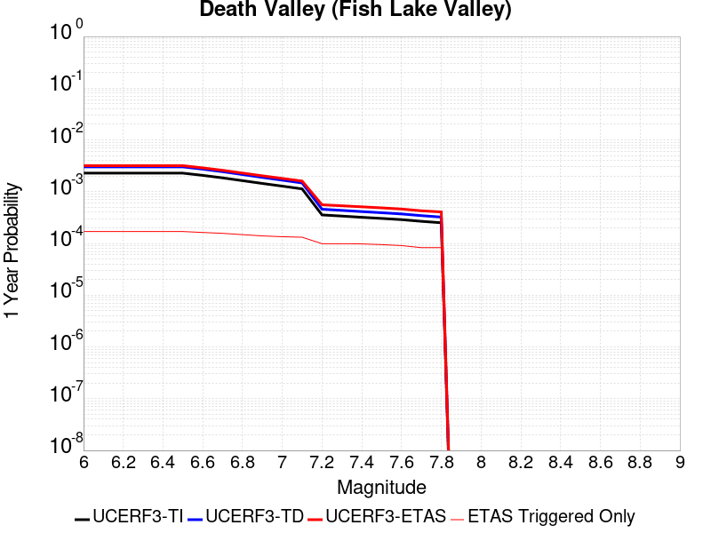
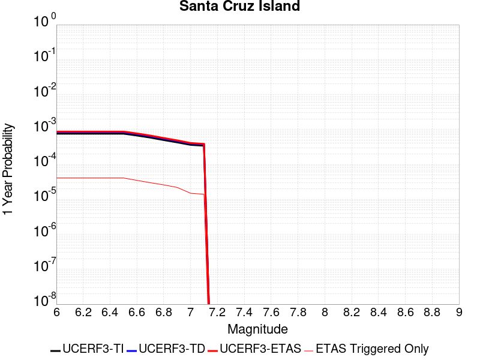
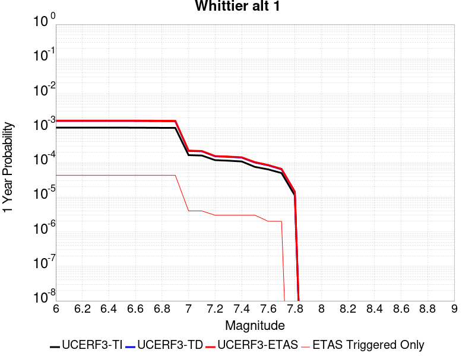
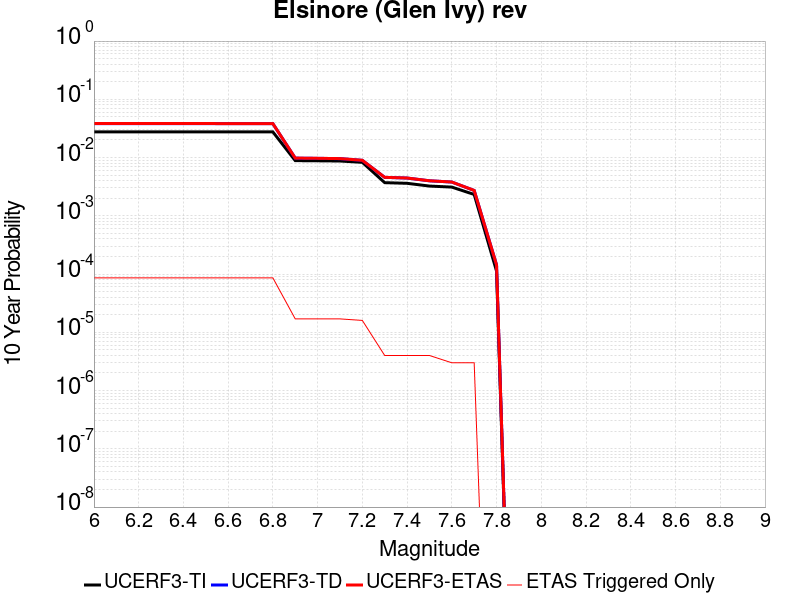
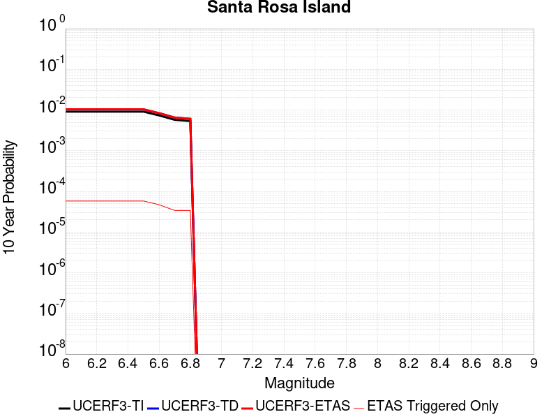
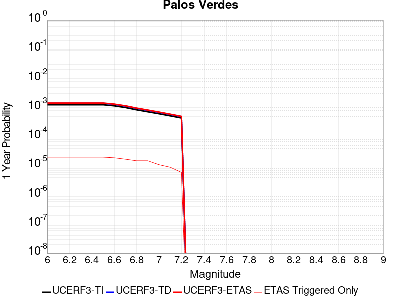
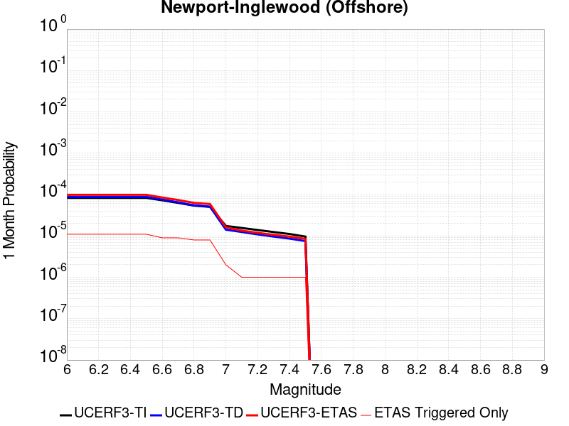

# Parent Section Magnitude-Probability Distributions

Only fault sections with at least one triggered aftershock are plotted. Sections are sorted by total supraseismogenic trigger rate (decreasing)

## Table Of Contents

* [Tank Canyon](#tank-canyon)
* [Little Lake](#little-lake)
* [Garlock (Central)](#garlock-central)
* [Owl Lake](#owl-lake)
* [Garlock (West)](#garlock-west)
* [Garlock (East)](#garlock-east)
* [Death Valley (So)](#death-valley-so)
* [Panamint Valley](#panamint-valley)
* [San Andreas (Mojave N)](#san-andreas-mojave-n)
* [San Andreas (Big Bend)](#san-andreas-big-bend)
* [Blackwater](#blackwater)
* [San Andreas (Carrizo) rev](#san-andreas-carrizo-rev)
* [San Andreas (Mojave S)](#san-andreas-mojave-s)
* [Death Valley (Black Mtns Frontal)](#death-valley-black-mtns-frontal)
* [San Andreas (Cholame) rev](#san-andreas-cholame-rev)
* [San Andreas (Parkfield)](#san-andreas-parkfield)
* [Hunter Mountain-Saline Valley](#hunter-mountain-saline-valley)
* [San Andreas (San Bernardino N)](#san-andreas-san-bernardino-n)
* [Cucamonga](#cucamonga)
* [San Cayetano](#san-cayetano)
* [Pleito](#pleito)
* [Death Valley (No)](#death-valley-no)
* [San Andreas (San Bernardino S)](#san-andreas-san-bernardino-s)
* [Gravel Hills-Harper Lk](#gravel-hills-harper-lk)
* [Pitas Point (Lower West)](#pitas-point-lower-west)
* [Cleghorn](#cleghorn)
* [Santa Ynez (West)](#santa-ynez-west)
* [Santa Ynez (East)](#santa-ynez-east)
* [Pitas Point (Lower)-Montalvo](#pitas-point-lower-montalvo)
* [Red Mountain](#red-mountain)
* [San Juan](#san-juan)
* [Death Valley (Fish Lake Valley)](#death-valley-fish-lake-valley)
* [So Sierra Nevada](#so-sierra-nevada)
* [San Andreas (San Gorgonio Pass-Garnet HIll)](#san-andreas-san-gorgonio-pass-garnet-hill)
* [San Jacinto (San Bernardino)](#san-jacinto-san-bernardino)
* [Mission Ridge-Arroyo Parida-Santa Ana](#mission-ridge-arroyo-parida-santa-ana)
* [San Andreas (Coachella) rev](#san-andreas-coachella-rev)
* [Lenwood-Lockhart-Old Woman Springs](#lenwood-lockhart-old-woman-springs)
* [Oak Ridge (Onshore)](#oak-ridge-onshore)
* [San Jacinto (Stepovers Combined)](#san-jacinto-stepovers-combined)
* [Santa Susana alt 1](#santa-susana-alt-1)
* [San Jacinto (San Jacinto Valley) rev](#san-jacinto-san-jacinto-valley-rev)
* [Ventura-Pitas Point](#ventura-pitas-point)
* [Helendale-So Lockhart](#helendale-so-lockhart)
* [Raymond](#raymond)
* [Sierra Madre](#sierra-madre)
* [Channel Islands Thrust](#channel-islands-thrust)
* [Elysian Park (Upper)](#elysian-park-upper)
* [Chino alt 1](#chino-alt-1)
* [Santa Cruz Island](#santa-cruz-island)
* [Los Alamos 2011 CFM](#los-alamos-2011-cfm)
* [San Gregorio (North) 2011 CFM](#san-gregorio-north-2011-cfm)
* [Whittier alt 1](#whittier-alt-1)
* [Independence rev 2011](#independence-rev-2011)
* [San Jose](#san-jose)
* [Verdugo](#verdugo)
* [Simi-Santa Rosa](#simi-santa-rosa)
* [Hayward (So) 2011 CFM](#hayward-so-2011-cfm)
* [San Gregorio (South) 2011 CFM](#san-gregorio-south-2011-cfm)
* [San Jacinto (Anza) rev](#san-jacinto-anza-rev)
* [Emerson-Copper Mtn 2011](#emerson-copper-mtn-2011)
* [Hayward (No) 2011 CFM](#hayward-no-2011-cfm)
* [Great Valley 12](#great-valley-12)
* [Anacapa-Dume alt 1](#anacapa-dume-alt-1)
* [Elsinore (Stepovers Combined)](#elsinore-stepovers-combined)
* [San Jacinto (Clark) rev](#san-jacinto-clark-rev)
* [Calaveras (No) 2011 CFM](#calaveras-no-2011-cfm)
* [Elsinore (Glen Ivy) rev](#elsinore-glen-ivy-rev)
* [Los Osos 2011](#los-osos-2011)
* [Santa Rosa Island](#santa-rosa-island)
* [Great Valley 03 Mysterious Ridge](#great-valley-03-mysterious-ridge)
* [Imperial](#imperial)
* [Deep Springs](#deep-springs)
* [North Frontal  (West)](#north-frontal--west)
* [Elsinore (Temecula) rev](#elsinore-temecula-rev)
* [Robinson Creek](#robinson-creek)
* [Concord 2011 CFM](#concord-2011-cfm)
* [Burnt Mtn](#burnt-mtn)
* [San Luis Range 2011 CFM](#san-luis-range-2011-cfm)
* [Calaveras (Central) 2011 CFM](#calaveras-central-2011-cfm)
* [Newport-Inglewood alt 1](#newport-inglewood-alt-1)
* [Pinto Mtn](#pinto-mtn)
* [San Gabriel](#san-gabriel)
* [Great Valley 09 (Laguna Seca)](#great-valley-09-laguna-seca)
* [Great Valley 04a Trout Creek](#great-valley-04a-trout-creek)
* [Great Valley 04b Gordon Valley](#great-valley-04b-gordon-valley)
* [Palos Verdes](#palos-verdes)
* [Malibu Coast alt 1](#malibu-coast-alt-1)
* [Great Valley 07 (Orestimba)](#great-valley-07-orestimba)
* [Holser alt 1](#holser-alt-1)
* [Green Valley 2011 CFM](#green-valley-2011-cfm)
* [Rose Canyon](#rose-canyon)
* [Great Valley 10 (Panoche)](#great-valley-10-panoche)
* [Clamshell-Sawpit](#clamshell-sawpit)
* [Hosgri](#hosgri)
* [Rodgers Creek - Healdsburg 2011 CFM](#rodgers-creek---healdsburg-2011-cfm)
* [San Andreas (Creeping Section) 2011 CFM](#san-andreas-creeping-section-2011-cfm)
* [Casmalia 2011 CFM](#casmalia-2011-cfm)
* [Newport-Inglewood (Offshore)](#newport-inglewood-offshore)
* [Hollywood](#hollywood)
* [Mono Lake 2011 CFM](#mono-lake-2011-cfm)

## Tank Canyon
*[(top)](#table-of-contents)*

| 1 Week | 1 Month | 1 Year | 10 Year |
|-----|-----|-----|-----|
|  |  |  |  |

| Magnitude | 1 wk TI Prob | 1 wk TD Prob | 1 wk ETAS Prob | 1 wk ETAS/TD Gain | 1 wk ETAS Triggered Only | 1 mo TI Prob | 1 mo TD Prob | 1 mo ETAS Prob | 1 mo ETAS/TD Gain | 1 mo ETAS Triggered Only | 1 yr TI Prob | 1 yr TD Prob | 1 yr ETAS Prob | 1 yr ETAS/TD Gain | 1 yr ETAS Triggered Only | 10 yr TI Prob | 10 yr TD Prob | 10 yr ETAS Prob | 10 yr ETAS/TD Gain | 10 yr ETAS Triggered Only |
|-----|-----|-----|-----|-----|-----|-----|-----|-----|-----|-----|-----|-----|-----|-----|-----|-----|-----|-----|-----|-----|
| 6.0 | 2.7748038E-5 | 3.5073965E-5 | 0.020714397 | 590.5918 | 0.02068005 | 1.18914744E-4 | 1.5031699E-4 | 0.026576804 | 176.80504 | 0.02643046 | 0.0014468255 | 0.0018300817 | 0.0421519 | 23.032795 | 0.040395744 | 0.014374418 | 0.018297758 | 0.072154984 | 3.9433784 | 0.05486106 |
| 6.1 | 2.7748038E-5 | 3.5073965E-5 | 0.020714397 | 590.5918 | 0.02068005 | 1.18914744E-4 | 1.5031699E-4 | 0.026576804 | 176.80504 | 0.02643046 | 0.0014468255 | 0.0018300817 | 0.0421519 | 23.032795 | 0.040395744 | 0.014374418 | 0.018297758 | 0.072154984 | 3.9433784 | 0.05486106 |
| 6.2 | 2.7748038E-5 | 3.5073965E-5 | 0.020714397 | 590.5918 | 0.02068005 | 1.18914744E-4 | 1.5031699E-4 | 0.026576804 | 176.80504 | 0.02643046 | 0.0014468255 | 0.0018300817 | 0.0421519 | 23.032795 | 0.040395744 | 0.014374418 | 0.018297758 | 0.072154984 | 3.9433784 | 0.05486106 |
| 6.3 | 2.7748038E-5 | 3.5073965E-5 | 0.020714397 | 590.5918 | 0.02068005 | 1.18914744E-4 | 1.5031699E-4 | 0.026576804 | 176.80504 | 0.02643046 | 0.0014468255 | 0.0018300817 | 0.0421519 | 23.032795 | 0.040395744 | 0.014374418 | 0.018297758 | 0.072154984 | 3.9433784 | 0.05486106 |

## Little Lake
*[(top)](#table-of-contents)*

| 1 Week | 1 Month | 1 Year | 10 Year |
|-----|-----|-----|-----|
|  |  |  |  |

| Magnitude | 1 wk TI Prob | 1 wk TD Prob | 1 wk ETAS Prob | 1 wk ETAS/TD Gain | 1 wk ETAS Triggered Only | 1 mo TI Prob | 1 mo TD Prob | 1 mo ETAS Prob | 1 mo ETAS/TD Gain | 1 mo ETAS Triggered Only | 1 yr TI Prob | 1 yr TD Prob | 1 yr ETAS Prob | 1 yr ETAS/TD Gain | 1 yr ETAS Triggered Only | 10 yr TI Prob | 10 yr TD Prob | 10 yr ETAS Prob | 10 yr ETAS/TD Gain | 10 yr ETAS Triggered Only |
|-----|-----|-----|-----|-----|-----|-----|-----|-----|-----|-----|-----|-----|-----|-----|-----|-----|-----|-----|-----|-----|
| 6.0 | 1.27106505E-5 | 1.3900362E-5 | 0.012264605 | 882.3227 | 0.012250875 | 5.447308E-5 | 5.957219E-5 | 0.015309753 | 256.99496 | 0.01525109 | 6.630079E-4 | 7.25151E-4 | 0.021033294 | 29.0054 | 0.02032288 | 0.006610333 | 0.0072377534 | 0.032164957 | 4.4440527 | 0.025108937 |
| 6.1 | 1.27106505E-5 | 1.3900362E-5 | 0.012264605 | 882.3227 | 0.012250875 | 5.447308E-5 | 5.957219E-5 | 0.015309753 | 256.99496 | 0.01525109 | 6.630079E-4 | 7.25151E-4 | 0.021033294 | 29.0054 | 0.02032288 | 0.006610333 | 0.0072377534 | 0.032164957 | 4.4440527 | 0.025108937 |
| 6.2 | 1.27106505E-5 | 1.3900362E-5 | 0.012264605 | 882.3227 | 0.012250875 | 5.447308E-5 | 5.957219E-5 | 0.015309753 | 256.99496 | 0.01525109 | 6.630079E-4 | 7.25151E-4 | 0.021033294 | 29.0054 | 0.02032288 | 0.006610333 | 0.0072377534 | 0.032164957 | 4.4440527 | 0.025108937 |
| 6.3 | 1.27106505E-5 | 1.3900362E-5 | 0.012264605 | 882.3227 | 0.012250875 | 5.447308E-5 | 5.957219E-5 | 0.015309753 | 256.99496 | 0.01525109 | 6.630079E-4 | 7.25151E-4 | 0.021033294 | 29.0054 | 0.02032288 | 0.006610333 | 0.0072377534 | 0.032164957 | 4.4440527 | 0.025108937 |
| 6.4 | 1.27106505E-5 | 1.3900362E-5 | 0.012264605 | 882.3227 | 0.012250875 | 5.447308E-5 | 5.957219E-5 | 0.015309753 | 256.99496 | 0.01525109 | 6.630079E-4 | 7.25151E-4 | 0.021033294 | 29.0054 | 0.02032288 | 0.006610333 | 0.0072377534 | 0.032164957 | 4.4440527 | 0.025108937 |
| 6.5 | 1.27106505E-5 | 1.3900362E-5 | 0.012264605 | 882.3227 | 0.012250875 | 5.447308E-5 | 5.957219E-5 | 0.015309753 | 256.99496 | 0.01525109 | 6.630079E-4 | 7.25151E-4 | 0.021033294 | 29.0054 | 0.02032288 | 0.006610333 | 0.0072377534 | 0.032164957 | 4.4440527 | 0.025108937 |
| 6.6 | 1.08505255E-5 | 1.1856941E-5 | 0.010262468 | 865.5241 | 0.010250732 | 4.6501424E-5 | 5.0815026E-5 | 0.012943938 | 254.72658 | 0.012893778 | 5.6600774E-4 | 6.1859656E-4 | 0.017680684 | 28.58193 | 0.017072648 | 0.005645683 | 0.006178476 | 0.027014723 | 4.3723927 | 0.020965783 |
| 6.7 | 7.97625E-6 | 8.706619E-6 | 0.0076520434 | 878.8765 | 0.007643403 | 3.4183482E-5 | 3.7314083E-5 | 0.0096805 | 259.4329 | 0.009643546 | 4.161044E-4 | 4.5429895E-4 | 0.013199417 | 29.054474 | 0.012750911 | 0.004153261 | 0.0045429897 | 0.020187004 | 4.44355 | 0.01571541 |
| 6.8 | 7.97625E-6 | 8.706619E-6 | 0.0076520434 | 878.8765 | 0.007643403 | 3.4183482E-5 | 3.7314083E-5 | 0.0096805 | 259.4329 | 0.009643546 | 4.161044E-4 | 4.5429895E-4 | 0.013199417 | 29.054474 | 0.012750911 | 0.004153261 | 0.0045429897 | 0.020187004 | 4.44355 | 0.01571541 |

## Garlock (Central)
*[(top)](#table-of-contents)*

| 1 Week | 1 Month | 1 Year | 10 Year |
|-----|-----|-----|-----|
|  |  |  |  |

| Magnitude | 1 wk TI Prob | 1 wk TD Prob | 1 wk ETAS Prob | 1 wk ETAS/TD Gain | 1 wk ETAS Triggered Only | 1 mo TI Prob | 1 mo TD Prob | 1 mo ETAS Prob | 1 mo ETAS/TD Gain | 1 mo ETAS Triggered Only | 1 yr TI Prob | 1 yr TD Prob | 1 yr ETAS Prob | 1 yr ETAS/TD Gain | 1 yr ETAS Triggered Only | 10 yr TI Prob | 10 yr TD Prob | 10 yr ETAS Prob | 10 yr ETAS/TD Gain | 10 yr ETAS Triggered Only |
|-----|-----|-----|-----|-----|-----|-----|-----|-----|-----|-----|-----|-----|-----|-----|-----|-----|-----|-----|-----|-----|
| 6.0 | 2.575808E-5 | 1.9313613E-5 | 0.010948455 | 566.8776 | 0.010929352 | 1.10387096E-4 | 8.277037E-5 | 0.013689759 | 165.39444 | 0.013608115 | 0.0013431342 | 0.0010073289 | 0.019953864 | 19.808691 | 0.018965641 | 0.013350452 | 0.0100695705 | 0.034748886 | 3.4508805 | 0.024930352 |
| 6.1 | 2.575808E-5 | 1.9313613E-5 | 0.010948455 | 566.8776 | 0.010929352 | 1.10387096E-4 | 8.277037E-5 | 0.013689759 | 165.39444 | 0.013608115 | 0.0013431342 | 0.0010073289 | 0.019953864 | 19.808691 | 0.018965641 | 0.013350452 | 0.0100695705 | 0.034748886 | 3.4508805 | 0.024930352 |
| 6.2 | 2.575808E-5 | 1.9313613E-5 | 0.010948455 | 566.8776 | 0.010929352 | 1.10387096E-4 | 8.277037E-5 | 0.013689759 | 165.39444 | 0.013608115 | 0.0013431342 | 0.0010073289 | 0.019953864 | 19.808691 | 0.018965641 | 0.013350452 | 0.0100695705 | 0.034748886 | 3.4508805 | 0.024930352 |
| 6.3 | 2.575808E-5 | 1.9313613E-5 | 0.010948455 | 566.8776 | 0.010929352 | 1.10387096E-4 | 8.277037E-5 | 0.013689759 | 165.39444 | 0.013608115 | 0.0013431342 | 0.0010073289 | 0.019953864 | 19.808691 | 0.018965641 | 0.013350452 | 0.0100695705 | 0.034748886 | 3.4508805 | 0.024930352 |
| 6.4 | 2.575808E-5 | 1.9313613E-5 | 0.010948455 | 566.8776 | 0.010929352 | 1.10387096E-4 | 8.277037E-5 | 0.013689759 | 165.39444 | 0.013608115 | 0.0013431342 | 0.0010073289 | 0.019953864 | 19.808691 | 0.018965641 | 0.013350452 | 0.0100695705 | 0.034748886 | 3.4508805 | 0.024930352 |
| 6.5 | 2.575808E-5 | 1.9313613E-5 | 0.010948455 | 566.8776 | 0.010929352 | 1.10387096E-4 | 8.277037E-5 | 0.013689759 | 165.39444 | 0.013608115 | 0.0013431342 | 0.0010073289 | 0.019953864 | 19.808691 | 0.018965641 | 0.013350452 | 0.0100695705 | 0.034748886 | 3.4508805 | 0.024930352 |
| 6.6 | 2.540234E-5 | 1.885198E-5 | 0.01055512 | 559.89453 | 0.010536467 | 1.0886263E-4 | 8.0792066E-5 | 0.01325924 | 164.11562 | 0.013179513 | 0.0013245966 | 9.83265E-4 | 0.019252304 | 19.579977 | 0.01828702 | 0.013167289 | 0.009831364 | 0.033632476 | 3.4209366 | 0.024037432 |
| 6.7 | 2.4966947E-5 | 1.8286464E-5 | 0.009875953 | 540.06903 | 0.009857847 | 1.06996806E-4 | 7.8368575E-5 | 0.012506854 | 159.59016 | 0.012429459 | 0.0013019076 | 9.5378514E-4 | 0.018295612 | 19.18211 | 0.017358383 | 0.012943068 | 0.009539624 | 0.03221571 | 3.377042 | 0.022894492 |
| 6.8 | 2.4548952E-5 | 1.7797542E-5 | 0.009589739 | 538.82385 | 0.009572112 | 1.0520555E-4 | 7.627332E-5 | 0.012111929 | 158.79642 | 0.012036574 | 0.001280125 | 9.282974E-4 | 0.017770994 | 19.143644 | 0.016858347 | 0.012727758 | 0.009286596 | 0.031190004 | 3.3586044 | 0.022108722 |
| 6.9 | 2.3994342E-5 | 1.7148153E-5 | 0.009017637 | 525.86633 | 0.009000643 | 1.0282884E-4 | 7.349039E-5 | 0.011359181 | 154.5669 | 0.01128652 | 0.0012512221 | 8.944436E-4 | 0.01648874 | 18.434635 | 0.015608258 | 0.012442005 | 0.0089510605 | 0.029304413 | 3.273848 | 0.02053718 |
| 7.0 | 2.343005E-5 | 1.6491087E-5 | 0.008516958 | 516.45825 | 0.008500607 | 1.0041064E-4 | 7.067455E-5 | 0.010784969 | 152.60046 | 0.010715051 | 0.0012218138 | 8.601883E-4 | 0.015562867 | 18.092396 | 0.014715337 | 0.01215118 | 0.008610493 | 0.027802331 | 3.22889 | 0.019358525 |
| 7.1 | 2.2814058E-5 | 1.5782754E-5 | 0.0079805115 | 505.64758 | 0.007964855 | 9.777087E-5 | 6.763899E-5 | 0.010031963 | 148.31627 | 0.009964998 | 0.0011897103 | 8.2325895E-4 | 0.014598608 | 17.732704 | 0.013786699 | 0.011833611 | 0.00824334 | 0.026450459 | 3.2087064 | 0.018358454 |
| 7.2 | 2.2145266E-5 | 1.5027377E-5 | 0.007336869 | 488.2335 | 0.0073219514 | 9.490483E-5 | 6.440182E-5 | 0.009278752 | 144.07593 | 0.009214944 | 0.0011548538 | 7.8387547E-4 | 0.013596169 | 17.344807 | 0.012822345 | 0.011488707 | 0.007851825 | 0.024861295 | 3.1663077 | 0.017144082 |
| 7.3 | 1.9954436E-5 | 1.3199953E-5 | 0.005870684 | 444.75037 | 0.0058575612 | 8.551621E-5 | 5.657036E-5 | 0.0074138227 | 131.0549 | 0.0073576686 | 0.0010406625 | 6.8859005E-4 | 0.010896572 | 15.824468 | 0.010215015 | 0.010358025 | 0.006900618 | 0.0204503 | 2.963546 | 0.013643832 |
| 7.4 | 1.918037E-5 | 1.2553606E-5 | 0.005548594 | 441.99203 | 0.0055361097 | 8.2198996E-5 | 5.3800417E-5 | 0.007053924 | 131.11281 | 0.0070005 | 0.0010003132 | 6.5488677E-4 | 0.010363504 | 15.82488 | 0.00971498 | 0.009958224 | 0.006564366 | 0.019373504 | 2.951314 | 0.012893778 |
| 7.5 | 1.6994161E-5 | 1.0764553E-5 | 0.0040467237 | 375.9305 | 0.004036003 | 7.283008E-5 | 4.613333E-5 | 0.0053319815 | 115.577644 | 0.005286092 | 8.863455E-4 | 5.615903E-4 | 0.007950824 | 14.157694 | 0.0073933853 | 0.008828186 | 0.005632708 | 0.015577091 | 2.7654712 | 0.010000714 |
| 7.6 | 1.621788E-5 | 1.012848E-5 | 0.003653209 | 360.68677 | 0.0036431174 | 6.950335E-5 | 4.34074E-5 | 0.004829256 | 111.25421 | 0.004786056 | 8.458747E-4 | 5.2841863E-4 | 0.0072753336 | 13.768125 | 0.006750482 | 0.0084266225 | 0.005301458 | 0.014396494 | 2.7155728 | 0.00914351 |
| 7.7 | 7.713584E-6 | 3.2171508E-6 | 8.604185E-4 | 267.44736 | 8.572041E-4 | 3.3057797E-5 | 1.378779E-5 | 0.0011924271 | 86.48429 | 0.0011786557 | 4.0240434E-4 | 1.6786634E-4 | 0.0022033842 | 13.125826 | 0.0020358597 | 0.0040167645 | 0.0016902693 | 0.0046140994 | 2.7298014 | 0.0029287806 |

## Owl Lake
*[(top)](#table-of-contents)*

| 1 Week | 1 Month | 1 Year | 10 Year |
|-----|-----|-----|-----|
|  |  |  |  |

| Magnitude | 1 wk TI Prob | 1 wk TD Prob | 1 wk ETAS Prob | 1 wk ETAS/TD Gain | 1 wk ETAS Triggered Only | 1 mo TI Prob | 1 mo TD Prob | 1 mo ETAS Prob | 1 mo ETAS/TD Gain | 1 mo ETAS Triggered Only | 1 yr TI Prob | 1 yr TD Prob | 1 yr ETAS Prob | 1 yr ETAS/TD Gain | 1 yr ETAS Triggered Only | 10 yr TI Prob | 10 yr TD Prob | 10 yr ETAS Prob | 10 yr ETAS/TD Gain | 10 yr ETAS Triggered Only |
|-----|-----|-----|-----|-----|-----|-----|-----|-----|-----|-----|-----|-----|-----|-----|-----|-----|-----|-----|-----|-----|
| 6.0 | 3.637175E-5 | 4.988367E-5 | 0.0043356903 | 86.91602 | 0.0042860205 | 1.5586962E-4 | 2.1378716E-4 | 0.0059272596 | 27.725048 | 0.005714694 | 0.0018960608 | 0.0026025574 | 0.011829142 | 4.5452 | 0.00925066 | 0.018799646 | 0.025995217 | 0.03938874 | 1.5152303 | 0.0137509825 |
| 6.1 | 3.637175E-5 | 4.988367E-5 | 0.0043356903 | 86.91602 | 0.0042860205 | 1.5586962E-4 | 2.1378716E-4 | 0.0059272596 | 27.725048 | 0.005714694 | 0.0018960608 | 0.0026025574 | 0.011829142 | 4.5452 | 0.00925066 | 0.018799646 | 0.025995217 | 0.03938874 | 1.5152303 | 0.0137509825 |
| 6.2 | 3.637175E-5 | 4.988367E-5 | 0.0043356903 | 86.91602 | 0.0042860205 | 1.5586962E-4 | 2.1378716E-4 | 0.0059272596 | 27.725048 | 0.005714694 | 0.0018960608 | 0.0026025574 | 0.011829142 | 4.5452 | 0.00925066 | 0.018799646 | 0.025995217 | 0.03938874 | 1.5152303 | 0.0137509825 |
| 6.3 | 3.637175E-5 | 4.988367E-5 | 0.0043356903 | 86.91602 | 0.0042860205 | 1.5586962E-4 | 2.1378716E-4 | 0.0059272596 | 27.725048 | 0.005714694 | 0.0018960608 | 0.0026025574 | 0.011829142 | 4.5452 | 0.00925066 | 0.018799646 | 0.025995217 | 0.03938874 | 1.5152303 | 0.0137509825 |
| 6.4 | 3.637175E-5 | 4.988367E-5 | 0.0043356903 | 86.91602 | 0.0042860205 | 1.5586962E-4 | 2.1378716E-4 | 0.0059272596 | 27.725048 | 0.005714694 | 0.0018960608 | 0.0026025574 | 0.011829142 | 4.5452 | 0.00925066 | 0.018799646 | 0.025995217 | 0.03938874 | 1.5152303 | 0.0137509825 |
| 6.5 | 3.637175E-5 | 4.988367E-5 | 0.0043356903 | 86.91602 | 0.0042860205 | 1.5586962E-4 | 2.1378716E-4 | 0.0059272596 | 27.725048 | 0.005714694 | 0.0018960608 | 0.0026025574 | 0.011829142 | 4.5452 | 0.00925066 | 0.018799646 | 0.025995217 | 0.03938874 | 1.5152303 | 0.0137509825 |

## Garlock (West)
*[(top)](#table-of-contents)*

| 1 Week | 1 Month | 1 Year | 10 Year |
|-----|-----|-----|-----|
|  |  |  |  |

| Magnitude | 1 wk TI Prob | 1 wk TD Prob | 1 wk ETAS Prob | 1 wk ETAS/TD Gain | 1 wk ETAS Triggered Only | 1 mo TI Prob | 1 mo TD Prob | 1 mo ETAS Prob | 1 mo ETAS/TD Gain | 1 mo ETAS Triggered Only | 1 yr TI Prob | 1 yr TD Prob | 1 yr ETAS Prob | 1 yr ETAS/TD Gain | 1 yr ETAS Triggered Only | 10 yr TI Prob | 10 yr TD Prob | 10 yr ETAS Prob | 10 yr ETAS/TD Gain | 10 yr ETAS Triggered Only |
|-----|-----|-----|-----|-----|-----|-----|-----|-----|-----|-----|-----|-----|-----|-----|-----|-----|-----|-----|-----|-----|
| 6.0 | 2.516656E-5 | 1.8065048E-5 | 0.0046254536 | 256.04437 | 0.004607472 | 1.07852225E-4 | 7.741977E-5 | 0.0060416698 | 78.03782 | 0.005964712 | 0.0013123099 | 9.42255E-4 | 0.009327803 | 9.899446 | 0.008393456 | 0.013045873 | 0.009421492 | 0.020672437 | 2.1941788 | 0.011357954 |
| 6.1 | 2.516656E-5 | 1.8065048E-5 | 0.0046254536 | 256.04437 | 0.004607472 | 1.07852225E-4 | 7.741977E-5 | 0.0060416698 | 78.03782 | 0.005964712 | 0.0013123099 | 9.42255E-4 | 0.009327803 | 9.899446 | 0.008393456 | 0.013045873 | 0.009421492 | 0.020672437 | 2.1941788 | 0.011357954 |
| 6.2 | 2.516656E-5 | 1.8065048E-5 | 0.0046254536 | 256.04437 | 0.004607472 | 1.07852225E-4 | 7.741977E-5 | 0.0060416698 | 78.03782 | 0.005964712 | 0.0013123099 | 9.42255E-4 | 0.009327803 | 9.899446 | 0.008393456 | 0.013045873 | 0.009421492 | 0.020672437 | 2.1941788 | 0.011357954 |
| 6.3 | 2.516656E-5 | 1.8065048E-5 | 0.0046254536 | 256.04437 | 0.004607472 | 1.07852225E-4 | 7.741977E-5 | 0.0060416698 | 78.03782 | 0.005964712 | 0.0013123099 | 9.42255E-4 | 0.009327803 | 9.899446 | 0.008393456 | 0.013045873 | 0.009421492 | 0.020672437 | 2.1941788 | 0.011357954 |
| 6.4 | 2.516656E-5 | 1.8065048E-5 | 0.0046254536 | 256.04437 | 0.004607472 | 1.07852225E-4 | 7.741977E-5 | 0.0060416698 | 78.03782 | 0.005964712 | 0.0013123099 | 9.42255E-4 | 0.009327803 | 9.899446 | 0.008393456 | 0.013045873 | 0.009421492 | 0.020672437 | 2.1941788 | 0.011357954 |
| 6.5 | 2.516656E-5 | 1.8065048E-5 | 0.0046254536 | 256.04437 | 0.004607472 | 1.07852225E-4 | 7.741977E-5 | 0.0060416698 | 78.03782 | 0.005964712 | 0.0013123099 | 9.42255E-4 | 0.009327803 | 9.899446 | 0.008393456 | 0.013045873 | 0.009421492 | 0.020672437 | 2.1941788 | 0.011357954 |
| 6.6 | 2.498869E-5 | 1.7877663E-5 | 0.0046252673 | 258.71768 | 0.004607472 | 1.07089996E-4 | 7.6616736E-5 | 0.0060408716 | 78.84532 | 0.005964712 | 0.0013030408 | 9.3248655E-4 | 0.009318116 | 9.992763 | 0.008393456 | 0.012954267 | 0.009324339 | 0.020576388 | 2.2067394 | 0.011357954 |
| 6.7 | 2.4627925E-5 | 1.7497801E-5 | 0.004624889 | 264.3126 | 0.004607472 | 1.0554398E-4 | 7.498886E-5 | 0.0060392534 | 80.53535 | 0.005964712 | 0.0012842404 | 9.1268384E-4 | 0.00929848 | 10.188063 | 0.008393456 | 0.012768441 | 0.009128104 | 0.020382382 | 2.2329261 | 0.011357954 |
| 6.8 | 2.4270235E-5 | 1.716136E-5 | 0.0046245544 | 269.47482 | 0.004607472 | 1.04011146E-4 | 7.354704E-5 | 0.00603782 | 82.09467 | 0.005964712 | 0.0012656 | 8.9514436E-4 | 0.009281088 | 10.368258 | 0.008393456 | 0.012584164 | 0.0089538675 | 0.020210125 | 2.257139 | 0.011357954 |
| 6.9 | 2.3913764E-5 | 1.6823105E-5 | 0.0045885015 | 272.74997 | 0.004571755 | 1.0248353E-4 | 7.2097464E-5 | 0.006000665 | 83.229904 | 0.005928995 | 0.0012470228 | 8.775101E-4 | 0.009227916 | 10.516023 | 0.00835774 | 0.012400482 | 0.00877859 | 0.020001434 | 2.2784336 | 0.011322238 |
| 7.0 | 2.3579369E-5 | 1.6492264E-5 | 0.004588172 | 278.20148 | 0.004571755 | 1.0105052E-4 | 7.067965E-5 | 0.0059992555 | 84.87953 | 0.005928995 | 0.0012295957 | 8.6026196E-4 | 0.009210812 | 10.706985 | 0.00835774 | 0.012228143 | 0.008607132 | 0.019831918 | 2.304126 | 0.011322238 |
| 7.1 | 2.3205374E-5 | 1.6105636E-5 | 0.004587787 | 284.856 | 0.004571755 | 9.944781E-5 | 6.902276E-5 | 0.0059976084 | 86.893196 | 0.005928995 | 0.0012101046 | 8.401051E-4 | 0.0091551365 | 10.897609 | 0.008322023 | 0.0120353615 | 0.008406721 | 0.01959836 | 2.3312726 | 0.01128652 |
| 7.2 | 2.2799322E-5 | 1.5676578E-5 | 0.0045159273 | 288.06842 | 0.0045003216 | 9.770772E-5 | 6.718404E-5 | 0.005924352 | 88.18094 | 0.0058575612 | 0.0011889422 | 8.177357E-4 | 0.009061579 | 11.081305 | 0.0082505895 | 0.011826012 | 0.008184515 | 0.019272387 | 2.3547378 | 0.01117937 |
| 7.3 | 1.8228246E-5 | 1.1798695E-5 | 0.004333485 | 367.28513 | 0.004321737 | 7.811871E-5 | 5.0565202E-5 | 0.005657825 | 111.89167 | 0.0056075435 | 9.506803E-4 | 6.1551924E-4 | 0.008468387 | 13.758119 | 0.007857705 | 0.0094662355 | 0.006171021 | 0.016855447 | 2.7313867 | 0.010750768 |
| 7.4 | 1.7670916E-5 | 1.132978E-5 | 0.0041901525 | 369.8353 | 0.00417887 | 7.5730306E-5 | 4.8555645E-5 | 0.005477251 | 112.8036 | 0.005428959 | 9.216264E-4 | 5.9106643E-4 | 0.008194256 | 13.863511 | 0.0076076863 | 0.009178135 | 0.0059269792 | 0.016258975 | 2.7432146 | 0.0103936 |
| 7.5 | 1.6994161E-5 | 1.0764553E-5 | 0.0040467237 | 375.9305 | 0.004036003 | 7.283008E-5 | 4.613333E-5 | 0.0053319815 | 115.577644 | 0.005286092 | 8.863455E-4 | 5.615903E-4 | 0.007950824 | 14.157694 | 0.0073933853 | 0.008828186 | 0.005632708 | 0.015577091 | 2.7654712 | 0.010000714 |
| 7.6 | 1.621788E-5 | 1.012848E-5 | 0.003653209 | 360.68677 | 0.0036431174 | 6.950335E-5 | 4.34074E-5 | 0.004829256 | 111.25421 | 0.004786056 | 8.458747E-4 | 5.2841863E-4 | 0.0072753336 | 13.768125 | 0.006750482 | 0.0084266225 | 0.005301458 | 0.014396494 | 2.7155728 | 0.00914351 |
| 7.7 | 7.713584E-6 | 3.2171508E-6 | 8.604185E-4 | 267.44736 | 8.572041E-4 | 3.3057797E-5 | 1.378779E-5 | 0.0011924271 | 86.48429 | 0.0011786557 | 4.0240434E-4 | 1.6786634E-4 | 0.0022033842 | 13.125826 | 0.0020358597 | 0.0040167645 | 0.0016902693 | 0.0046140994 | 2.7298014 | 0.0029287806 |

## Garlock (East)
*[(top)](#table-of-contents)*

| 1 Week | 1 Month | 1 Year | 10 Year |
|-----|-----|-----|-----|
|  |  |  |  |

| Magnitude | 1 wk TI Prob | 1 wk TD Prob | 1 wk ETAS Prob | 1 wk ETAS/TD Gain | 1 wk ETAS Triggered Only | 1 mo TI Prob | 1 mo TD Prob | 1 mo ETAS Prob | 1 mo ETAS/TD Gain | 1 mo ETAS Triggered Only | 1 yr TI Prob | 1 yr TD Prob | 1 yr ETAS Prob | 1 yr ETAS/TD Gain | 1 yr ETAS Triggered Only | 10 yr TI Prob | 10 yr TD Prob | 10 yr ETAS Prob | 10 yr ETAS/TD Gain | 10 yr ETAS Triggered Only |
|-----|-----|-----|-----|-----|-----|-----|-----|-----|-----|-----|-----|-----|-----|-----|-----|-----|-----|-----|-----|-----|
| 6.0 | 2.2327951E-5 | 1.8303952E-5 | 0.0042328136 | 231.25136 | 0.0042145867 | 9.5687705E-5 | 7.8444085E-5 | 0.0053998353 | 68.83674 | 0.0053218086 | 0.0011643751 | 9.548048E-4 | 0.008876372 | 9.29653 | 0.007929138 | 0.0115829315 | 0.0096519785 | 0.020369725 | 2.1104195 | 0.010822201 |
| 6.1 | 2.2327951E-5 | 1.8303952E-5 | 0.0042328136 | 231.25136 | 0.0042145867 | 9.5687705E-5 | 7.8444085E-5 | 0.0053998353 | 68.83674 | 0.0053218086 | 0.0011643751 | 9.548048E-4 | 0.008876372 | 9.29653 | 0.007929138 | 0.0115829315 | 0.0096519785 | 0.020369725 | 2.1104195 | 0.010822201 |
| 6.2 | 2.2327951E-5 | 1.8303952E-5 | 0.0042328136 | 231.25136 | 0.0042145867 | 9.5687705E-5 | 7.8444085E-5 | 0.0053998353 | 68.83674 | 0.0053218086 | 0.0011643751 | 9.548048E-4 | 0.008876372 | 9.29653 | 0.007929138 | 0.0115829315 | 0.0096519785 | 0.020369725 | 2.1104195 | 0.010822201 |
| 6.3 | 2.2327951E-5 | 1.8303952E-5 | 0.0042328136 | 231.25136 | 0.0042145867 | 9.5687705E-5 | 7.8444085E-5 | 0.0053998353 | 68.83674 | 0.0053218086 | 0.0011643751 | 9.548048E-4 | 0.008876372 | 9.29653 | 0.007929138 | 0.0115829315 | 0.0096519785 | 0.020369725 | 2.1104195 | 0.010822201 |
| 6.4 | 2.2327951E-5 | 1.8303952E-5 | 0.0042328136 | 231.25136 | 0.0042145867 | 9.5687705E-5 | 7.8444085E-5 | 0.0053998353 | 68.83674 | 0.0053218086 | 0.0011643751 | 9.548048E-4 | 0.008876372 | 9.29653 | 0.007929138 | 0.0115829315 | 0.0096519785 | 0.020369725 | 2.1104195 | 0.010822201 |
| 6.5 | 2.2327951E-5 | 1.8303952E-5 | 0.0042328136 | 231.25136 | 0.0042145867 | 9.5687705E-5 | 7.8444085E-5 | 0.0053998353 | 68.83674 | 0.0053218086 | 0.0011643751 | 9.548048E-4 | 0.008876372 | 9.29653 | 0.007929138 | 0.0115829315 | 0.0096519785 | 0.020369725 | 2.1104195 | 0.010822201 |
| 6.6 | 2.222123E-5 | 1.816971E-5 | 0.0041969637 | 230.98682 | 0.00417887 | 9.523036E-5 | 7.7868805E-5 | 0.005363549 | 68.8793 | 0.005286092 | 0.0011588129 | 9.4780687E-4 | 0.008798064 | 9.282549 | 0.007857705 | 0.011527888 | 0.009581773 | 0.02022953 | 2.111251 | 0.010750768 |
| 6.7 | 2.2076227E-5 | 1.798404E-5 | 0.004196779 | 233.36128 | 0.00417887 | 9.4608964E-5 | 7.707312E-5 | 0.0053627575 | 69.580124 | 0.005286092 | 0.0011512554 | 9.381278E-4 | 0.008788461 | 9.368084 | 0.007857705 | 0.011453095 | 0.009485973 | 0.020099381 | 2.1188529 | 0.010715051 |
| 6.8 | 2.1962227E-5 | 1.7854036E-5 | 0.0041966494 | 235.05325 | 0.00417887 | 9.4120434E-5 | 7.651599E-5 | 0.0053622033 | 70.07951 | 0.005286092 | 0.0011453138 | 9.313506E-4 | 0.008781737 | 9.429034 | 0.007857705 | 0.01139429 | 0.00941876 | 0.019997507 | 2.1231573 | 0.010679334 |
| 6.9 | 1.1702579E-5 | 6.6732687E-6 | 0.0037926326 | 568.3321 | 0.0037859848 | 5.0152947E-5 | 2.8599494E-5 | 0.00463594 | 162.09866 | 0.004607472 | 6.10441E-4 | 3.481581E-4 | 0.0069534723 | 19.97217 | 0.006607615 | 0.0060876687 | 0.0034954504 | 0.012144304 | 3.4743176 | 0.008679192 |
| 7.0 | 1.153538E-5 | 6.4796777E-6 | 0.0037567234 | 579.7701 | 0.003750268 | 4.9436403E-5 | 2.7769835E-5 | 0.0045636822 | 164.33955 | 0.0045360383 | 6.01722E-4 | 3.3806017E-4 | 0.0067649176 | 20.010986 | 0.0064290306 | 0.006000953 | 0.0033946347 | 0.01183079 | 3.4851437 | 0.0084648905 |
| 7.1 | 1.135938E-5 | 6.273818E-6 | 0.0036136517 | 575.98926 | 0.0036074005 | 4.868215E-5 | 2.6887597E-5 | 0.0043485085 | 161.72916 | 0.004321737 | 5.925439E-4 | 3.2732222E-4 | 0.0065043126 | 19.871283 | 0.006179013 | 0.0059096646 | 0.0032873498 | 0.011439618 | 3.4798906 | 0.008179156 |
| 7.2 | 1.1168294E-5 | 6.048814E-6 | 0.003291978 | 544.2353 | 0.003285949 | 4.786324E-5 | 2.5923315E-5 | 0.0039903894 | 153.93053 | 0.003964569 | 5.825791E-4 | 3.1558552E-4 | 0.0060641817 | 19.21565 | 0.0057504107 | 0.005810542 | 0.0031701238 | 0.010753693 | 3.3921998 | 0.0076076863 |
| 7.3 | 1.0952553E-5 | 5.8686815E-6 | 0.0030060653 | 512.2216 | 0.0030002142 | 4.693867E-5 | 2.5151334E-5 | 0.003703893 | 147.26428 | 0.0036788343 | 5.713284E-4 | 3.0618932E-4 | 0.005554957 | 18.14223 | 0.0052503753 | 0.0056986175 | 0.0030760262 | 0.010019385 | 3.2572498 | 0.006964783 |
| 7.4 | 1.0735812E-5 | 5.691247E-6 | 0.0028273053 | 496.78134 | 0.00282163 | 4.6009813E-5 | 2.4390914E-5 | 0.0035245556 | 144.5028 | 0.00350025 | 5.600255E-4 | 2.9693378E-4 | 0.005295806 | 17.834972 | 0.005000357 | 0.0055861627 | 0.0029833042 | 0.009535597 | 3.1963203 | 0.006571898 |
| 7.5 | 9.0273E-6 | 4.284415E-6 | 0.0013972351 | 326.1204 | 0.0013929566 | 3.8687853E-5 | 1.8361723E-5 | 0.0018756031 | 102.147446 | 0.0018572755 | 4.709228E-4 | 2.2354414E-4 | 0.0029731258 | 13.29995 | 0.0027501965 | 0.004699261 | 0.0022480614 | 0.006096808 | 2.7120292 | 0.0038574184 |
| 7.6 | 8.549585E-6 | 3.885532E-6 | 0.0011111032 | 285.9591 | 0.0011072219 | 3.6640562E-5 | 1.6652246E-5 | 0.0015167344 | 91.08287 | 0.0015001071 | 4.4600753E-4 | 2.027353E-4 | 0.0025595687 | 12.625175 | 0.0023573113 | 0.0044511347 | 0.0020396118 | 0.0053188587 | 2.60778 | 0.003285949 |
| 7.7 | 7.713584E-6 | 3.2171508E-6 | 8.604185E-4 | 267.44736 | 8.572041E-4 | 3.3057797E-5 | 1.378779E-5 | 0.0011924271 | 86.48429 | 0.0011786557 | 4.0240434E-4 | 1.6786634E-4 | 0.0022033842 | 13.125826 | 0.0020358597 | 0.0040167645 | 0.0016902693 | 0.0046140994 | 2.7298014 | 0.0029287806 |

## Death Valley (So)
*[(top)](#table-of-contents)*

| 1 Week | 1 Month | 1 Year | 10 Year |
|-----|-----|-----|-----|
|  |  |  |  |

| Magnitude | 1 wk TI Prob | 1 wk TD Prob | 1 wk ETAS Prob | 1 wk ETAS/TD Gain | 1 wk ETAS Triggered Only | 1 mo TI Prob | 1 mo TD Prob | 1 mo ETAS Prob | 1 mo ETAS/TD Gain | 1 mo ETAS Triggered Only | 1 yr TI Prob | 1 yr TD Prob | 1 yr ETAS Prob | 1 yr ETAS/TD Gain | 1 yr ETAS Triggered Only | 10 yr TI Prob | 10 yr TD Prob | 10 yr ETAS Prob | 10 yr ETAS/TD Gain | 10 yr ETAS Triggered Only |
|-----|-----|-----|-----|-----|-----|-----|-----|-----|-----|-----|-----|-----|-----|-----|-----|-----|-----|-----|-----|-----|
| 6.0 | 4.4658216E-5 | 6.228887E-5 | 0.0022408802 | 35.975613 | 0.002178727 | 1.9137832E-4 | 2.669324E-4 | 0.0035877116 | 13.440525 | 0.0033216658 | 0.0023275411 | 0.0032461619 | 0.008657497 | 2.666995 | 0.005428959 | 0.023033133 | 0.032094594 | 0.040080383 | 1.2488204 | 0.0082505895 |
| 6.1 | 4.4658216E-5 | 6.228887E-5 | 0.0022408802 | 35.975613 | 0.002178727 | 1.9137832E-4 | 2.669324E-4 | 0.0035877116 | 13.440525 | 0.0033216658 | 0.0023275411 | 0.0032461619 | 0.008657497 | 2.666995 | 0.005428959 | 0.023033133 | 0.032094594 | 0.040080383 | 1.2488204 | 0.0082505895 |
| 6.2 | 4.4658216E-5 | 6.228887E-5 | 0.0022408802 | 35.975613 | 0.002178727 | 1.9137832E-4 | 2.669324E-4 | 0.0035877116 | 13.440525 | 0.0033216658 | 0.0023275411 | 0.0032461619 | 0.008657497 | 2.666995 | 0.005428959 | 0.023033133 | 0.032094594 | 0.040080383 | 1.2488204 | 0.0082505895 |
| 6.3 | 4.4658216E-5 | 6.228887E-5 | 0.0022408802 | 35.975613 | 0.002178727 | 1.9137832E-4 | 2.669324E-4 | 0.0035877116 | 13.440525 | 0.0033216658 | 0.0023275411 | 0.0032461619 | 0.008657497 | 2.666995 | 0.005428959 | 0.023033133 | 0.032094594 | 0.040080383 | 1.2488204 | 0.0082505895 |
| 6.4 | 4.4658216E-5 | 6.228887E-5 | 0.0022408802 | 35.975613 | 0.002178727 | 1.9137832E-4 | 2.669324E-4 | 0.0035877116 | 13.440525 | 0.0033216658 | 0.0023275411 | 0.0032461619 | 0.008657497 | 2.666995 | 0.005428959 | 0.023033133 | 0.032094594 | 0.040080383 | 1.2488204 | 0.0082505895 |
| 6.5 | 4.4658216E-5 | 6.228887E-5 | 0.0022408802 | 35.975613 | 0.002178727 | 1.9137832E-4 | 2.669324E-4 | 0.0035877116 | 13.440525 | 0.0033216658 | 0.0023275411 | 0.0032461619 | 0.008657497 | 2.666995 | 0.005428959 | 0.023033133 | 0.032094594 | 0.040080383 | 1.2488204 | 0.0082505895 |
| 6.6 | 3.6853275E-5 | 5.1089468E-5 | 0.0018725551 | 36.65247 | 0.0018215587 | 1.5793304E-4 | 2.1894388E-4 | 0.0030042473 | 13.7215395 | 0.0027859132 | 0.0019211388 | 0.0026635646 | 0.0071162772 | 2.671712 | 0.0044646044 | 0.019046152 | 0.026430551 | 0.033246025 | 1.2578634 | 0.0070005 |
| 6.7 | 2.9971921E-5 | 4.1332314E-5 | 0.0016128082 | 39.020515 | 0.0015715408 | 1.2844476E-4 | 1.7713365E-4 | 0.0024983168 | 14.104135 | 0.0023215944 | 0.0015626932 | 0.0021557007 | 0.005719685 | 2.6532836 | 0.0035716838 | 0.015517498 | 0.021467837 | 0.026920049 | 1.2539711 | 0.0055718264 |
| 6.8 | 2.8134293E-5 | 3.8737995E-5 | 0.0014316407 | 36.957016 | 0.0013929566 | 1.2056997E-4 | 1.6601657E-4 | 0.002308671 | 13.906269 | 0.0021430103 | 0.0014669509 | 0.0020206098 | 0.0054068533 | 2.6758523 | 0.0033930994 | 0.014573049 | 0.020142367 | 0.025356982 | 1.2588879 | 0.0053218086 |
| 6.9 | 5.6768154E-6 | 7.307913E-6 | 1.5017422E-4 | 20.549534 | 1.4286734E-4 | 2.4328981E-5 | 3.1319494E-5 | 2.0989809E-4 | 6.701835 | 1.7858419E-4 | 2.961651E-4 | 3.8129094E-4 | 5.59807E-4 | 1.4681886 | 1.7858419E-4 | 0.0029577068 | 0.003810565 | 0.0041663726 | 1.0933739 | 3.5716838E-4 |
| 7.0 | 5.556207E-6 | 7.1531585E-6 | 1.5001948E-4 | 20.97248 | 1.4286734E-4 | 2.3812097E-5 | 3.0656276E-5 | 2.0923499E-4 | 6.825193 | 1.7858419E-4 | 2.8987371E-4 | 3.7321905E-4 | 5.5173656E-4 | 1.4783185 | 1.7858419E-4 | 0.002894959 | 0.003730121 | 0.004085957 | 1.0953953 | 3.5716838E-4 |
| 7.1 | 5.418659E-6 | 6.9768143E-6 | 1.4984317E-4 | 21.477304 | 1.4286734E-4 | 2.3222618E-5 | 2.9900531E-5 | 2.0847938E-4 | 6.97243 | 1.7858419E-4 | 2.826987E-4 | 3.64021E-4 | 5.4254016E-4 | 1.490409 | 1.7858419E-4 | 0.0028233933 | 0.003638446 | 0.003994315 | 1.0978079 | 3.5716838E-4 |
| 7.2 | 5.263499E-6 | 6.7766255E-6 | 1.49643E-4 | 22.08223 | 1.4286734E-4 | 2.2557659E-5 | 2.90426E-5 | 2.0762159E-4 | 7.1488643 | 1.7858419E-4 | 2.7460488E-4 | 3.5357912E-4 | 5.3210015E-4 | 1.504897 | 1.7858419E-4 | 0.002742658 | 0.003534366 | 0.0038190908 | 1.0805589 | 2.8573468E-4 |
| 7.3 | 5.0913163E-6 | 6.5556187E-6 | 1.4942203E-4 | 22.792973 | 1.4286734E-4 | 2.1819744E-5 | 2.8095446E-5 | 2.0667461E-4 | 7.35616 | 1.7858419E-4 | 2.65623E-4 | 3.420512E-4 | 5.205743E-4 | 1.5219193 | 1.7858419E-4 | 0.0026530572 | 0.0034194465 | 0.0037042042 | 1.0832759 | 2.8573468E-4 |
| 7.4 | 5.018449E-6 | 6.4618785E-6 | 1.493283E-4 | 23.109118 | 1.4286734E-4 | 2.1507461E-5 | 2.7693712E-5 | 2.0627295E-4 | 7.4483676 | 1.7858419E-4 | 2.6182187E-4 | 3.371616E-4 | 5.156856E-4 | 1.5294908 | 1.7858419E-4 | 0.0026151363 | 0.0033706997 | 0.0036554711 | 1.0844845 | 2.8573468E-4 |
| 7.5 | 4.993322E-6 | 6.430145E-6 | 1.4929657E-4 | 23.21823 | 1.4286734E-4 | 2.1399776E-5 | 2.7557713E-5 | 2.0613697E-4 | 7.4801917 | 1.7858419E-4 | 2.6051112E-4 | 3.3550634E-4 | 5.140306E-4 | 1.532104 | 1.7858419E-4 | 0.0026020592 | 0.003354197 | 0.0036389732 | 1.0849015 | 2.8573468E-4 |
| 7.6 | 4.882584E-6 | 6.2884383E-6 | 1.4915489E-4 | 23.718908 | 1.4286734E-4 | 2.0925192E-5 | 2.6950413E-5 | 2.0552978E-4 | 7.6262207 | 1.7858419E-4 | 2.5473442E-4 | 3.2811466E-4 | 5.0664024E-4 | 1.5440952 | 1.7858419E-4 | 0.0025444264 | 0.0032805006 | 0.003565298 | 1.0868152 | 2.8573468E-4 |
| 7.7 | 4.8153906E-6 | 6.202069E-6 | 1.1335192E-4 | 18.276468 | 1.0715051E-4 | 2.0637224E-5 | 2.6580266E-5 | 1.6944381E-4 | 6.374798 | 1.4286734E-4 | 2.5122924E-4 | 3.2360948E-4 | 4.664306E-4 | 1.4413378 | 1.4286734E-4 | 0.002509454 | 0.0032355804 | 0.0034847893 | 1.0770214 | 2.5001785E-4 |
| 7.8 | 4.8153906E-6 | 6.202069E-6 | 1.1335192E-4 | 18.276468 | 1.0715051E-4 | 2.0637224E-5 | 2.6580266E-5 | 1.6944381E-4 | 6.374798 | 1.4286734E-4 | 2.5122924E-4 | 3.2360948E-4 | 4.664306E-4 | 1.4413378 | 1.4286734E-4 | 0.002509454 | 0.0032355804 | 0.0034847893 | 1.0770214 | 2.5001785E-4 |

## Panamint Valley
*[(top)](#table-of-contents)*

| 1 Week | 1 Month | 1 Year | 10 Year |
|-----|-----|-----|-----|
|  |  |  |  |

| Magnitude | 1 wk TI Prob | 1 wk TD Prob | 1 wk ETAS Prob | 1 wk ETAS/TD Gain | 1 wk ETAS Triggered Only | 1 mo TI Prob | 1 mo TD Prob | 1 mo ETAS Prob | 1 mo ETAS/TD Gain | 1 mo ETAS Triggered Only | 1 yr TI Prob | 1 yr TD Prob | 1 yr ETAS Prob | 1 yr ETAS/TD Gain | 1 yr ETAS Triggered Only | 10 yr TI Prob | 10 yr TD Prob | 10 yr ETAS Prob | 10 yr ETAS/TD Gain | 10 yr ETAS Triggered Only |
|-----|-----|-----|-----|-----|-----|-----|-----|-----|-----|-----|-----|-----|-----|-----|-----|-----|-----|-----|-----|-----|
| 6.0 | 2.4839064E-5 | 2.5506472E-5 | 0.0018113027 | 71.01346 | 0.0017858419 | 1.0644879E-4 | 1.09309134E-4 | 0.0026092145 | 23.870049 | 0.0025001785 | 0.0012952434 | 0.0013300732 | 0.0051110224 | 3.8426623 | 0.0037859848 | 0.0128772 | 0.013225966 | 0.019076545 | 1.4423555 | 0.005928995 |
| 6.1 | 2.4839064E-5 | 2.5506472E-5 | 0.0018113027 | 71.01346 | 0.0017858419 | 1.0644879E-4 | 1.09309134E-4 | 0.0026092145 | 23.870049 | 0.0025001785 | 0.0012952434 | 0.0013300732 | 0.0051110224 | 3.8426623 | 0.0037859848 | 0.0128772 | 0.013225966 | 0.019076545 | 1.4423555 | 0.005928995 |
| 6.2 | 2.4839064E-5 | 2.5506472E-5 | 0.0018113027 | 71.01346 | 0.0017858419 | 1.0644879E-4 | 1.09309134E-4 | 0.0026092145 | 23.870049 | 0.0025001785 | 0.0012952434 | 0.0013300732 | 0.0051110224 | 3.8426623 | 0.0037859848 | 0.0128772 | 0.013225966 | 0.019076545 | 1.4423555 | 0.005928995 |
| 6.3 | 2.4839064E-5 | 2.5506472E-5 | 0.0018113027 | 71.01346 | 0.0017858419 | 1.0644879E-4 | 1.09309134E-4 | 0.0026092145 | 23.870049 | 0.0025001785 | 0.0012952434 | 0.0013300732 | 0.0051110224 | 3.8426623 | 0.0037859848 | 0.0128772 | 0.013225966 | 0.019076545 | 1.4423555 | 0.005928995 |
| 6.4 | 2.4839064E-5 | 2.5506472E-5 | 0.0018113027 | 71.01346 | 0.0017858419 | 1.0644879E-4 | 1.09309134E-4 | 0.0026092145 | 23.870049 | 0.0025001785 | 0.0012952434 | 0.0013300732 | 0.0051110224 | 3.8426623 | 0.0037859848 | 0.0128772 | 0.013225966 | 0.019076545 | 1.4423555 | 0.005928995 |
| 6.5 | 2.4839064E-5 | 2.5506472E-5 | 0.0018113027 | 71.01346 | 0.0017858419 | 1.0644879E-4 | 1.09309134E-4 | 0.0026092145 | 23.870049 | 0.0025001785 | 0.0012952434 | 0.0013300732 | 0.0051110224 | 3.8426623 | 0.0037859848 | 0.0128772 | 0.013225966 | 0.019076545 | 1.4423555 | 0.005928995 |
| 6.6 | 2.151644E-5 | 2.1799351E-5 | 0.0014504417 | 66.536 | 0.0014286735 | 9.221006E-5 | 9.34227E-5 | 0.0020576653 | 22.025324 | 0.0019644261 | 0.0011220792 | 0.001136874 | 0.004240706 | 3.7301462 | 0.0031073648 | 0.011164304 | 0.0113152405 | 0.016117766 | 1.4244299 | 0.00485749 |
| 6.7 | 2.0301508E-5 | 2.043303E-5 | 0.001341929 | 65.6745 | 0.001321523 | 8.7003566E-5 | 8.7567445E-5 | 0.0019446803 | 22.2078 | 0.0018572755 | 0.0010587536 | 0.001065658 | 0.00391996 | 3.6784408 | 0.002857347 | 0.010537235 | 0.01061009 | 0.015062662 | 1.4196546 | 0.0045003216 |
| 6.8 | 1.782843E-5 | 1.789433E-5 | 0.001232245 | 68.86232 | 0.0012143725 | 7.640532E-5 | 7.668799E-5 | 0.0017195365 | 22.4225 | 0.0016429744 | 9.298377E-4 | 9.3332166E-4 | 0.0034668501 | 3.714529 | 0.0025358954 | 0.009259567 | 0.009298533 | 0.013226237 | 1.4224004 | 0.003964569 |
| 6.9 | 1.6185495E-5 | 1.6192123E-5 | 9.448148E-4 | 58.350273 | 9.2863775E-4 | 6.936456E-5 | 6.939322E-5 | 0.0013551101 | 19.527988 | 0.0012858062 | 8.4418635E-4 | 8.4458006E-4 | 0.002914407 | 3.4507172 | 0.0020715764 | 0.008409866 | 0.008418168 | 0.01181812 | 1.4038826 | 0.0034288163 |
| 7.0 | 1.4473978E-5 | 1.4401701E-5 | 8.3587714E-4 | 58.040165 | 8.214872E-4 | 6.202986E-5 | 6.172037E-5 | 0.001168874 | 18.938221 | 0.0011072219 | 7.5495185E-4 | 7.512313E-4 | 0.0025714214 | 3.4229426 | 0.0018215587 | 0.0075239222 | 0.007491346 | 0.010575432 | 1.4116865 | 0.0031073648 |
| 7.1 | 1.29175705E-5 | 1.2765824E-5 | 6.9137703E-4 | 54.158436 | 6.786199E-4 | 5.535984E-5 | 5.470978E-5 | 9.832968E-4 | 17.972961 | 9.2863775E-4 | 6.737976E-4 | 6.659326E-4 | 0.00227212 | 3.4119368 | 0.0016072576 | 0.0067175827 | 0.0066437623 | 0.009446646 | 1.421882 | 0.00282163 |
| 7.2 | 1.1461888E-5 | 1.1226499E-5 | 6.1840593E-4 | 55.084484 | 6.0718623E-4 | 4.9121452E-5 | 4.8112932E-5 | 8.6956064E-4 | 18.073326 | 8.214872E-4 | 5.978896E-4 | 5.856619E-4 | 0.0020848906 | 3.5598874 | 0.0015001071 | 0.005962835 | 0.005845547 | 0.008366619 | 1.4312807 | 0.0025358954 |
| 7.3 | 1.011261E-5 | 9.918427E-6 | 5.0994917E-4 | 51.41432 | 5.000357E-4 | 4.3339038E-5 | 4.25071E-5 | 7.5681345E-4 | 17.804401 | 7.1433675E-4 | 5.2752503E-4 | 5.1744515E-4 | 0.001802586 | 3.483627 | 0.0012858062 | 0.005262745 | 0.005166732 | 0.0073697343 | 1.4263822 | 0.0022144439 |
| 7.4 | 4.3367913E-6 | 4.4250473E-6 | 1.11575086E-4 | 25.21444 | 1.0715051E-4 | 1.8586115E-5 | 1.896443E-5 | 1.9754523E-4 | 10.416617 | 1.7858419E-4 | 2.2626246E-4 | 2.3088178E-4 | 5.879677E-4 | 2.546618 | 3.5716838E-4 | 0.0022603222 | 0.0023078213 | 0.0030205094 | 1.3088143 | 7.1433675E-4 |
| 7.5 | 3.7993927E-6 | 3.8762123E-6 | 1.1102631E-4 | 28.64299 | 1.0715051E-4 | 1.628301E-5 | 1.6612312E-5 | 1.9519353E-4 | 11.749931 | 1.7858419E-4 | 1.9822762E-4 | 2.0225039E-4 | 5.593465E-4 | 2.765614 | 3.5716838E-4 | 0.001980509 | 0.002022061 | 0.0026280195 | 1.2996737 | 6.0718623E-4 |
| 7.6 | 3.2998898E-6 | 3.365071E-6 | 7.47985E-5 | 22.227913 | 7.143367E-5 | 1.4142308E-5 | 1.4421733E-5 | 1.5728702E-4 | 10.90625 | 1.4286734E-4 | 1.7216899E-4 | 1.755846E-4 | 4.2555857E-4 | 2.4236667 | 2.5001785E-4 | 0.0017203566 | 0.001755846 | 0.0021836956 | 1.2436714 | 4.2860204E-4 |

## San Andreas (Mojave N)
*[(top)](#table-of-contents)*

| 1 Week | 1 Month | 1 Year | 10 Year |
|-----|-----|-----|-----|
|  |  |  |  |

| Magnitude | 1 wk TI Prob | 1 wk TD Prob | 1 wk ETAS Prob | 1 wk ETAS/TD Gain | 1 wk ETAS Triggered Only | 1 mo TI Prob | 1 mo TD Prob | 1 mo ETAS Prob | 1 mo ETAS/TD Gain | 1 mo ETAS Triggered Only | 1 yr TI Prob | 1 yr TD Prob | 1 yr ETAS Prob | 1 yr ETAS/TD Gain | 1 yr ETAS Triggered Only | 10 yr TI Prob | 10 yr TD Prob | 10 yr ETAS Prob | 10 yr ETAS/TD Gain | 10 yr ETAS Triggered Only |
|-----|-----|-----|-----|-----|-----|-----|-----|-----|-----|-----|-----|-----|-----|-----|-----|-----|-----|-----|-----|-----|
| 6.0 | 1.0523762E-4 | 4.3662923E-4 | 0.0010435503 | 2.390015 | 6.0718623E-4 | 4.5094037E-4 | 0.0018700866 | 0.0026543876 | 1.4193928 | 7.857704E-4 | 0.005476387 | 0.022559863 | 0.02406104 | 1.0665419 | 0.001535824 | 0.053433806 | 0.19573303 | 0.19794492 | 1.0113006 | 0.0027501965 |
| 6.1 | 1.0523762E-4 | 4.3662923E-4 | 0.0010435503 | 2.390015 | 6.0718623E-4 | 4.5094037E-4 | 0.0018700866 | 0.0026543876 | 1.4193928 | 7.857704E-4 | 0.005476387 | 0.022559863 | 0.02406104 | 1.0665419 | 0.001535824 | 0.053433806 | 0.19573303 | 0.19794492 | 1.0113006 | 0.0027501965 |
| 6.2 | 1.0523762E-4 | 4.3662923E-4 | 0.0010435503 | 2.390015 | 6.0718623E-4 | 4.5094037E-4 | 0.0018700866 | 0.0026543876 | 1.4193928 | 7.857704E-4 | 0.005476387 | 0.022559863 | 0.02406104 | 1.0665419 | 0.001535824 | 0.053433806 | 0.19573303 | 0.19794492 | 1.0113006 | 0.0027501965 |
| 6.3 | 1.0523762E-4 | 4.3662923E-4 | 0.0010435503 | 2.390015 | 6.0718623E-4 | 4.5094037E-4 | 0.0018700866 | 0.0026543876 | 1.4193928 | 7.857704E-4 | 0.005476387 | 0.022559863 | 0.02406104 | 1.0665419 | 0.001535824 | 0.053433806 | 0.19573303 | 0.19794492 | 1.0113006 | 0.0027501965 |
| 6.4 | 1.0523762E-4 | 4.3662923E-4 | 0.0010435503 | 2.390015 | 6.0718623E-4 | 4.5094037E-4 | 0.0018700866 | 0.0026543876 | 1.4193928 | 7.857704E-4 | 0.005476387 | 0.022559863 | 0.02406104 | 1.0665419 | 0.001535824 | 0.053433806 | 0.19573303 | 0.19794492 | 1.0113006 | 0.0027501965 |
| 6.5 | 1.0523762E-4 | 4.3662923E-4 | 0.0010435503 | 2.390015 | 6.0718623E-4 | 4.5094037E-4 | 0.0018700866 | 0.0026543876 | 1.4193928 | 7.857704E-4 | 0.005476387 | 0.022559863 | 0.02406104 | 1.0665419 | 0.001535824 | 0.053433806 | 0.19573303 | 0.19794492 | 1.0113006 | 0.0027501965 |
| 6.6 | 1.05157305E-4 | 4.3648225E-4 | 0.0010434034 | 2.3904831 | 6.0718623E-4 | 4.5059633E-4 | 0.0018694578 | 0.0026537592 | 1.4195342 | 7.857704E-4 | 0.005472219 | 0.022552364 | 0.024053551 | 1.0665646 | 0.001535824 | 0.053394135 | 0.19567315 | 0.19785649 | 1.011158 | 0.0027144796 |
| 6.7 | 1.0507546E-4 | 4.363306E-4 | 0.0010432518 | 2.3909667 | 6.0718623E-4 | 4.5024566E-4 | 0.0018688086 | 0.0026531105 | 1.4196802 | 7.857704E-4 | 0.0054679713 | 0.022544624 | 0.024045825 | 1.0665879 | 0.001535824 | 0.053353705 | 0.1956114 | 0.1977949 | 1.0111624 | 0.0027144796 |
| 6.8 | 1.0495169E-4 | 4.3606028E-4 | 0.0010429817 | 2.3918293 | 6.0718623E-4 | 4.4971542E-4 | 0.0018676518 | 0.0026519545 | 1.4199406 | 7.857704E-4 | 0.005461548 | 0.022530831 | 0.024032053 | 1.0666296 | 0.001535824 | 0.053292558 | 0.19550118 | 0.19768497 | 1.0111703 | 0.0027144796 |
| 6.9 | 1.01919264E-4 | 4.2973462E-4 | 8.9385395E-4 | 2.0800138 | 4.6431887E-4 | 4.367237E-4 | 0.0018405803 | 0.0024823 | 1.3486508 | 6.429031E-4 | 0.0053041554 | 0.022207966 | 0.02350014 | 1.0581852 | 0.001321523 | 0.051793266 | 0.19291273 | 0.19490176 | 1.0103105 | 0.0024644618 |
| 7.0 | 1.0166431E-4 | 4.2917405E-4 | 8.9329365E-4 | 2.0814252 | 4.6431887E-4 | 4.356314E-4 | 0.0018381812 | 0.0024799025 | 1.3491067 | 6.429031E-4 | 0.0052909213 | 0.022179354 | 0.023471566 | 1.058262 | 0.001321523 | 0.0516671 | 0.19268334 | 0.1946441 | 1.0101761 | 0.002428745 |
| 7.1 | 1.01401034E-4 | 4.2859098E-4 | 8.927109E-4 | 2.082897 | 4.6431887E-4 | 4.3450345E-4 | 0.0018356858 | 0.0024774086 | 1.3495821 | 6.429031E-4 | 0.005277255 | 0.02214959 | 0.023441844 | 1.058342 | 0.001321523 | 0.051536802 | 0.19244485 | 0.19440618 | 1.0101917 | 0.002428745 |
| 7.2 | 1.0108741E-4 | 4.278926E-4 | 8.920128E-4 | 2.084665 | 4.6431887E-4 | 4.3315982E-4 | 0.001832697 | 0.0024744216 | 1.3501533 | 6.429031E-4 | 0.0052609756 | 0.022113942 | 0.023406241 | 1.0584382 | 0.001321523 | 0.051381566 | 0.19215985 | 0.19412188 | 1.0102104 | 0.002428745 |
| 7.3 | 1.00634395E-4 | 4.2664207E-4 | 8.9076284E-4 | 2.0878458 | 4.6431887E-4 | 4.3121897E-4 | 0.001827345 | 0.0024690733 | 1.3511807 | 6.429031E-4 | 0.0052374597 | 0.022050105 | 0.023342488 | 1.0586112 | 0.001321523 | 0.051157285 | 0.1916488 | 0.19361208 | 1.0102441 | 0.002428745 |
| 7.4 | 1.0012071E-4 | 4.2521826E-4 | 8.893397E-4 | 2.0914898 | 4.6431887E-4 | 4.290182E-4 | 0.0018212516 | 0.0024629838 | 1.3523577 | 6.429031E-4 | 0.0052107936 | 0.021977417 | 0.023269895 | 1.0588094 | 0.001321523 | 0.050902903 | 0.19106553 | 0.19300134 | 1.0101316 | 0.002393028 |
| 7.5 | 9.339507E-5 | 4.0500556E-4 | 8.691364E-4 | 2.1459863 | 4.6431887E-4 | 4.002032E-4 | 0.0017347414 | 0.0023408744 | 1.3494083 | 6.0718623E-4 | 0.0048615932 | 0.020944512 | 0.022168418 | 1.0584357 | 0.0012500893 | 0.047566023 | 0.18278176 | 0.18462062 | 1.0100604 | 0.0022501608 |
| 7.6 | 9.106496E-5 | 3.9784564E-4 | 8.619798E-4 | 2.1666186 | 4.6431887E-4 | 3.9022003E-4 | 0.0017040963 | 0.0023102479 | 1.3557026 | 6.0718623E-4 | 0.0047405837 | 0.020578498 | 0.021802861 | 1.0594972 | 0.0012500893 | 0.046407226 | 0.17986235 | 0.1817078 | 1.0102603 | 0.0022501608 |
| 7.7 | 8.313271E-5 | 3.7445044E-4 | 7.6718855E-4 | 2.0488386 | 3.928852E-4 | 3.5623438E-4 | 0.0016039569 | 0.00213885 | 1.3334836 | 5.3575257E-4 | 0.004328531 | 0.019381423 | 0.02043216 | 1.0542136 | 0.0010715051 | 0.042451844 | 0.17016967 | 0.17182943 | 1.0097537 | 0.0020001428 |
| 7.8 | 5.726896E-5 | 2.6506177E-4 | 5.1501335E-4 | 1.9429938 | 2.5001785E-4 | 2.4541531E-4 | 0.0011355855 | 0.001456672 | 1.2827498 | 3.2145155E-4 | 0.0029838376 | 0.013756123 | 0.014390183 | 1.0460929 | 6.429031E-4 | 0.0294409 | 0.12299887 | 0.1240952 | 1.0089133 | 0.0012500893 |
| 7.9 | 2.148629E-5 | 1.04210856E-4 | 2.4706332E-4 | 2.370802 | 1.4286734E-4 | 9.208085E-5 | 4.46556E-4 | 6.250604E-4 | 1.3997358 | 1.7858419E-4 | 0.0011205077 | 0.005425832 | 0.005674493 | 1.0458292 | 2.5001785E-4 | 0.011148746 | 0.049493838 | 0.049867276 | 1.0075452 | 3.928852E-4 |
| 8.0 | 6.3800603E-6 | 3.136937E-5 | 1.02800805E-4 | 3.2771077 | 7.143367E-5 | 2.7342829E-5 | 1.3443502E-4 | 2.0585909E-4 | 1.5312907 | 7.143367E-5 | 3.3284808E-4 | 0.0016358347 | 0.0017428099 | 1.0653949 | 1.0715051E-4 | 0.0033234998 | 0.015136539 | 0.015277244 | 1.0092957 | 1.4286734E-4 |
| 8.1 | 2.2240692E-6 | 1.29589735E-5 | 4.867535E-5 | 3.7561114 | 3.5716836E-5 | 9.531691E-6 | 5.5538447E-5 | 9.12533E-5 | 1.6430653 | 3.5716836E-5 | 1.1604215E-4 | 6.7617896E-4 | 7.475643E-4 | 1.1055717 | 7.143367E-5 | 0.0011598158 | 0.0061071273 | 0.006213623 | 1.017438 | 1.0715051E-4 |

## San Andreas (Big Bend)
*[(top)](#table-of-contents)*

| 1 Week | 1 Month | 1 Year | 10 Year |
|-----|-----|-----|-----|
|  |  |  |  |

| Magnitude | 1 wk TI Prob | 1 wk TD Prob | 1 wk ETAS Prob | 1 wk ETAS/TD Gain | 1 wk ETAS Triggered Only | 1 mo TI Prob | 1 mo TD Prob | 1 mo ETAS Prob | 1 mo ETAS/TD Gain | 1 mo ETAS Triggered Only | 1 yr TI Prob | 1 yr TD Prob | 1 yr ETAS Prob | 1 yr ETAS/TD Gain | 1 yr ETAS Triggered Only | 10 yr TI Prob | 10 yr TD Prob | 10 yr ETAS Prob | 10 yr ETAS/TD Gain | 10 yr ETAS Triggered Only |
|-----|-----|-----|-----|-----|-----|-----|-----|-----|-----|-----|-----|-----|-----|-----|-----|-----|-----|-----|-----|-----|
| 6.0 | 1.0734612E-4 | 4.329521E-4 | 9.327713E-4 | 2.1544447 | 5.000357E-4 | 4.5997367E-4 | 0.0018543553 | 0.0025317168 | 1.3652813 | 6.786199E-4 | 0.005585809 | 0.0223732 | 0.023665156 | 1.0577457 | 0.001321523 | 0.054474745 | 0.19450675 | 0.19640554 | 1.0097622 | 0.0023573113 |
| 6.1 | 1.0734612E-4 | 4.329521E-4 | 9.327713E-4 | 2.1544447 | 5.000357E-4 | 4.5997367E-4 | 0.0018543553 | 0.0025317168 | 1.3652813 | 6.786199E-4 | 0.005585809 | 0.0223732 | 0.023665156 | 1.0577457 | 0.001321523 | 0.054474745 | 0.19450675 | 0.19640554 | 1.0097622 | 0.0023573113 |
| 6.2 | 1.0734612E-4 | 4.329521E-4 | 9.327713E-4 | 2.1544447 | 5.000357E-4 | 4.5997367E-4 | 0.0018543553 | 0.0025317168 | 1.3652813 | 6.786199E-4 | 0.005585809 | 0.0223732 | 0.023665156 | 1.0577457 | 0.001321523 | 0.054474745 | 0.19450675 | 0.19640554 | 1.0097622 | 0.0023573113 |
| 6.3 | 1.0734612E-4 | 4.329521E-4 | 9.327713E-4 | 2.1544447 | 5.000357E-4 | 4.5997367E-4 | 0.0018543553 | 0.0025317168 | 1.3652813 | 6.786199E-4 | 0.005585809 | 0.0223732 | 0.023665156 | 1.0577457 | 0.001321523 | 0.054474745 | 0.19450675 | 0.19640554 | 1.0097622 | 0.0023573113 |
| 6.4 | 1.0734612E-4 | 4.329521E-4 | 9.327713E-4 | 2.1544447 | 5.000357E-4 | 4.5997367E-4 | 0.0018543553 | 0.0025317168 | 1.3652813 | 6.786199E-4 | 0.005585809 | 0.0223732 | 0.023665156 | 1.0577457 | 0.001321523 | 0.054474745 | 0.19450675 | 0.19640554 | 1.0097622 | 0.0023573113 |
| 6.5 | 1.0734612E-4 | 4.329521E-4 | 9.327713E-4 | 2.1544447 | 5.000357E-4 | 4.5997367E-4 | 0.0018543553 | 0.0025317168 | 1.3652813 | 6.786199E-4 | 0.005585809 | 0.0223732 | 0.023665156 | 1.0577457 | 0.001321523 | 0.054474745 | 0.19450675 | 0.19640554 | 1.0097622 | 0.0023573113 |
| 6.6 | 1.0724574E-4 | 4.3276677E-4 | 9.325861E-4 | 2.1549392 | 5.000357E-4 | 4.595436E-4 | 0.0018535622 | 0.0025309243 | 1.365438 | 6.786199E-4 | 0.0055806 | 0.022363741 | 0.023655709 | 1.0577707 | 0.001321523 | 0.054425213 | 0.19443108 | 0.19633006 | 1.0097668 | 0.0023573113 |
| 6.7 | 1.0708281E-4 | 4.324658E-4 | 9.322853E-4 | 2.1557434 | 5.000357E-4 | 4.588456E-4 | 0.0018522742 | 0.0025296372 | 1.3656926 | 6.786199E-4 | 0.005572145 | 0.022348382 | 0.02364037 | 1.0578113 | 0.001321523 | 0.054344814 | 0.19430833 | 0.1962076 | 1.0097744 | 0.0023573113 |
| 6.8 | 1.0689705E-4 | 4.320727E-4 | 9.3189237E-4 | 2.1567953 | 5.000357E-4 | 4.580498E-4 | 0.0018505919 | 0.002527956 | 1.3660257 | 6.786199E-4 | 0.0055625057 | 0.022328319 | 0.023620335 | 1.0578644 | 0.001321523 | 0.054253142 | 0.19414698 | 0.19604664 | 1.0097846 | 0.0023573113 |
| 6.9 | 1.06647094E-4 | 4.3154295E-4 | 9.313629E-4 | 2.158216 | 5.000357E-4 | 4.5697892E-4 | 0.0018483247 | 0.0025256902 | 1.3664755 | 6.786199E-4 | 0.0055495338 | 0.022301283 | 0.023593334 | 1.0579362 | 0.001321523 | 0.054129772 | 0.19392996 | 0.1958301 | 1.0097982 | 0.0023573113 |
| 7.0 | 1.0639214E-4 | 4.3100046E-4 | 9.3082065E-4 | 2.1596744 | 5.000357E-4 | 4.5588662E-4 | 0.001846003 | 0.00252337 | 1.3669372 | 6.786199E-4 | 0.005536303 | 0.022273595 | 0.023565684 | 1.0580099 | 0.001321523 | 0.054003917 | 0.19370714 | 0.19560783 | 1.0098121 | 0.0023573113 |
| 7.1 | 9.878347E-5 | 4.1491815E-4 | 9.147464E-4 | 2.204643 | 5.000357E-4 | 4.2328905E-4 | 0.0017771729 | 0.0024189334 | 1.3611132 | 6.429031E-4 | 0.005141373 | 0.02145213 | 0.022675402 | 1.0570233 | 0.0012500893 | 0.05024037 | 0.18707013 | 0.1889284 | 1.0099335 | 0.0022858775 |
| 7.2 | 9.8447454E-5 | 4.1419562E-4 | 9.140242E-4 | 2.2067454 | 5.000357E-4 | 4.2184943E-4 | 0.0017740804 | 0.002415843 | 1.3617437 | 6.429031E-4 | 0.0051239277 | 0.021415222 | 0.02263854 | 1.0571238 | 0.0012500893 | 0.05007382 | 0.18677177 | 0.1886307 | 1.009953 | 0.0022858775 |
| 7.3 | 9.7971046E-5 | 4.1292782E-4 | 9.1275707E-4 | 2.2104518 | 5.000357E-4 | 4.1980835E-4 | 0.0017686546 | 0.0024104204 | 1.3628554 | 6.429031E-4 | 0.0050991946 | 0.021350458 | 0.022573858 | 1.0573008 | 0.0012500893 | 0.049837634 | 0.1862459 | 0.18810605 | 1.0099876 | 0.0022858775 |
| 7.4 | 9.740844E-5 | 4.113638E-4 | 9.1119384E-4 | 2.215056 | 5.000357E-4 | 4.1739794E-4 | 0.0017619608 | 0.002403731 | 1.3642365 | 6.429031E-4 | 0.0050699846 | 0.021270558 | 0.022494057 | 1.0575207 | 0.0012500893 | 0.049558636 | 0.18560115 | 0.18743367 | 1.0098735 | 0.0022501608 |
| 7.5 | 9.6629556E-5 | 4.0913856E-4 | 9.0896967E-4 | 2.221667 | 5.000357E-4 | 4.1406092E-4 | 0.0017524367 | 0.002394213 | 1.3662194 | 6.429031E-4 | 0.005029545 | 0.021156862 | 0.022345543 | 1.0561842 | 0.0012143725 | 0.04917225 | 0.18468793 | 0.18646428 | 1.009618 | 0.002178727 |
| 7.6 | 9.57783E-5 | 4.0665545E-4 | 9.0648787E-4 | 2.2291298 | 5.000357E-4 | 4.1041384E-4 | 0.0017418092 | 0.0023835925 | 1.3684578 | 6.429031E-4 | 0.004985346 | 0.021029979 | 0.022218814 | 1.0565305 | 0.0012143725 | 0.048749782 | 0.18367083 | 0.18544939 | 1.0096834 | 0.002178727 |
| 7.7 | 8.018139E-5 | 3.5930445E-4 | 7.520485E-4 | 2.0930676 | 3.928852E-4 | 3.4358926E-4 | 0.0015391231 | 0.002074051 | 1.3475537 | 5.3575257E-4 | 0.004175178 | 0.018605733 | 0.01962225 | 1.0546346 | 0.0010357882 | 0.040976003 | 0.16405721 | 0.16569936 | 1.0100096 | 0.0019644261 |
| 7.8 | 5.450103E-5 | 2.5067478E-4 | 5.0062995E-4 | 1.9971293 | 2.5001785E-4 | 2.3355494E-4 | 0.0010739786 | 0.0013950849 | 1.2989876 | 3.2145155E-4 | 0.0028398235 | 0.013015171 | 0.013614454 | 1.046045 | 6.0718623E-4 | 0.028038062 | 0.116878085 | 0.11795053 | 1.0091757 | 0.0012143725 |
| 7.9 | 2.0202247E-5 | 9.5990974E-5 | 2.388446E-4 | 2.4881985 | 1.4286734E-4 | 8.6578184E-5 | 4.1133902E-4 | 5.898497E-4 | 1.4339747 | 1.7858419E-4 | 0.0010535796 | 0.004999033 | 0.005247801 | 1.0497632 | 2.5001785E-4 | 0.010485985 | 0.04582507 | 0.04619995 | 1.0081807 | 3.928852E-4 |
| 8.0 | 6.3800603E-6 | 3.136937E-5 | 1.02800805E-4 | 3.2771077 | 7.143367E-5 | 2.7342829E-5 | 1.3443502E-4 | 2.0585909E-4 | 1.5312907 | 7.143367E-5 | 3.3284808E-4 | 0.0016358347 | 0.0017428099 | 1.0653949 | 1.0715051E-4 | 0.0033234998 | 0.015136539 | 0.015277244 | 1.0092957 | 1.4286734E-4 |
| 8.1 | 2.2240692E-6 | 1.29589735E-5 | 4.867535E-5 | 3.7561114 | 3.5716836E-5 | 9.531691E-6 | 5.5538447E-5 | 9.12533E-5 | 1.6430653 | 3.5716836E-5 | 1.1604215E-4 | 6.7617896E-4 | 7.475643E-4 | 1.1055717 | 7.143367E-5 | 0.0011598158 | 0.0061071273 | 0.006213623 | 1.017438 | 1.0715051E-4 |

## Blackwater
*[(top)](#table-of-contents)*

| 1 Week | 1 Month | 1 Year | 10 Year |
|-----|-----|-----|-----|
|  |  |  |  |

| Magnitude | 1 wk TI Prob | 1 wk TD Prob | 1 wk ETAS Prob | 1 wk ETAS/TD Gain | 1 wk ETAS Triggered Only | 1 mo TI Prob | 1 mo TD Prob | 1 mo ETAS Prob | 1 mo ETAS/TD Gain | 1 mo ETAS Triggered Only | 1 yr TI Prob | 1 yr TD Prob | 1 yr ETAS Prob | 1 yr ETAS/TD Gain | 1 yr ETAS Triggered Only | 10 yr TI Prob | 10 yr TD Prob | 10 yr ETAS Prob | 10 yr ETAS/TD Gain | 10 yr ETAS Triggered Only |
|-----|-----|-----|-----|-----|-----|-----|-----|-----|-----|-----|-----|-----|-----|-----|-----|-----|-----|-----|-----|-----|
| 6.0 | 7.413326E-6 | 7.774191E-6 | 7.221054E-4 | 92.88496 | 7.1433675E-4 | 3.177101E-5 | 3.3317654E-5 | 7.8334624E-4 | 23.511446 | 7.5005356E-4 | 3.867434E-4 | 4.0558857E-4 | 0.0018336826 | 4.521041 | 0.0014286735 | 0.0038607102 | 0.0040506064 | 0.00625608 | 1.54448 | 0.0022144439 |
| 6.1 | 7.413326E-6 | 7.774191E-6 | 7.221054E-4 | 92.88496 | 7.1433675E-4 | 3.177101E-5 | 3.3317654E-5 | 7.8334624E-4 | 23.511446 | 7.5005356E-4 | 3.867434E-4 | 4.0558857E-4 | 0.0018336826 | 4.521041 | 0.0014286735 | 0.0038607102 | 0.0040506064 | 0.00625608 | 1.54448 | 0.0022144439 |
| 6.2 | 7.413326E-6 | 7.774191E-6 | 7.221054E-4 | 92.88496 | 7.1433675E-4 | 3.177101E-5 | 3.3317654E-5 | 7.8334624E-4 | 23.511446 | 7.5005356E-4 | 3.867434E-4 | 4.0558857E-4 | 0.0018336826 | 4.521041 | 0.0014286735 | 0.0038607102 | 0.0040506064 | 0.00625608 | 1.54448 | 0.0022144439 |
| 6.3 | 7.413326E-6 | 7.774191E-6 | 7.221054E-4 | 92.88496 | 7.1433675E-4 | 3.177101E-5 | 3.3317654E-5 | 7.8334624E-4 | 23.511446 | 7.5005356E-4 | 3.867434E-4 | 4.0558857E-4 | 0.0018336826 | 4.521041 | 0.0014286735 | 0.0038607102 | 0.0040506064 | 0.00625608 | 1.54448 | 0.0022144439 |
| 6.4 | 7.413326E-6 | 7.774191E-6 | 7.221054E-4 | 92.88496 | 7.1433675E-4 | 3.177101E-5 | 3.3317654E-5 | 7.8334624E-4 | 23.511446 | 7.5005356E-4 | 3.867434E-4 | 4.0558857E-4 | 0.0018336826 | 4.521041 | 0.0014286735 | 0.0038607102 | 0.0040506064 | 0.00625608 | 1.54448 | 0.0022144439 |
| 6.5 | 7.413326E-6 | 7.774191E-6 | 7.221054E-4 | 92.88496 | 7.1433675E-4 | 3.177101E-5 | 3.3317654E-5 | 7.8334624E-4 | 23.511446 | 7.5005356E-4 | 3.867434E-4 | 4.0558857E-4 | 0.0018336826 | 4.521041 | 0.0014286735 | 0.0038607102 | 0.0040506064 | 0.00625608 | 1.54448 | 0.0022144439 |
| 6.6 | 6.51988E-6 | 6.8357062E-6 | 6.497344E-4 | 95.05007 | 6.429031E-4 | 2.7942044E-5 | 2.9295676E-5 | 7.0789567E-4 | 24.16383 | 6.786199E-4 | 3.4014127E-4 | 3.5663793E-4 | 0.0016776896 | 4.7041817 | 0.001321523 | 0.0033962112 | 0.0035627622 | 0.005520189 | 1.5494128 | 0.0019644261 |
| 6.7 | 5.474748E-6 | 5.7374127E-6 | 5.772035E-4 | 100.603455 | 5.7146937E-4 | 2.3462993E-5 | 2.4588799E-5 | 6.317601E-4 | 25.693003 | 6.0718623E-4 | 2.856245E-4 | 2.993487E-4 | 0.0015133576 | 5.055501 | 0.0012143725 | 0.0028525768 | 0.0029915334 | 0.004772033 | 1.5951796 | 0.0017858419 |
| 6.8 | 4.643409E-6 | 4.8641823E-6 | 5.0489744E-4 | 103.79904 | 5.000357E-4 | 1.9900172E-5 | 2.0846448E-5 | 5.565878E-4 | 26.69941 | 5.3575257E-4 | 2.4225765E-4 | 2.5379687E-4 | 0.00132503 | 5.220829 | 0.0010715051 | 0.0024199372 | 0.0025371225 | 0.0041403025 | 1.631889 | 0.0016072576 |
| 6.9 | 3.883733E-6 | 4.0671357E-6 | 3.9695075E-4 | 97.59958 | 3.928852E-4 | 1.6644462E-5 | 1.7430582E-5 | 4.4602517E-4 | 25.588655 | 4.2860204E-4 | 2.0262749E-4 | 2.1221735E-4 | 0.0011763673 | 5.5432196 | 9.643546E-4 | 0.0020244285 | 0.0021221733 | 0.0034765329 | 1.6381946 | 0.0013572398 |
| 7.0 | 3.883733E-6 | 4.0671357E-6 | 3.9695075E-4 | 97.59958 | 3.928852E-4 | 1.6644462E-5 | 1.7430582E-5 | 4.4602517E-4 | 25.588655 | 4.2860204E-4 | 2.0262749E-4 | 2.1221735E-4 | 0.0011763673 | 5.5432196 | 9.643546E-4 | 0.0020244285 | 0.0021221733 | 0.0034765329 | 1.6381946 | 0.0013572398 |

## San Andreas (Carrizo) rev
*[(top)](#table-of-contents)*

| 1 Week | 1 Month | 1 Year | 10 Year |
|-----|-----|-----|-----|
|  |  |  |  |

| Magnitude | 1 wk TI Prob | 1 wk TD Prob | 1 wk ETAS Prob | 1 wk ETAS/TD Gain | 1 wk ETAS Triggered Only | 1 mo TI Prob | 1 mo TD Prob | 1 mo ETAS Prob | 1 mo ETAS/TD Gain | 1 mo ETAS Triggered Only | 1 yr TI Prob | 1 yr TD Prob | 1 yr ETAS Prob | 1 yr ETAS/TD Gain | 1 yr ETAS Triggered Only | 10 yr TI Prob | 10 yr TD Prob | 10 yr ETAS Prob | 10 yr ETAS/TD Gain | 10 yr ETAS Triggered Only |
|-----|-----|-----|-----|-----|-----|-----|-----|-----|-----|-----|-----|-----|-----|-----|-----|-----|-----|-----|-----|-----|
| 6.0 | 1.1113902E-4 | 4.4923634E-4 | 9.4904745E-4 | 2.1125793 | 5.000357E-4 | 4.7622315E-4 | 0.0019240503 | 0.0025657164 | 1.3334975 | 6.429031E-4 | 0.005782614 | 0.023205092 | 0.024356397 | 1.0496143 | 0.0011786557 | 0.05634437 | 0.20058148 | 0.20235175 | 1.0088257 | 0.0022144439 |
| 6.1 | 1.1113902E-4 | 4.4923634E-4 | 9.4904745E-4 | 2.1125793 | 5.000357E-4 | 4.7622315E-4 | 0.0019240503 | 0.0025657164 | 1.3334975 | 6.429031E-4 | 0.005782614 | 0.023205092 | 0.024356397 | 1.0496143 | 0.0011786557 | 0.05634437 | 0.20058148 | 0.20235175 | 1.0088257 | 0.0022144439 |
| 6.2 | 1.1113902E-4 | 4.4923634E-4 | 9.4904745E-4 | 2.1125793 | 5.000357E-4 | 4.7622315E-4 | 0.0019240503 | 0.0025657164 | 1.3334975 | 6.429031E-4 | 0.005782614 | 0.023205092 | 0.024356397 | 1.0496143 | 0.0011786557 | 0.05634437 | 0.20058148 | 0.20235175 | 1.0088257 | 0.0022144439 |
| 6.3 | 1.1113902E-4 | 4.4923634E-4 | 9.4904745E-4 | 2.1125793 | 5.000357E-4 | 4.7622315E-4 | 0.0019240503 | 0.0025657164 | 1.3334975 | 6.429031E-4 | 0.005782614 | 0.023205092 | 0.024356397 | 1.0496143 | 0.0011786557 | 0.05634437 | 0.20058148 | 0.20235175 | 1.0088257 | 0.0022144439 |
| 6.4 | 1.1113902E-4 | 4.4923634E-4 | 9.4904745E-4 | 2.1125793 | 5.000357E-4 | 4.7622315E-4 | 0.0019240503 | 0.0025657164 | 1.3334975 | 6.429031E-4 | 0.005782614 | 0.023205092 | 0.024356397 | 1.0496143 | 0.0011786557 | 0.05634437 | 0.20058148 | 0.20235175 | 1.0088257 | 0.0022144439 |
| 6.5 | 1.1113902E-4 | 4.4923634E-4 | 9.4904745E-4 | 2.1125793 | 5.000357E-4 | 4.7622315E-4 | 0.0019240503 | 0.0025657164 | 1.3334975 | 6.429031E-4 | 0.005782614 | 0.023205092 | 0.024356397 | 1.0496143 | 0.0011786557 | 0.05634437 | 0.20058148 | 0.20235175 | 1.0088257 | 0.0022144439 |
| 6.6 | 1.1099849E-4 | 4.4896975E-4 | 9.48781E-4 | 2.1132402 | 5.000357E-4 | 4.7562108E-4 | 0.0019229094 | 0.0025645762 | 1.3336958 | 6.429031E-4 | 0.005775322 | 0.023191497 | 0.024342818 | 1.0496441 | 0.0011786557 | 0.056275163 | 0.20047371 | 0.20224422 | 1.0088316 | 0.0022144439 |
| 6.7 | 1.1077418E-4 | 4.4854544E-4 | 9.483569E-4 | 2.1142938 | 5.000357E-4 | 4.7466008E-4 | 0.0019210937 | 0.0025627615 | 1.3340118 | 6.429031E-4 | 0.0057636844 | 0.023169862 | 0.024321208 | 1.0496916 | 0.0011786557 | 0.056164686 | 0.20030232 | 0.2020732 | 1.008841 | 0.0022144439 |
| 6.8 | 1.105471E-4 | 4.4803345E-4 | 9.478451E-4 | 2.1155677 | 5.000357E-4 | 4.7368725E-4 | 0.0019189026 | 0.002560572 | 1.334394 | 6.429031E-4 | 0.0057519027 | 0.023143753 | 0.02429513 | 1.0497489 | 0.0011786557 | 0.056052838 | 0.20009586 | 0.20186721 | 1.0088525 | 0.0022144439 |
| 6.9 | 1.1025541E-4 | 4.473621E-4 | 9.4717415E-4 | 2.1172426 | 5.000357E-4 | 4.7243762E-4 | 0.0019160297 | 0.002557701 | 1.3348963 | 6.429031E-4 | 0.0057367687 | 0.023109518 | 0.024260936 | 1.0498244 | 0.0011786557 | 0.055909142 | 0.19982636 | 0.2015983 | 1.0088674 | 0.0022144439 |
| 7.0 | 1.0991533E-4 | 4.4657878E-4 | 9.463912E-4 | 2.1192033 | 5.000357E-4 | 4.7098065E-4 | 0.0019126774 | 0.0025543508 | 1.3354844 | 6.429031E-4 | 0.0057191234 | 0.023069572 | 0.024221037 | 1.0499127 | 0.0011786557 | 0.055741582 | 0.19951206 | 0.20128469 | 1.0088849 | 0.0022144439 |
| 7.1 | 1.09542365E-4 | 4.457076E-4 | 9.4552047E-4 | 2.1213918 | 5.000357E-4 | 4.693828E-4 | 0.0019089493 | 0.0025506252 | 1.3361409 | 6.429031E-4 | 0.0056997715 | 0.023025142 | 0.024176659 | 1.0500113 | 0.0011786557 | 0.05555778 | 0.19916314 | 0.20093656 | 1.0089043 | 0.0022144439 |
| 7.2 | 1.05608764E-4 | 4.3706578E-4 | 9.36883E-4 | 2.1435742 | 5.000357E-4 | 4.5253045E-4 | 0.0018719663 | 0.002513666 | 1.3427944 | 6.429031E-4 | 0.005495649 | 0.022584237 | 0.023736272 | 1.0510106 | 0.0011786557 | 0.053617116 | 0.19563848 | 0.19739096 | 1.0089577 | 0.002178727 |
| 7.3 | 1.0511766E-4 | 4.3558737E-4 | 9.3540526E-4 | 2.1474574 | 5.000357E-4 | 4.5042645E-4 | 0.0018656392 | 0.002507343 | 1.3439591 | 6.429031E-4 | 0.0054701613 | 0.0225088 | 0.023660926 | 1.0511856 | 0.0011786557 | 0.053374548 | 0.195048 | 0.19680178 | 1.0089915 | 0.002178727 |
| 7.4 | 1.04579514E-4 | 4.3395188E-4 | 9.337706E-4 | 2.1517837 | 5.000357E-4 | 4.481209E-4 | 0.00185864 | 0.002500348 | 1.3452568 | 6.429031E-4 | 0.005442232 | 0.022425342 | 0.023577567 | 1.0513804 | 0.0011786557 | 0.053108674 | 0.19439563 | 0.19615082 | 1.0090289 | 0.002178727 |
| 7.5 | 8.967509E-5 | 3.841574E-4 | 8.84001E-4 | 2.3011427 | 5.000357E-4 | 3.842652E-4 | 0.0016455129 | 0.002287358 | 1.3900578 | 6.429031E-4 | 0.004668397 | 0.019879378 | 0.020999596 | 1.0563507 | 0.0011429387 | 0.045715354 | 0.17451581 | 0.17622586 | 1.0097989 | 0.0020715764 |
| 7.6 | 8.902246E-5 | 3.822647E-4 | 8.821093E-4 | 2.3075876 | 5.000357E-4 | 3.8146903E-4 | 0.0016374114 | 0.0022792618 | 1.3919909 | 6.429031E-4 | 0.004634499 | 0.019782541 | 0.020902868 | 1.0566322 | 0.0011429387 | 0.0453903 | 0.17373076 | 0.17544244 | 1.0098525 | 0.0020715764 |
| 7.7 | 7.776459E-5 | 3.4746045E-4 | 7.402091E-4 | 2.1303408 | 3.928852E-4 | 3.3323426E-4 | 0.0014884217 | 0.0020233768 | 1.359411 | 5.3575257E-4 | 0.0040495815 | 0.017998766 | 0.019015912 | 1.056512 | 0.0010357882 | 0.039765768 | 0.15920663 | 0.1608583 | 1.0103744 | 0.0019644261 |
| 7.8 | 5.2312953E-5 | 2.3975673E-4 | 4.897147E-4 | 2.0425482 | 2.5001785E-4 | 2.2417911E-4 | 0.0010272242 | 0.0013483457 | 1.3126107 | 3.2145155E-4 | 0.0027259644 | 0.012452538 | 0.013052164 | 1.0481528 | 6.0718623E-4 | 0.026927674 | 0.112169944 | 0.1132481 | 1.0096118 | 0.0012143725 |
| 7.9 | 1.9307261E-5 | 9.060563E-5 | 2.3346004E-4 | 2.5766613 | 1.4286734E-4 | 8.274278E-5 | 3.8826585E-4 | 5.667807E-4 | 1.4597747 | 1.7858419E-4 | 0.0010069277 | 0.0047193347 | 0.0049681724 | 1.0527273 | 2.5001785E-4 | 0.010023774 | 0.04339103 | 0.043766867 | 1.0086616 | 3.928852E-4 |
| 8.0 | 6.3800603E-6 | 3.136937E-5 | 1.02800805E-4 | 3.2771077 | 7.143367E-5 | 2.7342829E-5 | 1.3443502E-4 | 2.0585909E-4 | 1.5312907 | 7.143367E-5 | 3.3284808E-4 | 0.0016358347 | 0.0017428099 | 1.0653949 | 1.0715051E-4 | 0.0033234998 | 0.015136539 | 0.015277244 | 1.0092957 | 1.4286734E-4 |
| 8.1 | 2.2240692E-6 | 1.29589735E-5 | 4.867535E-5 | 3.7561114 | 3.5716836E-5 | 9.531691E-6 | 5.5538447E-5 | 9.12533E-5 | 1.6430653 | 3.5716836E-5 | 1.1604215E-4 | 6.7617896E-4 | 7.475643E-4 | 1.1055717 | 7.143367E-5 | 0.0011598158 | 0.0061071273 | 0.006213623 | 1.017438 | 1.0715051E-4 |

## San Andreas (Mojave S)
*[(top)](#table-of-contents)*

| 1 Week | 1 Month | 1 Year | 10 Year |
|-----|-----|-----|-----|
|  |  |  |  |

| Magnitude | 1 wk TI Prob | 1 wk TD Prob | 1 wk ETAS Prob | 1 wk ETAS/TD Gain | 1 wk ETAS Triggered Only | 1 mo TI Prob | 1 mo TD Prob | 1 mo ETAS Prob | 1 mo ETAS/TD Gain | 1 mo ETAS Triggered Only | 1 yr TI Prob | 1 yr TD Prob | 1 yr ETAS Prob | 1 yr ETAS/TD Gain | 1 yr ETAS Triggered Only | 10 yr TI Prob | 10 yr TD Prob | 10 yr ETAS Prob | 10 yr ETAS/TD Gain | 10 yr ETAS Triggered Only |
|-----|-----|-----|-----|-----|-----|-----|-----|-----|-----|-----|-----|-----|-----|-----|-----|-----|-----|-----|-----|-----|
| 6.0 | 1.2943693E-4 | 5.2341627E-4 | 9.874922E-4 | 1.8866286 | 4.6431887E-4 | 5.5461173E-4 | 0.0022414345 | 0.002811623 | 1.2543855 | 5.7146937E-4 | 0.0067315125 | 0.026976345 | 0.028157959 | 1.0438018 | 0.0012143725 | 0.0653122 | 0.22817664 | 0.22983067 | 1.0072489 | 0.0021430103 |
| 6.1 | 1.2943693E-4 | 5.2341627E-4 | 9.874922E-4 | 1.8866286 | 4.6431887E-4 | 5.5461173E-4 | 0.0022414345 | 0.002811623 | 1.2543855 | 5.7146937E-4 | 0.0067315125 | 0.026976345 | 0.028157959 | 1.0438018 | 0.0012143725 | 0.0653122 | 0.22817664 | 0.22983067 | 1.0072489 | 0.0021430103 |
| 6.2 | 1.2943693E-4 | 5.2341627E-4 | 9.874922E-4 | 1.8866286 | 4.6431887E-4 | 5.5461173E-4 | 0.0022414345 | 0.002811623 | 1.2543855 | 5.7146937E-4 | 0.0067315125 | 0.026976345 | 0.028157959 | 1.0438018 | 0.0012143725 | 0.0653122 | 0.22817664 | 0.22983067 | 1.0072489 | 0.0021430103 |
| 6.3 | 1.2943693E-4 | 5.2341627E-4 | 9.874922E-4 | 1.8866286 | 4.6431887E-4 | 5.5461173E-4 | 0.0022414345 | 0.002811623 | 1.2543855 | 5.7146937E-4 | 0.0067315125 | 0.026976345 | 0.028157959 | 1.0438018 | 0.0012143725 | 0.0653122 | 0.22817664 | 0.22983067 | 1.0072489 | 0.0021430103 |
| 6.4 | 1.2943693E-4 | 5.2341627E-4 | 9.874922E-4 | 1.8866286 | 4.6431887E-4 | 5.5461173E-4 | 0.0022414345 | 0.002811623 | 1.2543855 | 5.7146937E-4 | 0.0067315125 | 0.026976345 | 0.028157959 | 1.0438018 | 0.0012143725 | 0.0653122 | 0.22817664 | 0.22983067 | 1.0072489 | 0.0021430103 |
| 6.5 | 1.2943693E-4 | 5.2341627E-4 | 9.874922E-4 | 1.8866286 | 4.6431887E-4 | 5.5461173E-4 | 0.0022414345 | 0.002811623 | 1.2543855 | 5.7146937E-4 | 0.0067315125 | 0.026976345 | 0.028157959 | 1.0438018 | 0.0012143725 | 0.0653122 | 0.22817664 | 0.22983067 | 1.0072489 | 0.0021430103 |
| 6.6 | 1.2919602E-4 | 5.22933E-4 | 9.870091E-4 | 1.8874483 | 4.6431887E-4 | 5.535797E-4 | 0.0022393672 | 0.002809557 | 1.2546209 | 5.7146937E-4 | 0.006719025 | 0.0269518 | 0.02813344 | 1.0438428 | 0.0012143725 | 0.06519468 | 0.2279908 | 0.22964522 | 1.0072565 | 0.0021430103 |
| 6.7 | 1.287887E-4 | 5.2211765E-4 | 9.861941E-4 | 1.8888351 | 4.6431887E-4 | 5.518348E-4 | 0.0022358787 | 0.0028060703 | 1.2550191 | 5.7146937E-4 | 0.0066979113 | 0.026910376 | 0.02809207 | 1.0439122 | 0.0012143725 | 0.06499596 | 0.22767708 | 0.22933218 | 1.0072695 | 0.0021430103 |
| 6.8 | 1.2835562E-4 | 5.210589E-4 | 9.851358E-4 | 1.890642 | 4.6431887E-4 | 5.499795E-4 | 0.002231349 | 0.002801543 | 1.2555379 | 5.7146937E-4 | 0.0066754622 | 0.02685659 | 0.028038347 | 1.0440025 | 0.0012143725 | 0.06478462 | 0.22727028 | 0.22892624 | 1.0072863 | 0.0021430103 |
| 6.9 | 1.278557E-4 | 5.198382E-4 | 9.839156E-4 | 1.8927346 | 4.6431887E-4 | 5.4783793E-4 | 0.0022261261 | 0.0027963235 | 1.2561388 | 5.7146937E-4 | 0.0066495477 | 0.02679457 | 0.027976403 | 1.0441072 | 0.0012143725 | 0.06454061 | 0.22680105 | 0.22845803 | 1.0073059 | 0.0021430103 |
| 7.0 | 1.2736667E-4 | 5.1865564E-4 | 9.827337E-4 | 1.8947711 | 4.6431887E-4 | 5.457429E-4 | 0.0022210667 | 0.002791267 | 1.2567235 | 5.7146937E-4 | 0.0066241967 | 0.026734486 | 0.027916392 | 1.0442091 | 0.0012143725 | 0.06430185 | 0.22634536 | 0.22797568 | 1.0072027 | 0.0021072933 |
| 7.1 | 1.2686207E-4 | 5.1743153E-4 | 9.815102E-4 | 1.896889 | 4.6431887E-4 | 5.4358126E-4 | 0.0022158294 | 0.0027860326 | 1.2573317 | 5.7146937E-4 | 0.006598038 | 0.026672287 | 0.02785427 | 1.044315 | 0.0012143725 | 0.06405542 | 0.22587313 | 0.22750445 | 1.0072223 | 0.0021072933 |
| 7.2 | 1.2627966E-4 | 5.1603396E-4 | 9.801133E-4 | 1.8993193 | 4.6431887E-4 | 5.4108625E-4 | 0.0022098501 | 0.0027800568 | 1.2580295 | 5.7146937E-4 | 0.0065678447 | 0.026601272 | 0.027748574 | 1.0431296 | 0.0011786557 | 0.06377091 | 0.22533216 | 0.22693694 | 1.0071218 | 0.0020715764 |
| 7.3 | 1.1602937E-4 | 4.828936E-4 | 9.1128866E-4 | 1.8871417 | 4.2860204E-4 | 4.971739E-4 | 0.0020680462 | 0.0026026908 | 1.2585264 | 5.3575257E-4 | 0.006036306 | 0.024914496 | 0.025994133 | 1.0433336 | 0.0011072219 | 0.05874951 | 0.21248999 | 0.21406512 | 1.0074128 | 0.0020001428 |
| 7.4 | 1.1524662E-4 | 4.805332E-4 | 9.089293E-4 | 1.8915015 | 4.2860204E-4 | 4.938206E-4 | 0.0020579463 | 0.0025925962 | 1.2597978 | 5.3575257E-4 | 0.0059957043 | 0.024794336 | 0.025874106 | 1.0435491 | 0.0011072219 | 0.058364958 | 0.21155837 | 0.21310721 | 1.0073211 | 0.0019644261 |
| 7.5 | 9.4520525E-5 | 4.1331907E-4 | 8.4174395E-4 | 2.0365477 | 4.2860204E-4 | 4.0502506E-4 | 0.0017702914 | 0.002269442 | 1.2819595 | 5.000357E-4 | 0.0049200356 | 0.021363411 | 0.022342118 | 1.0458122 | 0.0010000714 | 0.048125222 | 0.18482538 | 0.18628116 | 1.0078765 | 0.0017858419 |
| 7.6 | 8.245433E-5 | 3.7524698E-4 | 7.3228136E-4 | 1.9514649 | 3.5716838E-4 | 3.5332784E-4 | 0.00160733 | 0.0020352432 | 1.266226 | 4.2860204E-4 | 0.004293284 | 0.019415388 | 0.020325996 | 1.0469013 | 9.2863775E-4 | 0.042112812 | 0.16915758 | 0.17052263 | 1.0080698 | 0.0016429744 |
| 7.7 | 7.414645E-5 | 3.5051344E-4 | 6.7185226E-4 | 1.9167662 | 3.2145155E-4 | 3.1773178E-4 | 0.0015014539 | 0.0018937492 | 1.261277 | 3.928852E-4 | 0.0038615242 | 0.018148331 | 0.01891984 | 1.0425113 | 7.857704E-4 | 0.037951093 | 0.15877695 | 0.15997878 | 1.0075693 | 0.0014286735 |
| 7.8 | 6.36853E-5 | 3.084882E-4 | 5.5842893E-4 | 1.8102117 | 2.5001785E-4 | 2.7290845E-4 | 0.0013215367 | 0.0016425635 | 1.2429192 | 3.2145155E-4 | 0.0033175983 | 0.015991475 | 0.016659245 | 1.0417577 | 6.786199E-4 | 0.03268505 | 0.14064915 | 0.14175412 | 1.0078561 | 0.0012858062 |
| 7.9 | 2.148629E-5 | 1.04210856E-4 | 2.4706332E-4 | 2.370802 | 1.4286734E-4 | 9.208085E-5 | 4.46556E-4 | 6.250604E-4 | 1.3997358 | 1.7858419E-4 | 0.0011205077 | 0.005425832 | 0.005674493 | 1.0458292 | 2.5001785E-4 | 0.011148746 | 0.049493838 | 0.049867276 | 1.0075452 | 3.928852E-4 |
| 8.0 | 6.3800603E-6 | 3.136937E-5 | 1.02800805E-4 | 3.2771077 | 7.143367E-5 | 2.7342829E-5 | 1.3443502E-4 | 2.0585909E-4 | 1.5312907 | 7.143367E-5 | 3.3284808E-4 | 0.0016358347 | 0.0017428099 | 1.0653949 | 1.0715051E-4 | 0.0033234998 | 0.015136539 | 0.015277244 | 1.0092957 | 1.4286734E-4 |
| 8.1 | 2.2240692E-6 | 1.29589735E-5 | 4.867535E-5 | 3.7561114 | 3.5716836E-5 | 9.531691E-6 | 5.5538447E-5 | 9.12533E-5 | 1.6430653 | 3.5716836E-5 | 1.1604215E-4 | 6.7617896E-4 | 7.475643E-4 | 1.1055717 | 7.143367E-5 | 0.0011598158 | 0.0061071273 | 0.006213623 | 1.017438 | 1.0715051E-4 |

## Death Valley (Black Mtns Frontal)
*[(top)](#table-of-contents)*

| 1 Week | 1 Month | 1 Year | 10 Year |
|-----|-----|-----|-----|
|  |  |  |  |

| Magnitude | 1 wk TI Prob | 1 wk TD Prob | 1 wk ETAS Prob | 1 wk ETAS/TD Gain | 1 wk ETAS Triggered Only | 1 mo TI Prob | 1 mo TD Prob | 1 mo ETAS Prob | 1 mo ETAS/TD Gain | 1 mo ETAS Triggered Only | 1 yr TI Prob | 1 yr TD Prob | 1 yr ETAS Prob | 1 yr ETAS/TD Gain | 1 yr ETAS Triggered Only | 10 yr TI Prob | 10 yr TD Prob | 10 yr ETAS Prob | 10 yr ETAS/TD Gain | 10 yr ETAS Triggered Only |
|-----|-----|-----|-----|-----|-----|-----|-----|-----|-----|-----|-----|-----|-----|-----|-----|-----|-----|-----|-----|-----|
| 6.0 | 3.897727E-5 | 4.947383E-5 | 9.423506E-4 | 19.047455 | 8.9292094E-4 | 1.6703474E-4 | 2.1201522E-4 | 0.0012475839 | 5.884407 | 0.0010357882 | 0.0020317512 | 0.0025785444 | 0.0040747835 | 1.5802649 | 0.0015001071 | 0.020132754 | 0.025518417 | 0.027432714 | 1.0750163 | 0.0019644261 |
| 6.1 | 3.897727E-5 | 4.947383E-5 | 9.423506E-4 | 19.047455 | 8.9292094E-4 | 1.6703474E-4 | 2.1201522E-4 | 0.0012475839 | 5.884407 | 0.0010357882 | 0.0020317512 | 0.0025785444 | 0.0040747835 | 1.5802649 | 0.0015001071 | 0.020132754 | 0.025518417 | 0.027432714 | 1.0750163 | 0.0019644261 |
| 6.2 | 3.897727E-5 | 4.947383E-5 | 9.423506E-4 | 19.047455 | 8.9292094E-4 | 1.6703474E-4 | 2.1201522E-4 | 0.0012475839 | 5.884407 | 0.0010357882 | 0.0020317512 | 0.0025785444 | 0.0040747835 | 1.5802649 | 0.0015001071 | 0.020132754 | 0.025518417 | 0.027432714 | 1.0750163 | 0.0019644261 |
| 6.3 | 3.897727E-5 | 4.947383E-5 | 9.423506E-4 | 19.047455 | 8.9292094E-4 | 1.6703474E-4 | 2.1201522E-4 | 0.0012475839 | 5.884407 | 0.0010357882 | 0.0020317512 | 0.0025785444 | 0.0040747835 | 1.5802649 | 0.0015001071 | 0.020132754 | 0.025518417 | 0.027432714 | 1.0750163 | 0.0019644261 |
| 6.4 | 3.897727E-5 | 4.947383E-5 | 9.423506E-4 | 19.047455 | 8.9292094E-4 | 1.6703474E-4 | 2.1201522E-4 | 0.0012475839 | 5.884407 | 0.0010357882 | 0.0020317512 | 0.0025785444 | 0.0040747835 | 1.5802649 | 0.0015001071 | 0.020132754 | 0.025518417 | 0.027432714 | 1.0750163 | 0.0019644261 |
| 6.5 | 3.897727E-5 | 4.947383E-5 | 9.423506E-4 | 19.047455 | 8.9292094E-4 | 1.6703474E-4 | 2.1201522E-4 | 0.0012475839 | 5.884407 | 0.0010357882 | 0.0020317512 | 0.0025785444 | 0.0040747835 | 1.5802649 | 0.0015001071 | 0.020132754 | 0.025518417 | 0.027432714 | 1.0750163 | 0.0019644261 |
| 6.6 | 3.4230983E-5 | 4.342495E-5 | 6.863001E-4 | 15.804281 | 6.429031E-4 | 1.4669597E-4 | 1.8609542E-4 | 9.717196E-4 | 5.22162 | 7.857704E-4 | 0.0017845602 | 0.0022636733 | 0.0035109327 | 1.5509892 | 0.0012500893 | 0.017702973 | 0.022437919 | 0.02404403 | 1.0715802 | 0.0016429744 |
| 6.7 | 3.1676747E-5 | 4.019097E-5 | 5.75922E-4 | 14.329636 | 5.3575257E-4 | 1.3575044E-4 | 1.7223743E-4 | 8.507405E-4 | 4.9393473 | 6.786199E-4 | 0.0016515085 | 0.0020952902 | 0.003128908 | 1.4933054 | 0.0010357882 | 0.016392887 | 0.020786978 | 0.022185955 | 1.0673006 | 0.0014286735 |
| 6.8 | 2.9047482E-5 | 3.684629E-5 | 5.0114805E-4 | 13.601046 | 4.6431887E-4 | 1.2448327E-4 | 1.5790488E-4 | 7.6499523E-4 | 4.8446584 | 6.0718623E-4 | 0.00151453 | 0.0019211107 | 0.0028836126 | 1.5010133 | 9.643546E-4 | 0.015042495 | 0.019076241 | 0.02040759 | 1.069791 | 0.0013572398 |
| 6.9 | 2.5887868E-5 | 3.279623E-5 | 4.2566855E-4 | 12.979191 | 3.928852E-4 | 1.10943285E-4 | 1.4054945E-4 | 6.762267E-4 | 4.811308 | 5.3575257E-4 | 0.0013498975 | 0.0017101576 | 0.0025658957 | 1.5003855 | 8.572041E-4 | 0.01341727 | 0.01700073 | 0.018229567 | 1.0722814 | 0.0012500893 |
| 7.0 | 2.244997E-5 | 2.8405042E-5 | 3.8556327E-4 | 13.573761 | 3.5716838E-4 | 9.621061E-5 | 1.2173196E-4 | 5.8599433E-4 | 4.8138084 | 4.6431887E-4 | 0.0011707348 | 0.0014813873 | 0.0021946658 | 1.4814936 | 7.1433675E-4 | 0.011645862 | 0.014745472 | 0.015765987 | 1.0692087 | 0.0010357882 |
| 7.1 | 1.989245E-5 | 2.5153167E-5 | 3.4659661E-4 | 13.779442 | 3.2145155E-4 | 8.525057E-5 | 1.07796564E-4 | 5.363524E-4 | 4.9755983 | 4.2860204E-4 | 0.0010374314 | 0.0013119389 | 0.0019539986 | 1.4893975 | 6.429031E-4 | 0.010326017 | 0.013071986 | 0.014023734 | 1.0728083 | 9.643546E-4 |
| 7.2 | 1.8805691E-5 | 2.3778988E-5 | 3.4522288E-4 | 14.517981 | 3.2145155E-4 | 8.059333E-5 | 1.0190769E-4 | 5.3046603E-4 | 5.2053585 | 4.2860204E-4 | 9.807821E-4 | 0.0012403254 | 0.0018824311 | 1.5176913 | 6.429031E-4 | 0.009764646 | 0.012364016 | 0.013245896 | 1.0713264 | 8.9292094E-4 |
| 7.3 | 6.7321266E-6 | 8.65193E-6 | 1.5151805E-4 | 17.512629 | 1.4286734E-4 | 2.8851653E-5 | 3.707942E-5 | 2.513725E-4 | 6.7792997 | 2.1430102E-4 | 3.5121225E-4 | 4.5139133E-4 | 6.6559564E-4 | 1.4745423 | 2.1430102E-4 | 0.0035065769 | 0.004508958 | 0.00482896 | 1.0709703 | 3.2145155E-4 |
| 7.4 | 6.319214E-6 | 8.125558E-6 | 1.5099175E-4 | 18.582321 | 1.4286734E-4 | 2.7082066E-5 | 3.48236E-5 | 2.4911715E-4 | 7.153688 | 2.1430102E-4 | 3.2967425E-4 | 4.2393777E-4 | 6.3814793E-4 | 1.5052868 | 2.1430102E-4 | 0.003291856 | 0.0042355005 | 0.004555591 | 1.0755731 | 3.2145155E-4 |
| 7.5 | 6.0176867E-6 | 7.741697E-6 | 1.5060794E-4 | 19.454124 | 1.4286734E-4 | 2.578983E-5 | 3.317852E-5 | 2.4747243E-4 | 7.4588146 | 2.1430102E-4 | 3.1394596E-4 | 4.0391652E-4 | 6.1813096E-4 | 1.5303434 | 2.1430102E-4 | 0.0031350278 | 0.004036032 | 0.004356186 | 1.079324 | 3.2145155E-4 |
| 7.6 | 5.6024205E-6 | 7.211712E-6 | 1.5007803E-4 | 20.81032 | 1.4286734E-4 | 2.4010153E-5 | 3.0907213E-5 | 2.0948588E-4 | 6.7778964 | 1.7858419E-4 | 2.9228439E-4 | 3.762732E-4 | 5.547902E-4 | 1.4744345 | 1.7858419E-4 | 0.0029190024 | 0.0037605667 | 0.004045227 | 1.0756961 | 2.8573468E-4 |
| 7.7 | 5.132066E-6 | 6.6084267E-6 | 1.1375823E-4 | 17.214117 | 1.0715051E-4 | 2.1994381E-5 | 2.8321763E-5 | 1.7118506E-4 | 6.044294 | 1.4286734E-4 | 2.677487E-4 | 3.4480577E-4 | 4.8762385E-4 | 1.4141986 | 1.4286734E-4 | 0.0026742632 | 0.00344691 | 0.003696066 | 1.0722839 | 2.5001785E-4 |
| 7.8 | 4.8153906E-6 | 6.202069E-6 | 1.1335192E-4 | 18.276468 | 1.0715051E-4 | 2.0637224E-5 | 2.6580266E-5 | 1.6944381E-4 | 6.374798 | 1.4286734E-4 | 2.5122924E-4 | 3.2360948E-4 | 4.664306E-4 | 1.4413378 | 1.4286734E-4 | 0.002509454 | 0.0032355804 | 0.0034847893 | 1.0770214 | 2.5001785E-4 |

## San Andreas (Cholame) rev
*[(top)](#table-of-contents)*

| 1 Week | 1 Month | 1 Year | 10 Year |
|-----|-----|-----|-----|
|  |  |  |  |

| Magnitude | 1 wk TI Prob | 1 wk TD Prob | 1 wk ETAS Prob | 1 wk ETAS/TD Gain | 1 wk ETAS Triggered Only | 1 mo TI Prob | 1 mo TD Prob | 1 mo ETAS Prob | 1 mo ETAS/TD Gain | 1 mo ETAS Triggered Only | 1 yr TI Prob | 1 yr TD Prob | 1 yr ETAS Prob | 1 yr ETAS/TD Gain | 1 yr ETAS Triggered Only | 10 yr TI Prob | 10 yr TD Prob | 10 yr ETAS Prob | 10 yr ETAS/TD Gain | 10 yr ETAS Triggered Only |
|-----|-----|-----|-----|-----|-----|-----|-----|-----|-----|-----|-----|-----|-----|-----|-----|-----|-----|-----|-----|-----|
| 6.0 | 1.6051916E-4 | 5.7249254E-4 | 0.0010365456 | 1.8105836 | 4.6431887E-4 | 6.877579E-4 | 0.0024516056 | 0.003021674 | 1.2325286 | 5.7146937E-4 | 0.00834135 | 0.029507428 | 0.03047799 | 1.0328921 | 0.0010000714 | 0.080351114 | 0.2474813 | 0.24898645 | 1.0060818 | 0.0020001428 |
| 6.1 | 1.6051916E-4 | 5.7249254E-4 | 0.0010365456 | 1.8105836 | 4.6431887E-4 | 6.877579E-4 | 0.0024516056 | 0.003021674 | 1.2325286 | 5.7146937E-4 | 0.00834135 | 0.029507428 | 0.03047799 | 1.0328921 | 0.0010000714 | 0.080351114 | 0.2474813 | 0.24898645 | 1.0060818 | 0.0020001428 |
| 6.2 | 1.6051916E-4 | 5.7249254E-4 | 0.0010365456 | 1.8105836 | 4.6431887E-4 | 6.877579E-4 | 0.0024516056 | 0.003021674 | 1.2325286 | 5.7146937E-4 | 0.00834135 | 0.029507428 | 0.03047799 | 1.0328921 | 0.0010000714 | 0.080351114 | 0.2474813 | 0.24898645 | 1.0060818 | 0.0020001428 |
| 6.3 | 1.6051916E-4 | 5.7249254E-4 | 0.0010365456 | 1.8105836 | 4.6431887E-4 | 6.877579E-4 | 0.0024516056 | 0.003021674 | 1.2325286 | 5.7146937E-4 | 0.00834135 | 0.029507428 | 0.03047799 | 1.0328921 | 0.0010000714 | 0.080351114 | 0.2474813 | 0.24898645 | 1.0060818 | 0.0020001428 |
| 6.4 | 1.6051916E-4 | 5.7249254E-4 | 0.0010365456 | 1.8105836 | 4.6431887E-4 | 6.877579E-4 | 0.0024516056 | 0.003021674 | 1.2325286 | 5.7146937E-4 | 0.00834135 | 0.029507428 | 0.03047799 | 1.0328921 | 0.0010000714 | 0.080351114 | 0.2474813 | 0.24898645 | 1.0060818 | 0.0020001428 |
| 6.5 | 1.6051916E-4 | 5.7249254E-4 | 0.0010365456 | 1.8105836 | 4.6431887E-4 | 6.877579E-4 | 0.0024516056 | 0.003021674 | 1.2325286 | 5.7146937E-4 | 0.00834135 | 0.029507428 | 0.03047799 | 1.0328921 | 0.0010000714 | 0.080351114 | 0.2474813 | 0.24898645 | 1.0060818 | 0.0020001428 |
| 6.6 | 1.6029834E-4 | 5.7202484E-4 | 0.0010360781 | 1.8112468 | 4.6431887E-4 | 6.86812E-4 | 0.002449605 | 0.0030196744 | 1.232719 | 5.7146937E-4 | 0.0083299205 | 0.029483816 | 0.0304544 | 1.0329193 | 0.0010000714 | 0.08024513 | 0.24731047 | 0.24881597 | 1.0060874 | 0.0020001428 |
| 6.7 | 1.6007364E-4 | 5.7155016E-4 | 0.0010356037 | 1.8119209 | 4.6431887E-4 | 6.858495E-4 | 0.0024475744 | 0.003017645 | 1.2329125 | 5.7146937E-4 | 0.008318293 | 0.029459693 | 0.030430302 | 1.0329471 | 0.0010000714 | 0.08013727 | 0.2471372 | 0.24864303 | 1.0060931 | 0.0020001428 |
| 6.8 | 1.5980547E-4 | 5.708367E-4 | 0.0010348905 | 1.8129362 | 4.6431887E-4 | 6.8470073E-4 | 0.0024445227 | 0.003014595 | 1.233204 | 5.7146937E-4 | 0.008304413 | 0.029423568 | 0.030394213 | 1.0329887 | 0.0010000714 | 0.08000852 | 0.2468793 | 0.24838565 | 1.0061016 | 0.0020001428 |
| 6.9 | 1.5943033E-4 | 5.6985184E-4 | 0.0010339061 | 1.814342 | 4.6431887E-4 | 6.830939E-4 | 0.0024403096 | 0.0030103845 | 1.2336075 | 5.7146937E-4 | 0.008284999 | 0.029373717 | 0.030344414 | 1.0330464 | 0.0010000714 | 0.0798284 | 0.24652228 | 0.24802934 | 1.0061133 | 0.0020001428 |
| 7.0 | 1.5906857E-4 | 5.6890905E-4 | 0.0010329637 | 1.8156923 | 4.6431887E-4 | 6.815443E-4 | 0.0024362765 | 0.0030063537 | 1.2339952 | 5.7146937E-4 | 0.008266276 | 0.029325863 | 0.030296607 | 1.0331019 | 0.0010000714 | 0.079654664 | 0.24617939 | 0.24768713 | 1.0061246 | 0.0020001428 |
| 7.1 | 9.4986666E-5 | 3.9541177E-4 | 8.5954706E-4 | 2.1738024 | 4.6431887E-4 | 4.070222E-4 | 0.0016936905 | 0.002264192 | 1.3368393 | 5.7146937E-4 | 0.0049442407 | 0.020456197 | 0.021400824 | 1.0461781 | 9.643546E-4 | 0.048356738 | 0.17850818 | 0.18009259 | 1.0088758 | 0.0019287092 |
| 7.2 | 9.465065E-5 | 3.9454125E-4 | 8.586769E-4 | 2.1763933 | 4.6431887E-4 | 4.0558254E-4 | 0.0016899646 | 0.0022604682 | 1.3375832 | 5.7146937E-4 | 0.0049267923 | 0.020411683 | 0.021356354 | 1.0462809 | 9.643546E-4 | 0.048189856 | 0.1781604 | 0.1797455 | 1.008897 | 0.0019287092 |
| 7.3 | 9.4370014E-5 | 3.9359776E-4 | 8.577339E-4 | 2.1792142 | 4.6431887E-4 | 4.043802E-4 | 0.0016859263 | 0.0022564323 | 1.3383932 | 5.7146937E-4 | 0.00491222 | 0.020363439 | 0.021308156 | 1.0463928 | 9.643546E-4 | 0.048050456 | 0.17778328 | 0.17936909 | 1.00892 | 0.0019287092 |
| 7.4 | 9.400309E-5 | 3.9239938E-4 | 8.565361E-4 | 2.182817 | 4.6431887E-4 | 4.0280816E-4 | 0.0016807971 | 0.0022513059 | 1.3394276 | 5.7146937E-4 | 0.004893167 | 0.020302156 | 0.021246932 | 1.0465357 | 9.643546E-4 | 0.04786817 | 0.17730153 | 0.17888828 | 1.0089494 | 0.0019287092 |
| 7.5 | 7.9358346E-5 | 3.4328582E-4 | 8.074453E-4 | 2.352108 | 4.6431887E-4 | 3.4006286E-4 | 0.0014705557 | 0.0020411846 | 1.3880364 | 5.7146937E-4 | 0.0041324073 | 0.017785678 | 0.018732881 | 1.0532565 | 9.643546E-4 | 0.040564027 | 0.15729399 | 0.15885912 | 1.0099504 | 0.0018572755 |
| 7.6 | 7.898946E-5 | 3.4216905E-4 | 8.063291E-4 | 2.3565226 | 4.6431887E-4 | 3.3848232E-4 | 0.0014657748 | 0.0020364067 | 1.3893038 | 5.7146937E-4 | 0.0041132374 | 0.01772842 | 0.01867568 | 1.0534316 | 9.643546E-4 | 0.040379323 | 0.15682538 | 0.15839139 | 1.0099857 | 0.0018572755 |
| 7.7 | 6.8013156E-5 | 3.0816178E-4 | 6.652201E-4 | 2.1586716 | 3.5716838E-4 | 2.914524E-4 | 0.0013201776 | 0.0017838834 | 1.3512452 | 4.6431887E-4 | 0.0035426598 | 0.015981914 | 0.016825419 | 1.0527787 | 8.572041E-4 | 0.03486713 | 0.14234997 | 0.14385097 | 1.0105444 | 0.001750125 |
| 7.8 | 4.7216392E-5 | 2.1851076E-4 | 4.68474E-4 | 2.1439402 | 2.5001785E-4 | 2.0234026E-4 | 9.36238E-4 | 0.0012217052 | 1.3049088 | 2.8573468E-4 | 0.0024607095 | 0.011356776 | 0.011851133 | 1.0435297 | 5.000357E-4 | 0.024336396 | 0.10266637 | 0.10365992 | 1.0096774 | 0.0011072219 |
| 7.9 | 1.604325E-5 | 7.688082E-5 | 2.1973718E-4 | 2.8581536 | 1.4286734E-4 | 6.875498E-5 | 3.29461E-4 | 5.0798635E-4 | 1.541871 | 1.7858419E-4 | 8.367703E-4 | 0.0040061846 | 0.0042196275 | 1.0532782 | 2.1430102E-4 | 0.008336265 | 0.036792822 | 0.03713685 | 1.0093504 | 3.5716838E-4 |
| 8.0 | 5.458507E-6 | 2.769139E-5 | 9.9123085E-5 | 3.5795634 | 7.143367E-5 | 2.3393392E-5 | 1.1867371E-4 | 1.9009892E-4 | 1.601862 | 7.143367E-5 | 2.847773E-4 | 0.0014442017 | 0.0015511974 | 1.0740864 | 1.0715051E-4 | 0.0028441267 | 0.013304143 | 0.01344511 | 1.0105957 | 1.4286734E-4 |
| 8.1 | 2.2240692E-6 | 1.29589735E-5 | 4.867535E-5 | 3.7561114 | 3.5716836E-5 | 9.531691E-6 | 5.5538447E-5 | 9.12533E-5 | 1.6430653 | 3.5716836E-5 | 1.1604215E-4 | 6.7617896E-4 | 7.475643E-4 | 1.1055717 | 7.143367E-5 | 0.0011598158 | 0.0061071273 | 0.006213623 | 1.017438 | 1.0715051E-4 |

## San Andreas (Parkfield)
*[(top)](#table-of-contents)*

| 1 Week | 1 Month | 1 Year | 10 Year |
|-----|-----|-----|-----|
|  |  |  |  |

| Magnitude | 1 wk TI Prob | 1 wk TD Prob | 1 wk ETAS Prob | 1 wk ETAS/TD Gain | 1 wk ETAS Triggered Only | 1 mo TI Prob | 1 mo TD Prob | 1 mo ETAS Prob | 1 mo ETAS/TD Gain | 1 mo ETAS Triggered Only | 1 yr TI Prob | 1 yr TD Prob | 1 yr ETAS Prob | 1 yr ETAS/TD Gain | 1 yr ETAS Triggered Only | 10 yr TI Prob | 10 yr TD Prob | 10 yr ETAS Prob | 10 yr ETAS/TD Gain | 10 yr ETAS Triggered Only |
|-----|-----|-----|-----|-----|-----|-----|-----|-----|-----|-----|-----|-----|-----|-----|-----|-----|-----|-----|-----|-----|
| 6.0 | 7.723521E-4 | 0.0013466828 | 0.0017747077 | 1.3178364 | 4.2860204E-4 | 0.0033058827 | 0.0057641217 | 0.006296786 | 1.0924103 | 5.3575257E-4 | 0.03951393 | 0.06891971 | 0.0698176 | 1.013028 | 9.643546E-4 | 0.3317935 | 0.5395069 | 0.5403622 | 1.0015852 | 0.0018572755 |
| 6.1 | 1.4269065E-4 | 5.017429E-4 | 8.2303316E-4 | 1.6403483 | 3.2145155E-4 | 6.11388E-4 | 0.002148918 | 0.0025765991 | 1.1990216 | 4.2860204E-4 | 0.007418273 | 0.02591448 | 0.026679888 | 1.0295359 | 7.857704E-4 | 0.0717547 | 0.22093078 | 0.22215512 | 1.0055417 | 0.0015715408 |
| 6.2 | 1.4269065E-4 | 5.017429E-4 | 8.2303316E-4 | 1.6403483 | 3.2145155E-4 | 6.11388E-4 | 0.002148918 | 0.0025765991 | 1.1990216 | 4.2860204E-4 | 0.007418273 | 0.02591448 | 0.026679888 | 1.0295359 | 7.857704E-4 | 0.0717547 | 0.22093078 | 0.22215512 | 1.0055417 | 0.0015715408 |
| 6.3 | 1.4269065E-4 | 5.017429E-4 | 8.2303316E-4 | 1.6403483 | 3.2145155E-4 | 6.11388E-4 | 0.002148918 | 0.0025765991 | 1.1990216 | 4.2860204E-4 | 0.007418273 | 0.02591448 | 0.026679888 | 1.0295359 | 7.857704E-4 | 0.0717547 | 0.22093078 | 0.22215512 | 1.0055417 | 0.0015715408 |
| 6.4 | 1.4269065E-4 | 5.017429E-4 | 8.2303316E-4 | 1.6403483 | 3.2145155E-4 | 6.11388E-4 | 0.002148918 | 0.0025765991 | 1.1990216 | 4.2860204E-4 | 0.007418273 | 0.02591448 | 0.026679888 | 1.0295359 | 7.857704E-4 | 0.0717547 | 0.22093078 | 0.22215512 | 1.0055417 | 0.0015715408 |
| 6.5 | 1.4269065E-4 | 5.017429E-4 | 8.2303316E-4 | 1.6403483 | 3.2145155E-4 | 6.11388E-4 | 0.002148918 | 0.0025765991 | 1.1990216 | 4.2860204E-4 | 0.007418273 | 0.02591448 | 0.026679888 | 1.0295359 | 7.857704E-4 | 0.0717547 | 0.22093078 | 0.22215512 | 1.0055417 | 0.0015715408 |
| 6.6 | 1.4257019E-4 | 5.015525E-4 | 8.228428E-4 | 1.6405916 | 3.2145155E-4 | 6.10872E-4 | 0.0021481037 | 0.002575785 | 1.1990972 | 4.2860204E-4 | 0.0074120336 | 0.025904845 | 0.02667026 | 1.0295472 | 7.857704E-4 | 0.07169635 | 0.22085924 | 0.22208369 | 1.0055441 | 0.0015715408 |
| 6.7 | 1.4246788E-4 | 5.013712E-4 | 8.226616E-4 | 1.6408232 | 3.2145155E-4 | 6.1043375E-4 | 0.002147328 | 0.0025750096 | 1.1991693 | 4.2860204E-4 | 0.007406734 | 0.025895536 | 0.026660958 | 1.0295581 | 7.857704E-4 | 0.07164679 | 0.22079132 | 0.22201587 | 1.0055462 | 0.0015715408 |
| 6.8 | 1.4238524E-4 | 5.0115754E-4 | 8.22448E-4 | 1.6410966 | 3.2145155E-4 | 6.1007973E-4 | 0.0021464138 | 0.0025740957 | 1.1992543 | 4.2860204E-4 | 0.007402453 | 0.025884695 | 0.026650127 | 1.0295708 | 7.857704E-4 | 0.07160675 | 0.22071254 | 0.22193722 | 1.0055487 | 0.0015715408 |
| 6.9 | 1.4226006E-4 | 5.008332E-4 | 8.221238E-4 | 1.641512 | 3.2145155E-4 | 6.095435E-4 | 0.0021450259 | 0.0025727088 | 1.1993835 | 4.2860204E-4 | 0.007395969 | 0.025868258 | 0.026633702 | 1.0295901 | 7.857704E-4 | 0.0715461 | 0.22059278 | 0.22181764 | 1.0055526 | 0.0015715408 |
| 7.0 | 1.421111E-4 | 5.0044054E-4 | 8.217312E-4 | 1.6420157 | 3.2145155E-4 | 6.089054E-4 | 0.002143346 | 0.0025710294 | 1.19954 | 4.2860204E-4 | 0.0073882528 | 0.025848212 | 0.026613671 | 1.0296136 | 7.857704E-4 | 0.07147392 | 0.22044773 | 0.22167283 | 1.0055573 | 0.0015715408 |
| 7.1 | 7.911531E-5 | 3.2991724E-4 | 6.512627E-4 | 1.9740185 | 3.2145155E-4 | 3.3902156E-4 | 0.0014133246 | 0.0018413209 | 1.3028294 | 4.2860204E-4 | 0.0041197776 | 0.017099971 | 0.0178372 | 1.0431128 | 7.5005356E-4 | 0.04044234 | 0.15168123 | 0.1529538 | 1.0083897 | 0.0015001071 |
| 7.2 | 7.90033E-5 | 3.296154E-4 | 6.50961E-4 | 1.9749106 | 3.2145155E-4 | 3.3854163E-4 | 0.0014120324 | 0.0018400293 | 1.3031069 | 4.2860204E-4 | 0.004113957 | 0.017084487 | 0.017821725 | 1.0431526 | 7.5005356E-4 | 0.040386252 | 0.15155983 | 0.15283258 | 1.0083977 | 0.0015001071 |
| 7.3 | 7.893314E-5 | 3.2935737E-4 | 6.5070303E-4 | 1.9756747 | 3.2145155E-4 | 3.3824102E-4 | 0.0014109277 | 0.0018389251 | 1.3033446 | 4.2860204E-4 | 0.0041103107 | 0.017071247 | 0.017808497 | 1.0431865 | 7.5005356E-4 | 0.04035112 | 0.15145631 | 0.15272923 | 1.0084045 | 0.0015001071 |
| 7.4 | 7.878637E-5 | 3.2884022E-4 | 6.5018603E-4 | 1.9772097 | 3.2145155E-4 | 3.3761217E-4 | 0.0014087138 | 0.001836712 | 1.303822 | 4.2860204E-4 | 0.004102683 | 0.017044716 | 0.017781984 | 1.043255 | 7.5005356E-4 | 0.04027762 | 0.15124616 | 0.15251939 | 1.0084182 | 0.0015001071 |
| 7.5 | 6.8967216E-5 | 2.9620552E-4 | 6.175618E-4 | 2.08491 | 3.2145155E-4 | 2.9554032E-4 | 0.001268987 | 0.0016970452 | 1.3373227 | 4.2860204E-4 | 0.0035922674 | 0.015367592 | 0.01610612 | 1.0480574 | 7.5005356E-4 | 0.035347503 | 0.13755313 | 0.13884689 | 1.0094055 | 0.0015001071 |
| 7.6 | 6.8796966E-5 | 2.9566285E-4 | 6.170193E-4 | 2.086902 | 3.2145155E-4 | 2.948108E-4 | 0.0012666635 | 0.0016947227 | 1.3379422 | 4.2860204E-4 | 0.003583415 | 0.015339702 | 0.01607825 | 1.0481461 | 7.5005356E-4 | 0.0352618 | 0.13732228 | 0.13861638 | 1.0094239 | 0.0015001071 |
| 7.7 | 5.8142083E-5 | 2.6259638E-4 | 5.1254855E-4 | 1.9518495 | 2.5001785E-4 | 2.4915655E-4 | 0.0011250726 | 0.0014818391 | 1.3171053 | 3.5716838E-4 | 0.0030292615 | 0.0136374645 | 0.01430683 | 1.0490829 | 6.786199E-4 | 0.029882994 | 0.122926764 | 0.12417981 | 1.0101935 | 0.0014286735 |
| 7.8 | 3.7720634E-5 | 1.7457761E-4 | 3.1742E-4 | 1.8182173 | 1.4286734E-4 | 1.6164983E-4 | 7.480669E-4 | 9.265175E-4 | 1.238549 | 1.7858419E-4 | 0.0019663102 | 0.009085932 | 0.009404463 | 1.0350575 | 3.2145155E-4 | 0.019490024 | 0.08308776 | 0.08380824 | 1.0086714 | 7.857704E-4 |
| 7.9 | 1.41195915E-5 | 6.798084E-5 | 1.3940966E-4 | 2.0507197 | 7.143367E-5 | 6.051113E-5 | 2.9132722E-4 | 3.9844651E-4 | 1.367694 | 1.0715051E-4 | 7.36474E-4 | 0.0035434929 | 0.003685854 | 1.0401753 | 1.4286734E-4 | 0.00734038 | 0.03258086 | 0.032857284 | 1.0084842 | 2.8573468E-4 |
| 8.0 | 5.0866283E-6 | 2.564328E-5 | 9.707512E-5 | 3.7855968 | 7.143367E-5 | 2.1799653E-5 | 1.09896864E-4 | 1.8132268E-4 | 1.649935 | 7.143367E-5 | 2.6537845E-4 | 0.0013374792 | 0.0014444864 | 1.0800066 | 1.0715051E-4 | 0.0026506176 | 0.012337761 | 0.012478866 | 1.0114368 | 1.4286734E-4 |
| 8.1 | 2.2154293E-6 | 1.2907957E-5 | 4.8624333E-5 | 3.7670045 | 3.5716836E-5 | 9.494662E-6 | 5.5319815E-5 | 9.103468E-5 | 1.645607 | 3.5716836E-5 | 1.1559138E-4 | 6.7351875E-4 | 7.4490433E-4 | 1.105989 | 7.143367E-5 | 0.0011553128 | 0.0060832473 | 0.006189746 | 1.0175068 | 1.0715051E-4 |

## Hunter Mountain-Saline Valley
*[(top)](#table-of-contents)*

| 1 Week | 1 Month | 1 Year | 10 Year |
|-----|-----|-----|-----|
|  |  |  |  |

| Magnitude | 1 wk TI Prob | 1 wk TD Prob | 1 wk ETAS Prob | 1 wk ETAS/TD Gain | 1 wk ETAS Triggered Only | 1 mo TI Prob | 1 mo TD Prob | 1 mo ETAS Prob | 1 mo ETAS/TD Gain | 1 mo ETAS Triggered Only | 1 yr TI Prob | 1 yr TD Prob | 1 yr ETAS Prob | 1 yr ETAS/TD Gain | 1 yr ETAS Triggered Only | 10 yr TI Prob | 10 yr TD Prob | 10 yr ETAS Prob | 10 yr ETAS/TD Gain | 10 yr ETAS Triggered Only |
|-----|-----|-----|-----|-----|-----|-----|-----|-----|-----|-----|-----|-----|-----|-----|-----|-----|-----|-----|-----|-----|
| 6.0 | 2.6350473E-5 | 3.0151663E-5 | 5.301723E-4 | 17.583517 | 5.000357E-4 | 1.12925714E-4 | 1.2921583E-4 | 8.0774806E-4 | 6.251154 | 6.786199E-4 | 0.0013740034 | 0.0015722114 | 0.0024993892 | 1.5897285 | 9.2863775E-4 | 0.01365539 | 0.015625311 | 0.017137138 | 1.0967549 | 0.001535824 |
| 6.1 | 2.6350473E-5 | 3.0151663E-5 | 5.301723E-4 | 17.583517 | 5.000357E-4 | 1.12925714E-4 | 1.2921583E-4 | 8.0774806E-4 | 6.251154 | 6.786199E-4 | 0.0013740034 | 0.0015722114 | 0.0024993892 | 1.5897285 | 9.2863775E-4 | 0.01365539 | 0.015625311 | 0.017137138 | 1.0967549 | 0.001535824 |
| 6.2 | 2.6350473E-5 | 3.0151663E-5 | 5.301723E-4 | 17.583517 | 5.000357E-4 | 1.12925714E-4 | 1.2921583E-4 | 8.0774806E-4 | 6.251154 | 6.786199E-4 | 0.0013740034 | 0.0015722114 | 0.0024993892 | 1.5897285 | 9.2863775E-4 | 0.01365539 | 0.015625311 | 0.017137138 | 1.0967549 | 0.001535824 |
| 6.3 | 2.6350473E-5 | 3.0151663E-5 | 5.301723E-4 | 17.583517 | 5.000357E-4 | 1.12925714E-4 | 1.2921583E-4 | 8.0774806E-4 | 6.251154 | 6.786199E-4 | 0.0013740034 | 0.0015722114 | 0.0024993892 | 1.5897285 | 9.2863775E-4 | 0.01365539 | 0.015625311 | 0.017137138 | 1.0967549 | 0.001535824 |
| 6.4 | 2.6350473E-5 | 3.0151663E-5 | 5.301723E-4 | 17.583517 | 5.000357E-4 | 1.12925714E-4 | 1.2921583E-4 | 8.0774806E-4 | 6.251154 | 6.786199E-4 | 0.0013740034 | 0.0015722114 | 0.0024993892 | 1.5897285 | 9.2863775E-4 | 0.01365539 | 0.015625311 | 0.017137138 | 1.0967549 | 0.001535824 |
| 6.5 | 2.6350473E-5 | 3.0151663E-5 | 5.301723E-4 | 17.583517 | 5.000357E-4 | 1.12925714E-4 | 1.2921583E-4 | 8.0774806E-4 | 6.251154 | 6.786199E-4 | 0.0013740034 | 0.0015722114 | 0.0024993892 | 1.5897285 | 9.2863775E-4 | 0.01365539 | 0.015625311 | 0.017137138 | 1.0967549 | 0.001535824 |
| 6.6 | 2.3915805E-5 | 2.727318E-5 | 4.915794E-4 | 18.024279 | 4.6431887E-4 | 1.0249228E-4 | 1.1688063E-4 | 7.239959E-4 | 6.194319 | 6.0718623E-4 | 0.0012471292 | 0.0014222359 | 0.0022782208 | 1.6018586 | 8.572041E-4 | 0.012401534 | 0.014145577 | 0.015518829 | 1.09708 | 0.0013929566 |
| 6.7 | 2.1143418E-5 | 2.4001838E-5 | 3.8116163E-4 | 15.880519 | 3.5716838E-4 | 9.06115E-5 | 1.0286176E-4 | 5.671329E-4 | 5.513544 | 4.6431887E-4 | 0.0011026367 | 0.0012517641 | 0.0019652066 | 1.5699496 | 7.1433675E-4 | 0.010971815 | 0.012461145 | 0.013695657 | 1.0990689 | 0.0012500893 |
| 6.8 | 1.8590634E-5 | 2.0984402E-5 | 3.067131E-4 | 14.616242 | 2.8573468E-4 | 7.967171E-5 | 8.993084E-5 | 4.4706708E-4 | 4.9712324 | 3.5716838E-4 | 9.6957135E-4 | 0.0010944982 | 0.0016653421 | 1.5215577 | 5.7146937E-4 | 0.00965352 | 0.010904897 | 0.012000045 | 1.1004272 | 0.0011072219 |
| 6.9 | 1.6592752E-5 | 1.863061E-5 | 3.0435997E-4 | 16.336555 | 2.8573468E-4 | 7.110986E-5 | 7.984381E-5 | 4.3698365E-4 | 5.472981 | 3.5716838E-4 | 8.6541864E-4 | 9.7180397E-4 | 0.0015427179 | 1.5874786 | 5.7146937E-4 | 0.008620561 | 0.009689213 | 0.010785706 | 1.1131665 | 0.0011072219 |
| 7.0 | 1.4621345E-5 | 1.6318016E-5 | 3.0204805E-4 | 18.510096 | 2.8573468E-4 | 6.2661406E-5 | 6.993326E-5 | 4.2707665E-4 | 6.1069174 | 3.5716838E-4 | 7.6263555E-4 | 8.512428E-4 | 0.0014222257 | 1.6707639 | 5.7146937E-4 | 0.0076002358 | 0.008493364 | 0.009591182 | 1.129256 | 0.0011072219 |
| 7.1 | 1.4214311E-5 | 1.5853855E-5 | 3.0158402E-4 | 19.022757 | 2.8573468E-4 | 6.0917053E-5 | 6.79441E-5 | 4.250882E-4 | 6.25644 | 3.5716838E-4 | 7.414127E-4 | 8.2704343E-4 | 0.0013980402 | 1.6904073 | 5.7146937E-4 | 0.0073894397 | 0.0082531925 | 0.009351277 | 1.1330496 | 0.0011072219 |
| 7.2 | 5.322531E-6 | 5.4705556E-6 | 1.4833712E-4 | 27.11555 | 1.4286734E-4 | 2.2810646E-5 | 2.3445109E-5 | 2.377411E-4 | 10.140328 | 2.1430102E-4 | 2.7768422E-4 | 2.8542118E-4 | 7.139009E-4 | 2.501219 | 4.2860204E-4 | 0.0027733748 | 0.002851954 | 0.0036710985 | 1.2872221 | 8.214872E-4 |
| 7.3 | 4.9197506E-6 | 5.0347303E-6 | 1.121847E-4 | 22.282167 | 1.0715051E-4 | 2.1084476E-5 | 2.1577318E-5 | 2.0015765E-4 | 9.2762985 | 1.7858419E-4 | 2.5667323E-4 | 2.6268652E-4 | 6.1976106E-4 | 2.3593183 | 3.5716838E-4 | 0.0025637697 | 0.0026251655 | 0.0033732501 | 1.2849666 | 7.5005356E-4 |
| 7.4 | 4.3367913E-6 | 4.4250473E-6 | 1.11575086E-4 | 25.21444 | 1.0715051E-4 | 1.8586115E-5 | 1.896443E-5 | 1.9754523E-4 | 10.416617 | 1.7858419E-4 | 2.2626246E-4 | 2.3088178E-4 | 5.879677E-4 | 2.546618 | 3.5716838E-4 | 0.0022603222 | 0.0023078213 | 0.0030205094 | 1.3088143 | 7.1433675E-4 |
| 7.5 | 3.7993927E-6 | 3.8762123E-6 | 1.1102631E-4 | 28.64299 | 1.0715051E-4 | 1.628301E-5 | 1.6612312E-5 | 1.9519353E-4 | 11.749931 | 1.7858419E-4 | 1.9822762E-4 | 2.0225039E-4 | 5.593465E-4 | 2.765614 | 3.5716838E-4 | 0.001980509 | 0.002022061 | 0.0026280195 | 1.2996737 | 6.0718623E-4 |
| 7.6 | 3.2998898E-6 | 3.365071E-6 | 7.47985E-5 | 22.227913 | 7.143367E-5 | 1.4142308E-5 | 1.4421733E-5 | 1.5728702E-4 | 10.90625 | 1.4286734E-4 | 1.7216899E-4 | 1.755846E-4 | 4.2555857E-4 | 2.4236667 | 2.5001785E-4 | 0.0017203566 | 0.001755846 | 0.0021836956 | 1.2436714 | 4.2860204E-4 |

## San Andreas (San Bernardino N)
*[(top)](#table-of-contents)*

| 1 Week | 1 Month | 1 Year | 10 Year |
|-----|-----|-----|-----|
|  |  |  |  |

| Magnitude | 1 wk TI Prob | 1 wk TD Prob | 1 wk ETAS Prob | 1 wk ETAS/TD Gain | 1 wk ETAS Triggered Only | 1 mo TI Prob | 1 mo TD Prob | 1 mo ETAS Prob | 1 mo ETAS/TD Gain | 1 mo ETAS Triggered Only | 1 yr TI Prob | 1 yr TD Prob | 1 yr ETAS Prob | 1 yr ETAS/TD Gain | 1 yr ETAS Triggered Only | 10 yr TI Prob | 10 yr TD Prob | 10 yr ETAS Prob | 10 yr ETAS/TD Gain | 10 yr ETAS Triggered Only |
|-----|-----|-----|-----|-----|-----|-----|-----|-----|-----|-----|-----|-----|-----|-----|-----|-----|-----|-----|-----|-----|
| 6.0 | 1.0995041E-4 | 4.016633E-4 | 7.943907E-4 | 1.9777527 | 3.928852E-4 | 4.7113094E-4 | 0.0017203542 | 0.0022195296 | 1.2901585 | 5.000357E-4 | 0.0057209437 | 0.020758318 | 0.02173763 | 1.0471768 | 0.0010000714 | 0.055758867 | 0.17985137 | 0.1809352 | 1.0060264 | 0.001321523 |
| 6.1 | 1.0995041E-4 | 4.016633E-4 | 7.943907E-4 | 1.9777527 | 3.928852E-4 | 4.7113094E-4 | 0.0017203542 | 0.0022195296 | 1.2901585 | 5.000357E-4 | 0.0057209437 | 0.020758318 | 0.02173763 | 1.0471768 | 0.0010000714 | 0.055758867 | 0.17985137 | 0.1809352 | 1.0060264 | 0.001321523 |
| 6.2 | 1.0995041E-4 | 4.016633E-4 | 7.943907E-4 | 1.9777527 | 3.928852E-4 | 4.7113094E-4 | 0.0017203542 | 0.0022195296 | 1.2901585 | 5.000357E-4 | 0.0057209437 | 0.020758318 | 0.02173763 | 1.0471768 | 0.0010000714 | 0.055758867 | 0.17985137 | 0.1809352 | 1.0060264 | 0.001321523 |
| 6.3 | 1.0995041E-4 | 4.016633E-4 | 7.943907E-4 | 1.9777527 | 3.928852E-4 | 4.7113094E-4 | 0.0017203542 | 0.0022195296 | 1.2901585 | 5.000357E-4 | 0.0057209437 | 0.020758318 | 0.02173763 | 1.0471768 | 0.0010000714 | 0.055758867 | 0.17985137 | 0.1809352 | 1.0060264 | 0.001321523 |
| 6.4 | 1.0995041E-4 | 4.016633E-4 | 7.943907E-4 | 1.9777527 | 3.928852E-4 | 4.7113094E-4 | 0.0017203542 | 0.0022195296 | 1.2901585 | 5.000357E-4 | 0.0057209437 | 0.020758318 | 0.02173763 | 1.0471768 | 0.0010000714 | 0.055758867 | 0.17985137 | 0.1809352 | 1.0060264 | 0.001321523 |
| 6.5 | 1.0995041E-4 | 4.016633E-4 | 7.943907E-4 | 1.9777527 | 3.928852E-4 | 4.7113094E-4 | 0.0017203542 | 0.0022195296 | 1.2901585 | 5.000357E-4 | 0.0057209437 | 0.020758318 | 0.02173763 | 1.0471768 | 0.0010000714 | 0.055758867 | 0.17985137 | 0.1809352 | 1.0060264 | 0.001321523 |
| 6.6 | 1.09829954E-4 | 4.014158E-4 | 7.941433E-4 | 1.9783558 | 3.928852E-4 | 4.7061488E-4 | 0.0017192949 | 0.002218471 | 1.2903377 | 5.000357E-4 | 0.0057146936 | 0.020745667 | 0.021724992 | 1.0472062 | 0.0010000714 | 0.05569951 | 0.17974973 | 0.18083371 | 1.0060304 | 0.001321523 |
| 6.7 | 1.0968671E-4 | 4.0112622E-4 | 7.9385383E-4 | 1.9790624 | 3.928852E-4 | 4.7000122E-4 | 0.0017180555 | 0.002217232 | 1.2905475 | 5.000357E-4 | 0.005707261 | 0.020730862 | 0.021710202 | 1.0472406 | 0.0010000714 | 0.05562892 | 0.17963059 | 0.18071474 | 1.0060353 | 0.001321523 |
| 6.8 | 9.6153904E-5 | 3.6562132E-4 | 7.583629E-4 | 2.0741758 | 3.928852E-4 | 4.1202307E-4 | 0.0015660744 | 0.002065327 | 1.3187923 | 5.000357E-4 | 0.0050048484 | 0.018912675 | 0.019823749 | 1.0481727 | 9.2863775E-4 | 0.048936214 | 0.16500922 | 0.16605303 | 1.0063258 | 0.0012500893 |
| 6.9 | 9.59246E-5 | 3.6505362E-4 | 7.577954E-4 | 2.075847 | 3.928852E-4 | 4.1104064E-4 | 0.0015636444 | 0.0020628981 | 1.3192886 | 5.000357E-4 | 0.0049929423 | 0.0188836 | 0.019794703 | 1.0482483 | 9.2863775E-4 | 0.048822403 | 0.164772 | 0.16581611 | 1.0063367 | 0.0012500893 |
| 7.0 | 9.5669224E-5 | 3.64425E-4 | 7.57167E-4 | 2.0777032 | 3.928852E-4 | 4.0994651E-4 | 0.0015609534 | 0.0020602087 | 1.3198398 | 5.000357E-4 | 0.004979682 | 0.018851407 | 0.01976254 | 1.0483323 | 9.2863775E-4 | 0.048695635 | 0.16450974 | 0.16555418 | 1.0063487 | 0.0012500893 |
| 7.1 | 9.5384006E-5 | 3.6372882E-4 | 7.564711E-4 | 2.0797668 | 3.928852E-4 | 4.0872456E-4 | 0.0015579734 | 0.00205723 | 1.3204526 | 5.000357E-4 | 0.0049648727 | 0.018815754 | 0.019726919 | 1.0484257 | 9.2863775E-4 | 0.04855404 | 0.16421874 | 0.16526353 | 1.0063622 | 0.0012500893 |
| 7.2 | 7.876192E-5 | 3.2410742E-4 | 6.0974946E-4 | 1.8813193 | 2.8573468E-4 | 3.375074E-4 | 0.0013883485 | 0.0017806883 | 1.2825946 | 3.928852E-4 | 0.0041014124 | 0.01678248 | 0.017484829 | 1.0418501 | 7.1433675E-4 | 0.040265374 | 0.14711435 | 0.14799777 | 1.0060049 | 0.0010357882 |
| 7.3 | 7.8294186E-5 | 3.2266052E-4 | 6.08303E-4 | 1.8852725 | 2.8573468E-4 | 3.3550337E-4 | 0.0013821543 | 0.0017744964 | 1.2838628 | 3.928852E-4 | 0.004077105 | 0.016708223 | 0.017410625 | 1.0420393 | 7.1433675E-4 | 0.040031098 | 0.14649805 | 0.1473821 | 1.0060345 | 0.0010357882 |
| 7.4 | 7.778049E-5 | 3.210994E-4 | 6.0674234E-4 | 1.889578 | 2.8573468E-4 | 3.3330236E-4 | 0.0013754707 | 0.0017678154 | 1.285244 | 3.928852E-4 | 0.0040504076 | 0.016628098 | 0.017330555 | 1.0422453 | 7.1433675E-4 | 0.039773732 | 0.14583014 | 0.14671488 | 1.0060669 | 0.0010357882 |
| 7.5 | 5.9146343E-5 | 2.6189696E-4 | 5.4755685E-4 | 2.0907338 | 2.8573468E-4 | 2.534597E-4 | 0.0011219733 | 0.001478741 | 1.3179823 | 3.5716838E-4 | 0.0030815054 | 0.01358183 | 0.01418077 | 1.0440986 | 6.0718623E-4 | 0.03039124 | 0.120311 | 0.12109649 | 1.0065289 | 8.9292094E-4 |
| 7.6 | 4.7335114E-5 | 2.2432729E-4 | 4.3858023E-4 | 1.9550909 | 2.1430102E-4 | 2.02849E-4 | 9.6108246E-4 | 0.0012465426 | 1.2970194 | 2.8573468E-4 | 0.0024668893 | 0.011644533 | 0.012174047 | 1.0454732 | 5.3575257E-4 | 0.024396837 | 0.10364283 | 0.10431514 | 1.0064869 | 7.5005356E-4 |
| 7.7 | 3.8561506E-5 | 1.9188043E-4 | 4.0614035E-4 | 2.1166322 | 2.1430102E-4 | 1.6525312E-4 | 8.22116E-4 | 0.0011076158 | 1.3472743 | 2.8573468E-4 | 0.0020101 | 0.009968772 | 0.010463823 | 1.0496602 | 5.000357E-4 | 0.01992015 | 0.08914556 | 0.08973115 | 1.0065689 | 6.429031E-4 |
| 7.8 | 3.2975342E-5 | 1.6895565E-4 | 3.4750966E-4 | 2.05681 | 1.7858419E-4 | 1.4131523E-4 | 7.23923E-4 | 9.737598E-4 | 1.3451153 | 2.5001785E-4 | 0.0017191551 | 0.008783187 | 0.009243427 | 1.0524002 | 4.6431887E-4 | 0.017059162 | 0.07850971 | 0.07906923 | 1.0071267 | 6.0718623E-4 |
| 7.9 | 2.148629E-5 | 1.04210856E-4 | 2.4706332E-4 | 2.370802 | 1.4286734E-4 | 9.208085E-5 | 4.46556E-4 | 6.250604E-4 | 1.3997358 | 1.7858419E-4 | 0.0011205077 | 0.005425832 | 0.005674493 | 1.0458292 | 2.5001785E-4 | 0.011148746 | 0.049493838 | 0.049867276 | 1.0075452 | 3.928852E-4 |
| 8.0 | 6.3800603E-6 | 3.136937E-5 | 1.02800805E-4 | 3.2771077 | 7.143367E-5 | 2.7342829E-5 | 1.3443502E-4 | 2.0585909E-4 | 1.5312907 | 7.143367E-5 | 3.3284808E-4 | 0.0016358347 | 0.0017428099 | 1.0653949 | 1.0715051E-4 | 0.0033234998 | 0.015136539 | 0.015277244 | 1.0092957 | 1.4286734E-4 |
| 8.1 | 2.2240692E-6 | 1.29589735E-5 | 4.867535E-5 | 3.7561114 | 3.5716836E-5 | 9.531691E-6 | 5.5538447E-5 | 9.12533E-5 | 1.6430653 | 3.5716836E-5 | 1.1604215E-4 | 6.7617896E-4 | 7.475643E-4 | 1.1055717 | 7.143367E-5 | 0.0011598158 | 0.0061071273 | 0.006213623 | 1.017438 | 1.0715051E-4 |

## Cucamonga
*[(top)](#table-of-contents)*

| 1 Week | 1 Month | 1 Year | 10 Year |
|-----|-----|-----|-----|
|  |  |  |  |

| Magnitude | 1 wk TI Prob | 1 wk TD Prob | 1 wk ETAS Prob | 1 wk ETAS/TD Gain | 1 wk ETAS Triggered Only | 1 mo TI Prob | 1 mo TD Prob | 1 mo ETAS Prob | 1 mo ETAS/TD Gain | 1 mo ETAS Triggered Only | 1 yr TI Prob | 1 yr TD Prob | 1 yr ETAS Prob | 1 yr ETAS/TD Gain | 1 yr ETAS Triggered Only | 10 yr TI Prob | 10 yr TD Prob | 10 yr ETAS Prob | 10 yr ETAS/TD Gain | 10 yr ETAS Triggered Only |
|-----|-----|-----|-----|-----|-----|-----|-----|-----|-----|-----|-----|-----|-----|-----|-----|-----|-----|-----|-----|-----|
| 6.0 | 9.287573E-5 | 1.8282168E-4 | 5.0421443E-4 | 2.7579577 | 3.2145155E-4 | 3.9797812E-4 | 7.831635E-4 | 0.0012114298 | 1.5468416 | 4.2860204E-4 | 0.0048346235 | 0.009502821 | 0.010387257 | 1.0930709 | 8.9292094E-4 | 0.047307868 | 0.09186649 | 0.09306661 | 1.0130638 | 0.001321523 |
| 6.1 | 9.287573E-5 | 1.8282168E-4 | 5.0421443E-4 | 2.7579577 | 3.2145155E-4 | 3.9797812E-4 | 7.831635E-4 | 0.0012114298 | 1.5468416 | 4.2860204E-4 | 0.0048346235 | 0.009502821 | 0.010387257 | 1.0930709 | 8.9292094E-4 | 0.047307868 | 0.09186649 | 0.09306661 | 1.0130638 | 0.001321523 |
| 6.2 | 9.287573E-5 | 1.8282168E-4 | 5.0421443E-4 | 2.7579577 | 3.2145155E-4 | 3.9797812E-4 | 7.831635E-4 | 0.0012114298 | 1.5468416 | 4.2860204E-4 | 0.0048346235 | 0.009502821 | 0.010387257 | 1.0930709 | 8.9292094E-4 | 0.047307868 | 0.09186649 | 0.09306661 | 1.0130638 | 0.001321523 |
| 6.3 | 9.287573E-5 | 1.8282168E-4 | 5.0421443E-4 | 2.7579577 | 3.2145155E-4 | 3.9797812E-4 | 7.831635E-4 | 0.0012114298 | 1.5468416 | 4.2860204E-4 | 0.0048346235 | 0.009502821 | 0.010387257 | 1.0930709 | 8.9292094E-4 | 0.047307868 | 0.09186649 | 0.09306661 | 1.0130638 | 0.001321523 |
| 6.4 | 9.287573E-5 | 1.8282168E-4 | 5.0421443E-4 | 2.7579577 | 3.2145155E-4 | 3.9797812E-4 | 7.831635E-4 | 0.0012114298 | 1.5468416 | 4.2860204E-4 | 0.0048346235 | 0.009502821 | 0.010387257 | 1.0930709 | 8.9292094E-4 | 0.047307868 | 0.09186649 | 0.09306661 | 1.0130638 | 0.001321523 |
| 6.5 | 9.287573E-5 | 1.8282168E-4 | 5.0421443E-4 | 2.7579577 | 3.2145155E-4 | 3.9797812E-4 | 7.831635E-4 | 0.0012114298 | 1.5468416 | 4.2860204E-4 | 0.0048346235 | 0.009502821 | 0.010387257 | 1.0930709 | 8.9292094E-4 | 0.047307868 | 0.09186649 | 0.09306661 | 1.0130638 | 0.001321523 |

## San Cayetano
*[(top)](#table-of-contents)*

| 1 Week | 1 Month | 1 Year | 10 Year |
|-----|-----|-----|-----|
|  |  |  |  |

| Magnitude | 1 wk TI Prob | 1 wk TD Prob | 1 wk ETAS Prob | 1 wk ETAS/TD Gain | 1 wk ETAS Triggered Only | 1 mo TI Prob | 1 mo TD Prob | 1 mo ETAS Prob | 1 mo ETAS/TD Gain | 1 mo ETAS Triggered Only | 1 yr TI Prob | 1 yr TD Prob | 1 yr ETAS Prob | 1 yr ETAS/TD Gain | 1 yr ETAS Triggered Only | 10 yr TI Prob | 10 yr TD Prob | 10 yr ETAS Prob | 10 yr ETAS/TD Gain | 10 yr ETAS Triggered Only |
|-----|-----|-----|-----|-----|-----|-----|-----|-----|-----|-----|-----|-----|-----|-----|-----|-----|-----|-----|-----|-----|
| 6.0 | 8.1875E-5 | 1.8670029E-4 | 6.152223E-4 | 3.2952404 | 4.2860204E-4 | 3.5084566E-4 | 7.9996156E-4 | 0.0012995973 | 1.6245747 | 5.000357E-4 | 0.004263182 | 0.009708474 | 0.010415876 | 1.0728643 | 7.1433675E-4 | 0.041823186 | 0.09218576 | 0.09315848 | 1.0105518 | 0.0010715051 |
| 6.1 | 8.1875E-5 | 1.8670029E-4 | 6.152223E-4 | 3.2952404 | 4.2860204E-4 | 3.5084566E-4 | 7.9996156E-4 | 0.0012995973 | 1.6245747 | 5.000357E-4 | 0.004263182 | 0.009708474 | 0.010415876 | 1.0728643 | 7.1433675E-4 | 0.041823186 | 0.09218576 | 0.09315848 | 1.0105518 | 0.0010715051 |
| 6.2 | 8.1875E-5 | 1.8670029E-4 | 6.152223E-4 | 3.2952404 | 4.2860204E-4 | 3.5084566E-4 | 7.9996156E-4 | 0.0012995973 | 1.6245747 | 5.000357E-4 | 0.004263182 | 0.009708474 | 0.010415876 | 1.0728643 | 7.1433675E-4 | 0.041823186 | 0.09218576 | 0.09315848 | 1.0105518 | 0.0010715051 |
| 6.3 | 8.1875E-5 | 1.8670029E-4 | 6.152223E-4 | 3.2952404 | 4.2860204E-4 | 3.5084566E-4 | 7.9996156E-4 | 0.0012995973 | 1.6245747 | 5.000357E-4 | 0.004263182 | 0.009708474 | 0.010415876 | 1.0728643 | 7.1433675E-4 | 0.041823186 | 0.09218576 | 0.09315848 | 1.0105518 | 0.0010715051 |
| 6.4 | 8.1875E-5 | 1.8670029E-4 | 6.152223E-4 | 3.2952404 | 4.2860204E-4 | 3.5084566E-4 | 7.9996156E-4 | 0.0012995973 | 1.6245747 | 5.000357E-4 | 0.004263182 | 0.009708474 | 0.010415876 | 1.0728643 | 7.1433675E-4 | 0.041823186 | 0.09218576 | 0.09315848 | 1.0105518 | 0.0010715051 |
| 6.5 | 8.1875E-5 | 1.8670029E-4 | 6.152223E-4 | 3.2952404 | 4.2860204E-4 | 3.5084566E-4 | 7.9996156E-4 | 0.0012995973 | 1.6245747 | 5.000357E-4 | 0.004263182 | 0.009708474 | 0.010415876 | 1.0728643 | 7.1433675E-4 | 0.041823186 | 0.09218576 | 0.09315848 | 1.0105518 | 0.0010715051 |
| 6.6 | 8.1875E-5 | 1.8670029E-4 | 6.152223E-4 | 3.2952404 | 4.2860204E-4 | 3.5084566E-4 | 7.9996156E-4 | 0.0012995973 | 1.6245747 | 5.000357E-4 | 0.004263182 | 0.009708474 | 0.010415876 | 1.0728643 | 7.1433675E-4 | 0.041823186 | 0.09218576 | 0.09315848 | 1.0105518 | 0.0010715051 |
| 6.7 | 5.4643962E-5 | 1.3262422E-4 | 4.1832103E-4 | 3.1541827 | 2.8573468E-4 | 2.341674E-4 | 5.6833174E-4 | 8.896006E-4 | 1.565284 | 3.2145155E-4 | 0.0028472608 | 0.006909191 | 0.007370302 | 1.0667387 | 4.6431887E-4 | 0.028110553 | 0.06647811 | 0.0671783 | 1.0105326 | 7.5005356E-4 |
| 6.8 | 5.4643962E-5 | 1.3262422E-4 | 4.1832103E-4 | 3.1541827 | 2.8573468E-4 | 2.341674E-4 | 5.6833174E-4 | 8.896006E-4 | 1.565284 | 3.2145155E-4 | 0.0028472608 | 0.006909191 | 0.007370302 | 1.0667387 | 4.6431887E-4 | 0.028110553 | 0.06647811 | 0.0671783 | 1.0105326 | 7.5005356E-4 |
| 6.9 | 4.9065253E-5 | 1.1962955E-4 | 3.696175E-4 | 3.089684 | 2.5001785E-4 | 2.102627E-4 | 5.1266217E-4 | 7.9825043E-4 | 1.557069 | 2.8573468E-4 | 0.002556943 | 0.006235295 | 0.00662573 | 1.062617 | 3.928852E-4 | 0.02527722 | 0.06024073 | 0.060844906 | 1.0100293 | 6.429031E-4 |
| 7.0 | 3.8281665E-5 | 9.1909E-5 | 2.7047677E-4 | 2.9428759 | 1.7858419E-4 | 1.6405396E-4 | 3.938957E-4 | 6.081123E-4 | 1.5438409 | 2.1430102E-4 | 0.0019955272 | 0.0047956803 | 0.00511559 | 1.066708 | 3.2145155E-4 | 0.019777026 | 0.04680347 | 0.04731415 | 1.0109111 | 5.3575257E-4 |
| 7.1 | 3.8281665E-5 | 9.1909E-5 | 2.7047677E-4 | 2.9428759 | 1.7858419E-4 | 1.6405396E-4 | 3.938957E-4 | 6.081123E-4 | 1.5438409 | 2.1430102E-4 | 0.0019955272 | 0.0047956803 | 0.00511559 | 1.066708 | 3.2145155E-4 | 0.019777026 | 0.04680347 | 0.04731415 | 1.0109111 | 5.3575257E-4 |

## Pleito
*[(top)](#table-of-contents)*

| 1 Week | 1 Month | 1 Year | 10 Year |
|-----|-----|-----|-----|
|  |  |  |  |

| Magnitude | 1 wk TI Prob | 1 wk TD Prob | 1 wk ETAS Prob | 1 wk ETAS/TD Gain | 1 wk ETAS Triggered Only | 1 mo TI Prob | 1 mo TD Prob | 1 mo ETAS Prob | 1 mo ETAS/TD Gain | 1 mo ETAS Triggered Only | 1 yr TI Prob | 1 yr TD Prob | 1 yr ETAS Prob | 1 yr ETAS/TD Gain | 1 yr ETAS Triggered Only | 10 yr TI Prob | 10 yr TD Prob | 10 yr ETAS Prob | 10 yr ETAS/TD Gain | 10 yr ETAS Triggered Only |
|-----|-----|-----|-----|-----|-----|-----|-----|-----|-----|-----|-----|-----|-----|-----|-----|-----|-----|-----|-----|-----|
| 6.0 | 2.8975299E-5 | 3.5014233E-5 | 1.4216099E-4 | 4.0600915 | 1.0715051E-4 | 1.2417394E-4 | 1.5005456E-4 | 3.2861196E-4 | 2.1899498 | 1.7858419E-4 | 0.0015107692 | 0.0018257706 | 0.0023961966 | 1.3124303 | 5.7146937E-4 | 0.015005396 | 0.018145941 | 0.01926814 | 1.061843 | 0.0011429387 |
| 6.1 | 2.8975299E-5 | 3.5014233E-5 | 1.4216099E-4 | 4.0600915 | 1.0715051E-4 | 1.2417394E-4 | 1.5005456E-4 | 3.2861196E-4 | 2.1899498 | 1.7858419E-4 | 0.0015107692 | 0.0018257706 | 0.0023961966 | 1.3124303 | 5.7146937E-4 | 0.015005396 | 0.018145941 | 0.01926814 | 1.061843 | 0.0011429387 |
| 6.2 | 2.8975299E-5 | 3.5014233E-5 | 1.4216099E-4 | 4.0600915 | 1.0715051E-4 | 1.2417394E-4 | 1.5005456E-4 | 3.2861196E-4 | 2.1899498 | 1.7858419E-4 | 0.0015107692 | 0.0018257706 | 0.0023961966 | 1.3124303 | 5.7146937E-4 | 0.015005396 | 0.018145941 | 0.01926814 | 1.061843 | 0.0011429387 |
| 6.3 | 2.8975299E-5 | 3.5014233E-5 | 1.4216099E-4 | 4.0600915 | 1.0715051E-4 | 1.2417394E-4 | 1.5005456E-4 | 3.2861196E-4 | 2.1899498 | 1.7858419E-4 | 0.0015107692 | 0.0018257706 | 0.0023961966 | 1.3124303 | 5.7146937E-4 | 0.015005396 | 0.018145941 | 0.01926814 | 1.061843 | 0.0011429387 |
| 6.4 | 2.8975299E-5 | 3.5014233E-5 | 1.4216099E-4 | 4.0600915 | 1.0715051E-4 | 1.2417394E-4 | 1.5005456E-4 | 3.2861196E-4 | 2.1899498 | 1.7858419E-4 | 0.0015107692 | 0.0018257706 | 0.0023961966 | 1.3124303 | 5.7146937E-4 | 0.015005396 | 0.018145941 | 0.01926814 | 1.061843 | 0.0011429387 |
| 6.5 | 2.8975299E-5 | 3.5014233E-5 | 1.4216099E-4 | 4.0600915 | 1.0715051E-4 | 1.2417394E-4 | 1.5005456E-4 | 3.2861196E-4 | 2.1899498 | 1.7858419E-4 | 0.0015107692 | 0.0018257706 | 0.0023961966 | 1.3124303 | 5.7146937E-4 | 0.015005396 | 0.018145941 | 0.01926814 | 1.061843 | 0.0011429387 |
| 6.6 | 2.6446418E-5 | 3.190913E-5 | 1.3905622E-4 | 4.357882 | 1.0715051E-4 | 1.1333687E-4 | 1.367484E-4 | 2.7959622E-4 | 2.044603 | 1.4286734E-4 | 0.0013790029 | 0.0016640209 | 0.002198882 | 1.3214269 | 5.3575257E-4 | 0.013704768 | 0.016553096 | 0.017641991 | 1.0657818 | 0.0011072219 |
| 6.7 | 2.26497E-5 | 2.7271499E-5 | 9.8703225E-5 | 3.6192813 | 7.143367E-5 | 9.706653E-5 | 1.1687469E-4 | 1.8830001E-4 | 1.6111274 | 7.143367E-5 | 0.0011811443 | 0.0014223875 | 0.00185038 | 1.3008971 | 4.2860204E-4 | 0.01174886 | 0.0141689 | 0.015013959 | 1.0596418 | 8.572041E-4 |
| 6.8 | 1.799965E-5 | 2.159839E-5 | 9.303052E-5 | 4.3072896 | 7.143367E-5 | 7.713908E-5 | 9.256323E-5 | 1.6399029E-4 | 1.771657 | 7.143367E-5 | 9.387636E-4 | 0.0011267258 | 0.0014478151 | 1.2849756 | 3.2145155E-4 | 0.009348078 | 0.011244575 | 0.011880248 | 1.0565317 | 6.429031E-4 |
| 6.9 | 1.799965E-5 | 2.159839E-5 | 9.303052E-5 | 4.3072896 | 7.143367E-5 | 7.713908E-5 | 9.256323E-5 | 1.6399029E-4 | 1.771657 | 7.143367E-5 | 9.387636E-4 | 0.0011267258 | 0.0014478151 | 1.2849756 | 3.2145155E-4 | 0.009348078 | 0.011244575 | 0.011880248 | 1.0565317 | 6.429031E-4 |
| 7.0 | 1.3666451E-5 | 1.6355421E-5 | 8.778793E-5 | 5.367512 | 7.143367E-5 | 5.8569192E-5 | 7.009466E-5 | 1.4152333E-4 | 2.0190315 | 7.143367E-5 | 7.128466E-4 | 8.5340254E-4 | 0.0010675207 | 1.2508993 | 2.1430102E-4 | 0.0071056425 | 0.008534024 | 0.008958967 | 1.0497942 | 4.2860204E-4 |

## Death Valley (No)
*[(top)](#table-of-contents)*

| 1 Week | 1 Month | 1 Year | 10 Year |
|-----|-----|-----|-----|
|  |  |  |  |

| Magnitude | 1 wk TI Prob | 1 wk TD Prob | 1 wk ETAS Prob | 1 wk ETAS/TD Gain | 1 wk ETAS Triggered Only | 1 mo TI Prob | 1 mo TD Prob | 1 mo ETAS Prob | 1 mo ETAS/TD Gain | 1 mo ETAS Triggered Only | 1 yr TI Prob | 1 yr TD Prob | 1 yr ETAS Prob | 1 yr ETAS/TD Gain | 1 yr ETAS Triggered Only | 10 yr TI Prob | 10 yr TD Prob | 10 yr ETAS Prob | 10 yr ETAS/TD Gain | 10 yr ETAS Triggered Only |
|-----|-----|-----|-----|-----|-----|-----|-----|-----|-----|-----|-----|-----|-----|-----|-----|-----|-----|-----|-----|-----|
| 6.0 | 4.5975892E-5 | 5.9477E-5 | 3.8090942E-4 | 6.4043145 | 3.2145155E-4 | 1.9702465E-4 | 2.548782E-4 | 7.547865E-4 | 2.9613616 | 5.000357E-4 | 0.0023961363 | 0.003099011 | 0.0039179525 | 1.264259 | 8.214872E-4 | 0.02370464 | 0.030588351 | 0.03159246 | 1.0328264 | 0.0010357882 |
| 6.1 | 4.5975892E-5 | 5.9477E-5 | 3.8090942E-4 | 6.4043145 | 3.2145155E-4 | 1.9702465E-4 | 2.548782E-4 | 7.547865E-4 | 2.9613616 | 5.000357E-4 | 0.0023961363 | 0.003099011 | 0.0039179525 | 1.264259 | 8.214872E-4 | 0.02370464 | 0.030588351 | 0.03159246 | 1.0328264 | 0.0010357882 |
| 6.2 | 4.5975892E-5 | 5.9477E-5 | 3.8090942E-4 | 6.4043145 | 3.2145155E-4 | 1.9702465E-4 | 2.548782E-4 | 7.547865E-4 | 2.9613616 | 5.000357E-4 | 0.0023961363 | 0.003099011 | 0.0039179525 | 1.264259 | 8.214872E-4 | 0.02370464 | 0.030588351 | 0.03159246 | 1.0328264 | 0.0010357882 |
| 6.3 | 4.5975892E-5 | 5.9477E-5 | 3.8090942E-4 | 6.4043145 | 3.2145155E-4 | 1.9702465E-4 | 2.548782E-4 | 7.547865E-4 | 2.9613616 | 5.000357E-4 | 0.0023961363 | 0.003099011 | 0.0039179525 | 1.264259 | 8.214872E-4 | 0.02370464 | 0.030588351 | 0.03159246 | 1.0328264 | 0.0010357882 |
| 6.4 | 4.5975892E-5 | 5.9477E-5 | 3.8090942E-4 | 6.4043145 | 3.2145155E-4 | 1.9702465E-4 | 2.548782E-4 | 7.547865E-4 | 2.9613616 | 5.000357E-4 | 0.0023961363 | 0.003099011 | 0.0039179525 | 1.264259 | 8.214872E-4 | 0.02370464 | 0.030588351 | 0.03159246 | 1.0328264 | 0.0010357882 |
| 6.5 | 4.5975892E-5 | 5.9477E-5 | 3.8090942E-4 | 6.4043145 | 3.2145155E-4 | 1.9702465E-4 | 2.548782E-4 | 7.547865E-4 | 2.9613616 | 5.000357E-4 | 0.0023961363 | 0.003099011 | 0.0039179525 | 1.264259 | 8.214872E-4 | 0.02370464 | 0.030588351 | 0.03159246 | 1.0328264 | 0.0010357882 |
| 6.6 | 4.1757343E-5 | 5.400243E-5 | 3.397217E-4 | 6.290859 | 2.8573468E-4 | 1.7894777E-4 | 2.3142013E-4 | 6.9563155E-4 | 3.005925 | 4.6431887E-4 | 0.002176512 | 0.0028141933 | 0.0035265195 | 1.2531192 | 7.1433675E-4 | 0.021553177 | 0.02781613 | 0.028718935 | 1.0324563 | 9.2863775E-4 |
| 6.7 | 3.751902E-5 | 4.847215E-5 | 3.34193E-4 | 6.8945365 | 2.8573468E-4 | 1.607859E-4 | 2.0772294E-4 | 6.719454E-4 | 3.2348154 | 4.6431887E-4 | 0.0019558107 | 0.0025263957 | 0.0031676746 | 1.2538315 | 6.429031E-4 | 0.019386867 | 0.025007667 | 0.025843436 | 1.0334204 | 8.572041E-4 |
| 6.8 | 3.358376E-5 | 4.333242E-5 | 2.9333946E-4 | 6.7695146 | 2.5001785E-4 | 1.4392247E-4 | 1.8569885E-4 | 6.142213E-4 | 3.3076205 | 4.2860204E-4 | 0.0017508477 | 0.0022588398 | 0.0028290183 | 1.252421 | 5.7146937E-4 | 0.017371172 | 0.022389125 | 0.023157302 | 1.0343103 | 7.857704E-4 |
| 6.9 | 2.9934512E-5 | 3.8558388E-5 | 2.885666E-4 | 7.4838867 | 2.5001785E-4 | 1.2828446E-4 | 1.6524145E-4 | 5.5806176E-4 | 3.3772502 | 3.928852E-4 | 0.0015607442 | 0.002010258 | 0.0025449335 | 1.2659736 | 5.3575257E-4 | 0.0154982805 | 0.019950643 | 0.020685732 | 1.0368454 | 7.5005356E-4 |
| 7.0 | 2.6778222E-5 | 3.444248E-5 | 2.4873612E-4 | 7.221783 | 2.1430102E-4 | 1.1475876E-4 | 1.4760396E-4 | 5.047196E-4 | 3.4194179 | 3.5716838E-4 | 0.0013962924 | 0.001795896 | 0.0022950335 | 1.2779324 | 5.000357E-4 | 0.013875516 | 0.017843472 | 0.018545061 | 1.0393192 | 7.1433675E-4 |
| 7.1 | 2.3953568E-5 | 3.076199E-5 | 2.0934068E-4 | 6.805174 | 1.7858419E-4 | 1.0265411E-4 | 1.3183212E-4 | 4.5324126E-4 | 3.4380188 | 3.2145155E-4 | 0.0012490972 | 0.0016041726 | 0.0020677466 | 1.2889801 | 4.6431887E-4 | 0.012420994 | 0.015955374 | 0.016588017 | 1.0396509 | 6.429031E-4 |
| 7.2 | 2.121599E-5 | 2.720663E-5 | 2.0578595E-4 | 7.5638165 | 1.7858419E-4 | 9.09225E-5 | 1.16596304E-4 | 4.3801035E-4 | 3.75664 | 3.2145155E-4 | 0.0011064193 | 0.0014189329 | 0.001882593 | 1.3267667 | 4.6431887E-4 | 0.0110092675 | 0.0141279865 | 0.0147618065 | 1.0448627 | 6.429031E-4 |
| 7.3 | 1.8611821E-5 | 2.3849978E-5 | 2.024299E-4 | 8.487635 | 1.7858419E-4 | 7.976251E-5 | 1.0221185E-4 | 4.2363052E-4 | 4.1446323 | 3.2145155E-4 | 9.706759E-4 | 0.0012440139 | 0.0016720827 | 1.344103 | 4.2860204E-4 | 0.009664469 | 0.0123994695 | 0.012999127 | 1.0483615 | 6.0718623E-4 |
| 7.4 | 6.786848E-6 | 8.734327E-6 | 1.5160043E-4 | 17.356853 | 1.4286734E-4 | 2.9086168E-5 | 3.7432535E-5 | 2.5172552E-4 | 6.724779 | 2.1430102E-4 | 3.5406655E-4 | 4.5568874E-4 | 6.698921E-4 | 1.4700651 | 2.1430102E-4 | 0.0035350295 | 0.004551757 | 0.0048717456 | 1.0703 | 3.2145155E-4 |
| 7.5 | 6.183793E-6 | 7.958103E-6 | 1.5082431E-4 | 18.952295 | 1.4286734E-4 | 2.65017E-5 | 3.410595E-5 | 2.4839965E-4 | 7.2831764 | 2.1430102E-4 | 3.2261043E-4 | 4.1520374E-4 | 6.294158E-4 | 1.5159203 | 2.1430102E-4 | 0.003221425 | 0.0041484893 | 0.0044686073 | 1.077165 | 3.2145155E-4 |
| 7.6 | 5.6024205E-6 | 7.211712E-6 | 1.5007803E-4 | 20.81032 | 1.4286734E-4 | 2.4010153E-5 | 3.0907213E-5 | 2.0948588E-4 | 6.7778964 | 1.7858419E-4 | 2.9228439E-4 | 3.762732E-4 | 5.547902E-4 | 1.4744345 | 1.7858419E-4 | 0.0029190024 | 0.0037605667 | 0.004045227 | 1.0756961 | 2.8573468E-4 |
| 7.7 | 5.132066E-6 | 6.6084267E-6 | 1.1375823E-4 | 17.214117 | 1.0715051E-4 | 2.1994381E-5 | 2.8321763E-5 | 1.7118506E-4 | 6.044294 | 1.4286734E-4 | 2.677487E-4 | 3.4480577E-4 | 4.8762385E-4 | 1.4141986 | 1.4286734E-4 | 0.0026742632 | 0.00344691 | 0.003696066 | 1.0722839 | 2.5001785E-4 |
| 7.8 | 4.8153906E-6 | 6.202069E-6 | 1.1335192E-4 | 18.276468 | 1.0715051E-4 | 2.0637224E-5 | 2.6580266E-5 | 1.6944381E-4 | 6.374798 | 1.4286734E-4 | 2.5122924E-4 | 3.2360948E-4 | 4.664306E-4 | 1.4413378 | 1.4286734E-4 | 0.002509454 | 0.0032355804 | 0.0034847893 | 1.0770214 | 2.5001785E-4 |

## San Andreas (San Bernardino S)
*[(top)](#table-of-contents)*

| 1 Week | 1 Month | 1 Year | 10 Year |
|-----|-----|-----|-----|
|  |  |  |  |

| Magnitude | 1 wk TI Prob | 1 wk TD Prob | 1 wk ETAS Prob | 1 wk ETAS/TD Gain | 1 wk ETAS Triggered Only | 1 mo TI Prob | 1 mo TD Prob | 1 mo ETAS Prob | 1 mo ETAS/TD Gain | 1 mo ETAS Triggered Only | 1 yr TI Prob | 1 yr TD Prob | 1 yr ETAS Prob | 1 yr ETAS/TD Gain | 1 yr ETAS Triggered Only | 10 yr TI Prob | 10 yr TD Prob | 10 yr ETAS Prob | 10 yr ETAS/TD Gain | 10 yr ETAS Triggered Only |
|-----|-----|-----|-----|-----|-----|-----|-----|-----|-----|-----|-----|-----|-----|-----|-----|-----|-----|-----|-----|-----|
| 6.0 | 8.432835E-5 | 3.0557657E-4 | 6.6263584E-4 | 2.168477 | 3.5716838E-4 | 3.6135715E-4 | 0.0013090015 | 0.0017013724 | 1.2997483 | 3.928852E-4 | 0.004390651 | 0.015828904 | 0.016567085 | 1.046635 | 7.5005356E-4 | 0.043049086 | 0.14053506 | 0.14133318 | 1.0056792 | 9.2863775E-4 |
| 6.1 | 8.432835E-5 | 3.0557657E-4 | 6.6263584E-4 | 2.168477 | 3.5716838E-4 | 3.6135715E-4 | 0.0013090015 | 0.0017013724 | 1.2997483 | 3.928852E-4 | 0.004390651 | 0.015828904 | 0.016567085 | 1.046635 | 7.5005356E-4 | 0.043049086 | 0.14053506 | 0.14133318 | 1.0056792 | 9.2863775E-4 |
| 6.2 | 8.432835E-5 | 3.0557657E-4 | 6.6263584E-4 | 2.168477 | 3.5716838E-4 | 3.6135715E-4 | 0.0013090015 | 0.0017013724 | 1.2997483 | 3.928852E-4 | 0.004390651 | 0.015828904 | 0.016567085 | 1.046635 | 7.5005356E-4 | 0.043049086 | 0.14053506 | 0.14133318 | 1.0056792 | 9.2863775E-4 |
| 6.3 | 8.432835E-5 | 3.0557657E-4 | 6.6263584E-4 | 2.168477 | 3.5716838E-4 | 3.6135715E-4 | 0.0013090015 | 0.0017013724 | 1.2997483 | 3.928852E-4 | 0.004390651 | 0.015828904 | 0.016567085 | 1.046635 | 7.5005356E-4 | 0.043049086 | 0.14053506 | 0.14133318 | 1.0056792 | 9.2863775E-4 |
| 6.4 | 8.432835E-5 | 3.0557657E-4 | 6.6263584E-4 | 2.168477 | 3.5716838E-4 | 3.6135715E-4 | 0.0013090015 | 0.0017013724 | 1.2997483 | 3.928852E-4 | 0.004390651 | 0.015828904 | 0.016567085 | 1.046635 | 7.5005356E-4 | 0.043049086 | 0.14053506 | 0.14133318 | 1.0056792 | 9.2863775E-4 |
| 6.5 | 8.432835E-5 | 3.0557657E-4 | 6.6263584E-4 | 2.168477 | 3.5716838E-4 | 3.6135715E-4 | 0.0013090015 | 0.0017013724 | 1.2997483 | 3.928852E-4 | 0.004390651 | 0.015828904 | 0.016567085 | 1.046635 | 7.5005356E-4 | 0.043049086 | 0.14053506 | 0.14133318 | 1.0056792 | 9.2863775E-4 |
| 6.6 | 8.422796E-5 | 3.053887E-4 | 6.62448E-4 | 2.1691961 | 3.5716838E-4 | 3.6092702E-4 | 0.0013081972 | 0.0017005684 | 1.2999328 | 3.928852E-4 | 0.0043854355 | 0.015819253 | 0.016557442 | 1.0466639 | 7.5005356E-4 | 0.04299896 | 0.14045276 | 0.14125097 | 1.0056831 | 9.2863775E-4 |
| 6.7 | 8.4024105E-5 | 3.050066E-4 | 6.6206604E-4 | 2.1706614 | 3.5716838E-4 | 3.600536E-4 | 0.0013065612 | 0.0016989331 | 1.3003088 | 3.928852E-4 | 0.004374844 | 0.015799625 | 0.016537827 | 1.0467228 | 7.5005356E-4 | 0.042897146 | 0.14028531 | 0.14108367 | 1.005691 | 9.2863775E-4 |
| 6.8 | 8.383834E-5 | 3.0460325E-4 | 6.6166284E-4 | 2.172212 | 3.5716838E-4 | 3.592577E-4 | 0.0013048343 | 0.0016972069 | 1.3007069 | 3.928852E-4 | 0.004365193 | 0.015778905 | 0.016517123 | 1.0467851 | 7.5005356E-4 | 0.042804368 | 0.14010844 | 0.14090696 | 1.0056994 | 9.2863775E-4 |
| 6.9 | 8.269897E-5 | 3.0217436E-4 | 6.592348E-4 | 2.181637 | 3.5716838E-4 | 3.54376E-4 | 0.0012944351 | 0.0016868118 | 1.3031257 | 3.928852E-4 | 0.004305995 | 0.015654119 | 0.01639243 | 1.0471641 | 7.5005356E-4 | 0.042235088 | 0.13903125 | 0.13983077 | 1.0057507 | 9.2863775E-4 |
| 7.0 | 8.240144E-5 | 3.0153047E-4 | 6.5859116E-4 | 2.1841612 | 3.5716838E-4 | 3.5310123E-4 | 0.0012916784 | 0.0016840561 | 1.3037735 | 3.928852E-4 | 0.004290536 | 0.015621036 | 0.016359374 | 1.0472655 | 7.5005356E-4 | 0.042086378 | 0.13874839 | 0.13954818 | 1.0057644 | 9.2863775E-4 |
| 7.1 | 8.209429E-5 | 3.0086326E-4 | 6.5792416E-4 | 2.186788 | 3.5716838E-4 | 3.5178522E-4 | 0.0012888217 | 0.0016812005 | 1.3044478 | 3.928852E-4 | 0.0042745764 | 0.015586754 | 0.016325118 | 1.0473711 | 7.5005356E-4 | 0.041932825 | 0.13845524 | 0.13925532 | 1.0057786 | 9.2863775E-4 |
| 7.2 | 6.547198E-5 | 2.6130548E-4 | 5.11258E-4 | 1.956553 | 2.5001785E-4 | 2.80564E-4 | 0.0011194341 | 0.001404849 | 1.2549635 | 2.8573468E-4 | 0.003410517 | 0.013550194 | 0.014078687 | 1.0390027 | 5.3575257E-4 | 0.03358648 | 0.12084773 | 0.12147575 | 1.0051967 | 7.1433675E-4 |
| 7.3 | 6.498085E-5 | 2.5983856E-4 | 5.097915E-4 | 1.9619546 | 2.5001785E-4 | 2.7845963E-4 | 0.0011131528 | 0.0013985694 | 1.2564038 | 2.8573468E-4 | 0.0033849762 | 0.013474667 | 0.014003201 | 1.0392243 | 5.3575257E-4 | 0.033338774 | 0.12019604 | 0.120824516 | 1.0052288 | 7.1433675E-4 |
| 7.4 | 5.658229E-5 | 2.4132969E-4 | 4.912872E-4 | 2.0357513 | 2.5001785E-4 | 2.4247299E-4 | 0.0010338924 | 0.0013193317 | 1.2760822 | 2.8573468E-4 | 0.0029481123 | 0.0125208525 | 0.013049897 | 1.042253 | 5.3575257E-4 | 0.02909307 | 0.111656904 | 0.11229148 | 1.0056833 | 7.1433675E-4 |
| 7.5 | 5.1594427E-5 | 2.278611E-4 | 4.77822E-4 | 2.096988 | 2.5001785E-4 | 2.2110023E-4 | 9.7621355E-4 | 0.0012616693 | 1.2924112 | 2.8573468E-4 | 0.002688572 | 0.011826312 | 0.012320434 | 1.0417815 | 5.000357E-4 | 0.026562763 | 0.10549111 | 0.106098145 | 1.0057544 | 6.786199E-4 |
| 7.6 | 3.6604233E-5 | 1.7518568E-4 | 3.5373858E-4 | 2.0192208 | 1.7858419E-4 | 1.5686586E-4 | 7.5060193E-4 | 9.647421E-4 | 1.2852912 | 2.1430102E-4 | 0.0019081688 | 0.009104266 | 0.009528966 | 1.0466485 | 4.2860204E-4 | 0.018918669 | 0.08175703 | 0.082248986 | 1.0060172 | 5.3575257E-4 |
| 7.7 | 2.7987022E-5 | 1.432022E-4 | 3.217608E-4 | 2.2468984 | 1.7858419E-4 | 1.1993887E-4 | 6.13598E-4 | 8.277675E-4 | 1.3490388 | 2.1430102E-4 | 0.0014592775 | 0.0074482826 | 0.007838242 | 1.0523555 | 3.928852E-4 | 0.01449732 | 0.06712321 | 0.06752304 | 1.0059566 | 4.2860204E-4 |
| 7.8 | 2.2592892E-5 | 1.21067766E-4 | 2.639178E-4 | 2.179918 | 1.4286734E-4 | 9.682308E-5 | 5.1877514E-4 | 6.9726666E-4 | 1.3440634 | 1.7858419E-4 | 0.0011781835 | 0.0063007227 | 0.006655641 | 1.0563297 | 3.5716838E-4 | 0.011719566 | 0.05660409 | 0.056974735 | 1.006548 | 3.928852E-4 |
| 7.9 | 1.2843913E-5 | 6.366969E-5 | 2.0652794E-4 | 3.2437403 | 1.4286734E-4 | 5.504418E-5 | 2.7284448E-4 | 4.1567287E-4 | 1.523479 | 1.4286734E-4 | 6.699568E-4 | 0.003317339 | 0.0035309293 | 1.064386 | 2.1430102E-4 | 0.0066794064 | 0.030455248 | 0.030697653 | 1.0079594 | 2.5001785E-4 |
| 8.0 | 6.3800603E-6 | 3.136937E-5 | 1.02800805E-4 | 3.2771077 | 7.143367E-5 | 2.7342829E-5 | 1.3443502E-4 | 2.0585909E-4 | 1.5312907 | 7.143367E-5 | 3.3284808E-4 | 0.0016358347 | 0.0017428099 | 1.0653949 | 1.0715051E-4 | 0.0033234998 | 0.015136539 | 0.015277244 | 1.0092957 | 1.4286734E-4 |
| 8.1 | 2.2240692E-6 | 1.29589735E-5 | 4.867535E-5 | 3.7561114 | 3.5716836E-5 | 9.531691E-6 | 5.5538447E-5 | 9.12533E-5 | 1.6430653 | 3.5716836E-5 | 1.1604215E-4 | 6.7617896E-4 | 7.475643E-4 | 1.1055717 | 7.143367E-5 | 0.0011598158 | 0.0061071273 | 0.006213623 | 1.017438 | 1.0715051E-4 |

## Gravel Hills-Harper Lk
*[(top)](#table-of-contents)*

| 1 Week | 1 Month | 1 Year | 10 Year |
|-----|-----|-----|-----|
|  |  |  |  |

| Magnitude | 1 wk TI Prob | 1 wk TD Prob | 1 wk ETAS Prob | 1 wk ETAS/TD Gain | 1 wk ETAS Triggered Only | 1 mo TI Prob | 1 mo TD Prob | 1 mo ETAS Prob | 1 mo ETAS/TD Gain | 1 mo ETAS Triggered Only | 1 yr TI Prob | 1 yr TD Prob | 1 yr ETAS Prob | 1 yr ETAS/TD Gain | 1 yr ETAS Triggered Only | 10 yr TI Prob | 10 yr TD Prob | 10 yr ETAS Prob | 10 yr ETAS/TD Gain | 10 yr ETAS Triggered Only |
|-----|-----|-----|-----|-----|-----|-----|-----|-----|-----|-----|-----|-----|-----|-----|-----|-----|-----|-----|-----|-----|
| 6.0 | 1.0695174E-5 | 1.1443446E-5 | 1.1859273E-4 | 10.363376 | 1.0715051E-4 | 4.583565E-5 | 4.904268E-5 | 2.633332E-4 | 5.3694696 | 2.1430102E-4 | 5.5790617E-4 | 5.9697754E-4 | 0.0010610193 | 1.7773186 | 4.6431887E-4 | 0.0055650757 | 0.005958305 | 0.0066683856 | 1.119175 | 7.1433675E-4 |
| 6.1 | 1.0695174E-5 | 1.1443446E-5 | 1.1859273E-4 | 10.363376 | 1.0715051E-4 | 4.583565E-5 | 4.904268E-5 | 2.633332E-4 | 5.3694696 | 2.1430102E-4 | 5.5790617E-4 | 5.9697754E-4 | 0.0010610193 | 1.7773186 | 4.6431887E-4 | 0.0055650757 | 0.005958305 | 0.0066683856 | 1.119175 | 7.1433675E-4 |
| 6.2 | 1.0695174E-5 | 1.1443446E-5 | 1.1859273E-4 | 10.363376 | 1.0715051E-4 | 4.583565E-5 | 4.904268E-5 | 2.633332E-4 | 5.3694696 | 2.1430102E-4 | 5.5790617E-4 | 5.9697754E-4 | 0.0010610193 | 1.7773186 | 4.6431887E-4 | 0.0055650757 | 0.005958305 | 0.0066683856 | 1.119175 | 7.1433675E-4 |
| 6.3 | 1.0695174E-5 | 1.1443446E-5 | 1.1859273E-4 | 10.363376 | 1.0715051E-4 | 4.583565E-5 | 4.904268E-5 | 2.633332E-4 | 5.3694696 | 2.1430102E-4 | 5.5790617E-4 | 5.9697754E-4 | 0.0010610193 | 1.7773186 | 4.6431887E-4 | 0.0055650757 | 0.005958305 | 0.0066683856 | 1.119175 | 7.1433675E-4 |
| 6.4 | 1.0695174E-5 | 1.1443446E-5 | 1.1859273E-4 | 10.363376 | 1.0715051E-4 | 4.583565E-5 | 4.904268E-5 | 2.633332E-4 | 5.3694696 | 2.1430102E-4 | 5.5790617E-4 | 5.9697754E-4 | 0.0010610193 | 1.7773186 | 4.6431887E-4 | 0.0055650757 | 0.005958305 | 0.0066683856 | 1.119175 | 7.1433675E-4 |
| 6.5 | 1.0695174E-5 | 1.1443446E-5 | 1.1859273E-4 | 10.363376 | 1.0715051E-4 | 4.583565E-5 | 4.904268E-5 | 2.633332E-4 | 5.3694696 | 2.1430102E-4 | 5.5790617E-4 | 5.9697754E-4 | 0.0010610193 | 1.7773186 | 4.6431887E-4 | 0.0055650757 | 0.005958305 | 0.0066683856 | 1.119175 | 7.1433675E-4 |
| 6.6 | 9.406204E-6 | 1.0059137E-5 | 8.149209E-5 | 8.101301 | 7.143367E-5 | 4.0311683E-5 | 4.3110133E-5 | 2.2168661E-4 | 5.142332 | 1.7858419E-4 | 4.906842E-4 | 5.247856E-4 | 8.8176655E-4 | 1.6802415 | 3.5716838E-4 | 0.0048960214 | 0.005239992 | 0.0057374076 | 1.0949267 | 5.000357E-4 |
| 6.7 | 7.8983985E-6 | 8.44031E-6 | 8.44031E-6 | 1.0 | 0.0 | 3.384984E-5 | 3.6172514E-5 | 1.4331915E-4 | 3.962101 | 1.0715051E-4 | 4.1204385E-4 | 4.4035696E-4 | 6.9026474E-4 | 1.5675118 | 2.5001785E-4 | 0.004112807 | 0.0043993196 | 0.0047904765 | 1.088913 | 3.928852E-4 |
| 6.8 | 6.69903E-6 | 7.1536347E-6 | 7.1536347E-6 | 1.0 | 0.0 | 2.8709812E-5 | 3.0658328E-5 | 1.0208981E-4 | 3.329921 | 7.143367E-5 | 3.494859E-4 | 3.7324644E-4 | 5.51764E-4 | 1.4782833 | 1.7858419E-4 | 0.003489368 | 0.00373063 | 0.0040152986 | 1.0763057 | 2.8573468E-4 |
| 6.9 | 5.603049E-6 | 5.978078E-6 | 5.978078E-6 | 1.0 | 0.0 | 2.4012847E-5 | 2.5620335E-5 | 9.705218E-5 | 3.7880917 | 7.143367E-5 | 2.9231719E-4 | 3.1192758E-4 | 4.5475038E-4 | 1.4578716 | 1.4286734E-4 | 0.0029193296 | 0.003119276 | 0.003368514 | 1.0799025 | 2.5001785E-4 |
| 7.0 | 5.603049E-6 | 5.978078E-6 | 5.978078E-6 | 1.0 | 0.0 | 2.4012847E-5 | 2.5620335E-5 | 9.705218E-5 | 3.7880917 | 7.143367E-5 | 2.9231719E-4 | 3.1192758E-4 | 4.5475038E-4 | 1.4578716 | 1.4286734E-4 | 0.0029193296 | 0.003119276 | 0.003368514 | 1.0799025 | 2.5001785E-4 |

## Pitas Point (Lower West)
*[(top)](#table-of-contents)*

| 1 Week | 1 Month | 1 Year | 10 Year |
|-----|-----|-----|-----|
|  |  |  |  |

| Magnitude | 1 wk TI Prob | 1 wk TD Prob | 1 wk ETAS Prob | 1 wk ETAS/TD Gain | 1 wk ETAS Triggered Only | 1 mo TI Prob | 1 mo TD Prob | 1 mo ETAS Prob | 1 mo ETAS/TD Gain | 1 mo ETAS Triggered Only | 1 yr TI Prob | 1 yr TD Prob | 1 yr ETAS Prob | 1 yr ETAS/TD Gain | 1 yr ETAS Triggered Only | 10 yr TI Prob | 10 yr TD Prob | 10 yr ETAS Prob | 10 yr ETAS/TD Gain | 10 yr ETAS Triggered Only |
|-----|-----|-----|-----|-----|-----|-----|-----|-----|-----|-----|-----|-----|-----|-----|-----|-----|-----|-----|-----|-----|
| 6.0 | 3.3491036E-5 | 4.2920976E-5 | 1.5006689E-4 | 3.4963531 | 1.0715051E-4 | 1.4352512E-4 | 1.8393977E-4 | 3.9820137E-4 | 2.1648464 | 2.1430102E-4 | 0.0017460176 | 0.0022381744 | 0.0025589063 | 1.1433008 | 3.2145155E-4 | 0.017323626 | 0.022255175 | 0.022813926 | 1.0251065 | 5.7146937E-4 |
| 6.1 | 3.3491036E-5 | 4.2920976E-5 | 1.5006689E-4 | 3.4963531 | 1.0715051E-4 | 1.4352512E-4 | 1.8393977E-4 | 3.9820137E-4 | 2.1648464 | 2.1430102E-4 | 0.0017460176 | 0.0022381744 | 0.0025589063 | 1.1433008 | 3.2145155E-4 | 0.017323626 | 0.022255175 | 0.022813926 | 1.0251065 | 5.7146937E-4 |
| 6.2 | 3.3491036E-5 | 4.2920976E-5 | 1.5006689E-4 | 3.4963531 | 1.0715051E-4 | 1.4352512E-4 | 1.8393977E-4 | 3.9820137E-4 | 2.1648464 | 2.1430102E-4 | 0.0017460176 | 0.0022381744 | 0.0025589063 | 1.1433008 | 3.2145155E-4 | 0.017323626 | 0.022255175 | 0.022813926 | 1.0251065 | 5.7146937E-4 |
| 6.3 | 3.3491036E-5 | 4.2920976E-5 | 1.5006689E-4 | 3.4963531 | 1.0715051E-4 | 1.4352512E-4 | 1.8393977E-4 | 3.9820137E-4 | 2.1648464 | 2.1430102E-4 | 0.0017460176 | 0.0022381744 | 0.0025589063 | 1.1433008 | 3.2145155E-4 | 0.017323626 | 0.022255175 | 0.022813926 | 1.0251065 | 5.7146937E-4 |
| 6.4 | 3.3491036E-5 | 4.2920976E-5 | 1.5006689E-4 | 3.4963531 | 1.0715051E-4 | 1.4352512E-4 | 1.8393977E-4 | 3.9820137E-4 | 2.1648464 | 2.1430102E-4 | 0.0017460176 | 0.0022381744 | 0.0025589063 | 1.1433008 | 3.2145155E-4 | 0.017323626 | 0.022255175 | 0.022813926 | 1.0251065 | 5.7146937E-4 |
| 6.5 | 3.3491036E-5 | 4.2920976E-5 | 1.5006689E-4 | 3.4963531 | 1.0715051E-4 | 1.4352512E-4 | 1.8393977E-4 | 3.9820137E-4 | 2.1648464 | 2.1430102E-4 | 0.0017460176 | 0.0022381744 | 0.0025589063 | 1.1433008 | 3.2145155E-4 | 0.017323626 | 0.022255175 | 0.022813926 | 1.0251065 | 5.7146937E-4 |
| 6.6 | 3.3491036E-5 | 4.2920976E-5 | 1.5006689E-4 | 3.4963531 | 1.0715051E-4 | 1.4352512E-4 | 1.8393977E-4 | 3.9820137E-4 | 2.1648464 | 2.1430102E-4 | 0.0017460176 | 0.0022381744 | 0.0025589063 | 1.1433008 | 3.2145155E-4 | 0.017323626 | 0.022255175 | 0.022813926 | 1.0251065 | 5.7146937E-4 |
| 6.7 | 3.3491036E-5 | 4.2920976E-5 | 1.5006689E-4 | 3.4963531 | 1.0715051E-4 | 1.4352512E-4 | 1.8393977E-4 | 3.9820137E-4 | 2.1648464 | 2.1430102E-4 | 0.0017460176 | 0.0022381744 | 0.0025589063 | 1.1433008 | 3.2145155E-4 | 0.017323626 | 0.022255175 | 0.022813926 | 1.0251065 | 5.7146937E-4 |
| 6.8 | 1.993871E-5 | 2.5410276E-5 | 1.3255807E-4 | 5.216711 | 1.0715051E-4 | 8.544882E-5 | 1.08901186E-4 | 2.8746593E-4 | 2.6396952 | 1.7858419E-4 | 0.0010398427 | 0.0013258704 | 0.0015755568 | 1.1883188 | 2.5001785E-4 | 0.010349905 | 0.013258544 | 0.01364622 | 1.0292398 | 3.928852E-4 |
| 6.9 | 1.993871E-5 | 2.5410276E-5 | 1.3255807E-4 | 5.216711 | 1.0715051E-4 | 8.544882E-5 | 1.08901186E-4 | 2.8746593E-4 | 2.6396952 | 1.7858419E-4 | 0.0010398427 | 0.0013258704 | 0.0015755568 | 1.1883188 | 2.5001785E-4 | 0.010349905 | 0.013258544 | 0.01364622 | 1.0292398 | 3.928852E-4 |
| 7.0 | 1.993871E-5 | 2.5410276E-5 | 1.3255807E-4 | 5.216711 | 1.0715051E-4 | 8.544882E-5 | 1.08901186E-4 | 2.8746593E-4 | 2.6396952 | 1.7858419E-4 | 0.0010398427 | 0.0013258704 | 0.0015755568 | 1.1883188 | 2.5001785E-4 | 0.010349905 | 0.013258544 | 0.01364622 | 1.0292398 | 3.928852E-4 |
| 7.1 | 1.993871E-5 | 2.5410276E-5 | 1.3255807E-4 | 5.216711 | 1.0715051E-4 | 8.544882E-5 | 1.08901186E-4 | 2.8746593E-4 | 2.6396952 | 1.7858419E-4 | 0.0010398427 | 0.0013258704 | 0.0015755568 | 1.1883188 | 2.5001785E-4 | 0.010349905 | 0.013258544 | 0.01364622 | 1.0292398 | 3.928852E-4 |

## Cleghorn
*[(top)](#table-of-contents)*

| 1 Week | 1 Month | 1 Year | 10 Year |
|-----|-----|-----|-----|
|  |  |  |  |

| Magnitude | 1 wk TI Prob | 1 wk TD Prob | 1 wk ETAS Prob | 1 wk ETAS/TD Gain | 1 wk ETAS Triggered Only | 1 mo TI Prob | 1 mo TD Prob | 1 mo ETAS Prob | 1 mo ETAS/TD Gain | 1 mo ETAS Triggered Only | 1 yr TI Prob | 1 yr TD Prob | 1 yr ETAS Prob | 1 yr ETAS/TD Gain | 1 yr ETAS Triggered Only | 10 yr TI Prob | 10 yr TD Prob | 10 yr ETAS Prob | 10 yr ETAS/TD Gain | 10 yr ETAS Triggered Only |
|-----|-----|-----|-----|-----|-----|-----|-----|-----|-----|-----|-----|-----|-----|-----|-----|-----|-----|-----|-----|-----|
| 6.0 | 5.4416636E-5 | 8.607012E-5 | 2.2892517E-4 | 2.6597521 | 1.4286734E-4 | 2.331933E-4 | 3.6884286E-4 | 5.116575E-4 | 1.3871964 | 1.4286734E-4 | 0.0028354323 | 0.0044848183 | 0.0047337147 | 1.0554975 | 2.5001785E-4 | 0.027995259 | 0.04426744 | 0.04481361 | 1.012338 | 5.7146937E-4 |
| 6.1 | 5.4416636E-5 | 8.607012E-5 | 2.2892517E-4 | 2.6597521 | 1.4286734E-4 | 2.331933E-4 | 3.6884286E-4 | 5.116575E-4 | 1.3871964 | 1.4286734E-4 | 0.0028354323 | 0.0044848183 | 0.0047337147 | 1.0554975 | 2.5001785E-4 | 0.027995259 | 0.04426744 | 0.04481361 | 1.012338 | 5.7146937E-4 |
| 6.2 | 5.4416636E-5 | 8.607012E-5 | 2.2892517E-4 | 2.6597521 | 1.4286734E-4 | 2.331933E-4 | 3.6884286E-4 | 5.116575E-4 | 1.3871964 | 1.4286734E-4 | 0.0028354323 | 0.0044848183 | 0.0047337147 | 1.0554975 | 2.5001785E-4 | 0.027995259 | 0.04426744 | 0.04481361 | 1.012338 | 5.7146937E-4 |
| 6.3 | 5.4416636E-5 | 8.607012E-5 | 2.2892517E-4 | 2.6597521 | 1.4286734E-4 | 2.331933E-4 | 3.6884286E-4 | 5.116575E-4 | 1.3871964 | 1.4286734E-4 | 0.0028354323 | 0.0044848183 | 0.0047337147 | 1.0554975 | 2.5001785E-4 | 0.027995259 | 0.04426744 | 0.04481361 | 1.012338 | 5.7146937E-4 |
| 6.4 | 5.4416636E-5 | 8.607012E-5 | 2.2892517E-4 | 2.6597521 | 1.4286734E-4 | 2.331933E-4 | 3.6884286E-4 | 5.116575E-4 | 1.3871964 | 1.4286734E-4 | 0.0028354323 | 0.0044848183 | 0.0047337147 | 1.0554975 | 2.5001785E-4 | 0.027995259 | 0.04426744 | 0.04481361 | 1.012338 | 5.7146937E-4 |
| 6.5 | 5.4416636E-5 | 8.607012E-5 | 2.2892517E-4 | 2.6597521 | 1.4286734E-4 | 2.331933E-4 | 3.6884286E-4 | 5.116575E-4 | 1.3871964 | 1.4286734E-4 | 0.0028354323 | 0.0044848183 | 0.0047337147 | 1.0554975 | 2.5001785E-4 | 0.027995259 | 0.04426744 | 0.04481361 | 1.012338 | 5.7146937E-4 |
| 6.6 | 3.7632213E-5 | 5.9786213E-5 | 2.0264502E-4 | 3.3894942 | 1.4286734E-4 | 1.6127095E-4 | 2.5622663E-4 | 3.9905738E-4 | 1.5574391 | 1.4286734E-4 | 0.0019617055 | 0.0031189616 | 0.0033681996 | 1.0799106 | 2.5001785E-4 | 0.019444784 | 0.031117557 | 0.031671245 | 1.0177934 | 5.7146937E-4 |
| 6.7 | 3.7632213E-5 | 5.9786213E-5 | 2.0264502E-4 | 3.3894942 | 1.4286734E-4 | 1.6127095E-4 | 2.5622663E-4 | 3.9905738E-4 | 1.5574391 | 1.4286734E-4 | 0.0019617055 | 0.0031189616 | 0.0033681996 | 1.0799106 | 2.5001785E-4 | 0.019444784 | 0.031117557 | 0.031671245 | 1.0177934 | 5.7146937E-4 |

## Santa Ynez (West)
*[(top)](#table-of-contents)*

| 1 Week | 1 Month | 1 Year | 10 Year |
|-----|-----|-----|-----|
|  |  |  |  |

| Magnitude | 1 wk TI Prob | 1 wk TD Prob | 1 wk ETAS Prob | 1 wk ETAS/TD Gain | 1 wk ETAS Triggered Only | 1 mo TI Prob | 1 mo TD Prob | 1 mo ETAS Prob | 1 mo ETAS/TD Gain | 1 mo ETAS Triggered Only | 1 yr TI Prob | 1 yr TD Prob | 1 yr ETAS Prob | 1 yr ETAS/TD Gain | 1 yr ETAS Triggered Only | 10 yr TI Prob | 10 yr TD Prob | 10 yr ETAS Prob | 10 yr ETAS/TD Gain | 10 yr ETAS Triggered Only |
|-----|-----|-----|-----|-----|-----|-----|-----|-----|-----|-----|-----|-----|-----|-----|-----|-----|-----|-----|-----|-----|
| 6.0 | 2.685192E-5 | 3.1815256E-5 | 1.0324665E-4 | 3.2451935 | 7.143367E-5 | 1.1507458E-4 | 1.3634498E-4 | 3.149048E-4 | 2.309618 | 1.7858419E-4 | 0.0014001325 | 0.0016589161 | 0.0019441769 | 1.1719561 | 2.8573468E-4 | 0.013913437 | 0.016483301 | 0.01704535 | 1.0340981 | 5.7146937E-4 |
| 6.1 | 2.685192E-5 | 3.1815256E-5 | 1.0324665E-4 | 3.2451935 | 7.143367E-5 | 1.1507458E-4 | 1.3634498E-4 | 3.149048E-4 | 2.309618 | 1.7858419E-4 | 0.0014001325 | 0.0016589161 | 0.0019441769 | 1.1719561 | 2.8573468E-4 | 0.013913437 | 0.016483301 | 0.01704535 | 1.0340981 | 5.7146937E-4 |
| 6.2 | 2.685192E-5 | 3.1815256E-5 | 1.0324665E-4 | 3.2451935 | 7.143367E-5 | 1.1507458E-4 | 1.3634498E-4 | 3.149048E-4 | 2.309618 | 1.7858419E-4 | 0.0014001325 | 0.0016589161 | 0.0019441769 | 1.1719561 | 2.8573468E-4 | 0.013913437 | 0.016483301 | 0.01704535 | 1.0340981 | 5.7146937E-4 |
| 6.3 | 2.685192E-5 | 3.1815256E-5 | 1.0324665E-4 | 3.2451935 | 7.143367E-5 | 1.1507458E-4 | 1.3634498E-4 | 3.149048E-4 | 2.309618 | 1.7858419E-4 | 0.0014001325 | 0.0016589161 | 0.0019441769 | 1.1719561 | 2.8573468E-4 | 0.013913437 | 0.016483301 | 0.01704535 | 1.0340981 | 5.7146937E-4 |
| 6.4 | 2.685192E-5 | 3.1815256E-5 | 1.0324665E-4 | 3.2451935 | 7.143367E-5 | 1.1507458E-4 | 1.3634498E-4 | 3.149048E-4 | 2.309618 | 1.7858419E-4 | 0.0014001325 | 0.0016589161 | 0.0019441769 | 1.1719561 | 2.8573468E-4 | 0.013913437 | 0.016483301 | 0.01704535 | 1.0340981 | 5.7146937E-4 |
| 6.5 | 2.685192E-5 | 3.1815256E-5 | 1.0324665E-4 | 3.2451935 | 7.143367E-5 | 1.1507458E-4 | 1.3634498E-4 | 3.149048E-4 | 2.309618 | 1.7858419E-4 | 0.0014001325 | 0.0016589161 | 0.0019441769 | 1.1719561 | 2.8573468E-4 | 0.013913437 | 0.016483301 | 0.01704535 | 1.0340981 | 5.7146937E-4 |
| 6.6 | 2.3238055E-5 | 2.7473923E-5 | 9.8905635E-5 | 3.599982 | 7.143367E-5 | 9.9587865E-5 | 1.1774108E-4 | 2.9630424E-4 | 2.5165749 | 1.7858419E-4 | 0.0012118078 | 0.0014327333 | 0.0016823929 | 1.1742541 | 2.5001785E-4 | 0.012052209 | 0.014252615 | 0.014780732 | 1.0370541 | 5.3575257E-4 |
| 6.7 | 2.0120693E-5 | 2.3740045E-5 | 9.517202E-5 | 4.0089235 | 7.143367E-5 | 8.622869E-5 | 1.0174008E-4 | 2.803061E-4 | 2.7551196 | 1.7858419E-4 | 0.0010493286 | 0.001238158 | 0.0014878663 | 1.2016772 | 2.5001785E-4 | 0.010443876 | 0.012329982 | 0.012823852 | 1.0400544 | 5.000357E-4 |
| 6.8 | 1.7365224E-5 | 2.0450778E-5 | 9.188299E-5 | 4.492885 | 7.143367E-5 | 7.442026E-5 | 8.764423E-5 | 2.6621277E-4 | 3.037425 | 1.7858419E-4 | 9.056901E-4 | 0.0010667199 | 0.001316471 | 1.23413 | 2.5001785E-4 | 0.009020077 | 0.010633079 | 0.011092461 | 1.0432031 | 4.6431887E-4 |
| 6.9 | 1.6294387E-5 | 1.9182638E-5 | 9.061494E-5 | 4.7237997 | 7.143367E-5 | 6.983122E-5 | 8.220969E-5 | 2.607792E-4 | 3.1721222 | 1.7858419E-4 | 8.4986346E-4 | 0.0010006167 | 0.0012503845 | 1.2496138 | 2.5001785E-4 | 0.008466206 | 0.009978135 | 0.010402461 | 1.0425255 | 4.2860204E-4 |
| 7.0 | 6.8679647E-6 | 7.996758E-6 | 7.942986E-5 | 9.932758 | 7.143367E-5 | 2.9433802E-5 | 3.427155E-5 | 1.414184E-4 | 4.1264076 | 1.0715051E-4 | 3.5829764E-4 | 4.1720842E-4 | 5.6001614E-4 | 1.3422935 | 1.4286734E-4 | 0.0035772047 | 0.0041674105 | 0.0043808185 | 1.0512087 | 2.1430102E-4 |
| 7.1 | 6.1421692E-6 | 7.1455725E-6 | 7.8578734E-5 | 10.996842 | 7.143367E-5 | 2.6323318E-5 | 3.0623705E-5 | 1.3777093E-4 | 4.498833 | 1.0715051E-4 | 3.2043926E-4 | 3.7281192E-4 | 5.15626E-4 | 1.3830727 | 1.4286734E-4 | 0.0031997757 | 0.0037250149 | 0.0039029338 | 1.0477632 | 1.7858419E-4 |
| 7.2 | 5.357108E-6 | 6.2256004E-6 | 7.765883E-5 | 12.474111 | 7.143367E-5 | 2.2958831E-5 | 2.6681053E-5 | 1.3382871E-4 | 5.0158706 | 1.0715051E-4 | 2.7948793E-4 | 3.248254E-4 | 4.6764634E-4 | 1.4396852 | 1.4286734E-4 | 0.0027913668 | 0.0032466452 | 0.0034246496 | 1.0548272 | 1.7858419E-4 |
| 7.3 | 4.632513E-6 | 5.3767917E-6 | 7.681008E-5 | 14.285486 | 7.143367E-5 | 1.9853476E-5 | 2.3043369E-5 | 1.3019142E-4 | 5.6498427 | 1.0715051E-4 | 2.4168925E-4 | 2.8054876E-4 | 4.23376E-4 | 1.5090996 | 1.4286734E-4 | 0.0024142656 | 0.00280507 | 0.0029831533 | 1.0634862 | 1.7858419E-4 |

## Santa Ynez (East)
*[(top)](#table-of-contents)*

| 1 Week | 1 Month | 1 Year | 10 Year |
|-----|-----|-----|-----|
|  |  |  |  |

| Magnitude | 1 wk TI Prob | 1 wk TD Prob | 1 wk ETAS Prob | 1 wk ETAS/TD Gain | 1 wk ETAS Triggered Only | 1 mo TI Prob | 1 mo TD Prob | 1 mo ETAS Prob | 1 mo ETAS/TD Gain | 1 mo ETAS Triggered Only | 1 yr TI Prob | 1 yr TD Prob | 1 yr ETAS Prob | 1 yr ETAS/TD Gain | 1 yr ETAS Triggered Only | 10 yr TI Prob | 10 yr TD Prob | 10 yr ETAS Prob | 10 yr ETAS/TD Gain | 10 yr ETAS Triggered Only |
|-----|-----|-----|-----|-----|-----|-----|-----|-----|-----|-----|-----|-----|-----|-----|-----|-----|-----|-----|-----|-----|
| 6.0 | 2.3428358E-5 | 2.7130885E-5 | 1.3427848E-4 | 4.949285 | 1.0715051E-4 | 1.00403384E-4 | 1.16270545E-4 | 2.9483397E-4 | 2.535758 | 1.7858419E-4 | 0.0012217257 | 0.0014147647 | 0.0017000951 | 1.2016805 | 2.8573468E-4 | 0.012150308 | 0.014066651 | 0.014559653 | 1.0350475 | 5.000357E-4 |
| 6.1 | 2.3428358E-5 | 2.7130885E-5 | 1.3427848E-4 | 4.949285 | 1.0715051E-4 | 1.00403384E-4 | 1.16270545E-4 | 2.9483397E-4 | 2.535758 | 1.7858419E-4 | 0.0012217257 | 0.0014147647 | 0.0017000951 | 1.2016805 | 2.8573468E-4 | 0.012150308 | 0.014066651 | 0.014559653 | 1.0350475 | 5.000357E-4 |
| 6.2 | 2.3428358E-5 | 2.7130885E-5 | 1.3427848E-4 | 4.949285 | 1.0715051E-4 | 1.00403384E-4 | 1.16270545E-4 | 2.9483397E-4 | 2.535758 | 1.7858419E-4 | 0.0012217257 | 0.0014147647 | 0.0017000951 | 1.2016805 | 2.8573468E-4 | 0.012150308 | 0.014066651 | 0.014559653 | 1.0350475 | 5.000357E-4 |
| 6.3 | 2.3428358E-5 | 2.7130885E-5 | 1.3427848E-4 | 4.949285 | 1.0715051E-4 | 1.00403384E-4 | 1.16270545E-4 | 2.9483397E-4 | 2.535758 | 1.7858419E-4 | 0.0012217257 | 0.0014147647 | 0.0017000951 | 1.2016805 | 2.8573468E-4 | 0.012150308 | 0.014066651 | 0.014559653 | 1.0350475 | 5.000357E-4 |
| 6.4 | 2.3428358E-5 | 2.7130885E-5 | 1.3427848E-4 | 4.949285 | 1.0715051E-4 | 1.00403384E-4 | 1.16270545E-4 | 2.9483397E-4 | 2.535758 | 1.7858419E-4 | 0.0012217257 | 0.0014147647 | 0.0017000951 | 1.2016805 | 2.8573468E-4 | 0.012150308 | 0.014066651 | 0.014559653 | 1.0350475 | 5.000357E-4 |
| 6.5 | 2.3428358E-5 | 2.7130885E-5 | 1.3427848E-4 | 4.949285 | 1.0715051E-4 | 1.00403384E-4 | 1.16270545E-4 | 2.9483397E-4 | 2.535758 | 1.7858419E-4 | 0.0012217257 | 0.0014147647 | 0.0017000951 | 1.2016805 | 2.8573468E-4 | 0.012150308 | 0.014066651 | 0.014559653 | 1.0350475 | 5.000357E-4 |
| 6.6 | 2.1941343E-5 | 2.5408908E-5 | 1.325567E-4 | 5.216938 | 1.0715051E-4 | 9.403093E-5 | 1.0889128E-4 | 2.8745603E-4 | 2.6398442 | 1.7858419E-4 | 0.0011442254 | 0.0013250347 | 0.0016103908 | 1.2153574 | 2.8573468E-4 | 0.011383517 | 0.013180321 | 0.01363852 | 1.0347639 | 4.6431887E-4 |
| 6.7 | 1.9331053E-5 | 2.2379061E-5 | 1.2952718E-4 | 5.7878737 | 1.0715051E-4 | 8.2844745E-5 | 9.590723E-5 | 2.744743E-4 | 2.8618727 | 1.7858419E-4 | 0.001008168 | 0.0011671331 | 0.0014525343 | 1.2445319 | 2.8573468E-4 | 0.010036064 | 0.011618788 | 0.012077712 | 1.0394984 | 4.6431887E-4 |
| 6.8 | 1.7302833E-5 | 2.0024241E-5 | 1.271726E-4 | 6.3509326 | 1.0715051E-4 | 7.415289E-5 | 8.5815846E-5 | 2.2867094E-4 | 2.6646702 | 1.4286734E-4 | 9.024375E-4 | 0.0010443943 | 0.0012941511 | 1.2391403 | 2.5001785E-4 | 0.008987815 | 0.010403484 | 0.010827627 | 1.0407693 | 4.2860204E-4 |
| 6.9 | 1.5430072E-5 | 1.7849516E-5 | 1.2499811E-4 | 7.002886 | 1.0715051E-4 | 6.6127206E-5 | 7.6496166E-5 | 2.1935259E-4 | 2.8674977 | 1.4286734E-4 | 8.048013E-4 | 9.3102927E-4 | 0.0011808143 | 1.2682892 | 2.5001785E-4 | 0.008018929 | 0.0092798015 | 0.00966904 | 1.0419447 | 3.928852E-4 |
| 7.0 | 1.355306E-5 | 1.5666186E-5 | 1.2281502E-4 | 7.839497 | 1.0715051E-4 | 5.808325E-5 | 6.7139554E-5 | 2.099973E-4 | 3.1277735 | 1.4286734E-4 | 7.0693414E-4 | 8.172031E-4 | 0.0010670166 | 1.3056934 | 2.5001785E-4 | 0.0070468946 | 0.008150392 | 0.00850465 | 1.043465 | 3.5716838E-4 |
| 7.1 | 1.17999725E-5 | 1.36319095E-5 | 1.2078096E-4 | 8.860165 | 1.0715051E-4 | 5.0570332E-5 | 5.842164E-5 | 2.0128064E-4 | 3.4453096 | 1.4286734E-4 | 6.155198E-4 | 7.11136E-4 | 9.60976E-4 | 1.3513253 | 2.5001785E-4 | 0.0061381776 | 0.0070969095 | 0.0074160798 | 1.0449731 | 3.2145155E-4 |
| 7.2 | 5.357108E-6 | 6.2256004E-6 | 7.765883E-5 | 12.474111 | 7.143367E-5 | 2.2958831E-5 | 2.6681053E-5 | 1.3382871E-4 | 5.0158706 | 1.0715051E-4 | 2.7948793E-4 | 3.248254E-4 | 4.6764634E-4 | 1.4396852 | 1.4286734E-4 | 0.0027913668 | 0.0032466452 | 0.0034246496 | 1.0548272 | 1.7858419E-4 |
| 7.3 | 4.632513E-6 | 5.3767917E-6 | 7.681008E-5 | 14.285486 | 7.143367E-5 | 1.9853476E-5 | 2.3043369E-5 | 1.3019142E-4 | 5.6498427 | 1.0715051E-4 | 2.4168925E-4 | 2.8054876E-4 | 4.23376E-4 | 1.5090996 | 1.4286734E-4 | 0.0024142656 | 0.00280507 | 0.0029831533 | 1.0634862 | 1.7858419E-4 |

## Pitas Point (Lower)-Montalvo
*[(top)](#table-of-contents)*

| 1 Week | 1 Month | 1 Year | 10 Year |
|-----|-----|-----|-----|
|  |  |  |  |

| Magnitude | 1 wk TI Prob | 1 wk TD Prob | 1 wk ETAS Prob | 1 wk ETAS/TD Gain | 1 wk ETAS Triggered Only | 1 mo TI Prob | 1 mo TD Prob | 1 mo ETAS Prob | 1 mo ETAS/TD Gain | 1 mo ETAS Triggered Only | 1 yr TI Prob | 1 yr TD Prob | 1 yr ETAS Prob | 1 yr ETAS/TD Gain | 1 yr ETAS Triggered Only | 10 yr TI Prob | 10 yr TD Prob | 10 yr ETAS Prob | 10 yr ETAS/TD Gain | 10 yr ETAS Triggered Only |
|-----|-----|-----|-----|-----|-----|-----|-----|-----|-----|-----|-----|-----|-----|-----|-----|-----|-----|-----|-----|-----|
| 6.0 | 2.7185706E-5 | 3.4195575E-5 | 1.056268E-4 | 3.088903 | 7.143367E-5 | 1.1650496E-4 | 1.4655244E-4 | 2.5368726E-4 | 1.7310339 | 1.0715051E-4 | 0.0014175249 | 0.0017842753 | 0.0020338472 | 1.1398729 | 2.5001785E-4 | 0.014085168 | 0.017842641 | 0.018368835 | 1.0294908 | 5.3575257E-4 |
| 6.1 | 2.7185706E-5 | 3.4195575E-5 | 1.056268E-4 | 3.088903 | 7.143367E-5 | 1.1650496E-4 | 1.4655244E-4 | 2.5368726E-4 | 1.7310339 | 1.0715051E-4 | 0.0014175249 | 0.0017842753 | 0.0020338472 | 1.1398729 | 2.5001785E-4 | 0.014085168 | 0.017842641 | 0.018368835 | 1.0294908 | 5.3575257E-4 |
| 6.2 | 2.7185706E-5 | 3.4195575E-5 | 1.056268E-4 | 3.088903 | 7.143367E-5 | 1.1650496E-4 | 1.4655244E-4 | 2.5368726E-4 | 1.7310339 | 1.0715051E-4 | 0.0014175249 | 0.0017842753 | 0.0020338472 | 1.1398729 | 2.5001785E-4 | 0.014085168 | 0.017842641 | 0.018368835 | 1.0294908 | 5.3575257E-4 |
| 6.3 | 2.7185706E-5 | 3.4195575E-5 | 1.056268E-4 | 3.088903 | 7.143367E-5 | 1.1650496E-4 | 1.4655244E-4 | 2.5368726E-4 | 1.7310339 | 1.0715051E-4 | 0.0014175249 | 0.0017842753 | 0.0020338472 | 1.1398729 | 2.5001785E-4 | 0.014085168 | 0.017842641 | 0.018368835 | 1.0294908 | 5.3575257E-4 |
| 6.4 | 2.7185706E-5 | 3.4195575E-5 | 1.056268E-4 | 3.088903 | 7.143367E-5 | 1.1650496E-4 | 1.4655244E-4 | 2.5368726E-4 | 1.7310339 | 1.0715051E-4 | 0.0014175249 | 0.0017842753 | 0.0020338472 | 1.1398729 | 2.5001785E-4 | 0.014085168 | 0.017842641 | 0.018368835 | 1.0294908 | 5.3575257E-4 |
| 6.5 | 2.7185706E-5 | 3.4195575E-5 | 1.056268E-4 | 3.088903 | 7.143367E-5 | 1.1650496E-4 | 1.4655244E-4 | 2.5368726E-4 | 1.7310339 | 1.0715051E-4 | 0.0014175249 | 0.0017842753 | 0.0020338472 | 1.1398729 | 2.5001785E-4 | 0.014085168 | 0.017842641 | 0.018368835 | 1.0294908 | 5.3575257E-4 |
| 6.6 | 2.7185706E-5 | 3.4195575E-5 | 1.056268E-4 | 3.088903 | 7.143367E-5 | 1.1650496E-4 | 1.4655244E-4 | 2.5368726E-4 | 1.7310339 | 1.0715051E-4 | 0.0014175249 | 0.0017842753 | 0.0020338472 | 1.1398729 | 2.5001785E-4 | 0.014085168 | 0.017842641 | 0.018368835 | 1.0294908 | 5.3575257E-4 |
| 6.7 | 2.7185706E-5 | 3.4195575E-5 | 1.056268E-4 | 3.088903 | 7.143367E-5 | 1.1650496E-4 | 1.4655244E-4 | 2.5368726E-4 | 1.7310339 | 1.0715051E-4 | 0.0014175249 | 0.0017842753 | 0.0020338472 | 1.1398729 | 2.5001785E-4 | 0.014085168 | 0.017842641 | 0.018368835 | 1.0294908 | 5.3575257E-4 |
| 6.8 | 2.7185706E-5 | 3.4195575E-5 | 1.056268E-4 | 3.088903 | 7.143367E-5 | 1.1650496E-4 | 1.4655244E-4 | 2.5368726E-4 | 1.7310339 | 1.0715051E-4 | 0.0014175249 | 0.0017842753 | 0.0020338472 | 1.1398729 | 2.5001785E-4 | 0.014085168 | 0.017842641 | 0.018368835 | 1.0294908 | 5.3575257E-4 |
| 6.9 | 2.7185706E-5 | 3.4195575E-5 | 1.056268E-4 | 3.088903 | 7.143367E-5 | 1.1650496E-4 | 1.4655244E-4 | 2.5368726E-4 | 1.7310339 | 1.0715051E-4 | 0.0014175249 | 0.0017842753 | 0.0020338472 | 1.1398729 | 2.5001785E-4 | 0.014085168 | 0.017842641 | 0.018368835 | 1.0294908 | 5.3575257E-4 |
| 7.0 | 2.7185706E-5 | 3.4195575E-5 | 1.056268E-4 | 3.088903 | 7.143367E-5 | 1.1650496E-4 | 1.4655244E-4 | 2.5368726E-4 | 1.7310339 | 1.0715051E-4 | 0.0014175249 | 0.0017842753 | 0.0020338472 | 1.1398729 | 2.5001785E-4 | 0.014085168 | 0.017842641 | 0.018368835 | 1.0294908 | 5.3575257E-4 |
| 7.1 | 2.7185706E-5 | 3.4195575E-5 | 1.056268E-4 | 3.088903 | 7.143367E-5 | 1.1650496E-4 | 1.4655244E-4 | 2.5368726E-4 | 1.7310339 | 1.0715051E-4 | 0.0014175249 | 0.0017842753 | 0.0020338472 | 1.1398729 | 2.5001785E-4 | 0.014085168 | 0.017842641 | 0.018368835 | 1.0294908 | 5.3575257E-4 |

## Red Mountain
*[(top)](#table-of-contents)*

| 1 Week | 1 Month | 1 Year | 10 Year |
|-----|-----|-----|-----|
|  |  |  |  |

| Magnitude | 1 wk TI Prob | 1 wk TD Prob | 1 wk ETAS Prob | 1 wk ETAS/TD Gain | 1 wk ETAS Triggered Only | 1 mo TI Prob | 1 mo TD Prob | 1 mo ETAS Prob | 1 mo ETAS/TD Gain | 1 mo ETAS Triggered Only | 1 yr TI Prob | 1 yr TD Prob | 1 yr ETAS Prob | 1 yr ETAS/TD Gain | 1 yr ETAS Triggered Only | 10 yr TI Prob | 10 yr TD Prob | 10 yr ETAS Prob | 10 yr ETAS/TD Gain | 10 yr ETAS Triggered Only |
|-----|-----|-----|-----|-----|-----|-----|-----|-----|-----|-----|-----|-----|-----|-----|-----|-----|-----|-----|-----|-----|
| 6.0 | 2.454631E-5 | 2.766036E-5 | 6.337621E-5 | 2.2912285 | 3.5716836E-5 | 1.0519423E-4 | 1.18539596E-4 | 1.899648E-4 | 1.602543 | 7.143367E-5 | 0.0012799873 | 0.0014423667 | 0.0016206934 | 1.1236347 | 1.7858419E-4 | 0.012726397 | 0.014340373 | 0.014798033 | 1.0319141 | 4.6431887E-4 |
| 6.1 | 2.454631E-5 | 2.766036E-5 | 6.337621E-5 | 2.2912285 | 3.5716836E-5 | 1.0519423E-4 | 1.18539596E-4 | 1.899648E-4 | 1.602543 | 7.143367E-5 | 0.0012799873 | 0.0014423667 | 0.0016206934 | 1.1236347 | 1.7858419E-4 | 0.012726397 | 0.014340373 | 0.014798033 | 1.0319141 | 4.6431887E-4 |
| 6.2 | 2.454631E-5 | 2.766036E-5 | 6.337621E-5 | 2.2912285 | 3.5716836E-5 | 1.0519423E-4 | 1.18539596E-4 | 1.899648E-4 | 1.602543 | 7.143367E-5 | 0.0012799873 | 0.0014423667 | 0.0016206934 | 1.1236347 | 1.7858419E-4 | 0.012726397 | 0.014340373 | 0.014798033 | 1.0319141 | 4.6431887E-4 |
| 6.3 | 2.454631E-5 | 2.766036E-5 | 6.337621E-5 | 2.2912285 | 3.5716836E-5 | 1.0519423E-4 | 1.18539596E-4 | 1.899648E-4 | 1.602543 | 7.143367E-5 | 0.0012799873 | 0.0014423667 | 0.0016206934 | 1.1236347 | 1.7858419E-4 | 0.012726397 | 0.014340373 | 0.014798033 | 1.0319141 | 4.6431887E-4 |
| 6.4 | 2.454631E-5 | 2.766036E-5 | 6.337621E-5 | 2.2912285 | 3.5716836E-5 | 1.0519423E-4 | 1.18539596E-4 | 1.899648E-4 | 1.602543 | 7.143367E-5 | 0.0012799873 | 0.0014423667 | 0.0016206934 | 1.1236347 | 1.7858419E-4 | 0.012726397 | 0.014340373 | 0.014798033 | 1.0319141 | 4.6431887E-4 |
| 6.5 | 2.454631E-5 | 2.766036E-5 | 6.337621E-5 | 2.2912285 | 3.5716836E-5 | 1.0519423E-4 | 1.18539596E-4 | 1.899648E-4 | 1.602543 | 7.143367E-5 | 0.0012799873 | 0.0014423667 | 0.0016206934 | 1.1236347 | 1.7858419E-4 | 0.012726397 | 0.014340373 | 0.014798033 | 1.0319141 | 4.6431887E-4 |
| 6.6 | 2.2412336E-5 | 2.524622E-5 | 6.0962157E-5 | 2.4147043 | 3.5716836E-5 | 9.6049334E-5 | 1.08194174E-4 | 1.7962011E-4 | 1.6601645 | 7.143367E-5 | 0.0011687733 | 0.0013165694 | 0.0014949184 | 1.135465 | 1.7858419E-4 | 0.011626452 | 0.013097815 | 0.013556053 | 1.0349858 | 4.6431887E-4 |
| 6.7 | 1.9718891E-5 | 2.2200657E-5 | 5.79167E-5 | 2.6087832 | 3.5716836E-5 | 8.45068E-5 | 9.5142765E-5 | 1.6656965E-4 | 1.7507337 | 7.143367E-5 | 0.0010283845 | 0.0011578472 | 0.0013362246 | 1.1540595 | 1.7858419E-4 | 0.010236385 | 0.01152803 | 0.011986996 | 1.039813 | 4.6431887E-4 |
| 6.8 | 1.7471099E-5 | 1.9655563E-5 | 5.53717E-5 | 2.8171005 | 3.5716836E-5 | 7.487399E-5 | 8.4235966E-5 | 1.5566361E-4 | 1.8479472 | 7.143367E-5 | 9.1120956E-4 | 0.0010251886 | 0.0012035897 | 1.1740178 | 1.7858419E-4 | 0.009074822 | 0.010214295 | 0.010532463 | 1.0311493 | 3.2145155E-4 |
| 6.9 | 1.4678319E-5 | 1.6492819E-5 | 5.2209067E-5 | 3.1655636 | 3.5716836E-5 | 6.2905565E-5 | 7.068214E-5 | 1.4211076E-4 | 2.0105612 | 7.143367E-5 | 7.656061E-4 | 8.6031196E-4 | 0.0010030564 | 1.1659217 | 1.4286734E-4 | 0.007629738 | 0.008579323 | 0.0088271955 | 1.0288919 | 2.5001785E-4 |
| 7.0 | 1.3467646E-5 | 1.5122167E-5 | 5.0838462E-5 | 3.3618505 | 3.5716836E-5 | 5.7717203E-5 | 6.480822E-5 | 1.3623726E-4 | 2.1021602 | 7.143367E-5 | 7.024804E-4 | 7.888507E-4 | 9.3160535E-4 | 1.1809653 | 1.4286734E-4 | 0.0070026387 | 0.007869966 | 0.008118017 | 1.0315186 | 2.5001785E-4 |
| 7.1 | 1.1752249E-5 | 1.3174863E-5 | 4.889123E-5 | 3.710948 | 3.5716836E-5 | 5.0365805E-5 | 5.6463014E-5 | 1.2789265E-4 | 2.2650695 | 7.143367E-5 | 6.1303115E-4 | 6.87316E-4 | 8.3008513E-4 | 1.2077198 | 1.4286734E-4 | 0.0061134277 | 0.00686129 | 0.0070741205 | 1.0310191 | 2.1430102E-4 |
| 7.2 | 1.0311001E-5 | 1.1541763E-5 | 1.1541763E-5 | 1.0 | 0.0 | 4.4189255E-5 | 4.94643E-5 | 8.517937E-5 | 1.7220373 | 3.5716836E-5 | 5.378713E-4 | 6.0215656E-4 | 6.735472E-4 | 1.1185583 | 7.143367E-5 | 0.0053657135 | 0.00601458 | 0.006121086 | 1.017708 | 1.0715051E-4 |
| 7.3 | 8.985892E-6 | 1.0043356E-5 | 1.0043356E-5 | 1.0 | 0.0 | 3.85104E-5 | 4.304278E-5 | 7.875808E-5 | 1.8297628 | 3.5716836E-5 | 4.6876323E-4 | 5.2401435E-4 | 5.954106E-4 | 1.1362486 | 7.143367E-5 | 0.0046777567 | 0.005237055 | 0.0053081145 | 1.0135686 | 7.143367E-5 |
| 7.4 | 7.757385E-6 | 8.661384E-6 | 8.661384E-6 | 1.0 | 0.0 | 3.3245513E-5 | 3.7120215E-5 | 3.7120215E-5 | 1.0 | 0.0 | 4.0468894E-4 | 4.519386E-4 | 4.876393E-4 | 1.0789945 | 3.5716836E-5 | 0.0040395274 | 0.004519386 | 0.0045549413 | 1.0078673 | 3.5716836E-5 |

## San Juan
*[(top)](#table-of-contents)*

| 1 Week | 1 Month | 1 Year | 10 Year |
|-----|-----|-----|-----|
|  |  |  |  |

| Magnitude | 1 wk TI Prob | 1 wk TD Prob | 1 wk ETAS Prob | 1 wk ETAS/TD Gain | 1 wk ETAS Triggered Only | 1 mo TI Prob | 1 mo TD Prob | 1 mo ETAS Prob | 1 mo ETAS/TD Gain | 1 mo ETAS Triggered Only | 1 yr TI Prob | 1 yr TD Prob | 1 yr ETAS Prob | 1 yr ETAS/TD Gain | 1 yr ETAS Triggered Only | 10 yr TI Prob | 10 yr TD Prob | 10 yr ETAS Prob | 10 yr ETAS/TD Gain | 10 yr ETAS Triggered Only |
|-----|-----|-----|-----|-----|-----|-----|-----|-----|-----|-----|-----|-----|-----|-----|-----|-----|-----|-----|-----|-----|
| 6.0 | 1.5480582E-5 | 1.6991073E-5 | 1.6991073E-5 | 1.0 | 0.0 | 6.6343666E-5 | 7.281725E-5 | 1.4424573E-4 | 1.9809278 | 7.143367E-5 | 8.074348E-4 | 8.8626205E-4 | 9.933176E-4 | 1.1207944 | 1.0715051E-4 | 0.008045073 | 0.008834435 | 0.00925925 | 1.0480863 | 4.2860204E-4 |
| 6.1 | 1.5480582E-5 | 1.6991073E-5 | 1.6991073E-5 | 1.0 | 0.0 | 6.6343666E-5 | 7.281725E-5 | 1.4424573E-4 | 1.9809278 | 7.143367E-5 | 8.074348E-4 | 8.8626205E-4 | 9.933176E-4 | 1.1207944 | 1.0715051E-4 | 0.008045073 | 0.008834435 | 0.00925925 | 1.0480863 | 4.2860204E-4 |
| 6.2 | 1.5480582E-5 | 1.6991073E-5 | 1.6991073E-5 | 1.0 | 0.0 | 6.6343666E-5 | 7.281725E-5 | 1.4424573E-4 | 1.9809278 | 7.143367E-5 | 8.074348E-4 | 8.8626205E-4 | 9.933176E-4 | 1.1207944 | 1.0715051E-4 | 0.008045073 | 0.008834435 | 0.00925925 | 1.0480863 | 4.2860204E-4 |
| 6.3 | 1.5480582E-5 | 1.6991073E-5 | 1.6991073E-5 | 1.0 | 0.0 | 6.6343666E-5 | 7.281725E-5 | 1.4424573E-4 | 1.9809278 | 7.143367E-5 | 8.074348E-4 | 8.8626205E-4 | 9.933176E-4 | 1.1207944 | 1.0715051E-4 | 0.008045073 | 0.008834435 | 0.00925925 | 1.0480863 | 4.2860204E-4 |
| 6.4 | 1.5480582E-5 | 1.6991073E-5 | 1.6991073E-5 | 1.0 | 0.0 | 6.6343666E-5 | 7.281725E-5 | 1.4424573E-4 | 1.9809278 | 7.143367E-5 | 8.074348E-4 | 8.8626205E-4 | 9.933176E-4 | 1.1207944 | 1.0715051E-4 | 0.008045073 | 0.008834435 | 0.00925925 | 1.0480863 | 4.2860204E-4 |
| 6.5 | 1.5480582E-5 | 1.6991073E-5 | 1.6991073E-5 | 1.0 | 0.0 | 6.6343666E-5 | 7.281725E-5 | 1.4424573E-4 | 1.9809278 | 7.143367E-5 | 8.074348E-4 | 8.8626205E-4 | 9.933176E-4 | 1.1207944 | 1.0715051E-4 | 0.008045073 | 0.008834435 | 0.00925925 | 1.0480863 | 4.2860204E-4 |
| 6.6 | 1.3888578E-5 | 1.5238386E-5 | 1.5238386E-5 | 1.0 | 0.0 | 5.952112E-5 | 6.530614E-5 | 1.3673515E-4 | 2.0937564 | 7.143367E-5 | 7.244287E-4 | 7.9488434E-4 | 9.0194965E-4 | 1.134693 | 1.0715051E-4 | 0.007220716 | 0.007927506 | 0.008352711 | 1.0536366 | 4.2860204E-4 |
| 6.7 | 1.19326105E-5 | 1.3077807E-5 | 1.3077807E-5 | 1.0 | 0.0 | 5.1138755E-5 | 5.6046945E-5 | 1.2747661E-4 | 2.2744615 | 7.143367E-5 | 6.2243646E-4 | 6.8222906E-4 | 7.893065E-4 | 1.1569523 | 1.0715051E-4 | 0.0062069595 | 0.006808338 | 0.007198549 | 1.0573136 | 3.928852E-4 |
| 6.8 | 1.0103744E-5 | 1.1057104E-5 | 1.1057104E-5 | 1.0 | 0.0 | 4.330104E-5 | 4.7387122E-5 | 8.310227E-5 | 1.7536888 | 3.5716836E-5 | 5.270626E-4 | 5.768559E-4 | 6.4824836E-4 | 1.1237614 | 7.143367E-5 | 0.005258143 | 0.0057604914 | 0.0060800915 | 1.0554813 | 3.2145155E-4 |
| 6.9 | 8.642364E-6 | 9.446245E-6 | 9.446245E-6 | 1.0 | 0.0 | 3.703818E-5 | 4.048367E-5 | 7.619906E-5 | 1.8822173 | 3.5716836E-5 | 4.508465E-4 | 4.928469E-4 | 5.6424533E-4 | 1.1448694 | 7.143367E-5 | 0.0044993293 | 0.0049243723 | 0.0052442406 | 1.0649562 | 3.2145155E-4 |
| 7.0 | 7.3015253E-6 | 7.97175E-6 | 7.97175E-6 | 1.0 | 0.0 | 3.1291875E-5 | 3.4164583E-5 | 6.98802E-5 | 2.0453987 | 3.5716836E-5 | 3.8091198E-4 | 4.1594342E-4 | 4.873474E-4 | 1.1716675 | 7.143367E-5 | 0.0038025973 | 0.004158416 | 0.0044429624 | 1.0684266 | 2.8573468E-4 |

## Death Valley (Fish Lake Valley)
*[(top)](#table-of-contents)*

| 1 Week | 1 Month | 1 Year | 10 Year |
|-----|-----|-----|-----|
|  |  |  |  |

| Magnitude | 1 wk TI Prob | 1 wk TD Prob | 1 wk ETAS Prob | 1 wk ETAS/TD Gain | 1 wk ETAS Triggered Only | 1 mo TI Prob | 1 mo TD Prob | 1 mo ETAS Prob | 1 mo ETAS/TD Gain | 1 mo ETAS Triggered Only | 1 yr TI Prob | 1 yr TD Prob | 1 yr ETAS Prob | 1 yr ETAS/TD Gain | 1 yr ETAS Triggered Only | 10 yr TI Prob | 10 yr TD Prob | 10 yr ETAS Prob | 10 yr ETAS/TD Gain | 10 yr ETAS Triggered Only |
|-----|-----|-----|-----|-----|-----|-----|-----|-----|-----|-----|-----|-----|-----|-----|-----|-----|-----|-----|-----|-----|
| 6.0 | 4.3822485E-5 | 5.789578E-5 | 2.721844E-4 | 4.701282 | 2.1430102E-4 | 1.8779714E-4 | 2.4810387E-4 | 5.337677E-4 | 2.151388 | 2.8573468E-4 | 0.0022840325 | 0.0030169503 | 0.0033374322 | 1.106227 | 3.2145155E-4 | 0.022606993 | 0.02980764 | 0.030223466 | 1.0139503 | 4.2860204E-4 |
| 6.1 | 4.3822485E-5 | 5.789578E-5 | 2.721844E-4 | 4.701282 | 2.1430102E-4 | 1.8779714E-4 | 2.4810387E-4 | 5.337677E-4 | 2.151388 | 2.8573468E-4 | 0.0022840325 | 0.0030169503 | 0.0033374322 | 1.106227 | 3.2145155E-4 | 0.022606993 | 0.02980764 | 0.030223466 | 1.0139503 | 4.2860204E-4 |
| 6.2 | 4.3822485E-5 | 5.789578E-5 | 2.721844E-4 | 4.701282 | 2.1430102E-4 | 1.8779714E-4 | 2.4810387E-4 | 5.337677E-4 | 2.151388 | 2.8573468E-4 | 0.0022840325 | 0.0030169503 | 0.0033374322 | 1.106227 | 3.2145155E-4 | 0.022606993 | 0.02980764 | 0.030223466 | 1.0139503 | 4.2860204E-4 |
| 6.3 | 4.3822485E-5 | 5.789578E-5 | 2.721844E-4 | 4.701282 | 2.1430102E-4 | 1.8779714E-4 | 2.4810387E-4 | 5.337677E-4 | 2.151388 | 2.8573468E-4 | 0.0022840325 | 0.0030169503 | 0.0033374322 | 1.106227 | 3.2145155E-4 | 0.022606993 | 0.02980764 | 0.030223466 | 1.0139503 | 4.2860204E-4 |
| 6.4 | 4.3822485E-5 | 5.789578E-5 | 2.721844E-4 | 4.701282 | 2.1430102E-4 | 1.8779714E-4 | 2.4810387E-4 | 5.337677E-4 | 2.151388 | 2.8573468E-4 | 0.0022840325 | 0.0030169503 | 0.0033374322 | 1.106227 | 3.2145155E-4 | 0.022606993 | 0.02980764 | 0.030223466 | 1.0139503 | 4.2860204E-4 |
| 6.5 | 4.3822485E-5 | 5.789578E-5 | 2.721844E-4 | 4.701282 | 2.1430102E-4 | 1.8779714E-4 | 2.4810387E-4 | 5.337677E-4 | 2.151388 | 2.8573468E-4 | 0.0022840325 | 0.0030169503 | 0.0033374322 | 1.106227 | 3.2145155E-4 | 0.022606993 | 0.02980764 | 0.030223466 | 1.0139503 | 4.2860204E-4 |
| 6.6 | 3.9688453E-5 | 5.2355826E-5 | 2.6664563E-4 | 5.0929503 | 2.1430102E-4 | 1.7008229E-4 | 2.2436565E-4 | 5.1003625E-4 | 2.2732368 | 2.8573468E-4 | 0.002068785 | 0.002728719 | 0.0030492933 | 1.1174816 | 3.2145155E-4 | 0.020496314 | 0.027001087 | 0.027418116 | 1.0154449 | 4.2860204E-4 |
| 6.7 | 3.5513025E-5 | 4.675536E-5 | 2.6104637E-4 | 5.5832396 | 2.1430102E-4 | 1.5218981E-4 | 2.003676E-4 | 4.8604506E-4 | 2.4257667 | 2.8573468E-4 | 0.0018513361 | 0.0024372523 | 0.0027579202 | 1.1315695 | 3.2145155E-4 | 0.018359885 | 0.024155488 | 0.024573738 | 1.0173149 | 4.2860204E-4 |
| 6.8 | 3.1370295E-5 | 4.1173662E-5 | 2.5546586E-4 | 6.204594 | 2.1430102E-4 | 1.344372E-4 | 1.764495E-4 | 4.621338E-4 | 2.619071 | 2.8573468E-4 | 0.0016355439 | 0.0021466594 | 0.0024317808 | 1.132821 | 2.8573468E-4 | 0.016235588 | 0.021308923 | 0.021693436 | 1.0180447 | 3.928852E-4 |
| 6.9 | 2.7690912E-5 | 3.6226913E-5 | 2.5052018E-4 | 6.915305 | 2.1430102E-4 | 1.1866994E-4 | 1.5525181E-4 | 4.4094215E-4 | 2.840174 | 2.8573468E-4 | 0.0014438488 | 0.0018890527 | 0.0021742475 | 1.1509725 | 2.8573468E-4 | 0.014345038 | 0.01877914 | 0.019164648 | 1.0205284 | 3.928852E-4 |
| 7.0 | 2.4585379E-5 | 3.2061664E-5 | 2.463558E-4 | 7.683812 | 2.1430102E-4 | 1.0536166E-4 | 1.3740273E-4 | 4.2309816E-4 | 3.0792558 | 2.8573468E-4 | 0.0012820233 | 0.0016720932 | 0.0019573502 | 1.1705987 | 2.8573468E-4 | 0.012746523 | 0.01664401 | 0.017030356 | 1.0232123 | 3.928852E-4 |
| 7.1 | 2.173166E-5 | 2.8279528E-5 | 2.0685866E-4 | 7.314785 | 1.7858419E-4 | 9.313236E-5 | 1.2119515E-4 | 3.7118272E-4 | 3.0626862 | 2.5001785E-4 | 0.0011332966 | 0.0014750471 | 0.0017246961 | 1.1692482 | 2.5001785E-4 | 0.011275344 | 0.014701023 | 0.015052941 | 1.0239383 | 3.5716838E-4 |
| 7.2 | 6.825694E-6 | 8.797788E-6 | 1.15947354E-4 | 13.179149 | 1.0715051E-4 | 2.9252646E-5 | 3.77045E-5 | 2.1628196E-4 | 5.736237 | 1.7858419E-4 | 3.5609276E-4 | 4.5899855E-4 | 6.375008E-4 | 1.3888949 | 1.7858419E-4 | 0.0035552268 | 0.004584719 | 0.0048691435 | 1.0620376 | 2.8573468E-4 |
| 7.3 | 6.481329E-6 | 8.352135E-6 | 1.1550175E-4 | 13.829009 | 1.0715051E-4 | 2.7776827E-5 | 3.5794616E-5 | 2.1437241E-4 | 5.988957 | 1.7858419E-4 | 3.381304E-4 | 4.357552E-4 | 6.142616E-4 | 1.4096483 | 1.7858419E-4 | 0.0033761635 | 0.0043532187 | 0.00463771 | 1.0653518 | 2.8573468E-4 |
| 7.4 | 6.1412834E-6 | 7.910633E-6 | 1.150603E-4 | 14.545018 | 1.0715051E-4 | 2.631952E-5 | 3.3902514E-5 | 2.1248065E-4 | 6.2674007 | 1.7858419E-4 | 3.2039304E-4 | 4.1272782E-4 | 5.912383E-4 | 1.4325138 | 1.7858419E-4 | 0.003199315 | 0.004123822 | 0.004408378 | 1.0690031 | 2.8573468E-4 |
| 7.5 | 5.8397554E-6 | 7.51827E-6 | 1.1466798E-4 | 15.251909 | 1.0715051E-4 | 2.5027284E-5 | 3.2221E-5 | 2.1079944E-4 | 6.5422993 | 1.7858419E-4 | 3.0466457E-4 | 3.9226297E-4 | 5.707771E-4 | 1.4550879 | 1.7858419E-4 | 0.003042472 | 0.003919913 | 0.0042045275 | 1.0726074 | 2.8573468E-4 |
| 7.6 | 5.5352266E-6 | 7.1253426E-6 | 1.1427509E-4 | 16.037838 | 1.0715051E-4 | 2.3722185E-5 | 3.0537067E-5 | 1.7340005E-4 | 5.6783466 | 1.4286734E-4 | 2.8877932E-4 | 3.7176826E-4 | 5.145825E-4 | 1.3841486 | 1.4286734E-4 | 0.0028840434 | 0.0037156683 | 0.003964757 | 1.0670375 | 2.5001785E-4 |
| 7.7 | 5.132066E-6 | 6.6084267E-6 | 1.1375823E-4 | 17.214117 | 1.0715051E-4 | 2.1994381E-5 | 2.8321763E-5 | 1.7118506E-4 | 6.044294 | 1.4286734E-4 | 2.677487E-4 | 3.4480577E-4 | 4.8762385E-4 | 1.4141986 | 1.4286734E-4 | 0.0026742632 | 0.00344691 | 0.003696066 | 1.0722839 | 2.5001785E-4 |
| 7.8 | 4.8153906E-6 | 6.202069E-6 | 1.1335192E-4 | 18.276468 | 1.0715051E-4 | 2.0637224E-5 | 2.6580266E-5 | 1.6944381E-4 | 6.374798 | 1.4286734E-4 | 2.5122924E-4 | 3.2360948E-4 | 4.664306E-4 | 1.4413378 | 1.4286734E-4 | 0.002509454 | 0.0032355804 | 0.0034847893 | 1.0770214 | 2.5001785E-4 |

## So Sierra Nevada
*[(top)](#table-of-contents)*

| 1 Week | 1 Month | 1 Year | 10 Year |
|-----|-----|-----|-----|
|  |  |  |  |

| Magnitude | 1 wk TI Prob | 1 wk TD Prob | 1 wk ETAS Prob | 1 wk ETAS/TD Gain | 1 wk ETAS Triggered Only | 1 mo TI Prob | 1 mo TD Prob | 1 mo ETAS Prob | 1 mo ETAS/TD Gain | 1 mo ETAS Triggered Only | 1 yr TI Prob | 1 yr TD Prob | 1 yr ETAS Prob | 1 yr ETAS/TD Gain | 1 yr ETAS Triggered Only | 10 yr TI Prob | 10 yr TD Prob | 10 yr ETAS Prob | 10 yr ETAS/TD Gain | 10 yr ETAS Triggered Only |
|-----|-----|-----|-----|-----|-----|-----|-----|-----|-----|-----|-----|-----|-----|-----|-----|-----|-----|-----|-----|-----|
| 6.0 | 1.1224332E-6 | 1.1279002E-6 | 1.7971189E-4 | 159.33313 | 1.7858419E-4 | 4.8104193E-6 | 4.83385E-6 | 2.1913384E-4 | 45.333187 | 2.1430102E-4 | 5.856528E-5 | 5.8850677E-5 | 4.1599802E-4 | 7.068704 | 3.5716838E-4 | 5.8549846E-4 | 5.8836513E-4 | 0.001016715 | 1.7280341 | 4.2860204E-4 |
| 6.1 | 1.1224332E-6 | 1.1279002E-6 | 1.7971189E-4 | 159.33313 | 1.7858419E-4 | 4.8104193E-6 | 4.83385E-6 | 2.1913384E-4 | 45.333187 | 2.1430102E-4 | 5.856528E-5 | 5.8850677E-5 | 4.1599802E-4 | 7.068704 | 3.5716838E-4 | 5.8549846E-4 | 5.8836513E-4 | 0.001016715 | 1.7280341 | 4.2860204E-4 |
| 6.2 | 1.1224332E-6 | 1.1279002E-6 | 1.7971189E-4 | 159.33313 | 1.7858419E-4 | 4.8104193E-6 | 4.83385E-6 | 2.1913384E-4 | 45.333187 | 2.1430102E-4 | 5.856528E-5 | 5.8850677E-5 | 4.1599802E-4 | 7.068704 | 3.5716838E-4 | 5.8549846E-4 | 5.8836513E-4 | 0.001016715 | 1.7280341 | 4.2860204E-4 |
| 6.3 | 1.1224332E-6 | 1.1279002E-6 | 1.7971189E-4 | 159.33313 | 1.7858419E-4 | 4.8104193E-6 | 4.83385E-6 | 2.1913384E-4 | 45.333187 | 2.1430102E-4 | 5.856528E-5 | 5.8850677E-5 | 4.1599802E-4 | 7.068704 | 3.5716838E-4 | 5.8549846E-4 | 5.8836513E-4 | 0.001016715 | 1.7280341 | 4.2860204E-4 |
| 6.4 | 1.1224332E-6 | 1.1279002E-6 | 1.7971189E-4 | 159.33313 | 1.7858419E-4 | 4.8104193E-6 | 4.83385E-6 | 2.1913384E-4 | 45.333187 | 2.1430102E-4 | 5.856528E-5 | 5.8850677E-5 | 4.1599802E-4 | 7.068704 | 3.5716838E-4 | 5.8549846E-4 | 5.8836513E-4 | 0.001016715 | 1.7280341 | 4.2860204E-4 |
| 6.5 | 1.1224332E-6 | 1.1279002E-6 | 1.7971189E-4 | 159.33313 | 1.7858419E-4 | 4.8104193E-6 | 4.83385E-6 | 2.1913384E-4 | 45.333187 | 2.1430102E-4 | 5.856528E-5 | 5.8850677E-5 | 4.1599802E-4 | 7.068704 | 3.5716838E-4 | 5.8549846E-4 | 5.8836513E-4 | 0.001016715 | 1.7280341 | 4.2860204E-4 |
| 6.6 | 9.894615E-7 | 9.942721E-7 | 1.7957827E-4 | 180.61281 | 1.7858419E-4 | 4.2405422E-6 | 4.26116E-6 | 2.1856127E-4 | 51.291492 | 2.1430102E-4 | 5.162738E-5 | 5.187853E-5 | 3.7331338E-4 | 7.195913 | 3.2145155E-4 | 5.161539E-4 | 5.186781E-4 | 8.756612E-4 | 1.6882557 | 3.5716838E-4 |
| 6.7 | 9.162716E-7 | 9.207134E-7 | 1.7950473E-4 | 194.96266 | 1.7858419E-4 | 3.926872E-6 | 3.945909E-6 | 2.1824609E-4 | 55.309452 | 2.1430102E-4 | 4.780862E-5 | 4.8040525E-5 | 3.337615E-4 | 6.947499 | 2.8573468E-4 | 4.7798335E-4 | 4.8031515E-4 | 8.016123E-4 | 1.6689298 | 3.2145155E-4 |
| 6.8 | 7.657727E-7 | 7.694662E-7 | 1.7935352E-4 | 233.08821 | 1.7858419E-4 | 3.281879E-6 | 3.297709E-6 | 2.1759802E-4 | 65.984604 | 2.1430102E-4 | 3.9956143E-5 | 4.0149003E-5 | 3.2587224E-4 | 8.11657 | 2.8573468E-4 | 3.994896E-4 | 4.014309E-4 | 7.227534E-4 | 1.8004428 | 3.2145155E-4 |
| 6.9 | 7.1341805E-7 | 7.168437E-7 | 1.4358408E-4 | 200.3004 | 1.4286734E-4 | 3.0575022E-6 | 3.0721847E-6 | 1.8165582E-4 | 59.1292 | 1.7858419E-4 | 3.7224454E-5 | 3.740334E-5 | 2.8741185E-4 | 7.6841226 | 2.5001785E-4 | 3.721822E-4 | 3.7398373E-4 | 6.5961154E-4 | 1.763744 | 2.8573468E-4 |
| 7.0 | 6.4606763E-7 | 6.491541E-7 | 7.208278E-5 | 111.04109 | 7.143367E-5 | 2.7688584E-6 | 2.7820868E-6 | 1.099323E-4 | 39.51433 | 1.0715051E-4 | 3.3710327E-5 | 3.3871514E-5 | 2.1244965E-4 | 6.2722216 | 1.7858419E-4 | 3.3705216E-4 | 3.386767E-4 | 5.5290514E-4 | 1.6325456 | 2.1430102E-4 |
| 7.1 | 5.6480405E-7 | 5.674726E-7 | 7.200111E-5 | 126.88031 | 7.143367E-5 | 2.4205865E-6 | 2.432024E-6 | 1.0958227E-4 | 45.058056 | 1.0715051E-4 | 2.9470242E-5 | 2.9609624E-5 | 2.0818852E-4 | 7.03111 | 1.7858419E-4 | 2.9466333E-4 | 2.960699E-4 | 5.1030744E-4 | 1.7236047 | 2.1430102E-4 |
| 7.2 | 4.8135706E-7 | 4.835969E-7 | 7.191724E-5 | 148.71318 | 7.143367E-5 | 2.062957E-6 | 2.0725574E-6 | 1.0922285E-4 | 52.69955 | 1.0715051E-4 | 2.5116213E-5 | 2.5233227E-5 | 1.6809697E-4 | 6.661731 | 1.4286734E-4 | 2.5113375E-4 | 2.5231662E-4 | 3.9514792E-4 | 1.5660796 | 1.4286734E-4 |
| 7.3 | 4.2344834E-7 | 4.253936E-7 | 7.185904E-5 | 168.92365 | 7.143367E-5 | 1.8147773E-6 | 1.823115E-6 | 1.0897343E-4 | 59.77321 | 1.0715051E-4 | 2.209469E-5 | 2.2196331E-5 | 1.6506051E-4 | 7.436387 | 1.4286734E-4 | 2.2092494E-4 | 2.2195408E-4 | 3.647897E-4 | 1.6435369 | 1.4286734E-4 |
| 7.4 | 3.701308E-7 | 3.7181007E-7 | 3.6088633E-5 | 97.06201 | 3.5716836E-5 | 1.5862739E-6 | 1.5934714E-6 | 7.302703E-5 | 45.82889 | 7.143367E-5 | 1.9312713E-5 | 1.9400473E-5 | 9.0832764E-5 | 4.681987 | 7.143367E-5 | 1.9311035E-4 | 1.9400066E-4 | 2.6542047E-4 | 1.3681421 | 7.143367E-5 |
| 7.5 | 3.2063204E-7 | 3.2207842E-7 | 3.6038902E-5 | 111.894806 | 3.5716836E-5 | 1.3741366E-6 | 1.3803361E-6 | 7.281391E-5 | 52.750854 | 7.143367E-5 | 1.6729984E-5 | 1.6805592E-5 | 8.823806E-5 | 5.250518 | 7.143367E-5 | 1.6728725E-4 | 1.6805592E-4 | 2.394776E-4 | 1.4249876 | 7.143367E-5 |

## San Andreas (San Gorgonio Pass-Garnet HIll)
*[(top)](#table-of-contents)*

| 1 Week | 1 Month | 1 Year | 10 Year |
|-----|-----|-----|-----|
|  |  |  |  |

| Magnitude | 1 wk TI Prob | 1 wk TD Prob | 1 wk ETAS Prob | 1 wk ETAS/TD Gain | 1 wk ETAS Triggered Only | 1 mo TI Prob | 1 mo TD Prob | 1 mo ETAS Prob | 1 mo ETAS/TD Gain | 1 mo ETAS Triggered Only | 1 yr TI Prob | 1 yr TD Prob | 1 yr ETAS Prob | 1 yr ETAS/TD Gain | 1 yr ETAS Triggered Only | 10 yr TI Prob | 10 yr TD Prob | 10 yr ETAS Prob | 10 yr ETAS/TD Gain | 10 yr ETAS Triggered Only |
|-----|-----|-----|-----|-----|-----|-----|-----|-----|-----|-----|-----|-----|-----|-----|-----|-----|-----|-----|-----|-----|
| 6.0 | 6.406053E-5 | 2.5446463E-4 | 3.6158788E-4 | 1.420975 | 1.0715051E-4 | 2.7451623E-4 | 0.0010901445 | 0.0012328562 | 1.1309108 | 1.4286734E-4 | 0.0033371134 | 0.013198856 | 0.01348082 | 1.0213627 | 2.8573468E-4 | 0.03287443 | 0.11774556 | 0.11809219 | 1.0029439 | 3.928852E-4 |
| 6.1 | 6.406053E-5 | 2.5446463E-4 | 3.6158788E-4 | 1.420975 | 1.0715051E-4 | 2.7451623E-4 | 0.0010901445 | 0.0012328562 | 1.1309108 | 1.4286734E-4 | 0.0033371134 | 0.013198856 | 0.01348082 | 1.0213627 | 2.8573468E-4 | 0.03287443 | 0.11774556 | 0.11809219 | 1.0029439 | 3.928852E-4 |
| 6.2 | 6.406053E-5 | 2.5446463E-4 | 3.6158788E-4 | 1.420975 | 1.0715051E-4 | 2.7451623E-4 | 0.0010901445 | 0.0012328562 | 1.1309108 | 1.4286734E-4 | 0.0033371134 | 0.013198856 | 0.01348082 | 1.0213627 | 2.8573468E-4 | 0.03287443 | 0.11774556 | 0.11809219 | 1.0029439 | 3.928852E-4 |
| 6.3 | 6.406053E-5 | 2.5446463E-4 | 3.6158788E-4 | 1.420975 | 1.0715051E-4 | 2.7451623E-4 | 0.0010901445 | 0.0012328562 | 1.1309108 | 1.4286734E-4 | 0.0033371134 | 0.013198856 | 0.01348082 | 1.0213627 | 2.8573468E-4 | 0.03287443 | 0.11774556 | 0.11809219 | 1.0029439 | 3.928852E-4 |
| 6.4 | 6.406053E-5 | 2.5446463E-4 | 3.6158788E-4 | 1.420975 | 1.0715051E-4 | 2.7451623E-4 | 0.0010901445 | 0.0012328562 | 1.1309108 | 1.4286734E-4 | 0.0033371134 | 0.013198856 | 0.01348082 | 1.0213627 | 2.8573468E-4 | 0.03287443 | 0.11774556 | 0.11809219 | 1.0029439 | 3.928852E-4 |
| 6.5 | 6.406053E-5 | 2.5446463E-4 | 3.6158788E-4 | 1.420975 | 1.0715051E-4 | 2.7451623E-4 | 0.0010901445 | 0.0012328562 | 1.1309108 | 1.4286734E-4 | 0.0033371134 | 0.013198856 | 0.01348082 | 1.0213627 | 2.8573468E-4 | 0.03287443 | 0.11774556 | 0.11809219 | 1.0029439 | 3.928852E-4 |
| 6.6 | 6.394007E-5 | 2.5425098E-4 | 3.6137423E-4 | 1.4213289 | 1.0715051E-4 | 2.7400005E-4 | 0.0010892297 | 0.0012319414 | 1.1310208 | 1.4286734E-4 | 0.0033308482 | 0.013187864 | 0.01346983 | 1.0213808 | 2.8573468E-4 | 0.032813635 | 0.11764885 | 0.11799551 | 1.0029466 | 3.928852E-4 |
| 6.7 | 6.367558E-5 | 2.5377903E-4 | 3.6090234E-4 | 1.4221126 | 1.0715051E-4 | 2.728668E-4 | 0.001087209 | 0.0012299209 | 1.1312646 | 1.4286734E-4 | 0.003317093 | 0.013163578 | 0.0134455515 | 1.0214207 | 2.8573468E-4 | 0.032680146 | 0.11743534 | 0.117782086 | 1.0029527 | 3.928852E-4 |
| 6.8 | 6.342804E-5 | 2.53231E-4 | 3.6035437E-4 | 1.4230263 | 1.0715051E-4 | 2.7180612E-4 | 0.0010848623 | 0.0012275745 | 1.1315489 | 1.4286734E-4 | 0.0033042182 | 0.013135359 | 0.013417341 | 1.0214673 | 2.8573468E-4 | 0.03255518 | 0.11718895 | 0.1175358 | 1.0029597 | 3.928852E-4 |
| 6.9 | 6.311567E-5 | 2.5253315E-4 | 3.596566E-4 | 1.4241955 | 1.0715051E-4 | 2.704677E-4 | 0.001081874 | 0.0012245867 | 1.1319126 | 1.4286734E-4 | 0.0032879722 | 0.013099421 | 0.013381412 | 1.021527 | 2.8573468E-4 | 0.03239748 | 0.116875 | 0.11722197 | 1.0029687 | 3.928852E-4 |
| 7.0 | 6.275471E-5 | 2.516945E-4 | 3.5881804E-4 | 1.4256094 | 1.0715051E-4 | 2.6892102E-4 | 0.0010782827 | 0.001220996 | 1.1323524 | 1.4286734E-4 | 0.0032691984 | 0.013056225 | 0.013338229 | 1.0215992 | 2.8573468E-4 | 0.032215208 | 0.11649866 | 0.11684577 | 1.0029795 | 3.928852E-4 |
| 7.1 | 5.698032E-5 | 2.4105505E-4 | 3.4817975E-4 | 1.4443992 | 1.0715051E-4 | 2.4417852E-4 | 0.0010327251 | 0.0011754448 | 1.1381973 | 1.4286734E-4 | 0.0029688207 | 0.012508327 | 0.012790487 | 1.0225579 | 2.8573468E-4 | 0.029294705 | 0.111619234 | 0.11193653 | 1.0028427 | 3.5716838E-4 |
| 7.2 | 5.6554676E-5 | 2.3997852E-4 | 3.471033E-4 | 1.4463933 | 1.0715051E-4 | 2.4235467E-4 | 0.0010281149 | 0.0011708353 | 1.1388177 | 1.4286734E-4 | 0.0029466755 | 0.012452842 | 0.012735018 | 1.0226597 | 2.8573468E-4 | 0.02907908 | 0.11113716 | 0.111454636 | 1.0028566 | 3.5716838E-4 |
| 7.3 | 5.6086934E-5 | 2.3837794E-4 | 3.4550292E-4 | 1.4493912 | 1.0715051E-4 | 2.4035043E-4 | 0.0010212607 | 0.0011639822 | 1.1397502 | 1.4286734E-4 | 0.0029223398 | 0.012370342 | 0.012652542 | 1.0228126 | 2.8573468E-4 | 0.028842075 | 0.11042753 | 0.11074526 | 1.0028772 | 3.5716838E-4 |
| 7.4 | 3.770566E-5 | 1.74606E-4 | 2.817378E-4 | 1.6135632 | 1.0715051E-4 | 1.6158567E-4 | 7.4812124E-4 | 8.908817E-4 | 1.1908253 | 1.4286734E-4 | 0.0019655304 | 0.009074706 | 0.009357848 | 1.0312012 | 2.8573468E-4 | 0.019482363 | 0.081598505 | 0.08192653 | 1.00402 | 3.5716838E-4 |
| 7.5 | 3.2925338E-5 | 1.6180723E-4 | 2.689404E-4 | 1.6621038 | 1.0715051E-4 | 1.4110096E-4 | 6.932988E-4 | 8.3606713E-4 | 1.2059261 | 1.4286734E-4 | 0.0017165504 | 0.008412451 | 0.008660365 | 1.02947 | 2.5001785E-4 | 0.017033515 | 0.07553181 | 0.07582898 | 1.0039344 | 3.2145155E-4 |
| 7.6 | 2.755807E-5 | 1.3971048E-4 | 2.4684603E-4 | 1.7668396 | 1.0715051E-4 | 1.1810067E-4 | 5.986425E-4 | 7.4142433E-4 | 1.2385093 | 1.4286734E-4 | 0.0014369272 | 0.0072677988 | 0.0075159995 | 1.0341507 | 2.5001785E-4 | 0.014276713 | 0.06540738 | 0.0657078 | 1.0045931 | 3.2145155E-4 |
| 7.7 | 2.1845604E-5 | 1.16577445E-4 | 2.2371547E-4 | 1.9190288 | 1.0715051E-4 | 9.3620656E-5 | 4.9953954E-4 | 6.423355E-4 | 1.2858552 | 1.4286734E-4 | 0.0011392354 | 0.006068057 | 0.0063165575 | 1.0409523 | 2.5001785E-4 | 0.011334128 | 0.054707337 | 0.05497744 | 1.0049373 | 2.8573468E-4 |
| 7.8 | 1.6634915E-5 | 9.5212796E-5 | 1.6663967E-4 | 1.7501814 | 7.143367E-5 | 7.1290546E-5 | 4.0800648E-4 | 5.151133E-4 | 1.2625124 | 1.0715051E-4 | 8.6761673E-4 | 0.0049589034 | 0.005172142 | 1.043001 | 2.1430102E-4 | 0.008642371 | 0.044416133 | 0.044655047 | 1.005379 | 2.5001785E-4 |
| 7.9 | 8.077817E-6 | 4.28294E-5 | 1.14260016E-4 | 2.667794 | 7.143367E-5 | 3.461876E-5 | 1.8354366E-4 | 2.5496422E-4 | 1.3891203 | 7.143367E-5 | 4.2140187E-4 | 0.0022327097 | 0.0023396208 | 1.0478841 | 1.0715051E-4 | 0.0042060367 | 0.020394128 | 0.020534081 | 1.0068624 | 1.4286734E-4 |
| 8.0 | 4.568552E-6 | 2.316693E-5 | 9.4598945E-5 | 4.0833616 | 7.143367E-5 | 1.957936E-5 | 9.928437E-5 | 1.7071096E-4 | 1.7194141 | 7.143367E-5 | 2.3835264E-4 | 0.0012083502 | 0.0013153712 | 1.0885679 | 1.0715051E-4 | 0.0023809716 | 0.011144294 | 0.01128557 | 1.012677 | 1.4286734E-4 |
| 8.1 | 2.2240692E-6 | 1.29589735E-5 | 4.867535E-5 | 3.7561114 | 3.5716836E-5 | 9.531691E-6 | 5.5538447E-5 | 9.12533E-5 | 1.6430653 | 3.5716836E-5 | 1.1604215E-4 | 6.7617896E-4 | 7.475643E-4 | 1.1055717 | 7.143367E-5 | 0.0011598158 | 0.0061071273 | 0.006213623 | 1.017438 | 1.0715051E-4 |

## San Jacinto (San Bernardino)
*[(top)](#table-of-contents)*

| 1 Week | 1 Month | 1 Year | 10 Year |
|-----|-----|-----|-----|
|  |  |  |  |

| Magnitude | 1 wk TI Prob | 1 wk TD Prob | 1 wk ETAS Prob | 1 wk ETAS/TD Gain | 1 wk ETAS Triggered Only | 1 mo TI Prob | 1 mo TD Prob | 1 mo ETAS Prob | 1 mo ETAS/TD Gain | 1 mo ETAS Triggered Only | 1 yr TI Prob | 1 yr TD Prob | 1 yr ETAS Prob | 1 yr ETAS/TD Gain | 1 yr ETAS Triggered Only | 10 yr TI Prob | 10 yr TD Prob | 10 yr ETAS Prob | 10 yr ETAS/TD Gain | 10 yr ETAS Triggered Only |
|-----|-----|-----|-----|-----|-----|-----|-----|-----|-----|-----|-----|-----|-----|-----|-----|-----|-----|-----|-----|-----|
| 6.0 | 6.770798E-5 | 1.266041E-4 | 2.3374104E-4 | 1.846236 | 1.0715051E-4 | 2.901448E-4 | 5.424351E-4 | 6.8522495E-4 | 1.2632385 | 1.4286734E-4 | 0.0035267917 | 0.0065838103 | 0.006832182 | 1.0377246 | 2.5001785E-4 | 0.03471343 | 0.064538844 | 0.064906366 | 1.0056947 | 3.928852E-4 |
| 6.1 | 6.770798E-5 | 1.266041E-4 | 2.3374104E-4 | 1.846236 | 1.0715051E-4 | 2.901448E-4 | 5.424351E-4 | 6.8522495E-4 | 1.2632385 | 1.4286734E-4 | 0.0035267917 | 0.0065838103 | 0.006832182 | 1.0377246 | 2.5001785E-4 | 0.03471343 | 0.064538844 | 0.064906366 | 1.0056947 | 3.928852E-4 |
| 6.2 | 6.770798E-5 | 1.266041E-4 | 2.3374104E-4 | 1.846236 | 1.0715051E-4 | 2.901448E-4 | 5.424351E-4 | 6.8522495E-4 | 1.2632385 | 1.4286734E-4 | 0.0035267917 | 0.0065838103 | 0.006832182 | 1.0377246 | 2.5001785E-4 | 0.03471343 | 0.064538844 | 0.064906366 | 1.0056947 | 3.928852E-4 |
| 6.3 | 6.770798E-5 | 1.266041E-4 | 2.3374104E-4 | 1.846236 | 1.0715051E-4 | 2.901448E-4 | 5.424351E-4 | 6.8522495E-4 | 1.2632385 | 1.4286734E-4 | 0.0035267917 | 0.0065838103 | 0.006832182 | 1.0377246 | 2.5001785E-4 | 0.03471343 | 0.064538844 | 0.064906366 | 1.0056947 | 3.928852E-4 |
| 6.4 | 6.770798E-5 | 1.266041E-4 | 2.3374104E-4 | 1.846236 | 1.0715051E-4 | 2.901448E-4 | 5.424351E-4 | 6.8522495E-4 | 1.2632385 | 1.4286734E-4 | 0.0035267917 | 0.0065838103 | 0.006832182 | 1.0377246 | 2.5001785E-4 | 0.03471343 | 0.064538844 | 0.064906366 | 1.0056947 | 3.928852E-4 |
| 6.5 | 6.770798E-5 | 1.266041E-4 | 2.3374104E-4 | 1.846236 | 1.0715051E-4 | 2.901448E-4 | 5.424351E-4 | 6.8522495E-4 | 1.2632385 | 1.4286734E-4 | 0.0035267917 | 0.0065838103 | 0.006832182 | 1.0377246 | 2.5001785E-4 | 0.03471343 | 0.064538844 | 0.064906366 | 1.0056947 | 3.928852E-4 |
| 6.6 | 6.742141E-5 | 1.2610736E-4 | 2.3324437E-4 | 1.8495697 | 1.0715051E-4 | 2.889169E-4 | 5.403072E-4 | 6.8309734E-4 | 1.2642759 | 1.4286734E-4 | 0.00351189 | 0.0065580956 | 0.0068064737 | 1.0378735 | 2.5001785E-4 | 0.034569066 | 0.064300194 | 0.06466782 | 1.0057173 | 3.928852E-4 |
| 6.7 | 6.71276E-5 | 1.2559396E-4 | 2.32731E-4 | 1.8530431 | 1.0715051E-4 | 2.8765798E-4 | 5.3810794E-4 | 6.8089843E-4 | 1.2653565 | 1.4286734E-4 | 0.0034966122 | 0.0065315217 | 0.006779907 | 1.0380286 | 2.5001785E-4 | 0.034421038 | 0.06405372 | 0.064421445 | 1.0057408 | 3.928852E-4 |
| 6.8 | 6.664797E-5 | 1.246922E-4 | 2.3182934E-4 | 1.859213 | 1.0715051E-4 | 2.8560287E-4 | 5.34245E-4 | 6.77036E-4 | 1.2672763 | 1.4286734E-4 | 0.0034716716 | 0.0064848163 | 0.0067332126 | 1.0383043 | 2.5001785E-4 | 0.034179345 | 0.06361825 | 0.063986145 | 1.0057827 | 3.928852E-4 |
| 6.9 | 6.6334556E-5 | 1.2409322E-4 | 2.3123044E-4 | 1.8633608 | 1.0715051E-4 | 2.8425996E-4 | 5.316793E-4 | 6.744707E-4 | 1.2685667 | 1.4286734E-4 | 0.0034553735 | 0.0064537986 | 0.0066667167 | 1.032991 | 2.1430102E-4 | 0.034021374 | 0.06332935 | 0.06366389 | 1.0052826 | 3.5716838E-4 |
| 7.0 | 6.6140106E-5 | 1.237124E-4 | 2.3084965E-4 | 1.8660188 | 1.0715051E-4 | 2.834268E-4 | 5.3004787E-4 | 6.7283947E-4 | 1.2693938 | 1.4286734E-4 | 0.0034452619 | 0.0064340793 | 0.0066470015 | 1.0330929 | 2.1430102E-4 | 0.033923354 | 0.06314599 | 0.0634806 | 1.0052991 | 3.5716838E-4 |
| 7.1 | 3.950743E-5 | 7.372838E-5 | 1.0944258E-4 | 1.4844024 | 3.5716836E-5 | 1.6930657E-4 | 3.1591134E-4 | 3.5161688E-4 | 1.113024 | 3.5716836E-5 | 0.0020593586 | 0.003838852 | 0.0039100116 | 1.0185367 | 7.143367E-5 | 0.020403787 | 0.03836328 | 0.03846632 | 1.0026859 | 1.0715051E-4 |
| 7.2 | 3.9056304E-5 | 7.278862E-5 | 1.08502856E-4 | 1.4906569 | 3.5716836E-5 | 1.6737341E-4 | 3.1188547E-4 | 3.4759118E-4 | 1.1144834 | 3.5716836E-5 | 0.0020358667 | 0.0037901076 | 0.0038612706 | 1.0187759 | 7.143367E-5 | 0.020173162 | 0.03790224 | 0.03800533 | 1.0027199 | 1.0715051E-4 |
| 7.3 | 3.8629096E-5 | 7.181476E-5 | 1.0752903E-4 | 1.4973111 | 3.5716836E-5 | 1.6554276E-4 | 3.0771297E-4 | 3.434188E-4 | 1.1160362 | 3.5716836E-5 | 0.00201362 | 0.0037395307 | 0.0038106972 | 1.0190309 | 7.143367E-5 | 0.019954717 | 0.03741947 | 0.03752261 | 1.0027564 | 1.0715051E-4 |
| 7.4 | 2.2630244E-5 | 3.4288696E-5 | 7.000431E-5 | 2.0416148 | 3.5716836E-5 | 9.698315E-5 | 1.4694584E-4 | 1.8265742E-4 | 1.2430255 | 3.5716836E-5 | 0.0011801302 | 0.0017880509 | 0.0018237038 | 1.0199395 | 3.5716836E-5 | 0.011738827 | 0.01851639 | 0.018551445 | 1.0018932 | 3.5716836E-5 |
| 7.5 | 2.187835E-5 | 3.2830816E-5 | 6.8546484E-5 | 2.0878701 | 3.5716836E-5 | 9.376098E-5 | 1.4069847E-4 | 1.7641028E-4 | 1.253818 | 3.5716836E-5 | 0.0011409421 | 0.0017121107 | 0.0017477664 | 1.0208256 | 3.5716836E-5 | 0.01135102 | 0.017765915 | 0.017800998 | 1.0019747 | 3.5716836E-5 |
| 7.6 | 2.1126454E-5 | 3.1434487E-5 | 6.71502E-5 | 2.1361952 | 3.5716836E-5 | 9.053881E-5 | 1.3471482E-4 | 1.7042685E-4 | 1.2650936 | 3.5716836E-5 | 0.0011017525 | 0.0016393713 | 0.0016750296 | 1.0217512 | 3.5716836E-5 | 0.010963061 | 0.017041424 | 0.017076533 | 1.0020602 | 3.5716836E-5 |
| 7.7 | 1.5200701E-5 | 2.0237094E-5 | 2.0237094E-5 | 1.0 | 0.0 | 6.514423E-5 | 8.672961E-5 | 8.672961E-5 | 1.0 | 0.0 | 7.9284236E-4 | 0.0010557924 | 0.0010557924 | 1.0 | 0.0 | 0.007900197 | 0.011221906 | 0.011221906 | 1.0 | 0.0 |
| 7.8 | 1.5303123E-6 | 1.9707616E-6 | 1.9707616E-6 | 1.0 | 0.0 | 6.5584645E-6 | 8.446107E-6 | 8.446107E-6 | 1.0 | 0.0 | 7.984638E-5 | 1.0282895E-4 | 1.0282895E-4 | 1.0 | 0.0 | 7.98177E-4 | 0.001066982 | 0.001066982 | 1.0 | 0.0 |

## Mission Ridge-Arroyo Parida-Santa Ana
*[(top)](#table-of-contents)*

| 1 Week | 1 Month | 1 Year | 10 Year |
|-----|-----|-----|-----|
|  |  |  |  |

| Magnitude | 1 wk TI Prob | 1 wk TD Prob | 1 wk ETAS Prob | 1 wk ETAS/TD Gain | 1 wk ETAS Triggered Only | 1 mo TI Prob | 1 mo TD Prob | 1 mo ETAS Prob | 1 mo ETAS/TD Gain | 1 mo ETAS Triggered Only | 1 yr TI Prob | 1 yr TD Prob | 1 yr ETAS Prob | 1 yr ETAS/TD Gain | 1 yr ETAS Triggered Only | 10 yr TI Prob | 10 yr TD Prob | 10 yr ETAS Prob | 10 yr ETAS/TD Gain | 10 yr ETAS Triggered Only |
|-----|-----|-----|-----|-----|-----|-----|-----|-----|-----|-----|-----|-----|-----|-----|-----|-----|-----|-----|-----|-----|
| 6.0 | 7.834363E-6 | 8.254548E-6 | 4.397109E-5 | 5.3268924 | 3.5716836E-5 | 3.357541E-5 | 3.5376324E-5 | 1.0680747E-4 | 3.0191793 | 7.143367E-5 | 4.0870393E-4 | 4.306516E-4 | 5.734574E-4 | 1.3316041 | 1.4286734E-4 | 0.0040795305 | 0.00430111 | 0.0046567423 | 1.0826838 | 3.5716838E-4 |
| 6.1 | 7.834363E-6 | 8.254548E-6 | 4.397109E-5 | 5.3268924 | 3.5716836E-5 | 3.357541E-5 | 3.5376324E-5 | 1.0680747E-4 | 3.0191793 | 7.143367E-5 | 4.0870393E-4 | 4.306516E-4 | 5.734574E-4 | 1.3316041 | 1.4286734E-4 | 0.0040795305 | 0.00430111 | 0.0046567423 | 1.0826838 | 3.5716838E-4 |
| 6.2 | 7.834363E-6 | 8.254548E-6 | 4.397109E-5 | 5.3268924 | 3.5716836E-5 | 3.357541E-5 | 3.5376324E-5 | 1.0680747E-4 | 3.0191793 | 7.143367E-5 | 4.0870393E-4 | 4.306516E-4 | 5.734574E-4 | 1.3316041 | 1.4286734E-4 | 0.0040795305 | 0.00430111 | 0.0046567423 | 1.0826838 | 3.5716838E-4 |
| 6.3 | 7.834363E-6 | 8.254548E-6 | 4.397109E-5 | 5.3268924 | 3.5716836E-5 | 3.357541E-5 | 3.5376324E-5 | 1.0680747E-4 | 3.0191793 | 7.143367E-5 | 4.0870393E-4 | 4.306516E-4 | 5.734574E-4 | 1.3316041 | 1.4286734E-4 | 0.0040795305 | 0.00430111 | 0.0046567423 | 1.0826838 | 3.5716838E-4 |
| 6.4 | 7.834363E-6 | 8.254548E-6 | 4.397109E-5 | 5.3268924 | 3.5716836E-5 | 3.357541E-5 | 3.5376324E-5 | 1.0680747E-4 | 3.0191793 | 7.143367E-5 | 4.0870393E-4 | 4.306516E-4 | 5.734574E-4 | 1.3316041 | 1.4286734E-4 | 0.0040795305 | 0.00430111 | 0.0046567423 | 1.0826838 | 3.5716838E-4 |
| 6.5 | 7.834363E-6 | 8.254548E-6 | 4.397109E-5 | 5.3268924 | 3.5716836E-5 | 3.357541E-5 | 3.5376324E-5 | 1.0680747E-4 | 3.0191793 | 7.143367E-5 | 4.0870393E-4 | 4.306516E-4 | 5.734574E-4 | 1.3316041 | 1.4286734E-4 | 0.0040795305 | 0.00430111 | 0.0046567423 | 1.0826838 | 3.5716838E-4 |
| 6.6 | 6.3056787E-6 | 6.639724E-6 | 4.2356325E-5 | 6.3792295 | 3.5716836E-5 | 2.7024058E-5 | 2.8455815E-5 | 9.988745E-5 | 3.510265 | 7.143367E-5 | 3.2896822E-4 | 3.4642397E-4 | 4.892418E-4 | 1.4122633 | 1.4286734E-4 | 0.0032848166 | 0.0034617314 | 0.00378207 | 1.0925372 | 3.2145155E-4 |
| 6.7 | 4.9162536E-6 | 5.1728953E-6 | 4.0889547E-5 | 7.904577 | 3.5716836E-5 | 2.1069487E-5 | 2.2169526E-5 | 9.3601615E-5 | 4.2220845 | 7.143367E-5 | 2.564908E-4 | 2.699095E-4 | 4.127383E-4 | 1.5291729 | 1.4286734E-4 | 0.0025619497 | 0.002698656 | 0.00301924 | 1.118794 | 3.2145155E-4 |
| 6.8 | 4.5714046E-6 | 4.809432E-6 | 4.0526098E-5 | 8.426378 | 3.5716836E-5 | 1.9591585E-5 | 2.0611853E-5 | 9.204405E-5 | 4.4655886 | 7.143367E-5 | 2.3850145E-4 | 2.509493E-4 | 3.937808E-4 | 1.5691648 | 1.4286734E-4 | 0.0023824563 | 0.0025094931 | 0.0027588834 | 1.0993788 | 2.5001785E-4 |

## San Andreas (Coachella) rev
*[(top)](#table-of-contents)*

| 1 Week | 1 Month | 1 Year | 10 Year |
|-----|-----|-----|-----|
|  |  |  |  |

| Magnitude | 1 wk TI Prob | 1 wk TD Prob | 1 wk ETAS Prob | 1 wk ETAS/TD Gain | 1 wk ETAS Triggered Only | 1 mo TI Prob | 1 mo TD Prob | 1 mo ETAS Prob | 1 mo ETAS/TD Gain | 1 mo ETAS Triggered Only | 1 yr TI Prob | 1 yr TD Prob | 1 yr ETAS Prob | 1 yr ETAS/TD Gain | 1 yr ETAS Triggered Only | 10 yr TI Prob | 10 yr TD Prob | 10 yr ETAS Prob | 10 yr ETAS/TD Gain | 10 yr ETAS Triggered Only |
|-----|-----|-----|-----|-----|-----|-----|-----|-----|-----|-----|-----|-----|-----|-----|-----|-----|-----|-----|-----|-----|
| 6.0 | 1.4215116E-4 | 5.186186E-4 | 6.6141185E-4 | 1.2753339 | 1.4286734E-4 | 6.09077E-4 | 0.0022216013 | 0.0023641512 | 1.0641654 | 1.4286734E-4 | 0.0073903278 | 0.026862355 | 0.0270709 | 1.0077634 | 2.1430102E-4 | 0.07149333 | 0.23013055 | 0.23040552 | 1.0011948 | 3.5716838E-4 |
| 6.1 | 1.4215116E-4 | 5.186186E-4 | 6.6141185E-4 | 1.2753339 | 1.4286734E-4 | 6.09077E-4 | 0.0022216013 | 0.0023641512 | 1.0641654 | 1.4286734E-4 | 0.0073903278 | 0.026862355 | 0.0270709 | 1.0077634 | 2.1430102E-4 | 0.07149333 | 0.23013055 | 0.23040552 | 1.0011948 | 3.5716838E-4 |
| 6.2 | 1.4215116E-4 | 5.186186E-4 | 6.6141185E-4 | 1.2753339 | 1.4286734E-4 | 6.09077E-4 | 0.0022216013 | 0.0023641512 | 1.0641654 | 1.4286734E-4 | 0.0073903278 | 0.026862355 | 0.0270709 | 1.0077634 | 2.1430102E-4 | 0.07149333 | 0.23013055 | 0.23040552 | 1.0011948 | 3.5716838E-4 |
| 6.3 | 1.4215116E-4 | 5.186186E-4 | 6.6141185E-4 | 1.2753339 | 1.4286734E-4 | 6.09077E-4 | 0.0022216013 | 0.0023641512 | 1.0641654 | 1.4286734E-4 | 0.0073903278 | 0.026862355 | 0.0270709 | 1.0077634 | 2.1430102E-4 | 0.07149333 | 0.23013055 | 0.23040552 | 1.0011948 | 3.5716838E-4 |
| 6.4 | 1.4215116E-4 | 5.186186E-4 | 6.6141185E-4 | 1.2753339 | 1.4286734E-4 | 6.09077E-4 | 0.0022216013 | 0.0023641512 | 1.0641654 | 1.4286734E-4 | 0.0073903278 | 0.026862355 | 0.0270709 | 1.0077634 | 2.1430102E-4 | 0.07149333 | 0.23013055 | 0.23040552 | 1.0011948 | 3.5716838E-4 |
| 6.5 | 1.4215116E-4 | 5.186186E-4 | 6.6141185E-4 | 1.2753339 | 1.4286734E-4 | 6.09077E-4 | 0.0022216013 | 0.0023641512 | 1.0641654 | 1.4286734E-4 | 0.0073903278 | 0.026862355 | 0.0270709 | 1.0077634 | 2.1430102E-4 | 0.07149333 | 0.23013055 | 0.23040552 | 1.0011948 | 3.5716838E-4 |
| 6.6 | 1.419504E-4 | 5.181686E-4 | 6.6096196E-4 | 1.275573 | 1.4286734E-4 | 6.08217E-4 | 0.0022196763 | 0.0023622264 | 1.0642211 | 1.4286734E-4 | 0.007379928 | 0.026839495 | 0.027048046 | 1.0077702 | 2.1430102E-4 | 0.071396045 | 0.22996132 | 0.23023635 | 1.001196 | 3.5716838E-4 |
| 6.7 | 1.417257E-4 | 5.176668E-4 | 6.604602E-4 | 1.2758403 | 1.4286734E-4 | 6.0725445E-4 | 0.0022175293 | 0.0023600797 | 1.0642835 | 1.4286734E-4 | 0.007368289 | 0.026814 | 0.027022555 | 1.0077778 | 2.1430102E-4 | 0.071287155 | 0.22977221 | 0.23004732 | 1.0011972 | 3.5716838E-4 |
| 6.8 | 1.414573E-4 | 5.168337E-4 | 6.596272E-4 | 1.2762852 | 1.4286734E-4 | 6.0610473E-4 | 0.0022139647 | 0.0023565157 | 1.0643872 | 1.4286734E-4 | 0.0073543857 | 0.02677167 | 0.026980234 | 1.0077904 | 2.1430102E-4 | 0.07115707 | 0.22946371 | 0.22973892 | 1.0011994 | 3.5716838E-4 |
| 6.9 | 1.4122782E-4 | 5.16135E-4 | 6.589286E-4 | 1.2766594 | 1.4286734E-4 | 6.0512166E-4 | 0.0022109754 | 0.002353527 | 1.0644745 | 1.4286734E-4 | 0.0073424974 | 0.026736172 | 0.026944743 | 1.007801 | 2.1430102E-4 | 0.071045816 | 0.22920302 | 0.22947831 | 1.0012012 | 3.5716838E-4 |
| 7.0 | 3.518344E-5 | 1.7667694E-4 | 2.1238747E-4 | 1.2021233 | 3.5716836E-5 | 1.5077746E-4 | 7.570029E-4 | 7.926927E-4 | 1.0471462 | 3.5716836E-5 | 0.0018341698 | 0.009183929 | 0.009290095 | 1.0115601 | 1.0715051E-4 | 0.018191047 | 0.08167031 | 0.0818343 | 1.0020081 | 1.7858419E-4 |
| 7.1 | 3.494209E-5 | 1.7597742E-4 | 2.1168798E-4 | 1.2029269 | 3.5716836E-5 | 1.4974322E-4 | 7.5400673E-4 | 7.8969664E-4 | 1.0473337 | 3.5716836E-5 | 0.0018215991 | 0.009147758 | 0.0092539275 | 1.0116062 | 1.0715051E-4 | 0.018067393 | 0.08135258 | 0.08151663 | 1.0020165 | 1.7858419E-4 |
| 7.2 | 3.469566E-5 | 1.7526992E-4 | 2.109805E-4 | 1.2037462 | 3.5716836E-5 | 1.486872E-4 | 7.509763E-4 | 7.8666635E-4 | 1.0475248 | 3.5716836E-5 | 0.0018087636 | 0.009111172 | 0.009217346 | 1.0116532 | 1.0715051E-4 | 0.017941121 | 0.081028596 | 0.08119271 | 1.0020254 | 1.7858419E-4 |
| 7.3 | 3.4415007E-5 | 1.7414277E-4 | 2.0985339E-4 | 1.2050651 | 3.5716836E-5 | 1.4748455E-4 | 7.4614846E-4 | 7.818386E-4 | 1.0478326 | 3.5716836E-5 | 0.0017941454 | 0.009052882 | 0.009159063 | 1.0117289 | 1.0715051E-4 | 0.017797293 | 0.0805192 | 0.0806834 | 1.0020393 | 1.7858419E-4 |
| 7.4 | 2.4040828E-5 | 1.2752844E-4 | 1.6324072E-4 | 1.2800338 | 3.5716836E-5 | 1.03028055E-4 | 5.4645713E-4 | 5.8215443E-4 | 1.065325 | 3.5716836E-5 | 0.0012536447 | 0.006636575 | 0.0067430143 | 1.0160383 | 1.0715051E-4 | 0.012465959 | 0.05921359 | 0.0593816 | 1.0028373 | 1.7858419E-4 |
| 7.5 | 2.3755325E-5 | 1.2645396E-4 | 1.6216628E-4 | 1.2824136 | 3.5716836E-5 | 1.01804566E-4 | 5.418541E-4 | 5.775516E-4 | 1.0658803 | 3.5716836E-5 | 0.0012387658 | 0.006580873 | 0.0066873184 | 1.0161749 | 1.0715051E-4 | 0.012318831 | 0.058711812 | 0.058879912 | 1.0028632 | 1.7858419E-4 |
| 7.6 | 1.8671783E-5 | 1.0518968E-4 | 1.4090276E-4 | 1.3395113 | 3.5716836E-5 | 8.001947E-5 | 4.507533E-4 | 4.8645402E-4 | 1.0792024 | 3.5716836E-5 | 9.7380154E-4 | 0.005477352 | 0.005583916 | 1.0194553 | 1.0715051E-4 | 0.009695454 | 0.048804447 | 0.048974317 | 1.0034806 | 1.7858419E-4 |
| 7.7 | 1.3209655E-5 | 8.279697E-5 | 1.18510856E-4 | 1.4313428 | 3.5716836E-5 | 5.6611578E-5 | 3.5481108E-4 | 3.9051523E-4 | 1.1006286 | 3.5716836E-5 | 6.89028E-4 | 0.004313955 | 0.004420643 | 1.0247309 | 1.0715051E-4 | 0.0068689547 | 0.038274445 | 0.03841184 | 1.0035899 | 1.4286734E-4 |
| 7.8 | 1.2769314E-5 | 8.019109E-5 | 1.1590506E-4 | 1.4453609 | 3.5716836E-5 | 5.4724485E-5 | 3.4364598E-4 | 3.7935056E-4 | 1.1038992 | 3.5716836E-5 | 6.660669E-4 | 0.004178549 | 0.004285252 | 1.0255358 | 1.0715051E-4 | 0.00664074 | 0.03708048 | 0.03721805 | 1.00371 | 1.4286734E-4 |
| 7.9 | 5.8437E-6 | 3.3993063E-5 | 6.970869E-5 | 2.0506737 | 3.5716836E-5 | 2.5044188E-5 | 1.4567829E-4 | 1.8138993E-4 | 1.2451404 | 3.5716836E-5 | 3.0487034E-4 | 0.0017725222 | 0.0018438293 | 1.0402292 | 7.143367E-5 | 0.003044524 | 0.015995512 | 0.016100949 | 1.0065917 | 1.0715051E-4 |
| 8.0 | 2.9995317E-6 | 1.7081222E-5 | 5.2797448E-5 | 3.0909646 | 3.5716836E-5 | 1.2855072E-5 | 7.320436E-5 | 1.0891858E-4 | 1.4878701 | 3.5716836E-5 | 1.5649926E-4 | 8.9110894E-4 | 9.62479E-4 | 1.0800912 | 7.143367E-5 | 0.001563891 | 0.008076503 | 0.008182788 | 1.0131598 | 1.0715051E-4 |
| 8.1 | 2.2240692E-6 | 1.29589735E-5 | 4.867535E-5 | 3.7561114 | 3.5716836E-5 | 9.531691E-6 | 5.5538447E-5 | 9.12533E-5 | 1.6430653 | 3.5716836E-5 | 1.1604215E-4 | 6.7617896E-4 | 7.475643E-4 | 1.1055717 | 7.143367E-5 | 0.0011598158 | 0.0061071273 | 0.006213623 | 1.017438 | 1.0715051E-4 |

## Lenwood-Lockhart-Old Woman Springs
*[(top)](#table-of-contents)*

| 1 Week | 1 Month | 1 Year | 10 Year |
|-----|-----|-----|-----|
|  |  |  |  |

| Magnitude | 1 wk TI Prob | 1 wk TD Prob | 1 wk ETAS Prob | 1 wk ETAS/TD Gain | 1 wk ETAS Triggered Only | 1 mo TI Prob | 1 mo TD Prob | 1 mo ETAS Prob | 1 mo ETAS/TD Gain | 1 mo ETAS Triggered Only | 1 yr TI Prob | 1 yr TD Prob | 1 yr ETAS Prob | 1 yr ETAS/TD Gain | 1 yr ETAS Triggered Only | 10 yr TI Prob | 10 yr TD Prob | 10 yr ETAS Prob | 10 yr ETAS/TD Gain | 10 yr ETAS Triggered Only |
|-----|-----|-----|-----|-----|-----|-----|-----|-----|-----|-----|-----|-----|-----|-----|-----|-----|-----|-----|-----|-----|
| 6.0 | 1.1036675E-5 | 1.13471315E-5 | 8.2779996E-5 | 7.295235 | 7.143367E-5 | 4.7299174E-5 | 4.862975E-5 | 2.2720525E-4 | 4.672145 | 1.7858419E-4 | 5.7571527E-4 | 5.9192255E-4 | 7.7040103E-4 | 1.3015233 | 1.7858419E-4 | 0.0057422607 | 0.005905067 | 0.0061536087 | 1.0420896 | 2.5001785E-4 |
| 6.1 | 1.1036675E-5 | 1.13471315E-5 | 8.2779996E-5 | 7.295235 | 7.143367E-5 | 4.7299174E-5 | 4.862975E-5 | 2.2720525E-4 | 4.672145 | 1.7858419E-4 | 5.7571527E-4 | 5.9192255E-4 | 7.7040103E-4 | 1.3015233 | 1.7858419E-4 | 0.0057422607 | 0.005905067 | 0.0061536087 | 1.0420896 | 2.5001785E-4 |
| 6.2 | 1.1036675E-5 | 1.13471315E-5 | 8.2779996E-5 | 7.295235 | 7.143367E-5 | 4.7299174E-5 | 4.862975E-5 | 2.2720525E-4 | 4.672145 | 1.7858419E-4 | 5.7571527E-4 | 5.9192255E-4 | 7.7040103E-4 | 1.3015233 | 1.7858419E-4 | 0.0057422607 | 0.005905067 | 0.0061536087 | 1.0420896 | 2.5001785E-4 |
| 6.3 | 1.1036675E-5 | 1.13471315E-5 | 8.2779996E-5 | 7.295235 | 7.143367E-5 | 4.7299174E-5 | 4.862975E-5 | 2.2720525E-4 | 4.672145 | 1.7858419E-4 | 5.7571527E-4 | 5.9192255E-4 | 7.7040103E-4 | 1.3015233 | 1.7858419E-4 | 0.0057422607 | 0.005905067 | 0.0061536087 | 1.0420896 | 2.5001785E-4 |
| 6.4 | 1.1036675E-5 | 1.13471315E-5 | 8.2779996E-5 | 7.295235 | 7.143367E-5 | 4.7299174E-5 | 4.862975E-5 | 2.2720525E-4 | 4.672145 | 1.7858419E-4 | 5.7571527E-4 | 5.9192255E-4 | 7.7040103E-4 | 1.3015233 | 1.7858419E-4 | 0.0057422607 | 0.005905067 | 0.0061536087 | 1.0420896 | 2.5001785E-4 |
| 6.5 | 1.1036675E-5 | 1.13471315E-5 | 8.2779996E-5 | 7.295235 | 7.143367E-5 | 4.7299174E-5 | 4.862975E-5 | 2.2720525E-4 | 4.672145 | 1.7858419E-4 | 5.7571527E-4 | 5.9192255E-4 | 7.7040103E-4 | 1.3015233 | 1.7858419E-4 | 0.0057422607 | 0.005905067 | 0.0061536087 | 1.0420896 | 2.5001785E-4 |
| 6.6 | 1.006756E-5 | 1.03174325E-5 | 8.175037E-5 | 7.9235187 | 7.143367E-5 | 4.314597E-5 | 4.421691E-5 | 1.8707794E-4 | 4.230914 | 1.4286734E-4 | 5.251756E-4 | 5.3822406E-4 | 6.810145E-4 | 1.2652993 | 1.4286734E-4 | 0.0052393614 | 0.005370801 | 0.005583951 | 1.0396868 | 2.1430102E-4 |
| 6.7 | 8.832586E-6 | 9.00346E-6 | 4.4719975E-5 | 4.9669766 | 3.5716836E-5 | 3.785339E-5 | 3.858578E-5 | 1.4573215E-4 | 3.776836 | 1.0715051E-4 | 4.6076757E-4 | 4.696966E-4 | 5.7679677E-4 | 1.22802 | 1.0715051E-4 | 0.0045981337 | 0.004688617 | 0.004866364 | 1.0379103 | 1.7858419E-4 |
| 6.8 | 7.710114E-6 | 7.83513E-6 | 4.355169E-5 | 5.5585146 | 3.5716836E-5 | 3.304293E-5 | 3.3578788E-5 | 1.4072571E-4 | 4.190911 | 1.0715051E-4 | 4.0222338E-4 | 4.08761E-4 | 5.158677E-4 | 1.2620277 | 1.0715051E-4 | 0.0040149614 | 0.004081657 | 0.0042595123 | 1.0435743 | 1.7858419E-4 |
| 6.9 | 6.7952105E-6 | 6.8845156E-6 | 4.2601107E-5 | 6.18796 | 3.5716836E-5 | 2.9122006E-5 | 2.9504821E-5 | 1.3665218E-4 | 4.63152 | 1.0715051E-4 | 3.5450273E-4 | 3.5917785E-4 | 4.6628987E-4 | 1.2982144 | 1.0715051E-4 | 0.0035393774 | 0.0035875305 | 0.003765474 | 1.0496006 | 1.7858419E-4 |
| 7.0 | 6.0172265E-6 | 6.073082E-6 | 6.073082E-6 | 1.0 | 0.0 | 2.5787858E-5 | 2.6027325E-5 | 9.745914E-5 | 3.7444932 | 7.143367E-5 | 3.1392195E-4 | 3.168524E-4 | 3.8826346E-4 | 1.2253764 | 7.143367E-5 | 0.0031347885 | 0.0031655584 | 0.0033079735 | 1.044989 | 1.4286734E-4 |
| 7.1 | 5.316028E-6 | 5.341159E-6 | 5.341159E-6 | 1.0 | 0.0 | 2.2782777E-5 | 2.289057E-5 | 9.432261E-5 | 4.120588 | 7.143367E-5 | 2.77345E-4 | 2.7867281E-4 | 3.500866E-4 | 1.2562639 | 7.143367E-5 | 0.0027699913 | 0.0027847814 | 0.0028916334 | 1.03837 | 1.0715051E-4 |
| 7.2 | 4.6786963E-6 | 4.6755235E-6 | 4.6755235E-6 | 1.0 | 0.0 | 2.0051402E-5 | 2.0037893E-5 | 9.147014E-5 | 4.564858 | 7.143367E-5 | 2.4409847E-4 | 2.4394978E-4 | 3.1536602E-4 | 1.2927498 | 7.143367E-5 | 0.0024383052 | 0.0024383632 | 0.0025452524 | 1.0438365 | 1.0715051E-4 |
| 7.3 | 4.0944874E-6 | 4.0799887E-6 | 4.0799887E-6 | 1.0 | 0.0 | 1.7547685E-5 | 1.7485638E-5 | 8.891806E-5 | 5.0852056 | 7.143367E-5 | 2.1362212E-4 | 2.1288253E-4 | 2.84301E-4 | 1.335483 | 7.143367E-5 | 0.0021341688 | 0.002128325 | 0.0022352473 | 1.0502379 | 1.0715051E-4 |
| 7.4 | 3.5544638E-6 | 3.5373362E-6 | 3.5373362E-6 | 1.0 | 0.0 | 1.5233327E-5 | 1.5160012E-5 | 8.6592605E-5 | 5.711909 | 7.143367E-5 | 1.8544997E-4 | 1.8457315E-4 | 2.5599363E-4 | 1.3869495 | 7.143367E-5 | 0.0018529529 | 0.0018457314 | 0.0019526841 | 1.057946 | 1.0715051E-4 |

## Oak Ridge (Onshore)
*[(top)](#table-of-contents)*

| 1 Week | 1 Month | 1 Year | 10 Year |
|-----|-----|-----|-----|
|  |  |  |  |

| Magnitude | 1 wk TI Prob | 1 wk TD Prob | 1 wk ETAS Prob | 1 wk ETAS/TD Gain | 1 wk ETAS Triggered Only | 1 mo TI Prob | 1 mo TD Prob | 1 mo ETAS Prob | 1 mo ETAS/TD Gain | 1 mo ETAS Triggered Only | 1 yr TI Prob | 1 yr TD Prob | 1 yr ETAS Prob | 1 yr ETAS/TD Gain | 1 yr ETAS Triggered Only | 10 yr TI Prob | 10 yr TD Prob | 10 yr ETAS Prob | 10 yr ETAS/TD Gain | 10 yr ETAS Triggered Only |
|-----|-----|-----|-----|-----|-----|-----|-----|-----|-----|-----|-----|-----|-----|-----|-----|-----|-----|-----|-----|-----|
| 6.0 | 4.0081308E-5 | 5.2264888E-5 | 8.797986E-5 | 1.6833453 | 3.5716836E-5 | 1.7176573E-4 | 2.2397783E-4 | 2.953955E-4 | 1.3188604 | 7.143367E-5 | 0.0020892418 | 0.0027243528 | 0.002866831 | 1.052298 | 1.4286734E-4 | 0.020697087 | 0.02699201 | 0.027200527 | 1.0077251 | 2.1430102E-4 |
| 6.1 | 4.0081308E-5 | 5.2264888E-5 | 8.797986E-5 | 1.6833453 | 3.5716836E-5 | 1.7176573E-4 | 2.2397783E-4 | 2.953955E-4 | 1.3188604 | 7.143367E-5 | 0.0020892418 | 0.0027243528 | 0.002866831 | 1.052298 | 1.4286734E-4 | 0.020697087 | 0.02699201 | 0.027200527 | 1.0077251 | 2.1430102E-4 |
| 6.2 | 4.0081308E-5 | 5.2264888E-5 | 8.797986E-5 | 1.6833453 | 3.5716836E-5 | 1.7176573E-4 | 2.2397783E-4 | 2.953955E-4 | 1.3188604 | 7.143367E-5 | 0.0020892418 | 0.0027243528 | 0.002866831 | 1.052298 | 1.4286734E-4 | 0.020697087 | 0.02699201 | 0.027200527 | 1.0077251 | 2.1430102E-4 |
| 6.3 | 4.0081308E-5 | 5.2264888E-5 | 8.797986E-5 | 1.6833453 | 3.5716836E-5 | 1.7176573E-4 | 2.2397783E-4 | 2.953955E-4 | 1.3188604 | 7.143367E-5 | 0.0020892418 | 0.0027243528 | 0.002866831 | 1.052298 | 1.4286734E-4 | 0.020697087 | 0.02699201 | 0.027200527 | 1.0077251 | 2.1430102E-4 |
| 6.4 | 4.0081308E-5 | 5.2264888E-5 | 8.797986E-5 | 1.6833453 | 3.5716836E-5 | 1.7176573E-4 | 2.2397783E-4 | 2.953955E-4 | 1.3188604 | 7.143367E-5 | 0.0020892418 | 0.0027243528 | 0.002866831 | 1.052298 | 1.4286734E-4 | 0.020697087 | 0.02699201 | 0.027200527 | 1.0077251 | 2.1430102E-4 |
| 6.5 | 4.0081308E-5 | 5.2264888E-5 | 8.797986E-5 | 1.6833453 | 3.5716836E-5 | 1.7176573E-4 | 2.2397783E-4 | 2.953955E-4 | 1.3188604 | 7.143367E-5 | 0.0020892418 | 0.0027243528 | 0.002866831 | 1.052298 | 1.4286734E-4 | 0.020697087 | 0.02699201 | 0.027200527 | 1.0077251 | 2.1430102E-4 |
| 6.6 | 4.0081308E-5 | 5.2264888E-5 | 8.797986E-5 | 1.6833453 | 3.5716836E-5 | 1.7176573E-4 | 2.2397783E-4 | 2.953955E-4 | 1.3188604 | 7.143367E-5 | 0.0020892418 | 0.0027243528 | 0.002866831 | 1.052298 | 1.4286734E-4 | 0.020697087 | 0.02699201 | 0.027200527 | 1.0077251 | 2.1430102E-4 |
| 6.7 | 3.0016534E-5 | 3.908297E-5 | 7.479841E-5 | 1.9138365 | 3.5716836E-5 | 1.2863595E-4 | 1.6749227E-4 | 2.0320312E-4 | 1.213209 | 3.5716836E-5 | 0.0015650174 | 0.0020381245 | 0.0021450566 | 1.0524659 | 1.0715051E-4 | 0.015540415 | 0.020274134 | 0.020414107 | 1.0069039 | 1.4286734E-4 |
| 6.8 | 2.4562401E-5 | 3.183199E-5 | 6.754769E-5 | 2.1220064 | 3.5716836E-5 | 1.0526319E-4 | 1.3642012E-4 | 1.7213207E-4 | 1.2617793 | 3.5716836E-5 | 0.0012808258 | 0.0016604326 | 0.0017674051 | 1.0644245 | 1.0715051E-4 | 0.012734687 | 0.01655699 | 0.01669749 | 1.0084859 | 1.4286734E-4 |
| 6.9 | 2.3845261E-5 | 3.090968E-5 | 6.662541E-5 | 2.155487 | 3.5716836E-5 | 1.0218997E-4 | 1.3246776E-4 | 1.6817986E-4 | 1.269591 | 3.5716836E-5 | 0.0012434528 | 0.0016123839 | 0.0017193616 | 1.0663476 | 1.0715051E-4 | 0.01236518 | 0.016083475 | 0.016224045 | 1.00874 | 1.4286734E-4 |
| 7.0 | 2.2210486E-5 | 2.8783488E-5 | 6.44993E-5 | 2.2408438 | 3.5716836E-5 | 9.5184325E-5 | 1.2335637E-4 | 1.590688E-4 | 1.2895062 | 3.5716836E-5 | 0.001158253 | 0.0015016058 | 0.0016085955 | 1.0712501 | 1.0715051E-4 | 0.011522347 | 0.014990693 | 0.015131419 | 1.0093875 | 1.4286734E-4 |
| 7.1 | 1.9072411E-5 | 2.4648589E-5 | 6.0364546E-5 | 2.449006 | 3.5716836E-5 | 8.173635E-5 | 1.05636806E-4 | 1.4134987E-4 | 1.3380741 | 3.5716836E-5 | 9.946857E-4 | 0.0012861256 | 0.0013931383 | 1.0832055 | 1.0715051E-4 | 0.009902451 | 0.012860967 | 0.013001996 | 1.0109657 | 1.4286734E-4 |

## San Jacinto (Stepovers Combined)
*[(top)](#table-of-contents)*

| 1 Week | 1 Month | 1 Year | 10 Year |
|-----|-----|-----|-----|
|  |  |  |  |

| Magnitude | 1 wk TI Prob | 1 wk TD Prob | 1 wk ETAS Prob | 1 wk ETAS/TD Gain | 1 wk ETAS Triggered Only | 1 mo TI Prob | 1 mo TD Prob | 1 mo ETAS Prob | 1 mo ETAS/TD Gain | 1 mo ETAS Triggered Only | 1 yr TI Prob | 1 yr TD Prob | 1 yr ETAS Prob | 1 yr ETAS/TD Gain | 1 yr ETAS Triggered Only | 10 yr TI Prob | 10 yr TD Prob | 10 yr ETAS Prob | 10 yr ETAS/TD Gain | 10 yr ETAS Triggered Only |
|-----|-----|-----|-----|-----|-----|-----|-----|-----|-----|-----|-----|-----|-----|-----|-----|-----|-----|-----|-----|-----|
| 6.0 | 1.1968766E-4 | 2.2716755E-4 | 2.6287627E-4 | 1.1571912 | 3.5716836E-5 | 5.128463E-4 | 9.731359E-4 | 0.0010088179 | 1.0366671 | 3.5716836E-5 | 0.0062260423 | 0.0117805805 | 0.011886468 | 1.0089884 | 1.0715051E-4 | 0.06054471 | 0.113027595 | 0.113217674 | 1.0016817 | 2.1430102E-4 |
| 6.1 | 1.1968766E-4 | 2.2716755E-4 | 2.6287627E-4 | 1.1571912 | 3.5716836E-5 | 5.128463E-4 | 9.731359E-4 | 0.0010088179 | 1.0366671 | 3.5716836E-5 | 0.0062260423 | 0.0117805805 | 0.011886468 | 1.0089884 | 1.0715051E-4 | 0.06054471 | 0.113027595 | 0.113217674 | 1.0016817 | 2.1430102E-4 |
| 6.2 | 1.1968766E-4 | 2.2716755E-4 | 2.6287627E-4 | 1.1571912 | 3.5716836E-5 | 5.128463E-4 | 9.731359E-4 | 0.0010088179 | 1.0366671 | 3.5716836E-5 | 0.0062260423 | 0.0117805805 | 0.011886468 | 1.0089884 | 1.0715051E-4 | 0.06054471 | 0.113027595 | 0.113217674 | 1.0016817 | 2.1430102E-4 |
| 6.3 | 1.1968766E-4 | 2.2716755E-4 | 2.6287627E-4 | 1.1571912 | 3.5716836E-5 | 5.128463E-4 | 9.731359E-4 | 0.0010088179 | 1.0366671 | 3.5716836E-5 | 0.0062260423 | 0.0117805805 | 0.011886468 | 1.0089884 | 1.0715051E-4 | 0.06054471 | 0.113027595 | 0.113217674 | 1.0016817 | 2.1430102E-4 |
| 6.4 | 1.1968766E-4 | 2.2716755E-4 | 2.6287627E-4 | 1.1571912 | 3.5716836E-5 | 5.128463E-4 | 9.731359E-4 | 0.0010088179 | 1.0366671 | 3.5716836E-5 | 0.0062260423 | 0.0117805805 | 0.011886468 | 1.0089884 | 1.0715051E-4 | 0.06054471 | 0.113027595 | 0.113217674 | 1.0016817 | 2.1430102E-4 |
| 6.5 | 1.1968766E-4 | 2.2716755E-4 | 2.6287627E-4 | 1.1571912 | 3.5716836E-5 | 5.128463E-4 | 9.731359E-4 | 0.0010088179 | 1.0366671 | 3.5716836E-5 | 0.0062260423 | 0.0117805805 | 0.011886468 | 1.0089884 | 1.0715051E-4 | 0.06054471 | 0.113027595 | 0.113217674 | 1.0016817 | 2.1430102E-4 |
| 6.6 | 1.1957375E-4 | 2.2692814E-4 | 2.6263687E-4 | 1.157357 | 3.5716836E-5 | 5.1235827E-4 | 9.7211095E-4 | 0.001007793 | 1.0367059 | 3.5716836E-5 | 0.006220135 | 0.011768302 | 0.011874191 | 1.0089979 | 1.0715051E-4 | 0.06048886 | 0.11292298 | 0.11311308 | 1.0016835 | 2.1430102E-4 |
| 6.7 | 1.1951502E-4 | 2.2680471E-4 | 2.6251344E-4 | 1.1574427 | 3.5716836E-5 | 5.1210664E-4 | 9.7158254E-4 | 0.0010072647 | 1.0367258 | 3.5716836E-5 | 0.006217089 | 0.011761972 | 0.011867862 | 1.0090028 | 1.0715051E-4 | 0.060460065 | 0.11286904 | 0.113059156 | 1.0016844 | 2.1430102E-4 |
| 6.8 | 1.1939376E-4 | 2.2654171E-4 | 2.6225045E-4 | 1.1576254 | 3.5716836E-5 | 5.1158713E-4 | 9.704564E-4 | 0.0010061385 | 1.0367684 | 3.5716836E-5 | 0.0062108003 | 0.011748434 | 0.011854326 | 1.0090133 | 1.0715051E-4 | 0.06040061 | 0.11275068 | 0.11294082 | 1.0016863 | 2.1430102E-4 |
| 6.9 | 1.19143144E-4 | 2.2600606E-4 | 2.6171483E-4 | 1.1579992 | 3.5716836E-5 | 5.1051355E-4 | 9.6816255E-4 | 0.0010038448 | 1.0368557 | 3.5716836E-5 | 0.0061978037 | 0.011720859 | 0.011826755 | 1.0090348 | 1.0715051E-4 | 0.060277723 | 0.11250938 | 0.11269957 | 1.0016904 | 2.1430102E-4 |
| 7.0 | 9.224271E-5 | 1.62278E-4 | 1.9798904E-4 | 1.220061 | 3.5716836E-5 | 3.9526602E-4 | 6.952914E-4 | 7.309834E-4 | 1.0513339 | 3.5716836E-5 | 0.0048017497 | 0.008436837 | 0.008507668 | 1.0083954 | 7.143367E-5 | 0.046993118 | 0.083286285 | 0.08341725 | 1.0015725 | 1.4286734E-4 |
| 7.1 | 9.189464E-5 | 1.6160391E-4 | 1.9731498E-4 | 1.220979 | 3.5716836E-5 | 3.9377474E-4 | 6.9240405E-4 | 7.280962E-4 | 1.0515481 | 3.5716836E-5 | 0.004783673 | 0.008401991 | 0.0084728245 | 1.0084306 | 7.143367E-5 | 0.04682 | 0.0829684 | 0.08309941 | 1.001579 | 1.4286734E-4 |
| 7.2 | 9.121798E-5 | 1.6023654E-4 | 1.9594765E-4 | 1.222865 | 3.5716836E-5 | 3.9087565E-4 | 6.8654754E-4 | 7.222399E-4 | 1.0519881 | 3.5716836E-5 | 0.004748531 | 0.008331316 | 0.008402154 | 1.0085027 | 7.143367E-5 | 0.046483368 | 0.08232578 | 0.08245689 | 1.0015925 | 1.4286734E-4 |
| 7.3 | 8.9773785E-5 | 1.5732428E-4 | 1.930355E-4 | 1.2269912 | 3.5716836E-5 | 3.8468806E-4 | 6.740732E-4 | 7.0976594E-4 | 1.0529509 | 3.5716836E-5 | 0.004673523 | 0.008180636 | 0.008251485 | 1.0086606 | 7.143367E-5 | 0.0457645 | 0.08092336 | 0.08105467 | 1.0016226 | 1.4286734E-4 |
| 7.4 | 7.3478965E-5 | 1.1931325E-4 | 1.5502582E-4 | 1.2993177 | 3.5716836E-5 | 3.1487184E-4 | 5.1127357E-4 | 5.4697215E-4 | 1.0698228 | 3.5716836E-5 | 0.0038268273 | 0.006212538 | 0.006248033 | 1.0057135 | 3.5716836E-5 | 0.037615944 | 0.06262941 | 0.06269637 | 1.0010692 | 7.143367E-5 |
| 7.5 | 6.7516885E-5 | 1.08003216E-4 | 1.437162E-4 | 1.330666 | 3.5716836E-5 | 2.8932598E-4 | 4.6281965E-4 | 4.9852E-4 | 1.0771365 | 3.5716836E-5 | 0.003516855 | 0.005625739 | 0.005661255 | 1.0063131 | 3.5716836E-5 | 0.034617163 | 0.057019595 | 0.057086956 | 1.0011814 | 7.143367E-5 |
| 7.6 | 2.8268712E-5 | 4.2655167E-5 | 7.837048E-5 | 1.8373033 | 3.5716836E-5 | 1.21146004E-4 | 1.8279799E-4 | 2.185083E-4 | 1.195354 | 3.5716836E-5 | 0.0014739545 | 0.0022238137 | 0.0022594512 | 1.0160253 | 3.5716836E-5 | 0.014642165 | 0.022920644 | 0.022955542 | 1.0015225 | 3.5716836E-5 |
| 7.7 | 1.673878E-5 | 2.1973781E-5 | 2.1973781E-5 | 1.0 | 0.0 | 7.173566E-5 | 9.417205E-5 | 9.417205E-5 | 1.0 | 0.0 | 8.730317E-4 | 0.0011463144 | 0.0011463144 | 1.0 | 0.0 | 0.008696098 | 0.01216197 | 0.01216197 | 1.0 | 0.0 |
| 7.8 | 1.5303123E-6 | 1.9707616E-6 | 1.9707616E-6 | 1.0 | 0.0 | 6.5584645E-6 | 8.446107E-6 | 8.446107E-6 | 1.0 | 0.0 | 7.984638E-5 | 1.0282895E-4 | 1.0282895E-4 | 1.0 | 0.0 | 7.98177E-4 | 0.001066982 | 0.001066982 | 1.0 | 0.0 |

## Santa Susana alt 1
*[(top)](#table-of-contents)*

| 1 Week | 1 Month | 1 Year | 10 Year |
|-----|-----|-----|-----|
|  |  |  |  |

| Magnitude | 1 wk TI Prob | 1 wk TD Prob | 1 wk ETAS Prob | 1 wk ETAS/TD Gain | 1 wk ETAS Triggered Only | 1 mo TI Prob | 1 mo TD Prob | 1 mo ETAS Prob | 1 mo ETAS/TD Gain | 1 mo ETAS Triggered Only | 1 yr TI Prob | 1 yr TD Prob | 1 yr ETAS Prob | 1 yr ETAS/TD Gain | 1 yr ETAS Triggered Only | 10 yr TI Prob | 10 yr TD Prob | 10 yr ETAS Prob | 10 yr ETAS/TD Gain | 10 yr ETAS Triggered Only |
|-----|-----|-----|-----|-----|-----|-----|-----|-----|-----|-----|-----|-----|-----|-----|-----|-----|-----|-----|-----|-----|
| 6.0 | 9.5099895E-5 | 2.0216104E-4 | 2.3787067E-4 | 1.1766394 | 3.5716836E-5 | 4.075073E-4 | 8.6613704E-4 | 9.731947E-4 | 1.1236037 | 1.0715051E-4 | 0.00495012 | 0.010495704 | 0.010637071 | 1.0134691 | 1.4286734E-4 | 0.048412967 | 0.10018345 | 0.10037628 | 1.0019248 | 2.1430102E-4 |
| 6.1 | 9.5099895E-5 | 2.0216104E-4 | 2.3787067E-4 | 1.1766394 | 3.5716836E-5 | 4.075073E-4 | 8.6613704E-4 | 9.731947E-4 | 1.1236037 | 1.0715051E-4 | 0.00495012 | 0.010495704 | 0.010637071 | 1.0134691 | 1.4286734E-4 | 0.048412967 | 0.10018345 | 0.10037628 | 1.0019248 | 2.1430102E-4 |
| 6.2 | 9.5099895E-5 | 2.0216104E-4 | 2.3787067E-4 | 1.1766394 | 3.5716836E-5 | 4.075073E-4 | 8.6613704E-4 | 9.731947E-4 | 1.1236037 | 1.0715051E-4 | 0.00495012 | 0.010495704 | 0.010637071 | 1.0134691 | 1.4286734E-4 | 0.048412967 | 0.10018345 | 0.10037628 | 1.0019248 | 2.1430102E-4 |
| 6.3 | 9.5099895E-5 | 2.0216104E-4 | 2.3787067E-4 | 1.1766394 | 3.5716836E-5 | 4.075073E-4 | 8.6613704E-4 | 9.731947E-4 | 1.1236037 | 1.0715051E-4 | 0.00495012 | 0.010495704 | 0.010637071 | 1.0134691 | 1.4286734E-4 | 0.048412967 | 0.10018345 | 0.10037628 | 1.0019248 | 2.1430102E-4 |
| 6.4 | 9.5099895E-5 | 2.0216104E-4 | 2.3787067E-4 | 1.1766394 | 3.5716836E-5 | 4.075073E-4 | 8.6613704E-4 | 9.731947E-4 | 1.1236037 | 1.0715051E-4 | 0.00495012 | 0.010495704 | 0.010637071 | 1.0134691 | 1.4286734E-4 | 0.048412967 | 0.10018345 | 0.10037628 | 1.0019248 | 2.1430102E-4 |
| 6.5 | 9.5099895E-5 | 2.0216104E-4 | 2.3787067E-4 | 1.1766394 | 3.5716836E-5 | 4.075073E-4 | 8.6613704E-4 | 9.731947E-4 | 1.1236037 | 1.0715051E-4 | 0.00495012 | 0.010495704 | 0.010637071 | 1.0134691 | 1.4286734E-4 | 0.048412967 | 0.10018345 | 0.10037628 | 1.0019248 | 2.1430102E-4 |
| 6.6 | 6.811134E-5 | 1.4962441E-4 | 1.8533591E-4 | 1.2386743 | 3.5716836E-5 | 2.9187306E-4 | 6.410975E-4 | 7.4817927E-4 | 1.1670289 | 1.0715051E-4 | 0.0035477648 | 0.007785119 | 0.007926874 | 1.0182085 | 1.4286734E-4 | 0.034916576 | 0.075827375 | 0.07602543 | 1.0026119 | 2.1430102E-4 |
| 6.7 | 6.811134E-5 | 1.4962441E-4 | 1.8533591E-4 | 1.2386743 | 3.5716836E-5 | 2.9187306E-4 | 6.410975E-4 | 7.4817927E-4 | 1.1670289 | 1.0715051E-4 | 0.0035477648 | 0.007785119 | 0.007926874 | 1.0182085 | 1.4286734E-4 | 0.034916576 | 0.075827375 | 0.07602543 | 1.0026119 | 2.1430102E-4 |

## San Jacinto (San Jacinto Valley) rev
*[(top)](#table-of-contents)*

| 1 Week | 1 Month | 1 Year | 10 Year |
|-----|-----|-----|-----|
|  |  |  |  |

| Magnitude | 1 wk TI Prob | 1 wk TD Prob | 1 wk ETAS Prob | 1 wk ETAS/TD Gain | 1 wk ETAS Triggered Only | 1 mo TI Prob | 1 mo TD Prob | 1 mo ETAS Prob | 1 mo ETAS/TD Gain | 1 mo ETAS Triggered Only | 1 yr TI Prob | 1 yr TD Prob | 1 yr ETAS Prob | 1 yr ETAS/TD Gain | 1 yr ETAS Triggered Only | 10 yr TI Prob | 10 yr TD Prob | 10 yr ETAS Prob | 10 yr ETAS/TD Gain | 10 yr ETAS Triggered Only |
|-----|-----|-----|-----|-----|-----|-----|-----|-----|-----|-----|-----|-----|-----|-----|-----|-----|-----|-----|-----|-----|
| 6.0 | 7.806946E-5 | 1.580409E-4 | 1.9375209E-4 | 1.2259617 | 3.5716836E-5 | 3.345405E-4 | 6.770383E-4 | 7.127309E-4 | 1.0527188 | 3.5716836E-5 | 0.004065426 | 0.008203736 | 0.008310007 | 1.012954 | 1.0715051E-4 | 0.03991852 | 0.07910823 | 0.07930558 | 1.0024947 | 2.1430102E-4 |
| 6.1 | 7.806946E-5 | 1.580409E-4 | 1.9375209E-4 | 1.2259617 | 3.5716836E-5 | 3.345405E-4 | 6.770383E-4 | 7.127309E-4 | 1.0527188 | 3.5716836E-5 | 0.004065426 | 0.008203736 | 0.008310007 | 1.012954 | 1.0715051E-4 | 0.03991852 | 0.07910823 | 0.07930558 | 1.0024947 | 2.1430102E-4 |
| 6.2 | 7.806946E-5 | 1.580409E-4 | 1.9375209E-4 | 1.2259617 | 3.5716836E-5 | 3.345405E-4 | 6.770383E-4 | 7.127309E-4 | 1.0527188 | 3.5716836E-5 | 0.004065426 | 0.008203736 | 0.008310007 | 1.012954 | 1.0715051E-4 | 0.03991852 | 0.07910823 | 0.07930558 | 1.0024947 | 2.1430102E-4 |
| 6.3 | 7.806946E-5 | 1.580409E-4 | 1.9375209E-4 | 1.2259617 | 3.5716836E-5 | 3.345405E-4 | 6.770383E-4 | 7.127309E-4 | 1.0527188 | 3.5716836E-5 | 0.004065426 | 0.008203736 | 0.008310007 | 1.012954 | 1.0715051E-4 | 0.03991852 | 0.07910823 | 0.07930558 | 1.0024947 | 2.1430102E-4 |
| 6.4 | 7.806946E-5 | 1.580409E-4 | 1.9375209E-4 | 1.2259617 | 3.5716836E-5 | 3.345405E-4 | 6.770383E-4 | 7.127309E-4 | 1.0527188 | 3.5716836E-5 | 0.004065426 | 0.008203736 | 0.008310007 | 1.012954 | 1.0715051E-4 | 0.03991852 | 0.07910823 | 0.07930558 | 1.0024947 | 2.1430102E-4 |
| 6.5 | 7.806946E-5 | 1.580409E-4 | 1.9375209E-4 | 1.2259617 | 3.5716836E-5 | 3.345405E-4 | 6.770383E-4 | 7.127309E-4 | 1.0527188 | 3.5716836E-5 | 0.004065426 | 0.008203736 | 0.008310007 | 1.012954 | 1.0715051E-4 | 0.03991852 | 0.07910823 | 0.07930558 | 1.0024947 | 2.1430102E-4 |
| 6.6 | 7.8012505E-5 | 1.5793537E-4 | 1.9364657E-4 | 1.2261127 | 3.5716836E-5 | 3.3429646E-4 | 6.765863E-4 | 7.1227894E-4 | 1.052754 | 3.5716836E-5 | 0.004062466 | 0.008198286 | 0.008304559 | 1.0129627 | 1.0715051E-4 | 0.039889984 | 0.079058796 | 0.079256155 | 1.0024964 | 2.1430102E-4 |
| 6.7 | 7.8012505E-5 | 1.5793537E-4 | 1.9364657E-4 | 1.2261127 | 3.5716836E-5 | 3.3429646E-4 | 6.765863E-4 | 7.1227894E-4 | 1.052754 | 3.5716836E-5 | 0.004062466 | 0.008198286 | 0.008304559 | 1.0129627 | 1.0715051E-4 | 0.039889984 | 0.079058796 | 0.079256155 | 1.0024964 | 2.1430102E-4 |
| 6.8 | 7.7891236E-5 | 1.5767448E-4 | 1.9338568E-4 | 1.2264869 | 3.5716836E-5 | 3.3377687E-4 | 6.754689E-4 | 7.111616E-4 | 1.0528414 | 3.5716836E-5 | 0.004056163 | 0.0081848195 | 0.008291093 | 1.0129843 | 1.0715051E-4 | 0.039829224 | 0.0789369 | 0.079134285 | 1.0025005 | 2.1430102E-4 |
| 6.9 | 7.764062E-5 | 1.5713525E-4 | 1.9284646E-4 | 1.2272643 | 3.5716836E-5 | 3.327031E-4 | 6.731594E-4 | 7.088522E-4 | 1.0530227 | 3.5716836E-5 | 0.0040431386 | 0.008156981 | 0.008263258 | 1.0130289 | 1.0715051E-4 | 0.039703645 | 0.07868492 | 0.07888236 | 1.0025092 | 2.1430102E-4 |
| 7.0 | 5.0739076E-5 | 9.3390074E-5 | 1.2910357E-4 | 1.3824122 | 3.5716836E-5 | 2.1743505E-4 | 4.0015313E-4 | 4.3585568E-4 | 1.0892222 | 3.5716836E-5 | 0.0026440579 | 0.0048604817 | 0.004931568 | 1.0146254 | 7.143367E-5 | 0.026128192 | 0.04834233 | 0.0484443 | 1.0021093 | 1.0715051E-4 |
| 7.1 | 5.0390987E-5 | 9.2688424E-5 | 1.2840195E-4 | 1.3853073 | 3.5716836E-5 | 2.159435E-4 | 3.9714726E-4 | 4.3284992E-4 | 1.0898978 | 3.5716836E-5 | 0.002625942 | 0.004824109 | 0.0048951977 | 1.0147362 | 7.143367E-5 | 0.025951283 | 0.048000354 | 0.04810236 | 1.0021251 | 1.0715051E-4 |
| 7.2 | 4.9789487E-5 | 9.143531E-5 | 1.2714887E-4 | 1.3905884 | 3.5716836E-5 | 2.1336606E-4 | 3.917791E-4 | 4.2748192E-4 | 1.09113 | 3.5716836E-5 | 0.0025946372 | 0.0047591375 | 0.0048302314 | 1.0149384 | 7.143367E-5 | 0.025645511 | 0.047391243 | 0.047493316 | 1.0021539 | 1.0715051E-4 |
| 7.3 | 4.9191407E-5 | 9.01359E-5 | 1.2584952E-4 | 1.3962197 | 3.5716836E-5 | 2.1080328E-4 | 3.8621208E-4 | 4.2191512E-4 | 1.0924442 | 3.5716836E-5 | 0.002563509 | 0.004691701 | 0.0047627995 | 1.0151541 | 7.143367E-5 | 0.025341382 | 0.04674962 | 0.046851765 | 1.0021849 | 1.0715051E-4 |
| 7.4 | 3.3192722E-5 | 5.2610532E-5 | 8.832549E-5 | 1.6788557 | 3.5716836E-5 | 1.4224676E-4 | 2.2545758E-4 | 2.6116637E-4 | 1.1583836 | 3.5716836E-5 | 0.0017304786 | 0.0027420863 | 0.0027777052 | 1.0129898 | 3.5716836E-5 | 0.01717065 | 0.028029768 | 0.028064484 | 1.0012386 | 3.5716836E-5 |
| 7.5 | 2.8249084E-5 | 4.2866195E-5 | 7.85815E-5 | 1.8331811 | 3.5716836E-5 | 1.2106189E-4 | 1.8370226E-4 | 2.1941254E-4 | 1.1943921 | 3.5716836E-5 | 0.0014729318 | 0.0022347996 | 0.0022704366 | 1.0159464 | 3.5716836E-5 | 0.014632072 | 0.023027074 | 0.023061968 | 1.0015154 | 3.5716836E-5 |
| 7.6 | 2.7497194E-5 | 4.146988E-5 | 7.7185236E-5 | 1.8612361 | 3.5716836E-5 | 1.17839794E-4 | 1.7771887E-4 | 2.1342936E-4 | 1.2009381 | 3.5716836E-5 | 0.0014337553 | 0.0021620982 | 0.0021977378 | 1.0164838 | 3.5716836E-5 | 0.0142454 | 0.022306465 | 0.022341384 | 1.0015655 | 3.5716836E-5 |
| 7.7 | 1.673878E-5 | 2.1973781E-5 | 2.1973781E-5 | 1.0 | 0.0 | 7.173566E-5 | 9.417205E-5 | 9.417205E-5 | 1.0 | 0.0 | 8.730317E-4 | 0.0011463144 | 0.0011463144 | 1.0 | 0.0 | 0.008696098 | 0.01216197 | 0.01216197 | 1.0 | 0.0 |
| 7.8 | 1.5303123E-6 | 1.9707616E-6 | 1.9707616E-6 | 1.0 | 0.0 | 6.5584645E-6 | 8.446107E-6 | 8.446107E-6 | 1.0 | 0.0 | 7.984638E-5 | 1.0282895E-4 | 1.0282895E-4 | 1.0 | 0.0 | 7.98177E-4 | 0.001066982 | 0.001066982 | 1.0 | 0.0 |

## Ventura-Pitas Point
*[(top)](#table-of-contents)*

| 1 Week | 1 Month | 1 Year | 10 Year |
|-----|-----|-----|-----|
|  |  |  |  |

| Magnitude | 1 wk TI Prob | 1 wk TD Prob | 1 wk ETAS Prob | 1 wk ETAS/TD Gain | 1 wk ETAS Triggered Only | 1 mo TI Prob | 1 mo TD Prob | 1 mo ETAS Prob | 1 mo ETAS/TD Gain | 1 mo ETAS Triggered Only | 1 yr TI Prob | 1 yr TD Prob | 1 yr ETAS Prob | 1 yr ETAS/TD Gain | 1 yr ETAS Triggered Only | 10 yr TI Prob | 10 yr TD Prob | 10 yr ETAS Prob | 10 yr ETAS/TD Gain | 10 yr ETAS Triggered Only |
|-----|-----|-----|-----|-----|-----|-----|-----|-----|-----|-----|-----|-----|-----|-----|-----|-----|-----|-----|-----|-----|
| 6.0 | 1.3734005E-5 | 1.4989571E-5 | 1.4989571E-5 | 1.0 | 0.0 | 5.885869E-5 | 6.423993E-5 | 6.423993E-5 | 1.0 | 0.0 | 7.1636896E-4 | 7.819278E-4 | 8.533056E-4 | 1.0912844 | 7.143367E-5 | 0.00714064 | 0.007800344 | 0.007977535 | 1.0227158 | 1.7858419E-4 |
| 6.1 | 1.3734005E-5 | 1.4989571E-5 | 1.4989571E-5 | 1.0 | 0.0 | 5.885869E-5 | 6.423993E-5 | 6.423993E-5 | 1.0 | 0.0 | 7.1636896E-4 | 7.819278E-4 | 8.533056E-4 | 1.0912844 | 7.143367E-5 | 0.00714064 | 0.007800344 | 0.007977535 | 1.0227158 | 1.7858419E-4 |
| 6.2 | 1.3734005E-5 | 1.4989571E-5 | 1.4989571E-5 | 1.0 | 0.0 | 5.885869E-5 | 6.423993E-5 | 6.423993E-5 | 1.0 | 0.0 | 7.1636896E-4 | 7.819278E-4 | 8.533056E-4 | 1.0912844 | 7.143367E-5 | 0.00714064 | 0.007800344 | 0.007977535 | 1.0227158 | 1.7858419E-4 |
| 6.3 | 1.3734005E-5 | 1.4989571E-5 | 1.4989571E-5 | 1.0 | 0.0 | 5.885869E-5 | 6.423993E-5 | 6.423993E-5 | 1.0 | 0.0 | 7.1636896E-4 | 7.819278E-4 | 8.533056E-4 | 1.0912844 | 7.143367E-5 | 0.00714064 | 0.007800344 | 0.007977535 | 1.0227158 | 1.7858419E-4 |
| 6.4 | 1.3734005E-5 | 1.4989571E-5 | 1.4989571E-5 | 1.0 | 0.0 | 5.885869E-5 | 6.423993E-5 | 6.423993E-5 | 1.0 | 0.0 | 7.1636896E-4 | 7.819278E-4 | 8.533056E-4 | 1.0912844 | 7.143367E-5 | 0.00714064 | 0.007800344 | 0.007977535 | 1.0227158 | 1.7858419E-4 |
| 6.5 | 1.3734005E-5 | 1.4989571E-5 | 1.4989571E-5 | 1.0 | 0.0 | 5.885869E-5 | 6.423993E-5 | 6.423993E-5 | 1.0 | 0.0 | 7.1636896E-4 | 7.819278E-4 | 8.533056E-4 | 1.0912844 | 7.143367E-5 | 0.00714064 | 0.007800344 | 0.007977535 | 1.0227158 | 1.7858419E-4 |
| 6.6 | 1.3017341E-5 | 1.42015815E-5 | 1.42015815E-5 | 1.0 | 0.0 | 5.5787412E-5 | 6.0862993E-5 | 6.0862993E-5 | 1.0 | 0.0 | 6.7900005E-4 | 7.408419E-4 | 8.1222266E-4 | 1.0963509 | 7.143367E-5 | 0.006769291 | 0.0073922575 | 0.0075695217 | 1.0239797 | 1.7858419E-4 |
| 6.7 | 1.0029534E-5 | 1.09311E-5 | 1.09311E-5 | 1.0 | 0.0 | 4.298301E-5 | 4.6847203E-5 | 4.6847203E-5 | 1.0 | 0.0 | 5.2319246E-4 | 5.70299E-4 | 6.416919E-4 | 1.1251851 | 7.143367E-5 | 0.005219624 | 0.005696553 | 0.0058386065 | 1.0249368 | 1.4286734E-4 |
| 6.8 | 7.869905E-6 | 8.563513E-6 | 8.563513E-6 | 1.0 | 0.0 | 3.372773E-5 | 3.6700705E-5 | 3.6700705E-5 | 1.0 | 0.0 | 4.1055772E-4 | 4.4682005E-4 | 4.8252093E-4 | 1.0798999 | 3.5716836E-5 | 0.0040980005 | 0.004467117 | 0.0045382315 | 1.0159196 | 7.143367E-5 |
| 6.9 | 7.3736396E-6 | 8.021501E-6 | 8.021501E-6 | 1.0 | 0.0 | 3.1600932E-5 | 3.4377863E-5 | 3.4377863E-5 | 1.0 | 0.0 | 3.8467342E-4 | 4.1855048E-4 | 4.5425235E-4 | 1.0852989 | 3.5716836E-5 | 0.003840082 | 0.0041855047 | 0.0042566396 | 1.0169954 | 7.143367E-5 |

## Helendale-So Lockhart
*[(top)](#table-of-contents)*

| 1 Week | 1 Month | 1 Year | 10 Year |
|-----|-----|-----|-----|
|  |  |  |  |

| Magnitude | 1 wk TI Prob | 1 wk TD Prob | 1 wk ETAS Prob | 1 wk ETAS/TD Gain | 1 wk ETAS Triggered Only | 1 mo TI Prob | 1 mo TD Prob | 1 mo ETAS Prob | 1 mo ETAS/TD Gain | 1 mo ETAS Triggered Only | 1 yr TI Prob | 1 yr TD Prob | 1 yr ETAS Prob | 1 yr ETAS/TD Gain | 1 yr ETAS Triggered Only | 10 yr TI Prob | 10 yr TD Prob | 10 yr ETAS Prob | 10 yr ETAS/TD Gain | 10 yr ETAS Triggered Only |
|-----|-----|-----|-----|-----|-----|-----|-----|-----|-----|-----|-----|-----|-----|-----|-----|-----|-----|-----|-----|-----|
| 6.0 | 7.171715E-6 | 7.4314485E-6 | 7.4314485E-6 | 1.0 | 0.0 | 3.073556E-5 | 3.184873E-5 | 6.7564426E-5 | 2.1214168 | 3.5716836E-5 | 3.7414118E-4 | 3.8769832E-4 | 4.5910428E-4 | 1.1841792 | 7.143367E-5 | 0.003735119 | 0.0038711112 | 0.004049004 | 1.045954 | 1.7858419E-4 |
| 6.1 | 7.171715E-6 | 7.4314485E-6 | 7.4314485E-6 | 1.0 | 0.0 | 3.073556E-5 | 3.184873E-5 | 6.7564426E-5 | 2.1214168 | 3.5716836E-5 | 3.7414118E-4 | 3.8769832E-4 | 4.5910428E-4 | 1.1841792 | 7.143367E-5 | 0.003735119 | 0.0038711112 | 0.004049004 | 1.045954 | 1.7858419E-4 |
| 6.2 | 7.171715E-6 | 7.4314485E-6 | 7.4314485E-6 | 1.0 | 0.0 | 3.073556E-5 | 3.184873E-5 | 6.7564426E-5 | 2.1214168 | 3.5716836E-5 | 3.7414118E-4 | 3.8769832E-4 | 4.5910428E-4 | 1.1841792 | 7.143367E-5 | 0.003735119 | 0.0038711112 | 0.004049004 | 1.045954 | 1.7858419E-4 |
| 6.3 | 7.171715E-6 | 7.4314485E-6 | 7.4314485E-6 | 1.0 | 0.0 | 3.073556E-5 | 3.184873E-5 | 6.7564426E-5 | 2.1214168 | 3.5716836E-5 | 3.7414118E-4 | 3.8769832E-4 | 4.5910428E-4 | 1.1841792 | 7.143367E-5 | 0.003735119 | 0.0038711112 | 0.004049004 | 1.045954 | 1.7858419E-4 |
| 6.4 | 7.171715E-6 | 7.4314485E-6 | 7.4314485E-6 | 1.0 | 0.0 | 3.073556E-5 | 3.184873E-5 | 6.7564426E-5 | 2.1214168 | 3.5716836E-5 | 3.7414118E-4 | 3.8769832E-4 | 4.5910428E-4 | 1.1841792 | 7.143367E-5 | 0.003735119 | 0.0038711112 | 0.004049004 | 1.045954 | 1.7858419E-4 |
| 6.5 | 7.171715E-6 | 7.4314485E-6 | 7.4314485E-6 | 1.0 | 0.0 | 3.073556E-5 | 3.184873E-5 | 6.7564426E-5 | 2.1214168 | 3.5716836E-5 | 3.7414118E-4 | 3.8769832E-4 | 4.5910428E-4 | 1.1841792 | 7.143367E-5 | 0.003735119 | 0.0038711112 | 0.004049004 | 1.045954 | 1.7858419E-4 |
| 6.6 | 6.5580157E-6 | 6.7948727E-6 | 6.7948727E-6 | 1.0 | 0.0 | 2.810548E-5 | 2.9120609E-5 | 6.483641E-5 | 2.2264783 | 3.5716836E-5 | 3.421305E-4 | 3.5449475E-4 | 4.259031E-4 | 1.201437 | 7.143367E-5 | 0.0034160423 | 0.0035401797 | 0.0037181317 | 1.0502664 | 1.7858419E-4 |
| 6.7 | 5.6879685E-6 | 5.8928526E-6 | 5.8928526E-6 | 1.0 | 0.0 | 2.4376779E-5 | 2.5254889E-5 | 6.0970822E-5 | 2.4142187 | 3.5716836E-5 | 2.9674688E-4 | 3.074438E-4 | 3.7885553E-4 | 1.2322756 | 7.143367E-5 | 0.0029635092 | 0.0030710634 | 0.003213492 | 1.0463777 | 1.4286734E-4 |
| 6.8 | 4.958099E-6 | 5.135111E-6 | 5.135111E-6 | 1.0 | 0.0 | 2.1248823E-5 | 2.2007483E-5 | 5.7723533E-5 | 2.6229048 | 3.5716836E-5 | 2.586737E-4 | 2.6791706E-4 | 3.393316E-4 | 1.2665546 | 7.143367E-5 | 0.0025837282 | 0.0026768132 | 0.0027836768 | 1.039922 | 1.0715051E-4 |
| 6.9 | 4.3792215E-6 | 4.5342804E-6 | 4.5342804E-6 | 1.0 | 0.0 | 1.8767958E-5 | 1.9432535E-5 | 5.5148677E-5 | 2.837956 | 3.5716836E-5 | 2.2847592E-4 | 2.3657428E-4 | 3.0799105E-4 | 1.3018788 | 7.143367E-5 | 0.0022824116 | 0.0023640923 | 0.0024709895 | 1.045217 | 1.0715051E-4 |
| 7.0 | 3.858262E-6 | 3.9935144E-6 | 3.9935144E-6 | 1.0 | 0.0 | 1.6535305E-5 | 1.7115E-5 | 5.2831227E-5 | 3.0868378 | 3.5716836E-5 | 2.0129874E-4 | 2.0836401E-4 | 2.797828E-4 | 1.3427597 | 7.143367E-5 | 0.0020111648 | 0.0020825516 | 0.0021894788 | 1.0513444 | 1.0715051E-4 |
| 7.1 | 3.3854772E-6 | 3.502769E-6 | 3.502769E-6 | 1.0 | 0.0 | 1.4509107E-5 | 1.501183E-5 | 5.072813E-5 | 3.3792102 | 3.5716836E-5 | 1.7663406E-4 | 1.827625E-4 | 2.541831E-4 | 1.3907838 | 7.143367E-5 | 0.0017649373 | 0.0018269841 | 0.0019339388 | 1.0585417 | 1.0715051E-4 |
| 7.2 | 2.9527619E-6 | 3.05382E-6 | 3.05382E-6 | 1.0 | 0.0 | 1.2654632E-5 | 1.3087783E-5 | 4.880415E-5 | 3.7289855 | 3.5716836E-5 | 1.5405925E-4 | 1.5934087E-4 | 2.3076317E-4 | 1.4482359 | 7.143367E-5 | 0.0015395249 | 0.0015931253 | 0.001700105 | 1.067151 | 1.0715051E-4 |
| 7.3 | 2.553375E-6 | 2.6399916E-6 | 2.6399916E-6 | 1.0 | 0.0 | 1.0942989E-5 | 1.13142505E-5 | 1.13142505E-5 | 1.0 | 0.0 | 1.3322275E-4 | 1.3775099E-4 | 1.7346292E-4 | 1.2592498 | 3.5716836E-5 | 0.0013314291 | 0.0013775099 | 0.0014488453 | 1.0517857 | 7.143367E-5 |

## Raymond
*[(top)](#table-of-contents)*

| 1 Week | 1 Month | 1 Year | 10 Year |
|-----|-----|-----|-----|
|  |  |  |  |

| Magnitude | 1 wk TI Prob | 1 wk TD Prob | 1 wk ETAS Prob | 1 wk ETAS/TD Gain | 1 wk ETAS Triggered Only | 1 mo TI Prob | 1 mo TD Prob | 1 mo ETAS Prob | 1 mo ETAS/TD Gain | 1 mo ETAS Triggered Only | 1 yr TI Prob | 1 yr TD Prob | 1 yr ETAS Prob | 1 yr ETAS/TD Gain | 1 yr ETAS Triggered Only | 10 yr TI Prob | 10 yr TD Prob | 10 yr ETAS Prob | 10 yr ETAS/TD Gain | 10 yr ETAS Triggered Only |
|-----|-----|-----|-----|-----|-----|-----|-----|-----|-----|-----|-----|-----|-----|-----|-----|-----|-----|-----|-----|-----|
| 6.0 | 2.9380968E-5 | 3.7712594E-5 | 1.0914358E-4 | 2.8940883 | 7.143367E-5 | 1.2591235E-4 | 1.616254E-4 | 2.3304753E-4 | 1.4418992 | 7.143367E-5 | 0.0015319049 | 0.0019677528 | 0.0020746924 | 1.0543461 | 1.0715051E-4 | 0.015213877 | 0.0196723 | 0.019847373 | 1.0088993 | 1.7858419E-4 |
| 6.1 | 2.9380968E-5 | 3.7712594E-5 | 1.0914358E-4 | 2.8940883 | 7.143367E-5 | 1.2591235E-4 | 1.616254E-4 | 2.3304753E-4 | 1.4418992 | 7.143367E-5 | 0.0015319049 | 0.0019677528 | 0.0020746924 | 1.0543461 | 1.0715051E-4 | 0.015213877 | 0.0196723 | 0.019847373 | 1.0088993 | 1.7858419E-4 |
| 6.2 | 2.9380968E-5 | 3.7712594E-5 | 1.0914358E-4 | 2.8940883 | 7.143367E-5 | 1.2591235E-4 | 1.616254E-4 | 2.3304753E-4 | 1.4418992 | 7.143367E-5 | 0.0015319049 | 0.0019677528 | 0.0020746924 | 1.0543461 | 1.0715051E-4 | 0.015213877 | 0.0196723 | 0.019847373 | 1.0088993 | 1.7858419E-4 |
| 6.3 | 2.9380968E-5 | 3.7712594E-5 | 1.0914358E-4 | 2.8940883 | 7.143367E-5 | 1.2591235E-4 | 1.616254E-4 | 2.3304753E-4 | 1.4418992 | 7.143367E-5 | 0.0015319049 | 0.0019677528 | 0.0020746924 | 1.0543461 | 1.0715051E-4 | 0.015213877 | 0.0196723 | 0.019847373 | 1.0088993 | 1.7858419E-4 |
| 6.4 | 2.9380968E-5 | 3.7712594E-5 | 1.0914358E-4 | 2.8940883 | 7.143367E-5 | 1.2591235E-4 | 1.616254E-4 | 2.3304753E-4 | 1.4418992 | 7.143367E-5 | 0.0015319049 | 0.0019677528 | 0.0020746924 | 1.0543461 | 1.0715051E-4 | 0.015213877 | 0.0196723 | 0.019847373 | 1.0088993 | 1.7858419E-4 |
| 6.5 | 2.9380968E-5 | 3.7712594E-5 | 1.0914358E-4 | 2.8940883 | 7.143367E-5 | 1.2591235E-4 | 1.616254E-4 | 2.3304753E-4 | 1.4418992 | 7.143367E-5 | 0.0015319049 | 0.0019677528 | 0.0020746924 | 1.0543461 | 1.0715051E-4 | 0.015213877 | 0.0196723 | 0.019847373 | 1.0088993 | 1.7858419E-4 |
| 6.6 | 2.9380968E-5 | 3.7712594E-5 | 1.0914358E-4 | 2.8940883 | 7.143367E-5 | 1.2591235E-4 | 1.616254E-4 | 2.3304753E-4 | 1.4418992 | 7.143367E-5 | 0.0015319049 | 0.0019677528 | 0.0020746924 | 1.0543461 | 1.0715051E-4 | 0.015213877 | 0.0196723 | 0.019847373 | 1.0088993 | 1.7858419E-4 |

## Sierra Madre
*[(top)](#table-of-contents)*

| 1 Week | 1 Month | 1 Year | 10 Year |
|-----|-----|-----|-----|
|  |  |  |  |

| Magnitude | 1 wk TI Prob | 1 wk TD Prob | 1 wk ETAS Prob | 1 wk ETAS/TD Gain | 1 wk ETAS Triggered Only | 1 mo TI Prob | 1 mo TD Prob | 1 mo ETAS Prob | 1 mo ETAS/TD Gain | 1 mo ETAS Triggered Only | 1 yr TI Prob | 1 yr TD Prob | 1 yr ETAS Prob | 1 yr ETAS/TD Gain | 1 yr ETAS Triggered Only | 10 yr TI Prob | 10 yr TD Prob | 10 yr ETAS Prob | 10 yr ETAS/TD Gain | 10 yr ETAS Triggered Only |
|-----|-----|-----|-----|-----|-----|-----|-----|-----|-----|-----|-----|-----|-----|-----|-----|-----|-----|-----|-----|-----|
| 6.0 | 2.62475E-5 | 2.6538886E-5 | 6.2254774E-5 | 2.3457947 | 3.5716836E-5 | 1.12484435E-4 | 1.1373365E-4 | 1.4944642E-4 | 1.3140036 | 3.5716836E-5 | 0.0013686377 | 0.0013839207 | 0.0015265902 | 1.1030909 | 1.4286734E-4 | 0.01360239 | 0.0137668215 | 0.013942947 | 1.0127935 | 1.7858419E-4 |
| 6.1 | 2.62475E-5 | 2.6538886E-5 | 6.2254774E-5 | 2.3457947 | 3.5716836E-5 | 1.12484435E-4 | 1.1373365E-4 | 1.4944642E-4 | 1.3140036 | 3.5716836E-5 | 0.0013686377 | 0.0013839207 | 0.0015265902 | 1.1030909 | 1.4286734E-4 | 0.01360239 | 0.0137668215 | 0.013942947 | 1.0127935 | 1.7858419E-4 |
| 6.2 | 2.62475E-5 | 2.6538886E-5 | 6.2254774E-5 | 2.3457947 | 3.5716836E-5 | 1.12484435E-4 | 1.1373365E-4 | 1.4944642E-4 | 1.3140036 | 3.5716836E-5 | 0.0013686377 | 0.0013839207 | 0.0015265902 | 1.1030909 | 1.4286734E-4 | 0.01360239 | 0.0137668215 | 0.013942947 | 1.0127935 | 1.7858419E-4 |
| 6.3 | 2.62475E-5 | 2.6538886E-5 | 6.2254774E-5 | 2.3457947 | 3.5716836E-5 | 1.12484435E-4 | 1.1373365E-4 | 1.4944642E-4 | 1.3140036 | 3.5716836E-5 | 0.0013686377 | 0.0013839207 | 0.0015265902 | 1.1030909 | 1.4286734E-4 | 0.01360239 | 0.0137668215 | 0.013942947 | 1.0127935 | 1.7858419E-4 |
| 6.4 | 2.62475E-5 | 2.6538886E-5 | 6.2254774E-5 | 2.3457947 | 3.5716836E-5 | 1.12484435E-4 | 1.1373365E-4 | 1.4944642E-4 | 1.3140036 | 3.5716836E-5 | 0.0013686377 | 0.0013839207 | 0.0015265902 | 1.1030909 | 1.4286734E-4 | 0.01360239 | 0.0137668215 | 0.013942947 | 1.0127935 | 1.7858419E-4 |
| 6.5 | 2.62475E-5 | 2.6538886E-5 | 6.2254774E-5 | 2.3457947 | 3.5716836E-5 | 1.12484435E-4 | 1.1373365E-4 | 1.4944642E-4 | 1.3140036 | 3.5716836E-5 | 0.0013686377 | 0.0013839207 | 0.0015265902 | 1.1030909 | 1.4286734E-4 | 0.01360239 | 0.0137668215 | 0.013942947 | 1.0127935 | 1.7858419E-4 |
| 6.6 | 2.3026172E-5 | 2.2750124E-5 | 5.8466147E-5 | 2.5699267 | 3.5716836E-5 | 9.867986E-5 | 9.749739E-5 | 1.3321075E-4 | 1.3663006 | 3.5716836E-5 | 0.001200765 | 0.0011864736 | 0.0013291715 | 1.1202706 | 1.4286734E-4 | 0.011942975 | 0.011814732 | 0.011991207 | 1.0149368 | 1.7858419E-4 |
| 6.7 | 2.1771615E-5 | 2.125092E-5 | 5.6966997E-5 | 2.6806839 | 3.5716836E-5 | 9.3303584E-5 | 9.107268E-5 | 1.2678627E-4 | 1.3921437 | 3.5716836E-5 | 0.0011353791 | 0.0011083324 | 0.0012510414 | 1.1287601 | 1.4286734E-4 | 0.0112959575 | 0.011041103 | 0.011217715 | 1.0159959 | 1.7858419E-4 |
| 6.8 | 1.8811277E-5 | 1.813049E-5 | 5.3846677E-5 | 2.9699519 | 3.5716836E-5 | 8.061727E-5 | 7.770026E-5 | 1.1341432E-4 | 1.459639 | 3.5716836E-5 | 9.810732E-4 | 9.4567396E-4 | 0.0010527231 | 1.1131989 | 1.0715051E-4 | 0.009767532 | 0.009429028 | 0.009570549 | 1.015009 | 1.4286734E-4 |
| 6.9 | 1.5745054E-5 | 1.4611581E-5 | 5.0327897E-5 | 3.444384 | 3.5716836E-5 | 6.747706E-5 | 6.262E-5 | 9.83346E-5 | 1.5703386 | 3.5716836E-5 | 8.2122354E-4 | 7.622106E-4 | 8.6927944E-4 | 1.1404715 | 1.0715051E-4 | 0.008181954 | 0.007607908 | 0.0077496883 | 1.0186359 | 1.4286734E-4 |
| 7.0 | 1.4540266E-5 | 1.3339557E-5 | 4.9055918E-5 | 3.6774774 | 3.5716836E-5 | 6.231394E-5 | 5.7168716E-5 | 9.2883514E-5 | 1.6247262 | 3.5716836E-5 | 7.584081E-4 | 6.958848E-4 | 8.029607E-4 | 1.1538702 | 1.0715051E-4 | 0.0075582503 | 0.0069488278 | 0.0070907027 | 1.0204171 | 1.4286734E-4 |
| 7.1 | 1.2284893E-5 | 1.0947419E-5 | 4.6663867E-5 | 4.262545 | 3.5716836E-5 | 5.264848E-5 | 4.6917092E-5 | 8.263226E-5 | 1.7612399 | 3.5716836E-5 | 6.4080674E-4 | 5.7114166E-4 | 6.78231E-4 | 1.1875005 | 1.0715051E-4 | 0.0063896202 | 0.0057081603 | 0.0058146995 | 1.0186644 | 1.0715051E-4 |
| 7.2 | 5.5504106E-6 | 3.3297895E-6 | 3.3297895E-6 | 1.0 | 0.0 | 2.3787257E-5 | 1.4270517E-5 | 1.4270517E-5 | 1.0 | 0.0 | 2.8957136E-4 | 1.7374175E-4 | 1.7374175E-4 | 1.0 | 0.0 | 0.002891943 | 0.0017411701 | 0.0017411701 | 1.0 | 0.0 |

## Channel Islands Thrust
*[(top)](#table-of-contents)*

| 1 Week | 1 Month | 1 Year | 10 Year |
|-----|-----|-----|-----|
|  |  |  |  |

| Magnitude | 1 wk TI Prob | 1 wk TD Prob | 1 wk ETAS Prob | 1 wk ETAS/TD Gain | 1 wk ETAS Triggered Only | 1 mo TI Prob | 1 mo TD Prob | 1 mo ETAS Prob | 1 mo ETAS/TD Gain | 1 mo ETAS Triggered Only | 1 yr TI Prob | 1 yr TD Prob | 1 yr ETAS Prob | 1 yr ETAS/TD Gain | 1 yr ETAS Triggered Only | 10 yr TI Prob | 10 yr TD Prob | 10 yr ETAS Prob | 10 yr ETAS/TD Gain | 10 yr ETAS Triggered Only |
|-----|-----|-----|-----|-----|-----|-----|-----|-----|-----|-----|-----|-----|-----|-----|-----|-----|-----|-----|-----|-----|
| 6.0 | 1.9940422E-5 | 2.234876E-5 | 5.8064797E-5 | 2.5981216 | 3.5716836E-5 | 8.545615E-5 | 9.577758E-5 | 1.3149099E-4 | 1.3728787 | 3.5716836E-5 | 0.001039932 | 0.0011655908 | 0.0013082916 | 1.1224279 | 1.4286734E-4 | 0.010350789 | 0.0116068935 | 0.0117481025 | 1.012166 | 1.4286734E-4 |
| 6.1 | 1.9940422E-5 | 2.234876E-5 | 5.8064797E-5 | 2.5981216 | 3.5716836E-5 | 8.545615E-5 | 9.577758E-5 | 1.3149099E-4 | 1.3728787 | 3.5716836E-5 | 0.001039932 | 0.0011655908 | 0.0013082916 | 1.1224279 | 1.4286734E-4 | 0.010350789 | 0.0116068935 | 0.0117481025 | 1.012166 | 1.4286734E-4 |
| 6.2 | 1.9940422E-5 | 2.234876E-5 | 5.8064797E-5 | 2.5981216 | 3.5716836E-5 | 8.545615E-5 | 9.577758E-5 | 1.3149099E-4 | 1.3728787 | 3.5716836E-5 | 0.001039932 | 0.0011655908 | 0.0013082916 | 1.1224279 | 1.4286734E-4 | 0.010350789 | 0.0116068935 | 0.0117481025 | 1.012166 | 1.4286734E-4 |
| 6.3 | 1.9940422E-5 | 2.234876E-5 | 5.8064797E-5 | 2.5981216 | 3.5716836E-5 | 8.545615E-5 | 9.577758E-5 | 1.3149099E-4 | 1.3728787 | 3.5716836E-5 | 0.001039932 | 0.0011655908 | 0.0013082916 | 1.1224279 | 1.4286734E-4 | 0.010350789 | 0.0116068935 | 0.0117481025 | 1.012166 | 1.4286734E-4 |
| 6.4 | 1.9940422E-5 | 2.234876E-5 | 5.8064797E-5 | 2.5981216 | 3.5716836E-5 | 8.545615E-5 | 9.577758E-5 | 1.3149099E-4 | 1.3728787 | 3.5716836E-5 | 0.001039932 | 0.0011655908 | 0.0013082916 | 1.1224279 | 1.4286734E-4 | 0.010350789 | 0.0116068935 | 0.0117481025 | 1.012166 | 1.4286734E-4 |
| 6.5 | 1.9940422E-5 | 2.234876E-5 | 5.8064797E-5 | 2.5981216 | 3.5716836E-5 | 8.545615E-5 | 9.577758E-5 | 1.3149099E-4 | 1.3728787 | 3.5716836E-5 | 0.001039932 | 0.0011655908 | 0.0013082916 | 1.1224279 | 1.4286734E-4 | 0.010350789 | 0.0116068935 | 0.0117481025 | 1.012166 | 1.4286734E-4 |
| 6.6 | 1.9940422E-5 | 2.234876E-5 | 5.8064797E-5 | 2.5981216 | 3.5716836E-5 | 8.545615E-5 | 9.577758E-5 | 1.3149099E-4 | 1.3728787 | 3.5716836E-5 | 0.001039932 | 0.0011655908 | 0.0013082916 | 1.1224279 | 1.4286734E-4 | 0.010350789 | 0.0116068935 | 0.0117481025 | 1.012166 | 1.4286734E-4 |
| 6.7 | 1.5039115E-5 | 1.6832886E-5 | 5.2549123E-5 | 3.1218128 | 3.5716836E-5 | 6.445176E-5 | 7.213959E-5 | 1.07853855E-4 | 1.4950715 | 3.5716836E-5 | 7.844176E-4 | 8.780601E-4 | 0.001020802 | 1.1625651 | 1.4286734E-4 | 0.007816545 | 0.00875716 | 0.008898777 | 1.0161715 | 1.4286734E-4 |
| 6.8 | 1.4337753E-5 | 1.605477E-5 | 5.1771032E-5 | 3.2246513 | 3.5716836E-5 | 6.1446066E-5 | 6.8804984E-5 | 1.04519364E-4 | 1.5190668 | 3.5716836E-5 | 7.4784906E-4 | 8.3749247E-4 | 9.4455323E-4 | 1.1278349 | 1.0715051E-4 | 0.007453373 | 0.008354535 | 0.008460791 | 1.0127183 | 1.0715051E-4 |
| 6.9 | 1.1226918E-5 | 1.2540004E-5 | 4.8256392E-5 | 3.848196 | 3.5716836E-5 | 4.8114474E-5 | 5.3742377E-5 | 8.9457295E-5 | 1.6645578 | 3.5716836E-5 | 5.856363E-4 | 6.542256E-4 | 7.61306E-4 | 1.1636751 | 1.0715051E-4 | 0.0058409534 | 0.0065336456 | 0.006640096 | 1.0162927 | 1.0715051E-4 |
| 7.0 | 1.0975239E-5 | 1.2259085E-5 | 4.7975485E-5 | 3.9134636 | 3.5716836E-5 | 4.703589E-5 | 5.253849E-5 | 8.825345E-5 | 1.6797866 | 3.5716836E-5 | 5.725115E-4 | 6.395769E-4 | 7.466588E-4 | 1.1674262 | 1.0715051E-4 | 0.005710388 | 0.006388001 | 0.006494467 | 1.0166665 | 1.0715051E-4 |
| 7.1 | 9.782044E-6 | 1.0913239E-5 | 4.6629684E-5 | 4.2727633 | 3.5716836E-5 | 4.1922372E-5 | 4.6770787E-5 | 8.248595E-5 | 1.7636212 | 3.5716836E-5 | 5.102853E-4 | 5.693929E-4 | 6.7648245E-4 | 1.1880766 | 1.0715051E-4 | 0.0050911517 | 0.005689868 | 0.0057964087 | 1.0187247 | 1.0715051E-4 |
| 7.2 | 8.244729E-6 | 9.190053E-6 | 9.190053E-6 | 1.0 | 0.0 | 3.5334073E-5 | 3.938594E-5 | 3.938594E-5 | 1.0 | 0.0 | 4.3010744E-4 | 4.7952382E-4 | 5.509232E-4 | 1.1488965 | 7.143367E-5 | 0.004292759 | 0.0047952384 | 0.0048663295 | 1.0148253 | 7.143367E-5 |

## Elysian Park (Upper)
*[(top)](#table-of-contents)*

| 1 Week | 1 Month | 1 Year | 10 Year |
|-----|-----|-----|-----|
|  |  |  |  |

| Magnitude | 1 wk TI Prob | 1 wk TD Prob | 1 wk ETAS Prob | 1 wk ETAS/TD Gain | 1 wk ETAS Triggered Only | 1 mo TI Prob | 1 mo TD Prob | 1 mo ETAS Prob | 1 mo ETAS/TD Gain | 1 mo ETAS Triggered Only | 1 yr TI Prob | 1 yr TD Prob | 1 yr ETAS Prob | 1 yr ETAS/TD Gain | 1 yr ETAS Triggered Only | 10 yr TI Prob | 10 yr TD Prob | 10 yr ETAS Prob | 10 yr ETAS/TD Gain | 10 yr ETAS Triggered Only |
|-----|-----|-----|-----|-----|-----|-----|-----|-----|-----|-----|-----|-----|-----|-----|-----|-----|-----|-----|-----|-----|
| 6.0 | 2.4686513E-5 | 3.0328916E-5 | 1.0176042E-4 | 3.355228 | 7.143367E-5 | 1.0579505E-4 | 1.2998107E-4 | 2.0140545E-4 | 1.5494984 | 7.143367E-5 | 0.0012872935 | 0.0015825125 | 0.0017251538 | 1.0901359 | 1.4286734E-4 | 0.01279862 | 0.015824199 | 0.015964804 | 1.0088855 | 1.4286734E-4 |
| 6.1 | 2.4686513E-5 | 3.0328916E-5 | 1.0176042E-4 | 3.355228 | 7.143367E-5 | 1.0579505E-4 | 1.2998107E-4 | 2.0140545E-4 | 1.5494984 | 7.143367E-5 | 0.0012872935 | 0.0015825125 | 0.0017251538 | 1.0901359 | 1.4286734E-4 | 0.01279862 | 0.015824199 | 0.015964804 | 1.0088855 | 1.4286734E-4 |
| 6.2 | 2.4686513E-5 | 3.0328916E-5 | 1.0176042E-4 | 3.355228 | 7.143367E-5 | 1.0579505E-4 | 1.2998107E-4 | 2.0140545E-4 | 1.5494984 | 7.143367E-5 | 0.0012872935 | 0.0015825125 | 0.0017251538 | 1.0901359 | 1.4286734E-4 | 0.01279862 | 0.015824199 | 0.015964804 | 1.0088855 | 1.4286734E-4 |
| 6.3 | 2.4686513E-5 | 3.0328916E-5 | 1.0176042E-4 | 3.355228 | 7.143367E-5 | 1.0579505E-4 | 1.2998107E-4 | 2.0140545E-4 | 1.5494984 | 7.143367E-5 | 0.0012872935 | 0.0015825125 | 0.0017251538 | 1.0901359 | 1.4286734E-4 | 0.01279862 | 0.015824199 | 0.015964804 | 1.0088855 | 1.4286734E-4 |
| 6.4 | 2.4686513E-5 | 3.0328916E-5 | 1.0176042E-4 | 3.355228 | 7.143367E-5 | 1.0579505E-4 | 1.2998107E-4 | 2.0140545E-4 | 1.5494984 | 7.143367E-5 | 0.0012872935 | 0.0015825125 | 0.0017251538 | 1.0901359 | 1.4286734E-4 | 0.01279862 | 0.015824199 | 0.015964804 | 1.0088855 | 1.4286734E-4 |
| 6.5 | 2.4686513E-5 | 3.0328916E-5 | 1.0176042E-4 | 3.355228 | 7.143367E-5 | 1.0579505E-4 | 1.2998107E-4 | 2.0140545E-4 | 1.5494984 | 7.143367E-5 | 0.0012872935 | 0.0015825125 | 0.0017251538 | 1.0901359 | 1.4286734E-4 | 0.01279862 | 0.015824199 | 0.015964804 | 1.0088855 | 1.4286734E-4 |

## Chino alt 1
*[(top)](#table-of-contents)*

| 1 Week | 1 Month | 1 Year | 10 Year |
|-----|-----|-----|-----|
|  |  |  |  |

| Magnitude | 1 wk TI Prob | 1 wk TD Prob | 1 wk ETAS Prob | 1 wk ETAS/TD Gain | 1 wk ETAS Triggered Only | 1 mo TI Prob | 1 mo TD Prob | 1 mo ETAS Prob | 1 mo ETAS/TD Gain | 1 mo ETAS Triggered Only | 1 yr TI Prob | 1 yr TD Prob | 1 yr ETAS Prob | 1 yr ETAS/TD Gain | 1 yr ETAS Triggered Only | 10 yr TI Prob | 10 yr TD Prob | 10 yr ETAS Prob | 10 yr ETAS/TD Gain | 10 yr ETAS Triggered Only |
|-----|-----|-----|-----|-----|-----|-----|-----|-----|-----|-----|-----|-----|-----|-----|-----|-----|-----|-----|-----|-----|
| 6.0 | 2.1665033E-5 | 2.5894844E-5 | 6.161076E-5 | 2.3792672 | 3.5716836E-5 | 9.2846836E-5 | 1.10977904E-4 | 1.4669077E-4 | 1.3218017 | 3.5716836E-5 | 0.001129824 | 0.0013511538 | 0.0014581596 | 1.0791959 | 1.0715051E-4 | 0.01124097 | 0.013511333 | 0.01365227 | 1.010431 | 1.4286734E-4 |
| 6.1 | 2.1665033E-5 | 2.5894844E-5 | 6.161076E-5 | 2.3792672 | 3.5716836E-5 | 9.2846836E-5 | 1.10977904E-4 | 1.4669077E-4 | 1.3218017 | 3.5716836E-5 | 0.001129824 | 0.0013511538 | 0.0014581596 | 1.0791959 | 1.0715051E-4 | 0.01124097 | 0.013511333 | 0.01365227 | 1.010431 | 1.4286734E-4 |
| 6.2 | 2.1665033E-5 | 2.5894844E-5 | 6.161076E-5 | 2.3792672 | 3.5716836E-5 | 9.2846836E-5 | 1.10977904E-4 | 1.4669077E-4 | 1.3218017 | 3.5716836E-5 | 0.001129824 | 0.0013511538 | 0.0014581596 | 1.0791959 | 1.0715051E-4 | 0.01124097 | 0.013511333 | 0.01365227 | 1.010431 | 1.4286734E-4 |
| 6.3 | 2.1665033E-5 | 2.5894844E-5 | 6.161076E-5 | 2.3792672 | 3.5716836E-5 | 9.2846836E-5 | 1.10977904E-4 | 1.4669077E-4 | 1.3218017 | 3.5716836E-5 | 0.001129824 | 0.0013511538 | 0.0014581596 | 1.0791959 | 1.0715051E-4 | 0.01124097 | 0.013511333 | 0.01365227 | 1.010431 | 1.4286734E-4 |
| 6.4 | 2.1665033E-5 | 2.5894844E-5 | 6.161076E-5 | 2.3792672 | 3.5716836E-5 | 9.2846836E-5 | 1.10977904E-4 | 1.4669077E-4 | 1.3218017 | 3.5716836E-5 | 0.001129824 | 0.0013511538 | 0.0014581596 | 1.0791959 | 1.0715051E-4 | 0.01124097 | 0.013511333 | 0.01365227 | 1.010431 | 1.4286734E-4 |
| 6.5 | 2.1665033E-5 | 2.5894844E-5 | 6.161076E-5 | 2.3792672 | 3.5716836E-5 | 9.2846836E-5 | 1.10977904E-4 | 1.4669077E-4 | 1.3218017 | 3.5716836E-5 | 0.001129824 | 0.0013511538 | 0.0014581596 | 1.0791959 | 1.0715051E-4 | 0.01124097 | 0.013511333 | 0.01365227 | 1.010431 | 1.4286734E-4 |

## Santa Cruz Island
*[(top)](#table-of-contents)*

| 1 Week | 1 Month | 1 Year | 10 Year |
|-----|-----|-----|-----|
|  |  |  |  |

| Magnitude | 1 wk TI Prob | 1 wk TD Prob | 1 wk ETAS Prob | 1 wk ETAS/TD Gain | 1 wk ETAS Triggered Only | 1 mo TI Prob | 1 mo TD Prob | 1 mo ETAS Prob | 1 mo ETAS/TD Gain | 1 mo ETAS Triggered Only | 1 yr TI Prob | 1 yr TD Prob | 1 yr ETAS Prob | 1 yr ETAS/TD Gain | 1 yr ETAS Triggered Only | 10 yr TI Prob | 10 yr TD Prob | 10 yr ETAS Prob | 10 yr ETAS/TD Gain | 10 yr ETAS Triggered Only |
|-----|-----|-----|-----|-----|-----|-----|-----|-----|-----|-----|-----|-----|-----|-----|-----|-----|-----|-----|-----|-----|
| 6.0 | 1.4571279E-5 | 1.590773E-5 | 1.590773E-5 | 1.0 | 0.0 | 6.2446845E-5 | 6.817458E-5 | 6.817458E-5 | 1.0 | 0.0 | 7.600251E-4 | 8.2977675E-4 | 9.0115116E-4 | 1.0860164 | 7.143367E-5 | 0.00757431 | 0.008273421 | 0.008379685 | 1.012844 | 1.0715051E-4 |
| 6.1 | 1.4571279E-5 | 1.590773E-5 | 1.590773E-5 | 1.0 | 0.0 | 6.2446845E-5 | 6.817458E-5 | 6.817458E-5 | 1.0 | 0.0 | 7.600251E-4 | 8.2977675E-4 | 9.0115116E-4 | 1.0860164 | 7.143367E-5 | 0.00757431 | 0.008273421 | 0.008379685 | 1.012844 | 1.0715051E-4 |
| 6.2 | 1.4571279E-5 | 1.590773E-5 | 1.590773E-5 | 1.0 | 0.0 | 6.2446845E-5 | 6.817458E-5 | 6.817458E-5 | 1.0 | 0.0 | 7.600251E-4 | 8.2977675E-4 | 9.0115116E-4 | 1.0860164 | 7.143367E-5 | 0.00757431 | 0.008273421 | 0.008379685 | 1.012844 | 1.0715051E-4 |
| 6.3 | 1.4571279E-5 | 1.590773E-5 | 1.590773E-5 | 1.0 | 0.0 | 6.2446845E-5 | 6.817458E-5 | 6.817458E-5 | 1.0 | 0.0 | 7.600251E-4 | 8.2977675E-4 | 9.0115116E-4 | 1.0860164 | 7.143367E-5 | 0.00757431 | 0.008273421 | 0.008379685 | 1.012844 | 1.0715051E-4 |
| 6.4 | 1.4571279E-5 | 1.590773E-5 | 1.590773E-5 | 1.0 | 0.0 | 6.2446845E-5 | 6.817458E-5 | 6.817458E-5 | 1.0 | 0.0 | 7.600251E-4 | 8.2977675E-4 | 9.0115116E-4 | 1.0860164 | 7.143367E-5 | 0.00757431 | 0.008273421 | 0.008379685 | 1.012844 | 1.0715051E-4 |
| 6.5 | 1.4571279E-5 | 1.590773E-5 | 1.590773E-5 | 1.0 | 0.0 | 6.2446845E-5 | 6.817458E-5 | 6.817458E-5 | 1.0 | 0.0 | 7.600251E-4 | 8.2977675E-4 | 9.0115116E-4 | 1.0860164 | 7.143367E-5 | 0.00757431 | 0.008273421 | 0.008379685 | 1.012844 | 1.0715051E-4 |
| 6.6 | 1.2903651E-5 | 1.4078563E-5 | 1.4078563E-5 | 1.0 | 0.0 | 5.530019E-5 | 6.033568E-5 | 6.033568E-5 | 1.0 | 0.0 | 6.730718E-4 | 7.344058E-4 | 8.0578704E-4 | 1.0971959 | 7.143367E-5 | 0.006710368 | 0.0073263342 | 0.0074327 | 1.0145183 | 1.0715051E-4 |
| 6.7 | 1.1244336E-5 | 1.2259967E-5 | 1.2259967E-5 | 1.0 | 0.0 | 4.8189122E-5 | 5.2542026E-5 | 5.2542026E-5 | 1.0 | 0.0 | 5.8654463E-4 | 6.395773E-4 | 7.109653E-4 | 1.1116174 | 7.143367E-5 | 0.0058499887 | 0.0063838377 | 0.006490304 | 1.0166775 | 1.0715051E-4 |
| 6.8 | 9.568355E-6 | 1.0419911E-5 | 1.0419911E-5 | 1.0 | 0.0 | 4.100659E-5 | 4.465636E-5 | 4.465636E-5 | 1.0 | 0.0 | 4.991409E-4 | 5.4362084E-4 | 5.7931826E-4 | 1.0656661 | 3.5716836E-5 | 0.0049802125 | 0.0054293126 | 0.0055003585 | 1.0130856 | 7.143367E-5 |
| 6.9 | 8.213362E-6 | 8.934158E-6 | 8.934158E-6 | 1.0 | 0.0 | 3.5199646E-5 | 3.8289054E-5 | 3.8289054E-5 | 1.0 | 0.0 | 4.2847142E-4 | 4.6613417E-4 | 5.018343E-4 | 1.0765878 | 3.5716836E-5 | 0.0042764624 | 0.0046579046 | 0.0047290055 | 1.0152646 | 7.143367E-5 |
| 7.0 | 6.972259E-6 | 7.5758644E-6 | 7.5758644E-6 | 1.0 | 0.0 | 2.9880768E-5 | 3.2467946E-5 | 3.2467946E-5 | 1.0 | 0.0 | 3.637376E-4 | 3.9528962E-4 | 4.3099234E-4 | 1.0903203 | 3.5716836E-5 | 0.0036314281 | 0.003952149 | 0.0040233005 | 1.0180032 | 7.143367E-5 |
| 7.1 | 6.5867994E-6 | 7.155847E-6 | 7.155847E-6 | 1.0 | 0.0 | 2.8228835E-5 | 3.0667914E-5 | 3.0667914E-5 | 1.0 | 0.0 | 3.4363187E-4 | 3.7338186E-4 | 4.0908536E-4 | 1.095622 | 3.5716836E-5 | 0.0034310098 | 0.0037338187 | 0.0038049857 | 1.0190601 | 7.143367E-5 |

## Los Alamos 2011 CFM
*[(top)](#table-of-contents)*

| 1 Week | 1 Month | 1 Year | 10 Year |
|-----|-----|-----|-----|
|  |  |  |  |

| Magnitude | 1 wk TI Prob | 1 wk TD Prob | 1 wk ETAS Prob | 1 wk ETAS/TD Gain | 1 wk ETAS Triggered Only | 1 mo TI Prob | 1 mo TD Prob | 1 mo ETAS Prob | 1 mo ETAS/TD Gain | 1 mo ETAS Triggered Only | 1 yr TI Prob | 1 yr TD Prob | 1 yr ETAS Prob | 1 yr ETAS/TD Gain | 1 yr ETAS Triggered Only | 10 yr TI Prob | 10 yr TD Prob | 10 yr ETAS Prob | 10 yr ETAS/TD Gain | 10 yr ETAS Triggered Only |
|-----|-----|-----|-----|-----|-----|-----|-----|-----|-----|-----|-----|-----|-----|-----|-----|-----|-----|-----|-----|-----|
| 6.0 | 1.3678262E-5 | 1.5031193E-5 | 5.0747494E-5 | 3.3761454 | 3.5716836E-5 | 5.8619804E-5 | 6.441852E-5 | 1.0013305E-4 | 1.5544142 | 3.5716836E-5 | 7.134624E-4 | 7.841395E-4 | 8.5551717E-4 | 1.0910268 | 7.143367E-5 | 0.0071117613 | 0.007826112 | 0.007932425 | 1.0135843 | 1.0715051E-4 |
| 6.1 | 1.3678262E-5 | 1.5031193E-5 | 5.0747494E-5 | 3.3761454 | 3.5716836E-5 | 5.8619804E-5 | 6.441852E-5 | 1.0013305E-4 | 1.5544142 | 3.5716836E-5 | 7.134624E-4 | 7.841395E-4 | 8.5551717E-4 | 1.0910268 | 7.143367E-5 | 0.0071117613 | 0.007826112 | 0.007932425 | 1.0135843 | 1.0715051E-4 |
| 6.2 | 1.3678262E-5 | 1.5031193E-5 | 5.0747494E-5 | 3.3761454 | 3.5716836E-5 | 5.8619804E-5 | 6.441852E-5 | 1.0013305E-4 | 1.5544142 | 3.5716836E-5 | 7.134624E-4 | 7.841395E-4 | 8.5551717E-4 | 1.0910268 | 7.143367E-5 | 0.0071117613 | 0.007826112 | 0.007932425 | 1.0135843 | 1.0715051E-4 |
| 6.3 | 1.3678262E-5 | 1.5031193E-5 | 5.0747494E-5 | 3.3761454 | 3.5716836E-5 | 5.8619804E-5 | 6.441852E-5 | 1.0013305E-4 | 1.5544142 | 3.5716836E-5 | 7.134624E-4 | 7.841395E-4 | 8.5551717E-4 | 1.0910268 | 7.143367E-5 | 0.0071117613 | 0.007826112 | 0.007932425 | 1.0135843 | 1.0715051E-4 |
| 6.4 | 1.3678262E-5 | 1.5031193E-5 | 5.0747494E-5 | 3.3761454 | 3.5716836E-5 | 5.8619804E-5 | 6.441852E-5 | 1.0013305E-4 | 1.5544142 | 3.5716836E-5 | 7.134624E-4 | 7.841395E-4 | 8.5551717E-4 | 1.0910268 | 7.143367E-5 | 0.0071117613 | 0.007826112 | 0.007932425 | 1.0135843 | 1.0715051E-4 |
| 6.5 | 1.3678262E-5 | 1.5031193E-5 | 5.0747494E-5 | 3.3761454 | 3.5716836E-5 | 5.8619804E-5 | 6.441852E-5 | 1.0013305E-4 | 1.5544142 | 3.5716836E-5 | 7.134624E-4 | 7.841395E-4 | 8.5551717E-4 | 1.0910268 | 7.143367E-5 | 0.0071117613 | 0.007826112 | 0.007932425 | 1.0135843 | 1.0715051E-4 |
| 6.6 | 1.3678262E-5 | 1.5031193E-5 | 5.0747494E-5 | 3.3761454 | 3.5716836E-5 | 5.8619804E-5 | 6.441852E-5 | 1.0013305E-4 | 1.5544142 | 3.5716836E-5 | 7.134624E-4 | 7.841395E-4 | 8.5551717E-4 | 1.0910268 | 7.143367E-5 | 0.0071117613 | 0.007826112 | 0.007932425 | 1.0135843 | 1.0715051E-4 |
| 6.7 | 8.282411E-6 | 9.085969E-6 | 4.480248E-5 | 4.930952 | 3.5716836E-5 | 3.5495563E-5 | 3.893987E-5 | 7.465531E-5 | 1.9171948 | 3.5716836E-5 | 4.3207276E-4 | 4.740929E-4 | 5.4549275E-4 | 1.1506029 | 7.143367E-5 | 0.0043123364 | 0.004740929 | 0.004812024 | 1.014996 | 7.143367E-5 |
| 6.8 | 8.282411E-6 | 9.085969E-6 | 4.480248E-5 | 4.930952 | 3.5716836E-5 | 3.5495563E-5 | 3.893987E-5 | 7.465531E-5 | 1.9171948 | 3.5716836E-5 | 4.3207276E-4 | 4.740929E-4 | 5.4549275E-4 | 1.1506029 | 7.143367E-5 | 0.0043123364 | 0.004740929 | 0.004812024 | 1.014996 | 7.143367E-5 |

## San Gregorio (North) 2011 CFM
*[(top)](#table-of-contents)*

| 1 Week | 1 Month | 1 Year | 10 Year |
|-----|-----|-----|-----|
|  |  |  |  |

| Magnitude | 1 wk TI Prob | 1 wk TD Prob | 1 wk ETAS Prob | 1 wk ETAS/TD Gain | 1 wk ETAS Triggered Only | 1 mo TI Prob | 1 mo TD Prob | 1 mo ETAS Prob | 1 mo ETAS/TD Gain | 1 mo ETAS Triggered Only | 1 yr TI Prob | 1 yr TD Prob | 1 yr ETAS Prob | 1 yr ETAS/TD Gain | 1 yr ETAS Triggered Only | 10 yr TI Prob | 10 yr TD Prob | 10 yr ETAS Prob | 10 yr ETAS/TD Gain | 10 yr ETAS Triggered Only |
|-----|-----|-----|-----|-----|-----|-----|-----|-----|-----|-----|-----|-----|-----|-----|-----|-----|-----|-----|-----|-----|
| 6.0 | 5.5588036E-5 | 7.309379E-5 | 1.4452224E-4 | 1.9772165 | 7.143367E-5 | 2.3821268E-4 | 3.1322511E-4 | 4.2034208E-4 | 1.3419807 | 1.0715051E-4 | 0.0028963822 | 0.0038075363 | 0.003914279 | 1.0280346 | 1.0715051E-4 | 0.028589217 | 0.037540782 | 0.03764391 | 1.002747 | 1.0715051E-4 |
| 6.1 | 5.5588036E-5 | 7.309379E-5 | 1.4452224E-4 | 1.9772165 | 7.143367E-5 | 2.3821268E-4 | 3.1322511E-4 | 4.2034208E-4 | 1.3419807 | 1.0715051E-4 | 0.0028963822 | 0.0038075363 | 0.003914279 | 1.0280346 | 1.0715051E-4 | 0.028589217 | 0.037540782 | 0.03764391 | 1.002747 | 1.0715051E-4 |
| 6.2 | 5.5588036E-5 | 7.309379E-5 | 1.4452224E-4 | 1.9772165 | 7.143367E-5 | 2.3821268E-4 | 3.1322511E-4 | 4.2034208E-4 | 1.3419807 | 1.0715051E-4 | 0.0028963822 | 0.0038075363 | 0.003914279 | 1.0280346 | 1.0715051E-4 | 0.028589217 | 0.037540782 | 0.03764391 | 1.002747 | 1.0715051E-4 |
| 6.3 | 5.5588036E-5 | 7.309379E-5 | 1.4452224E-4 | 1.9772165 | 7.143367E-5 | 2.3821268E-4 | 3.1322511E-4 | 4.2034208E-4 | 1.3419807 | 1.0715051E-4 | 0.0028963822 | 0.0038075363 | 0.003914279 | 1.0280346 | 1.0715051E-4 | 0.028589217 | 0.037540782 | 0.03764391 | 1.002747 | 1.0715051E-4 |
| 6.4 | 5.5588036E-5 | 7.309379E-5 | 1.4452224E-4 | 1.9772165 | 7.143367E-5 | 2.3821268E-4 | 3.1322511E-4 | 4.2034208E-4 | 1.3419807 | 1.0715051E-4 | 0.0028963822 | 0.0038075363 | 0.003914279 | 1.0280346 | 1.0715051E-4 | 0.028589217 | 0.037540782 | 0.03764391 | 1.002747 | 1.0715051E-4 |
| 6.5 | 5.5588036E-5 | 7.309379E-5 | 1.4452224E-4 | 1.9772165 | 7.143367E-5 | 2.3821268E-4 | 3.1322511E-4 | 4.2034208E-4 | 1.3419807 | 1.0715051E-4 | 0.0028963822 | 0.0038075363 | 0.003914279 | 1.0280346 | 1.0715051E-4 | 0.028589217 | 0.037540782 | 0.03764391 | 1.002747 | 1.0715051E-4 |
| 6.6 | 5.0958548E-5 | 6.682393E-5 | 1.3825283E-4 | 2.068912 | 7.143367E-5 | 2.183755E-4 | 2.863609E-4 | 3.9348073E-4 | 1.3740728 | 1.0715051E-4 | 0.00265548 | 0.0034816042 | 0.0035883817 | 1.0306691 | 1.0715051E-4 | 0.026239716 | 0.034387864 | 0.03449133 | 1.0030088 | 1.0715051E-4 |
| 6.7 | 4.7004516E-5 | 6.144922E-5 | 1.328785E-4 | 2.1624117 | 7.143367E-5 | 2.0143238E-4 | 2.6333152E-4 | 3.704538E-4 | 1.4067963 | 1.0715051E-4 | 0.0024496808 | 0.0032021217 | 0.003308929 | 1.0333552 | 1.0715051E-4 | 0.024228523 | 0.0316763 | 0.031780057 | 1.0032755 | 1.0715051E-4 |
| 6.8 | 4.3033368E-5 | 5.6114783E-5 | 1.2754445E-4 | 2.2729206 | 7.143367E-5 | 1.8441568E-4 | 2.4047414E-4 | 3.4759886E-4 | 1.4454731 | 1.0715051E-4 | 0.0022429486 | 0.0029246213 | 0.0030314585 | 1.0365303 | 1.0715051E-4 | 0.02220445 | 0.028973768 | 0.029077813 | 1.0035911 | 1.0715051E-4 |
| 6.9 | 3.8965114E-5 | 5.0579423E-5 | 1.22009485E-4 | 2.4122355 | 7.143367E-5 | 1.6698265E-4 | 2.1675539E-4 | 3.2388268E-4 | 1.4942312 | 1.0715051E-4 | 0.002031118 | 0.0026365893 | 0.0027434574 | 1.0405327 | 1.0715051E-4 | 0.020126536 | 0.026162632 | 0.026266979 | 1.0039884 | 1.0715051E-4 |
| 7.0 | 3.5280933E-5 | 4.5518376E-5 | 1.16948795E-4 | 2.5692656 | 7.143367E-5 | 1.5119524E-4 | 1.9506861E-4 | 3.0219823E-4 | 1.5491893 | 1.0715051E-4 | 0.0018392478 | 0.0023731652 | 0.0024800613 | 1.0450437 | 1.0715051E-4 | 0.018240994 | 0.023584368 | 0.02368899 | 1.0044361 | 1.0715051E-4 |
| 7.1 | 3.1442076E-5 | 4.0255403E-5 | 7.5970805E-5 | 1.88722 | 3.5716836E-5 | 1.347448E-4 | 1.7251623E-4 | 2.082269E-4 | 1.206999 | 3.5716836E-5 | 0.0016392834 | 0.002099158 | 0.0021347997 | 1.0169791 | 3.5716836E-5 | 0.016272435 | 0.02089746 | 0.02093243 | 1.0016735 | 3.5716836E-5 |
| 7.2 | 2.8039283E-5 | 3.552108E-5 | 7.1236645E-5 | 2.0054753 | 3.5716836E-5 | 1.2016282E-4 | 1.5222882E-4 | 1.8794023E-4 | 1.2345903 | 3.5716836E-5 | 0.0014620004 | 0.00185261 | 0.0018882606 | 1.0192435 | 3.5716836E-5 | 0.0145241935 | 0.018474856 | 0.018509913 | 1.0018976 | 3.5716836E-5 |
| 7.3 | 2.4776145E-5 | 3.1098632E-5 | 6.681436E-5 | 2.148466 | 3.5716836E-5 | 1.0617916E-4 | 1.3327754E-4 | 1.6898963E-4 | 1.2679527 | 3.5716836E-5 | 0.0012919646 | 0.0016222443 | 0.0016579031 | 1.0219812 | 3.5716836E-5 | 0.012844792 | 0.0162039 | 0.01623904 | 1.0021685 | 3.5716836E-5 |
| 7.4 | 2.1508438E-5 | 2.6824098E-5 | 6.253998E-5 | 2.3314848 | 3.5716836E-5 | 9.217577E-5 | 1.1495983E-4 | 1.5067257E-4 | 1.310654 | 3.5716836E-5 | 0.0011216622 | 0.0013995317 | 0.0014351986 | 1.0254848 | 3.5716836E-5 | 0.011160175 | 0.014002349 | 0.014037566 | 1.0025151 | 3.5716836E-5 |

## Whittier alt 1
*[(top)](#table-of-contents)*

| 1 Week | 1 Month | 1 Year | 10 Year |
|-----|-----|-----|-----|
|  |  |  |  |

| Magnitude | 1 wk TI Prob | 1 wk TD Prob | 1 wk ETAS Prob | 1 wk ETAS/TD Gain | 1 wk ETAS Triggered Only | 1 mo TI Prob | 1 mo TD Prob | 1 mo ETAS Prob | 1 mo ETAS/TD Gain | 1 mo ETAS Triggered Only | 1 yr TI Prob | 1 yr TD Prob | 1 yr ETAS Prob | 1 yr ETAS/TD Gain | 1 yr ETAS Triggered Only | 10 yr TI Prob | 10 yr TD Prob | 10 yr ETAS Prob | 10 yr ETAS/TD Gain | 10 yr ETAS Triggered Only |
|-----|-----|-----|-----|-----|-----|-----|-----|-----|-----|-----|-----|-----|-----|-----|-----|-----|-----|-----|-----|-----|
| 6.0 | 1.9677844E-5 | 3.0721494E-5 | 6.6437235E-5 | 2.1625652 | 3.5716836E-5 | 8.4330895E-5 | 1.3166165E-4 | 1.6737379E-4 | 1.2712418 | 3.5716836E-5 | 0.001026245 | 0.0016026449 | 0.0017096237 | 1.0667514 | 1.0715051E-4 | 0.010215186 | 0.015995702 | 0.016101139 | 1.0065916 | 1.0715051E-4 |
| 6.1 | 1.9677844E-5 | 3.0721494E-5 | 6.6437235E-5 | 2.1625652 | 3.5716836E-5 | 8.4330895E-5 | 1.3166165E-4 | 1.6737379E-4 | 1.2712418 | 3.5716836E-5 | 0.001026245 | 0.0016026449 | 0.0017096237 | 1.0667514 | 1.0715051E-4 | 0.010215186 | 0.015995702 | 0.016101139 | 1.0065916 | 1.0715051E-4 |
| 6.2 | 1.9677844E-5 | 3.0721494E-5 | 6.6437235E-5 | 2.1625652 | 3.5716836E-5 | 8.4330895E-5 | 1.3166165E-4 | 1.6737379E-4 | 1.2712418 | 3.5716836E-5 | 0.001026245 | 0.0016026449 | 0.0017096237 | 1.0667514 | 1.0715051E-4 | 0.010215186 | 0.015995702 | 0.016101139 | 1.0065916 | 1.0715051E-4 |
| 6.3 | 1.9677844E-5 | 3.0721494E-5 | 6.6437235E-5 | 2.1625652 | 3.5716836E-5 | 8.4330895E-5 | 1.3166165E-4 | 1.6737379E-4 | 1.2712418 | 3.5716836E-5 | 0.001026245 | 0.0016026449 | 0.0017096237 | 1.0667514 | 1.0715051E-4 | 0.010215186 | 0.015995702 | 0.016101139 | 1.0065916 | 1.0715051E-4 |
| 6.4 | 1.9677844E-5 | 3.0721494E-5 | 6.6437235E-5 | 2.1625652 | 3.5716836E-5 | 8.4330895E-5 | 1.3166165E-4 | 1.6737379E-4 | 1.2712418 | 3.5716836E-5 | 0.001026245 | 0.0016026449 | 0.0017096237 | 1.0667514 | 1.0715051E-4 | 0.010215186 | 0.015995702 | 0.016101139 | 1.0065916 | 1.0715051E-4 |
| 6.5 | 1.9677844E-5 | 3.0721494E-5 | 6.6437235E-5 | 2.1625652 | 3.5716836E-5 | 8.4330895E-5 | 1.3166165E-4 | 1.6737379E-4 | 1.2712418 | 3.5716836E-5 | 0.001026245 | 0.0016026449 | 0.0017096237 | 1.0667514 | 1.0715051E-4 | 0.010215186 | 0.015995702 | 0.016101139 | 1.0065916 | 1.0715051E-4 |
| 6.6 | 1.9631225E-5 | 3.06427E-5 | 6.635844E-5 | 2.1655548 | 3.5716836E-5 | 8.413111E-5 | 1.3132399E-4 | 1.6703614E-4 | 1.2719393 | 3.5716836E-5 | 0.0010238149 | 0.00159854 | 0.0017055192 | 1.0669231 | 1.0715051E-4 | 0.010191108 | 0.015955312 | 0.016060755 | 1.0066085 | 1.0715051E-4 |
| 6.7 | 1.9536663E-5 | 3.0504027E-5 | 6.621978E-5 | 2.1708536 | 3.5716836E-5 | 8.372587E-5 | 1.3072975E-4 | 1.6644191E-4 | 1.2731755 | 3.5716836E-5 | 0.0010188858 | 0.0015913156 | 0.0016982957 | 1.0672274 | 1.0715051E-4 | 0.010142268 | 0.015884183 | 0.015989631 | 1.0066385 | 1.0715051E-4 |
| 6.8 | 1.9439643E-5 | 3.0352345E-5 | 6.6068096E-5 | 2.176705 | 3.5716836E-5 | 8.331009E-5 | 1.3007974E-4 | 1.6579193E-4 | 1.2745408 | 3.5716836E-5 | 0.0010138283 | 0.0015834133 | 0.0016903942 | 1.0675634 | 1.0715051E-4 | 0.010092155 | 0.015806418 | 0.015911875 | 1.0066718 | 1.0715051E-4 |
| 6.9 | 1.9363486E-5 | 3.025448E-5 | 6.5970235E-5 | 2.1805112 | 3.5716836E-5 | 8.298373E-5 | 1.2966036E-4 | 1.6537256E-4 | 1.2754289 | 3.5716836E-5 | 0.0010098586 | 0.0015783148 | 0.0016852962 | 1.067782 | 1.0715051E-4 | 0.010052818 | 0.0157561 | 0.015861563 | 1.0066934 | 1.0715051E-4 |
| 7.0 | 3.152724E-6 | 4.1925437E-6 | 4.1925437E-6 | 1.0 | 0.0 | 1.3511604E-5 | 1.7967934E-5 | 1.7967934E-5 | 1.0 | 0.0 | 1.6449137E-4 | 2.1873988E-4 | 2.1873988E-4 | 1.0 | 0.0 | 0.0016436966 | 0.0021877585 | 0.0021877585 | 1.0 | 0.0 |
| 7.1 | 3.0699127E-6 | 4.0761943E-6 | 4.0761943E-6 | 1.0 | 0.0 | 1.3156702E-5 | 1.74693E-5 | 1.74693E-5 | 1.0 | 0.0 | 1.6017107E-4 | 2.1267022E-4 | 2.1267022E-4 | 1.0 | 0.0 | 0.0016005568 | 0.0021271154 | 0.0021271154 | 1.0 | 0.0 |
| 7.2 | 2.2585555E-6 | 2.9159935E-6 | 2.9159935E-6 | 1.0 | 0.0 | 9.679487E-6 | 1.249706E-5 | 1.249706E-5 | 1.0 | 0.0 | 1.1784139E-4 | 1.5214195E-4 | 1.5214195E-4 | 1.0 | 0.0 | 0.0011777892 | 0.0015224252 | 0.0015224252 | 1.0 | 0.0 |
| 7.3 | 2.1766068E-6 | 2.8138447E-6 | 2.8138447E-6 | 1.0 | 0.0 | 9.3282815E-6 | 1.2059283E-5 | 1.2059283E-5 | 1.0 | 0.0 | 1.13565904E-4 | 1.4681274E-4 | 1.4681274E-4 | 1.0 | 0.0 | 0.0011350788 | 0.0014690856 | 0.0014690856 | 1.0 | 0.0 |
| 7.4 | 2.0680952E-6 | 2.676193E-6 | 2.676193E-6 | 1.0 | 0.0 | 8.863235E-6 | 1.1469352E-5 | 1.1469352E-5 | 1.0 | 0.0 | 1.0790454E-4 | 1.3963127E-4 | 1.3963127E-4 | 1.0 | 0.0 | 0.0010785216 | 0.0013971858 | 0.0013971858 | 1.0 | 0.0 |
| 7.5 | 1.4388213E-6 | 1.9265901E-6 | 1.9265901E-6 | 1.0 | 0.0 | 6.1663623E-6 | 8.256791E-6 | 8.256791E-6 | 1.0 | 0.0 | 7.507287E-5 | 1.0052218E-4 | 1.0052218E-4 | 1.0 | 0.0 | 7.504752E-4 | 0.0010053911 | 0.0010053911 | 1.0 | 0.0 |
| 7.6 | 1.2179905E-6 | 1.5985206E-6 | 1.5985206E-6 | 1.0 | 0.0 | 5.219949E-6 | 6.850787E-6 | 6.850787E-6 | 1.0 | 0.0 | 6.355102E-5 | 8.3405495E-5 | 8.3405495E-5 | 1.0 | 0.0 | 6.353285E-4 | 8.343059E-4 | 8.343059E-4 | 1.0 | 0.0 |
| 7.7 | 9.55754E-7 | 1.2252901E-6 | 1.2252901E-6 | 1.0 | 0.0 | 4.096082E-6 | 5.251235E-6 | 5.251235E-6 | 1.0 | 0.0 | 4.9868657E-5 | 6.393224E-5 | 6.393224E-5 | 1.0 | 0.0 | 4.985747E-4 | 6.396533E-4 | 6.396533E-4 | 1.0 | 0.0 |
| 7.8 | 2.1601753E-7 | 2.7489222E-7 | 2.7489222E-7 | 1.0 | 0.0 | 9.257891E-7 | 1.1781094E-6 | 1.1781094E-6 | 1.0 | 0.0 | 1.1271423E-5 | 1.4343483E-5 | 1.4343483E-5 | 1.0 | 0.0 | 1.1270852E-4 | 1.435847E-4 | 1.435847E-4 | 1.0 | 0.0 |

## Independence rev 2011
*[(top)](#table-of-contents)*

| 1 Week | 1 Month | 1 Year | 10 Year |
|-----|-----|-----|-----|
|  |  |  |  |

| Magnitude | 1 wk TI Prob | 1 wk TD Prob | 1 wk ETAS Prob | 1 wk ETAS/TD Gain | 1 wk ETAS Triggered Only | 1 mo TI Prob | 1 mo TD Prob | 1 mo ETAS Prob | 1 mo ETAS/TD Gain | 1 mo ETAS Triggered Only | 1 yr TI Prob | 1 yr TD Prob | 1 yr ETAS Prob | 1 yr ETAS/TD Gain | 1 yr ETAS Triggered Only | 10 yr TI Prob | 10 yr TD Prob | 10 yr ETAS Prob | 10 yr ETAS/TD Gain | 10 yr ETAS Triggered Only |
|-----|-----|-----|-----|-----|-----|-----|-----|-----|-----|-----|-----|-----|-----|-----|-----|-----|-----|-----|-----|-----|
| 6.0 | 2.8756149E-6 | 2.9249488E-6 | 3.864168E-5 | 13.211062 | 3.5716836E-5 | 1.2324005E-5 | 1.2535451E-5 | 8.396823E-5 | 6.698461 | 7.143367E-5 | 1.5003444E-4 | 1.5261132E-4 | 2.2403408E-4 | 1.4680045 | 7.143367E-5 | 0.0014993318 | 0.001525348 | 0.0016323351 | 1.0701394 | 1.0715051E-4 |
| 6.1 | 2.8756149E-6 | 2.9249488E-6 | 3.864168E-5 | 13.211062 | 3.5716836E-5 | 1.2324005E-5 | 1.2535451E-5 | 8.396823E-5 | 6.698461 | 7.143367E-5 | 1.5003444E-4 | 1.5261132E-4 | 2.2403408E-4 | 1.4680045 | 7.143367E-5 | 0.0014993318 | 0.001525348 | 0.0016323351 | 1.0701394 | 1.0715051E-4 |
| 6.2 | 2.8756149E-6 | 2.9249488E-6 | 3.864168E-5 | 13.211062 | 3.5716836E-5 | 1.2324005E-5 | 1.2535451E-5 | 8.396823E-5 | 6.698461 | 7.143367E-5 | 1.5003444E-4 | 1.5261132E-4 | 2.2403408E-4 | 1.4680045 | 7.143367E-5 | 0.0014993318 | 0.001525348 | 0.0016323351 | 1.0701394 | 1.0715051E-4 |
| 6.3 | 2.8756149E-6 | 2.9249488E-6 | 3.864168E-5 | 13.211062 | 3.5716836E-5 | 1.2324005E-5 | 1.2535451E-5 | 8.396823E-5 | 6.698461 | 7.143367E-5 | 1.5003444E-4 | 1.5261132E-4 | 2.2403408E-4 | 1.4680045 | 7.143367E-5 | 0.0014993318 | 0.001525348 | 0.0016323351 | 1.0701394 | 1.0715051E-4 |
| 6.4 | 2.8756149E-6 | 2.9249488E-6 | 3.864168E-5 | 13.211062 | 3.5716836E-5 | 1.2324005E-5 | 1.2535451E-5 | 8.396823E-5 | 6.698461 | 7.143367E-5 | 1.5003444E-4 | 1.5261132E-4 | 2.2403408E-4 | 1.4680045 | 7.143367E-5 | 0.0014993318 | 0.001525348 | 0.0016323351 | 1.0701394 | 1.0715051E-4 |
| 6.5 | 2.8756149E-6 | 2.9249488E-6 | 3.864168E-5 | 13.211062 | 3.5716836E-5 | 1.2324005E-5 | 1.2535451E-5 | 8.396823E-5 | 6.698461 | 7.143367E-5 | 1.5003444E-4 | 1.5261132E-4 | 2.2403408E-4 | 1.4680045 | 7.143367E-5 | 0.0014993318 | 0.001525348 | 0.0016323351 | 1.0701394 | 1.0715051E-4 |
| 6.6 | 2.5516226E-6 | 2.5957236E-6 | 3.8312468E-5 | 14.759842 | 3.5716836E-5 | 1.093548E-5 | 1.1124498E-5 | 8.255737E-5 | 7.4212227 | 7.143367E-5 | 1.3313134E-4 | 1.3543516E-4 | 2.0685916E-4 | 1.5273668 | 7.143367E-5 | 0.0013305161 | 0.0013538024 | 0.0014608079 | 1.0790406 | 1.0715051E-4 |
| 6.7 | 2.2186603E-6 | 2.256487E-6 | 3.7973245E-5 | 16.82848 | 3.5716836E-5 | 9.50851E-6 | 9.670638E-6 | 4.538713E-5 | 4.693292 | 3.5716836E-5 | 1.15759954E-4 | 1.1773639E-4 | 1.5344903E-4 | 1.3033271 | 3.5716836E-5 | 0.0011569967 | 0.0011770084 | 0.001248358 | 1.0606195 | 7.143367E-5 |
| 6.8 | 1.9751235E-6 | 2.0086552E-6 | 3.7725422E-5 | 18.781433 | 3.5716836E-5 | 8.464787E-6 | 8.608508E-6 | 4.432504E-5 | 5.14898 | 3.5716836E-5 | 1.0305391E-4 | 1.0480621E-4 | 1.405193E-4 | 1.3407536 | 3.5716836E-5 | 0.0010300614 | 0.0010478286 | 0.0011191873 | 1.0681016 | 7.143367E-5 |
| 6.9 | 1.7189924E-6 | 1.7480062E-6 | 3.7464783E-5 | 21.432865 | 3.5716836E-5 | 7.36709E-6 | 7.4914487E-6 | 4.320802E-5 | 5.7676454 | 3.5716836E-5 | 8.969063E-5 | 9.1207185E-5 | 1.2692077E-4 | 1.3915654 | 3.5716836E-5 | 8.965443E-4 | 9.119541E-4 | 9.833226E-4 | 1.0782589 | 7.143367E-5 |
| 7.0 | 1.4014381E-6 | 1.4248745E-6 | 3.714166E-5 | 26.066618 | 3.5716836E-5 | 6.0061493E-6 | 6.1066053E-6 | 4.1823223E-5 | 6.8488503 | 3.5716836E-5 | 7.312241E-5 | 7.434792E-5 | 1.100621E-4 | 1.4803656 | 3.5716836E-5 | 7.3098356E-4 | 7.434792E-4 | 8.1485976E-4 | 1.0960088 | 7.143367E-5 |
| 7.1 | 1.4014381E-6 | 1.4248745E-6 | 3.714166E-5 | 26.066618 | 3.5716836E-5 | 6.0061493E-6 | 6.1066053E-6 | 4.1823223E-5 | 6.8488503 | 3.5716836E-5 | 7.312241E-5 | 7.434792E-5 | 1.100621E-4 | 1.4803656 | 3.5716836E-5 | 7.3098356E-4 | 7.434792E-4 | 8.1485976E-4 | 1.0960088 | 7.143367E-5 |

## San Jose
*[(top)](#table-of-contents)*

| 1 Week | 1 Month | 1 Year | 10 Year |
|-----|-----|-----|-----|
|  |  |  |  |

| Magnitude | 1 wk TI Prob | 1 wk TD Prob | 1 wk ETAS Prob | 1 wk ETAS/TD Gain | 1 wk ETAS Triggered Only | 1 mo TI Prob | 1 mo TD Prob | 1 mo ETAS Prob | 1 mo ETAS/TD Gain | 1 mo ETAS Triggered Only | 1 yr TI Prob | 1 yr TD Prob | 1 yr ETAS Prob | 1 yr ETAS/TD Gain | 1 yr ETAS Triggered Only | 10 yr TI Prob | 10 yr TD Prob | 10 yr ETAS Prob | 10 yr ETAS/TD Gain | 10 yr ETAS Triggered Only |
|-----|-----|-----|-----|-----|-----|-----|-----|-----|-----|-----|-----|-----|-----|-----|-----|-----|-----|-----|-----|-----|
| 6.0 | 9.706857E-6 | 1.0473486E-5 | 1.0473486E-5 | 1.0 | 0.0 | 4.160015E-5 | 4.488637E-5 | 4.488637E-5 | 1.0 | 0.0 | 5.063641E-4 | 5.4649153E-4 | 5.8218883E-4 | 1.0653208 | 3.5716836E-5 | 0.0050521186 | 0.0054649157 | 0.0055714804 | 1.0194998 | 1.0715051E-4 |
| 6.1 | 9.706857E-6 | 1.0473486E-5 | 1.0473486E-5 | 1.0 | 0.0 | 4.160015E-5 | 4.488637E-5 | 4.488637E-5 | 1.0 | 0.0 | 5.063641E-4 | 5.4649153E-4 | 5.8218883E-4 | 1.0653208 | 3.5716836E-5 | 0.0050521186 | 0.0054649157 | 0.0055714804 | 1.0194998 | 1.0715051E-4 |
| 6.2 | 9.706857E-6 | 1.0473486E-5 | 1.0473486E-5 | 1.0 | 0.0 | 4.160015E-5 | 4.488637E-5 | 4.488637E-5 | 1.0 | 0.0 | 5.063641E-4 | 5.4649153E-4 | 5.8218883E-4 | 1.0653208 | 3.5716836E-5 | 0.0050521186 | 0.0054649157 | 0.0055714804 | 1.0194998 | 1.0715051E-4 |
| 6.3 | 9.706857E-6 | 1.0473486E-5 | 1.0473486E-5 | 1.0 | 0.0 | 4.160015E-5 | 4.488637E-5 | 4.488637E-5 | 1.0 | 0.0 | 5.063641E-4 | 5.4649153E-4 | 5.8218883E-4 | 1.0653208 | 3.5716836E-5 | 0.0050521186 | 0.0054649157 | 0.0055714804 | 1.0194998 | 1.0715051E-4 |
| 6.4 | 9.706857E-6 | 1.0473486E-5 | 1.0473486E-5 | 1.0 | 0.0 | 4.160015E-5 | 4.488637E-5 | 4.488637E-5 | 1.0 | 0.0 | 5.063641E-4 | 5.4649153E-4 | 5.8218883E-4 | 1.0653208 | 3.5716836E-5 | 0.0050521186 | 0.0054649157 | 0.0055714804 | 1.0194998 | 1.0715051E-4 |
| 6.5 | 9.706857E-6 | 1.0473486E-5 | 1.0473486E-5 | 1.0 | 0.0 | 4.160015E-5 | 4.488637E-5 | 4.488637E-5 | 1.0 | 0.0 | 5.063641E-4 | 5.4649153E-4 | 5.8218883E-4 | 1.0653208 | 3.5716836E-5 | 0.0050521186 | 0.0054649157 | 0.0055714804 | 1.0194998 | 1.0715051E-4 |

## Verdugo
*[(top)](#table-of-contents)*

| 1 Week | 1 Month | 1 Year | 10 Year |
|-----|-----|-----|-----|
|  |  |  |  |

| Magnitude | 1 wk TI Prob | 1 wk TD Prob | 1 wk ETAS Prob | 1 wk ETAS/TD Gain | 1 wk ETAS Triggered Only | 1 mo TI Prob | 1 mo TD Prob | 1 mo ETAS Prob | 1 mo ETAS/TD Gain | 1 mo ETAS Triggered Only | 1 yr TI Prob | 1 yr TD Prob | 1 yr ETAS Prob | 1 yr ETAS/TD Gain | 1 yr ETAS Triggered Only | 10 yr TI Prob | 10 yr TD Prob | 10 yr ETAS Prob | 10 yr ETAS/TD Gain | 10 yr ETAS Triggered Only |
|-----|-----|-----|-----|-----|-----|-----|-----|-----|-----|-----|-----|-----|-----|-----|-----|-----|-----|-----|-----|-----|
| 6.0 | 9.032242E-6 | 9.607573E-6 | 4.532407E-5 | 4.7175355 | 3.5716836E-5 | 3.8709033E-5 | 4.1174942E-5 | 7.689031E-5 | 1.8674054 | 3.5716836E-5 | 4.7118057E-4 | 5.0123956E-4 | 5.726374E-4 | 1.1424426 | 7.143367E-5 | 0.0047018277 | 0.0050059874 | 0.0051126014 | 1.0212973 | 1.0715051E-4 |
| 6.1 | 9.032242E-6 | 9.607573E-6 | 4.532407E-5 | 4.7175355 | 3.5716836E-5 | 3.8709033E-5 | 4.1174942E-5 | 7.689031E-5 | 1.8674054 | 3.5716836E-5 | 4.7118057E-4 | 5.0123956E-4 | 5.726374E-4 | 1.1424426 | 7.143367E-5 | 0.0047018277 | 0.0050059874 | 0.0051126014 | 1.0212973 | 1.0715051E-4 |
| 6.2 | 9.032242E-6 | 9.607573E-6 | 4.532407E-5 | 4.7175355 | 3.5716836E-5 | 3.8709033E-5 | 4.1174942E-5 | 7.689031E-5 | 1.8674054 | 3.5716836E-5 | 4.7118057E-4 | 5.0123956E-4 | 5.726374E-4 | 1.1424426 | 7.143367E-5 | 0.0047018277 | 0.0050059874 | 0.0051126014 | 1.0212973 | 1.0715051E-4 |
| 6.3 | 9.032242E-6 | 9.607573E-6 | 4.532407E-5 | 4.7175355 | 3.5716836E-5 | 3.8709033E-5 | 4.1174942E-5 | 7.689031E-5 | 1.8674054 | 3.5716836E-5 | 4.7118057E-4 | 5.0123956E-4 | 5.726374E-4 | 1.1424426 | 7.143367E-5 | 0.0047018277 | 0.0050059874 | 0.0051126014 | 1.0212973 | 1.0715051E-4 |
| 6.4 | 9.032242E-6 | 9.607573E-6 | 4.532407E-5 | 4.7175355 | 3.5716836E-5 | 3.8709033E-5 | 4.1174942E-5 | 7.689031E-5 | 1.8674054 | 3.5716836E-5 | 4.7118057E-4 | 5.0123956E-4 | 5.726374E-4 | 1.1424426 | 7.143367E-5 | 0.0047018277 | 0.0050059874 | 0.0051126014 | 1.0212973 | 1.0715051E-4 |
| 6.5 | 9.032242E-6 | 9.607573E-6 | 4.532407E-5 | 4.7175355 | 3.5716836E-5 | 3.8709033E-5 | 4.1174942E-5 | 7.689031E-5 | 1.8674054 | 3.5716836E-5 | 4.7118057E-4 | 5.0123956E-4 | 5.726374E-4 | 1.1424426 | 7.143367E-5 | 0.0047018277 | 0.0050059874 | 0.0051126014 | 1.0212973 | 1.0715051E-4 |
| 6.6 | 7.857296E-6 | 8.353911E-6 | 4.407045E-5 | 5.2754273 | 3.5716836E-5 | 3.367369E-5 | 3.580226E-5 | 7.151782E-5 | 1.9975784 | 3.5716836E-5 | 4.0990004E-4 | 4.3585425E-4 | 5.072568E-4 | 1.163822 | 7.143367E-5 | 0.0040914477 | 0.004354794 | 0.004461478 | 1.024498 | 1.0715051E-4 |
| 6.7 | 5.667953E-6 | 6.022347E-6 | 6.022347E-6 | 1.0 | 0.0 | 2.4291001E-5 | 2.5810059E-5 | 2.5810059E-5 | 1.0 | 0.0 | 2.957028E-4 | 3.1423746E-4 | 3.1423746E-4 | 1.0 | 0.0 | 0.0029530963 | 0.0031423746 | 0.0031779793 | 1.0113305 | 3.5716836E-5 |
| 6.8 | 5.667953E-6 | 6.022347E-6 | 6.022347E-6 | 1.0 | 0.0 | 2.4291001E-5 | 2.5810059E-5 | 2.5810059E-5 | 1.0 | 0.0 | 2.957028E-4 | 3.1423746E-4 | 3.1423746E-4 | 1.0 | 0.0 | 0.0029530963 | 0.0031423746 | 0.0031779793 | 1.0113305 | 3.5716836E-5 |

## Simi-Santa Rosa
*[(top)](#table-of-contents)*

| 1 Week | 1 Month | 1 Year | 10 Year |
|-----|-----|-----|-----|
|  |  |  |  |

| Magnitude | 1 wk TI Prob | 1 wk TD Prob | 1 wk ETAS Prob | 1 wk ETAS/TD Gain | 1 wk ETAS Triggered Only | 1 mo TI Prob | 1 mo TD Prob | 1 mo ETAS Prob | 1 mo ETAS/TD Gain | 1 mo ETAS Triggered Only | 1 yr TI Prob | 1 yr TD Prob | 1 yr ETAS Prob | 1 yr ETAS/TD Gain | 1 yr ETAS Triggered Only | 10 yr TI Prob | 10 yr TD Prob | 10 yr ETAS Prob | 10 yr ETAS/TD Gain | 10 yr ETAS Triggered Only |
|-----|-----|-----|-----|-----|-----|-----|-----|-----|-----|-----|-----|-----|-----|-----|-----|-----|-----|-----|-----|-----|
| 6.0 | 1.765222E-5 | 1.996643E-5 | 1.996643E-5 | 1.0 | 0.0 | 7.565018E-5 | 8.556876E-5 | 1.21282545E-4 | 1.4173694 | 3.5716836E-5 | 9.206518E-4 | 0.0010415068 | 0.0011128661 | 1.0685154 | 7.143367E-5 | 0.009168469 | 0.010386396 | 0.010492434 | 1.0102093 | 1.0715051E-4 |
| 6.1 | 1.765222E-5 | 1.996643E-5 | 1.996643E-5 | 1.0 | 0.0 | 7.565018E-5 | 8.556876E-5 | 1.21282545E-4 | 1.4173694 | 3.5716836E-5 | 9.206518E-4 | 0.0010415068 | 0.0011128661 | 1.0685154 | 7.143367E-5 | 0.009168469 | 0.010386396 | 0.010492434 | 1.0102093 | 1.0715051E-4 |
| 6.2 | 1.765222E-5 | 1.996643E-5 | 1.996643E-5 | 1.0 | 0.0 | 7.565018E-5 | 8.556876E-5 | 1.21282545E-4 | 1.4173694 | 3.5716836E-5 | 9.206518E-4 | 0.0010415068 | 0.0011128661 | 1.0685154 | 7.143367E-5 | 0.009168469 | 0.010386396 | 0.010492434 | 1.0102093 | 1.0715051E-4 |
| 6.3 | 1.765222E-5 | 1.996643E-5 | 1.996643E-5 | 1.0 | 0.0 | 7.565018E-5 | 8.556876E-5 | 1.21282545E-4 | 1.4173694 | 3.5716836E-5 | 9.206518E-4 | 0.0010415068 | 0.0011128661 | 1.0685154 | 7.143367E-5 | 0.009168469 | 0.010386396 | 0.010492434 | 1.0102093 | 1.0715051E-4 |
| 6.4 | 1.765222E-5 | 1.996643E-5 | 1.996643E-5 | 1.0 | 0.0 | 7.565018E-5 | 8.556876E-5 | 1.21282545E-4 | 1.4173694 | 3.5716836E-5 | 9.206518E-4 | 0.0010415068 | 0.0011128661 | 1.0685154 | 7.143367E-5 | 0.009168469 | 0.010386396 | 0.010492434 | 1.0102093 | 1.0715051E-4 |
| 6.5 | 1.765222E-5 | 1.996643E-5 | 1.996643E-5 | 1.0 | 0.0 | 7.565018E-5 | 8.556876E-5 | 1.21282545E-4 | 1.4173694 | 3.5716836E-5 | 9.206518E-4 | 0.0010415068 | 0.0011128661 | 1.0685154 | 7.143367E-5 | 0.009168469 | 0.010386396 | 0.010492434 | 1.0102093 | 1.0715051E-4 |
| 6.6 | 1.4207836E-5 | 1.605233E-5 | 1.605233E-5 | 1.0 | 0.0 | 6.0889306E-5 | 6.8795016E-5 | 1.04509396E-4 | 1.519142 | 3.5716836E-5 | 7.4107514E-4 | 8.374578E-4 | 9.0883166E-4 | 1.0852268 | 7.143367E-5 | 0.0073860865 | 0.0083626695 | 0.008468924 | 1.0127058 | 1.0715051E-4 |
| 6.7 | 1.1077219E-5 | 1.2498523E-5 | 1.2498523E-5 | 1.0 | 0.0 | 4.747293E-5 | 5.3565098E-5 | 5.3565098E-5 | 1.0 | 0.0 | 5.7782966E-4 | 6.521551E-4 | 6.878486E-4 | 1.0547317 | 3.5716836E-5 | 0.0057632946 | 0.0065215505 | 0.0065925186 | 1.010882 | 7.143367E-5 |
| 6.8 | 1.1077219E-5 | 1.2498523E-5 | 1.2498523E-5 | 1.0 | 0.0 | 4.747293E-5 | 5.3565098E-5 | 5.3565098E-5 | 1.0 | 0.0 | 5.7782966E-4 | 6.521551E-4 | 6.878486E-4 | 1.0547317 | 3.5716836E-5 | 0.0057632946 | 0.0065215505 | 0.0065925186 | 1.010882 | 7.143367E-5 |

## Hayward (So) 2011 CFM
*[(top)](#table-of-contents)*

| 1 Week | 1 Month | 1 Year | 10 Year |
|-----|-----|-----|-----|
|  |  |  |  |

| Magnitude | 1 wk TI Prob | 1 wk TD Prob | 1 wk ETAS Prob | 1 wk ETAS/TD Gain | 1 wk ETAS Triggered Only | 1 mo TI Prob | 1 mo TD Prob | 1 mo ETAS Prob | 1 mo ETAS/TD Gain | 1 mo ETAS Triggered Only | 1 yr TI Prob | 1 yr TD Prob | 1 yr ETAS Prob | 1 yr ETAS/TD Gain | 1 yr ETAS Triggered Only | 10 yr TI Prob | 10 yr TD Prob | 10 yr ETAS Prob | 10 yr ETAS/TD Gain | 10 yr ETAS Triggered Only |
|-----|-----|-----|-----|-----|-----|-----|-----|-----|-----|-----|-----|-----|-----|-----|-----|-----|-----|-----|-----|-----|
| 6.0 | 1.2701664E-4 | 2.8183177E-4 | 3.1753856E-4 | 1.1266953 | 3.5716836E-5 | 5.4424343E-4 | 0.001207496 | 0.0012788435 | 1.059087 | 7.143367E-5 | 0.0066060508 | 0.014638459 | 0.014708848 | 1.0048084 | 7.143367E-5 | 0.06413091 | 0.13469909 | 0.1347609 | 1.0004588 | 7.143367E-5 |
| 6.1 | 1.2701664E-4 | 2.8183177E-4 | 3.1753856E-4 | 1.1266953 | 3.5716836E-5 | 5.4424343E-4 | 0.001207496 | 0.0012788435 | 1.059087 | 7.143367E-5 | 0.0066060508 | 0.014638459 | 0.014708848 | 1.0048084 | 7.143367E-5 | 0.06413091 | 0.13469909 | 0.1347609 | 1.0004588 | 7.143367E-5 |
| 6.2 | 1.2701664E-4 | 2.8183177E-4 | 3.1753856E-4 | 1.1266953 | 3.5716836E-5 | 5.4424343E-4 | 0.001207496 | 0.0012788435 | 1.059087 | 7.143367E-5 | 0.0066060508 | 0.014638459 | 0.014708848 | 1.0048084 | 7.143367E-5 | 0.06413091 | 0.13469909 | 0.1347609 | 1.0004588 | 7.143367E-5 |
| 6.3 | 1.2701664E-4 | 2.8183177E-4 | 3.1753856E-4 | 1.1266953 | 3.5716836E-5 | 5.4424343E-4 | 0.001207496 | 0.0012788435 | 1.059087 | 7.143367E-5 | 0.0066060508 | 0.014638459 | 0.014708848 | 1.0048084 | 7.143367E-5 | 0.06413091 | 0.13469909 | 0.1347609 | 1.0004588 | 7.143367E-5 |
| 6.4 | 1.2701664E-4 | 2.8183177E-4 | 3.1753856E-4 | 1.1266953 | 3.5716836E-5 | 5.4424343E-4 | 0.001207496 | 0.0012788435 | 1.059087 | 7.143367E-5 | 0.0066060508 | 0.014638459 | 0.014708848 | 1.0048084 | 7.143367E-5 | 0.06413091 | 0.13469909 | 0.1347609 | 1.0004588 | 7.143367E-5 |
| 6.5 | 1.2701664E-4 | 2.8183177E-4 | 3.1753856E-4 | 1.1266953 | 3.5716836E-5 | 5.4424343E-4 | 0.001207496 | 0.0012788435 | 1.059087 | 7.143367E-5 | 0.0066060508 | 0.014638459 | 0.014708848 | 1.0048084 | 7.143367E-5 | 0.06413091 | 0.13469909 | 0.1347609 | 1.0004588 | 7.143367E-5 |
| 6.6 | 1.2617561E-4 | 2.8017466E-4 | 3.1588148E-4 | 1.1274449 | 3.5716836E-5 | 5.4064055E-4 | 0.0012004005 | 0.0012717484 | 1.0594368 | 7.143367E-5 | 0.0065624514 | 0.014553229 | 0.014623623 | 1.004837 | 7.143367E-5 | 0.06372008 | 0.1339794 | 0.13404126 | 1.0004617 | 7.143367E-5 |
| 6.7 | 6.106194E-5 | 1.5483651E-4 | 1.9054781E-4 | 1.2306387 | 3.5716836E-5 | 2.6166777E-4 | 6.6351274E-4 | 7.34899E-4 | 1.1075884 | 7.143367E-5 | 0.0031811513 | 0.0080654435 | 0.0081363 | 1.0087854 | 7.143367E-5 | 0.031359967 | 0.075871445 | 0.075937465 | 1.0008701 | 7.143367E-5 |
| 6.8 | 6.005265E-5 | 1.523396E-4 | 1.88051E-4 | 1.2344196 | 3.5716836E-5 | 2.573431E-4 | 6.528171E-4 | 7.242041E-4 | 1.1093522 | 7.143367E-5 | 0.0031286513 | 0.00793618 | 0.008007047 | 1.0089296 | 7.143367E-5 | 0.030849686 | 0.07472291 | 0.074789 | 1.0008845 | 7.143367E-5 |
| 6.9 | 5.8771016E-5 | 1.4917298E-4 | 1.848845E-4 | 1.2393966 | 3.5716836E-5 | 2.5185148E-4 | 6.392526E-4 | 7.1064057E-4 | 1.1116742 | 7.143367E-5 | 0.0030619805 | 0.007772221 | 0.0078431 | 1.0091195 | 7.143367E-5 | 0.030201323 | 0.073260926 | 0.07332713 | 1.0009036 | 7.143367E-5 |
| 7.0 | 1.1420259E-5 | 2.9975652E-5 | 6.569142E-5 | 2.1914926 | 3.5716836E-5 | 4.894305E-5 | 1.2846253E-4 | 1.6417478E-4 | 1.2779974 | 3.5716836E-5 | 5.957187E-4 | 0.0015632241 | 0.0015988852 | 1.0228125 | 3.5716836E-5 | 0.005941243 | 0.015188666 | 0.01522384 | 1.0023159 | 3.5716836E-5 |
| 7.1 | 9.497712E-6 | 2.5505822E-5 | 6.122175E-5 | 2.4003048 | 3.5716836E-5 | 4.0703846E-5 | 1.0930784E-4 | 1.4502078E-4 | 1.3267188 | 3.5716836E-5 | 4.954566E-4 | 0.0013303217 | 0.001365991 | 1.0268126 | 3.5716836E-5 | 0.0049435347 | 0.01294365 | 0.012978904 | 1.0027237 | 3.5716836E-5 |
| 7.2 | 6.6138855E-6 | 1.8792352E-5 | 5.4508517E-5 | 2.9005692 | 3.5716836E-5 | 2.8344915E-5 | 8.053787E-5 | 1.1625183E-4 | 1.4434431 | 3.5716836E-5 | 3.4504468E-4 | 9.8041E-4 | 0.0010160918 | 1.0363948 | 3.5716836E-5 | 0.0034450945 | 0.009560432 | 0.009595808 | 1.0037001 | 3.5716836E-5 |
| 7.3 | 5.4382035E-6 | 1.5442325E-5 | 5.115861E-5 | 3.3128827 | 3.5716836E-5 | 2.3306378E-5 | 6.618139E-5 | 1.01895865E-4 | 1.5396452 | 3.5716836E-5 | 2.8371823E-4 | 8.0575846E-4 | 8.414465E-4 | 1.0442913 | 3.5716836E-5 | 0.0028335627 | 0.007868089 | 0.007903525 | 1.0045037 | 3.5716836E-5 |

## San Gregorio (South) 2011 CFM
*[(top)](#table-of-contents)*

| 1 Week | 1 Month | 1 Year | 10 Year |
|-----|-----|-----|-----|
|  |  |  |  |

| Magnitude | 1 wk TI Prob | 1 wk TD Prob | 1 wk ETAS Prob | 1 wk ETAS/TD Gain | 1 wk ETAS Triggered Only | 1 mo TI Prob | 1 mo TD Prob | 1 mo ETAS Prob | 1 mo ETAS/TD Gain | 1 mo ETAS Triggered Only | 1 yr TI Prob | 1 yr TD Prob | 1 yr ETAS Prob | 1 yr ETAS/TD Gain | 1 yr ETAS Triggered Only | 10 yr TI Prob | 10 yr TD Prob | 10 yr ETAS Prob | 10 yr ETAS/TD Gain | 10 yr ETAS Triggered Only |
|-----|-----|-----|-----|-----|-----|-----|-----|-----|-----|-----|-----|-----|-----|-----|-----|-----|-----|-----|-----|-----|
| 6.0 | 4.5472258E-5 | 5.991556E-5 | 9.563026E-5 | 1.5960838 | 3.5716836E-5 | 1.9486654E-4 | 2.5675958E-4 | 3.2817494E-4 | 1.2781409 | 7.143367E-5 | 0.0023699186 | 0.0031223015 | 0.003193512 | 1.0228071 | 7.143367E-5 | 0.023448035 | 0.03088203 | 0.030951258 | 1.0022417 | 7.143367E-5 |
| 6.1 | 4.5472258E-5 | 5.991556E-5 | 9.563026E-5 | 1.5960838 | 3.5716836E-5 | 1.9486654E-4 | 2.5675958E-4 | 3.2817494E-4 | 1.2781409 | 7.143367E-5 | 0.0023699186 | 0.0031223015 | 0.003193512 | 1.0228071 | 7.143367E-5 | 0.023448035 | 0.03088203 | 0.030951258 | 1.0022417 | 7.143367E-5 |
| 6.2 | 4.5472258E-5 | 5.991556E-5 | 9.563026E-5 | 1.5960838 | 3.5716836E-5 | 1.9486654E-4 | 2.5675958E-4 | 3.2817494E-4 | 1.2781409 | 7.143367E-5 | 0.0023699186 | 0.0031223015 | 0.003193512 | 1.0228071 | 7.143367E-5 | 0.023448035 | 0.03088203 | 0.030951258 | 1.0022417 | 7.143367E-5 |
| 6.3 | 4.5472258E-5 | 5.991556E-5 | 9.563026E-5 | 1.5960838 | 3.5716836E-5 | 1.9486654E-4 | 2.5675958E-4 | 3.2817494E-4 | 1.2781409 | 7.143367E-5 | 0.0023699186 | 0.0031223015 | 0.003193512 | 1.0228071 | 7.143367E-5 | 0.023448035 | 0.03088203 | 0.030951258 | 1.0022417 | 7.143367E-5 |
| 6.4 | 4.5472258E-5 | 5.991556E-5 | 9.563026E-5 | 1.5960838 | 3.5716836E-5 | 1.9486654E-4 | 2.5675958E-4 | 3.2817494E-4 | 1.2781409 | 7.143367E-5 | 0.0023699186 | 0.0031223015 | 0.003193512 | 1.0228071 | 7.143367E-5 | 0.023448035 | 0.03088203 | 0.030951258 | 1.0022417 | 7.143367E-5 |
| 6.5 | 4.5472258E-5 | 5.991556E-5 | 9.563026E-5 | 1.5960838 | 3.5716836E-5 | 1.9486654E-4 | 2.5675958E-4 | 3.2817494E-4 | 1.2781409 | 7.143367E-5 | 0.0023699186 | 0.0031223015 | 0.003193512 | 1.0228071 | 7.143367E-5 | 0.023448035 | 0.03088203 | 0.030951258 | 1.0022417 | 7.143367E-5 |
| 6.6 | 4.315749E-5 | 5.674213E-5 | 9.245694E-5 | 1.6294231 | 3.5716836E-5 | 1.8494757E-4 | 2.4316214E-4 | 3.1457844E-4 | 1.2936983 | 7.143367E-5 | 0.0022494113 | 0.002957233 | 0.0030284554 | 1.0240841 | 7.143367E-5 | 0.02226778 | 0.02927816 | 0.029347502 | 1.0023685 | 7.143367E-5 |
| 6.7 | 4.008459E-5 | 5.251357E-5 | 8.822853E-5 | 1.6801091 | 3.5716836E-5 | 1.7177979E-4 | 2.250431E-4 | 2.964607E-4 | 1.3173507 | 7.143367E-5 | 0.0020894127 | 0.002737236 | 0.0028084742 | 1.0260255 | 7.143367E-5 | 0.020698763 | 0.02713696 | 0.027206454 | 1.0025609 | 7.143367E-5 |
| 6.8 | 3.7885424E-5 | 4.9452636E-5 | 8.51677E-5 | 1.7222077 | 3.5716836E-5 | 1.62356E-4 | 2.1192706E-4 | 2.8334558E-4 | 1.3369958 | 7.143367E-5 | 0.001974892 | 0.0025779405 | 0.00264919 | 1.0276382 | 7.143367E-5 | 0.019574333 | 0.025582204 | 0.02565181 | 1.0027208 | 7.143367E-5 |
| 6.9 | 3.543751E-5 | 4.6004345E-5 | 8.171954E-5 | 1.776344 | 3.5716836E-5 | 1.5186622E-4 | 1.97151E-4 | 2.685706E-4 | 1.3622583 | 7.143367E-5 | 0.001847403 | 0.0023984574 | 0.0024697196 | 1.0297117 | 7.143367E-5 | 0.018321203 | 0.023827864 | 0.023897596 | 1.0029265 | 7.143367E-5 |
| 7.0 | 3.3186065E-5 | 4.2815023E-5 | 7.853033E-5 | 1.834177 | 3.5716836E-5 | 1.4221824E-4 | 1.834845E-4 | 2.5490506E-4 | 1.3892457 | 7.143367E-5 | 0.0017301317 | 0.0022324256 | 0.0023037 | 1.0319268 | 7.143367E-5 | 0.017167237 | 0.022202516 | 0.022272363 | 1.0031459 | 7.143367E-5 |
| 7.1 | 3.076152E-5 | 3.9376442E-5 | 7.509188E-5 | 1.9070253 | 3.5716836E-5 | 1.3182842E-4 | 1.6874976E-4 | 2.0446056E-4 | 1.21162 | 3.5716836E-5 | 0.0016038293 | 0.0020533882 | 0.0020890315 | 1.0173584 | 3.5716836E-5 | 0.015923034 | 0.020447142 | 0.02048213 | 1.0017111 | 3.5716836E-5 |
| 7.2 | 2.8039283E-5 | 3.552108E-5 | 7.1236645E-5 | 2.0054753 | 3.5716836E-5 | 1.2016282E-4 | 1.5222882E-4 | 1.8794023E-4 | 1.2345903 | 3.5716836E-5 | 0.0014620004 | 0.00185261 | 0.0018882606 | 1.0192435 | 3.5716836E-5 | 0.0145241935 | 0.018474856 | 0.018509913 | 1.0018976 | 3.5716836E-5 |
| 7.3 | 2.4776145E-5 | 3.1098632E-5 | 6.681436E-5 | 2.148466 | 3.5716836E-5 | 1.0617916E-4 | 1.3327754E-4 | 1.6898963E-4 | 1.2679527 | 3.5716836E-5 | 0.0012919646 | 0.0016222443 | 0.0016579031 | 1.0219812 | 3.5716836E-5 | 0.012844792 | 0.0162039 | 0.01623904 | 1.0021685 | 3.5716836E-5 |
| 7.4 | 2.1508438E-5 | 2.6824098E-5 | 6.253998E-5 | 2.3314848 | 3.5716836E-5 | 9.217577E-5 | 1.1495983E-4 | 1.5067257E-4 | 1.310654 | 3.5716836E-5 | 0.0011216622 | 0.0013995317 | 0.0014351986 | 1.0254848 | 3.5716836E-5 | 0.011160175 | 0.014002349 | 0.014037566 | 1.0025151 | 3.5716836E-5 |

## San Jacinto (Anza) rev
*[(top)](#table-of-contents)*

| 1 Week | 1 Month | 1 Year | 10 Year |
|-----|-----|-----|-----|
|  |  |  |  |

| Magnitude | 1 wk TI Prob | 1 wk TD Prob | 1 wk ETAS Prob | 1 wk ETAS/TD Gain | 1 wk ETAS Triggered Only | 1 mo TI Prob | 1 mo TD Prob | 1 mo ETAS Prob | 1 mo ETAS/TD Gain | 1 mo ETAS Triggered Only | 1 yr TI Prob | 1 yr TD Prob | 1 yr ETAS Prob | 1 yr ETAS/TD Gain | 1 yr ETAS Triggered Only | 10 yr TI Prob | 10 yr TD Prob | 10 yr ETAS Prob | 10 yr ETAS/TD Gain | 10 yr ETAS Triggered Only |
|-----|-----|-----|-----|-----|-----|-----|-----|-----|-----|-----|-----|-----|-----|-----|-----|-----|-----|-----|-----|-----|
| 6.0 | 7.9249476E-5 | 1.2833404E-4 | 1.640463E-4 | 1.2782757 | 3.5716836E-5 | 3.3959642E-4 | 5.4991845E-4 | 5.8561563E-4 | 1.0649136 | 3.5716836E-5 | 0.00412675 | 0.0066802585 | 0.006715737 | 1.0053109 | 3.5716836E-5 | 0.04050952 | 0.067083985 | 0.06715063 | 1.0009934 | 7.143367E-5 |
| 6.1 | 7.9249476E-5 | 1.2833404E-4 | 1.640463E-4 | 1.2782757 | 3.5716836E-5 | 3.3959642E-4 | 5.4991845E-4 | 5.8561563E-4 | 1.0649136 | 3.5716836E-5 | 0.00412675 | 0.0066802585 | 0.006715737 | 1.0053109 | 3.5716836E-5 | 0.04050952 | 0.067083985 | 0.06715063 | 1.0009934 | 7.143367E-5 |
| 6.2 | 7.9249476E-5 | 1.2833404E-4 | 1.640463E-4 | 1.2782757 | 3.5716836E-5 | 3.3959642E-4 | 5.4991845E-4 | 5.8561563E-4 | 1.0649136 | 3.5716836E-5 | 0.00412675 | 0.0066802585 | 0.006715737 | 1.0053109 | 3.5716836E-5 | 0.04050952 | 0.067083985 | 0.06715063 | 1.0009934 | 7.143367E-5 |
| 6.3 | 7.9249476E-5 | 1.2833404E-4 | 1.640463E-4 | 1.2782757 | 3.5716836E-5 | 3.3959642E-4 | 5.4991845E-4 | 5.8561563E-4 | 1.0649136 | 3.5716836E-5 | 0.00412675 | 0.0066802585 | 0.006715737 | 1.0053109 | 3.5716836E-5 | 0.04050952 | 0.067083985 | 0.06715063 | 1.0009934 | 7.143367E-5 |
| 6.4 | 7.9249476E-5 | 1.2833404E-4 | 1.640463E-4 | 1.2782757 | 3.5716836E-5 | 3.3959642E-4 | 5.4991845E-4 | 5.8561563E-4 | 1.0649136 | 3.5716836E-5 | 0.00412675 | 0.0066802585 | 0.006715737 | 1.0053109 | 3.5716836E-5 | 0.04050952 | 0.067083985 | 0.06715063 | 1.0009934 | 7.143367E-5 |
| 6.5 | 7.9249476E-5 | 1.2833404E-4 | 1.640463E-4 | 1.2782757 | 3.5716836E-5 | 3.3959642E-4 | 5.4991845E-4 | 5.8561563E-4 | 1.0649136 | 3.5716836E-5 | 0.00412675 | 0.0066802585 | 0.006715737 | 1.0053109 | 3.5716836E-5 | 0.04050952 | 0.067083985 | 0.06715063 | 1.0009934 | 7.143367E-5 |
| 6.6 | 7.913556E-5 | 1.2821962E-4 | 1.6393187E-4 | 1.2785242 | 3.5716836E-5 | 3.3910832E-4 | 5.494282E-4 | 5.851254E-4 | 1.0649716 | 3.5716836E-5 | 0.00412083 | 0.006674327 | 0.006709805 | 1.0053157 | 3.5716836E-5 | 0.04045248 | 0.067026526 | 0.06709317 | 1.0009943 | 7.143367E-5 |
| 6.7 | 7.843403E-5 | 1.2742344E-4 | 1.6313573E-4 | 1.2802646 | 3.5716836E-5 | 3.3610253E-4 | 5.460175E-4 | 5.817148E-4 | 1.0653776 | 3.5716836E-5 | 0.0040843724 | 0.0066330545 | 0.0066685346 | 1.0053489 | 3.5716836E-5 | 0.04010115 | 0.0666332 | 0.06669988 | 1.0010006 | 7.143367E-5 |
| 6.8 | 7.825213E-5 | 1.2717218E-4 | 1.6288448E-4 | 1.2808185 | 3.5716836E-5 | 3.3532316E-4 | 5.449411E-4 | 5.806385E-4 | 1.0655068 | 3.5716836E-5 | 0.004074919 | 0.00662003 | 0.00665551 | 1.0053595 | 3.5716836E-5 | 0.04001003 | 0.06650948 | 0.06657616 | 1.0010026 | 7.143367E-5 |
| 6.9 | 7.788025E-5 | 1.2661066E-4 | 1.6232296E-4 | 1.2820641 | 3.5716836E-5 | 3.3372978E-4 | 5.4253556E-4 | 5.78233E-4 | 1.0657974 | 3.5716836E-5 | 0.004055592 | 0.0065909196 | 0.0066264006 | 1.0053834 | 3.5716836E-5 | 0.03982372 | 0.06623408 | 0.06630078 | 1.0010071 | 7.143367E-5 |
| 7.0 | 7.723858E-5 | 1.2564783E-4 | 1.6136018E-4 | 1.2842257 | 3.5716836E-5 | 3.309805E-4 | 5.3841085E-4 | 5.7410845E-4 | 1.0663018 | 3.5716836E-5 | 0.0040222434 | 0.006541004 | 0.0065764873 | 1.0054247 | 3.5716836E-5 | 0.03950216 | 0.065760486 | 0.06582722 | 1.0010148 | 7.143367E-5 |
| 7.1 | 7.661684E-5 | 1.246636E-4 | 1.6037599E-4 | 1.28647 | 3.5716836E-5 | 3.2831656E-4 | 5.3419446E-4 | 5.6989223E-4 | 1.0668254 | 3.5716836E-5 | 0.0039899293 | 0.0064899763 | 0.0065254616 | 1.0054677 | 3.5716836E-5 | 0.039190482 | 0.06527789 | 0.06534466 | 1.0010228 | 7.143367E-5 |
| 7.2 | 7.571461E-5 | 1.2320194E-4 | 1.5891438E-4 | 1.2898691 | 3.5716836E-5 | 3.2445084E-4 | 5.279328E-4 | 5.636307E-4 | 1.0676184 | 3.5716836E-5 | 0.003943036 | 0.0064141913 | 0.006449679 | 1.0055327 | 3.5716836E-5 | 0.038738023 | 0.06456287 | 0.06462969 | 1.001035 | 7.143367E-5 |
| 7.3 | 7.427039E-5 | 1.20714394E-4 | 1.5642692E-4 | 1.2958431 | 3.5716836E-5 | 3.1826284E-4 | 5.172761E-4 | 5.5297447E-4 | 1.0690122 | 3.5716836E-5 | 0.0038679668 | 0.0062852004 | 0.0063206926 | 1.005647 | 3.5716836E-5 | 0.038013313 | 0.063324034 | 0.06339095 | 1.0010567 | 7.143367E-5 |
| 7.4 | 7.3478965E-5 | 1.1931325E-4 | 1.5502582E-4 | 1.2993177 | 3.5716836E-5 | 3.1487184E-4 | 5.1127357E-4 | 5.4697215E-4 | 1.0698228 | 3.5716836E-5 | 0.0038268273 | 0.006212538 | 0.006248033 | 1.0057135 | 3.5716836E-5 | 0.037615944 | 0.06262941 | 0.06269637 | 1.0010692 | 7.143367E-5 |
| 7.5 | 6.7516885E-5 | 1.08003216E-4 | 1.437162E-4 | 1.330666 | 3.5716836E-5 | 2.8932598E-4 | 4.6281965E-4 | 4.9852E-4 | 1.0771365 | 3.5716836E-5 | 0.003516855 | 0.005625739 | 0.005661255 | 1.0063131 | 3.5716836E-5 | 0.034617163 | 0.057019595 | 0.057086956 | 1.0011814 | 7.143367E-5 |
| 7.6 | 2.8268712E-5 | 4.2655167E-5 | 7.837048E-5 | 1.8373033 | 3.5716836E-5 | 1.21146004E-4 | 1.8279799E-4 | 2.185083E-4 | 1.195354 | 3.5716836E-5 | 0.0014739545 | 0.0022238137 | 0.0022594512 | 1.0160253 | 3.5716836E-5 | 0.014642165 | 0.022920644 | 0.022955542 | 1.0015225 | 3.5716836E-5 |
| 7.7 | 1.673878E-5 | 2.1973781E-5 | 2.1973781E-5 | 1.0 | 0.0 | 7.173566E-5 | 9.417205E-5 | 9.417205E-5 | 1.0 | 0.0 | 8.730317E-4 | 0.0011463144 | 0.0011463144 | 1.0 | 0.0 | 0.008696098 | 0.01216197 | 0.01216197 | 1.0 | 0.0 |
| 7.8 | 1.5303123E-6 | 1.9707616E-6 | 1.9707616E-6 | 1.0 | 0.0 | 6.5584645E-6 | 8.446107E-6 | 8.446107E-6 | 1.0 | 0.0 | 7.984638E-5 | 1.0282895E-4 | 1.0282895E-4 | 1.0 | 0.0 | 7.98177E-4 | 0.001066982 | 0.001066982 | 1.0 | 0.0 |

## Emerson-Copper Mtn 2011
*[(top)](#table-of-contents)*

| 1 Week | 1 Month | 1 Year | 10 Year |
|-----|-----|-----|-----|
|  |  |  |  |

| Magnitude | 1 wk TI Prob | 1 wk TD Prob | 1 wk ETAS Prob | 1 wk ETAS/TD Gain | 1 wk ETAS Triggered Only | 1 mo TI Prob | 1 mo TD Prob | 1 mo ETAS Prob | 1 mo ETAS/TD Gain | 1 mo ETAS Triggered Only | 1 yr TI Prob | 1 yr TD Prob | 1 yr ETAS Prob | 1 yr ETAS/TD Gain | 1 yr ETAS Triggered Only | 10 yr TI Prob | 10 yr TD Prob | 10 yr ETAS Prob | 10 yr ETAS/TD Gain | 10 yr ETAS Triggered Only |
|-----|-----|-----|-----|-----|-----|-----|-----|-----|-----|-----|-----|-----|-----|-----|-----|-----|-----|-----|-----|-----|
| 6.0 | 1.3738761E-5 | 7.363802E-6 | 4.3080378E-5 | 5.85029 | 3.5716836E-5 | 5.8879075E-5 | 3.1558855E-5 | 1.0299028E-4 | 3.2634351 | 7.143367E-5 | 7.166169E-4 | 3.841763E-4 | 4.555825E-4 | 1.1858684 | 7.143367E-5 | 0.007143104 | 0.0038365931 | 0.0039077527 | 1.0185477 | 7.143367E-5 |
| 6.1 | 1.3738761E-5 | 7.363802E-6 | 4.3080378E-5 | 5.85029 | 3.5716836E-5 | 5.8879075E-5 | 3.1558855E-5 | 1.0299028E-4 | 3.2634351 | 7.143367E-5 | 7.166169E-4 | 3.841763E-4 | 4.555825E-4 | 1.1858684 | 7.143367E-5 | 0.007143104 | 0.0038365931 | 0.0039077527 | 1.0185477 | 7.143367E-5 |
| 6.2 | 1.3738761E-5 | 7.363802E-6 | 4.3080378E-5 | 5.85029 | 3.5716836E-5 | 5.8879075E-5 | 3.1558855E-5 | 1.0299028E-4 | 3.2634351 | 7.143367E-5 | 7.166169E-4 | 3.841763E-4 | 4.555825E-4 | 1.1858684 | 7.143367E-5 | 0.007143104 | 0.0038365931 | 0.0039077527 | 1.0185477 | 7.143367E-5 |
| 6.3 | 1.3738761E-5 | 7.363802E-6 | 4.3080378E-5 | 5.85029 | 3.5716836E-5 | 5.8879075E-5 | 3.1558855E-5 | 1.0299028E-4 | 3.2634351 | 7.143367E-5 | 7.166169E-4 | 3.841763E-4 | 4.555825E-4 | 1.1858684 | 7.143367E-5 | 0.007143104 | 0.0038365931 | 0.0039077527 | 1.0185477 | 7.143367E-5 |
| 6.4 | 1.3738761E-5 | 7.363802E-6 | 4.3080378E-5 | 5.85029 | 3.5716836E-5 | 5.8879075E-5 | 3.1558855E-5 | 1.0299028E-4 | 3.2634351 | 7.143367E-5 | 7.166169E-4 | 3.841763E-4 | 4.555825E-4 | 1.1858684 | 7.143367E-5 | 0.007143104 | 0.0038365931 | 0.0039077527 | 1.0185477 | 7.143367E-5 |
| 6.5 | 1.3738761E-5 | 7.363802E-6 | 4.3080378E-5 | 5.85029 | 3.5716836E-5 | 5.8879075E-5 | 3.1558855E-5 | 1.0299028E-4 | 3.2634351 | 7.143367E-5 | 7.166169E-4 | 3.841763E-4 | 4.555825E-4 | 1.1858684 | 7.143367E-5 | 0.007143104 | 0.0038365931 | 0.0039077527 | 1.0185477 | 7.143367E-5 |
| 6.6 | 1.2946993E-5 | 6.644407E-6 | 6.644407E-6 | 1.0 | 0.0 | 5.5485933E-5 | 2.8475804E-5 | 6.419163E-5 | 2.2542515 | 3.5716836E-5 | 6.7533186E-4 | 3.4665258E-4 | 3.8235702E-4 | 1.1029978 | 3.5716836E-5 | 0.006732832 | 0.0034625726 | 0.0034981656 | 1.0102794 | 3.5716836E-5 |
| 6.7 | 1.1127743E-5 | 5.301015E-6 | 5.301015E-6 | 1.0 | 0.0 | 4.7689457E-5 | 2.2718517E-5 | 5.8434543E-5 | 2.572111 | 3.5716836E-5 | 5.8046443E-4 | 2.765771E-4 | 3.1228407E-4 | 1.1291031 | 3.5716836E-5 | 0.005789506 | 0.00276373 | 0.0027993482 | 1.0128877 | 3.5716836E-5 |
| 6.8 | 9.893959E-6 | 4.385705E-6 | 4.385705E-6 | 1.0 | 0.0 | 4.2401993E-5 | 1.8795821E-5 | 5.4511987E-5 | 2.9002185 | 3.5716836E-5 | 5.16122E-4 | 2.2882903E-4 | 2.645377E-4 | 1.1560495 | 3.5716836E-5 | 0.005149249 | 0.0022873012 | 0.0023229364 | 1.0155796 | 3.5716836E-5 |
| 6.9 | 8.432605E-6 | 3.3001859E-6 | 3.3001859E-6 | 1.0 | 0.0 | 3.6139234E-5 | 1.4143652E-5 | 4.9859984E-5 | 3.5252552 | 3.5716836E-5 | 4.3990635E-4 | 1.7219881E-4 | 2.079095E-4 | 1.2073805 | 3.5716836E-5 | 0.0043903654 | 0.0017219725 | 0.0017576278 | 1.020706 | 3.5716836E-5 |
| 7.0 | 8.181617E-6 | 3.2873893E-6 | 3.2873893E-6 | 1.0 | 0.0 | 3.5063604E-5 | 1.40888105E-5 | 4.9805145E-5 | 3.535085 | 3.5716836E-5 | 4.2681574E-4 | 1.7153122E-4 | 2.0724193E-4 | 1.2081878 | 3.5716836E-5 | 0.004259969 | 0.0017153069 | 0.0017509625 | 1.0207866 | 3.5716836E-5 |
| 7.1 | 3.1700695E-6 | 5.4303326E-9 | 5.4303326E-9 | 1.0 | 0.0 | 1.3585942E-5 | 2.3272854E-8 | 2.3272854E-8 | 1.0 | 0.0 | 1.6539628E-4 | 2.83347E-7 | 2.83347E-7 | 1.0 | 0.0 | 0.0016527324 | 2.833469E-6 | 2.833469E-6 | 1.0 | 0.0 |
| 7.2 | 2.8879267E-6 | 9.331039E-10 | 9.331039E-10 | 1.0 | 0.0 | 1.237677E-5 | 3.999017E-9 | 3.999017E-9 | 1.0 | 0.0 | 1.5067676E-4 | 4.868803E-8 | 4.868803E-8 | 1.0 | 0.0 | 0.0015057464 | 4.868803E-7 | 4.868803E-7 | 1.0 | 0.0 |
| 7.3 | 2.4973094E-6 | 8.4248597E-10 | 8.4248597E-10 | 1.0 | 0.0 | 1.0702711E-5 | 3.6106542E-9 | 3.6106542E-9 | 1.0 | 0.0 | 1.3029772E-4 | 4.3959716E-8 | 4.3959716E-8 | 1.0 | 0.0 | 0.0013022134 | 4.3959716E-7 | 4.3959716E-7 | 1.0 | 0.0 |

## Hayward (No) 2011 CFM
*[(top)](#table-of-contents)*

| 1 Week | 1 Month | 1 Year | 10 Year |
|-----|-----|-----|-----|
|  |  |  |  |

| Magnitude | 1 wk TI Prob | 1 wk TD Prob | 1 wk ETAS Prob | 1 wk ETAS/TD Gain | 1 wk ETAS Triggered Only | 1 mo TI Prob | 1 mo TD Prob | 1 mo ETAS Prob | 1 mo ETAS/TD Gain | 1 mo ETAS Triggered Only | 1 yr TI Prob | 1 yr TD Prob | 1 yr ETAS Prob | 1 yr ETAS/TD Gain | 1 yr ETAS Triggered Only | 10 yr TI Prob | 10 yr TD Prob | 10 yr ETAS Prob | 10 yr ETAS/TD Gain | 10 yr ETAS Triggered Only |
|-----|-----|-----|-----|-----|-----|-----|-----|-----|-----|-----|-----|-----|-----|-----|-----|-----|-----|-----|-----|-----|
| 6.0 | 1.382333E-4 | 3.232079E-4 | 3.5891318E-4 | 1.1104716 | 3.5716836E-5 | 5.9229386E-4 | 0.0013846606 | 0.0014559954 | 1.0515178 | 7.143367E-5 | 0.007187361 | 0.016766893 | 0.01683713 | 1.004189 | 7.143367E-5 | 0.06959299 | 0.1516654 | 0.15172601 | 1.0003996 | 7.143367E-5 |
| 6.1 | 1.382333E-4 | 3.232079E-4 | 3.5891318E-4 | 1.1104716 | 3.5716836E-5 | 5.9229386E-4 | 0.0013846606 | 0.0014559954 | 1.0515178 | 7.143367E-5 | 0.007187361 | 0.016766893 | 0.01683713 | 1.004189 | 7.143367E-5 | 0.06959299 | 0.1516654 | 0.15172601 | 1.0003996 | 7.143367E-5 |
| 6.2 | 1.382333E-4 | 3.232079E-4 | 3.5891318E-4 | 1.1104716 | 3.5716836E-5 | 5.9229386E-4 | 0.0013846606 | 0.0014559954 | 1.0515178 | 7.143367E-5 | 0.007187361 | 0.016766893 | 0.01683713 | 1.004189 | 7.143367E-5 | 0.06959299 | 0.1516654 | 0.15172601 | 1.0003996 | 7.143367E-5 |
| 6.3 | 1.382333E-4 | 3.232079E-4 | 3.5891318E-4 | 1.1104716 | 3.5716836E-5 | 5.9229386E-4 | 0.0013846606 | 0.0014559954 | 1.0515178 | 7.143367E-5 | 0.007187361 | 0.016766893 | 0.01683713 | 1.004189 | 7.143367E-5 | 0.06959299 | 0.1516654 | 0.15172601 | 1.0003996 | 7.143367E-5 |
| 6.4 | 1.382333E-4 | 3.232079E-4 | 3.5891318E-4 | 1.1104716 | 3.5716836E-5 | 5.9229386E-4 | 0.0013846606 | 0.0014559954 | 1.0515178 | 7.143367E-5 | 0.007187361 | 0.016766893 | 0.01683713 | 1.004189 | 7.143367E-5 | 0.06959299 | 0.1516654 | 0.15172601 | 1.0003996 | 7.143367E-5 |
| 6.5 | 1.382333E-4 | 3.232079E-4 | 3.5891318E-4 | 1.1104716 | 3.5716836E-5 | 5.9229386E-4 | 0.0013846606 | 0.0014559954 | 1.0515178 | 7.143367E-5 | 0.007187361 | 0.016766893 | 0.01683713 | 1.004189 | 7.143367E-5 | 0.06959299 | 0.1516654 | 0.15172601 | 1.0003996 | 7.143367E-5 |
| 6.6 | 7.644285E-5 | 1.8948103E-4 | 2.2519109E-4 | 1.1884625 | 3.5716836E-5 | 3.2757106E-4 | 8.1190845E-4 | 8.8328414E-4 | 1.087911 | 7.143367E-5 | 0.003980886 | 0.009857853 | 0.009928582 | 1.007175 | 7.143367E-5 | 0.039103247 | 0.092153184 | 0.09221804 | 1.0007037 | 7.143367E-5 |
| 6.7 | 7.460781E-5 | 1.8587815E-4 | 2.2158834E-4 | 1.1921161 | 3.5716836E-5 | 3.1970858E-4 | 7.96477E-4 | 8.678538E-4 | 1.0896156 | 7.143367E-5 | 0.003885506 | 0.009671659 | 0.009742402 | 1.0073144 | 7.143367E-5 | 0.03818268 | 0.09049087 | 0.09055584 | 1.000718 | 7.143367E-5 |
| 6.8 | 7.23009E-5 | 1.8048302E-4 | 2.1619341E-4 | 1.1978601 | 3.5716836E-5 | 3.098242E-4 | 7.733689E-4 | 8.4474735E-4 | 1.0922954 | 7.143367E-5 | 0.0037655863 | 0.009392778 | 0.009463541 | 1.0075338 | 7.143367E-5 | 0.037024144 | 0.088001564 | 0.08806671 | 1.0007403 | 7.143367E-5 |
| 6.9 | 6.957746E-5 | 1.7407205E-4 | 2.0978267E-4 | 1.2051485 | 3.5716836E-5 | 2.98155E-4 | 7.4590935E-4 | 8.1728975E-4 | 1.0956959 | 7.143367E-5 | 0.003623996 | 0.009061288 | 0.009132074 | 1.0078119 | 7.143367E-5 | 0.035654634 | 0.08503664 | 0.08510201 | 1.0007685 | 7.143367E-5 |
| 7.0 | 2.1073694E-5 | 5.2247637E-5 | 8.796261E-5 | 1.683571 | 3.5716836E-5 | 9.031271E-5 | 2.2390416E-4 | 2.59613E-4 | 1.1594827 | 3.5716836E-5 | 0.0010990025 | 0.0027234992 | 0.0027591188 | 1.0130786 | 3.5716836E-5 | 0.010935834 | 0.026391491 | 0.026426265 | 1.0013176 | 3.5716836E-5 |
| 7.1 | 1.8670535E-5 | 4.6669888E-5 | 8.238506E-5 | 1.7652723 | 3.5716836E-5 | 8.001412E-5 | 2.0000339E-4 | 2.3571307E-4 | 1.1785455 | 3.5716836E-5 | 9.737365E-4 | 0.0024331913 | 0.0024688214 | 1.0146433 | 3.5716836E-5 | 0.009694808 | 0.023618827 | 0.023653701 | 1.0014765 | 3.5716836E-5 |
| 7.2 | 6.6138855E-6 | 1.8792352E-5 | 5.4508517E-5 | 2.9005692 | 3.5716836E-5 | 2.8344915E-5 | 8.053787E-5 | 1.1625183E-4 | 1.4434431 | 3.5716836E-5 | 3.4504468E-4 | 9.8041E-4 | 0.0010160918 | 1.0363948 | 3.5716836E-5 | 0.0034450945 | 0.009560432 | 0.009595808 | 1.0037001 | 3.5716836E-5 |
| 7.3 | 5.4382035E-6 | 1.5442325E-5 | 5.115861E-5 | 3.3128827 | 3.5716836E-5 | 2.3306378E-5 | 6.618139E-5 | 1.01895865E-4 | 1.5396452 | 3.5716836E-5 | 2.8371823E-4 | 8.0575846E-4 | 8.414465E-4 | 1.0442913 | 3.5716836E-5 | 0.0028335627 | 0.007868089 | 0.007903525 | 1.0045037 | 3.5716836E-5 |

## Great Valley 12
*[(top)](#table-of-contents)*

| 1 Week | 1 Month | 1 Year | 10 Year |
|-----|-----|-----|-----|
|  |  |  |  |

| Magnitude | 1 wk TI Prob | 1 wk TD Prob | 1 wk ETAS Prob | 1 wk ETAS/TD Gain | 1 wk ETAS Triggered Only | 1 mo TI Prob | 1 mo TD Prob | 1 mo ETAS Prob | 1 mo ETAS/TD Gain | 1 mo ETAS Triggered Only | 1 yr TI Prob | 1 yr TD Prob | 1 yr ETAS Prob | 1 yr ETAS/TD Gain | 1 yr ETAS Triggered Only | 10 yr TI Prob | 10 yr TD Prob | 10 yr ETAS Prob | 10 yr ETAS/TD Gain | 10 yr ETAS Triggered Only |
|-----|-----|-----|-----|-----|-----|-----|-----|-----|-----|-----|-----|-----|-----|-----|-----|-----|-----|-----|-----|-----|
| 6.0 | 4.2144962E-5 | 6.0987146E-5 | 6.0987146E-5 | 1.0 | 0.0 | 1.8060877E-4 | 2.6137347E-4 | 2.6137347E-4 | 1.0 | 0.0 | 0.002196694 | 0.0031813493 | 0.0032525556 | 1.0223825 | 7.143367E-5 | 0.021751061 | 0.031729307 | 0.031798474 | 1.0021799 | 7.143367E-5 |
| 6.1 | 4.2144962E-5 | 6.0987146E-5 | 6.0987146E-5 | 1.0 | 0.0 | 1.8060877E-4 | 2.6137347E-4 | 2.6137347E-4 | 1.0 | 0.0 | 0.002196694 | 0.0031813493 | 0.0032525556 | 1.0223825 | 7.143367E-5 | 0.021751061 | 0.031729307 | 0.031798474 | 1.0021799 | 7.143367E-5 |
| 6.2 | 4.2144962E-5 | 6.0987146E-5 | 6.0987146E-5 | 1.0 | 0.0 | 1.8060877E-4 | 2.6137347E-4 | 2.6137347E-4 | 1.0 | 0.0 | 0.002196694 | 0.0031813493 | 0.0032525556 | 1.0223825 | 7.143367E-5 | 0.021751061 | 0.031729307 | 0.031798474 | 1.0021799 | 7.143367E-5 |
| 6.3 | 4.2144962E-5 | 6.0987146E-5 | 6.0987146E-5 | 1.0 | 0.0 | 1.8060877E-4 | 2.6137347E-4 | 2.6137347E-4 | 1.0 | 0.0 | 0.002196694 | 0.0031813493 | 0.0032525556 | 1.0223825 | 7.143367E-5 | 0.021751061 | 0.031729307 | 0.031798474 | 1.0021799 | 7.143367E-5 |

## Anacapa-Dume alt 1
*[(top)](#table-of-contents)*

| 1 Week | 1 Month | 1 Year | 10 Year |
|-----|-----|-----|-----|
|  |  |  |  |

| Magnitude | 1 wk TI Prob | 1 wk TD Prob | 1 wk ETAS Prob | 1 wk ETAS/TD Gain | 1 wk ETAS Triggered Only | 1 mo TI Prob | 1 mo TD Prob | 1 mo ETAS Prob | 1 mo ETAS/TD Gain | 1 mo ETAS Triggered Only | 1 yr TI Prob | 1 yr TD Prob | 1 yr ETAS Prob | 1 yr ETAS/TD Gain | 1 yr ETAS Triggered Only | 10 yr TI Prob | 10 yr TD Prob | 10 yr ETAS Prob | 10 yr ETAS/TD Gain | 10 yr ETAS Triggered Only |
|-----|-----|-----|-----|-----|-----|-----|-----|-----|-----|-----|-----|-----|-----|-----|-----|-----|-----|-----|-----|-----|
| 6.0 | 2.8047281E-5 | 3.3042823E-5 | 6.875848E-5 | 2.08089 | 3.5716836E-5 | 1.20197095E-4 | 1.4160581E-4 | 1.7731758E-4 | 1.2521915 | 3.5716836E-5 | 0.0014624172 | 0.0017229331 | 0.0017585885 | 1.0206945 | 3.5716836E-5 | 0.014528306 | 0.017120155 | 0.017190365 | 1.004101 | 7.143367E-5 |
| 6.1 | 2.8047281E-5 | 3.3042823E-5 | 6.875848E-5 | 2.08089 | 3.5716836E-5 | 1.20197095E-4 | 1.4160581E-4 | 1.7731758E-4 | 1.2521915 | 3.5716836E-5 | 0.0014624172 | 0.0017229331 | 0.0017585885 | 1.0206945 | 3.5716836E-5 | 0.014528306 | 0.017120155 | 0.017190365 | 1.004101 | 7.143367E-5 |
| 6.2 | 2.8047281E-5 | 3.3042823E-5 | 6.875848E-5 | 2.08089 | 3.5716836E-5 | 1.20197095E-4 | 1.4160581E-4 | 1.7731758E-4 | 1.2521915 | 3.5716836E-5 | 0.0014624172 | 0.0017229331 | 0.0017585885 | 1.0206945 | 3.5716836E-5 | 0.014528306 | 0.017120155 | 0.017190365 | 1.004101 | 7.143367E-5 |
| 6.3 | 2.8047281E-5 | 3.3042823E-5 | 6.875848E-5 | 2.08089 | 3.5716836E-5 | 1.20197095E-4 | 1.4160581E-4 | 1.7731758E-4 | 1.2521915 | 3.5716836E-5 | 0.0014624172 | 0.0017229331 | 0.0017585885 | 1.0206945 | 3.5716836E-5 | 0.014528306 | 0.017120155 | 0.017190365 | 1.004101 | 7.143367E-5 |
| 6.4 | 2.8047281E-5 | 3.3042823E-5 | 6.875848E-5 | 2.08089 | 3.5716836E-5 | 1.20197095E-4 | 1.4160581E-4 | 1.7731758E-4 | 1.2521915 | 3.5716836E-5 | 0.0014624172 | 0.0017229331 | 0.0017585885 | 1.0206945 | 3.5716836E-5 | 0.014528306 | 0.017120155 | 0.017190365 | 1.004101 | 7.143367E-5 |
| 6.5 | 2.8047281E-5 | 3.3042823E-5 | 6.875848E-5 | 2.08089 | 3.5716836E-5 | 1.20197095E-4 | 1.4160581E-4 | 1.7731758E-4 | 1.2521915 | 3.5716836E-5 | 0.0014624172 | 0.0017229331 | 0.0017585885 | 1.0206945 | 3.5716836E-5 | 0.014528306 | 0.017120155 | 0.017190365 | 1.004101 | 7.143367E-5 |
| 6.6 | 2.8047281E-5 | 3.3042823E-5 | 6.875848E-5 | 2.08089 | 3.5716836E-5 | 1.20197095E-4 | 1.4160581E-4 | 1.7731758E-4 | 1.2521915 | 3.5716836E-5 | 0.0014624172 | 0.0017229331 | 0.0017585885 | 1.0206945 | 3.5716836E-5 | 0.014528306 | 0.017120155 | 0.017190365 | 1.004101 | 7.143367E-5 |
| 6.7 | 1.8557415E-5 | 2.1779932E-5 | 5.7495992E-5 | 2.6398609 | 3.5716836E-5 | 7.952935E-5 | 9.334038E-5 | 1.2905388E-4 | 1.3826158 | 3.5716836E-5 | 9.6783973E-4 | 0.0011360307 | 0.001171707 | 1.0314043 | 3.5716836E-5 | 0.009636354 | 0.011322291 | 0.011357603 | 1.0031189 | 3.5716836E-5 |
| 6.8 | 1.8557415E-5 | 2.1779932E-5 | 5.7495992E-5 | 2.6398609 | 3.5716836E-5 | 7.952935E-5 | 9.334038E-5 | 1.2905388E-4 | 1.3826158 | 3.5716836E-5 | 9.6783973E-4 | 0.0011360307 | 0.001171707 | 1.0314043 | 3.5716836E-5 | 0.009636354 | 0.011322291 | 0.011357603 | 1.0031189 | 3.5716836E-5 |
| 6.9 | 1.3238843E-5 | 1.5484396E-5 | 1.5484396E-5 | 1.0 | 0.0 | 5.6736666E-5 | 6.636107E-5 | 6.636107E-5 | 1.0 | 0.0 | 6.9054996E-4 | 8.078341E-4 | 8.078341E-4 | 1.0 | 0.0 | 0.0068840804 | 0.008067372 | 0.008067372 | 1.0 | 0.0 |
| 7.0 | 1.3238843E-5 | 1.5484396E-5 | 1.5484396E-5 | 1.0 | 0.0 | 5.6736666E-5 | 6.636107E-5 | 6.636107E-5 | 1.0 | 0.0 | 6.9054996E-4 | 8.078341E-4 | 8.078341E-4 | 1.0 | 0.0 | 0.0068840804 | 0.008067372 | 0.008067372 | 1.0 | 0.0 |
| 7.1 | 1.0270256E-5 | 1.1981463E-5 | 1.1981463E-5 | 1.0 | 0.0 | 4.401464E-5 | 5.134913E-5 | 5.134913E-5 | 1.0 | 0.0 | 5.3574645E-4 | 6.2517566E-4 | 6.2517566E-4 | 1.0 | 0.0 | 0.005344567 | 0.0062517566 | 0.0062517566 | 1.0 | 0.0 |

## Elsinore (Stepovers Combined)
*[(top)](#table-of-contents)*

| 1 Week | 1 Month | 1 Year | 10 Year |
|-----|-----|-----|-----|
|  |  |  |  |

| Magnitude | 1 wk TI Prob | 1 wk TD Prob | 1 wk ETAS Prob | 1 wk ETAS/TD Gain | 1 wk ETAS Triggered Only | 1 mo TI Prob | 1 mo TD Prob | 1 mo ETAS Prob | 1 mo ETAS/TD Gain | 1 mo ETAS Triggered Only | 1 yr TI Prob | 1 yr TD Prob | 1 yr ETAS Prob | 1 yr ETAS/TD Gain | 1 yr ETAS Triggered Only | 10 yr TI Prob | 10 yr TD Prob | 10 yr ETAS Prob | 10 yr ETAS/TD Gain | 10 yr ETAS Triggered Only |
|-----|-----|-----|-----|-----|-----|-----|-----|-----|-----|-----|-----|-----|-----|-----|-----|-----|-----|-----|-----|-----|
| 6.0 | 6.646544E-5 | 8.957985E-5 | 1.6100713E-4 | 1.7973586 | 7.143367E-5 | 2.8482082E-4 | 3.8387964E-4 | 4.552859E-4 | 1.186012 | 7.143367E-5 | 0.00346218 | 0.0046677003 | 0.0047388007 | 1.0152324 | 7.143367E-5 | 0.03408735 | 0.046230808 | 0.04629894 | 1.0014737 | 7.143367E-5 |
| 6.1 | 6.646544E-5 | 8.957985E-5 | 1.6100713E-4 | 1.7973586 | 7.143367E-5 | 2.8482082E-4 | 3.8387964E-4 | 4.552859E-4 | 1.186012 | 7.143367E-5 | 0.00346218 | 0.0046677003 | 0.0047388007 | 1.0152324 | 7.143367E-5 | 0.03408735 | 0.046230808 | 0.04629894 | 1.0014737 | 7.143367E-5 |
| 6.2 | 6.646544E-5 | 8.957985E-5 | 1.6100713E-4 | 1.7973586 | 7.143367E-5 | 2.8482082E-4 | 3.8387964E-4 | 4.552859E-4 | 1.186012 | 7.143367E-5 | 0.00346218 | 0.0046677003 | 0.0047388007 | 1.0152324 | 7.143367E-5 | 0.03408735 | 0.046230808 | 0.04629894 | 1.0014737 | 7.143367E-5 |
| 6.3 | 6.646544E-5 | 8.957985E-5 | 1.6100713E-4 | 1.7973586 | 7.143367E-5 | 2.8482082E-4 | 3.8387964E-4 | 4.552859E-4 | 1.186012 | 7.143367E-5 | 0.00346218 | 0.0046677003 | 0.0047388007 | 1.0152324 | 7.143367E-5 | 0.03408735 | 0.046230808 | 0.04629894 | 1.0014737 | 7.143367E-5 |
| 6.4 | 6.646544E-5 | 8.957985E-5 | 1.6100713E-4 | 1.7973586 | 7.143367E-5 | 2.8482082E-4 | 3.8387964E-4 | 4.552859E-4 | 1.186012 | 7.143367E-5 | 0.00346218 | 0.0046677003 | 0.0047388007 | 1.0152324 | 7.143367E-5 | 0.03408735 | 0.046230808 | 0.04629894 | 1.0014737 | 7.143367E-5 |
| 6.5 | 6.646544E-5 | 8.957985E-5 | 1.6100713E-4 | 1.7973586 | 7.143367E-5 | 2.8482082E-4 | 3.8387964E-4 | 4.552859E-4 | 1.186012 | 7.143367E-5 | 0.00346218 | 0.0046677003 | 0.0047388007 | 1.0152324 | 7.143367E-5 | 0.03408735 | 0.046230808 | 0.04629894 | 1.0014737 | 7.143367E-5 |
| 6.6 | 6.646544E-5 | 8.957985E-5 | 1.6100713E-4 | 1.7973586 | 7.143367E-5 | 2.8482082E-4 | 3.8387964E-4 | 4.552859E-4 | 1.186012 | 7.143367E-5 | 0.00346218 | 0.0046677003 | 0.0047388007 | 1.0152324 | 7.143367E-5 | 0.03408735 | 0.046230808 | 0.04629894 | 1.0014737 | 7.143367E-5 |
| 6.7 | 6.642995E-5 | 8.952384E-5 | 1.6095112E-4 | 1.7978576 | 7.143367E-5 | 2.8466873E-4 | 3.8363968E-4 | 4.5504593E-4 | 1.1861285 | 7.143367E-5 | 0.0034603344 | 0.0046647936 | 0.004735894 | 1.015242 | 7.143367E-5 | 0.03406946 | 0.046203177 | 0.04627131 | 1.0014746 | 7.143367E-5 |
| 6.8 | 6.636925E-5 | 8.943652E-5 | 1.608638E-4 | 1.7986367 | 7.143367E-5 | 2.8440863E-4 | 3.8326555E-4 | 4.5467183E-4 | 1.1863103 | 7.143367E-5 | 0.0034571777 | 0.004660258 | 0.004731359 | 1.0152569 | 7.143367E-5 | 0.034038864 | 0.04615963 | 0.046227764 | 1.001476 | 7.143367E-5 |
| 6.9 | 2.99202E-5 | 3.4639877E-5 | 7.0355476E-5 | 2.0310545 | 3.5716836E-5 | 1.2822312E-4 | 1.4844954E-4 | 1.8416108E-4 | 1.2405634 | 3.5716836E-5 | 0.0015599986 | 0.001806118 | 0.0018417703 | 1.0197397 | 3.5716836E-5 | 0.015490928 | 0.018018924 | 0.018053997 | 1.0019464 | 3.5716836E-5 |
| 7.0 | 2.9867753E-5 | 3.4571654E-5 | 7.028726E-5 | 2.0330892 | 3.5716836E-5 | 1.2799838E-4 | 1.4815718E-4 | 1.8386873E-4 | 1.2410382 | 3.5716836E-5 | 0.0015572662 | 0.0018025645 | 0.0018382169 | 1.0197787 | 3.5716836E-5 | 0.0154639855 | 0.017983891 | 0.018018967 | 1.0019504 | 3.5716836E-5 |
| 7.1 | 2.2490323E-5 | 2.6387466E-5 | 6.210336E-5 | 2.3535173 | 3.5716836E-5 | 9.638354E-5 | 1.1308515E-4 | 1.4879795E-4 | 1.3158045 | 3.5716836E-5 | 0.0011728378 | 0.0013761043 | 0.001411772 | 1.0259193 | 3.5716836E-5 | 0.011666672 | 0.013749547 | 0.013784773 | 1.0025619 | 3.5716836E-5 |
| 7.2 | 2.1634029E-5 | 2.517618E-5 | 6.089212E-5 | 2.4186401 | 3.5716836E-5 | 9.271397E-5 | 1.0789436E-4 | 1.4360734E-4 | 1.3309995 | 3.5716836E-5 | 0.001128208 | 0.001312983 | 0.0013486529 | 1.0271671 | 3.5716836E-5 | 0.011224974 | 0.013125413 | 0.013160661 | 1.0026854 | 3.5716836E-5 |
| 7.3 | 1.2803008E-5 | 1.6803417E-5 | 1.6803417E-5 | 1.0 | 0.0 | 5.486888E-5 | 7.2013085E-5 | 7.2013085E-5 | 1.0 | 0.0 | 6.678239E-4 | 8.76483E-4 | 8.76483E-4 | 1.0 | 0.0 | 0.006658205 | 0.008745466 | 0.008745466 | 1.0 | 0.0 |
| 7.4 | 1.2585987E-5 | 1.6510478E-5 | 1.6510478E-5 | 1.0 | 0.0 | 5.393883E-5 | 7.07577E-5 | 7.07577E-5 | 1.0 | 0.0 | 6.565074E-4 | 8.612108E-4 | 8.612108E-4 | 1.0 | 0.0 | 0.0065457127 | 0.008593576 | 0.008593576 | 1.0 | 0.0 |
| 7.5 | 1.1869309E-5 | 1.5627958E-5 | 1.5627958E-5 | 1.0 | 0.0 | 5.0867475E-5 | 6.697567E-5 | 6.697567E-5 | 1.0 | 0.0 | 6.191355E-4 | 8.151996E-4 | 8.151996E-4 | 1.0 | 0.0 | 0.0061741336 | 0.008135691 | 0.008135691 | 1.0 | 0.0 |
| 7.6 | 1.0456552E-5 | 1.3574289E-5 | 1.3574289E-5 | 1.0 | 0.0 | 4.4813027E-5 | 5.817464E-5 | 5.817464E-5 | 1.0 | 0.0 | 5.45462E-4 | 7.081186E-4 | 7.081186E-4 | 1.0 | 0.0 | 0.0054412507 | 0.0070718653 | 0.0070718653 | 1.0 | 0.0 |
| 7.7 | 4.463199E-6 | 5.214875E-6 | 5.214875E-6 | 1.0 | 0.0 | 1.9127854E-5 | 2.2349386E-5 | 2.2349386E-5 | 1.0 | 0.0 | 2.3285674E-4 | 2.7209E-4 | 2.7209E-4 | 1.0 | 0.0 | 0.0023261288 | 0.0027239968 | 0.0027239968 | 1.0 | 0.0 |
| 7.8 | 2.1601753E-7 | 2.7489222E-7 | 2.7489222E-7 | 1.0 | 0.0 | 9.257891E-7 | 1.1781094E-6 | 1.1781094E-6 | 1.0 | 0.0 | 1.1271423E-5 | 1.4343483E-5 | 1.4343483E-5 | 1.0 | 0.0 | 1.1270852E-4 | 1.435847E-4 | 1.435847E-4 | 1.0 | 0.0 |

## San Jacinto (Clark) rev
*[(top)](#table-of-contents)*

| 1 Week | 1 Month | 1 Year | 10 Year |
|-----|-----|-----|-----|
|  |  |  |  |

| Magnitude | 1 wk TI Prob | 1 wk TD Prob | 1 wk ETAS Prob | 1 wk ETAS/TD Gain | 1 wk ETAS Triggered Only | 1 mo TI Prob | 1 mo TD Prob | 1 mo ETAS Prob | 1 mo ETAS/TD Gain | 1 mo ETAS Triggered Only | 1 yr TI Prob | 1 yr TD Prob | 1 yr ETAS Prob | 1 yr ETAS/TD Gain | 1 yr ETAS Triggered Only | 10 yr TI Prob | 10 yr TD Prob | 10 yr ETAS Prob | 10 yr ETAS/TD Gain | 10 yr ETAS Triggered Only |
|-----|-----|-----|-----|-----|-----|-----|-----|-----|-----|-----|-----|-----|-----|-----|-----|-----|-----|-----|-----|-----|
| 6.0 | 6.1857165E-5 | 9.865906E-5 | 1.3437237E-4 | 1.3619871 | 3.5716836E-5 | 2.650752E-4 | 4.227864E-4 | 4.5848812E-4 | 1.0844439 | 3.5716836E-5 | 0.0032225149 | 0.0051406594 | 0.0051761926 | 1.0069122 | 3.5716836E-5 | 0.031761836 | 0.05230213 | 0.052369826 | 1.0012944 | 7.143367E-5 |
| 6.1 | 6.1857165E-5 | 9.865906E-5 | 1.3437237E-4 | 1.3619871 | 3.5716836E-5 | 2.650752E-4 | 4.227864E-4 | 4.5848812E-4 | 1.0844439 | 3.5716836E-5 | 0.0032225149 | 0.0051406594 | 0.0051761926 | 1.0069122 | 3.5716836E-5 | 0.031761836 | 0.05230213 | 0.052369826 | 1.0012944 | 7.143367E-5 |
| 6.2 | 6.1857165E-5 | 9.865906E-5 | 1.3437237E-4 | 1.3619871 | 3.5716836E-5 | 2.650752E-4 | 4.227864E-4 | 4.5848812E-4 | 1.0844439 | 3.5716836E-5 | 0.0032225149 | 0.0051406594 | 0.0051761926 | 1.0069122 | 3.5716836E-5 | 0.031761836 | 0.05230213 | 0.052369826 | 1.0012944 | 7.143367E-5 |
| 6.3 | 6.1857165E-5 | 9.865906E-5 | 1.3437237E-4 | 1.3619871 | 3.5716836E-5 | 2.650752E-4 | 4.227864E-4 | 4.5848812E-4 | 1.0844439 | 3.5716836E-5 | 0.0032225149 | 0.0051406594 | 0.0051761926 | 1.0069122 | 3.5716836E-5 | 0.031761836 | 0.05230213 | 0.052369826 | 1.0012944 | 7.143367E-5 |
| 6.4 | 6.1857165E-5 | 9.865906E-5 | 1.3437237E-4 | 1.3619871 | 3.5716836E-5 | 2.650752E-4 | 4.227864E-4 | 4.5848812E-4 | 1.0844439 | 3.5716836E-5 | 0.0032225149 | 0.0051406594 | 0.0051761926 | 1.0069122 | 3.5716836E-5 | 0.031761836 | 0.05230213 | 0.052369826 | 1.0012944 | 7.143367E-5 |
| 6.5 | 6.1857165E-5 | 9.865906E-5 | 1.3437237E-4 | 1.3619871 | 3.5716836E-5 | 2.650752E-4 | 4.227864E-4 | 4.5848812E-4 | 1.0844439 | 3.5716836E-5 | 0.0032225149 | 0.0051406594 | 0.0051761926 | 1.0069122 | 3.5716836E-5 | 0.031761836 | 0.05230213 | 0.052369826 | 1.0012944 | 7.143367E-5 |
| 6.6 | 6.1629326E-5 | 9.831641E-5 | 1.3402973E-4 | 1.3632488 | 3.5716836E-5 | 2.6409896E-4 | 4.2131837E-4 | 4.5702016E-4 | 1.0847383 | 3.5716836E-5 | 0.0032106643 | 0.00512287 | 0.0051584044 | 1.0069363 | 3.5716836E-5 | 0.031646714 | 0.052133482 | 0.05220119 | 1.0012988 | 7.143367E-5 |
| 6.7 | 6.116108E-5 | 9.7617616E-5 | 1.3333096E-4 | 1.3658495 | 3.5716836E-5 | 2.6209257E-4 | 4.183245E-4 | 4.540264E-4 | 1.085345 | 3.5716836E-5 | 0.0031863083 | 0.0050865905 | 0.0051221256 | 1.006986 | 3.5716836E-5 | 0.031410076 | 0.051788114 | 0.051855847 | 1.001308 | 7.143367E-5 |
| 6.8 | 6.110044E-5 | 9.753308E-5 | 1.3324643E-4 | 1.3661666 | 3.5716836E-5 | 2.6183276E-4 | 4.1796232E-4 | 4.5366422E-4 | 1.0854189 | 3.5716836E-5 | 0.0031831542 | 0.0050822017 | 0.005117737 | 1.0069921 | 3.5716836E-5 | 0.03137943 | 0.051745888 | 0.051813625 | 1.001309 | 7.143367E-5 |
| 6.9 | 6.0730574E-5 | 9.694897E-5 | 1.3266235E-4 | 1.3683729 | 3.5716836E-5 | 2.6024794E-4 | 4.154598E-4 | 4.5116182E-4 | 1.0859337 | 3.5716836E-5 | 0.0031639151 | 0.005051875 | 0.0050874115 | 1.0070343 | 3.5716836E-5 | 0.031192465 | 0.051456194 | 0.051523954 | 1.0013168 | 7.143367E-5 |
| 7.0 | 6.0346E-5 | 9.636309E-5 | 1.3207649E-4 | 1.3706129 | 3.5716836E-5 | 2.5860008E-4 | 4.1294965E-4 | 4.4865176E-4 | 1.0864563 | 3.5716836E-5 | 0.0031439106 | 0.005021455 | 0.0050569926 | 1.0070771 | 3.5716836E-5 | 0.030998027 | 0.051163334 | 0.051231112 | 1.0013248 | 7.143367E-5 |
| 7.1 | 5.9163158E-5 | 9.465252E-5 | 1.3036598E-4 | 1.3773112 | 3.5716836E-5 | 2.5353173E-4 | 4.0562096E-4 | 4.413233E-4 | 1.088019 | 3.5716836E-5 | 0.0030823802 | 0.0049326345 | 0.004968175 | 1.0072052 | 3.5716836E-5 | 0.030399747 | 0.050306328 | 0.05037417 | 1.0013485 | 7.143367E-5 |
| 7.2 | 5.863685E-5 | 9.390979E-5 | 1.2962327E-4 | 1.3802956 | 3.5716836E-5 | 2.512766E-4 | 4.0243877E-4 | 4.3814126E-4 | 1.0887153 | 3.5716836E-5 | 0.0030550007 | 0.004894066 | 0.004929608 | 1.0072622 | 3.5716836E-5 | 0.030133424 | 0.04993242 | 0.050000284 | 1.0013592 | 7.143367E-5 |
| 7.3 | 5.8209655E-5 | 9.342446E-5 | 1.2913796E-4 | 1.3822714 | 3.5716836E-5 | 2.4944608E-4 | 4.0035948E-4 | 4.3606202E-4 | 1.0891762 | 3.5716836E-5 | 0.0030327768 | 0.004868864 | 0.004904407 | 1.0073 | 3.5716836E-5 | 0.0299172 | 0.049677737 | 0.049745623 | 1.0013665 | 7.143367E-5 |
| 7.4 | 5.7813933E-5 | 9.282713E-5 | 1.2854066E-4 | 1.3847315 | 3.5716836E-5 | 2.4775046E-4 | 3.978003E-4 | 4.3350292E-4 | 1.0897502 | 3.5716836E-5 | 0.0030121899 | 0.0048378445 | 0.0048733884 | 1.0073471 | 3.5716836E-5 | 0.029716864 | 0.049371965 | 0.049439874 | 1.0013754 | 7.143367E-5 |
| 7.5 | 5.731269E-5 | 9.1954265E-5 | 1.2766782E-4 | 1.3883839 | 3.5716836E-5 | 2.4560269E-4 | 3.9406057E-4 | 4.297633E-4 | 1.0906023 | 3.5716836E-5 | 0.0029861126 | 0.0047925147 | 0.00482806 | 1.007417 | 3.5716836E-5 | 0.029463045 | 0.04892991 | 0.04899785 | 1.0013884 | 7.143367E-5 |
| 7.6 | 1.8838993E-5 | 2.7586504E-5 | 6.330236E-5 | 2.2946856 | 3.5716836E-5 | 8.073604E-5 | 1.1822497E-4 | 1.5393758E-4 | 1.3020734 | 3.5716836E-5 | 9.82518E-4 | 0.001438873 | 0.0014745385 | 1.0247871 | 3.5716836E-5 | 0.009781853 | 0.015056286 | 0.015091465 | 1.0023365 | 3.5716836E-5 |
| 7.7 | 1.2895799E-5 | 1.7139906E-5 | 1.7139906E-5 | 1.0 | 0.0 | 5.526654E-5 | 7.3456744E-5 | 7.3456744E-5 | 1.0 | 0.0 | 6.726624E-4 | 8.943358E-4 | 8.943358E-4 | 1.0 | 0.0 | 0.006706299 | 0.009567577 | 0.009567577 | 1.0 | 0.0 |

## Calaveras (No) 2011 CFM
*[(top)](#table-of-contents)*

| 1 Week | 1 Month | 1 Year | 10 Year |
|-----|-----|-----|-----|
|  |  |  |  |

| Magnitude | 1 wk TI Prob | 1 wk TD Prob | 1 wk ETAS Prob | 1 wk ETAS/TD Gain | 1 wk ETAS Triggered Only | 1 mo TI Prob | 1 mo TD Prob | 1 mo ETAS Prob | 1 mo ETAS/TD Gain | 1 mo ETAS Triggered Only | 1 yr TI Prob | 1 yr TD Prob | 1 yr ETAS Prob | 1 yr ETAS/TD Gain | 1 yr ETAS Triggered Only | 10 yr TI Prob | 10 yr TD Prob | 10 yr ETAS Prob | 10 yr ETAS/TD Gain | 10 yr ETAS Triggered Only |
|-----|-----|-----|-----|-----|-----|-----|-----|-----|-----|-----|-----|-----|-----|-----|-----|-----|-----|-----|-----|-----|
| 6.0 | 6.853089E-5 | 1.452927E-4 | 1.8100433E-4 | 1.2457911 | 3.5716836E-5 | 2.9367075E-4 | 6.225777E-4 | 6.5827224E-4 | 1.0573336 | 3.5716836E-5 | 0.0035695804 | 0.007561221 | 0.0075966674 | 1.004688 | 3.5716836E-5 | 0.03512784 | 0.07195558 | 0.07202187 | 1.0009214 | 7.143367E-5 |
| 6.1 | 6.853089E-5 | 1.452927E-4 | 1.8100433E-4 | 1.2457911 | 3.5716836E-5 | 2.9367075E-4 | 6.225777E-4 | 6.5827224E-4 | 1.0573336 | 3.5716836E-5 | 0.0035695804 | 0.007561221 | 0.0075966674 | 1.004688 | 3.5716836E-5 | 0.03512784 | 0.07195558 | 0.07202187 | 1.0009214 | 7.143367E-5 |
| 6.2 | 6.853089E-5 | 1.452927E-4 | 1.8100433E-4 | 1.2457911 | 3.5716836E-5 | 2.9367075E-4 | 6.225777E-4 | 6.5827224E-4 | 1.0573336 | 3.5716836E-5 | 0.0035695804 | 0.007561221 | 0.0075966674 | 1.004688 | 3.5716836E-5 | 0.03512784 | 0.07195558 | 0.07202187 | 1.0009214 | 7.143367E-5 |
| 6.3 | 6.853089E-5 | 1.452927E-4 | 1.8100433E-4 | 1.2457911 | 3.5716836E-5 | 2.9367075E-4 | 6.225777E-4 | 6.5827224E-4 | 1.0573336 | 3.5716836E-5 | 0.0035695804 | 0.007561221 | 0.0075966674 | 1.004688 | 3.5716836E-5 | 0.03512784 | 0.07195558 | 0.07202187 | 1.0009214 | 7.143367E-5 |
| 6.4 | 6.853089E-5 | 1.452927E-4 | 1.8100433E-4 | 1.2457911 | 3.5716836E-5 | 2.9367075E-4 | 6.225777E-4 | 6.5827224E-4 | 1.0573336 | 3.5716836E-5 | 0.0035695804 | 0.007561221 | 0.0075966674 | 1.004688 | 3.5716836E-5 | 0.03512784 | 0.07195558 | 0.07202187 | 1.0009214 | 7.143367E-5 |
| 6.5 | 6.853089E-5 | 1.452927E-4 | 1.8100433E-4 | 1.2457911 | 3.5716836E-5 | 2.9367075E-4 | 6.225777E-4 | 6.5827224E-4 | 1.0573336 | 3.5716836E-5 | 0.0035695804 | 0.007561221 | 0.0075966674 | 1.004688 | 3.5716836E-5 | 0.03512784 | 0.07195558 | 0.07202187 | 1.0009214 | 7.143367E-5 |
| 6.6 | 6.5130276E-5 | 1.385732E-4 | 1.7428509E-4 | 1.2577114 | 3.5716836E-5 | 2.7909988E-4 | 5.9379323E-4 | 6.2948884E-4 | 1.0601146 | 3.5716836E-5 | 0.003392747 | 0.0072131394 | 0.0072485986 | 1.004916 | 3.5716836E-5 | 0.033414144 | 0.06881748 | 0.068884 | 1.0009665 | 7.143367E-5 |
| 6.7 | 6.1341E-5 | 1.3118902E-4 | 1.6690118E-4 | 1.2722191 | 3.5716836E-5 | 2.6286353E-4 | 5.6216074E-4 | 5.978575E-4 | 1.0634992 | 3.5716836E-5 | 0.003195667 | 0.0068304855 | 0.006865958 | 1.0051934 | 3.5716836E-5 | 0.03150101 | 0.06536239 | 0.06542915 | 1.0010215 | 7.143367E-5 |
| 6.8 | 3.241399E-5 | 7.175236E-5 | 1.0746663E-4 | 1.4977436 | 3.5716836E-5 | 1.389097E-4 | 3.075001E-4 | 3.4320596E-4 | 1.1161165 | 3.5716836E-5 | 0.0016899136 | 0.0037420401 | 0.0037776234 | 1.0095091 | 3.5716836E-5 | 0.016771203 | 0.036092106 | 0.036126535 | 1.0009539 | 3.5716836E-5 |
| 6.9 | 2.7363296E-5 | 6.059934E-5 | 6.059934E-5 | 1.0 | 0.0 | 1.1726599E-4 | 2.5971147E-4 | 2.5971147E-4 | 1.0 | 0.0 | 0.0014267784 | 0.003161987 | 0.003161987 | 1.0 | 0.0 | 0.014176525 | 0.030637112 | 0.030637112 | 1.0 | 0.0 |

## Elsinore (Glen Ivy) rev
*[(top)](#table-of-contents)*

| 1 Week | 1 Month | 1 Year | 10 Year |
|-----|-----|-----|-----|
|  |  |  |  |

| Magnitude | 1 wk TI Prob | 1 wk TD Prob | 1 wk ETAS Prob | 1 wk ETAS/TD Gain | 1 wk ETAS Triggered Only | 1 mo TI Prob | 1 mo TD Prob | 1 mo ETAS Prob | 1 mo ETAS/TD Gain | 1 mo ETAS Triggered Only | 1 yr TI Prob | 1 yr TD Prob | 1 yr ETAS Prob | 1 yr ETAS/TD Gain | 1 yr ETAS Triggered Only | 10 yr TI Prob | 10 yr TD Prob | 10 yr ETAS Prob | 10 yr ETAS/TD Gain | 10 yr ETAS Triggered Only |
|-----|-----|-----|-----|-----|-----|-----|-----|-----|-----|-----|-----|-----|-----|-----|-----|-----|-----|-----|-----|-----|
| 6.0 | 5.3687647E-5 | 7.371829E-5 | 1.4514671E-4 | 1.9689373 | 7.143367E-5 | 2.3006962E-4 | 3.1591902E-4 | 3.8733013E-4 | 1.2260424 | 7.143367E-5 | 0.0027974995 | 0.0038433792 | 0.0039145383 | 1.0185148 | 7.143367E-5 | 0.02762544 | 0.03826734 | 0.038336042 | 1.0017953 | 7.143367E-5 |
| 6.1 | 5.3687647E-5 | 7.371829E-5 | 1.4514671E-4 | 1.9689373 | 7.143367E-5 | 2.3006962E-4 | 3.1591902E-4 | 3.8733013E-4 | 1.2260424 | 7.143367E-5 | 0.0027974995 | 0.0038433792 | 0.0039145383 | 1.0185148 | 7.143367E-5 | 0.02762544 | 0.03826734 | 0.038336042 | 1.0017953 | 7.143367E-5 |
| 6.2 | 5.3687647E-5 | 7.371829E-5 | 1.4514671E-4 | 1.9689373 | 7.143367E-5 | 2.3006962E-4 | 3.1591902E-4 | 3.8733013E-4 | 1.2260424 | 7.143367E-5 | 0.0027974995 | 0.0038433792 | 0.0039145383 | 1.0185148 | 7.143367E-5 | 0.02762544 | 0.03826734 | 0.038336042 | 1.0017953 | 7.143367E-5 |
| 6.3 | 5.3687647E-5 | 7.371829E-5 | 1.4514671E-4 | 1.9689373 | 7.143367E-5 | 2.3006962E-4 | 3.1591902E-4 | 3.8733013E-4 | 1.2260424 | 7.143367E-5 | 0.0027974995 | 0.0038433792 | 0.0039145383 | 1.0185148 | 7.143367E-5 | 0.02762544 | 0.03826734 | 0.038336042 | 1.0017953 | 7.143367E-5 |
| 6.4 | 5.3687647E-5 | 7.371829E-5 | 1.4514671E-4 | 1.9689373 | 7.143367E-5 | 2.3006962E-4 | 3.1591902E-4 | 3.8733013E-4 | 1.2260424 | 7.143367E-5 | 0.0027974995 | 0.0038433792 | 0.0039145383 | 1.0185148 | 7.143367E-5 | 0.02762544 | 0.03826734 | 0.038336042 | 1.0017953 | 7.143367E-5 |
| 6.5 | 5.3687647E-5 | 7.371829E-5 | 1.4514671E-4 | 1.9689373 | 7.143367E-5 | 2.3006962E-4 | 3.1591902E-4 | 3.8733013E-4 | 1.2260424 | 7.143367E-5 | 0.0027974995 | 0.0038433792 | 0.0039145383 | 1.0185148 | 7.143367E-5 | 0.02762544 | 0.03826734 | 0.038336042 | 1.0017953 | 7.143367E-5 |
| 6.6 | 5.366434E-5 | 7.368723E-5 | 1.4511564E-4 | 1.9693459 | 7.143367E-5 | 2.2996974E-4 | 3.157859E-4 | 3.87197E-4 | 1.2261378 | 7.143367E-5 | 0.0027962867 | 0.0038417643 | 0.0039129234 | 1.0185225 | 7.143367E-5 | 0.027613612 | 0.03825175 | 0.038320452 | 1.001796 | 7.143367E-5 |
| 6.7 | 5.3605272E-5 | 7.360545E-5 | 1.4503386E-4 | 1.970423 | 7.143367E-5 | 2.2971665E-4 | 3.1543552E-4 | 3.8684666E-4 | 1.226389 | 7.143367E-5 | 0.0027932131 | 0.0038375156 | 0.003908675 | 1.0185431 | 7.143367E-5 | 0.027583642 | 0.038210876 | 0.038279578 | 1.001798 | 7.143367E-5 |
| 6.8 | 5.3532647E-5 | 7.3514246E-5 | 1.4494266E-4 | 1.9716269 | 7.143367E-5 | 2.2940546E-4 | 3.1504474E-4 | 3.864559E-4 | 1.2266699 | 7.143367E-5 | 0.002789434 | 0.0038327747 | 0.0039039345 | 1.0185661 | 7.143367E-5 | 0.02754679 | 0.038164973 | 0.03823368 | 1.0018003 | 7.143367E-5 |
| 6.9 | 1.7045348E-5 | 1.8678082E-5 | 5.439425E-5 | 2.9121969 | 3.5716836E-5 | 7.304944E-5 | 8.004709E-5 | 1.1576106E-4 | 1.4461621 | 3.5716836E-5 | 8.8901405E-4 | 9.74247E-4 | 0.001009929 | 1.0366253 | 3.5716836E-5 | 0.008854659 | 0.009768393 | 0.009803761 | 1.0036206 | 3.5716836E-5 |
| 7.0 | 1.6940774E-5 | 1.8528288E-5 | 5.4244465E-5 | 2.9276564 | 3.5716836E-5 | 7.2601295E-5 | 7.940515E-5 | 1.1511915E-4 | 1.4497693 | 3.5716836E-5 | 8.835623E-4 | 9.6643844E-4 | 0.0010021208 | 1.0369215 | 3.5716836E-5 | 0.0088005755 | 0.00969088 | 0.009726251 | 1.00365 | 3.5716836E-5 |
| 7.1 | 1.6789645E-5 | 1.8323519E-5 | 5.40397E-5 | 2.9491987 | 3.5716836E-5 | 7.195364E-5 | 7.852762E-5 | 1.1424166E-4 | 1.4547958 | 3.5716836E-5 | 8.7568344E-4 | 9.55764E-4 | 9.914467E-4 | 1.0373342 | 3.5716836E-5 | 0.008722408 | 0.009584869 | 0.009620244 | 1.0036907 | 3.5716836E-5 |
| 7.2 | 1.5933345E-5 | 1.7110096E-5 | 5.2826323E-5 | 3.0874355 | 3.5716836E-5 | 6.828398E-5 | 7.332754E-5 | 1.0904176E-4 | 1.4870505 | 3.5716836E-5 | 8.310403E-4 | 8.925052E-4 | 9.281902E-4 | 1.0399829 | 3.5716836E-5 | 0.008279393 | 0.0089570135 | 0.00899241 | 1.0039519 | 3.5716836E-5 |
| 7.3 | 7.1186646E-6 | 8.762552E-6 | 8.762552E-6 | 1.0 | 0.0 | 3.0508205E-5 | 3.7553385E-5 | 3.7553385E-5 | 1.0 | 0.0 | 3.713741E-4 | 4.5714018E-4 | 4.5714018E-4 | 1.0 | 0.0 | 0.0037075407 | 0.004571716 | 0.004571716 | 1.0 | 0.0 |
| 7.4 | 6.937813E-6 | 8.529489E-6 | 8.529489E-6 | 1.0 | 0.0 | 2.9733144E-5 | 3.6554575E-5 | 3.6554575E-5 | 1.0 | 0.0 | 3.619409E-4 | 4.4498467E-4 | 4.4498467E-4 | 1.0 | 0.0 | 0.0036135197 | 0.0044503105 | 0.0044503105 | 1.0 | 0.0 |
| 7.5 | 6.22113E-6 | 7.646963E-6 | 7.646963E-6 | 1.0 | 0.0 | 2.6661715E-5 | 3.277242E-5 | 3.277242E-5 | 1.0 | 0.0 | 3.2455803E-4 | 3.989543E-4 | 3.989543E-4 | 1.0 | 0.0 | 0.003240844 | 0.0039905123 | 0.0039905123 | 1.0 | 0.0 |
| 7.6 | 5.9726967E-6 | 7.281061E-6 | 7.281061E-6 | 1.0 | 0.0 | 2.559702E-5 | 3.1204305E-5 | 3.1204305E-5 | 1.0 | 0.0 | 3.1159917E-4 | 3.798693E-4 | 3.798693E-4 | 1.0 | 0.0 | 0.003111626 | 0.0038002636 | 0.0038002636 | 1.0 | 0.0 |
| 7.7 | 4.463199E-6 | 5.214875E-6 | 5.214875E-6 | 1.0 | 0.0 | 1.9127854E-5 | 2.2349386E-5 | 2.2349386E-5 | 1.0 | 0.0 | 2.3285674E-4 | 2.7209E-4 | 2.7209E-4 | 1.0 | 0.0 | 0.0023261288 | 0.0027239968 | 0.0027239968 | 1.0 | 0.0 |
| 7.8 | 2.1601753E-7 | 2.7489222E-7 | 2.7489222E-7 | 1.0 | 0.0 | 9.257891E-7 | 1.1781094E-6 | 1.1781094E-6 | 1.0 | 0.0 | 1.1271423E-5 | 1.4343483E-5 | 1.4343483E-5 | 1.0 | 0.0 | 1.1270852E-4 | 1.435847E-4 | 1.435847E-4 | 1.0 | 0.0 |

## Los Osos 2011
*[(top)](#table-of-contents)*

| 1 Week | 1 Month | 1 Year | 10 Year |
|-----|-----|-----|-----|
|  |  |  |  |

| Magnitude | 1 wk TI Prob | 1 wk TD Prob | 1 wk ETAS Prob | 1 wk ETAS/TD Gain | 1 wk ETAS Triggered Only | 1 mo TI Prob | 1 mo TD Prob | 1 mo ETAS Prob | 1 mo ETAS/TD Gain | 1 mo ETAS Triggered Only | 1 yr TI Prob | 1 yr TD Prob | 1 yr ETAS Prob | 1 yr ETAS/TD Gain | 1 yr ETAS Triggered Only | 10 yr TI Prob | 10 yr TD Prob | 10 yr ETAS Prob | 10 yr ETAS/TD Gain | 10 yr ETAS Triggered Only |
|-----|-----|-----|-----|-----|-----|-----|-----|-----|-----|-----|-----|-----|-----|-----|-----|-----|-----|-----|-----|-----|
| 6.0 | 8.431995E-6 | 8.921914E-6 | 4.4638433E-5 | 5.0032353 | 3.5716836E-5 | 3.6136626E-5 | 3.8236416E-5 | 7.395189E-5 | 1.9340695 | 3.5716836E-5 | 4.3987457E-4 | 4.6546472E-4 | 5.3686515E-4 | 1.153396 | 7.143367E-5 | 0.004390049 | 0.0046484126 | 0.0047195144 | 1.0152959 | 7.143367E-5 |
| 6.1 | 8.431995E-6 | 8.921914E-6 | 4.4638433E-5 | 5.0032353 | 3.5716836E-5 | 3.6136626E-5 | 3.8236416E-5 | 7.395189E-5 | 1.9340695 | 3.5716836E-5 | 4.3987457E-4 | 4.6546472E-4 | 5.3686515E-4 | 1.153396 | 7.143367E-5 | 0.004390049 | 0.0046484126 | 0.0047195144 | 1.0152959 | 7.143367E-5 |
| 6.2 | 8.431995E-6 | 8.921914E-6 | 4.4638433E-5 | 5.0032353 | 3.5716836E-5 | 3.6136626E-5 | 3.8236416E-5 | 7.395189E-5 | 1.9340695 | 3.5716836E-5 | 4.3987457E-4 | 4.6546472E-4 | 5.3686515E-4 | 1.153396 | 7.143367E-5 | 0.004390049 | 0.0046484126 | 0.0047195144 | 1.0152959 | 7.143367E-5 |
| 6.3 | 8.431995E-6 | 8.921914E-6 | 4.4638433E-5 | 5.0032353 | 3.5716836E-5 | 3.6136626E-5 | 3.8236416E-5 | 7.395189E-5 | 1.9340695 | 3.5716836E-5 | 4.3987457E-4 | 4.6546472E-4 | 5.3686515E-4 | 1.153396 | 7.143367E-5 | 0.004390049 | 0.0046484126 | 0.0047195144 | 1.0152959 | 7.143367E-5 |
| 6.4 | 8.431995E-6 | 8.921914E-6 | 4.4638433E-5 | 5.0032353 | 3.5716836E-5 | 3.6136626E-5 | 3.8236416E-5 | 7.395189E-5 | 1.9340695 | 3.5716836E-5 | 4.3987457E-4 | 4.6546472E-4 | 5.3686515E-4 | 1.153396 | 7.143367E-5 | 0.004390049 | 0.0046484126 | 0.0047195144 | 1.0152959 | 7.143367E-5 |
| 6.5 | 8.431995E-6 | 8.921914E-6 | 4.4638433E-5 | 5.0032353 | 3.5716836E-5 | 3.6136626E-5 | 3.8236416E-5 | 7.395189E-5 | 1.9340695 | 3.5716836E-5 | 4.3987457E-4 | 4.6546472E-4 | 5.3686515E-4 | 1.153396 | 7.143367E-5 | 0.004390049 | 0.0046484126 | 0.0047195144 | 1.0152959 | 7.143367E-5 |
| 6.6 | 7.640001E-6 | 8.0825275E-6 | 4.3799075E-5 | 5.4189825 | 3.5716836E-5 | 3.274245E-5 | 3.4639146E-5 | 7.035475E-5 | 2.0310762 | 3.5716836E-5 | 3.9856642E-4 | 4.2168552E-4 | 4.930891E-4 | 1.1693289 | 7.143367E-5 | 0.0039785234 | 0.004212338 | 0.004283471 | 1.0168867 | 7.143367E-5 |
| 6.7 | 6.515521E-6 | 6.8883687E-6 | 4.260496E-5 | 6.185058 | 3.5716836E-5 | 2.7923363E-5 | 2.9521441E-5 | 6.5237225E-5 | 2.2098253 | 3.5716836E-5 | 3.399139E-4 | 3.593989E-4 | 4.308069E-4 | 1.1986873 | 7.143367E-5 | 0.0033939444 | 0.003591573 | 0.0036627501 | 1.0198178 | 7.143367E-5 |
| 6.8 | 4.831725E-6 | 5.104944E-6 | 4.08216E-5 | 7.9964833 | 3.5716836E-5 | 2.0707228E-5 | 2.1878332E-5 | 5.759439E-5 | 2.6324854 | 3.5716836E-5 | 2.5208134E-4 | 2.6636868E-4 | 3.0207602E-4 | 1.1340523 | 3.5716836E-5 | 0.0025179558 | 0.0026636869 | 0.0026993086 | 1.0133731 | 3.5716836E-5 |
| 6.9 | 4.831725E-6 | 5.104944E-6 | 4.08216E-5 | 7.9964833 | 3.5716836E-5 | 2.0707228E-5 | 2.1878332E-5 | 5.759439E-5 | 2.6324854 | 3.5716836E-5 | 2.5208134E-4 | 2.6636868E-4 | 3.0207602E-4 | 1.1340523 | 3.5716836E-5 | 0.0025179558 | 0.0026636869 | 0.0026993086 | 1.0133731 | 3.5716836E-5 |

## Santa Rosa Island
*[(top)](#table-of-contents)*

| 1 Week | 1 Month | 1 Year | 10 Year |
|-----|-----|-----|-----|
|  |  |  |  |

| Magnitude | 1 wk TI Prob | 1 wk TD Prob | 1 wk ETAS Prob | 1 wk ETAS/TD Gain | 1 wk ETAS Triggered Only | 1 mo TI Prob | 1 mo TD Prob | 1 mo ETAS Prob | 1 mo ETAS/TD Gain | 1 mo ETAS Triggered Only | 1 yr TI Prob | 1 yr TD Prob | 1 yr ETAS Prob | 1 yr ETAS/TD Gain | 1 yr ETAS Triggered Only | 10 yr TI Prob | 10 yr TD Prob | 10 yr ETAS Prob | 10 yr ETAS/TD Gain | 10 yr ETAS Triggered Only |
|-----|-----|-----|-----|-----|-----|-----|-----|-----|-----|-----|-----|-----|-----|-----|-----|-----|-----|-----|-----|-----|
| 6.0 | 1.7608221E-5 | 1.9925783E-5 | 5.5641907E-5 | 2.7924578 | 3.5716836E-5 | 7.546163E-5 | 8.539441E-5 | 1.211082E-4 | 1.4182216 | 3.5716836E-5 | 9.18358E-4 | 0.0010393565 | 0.0010750362 | 1.0343287 | 3.5716836E-5 | 0.009145721 | 0.010362199 | 0.010397545 | 1.0034112 | 3.5716836E-5 |
| 6.1 | 1.7608221E-5 | 1.9925783E-5 | 5.5641907E-5 | 2.7924578 | 3.5716836E-5 | 7.546163E-5 | 8.539441E-5 | 1.211082E-4 | 1.4182216 | 3.5716836E-5 | 9.18358E-4 | 0.0010393565 | 0.0010750362 | 1.0343287 | 3.5716836E-5 | 0.009145721 | 0.010362199 | 0.010397545 | 1.0034112 | 3.5716836E-5 |
| 6.2 | 1.7608221E-5 | 1.9925783E-5 | 5.5641907E-5 | 2.7924578 | 3.5716836E-5 | 7.546163E-5 | 8.539441E-5 | 1.211082E-4 | 1.4182216 | 3.5716836E-5 | 9.18358E-4 | 0.0010393565 | 0.0010750362 | 1.0343287 | 3.5716836E-5 | 0.009145721 | 0.010362199 | 0.010397545 | 1.0034112 | 3.5716836E-5 |
| 6.3 | 1.7608221E-5 | 1.9925783E-5 | 5.5641907E-5 | 2.7924578 | 3.5716836E-5 | 7.546163E-5 | 8.539441E-5 | 1.211082E-4 | 1.4182216 | 3.5716836E-5 | 9.18358E-4 | 0.0010393565 | 0.0010750362 | 1.0343287 | 3.5716836E-5 | 0.009145721 | 0.010362199 | 0.010397545 | 1.0034112 | 3.5716836E-5 |
| 6.4 | 1.7608221E-5 | 1.9925783E-5 | 5.5641907E-5 | 2.7924578 | 3.5716836E-5 | 7.546163E-5 | 8.539441E-5 | 1.211082E-4 | 1.4182216 | 3.5716836E-5 | 9.18358E-4 | 0.0010393565 | 0.0010750362 | 1.0343287 | 3.5716836E-5 | 0.009145721 | 0.010362199 | 0.010397545 | 1.0034112 | 3.5716836E-5 |
| 6.5 | 1.7608221E-5 | 1.9925783E-5 | 5.5641907E-5 | 2.7924578 | 3.5716836E-5 | 7.546163E-5 | 8.539441E-5 | 1.211082E-4 | 1.4182216 | 3.5716836E-5 | 9.18358E-4 | 0.0010393565 | 0.0010750362 | 1.0343287 | 3.5716836E-5 | 0.009145721 | 0.010362199 | 0.010397545 | 1.0034112 | 3.5716836E-5 |
| 6.6 | 1.4172421E-5 | 1.6018337E-5 | 1.6018337E-5 | 1.0 | 0.0 | 6.0737537E-5 | 6.8649184E-5 | 6.8649184E-5 | 1.0 | 0.0 | 7.392286E-4 | 8.356556E-4 | 8.356556E-4 | 1.0 | 0.0 | 0.0073677436 | 0.008342039 | 0.008342039 | 1.0 | 0.0 |
| 6.7 | 1.1049608E-5 | 1.2472602E-5 | 1.2472602E-5 | 1.0 | 0.0 | 4.7354602E-5 | 5.3453863E-5 | 5.3453863E-5 | 1.0 | 0.0 | 5.763898E-4 | 6.507749E-4 | 6.507749E-4 | 1.0 | 0.0 | 0.0057489704 | 0.0065052104 | 0.0065052104 | 1.0 | 0.0 |
| 6.8 | 1.0274539E-5 | 1.1595605E-5 | 1.1595605E-5 | 1.0 | 0.0 | 4.4032997E-5 | 4.9695453E-5 | 4.9695453E-5 | 1.0 | 0.0 | 5.3596986E-4 | 6.050421E-4 | 6.050421E-4 | 1.0 | 0.0 | 0.00534679 | 0.0060504214 | 0.0060504214 | 1.0 | 0.0 |

## Great Valley 03 Mysterious Ridge
*[(top)](#table-of-contents)*

| 1 Week | 1 Month | 1 Year | 10 Year |
|-----|-----|-----|-----|
|  |  |  |  |

| Magnitude | 1 wk TI Prob | 1 wk TD Prob | 1 wk ETAS Prob | 1 wk ETAS/TD Gain | 1 wk ETAS Triggered Only | 1 mo TI Prob | 1 mo TD Prob | 1 mo ETAS Prob | 1 mo ETAS/TD Gain | 1 mo ETAS Triggered Only | 1 yr TI Prob | 1 yr TD Prob | 1 yr ETAS Prob | 1 yr ETAS/TD Gain | 1 yr ETAS Triggered Only | 10 yr TI Prob | 10 yr TD Prob | 10 yr ETAS Prob | 10 yr ETAS/TD Gain | 10 yr ETAS Triggered Only |
|-----|-----|-----|-----|-----|-----|-----|-----|-----|-----|-----|-----|-----|-----|-----|-----|-----|-----|-----|-----|-----|
| 6.0 | 1.9343506E-5 | 2.1910257E-5 | 5.7626312E-5 | 2.6301067 | 3.5716836E-5 | 8.289811E-5 | 9.389859E-5 | 1.2961208E-4 | 1.380341 | 3.5716836E-5 | 0.0010088171 | 0.0011427705 | 0.0011784466 | 1.0312189 | 3.5716836E-5 | 0.010042497 | 0.011384191 | 0.011419501 | 1.0031017 | 3.5716836E-5 |
| 6.1 | 1.9343506E-5 | 2.1910257E-5 | 5.7626312E-5 | 2.6301067 | 3.5716836E-5 | 8.289811E-5 | 9.389859E-5 | 1.2961208E-4 | 1.380341 | 3.5716836E-5 | 0.0010088171 | 0.0011427705 | 0.0011784466 | 1.0312189 | 3.5716836E-5 | 0.010042497 | 0.011384191 | 0.011419501 | 1.0031017 | 3.5716836E-5 |
| 6.2 | 1.9343506E-5 | 2.1910257E-5 | 5.7626312E-5 | 2.6301067 | 3.5716836E-5 | 8.289811E-5 | 9.389859E-5 | 1.2961208E-4 | 1.380341 | 3.5716836E-5 | 0.0010088171 | 0.0011427705 | 0.0011784466 | 1.0312189 | 3.5716836E-5 | 0.010042497 | 0.011384191 | 0.011419501 | 1.0031017 | 3.5716836E-5 |
| 6.3 | 1.9343506E-5 | 2.1910257E-5 | 5.7626312E-5 | 2.6301067 | 3.5716836E-5 | 8.289811E-5 | 9.389859E-5 | 1.2961208E-4 | 1.380341 | 3.5716836E-5 | 0.0010088171 | 0.0011427705 | 0.0011784466 | 1.0312189 | 3.5716836E-5 | 0.010042497 | 0.011384191 | 0.011419501 | 1.0031017 | 3.5716836E-5 |
| 6.4 | 1.9343506E-5 | 2.1910257E-5 | 5.7626312E-5 | 2.6301067 | 3.5716836E-5 | 8.289811E-5 | 9.389859E-5 | 1.2961208E-4 | 1.380341 | 3.5716836E-5 | 0.0010088171 | 0.0011427705 | 0.0011784466 | 1.0312189 | 3.5716836E-5 | 0.010042497 | 0.011384191 | 0.011419501 | 1.0031017 | 3.5716836E-5 |
| 6.5 | 1.9343506E-5 | 2.1910257E-5 | 5.7626312E-5 | 2.6301067 | 3.5716836E-5 | 8.289811E-5 | 9.389859E-5 | 1.2961208E-4 | 1.380341 | 3.5716836E-5 | 0.0010088171 | 0.0011427705 | 0.0011784466 | 1.0312189 | 3.5716836E-5 | 0.010042497 | 0.011384191 | 0.011419501 | 1.0031017 | 3.5716836E-5 |
| 6.6 | 1.7440449E-5 | 1.9750794E-5 | 5.5466928E-5 | 2.8083389 | 3.5716836E-5 | 7.474264E-5 | 8.464438E-5 | 1.203582E-4 | 1.4219277 | 3.5716836E-5 | 9.096117E-4 | 0.0010302118 | 0.0010658918 | 1.0346338 | 3.5716836E-5 | 0.009058975 | 0.010269466 | 0.010304816 | 1.0034423 | 3.5716836E-5 |
| 6.7 | 1.468422E-5 | 1.6604492E-5 | 5.2320735E-5 | 3.1509988 | 3.5716836E-5 | 6.2930856E-5 | 7.116102E-5 | 1.0687531E-4 | 1.50188 | 3.5716836E-5 | 7.659138E-4 | 8.6619187E-4 | 9.018778E-4 | 1.0411986 | 3.5716836E-5 | 0.007632794 | 0.008642968 | 0.008678376 | 1.0040967 | 3.5716836E-5 |
| 6.8 | 1.211602E-5 | 1.3673764E-5 | 4.9390113E-5 | 3.6120348 | 3.5716836E-5 | 5.1924766E-5 | 5.8601363E-5 | 9.431611E-5 | 1.6094525 | 3.5716836E-5 | 6.320007E-4 | 7.133854E-4 | 7.490768E-4 | 1.050031 | 3.5716836E-5 | 0.006302063 | 0.007125407 | 0.0071608694 | 1.0049769 | 3.5716836E-5 |
| 6.9 | 9.837659E-6 | 1.1085766E-5 | 4.6802208E-5 | 4.221829 | 3.5716836E-5 | 4.2160715E-5 | 4.7510377E-5 | 8.322552E-5 | 1.7517334 | 3.5716836E-5 | 5.131858E-4 | 5.7842984E-4 | 6.14126E-4 | 1.0617121 | 3.5716836E-5 | 0.005120023 | 0.005783415 | 0.005818925 | 1.00614 | 3.5716836E-5 |
| 7.0 | 9.54151E-6 | 1.0750372E-5 | 4.6466826E-5 | 4.3223457 | 3.5716836E-5 | 4.0891544E-5 | 4.6073023E-5 | 8.178822E-5 | 1.7751867 | 3.5716836E-5 | 4.977408E-4 | 5.609391E-4 | 5.9663586E-4 | 1.0636376 | 3.5716836E-5 | 0.0049662744 | 0.0056093903 | 0.0056449072 | 1.0063316 | 3.5716836E-5 |

## Imperial
*[(top)](#table-of-contents)*

| 1 Week | 1 Month | 1 Year | 10 Year |
|-----|-----|-----|-----|
|  |  |  |  |

| Magnitude | 1 wk TI Prob | 1 wk TD Prob | 1 wk ETAS Prob | 1 wk ETAS/TD Gain | 1 wk ETAS Triggered Only | 1 mo TI Prob | 1 mo TD Prob | 1 mo ETAS Prob | 1 mo ETAS/TD Gain | 1 mo ETAS Triggered Only | 1 yr TI Prob | 1 yr TD Prob | 1 yr ETAS Prob | 1 yr ETAS/TD Gain | 1 yr ETAS Triggered Only | 10 yr TI Prob | 10 yr TD Prob | 10 yr ETAS Prob | 10 yr ETAS/TD Gain | 10 yr ETAS Triggered Only |
|-----|-----|-----|-----|-----|-----|-----|-----|-----|-----|-----|-----|-----|-----|-----|-----|-----|-----|-----|-----|-----|
| 6.0 | 3.2610117E-4 | 4.2223663E-4 | 4.2223663E-4 | 1.0 | 0.0 | 0.001396828 | 0.0018087402 | 0.0018087402 | 1.0 | 0.0 | 0.016874276 | 0.0221874 | 0.022222325 | 1.001574 | 3.5716836E-5 | 0.1564893 | 0.21658373 | 0.2166117 | 1.0001292 | 3.5716836E-5 |
| 6.1 | 3.2610117E-4 | 4.2223663E-4 | 4.2223663E-4 | 1.0 | 0.0 | 0.001396828 | 0.0018087402 | 0.0018087402 | 1.0 | 0.0 | 0.016874276 | 0.0221874 | 0.022222325 | 1.001574 | 3.5716836E-5 | 0.1564893 | 0.21658373 | 0.2166117 | 1.0001292 | 3.5716836E-5 |
| 6.2 | 3.2610117E-4 | 4.2223663E-4 | 4.2223663E-4 | 1.0 | 0.0 | 0.001396828 | 0.0018087402 | 0.0018087402 | 1.0 | 0.0 | 0.016874276 | 0.0221874 | 0.022222325 | 1.001574 | 3.5716836E-5 | 0.1564893 | 0.21658373 | 0.2166117 | 1.0001292 | 3.5716836E-5 |
| 6.3 | 3.2610117E-4 | 4.2223663E-4 | 4.2223663E-4 | 1.0 | 0.0 | 0.001396828 | 0.0018087402 | 0.0018087402 | 1.0 | 0.0 | 0.016874276 | 0.0221874 | 0.022222325 | 1.001574 | 3.5716836E-5 | 0.1564893 | 0.21658373 | 0.2166117 | 1.0001292 | 3.5716836E-5 |
| 6.4 | 3.2610117E-4 | 4.2223663E-4 | 4.2223663E-4 | 1.0 | 0.0 | 0.001396828 | 0.0018087402 | 0.0018087402 | 1.0 | 0.0 | 0.016874276 | 0.0221874 | 0.022222325 | 1.001574 | 3.5716836E-5 | 0.1564893 | 0.21658373 | 0.2166117 | 1.0001292 | 3.5716836E-5 |
| 6.5 | 3.2610117E-4 | 4.2223663E-4 | 4.2223663E-4 | 1.0 | 0.0 | 0.001396828 | 0.0018087402 | 0.0018087402 | 1.0 | 0.0 | 0.016874276 | 0.0221874 | 0.022222325 | 1.001574 | 3.5716836E-5 | 0.1564893 | 0.21658373 | 0.2166117 | 1.0001292 | 3.5716836E-5 |
| 6.6 | 2.7505832E-4 | 3.51371E-4 | 3.51371E-4 | 1.0 | 0.0 | 0.0011782888 | 0.0015054093 | 0.0015054093 | 1.0 | 0.0 | 0.014251595 | 0.018531771 | 0.018566826 | 1.0018916 | 3.5716836E-5 | 0.13371493 | 0.18699032 | 0.18701936 | 1.0001553 | 3.5716836E-5 |
| 6.7 | 2.2892522E-4 | 2.8752215E-4 | 2.8752215E-4 | 1.0 | 0.0 | 9.807391E-4 | 0.0012320514 | 0.0012320514 | 1.0 | 0.0 | 0.011875284 | 0.015238598 | 0.01527377 | 1.0023081 | 3.5716836E-5 | 0.11260368 | 0.1593126 | 0.15934263 | 1.0001885 | 3.5716836E-5 |
| 6.8 | 1.8687606E-4 | 2.3508105E-4 | 2.3508105E-4 | 1.0 | 0.0 | 8.0065156E-4 | 0.0010074902 | 0.0010074902 | 1.0 | 0.0 | 0.009704442 | 0.012523335 | 0.0125586055 | 1.0028163 | 3.5716836E-5 | 0.09291432 | 0.13362566 | 0.1336566 | 1.0002316 | 3.5716836E-5 |
| 6.9 | 1.8687606E-4 | 2.3508105E-4 | 2.3508105E-4 | 1.0 | 0.0 | 8.0065156E-4 | 0.0010074902 | 0.0010074902 | 1.0 | 0.0 | 0.009704442 | 0.012523335 | 0.0125586055 | 1.0028163 | 3.5716836E-5 | 0.09291432 | 0.13362566 | 0.1336566 | 1.0002316 | 3.5716836E-5 |

## Deep Springs
*[(top)](#table-of-contents)*

| 1 Week | 1 Month | 1 Year | 10 Year |
|-----|-----|-----|-----|
|  |  |  |  |

| Magnitude | 1 wk TI Prob | 1 wk TD Prob | 1 wk ETAS Prob | 1 wk ETAS/TD Gain | 1 wk ETAS Triggered Only | 1 mo TI Prob | 1 mo TD Prob | 1 mo ETAS Prob | 1 mo ETAS/TD Gain | 1 mo ETAS Triggered Only | 1 yr TI Prob | 1 yr TD Prob | 1 yr ETAS Prob | 1 yr ETAS/TD Gain | 1 yr ETAS Triggered Only | 10 yr TI Prob | 10 yr TD Prob | 10 yr ETAS Prob | 10 yr ETAS/TD Gain | 10 yr ETAS Triggered Only |
|-----|-----|-----|-----|-----|-----|-----|-----|-----|-----|-----|-----|-----|-----|-----|-----|-----|-----|-----|-----|-----|
| 6.0 | 1.5918817E-5 | 1.7845163E-5 | 1.7845163E-5 | 1.0 | 0.0 | 6.8221714E-5 | 7.64782E-5 | 7.64782E-5 | 1.0 | 0.0 | 8.3028286E-4 | 9.3093317E-4 | 9.3093317E-4 | 1.0 | 0.0 | 0.008271876 | 0.009290814 | 0.009326199 | 1.0038086 | 3.5716836E-5 |
| 6.1 | 1.5918817E-5 | 1.7845163E-5 | 1.7845163E-5 | 1.0 | 0.0 | 6.8221714E-5 | 7.64782E-5 | 7.64782E-5 | 1.0 | 0.0 | 8.3028286E-4 | 9.3093317E-4 | 9.3093317E-4 | 1.0 | 0.0 | 0.008271876 | 0.009290814 | 0.009326199 | 1.0038086 | 3.5716836E-5 |
| 6.2 | 1.5918817E-5 | 1.7845163E-5 | 1.7845163E-5 | 1.0 | 0.0 | 6.8221714E-5 | 7.64782E-5 | 7.64782E-5 | 1.0 | 0.0 | 8.3028286E-4 | 9.3093317E-4 | 9.3093317E-4 | 1.0 | 0.0 | 0.008271876 | 0.009290814 | 0.009326199 | 1.0038086 | 3.5716836E-5 |
| 6.3 | 1.5918817E-5 | 1.7845163E-5 | 1.7845163E-5 | 1.0 | 0.0 | 6.8221714E-5 | 7.64782E-5 | 7.64782E-5 | 1.0 | 0.0 | 8.3028286E-4 | 9.3093317E-4 | 9.3093317E-4 | 1.0 | 0.0 | 0.008271876 | 0.009290814 | 0.009326199 | 1.0038086 | 3.5716836E-5 |
| 6.4 | 1.5918817E-5 | 1.7845163E-5 | 1.7845163E-5 | 1.0 | 0.0 | 6.8221714E-5 | 7.64782E-5 | 7.64782E-5 | 1.0 | 0.0 | 8.3028286E-4 | 9.3093317E-4 | 9.3093317E-4 | 1.0 | 0.0 | 0.008271876 | 0.009290814 | 0.009326199 | 1.0038086 | 3.5716836E-5 |
| 6.5 | 1.5918817E-5 | 1.7845163E-5 | 1.7845163E-5 | 1.0 | 0.0 | 6.8221714E-5 | 7.64782E-5 | 7.64782E-5 | 1.0 | 0.0 | 8.3028286E-4 | 9.3093317E-4 | 9.3093317E-4 | 1.0 | 0.0 | 0.008271876 | 0.009290814 | 0.009326199 | 1.0038086 | 3.5716836E-5 |
| 6.6 | 1.1008706E-5 | 1.2328163E-5 | 1.2328163E-5 | 1.0 | 0.0 | 4.7179317E-5 | 5.2834985E-5 | 5.2834985E-5 | 1.0 | 0.0 | 5.7425676E-4 | 6.4326596E-4 | 6.4326596E-4 | 1.0 | 0.0 | 0.0057277507 | 0.0064326595 | 0.0064681466 | 1.0055166 | 3.5716836E-5 |
| 6.7 | 1.1008706E-5 | 1.2328163E-5 | 1.2328163E-5 | 1.0 | 0.0 | 4.7179317E-5 | 5.2834985E-5 | 5.2834985E-5 | 1.0 | 0.0 | 5.7425676E-4 | 6.4326596E-4 | 6.4326596E-4 | 1.0 | 0.0 | 0.0057277507 | 0.0064326595 | 0.0064681466 | 1.0055166 | 3.5716836E-5 |

## North Frontal  (West)
*[(top)](#table-of-contents)*

| 1 Week | 1 Month | 1 Year | 10 Year |
|-----|-----|-----|-----|
|  |  |  |  |

| Magnitude | 1 wk TI Prob | 1 wk TD Prob | 1 wk ETAS Prob | 1 wk ETAS/TD Gain | 1 wk ETAS Triggered Only | 1 mo TI Prob | 1 mo TD Prob | 1 mo ETAS Prob | 1 mo ETAS/TD Gain | 1 mo ETAS Triggered Only | 1 yr TI Prob | 1 yr TD Prob | 1 yr ETAS Prob | 1 yr ETAS/TD Gain | 1 yr ETAS Triggered Only | 10 yr TI Prob | 10 yr TD Prob | 10 yr ETAS Prob | 10 yr ETAS/TD Gain | 10 yr ETAS Triggered Only |
|-----|-----|-----|-----|-----|-----|-----|-----|-----|-----|-----|-----|-----|-----|-----|-----|-----|-----|-----|-----|-----|
| 6.0 | 1.416208E-5 | 1.5408456E-5 | 1.5408456E-5 | 1.0 | 0.0 | 6.0693215E-5 | 6.603497E-5 | 6.603497E-5 | 1.0 | 0.0 | 7.386894E-4 | 8.037511E-4 | 8.394392E-4 | 1.044402 | 3.5716836E-5 | 0.007362387 | 0.008015518 | 0.008050948 | 1.0044203 | 3.5716836E-5 |
| 6.1 | 1.416208E-5 | 1.5408456E-5 | 1.5408456E-5 | 1.0 | 0.0 | 6.0693215E-5 | 6.603497E-5 | 6.603497E-5 | 1.0 | 0.0 | 7.386894E-4 | 8.037511E-4 | 8.394392E-4 | 1.044402 | 3.5716836E-5 | 0.007362387 | 0.008015518 | 0.008050948 | 1.0044203 | 3.5716836E-5 |
| 6.2 | 1.416208E-5 | 1.5408456E-5 | 1.5408456E-5 | 1.0 | 0.0 | 6.0693215E-5 | 6.603497E-5 | 6.603497E-5 | 1.0 | 0.0 | 7.386894E-4 | 8.037511E-4 | 8.394392E-4 | 1.044402 | 3.5716836E-5 | 0.007362387 | 0.008015518 | 0.008050948 | 1.0044203 | 3.5716836E-5 |
| 6.3 | 1.416208E-5 | 1.5408456E-5 | 1.5408456E-5 | 1.0 | 0.0 | 6.0693215E-5 | 6.603497E-5 | 6.603497E-5 | 1.0 | 0.0 | 7.386894E-4 | 8.037511E-4 | 8.394392E-4 | 1.044402 | 3.5716836E-5 | 0.007362387 | 0.008015518 | 0.008050948 | 1.0044203 | 3.5716836E-5 |
| 6.4 | 1.416208E-5 | 1.5408456E-5 | 1.5408456E-5 | 1.0 | 0.0 | 6.0693215E-5 | 6.603497E-5 | 6.603497E-5 | 1.0 | 0.0 | 7.386894E-4 | 8.037511E-4 | 8.394392E-4 | 1.044402 | 3.5716836E-5 | 0.007362387 | 0.008015518 | 0.008050948 | 1.0044203 | 3.5716836E-5 |
| 6.5 | 1.416208E-5 | 1.5408456E-5 | 1.5408456E-5 | 1.0 | 0.0 | 6.0693215E-5 | 6.603497E-5 | 6.603497E-5 | 1.0 | 0.0 | 7.386894E-4 | 8.037511E-4 | 8.394392E-4 | 1.044402 | 3.5716836E-5 | 0.007362387 | 0.008015518 | 0.008050948 | 1.0044203 | 3.5716836E-5 |
| 6.6 | 1.416208E-5 | 1.5408456E-5 | 1.5408456E-5 | 1.0 | 0.0 | 6.0693215E-5 | 6.603497E-5 | 6.603497E-5 | 1.0 | 0.0 | 7.386894E-4 | 8.037511E-4 | 8.394392E-4 | 1.044402 | 3.5716836E-5 | 0.007362387 | 0.008015518 | 0.008050948 | 1.0044203 | 3.5716836E-5 |
| 6.7 | 1.02118975E-5 | 1.1093774E-5 | 1.1093774E-5 | 1.0 | 0.0 | 4.3764543E-5 | 4.754425E-5 | 4.754425E-5 | 1.0 | 0.0 | 5.32703E-4 | 5.787631E-4 | 6.144592E-4 | 1.0616766 | 3.5716836E-5 | 0.0053142784 | 0.00577899 | 0.0058145006 | 1.0061448 | 3.5716836E-5 |
| 6.8 | 1.02118975E-5 | 1.1093774E-5 | 1.1093774E-5 | 1.0 | 0.0 | 4.3764543E-5 | 4.754425E-5 | 4.754425E-5 | 1.0 | 0.0 | 5.32703E-4 | 5.787631E-4 | 6.144592E-4 | 1.0616766 | 3.5716836E-5 | 0.0053142784 | 0.00577899 | 0.0058145006 | 1.0061448 | 3.5716836E-5 |
| 6.9 | 7.711016E-6 | 8.362843E-6 | 8.362843E-6 | 1.0 | 0.0 | 3.3046796E-5 | 3.5840614E-5 | 3.5840614E-5 | 1.0 | 0.0 | 4.0227044E-4 | 4.3633426E-4 | 4.7203552E-4 | 1.0818208 | 3.5716836E-5 | 0.0040154303 | 0.004360873 | 0.004396434 | 1.0081546 | 3.5716836E-5 |
| 7.0 | 7.711016E-6 | 8.362843E-6 | 8.362843E-6 | 1.0 | 0.0 | 3.3046796E-5 | 3.5840614E-5 | 3.5840614E-5 | 1.0 | 0.0 | 4.0227044E-4 | 4.3633426E-4 | 4.7203552E-4 | 1.0818208 | 3.5716836E-5 | 0.0040154303 | 0.004360873 | 0.004396434 | 1.0081546 | 3.5716836E-5 |
| 7.1 | 6.4475635E-6 | 6.9876623E-6 | 6.9876623E-6 | 1.0 | 0.0 | 2.7632123E-5 | 2.9947125E-5 | 2.9947125E-5 | 1.0 | 0.0 | 3.3636915E-4 | 3.6460624E-4 | 4.0031006E-4 | 1.0979244 | 3.5716836E-5 | 0.0033586046 | 0.0036460625 | 0.003681649 | 1.0097603 | 3.5716836E-5 |

## Elsinore (Temecula) rev
*[(top)](#table-of-contents)*

| 1 Week | 1 Month | 1 Year | 10 Year |
|-----|-----|-----|-----|
|  |  |  |  |

| Magnitude | 1 wk TI Prob | 1 wk TD Prob | 1 wk ETAS Prob | 1 wk ETAS/TD Gain | 1 wk ETAS Triggered Only | 1 mo TI Prob | 1 mo TD Prob | 1 mo ETAS Prob | 1 mo ETAS/TD Gain | 1 mo ETAS Triggered Only | 1 yr TI Prob | 1 yr TD Prob | 1 yr ETAS Prob | 1 yr ETAS/TD Gain | 1 yr ETAS Triggered Only | 10 yr TI Prob | 10 yr TD Prob | 10 yr ETAS Prob | 10 yr ETAS/TD Gain | 10 yr ETAS Triggered Only |
|-----|-----|-----|-----|-----|-----|-----|-----|-----|-----|-----|-----|-----|-----|-----|-----|-----|-----|-----|-----|-----|
| 6.0 | 2.9985375E-5 | 3.4747958E-5 | 7.046355E-5 | 2.0278473 | 3.5716836E-5 | 1.2850242E-4 | 1.4891267E-4 | 1.846242E-4 | 1.2398151 | 3.5716836E-5 | 0.0015633941 | 0.0018117457 | 0.0018473978 | 1.0196784 | 3.5716836E-5 | 0.01552441 | 0.018074041 | 0.018109111 | 1.0019404 | 3.5716836E-5 |
| 6.1 | 2.9985375E-5 | 3.4747958E-5 | 7.046355E-5 | 2.0278473 | 3.5716836E-5 | 1.2850242E-4 | 1.4891267E-4 | 1.846242E-4 | 1.2398151 | 3.5716836E-5 | 0.0015633941 | 0.0018117457 | 0.0018473978 | 1.0196784 | 3.5716836E-5 | 0.01552441 | 0.018074041 | 0.018109111 | 1.0019404 | 3.5716836E-5 |
| 6.2 | 2.9985375E-5 | 3.4747958E-5 | 7.046355E-5 | 2.0278473 | 3.5716836E-5 | 1.2850242E-4 | 1.4891267E-4 | 1.846242E-4 | 1.2398151 | 3.5716836E-5 | 0.0015633941 | 0.0018117457 | 0.0018473978 | 1.0196784 | 3.5716836E-5 | 0.01552441 | 0.018074041 | 0.018109111 | 1.0019404 | 3.5716836E-5 |
| 6.3 | 2.9985375E-5 | 3.4747958E-5 | 7.046355E-5 | 2.0278473 | 3.5716836E-5 | 1.2850242E-4 | 1.4891267E-4 | 1.846242E-4 | 1.2398151 | 3.5716836E-5 | 0.0015633941 | 0.0018117457 | 0.0018473978 | 1.0196784 | 3.5716836E-5 | 0.01552441 | 0.018074041 | 0.018109111 | 1.0019404 | 3.5716836E-5 |
| 6.4 | 2.9985375E-5 | 3.4747958E-5 | 7.046355E-5 | 2.0278473 | 3.5716836E-5 | 1.2850242E-4 | 1.4891267E-4 | 1.846242E-4 | 1.2398151 | 3.5716836E-5 | 0.0015633941 | 0.0018117457 | 0.0018473978 | 1.0196784 | 3.5716836E-5 | 0.01552441 | 0.018074041 | 0.018109111 | 1.0019404 | 3.5716836E-5 |
| 6.5 | 2.9985375E-5 | 3.4747958E-5 | 7.046355E-5 | 2.0278473 | 3.5716836E-5 | 1.2850242E-4 | 1.4891267E-4 | 1.846242E-4 | 1.2398151 | 3.5716836E-5 | 0.0015633941 | 0.0018117457 | 0.0018473978 | 1.0196784 | 3.5716836E-5 | 0.01552441 | 0.018074041 | 0.018109111 | 1.0019404 | 3.5716836E-5 |
| 6.6 | 2.9915182E-5 | 3.46808E-5 | 7.0396396E-5 | 2.0298378 | 3.5716836E-5 | 1.2820162E-4 | 1.486249E-4 | 1.8433643E-4 | 1.2402796 | 3.5716836E-5 | 0.0015597371 | 0.0018082478 | 0.0018439 | 1.0197165 | 3.5716836E-5 | 0.015488351 | 0.018039845 | 0.018074917 | 1.0019442 | 3.5716836E-5 |
| 6.7 | 2.9879424E-5 | 3.463569E-5 | 7.0351285E-5 | 2.0311792 | 3.5716836E-5 | 1.2804838E-4 | 1.4843159E-4 | 1.8414312E-4 | 1.2405926 | 3.5716836E-5 | 0.0015578741 | 0.0018058982 | 0.0018415506 | 1.0197421 | 3.5716836E-5 | 0.01546998 | 0.018016884 | 0.018051958 | 1.0019467 | 3.5716836E-5 |
| 6.8 | 2.9818717E-5 | 3.45724E-5 | 7.0288E-5 | 2.033067 | 3.5716836E-5 | 1.2778824E-4 | 1.4816038E-4 | 1.8387192E-4 | 1.2410331 | 3.5716836E-5 | 0.0015547115 | 0.0018026017 | 0.0018382543 | 1.0197784 | 3.5716836E-5 | 0.015438793 | 0.017984249 | 0.018019322 | 1.0019503 | 3.5716836E-5 |
| 6.9 | 2.9704783E-5 | 3.4430177E-5 | 7.014578E-5 | 2.0373344 | 3.5716836E-5 | 1.273E-4 | 1.4755092E-4 | 1.8326248E-4 | 1.2420287 | 3.5716836E-5 | 0.0015487756 | 0.001795194 | 0.0018308467 | 1.0198601 | 3.5716836E-5 | 0.015380259 | 0.017911145 | 0.017946223 | 1.0019584 | 3.5716836E-5 |
| 7.0 | 2.9613002E-5 | 3.4300047E-5 | 7.001566E-5 | 2.04127 | 3.5716836E-5 | 1.269067E-4 | 1.4699328E-4 | 1.8270487E-4 | 1.2429471 | 3.5716836E-5 | 0.0015439938 | 0.0017884158 | 0.0018240688 | 1.0199355 | 3.5716836E-5 | 0.015333103 | 0.017844401 | 0.01787948 | 1.0019659 | 3.5716836E-5 |
| 7.1 | 2.2180364E-5 | 2.6018337E-5 | 6.1734245E-5 | 2.3727205 | 3.5716836E-5 | 9.505524E-5 | 1.115033E-4 | 1.4721615E-4 | 1.3202852 | 3.5716836E-5 | 0.0011566831 | 0.0013568681 | 0.0013925364 | 1.0262873 | 3.5716836E-5 | 0.01150681 | 0.013559197 | 0.01359443 | 1.0025984 | 3.5716836E-5 |
| 7.2 | 2.1985565E-5 | 2.5725127E-5 | 6.1441046E-5 | 2.3883672 | 3.5716836E-5 | 9.422044E-5 | 1.1024679E-4 | 1.4595968E-4 | 1.323936 | 3.5716836E-5 | 0.0011465302 | 0.0013415889 | 0.0013772579 | 1.0265871 | 3.5716836E-5 | 0.0114063285 | 0.013408055 | 0.013443293 | 1.0026281 | 3.5716836E-5 |
| 7.3 | 1.3039819E-5 | 1.715471E-5 | 1.715471E-5 | 1.0 | 0.0 | 5.5883742E-5 | 7.3518546E-5 | 7.3518546E-5 | 1.0 | 0.0 | 6.801722E-4 | 8.947971E-4 | 8.947971E-4 | 1.0 | 0.0 | 0.006780941 | 0.008927152 | 0.008927152 | 1.0 | 0.0 |
| 7.4 | 1.2750458E-5 | 1.6749926E-5 | 1.6749926E-5 | 1.0 | 0.0 | 5.464368E-5 | 7.178385E-5 | 7.178385E-5 | 1.0 | 0.0 | 6.650837E-4 | 8.736942E-4 | 8.736942E-4 | 1.0 | 0.0 | 0.006630967 | 0.008717438 | 0.008717438 | 1.0 | 0.0 |
| 7.5 | 1.1924516E-5 | 1.570584E-5 | 1.570584E-5 | 1.0 | 0.0 | 5.1104067E-5 | 6.730944E-5 | 6.730944E-5 | 1.0 | 0.0 | 6.220144E-4 | 8.192601E-4 | 8.192601E-4 | 1.0 | 0.0 | 0.006202762 | 0.008175999 | 0.008175999 | 1.0 | 0.0 |
| 7.6 | 1.0456552E-5 | 1.3574289E-5 | 1.3574289E-5 | 1.0 | 0.0 | 4.4813027E-5 | 5.817464E-5 | 5.817464E-5 | 1.0 | 0.0 | 5.45462E-4 | 7.081186E-4 | 7.081186E-4 | 1.0 | 0.0 | 0.0054412507 | 0.0070718653 | 0.0070718653 | 1.0 | 0.0 |
| 7.7 | 4.463199E-6 | 5.214875E-6 | 5.214875E-6 | 1.0 | 0.0 | 1.9127854E-5 | 2.2349386E-5 | 2.2349386E-5 | 1.0 | 0.0 | 2.3285674E-4 | 2.7209E-4 | 2.7209E-4 | 1.0 | 0.0 | 0.0023261288 | 0.0027239968 | 0.0027239968 | 1.0 | 0.0 |
| 7.8 | 2.1601753E-7 | 2.7489222E-7 | 2.7489222E-7 | 1.0 | 0.0 | 9.257891E-7 | 1.1781094E-6 | 1.1781094E-6 | 1.0 | 0.0 | 1.1271423E-5 | 1.4343483E-5 | 1.4343483E-5 | 1.0 | 0.0 | 1.1270852E-4 | 1.435847E-4 | 1.435847E-4 | 1.0 | 0.0 |

## Robinson Creek
*[(top)](#table-of-contents)*

| 1 Week | 1 Month | 1 Year | 10 Year |
|-----|-----|-----|-----|
|  |  |  |  |

| Magnitude | 1 wk TI Prob | 1 wk TD Prob | 1 wk ETAS Prob | 1 wk ETAS/TD Gain | 1 wk ETAS Triggered Only | 1 mo TI Prob | 1 mo TD Prob | 1 mo ETAS Prob | 1 mo ETAS/TD Gain | 1 mo ETAS Triggered Only | 1 yr TI Prob | 1 yr TD Prob | 1 yr ETAS Prob | 1 yr ETAS/TD Gain | 1 yr ETAS Triggered Only | 10 yr TI Prob | 10 yr TD Prob | 10 yr ETAS Prob | 10 yr ETAS/TD Gain | 10 yr ETAS Triggered Only |
|-----|-----|-----|-----|-----|-----|-----|-----|-----|-----|-----|-----|-----|-----|-----|-----|-----|-----|-----|-----|-----|
| 6.0 | 1.0723721E-5 | 1.1667189E-5 | 1.1667189E-5 | 1.0 | 0.0 | 4.5957993E-5 | 5.000224E-5 | 5.000224E-5 | 1.0 | 0.0 | 5.593949E-4 | 6.087773E-4 | 6.087773E-4 | 1.0 | 0.0 | 0.0055798884 | 0.0060877725 | 0.0061232722 | 1.0058312 | 3.5716836E-5 |
| 6.1 | 1.0723721E-5 | 1.1667189E-5 | 1.1667189E-5 | 1.0 | 0.0 | 4.5957993E-5 | 5.000224E-5 | 5.000224E-5 | 1.0 | 0.0 | 5.593949E-4 | 6.087773E-4 | 6.087773E-4 | 1.0 | 0.0 | 0.0055798884 | 0.0060877725 | 0.0061232722 | 1.0058312 | 3.5716836E-5 |
| 6.2 | 1.0723721E-5 | 1.1667189E-5 | 1.1667189E-5 | 1.0 | 0.0 | 4.5957993E-5 | 5.000224E-5 | 5.000224E-5 | 1.0 | 0.0 | 5.593949E-4 | 6.087773E-4 | 6.087773E-4 | 1.0 | 0.0 | 0.0055798884 | 0.0060877725 | 0.0061232722 | 1.0058312 | 3.5716836E-5 |
| 6.3 | 1.0723721E-5 | 1.1667189E-5 | 1.1667189E-5 | 1.0 | 0.0 | 4.5957993E-5 | 5.000224E-5 | 5.000224E-5 | 1.0 | 0.0 | 5.593949E-4 | 6.087773E-4 | 6.087773E-4 | 1.0 | 0.0 | 0.0055798884 | 0.0060877725 | 0.0061232722 | 1.0058312 | 3.5716836E-5 |
| 6.4 | 1.0723721E-5 | 1.1667189E-5 | 1.1667189E-5 | 1.0 | 0.0 | 4.5957993E-5 | 5.000224E-5 | 5.000224E-5 | 1.0 | 0.0 | 5.593949E-4 | 6.087773E-4 | 6.087773E-4 | 1.0 | 0.0 | 0.0055798884 | 0.0060877725 | 0.0061232722 | 1.0058312 | 3.5716836E-5 |
| 6.5 | 1.0723721E-5 | 1.1667189E-5 | 1.1667189E-5 | 1.0 | 0.0 | 4.5957993E-5 | 5.000224E-5 | 5.000224E-5 | 1.0 | 0.0 | 5.593949E-4 | 6.087773E-4 | 6.087773E-4 | 1.0 | 0.0 | 0.0055798884 | 0.0060877725 | 0.0061232722 | 1.0058312 | 3.5716836E-5 |

## Concord 2011 CFM
*[(top)](#table-of-contents)*

| 1 Week | 1 Month | 1 Year | 10 Year |
|-----|-----|-----|-----|
|  |  |  |  |

| Magnitude | 1 wk TI Prob | 1 wk TD Prob | 1 wk ETAS Prob | 1 wk ETAS/TD Gain | 1 wk ETAS Triggered Only | 1 mo TI Prob | 1 mo TD Prob | 1 mo ETAS Prob | 1 mo ETAS/TD Gain | 1 mo ETAS Triggered Only | 1 yr TI Prob | 1 yr TD Prob | 1 yr ETAS Prob | 1 yr ETAS/TD Gain | 1 yr ETAS Triggered Only | 10 yr TI Prob | 10 yr TD Prob | 10 yr ETAS Prob | 10 yr ETAS/TD Gain | 10 yr ETAS Triggered Only |
|-----|-----|-----|-----|-----|-----|-----|-----|-----|-----|-----|-----|-----|-----|-----|-----|-----|-----|-----|-----|-----|
| 6.0 | 7.9834055E-5 | 1.7647086E-4 | 1.7647086E-4 | 1.0 | 0.0 | 3.421011E-4 | 7.562273E-4 | 7.562273E-4 | 1.0 | 0.0 | 0.0041571283 | 0.009193515 | 0.009228904 | 1.0038493 | 3.5716836E-5 | 0.040802166 | 0.08864039 | 0.08867294 | 1.0003672 | 3.5716836E-5 |
| 6.1 | 7.9834055E-5 | 1.7647086E-4 | 1.7647086E-4 | 1.0 | 0.0 | 3.421011E-4 | 7.562273E-4 | 7.562273E-4 | 1.0 | 0.0 | 0.0041571283 | 0.009193515 | 0.009228904 | 1.0038493 | 3.5716836E-5 | 0.040802166 | 0.08864039 | 0.08867294 | 1.0003672 | 3.5716836E-5 |
| 6.2 | 7.9834055E-5 | 1.7647086E-4 | 1.7647086E-4 | 1.0 | 0.0 | 3.421011E-4 | 7.562273E-4 | 7.562273E-4 | 1.0 | 0.0 | 0.0041571283 | 0.009193515 | 0.009228904 | 1.0038493 | 3.5716836E-5 | 0.040802166 | 0.08864039 | 0.08867294 | 1.0003672 | 3.5716836E-5 |
| 6.3 | 7.9834055E-5 | 1.7647086E-4 | 1.7647086E-4 | 1.0 | 0.0 | 3.421011E-4 | 7.562273E-4 | 7.562273E-4 | 1.0 | 0.0 | 0.0041571283 | 0.009193515 | 0.009228904 | 1.0038493 | 3.5716836E-5 | 0.040802166 | 0.08864039 | 0.08867294 | 1.0003672 | 3.5716836E-5 |
| 6.4 | 7.9834055E-5 | 1.7647086E-4 | 1.7647086E-4 | 1.0 | 0.0 | 3.421011E-4 | 7.562273E-4 | 7.562273E-4 | 1.0 | 0.0 | 0.0041571283 | 0.009193515 | 0.009228904 | 1.0038493 | 3.5716836E-5 | 0.040802166 | 0.08864039 | 0.08867294 | 1.0003672 | 3.5716836E-5 |
| 6.5 | 7.9834055E-5 | 1.7647086E-4 | 1.7647086E-4 | 1.0 | 0.0 | 3.421011E-4 | 7.562273E-4 | 7.562273E-4 | 1.0 | 0.0 | 0.0041571283 | 0.009193515 | 0.009228904 | 1.0038493 | 3.5716836E-5 | 0.040802166 | 0.08864039 | 0.08867294 | 1.0003672 | 3.5716836E-5 |
| 6.6 | 6.153684E-5 | 1.4011236E-4 | 1.4011236E-4 | 1.0 | 0.0 | 2.6370265E-4 | 6.004815E-4 | 6.004815E-4 | 1.0 | 0.0 | 0.0032058533 | 0.0073108627 | 0.0073463186 | 1.0048497 | 3.5716836E-5 | 0.03159998 | 0.071543366 | 0.07157653 | 1.0004635 | 3.5716836E-5 |
| 6.7 | 6.153684E-5 | 1.4011236E-4 | 1.4011236E-4 | 1.0 | 0.0 | 2.6370265E-4 | 6.004815E-4 | 6.004815E-4 | 1.0 | 0.0 | 0.0032058533 | 0.0073108627 | 0.0073463186 | 1.0048497 | 3.5716836E-5 | 0.03159998 | 0.071543366 | 0.07157653 | 1.0004635 | 3.5716836E-5 |

## Burnt Mtn
*[(top)](#table-of-contents)*

| 1 Week | 1 Month | 1 Year | 10 Year |
|-----|-----|-----|-----|
|  |  |  |  |

| Magnitude | 1 wk TI Prob | 1 wk TD Prob | 1 wk ETAS Prob | 1 wk ETAS/TD Gain | 1 wk ETAS Triggered Only | 1 mo TI Prob | 1 mo TD Prob | 1 mo ETAS Prob | 1 mo ETAS/TD Gain | 1 mo ETAS Triggered Only | 1 yr TI Prob | 1 yr TD Prob | 1 yr ETAS Prob | 1 yr ETAS/TD Gain | 1 yr ETAS Triggered Only | 10 yr TI Prob | 10 yr TD Prob | 10 yr ETAS Prob | 10 yr ETAS/TD Gain | 10 yr ETAS Triggered Only |
|-----|-----|-----|-----|-----|-----|-----|-----|-----|-----|-----|-----|-----|-----|-----|-----|-----|-----|-----|-----|-----|
| 6.0 | 1.1997946E-5 | 8.64995E-6 | 8.64995E-6 | 1.0 | 0.0 | 5.1418756E-5 | 3.7071215E-5 | 7.278673E-5 | 1.9634298 | 3.5716836E-5 | 6.2584353E-4 | 4.5134206E-4 | 4.8704277E-4 | 1.079099 | 3.5716836E-5 | 0.006240839 | 0.0045134206 | 0.004548976 | 1.0078777 | 3.5716836E-5 |
| 6.1 | 1.1997946E-5 | 8.64995E-6 | 8.64995E-6 | 1.0 | 0.0 | 5.1418756E-5 | 3.7071215E-5 | 7.278673E-5 | 1.9634298 | 3.5716836E-5 | 6.2584353E-4 | 4.5134206E-4 | 4.8704277E-4 | 1.079099 | 3.5716836E-5 | 0.006240839 | 0.0045134206 | 0.004548976 | 1.0078777 | 3.5716836E-5 |
| 6.2 | 1.1997946E-5 | 8.64995E-6 | 8.64995E-6 | 1.0 | 0.0 | 5.1418756E-5 | 3.7071215E-5 | 7.278673E-5 | 1.9634298 | 3.5716836E-5 | 6.2584353E-4 | 4.5134206E-4 | 4.8704277E-4 | 1.079099 | 3.5716836E-5 | 0.006240839 | 0.0045134206 | 0.004548976 | 1.0078777 | 3.5716836E-5 |
| 6.3 | 1.1997946E-5 | 8.64995E-6 | 8.64995E-6 | 1.0 | 0.0 | 5.1418756E-5 | 3.7071215E-5 | 7.278673E-5 | 1.9634298 | 3.5716836E-5 | 6.2584353E-4 | 4.5134206E-4 | 4.8704277E-4 | 1.079099 | 3.5716836E-5 | 0.006240839 | 0.0045134206 | 0.004548976 | 1.0078777 | 3.5716836E-5 |
| 6.4 | 1.1997946E-5 | 8.64995E-6 | 8.64995E-6 | 1.0 | 0.0 | 5.1418756E-5 | 3.7071215E-5 | 7.278673E-5 | 1.9634298 | 3.5716836E-5 | 6.2584353E-4 | 4.5134206E-4 | 4.8704277E-4 | 1.079099 | 3.5716836E-5 | 0.006240839 | 0.0045134206 | 0.004548976 | 1.0078777 | 3.5716836E-5 |
| 6.5 | 1.1997946E-5 | 8.64995E-6 | 8.64995E-6 | 1.0 | 0.0 | 5.1418756E-5 | 3.7071215E-5 | 7.278673E-5 | 1.9634298 | 3.5716836E-5 | 6.2584353E-4 | 4.5134206E-4 | 4.8704277E-4 | 1.079099 | 3.5716836E-5 | 0.006240839 | 0.0045134206 | 0.004548976 | 1.0078777 | 3.5716836E-5 |
| 6.6 | 1.1997946E-5 | 8.64995E-6 | 8.64995E-6 | 1.0 | 0.0 | 5.1418756E-5 | 3.7071215E-5 | 7.278673E-5 | 1.9634298 | 3.5716836E-5 | 6.2584353E-4 | 4.5134206E-4 | 4.8704277E-4 | 1.079099 | 3.5716836E-5 | 0.006240839 | 0.0045134206 | 0.004548976 | 1.0078777 | 3.5716836E-5 |

## San Luis Range 2011 CFM
*[(top)](#table-of-contents)*

| 1 Week | 1 Month | 1 Year | 10 Year |
|-----|-----|-----|-----|
|  |  |  |  |

| Magnitude | 1 wk TI Prob | 1 wk TD Prob | 1 wk ETAS Prob | 1 wk ETAS/TD Gain | 1 wk ETAS Triggered Only | 1 mo TI Prob | 1 mo TD Prob | 1 mo ETAS Prob | 1 mo ETAS/TD Gain | 1 mo ETAS Triggered Only | 1 yr TI Prob | 1 yr TD Prob | 1 yr ETAS Prob | 1 yr ETAS/TD Gain | 1 yr ETAS Triggered Only | 10 yr TI Prob | 10 yr TD Prob | 10 yr ETAS Prob | 10 yr ETAS/TD Gain | 10 yr ETAS Triggered Only |
|-----|-----|-----|-----|-----|-----|-----|-----|-----|-----|-----|-----|-----|-----|-----|-----|-----|-----|-----|-----|-----|
| 6.0 | 2.8589725E-6 | 2.906881E-6 | 2.906881E-6 | 1.0 | 0.0 | 1.2252682E-5 | 1.24580165E-5 | 1.24580165E-5 | 1.0 | 0.0 | 1.491662E-4 | 1.5166836E-4 | 1.8737977E-4 | 1.2354573 | 3.5716836E-5 | 0.0014906611 | 0.0015158989 | 0.0015515615 | 1.0235258 | 3.5716836E-5 |
| 6.1 | 2.8589725E-6 | 2.906881E-6 | 2.906881E-6 | 1.0 | 0.0 | 1.2252682E-5 | 1.24580165E-5 | 1.24580165E-5 | 1.0 | 0.0 | 1.491662E-4 | 1.5166836E-4 | 1.8737977E-4 | 1.2354573 | 3.5716836E-5 | 0.0014906611 | 0.0015158989 | 0.0015515615 | 1.0235258 | 3.5716836E-5 |
| 6.2 | 2.8589725E-6 | 2.906881E-6 | 2.906881E-6 | 1.0 | 0.0 | 1.2252682E-5 | 1.24580165E-5 | 1.24580165E-5 | 1.0 | 0.0 | 1.491662E-4 | 1.5166836E-4 | 1.8737977E-4 | 1.2354573 | 3.5716836E-5 | 0.0014906611 | 0.0015158989 | 0.0015515615 | 1.0235258 | 3.5716836E-5 |
| 6.3 | 2.8589725E-6 | 2.906881E-6 | 2.906881E-6 | 1.0 | 0.0 | 1.2252682E-5 | 1.24580165E-5 | 1.24580165E-5 | 1.0 | 0.0 | 1.491662E-4 | 1.5166836E-4 | 1.8737977E-4 | 1.2354573 | 3.5716836E-5 | 0.0014906611 | 0.0015158989 | 0.0015515615 | 1.0235258 | 3.5716836E-5 |
| 6.4 | 2.8589725E-6 | 2.906881E-6 | 2.906881E-6 | 1.0 | 0.0 | 1.2252682E-5 | 1.24580165E-5 | 1.24580165E-5 | 1.0 | 0.0 | 1.491662E-4 | 1.5166836E-4 | 1.8737977E-4 | 1.2354573 | 3.5716836E-5 | 0.0014906611 | 0.0015158989 | 0.0015515615 | 1.0235258 | 3.5716836E-5 |
| 6.5 | 2.8589725E-6 | 2.906881E-6 | 2.906881E-6 | 1.0 | 0.0 | 1.2252682E-5 | 1.24580165E-5 | 1.24580165E-5 | 1.0 | 0.0 | 1.491662E-4 | 1.5166836E-4 | 1.8737977E-4 | 1.2354573 | 3.5716836E-5 | 0.0014906611 | 0.0015158989 | 0.0015515615 | 1.0235258 | 3.5716836E-5 |
| 6.6 | 2.4544863E-6 | 2.495234E-6 | 2.495234E-6 | 1.0 | 0.0 | 1.0519184E-5 | 1.06938305E-5 | 1.06938305E-5 | 1.0 | 0.0 | 1.2806353E-4 | 1.3019213E-4 | 1.659043E-4 | 1.2743038 | 3.5716836E-5 | 0.0012798976 | 0.0013014051 | 0.0013370755 | 1.0274091 | 3.5716836E-5 |
| 6.7 | 2.1688998E-6 | 2.204711E-6 | 2.204711E-6 | 1.0 | 0.0 | 9.295252E-6 | 9.448742E-6 | 9.448742E-6 | 1.0 | 0.0 | 1.1316381E-4 | 1.1503485E-4 | 1.5074757E-4 | 1.3104514 | 3.5716836E-5 | 0.001131062 | 0.0011499968 | 0.0011856726 | 1.0310224 | 3.5716836E-5 |
| 6.8 | 1.9191828E-6 | 1.950576E-6 | 1.950576E-6 | 1.0 | 0.0 | 8.2250435E-6 | 8.359599E-6 | 8.359599E-6 | 1.0 | 0.0 | 1.001353E-4 | 1.01775826E-4 | 1.3748903E-4 | 1.3509007 | 3.5716836E-5 | 0.0010009019 | 0.0010175342 | 0.0010532147 | 1.0350657 | 3.5716836E-5 |
| 6.9 | 1.6115068E-6 | 1.6374516E-6 | 1.6374516E-6 | 1.0 | 0.0 | 6.9064395E-6 | 7.0176447E-6 | 7.0176447E-6 | 1.0 | 0.0 | 8.4082654E-5 | 8.5438915E-5 | 8.5438915E-5 | 1.0 | 0.0 | 8.405085E-4 | 8.543001E-4 | 8.543001E-4 | 1.0 | 0.0 |
| 7.0 | 1.367995E-6 | 1.3898027E-6 | 1.3898027E-6 | 1.0 | 0.0 | 5.8628225E-6 | 5.956297E-6 | 5.956297E-6 | 1.0 | 0.0 | 7.137752E-5 | 7.251792E-5 | 7.251792E-5 | 1.0 | 0.0 | 7.13546E-4 | 7.251792E-4 | 7.251792E-4 | 1.0 | 0.0 |
| 7.1 | 1.367995E-6 | 1.3898027E-6 | 1.3898027E-6 | 1.0 | 0.0 | 5.8628225E-6 | 5.956297E-6 | 5.956297E-6 | 1.0 | 0.0 | 7.137752E-5 | 7.251792E-5 | 7.251792E-5 | 1.0 | 0.0 | 7.13546E-4 | 7.251792E-4 | 7.251792E-4 | 1.0 | 0.0 |

## Calaveras (Central) 2011 CFM
*[(top)](#table-of-contents)*

| 1 Week | 1 Month | 1 Year | 10 Year |
|-----|-----|-----|-----|
|  |  |  |  |

| Magnitude | 1 wk TI Prob | 1 wk TD Prob | 1 wk ETAS Prob | 1 wk ETAS/TD Gain | 1 wk ETAS Triggered Only | 1 mo TI Prob | 1 mo TD Prob | 1 mo ETAS Prob | 1 mo ETAS/TD Gain | 1 mo ETAS Triggered Only | 1 yr TI Prob | 1 yr TD Prob | 1 yr ETAS Prob | 1 yr ETAS/TD Gain | 1 yr ETAS Triggered Only | 10 yr TI Prob | 10 yr TD Prob | 10 yr ETAS Prob | 10 yr ETAS/TD Gain | 10 yr ETAS Triggered Only |
|-----|-----|-----|-----|-----|-----|-----|-----|-----|-----|-----|-----|-----|-----|-----|-----|-----|-----|-----|-----|-----|
| 6.0 | 2.6808938E-4 | 5.8386003E-4 | 6.19556E-4 | 1.0611379 | 3.5716836E-5 | 0.0011484486 | 0.0025008651 | 0.0025364927 | 1.0142461 | 3.5716836E-5 | 0.013892986 | 0.030145591 | 0.03018023 | 1.001149 | 3.5716836E-5 | 0.13055827 | 0.25237754 | 0.25240424 | 1.0001059 | 3.5716836E-5 |
| 6.1 | 2.6808938E-4 | 5.8386003E-4 | 6.19556E-4 | 1.0611379 | 3.5716836E-5 | 0.0011484486 | 0.0025008651 | 0.0025364927 | 1.0142461 | 3.5716836E-5 | 0.013892986 | 0.030145591 | 0.03018023 | 1.001149 | 3.5716836E-5 | 0.13055827 | 0.25237754 | 0.25240424 | 1.0001059 | 3.5716836E-5 |
| 6.2 | 2.6808938E-4 | 5.8386003E-4 | 6.19556E-4 | 1.0611379 | 3.5716836E-5 | 0.0011484486 | 0.0025008651 | 0.0025364927 | 1.0142461 | 3.5716836E-5 | 0.013892986 | 0.030145591 | 0.03018023 | 1.001149 | 3.5716836E-5 | 0.13055827 | 0.25237754 | 0.25240424 | 1.0001059 | 3.5716836E-5 |
| 6.3 | 2.6808938E-4 | 5.8386003E-4 | 6.19556E-4 | 1.0611379 | 3.5716836E-5 | 0.0011484486 | 0.0025008651 | 0.0025364927 | 1.0142461 | 3.5716836E-5 | 0.013892986 | 0.030145591 | 0.03018023 | 1.001149 | 3.5716836E-5 | 0.13055827 | 0.25237754 | 0.25240424 | 1.0001059 | 3.5716836E-5 |
| 6.4 | 1.1043065E-4 | 2.3596571E-4 | 2.7167413E-4 | 1.1513288 | 3.5716836E-5 | 4.7318838E-4 | 0.0010110455 | 0.0010467262 | 1.035291 | 3.5716836E-5 | 0.0057458607 | 0.0122675765 | 0.012302855 | 1.0028758 | 3.5716836E-5 | 0.055995476 | 0.1116302 | 0.11166193 | 1.0002842 | 3.5716836E-5 |
| 6.5 | 4.6058474E-5 | 1.0043265E-4 | 1.361459E-4 | 1.355594 | 3.5716836E-5 | 1.9737853E-4 | 4.3038116E-4 | 4.6608262E-4 | 1.0829531 | 3.5716836E-5 | 0.002400435 | 0.0052319476 | 0.0052674776 | 1.006791 | 3.5716836E-5 | 0.023746708 | 0.04974921 | 0.049783148 | 1.0006822 | 3.5716836E-5 |
| 6.6 | 4.0714523E-5 | 8.96959E-5 | 1.2540954E-4 | 1.3981634 | 3.5716836E-5 | 1.7447914E-4 | 3.8438084E-4 | 4.2008396E-4 | 1.0928848 | 3.5716836E-5 | 0.0021222138 | 0.004674486 | 0.004710036 | 1.0076051 | 3.5716836E-5 | 0.02102061 | 0.04470526 | 0.04473938 | 1.0007632 | 3.5716836E-5 |
| 6.7 | 3.6925157E-5 | 8.2311366E-5 | 1.18025266E-4 | 1.4338877 | 3.5716836E-5 | 1.5824108E-4 | 3.527417E-4 | 3.8844594E-4 | 1.1012192 | 3.5716836E-5 | 0.0019248825 | 0.0042908536 | 0.004326417 | 1.0082883 | 3.5716836E-5 | 0.019082947 | 0.041160695 | 0.04119494 | 1.0008321 | 3.5716836E-5 |
| 6.8 | 3.241399E-5 | 7.175236E-5 | 1.0746663E-4 | 1.4977436 | 3.5716836E-5 | 1.389097E-4 | 3.075001E-4 | 3.4320596E-4 | 1.1161165 | 3.5716836E-5 | 0.0016899136 | 0.0037420401 | 0.0037776234 | 1.0095091 | 3.5716836E-5 | 0.016771203 | 0.036092106 | 0.036126535 | 1.0009539 | 3.5716836E-5 |
| 6.9 | 2.7363296E-5 | 6.059934E-5 | 6.059934E-5 | 1.0 | 0.0 | 1.1726599E-4 | 2.5971147E-4 | 2.5971147E-4 | 1.0 | 0.0 | 0.0014267784 | 0.003161987 | 0.003161987 | 1.0 | 0.0 | 0.014176525 | 0.030637112 | 0.030637112 | 1.0 | 0.0 |

## Newport-Inglewood alt 1
*[(top)](#table-of-contents)*

| 1 Week | 1 Month | 1 Year | 10 Year |
|-----|-----|-----|-----|
|  |  |  |  |

| Magnitude | 1 wk TI Prob | 1 wk TD Prob | 1 wk ETAS Prob | 1 wk ETAS/TD Gain | 1 wk ETAS Triggered Only | 1 mo TI Prob | 1 mo TD Prob | 1 mo ETAS Prob | 1 mo ETAS/TD Gain | 1 mo ETAS Triggered Only | 1 yr TI Prob | 1 yr TD Prob | 1 yr ETAS Prob | 1 yr ETAS/TD Gain | 1 yr ETAS Triggered Only | 10 yr TI Prob | 10 yr TD Prob | 10 yr ETAS Prob | 10 yr ETAS/TD Gain | 10 yr ETAS Triggered Only |
|-----|-----|-----|-----|-----|-----|-----|-----|-----|-----|-----|-----|-----|-----|-----|-----|-----|-----|-----|-----|-----|
| 6.0 | 1.1148327E-5 | 8.39976E-6 | 4.4116296E-5 | 5.2520905 | 3.5716836E-5 | 4.777767E-5 | 3.599853E-5 | 7.171409E-5 | 1.9921391 | 3.5716836E-5 | 5.8153784E-4 | 4.3820433E-4 | 4.739055E-4 | 1.0814716 | 3.5716836E-5 | 0.005800184 | 0.0043744235 | 0.004409984 | 1.0081292 | 3.5716836E-5 |
| 6.1 | 1.1148327E-5 | 8.39976E-6 | 4.4116296E-5 | 5.2520905 | 3.5716836E-5 | 4.777767E-5 | 3.599853E-5 | 7.171409E-5 | 1.9921391 | 3.5716836E-5 | 5.8153784E-4 | 4.3820433E-4 | 4.739055E-4 | 1.0814716 | 3.5716836E-5 | 0.005800184 | 0.0043744235 | 0.004409984 | 1.0081292 | 3.5716836E-5 |
| 6.2 | 1.1148327E-5 | 8.39976E-6 | 4.4116296E-5 | 5.2520905 | 3.5716836E-5 | 4.777767E-5 | 3.599853E-5 | 7.171409E-5 | 1.9921391 | 3.5716836E-5 | 5.8153784E-4 | 4.3820433E-4 | 4.739055E-4 | 1.0814716 | 3.5716836E-5 | 0.005800184 | 0.0043744235 | 0.004409984 | 1.0081292 | 3.5716836E-5 |
| 6.3 | 1.1148327E-5 | 8.39976E-6 | 4.4116296E-5 | 5.2520905 | 3.5716836E-5 | 4.777767E-5 | 3.599853E-5 | 7.171409E-5 | 1.9921391 | 3.5716836E-5 | 5.8153784E-4 | 4.3820433E-4 | 4.739055E-4 | 1.0814716 | 3.5716836E-5 | 0.005800184 | 0.0043744235 | 0.004409984 | 1.0081292 | 3.5716836E-5 |
| 6.4 | 1.1148327E-5 | 8.39976E-6 | 4.4116296E-5 | 5.2520905 | 3.5716836E-5 | 4.777767E-5 | 3.599853E-5 | 7.171409E-5 | 1.9921391 | 3.5716836E-5 | 5.8153784E-4 | 4.3820433E-4 | 4.739055E-4 | 1.0814716 | 3.5716836E-5 | 0.005800184 | 0.0043744235 | 0.004409984 | 1.0081292 | 3.5716836E-5 |
| 6.5 | 1.1148327E-5 | 8.39976E-6 | 4.4116296E-5 | 5.2520905 | 3.5716836E-5 | 4.777767E-5 | 3.599853E-5 | 7.171409E-5 | 1.9921391 | 3.5716836E-5 | 5.8153784E-4 | 4.3820433E-4 | 4.739055E-4 | 1.0814716 | 3.5716836E-5 | 0.005800184 | 0.0043744235 | 0.004409984 | 1.0081292 | 3.5716836E-5 |
| 6.6 | 1.00224415E-5 | 7.532022E-6 | 4.324859E-5 | 5.741963 | 3.5716836E-5 | 4.2952615E-5 | 3.2279753E-5 | 6.799544E-5 | 2.1064422 | 3.5716836E-5 | 5.228226E-4 | 3.9294525E-4 | 4.2864805E-4 | 1.0908595 | 3.5716836E-5 | 0.005215943 | 0.0039235037 | 0.0039590807 | 1.0090675 | 3.5716836E-5 |
| 6.7 | 8.770557E-6 | 6.5171002E-6 | 4.2233703E-5 | 6.480444 | 3.5716836E-5 | 3.7587557E-5 | 2.7930188E-5 | 6.3646025E-5 | 2.278754 | 3.5716836E-5 | 4.575324E-4 | 3.400069E-4 | 3.7571156E-4 | 1.1050117 | 3.5716836E-5 | 0.0045659156 | 0.0033958422 | 0.0034314378 | 1.0104821 | 3.5716836E-5 |
| 6.8 | 8.263289E-6 | 6.1460423E-6 | 4.186266E-5 | 6.81132 | 3.5716836E-5 | 3.5413614E-5 | 2.633997E-5 | 6.2055864E-5 | 2.355958 | 3.5716836E-5 | 4.3107543E-4 | 3.206518E-4 | 3.563572E-4 | 1.1113526 | 3.5716836E-5 | 0.0043024016 | 0.0032028586 | 0.003238461 | 1.0111158 | 3.5716836E-5 |
| 6.9 | 7.711276E-6 | 5.7474776E-6 | 4.146411E-5 | 7.2143145 | 3.5716836E-5 | 3.304791E-5 | 2.4631869E-5 | 6.0347826E-5 | 2.4499898 | 3.5716836E-5 | 4.0228397E-4 | 2.9986154E-4 | 3.3556766E-4 | 1.1190754 | 3.5716836E-5 | 0.004015565 | 0.0029955322 | 0.003031142 | 1.0118877 | 3.5716836E-5 |
| 7.0 | 6.9854723E-6 | 5.2637565E-6 | 4.0980405E-5 | 7.7853913 | 3.5716836E-5 | 2.9937395E-5 | 2.2558817E-5 | 5.8274847E-5 | 2.5832405 | 3.5716836E-5 | 3.644268E-4 | 2.7462872E-4 | 3.1033574E-4 | 1.1300193 | 3.5716836E-5 | 0.0036382976 | 0.0027438495 | 0.0027794682 | 1.0129813 | 3.5716836E-5 |
| 7.1 | 6.123445E-6 | 4.66162E-6 | 4.037829E-5 | 8.661858 | 3.5716836E-5 | 2.6243071E-5 | 1.9978273E-5 | 5.5694396E-5 | 2.7877483 | 3.5716836E-5 | 3.1946256E-4 | 2.4321795E-4 | 2.789261E-4 | 1.1468154 | 3.5716836E-5 | 0.0031900369 | 0.0024304604 | 0.0024660905 | 1.0146598 | 3.5716836E-5 |
| 7.2 | 3.0524068E-6 | 2.3598534E-6 | 2.3598534E-6 | 1.0 | 0.0 | 1.3081678E-5 | 1.011364E-5 | 1.011364E-5 | 1.0 | 0.0 | 1.5925779E-4 | 1.2313046E-4 | 1.2313046E-4 | 1.0 | 0.0 | 0.001591437 | 0.001231 | 0.001231 | 1.0 | 0.0 |
| 7.3 | 2.8490606E-6 | 2.204696E-6 | 2.204696E-6 | 1.0 | 0.0 | 1.2210203E-5 | 9.448685E-6 | 9.448685E-6 | 1.0 | 0.0 | 1.4864908E-4 | 1.1503552E-4 | 1.1503552E-4 | 1.0 | 0.0 | 0.0014854969 | 0.0011501369 | 0.0011501369 | 1.0 | 0.0 |
| 7.4 | 2.5994284E-6 | 2.0116724E-6 | 2.0116724E-6 | 1.0 | 0.0 | 1.114036E-5 | 8.621447E-6 | 8.621447E-6 | 1.0 | 0.0 | 1.3562544E-4 | 1.049649E-4 | 1.049649E-4 | 1.0 | 0.0 | 0.0013554269 | 0.00104953 | 0.00104953 | 1.0 | 0.0 |
| 7.5 | 2.2517988E-6 | 1.7516537E-6 | 1.7516537E-6 | 1.0 | 0.0 | 9.650531E-6 | 7.5070875E-6 | 7.5070875E-6 | 1.0 | 0.0 | 1.17488875E-4 | 9.139879E-5 | 9.139879E-5 | 1.0 | 0.0 | 0.0011742678 | 9.1398787E-4 | 9.1398787E-4 | 1.0 | 0.0 |

## Pinto Mtn
*[(top)](#table-of-contents)*

| 1 Week | 1 Month | 1 Year | 10 Year |
|-----|-----|-----|-----|
|  |  |  |  |

| Magnitude | 1 wk TI Prob | 1 wk TD Prob | 1 wk ETAS Prob | 1 wk ETAS/TD Gain | 1 wk ETAS Triggered Only | 1 mo TI Prob | 1 mo TD Prob | 1 mo ETAS Prob | 1 mo ETAS/TD Gain | 1 mo ETAS Triggered Only | 1 yr TI Prob | 1 yr TD Prob | 1 yr ETAS Prob | 1 yr ETAS/TD Gain | 1 yr ETAS Triggered Only | 10 yr TI Prob | 10 yr TD Prob | 10 yr ETAS Prob | 10 yr ETAS/TD Gain | 10 yr ETAS Triggered Only |
|-----|-----|-----|-----|-----|-----|-----|-----|-----|-----|-----|-----|-----|-----|-----|-----|-----|-----|-----|-----|-----|
| 6.0 | 3.51701E-5 | 4.3047E-5 | 7.87623E-5 | 1.8296815 | 3.5716836E-5 | 1.5072028E-4 | 1.844764E-4 | 2.2018664E-4 | 1.1935762 | 3.5716836E-5 | 0.0018334748 | 0.0022440937 | 0.0022797303 | 1.0158802 | 3.5716836E-5 | 0.018184211 | 0.022254989 | 0.022289911 | 1.0015692 | 3.5716836E-5 |
| 6.1 | 3.51701E-5 | 4.3047E-5 | 7.87623E-5 | 1.8296815 | 3.5716836E-5 | 1.5072028E-4 | 1.844764E-4 | 2.2018664E-4 | 1.1935762 | 3.5716836E-5 | 0.0018334748 | 0.0022440937 | 0.0022797303 | 1.0158802 | 3.5716836E-5 | 0.018184211 | 0.022254989 | 0.022289911 | 1.0015692 | 3.5716836E-5 |
| 6.2 | 3.51701E-5 | 4.3047E-5 | 7.87623E-5 | 1.8296815 | 3.5716836E-5 | 1.5072028E-4 | 1.844764E-4 | 2.2018664E-4 | 1.1935762 | 3.5716836E-5 | 0.0018334748 | 0.0022440937 | 0.0022797303 | 1.0158802 | 3.5716836E-5 | 0.018184211 | 0.022254989 | 0.022289911 | 1.0015692 | 3.5716836E-5 |
| 6.3 | 3.51701E-5 | 4.3047E-5 | 7.87623E-5 | 1.8296815 | 3.5716836E-5 | 1.5072028E-4 | 1.844764E-4 | 2.2018664E-4 | 1.1935762 | 3.5716836E-5 | 0.0018334748 | 0.0022440937 | 0.0022797303 | 1.0158802 | 3.5716836E-5 | 0.018184211 | 0.022254989 | 0.022289911 | 1.0015692 | 3.5716836E-5 |
| 6.4 | 3.51701E-5 | 4.3047E-5 | 7.87623E-5 | 1.8296815 | 3.5716836E-5 | 1.5072028E-4 | 1.844764E-4 | 2.2018664E-4 | 1.1935762 | 3.5716836E-5 | 0.0018334748 | 0.0022440937 | 0.0022797303 | 1.0158802 | 3.5716836E-5 | 0.018184211 | 0.022254989 | 0.022289911 | 1.0015692 | 3.5716836E-5 |
| 6.5 | 3.51701E-5 | 4.3047E-5 | 7.87623E-5 | 1.8296815 | 3.5716836E-5 | 1.5072028E-4 | 1.844764E-4 | 2.2018664E-4 | 1.1935762 | 3.5716836E-5 | 0.0018334748 | 0.0022440937 | 0.0022797303 | 1.0158802 | 3.5716836E-5 | 0.018184211 | 0.022254989 | 0.022289911 | 1.0015692 | 3.5716836E-5 |
| 6.6 | 3.3749162E-5 | 4.1291092E-5 | 7.700646E-5 | 1.8649653 | 3.5716836E-5 | 1.4463125E-4 | 1.7695212E-4 | 2.1266264E-4 | 1.2018089 | 3.5716836E-5 | 0.0017594631 | 0.0021526704 | 0.0021883103 | 1.0165561 | 3.5716836E-5 | 0.017455976 | 0.021358717 | 0.021393672 | 1.0016365 | 3.5716836E-5 |
| 6.7 | 2.7121987E-5 | 3.3122094E-5 | 3.3122094E-5 | 1.0 | 0.0 | 1.162319E-4 | 1.4194637E-4 | 1.4194637E-4 | 1.0 | 0.0 | 0.0014142047 | 0.0017272272 | 0.0017272272 | 1.0 | 0.0 | 0.014052387 | 0.01717749 | 0.01717749 | 1.0 | 0.0 |
| 6.8 | 2.2587206E-5 | 2.7508535E-5 | 2.7508535E-5 | 1.0 | 0.0 | 9.679872E-5 | 1.1789061E-4 | 1.1789061E-4 | 1.0 | 0.0 | 0.0011778872 | 0.001434766 | 0.001434766 | 1.0 | 0.0 | 0.011716634 | 0.014293642 | 0.014293642 | 1.0 | 0.0 |
| 6.9 | 2.1440546E-5 | 2.6093185E-5 | 2.6093185E-5 | 1.0 | 0.0 | 9.1884816E-5 | 1.1182535E-4 | 1.1182535E-4 | 1.0 | 0.0 | 0.0011181235 | 0.0013610155 | 0.0013610155 | 1.0 | 0.0 | 0.011125144 | 0.013565313 | 0.013565313 | 1.0 | 0.0 |
| 7.0 | 1.7893128E-5 | 2.1693293E-5 | 2.1693293E-5 | 1.0 | 0.0 | 7.6682576E-5 | 9.2970135E-5 | 9.2970135E-5 | 1.0 | 0.0 | 9.332105E-4 | 0.001131712 | 0.001131712 | 1.0 | 0.0 | 0.009293012 | 0.011297592 | 0.011297592 | 1.0 | 0.0 |
| 7.1 | 1.5338705E-5 | 1.854412E-5 | 1.854412E-5 | 1.0 | 0.0 | 6.573565E-5 | 7.947455E-5 | 7.947455E-5 | 1.0 | 0.0 | 8.0003764E-4 | 9.675582E-4 | 9.675582E-4 | 1.0 | 0.0 | 0.007971635 | 0.009671222 | 0.009671222 | 1.0 | 0.0 |
| 7.2 | 1.4525263E-5 | 1.7549126E-5 | 1.7549126E-5 | 1.0 | 0.0 | 6.2249645E-5 | 7.521054E-5 | 7.521054E-5 | 1.0 | 0.0 | 7.5762585E-4 | 9.1568835E-4 | 9.1568835E-4 | 1.0 | 0.0 | 0.007550481 | 0.009156883 | 0.009156883 | 1.0 | 0.0 |

## San Gabriel
*[(top)](#table-of-contents)*

| 1 Week | 1 Month | 1 Year | 10 Year |
|-----|-----|-----|-----|
|  |  |  |  |

| Magnitude | 1 wk TI Prob | 1 wk TD Prob | 1 wk ETAS Prob | 1 wk ETAS/TD Gain | 1 wk ETAS Triggered Only | 1 mo TI Prob | 1 mo TD Prob | 1 mo ETAS Prob | 1 mo ETAS/TD Gain | 1 mo ETAS Triggered Only | 1 yr TI Prob | 1 yr TD Prob | 1 yr ETAS Prob | 1 yr ETAS/TD Gain | 1 yr ETAS Triggered Only | 10 yr TI Prob | 10 yr TD Prob | 10 yr ETAS Prob | 10 yr ETAS/TD Gain | 10 yr ETAS Triggered Only |
|-----|-----|-----|-----|-----|-----|-----|-----|-----|-----|-----|-----|-----|-----|-----|-----|-----|-----|-----|-----|-----|
| 6.0 | 1.26160985E-5 | 1.3513258E-5 | 1.3513258E-5 | 1.0 | 0.0 | 5.406787E-5 | 5.791289E-5 | 5.791289E-5 | 1.0 | 0.0 | 6.580775E-4 | 7.048994E-4 | 7.048994E-4 | 1.0 | 0.0 | 0.006561321 | 0.007030387 | 0.0070658526 | 1.0050446 | 3.5716836E-5 |
| 6.1 | 1.26160985E-5 | 1.3513258E-5 | 1.3513258E-5 | 1.0 | 0.0 | 5.406787E-5 | 5.791289E-5 | 5.791289E-5 | 1.0 | 0.0 | 6.580775E-4 | 7.048994E-4 | 7.048994E-4 | 1.0 | 0.0 | 0.006561321 | 0.007030387 | 0.0070658526 | 1.0050446 | 3.5716836E-5 |
| 6.2 | 1.26160985E-5 | 1.3513258E-5 | 1.3513258E-5 | 1.0 | 0.0 | 5.406787E-5 | 5.791289E-5 | 5.791289E-5 | 1.0 | 0.0 | 6.580775E-4 | 7.048994E-4 | 7.048994E-4 | 1.0 | 0.0 | 0.006561321 | 0.007030387 | 0.0070658526 | 1.0050446 | 3.5716836E-5 |
| 6.3 | 1.26160985E-5 | 1.3513258E-5 | 1.3513258E-5 | 1.0 | 0.0 | 5.406787E-5 | 5.791289E-5 | 5.791289E-5 | 1.0 | 0.0 | 6.580775E-4 | 7.048994E-4 | 7.048994E-4 | 1.0 | 0.0 | 0.006561321 | 0.007030387 | 0.0070658526 | 1.0050446 | 3.5716836E-5 |
| 6.4 | 1.26160985E-5 | 1.3513258E-5 | 1.3513258E-5 | 1.0 | 0.0 | 5.406787E-5 | 5.791289E-5 | 5.791289E-5 | 1.0 | 0.0 | 6.580775E-4 | 7.048994E-4 | 7.048994E-4 | 1.0 | 0.0 | 0.006561321 | 0.007030387 | 0.0070658526 | 1.0050446 | 3.5716836E-5 |
| 6.5 | 1.26160985E-5 | 1.3513258E-5 | 1.3513258E-5 | 1.0 | 0.0 | 5.406787E-5 | 5.791289E-5 | 5.791289E-5 | 1.0 | 0.0 | 6.580775E-4 | 7.048994E-4 | 7.048994E-4 | 1.0 | 0.0 | 0.006561321 | 0.007030387 | 0.0070658526 | 1.0050446 | 3.5716836E-5 |
| 6.6 | 1.1803596E-5 | 1.264043E-5 | 1.264043E-5 | 1.0 | 0.0 | 5.058586E-5 | 5.417236E-5 | 5.417236E-5 | 1.0 | 0.0 | 6.1570876E-4 | 6.5938674E-4 | 6.5938674E-4 | 1.0 | 0.0 | 0.0061400565 | 0.006578034 | 0.006613516 | 1.005394 | 3.5716836E-5 |
| 6.7 | 9.549731E-6 | 1.0215835E-5 | 1.0215835E-5 | 1.0 | 0.0 | 4.0926778E-5 | 4.378162E-5 | 4.378162E-5 | 1.0 | 0.0 | 4.9816957E-4 | 5.329474E-4 | 5.329474E-4 | 1.0 | 0.0 | 0.0049705426 | 0.005320286 | 0.005355813 | 1.0066776 | 3.5716836E-5 |
| 6.8 | 9.157154E-6 | 9.798772E-6 | 9.798772E-6 | 1.0 | 0.0 | 3.9244354E-5 | 4.1994266E-5 | 4.1994266E-5 | 1.0 | 0.0 | 4.7769528E-4 | 5.111967E-4 | 5.111967E-4 | 1.0 | 0.0 | 0.004766697 | 0.005103788 | 0.0051393225 | 1.0069624 | 3.5716836E-5 |
| 6.9 | 7.844496E-6 | 8.385175E-6 | 8.385175E-6 | 1.0 | 0.0 | 3.3618835E-5 | 3.593617E-5 | 3.593617E-5 | 1.0 | 0.0 | 4.0923245E-4 | 4.374709E-4 | 4.374709E-4 | 1.0 | 0.0 | 0.0040847966 | 0.0043696202 | 0.004405181 | 1.0081382 | 3.5716836E-5 |
| 7.0 | 6.7619258E-6 | 7.2223247E-6 | 7.2223247E-6 | 1.0 | 0.0 | 2.897936E-5 | 3.0952655E-5 | 3.0952655E-5 | 1.0 | 0.0 | 3.527666E-4 | 3.7681893E-4 | 3.7681893E-4 | 1.0 | 0.0 | 0.0035220713 | 0.0037652855 | 0.0038008678 | 1.0094501 | 3.5716836E-5 |
| 7.1 | 5.927114E-6 | 6.3258008E-6 | 6.3258008E-6 | 1.0 | 0.0 | 2.540167E-5 | 2.7110491E-5 | 2.7110491E-5 | 1.0 | 0.0 | 3.0922145E-4 | 3.300555E-4 | 3.300555E-4 | 1.0 | 0.0 | 0.0030879152 | 0.0032991117 | 0.0032991117 | 1.0 | 0.0 |
| 7.2 | 4.9482483E-6 | 5.276545E-6 | 5.276545E-6 | 1.0 | 0.0 | 2.1206606E-5 | 2.2613764E-5 | 2.2613764E-5 | 1.0 | 0.0 | 2.5815985E-4 | 2.7532259E-4 | 2.7532259E-4 | 1.0 | 0.0 | 0.0025786015 | 0.0027532259 | 0.0027532259 | 1.0 | 0.0 |

## Great Valley 09 (Laguna Seca)
*[(top)](#table-of-contents)*

| 1 Week | 1 Month | 1 Year | 10 Year |
|-----|-----|-----|-----|
|  |  |  |  |

| Magnitude | 1 wk TI Prob | 1 wk TD Prob | 1 wk ETAS Prob | 1 wk ETAS/TD Gain | 1 wk ETAS Triggered Only | 1 mo TI Prob | 1 mo TD Prob | 1 mo ETAS Prob | 1 mo ETAS/TD Gain | 1 mo ETAS Triggered Only | 1 yr TI Prob | 1 yr TD Prob | 1 yr ETAS Prob | 1 yr ETAS/TD Gain | 1 yr ETAS Triggered Only | 10 yr TI Prob | 10 yr TD Prob | 10 yr ETAS Prob | 10 yr ETAS/TD Gain | 10 yr ETAS Triggered Only |
|-----|-----|-----|-----|-----|-----|-----|-----|-----|-----|-----|-----|-----|-----|-----|-----|-----|-----|-----|-----|-----|
| 6.0 | 2.7186308E-5 | 3.3603857E-5 | 6.9319496E-5 | 2.0628433 | 3.5716836E-5 | 1.16507545E-4 | 1.4401274E-4 | 1.7972443E-4 | 1.247976 | 3.5716836E-5 | 0.0014175563 | 0.0017526768 | 0.0017883311 | 1.0203427 | 3.5716836E-5 | 0.014085478 | 0.017460305 | 0.017495397 | 1.0020099 | 3.5716836E-5 |
| 6.1 | 2.7186308E-5 | 3.3603857E-5 | 6.9319496E-5 | 2.0628433 | 3.5716836E-5 | 1.16507545E-4 | 1.4401274E-4 | 1.7972443E-4 | 1.247976 | 3.5716836E-5 | 0.0014175563 | 0.0017526768 | 0.0017883311 | 1.0203427 | 3.5716836E-5 | 0.014085478 | 0.017460305 | 0.017495397 | 1.0020099 | 3.5716836E-5 |
| 6.2 | 2.7186308E-5 | 3.3603857E-5 | 6.9319496E-5 | 2.0628433 | 3.5716836E-5 | 1.16507545E-4 | 1.4401274E-4 | 1.7972443E-4 | 1.247976 | 3.5716836E-5 | 0.0014175563 | 0.0017526768 | 0.0017883311 | 1.0203427 | 3.5716836E-5 | 0.014085478 | 0.017460305 | 0.017495397 | 1.0020099 | 3.5716836E-5 |
| 6.3 | 2.7186308E-5 | 3.3603857E-5 | 6.9319496E-5 | 2.0628433 | 3.5716836E-5 | 1.16507545E-4 | 1.4401274E-4 | 1.7972443E-4 | 1.247976 | 3.5716836E-5 | 0.0014175563 | 0.0017526768 | 0.0017883311 | 1.0203427 | 3.5716836E-5 | 0.014085478 | 0.017460305 | 0.017495397 | 1.0020099 | 3.5716836E-5 |
| 6.4 | 2.7186308E-5 | 3.3603857E-5 | 6.9319496E-5 | 2.0628433 | 3.5716836E-5 | 1.16507545E-4 | 1.4401274E-4 | 1.7972443E-4 | 1.247976 | 3.5716836E-5 | 0.0014175563 | 0.0017526768 | 0.0017883311 | 1.0203427 | 3.5716836E-5 | 0.014085478 | 0.017460305 | 0.017495397 | 1.0020099 | 3.5716836E-5 |
| 6.5 | 2.7186308E-5 | 3.3603857E-5 | 6.9319496E-5 | 2.0628433 | 3.5716836E-5 | 1.16507545E-4 | 1.4401274E-4 | 1.7972443E-4 | 1.247976 | 3.5716836E-5 | 0.0014175563 | 0.0017526768 | 0.0017883311 | 1.0203427 | 3.5716836E-5 | 0.014085478 | 0.017460305 | 0.017495397 | 1.0020099 | 3.5716836E-5 |
| 6.6 | 1.8800807E-5 | 2.3153776E-5 | 5.8869784E-5 | 2.5425568 | 3.5716836E-5 | 8.05724E-5 | 9.923046E-5 | 1.3494375E-4 | 1.3599025 | 3.5716836E-5 | 9.805275E-4 | 0.0012081307 | 0.0012438045 | 1.029528 | 3.5716836E-5 | 0.009762122 | 0.012081286 | 0.012116571 | 1.0029206 | 3.5716836E-5 |
| 6.7 | 1.8800807E-5 | 2.3153776E-5 | 5.8869784E-5 | 2.5425568 | 3.5716836E-5 | 8.05724E-5 | 9.923046E-5 | 1.3494375E-4 | 1.3599025 | 3.5716836E-5 | 9.805275E-4 | 0.0012081307 | 0.0012438045 | 1.029528 | 3.5716836E-5 | 0.009762122 | 0.012081286 | 0.012116571 | 1.0029206 | 3.5716836E-5 |

## Great Valley 04a Trout Creek
*[(top)](#table-of-contents)*

| 1 Week | 1 Month | 1 Year | 10 Year |
|-----|-----|-----|-----|
|  |  |  |  |

| Magnitude | 1 wk TI Prob | 1 wk TD Prob | 1 wk ETAS Prob | 1 wk ETAS/TD Gain | 1 wk ETAS Triggered Only | 1 mo TI Prob | 1 mo TD Prob | 1 mo ETAS Prob | 1 mo ETAS/TD Gain | 1 mo ETAS Triggered Only | 1 yr TI Prob | 1 yr TD Prob | 1 yr ETAS Prob | 1 yr ETAS/TD Gain | 1 yr ETAS Triggered Only | 10 yr TI Prob | 10 yr TD Prob | 10 yr ETAS Prob | 10 yr ETAS/TD Gain | 10 yr ETAS Triggered Only |
|-----|-----|-----|-----|-----|-----|-----|-----|-----|-----|-----|-----|-----|-----|-----|-----|-----|-----|-----|-----|-----|
| 6.0 | 2.9044959E-5 | 3.7163332E-5 | 3.7163332E-5 | 1.0 | 0.0 | 1.2447246E-4 | 1.5927143E-4 | 1.5927143E-4 | 1.0 | 0.0 | 0.0015143986 | 0.001939099 | 0.001939099 | 1.0 | 0.0 | 0.015041199 | 0.019386286 | 0.019421311 | 1.0018066 | 3.5716836E-5 |
| 6.1 | 2.9044959E-5 | 3.7163332E-5 | 3.7163332E-5 | 1.0 | 0.0 | 1.2447246E-4 | 1.5927143E-4 | 1.5927143E-4 | 1.0 | 0.0 | 0.0015143986 | 0.001939099 | 0.001939099 | 1.0 | 0.0 | 0.015041199 | 0.019386286 | 0.019421311 | 1.0018066 | 3.5716836E-5 |
| 6.2 | 2.9044959E-5 | 3.7163332E-5 | 3.7163332E-5 | 1.0 | 0.0 | 1.2447246E-4 | 1.5927143E-4 | 1.5927143E-4 | 1.0 | 0.0 | 0.0015143986 | 0.001939099 | 0.001939099 | 1.0 | 0.0 | 0.015041199 | 0.019386286 | 0.019421311 | 1.0018066 | 3.5716836E-5 |
| 6.3 | 2.9044959E-5 | 3.7163332E-5 | 3.7163332E-5 | 1.0 | 0.0 | 1.2447246E-4 | 1.5927143E-4 | 1.5927143E-4 | 1.0 | 0.0 | 0.0015143986 | 0.001939099 | 0.001939099 | 1.0 | 0.0 | 0.015041199 | 0.019386286 | 0.019421311 | 1.0018066 | 3.5716836E-5 |
| 6.4 | 2.9044959E-5 | 3.7163332E-5 | 3.7163332E-5 | 1.0 | 0.0 | 1.2447246E-4 | 1.5927143E-4 | 1.5927143E-4 | 1.0 | 0.0 | 0.0015143986 | 0.001939099 | 0.001939099 | 1.0 | 0.0 | 0.015041199 | 0.019386286 | 0.019421311 | 1.0018066 | 3.5716836E-5 |

## Great Valley 04b Gordon Valley
*[(top)](#table-of-contents)*

| 1 Week | 1 Month | 1 Year | 10 Year |
|-----|-----|-----|-----|
|  |  |  |  |

| Magnitude | 1 wk TI Prob | 1 wk TD Prob | 1 wk ETAS Prob | 1 wk ETAS/TD Gain | 1 wk ETAS Triggered Only | 1 mo TI Prob | 1 mo TD Prob | 1 mo ETAS Prob | 1 mo ETAS/TD Gain | 1 mo ETAS Triggered Only | 1 yr TI Prob | 1 yr TD Prob | 1 yr ETAS Prob | 1 yr ETAS/TD Gain | 1 yr ETAS Triggered Only | 10 yr TI Prob | 10 yr TD Prob | 10 yr ETAS Prob | 10 yr ETAS/TD Gain | 10 yr ETAS Triggered Only |
|-----|-----|-----|-----|-----|-----|-----|-----|-----|-----|-----|-----|-----|-----|-----|-----|-----|-----|-----|-----|-----|
| 6.0 | 2.4076155E-5 | 2.8932132E-5 | 2.8932132E-5 | 1.0 | 0.0 | 1.03179445E-4 | 1.2399205E-4 | 1.2399205E-4 | 1.0 | 0.0 | 0.0012554857 | 0.0015091051 | 0.0015091051 | 1.0 | 0.0 | 0.012484163 | 0.015042224 | 0.015077404 | 1.0023388 | 3.5716836E-5 |
| 6.1 | 2.4076155E-5 | 2.8932132E-5 | 2.8932132E-5 | 1.0 | 0.0 | 1.03179445E-4 | 1.2399205E-4 | 1.2399205E-4 | 1.0 | 0.0 | 0.0012554857 | 0.0015091051 | 0.0015091051 | 1.0 | 0.0 | 0.012484163 | 0.015042224 | 0.015077404 | 1.0023388 | 3.5716836E-5 |
| 6.2 | 2.4076155E-5 | 2.8932132E-5 | 2.8932132E-5 | 1.0 | 0.0 | 1.03179445E-4 | 1.2399205E-4 | 1.2399205E-4 | 1.0 | 0.0 | 0.0012554857 | 0.0015091051 | 0.0015091051 | 1.0 | 0.0 | 0.012484163 | 0.015042224 | 0.015077404 | 1.0023388 | 3.5716836E-5 |
| 6.3 | 2.4076155E-5 | 2.8932132E-5 | 2.8932132E-5 | 1.0 | 0.0 | 1.03179445E-4 | 1.2399205E-4 | 1.2399205E-4 | 1.0 | 0.0 | 0.0012554857 | 0.0015091051 | 0.0015091051 | 1.0 | 0.0 | 0.012484163 | 0.015042224 | 0.015077404 | 1.0023388 | 3.5716836E-5 |
| 6.4 | 2.4076155E-5 | 2.8932132E-5 | 2.8932132E-5 | 1.0 | 0.0 | 1.03179445E-4 | 1.2399205E-4 | 1.2399205E-4 | 1.0 | 0.0 | 0.0012554857 | 0.0015091051 | 0.0015091051 | 1.0 | 0.0 | 0.012484163 | 0.015042224 | 0.015077404 | 1.0023388 | 3.5716836E-5 |
| 6.5 | 2.4076155E-5 | 2.8932132E-5 | 2.8932132E-5 | 1.0 | 0.0 | 1.03179445E-4 | 1.2399205E-4 | 1.2399205E-4 | 1.0 | 0.0 | 0.0012554857 | 0.0015091051 | 0.0015091051 | 1.0 | 0.0 | 0.012484163 | 0.015042224 | 0.015077404 | 1.0023388 | 3.5716836E-5 |
| 6.6 | 1.664996E-5 | 1.9973098E-5 | 1.9973098E-5 | 1.0 | 0.0 | 7.135502E-5 | 8.559899E-5 | 8.559899E-5 | 1.0 | 0.0 | 8.68401E-4 | 0.0010421677 | 0.0010421677 | 1.0 | 0.0 | 0.008650154 | 0.010421675 | 0.010457019 | 1.0033915 | 3.5716836E-5 |
| 6.7 | 1.664996E-5 | 1.9973098E-5 | 1.9973098E-5 | 1.0 | 0.0 | 7.135502E-5 | 8.559899E-5 | 8.559899E-5 | 1.0 | 0.0 | 8.68401E-4 | 0.0010421677 | 0.0010421677 | 1.0 | 0.0 | 0.008650154 | 0.010421675 | 0.010457019 | 1.0033915 | 3.5716836E-5 |

## Palos Verdes
*[(top)](#table-of-contents)*

| 1 Week | 1 Month | 1 Year | 10 Year |
|-----|-----|-----|-----|
|  |  |  |  |

| Magnitude | 1 wk TI Prob | 1 wk TD Prob | 1 wk ETAS Prob | 1 wk ETAS/TD Gain | 1 wk ETAS Triggered Only | 1 mo TI Prob | 1 mo TD Prob | 1 mo ETAS Prob | 1 mo ETAS/TD Gain | 1 mo ETAS Triggered Only | 1 yr TI Prob | 1 yr TD Prob | 1 yr ETAS Prob | 1 yr ETAS/TD Gain | 1 yr ETAS Triggered Only | 10 yr TI Prob | 10 yr TD Prob | 10 yr ETAS Prob | 10 yr ETAS/TD Gain | 10 yr ETAS Triggered Only |
|-----|-----|-----|-----|-----|-----|-----|-----|-----|-----|-----|-----|-----|-----|-----|-----|-----|-----|-----|-----|-----|
| 6.0 | 2.416717E-5 | 2.7219172E-5 | 2.7219172E-5 | 1.0 | 0.0 | 1.0356947E-4 | 1.16648946E-4 | 1.16648946E-4 | 1.0 | 0.0 | 0.0012602288 | 0.0014193773 | 0.0014550434 | 1.025128 | 3.5716836E-5 | 0.01253106 | 0.014113327 | 0.01414854 | 1.002495 | 3.5716836E-5 |
| 6.1 | 2.416717E-5 | 2.7219172E-5 | 2.7219172E-5 | 1.0 | 0.0 | 1.0356947E-4 | 1.16648946E-4 | 1.16648946E-4 | 1.0 | 0.0 | 0.0012602288 | 0.0014193773 | 0.0014550434 | 1.025128 | 3.5716836E-5 | 0.01253106 | 0.014113327 | 0.01414854 | 1.002495 | 3.5716836E-5 |
| 6.2 | 2.416717E-5 | 2.7219172E-5 | 2.7219172E-5 | 1.0 | 0.0 | 1.0356947E-4 | 1.16648946E-4 | 1.16648946E-4 | 1.0 | 0.0 | 0.0012602288 | 0.0014193773 | 0.0014550434 | 1.025128 | 3.5716836E-5 | 0.01253106 | 0.014113327 | 0.01414854 | 1.002495 | 3.5716836E-5 |
| 6.3 | 2.416717E-5 | 2.7219172E-5 | 2.7219172E-5 | 1.0 | 0.0 | 1.0356947E-4 | 1.16648946E-4 | 1.16648946E-4 | 1.0 | 0.0 | 0.0012602288 | 0.0014193773 | 0.0014550434 | 1.025128 | 3.5716836E-5 | 0.01253106 | 0.014113327 | 0.01414854 | 1.002495 | 3.5716836E-5 |
| 6.4 | 2.416717E-5 | 2.7219172E-5 | 2.7219172E-5 | 1.0 | 0.0 | 1.0356947E-4 | 1.16648946E-4 | 1.16648946E-4 | 1.0 | 0.0 | 0.0012602288 | 0.0014193773 | 0.0014550434 | 1.025128 | 3.5716836E-5 | 0.01253106 | 0.014113327 | 0.01414854 | 1.002495 | 3.5716836E-5 |
| 6.5 | 2.416717E-5 | 2.7219172E-5 | 2.7219172E-5 | 1.0 | 0.0 | 1.0356947E-4 | 1.16648946E-4 | 1.16648946E-4 | 1.0 | 0.0 | 0.0012602288 | 0.0014193773 | 0.0014550434 | 1.025128 | 3.5716836E-5 | 0.01253106 | 0.014113327 | 0.01414854 | 1.002495 | 3.5716836E-5 |
| 6.6 | 2.2181084E-5 | 2.4975725E-5 | 2.4975725E-5 | 1.0 | 0.0 | 9.505832E-5 | 1.07035E-4 | 1.07035E-4 | 1.0 | 0.0 | 0.0011567206 | 0.0013024732 | 0.0013381436 | 1.0273865 | 3.5716836E-5 | 0.0115071805 | 0.012958492 | 0.0129937455 | 1.0027205 | 3.5716836E-5 |
| 6.7 | 1.9382267E-5 | 2.1828162E-5 | 2.1828162E-5 | 1.0 | 0.0 | 8.306422E-5 | 9.354648E-5 | 9.354648E-5 | 1.0 | 0.0 | 0.0010108376 | 0.0011384335 | 0.0011741096 | 1.031338 | 3.5716836E-5 | 0.0100625185 | 0.011335945 | 0.011371257 | 1.003115 | 3.5716836E-5 |
| 6.8 | 1.6157266E-5 | 1.8180996E-5 | 1.8180996E-5 | 1.0 | 0.0 | 6.9243586E-5 | 7.791678E-5 | 7.791678E-5 | 1.0 | 0.0 | 8.4271457E-4 | 9.483226E-4 | 9.840055E-4 | 1.0376275 | 3.5716836E-5 | 0.00839526 | 0.009452482 | 0.009487861 | 1.0037428 | 3.5716836E-5 |
| 6.9 | 1.3828139E-5 | 1.5540487E-5 | 1.5540487E-5 | 1.0 | 0.0 | 5.9262107E-5 | 6.6600944E-5 | 6.6600944E-5 | 1.0 | 0.0 | 7.212773E-4 | 8.1066263E-4 | 8.463505E-4 | 1.0440232 | 3.5716836E-5 | 0.007189407 | 0.008086668 | 0.008122096 | 1.0043811 | 3.5716836E-5 |
| 7.0 | 1.1833321E-5 | 1.3284609E-5 | 1.3284609E-5 | 1.0 | 0.0 | 5.0713246E-5 | 5.6933346E-5 | 5.6933346E-5 | 1.0 | 0.0 | 6.1725883E-4 | 6.930404E-4 | 7.2873244E-4 | 1.0515007 | 3.5716836E-5 | 0.0061554713 | 0.006918346 | 0.0069538155 | 1.005127 | 3.5716836E-5 |
| 7.1 | 1.0044758E-5 | 1.1258023E-5 | 1.1258023E-5 | 1.0 | 0.0 | 4.304825E-5 | 4.8248323E-5 | 4.8248323E-5 | 1.0 | 0.0 | 5.239864E-4 | 5.873616E-4 | 6.230574E-4 | 1.0607733 | 3.5716836E-5 | 0.005227526 | 0.005867563 | 0.0059030703 | 1.0060514 | 3.5716836E-5 |
| 7.2 | 8.481934E-6 | 9.495382E-6 | 9.495382E-6 | 1.0 | 0.0 | 3.635064E-5 | 4.0694402E-5 | 4.0694402E-5 | 1.0 | 0.0 | 4.4247916E-4 | 4.9543753E-4 | 4.9543753E-4 | 1.0 | 0.0 | 0.0044159917 | 0.0049527287 | 0.0049527287 | 1.0 | 0.0 |

## Malibu Coast alt 1
*[(top)](#table-of-contents)*

| 1 Week | 1 Month | 1 Year | 10 Year |
|-----|-----|-----|-----|
|  |  |  |  |

| Magnitude | 1 wk TI Prob | 1 wk TD Prob | 1 wk ETAS Prob | 1 wk ETAS/TD Gain | 1 wk ETAS Triggered Only | 1 mo TI Prob | 1 mo TD Prob | 1 mo ETAS Prob | 1 mo ETAS/TD Gain | 1 mo ETAS Triggered Only | 1 yr TI Prob | 1 yr TD Prob | 1 yr ETAS Prob | 1 yr ETAS/TD Gain | 1 yr ETAS Triggered Only | 10 yr TI Prob | 10 yr TD Prob | 10 yr ETAS Prob | 10 yr ETAS/TD Gain | 10 yr ETAS Triggered Only |
|-----|-----|-----|-----|-----|-----|-----|-----|-----|-----|-----|-----|-----|-----|-----|-----|-----|-----|-----|-----|-----|
| 6.0 | 5.5048527E-6 | 5.7432603E-6 | 5.7432603E-6 | 1.0 | 0.0 | 2.3592012E-5 | 2.4613972E-5 | 6.032993E-5 | 2.451044 | 3.5716836E-5 | 2.8719488E-4 | 2.996751E-4 | 3.3538125E-4 | 1.1191494 | 3.5716836E-5 | 0.00286824 | 0.002996751 | 0.003032361 | 1.0118828 | 3.5716836E-5 |
| 6.1 | 5.5048527E-6 | 5.7432603E-6 | 5.7432603E-6 | 1.0 | 0.0 | 2.3592012E-5 | 2.4613972E-5 | 6.032993E-5 | 2.451044 | 3.5716836E-5 | 2.8719488E-4 | 2.996751E-4 | 3.3538125E-4 | 1.1191494 | 3.5716836E-5 | 0.00286824 | 0.002996751 | 0.003032361 | 1.0118828 | 3.5716836E-5 |
| 6.2 | 5.5048527E-6 | 5.7432603E-6 | 5.7432603E-6 | 1.0 | 0.0 | 2.3592012E-5 | 2.4613972E-5 | 6.032993E-5 | 2.451044 | 3.5716836E-5 | 2.8719488E-4 | 2.996751E-4 | 3.3538125E-4 | 1.1191494 | 3.5716836E-5 | 0.00286824 | 0.002996751 | 0.003032361 | 1.0118828 | 3.5716836E-5 |
| 6.3 | 5.5048527E-6 | 5.7432603E-6 | 5.7432603E-6 | 1.0 | 0.0 | 2.3592012E-5 | 2.4613972E-5 | 6.032993E-5 | 2.451044 | 3.5716836E-5 | 2.8719488E-4 | 2.996751E-4 | 3.3538125E-4 | 1.1191494 | 3.5716836E-5 | 0.00286824 | 0.002996751 | 0.003032361 | 1.0118828 | 3.5716836E-5 |
| 6.4 | 5.5048527E-6 | 5.7432603E-6 | 5.7432603E-6 | 1.0 | 0.0 | 2.3592012E-5 | 2.4613972E-5 | 6.032993E-5 | 2.451044 | 3.5716836E-5 | 2.8719488E-4 | 2.996751E-4 | 3.3538125E-4 | 1.1191494 | 3.5716836E-5 | 0.00286824 | 0.002996751 | 0.003032361 | 1.0118828 | 3.5716836E-5 |
| 6.5 | 5.5048527E-6 | 5.7432603E-6 | 5.7432603E-6 | 1.0 | 0.0 | 2.3592012E-5 | 2.4613972E-5 | 6.032993E-5 | 2.451044 | 3.5716836E-5 | 2.8719488E-4 | 2.996751E-4 | 3.3538125E-4 | 1.1191494 | 3.5716836E-5 | 0.00286824 | 0.002996751 | 0.003032361 | 1.0118828 | 3.5716836E-5 |

## Great Valley 07 (Orestimba)
*[(top)](#table-of-contents)*

| 1 Week | 1 Month | 1 Year | 10 Year |
|-----|-----|-----|-----|
|  |  |  |  |

| Magnitude | 1 wk TI Prob | 1 wk TD Prob | 1 wk ETAS Prob | 1 wk ETAS/TD Gain | 1 wk ETAS Triggered Only | 1 mo TI Prob | 1 mo TD Prob | 1 mo ETAS Prob | 1 mo ETAS/TD Gain | 1 mo ETAS Triggered Only | 1 yr TI Prob | 1 yr TD Prob | 1 yr ETAS Prob | 1 yr ETAS/TD Gain | 1 yr ETAS Triggered Only | 10 yr TI Prob | 10 yr TD Prob | 10 yr ETAS Prob | 10 yr ETAS/TD Gain | 10 yr ETAS Triggered Only |
|-----|-----|-----|-----|-----|-----|-----|-----|-----|-----|-----|-----|-----|-----|-----|-----|-----|-----|-----|-----|-----|
| 6.0 | 2.841624E-5 | 3.5190245E-5 | 3.5190245E-5 | 1.0 | 0.0 | 1.21778205E-4 | 1.5081046E-4 | 1.5081046E-4 | 1.0 | 0.0 | 0.0014816412 | 0.0018352446 | 0.001870896 | 1.0194259 | 3.5716836E-5 | 0.014718015 | 0.018267011 | 0.018302076 | 1.0019195 | 3.5716836E-5 |
| 6.1 | 2.841624E-5 | 3.5190245E-5 | 3.5190245E-5 | 1.0 | 0.0 | 1.21778205E-4 | 1.5081046E-4 | 1.5081046E-4 | 1.0 | 0.0 | 0.0014816412 | 0.0018352446 | 0.001870896 | 1.0194259 | 3.5716836E-5 | 0.014718015 | 0.018267011 | 0.018302076 | 1.0019195 | 3.5716836E-5 |
| 6.2 | 2.841624E-5 | 3.5190245E-5 | 3.5190245E-5 | 1.0 | 0.0 | 1.21778205E-4 | 1.5081046E-4 | 1.5081046E-4 | 1.0 | 0.0 | 0.0014816412 | 0.0018352446 | 0.001870896 | 1.0194259 | 3.5716836E-5 | 0.014718015 | 0.018267011 | 0.018302076 | 1.0019195 | 3.5716836E-5 |
| 6.3 | 2.841624E-5 | 3.5190245E-5 | 3.5190245E-5 | 1.0 | 0.0 | 1.21778205E-4 | 1.5081046E-4 | 1.5081046E-4 | 1.0 | 0.0 | 0.0014816412 | 0.0018352446 | 0.001870896 | 1.0194259 | 3.5716836E-5 | 0.014718015 | 0.018267011 | 0.018302076 | 1.0019195 | 3.5716836E-5 |
| 6.4 | 2.841624E-5 | 3.5190245E-5 | 3.5190245E-5 | 1.0 | 0.0 | 1.21778205E-4 | 1.5081046E-4 | 1.5081046E-4 | 1.0 | 0.0 | 0.0014816412 | 0.0018352446 | 0.001870896 | 1.0194259 | 3.5716836E-5 | 0.014718015 | 0.018267011 | 0.018302076 | 1.0019195 | 3.5716836E-5 |
| 6.5 | 2.841624E-5 | 3.5190245E-5 | 3.5190245E-5 | 1.0 | 0.0 | 1.21778205E-4 | 1.5081046E-4 | 1.5081046E-4 | 1.0 | 0.0 | 0.0014816412 | 0.0018352446 | 0.001870896 | 1.0194259 | 3.5716836E-5 | 0.014718015 | 0.018267011 | 0.018302076 | 1.0019195 | 3.5716836E-5 |
| 6.6 | 1.9500372E-5 | 2.4072657E-5 | 2.4072657E-5 | 1.0 | 0.0 | 8.357035E-5 | 1.03168066E-4 | 1.03168066E-4 | 1.0 | 0.0 | 0.001016994 | 0.0012559886 | 0.0012916606 | 1.0284015 | 3.5716836E-5 | 0.010123523 | 0.012551772 | 0.012587041 | 1.0028099 | 3.5716836E-5 |
| 6.7 | 1.83568E-5 | 2.264984E-5 | 2.264984E-5 | 1.0 | 0.0 | 7.866963E-5 | 9.707074E-5 | 9.707074E-5 | 1.0 | 0.0 | 9.5738185E-4 | 0.0011818361 | 0.0012175108 | 1.0301858 | 3.5716836E-5 | 0.009532678 | 0.011818337 | 0.011853632 | 1.0029864 | 3.5716836E-5 |

## Holser alt 1
*[(top)](#table-of-contents)*

| 1 Week | 1 Month | 1 Year | 10 Year |
|-----|-----|-----|-----|
|  |  |  |  |

| Magnitude | 1 wk TI Prob | 1 wk TD Prob | 1 wk ETAS Prob | 1 wk ETAS/TD Gain | 1 wk ETAS Triggered Only | 1 mo TI Prob | 1 mo TD Prob | 1 mo ETAS Prob | 1 mo ETAS/TD Gain | 1 mo ETAS Triggered Only | 1 yr TI Prob | 1 yr TD Prob | 1 yr ETAS Prob | 1 yr ETAS/TD Gain | 1 yr ETAS Triggered Only | 10 yr TI Prob | 10 yr TD Prob | 10 yr ETAS Prob | 10 yr ETAS/TD Gain | 10 yr ETAS Triggered Only |
|-----|-----|-----|-----|-----|-----|-----|-----|-----|-----|-----|-----|-----|-----|-----|-----|-----|-----|-----|-----|-----|
| 6.0 | 7.962936E-6 | 8.4235735E-6 | 8.4235735E-6 | 1.0 | 0.0 | 3.4126424E-5 | 3.6100817E-5 | 3.6100817E-5 | 1.0 | 0.0 | 4.1540997E-4 | 4.394895E-4 | 4.394895E-4 | 1.0 | 0.0 | 0.004146343 | 0.0043911743 | 0.0044267345 | 1.008098 | 3.5716836E-5 |
| 6.1 | 7.962936E-6 | 8.4235735E-6 | 8.4235735E-6 | 1.0 | 0.0 | 3.4126424E-5 | 3.6100817E-5 | 3.6100817E-5 | 1.0 | 0.0 | 4.1540997E-4 | 4.394895E-4 | 4.394895E-4 | 1.0 | 0.0 | 0.004146343 | 0.0043911743 | 0.0044267345 | 1.008098 | 3.5716836E-5 |
| 6.2 | 7.962936E-6 | 8.4235735E-6 | 8.4235735E-6 | 1.0 | 0.0 | 3.4126424E-5 | 3.6100817E-5 | 3.6100817E-5 | 1.0 | 0.0 | 4.1540997E-4 | 4.394895E-4 | 4.394895E-4 | 1.0 | 0.0 | 0.004146343 | 0.0043911743 | 0.0044267345 | 1.008098 | 3.5716836E-5 |
| 6.3 | 7.962936E-6 | 8.4235735E-6 | 8.4235735E-6 | 1.0 | 0.0 | 3.4126424E-5 | 3.6100817E-5 | 3.6100817E-5 | 1.0 | 0.0 | 4.1540997E-4 | 4.394895E-4 | 4.394895E-4 | 1.0 | 0.0 | 0.004146343 | 0.0043911743 | 0.0044267345 | 1.008098 | 3.5716836E-5 |
| 6.4 | 7.962936E-6 | 8.4235735E-6 | 8.4235735E-6 | 1.0 | 0.0 | 3.4126424E-5 | 3.6100817E-5 | 3.6100817E-5 | 1.0 | 0.0 | 4.1540997E-4 | 4.394895E-4 | 4.394895E-4 | 1.0 | 0.0 | 0.004146343 | 0.0043911743 | 0.0044267345 | 1.008098 | 3.5716836E-5 |
| 6.5 | 7.962936E-6 | 8.4235735E-6 | 8.4235735E-6 | 1.0 | 0.0 | 3.4126424E-5 | 3.6100817E-5 | 3.6100817E-5 | 1.0 | 0.0 | 4.1540997E-4 | 4.394895E-4 | 4.394895E-4 | 1.0 | 0.0 | 0.004146343 | 0.0043911743 | 0.0044267345 | 1.008098 | 3.5716836E-5 |
| 6.6 | 5.506786E-6 | 5.810526E-6 | 5.810526E-6 | 1.0 | 0.0 | 2.3600298E-5 | 2.4902254E-5 | 2.4902254E-5 | 1.0 | 0.0 | 2.8729573E-4 | 3.0318493E-4 | 3.0318493E-4 | 1.0 | 0.0 | 0.002869246 | 0.0030318494 | 0.003067458 | 1.0117449 | 3.5716836E-5 |
| 6.7 | 5.506786E-6 | 5.810526E-6 | 5.810526E-6 | 1.0 | 0.0 | 2.3600298E-5 | 2.4902254E-5 | 2.4902254E-5 | 1.0 | 0.0 | 2.8729573E-4 | 3.0318493E-4 | 3.0318493E-4 | 1.0 | 0.0 | 0.002869246 | 0.0030318494 | 0.003067458 | 1.0117449 | 3.5716836E-5 |

## Green Valley 2011 CFM
*[(top)](#table-of-contents)*

| 1 Week | 1 Month | 1 Year | 10 Year |
|-----|-----|-----|-----|
|  |  |  |  |

| Magnitude | 1 wk TI Prob | 1 wk TD Prob | 1 wk ETAS Prob | 1 wk ETAS/TD Gain | 1 wk ETAS Triggered Only | 1 mo TI Prob | 1 mo TD Prob | 1 mo ETAS Prob | 1 mo ETAS/TD Gain | 1 mo ETAS Triggered Only | 1 yr TI Prob | 1 yr TD Prob | 1 yr ETAS Prob | 1 yr ETAS/TD Gain | 1 yr ETAS Triggered Only | 10 yr TI Prob | 10 yr TD Prob | 10 yr ETAS Prob | 10 yr ETAS/TD Gain | 10 yr ETAS Triggered Only |
|-----|-----|-----|-----|-----|-----|-----|-----|-----|-----|-----|-----|-----|-----|-----|-----|-----|-----|-----|-----|-----|
| 6.0 | 7.9834055E-5 | 1.7647086E-4 | 1.7647086E-4 | 1.0 | 0.0 | 3.421011E-4 | 7.562273E-4 | 7.562273E-4 | 1.0 | 0.0 | 0.0041571283 | 0.009193515 | 0.009228904 | 1.0038493 | 3.5716836E-5 | 0.040802166 | 0.08864039 | 0.08867294 | 1.0003672 | 3.5716836E-5 |
| 6.1 | 7.9834055E-5 | 1.7647086E-4 | 1.7647086E-4 | 1.0 | 0.0 | 3.421011E-4 | 7.562273E-4 | 7.562273E-4 | 1.0 | 0.0 | 0.0041571283 | 0.009193515 | 0.009228904 | 1.0038493 | 3.5716836E-5 | 0.040802166 | 0.08864039 | 0.08867294 | 1.0003672 | 3.5716836E-5 |
| 6.2 | 7.9834055E-5 | 1.7647086E-4 | 1.7647086E-4 | 1.0 | 0.0 | 3.421011E-4 | 7.562273E-4 | 7.562273E-4 | 1.0 | 0.0 | 0.0041571283 | 0.009193515 | 0.009228904 | 1.0038493 | 3.5716836E-5 | 0.040802166 | 0.08864039 | 0.08867294 | 1.0003672 | 3.5716836E-5 |
| 6.3 | 7.9834055E-5 | 1.7647086E-4 | 1.7647086E-4 | 1.0 | 0.0 | 3.421011E-4 | 7.562273E-4 | 7.562273E-4 | 1.0 | 0.0 | 0.0041571283 | 0.009193515 | 0.009228904 | 1.0038493 | 3.5716836E-5 | 0.040802166 | 0.08864039 | 0.08867294 | 1.0003672 | 3.5716836E-5 |
| 6.4 | 7.9834055E-5 | 1.7647086E-4 | 1.7647086E-4 | 1.0 | 0.0 | 3.421011E-4 | 7.562273E-4 | 7.562273E-4 | 1.0 | 0.0 | 0.0041571283 | 0.009193515 | 0.009228904 | 1.0038493 | 3.5716836E-5 | 0.040802166 | 0.08864039 | 0.08867294 | 1.0003672 | 3.5716836E-5 |
| 6.5 | 7.9834055E-5 | 1.7647086E-4 | 1.7647086E-4 | 1.0 | 0.0 | 3.421011E-4 | 7.562273E-4 | 7.562273E-4 | 1.0 | 0.0 | 0.0041571283 | 0.009193515 | 0.009228904 | 1.0038493 | 3.5716836E-5 | 0.040802166 | 0.08864039 | 0.08867294 | 1.0003672 | 3.5716836E-5 |
| 6.6 | 6.153684E-5 | 1.4011236E-4 | 1.4011236E-4 | 1.0 | 0.0 | 2.6370265E-4 | 6.004815E-4 | 6.004815E-4 | 1.0 | 0.0 | 0.0032058533 | 0.0073108627 | 0.0073463186 | 1.0048497 | 3.5716836E-5 | 0.03159998 | 0.071543366 | 0.07157653 | 1.0004635 | 3.5716836E-5 |
| 6.7 | 6.153684E-5 | 1.4011236E-4 | 1.4011236E-4 | 1.0 | 0.0 | 2.6370265E-4 | 6.004815E-4 | 6.004815E-4 | 1.0 | 0.0 | 0.0032058533 | 0.0073108627 | 0.0073463186 | 1.0048497 | 3.5716836E-5 | 0.03159998 | 0.071543366 | 0.07157653 | 1.0004635 | 3.5716836E-5 |

## Rose Canyon
*[(top)](#table-of-contents)*

| 1 Week | 1 Month | 1 Year | 10 Year |
|-----|-----|-----|-----|
|  |  |  |  |

| Magnitude | 1 wk TI Prob | 1 wk TD Prob | 1 wk ETAS Prob | 1 wk ETAS/TD Gain | 1 wk ETAS Triggered Only | 1 mo TI Prob | 1 mo TD Prob | 1 mo ETAS Prob | 1 mo ETAS/TD Gain | 1 mo ETAS Triggered Only | 1 yr TI Prob | 1 yr TD Prob | 1 yr ETAS Prob | 1 yr ETAS/TD Gain | 1 yr ETAS Triggered Only | 10 yr TI Prob | 10 yr TD Prob | 10 yr ETAS Prob | 10 yr ETAS/TD Gain | 10 yr ETAS Triggered Only |
|-----|-----|-----|-----|-----|-----|-----|-----|-----|-----|-----|-----|-----|-----|-----|-----|-----|-----|-----|-----|-----|
| 6.0 | 1.9167945E-5 | 1.6478027E-5 | 5.2194275E-5 | 3.1675076 | 3.5716836E-5 | 8.214574E-5 | 7.06186E-5 | 1.0633291E-4 | 1.5057353 | 3.5716836E-5 | 9.996655E-4 | 8.5951196E-4 | 8.951981E-4 | 1.041519 | 3.5716836E-5 | 0.009951805 | 0.008568751 | 0.008604161 | 1.0041325 | 3.5716836E-5 |
| 6.1 | 1.9167945E-5 | 1.6478027E-5 | 5.2194275E-5 | 3.1675076 | 3.5716836E-5 | 8.214574E-5 | 7.06186E-5 | 1.0633291E-4 | 1.5057353 | 3.5716836E-5 | 9.996655E-4 | 8.5951196E-4 | 8.951981E-4 | 1.041519 | 3.5716836E-5 | 0.009951805 | 0.008568751 | 0.008604161 | 1.0041325 | 3.5716836E-5 |
| 6.2 | 1.9167945E-5 | 1.6478027E-5 | 5.2194275E-5 | 3.1675076 | 3.5716836E-5 | 8.214574E-5 | 7.06186E-5 | 1.0633291E-4 | 1.5057353 | 3.5716836E-5 | 9.996655E-4 | 8.5951196E-4 | 8.951981E-4 | 1.041519 | 3.5716836E-5 | 0.009951805 | 0.008568751 | 0.008604161 | 1.0041325 | 3.5716836E-5 |
| 6.3 | 1.9167945E-5 | 1.6478027E-5 | 5.2194275E-5 | 3.1675076 | 3.5716836E-5 | 8.214574E-5 | 7.06186E-5 | 1.0633291E-4 | 1.5057353 | 3.5716836E-5 | 9.996655E-4 | 8.5951196E-4 | 8.951981E-4 | 1.041519 | 3.5716836E-5 | 0.009951805 | 0.008568751 | 0.008604161 | 1.0041325 | 3.5716836E-5 |
| 6.4 | 1.9167945E-5 | 1.6478027E-5 | 5.2194275E-5 | 3.1675076 | 3.5716836E-5 | 8.214574E-5 | 7.06186E-5 | 1.0633291E-4 | 1.5057353 | 3.5716836E-5 | 9.996655E-4 | 8.5951196E-4 | 8.951981E-4 | 1.041519 | 3.5716836E-5 | 0.009951805 | 0.008568751 | 0.008604161 | 1.0041325 | 3.5716836E-5 |
| 6.5 | 1.9167945E-5 | 1.6478027E-5 | 5.2194275E-5 | 3.1675076 | 3.5716836E-5 | 8.214574E-5 | 7.06186E-5 | 1.0633291E-4 | 1.5057353 | 3.5716836E-5 | 9.996655E-4 | 8.5951196E-4 | 8.951981E-4 | 1.041519 | 3.5716836E-5 | 0.009951805 | 0.008568751 | 0.008604161 | 1.0041325 | 3.5716836E-5 |
| 6.6 | 1.6032436E-5 | 1.3771202E-5 | 4.9487546E-5 | 3.593553 | 3.5716836E-5 | 6.870863E-5 | 5.901849E-5 | 9.473322E-5 | 1.6051447 | 3.5716836E-5 | 8.362065E-4 | 7.183819E-4 | 7.540731E-4 | 1.0496827 | 3.5716836E-5 | 0.008330669 | 0.0071673454 | 0.0072028064 | 1.0049475 | 3.5716836E-5 |
| 6.7 | 1.32651885E-5 | 1.1282621E-5 | 1.1282621E-5 | 1.0 | 0.0 | 5.684957E-5 | 4.8353573E-5 | 4.8353573E-5 | 1.0 | 0.0 | 6.919237E-4 | 5.8861315E-4 | 5.8861315E-4 | 1.0 | 0.0 | 0.0068977326 | 0.005877156 | 0.005877156 | 1.0 | 0.0 |
| 6.8 | 1.2374002E-5 | 1.0546746E-5 | 1.0546746E-5 | 1.0 | 0.0 | 5.303036E-5 | 4.5199937E-5 | 4.5199937E-5 | 1.0 | 0.0 | 6.4545334E-4 | 5.5023754E-4 | 5.5023754E-4 | 1.0 | 0.0 | 0.006435818 | 0.005495354 | 0.005495354 | 1.0 | 0.0 |
| 6.9 | 3.8401595E-6 | 3.178941E-6 | 3.178941E-6 | 1.0 | 0.0 | 1.6457723E-5 | 1.3623983E-5 | 1.3623983E-5 | 1.0 | 0.0 | 2.0035435E-4 | 1.6586324E-4 | 1.6586324E-4 | 1.0 | 0.0 | 0.0020017382 | 0.0016577742 | 0.0016577742 | 1.0 | 0.0 |
| 7.0 | 3.6026508E-6 | 2.9376413E-6 | 2.9376413E-6 | 1.0 | 0.0 | 1.543984E-5 | 1.2589852E-5 | 1.2589852E-5 | 1.0 | 0.0 | 1.8796384E-4 | 1.5327454E-4 | 1.5327454E-4 | 1.0 | 0.0 | 0.0018780495 | 0.0015320673 | 0.0015320673 | 1.0 | 0.0 |
| 7.1 | 3.3657313E-6 | 2.6902792E-6 | 2.6902792E-6 | 1.0 | 0.0 | 1.4424483E-5 | 1.1529739E-5 | 1.1529739E-5 | 1.0 | 0.0 | 1.7560393E-4 | 1.4036939E-4 | 1.4036939E-4 | 1.0 | 0.0 | 0.0017546522 | 0.0014031857 | 0.0014031857 | 1.0 | 0.0 |
| 7.2 | 3.1430025E-6 | 2.4618412E-6 | 2.4618412E-6 | 1.0 | 0.0 | 1.3469941E-5 | 1.0550727E-5 | 1.0550727E-5 | 1.0 | 0.0 | 1.639842E-4 | 1.2845139E-4 | 1.2845139E-4 | 1.0 | 0.0 | 0.0016386324 | 0.0012841492 | 0.0012841492 | 1.0 | 0.0 |
| 7.3 | 2.898987E-6 | 2.2514312E-6 | 2.2514312E-6 | 1.0 | 0.0 | 1.24241715E-5 | 9.648977E-6 | 9.648977E-6 | 1.0 | 0.0 | 1.5125379E-4 | 1.1747381E-4 | 1.1747381E-4 | 1.0 | 0.0 | 0.0015115088 | 0.0011744945 | 0.0011744945 | 1.0 | 0.0 |
| 7.4 | 2.5994284E-6 | 2.0116724E-6 | 2.0116724E-6 | 1.0 | 0.0 | 1.114036E-5 | 8.621447E-6 | 8.621447E-6 | 1.0 | 0.0 | 1.3562544E-4 | 1.049649E-4 | 1.049649E-4 | 1.0 | 0.0 | 0.0013554269 | 0.00104953 | 0.00104953 | 1.0 | 0.0 |
| 7.5 | 2.2517988E-6 | 1.7516537E-6 | 1.7516537E-6 | 1.0 | 0.0 | 9.650531E-6 | 7.5070875E-6 | 7.5070875E-6 | 1.0 | 0.0 | 1.17488875E-4 | 9.139879E-5 | 9.139879E-5 | 1.0 | 0.0 | 0.0011742678 | 9.1398787E-4 | 9.1398787E-4 | 1.0 | 0.0 |

## Great Valley 10 (Panoche)
*[(top)](#table-of-contents)*

| 1 Week | 1 Month | 1 Year | 10 Year |
|-----|-----|-----|-----|
|  |  |  |  |

| Magnitude | 1 wk TI Prob | 1 wk TD Prob | 1 wk ETAS Prob | 1 wk ETAS/TD Gain | 1 wk ETAS Triggered Only | 1 mo TI Prob | 1 mo TD Prob | 1 mo ETAS Prob | 1 mo ETAS/TD Gain | 1 mo ETAS Triggered Only | 1 yr TI Prob | 1 yr TD Prob | 1 yr ETAS Prob | 1 yr ETAS/TD Gain | 1 yr ETAS Triggered Only | 10 yr TI Prob | 10 yr TD Prob | 10 yr ETAS Prob | 10 yr ETAS/TD Gain | 10 yr ETAS Triggered Only |
|-----|-----|-----|-----|-----|-----|-----|-----|-----|-----|-----|-----|-----|-----|-----|-----|-----|-----|-----|-----|-----|
| 6.0 | 3.6887384E-5 | 5.0836705E-5 | 8.655172E-5 | 1.702544 | 3.5716836E-5 | 1.580792E-4 | 2.1787158E-4 | 2.5358063E-4 | 1.1638995 | 3.5716836E-5 | 0.0019229152 | 0.002652291 | 0.002687913 | 1.0134307 | 3.5716836E-5 | 0.01906361 | 0.026489226 | 0.026523996 | 1.0013126 | 3.5716836E-5 |
| 6.1 | 3.6887384E-5 | 5.0836705E-5 | 8.655172E-5 | 1.702544 | 3.5716836E-5 | 1.580792E-4 | 2.1787158E-4 | 2.5358063E-4 | 1.1638995 | 3.5716836E-5 | 0.0019229152 | 0.002652291 | 0.002687913 | 1.0134307 | 3.5716836E-5 | 0.01906361 | 0.026489226 | 0.026523996 | 1.0013126 | 3.5716836E-5 |
| 6.2 | 3.6887384E-5 | 5.0836705E-5 | 8.655172E-5 | 1.702544 | 3.5716836E-5 | 1.580792E-4 | 2.1787158E-4 | 2.5358063E-4 | 1.1638995 | 3.5716836E-5 | 0.0019229152 | 0.002652291 | 0.002687913 | 1.0134307 | 3.5716836E-5 | 0.01906361 | 0.026489226 | 0.026523996 | 1.0013126 | 3.5716836E-5 |
| 6.3 | 3.6887384E-5 | 5.0836705E-5 | 8.655172E-5 | 1.702544 | 3.5716836E-5 | 1.580792E-4 | 2.1787158E-4 | 2.5358063E-4 | 1.1638995 | 3.5716836E-5 | 0.0019229152 | 0.002652291 | 0.002687913 | 1.0134307 | 3.5716836E-5 | 0.01906361 | 0.026489226 | 0.026523996 | 1.0013126 | 3.5716836E-5 |
| 6.4 | 3.6887384E-5 | 5.0836705E-5 | 8.655172E-5 | 1.702544 | 3.5716836E-5 | 1.580792E-4 | 2.1787158E-4 | 2.5358063E-4 | 1.1638995 | 3.5716836E-5 | 0.0019229152 | 0.002652291 | 0.002687913 | 1.0134307 | 3.5716836E-5 | 0.01906361 | 0.026489226 | 0.026523996 | 1.0013126 | 3.5716836E-5 |

## Clamshell-Sawpit
*[(top)](#table-of-contents)*

| 1 Week | 1 Month | 1 Year | 10 Year |
|-----|-----|-----|-----|
|  |  |  |  |

| Magnitude | 1 wk TI Prob | 1 wk TD Prob | 1 wk ETAS Prob | 1 wk ETAS/TD Gain | 1 wk ETAS Triggered Only | 1 mo TI Prob | 1 mo TD Prob | 1 mo ETAS Prob | 1 mo ETAS/TD Gain | 1 mo ETAS Triggered Only | 1 yr TI Prob | 1 yr TD Prob | 1 yr ETAS Prob | 1 yr ETAS/TD Gain | 1 yr ETAS Triggered Only | 10 yr TI Prob | 10 yr TD Prob | 10 yr ETAS Prob | 10 yr ETAS/TD Gain | 10 yr ETAS Triggered Only |
|-----|-----|-----|-----|-----|-----|-----|-----|-----|-----|-----|-----|-----|-----|-----|-----|-----|-----|-----|-----|-----|
| 6.0 | 1.1112015E-5 | 1.2128283E-5 | 1.2128283E-5 | 1.0 | 0.0 | 4.7622052E-5 | 5.1978353E-5 | 5.1978353E-5 | 1.0 | 0.0 | 5.796442E-4 | 6.328364E-4 | 6.328364E-4 | 1.0 | 0.0 | 0.0057813465 | 0.0063283644 | 0.006363855 | 1.0056082 | 3.5716836E-5 |
| 6.1 | 1.1112015E-5 | 1.2128283E-5 | 1.2128283E-5 | 1.0 | 0.0 | 4.7622052E-5 | 5.1978353E-5 | 5.1978353E-5 | 1.0 | 0.0 | 5.796442E-4 | 6.328364E-4 | 6.328364E-4 | 1.0 | 0.0 | 0.0057813465 | 0.0063283644 | 0.006363855 | 1.0056082 | 3.5716836E-5 |
| 6.2 | 1.1112015E-5 | 1.2128283E-5 | 1.2128283E-5 | 1.0 | 0.0 | 4.7622052E-5 | 5.1978353E-5 | 5.1978353E-5 | 1.0 | 0.0 | 5.796442E-4 | 6.328364E-4 | 6.328364E-4 | 1.0 | 0.0 | 0.0057813465 | 0.0063283644 | 0.006363855 | 1.0056082 | 3.5716836E-5 |
| 6.3 | 1.1112015E-5 | 1.2128283E-5 | 1.2128283E-5 | 1.0 | 0.0 | 4.7622052E-5 | 5.1978353E-5 | 5.1978353E-5 | 1.0 | 0.0 | 5.796442E-4 | 6.328364E-4 | 6.328364E-4 | 1.0 | 0.0 | 0.0057813465 | 0.0063283644 | 0.006363855 | 1.0056082 | 3.5716836E-5 |
| 6.4 | 1.1112015E-5 | 1.2128283E-5 | 1.2128283E-5 | 1.0 | 0.0 | 4.7622052E-5 | 5.1978353E-5 | 5.1978353E-5 | 1.0 | 0.0 | 5.796442E-4 | 6.328364E-4 | 6.328364E-4 | 1.0 | 0.0 | 0.0057813465 | 0.0063283644 | 0.006363855 | 1.0056082 | 3.5716836E-5 |
| 6.5 | 1.1112015E-5 | 1.2128283E-5 | 1.2128283E-5 | 1.0 | 0.0 | 4.7622052E-5 | 5.1978353E-5 | 5.1978353E-5 | 1.0 | 0.0 | 5.796442E-4 | 6.328364E-4 | 6.328364E-4 | 1.0 | 0.0 | 0.0057813465 | 0.0063283644 | 0.006363855 | 1.0056082 | 3.5716836E-5 |

## Hosgri
*[(top)](#table-of-contents)*

| 1 Week | 1 Month | 1 Year | 10 Year |
|-----|-----|-----|-----|
|  |  |  |  |

| Magnitude | 1 wk TI Prob | 1 wk TD Prob | 1 wk ETAS Prob | 1 wk ETAS/TD Gain | 1 wk ETAS Triggered Only | 1 mo TI Prob | 1 mo TD Prob | 1 mo ETAS Prob | 1 mo ETAS/TD Gain | 1 mo ETAS Triggered Only | 1 yr TI Prob | 1 yr TD Prob | 1 yr ETAS Prob | 1 yr ETAS/TD Gain | 1 yr ETAS Triggered Only | 10 yr TI Prob | 10 yr TD Prob | 10 yr ETAS Prob | 10 yr ETAS/TD Gain | 10 yr ETAS Triggered Only |
|-----|-----|-----|-----|-----|-----|-----|-----|-----|-----|-----|-----|-----|-----|-----|-----|-----|-----|-----|-----|-----|
| 6.0 | 3.1107833E-5 | 3.720853E-5 | 7.292404E-5 | 1.9598742 | 3.5716836E-5 | 1.3331248E-4 | 1.5945687E-4 | 1.9516802E-4 | 1.2239548 | 3.5716836E-5 | 0.0016218709 | 0.001939923 | 0.0019755706 | 1.0183758 | 3.5716836E-5 | 0.01610085 | 0.01925631 | 0.01929134 | 1.0018191 | 3.5716836E-5 |
| 6.1 | 3.1107833E-5 | 3.720853E-5 | 7.292404E-5 | 1.9598742 | 3.5716836E-5 | 1.3331248E-4 | 1.5945687E-4 | 1.9516802E-4 | 1.2239548 | 3.5716836E-5 | 0.0016218709 | 0.001939923 | 0.0019755706 | 1.0183758 | 3.5716836E-5 | 0.01610085 | 0.01925631 | 0.01929134 | 1.0018191 | 3.5716836E-5 |
| 6.2 | 3.1107833E-5 | 3.720853E-5 | 7.292404E-5 | 1.9598742 | 3.5716836E-5 | 1.3331248E-4 | 1.5945687E-4 | 1.9516802E-4 | 1.2239548 | 3.5716836E-5 | 0.0016218709 | 0.001939923 | 0.0019755706 | 1.0183758 | 3.5716836E-5 | 0.01610085 | 0.01925631 | 0.01929134 | 1.0018191 | 3.5716836E-5 |
| 6.3 | 3.1107833E-5 | 3.720853E-5 | 7.292404E-5 | 1.9598742 | 3.5716836E-5 | 1.3331248E-4 | 1.5945687E-4 | 1.9516802E-4 | 1.2239548 | 3.5716836E-5 | 0.0016218709 | 0.001939923 | 0.0019755706 | 1.0183758 | 3.5716836E-5 | 0.01610085 | 0.01925631 | 0.01929134 | 1.0018191 | 3.5716836E-5 |
| 6.4 | 3.1107833E-5 | 3.720853E-5 | 7.292404E-5 | 1.9598742 | 3.5716836E-5 | 1.3331248E-4 | 1.5945687E-4 | 1.9516802E-4 | 1.2239548 | 3.5716836E-5 | 0.0016218709 | 0.001939923 | 0.0019755706 | 1.0183758 | 3.5716836E-5 | 0.01610085 | 0.01925631 | 0.01929134 | 1.0018191 | 3.5716836E-5 |
| 6.5 | 3.1107833E-5 | 3.720853E-5 | 7.292404E-5 | 1.9598742 | 3.5716836E-5 | 1.3331248E-4 | 1.5945687E-4 | 1.9516802E-4 | 1.2239548 | 3.5716836E-5 | 0.0016218709 | 0.001939923 | 0.0019755706 | 1.0183758 | 3.5716836E-5 | 0.01610085 | 0.01925631 | 0.01929134 | 1.0018191 | 3.5716836E-5 |
| 6.6 | 2.743495E-5 | 3.2780124E-5 | 6.849579E-5 | 2.0895526 | 3.5716836E-5 | 1.1757306E-4 | 1.4048017E-4 | 1.7619198E-4 | 1.2542125 | 3.5716836E-5 | 0.0014305119 | 0.0017092682 | 0.001744924 | 1.0208603 | 3.5716836E-5 | 0.014213383 | 0.016987413 | 0.017022522 | 1.0020669 | 3.5716836E-5 |
| 6.7 | 2.418707E-5 | 2.8858389E-5 | 6.45742E-5 | 2.237623 | 3.5716836E-5 | 1.0365475E-4 | 1.2367443E-4 | 1.5938685E-4 | 1.2887615 | 3.5716836E-5 | 0.001261266 | 0.0015049598 | 0.0015406229 | 1.023697 | 3.5716836E-5 | 0.012541314 | 0.014973709 | 0.015008892 | 1.0023496 | 3.5716836E-5 |
| 6.8 | 2.1292695E-5 | 2.5360874E-5 | 6.1076804E-5 | 2.4083085 | 3.5716836E-5 | 9.125122E-5 | 1.0868641E-4 | 1.4439937E-4 | 1.3285872 | 3.5716836E-5 | 0.0011104173 | 0.0013227165 | 0.001358386 | 1.0269669 | 3.5716836E-5 | 0.011048851 | 0.013174292 | 0.013209538 | 1.0026754 | 3.5716836E-5 |
| 6.9 | 1.8692357E-5 | 2.221764E-5 | 5.7933685E-5 | 2.6075532 | 3.5716836E-5 | 8.010764E-5 | 9.521646E-5 | 1.309299E-4 | 1.3750763 | 3.5716836E-5 | 9.7487407E-4 | 0.001158906 | 0.0011945815 | 1.0307838 | 3.5716836E-5 | 0.009706085 | 0.01155437 | 0.011589674 | 1.0030555 | 3.5716836E-5 |
| 7.0 | 1.6336586E-5 | 1.9370036E-5 | 1.9370036E-5 | 1.0 | 0.0 | 7.001206E-5 | 8.301328E-5 | 8.301328E-5 | 1.0 | 0.0 | 8.520634E-4 | 0.0010104795 | 0.0010104795 | 1.0 | 0.0 | 0.008488038 | 0.010084504 | 0.010084504 | 1.0 | 0.0 |
| 7.1 | 1.4184237E-5 | 1.6776847E-5 | 1.6776847E-5 | 1.0 | 0.0 | 6.0788174E-5 | 7.1900264E-5 | 7.1900264E-5 | 1.0 | 0.0 | 7.398447E-4 | 8.7529485E-4 | 8.7529485E-4 | 1.0 | 0.0 | 0.007373864 | 0.008744048 | 0.008744048 | 1.0 | 0.0 |
| 7.2 | 1.2201091E-5 | 1.4405841E-5 | 1.4405841E-5 | 1.0 | 0.0 | 5.228934E-5 | 6.1739316E-5 | 6.1739316E-5 | 1.0 | 0.0 | 6.3643674E-4 | 7.516762E-4 | 7.516762E-4 | 1.0 | 0.0 | 0.006346171 | 0.007516762 | 0.007516762 | 1.0 | 0.0 |

## Rodgers Creek - Healdsburg 2011 CFM
*[(top)](#table-of-contents)*

| 1 Week | 1 Month | 1 Year | 10 Year |
|-----|-----|-----|-----|
|  |  |  |  |

| Magnitude | 1 wk TI Prob | 1 wk TD Prob | 1 wk ETAS Prob | 1 wk ETAS/TD Gain | 1 wk ETAS Triggered Only | 1 mo TI Prob | 1 mo TD Prob | 1 mo ETAS Prob | 1 mo ETAS/TD Gain | 1 mo ETAS Triggered Only | 1 yr TI Prob | 1 yr TD Prob | 1 yr ETAS Prob | 1 yr ETAS/TD Gain | 1 yr ETAS Triggered Only | 10 yr TI Prob | 10 yr TD Prob | 10 yr ETAS Prob | 10 yr ETAS/TD Gain | 10 yr ETAS Triggered Only |
|-----|-----|-----|-----|-----|-----|-----|-----|-----|-----|-----|-----|-----|-----|-----|-----|-----|-----|-----|-----|-----|
| 6.0 | 9.830927E-5 | 2.4955187E-4 | 2.852598E-4 | 1.1430882 | 3.5716836E-5 | 4.212574E-4 | 0.0010693158 | 0.0011049944 | 1.0333658 | 3.5716836E-5 | 0.0051167537 | 0.012984863 | 0.013020116 | 1.002715 | 3.5716836E-5 | 0.05000532 | 0.12216672 | 0.122198075 | 1.0002567 | 3.5716836E-5 |
| 6.1 | 9.830927E-5 | 2.4955187E-4 | 2.852598E-4 | 1.1430882 | 3.5716836E-5 | 4.212574E-4 | 0.0010693158 | 0.0011049944 | 1.0333658 | 3.5716836E-5 | 0.0051167537 | 0.012984863 | 0.013020116 | 1.002715 | 3.5716836E-5 | 0.05000532 | 0.12216672 | 0.122198075 | 1.0002567 | 3.5716836E-5 |
| 6.2 | 9.830927E-5 | 2.4955187E-4 | 2.852598E-4 | 1.1430882 | 3.5716836E-5 | 4.212574E-4 | 0.0010693158 | 0.0011049944 | 1.0333658 | 3.5716836E-5 | 0.0051167537 | 0.012984863 | 0.013020116 | 1.002715 | 3.5716836E-5 | 0.05000532 | 0.12216672 | 0.122198075 | 1.0002567 | 3.5716836E-5 |
| 6.3 | 9.830927E-5 | 2.4955187E-4 | 2.852598E-4 | 1.1430882 | 3.5716836E-5 | 4.212574E-4 | 0.0010693158 | 0.0011049944 | 1.0333658 | 3.5716836E-5 | 0.0051167537 | 0.012984863 | 0.013020116 | 1.002715 | 3.5716836E-5 | 0.05000532 | 0.12216672 | 0.122198075 | 1.0002567 | 3.5716836E-5 |
| 6.4 | 9.830927E-5 | 2.4955187E-4 | 2.852598E-4 | 1.1430882 | 3.5716836E-5 | 4.212574E-4 | 0.0010693158 | 0.0011049944 | 1.0333658 | 3.5716836E-5 | 0.0051167537 | 0.012984863 | 0.013020116 | 1.002715 | 3.5716836E-5 | 0.05000532 | 0.12216672 | 0.122198075 | 1.0002567 | 3.5716836E-5 |
| 6.5 | 9.830927E-5 | 2.4955187E-4 | 2.852598E-4 | 1.1430882 | 3.5716836E-5 | 4.212574E-4 | 0.0010693158 | 0.0011049944 | 1.0333658 | 3.5716836E-5 | 0.0051167537 | 0.012984863 | 0.013020116 | 1.002715 | 3.5716836E-5 | 0.05000532 | 0.12216672 | 0.122198075 | 1.0002567 | 3.5716836E-5 |
| 6.6 | 9.722793E-5 | 2.4745433E-4 | 2.8316234E-4 | 1.1443014 | 3.5716836E-5 | 4.1662456E-4 | 0.001060334 | 0.001096013 | 1.0336488 | 3.5716836E-5 | 0.0050606127 | 0.012876847 | 0.012912104 | 1.002738 | 3.5716836E-5 | 0.049469102 | 0.12122572 | 0.12125711 | 1.0002589 | 3.5716836E-5 |
| 6.7 | 9.631043E-5 | 2.4569524E-4 | 2.814033E-4 | 1.1453347 | 3.5716836E-5 | 4.1269368E-4 | 0.0010528011 | 0.0010884803 | 1.0338898 | 3.5716836E-5 | 0.0050129755 | 0.012786214 | 0.012821474 | 1.0027577 | 3.5716836E-5 | 0.049013894 | 0.12043094 | 0.12046236 | 1.0002608 | 3.5716836E-5 |
| 6.8 | 9.5157004E-5 | 2.4311169E-4 | 2.7881985E-4 | 1.1468797 | 3.5716836E-5 | 4.0775197E-4 | 0.0010417376 | 0.0010774173 | 1.0342501 | 3.5716836E-5 | 0.0049530854 | 0.012653089 | 0.012688355 | 1.0027871 | 3.5716836E-5 | 0.048441324 | 0.1192606 | 0.119292066 | 1.0002638 | 3.5716836E-5 |
| 6.9 | 9.3715214E-5 | 2.3986747E-4 | 2.7557573E-4 | 1.1488667 | 3.5716836E-5 | 4.015748E-4 | 0.0010278448 | 0.001063525 | 1.0347135 | 3.5716836E-5 | 0.004878218 | 0.012485896 | 0.012521167 | 1.0028249 | 3.5716836E-5 | 0.047725122 | 0.11779124 | 0.11782275 | 1.0002675 | 3.5716836E-5 |
| 7.0 | 9.21773E-5 | 2.3636219E-4 | 2.7207058E-4 | 1.1510749 | 3.5716836E-5 | 3.9498575E-4 | 0.0010128339 | 0.0010485146 | 1.0352285 | 3.5716836E-5 | 0.0047983527 | 0.012305218 | 0.012340495 | 1.0028669 | 3.5716836E-5 | 0.046960585 | 0.11620537 | 0.11623694 | 1.0002717 | 3.5716836E-5 |
| 7.1 | 1.8670535E-5 | 4.6669888E-5 | 8.238506E-5 | 1.7652723 | 3.5716836E-5 | 8.001412E-5 | 2.0000339E-4 | 2.3571307E-4 | 1.1785455 | 3.5716836E-5 | 9.737365E-4 | 0.0024331913 | 0.0024688214 | 1.0146433 | 3.5716836E-5 | 0.009694808 | 0.023618827 | 0.023653701 | 1.0014765 | 3.5716836E-5 |
| 7.2 | 6.6138855E-6 | 1.8792352E-5 | 5.4508517E-5 | 2.9005692 | 3.5716836E-5 | 2.8344915E-5 | 8.053787E-5 | 1.1625183E-4 | 1.4434431 | 3.5716836E-5 | 3.4504468E-4 | 9.8041E-4 | 0.0010160918 | 1.0363948 | 3.5716836E-5 | 0.0034450945 | 0.009560432 | 0.009595808 | 1.0037001 | 3.5716836E-5 |
| 7.3 | 5.4382035E-6 | 1.5442325E-5 | 5.115861E-5 | 3.3128827 | 3.5716836E-5 | 2.3306378E-5 | 6.618139E-5 | 1.01895865E-4 | 1.5396452 | 3.5716836E-5 | 2.8371823E-4 | 8.0575846E-4 | 8.414465E-4 | 1.0442913 | 3.5716836E-5 | 0.0028335627 | 0.007868089 | 0.007903525 | 1.0045037 | 3.5716836E-5 |

## San Andreas (Creeping Section) 2011 CFM
*[(top)](#table-of-contents)*

| 1 Week | 1 Month | 1 Year | 10 Year |
|-----|-----|-----|-----|
|  |  |  |  |

| Magnitude | 1 wk TI Prob | 1 wk TD Prob | 1 wk ETAS Prob | 1 wk ETAS/TD Gain | 1 wk ETAS Triggered Only | 1 mo TI Prob | 1 mo TD Prob | 1 mo ETAS Prob | 1 mo ETAS/TD Gain | 1 mo ETAS Triggered Only | 1 yr TI Prob | 1 yr TD Prob | 1 yr ETAS Prob | 1 yr ETAS/TD Gain | 1 yr ETAS Triggered Only | 10 yr TI Prob | 10 yr TD Prob | 10 yr ETAS Prob | 10 yr ETAS/TD Gain | 10 yr ETAS Triggered Only |
|-----|-----|-----|-----|-----|-----|-----|-----|-----|-----|-----|-----|-----|-----|-----|-----|-----|-----|-----|-----|-----|
| 6.0 | 2.0678692E-4 | 4.6456268E-4 | 4.6456268E-4 | 1.0 | 0.0 | 8.8592863E-4 | 0.0019886654 | 0.0019886654 | 1.0 | 0.0 | 0.010732949 | 0.023858009 | 0.023858009 | 1.0 | 0.0 | 0.10229127 | 0.20777887 | 0.20780717 | 1.0001361 | 3.5716836E-5 |
| 6.1 | 1.5597911E-4 | 3.5018445E-4 | 3.5018445E-4 | 1.0 | 0.0 | 6.683106E-4 | 0.0014995098 | 0.0014995098 | 1.0 | 0.0 | 0.008106367 | 0.018075831 | 0.018075831 | 1.0 | 0.0 | 0.0781696 | 0.16418044 | 0.16421029 | 1.0001818 | 3.5716836E-5 |
| 6.2 | 1.5597911E-4 | 3.5018445E-4 | 3.5018445E-4 | 1.0 | 0.0 | 6.683106E-4 | 0.0014995098 | 0.0014995098 | 1.0 | 0.0 | 0.008106367 | 0.018075831 | 0.018075831 | 1.0 | 0.0 | 0.0781696 | 0.16418044 | 0.16421029 | 1.0001818 | 3.5716836E-5 |
| 6.3 | 1.5597911E-4 | 3.5018445E-4 | 3.5018445E-4 | 1.0 | 0.0 | 6.683106E-4 | 0.0014995098 | 0.0014995098 | 1.0 | 0.0 | 0.008106367 | 0.018075831 | 0.018075831 | 1.0 | 0.0 | 0.0781696 | 0.16418044 | 0.16421029 | 1.0001818 | 3.5716836E-5 |

## Casmalia 2011 CFM
*[(top)](#table-of-contents)*

| 1 Week | 1 Month | 1 Year | 10 Year |
|-----|-----|-----|-----|
|  |  |  |  |

| Magnitude | 1 wk TI Prob | 1 wk TD Prob | 1 wk ETAS Prob | 1 wk ETAS/TD Gain | 1 wk ETAS Triggered Only | 1 mo TI Prob | 1 mo TD Prob | 1 mo ETAS Prob | 1 mo ETAS/TD Gain | 1 mo ETAS Triggered Only | 1 yr TI Prob | 1 yr TD Prob | 1 yr ETAS Prob | 1 yr ETAS/TD Gain | 1 yr ETAS Triggered Only | 10 yr TI Prob | 10 yr TD Prob | 10 yr ETAS Prob | 10 yr ETAS/TD Gain | 10 yr ETAS Triggered Only |
|-----|-----|-----|-----|-----|-----|-----|-----|-----|-----|-----|-----|-----|-----|-----|-----|-----|-----|-----|-----|-----|
| 6.0 | 4.5215784E-6 | 4.6811892E-6 | 4.6811892E-6 | 1.0 | 0.0 | 1.9378049E-5 | 2.0062238E-5 | 2.0062238E-5 | 1.0 | 0.0 | 2.359022E-4 | 2.4425777E-4 | 2.7996587E-4 | 1.1461903 | 3.5716836E-5 | 0.0023565195 | 0.0024425776 | 0.0024782072 | 1.0145869 | 3.5716836E-5 |
| 6.1 | 4.5215784E-6 | 4.6811892E-6 | 4.6811892E-6 | 1.0 | 0.0 | 1.9378049E-5 | 2.0062238E-5 | 2.0062238E-5 | 1.0 | 0.0 | 2.359022E-4 | 2.4425777E-4 | 2.7996587E-4 | 1.1461903 | 3.5716836E-5 | 0.0023565195 | 0.0024425776 | 0.0024782072 | 1.0145869 | 3.5716836E-5 |
| 6.2 | 4.5215784E-6 | 4.6811892E-6 | 4.6811892E-6 | 1.0 | 0.0 | 1.9378049E-5 | 2.0062238E-5 | 2.0062238E-5 | 1.0 | 0.0 | 2.359022E-4 | 2.4425777E-4 | 2.7996587E-4 | 1.1461903 | 3.5716836E-5 | 0.0023565195 | 0.0024425776 | 0.0024782072 | 1.0145869 | 3.5716836E-5 |
| 6.3 | 4.5215784E-6 | 4.6811892E-6 | 4.6811892E-6 | 1.0 | 0.0 | 1.9378049E-5 | 2.0062238E-5 | 2.0062238E-5 | 1.0 | 0.0 | 2.359022E-4 | 2.4425777E-4 | 2.7996587E-4 | 1.1461903 | 3.5716836E-5 | 0.0023565195 | 0.0024425776 | 0.0024782072 | 1.0145869 | 3.5716836E-5 |
| 6.4 | 4.5215784E-6 | 4.6811892E-6 | 4.6811892E-6 | 1.0 | 0.0 | 1.9378049E-5 | 2.0062238E-5 | 2.0062238E-5 | 1.0 | 0.0 | 2.359022E-4 | 2.4425777E-4 | 2.7996587E-4 | 1.1461903 | 3.5716836E-5 | 0.0023565195 | 0.0024425776 | 0.0024782072 | 1.0145869 | 3.5716836E-5 |
| 6.5 | 4.5215784E-6 | 4.6811892E-6 | 4.6811892E-6 | 1.0 | 0.0 | 1.9378049E-5 | 2.0062238E-5 | 2.0062238E-5 | 1.0 | 0.0 | 2.359022E-4 | 2.4425777E-4 | 2.7996587E-4 | 1.1461903 | 3.5716836E-5 | 0.0023565195 | 0.0024425776 | 0.0024782072 | 1.0145869 | 3.5716836E-5 |

## Newport-Inglewood (Offshore)
*[(top)](#table-of-contents)*

| 1 Week | 1 Month | 1 Year | 10 Year |
|-----|-----|-----|-----|
|  |  |  |  |

| Magnitude | 1 wk TI Prob | 1 wk TD Prob | 1 wk ETAS Prob | 1 wk ETAS/TD Gain | 1 wk ETAS Triggered Only | 1 mo TI Prob | 1 mo TD Prob | 1 mo ETAS Prob | 1 mo ETAS/TD Gain | 1 mo ETAS Triggered Only | 1 yr TI Prob | 1 yr TD Prob | 1 yr ETAS Prob | 1 yr ETAS/TD Gain | 1 yr ETAS Triggered Only | 10 yr TI Prob | 10 yr TD Prob | 10 yr ETAS Prob | 10 yr ETAS/TD Gain | 10 yr ETAS Triggered Only |
|-----|-----|-----|-----|-----|-----|-----|-----|-----|-----|-----|-----|-----|-----|-----|-----|-----|-----|-----|-----|-----|
| 6.0 | 1.9418812E-5 | 2.0497266E-5 | 5.6213372E-5 | 2.7424815 | 3.5716836E-5 | 8.322083E-5 | 8.7843E-5 | 1.235567E-4 | 1.4065628 | 3.5716836E-5 | 0.0010127426 | 0.0010690573 | 0.001104736 | 1.033374 | 3.5716836E-5 | 0.010081396 | 0.010648402 | 0.010683739 | 1.0033184 | 3.5716836E-5 |
| 6.1 | 1.9418812E-5 | 2.0497266E-5 | 5.6213372E-5 | 2.7424815 | 3.5716836E-5 | 8.322083E-5 | 8.7843E-5 | 1.235567E-4 | 1.4065628 | 3.5716836E-5 | 0.0010127426 | 0.0010690573 | 0.001104736 | 1.033374 | 3.5716836E-5 | 0.010081396 | 0.010648402 | 0.010683739 | 1.0033184 | 3.5716836E-5 |
| 6.2 | 1.9418812E-5 | 2.0497266E-5 | 5.6213372E-5 | 2.7424815 | 3.5716836E-5 | 8.322083E-5 | 8.7843E-5 | 1.235567E-4 | 1.4065628 | 3.5716836E-5 | 0.0010127426 | 0.0010690573 | 0.001104736 | 1.033374 | 3.5716836E-5 | 0.010081396 | 0.010648402 | 0.010683739 | 1.0033184 | 3.5716836E-5 |
| 6.3 | 1.9418812E-5 | 2.0497266E-5 | 5.6213372E-5 | 2.7424815 | 3.5716836E-5 | 8.322083E-5 | 8.7843E-5 | 1.235567E-4 | 1.4065628 | 3.5716836E-5 | 0.0010127426 | 0.0010690573 | 0.001104736 | 1.033374 | 3.5716836E-5 | 0.010081396 | 0.010648402 | 0.010683739 | 1.0033184 | 3.5716836E-5 |
| 6.4 | 1.9418812E-5 | 2.0497266E-5 | 5.6213372E-5 | 2.7424815 | 3.5716836E-5 | 8.322083E-5 | 8.7843E-5 | 1.235567E-4 | 1.4065628 | 3.5716836E-5 | 0.0010127426 | 0.0010690573 | 0.001104736 | 1.033374 | 3.5716836E-5 | 0.010081396 | 0.010648402 | 0.010683739 | 1.0033184 | 3.5716836E-5 |
| 6.5 | 1.9418812E-5 | 2.0497266E-5 | 5.6213372E-5 | 2.7424815 | 3.5716836E-5 | 8.322083E-5 | 8.7843E-5 | 1.235567E-4 | 1.4065628 | 3.5716836E-5 | 0.0010127426 | 0.0010690573 | 0.001104736 | 1.033374 | 3.5716836E-5 | 0.010081396 | 0.010648402 | 0.010683739 | 1.0033184 | 3.5716836E-5 |
| 6.6 | 1.6939659E-5 | 1.7683546E-5 | 5.339975E-5 | 3.0197423 | 3.5716836E-5 | 7.259652E-5 | 7.578494E-5 | 1.11499074E-4 | 1.4712563 | 3.5716836E-5 | 8.8350417E-4 | 9.2238374E-4 | 9.5806766E-4 | 1.0386866 | 3.5716836E-5 | 0.008799998 | 0.00919468 | 0.009230068 | 1.0038488 | 3.5716836E-5 |
| 6.7 | 1.4691289E-5 | 1.5149292E-5 | 5.0865587E-5 | 3.3576214 | 3.5716836E-5 | 6.2961146E-5 | 6.492444E-5 | 1.0063896E-4 | 1.5500937 | 3.5716836E-5 | 7.662824E-4 | 7.9025986E-4 | 8.259485E-4 | 1.0451607 | 3.5716836E-5 | 0.007636454 | 0.007883489 | 0.007918925 | 1.0044949 | 3.5716836E-5 |
| 6.8 | 1.26037085E-5 | 1.2822538E-5 | 4.8538917E-5 | 3.7854376 | 3.5716836E-5 | 5.4014774E-5 | 5.4953085E-5 | 9.0667956E-5 | 1.6499157 | 3.5716836E-5 | 6.5743143E-4 | 6.689387E-4 | 7.046316E-4 | 1.0533576 | 3.5716836E-5 | 0.006554899 | 0.0066781086 | 0.006713587 | 1.0053127 | 3.5716836E-5 |
| 6.9 | 1.1764378E-5 | 1.1934175E-5 | 4.7650585E-5 | 3.9927843 | 3.5716836E-5 | 5.0417784E-5 | 5.114597E-5 | 8.686098E-5 | 1.6982957 | 3.5716836E-5 | 6.1366364E-4 | 6.226143E-4 | 6.583089E-4 | 1.0573303 | 3.5716836E-5 | 0.006119718 | 0.006217534 | 0.0062530288 | 1.0057088 | 3.5716836E-5 |
| 7.0 | 4.071841E-6 | 3.3071306E-6 | 3.3071306E-6 | 1.0 | 0.0 | 1.745063E-5 | 1.4173362E-5 | 1.4173362E-5 | 1.0 | 0.0 | 2.124407E-4 | 1.7255088E-4 | 1.7255088E-4 | 1.0 | 0.0 | 0.0021223773 | 0.0017245489 | 0.0017245489 | 1.0 | 0.0 |
| 7.1 | 3.6344509E-6 | 2.9049047E-6 | 2.9049047E-6 | 1.0 | 0.0 | 1.5576124E-5 | 1.2449554E-5 | 1.2449554E-5 | 1.0 | 0.0 | 1.8962282E-4 | 1.5156664E-4 | 1.5156664E-4 | 1.0 | 0.0 | 0.0018946109 | 0.0015150115 | 0.0015150115 | 1.0 | 0.0 |
| 7.2 | 3.2446756E-6 | 2.5395498E-6 | 2.5395498E-6 | 1.0 | 0.0 | 1.3905678E-5 | 1.0883761E-5 | 1.0883761E-5 | 1.0 | 0.0 | 1.6928847E-4 | 1.325056E-4 | 1.325056E-4 | 1.0 | 0.0 | 0.0016915957 | 0.0013246438 | 0.0013246438 | 1.0 | 0.0 |
| 7.3 | 2.898987E-6 | 2.2514312E-6 | 2.2514312E-6 | 1.0 | 0.0 | 1.24241715E-5 | 9.648977E-6 | 9.648977E-6 | 1.0 | 0.0 | 1.5125379E-4 | 1.1747381E-4 | 1.1747381E-4 | 1.0 | 0.0 | 0.0015115088 | 0.0011744945 | 0.0011744945 | 1.0 | 0.0 |
| 7.4 | 2.5994284E-6 | 2.0116724E-6 | 2.0116724E-6 | 1.0 | 0.0 | 1.114036E-5 | 8.621447E-6 | 8.621447E-6 | 1.0 | 0.0 | 1.3562544E-4 | 1.049649E-4 | 1.049649E-4 | 1.0 | 0.0 | 0.0013554269 | 0.00104953 | 0.00104953 | 1.0 | 0.0 |
| 7.5 | 2.2517988E-6 | 1.7516537E-6 | 1.7516537E-6 | 1.0 | 0.0 | 9.650531E-6 | 7.5070875E-6 | 7.5070875E-6 | 1.0 | 0.0 | 1.17488875E-4 | 9.139879E-5 | 9.139879E-5 | 1.0 | 0.0 | 0.0011742678 | 9.1398787E-4 | 9.1398787E-4 | 1.0 | 0.0 |

## Hollywood
*[(top)](#table-of-contents)*

| 1 Week | 1 Month | 1 Year | 10 Year |
|-----|-----|-----|-----|
|  |  |  |  |

| Magnitude | 1 wk TI Prob | 1 wk TD Prob | 1 wk ETAS Prob | 1 wk ETAS/TD Gain | 1 wk ETAS Triggered Only | 1 mo TI Prob | 1 mo TD Prob | 1 mo ETAS Prob | 1 mo ETAS/TD Gain | 1 mo ETAS Triggered Only | 1 yr TI Prob | 1 yr TD Prob | 1 yr ETAS Prob | 1 yr ETAS/TD Gain | 1 yr ETAS Triggered Only | 10 yr TI Prob | 10 yr TD Prob | 10 yr ETAS Prob | 10 yr ETAS/TD Gain | 10 yr ETAS Triggered Only |
|-----|-----|-----|-----|-----|-----|-----|-----|-----|-----|-----|-----|-----|-----|-----|-----|-----|-----|-----|-----|-----|
| 6.0 | 1.8637298E-5 | 2.1684791E-5 | 2.1684791E-5 | 1.0 | 0.0 | 7.987169E-5 | 9.2934824E-5 | 9.2934824E-5 | 1.0 | 0.0 | 9.720039E-4 | 0.0011314814 | 0.0011671578 | 1.0315307 | 3.5716836E-5 | 0.009677634 | 0.011314785 | 0.011350098 | 1.0031209 | 3.5716836E-5 |
| 6.1 | 1.8637298E-5 | 2.1684791E-5 | 2.1684791E-5 | 1.0 | 0.0 | 7.987169E-5 | 9.2934824E-5 | 9.2934824E-5 | 1.0 | 0.0 | 9.720039E-4 | 0.0011314814 | 0.0011671578 | 1.0315307 | 3.5716836E-5 | 0.009677634 | 0.011314785 | 0.011350098 | 1.0031209 | 3.5716836E-5 |
| 6.2 | 1.8637298E-5 | 2.1684791E-5 | 2.1684791E-5 | 1.0 | 0.0 | 7.987169E-5 | 9.2934824E-5 | 9.2934824E-5 | 1.0 | 0.0 | 9.720039E-4 | 0.0011314814 | 0.0011671578 | 1.0315307 | 3.5716836E-5 | 0.009677634 | 0.011314785 | 0.011350098 | 1.0031209 | 3.5716836E-5 |
| 6.3 | 1.8637298E-5 | 2.1684791E-5 | 2.1684791E-5 | 1.0 | 0.0 | 7.987169E-5 | 9.2934824E-5 | 9.2934824E-5 | 1.0 | 0.0 | 9.720039E-4 | 0.0011314814 | 0.0011671578 | 1.0315307 | 3.5716836E-5 | 0.009677634 | 0.011314785 | 0.011350098 | 1.0031209 | 3.5716836E-5 |
| 6.4 | 1.8637298E-5 | 2.1684791E-5 | 2.1684791E-5 | 1.0 | 0.0 | 7.987169E-5 | 9.2934824E-5 | 9.2934824E-5 | 1.0 | 0.0 | 9.720039E-4 | 0.0011314814 | 0.0011671578 | 1.0315307 | 3.5716836E-5 | 0.009677634 | 0.011314785 | 0.011350098 | 1.0031209 | 3.5716836E-5 |
| 6.5 | 1.8637298E-5 | 2.1684791E-5 | 2.1684791E-5 | 1.0 | 0.0 | 7.987169E-5 | 9.2934824E-5 | 9.2934824E-5 | 1.0 | 0.0 | 9.720039E-4 | 0.0011314814 | 0.0011671578 | 1.0315307 | 3.5716836E-5 | 0.009677634 | 0.011314785 | 0.011350098 | 1.0031209 | 3.5716836E-5 |

## Mono Lake 2011 CFM
*[(top)](#table-of-contents)*

| 1 Week | 1 Month | 1 Year | 10 Year |
|-----|-----|-----|-----|
|  |  |  |  |

| Magnitude | 1 wk TI Prob | 1 wk TD Prob | 1 wk ETAS Prob | 1 wk ETAS/TD Gain | 1 wk ETAS Triggered Only | 1 mo TI Prob | 1 mo TD Prob | 1 mo ETAS Prob | 1 mo ETAS/TD Gain | 1 mo ETAS Triggered Only | 1 yr TI Prob | 1 yr TD Prob | 1 yr ETAS Prob | 1 yr ETAS/TD Gain | 1 yr ETAS Triggered Only | 10 yr TI Prob | 10 yr TD Prob | 10 yr ETAS Prob | 10 yr ETAS/TD Gain | 10 yr ETAS Triggered Only |
|-----|-----|-----|-----|-----|-----|-----|-----|-----|-----|-----|-----|-----|-----|-----|-----|-----|-----|-----|-----|-----|
| 6.0 | 5.046952E-5 | 7.691228E-5 | 7.691228E-5 | 1.0 | 0.0 | 2.1628001E-4 | 3.29613E-4 | 3.29613E-4 | 1.0 | 0.0 | 0.0026300293 | 0.0040091043 | 0.004044678 | 1.0088732 | 3.5716836E-5 | 0.0259912 | 0.039705824 | 0.039740123 | 1.0008638 | 3.5716836E-5 |
| 6.1 | 5.046952E-5 | 7.691228E-5 | 7.691228E-5 | 1.0 | 0.0 | 2.1628001E-4 | 3.29613E-4 | 3.29613E-4 | 1.0 | 0.0 | 0.0026300293 | 0.0040091043 | 0.004044678 | 1.0088732 | 3.5716836E-5 | 0.0259912 | 0.039705824 | 0.039740123 | 1.0008638 | 3.5716836E-5 |
| 6.2 | 5.046952E-5 | 7.691228E-5 | 7.691228E-5 | 1.0 | 0.0 | 2.1628001E-4 | 3.29613E-4 | 3.29613E-4 | 1.0 | 0.0 | 0.0026300293 | 0.0040091043 | 0.004044678 | 1.0088732 | 3.5716836E-5 | 0.0259912 | 0.039705824 | 0.039740123 | 1.0008638 | 3.5716836E-5 |
| 6.3 | 5.046952E-5 | 7.691228E-5 | 7.691228E-5 | 1.0 | 0.0 | 2.1628001E-4 | 3.29613E-4 | 3.29613E-4 | 1.0 | 0.0 | 0.0026300293 | 0.0040091043 | 0.004044678 | 1.0088732 | 3.5716836E-5 | 0.0259912 | 0.039705824 | 0.039740123 | 1.0008638 | 3.5716836E-5 |
| 6.4 | 5.046952E-5 | 7.691228E-5 | 7.691228E-5 | 1.0 | 0.0 | 2.1628001E-4 | 3.29613E-4 | 3.29613E-4 | 1.0 | 0.0 | 0.0026300293 | 0.0040091043 | 0.004044678 | 1.0088732 | 3.5716836E-5 | 0.0259912 | 0.039705824 | 0.039740123 | 1.0008638 | 3.5716836E-5 |
| 6.5 | 5.046952E-5 | 7.691228E-5 | 7.691228E-5 | 1.0 | 0.0 | 2.1628001E-4 | 3.29613E-4 | 3.29613E-4 | 1.0 | 0.0 | 0.0026300293 | 0.0040091043 | 0.004044678 | 1.0088732 | 3.5716836E-5 | 0.0259912 | 0.039705824 | 0.039740123 | 1.0008638 | 3.5716836E-5 |
| 6.6 | 4.2686057E-5 | 6.480708E-5 | 6.480708E-5 | 1.0 | 0.0 | 1.8292743E-4 | 2.7774464E-4 | 2.7774464E-4 | 1.0 | 0.0 | 0.0022248663 | 0.0033799042 | 0.0034155003 | 1.0105317 | 3.5716836E-5 | 0.02202723 | 0.033641294 | 0.03367581 | 1.001026 | 3.5716836E-5 |

