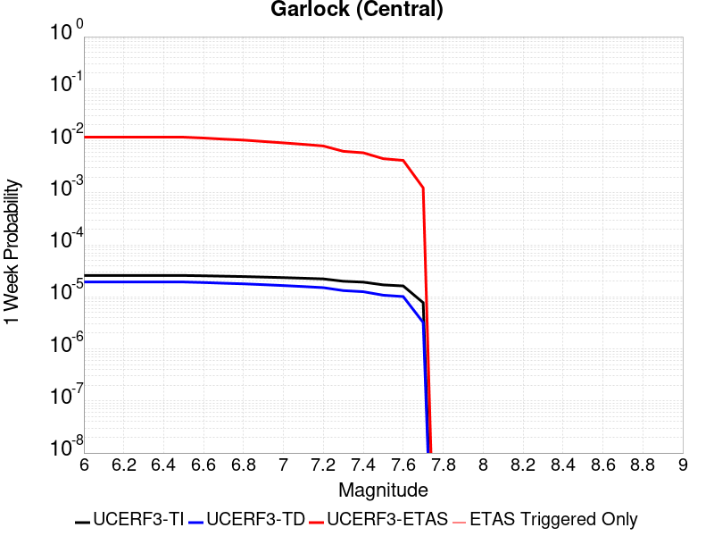
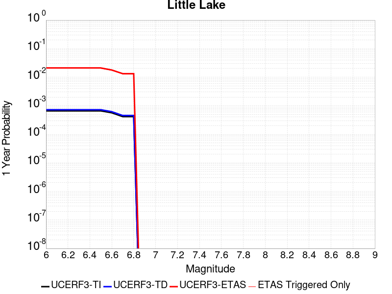
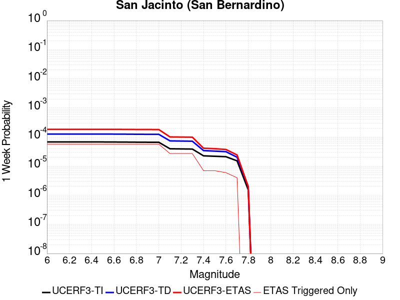
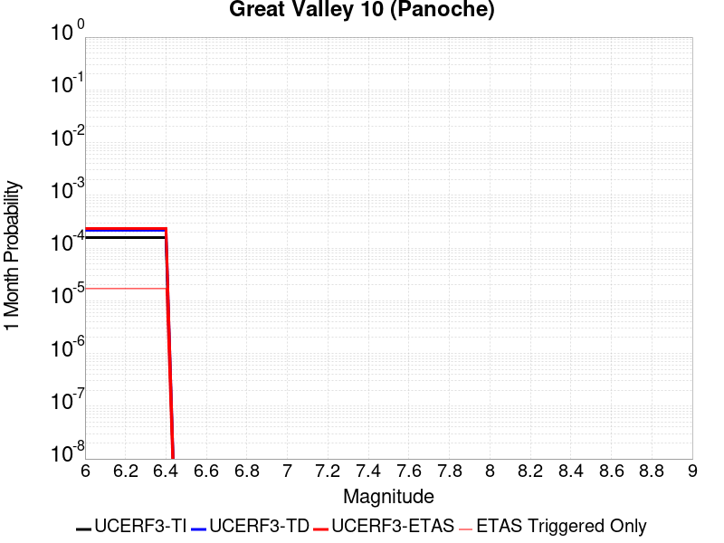
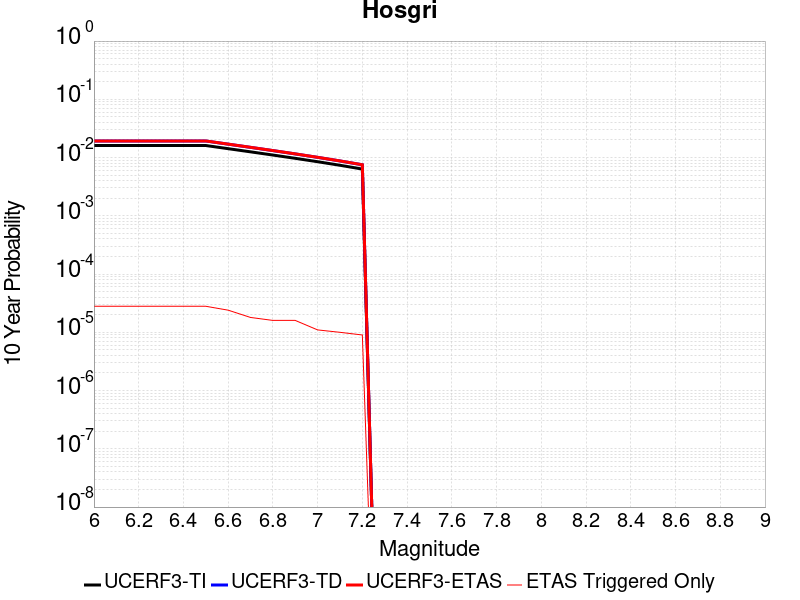
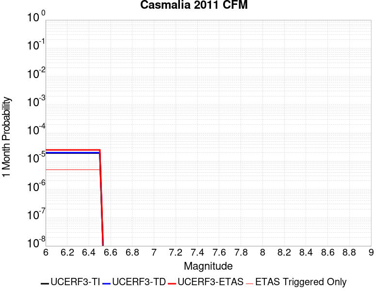

# Parent Section Magnitude-Probability Distributions

Only fault sections with at least one triggered aftershock are plotted. Sections are sorted by total supraseismogenic trigger rate (decreasing)

## Table Of Contents

* [Tank Canyon](#tank-canyon)
* [Garlock (Central)](#garlock-central)
* [Little Lake](#little-lake)
* [Owl Lake](#owl-lake)
* [Garlock (West)](#garlock-west)
* [Garlock (East)](#garlock-east)
* [Death Valley (So)](#death-valley-so)
* [Panamint Valley](#panamint-valley)
* [San Andreas (Mojave N)](#san-andreas-mojave-n)
* [San Andreas (Big Bend)](#san-andreas-big-bend)
* [San Andreas (Carrizo) rev](#san-andreas-carrizo-rev)
* [San Andreas (Mojave S)](#san-andreas-mojave-s)
* [Death Valley (Black Mtns Frontal)](#death-valley-black-mtns-frontal)
* [Blackwater](#blackwater)
* [San Andreas (Cholame) rev](#san-andreas-cholame-rev)
* [San Andreas (Parkfield)](#san-andreas-parkfield)
* [Hunter Mountain-Saline Valley](#hunter-mountain-saline-valley)
* [San Andreas (San Bernardino N)](#san-andreas-san-bernardino-n)
* [Cucamonga](#cucamonga)
* [Pleito](#pleito)
* [San Cayetano](#san-cayetano)
* [Death Valley (No)](#death-valley-no)
* [San Andreas (San Bernardino S)](#san-andreas-san-bernardino-s)
* [Gravel Hills-Harper Lk](#gravel-hills-harper-lk)
* [Cleghorn](#cleghorn)
* [Pitas Point (Lower West)](#pitas-point-lower-west)
* [Pitas Point (Lower)-Montalvo](#pitas-point-lower-montalvo)
* [Santa Ynez (West)](#santa-ynez-west)
* [San Andreas (San Gorgonio Pass-Garnet HIll)](#san-andreas-san-gorgonio-pass-garnet-hill)
* [San Juan](#san-juan)
* [San Andreas (Coachella) rev](#san-andreas-coachella-rev)
* [Santa Ynez (East)](#santa-ynez-east)
* [San Jacinto (San Bernardino)](#san-jacinto-san-bernardino)
* [So Sierra Nevada](#so-sierra-nevada)
* [Red Mountain](#red-mountain)
* [Death Valley (Fish Lake Valley)](#death-valley-fish-lake-valley)
* [Lenwood-Lockhart-Old Woman Springs](#lenwood-lockhart-old-woman-springs)
* [Mission Ridge-Arroyo Parida-Santa Ana](#mission-ridge-arroyo-parida-santa-ana)
* [Oak Ridge (Onshore)](#oak-ridge-onshore)
* [Santa Susana alt 1](#santa-susana-alt-1)
* [San Jacinto (Stepovers Combined)](#san-jacinto-stepovers-combined)
* [Raymond](#raymond)
* [San Jacinto (San Jacinto Valley) rev](#san-jacinto-san-jacinto-valley-rev)
* [Ventura-Pitas Point](#ventura-pitas-point)
* [Helendale-So Lockhart](#helendale-so-lockhart)
* [Sierra Madre](#sierra-madre)
* [Channel Islands Thrust](#channel-islands-thrust)
* [Los Alamos 2011 CFM](#los-alamos-2011-cfm)
* [Elysian Park (Upper)](#elysian-park-upper)
* [Verdugo](#verdugo)
* [Chino alt 1](#chino-alt-1)
* [San Jose](#san-jose)
* [Santa Cruz Island](#santa-cruz-island)
* [Simi-Santa Rosa](#simi-santa-rosa)
* [San Jacinto (Anza) rev](#san-jacinto-anza-rev)
* [Hayward (No) 2011 CFM](#hayward-no-2011-cfm)
* [Great Valley 12](#great-valley-12)
* [Anacapa-Dume alt 1](#anacapa-dume-alt-1)
* [San Gregorio (North) 2011 CFM](#san-gregorio-north-2011-cfm)
* [Whittier alt 1](#whittier-alt-1)
* [San Gabriel](#san-gabriel)
* [Independence rev 2011](#independence-rev-2011)
* [Los Osos 2011](#los-osos-2011)
* [Hayward (So) 2011 CFM](#hayward-so-2011-cfm)
* [San Gregorio (South) 2011 CFM](#san-gregorio-south-2011-cfm)
* [Emerson-Copper Mtn 2011](#emerson-copper-mtn-2011)
* [Elsinore (Stepovers Combined)](#elsinore-stepovers-combined)
* [Pinto Mtn](#pinto-mtn)
* [San Jacinto (Clark) rev](#san-jacinto-clark-rev)
* [Calaveras (No) 2011 CFM](#calaveras-no-2011-cfm)
* [Elsinore (Glen Ivy) rev](#elsinore-glen-ivy-rev)
* [Clamshell-Sawpit](#clamshell-sawpit)
* [Santa Rosa Island](#santa-rosa-island)
* [Great Valley 03 Mysterious Ridge](#great-valley-03-mysterious-ridge)
* [Imperial](#imperial)
* [Deep Springs](#deep-springs)
* [Calico-Hidalgo](#calico-hidalgo)
* [North Frontal  (West)](#north-frontal--west)
* [Elsinore (Temecula) rev](#elsinore-temecula-rev)
* [Robinson Creek](#robinson-creek)
* [Concord 2011 CFM](#concord-2011-cfm)
* [Burnt Mtn](#burnt-mtn)
* [San Luis Range 2011 CFM](#san-luis-range-2011-cfm)
* [Calaveras (Central) 2011 CFM](#calaveras-central-2011-cfm)
* [Newport-Inglewood alt 1](#newport-inglewood-alt-1)
* [Great Valley 09 (Laguna Seca)](#great-valley-09-laguna-seca)
* [Great Valley 04a Trout Creek](#great-valley-04a-trout-creek)
* [Great Valley 04b Gordon Valley](#great-valley-04b-gordon-valley)
* [Palos Verdes](#palos-verdes)
* [Malibu Coast alt 1](#malibu-coast-alt-1)
* [Great Valley 07 (Orestimba)](#great-valley-07-orestimba)
* [North Frontal  (East)](#north-frontal--east)
* [Holser alt 1](#holser-alt-1)
* [Green Valley 2011 CFM](#green-valley-2011-cfm)
* [Rose Canyon](#rose-canyon)
* [Great Valley 10 (Panoche)](#great-valley-10-panoche)
* [Hosgri](#hosgri)
* [Rodgers Creek - Healdsburg 2011 CFM](#rodgers-creek---healdsburg-2011-cfm)
* [Great Valley 08 (Quinto)](#great-valley-08-quinto)
* [San Andreas (Creeping Section) 2011 CFM](#san-andreas-creeping-section-2011-cfm)
* [Casmalia 2011 CFM](#casmalia-2011-cfm)
* [Newport-Inglewood (Offshore)](#newport-inglewood-offshore)
* [Hollywood](#hollywood)
* [Mono Lake 2011 CFM](#mono-lake-2011-cfm)

## Tank Canyon
*[(top)](#table-of-contents)*

| 1 Week | 1 Month | 1 Year | 10 Year |
|-----|-----|-----|-----|
|  |  |  |  |

| Magnitude | 1 wk TI Prob | 1 wk TD Prob | 1 wk ETAS Prob | 1 wk ETAS/TD Gain | 1 wk ETAS Triggered Only | 1 mo TI Prob | 1 mo TD Prob | 1 mo ETAS Prob | 1 mo ETAS/TD Gain | 1 mo ETAS Triggered Only | 1 yr TI Prob | 1 yr TD Prob | 1 yr ETAS Prob | 1 yr ETAS/TD Gain | 1 yr ETAS Triggered Only | 10 yr TI Prob | 10 yr TD Prob | 10 yr ETAS Prob | 10 yr ETAS/TD Gain | 10 yr ETAS Triggered Only |
|-----|-----|-----|-----|-----|-----|-----|-----|-----|-----|-----|-----|-----|-----|-----|-----|-----|-----|-----|-----|-----|
| 6.0 | 2.7748038E-5 | 3.5073965E-5 | 0.021310924 | 607.5995 | 0.021276595 | 1.18914744E-4 | 1.5031699E-4 | 0.027264457 | 181.37975 | 0.027118217 | 0.0014468255 | 0.0018300817 | 0.043375466 | 23.701382 | 0.041621555 | 0.014374418 | 0.018297758 | 0.07351928 | 4.017939 | 0.05625079 |
| 6.1 | 2.7748038E-5 | 3.5073965E-5 | 0.021310924 | 607.5995 | 0.021276595 | 1.18914744E-4 | 1.5031699E-4 | 0.027264457 | 181.37975 | 0.027118217 | 0.0014468255 | 0.0018300817 | 0.043375466 | 23.701382 | 0.041621555 | 0.014374418 | 0.018297758 | 0.07351928 | 4.017939 | 0.05625079 |
| 6.2 | 2.7748038E-5 | 3.5073965E-5 | 0.021310924 | 607.5995 | 0.021276595 | 1.18914744E-4 | 1.5031699E-4 | 0.027264457 | 181.37975 | 0.027118217 | 0.0014468255 | 0.0018300817 | 0.043375466 | 23.701382 | 0.041621555 | 0.014374418 | 0.018297758 | 0.07351928 | 4.017939 | 0.05625079 |
| 6.3 | 2.7748038E-5 | 3.5073965E-5 | 0.021310924 | 607.5995 | 0.021276595 | 1.18914744E-4 | 1.5031699E-4 | 0.027264457 | 181.37975 | 0.027118217 | 0.0014468255 | 0.0018300817 | 0.043375466 | 23.701382 | 0.041621555 | 0.014374418 | 0.018297758 | 0.07351928 | 4.017939 | 0.05625079 |

## Garlock (Central)
*[(top)](#table-of-contents)*

| 1 Week | 1 Month | 1 Year | 10 Year |
|-----|-----|-----|-----|
|  |  |  |  |

| Magnitude | 1 wk TI Prob | 1 wk TD Prob | 1 wk ETAS Prob | 1 wk ETAS/TD Gain | 1 wk ETAS Triggered Only | 1 mo TI Prob | 1 mo TD Prob | 1 mo ETAS Prob | 1 mo ETAS/TD Gain | 1 mo ETAS Triggered Only | 1 yr TI Prob | 1 yr TD Prob | 1 yr ETAS Prob | 1 yr ETAS/TD Gain | 1 yr ETAS Triggered Only | 10 yr TI Prob | 10 yr TD Prob | 10 yr ETAS Prob | 10 yr ETAS/TD Gain | 10 yr ETAS Triggered Only |
|-----|-----|-----|-----|-----|-----|-----|-----|-----|-----|-----|-----|-----|-----|-----|-----|-----|-----|-----|-----|-----|
| 6.0 | 2.575808E-5 | 1.9313613E-5 | 0.0116771525 | 604.60736 | 0.011658064 | 1.10387096E-4 | 8.277037E-5 | 0.014685616 | 177.426 | 0.014604053 | 0.0013431342 | 0.0010073289 | 0.021105407 | 20.951855 | 0.020118343 | 0.013350452 | 0.0100695705 | 0.03551887 | 3.527347 | 0.02570817 |
| 6.1 | 2.575808E-5 | 1.9313613E-5 | 0.0116771525 | 604.60736 | 0.011658064 | 1.10387096E-4 | 8.277037E-5 | 0.014685616 | 177.426 | 0.014604053 | 0.0013431342 | 0.0010073289 | 0.021105407 | 20.951855 | 0.020118343 | 0.013350452 | 0.0100695705 | 0.03551887 | 3.527347 | 0.02570817 |
| 6.2 | 2.575808E-5 | 1.9313613E-5 | 0.0116771525 | 604.60736 | 0.011658064 | 1.10387096E-4 | 8.277037E-5 | 0.014685616 | 177.426 | 0.014604053 | 0.0013431342 | 0.0010073289 | 0.021105407 | 20.951855 | 0.020118343 | 0.013350452 | 0.0100695705 | 0.03551887 | 3.527347 | 0.02570817 |
| 6.3 | 2.575808E-5 | 1.9313613E-5 | 0.0116771525 | 604.60736 | 0.011658064 | 1.10387096E-4 | 8.277037E-5 | 0.014685616 | 177.426 | 0.014604053 | 0.0013431342 | 0.0010073289 | 0.021105407 | 20.951855 | 0.020118343 | 0.013350452 | 0.0100695705 | 0.03551887 | 3.527347 | 0.02570817 |
| 6.4 | 2.575808E-5 | 1.9313613E-5 | 0.0116771525 | 604.60736 | 0.011658064 | 1.10387096E-4 | 8.277037E-5 | 0.014685616 | 177.426 | 0.014604053 | 0.0013431342 | 0.0010073289 | 0.021105407 | 20.951855 | 0.020118343 | 0.013350452 | 0.0100695705 | 0.03551887 | 3.527347 | 0.02570817 |
| 6.5 | 2.575808E-5 | 1.9313613E-5 | 0.0116771525 | 604.60736 | 0.011658064 | 1.10387096E-4 | 8.277037E-5 | 0.014685616 | 177.426 | 0.014604053 | 0.0013431342 | 0.0010073289 | 0.021105407 | 20.951855 | 0.020118343 | 0.013350452 | 0.0100695705 | 0.03551887 | 3.527347 | 0.02570817 |
| 6.6 | 2.540234E-5 | 1.885198E-5 | 0.011248654 | 596.6829 | 0.011230014 | 1.0886263E-4 | 8.0792066E-5 | 0.014205296 | 175.82538 | 0.014125645 | 0.0013245966 | 9.83265E-4 | 0.020352341 | 20.698736 | 0.019388141 | 0.013167289 | 0.009831364 | 0.03433938 | 3.4928396 | 0.024751354 |
| 6.7 | 2.4966947E-5 | 1.8286464E-5 | 0.0106186215 | 580.68207 | 0.010600529 | 1.06996806E-4 | 7.8368575E-5 | 0.013472761 | 171.91536 | 0.013395443 | 0.0013019076 | 9.5378514E-4 | 0.01936753 | 20.305965 | 0.018431323 | 0.012943068 | 0.009539624 | 0.032932594 | 3.45219 | 0.02361828 |
| 6.8 | 2.4548952E-5 | 1.7797542E-5 | 0.01031599 | 579.63007 | 0.010298376 | 1.0520555E-4 | 7.627332E-5 | 0.013067855 | 171.3293 | 0.012992572 | 0.001280125 | 9.282974E-4 | 0.018763922 | 20.213266 | 0.017852196 | 0.012727758 | 0.009286596 | 0.031837393 | 3.4283166 | 0.022762181 |
| 6.9 | 2.3994342E-5 | 1.7148153E-5 | 0.009559979 | 557.49316 | 0.009542994 | 1.0282884E-4 | 7.349039E-5 | 0.0121838935 | 165.78894 | 0.012111293 | 0.0012512221 | 8.944436E-4 | 0.017497985 | 19.562984 | 0.016618406 | 0.012442005 | 0.0089510605 | 0.030012254 | 3.3529272 | 0.021251416 |
| 7.0 | 2.343005E-5 | 1.6491087E-5 | 0.008980211 | 544.5493 | 0.008963868 | 1.0041064E-4 | 7.067455E-5 | 0.011501316 | 162.73633 | 0.011431449 | 0.0012218138 | 8.601883E-4 | 0.016508305 | 19.191502 | 0.015661588 | 0.01215118 | 0.008610493 | 0.028480718 | 3.307676 | 0.020042805 |
| 7.1 | 2.2814058E-5 | 1.5782754E-5 | 0.008400392 | 532.2513 | 0.008384741 | 9.777087E-5 | 6.763899E-5 | 0.010692628 | 158.0838 | 0.010625708 | 0.0011897103 | 8.2325895E-4 | 0.015465607 | 18.785835 | 0.014654413 | 0.011833611 | 0.00824334 | 0.026997194 | 3.2750306 | 0.018909732 |
| 7.2 | 2.2145266E-5 | 1.5027377E-5 | 0.0076190927 | 507.01413 | 0.00760418 | 9.490483E-5 | 6.440182E-5 | 0.0097578475 | 151.51508 | 0.009694071 | 0.0011548538 | 7.8387547E-4 | 0.014269456 | 18.203728 | 0.0134961605 | 0.011488707 | 0.007851825 | 0.025189124 | 3.2080598 | 0.017474506 |
| 7.3 | 1.9954436E-5 | 1.3199953E-5 | 0.0061568934 | 466.43295 | 0.0061437744 | 8.551621E-5 | 5.657036E-5 | 0.007912099 | 139.86299 | 0.007855974 | 0.0010406625 | 6.8859005E-4 | 0.011608927 | 16.85898 | 0.010927861 | 0.010358025 | 0.006900618 | 0.020953793 | 3.0365098 | 0.014150824 |
| 7.4 | 1.918037E-5 | 1.2553606E-5 | 0.005803744 | 462.31686 | 0.0057912627 | 8.2198996E-5 | 5.3800417E-5 | 0.0075316806 | 139.99298 | 0.007478283 | 0.0010003132 | 6.5488677E-4 | 0.011022007 | 16.8304 | 0.010373914 | 0.009958224 | 0.006564366 | 0.019846862 | 3.023424 | 0.013370263 |
| 7.5 | 1.6994161E-5 | 1.0764553E-5 | 0.004240859 | 393.96518 | 0.00423014 | 7.283008E-5 | 4.613333E-5 | 0.0056860596 | 123.25275 | 0.0056401864 | 8.863455E-4 | 5.615903E-4 | 0.008387987 | 14.936132 | 0.007830794 | 0.008828186 | 0.005632708 | 0.015923152 | 2.8269088 | 0.010348734 |
| 7.6 | 1.621788E-5 | 1.012848E-5 | 0.0039380756 | 388.8121 | 0.003927987 | 6.950335E-5 | 4.34074E-5 | 0.005280496 | 121.64967 | 0.005237316 | 8.458747E-4 | 5.2841863E-4 | 0.007826587 | 14.811337 | 0.0073020267 | 0.0084266225 | 0.005301458 | 0.014894043 | 2.8094242 | 0.009643711 |
| 7.7 | 7.713584E-6 | 3.2171508E-6 | 9.0967276E-4 | 282.75726 | 9.0645853E-4 | 3.3057797E-5 | 1.378779E-5 | 0.0013230987 | 95.96163 | 0.001309329 | 4.0240434E-4 | 1.6786634E-4 | 0.0022070557 | 13.1476965 | 0.0020395317 | 0.0040167645 | 0.0016902693 | 0.004480459 | 2.6507366 | 0.0027949137 |

## Little Lake
*[(top)](#table-of-contents)*

| 1 Week | 1 Month | 1 Year | 10 Year |
|-----|-----|-----|-----|
|  |  |  |  |

| Magnitude | 1 wk TI Prob | 1 wk TD Prob | 1 wk ETAS Prob | 1 wk ETAS/TD Gain | 1 wk ETAS Triggered Only | 1 mo TI Prob | 1 mo TD Prob | 1 mo ETAS Prob | 1 mo ETAS/TD Gain | 1 mo ETAS Triggered Only | 1 yr TI Prob | 1 yr TD Prob | 1 yr ETAS Prob | 1 yr ETAS/TD Gain | 1 yr ETAS Triggered Only | 10 yr TI Prob | 10 yr TD Prob | 10 yr ETAS Prob | 10 yr ETAS/TD Gain | 10 yr ETAS Triggered Only |
|-----|-----|-----|-----|-----|-----|-----|-----|-----|-----|-----|-----|-----|-----|-----|-----|-----|-----|-----|-----|-----|
| 6.0 | 1.27106505E-5 | 1.3900362E-5 | 0.0118228765 | 850.54443 | 0.01180914 | 5.447308E-5 | 5.957219E-5 | 0.014914535 | 250.3607 | 0.014855848 | 6.630079E-4 | 7.25151E-4 | 0.020677939 | 28.515356 | 0.019967267 | 0.006610333 | 0.0072377534 | 0.032034937 | 4.4260883 | 0.024977967 |
| 6.1 | 1.27106505E-5 | 1.3900362E-5 | 0.0118228765 | 850.54443 | 0.01180914 | 5.447308E-5 | 5.957219E-5 | 0.014914535 | 250.3607 | 0.014855848 | 6.630079E-4 | 7.25151E-4 | 0.020677939 | 28.515356 | 0.019967267 | 0.006610333 | 0.0072377534 | 0.032034937 | 4.4260883 | 0.024977967 |
| 6.2 | 1.27106505E-5 | 1.3900362E-5 | 0.0118228765 | 850.54443 | 0.01180914 | 5.447308E-5 | 5.957219E-5 | 0.014914535 | 250.3607 | 0.014855848 | 6.630079E-4 | 7.25151E-4 | 0.020677939 | 28.515356 | 0.019967267 | 0.006610333 | 0.0072377534 | 0.032034937 | 4.4260883 | 0.024977967 |
| 6.3 | 1.27106505E-5 | 1.3900362E-5 | 0.0118228765 | 850.54443 | 0.01180914 | 5.447308E-5 | 5.957219E-5 | 0.014914535 | 250.3607 | 0.014855848 | 6.630079E-4 | 7.25151E-4 | 0.020677939 | 28.515356 | 0.019967267 | 0.006610333 | 0.0072377534 | 0.032034937 | 4.4260883 | 0.024977967 |
| 6.4 | 1.27106505E-5 | 1.3900362E-5 | 0.0118228765 | 850.54443 | 0.01180914 | 5.447308E-5 | 5.957219E-5 | 0.014914535 | 250.3607 | 0.014855848 | 6.630079E-4 | 7.25151E-4 | 0.020677939 | 28.515356 | 0.019967267 | 0.006610333 | 0.0072377534 | 0.032034937 | 4.4260883 | 0.024977967 |
| 6.5 | 1.27106505E-5 | 1.3900362E-5 | 0.0118228765 | 850.54443 | 0.01180914 | 5.447308E-5 | 5.957219E-5 | 0.014914535 | 250.3607 | 0.014855848 | 6.630079E-4 | 7.25151E-4 | 0.020677939 | 28.515356 | 0.019967267 | 0.006610333 | 0.0072377534 | 0.032034937 | 4.4260883 | 0.024977967 |
| 6.6 | 1.08505255E-5 | 1.1856941E-5 | 0.010184215 | 858.9244 | 0.010172479 | 4.6501424E-5 | 5.0815026E-5 | 0.012891659 | 253.69775 | 0.012841496 | 5.6600774E-4 | 6.1859656E-4 | 0.017629344 | 28.498938 | 0.017021276 | 0.005645683 | 0.006178476 | 0.027248543 | 4.410237 | 0.021201057 |
| 6.7 | 7.97625E-6 | 8.706619E-6 | 0.007839433 | 900.3992 | 0.007830794 | 3.4183482E-5 | 3.7314083E-5 | 0.009907272 | 265.51025 | 0.009870326 | 4.161044E-4 | 4.5429895E-4 | 0.013541641 | 29.807774 | 0.01309329 | 0.004153261 | 0.0045429897 | 0.020734988 | 4.5641727 | 0.016265895 |
| 6.8 | 7.97625E-6 | 8.706619E-6 | 0.007839433 | 900.3992 | 0.007830794 | 3.4183482E-5 | 3.7314083E-5 | 0.009907272 | 265.51025 | 0.009870326 | 4.161044E-4 | 4.5429895E-4 | 0.013541641 | 29.807774 | 0.01309329 | 0.004153261 | 0.0045429897 | 0.020734988 | 4.5641727 | 0.016265895 |

## Owl Lake
*[(top)](#table-of-contents)*

| 1 Week | 1 Month | 1 Year | 10 Year |
|-----|-----|-----|-----|
|  |  |  |  |

| Magnitude | 1 wk TI Prob | 1 wk TD Prob | 1 wk ETAS Prob | 1 wk ETAS/TD Gain | 1 wk ETAS Triggered Only | 1 mo TI Prob | 1 mo TD Prob | 1 mo ETAS Prob | 1 mo ETAS/TD Gain | 1 mo ETAS Triggered Only | 1 yr TI Prob | 1 yr TD Prob | 1 yr ETAS Prob | 1 yr ETAS/TD Gain | 1 yr ETAS Triggered Only | 10 yr TI Prob | 10 yr TD Prob | 10 yr ETAS Prob | 10 yr ETAS/TD Gain | 10 yr ETAS Triggered Only |
|-----|-----|-----|-----|-----|-----|-----|-----|-----|-----|-----|-----|-----|-----|-----|-----|-----|-----|-----|-----|-----|
| 6.0 | 3.637175E-5 | 4.988367E-5 | 0.004355347 | 87.310074 | 0.004305678 | 1.5586962E-4 | 2.1378716E-4 | 0.0061548557 | 28.789642 | 0.005942339 | 0.0018960608 | 0.0026025574 | 0.012321626 | 4.7344303 | 0.009744429 | 0.018799646 | 0.025995217 | 0.03982724 | 1.5320987 | 0.014201184 |
| 6.1 | 3.637175E-5 | 4.988367E-5 | 0.004355347 | 87.310074 | 0.004305678 | 1.5586962E-4 | 2.1378716E-4 | 0.0061548557 | 28.789642 | 0.005942339 | 0.0018960608 | 0.0026025574 | 0.012321626 | 4.7344303 | 0.009744429 | 0.018799646 | 0.025995217 | 0.03982724 | 1.5320987 | 0.014201184 |
| 6.2 | 3.637175E-5 | 4.988367E-5 | 0.004355347 | 87.310074 | 0.004305678 | 1.5586962E-4 | 2.1378716E-4 | 0.0061548557 | 28.789642 | 0.005942339 | 0.0018960608 | 0.0026025574 | 0.012321626 | 4.7344303 | 0.009744429 | 0.018799646 | 0.025995217 | 0.03982724 | 1.5320987 | 0.014201184 |
| 6.3 | 3.637175E-5 | 4.988367E-5 | 0.004355347 | 87.310074 | 0.004305678 | 1.5586962E-4 | 2.1378716E-4 | 0.0061548557 | 28.789642 | 0.005942339 | 0.0018960608 | 0.0026025574 | 0.012321626 | 4.7344303 | 0.009744429 | 0.018799646 | 0.025995217 | 0.03982724 | 1.5320987 | 0.014201184 |
| 6.4 | 3.637175E-5 | 4.988367E-5 | 0.004355347 | 87.310074 | 0.004305678 | 1.5586962E-4 | 2.1378716E-4 | 0.0061548557 | 28.789642 | 0.005942339 | 0.0018960608 | 0.0026025574 | 0.012321626 | 4.7344303 | 0.009744429 | 0.018799646 | 0.025995217 | 0.03982724 | 1.5320987 | 0.014201184 |
| 6.5 | 3.637175E-5 | 4.988367E-5 | 0.004355347 | 87.310074 | 0.004305678 | 1.5586962E-4 | 2.1378716E-4 | 0.0061548557 | 28.789642 | 0.005942339 | 0.0018960608 | 0.0026025574 | 0.012321626 | 4.7344303 | 0.009744429 | 0.018799646 | 0.025995217 | 0.03982724 | 1.5320987 | 0.014201184 |

## Garlock (West)
*[(top)](#table-of-contents)*

| 1 Week | 1 Month | 1 Year | 10 Year |
|-----|-----|-----|-----|
|  |  |  |  |

| Magnitude | 1 wk TI Prob | 1 wk TD Prob | 1 wk ETAS Prob | 1 wk ETAS/TD Gain | 1 wk ETAS Triggered Only | 1 mo TI Prob | 1 mo TD Prob | 1 mo ETAS Prob | 1 mo ETAS/TD Gain | 1 mo ETAS Triggered Only | 1 yr TI Prob | 1 yr TD Prob | 1 yr ETAS Prob | 1 yr ETAS/TD Gain | 1 yr ETAS Triggered Only | 10 yr TI Prob | 10 yr TD Prob | 10 yr ETAS Prob | 10 yr ETAS/TD Gain | 10 yr ETAS Triggered Only |
|-----|-----|-----|-----|-----|-----|-----|-----|-----|-----|-----|-----|-----|-----|-----|-----|-----|-----|-----|-----|-----|
| 6.0 | 2.516656E-5 | 1.8065048E-5 | 0.0050538545 | 279.75873 | 0.0050358805 | 1.07852225E-4 | 7.741977E-5 | 0.006648735 | 85.879036 | 0.006571824 | 0.0013123099 | 9.42255E-4 | 0.010073766 | 10.691125 | 0.009140124 | 0.013045873 | 0.009421492 | 0.021293968 | 2.260148 | 0.011985396 |
| 6.1 | 2.516656E-5 | 1.8065048E-5 | 0.0050538545 | 279.75873 | 0.0050358805 | 1.07852225E-4 | 7.741977E-5 | 0.006648735 | 85.879036 | 0.006571824 | 0.0013123099 | 9.42255E-4 | 0.010073766 | 10.691125 | 0.009140124 | 0.013045873 | 0.009421492 | 0.021293968 | 2.260148 | 0.011985396 |
| 6.2 | 2.516656E-5 | 1.8065048E-5 | 0.0050538545 | 279.75873 | 0.0050358805 | 1.07852225E-4 | 7.741977E-5 | 0.006648735 | 85.879036 | 0.006571824 | 0.0013123099 | 9.42255E-4 | 0.010073766 | 10.691125 | 0.009140124 | 0.013045873 | 0.009421492 | 0.021293968 | 2.260148 | 0.011985396 |
| 6.3 | 2.516656E-5 | 1.8065048E-5 | 0.0050538545 | 279.75873 | 0.0050358805 | 1.07852225E-4 | 7.741977E-5 | 0.006648735 | 85.879036 | 0.006571824 | 0.0013123099 | 9.42255E-4 | 0.010073766 | 10.691125 | 0.009140124 | 0.013045873 | 0.009421492 | 0.021293968 | 2.260148 | 0.011985396 |
| 6.4 | 2.516656E-5 | 1.8065048E-5 | 0.0050538545 | 279.75873 | 0.0050358805 | 1.07852225E-4 | 7.741977E-5 | 0.006648735 | 85.879036 | 0.006571824 | 0.0013123099 | 9.42255E-4 | 0.010073766 | 10.691125 | 0.009140124 | 0.013045873 | 0.009421492 | 0.021293968 | 2.260148 | 0.011985396 |
| 6.5 | 2.516656E-5 | 1.8065048E-5 | 0.0050538545 | 279.75873 | 0.0050358805 | 1.07852225E-4 | 7.741977E-5 | 0.006648735 | 85.879036 | 0.006571824 | 0.0013123099 | 9.42255E-4 | 0.010073766 | 10.691125 | 0.009140124 | 0.013045873 | 0.009421492 | 0.021293968 | 2.260148 | 0.011985396 |
| 6.6 | 2.498869E-5 | 1.7877663E-5 | 0.0050536683 | 282.6806 | 0.0050358805 | 1.07089996E-4 | 7.6616736E-5 | 0.0066479375 | 86.76874 | 0.006571824 | 0.0013030408 | 9.3248655E-4 | 0.010064087 | 10.792742 | 0.009140124 | 0.012954267 | 0.009324339 | 0.02119798 | 2.2734027 | 0.011985396 |
| 6.7 | 2.4627925E-5 | 1.7497801E-5 | 0.00505329 | 288.79575 | 0.0050358805 | 1.0554398E-4 | 7.498886E-5 | 0.00664632 | 88.630775 | 0.006571824 | 0.0012842404 | 9.1268384E-4 | 0.010044465 | 11.005416 | 0.009140124 | 0.012768441 | 0.009128104 | 0.021004096 | 2.3010361 | 0.011985396 |
| 6.8 | 2.4270235E-5 | 1.716136E-5 | 0.0050277766 | 292.9708 | 0.0050107013 | 1.04011146E-4 | 7.354704E-5 | 0.0066197105 | 90.006485 | 0.006546645 | 0.0012656 | 8.9514436E-4 | 0.0100019295 | 11.173538 | 0.009114944 | 0.012584164 | 0.0089538675 | 0.020806994 | 2.3237996 | 0.011960217 |
| 6.9 | 2.3913764E-5 | 1.6823105E-5 | 0.005002261 | 297.3447 | 0.004985522 | 1.0248353E-4 | 7.2097464E-5 | 0.006593093 | 91.446945 | 0.0065214653 | 0.0012470228 | 8.775101E-4 | 0.009959298 | 11.349497 | 0.009089764 | 0.012400482 | 0.00877859 | 0.020608854 | 2.347627 | 0.011935038 |
| 7.0 | 2.3579369E-5 | 1.6492264E-5 | 0.004951574 | 300.23618 | 0.004935163 | 1.0105052E-4 | 7.067965E-5 | 0.006541329 | 92.54897 | 0.006471107 | 0.0012295957 | 8.6026196E-4 | 0.009891892 | 11.498697 | 0.009039406 | 0.012228143 | 0.008607132 | 0.020389518 | 2.3689096 | 0.011884678 |
| 7.1 | 2.3205374E-5 | 1.6105636E-5 | 0.0049511893 | 307.41965 | 0.004935163 | 9.944781E-5 | 6.902276E-5 | 0.006514505 | 94.38198 | 0.006445927 | 0.0012101046 | 8.401051E-4 | 0.0098216 | 11.690919 | 0.008989047 | 0.0120353615 | 0.008406721 | 0.020141553 | 2.395887 | 0.01183432 |
| 7.2 | 2.2799322E-5 | 1.5676578E-5 | 0.0049004043 | 312.594 | 0.004884804 | 9.770772E-5 | 6.718404E-5 | 0.006437145 | 95.8136 | 0.006370389 | 0.0011889422 | 8.177357E-4 | 0.009698797 | 11.860552 | 0.008888329 | 0.011826012 | 0.008184515 | 0.019797109 | 2.4188495 | 0.011708423 |
| 7.3 | 1.8228246E-5 | 1.1798695E-5 | 0.004669933 | 395.80084 | 0.0046581896 | 7.811871E-5 | 5.0565202E-5 | 0.006143673 | 121.50001 | 0.0060934154 | 9.506803E-4 | 6.1551924E-4 | 0.009120919 | 14.818252 | 0.008510638 | 0.0094662355 | 0.006171021 | 0.017381782 | 2.8166785 | 0.011280373 |
| 7.4 | 1.7670916E-5 | 1.132978E-5 | 0.004518392 | 398.80667 | 0.0045071132 | 7.5730306E-5 | 4.8555645E-5 | 0.005965428 | 122.85756 | 0.00591716 | 9.216264E-4 | 5.9106643E-4 | 0.008845029 | 14.964527 | 0.008258845 | 0.009178135 | 0.0059269792 | 0.016790072 | 2.832821 | 0.010927861 |
| 7.5 | 1.6994161E-5 | 1.0764553E-5 | 0.004240859 | 393.96518 | 0.00423014 | 7.283008E-5 | 4.613333E-5 | 0.0056860596 | 123.25275 | 0.0056401864 | 8.863455E-4 | 5.615903E-4 | 0.008387987 | 14.936132 | 0.007830794 | 0.008828186 | 0.005632708 | 0.015923152 | 2.8269088 | 0.010348734 |
| 7.6 | 1.621788E-5 | 1.012848E-5 | 0.0039380756 | 388.8121 | 0.003927987 | 6.950335E-5 | 4.34074E-5 | 0.005280496 | 121.64967 | 0.005237316 | 8.458747E-4 | 5.2841863E-4 | 0.007826587 | 14.811337 | 0.0073020267 | 0.0084266225 | 0.005301458 | 0.014894043 | 2.8094242 | 0.009643711 |
| 7.7 | 7.713584E-6 | 3.2171508E-6 | 9.0967276E-4 | 282.75726 | 9.0645853E-4 | 3.3057797E-5 | 1.378779E-5 | 0.0013230987 | 95.96163 | 0.001309329 | 4.0240434E-4 | 1.6786634E-4 | 0.0022070557 | 13.1476965 | 0.0020395317 | 0.0040167645 | 0.0016902693 | 0.004480459 | 2.6507366 | 0.0027949137 |

## Garlock (East)
*[(top)](#table-of-contents)*

| 1 Week | 1 Month | 1 Year | 10 Year |
|-----|-----|-----|-----|
|  |  |  |  |

| Magnitude | 1 wk TI Prob | 1 wk TD Prob | 1 wk ETAS Prob | 1 wk ETAS/TD Gain | 1 wk ETAS Triggered Only | 1 mo TI Prob | 1 mo TD Prob | 1 mo ETAS Prob | 1 mo ETAS/TD Gain | 1 mo ETAS Triggered Only | 1 yr TI Prob | 1 yr TD Prob | 1 yr ETAS Prob | 1 yr ETAS/TD Gain | 1 yr ETAS Triggered Only | 10 yr TI Prob | 10 yr TD Prob | 10 yr ETAS Prob | 10 yr ETAS/TD Gain | 10 yr ETAS Triggered Only |
|-----|-----|-----|-----|-----|-----|-----|-----|-----|-----|-----|-----|-----|-----|-----|-----|-----|-----|-----|-----|-----|
| 6.0 | 2.2327951E-5 | 1.8303952E-5 | 0.004449798 | 243.10585 | 0.004431575 | 9.5687705E-5 | 7.8444085E-5 | 0.005818898 | 74.17892 | 0.005740904 | 0.0011643751 | 9.548048E-4 | 0.009407006 | 9.852282 | 0.00846028 | 0.0115829315 | 0.0096519785 | 0.020898283 | 2.1651812 | 0.01135591 |
| 6.1 | 2.2327951E-5 | 1.8303952E-5 | 0.004449798 | 243.10585 | 0.004431575 | 9.5687705E-5 | 7.8444085E-5 | 0.005818898 | 74.17892 | 0.005740904 | 0.0011643751 | 9.548048E-4 | 0.009407006 | 9.852282 | 0.00846028 | 0.0115829315 | 0.0096519785 | 0.020898283 | 2.1651812 | 0.01135591 |
| 6.2 | 2.2327951E-5 | 1.8303952E-5 | 0.004449798 | 243.10585 | 0.004431575 | 9.5687705E-5 | 7.8444085E-5 | 0.005818898 | 74.17892 | 0.005740904 | 0.0011643751 | 9.548048E-4 | 0.009407006 | 9.852282 | 0.00846028 | 0.0115829315 | 0.0096519785 | 0.020898283 | 2.1651812 | 0.01135591 |
| 6.3 | 2.2327951E-5 | 1.8303952E-5 | 0.004449798 | 243.10585 | 0.004431575 | 9.5687705E-5 | 7.8444085E-5 | 0.005818898 | 74.17892 | 0.005740904 | 0.0011643751 | 9.548048E-4 | 0.009407006 | 9.852282 | 0.00846028 | 0.0115829315 | 0.0096519785 | 0.020898283 | 2.1651812 | 0.01135591 |
| 6.4 | 2.2327951E-5 | 1.8303952E-5 | 0.004449798 | 243.10585 | 0.004431575 | 9.5687705E-5 | 7.8444085E-5 | 0.005818898 | 74.17892 | 0.005740904 | 0.0011643751 | 9.548048E-4 | 0.009407006 | 9.852282 | 0.00846028 | 0.0115829315 | 0.0096519785 | 0.020898283 | 2.1651812 | 0.01135591 |
| 6.5 | 2.2327951E-5 | 1.8303952E-5 | 0.004449798 | 243.10585 | 0.004431575 | 9.5687705E-5 | 7.8444085E-5 | 0.005818898 | 74.17892 | 0.005740904 | 0.0011643751 | 9.548048E-4 | 0.009407006 | 9.852282 | 0.00846028 | 0.0115829315 | 0.0096519785 | 0.020898283 | 2.1651812 | 0.01135591 |
| 6.6 | 2.222123E-5 | 1.816971E-5 | 0.0044244854 | 243.50885 | 0.0044063954 | 9.523036E-5 | 7.7868805E-5 | 0.005793148 | 74.39627 | 0.0057157245 | 0.0011588129 | 9.4780687E-4 | 0.009349757 | 9.864622 | 0.008409921 | 0.011527888 | 0.009581773 | 0.020778999 | 2.1685963 | 0.011305552 |
| 6.7 | 2.2076227E-5 | 1.798404E-5 | 0.0044243005 | 246.01259 | 0.0044063954 | 9.4608964E-5 | 7.707312E-5 | 0.005792357 | 75.154045 | 0.0057157245 | 0.0011512554 | 9.381278E-4 | 0.009340159 | 9.956169 | 0.008409921 | 0.011453095 | 0.009485973 | 0.02065934 | 2.1778831 | 0.011280373 |
| 6.8 | 2.1962227E-5 | 1.7854036E-5 | 0.004424171 | 247.79669 | 0.0044063954 | 9.4120434E-5 | 7.651599E-5 | 0.0057918034 | 75.69402 | 0.0057157245 | 0.0011453138 | 9.313506E-4 | 0.009333438 | 10.021402 | 0.008409921 | 0.01139429 | 0.00941876 | 0.020567944 | 2.1837208 | 0.0112551935 |
| 6.9 | 1.1702579E-5 | 6.6732687E-6 | 0.003959813 | 593.38434 | 0.0039531663 | 5.0152947E-5 | 2.8599494E-5 | 0.0050139786 | 175.31705 | 0.004985522 | 6.10441E-4 | 3.481581E-4 | 0.0073204245 | 21.02615 | 0.006974695 | 0.0060876687 | 0.0034954504 | 0.012277436 | 3.512405 | 0.008812791 |
| 7.0 | 1.153538E-5 | 6.4796777E-6 | 0.003909262 | 603.31116 | 0.0039028076 | 4.9436403E-5 | 2.7769835E-5 | 0.004937617 | 177.80505 | 0.004909984 | 6.01722E-4 | 3.3806017E-4 | 0.007159372 | 21.177803 | 0.0068236184 | 0.006000953 | 0.0033946347 | 0.0120018525 | 3.5355356 | 0.008636535 |
| 7.1 | 1.135938E-5 | 6.273818E-6 | 0.0037579814 | 598.9943 | 0.003751731 | 4.868215E-5 | 2.6887597E-5 | 0.004710131 | 175.17856 | 0.004683369 | 5.925439E-4 | 3.2732222E-4 | 0.006846653 | 20.917166 | 0.0065214653 | 0.0059096646 | 0.0032873498 | 0.011544141 | 3.5116863 | 0.008284024 |
| 7.2 | 1.1168294E-5 | 6.048814E-6 | 0.0033045306 | 546.3105 | 0.0032985017 | 4.786324E-5 | 2.5923315E-5 | 0.0042307745 | 163.20346 | 0.0042049605 | 5.825791E-4 | 3.1558552E-4 | 0.0062560495 | 19.823626 | 0.005942339 | 0.005810542 | 0.0031701238 | 0.010725098 | 3.3831794 | 0.007579 |
| 7.3 | 1.0952553E-5 | 5.8686815E-6 | 0.0030525585 | 520.14386 | 0.0030467077 | 4.693867E-5 | 2.5151334E-5 | 0.0039026819 | 155.16798 | 0.0038776281 | 5.713284E-4 | 3.0618932E-4 | 0.005743275 | 18.757267 | 0.005438751 | 0.0056986175 | 0.0030760262 | 0.010029267 | 3.260462 | 0.006974695 |
| 7.4 | 1.0735812E-5 | 5.691247E-6 | 0.0028509477 | 500.9355 | 0.0028452727 | 4.6009813E-5 | 2.4390914E-5 | 0.003700494 | 151.71608 | 0.0036761928 | 5.600255E-4 | 2.9693378E-4 | 0.005432007 | 18.293663 | 0.0051365984 | 0.0055861627 | 0.0029833042 | 0.009510418 | 3.1878808 | 0.006546645 |
| 7.5 | 9.0273E-6 | 4.284415E-6 | 0.001414325 | 330.10922 | 0.0014100466 | 3.8687853E-5 | 1.8361723E-5 | 0.0019823192 | 107.95931 | 0.0019639935 | 4.709228E-4 | 2.2354414E-4 | 0.0030178332 | 13.499943 | 0.0027949137 | 0.004699261 | 0.0022480614 | 0.006041604 | 2.6874728 | 0.00380209 |
| 7.6 | 8.549585E-6 | 3.885532E-6 | 0.0011873129 | 305.5728 | 0.001183432 | 3.6640562E-5 | 1.6652246E-5 | 0.0016784652 | 100.79512 | 0.0016618406 | 4.4600753E-4 | 2.027353E-4 | 0.0026446423 | 13.044804 | 0.002442402 | 0.0044511347 | 0.0020396118 | 0.005331386 | 2.6139219 | 0.0032985017 |
| 7.7 | 7.713584E-6 | 3.2171508E-6 | 9.0967276E-4 | 282.75726 | 9.0645853E-4 | 3.3057797E-5 | 1.378779E-5 | 0.0013230987 | 95.96163 | 0.001309329 | 4.0240434E-4 | 1.6786634E-4 | 0.0022070557 | 13.1476965 | 0.0020395317 | 0.0040167645 | 0.0016902693 | 0.004480459 | 2.6507366 | 0.0027949137 |

## Death Valley (So)
*[(top)](#table-of-contents)*

| 1 Week | 1 Month | 1 Year | 10 Year |
|-----|-----|-----|-----|
|  |  |  |  |

| Magnitude | 1 wk TI Prob | 1 wk TD Prob | 1 wk ETAS Prob | 1 wk ETAS/TD Gain | 1 wk ETAS Triggered Only | 1 mo TI Prob | 1 mo TD Prob | 1 mo ETAS Prob | 1 mo ETAS/TD Gain | 1 mo ETAS Triggered Only | 1 yr TI Prob | 1 yr TD Prob | 1 yr ETAS Prob | 1 yr ETAS/TD Gain | 1 yr ETAS Triggered Only | 10 yr TI Prob | 10 yr TD Prob | 10 yr ETAS Prob | 10 yr ETAS/TD Gain | 10 yr ETAS Triggered Only |
|-----|-----|-----|-----|-----|-----|-----|-----|-----|-----|-----|-----|-----|-----|-----|-----|-----|-----|-----|-----|-----|
| 6.0 | 4.4658216E-5 | 6.228887E-5 | 0.0021016935 | 33.741077 | 0.0020395317 | 1.9137832E-4 | 2.669324E-4 | 0.0035142084 | 13.165162 | 0.003248143 | 0.0023275411 | 0.0032461619 | 0.008767649 | 2.7009277 | 0.0055394685 | 0.023033133 | 0.032094594 | 0.040332086 | 1.256663 | 0.008510638 |
| 6.1 | 4.4658216E-5 | 6.228887E-5 | 0.0021016935 | 33.741077 | 0.0020395317 | 1.9137832E-4 | 2.669324E-4 | 0.0035142084 | 13.165162 | 0.003248143 | 0.0023275411 | 0.0032461619 | 0.008767649 | 2.7009277 | 0.0055394685 | 0.023033133 | 0.032094594 | 0.040332086 | 1.256663 | 0.008510638 |
| 6.2 | 4.4658216E-5 | 6.228887E-5 | 0.0021016935 | 33.741077 | 0.0020395317 | 1.9137832E-4 | 2.669324E-4 | 0.0035142084 | 13.165162 | 0.003248143 | 0.0023275411 | 0.0032461619 | 0.008767649 | 2.7009277 | 0.0055394685 | 0.023033133 | 0.032094594 | 0.040332086 | 1.256663 | 0.008510638 |
| 6.3 | 4.4658216E-5 | 6.228887E-5 | 0.0021016935 | 33.741077 | 0.0020395317 | 1.9137832E-4 | 2.669324E-4 | 0.0035142084 | 13.165162 | 0.003248143 | 0.0023275411 | 0.0032461619 | 0.008767649 | 2.7009277 | 0.0055394685 | 0.023033133 | 0.032094594 | 0.040332086 | 1.256663 | 0.008510638 |
| 6.4 | 4.4658216E-5 | 6.228887E-5 | 0.0021016935 | 33.741077 | 0.0020395317 | 1.9137832E-4 | 2.669324E-4 | 0.0035142084 | 13.165162 | 0.003248143 | 0.0023275411 | 0.0032461619 | 0.008767649 | 2.7009277 | 0.0055394685 | 0.023033133 | 0.032094594 | 0.040332086 | 1.256663 | 0.008510638 |
| 6.5 | 4.4658216E-5 | 6.228887E-5 | 0.0021016935 | 33.741077 | 0.0020395317 | 1.9137832E-4 | 2.669324E-4 | 0.0035142084 | 13.165162 | 0.003248143 | 0.0023275411 | 0.0032461619 | 0.008767649 | 2.7009277 | 0.0055394685 | 0.023033133 | 0.032094594 | 0.040332086 | 1.256663 | 0.008510638 |
| 6.6 | 3.6853275E-5 | 5.1089468E-5 | 0.0017883795 | 35.004856 | 0.0017373788 | 1.5793304E-4 | 2.1894388E-4 | 0.0030132458 | 13.762639 | 0.0027949137 | 0.0019211388 | 0.0026635646 | 0.0072842343 | 2.7347693 | 0.0046330104 | 0.019046152 | 0.026430551 | 0.033490553 | 1.2671152 | 0.0072516683 |
| 6.7 | 2.9971921E-5 | 4.1332314E-5 | 0.001552034 | 37.550137 | 0.0015107642 | 1.2844476E-4 | 1.7713365E-4 | 0.0025435784 | 14.359656 | 0.002366864 | 0.0015626932 | 0.0021557007 | 0.005949594 | 2.7599354 | 0.00380209 | 0.015517498 | 0.021467837 | 0.027233329 | 1.2685642 | 0.00589198 |
| 6.8 | 2.8134293E-5 | 3.8737995E-5 | 0.001398373 | 36.098232 | 0.0013596878 | 1.2056997E-4 | 1.6601657E-4 | 0.002356261 | 14.192926 | 0.002190608 | 0.0014669509 | 0.0020206098 | 0.0055888603 | 2.7659276 | 0.0035754752 | 0.014573049 | 0.020142367 | 0.025570257 | 1.2694763 | 0.0055394685 |
| 6.9 | 5.6768154E-6 | 7.307913E-6 | 1.3320401E-4 | 18.227365 | 1.2589702E-4 | 2.4328981E-5 | 3.1319494E-5 | 1.8239119E-4 | 5.8235674 | 1.5107641E-4 | 2.961651E-4 | 3.8129094E-4 | 5.5747957E-4 | 1.4620844 | 1.7625582E-4 | 0.0029577068 | 0.003810565 | 0.00413665 | 1.0855739 | 3.2733224E-4 |
| 7.0 | 5.556207E-6 | 7.1531585E-6 | 1.3304928E-4 | 18.600073 | 1.2589702E-4 | 2.3812097E-5 | 3.0656276E-5 | 1.8172806E-4 | 5.9279237 | 1.5107641E-4 | 2.8987371E-4 | 3.7321905E-4 | 5.494091E-4 | 1.4720821 | 1.7625582E-4 | 0.002894959 | 0.003730121 | 0.0040562325 | 1.0874264 | 3.2733224E-4 |
| 7.1 | 5.418659E-6 | 6.9768143E-6 | 1.3287296E-4 | 19.044931 | 1.2589702E-4 | 2.3222618E-5 | 2.9900531E-5 | 1.8097243E-4 | 6.052482 | 1.5107641E-4 | 2.826987E-4 | 3.64021E-4 | 5.4021267E-4 | 1.4840151 | 1.7625582E-4 | 0.0028233933 | 0.003638446 | 0.0039394996 | 1.0827423 | 3.0215282E-4 |
| 7.2 | 5.263499E-6 | 6.7766255E-6 | 1.326728E-4 | 19.578003 | 1.2589702E-4 | 2.2557659E-5 | 2.90426E-5 | 1.8011463E-4 | 6.2017393 | 1.5107641E-4 | 2.7460488E-4 | 3.5357912E-4 | 5.297726E-4 | 1.4983143 | 1.7625582E-4 | 0.002742658 | 0.003534366 | 0.00378527 | 1.0709898 | 2.5179403E-4 |
| 7.3 | 5.0913163E-6 | 6.5556187E-6 | 1.3245181E-4 | 20.204319 | 1.2589702E-4 | 2.1819744E-5 | 2.8095446E-5 | 1.7916762E-4 | 6.377105 | 1.5107641E-4 | 2.65623E-4 | 3.420512E-4 | 5.182467E-4 | 1.5151145 | 1.7625582E-4 | 0.0026530572 | 0.0034194465 | 0.0036703798 | 1.0733842 | 2.5179403E-4 |
| 7.4 | 5.018449E-6 | 6.4618785E-6 | 1.3235808E-4 | 20.482912 | 1.2589702E-4 | 2.1507461E-5 | 2.7693712E-5 | 1.7876594E-4 | 6.4551096 | 1.5107641E-4 | 2.6182187E-4 | 3.371616E-4 | 5.13358E-4 | 1.5225874 | 1.7625582E-4 | 0.0026151363 | 0.0033706997 | 0.003621645 | 1.0744491 | 2.5179403E-4 |
| 7.5 | 4.993322E-6 | 6.430145E-6 | 1.3232636E-4 | 20.579063 | 1.2589702E-4 | 2.1399776E-5 | 2.7557713E-5 | 1.7862997E-4 | 6.482032 | 1.5107641E-4 | 2.6051112E-4 | 3.3550634E-4 | 5.11703E-4 | 1.5251665 | 1.7625582E-4 | 0.0026020592 | 0.003354197 | 0.0036051464 | 1.0748166 | 2.5179403E-4 |
| 7.6 | 4.882584E-6 | 6.2884383E-6 | 1.3218466E-4 | 21.02027 | 1.2589702E-4 | 2.0925192E-5 | 2.6950413E-5 | 1.7802276E-4 | 6.6055675 | 1.5107641E-4 | 2.5473442E-4 | 3.2811466E-4 | 5.043127E-4 | 1.5370013 | 1.7625582E-4 | 0.0025444264 | 0.0032805006 | 0.0035314686 | 1.0765029 | 2.5179403E-4 |
| 7.7 | 4.8153906E-6 | 6.202069E-6 | 1.06919055E-4 | 17.239256 | 1.0071761E-4 | 2.0637224E-5 | 2.6580266E-5 | 1.5247393E-4 | 5.7363586 | 1.2589702E-4 | 2.5122924E-4 | 3.2360948E-4 | 4.7463703E-4 | 1.4666969 | 1.5107641E-4 | 0.002509454 | 0.0032355804 | 0.0034614617 | 1.0698117 | 2.2661463E-4 |
| 7.8 | 4.8153906E-6 | 6.202069E-6 | 1.06919055E-4 | 17.239256 | 1.0071761E-4 | 2.0637224E-5 | 2.6580266E-5 | 1.5247393E-4 | 5.7363586 | 1.2589702E-4 | 2.5122924E-4 | 3.2360948E-4 | 4.7463703E-4 | 1.4666969 | 1.5107641E-4 | 0.002509454 | 0.0032355804 | 0.0034614617 | 1.0698117 | 2.2661463E-4 |

## Panamint Valley
*[(top)](#table-of-contents)*

| 1 Week | 1 Month | 1 Year | 10 Year |
|-----|-----|-----|-----|
|  |  |  |  |

| Magnitude | 1 wk TI Prob | 1 wk TD Prob | 1 wk ETAS Prob | 1 wk ETAS/TD Gain | 1 wk ETAS Triggered Only | 1 mo TI Prob | 1 mo TD Prob | 1 mo ETAS Prob | 1 mo ETAS/TD Gain | 1 mo ETAS Triggered Only | 1 yr TI Prob | 1 yr TD Prob | 1 yr ETAS Prob | 1 yr ETAS/TD Gain | 1 yr ETAS Triggered Only | 10 yr TI Prob | 10 yr TD Prob | 10 yr ETAS Prob | 10 yr ETAS/TD Gain | 10 yr ETAS Triggered Only |
|-----|-----|-----|-----|-----|-----|-----|-----|-----|-----|-----|-----|-----|-----|-----|-----|-----|-----|-----|-----|-----|
| 6.0 | 2.4839064E-5 | 2.5506472E-5 | 0.0021405225 | 83.92075 | 0.00211507 | 1.0644879E-4 | 1.09309134E-4 | 0.0029794474 | 27.257076 | 0.002870452 | 0.0012952434 | 0.0013300732 | 0.0056048785 | 4.2139626 | 0.0042804987 | 0.0128772 | 0.013225966 | 0.019363021 | 1.4640157 | 0.0062193125 |
| 6.1 | 2.4839064E-5 | 2.5506472E-5 | 0.0021405225 | 83.92075 | 0.00211507 | 1.0644879E-4 | 1.09309134E-4 | 0.0029794474 | 27.257076 | 0.002870452 | 0.0012952434 | 0.0013300732 | 0.0056048785 | 4.2139626 | 0.0042804987 | 0.0128772 | 0.013225966 | 0.019363021 | 1.4640157 | 0.0062193125 |
| 6.2 | 2.4839064E-5 | 2.5506472E-5 | 0.0021405225 | 83.92075 | 0.00211507 | 1.0644879E-4 | 1.09309134E-4 | 0.0029794474 | 27.257076 | 0.002870452 | 0.0012952434 | 0.0013300732 | 0.0056048785 | 4.2139626 | 0.0042804987 | 0.0128772 | 0.013225966 | 0.019363021 | 1.4640157 | 0.0062193125 |
| 6.3 | 2.4839064E-5 | 2.5506472E-5 | 0.0021405225 | 83.92075 | 0.00211507 | 1.0644879E-4 | 1.09309134E-4 | 0.0029794474 | 27.257076 | 0.002870452 | 0.0012952434 | 0.0013300732 | 0.0056048785 | 4.2139626 | 0.0042804987 | 0.0128772 | 0.013225966 | 0.019363021 | 1.4640157 | 0.0062193125 |
| 6.4 | 2.4839064E-5 | 2.5506472E-5 | 0.0021405225 | 83.92075 | 0.00211507 | 1.0644879E-4 | 1.09309134E-4 | 0.0029794474 | 27.257076 | 0.002870452 | 0.0012952434 | 0.0013300732 | 0.0056048785 | 4.2139626 | 0.0042804987 | 0.0128772 | 0.013225966 | 0.019363021 | 1.4640157 | 0.0062193125 |
| 6.5 | 2.4839064E-5 | 2.5506472E-5 | 0.0021405225 | 83.92075 | 0.00211507 | 1.0644879E-4 | 1.09309134E-4 | 0.0029794474 | 27.257076 | 0.002870452 | 0.0012952434 | 0.0013300732 | 0.0056048785 | 4.2139626 | 0.0042804987 | 0.0128772 | 0.013225966 | 0.019363021 | 1.4640157 | 0.0062193125 |
| 6.6 | 2.151644E-5 | 2.1799351E-5 | 0.0016332461 | 74.921776 | 0.0016114818 | 9.221006E-5 | 9.34227E-5 | 0.0023090031 | 24.715654 | 0.0022157875 | 0.0011220792 | 0.001136874 | 0.0045070783 | 3.9644482 | 0.0033740401 | 0.011164304 | 0.0113152405 | 0.01624435 | 1.4356169 | 0.004985522 |
| 6.7 | 2.0301508E-5 | 2.043303E-5 | 0.0015059875 | 73.70358 | 0.0014855848 | 8.7003566E-5 | 8.7567445E-5 | 0.002177275 | 24.863977 | 0.0020898904 | 0.0010587536 | 0.001065658 | 0.0041594245 | 3.9031508 | 0.0030970667 | 0.010537235 | 0.01061009 | 0.015119206 | 1.4249839 | 0.004557472 |
| 6.8 | 1.782843E-5 | 1.789433E-5 | 0.0013775578 | 76.98292 | 0.0013596878 | 7.640532E-5 | 7.668799E-5 | 0.0019398209 | 25.294977 | 0.0018632759 | 9.298377E-4 | 9.3332166E-4 | 0.003675315 | 3.937887 | 0.002744555 | 0.009259567 | 0.009298533 | 0.013314722 | 1.4319164 | 0.0040538837 |
| 6.9 | 1.6185495E-5 | 1.6192123E-5 | 0.0010485309 | 64.755615 | 0.0010323556 | 6.936456E-5 | 6.939322E-5 | 0.0015296972 | 22.0439 | 0.0014604054 | 8.4418635E-4 | 8.4458006E-4 | 0.0031088125 | 3.6808972 | 0.0022661462 | 0.008409866 | 0.008418168 | 0.01191361 | 1.4152259 | 0.0035251165 |
| 7.0 | 1.4473978E-5 | 1.4401701E-5 | 8.956681E-4 | 62.19183 | 8.812791E-4 | 6.202986E-5 | 6.172037E-5 | 0.0013206128 | 21.39671 | 0.0012589701 | 7.5495185E-4 | 7.512313E-4 | 0.0026885888 | 3.5789096 | 0.0019388141 | 0.0075239222 | 0.007491346 | 0.010540221 | 1.4069862 | 0.0030718872 |
| 7.1 | 1.29175705E-5 | 1.2765824E-5 | 7.429592E-4 | 58.199078 | 7.302027E-4 | 5.535984E-5 | 5.470978E-5 | 0.0011121868 | 20.32885 | 0.001057535 | 6.737976E-4 | 6.659326E-4 | 0.0023769918 | 3.569418 | 0.0017121994 | 0.0067175827 | 0.0066437623 | 0.0093950955 | 1.4141227 | 0.0027697342 |
| 7.2 | 1.1461888E-5 | 1.1226499E-5 | 6.9106277E-4 | 61.55639 | 6.798439E-4 | 4.9121452E-5 | 4.8112932E-5 | 0.0010300624 | 21.409264 | 9.819968E-4 | 5.978896E-4 | 5.856619E-4 | 0.0022213645 | 3.792913 | 0.0016366612 | 0.005962835 | 0.005845547 | 0.008373801 | 1.4325093 | 0.0025431197 |
| 7.3 | 1.011261E-5 | 9.918427E-6 | 5.638598E-4 | 56.84972 | 5.539469E-4 | 4.3339038E-5 | 4.25071E-5 | 8.733921E-4 | 20.546968 | 8.309203E-4 | 5.2752503E-4 | 5.1744515E-4 | 0.0019267622 | 3.7236063 | 0.0014100466 | 0.005262745 | 0.005166732 | 0.0073710713 | 1.4266409 | 0.0022157875 |
| 7.4 | 4.3367913E-6 | 4.4250473E-6 | 1.5550079E-4 | 35.14105 | 1.5107641E-4 | 1.8586115E-5 | 1.896443E-5 | 2.707537E-4 | 14.276921 | 2.5179403E-4 | 2.2626246E-4 | 2.3088178E-4 | 7.0917996E-4 | 3.0716152 | 4.7840865E-4 | 0.0022603222 | 0.0023078213 | 0.0031117026 | 1.3483292 | 8.057409E-4 |
| 7.5 | 3.7993927E-6 | 3.8762123E-6 | 1.5495205E-4 | 39.97512 | 1.5107641E-4 | 1.628301E-5 | 1.6612312E-5 | 2.6840216E-4 | 16.15682 | 2.5179403E-4 | 1.9822762E-4 | 2.0225039E-4 | 6.805623E-4 | 3.3649492 | 4.7840865E-4 | 0.001980509 | 0.002022061 | 0.0027507872 | 1.3603878 | 7.302027E-4 |
| 7.6 | 3.2998898E-6 | 3.365071E-6 | 7.8903024E-5 | 23.447655 | 7.5538206E-5 | 1.4142308E-5 | 1.4421733E-5 | 1.9067501E-4 | 13.221366 | 1.7625582E-4 | 1.7216899E-4 | 1.755846E-4 | 5.2803435E-4 | 3.007293 | 3.5251165E-4 | 0.0017203566 | 0.001755846 | 0.0023088201 | 1.3149332 | 5.539469E-4 |

## San Andreas (Mojave N)
*[(top)](#table-of-contents)*

| 1 Week | 1 Month | 1 Year | 10 Year |
|-----|-----|-----|-----|
|  |  |  |  |

| Magnitude | 1 wk TI Prob | 1 wk TD Prob | 1 wk ETAS Prob | 1 wk ETAS/TD Gain | 1 wk ETAS Triggered Only | 1 mo TI Prob | 1 mo TD Prob | 1 mo ETAS Prob | 1 mo ETAS/TD Gain | 1 mo ETAS Triggered Only | 1 yr TI Prob | 1 yr TD Prob | 1 yr ETAS Prob | 1 yr ETAS/TD Gain | 1 yr ETAS Triggered Only | 10 yr TI Prob | 10 yr TD Prob | 10 yr ETAS Prob | 10 yr ETAS/TD Gain | 10 yr ETAS Triggered Only |
|-----|-----|-----|-----|-----|-----|-----|-----|-----|-----|-----|-----|-----|-----|-----|-----|-----|-----|-----|-----|-----|
| 6.0 | 1.0523762E-4 | 4.3662923E-4 | 0.001040671 | 2.3834205 | 6.0430565E-4 | 4.5094037E-4 | 0.0018700866 | 0.0026743207 | 1.4300518 | 8.057409E-4 | 0.005476387 | 0.022559863 | 0.024159601 | 1.0709108 | 0.0016366612 | 0.053433806 | 0.19573303 | 0.19794038 | 1.0112773 | 0.002744555 |
| 6.1 | 1.0523762E-4 | 4.3662923E-4 | 0.001040671 | 2.3834205 | 6.0430565E-4 | 4.5094037E-4 | 0.0018700866 | 0.0026743207 | 1.4300518 | 8.057409E-4 | 0.005476387 | 0.022559863 | 0.024159601 | 1.0709108 | 0.0016366612 | 0.053433806 | 0.19573303 | 0.19794038 | 1.0112773 | 0.002744555 |
| 6.2 | 1.0523762E-4 | 4.3662923E-4 | 0.001040671 | 2.3834205 | 6.0430565E-4 | 4.5094037E-4 | 0.0018700866 | 0.0026743207 | 1.4300518 | 8.057409E-4 | 0.005476387 | 0.022559863 | 0.024159601 | 1.0709108 | 0.0016366612 | 0.053433806 | 0.19573303 | 0.19794038 | 1.0112773 | 0.002744555 |
| 6.3 | 1.0523762E-4 | 4.3662923E-4 | 0.001040671 | 2.3834205 | 6.0430565E-4 | 4.5094037E-4 | 0.0018700866 | 0.0026743207 | 1.4300518 | 8.057409E-4 | 0.005476387 | 0.022559863 | 0.024159601 | 1.0709108 | 0.0016366612 | 0.053433806 | 0.19573303 | 0.19794038 | 1.0112773 | 0.002744555 |
| 6.4 | 1.0523762E-4 | 4.3662923E-4 | 0.001040671 | 2.3834205 | 6.0430565E-4 | 4.5094037E-4 | 0.0018700866 | 0.0026743207 | 1.4300518 | 8.057409E-4 | 0.005476387 | 0.022559863 | 0.024159601 | 1.0709108 | 0.0016366612 | 0.053433806 | 0.19573303 | 0.19794038 | 1.0112773 | 0.002744555 |
| 6.5 | 1.0523762E-4 | 4.3662923E-4 | 0.001040671 | 2.3834205 | 6.0430565E-4 | 4.5094037E-4 | 0.0018700866 | 0.0026743207 | 1.4300518 | 8.057409E-4 | 0.005476387 | 0.022559863 | 0.024159601 | 1.0709108 | 0.0016366612 | 0.053433806 | 0.19573303 | 0.19794038 | 1.0112773 | 0.002744555 |
| 6.6 | 1.05157305E-4 | 4.3648225E-4 | 0.0010405242 | 2.3838866 | 6.0430565E-4 | 4.5059633E-4 | 0.0018694578 | 0.0026736923 | 1.4301968 | 8.057409E-4 | 0.005472219 | 0.022552364 | 0.024152115 | 1.0709349 | 0.0016366612 | 0.053394135 | 0.19567315 | 0.19786042 | 1.0111781 | 0.0027193755 |
| 6.7 | 1.0507546E-4 | 4.363306E-4 | 0.0010403725 | 2.3843677 | 6.0430565E-4 | 4.5024566E-4 | 0.0018688086 | 0.0026730439 | 1.4303465 | 8.057409E-4 | 0.0054679713 | 0.022544624 | 0.024144389 | 1.0709598 | 0.0016366612 | 0.053353705 | 0.1956114 | 0.19779883 | 1.0111825 | 0.0027193755 |
| 6.8 | 1.0495169E-4 | 4.3606028E-4 | 0.0010401024 | 2.3852262 | 6.0430565E-4 | 4.4971542E-4 | 0.0018676518 | 0.0026718879 | 1.4306135 | 8.057409E-4 | 0.005461548 | 0.022530831 | 0.024130618 | 1.0710043 | 0.0016366612 | 0.053292558 | 0.19550118 | 0.19768892 | 1.0111904 | 0.0027193755 |
| 6.9 | 1.01919264E-4 | 4.2973462E-4 | 9.331063E-4 | 2.1713545 | 5.0358806E-4 | 4.367237E-4 | 0.0018405803 | 0.0025191728 | 1.368684 | 6.798439E-4 | 0.0053041554 | 0.022207966 | 0.023635939 | 1.0643001 | 0.0014604054 | 0.051793266 | 0.19291273 | 0.1949246 | 1.0104289 | 0.002492761 |
| 7.0 | 1.0166431E-4 | 4.2917405E-4 | 9.32546E-4 | 2.1728854 | 5.0358806E-4 | 4.356314E-4 | 0.0018381812 | 0.0025167754 | 1.3691661 | 6.798439E-4 | 0.0052909213 | 0.022179354 | 0.023607368 | 1.0643848 | 0.0014604054 | 0.0516671 | 0.19268334 | 0.19467545 | 1.0103388 | 0.0024675815 |
| 7.1 | 1.01401034E-4 | 4.2859098E-4 | 9.319632E-4 | 2.1744816 | 5.0358806E-4 | 4.3450345E-4 | 0.0018356858 | 0.0025142818 | 1.3696688 | 6.798439E-4 | 0.005277255 | 0.02214959 | 0.02357765 | 1.0644734 | 0.0014604054 | 0.051536802 | 0.19244485 | 0.19443755 | 1.0103548 | 0.0024675815 |
| 7.2 | 1.0108741E-4 | 4.278926E-4 | 9.312652E-4 | 2.1763995 | 5.0358806E-4 | 4.3315982E-4 | 0.001832697 | 0.0025112948 | 1.3702729 | 6.798439E-4 | 0.0052609756 | 0.022113942 | 0.023542052 | 1.0645796 | 0.0014604054 | 0.051381566 | 0.19215985 | 0.19415326 | 1.0103737 | 0.0024675815 |
| 7.3 | 1.00634395E-4 | 4.2664207E-4 | 9.300153E-4 | 2.179849 | 5.0358806E-4 | 4.3121897E-4 | 0.001827345 | 0.0025059467 | 1.3713593 | 6.798439E-4 | 0.0052374597 | 0.022050105 | 0.023478307 | 1.0647708 | 0.0014604054 | 0.051157285 | 0.1916488 | 0.19364347 | 1.0104079 | 0.0024675815 |
| 7.4 | 1.0012071E-4 | 4.2521826E-4 | 9.2859217E-4 | 2.1838012 | 5.0358806E-4 | 4.290182E-4 | 0.0018212516 | 0.0024998572 | 1.372604 | 6.798439E-4 | 0.0052107936 | 0.021977417 | 0.023405727 | 1.0649899 | 0.0014604054 | 0.050902903 | 0.19106553 | 0.19304128 | 1.0103407 | 0.002442402 |
| 7.5 | 9.339507E-5 | 4.0500556E-4 | 9.083897E-4 | 2.2429066 | 5.0358806E-4 | 4.002032E-4 | 0.0017347414 | 0.0023882703 | 1.3767298 | 6.546645E-4 | 0.0048615932 | 0.020944512 | 0.022325026 | 1.065913 | 0.0014100466 | 0.047566023 | 0.18278176 | 0.18469542 | 1.0104697 | 0.0023416844 |
| 7.6 | 9.106496E-5 | 3.9784564E-4 | 9.0123335E-4 | 2.265284 | 5.0358806E-4 | 3.9022003E-4 | 0.0017040963 | 0.0023576452 | 1.3835164 | 6.546645E-4 | 0.0047405837 | 0.020578498 | 0.021959526 | 1.0671103 | 0.0014100466 | 0.046407226 | 0.17986235 | 0.1817622 | 1.0105628 | 0.0023165052 |
| 7.7 | 8.313271E-5 | 3.7445044E-4 | 8.2750997E-4 | 2.2099319 | 4.5322927E-4 | 3.5623438E-4 | 0.0016039569 | 0.0022072932 | 1.376155 | 6.0430565E-4 | 0.004328531 | 0.019381423 | 0.0205913 | 1.0624247 | 0.0012337908 | 0.042451844 | 0.17016967 | 0.17190391 | 1.0101913 | 0.0020898904 |
| 7.8 | 5.726896E-5 | 2.6506177E-4 | 6.1747996E-4 | 2.3295703 | 3.5251165E-4 | 2.4541531E-4 | 0.0011355855 | 0.0015883 | 1.3986619 | 4.5322927E-4 | 0.0029838376 | 0.013756123 | 0.014575614 | 1.0595727 | 8.309203E-4 | 0.0294409 | 0.12299887 | 0.12419132 | 1.0096948 | 0.0013596878 |
| 7.9 | 2.148629E-5 | 1.04210856E-4 | 2.3009475E-4 | 2.207973 | 1.2589702E-4 | 9.208085E-5 | 4.46556E-4 | 6.227331E-4 | 1.3945241 | 1.7625582E-4 | 0.0011205077 | 0.005425832 | 0.0057263453 | 1.0553857 | 3.0215282E-4 | 0.011148746 | 0.049493838 | 0.04987677 | 1.0077369 | 4.0287044E-4 |
| 8.0 | 6.3800603E-6 | 3.136937E-5 | 8.17266E-5 | 2.6052992 | 5.0358805E-5 | 2.7342829E-5 | 1.3443502E-4 | 1.8478706E-4 | 1.3745456 | 5.0358805E-5 | 3.3284808E-4 | 0.0016358347 | 0.0017112492 | 1.0461016 | 7.5538206E-5 | 0.0033234998 | 0.015136539 | 0.015235732 | 1.0065532 | 1.0071761E-4 |
| 8.1 | 2.2240692E-6 | 1.29589735E-5 | 3.813805E-5 | 2.9429839 | 2.5179403E-5 | 9.531691E-6 | 5.5538447E-5 | 8.0716454E-5 | 1.4533437 | 2.5179403E-5 | 1.1604215E-4 | 6.7617896E-4 | 7.265037E-4 | 1.0744252 | 5.0358805E-5 | 0.0011598158 | 0.0061071273 | 0.006182204 | 1.0122933 | 7.5538206E-5 |

## San Andreas (Big Bend)
*[(top)](#table-of-contents)*

| 1 Week | 1 Month | 1 Year | 10 Year |
|-----|-----|-----|-----|
|  |  |  |  |

| Magnitude | 1 wk TI Prob | 1 wk TD Prob | 1 wk ETAS Prob | 1 wk ETAS/TD Gain | 1 wk ETAS Triggered Only | 1 mo TI Prob | 1 mo TD Prob | 1 mo ETAS Prob | 1 mo ETAS/TD Gain | 1 mo ETAS Triggered Only | 1 yr TI Prob | 1 yr TD Prob | 1 yr ETAS Prob | 1 yr ETAS/TD Gain | 1 yr ETAS Triggered Only | 10 yr TI Prob | 10 yr TD Prob | 10 yr ETAS Prob | 10 yr ETAS/TD Gain | 10 yr ETAS Triggered Only |
|-----|-----|-----|-----|-----|-----|-----|-----|-----|-----|-----|-----|-----|-----|-----|-----|-----|-----|-----|-----|-----|
| 6.0 | 1.0734612E-4 | 4.329521E-4 | 9.614907E-4 | 2.2207782 | 5.287675E-4 | 4.5997367E-4 | 0.0018543553 | 0.0026083367 | 1.4066002 | 7.553821E-4 | 0.005585809 | 0.0223732 | 0.023874778 | 1.0671151 | 0.0015359436 | 0.054474745 | 0.19450675 | 0.19653493 | 1.0104274 | 0.0025179402 |
| 6.1 | 1.0734612E-4 | 4.329521E-4 | 9.614907E-4 | 2.2207782 | 5.287675E-4 | 4.5997367E-4 | 0.0018543553 | 0.0026083367 | 1.4066002 | 7.553821E-4 | 0.005585809 | 0.0223732 | 0.023874778 | 1.0671151 | 0.0015359436 | 0.054474745 | 0.19450675 | 0.19653493 | 1.0104274 | 0.0025179402 |
| 6.2 | 1.0734612E-4 | 4.329521E-4 | 9.614907E-4 | 2.2207782 | 5.287675E-4 | 4.5997367E-4 | 0.0018543553 | 0.0026083367 | 1.4066002 | 7.553821E-4 | 0.005585809 | 0.0223732 | 0.023874778 | 1.0671151 | 0.0015359436 | 0.054474745 | 0.19450675 | 0.19653493 | 1.0104274 | 0.0025179402 |
| 6.3 | 1.0734612E-4 | 4.329521E-4 | 9.614907E-4 | 2.2207782 | 5.287675E-4 | 4.5997367E-4 | 0.0018543553 | 0.0026083367 | 1.4066002 | 7.553821E-4 | 0.005585809 | 0.0223732 | 0.023874778 | 1.0671151 | 0.0015359436 | 0.054474745 | 0.19450675 | 0.19653493 | 1.0104274 | 0.0025179402 |
| 6.4 | 1.0734612E-4 | 4.329521E-4 | 9.614907E-4 | 2.2207782 | 5.287675E-4 | 4.5997367E-4 | 0.0018543553 | 0.0026083367 | 1.4066002 | 7.553821E-4 | 0.005585809 | 0.0223732 | 0.023874778 | 1.0671151 | 0.0015359436 | 0.054474745 | 0.19450675 | 0.19653493 | 1.0104274 | 0.0025179402 |
| 6.5 | 1.0734612E-4 | 4.329521E-4 | 9.614907E-4 | 2.2207782 | 5.287675E-4 | 4.5997367E-4 | 0.0018543553 | 0.0026083367 | 1.4066002 | 7.553821E-4 | 0.005585809 | 0.0223732 | 0.023874778 | 1.0671151 | 0.0015359436 | 0.054474745 | 0.19450675 | 0.19653493 | 1.0104274 | 0.0025179402 |
| 6.6 | 1.0724574E-4 | 4.3276677E-4 | 9.613054E-4 | 2.2213013 | 5.287675E-4 | 4.595436E-4 | 0.0018535622 | 0.0026075442 | 1.4067745 | 7.553821E-4 | 0.0055806 | 0.022363741 | 0.023865335 | 1.0671442 | 0.0015359436 | 0.054425213 | 0.19443108 | 0.19645946 | 1.0104324 | 0.0025179402 |
| 6.7 | 1.0708281E-4 | 4.324658E-4 | 9.610046E-4 | 2.2221518 | 5.287675E-4 | 4.588456E-4 | 0.0018522742 | 0.002606257 | 1.407058 | 7.553821E-4 | 0.005572145 | 0.022348382 | 0.02385 | 1.0671914 | 0.0015359436 | 0.054344814 | 0.19430833 | 0.19633701 | 1.0104406 | 0.0025179402 |
| 6.8 | 1.0689705E-4 | 4.320727E-4 | 9.606117E-4 | 2.223264 | 5.287675E-4 | 4.580498E-4 | 0.0018505919 | 0.002604576 | 1.4074286 | 7.553821E-4 | 0.0055625057 | 0.022328319 | 0.023829969 | 1.0672531 | 0.0015359436 | 0.054253142 | 0.19414698 | 0.19617607 | 1.0104513 | 0.0025179402 |
| 6.9 | 1.06647094E-4 | 4.3154295E-4 | 9.600822E-4 | 2.2247663 | 5.287675E-4 | 4.5697892E-4 | 0.0018483247 | 0.0026023106 | 1.4079293 | 7.553821E-4 | 0.0055495338 | 0.022301283 | 0.023802973 | 1.0673364 | 0.0015359436 | 0.054129772 | 0.19392996 | 0.19595958 | 1.0104659 | 0.0025179402 |
| 7.0 | 1.0639214E-4 | 4.3100046E-4 | 9.5954E-4 | 2.2263086 | 5.287675E-4 | 4.5588662E-4 | 0.001846003 | 0.0025999907 | 1.4084433 | 7.553821E-4 | 0.005536303 | 0.022273595 | 0.023775328 | 1.0674222 | 0.0015359436 | 0.054003917 | 0.19370714 | 0.19573733 | 1.0104808 | 0.0025179402 |
| 7.1 | 9.878347E-5 | 4.1491815E-4 | 9.434662E-4 | 2.2738612 | 5.287675E-4 | 4.2328905E-4 | 0.0017771729 | 0.0024558085 | 1.3818625 | 6.798439E-4 | 0.005141373 | 0.02145213 | 0.022831928 | 1.0643198 | 0.0014100466 | 0.05024037 | 0.18707013 | 0.18899423 | 1.0102854 | 0.002366864 |
| 7.2 | 9.8447454E-5 | 4.1419562E-4 | 9.427441E-4 | 2.2760842 | 5.287675E-4 | 4.2184943E-4 | 0.0017740804 | 0.0024527183 | 1.3825293 | 6.798439E-4 | 0.0051239277 | 0.021415222 | 0.022795072 | 1.0644331 | 0.0014100466 | 0.05007382 | 0.18677177 | 0.18869656 | 1.0103056 | 0.002366864 |
| 7.3 | 9.7971046E-5 | 4.1292782E-4 | 9.4147696E-4 | 2.2800038 | 5.287675E-4 | 4.1980835E-4 | 0.0017686546 | 0.002447296 | 1.3837049 | 6.798439E-4 | 0.0050991946 | 0.021350458 | 0.0227304 | 1.0646329 | 0.0014100466 | 0.049837634 | 0.1862459 | 0.18817195 | 1.0103414 | 0.002366864 |
| 7.4 | 9.740844E-5 | 4.113638E-4 | 9.399138E-4 | 2.2848723 | 5.287675E-4 | 4.1739794E-4 | 0.0017619608 | 0.0024406067 | 1.3851652 | 6.798439E-4 | 0.0050699846 | 0.021270558 | 0.022650613 | 1.064881 | 0.0014100466 | 0.049558636 | 0.18560115 | 0.18750821 | 1.0102751 | 0.0023416844 |
| 7.5 | 9.6629556E-5 | 4.0913856E-4 | 9.376897E-4 | 2.2918634 | 5.287675E-4 | 4.1406092E-4 | 0.0017524367 | 0.0024310893 | 1.3872622 | 6.798439E-4 | 0.005029545 | 0.021156862 | 0.02251243 | 1.0640723 | 0.0013848671 | 0.04917225 | 0.18468793 | 0.18655607 | 1.0101151 | 0.0022913257 |
| 7.6 | 9.57783E-5 | 4.0665545E-4 | 9.3520794E-4 | 2.2997549 | 5.287675E-4 | 4.1041384E-4 | 0.0017418092 | 0.002420469 | 1.3896292 | 6.798439E-4 | 0.004985346 | 0.021029979 | 0.022385722 | 1.0644672 | 0.0013848671 | 0.048749782 | 0.18367083 | 0.18552077 | 1.010072 | 0.0022661462 |
| 7.7 | 8.018139E-5 | 3.5930445E-4 | 8.1237085E-4 | 2.2609541 | 4.5322927E-4 | 3.4358926E-4 | 0.0015391231 | 0.0021424987 | 1.3920256 | 6.0430565E-4 | 0.004175178 | 0.018605733 | 0.019767147 | 1.0624224 | 0.001183432 | 0.040976003 | 0.16405721 | 0.16574109 | 1.010264 | 0.0020143522 |
| 7.8 | 5.450103E-5 | 2.5067478E-4 | 6.030981E-4 | 2.4058983 | 3.5251165E-4 | 2.3355494E-4 | 0.0010739786 | 0.001526721 | 1.4215564 | 4.5322927E-4 | 0.0028398235 | 0.013015171 | 0.013785573 | 1.0591927 | 7.805615E-4 | 0.028038062 | 0.116878085 | 0.118012145 | 1.0097029 | 0.0012841496 |
| 7.9 | 2.0202247E-5 | 9.5990974E-5 | 2.218759E-4 | 2.3114247 | 1.2589702E-4 | 8.6578184E-5 | 4.1133902E-4 | 5.8752234E-4 | 1.4283166 | 1.7625582E-4 | 0.0010535796 | 0.004999033 | 0.005274622 | 1.0551285 | 2.7697344E-4 | 0.010485985 | 0.04582507 | 0.046185456 | 1.0078644 | 3.7769106E-4 |
| 8.0 | 6.3800603E-6 | 3.136937E-5 | 8.17266E-5 | 2.6052992 | 5.0358805E-5 | 2.7342829E-5 | 1.3443502E-4 | 1.8478706E-4 | 1.3745456 | 5.0358805E-5 | 3.3284808E-4 | 0.0016358347 | 0.0017112492 | 1.0461016 | 7.5538206E-5 | 0.0033234998 | 0.015136539 | 0.015235732 | 1.0065532 | 1.0071761E-4 |
| 8.1 | 2.2240692E-6 | 1.29589735E-5 | 3.813805E-5 | 2.9429839 | 2.5179403E-5 | 9.531691E-6 | 5.5538447E-5 | 8.0716454E-5 | 1.4533437 | 2.5179403E-5 | 1.1604215E-4 | 6.7617896E-4 | 7.265037E-4 | 1.0744252 | 5.0358805E-5 | 0.0011598158 | 0.0061071273 | 0.006182204 | 1.0122933 | 7.5538206E-5 |

## San Andreas (Carrizo) rev
*[(top)](#table-of-contents)*

| 1 Week | 1 Month | 1 Year | 10 Year |
|-----|-----|-----|-----|
|  |  |  |  |

| Magnitude | 1 wk TI Prob | 1 wk TD Prob | 1 wk ETAS Prob | 1 wk ETAS/TD Gain | 1 wk ETAS Triggered Only | 1 mo TI Prob | 1 mo TD Prob | 1 mo ETAS Prob | 1 mo ETAS/TD Gain | 1 mo ETAS Triggered Only | 1 yr TI Prob | 1 yr TD Prob | 1 yr ETAS Prob | 1 yr ETAS/TD Gain | 1 yr ETAS Triggered Only | 10 yr TI Prob | 10 yr TD Prob | 10 yr ETAS Prob | 10 yr ETAS/TD Gain | 10 yr ETAS Triggered Only |
|-----|-----|-----|-----|-----|-----|-----|-----|-----|-----|-----|-----|-----|-----|-----|-----|-----|-----|-----|-----|-----|
| 6.0 | 1.1113902E-4 | 4.4923634E-4 | 9.777662E-4 | 2.1765075 | 5.287675E-4 | 4.7622315E-4 | 0.0019240503 | 0.002602586 | 1.3526602 | 6.798439E-4 | 0.005782614 | 0.023205092 | 0.024484038 | 1.0551149 | 0.001309329 | 0.05634437 | 0.20058148 | 0.20239307 | 1.0090318 | 0.0022661462 |
| 6.1 | 1.1113902E-4 | 4.4923634E-4 | 9.777662E-4 | 2.1765075 | 5.287675E-4 | 4.7622315E-4 | 0.0019240503 | 0.002602586 | 1.3526602 | 6.798439E-4 | 0.005782614 | 0.023205092 | 0.024484038 | 1.0551149 | 0.001309329 | 0.05634437 | 0.20058148 | 0.20239307 | 1.0090318 | 0.0022661462 |
| 6.2 | 1.1113902E-4 | 4.4923634E-4 | 9.777662E-4 | 2.1765075 | 5.287675E-4 | 4.7622315E-4 | 0.0019240503 | 0.002602586 | 1.3526602 | 6.798439E-4 | 0.005782614 | 0.023205092 | 0.024484038 | 1.0551149 | 0.001309329 | 0.05634437 | 0.20058148 | 0.20239307 | 1.0090318 | 0.0022661462 |
| 6.3 | 1.1113902E-4 | 4.4923634E-4 | 9.777662E-4 | 2.1765075 | 5.287675E-4 | 4.7622315E-4 | 0.0019240503 | 0.002602586 | 1.3526602 | 6.798439E-4 | 0.005782614 | 0.023205092 | 0.024484038 | 1.0551149 | 0.001309329 | 0.05634437 | 0.20058148 | 0.20239307 | 1.0090318 | 0.0022661462 |
| 6.4 | 1.1113902E-4 | 4.4923634E-4 | 9.777662E-4 | 2.1765075 | 5.287675E-4 | 4.7622315E-4 | 0.0019240503 | 0.002602586 | 1.3526602 | 6.798439E-4 | 0.005782614 | 0.023205092 | 0.024484038 | 1.0551149 | 0.001309329 | 0.05634437 | 0.20058148 | 0.20239307 | 1.0090318 | 0.0022661462 |
| 6.5 | 1.1113902E-4 | 4.4923634E-4 | 9.777662E-4 | 2.1765075 | 5.287675E-4 | 4.7622315E-4 | 0.0019240503 | 0.002602586 | 1.3526602 | 6.798439E-4 | 0.005782614 | 0.023205092 | 0.024484038 | 1.0551149 | 0.001309329 | 0.05634437 | 0.20058148 | 0.20239307 | 1.0090318 | 0.0022661462 |
| 6.6 | 1.1099849E-4 | 4.4896975E-4 | 9.774998E-4 | 2.1772065 | 5.287675E-4 | 4.7562108E-4 | 0.0019229094 | 0.002601446 | 1.3528697 | 6.798439E-4 | 0.005775322 | 0.023191497 | 0.024470462 | 1.055148 | 0.001309329 | 0.056275163 | 0.20047371 | 0.20228556 | 1.0090379 | 0.0022661462 |
| 6.7 | 1.1077418E-4 | 4.4854544E-4 | 9.770758E-4 | 2.1783204 | 5.287675E-4 | 4.7466008E-4 | 0.0019210937 | 0.0025996314 | 1.3532039 | 6.798439E-4 | 0.0057636844 | 0.023169862 | 0.024448853 | 1.0552007 | 0.001309329 | 0.056164686 | 0.20030232 | 0.20211455 | 1.0090475 | 0.0022661462 |
| 6.8 | 1.105471E-4 | 4.4803345E-4 | 9.76564E-4 | 2.1796677 | 5.287675E-4 | 4.7368725E-4 | 0.0019189026 | 0.002597442 | 1.353608 | 6.798439E-4 | 0.0057519027 | 0.023143753 | 0.02442278 | 1.0552645 | 0.001309329 | 0.056052838 | 0.20009586 | 0.20190856 | 1.0090592 | 0.0022661462 |
| 6.9 | 1.1025541E-4 | 4.473621E-4 | 9.7589305E-4 | 2.1814387 | 5.287675E-4 | 4.7243762E-4 | 0.0019160297 | 0.0025945709 | 1.3541392 | 6.798439E-4 | 0.0057367687 | 0.023109518 | 0.024388589 | 1.0553483 | 0.001309329 | 0.055909142 | 0.19982636 | 0.20163967 | 1.0090744 | 0.0022661462 |
| 7.0 | 1.0991533E-4 | 4.4657878E-4 | 9.751101E-4 | 2.183512 | 5.287675E-4 | 4.7098065E-4 | 0.0019126774 | 0.0025912211 | 1.3547611 | 6.798439E-4 | 0.0057191234 | 0.023069572 | 0.024348695 | 1.0554464 | 0.001309329 | 0.055741582 | 0.19951206 | 0.20132609 | 1.0090923 | 0.0022661462 |
| 7.1 | 1.09542365E-4 | 4.457076E-4 | 9.742394E-4 | 2.1858263 | 5.287675E-4 | 4.693828E-4 | 0.0019089493 | 0.0025874954 | 1.3554553 | 6.798439E-4 | 0.0056997715 | 0.023025142 | 0.024304325 | 1.0555558 | 0.001309329 | 0.05555778 | 0.19916314 | 0.20097795 | 1.0091122 | 0.0022661462 |
| 7.2 | 1.05608764E-4 | 4.3706578E-4 | 9.656022E-4 | 2.2092834 | 5.287675E-4 | 4.5253045E-4 | 0.0018719663 | 0.0025505375 | 1.3624911 | 6.798439E-4 | 0.005495649 | 0.022584237 | 0.023863995 | 1.056666 | 0.001309329 | 0.053617116 | 0.19563848 | 0.19744103 | 1.0092137 | 0.002240967 |
| 7.3 | 1.0511766E-4 | 4.3558737E-4 | 9.641245E-4 | 2.2133896 | 5.287675E-4 | 4.5042645E-4 | 0.0018656392 | 0.0025442147 | 1.3637228 | 6.798439E-4 | 0.0054701613 | 0.0225088 | 0.023788657 | 1.0568603 | 0.001309329 | 0.053374548 | 0.195048 | 0.19685188 | 1.0092484 | 0.002240967 |
| 7.4 | 1.04579514E-4 | 4.3395188E-4 | 9.6248987E-4 | 2.2179646 | 5.287675E-4 | 4.481209E-4 | 0.00185864 | 0.0025372203 | 1.365095 | 6.798439E-4 | 0.005442232 | 0.022425342 | 0.02370531 | 1.0570768 | 0.001309329 | 0.053108674 | 0.19439563 | 0.19620097 | 1.0092869 | 0.002240967 |
| 7.5 | 8.967509E-5 | 3.841574E-4 | 9.1272173E-4 | 2.3759058 | 5.287675E-4 | 3.842652E-4 | 0.0016455129 | 0.002324238 | 1.4124703 | 6.798439E-4 | 0.004668397 | 0.019879378 | 0.021138 | 1.0633129 | 0.0012841496 | 0.045715354 | 0.17451581 | 0.17630334 | 1.0102428 | 0.0021654286 |
| 7.6 | 8.902246E-5 | 3.822647E-4 | 9.1083004E-4 | 2.3827207 | 5.287675E-4 | 3.8146903E-4 | 0.0016374114 | 0.0023161422 | 1.4145144 | 6.798439E-4 | 0.004634499 | 0.019782541 | 0.021041287 | 1.0636292 | 0.0012841496 | 0.0453903 | 0.17373076 | 0.17549917 | 1.010179 | 0.0021402494 |
| 7.7 | 7.776459E-5 | 3.4746045E-4 | 8.0053223E-4 | 2.3039522 | 4.5322927E-4 | 3.3323426E-4 | 0.0014884217 | 0.0020918278 | 1.4054 | 6.0430565E-4 | 0.0040495815 | 0.017998766 | 0.019160898 | 1.0645673 | 0.001183432 | 0.039765768 | 0.15920663 | 0.16090028 | 1.0106381 | 0.0020143522 |
| 7.8 | 5.2312953E-5 | 2.3975673E-4 | 5.9218385E-4 | 2.4699364 | 3.5251165E-4 | 2.2417911E-4 | 0.0010272242 | 0.001479988 | 1.4407642 | 4.5322927E-4 | 0.0027259644 | 0.012452538 | 0.01322338 | 1.0619024 | 7.805615E-4 | 0.026927674 | 0.112169944 | 0.113310054 | 1.0101641 | 0.0012841496 |
| 7.9 | 1.9307261E-5 | 9.060563E-5 | 2.1649124E-4 | 2.3893795 | 1.2589702E-4 | 8.274278E-5 | 3.8826585E-4 | 5.6445325E-4 | 1.4537803 | 1.7625582E-4 | 0.0010069277 | 0.0047193347 | 0.0049950005 | 1.0584121 | 2.7697344E-4 | 0.010023774 | 0.04339103 | 0.043752335 | 1.0083266 | 3.7769106E-4 |
| 8.0 | 6.3800603E-6 | 3.136937E-5 | 8.17266E-5 | 2.6052992 | 5.0358805E-5 | 2.7342829E-5 | 1.3443502E-4 | 1.8478706E-4 | 1.3745456 | 5.0358805E-5 | 3.3284808E-4 | 0.0016358347 | 0.0017112492 | 1.0461016 | 7.5538206E-5 | 0.0033234998 | 0.015136539 | 0.015235732 | 1.0065532 | 1.0071761E-4 |
| 8.1 | 2.2240692E-6 | 1.29589735E-5 | 3.813805E-5 | 2.9429839 | 2.5179403E-5 | 9.531691E-6 | 5.5538447E-5 | 8.0716454E-5 | 1.4533437 | 2.5179403E-5 | 1.1604215E-4 | 6.7617896E-4 | 7.265037E-4 | 1.0744252 | 5.0358805E-5 | 0.0011598158 | 0.0061071273 | 0.006182204 | 1.0122933 | 7.5538206E-5 |

## San Andreas (Mojave S)
*[(top)](#table-of-contents)*

| 1 Week | 1 Month | 1 Year | 10 Year |
|-----|-----|-----|-----|
|  |  |  |  |

| Magnitude | 1 wk TI Prob | 1 wk TD Prob | 1 wk ETAS Prob | 1 wk ETAS/TD Gain | 1 wk ETAS Triggered Only | 1 mo TI Prob | 1 mo TD Prob | 1 mo ETAS Prob | 1 mo ETAS/TD Gain | 1 mo ETAS Triggered Only | 1 yr TI Prob | 1 yr TD Prob | 1 yr ETAS Prob | 1 yr ETAS/TD Gain | 1 yr ETAS Triggered Only | 10 yr TI Prob | 10 yr TD Prob | 10 yr ETAS Prob | 10 yr ETAS/TD Gain | 10 yr ETAS Triggered Only |
|-----|-----|-----|-----|-----|-----|-----|-----|-----|-----|-----|-----|-----|-----|-----|-----|-----|-----|-----|-----|-----|
| 6.0 | 1.2943693E-4 | 5.2341627E-4 | 0.001051907 | 2.0096948 | 5.287675E-4 | 5.5461173E-4 | 0.0022414345 | 0.0028946318 | 1.2914191 | 6.546645E-4 | 0.0067315125 | 0.026976345 | 0.028274853 | 1.048135 | 0.0013345084 | 0.0653122 | 0.22817664 | 0.2298674 | 1.0074099 | 0.002190608 |
| 6.1 | 1.2943693E-4 | 5.2341627E-4 | 0.001051907 | 2.0096948 | 5.287675E-4 | 5.5461173E-4 | 0.0022414345 | 0.0028946318 | 1.2914191 | 6.546645E-4 | 0.0067315125 | 0.026976345 | 0.028274853 | 1.048135 | 0.0013345084 | 0.0653122 | 0.22817664 | 0.2298674 | 1.0074099 | 0.002190608 |
| 6.2 | 1.2943693E-4 | 5.2341627E-4 | 0.001051907 | 2.0096948 | 5.287675E-4 | 5.5461173E-4 | 0.0022414345 | 0.0028946318 | 1.2914191 | 6.546645E-4 | 0.0067315125 | 0.026976345 | 0.028274853 | 1.048135 | 0.0013345084 | 0.0653122 | 0.22817664 | 0.2298674 | 1.0074099 | 0.002190608 |
| 6.3 | 1.2943693E-4 | 5.2341627E-4 | 0.001051907 | 2.0096948 | 5.287675E-4 | 5.5461173E-4 | 0.0022414345 | 0.0028946318 | 1.2914191 | 6.546645E-4 | 0.0067315125 | 0.026976345 | 0.028274853 | 1.048135 | 0.0013345084 | 0.0653122 | 0.22817664 | 0.2298674 | 1.0074099 | 0.002190608 |
| 6.4 | 1.2943693E-4 | 5.2341627E-4 | 0.001051907 | 2.0096948 | 5.287675E-4 | 5.5461173E-4 | 0.0022414345 | 0.0028946318 | 1.2914191 | 6.546645E-4 | 0.0067315125 | 0.026976345 | 0.028274853 | 1.048135 | 0.0013345084 | 0.0653122 | 0.22817664 | 0.2298674 | 1.0074099 | 0.002190608 |
| 6.5 | 1.2943693E-4 | 5.2341627E-4 | 0.001051907 | 2.0096948 | 5.287675E-4 | 5.5461173E-4 | 0.0022414345 | 0.0028946318 | 1.2914191 | 6.546645E-4 | 0.0067315125 | 0.026976345 | 0.028274853 | 1.048135 | 0.0013345084 | 0.0653122 | 0.22817664 | 0.2298674 | 1.0074099 | 0.002190608 |
| 6.6 | 1.2919602E-4 | 5.22933E-4 | 0.001051424 | 2.0106285 | 5.287675E-4 | 5.535797E-4 | 0.0022393672 | 0.0028925657 | 1.2916888 | 6.546645E-4 | 0.006719025 | 0.0269518 | 0.02825034 | 1.0481801 | 0.0013345084 | 0.06519468 | 0.2279908 | 0.22968197 | 1.0074177 | 0.002190608 |
| 6.7 | 1.287887E-4 | 5.2211765E-4 | 0.001050609 | 2.0122075 | 5.287675E-4 | 5.518348E-4 | 0.0022358787 | 0.0028890793 | 1.292145 | 6.546645E-4 | 0.0066979113 | 0.026910376 | 0.028208971 | 1.0482564 | 0.0013345084 | 0.06499596 | 0.22767708 | 0.22936894 | 1.0074309 | 0.002190608 |
| 6.8 | 1.2835562E-4 | 5.210589E-4 | 0.0010495508 | 2.0142653 | 5.287675E-4 | 5.499795E-4 | 0.002231349 | 0.0028845526 | 1.2927394 | 6.546645E-4 | 0.0066754622 | 0.02685659 | 0.028155258 | 1.0483557 | 0.0013345084 | 0.06478462 | 0.22727028 | 0.22896302 | 1.0074482 | 0.002190608 |
| 6.9 | 1.278557E-4 | 5.198382E-4 | 0.0010483308 | 2.0166483 | 5.287675E-4 | 5.4783793E-4 | 0.0022261261 | 0.0028793332 | 1.2934277 | 6.546645E-4 | 0.0066495477 | 0.02679457 | 0.028093321 | 1.0484706 | 0.0013345084 | 0.06454061 | 0.22680105 | 0.22849484 | 1.0074681 | 0.002190608 |
| 7.0 | 1.2736667E-4 | 5.1865564E-4 | 0.0010471488 | 2.0189676 | 5.287675E-4 | 5.457429E-4 | 0.0022210667 | 0.0028742773 | 1.2940977 | 6.546645E-4 | 0.0066241967 | 0.026734486 | 0.028033316 | 1.0485826 | 0.0013345084 | 0.06430185 | 0.22634536 | 0.22802065 | 1.0074015 | 0.0021654286 |
| 7.1 | 1.2686207E-4 | 5.1743153E-4 | 0.0010459254 | 2.0213795 | 5.287675E-4 | 5.4358126E-4 | 0.0022158294 | 0.0028690433 | 1.2947943 | 6.546645E-4 | 0.006598038 | 0.026672287 | 0.0279712 | 1.048699 | 0.0013345084 | 0.06405542 | 0.22587313 | 0.22754945 | 1.0074215 | 0.0021654286 |
| 7.2 | 1.2627966E-4 | 5.1603396E-4 | 0.0010445286 | 2.024147 | 5.287675E-4 | 5.4108625E-4 | 0.0022098501 | 0.002863068 | 1.2955937 | 6.546645E-4 | 0.0065678447 | 0.026601272 | 0.02787577 | 1.0479112 | 0.001309329 | 0.06377091 | 0.22533216 | 0.22699013 | 1.007358 | 0.0021402494 |
| 7.3 | 1.1602937E-4 | 4.828936E-4 | 9.862385E-4 | 2.0423515 | 5.0358806E-4 | 4.971739E-4 | 0.0020680462 | 0.0026962296 | 1.3037568 | 6.2948506E-4 | 0.006036306 | 0.024914496 | 0.0261421 | 1.0492727 | 0.0012589701 | 0.05874951 | 0.21248999 | 0.2141358 | 1.0077454 | 0.0020898904 |
| 7.4 | 1.1524662E-4 | 4.805332E-4 | 9.838793E-4 | 2.0474741 | 5.0358806E-4 | 4.938206E-4 | 0.0020579463 | 0.002686136 | 1.3052508 | 6.2948506E-4 | 0.0059957043 | 0.024794336 | 0.026022092 | 1.0495175 | 0.0012589701 | 0.058364958 | 0.21155837 | 0.21318628 | 1.0076948 | 0.0020647112 |
| 7.5 | 9.4520525E-5 | 4.1331907E-4 | 9.16699E-4 | 2.2178967 | 5.0358806E-4 | 4.0502506E-4 | 0.0017702914 | 0.0023735273 | 1.3407551 | 6.0430565E-4 | 0.0049200356 | 0.021363411 | 0.022521561 | 1.0542119 | 0.001183432 | 0.048125222 | 0.18482538 | 0.18638533 | 1.0084401 | 0.0019136346 |
| 7.6 | 8.245433E-5 | 3.7524698E-4 | 8.283062E-4 | 2.2073627 | 4.5322927E-4 | 3.5332784E-4 | 0.00160733 | 0.0021603866 | 1.3440839 | 5.539469E-4 | 0.004293284 | 0.019415388 | 0.020526463 | 1.0572264 | 0.0011330731 | 0.042112812 | 0.16915758 | 0.1706429 | 1.0087807 | 0.0017877376 |
| 7.7 | 7.414645E-5 | 3.5051344E-4 | 7.7841326E-4 | 2.2207801 | 4.2804985E-4 | 3.1773178E-4 | 0.0015014539 | 0.0020294276 | 1.3516415 | 5.287675E-4 | 0.0038615242 | 0.018148331 | 0.019112507 | 1.0531275 | 9.819968E-4 | 0.037951093 | 0.15877695 | 0.16011138 | 1.0084045 | 0.0015863024 |
| 7.8 | 6.36853E-5 | 3.084882E-4 | 6.608911E-4 | 2.1423545 | 3.5251165E-4 | 2.7290845E-4 | 0.0013215367 | 0.0017741671 | 1.342503 | 4.5322927E-4 | 0.0033175983 | 0.015991475 | 0.016833887 | 1.0526787 | 8.560997E-4 | 0.03268505 | 0.14064915 | 0.14188252 | 1.008769 | 0.001435226 |
| 7.9 | 2.148629E-5 | 1.04210856E-4 | 2.3009475E-4 | 2.207973 | 1.2589702E-4 | 9.208085E-5 | 4.46556E-4 | 6.227331E-4 | 1.3945241 | 1.7625582E-4 | 0.0011205077 | 0.005425832 | 0.0057263453 | 1.0553857 | 3.0215282E-4 | 0.011148746 | 0.049493838 | 0.04987677 | 1.0077369 | 4.0287044E-4 |
| 8.0 | 6.3800603E-6 | 3.136937E-5 | 8.17266E-5 | 2.6052992 | 5.0358805E-5 | 2.7342829E-5 | 1.3443502E-4 | 1.8478706E-4 | 1.3745456 | 5.0358805E-5 | 3.3284808E-4 | 0.0016358347 | 0.0017112492 | 1.0461016 | 7.5538206E-5 | 0.0033234998 | 0.015136539 | 0.015235732 | 1.0065532 | 1.0071761E-4 |
| 8.1 | 2.2240692E-6 | 1.29589735E-5 | 3.813805E-5 | 2.9429839 | 2.5179403E-5 | 9.531691E-6 | 5.5538447E-5 | 8.0716454E-5 | 1.4533437 | 2.5179403E-5 | 1.1604215E-4 | 6.7617896E-4 | 7.265037E-4 | 1.0744252 | 5.0358805E-5 | 0.0011598158 | 0.0061071273 | 0.006182204 | 1.0122933 | 7.5538206E-5 |

## Death Valley (Black Mtns Frontal)
*[(top)](#table-of-contents)*

| 1 Week | 1 Month | 1 Year | 10 Year |
|-----|-----|-----|-----|
|  |  |  |  |

| Magnitude | 1 wk TI Prob | 1 wk TD Prob | 1 wk ETAS Prob | 1 wk ETAS/TD Gain | 1 wk ETAS Triggered Only | 1 mo TI Prob | 1 mo TD Prob | 1 mo ETAS Prob | 1 mo ETAS/TD Gain | 1 mo ETAS Triggered Only | 1 yr TI Prob | 1 yr TD Prob | 1 yr ETAS Prob | 1 yr ETAS/TD Gain | 1 yr ETAS Triggered Only | 10 yr TI Prob | 10 yr TD Prob | 10 yr ETAS Prob | 10 yr ETAS/TD Gain | 10 yr ETAS Triggered Only |
|-----|-----|-----|-----|-----|-----|-----|-----|-----|-----|-----|-----|-----|-----|-----|-----|-----|-----|-----|-----|-----|
| 6.0 | 3.897727E-5 | 4.947383E-5 | 8.299967E-4 | 16.77648 | 7.805615E-4 | 1.6703474E-4 | 2.1201522E-4 | 0.0011434556 | 5.3932714 | 9.3163794E-4 | 0.0020317512 | 0.0025785444 | 0.004085413 | 1.5843873 | 0.0015107642 | 0.020132754 | 0.025518417 | 0.027530441 | 1.0788459 | 0.0020647112 |
| 6.1 | 3.897727E-5 | 4.947383E-5 | 8.299967E-4 | 16.77648 | 7.805615E-4 | 1.6703474E-4 | 2.1201522E-4 | 0.0011434556 | 5.3932714 | 9.3163794E-4 | 0.0020317512 | 0.0025785444 | 0.004085413 | 1.5843873 | 0.0015107642 | 0.020132754 | 0.025518417 | 0.027530441 | 1.0788459 | 0.0020647112 |
| 6.2 | 3.897727E-5 | 4.947383E-5 | 8.299967E-4 | 16.77648 | 7.805615E-4 | 1.6703474E-4 | 2.1201522E-4 | 0.0011434556 | 5.3932714 | 9.3163794E-4 | 0.0020317512 | 0.0025785444 | 0.004085413 | 1.5843873 | 0.0015107642 | 0.020132754 | 0.025518417 | 0.027530441 | 1.0788459 | 0.0020647112 |
| 6.3 | 3.897727E-5 | 4.947383E-5 | 8.299967E-4 | 16.77648 | 7.805615E-4 | 1.6703474E-4 | 2.1201522E-4 | 0.0011434556 | 5.3932714 | 9.3163794E-4 | 0.0020317512 | 0.0025785444 | 0.004085413 | 1.5843873 | 0.0015107642 | 0.020132754 | 0.025518417 | 0.027530441 | 1.0788459 | 0.0020647112 |
| 6.4 | 3.897727E-5 | 4.947383E-5 | 8.299967E-4 | 16.77648 | 7.805615E-4 | 1.6703474E-4 | 2.1201522E-4 | 0.0011434556 | 5.3932714 | 9.3163794E-4 | 0.0020317512 | 0.0025785444 | 0.004085413 | 1.5843873 | 0.0015107642 | 0.020132754 | 0.025518417 | 0.027530441 | 1.0788459 | 0.0020647112 |
| 6.5 | 3.897727E-5 | 4.947383E-5 | 8.299967E-4 | 16.77648 | 7.805615E-4 | 1.6703474E-4 | 2.1201522E-4 | 0.0011434556 | 5.3932714 | 9.3163794E-4 | 0.0020317512 | 0.0025785444 | 0.004085413 | 1.5843873 | 0.0015107642 | 0.020132754 | 0.025518417 | 0.027530441 | 1.0788459 | 0.0020647112 |
| 6.6 | 3.4230983E-5 | 4.342495E-5 | 6.225261E-4 | 14.335678 | 5.791263E-4 | 1.4669597E-4 | 1.8609542E-4 | 9.161622E-4 | 4.9230776 | 7.302027E-4 | 0.0017845602 | 0.0022636733 | 0.0035700384 | 1.5770997 | 0.001309329 | 0.017702973 | 0.022437919 | 0.024210159 | 1.0789841 | 0.0018129171 |
| 6.7 | 3.1676747E-5 | 4.019097E-5 | 5.437588E-4 | 13.529377 | 5.0358806E-4 | 1.3575044E-4 | 1.7223743E-4 | 8.267892E-4 | 4.8002872 | 6.546645E-4 | 0.0016515085 | 0.0020952902 | 0.0032511158 | 1.5516304 | 0.0011582526 | 0.016392887 | 0.020786978 | 0.022340307 | 1.074726 | 0.0015863024 |
| 6.8 | 2.9047482E-5 | 3.684629E-5 | 4.6488037E-4 | 12.616749 | 4.2804985E-4 | 1.2448327E-4 | 1.5790488E-4 | 7.369397E-4 | 4.666985 | 5.791263E-4 | 0.00151453 | 0.0019211107 | 0.0029514828 | 1.536342 | 0.0010323556 | 0.015042495 | 0.019076241 | 0.020508787 | 1.0750959 | 0.0014604054 |
| 6.9 | 2.5887868E-5 | 3.279623E-5 | 3.8529633E-4 | 11.748189 | 3.5251165E-4 | 1.10943285E-4 | 1.4054945E-4 | 6.440667E-4 | 4.582492 | 5.0358806E-4 | 0.0013498975 | 0.0017101576 | 0.0026402022 | 1.5438356 | 9.3163794E-4 | 0.01341727 | 0.01700073 | 0.018312551 | 1.0771626 | 0.0013345084 |
| 7.0 | 2.244997E-5 | 2.8405042E-5 | 3.305493E-4 | 11.636993 | 3.0215282E-4 | 9.621061E-5 | 1.2173196E-4 | 5.497297E-4 | 4.515903 | 4.2804985E-4 | 0.0011707348 | 0.0014813873 | 0.0022859345 | 1.5431039 | 8.057409E-4 | 0.011645862 | 0.014745472 | 0.015886646 | 1.0773915 | 0.0011582526 |
| 7.1 | 1.989245E-5 | 2.5153167E-5 | 2.7694087E-4 | 11.010179 | 2.5179403E-4 | 8.525057E-5 | 1.07796564E-4 | 4.602702E-4 | 4.269804 | 3.5251165E-4 | 0.0010374314 | 0.0013119389 | 0.0019657444 | 1.4983506 | 6.546645E-4 | 0.010326017 | 0.013071986 | 0.014016296 | 1.0722392 | 9.568173E-4 |
| 7.2 | 1.8805691E-5 | 2.3778988E-5 | 2.7556703E-4 | 11.588678 | 2.5179403E-4 | 8.059333E-5 | 1.0190769E-4 | 4.543834E-4 | 4.4587746 | 3.5251165E-4 | 9.807821E-4 | 0.0012403254 | 0.0018690297 | 1.5068866 | 6.2948506E-4 | 0.009764646 | 0.012364016 | 0.013234398 | 1.0703964 | 8.812791E-4 |
| 7.3 | 6.7321266E-6 | 8.65193E-6 | 1.3454785E-4 | 15.551194 | 1.2589702E-4 | 2.8851653E-5 | 3.707942E-5 | 2.133287E-4 | 5.7532916 | 1.7625582E-4 | 3.5121225E-4 | 4.5139133E-4 | 6.5273565E-4 | 1.4460527 | 2.0143522E-4 | 0.0035065769 | 0.004508958 | 0.0047846828 | 1.0611504 | 2.7697344E-4 |
| 7.4 | 6.319214E-6 | 8.125558E-6 | 1.3402155E-4 | 16.493826 | 1.2589702E-4 | 2.7082066E-5 | 3.48236E-5 | 2.1107329E-4 | 6.061214 | 1.7625582E-4 | 3.2967425E-4 | 4.2393777E-4 | 6.252876E-4 | 1.4749514 | 2.0143522E-4 | 0.003291856 | 0.0042355005 | 0.004511301 | 1.0651163 | 2.7697344E-4 |
| 7.5 | 6.0176867E-6 | 7.741697E-6 | 1.3363773E-4 | 17.262074 | 1.2589702E-4 | 2.578983E-5 | 3.317852E-5 | 2.094285E-4 | 6.312171 | 1.7625582E-4 | 3.1394596E-4 | 4.0391652E-4 | 6.052704E-4 | 1.4985037 | 2.0143522E-4 | 0.0031350278 | 0.004036032 | 0.0043118875 | 1.0683482 | 2.7697344E-4 |
| 7.6 | 5.6024205E-6 | 7.211712E-6 | 1.3310782E-4 | 18.457174 | 1.2589702E-4 | 2.4010153E-5 | 3.0907213E-5 | 1.8197896E-4 | 5.8879128 | 1.5107641E-4 | 2.9228439E-4 | 3.762732E-4 | 5.524627E-4 | 1.4682488 | 1.7625582E-4 | 0.0029190024 | 0.0037605667 | 0.004011414 | 1.0667046 | 2.5179403E-4 |
| 7.7 | 5.132066E-6 | 6.6084267E-6 | 1.0732537E-4 | 16.240685 | 1.0071761E-4 | 2.1994381E-5 | 2.8321763E-5 | 1.5421522E-4 | 5.445113 | 1.2589702E-4 | 2.677487E-4 | 3.4480577E-4 | 4.958301E-4 | 1.4379983 | 1.5107641E-4 | 0.0026742632 | 0.00344691 | 0.0036727437 | 1.0655177 | 2.2661463E-4 |
| 7.8 | 4.8153906E-6 | 6.202069E-6 | 1.06919055E-4 | 17.239256 | 1.0071761E-4 | 2.0637224E-5 | 2.6580266E-5 | 1.5247393E-4 | 5.7363586 | 1.2589702E-4 | 2.5122924E-4 | 3.2360948E-4 | 4.7463703E-4 | 1.4666969 | 1.5107641E-4 | 0.002509454 | 0.0032355804 | 0.0034614617 | 1.0698117 | 2.2661463E-4 |

## Blackwater
*[(top)](#table-of-contents)*

| 1 Week | 1 Month | 1 Year | 10 Year |
|-----|-----|-----|-----|
|  |  |  |  |

| Magnitude | 1 wk TI Prob | 1 wk TD Prob | 1 wk ETAS Prob | 1 wk ETAS/TD Gain | 1 wk ETAS Triggered Only | 1 mo TI Prob | 1 mo TD Prob | 1 mo ETAS Prob | 1 mo ETAS/TD Gain | 1 mo ETAS Triggered Only | 1 yr TI Prob | 1 yr TD Prob | 1 yr ETAS Prob | 1 yr ETAS/TD Gain | 1 yr ETAS Triggered Only | 10 yr TI Prob | 10 yr TD Prob | 10 yr ETAS Prob | 10 yr ETAS/TD Gain | 10 yr ETAS Triggered Only |
|-----|-----|-----|-----|-----|-----|-----|-----|-----|-----|-----|-----|-----|-----|-----|-----|-----|-----|-----|-----|-----|
| 6.0 | 7.413326E-6 | 7.774191E-6 | 8.6386723E-4 | 111.119896 | 8.560997E-4 | 3.177101E-5 | 3.3317654E-5 | 9.39746E-4 | 28.205645 | 9.0645853E-4 | 3.867434E-4 | 4.0558857E-4 | 0.0018654016 | 4.599246 | 0.0014604054 | 0.0038607102 | 0.0040506064 | 0.0061320313 | 1.5138552 | 0.0020898904 |
| 6.1 | 7.413326E-6 | 7.774191E-6 | 8.6386723E-4 | 111.119896 | 8.560997E-4 | 3.177101E-5 | 3.3317654E-5 | 9.39746E-4 | 28.205645 | 9.0645853E-4 | 3.867434E-4 | 4.0558857E-4 | 0.0018654016 | 4.599246 | 0.0014604054 | 0.0038607102 | 0.0040506064 | 0.0061320313 | 1.5138552 | 0.0020898904 |
| 6.2 | 7.413326E-6 | 7.774191E-6 | 8.6386723E-4 | 111.119896 | 8.560997E-4 | 3.177101E-5 | 3.3317654E-5 | 9.39746E-4 | 28.205645 | 9.0645853E-4 | 3.867434E-4 | 4.0558857E-4 | 0.0018654016 | 4.599246 | 0.0014604054 | 0.0038607102 | 0.0040506064 | 0.0061320313 | 1.5138552 | 0.0020898904 |
| 6.3 | 7.413326E-6 | 7.774191E-6 | 8.6386723E-4 | 111.119896 | 8.560997E-4 | 3.177101E-5 | 3.3317654E-5 | 9.39746E-4 | 28.205645 | 9.0645853E-4 | 3.867434E-4 | 4.0558857E-4 | 0.0018654016 | 4.599246 | 0.0014604054 | 0.0038607102 | 0.0040506064 | 0.0061320313 | 1.5138552 | 0.0020898904 |
| 6.4 | 7.413326E-6 | 7.774191E-6 | 8.6386723E-4 | 111.119896 | 8.560997E-4 | 3.177101E-5 | 3.3317654E-5 | 9.39746E-4 | 28.205645 | 9.0645853E-4 | 3.867434E-4 | 4.0558857E-4 | 0.0018654016 | 4.599246 | 0.0014604054 | 0.0038607102 | 0.0040506064 | 0.0061320313 | 1.5138552 | 0.0020898904 |
| 6.5 | 7.413326E-6 | 7.774191E-6 | 8.6386723E-4 | 111.119896 | 8.560997E-4 | 3.177101E-5 | 3.3317654E-5 | 9.39746E-4 | 28.205645 | 9.0645853E-4 | 3.867434E-4 | 4.0558857E-4 | 0.0018654016 | 4.599246 | 0.0014604054 | 0.0038607102 | 0.0040506064 | 0.0061320313 | 1.5138552 | 0.0020898904 |
| 6.6 | 6.51988E-6 | 6.8357062E-6 | 7.622126E-4 | 111.50459 | 7.553821E-4 | 2.7942044E-5 | 2.9295676E-5 | 8.35013E-4 | 28.502943 | 8.057409E-4 | 3.4014127E-4 | 3.5663793E-4 | 0.0016655 | 4.6700025 | 0.001309329 | 0.0033962112 | 0.0035627622 | 0.0053943098 | 1.5140809 | 0.0018380964 |
| 6.7 | 5.474748E-6 | 5.7374127E-6 | 6.3521886E-4 | 110.71522 | 6.2948506E-4 | 2.3462993E-5 | 2.4588799E-5 | 7.0441596E-4 | 28.64784 | 6.798439E-4 | 2.856245E-4 | 2.993487E-4 | 0.0014572545 | 4.868084 | 0.0011582526 | 0.0028525768 | 0.0029915334 | 0.0046232985 | 1.545461 | 0.0016366612 |
| 6.8 | 4.643409E-6 | 4.8641823E-6 | 5.336291E-4 | 109.70581 | 5.287675E-4 | 1.9900172E-5 | 2.0846448E-5 | 5.999606E-4 | 28.779995 | 5.791263E-4 | 2.4225765E-4 | 2.5379687E-4 | 0.0012355443 | 4.8682413 | 9.819968E-4 | 0.0024199372 | 0.0025371225 | 0.0039687073 | 1.5642552 | 0.001435226 |
| 6.9 | 3.883733E-6 | 4.0671357E-6 | 4.5729455E-4 | 112.43651 | 4.5322927E-4 | 1.6644462E-5 | 1.7430582E-5 | 5.2100985E-4 | 29.89056 | 5.0358806E-4 | 2.0262749E-4 | 2.1221735E-4 | 0.0010933095 | 5.1518383 | 8.812791E-4 | 0.0020244285 | 0.0021221733 | 0.003353346 | 1.5801469 | 0.0012337908 |
| 7.0 | 3.883733E-6 | 4.0671357E-6 | 4.5729455E-4 | 112.43651 | 4.5322927E-4 | 1.6644462E-5 | 1.7430582E-5 | 5.2100985E-4 | 29.89056 | 5.0358806E-4 | 2.0262749E-4 | 2.1221735E-4 | 0.0010933095 | 5.1518383 | 8.812791E-4 | 0.0020244285 | 0.0021221733 | 0.003353346 | 1.5801469 | 0.0012337908 |

## San Andreas (Cholame) rev
*[(top)](#table-of-contents)*

| 1 Week | 1 Month | 1 Year | 10 Year |
|-----|-----|-----|-----|
|  |  |  |  |

| Magnitude | 1 wk TI Prob | 1 wk TD Prob | 1 wk ETAS Prob | 1 wk ETAS/TD Gain | 1 wk ETAS Triggered Only | 1 mo TI Prob | 1 mo TD Prob | 1 mo ETAS Prob | 1 mo ETAS/TD Gain | 1 mo ETAS Triggered Only | 1 yr TI Prob | 1 yr TD Prob | 1 yr ETAS Prob | 1 yr ETAS/TD Gain | 1 yr ETAS Triggered Only | 10 yr TI Prob | 10 yr TD Prob | 10 yr ETAS Prob | 10 yr ETAS/TD Gain | 10 yr ETAS Triggered Only |
|-----|-----|-----|-----|-----|-----|-----|-----|-----|-----|-----|-----|-----|-----|-----|-----|-----|-----|-----|-----|-----|
| 6.0 | 1.6051916E-4 | 5.7249254E-4 | 0.0010757924 | 1.8791376 | 5.0358806E-4 | 6.877579E-4 | 0.0024516056 | 0.0030795475 | 1.256135 | 6.2948506E-4 | 0.00834135 | 0.029507428 | 0.030607067 | 1.0372665 | 0.0011330731 | 0.080351114 | 0.2474813 | 0.24905398 | 1.0063548 | 0.0020898904 |
| 6.1 | 1.6051916E-4 | 5.7249254E-4 | 0.0010757924 | 1.8791376 | 5.0358806E-4 | 6.877579E-4 | 0.0024516056 | 0.0030795475 | 1.256135 | 6.2948506E-4 | 0.00834135 | 0.029507428 | 0.030607067 | 1.0372665 | 0.0011330731 | 0.080351114 | 0.2474813 | 0.24905398 | 1.0063548 | 0.0020898904 |
| 6.2 | 1.6051916E-4 | 5.7249254E-4 | 0.0010757924 | 1.8791376 | 5.0358806E-4 | 6.877579E-4 | 0.0024516056 | 0.0030795475 | 1.256135 | 6.2948506E-4 | 0.00834135 | 0.029507428 | 0.030607067 | 1.0372665 | 0.0011330731 | 0.080351114 | 0.2474813 | 0.24905398 | 1.0063548 | 0.0020898904 |
| 6.3 | 1.6051916E-4 | 5.7249254E-4 | 0.0010757924 | 1.8791376 | 5.0358806E-4 | 6.877579E-4 | 0.0024516056 | 0.0030795475 | 1.256135 | 6.2948506E-4 | 0.00834135 | 0.029507428 | 0.030607067 | 1.0372665 | 0.0011330731 | 0.080351114 | 0.2474813 | 0.24905398 | 1.0063548 | 0.0020898904 |
| 6.4 | 1.6051916E-4 | 5.7249254E-4 | 0.0010757924 | 1.8791376 | 5.0358806E-4 | 6.877579E-4 | 0.0024516056 | 0.0030795475 | 1.256135 | 6.2948506E-4 | 0.00834135 | 0.029507428 | 0.030607067 | 1.0372665 | 0.0011330731 | 0.080351114 | 0.2474813 | 0.24905398 | 1.0063548 | 0.0020898904 |
| 6.5 | 1.6051916E-4 | 5.7249254E-4 | 0.0010757924 | 1.8791376 | 5.0358806E-4 | 6.877579E-4 | 0.0024516056 | 0.0030795475 | 1.256135 | 6.2948506E-4 | 0.00834135 | 0.029507428 | 0.030607067 | 1.0372665 | 0.0011330731 | 0.080351114 | 0.2474813 | 0.24905398 | 1.0063548 | 0.0020898904 |
| 6.6 | 1.6029834E-4 | 5.7202484E-4 | 0.0010753248 | 1.8798568 | 5.0358806E-4 | 6.86812E-4 | 0.002449605 | 0.003077548 | 1.2563447 | 6.2948506E-4 | 0.0083299205 | 0.029483816 | 0.030583482 | 1.0372972 | 0.0011330731 | 0.08024513 | 0.24731047 | 0.24888352 | 1.0063605 | 0.0020898904 |
| 6.7 | 1.6007364E-4 | 5.7155016E-4 | 0.0010748504 | 1.880588 | 5.0358806E-4 | 6.858495E-4 | 0.0024475744 | 0.0030755186 | 1.2565578 | 6.2948506E-4 | 0.008318293 | 0.029459693 | 0.030559385 | 1.0373287 | 0.0011330731 | 0.08013727 | 0.2471372 | 0.2487106 | 1.0063665 | 0.0020898904 |
| 6.8 | 1.5980547E-4 | 5.708367E-4 | 0.0010741373 | 1.8816892 | 5.0358806E-4 | 6.8470073E-4 | 0.0024445227 | 0.0030724688 | 1.2568789 | 6.2948506E-4 | 0.008304413 | 0.029423568 | 0.030523302 | 1.0373759 | 0.0011330731 | 0.08000852 | 0.2468793 | 0.24845324 | 1.0063753 | 0.0020898904 |
| 6.9 | 1.5943033E-4 | 5.6985184E-4 | 0.001073153 | 1.8832139 | 5.0358806E-4 | 6.830939E-4 | 0.0024403096 | 0.0030682585 | 1.2573235 | 6.2948506E-4 | 0.008284999 | 0.029373717 | 0.030473508 | 1.0374414 | 0.0011330731 | 0.0798284 | 0.24652228 | 0.24809696 | 1.0063876 | 0.0020898904 |
| 7.0 | 1.5906857E-4 | 5.6890905E-4 | 0.0010722106 | 1.8846784 | 5.0358806E-4 | 6.815443E-4 | 0.0024362765 | 0.003064228 | 1.2577505 | 6.2948506E-4 | 0.008266276 | 0.029325863 | 0.030425709 | 1.0375043 | 0.0011330731 | 0.079654664 | 0.24617939 | 0.24775478 | 1.0063994 | 0.0020898904 |
| 7.1 | 9.4986666E-5 | 3.9541177E-4 | 8.9880073E-4 | 2.2730753 | 5.0358806E-4 | 4.070222E-4 | 0.0016936905 | 0.0023221094 | 1.3710352 | 6.2948506E-4 | 0.0049442407 | 0.020456197 | 0.021541428 | 1.0530515 | 0.0011078938 | 0.048356738 | 0.17850818 | 0.18014225 | 1.0091542 | 0.0019891728 |
| 7.2 | 9.465065E-5 | 3.9454125E-4 | 8.9793064E-4 | 2.2758853 | 5.0358806E-4 | 4.0558254E-4 | 0.0016899646 | 0.0023183858 | 1.3718547 | 6.2948506E-4 | 0.0049267923 | 0.020411683 | 0.021496963 | 1.0531695 | 0.0011078938 | 0.048189856 | 0.1781604 | 0.17979518 | 1.0091759 | 0.0019891728 |
| 7.3 | 9.4370014E-5 | 3.9359776E-4 | 8.969876E-4 | 2.278945 | 5.0358806E-4 | 4.043802E-4 | 0.0016859263 | 0.00231435 | 1.372747 | 6.2948506E-4 | 0.00491222 | 0.020363439 | 0.021448772 | 1.0532981 | 0.0011078938 | 0.048050456 | 0.17778328 | 0.1794188 | 1.0091996 | 0.0019891728 |
| 7.4 | 9.400309E-5 | 3.9239938E-4 | 8.957898E-4 | 2.2828524 | 5.0358806E-4 | 4.0280816E-4 | 0.0016807971 | 0.002309224 | 1.3738863 | 6.2948506E-4 | 0.004893167 | 0.020302156 | 0.021387558 | 1.0534624 | 0.0011078938 | 0.04786817 | 0.17730153 | 0.17893802 | 1.00923 | 0.0019891728 |
| 7.5 | 7.9358346E-5 | 3.4328582E-4 | 8.4670103E-4 | 2.4664607 | 5.0358806E-4 | 3.4006286E-4 | 0.0014705557 | 0.002099115 | 1.4274298 | 6.2948506E-4 | 0.0041324073 | 0.017785678 | 0.018873867 | 1.0611835 | 0.0011078938 | 0.040564027 | 0.15729399 | 0.15892784 | 1.0103872 | 0.0019388141 |
| 7.6 | 7.898946E-5 | 3.4216905E-4 | 8.455848E-4 | 2.4712486 | 5.0358806E-4 | 3.3848232E-4 | 0.0014657748 | 0.0020943373 | 1.428826 | 6.2948506E-4 | 0.0041132374 | 0.01772842 | 0.018816672 | 1.0613847 | 0.0011078938 | 0.040379323 | 0.15682538 | 0.15846014 | 1.010424 | 0.0019388141 |
| 7.7 | 6.8013156E-5 | 3.0816178E-4 | 7.360797E-4 | 2.3886147 | 4.2804985E-4 | 2.914524E-4 | 0.0013201776 | 0.0018733931 | 1.4190463 | 5.539469E-4 | 0.0035426598 | 0.015981914 | 0.016972993 | 1.0620126 | 0.0010071761 | 0.03486713 | 0.14234997 | 0.14390483 | 1.0109227 | 0.0018129171 |
| 7.8 | 4.7216392E-5 | 2.1851076E-4 | 5.709454E-4 | 2.6128936 | 3.5251165E-4 | 2.0234026E-4 | 9.36238E-4 | 0.0013638871 | 1.4567739 | 4.2804985E-4 | 0.0024607095 | 0.011356776 | 0.012028899 | 1.0591825 | 6.798439E-4 | 0.024336396 | 0.10266637 | 0.10372831 | 1.0103436 | 0.001183432 |
| 7.9 | 1.604325E-5 | 7.688082E-5 | 2.0276815E-4 | 2.637435 | 1.2589702E-4 | 6.875498E-5 | 3.29461E-4 | 5.0565874E-4 | 1.5348061 | 1.7625582E-4 | 8.367703E-4 | 0.0040061846 | 0.0042569702 | 1.0625995 | 2.5179403E-4 | 0.008336265 | 0.036792822 | 0.037132364 | 1.0092285 | 3.5251165E-4 |
| 8.0 | 5.458507E-6 | 2.769139E-5 | 7.8048804E-5 | 2.8185225 | 5.0358805E-5 | 2.3393392E-5 | 1.1867371E-4 | 1.6902655E-4 | 1.4242964 | 5.0358805E-5 | 2.847773E-4 | 0.0014442017 | 0.0015196308 | 1.0522289 | 7.5538206E-5 | 0.0028441267 | 0.013304143 | 0.013403521 | 1.0074697 | 1.0071761E-4 |
| 8.1 | 2.2240692E-6 | 1.29589735E-5 | 3.813805E-5 | 2.9429839 | 2.5179403E-5 | 9.531691E-6 | 5.5538447E-5 | 8.0716454E-5 | 1.4533437 | 2.5179403E-5 | 1.1604215E-4 | 6.7617896E-4 | 7.265037E-4 | 1.0744252 | 5.0358805E-5 | 0.0011598158 | 0.0061071273 | 0.006182204 | 1.0122933 | 7.5538206E-5 |

## San Andreas (Parkfield)
*[(top)](#table-of-contents)*

| 1 Week | 1 Month | 1 Year | 10 Year |
|-----|-----|-----|-----|
|  |  |  |  |

| Magnitude | 1 wk TI Prob | 1 wk TD Prob | 1 wk ETAS Prob | 1 wk ETAS/TD Gain | 1 wk ETAS Triggered Only | 1 mo TI Prob | 1 mo TD Prob | 1 mo ETAS Prob | 1 mo ETAS/TD Gain | 1 mo ETAS Triggered Only | 1 yr TI Prob | 1 yr TD Prob | 1 yr ETAS Prob | 1 yr ETAS/TD Gain | 1 yr ETAS Triggered Only | 10 yr TI Prob | 10 yr TD Prob | 10 yr ETAS Prob | 10 yr ETAS/TD Gain | 10 yr ETAS Triggered Only |
|-----|-----|-----|-----|-----|-----|-----|-----|-----|-----|-----|-----|-----|-----|-----|-----|-----|-----|-----|-----|-----|
| 6.0 | 7.723521E-4 | 0.0013466828 | 0.0018495927 | 1.3734435 | 5.0358806E-4 | 0.0033058827 | 0.0057641217 | 0.0063899783 | 1.108578 | 6.2948506E-4 | 0.03951393 | 0.06891971 | 0.06997469 | 1.0153074 | 0.0011330731 | 0.3317935 | 0.5395069 | 0.54045767 | 1.0017623 | 0.0020647112 |
| 6.1 | 1.4269065E-4 | 5.017429E-4 | 8.792444E-4 | 1.7523805 | 3.7769106E-4 | 6.11388E-4 | 0.002148918 | 0.0026514241 | 1.2338413 | 5.0358806E-4 | 0.007418273 | 0.02591448 | 0.026821977 | 1.0350188 | 9.3163794E-4 | 0.0717547 | 0.22093078 | 0.22228432 | 1.0061265 | 0.0017373788 |
| 6.2 | 1.4269065E-4 | 5.017429E-4 | 8.792444E-4 | 1.7523805 | 3.7769106E-4 | 6.11388E-4 | 0.002148918 | 0.0026514241 | 1.2338413 | 5.0358806E-4 | 0.007418273 | 0.02591448 | 0.026821977 | 1.0350188 | 9.3163794E-4 | 0.0717547 | 0.22093078 | 0.22228432 | 1.0061265 | 0.0017373788 |
| 6.3 | 1.4269065E-4 | 5.017429E-4 | 8.792444E-4 | 1.7523805 | 3.7769106E-4 | 6.11388E-4 | 0.002148918 | 0.0026514241 | 1.2338413 | 5.0358806E-4 | 0.007418273 | 0.02591448 | 0.026821977 | 1.0350188 | 9.3163794E-4 | 0.0717547 | 0.22093078 | 0.22228432 | 1.0061265 | 0.0017373788 |
| 6.4 | 1.4269065E-4 | 5.017429E-4 | 8.792444E-4 | 1.7523805 | 3.7769106E-4 | 6.11388E-4 | 0.002148918 | 0.0026514241 | 1.2338413 | 5.0358806E-4 | 0.007418273 | 0.02591448 | 0.026821977 | 1.0350188 | 9.3163794E-4 | 0.0717547 | 0.22093078 | 0.22228432 | 1.0061265 | 0.0017373788 |
| 6.5 | 1.4269065E-4 | 5.017429E-4 | 8.792444E-4 | 1.7523805 | 3.7769106E-4 | 6.11388E-4 | 0.002148918 | 0.0026514241 | 1.2338413 | 5.0358806E-4 | 0.007418273 | 0.02591448 | 0.026821977 | 1.0350188 | 9.3163794E-4 | 0.0717547 | 0.22093078 | 0.22228432 | 1.0061265 | 0.0017373788 |
| 6.6 | 1.4257019E-4 | 5.015525E-4 | 8.7905413E-4 | 1.7526662 | 3.7769106E-4 | 6.10872E-4 | 0.0021481037 | 0.00265061 | 1.2339302 | 5.0358806E-4 | 0.0074120336 | 0.025904845 | 0.026812349 | 1.0350322 | 9.3163794E-4 | 0.07169635 | 0.22085924 | 0.22221291 | 1.006129 | 0.0017373788 |
| 6.7 | 1.4246788E-4 | 5.013712E-4 | 8.7887293E-4 | 1.7529384 | 3.7769106E-4 | 6.1043375E-4 | 0.002147328 | 0.0026498346 | 1.2340149 | 5.0358806E-4 | 0.007406734 | 0.025895536 | 0.026803048 | 1.0350451 | 9.3163794E-4 | 0.07164679 | 0.22079132 | 0.2221451 | 1.0061315 | 0.0017373788 |
| 6.8 | 1.4238524E-4 | 5.0115754E-4 | 8.786593E-4 | 1.7532597 | 3.7769106E-4 | 6.1007973E-4 | 0.0021464138 | 0.002648921 | 1.2341148 | 5.0358806E-4 | 0.007402453 | 0.025884695 | 0.026792219 | 1.0350602 | 9.3163794E-4 | 0.07160675 | 0.22071254 | 0.22206646 | 1.0061343 | 0.0017373788 |
| 6.9 | 1.4226006E-4 | 5.008332E-4 | 8.783351E-4 | 1.7537477 | 3.7769106E-4 | 6.095435E-4 | 0.0021450259 | 0.0026475338 | 1.2342665 | 5.0358806E-4 | 0.007395969 | 0.025868258 | 0.026775796 | 1.035083 | 9.3163794E-4 | 0.0715461 | 0.22059278 | 0.22194691 | 1.0061386 | 0.0017373788 |
| 7.0 | 1.421111E-4 | 5.0044054E-4 | 8.779426E-4 | 1.7543395 | 3.7769106E-4 | 6.089054E-4 | 0.002143346 | 0.0026458546 | 1.2344506 | 5.0358806E-4 | 0.0073882528 | 0.025848212 | 0.026755769 | 1.035111 | 9.3163794E-4 | 0.07147392 | 0.22044773 | 0.2218021 | 1.0061438 | 0.0017373788 |
| 7.1 | 7.911531E-5 | 3.2991724E-4 | 7.074837E-4 | 2.1444278 | 3.7769106E-4 | 3.3902156E-4 | 0.0014133246 | 0.0019162009 | 1.3558109 | 5.0358806E-4 | 0.0041197776 | 0.017099971 | 0.01799093 | 1.0521029 | 9.0645853E-4 | 0.04044234 | 0.15168123 | 0.15306965 | 1.0091535 | 0.0016366612 |
| 7.2 | 7.90033E-5 | 3.296154E-4 | 7.07182E-4 | 2.145476 | 3.7769106E-4 | 3.3854163E-4 | 0.0014120324 | 0.0019149093 | 1.356137 | 5.0358806E-4 | 0.004113957 | 0.017084487 | 0.017975459 | 1.052151 | 9.0645853E-4 | 0.040386252 | 0.15155983 | 0.15294844 | 1.0091621 | 0.0016366612 |
| 7.3 | 7.893314E-5 | 3.2935737E-4 | 7.06924E-4 | 2.1463737 | 3.7769106E-4 | 3.3824102E-4 | 0.0014109277 | 0.0019138053 | 1.3564162 | 5.0358806E-4 | 0.0041103107 | 0.017071247 | 0.017962232 | 1.0521921 | 9.0645853E-4 | 0.04035112 | 0.15145631 | 0.1528451 | 1.0091695 | 0.0016366612 |
| 7.4 | 7.878637E-5 | 3.2884022E-4 | 7.0640707E-4 | 2.1481771 | 3.7769106E-4 | 3.3761217E-4 | 0.0014087138 | 0.0019115924 | 1.3569772 | 5.0358806E-4 | 0.004102683 | 0.017044716 | 0.017935723 | 1.0522747 | 9.0645853E-4 | 0.04027762 | 0.15124616 | 0.15263529 | 1.0091845 | 0.0016366612 |
| 7.5 | 6.8967216E-5 | 2.9620552E-4 | 6.737847E-4 | 2.2747202 | 3.7769106E-4 | 2.9554032E-4 | 0.001268987 | 0.0017719361 | 1.3963389 | 5.0358806E-4 | 0.0035922674 | 0.015367592 | 0.01626012 | 1.0580786 | 9.0645853E-4 | 0.035347503 | 0.13755313 | 0.13896465 | 1.0102618 | 0.0016366612 |
| 7.6 | 6.8796966E-5 | 2.9566285E-4 | 6.732422E-4 | 2.2770607 | 3.7769106E-4 | 2.948108E-4 | 0.0012666635 | 0.0017696137 | 1.397067 | 5.0358806E-4 | 0.003583415 | 0.015339702 | 0.016232256 | 1.0581858 | 9.0645853E-4 | 0.0352618 | 0.13732228 | 0.13873418 | 1.0102817 | 0.0016366612 |
| 7.7 | 5.8142083E-5 | 2.6259638E-4 | 5.898427E-4 | 2.246195 | 3.2733224E-4 | 2.4915655E-4 | 0.0011250726 | 0.0015777919 | 1.4023912 | 4.5322927E-4 | 0.0030292615 | 0.0136374645 | 0.0144570535 | 1.0600983 | 8.309203E-4 | 0.029882994 | 0.122926764 | 0.124273896 | 1.0109588 | 0.0015359436 |
| 7.8 | 3.7720634E-5 | 1.7457761E-4 | 4.2632766E-4 | 2.4420526 | 2.5179403E-4 | 1.6164983E-4 | 7.480669E-4 | 0.0010751543 | 1.4372435 | 3.2733224E-4 | 0.0019663102 | 0.009085932 | 0.009584944 | 1.0549214 | 5.0358806E-4 | 0.019490024 | 0.08308776 | 0.0839189 | 1.0100032 | 9.0645853E-4 |
| 7.9 | 1.41195915E-5 | 6.798084E-5 | 1.4351393E-4 | 2.1110935 | 7.5538206E-5 | 6.051113E-5 | 2.9132722E-4 | 4.1718758E-4 | 1.432024 | 1.2589702E-4 | 7.36474E-4 | 0.0035434929 | 0.003719124 | 1.0495645 | 1.7625582E-4 | 0.00734038 | 0.03258086 | 0.03284881 | 1.0082241 | 2.7697344E-4 |
| 8.0 | 5.0866283E-6 | 2.564328E-5 | 7.60008E-5 | 2.9637704 | 5.0358805E-5 | 2.1799653E-5 | 1.09896864E-4 | 1.6025014E-4 | 1.4581866 | 5.0358805E-5 | 2.6537845E-4 | 0.0013374792 | 0.0014129165 | 1.0564026 | 7.5538206E-5 | 0.0026506176 | 0.012337761 | 0.012437236 | 1.0080626 | 1.0071761E-4 |
| 8.1 | 2.2154293E-6 | 1.2907957E-5 | 3.8087037E-5 | 2.9506633 | 2.5179403E-5 | 9.494662E-6 | 5.5319815E-5 | 8.0497826E-5 | 1.4551355 | 2.5179403E-5 | 1.1559138E-4 | 6.7351875E-4 | 7.2384364E-4 | 1.0747193 | 5.0358805E-5 | 0.0011553128 | 0.0060832473 | 0.006158326 | 1.0123419 | 7.5538206E-5 |

## Hunter Mountain-Saline Valley
*[(top)](#table-of-contents)*

| 1 Week | 1 Month | 1 Year | 10 Year |
|-----|-----|-----|-----|
|  |  |  |  |

| Magnitude | 1 wk TI Prob | 1 wk TD Prob | 1 wk ETAS Prob | 1 wk ETAS/TD Gain | 1 wk ETAS Triggered Only | 1 mo TI Prob | 1 mo TD Prob | 1 mo ETAS Prob | 1 mo ETAS/TD Gain | 1 mo ETAS Triggered Only | 1 yr TI Prob | 1 yr TD Prob | 1 yr ETAS Prob | 1 yr ETAS/TD Gain | 1 yr ETAS Triggered Only | 10 yr TI Prob | 10 yr TD Prob | 10 yr ETAS Prob | 10 yr ETAS/TD Gain | 10 yr ETAS Triggered Only |
|-----|-----|-----|-----|-----|-----|-----|-----|-----|-----|-----|-----|-----|-----|-----|-----|-----|-----|-----|-----|-----|
| 6.0 | 2.6350473E-5 | 3.0151663E-5 | 4.5818862E-4 | 15.196131 | 4.2804985E-4 | 1.12925714E-4 | 1.2921583E-4 | 7.837957E-4 | 6.0657873 | 6.546645E-4 | 0.0013740034 | 0.0015722114 | 0.0025275245 | 1.6076238 | 9.568173E-4 | 0.01365539 | 0.015625311 | 0.017087683 | 1.0935899 | 0.0014855848 |
| 6.1 | 2.6350473E-5 | 3.0151663E-5 | 4.5818862E-4 | 15.196131 | 4.2804985E-4 | 1.12925714E-4 | 1.2921583E-4 | 7.837957E-4 | 6.0657873 | 6.546645E-4 | 0.0013740034 | 0.0015722114 | 0.0025275245 | 1.6076238 | 9.568173E-4 | 0.01365539 | 0.015625311 | 0.017087683 | 1.0935899 | 0.0014855848 |
| 6.2 | 2.6350473E-5 | 3.0151663E-5 | 4.5818862E-4 | 15.196131 | 4.2804985E-4 | 1.12925714E-4 | 1.2921583E-4 | 7.837957E-4 | 6.0657873 | 6.546645E-4 | 0.0013740034 | 0.0015722114 | 0.0025275245 | 1.6076238 | 9.568173E-4 | 0.01365539 | 0.015625311 | 0.017087683 | 1.0935899 | 0.0014855848 |
| 6.3 | 2.6350473E-5 | 3.0151663E-5 | 4.5818862E-4 | 15.196131 | 4.2804985E-4 | 1.12925714E-4 | 1.2921583E-4 | 7.837957E-4 | 6.0657873 | 6.546645E-4 | 0.0013740034 | 0.0015722114 | 0.0025275245 | 1.6076238 | 9.568173E-4 | 0.01365539 | 0.015625311 | 0.017087683 | 1.0935899 | 0.0014855848 |
| 6.4 | 2.6350473E-5 | 3.0151663E-5 | 4.5818862E-4 | 15.196131 | 4.2804985E-4 | 1.12925714E-4 | 1.2921583E-4 | 7.837957E-4 | 6.0657873 | 6.546645E-4 | 0.0013740034 | 0.0015722114 | 0.0025275245 | 1.6076238 | 9.568173E-4 | 0.01365539 | 0.015625311 | 0.017087683 | 1.0935899 | 0.0014855848 |
| 6.5 | 2.6350473E-5 | 3.0151663E-5 | 4.5818862E-4 | 15.196131 | 4.2804985E-4 | 1.12925714E-4 | 1.2921583E-4 | 7.837957E-4 | 6.0657873 | 6.546645E-4 | 0.0013740034 | 0.0015722114 | 0.0025275245 | 1.6076238 | 9.568173E-4 | 0.01365539 | 0.015625311 | 0.017087683 | 1.0935899 | 0.0014855848 |
| 6.6 | 2.3915805E-5 | 2.727318E-5 | 4.3013264E-4 | 15.771269 | 4.0287044E-4 | 1.0249228E-4 | 1.1688063E-4 | 7.211157E-4 | 6.169677 | 6.0430565E-4 | 0.0012471292 | 0.0014222359 | 0.0023274051 | 1.6364411 | 9.0645853E-4 | 0.012401534 | 0.014145577 | 0.015510854 | 1.0965163 | 0.0013848671 |
| 6.7 | 2.1143418E-5 | 2.4001838E-5 | 3.5132622E-4 | 14.637472 | 3.2733224E-4 | 9.06115E-5 | 1.0286176E-4 | 5.812212E-4 | 5.650508 | 4.7840865E-4 | 0.0011026367 | 0.0012517641 | 0.0020313486 | 1.6227885 | 7.805615E-4 | 0.010971815 | 0.012461145 | 0.0137044275 | 1.0997727 | 0.0012589701 |
| 6.8 | 1.8590634E-5 | 2.0984402E-5 | 2.9795204E-4 | 14.198738 | 2.7697344E-4 | 7.967171E-5 | 8.993084E-5 | 4.9276504E-4 | 5.4793777 | 4.0287044E-4 | 9.6957135E-4 | 0.0010944982 | 0.001773598 | 1.6204668 | 6.798439E-4 | 0.00965352 | 0.010904897 | 0.012025613 | 1.1027719 | 0.0011330731 |
| 6.9 | 1.6592752E-5 | 1.863061E-5 | 2.9559887E-4 | 15.866302 | 2.7697344E-4 | 7.110986E-5 | 7.984381E-5 | 4.826821E-4 | 6.0453286 | 4.0287044E-4 | 8.6541864E-4 | 9.7180397E-4 | 0.0016509872 | 1.6988891 | 6.798439E-4 | 0.008620561 | 0.009689213 | 0.0108113075 | 1.1158086 | 0.0011330731 |
| 7.0 | 1.4621345E-5 | 1.6318016E-5 | 2.9328692E-4 | 17.973198 | 2.7697344E-4 | 6.2661406E-5 | 6.993326E-5 | 4.7277554E-4 | 6.7603817 | 4.0287044E-4 | 7.6263555E-4 | 8.512428E-4 | 0.0015305079 | 1.7979687 | 6.798439E-4 | 0.0076002358 | 0.008493364 | 0.009616814 | 1.1322738 | 0.0011330731 |
| 7.1 | 1.4214311E-5 | 1.5853855E-5 | 2.928229E-4 | 18.470139 | 2.7697344E-4 | 6.0917053E-5 | 6.79441E-5 | 4.4560948E-4 | 6.558472 | 3.7769106E-4 | 7.414127E-4 | 8.2704343E-4 | 0.0014811665 | 1.7909174 | 6.546645E-4 | 0.0073894397 | 0.0082531925 | 0.009351943 | 1.1331303 | 0.0011078938 |
| 7.2 | 5.322531E-6 | 5.4705556E-6 | 1.8172541E-4 | 33.218822 | 1.7625582E-4 | 2.2810646E-5 | 2.3445109E-5 | 3.0041204E-4 | 12.813421 | 2.7697344E-4 | 2.7768422E-4 | 2.8542118E-4 | 8.140377E-4 | 2.852058 | 5.287675E-4 | 0.0027733748 | 0.002851954 | 0.0037307197 | 1.3081276 | 8.812791E-4 |
| 7.3 | 4.9197506E-6 | 5.0347303E-6 | 1.5611039E-4 | 31.006704 | 1.5107641E-4 | 2.1084476E-5 | 2.1577318E-5 | 2.733659E-4 | 12.669133 | 2.5179403E-4 | 2.5667323E-4 | 2.6268652E-4 | 7.409695E-4 | 2.820737 | 4.7840865E-4 | 0.0025637697 | 0.0026251655 | 0.0034539045 | 1.3156902 | 8.309203E-4 |
| 7.4 | 4.3367913E-6 | 4.4250473E-6 | 1.5550079E-4 | 35.14105 | 1.5107641E-4 | 1.8586115E-5 | 1.896443E-5 | 2.707537E-4 | 14.276921 | 2.5179403E-4 | 2.2626246E-4 | 2.3088178E-4 | 7.0917996E-4 | 3.0716152 | 4.7840865E-4 | 0.0022603222 | 0.0023078213 | 0.0031117026 | 1.3483292 | 8.057409E-4 |
| 7.5 | 3.7993927E-6 | 3.8762123E-6 | 1.5495205E-4 | 39.97512 | 1.5107641E-4 | 1.628301E-5 | 1.6612312E-5 | 2.6840216E-4 | 16.15682 | 2.5179403E-4 | 1.9822762E-4 | 2.0225039E-4 | 6.805623E-4 | 3.3649492 | 4.7840865E-4 | 0.001980509 | 0.002022061 | 0.0027507872 | 1.3603878 | 7.302027E-4 |
| 7.6 | 3.2998898E-6 | 3.365071E-6 | 7.8903024E-5 | 23.447655 | 7.5538206E-5 | 1.4142308E-5 | 1.4421733E-5 | 1.9067501E-4 | 13.221366 | 1.7625582E-4 | 1.7216899E-4 | 1.755846E-4 | 5.2803435E-4 | 3.007293 | 3.5251165E-4 | 0.0017203566 | 0.001755846 | 0.0023088201 | 1.3149332 | 5.539469E-4 |

## San Andreas (San Bernardino N)
*[(top)](#table-of-contents)*

| 1 Week | 1 Month | 1 Year | 10 Year |
|-----|-----|-----|-----|
|  |  |  |  |

| Magnitude | 1 wk TI Prob | 1 wk TD Prob | 1 wk ETAS Prob | 1 wk ETAS/TD Gain | 1 wk ETAS Triggered Only | 1 mo TI Prob | 1 mo TD Prob | 1 mo ETAS Prob | 1 mo ETAS/TD Gain | 1 mo ETAS Triggered Only | 1 yr TI Prob | 1 yr TD Prob | 1 yr ETAS Prob | 1 yr ETAS/TD Gain | 1 yr ETAS Triggered Only | 10 yr TI Prob | 10 yr TD Prob | 10 yr ETAS Prob | 10 yr ETAS/TD Gain | 10 yr ETAS Triggered Only |
|-----|-----|-----|-----|-----|-----|-----|-----|-----|-----|-----|-----|-----|-----|-----|-----|-----|-----|-----|-----|-----|
| 6.0 | 1.0995041E-4 | 4.016633E-4 | 7.540334E-4 | 1.8772771 | 3.5251165E-4 | 4.7113094E-4 | 0.0017203542 | 0.00219794 | 1.2776089 | 4.7840865E-4 | 0.0057209437 | 0.020758318 | 0.021719929 | 1.0463241 | 9.819968E-4 | 0.055758867 | 0.17985137 | 0.18094586 | 1.0060855 | 0.0013345084 |
| 6.1 | 1.0995041E-4 | 4.016633E-4 | 7.540334E-4 | 1.8772771 | 3.5251165E-4 | 4.7113094E-4 | 0.0017203542 | 0.00219794 | 1.2776089 | 4.7840865E-4 | 0.0057209437 | 0.020758318 | 0.021719929 | 1.0463241 | 9.819968E-4 | 0.055758867 | 0.17985137 | 0.18094586 | 1.0060855 | 0.0013345084 |
| 6.2 | 1.0995041E-4 | 4.016633E-4 | 7.540334E-4 | 1.8772771 | 3.5251165E-4 | 4.7113094E-4 | 0.0017203542 | 0.00219794 | 1.2776089 | 4.7840865E-4 | 0.0057209437 | 0.020758318 | 0.021719929 | 1.0463241 | 9.819968E-4 | 0.055758867 | 0.17985137 | 0.18094586 | 1.0060855 | 0.0013345084 |
| 6.3 | 1.0995041E-4 | 4.016633E-4 | 7.540334E-4 | 1.8772771 | 3.5251165E-4 | 4.7113094E-4 | 0.0017203542 | 0.00219794 | 1.2776089 | 4.7840865E-4 | 0.0057209437 | 0.020758318 | 0.021719929 | 1.0463241 | 9.819968E-4 | 0.055758867 | 0.17985137 | 0.18094586 | 1.0060855 | 0.0013345084 |
| 6.4 | 1.0995041E-4 | 4.016633E-4 | 7.540334E-4 | 1.8772771 | 3.5251165E-4 | 4.7113094E-4 | 0.0017203542 | 0.00219794 | 1.2776089 | 4.7840865E-4 | 0.0057209437 | 0.020758318 | 0.021719929 | 1.0463241 | 9.819968E-4 | 0.055758867 | 0.17985137 | 0.18094586 | 1.0060855 | 0.0013345084 |
| 6.5 | 1.0995041E-4 | 4.016633E-4 | 7.540334E-4 | 1.8772771 | 3.5251165E-4 | 4.7113094E-4 | 0.0017203542 | 0.00219794 | 1.2776089 | 4.7840865E-4 | 0.0057209437 | 0.020758318 | 0.021719929 | 1.0463241 | 9.819968E-4 | 0.055758867 | 0.17985137 | 0.18094586 | 1.0060855 | 0.0013345084 |
| 6.6 | 1.09829954E-4 | 4.014158E-4 | 7.5378595E-4 | 1.8778182 | 3.5251165E-4 | 4.7061488E-4 | 0.0017192949 | 0.002196881 | 1.2777802 | 4.7840865E-4 | 0.0057146936 | 0.020745667 | 0.02170729 | 1.046353 | 9.819968E-4 | 0.05569951 | 0.17974973 | 0.18084437 | 1.0060898 | 0.0013345084 |
| 6.7 | 1.0968671E-4 | 4.0112622E-4 | 7.534965E-4 | 1.8784523 | 3.5251165E-4 | 4.7000122E-4 | 0.0017180555 | 0.002195642 | 1.2779809 | 4.7840865E-4 | 0.005707261 | 0.020730862 | 0.021692501 | 1.0463868 | 9.819968E-4 | 0.05562892 | 0.17963059 | 0.1807254 | 1.0060947 | 0.0013345084 |
| 6.8 | 9.6153904E-5 | 3.6562132E-4 | 7.1800407E-4 | 1.9637916 | 3.5251165E-4 | 4.1202307E-4 | 0.0015660744 | 0.0020437338 | 1.3050042 | 4.7840865E-4 | 0.0050048484 | 0.018912675 | 0.01980199 | 1.0470222 | 9.0645853E-4 | 0.048936214 | 0.16500922 | 0.16606045 | 1.0063708 | 0.0012589701 |
| 6.9 | 9.59246E-5 | 3.6505362E-4 | 7.174366E-4 | 1.9652909 | 3.5251165E-4 | 4.1104064E-4 | 0.0015636444 | 0.002041305 | 1.305479 | 4.7840865E-4 | 0.0049929423 | 0.0188836 | 0.019772943 | 1.047096 | 9.0645853E-4 | 0.048822403 | 0.164772 | 0.16582353 | 1.0063818 | 0.0012589701 |
| 7.0 | 9.5669224E-5 | 3.64425E-4 | 7.168082E-4 | 1.9669566 | 3.5251165E-4 | 4.0994651E-4 | 0.0015609534 | 0.0020386153 | 1.3060064 | 4.7840865E-4 | 0.004979682 | 0.018851407 | 0.019740779 | 1.0471779 | 9.0645853E-4 | 0.048695635 | 0.16450974 | 0.1655616 | 1.0063939 | 0.0012589701 |
| 7.1 | 9.5384006E-5 | 3.6372882E-4 | 7.1611226E-4 | 1.968808 | 3.5251165E-4 | 4.0872456E-4 | 0.0015579734 | 0.0020356367 | 1.3065927 | 4.7840865E-4 | 0.0049648727 | 0.018815754 | 0.019705156 | 1.0472691 | 9.0645853E-4 | 0.04855404 | 0.16421874 | 0.16527095 | 1.0064075 | 0.0012589701 |
| 7.2 | 7.876192E-5 | 3.2410742E-4 | 5.758198E-4 | 1.7766328 | 2.5179403E-4 | 3.375074E-4 | 0.0013883485 | 0.0017403708 | 1.2535547 | 3.5251165E-4 | 0.0041014124 | 0.01678248 | 0.017450914 | 1.0398293 | 6.798439E-4 | 0.040265374 | 0.14711435 | 0.14797336 | 1.005839 | 0.0010071761 |
| 7.3 | 7.8294186E-5 | 3.2266052E-4 | 5.743733E-4 | 1.7801164 | 2.5179403E-4 | 3.3550337E-4 | 0.0013821543 | 0.0017341786 | 1.2546926 | 3.5251165E-4 | 0.004077105 | 0.016708223 | 0.01737671 | 1.0400094 | 6.798439E-4 | 0.040031098 | 0.14649805 | 0.14735767 | 1.0058678 | 0.0010071761 |
| 7.4 | 7.778049E-5 | 3.210994E-4 | 5.7281257E-4 | 1.7839105 | 2.5179403E-4 | 3.3330236E-4 | 0.0013754707 | 0.0017274974 | 1.2559319 | 3.5251165E-4 | 0.0040504076 | 0.016628098 | 0.017296636 | 1.0402054 | 6.798439E-4 | 0.039773732 | 0.14583014 | 0.14669044 | 1.0058993 | 0.0010071761 |
| 7.5 | 5.9146343E-5 | 2.6189696E-4 | 5.1362504E-4 | 1.9611722 | 2.5179403E-4 | 2.534597E-4 | 0.0011219733 | 0.0014489383 | 1.2914196 | 3.2733224E-4 | 0.0030815054 | 0.01358183 | 0.014177929 | 1.0438894 | 6.0430565E-4 | 0.03039124 | 0.120311 | 0.121108405 | 1.0066278 | 9.0645853E-4 |
| 7.6 | 4.7335114E-5 | 2.2432729E-4 | 4.2571733E-4 | 1.897751 | 2.0143522E-4 | 2.02849E-4 | 9.6108246E-4 | 0.0012377898 | 1.287912 | 2.7697344E-4 | 0.0024668893 | 0.011644533 | 0.0121920295 | 1.0470175 | 5.539469E-4 | 0.024396837 | 0.10364283 | 0.10436506 | 1.0069685 | 8.057409E-4 |
| 7.7 | 3.8561506E-5 | 1.9188043E-4 | 3.93277E-4 | 2.0495942 | 2.0143522E-4 | 1.6525312E-4 | 8.22116E-4 | 0.0010988617 | 1.3366262 | 2.7697344E-4 | 0.0020101 | 0.009968772 | 0.010492268 | 1.0525136 | 5.287675E-4 | 0.01992015 | 0.08914556 | 0.08978774 | 1.0072037 | 7.050233E-4 |
| 7.8 | 3.2975342E-5 | 1.6895565E-4 | 3.2000654E-4 | 1.8940269 | 1.5107641E-4 | 1.4131523E-4 | 7.23923E-4 | 9.5037353E-4 | 1.3128103 | 2.2661463E-4 | 0.0017191551 | 0.008783187 | 0.009257393 | 1.0539902 | 4.7840865E-4 | 0.017059162 | 0.07850971 | 0.07911298 | 1.007684 | 6.546645E-4 |
| 7.9 | 2.148629E-5 | 1.04210856E-4 | 2.3009475E-4 | 2.207973 | 1.2589702E-4 | 9.208085E-5 | 4.46556E-4 | 6.227331E-4 | 1.3945241 | 1.7625582E-4 | 0.0011205077 | 0.005425832 | 0.0057263453 | 1.0553857 | 3.0215282E-4 | 0.011148746 | 0.049493838 | 0.04987677 | 1.0077369 | 4.0287044E-4 |
| 8.0 | 6.3800603E-6 | 3.136937E-5 | 8.17266E-5 | 2.6052992 | 5.0358805E-5 | 2.7342829E-5 | 1.3443502E-4 | 1.8478706E-4 | 1.3745456 | 5.0358805E-5 | 3.3284808E-4 | 0.0016358347 | 0.0017112492 | 1.0461016 | 7.5538206E-5 | 0.0033234998 | 0.015136539 | 0.015235732 | 1.0065532 | 1.0071761E-4 |
| 8.1 | 2.2240692E-6 | 1.29589735E-5 | 3.813805E-5 | 2.9429839 | 2.5179403E-5 | 9.531691E-6 | 5.5538447E-5 | 8.0716454E-5 | 1.4533437 | 2.5179403E-5 | 1.1604215E-4 | 6.7617896E-4 | 7.265037E-4 | 1.0744252 | 5.0358805E-5 | 0.0011598158 | 0.0061071273 | 0.006182204 | 1.0122933 | 7.5538206E-5 |

## Cucamonga
*[(top)](#table-of-contents)*

| 1 Week | 1 Month | 1 Year | 10 Year |
|-----|-----|-----|-----|
|  |  |  |  |

| Magnitude | 1 wk TI Prob | 1 wk TD Prob | 1 wk ETAS Prob | 1 wk ETAS/TD Gain | 1 wk ETAS Triggered Only | 1 mo TI Prob | 1 mo TD Prob | 1 mo ETAS Prob | 1 mo ETAS/TD Gain | 1 mo ETAS Triggered Only | 1 yr TI Prob | 1 yr TD Prob | 1 yr ETAS Prob | 1 yr ETAS/TD Gain | 1 yr ETAS Triggered Only | 10 yr TI Prob | 10 yr TD Prob | 10 yr ETAS Prob | 10 yr ETAS/TD Gain | 10 yr ETAS Triggered Only |
|-----|-----|-----|-----|-----|-----|-----|-----|-----|-----|-----|-----|-----|-----|-----|-----|-----|-----|-----|-----|-----|
| 6.0 | 9.287573E-5 | 1.8282168E-4 | 4.0939488E-4 | 2.2393126 | 2.2661463E-4 | 3.9797812E-4 | 7.831635E-4 | 0.001135399 | 1.44976 | 3.5251165E-4 | 0.0048346235 | 0.009502821 | 0.010350785 | 1.0892329 | 8.560997E-4 | 0.047307868 | 0.09186649 | 0.093078405 | 1.013192 | 0.0013345084 |
| 6.1 | 9.287573E-5 | 1.8282168E-4 | 4.0939488E-4 | 2.2393126 | 2.2661463E-4 | 3.9797812E-4 | 7.831635E-4 | 0.001135399 | 1.44976 | 3.5251165E-4 | 0.0048346235 | 0.009502821 | 0.010350785 | 1.0892329 | 8.560997E-4 | 0.047307868 | 0.09186649 | 0.093078405 | 1.013192 | 0.0013345084 |
| 6.2 | 9.287573E-5 | 1.8282168E-4 | 4.0939488E-4 | 2.2393126 | 2.2661463E-4 | 3.9797812E-4 | 7.831635E-4 | 0.001135399 | 1.44976 | 3.5251165E-4 | 0.0048346235 | 0.009502821 | 0.010350785 | 1.0892329 | 8.560997E-4 | 0.047307868 | 0.09186649 | 0.093078405 | 1.013192 | 0.0013345084 |
| 6.3 | 9.287573E-5 | 1.8282168E-4 | 4.0939488E-4 | 2.2393126 | 2.2661463E-4 | 3.9797812E-4 | 7.831635E-4 | 0.001135399 | 1.44976 | 3.5251165E-4 | 0.0048346235 | 0.009502821 | 0.010350785 | 1.0892329 | 8.560997E-4 | 0.047307868 | 0.09186649 | 0.093078405 | 1.013192 | 0.0013345084 |
| 6.4 | 9.287573E-5 | 1.8282168E-4 | 4.0939488E-4 | 2.2393126 | 2.2661463E-4 | 3.9797812E-4 | 7.831635E-4 | 0.001135399 | 1.44976 | 3.5251165E-4 | 0.0048346235 | 0.009502821 | 0.010350785 | 1.0892329 | 8.560997E-4 | 0.047307868 | 0.09186649 | 0.093078405 | 1.013192 | 0.0013345084 |
| 6.5 | 9.287573E-5 | 1.8282168E-4 | 4.0939488E-4 | 2.2393126 | 2.2661463E-4 | 3.9797812E-4 | 7.831635E-4 | 0.001135399 | 1.44976 | 3.5251165E-4 | 0.0048346235 | 0.009502821 | 0.010350785 | 1.0892329 | 8.560997E-4 | 0.047307868 | 0.09186649 | 0.093078405 | 1.013192 | 0.0013345084 |

## Pleito
*[(top)](#table-of-contents)*

| 1 Week | 1 Month | 1 Year | 10 Year |
|-----|-----|-----|-----|
|  |  |  |  |

| Magnitude | 1 wk TI Prob | 1 wk TD Prob | 1 wk ETAS Prob | 1 wk ETAS/TD Gain | 1 wk ETAS Triggered Only | 1 mo TI Prob | 1 mo TD Prob | 1 mo ETAS Prob | 1 mo ETAS/TD Gain | 1 mo ETAS Triggered Only | 1 yr TI Prob | 1 yr TD Prob | 1 yr ETAS Prob | 1 yr ETAS/TD Gain | 1 yr ETAS Triggered Only | 10 yr TI Prob | 10 yr TD Prob | 10 yr ETAS Prob | 10 yr ETAS/TD Gain | 10 yr ETAS Triggered Only |
|-----|-----|-----|-----|-----|-----|-----|-----|-----|-----|-----|-----|-----|-----|-----|-----|-----|-----|-----|-----|-----|
| 6.0 | 2.8975299E-5 | 3.5014233E-5 | 1.6090684E-4 | 4.5954695 | 1.2589702E-4 | 1.2417394E-4 | 1.5005456E-4 | 4.2698643E-4 | 2.8455412 | 2.7697344E-4 | 0.0015107692 | 0.0018257706 | 0.0025295068 | 1.3854461 | 7.050233E-4 | 0.015005396 | 0.018145941 | 0.019382065 | 1.0681213 | 0.0012589701 |
| 6.1 | 2.8975299E-5 | 3.5014233E-5 | 1.6090684E-4 | 4.5954695 | 1.2589702E-4 | 1.2417394E-4 | 1.5005456E-4 | 4.2698643E-4 | 2.8455412 | 2.7697344E-4 | 0.0015107692 | 0.0018257706 | 0.0025295068 | 1.3854461 | 7.050233E-4 | 0.015005396 | 0.018145941 | 0.019382065 | 1.0681213 | 0.0012589701 |
| 6.2 | 2.8975299E-5 | 3.5014233E-5 | 1.6090684E-4 | 4.5954695 | 1.2589702E-4 | 1.2417394E-4 | 1.5005456E-4 | 4.2698643E-4 | 2.8455412 | 2.7697344E-4 | 0.0015107692 | 0.0018257706 | 0.0025295068 | 1.3854461 | 7.050233E-4 | 0.015005396 | 0.018145941 | 0.019382065 | 1.0681213 | 0.0012589701 |
| 6.3 | 2.8975299E-5 | 3.5014233E-5 | 1.6090684E-4 | 4.5954695 | 1.2589702E-4 | 1.2417394E-4 | 1.5005456E-4 | 4.2698643E-4 | 2.8455412 | 2.7697344E-4 | 0.0015107692 | 0.0018257706 | 0.0025295068 | 1.3854461 | 7.050233E-4 | 0.015005396 | 0.018145941 | 0.019382065 | 1.0681213 | 0.0012589701 |
| 6.4 | 2.8975299E-5 | 3.5014233E-5 | 1.6090684E-4 | 4.5954695 | 1.2589702E-4 | 1.2417394E-4 | 1.5005456E-4 | 4.2698643E-4 | 2.8455412 | 2.7697344E-4 | 0.0015107692 | 0.0018257706 | 0.0025295068 | 1.3854461 | 7.050233E-4 | 0.015005396 | 0.018145941 | 0.019382065 | 1.0681213 | 0.0012589701 |
| 6.5 | 2.8975299E-5 | 3.5014233E-5 | 1.6090684E-4 | 4.5954695 | 1.2589702E-4 | 1.2417394E-4 | 1.5005456E-4 | 4.2698643E-4 | 2.8455412 | 2.7697344E-4 | 0.0015107692 | 0.0018257706 | 0.0025295068 | 1.3854461 | 7.050233E-4 | 0.015005396 | 0.018145941 | 0.019382065 | 1.0681213 | 0.0012589701 |
| 6.6 | 2.6446418E-5 | 3.190913E-5 | 1.5780213E-4 | 4.9453597 | 1.2589702E-4 | 1.1333687E-4 | 1.367484E-4 | 3.88508E-4 | 2.8410425 | 2.5179403E-4 | 0.0013790029 | 0.0016640209 | 0.0023427336 | 1.4078751 | 6.798439E-4 | 0.013704768 | 0.016553096 | 0.017766465 | 1.0733016 | 0.0012337908 |
| 6.7 | 2.26497E-5 | 2.7271499E-5 | 1.0280765E-4 | 3.7697835 | 7.5538206E-5 | 9.706653E-5 | 1.1687469E-4 | 2.6793344E-4 | 2.2924848 | 1.5107641E-4 | 0.0011811443 | 0.0014223875 | 0.0019755466 | 1.3888947 | 5.539469E-4 | 0.01174886 | 0.0141689 | 0.015161807 | 1.0700763 | 0.0010071761 |
| 6.8 | 1.799965E-5 | 2.159839E-5 | 9.7134965E-5 | 4.4973245 | 7.5538206E-5 | 7.713908E-5 | 9.256323E-5 | 2.4362566E-4 | 2.6319919 | 1.5107641E-4 | 9.387636E-4 | 0.0011267258 | 0.0015794444 | 1.4018002 | 4.5322927E-4 | 0.009348078 | 0.011244575 | 0.012041255 | 1.0708503 | 8.057409E-4 |
| 6.9 | 1.799965E-5 | 2.159839E-5 | 9.7134965E-5 | 4.4973245 | 7.5538206E-5 | 7.713908E-5 | 9.256323E-5 | 2.4362566E-4 | 2.6319919 | 1.5107641E-4 | 9.387636E-4 | 0.0011267258 | 0.0015794444 | 1.4018002 | 4.5322927E-4 | 0.009348078 | 0.011244575 | 0.012041255 | 1.0708503 | 8.057409E-4 |
| 7.0 | 1.3666451E-5 | 1.6355421E-5 | 9.18924E-5 | 5.618467 | 7.5538206E-5 | 5.8569192E-5 | 7.009466E-5 | 1.9598285E-4 | 2.795974 | 1.2589702E-4 | 7.128466E-4 | 8.5340254E-4 | 0.0012056134 | 1.4127135 | 3.5251165E-4 | 0.0071056425 | 0.008534024 | 0.009133172 | 1.070207 | 6.0430565E-4 |

## San Cayetano
*[(top)](#table-of-contents)*

| 1 Week | 1 Month | 1 Year | 10 Year |
|-----|-----|-----|-----|
|  |  |  |  |

| Magnitude | 1 wk TI Prob | 1 wk TD Prob | 1 wk ETAS Prob | 1 wk ETAS/TD Gain | 1 wk ETAS Triggered Only | 1 mo TI Prob | 1 mo TD Prob | 1 mo ETAS Prob | 1 mo ETAS/TD Gain | 1 mo ETAS Triggered Only | 1 yr TI Prob | 1 yr TD Prob | 1 yr ETAS Prob | 1 yr ETAS/TD Gain | 1 yr ETAS Triggered Only | 10 yr TI Prob | 10 yr TD Prob | 10 yr ETAS Prob | 10 yr ETAS/TD Gain | 10 yr ETAS Triggered Only |
|-----|-----|-----|-----|-----|-----|-----|-----|-----|-----|-----|-----|-----|-----|-----|-----|-----|-----|-----|-----|-----|
| 6.0 | 8.1875E-5 | 1.8670029E-4 | 5.3914613E-4 | 2.8877628 | 3.5251165E-4 | 3.5084566E-4 | 7.9996156E-4 | 0.001227669 | 1.53466 | 4.2804985E-4 | 0.004263182 | 0.009708474 | 0.010331848 | 1.0642092 | 6.2948506E-4 | 0.041823186 | 0.09218576 | 0.09319152 | 1.0109102 | 0.0011078938 |
| 6.1 | 8.1875E-5 | 1.8670029E-4 | 5.3914613E-4 | 2.8877628 | 3.5251165E-4 | 3.5084566E-4 | 7.9996156E-4 | 0.001227669 | 1.53466 | 4.2804985E-4 | 0.004263182 | 0.009708474 | 0.010331848 | 1.0642092 | 6.2948506E-4 | 0.041823186 | 0.09218576 | 0.09319152 | 1.0109102 | 0.0011078938 |
| 6.2 | 8.1875E-5 | 1.8670029E-4 | 5.3914613E-4 | 2.8877628 | 3.5251165E-4 | 3.5084566E-4 | 7.9996156E-4 | 0.001227669 | 1.53466 | 4.2804985E-4 | 0.004263182 | 0.009708474 | 0.010331848 | 1.0642092 | 6.2948506E-4 | 0.041823186 | 0.09218576 | 0.09319152 | 1.0109102 | 0.0011078938 |
| 6.3 | 8.1875E-5 | 1.8670029E-4 | 5.3914613E-4 | 2.8877628 | 3.5251165E-4 | 3.5084566E-4 | 7.9996156E-4 | 0.001227669 | 1.53466 | 4.2804985E-4 | 0.004263182 | 0.009708474 | 0.010331848 | 1.0642092 | 6.2948506E-4 | 0.041823186 | 0.09218576 | 0.09319152 | 1.0109102 | 0.0011078938 |
| 6.4 | 8.1875E-5 | 1.8670029E-4 | 5.3914613E-4 | 2.8877628 | 3.5251165E-4 | 3.5084566E-4 | 7.9996156E-4 | 0.001227669 | 1.53466 | 4.2804985E-4 | 0.004263182 | 0.009708474 | 0.010331848 | 1.0642092 | 6.2948506E-4 | 0.041823186 | 0.09218576 | 0.09319152 | 1.0109102 | 0.0011078938 |
| 6.5 | 8.1875E-5 | 1.8670029E-4 | 5.3914613E-4 | 2.8877628 | 3.5251165E-4 | 3.5084566E-4 | 7.9996156E-4 | 0.001227669 | 1.53466 | 4.2804985E-4 | 0.004263182 | 0.009708474 | 0.010331848 | 1.0642092 | 6.2948506E-4 | 0.041823186 | 0.09218576 | 0.09319152 | 1.0109102 | 0.0011078938 |
| 6.6 | 8.1875E-5 | 1.8670029E-4 | 5.3914613E-4 | 2.8877628 | 3.5251165E-4 | 3.5084566E-4 | 7.9996156E-4 | 0.001227669 | 1.53466 | 4.2804985E-4 | 0.004263182 | 0.009708474 | 0.010331848 | 1.0642092 | 6.2948506E-4 | 0.041823186 | 0.09218576 | 0.09319152 | 1.0109102 | 0.0011078938 |
| 6.7 | 5.4643962E-5 | 1.3262422E-4 | 3.8438485E-4 | 2.8983006 | 2.5179403E-4 | 2.341674E-4 | 5.6833174E-4 | 8.7031286E-4 | 1.5313466 | 3.0215282E-4 | 0.0028472608 | 0.006909191 | 0.0073592886 | 1.0651448 | 4.5322927E-4 | 0.028110553 | 0.06647811 | 0.067230284 | 1.0113146 | 8.057409E-4 |
| 6.8 | 5.4643962E-5 | 1.3262422E-4 | 3.8438485E-4 | 2.8983006 | 2.5179403E-4 | 2.341674E-4 | 5.6833174E-4 | 8.7031286E-4 | 1.5313466 | 3.0215282E-4 | 0.0028472608 | 0.006909191 | 0.0073592886 | 1.0651448 | 4.5322927E-4 | 0.028110553 | 0.06647811 | 0.067230284 | 1.0113146 | 8.057409E-4 |
| 6.9 | 4.9065253E-5 | 1.1962955E-4 | 3.4621707E-4 | 2.8940766 | 2.2661463E-4 | 2.102627E-4 | 5.1266217E-4 | 7.894936E-4 | 1.539988 | 2.7697344E-4 | 0.002556943 | 0.006235295 | 0.0066356533 | 1.0642084 | 4.0287044E-4 | 0.02527722 | 0.06024073 | 0.060926944 | 1.0113912 | 7.302027E-4 |
| 7.0 | 3.8281665E-5 | 9.1909E-5 | 2.4297154E-4 | 2.6436098 | 1.5107641E-4 | 1.6405396E-4 | 3.938957E-4 | 5.9525156E-4 | 1.5111909 | 2.0143522E-4 | 0.0019955272 | 0.0047956803 | 0.005096384 | 1.062703 | 3.0215282E-4 | 0.019777026 | 0.04680347 | 0.04735549 | 1.0117944 | 5.791263E-4 |
| 7.1 | 3.8281665E-5 | 9.1909E-5 | 2.4297154E-4 | 2.6436098 | 1.5107641E-4 | 1.6405396E-4 | 3.938957E-4 | 5.9525156E-4 | 1.5111909 | 2.0143522E-4 | 0.0019955272 | 0.0047956803 | 0.005096384 | 1.062703 | 3.0215282E-4 | 0.019777026 | 0.04680347 | 0.04735549 | 1.0117944 | 5.791263E-4 |

## Death Valley (No)
*[(top)](#table-of-contents)*

| 1 Week | 1 Month | 1 Year | 10 Year |
|-----|-----|-----|-----|
|  |  |  |  |

| Magnitude | 1 wk TI Prob | 1 wk TD Prob | 1 wk ETAS Prob | 1 wk ETAS/TD Gain | 1 wk ETAS Triggered Only | 1 mo TI Prob | 1 mo TD Prob | 1 mo ETAS Prob | 1 mo ETAS/TD Gain | 1 mo ETAS Triggered Only | 1 yr TI Prob | 1 yr TD Prob | 1 yr ETAS Prob | 1 yr ETAS/TD Gain | 1 yr ETAS Triggered Only | 10 yr TI Prob | 10 yr TD Prob | 10 yr ETAS Prob | 10 yr ETAS/TD Gain | 10 yr ETAS Triggered Only |
|-----|-----|-----|-----|-----|-----|-----|-----|-----|-----|-----|-----|-----|-----|-----|-----|-----|-----|-----|-----|-----|
| 6.0 | 4.5975892E-5 | 5.9477E-5 | 3.8678976E-4 | 6.5031824 | 3.2733224E-4 | 1.9702465E-4 | 2.548782E-4 | 7.331649E-4 | 2.8765306 | 4.7840865E-4 | 0.0023961363 | 0.003099011 | 0.0039524576 | 1.2753932 | 8.560997E-4 | 0.02370464 | 0.030588351 | 0.031637948 | 1.0343136 | 0.0010827143 |
| 6.1 | 4.5975892E-5 | 5.9477E-5 | 3.8678976E-4 | 6.5031824 | 3.2733224E-4 | 1.9702465E-4 | 2.548782E-4 | 7.331649E-4 | 2.8765306 | 4.7840865E-4 | 0.0023961363 | 0.003099011 | 0.0039524576 | 1.2753932 | 8.560997E-4 | 0.02370464 | 0.030588351 | 0.031637948 | 1.0343136 | 0.0010827143 |
| 6.2 | 4.5975892E-5 | 5.9477E-5 | 3.8678976E-4 | 6.5031824 | 3.2733224E-4 | 1.9702465E-4 | 2.548782E-4 | 7.331649E-4 | 2.8765306 | 4.7840865E-4 | 0.0023961363 | 0.003099011 | 0.0039524576 | 1.2753932 | 8.560997E-4 | 0.02370464 | 0.030588351 | 0.031637948 | 1.0343136 | 0.0010827143 |
| 6.3 | 4.5975892E-5 | 5.9477E-5 | 3.8678976E-4 | 6.5031824 | 3.2733224E-4 | 1.9702465E-4 | 2.548782E-4 | 7.331649E-4 | 2.8765306 | 4.7840865E-4 | 0.0023961363 | 0.003099011 | 0.0039524576 | 1.2753932 | 8.560997E-4 | 0.02370464 | 0.030588351 | 0.031637948 | 1.0343136 | 0.0010827143 |
| 6.4 | 4.5975892E-5 | 5.9477E-5 | 3.8678976E-4 | 6.5031824 | 3.2733224E-4 | 1.9702465E-4 | 2.548782E-4 | 7.331649E-4 | 2.8765306 | 4.7840865E-4 | 0.0023961363 | 0.003099011 | 0.0039524576 | 1.2753932 | 8.560997E-4 | 0.02370464 | 0.030588351 | 0.031637948 | 1.0343136 | 0.0010827143 |
| 6.5 | 4.5975892E-5 | 5.9477E-5 | 3.8678976E-4 | 6.5031824 | 3.2733224E-4 | 1.9702465E-4 | 2.548782E-4 | 7.331649E-4 | 2.8765306 | 4.7840865E-4 | 0.0023961363 | 0.003099011 | 0.0039524576 | 1.2753932 | 8.560997E-4 | 0.02370464 | 0.030588351 | 0.031637948 | 1.0343136 | 0.0010827143 |
| 6.6 | 4.1757343E-5 | 5.400243E-5 | 3.5613895E-4 | 6.5948687 | 3.0215282E-4 | 1.7894777E-4 | 2.3142013E-4 | 6.845445E-4 | 2.9580164 | 4.5322927E-4 | 0.002176512 | 0.0028141933 | 0.0035674495 | 1.2676634 | 7.553821E-4 | 0.021553177 | 0.02781613 | 0.028746331 | 1.0334411 | 9.568173E-4 |
| 6.7 | 3.751902E-5 | 4.847215E-5 | 3.2543216E-4 | 6.713797 | 2.7697344E-4 | 1.607859E-4 | 2.0772294E-4 | 6.356839E-4 | 3.0602489 | 4.2804985E-4 | 0.0019558107 | 0.0025263957 | 0.0032045222 | 1.2684165 | 6.798439E-4 | 0.019386867 | 0.025007667 | 0.025866909 | 1.0343591 | 8.812791E-4 |
| 6.8 | 3.358376E-5 | 4.333242E-5 | 2.9511555E-4 | 6.810502 | 2.5179403E-4 | 1.4392247E-4 | 1.8569885E-4 | 5.633198E-4 | 3.0335124 | 3.7769106E-4 | 0.0017508477 | 0.0022588398 | 0.0028617806 | 1.266925 | 6.0430565E-4 | 0.017371172 | 0.022389125 | 0.023176827 | 1.0351824 | 8.057409E-4 |
| 6.9 | 2.9934512E-5 | 3.8558388E-5 | 2.9034272E-4 | 7.5299497 | 2.5179403E-4 | 1.2828446E-4 | 1.6524145E-4 | 5.1769486E-4 | 3.1329598 | 3.5251165E-4 | 0.0015607442 | 0.002010258 | 0.0025882202 | 1.2875065 | 5.791263E-4 | 0.0154982805 | 0.019950643 | 0.020715632 | 1.038344 | 7.805615E-4 |
| 7.0 | 2.6778222E-5 | 3.444248E-5 | 2.610493E-4 | 7.579283 | 2.2661463E-4 | 1.1475876E-4 | 1.4760396E-4 | 4.748879E-4 | 3.2173114 | 3.2733224E-4 | 0.0013962924 | 0.001795896 | 0.002348848 | 1.3078976 | 5.539469E-4 | 0.013875516 | 0.017843472 | 0.018585375 | 1.0415784 | 7.553821E-4 |
| 7.1 | 2.3953568E-5 | 3.076199E-5 | 2.0701239E-4 | 6.7294865 | 1.7625582E-4 | 1.0265411E-4 | 1.3183212E-4 | 4.0876903E-4 | 3.1006787 | 2.7697344E-4 | 0.0012490972 | 0.0016041726 | 0.0020566748 | 1.2820783 | 4.5322927E-4 | 0.012420994 | 0.015955374 | 0.016550036 | 1.0372704 | 6.0430565E-4 |
| 7.2 | 2.121599E-5 | 2.720663E-5 | 2.0345766E-4 | 7.478238 | 1.7625582E-4 | 9.09225E-5 | 1.16596304E-4 | 3.9353746E-4 | 3.3752136 | 2.7697344E-4 | 0.0011064193 | 0.0014189329 | 0.0018715191 | 1.3189623 | 4.5322927E-4 | 0.0110092675 | 0.0141279865 | 0.0147237545 | 1.0421693 | 6.0430565E-4 |
| 7.3 | 1.8611821E-5 | 2.3849978E-5 | 1.749228E-4 | 7.3342957 | 1.5107641E-4 | 7.976251E-5 | 1.0221185E-4 | 3.5398014E-4 | 3.4632008 | 2.5179403E-4 | 9.706759E-4 | 0.0012440139 | 0.0016463832 | 1.3234444 | 4.0287044E-4 | 0.009664469 | 0.0123994695 | 0.012946548 | 1.0441211 | 5.539469E-4 |
| 7.4 | 6.786848E-6 | 8.734327E-6 | 1.3463025E-4 | 15.413923 | 1.2589702E-4 | 2.9086168E-5 | 3.7432535E-5 | 2.1368176E-4 | 5.7084503 | 1.7625582E-4 | 3.5406655E-4 | 4.5568874E-4 | 6.570322E-4 | 1.4418442 | 2.0143522E-4 | 0.0035350295 | 0.004551757 | 0.00482747 | 1.0605729 | 2.7697344E-4 |
| 7.5 | 6.183793E-6 | 7.958103E-6 | 1.3385412E-4 | 16.819853 | 1.2589702E-4 | 2.65017E-5 | 3.410595E-5 | 2.1035576E-4 | 6.167714 | 1.7625582E-4 | 3.2261043E-4 | 4.1520374E-4 | 6.1655534E-4 | 1.4849465 | 2.0143522E-4 | 0.003221425 | 0.0041484893 | 0.004424314 | 1.0664879 | 2.7697344E-4 |
| 7.6 | 5.6024205E-6 | 7.211712E-6 | 1.3310782E-4 | 18.457174 | 1.2589702E-4 | 2.4010153E-5 | 3.0907213E-5 | 1.8197896E-4 | 5.8879128 | 1.5107641E-4 | 2.9228439E-4 | 3.762732E-4 | 5.524627E-4 | 1.4682488 | 1.7625582E-4 | 0.0029190024 | 0.0037605667 | 0.004011414 | 1.0667046 | 2.5179403E-4 |
| 7.7 | 5.132066E-6 | 6.6084267E-6 | 1.0732537E-4 | 16.240685 | 1.0071761E-4 | 2.1994381E-5 | 2.8321763E-5 | 1.5421522E-4 | 5.445113 | 1.2589702E-4 | 2.677487E-4 | 3.4480577E-4 | 4.958301E-4 | 1.4379983 | 1.5107641E-4 | 0.0026742632 | 0.00344691 | 0.0036727437 | 1.0655177 | 2.2661463E-4 |
| 7.8 | 4.8153906E-6 | 6.202069E-6 | 1.06919055E-4 | 17.239256 | 1.0071761E-4 | 2.0637224E-5 | 2.6580266E-5 | 1.5247393E-4 | 5.7363586 | 1.2589702E-4 | 2.5122924E-4 | 3.2360948E-4 | 4.7463703E-4 | 1.4666969 | 1.5107641E-4 | 0.002509454 | 0.0032355804 | 0.0034614617 | 1.0698117 | 2.2661463E-4 |

## San Andreas (San Bernardino S)
*[(top)](#table-of-contents)*

| 1 Week | 1 Month | 1 Year | 10 Year |
|-----|-----|-----|-----|
|  |  |  |  |

| Magnitude | 1 wk TI Prob | 1 wk TD Prob | 1 wk ETAS Prob | 1 wk ETAS/TD Gain | 1 wk ETAS Triggered Only | 1 mo TI Prob | 1 mo TD Prob | 1 mo ETAS Prob | 1 mo ETAS/TD Gain | 1 mo ETAS Triggered Only | 1 yr TI Prob | 1 yr TD Prob | 1 yr ETAS Prob | 1 yr ETAS/TD Gain | 1 yr ETAS Triggered Only | 10 yr TI Prob | 10 yr TD Prob | 10 yr ETAS Prob | 10 yr ETAS/TD Gain | 10 yr ETAS Triggered Only |
|-----|-----|-----|-----|-----|-----|-----|-----|-----|-----|-----|-----|-----|-----|-----|-----|-----|-----|-----|-----|-----|
| 6.0 | 8.432835E-5 | 3.0557657E-4 | 6.076371E-4 | 1.9884937 | 3.0215282E-4 | 3.6135715E-4 | 0.0013090015 | 0.0016861982 | 1.288156 | 3.7769106E-4 | 0.004390651 | 0.015828904 | 0.016522767 | 1.0438353 | 7.050233E-4 | 0.043049086 | 0.14053506 | 0.1413574 | 1.0058516 | 9.568173E-4 |
| 6.1 | 8.432835E-5 | 3.0557657E-4 | 6.076371E-4 | 1.9884937 | 3.0215282E-4 | 3.6135715E-4 | 0.0013090015 | 0.0016861982 | 1.288156 | 3.7769106E-4 | 0.004390651 | 0.015828904 | 0.016522767 | 1.0438353 | 7.050233E-4 | 0.043049086 | 0.14053506 | 0.1413574 | 1.0058516 | 9.568173E-4 |
| 6.2 | 8.432835E-5 | 3.0557657E-4 | 6.076371E-4 | 1.9884937 | 3.0215282E-4 | 3.6135715E-4 | 0.0013090015 | 0.0016861982 | 1.288156 | 3.7769106E-4 | 0.004390651 | 0.015828904 | 0.016522767 | 1.0438353 | 7.050233E-4 | 0.043049086 | 0.14053506 | 0.1413574 | 1.0058516 | 9.568173E-4 |
| 6.3 | 8.432835E-5 | 3.0557657E-4 | 6.076371E-4 | 1.9884937 | 3.0215282E-4 | 3.6135715E-4 | 0.0013090015 | 0.0016861982 | 1.288156 | 3.7769106E-4 | 0.004390651 | 0.015828904 | 0.016522767 | 1.0438353 | 7.050233E-4 | 0.043049086 | 0.14053506 | 0.1413574 | 1.0058516 | 9.568173E-4 |
| 6.4 | 8.432835E-5 | 3.0557657E-4 | 6.076371E-4 | 1.9884937 | 3.0215282E-4 | 3.6135715E-4 | 0.0013090015 | 0.0016861982 | 1.288156 | 3.7769106E-4 | 0.004390651 | 0.015828904 | 0.016522767 | 1.0438353 | 7.050233E-4 | 0.043049086 | 0.14053506 | 0.1413574 | 1.0058516 | 9.568173E-4 |
| 6.5 | 8.432835E-5 | 3.0557657E-4 | 6.076371E-4 | 1.9884937 | 3.0215282E-4 | 3.6135715E-4 | 0.0013090015 | 0.0016861982 | 1.288156 | 3.7769106E-4 | 0.004390651 | 0.015828904 | 0.016522767 | 1.0438353 | 7.050233E-4 | 0.043049086 | 0.14053506 | 0.1413574 | 1.0058516 | 9.568173E-4 |
| 6.6 | 8.422796E-5 | 3.053887E-4 | 6.0744927E-4 | 1.9891019 | 3.0215282E-4 | 3.6092702E-4 | 0.0013081972 | 0.0016853941 | 1.2883334 | 3.7769106E-4 | 0.0043854355 | 0.015819253 | 0.016513124 | 1.0438623 | 7.050233E-4 | 0.04299896 | 0.14045276 | 0.14127518 | 1.0058556 | 9.568173E-4 |
| 6.7 | 8.4024105E-5 | 3.050066E-4 | 6.0706725E-4 | 1.9903415 | 3.0215282E-4 | 3.600536E-4 | 0.0013065612 | 0.0016837587 | 1.288695 | 3.7769106E-4 | 0.004374844 | 0.015799625 | 0.016493509 | 1.0439178 | 7.050233E-4 | 0.042897146 | 0.14028531 | 0.1411079 | 1.0058637 | 9.568173E-4 |
| 6.8 | 8.383834E-5 | 3.0460325E-4 | 6.0666405E-4 | 1.9916532 | 3.0215282E-4 | 3.592577E-4 | 0.0013048343 | 0.0016820325 | 1.2890775 | 3.7769106E-4 | 0.004365193 | 0.015778905 | 0.016472803 | 1.0439763 | 7.050233E-4 | 0.042804368 | 0.14010844 | 0.14093119 | 1.0058722 | 9.568173E-4 |
| 6.9 | 8.269897E-5 | 3.0217436E-4 | 6.042359E-4 | 1.9996266 | 3.0215282E-4 | 3.54376E-4 | 0.0012944351 | 0.0016716373 | 1.2914029 | 3.7769106E-4 | 0.004305995 | 0.015654119 | 0.016348105 | 1.0443325 | 7.050233E-4 | 0.042235088 | 0.13903125 | 0.13985503 | 1.0059252 | 9.568173E-4 |
| 7.0 | 8.240144E-5 | 3.0153047E-4 | 6.035922E-4 | 2.001762 | 3.0215282E-4 | 3.5310123E-4 | 0.0012916784 | 0.0016688815 | 1.2920257 | 3.7769106E-4 | 0.004290536 | 0.015621036 | 0.016315047 | 1.0444279 | 7.050233E-4 | 0.042086378 | 0.13874839 | 0.13957246 | 1.0059392 | 9.568173E-4 |
| 7.1 | 8.209429E-5 | 3.0086326E-4 | 6.029252E-4 | 2.0039842 | 3.0215282E-4 | 3.5178522E-4 | 0.0012888217 | 0.001666026 | 1.2926737 | 3.7769106E-4 | 0.0042745764 | 0.015586754 | 0.016280789 | 1.0445272 | 7.050233E-4 | 0.041932825 | 0.13845524 | 0.13927959 | 1.0059538 | 9.568173E-4 |
| 7.2 | 6.547198E-5 | 2.6130548E-4 | 4.6268807E-4 | 1.7706788 | 2.0143522E-4 | 2.80564E-4 | 0.0011194341 | 0.0013709463 | 1.2246779 | 2.5179403E-4 | 0.003410517 | 0.013550194 | 0.01402212 | 1.034828 | 4.7840865E-4 | 0.03358648 | 0.12084773 | 0.12146756 | 1.005129 | 7.050233E-4 |
| 7.3 | 6.498085E-5 | 2.5983856E-4 | 4.6122147E-4 | 1.7750307 | 2.0143522E-4 | 2.7845963E-4 | 0.0011131528 | 0.0013646666 | 1.2259471 | 2.5179403E-4 | 0.0033849762 | 0.013474667 | 0.01394663 | 1.0350258 | 4.7840865E-4 | 0.033338774 | 0.12019604 | 0.12081632 | 1.0051606 | 7.050233E-4 |
| 7.4 | 5.658229E-5 | 2.4132969E-4 | 4.427163E-4 | 1.8344876 | 2.0143522E-4 | 2.4247299E-4 | 0.0010338924 | 0.0012854261 | 1.243288 | 2.5179403E-4 | 0.0029481123 | 0.0125208525 | 0.012993271 | 1.0377306 | 4.7840865E-4 | 0.02909307 | 0.111656904 | 0.11228321 | 1.0056092 | 7.050233E-4 |
| 7.5 | 5.1594427E-5 | 2.278611E-4 | 4.2925042E-4 | 1.883825 | 2.0143522E-4 | 2.2110023E-4 | 9.7621355E-4 | 0.0012277617 | 1.2576774 | 2.5179403E-4 | 0.002688572 | 0.011826312 | 0.0122741815 | 1.0378705 | 4.5322927E-4 | 0.026562763 | 0.10549111 | 0.10609924 | 1.0057647 | 6.798439E-4 |
| 7.6 | 3.6604233E-5 | 1.7518568E-4 | 3.2623563E-4 | 1.8622278 | 1.5107641E-4 | 1.5686586E-4 | 7.5060193E-4 | 9.5188594E-4 | 1.2681634 | 2.0143522E-4 | 0.0019081688 | 0.009104266 | 0.009503469 | 1.0438479 | 4.0287044E-4 | 0.018918669 | 0.08175703 | 0.08228881 | 1.0065044 | 5.791263E-4 |
| 7.7 | 2.7987022E-5 | 1.432022E-4 | 2.9425698E-4 | 2.0548356 | 1.5107641E-4 | 1.1993887E-4 | 6.13598E-4 | 8.149096E-4 | 1.3280839 | 2.0143522E-4 | 0.0014592775 | 0.0074482826 | 0.007823161 | 1.0503308 | 3.7769106E-4 | 0.01449732 | 0.06712321 | 0.06756951 | 1.0066489 | 4.7840865E-4 |
| 7.8 | 2.2592892E-5 | 1.21067766E-4 | 2.2177318E-4 | 1.8318104 | 1.0071761E-4 | 9.682308E-5 | 5.1877514E-4 | 6.697732E-4 | 1.2910664 | 1.5107641E-4 | 0.0011781835 | 0.0063007227 | 0.0066259927 | 1.0516242 | 3.2733224E-4 | 0.011719566 | 0.05660409 | 0.057007913 | 1.0071341 | 4.2804985E-4 |
| 7.9 | 1.2843913E-5 | 6.366969E-5 | 1.643809E-4 | 2.5817761 | 1.0071761E-4 | 5.504418E-5 | 2.7284448E-4 | 3.9870717E-4 | 1.4612982 | 1.2589702E-4 | 6.699568E-4 | 0.003317339 | 0.003543202 | 1.0680856 | 2.2661463E-4 | 0.0066794064 | 0.030455248 | 0.030699374 | 1.0080159 | 2.5179403E-4 |
| 8.0 | 6.3800603E-6 | 3.136937E-5 | 8.17266E-5 | 2.6052992 | 5.0358805E-5 | 2.7342829E-5 | 1.3443502E-4 | 1.8478706E-4 | 1.3745456 | 5.0358805E-5 | 3.3284808E-4 | 0.0016358347 | 0.0017112492 | 1.0461016 | 7.5538206E-5 | 0.0033234998 | 0.015136539 | 0.015235732 | 1.0065532 | 1.0071761E-4 |
| 8.1 | 2.2240692E-6 | 1.29589735E-5 | 3.813805E-5 | 2.9429839 | 2.5179403E-5 | 9.531691E-6 | 5.5538447E-5 | 8.0716454E-5 | 1.4533437 | 2.5179403E-5 | 1.1604215E-4 | 6.7617896E-4 | 7.265037E-4 | 1.0744252 | 5.0358805E-5 | 0.0011598158 | 0.0061071273 | 0.006182204 | 1.0122933 | 7.5538206E-5 |

## Gravel Hills-Harper Lk
*[(top)](#table-of-contents)*

| 1 Week | 1 Month | 1 Year | 10 Year |
|-----|-----|-----|-----|
|  |  |  |  |

| Magnitude | 1 wk TI Prob | 1 wk TD Prob | 1 wk ETAS Prob | 1 wk ETAS/TD Gain | 1 wk ETAS Triggered Only | 1 mo TI Prob | 1 mo TD Prob | 1 mo ETAS Prob | 1 mo ETAS/TD Gain | 1 mo ETAS Triggered Only | 1 yr TI Prob | 1 yr TD Prob | 1 yr ETAS Prob | 1 yr ETAS/TD Gain | 1 yr ETAS Triggered Only | 10 yr TI Prob | 10 yr TD Prob | 10 yr ETAS Prob | 10 yr ETAS/TD Gain | 10 yr ETAS Triggered Only |
|-----|-----|-----|-----|-----|-----|-----|-----|-----|-----|-----|-----|-----|-----|-----|-----|-----|-----|-----|-----|-----|
| 6.0 | 1.0695174E-5 | 1.1443446E-5 | 1.6251813E-4 | 14.201853 | 1.5107641E-4 | 4.583565E-5 | 4.904268E-5 | 3.2600254E-4 | 6.647323 | 2.7697344E-4 | 5.5790617E-4 | 5.9697754E-4 | 0.0011757581 | 1.9695182 | 5.791263E-4 | 0.0055650757 | 0.005958305 | 0.006734216 | 1.1302234 | 7.805615E-4 |
| 6.1 | 1.0695174E-5 | 1.1443446E-5 | 1.6251813E-4 | 14.201853 | 1.5107641E-4 | 4.583565E-5 | 4.904268E-5 | 3.2600254E-4 | 6.647323 | 2.7697344E-4 | 5.5790617E-4 | 5.9697754E-4 | 0.0011757581 | 1.9695182 | 5.791263E-4 | 0.0055650757 | 0.005958305 | 0.006734216 | 1.1302234 | 7.805615E-4 |
| 6.2 | 1.0695174E-5 | 1.1443446E-5 | 1.6251813E-4 | 14.201853 | 1.5107641E-4 | 4.583565E-5 | 4.904268E-5 | 3.2600254E-4 | 6.647323 | 2.7697344E-4 | 5.5790617E-4 | 5.9697754E-4 | 0.0011757581 | 1.9695182 | 5.791263E-4 | 0.0055650757 | 0.005958305 | 0.006734216 | 1.1302234 | 7.805615E-4 |
| 6.3 | 1.0695174E-5 | 1.1443446E-5 | 1.6251813E-4 | 14.201853 | 1.5107641E-4 | 4.583565E-5 | 4.904268E-5 | 3.2600254E-4 | 6.647323 | 2.7697344E-4 | 5.5790617E-4 | 5.9697754E-4 | 0.0011757581 | 1.9695182 | 5.791263E-4 | 0.0055650757 | 0.005958305 | 0.006734216 | 1.1302234 | 7.805615E-4 |
| 6.4 | 1.0695174E-5 | 1.1443446E-5 | 1.6251813E-4 | 14.201853 | 1.5107641E-4 | 4.583565E-5 | 4.904268E-5 | 3.2600254E-4 | 6.647323 | 2.7697344E-4 | 5.5790617E-4 | 5.9697754E-4 | 0.0011757581 | 1.9695182 | 5.791263E-4 | 0.0055650757 | 0.005958305 | 0.006734216 | 1.1302234 | 7.805615E-4 |
| 6.5 | 1.0695174E-5 | 1.1443446E-5 | 1.6251813E-4 | 14.201853 | 1.5107641E-4 | 4.583565E-5 | 4.904268E-5 | 3.2600254E-4 | 6.647323 | 2.7697344E-4 | 5.5790617E-4 | 5.9697754E-4 | 0.0011757581 | 1.9695182 | 5.791263E-4 | 0.0055650757 | 0.005958305 | 0.006734216 | 1.1302234 | 7.805615E-4 |
| 6.6 | 9.406204E-6 | 1.0059137E-5 | 1.3595489E-4 | 13.515562 | 1.2589702E-4 | 4.0311683E-5 | 4.3110133E-5 | 2.948933E-4 | 6.840464 | 2.5179403E-4 | 4.906842E-4 | 5.247856E-4 | 0.0010281093 | 1.9591037 | 5.0358806E-4 | 0.0048960214 | 0.005239992 | 0.005866179 | 1.1195015 | 6.2948506E-4 |
| 6.7 | 7.8983985E-6 | 8.44031E-6 | 8.397788E-5 | 9.94962 | 7.5538206E-5 | 3.384984E-5 | 3.6172514E-5 | 2.3760046E-4 | 6.568536 | 2.0143522E-4 | 4.1204385E-4 | 4.4035696E-4 | 8.682183E-4 | 1.9716239 | 4.2804985E-4 | 0.004112807 | 0.0043993196 | 0.0049508293 | 1.1253625 | 5.539469E-4 |
| 6.8 | 6.69903E-6 | 7.1536347E-6 | 5.751208E-5 | 8.03956 | 5.0358805E-5 | 2.8709812E-5 | 3.0658328E-5 | 1.5655148E-4 | 5.106328 | 1.2589702E-4 | 3.494859E-4 | 3.7324644E-4 | 6.752865E-4 | 1.8092242 | 3.0215282E-4 | 0.003489368 | 0.00373063 | 0.0041319975 | 1.1075871 | 4.0287044E-4 |
| 6.9 | 5.603049E-6 | 5.978078E-6 | 5.6336583E-5 | 9.4238615 | 5.0358805E-5 | 2.4012847E-5 | 2.5620335E-5 | 1.5151412E-4 | 5.913823 | 1.2589702E-4 | 2.9231719E-4 | 3.1192758E-4 | 5.888146E-4 | 1.8876644 | 2.7697344E-4 | 0.0029193296 | 0.003119276 | 0.0034957887 | 1.1207052 | 3.7769106E-4 |
| 7.0 | 5.603049E-6 | 5.978078E-6 | 5.6336583E-5 | 9.4238615 | 5.0358805E-5 | 2.4012847E-5 | 2.5620335E-5 | 1.5151412E-4 | 5.913823 | 1.2589702E-4 | 2.9231719E-4 | 3.1192758E-4 | 5.888146E-4 | 1.8876644 | 2.7697344E-4 | 0.0029193296 | 0.003119276 | 0.0034957887 | 1.1207052 | 3.7769106E-4 |

## Cleghorn
*[(top)](#table-of-contents)*

| 1 Week | 1 Month | 1 Year | 10 Year |
|-----|-----|-----|-----|
|  |  |  |  |

| Magnitude | 1 wk TI Prob | 1 wk TD Prob | 1 wk ETAS Prob | 1 wk ETAS/TD Gain | 1 wk ETAS Triggered Only | 1 mo TI Prob | 1 mo TD Prob | 1 mo ETAS Prob | 1 mo ETAS/TD Gain | 1 mo ETAS Triggered Only | 1 yr TI Prob | 1 yr TD Prob | 1 yr ETAS Prob | 1 yr ETAS/TD Gain | 1 yr ETAS Triggered Only | 10 yr TI Prob | 10 yr TD Prob | 10 yr ETAS Prob | 10 yr ETAS/TD Gain | 10 yr ETAS Triggered Only |
|-----|-----|-----|-----|-----|-----|-----|-----|-----|-----|-----|-----|-----|-----|-----|-----|-----|-----|-----|-----|-----|
| 6.0 | 5.4416636E-5 | 8.607012E-5 | 2.119563E-4 | 2.4626002 | 1.2589702E-4 | 2.331933E-4 | 3.6884286E-4 | 5.4503366E-4 | 1.4776853 | 1.7625582E-4 | 0.0028354323 | 0.0044848183 | 0.004835749 | 1.0782486 | 3.5251165E-4 | 0.027995259 | 0.04426744 | 0.044965316 | 1.0157651 | 7.302027E-4 |
| 6.1 | 5.4416636E-5 | 8.607012E-5 | 2.119563E-4 | 2.4626002 | 1.2589702E-4 | 2.331933E-4 | 3.6884286E-4 | 5.4503366E-4 | 1.4776853 | 1.7625582E-4 | 0.0028354323 | 0.0044848183 | 0.004835749 | 1.0782486 | 3.5251165E-4 | 0.027995259 | 0.04426744 | 0.044965316 | 1.0157651 | 7.302027E-4 |
| 6.2 | 5.4416636E-5 | 8.607012E-5 | 2.119563E-4 | 2.4626002 | 1.2589702E-4 | 2.331933E-4 | 3.6884286E-4 | 5.4503366E-4 | 1.4776853 | 1.7625582E-4 | 0.0028354323 | 0.0044848183 | 0.004835749 | 1.0782486 | 3.5251165E-4 | 0.027995259 | 0.04426744 | 0.044965316 | 1.0157651 | 7.302027E-4 |
| 6.3 | 5.4416636E-5 | 8.607012E-5 | 2.119563E-4 | 2.4626002 | 1.2589702E-4 | 2.331933E-4 | 3.6884286E-4 | 5.4503366E-4 | 1.4776853 | 1.7625582E-4 | 0.0028354323 | 0.0044848183 | 0.004835749 | 1.0782486 | 3.5251165E-4 | 0.027995259 | 0.04426744 | 0.044965316 | 1.0157651 | 7.302027E-4 |
| 6.4 | 5.4416636E-5 | 8.607012E-5 | 2.119563E-4 | 2.4626002 | 1.2589702E-4 | 2.331933E-4 | 3.6884286E-4 | 5.4503366E-4 | 1.4776853 | 1.7625582E-4 | 0.0028354323 | 0.0044848183 | 0.004835749 | 1.0782486 | 3.5251165E-4 | 0.027995259 | 0.04426744 | 0.044965316 | 1.0157651 | 7.302027E-4 |
| 6.5 | 5.4416636E-5 | 8.607012E-5 | 2.119563E-4 | 2.4626002 | 1.2589702E-4 | 2.331933E-4 | 3.6884286E-4 | 5.4503366E-4 | 1.4776853 | 1.7625582E-4 | 0.0028354323 | 0.0044848183 | 0.004835749 | 1.0782486 | 3.5251165E-4 | 0.027995259 | 0.04426744 | 0.044965316 | 1.0157651 | 7.302027E-4 |
| 6.6 | 3.7632213E-5 | 5.9786213E-5 | 1.604978E-4 | 2.6845286 | 1.0071761E-4 | 1.6127095E-4 | 2.5622663E-4 | 4.0726434E-4 | 1.5894692 | 1.5107641E-4 | 0.0019617055 | 0.0031189616 | 0.003420172 | 1.096574 | 3.0215282E-4 | 0.019444784 | 0.031117557 | 0.031776246 | 1.0211678 | 6.798439E-4 |
| 6.7 | 3.7632213E-5 | 5.9786213E-5 | 1.604978E-4 | 2.6845286 | 1.0071761E-4 | 1.6127095E-4 | 2.5622663E-4 | 4.0726434E-4 | 1.5894692 | 1.5107641E-4 | 0.0019617055 | 0.0031189616 | 0.003420172 | 1.096574 | 3.0215282E-4 | 0.019444784 | 0.031117557 | 0.031776246 | 1.0211678 | 6.798439E-4 |

## Pitas Point (Lower West)
*[(top)](#table-of-contents)*

| 1 Week | 1 Month | 1 Year | 10 Year |
|-----|-----|-----|-----|
|  |  |  |  |

| Magnitude | 1 wk TI Prob | 1 wk TD Prob | 1 wk ETAS Prob | 1 wk ETAS/TD Gain | 1 wk ETAS Triggered Only | 1 mo TI Prob | 1 mo TD Prob | 1 mo ETAS Prob | 1 mo ETAS/TD Gain | 1 mo ETAS Triggered Only | 1 yr TI Prob | 1 yr TD Prob | 1 yr ETAS Prob | 1 yr ETAS/TD Gain | 1 yr ETAS Triggered Only | 10 yr TI Prob | 10 yr TD Prob | 10 yr ETAS Prob | 10 yr ETAS/TD Gain | 10 yr ETAS Triggered Only |
|-----|-----|-----|-----|-----|-----|-----|-----|-----|-----|-----|-----|-----|-----|-----|-----|-----|-----|-----|-----|-----|
| 6.0 | 3.3491036E-5 | 4.2920976E-5 | 1.18455944E-4 | 2.7598615 | 7.5538206E-5 | 1.4352512E-4 | 1.8393977E-4 | 3.6016316E-4 | 1.9580494 | 1.7625582E-4 | 0.0017460176 | 0.0022381744 | 0.002539651 | 1.1346976 | 3.0215282E-4 | 0.017323626 | 0.022255175 | 0.022821411 | 1.025443 | 5.791263E-4 |
| 6.1 | 3.3491036E-5 | 4.2920976E-5 | 1.18455944E-4 | 2.7598615 | 7.5538206E-5 | 1.4352512E-4 | 1.8393977E-4 | 3.6016316E-4 | 1.9580494 | 1.7625582E-4 | 0.0017460176 | 0.0022381744 | 0.002539651 | 1.1346976 | 3.0215282E-4 | 0.017323626 | 0.022255175 | 0.022821411 | 1.025443 | 5.791263E-4 |
| 6.2 | 3.3491036E-5 | 4.2920976E-5 | 1.18455944E-4 | 2.7598615 | 7.5538206E-5 | 1.4352512E-4 | 1.8393977E-4 | 3.6016316E-4 | 1.9580494 | 1.7625582E-4 | 0.0017460176 | 0.0022381744 | 0.002539651 | 1.1346976 | 3.0215282E-4 | 0.017323626 | 0.022255175 | 0.022821411 | 1.025443 | 5.791263E-4 |
| 6.3 | 3.3491036E-5 | 4.2920976E-5 | 1.18455944E-4 | 2.7598615 | 7.5538206E-5 | 1.4352512E-4 | 1.8393977E-4 | 3.6016316E-4 | 1.9580494 | 1.7625582E-4 | 0.0017460176 | 0.0022381744 | 0.002539651 | 1.1346976 | 3.0215282E-4 | 0.017323626 | 0.022255175 | 0.022821411 | 1.025443 | 5.791263E-4 |
| 6.4 | 3.3491036E-5 | 4.2920976E-5 | 1.18455944E-4 | 2.7598615 | 7.5538206E-5 | 1.4352512E-4 | 1.8393977E-4 | 3.6016316E-4 | 1.9580494 | 1.7625582E-4 | 0.0017460176 | 0.0022381744 | 0.002539651 | 1.1346976 | 3.0215282E-4 | 0.017323626 | 0.022255175 | 0.022821411 | 1.025443 | 5.791263E-4 |
| 6.5 | 3.3491036E-5 | 4.2920976E-5 | 1.18455944E-4 | 2.7598615 | 7.5538206E-5 | 1.4352512E-4 | 1.8393977E-4 | 3.6016316E-4 | 1.9580494 | 1.7625582E-4 | 0.0017460176 | 0.0022381744 | 0.002539651 | 1.1346976 | 3.0215282E-4 | 0.017323626 | 0.022255175 | 0.022821411 | 1.025443 | 5.791263E-4 |
| 6.6 | 3.3491036E-5 | 4.2920976E-5 | 1.18455944E-4 | 2.7598615 | 7.5538206E-5 | 1.4352512E-4 | 1.8393977E-4 | 3.6016316E-4 | 1.9580494 | 1.7625582E-4 | 0.0017460176 | 0.0022381744 | 0.002539651 | 1.1346976 | 3.0215282E-4 | 0.017323626 | 0.022255175 | 0.022821411 | 1.025443 | 5.791263E-4 |
| 6.7 | 3.3491036E-5 | 4.2920976E-5 | 1.18455944E-4 | 2.7598615 | 7.5538206E-5 | 1.4352512E-4 | 1.8393977E-4 | 3.6016316E-4 | 1.9580494 | 1.7625582E-4 | 0.0017460176 | 0.0022381744 | 0.002539651 | 1.1346976 | 3.0215282E-4 | 0.017323626 | 0.022255175 | 0.022821411 | 1.025443 | 5.791263E-4 |
| 6.8 | 1.993871E-5 | 2.5410276E-5 | 1.0094656E-4 | 3.972667 | 7.5538206E-5 | 8.544882E-5 | 1.08901186E-4 | 2.5996115E-4 | 2.3871288 | 1.5107641E-4 | 0.0010398427 | 0.0013258704 | 0.0015270385 | 1.1517253 | 2.0143522E-4 | 0.010349905 | 0.013258544 | 0.013656072 | 1.0299828 | 4.0287044E-4 |
| 6.9 | 1.993871E-5 | 2.5410276E-5 | 1.0094656E-4 | 3.972667 | 7.5538206E-5 | 8.544882E-5 | 1.08901186E-4 | 2.5996115E-4 | 2.3871288 | 1.5107641E-4 | 0.0010398427 | 0.0013258704 | 0.0015270385 | 1.1517253 | 2.0143522E-4 | 0.010349905 | 0.013258544 | 0.013656072 | 1.0299828 | 4.0287044E-4 |
| 7.0 | 1.993871E-5 | 2.5410276E-5 | 1.0094656E-4 | 3.972667 | 7.5538206E-5 | 8.544882E-5 | 1.08901186E-4 | 2.5996115E-4 | 2.3871288 | 1.5107641E-4 | 0.0010398427 | 0.0013258704 | 0.0015270385 | 1.1517253 | 2.0143522E-4 | 0.010349905 | 0.013258544 | 0.013656072 | 1.0299828 | 4.0287044E-4 |
| 7.1 | 1.993871E-5 | 2.5410276E-5 | 1.0094656E-4 | 3.972667 | 7.5538206E-5 | 8.544882E-5 | 1.08901186E-4 | 2.5996115E-4 | 2.3871288 | 1.5107641E-4 | 0.0010398427 | 0.0013258704 | 0.0015270385 | 1.1517253 | 2.0143522E-4 | 0.010349905 | 0.013258544 | 0.013656072 | 1.0299828 | 4.0287044E-4 |

## Pitas Point (Lower)-Montalvo
*[(top)](#table-of-contents)*

| 1 Week | 1 Month | 1 Year | 10 Year |
|-----|-----|-----|-----|
|  |  |  |  |

| Magnitude | 1 wk TI Prob | 1 wk TD Prob | 1 wk ETAS Prob | 1 wk ETAS/TD Gain | 1 wk ETAS Triggered Only | 1 mo TI Prob | 1 mo TD Prob | 1 mo ETAS Prob | 1 mo ETAS/TD Gain | 1 mo ETAS Triggered Only | 1 yr TI Prob | 1 yr TD Prob | 1 yr ETAS Prob | 1 yr ETAS/TD Gain | 1 yr ETAS Triggered Only | 10 yr TI Prob | 10 yr TD Prob | 10 yr ETAS Prob | 10 yr ETAS/TD Gain | 10 yr ETAS Triggered Only |
|-----|-----|-----|-----|-----|-----|-----|-----|-----|-----|-----|-----|-----|-----|-----|-----|-----|-----|-----|-----|-----|
| 6.0 | 2.7185706E-5 | 3.4195575E-5 | 1.6008828E-4 | 4.68155 | 1.2589702E-4 | 1.1650496E-4 | 1.4655244E-4 | 3.2278243E-4 | 2.2025046 | 1.7625582E-4 | 0.0014175249 | 0.0017842753 | 0.0020607545 | 1.1549532 | 2.7697344E-4 | 0.014085168 | 0.017842641 | 0.018361975 | 1.0291063 | 5.287675E-4 |
| 6.1 | 2.7185706E-5 | 3.4195575E-5 | 1.6008828E-4 | 4.68155 | 1.2589702E-4 | 1.1650496E-4 | 1.4655244E-4 | 3.2278243E-4 | 2.2025046 | 1.7625582E-4 | 0.0014175249 | 0.0017842753 | 0.0020607545 | 1.1549532 | 2.7697344E-4 | 0.014085168 | 0.017842641 | 0.018361975 | 1.0291063 | 5.287675E-4 |
| 6.2 | 2.7185706E-5 | 3.4195575E-5 | 1.6008828E-4 | 4.68155 | 1.2589702E-4 | 1.1650496E-4 | 1.4655244E-4 | 3.2278243E-4 | 2.2025046 | 1.7625582E-4 | 0.0014175249 | 0.0017842753 | 0.0020607545 | 1.1549532 | 2.7697344E-4 | 0.014085168 | 0.017842641 | 0.018361975 | 1.0291063 | 5.287675E-4 |
| 6.3 | 2.7185706E-5 | 3.4195575E-5 | 1.6008828E-4 | 4.68155 | 1.2589702E-4 | 1.1650496E-4 | 1.4655244E-4 | 3.2278243E-4 | 2.2025046 | 1.7625582E-4 | 0.0014175249 | 0.0017842753 | 0.0020607545 | 1.1549532 | 2.7697344E-4 | 0.014085168 | 0.017842641 | 0.018361975 | 1.0291063 | 5.287675E-4 |
| 6.4 | 2.7185706E-5 | 3.4195575E-5 | 1.6008828E-4 | 4.68155 | 1.2589702E-4 | 1.1650496E-4 | 1.4655244E-4 | 3.2278243E-4 | 2.2025046 | 1.7625582E-4 | 0.0014175249 | 0.0017842753 | 0.0020607545 | 1.1549532 | 2.7697344E-4 | 0.014085168 | 0.017842641 | 0.018361975 | 1.0291063 | 5.287675E-4 |
| 6.5 | 2.7185706E-5 | 3.4195575E-5 | 1.6008828E-4 | 4.68155 | 1.2589702E-4 | 1.1650496E-4 | 1.4655244E-4 | 3.2278243E-4 | 2.2025046 | 1.7625582E-4 | 0.0014175249 | 0.0017842753 | 0.0020607545 | 1.1549532 | 2.7697344E-4 | 0.014085168 | 0.017842641 | 0.018361975 | 1.0291063 | 5.287675E-4 |
| 6.6 | 2.7185706E-5 | 3.4195575E-5 | 1.6008828E-4 | 4.68155 | 1.2589702E-4 | 1.1650496E-4 | 1.4655244E-4 | 3.2278243E-4 | 2.2025046 | 1.7625582E-4 | 0.0014175249 | 0.0017842753 | 0.0020607545 | 1.1549532 | 2.7697344E-4 | 0.014085168 | 0.017842641 | 0.018361975 | 1.0291063 | 5.287675E-4 |
| 6.7 | 2.7185706E-5 | 3.4195575E-5 | 1.6008828E-4 | 4.68155 | 1.2589702E-4 | 1.1650496E-4 | 1.4655244E-4 | 3.2278243E-4 | 2.2025046 | 1.7625582E-4 | 0.0014175249 | 0.0017842753 | 0.0020607545 | 1.1549532 | 2.7697344E-4 | 0.014085168 | 0.017842641 | 0.018361975 | 1.0291063 | 5.287675E-4 |
| 6.8 | 2.7185706E-5 | 3.4195575E-5 | 1.6008828E-4 | 4.68155 | 1.2589702E-4 | 1.1650496E-4 | 1.4655244E-4 | 3.2278243E-4 | 2.2025046 | 1.7625582E-4 | 0.0014175249 | 0.0017842753 | 0.0020607545 | 1.1549532 | 2.7697344E-4 | 0.014085168 | 0.017842641 | 0.018361975 | 1.0291063 | 5.287675E-4 |
| 6.9 | 2.7185706E-5 | 3.4195575E-5 | 1.6008828E-4 | 4.68155 | 1.2589702E-4 | 1.1650496E-4 | 1.4655244E-4 | 3.2278243E-4 | 2.2025046 | 1.7625582E-4 | 0.0014175249 | 0.0017842753 | 0.0020607545 | 1.1549532 | 2.7697344E-4 | 0.014085168 | 0.017842641 | 0.018361975 | 1.0291063 | 5.287675E-4 |
| 7.0 | 2.7185706E-5 | 3.4195575E-5 | 1.6008828E-4 | 4.68155 | 1.2589702E-4 | 1.1650496E-4 | 1.4655244E-4 | 3.2278243E-4 | 2.2025046 | 1.7625582E-4 | 0.0014175249 | 0.0017842753 | 0.0020607545 | 1.1549532 | 2.7697344E-4 | 0.014085168 | 0.017842641 | 0.018361975 | 1.0291063 | 5.287675E-4 |
| 7.1 | 2.7185706E-5 | 3.4195575E-5 | 1.6008828E-4 | 4.68155 | 1.2589702E-4 | 1.1650496E-4 | 1.4655244E-4 | 3.2278243E-4 | 2.2025046 | 1.7625582E-4 | 0.0014175249 | 0.0017842753 | 0.0020607545 | 1.1549532 | 2.7697344E-4 | 0.014085168 | 0.017842641 | 0.018361975 | 1.0291063 | 5.287675E-4 |

## Santa Ynez (West)
*[(top)](#table-of-contents)*

| 1 Week | 1 Month | 1 Year | 10 Year |
|-----|-----|-----|-----|
|  |  |  |  |

| Magnitude | 1 wk TI Prob | 1 wk TD Prob | 1 wk ETAS Prob | 1 wk ETAS/TD Gain | 1 wk ETAS Triggered Only | 1 mo TI Prob | 1 mo TD Prob | 1 mo ETAS Prob | 1 mo ETAS/TD Gain | 1 mo ETAS Triggered Only | 1 yr TI Prob | 1 yr TD Prob | 1 yr ETAS Prob | 1 yr ETAS/TD Gain | 1 yr ETAS Triggered Only | 10 yr TI Prob | 10 yr TD Prob | 10 yr ETAS Prob | 10 yr ETAS/TD Gain | 10 yr ETAS Triggered Only |
|-----|-----|-----|-----|-----|-----|-----|-----|-----|-----|-----|-----|-----|-----|-----|-----|-----|-----|-----|-----|-----|
| 6.0 | 2.685192E-5 | 3.1815256E-5 | 8.217246E-5 | 2.5828006 | 5.0358805E-5 | 1.1507458E-4 | 1.3634498E-4 | 2.874008E-4 | 2.1078942 | 1.5107641E-4 | 0.0014001325 | 0.0016589161 | 0.0019102924 | 1.1515305 | 2.5179403E-4 | 0.013913437 | 0.016483301 | 0.016978588 | 1.0300478 | 5.0358806E-4 |
| 6.1 | 2.685192E-5 | 3.1815256E-5 | 8.217246E-5 | 2.5828006 | 5.0358805E-5 | 1.1507458E-4 | 1.3634498E-4 | 2.874008E-4 | 2.1078942 | 1.5107641E-4 | 0.0014001325 | 0.0016589161 | 0.0019102924 | 1.1515305 | 2.5179403E-4 | 0.013913437 | 0.016483301 | 0.016978588 | 1.0300478 | 5.0358806E-4 |
| 6.2 | 2.685192E-5 | 3.1815256E-5 | 8.217246E-5 | 2.5828006 | 5.0358805E-5 | 1.1507458E-4 | 1.3634498E-4 | 2.874008E-4 | 2.1078942 | 1.5107641E-4 | 0.0014001325 | 0.0016589161 | 0.0019102924 | 1.1515305 | 2.5179403E-4 | 0.013913437 | 0.016483301 | 0.016978588 | 1.0300478 | 5.0358806E-4 |
| 6.3 | 2.685192E-5 | 3.1815256E-5 | 8.217246E-5 | 2.5828006 | 5.0358805E-5 | 1.1507458E-4 | 1.3634498E-4 | 2.874008E-4 | 2.1078942 | 1.5107641E-4 | 0.0014001325 | 0.0016589161 | 0.0019102924 | 1.1515305 | 2.5179403E-4 | 0.013913437 | 0.016483301 | 0.016978588 | 1.0300478 | 5.0358806E-4 |
| 6.4 | 2.685192E-5 | 3.1815256E-5 | 8.217246E-5 | 2.5828006 | 5.0358805E-5 | 1.1507458E-4 | 1.3634498E-4 | 2.874008E-4 | 2.1078942 | 1.5107641E-4 | 0.0014001325 | 0.0016589161 | 0.0019102924 | 1.1515305 | 2.5179403E-4 | 0.013913437 | 0.016483301 | 0.016978588 | 1.0300478 | 5.0358806E-4 |
| 6.5 | 2.685192E-5 | 3.1815256E-5 | 8.217246E-5 | 2.5828006 | 5.0358805E-5 | 1.1507458E-4 | 1.3634498E-4 | 2.874008E-4 | 2.1078942 | 1.5107641E-4 | 0.0014001325 | 0.0016589161 | 0.0019102924 | 1.1515305 | 2.5179403E-4 | 0.013913437 | 0.016483301 | 0.016978588 | 1.0300478 | 5.0358806E-4 |
| 6.6 | 2.3238055E-5 | 2.7473923E-5 | 7.783135E-5 | 2.832917 | 5.0358805E-5 | 9.9587865E-5 | 1.1774108E-4 | 2.6879972E-4 | 2.282973 | 1.5107641E-4 | 0.0012118078 | 0.0014327333 | 0.0016338798 | 1.1403936 | 2.0143522E-4 | 0.012052209 | 0.014252615 | 0.014699385 | 1.0313464 | 4.5322927E-4 |
| 6.7 | 2.0120693E-5 | 2.3740045E-5 | 7.4097654E-5 | 3.1212094 | 5.0358805E-5 | 8.622869E-5 | 1.0174008E-4 | 2.5280114E-4 | 2.484774 | 1.5107641E-4 | 0.0010493286 | 0.001238158 | 0.0014393438 | 1.162488 | 2.0143522E-4 | 0.010443876 | 0.012329982 | 0.012752754 | 1.0342882 | 4.2804985E-4 |
| 6.8 | 1.7365224E-5 | 2.0450778E-5 | 7.080856E-5 | 3.4623892 | 5.0358805E-5 | 7.442026E-5 | 8.764423E-5 | 2.387074E-4 | 2.7235954 | 1.5107641E-4 | 9.056901E-4 | 0.0010667199 | 0.0012679403 | 1.1886346 | 2.0143522E-4 | 0.009020077 | 0.010633079 | 0.011031666 | 1.0374855 | 4.0287044E-4 |
| 6.9 | 1.6294387E-5 | 1.9182638E-5 | 6.954048E-5 | 3.625178 | 5.0358805E-5 | 6.983122E-5 | 8.220969E-5 | 2.3327369E-4 | 2.837545 | 1.5107641E-4 | 8.4986346E-4 | 0.0010006167 | 0.0012018504 | 1.2011096 | 2.0143522E-4 | 0.008466206 | 0.009978135 | 0.010352057 | 1.0374742 | 3.7769106E-4 |
| 7.0 | 6.8679647E-6 | 7.996758E-6 | 5.8355163E-5 | 7.297353 | 5.0358805E-5 | 2.9433802E-5 | 3.427155E-5 | 1.0980717E-4 | 3.204033 | 7.5538206E-5 | 3.5829764E-4 | 4.1720842E-4 | 5.1788404E-4 | 1.2413076 | 1.0071761E-4 | 0.0035772047 | 0.0041674105 | 0.0043178573 | 1.0361007 | 1.5107641E-4 |
| 7.1 | 6.1421692E-6 | 7.1455725E-6 | 5.7504018E-5 | 8.047503 | 5.0358805E-5 | 2.6323318E-5 | 3.0623705E-5 | 1.061596E-4 | 3.4665825 | 7.5538206E-5 | 3.2043926E-4 | 3.7281192E-4 | 4.73492E-4 | 1.2700559 | 1.0071761E-4 | 0.0031997757 | 0.0037250149 | 0.0038504428 | 1.0336719 | 1.2589702E-4 |
| 7.2 | 5.357108E-6 | 6.2256004E-6 | 5.6584093E-5 | 9.088938 | 5.0358805E-5 | 2.2958831E-5 | 2.6681053E-5 | 1.02217244E-4 | 3.83108 | 7.5538206E-5 | 2.7948793E-4 | 3.248254E-4 | 4.2551028E-4 | 1.3099662 | 1.0071761E-4 | 0.0027913668 | 0.0032466452 | 0.0033721335 | 1.0386517 | 1.2589702E-4 |
| 7.3 | 4.632513E-6 | 5.3767917E-6 | 5.5735327E-5 | 10.365908 | 5.0358805E-5 | 1.9853476E-5 | 2.3043369E-5 | 9.857984E-5 | 4.278013 | 7.5538206E-5 | 2.4168925E-4 | 2.8054876E-4 | 3.8123812E-4 | 1.3589015 | 1.0071761E-4 | 0.0024142656 | 0.00280507 | 0.002930614 | 1.044756 | 1.2589702E-4 |

## San Andreas (San Gorgonio Pass-Garnet HIll)
*[(top)](#table-of-contents)*

| 1 Week | 1 Month | 1 Year | 10 Year |
|-----|-----|-----|-----|
|  |  |  |  |

| Magnitude | 1 wk TI Prob | 1 wk TD Prob | 1 wk ETAS Prob | 1 wk ETAS/TD Gain | 1 wk ETAS Triggered Only | 1 mo TI Prob | 1 mo TD Prob | 1 mo ETAS Prob | 1 mo ETAS/TD Gain | 1 mo ETAS Triggered Only | 1 yr TI Prob | 1 yr TD Prob | 1 yr ETAS Prob | 1 yr ETAS/TD Gain | 1 yr ETAS Triggered Only | 10 yr TI Prob | 10 yr TD Prob | 10 yr ETAS Prob | 10 yr ETAS/TD Gain | 10 yr ETAS Triggered Only |
|-----|-----|-----|-----|-----|-----|-----|-----|-----|-----|-----|-----|-----|-----|-----|-----|-----|-----|-----|-----|-----|
| 6.0 | 6.406053E-5 | 2.5446463E-4 | 3.551566E-4 | 1.3957013 | 1.0071761E-4 | 2.7451623E-4 | 0.0010901445 | 0.0012410562 | 1.1384327 | 1.5107641E-4 | 0.0033371134 | 0.013198856 | 0.013472174 | 1.0207077 | 2.7697344E-4 | 0.03287443 | 0.11774556 | 0.11814542 | 1.003396 | 4.5322927E-4 |
| 6.1 | 6.406053E-5 | 2.5446463E-4 | 3.551566E-4 | 1.3957013 | 1.0071761E-4 | 2.7451623E-4 | 0.0010901445 | 0.0012410562 | 1.1384327 | 1.5107641E-4 | 0.0033371134 | 0.013198856 | 0.013472174 | 1.0207077 | 2.7697344E-4 | 0.03287443 | 0.11774556 | 0.11814542 | 1.003396 | 4.5322927E-4 |
| 6.2 | 6.406053E-5 | 2.5446463E-4 | 3.551566E-4 | 1.3957013 | 1.0071761E-4 | 2.7451623E-4 | 0.0010901445 | 0.0012410562 | 1.1384327 | 1.5107641E-4 | 0.0033371134 | 0.013198856 | 0.013472174 | 1.0207077 | 2.7697344E-4 | 0.03287443 | 0.11774556 | 0.11814542 | 1.003396 | 4.5322927E-4 |
| 6.3 | 6.406053E-5 | 2.5446463E-4 | 3.551566E-4 | 1.3957013 | 1.0071761E-4 | 2.7451623E-4 | 0.0010901445 | 0.0012410562 | 1.1384327 | 1.5107641E-4 | 0.0033371134 | 0.013198856 | 0.013472174 | 1.0207077 | 2.7697344E-4 | 0.03287443 | 0.11774556 | 0.11814542 | 1.003396 | 4.5322927E-4 |
| 6.4 | 6.406053E-5 | 2.5446463E-4 | 3.551566E-4 | 1.3957013 | 1.0071761E-4 | 2.7451623E-4 | 0.0010901445 | 0.0012410562 | 1.1384327 | 1.5107641E-4 | 0.0033371134 | 0.013198856 | 0.013472174 | 1.0207077 | 2.7697344E-4 | 0.03287443 | 0.11774556 | 0.11814542 | 1.003396 | 4.5322927E-4 |
| 6.5 | 6.406053E-5 | 2.5446463E-4 | 3.551566E-4 | 1.3957013 | 1.0071761E-4 | 2.7451623E-4 | 0.0010901445 | 0.0012410562 | 1.1384327 | 1.5107641E-4 | 0.0033371134 | 0.013198856 | 0.013472174 | 1.0207077 | 2.7697344E-4 | 0.03287443 | 0.11774556 | 0.11814542 | 1.003396 | 4.5322927E-4 |
| 6.6 | 6.394007E-5 | 2.5425098E-4 | 3.5494298E-4 | 1.3960339 | 1.0071761E-4 | 2.7400005E-4 | 0.0010892297 | 0.0012401416 | 1.1385492 | 1.5107641E-4 | 0.0033308482 | 0.013187864 | 0.013461185 | 1.0207251 | 2.7697344E-4 | 0.032813635 | 0.11764885 | 0.11804875 | 1.0033991 | 4.5322927E-4 |
| 6.7 | 6.367558E-5 | 2.5377903E-4 | 3.5447106E-4 | 1.3967706 | 1.0071761E-4 | 2.728668E-4 | 0.001087209 | 0.0012381211 | 1.1388069 | 1.5107641E-4 | 0.003317093 | 0.013163578 | 0.013436905 | 1.0207639 | 2.7697344E-4 | 0.032680146 | 0.11743534 | 0.11783534 | 1.0034062 | 4.5322927E-4 |
| 6.8 | 6.342804E-5 | 2.53231E-4 | 3.539231E-4 | 1.3976295 | 1.0071761E-4 | 2.7180612E-4 | 0.0010848623 | 0.0012357747 | 1.1391076 | 1.5107641E-4 | 0.0033042182 | 0.013135359 | 0.013408694 | 1.0208092 | 2.7697344E-4 | 0.03255518 | 0.11718895 | 0.11758907 | 1.0034143 | 4.5322927E-4 |
| 6.9 | 6.311567E-5 | 2.5253315E-4 | 3.5322533E-4 | 1.3987285 | 1.0071761E-4 | 2.704677E-4 | 0.001081874 | 0.0012327869 | 1.1394922 | 1.5107641E-4 | 0.0032879722 | 0.013099421 | 0.013372766 | 1.020867 | 2.7697344E-4 | 0.03239748 | 0.116875 | 0.11727526 | 1.0034246 | 4.5322927E-4 |
| 7.0 | 6.275471E-5 | 2.516945E-4 | 3.5238676E-4 | 1.4000574 | 1.0071761E-4 | 2.6892102E-4 | 0.0010782827 | 0.0012291962 | 1.1399573 | 1.5107641E-4 | 0.0032691984 | 0.013056225 | 0.013329582 | 1.020937 | 2.7697344E-4 | 0.032215208 | 0.11649866 | 0.11689908 | 1.0034372 | 4.5322927E-4 |
| 7.1 | 5.698032E-5 | 2.4105505E-4 | 3.4174838E-4 | 1.4177192 | 1.0071761E-4 | 2.4417852E-4 | 0.0010327251 | 0.0011836455 | 1.1461381 | 1.5107641E-4 | 0.0029688207 | 0.012508327 | 0.012781836 | 1.0218662 | 2.7697344E-4 | 0.029294705 | 0.111619234 | 0.111999504 | 1.0034069 | 4.2804985E-4 |
| 7.2 | 5.6554676E-5 | 2.3997852E-4 | 3.4067195E-4 | 1.4195936 | 1.0071761E-4 | 2.4235467E-4 | 0.0010281149 | 0.001179036 | 1.146794 | 1.5107641E-4 | 0.0029466755 | 0.012452842 | 0.012726366 | 1.0219648 | 2.7697344E-4 | 0.02907908 | 0.11113716 | 0.11151764 | 1.0034235 | 4.2804985E-4 |
| 7.3 | 5.6086934E-5 | 2.3837794E-4 | 3.3907156E-4 | 1.4224116 | 1.0071761E-4 | 2.4035043E-4 | 0.0010212607 | 0.0011721828 | 1.1477802 | 1.5107641E-4 | 0.0029223398 | 0.012370342 | 0.0126438895 | 1.0221132 | 2.7697344E-4 | 0.028842075 | 0.11042753 | 0.11080831 | 1.0034482 | 4.2804985E-4 |
| 7.4 | 3.770566E-5 | 1.74606E-4 | 2.7530603E-4 | 1.5767272 | 1.0071761E-4 | 1.6158567E-4 | 7.4812124E-4 | 8.7392406E-4 | 1.1681583 | 1.2589702E-4 | 0.0019655304 | 0.009074706 | 0.009324215 | 1.027495 | 2.5179403E-4 | 0.019482363 | 0.081598505 | 0.0819685 | 1.0045344 | 4.0287044E-4 |
| 7.5 | 3.2925338E-5 | 1.6180723E-4 | 2.6250855E-4 | 1.6223537 | 1.0071761E-4 | 1.4110096E-4 | 6.932988E-4 | 8.1910857E-4 | 1.1814654 | 1.2589702E-4 | 0.0017165504 | 0.008412451 | 0.008637159 | 1.0267113 | 2.2661463E-4 | 0.017033515 | 0.07553181 | 0.07588097 | 1.0046227 | 3.7769106E-4 |
| 7.6 | 2.755807E-5 | 1.3971048E-4 | 2.4041403E-4 | 1.7208016 | 1.0071761E-4 | 1.1810067E-4 | 5.986425E-4 | 7.244642E-4 | 1.2101783 | 1.2589702E-4 | 0.0014369272 | 0.0072677988 | 0.0074927662 | 1.030954 | 2.2661463E-4 | 0.014276713 | 0.06540738 | 0.06576037 | 1.0053967 | 3.7769106E-4 |
| 7.7 | 2.1845604E-5 | 1.16577445E-4 | 2.1728332E-4 | 1.8638538 | 1.0071761E-4 | 9.3620656E-5 | 4.9953954E-4 | 6.253737E-4 | 1.2519002 | 1.2589702E-4 | 0.0011392354 | 0.006068057 | 0.0062932963 | 1.0371189 | 2.2661463E-4 | 0.011334128 | 0.054707337 | 0.05501676 | 1.005656 | 3.2733224E-4 |
| 7.8 | 1.6634915E-5 | 9.5212796E-5 | 1.4556681E-4 | 1.5288576 | 5.0358805E-5 | 7.1290546E-5 | 4.0800648E-4 | 4.8351387E-4 | 1.1850642 | 7.5538206E-5 | 8.6761673E-4 | 0.0049589034 | 0.0051342854 | 1.035367 | 1.7625582E-4 | 0.008642371 | 0.044416133 | 0.044680804 | 1.0059589 | 2.7697344E-4 |
| 7.9 | 8.077817E-6 | 4.28294E-5 | 9.318605E-5 | 2.1757495 | 5.0358805E-5 | 3.461876E-5 | 1.8354366E-4 | 2.3389322E-4 | 1.2743193 | 5.0358805E-5 | 4.2140187E-4 | 0.0022327097 | 0.0023332024 | 1.0450094 | 1.0071761E-4 | 0.0042060367 | 0.020394128 | 0.020517457 | 1.0060472 | 1.2589702E-4 |
| 8.0 | 4.568552E-6 | 2.316693E-5 | 7.352457E-5 | 3.1736865 | 5.0358805E-5 | 1.957936E-5 | 9.928437E-5 | 1.4963817E-4 | 1.5071675 | 5.0358805E-5 | 2.3835264E-4 | 0.0012083502 | 0.0012837971 | 1.062438 | 7.5538206E-5 | 0.0023809716 | 0.011144294 | 0.01124389 | 1.0089369 | 1.0071761E-4 |
| 8.1 | 2.2240692E-6 | 1.29589735E-5 | 3.813805E-5 | 2.9429839 | 2.5179403E-5 | 9.531691E-6 | 5.5538447E-5 | 8.0716454E-5 | 1.4533437 | 2.5179403E-5 | 1.1604215E-4 | 6.7617896E-4 | 7.265037E-4 | 1.0744252 | 5.0358805E-5 | 0.0011598158 | 0.0061071273 | 0.006182204 | 1.0122933 | 7.5538206E-5 |

## San Juan
*[(top)](#table-of-contents)*

| 1 Week | 1 Month | 1 Year | 10 Year |
|-----|-----|-----|-----|
|  |  |  |  |

| Magnitude | 1 wk TI Prob | 1 wk TD Prob | 1 wk ETAS Prob | 1 wk ETAS/TD Gain | 1 wk ETAS Triggered Only | 1 mo TI Prob | 1 mo TD Prob | 1 mo ETAS Prob | 1 mo ETAS/TD Gain | 1 mo ETAS Triggered Only | 1 yr TI Prob | 1 yr TD Prob | 1 yr ETAS Prob | 1 yr ETAS/TD Gain | 1 yr ETAS Triggered Only | 10 yr TI Prob | 10 yr TD Prob | 10 yr ETAS Prob | 10 yr ETAS/TD Gain | 10 yr ETAS Triggered Only |
|-----|-----|-----|-----|-----|-----|-----|-----|-----|-----|-----|-----|-----|-----|-----|-----|-----|-----|-----|-----|-----|
| 6.0 | 1.5480582E-5 | 1.6991073E-5 | 4.2170046E-5 | 2.4818945 | 2.5179403E-5 | 6.6343666E-5 | 7.281725E-5 | 1.7352753E-4 | 2.3830552 | 1.0071761E-4 | 8.074348E-4 | 8.8626205E-4 | 0.0010623616 | 1.1986992 | 1.7625582E-4 | 0.008045073 | 0.008834435 | 0.009258702 | 1.0480244 | 4.2804985E-4 |
| 6.1 | 1.5480582E-5 | 1.6991073E-5 | 4.2170046E-5 | 2.4818945 | 2.5179403E-5 | 6.6343666E-5 | 7.281725E-5 | 1.7352753E-4 | 2.3830552 | 1.0071761E-4 | 8.074348E-4 | 8.8626205E-4 | 0.0010623616 | 1.1986992 | 1.7625582E-4 | 0.008045073 | 0.008834435 | 0.009258702 | 1.0480244 | 4.2804985E-4 |
| 6.2 | 1.5480582E-5 | 1.6991073E-5 | 4.2170046E-5 | 2.4818945 | 2.5179403E-5 | 6.6343666E-5 | 7.281725E-5 | 1.7352753E-4 | 2.3830552 | 1.0071761E-4 | 8.074348E-4 | 8.8626205E-4 | 0.0010623616 | 1.1986992 | 1.7625582E-4 | 0.008045073 | 0.008834435 | 0.009258702 | 1.0480244 | 4.2804985E-4 |
| 6.3 | 1.5480582E-5 | 1.6991073E-5 | 4.2170046E-5 | 2.4818945 | 2.5179403E-5 | 6.6343666E-5 | 7.281725E-5 | 1.7352753E-4 | 2.3830552 | 1.0071761E-4 | 8.074348E-4 | 8.8626205E-4 | 0.0010623616 | 1.1986992 | 1.7625582E-4 | 0.008045073 | 0.008834435 | 0.009258702 | 1.0480244 | 4.2804985E-4 |
| 6.4 | 1.5480582E-5 | 1.6991073E-5 | 4.2170046E-5 | 2.4818945 | 2.5179403E-5 | 6.6343666E-5 | 7.281725E-5 | 1.7352753E-4 | 2.3830552 | 1.0071761E-4 | 8.074348E-4 | 8.8626205E-4 | 0.0010623616 | 1.1986992 | 1.7625582E-4 | 0.008045073 | 0.008834435 | 0.009258702 | 1.0480244 | 4.2804985E-4 |
| 6.5 | 1.5480582E-5 | 1.6991073E-5 | 4.2170046E-5 | 2.4818945 | 2.5179403E-5 | 6.6343666E-5 | 7.281725E-5 | 1.7352753E-4 | 2.3830552 | 1.0071761E-4 | 8.074348E-4 | 8.8626205E-4 | 0.0010623616 | 1.1986992 | 1.7625582E-4 | 0.008045073 | 0.008834435 | 0.009258702 | 1.0480244 | 4.2804985E-4 |
| 6.6 | 1.3888578E-5 | 1.5238386E-5 | 4.0417406E-5 | 2.6523416 | 2.5179403E-5 | 5.952112E-5 | 6.530614E-5 | 1.4083942E-4 | 2.1566029 | 7.5538206E-5 | 7.244287E-4 | 7.9488434E-4 | 9.206813E-4 | 1.1582582 | 1.2589702E-4 | 0.007220716 | 0.007927506 | 0.008302203 | 1.0472654 | 3.7769106E-4 |
| 6.7 | 1.19326105E-5 | 1.3077807E-5 | 3.8256883E-5 | 2.9253283 | 2.5179403E-5 | 5.1138755E-5 | 5.6046945E-5 | 1.3158092E-4 | 2.3476913 | 7.5538206E-5 | 6.2243646E-4 | 6.8222906E-4 | 8.080402E-4 | 1.1844119 | 1.2589702E-4 | 0.0062069595 | 0.006808338 | 0.007133442 | 1.0477508 | 3.2733224E-4 |
| 6.8 | 1.0103744E-5 | 1.1057104E-5 | 3.623623E-5 | 3.27719 | 2.5179403E-5 | 4.330104E-5 | 4.7387122E-5 | 9.774354E-5 | 2.0626605 | 5.0358805E-5 | 5.270626E-4 | 5.768559E-4 | 6.775154E-4 | 1.1744968 | 1.0071761E-4 | 0.005258143 | 0.0057604914 | 0.0060358695 | 1.0478046 | 2.7697344E-4 |
| 6.9 | 8.642364E-6 | 9.446245E-6 | 3.462541E-5 | 3.6655211 | 2.5179403E-5 | 3.703818E-5 | 4.048367E-5 | 9.084044E-5 | 2.2438786 | 5.0358805E-5 | 4.508465E-4 | 4.928469E-4 | 5.6834787E-4 | 1.1531936 | 7.5538206E-5 | 0.0044993293 | 0.0049243723 | 0.005174926 | 1.0508804 | 2.5179403E-4 |
| 7.0 | 7.3015253E-6 | 7.97175E-6 | 3.315095E-5 | 4.158554 | 2.5179403E-5 | 3.1291875E-5 | 3.4164583E-5 | 8.452167E-5 | 2.4739559 | 5.0358805E-5 | 3.8091198E-4 | 4.1594342E-4 | 4.914502E-4 | 1.1815314 | 7.5538206E-5 | 0.0038025973 | 0.004158416 | 0.004384088 | 1.0542688 | 2.2661463E-4 |

## San Andreas (Coachella) rev
*[(top)](#table-of-contents)*

| 1 Week | 1 Month | 1 Year | 10 Year |
|-----|-----|-----|-----|
|  |  |  |  |

| Magnitude | 1 wk TI Prob | 1 wk TD Prob | 1 wk ETAS Prob | 1 wk ETAS/TD Gain | 1 wk ETAS Triggered Only | 1 mo TI Prob | 1 mo TD Prob | 1 mo ETAS Prob | 1 mo ETAS/TD Gain | 1 mo ETAS Triggered Only | 1 yr TI Prob | 1 yr TD Prob | 1 yr ETAS Prob | 1 yr ETAS/TD Gain | 1 yr ETAS Triggered Only | 10 yr TI Prob | 10 yr TD Prob | 10 yr ETAS Prob | 10 yr ETAS/TD Gain | 10 yr ETAS Triggered Only |
|-----|-----|-----|-----|-----|-----|-----|-----|-----|-----|-----|-----|-----|-----|-----|-----|-----|-----|-----|-----|-----|
| 6.0 | 1.4215116E-4 | 5.186186E-4 | 6.19284E-4 | 1.1941029 | 1.0071761E-4 | 6.09077E-4 | 0.0022216013 | 0.0023723422 | 1.0678523 | 1.5107641E-4 | 0.0073903278 | 0.026862355 | 0.027082883 | 1.0082096 | 2.2661463E-4 | 0.07149333 | 0.23013055 | 0.23046009 | 1.001432 | 4.2804985E-4 |
| 6.1 | 1.4215116E-4 | 5.186186E-4 | 6.19284E-4 | 1.1941029 | 1.0071761E-4 | 6.09077E-4 | 0.0022216013 | 0.0023723422 | 1.0678523 | 1.5107641E-4 | 0.0073903278 | 0.026862355 | 0.027082883 | 1.0082096 | 2.2661463E-4 | 0.07149333 | 0.23013055 | 0.23046009 | 1.001432 | 4.2804985E-4 |
| 6.2 | 1.4215116E-4 | 5.186186E-4 | 6.19284E-4 | 1.1941029 | 1.0071761E-4 | 6.09077E-4 | 0.0022216013 | 0.0023723422 | 1.0678523 | 1.5107641E-4 | 0.0073903278 | 0.026862355 | 0.027082883 | 1.0082096 | 2.2661463E-4 | 0.07149333 | 0.23013055 | 0.23046009 | 1.001432 | 4.2804985E-4 |
| 6.3 | 1.4215116E-4 | 5.186186E-4 | 6.19284E-4 | 1.1941029 | 1.0071761E-4 | 6.09077E-4 | 0.0022216013 | 0.0023723422 | 1.0678523 | 1.5107641E-4 | 0.0073903278 | 0.026862355 | 0.027082883 | 1.0082096 | 2.2661463E-4 | 0.07149333 | 0.23013055 | 0.23046009 | 1.001432 | 4.2804985E-4 |
| 6.4 | 1.4215116E-4 | 5.186186E-4 | 6.19284E-4 | 1.1941029 | 1.0071761E-4 | 6.09077E-4 | 0.0022216013 | 0.0023723422 | 1.0678523 | 1.5107641E-4 | 0.0073903278 | 0.026862355 | 0.027082883 | 1.0082096 | 2.2661463E-4 | 0.07149333 | 0.23013055 | 0.23046009 | 1.001432 | 4.2804985E-4 |
| 6.5 | 1.4215116E-4 | 5.186186E-4 | 6.19284E-4 | 1.1941029 | 1.0071761E-4 | 6.09077E-4 | 0.0022216013 | 0.0023723422 | 1.0678523 | 1.5107641E-4 | 0.0073903278 | 0.026862355 | 0.027082883 | 1.0082096 | 2.2661463E-4 | 0.07149333 | 0.23013055 | 0.23046009 | 1.001432 | 4.2804985E-4 |
| 6.6 | 1.419504E-4 | 5.181686E-4 | 6.1883405E-4 | 1.1942716 | 1.0071761E-4 | 6.08217E-4 | 0.0022196763 | 0.0023704174 | 1.0679113 | 1.5107641E-4 | 0.007379928 | 0.026839495 | 0.027060028 | 1.0082167 | 2.2661463E-4 | 0.071396045 | 0.22996132 | 0.23029093 | 1.0014334 | 4.2804985E-4 |
| 6.7 | 1.417257E-4 | 5.176668E-4 | 6.183323E-4 | 1.1944599 | 1.0071761E-4 | 6.0725445E-4 | 0.0022175293 | 0.0023682707 | 1.0679772 | 1.5107641E-4 | 0.007368289 | 0.026814 | 0.02703454 | 1.0082247 | 2.2661463E-4 | 0.071287155 | 0.22977221 | 0.23010191 | 1.0014349 | 4.2804985E-4 |
| 6.8 | 1.414573E-4 | 5.168337E-4 | 6.1749923E-4 | 1.1947736 | 1.0071761E-4 | 6.0610473E-4 | 0.0022139647 | 0.0023647065 | 1.0680869 | 1.5107641E-4 | 0.0073543857 | 0.02677167 | 0.026992219 | 1.0082381 | 2.2661463E-4 | 0.07115707 | 0.22946371 | 0.22979355 | 1.0014374 | 4.2804985E-4 |
| 6.9 | 1.4122782E-4 | 5.16135E-4 | 6.168006E-4 | 1.1950374 | 1.0071761E-4 | 6.0512166E-4 | 0.0022109754 | 0.0023617179 | 1.0681791 | 1.5107641E-4 | 0.0073424974 | 0.026736172 | 0.026956728 | 1.0082493 | 2.2661463E-4 | 0.071045816 | 0.22920302 | 0.22953296 | 1.0014395 | 4.2804985E-4 |
| 7.0 | 3.518344E-5 | 1.7667694E-4 | 2.018519E-4 | 1.1424915 | 2.5179403E-5 | 1.5077746E-4 | 7.570029E-4 | 8.073236E-4 | 1.0664736 | 5.0358805E-5 | 0.0018341698 | 0.009183929 | 0.009308671 | 1.0135825 | 1.2589702E-4 | 0.018191047 | 0.08167031 | 0.081901535 | 1.0028312 | 2.5179403E-4 |
| 7.1 | 3.494209E-5 | 1.7597742E-4 | 2.0115239E-4 | 1.143058 | 2.5179403E-5 | 1.4974322E-4 | 7.5400673E-4 | 8.0432754E-4 | 1.0667379 | 5.0358805E-5 | 0.0018215991 | 0.009147758 | 0.009272503 | 1.0136367 | 1.2589702E-4 | 0.018067393 | 0.08135258 | 0.08158389 | 1.0028433 | 2.5179403E-4 |
| 7.2 | 3.469566E-5 | 1.7526992E-4 | 2.0044492E-4 | 1.1436355 | 2.5179403E-5 | 1.486872E-4 | 7.509763E-4 | 8.012973E-4 | 1.0670074 | 5.0358805E-5 | 0.0018087636 | 0.009111172 | 0.009235921 | 1.013692 | 1.2589702E-4 | 0.017941121 | 0.081028596 | 0.08125999 | 1.0028557 | 2.5179403E-4 |
| 7.3 | 3.4415007E-5 | 1.7414277E-4 | 1.9931779E-4 | 1.1445653 | 2.5179403E-5 | 1.4748455E-4 | 7.4614846E-4 | 7.964697E-4 | 1.0674413 | 5.0358805E-5 | 0.0017941454 | 0.009052882 | 0.009177639 | 1.013781 | 1.2589702E-4 | 0.017797293 | 0.0805192 | 0.08075072 | 1.0028753 | 2.5179403E-4 |
| 7.4 | 2.4040828E-5 | 1.2752844E-4 | 1.5270464E-4 | 1.1974163 | 2.5179403E-5 | 1.03028055E-4 | 5.4645713E-4 | 5.7162275E-4 | 1.0460523 | 2.5179403E-5 | 0.0012536447 | 0.006636575 | 0.006736624 | 1.0150754 | 1.0071761E-4 | 0.012465959 | 0.05921359 | 0.059426785 | 1.0036005 | 2.2661463E-4 |
| 7.5 | 2.3755325E-5 | 1.2645396E-4 | 1.5163017E-4 | 1.1990939 | 2.5179403E-5 | 1.01804566E-4 | 5.418541E-4 | 5.6701986E-4 | 1.0464438 | 2.5179403E-5 | 0.0012387658 | 0.006580873 | 0.0066809277 | 1.0152038 | 1.0071761E-4 | 0.012318831 | 0.058711812 | 0.058925122 | 1.0036331 | 2.2661463E-4 |
| 7.6 | 1.8671783E-5 | 1.0518968E-4 | 1.3036643E-4 | 1.2393463 | 2.5179403E-5 | 8.001947E-5 | 4.507533E-4 | 4.7592135E-4 | 1.0558355 | 2.5179403E-5 | 9.7380154E-4 | 0.005477352 | 0.005577518 | 1.0182873 | 1.0071761E-4 | 0.009695454 | 0.048804447 | 0.049020004 | 1.0044167 | 2.2661463E-4 |
| 7.7 | 1.3209655E-5 | 8.279697E-5 | 1.07974294E-4 | 1.304085 | 2.5179403E-5 | 5.6611578E-5 | 3.5481108E-4 | 3.7998153E-4 | 1.0709405 | 2.5179403E-5 | 6.89028E-4 | 0.004313955 | 0.004414238 | 1.0232462 | 1.0071761E-4 | 0.0068689547 | 0.038274445 | 0.038443953 | 1.0044287 | 1.7625582E-4 |
| 7.8 | 1.2769314E-5 | 8.019109E-5 | 1.05368475E-4 | 1.3139673 | 2.5179403E-5 | 5.4724485E-5 | 3.4364598E-4 | 3.6881675E-4 | 1.0732461 | 2.5179403E-5 | 6.660669E-4 | 0.004178549 | 0.004278846 | 1.0240028 | 1.0071761E-4 | 0.00664074 | 0.03708048 | 0.0372502 | 1.004577 | 1.7625582E-4 |
| 7.9 | 5.8437E-6 | 3.3993063E-5 | 5.9171613E-5 | 1.7406965 | 2.5179403E-5 | 2.5044188E-5 | 1.4567829E-4 | 1.7085404E-4 | 1.1728173 | 2.5179403E-5 | 3.0487034E-4 | 0.0017725222 | 0.0018479266 | 1.0425407 | 7.5538206E-5 | 0.003044524 | 0.015995512 | 0.016094618 | 1.0061959 | 1.0071761E-4 |
| 8.0 | 2.9995317E-6 | 1.7081222E-5 | 4.2260195E-5 | 2.4740734 | 2.5179403E-5 | 1.2855072E-5 | 7.320436E-5 | 9.838193E-5 | 1.3439353 | 2.5179403E-5 | 1.5649926E-4 | 8.9110894E-4 | 9.414229E-4 | 1.0564622 | 5.0358805E-5 | 0.001563891 | 0.008076503 | 0.008151431 | 1.0092773 | 7.5538206E-5 |
| 8.1 | 2.2240692E-6 | 1.29589735E-5 | 3.813805E-5 | 2.9429839 | 2.5179403E-5 | 9.531691E-6 | 5.5538447E-5 | 8.0716454E-5 | 1.4533437 | 2.5179403E-5 | 1.1604215E-4 | 6.7617896E-4 | 7.265037E-4 | 1.0744252 | 5.0358805E-5 | 0.0011598158 | 0.0061071273 | 0.006182204 | 1.0122933 | 7.5538206E-5 |

## Santa Ynez (East)
*[(top)](#table-of-contents)*

| 1 Week | 1 Month | 1 Year | 10 Year |
|-----|-----|-----|-----|
|  |  |  |  |

| Magnitude | 1 wk TI Prob | 1 wk TD Prob | 1 wk ETAS Prob | 1 wk ETAS/TD Gain | 1 wk ETAS Triggered Only | 1 mo TI Prob | 1 mo TD Prob | 1 mo ETAS Prob | 1 mo ETAS/TD Gain | 1 mo ETAS Triggered Only | 1 yr TI Prob | 1 yr TD Prob | 1 yr ETAS Prob | 1 yr ETAS/TD Gain | 1 yr ETAS Triggered Only | 10 yr TI Prob | 10 yr TD Prob | 10 yr ETAS Prob | 10 yr ETAS/TD Gain | 10 yr ETAS Triggered Only |
|-----|-----|-----|-----|-----|-----|-----|-----|-----|-----|-----|-----|-----|-----|-----|-----|-----|-----|-----|-----|-----|
| 6.0 | 2.3428358E-5 | 2.7130885E-5 | 1.0266704E-4 | 3.7841392 | 7.5538206E-5 | 1.00403384E-4 | 1.16270545E-4 | 2.4215292E-4 | 2.0826678 | 1.2589702E-4 | 0.0012217257 | 0.0014147647 | 0.001615915 | 1.1421793 | 2.0143522E-4 | 0.012150308 | 0.014066651 | 0.01443903 | 1.0264724 | 3.7769106E-4 |
| 6.1 | 2.3428358E-5 | 2.7130885E-5 | 1.0266704E-4 | 3.7841392 | 7.5538206E-5 | 1.00403384E-4 | 1.16270545E-4 | 2.4215292E-4 | 2.0826678 | 1.2589702E-4 | 0.0012217257 | 0.0014147647 | 0.001615915 | 1.1421793 | 2.0143522E-4 | 0.012150308 | 0.014066651 | 0.01443903 | 1.0264724 | 3.7769106E-4 |
| 6.2 | 2.3428358E-5 | 2.7130885E-5 | 1.0266704E-4 | 3.7841392 | 7.5538206E-5 | 1.00403384E-4 | 1.16270545E-4 | 2.4215292E-4 | 2.0826678 | 1.2589702E-4 | 0.0012217257 | 0.0014147647 | 0.001615915 | 1.1421793 | 2.0143522E-4 | 0.012150308 | 0.014066651 | 0.01443903 | 1.0264724 | 3.7769106E-4 |
| 6.3 | 2.3428358E-5 | 2.7130885E-5 | 1.0266704E-4 | 3.7841392 | 7.5538206E-5 | 1.00403384E-4 | 1.16270545E-4 | 2.4215292E-4 | 2.0826678 | 1.2589702E-4 | 0.0012217257 | 0.0014147647 | 0.001615915 | 1.1421793 | 2.0143522E-4 | 0.012150308 | 0.014066651 | 0.01443903 | 1.0264724 | 3.7769106E-4 |
| 6.4 | 2.3428358E-5 | 2.7130885E-5 | 1.0266704E-4 | 3.7841392 | 7.5538206E-5 | 1.00403384E-4 | 1.16270545E-4 | 2.4215292E-4 | 2.0826678 | 1.2589702E-4 | 0.0012217257 | 0.0014147647 | 0.001615915 | 1.1421793 | 2.0143522E-4 | 0.012150308 | 0.014066651 | 0.01443903 | 1.0264724 | 3.7769106E-4 |
| 6.5 | 2.3428358E-5 | 2.7130885E-5 | 1.0266704E-4 | 3.7841392 | 7.5538206E-5 | 1.00403384E-4 | 1.16270545E-4 | 2.4215292E-4 | 2.0826678 | 1.2589702E-4 | 0.0012217257 | 0.0014147647 | 0.001615915 | 1.1421793 | 2.0143522E-4 | 0.012150308 | 0.014066651 | 0.01443903 | 1.0264724 | 3.7769106E-4 |
| 6.6 | 2.1941343E-5 | 2.5408908E-5 | 1.009452E-4 | 3.972827 | 7.5538206E-5 | 9.403093E-5 | 1.0889128E-4 | 2.3477459E-4 | 2.1560457 | 1.2589702E-4 | 0.0011442254 | 0.0013250347 | 0.001526203 | 1.1518211 | 2.0143522E-4 | 0.011383517 | 0.013180321 | 0.013528187 | 1.0263928 | 3.5251165E-4 |
| 6.7 | 1.9331053E-5 | 2.2379061E-5 | 9.791558E-5 | 4.3753214 | 7.5538206E-5 | 8.2844745E-5 | 9.590723E-5 | 2.2179217E-4 | 2.3125699 | 1.2589702E-4 | 0.001008168 | 0.0011671331 | 0.0013683332 | 1.1723883 | 2.0143522E-4 | 0.010036064 | 0.011618788 | 0.0119672045 | 1.0299873 | 3.5251165E-4 |
| 6.8 | 1.7302833E-5 | 2.0024241E-5 | 9.5560936E-5 | 4.7722626 | 7.5538206E-5 | 7.415289E-5 | 8.5815846E-5 | 1.8652482E-4 | 2.1735475 | 1.0071761E-4 | 9.024375E-4 | 0.0010443943 | 0.0012204661 | 1.1685874 | 1.7625582E-4 | 0.008987815 | 0.010403484 | 0.01072741 | 1.0311364 | 3.2733224E-4 |
| 6.9 | 1.5430072E-5 | 1.7849516E-5 | 9.338638E-5 | 5.231872 | 7.5538206E-5 | 6.6127206E-5 | 7.6496166E-5 | 1.7720608E-4 | 2.3165355 | 1.0071761E-4 | 8.048013E-4 | 9.3102927E-4 | 0.001107121 | 1.1891366 | 1.7625582E-4 | 0.008018929 | 0.0092798015 | 0.00957915 | 1.0322582 | 3.0215282E-4 |
| 7.0 | 1.355306E-5 | 1.5666186E-5 | 9.120321E-5 | 5.8216605 | 7.5538206E-5 | 5.808325E-5 | 6.7139554E-5 | 1.678504E-4 | 2.5000226 | 1.0071761E-4 | 7.0693414E-4 | 8.172031E-4 | 9.933149E-4 | 1.2155056 | 1.7625582E-4 | 0.0070468946 | 0.008150392 | 0.008425109 | 1.0337058 | 2.7697344E-4 |
| 7.1 | 1.17999725E-5 | 1.36319095E-5 | 8.916909E-5 | 6.541203 | 7.5538206E-5 | 5.0570332E-5 | 5.842164E-5 | 1.5913337E-4 | 2.7238772 | 1.0071761E-4 | 6.155198E-4 | 7.11136E-4 | 8.872664E-4 | 1.2476748 | 1.7625582E-4 | 0.0061381776 | 0.0070969095 | 0.0073469165 | 1.0352277 | 2.5179403E-4 |
| 7.2 | 5.357108E-6 | 6.2256004E-6 | 5.6584093E-5 | 9.088938 | 5.0358805E-5 | 2.2958831E-5 | 2.6681053E-5 | 1.02217244E-4 | 3.83108 | 7.5538206E-5 | 2.7948793E-4 | 3.248254E-4 | 4.2551028E-4 | 1.3099662 | 1.0071761E-4 | 0.0027913668 | 0.0032466452 | 0.0033721335 | 1.0386517 | 1.2589702E-4 |
| 7.3 | 4.632513E-6 | 5.3767917E-6 | 5.5735327E-5 | 10.365908 | 5.0358805E-5 | 1.9853476E-5 | 2.3043369E-5 | 9.857984E-5 | 4.278013 | 7.5538206E-5 | 2.4168925E-4 | 2.8054876E-4 | 3.8123812E-4 | 1.3589015 | 1.0071761E-4 | 0.0024142656 | 0.00280507 | 0.002930614 | 1.044756 | 1.2589702E-4 |

## San Jacinto (San Bernardino)
*[(top)](#table-of-contents)*

| 1 Week | 1 Month | 1 Year | 10 Year |
|-----|-----|-----|-----|
|  |  |  |  |

| Magnitude | 1 wk TI Prob | 1 wk TD Prob | 1 wk ETAS Prob | 1 wk ETAS/TD Gain | 1 wk ETAS Triggered Only | 1 mo TI Prob | 1 mo TD Prob | 1 mo ETAS Prob | 1 mo ETAS/TD Gain | 1 mo ETAS Triggered Only | 1 yr TI Prob | 1 yr TD Prob | 1 yr ETAS Prob | 1 yr ETAS/TD Gain | 1 yr ETAS Triggered Only | 10 yr TI Prob | 10 yr TD Prob | 10 yr ETAS Prob | 10 yr ETAS/TD Gain | 10 yr ETAS Triggered Only |
|-----|-----|-----|-----|-----|-----|-----|-----|-----|-----|-----|-----|-----|-----|-----|-----|-----|-----|-----|-----|-----|
| 6.0 | 6.770798E-5 | 1.266041E-4 | 2.0213275E-4 | 1.5965735 | 7.5538206E-5 | 2.901448E-4 | 5.424351E-4 | 6.430981E-4 | 1.1855761 | 1.0071761E-4 | 0.0035267917 | 0.0065838103 | 0.0068339463 | 1.0379926 | 2.5179403E-4 | 0.03471343 | 0.064538844 | 0.06489216 | 1.0054744 | 3.7769106E-4 |
| 6.1 | 6.770798E-5 | 1.266041E-4 | 2.0213275E-4 | 1.5965735 | 7.5538206E-5 | 2.901448E-4 | 5.424351E-4 | 6.430981E-4 | 1.1855761 | 1.0071761E-4 | 0.0035267917 | 0.0065838103 | 0.0068339463 | 1.0379926 | 2.5179403E-4 | 0.03471343 | 0.064538844 | 0.06489216 | 1.0054744 | 3.7769106E-4 |
| 6.2 | 6.770798E-5 | 1.266041E-4 | 2.0213275E-4 | 1.5965735 | 7.5538206E-5 | 2.901448E-4 | 5.424351E-4 | 6.430981E-4 | 1.1855761 | 1.0071761E-4 | 0.0035267917 | 0.0065838103 | 0.0068339463 | 1.0379926 | 2.5179403E-4 | 0.03471343 | 0.064538844 | 0.06489216 | 1.0054744 | 3.7769106E-4 |
| 6.3 | 6.770798E-5 | 1.266041E-4 | 2.0213275E-4 | 1.5965735 | 7.5538206E-5 | 2.901448E-4 | 5.424351E-4 | 6.430981E-4 | 1.1855761 | 1.0071761E-4 | 0.0035267917 | 0.0065838103 | 0.0068339463 | 1.0379926 | 2.5179403E-4 | 0.03471343 | 0.064538844 | 0.06489216 | 1.0054744 | 3.7769106E-4 |
| 6.4 | 6.770798E-5 | 1.266041E-4 | 2.0213275E-4 | 1.5965735 | 7.5538206E-5 | 2.901448E-4 | 5.424351E-4 | 6.430981E-4 | 1.1855761 | 1.0071761E-4 | 0.0035267917 | 0.0065838103 | 0.0068339463 | 1.0379926 | 2.5179403E-4 | 0.03471343 | 0.064538844 | 0.06489216 | 1.0054744 | 3.7769106E-4 |
| 6.5 | 6.770798E-5 | 1.266041E-4 | 2.0213275E-4 | 1.5965735 | 7.5538206E-5 | 2.901448E-4 | 5.424351E-4 | 6.430981E-4 | 1.1855761 | 1.0071761E-4 | 0.0035267917 | 0.0065838103 | 0.0068339463 | 1.0379926 | 2.5179403E-4 | 0.03471343 | 0.064538844 | 0.06489216 | 1.0054744 | 3.7769106E-4 |
| 6.6 | 6.742141E-5 | 1.2610736E-4 | 2.0163605E-4 | 1.5989237 | 7.5538206E-5 | 2.889169E-4 | 5.403072E-4 | 6.4097036E-4 | 1.1863073 | 1.0071761E-4 | 0.00351189 | 0.0065580956 | 0.0068082386 | 1.0381426 | 2.5179403E-4 | 0.034569066 | 0.064300194 | 0.064653605 | 1.0054961 | 3.7769106E-4 |
| 6.7 | 6.71276E-5 | 1.2559396E-4 | 2.0112268E-4 | 1.6013722 | 7.5538206E-5 | 2.8765798E-4 | 5.3810794E-4 | 6.387714E-4 | 1.1870692 | 1.0071761E-4 | 0.0034966122 | 0.0065315217 | 0.006781671 | 1.0382988 | 2.5179403E-4 | 0.034421038 | 0.06405372 | 0.06440722 | 1.0055188 | 3.7769106E-4 |
| 6.8 | 6.664797E-5 | 1.246922E-4 | 2.0022098E-4 | 1.6057218 | 7.5538206E-5 | 2.8560287E-4 | 5.34245E-4 | 6.349088E-4 | 1.1884226 | 1.0071761E-4 | 0.0034716716 | 0.0064848163 | 0.0067349775 | 1.0385765 | 2.5179403E-4 | 0.034179345 | 0.06361825 | 0.063971914 | 1.0055591 | 3.7769106E-4 |
| 6.9 | 6.6334556E-5 | 1.2409322E-4 | 1.9962207E-4 | 1.6086459 | 7.5538206E-5 | 2.8425996E-4 | 5.316793E-4 | 6.3234335E-4 | 1.1893322 | 1.0071761E-4 | 0.0034553735 | 0.0064537986 | 0.0066789505 | 1.0348867 | 2.2661463E-4 | 0.034021374 | 0.06332935 | 0.063659534 | 1.0052139 | 3.5251165E-4 |
| 7.0 | 6.6140106E-5 | 1.237124E-4 | 1.9924126E-4 | 1.6105198 | 7.5538206E-5 | 2.834268E-4 | 5.3004787E-4 | 6.307121E-4 | 1.1899153 | 1.0071761E-4 | 0.0034452619 | 0.0064340793 | 0.006659236 | 1.0349944 | 2.2661463E-4 | 0.033923354 | 0.06314599 | 0.06347624 | 1.00523 | 3.5251165E-4 |
| 7.1 | 3.950743E-5 | 7.372838E-5 | 9.8905926E-5 | 1.3414906 | 2.5179403E-5 | 1.6930657E-4 | 3.1591134E-4 | 3.4108278E-4 | 1.0796789 | 2.5179403E-5 | 0.0020593586 | 0.003838852 | 0.003939183 | 1.0261357 | 1.0071761E-4 | 0.020403787 | 0.03836328 | 0.038484346 | 1.0031558 | 1.2589702E-4 |
| 7.2 | 3.9056304E-5 | 7.278862E-5 | 9.796619E-5 | 1.3458998 | 2.5179403E-5 | 1.6737341E-4 | 3.1188547E-4 | 3.3705702E-4 | 1.0807077 | 2.5179403E-5 | 0.0020358667 | 0.0037901076 | 0.0038904434 | 1.026473 | 1.0071761E-4 | 0.020173162 | 0.03790224 | 0.038023364 | 1.0031958 | 1.2589702E-4 |
| 7.3 | 3.8629096E-5 | 7.181476E-5 | 9.699235E-5 | 1.3505908 | 2.5179403E-5 | 1.6554276E-4 | 3.0771297E-4 | 3.328846E-4 | 1.0818024 | 2.5179403E-5 | 0.00201362 | 0.0037395307 | 0.0038398716 | 1.0268325 | 1.0071761E-4 | 0.019954717 | 0.03741947 | 0.037540656 | 1.0032386 | 1.2589702E-4 |
| 7.4 | 2.2630244E-5 | 3.4288696E-5 | 5.9467235E-5 | 1.7343103 | 2.5179403E-5 | 9.698315E-5 | 1.4694584E-4 | 1.7212154E-4 | 1.1713264 | 2.5179403E-5 | 0.0011801302 | 0.0017880509 | 0.0018383196 | 1.0281137 | 5.0358805E-5 | 0.011738827 | 0.01851639 | 0.018565817 | 1.0026693 | 5.0358805E-5 |
| 7.5 | 2.187835E-5 | 3.2830816E-5 | 5.8009395E-5 | 1.766919 | 2.5179403E-5 | 9.376098E-5 | 1.4069847E-4 | 1.6587433E-4 | 1.1789348 | 2.5179403E-5 | 0.0011409421 | 0.0017121107 | 0.0017623834 | 1.0293629 | 5.0358805E-5 | 0.01135102 | 0.017765915 | 0.01781538 | 1.0027843 | 5.0358805E-5 |
| 7.6 | 2.1126454E-5 | 3.1434487E-5 | 5.66131E-5 | 1.8009869 | 2.5179403E-5 | 9.053881E-5 | 1.3471482E-4 | 1.5989083E-4 | 1.1868838 | 2.5179403E-5 | 0.0011017525 | 0.0016393713 | 0.0016896476 | 1.030668 | 5.0358805E-5 | 0.010963061 | 0.017041424 | 0.017090926 | 1.0029048 | 5.0358805E-5 |
| 7.7 | 1.5200701E-5 | 2.0237094E-5 | 2.0237094E-5 | 1.0 | 0.0 | 6.514423E-5 | 8.672961E-5 | 8.672961E-5 | 1.0 | 0.0 | 7.9284236E-4 | 0.0010557924 | 0.0010557924 | 1.0 | 0.0 | 0.007900197 | 0.011221906 | 0.011221906 | 1.0 | 0.0 |
| 7.8 | 1.5303123E-6 | 1.9707616E-6 | 1.9707616E-6 | 1.0 | 0.0 | 6.5584645E-6 | 8.446107E-6 | 8.446107E-6 | 1.0 | 0.0 | 7.984638E-5 | 1.0282895E-4 | 1.0282895E-4 | 1.0 | 0.0 | 7.98177E-4 | 0.001066982 | 0.001066982 | 1.0 | 0.0 |

## So Sierra Nevada
*[(top)](#table-of-contents)*

| 1 Week | 1 Month | 1 Year | 10 Year |
|-----|-----|-----|-----|
|  |  |  |  |

| Magnitude | 1 wk TI Prob | 1 wk TD Prob | 1 wk ETAS Prob | 1 wk ETAS/TD Gain | 1 wk ETAS Triggered Only | 1 mo TI Prob | 1 mo TD Prob | 1 mo ETAS Prob | 1 mo ETAS/TD Gain | 1 mo ETAS Triggered Only | 1 yr TI Prob | 1 yr TD Prob | 1 yr ETAS Prob | 1 yr ETAS/TD Gain | 1 yr ETAS Triggered Only | 10 yr TI Prob | 10 yr TD Prob | 10 yr ETAS Prob | 10 yr ETAS/TD Gain | 10 yr ETAS Triggered Only |
|-----|-----|-----|-----|-----|-----|-----|-----|-----|-----|-----|-----|-----|-----|-----|-----|-----|-----|-----|-----|-----|
| 6.0 | 1.1224332E-6 | 1.1279002E-6 | 1.7738352E-4 | 157.2688 | 1.7625582E-4 | 4.8104193E-6 | 4.83385E-6 | 2.062681E-4 | 42.671597 | 2.0143522E-4 | 5.856528E-5 | 5.8850677E-5 | 3.6098572E-4 | 6.1339264 | 3.0215282E-4 | 5.8549846E-4 | 5.8836513E-4 | 9.6583395E-4 | 1.6415554 | 3.7769106E-4 |
| 6.1 | 1.1224332E-6 | 1.1279002E-6 | 1.7738352E-4 | 157.2688 | 1.7625582E-4 | 4.8104193E-6 | 4.83385E-6 | 2.062681E-4 | 42.671597 | 2.0143522E-4 | 5.856528E-5 | 5.8850677E-5 | 3.6098572E-4 | 6.1339264 | 3.0215282E-4 | 5.8549846E-4 | 5.8836513E-4 | 9.6583395E-4 | 1.6415554 | 3.7769106E-4 |
| 6.2 | 1.1224332E-6 | 1.1279002E-6 | 1.7738352E-4 | 157.2688 | 1.7625582E-4 | 4.8104193E-6 | 4.83385E-6 | 2.062681E-4 | 42.671597 | 2.0143522E-4 | 5.856528E-5 | 5.8850677E-5 | 3.6098572E-4 | 6.1339264 | 3.0215282E-4 | 5.8549846E-4 | 5.8836513E-4 | 9.6583395E-4 | 1.6415554 | 3.7769106E-4 |
| 6.3 | 1.1224332E-6 | 1.1279002E-6 | 1.7738352E-4 | 157.2688 | 1.7625582E-4 | 4.8104193E-6 | 4.83385E-6 | 2.062681E-4 | 42.671597 | 2.0143522E-4 | 5.856528E-5 | 5.8850677E-5 | 3.6098572E-4 | 6.1339264 | 3.0215282E-4 | 5.8549846E-4 | 5.8836513E-4 | 9.6583395E-4 | 1.6415554 | 3.7769106E-4 |
| 6.4 | 1.1224332E-6 | 1.1279002E-6 | 1.7738352E-4 | 157.2688 | 1.7625582E-4 | 4.8104193E-6 | 4.83385E-6 | 2.062681E-4 | 42.671597 | 2.0143522E-4 | 5.856528E-5 | 5.8850677E-5 | 3.6098572E-4 | 6.1339264 | 3.0215282E-4 | 5.8549846E-4 | 5.8836513E-4 | 9.6583395E-4 | 1.6415554 | 3.7769106E-4 |
| 6.5 | 1.1224332E-6 | 1.1279002E-6 | 1.7738352E-4 | 157.2688 | 1.7625582E-4 | 4.8104193E-6 | 4.83385E-6 | 2.062681E-4 | 42.671597 | 2.0143522E-4 | 5.856528E-5 | 5.8850677E-5 | 3.6098572E-4 | 6.1339264 | 3.0215282E-4 | 5.8549846E-4 | 5.8836513E-4 | 9.6583395E-4 | 1.6415554 | 3.7769106E-4 |
| 6.6 | 9.894615E-7 | 9.942721E-7 | 1.5207054E-4 | 152.9466 | 1.5107641E-4 | 4.2405422E-6 | 4.26116E-6 | 1.8051623E-4 | 42.363167 | 1.7625582E-4 | 5.162738E-5 | 5.187853E-5 | 3.036595E-4 | 5.8532786 | 2.5179403E-4 | 5.161539E-4 | 5.186781E-4 | 8.2067424E-4 | 1.5822419 | 3.0215282E-4 |
| 6.7 | 9.162716E-7 | 9.207134E-7 | 1.51997E-4 | 165.08612 | 1.5107641E-4 | 3.926872E-6 | 3.945909E-6 | 1.8020104E-4 | 45.667812 | 1.7625582E-4 | 4.780862E-5 | 4.8040525E-5 | 2.7464426E-4 | 5.716929 | 2.2661463E-4 | 4.7798335E-4 | 4.8031515E-4 | 7.5715553E-4 | 1.5763724 | 2.7697344E-4 |
| 6.8 | 7.657727E-7 | 7.694662E-7 | 1.5184577E-4 | 197.3391 | 1.5107641E-4 | 3.281879E-6 | 3.297709E-6 | 1.7955295E-4 | 54.447784 | 1.7625582E-4 | 3.9956143E-5 | 4.0149003E-5 | 2.6675453E-4 | 6.644113 | 2.2661463E-4 | 3.994896E-4 | 4.014309E-4 | 6.782932E-4 | 1.6896884 | 2.7697344E-4 |
| 6.9 | 7.1341805E-7 | 7.168437E-7 | 1.2661377E-4 | 176.62674 | 1.2589702E-4 | 3.0575022E-6 | 3.0721847E-6 | 1.5414815E-4 | 50.175415 | 1.5107641E-4 | 3.7224454E-5 | 3.740334E-5 | 2.3883104E-4 | 6.3852863 | 2.0143522E-4 | 3.721822E-4 | 3.7398373E-4 | 6.256836E-4 | 1.6730236 | 2.5179403E-4 |
| 7.0 | 6.4606763E-7 | 6.491541E-7 | 7.6187316E-5 | 117.36399 | 7.5538206E-5 | 2.7688584E-6 | 2.7820868E-6 | 1.0349942E-4 | 37.20208 | 1.0071761E-4 | 3.3710327E-5 | 3.3871514E-5 | 1.8494282E-4 | 5.4601283 | 1.5107641E-4 | 3.3705216E-4 | 3.386767E-4 | 5.400437E-4 | 1.59457 | 2.0143522E-4 |
| 7.1 | 5.6480405E-7 | 5.674726E-7 | 7.6105636E-5 | 134.11331 | 7.5538206E-5 | 2.4205865E-6 | 2.432024E-6 | 1.03149396E-4 | 42.41298 | 1.0071761E-4 | 2.9470242E-5 | 2.9609624E-5 | 1.8068157E-4 | 6.102123 | 1.5107641E-4 | 2.9466333E-4 | 2.960699E-4 | 4.9744546E-4 | 1.6801623 | 2.0143522E-4 |
| 7.2 | 4.8135706E-7 | 4.835969E-7 | 7.602177E-5 | 157.20068 | 7.5538206E-5 | 2.062957E-6 | 2.0725574E-6 | 1.0278996E-4 | 49.59571 | 1.0071761E-4 | 2.5116213E-5 | 2.5233227E-5 | 1.5112707E-4 | 5.9892087 | 1.2589702E-4 | 2.5113375E-4 | 2.5231662E-4 | 3.7818187E-4 | 1.4988385 | 1.2589702E-4 |
| 7.3 | 4.2344834E-7 | 4.253936E-7 | 5.078418E-5 | 119.38162 | 5.0358805E-5 | 1.8147773E-6 | 1.823115E-6 | 7.736119E-5 | 42.43352 | 7.5538206E-5 | 2.209469E-5 | 2.2196331E-5 | 1.229117E-4 | 5.537479 | 1.0071761E-4 | 2.2092494E-4 | 2.2195408E-4 | 3.2264934E-4 | 1.4536761 | 1.0071761E-4 |
| 7.4 | 3.701308E-7 | 3.7181007E-7 | 2.5551204E-5 | 68.72112 | 2.5179403E-5 | 1.5862739E-6 | 1.5934714E-6 | 5.1952196E-5 | 32.603157 | 5.0358805E-5 | 1.9312713E-5 | 1.9400473E-5 | 6.97583E-5 | 3.595701 | 5.0358805E-5 | 1.9311035E-4 | 1.9400066E-4 | 2.443497E-4 | 1.2595302 | 5.0358805E-5 |
| 7.5 | 3.2063204E-7 | 3.2207842E-7 | 2.5501473E-5 | 79.17784 | 2.5179403E-5 | 1.3741366E-6 | 1.3803361E-6 | 5.1739073E-5 | 37.482952 | 5.0358805E-5 | 1.6729984E-5 | 1.6805592E-5 | 6.716355E-5 | 3.9965003 | 5.0358805E-5 | 1.6728725E-4 | 1.6805592E-4 | 2.1840626E-4 | 1.2996047 | 5.0358805E-5 |

## Red Mountain
*[(top)](#table-of-contents)*

| 1 Week | 1 Month | 1 Year | 10 Year |
|-----|-----|-----|-----|
|  |  |  |  |

| Magnitude | 1 wk TI Prob | 1 wk TD Prob | 1 wk ETAS Prob | 1 wk ETAS/TD Gain | 1 wk ETAS Triggered Only | 1 mo TI Prob | 1 mo TD Prob | 1 mo ETAS Prob | 1 mo ETAS/TD Gain | 1 mo ETAS Triggered Only | 1 yr TI Prob | 1 yr TD Prob | 1 yr ETAS Prob | 1 yr ETAS/TD Gain | 1 yr ETAS Triggered Only | 10 yr TI Prob | 10 yr TD Prob | 10 yr ETAS Prob | 10 yr ETAS/TD Gain | 10 yr ETAS Triggered Only |
|-----|-----|-----|-----|-----|-----|-----|-----|-----|-----|-----|-----|-----|-----|-----|-----|-----|-----|-----|-----|-----|
| 6.0 | 2.454631E-5 | 2.766036E-5 | 5.2839066E-5 | 1.9102812 | 2.5179403E-5 | 1.0519423E-4 | 1.18539596E-4 | 1.9406885E-4 | 1.6371647 | 7.5538206E-5 | 0.0012799873 | 0.0014423667 | 0.0015932253 | 1.1045909 | 1.5107641E-4 | 0.012726397 | 0.014340373 | 0.014712648 | 1.02596 | 3.7769106E-4 |
| 6.1 | 2.454631E-5 | 2.766036E-5 | 5.2839066E-5 | 1.9102812 | 2.5179403E-5 | 1.0519423E-4 | 1.18539596E-4 | 1.9406885E-4 | 1.6371647 | 7.5538206E-5 | 0.0012799873 | 0.0014423667 | 0.0015932253 | 1.1045909 | 1.5107641E-4 | 0.012726397 | 0.014340373 | 0.014712648 | 1.02596 | 3.7769106E-4 |
| 6.2 | 2.454631E-5 | 2.766036E-5 | 5.2839066E-5 | 1.9102812 | 2.5179403E-5 | 1.0519423E-4 | 1.18539596E-4 | 1.9406885E-4 | 1.6371647 | 7.5538206E-5 | 0.0012799873 | 0.0014423667 | 0.0015932253 | 1.1045909 | 1.5107641E-4 | 0.012726397 | 0.014340373 | 0.014712648 | 1.02596 | 3.7769106E-4 |
| 6.3 | 2.454631E-5 | 2.766036E-5 | 5.2839066E-5 | 1.9102812 | 2.5179403E-5 | 1.0519423E-4 | 1.18539596E-4 | 1.9406885E-4 | 1.6371647 | 7.5538206E-5 | 0.0012799873 | 0.0014423667 | 0.0015932253 | 1.1045909 | 1.5107641E-4 | 0.012726397 | 0.014340373 | 0.014712648 | 1.02596 | 3.7769106E-4 |
| 6.4 | 2.454631E-5 | 2.766036E-5 | 5.2839066E-5 | 1.9102812 | 2.5179403E-5 | 1.0519423E-4 | 1.18539596E-4 | 1.9406885E-4 | 1.6371647 | 7.5538206E-5 | 0.0012799873 | 0.0014423667 | 0.0015932253 | 1.1045909 | 1.5107641E-4 | 0.012726397 | 0.014340373 | 0.014712648 | 1.02596 | 3.7769106E-4 |
| 6.5 | 2.454631E-5 | 2.766036E-5 | 5.2839066E-5 | 1.9102812 | 2.5179403E-5 | 1.0519423E-4 | 1.18539596E-4 | 1.9406885E-4 | 1.6371647 | 7.5538206E-5 | 0.0012799873 | 0.0014423667 | 0.0015932253 | 1.1045909 | 1.5107641E-4 | 0.012726397 | 0.014340373 | 0.014712648 | 1.02596 | 3.7769106E-4 |
| 6.6 | 2.2412336E-5 | 2.524622E-5 | 5.0424987E-5 | 1.9973282 | 2.5179403E-5 | 9.6049334E-5 | 1.08194174E-4 | 1.837242E-4 | 1.6980971 | 7.5538206E-5 | 0.0011687733 | 0.0013165694 | 0.0014674469 | 1.114599 | 1.5107641E-4 | 0.011626452 | 0.013097815 | 0.013470559 | 1.0284585 | 3.7769106E-4 |
| 6.7 | 1.9718891E-5 | 2.2200657E-5 | 4.73795E-5 | 2.1341486 | 2.5179403E-5 | 8.45068E-5 | 9.5142765E-5 | 1.7067378E-4 | 1.7938704 | 7.5538206E-5 | 0.0010283845 | 0.0011578472 | 0.0013087487 | 1.1303294 | 1.5107641E-4 | 0.010236385 | 0.01152803 | 0.0119013665 | 1.0323851 | 3.7769106E-4 |
| 6.8 | 1.7471099E-5 | 1.9655563E-5 | 4.4834473E-5 | 2.2810068 | 2.5179403E-5 | 7.487399E-5 | 8.4235966E-5 | 1.597678E-4 | 1.8966699 | 7.5538206E-5 | 9.1120956E-4 | 0.0010251886 | 0.0011761101 | 1.1472135 | 1.5107641E-4 | 0.009074822 | 0.010214295 | 0.010463517 | 1.0243994 | 2.5179403E-4 |
| 6.9 | 1.4678319E-5 | 1.6492819E-5 | 4.1671807E-5 | 2.5266638 | 2.5179403E-5 | 6.2905565E-5 | 7.068214E-5 | 1.4621501E-4 | 2.0686274 | 7.5538206E-5 | 7.656061E-4 | 8.6031196E-4 | 9.861006E-4 | 1.1462129 | 1.2589702E-4 | 0.007629738 | 0.008579323 | 0.00877903 | 1.0232778 | 2.0143522E-4 |
| 7.0 | 1.3467646E-5 | 1.5122167E-5 | 4.0301187E-5 | 2.6650407 | 2.5179403E-5 | 5.7717203E-5 | 6.480822E-5 | 1.4034154E-4 | 2.1654897 | 7.5538206E-5 | 7.024804E-4 | 7.888507E-4 | 9.146484E-4 | 1.1594696 | 1.2589702E-4 | 0.0070026387 | 0.007869966 | 0.008069816 | 1.025394 | 2.0143522E-4 |
| 7.1 | 1.1752249E-5 | 1.3174863E-5 | 3.8353934E-5 | 2.911145 | 2.5179403E-5 | 5.0365805E-5 | 5.6463014E-5 | 1.3199696E-4 | 2.3377597 | 7.5538206E-5 | 6.1303115E-4 | 6.87316E-4 | 8.131265E-4 | 1.1830461 | 1.2589702E-4 | 0.0061134277 | 0.00686129 | 0.007036336 | 1.0255122 | 1.7625582E-4 |
| 7.2 | 1.0311001E-5 | 1.1541763E-5 | 1.1541763E-5 | 1.0 | 0.0 | 4.4189255E-5 | 4.94643E-5 | 9.9820616E-5 | 2.0180335 | 5.0358805E-5 | 5.378713E-4 | 6.0215656E-4 | 6.776493E-4 | 1.1253706 | 7.5538206E-5 | 0.0053657135 | 0.00601458 | 0.0061146915 | 1.0166448 | 1.0071761E-4 |
| 7.3 | 8.985892E-6 | 1.0043356E-5 | 1.0043356E-5 | 1.0 | 0.0 | 3.85104E-5 | 4.304278E-5 | 9.3399416E-5 | 2.1699207 | 5.0358805E-5 | 4.6876323E-4 | 5.2401435E-4 | 5.9951295E-4 | 1.1440774 | 7.5538206E-5 | 0.0046777567 | 0.005237055 | 0.005312198 | 1.0143483 | 7.5538206E-5 |
| 7.4 | 7.757385E-6 | 8.661384E-6 | 8.661384E-6 | 1.0 | 0.0 | 3.3245513E-5 | 3.7120215E-5 | 6.2298684E-5 | 1.6782954 | 2.5179403E-5 | 4.0468894E-4 | 4.519386E-4 | 5.0227466E-4 | 1.1113781 | 5.0358805E-5 | 0.0040395274 | 0.004519386 | 0.0045695174 | 1.0110924 | 5.0358805E-5 |

## Death Valley (Fish Lake Valley)
*[(top)](#table-of-contents)*

| 1 Week | 1 Month | 1 Year | 10 Year |
|-----|-----|-----|-----|
|  |  |  |  |

| Magnitude | 1 wk TI Prob | 1 wk TD Prob | 1 wk ETAS Prob | 1 wk ETAS/TD Gain | 1 wk ETAS Triggered Only | 1 mo TI Prob | 1 mo TD Prob | 1 mo ETAS Prob | 1 mo ETAS/TD Gain | 1 mo ETAS Triggered Only | 1 yr TI Prob | 1 yr TD Prob | 1 yr ETAS Prob | 1 yr ETAS/TD Gain | 1 yr ETAS Triggered Only | 10 yr TI Prob | 10 yr TD Prob | 10 yr ETAS Prob | 10 yr ETAS/TD Gain | 10 yr ETAS Triggered Only |
|-----|-----|-----|-----|-----|-----|-----|-----|-----|-----|-----|-----|-----|-----|-----|-----|-----|-----|-----|-----|-----|
| 6.0 | 4.3822485E-5 | 5.789578E-5 | 2.341414E-4 | 4.0441875 | 1.7625582E-4 | 1.8779714E-4 | 2.4810387E-4 | 4.7466226E-4 | 1.9131595 | 2.2661463E-4 | 0.0022840325 | 0.0030169503 | 0.0032930882 | 1.0915288 | 2.7697344E-4 | 0.022606993 | 0.02980764 | 0.030149644 | 1.0114737 | 3.5251165E-4 |
| 6.1 | 4.3822485E-5 | 5.789578E-5 | 2.341414E-4 | 4.0441875 | 1.7625582E-4 | 1.8779714E-4 | 2.4810387E-4 | 4.7466226E-4 | 1.9131595 | 2.2661463E-4 | 0.0022840325 | 0.0030169503 | 0.0032930882 | 1.0915288 | 2.7697344E-4 | 0.022606993 | 0.02980764 | 0.030149644 | 1.0114737 | 3.5251165E-4 |
| 6.2 | 4.3822485E-5 | 5.789578E-5 | 2.341414E-4 | 4.0441875 | 1.7625582E-4 | 1.8779714E-4 | 2.4810387E-4 | 4.7466226E-4 | 1.9131595 | 2.2661463E-4 | 0.0022840325 | 0.0030169503 | 0.0032930882 | 1.0915288 | 2.7697344E-4 | 0.022606993 | 0.02980764 | 0.030149644 | 1.0114737 | 3.5251165E-4 |
| 6.3 | 4.3822485E-5 | 5.789578E-5 | 2.341414E-4 | 4.0441875 | 1.7625582E-4 | 1.8779714E-4 | 2.4810387E-4 | 4.7466226E-4 | 1.9131595 | 2.2661463E-4 | 0.0022840325 | 0.0030169503 | 0.0032930882 | 1.0915288 | 2.7697344E-4 | 0.022606993 | 0.02980764 | 0.030149644 | 1.0114737 | 3.5251165E-4 |
| 6.4 | 4.3822485E-5 | 5.789578E-5 | 2.341414E-4 | 4.0441875 | 1.7625582E-4 | 1.8779714E-4 | 2.4810387E-4 | 4.7466226E-4 | 1.9131595 | 2.2661463E-4 | 0.0022840325 | 0.0030169503 | 0.0032930882 | 1.0915288 | 2.7697344E-4 | 0.022606993 | 0.02980764 | 0.030149644 | 1.0114737 | 3.5251165E-4 |
| 6.5 | 4.3822485E-5 | 5.789578E-5 | 2.341414E-4 | 4.0441875 | 1.7625582E-4 | 1.8779714E-4 | 2.4810387E-4 | 4.7466226E-4 | 1.9131595 | 2.2661463E-4 | 0.0022840325 | 0.0030169503 | 0.0032930882 | 1.0915288 | 2.7697344E-4 | 0.022606993 | 0.02980764 | 0.030149644 | 1.0114737 | 3.5251165E-4 |
| 6.6 | 3.9688453E-5 | 5.2355826E-5 | 2.2860242E-4 | 4.3663225 | 1.7625582E-4 | 1.7008229E-4 | 2.2436565E-4 | 4.5092942E-4 | 2.009797 | 2.2661463E-4 | 0.002068785 | 0.002728719 | 0.0030049365 | 1.1012261 | 2.7697344E-4 | 0.020496314 | 0.027001087 | 0.02734408 | 1.012703 | 3.5251165E-4 |
| 6.7 | 3.5513025E-5 | 4.675536E-5 | 2.2300293E-4 | 4.76957 | 1.7625582E-4 | 1.5218981E-4 | 2.003676E-4 | 4.2693684E-4 | 2.1307678 | 2.2661463E-4 | 0.0018513361 | 0.0024372523 | 0.0027135506 | 1.1133647 | 2.7697344E-4 | 0.018359885 | 0.024155488 | 0.024499485 | 1.014241 | 3.5251165E-4 |
| 6.8 | 3.1370295E-5 | 4.1173662E-5 | 2.1742223E-4 | 5.280614 | 1.7625582E-4 | 1.344372E-4 | 1.764495E-4 | 4.0302414E-4 | 2.2840765 | 2.2661463E-4 | 0.0016355439 | 0.0021466594 | 0.002397913 | 1.117044 | 2.5179403E-4 | 0.016235588 | 0.021308923 | 0.021629281 | 1.015034 | 3.2733224E-4 |
| 6.9 | 2.7690912E-5 | 3.6226913E-5 | 2.1247636E-4 | 5.865152 | 1.7625582E-4 | 1.1866994E-4 | 1.5525181E-4 | 3.8183125E-4 | 2.459432 | 2.2661463E-4 | 0.0014438488 | 0.0018890527 | 0.0021403711 | 1.1330394 | 2.5179403E-4 | 0.014345038 | 0.01877914 | 0.019100325 | 1.0171033 | 3.2733224E-4 |
| 7.0 | 2.4585379E-5 | 3.2061664E-5 | 2.0831183E-4 | 6.4972243 | 1.7625582E-4 | 1.0536166E-4 | 1.3740273E-4 | 3.639862E-4 | 2.6490464 | 2.2661463E-4 | 0.0012820233 | 0.0016720932 | 0.0019234662 | 1.1503344 | 2.5179403E-4 | 0.012746523 | 0.01664401 | 0.016965894 | 1.0193393 | 3.2733224E-4 |
| 7.1 | 2.173166E-5 | 2.8279528E-5 | 1.7935167E-4 | 6.342103 | 1.5107641E-4 | 9.313236E-5 | 1.2119515E-4 | 3.2260598E-4 | 2.661872 | 2.0143522E-4 | 0.0011332966 | 0.0014750471 | 0.0017013274 | 1.1534055 | 2.2661463E-4 | 0.011275344 | 0.014701023 | 0.014998734 | 1.020251 | 3.0215282E-4 |
| 7.2 | 6.825694E-6 | 8.797788E-6 | 1.0951451E-4 | 12.447961 | 1.0071761E-4 | 2.9252646E-5 | 3.77045E-5 | 1.8877523E-4 | 5.0067024 | 1.5107641E-4 | 3.5609276E-4 | 4.5899855E-4 | 6.3517346E-4 | 1.3838246 | 1.7625582E-4 | 0.0035552268 | 0.004584719 | 0.004835359 | 1.0546684 | 2.5179403E-4 |
| 7.3 | 6.481329E-6 | 8.352135E-6 | 1.09068904E-4 | 13.058805 | 1.0071761E-4 | 2.7776827E-5 | 3.5794616E-5 | 1.8686563E-4 | 5.220495 | 1.5107641E-4 | 3.381304E-4 | 4.357552E-4 | 6.119342E-4 | 1.4043072 | 1.7625582E-4 | 0.0033761635 | 0.0043532187 | 0.004603917 | 1.057589 | 2.5179403E-4 |
| 7.4 | 6.1412834E-6 | 7.910633E-6 | 1.0862745E-4 | 13.731828 | 1.0071761E-4 | 2.631952E-5 | 3.3902514E-5 | 1.849738E-4 | 5.45605 | 1.5107641E-4 | 3.2039304E-4 | 4.1272782E-4 | 5.889109E-4 | 1.4268748 | 1.7625582E-4 | 0.003199315 | 0.004123822 | 0.0043745777 | 1.0608066 | 2.5179403E-4 |
| 7.5 | 5.8397554E-6 | 7.51827E-6 | 1.0823512E-4 | 14.39628 | 1.0071761E-4 | 2.5027284E-5 | 3.2221E-5 | 1.8329255E-4 | 5.6886053 | 1.5107641E-4 | 3.0466457E-4 | 3.9226297E-4 | 5.684497E-4 | 1.4491545 | 1.7625582E-4 | 0.003042472 | 0.003919913 | 0.00417072 | 1.0639828 | 2.5179403E-4 |
| 7.6 | 5.5352266E-6 | 7.1253426E-6 | 1.07842236E-4 | 15.135025 | 1.0071761E-4 | 2.3722185E-5 | 3.0537067E-5 | 1.5643024E-4 | 5.122635 | 1.2589702E-4 | 2.8877932E-4 | 3.7176826E-4 | 5.227885E-4 | 1.4062215 | 1.5107641E-4 | 0.0028840434 | 0.0037156683 | 0.003941441 | 1.0607623 | 2.2661463E-4 |
| 7.7 | 5.132066E-6 | 6.6084267E-6 | 1.0732537E-4 | 16.240685 | 1.0071761E-4 | 2.1994381E-5 | 2.8321763E-5 | 1.5421522E-4 | 5.445113 | 1.2589702E-4 | 2.677487E-4 | 3.4480577E-4 | 4.958301E-4 | 1.4379983 | 1.5107641E-4 | 0.0026742632 | 0.00344691 | 0.0036727437 | 1.0655177 | 2.2661463E-4 |
| 7.8 | 4.8153906E-6 | 6.202069E-6 | 1.06919055E-4 | 17.239256 | 1.0071761E-4 | 2.0637224E-5 | 2.6580266E-5 | 1.5247393E-4 | 5.7363586 | 1.2589702E-4 | 2.5122924E-4 | 3.2360948E-4 | 4.7463703E-4 | 1.4666969 | 1.5107641E-4 | 0.002509454 | 0.0032355804 | 0.0034614617 | 1.0698117 | 2.2661463E-4 |

## Lenwood-Lockhart-Old Woman Springs
*[(top)](#table-of-contents)*

| 1 Week | 1 Month | 1 Year | 10 Year |
|-----|-----|-----|-----|
|  |  |  |  |

| Magnitude | 1 wk TI Prob | 1 wk TD Prob | 1 wk ETAS Prob | 1 wk ETAS/TD Gain | 1 wk ETAS Triggered Only | 1 mo TI Prob | 1 mo TD Prob | 1 mo ETAS Prob | 1 mo ETAS/TD Gain | 1 mo ETAS Triggered Only | 1 yr TI Prob | 1 yr TD Prob | 1 yr ETAS Prob | 1 yr ETAS/TD Gain | 1 yr ETAS Triggered Only | 10 yr TI Prob | 10 yr TD Prob | 10 yr ETAS Prob | 10 yr ETAS/TD Gain | 10 yr ETAS Triggered Only |
|-----|-----|-----|-----|-----|-----|-----|-----|-----|-----|-----|-----|-----|-----|-----|-----|-----|-----|-----|-----|-----|
| 6.0 | 1.1036675E-5 | 1.13471315E-5 | 8.688449E-5 | 7.6569557 | 7.5538206E-5 | 4.7299174E-5 | 4.862975E-5 | 1.9969883E-4 | 4.1065154 | 1.5107641E-4 | 5.7571527E-4 | 5.9192255E-4 | 7.6807407E-4 | 1.2975922 | 1.7625582E-4 | 0.0057422607 | 0.005905067 | 0.006180405 | 1.0466274 | 2.7697344E-4 |
| 6.1 | 1.1036675E-5 | 1.13471315E-5 | 8.688449E-5 | 7.6569557 | 7.5538206E-5 | 4.7299174E-5 | 4.862975E-5 | 1.9969883E-4 | 4.1065154 | 1.5107641E-4 | 5.7571527E-4 | 5.9192255E-4 | 7.6807407E-4 | 1.2975922 | 1.7625582E-4 | 0.0057422607 | 0.005905067 | 0.006180405 | 1.0466274 | 2.7697344E-4 |
| 6.2 | 1.1036675E-5 | 1.13471315E-5 | 8.688449E-5 | 7.6569557 | 7.5538206E-5 | 4.7299174E-5 | 4.862975E-5 | 1.9969883E-4 | 4.1065154 | 1.5107641E-4 | 5.7571527E-4 | 5.9192255E-4 | 7.6807407E-4 | 1.2975922 | 1.7625582E-4 | 0.0057422607 | 0.005905067 | 0.006180405 | 1.0466274 | 2.7697344E-4 |
| 6.3 | 1.1036675E-5 | 1.13471315E-5 | 8.688449E-5 | 7.6569557 | 7.5538206E-5 | 4.7299174E-5 | 4.862975E-5 | 1.9969883E-4 | 4.1065154 | 1.5107641E-4 | 5.7571527E-4 | 5.9192255E-4 | 7.6807407E-4 | 1.2975922 | 1.7625582E-4 | 0.0057422607 | 0.005905067 | 0.006180405 | 1.0466274 | 2.7697344E-4 |
| 6.4 | 1.1036675E-5 | 1.13471315E-5 | 8.688449E-5 | 7.6569557 | 7.5538206E-5 | 4.7299174E-5 | 4.862975E-5 | 1.9969883E-4 | 4.1065154 | 1.5107641E-4 | 5.7571527E-4 | 5.9192255E-4 | 7.6807407E-4 | 1.2975922 | 1.7625582E-4 | 0.0057422607 | 0.005905067 | 0.006180405 | 1.0466274 | 2.7697344E-4 |
| 6.5 | 1.1036675E-5 | 1.13471315E-5 | 8.688449E-5 | 7.6569557 | 7.5538206E-5 | 4.7299174E-5 | 4.862975E-5 | 1.9969883E-4 | 4.1065154 | 1.5107641E-4 | 5.7571527E-4 | 5.9192255E-4 | 7.6807407E-4 | 1.2975922 | 1.7625582E-4 | 0.0057422607 | 0.005905067 | 0.006180405 | 1.0466274 | 2.7697344E-4 |
| 6.6 | 1.006756E-5 | 1.03174325E-5 | 8.585487E-5 | 8.32134 | 7.5538206E-5 | 4.314597E-5 | 4.421691E-5 | 1.7010835E-4 | 3.8471336 | 1.2589702E-4 | 5.251756E-4 | 5.3822406E-4 | 6.8921916E-4 | 1.2805432 | 1.5107641E-4 | 0.0052393614 | 0.005370801 | 0.0056212423 | 1.0466303 | 2.5179403E-4 |
| 6.7 | 8.832586E-6 | 9.00346E-6 | 5.9361813E-5 | 6.593222 | 5.0358805E-5 | 3.785339E-5 | 3.858578E-5 | 1.392995E-4 | 3.6101255 | 1.0071761E-4 | 4.6076757E-4 | 4.696966E-4 | 5.703669E-4 | 1.2143306 | 1.0071761E-4 | 0.0045981337 | 0.004688617 | 0.004889108 | 1.0427612 | 2.0143522E-4 |
| 6.8 | 7.710114E-6 | 7.83513E-6 | 3.3014338E-5 | 4.2136292 | 2.5179403E-5 | 3.304293E-5 | 3.3578788E-5 | 1.0911446E-4 | 3.2495055 | 7.5538206E-5 | 4.0222338E-4 | 4.08761E-4 | 4.8426833E-4 | 1.1847224 | 7.5538206E-5 | 0.0040149614 | 0.004081657 | 0.0042571938 | 1.0430062 | 1.7625582E-4 |
| 6.9 | 6.7952105E-6 | 6.8845156E-6 | 3.2063745E-5 | 4.6573715 | 2.5179403E-5 | 2.9122006E-5 | 2.9504821E-5 | 1.050408E-4 | 3.5601232 | 7.5538206E-5 | 3.5450273E-4 | 3.5917785E-4 | 4.3468893E-4 | 1.2102331 | 7.5538206E-5 | 0.0035393774 | 0.0035875305 | 0.003738065 | 1.0419605 | 1.5107641E-4 |
| 7.0 | 6.0172265E-6 | 6.073082E-6 | 6.073082E-6 | 1.0 | 0.0 | 2.5787858E-5 | 2.6027325E-5 | 7.638482E-5 | 2.9347935 | 5.0358805E-5 | 3.1392195E-4 | 3.168524E-4 | 3.6719526E-4 | 1.1588842 | 5.0358805E-5 | 0.0031347885 | 0.0031655584 | 0.0032659573 | 1.031716 | 1.0071761E-4 |
| 7.1 | 5.316028E-6 | 5.341159E-6 | 5.341159E-6 | 1.0 | 0.0 | 2.2782777E-5 | 2.289057E-5 | 7.324822E-5 | 3.19993 | 5.0358805E-5 | 2.77345E-4 | 2.7867281E-4 | 3.290176E-4 | 1.180659 | 5.0358805E-5 | 0.0027699913 | 0.0027847814 | 0.002860109 | 1.0270498 | 7.5538206E-5 |
| 7.2 | 4.6786963E-6 | 4.6755235E-6 | 4.6755235E-6 | 1.0 | 0.0 | 2.0051402E-5 | 2.0037893E-5 | 7.039569E-5 | 3.5131283 | 5.0358805E-5 | 2.4409847E-4 | 2.4394978E-4 | 2.942963E-4 | 1.2063807 | 5.0358805E-5 | 0.0024383052 | 0.0024383632 | 0.0025137172 | 1.0309036 | 7.5538206E-5 |
| 7.3 | 4.0944874E-6 | 4.0799887E-6 | 4.0799887E-6 | 1.0 | 0.0 | 1.7547685E-5 | 1.7485638E-5 | 6.784356E-5 | 3.8799593 | 5.0358805E-5 | 2.1362212E-4 | 2.1288253E-4 | 2.632306E-4 | 1.2365065 | 5.0358805E-5 | 0.0021341688 | 0.002128325 | 0.0022037025 | 1.0354164 | 7.5538206E-5 |
| 7.4 | 3.5544638E-6 | 3.5373362E-6 | 3.5373362E-6 | 1.0 | 0.0 | 1.5233327E-5 | 1.5160012E-5 | 6.5518056E-5 | 4.321768 | 5.0358805E-5 | 1.8544997E-4 | 1.8457315E-4 | 2.3492266E-4 | 1.2727889 | 5.0358805E-5 | 0.0018529529 | 0.0018457314 | 0.0019211302 | 1.0408504 | 7.5538206E-5 |

## Mission Ridge-Arroyo Parida-Santa Ana
*[(top)](#table-of-contents)*

| 1 Week | 1 Month | 1 Year | 10 Year |
|-----|-----|-----|-----|
|  |  |  |  |

| Magnitude | 1 wk TI Prob | 1 wk TD Prob | 1 wk ETAS Prob | 1 wk ETAS/TD Gain | 1 wk ETAS Triggered Only | 1 mo TI Prob | 1 mo TD Prob | 1 mo ETAS Prob | 1 mo ETAS/TD Gain | 1 mo ETAS Triggered Only | 1 yr TI Prob | 1 yr TD Prob | 1 yr ETAS Prob | 1 yr ETAS/TD Gain | 1 yr ETAS Triggered Only | 10 yr TI Prob | 10 yr TD Prob | 10 yr ETAS Prob | 10 yr ETAS/TD Gain | 10 yr ETAS Triggered Only |
|-----|-----|-----|-----|-----|-----|-----|-----|-----|-----|-----|-----|-----|-----|-----|-----|-----|-----|-----|-----|-----|
| 6.0 | 7.834363E-6 | 8.254548E-6 | 3.3433746E-5 | 4.050342 | 2.5179403E-5 | 3.357541E-5 | 3.5376324E-5 | 8.573335E-5 | 2.4234667 | 5.0358805E-5 | 4.0870393E-4 | 4.306516E-4 | 5.313258E-4 | 1.2337719 | 1.0071761E-4 | 0.0040795305 | 0.00430111 | 0.004576892 | 1.0641189 | 2.7697344E-4 |
| 6.1 | 7.834363E-6 | 8.254548E-6 | 3.3433746E-5 | 4.050342 | 2.5179403E-5 | 3.357541E-5 | 3.5376324E-5 | 8.573335E-5 | 2.4234667 | 5.0358805E-5 | 4.0870393E-4 | 4.306516E-4 | 5.313258E-4 | 1.2337719 | 1.0071761E-4 | 0.0040795305 | 0.00430111 | 0.004576892 | 1.0641189 | 2.7697344E-4 |
| 6.2 | 7.834363E-6 | 8.254548E-6 | 3.3433746E-5 | 4.050342 | 2.5179403E-5 | 3.357541E-5 | 3.5376324E-5 | 8.573335E-5 | 2.4234667 | 5.0358805E-5 | 4.0870393E-4 | 4.306516E-4 | 5.313258E-4 | 1.2337719 | 1.0071761E-4 | 0.0040795305 | 0.00430111 | 0.004576892 | 1.0641189 | 2.7697344E-4 |
| 6.3 | 7.834363E-6 | 8.254548E-6 | 3.3433746E-5 | 4.050342 | 2.5179403E-5 | 3.357541E-5 | 3.5376324E-5 | 8.573335E-5 | 2.4234667 | 5.0358805E-5 | 4.0870393E-4 | 4.306516E-4 | 5.313258E-4 | 1.2337719 | 1.0071761E-4 | 0.0040795305 | 0.00430111 | 0.004576892 | 1.0641189 | 2.7697344E-4 |
| 6.4 | 7.834363E-6 | 8.254548E-6 | 3.3433746E-5 | 4.050342 | 2.5179403E-5 | 3.357541E-5 | 3.5376324E-5 | 8.573335E-5 | 2.4234667 | 5.0358805E-5 | 4.0870393E-4 | 4.306516E-4 | 5.313258E-4 | 1.2337719 | 1.0071761E-4 | 0.0040795305 | 0.00430111 | 0.004576892 | 1.0641189 | 2.7697344E-4 |
| 6.5 | 7.834363E-6 | 8.254548E-6 | 3.3433746E-5 | 4.050342 | 2.5179403E-5 | 3.357541E-5 | 3.5376324E-5 | 8.573335E-5 | 2.4234667 | 5.0358805E-5 | 4.0870393E-4 | 4.306516E-4 | 5.313258E-4 | 1.2337719 | 1.0071761E-4 | 0.0040795305 | 0.00430111 | 0.004576892 | 1.0641189 | 2.7697344E-4 |
| 6.6 | 6.3056787E-6 | 6.639724E-6 | 3.181896E-5 | 4.7922115 | 2.5179403E-5 | 2.7024058E-5 | 2.8455815E-5 | 7.881319E-5 | 2.769669 | 5.0358805E-5 | 3.2896822E-4 | 3.4642397E-4 | 4.471067E-4 | 1.2906344 | 1.0071761E-4 | 0.0032848166 | 0.0034617314 | 0.0037126536 | 1.0724846 | 2.5179403E-4 |
| 6.7 | 4.9162536E-6 | 5.1728953E-6 | 3.0352168E-5 | 5.86754 | 2.5179403E-5 | 2.1069487E-5 | 2.2169526E-5 | 7.252722E-5 | 3.2714825 | 5.0358805E-5 | 2.564908E-4 | 2.699095E-4 | 3.7059994E-4 | 1.3730526 | 1.0071761E-4 | 0.0025619497 | 0.002698656 | 0.0029497705 | 1.0930517 | 2.5179403E-4 |
| 6.8 | 4.5714046E-6 | 4.809432E-6 | 2.9988714E-5 | 6.235396 | 2.5179403E-5 | 1.9591585E-5 | 2.0611853E-5 | 7.096962E-5 | 3.4431462 | 5.0358805E-5 | 2.3850145E-4 | 2.509493E-4 | 3.5164165E-4 | 1.4012457 | 1.0071761E-4 | 0.0023824563 | 0.0025094931 | 0.0027104227 | 1.0800679 | 2.0143522E-4 |

## Oak Ridge (Onshore)
*[(top)](#table-of-contents)*

| 1 Week | 1 Month | 1 Year | 10 Year |
|-----|-----|-----|-----|
|  |  |  |  |

| Magnitude | 1 wk TI Prob | 1 wk TD Prob | 1 wk ETAS Prob | 1 wk ETAS/TD Gain | 1 wk ETAS Triggered Only | 1 mo TI Prob | 1 mo TD Prob | 1 mo ETAS Prob | 1 mo ETAS/TD Gain | 1 mo ETAS Triggered Only | 1 yr TI Prob | 1 yr TD Prob | 1 yr ETAS Prob | 1 yr ETAS/TD Gain | 1 yr ETAS Triggered Only | 10 yr TI Prob | 10 yr TD Prob | 10 yr ETAS Prob | 10 yr ETAS/TD Gain | 10 yr ETAS Triggered Only |
|-----|-----|-----|-----|-----|-----|-----|-----|-----|-----|-----|-----|-----|-----|-----|-----|-----|-----|-----|-----|-----|
| 6.0 | 4.0081308E-5 | 5.2264888E-5 | 7.744298E-5 | 1.48174 | 2.5179403E-5 | 1.7176573E-4 | 2.2397783E-4 | 2.7432537E-4 | 1.224788 | 5.0358805E-5 | 0.0020892418 | 0.0027243528 | 0.0028750175 | 1.055303 | 1.5107641E-4 | 0.020697087 | 0.02699201 | 0.027237007 | 1.0090767 | 2.5179403E-4 |
| 6.1 | 4.0081308E-5 | 5.2264888E-5 | 7.744298E-5 | 1.48174 | 2.5179403E-5 | 1.7176573E-4 | 2.2397783E-4 | 2.7432537E-4 | 1.224788 | 5.0358805E-5 | 0.0020892418 | 0.0027243528 | 0.0028750175 | 1.055303 | 1.5107641E-4 | 0.020697087 | 0.02699201 | 0.027237007 | 1.0090767 | 2.5179403E-4 |
| 6.2 | 4.0081308E-5 | 5.2264888E-5 | 7.744298E-5 | 1.48174 | 2.5179403E-5 | 1.7176573E-4 | 2.2397783E-4 | 2.7432537E-4 | 1.224788 | 5.0358805E-5 | 0.0020892418 | 0.0027243528 | 0.0028750175 | 1.055303 | 1.5107641E-4 | 0.020697087 | 0.02699201 | 0.027237007 | 1.0090767 | 2.5179403E-4 |
| 6.3 | 4.0081308E-5 | 5.2264888E-5 | 7.744298E-5 | 1.48174 | 2.5179403E-5 | 1.7176573E-4 | 2.2397783E-4 | 2.7432537E-4 | 1.224788 | 5.0358805E-5 | 0.0020892418 | 0.0027243528 | 0.0028750175 | 1.055303 | 1.5107641E-4 | 0.020697087 | 0.02699201 | 0.027237007 | 1.0090767 | 2.5179403E-4 |
| 6.4 | 4.0081308E-5 | 5.2264888E-5 | 7.744298E-5 | 1.48174 | 2.5179403E-5 | 1.7176573E-4 | 2.2397783E-4 | 2.7432537E-4 | 1.224788 | 5.0358805E-5 | 0.0020892418 | 0.0027243528 | 0.0028750175 | 1.055303 | 1.5107641E-4 | 0.020697087 | 0.02699201 | 0.027237007 | 1.0090767 | 2.5179403E-4 |
| 6.5 | 4.0081308E-5 | 5.2264888E-5 | 7.744298E-5 | 1.48174 | 2.5179403E-5 | 1.7176573E-4 | 2.2397783E-4 | 2.7432537E-4 | 1.224788 | 5.0358805E-5 | 0.0020892418 | 0.0027243528 | 0.0028750175 | 1.055303 | 1.5107641E-4 | 0.020697087 | 0.02699201 | 0.027237007 | 1.0090767 | 2.5179403E-4 |
| 6.6 | 4.0081308E-5 | 5.2264888E-5 | 7.744298E-5 | 1.48174 | 2.5179403E-5 | 1.7176573E-4 | 2.2397783E-4 | 2.7432537E-4 | 1.224788 | 5.0358805E-5 | 0.0020892418 | 0.0027243528 | 0.0028750175 | 1.055303 | 1.5107641E-4 | 0.020697087 | 0.02699201 | 0.027237007 | 1.0090767 | 2.5179403E-4 |
| 6.7 | 3.0016534E-5 | 3.908297E-5 | 6.426139E-5 | 1.64423 | 2.5179403E-5 | 1.2863595E-4 | 1.6749227E-4 | 1.9266746E-4 | 1.1503066 | 2.5179403E-5 | 0.0015650174 | 0.0020381245 | 0.0021386368 | 1.049316 | 1.0071761E-4 | 0.015540415 | 0.020274134 | 0.020397479 | 1.0060838 | 1.2589702E-4 |
| 6.8 | 2.4562401E-5 | 3.183199E-5 | 5.701059E-5 | 1.7909843 | 2.5179403E-5 | 1.0526319E-4 | 1.3642012E-4 | 1.6159608E-4 | 1.1845473 | 2.5179403E-5 | 0.0012808258 | 0.0016604326 | 0.0017358453 | 1.0454175 | 7.5538206E-5 | 0.012734687 | 0.01655699 | 0.01665604 | 1.0059824 | 1.0071761E-4 |
| 6.9 | 2.3845261E-5 | 3.090968E-5 | 5.6088305E-5 | 1.8145871 | 2.5179403E-5 | 1.0218997E-4 | 1.3246776E-4 | 1.5764382E-4 | 1.1900543 | 2.5179403E-5 | 0.0012434528 | 0.0016123839 | 0.0016878003 | 1.0467732 | 7.5538206E-5 | 0.01236518 | 0.016083475 | 0.016182574 | 1.0061615 | 1.0071761E-4 |
| 7.0 | 2.2210486E-5 | 2.8783488E-5 | 5.3962165E-5 | 1.8747612 | 2.5179403E-5 | 9.5184325E-5 | 1.2335637E-4 | 1.4853266E-4 | 1.204094 | 2.5179403E-5 | 0.001158253 | 0.0015016058 | 0.0015770306 | 1.0502294 | 7.5538206E-5 | 0.011522347 | 0.014990693 | 0.015089901 | 1.0066179 | 1.0071761E-4 |
| 7.1 | 1.9072411E-5 | 2.4648589E-5 | 4.982737E-5 | 2.0215101 | 2.5179403E-5 | 8.173635E-5 | 1.05636806E-4 | 1.3081355E-4 | 1.2383331 | 2.5179403E-5 | 9.946857E-4 | 0.0012861256 | 0.0013615667 | 1.0586576 | 7.5538206E-5 | 0.009902451 | 0.012860967 | 0.012960389 | 1.0077306 | 1.0071761E-4 |

## Santa Susana alt 1
*[(top)](#table-of-contents)*

| 1 Week | 1 Month | 1 Year | 10 Year |
|-----|-----|-----|-----|
|  |  |  |  |

| Magnitude | 1 wk TI Prob | 1 wk TD Prob | 1 wk ETAS Prob | 1 wk ETAS/TD Gain | 1 wk ETAS Triggered Only | 1 mo TI Prob | 1 mo TD Prob | 1 mo ETAS Prob | 1 mo ETAS/TD Gain | 1 mo ETAS Triggered Only | 1 yr TI Prob | 1 yr TD Prob | 1 yr ETAS Prob | 1 yr ETAS/TD Gain | 1 yr ETAS Triggered Only | 10 yr TI Prob | 10 yr TD Prob | 10 yr ETAS Prob | 10 yr ETAS/TD Gain | 10 yr ETAS Triggered Only |
|-----|-----|-----|-----|-----|-----|-----|-----|-----|-----|-----|-----|-----|-----|-----|-----|-----|-----|-----|-----|-----|
| 6.0 | 9.5099895E-5 | 2.0216104E-4 | 2.5250966E-4 | 1.249052 | 5.0358805E-5 | 4.075073E-4 | 8.6613704E-4 | 9.6676743E-4 | 1.1161829 | 1.0071761E-4 | 0.00495012 | 0.010495704 | 0.010620279 | 1.0118692 | 1.2589702E-4 | 0.048412967 | 0.10018345 | 0.100410014 | 1.0022615 | 2.5179403E-4 |
| 6.1 | 9.5099895E-5 | 2.0216104E-4 | 2.5250966E-4 | 1.249052 | 5.0358805E-5 | 4.075073E-4 | 8.6613704E-4 | 9.6676743E-4 | 1.1161829 | 1.0071761E-4 | 0.00495012 | 0.010495704 | 0.010620279 | 1.0118692 | 1.2589702E-4 | 0.048412967 | 0.10018345 | 0.100410014 | 1.0022615 | 2.5179403E-4 |
| 6.2 | 9.5099895E-5 | 2.0216104E-4 | 2.5250966E-4 | 1.249052 | 5.0358805E-5 | 4.075073E-4 | 8.6613704E-4 | 9.6676743E-4 | 1.1161829 | 1.0071761E-4 | 0.00495012 | 0.010495704 | 0.010620279 | 1.0118692 | 1.2589702E-4 | 0.048412967 | 0.10018345 | 0.100410014 | 1.0022615 | 2.5179403E-4 |
| 6.3 | 9.5099895E-5 | 2.0216104E-4 | 2.5250966E-4 | 1.249052 | 5.0358805E-5 | 4.075073E-4 | 8.6613704E-4 | 9.6676743E-4 | 1.1161829 | 1.0071761E-4 | 0.00495012 | 0.010495704 | 0.010620279 | 1.0118692 | 1.2589702E-4 | 0.048412967 | 0.10018345 | 0.100410014 | 1.0022615 | 2.5179403E-4 |
| 6.4 | 9.5099895E-5 | 2.0216104E-4 | 2.5250966E-4 | 1.249052 | 5.0358805E-5 | 4.075073E-4 | 8.6613704E-4 | 9.6676743E-4 | 1.1161829 | 1.0071761E-4 | 0.00495012 | 0.010495704 | 0.010620279 | 1.0118692 | 1.2589702E-4 | 0.048412967 | 0.10018345 | 0.100410014 | 1.0022615 | 2.5179403E-4 |
| 6.5 | 9.5099895E-5 | 2.0216104E-4 | 2.5250966E-4 | 1.249052 | 5.0358805E-5 | 4.075073E-4 | 8.6613704E-4 | 9.6676743E-4 | 1.1161829 | 1.0071761E-4 | 0.00495012 | 0.010495704 | 0.010620279 | 1.0118692 | 1.2589702E-4 | 0.048412967 | 0.10018345 | 0.100410014 | 1.0022615 | 2.5179403E-4 |
| 6.6 | 6.811134E-5 | 1.4962441E-4 | 1.9997568E-4 | 1.3365178 | 5.0358805E-5 | 2.9187306E-4 | 6.410975E-4 | 7.417505E-4 | 1.1570011 | 1.0071761E-4 | 0.0035477648 | 0.007785119 | 0.007910036 | 1.0160456 | 1.2589702E-4 | 0.034916576 | 0.075827375 | 0.07606008 | 1.0030688 | 2.5179403E-4 |
| 6.7 | 6.811134E-5 | 1.4962441E-4 | 1.9997568E-4 | 1.3365178 | 5.0358805E-5 | 2.9187306E-4 | 6.410975E-4 | 7.417505E-4 | 1.1570011 | 1.0071761E-4 | 0.0035477648 | 0.007785119 | 0.007910036 | 1.0160456 | 1.2589702E-4 | 0.034916576 | 0.075827375 | 0.07606008 | 1.0030688 | 2.5179403E-4 |

## San Jacinto (Stepovers Combined)
*[(top)](#table-of-contents)*

| 1 Week | 1 Month | 1 Year | 10 Year |
|-----|-----|-----|-----|
|  |  |  |  |

| Magnitude | 1 wk TI Prob | 1 wk TD Prob | 1 wk ETAS Prob | 1 wk ETAS/TD Gain | 1 wk ETAS Triggered Only | 1 mo TI Prob | 1 mo TD Prob | 1 mo ETAS Prob | 1 mo ETAS/TD Gain | 1 mo ETAS Triggered Only | 1 yr TI Prob | 1 yr TD Prob | 1 yr ETAS Prob | 1 yr ETAS/TD Gain | 1 yr ETAS Triggered Only | 10 yr TI Prob | 10 yr TD Prob | 10 yr ETAS Prob | 10 yr ETAS/TD Gain | 10 yr ETAS Triggered Only |
|-----|-----|-----|-----|-----|-----|-----|-----|-----|-----|-----|-----|-----|-----|-----|-----|-----|-----|-----|-----|-----|
| 6.0 | 1.1968766E-4 | 2.2716755E-4 | 2.5234124E-4 | 1.1108155 | 2.5179403E-5 | 5.128463E-4 | 9.731359E-4 | 9.982907E-4 | 1.0258493 | 2.5179403E-5 | 0.0062260423 | 0.0117805805 | 0.011904994 | 1.0105609 | 1.2589702E-4 | 0.06054471 | 0.113027595 | 0.11320627 | 1.0015807 | 2.0143522E-4 |
| 6.1 | 1.1968766E-4 | 2.2716755E-4 | 2.5234124E-4 | 1.1108155 | 2.5179403E-5 | 5.128463E-4 | 9.731359E-4 | 9.982907E-4 | 1.0258493 | 2.5179403E-5 | 0.0062260423 | 0.0117805805 | 0.011904994 | 1.0105609 | 1.2589702E-4 | 0.06054471 | 0.113027595 | 0.11320627 | 1.0015807 | 2.0143522E-4 |
| 6.2 | 1.1968766E-4 | 2.2716755E-4 | 2.5234124E-4 | 1.1108155 | 2.5179403E-5 | 5.128463E-4 | 9.731359E-4 | 9.982907E-4 | 1.0258493 | 2.5179403E-5 | 0.0062260423 | 0.0117805805 | 0.011904994 | 1.0105609 | 1.2589702E-4 | 0.06054471 | 0.113027595 | 0.11320627 | 1.0015807 | 2.0143522E-4 |
| 6.3 | 1.1968766E-4 | 2.2716755E-4 | 2.5234124E-4 | 1.1108155 | 2.5179403E-5 | 5.128463E-4 | 9.731359E-4 | 9.982907E-4 | 1.0258493 | 2.5179403E-5 | 0.0062260423 | 0.0117805805 | 0.011904994 | 1.0105609 | 1.2589702E-4 | 0.06054471 | 0.113027595 | 0.11320627 | 1.0015807 | 2.0143522E-4 |
| 6.4 | 1.1968766E-4 | 2.2716755E-4 | 2.5234124E-4 | 1.1108155 | 2.5179403E-5 | 5.128463E-4 | 9.731359E-4 | 9.982907E-4 | 1.0258493 | 2.5179403E-5 | 0.0062260423 | 0.0117805805 | 0.011904994 | 1.0105609 | 1.2589702E-4 | 0.06054471 | 0.113027595 | 0.11320627 | 1.0015807 | 2.0143522E-4 |
| 6.5 | 1.1968766E-4 | 2.2716755E-4 | 2.5234124E-4 | 1.1108155 | 2.5179403E-5 | 5.128463E-4 | 9.731359E-4 | 9.982907E-4 | 1.0258493 | 2.5179403E-5 | 0.0062260423 | 0.0117805805 | 0.011904994 | 1.0105609 | 1.2589702E-4 | 0.06054471 | 0.113027595 | 0.11320627 | 1.0015807 | 2.0143522E-4 |
| 6.6 | 1.1957375E-4 | 2.2692814E-4 | 2.5210183E-4 | 1.1109325 | 2.5179403E-5 | 5.1235827E-4 | 9.7211095E-4 | 9.972658E-4 | 1.0258766 | 2.5179403E-5 | 0.006220135 | 0.011768302 | 0.011892717 | 1.0105721 | 1.2589702E-4 | 0.06048886 | 0.11292298 | 0.11310167 | 1.0015824 | 2.0143522E-4 |
| 6.7 | 1.1951502E-4 | 2.2680471E-4 | 2.519784E-4 | 1.1109928 | 2.5179403E-5 | 5.1210664E-4 | 9.7158254E-4 | 9.967375E-4 | 1.0258907 | 2.5179403E-5 | 0.006217089 | 0.011761972 | 0.011886388 | 1.0105778 | 1.2589702E-4 | 0.060460065 | 0.11286904 | 0.11304774 | 1.0015832 | 2.0143522E-4 |
| 6.8 | 1.1939376E-4 | 2.2654171E-4 | 2.5171542E-4 | 1.1111217 | 2.5179403E-5 | 5.1158713E-4 | 9.704564E-4 | 9.956113E-4 | 1.0259207 | 2.5179403E-5 | 0.0062108003 | 0.011748434 | 0.011872852 | 1.0105902 | 1.2589702E-4 | 0.06040061 | 0.11275068 | 0.112929404 | 1.0015851 | 2.0143522E-4 |
| 6.9 | 1.19143144E-4 | 2.2600606E-4 | 2.5117976E-4 | 1.1113851 | 2.5179403E-5 | 5.1051355E-4 | 9.6816255E-4 | 9.933176E-4 | 1.0259823 | 2.5179403E-5 | 0.0061978037 | 0.011720859 | 0.011845281 | 1.0106153 | 1.2589702E-4 | 0.060277723 | 0.11250938 | 0.11268815 | 1.001589 | 2.0143522E-4 |
| 7.0 | 9.224271E-5 | 1.62278E-4 | 1.8745332E-4 | 1.155137 | 2.5179403E-5 | 3.9526602E-4 | 6.952914E-4 | 7.204533E-4 | 1.036189 | 2.5179403E-5 | 0.0048017497 | 0.008436837 | 0.008536705 | 1.0118371 | 1.0071761E-4 | 0.046993118 | 0.083286285 | 0.08342478 | 1.0016629 | 1.5107641E-4 |
| 7.1 | 9.189464E-5 | 1.6160391E-4 | 1.8677925E-4 | 1.1557841 | 2.5179403E-5 | 3.9377474E-4 | 6.9240405E-4 | 7.17566E-4 | 1.03634 | 2.5179403E-5 | 0.004783673 | 0.008401991 | 0.008501863 | 1.0118866 | 1.0071761E-4 | 0.04682 | 0.0829684 | 0.083106935 | 1.0016698 | 1.5107641E-4 |
| 7.2 | 9.121798E-5 | 1.6023654E-4 | 1.854119E-4 | 1.1571138 | 2.5179403E-5 | 3.9087565E-4 | 6.8654754E-4 | 7.1170967E-4 | 1.0366502 | 2.5179403E-5 | 0.004748531 | 0.008331316 | 0.008431194 | 1.0119883 | 1.0071761E-4 | 0.046483368 | 0.08232578 | 0.08246442 | 1.0016841 | 1.5107641E-4 |
| 7.3 | 8.9773785E-5 | 1.5732428E-4 | 1.8249973E-4 | 1.1600226 | 2.5179403E-5 | 3.8468806E-4 | 6.740732E-4 | 6.992356E-4 | 1.037329 | 2.5179403E-5 | 0.004673523 | 0.008180636 | 0.00828053 | 1.012211 | 1.0071761E-4 | 0.0457645 | 0.08092336 | 0.08106222 | 1.0017158 | 1.5107641E-4 |
| 7.4 | 7.3478965E-5 | 1.1931325E-4 | 1.4448965E-4 | 1.2110109 | 2.5179403E-5 | 3.1487184E-4 | 5.1127357E-4 | 5.364401E-4 | 1.0492232 | 2.5179403E-5 | 0.0038268273 | 0.006212538 | 0.006262584 | 1.0080557 | 5.0358805E-5 | 0.037615944 | 0.06262941 | 0.06270021 | 1.0011306 | 7.5538206E-5 |
| 7.5 | 6.7516885E-5 | 1.08003216E-4 | 1.331799E-4 | 1.2331105 | 2.5179403E-5 | 2.8932598E-4 | 4.6281965E-4 | 4.879874E-4 | 1.0543792 | 2.5179403E-5 | 0.003516855 | 0.005625739 | 0.0056758146 | 1.0089011 | 5.0358805E-5 | 0.034617163 | 0.057019595 | 0.057090826 | 1.0012492 | 7.5538206E-5 |
| 7.6 | 2.8268712E-5 | 4.2655167E-5 | 6.78335E-5 | 1.5902761 | 2.5179403E-5 | 1.21146004E-4 | 1.8279799E-4 | 2.0797279E-4 | 1.1377193 | 2.5179403E-5 | 0.0014739545 | 0.0022238137 | 0.0022740604 | 1.0225949 | 5.0358805E-5 | 0.014642165 | 0.022920644 | 0.02296985 | 1.0021467 | 5.0358805E-5 |
| 7.7 | 1.673878E-5 | 2.1973781E-5 | 2.1973781E-5 | 1.0 | 0.0 | 7.173566E-5 | 9.417205E-5 | 9.417205E-5 | 1.0 | 0.0 | 8.730317E-4 | 0.0011463144 | 0.0011463144 | 1.0 | 0.0 | 0.008696098 | 0.01216197 | 0.01216197 | 1.0 | 0.0 |
| 7.8 | 1.5303123E-6 | 1.9707616E-6 | 1.9707616E-6 | 1.0 | 0.0 | 6.5584645E-6 | 8.446107E-6 | 8.446107E-6 | 1.0 | 0.0 | 7.984638E-5 | 1.0282895E-4 | 1.0282895E-4 | 1.0 | 0.0 | 7.98177E-4 | 0.001066982 | 0.001066982 | 1.0 | 0.0 |

## Raymond
*[(top)](#table-of-contents)*

| 1 Week | 1 Month | 1 Year | 10 Year |
|-----|-----|-----|-----|
|  |  |  |  |

| Magnitude | 1 wk TI Prob | 1 wk TD Prob | 1 wk ETAS Prob | 1 wk ETAS/TD Gain | 1 wk ETAS Triggered Only | 1 mo TI Prob | 1 mo TD Prob | 1 mo ETAS Prob | 1 mo ETAS/TD Gain | 1 mo ETAS Triggered Only | 1 yr TI Prob | 1 yr TD Prob | 1 yr ETAS Prob | 1 yr ETAS/TD Gain | 1 yr ETAS Triggered Only | 10 yr TI Prob | 10 yr TD Prob | 10 yr ETAS Prob | 10 yr ETAS/TD Gain | 10 yr ETAS Triggered Only |
|-----|-----|-----|-----|-----|-----|-----|-----|-----|-----|-----|-----|-----|-----|-----|-----|-----|-----|-----|-----|-----|
| 6.0 | 2.9380968E-5 | 3.7712594E-5 | 8.80695E-5 | 2.335281 | 5.0358805E-5 | 1.2591235E-4 | 1.616254E-4 | 2.371514E-4 | 1.4672904 | 7.5538206E-5 | 0.0015319049 | 0.0019677528 | 0.0021185318 | 1.076625 | 1.5107641E-4 | 0.015213877 | 0.0196723 | 0.019869773 | 1.0100381 | 2.0143522E-4 |
| 6.1 | 2.9380968E-5 | 3.7712594E-5 | 8.80695E-5 | 2.335281 | 5.0358805E-5 | 1.2591235E-4 | 1.616254E-4 | 2.371514E-4 | 1.4672904 | 7.5538206E-5 | 0.0015319049 | 0.0019677528 | 0.0021185318 | 1.076625 | 1.5107641E-4 | 0.015213877 | 0.0196723 | 0.019869773 | 1.0100381 | 2.0143522E-4 |
| 6.2 | 2.9380968E-5 | 3.7712594E-5 | 8.80695E-5 | 2.335281 | 5.0358805E-5 | 1.2591235E-4 | 1.616254E-4 | 2.371514E-4 | 1.4672904 | 7.5538206E-5 | 0.0015319049 | 0.0019677528 | 0.0021185318 | 1.076625 | 1.5107641E-4 | 0.015213877 | 0.0196723 | 0.019869773 | 1.0100381 | 2.0143522E-4 |
| 6.3 | 2.9380968E-5 | 3.7712594E-5 | 8.80695E-5 | 2.335281 | 5.0358805E-5 | 1.2591235E-4 | 1.616254E-4 | 2.371514E-4 | 1.4672904 | 7.5538206E-5 | 0.0015319049 | 0.0019677528 | 0.0021185318 | 1.076625 | 1.5107641E-4 | 0.015213877 | 0.0196723 | 0.019869773 | 1.0100381 | 2.0143522E-4 |
| 6.4 | 2.9380968E-5 | 3.7712594E-5 | 8.80695E-5 | 2.335281 | 5.0358805E-5 | 1.2591235E-4 | 1.616254E-4 | 2.371514E-4 | 1.4672904 | 7.5538206E-5 | 0.0015319049 | 0.0019677528 | 0.0021185318 | 1.076625 | 1.5107641E-4 | 0.015213877 | 0.0196723 | 0.019869773 | 1.0100381 | 2.0143522E-4 |
| 6.5 | 2.9380968E-5 | 3.7712594E-5 | 8.80695E-5 | 2.335281 | 5.0358805E-5 | 1.2591235E-4 | 1.616254E-4 | 2.371514E-4 | 1.4672904 | 7.5538206E-5 | 0.0015319049 | 0.0019677528 | 0.0021185318 | 1.076625 | 1.5107641E-4 | 0.015213877 | 0.0196723 | 0.019869773 | 1.0100381 | 2.0143522E-4 |
| 6.6 | 2.9380968E-5 | 3.7712594E-5 | 8.80695E-5 | 2.335281 | 5.0358805E-5 | 1.2591235E-4 | 1.616254E-4 | 2.371514E-4 | 1.4672904 | 7.5538206E-5 | 0.0015319049 | 0.0019677528 | 0.0021185318 | 1.076625 | 1.5107641E-4 | 0.015213877 | 0.0196723 | 0.019869773 | 1.0100381 | 2.0143522E-4 |

## San Jacinto (San Jacinto Valley) rev
*[(top)](#table-of-contents)*

| 1 Week | 1 Month | 1 Year | 10 Year |
|-----|-----|-----|-----|
|  |  |  |  |

| Magnitude | 1 wk TI Prob | 1 wk TD Prob | 1 wk ETAS Prob | 1 wk ETAS/TD Gain | 1 wk ETAS Triggered Only | 1 mo TI Prob | 1 mo TD Prob | 1 mo ETAS Prob | 1 mo ETAS/TD Gain | 1 mo ETAS Triggered Only | 1 yr TI Prob | 1 yr TD Prob | 1 yr ETAS Prob | 1 yr ETAS/TD Gain | 1 yr ETAS Triggered Only | 10 yr TI Prob | 10 yr TD Prob | 10 yr ETAS Prob | 10 yr ETAS/TD Gain | 10 yr ETAS Triggered Only |
|-----|-----|-----|-----|-----|-----|-----|-----|-----|-----|-----|-----|-----|-----|-----|-----|-----|-----|-----|-----|-----|
| 6.0 | 7.806946E-5 | 1.580409E-4 | 1.8321633E-4 | 1.1592969 | 2.5179403E-5 | 3.345405E-4 | 6.770383E-4 | 7.0220063E-4 | 1.0371653 | 2.5179403E-5 | 0.004065426 | 0.008203736 | 0.0083286 | 1.0152204 | 1.2589702E-4 | 0.03991852 | 0.07910823 | 0.079293735 | 1.0023448 | 2.0143522E-4 |
| 6.1 | 7.806946E-5 | 1.580409E-4 | 1.8321633E-4 | 1.1592969 | 2.5179403E-5 | 3.345405E-4 | 6.770383E-4 | 7.0220063E-4 | 1.0371653 | 2.5179403E-5 | 0.004065426 | 0.008203736 | 0.0083286 | 1.0152204 | 1.2589702E-4 | 0.03991852 | 0.07910823 | 0.079293735 | 1.0023448 | 2.0143522E-4 |
| 6.2 | 7.806946E-5 | 1.580409E-4 | 1.8321633E-4 | 1.1592969 | 2.5179403E-5 | 3.345405E-4 | 6.770383E-4 | 7.0220063E-4 | 1.0371653 | 2.5179403E-5 | 0.004065426 | 0.008203736 | 0.0083286 | 1.0152204 | 1.2589702E-4 | 0.03991852 | 0.07910823 | 0.079293735 | 1.0023448 | 2.0143522E-4 |
| 6.3 | 7.806946E-5 | 1.580409E-4 | 1.8321633E-4 | 1.1592969 | 2.5179403E-5 | 3.345405E-4 | 6.770383E-4 | 7.0220063E-4 | 1.0371653 | 2.5179403E-5 | 0.004065426 | 0.008203736 | 0.0083286 | 1.0152204 | 1.2589702E-4 | 0.03991852 | 0.07910823 | 0.079293735 | 1.0023448 | 2.0143522E-4 |
| 6.4 | 7.806946E-5 | 1.580409E-4 | 1.8321633E-4 | 1.1592969 | 2.5179403E-5 | 3.345405E-4 | 6.770383E-4 | 7.0220063E-4 | 1.0371653 | 2.5179403E-5 | 0.004065426 | 0.008203736 | 0.0083286 | 1.0152204 | 1.2589702E-4 | 0.03991852 | 0.07910823 | 0.079293735 | 1.0023448 | 2.0143522E-4 |
| 6.5 | 7.806946E-5 | 1.580409E-4 | 1.8321633E-4 | 1.1592969 | 2.5179403E-5 | 3.345405E-4 | 6.770383E-4 | 7.0220063E-4 | 1.0371653 | 2.5179403E-5 | 0.004065426 | 0.008203736 | 0.0083286 | 1.0152204 | 1.2589702E-4 | 0.03991852 | 0.07910823 | 0.079293735 | 1.0023448 | 2.0143522E-4 |
| 6.6 | 7.8012505E-5 | 1.5793537E-4 | 1.831108E-4 | 1.1594033 | 2.5179403E-5 | 3.3429646E-4 | 6.765863E-4 | 7.0174865E-4 | 1.0371902 | 2.5179403E-5 | 0.004062466 | 0.008198286 | 0.008323152 | 1.0152307 | 1.2589702E-4 | 0.039889984 | 0.079058796 | 0.0792443 | 1.0023465 | 2.0143522E-4 |
| 6.7 | 7.8012505E-5 | 1.5793537E-4 | 1.831108E-4 | 1.1594033 | 2.5179403E-5 | 3.3429646E-4 | 6.765863E-4 | 7.0174865E-4 | 1.0371902 | 2.5179403E-5 | 0.004062466 | 0.008198286 | 0.008323152 | 1.0152307 | 1.2589702E-4 | 0.039889984 | 0.079058796 | 0.0792443 | 1.0023465 | 2.0143522E-4 |
| 6.8 | 7.7891236E-5 | 1.5767448E-4 | 1.8284992E-4 | 1.1596671 | 2.5179403E-5 | 3.3377687E-4 | 6.754689E-4 | 7.006313E-4 | 1.0372517 | 2.5179403E-5 | 0.004056163 | 0.0081848195 | 0.008309687 | 1.0152559 | 1.2589702E-4 | 0.039829224 | 0.0789369 | 0.07912243 | 1.0023504 | 2.0143522E-4 |
| 6.9 | 7.764062E-5 | 1.5713525E-4 | 1.8231069E-4 | 1.1602151 | 2.5179403E-5 | 3.327031E-4 | 6.731594E-4 | 6.9832185E-4 | 1.0373796 | 2.5179403E-5 | 0.0040431386 | 0.008156981 | 0.008281851 | 1.0153084 | 1.2589702E-4 | 0.039703645 | 0.07868492 | 0.078870505 | 1.0023586 | 2.0143522E-4 |
| 7.0 | 5.0739076E-5 | 9.3390074E-5 | 1.1856713E-4 | 1.2695903 | 2.5179403E-5 | 2.1743505E-4 | 4.0015313E-4 | 4.2532248E-4 | 1.0628992 | 2.5179403E-5 | 0.0026440579 | 0.0048604817 | 0.00496071 | 1.0206211 | 1.0071761E-4 | 0.026128192 | 0.04834233 | 0.04846214 | 1.0024784 | 1.2589702E-4 |
| 7.1 | 5.0390987E-5 | 9.2688424E-5 | 1.1786549E-4 | 1.2716312 | 2.5179403E-5 | 2.159435E-4 | 3.9714726E-4 | 4.2231666E-4 | 1.0633755 | 2.5179403E-5 | 0.002625942 | 0.004824109 | 0.0049243406 | 1.0207772 | 1.0071761E-4 | 0.025951283 | 0.048000354 | 0.048120208 | 1.002497 | 1.2589702E-4 |
| 7.2 | 4.9789487E-5 | 9.143531E-5 | 1.16612406E-4 | 1.2753543 | 2.5179403E-5 | 2.1336606E-4 | 3.917791E-4 | 4.1694863E-4 | 1.0642443 | 2.5179403E-5 | 0.0025946372 | 0.0047591375 | 0.004859376 | 1.0210623 | 1.0071761E-4 | 0.025645511 | 0.047391243 | 0.047511175 | 1.0025307 | 1.2589702E-4 |
| 7.3 | 4.9191407E-5 | 9.01359E-5 | 1.15313036E-4 | 1.2793242 | 2.5179403E-5 | 2.1080328E-4 | 3.8621208E-4 | 4.1138177E-4 | 1.0651706 | 2.5179403E-5 | 0.002563509 | 0.004691701 | 0.004791946 | 1.0213665 | 1.0071761E-4 | 0.025341382 | 0.04674962 | 0.046869636 | 1.002567 | 1.2589702E-4 |
| 7.4 | 3.3192722E-5 | 5.2610532E-5 | 7.778861E-5 | 1.4785749 | 2.5179403E-5 | 1.4224676E-4 | 2.2545758E-4 | 2.506313E-4 | 1.1116562 | 2.5179403E-5 | 0.0017304786 | 0.0027420863 | 0.002792307 | 1.0183148 | 5.0358805E-5 | 0.01717065 | 0.028029768 | 0.028078716 | 1.0017463 | 5.0358805E-5 |
| 7.5 | 2.8249084E-5 | 4.2866195E-5 | 6.804452E-5 | 1.5873702 | 2.5179403E-5 | 1.2106189E-4 | 1.8370226E-4 | 2.0887704E-4 | 1.1370412 | 2.5179403E-5 | 0.0014729318 | 0.0022347996 | 0.0022850458 | 1.0224836 | 5.0358805E-5 | 0.014632072 | 0.023027074 | 0.023076274 | 1.0021366 | 5.0358805E-5 |
| 7.6 | 2.7497194E-5 | 4.146988E-5 | 6.664824E-5 | 1.6071482 | 2.5179403E-5 | 1.17839794E-4 | 1.7771887E-4 | 2.028938E-4 | 1.1416559 | 2.5179403E-5 | 0.0014337553 | 0.0021620982 | 0.0022123482 | 1.0232413 | 5.0358805E-5 | 0.0142454 | 0.022306465 | 0.0223557 | 1.0022073 | 5.0358805E-5 |
| 7.7 | 1.673878E-5 | 2.1973781E-5 | 2.1973781E-5 | 1.0 | 0.0 | 7.173566E-5 | 9.417205E-5 | 9.417205E-5 | 1.0 | 0.0 | 8.730317E-4 | 0.0011463144 | 0.0011463144 | 1.0 | 0.0 | 0.008696098 | 0.01216197 | 0.01216197 | 1.0 | 0.0 |
| 7.8 | 1.5303123E-6 | 1.9707616E-6 | 1.9707616E-6 | 1.0 | 0.0 | 6.5584645E-6 | 8.446107E-6 | 8.446107E-6 | 1.0 | 0.0 | 7.984638E-5 | 1.0282895E-4 | 1.0282895E-4 | 1.0 | 0.0 | 7.98177E-4 | 0.001066982 | 0.001066982 | 1.0 | 0.0 |

## Ventura-Pitas Point
*[(top)](#table-of-contents)*

| 1 Week | 1 Month | 1 Year | 10 Year |
|-----|-----|-----|-----|
|  |  |  |  |

| Magnitude | 1 wk TI Prob | 1 wk TD Prob | 1 wk ETAS Prob | 1 wk ETAS/TD Gain | 1 wk ETAS Triggered Only | 1 mo TI Prob | 1 mo TD Prob | 1 mo ETAS Prob | 1 mo ETAS/TD Gain | 1 mo ETAS Triggered Only | 1 yr TI Prob | 1 yr TD Prob | 1 yr ETAS Prob | 1 yr ETAS/TD Gain | 1 yr ETAS Triggered Only | 10 yr TI Prob | 10 yr TD Prob | 10 yr ETAS Prob | 10 yr ETAS/TD Gain | 10 yr ETAS Triggered Only |
|-----|-----|-----|-----|-----|-----|-----|-----|-----|-----|-----|-----|-----|-----|-----|-----|-----|-----|-----|-----|-----|
| 6.0 | 1.3734005E-5 | 1.4989571E-5 | 1.4989571E-5 | 1.0 | 0.0 | 5.885869E-5 | 6.423993E-5 | 8.941772E-5 | 1.3919336 | 2.5179403E-5 | 7.1636896E-4 | 7.819278E-4 | 8.5740694E-4 | 1.0965296 | 7.5538206E-5 | 0.00714064 | 0.007800344 | 0.007950242 | 1.0192169 | 1.5107641E-4 |
| 6.1 | 1.3734005E-5 | 1.4989571E-5 | 1.4989571E-5 | 1.0 | 0.0 | 5.885869E-5 | 6.423993E-5 | 8.941772E-5 | 1.3919336 | 2.5179403E-5 | 7.1636896E-4 | 7.819278E-4 | 8.5740694E-4 | 1.0965296 | 7.5538206E-5 | 0.00714064 | 0.007800344 | 0.007950242 | 1.0192169 | 1.5107641E-4 |
| 6.2 | 1.3734005E-5 | 1.4989571E-5 | 1.4989571E-5 | 1.0 | 0.0 | 5.885869E-5 | 6.423993E-5 | 8.941772E-5 | 1.3919336 | 2.5179403E-5 | 7.1636896E-4 | 7.819278E-4 | 8.5740694E-4 | 1.0965296 | 7.5538206E-5 | 0.00714064 | 0.007800344 | 0.007950242 | 1.0192169 | 1.5107641E-4 |
| 6.3 | 1.3734005E-5 | 1.4989571E-5 | 1.4989571E-5 | 1.0 | 0.0 | 5.885869E-5 | 6.423993E-5 | 8.941772E-5 | 1.3919336 | 2.5179403E-5 | 7.1636896E-4 | 7.819278E-4 | 8.5740694E-4 | 1.0965296 | 7.5538206E-5 | 0.00714064 | 0.007800344 | 0.007950242 | 1.0192169 | 1.5107641E-4 |
| 6.4 | 1.3734005E-5 | 1.4989571E-5 | 1.4989571E-5 | 1.0 | 0.0 | 5.885869E-5 | 6.423993E-5 | 8.941772E-5 | 1.3919336 | 2.5179403E-5 | 7.1636896E-4 | 7.819278E-4 | 8.5740694E-4 | 1.0965296 | 7.5538206E-5 | 0.00714064 | 0.007800344 | 0.007950242 | 1.0192169 | 1.5107641E-4 |
| 6.5 | 1.3734005E-5 | 1.4989571E-5 | 1.4989571E-5 | 1.0 | 0.0 | 5.885869E-5 | 6.423993E-5 | 8.941772E-5 | 1.3919336 | 2.5179403E-5 | 7.1636896E-4 | 7.819278E-4 | 8.5740694E-4 | 1.0965296 | 7.5538206E-5 | 0.00714064 | 0.007800344 | 0.007950242 | 1.0192169 | 1.5107641E-4 |
| 6.6 | 1.3017341E-5 | 1.42015815E-5 | 1.42015815E-5 | 1.0 | 0.0 | 5.5787412E-5 | 6.0862993E-5 | 8.604086E-5 | 1.4136811 | 2.5179403E-5 | 6.7900005E-4 | 7.408419E-4 | 8.1632414E-4 | 1.1018871 | 7.5538206E-5 | 0.006769291 | 0.0073922575 | 0.007542217 | 1.0202861 | 1.5107641E-4 |
| 6.7 | 1.0029534E-5 | 1.09311E-5 | 1.09311E-5 | 1.0 | 0.0 | 4.298301E-5 | 4.6847203E-5 | 7.2025425E-5 | 1.5374541 | 2.5179403E-5 | 5.2319246E-4 | 5.70299E-4 | 6.4579415E-4 | 1.1323781 | 7.5538206E-5 | 0.005219624 | 0.005696553 | 0.005821733 | 1.0219747 | 1.2589702E-4 |
| 6.8 | 7.869905E-6 | 8.563513E-6 | 8.563513E-6 | 1.0 | 0.0 | 3.372773E-5 | 3.6700705E-5 | 3.6700705E-5 | 1.0 | 0.0 | 4.1055772E-4 | 4.4682005E-4 | 4.719882E-4 | 1.0563272 | 2.5179403E-5 | 0.0040980005 | 0.004467117 | 0.004517251 | 1.0112228 | 5.0358805E-5 |
| 6.9 | 7.3736396E-6 | 8.021501E-6 | 8.021501E-6 | 1.0 | 0.0 | 3.1600932E-5 | 3.4377863E-5 | 3.4377863E-5 | 1.0 | 0.0 | 3.8467342E-4 | 4.1855048E-4 | 4.4371933E-4 | 1.0601335 | 2.5179403E-5 | 0.003840082 | 0.0041855047 | 0.0042356527 | 1.0119814 | 5.0358805E-5 |

## Helendale-So Lockhart
*[(top)](#table-of-contents)*

| 1 Week | 1 Month | 1 Year | 10 Year |
|-----|-----|-----|-----|
|  |  |  |  |

| Magnitude | 1 wk TI Prob | 1 wk TD Prob | 1 wk ETAS Prob | 1 wk ETAS/TD Gain | 1 wk ETAS Triggered Only | 1 mo TI Prob | 1 mo TD Prob | 1 mo ETAS Prob | 1 mo ETAS/TD Gain | 1 mo ETAS Triggered Only | 1 yr TI Prob | 1 yr TD Prob | 1 yr ETAS Prob | 1 yr ETAS/TD Gain | 1 yr ETAS Triggered Only | 10 yr TI Prob | 10 yr TD Prob | 10 yr ETAS Prob | 10 yr ETAS/TD Gain | 10 yr ETAS Triggered Only |
|-----|-----|-----|-----|-----|-----|-----|-----|-----|-----|-----|-----|-----|-----|-----|-----|-----|-----|-----|-----|-----|
| 6.0 | 7.171715E-6 | 7.4314485E-6 | 7.4314485E-6 | 1.0 | 0.0 | 3.073556E-5 | 3.184873E-5 | 5.702733E-5 | 1.7905685 | 2.5179403E-5 | 3.7414118E-4 | 3.8769832E-4 | 4.380376E-4 | 1.1298413 | 5.0358805E-5 | 0.003735119 | 0.0038711112 | 0.0040216027 | 1.0388756 | 1.5107641E-4 |
| 6.1 | 7.171715E-6 | 7.4314485E-6 | 7.4314485E-6 | 1.0 | 0.0 | 3.073556E-5 | 3.184873E-5 | 5.702733E-5 | 1.7905685 | 2.5179403E-5 | 3.7414118E-4 | 3.8769832E-4 | 4.380376E-4 | 1.1298413 | 5.0358805E-5 | 0.003735119 | 0.0038711112 | 0.0040216027 | 1.0388756 | 1.5107641E-4 |
| 6.2 | 7.171715E-6 | 7.4314485E-6 | 7.4314485E-6 | 1.0 | 0.0 | 3.073556E-5 | 3.184873E-5 | 5.702733E-5 | 1.7905685 | 2.5179403E-5 | 3.7414118E-4 | 3.8769832E-4 | 4.380376E-4 | 1.1298413 | 5.0358805E-5 | 0.003735119 | 0.0038711112 | 0.0040216027 | 1.0388756 | 1.5107641E-4 |
| 6.3 | 7.171715E-6 | 7.4314485E-6 | 7.4314485E-6 | 1.0 | 0.0 | 3.073556E-5 | 3.184873E-5 | 5.702733E-5 | 1.7905685 | 2.5179403E-5 | 3.7414118E-4 | 3.8769832E-4 | 4.380376E-4 | 1.1298413 | 5.0358805E-5 | 0.003735119 | 0.0038711112 | 0.0040216027 | 1.0388756 | 1.5107641E-4 |
| 6.4 | 7.171715E-6 | 7.4314485E-6 | 7.4314485E-6 | 1.0 | 0.0 | 3.073556E-5 | 3.184873E-5 | 5.702733E-5 | 1.7905685 | 2.5179403E-5 | 3.7414118E-4 | 3.8769832E-4 | 4.380376E-4 | 1.1298413 | 5.0358805E-5 | 0.003735119 | 0.0038711112 | 0.0040216027 | 1.0388756 | 1.5107641E-4 |
| 6.5 | 7.171715E-6 | 7.4314485E-6 | 7.4314485E-6 | 1.0 | 0.0 | 3.073556E-5 | 3.184873E-5 | 5.702733E-5 | 1.7905685 | 2.5179403E-5 | 3.7414118E-4 | 3.8769832E-4 | 4.380376E-4 | 1.1298413 | 5.0358805E-5 | 0.003735119 | 0.0038711112 | 0.0040216027 | 1.0388756 | 1.5107641E-4 |
| 6.6 | 6.5580157E-6 | 6.7948727E-6 | 6.7948727E-6 | 1.0 | 0.0 | 2.810548E-5 | 2.9120609E-5 | 5.429928E-5 | 1.864634 | 2.5179403E-5 | 3.421305E-4 | 3.5449475E-4 | 4.048357E-4 | 1.1420076 | 5.0358805E-5 | 0.0034160423 | 0.0035401797 | 0.0036907212 | 1.0425237 | 1.5107641E-4 |
| 6.7 | 5.6879685E-6 | 5.8928526E-6 | 5.8928526E-6 | 1.0 | 0.0 | 2.4376779E-5 | 2.5254889E-5 | 5.0433657E-5 | 1.9969859 | 2.5179403E-5 | 2.9674688E-4 | 3.074438E-4 | 3.5778715E-4 | 1.163748 | 5.0358805E-5 | 0.0029635092 | 0.0030710634 | 0.0031714716 | 1.0326949 | 1.0071761E-4 |
| 6.8 | 4.958099E-6 | 5.135111E-6 | 5.135111E-6 | 1.0 | 0.0 | 2.1248823E-5 | 2.2007483E-5 | 4.7186335E-5 | 2.144104 | 2.5179403E-5 | 2.586737E-4 | 2.6791706E-4 | 3.1826238E-4 | 1.1879138 | 5.0358805E-5 | 0.0025837282 | 0.0026768132 | 0.0027521492 | 1.0281439 | 7.5538206E-5 |
| 6.9 | 4.3792215E-6 | 4.5342804E-6 | 4.5342804E-6 | 1.0 | 0.0 | 1.8767958E-5 | 1.9432535E-5 | 4.461145E-5 | 2.2957091 | 2.5179403E-5 | 2.2847592E-4 | 2.3657428E-4 | 2.8692116E-4 | 1.2128165 | 5.0358805E-5 | 0.0022824116 | 0.0023640923 | 0.0024394519 | 1.0318768 | 7.5538206E-5 |
| 7.0 | 3.858262E-6 | 3.9935144E-6 | 3.9935144E-6 | 1.0 | 0.0 | 1.6535305E-5 | 1.7115E-5 | 4.229397E-5 | 2.471164 | 2.5179403E-5 | 2.0129874E-4 | 2.0836401E-4 | 2.5871233E-4 | 1.2416363 | 5.0358805E-5 | 0.0020111648 | 0.0020825516 | 0.0021579324 | 1.0361965 | 7.5538206E-5 |
| 7.1 | 3.3854772E-6 | 3.502769E-6 | 3.502769E-6 | 1.0 | 0.0 | 1.4509107E-5 | 1.501183E-5 | 4.0190855E-5 | 2.6772788 | 2.5179403E-5 | 1.7663406E-4 | 1.827625E-4 | 2.3311209E-4 | 1.275492 | 5.0358805E-5 | 0.0017649373 | 0.0018269841 | 0.0019023843 | 1.0412703 | 7.5538206E-5 |
| 7.2 | 2.9527619E-6 | 3.05382E-6 | 3.05382E-6 | 1.0 | 0.0 | 1.2654632E-5 | 1.3087783E-5 | 3.826686E-5 | 2.9238608 | 2.5179403E-5 | 1.5405925E-4 | 1.5934087E-4 | 2.0969166E-4 | 1.3159941 | 5.0358805E-5 | 0.0015395249 | 0.0015931253 | 0.0016685431 | 1.0473396 | 7.5538206E-5 |
| 7.3 | 2.553375E-6 | 2.6399916E-6 | 2.6399916E-6 | 1.0 | 0.0 | 1.0942989E-5 | 1.13142505E-5 | 1.13142505E-5 | 1.0 | 0.0 | 1.3322275E-4 | 1.3775099E-4 | 1.6292692E-4 | 1.182764 | 2.5179403E-5 | 0.0013314291 | 0.0013775099 | 0.0014277993 | 1.0365075 | 5.0358805E-5 |

## Sierra Madre
*[(top)](#table-of-contents)*

| 1 Week | 1 Month | 1 Year | 10 Year |
|-----|-----|-----|-----|
|  |  |  |  |

| Magnitude | 1 wk TI Prob | 1 wk TD Prob | 1 wk ETAS Prob | 1 wk ETAS/TD Gain | 1 wk ETAS Triggered Only | 1 mo TI Prob | 1 mo TD Prob | 1 mo ETAS Prob | 1 mo ETAS/TD Gain | 1 mo ETAS Triggered Only | 1 yr TI Prob | 1 yr TD Prob | 1 yr ETAS Prob | 1 yr ETAS/TD Gain | 1 yr ETAS Triggered Only | 10 yr TI Prob | 10 yr TD Prob | 10 yr ETAS Prob | 10 yr ETAS/TD Gain | 10 yr ETAS Triggered Only |
|-----|-----|-----|-----|-----|-----|-----|-----|-----|-----|-----|-----|-----|-----|-----|-----|-----|-----|-----|-----|-----|
| 6.0 | 2.62475E-5 | 2.6538886E-5 | 5.171762E-5 | 1.9487488 | 2.5179403E-5 | 1.12484435E-4 | 1.1373365E-4 | 1.3891018E-4 | 1.221364 | 2.5179403E-5 | 0.0013686377 | 0.0013839207 | 0.0015096434 | 1.0908453 | 1.2589702E-4 | 0.01360239 | 0.0137668215 | 0.013915817 | 1.0108229 | 1.5107641E-4 |
| 6.1 | 2.62475E-5 | 2.6538886E-5 | 5.171762E-5 | 1.9487488 | 2.5179403E-5 | 1.12484435E-4 | 1.1373365E-4 | 1.3891018E-4 | 1.221364 | 2.5179403E-5 | 0.0013686377 | 0.0013839207 | 0.0015096434 | 1.0908453 | 1.2589702E-4 | 0.01360239 | 0.0137668215 | 0.013915817 | 1.0108229 | 1.5107641E-4 |
| 6.2 | 2.62475E-5 | 2.6538886E-5 | 5.171762E-5 | 1.9487488 | 2.5179403E-5 | 1.12484435E-4 | 1.1373365E-4 | 1.3891018E-4 | 1.221364 | 2.5179403E-5 | 0.0013686377 | 0.0013839207 | 0.0015096434 | 1.0908453 | 1.2589702E-4 | 0.01360239 | 0.0137668215 | 0.013915817 | 1.0108229 | 1.5107641E-4 |
| 6.3 | 2.62475E-5 | 2.6538886E-5 | 5.171762E-5 | 1.9487488 | 2.5179403E-5 | 1.12484435E-4 | 1.1373365E-4 | 1.3891018E-4 | 1.221364 | 2.5179403E-5 | 0.0013686377 | 0.0013839207 | 0.0015096434 | 1.0908453 | 1.2589702E-4 | 0.01360239 | 0.0137668215 | 0.013915817 | 1.0108229 | 1.5107641E-4 |
| 6.4 | 2.62475E-5 | 2.6538886E-5 | 5.171762E-5 | 1.9487488 | 2.5179403E-5 | 1.12484435E-4 | 1.1373365E-4 | 1.3891018E-4 | 1.221364 | 2.5179403E-5 | 0.0013686377 | 0.0013839207 | 0.0015096434 | 1.0908453 | 1.2589702E-4 | 0.01360239 | 0.0137668215 | 0.013915817 | 1.0108229 | 1.5107641E-4 |
| 6.5 | 2.62475E-5 | 2.6538886E-5 | 5.171762E-5 | 1.9487488 | 2.5179403E-5 | 1.12484435E-4 | 1.1373365E-4 | 1.3891018E-4 | 1.221364 | 2.5179403E-5 | 0.0013686377 | 0.0013839207 | 0.0015096434 | 1.0908453 | 1.2589702E-4 | 0.01360239 | 0.0137668215 | 0.013915817 | 1.0108229 | 1.5107641E-4 |
| 6.6 | 2.3026172E-5 | 2.2750124E-5 | 4.7928956E-5 | 2.1067557 | 2.5179403E-5 | 9.867986E-5 | 9.749739E-5 | 1.2267433E-4 | 1.258232 | 2.5179403E-5 | 0.001200765 | 0.0011864736 | 0.0013122213 | 1.1059843 | 1.2589702E-4 | 0.011942975 | 0.011814732 | 0.011964023 | 1.0126361 | 1.5107641E-4 |
| 6.7 | 2.1771615E-5 | 2.125092E-5 | 4.642979E-5 | 2.1848366 | 2.5179403E-5 | 9.3303584E-5 | 9.107268E-5 | 1.16249794E-4 | 1.2764508 | 2.5179403E-5 | 0.0011353791 | 0.0011083324 | 0.00123409 | 1.1134654 | 1.2589702E-4 | 0.0112959575 | 0.011041103 | 0.011190511 | 1.013532 | 1.5107641E-4 |
| 6.8 | 1.8811277E-5 | 1.813049E-5 | 4.3309436E-5 | 2.3887627 | 2.5179403E-5 | 8.061727E-5 | 7.770026E-5 | 1.02877704E-4 | 1.324033 | 2.5179403E-5 | 9.810732E-4 | 9.4567396E-4 | 0.0010462963 | 1.1064028 | 1.0071761E-4 | 0.009767532 | 0.009429028 | 0.009553739 | 1.0132262 | 1.2589702E-4 |
| 6.9 | 1.5745054E-5 | 1.4611581E-5 | 3.9790615E-5 | 2.7232246 | 2.5179403E-5 | 6.747706E-5 | 6.262E-5 | 8.7797824E-5 | 1.4020733 | 2.5179403E-5 | 8.2122354E-4 | 7.622106E-4 | 8.6285145E-4 | 1.1320381 | 1.0071761E-4 | 0.008181954 | 0.007607908 | 0.007732847 | 1.0164223 | 1.2589702E-4 |
| 7.0 | 1.4540266E-5 | 1.3339557E-5 | 3.8518625E-5 | 2.887549 | 2.5179403E-5 | 6.231394E-5 | 5.7168716E-5 | 8.2346676E-5 | 1.440415 | 2.5179403E-5 | 7.584081E-4 | 6.958848E-4 | 7.965323E-4 | 1.1446325 | 1.0071761E-4 | 0.0075582503 | 0.0069488278 | 0.00707385 | 1.0179918 | 1.2589702E-4 |
| 7.1 | 1.2284893E-5 | 1.0947419E-5 | 3.612655E-5 | 3.300006 | 2.5179403E-5 | 5.264848E-5 | 4.6917092E-5 | 7.209532E-5 | 1.5366535 | 2.5179403E-5 | 6.4080674E-4 | 5.7114166E-4 | 6.4663676E-4 | 1.1321827 | 7.5538206E-5 | 0.0063896202 | 0.0057081603 | 0.0057832673 | 1.0131578 | 7.5538206E-5 |
| 7.2 | 5.5504106E-6 | 3.3297895E-6 | 3.3297895E-6 | 1.0 | 0.0 | 2.3787257E-5 | 1.4270517E-5 | 1.4270517E-5 | 1.0 | 0.0 | 2.8957136E-4 | 1.7374175E-4 | 1.7374175E-4 | 1.0 | 0.0 | 0.002891943 | 0.0017411701 | 0.0017411701 | 1.0 | 0.0 |

## Channel Islands Thrust
*[(top)](#table-of-contents)*

| 1 Week | 1 Month | 1 Year | 10 Year |
|-----|-----|-----|-----|
|  |  |  |  |

| Magnitude | 1 wk TI Prob | 1 wk TD Prob | 1 wk ETAS Prob | 1 wk ETAS/TD Gain | 1 wk ETAS Triggered Only | 1 mo TI Prob | 1 mo TD Prob | 1 mo ETAS Prob | 1 mo ETAS/TD Gain | 1 mo ETAS Triggered Only | 1 yr TI Prob | 1 yr TD Prob | 1 yr ETAS Prob | 1 yr ETAS/TD Gain | 1 yr ETAS Triggered Only | 10 yr TI Prob | 10 yr TD Prob | 10 yr ETAS Prob | 10 yr ETAS/TD Gain | 10 yr ETAS Triggered Only |
|-----|-----|-----|-----|-----|-----|-----|-----|-----|-----|-----|-----|-----|-----|-----|-----|-----|-----|-----|-----|-----|
| 6.0 | 1.9940422E-5 | 2.234876E-5 | 4.75276E-5 | 2.1266325 | 2.5179403E-5 | 8.545615E-5 | 9.577758E-5 | 1.20954566E-4 | 1.2628694 | 2.5179403E-5 | 0.001039932 | 0.0011655908 | 0.001266191 | 1.0863084 | 1.0071761E-4 | 0.010350789 | 0.0116068935 | 0.011731329 | 1.0107208 | 1.2589702E-4 |
| 6.1 | 1.9940422E-5 | 2.234876E-5 | 4.75276E-5 | 2.1266325 | 2.5179403E-5 | 8.545615E-5 | 9.577758E-5 | 1.20954566E-4 | 1.2628694 | 2.5179403E-5 | 0.001039932 | 0.0011655908 | 0.001266191 | 1.0863084 | 1.0071761E-4 | 0.010350789 | 0.0116068935 | 0.011731329 | 1.0107208 | 1.2589702E-4 |
| 6.2 | 1.9940422E-5 | 2.234876E-5 | 4.75276E-5 | 2.1266325 | 2.5179403E-5 | 8.545615E-5 | 9.577758E-5 | 1.20954566E-4 | 1.2628694 | 2.5179403E-5 | 0.001039932 | 0.0011655908 | 0.001266191 | 1.0863084 | 1.0071761E-4 | 0.010350789 | 0.0116068935 | 0.011731329 | 1.0107208 | 1.2589702E-4 |
| 6.3 | 1.9940422E-5 | 2.234876E-5 | 4.75276E-5 | 2.1266325 | 2.5179403E-5 | 8.545615E-5 | 9.577758E-5 | 1.20954566E-4 | 1.2628694 | 2.5179403E-5 | 0.001039932 | 0.0011655908 | 0.001266191 | 1.0863084 | 1.0071761E-4 | 0.010350789 | 0.0116068935 | 0.011731329 | 1.0107208 | 1.2589702E-4 |
| 6.4 | 1.9940422E-5 | 2.234876E-5 | 4.75276E-5 | 2.1266325 | 2.5179403E-5 | 8.545615E-5 | 9.577758E-5 | 1.20954566E-4 | 1.2628694 | 2.5179403E-5 | 0.001039932 | 0.0011655908 | 0.001266191 | 1.0863084 | 1.0071761E-4 | 0.010350789 | 0.0116068935 | 0.011731329 | 1.0107208 | 1.2589702E-4 |
| 6.5 | 1.9940422E-5 | 2.234876E-5 | 4.75276E-5 | 2.1266325 | 2.5179403E-5 | 8.545615E-5 | 9.577758E-5 | 1.20954566E-4 | 1.2628694 | 2.5179403E-5 | 0.001039932 | 0.0011655908 | 0.001266191 | 1.0863084 | 1.0071761E-4 | 0.010350789 | 0.0116068935 | 0.011731329 | 1.0107208 | 1.2589702E-4 |
| 6.6 | 1.9940422E-5 | 2.234876E-5 | 4.75276E-5 | 2.1266325 | 2.5179403E-5 | 8.545615E-5 | 9.577758E-5 | 1.20954566E-4 | 1.2628694 | 2.5179403E-5 | 0.001039932 | 0.0011655908 | 0.001266191 | 1.0863084 | 1.0071761E-4 | 0.010350789 | 0.0116068935 | 0.011731329 | 1.0107208 | 1.2589702E-4 |
| 6.7 | 1.5039115E-5 | 1.6832886E-5 | 4.2011867E-5 | 2.4958208 | 2.5179403E-5 | 6.445176E-5 | 7.213959E-5 | 9.731718E-5 | 1.349012 | 2.5179403E-5 | 7.844176E-4 | 8.780601E-4 | 9.786893E-4 | 1.114604 | 1.0071761E-4 | 0.007816545 | 0.00875716 | 0.0088819545 | 1.0142505 | 1.2589702E-4 |
| 6.8 | 1.4337753E-5 | 1.605477E-5 | 4.123377E-5 | 2.5683188 | 2.5179403E-5 | 6.1446066E-5 | 6.8804984E-5 | 9.398266E-5 | 1.365928 | 2.5179403E-5 | 7.4784906E-4 | 8.3749247E-4 | 9.1296737E-4 | 1.0901202 | 7.5538206E-5 | 0.007453373 | 0.008354535 | 0.008454412 | 1.0119547 | 1.0071761E-4 |
| 6.9 | 1.1226918E-5 | 1.2540004E-5 | 3.771909E-5 | 3.0079012 | 2.5179403E-5 | 4.8114474E-5 | 5.3742377E-5 | 7.892043E-5 | 1.4684952 | 2.5179403E-5 | 5.856363E-4 | 6.542256E-4 | 7.2971435E-4 | 1.1153865 | 7.5538206E-5 | 0.0058409534 | 0.0065336456 | 0.00660869 | 1.0114859 | 7.5538206E-5 |
| 7.0 | 1.0975239E-5 | 1.2259085E-5 | 3.743818E-5 | 3.0539129 | 2.5179403E-5 | 4.703589E-5 | 5.253849E-5 | 7.771657E-5 | 1.4792311 | 2.5179403E-5 | 5.725115E-4 | 6.395769E-4 | 7.1506674E-4 | 1.118031 | 7.5538206E-5 | 0.005710388 | 0.006388001 | 0.006463057 | 1.0117495 | 7.5538206E-5 |
| 7.1 | 9.782044E-6 | 1.0913239E-5 | 3.6092366E-5 | 3.3072095 | 2.5179403E-5 | 4.1922372E-5 | 4.6770787E-5 | 7.194901E-5 | 1.5383323 | 2.5179403E-5 | 5.102853E-4 | 5.693929E-4 | 6.4488815E-4 | 1.132589 | 7.5538206E-5 | 0.0050911517 | 0.005689868 | 0.005764976 | 1.0132004 | 7.5538206E-5 |
| 7.2 | 8.244729E-6 | 9.190053E-6 | 9.190053E-6 | 1.0 | 0.0 | 3.5334073E-5 | 3.938594E-5 | 3.938594E-5 | 1.0 | 0.0 | 4.3010744E-4 | 4.7952382E-4 | 5.2985846E-4 | 1.104968 | 5.0358805E-5 | 0.004292759 | 0.0047952384 | 0.0048453556 | 1.0104514 | 5.0358805E-5 |

## Los Alamos 2011 CFM
*[(top)](#table-of-contents)*

| 1 Week | 1 Month | 1 Year | 10 Year |
|-----|-----|-----|-----|
|  |  |  |  |

| Magnitude | 1 wk TI Prob | 1 wk TD Prob | 1 wk ETAS Prob | 1 wk ETAS/TD Gain | 1 wk ETAS Triggered Only | 1 mo TI Prob | 1 mo TD Prob | 1 mo ETAS Prob | 1 mo ETAS/TD Gain | 1 mo ETAS Triggered Only | 1 yr TI Prob | 1 yr TD Prob | 1 yr ETAS Prob | 1 yr ETAS/TD Gain | 1 yr ETAS Triggered Only | 10 yr TI Prob | 10 yr TD Prob | 10 yr ETAS Prob | 10 yr ETAS/TD Gain | 10 yr ETAS Triggered Only |
|-----|-----|-----|-----|-----|-----|-----|-----|-----|-----|-----|-----|-----|-----|-----|-----|-----|-----|-----|-----|-----|
| 6.0 | 1.3678262E-5 | 1.5031193E-5 | 6.538924E-5 | 4.3502364 | 5.0358805E-5 | 5.8619804E-5 | 6.441852E-5 | 1.14774084E-4 | 1.7816939 | 5.0358805E-5 | 7.134624E-4 | 7.841395E-4 | 8.596185E-4 | 1.0962571 | 7.5538206E-5 | 0.0071117613 | 0.007826112 | 0.007951024 | 1.0159609 | 1.2589702E-4 |
| 6.1 | 1.3678262E-5 | 1.5031193E-5 | 6.538924E-5 | 4.3502364 | 5.0358805E-5 | 5.8619804E-5 | 6.441852E-5 | 1.14774084E-4 | 1.7816939 | 5.0358805E-5 | 7.134624E-4 | 7.841395E-4 | 8.596185E-4 | 1.0962571 | 7.5538206E-5 | 0.0071117613 | 0.007826112 | 0.007951024 | 1.0159609 | 1.2589702E-4 |
| 6.2 | 1.3678262E-5 | 1.5031193E-5 | 6.538924E-5 | 4.3502364 | 5.0358805E-5 | 5.8619804E-5 | 6.441852E-5 | 1.14774084E-4 | 1.7816939 | 5.0358805E-5 | 7.134624E-4 | 7.841395E-4 | 8.596185E-4 | 1.0962571 | 7.5538206E-5 | 0.0071117613 | 0.007826112 | 0.007951024 | 1.0159609 | 1.2589702E-4 |
| 6.3 | 1.3678262E-5 | 1.5031193E-5 | 6.538924E-5 | 4.3502364 | 5.0358805E-5 | 5.8619804E-5 | 6.441852E-5 | 1.14774084E-4 | 1.7816939 | 5.0358805E-5 | 7.134624E-4 | 7.841395E-4 | 8.596185E-4 | 1.0962571 | 7.5538206E-5 | 0.0071117613 | 0.007826112 | 0.007951024 | 1.0159609 | 1.2589702E-4 |
| 6.4 | 1.3678262E-5 | 1.5031193E-5 | 6.538924E-5 | 4.3502364 | 5.0358805E-5 | 5.8619804E-5 | 6.441852E-5 | 1.14774084E-4 | 1.7816939 | 5.0358805E-5 | 7.134624E-4 | 7.841395E-4 | 8.596185E-4 | 1.0962571 | 7.5538206E-5 | 0.0071117613 | 0.007826112 | 0.007951024 | 1.0159609 | 1.2589702E-4 |
| 6.5 | 1.3678262E-5 | 1.5031193E-5 | 6.538924E-5 | 4.3502364 | 5.0358805E-5 | 5.8619804E-5 | 6.441852E-5 | 1.14774084E-4 | 1.7816939 | 5.0358805E-5 | 7.134624E-4 | 7.841395E-4 | 8.596185E-4 | 1.0962571 | 7.5538206E-5 | 0.0071117613 | 0.007826112 | 0.007951024 | 1.0159609 | 1.2589702E-4 |
| 6.6 | 1.3678262E-5 | 1.5031193E-5 | 6.538924E-5 | 4.3502364 | 5.0358805E-5 | 5.8619804E-5 | 6.441852E-5 | 1.14774084E-4 | 1.7816939 | 5.0358805E-5 | 7.134624E-4 | 7.841395E-4 | 8.596185E-4 | 1.0962571 | 7.5538206E-5 | 0.0071117613 | 0.007826112 | 0.007951024 | 1.0159609 | 1.2589702E-4 |
| 6.7 | 8.282411E-6 | 9.085969E-6 | 3.4265144E-5 | 3.771215 | 2.5179403E-5 | 3.5495563E-5 | 3.893987E-5 | 6.411829E-5 | 1.6465975 | 2.5179403E-5 | 4.3207276E-4 | 4.740929E-4 | 5.2442786E-4 | 1.106171 | 5.0358805E-5 | 0.0043123364 | 0.004740929 | 0.0048161093 | 1.0158577 | 7.5538206E-5 |
| 6.8 | 8.282411E-6 | 9.085969E-6 | 3.4265144E-5 | 3.771215 | 2.5179403E-5 | 3.5495563E-5 | 3.893987E-5 | 6.411829E-5 | 1.6465975 | 2.5179403E-5 | 4.3207276E-4 | 4.740929E-4 | 5.2442786E-4 | 1.106171 | 5.0358805E-5 | 0.0043123364 | 0.004740929 | 0.0048161093 | 1.0158577 | 7.5538206E-5 |

## Elysian Park (Upper)
*[(top)](#table-of-contents)*

| 1 Week | 1 Month | 1 Year | 10 Year |
|-----|-----|-----|-----|
|  |  |  |  |

| Magnitude | 1 wk TI Prob | 1 wk TD Prob | 1 wk ETAS Prob | 1 wk ETAS/TD Gain | 1 wk ETAS Triggered Only | 1 mo TI Prob | 1 mo TD Prob | 1 mo ETAS Prob | 1 mo ETAS/TD Gain | 1 mo ETAS Triggered Only | 1 yr TI Prob | 1 yr TD Prob | 1 yr ETAS Prob | 1 yr ETAS/TD Gain | 1 yr ETAS Triggered Only | 10 yr TI Prob | 10 yr TD Prob | 10 yr ETAS Prob | 10 yr ETAS/TD Gain | 10 yr ETAS Triggered Only |
|-----|-----|-----|-----|-----|-----|-----|-----|-----|-----|-----|-----|-----|-----|-----|-----|-----|-----|-----|-----|-----|
| 6.0 | 2.4686513E-5 | 3.0328916E-5 | 8.068619E-5 | 2.660372 | 5.0358805E-5 | 1.0579505E-4 | 1.2998107E-4 | 1.8033333E-4 | 1.3873816 | 5.0358805E-5 | 0.0012872935 | 0.0015825125 | 0.0017082103 | 1.0794293 | 1.2589702E-4 | 0.01279862 | 0.015824199 | 0.015948102 | 1.0078301 | 1.2589702E-4 |
| 6.1 | 2.4686513E-5 | 3.0328916E-5 | 8.068619E-5 | 2.660372 | 5.0358805E-5 | 1.0579505E-4 | 1.2998107E-4 | 1.8033333E-4 | 1.3873816 | 5.0358805E-5 | 0.0012872935 | 0.0015825125 | 0.0017082103 | 1.0794293 | 1.2589702E-4 | 0.01279862 | 0.015824199 | 0.015948102 | 1.0078301 | 1.2589702E-4 |
| 6.2 | 2.4686513E-5 | 3.0328916E-5 | 8.068619E-5 | 2.660372 | 5.0358805E-5 | 1.0579505E-4 | 1.2998107E-4 | 1.8033333E-4 | 1.3873816 | 5.0358805E-5 | 0.0012872935 | 0.0015825125 | 0.0017082103 | 1.0794293 | 1.2589702E-4 | 0.01279862 | 0.015824199 | 0.015948102 | 1.0078301 | 1.2589702E-4 |
| 6.3 | 2.4686513E-5 | 3.0328916E-5 | 8.068619E-5 | 2.660372 | 5.0358805E-5 | 1.0579505E-4 | 1.2998107E-4 | 1.8033333E-4 | 1.3873816 | 5.0358805E-5 | 0.0012872935 | 0.0015825125 | 0.0017082103 | 1.0794293 | 1.2589702E-4 | 0.01279862 | 0.015824199 | 0.015948102 | 1.0078301 | 1.2589702E-4 |
| 6.4 | 2.4686513E-5 | 3.0328916E-5 | 8.068619E-5 | 2.660372 | 5.0358805E-5 | 1.0579505E-4 | 1.2998107E-4 | 1.8033333E-4 | 1.3873816 | 5.0358805E-5 | 0.0012872935 | 0.0015825125 | 0.0017082103 | 1.0794293 | 1.2589702E-4 | 0.01279862 | 0.015824199 | 0.015948102 | 1.0078301 | 1.2589702E-4 |
| 6.5 | 2.4686513E-5 | 3.0328916E-5 | 8.068619E-5 | 2.660372 | 5.0358805E-5 | 1.0579505E-4 | 1.2998107E-4 | 1.8033333E-4 | 1.3873816 | 5.0358805E-5 | 0.0012872935 | 0.0015825125 | 0.0017082103 | 1.0794293 | 1.2589702E-4 | 0.01279862 | 0.015824199 | 0.015948102 | 1.0078301 | 1.2589702E-4 |

## Verdugo
*[(top)](#table-of-contents)*

| 1 Week | 1 Month | 1 Year | 10 Year |
|-----|-----|-----|-----|
|  |  |  |  |

| Magnitude | 1 wk TI Prob | 1 wk TD Prob | 1 wk ETAS Prob | 1 wk ETAS/TD Gain | 1 wk ETAS Triggered Only | 1 mo TI Prob | 1 mo TD Prob | 1 mo ETAS Prob | 1 mo ETAS/TD Gain | 1 mo ETAS Triggered Only | 1 yr TI Prob | 1 yr TD Prob | 1 yr ETAS Prob | 1 yr ETAS/TD Gain | 1 yr ETAS Triggered Only | 10 yr TI Prob | 10 yr TD Prob | 10 yr ETAS Prob | 10 yr ETAS/TD Gain | 10 yr ETAS Triggered Only |
|-----|-----|-----|-----|-----|-----|-----|-----|-----|-----|-----|-----|-----|-----|-----|-----|-----|-----|-----|-----|-----|
| 6.0 | 9.032242E-6 | 9.607573E-6 | 3.4786735E-5 | 3.620762 | 2.5179403E-5 | 3.8709033E-5 | 4.1174942E-5 | 9.153168E-5 | 2.2229946 | 5.0358805E-5 | 4.7118057E-4 | 5.0123956E-4 | 6.019067E-4 | 1.2008364 | 1.0071761E-4 | 0.0047018277 | 0.0050059874 | 0.005131254 | 1.0250233 | 1.2589702E-4 |
| 6.1 | 9.032242E-6 | 9.607573E-6 | 3.4786735E-5 | 3.620762 | 2.5179403E-5 | 3.8709033E-5 | 4.1174942E-5 | 9.153168E-5 | 2.2229946 | 5.0358805E-5 | 4.7118057E-4 | 5.0123956E-4 | 6.019067E-4 | 1.2008364 | 1.0071761E-4 | 0.0047018277 | 0.0050059874 | 0.005131254 | 1.0250233 | 1.2589702E-4 |
| 6.2 | 9.032242E-6 | 9.607573E-6 | 3.4786735E-5 | 3.620762 | 2.5179403E-5 | 3.8709033E-5 | 4.1174942E-5 | 9.153168E-5 | 2.2229946 | 5.0358805E-5 | 4.7118057E-4 | 5.0123956E-4 | 6.019067E-4 | 1.2008364 | 1.0071761E-4 | 0.0047018277 | 0.0050059874 | 0.005131254 | 1.0250233 | 1.2589702E-4 |
| 6.3 | 9.032242E-6 | 9.607573E-6 | 3.4786735E-5 | 3.620762 | 2.5179403E-5 | 3.8709033E-5 | 4.1174942E-5 | 9.153168E-5 | 2.2229946 | 5.0358805E-5 | 4.7118057E-4 | 5.0123956E-4 | 6.019067E-4 | 1.2008364 | 1.0071761E-4 | 0.0047018277 | 0.0050059874 | 0.005131254 | 1.0250233 | 1.2589702E-4 |
| 6.4 | 9.032242E-6 | 9.607573E-6 | 3.4786735E-5 | 3.620762 | 2.5179403E-5 | 3.8709033E-5 | 4.1174942E-5 | 9.153168E-5 | 2.2229946 | 5.0358805E-5 | 4.7118057E-4 | 5.0123956E-4 | 6.019067E-4 | 1.2008364 | 1.0071761E-4 | 0.0047018277 | 0.0050059874 | 0.005131254 | 1.0250233 | 1.2589702E-4 |
| 6.5 | 9.032242E-6 | 9.607573E-6 | 3.4786735E-5 | 3.620762 | 2.5179403E-5 | 3.8709033E-5 | 4.1174942E-5 | 9.153168E-5 | 2.2229946 | 5.0358805E-5 | 4.7118057E-4 | 5.0123956E-4 | 6.019067E-4 | 1.2008364 | 1.0071761E-4 | 0.0047018277 | 0.0050059874 | 0.005131254 | 1.0250233 | 1.2589702E-4 |
| 6.6 | 7.857296E-6 | 8.353911E-6 | 3.3533102E-5 | 4.0140605 | 2.5179403E-5 | 3.367369E-5 | 3.580226E-5 | 8.615926E-5 | 2.4065316 | 5.0358805E-5 | 4.0990004E-4 | 4.3585425E-4 | 5.3652795E-4 | 1.2309803 | 1.0071761E-4 | 0.0040914477 | 0.004354794 | 0.0044801426 | 1.028784 | 1.2589702E-4 |
| 6.7 | 5.667953E-6 | 6.022347E-6 | 6.022347E-6 | 1.0 | 0.0 | 2.4291001E-5 | 2.5810059E-5 | 2.5810059E-5 | 1.0 | 0.0 | 2.957028E-4 | 3.1423746E-4 | 3.1423746E-4 | 1.0 | 0.0 | 0.0029530963 | 0.0031423746 | 0.0031674749 | 1.0079877 | 2.5179403E-5 |
| 6.8 | 5.667953E-6 | 6.022347E-6 | 6.022347E-6 | 1.0 | 0.0 | 2.4291001E-5 | 2.5810059E-5 | 2.5810059E-5 | 1.0 | 0.0 | 2.957028E-4 | 3.1423746E-4 | 3.1423746E-4 | 1.0 | 0.0 | 0.0029530963 | 0.0031423746 | 0.0031674749 | 1.0079877 | 2.5179403E-5 |

## Chino alt 1
*[(top)](#table-of-contents)*

| 1 Week | 1 Month | 1 Year | 10 Year |
|-----|-----|-----|-----|
|  |  |  |  |

| Magnitude | 1 wk TI Prob | 1 wk TD Prob | 1 wk ETAS Prob | 1 wk ETAS/TD Gain | 1 wk ETAS Triggered Only | 1 mo TI Prob | 1 mo TD Prob | 1 mo ETAS Prob | 1 mo ETAS/TD Gain | 1 mo ETAS Triggered Only | 1 yr TI Prob | 1 yr TD Prob | 1 yr ETAS Prob | 1 yr ETAS/TD Gain | 1 yr ETAS Triggered Only | 10 yr TI Prob | 10 yr TD Prob | 10 yr ETAS Prob | 10 yr ETAS/TD Gain | 10 yr ETAS Triggered Only |
|-----|-----|-----|-----|-----|-----|-----|-----|-----|-----|-----|-----|-----|-----|-----|-----|-----|-----|-----|-----|-----|
| 6.0 | 2.1665033E-5 | 2.5894844E-5 | 5.1073595E-5 | 1.9723462 | 2.5179403E-5 | 9.2846836E-5 | 1.10977904E-4 | 1.3615451E-4 | 1.2268615 | 2.5179403E-5 | 0.001129824 | 0.0013511538 | 0.00142659 | 1.055831 | 7.5538206E-5 | 0.01124097 | 0.013511333 | 0.013610689 | 1.0073535 | 1.0071761E-4 |
| 6.1 | 2.1665033E-5 | 2.5894844E-5 | 5.1073595E-5 | 1.9723462 | 2.5179403E-5 | 9.2846836E-5 | 1.10977904E-4 | 1.3615451E-4 | 1.2268615 | 2.5179403E-5 | 0.001129824 | 0.0013511538 | 0.00142659 | 1.055831 | 7.5538206E-5 | 0.01124097 | 0.013511333 | 0.013610689 | 1.0073535 | 1.0071761E-4 |
| 6.2 | 2.1665033E-5 | 2.5894844E-5 | 5.1073595E-5 | 1.9723462 | 2.5179403E-5 | 9.2846836E-5 | 1.10977904E-4 | 1.3615451E-4 | 1.2268615 | 2.5179403E-5 | 0.001129824 | 0.0013511538 | 0.00142659 | 1.055831 | 7.5538206E-5 | 0.01124097 | 0.013511333 | 0.013610689 | 1.0073535 | 1.0071761E-4 |
| 6.3 | 2.1665033E-5 | 2.5894844E-5 | 5.1073595E-5 | 1.9723462 | 2.5179403E-5 | 9.2846836E-5 | 1.10977904E-4 | 1.3615451E-4 | 1.2268615 | 2.5179403E-5 | 0.001129824 | 0.0013511538 | 0.00142659 | 1.055831 | 7.5538206E-5 | 0.01124097 | 0.013511333 | 0.013610689 | 1.0073535 | 1.0071761E-4 |
| 6.4 | 2.1665033E-5 | 2.5894844E-5 | 5.1073595E-5 | 1.9723462 | 2.5179403E-5 | 9.2846836E-5 | 1.10977904E-4 | 1.3615451E-4 | 1.2268615 | 2.5179403E-5 | 0.001129824 | 0.0013511538 | 0.00142659 | 1.055831 | 7.5538206E-5 | 0.01124097 | 0.013511333 | 0.013610689 | 1.0073535 | 1.0071761E-4 |
| 6.5 | 2.1665033E-5 | 2.5894844E-5 | 5.1073595E-5 | 1.9723462 | 2.5179403E-5 | 9.2846836E-5 | 1.10977904E-4 | 1.3615451E-4 | 1.2268615 | 2.5179403E-5 | 0.001129824 | 0.0013511538 | 0.00142659 | 1.055831 | 7.5538206E-5 | 0.01124097 | 0.013511333 | 0.013610689 | 1.0073535 | 1.0071761E-4 |

## San Jose
*[(top)](#table-of-contents)*

| 1 Week | 1 Month | 1 Year | 10 Year |
|-----|-----|-----|-----|
|  |  |  |  |

| Magnitude | 1 wk TI Prob | 1 wk TD Prob | 1 wk ETAS Prob | 1 wk ETAS/TD Gain | 1 wk ETAS Triggered Only | 1 mo TI Prob | 1 mo TD Prob | 1 mo ETAS Prob | 1 mo ETAS/TD Gain | 1 mo ETAS Triggered Only | 1 yr TI Prob | 1 yr TD Prob | 1 yr ETAS Prob | 1 yr ETAS/TD Gain | 1 yr ETAS Triggered Only | 10 yr TI Prob | 10 yr TD Prob | 10 yr ETAS Prob | 10 yr ETAS/TD Gain | 10 yr ETAS Triggered Only |
|-----|-----|-----|-----|-----|-----|-----|-----|-----|-----|-----|-----|-----|-----|-----|-----|-----|-----|-----|-----|-----|
| 6.0 | 9.706857E-6 | 1.0473486E-5 | 1.0473486E-5 | 1.0 | 0.0 | 4.160015E-5 | 4.488637E-5 | 4.488637E-5 | 1.0 | 0.0 | 5.063641E-4 | 5.4649153E-4 | 5.968228E-4 | 1.092099 | 5.0358805E-5 | 0.0050521186 | 0.0054649157 | 0.0055650827 | 1.0183291 | 1.0071761E-4 |
| 6.1 | 9.706857E-6 | 1.0473486E-5 | 1.0473486E-5 | 1.0 | 0.0 | 4.160015E-5 | 4.488637E-5 | 4.488637E-5 | 1.0 | 0.0 | 5.063641E-4 | 5.4649153E-4 | 5.968228E-4 | 1.092099 | 5.0358805E-5 | 0.0050521186 | 0.0054649157 | 0.0055650827 | 1.0183291 | 1.0071761E-4 |
| 6.2 | 9.706857E-6 | 1.0473486E-5 | 1.0473486E-5 | 1.0 | 0.0 | 4.160015E-5 | 4.488637E-5 | 4.488637E-5 | 1.0 | 0.0 | 5.063641E-4 | 5.4649153E-4 | 5.968228E-4 | 1.092099 | 5.0358805E-5 | 0.0050521186 | 0.0054649157 | 0.0055650827 | 1.0183291 | 1.0071761E-4 |
| 6.3 | 9.706857E-6 | 1.0473486E-5 | 1.0473486E-5 | 1.0 | 0.0 | 4.160015E-5 | 4.488637E-5 | 4.488637E-5 | 1.0 | 0.0 | 5.063641E-4 | 5.4649153E-4 | 5.968228E-4 | 1.092099 | 5.0358805E-5 | 0.0050521186 | 0.0054649157 | 0.0055650827 | 1.0183291 | 1.0071761E-4 |
| 6.4 | 9.706857E-6 | 1.0473486E-5 | 1.0473486E-5 | 1.0 | 0.0 | 4.160015E-5 | 4.488637E-5 | 4.488637E-5 | 1.0 | 0.0 | 5.063641E-4 | 5.4649153E-4 | 5.968228E-4 | 1.092099 | 5.0358805E-5 | 0.0050521186 | 0.0054649157 | 0.0055650827 | 1.0183291 | 1.0071761E-4 |
| 6.5 | 9.706857E-6 | 1.0473486E-5 | 1.0473486E-5 | 1.0 | 0.0 | 4.160015E-5 | 4.488637E-5 | 4.488637E-5 | 1.0 | 0.0 | 5.063641E-4 | 5.4649153E-4 | 5.968228E-4 | 1.092099 | 5.0358805E-5 | 0.0050521186 | 0.0054649157 | 0.0055650827 | 1.0183291 | 1.0071761E-4 |

## Santa Cruz Island
*[(top)](#table-of-contents)*

| 1 Week | 1 Month | 1 Year | 10 Year |
|-----|-----|-----|-----|
|  |  |  |  |

| Magnitude | 1 wk TI Prob | 1 wk TD Prob | 1 wk ETAS Prob | 1 wk ETAS/TD Gain | 1 wk ETAS Triggered Only | 1 mo TI Prob | 1 mo TD Prob | 1 mo ETAS Prob | 1 mo ETAS/TD Gain | 1 mo ETAS Triggered Only | 1 yr TI Prob | 1 yr TD Prob | 1 yr ETAS Prob | 1 yr ETAS/TD Gain | 1 yr ETAS Triggered Only | 10 yr TI Prob | 10 yr TD Prob | 10 yr ETAS Prob | 10 yr ETAS/TD Gain | 10 yr ETAS Triggered Only |
|-----|-----|-----|-----|-----|-----|-----|-----|-----|-----|-----|-----|-----|-----|-----|-----|-----|-----|-----|-----|-----|
| 6.0 | 1.4571279E-5 | 1.590773E-5 | 1.590773E-5 | 1.0 | 0.0 | 6.2446845E-5 | 6.817458E-5 | 6.817458E-5 | 1.0 | 0.0 | 7.600251E-4 | 8.2977675E-4 | 8.800938E-4 | 1.0606393 | 5.0358805E-5 | 0.00757431 | 0.008273421 | 0.008348335 | 1.0090547 | 7.5538206E-5 |
| 6.1 | 1.4571279E-5 | 1.590773E-5 | 1.590773E-5 | 1.0 | 0.0 | 6.2446845E-5 | 6.817458E-5 | 6.817458E-5 | 1.0 | 0.0 | 7.600251E-4 | 8.2977675E-4 | 8.800938E-4 | 1.0606393 | 5.0358805E-5 | 0.00757431 | 0.008273421 | 0.008348335 | 1.0090547 | 7.5538206E-5 |
| 6.2 | 1.4571279E-5 | 1.590773E-5 | 1.590773E-5 | 1.0 | 0.0 | 6.2446845E-5 | 6.817458E-5 | 6.817458E-5 | 1.0 | 0.0 | 7.600251E-4 | 8.2977675E-4 | 8.800938E-4 | 1.0606393 | 5.0358805E-5 | 0.00757431 | 0.008273421 | 0.008348335 | 1.0090547 | 7.5538206E-5 |
| 6.3 | 1.4571279E-5 | 1.590773E-5 | 1.590773E-5 | 1.0 | 0.0 | 6.2446845E-5 | 6.817458E-5 | 6.817458E-5 | 1.0 | 0.0 | 7.600251E-4 | 8.2977675E-4 | 8.800938E-4 | 1.0606393 | 5.0358805E-5 | 0.00757431 | 0.008273421 | 0.008348335 | 1.0090547 | 7.5538206E-5 |
| 6.4 | 1.4571279E-5 | 1.590773E-5 | 1.590773E-5 | 1.0 | 0.0 | 6.2446845E-5 | 6.817458E-5 | 6.817458E-5 | 1.0 | 0.0 | 7.600251E-4 | 8.2977675E-4 | 8.800938E-4 | 1.0606393 | 5.0358805E-5 | 0.00757431 | 0.008273421 | 0.008348335 | 1.0090547 | 7.5538206E-5 |
| 6.5 | 1.4571279E-5 | 1.590773E-5 | 1.590773E-5 | 1.0 | 0.0 | 6.2446845E-5 | 6.817458E-5 | 6.817458E-5 | 1.0 | 0.0 | 7.600251E-4 | 8.2977675E-4 | 8.800938E-4 | 1.0606393 | 5.0358805E-5 | 0.00757431 | 0.008273421 | 0.008348335 | 1.0090547 | 7.5538206E-5 |
| 6.6 | 1.2903651E-5 | 1.4078563E-5 | 1.4078563E-5 | 1.0 | 0.0 | 5.530019E-5 | 6.033568E-5 | 6.033568E-5 | 1.0 | 0.0 | 6.730718E-4 | 7.344058E-4 | 7.847277E-4 | 1.0685204 | 5.0358805E-5 | 0.006710368 | 0.0073263342 | 0.007401319 | 1.010235 | 7.5538206E-5 |
| 6.7 | 1.1244336E-5 | 1.2259967E-5 | 1.2259967E-5 | 1.0 | 0.0 | 4.8189122E-5 | 5.2542026E-5 | 5.2542026E-5 | 1.0 | 0.0 | 5.8654463E-4 | 6.395773E-4 | 6.899039E-4 | 1.0786873 | 5.0358805E-5 | 0.0058499887 | 0.0063838377 | 0.0064588934 | 1.0117571 | 7.5538206E-5 |
| 6.8 | 9.568355E-6 | 1.0419911E-5 | 1.0419911E-5 | 1.0 | 0.0 | 4.100659E-5 | 4.465636E-5 | 4.465636E-5 | 1.0 | 0.0 | 4.991409E-4 | 5.4362084E-4 | 5.687866E-4 | 1.0462928 | 2.5179403E-5 | 0.0049802125 | 0.0054293126 | 0.005479398 | 1.009225 | 5.0358805E-5 |
| 6.9 | 8.213362E-6 | 8.934158E-6 | 8.934158E-6 | 1.0 | 0.0 | 3.5199646E-5 | 3.8289054E-5 | 3.8289054E-5 | 1.0 | 0.0 | 4.2847142E-4 | 4.6613417E-4 | 4.913018E-4 | 1.0539923 | 2.5179403E-5 | 0.0042764624 | 0.0046579046 | 0.004708029 | 1.0107611 | 5.0358805E-5 |
| 7.0 | 6.972259E-6 | 7.5758644E-6 | 7.5758644E-6 | 1.0 | 0.0 | 2.9880768E-5 | 3.2467946E-5 | 3.2467946E-5 | 1.0 | 0.0 | 3.637376E-4 | 3.9528962E-4 | 4.2045908E-4 | 1.0636735 | 2.5179403E-5 | 0.0036314281 | 0.003952149 | 0.004002309 | 1.0126917 | 5.0358805E-5 |
| 7.1 | 6.5867994E-6 | 7.155847E-6 | 7.155847E-6 | 1.0 | 0.0 | 2.8228835E-5 | 3.0667914E-5 | 3.0667914E-5 | 1.0 | 0.0 | 3.4363187E-4 | 3.7338186E-4 | 3.9855187E-4 | 1.0674108 | 2.5179403E-5 | 0.0034310098 | 0.0037338187 | 0.0037839895 | 1.0134368 | 5.0358805E-5 |

## Simi-Santa Rosa
*[(top)](#table-of-contents)*

| 1 Week | 1 Month | 1 Year | 10 Year |
|-----|-----|-----|-----|
|  |  |  |  |

| Magnitude | 1 wk TI Prob | 1 wk TD Prob | 1 wk ETAS Prob | 1 wk ETAS/TD Gain | 1 wk ETAS Triggered Only | 1 mo TI Prob | 1 mo TD Prob | 1 mo ETAS Prob | 1 mo ETAS/TD Gain | 1 mo ETAS Triggered Only | 1 yr TI Prob | 1 yr TD Prob | 1 yr ETAS Prob | 1 yr ETAS/TD Gain | 1 yr ETAS Triggered Only | 10 yr TI Prob | 10 yr TD Prob | 10 yr ETAS Prob | 10 yr ETAS/TD Gain | 10 yr ETAS Triggered Only |
|-----|-----|-----|-----|-----|-----|-----|-----|-----|-----|-----|-----|-----|-----|-----|-----|-----|-----|-----|-----|-----|
| 6.0 | 1.765222E-5 | 1.996643E-5 | 1.996643E-5 | 1.0 | 0.0 | 7.565018E-5 | 8.556876E-5 | 1.3592326E-4 | 1.5884682 | 5.0358805E-5 | 9.206518E-4 | 0.0010415068 | 0.0011169664 | 1.0724523 | 7.5538206E-5 | 0.009168469 | 0.010386396 | 0.010486067 | 1.0095963 | 1.0071761E-4 |
| 6.1 | 1.765222E-5 | 1.996643E-5 | 1.996643E-5 | 1.0 | 0.0 | 7.565018E-5 | 8.556876E-5 | 1.3592326E-4 | 1.5884682 | 5.0358805E-5 | 9.206518E-4 | 0.0010415068 | 0.0011169664 | 1.0724523 | 7.5538206E-5 | 0.009168469 | 0.010386396 | 0.010486067 | 1.0095963 | 1.0071761E-4 |
| 6.2 | 1.765222E-5 | 1.996643E-5 | 1.996643E-5 | 1.0 | 0.0 | 7.565018E-5 | 8.556876E-5 | 1.3592326E-4 | 1.5884682 | 5.0358805E-5 | 9.206518E-4 | 0.0010415068 | 0.0011169664 | 1.0724523 | 7.5538206E-5 | 0.009168469 | 0.010386396 | 0.010486067 | 1.0095963 | 1.0071761E-4 |
| 6.3 | 1.765222E-5 | 1.996643E-5 | 1.996643E-5 | 1.0 | 0.0 | 7.565018E-5 | 8.556876E-5 | 1.3592326E-4 | 1.5884682 | 5.0358805E-5 | 9.206518E-4 | 0.0010415068 | 0.0011169664 | 1.0724523 | 7.5538206E-5 | 0.009168469 | 0.010386396 | 0.010486067 | 1.0095963 | 1.0071761E-4 |
| 6.4 | 1.765222E-5 | 1.996643E-5 | 1.996643E-5 | 1.0 | 0.0 | 7.565018E-5 | 8.556876E-5 | 1.3592326E-4 | 1.5884682 | 5.0358805E-5 | 9.206518E-4 | 0.0010415068 | 0.0011169664 | 1.0724523 | 7.5538206E-5 | 0.009168469 | 0.010386396 | 0.010486067 | 1.0095963 | 1.0071761E-4 |
| 6.5 | 1.765222E-5 | 1.996643E-5 | 1.996643E-5 | 1.0 | 0.0 | 7.565018E-5 | 8.556876E-5 | 1.3592326E-4 | 1.5884682 | 5.0358805E-5 | 9.206518E-4 | 0.0010415068 | 0.0011169664 | 1.0724523 | 7.5538206E-5 | 0.009168469 | 0.010386396 | 0.010486067 | 1.0095963 | 1.0071761E-4 |
| 6.6 | 1.4207836E-5 | 1.605233E-5 | 1.605233E-5 | 1.0 | 0.0 | 6.0889306E-5 | 6.8795016E-5 | 1.19150354E-4 | 1.7319621 | 5.0358805E-5 | 7.4107514E-4 | 8.374578E-4 | 9.1293274E-4 | 1.0901239 | 7.5538206E-5 | 0.0073860865 | 0.0083626695 | 0.0084625445 | 1.011943 | 1.0071761E-4 |
| 6.7 | 1.1077219E-5 | 1.2498523E-5 | 1.2498523E-5 | 1.0 | 0.0 | 4.747293E-5 | 5.3565098E-5 | 7.874315E-5 | 1.4700459 | 2.5179403E-5 | 5.7782966E-4 | 6.521551E-4 | 7.02481E-4 | 1.0771687 | 5.0358805E-5 | 0.0057632946 | 0.0065215505 | 0.006596596 | 1.0115073 | 7.5538206E-5 |
| 6.8 | 1.1077219E-5 | 1.2498523E-5 | 1.2498523E-5 | 1.0 | 0.0 | 4.747293E-5 | 5.3565098E-5 | 7.874315E-5 | 1.4700459 | 2.5179403E-5 | 5.7782966E-4 | 6.521551E-4 | 7.02481E-4 | 1.0771687 | 5.0358805E-5 | 0.0057632946 | 0.0065215505 | 0.006596596 | 1.0115073 | 7.5538206E-5 |

## San Jacinto (Anza) rev
*[(top)](#table-of-contents)*

| 1 Week | 1 Month | 1 Year | 10 Year |
|-----|-----|-----|-----|
|  |  |  |  |

| Magnitude | 1 wk TI Prob | 1 wk TD Prob | 1 wk ETAS Prob | 1 wk ETAS/TD Gain | 1 wk ETAS Triggered Only | 1 mo TI Prob | 1 mo TD Prob | 1 mo ETAS Prob | 1 mo ETAS/TD Gain | 1 mo ETAS Triggered Only | 1 yr TI Prob | 1 yr TD Prob | 1 yr ETAS Prob | 1 yr ETAS/TD Gain | 1 yr ETAS Triggered Only | 10 yr TI Prob | 10 yr TD Prob | 10 yr ETAS Prob | 10 yr ETAS/TD Gain | 10 yr ETAS Triggered Only |
|-----|-----|-----|-----|-----|-----|-----|-----|-----|-----|-----|-----|-----|-----|-----|-----|-----|-----|-----|-----|-----|
| 6.0 | 7.9249476E-5 | 1.2833404E-4 | 1.5351022E-4 | 1.1961769 | 2.5179403E-5 | 3.3959642E-4 | 5.4991845E-4 | 5.75084E-4 | 1.0457623 | 2.5179403E-5 | 0.00412675 | 0.0066802585 | 0.0067302813 | 1.0074881 | 5.0358805E-5 | 0.04050952 | 0.067083985 | 0.06715446 | 1.0010505 | 7.5538206E-5 |
| 6.1 | 7.9249476E-5 | 1.2833404E-4 | 1.5351022E-4 | 1.1961769 | 2.5179403E-5 | 3.3959642E-4 | 5.4991845E-4 | 5.75084E-4 | 1.0457623 | 2.5179403E-5 | 0.00412675 | 0.0066802585 | 0.0067302813 | 1.0074881 | 5.0358805E-5 | 0.04050952 | 0.067083985 | 0.06715446 | 1.0010505 | 7.5538206E-5 |
| 6.2 | 7.9249476E-5 | 1.2833404E-4 | 1.5351022E-4 | 1.1961769 | 2.5179403E-5 | 3.3959642E-4 | 5.4991845E-4 | 5.75084E-4 | 1.0457623 | 2.5179403E-5 | 0.00412675 | 0.0066802585 | 0.0067302813 | 1.0074881 | 5.0358805E-5 | 0.04050952 | 0.067083985 | 0.06715446 | 1.0010505 | 7.5538206E-5 |
| 6.3 | 7.9249476E-5 | 1.2833404E-4 | 1.5351022E-4 | 1.1961769 | 2.5179403E-5 | 3.3959642E-4 | 5.4991845E-4 | 5.75084E-4 | 1.0457623 | 2.5179403E-5 | 0.00412675 | 0.0066802585 | 0.0067302813 | 1.0074881 | 5.0358805E-5 | 0.04050952 | 0.067083985 | 0.06715446 | 1.0010505 | 7.5538206E-5 |
| 6.4 | 7.9249476E-5 | 1.2833404E-4 | 1.5351022E-4 | 1.1961769 | 2.5179403E-5 | 3.3959642E-4 | 5.4991845E-4 | 5.75084E-4 | 1.0457623 | 2.5179403E-5 | 0.00412675 | 0.0066802585 | 0.0067302813 | 1.0074881 | 5.0358805E-5 | 0.04050952 | 0.067083985 | 0.06715446 | 1.0010505 | 7.5538206E-5 |
| 6.5 | 7.9249476E-5 | 1.2833404E-4 | 1.5351022E-4 | 1.1961769 | 2.5179403E-5 | 3.3959642E-4 | 5.4991845E-4 | 5.75084E-4 | 1.0457623 | 2.5179403E-5 | 0.00412675 | 0.0066802585 | 0.0067302813 | 1.0074881 | 5.0358805E-5 | 0.04050952 | 0.067083985 | 0.06715446 | 1.0010505 | 7.5538206E-5 |
| 6.6 | 7.913556E-5 | 1.2821962E-4 | 1.5339578E-4 | 1.196352 | 2.5179403E-5 | 3.3910832E-4 | 5.494282E-4 | 5.745938E-4 | 1.0458032 | 2.5179403E-5 | 0.00412083 | 0.006674327 | 0.0067243497 | 1.0074948 | 5.0358805E-5 | 0.04045248 | 0.067026526 | 0.067097 | 1.0010514 | 7.5538206E-5 |
| 6.7 | 7.843403E-5 | 1.2742344E-4 | 1.5259963E-4 | 1.197579 | 2.5179403E-5 | 3.3610253E-4 | 5.460175E-4 | 5.7118316E-4 | 1.0460894 | 2.5179403E-5 | 0.0040843724 | 0.0066330545 | 0.0066830795 | 1.0075418 | 5.0358805E-5 | 0.04010115 | 0.0666332 | 0.06670371 | 1.0010581 | 7.5538206E-5 |
| 6.8 | 7.825213E-5 | 1.2717218E-4 | 1.5234838E-4 | 1.1979694 | 2.5179403E-5 | 3.3532316E-4 | 5.449411E-4 | 5.701068E-4 | 1.0461806 | 2.5179403E-5 | 0.004074919 | 0.00662003 | 0.006670055 | 1.0075567 | 5.0358805E-5 | 0.04001003 | 0.06650948 | 0.06657999 | 1.0010602 | 7.5538206E-5 |
| 6.9 | 7.788025E-5 | 1.2661066E-4 | 1.5178687E-4 | 1.1988475 | 2.5179403E-5 | 3.3372978E-4 | 5.4253556E-4 | 5.677013E-4 | 1.0463854 | 2.5179403E-5 | 0.004055592 | 0.0065909196 | 0.0066409465 | 1.0075903 | 5.0358805E-5 | 0.03982372 | 0.06623408 | 0.06630462 | 1.0010649 | 7.5538206E-5 |
| 7.0 | 7.723858E-5 | 1.2564783E-4 | 1.5082407E-4 | 1.2003715 | 2.5179403E-5 | 3.309805E-4 | 5.3841085E-4 | 5.635767E-4 | 1.046741 | 2.5179403E-5 | 0.0040222434 | 0.006541004 | 0.006591033 | 1.0076486 | 5.0358805E-5 | 0.03950216 | 0.065760486 | 0.06583105 | 1.0010731 | 7.5538206E-5 |
| 7.1 | 7.661684E-5 | 1.246636E-4 | 1.4983986E-4 | 1.2019536 | 2.5179403E-5 | 3.2831656E-4 | 5.3419446E-4 | 5.5936043E-4 | 1.0471101 | 2.5179403E-5 | 0.0039899293 | 0.0064899763 | 0.0065400084 | 1.0077091 | 5.0358805E-5 | 0.039190482 | 0.06527789 | 0.0653485 | 1.0010816 | 7.5538206E-5 |
| 7.2 | 7.571461E-5 | 1.2320194E-4 | 1.4837824E-4 | 1.2043499 | 2.5179403E-5 | 3.2445084E-4 | 5.279328E-4 | 5.5309886E-4 | 1.0476692 | 2.5179403E-5 | 0.003943036 | 0.0064141913 | 0.006464227 | 1.0078008 | 5.0358805E-5 | 0.038738023 | 0.06456287 | 0.06463353 | 1.0010945 | 7.5538206E-5 |
| 7.3 | 7.427039E-5 | 1.20714394E-4 | 1.4589076E-4 | 1.2085614 | 2.5179403E-5 | 3.1826284E-4 | 5.172761E-4 | 5.424425E-4 | 1.0486517 | 2.5179403E-5 | 0.0038679668 | 0.0062852004 | 0.0063352427 | 1.0079619 | 5.0358805E-5 | 0.038013313 | 0.063324034 | 0.06339479 | 1.0011173 | 7.5538206E-5 |
| 7.4 | 7.3478965E-5 | 1.1931325E-4 | 1.4448965E-4 | 1.2110109 | 2.5179403E-5 | 3.1487184E-4 | 5.1127357E-4 | 5.364401E-4 | 1.0492232 | 2.5179403E-5 | 0.0038268273 | 0.006212538 | 0.006262584 | 1.0080557 | 5.0358805E-5 | 0.037615944 | 0.06262941 | 0.06270021 | 1.0011306 | 7.5538206E-5 |
| 7.5 | 6.7516885E-5 | 1.08003216E-4 | 1.331799E-4 | 1.2331105 | 2.5179403E-5 | 2.8932598E-4 | 4.6281965E-4 | 4.879874E-4 | 1.0543792 | 2.5179403E-5 | 0.003516855 | 0.005625739 | 0.0056758146 | 1.0089011 | 5.0358805E-5 | 0.034617163 | 0.057019595 | 0.057090826 | 1.0012492 | 7.5538206E-5 |
| 7.6 | 2.8268712E-5 | 4.2655167E-5 | 6.78335E-5 | 1.5902761 | 2.5179403E-5 | 1.21146004E-4 | 1.8279799E-4 | 2.0797279E-4 | 1.1377193 | 2.5179403E-5 | 0.0014739545 | 0.0022238137 | 0.0022740604 | 1.0225949 | 5.0358805E-5 | 0.014642165 | 0.022920644 | 0.02296985 | 1.0021467 | 5.0358805E-5 |
| 7.7 | 1.673878E-5 | 2.1973781E-5 | 2.1973781E-5 | 1.0 | 0.0 | 7.173566E-5 | 9.417205E-5 | 9.417205E-5 | 1.0 | 0.0 | 8.730317E-4 | 0.0011463144 | 0.0011463144 | 1.0 | 0.0 | 0.008696098 | 0.01216197 | 0.01216197 | 1.0 | 0.0 |
| 7.8 | 1.5303123E-6 | 1.9707616E-6 | 1.9707616E-6 | 1.0 | 0.0 | 6.5584645E-6 | 8.446107E-6 | 8.446107E-6 | 1.0 | 0.0 | 7.984638E-5 | 1.0282895E-4 | 1.0282895E-4 | 1.0 | 0.0 | 7.98177E-4 | 0.001066982 | 0.001066982 | 1.0 | 0.0 |

## Hayward (No) 2011 CFM
*[(top)](#table-of-contents)*

| 1 Week | 1 Month | 1 Year | 10 Year |
|-----|-----|-----|-----|
|  |  |  |  |

| Magnitude | 1 wk TI Prob | 1 wk TD Prob | 1 wk ETAS Prob | 1 wk ETAS/TD Gain | 1 wk ETAS Triggered Only | 1 mo TI Prob | 1 mo TD Prob | 1 mo ETAS Prob | 1 mo ETAS/TD Gain | 1 mo ETAS Triggered Only | 1 yr TI Prob | 1 yr TD Prob | 1 yr ETAS Prob | 1 yr ETAS/TD Gain | 1 yr ETAS Triggered Only | 10 yr TI Prob | 10 yr TD Prob | 10 yr ETAS Prob | 10 yr ETAS/TD Gain | 10 yr ETAS Triggered Only |
|-----|-----|-----|-----|-----|-----|-----|-----|-----|-----|-----|-----|-----|-----|-----|-----|-----|-----|-----|-----|-----|
| 6.0 | 1.382333E-4 | 3.232079E-4 | 3.7355043E-4 | 1.155759 | 5.0358805E-5 | 5.9229386E-4 | 0.0013846606 | 0.0014600942 | 1.054478 | 7.5538206E-5 | 0.007187361 | 0.016766893 | 0.016841166 | 1.0044297 | 7.5538206E-5 | 0.06959299 | 0.1516654 | 0.15172948 | 1.0004225 | 7.5538206E-5 |
| 6.1 | 1.382333E-4 | 3.232079E-4 | 3.7355043E-4 | 1.155759 | 5.0358805E-5 | 5.9229386E-4 | 0.0013846606 | 0.0014600942 | 1.054478 | 7.5538206E-5 | 0.007187361 | 0.016766893 | 0.016841166 | 1.0044297 | 7.5538206E-5 | 0.06959299 | 0.1516654 | 0.15172948 | 1.0004225 | 7.5538206E-5 |
| 6.2 | 1.382333E-4 | 3.232079E-4 | 3.7355043E-4 | 1.155759 | 5.0358805E-5 | 5.9229386E-4 | 0.0013846606 | 0.0014600942 | 1.054478 | 7.5538206E-5 | 0.007187361 | 0.016766893 | 0.016841166 | 1.0044297 | 7.5538206E-5 | 0.06959299 | 0.1516654 | 0.15172948 | 1.0004225 | 7.5538206E-5 |
| 6.3 | 1.382333E-4 | 3.232079E-4 | 3.7355043E-4 | 1.155759 | 5.0358805E-5 | 5.9229386E-4 | 0.0013846606 | 0.0014600942 | 1.054478 | 7.5538206E-5 | 0.007187361 | 0.016766893 | 0.016841166 | 1.0044297 | 7.5538206E-5 | 0.06959299 | 0.1516654 | 0.15172948 | 1.0004225 | 7.5538206E-5 |
| 6.4 | 1.382333E-4 | 3.232079E-4 | 3.7355043E-4 | 1.155759 | 5.0358805E-5 | 5.9229386E-4 | 0.0013846606 | 0.0014600942 | 1.054478 | 7.5538206E-5 | 0.007187361 | 0.016766893 | 0.016841166 | 1.0044297 | 7.5538206E-5 | 0.06959299 | 0.1516654 | 0.15172948 | 1.0004225 | 7.5538206E-5 |
| 6.5 | 1.382333E-4 | 3.232079E-4 | 3.7355043E-4 | 1.155759 | 5.0358805E-5 | 5.9229386E-4 | 0.0013846606 | 0.0014600942 | 1.054478 | 7.5538206E-5 | 0.007187361 | 0.016766893 | 0.016841166 | 1.0044297 | 7.5538206E-5 | 0.06959299 | 0.1516654 | 0.15172948 | 1.0004225 | 7.5538206E-5 |
| 6.6 | 7.644285E-5 | 1.8948103E-4 | 2.1465567E-4 | 1.132861 | 2.5179403E-5 | 3.2757106E-4 | 8.1190845E-4 | 8.6222636E-4 | 1.0619749 | 5.0358805E-5 | 0.003980886 | 0.009857853 | 0.009907715 | 1.0050582 | 5.0358805E-5 | 0.039103247 | 0.092153184 | 0.09219891 | 1.0004961 | 5.0358805E-5 |
| 6.7 | 7.460781E-5 | 1.8587815E-4 | 2.1105287E-4 | 1.1354367 | 2.5179403E-5 | 3.1970858E-4 | 7.96477E-4 | 8.4679574E-4 | 1.0631766 | 5.0358805E-5 | 0.003885506 | 0.009671659 | 0.009721531 | 1.0051565 | 5.0358805E-5 | 0.03818268 | 0.09049087 | 0.09053667 | 1.0005062 | 5.0358805E-5 |
| 6.8 | 7.23009E-5 | 1.8048302E-4 | 2.0565788E-4 | 1.1394861 | 2.5179403E-5 | 3.098242E-4 | 7.733689E-4 | 8.236888E-4 | 1.0650657 | 5.0358805E-5 | 0.0037655863 | 0.009392778 | 0.009442665 | 1.0053111 | 5.0358805E-5 | 0.037024144 | 0.088001564 | 0.08804749 | 1.0005219 | 5.0358805E-5 |
| 6.9 | 6.957746E-5 | 1.7407205E-4 | 1.9924706E-4 | 1.1446241 | 2.5179403E-5 | 2.98155E-4 | 7.4590935E-4 | 7.9623057E-4 | 1.0674629 | 5.0358805E-5 | 0.003623996 | 0.009061288 | 0.00911119 | 1.0055072 | 5.0358805E-5 | 0.035654634 | 0.08503664 | 0.085082725 | 1.0005418 | 5.0358805E-5 |
| 7.0 | 2.1073694E-5 | 5.2247637E-5 | 7.742573E-5 | 1.481899 | 2.5179403E-5 | 9.031271E-5 | 2.2390416E-4 | 2.4907792E-4 | 1.1124309 | 2.5179403E-5 | 0.0010990025 | 0.0027234992 | 0.0027486102 | 1.00922 | 2.5179403E-5 | 0.010935834 | 0.026391491 | 0.026416006 | 1.0009289 | 2.5179403E-5 |
| 7.1 | 1.8670535E-5 | 4.6669888E-5 | 7.184812E-5 | 1.5394962 | 2.5179403E-5 | 8.001412E-5 | 2.0000339E-4 | 2.2517775E-4 | 1.1258698 | 2.5179403E-5 | 9.737365E-4 | 0.0024331913 | 0.0024583095 | 1.0103232 | 2.5179403E-5 | 0.009694808 | 0.023618827 | 0.023643412 | 1.0010409 | 2.5179403E-5 |
| 7.2 | 6.6138855E-6 | 1.8792352E-5 | 4.3971282E-5 | 2.3398497 | 2.5179403E-5 | 2.8344915E-5 | 8.053787E-5 | 1.0571525E-4 | 1.3126154 | 2.5179403E-5 | 3.4504468E-4 | 9.8041E-4 | 0.0010055647 | 1.0256573 | 2.5179403E-5 | 0.0034450945 | 0.009560432 | 0.009585371 | 1.0026085 | 2.5179403E-5 |
| 7.3 | 5.4382035E-6 | 1.5442325E-5 | 4.062134E-5 | 2.6305196 | 2.5179403E-5 | 2.3306378E-5 | 6.618139E-5 | 9.135913E-5 | 1.3804353 | 2.5179403E-5 | 2.8371823E-4 | 8.0575846E-4 | 8.3091756E-4 | 1.0312241 | 2.5179403E-5 | 0.0028335627 | 0.007868089 | 0.007893071 | 1.003175 | 2.5179403E-5 |

## Great Valley 12
*[(top)](#table-of-contents)*

| 1 Week | 1 Month | 1 Year | 10 Year |
|-----|-----|-----|-----|
|  |  |  |  |

| Magnitude | 1 wk TI Prob | 1 wk TD Prob | 1 wk ETAS Prob | 1 wk ETAS/TD Gain | 1 wk ETAS Triggered Only | 1 mo TI Prob | 1 mo TD Prob | 1 mo ETAS Prob | 1 mo ETAS/TD Gain | 1 mo ETAS Triggered Only | 1 yr TI Prob | 1 yr TD Prob | 1 yr ETAS Prob | 1 yr ETAS/TD Gain | 1 yr ETAS Triggered Only | 10 yr TI Prob | 10 yr TD Prob | 10 yr ETAS Prob | 10 yr ETAS/TD Gain | 10 yr ETAS Triggered Only |
|-----|-----|-----|-----|-----|-----|-----|-----|-----|-----|-----|-----|-----|-----|-----|-----|-----|-----|-----|-----|-----|
| 6.0 | 4.2144962E-5 | 6.0987146E-5 | 6.0987146E-5 | 1.0 | 0.0 | 1.8060877E-4 | 2.6137347E-4 | 2.6137347E-4 | 1.0 | 0.0 | 0.002196694 | 0.0031813493 | 0.0032315478 | 1.015779 | 5.0358805E-5 | 0.021751061 | 0.031729307 | 0.03180245 | 1.0023052 | 7.5538206E-5 |
| 6.1 | 4.2144962E-5 | 6.0987146E-5 | 6.0987146E-5 | 1.0 | 0.0 | 1.8060877E-4 | 2.6137347E-4 | 2.6137347E-4 | 1.0 | 0.0 | 0.002196694 | 0.0031813493 | 0.0032315478 | 1.015779 | 5.0358805E-5 | 0.021751061 | 0.031729307 | 0.03180245 | 1.0023052 | 7.5538206E-5 |
| 6.2 | 4.2144962E-5 | 6.0987146E-5 | 6.0987146E-5 | 1.0 | 0.0 | 1.8060877E-4 | 2.6137347E-4 | 2.6137347E-4 | 1.0 | 0.0 | 0.002196694 | 0.0031813493 | 0.0032315478 | 1.015779 | 5.0358805E-5 | 0.021751061 | 0.031729307 | 0.03180245 | 1.0023052 | 7.5538206E-5 |
| 6.3 | 4.2144962E-5 | 6.0987146E-5 | 6.0987146E-5 | 1.0 | 0.0 | 1.8060877E-4 | 2.6137347E-4 | 2.6137347E-4 | 1.0 | 0.0 | 0.002196694 | 0.0031813493 | 0.0032315478 | 1.015779 | 5.0358805E-5 | 0.021751061 | 0.031729307 | 0.03180245 | 1.0023052 | 7.5538206E-5 |

## Anacapa-Dume alt 1
*[(top)](#table-of-contents)*

| 1 Week | 1 Month | 1 Year | 10 Year |
|-----|-----|-----|-----|
|  |  |  |  |

| Magnitude | 1 wk TI Prob | 1 wk TD Prob | 1 wk ETAS Prob | 1 wk ETAS/TD Gain | 1 wk ETAS Triggered Only | 1 mo TI Prob | 1 mo TD Prob | 1 mo ETAS Prob | 1 mo ETAS/TD Gain | 1 mo ETAS Triggered Only | 1 yr TI Prob | 1 yr TD Prob | 1 yr ETAS Prob | 1 yr ETAS/TD Gain | 1 yr ETAS Triggered Only | 10 yr TI Prob | 10 yr TD Prob | 10 yr ETAS Prob | 10 yr ETAS/TD Gain | 10 yr ETAS Triggered Only |
|-----|-----|-----|-----|-----|-----|-----|-----|-----|-----|-----|-----|-----|-----|-----|-----|-----|-----|-----|-----|-----|
| 6.0 | 2.8047281E-5 | 3.3042823E-5 | 5.8221394E-5 | 1.7619982 | 2.5179403E-5 | 1.20197095E-4 | 1.4160581E-4 | 1.6678164E-4 | 1.1777881 | 2.5179403E-5 | 0.0014624172 | 0.0017229331 | 0.0017480692 | 1.0145891 | 2.5179403E-5 | 0.014528306 | 0.017120155 | 0.0171944 | 1.0043367 | 7.5538206E-5 |
| 6.1 | 2.8047281E-5 | 3.3042823E-5 | 5.8221394E-5 | 1.7619982 | 2.5179403E-5 | 1.20197095E-4 | 1.4160581E-4 | 1.6678164E-4 | 1.1777881 | 2.5179403E-5 | 0.0014624172 | 0.0017229331 | 0.0017480692 | 1.0145891 | 2.5179403E-5 | 0.014528306 | 0.017120155 | 0.0171944 | 1.0043367 | 7.5538206E-5 |
| 6.2 | 2.8047281E-5 | 3.3042823E-5 | 5.8221394E-5 | 1.7619982 | 2.5179403E-5 | 1.20197095E-4 | 1.4160581E-4 | 1.6678164E-4 | 1.1777881 | 2.5179403E-5 | 0.0014624172 | 0.0017229331 | 0.0017480692 | 1.0145891 | 2.5179403E-5 | 0.014528306 | 0.017120155 | 0.0171944 | 1.0043367 | 7.5538206E-5 |
| 6.3 | 2.8047281E-5 | 3.3042823E-5 | 5.8221394E-5 | 1.7619982 | 2.5179403E-5 | 1.20197095E-4 | 1.4160581E-4 | 1.6678164E-4 | 1.1777881 | 2.5179403E-5 | 0.0014624172 | 0.0017229331 | 0.0017480692 | 1.0145891 | 2.5179403E-5 | 0.014528306 | 0.017120155 | 0.0171944 | 1.0043367 | 7.5538206E-5 |
| 6.4 | 2.8047281E-5 | 3.3042823E-5 | 5.8221394E-5 | 1.7619982 | 2.5179403E-5 | 1.20197095E-4 | 1.4160581E-4 | 1.6678164E-4 | 1.1777881 | 2.5179403E-5 | 0.0014624172 | 0.0017229331 | 0.0017480692 | 1.0145891 | 2.5179403E-5 | 0.014528306 | 0.017120155 | 0.0171944 | 1.0043367 | 7.5538206E-5 |
| 6.5 | 2.8047281E-5 | 3.3042823E-5 | 5.8221394E-5 | 1.7619982 | 2.5179403E-5 | 1.20197095E-4 | 1.4160581E-4 | 1.6678164E-4 | 1.1777881 | 2.5179403E-5 | 0.0014624172 | 0.0017229331 | 0.0017480692 | 1.0145891 | 2.5179403E-5 | 0.014528306 | 0.017120155 | 0.0171944 | 1.0043367 | 7.5538206E-5 |
| 6.6 | 2.8047281E-5 | 3.3042823E-5 | 5.8221394E-5 | 1.7619982 | 2.5179403E-5 | 1.20197095E-4 | 1.4160581E-4 | 1.6678164E-4 | 1.1777881 | 2.5179403E-5 | 0.0014624172 | 0.0017229331 | 0.0017480692 | 1.0145891 | 2.5179403E-5 | 0.014528306 | 0.017120155 | 0.0171944 | 1.0043367 | 7.5538206E-5 |
| 6.7 | 1.8557415E-5 | 2.1779932E-5 | 4.6958787E-5 | 2.1560576 | 2.5179403E-5 | 7.952935E-5 | 9.334038E-5 | 1.1851743E-4 | 1.2697338 | 2.5179403E-5 | 9.6783973E-4 | 0.0011360307 | 0.0011611815 | 1.0221392 | 2.5179403E-5 | 0.009636354 | 0.011322291 | 0.011347185 | 1.0021987 | 2.5179403E-5 |
| 6.8 | 1.8557415E-5 | 2.1779932E-5 | 4.6958787E-5 | 2.1560576 | 2.5179403E-5 | 7.952935E-5 | 9.334038E-5 | 1.1851743E-4 | 1.2697338 | 2.5179403E-5 | 9.6783973E-4 | 0.0011360307 | 0.0011611815 | 1.0221392 | 2.5179403E-5 | 0.009636354 | 0.011322291 | 0.011347185 | 1.0021987 | 2.5179403E-5 |
| 6.9 | 1.3238843E-5 | 1.5484396E-5 | 1.5484396E-5 | 1.0 | 0.0 | 5.6736666E-5 | 6.636107E-5 | 6.636107E-5 | 1.0 | 0.0 | 6.9054996E-4 | 8.078341E-4 | 8.078341E-4 | 1.0 | 0.0 | 0.0068840804 | 0.008067372 | 0.008067372 | 1.0 | 0.0 |
| 7.0 | 1.3238843E-5 | 1.5484396E-5 | 1.5484396E-5 | 1.0 | 0.0 | 5.6736666E-5 | 6.636107E-5 | 6.636107E-5 | 1.0 | 0.0 | 6.9054996E-4 | 8.078341E-4 | 8.078341E-4 | 1.0 | 0.0 | 0.0068840804 | 0.008067372 | 0.008067372 | 1.0 | 0.0 |
| 7.1 | 1.0270256E-5 | 1.1981463E-5 | 1.1981463E-5 | 1.0 | 0.0 | 4.401464E-5 | 5.134913E-5 | 5.134913E-5 | 1.0 | 0.0 | 5.3574645E-4 | 6.2517566E-4 | 6.2517566E-4 | 1.0 | 0.0 | 0.005344567 | 0.0062517566 | 0.0062517566 | 1.0 | 0.0 |

## San Gregorio (North) 2011 CFM
*[(top)](#table-of-contents)*

| 1 Week | 1 Month | 1 Year | 10 Year |
|-----|-----|-----|-----|
|  |  |  |  |

| Magnitude | 1 wk TI Prob | 1 wk TD Prob | 1 wk ETAS Prob | 1 wk ETAS/TD Gain | 1 wk ETAS Triggered Only | 1 mo TI Prob | 1 mo TD Prob | 1 mo ETAS Prob | 1 mo ETAS/TD Gain | 1 mo ETAS Triggered Only | 1 yr TI Prob | 1 yr TD Prob | 1 yr ETAS Prob | 1 yr ETAS/TD Gain | 1 yr ETAS Triggered Only | 10 yr TI Prob | 10 yr TD Prob | 10 yr ETAS Prob | 10 yr ETAS/TD Gain | 10 yr ETAS Triggered Only |
|-----|-----|-----|-----|-----|-----|-----|-----|-----|-----|-----|-----|-----|-----|-----|-----|-----|-----|-----|-----|-----|
| 6.0 | 5.5588036E-5 | 7.309379E-5 | 1.2344892E-4 | 1.6889112 | 5.0358805E-5 | 2.3821268E-4 | 3.1322511E-4 | 3.887397E-4 | 1.2410872 | 7.5538206E-5 | 0.0028963822 | 0.0038075363 | 0.003882787 | 1.0197636 | 7.5538206E-5 | 0.028589217 | 0.037540782 | 0.037613485 | 1.0019367 | 7.5538206E-5 |
| 6.1 | 5.5588036E-5 | 7.309379E-5 | 1.2344892E-4 | 1.6889112 | 5.0358805E-5 | 2.3821268E-4 | 3.1322511E-4 | 3.887397E-4 | 1.2410872 | 7.5538206E-5 | 0.0028963822 | 0.0038075363 | 0.003882787 | 1.0197636 | 7.5538206E-5 | 0.028589217 | 0.037540782 | 0.037613485 | 1.0019367 | 7.5538206E-5 |
| 6.2 | 5.5588036E-5 | 7.309379E-5 | 1.2344892E-4 | 1.6889112 | 5.0358805E-5 | 2.3821268E-4 | 3.1322511E-4 | 3.887397E-4 | 1.2410872 | 7.5538206E-5 | 0.0028963822 | 0.0038075363 | 0.003882787 | 1.0197636 | 7.5538206E-5 | 0.028589217 | 0.037540782 | 0.037613485 | 1.0019367 | 7.5538206E-5 |
| 6.3 | 5.5588036E-5 | 7.309379E-5 | 1.2344892E-4 | 1.6889112 | 5.0358805E-5 | 2.3821268E-4 | 3.1322511E-4 | 3.887397E-4 | 1.2410872 | 7.5538206E-5 | 0.0028963822 | 0.0038075363 | 0.003882787 | 1.0197636 | 7.5538206E-5 | 0.028589217 | 0.037540782 | 0.037613485 | 1.0019367 | 7.5538206E-5 |
| 6.4 | 5.5588036E-5 | 7.309379E-5 | 1.2344892E-4 | 1.6889112 | 5.0358805E-5 | 2.3821268E-4 | 3.1322511E-4 | 3.887397E-4 | 1.2410872 | 7.5538206E-5 | 0.0028963822 | 0.0038075363 | 0.003882787 | 1.0197636 | 7.5538206E-5 | 0.028589217 | 0.037540782 | 0.037613485 | 1.0019367 | 7.5538206E-5 |
| 6.5 | 5.5588036E-5 | 7.309379E-5 | 1.2344892E-4 | 1.6889112 | 5.0358805E-5 | 2.3821268E-4 | 3.1322511E-4 | 3.887397E-4 | 1.2410872 | 7.5538206E-5 | 0.0028963822 | 0.0038075363 | 0.003882787 | 1.0197636 | 7.5538206E-5 | 0.028589217 | 0.037540782 | 0.037613485 | 1.0019367 | 7.5538206E-5 |
| 6.6 | 5.0958548E-5 | 6.682393E-5 | 1.1717937E-4 | 1.7535541 | 5.0358805E-5 | 2.183755E-4 | 2.863609E-4 | 3.618775E-4 | 1.2637112 | 7.5538206E-5 | 0.00265548 | 0.0034816042 | 0.0035568795 | 1.0216209 | 7.5538206E-5 | 0.026239716 | 0.034387864 | 0.034460805 | 1.0021211 | 7.5538206E-5 |
| 6.7 | 4.7004516E-5 | 6.144922E-5 | 1.1180493E-4 | 1.8194687 | 5.0358805E-5 | 2.0143238E-4 | 2.6333152E-4 | 3.3884984E-4 | 1.2867804 | 7.5538206E-5 | 0.0024496808 | 0.0032021217 | 0.003277418 | 1.0235145 | 7.5538206E-5 | 0.024228523 | 0.0316763 | 0.031749446 | 1.0023092 | 7.5538206E-5 |
| 6.8 | 4.3033368E-5 | 5.6114783E-5 | 1.0647076E-4 | 1.8973746 | 5.0358805E-5 | 1.8441568E-4 | 2.4047414E-4 | 3.1599417E-4 | 1.3140464 | 7.5538206E-5 | 0.0022429486 | 0.0029246213 | 0.0029999386 | 1.0257528 | 7.5538206E-5 | 0.02220445 | 0.028973768 | 0.029047117 | 1.0025315 | 7.5538206E-5 |
| 6.9 | 3.8965114E-5 | 5.0579423E-5 | 1.00935686E-4 | 1.9955878 | 5.0358805E-5 | 1.6698265E-4 | 2.1675539E-4 | 2.9227723E-4 | 1.3484197 | 7.5538206E-5 | 0.002031118 | 0.0026365893 | 0.0027119284 | 1.0285745 | 7.5538206E-5 | 0.020126536 | 0.026162632 | 0.026236193 | 1.0028117 | 7.5538206E-5 |
| 7.0 | 3.5280933E-5 | 4.5518376E-5 | 9.5874886E-5 | 2.1062899 | 5.0358805E-5 | 1.5119524E-4 | 1.9506861E-4 | 2.7059208E-4 | 1.3871636 | 7.5538206E-5 | 0.0018392478 | 0.0023731652 | 0.002448524 | 1.0317546 | 7.5538206E-5 | 0.018240994 | 0.023584368 | 0.023658125 | 1.0031273 | 7.5538206E-5 |
| 7.1 | 3.1442076E-5 | 4.0255403E-5 | 6.543379E-5 | 1.6254661 | 2.5179403E-5 | 1.347448E-4 | 1.7251623E-4 | 1.9769129E-4 | 1.1459286 | 2.5179403E-5 | 0.0016392834 | 0.002099158 | 0.0021242844 | 1.0119698 | 2.5179403E-5 | 0.016272435 | 0.02089746 | 0.020922113 | 1.0011797 | 2.5179403E-5 |
| 7.2 | 2.8039283E-5 | 3.552108E-5 | 6.069959E-5 | 1.7088329 | 2.5179403E-5 | 1.2016282E-4 | 1.5222882E-4 | 1.7740439E-4 | 1.1653798 | 2.5179403E-5 | 0.0014620004 | 0.00185261 | 0.0018777427 | 1.0135661 | 2.5179403E-5 | 0.0145241935 | 0.018474856 | 0.01849957 | 1.0013378 | 2.5179403E-5 |
| 7.3 | 2.4776145E-5 | 3.1098632E-5 | 5.6277255E-5 | 1.8096375 | 2.5179403E-5 | 1.0617916E-4 | 1.3327754E-4 | 1.584536E-4 | 1.1888994 | 2.5179403E-5 | 0.0012919646 | 0.0016222443 | 0.0016473827 | 1.0154961 | 2.5179403E-5 | 0.012844792 | 0.0162039 | 0.016228672 | 1.0015287 | 2.5179403E-5 |
| 7.4 | 2.1508438E-5 | 2.6824098E-5 | 5.2002826E-5 | 1.9386607 | 2.5179403E-5 | 9.217577E-5 | 1.1495983E-4 | 1.4013634E-4 | 1.2190026 | 2.5179403E-5 | 0.0011216622 | 0.0013995317 | 0.0014246759 | 1.0179662 | 2.5179403E-5 | 0.011160175 | 0.014002349 | 0.014027176 | 1.001773 | 2.5179403E-5 |

## Whittier alt 1
*[(top)](#table-of-contents)*

| 1 Week | 1 Month | 1 Year | 10 Year |
|-----|-----|-----|-----|
|  |  |  |  |

| Magnitude | 1 wk TI Prob | 1 wk TD Prob | 1 wk ETAS Prob | 1 wk ETAS/TD Gain | 1 wk ETAS Triggered Only | 1 mo TI Prob | 1 mo TD Prob | 1 mo ETAS Prob | 1 mo ETAS/TD Gain | 1 mo ETAS Triggered Only | 1 yr TI Prob | 1 yr TD Prob | 1 yr ETAS Prob | 1 yr ETAS/TD Gain | 1 yr ETAS Triggered Only | 10 yr TI Prob | 10 yr TD Prob | 10 yr ETAS Prob | 10 yr ETAS/TD Gain | 10 yr ETAS Triggered Only |
|-----|-----|-----|-----|-----|-----|-----|-----|-----|-----|-----|-----|-----|-----|-----|-----|-----|-----|-----|-----|-----|
| 6.0 | 1.9677844E-5 | 3.0721494E-5 | 5.5900124E-5 | 1.819577 | 2.5179403E-5 | 8.4330895E-5 | 1.3166165E-4 | 1.5683773E-4 | 1.1912181 | 2.5179403E-5 | 0.001026245 | 0.0016026449 | 0.001678062 | 1.047058 | 7.5538206E-5 | 0.010215186 | 0.015995702 | 0.016070032 | 1.0046469 | 7.5538206E-5 |
| 6.1 | 1.9677844E-5 | 3.0721494E-5 | 5.5900124E-5 | 1.819577 | 2.5179403E-5 | 8.4330895E-5 | 1.3166165E-4 | 1.5683773E-4 | 1.1912181 | 2.5179403E-5 | 0.001026245 | 0.0016026449 | 0.001678062 | 1.047058 | 7.5538206E-5 | 0.010215186 | 0.015995702 | 0.016070032 | 1.0046469 | 7.5538206E-5 |
| 6.2 | 1.9677844E-5 | 3.0721494E-5 | 5.5900124E-5 | 1.819577 | 2.5179403E-5 | 8.4330895E-5 | 1.3166165E-4 | 1.5683773E-4 | 1.1912181 | 2.5179403E-5 | 0.001026245 | 0.0016026449 | 0.001678062 | 1.047058 | 7.5538206E-5 | 0.010215186 | 0.015995702 | 0.016070032 | 1.0046469 | 7.5538206E-5 |
| 6.3 | 1.9677844E-5 | 3.0721494E-5 | 5.5900124E-5 | 1.819577 | 2.5179403E-5 | 8.4330895E-5 | 1.3166165E-4 | 1.5683773E-4 | 1.1912181 | 2.5179403E-5 | 0.001026245 | 0.0016026449 | 0.001678062 | 1.047058 | 7.5538206E-5 | 0.010215186 | 0.015995702 | 0.016070032 | 1.0046469 | 7.5538206E-5 |
| 6.4 | 1.9677844E-5 | 3.0721494E-5 | 5.5900124E-5 | 1.819577 | 2.5179403E-5 | 8.4330895E-5 | 1.3166165E-4 | 1.5683773E-4 | 1.1912181 | 2.5179403E-5 | 0.001026245 | 0.0016026449 | 0.001678062 | 1.047058 | 7.5538206E-5 | 0.010215186 | 0.015995702 | 0.016070032 | 1.0046469 | 7.5538206E-5 |
| 6.5 | 1.9677844E-5 | 3.0721494E-5 | 5.5900124E-5 | 1.819577 | 2.5179403E-5 | 8.4330895E-5 | 1.3166165E-4 | 1.5683773E-4 | 1.1912181 | 2.5179403E-5 | 0.001026245 | 0.0016026449 | 0.001678062 | 1.047058 | 7.5538206E-5 | 0.010215186 | 0.015995702 | 0.016070032 | 1.0046469 | 7.5538206E-5 |
| 6.6 | 1.9631225E-5 | 3.06427E-5 | 5.582133E-5 | 1.8216846 | 2.5179403E-5 | 8.413111E-5 | 1.3132399E-4 | 1.5650009E-4 | 1.1917098 | 2.5179403E-5 | 0.0010238149 | 0.00159854 | 0.0016739574 | 1.047179 | 7.5538206E-5 | 0.010191108 | 0.015955312 | 0.016029647 | 1.0046588 | 7.5538206E-5 |
| 6.7 | 1.9536663E-5 | 3.0504027E-5 | 5.5682664E-5 | 1.82542 | 2.5179403E-5 | 8.372587E-5 | 1.3072975E-4 | 1.5590586E-4 | 1.1925813 | 2.5179403E-5 | 0.0010188858 | 0.0015913156 | 0.0016667336 | 1.0473934 | 7.5538206E-5 | 0.010142268 | 0.015884183 | 0.015958522 | 1.00468 | 7.5538206E-5 |
| 6.8 | 1.9439643E-5 | 3.0352345E-5 | 5.5530985E-5 | 1.8295451 | 2.5179403E-5 | 8.331009E-5 | 1.3007974E-4 | 1.5525587E-4 | 1.1935438 | 2.5179403E-5 | 0.0010138283 | 0.0015834133 | 0.001658832 | 1.0476304 | 7.5538206E-5 | 0.010092155 | 0.015806418 | 0.015880762 | 1.0047034 | 7.5538206E-5 |
| 6.9 | 1.9363486E-5 | 3.025448E-5 | 5.543312E-5 | 1.8322285 | 2.5179403E-5 | 8.298373E-5 | 1.2966036E-4 | 1.548365E-4 | 1.1941699 | 2.5179403E-5 | 0.0010098586 | 0.0015783148 | 0.0016537338 | 1.0477844 | 7.5538206E-5 | 0.010052818 | 0.0157561 | 0.015830448 | 1.0047187 | 7.5538206E-5 |
| 7.0 | 3.152724E-6 | 4.1925437E-6 | 4.1925437E-6 | 1.0 | 0.0 | 1.3511604E-5 | 1.7967934E-5 | 1.7967934E-5 | 1.0 | 0.0 | 1.6449137E-4 | 2.1873988E-4 | 2.1873988E-4 | 1.0 | 0.0 | 0.0016436966 | 0.0021877585 | 0.0021877585 | 1.0 | 0.0 |
| 7.1 | 3.0699127E-6 | 4.0761943E-6 | 4.0761943E-6 | 1.0 | 0.0 | 1.3156702E-5 | 1.74693E-5 | 1.74693E-5 | 1.0 | 0.0 | 1.6017107E-4 | 2.1267022E-4 | 2.1267022E-4 | 1.0 | 0.0 | 0.0016005568 | 0.0021271154 | 0.0021271154 | 1.0 | 0.0 |
| 7.2 | 2.2585555E-6 | 2.9159935E-6 | 2.9159935E-6 | 1.0 | 0.0 | 9.679487E-6 | 1.249706E-5 | 1.249706E-5 | 1.0 | 0.0 | 1.1784139E-4 | 1.5214195E-4 | 1.5214195E-4 | 1.0 | 0.0 | 0.0011777892 | 0.0015224252 | 0.0015224252 | 1.0 | 0.0 |
| 7.3 | 2.1766068E-6 | 2.8138447E-6 | 2.8138447E-6 | 1.0 | 0.0 | 9.3282815E-6 | 1.2059283E-5 | 1.2059283E-5 | 1.0 | 0.0 | 1.13565904E-4 | 1.4681274E-4 | 1.4681274E-4 | 1.0 | 0.0 | 0.0011350788 | 0.0014690856 | 0.0014690856 | 1.0 | 0.0 |
| 7.4 | 2.0680952E-6 | 2.676193E-6 | 2.676193E-6 | 1.0 | 0.0 | 8.863235E-6 | 1.1469352E-5 | 1.1469352E-5 | 1.0 | 0.0 | 1.0790454E-4 | 1.3963127E-4 | 1.3963127E-4 | 1.0 | 0.0 | 0.0010785216 | 0.0013971858 | 0.0013971858 | 1.0 | 0.0 |
| 7.5 | 1.4388213E-6 | 1.9265901E-6 | 1.9265901E-6 | 1.0 | 0.0 | 6.1663623E-6 | 8.256791E-6 | 8.256791E-6 | 1.0 | 0.0 | 7.507287E-5 | 1.0052218E-4 | 1.0052218E-4 | 1.0 | 0.0 | 7.504752E-4 | 0.0010053911 | 0.0010053911 | 1.0 | 0.0 |
| 7.6 | 1.2179905E-6 | 1.5985206E-6 | 1.5985206E-6 | 1.0 | 0.0 | 5.219949E-6 | 6.850787E-6 | 6.850787E-6 | 1.0 | 0.0 | 6.355102E-5 | 8.3405495E-5 | 8.3405495E-5 | 1.0 | 0.0 | 6.353285E-4 | 8.343059E-4 | 8.343059E-4 | 1.0 | 0.0 |
| 7.7 | 9.55754E-7 | 1.2252901E-6 | 1.2252901E-6 | 1.0 | 0.0 | 4.096082E-6 | 5.251235E-6 | 5.251235E-6 | 1.0 | 0.0 | 4.9868657E-5 | 6.393224E-5 | 6.393224E-5 | 1.0 | 0.0 | 4.985747E-4 | 6.396533E-4 | 6.396533E-4 | 1.0 | 0.0 |
| 7.8 | 2.1601753E-7 | 2.7489222E-7 | 2.7489222E-7 | 1.0 | 0.0 | 9.257891E-7 | 1.1781094E-6 | 1.1781094E-6 | 1.0 | 0.0 | 1.1271423E-5 | 1.4343483E-5 | 1.4343483E-5 | 1.0 | 0.0 | 1.1270852E-4 | 1.435847E-4 | 1.435847E-4 | 1.0 | 0.0 |

## San Gabriel
*[(top)](#table-of-contents)*

| 1 Week | 1 Month | 1 Year | 10 Year |
|-----|-----|-----|-----|
|  |  |  |  |

| Magnitude | 1 wk TI Prob | 1 wk TD Prob | 1 wk ETAS Prob | 1 wk ETAS/TD Gain | 1 wk ETAS Triggered Only | 1 mo TI Prob | 1 mo TD Prob | 1 mo ETAS Prob | 1 mo ETAS/TD Gain | 1 mo ETAS Triggered Only | 1 yr TI Prob | 1 yr TD Prob | 1 yr ETAS Prob | 1 yr ETAS/TD Gain | 1 yr ETAS Triggered Only | 10 yr TI Prob | 10 yr TD Prob | 10 yr ETAS Prob | 10 yr ETAS/TD Gain | 10 yr ETAS Triggered Only |
|-----|-----|-----|-----|-----|-----|-----|-----|-----|-----|-----|-----|-----|-----|-----|-----|-----|-----|-----|-----|-----|
| 6.0 | 1.26160985E-5 | 1.3513258E-5 | 3.869232E-5 | 2.863286 | 2.5179403E-5 | 5.406787E-5 | 5.791289E-5 | 1.0826878E-4 | 1.8695109 | 5.0358805E-5 | 6.580775E-4 | 7.048994E-4 | 7.5522263E-4 | 1.0713907 | 5.0358805E-5 | 0.006561321 | 0.007030387 | 0.007105394 | 1.010669 | 7.5538206E-5 |
| 6.1 | 1.26160985E-5 | 1.3513258E-5 | 3.869232E-5 | 2.863286 | 2.5179403E-5 | 5.406787E-5 | 5.791289E-5 | 1.0826878E-4 | 1.8695109 | 5.0358805E-5 | 6.580775E-4 | 7.048994E-4 | 7.5522263E-4 | 1.0713907 | 5.0358805E-5 | 0.006561321 | 0.007030387 | 0.007105394 | 1.010669 | 7.5538206E-5 |
| 6.2 | 1.26160985E-5 | 1.3513258E-5 | 3.869232E-5 | 2.863286 | 2.5179403E-5 | 5.406787E-5 | 5.791289E-5 | 1.0826878E-4 | 1.8695109 | 5.0358805E-5 | 6.580775E-4 | 7.048994E-4 | 7.5522263E-4 | 1.0713907 | 5.0358805E-5 | 0.006561321 | 0.007030387 | 0.007105394 | 1.010669 | 7.5538206E-5 |
| 6.3 | 1.26160985E-5 | 1.3513258E-5 | 3.869232E-5 | 2.863286 | 2.5179403E-5 | 5.406787E-5 | 5.791289E-5 | 1.0826878E-4 | 1.8695109 | 5.0358805E-5 | 6.580775E-4 | 7.048994E-4 | 7.5522263E-4 | 1.0713907 | 5.0358805E-5 | 0.006561321 | 0.007030387 | 0.007105394 | 1.010669 | 7.5538206E-5 |
| 6.4 | 1.26160985E-5 | 1.3513258E-5 | 3.869232E-5 | 2.863286 | 2.5179403E-5 | 5.406787E-5 | 5.791289E-5 | 1.0826878E-4 | 1.8695109 | 5.0358805E-5 | 6.580775E-4 | 7.048994E-4 | 7.5522263E-4 | 1.0713907 | 5.0358805E-5 | 0.006561321 | 0.007030387 | 0.007105394 | 1.010669 | 7.5538206E-5 |
| 6.5 | 1.26160985E-5 | 1.3513258E-5 | 3.869232E-5 | 2.863286 | 2.5179403E-5 | 5.406787E-5 | 5.791289E-5 | 1.0826878E-4 | 1.8695109 | 5.0358805E-5 | 6.580775E-4 | 7.048994E-4 | 7.5522263E-4 | 1.0713907 | 5.0358805E-5 | 0.006561321 | 0.007030387 | 0.007105394 | 1.010669 | 7.5538206E-5 |
| 6.6 | 1.1803596E-5 | 1.264043E-5 | 3.7819515E-5 | 2.9919484 | 2.5179403E-5 | 5.058586E-5 | 5.417236E-5 | 1.0452844E-4 | 1.929553 | 5.0358805E-5 | 6.1570876E-4 | 6.5938674E-4 | 7.0971233E-4 | 1.0763218 | 5.0358805E-5 | 0.0061400565 | 0.006578034 | 0.006653075 | 1.0114079 | 7.5538206E-5 |
| 6.7 | 9.549731E-6 | 1.0215835E-5 | 3.539498E-5 | 3.4647176 | 2.5179403E-5 | 4.0926778E-5 | 4.378162E-5 | 9.4138224E-5 | 2.1501768 | 5.0358805E-5 | 4.9816957E-4 | 5.329474E-4 | 5.8327935E-4 | 1.0944408 | 5.0358805E-5 | 0.0049705426 | 0.005320286 | 0.005395422 | 1.0141226 | 7.5538206E-5 |
| 6.8 | 9.157154E-6 | 9.798772E-6 | 3.497793E-5 | 3.5696237 | 2.5179403E-5 | 3.9244354E-5 | 4.1994266E-5 | 9.235096E-5 | 2.1991324 | 5.0358805E-5 | 4.7769528E-4 | 5.111967E-4 | 5.6152977E-4 | 1.0984613 | 5.0358805E-5 | 0.004766697 | 0.005103788 | 0.0051789405 | 1.0147249 | 7.5538206E-5 |
| 6.9 | 7.844496E-6 | 8.385175E-6 | 3.3564367E-5 | 4.002823 | 2.5179403E-5 | 3.3618835E-5 | 3.593617E-5 | 8.629316E-5 | 2.4012902 | 5.0358805E-5 | 4.0923245E-4 | 4.374709E-4 | 4.878077E-4 | 1.1150632 | 5.0358805E-5 | 0.0040847966 | 0.0043696202 | 0.0044448287 | 1.0172116 | 7.5538206E-5 |
| 7.0 | 6.7619258E-6 | 7.2223247E-6 | 3.2401545E-5 | 4.4863043 | 2.5179403E-5 | 2.897936E-5 | 3.0952655E-5 | 8.13099E-5 | 2.626912 | 5.0358805E-5 | 3.527666E-4 | 3.7681893E-4 | 4.2715875E-4 | 1.1335915 | 5.0358805E-5 | 0.0035220713 | 0.0037652855 | 0.0038405394 | 1.0199862 | 7.5538206E-5 |
| 7.1 | 5.927114E-6 | 6.3258008E-6 | 3.1505046E-5 | 4.9804044 | 2.5179403E-5 | 2.540167E-5 | 2.7110491E-5 | 7.7467936E-5 | 2.857489 | 5.0358805E-5 | 3.0922145E-4 | 3.300555E-4 | 3.803977E-4 | 1.1525264 | 5.0358805E-5 | 0.0030879152 | 0.0032991117 | 0.0033493044 | 1.015214 | 5.0358805E-5 |
| 7.2 | 4.9482483E-6 | 5.276545E-6 | 5.276545E-6 | 1.0 | 0.0 | 2.1206606E-5 | 2.2613764E-5 | 4.7792597E-5 | 2.1134295 | 2.5179403E-5 | 2.5815985E-4 | 2.7532259E-4 | 3.0049504E-4 | 1.091429 | 2.5179403E-5 | 0.0025786015 | 0.0027532259 | 0.002778336 | 1.0091202 | 2.5179403E-5 |

## Independence rev 2011
*[(top)](#table-of-contents)*

| 1 Week | 1 Month | 1 Year | 10 Year |
|-----|-----|-----|-----|
|  |  |  |  |

| Magnitude | 1 wk TI Prob | 1 wk TD Prob | 1 wk ETAS Prob | 1 wk ETAS/TD Gain | 1 wk ETAS Triggered Only | 1 mo TI Prob | 1 mo TD Prob | 1 mo ETAS Prob | 1 mo ETAS/TD Gain | 1 mo ETAS Triggered Only | 1 yr TI Prob | 1 yr TD Prob | 1 yr ETAS Prob | 1 yr ETAS/TD Gain | 1 yr ETAS Triggered Only | 10 yr TI Prob | 10 yr TD Prob | 10 yr ETAS Prob | 10 yr ETAS/TD Gain | 10 yr ETAS Triggered Only |
|-----|-----|-----|-----|-----|-----|-----|-----|-----|-----|-----|-----|-----|-----|-----|-----|-----|-----|-----|-----|-----|
| 6.0 | 2.8756149E-6 | 2.9249488E-6 | 2.8104278E-5 | 9.608468 | 2.5179403E-5 | 1.2324005E-5 | 1.2535451E-5 | 6.2893625E-5 | 5.0172606 | 5.0358805E-5 | 1.5003444E-4 | 1.5261132E-4 | 2.0296243E-4 | 1.3299304 | 5.0358805E-5 | 0.0014993318 | 0.001525348 | 0.001600771 | 1.0494465 | 7.5538206E-5 |
| 6.1 | 2.8756149E-6 | 2.9249488E-6 | 2.8104278E-5 | 9.608468 | 2.5179403E-5 | 1.2324005E-5 | 1.2535451E-5 | 6.2893625E-5 | 5.0172606 | 5.0358805E-5 | 1.5003444E-4 | 1.5261132E-4 | 2.0296243E-4 | 1.3299304 | 5.0358805E-5 | 0.0014993318 | 0.001525348 | 0.001600771 | 1.0494465 | 7.5538206E-5 |
| 6.2 | 2.8756149E-6 | 2.9249488E-6 | 2.8104278E-5 | 9.608468 | 2.5179403E-5 | 1.2324005E-5 | 1.2535451E-5 | 6.2893625E-5 | 5.0172606 | 5.0358805E-5 | 1.5003444E-4 | 1.5261132E-4 | 2.0296243E-4 | 1.3299304 | 5.0358805E-5 | 0.0014993318 | 0.001525348 | 0.001600771 | 1.0494465 | 7.5538206E-5 |
| 6.3 | 2.8756149E-6 | 2.9249488E-6 | 2.8104278E-5 | 9.608468 | 2.5179403E-5 | 1.2324005E-5 | 1.2535451E-5 | 6.2893625E-5 | 5.0172606 | 5.0358805E-5 | 1.5003444E-4 | 1.5261132E-4 | 2.0296243E-4 | 1.3299304 | 5.0358805E-5 | 0.0014993318 | 0.001525348 | 0.001600771 | 1.0494465 | 7.5538206E-5 |
| 6.4 | 2.8756149E-6 | 2.9249488E-6 | 2.8104278E-5 | 9.608468 | 2.5179403E-5 | 1.2324005E-5 | 1.2535451E-5 | 6.2893625E-5 | 5.0172606 | 5.0358805E-5 | 1.5003444E-4 | 1.5261132E-4 | 2.0296243E-4 | 1.3299304 | 5.0358805E-5 | 0.0014993318 | 0.001525348 | 0.001600771 | 1.0494465 | 7.5538206E-5 |
| 6.5 | 2.8756149E-6 | 2.9249488E-6 | 2.8104278E-5 | 9.608468 | 2.5179403E-5 | 1.2324005E-5 | 1.2535451E-5 | 6.2893625E-5 | 5.0172606 | 5.0358805E-5 | 1.5003444E-4 | 1.5261132E-4 | 2.0296243E-4 | 1.3299304 | 5.0358805E-5 | 0.0014993318 | 0.001525348 | 0.001600771 | 1.0494465 | 7.5538206E-5 |
| 6.6 | 2.5516226E-6 | 2.5957236E-6 | 2.777506E-5 | 10.700315 | 2.5179403E-5 | 1.093548E-5 | 1.1124498E-5 | 6.1482744E-5 | 5.526788 | 5.0358805E-5 | 1.3313134E-4 | 1.3543516E-4 | 1.8578714E-4 | 1.3717793 | 5.0358805E-5 | 0.0013305161 | 0.0013538024 | 0.0014292384 | 1.0557215 | 7.5538206E-5 |
| 6.7 | 2.2186603E-6 | 2.256487E-6 | 2.7435834E-5 | 12.158649 | 2.5179403E-5 | 9.50851E-6 | 9.670638E-6 | 3.4849796E-5 | 3.603671 | 2.5179403E-5 | 1.15759954E-4 | 1.1773639E-4 | 1.4291283E-4 | 1.2138374 | 2.5179403E-5 | 0.0011569967 | 0.0011770084 | 0.001227308 | 1.0427351 | 5.0358805E-5 |
| 6.8 | 1.9751235E-6 | 2.0086552E-6 | 2.7188007E-5 | 13.535428 | 2.5179403E-5 | 8.464787E-6 | 8.608508E-6 | 3.3787695E-5 | 3.9249187 | 2.5179403E-5 | 1.0305391E-4 | 1.0480621E-4 | 1.2998297E-4 | 1.2402221 | 2.5179403E-5 | 0.0010300614 | 0.0010478286 | 0.0010981346 | 1.0480098 | 5.0358805E-5 |
| 6.9 | 1.7189924E-6 | 1.7480062E-6 | 2.6927366E-5 | 15.404616 | 2.5179403E-5 | 7.36709E-6 | 7.4914487E-6 | 3.2670665E-5 | 4.361061 | 2.5179403E-5 | 8.969063E-5 | 9.1207185E-5 | 1.1638429E-4 | 1.276043 | 2.5179403E-5 | 8.965443E-4 | 9.119541E-4 | 9.62267E-4 | 1.0551704 | 5.0358805E-5 |
| 7.0 | 1.4014381E-6 | 1.4248745E-6 | 2.6604243E-5 | 18.671288 | 2.5179403E-5 | 6.0061493E-6 | 6.1066053E-6 | 3.1285854E-5 | 5.123281 | 2.5179403E-5 | 7.312241E-5 | 7.434792E-5 | 9.952545E-5 | 1.3386447 | 2.5179403E-5 | 7.3098356E-4 | 7.434792E-4 | 7.938005E-4 | 1.0676836 | 5.0358805E-5 |
| 7.1 | 1.4014381E-6 | 1.4248745E-6 | 2.6604243E-5 | 18.671288 | 2.5179403E-5 | 6.0061493E-6 | 6.1066053E-6 | 3.1285854E-5 | 5.123281 | 2.5179403E-5 | 7.312241E-5 | 7.434792E-5 | 9.952545E-5 | 1.3386447 | 2.5179403E-5 | 7.3098356E-4 | 7.434792E-4 | 7.938005E-4 | 1.0676836 | 5.0358805E-5 |

## Los Osos 2011
*[(top)](#table-of-contents)*

| 1 Week | 1 Month | 1 Year | 10 Year |
|-----|-----|-----|-----|
|  |  |  |  |

| Magnitude | 1 wk TI Prob | 1 wk TD Prob | 1 wk ETAS Prob | 1 wk ETAS/TD Gain | 1 wk ETAS Triggered Only | 1 mo TI Prob | 1 mo TD Prob | 1 mo ETAS Prob | 1 mo ETAS/TD Gain | 1 mo ETAS Triggered Only | 1 yr TI Prob | 1 yr TD Prob | 1 yr ETAS Prob | 1 yr ETAS/TD Gain | 1 yr ETAS Triggered Only | 10 yr TI Prob | 10 yr TD Prob | 10 yr ETAS Prob | 10 yr ETAS/TD Gain | 10 yr ETAS Triggered Only |
|-----|-----|-----|-----|-----|-----|-----|-----|-----|-----|-----|-----|-----|-----|-----|-----|-----|-----|-----|-----|-----|
| 6.0 | 8.431995E-6 | 8.921914E-6 | 3.4101093E-5 | 3.8221724 | 2.5179403E-5 | 3.6136626E-5 | 3.8236416E-5 | 6.341485E-5 | 1.6584938 | 2.5179403E-5 | 4.3987457E-4 | 4.6546472E-4 | 5.4096774E-4 | 1.16221 | 7.5538206E-5 | 0.004390049 | 0.0046484126 | 0.0047235996 | 1.0161748 | 7.5538206E-5 |
| 6.1 | 8.431995E-6 | 8.921914E-6 | 3.4101093E-5 | 3.8221724 | 2.5179403E-5 | 3.6136626E-5 | 3.8236416E-5 | 6.341485E-5 | 1.6584938 | 2.5179403E-5 | 4.3987457E-4 | 4.6546472E-4 | 5.4096774E-4 | 1.16221 | 7.5538206E-5 | 0.004390049 | 0.0046484126 | 0.0047235996 | 1.0161748 | 7.5538206E-5 |
| 6.2 | 8.431995E-6 | 8.921914E-6 | 3.4101093E-5 | 3.8221724 | 2.5179403E-5 | 3.6136626E-5 | 3.8236416E-5 | 6.341485E-5 | 1.6584938 | 2.5179403E-5 | 4.3987457E-4 | 4.6546472E-4 | 5.4096774E-4 | 1.16221 | 7.5538206E-5 | 0.004390049 | 0.0046484126 | 0.0047235996 | 1.0161748 | 7.5538206E-5 |
| 6.3 | 8.431995E-6 | 8.921914E-6 | 3.4101093E-5 | 3.8221724 | 2.5179403E-5 | 3.6136626E-5 | 3.8236416E-5 | 6.341485E-5 | 1.6584938 | 2.5179403E-5 | 4.3987457E-4 | 4.6546472E-4 | 5.4096774E-4 | 1.16221 | 7.5538206E-5 | 0.004390049 | 0.0046484126 | 0.0047235996 | 1.0161748 | 7.5538206E-5 |
| 6.4 | 8.431995E-6 | 8.921914E-6 | 3.4101093E-5 | 3.8221724 | 2.5179403E-5 | 3.6136626E-5 | 3.8236416E-5 | 6.341485E-5 | 1.6584938 | 2.5179403E-5 | 4.3987457E-4 | 4.6546472E-4 | 5.4096774E-4 | 1.16221 | 7.5538206E-5 | 0.004390049 | 0.0046484126 | 0.0047235996 | 1.0161748 | 7.5538206E-5 |
| 6.5 | 8.431995E-6 | 8.921914E-6 | 3.4101093E-5 | 3.8221724 | 2.5179403E-5 | 3.6136626E-5 | 3.8236416E-5 | 6.341485E-5 | 1.6584938 | 2.5179403E-5 | 4.3987457E-4 | 4.6546472E-4 | 5.4096774E-4 | 1.16221 | 7.5538206E-5 | 0.004390049 | 0.0046484126 | 0.0047235996 | 1.0161748 | 7.5538206E-5 |
| 6.6 | 7.640001E-6 | 8.0825275E-6 | 3.3261727E-5 | 4.115263 | 2.5179403E-5 | 3.274245E-5 | 3.4639146E-5 | 5.9817678E-5 | 1.7268808 | 2.5179403E-5 | 3.9856642E-4 | 4.2168552E-4 | 4.720231E-4 | 1.1193722 | 5.0358805E-5 | 0.0039785234 | 0.004212338 | 0.0042624846 | 1.0119047 | 5.0358805E-5 |
| 6.7 | 6.515521E-6 | 6.8883687E-6 | 3.2067597E-5 | 4.6553254 | 2.5179403E-5 | 2.7923363E-5 | 2.9521441E-5 | 5.47001E-5 | 1.852894 | 2.5179403E-5 | 3.399139E-4 | 3.593989E-4 | 4.0973962E-4 | 1.1400691 | 5.0358805E-5 | 0.0033939444 | 0.003591573 | 0.003641751 | 1.013971 | 5.0358805E-5 |
| 6.8 | 4.831725E-6 | 5.104944E-6 | 3.0284218E-5 | 5.932331 | 2.5179403E-5 | 2.0707228E-5 | 2.1878332E-5 | 4.7057183E-5 | 2.150858 | 2.5179403E-5 | 2.5208134E-4 | 2.6636868E-4 | 2.915414E-4 | 1.0945032 | 2.5179403E-5 | 0.0025179558 | 0.0026636869 | 0.0026887993 | 1.0094277 | 2.5179403E-5 |
| 6.9 | 4.831725E-6 | 5.104944E-6 | 3.0284218E-5 | 5.932331 | 2.5179403E-5 | 2.0707228E-5 | 2.1878332E-5 | 4.7057183E-5 | 2.150858 | 2.5179403E-5 | 2.5208134E-4 | 2.6636868E-4 | 2.915414E-4 | 1.0945032 | 2.5179403E-5 | 0.0025179558 | 0.0026636869 | 0.0026887993 | 1.0094277 | 2.5179403E-5 |

## Hayward (So) 2011 CFM
*[(top)](#table-of-contents)*

| 1 Week | 1 Month | 1 Year | 10 Year |
|-----|-----|-----|-----|
|  |  |  |  |

| Magnitude | 1 wk TI Prob | 1 wk TD Prob | 1 wk ETAS Prob | 1 wk ETAS/TD Gain | 1 wk ETAS Triggered Only | 1 mo TI Prob | 1 mo TD Prob | 1 mo ETAS Prob | 1 mo ETAS/TD Gain | 1 mo ETAS Triggered Only | 1 yr TI Prob | 1 yr TD Prob | 1 yr ETAS Prob | 1 yr ETAS/TD Gain | 1 yr ETAS Triggered Only | 10 yr TI Prob | 10 yr TD Prob | 10 yr ETAS Prob | 10 yr ETAS/TD Gain | 10 yr ETAS Triggered Only |
|-----|-----|-----|-----|-----|-----|-----|-----|-----|-----|-----|-----|-----|-----|-----|-----|-----|-----|-----|-----|-----|
| 6.0 | 1.2701664E-4 | 2.8183177E-4 | 3.0700408E-4 | 1.0893167 | 2.5179403E-5 | 5.4424343E-4 | 0.001207496 | 0.0012577941 | 1.0416548 | 5.0358805E-5 | 0.0066060508 | 0.014638459 | 0.014688081 | 1.0033898 | 5.0358805E-5 | 0.06413091 | 0.13469909 | 0.13474266 | 1.0003235 | 5.0358805E-5 |
| 6.1 | 1.2701664E-4 | 2.8183177E-4 | 3.0700408E-4 | 1.0893167 | 2.5179403E-5 | 5.4424343E-4 | 0.001207496 | 0.0012577941 | 1.0416548 | 5.0358805E-5 | 0.0066060508 | 0.014638459 | 0.014688081 | 1.0033898 | 5.0358805E-5 | 0.06413091 | 0.13469909 | 0.13474266 | 1.0003235 | 5.0358805E-5 |
| 6.2 | 1.2701664E-4 | 2.8183177E-4 | 3.0700408E-4 | 1.0893167 | 2.5179403E-5 | 5.4424343E-4 | 0.001207496 | 0.0012577941 | 1.0416548 | 5.0358805E-5 | 0.0066060508 | 0.014638459 | 0.014688081 | 1.0033898 | 5.0358805E-5 | 0.06413091 | 0.13469909 | 0.13474266 | 1.0003235 | 5.0358805E-5 |
| 6.3 | 1.2701664E-4 | 2.8183177E-4 | 3.0700408E-4 | 1.0893167 | 2.5179403E-5 | 5.4424343E-4 | 0.001207496 | 0.0012577941 | 1.0416548 | 5.0358805E-5 | 0.0066060508 | 0.014638459 | 0.014688081 | 1.0033898 | 5.0358805E-5 | 0.06413091 | 0.13469909 | 0.13474266 | 1.0003235 | 5.0358805E-5 |
| 6.4 | 1.2701664E-4 | 2.8183177E-4 | 3.0700408E-4 | 1.0893167 | 2.5179403E-5 | 5.4424343E-4 | 0.001207496 | 0.0012577941 | 1.0416548 | 5.0358805E-5 | 0.0066060508 | 0.014638459 | 0.014688081 | 1.0033898 | 5.0358805E-5 | 0.06413091 | 0.13469909 | 0.13474266 | 1.0003235 | 5.0358805E-5 |
| 6.5 | 1.2701664E-4 | 2.8183177E-4 | 3.0700408E-4 | 1.0893167 | 2.5179403E-5 | 5.4424343E-4 | 0.001207496 | 0.0012577941 | 1.0416548 | 5.0358805E-5 | 0.0066060508 | 0.014638459 | 0.014688081 | 1.0033898 | 5.0358805E-5 | 0.06413091 | 0.13469909 | 0.13474266 | 1.0003235 | 5.0358805E-5 |
| 6.6 | 1.2617561E-4 | 2.8017466E-4 | 3.05347E-4 | 1.0898452 | 2.5179403E-5 | 5.4064055E-4 | 0.0012004005 | 0.0012506989 | 1.0419014 | 5.0358805E-5 | 0.0065624514 | 0.014553229 | 0.014602856 | 1.00341 | 5.0358805E-5 | 0.06372008 | 0.1339794 | 0.13402301 | 1.0003256 | 5.0358805E-5 |
| 6.7 | 6.106194E-5 | 1.5483651E-4 | 1.8001201E-4 | 1.1625941 | 2.5179403E-5 | 2.6166777E-4 | 6.6351274E-4 | 7.138381E-4 | 1.0758469 | 5.0358805E-5 | 0.0031811513 | 0.0080654435 | 0.008115396 | 1.0061934 | 5.0358805E-5 | 0.031359967 | 0.075871445 | 0.07591799 | 1.0006133 | 5.0358805E-5 |
| 6.8 | 6.005265E-5 | 1.523396E-4 | 1.7751518E-4 | 1.1652595 | 2.5179403E-5 | 2.573431E-4 | 6.528171E-4 | 7.03143E-4 | 1.0770904 | 5.0358805E-5 | 0.0031286513 | 0.00793618 | 0.007986139 | 1.0062951 | 5.0358805E-5 | 0.030849686 | 0.07472291 | 0.074769504 | 1.0006236 | 5.0358805E-5 |
| 6.9 | 5.8771016E-5 | 1.4917298E-4 | 1.7434864E-4 | 1.1687682 | 2.5179403E-5 | 2.5185148E-4 | 6.392526E-4 | 6.895792E-4 | 1.0787272 | 5.0358805E-5 | 0.0030619805 | 0.007772221 | 0.007822189 | 1.006429 | 5.0358805E-5 | 0.030201323 | 0.073260926 | 0.073307596 | 1.000637 | 5.0358805E-5 |
| 7.0 | 1.1420259E-5 | 2.9975652E-5 | 5.51543E-5 | 1.83997 | 2.5179403E-5 | 4.894305E-5 | 1.2846253E-4 | 1.536387E-4 | 1.1959807 | 2.5179403E-5 | 5.957187E-4 | 0.0015632241 | 0.0015883642 | 1.0160822 | 2.5179403E-5 | 0.005941243 | 0.015188666 | 0.0152134625 | 1.0016326 | 2.5179403E-5 |
| 7.1 | 9.497712E-6 | 2.5505822E-5 | 5.0684583E-5 | 1.987177 | 2.5179403E-5 | 4.0703846E-5 | 1.0930784E-4 | 1.344845E-4 | 1.230328 | 2.5179403E-5 | 4.954566E-4 | 0.0013303217 | 0.0013554675 | 1.0189022 | 2.5179403E-5 | 0.0049435347 | 0.01294365 | 0.012968503 | 1.0019201 | 2.5179403E-5 |
| 7.2 | 6.6138855E-6 | 1.8792352E-5 | 4.3971282E-5 | 2.3398497 | 2.5179403E-5 | 2.8344915E-5 | 8.053787E-5 | 1.0571525E-4 | 1.3126154 | 2.5179403E-5 | 3.4504468E-4 | 9.8041E-4 | 0.0010055647 | 1.0256573 | 2.5179403E-5 | 0.0034450945 | 0.009560432 | 0.009585371 | 1.0026085 | 2.5179403E-5 |
| 7.3 | 5.4382035E-6 | 1.5442325E-5 | 4.062134E-5 | 2.6305196 | 2.5179403E-5 | 2.3306378E-5 | 6.618139E-5 | 9.135913E-5 | 1.3804353 | 2.5179403E-5 | 2.8371823E-4 | 8.0575846E-4 | 8.3091756E-4 | 1.0312241 | 2.5179403E-5 | 0.0028335627 | 0.007868089 | 0.007893071 | 1.003175 | 2.5179403E-5 |

## San Gregorio (South) 2011 CFM
*[(top)](#table-of-contents)*

| 1 Week | 1 Month | 1 Year | 10 Year |
|-----|-----|-----|-----|
|  |  |  |  |

| Magnitude | 1 wk TI Prob | 1 wk TD Prob | 1 wk ETAS Prob | 1 wk ETAS/TD Gain | 1 wk ETAS Triggered Only | 1 mo TI Prob | 1 mo TD Prob | 1 mo ETAS Prob | 1 mo ETAS/TD Gain | 1 mo ETAS Triggered Only | 1 yr TI Prob | 1 yr TD Prob | 1 yr ETAS Prob | 1 yr ETAS/TD Gain | 1 yr ETAS Triggered Only | 10 yr TI Prob | 10 yr TD Prob | 10 yr ETAS Prob | 10 yr ETAS/TD Gain | 10 yr ETAS Triggered Only |
|-----|-----|-----|-----|-----|-----|-----|-----|-----|-----|-----|-----|-----|-----|-----|-----|-----|-----|-----|-----|-----|
| 6.0 | 4.5472258E-5 | 5.991556E-5 | 8.509346E-5 | 1.420223 | 2.5179403E-5 | 1.9486654E-4 | 2.5675958E-4 | 3.0710548E-4 | 1.1960818 | 5.0358805E-5 | 0.0023699186 | 0.0031223015 | 0.003172503 | 1.0160784 | 5.0358805E-5 | 0.023448035 | 0.03088203 | 0.030930834 | 1.0015804 | 5.0358805E-5 |
| 6.1 | 4.5472258E-5 | 5.991556E-5 | 8.509346E-5 | 1.420223 | 2.5179403E-5 | 1.9486654E-4 | 2.5675958E-4 | 3.0710548E-4 | 1.1960818 | 5.0358805E-5 | 0.0023699186 | 0.0031223015 | 0.003172503 | 1.0160784 | 5.0358805E-5 | 0.023448035 | 0.03088203 | 0.030930834 | 1.0015804 | 5.0358805E-5 |
| 6.2 | 4.5472258E-5 | 5.991556E-5 | 8.509346E-5 | 1.420223 | 2.5179403E-5 | 1.9486654E-4 | 2.5675958E-4 | 3.0710548E-4 | 1.1960818 | 5.0358805E-5 | 0.0023699186 | 0.0031223015 | 0.003172503 | 1.0160784 | 5.0358805E-5 | 0.023448035 | 0.03088203 | 0.030930834 | 1.0015804 | 5.0358805E-5 |
| 6.3 | 4.5472258E-5 | 5.991556E-5 | 8.509346E-5 | 1.420223 | 2.5179403E-5 | 1.9486654E-4 | 2.5675958E-4 | 3.0710548E-4 | 1.1960818 | 5.0358805E-5 | 0.0023699186 | 0.0031223015 | 0.003172503 | 1.0160784 | 5.0358805E-5 | 0.023448035 | 0.03088203 | 0.030930834 | 1.0015804 | 5.0358805E-5 |
| 6.4 | 4.5472258E-5 | 5.991556E-5 | 8.509346E-5 | 1.420223 | 2.5179403E-5 | 1.9486654E-4 | 2.5675958E-4 | 3.0710548E-4 | 1.1960818 | 5.0358805E-5 | 0.0023699186 | 0.0031223015 | 0.003172503 | 1.0160784 | 5.0358805E-5 | 0.023448035 | 0.03088203 | 0.030930834 | 1.0015804 | 5.0358805E-5 |
| 6.5 | 4.5472258E-5 | 5.991556E-5 | 8.509346E-5 | 1.420223 | 2.5179403E-5 | 1.9486654E-4 | 2.5675958E-4 | 3.0710548E-4 | 1.1960818 | 5.0358805E-5 | 0.0023699186 | 0.0031223015 | 0.003172503 | 1.0160784 | 5.0358805E-5 | 0.023448035 | 0.03088203 | 0.030930834 | 1.0015804 | 5.0358805E-5 |
| 6.6 | 4.315749E-5 | 5.674213E-5 | 8.19201E-5 | 1.4437263 | 2.5179403E-5 | 1.8494757E-4 | 2.4316214E-4 | 2.935087E-4 | 1.2070494 | 5.0358805E-5 | 0.0022494113 | 0.002957233 | 0.003007443 | 1.0169786 | 5.0358805E-5 | 0.02226778 | 0.02927816 | 0.029327044 | 1.0016696 | 5.0358805E-5 |
| 6.7 | 4.008459E-5 | 5.251357E-5 | 7.769165E-5 | 1.4794586 | 2.5179403E-5 | 1.7177979E-4 | 2.250431E-4 | 2.7539057E-4 | 1.2237236 | 5.0358805E-5 | 0.0020894127 | 0.002737236 | 0.002787457 | 1.0183474 | 5.0358805E-5 | 0.020698763 | 0.02713696 | 0.02718595 | 1.0018054 | 5.0358805E-5 |
| 6.8 | 3.7885424E-5 | 4.9452636E-5 | 7.463079E-5 | 1.5091368 | 2.5179403E-5 | 1.62356E-4 | 2.1192706E-4 | 2.622752E-4 | 1.2375729 | 5.0358805E-5 | 0.001974892 | 0.0025779405 | 0.0026281693 | 1.0194842 | 5.0358805E-5 | 0.019574333 | 0.025582204 | 0.025631275 | 1.0019182 | 5.0358805E-5 |
| 6.9 | 3.543751E-5 | 4.6004345E-5 | 7.1182585E-5 | 1.5473014 | 2.5179403E-5 | 1.5186622E-4 | 1.97151E-4 | 2.4749988E-4 | 1.2553823 | 5.0358805E-5 | 0.001847403 | 0.0023984574 | 0.0024486952 | 1.020946 | 5.0358805E-5 | 0.018321203 | 0.023827864 | 0.023877023 | 1.002063 | 5.0358805E-5 |
| 7.0 | 3.3186065E-5 | 4.2815023E-5 | 6.799335E-5 | 1.5880722 | 2.5179403E-5 | 1.4221824E-4 | 1.834845E-4 | 2.3383406E-4 | 1.2744077 | 5.0358805E-5 | 0.0017301317 | 0.0022324256 | 0.002282672 | 1.0225075 | 5.0358805E-5 | 0.017167237 | 0.022202516 | 0.022251757 | 1.0022178 | 5.0358805E-5 |
| 7.1 | 3.076152E-5 | 3.9376442E-5 | 6.455486E-5 | 1.6394283 | 2.5179403E-5 | 1.3182842E-4 | 1.6874976E-4 | 1.939249E-4 | 1.1491864 | 2.5179403E-5 | 0.0016038293 | 0.0020533882 | 0.0020785157 | 1.0122372 | 2.5179403E-5 | 0.015923034 | 0.020447142 | 0.020471808 | 1.0012063 | 2.5179403E-5 |
| 7.2 | 2.8039283E-5 | 3.552108E-5 | 6.069959E-5 | 1.7088329 | 2.5179403E-5 | 1.2016282E-4 | 1.5222882E-4 | 1.7740439E-4 | 1.1653798 | 2.5179403E-5 | 0.0014620004 | 0.00185261 | 0.0018777427 | 1.0135661 | 2.5179403E-5 | 0.0145241935 | 0.018474856 | 0.01849957 | 1.0013378 | 2.5179403E-5 |
| 7.3 | 2.4776145E-5 | 3.1098632E-5 | 5.6277255E-5 | 1.8096375 | 2.5179403E-5 | 1.0617916E-4 | 1.3327754E-4 | 1.584536E-4 | 1.1888994 | 2.5179403E-5 | 0.0012919646 | 0.0016222443 | 0.0016473827 | 1.0154961 | 2.5179403E-5 | 0.012844792 | 0.0162039 | 0.016228672 | 1.0015287 | 2.5179403E-5 |
| 7.4 | 2.1508438E-5 | 2.6824098E-5 | 5.2002826E-5 | 1.9386607 | 2.5179403E-5 | 9.217577E-5 | 1.1495983E-4 | 1.4013634E-4 | 1.2190026 | 2.5179403E-5 | 0.0011216622 | 0.0013995317 | 0.0014246759 | 1.0179662 | 2.5179403E-5 | 0.011160175 | 0.014002349 | 0.014027176 | 1.001773 | 2.5179403E-5 |

## Emerson-Copper Mtn 2011
*[(top)](#table-of-contents)*

| 1 Week | 1 Month | 1 Year | 10 Year |
|-----|-----|-----|-----|
|  |  |  |  |

| Magnitude | 1 wk TI Prob | 1 wk TD Prob | 1 wk ETAS Prob | 1 wk ETAS/TD Gain | 1 wk ETAS Triggered Only | 1 mo TI Prob | 1 mo TD Prob | 1 mo ETAS Prob | 1 mo ETAS/TD Gain | 1 mo ETAS Triggered Only | 1 yr TI Prob | 1 yr TD Prob | 1 yr ETAS Prob | 1 yr ETAS/TD Gain | 1 yr ETAS Triggered Only | 10 yr TI Prob | 10 yr TD Prob | 10 yr ETAS Prob | 10 yr ETAS/TD Gain | 10 yr ETAS Triggered Only |
|-----|-----|-----|-----|-----|-----|-----|-----|-----|-----|-----|-----|-----|-----|-----|-----|-----|-----|-----|-----|-----|
| 6.0 | 1.3738761E-5 | 7.363802E-6 | 3.254302E-5 | 4.419323 | 2.5179403E-5 | 5.8879075E-5 | 3.1558855E-5 | 8.191607E-5 | 2.5956604 | 5.0358805E-5 | 7.166169E-4 | 3.841763E-4 | 4.3451576E-4 | 1.1310322 | 5.0358805E-5 | 0.007143104 | 0.0038365931 | 0.0038867588 | 1.0130756 | 5.0358805E-5 |
| 6.1 | 1.3738761E-5 | 7.363802E-6 | 3.254302E-5 | 4.419323 | 2.5179403E-5 | 5.8879075E-5 | 3.1558855E-5 | 8.191607E-5 | 2.5956604 | 5.0358805E-5 | 7.166169E-4 | 3.841763E-4 | 4.3451576E-4 | 1.1310322 | 5.0358805E-5 | 0.007143104 | 0.0038365931 | 0.0038867588 | 1.0130756 | 5.0358805E-5 |
| 6.2 | 1.3738761E-5 | 7.363802E-6 | 3.254302E-5 | 4.419323 | 2.5179403E-5 | 5.8879075E-5 | 3.1558855E-5 | 8.191607E-5 | 2.5956604 | 5.0358805E-5 | 7.166169E-4 | 3.841763E-4 | 4.3451576E-4 | 1.1310322 | 5.0358805E-5 | 0.007143104 | 0.0038365931 | 0.0038867588 | 1.0130756 | 5.0358805E-5 |
| 6.3 | 1.3738761E-5 | 7.363802E-6 | 3.254302E-5 | 4.419323 | 2.5179403E-5 | 5.8879075E-5 | 3.1558855E-5 | 8.191607E-5 | 2.5956604 | 5.0358805E-5 | 7.166169E-4 | 3.841763E-4 | 4.3451576E-4 | 1.1310322 | 5.0358805E-5 | 0.007143104 | 0.0038365931 | 0.0038867588 | 1.0130756 | 5.0358805E-5 |
| 6.4 | 1.3738761E-5 | 7.363802E-6 | 3.254302E-5 | 4.419323 | 2.5179403E-5 | 5.8879075E-5 | 3.1558855E-5 | 8.191607E-5 | 2.5956604 | 5.0358805E-5 | 7.166169E-4 | 3.841763E-4 | 4.3451576E-4 | 1.1310322 | 5.0358805E-5 | 0.007143104 | 0.0038365931 | 0.0038867588 | 1.0130756 | 5.0358805E-5 |
| 6.5 | 1.3738761E-5 | 7.363802E-6 | 3.254302E-5 | 4.419323 | 2.5179403E-5 | 5.8879075E-5 | 3.1558855E-5 | 8.191607E-5 | 2.5956604 | 5.0358805E-5 | 7.166169E-4 | 3.841763E-4 | 4.3451576E-4 | 1.1310322 | 5.0358805E-5 | 0.007143104 | 0.0038365931 | 0.0038867588 | 1.0130756 | 5.0358805E-5 |
| 6.6 | 1.2946993E-5 | 6.644407E-6 | 6.644407E-6 | 1.0 | 0.0 | 5.5485933E-5 | 2.8475804E-5 | 5.365449E-5 | 1.8842133 | 2.5179403E-5 | 6.7533186E-4 | 3.4665258E-4 | 3.7182323E-4 | 1.0726106 | 2.5179403E-5 | 0.006732832 | 0.0034625726 | 0.0034876647 | 1.0072467 | 2.5179403E-5 |
| 6.7 | 1.1127743E-5 | 5.301015E-6 | 5.301015E-6 | 1.0 | 0.0 | 4.7689457E-5 | 2.2718517E-5 | 4.789735E-5 | 2.1082954 | 2.5179403E-5 | 5.8046443E-4 | 2.765771E-4 | 3.0174956E-4 | 1.0910141 | 2.5179403E-5 | 0.005789506 | 0.00276373 | 0.0027888399 | 1.0090855 | 2.5179403E-5 |
| 6.8 | 9.893959E-6 | 4.385705E-6 | 4.385705E-6 | 1.0 | 0.0 | 4.2401993E-5 | 1.8795821E-5 | 4.397475E-5 | 2.3396025 | 2.5179403E-5 | 5.16122E-4 | 2.2882903E-4 | 2.5400266E-4 | 1.1100107 | 2.5179403E-5 | 0.005149249 | 0.0022873012 | 0.0023124232 | 1.0109831 | 2.5179403E-5 |
| 6.9 | 8.432605E-6 | 3.3001859E-6 | 3.3001859E-6 | 1.0 | 0.0 | 3.6139234E-5 | 1.4143652E-5 | 3.93227E-5 | 2.7802365 | 2.5179403E-5 | 4.3990635E-4 | 1.7219881E-4 | 1.9737388E-4 | 1.1461977 | 2.5179403E-5 | 0.0043903654 | 0.0017219725 | 0.0017471085 | 1.0145973 | 2.5179403E-5 |
| 7.0 | 8.181617E-6 | 3.2873893E-6 | 3.2873893E-6 | 1.0 | 0.0 | 3.5063604E-5 | 1.40888105E-5 | 3.926786E-5 | 2.7871664 | 2.5179403E-5 | 4.2681574E-4 | 1.7153122E-4 | 1.967063E-4 | 1.1467668 | 2.5179403E-5 | 0.004259969 | 0.0017153069 | 0.0017404432 | 1.014654 | 2.5179403E-5 |
| 7.1 | 3.1700695E-6 | 5.4303326E-9 | 5.4303326E-9 | 1.0 | 0.0 | 1.3585942E-5 | 2.3272854E-8 | 2.3272854E-8 | 1.0 | 0.0 | 1.6539628E-4 | 2.83347E-7 | 2.83347E-7 | 1.0 | 0.0 | 0.0016527324 | 2.833469E-6 | 2.833469E-6 | 1.0 | 0.0 |
| 7.2 | 2.8879267E-6 | 9.331039E-10 | 9.331039E-10 | 1.0 | 0.0 | 1.237677E-5 | 3.999017E-9 | 3.999017E-9 | 1.0 | 0.0 | 1.5067676E-4 | 4.868803E-8 | 4.868803E-8 | 1.0 | 0.0 | 0.0015057464 | 4.868803E-7 | 4.868803E-7 | 1.0 | 0.0 |
| 7.3 | 2.4973094E-6 | 8.4248597E-10 | 8.4248597E-10 | 1.0 | 0.0 | 1.0702711E-5 | 3.6106542E-9 | 3.6106542E-9 | 1.0 | 0.0 | 1.3029772E-4 | 4.3959716E-8 | 4.3959716E-8 | 1.0 | 0.0 | 0.0013022134 | 4.3959716E-7 | 4.3959716E-7 | 1.0 | 0.0 |

## Elsinore (Stepovers Combined)
*[(top)](#table-of-contents)*

| 1 Week | 1 Month | 1 Year | 10 Year |
|-----|-----|-----|-----|
|  |  |  |  |

| Magnitude | 1 wk TI Prob | 1 wk TD Prob | 1 wk ETAS Prob | 1 wk ETAS/TD Gain | 1 wk ETAS Triggered Only | 1 mo TI Prob | 1 mo TD Prob | 1 mo ETAS Prob | 1 mo ETAS/TD Gain | 1 mo ETAS Triggered Only | 1 yr TI Prob | 1 yr TD Prob | 1 yr ETAS Prob | 1 yr ETAS/TD Gain | 1 yr ETAS Triggered Only | 10 yr TI Prob | 10 yr TD Prob | 10 yr ETAS Prob | 10 yr ETAS/TD Gain | 10 yr ETAS Triggered Only |
|-----|-----|-----|-----|-----|-----|-----|-----|-----|-----|-----|-----|-----|-----|-----|-----|-----|-----|-----|-----|-----|
| 6.0 | 6.646544E-5 | 8.957985E-5 | 1.3993416E-4 | 1.5621163 | 5.0358805E-5 | 2.8482082E-4 | 3.8387964E-4 | 4.342191E-4 | 1.1311334 | 5.0358805E-5 | 0.00346218 | 0.0046677003 | 0.004717824 | 1.0107384 | 5.0358805E-5 | 0.03408735 | 0.046230808 | 0.046278838 | 1.0010389 | 5.0358805E-5 |
| 6.1 | 6.646544E-5 | 8.957985E-5 | 1.3993416E-4 | 1.5621163 | 5.0358805E-5 | 2.8482082E-4 | 3.8387964E-4 | 4.342191E-4 | 1.1311334 | 5.0358805E-5 | 0.00346218 | 0.0046677003 | 0.004717824 | 1.0107384 | 5.0358805E-5 | 0.03408735 | 0.046230808 | 0.046278838 | 1.0010389 | 5.0358805E-5 |
| 6.2 | 6.646544E-5 | 8.957985E-5 | 1.3993416E-4 | 1.5621163 | 5.0358805E-5 | 2.8482082E-4 | 3.8387964E-4 | 4.342191E-4 | 1.1311334 | 5.0358805E-5 | 0.00346218 | 0.0046677003 | 0.004717824 | 1.0107384 | 5.0358805E-5 | 0.03408735 | 0.046230808 | 0.046278838 | 1.0010389 | 5.0358805E-5 |
| 6.3 | 6.646544E-5 | 8.957985E-5 | 1.3993416E-4 | 1.5621163 | 5.0358805E-5 | 2.8482082E-4 | 3.8387964E-4 | 4.342191E-4 | 1.1311334 | 5.0358805E-5 | 0.00346218 | 0.0046677003 | 0.004717824 | 1.0107384 | 5.0358805E-5 | 0.03408735 | 0.046230808 | 0.046278838 | 1.0010389 | 5.0358805E-5 |
| 6.4 | 6.646544E-5 | 8.957985E-5 | 1.3993416E-4 | 1.5621163 | 5.0358805E-5 | 2.8482082E-4 | 3.8387964E-4 | 4.342191E-4 | 1.1311334 | 5.0358805E-5 | 0.00346218 | 0.0046677003 | 0.004717824 | 1.0107384 | 5.0358805E-5 | 0.03408735 | 0.046230808 | 0.046278838 | 1.0010389 | 5.0358805E-5 |
| 6.5 | 6.646544E-5 | 8.957985E-5 | 1.3993416E-4 | 1.5621163 | 5.0358805E-5 | 2.8482082E-4 | 3.8387964E-4 | 4.342191E-4 | 1.1311334 | 5.0358805E-5 | 0.00346218 | 0.0046677003 | 0.004717824 | 1.0107384 | 5.0358805E-5 | 0.03408735 | 0.046230808 | 0.046278838 | 1.0010389 | 5.0358805E-5 |
| 6.6 | 6.646544E-5 | 8.957985E-5 | 1.3993416E-4 | 1.5621163 | 5.0358805E-5 | 2.8482082E-4 | 3.8387964E-4 | 4.342191E-4 | 1.1311334 | 5.0358805E-5 | 0.00346218 | 0.0046677003 | 0.004717824 | 1.0107384 | 5.0358805E-5 | 0.03408735 | 0.046230808 | 0.046278838 | 1.0010389 | 5.0358805E-5 |
| 6.7 | 6.642995E-5 | 8.952384E-5 | 1.3987815E-4 | 1.562468 | 5.0358805E-5 | 2.8466873E-4 | 3.8363968E-4 | 4.3397915E-4 | 1.1312156 | 5.0358805E-5 | 0.0034603344 | 0.0046647936 | 0.0047149174 | 1.0107452 | 5.0358805E-5 | 0.03406946 | 0.046203177 | 0.046251208 | 1.0010396 | 5.0358805E-5 |
| 6.8 | 6.636925E-5 | 8.943652E-5 | 1.3979082E-4 | 1.5630172 | 5.0358805E-5 | 2.8440863E-4 | 3.8326555E-4 | 4.3360505E-4 | 1.1313437 | 5.0358805E-5 | 0.0034571777 | 0.004660258 | 0.0047103823 | 1.0107557 | 5.0358805E-5 | 0.034038864 | 0.04615963 | 0.046207663 | 1.0010406 | 5.0358805E-5 |
| 6.9 | 2.99202E-5 | 3.4639877E-5 | 5.981841E-5 | 1.7268654 | 2.5179403E-5 | 1.2822312E-4 | 1.4844954E-4 | 1.7362522E-4 | 1.1695907 | 2.5179403E-5 | 0.0015599986 | 0.001806118 | 0.0018312519 | 1.013916 | 2.5179403E-5 | 0.015490928 | 0.018018924 | 0.018043648 | 1.0013722 | 2.5179403E-5 |
| 7.0 | 2.9867753E-5 | 3.4571654E-5 | 5.9750186E-5 | 1.7283 | 2.5179403E-5 | 1.2799838E-4 | 1.4815718E-4 | 1.7333287E-4 | 1.1699255 | 2.5179403E-5 | 0.0015572662 | 0.0018025645 | 0.0018276984 | 1.0139434 | 2.5179403E-5 | 0.0154639855 | 0.017983891 | 0.018008618 | 1.001375 | 2.5179403E-5 |
| 7.1 | 2.2490323E-5 | 2.6387466E-5 | 5.1566207E-5 | 1.9541931 | 2.5179403E-5 | 9.638354E-5 | 1.1308515E-4 | 1.382617E-4 | 1.2226336 | 2.5179403E-5 | 0.0011728378 | 0.0013761043 | 0.0014012491 | 1.0182724 | 2.5179403E-5 | 0.011666672 | 0.013749547 | 0.01377438 | 1.0018061 | 2.5179403E-5 |
| 7.2 | 2.1634029E-5 | 2.517618E-5 | 5.035495E-5 | 2.0001028 | 2.5179403E-5 | 9.271397E-5 | 1.0789436E-4 | 1.3307105E-4 | 1.2333457 | 2.5179403E-5 | 0.001128208 | 0.001312983 | 0.0013381293 | 1.019152 | 2.5179403E-5 | 0.011224974 | 0.013125413 | 0.013150262 | 1.0018932 | 2.5179403E-5 |
| 7.3 | 1.2803008E-5 | 1.6803417E-5 | 1.6803417E-5 | 1.0 | 0.0 | 5.486888E-5 | 7.2013085E-5 | 7.2013085E-5 | 1.0 | 0.0 | 6.678239E-4 | 8.76483E-4 | 8.76483E-4 | 1.0 | 0.0 | 0.006658205 | 0.008745466 | 0.008745466 | 1.0 | 0.0 |
| 7.4 | 1.2585987E-5 | 1.6510478E-5 | 1.6510478E-5 | 1.0 | 0.0 | 5.393883E-5 | 7.07577E-5 | 7.07577E-5 | 1.0 | 0.0 | 6.565074E-4 | 8.612108E-4 | 8.612108E-4 | 1.0 | 0.0 | 0.0065457127 | 0.008593576 | 0.008593576 | 1.0 | 0.0 |
| 7.5 | 1.1869309E-5 | 1.5627958E-5 | 1.5627958E-5 | 1.0 | 0.0 | 5.0867475E-5 | 6.697567E-5 | 6.697567E-5 | 1.0 | 0.0 | 6.191355E-4 | 8.151996E-4 | 8.151996E-4 | 1.0 | 0.0 | 0.0061741336 | 0.008135691 | 0.008135691 | 1.0 | 0.0 |
| 7.6 | 1.0456552E-5 | 1.3574289E-5 | 1.3574289E-5 | 1.0 | 0.0 | 4.4813027E-5 | 5.817464E-5 | 5.817464E-5 | 1.0 | 0.0 | 5.45462E-4 | 7.081186E-4 | 7.081186E-4 | 1.0 | 0.0 | 0.0054412507 | 0.0070718653 | 0.0070718653 | 1.0 | 0.0 |
| 7.7 | 4.463199E-6 | 5.214875E-6 | 5.214875E-6 | 1.0 | 0.0 | 1.9127854E-5 | 2.2349386E-5 | 2.2349386E-5 | 1.0 | 0.0 | 2.3285674E-4 | 2.7209E-4 | 2.7209E-4 | 1.0 | 0.0 | 0.0023261288 | 0.0027239968 | 0.0027239968 | 1.0 | 0.0 |
| 7.8 | 2.1601753E-7 | 2.7489222E-7 | 2.7489222E-7 | 1.0 | 0.0 | 9.257891E-7 | 1.1781094E-6 | 1.1781094E-6 | 1.0 | 0.0 | 1.1271423E-5 | 1.4343483E-5 | 1.4343483E-5 | 1.0 | 0.0 | 1.1270852E-4 | 1.435847E-4 | 1.435847E-4 | 1.0 | 0.0 |

## Pinto Mtn
*[(top)](#table-of-contents)*

| 1 Week | 1 Month | 1 Year | 10 Year |
|-----|-----|-----|-----|
|  |  |  |  |

| Magnitude | 1 wk TI Prob | 1 wk TD Prob | 1 wk ETAS Prob | 1 wk ETAS/TD Gain | 1 wk ETAS Triggered Only | 1 mo TI Prob | 1 mo TD Prob | 1 mo ETAS Prob | 1 mo ETAS/TD Gain | 1 mo ETAS Triggered Only | 1 yr TI Prob | 1 yr TD Prob | 1 yr ETAS Prob | 1 yr ETAS/TD Gain | 1 yr ETAS Triggered Only | 10 yr TI Prob | 10 yr TD Prob | 10 yr ETAS Prob | 10 yr ETAS/TD Gain | 10 yr ETAS Triggered Only |
|-----|-----|-----|-----|-----|-----|-----|-----|-----|-----|-----|-----|-----|-----|-----|-----|-----|-----|-----|-----|-----|
| 6.0 | 3.51701E-5 | 4.3047E-5 | 6.8225316E-5 | 1.584903 | 2.5179403E-5 | 1.5072028E-4 | 1.844764E-4 | 2.0965116E-4 | 1.136466 | 2.5179403E-5 | 0.0018334748 | 0.0022440937 | 0.0022943395 | 1.0223902 | 5.0358805E-5 | 0.018184211 | 0.022254989 | 0.022304228 | 1.0022124 | 5.0358805E-5 |
| 6.1 | 3.51701E-5 | 4.3047E-5 | 6.8225316E-5 | 1.584903 | 2.5179403E-5 | 1.5072028E-4 | 1.844764E-4 | 2.0965116E-4 | 1.136466 | 2.5179403E-5 | 0.0018334748 | 0.0022440937 | 0.0022943395 | 1.0223902 | 5.0358805E-5 | 0.018184211 | 0.022254989 | 0.022304228 | 1.0022124 | 5.0358805E-5 |
| 6.2 | 3.51701E-5 | 4.3047E-5 | 6.8225316E-5 | 1.584903 | 2.5179403E-5 | 1.5072028E-4 | 1.844764E-4 | 2.0965116E-4 | 1.136466 | 2.5179403E-5 | 0.0018334748 | 0.0022440937 | 0.0022943395 | 1.0223902 | 5.0358805E-5 | 0.018184211 | 0.022254989 | 0.022304228 | 1.0022124 | 5.0358805E-5 |
| 6.3 | 3.51701E-5 | 4.3047E-5 | 6.8225316E-5 | 1.584903 | 2.5179403E-5 | 1.5072028E-4 | 1.844764E-4 | 2.0965116E-4 | 1.136466 | 2.5179403E-5 | 0.0018334748 | 0.0022440937 | 0.0022943395 | 1.0223902 | 5.0358805E-5 | 0.018184211 | 0.022254989 | 0.022304228 | 1.0022124 | 5.0358805E-5 |
| 6.4 | 3.51701E-5 | 4.3047E-5 | 6.8225316E-5 | 1.584903 | 2.5179403E-5 | 1.5072028E-4 | 1.844764E-4 | 2.0965116E-4 | 1.136466 | 2.5179403E-5 | 0.0018334748 | 0.0022440937 | 0.0022943395 | 1.0223902 | 5.0358805E-5 | 0.018184211 | 0.022254989 | 0.022304228 | 1.0022124 | 5.0358805E-5 |
| 6.5 | 3.51701E-5 | 4.3047E-5 | 6.8225316E-5 | 1.584903 | 2.5179403E-5 | 1.5072028E-4 | 1.844764E-4 | 2.0965116E-4 | 1.136466 | 2.5179403E-5 | 0.0018334748 | 0.0022440937 | 0.0022943395 | 1.0223902 | 5.0358805E-5 | 0.018184211 | 0.022254989 | 0.022304228 | 1.0022124 | 5.0358805E-5 |
| 6.6 | 3.3749162E-5 | 4.1291092E-5 | 6.646945E-5 | 1.6097771 | 2.5179403E-5 | 1.4463125E-4 | 1.7695212E-4 | 2.0212708E-4 | 1.1422698 | 2.5179403E-5 | 0.0017594631 | 0.0021526704 | 0.0022029206 | 1.0233433 | 5.0358805E-5 | 0.017455976 | 0.021358717 | 0.021408001 | 1.0023074 | 5.0358805E-5 |
| 6.7 | 2.7121987E-5 | 3.3122094E-5 | 3.3122094E-5 | 1.0 | 0.0 | 1.162319E-4 | 1.4194637E-4 | 1.4194637E-4 | 1.0 | 0.0 | 0.0014142047 | 0.0017272272 | 0.0017272272 | 1.0 | 0.0 | 0.014052387 | 0.01717749 | 0.01717749 | 1.0 | 0.0 |
| 6.8 | 2.2587206E-5 | 2.7508535E-5 | 2.7508535E-5 | 1.0 | 0.0 | 9.679872E-5 | 1.1789061E-4 | 1.1789061E-4 | 1.0 | 0.0 | 0.0011778872 | 0.001434766 | 0.001434766 | 1.0 | 0.0 | 0.011716634 | 0.014293642 | 0.014293642 | 1.0 | 0.0 |
| 6.9 | 2.1440546E-5 | 2.6093185E-5 | 2.6093185E-5 | 1.0 | 0.0 | 9.1884816E-5 | 1.1182535E-4 | 1.1182535E-4 | 1.0 | 0.0 | 0.0011181235 | 0.0013610155 | 0.0013610155 | 1.0 | 0.0 | 0.011125144 | 0.013565313 | 0.013565313 | 1.0 | 0.0 |
| 7.0 | 1.7893128E-5 | 2.1693293E-5 | 2.1693293E-5 | 1.0 | 0.0 | 7.6682576E-5 | 9.2970135E-5 | 9.2970135E-5 | 1.0 | 0.0 | 9.332105E-4 | 0.001131712 | 0.001131712 | 1.0 | 0.0 | 0.009293012 | 0.011297592 | 0.011297592 | 1.0 | 0.0 |
| 7.1 | 1.5338705E-5 | 1.854412E-5 | 1.854412E-5 | 1.0 | 0.0 | 6.573565E-5 | 7.947455E-5 | 7.947455E-5 | 1.0 | 0.0 | 8.0003764E-4 | 9.675582E-4 | 9.675582E-4 | 1.0 | 0.0 | 0.007971635 | 0.009671222 | 0.009671222 | 1.0 | 0.0 |
| 7.2 | 1.4525263E-5 | 1.7549126E-5 | 1.7549126E-5 | 1.0 | 0.0 | 6.2249645E-5 | 7.521054E-5 | 7.521054E-5 | 1.0 | 0.0 | 7.5762585E-4 | 9.1568835E-4 | 9.1568835E-4 | 1.0 | 0.0 | 0.007550481 | 0.009156883 | 0.009156883 | 1.0 | 0.0 |

## San Jacinto (Clark) rev
*[(top)](#table-of-contents)*

| 1 Week | 1 Month | 1 Year | 10 Year |
|-----|-----|-----|-----|
|  |  |  |  |

| Magnitude | 1 wk TI Prob | 1 wk TD Prob | 1 wk ETAS Prob | 1 wk ETAS/TD Gain | 1 wk ETAS Triggered Only | 1 mo TI Prob | 1 mo TD Prob | 1 mo ETAS Prob | 1 mo ETAS/TD Gain | 1 mo ETAS Triggered Only | 1 yr TI Prob | 1 yr TD Prob | 1 yr ETAS Prob | 1 yr ETAS/TD Gain | 1 yr ETAS Triggered Only | 10 yr TI Prob | 10 yr TD Prob | 10 yr ETAS Prob | 10 yr ETAS/TD Gain | 10 yr ETAS Triggered Only |
|-----|-----|-----|-----|-----|-----|-----|-----|-----|-----|-----|-----|-----|-----|-----|-----|-----|-----|-----|-----|-----|
| 6.0 | 6.1857165E-5 | 9.865906E-5 | 1.2383598E-4 | 1.2551912 | 2.5179403E-5 | 2.650752E-4 | 4.227864E-4 | 4.4795516E-4 | 1.0595306 | 2.5179403E-5 | 0.0032225149 | 0.0051406594 | 0.005165709 | 1.0048729 | 2.5179403E-5 | 0.031761836 | 0.05230213 | 0.052349854 | 1.0009124 | 5.0358805E-5 |
| 6.1 | 6.1857165E-5 | 9.865906E-5 | 1.2383598E-4 | 1.2551912 | 2.5179403E-5 | 2.650752E-4 | 4.227864E-4 | 4.4795516E-4 | 1.0595306 | 2.5179403E-5 | 0.0032225149 | 0.0051406594 | 0.005165709 | 1.0048729 | 2.5179403E-5 | 0.031761836 | 0.05230213 | 0.052349854 | 1.0009124 | 5.0358805E-5 |
| 6.2 | 6.1857165E-5 | 9.865906E-5 | 1.2383598E-4 | 1.2551912 | 2.5179403E-5 | 2.650752E-4 | 4.227864E-4 | 4.4795516E-4 | 1.0595306 | 2.5179403E-5 | 0.0032225149 | 0.0051406594 | 0.005165709 | 1.0048729 | 2.5179403E-5 | 0.031761836 | 0.05230213 | 0.052349854 | 1.0009124 | 5.0358805E-5 |
| 6.3 | 6.1857165E-5 | 9.865906E-5 | 1.2383598E-4 | 1.2551912 | 2.5179403E-5 | 2.650752E-4 | 4.227864E-4 | 4.4795516E-4 | 1.0595306 | 2.5179403E-5 | 0.0032225149 | 0.0051406594 | 0.005165709 | 1.0048729 | 2.5179403E-5 | 0.031761836 | 0.05230213 | 0.052349854 | 1.0009124 | 5.0358805E-5 |
| 6.4 | 6.1857165E-5 | 9.865906E-5 | 1.2383598E-4 | 1.2551912 | 2.5179403E-5 | 2.650752E-4 | 4.227864E-4 | 4.4795516E-4 | 1.0595306 | 2.5179403E-5 | 0.0032225149 | 0.0051406594 | 0.005165709 | 1.0048729 | 2.5179403E-5 | 0.031761836 | 0.05230213 | 0.052349854 | 1.0009124 | 5.0358805E-5 |
| 6.5 | 6.1857165E-5 | 9.865906E-5 | 1.2383598E-4 | 1.2551912 | 2.5179403E-5 | 2.650752E-4 | 4.227864E-4 | 4.4795516E-4 | 1.0595306 | 2.5179403E-5 | 0.0032225149 | 0.0051406594 | 0.005165709 | 1.0048729 | 2.5179403E-5 | 0.031761836 | 0.05230213 | 0.052349854 | 1.0009124 | 5.0358805E-5 |
| 6.6 | 6.1629326E-5 | 9.831641E-5 | 1.2349334E-4 | 1.2560806 | 2.5179403E-5 | 2.6409896E-4 | 4.2131837E-4 | 4.4648716E-4 | 1.0597382 | 2.5179403E-5 | 0.0032106643 | 0.00512287 | 0.005147921 | 1.00489 | 2.5179403E-5 | 0.031646714 | 0.052133482 | 0.052181214 | 1.0009156 | 5.0358805E-5 |
| 6.7 | 6.116108E-5 | 9.7617616E-5 | 1.2279456E-4 | 1.257914 | 2.5179403E-5 | 2.6209257E-4 | 4.183245E-4 | 4.4349337E-4 | 1.0601659 | 2.5179403E-5 | 0.0031863083 | 0.0050865905 | 0.0051116417 | 1.004925 | 2.5179403E-5 | 0.031410076 | 0.051788114 | 0.051835865 | 1.0009221 | 5.0358805E-5 |
| 6.8 | 6.110044E-5 | 9.753308E-5 | 1.2271003E-4 | 1.2581375 | 2.5179403E-5 | 2.6183276E-4 | 4.1796232E-4 | 4.431312E-4 | 1.0602181 | 2.5179403E-5 | 0.0031831542 | 0.0050822017 | 0.0051072533 | 1.0049293 | 2.5179403E-5 | 0.03137943 | 0.051745888 | 0.05179364 | 1.0009228 | 5.0358805E-5 |
| 6.9 | 6.0730574E-5 | 9.694897E-5 | 1.2212593E-4 | 1.2596929 | 2.5179403E-5 | 2.6024794E-4 | 4.154598E-4 | 4.4062873E-4 | 1.060581 | 2.5179403E-5 | 0.0031639151 | 0.005051875 | 0.005076927 | 1.004959 | 2.5179403E-5 | 0.031192465 | 0.051456194 | 0.05150396 | 1.0009283 | 5.0358805E-5 |
| 7.0 | 6.0346E-5 | 9.636309E-5 | 1.2154006E-4 | 1.261272 | 2.5179403E-5 | 2.5860008E-4 | 4.1294965E-4 | 4.3811867E-4 | 1.0609493 | 2.5179403E-5 | 0.0031439106 | 0.005021455 | 0.0050465083 | 1.0049891 | 2.5179403E-5 | 0.030998027 | 0.051163334 | 0.051211115 | 1.0009339 | 5.0358805E-5 |
| 7.1 | 5.9163158E-5 | 9.465252E-5 | 1.1982954E-4 | 1.2659942 | 2.5179403E-5 | 2.5353173E-4 | 4.0562096E-4 | 4.3079015E-4 | 1.062051 | 2.5179403E-5 | 0.0030823802 | 0.0049326345 | 0.0049576894 | 1.0050795 | 2.5179403E-5 | 0.030399747 | 0.050306328 | 0.050354153 | 1.0009507 | 5.0358805E-5 |
| 7.2 | 5.863685E-5 | 9.390979E-5 | 1.1908682E-4 | 1.2680981 | 2.5179403E-5 | 2.512766E-4 | 4.0243877E-4 | 4.2760806E-4 | 1.0625418 | 2.5179403E-5 | 0.0030550007 | 0.004894066 | 0.0049191224 | 1.0051197 | 2.5179403E-5 | 0.030133424 | 0.04993242 | 0.049980264 | 1.0009582 | 5.0358805E-5 |
| 7.3 | 5.8209655E-5 | 9.342446E-5 | 1.18601514E-4 | 1.269491 | 2.5179403E-5 | 2.4944608E-4 | 4.0035948E-4 | 4.255288E-4 | 1.0628668 | 2.5179403E-5 | 0.0030327768 | 0.004868864 | 0.004893921 | 1.0051464 | 2.5179403E-5 | 0.0299172 | 0.049677737 | 0.049725596 | 1.0009633 | 5.0358805E-5 |
| 7.4 | 5.7813933E-5 | 9.282713E-5 | 1.180042E-4 | 1.2712253 | 2.5179403E-5 | 2.4775046E-4 | 3.978003E-4 | 4.2296966E-4 | 1.0632714 | 2.5179403E-5 | 0.0030121899 | 0.0048378445 | 0.004862902 | 1.0051795 | 2.5179403E-5 | 0.029716864 | 0.049371965 | 0.04941984 | 1.0009696 | 5.0358805E-5 |
| 7.5 | 5.731269E-5 | 9.1954265E-5 | 1.17131356E-4 | 1.2738001 | 2.5179403E-5 | 2.4560269E-4 | 3.9406057E-4 | 4.1923005E-4 | 1.0638721 | 2.5179403E-5 | 0.0029861126 | 0.0047925147 | 0.0048175734 | 1.0052288 | 2.5179403E-5 | 0.029463045 | 0.04892991 | 0.048977803 | 1.0009788 | 5.0358805E-5 |
| 7.6 | 1.8838993E-5 | 2.7586504E-5 | 5.2765212E-5 | 1.9127184 | 2.5179403E-5 | 8.073604E-5 | 1.1822497E-4 | 1.434014E-4 | 1.2129536 | 2.5179403E-5 | 9.82518E-4 | 0.001438873 | 0.0014640162 | 1.0174742 | 2.5179403E-5 | 0.009781853 | 0.015056286 | 0.015081086 | 1.0016471 | 2.5179403E-5 |
| 7.7 | 1.2895799E-5 | 1.7139906E-5 | 1.7139906E-5 | 1.0 | 0.0 | 5.526654E-5 | 7.3456744E-5 | 7.3456744E-5 | 1.0 | 0.0 | 6.726624E-4 | 8.943358E-4 | 8.943358E-4 | 1.0 | 0.0 | 0.006706299 | 0.009567577 | 0.009567577 | 1.0 | 0.0 |

## Calaveras (No) 2011 CFM
*[(top)](#table-of-contents)*

| 1 Week | 1 Month | 1 Year | 10 Year |
|-----|-----|-----|-----|
|  |  |  |  |

| Magnitude | 1 wk TI Prob | 1 wk TD Prob | 1 wk ETAS Prob | 1 wk ETAS/TD Gain | 1 wk ETAS Triggered Only | 1 mo TI Prob | 1 mo TD Prob | 1 mo ETAS Prob | 1 mo ETAS/TD Gain | 1 mo ETAS Triggered Only | 1 yr TI Prob | 1 yr TD Prob | 1 yr ETAS Prob | 1 yr ETAS/TD Gain | 1 yr ETAS Triggered Only | 10 yr TI Prob | 10 yr TD Prob | 10 yr ETAS Prob | 10 yr ETAS/TD Gain | 10 yr ETAS Triggered Only |
|-----|-----|-----|-----|-----|-----|-----|-----|-----|-----|-----|-----|-----|-----|-----|-----|-----|-----|-----|-----|-----|
| 6.0 | 6.853089E-5 | 1.452927E-4 | 1.7046844E-4 | 1.1732761 | 2.5179403E-5 | 2.9367075E-4 | 6.225777E-4 | 6.4774137E-4 | 1.0404186 | 2.5179403E-5 | 0.0035695804 | 0.007561221 | 0.0075862096 | 1.0033048 | 2.5179403E-5 | 0.03512784 | 0.07195558 | 0.072002314 | 1.0006495 | 5.0358805E-5 |
| 6.1 | 6.853089E-5 | 1.452927E-4 | 1.7046844E-4 | 1.1732761 | 2.5179403E-5 | 2.9367075E-4 | 6.225777E-4 | 6.4774137E-4 | 1.0404186 | 2.5179403E-5 | 0.0035695804 | 0.007561221 | 0.0075862096 | 1.0033048 | 2.5179403E-5 | 0.03512784 | 0.07195558 | 0.072002314 | 1.0006495 | 5.0358805E-5 |
| 6.2 | 6.853089E-5 | 1.452927E-4 | 1.7046844E-4 | 1.1732761 | 2.5179403E-5 | 2.9367075E-4 | 6.225777E-4 | 6.4774137E-4 | 1.0404186 | 2.5179403E-5 | 0.0035695804 | 0.007561221 | 0.0075862096 | 1.0033048 | 2.5179403E-5 | 0.03512784 | 0.07195558 | 0.072002314 | 1.0006495 | 5.0358805E-5 |
| 6.3 | 6.853089E-5 | 1.452927E-4 | 1.7046844E-4 | 1.1732761 | 2.5179403E-5 | 2.9367075E-4 | 6.225777E-4 | 6.4774137E-4 | 1.0404186 | 2.5179403E-5 | 0.0035695804 | 0.007561221 | 0.0075862096 | 1.0033048 | 2.5179403E-5 | 0.03512784 | 0.07195558 | 0.072002314 | 1.0006495 | 5.0358805E-5 |
| 6.4 | 6.853089E-5 | 1.452927E-4 | 1.7046844E-4 | 1.1732761 | 2.5179403E-5 | 2.9367075E-4 | 6.225777E-4 | 6.4774137E-4 | 1.0404186 | 2.5179403E-5 | 0.0035695804 | 0.007561221 | 0.0075862096 | 1.0033048 | 2.5179403E-5 | 0.03512784 | 0.07195558 | 0.072002314 | 1.0006495 | 5.0358805E-5 |
| 6.5 | 6.853089E-5 | 1.452927E-4 | 1.7046844E-4 | 1.1732761 | 2.5179403E-5 | 2.9367075E-4 | 6.225777E-4 | 6.4774137E-4 | 1.0404186 | 2.5179403E-5 | 0.0035695804 | 0.007561221 | 0.0075862096 | 1.0033048 | 2.5179403E-5 | 0.03512784 | 0.07195558 | 0.072002314 | 1.0006495 | 5.0358805E-5 |
| 6.6 | 6.5130276E-5 | 1.385732E-4 | 1.6374911E-4 | 1.1816795 | 2.5179403E-5 | 2.7909988E-4 | 5.9379323E-4 | 6.189577E-4 | 1.0423791 | 2.5179403E-5 | 0.003392747 | 0.0072131394 | 0.007238137 | 1.0034655 | 2.5179403E-5 | 0.033414144 | 0.06881748 | 0.068864375 | 1.0006814 | 5.0358805E-5 |
| 6.7 | 6.1341E-5 | 1.3118902E-4 | 1.5636513E-4 | 1.191907 | 2.5179403E-5 | 2.6286353E-4 | 5.6216074E-4 | 5.87326E-4 | 1.0447652 | 2.5179403E-5 | 0.003195667 | 0.0068304855 | 0.006855493 | 1.0036612 | 2.5179403E-5 | 0.03150101 | 0.06536239 | 0.06540945 | 1.0007201 | 5.0358805E-5 |
| 6.8 | 3.241399E-5 | 7.175236E-5 | 9.692995E-5 | 1.3508958 | 2.5179403E-5 | 1.389097E-4 | 3.075001E-4 | 3.3267177E-4 | 1.081859 | 2.5179403E-5 | 0.0016899136 | 0.0037420401 | 0.0037671255 | 1.0067036 | 2.5179403E-5 | 0.016771203 | 0.036092106 | 0.036116377 | 1.0006725 | 2.5179403E-5 |
| 6.9 | 2.7363296E-5 | 6.059934E-5 | 6.059934E-5 | 1.0 | 0.0 | 1.1726599E-4 | 2.5971147E-4 | 2.5971147E-4 | 1.0 | 0.0 | 0.0014267784 | 0.003161987 | 0.003161987 | 1.0 | 0.0 | 0.014176525 | 0.030637112 | 0.030637112 | 1.0 | 0.0 |

## Elsinore (Glen Ivy) rev
*[(top)](#table-of-contents)*

| 1 Week | 1 Month | 1 Year | 10 Year |
|-----|-----|-----|-----|
|  |  |  |  |

| Magnitude | 1 wk TI Prob | 1 wk TD Prob | 1 wk ETAS Prob | 1 wk ETAS/TD Gain | 1 wk ETAS Triggered Only | 1 mo TI Prob | 1 mo TD Prob | 1 mo ETAS Prob | 1 mo ETAS/TD Gain | 1 mo ETAS Triggered Only | 1 yr TI Prob | 1 yr TD Prob | 1 yr ETAS Prob | 1 yr ETAS/TD Gain | 1 yr ETAS Triggered Only | 10 yr TI Prob | 10 yr TD Prob | 10 yr ETAS Prob | 10 yr ETAS/TD Gain | 10 yr ETAS Triggered Only |
|-----|-----|-----|-----|-----|-----|-----|-----|-----|-----|-----|-----|-----|-----|-----|-----|-----|-----|-----|-----|-----|
| 6.0 | 5.3687647E-5 | 7.371829E-5 | 1.2407338E-4 | 1.6830746 | 5.0358805E-5 | 2.3006962E-4 | 3.1591902E-4 | 3.662619E-4 | 1.1593539 | 5.0358805E-5 | 0.0027974995 | 0.0038433792 | 0.0038935444 | 1.0130523 | 5.0358805E-5 | 0.02762544 | 0.03826734 | 0.038315773 | 1.0012656 | 5.0358805E-5 |
| 6.1 | 5.3687647E-5 | 7.371829E-5 | 1.2407338E-4 | 1.6830746 | 5.0358805E-5 | 2.3006962E-4 | 3.1591902E-4 | 3.662619E-4 | 1.1593539 | 5.0358805E-5 | 0.0027974995 | 0.0038433792 | 0.0038935444 | 1.0130523 | 5.0358805E-5 | 0.02762544 | 0.03826734 | 0.038315773 | 1.0012656 | 5.0358805E-5 |
| 6.2 | 5.3687647E-5 | 7.371829E-5 | 1.2407338E-4 | 1.6830746 | 5.0358805E-5 | 2.3006962E-4 | 3.1591902E-4 | 3.662619E-4 | 1.1593539 | 5.0358805E-5 | 0.0027974995 | 0.0038433792 | 0.0038935444 | 1.0130523 | 5.0358805E-5 | 0.02762544 | 0.03826734 | 0.038315773 | 1.0012656 | 5.0358805E-5 |
| 6.3 | 5.3687647E-5 | 7.371829E-5 | 1.2407338E-4 | 1.6830746 | 5.0358805E-5 | 2.3006962E-4 | 3.1591902E-4 | 3.662619E-4 | 1.1593539 | 5.0358805E-5 | 0.0027974995 | 0.0038433792 | 0.0038935444 | 1.0130523 | 5.0358805E-5 | 0.02762544 | 0.03826734 | 0.038315773 | 1.0012656 | 5.0358805E-5 |
| 6.4 | 5.3687647E-5 | 7.371829E-5 | 1.2407338E-4 | 1.6830746 | 5.0358805E-5 | 2.3006962E-4 | 3.1591902E-4 | 3.662619E-4 | 1.1593539 | 5.0358805E-5 | 0.0027974995 | 0.0038433792 | 0.0038935444 | 1.0130523 | 5.0358805E-5 | 0.02762544 | 0.03826734 | 0.038315773 | 1.0012656 | 5.0358805E-5 |
| 6.5 | 5.3687647E-5 | 7.371829E-5 | 1.2407338E-4 | 1.6830746 | 5.0358805E-5 | 2.3006962E-4 | 3.1591902E-4 | 3.662619E-4 | 1.1593539 | 5.0358805E-5 | 0.0027974995 | 0.0038433792 | 0.0038935444 | 1.0130523 | 5.0358805E-5 | 0.02762544 | 0.03826734 | 0.038315773 | 1.0012656 | 5.0358805E-5 |
| 6.6 | 5.366434E-5 | 7.368723E-5 | 1.2404233E-4 | 1.6833626 | 5.0358805E-5 | 2.2996974E-4 | 3.157859E-4 | 3.661288E-4 | 1.159421 | 5.0358805E-5 | 0.0027962867 | 0.0038417643 | 0.0038919295 | 1.013058 | 5.0358805E-5 | 0.027613612 | 0.03825175 | 0.038300183 | 1.0012661 | 5.0358805E-5 |
| 6.7 | 5.3605272E-5 | 7.360545E-5 | 1.2396055E-4 | 1.6841218 | 5.0358805E-5 | 2.2971665E-4 | 3.1543552E-4 | 3.6577843E-4 | 1.1595981 | 5.0358805E-5 | 0.0027932131 | 0.0038375156 | 0.003887681 | 1.0130724 | 5.0358805E-5 | 0.027583642 | 0.038210876 | 0.03825931 | 1.0012676 | 5.0358805E-5 |
| 6.8 | 5.3532647E-5 | 7.3514246E-5 | 1.2386935E-4 | 1.6849707 | 5.0358805E-5 | 2.2940546E-4 | 3.1504474E-4 | 3.6538768E-4 | 1.1597961 | 5.0358805E-5 | 0.002789434 | 0.0038327747 | 0.0038829404 | 1.0130886 | 5.0358805E-5 | 0.02754679 | 0.038164973 | 0.03821341 | 1.0012691 | 5.0358805E-5 |
| 6.9 | 1.7045348E-5 | 1.8678082E-5 | 4.3857017E-5 | 2.348047 | 2.5179403E-5 | 7.304944E-5 | 8.004709E-5 | 1.0522448E-4 | 1.3145323 | 2.5179403E-5 | 8.8901405E-4 | 9.74247E-4 | 9.994019E-4 | 1.0258198 | 2.5179403E-5 | 0.008854659 | 0.009768393 | 0.009793326 | 1.0025525 | 2.5179403E-5 |
| 7.0 | 1.6940774E-5 | 1.8528288E-5 | 4.3707227E-5 | 2.3589456 | 2.5179403E-5 | 7.2601295E-5 | 7.940515E-5 | 1.04582556E-4 | 1.3170753 | 2.5179403E-5 | 8.835623E-4 | 9.6643844E-4 | 9.915935E-4 | 1.0260286 | 2.5179403E-5 | 0.0088005755 | 0.00969088 | 0.009715815 | 1.0025731 | 2.5179403E-5 |
| 7.1 | 1.6789645E-5 | 1.8323519E-5 | 4.3502463E-5 | 2.3741324 | 2.5179403E-5 | 7.195364E-5 | 7.852762E-5 | 1.03705046E-4 | 1.3206187 | 2.5179403E-5 | 8.7568344E-4 | 9.55764E-4 | 9.809193E-4 | 1.0263196 | 2.5179403E-5 | 0.008722408 | 0.009584869 | 0.009609807 | 1.0026019 | 2.5179403E-5 |
| 7.2 | 1.5933345E-5 | 1.7110096E-5 | 4.228907E-5 | 2.4715855 | 2.5179403E-5 | 6.828398E-5 | 7.332754E-5 | 9.8505094E-5 | 1.3433574 | 2.5179403E-5 | 8.310403E-4 | 8.925052E-4 | 9.176621E-4 | 1.0281869 | 2.5179403E-5 | 0.008279393 | 0.0089570135 | 0.008981967 | 1.0027859 | 2.5179403E-5 |
| 7.3 | 7.1186646E-6 | 8.762552E-6 | 8.762552E-6 | 1.0 | 0.0 | 3.0508205E-5 | 3.7553385E-5 | 3.7553385E-5 | 1.0 | 0.0 | 3.713741E-4 | 4.5714018E-4 | 4.5714018E-4 | 1.0 | 0.0 | 0.0037075407 | 0.004571716 | 0.004571716 | 1.0 | 0.0 |
| 7.4 | 6.937813E-6 | 8.529489E-6 | 8.529489E-6 | 1.0 | 0.0 | 2.9733144E-5 | 3.6554575E-5 | 3.6554575E-5 | 1.0 | 0.0 | 3.619409E-4 | 4.4498467E-4 | 4.4498467E-4 | 1.0 | 0.0 | 0.0036135197 | 0.0044503105 | 0.0044503105 | 1.0 | 0.0 |
| 7.5 | 6.22113E-6 | 7.646963E-6 | 7.646963E-6 | 1.0 | 0.0 | 2.6661715E-5 | 3.277242E-5 | 3.277242E-5 | 1.0 | 0.0 | 3.2455803E-4 | 3.989543E-4 | 3.989543E-4 | 1.0 | 0.0 | 0.003240844 | 0.0039905123 | 0.0039905123 | 1.0 | 0.0 |
| 7.6 | 5.9726967E-6 | 7.281061E-6 | 7.281061E-6 | 1.0 | 0.0 | 2.559702E-5 | 3.1204305E-5 | 3.1204305E-5 | 1.0 | 0.0 | 3.1159917E-4 | 3.798693E-4 | 3.798693E-4 | 1.0 | 0.0 | 0.003111626 | 0.0038002636 | 0.0038002636 | 1.0 | 0.0 |
| 7.7 | 4.463199E-6 | 5.214875E-6 | 5.214875E-6 | 1.0 | 0.0 | 1.9127854E-5 | 2.2349386E-5 | 2.2349386E-5 | 1.0 | 0.0 | 2.3285674E-4 | 2.7209E-4 | 2.7209E-4 | 1.0 | 0.0 | 0.0023261288 | 0.0027239968 | 0.0027239968 | 1.0 | 0.0 |
| 7.8 | 2.1601753E-7 | 2.7489222E-7 | 2.7489222E-7 | 1.0 | 0.0 | 9.257891E-7 | 1.1781094E-6 | 1.1781094E-6 | 1.0 | 0.0 | 1.1271423E-5 | 1.4343483E-5 | 1.4343483E-5 | 1.0 | 0.0 | 1.1270852E-4 | 1.435847E-4 | 1.435847E-4 | 1.0 | 0.0 |

## Clamshell-Sawpit
*[(top)](#table-of-contents)*

| 1 Week | 1 Month | 1 Year | 10 Year |
|-----|-----|-----|-----|
|  |  |  |  |

| Magnitude | 1 wk TI Prob | 1 wk TD Prob | 1 wk ETAS Prob | 1 wk ETAS/TD Gain | 1 wk ETAS Triggered Only | 1 mo TI Prob | 1 mo TD Prob | 1 mo ETAS Prob | 1 mo ETAS/TD Gain | 1 mo ETAS Triggered Only | 1 yr TI Prob | 1 yr TD Prob | 1 yr ETAS Prob | 1 yr ETAS/TD Gain | 1 yr ETAS Triggered Only | 10 yr TI Prob | 10 yr TD Prob | 10 yr ETAS Prob | 10 yr ETAS/TD Gain | 10 yr ETAS Triggered Only |
|-----|-----|-----|-----|-----|-----|-----|-----|-----|-----|-----|-----|-----|-----|-----|-----|-----|-----|-----|-----|-----|
| 6.0 | 1.1112015E-5 | 1.2128283E-5 | 1.2128283E-5 | 1.0 | 0.0 | 4.7622052E-5 | 5.1978353E-5 | 5.1978353E-5 | 1.0 | 0.0 | 5.796442E-4 | 6.328364E-4 | 6.5799995E-4 | 1.039763 | 2.5179403E-5 | 0.0057813465 | 0.0063283644 | 0.006378405 | 1.0079073 | 5.0358805E-5 |
| 6.1 | 1.1112015E-5 | 1.2128283E-5 | 1.2128283E-5 | 1.0 | 0.0 | 4.7622052E-5 | 5.1978353E-5 | 5.1978353E-5 | 1.0 | 0.0 | 5.796442E-4 | 6.328364E-4 | 6.5799995E-4 | 1.039763 | 2.5179403E-5 | 0.0057813465 | 0.0063283644 | 0.006378405 | 1.0079073 | 5.0358805E-5 |
| 6.2 | 1.1112015E-5 | 1.2128283E-5 | 1.2128283E-5 | 1.0 | 0.0 | 4.7622052E-5 | 5.1978353E-5 | 5.1978353E-5 | 1.0 | 0.0 | 5.796442E-4 | 6.328364E-4 | 6.5799995E-4 | 1.039763 | 2.5179403E-5 | 0.0057813465 | 0.0063283644 | 0.006378405 | 1.0079073 | 5.0358805E-5 |
| 6.3 | 1.1112015E-5 | 1.2128283E-5 | 1.2128283E-5 | 1.0 | 0.0 | 4.7622052E-5 | 5.1978353E-5 | 5.1978353E-5 | 1.0 | 0.0 | 5.796442E-4 | 6.328364E-4 | 6.5799995E-4 | 1.039763 | 2.5179403E-5 | 0.0057813465 | 0.0063283644 | 0.006378405 | 1.0079073 | 5.0358805E-5 |
| 6.4 | 1.1112015E-5 | 1.2128283E-5 | 1.2128283E-5 | 1.0 | 0.0 | 4.7622052E-5 | 5.1978353E-5 | 5.1978353E-5 | 1.0 | 0.0 | 5.796442E-4 | 6.328364E-4 | 6.5799995E-4 | 1.039763 | 2.5179403E-5 | 0.0057813465 | 0.0063283644 | 0.006378405 | 1.0079073 | 5.0358805E-5 |
| 6.5 | 1.1112015E-5 | 1.2128283E-5 | 1.2128283E-5 | 1.0 | 0.0 | 4.7622052E-5 | 5.1978353E-5 | 5.1978353E-5 | 1.0 | 0.0 | 5.796442E-4 | 6.328364E-4 | 6.5799995E-4 | 1.039763 | 2.5179403E-5 | 0.0057813465 | 0.0063283644 | 0.006378405 | 1.0079073 | 5.0358805E-5 |

## Santa Rosa Island
*[(top)](#table-of-contents)*

| 1 Week | 1 Month | 1 Year | 10 Year |
|-----|-----|-----|-----|
|  |  |  |  |

| Magnitude | 1 wk TI Prob | 1 wk TD Prob | 1 wk ETAS Prob | 1 wk ETAS/TD Gain | 1 wk ETAS Triggered Only | 1 mo TI Prob | 1 mo TD Prob | 1 mo ETAS Prob | 1 mo ETAS/TD Gain | 1 mo ETAS Triggered Only | 1 yr TI Prob | 1 yr TD Prob | 1 yr ETAS Prob | 1 yr ETAS/TD Gain | 1 yr ETAS Triggered Only | 10 yr TI Prob | 10 yr TD Prob | 10 yr ETAS Prob | 10 yr ETAS/TD Gain | 10 yr ETAS Triggered Only |
|-----|-----|-----|-----|-----|-----|-----|-----|-----|-----|-----|-----|-----|-----|-----|-----|-----|-----|-----|-----|-----|
| 6.0 | 1.7608221E-5 | 1.9925783E-5 | 4.5104684E-5 | 2.2636342 | 2.5179403E-5 | 7.546163E-5 | 8.539441E-5 | 1.1057166E-4 | 1.294835 | 2.5179403E-5 | 9.18358E-4 | 0.0010393565 | 0.0010645097 | 1.0242008 | 2.5179403E-5 | 0.009145721 | 0.010362199 | 0.010387117 | 1.0024047 | 2.5179403E-5 |
| 6.1 | 1.7608221E-5 | 1.9925783E-5 | 4.5104684E-5 | 2.2636342 | 2.5179403E-5 | 7.546163E-5 | 8.539441E-5 | 1.1057166E-4 | 1.294835 | 2.5179403E-5 | 9.18358E-4 | 0.0010393565 | 0.0010645097 | 1.0242008 | 2.5179403E-5 | 0.009145721 | 0.010362199 | 0.010387117 | 1.0024047 | 2.5179403E-5 |
| 6.2 | 1.7608221E-5 | 1.9925783E-5 | 4.5104684E-5 | 2.2636342 | 2.5179403E-5 | 7.546163E-5 | 8.539441E-5 | 1.1057166E-4 | 1.294835 | 2.5179403E-5 | 9.18358E-4 | 0.0010393565 | 0.0010645097 | 1.0242008 | 2.5179403E-5 | 0.009145721 | 0.010362199 | 0.010387117 | 1.0024047 | 2.5179403E-5 |
| 6.3 | 1.7608221E-5 | 1.9925783E-5 | 4.5104684E-5 | 2.2636342 | 2.5179403E-5 | 7.546163E-5 | 8.539441E-5 | 1.1057166E-4 | 1.294835 | 2.5179403E-5 | 9.18358E-4 | 0.0010393565 | 0.0010645097 | 1.0242008 | 2.5179403E-5 | 0.009145721 | 0.010362199 | 0.010387117 | 1.0024047 | 2.5179403E-5 |
| 6.4 | 1.7608221E-5 | 1.9925783E-5 | 4.5104684E-5 | 2.2636342 | 2.5179403E-5 | 7.546163E-5 | 8.539441E-5 | 1.1057166E-4 | 1.294835 | 2.5179403E-5 | 9.18358E-4 | 0.0010393565 | 0.0010645097 | 1.0242008 | 2.5179403E-5 | 0.009145721 | 0.010362199 | 0.010387117 | 1.0024047 | 2.5179403E-5 |
| 6.5 | 1.7608221E-5 | 1.9925783E-5 | 4.5104684E-5 | 2.2636342 | 2.5179403E-5 | 7.546163E-5 | 8.539441E-5 | 1.1057166E-4 | 1.294835 | 2.5179403E-5 | 9.18358E-4 | 0.0010393565 | 0.0010645097 | 1.0242008 | 2.5179403E-5 | 0.009145721 | 0.010362199 | 0.010387117 | 1.0024047 | 2.5179403E-5 |
| 6.6 | 1.4172421E-5 | 1.6018337E-5 | 1.6018337E-5 | 1.0 | 0.0 | 6.0737537E-5 | 6.8649184E-5 | 6.8649184E-5 | 1.0 | 0.0 | 7.392286E-4 | 8.356556E-4 | 8.356556E-4 | 1.0 | 0.0 | 0.0073677436 | 0.008342039 | 0.008342039 | 1.0 | 0.0 |
| 6.7 | 1.1049608E-5 | 1.2472602E-5 | 1.2472602E-5 | 1.0 | 0.0 | 4.7354602E-5 | 5.3453863E-5 | 5.3453863E-5 | 1.0 | 0.0 | 5.763898E-4 | 6.507749E-4 | 6.507749E-4 | 1.0 | 0.0 | 0.0057489704 | 0.0065052104 | 0.0065052104 | 1.0 | 0.0 |
| 6.8 | 1.0274539E-5 | 1.1595605E-5 | 1.1595605E-5 | 1.0 | 0.0 | 4.4032997E-5 | 4.9695453E-5 | 4.9695453E-5 | 1.0 | 0.0 | 5.3596986E-4 | 6.050421E-4 | 6.050421E-4 | 1.0 | 0.0 | 0.00534679 | 0.0060504214 | 0.0060504214 | 1.0 | 0.0 |

## Great Valley 03 Mysterious Ridge
*[(top)](#table-of-contents)*

| 1 Week | 1 Month | 1 Year | 10 Year |
|-----|-----|-----|-----|
|  |  |  |  |

| Magnitude | 1 wk TI Prob | 1 wk TD Prob | 1 wk ETAS Prob | 1 wk ETAS/TD Gain | 1 wk ETAS Triggered Only | 1 mo TI Prob | 1 mo TD Prob | 1 mo ETAS Prob | 1 mo ETAS/TD Gain | 1 mo ETAS Triggered Only | 1 yr TI Prob | 1 yr TD Prob | 1 yr ETAS Prob | 1 yr ETAS/TD Gain | 1 yr ETAS Triggered Only | 10 yr TI Prob | 10 yr TD Prob | 10 yr ETAS Prob | 10 yr ETAS/TD Gain | 10 yr ETAS Triggered Only |
|-----|-----|-----|-----|-----|-----|-----|-----|-----|-----|-----|-----|-----|-----|-----|-----|-----|-----|-----|-----|-----|
| 6.0 | 1.9343506E-5 | 2.1910257E-5 | 4.7089106E-5 | 2.1491811 | 2.5179403E-5 | 8.289811E-5 | 9.389859E-5 | 1.1907563E-4 | 1.2681301 | 2.5179403E-5 | 0.0010088171 | 0.0011427705 | 0.0011679211 | 1.0220084 | 2.5179403E-5 | 0.010042497 | 0.011384191 | 0.011409083 | 1.0021867 | 2.5179403E-5 |
| 6.1 | 1.9343506E-5 | 2.1910257E-5 | 4.7089106E-5 | 2.1491811 | 2.5179403E-5 | 8.289811E-5 | 9.389859E-5 | 1.1907563E-4 | 1.2681301 | 2.5179403E-5 | 0.0010088171 | 0.0011427705 | 0.0011679211 | 1.0220084 | 2.5179403E-5 | 0.010042497 | 0.011384191 | 0.011409083 | 1.0021867 | 2.5179403E-5 |
| 6.2 | 1.9343506E-5 | 2.1910257E-5 | 4.7089106E-5 | 2.1491811 | 2.5179403E-5 | 8.289811E-5 | 9.389859E-5 | 1.1907563E-4 | 1.2681301 | 2.5179403E-5 | 0.0010088171 | 0.0011427705 | 0.0011679211 | 1.0220084 | 2.5179403E-5 | 0.010042497 | 0.011384191 | 0.011409083 | 1.0021867 | 2.5179403E-5 |
| 6.3 | 1.9343506E-5 | 2.1910257E-5 | 4.7089106E-5 | 2.1491811 | 2.5179403E-5 | 8.289811E-5 | 9.389859E-5 | 1.1907563E-4 | 1.2681301 | 2.5179403E-5 | 0.0010088171 | 0.0011427705 | 0.0011679211 | 1.0220084 | 2.5179403E-5 | 0.010042497 | 0.011384191 | 0.011409083 | 1.0021867 | 2.5179403E-5 |
| 6.4 | 1.9343506E-5 | 2.1910257E-5 | 4.7089106E-5 | 2.1491811 | 2.5179403E-5 | 8.289811E-5 | 9.389859E-5 | 1.1907563E-4 | 1.2681301 | 2.5179403E-5 | 0.0010088171 | 0.0011427705 | 0.0011679211 | 1.0220084 | 2.5179403E-5 | 0.010042497 | 0.011384191 | 0.011409083 | 1.0021867 | 2.5179403E-5 |
| 6.5 | 1.9343506E-5 | 2.1910257E-5 | 4.7089106E-5 | 2.1491811 | 2.5179403E-5 | 8.289811E-5 | 9.389859E-5 | 1.1907563E-4 | 1.2681301 | 2.5179403E-5 | 0.0010088171 | 0.0011427705 | 0.0011679211 | 1.0220084 | 2.5179403E-5 | 0.010042497 | 0.011384191 | 0.011409083 | 1.0021867 | 2.5179403E-5 |
| 6.6 | 1.7440449E-5 | 1.9750794E-5 | 4.49297E-5 | 2.27483 | 2.5179403E-5 | 7.474264E-5 | 8.464438E-5 | 1.0982165E-4 | 1.2974477 | 2.5179403E-5 | 9.096117E-4 | 0.0010302118 | 0.0010553652 | 1.0244159 | 2.5179403E-5 | 0.009058975 | 0.010269466 | 0.010294387 | 1.0024267 | 2.5179403E-5 |
| 6.7 | 1.468422E-5 | 1.6604492E-5 | 4.1783478E-5 | 2.516396 | 2.5179403E-5 | 6.2930856E-5 | 7.116102E-5 | 9.633863E-5 | 1.3538119 | 2.5179403E-5 | 7.659138E-4 | 8.6619187E-4 | 8.913495E-4 | 1.0290439 | 2.5179403E-5 | 0.007632794 | 0.008642968 | 0.00866793 | 1.0028881 | 2.5179403E-5 |
| 6.8 | 1.211602E-5 | 1.3673764E-5 | 3.8852824E-5 | 2.8414137 | 2.5179403E-5 | 5.1924766E-5 | 5.8601363E-5 | 8.377929E-5 | 1.4296474 | 2.5179403E-5 | 6.320007E-4 | 7.133854E-4 | 7.3854683E-4 | 1.0352705 | 2.5179403E-5 | 0.006302063 | 0.007125407 | 0.0071504074 | 1.0035086 | 2.5179403E-5 |
| 6.9 | 9.837659E-6 | 1.1085766E-5 | 3.626489E-5 | 3.271302 | 2.5179403E-5 | 4.2160715E-5 | 4.7510377E-5 | 7.2688585E-5 | 1.5299517 | 2.5179403E-5 | 5.131858E-4 | 5.7842984E-4 | 6.0359464E-4 | 1.0435054 | 2.5179403E-5 | 0.005120023 | 0.005783415 | 0.0058084484 | 1.0043285 | 2.5179403E-5 |
| 7.0 | 9.54151E-6 | 1.0750372E-5 | 3.5929505E-5 | 3.3421638 | 2.5179403E-5 | 4.0891544E-5 | 4.6073023E-5 | 7.125126E-5 | 1.5464855 | 2.5179403E-5 | 4.977408E-4 | 5.609391E-4 | 5.8610435E-4 | 1.0448627 | 2.5179403E-5 | 0.0049662744 | 0.0056093903 | 0.005634429 | 1.0044637 | 2.5179403E-5 |

## Imperial
*[(top)](#table-of-contents)*

| 1 Week | 1 Month | 1 Year | 10 Year |
|-----|-----|-----|-----|
|  |  |  |  |

| Magnitude | 1 wk TI Prob | 1 wk TD Prob | 1 wk ETAS Prob | 1 wk ETAS/TD Gain | 1 wk ETAS Triggered Only | 1 mo TI Prob | 1 mo TD Prob | 1 mo ETAS Prob | 1 mo ETAS/TD Gain | 1 mo ETAS Triggered Only | 1 yr TI Prob | 1 yr TD Prob | 1 yr ETAS Prob | 1 yr ETAS/TD Gain | 1 yr ETAS Triggered Only | 10 yr TI Prob | 10 yr TD Prob | 10 yr ETAS Prob | 10 yr ETAS/TD Gain | 10 yr ETAS Triggered Only |
|-----|-----|-----|-----|-----|-----|-----|-----|-----|-----|-----|-----|-----|-----|-----|-----|-----|-----|-----|-----|-----|
| 6.0 | 3.2610117E-4 | 4.2223663E-4 | 4.2223663E-4 | 1.0 | 0.0 | 0.001396828 | 0.0018087402 | 0.0018087402 | 1.0 | 0.0 | 0.016874276 | 0.0221874 | 0.022212023 | 1.0011097 | 2.5179403E-5 | 0.1564893 | 0.21658373 | 0.21660344 | 1.0000911 | 2.5179403E-5 |
| 6.1 | 3.2610117E-4 | 4.2223663E-4 | 4.2223663E-4 | 1.0 | 0.0 | 0.001396828 | 0.0018087402 | 0.0018087402 | 1.0 | 0.0 | 0.016874276 | 0.0221874 | 0.022212023 | 1.0011097 | 2.5179403E-5 | 0.1564893 | 0.21658373 | 0.21660344 | 1.0000911 | 2.5179403E-5 |
| 6.2 | 3.2610117E-4 | 4.2223663E-4 | 4.2223663E-4 | 1.0 | 0.0 | 0.001396828 | 0.0018087402 | 0.0018087402 | 1.0 | 0.0 | 0.016874276 | 0.0221874 | 0.022212023 | 1.0011097 | 2.5179403E-5 | 0.1564893 | 0.21658373 | 0.21660344 | 1.0000911 | 2.5179403E-5 |
| 6.3 | 3.2610117E-4 | 4.2223663E-4 | 4.2223663E-4 | 1.0 | 0.0 | 0.001396828 | 0.0018087402 | 0.0018087402 | 1.0 | 0.0 | 0.016874276 | 0.0221874 | 0.022212023 | 1.0011097 | 2.5179403E-5 | 0.1564893 | 0.21658373 | 0.21660344 | 1.0000911 | 2.5179403E-5 |
| 6.4 | 3.2610117E-4 | 4.2223663E-4 | 4.2223663E-4 | 1.0 | 0.0 | 0.001396828 | 0.0018087402 | 0.0018087402 | 1.0 | 0.0 | 0.016874276 | 0.0221874 | 0.022212023 | 1.0011097 | 2.5179403E-5 | 0.1564893 | 0.21658373 | 0.21660344 | 1.0000911 | 2.5179403E-5 |
| 6.5 | 3.2610117E-4 | 4.2223663E-4 | 4.2223663E-4 | 1.0 | 0.0 | 0.001396828 | 0.0018087402 | 0.0018087402 | 1.0 | 0.0 | 0.016874276 | 0.0221874 | 0.022212023 | 1.0011097 | 2.5179403E-5 | 0.1564893 | 0.21658373 | 0.21660344 | 1.0000911 | 2.5179403E-5 |
| 6.6 | 2.7505832E-4 | 3.51371E-4 | 3.51371E-4 | 1.0 | 0.0 | 0.0011782888 | 0.0015054093 | 0.0015054093 | 1.0 | 0.0 | 0.014251595 | 0.018531771 | 0.018556485 | 1.0013336 | 2.5179403E-5 | 0.13371493 | 0.18699032 | 0.1870108 | 1.0001094 | 2.5179403E-5 |
| 6.7 | 2.2892522E-4 | 2.8752215E-4 | 2.8752215E-4 | 1.0 | 0.0 | 9.807391E-4 | 0.0012320514 | 0.0012320514 | 1.0 | 0.0 | 0.011875284 | 0.015238598 | 0.0152633935 | 1.0016272 | 2.5179403E-5 | 0.11260368 | 0.1593126 | 0.15933378 | 1.0001329 | 2.5179403E-5 |
| 6.8 | 1.8687606E-4 | 2.3508105E-4 | 2.3508105E-4 | 1.0 | 0.0 | 8.0065156E-4 | 0.0010074902 | 0.0010074902 | 1.0 | 0.0 | 0.009704442 | 0.012523335 | 0.0125482 | 1.0019854 | 2.5179403E-5 | 0.09291432 | 0.13362566 | 0.13364747 | 1.0001632 | 2.5179403E-5 |
| 6.9 | 1.8687606E-4 | 2.3508105E-4 | 2.3508105E-4 | 1.0 | 0.0 | 8.0065156E-4 | 0.0010074902 | 0.0010074902 | 1.0 | 0.0 | 0.009704442 | 0.012523335 | 0.0125482 | 1.0019854 | 2.5179403E-5 | 0.09291432 | 0.13362566 | 0.13364747 | 1.0001632 | 2.5179403E-5 |

## Deep Springs
*[(top)](#table-of-contents)*

| 1 Week | 1 Month | 1 Year | 10 Year |
|-----|-----|-----|-----|
|  |  |  |  |

| Magnitude | 1 wk TI Prob | 1 wk TD Prob | 1 wk ETAS Prob | 1 wk ETAS/TD Gain | 1 wk ETAS Triggered Only | 1 mo TI Prob | 1 mo TD Prob | 1 mo ETAS Prob | 1 mo ETAS/TD Gain | 1 mo ETAS Triggered Only | 1 yr TI Prob | 1 yr TD Prob | 1 yr ETAS Prob | 1 yr ETAS/TD Gain | 1 yr ETAS Triggered Only | 10 yr TI Prob | 10 yr TD Prob | 10 yr ETAS Prob | 10 yr ETAS/TD Gain | 10 yr ETAS Triggered Only |
|-----|-----|-----|-----|-----|-----|-----|-----|-----|-----|-----|-----|-----|-----|-----|-----|-----|-----|-----|-----|-----|
| 6.0 | 1.5918817E-5 | 1.7845163E-5 | 1.7845163E-5 | 1.0 | 0.0 | 6.8221714E-5 | 7.64782E-5 | 7.64782E-5 | 1.0 | 0.0 | 8.3028286E-4 | 9.3093317E-4 | 9.3093317E-4 | 1.0 | 0.0 | 0.008271876 | 0.009290814 | 0.009315759 | 1.002685 | 2.5179403E-5 |
| 6.1 | 1.5918817E-5 | 1.7845163E-5 | 1.7845163E-5 | 1.0 | 0.0 | 6.8221714E-5 | 7.64782E-5 | 7.64782E-5 | 1.0 | 0.0 | 8.3028286E-4 | 9.3093317E-4 | 9.3093317E-4 | 1.0 | 0.0 | 0.008271876 | 0.009290814 | 0.009315759 | 1.002685 | 2.5179403E-5 |
| 6.2 | 1.5918817E-5 | 1.7845163E-5 | 1.7845163E-5 | 1.0 | 0.0 | 6.8221714E-5 | 7.64782E-5 | 7.64782E-5 | 1.0 | 0.0 | 8.3028286E-4 | 9.3093317E-4 | 9.3093317E-4 | 1.0 | 0.0 | 0.008271876 | 0.009290814 | 0.009315759 | 1.002685 | 2.5179403E-5 |
| 6.3 | 1.5918817E-5 | 1.7845163E-5 | 1.7845163E-5 | 1.0 | 0.0 | 6.8221714E-5 | 7.64782E-5 | 7.64782E-5 | 1.0 | 0.0 | 8.3028286E-4 | 9.3093317E-4 | 9.3093317E-4 | 1.0 | 0.0 | 0.008271876 | 0.009290814 | 0.009315759 | 1.002685 | 2.5179403E-5 |
| 6.4 | 1.5918817E-5 | 1.7845163E-5 | 1.7845163E-5 | 1.0 | 0.0 | 6.8221714E-5 | 7.64782E-5 | 7.64782E-5 | 1.0 | 0.0 | 8.3028286E-4 | 9.3093317E-4 | 9.3093317E-4 | 1.0 | 0.0 | 0.008271876 | 0.009290814 | 0.009315759 | 1.002685 | 2.5179403E-5 |
| 6.5 | 1.5918817E-5 | 1.7845163E-5 | 1.7845163E-5 | 1.0 | 0.0 | 6.8221714E-5 | 7.64782E-5 | 7.64782E-5 | 1.0 | 0.0 | 8.3028286E-4 | 9.3093317E-4 | 9.3093317E-4 | 1.0 | 0.0 | 0.008271876 | 0.009290814 | 0.009315759 | 1.002685 | 2.5179403E-5 |
| 6.6 | 1.1008706E-5 | 1.2328163E-5 | 1.2328163E-5 | 1.0 | 0.0 | 4.7179317E-5 | 5.2834985E-5 | 5.2834985E-5 | 1.0 | 0.0 | 5.7425676E-4 | 6.4326596E-4 | 6.4326596E-4 | 1.0 | 0.0 | 0.0057277507 | 0.0064326595 | 0.0064576766 | 1.0038891 | 2.5179403E-5 |
| 6.7 | 1.1008706E-5 | 1.2328163E-5 | 1.2328163E-5 | 1.0 | 0.0 | 4.7179317E-5 | 5.2834985E-5 | 5.2834985E-5 | 1.0 | 0.0 | 5.7425676E-4 | 6.4326596E-4 | 6.4326596E-4 | 1.0 | 0.0 | 0.0057277507 | 0.0064326595 | 0.0064576766 | 1.0038891 | 2.5179403E-5 |

## Calico-Hidalgo
*[(top)](#table-of-contents)*

| 1 Week | 1 Month | 1 Year | 10 Year |
|-----|-----|-----|-----|
|  |  |  |  |

| Magnitude | 1 wk TI Prob | 1 wk TD Prob | 1 wk ETAS Prob | 1 wk ETAS/TD Gain | 1 wk ETAS Triggered Only | 1 mo TI Prob | 1 mo TD Prob | 1 mo ETAS Prob | 1 mo ETAS/TD Gain | 1 mo ETAS Triggered Only | 1 yr TI Prob | 1 yr TD Prob | 1 yr ETAS Prob | 1 yr ETAS/TD Gain | 1 yr ETAS Triggered Only | 10 yr TI Prob | 10 yr TD Prob | 10 yr ETAS Prob | 10 yr ETAS/TD Gain | 10 yr ETAS Triggered Only |
|-----|-----|-----|-----|-----|-----|-----|-----|-----|-----|-----|-----|-----|-----|-----|-----|-----|-----|-----|-----|-----|
| 6.0 | 2.0989894E-5 | 2.9615694E-5 | 2.9615694E-5 | 1.0 | 0.0 | 8.995359E-5 | 1.269188E-4 | 1.269188E-4 | 1.0 | 0.0 | 0.0010946346 | 0.0015442439 | 0.0015693844 | 1.0162802 | 2.5179403E-5 | 0.010892583 | 0.015345532 | 0.015370326 | 1.0016156 | 2.5179403E-5 |
| 6.1 | 2.0989894E-5 | 2.9615694E-5 | 2.9615694E-5 | 1.0 | 0.0 | 8.995359E-5 | 1.269188E-4 | 1.269188E-4 | 1.0 | 0.0 | 0.0010946346 | 0.0015442439 | 0.0015693844 | 1.0162802 | 2.5179403E-5 | 0.010892583 | 0.015345532 | 0.015370326 | 1.0016156 | 2.5179403E-5 |
| 6.2 | 2.0989894E-5 | 2.9615694E-5 | 2.9615694E-5 | 1.0 | 0.0 | 8.995359E-5 | 1.269188E-4 | 1.269188E-4 | 1.0 | 0.0 | 0.0010946346 | 0.0015442439 | 0.0015693844 | 1.0162802 | 2.5179403E-5 | 0.010892583 | 0.015345532 | 0.015370326 | 1.0016156 | 2.5179403E-5 |
| 6.3 | 2.0989894E-5 | 2.9615694E-5 | 2.9615694E-5 | 1.0 | 0.0 | 8.995359E-5 | 1.269188E-4 | 1.269188E-4 | 1.0 | 0.0 | 0.0010946346 | 0.0015442439 | 0.0015693844 | 1.0162802 | 2.5179403E-5 | 0.010892583 | 0.015345532 | 0.015370326 | 1.0016156 | 2.5179403E-5 |
| 6.4 | 2.0989894E-5 | 2.9615694E-5 | 2.9615694E-5 | 1.0 | 0.0 | 8.995359E-5 | 1.269188E-4 | 1.269188E-4 | 1.0 | 0.0 | 0.0010946346 | 0.0015442439 | 0.0015693844 | 1.0162802 | 2.5179403E-5 | 0.010892583 | 0.015345532 | 0.015370326 | 1.0016156 | 2.5179403E-5 |
| 6.5 | 2.0989894E-5 | 2.9615694E-5 | 2.9615694E-5 | 1.0 | 0.0 | 8.995359E-5 | 1.269188E-4 | 1.269188E-4 | 1.0 | 0.0 | 0.0010946346 | 0.0015442439 | 0.0015693844 | 1.0162802 | 2.5179403E-5 | 0.010892583 | 0.015345532 | 0.015370326 | 1.0016156 | 2.5179403E-5 |
| 6.6 | 1.929251E-5 | 2.7260403E-5 | 2.7260403E-5 | 1.0 | 0.0 | 8.2679566E-5 | 1.1682564E-4 | 1.1682564E-4 | 1.0 | 0.0 | 0.0010061589 | 0.0014215263 | 0.0014466699 | 1.0176878 | 2.5179403E-5 | 0.0100161545 | 0.0141346 | 0.014159423 | 1.0017562 | 2.5179403E-5 |
| 6.7 | 1.699933E-5 | 2.4101535E-5 | 2.4101535E-5 | 1.0 | 0.0 | 7.2852235E-5 | 1.03288774E-4 | 1.03288774E-4 | 1.0 | 0.0 | 8.86615E-4 | 0.0012569166 | 0.0012820644 | 1.0200075 | 2.5179403E-5 | 0.00883086 | 0.012508152 | 0.0125330165 | 1.0019878 | 2.5179403E-5 |
| 6.8 | 1.4895645E-5 | 2.0902306E-5 | 2.0902306E-5 | 1.0 | 0.0 | 6.383692E-5 | 8.9578796E-5 | 8.9578796E-5 | 1.0 | 0.0 | 7.769373E-4 | 0.001090176 | 0.001090176 | 1.0 | 0.0 | 0.0077422657 | 0.010858163 | 0.010858163 | 1.0 | 0.0 |
| 6.9 | 1.3209459E-5 | 1.8371871E-5 | 1.8371871E-5 | 1.0 | 0.0 | 5.6610737E-5 | 7.8734774E-5 | 7.8734774E-5 | 1.0 | 0.0 | 6.8901776E-4 | 9.5827354E-4 | 9.5827354E-4 | 1.0 | 0.0 | 0.0068688532 | 0.009551193 | 0.009551193 | 1.0 | 0.0 |
| 7.0 | 1.1401334E-5 | 1.5655183E-5 | 1.5655183E-5 | 1.0 | 0.0 | 4.8861944E-5 | 6.709247E-5 | 6.709247E-5 | 1.0 | 0.0 | 5.9473177E-4 | 8.166432E-4 | 8.166432E-4 | 1.0 | 0.0 | 0.0059314263 | 0.008146102 | 0.008146102 | 1.0 | 0.0 |
| 7.1 | 1.0049503E-5 | 1.3644847E-5 | 1.3644847E-5 | 1.0 | 0.0 | 4.3068587E-5 | 5.847716E-5 | 5.847716E-5 | 1.0 | 0.0 | 5.2423385E-4 | 7.118249E-4 | 7.118249E-4 | 1.0 | 0.0 | 0.005229989 | 0.007105075 | 0.007105075 | 1.0 | 0.0 |
| 7.2 | 8.817072E-6 | 1.1833239E-5 | 1.1833239E-5 | 1.0 | 0.0 | 3.7786904E-5 | 5.0713446E-5 | 5.0713446E-5 | 1.0 | 0.0 | 4.5995842E-4 | 6.1735895E-4 | 6.1735895E-4 | 1.0 | 0.0 | 0.004590076 | 0.006166015 | 0.006166015 | 1.0 | 0.0 |
| 7.3 | 7.683954E-6 | 1.0189235E-5 | 1.0189235E-5 | 1.0 | 0.0 | 3.2930817E-5 | 4.3667966E-5 | 4.3667966E-5 | 1.0 | 0.0 | 4.008589E-4 | 5.316249E-4 | 5.316249E-4 | 1.0 | 0.0 | 0.004001366 | 0.00531305 | 0.00531305 | 1.0 | 0.0 |
| 7.4 | 6.633441E-6 | 8.756893E-6 | 8.756893E-6 | 1.0 | 0.0 | 2.8428722E-5 | 3.7529542E-5 | 3.7529542E-5 | 1.0 | 0.0 | 3.460647E-4 | 4.5692216E-4 | 4.5692216E-4 | 1.0 | 0.0 | 0.0034552629 | 0.0045692218 | 0.0045692218 | 1.0 | 0.0 |

## North Frontal  (West)
*[(top)](#table-of-contents)*

| 1 Week | 1 Month | 1 Year | 10 Year |
|-----|-----|-----|-----|
|  |  |  |  |

| Magnitude | 1 wk TI Prob | 1 wk TD Prob | 1 wk ETAS Prob | 1 wk ETAS/TD Gain | 1 wk ETAS Triggered Only | 1 mo TI Prob | 1 mo TD Prob | 1 mo ETAS Prob | 1 mo ETAS/TD Gain | 1 mo ETAS Triggered Only | 1 yr TI Prob | 1 yr TD Prob | 1 yr ETAS Prob | 1 yr ETAS/TD Gain | 1 yr ETAS Triggered Only | 10 yr TI Prob | 10 yr TD Prob | 10 yr ETAS Prob | 10 yr ETAS/TD Gain | 10 yr ETAS Triggered Only |
|-----|-----|-----|-----|-----|-----|-----|-----|-----|-----|-----|-----|-----|-----|-----|-----|-----|-----|-----|-----|-----|
| 6.0 | 1.416208E-5 | 1.5408456E-5 | 1.5408456E-5 | 1.0 | 0.0 | 6.0693215E-5 | 6.603497E-5 | 6.603497E-5 | 1.0 | 0.0 | 7.386894E-4 | 8.037511E-4 | 8.2891027E-4 | 1.0313022 | 2.5179403E-5 | 0.007362387 | 0.008015518 | 0.008040495 | 1.0031161 | 2.5179403E-5 |
| 6.1 | 1.416208E-5 | 1.5408456E-5 | 1.5408456E-5 | 1.0 | 0.0 | 6.0693215E-5 | 6.603497E-5 | 6.603497E-5 | 1.0 | 0.0 | 7.386894E-4 | 8.037511E-4 | 8.2891027E-4 | 1.0313022 | 2.5179403E-5 | 0.007362387 | 0.008015518 | 0.008040495 | 1.0031161 | 2.5179403E-5 |
| 6.2 | 1.416208E-5 | 1.5408456E-5 | 1.5408456E-5 | 1.0 | 0.0 | 6.0693215E-5 | 6.603497E-5 | 6.603497E-5 | 1.0 | 0.0 | 7.386894E-4 | 8.037511E-4 | 8.2891027E-4 | 1.0313022 | 2.5179403E-5 | 0.007362387 | 0.008015518 | 0.008040495 | 1.0031161 | 2.5179403E-5 |
| 6.3 | 1.416208E-5 | 1.5408456E-5 | 1.5408456E-5 | 1.0 | 0.0 | 6.0693215E-5 | 6.603497E-5 | 6.603497E-5 | 1.0 | 0.0 | 7.386894E-4 | 8.037511E-4 | 8.2891027E-4 | 1.0313022 | 2.5179403E-5 | 0.007362387 | 0.008015518 | 0.008040495 | 1.0031161 | 2.5179403E-5 |
| 6.4 | 1.416208E-5 | 1.5408456E-5 | 1.5408456E-5 | 1.0 | 0.0 | 6.0693215E-5 | 6.603497E-5 | 6.603497E-5 | 1.0 | 0.0 | 7.386894E-4 | 8.037511E-4 | 8.2891027E-4 | 1.0313022 | 2.5179403E-5 | 0.007362387 | 0.008015518 | 0.008040495 | 1.0031161 | 2.5179403E-5 |
| 6.5 | 1.416208E-5 | 1.5408456E-5 | 1.5408456E-5 | 1.0 | 0.0 | 6.0693215E-5 | 6.603497E-5 | 6.603497E-5 | 1.0 | 0.0 | 7.386894E-4 | 8.037511E-4 | 8.2891027E-4 | 1.0313022 | 2.5179403E-5 | 0.007362387 | 0.008015518 | 0.008040495 | 1.0031161 | 2.5179403E-5 |
| 6.6 | 1.416208E-5 | 1.5408456E-5 | 1.5408456E-5 | 1.0 | 0.0 | 6.0693215E-5 | 6.603497E-5 | 6.603497E-5 | 1.0 | 0.0 | 7.386894E-4 | 8.037511E-4 | 8.2891027E-4 | 1.0313022 | 2.5179403E-5 | 0.007362387 | 0.008015518 | 0.008040495 | 1.0031161 | 2.5179403E-5 |
| 6.7 | 1.02118975E-5 | 1.1093774E-5 | 1.1093774E-5 | 1.0 | 0.0 | 4.3764543E-5 | 4.754425E-5 | 4.754425E-5 | 1.0 | 0.0 | 5.32703E-4 | 5.787631E-4 | 6.039279E-4 | 1.0434804 | 2.5179403E-5 | 0.0053142784 | 0.00577899 | 0.005804024 | 1.0043318 | 2.5179403E-5 |
| 6.8 | 1.02118975E-5 | 1.1093774E-5 | 1.1093774E-5 | 1.0 | 0.0 | 4.3764543E-5 | 4.754425E-5 | 4.754425E-5 | 1.0 | 0.0 | 5.32703E-4 | 5.787631E-4 | 6.039279E-4 | 1.0434804 | 2.5179403E-5 | 0.0053142784 | 0.00577899 | 0.005804024 | 1.0043318 | 2.5179403E-5 |
| 6.9 | 7.711016E-6 | 8.362843E-6 | 8.362843E-6 | 1.0 | 0.0 | 3.3046796E-5 | 3.5840614E-5 | 3.5840614E-5 | 1.0 | 0.0 | 4.0227044E-4 | 4.3633426E-4 | 4.6150267E-4 | 1.0576816 | 2.5179403E-5 | 0.0040154303 | 0.004360873 | 0.004385942 | 1.0057487 | 2.5179403E-5 |
| 7.0 | 7.711016E-6 | 8.362843E-6 | 8.362843E-6 | 1.0 | 0.0 | 3.3046796E-5 | 3.5840614E-5 | 3.5840614E-5 | 1.0 | 0.0 | 4.0227044E-4 | 4.3633426E-4 | 4.6150267E-4 | 1.0576816 | 2.5179403E-5 | 0.0040154303 | 0.004360873 | 0.004385942 | 1.0057487 | 2.5179403E-5 |
| 7.1 | 6.4475635E-6 | 6.9876623E-6 | 6.9876623E-6 | 1.0 | 0.0 | 2.7632123E-5 | 2.9947125E-5 | 2.9947125E-5 | 1.0 | 0.0 | 3.3636915E-4 | 3.6460624E-4 | 3.8977645E-4 | 1.069034 | 2.5179403E-5 | 0.0033586046 | 0.0036460625 | 0.00367115 | 1.0068808 | 2.5179403E-5 |

## Elsinore (Temecula) rev
*[(top)](#table-of-contents)*

| 1 Week | 1 Month | 1 Year | 10 Year |
|-----|-----|-----|-----|
|  |  |  |  |

| Magnitude | 1 wk TI Prob | 1 wk TD Prob | 1 wk ETAS Prob | 1 wk ETAS/TD Gain | 1 wk ETAS Triggered Only | 1 mo TI Prob | 1 mo TD Prob | 1 mo ETAS Prob | 1 mo ETAS/TD Gain | 1 mo ETAS Triggered Only | 1 yr TI Prob | 1 yr TD Prob | 1 yr ETAS Prob | 1 yr ETAS/TD Gain | 1 yr ETAS Triggered Only | 10 yr TI Prob | 10 yr TD Prob | 10 yr ETAS Prob | 10 yr ETAS/TD Gain | 10 yr ETAS Triggered Only |
|-----|-----|-----|-----|-----|-----|-----|-----|-----|-----|-----|-----|-----|-----|-----|-----|-----|-----|-----|-----|-----|
| 6.0 | 2.9985375E-5 | 3.4747958E-5 | 5.9926486E-5 | 1.7246046 | 2.5179403E-5 | 1.2850242E-4 | 1.4891267E-4 | 1.7408833E-4 | 1.1690632 | 2.5179403E-5 | 0.0015633941 | 0.0018117457 | 0.0018368794 | 1.0138727 | 2.5179403E-5 | 0.01552441 | 0.018074041 | 0.018098764 | 1.0013679 | 2.5179403E-5 |
| 6.1 | 2.9985375E-5 | 3.4747958E-5 | 5.9926486E-5 | 1.7246046 | 2.5179403E-5 | 1.2850242E-4 | 1.4891267E-4 | 1.7408833E-4 | 1.1690632 | 2.5179403E-5 | 0.0015633941 | 0.0018117457 | 0.0018368794 | 1.0138727 | 2.5179403E-5 | 0.01552441 | 0.018074041 | 0.018098764 | 1.0013679 | 2.5179403E-5 |
| 6.2 | 2.9985375E-5 | 3.4747958E-5 | 5.9926486E-5 | 1.7246046 | 2.5179403E-5 | 1.2850242E-4 | 1.4891267E-4 | 1.7408833E-4 | 1.1690632 | 2.5179403E-5 | 0.0015633941 | 0.0018117457 | 0.0018368794 | 1.0138727 | 2.5179403E-5 | 0.01552441 | 0.018074041 | 0.018098764 | 1.0013679 | 2.5179403E-5 |
| 6.3 | 2.9985375E-5 | 3.4747958E-5 | 5.9926486E-5 | 1.7246046 | 2.5179403E-5 | 1.2850242E-4 | 1.4891267E-4 | 1.7408833E-4 | 1.1690632 | 2.5179403E-5 | 0.0015633941 | 0.0018117457 | 0.0018368794 | 1.0138727 | 2.5179403E-5 | 0.01552441 | 0.018074041 | 0.018098764 | 1.0013679 | 2.5179403E-5 |
| 6.4 | 2.9985375E-5 | 3.4747958E-5 | 5.9926486E-5 | 1.7246046 | 2.5179403E-5 | 1.2850242E-4 | 1.4891267E-4 | 1.7408833E-4 | 1.1690632 | 2.5179403E-5 | 0.0015633941 | 0.0018117457 | 0.0018368794 | 1.0138727 | 2.5179403E-5 | 0.01552441 | 0.018074041 | 0.018098764 | 1.0013679 | 2.5179403E-5 |
| 6.5 | 2.9985375E-5 | 3.4747958E-5 | 5.9926486E-5 | 1.7246046 | 2.5179403E-5 | 1.2850242E-4 | 1.4891267E-4 | 1.7408833E-4 | 1.1690632 | 2.5179403E-5 | 0.0015633941 | 0.0018117457 | 0.0018368794 | 1.0138727 | 2.5179403E-5 | 0.01552441 | 0.018074041 | 0.018098764 | 1.0013679 | 2.5179403E-5 |
| 6.6 | 2.9915182E-5 | 3.46808E-5 | 5.9859332E-5 | 1.7260077 | 2.5179403E-5 | 1.2820162E-4 | 1.486249E-4 | 1.7380057E-4 | 1.1693906 | 2.5179403E-5 | 0.0015597371 | 0.0018082478 | 0.0018333816 | 1.0138996 | 2.5179403E-5 | 0.015488351 | 0.018039845 | 0.01806457 | 1.0013705 | 2.5179403E-5 |
| 6.7 | 2.9879424E-5 | 3.463569E-5 | 5.9814218E-5 | 1.7269534 | 2.5179403E-5 | 1.2804838E-4 | 1.4843159E-4 | 1.7360724E-4 | 1.1696112 | 2.5179403E-5 | 0.0015578741 | 0.0018058982 | 0.0018310321 | 1.0139177 | 2.5179403E-5 | 0.01546998 | 0.018016884 | 0.01804161 | 1.0013723 | 2.5179403E-5 |
| 6.8 | 2.9818717E-5 | 3.45724E-5 | 5.975093E-5 | 1.7282842 | 2.5179403E-5 | 1.2778824E-4 | 1.4816038E-4 | 1.7333606E-4 | 1.1699218 | 2.5179403E-5 | 0.0015547115 | 0.0018026017 | 0.0018277358 | 1.0139432 | 2.5179403E-5 | 0.015438793 | 0.017984249 | 0.018008975 | 1.001375 | 2.5179403E-5 |
| 6.9 | 2.9704783E-5 | 3.4430177E-5 | 5.9608716E-5 | 1.7312926 | 2.5179403E-5 | 1.273E-4 | 1.4755092E-4 | 1.727266E-4 | 1.1706238 | 2.5179403E-5 | 0.0015487756 | 0.001795194 | 0.0018203282 | 1.0140008 | 2.5179403E-5 | 0.015380259 | 0.017911145 | 0.017935874 | 1.0013806 | 2.5179403E-5 |
| 7.0 | 2.9613002E-5 | 3.4300047E-5 | 5.9478585E-5 | 1.7340672 | 2.5179403E-5 | 1.269067E-4 | 1.4699328E-4 | 1.7216898E-4 | 1.1712711 | 2.5179403E-5 | 0.0015439938 | 0.0017884158 | 0.0018135502 | 1.014054 | 2.5179403E-5 | 0.015333103 | 0.017844401 | 0.017869132 | 1.0013859 | 2.5179403E-5 |
| 7.1 | 2.2180364E-5 | 2.6018337E-5 | 5.1197087E-5 | 1.9677309 | 2.5179403E-5 | 9.505524E-5 | 1.115033E-4 | 1.366799E-4 | 1.2257924 | 2.5179403E-5 | 0.0011566831 | 0.0013568681 | 0.0013820133 | 1.0185318 | 2.5179403E-5 | 0.01150681 | 0.013559197 | 0.013584035 | 1.0018318 | 2.5179403E-5 |
| 7.2 | 2.1985565E-5 | 2.5725127E-5 | 5.090388E-5 | 1.9787612 | 2.5179403E-5 | 9.422044E-5 | 1.1024679E-4 | 1.3542341E-4 | 1.2283661 | 2.5179403E-5 | 0.0011465302 | 0.0013415889 | 0.0013667345 | 1.0187432 | 2.5179403E-5 | 0.0114063285 | 0.013408055 | 0.013432897 | 1.0018528 | 2.5179403E-5 |
| 7.3 | 1.3039819E-5 | 1.715471E-5 | 1.715471E-5 | 1.0 | 0.0 | 5.5883742E-5 | 7.3518546E-5 | 7.3518546E-5 | 1.0 | 0.0 | 6.801722E-4 | 8.947971E-4 | 8.947971E-4 | 1.0 | 0.0 | 0.006780941 | 0.008927152 | 0.008927152 | 1.0 | 0.0 |
| 7.4 | 1.2750458E-5 | 1.6749926E-5 | 1.6749926E-5 | 1.0 | 0.0 | 5.464368E-5 | 7.178385E-5 | 7.178385E-5 | 1.0 | 0.0 | 6.650837E-4 | 8.736942E-4 | 8.736942E-4 | 1.0 | 0.0 | 0.006630967 | 0.008717438 | 0.008717438 | 1.0 | 0.0 |
| 7.5 | 1.1924516E-5 | 1.570584E-5 | 1.570584E-5 | 1.0 | 0.0 | 5.1104067E-5 | 6.730944E-5 | 6.730944E-5 | 1.0 | 0.0 | 6.220144E-4 | 8.192601E-4 | 8.192601E-4 | 1.0 | 0.0 | 0.006202762 | 0.008175999 | 0.008175999 | 1.0 | 0.0 |
| 7.6 | 1.0456552E-5 | 1.3574289E-5 | 1.3574289E-5 | 1.0 | 0.0 | 4.4813027E-5 | 5.817464E-5 | 5.817464E-5 | 1.0 | 0.0 | 5.45462E-4 | 7.081186E-4 | 7.081186E-4 | 1.0 | 0.0 | 0.0054412507 | 0.0070718653 | 0.0070718653 | 1.0 | 0.0 |
| 7.7 | 4.463199E-6 | 5.214875E-6 | 5.214875E-6 | 1.0 | 0.0 | 1.9127854E-5 | 2.2349386E-5 | 2.2349386E-5 | 1.0 | 0.0 | 2.3285674E-4 | 2.7209E-4 | 2.7209E-4 | 1.0 | 0.0 | 0.0023261288 | 0.0027239968 | 0.0027239968 | 1.0 | 0.0 |
| 7.8 | 2.1601753E-7 | 2.7489222E-7 | 2.7489222E-7 | 1.0 | 0.0 | 9.257891E-7 | 1.1781094E-6 | 1.1781094E-6 | 1.0 | 0.0 | 1.1271423E-5 | 1.4343483E-5 | 1.4343483E-5 | 1.0 | 0.0 | 1.1270852E-4 | 1.435847E-4 | 1.435847E-4 | 1.0 | 0.0 |

## Robinson Creek
*[(top)](#table-of-contents)*

| 1 Week | 1 Month | 1 Year | 10 Year |
|-----|-----|-----|-----|
|  |  |  |  |

| Magnitude | 1 wk TI Prob | 1 wk TD Prob | 1 wk ETAS Prob | 1 wk ETAS/TD Gain | 1 wk ETAS Triggered Only | 1 mo TI Prob | 1 mo TD Prob | 1 mo ETAS Prob | 1 mo ETAS/TD Gain | 1 mo ETAS Triggered Only | 1 yr TI Prob | 1 yr TD Prob | 1 yr ETAS Prob | 1 yr ETAS/TD Gain | 1 yr ETAS Triggered Only | 10 yr TI Prob | 10 yr TD Prob | 10 yr ETAS Prob | 10 yr ETAS/TD Gain | 10 yr ETAS Triggered Only |
|-----|-----|-----|-----|-----|-----|-----|-----|-----|-----|-----|-----|-----|-----|-----|-----|-----|-----|-----|-----|-----|
| 6.0 | 1.0723721E-5 | 1.1667189E-5 | 1.1667189E-5 | 1.0 | 0.0 | 4.5957993E-5 | 5.000224E-5 | 5.000224E-5 | 1.0 | 0.0 | 5.593949E-4 | 6.087773E-4 | 6.087773E-4 | 1.0 | 0.0 | 0.0055798884 | 0.0060877725 | 0.0061127986 | 1.0041109 | 2.5179403E-5 |
| 6.1 | 1.0723721E-5 | 1.1667189E-5 | 1.1667189E-5 | 1.0 | 0.0 | 4.5957993E-5 | 5.000224E-5 | 5.000224E-5 | 1.0 | 0.0 | 5.593949E-4 | 6.087773E-4 | 6.087773E-4 | 1.0 | 0.0 | 0.0055798884 | 0.0060877725 | 0.0061127986 | 1.0041109 | 2.5179403E-5 |
| 6.2 | 1.0723721E-5 | 1.1667189E-5 | 1.1667189E-5 | 1.0 | 0.0 | 4.5957993E-5 | 5.000224E-5 | 5.000224E-5 | 1.0 | 0.0 | 5.593949E-4 | 6.087773E-4 | 6.087773E-4 | 1.0 | 0.0 | 0.0055798884 | 0.0060877725 | 0.0061127986 | 1.0041109 | 2.5179403E-5 |
| 6.3 | 1.0723721E-5 | 1.1667189E-5 | 1.1667189E-5 | 1.0 | 0.0 | 4.5957993E-5 | 5.000224E-5 | 5.000224E-5 | 1.0 | 0.0 | 5.593949E-4 | 6.087773E-4 | 6.087773E-4 | 1.0 | 0.0 | 0.0055798884 | 0.0060877725 | 0.0061127986 | 1.0041109 | 2.5179403E-5 |
| 6.4 | 1.0723721E-5 | 1.1667189E-5 | 1.1667189E-5 | 1.0 | 0.0 | 4.5957993E-5 | 5.000224E-5 | 5.000224E-5 | 1.0 | 0.0 | 5.593949E-4 | 6.087773E-4 | 6.087773E-4 | 1.0 | 0.0 | 0.0055798884 | 0.0060877725 | 0.0061127986 | 1.0041109 | 2.5179403E-5 |
| 6.5 | 1.0723721E-5 | 1.1667189E-5 | 1.1667189E-5 | 1.0 | 0.0 | 4.5957993E-5 | 5.000224E-5 | 5.000224E-5 | 1.0 | 0.0 | 5.593949E-4 | 6.087773E-4 | 6.087773E-4 | 1.0 | 0.0 | 0.0055798884 | 0.0060877725 | 0.0061127986 | 1.0041109 | 2.5179403E-5 |

## Concord 2011 CFM
*[(top)](#table-of-contents)*

| 1 Week | 1 Month | 1 Year | 10 Year |
|-----|-----|-----|-----|
|  |  |  |  |

| Magnitude | 1 wk TI Prob | 1 wk TD Prob | 1 wk ETAS Prob | 1 wk ETAS/TD Gain | 1 wk ETAS Triggered Only | 1 mo TI Prob | 1 mo TD Prob | 1 mo ETAS Prob | 1 mo ETAS/TD Gain | 1 mo ETAS Triggered Only | 1 yr TI Prob | 1 yr TD Prob | 1 yr ETAS Prob | 1 yr ETAS/TD Gain | 1 yr ETAS Triggered Only | 10 yr TI Prob | 10 yr TD Prob | 10 yr ETAS Prob | 10 yr ETAS/TD Gain | 10 yr ETAS Triggered Only |
|-----|-----|-----|-----|-----|-----|-----|-----|-----|-----|-----|-----|-----|-----|-----|-----|-----|-----|-----|-----|-----|
| 6.0 | 7.9834055E-5 | 1.7647086E-4 | 1.7647086E-4 | 1.0 | 0.0 | 3.421011E-4 | 7.562273E-4 | 7.562273E-4 | 1.0 | 0.0 | 0.0041571283 | 0.009193515 | 0.009218464 | 1.0027137 | 2.5179403E-5 | 0.040802166 | 0.08864039 | 0.08866334 | 1.0002589 | 2.5179403E-5 |
| 6.1 | 7.9834055E-5 | 1.7647086E-4 | 1.7647086E-4 | 1.0 | 0.0 | 3.421011E-4 | 7.562273E-4 | 7.562273E-4 | 1.0 | 0.0 | 0.0041571283 | 0.009193515 | 0.009218464 | 1.0027137 | 2.5179403E-5 | 0.040802166 | 0.08864039 | 0.08866334 | 1.0002589 | 2.5179403E-5 |
| 6.2 | 7.9834055E-5 | 1.7647086E-4 | 1.7647086E-4 | 1.0 | 0.0 | 3.421011E-4 | 7.562273E-4 | 7.562273E-4 | 1.0 | 0.0 | 0.0041571283 | 0.009193515 | 0.009218464 | 1.0027137 | 2.5179403E-5 | 0.040802166 | 0.08864039 | 0.08866334 | 1.0002589 | 2.5179403E-5 |
| 6.3 | 7.9834055E-5 | 1.7647086E-4 | 1.7647086E-4 | 1.0 | 0.0 | 3.421011E-4 | 7.562273E-4 | 7.562273E-4 | 1.0 | 0.0 | 0.0041571283 | 0.009193515 | 0.009218464 | 1.0027137 | 2.5179403E-5 | 0.040802166 | 0.08864039 | 0.08866334 | 1.0002589 | 2.5179403E-5 |
| 6.4 | 7.9834055E-5 | 1.7647086E-4 | 1.7647086E-4 | 1.0 | 0.0 | 3.421011E-4 | 7.562273E-4 | 7.562273E-4 | 1.0 | 0.0 | 0.0041571283 | 0.009193515 | 0.009218464 | 1.0027137 | 2.5179403E-5 | 0.040802166 | 0.08864039 | 0.08866334 | 1.0002589 | 2.5179403E-5 |
| 6.5 | 7.9834055E-5 | 1.7647086E-4 | 1.7647086E-4 | 1.0 | 0.0 | 3.421011E-4 | 7.562273E-4 | 7.562273E-4 | 1.0 | 0.0 | 0.0041571283 | 0.009193515 | 0.009218464 | 1.0027137 | 2.5179403E-5 | 0.040802166 | 0.08864039 | 0.08866334 | 1.0002589 | 2.5179403E-5 |
| 6.6 | 6.153684E-5 | 1.4011236E-4 | 1.4011236E-4 | 1.0 | 0.0 | 2.6370265E-4 | 6.004815E-4 | 6.004815E-4 | 1.0 | 0.0 | 0.0032058533 | 0.0073108627 | 0.007335858 | 1.0034189 | 2.5179403E-5 | 0.03159998 | 0.071543366 | 0.07156674 | 1.0003268 | 2.5179403E-5 |
| 6.7 | 6.153684E-5 | 1.4011236E-4 | 1.4011236E-4 | 1.0 | 0.0 | 2.6370265E-4 | 6.004815E-4 | 6.004815E-4 | 1.0 | 0.0 | 0.0032058533 | 0.0073108627 | 0.007335858 | 1.0034189 | 2.5179403E-5 | 0.03159998 | 0.071543366 | 0.07156674 | 1.0003268 | 2.5179403E-5 |

## Burnt Mtn
*[(top)](#table-of-contents)*

| 1 Week | 1 Month | 1 Year | 10 Year |
|-----|-----|-----|-----|
|  |  |  |  |

| Magnitude | 1 wk TI Prob | 1 wk TD Prob | 1 wk ETAS Prob | 1 wk ETAS/TD Gain | 1 wk ETAS Triggered Only | 1 mo TI Prob | 1 mo TD Prob | 1 mo ETAS Prob | 1 mo ETAS/TD Gain | 1 mo ETAS Triggered Only | 1 yr TI Prob | 1 yr TD Prob | 1 yr ETAS Prob | 1 yr ETAS/TD Gain | 1 yr ETAS Triggered Only | 10 yr TI Prob | 10 yr TD Prob | 10 yr ETAS Prob | 10 yr ETAS/TD Gain | 10 yr ETAS Triggered Only |
|-----|-----|-----|-----|-----|-----|-----|-----|-----|-----|-----|-----|-----|-----|-----|-----|-----|-----|-----|-----|-----|
| 6.0 | 1.1997946E-5 | 8.64995E-6 | 8.64995E-6 | 1.0 | 0.0 | 5.1418756E-5 | 3.7071215E-5 | 6.224969E-5 | 1.679192 | 2.5179403E-5 | 6.2584353E-4 | 4.5134206E-4 | 4.765101E-4 | 1.0557626 | 2.5179403E-5 | 0.006240839 | 0.0045134206 | 0.0045384862 | 1.0055536 | 2.5179403E-5 |
| 6.1 | 1.1997946E-5 | 8.64995E-6 | 8.64995E-6 | 1.0 | 0.0 | 5.1418756E-5 | 3.7071215E-5 | 6.224969E-5 | 1.679192 | 2.5179403E-5 | 6.2584353E-4 | 4.5134206E-4 | 4.765101E-4 | 1.0557626 | 2.5179403E-5 | 0.006240839 | 0.0045134206 | 0.0045384862 | 1.0055536 | 2.5179403E-5 |
| 6.2 | 1.1997946E-5 | 8.64995E-6 | 8.64995E-6 | 1.0 | 0.0 | 5.1418756E-5 | 3.7071215E-5 | 6.224969E-5 | 1.679192 | 2.5179403E-5 | 6.2584353E-4 | 4.5134206E-4 | 4.765101E-4 | 1.0557626 | 2.5179403E-5 | 0.006240839 | 0.0045134206 | 0.0045384862 | 1.0055536 | 2.5179403E-5 |
| 6.3 | 1.1997946E-5 | 8.64995E-6 | 8.64995E-6 | 1.0 | 0.0 | 5.1418756E-5 | 3.7071215E-5 | 6.224969E-5 | 1.679192 | 2.5179403E-5 | 6.2584353E-4 | 4.5134206E-4 | 4.765101E-4 | 1.0557626 | 2.5179403E-5 | 0.006240839 | 0.0045134206 | 0.0045384862 | 1.0055536 | 2.5179403E-5 |
| 6.4 | 1.1997946E-5 | 8.64995E-6 | 8.64995E-6 | 1.0 | 0.0 | 5.1418756E-5 | 3.7071215E-5 | 6.224969E-5 | 1.679192 | 2.5179403E-5 | 6.2584353E-4 | 4.5134206E-4 | 4.765101E-4 | 1.0557626 | 2.5179403E-5 | 0.006240839 | 0.0045134206 | 0.0045384862 | 1.0055536 | 2.5179403E-5 |
| 6.5 | 1.1997946E-5 | 8.64995E-6 | 8.64995E-6 | 1.0 | 0.0 | 5.1418756E-5 | 3.7071215E-5 | 6.224969E-5 | 1.679192 | 2.5179403E-5 | 6.2584353E-4 | 4.5134206E-4 | 4.765101E-4 | 1.0557626 | 2.5179403E-5 | 0.006240839 | 0.0045134206 | 0.0045384862 | 1.0055536 | 2.5179403E-5 |
| 6.6 | 1.1997946E-5 | 8.64995E-6 | 8.64995E-6 | 1.0 | 0.0 | 5.1418756E-5 | 3.7071215E-5 | 6.224969E-5 | 1.679192 | 2.5179403E-5 | 6.2584353E-4 | 4.5134206E-4 | 4.765101E-4 | 1.0557626 | 2.5179403E-5 | 0.006240839 | 0.0045134206 | 0.0045384862 | 1.0055536 | 2.5179403E-5 |

## San Luis Range 2011 CFM
*[(top)](#table-of-contents)*

| 1 Week | 1 Month | 1 Year | 10 Year |
|-----|-----|-----|-----|
|  |  |  |  |

| Magnitude | 1 wk TI Prob | 1 wk TD Prob | 1 wk ETAS Prob | 1 wk ETAS/TD Gain | 1 wk ETAS Triggered Only | 1 mo TI Prob | 1 mo TD Prob | 1 mo ETAS Prob | 1 mo ETAS/TD Gain | 1 mo ETAS Triggered Only | 1 yr TI Prob | 1 yr TD Prob | 1 yr ETAS Prob | 1 yr ETAS/TD Gain | 1 yr ETAS Triggered Only | 10 yr TI Prob | 10 yr TD Prob | 10 yr ETAS Prob | 10 yr ETAS/TD Gain | 10 yr ETAS Triggered Only |
|-----|-----|-----|-----|-----|-----|-----|-----|-----|-----|-----|-----|-----|-----|-----|-----|-----|-----|-----|-----|-----|
| 6.0 | 2.8589725E-6 | 2.906881E-6 | 2.906881E-6 | 1.0 | 0.0 | 1.2252682E-5 | 1.24580165E-5 | 1.24580165E-5 | 1.0 | 0.0 | 1.491662E-4 | 1.5166836E-4 | 1.7684394E-4 | 1.1659911 | 2.5179403E-5 | 0.0014906611 | 0.0015158989 | 0.00154104 | 1.016585 | 2.5179403E-5 |
| 6.1 | 2.8589725E-6 | 2.906881E-6 | 2.906881E-6 | 1.0 | 0.0 | 1.2252682E-5 | 1.24580165E-5 | 1.24580165E-5 | 1.0 | 0.0 | 1.491662E-4 | 1.5166836E-4 | 1.7684394E-4 | 1.1659911 | 2.5179403E-5 | 0.0014906611 | 0.0015158989 | 0.00154104 | 1.016585 | 2.5179403E-5 |
| 6.2 | 2.8589725E-6 | 2.906881E-6 | 2.906881E-6 | 1.0 | 0.0 | 1.2252682E-5 | 1.24580165E-5 | 1.24580165E-5 | 1.0 | 0.0 | 1.491662E-4 | 1.5166836E-4 | 1.7684394E-4 | 1.1659911 | 2.5179403E-5 | 0.0014906611 | 0.0015158989 | 0.00154104 | 1.016585 | 2.5179403E-5 |
| 6.3 | 2.8589725E-6 | 2.906881E-6 | 2.906881E-6 | 1.0 | 0.0 | 1.2252682E-5 | 1.24580165E-5 | 1.24580165E-5 | 1.0 | 0.0 | 1.491662E-4 | 1.5166836E-4 | 1.7684394E-4 | 1.1659911 | 2.5179403E-5 | 0.0014906611 | 0.0015158989 | 0.00154104 | 1.016585 | 2.5179403E-5 |
| 6.4 | 2.8589725E-6 | 2.906881E-6 | 2.906881E-6 | 1.0 | 0.0 | 1.2252682E-5 | 1.24580165E-5 | 1.24580165E-5 | 1.0 | 0.0 | 1.491662E-4 | 1.5166836E-4 | 1.7684394E-4 | 1.1659911 | 2.5179403E-5 | 0.0014906611 | 0.0015158989 | 0.00154104 | 1.016585 | 2.5179403E-5 |
| 6.5 | 2.8589725E-6 | 2.906881E-6 | 2.906881E-6 | 1.0 | 0.0 | 1.2252682E-5 | 1.24580165E-5 | 1.24580165E-5 | 1.0 | 0.0 | 1.491662E-4 | 1.5166836E-4 | 1.7684394E-4 | 1.1659911 | 2.5179403E-5 | 0.0014906611 | 0.0015158989 | 0.00154104 | 1.016585 | 2.5179403E-5 |
| 6.6 | 2.4544863E-6 | 2.495234E-6 | 2.495234E-6 | 1.0 | 0.0 | 1.0519184E-5 | 1.06938305E-5 | 1.06938305E-5 | 1.0 | 0.0 | 1.2806353E-4 | 1.3019213E-4 | 1.5536825E-4 | 1.1933767 | 2.5179403E-5 | 0.0012798976 | 0.0013014051 | 0.0013265518 | 1.0193226 | 2.5179403E-5 |
| 6.7 | 2.1688998E-6 | 2.204711E-6 | 2.204711E-6 | 1.0 | 0.0 | 9.295252E-6 | 9.448742E-6 | 9.448742E-6 | 1.0 | 0.0 | 1.1316381E-4 | 1.1503485E-4 | 1.4021136E-4 | 1.2188598 | 2.5179403E-5 | 0.001131062 | 0.0011499968 | 0.0011751472 | 1.02187 | 2.5179403E-5 |
| 6.8 | 1.9191828E-6 | 1.950576E-6 | 1.950576E-6 | 1.0 | 0.0 | 8.2250435E-6 | 8.359599E-6 | 8.359599E-6 | 1.0 | 0.0 | 1.001353E-4 | 1.01775826E-4 | 1.2695267E-4 | 1.2473755 | 2.5179403E-5 | 0.0010009019 | 0.0010175342 | 0.0010426879 | 1.0247203 | 2.5179403E-5 |
| 6.9 | 1.6115068E-6 | 1.6374516E-6 | 1.6374516E-6 | 1.0 | 0.0 | 6.9064395E-6 | 7.0176447E-6 | 7.0176447E-6 | 1.0 | 0.0 | 8.4082654E-5 | 8.5438915E-5 | 8.5438915E-5 | 1.0 | 0.0 | 8.405085E-4 | 8.543001E-4 | 8.543001E-4 | 1.0 | 0.0 |
| 7.0 | 1.367995E-6 | 1.3898027E-6 | 1.3898027E-6 | 1.0 | 0.0 | 5.8628225E-6 | 5.956297E-6 | 5.956297E-6 | 1.0 | 0.0 | 7.137752E-5 | 7.251792E-5 | 7.251792E-5 | 1.0 | 0.0 | 7.13546E-4 | 7.251792E-4 | 7.251792E-4 | 1.0 | 0.0 |
| 7.1 | 1.367995E-6 | 1.3898027E-6 | 1.3898027E-6 | 1.0 | 0.0 | 5.8628225E-6 | 5.956297E-6 | 5.956297E-6 | 1.0 | 0.0 | 7.137752E-5 | 7.251792E-5 | 7.251792E-5 | 1.0 | 0.0 | 7.13546E-4 | 7.251792E-4 | 7.251792E-4 | 1.0 | 0.0 |

## Calaveras (Central) 2011 CFM
*[(top)](#table-of-contents)*

| 1 Week | 1 Month | 1 Year | 10 Year |
|-----|-----|-----|-----|
|  |  |  |  |

| Magnitude | 1 wk TI Prob | 1 wk TD Prob | 1 wk ETAS Prob | 1 wk ETAS/TD Gain | 1 wk ETAS Triggered Only | 1 mo TI Prob | 1 mo TD Prob | 1 mo ETAS Prob | 1 mo ETAS/TD Gain | 1 mo ETAS Triggered Only | 1 yr TI Prob | 1 yr TD Prob | 1 yr ETAS Prob | 1 yr ETAS/TD Gain | 1 yr ETAS Triggered Only | 10 yr TI Prob | 10 yr TD Prob | 10 yr ETAS Prob | 10 yr ETAS/TD Gain | 10 yr ETAS Triggered Only |
|-----|-----|-----|-----|-----|-----|-----|-----|-----|-----|-----|-----|-----|-----|-----|-----|-----|-----|-----|-----|-----|
| 6.0 | 2.6808938E-4 | 5.8386003E-4 | 6.090247E-4 | 1.0431006 | 2.5179403E-5 | 0.0011484486 | 0.0025008651 | 0.0025259815 | 1.0100431 | 2.5179403E-5 | 0.013892986 | 0.030145591 | 0.03017001 | 1.00081 | 2.5179403E-5 | 0.13055827 | 0.25237754 | 0.25239637 | 1.0000746 | 2.5179403E-5 |
| 6.1 | 2.6808938E-4 | 5.8386003E-4 | 6.090247E-4 | 1.0431006 | 2.5179403E-5 | 0.0011484486 | 0.0025008651 | 0.0025259815 | 1.0100431 | 2.5179403E-5 | 0.013892986 | 0.030145591 | 0.03017001 | 1.00081 | 2.5179403E-5 | 0.13055827 | 0.25237754 | 0.25239637 | 1.0000746 | 2.5179403E-5 |
| 6.2 | 2.6808938E-4 | 5.8386003E-4 | 6.090247E-4 | 1.0431006 | 2.5179403E-5 | 0.0011484486 | 0.0025008651 | 0.0025259815 | 1.0100431 | 2.5179403E-5 | 0.013892986 | 0.030145591 | 0.03017001 | 1.00081 | 2.5179403E-5 | 0.13055827 | 0.25237754 | 0.25239637 | 1.0000746 | 2.5179403E-5 |
| 6.3 | 2.6808938E-4 | 5.8386003E-4 | 6.090247E-4 | 1.0431006 | 2.5179403E-5 | 0.0011484486 | 0.0025008651 | 0.0025259815 | 1.0100431 | 2.5179403E-5 | 0.013892986 | 0.030145591 | 0.03017001 | 1.00081 | 2.5179403E-5 | 0.13055827 | 0.25237754 | 0.25239637 | 1.0000746 | 2.5179403E-5 |
| 6.4 | 1.1043065E-4 | 2.3596571E-4 | 2.6113918E-4 | 1.1066827 | 2.5179403E-5 | 4.7318838E-4 | 0.0010110455 | 0.0010361994 | 1.0248791 | 2.5179403E-5 | 0.0057458607 | 0.0122675765 | 0.012292447 | 1.0020274 | 2.5179403E-5 | 0.055995476 | 0.1116302 | 0.11165257 | 1.0002004 | 2.5179403E-5 |
| 6.5 | 4.6058474E-5 | 1.0043265E-4 | 1.2560953E-4 | 1.2506841 | 2.5179403E-5 | 1.9737853E-4 | 4.3038116E-4 | 4.5554974E-4 | 1.0584797 | 2.5179403E-5 | 0.002400435 | 0.0052319476 | 0.0052569956 | 1.0047874 | 2.5179403E-5 | 0.023746708 | 0.04974921 | 0.049773134 | 1.0004809 | 2.5179403E-5 |
| 6.6 | 4.0714523E-5 | 8.96959E-5 | 1.14873044E-4 | 1.2806945 | 2.5179403E-5 | 1.7447914E-4 | 3.8438084E-4 | 4.0955056E-4 | 1.0654812 | 2.5179403E-5 | 0.0021222138 | 0.004674486 | 0.0046995473 | 1.0053614 | 2.5179403E-5 | 0.02102061 | 0.04470526 | 0.044729315 | 1.0005381 | 2.5179403E-5 |
| 6.7 | 3.6925157E-5 | 8.2311366E-5 | 1.074887E-4 | 1.3058791 | 2.5179403E-5 | 1.5824108E-4 | 3.527417E-4 | 3.7791225E-4 | 1.0713568 | 2.5179403E-5 | 0.0019248825 | 0.0042908536 | 0.004315925 | 1.0058429 | 2.5179403E-5 | 0.019082947 | 0.041160695 | 0.04118484 | 1.0005865 | 2.5179403E-5 |
| 6.8 | 3.241399E-5 | 7.175236E-5 | 9.692995E-5 | 1.3508958 | 2.5179403E-5 | 1.389097E-4 | 3.075001E-4 | 3.3267177E-4 | 1.081859 | 2.5179403E-5 | 0.0016899136 | 0.0037420401 | 0.0037671255 | 1.0067036 | 2.5179403E-5 | 0.016771203 | 0.036092106 | 0.036116377 | 1.0006725 | 2.5179403E-5 |
| 6.9 | 2.7363296E-5 | 6.059934E-5 | 6.059934E-5 | 1.0 | 0.0 | 1.1726599E-4 | 2.5971147E-4 | 2.5971147E-4 | 1.0 | 0.0 | 0.0014267784 | 0.003161987 | 0.003161987 | 1.0 | 0.0 | 0.014176525 | 0.030637112 | 0.030637112 | 1.0 | 0.0 |

## Newport-Inglewood alt 1
*[(top)](#table-of-contents)*

| 1 Week | 1 Month | 1 Year | 10 Year |
|-----|-----|-----|-----|
|  |  |  |  |

| Magnitude | 1 wk TI Prob | 1 wk TD Prob | 1 wk ETAS Prob | 1 wk ETAS/TD Gain | 1 wk ETAS Triggered Only | 1 mo TI Prob | 1 mo TD Prob | 1 mo ETAS Prob | 1 mo ETAS/TD Gain | 1 mo ETAS Triggered Only | 1 yr TI Prob | 1 yr TD Prob | 1 yr ETAS Prob | 1 yr ETAS/TD Gain | 1 yr ETAS Triggered Only | 10 yr TI Prob | 10 yr TD Prob | 10 yr ETAS Prob | 10 yr ETAS/TD Gain | 10 yr ETAS Triggered Only |
|-----|-----|-----|-----|-----|-----|-----|-----|-----|-----|-----|-----|-----|-----|-----|-----|-----|-----|-----|-----|-----|
| 6.0 | 1.1148327E-5 | 8.39976E-6 | 3.3578952E-5 | 3.9976087 | 2.5179403E-5 | 4.777767E-5 | 3.599853E-5 | 6.117703E-5 | 1.6994312 | 2.5179403E-5 | 5.8153784E-4 | 4.3820433E-4 | 4.633727E-4 | 1.0574353 | 2.5179403E-5 | 0.005800184 | 0.0043744235 | 0.004399493 | 1.0057309 | 2.5179403E-5 |
| 6.1 | 1.1148327E-5 | 8.39976E-6 | 3.3578952E-5 | 3.9976087 | 2.5179403E-5 | 4.777767E-5 | 3.599853E-5 | 6.117703E-5 | 1.6994312 | 2.5179403E-5 | 5.8153784E-4 | 4.3820433E-4 | 4.633727E-4 | 1.0574353 | 2.5179403E-5 | 0.005800184 | 0.0043744235 | 0.004399493 | 1.0057309 | 2.5179403E-5 |
| 6.2 | 1.1148327E-5 | 8.39976E-6 | 3.3578952E-5 | 3.9976087 | 2.5179403E-5 | 4.777767E-5 | 3.599853E-5 | 6.117703E-5 | 1.6994312 | 2.5179403E-5 | 5.8153784E-4 | 4.3820433E-4 | 4.633727E-4 | 1.0574353 | 2.5179403E-5 | 0.005800184 | 0.0043744235 | 0.004399493 | 1.0057309 | 2.5179403E-5 |
| 6.3 | 1.1148327E-5 | 8.39976E-6 | 3.3578952E-5 | 3.9976087 | 2.5179403E-5 | 4.777767E-5 | 3.599853E-5 | 6.117703E-5 | 1.6994312 | 2.5179403E-5 | 5.8153784E-4 | 4.3820433E-4 | 4.633727E-4 | 1.0574353 | 2.5179403E-5 | 0.005800184 | 0.0043744235 | 0.004399493 | 1.0057309 | 2.5179403E-5 |
| 6.4 | 1.1148327E-5 | 8.39976E-6 | 3.3578952E-5 | 3.9976087 | 2.5179403E-5 | 4.777767E-5 | 3.599853E-5 | 6.117703E-5 | 1.6994312 | 2.5179403E-5 | 5.8153784E-4 | 4.3820433E-4 | 4.633727E-4 | 1.0574353 | 2.5179403E-5 | 0.005800184 | 0.0043744235 | 0.004399493 | 1.0057309 | 2.5179403E-5 |
| 6.5 | 1.1148327E-5 | 8.39976E-6 | 3.3578952E-5 | 3.9976087 | 2.5179403E-5 | 4.777767E-5 | 3.599853E-5 | 6.117703E-5 | 1.6994312 | 2.5179403E-5 | 5.8153784E-4 | 4.3820433E-4 | 4.633727E-4 | 1.0574353 | 2.5179403E-5 | 0.005800184 | 0.0043744235 | 0.004399493 | 1.0057309 | 2.5179403E-5 |
| 6.6 | 1.00224415E-5 | 7.532022E-6 | 3.2711236E-5 | 4.342955 | 2.5179403E-5 | 4.2952615E-5 | 3.2279753E-5 | 5.7458343E-5 | 1.7800119 | 2.5179403E-5 | 5.228226E-4 | 3.9294525E-4 | 4.1811477E-4 | 1.0640534 | 2.5179403E-5 | 0.005215943 | 0.0039235037 | 0.0039485847 | 1.0063924 | 2.5179403E-5 |
| 6.7 | 8.770557E-6 | 6.5171002E-6 | 3.1696338E-5 | 4.863565 | 2.5179403E-5 | 3.7587557E-5 | 2.7930188E-5 | 5.3108888E-5 | 1.901487 | 2.5179403E-5 | 4.575324E-4 | 3.400069E-4 | 3.6517772E-4 | 1.0740304 | 2.5179403E-5 | 0.0045659156 | 0.0033958422 | 0.003420936 | 1.0073895 | 2.5179403E-5 |
| 6.8 | 8.263289E-6 | 6.1460423E-6 | 3.132529E-5 | 5.096823 | 2.5179403E-5 | 3.5413614E-5 | 2.633997E-5 | 5.1518713E-5 | 1.9559137 | 2.5179403E-5 | 4.3107543E-4 | 3.206518E-4 | 3.4582312E-4 | 1.0785005 | 2.5179403E-5 | 0.0043024016 | 0.0032028586 | 0.0032279573 | 1.0078363 | 2.5179403E-5 |
| 6.9 | 7.711276E-6 | 5.7474776E-6 | 3.0926734E-5 | 5.3809233 | 2.5179403E-5 | 3.304791E-5 | 2.4631869E-5 | 4.9810653E-5 | 2.0222034 | 2.5179403E-5 | 4.0228397E-4 | 2.9986154E-4 | 3.2503338E-4 | 1.0839449 | 2.5179403E-5 | 0.004015565 | 0.0029955322 | 0.003020636 | 1.0083805 | 2.5179403E-5 |
| 7.0 | 6.9854723E-6 | 5.2637565E-6 | 3.0443027E-5 | 5.7835174 | 2.5179403E-5 | 2.9937395E-5 | 2.2558817E-5 | 4.7737652E-5 | 2.1161416 | 2.5179403E-5 | 3.644268E-4 | 2.7462872E-4 | 2.998012E-4 | 1.09166 | 2.5179403E-5 | 0.0036382976 | 0.0027438495 | 0.0027689599 | 1.0091515 | 2.5179403E-5 |
| 7.1 | 6.123445E-6 | 4.66162E-6 | 2.9840907E-5 | 6.401402 | 2.5179403E-5 | 2.6243071E-5 | 1.9978273E-5 | 4.5157172E-5 | 2.260314 | 2.5179403E-5 | 3.1946256E-4 | 2.4321795E-4 | 2.6839122E-4 | 1.103501 | 2.5179403E-5 | 0.0031900369 | 0.0024304604 | 0.0024555787 | 1.0103347 | 2.5179403E-5 |
| 7.2 | 3.0524068E-6 | 2.3598534E-6 | 2.3598534E-6 | 1.0 | 0.0 | 1.3081678E-5 | 1.011364E-5 | 1.011364E-5 | 1.0 | 0.0 | 1.5925779E-4 | 1.2313046E-4 | 1.2313046E-4 | 1.0 | 0.0 | 0.001591437 | 0.001231 | 0.001231 | 1.0 | 0.0 |
| 7.3 | 2.8490606E-6 | 2.204696E-6 | 2.204696E-6 | 1.0 | 0.0 | 1.2210203E-5 | 9.448685E-6 | 9.448685E-6 | 1.0 | 0.0 | 1.4864908E-4 | 1.1503552E-4 | 1.1503552E-4 | 1.0 | 0.0 | 0.0014854969 | 0.0011501369 | 0.0011501369 | 1.0 | 0.0 |
| 7.4 | 2.5994284E-6 | 2.0116724E-6 | 2.0116724E-6 | 1.0 | 0.0 | 1.114036E-5 | 8.621447E-6 | 8.621447E-6 | 1.0 | 0.0 | 1.3562544E-4 | 1.049649E-4 | 1.049649E-4 | 1.0 | 0.0 | 0.0013554269 | 0.00104953 | 0.00104953 | 1.0 | 0.0 |
| 7.5 | 2.2517988E-6 | 1.7516537E-6 | 1.7516537E-6 | 1.0 | 0.0 | 9.650531E-6 | 7.5070875E-6 | 7.5070875E-6 | 1.0 | 0.0 | 1.17488875E-4 | 9.139879E-5 | 9.139879E-5 | 1.0 | 0.0 | 0.0011742678 | 9.1398787E-4 | 9.1398787E-4 | 1.0 | 0.0 |

## Great Valley 09 (Laguna Seca)
*[(top)](#table-of-contents)*

| 1 Week | 1 Month | 1 Year | 10 Year |
|-----|-----|-----|-----|
|  |  |  |  |

| Magnitude | 1 wk TI Prob | 1 wk TD Prob | 1 wk ETAS Prob | 1 wk ETAS/TD Gain | 1 wk ETAS Triggered Only | 1 mo TI Prob | 1 mo TD Prob | 1 mo ETAS Prob | 1 mo ETAS/TD Gain | 1 mo ETAS Triggered Only | 1 yr TI Prob | 1 yr TD Prob | 1 yr ETAS Prob | 1 yr ETAS/TD Gain | 1 yr ETAS Triggered Only | 10 yr TI Prob | 10 yr TD Prob | 10 yr ETAS Prob | 10 yr ETAS/TD Gain | 10 yr ETAS Triggered Only |
|-----|-----|-----|-----|-----|-----|-----|-----|-----|-----|-----|-----|-----|-----|-----|-----|-----|-----|-----|-----|-----|
| 6.0 | 2.7186308E-5 | 3.3603857E-5 | 5.8782414E-5 | 1.7492758 | 2.5179403E-5 | 1.16507545E-4 | 1.4401274E-4 | 1.6918851E-4 | 1.1748164 | 2.5179403E-5 | 0.0014175563 | 0.0017526768 | 0.001777812 | 1.0143411 | 2.5179403E-5 | 0.014085478 | 0.017460305 | 0.017485045 | 1.0014169 | 2.5179403E-5 |
| 6.1 | 2.7186308E-5 | 3.3603857E-5 | 5.8782414E-5 | 1.7492758 | 2.5179403E-5 | 1.16507545E-4 | 1.4401274E-4 | 1.6918851E-4 | 1.1748164 | 2.5179403E-5 | 0.0014175563 | 0.0017526768 | 0.001777812 | 1.0143411 | 2.5179403E-5 | 0.014085478 | 0.017460305 | 0.017485045 | 1.0014169 | 2.5179403E-5 |
| 6.2 | 2.7186308E-5 | 3.3603857E-5 | 5.8782414E-5 | 1.7492758 | 2.5179403E-5 | 1.16507545E-4 | 1.4401274E-4 | 1.6918851E-4 | 1.1748164 | 2.5179403E-5 | 0.0014175563 | 0.0017526768 | 0.001777812 | 1.0143411 | 2.5179403E-5 | 0.014085478 | 0.017460305 | 0.017485045 | 1.0014169 | 2.5179403E-5 |
| 6.3 | 2.7186308E-5 | 3.3603857E-5 | 5.8782414E-5 | 1.7492758 | 2.5179403E-5 | 1.16507545E-4 | 1.4401274E-4 | 1.6918851E-4 | 1.1748164 | 2.5179403E-5 | 0.0014175563 | 0.0017526768 | 0.001777812 | 1.0143411 | 2.5179403E-5 | 0.014085478 | 0.017460305 | 0.017485045 | 1.0014169 | 2.5179403E-5 |
| 6.4 | 2.7186308E-5 | 3.3603857E-5 | 5.8782414E-5 | 1.7492758 | 2.5179403E-5 | 1.16507545E-4 | 1.4401274E-4 | 1.6918851E-4 | 1.1748164 | 2.5179403E-5 | 0.0014175563 | 0.0017526768 | 0.001777812 | 1.0143411 | 2.5179403E-5 | 0.014085478 | 0.017460305 | 0.017485045 | 1.0014169 | 2.5179403E-5 |
| 6.5 | 2.7186308E-5 | 3.3603857E-5 | 5.8782414E-5 | 1.7492758 | 2.5179403E-5 | 1.16507545E-4 | 1.4401274E-4 | 1.6918851E-4 | 1.1748164 | 2.5179403E-5 | 0.0014175563 | 0.0017526768 | 0.001777812 | 1.0143411 | 2.5179403E-5 | 0.014085478 | 0.017460305 | 0.017485045 | 1.0014169 | 2.5179403E-5 |
| 6.6 | 1.8800807E-5 | 2.3153776E-5 | 4.8332597E-5 | 2.0874608 | 2.5179403E-5 | 8.05724E-5 | 9.923046E-5 | 1.2440736E-4 | 1.2537215 | 2.5179403E-5 | 9.805275E-4 | 0.0012081307 | 0.0012332798 | 1.0208164 | 2.5179403E-5 | 0.009762122 | 0.012081286 | 0.012106162 | 1.002059 | 2.5179403E-5 |
| 6.7 | 1.8800807E-5 | 2.3153776E-5 | 4.8332597E-5 | 2.0874608 | 2.5179403E-5 | 8.05724E-5 | 9.923046E-5 | 1.2440736E-4 | 1.2537215 | 2.5179403E-5 | 9.805275E-4 | 0.0012081307 | 0.0012332798 | 1.0208164 | 2.5179403E-5 | 0.009762122 | 0.012081286 | 0.012106162 | 1.002059 | 2.5179403E-5 |

## Great Valley 04a Trout Creek
*[(top)](#table-of-contents)*

| 1 Week | 1 Month | 1 Year | 10 Year |
|-----|-----|-----|-----|
|  |  |  |  |

| Magnitude | 1 wk TI Prob | 1 wk TD Prob | 1 wk ETAS Prob | 1 wk ETAS/TD Gain | 1 wk ETAS Triggered Only | 1 mo TI Prob | 1 mo TD Prob | 1 mo ETAS Prob | 1 mo ETAS/TD Gain | 1 mo ETAS Triggered Only | 1 yr TI Prob | 1 yr TD Prob | 1 yr ETAS Prob | 1 yr ETAS/TD Gain | 1 yr ETAS Triggered Only | 10 yr TI Prob | 10 yr TD Prob | 10 yr ETAS Prob | 10 yr ETAS/TD Gain | 10 yr ETAS Triggered Only |
|-----|-----|-----|-----|-----|-----|-----|-----|-----|-----|-----|-----|-----|-----|-----|-----|-----|-----|-----|-----|-----|
| 6.0 | 2.9044959E-5 | 3.7163332E-5 | 3.7163332E-5 | 1.0 | 0.0 | 1.2447246E-4 | 1.5927143E-4 | 1.5927143E-4 | 1.0 | 0.0 | 0.0015143986 | 0.001939099 | 0.001939099 | 1.0 | 0.0 | 0.015041199 | 0.019386286 | 0.019410977 | 1.0012736 | 2.5179403E-5 |
| 6.1 | 2.9044959E-5 | 3.7163332E-5 | 3.7163332E-5 | 1.0 | 0.0 | 1.2447246E-4 | 1.5927143E-4 | 1.5927143E-4 | 1.0 | 0.0 | 0.0015143986 | 0.001939099 | 0.001939099 | 1.0 | 0.0 | 0.015041199 | 0.019386286 | 0.019410977 | 1.0012736 | 2.5179403E-5 |
| 6.2 | 2.9044959E-5 | 3.7163332E-5 | 3.7163332E-5 | 1.0 | 0.0 | 1.2447246E-4 | 1.5927143E-4 | 1.5927143E-4 | 1.0 | 0.0 | 0.0015143986 | 0.001939099 | 0.001939099 | 1.0 | 0.0 | 0.015041199 | 0.019386286 | 0.019410977 | 1.0012736 | 2.5179403E-5 |
| 6.3 | 2.9044959E-5 | 3.7163332E-5 | 3.7163332E-5 | 1.0 | 0.0 | 1.2447246E-4 | 1.5927143E-4 | 1.5927143E-4 | 1.0 | 0.0 | 0.0015143986 | 0.001939099 | 0.001939099 | 1.0 | 0.0 | 0.015041199 | 0.019386286 | 0.019410977 | 1.0012736 | 2.5179403E-5 |
| 6.4 | 2.9044959E-5 | 3.7163332E-5 | 3.7163332E-5 | 1.0 | 0.0 | 1.2447246E-4 | 1.5927143E-4 | 1.5927143E-4 | 1.0 | 0.0 | 0.0015143986 | 0.001939099 | 0.001939099 | 1.0 | 0.0 | 0.015041199 | 0.019386286 | 0.019410977 | 1.0012736 | 2.5179403E-5 |

## Great Valley 04b Gordon Valley
*[(top)](#table-of-contents)*

| 1 Week | 1 Month | 1 Year | 10 Year |
|-----|-----|-----|-----|
|  |  |  |  |

| Magnitude | 1 wk TI Prob | 1 wk TD Prob | 1 wk ETAS Prob | 1 wk ETAS/TD Gain | 1 wk ETAS Triggered Only | 1 mo TI Prob | 1 mo TD Prob | 1 mo ETAS Prob | 1 mo ETAS/TD Gain | 1 mo ETAS Triggered Only | 1 yr TI Prob | 1 yr TD Prob | 1 yr ETAS Prob | 1 yr ETAS/TD Gain | 1 yr ETAS Triggered Only | 10 yr TI Prob | 10 yr TD Prob | 10 yr ETAS Prob | 10 yr ETAS/TD Gain | 10 yr ETAS Triggered Only |
|-----|-----|-----|-----|-----|-----|-----|-----|-----|-----|-----|-----|-----|-----|-----|-----|-----|-----|-----|-----|-----|
| 6.0 | 2.4076155E-5 | 2.8932132E-5 | 2.8932132E-5 | 1.0 | 0.0 | 1.03179445E-4 | 1.2399205E-4 | 1.2399205E-4 | 1.0 | 0.0 | 0.0012554857 | 0.0015091051 | 0.0015091051 | 1.0 | 0.0 | 0.012484163 | 0.015042224 | 0.015067024 | 1.0016488 | 2.5179403E-5 |
| 6.1 | 2.4076155E-5 | 2.8932132E-5 | 2.8932132E-5 | 1.0 | 0.0 | 1.03179445E-4 | 1.2399205E-4 | 1.2399205E-4 | 1.0 | 0.0 | 0.0012554857 | 0.0015091051 | 0.0015091051 | 1.0 | 0.0 | 0.012484163 | 0.015042224 | 0.015067024 | 1.0016488 | 2.5179403E-5 |
| 6.2 | 2.4076155E-5 | 2.8932132E-5 | 2.8932132E-5 | 1.0 | 0.0 | 1.03179445E-4 | 1.2399205E-4 | 1.2399205E-4 | 1.0 | 0.0 | 0.0012554857 | 0.0015091051 | 0.0015091051 | 1.0 | 0.0 | 0.012484163 | 0.015042224 | 0.015067024 | 1.0016488 | 2.5179403E-5 |
| 6.3 | 2.4076155E-5 | 2.8932132E-5 | 2.8932132E-5 | 1.0 | 0.0 | 1.03179445E-4 | 1.2399205E-4 | 1.2399205E-4 | 1.0 | 0.0 | 0.0012554857 | 0.0015091051 | 0.0015091051 | 1.0 | 0.0 | 0.012484163 | 0.015042224 | 0.015067024 | 1.0016488 | 2.5179403E-5 |
| 6.4 | 2.4076155E-5 | 2.8932132E-5 | 2.8932132E-5 | 1.0 | 0.0 | 1.03179445E-4 | 1.2399205E-4 | 1.2399205E-4 | 1.0 | 0.0 | 0.0012554857 | 0.0015091051 | 0.0015091051 | 1.0 | 0.0 | 0.012484163 | 0.015042224 | 0.015067024 | 1.0016488 | 2.5179403E-5 |
| 6.5 | 2.4076155E-5 | 2.8932132E-5 | 2.8932132E-5 | 1.0 | 0.0 | 1.03179445E-4 | 1.2399205E-4 | 1.2399205E-4 | 1.0 | 0.0 | 0.0012554857 | 0.0015091051 | 0.0015091051 | 1.0 | 0.0 | 0.012484163 | 0.015042224 | 0.015067024 | 1.0016488 | 2.5179403E-5 |
| 6.6 | 1.664996E-5 | 1.9973098E-5 | 1.9973098E-5 | 1.0 | 0.0 | 7.135502E-5 | 8.559899E-5 | 8.559899E-5 | 1.0 | 0.0 | 8.68401E-4 | 0.0010421677 | 0.0010421677 | 1.0 | 0.0 | 0.008650154 | 0.010421675 | 0.010446591 | 1.0023909 | 2.5179403E-5 |
| 6.7 | 1.664996E-5 | 1.9973098E-5 | 1.9973098E-5 | 1.0 | 0.0 | 7.135502E-5 | 8.559899E-5 | 8.559899E-5 | 1.0 | 0.0 | 8.68401E-4 | 0.0010421677 | 0.0010421677 | 1.0 | 0.0 | 0.008650154 | 0.010421675 | 0.010446591 | 1.0023909 | 2.5179403E-5 |

## Palos Verdes
*[(top)](#table-of-contents)*

| 1 Week | 1 Month | 1 Year | 10 Year |
|-----|-----|-----|-----|
|  |  |  |  |

| Magnitude | 1 wk TI Prob | 1 wk TD Prob | 1 wk ETAS Prob | 1 wk ETAS/TD Gain | 1 wk ETAS Triggered Only | 1 mo TI Prob | 1 mo TD Prob | 1 mo ETAS Prob | 1 mo ETAS/TD Gain | 1 mo ETAS Triggered Only | 1 yr TI Prob | 1 yr TD Prob | 1 yr ETAS Prob | 1 yr ETAS/TD Gain | 1 yr ETAS Triggered Only | 10 yr TI Prob | 10 yr TD Prob | 10 yr ETAS Prob | 10 yr ETAS/TD Gain | 10 yr ETAS Triggered Only |
|-----|-----|-----|-----|-----|-----|-----|-----|-----|-----|-----|-----|-----|-----|-----|-----|-----|-----|-----|-----|-----|
| 6.0 | 2.416717E-5 | 2.7219172E-5 | 2.7219172E-5 | 1.0 | 0.0 | 1.0356947E-4 | 1.16648946E-4 | 1.16648946E-4 | 1.0 | 0.0 | 0.0012602288 | 0.0014193773 | 0.001444521 | 1.0177146 | 2.5179403E-5 | 0.01253106 | 0.014113327 | 0.014138151 | 1.0017589 | 2.5179403E-5 |
| 6.1 | 2.416717E-5 | 2.7219172E-5 | 2.7219172E-5 | 1.0 | 0.0 | 1.0356947E-4 | 1.16648946E-4 | 1.16648946E-4 | 1.0 | 0.0 | 0.0012602288 | 0.0014193773 | 0.001444521 | 1.0177146 | 2.5179403E-5 | 0.01253106 | 0.014113327 | 0.014138151 | 1.0017589 | 2.5179403E-5 |
| 6.2 | 2.416717E-5 | 2.7219172E-5 | 2.7219172E-5 | 1.0 | 0.0 | 1.0356947E-4 | 1.16648946E-4 | 1.16648946E-4 | 1.0 | 0.0 | 0.0012602288 | 0.0014193773 | 0.001444521 | 1.0177146 | 2.5179403E-5 | 0.01253106 | 0.014113327 | 0.014138151 | 1.0017589 | 2.5179403E-5 |
| 6.3 | 2.416717E-5 | 2.7219172E-5 | 2.7219172E-5 | 1.0 | 0.0 | 1.0356947E-4 | 1.16648946E-4 | 1.16648946E-4 | 1.0 | 0.0 | 0.0012602288 | 0.0014193773 | 0.001444521 | 1.0177146 | 2.5179403E-5 | 0.01253106 | 0.014113327 | 0.014138151 | 1.0017589 | 2.5179403E-5 |
| 6.4 | 2.416717E-5 | 2.7219172E-5 | 2.7219172E-5 | 1.0 | 0.0 | 1.0356947E-4 | 1.16648946E-4 | 1.16648946E-4 | 1.0 | 0.0 | 0.0012602288 | 0.0014193773 | 0.001444521 | 1.0177146 | 2.5179403E-5 | 0.01253106 | 0.014113327 | 0.014138151 | 1.0017589 | 2.5179403E-5 |
| 6.5 | 2.416717E-5 | 2.7219172E-5 | 2.7219172E-5 | 1.0 | 0.0 | 1.0356947E-4 | 1.16648946E-4 | 1.16648946E-4 | 1.0 | 0.0 | 0.0012602288 | 0.0014193773 | 0.001444521 | 1.0177146 | 2.5179403E-5 | 0.01253106 | 0.014113327 | 0.014138151 | 1.0017589 | 2.5179403E-5 |
| 6.6 | 2.2181084E-5 | 2.4975725E-5 | 2.4975725E-5 | 1.0 | 0.0 | 9.505832E-5 | 1.07035E-4 | 1.07035E-4 | 1.0 | 0.0 | 0.0011567206 | 0.0013024732 | 0.0013276199 | 1.0193068 | 2.5179403E-5 | 0.0115071805 | 0.012958492 | 0.0129833445 | 1.001918 | 2.5179403E-5 |
| 6.7 | 1.9382267E-5 | 2.1828162E-5 | 2.1828162E-5 | 1.0 | 0.0 | 8.306422E-5 | 9.354648E-5 | 9.354648E-5 | 1.0 | 0.0 | 0.0010108376 | 0.0011384335 | 0.0011635842 | 1.0220925 | 2.5179403E-5 | 0.0100625185 | 0.011335945 | 0.011360839 | 1.0021961 | 2.5179403E-5 |
| 6.8 | 1.6157266E-5 | 1.8180996E-5 | 1.8180996E-5 | 1.0 | 0.0 | 6.9243586E-5 | 7.791678E-5 | 7.791678E-5 | 1.0 | 0.0 | 8.4271457E-4 | 9.483226E-4 | 9.7347813E-4 | 1.0265263 | 2.5179403E-5 | 0.00839526 | 0.009452482 | 0.009477423 | 1.0026386 | 2.5179403E-5 |
| 6.9 | 1.3828139E-5 | 1.5540487E-5 | 1.5540487E-5 | 1.0 | 0.0 | 5.9262107E-5 | 6.6600944E-5 | 6.6600944E-5 | 1.0 | 0.0 | 7.212773E-4 | 8.1066263E-4 | 8.358216E-4 | 1.0310351 | 2.5179403E-5 | 0.007189407 | 0.008086668 | 0.008111644 | 1.0030885 | 2.5179403E-5 |
| 7.0 | 1.1833321E-5 | 1.3284609E-5 | 1.3284609E-5 | 1.0 | 0.0 | 5.0713246E-5 | 5.6933346E-5 | 5.6933346E-5 | 1.0 | 0.0 | 6.1725883E-4 | 6.930404E-4 | 7.182023E-4 | 1.0363066 | 2.5179403E-5 | 0.0061554713 | 0.006918346 | 0.006943351 | 1.0036143 | 2.5179403E-5 |
| 7.1 | 1.0044758E-5 | 1.1258023E-5 | 1.1258023E-5 | 1.0 | 0.0 | 4.304825E-5 | 4.8248323E-5 | 4.8248323E-5 | 1.0 | 0.0 | 5.239864E-4 | 5.873616E-4 | 6.125262E-4 | 1.0428435 | 2.5179403E-5 | 0.005227526 | 0.005867563 | 0.005892595 | 1.0042661 | 2.5179403E-5 |
| 7.2 | 8.481934E-6 | 9.495382E-6 | 9.495382E-6 | 1.0 | 0.0 | 3.635064E-5 | 4.0694402E-5 | 4.0694402E-5 | 1.0 | 0.0 | 4.4247916E-4 | 4.9543753E-4 | 4.9543753E-4 | 1.0 | 0.0 | 0.0044159917 | 0.0049527287 | 0.0049527287 | 1.0 | 0.0 |

## Malibu Coast alt 1
*[(top)](#table-of-contents)*

| 1 Week | 1 Month | 1 Year | 10 Year |
|-----|-----|-----|-----|
|  |  |  |  |

| Magnitude | 1 wk TI Prob | 1 wk TD Prob | 1 wk ETAS Prob | 1 wk ETAS/TD Gain | 1 wk ETAS Triggered Only | 1 mo TI Prob | 1 mo TD Prob | 1 mo ETAS Prob | 1 mo ETAS/TD Gain | 1 mo ETAS Triggered Only | 1 yr TI Prob | 1 yr TD Prob | 1 yr ETAS Prob | 1 yr ETAS/TD Gain | 1 yr ETAS Triggered Only | 10 yr TI Prob | 10 yr TD Prob | 10 yr ETAS Prob | 10 yr ETAS/TD Gain | 10 yr ETAS Triggered Only |
|-----|-----|-----|-----|-----|-----|-----|-----|-----|-----|-----|-----|-----|-----|-----|-----|-----|-----|-----|-----|-----|
| 6.0 | 5.5048527E-6 | 5.7432603E-6 | 5.7432603E-6 | 1.0 | 0.0 | 2.3592012E-5 | 2.4613972E-5 | 4.9792754E-5 | 2.0229468 | 2.5179403E-5 | 2.8719488E-4 | 2.996751E-4 | 3.2484697E-4 | 1.0839971 | 2.5179403E-5 | 0.00286824 | 0.002996751 | 0.0030218551 | 1.0083771 | 2.5179403E-5 |
| 6.1 | 5.5048527E-6 | 5.7432603E-6 | 5.7432603E-6 | 1.0 | 0.0 | 2.3592012E-5 | 2.4613972E-5 | 4.9792754E-5 | 2.0229468 | 2.5179403E-5 | 2.8719488E-4 | 2.996751E-4 | 3.2484697E-4 | 1.0839971 | 2.5179403E-5 | 0.00286824 | 0.002996751 | 0.0030218551 | 1.0083771 | 2.5179403E-5 |
| 6.2 | 5.5048527E-6 | 5.7432603E-6 | 5.7432603E-6 | 1.0 | 0.0 | 2.3592012E-5 | 2.4613972E-5 | 4.9792754E-5 | 2.0229468 | 2.5179403E-5 | 2.8719488E-4 | 2.996751E-4 | 3.2484697E-4 | 1.0839971 | 2.5179403E-5 | 0.00286824 | 0.002996751 | 0.0030218551 | 1.0083771 | 2.5179403E-5 |
| 6.3 | 5.5048527E-6 | 5.7432603E-6 | 5.7432603E-6 | 1.0 | 0.0 | 2.3592012E-5 | 2.4613972E-5 | 4.9792754E-5 | 2.0229468 | 2.5179403E-5 | 2.8719488E-4 | 2.996751E-4 | 3.2484697E-4 | 1.0839971 | 2.5179403E-5 | 0.00286824 | 0.002996751 | 0.0030218551 | 1.0083771 | 2.5179403E-5 |
| 6.4 | 5.5048527E-6 | 5.7432603E-6 | 5.7432603E-6 | 1.0 | 0.0 | 2.3592012E-5 | 2.4613972E-5 | 4.9792754E-5 | 2.0229468 | 2.5179403E-5 | 2.8719488E-4 | 2.996751E-4 | 3.2484697E-4 | 1.0839971 | 2.5179403E-5 | 0.00286824 | 0.002996751 | 0.0030218551 | 1.0083771 | 2.5179403E-5 |
| 6.5 | 5.5048527E-6 | 5.7432603E-6 | 5.7432603E-6 | 1.0 | 0.0 | 2.3592012E-5 | 2.4613972E-5 | 4.9792754E-5 | 2.0229468 | 2.5179403E-5 | 2.8719488E-4 | 2.996751E-4 | 3.2484697E-4 | 1.0839971 | 2.5179403E-5 | 0.00286824 | 0.002996751 | 0.0030218551 | 1.0083771 | 2.5179403E-5 |

## Great Valley 07 (Orestimba)
*[(top)](#table-of-contents)*

| 1 Week | 1 Month | 1 Year | 10 Year |
|-----|-----|-----|-----|
|  |  |  |  |

| Magnitude | 1 wk TI Prob | 1 wk TD Prob | 1 wk ETAS Prob | 1 wk ETAS/TD Gain | 1 wk ETAS Triggered Only | 1 mo TI Prob | 1 mo TD Prob | 1 mo ETAS Prob | 1 mo ETAS/TD Gain | 1 mo ETAS Triggered Only | 1 yr TI Prob | 1 yr TD Prob | 1 yr ETAS Prob | 1 yr ETAS/TD Gain | 1 yr ETAS Triggered Only | 10 yr TI Prob | 10 yr TD Prob | 10 yr ETAS Prob | 10 yr ETAS/TD Gain | 10 yr ETAS Triggered Only |
|-----|-----|-----|-----|-----|-----|-----|-----|-----|-----|-----|-----|-----|-----|-----|-----|-----|-----|-----|-----|-----|
| 6.0 | 2.841624E-5 | 3.5190245E-5 | 3.5190245E-5 | 1.0 | 0.0 | 1.21778205E-4 | 1.5081046E-4 | 1.5081046E-4 | 1.0 | 0.0 | 0.0014816412 | 0.0018352446 | 0.0018603778 | 1.0136948 | 2.5179403E-5 | 0.014718015 | 0.018267011 | 0.018291732 | 1.0013533 | 2.5179403E-5 |
| 6.1 | 2.841624E-5 | 3.5190245E-5 | 3.5190245E-5 | 1.0 | 0.0 | 1.21778205E-4 | 1.5081046E-4 | 1.5081046E-4 | 1.0 | 0.0 | 0.0014816412 | 0.0018352446 | 0.0018603778 | 1.0136948 | 2.5179403E-5 | 0.014718015 | 0.018267011 | 0.018291732 | 1.0013533 | 2.5179403E-5 |
| 6.2 | 2.841624E-5 | 3.5190245E-5 | 3.5190245E-5 | 1.0 | 0.0 | 1.21778205E-4 | 1.5081046E-4 | 1.5081046E-4 | 1.0 | 0.0 | 0.0014816412 | 0.0018352446 | 0.0018603778 | 1.0136948 | 2.5179403E-5 | 0.014718015 | 0.018267011 | 0.018291732 | 1.0013533 | 2.5179403E-5 |
| 6.3 | 2.841624E-5 | 3.5190245E-5 | 3.5190245E-5 | 1.0 | 0.0 | 1.21778205E-4 | 1.5081046E-4 | 1.5081046E-4 | 1.0 | 0.0 | 0.0014816412 | 0.0018352446 | 0.0018603778 | 1.0136948 | 2.5179403E-5 | 0.014718015 | 0.018267011 | 0.018291732 | 1.0013533 | 2.5179403E-5 |
| 6.4 | 2.841624E-5 | 3.5190245E-5 | 3.5190245E-5 | 1.0 | 0.0 | 1.21778205E-4 | 1.5081046E-4 | 1.5081046E-4 | 1.0 | 0.0 | 0.0014816412 | 0.0018352446 | 0.0018603778 | 1.0136948 | 2.5179403E-5 | 0.014718015 | 0.018267011 | 0.018291732 | 1.0013533 | 2.5179403E-5 |
| 6.5 | 2.841624E-5 | 3.5190245E-5 | 3.5190245E-5 | 1.0 | 0.0 | 1.21778205E-4 | 1.5081046E-4 | 1.5081046E-4 | 1.0 | 0.0 | 0.0014816412 | 0.0018352446 | 0.0018603778 | 1.0136948 | 2.5179403E-5 | 0.014718015 | 0.018267011 | 0.018291732 | 1.0013533 | 2.5179403E-5 |
| 6.6 | 1.9500372E-5 | 2.4072657E-5 | 2.4072657E-5 | 1.0 | 0.0 | 8.357035E-5 | 1.03168066E-4 | 1.03168066E-4 | 1.0 | 0.0 | 0.001016994 | 0.0012559886 | 0.0012811364 | 1.0200223 | 2.5179403E-5 | 0.010123523 | 0.012551772 | 0.012576636 | 1.0019809 | 2.5179403E-5 |
| 6.7 | 1.83568E-5 | 2.264984E-5 | 2.264984E-5 | 1.0 | 0.0 | 7.866963E-5 | 9.707074E-5 | 9.707074E-5 | 1.0 | 0.0 | 9.5738185E-4 | 0.0011818361 | 0.0012069858 | 1.0212802 | 2.5179403E-5 | 0.009532678 | 0.011818337 | 0.0118432185 | 1.0021054 | 2.5179403E-5 |

## North Frontal  (East)
*[(top)](#table-of-contents)*

| 1 Week | 1 Month | 1 Year | 10 Year |
|-----|-----|-----|-----|
|  |  |  |  |

| Magnitude | 1 wk TI Prob | 1 wk TD Prob | 1 wk ETAS Prob | 1 wk ETAS/TD Gain | 1 wk ETAS Triggered Only | 1 mo TI Prob | 1 mo TD Prob | 1 mo ETAS Prob | 1 mo ETAS/TD Gain | 1 mo ETAS Triggered Only | 1 yr TI Prob | 1 yr TD Prob | 1 yr ETAS Prob | 1 yr ETAS/TD Gain | 1 yr ETAS Triggered Only | 10 yr TI Prob | 10 yr TD Prob | 10 yr ETAS Prob | 10 yr ETAS/TD Gain | 10 yr ETAS Triggered Only |
|-----|-----|-----|-----|-----|-----|-----|-----|-----|-----|-----|-----|-----|-----|-----|-----|-----|-----|-----|-----|-----|
| 6.0 | 9.1043175E-6 | 9.692292E-6 | 9.692292E-6 | 1.0 | 0.0 | 3.901792E-5 | 4.153805E-5 | 6.6716406E-5 | 1.6061516 | 2.5179403E-5 | 4.7493965E-4 | 5.0566456E-4 | 5.308312E-4 | 1.0497695 | 2.5179403E-5 | 0.004739259 | 0.0050506443 | 0.0050756964 | 1.0049602 | 2.5179403E-5 |
| 6.1 | 9.1043175E-6 | 9.692292E-6 | 9.692292E-6 | 1.0 | 0.0 | 3.901792E-5 | 4.153805E-5 | 6.6716406E-5 | 1.6061516 | 2.5179403E-5 | 4.7493965E-4 | 5.0566456E-4 | 5.308312E-4 | 1.0497695 | 2.5179403E-5 | 0.004739259 | 0.0050506443 | 0.0050756964 | 1.0049602 | 2.5179403E-5 |
| 6.2 | 9.1043175E-6 | 9.692292E-6 | 9.692292E-6 | 1.0 | 0.0 | 3.901792E-5 | 4.153805E-5 | 6.6716406E-5 | 1.6061516 | 2.5179403E-5 | 4.7493965E-4 | 5.0566456E-4 | 5.308312E-4 | 1.0497695 | 2.5179403E-5 | 0.004739259 | 0.0050506443 | 0.0050756964 | 1.0049602 | 2.5179403E-5 |
| 6.3 | 9.1043175E-6 | 9.692292E-6 | 9.692292E-6 | 1.0 | 0.0 | 3.901792E-5 | 4.153805E-5 | 6.6716406E-5 | 1.6061516 | 2.5179403E-5 | 4.7493965E-4 | 5.0566456E-4 | 5.308312E-4 | 1.0497695 | 2.5179403E-5 | 0.004739259 | 0.0050506443 | 0.0050756964 | 1.0049602 | 2.5179403E-5 |
| 6.4 | 9.1043175E-6 | 9.692292E-6 | 9.692292E-6 | 1.0 | 0.0 | 3.901792E-5 | 4.153805E-5 | 6.6716406E-5 | 1.6061516 | 2.5179403E-5 | 4.7493965E-4 | 5.0566456E-4 | 5.308312E-4 | 1.0497695 | 2.5179403E-5 | 0.004739259 | 0.0050506443 | 0.0050756964 | 1.0049602 | 2.5179403E-5 |
| 6.5 | 9.1043175E-6 | 9.692292E-6 | 9.692292E-6 | 1.0 | 0.0 | 3.901792E-5 | 4.153805E-5 | 6.6716406E-5 | 1.6061516 | 2.5179403E-5 | 4.7493965E-4 | 5.0566456E-4 | 5.308312E-4 | 1.0497695 | 2.5179403E-5 | 0.004739259 | 0.0050506443 | 0.0050756964 | 1.0049602 | 2.5179403E-5 |
| 6.6 | 9.1043175E-6 | 9.692292E-6 | 9.692292E-6 | 1.0 | 0.0 | 3.901792E-5 | 4.153805E-5 | 6.6716406E-5 | 1.6061516 | 2.5179403E-5 | 4.7493965E-4 | 5.0566456E-4 | 5.308312E-4 | 1.0497695 | 2.5179403E-5 | 0.004739259 | 0.0050506443 | 0.0050756964 | 1.0049602 | 2.5179403E-5 |
| 6.7 | 5.803986E-6 | 6.1718774E-6 | 6.1718774E-6 | 1.0 | 0.0 | 2.4873989E-5 | 2.6450904E-5 | 5.1629642E-5 | 1.9519047 | 2.5179403E-5 | 3.0279873E-4 | 3.2203976E-4 | 3.4721105E-4 | 1.0781621 | 2.5179403E-5 | 0.0030238647 | 0.0032203975 | 0.0032454957 | 1.0077935 | 2.5179403E-5 |
| 6.8 | 5.803986E-6 | 6.1718774E-6 | 6.1718774E-6 | 1.0 | 0.0 | 2.4873989E-5 | 2.6450904E-5 | 5.1629642E-5 | 1.9519047 | 2.5179403E-5 | 3.0279873E-4 | 3.2203976E-4 | 3.4721105E-4 | 1.0781621 | 2.5179403E-5 | 0.0030238647 | 0.0032203975 | 0.0032454957 | 1.0077935 | 2.5179403E-5 |

## Holser alt 1
*[(top)](#table-of-contents)*

| 1 Week | 1 Month | 1 Year | 10 Year |
|-----|-----|-----|-----|
|  |  |  |  |

| Magnitude | 1 wk TI Prob | 1 wk TD Prob | 1 wk ETAS Prob | 1 wk ETAS/TD Gain | 1 wk ETAS Triggered Only | 1 mo TI Prob | 1 mo TD Prob | 1 mo ETAS Prob | 1 mo ETAS/TD Gain | 1 mo ETAS Triggered Only | 1 yr TI Prob | 1 yr TD Prob | 1 yr ETAS Prob | 1 yr ETAS/TD Gain | 1 yr ETAS Triggered Only | 10 yr TI Prob | 10 yr TD Prob | 10 yr ETAS Prob | 10 yr ETAS/TD Gain | 10 yr ETAS Triggered Only |
|-----|-----|-----|-----|-----|-----|-----|-----|-----|-----|-----|-----|-----|-----|-----|-----|-----|-----|-----|-----|-----|
| 6.0 | 7.962936E-6 | 8.4235735E-6 | 8.4235735E-6 | 1.0 | 0.0 | 3.4126424E-5 | 3.6100817E-5 | 3.6100817E-5 | 1.0 | 0.0 | 4.1540997E-4 | 4.394895E-4 | 4.394895E-4 | 1.0 | 0.0 | 0.004146343 | 0.0043911743 | 0.004416243 | 1.0057089 | 2.5179403E-5 |
| 6.1 | 7.962936E-6 | 8.4235735E-6 | 8.4235735E-6 | 1.0 | 0.0 | 3.4126424E-5 | 3.6100817E-5 | 3.6100817E-5 | 1.0 | 0.0 | 4.1540997E-4 | 4.394895E-4 | 4.394895E-4 | 1.0 | 0.0 | 0.004146343 | 0.0043911743 | 0.004416243 | 1.0057089 | 2.5179403E-5 |
| 6.2 | 7.962936E-6 | 8.4235735E-6 | 8.4235735E-6 | 1.0 | 0.0 | 3.4126424E-5 | 3.6100817E-5 | 3.6100817E-5 | 1.0 | 0.0 | 4.1540997E-4 | 4.394895E-4 | 4.394895E-4 | 1.0 | 0.0 | 0.004146343 | 0.0043911743 | 0.004416243 | 1.0057089 | 2.5179403E-5 |
| 6.3 | 7.962936E-6 | 8.4235735E-6 | 8.4235735E-6 | 1.0 | 0.0 | 3.4126424E-5 | 3.6100817E-5 | 3.6100817E-5 | 1.0 | 0.0 | 4.1540997E-4 | 4.394895E-4 | 4.394895E-4 | 1.0 | 0.0 | 0.004146343 | 0.0043911743 | 0.004416243 | 1.0057089 | 2.5179403E-5 |
| 6.4 | 7.962936E-6 | 8.4235735E-6 | 8.4235735E-6 | 1.0 | 0.0 | 3.4126424E-5 | 3.6100817E-5 | 3.6100817E-5 | 1.0 | 0.0 | 4.1540997E-4 | 4.394895E-4 | 4.394895E-4 | 1.0 | 0.0 | 0.004146343 | 0.0043911743 | 0.004416243 | 1.0057089 | 2.5179403E-5 |
| 6.5 | 7.962936E-6 | 8.4235735E-6 | 8.4235735E-6 | 1.0 | 0.0 | 3.4126424E-5 | 3.6100817E-5 | 3.6100817E-5 | 1.0 | 0.0 | 4.1540997E-4 | 4.394895E-4 | 4.394895E-4 | 1.0 | 0.0 | 0.004146343 | 0.0043911743 | 0.004416243 | 1.0057089 | 2.5179403E-5 |
| 6.6 | 5.506786E-6 | 5.810526E-6 | 5.810526E-6 | 1.0 | 0.0 | 2.3600298E-5 | 2.4902254E-5 | 2.4902254E-5 | 1.0 | 0.0 | 2.8729573E-4 | 3.0318493E-4 | 3.0318493E-4 | 1.0 | 0.0 | 0.002869246 | 0.0030318494 | 0.0030569525 | 1.0082798 | 2.5179403E-5 |
| 6.7 | 5.506786E-6 | 5.810526E-6 | 5.810526E-6 | 1.0 | 0.0 | 2.3600298E-5 | 2.4902254E-5 | 2.4902254E-5 | 1.0 | 0.0 | 2.8729573E-4 | 3.0318493E-4 | 3.0318493E-4 | 1.0 | 0.0 | 0.002869246 | 0.0030318494 | 0.0030569525 | 1.0082798 | 2.5179403E-5 |

## Green Valley 2011 CFM
*[(top)](#table-of-contents)*

| 1 Week | 1 Month | 1 Year | 10 Year |
|-----|-----|-----|-----|
|  |  |  |  |

| Magnitude | 1 wk TI Prob | 1 wk TD Prob | 1 wk ETAS Prob | 1 wk ETAS/TD Gain | 1 wk ETAS Triggered Only | 1 mo TI Prob | 1 mo TD Prob | 1 mo ETAS Prob | 1 mo ETAS/TD Gain | 1 mo ETAS Triggered Only | 1 yr TI Prob | 1 yr TD Prob | 1 yr ETAS Prob | 1 yr ETAS/TD Gain | 1 yr ETAS Triggered Only | 10 yr TI Prob | 10 yr TD Prob | 10 yr ETAS Prob | 10 yr ETAS/TD Gain | 10 yr ETAS Triggered Only |
|-----|-----|-----|-----|-----|-----|-----|-----|-----|-----|-----|-----|-----|-----|-----|-----|-----|-----|-----|-----|-----|
| 6.0 | 7.9834055E-5 | 1.7647086E-4 | 1.7647086E-4 | 1.0 | 0.0 | 3.421011E-4 | 7.562273E-4 | 7.562273E-4 | 1.0 | 0.0 | 0.0041571283 | 0.009193515 | 0.009218464 | 1.0027137 | 2.5179403E-5 | 0.040802166 | 0.08864039 | 0.08866334 | 1.0002589 | 2.5179403E-5 |
| 6.1 | 7.9834055E-5 | 1.7647086E-4 | 1.7647086E-4 | 1.0 | 0.0 | 3.421011E-4 | 7.562273E-4 | 7.562273E-4 | 1.0 | 0.0 | 0.0041571283 | 0.009193515 | 0.009218464 | 1.0027137 | 2.5179403E-5 | 0.040802166 | 0.08864039 | 0.08866334 | 1.0002589 | 2.5179403E-5 |
| 6.2 | 7.9834055E-5 | 1.7647086E-4 | 1.7647086E-4 | 1.0 | 0.0 | 3.421011E-4 | 7.562273E-4 | 7.562273E-4 | 1.0 | 0.0 | 0.0041571283 | 0.009193515 | 0.009218464 | 1.0027137 | 2.5179403E-5 | 0.040802166 | 0.08864039 | 0.08866334 | 1.0002589 | 2.5179403E-5 |
| 6.3 | 7.9834055E-5 | 1.7647086E-4 | 1.7647086E-4 | 1.0 | 0.0 | 3.421011E-4 | 7.562273E-4 | 7.562273E-4 | 1.0 | 0.0 | 0.0041571283 | 0.009193515 | 0.009218464 | 1.0027137 | 2.5179403E-5 | 0.040802166 | 0.08864039 | 0.08866334 | 1.0002589 | 2.5179403E-5 |
| 6.4 | 7.9834055E-5 | 1.7647086E-4 | 1.7647086E-4 | 1.0 | 0.0 | 3.421011E-4 | 7.562273E-4 | 7.562273E-4 | 1.0 | 0.0 | 0.0041571283 | 0.009193515 | 0.009218464 | 1.0027137 | 2.5179403E-5 | 0.040802166 | 0.08864039 | 0.08866334 | 1.0002589 | 2.5179403E-5 |
| 6.5 | 7.9834055E-5 | 1.7647086E-4 | 1.7647086E-4 | 1.0 | 0.0 | 3.421011E-4 | 7.562273E-4 | 7.562273E-4 | 1.0 | 0.0 | 0.0041571283 | 0.009193515 | 0.009218464 | 1.0027137 | 2.5179403E-5 | 0.040802166 | 0.08864039 | 0.08866334 | 1.0002589 | 2.5179403E-5 |
| 6.6 | 6.153684E-5 | 1.4011236E-4 | 1.4011236E-4 | 1.0 | 0.0 | 2.6370265E-4 | 6.004815E-4 | 6.004815E-4 | 1.0 | 0.0 | 0.0032058533 | 0.0073108627 | 0.007335858 | 1.0034189 | 2.5179403E-5 | 0.03159998 | 0.071543366 | 0.07156674 | 1.0003268 | 2.5179403E-5 |
| 6.7 | 6.153684E-5 | 1.4011236E-4 | 1.4011236E-4 | 1.0 | 0.0 | 2.6370265E-4 | 6.004815E-4 | 6.004815E-4 | 1.0 | 0.0 | 0.0032058533 | 0.0073108627 | 0.007335858 | 1.0034189 | 2.5179403E-5 | 0.03159998 | 0.071543366 | 0.07156674 | 1.0003268 | 2.5179403E-5 |

## Rose Canyon
*[(top)](#table-of-contents)*

| 1 Week | 1 Month | 1 Year | 10 Year |
|-----|-----|-----|-----|
|  |  |  |  |

| Magnitude | 1 wk TI Prob | 1 wk TD Prob | 1 wk ETAS Prob | 1 wk ETAS/TD Gain | 1 wk ETAS Triggered Only | 1 mo TI Prob | 1 mo TD Prob | 1 mo ETAS Prob | 1 mo ETAS/TD Gain | 1 mo ETAS Triggered Only | 1 yr TI Prob | 1 yr TD Prob | 1 yr ETAS Prob | 1 yr ETAS/TD Gain | 1 yr ETAS Triggered Only | 10 yr TI Prob | 10 yr TD Prob | 10 yr ETAS Prob | 10 yr ETAS/TD Gain | 10 yr ETAS Triggered Only |
|-----|-----|-----|-----|-----|-----|-----|-----|-----|-----|-----|-----|-----|-----|-----|-----|-----|-----|-----|-----|-----|
| 6.0 | 1.9167945E-5 | 1.6478027E-5 | 4.1657015E-5 | 2.5280342 | 2.5179403E-5 | 8.214574E-5 | 7.06186E-5 | 9.579622E-5 | 1.3565297 | 2.5179403E-5 | 9.996655E-4 | 8.5951196E-4 | 8.846697E-4 | 1.0292698 | 2.5179403E-5 | 0.009951805 | 0.008568751 | 0.008593714 | 1.0029134 | 2.5179403E-5 |
| 6.1 | 1.9167945E-5 | 1.6478027E-5 | 4.1657015E-5 | 2.5280342 | 2.5179403E-5 | 8.214574E-5 | 7.06186E-5 | 9.579622E-5 | 1.3565297 | 2.5179403E-5 | 9.996655E-4 | 8.5951196E-4 | 8.846697E-4 | 1.0292698 | 2.5179403E-5 | 0.009951805 | 0.008568751 | 0.008593714 | 1.0029134 | 2.5179403E-5 |
| 6.2 | 1.9167945E-5 | 1.6478027E-5 | 4.1657015E-5 | 2.5280342 | 2.5179403E-5 | 8.214574E-5 | 7.06186E-5 | 9.579622E-5 | 1.3565297 | 2.5179403E-5 | 9.996655E-4 | 8.5951196E-4 | 8.846697E-4 | 1.0292698 | 2.5179403E-5 | 0.009951805 | 0.008568751 | 0.008593714 | 1.0029134 | 2.5179403E-5 |
| 6.3 | 1.9167945E-5 | 1.6478027E-5 | 4.1657015E-5 | 2.5280342 | 2.5179403E-5 | 8.214574E-5 | 7.06186E-5 | 9.579622E-5 | 1.3565297 | 2.5179403E-5 | 9.996655E-4 | 8.5951196E-4 | 8.846697E-4 | 1.0292698 | 2.5179403E-5 | 0.009951805 | 0.008568751 | 0.008593714 | 1.0029134 | 2.5179403E-5 |
| 6.4 | 1.9167945E-5 | 1.6478027E-5 | 4.1657015E-5 | 2.5280342 | 2.5179403E-5 | 8.214574E-5 | 7.06186E-5 | 9.579622E-5 | 1.3565297 | 2.5179403E-5 | 9.996655E-4 | 8.5951196E-4 | 8.846697E-4 | 1.0292698 | 2.5179403E-5 | 0.009951805 | 0.008568751 | 0.008593714 | 1.0029134 | 2.5179403E-5 |
| 6.5 | 1.9167945E-5 | 1.6478027E-5 | 4.1657015E-5 | 2.5280342 | 2.5179403E-5 | 8.214574E-5 | 7.06186E-5 | 9.579622E-5 | 1.3565297 | 2.5179403E-5 | 9.996655E-4 | 8.5951196E-4 | 8.846697E-4 | 1.0292698 | 2.5179403E-5 | 0.009951805 | 0.008568751 | 0.008593714 | 1.0029134 | 2.5179403E-5 |
| 6.6 | 1.6032436E-5 | 1.3771202E-5 | 3.895026E-5 | 2.8283846 | 2.5179403E-5 | 6.870863E-5 | 5.901849E-5 | 8.419641E-5 | 1.4266107 | 2.5179403E-5 | 8.362065E-4 | 7.183819E-4 | 7.435432E-4 | 1.035025 | 2.5179403E-5 | 0.008330669 | 0.0071673454 | 0.0071923444 | 1.003488 | 2.5179403E-5 |
| 6.7 | 1.32651885E-5 | 1.1282621E-5 | 1.1282621E-5 | 1.0 | 0.0 | 5.684957E-5 | 4.8353573E-5 | 4.8353573E-5 | 1.0 | 0.0 | 6.919237E-4 | 5.8861315E-4 | 5.8861315E-4 | 1.0 | 0.0 | 0.0068977326 | 0.005877156 | 0.005877156 | 1.0 | 0.0 |
| 6.8 | 1.2374002E-5 | 1.0546746E-5 | 1.0546746E-5 | 1.0 | 0.0 | 5.303036E-5 | 4.5199937E-5 | 4.5199937E-5 | 1.0 | 0.0 | 6.4545334E-4 | 5.5023754E-4 | 5.5023754E-4 | 1.0 | 0.0 | 0.006435818 | 0.005495354 | 0.005495354 | 1.0 | 0.0 |
| 6.9 | 3.8401595E-6 | 3.178941E-6 | 3.178941E-6 | 1.0 | 0.0 | 1.6457723E-5 | 1.3623983E-5 | 1.3623983E-5 | 1.0 | 0.0 | 2.0035435E-4 | 1.6586324E-4 | 1.6586324E-4 | 1.0 | 0.0 | 0.0020017382 | 0.0016577742 | 0.0016577742 | 1.0 | 0.0 |
| 7.0 | 3.6026508E-6 | 2.9376413E-6 | 2.9376413E-6 | 1.0 | 0.0 | 1.543984E-5 | 1.2589852E-5 | 1.2589852E-5 | 1.0 | 0.0 | 1.8796384E-4 | 1.5327454E-4 | 1.5327454E-4 | 1.0 | 0.0 | 0.0018780495 | 0.0015320673 | 0.0015320673 | 1.0 | 0.0 |
| 7.1 | 3.3657313E-6 | 2.6902792E-6 | 2.6902792E-6 | 1.0 | 0.0 | 1.4424483E-5 | 1.1529739E-5 | 1.1529739E-5 | 1.0 | 0.0 | 1.7560393E-4 | 1.4036939E-4 | 1.4036939E-4 | 1.0 | 0.0 | 0.0017546522 | 0.0014031857 | 0.0014031857 | 1.0 | 0.0 |
| 7.2 | 3.1430025E-6 | 2.4618412E-6 | 2.4618412E-6 | 1.0 | 0.0 | 1.3469941E-5 | 1.0550727E-5 | 1.0550727E-5 | 1.0 | 0.0 | 1.639842E-4 | 1.2845139E-4 | 1.2845139E-4 | 1.0 | 0.0 | 0.0016386324 | 0.0012841492 | 0.0012841492 | 1.0 | 0.0 |
| 7.3 | 2.898987E-6 | 2.2514312E-6 | 2.2514312E-6 | 1.0 | 0.0 | 1.24241715E-5 | 9.648977E-6 | 9.648977E-6 | 1.0 | 0.0 | 1.5125379E-4 | 1.1747381E-4 | 1.1747381E-4 | 1.0 | 0.0 | 0.0015115088 | 0.0011744945 | 0.0011744945 | 1.0 | 0.0 |
| 7.4 | 2.5994284E-6 | 2.0116724E-6 | 2.0116724E-6 | 1.0 | 0.0 | 1.114036E-5 | 8.621447E-6 | 8.621447E-6 | 1.0 | 0.0 | 1.3562544E-4 | 1.049649E-4 | 1.049649E-4 | 1.0 | 0.0 | 0.0013554269 | 0.00104953 | 0.00104953 | 1.0 | 0.0 |
| 7.5 | 2.2517988E-6 | 1.7516537E-6 | 1.7516537E-6 | 1.0 | 0.0 | 9.650531E-6 | 7.5070875E-6 | 7.5070875E-6 | 1.0 | 0.0 | 1.17488875E-4 | 9.139879E-5 | 9.139879E-5 | 1.0 | 0.0 | 0.0011742678 | 9.1398787E-4 | 9.1398787E-4 | 1.0 | 0.0 |

## Great Valley 10 (Panoche)
*[(top)](#table-of-contents)*

| 1 Week | 1 Month | 1 Year | 10 Year |
|-----|-----|-----|-----|
|  |  |  |  |

| Magnitude | 1 wk TI Prob | 1 wk TD Prob | 1 wk ETAS Prob | 1 wk ETAS/TD Gain | 1 wk ETAS Triggered Only | 1 mo TI Prob | 1 mo TD Prob | 1 mo ETAS Prob | 1 mo ETAS/TD Gain | 1 mo ETAS Triggered Only | 1 yr TI Prob | 1 yr TD Prob | 1 yr ETAS Prob | 1 yr ETAS/TD Gain | 1 yr ETAS Triggered Only | 10 yr TI Prob | 10 yr TD Prob | 10 yr ETAS Prob | 10 yr ETAS/TD Gain | 10 yr ETAS Triggered Only |
|-----|-----|-----|-----|-----|-----|-----|-----|-----|-----|-----|-----|-----|-----|-----|-----|-----|-----|-----|-----|-----|
| 6.0 | 3.6887384E-5 | 5.0836705E-5 | 7.6014825E-5 | 1.4952745 | 2.5179403E-5 | 1.580792E-4 | 2.1787158E-4 | 2.430455E-4 | 1.1155448 | 2.5179403E-5 | 0.0019229152 | 0.002652291 | 0.0026774036 | 1.0094683 | 2.5179403E-5 | 0.01906361 | 0.026489226 | 0.026513739 | 1.0009254 | 2.5179403E-5 |
| 6.1 | 3.6887384E-5 | 5.0836705E-5 | 7.6014825E-5 | 1.4952745 | 2.5179403E-5 | 1.580792E-4 | 2.1787158E-4 | 2.430455E-4 | 1.1155448 | 2.5179403E-5 | 0.0019229152 | 0.002652291 | 0.0026774036 | 1.0094683 | 2.5179403E-5 | 0.01906361 | 0.026489226 | 0.026513739 | 1.0009254 | 2.5179403E-5 |
| 6.2 | 3.6887384E-5 | 5.0836705E-5 | 7.6014825E-5 | 1.4952745 | 2.5179403E-5 | 1.580792E-4 | 2.1787158E-4 | 2.430455E-4 | 1.1155448 | 2.5179403E-5 | 0.0019229152 | 0.002652291 | 0.0026774036 | 1.0094683 | 2.5179403E-5 | 0.01906361 | 0.026489226 | 0.026513739 | 1.0009254 | 2.5179403E-5 |
| 6.3 | 3.6887384E-5 | 5.0836705E-5 | 7.6014825E-5 | 1.4952745 | 2.5179403E-5 | 1.580792E-4 | 2.1787158E-4 | 2.430455E-4 | 1.1155448 | 2.5179403E-5 | 0.0019229152 | 0.002652291 | 0.0026774036 | 1.0094683 | 2.5179403E-5 | 0.01906361 | 0.026489226 | 0.026513739 | 1.0009254 | 2.5179403E-5 |
| 6.4 | 3.6887384E-5 | 5.0836705E-5 | 7.6014825E-5 | 1.4952745 | 2.5179403E-5 | 1.580792E-4 | 2.1787158E-4 | 2.430455E-4 | 1.1155448 | 2.5179403E-5 | 0.0019229152 | 0.002652291 | 0.0026774036 | 1.0094683 | 2.5179403E-5 | 0.01906361 | 0.026489226 | 0.026513739 | 1.0009254 | 2.5179403E-5 |

## Hosgri
*[(top)](#table-of-contents)*

| 1 Week | 1 Month | 1 Year | 10 Year |
|-----|-----|-----|-----|
|  |  |  |  |

| Magnitude | 1 wk TI Prob | 1 wk TD Prob | 1 wk ETAS Prob | 1 wk ETAS/TD Gain | 1 wk ETAS Triggered Only | 1 mo TI Prob | 1 mo TD Prob | 1 mo ETAS Prob | 1 mo ETAS/TD Gain | 1 mo ETAS Triggered Only | 1 yr TI Prob | 1 yr TD Prob | 1 yr ETAS Prob | 1 yr ETAS/TD Gain | 1 yr ETAS Triggered Only | 10 yr TI Prob | 10 yr TD Prob | 10 yr ETAS Prob | 10 yr ETAS/TD Gain | 10 yr ETAS Triggered Only |
|-----|-----|-----|-----|-----|-----|-----|-----|-----|-----|-----|-----|-----|-----|-----|-----|-----|-----|-----|-----|-----|
| 6.0 | 3.1107833E-5 | 3.720853E-5 | 6.2387E-5 | 1.6766853 | 2.5179403E-5 | 1.3331248E-4 | 1.5945687E-4 | 1.8463227E-4 | 1.1578821 | 2.5179403E-5 | 0.0016218709 | 0.001939923 | 0.0019650536 | 1.0129544 | 2.5179403E-5 | 0.01610085 | 0.01925631 | 0.019281005 | 1.0012825 | 2.5179403E-5 |
| 6.1 | 3.1107833E-5 | 3.720853E-5 | 6.2387E-5 | 1.6766853 | 2.5179403E-5 | 1.3331248E-4 | 1.5945687E-4 | 1.8463227E-4 | 1.1578821 | 2.5179403E-5 | 0.0016218709 | 0.001939923 | 0.0019650536 | 1.0129544 | 2.5179403E-5 | 0.01610085 | 0.01925631 | 0.019281005 | 1.0012825 | 2.5179403E-5 |
| 6.2 | 3.1107833E-5 | 3.720853E-5 | 6.2387E-5 | 1.6766853 | 2.5179403E-5 | 1.3331248E-4 | 1.5945687E-4 | 1.8463227E-4 | 1.1578821 | 2.5179403E-5 | 0.0016218709 | 0.001939923 | 0.0019650536 | 1.0129544 | 2.5179403E-5 | 0.01610085 | 0.01925631 | 0.019281005 | 1.0012825 | 2.5179403E-5 |
| 6.3 | 3.1107833E-5 | 3.720853E-5 | 6.2387E-5 | 1.6766853 | 2.5179403E-5 | 1.3331248E-4 | 1.5945687E-4 | 1.8463227E-4 | 1.1578821 | 2.5179403E-5 | 0.0016218709 | 0.001939923 | 0.0019650536 | 1.0129544 | 2.5179403E-5 | 0.01610085 | 0.01925631 | 0.019281005 | 1.0012825 | 2.5179403E-5 |
| 6.4 | 3.1107833E-5 | 3.720853E-5 | 6.2387E-5 | 1.6766853 | 2.5179403E-5 | 1.3331248E-4 | 1.5945687E-4 | 1.8463227E-4 | 1.1578821 | 2.5179403E-5 | 0.0016218709 | 0.001939923 | 0.0019650536 | 1.0129544 | 2.5179403E-5 | 0.01610085 | 0.01925631 | 0.019281005 | 1.0012825 | 2.5179403E-5 |
| 6.5 | 3.1107833E-5 | 3.720853E-5 | 6.2387E-5 | 1.6766853 | 2.5179403E-5 | 1.3331248E-4 | 1.5945687E-4 | 1.8463227E-4 | 1.1578821 | 2.5179403E-5 | 0.0016218709 | 0.001939923 | 0.0019650536 | 1.0129544 | 2.5179403E-5 | 0.01610085 | 0.01925631 | 0.019281005 | 1.0012825 | 2.5179403E-5 |
| 6.6 | 2.743495E-5 | 3.2780124E-5 | 5.79587E-5 | 1.768105 | 2.5179403E-5 | 1.1757306E-4 | 1.4048017E-4 | 1.6565603E-4 | 1.1792129 | 2.5179403E-5 | 0.0014305119 | 0.0017092682 | 0.0017344046 | 1.0147059 | 2.5179403E-5 | 0.014213383 | 0.016987413 | 0.017012164 | 1.0014571 | 2.5179403E-5 |
| 6.7 | 2.418707E-5 | 2.8858389E-5 | 5.4037067E-5 | 1.8724908 | 2.5179403E-5 | 1.0365475E-4 | 1.2367443E-4 | 1.4885073E-4 | 1.203569 | 2.5179403E-5 | 0.001261266 | 0.0015049598 | 0.0015301013 | 1.0167058 | 2.5179403E-5 | 0.012541314 | 0.014973709 | 0.014998512 | 1.0016564 | 2.5179403E-5 |
| 6.8 | 2.1292695E-5 | 2.5360874E-5 | 5.053964E-5 | 1.9928193 | 2.5179403E-5 | 9.125122E-5 | 1.0868641E-4 | 1.3386308E-4 | 1.231645 | 2.5179403E-5 | 0.0011104173 | 0.0013227165 | 0.0013478625 | 1.0190109 | 2.5179403E-5 | 0.011048851 | 0.013174292 | 0.013199139 | 1.0018861 | 2.5179403E-5 |
| 6.9 | 1.8692357E-5 | 2.221764E-5 | 4.7396486E-5 | 2.1332817 | 2.5179403E-5 | 8.010764E-5 | 9.521646E-5 | 1.2039347E-4 | 1.2644186 | 2.5179403E-5 | 9.7487407E-4 | 0.001158906 | 0.0011840563 | 1.0217017 | 2.5179403E-5 | 0.009706085 | 0.01155437 | 0.011579258 | 1.002154 | 2.5179403E-5 |
| 7.0 | 1.6336586E-5 | 1.9370036E-5 | 1.9370036E-5 | 1.0 | 0.0 | 7.001206E-5 | 8.301328E-5 | 8.301328E-5 | 1.0 | 0.0 | 8.520634E-4 | 0.0010104795 | 0.0010104795 | 1.0 | 0.0 | 0.008488038 | 0.010084504 | 0.010084504 | 1.0 | 0.0 |
| 7.1 | 1.4184237E-5 | 1.6776847E-5 | 1.6776847E-5 | 1.0 | 0.0 | 6.0788174E-5 | 7.1900264E-5 | 7.1900264E-5 | 1.0 | 0.0 | 7.398447E-4 | 8.7529485E-4 | 8.7529485E-4 | 1.0 | 0.0 | 0.007373864 | 0.008744048 | 0.008744048 | 1.0 | 0.0 |
| 7.2 | 1.2201091E-5 | 1.4405841E-5 | 1.4405841E-5 | 1.0 | 0.0 | 5.228934E-5 | 6.1739316E-5 | 6.1739316E-5 | 1.0 | 0.0 | 6.3643674E-4 | 7.516762E-4 | 7.516762E-4 | 1.0 | 0.0 | 0.006346171 | 0.007516762 | 0.007516762 | 1.0 | 0.0 |

## Rodgers Creek - Healdsburg 2011 CFM
*[(top)](#table-of-contents)*

| 1 Week | 1 Month | 1 Year | 10 Year |
|-----|-----|-----|-----|
|  |  |  |  |

| Magnitude | 1 wk TI Prob | 1 wk TD Prob | 1 wk ETAS Prob | 1 wk ETAS/TD Gain | 1 wk ETAS Triggered Only | 1 mo TI Prob | 1 mo TD Prob | 1 mo ETAS Prob | 1 mo ETAS/TD Gain | 1 mo ETAS Triggered Only | 1 yr TI Prob | 1 yr TD Prob | 1 yr ETAS Prob | 1 yr ETAS/TD Gain | 1 yr ETAS Triggered Only | 10 yr TI Prob | 10 yr TD Prob | 10 yr ETAS Prob | 10 yr ETAS/TD Gain | 10 yr ETAS Triggered Only |
|-----|-----|-----|-----|-----|-----|-----|-----|-----|-----|-----|-----|-----|-----|-----|-----|-----|-----|-----|-----|-----|
| 6.0 | 9.830927E-5 | 2.4955187E-4 | 2.74725E-4 | 1.1008732 | 2.5179403E-5 | 4.212574E-4 | 0.0010693158 | 0.0010944683 | 1.023522 | 2.5179403E-5 | 0.0051167537 | 0.012984863 | 0.013009716 | 1.0019139 | 2.5179403E-5 | 0.05000532 | 0.12216672 | 0.12218882 | 1.000181 | 2.5179403E-5 |
| 6.1 | 9.830927E-5 | 2.4955187E-4 | 2.74725E-4 | 1.1008732 | 2.5179403E-5 | 4.212574E-4 | 0.0010693158 | 0.0010944683 | 1.023522 | 2.5179403E-5 | 0.0051167537 | 0.012984863 | 0.013009716 | 1.0019139 | 2.5179403E-5 | 0.05000532 | 0.12216672 | 0.12218882 | 1.000181 | 2.5179403E-5 |
| 6.2 | 9.830927E-5 | 2.4955187E-4 | 2.74725E-4 | 1.1008732 | 2.5179403E-5 | 4.212574E-4 | 0.0010693158 | 0.0010944683 | 1.023522 | 2.5179403E-5 | 0.0051167537 | 0.012984863 | 0.013009716 | 1.0019139 | 2.5179403E-5 | 0.05000532 | 0.12216672 | 0.12218882 | 1.000181 | 2.5179403E-5 |
| 6.3 | 9.830927E-5 | 2.4955187E-4 | 2.74725E-4 | 1.1008732 | 2.5179403E-5 | 4.212574E-4 | 0.0010693158 | 0.0010944683 | 1.023522 | 2.5179403E-5 | 0.0051167537 | 0.012984863 | 0.013009716 | 1.0019139 | 2.5179403E-5 | 0.05000532 | 0.12216672 | 0.12218882 | 1.000181 | 2.5179403E-5 |
| 6.4 | 9.830927E-5 | 2.4955187E-4 | 2.74725E-4 | 1.1008732 | 2.5179403E-5 | 4.212574E-4 | 0.0010693158 | 0.0010944683 | 1.023522 | 2.5179403E-5 | 0.0051167537 | 0.012984863 | 0.013009716 | 1.0019139 | 2.5179403E-5 | 0.05000532 | 0.12216672 | 0.12218882 | 1.000181 | 2.5179403E-5 |
| 6.5 | 9.830927E-5 | 2.4955187E-4 | 2.74725E-4 | 1.1008732 | 2.5179403E-5 | 4.212574E-4 | 0.0010693158 | 0.0010944683 | 1.023522 | 2.5179403E-5 | 0.0051167537 | 0.012984863 | 0.013009716 | 1.0019139 | 2.5179403E-5 | 0.05000532 | 0.12216672 | 0.12218882 | 1.000181 | 2.5179403E-5 |
| 6.6 | 9.722793E-5 | 2.4745433E-4 | 2.726275E-4 | 1.1017286 | 2.5179403E-5 | 4.1662456E-4 | 0.001060334 | 0.0010854867 | 1.0237215 | 2.5179403E-5 | 0.0050606127 | 0.012876847 | 0.012901702 | 1.0019302 | 2.5179403E-5 | 0.049469102 | 0.12122572 | 0.12124785 | 1.0001825 | 2.5179403E-5 |
| 6.7 | 9.631043E-5 | 2.4569524E-4 | 2.7086845E-4 | 1.102457 | 2.5179403E-5 | 4.1269368E-4 | 0.0010528011 | 0.001077954 | 1.0238914 | 2.5179403E-5 | 0.0050129755 | 0.012786214 | 0.012811072 | 1.0019441 | 2.5179403E-5 | 0.049013894 | 0.12043094 | 0.12045309 | 1.0001839 | 2.5179403E-5 |
| 6.8 | 9.5157004E-5 | 2.4311169E-4 | 2.68285E-4 | 1.1035461 | 2.5179403E-5 | 4.0775197E-4 | 0.0010417376 | 0.0010668908 | 1.0241454 | 2.5179403E-5 | 0.0049530854 | 0.012653089 | 0.01267795 | 1.0019648 | 2.5179403E-5 | 0.048441324 | 0.1192606 | 0.11928278 | 1.000186 | 2.5179403E-5 |
| 6.9 | 9.3715214E-5 | 2.3986747E-4 | 2.6504084E-4 | 1.104947 | 2.5179403E-5 | 4.015748E-4 | 0.0010278448 | 0.0010529984 | 1.0244721 | 2.5179403E-5 | 0.004878218 | 0.012485896 | 0.012510762 | 1.0019914 | 2.5179403E-5 | 0.047725122 | 0.11779124 | 0.11781345 | 1.0001886 | 2.5179403E-5 |
| 7.0 | 9.21773E-5 | 2.3636219E-4 | 2.6153564E-4 | 1.1065037 | 2.5179403E-5 | 3.9498575E-4 | 0.0010128339 | 0.0010379879 | 1.0248351 | 2.5179403E-5 | 0.0047983527 | 0.012305218 | 0.012330088 | 1.0020211 | 2.5179403E-5 | 0.046960585 | 0.11620537 | 0.11622763 | 1.0001915 | 2.5179403E-5 |
| 7.1 | 1.8670535E-5 | 4.6669888E-5 | 7.184812E-5 | 1.5394962 | 2.5179403E-5 | 8.001412E-5 | 2.0000339E-4 | 2.2517775E-4 | 1.1258698 | 2.5179403E-5 | 9.737365E-4 | 0.0024331913 | 0.0024583095 | 1.0103232 | 2.5179403E-5 | 0.009694808 | 0.023618827 | 0.023643412 | 1.0010409 | 2.5179403E-5 |
| 7.2 | 6.6138855E-6 | 1.8792352E-5 | 4.3971282E-5 | 2.3398497 | 2.5179403E-5 | 2.8344915E-5 | 8.053787E-5 | 1.0571525E-4 | 1.3126154 | 2.5179403E-5 | 3.4504468E-4 | 9.8041E-4 | 0.0010055647 | 1.0256573 | 2.5179403E-5 | 0.0034450945 | 0.009560432 | 0.009585371 | 1.0026085 | 2.5179403E-5 |
| 7.3 | 5.4382035E-6 | 1.5442325E-5 | 4.062134E-5 | 2.6305196 | 2.5179403E-5 | 2.3306378E-5 | 6.618139E-5 | 9.135913E-5 | 1.3804353 | 2.5179403E-5 | 2.8371823E-4 | 8.0575846E-4 | 8.3091756E-4 | 1.0312241 | 2.5179403E-5 | 0.0028335627 | 0.007868089 | 0.007893071 | 1.003175 | 2.5179403E-5 |

## Great Valley 08 (Quinto)
*[(top)](#table-of-contents)*

| 1 Week | 1 Month | 1 Year | 10 Year |
|-----|-----|-----|-----|
|  |  |  |  |

| Magnitude | 1 wk TI Prob | 1 wk TD Prob | 1 wk ETAS Prob | 1 wk ETAS/TD Gain | 1 wk ETAS Triggered Only | 1 mo TI Prob | 1 mo TD Prob | 1 mo ETAS Prob | 1 mo ETAS/TD Gain | 1 mo ETAS Triggered Only | 1 yr TI Prob | 1 yr TD Prob | 1 yr ETAS Prob | 1 yr ETAS/TD Gain | 1 yr ETAS Triggered Only | 10 yr TI Prob | 10 yr TD Prob | 10 yr ETAS Prob | 10 yr ETAS/TD Gain | 10 yr ETAS Triggered Only |
|-----|-----|-----|-----|-----|-----|-----|-----|-----|-----|-----|-----|-----|-----|-----|-----|-----|-----|-----|-----|-----|
| 6.0 | 2.5524263E-5 | 3.1194424E-5 | 3.1194424E-5 | 1.0 | 0.0 | 1.0938511E-4 | 1.3368827E-4 | 1.3368827E-4 | 1.0 | 0.0 | 0.0013309501 | 0.0016272905 | 0.001652429 | 1.015448 | 2.5179403E-5 | 0.013230069 | 0.016236922 | 0.016261693 | 1.0015255 | 2.5179403E-5 |
| 6.1 | 2.5524263E-5 | 3.1194424E-5 | 3.1194424E-5 | 1.0 | 0.0 | 1.0938511E-4 | 1.3368827E-4 | 1.3368827E-4 | 1.0 | 0.0 | 0.0013309501 | 0.0016272905 | 0.001652429 | 1.015448 | 2.5179403E-5 | 0.013230069 | 0.016236922 | 0.016261693 | 1.0015255 | 2.5179403E-5 |
| 6.2 | 2.5524263E-5 | 3.1194424E-5 | 3.1194424E-5 | 1.0 | 0.0 | 1.0938511E-4 | 1.3368827E-4 | 1.3368827E-4 | 1.0 | 0.0 | 0.0013309501 | 0.0016272905 | 0.001652429 | 1.015448 | 2.5179403E-5 | 0.013230069 | 0.016236922 | 0.016261693 | 1.0015255 | 2.5179403E-5 |
| 6.3 | 2.5524263E-5 | 3.1194424E-5 | 3.1194424E-5 | 1.0 | 0.0 | 1.0938511E-4 | 1.3368827E-4 | 1.3368827E-4 | 1.0 | 0.0 | 0.0013309501 | 0.0016272905 | 0.001652429 | 1.015448 | 2.5179403E-5 | 0.013230069 | 0.016236922 | 0.016261693 | 1.0015255 | 2.5179403E-5 |
| 6.4 | 2.5524263E-5 | 3.1194424E-5 | 3.1194424E-5 | 1.0 | 0.0 | 1.0938511E-4 | 1.3368827E-4 | 1.3368827E-4 | 1.0 | 0.0 | 0.0013309501 | 0.0016272905 | 0.001652429 | 1.015448 | 2.5179403E-5 | 0.013230069 | 0.016236922 | 0.016261693 | 1.0015255 | 2.5179403E-5 |
| 6.5 | 2.5524263E-5 | 3.1194424E-5 | 3.1194424E-5 | 1.0 | 0.0 | 1.0938511E-4 | 1.3368827E-4 | 1.3368827E-4 | 1.0 | 0.0 | 0.0013309501 | 0.0016272905 | 0.001652429 | 1.015448 | 2.5179403E-5 | 0.013230069 | 0.016236922 | 0.016261693 | 1.0015255 | 2.5179403E-5 |
| 6.6 | 2.0986998E-5 | 2.5576908E-5 | 2.5576908E-5 | 1.0 | 0.0 | 8.994117E-5 | 1.0961532E-4 | 1.0961532E-4 | 1.0 | 0.0 | 0.0010944837 | 0.0013345632 | 0.001359709 | 1.018842 | 2.5179403E-5 | 0.010891088 | 0.013345085 | 0.013369929 | 1.0018616 | 2.5179403E-5 |

## San Andreas (Creeping Section) 2011 CFM
*[(top)](#table-of-contents)*

| 1 Week | 1 Month | 1 Year | 10 Year |
|-----|-----|-----|-----|
|  |  |  |  |

| Magnitude | 1 wk TI Prob | 1 wk TD Prob | 1 wk ETAS Prob | 1 wk ETAS/TD Gain | 1 wk ETAS Triggered Only | 1 mo TI Prob | 1 mo TD Prob | 1 mo ETAS Prob | 1 mo ETAS/TD Gain | 1 mo ETAS Triggered Only | 1 yr TI Prob | 1 yr TD Prob | 1 yr ETAS Prob | 1 yr ETAS/TD Gain | 1 yr ETAS Triggered Only | 10 yr TI Prob | 10 yr TD Prob | 10 yr ETAS Prob | 10 yr ETAS/TD Gain | 10 yr ETAS Triggered Only |
|-----|-----|-----|-----|-----|-----|-----|-----|-----|-----|-----|-----|-----|-----|-----|-----|-----|-----|-----|-----|-----|
| 6.0 | 2.0678692E-4 | 4.6456268E-4 | 4.6456268E-4 | 1.0 | 0.0 | 8.8592863E-4 | 0.0019886654 | 0.0019886654 | 1.0 | 0.0 | 0.010732949 | 0.023858009 | 0.023858009 | 1.0 | 0.0 | 0.10229127 | 0.20777887 | 0.20779882 | 1.000096 | 2.5179403E-5 |
| 6.1 | 1.5597911E-4 | 3.5018445E-4 | 3.5018445E-4 | 1.0 | 0.0 | 6.683106E-4 | 0.0014995098 | 0.0014995098 | 1.0 | 0.0 | 0.008106367 | 0.018075831 | 0.018075831 | 1.0 | 0.0 | 0.0781696 | 0.16418044 | 0.16420148 | 1.0001281 | 2.5179403E-5 |
| 6.2 | 1.5597911E-4 | 3.5018445E-4 | 3.5018445E-4 | 1.0 | 0.0 | 6.683106E-4 | 0.0014995098 | 0.0014995098 | 1.0 | 0.0 | 0.008106367 | 0.018075831 | 0.018075831 | 1.0 | 0.0 | 0.0781696 | 0.16418044 | 0.16420148 | 1.0001281 | 2.5179403E-5 |
| 6.3 | 1.5597911E-4 | 3.5018445E-4 | 3.5018445E-4 | 1.0 | 0.0 | 6.683106E-4 | 0.0014995098 | 0.0014995098 | 1.0 | 0.0 | 0.008106367 | 0.018075831 | 0.018075831 | 1.0 | 0.0 | 0.0781696 | 0.16418044 | 0.16420148 | 1.0001281 | 2.5179403E-5 |

## Casmalia 2011 CFM
*[(top)](#table-of-contents)*

| 1 Week | 1 Month | 1 Year | 10 Year |
|-----|-----|-----|-----|
|  |  |  |  |

| Magnitude | 1 wk TI Prob | 1 wk TD Prob | 1 wk ETAS Prob | 1 wk ETAS/TD Gain | 1 wk ETAS Triggered Only | 1 mo TI Prob | 1 mo TD Prob | 1 mo ETAS Prob | 1 mo ETAS/TD Gain | 1 mo ETAS Triggered Only | 1 yr TI Prob | 1 yr TD Prob | 1 yr ETAS Prob | 1 yr ETAS/TD Gain | 1 yr ETAS Triggered Only | 10 yr TI Prob | 10 yr TD Prob | 10 yr ETAS Prob | 10 yr ETAS/TD Gain | 10 yr ETAS Triggered Only |
|-----|-----|-----|-----|-----|-----|-----|-----|-----|-----|-----|-----|-----|-----|-----|-----|-----|-----|-----|-----|-----|
| 6.0 | 4.5215784E-6 | 4.6811892E-6 | 4.6811892E-6 | 1.0 | 0.0 | 1.9378049E-5 | 2.0062238E-5 | 2.0062238E-5 | 1.0 | 0.0 | 2.359022E-4 | 2.4425777E-4 | 2.69431E-4 | 1.1030602 | 2.5179403E-5 | 0.0023565195 | 0.0024425776 | 0.0024676954 | 1.0102834 | 2.5179403E-5 |
| 6.1 | 4.5215784E-6 | 4.6811892E-6 | 4.6811892E-6 | 1.0 | 0.0 | 1.9378049E-5 | 2.0062238E-5 | 2.0062238E-5 | 1.0 | 0.0 | 2.359022E-4 | 2.4425777E-4 | 2.69431E-4 | 1.1030602 | 2.5179403E-5 | 0.0023565195 | 0.0024425776 | 0.0024676954 | 1.0102834 | 2.5179403E-5 |
| 6.2 | 4.5215784E-6 | 4.6811892E-6 | 4.6811892E-6 | 1.0 | 0.0 | 1.9378049E-5 | 2.0062238E-5 | 2.0062238E-5 | 1.0 | 0.0 | 2.359022E-4 | 2.4425777E-4 | 2.69431E-4 | 1.1030602 | 2.5179403E-5 | 0.0023565195 | 0.0024425776 | 0.0024676954 | 1.0102834 | 2.5179403E-5 |
| 6.3 | 4.5215784E-6 | 4.6811892E-6 | 4.6811892E-6 | 1.0 | 0.0 | 1.9378049E-5 | 2.0062238E-5 | 2.0062238E-5 | 1.0 | 0.0 | 2.359022E-4 | 2.4425777E-4 | 2.69431E-4 | 1.1030602 | 2.5179403E-5 | 0.0023565195 | 0.0024425776 | 0.0024676954 | 1.0102834 | 2.5179403E-5 |
| 6.4 | 4.5215784E-6 | 4.6811892E-6 | 4.6811892E-6 | 1.0 | 0.0 | 1.9378049E-5 | 2.0062238E-5 | 2.0062238E-5 | 1.0 | 0.0 | 2.359022E-4 | 2.4425777E-4 | 2.69431E-4 | 1.1030602 | 2.5179403E-5 | 0.0023565195 | 0.0024425776 | 0.0024676954 | 1.0102834 | 2.5179403E-5 |
| 6.5 | 4.5215784E-6 | 4.6811892E-6 | 4.6811892E-6 | 1.0 | 0.0 | 1.9378049E-5 | 2.0062238E-5 | 2.0062238E-5 | 1.0 | 0.0 | 2.359022E-4 | 2.4425777E-4 | 2.69431E-4 | 1.1030602 | 2.5179403E-5 | 0.0023565195 | 0.0024425776 | 0.0024676954 | 1.0102834 | 2.5179403E-5 |

## Newport-Inglewood (Offshore)
*[(top)](#table-of-contents)*

| 1 Week | 1 Month | 1 Year | 10 Year |
|-----|-----|-----|-----|
|  |  |  |  |

| Magnitude | 1 wk TI Prob | 1 wk TD Prob | 1 wk ETAS Prob | 1 wk ETAS/TD Gain | 1 wk ETAS Triggered Only | 1 mo TI Prob | 1 mo TD Prob | 1 mo ETAS Prob | 1 mo ETAS/TD Gain | 1 mo ETAS Triggered Only | 1 yr TI Prob | 1 yr TD Prob | 1 yr ETAS Prob | 1 yr ETAS/TD Gain | 1 yr ETAS Triggered Only | 10 yr TI Prob | 10 yr TD Prob | 10 yr ETAS Prob | 10 yr ETAS/TD Gain | 10 yr ETAS Triggered Only |
|-----|-----|-----|-----|-----|-----|-----|-----|-----|-----|-----|-----|-----|-----|-----|-----|-----|-----|-----|-----|-----|
| 6.0 | 1.9418812E-5 | 2.0497266E-5 | 4.5676155E-5 | 2.2284021 | 2.5179403E-5 | 8.322083E-5 | 8.7843E-5 | 1.13020185E-4 | 1.2866158 | 2.5179403E-5 | 0.0010127426 | 0.0010690573 | 0.0010942098 | 1.0235277 | 2.5179403E-5 | 0.010081396 | 0.010648402 | 0.010673313 | 1.0023395 | 2.5179403E-5 |
| 6.1 | 1.9418812E-5 | 2.0497266E-5 | 4.5676155E-5 | 2.2284021 | 2.5179403E-5 | 8.322083E-5 | 8.7843E-5 | 1.13020185E-4 | 1.2866158 | 2.5179403E-5 | 0.0010127426 | 0.0010690573 | 0.0010942098 | 1.0235277 | 2.5179403E-5 | 0.010081396 | 0.010648402 | 0.010673313 | 1.0023395 | 2.5179403E-5 |
| 6.2 | 1.9418812E-5 | 2.0497266E-5 | 4.5676155E-5 | 2.2284021 | 2.5179403E-5 | 8.322083E-5 | 8.7843E-5 | 1.13020185E-4 | 1.2866158 | 2.5179403E-5 | 0.0010127426 | 0.0010690573 | 0.0010942098 | 1.0235277 | 2.5179403E-5 | 0.010081396 | 0.010648402 | 0.010673313 | 1.0023395 | 2.5179403E-5 |
| 6.3 | 1.9418812E-5 | 2.0497266E-5 | 4.5676155E-5 | 2.2284021 | 2.5179403E-5 | 8.322083E-5 | 8.7843E-5 | 1.13020185E-4 | 1.2866158 | 2.5179403E-5 | 0.0010127426 | 0.0010690573 | 0.0010942098 | 1.0235277 | 2.5179403E-5 | 0.010081396 | 0.010648402 | 0.010673313 | 1.0023395 | 2.5179403E-5 |
| 6.4 | 1.9418812E-5 | 2.0497266E-5 | 4.5676155E-5 | 2.2284021 | 2.5179403E-5 | 8.322083E-5 | 8.7843E-5 | 1.13020185E-4 | 1.2866158 | 2.5179403E-5 | 0.0010127426 | 0.0010690573 | 0.0010942098 | 1.0235277 | 2.5179403E-5 | 0.010081396 | 0.010648402 | 0.010673313 | 1.0023395 | 2.5179403E-5 |
| 6.5 | 1.9418812E-5 | 2.0497266E-5 | 4.5676155E-5 | 2.2284021 | 2.5179403E-5 | 8.322083E-5 | 8.7843E-5 | 1.13020185E-4 | 1.2866158 | 2.5179403E-5 | 0.0010127426 | 0.0010690573 | 0.0010942098 | 1.0235277 | 2.5179403E-5 | 0.010081396 | 0.010648402 | 0.010673313 | 1.0023395 | 2.5179403E-5 |
| 6.6 | 1.6939659E-5 | 1.7683546E-5 | 4.2862503E-5 | 2.4238636 | 2.5179403E-5 | 7.259652E-5 | 7.578494E-5 | 1.0096244E-4 | 1.3322229 | 2.5179403E-5 | 8.8350417E-4 | 9.2238374E-4 | 9.475399E-4 | 1.027273 | 2.5179403E-5 | 0.008799998 | 0.00919468 | 0.009219627 | 1.0027133 | 2.5179403E-5 |
| 6.7 | 1.4691289E-5 | 1.5149292E-5 | 4.0328312E-5 | 2.6620593 | 2.5179403E-5 | 6.2961146E-5 | 6.492444E-5 | 9.010221E-5 | 1.387801 | 2.5179403E-5 | 7.662824E-4 | 7.9025986E-4 | 8.1541936E-4 | 1.031837 | 2.5179403E-5 | 0.007636454 | 0.007883489 | 0.007908471 | 1.0031688 | 2.5179403E-5 |
| 6.8 | 1.26037085E-5 | 1.2822538E-5 | 3.8001617E-5 | 2.963658 | 2.5179403E-5 | 5.4014774E-5 | 5.4953085E-5 | 8.01311E-5 | 1.458173 | 2.5179403E-5 | 6.5743143E-4 | 6.689387E-4 | 6.9410127E-4 | 1.0376157 | 2.5179403E-5 | 0.006554899 | 0.0066781086 | 0.0067031197 | 1.0037453 | 2.5179403E-5 |
| 6.9 | 1.1764378E-5 | 1.1934175E-5 | 3.7113277E-5 | 3.109832 | 2.5179403E-5 | 5.0417784E-5 | 5.114597E-5 | 7.632408E-5 | 1.4922795 | 2.5179403E-5 | 6.1366364E-4 | 6.226143E-4 | 6.4777804E-4 | 1.0404162 | 2.5179403E-5 | 0.006119718 | 0.006217534 | 0.006242557 | 1.0040245 | 2.5179403E-5 |
| 7.0 | 4.071841E-6 | 3.3071306E-6 | 3.3071306E-6 | 1.0 | 0.0 | 1.745063E-5 | 1.4173362E-5 | 1.4173362E-5 | 1.0 | 0.0 | 2.124407E-4 | 1.7255088E-4 | 1.7255088E-4 | 1.0 | 0.0 | 0.0021223773 | 0.0017245489 | 0.0017245489 | 1.0 | 0.0 |
| 7.1 | 3.6344509E-6 | 2.9049047E-6 | 2.9049047E-6 | 1.0 | 0.0 | 1.5576124E-5 | 1.2449554E-5 | 1.2449554E-5 | 1.0 | 0.0 | 1.8962282E-4 | 1.5156664E-4 | 1.5156664E-4 | 1.0 | 0.0 | 0.0018946109 | 0.0015150115 | 0.0015150115 | 1.0 | 0.0 |
| 7.2 | 3.2446756E-6 | 2.5395498E-6 | 2.5395498E-6 | 1.0 | 0.0 | 1.3905678E-5 | 1.0883761E-5 | 1.0883761E-5 | 1.0 | 0.0 | 1.6928847E-4 | 1.325056E-4 | 1.325056E-4 | 1.0 | 0.0 | 0.0016915957 | 0.0013246438 | 0.0013246438 | 1.0 | 0.0 |
| 7.3 | 2.898987E-6 | 2.2514312E-6 | 2.2514312E-6 | 1.0 | 0.0 | 1.24241715E-5 | 9.648977E-6 | 9.648977E-6 | 1.0 | 0.0 | 1.5125379E-4 | 1.1747381E-4 | 1.1747381E-4 | 1.0 | 0.0 | 0.0015115088 | 0.0011744945 | 0.0011744945 | 1.0 | 0.0 |
| 7.4 | 2.5994284E-6 | 2.0116724E-6 | 2.0116724E-6 | 1.0 | 0.0 | 1.114036E-5 | 8.621447E-6 | 8.621447E-6 | 1.0 | 0.0 | 1.3562544E-4 | 1.049649E-4 | 1.049649E-4 | 1.0 | 0.0 | 0.0013554269 | 0.00104953 | 0.00104953 | 1.0 | 0.0 |
| 7.5 | 2.2517988E-6 | 1.7516537E-6 | 1.7516537E-6 | 1.0 | 0.0 | 9.650531E-6 | 7.5070875E-6 | 7.5070875E-6 | 1.0 | 0.0 | 1.17488875E-4 | 9.139879E-5 | 9.139879E-5 | 1.0 | 0.0 | 0.0011742678 | 9.1398787E-4 | 9.1398787E-4 | 1.0 | 0.0 |

## Hollywood
*[(top)](#table-of-contents)*

| 1 Week | 1 Month | 1 Year | 10 Year |
|-----|-----|-----|-----|
|  |  |  |  |

| Magnitude | 1 wk TI Prob | 1 wk TD Prob | 1 wk ETAS Prob | 1 wk ETAS/TD Gain | 1 wk ETAS Triggered Only | 1 mo TI Prob | 1 mo TD Prob | 1 mo ETAS Prob | 1 mo ETAS/TD Gain | 1 mo ETAS Triggered Only | 1 yr TI Prob | 1 yr TD Prob | 1 yr ETAS Prob | 1 yr ETAS/TD Gain | 1 yr ETAS Triggered Only | 10 yr TI Prob | 10 yr TD Prob | 10 yr ETAS Prob | 10 yr ETAS/TD Gain | 10 yr ETAS Triggered Only |
|-----|-----|-----|-----|-----|-----|-----|-----|-----|-----|-----|-----|-----|-----|-----|-----|-----|-----|-----|-----|-----|
| 6.0 | 1.8637298E-5 | 2.1684791E-5 | 2.1684791E-5 | 1.0 | 0.0 | 7.987169E-5 | 9.2934824E-5 | 9.2934824E-5 | 1.0 | 0.0 | 9.720039E-4 | 0.0011314814 | 0.0011566322 | 1.0222284 | 2.5179403E-5 | 0.009677634 | 0.011314785 | 0.011339679 | 1.0022001 | 2.5179403E-5 |
| 6.1 | 1.8637298E-5 | 2.1684791E-5 | 2.1684791E-5 | 1.0 | 0.0 | 7.987169E-5 | 9.2934824E-5 | 9.2934824E-5 | 1.0 | 0.0 | 9.720039E-4 | 0.0011314814 | 0.0011566322 | 1.0222284 | 2.5179403E-5 | 0.009677634 | 0.011314785 | 0.011339679 | 1.0022001 | 2.5179403E-5 |
| 6.2 | 1.8637298E-5 | 2.1684791E-5 | 2.1684791E-5 | 1.0 | 0.0 | 7.987169E-5 | 9.2934824E-5 | 9.2934824E-5 | 1.0 | 0.0 | 9.720039E-4 | 0.0011314814 | 0.0011566322 | 1.0222284 | 2.5179403E-5 | 0.009677634 | 0.011314785 | 0.011339679 | 1.0022001 | 2.5179403E-5 |
| 6.3 | 1.8637298E-5 | 2.1684791E-5 | 2.1684791E-5 | 1.0 | 0.0 | 7.987169E-5 | 9.2934824E-5 | 9.2934824E-5 | 1.0 | 0.0 | 9.720039E-4 | 0.0011314814 | 0.0011566322 | 1.0222284 | 2.5179403E-5 | 0.009677634 | 0.011314785 | 0.011339679 | 1.0022001 | 2.5179403E-5 |
| 6.4 | 1.8637298E-5 | 2.1684791E-5 | 2.1684791E-5 | 1.0 | 0.0 | 7.987169E-5 | 9.2934824E-5 | 9.2934824E-5 | 1.0 | 0.0 | 9.720039E-4 | 0.0011314814 | 0.0011566322 | 1.0222284 | 2.5179403E-5 | 0.009677634 | 0.011314785 | 0.011339679 | 1.0022001 | 2.5179403E-5 |
| 6.5 | 1.8637298E-5 | 2.1684791E-5 | 2.1684791E-5 | 1.0 | 0.0 | 7.987169E-5 | 9.2934824E-5 | 9.2934824E-5 | 1.0 | 0.0 | 9.720039E-4 | 0.0011314814 | 0.0011566322 | 1.0222284 | 2.5179403E-5 | 0.009677634 | 0.011314785 | 0.011339679 | 1.0022001 | 2.5179403E-5 |

## Mono Lake 2011 CFM
*[(top)](#table-of-contents)*

| 1 Week | 1 Month | 1 Year | 10 Year |
|-----|-----|-----|-----|
|  |  |  |  |

| Magnitude | 1 wk TI Prob | 1 wk TD Prob | 1 wk ETAS Prob | 1 wk ETAS/TD Gain | 1 wk ETAS Triggered Only | 1 mo TI Prob | 1 mo TD Prob | 1 mo ETAS Prob | 1 mo ETAS/TD Gain | 1 mo ETAS Triggered Only | 1 yr TI Prob | 1 yr TD Prob | 1 yr ETAS Prob | 1 yr ETAS/TD Gain | 1 yr ETAS Triggered Only | 10 yr TI Prob | 10 yr TD Prob | 10 yr ETAS Prob | 10 yr ETAS/TD Gain | 10 yr ETAS Triggered Only |
|-----|-----|-----|-----|-----|-----|-----|-----|-----|-----|-----|-----|-----|-----|-----|-----|-----|-----|-----|-----|-----|
| 6.0 | 5.046952E-5 | 7.691228E-5 | 7.691228E-5 | 1.0 | 0.0 | 2.1628001E-4 | 3.29613E-4 | 3.29613E-4 | 1.0 | 0.0 | 0.0026300293 | 0.0040091043 | 0.0040341825 | 1.0062554 | 2.5179403E-5 | 0.0259912 | 0.039705824 | 0.03973 | 1.0006089 | 2.5179403E-5 |
| 6.1 | 5.046952E-5 | 7.691228E-5 | 7.691228E-5 | 1.0 | 0.0 | 2.1628001E-4 | 3.29613E-4 | 3.29613E-4 | 1.0 | 0.0 | 0.0026300293 | 0.0040091043 | 0.0040341825 | 1.0062554 | 2.5179403E-5 | 0.0259912 | 0.039705824 | 0.03973 | 1.0006089 | 2.5179403E-5 |
| 6.2 | 5.046952E-5 | 7.691228E-5 | 7.691228E-5 | 1.0 | 0.0 | 2.1628001E-4 | 3.29613E-4 | 3.29613E-4 | 1.0 | 0.0 | 0.0026300293 | 0.0040091043 | 0.0040341825 | 1.0062554 | 2.5179403E-5 | 0.0259912 | 0.039705824 | 0.03973 | 1.0006089 | 2.5179403E-5 |
| 6.3 | 5.046952E-5 | 7.691228E-5 | 7.691228E-5 | 1.0 | 0.0 | 2.1628001E-4 | 3.29613E-4 | 3.29613E-4 | 1.0 | 0.0 | 0.0026300293 | 0.0040091043 | 0.0040341825 | 1.0062554 | 2.5179403E-5 | 0.0259912 | 0.039705824 | 0.03973 | 1.0006089 | 2.5179403E-5 |
| 6.4 | 5.046952E-5 | 7.691228E-5 | 7.691228E-5 | 1.0 | 0.0 | 2.1628001E-4 | 3.29613E-4 | 3.29613E-4 | 1.0 | 0.0 | 0.0026300293 | 0.0040091043 | 0.0040341825 | 1.0062554 | 2.5179403E-5 | 0.0259912 | 0.039705824 | 0.03973 | 1.0006089 | 2.5179403E-5 |
| 6.5 | 5.046952E-5 | 7.691228E-5 | 7.691228E-5 | 1.0 | 0.0 | 2.1628001E-4 | 3.29613E-4 | 3.29613E-4 | 1.0 | 0.0 | 0.0026300293 | 0.0040091043 | 0.0040341825 | 1.0062554 | 2.5179403E-5 | 0.0259912 | 0.039705824 | 0.03973 | 1.0006089 | 2.5179403E-5 |
| 6.6 | 4.2686057E-5 | 6.480708E-5 | 6.480708E-5 | 1.0 | 0.0 | 1.8292743E-4 | 2.7774464E-4 | 2.7774464E-4 | 1.0 | 0.0 | 0.0022248663 | 0.0033799042 | 0.0034049985 | 1.0074246 | 2.5179403E-5 | 0.02202723 | 0.033641294 | 0.033665627 | 1.0007232 | 2.5179403E-5 |

