# Parent Section Magnitude-Probability Distributions

Only fault sections with at least one triggered aftershock are plotted. Sections are sorted by total supraseismogenic trigger rate (decreasing)

## Table Of Contents

* [Tank Canyon](#tank-canyon)
* [Garlock (Central)](#garlock-central)
* [Little Lake](#little-lake)
* [Owl Lake](#owl-lake)
* [Garlock (West)](#garlock-west)
* [Garlock (East)](#garlock-east)
* [Death Valley (So)](#death-valley-so)
* [Panamint Valley](#panamint-valley)
* [San Andreas (Mojave N)](#san-andreas-mojave-n)
* [San Andreas (Big Bend)](#san-andreas-big-bend)
* [San Andreas (Mojave S)](#san-andreas-mojave-s)
* [San Andreas (Carrizo) rev](#san-andreas-carrizo-rev)
* [Death Valley (Black Mtns Frontal)](#death-valley-black-mtns-frontal)
* [San Andreas (Parkfield)](#san-andreas-parkfield)
* [Blackwater](#blackwater)
* [San Andreas (Cholame) rev](#san-andreas-cholame-rev)
* [Hunter Mountain-Saline Valley](#hunter-mountain-saline-valley)
* [San Andreas (San Bernardino N)](#san-andreas-san-bernardino-n)
* [Cucamonga](#cucamonga)
* [Pleito](#pleito)
* [San Cayetano](#san-cayetano)
* [Death Valley (No)](#death-valley-no)
* [San Andreas (San Bernardino S)](#san-andreas-san-bernardino-s)
* [Cleghorn](#cleghorn)
* [Gravel Hills-Harper Lk](#gravel-hills-harper-lk)
* [Pitas Point (Lower West)](#pitas-point-lower-west)
* [Red Mountain](#red-mountain)
* [Santa Ynez (West)](#santa-ynez-west)
* [Pitas Point (Lower)-Montalvo](#pitas-point-lower-montalvo)
* [San Jacinto (San Bernardino)](#san-jacinto-san-bernardino)
* [Santa Ynez (East)](#santa-ynez-east)
* [San Andreas (San Gorgonio Pass-Garnet HIll)](#san-andreas-san-gorgonio-pass-garnet-hill)
* [San Andreas (Coachella) rev](#san-andreas-coachella-rev)
* [Death Valley (Fish Lake Valley)](#death-valley-fish-lake-valley)
* [So Sierra Nevada](#so-sierra-nevada)
* [Lenwood-Lockhart-Old Woman Springs](#lenwood-lockhart-old-woman-springs)
* [Oak Ridge (Onshore)](#oak-ridge-onshore)
* [San Juan](#san-juan)
* [Santa Susana alt 1](#santa-susana-alt-1)
* [Mission Ridge-Arroyo Parida-Santa Ana](#mission-ridge-arroyo-parida-santa-ana)
* [Raymond](#raymond)
* [Sierra Madre](#sierra-madre)
* [San Jacinto (Stepovers Combined)](#san-jacinto-stepovers-combined)
* [Ventura-Pitas Point](#ventura-pitas-point)
* [San Jacinto (San Jacinto Valley) rev](#san-jacinto-san-jacinto-valley-rev)
* [Clamshell-Sawpit](#clamshell-sawpit)
* [Elysian Park (Upper)](#elysian-park-upper)
* [Channel Islands Thrust](#channel-islands-thrust)
* [Chino alt 1](#chino-alt-1)
* [Helendale-So Lockhart](#helendale-so-lockhart)
* [Simi-Santa Rosa](#simi-santa-rosa)
* [Los Alamos 2011 CFM](#los-alamos-2011-cfm)
* [Whittier alt 1](#whittier-alt-1)
* [Santa Cruz Island](#santa-cruz-island)
* [San Jacinto (Anza) rev](#san-jacinto-anza-rev)
* [Independence rev 2011](#independence-rev-2011)
* [Hayward (So) 2011 CFM](#hayward-so-2011-cfm)
* [Hayward (No) 2011 CFM](#hayward-no-2011-cfm)
* [Elsinore (Stepovers Combined)](#elsinore-stepovers-combined)
* [San Jose](#san-jose)
* [Verdugo](#verdugo)
* [Elsinore (Glen Ivy) rev](#elsinore-glen-ivy-rev)
* [Newport-Inglewood (Offshore)](#newport-inglewood-offshore)
* [Calico-Hidalgo](#calico-hidalgo)
* [Calaveras (Central) 2011 CFM](#calaveras-central-2011-cfm)
* [Pinto Mtn](#pinto-mtn)
* [San Jacinto (Clark) rev](#san-jacinto-clark-rev)
* [Imperial](#imperial)
* [Emerson-Copper Mtn 2011](#emerson-copper-mtn-2011)
* [North Frontal  (West)](#north-frontal--west)
* [Great Valley 12](#great-valley-12)
* [San Gregorio (North) 2011 CFM](#san-gregorio-north-2011-cfm)
* [Calaveras (No) 2011 CFM](#calaveras-no-2011-cfm)
* [Hosgri](#hosgri)
* [Great Valley 14 (Kettleman Hills)](#great-valley-14-kettleman-hills)
* [Mono Lake 2011 CFM](#mono-lake-2011-cfm)
* [Santa Rosa Island](#santa-rosa-island)
* [San Gregorio (South) 2011 CFM](#san-gregorio-south-2011-cfm)
* [Calaveras (So) 2011 CFM](#calaveras-so-2011-cfm)
* [Deep Springs](#deep-springs)
* [Concord 2011 CFM](#concord-2011-cfm)
* [Anacapa-Dume alt 1](#anacapa-dume-alt-1)
* [Johnson Valley (No) 2011 rev](#johnson-valley-no-2011-rev)
* [San Gabriel](#san-gabriel)
* [Palos Verdes](#palos-verdes)
* [Holser alt 1](#holser-alt-1)
* [San Jacinto (Superstition Mtn)](#san-jacinto-superstition-mtn)
* [Green Valley 2011 CFM](#green-valley-2011-cfm)
* [Rose Canyon](#rose-canyon)
* [Great Valley 10 (Panoche)](#great-valley-10-panoche)
* [Rodgers Creek - Healdsburg 2011 CFM](#rodgers-creek---healdsburg-2011-cfm)
* [Hollywood](#hollywood)
* [Los Osos 2011](#los-osos-2011)
* [Coronado Bank alt1](#coronado-bank-alt1)
* [San Joaquin Hills](#san-joaquin-hills)
* [Santa Monica alt 1](#santa-monica-alt-1)
* [Elsinore (Temecula) rev](#elsinore-temecula-rev)
* [Honey Lake 2011 CFM](#honey-lake-2011-cfm)
* [San Jacinto (Coyote Creek)](#san-jacinto-coyote-creek)
* [Newport-Inglewood alt 1](#newport-inglewood-alt-1)
* [Great Valley 09 (Laguna Seca)](#great-valley-09-laguna-seca)
* [Great Valley 04a Trout Creek](#great-valley-04a-trout-creek)
* [Great Valley 04b Gordon Valley](#great-valley-04b-gordon-valley)
* [Malibu Coast alt 1](#malibu-coast-alt-1)
* [San Jacinto (Borrego)](#san-jacinto-borrego)
* [Great Valley 07 (Orestimba)](#great-valley-07-orestimba)
* [Casmalia 2011 CFM](#casmalia-2011-cfm)
* [Great Valley 03 Mysterious Ridge](#great-valley-03-mysterious-ridge)
* [Robinson Creek](#robinson-creek)
* [Rinconada 2011 CFM](#rinconada-2011-cfm)
* [Burnt Mtn](#burnt-mtn)
* [San Luis Range 2011 CFM](#san-luis-range-2011-cfm)
* [Gillem - Big Crack 2011 CFM](#gillem---big-crack-2011-cfm)
* [White Mountains](#white-mountains)
* [Great Valley 11](#great-valley-11)
* [Hunting Creek - Berryessa 2011 CFM](#hunting-creek---berryessa-2011-cfm)
* [North Frontal  (East)](#north-frontal--east)
* [Hat Creek-McArthur-Mayfield](#hat-creek-mcarthur-mayfield)
* [Great Valley 08 (Quinto)](#great-valley-08-quinto)
* [San Andreas (Creeping Section) 2011 CFM](#san-andreas-creeping-section-2011-cfm)
* [Puente Hills](#puente-hills)

## Tank Canyon
*[(top)](#table-of-contents)*

| 1 Week | 1 Month | 1 Year | 10 Year |
|-----|-----|-----|-----|
|  |  |  |  |

| Magnitude | 1 wk TI Prob | 1 wk TD Prob | 1 wk ETAS Prob | 1 wk ETAS/TD Gain | 1 wk ETAS Triggered Only | 1 mo TI Prob | 1 mo TD Prob | 1 mo ETAS Prob | 1 mo ETAS/TD Gain | 1 mo ETAS Triggered Only | 1 yr TI Prob | 1 yr TD Prob | 1 yr ETAS Prob | 1 yr ETAS/TD Gain | 1 yr ETAS Triggered Only | 10 yr TI Prob | 10 yr TD Prob | 10 yr ETAS Prob | 10 yr ETAS/TD Gain | 10 yr ETAS Triggered Only |
|-----|-----|-----|-----|-----|-----|-----|-----|-----|-----|-----|-----|-----|-----|-----|-----|-----|-----|-----|-----|-----|
| 6.0 | 2.7748038E-5 | 3.5073965E-5 | 0.021293666 | 607.1075 | 0.021259338 | 1.18914744E-4 | 1.5031699E-4 | 0.027872937 | 185.4277 | 0.027726788 | 0.0014468255 | 0.0018300817 | 0.043376107 | 23.701733 | 0.0416222 | 0.014374418 | 0.018297758 | 0.07366912 | 4.026128 | 0.056403413 |
| 6.1 | 2.7748038E-5 | 3.5073965E-5 | 0.021293666 | 607.1075 | 0.021259338 | 1.18914744E-4 | 1.5031699E-4 | 0.027872937 | 185.4277 | 0.027726788 | 0.0014468255 | 0.0018300817 | 0.043376107 | 23.701733 | 0.0416222 | 0.014374418 | 0.018297758 | 0.07366912 | 4.026128 | 0.056403413 |
| 6.2 | 2.7748038E-5 | 3.5073965E-5 | 0.021293666 | 607.1075 | 0.021259338 | 1.18914744E-4 | 1.5031699E-4 | 0.027872937 | 185.4277 | 0.027726788 | 0.0014468255 | 0.0018300817 | 0.043376107 | 23.701733 | 0.0416222 | 0.014374418 | 0.018297758 | 0.07366912 | 4.026128 | 0.056403413 |
| 6.3 | 2.7748038E-5 | 3.5073965E-5 | 0.021293666 | 607.1075 | 0.021259338 | 1.18914744E-4 | 1.5031699E-4 | 0.027872937 | 185.4277 | 0.027726788 | 0.0014468255 | 0.0018300817 | 0.043376107 | 23.701733 | 0.0416222 | 0.014374418 | 0.018297758 | 0.07366912 | 4.026128 | 0.056403413 |

## Garlock (Central)
*[(top)](#table-of-contents)*

| 1 Week | 1 Month | 1 Year | 10 Year |
|-----|-----|-----|-----|
|  |  |  |  |

| Magnitude | 1 wk TI Prob | 1 wk TD Prob | 1 wk ETAS Prob | 1 wk ETAS/TD Gain | 1 wk ETAS Triggered Only | 1 mo TI Prob | 1 mo TD Prob | 1 mo ETAS Prob | 1 mo ETAS/TD Gain | 1 mo ETAS Triggered Only | 1 yr TI Prob | 1 yr TD Prob | 1 yr ETAS Prob | 1 yr ETAS/TD Gain | 1 yr ETAS Triggered Only | 10 yr TI Prob | 10 yr TD Prob | 10 yr ETAS Prob | 10 yr ETAS/TD Gain | 10 yr ETAS Triggered Only |
|-----|-----|-----|-----|-----|-----|-----|-----|-----|-----|-----|-----|-----|-----|-----|-----|-----|-----|-----|-----|-----|
| 6.0 | 2.575808E-5 | 1.9313613E-5 | 0.011673304 | 604.4081 | 0.011654216 | 1.10387096E-4 | 8.277037E-5 | 0.014606648 | 176.47194 | 0.01452508 | 0.0013431342 | 0.0010073289 | 0.020944536 | 20.792154 | 0.019957311 | 0.013350452 | 0.0100695705 | 0.035214014 | 3.4970722 | 0.025400214 |
| 6.1 | 2.575808E-5 | 1.9313613E-5 | 0.011673304 | 604.4081 | 0.011654216 | 1.10387096E-4 | 8.277037E-5 | 0.014606648 | 176.47194 | 0.01452508 | 0.0013431342 | 0.0010073289 | 0.020944536 | 20.792154 | 0.019957311 | 0.013350452 | 0.0100695705 | 0.035214014 | 3.4970722 | 0.025400214 |
| 6.2 | 2.575808E-5 | 1.9313613E-5 | 0.011673304 | 604.4081 | 0.011654216 | 1.10387096E-4 | 8.277037E-5 | 0.014606648 | 176.47194 | 0.01452508 | 0.0013431342 | 0.0010073289 | 0.020944536 | 20.792154 | 0.019957311 | 0.013350452 | 0.0100695705 | 0.035214014 | 3.4970722 | 0.025400214 |
| 6.3 | 2.575808E-5 | 1.9313613E-5 | 0.011673304 | 604.4081 | 0.011654216 | 1.10387096E-4 | 8.277037E-5 | 0.014606648 | 176.47194 | 0.01452508 | 0.0013431342 | 0.0010073289 | 0.020944536 | 20.792154 | 0.019957311 | 0.013350452 | 0.0100695705 | 0.035214014 | 3.4970722 | 0.025400214 |
| 6.4 | 2.575808E-5 | 1.9313613E-5 | 0.011673304 | 604.4081 | 0.011654216 | 1.10387096E-4 | 8.277037E-5 | 0.014606648 | 176.47194 | 0.01452508 | 0.0013431342 | 0.0010073289 | 0.020944536 | 20.792154 | 0.019957311 | 0.013350452 | 0.0100695705 | 0.035214014 | 3.4970722 | 0.025400214 |
| 6.5 | 2.575808E-5 | 1.9313613E-5 | 0.011673304 | 604.4081 | 0.011654216 | 1.10387096E-4 | 8.277037E-5 | 0.014606648 | 176.47194 | 0.01452508 | 0.0013431342 | 0.0010073289 | 0.020944536 | 20.792154 | 0.019957311 | 0.013350452 | 0.0100695705 | 0.035214014 | 3.4970722 | 0.025400214 |
| 6.6 | 2.540234E-5 | 1.885198E-5 | 0.011224617 | 595.40784 | 0.011205977 | 1.0886263E-4 | 8.0792066E-5 | 0.014103138 | 174.56093 | 0.014023479 | 0.0013245966 | 9.83265E-4 | 0.020121312 | 20.463774 | 0.019156884 | 0.013167289 | 0.009831364 | 0.03394625 | 3.4528525 | 0.024354322 |
| 6.7 | 2.4966947E-5 | 1.8286464E-5 | 0.010775827 | 589.2789 | 0.010757738 | 1.06996806E-4 | 7.8368575E-5 | 0.013588516 | 173.39241 | 0.013511206 | 0.0013019076 | 9.5378514E-4 | 0.019346045 | 20.283442 | 0.018409818 | 0.012943068 | 0.009539624 | 0.032752547 | 3.4333165 | 0.0234365 |
| 6.8 | 2.4548952E-5 | 1.7797542E-5 | 0.010391145 | 583.85284 | 0.010373533 | 1.0520555E-4 | 7.627332E-5 | 0.013138244 | 172.25217 | 0.013062967 | 0.001280125 | 9.282974E-4 | 0.01863863 | 20.078295 | 0.017726788 | 0.012727758 | 0.009286596 | 0.031585578 | 3.4012005 | 0.022508005 |
| 6.9 | 2.3994342E-5 | 1.7148153E-5 | 0.009686139 | 564.8503 | 0.009669157 | 1.0282884E-4 | 7.349039E-5 | 0.0122711 | 166.97557 | 0.012198506 | 0.0012512221 | 8.944436E-4 | 0.017453792 | 19.513575 | 0.016574172 | 0.012442005 | 0.0089510605 | 0.029882606 | 3.338443 | 0.021120599 |
| 7.0 | 2.343005E-5 | 1.6491087E-5 | 0.009130535 | 553.6648 | 0.009114195 | 1.0041064E-4 | 7.067455E-5 | 0.011596007 | 164.07616 | 0.011526147 | 0.0012218138 | 8.601883E-4 | 0.016492408 | 19.173021 | 0.015645677 | 0.01215118 | 0.008610493 | 0.028374799 | 3.2953749 | 0.019935966 |
| 7.1 | 2.2814058E-5 | 1.5782754E-5 | 0.008585552 | 543.9831 | 0.008569904 | 9.777087E-5 | 6.763899E-5 | 0.010856664 | 160.50896 | 0.010789755 | 0.0011897103 | 8.2325895E-4 | 0.015517662 | 18.849066 | 0.01470651 | 0.011833611 | 0.00824334 | 0.026914192 | 3.2649617 | 0.018826041 |
| 7.2 | 2.2145266E-5 | 1.5027377E-5 | 0.007965815 | 530.08685 | 0.007950908 | 9.490483E-5 | 6.440182E-5 | 0.010095773 | 156.76222 | 0.010032017 | 0.0011548538 | 7.8387547E-4 | 0.014433786 | 18.413366 | 0.013660619 | 0.011488707 | 0.007851825 | 0.025206476 | 3.2102697 | 0.017491996 |
| 7.3 | 1.9954436E-5 | 1.3199953E-5 | 0.006491236 | 491.76205 | 0.0064781215 | 8.551621E-5 | 5.657036E-5 | 0.008209791 | 145.1253 | 0.008153682 | 0.0010406625 | 6.8859005E-4 | 0.011769535 | 17.092224 | 0.011088581 | 0.010358025 | 0.006900618 | 0.0210499 | 3.050437 | 0.014247599 |
| 7.4 | 1.918037E-5 | 1.2553606E-5 | 0.0061384104 | 488.9759 | 0.006125934 | 8.2198996E-5 | 5.3800417E-5 | 0.007790844 | 144.8101 | 0.00773746 | 0.0010003132 | 6.5488677E-4 | 0.011170941 | 17.057821 | 0.010522946 | 0.009958224 | 0.006564366 | 0.020018686 | 3.0495994 | 0.013543223 |
| 7.5 | 1.6994161E-5 | 1.0764553E-5 | 0.0047278963 | 439.20975 | 0.0047171824 | 7.283008E-5 | 4.613333E-5 | 0.0060970816 | 132.16219 | 0.0060512275 | 8.863455E-4 | 5.615903E-4 | 0.008700027 | 15.491769 | 0.00814301 | 0.008828186 | 0.005632708 | 0.015979646 | 2.8369386 | 0.01040555 |
| 7.6 | 1.621788E-5 | 1.012848E-5 | 0.0044497848 | 439.3339 | 0.0044397013 | 6.950335E-5 | 4.34074E-5 | 0.0057208557 | 131.79448 | 0.005677695 | 8.458747E-4 | 5.2841863E-4 | 0.00816579 | 15.453258 | 0.0076414086 | 0.0084266225 | 0.005301458 | 0.0150361275 | 2.836225 | 0.009786553 |
| 7.7 | 7.713584E-6 | 3.2171508E-6 | 0.0011985175 | 372.54004 | 0.0011953042 | 3.3057797E-5 | 1.378779E-5 | 0.0015612585 | 113.23486 | 0.001547492 | 4.0240434E-4 | 1.6786634E-4 | 0.002419356 | 14.4123955 | 0.0022518677 | 0.0040167645 | 0.0016902693 | 0.004534973 | 2.6829882 | 0.0028495197 |

## Little Lake
*[(top)](#table-of-contents)*

| 1 Week | 1 Month | 1 Year | 10 Year |
|-----|-----|-----|-----|
|  |  |  |  |

| Magnitude | 1 wk TI Prob | 1 wk TD Prob | 1 wk ETAS Prob | 1 wk ETAS/TD Gain | 1 wk ETAS Triggered Only | 1 mo TI Prob | 1 mo TD Prob | 1 mo ETAS Prob | 1 mo ETAS/TD Gain | 1 mo ETAS Triggered Only | 1 yr TI Prob | 1 yr TD Prob | 1 yr ETAS Prob | 1 yr ETAS/TD Gain | 1 yr ETAS Triggered Only | 10 yr TI Prob | 10 yr TD Prob | 10 yr ETAS Prob | 10 yr ETAS/TD Gain | 10 yr ETAS Triggered Only |
|-----|-----|-----|-----|-----|-----|-----|-----|-----|-----|-----|-----|-----|-----|-----|-----|-----|-----|-----|-----|-----|
| 6.0 | 1.27106505E-5 | 1.3900362E-5 | 0.011838709 | 851.6835 | 0.011824973 | 5.447308E-5 | 5.957219E-5 | 0.014893267 | 250.00368 | 0.014834578 | 6.630079E-4 | 7.25151E-4 | 0.020753307 | 28.61929 | 0.02004269 | 0.006610333 | 0.0072377534 | 0.032475315 | 4.486933 | 0.025421558 |
| 6.1 | 1.27106505E-5 | 1.3900362E-5 | 0.011838709 | 851.6835 | 0.011824973 | 5.447308E-5 | 5.957219E-5 | 0.014893267 | 250.00368 | 0.014834578 | 6.630079E-4 | 7.25151E-4 | 0.020753307 | 28.61929 | 0.02004269 | 0.006610333 | 0.0072377534 | 0.032475315 | 4.486933 | 0.025421558 |
| 6.2 | 1.27106505E-5 | 1.3900362E-5 | 0.011838709 | 851.6835 | 0.011824973 | 5.447308E-5 | 5.957219E-5 | 0.014893267 | 250.00368 | 0.014834578 | 6.630079E-4 | 7.25151E-4 | 0.020753307 | 28.61929 | 0.02004269 | 0.006610333 | 0.0072377534 | 0.032475315 | 4.486933 | 0.025421558 |
| 6.3 | 1.27106505E-5 | 1.3900362E-5 | 0.011838709 | 851.6835 | 0.011824973 | 5.447308E-5 | 5.957219E-5 | 0.014893267 | 250.00368 | 0.014834578 | 6.630079E-4 | 7.25151E-4 | 0.020753307 | 28.61929 | 0.02004269 | 0.006610333 | 0.0072377534 | 0.032475315 | 4.486933 | 0.025421558 |
| 6.4 | 1.27106505E-5 | 1.3900362E-5 | 0.011838709 | 851.6835 | 0.011824973 | 5.447308E-5 | 5.957219E-5 | 0.014893267 | 250.00368 | 0.014834578 | 6.630079E-4 | 7.25151E-4 | 0.020753307 | 28.61929 | 0.02004269 | 0.006610333 | 0.0072377534 | 0.032475315 | 4.486933 | 0.025421558 |
| 6.5 | 1.27106505E-5 | 1.3900362E-5 | 0.011838709 | 851.6835 | 0.011824973 | 5.447308E-5 | 5.957219E-5 | 0.014893267 | 250.00368 | 0.014834578 | 6.630079E-4 | 7.25151E-4 | 0.020753307 | 28.61929 | 0.02004269 | 0.006610333 | 0.0072377534 | 0.032475315 | 4.486933 | 0.025421558 |
| 6.6 | 1.08505255E-5 | 1.1856941E-5 | 0.010299888 | 868.6802 | 0.010288154 | 4.6501424E-5 | 5.0815026E-5 | 0.012899682 | 253.85565 | 0.01284952 | 5.6600774E-4 | 6.1859656E-4 | 0.017705139 | 28.621464 | 0.01709712 | 0.005645683 | 0.006178476 | 0.027635263 | 4.4728284 | 0.02159018 |
| 6.7 | 7.97625E-6 | 8.706619E-6 | 0.0077674435 | 892.13086 | 0.0077588046 | 3.4183482E-5 | 3.7314083E-5 | 0.009716782 | 260.4052 | 0.00967983 | 4.161044E-4 | 4.5429895E-4 | 0.013361986 | 29.41232 | 0.012913554 | 0.004153261 | 0.0045429897 | 0.02072315 | 4.561567 | 0.016254002 |
| 6.8 | 7.97625E-6 | 8.706619E-6 | 0.0077674435 | 892.13086 | 0.0077588046 | 3.4183482E-5 | 3.7314083E-5 | 0.009716782 | 260.4052 | 0.00967983 | 4.161044E-4 | 4.5429895E-4 | 0.013361986 | 29.41232 | 0.012913554 | 0.004153261 | 0.0045429897 | 0.02072315 | 4.561567 | 0.016254002 |

## Owl Lake
*[(top)](#table-of-contents)*

| 1 Week | 1 Month | 1 Year | 10 Year |
|-----|-----|-----|-----|
|  |  |  |  |

| Magnitude | 1 wk TI Prob | 1 wk TD Prob | 1 wk ETAS Prob | 1 wk ETAS/TD Gain | 1 wk ETAS Triggered Only | 1 mo TI Prob | 1 mo TD Prob | 1 mo ETAS Prob | 1 mo ETAS/TD Gain | 1 mo ETAS Triggered Only | 1 yr TI Prob | 1 yr TD Prob | 1 yr ETAS Prob | 1 yr ETAS/TD Gain | 1 yr ETAS Triggered Only | 10 yr TI Prob | 10 yr TD Prob | 10 yr ETAS Prob | 10 yr ETAS/TD Gain | 10 yr ETAS Triggered Only |
|-----|-----|-----|-----|-----|-----|-----|-----|-----|-----|-----|-----|-----|-----|-----|-----|-----|-----|-----|-----|-----|
| 6.0 | 3.637175E-5 | 4.988367E-5 | 0.004393317 | 88.07124 | 0.00434365 | 1.5586962E-4 | 2.1378716E-4 | 0.006263721 | 29.298862 | 0.0060512275 | 0.0018960608 | 0.0026025574 | 0.012352996 | 4.7464833 | 0.009775881 | 0.018799646 | 0.025995217 | 0.03941507 | 1.5162431 | 0.013778015 |
| 6.1 | 3.637175E-5 | 4.988367E-5 | 0.004393317 | 88.07124 | 0.00434365 | 1.5586962E-4 | 2.1378716E-4 | 0.006263721 | 29.298862 | 0.0060512275 | 0.0018960608 | 0.0026025574 | 0.012352996 | 4.7464833 | 0.009775881 | 0.018799646 | 0.025995217 | 0.03941507 | 1.5162431 | 0.013778015 |
| 6.2 | 3.637175E-5 | 4.988367E-5 | 0.004393317 | 88.07124 | 0.00434365 | 1.5586962E-4 | 2.1378716E-4 | 0.006263721 | 29.298862 | 0.0060512275 | 0.0018960608 | 0.0026025574 | 0.012352996 | 4.7464833 | 0.009775881 | 0.018799646 | 0.025995217 | 0.03941507 | 1.5162431 | 0.013778015 |
| 6.3 | 3.637175E-5 | 4.988367E-5 | 0.004393317 | 88.07124 | 0.00434365 | 1.5586962E-4 | 2.1378716E-4 | 0.006263721 | 29.298862 | 0.0060512275 | 0.0018960608 | 0.0026025574 | 0.012352996 | 4.7464833 | 0.009775881 | 0.018799646 | 0.025995217 | 0.03941507 | 1.5162431 | 0.013778015 |
| 6.4 | 3.637175E-5 | 4.988367E-5 | 0.004393317 | 88.07124 | 0.00434365 | 1.5586962E-4 | 2.1378716E-4 | 0.006263721 | 29.298862 | 0.0060512275 | 0.0018960608 | 0.0026025574 | 0.012352996 | 4.7464833 | 0.009775881 | 0.018799646 | 0.025995217 | 0.03941507 | 1.5162431 | 0.013778015 |
| 6.5 | 3.637175E-5 | 4.988367E-5 | 0.004393317 | 88.07124 | 0.00434365 | 1.5586962E-4 | 2.1378716E-4 | 0.006263721 | 29.298862 | 0.0060512275 | 0.0018960608 | 0.0026025574 | 0.012352996 | 4.7464833 | 0.009775881 | 0.018799646 | 0.025995217 | 0.03941507 | 1.5162431 | 0.013778015 |

## Garlock (West)
*[(top)](#table-of-contents)*

| 1 Week | 1 Month | 1 Year | 10 Year |
|-----|-----|-----|-----|
|  |  |  |  |

| Magnitude | 1 wk TI Prob | 1 wk TD Prob | 1 wk ETAS Prob | 1 wk ETAS/TD Gain | 1 wk ETAS Triggered Only | 1 mo TI Prob | 1 mo TD Prob | 1 mo ETAS Prob | 1 mo ETAS/TD Gain | 1 mo ETAS Triggered Only | 1 yr TI Prob | 1 yr TD Prob | 1 yr ETAS Prob | 1 yr ETAS/TD Gain | 1 yr ETAS Triggered Only | 10 yr TI Prob | 10 yr TD Prob | 10 yr ETAS Prob | 10 yr ETAS/TD Gain | 10 yr ETAS Triggered Only |
|-----|-----|-----|-----|-----|-----|-----|-----|-----|-----|-----|-----|-----|-----|-----|-----|-----|-----|-----|-----|-----|
| 6.0 | 2.516656E-5 | 1.8065048E-5 | 0.0055355746 | 306.4246 | 0.0055176094 | 1.07852225E-4 | 7.741977E-5 | 0.007077945 | 91.422966 | 0.007001067 | 0.0013123099 | 9.42255E-4 | 0.0104956785 | 11.138893 | 0.009562434 | 0.013045873 | 0.009421492 | 0.021505069 | 2.2825546 | 0.012198506 |
| 6.1 | 2.516656E-5 | 1.8065048E-5 | 0.0055355746 | 306.4246 | 0.0055176094 | 1.07852225E-4 | 7.741977E-5 | 0.007077945 | 91.422966 | 0.007001067 | 0.0013123099 | 9.42255E-4 | 0.0104956785 | 11.138893 | 0.009562434 | 0.013045873 | 0.009421492 | 0.021505069 | 2.2825546 | 0.012198506 |
| 6.2 | 2.516656E-5 | 1.8065048E-5 | 0.0055355746 | 306.4246 | 0.0055176094 | 1.07852225E-4 | 7.741977E-5 | 0.007077945 | 91.422966 | 0.007001067 | 0.0013123099 | 9.42255E-4 | 0.0104956785 | 11.138893 | 0.009562434 | 0.013045873 | 0.009421492 | 0.021505069 | 2.2825546 | 0.012198506 |
| 6.3 | 2.516656E-5 | 1.8065048E-5 | 0.0055355746 | 306.4246 | 0.0055176094 | 1.07852225E-4 | 7.741977E-5 | 0.007077945 | 91.422966 | 0.007001067 | 0.0013123099 | 9.42255E-4 | 0.0104956785 | 11.138893 | 0.009562434 | 0.013045873 | 0.009421492 | 0.021505069 | 2.2825546 | 0.012198506 |
| 6.4 | 2.516656E-5 | 1.8065048E-5 | 0.0055355746 | 306.4246 | 0.0055176094 | 1.07852225E-4 | 7.741977E-5 | 0.007077945 | 91.422966 | 0.007001067 | 0.0013123099 | 9.42255E-4 | 0.0104956785 | 11.138893 | 0.009562434 | 0.013045873 | 0.009421492 | 0.021505069 | 2.2825546 | 0.012198506 |
| 6.5 | 2.516656E-5 | 1.8065048E-5 | 0.0055355746 | 306.4246 | 0.0055176094 | 1.07852225E-4 | 7.741977E-5 | 0.007077945 | 91.422966 | 0.007001067 | 0.0013123099 | 9.42255E-4 | 0.0104956785 | 11.138893 | 0.009562434 | 0.013045873 | 0.009421492 | 0.021505069 | 2.2825546 | 0.012198506 |
| 6.6 | 2.498869E-5 | 1.7877663E-5 | 0.0055353884 | 309.62598 | 0.0055176094 | 1.07089996E-4 | 7.6616736E-5 | 0.0070771477 | 92.37078 | 0.007001067 | 0.0013030408 | 9.3248655E-4 | 0.010486003 | 11.245206 | 0.009562434 | 0.012954267 | 0.009324339 | 0.021409102 | 2.2960448 | 0.012198506 |
| 6.7 | 2.4627925E-5 | 1.7497801E-5 | 0.005513666 | 315.10623 | 0.005496265 | 1.0554398E-4 | 7.498886E-5 | 0.007054188 | 94.06982 | 0.0069797225 | 0.0012842404 | 9.1268384E-4 | 0.010445065 | 11.44434 | 0.009541089 | 0.012768441 | 0.009128104 | 0.021194112 | 2.3218524 | 0.012177161 |
| 6.8 | 2.4270235E-5 | 1.716136E-5 | 0.0055026594 | 320.64243 | 0.0054855924 | 1.04011146E-4 | 7.354704E-5 | 0.007042085 | 95.7494 | 0.00696905 | 0.0012656 | 8.9514436E-4 | 0.010417029 | 11.637262 | 0.009530416 | 0.012584164 | 0.0089538675 | 0.02101142 | 2.3466306 | 0.012166489 |
| 6.9 | 2.3913764E-5 | 1.6823105E-5 | 0.005491651 | 326.43503 | 0.00547492 | 1.0248353E-4 | 7.2097464E-5 | 0.0070299734 | 97.50653 | 0.006958378 | 0.0012470228 | 8.775101E-4 | 0.0103889005 | 11.8390665 | 0.009519744 | 0.012400482 | 0.00877859 | 0.020827696 | 2.372556 | 0.012155817 |
| 7.0 | 2.3579369E-5 | 1.6492264E-5 | 0.0054486333 | 330.3751 | 0.0054322304 | 1.0105052E-4 | 7.067965E-5 | 0.006985879 | 98.83862 | 0.0069156885 | 0.0012295957 | 8.6026196E-4 | 0.010329164 | 12.006998 | 0.009477055 | 0.012228143 | 0.008607132 | 0.020616 | 2.395223 | 0.012113127 |
| 7.1 | 2.3205374E-5 | 1.6105636E-5 | 0.0054482487 | 338.2821 | 0.0054322304 | 9.944781E-5 | 6.902276E-5 | 0.0069628907 | 100.878174 | 0.0068943435 | 0.0012101046 | 8.401051E-4 | 0.010266544 | 12.220548 | 0.009434365 | 0.0120353615 | 0.008406721 | 0.020365102 | 2.4224787 | 0.012059765 |
| 7.2 | 2.2799322E-5 | 1.5676578E-5 | 0.0053837886 | 343.4288 | 0.0053681964 | 9.770772E-5 | 6.718404E-5 | 0.0068756915 | 102.34114 | 0.006808965 | 0.0011889422 | 8.177357E-4 | 0.010052441 | 12.293019 | 0.009242263 | 0.011826012 | 0.008184515 | 0.019902121 | 2.43168 | 0.011814301 |
| 7.3 | 1.8228246E-5 | 1.1798695E-5 | 0.005198504 | 440.5999 | 0.0051867664 | 7.811871E-5 | 5.0565202E-5 | 0.0066244057 | 131.0072 | 0.006574173 | 9.506803E-4 | 6.1551924E-4 | 0.009521454 | 15.468978 | 0.00891142 | 0.0094662355 | 0.006171021 | 0.017530583 | 2.840791 | 0.011430096 |
| 7.4 | 1.7670916E-5 | 1.132978E-5 | 0.005059298 | 446.54868 | 0.0050480254 | 7.5730306E-5 | 4.8555645E-5 | 0.006440988 | 132.65169 | 0.006392743 | 9.216264E-4 | 5.9106643E-4 | 0.009230567 | 15.616802 | 0.008644611 | 0.009178135 | 0.0059269792 | 0.016939228 | 2.857987 | 0.011077908 |
| 7.5 | 1.6994161E-5 | 1.0764553E-5 | 0.0047278963 | 439.20975 | 0.0047171824 | 7.283008E-5 | 4.613333E-5 | 0.0060970816 | 132.16219 | 0.0060512275 | 8.863455E-4 | 5.615903E-4 | 0.008700027 | 15.491769 | 0.00814301 | 0.008828186 | 0.005632708 | 0.015979646 | 2.8369386 | 0.01040555 |
| 7.6 | 1.621788E-5 | 1.012848E-5 | 0.0044497848 | 439.3339 | 0.0044397013 | 6.950335E-5 | 4.34074E-5 | 0.0057208557 | 131.79448 | 0.005677695 | 8.458747E-4 | 5.2841863E-4 | 0.00816579 | 15.453258 | 0.0076414086 | 0.0084266225 | 0.005301458 | 0.0150361275 | 2.836225 | 0.009786553 |
| 7.7 | 7.713584E-6 | 3.2171508E-6 | 0.0011985175 | 372.54004 | 0.0011953042 | 3.3057797E-5 | 1.378779E-5 | 0.0015612585 | 113.23486 | 0.001547492 | 4.0240434E-4 | 1.6786634E-4 | 0.002419356 | 14.4123955 | 0.0022518677 | 0.0040167645 | 0.0016902693 | 0.004534973 | 2.6829882 | 0.0028495197 |

## Garlock (East)
*[(top)](#table-of-contents)*

| 1 Week | 1 Month | 1 Year | 10 Year |
|-----|-----|-----|-----|
|  |  |  |  |

| Magnitude | 1 wk TI Prob | 1 wk TD Prob | 1 wk ETAS Prob | 1 wk ETAS/TD Gain | 1 wk ETAS Triggered Only | 1 mo TI Prob | 1 mo TD Prob | 1 mo ETAS Prob | 1 mo ETAS/TD Gain | 1 mo ETAS Triggered Only | 1 yr TI Prob | 1 yr TD Prob | 1 yr ETAS Prob | 1 yr ETAS/TD Gain | 1 yr ETAS Triggered Only | 10 yr TI Prob | 10 yr TD Prob | 10 yr ETAS Prob | 10 yr ETAS/TD Gain | 10 yr ETAS Triggered Only |
|-----|-----|-----|-----|-----|-----|-----|-----|-----|-----|-----|-----|-----|-----|-----|-----|-----|-----|-----|-----|-----|
| 6.0 | 2.2327951E-5 | 1.8303952E-5 | 0.004479268 | 244.71591 | 0.004461046 | 9.5687705E-5 | 7.8444085E-5 | 0.0058410657 | 74.46152 | 0.0057630735 | 0.0011643751 | 9.548048E-4 | 0.009303283 | 9.743649 | 0.008356457 | 0.0115829315 | 0.0096519785 | 0.020781504 | 2.1530821 | 0.011237994 |
| 6.1 | 2.2327951E-5 | 1.8303952E-5 | 0.004479268 | 244.71591 | 0.004461046 | 9.5687705E-5 | 7.8444085E-5 | 0.0058410657 | 74.46152 | 0.0057630735 | 0.0011643751 | 9.548048E-4 | 0.009303283 | 9.743649 | 0.008356457 | 0.0115829315 | 0.0096519785 | 0.020781504 | 2.1530821 | 0.011237994 |
| 6.2 | 2.2327951E-5 | 1.8303952E-5 | 0.004479268 | 244.71591 | 0.004461046 | 9.5687705E-5 | 7.8444085E-5 | 0.0058410657 | 74.46152 | 0.0057630735 | 0.0011643751 | 9.548048E-4 | 0.009303283 | 9.743649 | 0.008356457 | 0.0115829315 | 0.0096519785 | 0.020781504 | 2.1530821 | 0.011237994 |
| 6.3 | 2.2327951E-5 | 1.8303952E-5 | 0.004479268 | 244.71591 | 0.004461046 | 9.5687705E-5 | 7.8444085E-5 | 0.0058410657 | 74.46152 | 0.0057630735 | 0.0011643751 | 9.548048E-4 | 0.009303283 | 9.743649 | 0.008356457 | 0.0115829315 | 0.0096519785 | 0.020781504 | 2.1530821 | 0.011237994 |
| 6.4 | 2.2327951E-5 | 1.8303952E-5 | 0.004479268 | 244.71591 | 0.004461046 | 9.5687705E-5 | 7.8444085E-5 | 0.0058410657 | 74.46152 | 0.0057630735 | 0.0011643751 | 9.548048E-4 | 0.009303283 | 9.743649 | 0.008356457 | 0.0115829315 | 0.0096519785 | 0.020781504 | 2.1530821 | 0.011237994 |
| 6.5 | 2.2327951E-5 | 1.8303952E-5 | 0.004479268 | 244.71591 | 0.004461046 | 9.5687705E-5 | 7.8444085E-5 | 0.0058410657 | 74.46152 | 0.0057630735 | 0.0011643751 | 9.548048E-4 | 0.009303283 | 9.743649 | 0.008356457 | 0.0115829315 | 0.0096519785 | 0.020781504 | 2.1530821 | 0.011237994 |
| 6.6 | 2.222123E-5 | 1.816971E-5 | 0.0044684624 | 245.9292 | 0.0044503734 | 9.523036E-5 | 7.7868805E-5 | 0.0058298223 | 74.86724 | 0.0057524014 | 0.0011588129 | 9.4780687E-4 | 0.009275019 | 9.7857685 | 0.008335112 | 0.011527888 | 0.009581773 | 0.020659236 | 2.1560974 | 0.011184632 |
| 6.7 | 2.2076227E-5 | 1.798404E-5 | 0.0044682776 | 248.45793 | 0.0044503734 | 9.4608964E-5 | 7.707312E-5 | 0.005829031 | 75.62988 | 0.0057524014 | 0.0011512554 | 9.381278E-4 | 0.00926542 | 9.876501 | 0.008335112 | 0.011453095 | 0.009485973 | 0.020543365 | 2.165657 | 0.011163287 |
| 6.8 | 2.1962227E-5 | 1.7854036E-5 | 0.004457476 | 249.6621 | 0.0044397013 | 9.4120434E-5 | 7.651599E-5 | 0.0058178054 | 76.03385 | 0.005741729 | 0.0011453138 | 9.313506E-4 | 0.009248037 | 9.929706 | 0.00832444 | 0.01139429 | 0.00941876 | 0.020455759 | 2.1718102 | 0.011141943 |
| 6.9 | 1.1702579E-5 | 6.6732687E-6 | 0.0039660917 | 594.32526 | 0.003959445 | 5.0152947E-5 | 2.8599494E-5 | 0.0050551365 | 176.75616 | 0.005026681 | 6.10441E-4 | 3.481581E-4 | 0.0071760896 | 20.611584 | 0.0068303095 | 0.0060876687 | 0.0034954504 | 0.012152384 | 3.476629 | 0.0086873 |
| 7.0 | 1.153538E-5 | 6.4796777E-6 | 0.003912538 | 603.8167 | 0.0039060833 | 4.9436403E-5 | 2.7769835E-5 | 0.0049689347 | 178.93282 | 0.004941302 | 6.01722E-4 | 3.3806017E-4 | 0.007048704 | 20.850443 | 0.0067129135 | 0.006000953 | 0.0033946347 | 0.011892903 | 3.5034409 | 0.008527215 |
| 7.1 | 1.135938E-5 | 6.273818E-6 | 0.0037629204 | 599.78156 | 0.0037566703 | 4.868215E-5 | 2.6887597E-5 | 0.0047439435 | 176.43611 | 0.0047171824 | 5.925439E-4 | 3.2732222E-4 | 0.0067713168 | 20.687006 | 0.0064461045 | 0.0059096646 | 0.0032873498 | 0.011478052 | 3.4915822 | 0.008217716 |
| 7.2 | 1.1168294E-5 | 6.048814E-6 | 0.0034425275 | 569.1244 | 0.0034364995 | 4.786324E-5 | 2.5923315E-5 | 0.0043694605 | 168.55331 | 0.00434365 | 5.825791E-4 | 3.1558552E-4 | 0.0063008894 | 19.96571 | 0.005987193 | 0.005810542 | 0.0031701238 | 0.010755393 | 3.392736 | 0.0076093916 |
| 7.3 | 1.0952553E-5 | 5.8686815E-6 | 0.0032075574 | 546.55505 | 0.0032017075 | 4.693867E-5 | 2.5151334E-5 | 0.0040592016 | 161.3911 | 0.0040341513 | 5.713284E-4 | 3.0618932E-4 | 0.0058541168 | 19.11927 | 0.0055496264 | 0.0056986175 | 0.0030760262 | 0.0100981165 | 3.2828445 | 0.0070437565 |
| 7.4 | 1.0735812E-5 | 5.691247E-6 | 0.0029939346 | 526.0595 | 0.0029882605 | 4.6009813E-5 | 2.4390914E-5 | 0.003823658 | 156.76566 | 0.0037993595 | 5.600255E-4 | 2.9693378E-4 | 0.005546175 | 18.678154 | 0.0052508004 | 0.0055861627 | 0.0029833042 | 0.00965491 | 3.2363143 | 0.006691569 |
| 7.5 | 9.0273E-6 | 4.284415E-6 | 0.001797233 | 419.48154 | 0.0017929563 | 3.8687853E-5 | 1.8361723E-5 | 0.0023448933 | 127.705505 | 0.0023265742 | 4.709228E-4 | 2.2354414E-4 | 0.003403196 | 15.223822 | 0.0031803627 | 0.004699261 | 0.0022480614 | 0.006209254 | 2.7620482 | 0.0039701173 |
| 7.6 | 8.549585E-6 | 3.885532E-6 | 0.0016154054 | 415.74884 | 0.0016115261 | 3.6640562E-5 | 1.6652246E-5 | 0.0020763832 | 124.69087 | 0.0020597652 | 4.4600753E-4 | 2.027353E-4 | 0.0030516773 | 15.052521 | 0.0028495197 | 0.0044511347 | 0.0020396118 | 0.005575608 | 2.7336614 | 0.003543223 |
| 7.7 | 7.713584E-6 | 3.2171508E-6 | 0.0011985175 | 372.54004 | 0.0011953042 | 3.3057797E-5 | 1.378779E-5 | 0.0015612585 | 113.23486 | 0.001547492 | 4.0240434E-4 | 1.6786634E-4 | 0.002419356 | 14.4123955 | 0.0022518677 | 0.0040167645 | 0.0016902693 | 0.004534973 | 2.6829882 | 0.0028495197 |

## Death Valley (So)
*[(top)](#table-of-contents)*

| 1 Week | 1 Month | 1 Year | 10 Year |
|-----|-----|-----|-----|
|  |  | 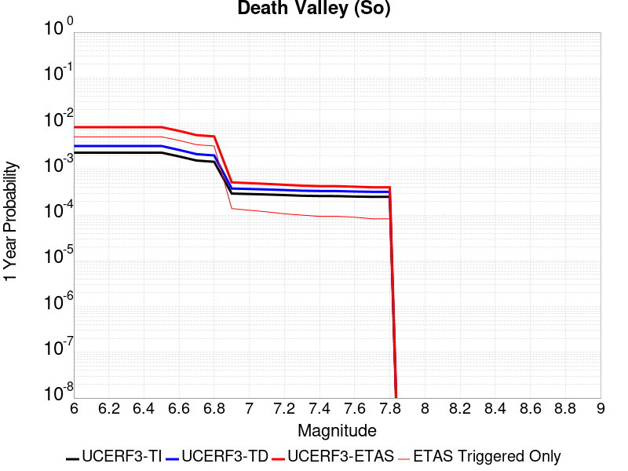 |  |

| Magnitude | 1 wk TI Prob | 1 wk TD Prob | 1 wk ETAS Prob | 1 wk ETAS/TD Gain | 1 wk ETAS Triggered Only | 1 mo TI Prob | 1 mo TD Prob | 1 mo ETAS Prob | 1 mo ETAS/TD Gain | 1 mo ETAS Triggered Only | 1 yr TI Prob | 1 yr TD Prob | 1 yr ETAS Prob | 1 yr ETAS/TD Gain | 1 yr ETAS Triggered Only | 10 yr TI Prob | 10 yr TD Prob | 10 yr ETAS Prob | 10 yr ETAS/TD Gain | 10 yr ETAS Triggered Only |
|-----|-----|-----|-----|-----|-----|-----|-----|-----|-----|-----|-----|-----|-----|-----|-----|-----|-----|-----|-----|-----|
| 6.0 | 4.4658216E-5 | 6.228887E-5 | 0.0021432692 | 34.408543 | 0.00208111 | 1.9137832E-4 | 2.669324E-4 | 0.0033610903 | 12.591541 | 0.003094984 | 0.0023275411 | 0.0032461619 | 0.008618208 | 2.6548915 | 0.005389541 | 0.023033133 | 0.032094594 | 0.039986584 | 1.2458979 | 0.008153682 |
| 6.1 | 4.4658216E-5 | 6.228887E-5 | 0.0021432692 | 34.408543 | 0.00208111 | 1.9137832E-4 | 2.669324E-4 | 0.0033610903 | 12.591541 | 0.003094984 | 0.0023275411 | 0.0032461619 | 0.008618208 | 2.6548915 | 0.005389541 | 0.023033133 | 0.032094594 | 0.039986584 | 1.2458979 | 0.008153682 |
| 6.2 | 4.4658216E-5 | 6.228887E-5 | 0.0021432692 | 34.408543 | 0.00208111 | 1.9137832E-4 | 2.669324E-4 | 0.0033610903 | 12.591541 | 0.003094984 | 0.0023275411 | 0.0032461619 | 0.008618208 | 2.6548915 | 0.005389541 | 0.023033133 | 0.032094594 | 0.039986584 | 1.2458979 | 0.008153682 |
| 6.3 | 4.4658216E-5 | 6.228887E-5 | 0.0021432692 | 34.408543 | 0.00208111 | 1.9137832E-4 | 2.669324E-4 | 0.0033610903 | 12.591541 | 0.003094984 | 0.0023275411 | 0.0032461619 | 0.008618208 | 2.6548915 | 0.005389541 | 0.023033133 | 0.032094594 | 0.039986584 | 1.2458979 | 0.008153682 |
| 6.4 | 4.4658216E-5 | 6.228887E-5 | 0.0021432692 | 34.408543 | 0.00208111 | 1.9137832E-4 | 2.669324E-4 | 0.0033610903 | 12.591541 | 0.003094984 | 0.0023275411 | 0.0032461619 | 0.008618208 | 2.6548915 | 0.005389541 | 0.023033133 | 0.032094594 | 0.039986584 | 1.2458979 | 0.008153682 |
| 6.5 | 4.4658216E-5 | 6.228887E-5 | 0.0021432692 | 34.408543 | 0.00208111 | 1.9137832E-4 | 2.669324E-4 | 0.0033610903 | 12.591541 | 0.003094984 | 0.0023275411 | 0.0032461619 | 0.008618208 | 2.6548915 | 0.005389541 | 0.023033133 | 0.032094594 | 0.039986584 | 1.2458979 | 0.008153682 |
| 6.6 | 3.6853275E-5 | 5.1089468E-5 | 0.001790595 | 35.04822 | 0.0017395945 | 1.5793304E-4 | 2.1894388E-4 | 0.0028437693 | 12.988576 | 0.0026254002 | 0.0019211388 | 0.0026635646 | 0.0072191674 | 2.7103407 | 0.0045677694 | 0.019046152 | 0.026430551 | 0.033184234 | 1.2555256 | 0.006937033 |
| 6.7 | 2.9971921E-5 | 4.1332314E-5 | 0.0015247288 | 36.88951 | 0.0014834579 | 1.2844476E-4 | 1.7713365E-4 | 0.0023645796 | 13.349128 | 0.0021878334 | 0.0015626932 | 0.0021557007 | 0.0057764803 | 2.6796303 | 0.003628602 | 0.015517498 | 0.021467837 | 0.026971428 | 1.2563645 | 0.005624333 |
| 6.8 | 2.8134293E-5 | 3.8737995E-5 | 0.0014154189 | 36.53826 | 0.0013767342 | 1.2056997E-4 | 1.6601657E-4 | 0.002193428 | 13.212104 | 0.0020277482 | 0.0014669509 | 0.0020206098 | 0.0054288637 | 2.6867452 | 0.0034151548 | 0.014573049 | 0.020142367 | 0.025339691 | 1.2580295 | 0.0053041624 |
| 6.9 | 5.6768154E-6 | 7.307913E-6 | 7.1341594E-5 | 9.762239 | 6.403415E-5 | 2.4328981E-5 | 3.1319494E-5 | 1.16695686E-4 | 3.7259762 | 8.5378866E-5 | 2.961651E-4 | 3.8129094E-4 | 5.413153E-4 | 1.419691 | 1.6008537E-4 | 0.0029577068 | 0.003810565 | 0.0040976205 | 1.0753316 | 2.8815368E-4 |
| 7.0 | 5.556207E-6 | 7.1531585E-6 | 7.118685E-5 | 9.951807 | 6.403415E-5 | 2.3812097E-5 | 3.0656276E-5 | 1.05360494E-4 | 3.436833 | 7.470651E-5 | 2.8987371E-4 | 3.7321905E-4 | 5.119079E-4 | 1.3716018 | 1.3874067E-4 | 0.002894959 | 0.003730121 | 0.003995935 | 1.0712614 | 2.6680896E-4 |
| 7.1 | 5.418659E-6 | 6.9768143E-6 | 7.1010516E-5 | 10.178072 | 6.403415E-5 | 2.3222618E-5 | 2.9900531E-5 | 1.04604806E-4 | 3.4984264 | 7.470651E-5 | 2.826987E-4 | 3.64021E-4 | 5.0271116E-4 | 1.3809949 | 1.3874067E-4 | 0.0028233933 | 0.003638446 | 0.0038936508 | 1.0701411 | 2.561366E-4 |
| 7.2 | 5.263499E-6 | 6.7766255E-6 | 7.081034E-5 | 10.449204 | 6.403415E-5 | 2.2557659E-5 | 2.90426E-5 | 1.0374694E-4 | 3.5722332 | 7.470651E-5 | 2.7460488E-4 | 3.5357912E-4 | 4.922707E-4 | 1.3922505 | 1.3874067E-4 | 0.002742658 | 0.003534366 | 0.0037683279 | 1.0661963 | 2.3479189E-4 |
| 7.3 | 5.0913163E-6 | 6.5556187E-6 | 7.058935E-5 | 10.767763 | 6.403415E-5 | 2.1819744E-5 | 2.8095446E-5 | 1.0279986E-4 | 3.6589508 | 7.470651E-5 | 2.65623E-4 | 3.420512E-4 | 4.700757E-4 | 1.3742846 | 1.280683E-4 | 0.0026530572 | 0.0034194465 | 0.0036321639 | 1.062208 | 2.1344717E-4 |
| 7.4 | 5.018449E-6 | 6.4618785E-6 | 7.049562E-5 | 10.909462 | 6.403415E-5 | 2.1507461E-5 | 2.7693712E-5 | 1.0239815E-4 | 3.6975236 | 7.470651E-5 | 2.6182187E-4 | 3.371616E-4 | 4.6518672E-4 | 1.3797145 | 1.280683E-4 | 0.0026151363 | 0.0033706997 | 0.0035834273 | 1.0631108 | 2.1344717E-4 |
| 7.5 | 4.993322E-6 | 6.430145E-6 | 7.046389E-5 | 10.958366 | 6.403415E-5 | 2.1399776E-5 | 2.7557713E-5 | 1.02262165E-4 | 3.7108364 | 7.470651E-5 | 2.6051112E-4 | 3.3550634E-4 | 4.6353167E-4 | 1.3815885 | 1.280683E-4 | 0.0026020592 | 0.003354197 | 0.0035669282 | 1.0634224 | 2.1344717E-4 |
| 7.6 | 4.882584E-6 | 6.2884383E-6 | 7.032219E-5 | 11.182775 | 6.403415E-5 | 2.0925192E-5 | 2.6950413E-5 | 1.0165491E-4 | 3.771924 | 7.470651E-5 | 2.5473442E-4 | 3.2811466E-4 | 4.5614096E-4 | 1.3901876 | 1.280683E-4 | 0.0025444264 | 0.0032805006 | 0.0034826102 | 1.0616094 | 2.0277481E-4 |
| 7.7 | 4.8153906E-6 | 6.202069E-6 | 5.9563532E-5 | 9.603816 | 5.3361793E-5 | 2.0637224E-5 | 2.6580266E-5 | 9.061272E-5 | 3.409022 | 6.403415E-5 | 2.5122924E-4 | 3.2360948E-4 | 4.4096744E-4 | 1.362653 | 1.17395946E-4 | 0.002509454 | 0.0032355804 | 0.0034270613 | 1.0591798 | 1.9210245E-4 |
| 7.8 | 4.8153906E-6 | 6.202069E-6 | 5.9563532E-5 | 9.603816 | 5.3361793E-5 | 2.0637224E-5 | 2.6580266E-5 | 9.061272E-5 | 3.409022 | 6.403415E-5 | 2.5122924E-4 | 3.2360948E-4 | 4.4096744E-4 | 1.362653 | 1.17395946E-4 | 0.002509454 | 0.0032355804 | 0.0034270613 | 1.0591798 | 1.9210245E-4 |

## Panamint Valley
*[(top)](#table-of-contents)*

| 1 Week | 1 Month | 1 Year | 10 Year |
|-----|-----|-----|-----|
|  |  |  |  |

| Magnitude | 1 wk TI Prob | 1 wk TD Prob | 1 wk ETAS Prob | 1 wk ETAS/TD Gain | 1 wk ETAS Triggered Only | 1 mo TI Prob | 1 mo TD Prob | 1 mo ETAS Prob | 1 mo ETAS/TD Gain | 1 mo ETAS Triggered Only | 1 yr TI Prob | 1 yr TD Prob | 1 yr ETAS Prob | 1 yr ETAS/TD Gain | 1 yr ETAS Triggered Only | 10 yr TI Prob | 10 yr TD Prob | 10 yr ETAS Prob | 10 yr ETAS/TD Gain | 10 yr ETAS Triggered Only |
|-----|-----|-----|-----|-----|-----|-----|-----|-----|-----|-----|-----|-----|-----|-----|-----|-----|-----|-----|-----|-----|
| 6.0 | 2.4839064E-5 | 2.5506472E-5 | 0.0023626934 | 92.631134 | 0.0023372464 | 1.0644879E-4 | 1.09309134E-4 | 0.0031185853 | 28.52996 | 0.0030096052 | 0.0012952434 | 0.0013300732 | 0.0059344 | 4.461709 | 0.004610459 | 0.0128772 | 0.013225966 | 0.019650001 | 1.485714 | 0.0065101385 |
| 6.1 | 2.4839064E-5 | 2.5506472E-5 | 0.0023626934 | 92.631134 | 0.0023372464 | 1.0644879E-4 | 1.09309134E-4 | 0.0031185853 | 28.52996 | 0.0030096052 | 0.0012952434 | 0.0013300732 | 0.0059344 | 4.461709 | 0.004610459 | 0.0128772 | 0.013225966 | 0.019650001 | 1.485714 | 0.0065101385 |
| 6.2 | 2.4839064E-5 | 2.5506472E-5 | 0.0023626934 | 92.631134 | 0.0023372464 | 1.0644879E-4 | 1.09309134E-4 | 0.0031185853 | 28.52996 | 0.0030096052 | 0.0012952434 | 0.0013300732 | 0.0059344 | 4.461709 | 0.004610459 | 0.0128772 | 0.013225966 | 0.019650001 | 1.485714 | 0.0065101385 |
| 6.3 | 2.4839064E-5 | 2.5506472E-5 | 0.0023626934 | 92.631134 | 0.0023372464 | 1.0644879E-4 | 1.09309134E-4 | 0.0031185853 | 28.52996 | 0.0030096052 | 0.0012952434 | 0.0013300732 | 0.0059344 | 4.461709 | 0.004610459 | 0.0128772 | 0.013225966 | 0.019650001 | 1.485714 | 0.0065101385 |
| 6.4 | 2.4839064E-5 | 2.5506472E-5 | 0.0023626934 | 92.631134 | 0.0023372464 | 1.0644879E-4 | 1.09309134E-4 | 0.0031185853 | 28.52996 | 0.0030096052 | 0.0012952434 | 0.0013300732 | 0.0059344 | 4.461709 | 0.004610459 | 0.0128772 | 0.013225966 | 0.019650001 | 1.485714 | 0.0065101385 |
| 6.5 | 2.4839064E-5 | 2.5506472E-5 | 0.0023626934 | 92.631134 | 0.0023372464 | 1.0644879E-4 | 1.09309134E-4 | 0.0031185853 | 28.52996 | 0.0030096052 | 0.0012952434 | 0.0013300732 | 0.0059344 | 4.461709 | 0.004610459 | 0.0128772 | 0.013225966 | 0.019650001 | 1.485714 | 0.0065101385 |
| 6.6 | 2.151644E-5 | 2.1799351E-5 | 0.0019000935 | 87.16285 | 0.0018783351 | 9.221006E-5 | 9.34227E-5 | 0.0025158217 | 26.929447 | 0.0024226254 | 0.0011220792 | 0.001136874 | 0.0049212542 | 4.3287597 | 0.0037886873 | 0.011164304 | 0.0113152405 | 0.016643798 | 1.4709187 | 0.005389541 |
| 6.7 | 2.0301508E-5 | 2.043303E-5 | 0.0017920084 | 87.70155 | 0.0017716115 | 8.7003566E-5 | 8.7567445E-5 | 0.0023819236 | 27.201017 | 0.0022945572 | 0.0010587536 | 0.001065658 | 0.004573122 | 4.29136 | 0.003511206 | 0.010537235 | 0.01061009 | 0.0155095225 | 1.4617711 | 0.0049519744 |
| 6.8 | 1.782843E-5 | 1.789433E-5 | 0.0015653586 | 87.47791 | 0.001547492 | 7.640532E-5 | 7.668799E-5 | 0.002050923 | 26.74373 | 0.0019743864 | 9.298377E-4 | 9.3332166E-4 | 0.003972105 | 4.25588 | 0.0030416222 | 0.009259567 | 0.009298533 | 0.013485489 | 1.4502814 | 0.004226254 |
| 6.9 | 1.6185495E-5 | 1.6192123E-5 | 0.0013608875 | 84.046265 | 0.0013447172 | 6.936456E-5 | 6.939322E-5 | 0.0017768521 | 25.605556 | 0.0017075774 | 8.4418635E-4 | 8.4458006E-4 | 0.0035424063 | 4.194281 | 0.0027001067 | 0.008409866 | 0.008418168 | 0.012164379 | 1.445015 | 0.003778015 |
| 7.0 | 1.4473978E-5 | 1.4401701E-5 | 0.0011669998 | 81.03208 | 0.0011526147 | 6.202986E-5 | 6.172037E-5 | 0.0015557583 | 25.206564 | 0.0014941302 | 7.5495185E-4 | 7.512313E-4 | 0.0030653933 | 4.080492 | 0.002315902 | 0.0075239222 | 0.007491346 | 0.010743216 | 1.4340835 | 0.003276414 |
| 7.1 | 1.29175705E-5 | 1.2765824E-5 | 9.519214E-4 | 74.567955 | 9.3916757E-4 | 5.535984E-5 | 5.470978E-5 | 0.0012926357 | 23.62714 | 0.0012379936 | 6.737976E-4 | 6.659326E-4 | 0.0026603346 | 3.9949007 | 0.0019957311 | 0.0067175827 | 0.0066437623 | 0.009474351 | 1.426052 | 0.0028495197 |
| 7.2 | 1.1461888E-5 | 1.1226499E-5 | 8.7567786E-4 | 78.00097 | 8.6446106E-4 | 4.9121452E-5 | 4.8112932E-5 | 0.0011579848 | 24.068058 | 0.0011099253 | 5.978896E-4 | 5.856619E-4 | 0.0024095664 | 4.1142616 | 0.0018249733 | 0.005962835 | 0.005845547 | 0.00841316 | 1.4392426 | 0.0025827107 |
| 7.3 | 1.011261E-5 | 9.918427E-6 | 7.7832065E-4 | 78.47218 | 7.684098E-4 | 4.3339038E-5 | 4.25071E-5 | 0.0010456662 | 24.5998 | 0.0010032017 | 5.2752503E-4 | 5.1744515E-4 | 0.002170805 | 4.195236 | 0.0016542156 | 0.005262745 | 0.005166732 | 0.0074706683 | 1.4459175 | 0.002315902 |
| 7.4 | 4.3367913E-6 | 4.4250473E-6 | 3.0324978E-4 | 68.53029 | 2.9882605E-4 | 1.8586115E-5 | 1.896443E-5 | 4.138342E-4 | 21.821598 | 3.9487728E-4 | 2.2626246E-4 | 2.3088178E-4 | 7.963862E-4 | 3.4493246 | 5.65635E-4 | 0.0022603222 | 0.0023078213 | 0.0031276962 | 1.3552594 | 8.217716E-4 |
| 7.5 | 3.7993927E-6 | 3.8762123E-6 | 3.0270108E-4 | 78.09198 | 2.9882605E-4 | 1.628301E-5 | 1.6612312E-5 | 4.0081085E-4 | 24.127337 | 3.842049E-4 | 1.9822762E-4 | 2.0225039E-4 | 7.464306E-4 | 3.6906261 | 5.442903E-4 | 0.001980509 | 0.002022061 | 0.0027782663 | 1.3739774 | 7.5773743E-4 |
| 7.6 | 3.2998898E-6 | 3.365071E-6 | 2.595008E-4 | 77.116 | 2.561366E-4 | 1.4142308E-5 | 1.4421733E-5 | 3.5593228E-4 | 24.680271 | 3.4151546E-4 | 1.7216899E-4 | 1.755846E-4 | 6.557564E-4 | 3.7347035 | 4.8025613E-4 | 0.0017203566 | 0.001755846 | 0.002427024 | 1.3822534 | 6.723586E-4 |

## San Andreas (Mojave N)
*[(top)](#table-of-contents)*

| 1 Week | 1 Month | 1 Year | 10 Year |
|-----|-----|-----|-----|
|  |  |  |  |

| Magnitude | 1 wk TI Prob | 1 wk TD Prob | 1 wk ETAS Prob | 1 wk ETAS/TD Gain | 1 wk ETAS Triggered Only | 1 mo TI Prob | 1 mo TD Prob | 1 mo ETAS Prob | 1 mo ETAS/TD Gain | 1 mo ETAS Triggered Only | 1 yr TI Prob | 1 yr TD Prob | 1 yr ETAS Prob | 1 yr ETAS/TD Gain | 1 yr ETAS Triggered Only | 10 yr TI Prob | 10 yr TD Prob | 10 yr ETAS Prob | 10 yr ETAS/TD Gain | 10 yr ETAS Triggered Only |
|-----|-----|-----|-----|-----|-----|-----|-----|-----|-----|-----|-----|-----|-----|-----|-----|-----|-----|-----|-----|-----|
| 6.0 | 1.0523762E-4 | 4.3662923E-4 | 0.0010553558 | 2.4170525 | 6.189968E-4 | 4.5094037E-4 | 0.0018700866 | 0.002700974 | 1.4443041 | 8.32444E-4 | 0.005476387 | 0.022559863 | 0.02418719 | 1.0721338 | 0.001664888 | 0.053433806 | 0.19573303 | 0.1978188 | 1.0106562 | 0.0025933832 |
| 6.1 | 1.0523762E-4 | 4.3662923E-4 | 0.0010553558 | 2.4170525 | 6.189968E-4 | 4.5094037E-4 | 0.0018700866 | 0.002700974 | 1.4443041 | 8.32444E-4 | 0.005476387 | 0.022559863 | 0.02418719 | 1.0721338 | 0.001664888 | 0.053433806 | 0.19573303 | 0.1978188 | 1.0106562 | 0.0025933832 |
| 6.2 | 1.0523762E-4 | 4.3662923E-4 | 0.0010553558 | 2.4170525 | 6.189968E-4 | 4.5094037E-4 | 0.0018700866 | 0.002700974 | 1.4443041 | 8.32444E-4 | 0.005476387 | 0.022559863 | 0.02418719 | 1.0721338 | 0.001664888 | 0.053433806 | 0.19573303 | 0.1978188 | 1.0106562 | 0.0025933832 |
| 6.3 | 1.0523762E-4 | 4.3662923E-4 | 0.0010553558 | 2.4170525 | 6.189968E-4 | 4.5094037E-4 | 0.0018700866 | 0.002700974 | 1.4443041 | 8.32444E-4 | 0.005476387 | 0.022559863 | 0.02418719 | 1.0721338 | 0.001664888 | 0.053433806 | 0.19573303 | 0.1978188 | 1.0106562 | 0.0025933832 |
| 6.4 | 1.0523762E-4 | 4.3662923E-4 | 0.0010553558 | 2.4170525 | 6.189968E-4 | 4.5094037E-4 | 0.0018700866 | 0.002700974 | 1.4443041 | 8.32444E-4 | 0.005476387 | 0.022559863 | 0.02418719 | 1.0721338 | 0.001664888 | 0.053433806 | 0.19573303 | 0.1978188 | 1.0106562 | 0.0025933832 |
| 6.5 | 1.0523762E-4 | 4.3662923E-4 | 0.0010553558 | 2.4170525 | 6.189968E-4 | 4.5094037E-4 | 0.0018700866 | 0.002700974 | 1.4443041 | 8.32444E-4 | 0.005476387 | 0.022559863 | 0.02418719 | 1.0721338 | 0.001664888 | 0.053433806 | 0.19573303 | 0.1978188 | 1.0106562 | 0.0025933832 |
| 6.6 | 1.05157305E-4 | 4.3648225E-4 | 0.0010552088 | 2.4175298 | 6.189968E-4 | 4.5059633E-4 | 0.0018694578 | 0.0027003456 | 1.4444538 | 8.32444E-4 | 0.005472219 | 0.022552364 | 0.024179704 | 1.0721583 | 0.001664888 | 0.053394135 | 0.19567315 | 0.19775051 | 1.0106164 | 0.0025827107 |
| 6.7 | 1.0507546E-4 | 4.363306E-4 | 0.0010550573 | 2.4180229 | 6.189968E-4 | 4.5024566E-4 | 0.0018688086 | 0.002699697 | 1.4446086 | 8.32444E-4 | 0.0054679713 | 0.022544624 | 0.024171978 | 1.0721836 | 0.001664888 | 0.053353705 | 0.1956114 | 0.1976889 | 1.0106206 | 0.0025827107 |
| 6.8 | 1.0495169E-4 | 4.3606028E-4 | 0.0010547872 | 2.4189022 | 6.189968E-4 | 4.4971542E-4 | 0.0018676518 | 0.002698541 | 1.4448844 | 8.32444E-4 | 0.005461548 | 0.022530831 | 0.02415821 | 1.0722289 | 0.001664888 | 0.053292558 | 0.19550118 | 0.19757897 | 1.010628 | 0.0025827107 |
| 6.9 | 1.01919264E-4 | 4.2973462E-4 | 9.844588E-4 | 2.2908528 | 5.5496267E-4 | 4.367237E-4 | 0.0018405803 | 0.002596923 | 1.4109262 | 7.5773743E-4 | 0.0053041554 | 0.022207966 | 0.023721091 | 1.0681343 | 0.001547492 | 0.051793266 | 0.19291273 | 0.19485939 | 1.0100908 | 0.002411953 |
| 7.0 | 1.0166431E-4 | 4.2917405E-4 | 9.838985E-4 | 2.2925396 | 5.5496267E-4 | 4.356314E-4 | 0.0018381812 | 0.0025945257 | 1.4114636 | 7.5773743E-4 | 0.0052909213 | 0.022179354 | 0.023692522 | 1.0682242 | 0.001547492 | 0.0516671 | 0.19268334 | 0.19462192 | 1.010061 | 0.0024012807 |
| 7.1 | 1.01401034E-4 | 4.2859098E-4 | 9.833158E-4 | 2.294299 | 5.5496267E-4 | 4.3450345E-4 | 0.0018356858 | 0.0025920323 | 1.4120239 | 7.5773743E-4 | 0.005277255 | 0.02214959 | 0.023662807 | 1.068318 | 0.001547492 | 0.051536802 | 0.19244485 | 0.19438401 | 1.0100765 | 0.0024012807 |
| 7.2 | 1.0108741E-4 | 4.278926E-4 | 9.826177E-4 | 2.2964122 | 5.5496267E-4 | 4.3315982E-4 | 0.001832697 | 0.0025890456 | 1.4126971 | 7.5773743E-4 | 0.0052609756 | 0.022113942 | 0.023616776 | 1.0679587 | 0.0015368196 | 0.051381566 | 0.19215985 | 0.19409108 | 1.0100502 | 0.0023906084 |
| 7.3 | 1.00634395E-4 | 4.2664207E-4 | 9.813679E-4 | 2.3002138 | 5.5496267E-4 | 4.3121897E-4 | 0.001827345 | 0.002583698 | 1.413908 | 7.5773743E-4 | 0.0052374597 | 0.022050105 | 0.023553036 | 1.0681599 | 0.0015368196 | 0.051157285 | 0.1916488 | 0.19357263 | 1.0100383 | 0.002379936 |
| 7.4 | 1.0012071E-4 | 4.2521826E-4 | 9.79945E-4 | 2.3045692 | 5.5496267E-4 | 4.290182E-4 | 0.0018212516 | 0.002577609 | 1.4152954 | 7.5773743E-4 | 0.0052107936 | 0.021977417 | 0.023480462 | 1.0683904 | 0.0015368196 | 0.050902903 | 0.19106553 | 0.19298212 | 1.010031 | 0.0023692637 |
| 7.5 | 9.339507E-5 | 4.0500556E-4 | 9.490754E-4 | 2.3433638 | 5.442903E-4 | 4.002032E-4 | 0.0017347414 | 0.0024698568 | 1.4237608 | 7.3639274E-4 | 0.0048615932 | 0.020944512 | 0.022417797 | 1.0703423 | 0.0015048026 | 0.047566023 | 0.18278176 | 0.18464819 | 1.0102112 | 0.0022838847 |
| 7.6 | 9.106496E-5 | 3.9784564E-4 | 9.2058314E-4 | 2.3139205 | 5.2294554E-4 | 3.9022003E-4 | 0.0017040963 | 0.0023966176 | 1.4063861 | 6.937033E-4 | 0.0047405837 | 0.020578498 | 0.022010522 | 1.0695884 | 0.0014621131 | 0.046407226 | 0.17986235 | 0.18169169 | 1.0101707 | 0.002230523 |
| 7.7 | 8.313271E-5 | 3.7445044E-4 | 8.2252163E-4 | 2.1966102 | 4.4823907E-4 | 3.5623438E-4 | 0.0016039569 | 0.0022219608 | 1.3852996 | 6.189968E-4 | 0.004328531 | 0.019381423 | 0.020637283 | 1.0647972 | 0.001280683 | 0.042451844 | 0.17016967 | 0.17182578 | 1.0097321 | 0.0019957311 |
| 7.8 | 5.726896E-5 | 2.6506177E-4 | 6.064867E-4 | 2.288096 | 3.4151546E-4 | 2.4541531E-4 | 0.0011355855 | 0.0015939757 | 1.4036599 | 4.589114E-4 | 0.0029838376 | 0.013756123 | 0.014608693 | 1.0619774 | 8.6446106E-4 | 0.0294409 | 0.12299887 | 0.12412203 | 1.0091314 | 0.001280683 |
| 7.9 | 2.148629E-5 | 1.04210856E-4 | 2.3226581E-4 | 2.2288063 | 1.280683E-4 | 9.208085E-5 | 4.46556E-4 | 6.279051E-4 | 1.406106 | 1.8143009E-4 | 0.0011205077 | 0.005425832 | 0.0057442654 | 1.0586884 | 3.2017074E-4 | 0.011148746 | 0.049493838 | 0.049899604 | 1.0081983 | 4.2689434E-4 |
| 8.0 | 6.3800603E-6 | 3.136937E-5 | 6.338544E-5 | 2.0206156 | 3.2017077E-5 | 2.7342829E-5 | 1.3443502E-4 | 1.7711872E-4 | 1.3175043 | 4.2689433E-5 | 3.3284808E-4 | 0.0016358347 | 0.0017210739 | 1.0521075 | 8.5378866E-5 | 0.0033234998 | 0.015136539 | 0.015252158 | 1.0076385 | 1.17395946E-4 |
| 8.1 | 2.2240692E-6 | 1.29589735E-5 | 2.3631193E-5 | 1.823539 | 1.0672358E-5 | 9.531691E-6 | 5.5538447E-5 | 6.621021E-5 | 1.192151 | 1.0672358E-5 | 1.1604215E-4 | 6.7617896E-4 | 7.0817437E-4 | 1.047318 | 3.2017077E-5 | 0.0011598158 | 0.0061071273 | 0.006149556 | 1.0069474 | 4.2689433E-5 |

## San Andreas (Big Bend)
*[(top)](#table-of-contents)*

| 1 Week | 1 Month | 1 Year | 10 Year |
|-----|-----|-----|-----|
|  |  |  |  |

| Magnitude | 1 wk TI Prob | 1 wk TD Prob | 1 wk ETAS Prob | 1 wk ETAS/TD Gain | 1 wk ETAS Triggered Only | 1 mo TI Prob | 1 mo TD Prob | 1 mo ETAS Prob | 1 mo ETAS/TD Gain | 1 mo ETAS Triggered Only | 1 yr TI Prob | 1 yr TD Prob | 1 yr ETAS Prob | 1 yr ETAS/TD Gain | 1 yr ETAS Triggered Only | 10 yr TI Prob | 10 yr TD Prob | 10 yr ETAS Prob | 10 yr ETAS/TD Gain | 10 yr ETAS Triggered Only |
|-----|-----|-----|-----|-----|-----|-----|-----|-----|-----|-----|-----|-----|-----|-----|-----|-----|-----|-----|-----|-----|
| 6.0 | 1.0734612E-4 | 4.329521E-4 | 0.00100901 | 2.3305347 | 5.7630736E-4 | 4.5997367E-4 | 0.0018543553 | 0.002653298 | 1.4308466 | 8.004269E-4 | 0.005585809 | 0.0223732 | 0.023927802 | 1.0694851 | 0.0015901814 | 0.054474745 | 0.19450675 | 0.19647534 | 1.010121 | 0.0024439702 |
| 6.1 | 1.0734612E-4 | 4.329521E-4 | 0.00100901 | 2.3305347 | 5.7630736E-4 | 4.5997367E-4 | 0.0018543553 | 0.002653298 | 1.4308466 | 8.004269E-4 | 0.005585809 | 0.0223732 | 0.023927802 | 1.0694851 | 0.0015901814 | 0.054474745 | 0.19450675 | 0.19647534 | 1.010121 | 0.0024439702 |
| 6.2 | 1.0734612E-4 | 4.329521E-4 | 0.00100901 | 2.3305347 | 5.7630736E-4 | 4.5997367E-4 | 0.0018543553 | 0.002653298 | 1.4308466 | 8.004269E-4 | 0.005585809 | 0.0223732 | 0.023927802 | 1.0694851 | 0.0015901814 | 0.054474745 | 0.19450675 | 0.19647534 | 1.010121 | 0.0024439702 |
| 6.3 | 1.0734612E-4 | 4.329521E-4 | 0.00100901 | 2.3305347 | 5.7630736E-4 | 4.5997367E-4 | 0.0018543553 | 0.002653298 | 1.4308466 | 8.004269E-4 | 0.005585809 | 0.0223732 | 0.023927802 | 1.0694851 | 0.0015901814 | 0.054474745 | 0.19450675 | 0.19647534 | 1.010121 | 0.0024439702 |
| 6.4 | 1.0734612E-4 | 4.329521E-4 | 0.00100901 | 2.3305347 | 5.7630736E-4 | 4.5997367E-4 | 0.0018543553 | 0.002653298 | 1.4308466 | 8.004269E-4 | 0.005585809 | 0.0223732 | 0.023927802 | 1.0694851 | 0.0015901814 | 0.054474745 | 0.19450675 | 0.19647534 | 1.010121 | 0.0024439702 |
| 6.5 | 1.0734612E-4 | 4.329521E-4 | 0.00100901 | 2.3305347 | 5.7630736E-4 | 4.5997367E-4 | 0.0018543553 | 0.002653298 | 1.4308466 | 8.004269E-4 | 0.005585809 | 0.0223732 | 0.023927802 | 1.0694851 | 0.0015901814 | 0.054474745 | 0.19450675 | 0.19647534 | 1.010121 | 0.0024439702 |
| 6.6 | 1.0724574E-4 | 4.3276677E-4 | 0.0010088247 | 2.331105 | 5.7630736E-4 | 4.595436E-4 | 0.0018535622 | 0.0026525054 | 1.4310312 | 8.004269E-4 | 0.0055806 | 0.022363741 | 0.02391836 | 1.0695151 | 0.0015901814 | 0.054425213 | 0.19443108 | 0.19639987 | 1.0101259 | 0.0024439702 |
| 6.7 | 1.0708281E-4 | 4.324658E-4 | 0.001008524 | 2.3320317 | 5.7630736E-4 | 4.588456E-4 | 0.0018522742 | 0.0026512186 | 1.4313315 | 8.004269E-4 | 0.005572145 | 0.022348382 | 0.023903025 | 1.069564 | 0.0015901814 | 0.054344814 | 0.19430833 | 0.19627741 | 1.0101339 | 0.0024439702 |
| 6.8 | 1.0689705E-4 | 4.320727E-4 | 0.0010081311 | 2.333244 | 5.7630736E-4 | 4.580498E-4 | 0.0018505919 | 0.0026495375 | 1.4317244 | 8.004269E-4 | 0.0055625057 | 0.022328319 | 0.023882994 | 1.069628 | 0.0015901814 | 0.054253142 | 0.19414698 | 0.19611646 | 1.0101442 | 0.0024439702 |
| 6.9 | 1.06647094E-4 | 4.3154295E-4 | 0.0010076016 | 2.3348813 | 5.7630736E-4 | 4.5697892E-4 | 0.0018483247 | 0.002647272 | 1.4322549 | 8.004269E-4 | 0.0055495338 | 0.022301283 | 0.023856001 | 1.0697143 | 0.0015901814 | 0.054129772 | 0.19392996 | 0.19589996 | 1.0101584 | 0.0024439702 |
| 7.0 | 1.0639214E-4 | 4.3100046E-4 | 0.0010070595 | 2.3365624 | 5.7630736E-4 | 4.5588662E-4 | 0.001846003 | 0.0026449524 | 1.4327996 | 8.004269E-4 | 0.005536303 | 0.022273595 | 0.023828357 | 1.0698029 | 0.0015901814 | 0.054003917 | 0.19370714 | 0.1956777 | 1.0101728 | 0.0024439702 |
| 7.1 | 9.878347E-5 | 4.1491815E-4 | 9.376467E-4 | 2.2598355 | 5.2294554E-4 | 4.2328905E-4 | 0.0017771729 | 0.0024696433 | 1.3896472 | 6.937033E-4 | 0.005141373 | 0.02145213 | 0.022851547 | 1.0652344 | 0.0014300961 | 0.05024037 | 0.18707013 | 0.18887472 | 1.0096465 | 0.0022198507 |
| 7.2 | 9.8447454E-5 | 4.1419562E-4 | 9.369246E-4 | 2.2620342 | 5.2294554E-4 | 4.2184943E-4 | 0.0017740804 | 0.0024665531 | 1.3903276 | 6.937033E-4 | 0.0051239277 | 0.021415222 | 0.02280425 | 1.0648617 | 0.0014194237 | 0.05007382 | 0.18677177 | 0.18856832 | 1.009619 | 0.0022091782 |
| 7.3 | 9.7971046E-5 | 4.1292782E-4 | 9.356575E-4 | 2.2659104 | 5.2294554E-4 | 4.1980835E-4 | 0.0017686546 | 0.002461131 | 1.3915272 | 6.937033E-4 | 0.0050991946 | 0.021350458 | 0.022739576 | 1.0650626 | 0.0014194237 | 0.049837634 | 0.1862459 | 0.18804362 | 1.0096525 | 0.0022091782 |
| 7.4 | 9.740844E-5 | 4.113638E-4 | 9.3409425E-4 | 2.2707255 | 5.2294554E-4 | 4.1739794E-4 | 0.0017619608 | 0.0024544417 | 1.3930173 | 6.937033E-4 | 0.0050699846 | 0.021270558 | 0.02265979 | 1.0653124 | 0.0014194237 | 0.049558636 | 0.18560115 | 0.1873916 | 1.0096468 | 0.002198506 |
| 7.5 | 9.6629556E-5 | 4.0913856E-4 | 9.318702E-4 | 2.2776396 | 5.2294554E-4 | 4.1406092E-4 | 0.0017524367 | 0.0024449243 | 1.395157 | 6.937033E-4 | 0.005029545 | 0.021156862 | 0.022535808 | 1.0651773 | 0.0014087514 | 0.04917225 | 0.18468793 | 0.186463 | 1.0096111 | 0.0021771612 |
| 7.6 | 9.57783E-5 | 4.0665545E-4 | 9.187204E-4 | 2.2592106 | 5.122732E-4 | 4.1041384E-4 | 0.0017418092 | 0.0024236504 | 1.3914558 | 6.830309E-4 | 0.004985346 | 0.021029979 | 0.022398656 | 1.0650822 | 0.001398079 | 0.048749782 | 0.18367083 | 0.18543069 | 1.0095816 | 0.0021558164 |
| 7.7 | 8.018139E-5 | 3.5930445E-4 | 7.860454E-4 | 2.1876862 | 4.2689434E-4 | 3.4358926E-4 | 0.0015391231 | 0.0021358554 | 1.3877093 | 5.976521E-4 | 0.004175178 | 0.018605733 | 0.019799745 | 1.0641744 | 0.0012166488 | 0.040976003 | 0.16405721 | 0.16566308 | 1.0097885 | 0.0019210245 |
| 7.8 | 5.450103E-5 | 2.5067478E-4 | 5.707653E-4 | 2.2769153 | 3.2017074E-4 | 2.3355494E-4 | 0.0010739786 | 0.0015110753 | 1.4069884 | 4.375667E-4 | 0.0028398235 | 0.013015171 | 0.013815713 | 1.0615084 | 8.1109925E-4 | 0.028038062 | 0.116878085 | 0.11795253 | 1.009193 | 0.0012166488 |
| 7.9 | 2.0202247E-5 | 9.5990974E-5 | 2.0270431E-4 | 2.1117017 | 1.06723586E-4 | 8.6578184E-5 | 4.1133902E-4 | 5.7135854E-4 | 1.389021 | 1.6008537E-4 | 0.0010535796 | 0.004999033 | 0.005275127 | 1.0552295 | 2.7748133E-4 | 0.010485985 | 0.04582507 | 0.04619167 | 1.008 | 3.842049E-4 |
| 8.0 | 6.3800603E-6 | 3.136937E-5 | 6.338544E-5 | 2.0206156 | 3.2017077E-5 | 2.7342829E-5 | 1.3443502E-4 | 1.7711872E-4 | 1.3175043 | 4.2689433E-5 | 3.3284808E-4 | 0.0016358347 | 0.0017210739 | 1.0521075 | 8.5378866E-5 | 0.0033234998 | 0.015136539 | 0.015252158 | 1.0076385 | 1.17395946E-4 |
| 8.1 | 2.2240692E-6 | 1.29589735E-5 | 2.3631193E-5 | 1.823539 | 1.0672358E-5 | 9.531691E-6 | 5.5538447E-5 | 6.621021E-5 | 1.192151 | 1.0672358E-5 | 1.1604215E-4 | 6.7617896E-4 | 7.0817437E-4 | 1.047318 | 3.2017077E-5 | 0.0011598158 | 0.0061071273 | 0.006149556 | 1.0069474 | 4.2689433E-5 |

## San Andreas (Mojave S)
*[(top)](#table-of-contents)*

| 1 Week | 1 Month | 1 Year | 10 Year |
|-----|-----|-----|-----|
|  |  |  |  |

| Magnitude | 1 wk TI Prob | 1 wk TD Prob | 1 wk ETAS Prob | 1 wk ETAS/TD Gain | 1 wk ETAS Triggered Only | 1 mo TI Prob | 1 mo TD Prob | 1 mo ETAS Prob | 1 mo ETAS/TD Gain | 1 mo ETAS Triggered Only | 1 yr TI Prob | 1 yr TD Prob | 1 yr ETAS Prob | 1 yr ETAS/TD Gain | 1 yr ETAS Triggered Only | 10 yr TI Prob | 10 yr TD Prob | 10 yr ETAS Prob | 10 yr ETAS/TD Gain | 10 yr ETAS Triggered Only |
|-----|-----|-----|-----|-----|-----|-----|-----|-----|-----|-----|-----|-----|-----|-----|-----|-----|-----|-----|-----|-----|
| 6.0 | 1.2943693E-4 | 5.2341627E-4 | 0.001099422 | 2.1004734 | 5.7630736E-4 | 5.5461173E-4 | 0.0022414345 | 0.003008122 | 1.3420521 | 7.684098E-4 | 0.0067315125 | 0.026976345 | 0.028461322 | 1.0550474 | 0.0015261472 | 0.0653122 | 0.22817664 | 0.22993116 | 1.0076894 | 0.0022732124 |
| 6.1 | 1.2943693E-4 | 5.2341627E-4 | 0.001099422 | 2.1004734 | 5.7630736E-4 | 5.5461173E-4 | 0.0022414345 | 0.003008122 | 1.3420521 | 7.684098E-4 | 0.0067315125 | 0.026976345 | 0.028461322 | 1.0550474 | 0.0015261472 | 0.0653122 | 0.22817664 | 0.22993116 | 1.0076894 | 0.0022732124 |
| 6.2 | 1.2943693E-4 | 5.2341627E-4 | 0.001099422 | 2.1004734 | 5.7630736E-4 | 5.5461173E-4 | 0.0022414345 | 0.003008122 | 1.3420521 | 7.684098E-4 | 0.0067315125 | 0.026976345 | 0.028461322 | 1.0550474 | 0.0015261472 | 0.0653122 | 0.22817664 | 0.22993116 | 1.0076894 | 0.0022732124 |
| 6.3 | 1.2943693E-4 | 5.2341627E-4 | 0.001099422 | 2.1004734 | 5.7630736E-4 | 5.5461173E-4 | 0.0022414345 | 0.003008122 | 1.3420521 | 7.684098E-4 | 0.0067315125 | 0.026976345 | 0.028461322 | 1.0550474 | 0.0015261472 | 0.0653122 | 0.22817664 | 0.22993116 | 1.0076894 | 0.0022732124 |
| 6.4 | 1.2943693E-4 | 5.2341627E-4 | 0.001099422 | 2.1004734 | 5.7630736E-4 | 5.5461173E-4 | 0.0022414345 | 0.003008122 | 1.3420521 | 7.684098E-4 | 0.0067315125 | 0.026976345 | 0.028461322 | 1.0550474 | 0.0015261472 | 0.0653122 | 0.22817664 | 0.22993116 | 1.0076894 | 0.0022732124 |
| 6.5 | 1.2943693E-4 | 5.2341627E-4 | 0.001099422 | 2.1004734 | 5.7630736E-4 | 5.5461173E-4 | 0.0022414345 | 0.003008122 | 1.3420521 | 7.684098E-4 | 0.0067315125 | 0.026976345 | 0.028461322 | 1.0550474 | 0.0015261472 | 0.0653122 | 0.22817664 | 0.22993116 | 1.0076894 | 0.0022732124 |
| 6.6 | 1.2919602E-4 | 5.22933E-4 | 0.001098939 | 2.101491 | 5.7630736E-4 | 5.535797E-4 | 0.0022393672 | 0.0030060564 | 1.3423686 | 7.684098E-4 | 0.006719025 | 0.0269518 | 0.028436814 | 1.0550989 | 0.0015261472 | 0.06519468 | 0.2279908 | 0.22974575 | 1.0076975 | 0.0022732124 |
| 6.7 | 1.287887E-4 | 5.2211765E-4 | 0.0010981241 | 2.103212 | 5.7630736E-4 | 5.518348E-4 | 0.0022358787 | 0.0030025705 | 1.342904 | 7.684098E-4 | 0.0066979113 | 0.026910376 | 0.028395453 | 1.055186 | 0.0015261472 | 0.06499596 | 0.22767708 | 0.22943273 | 1.0077112 | 0.0022732124 |
| 6.8 | 1.2835562E-4 | 5.210589E-4 | 0.001097066 | 2.105455 | 5.7630736E-4 | 5.499795E-4 | 0.002231349 | 0.0029980442 | 1.3436017 | 7.684098E-4 | 0.0066754622 | 0.02685659 | 0.028331364 | 1.0549129 | 0.0015154749 | 0.06478462 | 0.22727028 | 0.22901861 | 1.0076927 | 0.00226254 |
| 6.9 | 1.278557E-4 | 5.198382E-4 | 0.001095846 | 2.108052 | 5.7630736E-4 | 5.4783793E-4 | 0.0022261261 | 0.0029928253 | 1.3444096 | 7.684098E-4 | 0.0066495477 | 0.02679457 | 0.028269438 | 1.0550436 | 0.0015154749 | 0.06454061 | 0.22680105 | 0.22855045 | 1.0077133 | 0.00226254 |
| 7.0 | 1.2736667E-4 | 5.1865564E-4 | 0.0010946641 | 2.1105797 | 5.7630736E-4 | 5.457429E-4 | 0.0022210667 | 0.00298777 | 1.3451959 | 7.684098E-4 | 0.0066241967 | 0.026734486 | 0.028209446 | 1.0551707 | 0.0015154749 | 0.06430185 | 0.22634536 | 0.22807927 | 1.0076605 | 0.0022411954 |
| 7.1 | 1.2686207E-4 | 5.1743153E-4 | 0.0010934407 | 2.1132085 | 5.7630736E-4 | 5.4358126E-4 | 0.0022158294 | 0.0029825366 | 1.3460135 | 7.684098E-4 | 0.006598038 | 0.026672287 | 0.02814734 | 1.0553029 | 0.0015154749 | 0.06405542 | 0.22587313 | 0.2276081 | 1.0076811 | 0.0022411954 |
| 7.2 | 1.2627966E-4 | 5.1603396E-4 | 0.0010920439 | 2.116225 | 5.7630736E-4 | 5.4108625E-4 | 0.0022098501 | 0.002976562 | 1.346952 | 7.684098E-4 | 0.0065678447 | 0.026601272 | 0.028066045 | 1.055064 | 0.0015048026 | 0.06377091 | 0.22533216 | 0.22706006 | 1.0076683 | 0.002230523 |
| 7.3 | 1.1602937E-4 | 4.828936E-4 | 0.0010269211 | 2.126599 | 5.442903E-4 | 4.971739E-4 | 0.0020680462 | 0.002802916 | 1.355345 | 7.3639274E-4 | 0.006036306 | 0.024914496 | 0.026298556 | 1.0555524 | 0.0014194237 | 0.05874951 | 0.21248999 | 0.2141625 | 1.007871 | 0.0021237994 |
| 7.4 | 1.1524662E-4 | 4.805332E-4 | 0.0010245619 | 2.1321356 | 5.442903E-4 | 4.938206E-4 | 0.0020579463 | 0.0027928236 | 1.3570925 | 7.3639274E-4 | 0.0059957043 | 0.024794336 | 0.026178567 | 1.0558285 | 0.0014194237 | 0.058364958 | 0.21155837 | 0.21322446 | 1.0078752 | 0.002113127 |
| 7.5 | 9.4520525E-5 | 4.1331907E-4 | 9.360485E-4 | 2.2647116 | 5.2294554E-4 | 4.0502506E-4 | 0.0017702914 | 0.00247342 | 1.3971825 | 7.043757E-4 | 0.0049200356 | 0.021363411 | 0.022689844 | 1.0620891 | 0.0013553896 | 0.048125222 | 0.18482538 | 0.18642615 | 1.008661 | 0.001963714 |
| 7.6 | 8.245433E-5 | 3.7524698E-4 | 8.339862E-4 | 2.2224994 | 4.589114E-4 | 3.5332784E-4 | 0.00160733 | 0.0022146767 | 1.3778605 | 6.083244E-4 | 0.004293284 | 0.019415388 | 0.02063981 | 1.0630646 | 0.001248666 | 0.042112812 | 0.16915758 | 0.1706561 | 1.0088588 | 0.0018036286 |
| 7.7 | 7.414645E-5 | 3.5051344E-4 | 7.452523E-4 | 2.1261733 | 3.9487728E-4 | 3.1773178E-4 | 0.0015014539 | 0.002044927 | 1.3619646 | 5.442903E-4 | 0.0038615242 | 0.018148331 | 0.019206677 | 1.0583165 | 0.0010779082 | 0.037951093 | 0.15877695 | 0.16010568 | 1.0083685 | 0.0015795091 |
| 7.8 | 6.36853E-5 | 3.084882E-4 | 6.605674E-4 | 2.1413052 | 3.5218784E-4 | 2.7290845E-4 | 0.0013215367 | 0.0018011582 | 1.3629271 | 4.8025613E-4 | 0.0033175983 | 0.015991475 | 0.016894622 | 1.0564767 | 9.178228E-4 | 0.03268505 | 0.14064915 | 0.14181392 | 1.0082812 | 0.0013553896 |
| 7.9 | 2.148629E-5 | 1.04210856E-4 | 2.3226581E-4 | 2.2288063 | 1.280683E-4 | 9.208085E-5 | 4.46556E-4 | 6.279051E-4 | 1.406106 | 1.8143009E-4 | 0.0011205077 | 0.005425832 | 0.0057442654 | 1.0586884 | 3.2017074E-4 | 0.011148746 | 0.049493838 | 0.049899604 | 1.0081983 | 4.2689434E-4 |
| 8.0 | 6.3800603E-6 | 3.136937E-5 | 6.338544E-5 | 2.0206156 | 3.2017077E-5 | 2.7342829E-5 | 1.3443502E-4 | 1.7711872E-4 | 1.3175043 | 4.2689433E-5 | 3.3284808E-4 | 0.0016358347 | 0.0017210739 | 1.0521075 | 8.5378866E-5 | 0.0033234998 | 0.015136539 | 0.015252158 | 1.0076385 | 1.17395946E-4 |
| 8.1 | 2.2240692E-6 | 1.29589735E-5 | 2.3631193E-5 | 1.823539 | 1.0672358E-5 | 9.531691E-6 | 5.5538447E-5 | 6.621021E-5 | 1.192151 | 1.0672358E-5 | 1.1604215E-4 | 6.7617896E-4 | 7.0817437E-4 | 1.047318 | 3.2017077E-5 | 0.0011598158 | 0.0061071273 | 0.006149556 | 1.0069474 | 4.2689433E-5 |

## San Andreas (Carrizo) rev
*[(top)](#table-of-contents)*

| 1 Week | 1 Month | 1 Year | 10 Year |
|-----|-----|-----|-----|
|  |  |  |  |

| Magnitude | 1 wk TI Prob | 1 wk TD Prob | 1 wk ETAS Prob | 1 wk ETAS/TD Gain | 1 wk ETAS Triggered Only | 1 mo TI Prob | 1 mo TD Prob | 1 mo ETAS Prob | 1 mo ETAS/TD Gain | 1 mo ETAS Triggered Only | 1 yr TI Prob | 1 yr TD Prob | 1 yr ETAS Prob | 1 yr ETAS/TD Gain | 1 yr ETAS Triggered Only | 10 yr TI Prob | 10 yr TD Prob | 10 yr ETAS Prob | 10 yr ETAS/TD Gain | 10 yr ETAS Triggered Only |
|-----|-----|-----|-----|-----|-----|-----|-----|-----|-----|-----|-----|-----|-----|-----|-----|-----|-----|-----|-----|-----|
| 6.0 | 1.1113902E-4 | 4.4923634E-4 | 9.1860915E-4 | 2.044824 | 4.6958379E-4 | 4.7622315E-4 | 0.0019240503 | 0.0025631597 | 1.3321688 | 6.403415E-4 | 0.005782614 | 0.023205092 | 0.024476906 | 1.0548075 | 0.0013020277 | 0.05634437 | 0.20058148 | 0.20224516 | 1.0082942 | 0.00208111 |
| 6.1 | 1.1113902E-4 | 4.4923634E-4 | 9.1860915E-4 | 2.044824 | 4.6958379E-4 | 4.7622315E-4 | 0.0019240503 | 0.0025631597 | 1.3321688 | 6.403415E-4 | 0.005782614 | 0.023205092 | 0.024476906 | 1.0548075 | 0.0013020277 | 0.05634437 | 0.20058148 | 0.20224516 | 1.0082942 | 0.00208111 |
| 6.2 | 1.1113902E-4 | 4.4923634E-4 | 9.1860915E-4 | 2.044824 | 4.6958379E-4 | 4.7622315E-4 | 0.0019240503 | 0.0025631597 | 1.3321688 | 6.403415E-4 | 0.005782614 | 0.023205092 | 0.024476906 | 1.0548075 | 0.0013020277 | 0.05634437 | 0.20058148 | 0.20224516 | 1.0082942 | 0.00208111 |
| 6.3 | 1.1113902E-4 | 4.4923634E-4 | 9.1860915E-4 | 2.044824 | 4.6958379E-4 | 4.7622315E-4 | 0.0019240503 | 0.0025631597 | 1.3321688 | 6.403415E-4 | 0.005782614 | 0.023205092 | 0.024476906 | 1.0548075 | 0.0013020277 | 0.05634437 | 0.20058148 | 0.20224516 | 1.0082942 | 0.00208111 |
| 6.4 | 1.1113902E-4 | 4.4923634E-4 | 9.1860915E-4 | 2.044824 | 4.6958379E-4 | 4.7622315E-4 | 0.0019240503 | 0.0025631597 | 1.3321688 | 6.403415E-4 | 0.005782614 | 0.023205092 | 0.024476906 | 1.0548075 | 0.0013020277 | 0.05634437 | 0.20058148 | 0.20224516 | 1.0082942 | 0.00208111 |
| 6.5 | 1.1113902E-4 | 4.4923634E-4 | 9.1860915E-4 | 2.044824 | 4.6958379E-4 | 4.7622315E-4 | 0.0019240503 | 0.0025631597 | 1.3321688 | 6.403415E-4 | 0.005782614 | 0.023205092 | 0.024476906 | 1.0548075 | 0.0013020277 | 0.05634437 | 0.20058148 | 0.20224516 | 1.0082942 | 0.00208111 |
| 6.6 | 1.1099849E-4 | 4.4896975E-4 | 9.183427E-4 | 2.0454445 | 4.6958379E-4 | 4.7562108E-4 | 0.0019229094 | 0.0025620195 | 1.3323662 | 6.403415E-4 | 0.005775322 | 0.023191497 | 0.02446333 | 1.0548404 | 0.0013020277 | 0.056275163 | 0.20047371 | 0.20213762 | 1.0082998 | 0.00208111 |
| 6.7 | 1.1077418E-4 | 4.4854544E-4 | 9.179186E-4 | 2.046434 | 4.6958379E-4 | 4.7466008E-4 | 0.0019210937 | 0.002560205 | 1.3326811 | 6.403415E-4 | 0.0057636844 | 0.023169862 | 0.02444172 | 1.0548929 | 0.0013020277 | 0.056164686 | 0.20030232 | 0.20196658 | 1.0083088 | 0.00208111 |
| 6.8 | 1.105471E-4 | 4.4803345E-4 | 9.174068E-4 | 2.0476303 | 4.6958379E-4 | 4.7368725E-4 | 0.0019189026 | 0.0025580155 | 1.3330616 | 6.403415E-4 | 0.0057519027 | 0.023143753 | 0.024415648 | 1.0549562 | 0.0013020277 | 0.056052838 | 0.20009586 | 0.20176055 | 1.0083195 | 0.00208111 |
| 6.9 | 1.1025541E-4 | 4.473621E-4 | 9.167358E-4 | 2.0492032 | 4.6958379E-4 | 4.7243762E-4 | 0.0019160297 | 0.0025551443 | 1.3335619 | 6.403415E-4 | 0.0057367687 | 0.023109518 | 0.024381457 | 1.0550396 | 0.0013020277 | 0.055909142 | 0.19982636 | 0.20149161 | 1.0083334 | 0.00208111 |
| 7.0 | 1.0991533E-4 | 4.4657878E-4 | 9.1595284E-4 | 2.0510442 | 4.6958379E-4 | 4.7098065E-4 | 0.0019126774 | 0.0025517943 | 1.3341477 | 6.403415E-4 | 0.0057191234 | 0.023069572 | 0.02434156 | 1.0551372 | 0.0013020277 | 0.055741582 | 0.19951206 | 0.20117797 | 1.0083499 | 0.00208111 |
| 7.1 | 1.09542365E-4 | 4.457076E-4 | 9.150821E-4 | 2.0530996 | 4.6958379E-4 | 4.693828E-4 | 0.0019089493 | 0.0025480685 | 1.3348016 | 6.403415E-4 | 0.0056997715 | 0.023025142 | 0.02429719 | 1.0552461 | 0.0013020277 | 0.05555778 | 0.19916314 | 0.20082977 | 1.0083681 | 0.00208111 |
| 7.2 | 1.05608764E-4 | 4.3706578E-4 | 9.0644433E-4 | 2.073931 | 4.6958379E-4 | 4.5253045E-4 | 0.0018719663 | 0.002511109 | 1.3414286 | 6.403415E-4 | 0.005495649 | 0.022584237 | 0.023846427 | 1.0558882 | 0.0012913554 | 0.053617116 | 0.19563848 | 0.19729528 | 1.0084686 | 0.0020597652 |
| 7.3 | 1.0511766E-4 | 4.3558737E-4 | 9.049666E-4 | 2.0775778 | 4.6958379E-4 | 4.5042645E-4 | 0.0018656392 | 0.002504786 | 1.3425887 | 6.403415E-4 | 0.0054701613 | 0.0225088 | 0.023771089 | 1.0560797 | 0.0012913554 | 0.053374548 | 0.195048 | 0.19670603 | 1.0085006 | 0.0020597652 |
| 7.4 | 1.04579514E-4 | 4.3395188E-4 | 9.0333185E-4 | 2.0816407 | 4.6958379E-4 | 4.481209E-4 | 0.00185864 | 0.0024977913 | 1.3438812 | 6.403415E-4 | 0.005442232 | 0.022425342 | 0.023687739 | 1.0562932 | 0.0012913554 | 0.053108674 | 0.19439563 | 0.19605498 | 1.008536 | 0.0020597652 |
| 7.5 | 8.967509E-5 | 3.841574E-4 | 8.535608E-4 | 2.2219038 | 4.6958379E-4 | 3.842652E-4 | 0.0016455129 | 0.0022848006 | 1.3885037 | 6.403415E-4 | 0.004668397 | 0.019879378 | 0.021134602 | 1.0631421 | 0.001280683 | 0.045715354 | 0.17451581 | 0.17618968 | 1.0095916 | 0.0020277482 |
| 7.6 | 8.902246E-5 | 3.822647E-4 | 8.5166894E-4 | 2.227956 | 4.6958379E-4 | 3.8146903E-4 | 0.0016374114 | 0.0022767044 | 1.390429 | 6.403415E-4 | 0.004634499 | 0.019782541 | 0.021037888 | 1.0634574 | 0.001280683 | 0.0453903 | 0.17373076 | 0.17539741 | 1.0095932 | 0.0020170757 |
| 7.7 | 7.776459E-5 | 3.4746045E-4 | 7.742065E-4 | 2.228186 | 4.2689434E-4 | 3.3323426E-4 | 0.0014884217 | 0.0020851842 | 1.4009365 | 5.976521E-4 | 0.0040495815 | 0.017998766 | 0.019193517 | 1.0663795 | 0.0012166488 | 0.039765768 | 0.15920663 | 0.16082181 | 1.0101452 | 0.0019210245 |
| 7.8 | 5.2312953E-5 | 2.3975673E-4 | 5.598507E-4 | 2.3350782 | 3.2017074E-4 | 2.2417911E-4 | 0.0010272242 | 0.0014643415 | 1.4255325 | 4.375667E-4 | 0.0027259644 | 0.012452538 | 0.013253537 | 1.0643241 | 8.1109925E-4 | 0.026927674 | 0.112169944 | 0.11325012 | 1.0096298 | 0.0012166488 |
| 7.9 | 1.9307261E-5 | 9.060563E-5 | 1.9731955E-4 | 2.1777847 | 1.06723586E-4 | 8.274278E-5 | 3.8826585E-4 | 5.482891E-4 | 1.4121486 | 1.6008537E-4 | 0.0010069277 | 0.0047193347 | 0.0049955063 | 1.0585192 | 2.7748133E-4 | 0.010023774 | 0.04339103 | 0.043758564 | 1.0084703 | 3.842049E-4 |
| 8.0 | 6.3800603E-6 | 3.136937E-5 | 6.338544E-5 | 2.0206156 | 3.2017077E-5 | 2.7342829E-5 | 1.3443502E-4 | 1.7711872E-4 | 1.3175043 | 4.2689433E-5 | 3.3284808E-4 | 0.0016358347 | 0.0017210739 | 1.0521075 | 8.5378866E-5 | 0.0033234998 | 0.015136539 | 0.015252158 | 1.0076385 | 1.17395946E-4 |
| 8.1 | 2.2240692E-6 | 1.29589735E-5 | 2.3631193E-5 | 1.823539 | 1.0672358E-5 | 9.531691E-6 | 5.5538447E-5 | 6.621021E-5 | 1.192151 | 1.0672358E-5 | 1.1604215E-4 | 6.7617896E-4 | 7.0817437E-4 | 1.047318 | 3.2017077E-5 | 0.0011598158 | 0.0061071273 | 0.006149556 | 1.0069474 | 4.2689433E-5 |

## Death Valley (Black Mtns Frontal)
*[(top)](#table-of-contents)*

| 1 Week | 1 Month | 1 Year | 10 Year |
|-----|-----|-----|-----|
|  |  |  |  |

| Magnitude | 1 wk TI Prob | 1 wk TD Prob | 1 wk ETAS Prob | 1 wk ETAS/TD Gain | 1 wk ETAS Triggered Only | 1 mo TI Prob | 1 mo TD Prob | 1 mo ETAS Prob | 1 mo ETAS/TD Gain | 1 mo ETAS Triggered Only | 1 yr TI Prob | 1 yr TD Prob | 1 yr ETAS Prob | 1 yr ETAS/TD Gain | 1 yr ETAS Triggered Only | 10 yr TI Prob | 10 yr TD Prob | 10 yr ETAS Prob | 10 yr ETAS/TD Gain | 10 yr ETAS Triggered Only |
|-----|-----|-----|-----|-----|-----|-----|-----|-----|-----|-----|-----|-----|-----|-----|-----|-----|-----|-----|-----|-----|
| 6.0 | 3.897727E-5 | 4.947383E-5 | 7.32471E-4 | 14.805222 | 6.830309E-4 | 1.6703474E-4 | 2.1201522E-4 | 0.0011083033 | 5.2274704 | 8.9647813E-4 | 0.0020317512 | 0.0025785444 | 0.004068822 | 1.577953 | 0.0014941302 | 0.020132754 | 0.025518417 | 0.027494421 | 1.0774344 | 0.0020277482 |
| 6.1 | 3.897727E-5 | 4.947383E-5 | 7.32471E-4 | 14.805222 | 6.830309E-4 | 1.6703474E-4 | 2.1201522E-4 | 0.0011083033 | 5.2274704 | 8.9647813E-4 | 0.0020317512 | 0.0025785444 | 0.004068822 | 1.577953 | 0.0014941302 | 0.020132754 | 0.025518417 | 0.027494421 | 1.0774344 | 0.0020277482 |
| 6.2 | 3.897727E-5 | 4.947383E-5 | 7.32471E-4 | 14.805222 | 6.830309E-4 | 1.6703474E-4 | 2.1201522E-4 | 0.0011083033 | 5.2274704 | 8.9647813E-4 | 0.0020317512 | 0.0025785444 | 0.004068822 | 1.577953 | 0.0014941302 | 0.020132754 | 0.025518417 | 0.027494421 | 1.0774344 | 0.0020277482 |
| 6.3 | 3.897727E-5 | 4.947383E-5 | 7.32471E-4 | 14.805222 | 6.830309E-4 | 1.6703474E-4 | 2.1201522E-4 | 0.0011083033 | 5.2274704 | 8.9647813E-4 | 0.0020317512 | 0.0025785444 | 0.004068822 | 1.577953 | 0.0014941302 | 0.020132754 | 0.025518417 | 0.027494421 | 1.0774344 | 0.0020277482 |
| 6.4 | 3.897727E-5 | 4.947383E-5 | 7.32471E-4 | 14.805222 | 6.830309E-4 | 1.6703474E-4 | 2.1201522E-4 | 0.0011083033 | 5.2274704 | 8.9647813E-4 | 0.0020317512 | 0.0025785444 | 0.004068822 | 1.577953 | 0.0014941302 | 0.020132754 | 0.025518417 | 0.027494421 | 1.0774344 | 0.0020277482 |
| 6.5 | 3.897727E-5 | 4.947383E-5 | 7.32471E-4 | 14.805222 | 6.830309E-4 | 1.6703474E-4 | 2.1201522E-4 | 0.0011083033 | 5.2274704 | 8.9647813E-4 | 0.0020317512 | 0.0025785444 | 0.004068822 | 1.577953 | 0.0014941302 | 0.020132754 | 0.025518417 | 0.027494421 | 1.0774344 | 0.0020277482 |
| 6.6 | 3.4230983E-5 | 4.342495E-5 | 5.983635E-4 | 13.779257 | 5.5496267E-4 | 1.4669597E-4 | 1.8609542E-4 | 9.330215E-4 | 5.0136724 | 7.470651E-4 | 0.0017845602 | 0.0022636733 | 0.0035734018 | 1.5785855 | 0.0013127001 | 0.017702973 | 0.022437919 | 0.024190646 | 1.0781145 | 0.0017929563 |
| 6.7 | 3.1676747E-5 | 4.019097E-5 | 5.631155E-4 | 14.010996 | 5.2294554E-4 | 1.3575044E-4 | 1.7223743E-4 | 8.6582126E-4 | 5.0269055 | 6.937033E-4 | 0.0016515085 | 0.0020952902 | 0.0033093898 | 1.5794423 | 0.0012166488 | 0.016392887 | 0.020786978 | 0.022406809 | 1.0779252 | 0.0016542156 |
| 6.8 | 2.9047482E-5 | 3.684629E-5 | 4.8506883E-4 | 13.164659 | 4.4823907E-4 | 1.2448327E-4 | 1.5790488E-4 | 7.6613325E-4 | 4.851866 | 6.083244E-4 | 0.00151453 | 0.0019211107 | 0.0030075999 | 1.5655527 | 0.0010885806 | 0.015042495 | 0.019076241 | 0.020552337 | 1.0773787 | 0.0015048026 |
| 6.9 | 2.5887868E-5 | 3.279623E-5 | 4.0631654E-4 | 12.389123 | 3.7353256E-4 | 1.10943285E-4 | 1.4054945E-4 | 6.634215E-4 | 4.7202 | 5.2294554E-4 | 0.0013498975 | 0.0017101576 | 0.0026690273 | 1.5606908 | 9.6051226E-4 | 0.01341727 | 0.01700073 | 0.018312095 | 1.0771358 | 0.0013340448 |
| 7.0 | 2.244997E-5 | 2.8405042E-5 | 3.5923877E-4 | 12.647007 | 3.3084312E-4 | 9.621061E-5 | 1.2173196E-4 | 5.6991645E-4 | 4.6817327 | 4.4823907E-4 | 0.0011707348 | 0.0014813873 | 0.0023019414 | 1.5539093 | 8.217716E-4 | 0.011645862 | 0.014745472 | 0.015891606 | 1.0777278 | 0.0011632871 |
| 7.1 | 1.989245E-5 | 2.5153167E-5 | 3.026275E-4 | 12.031387 | 2.7748133E-4 | 8.525057E-5 | 1.07796564E-4 | 4.7061764E-4 | 4.3657947 | 3.6286018E-4 | 0.0010374314 | 0.0013119389 | 0.001972757 | 1.5036958 | 6.6168624E-4 | 0.010326017 | 0.013071986 | 0.014030475 | 1.073324 | 9.7118464E-4 |
| 7.2 | 1.8805691E-5 | 2.3778988E-5 | 3.0125372E-4 | 12.668904 | 2.7748133E-4 | 8.059333E-5 | 1.0190769E-4 | 4.647309E-4 | 4.5603123 | 3.6286018E-4 | 9.807821E-4 | 0.0012403254 | 0.0018905319 | 1.5242225 | 6.5101386E-4 | 0.009764646 | 0.012364016 | 0.013281031 | 1.0741681 | 9.284952E-4 |
| 7.3 | 6.7321266E-6 | 8.65193E-6 | 8.3357794E-5 | 9.634589 | 7.470651E-5 | 2.8851653E-5 | 3.707942E-5 | 1.3312709E-4 | 3.590323 | 9.6051226E-5 | 3.5121225E-4 | 4.5139133E-4 | 6.22072E-4 | 1.3781213 | 1.7075773E-4 | 0.0035065769 | 0.004508958 | 0.00476394 | 1.05655 | 2.561366E-4 |
| 7.4 | 6.319214E-6 | 8.125558E-6 | 7.215919E-5 | 8.880521 | 6.403415E-5 | 2.7082066E-5 | 3.48236E-5 | 1.201995E-4 | 3.4516678 | 8.5378866E-5 | 3.2967425E-4 | 4.2393777E-4 | 5.8395526E-4 | 1.3774552 | 1.6008537E-4 | 0.003291856 | 0.0042355005 | 0.004479925 | 1.0577085 | 2.4546424E-4 |
| 7.5 | 6.0176867E-6 | 7.741697E-6 | 7.177535E-5 | 9.271269 | 6.403415E-5 | 2.578983E-5 | 3.317852E-5 | 1.18554555E-4 | 3.5732322 | 8.5378866E-5 | 3.1394596E-4 | 4.0391652E-4 | 5.6393724E-4 | 1.3961728 | 1.6008537E-4 | 0.0031350278 | 0.004036032 | 0.0042805057 | 1.0605727 | 2.4546424E-4 |
| 7.6 | 5.6024205E-6 | 7.211712E-6 | 7.12454E-5 | 9.879125 | 6.403415E-5 | 2.4010153E-5 | 3.0907213E-5 | 1.0561141E-4 | 3.4170475 | 7.470651E-5 | 2.9228439E-4 | 3.762732E-4 | 5.2563E-4 | 1.3969371 | 1.4941303E-4 | 0.0029190024 | 0.0037605667 | 0.0039838436 | 1.0593731 | 2.2411953E-4 |
| 7.7 | 5.132066E-6 | 6.6084267E-6 | 5.996987E-5 | 9.074757 | 5.3361793E-5 | 2.1994381E-5 | 2.8321763E-5 | 9.23541E-5 | 3.260888 | 6.403415E-5 | 2.677487E-4 | 3.4480577E-4 | 4.6216123E-4 | 1.3403524 | 1.17395946E-4 | 0.0026742632 | 0.00344691 | 0.0036383504 | 1.0555397 | 1.9210245E-4 |
| 7.8 | 4.8153906E-6 | 6.202069E-6 | 5.9563532E-5 | 9.603816 | 5.3361793E-5 | 2.0637224E-5 | 2.6580266E-5 | 9.061272E-5 | 3.409022 | 6.403415E-5 | 2.5122924E-4 | 3.2360948E-4 | 4.4096744E-4 | 1.362653 | 1.17395946E-4 | 0.002509454 | 0.0032355804 | 0.0034270613 | 1.0591798 | 1.9210245E-4 |

## San Andreas (Parkfield)
*[(top)](#table-of-contents)*

| 1 Week | 1 Month | 1 Year | 10 Year |
|-----|-----|-----|-----|
|  |  |  |  |

| Magnitude | 1 wk TI Prob | 1 wk TD Prob | 1 wk ETAS Prob | 1 wk ETAS/TD Gain | 1 wk ETAS Triggered Only | 1 mo TI Prob | 1 mo TD Prob | 1 mo ETAS Prob | 1 mo ETAS/TD Gain | 1 mo ETAS Triggered Only | 1 yr TI Prob | 1 yr TD Prob | 1 yr ETAS Prob | 1 yr ETAS/TD Gain | 1 yr ETAS Triggered Only | 10 yr TI Prob | 10 yr TD Prob | 10 yr ETAS Prob | 10 yr ETAS/TD Gain | 10 yr ETAS Triggered Only |
|-----|-----|-----|-----|-----|-----|-----|-----|-----|-----|-----|-----|-----|-----|-----|-----|-----|-----|-----|-----|-----|
| 6.0 | 7.723521E-4 | 0.0013466828 | 0.0018049763 | 1.3403128 | 4.589114E-4 | 0.0033058827 | 0.0057641217 | 0.006400772 | 1.1104506 | 6.403415E-4 | 0.03951393 | 0.06891971 | 0.0700227 | 1.016004 | 0.0011846318 | 0.3317935 | 0.5395069 | 0.54039645 | 1.0016488 | 0.0019316969 |
| 6.1 | 1.4269065E-4 | 5.017429E-4 | 8.53754E-4 | 1.7015767 | 3.5218784E-4 | 6.11388E-4 | 0.002148918 | 0.0026281422 | 1.2230072 | 4.8025613E-4 | 0.007418273 | 0.02591448 | 0.026839707 | 1.0357031 | 9.498399E-4 | 0.0717547 | 0.22093078 | 0.22216964 | 1.0056075 | 0.0015901814 |
| 6.2 | 1.4269065E-4 | 5.017429E-4 | 8.53754E-4 | 1.7015767 | 3.5218784E-4 | 6.11388E-4 | 0.002148918 | 0.0026281422 | 1.2230072 | 4.8025613E-4 | 0.007418273 | 0.02591448 | 0.026839707 | 1.0357031 | 9.498399E-4 | 0.0717547 | 0.22093078 | 0.22216964 | 1.0056075 | 0.0015901814 |
| 6.3 | 1.4269065E-4 | 5.017429E-4 | 8.53754E-4 | 1.7015767 | 3.5218784E-4 | 6.11388E-4 | 0.002148918 | 0.0026281422 | 1.2230072 | 4.8025613E-4 | 0.007418273 | 0.02591448 | 0.026839707 | 1.0357031 | 9.498399E-4 | 0.0717547 | 0.22093078 | 0.22216964 | 1.0056075 | 0.0015901814 |
| 6.4 | 1.4269065E-4 | 5.017429E-4 | 8.53754E-4 | 1.7015767 | 3.5218784E-4 | 6.11388E-4 | 0.002148918 | 0.0026281422 | 1.2230072 | 4.8025613E-4 | 0.007418273 | 0.02591448 | 0.026839707 | 1.0357031 | 9.498399E-4 | 0.0717547 | 0.22093078 | 0.22216964 | 1.0056075 | 0.0015901814 |
| 6.5 | 1.4269065E-4 | 5.017429E-4 | 8.53754E-4 | 1.7015767 | 3.5218784E-4 | 6.11388E-4 | 0.002148918 | 0.0026281422 | 1.2230072 | 4.8025613E-4 | 0.007418273 | 0.02591448 | 0.026839707 | 1.0357031 | 9.498399E-4 | 0.0717547 | 0.22093078 | 0.22216964 | 1.0056075 | 0.0015901814 |
| 6.6 | 1.4257019E-4 | 5.015525E-4 | 8.535637E-4 | 1.7018431 | 3.5218784E-4 | 6.10872E-4 | 0.0021481037 | 0.002627328 | 1.2230918 | 4.8025613E-4 | 0.0074120336 | 0.025904845 | 0.026830079 | 1.0357167 | 9.498399E-4 | 0.07169635 | 0.22085924 | 0.22209822 | 1.0056098 | 0.0015901814 |
| 6.7 | 1.4246788E-4 | 5.013712E-4 | 8.533825E-4 | 1.702097 | 3.5218784E-4 | 6.1043375E-4 | 0.002147328 | 0.002626553 | 1.2231727 | 4.8025613E-4 | 0.007406734 | 0.025895536 | 0.02682078 | 1.0357299 | 9.498399E-4 | 0.07164679 | 0.22079132 | 0.2220304 | 1.005612 | 0.0015901814 |
| 6.8 | 1.4238524E-4 | 5.0115754E-4 | 8.531689E-4 | 1.7023965 | 3.5218784E-4 | 6.1007973E-4 | 0.0021464138 | 0.002625639 | 1.2232679 | 4.8025613E-4 | 0.007402453 | 0.025884695 | 0.02680995 | 1.0357451 | 9.498399E-4 | 0.07160675 | 0.22071254 | 0.22195175 | 1.0056146 | 0.0015901814 |
| 6.9 | 1.4226006E-4 | 5.008332E-4 | 8.528447E-4 | 1.7028517 | 3.5218784E-4 | 6.095435E-4 | 0.0021450259 | 0.0026242519 | 1.2234126 | 4.8025613E-4 | 0.007395969 | 0.025868258 | 0.026793528 | 1.0357685 | 9.498399E-4 | 0.0715461 | 0.22059278 | 0.22183217 | 1.0056185 | 0.0015901814 |
| 7.0 | 1.421111E-4 | 5.0044054E-4 | 8.524521E-4 | 1.7034034 | 3.5218784E-4 | 6.089054E-4 | 0.002143346 | 0.0026225727 | 1.2235881 | 4.8025613E-4 | 0.0073882528 | 0.025848212 | 0.026773501 | 1.035797 | 9.498399E-4 | 0.07147392 | 0.22044773 | 0.22168736 | 1.0056232 | 0.0015901814 |
| 7.1 | 7.911531E-5 | 3.2991724E-4 | 6.606512E-4 | 2.0024755 | 3.3084312E-4 | 3.3902156E-4 | 0.0014133246 | 0.0018715874 | 1.3242446 | 4.589114E-4 | 0.0041197776 | 0.017099971 | 0.0180021 | 1.0527561 | 9.178228E-4 | 0.04044234 | 0.15168123 | 0.15295778 | 1.008416 | 0.0015048026 |
| 7.2 | 7.90033E-5 | 3.296154E-4 | 6.603495E-4 | 2.003394 | 3.3084312E-4 | 3.3854163E-4 | 0.0014120324 | 0.0018702958 | 1.3245417 | 4.589114E-4 | 0.004113957 | 0.017084487 | 0.01798663 | 1.0528047 | 9.178228E-4 | 0.040386252 | 0.15155983 | 0.15283658 | 1.0084239 | 0.0015048026 |
| 7.3 | 7.893314E-5 | 3.2935737E-4 | 6.600915E-4 | 2.0041802 | 3.3084312E-4 | 3.3824102E-4 | 0.0014109277 | 0.0018691916 | 1.3247962 | 4.589114E-4 | 0.0041103107 | 0.017071247 | 0.017973403 | 1.0528464 | 9.178228E-4 | 0.04035112 | 0.15145631 | 0.1527332 | 1.0084307 | 0.0015048026 |
| 7.4 | 7.878637E-5 | 3.2884022E-4 | 6.595745E-4 | 2.00576 | 3.3084312E-4 | 3.3761217E-4 | 0.0014087138 | 0.0018669787 | 1.3253074 | 4.589114E-4 | 0.004102683 | 0.017044716 | 0.017946893 | 1.0529301 | 9.178228E-4 | 0.04027762 | 0.15124616 | 0.15252337 | 1.0084445 | 0.0015048026 |
| 7.5 | 6.8967216E-5 | 2.9620552E-4 | 6.2695064E-4 | 2.116607 | 3.3084312E-4 | 2.9554032E-4 | 0.001268987 | 0.0017273161 | 1.3611771 | 4.589114E-4 | 0.0035922674 | 0.015367592 | 0.01627131 | 1.0588068 | 9.178228E-4 | 0.035347503 | 0.13755313 | 0.13885094 | 1.0094349 | 0.0015048026 |
| 7.6 | 6.8796966E-5 | 2.9566285E-4 | 6.2640815E-4 | 2.1186569 | 3.3084312E-4 | 2.948108E-4 | 0.0012666635 | 0.0017249937 | 1.3618405 | 4.589114E-4 | 0.003583415 | 0.015339702 | 0.016243447 | 1.0589154 | 9.178228E-4 | 0.0352618 | 0.13732228 | 0.13862044 | 1.0094534 | 0.0015048026 |
| 7.7 | 5.8142083E-5 | 2.6259638E-4 | 5.613439E-4 | 2.1376684 | 2.9882605E-4 | 2.4915655E-4 | 0.0011250726 | 0.0015514867 | 1.3790103 | 4.2689434E-4 | 0.0030292615 | 0.0136374645 | 0.014490137 | 1.0625242 | 8.6446106E-4 | 0.029882994 | 0.122926764 | 0.12418106 | 1.0102036 | 0.0014300961 |
| 7.8 | 3.7720634E-5 | 1.7457761E-4 | 3.879875E-4 | 2.2224357 | 2.1344717E-4 | 1.6164983E-4 | 7.480669E-4 | 0.0010466693 | 1.3991655 | 2.9882605E-4 | 0.0019663102 | 0.009085932 | 0.009646427 | 1.0616883 | 5.65635E-4 | 0.019490024 | 0.08308776 | 0.08389996 | 1.0097753 | 8.8580576E-4 |
| 7.9 | 1.41195915E-5 | 6.798084E-5 | 1.2133901E-4 | 1.7849 | 5.3361793E-5 | 6.051113E-5 | 2.9132722E-4 | 3.7668122E-4 | 1.2929833 | 8.5378866E-5 | 7.36474E-4 | 0.0035434929 | 0.0037136455 | 1.0480183 | 1.7075773E-4 | 0.00734038 | 0.03258086 | 0.032838974 | 1.0079223 | 2.6680896E-4 |
| 8.0 | 5.0866283E-6 | 2.564328E-5 | 5.7659534E-5 | 2.2485242 | 3.2017077E-5 | 2.1799653E-5 | 1.09896864E-4 | 1.4191042E-4 | 1.2913054 | 3.2017077E-5 | 2.6537845E-4 | 0.0013374792 | 0.0014120858 | 1.0557815 | 7.470651E-5 | 0.0026506176 | 0.012337761 | 0.012443167 | 1.0085435 | 1.06723586E-4 |
| 8.1 | 2.2154293E-6 | 1.2907957E-5 | 2.3580178E-5 | 1.8267939 | 1.0672358E-5 | 9.494662E-6 | 5.5319815E-5 | 6.599158E-5 | 1.1929104 | 1.0672358E-5 | 1.1559138E-4 | 6.7351875E-4 | 7.055143E-4 | 1.047505 | 3.2017077E-5 | 0.0011553128 | 0.0060832473 | 0.006125677 | 1.0069748 | 4.2689433E-5 |

## Blackwater
*[(top)](#table-of-contents)*

| 1 Week | 1 Month | 1 Year | 10 Year |
|-----|-----|-----|-----|
|  |  |  |  |

| Magnitude | 1 wk TI Prob | 1 wk TD Prob | 1 wk ETAS Prob | 1 wk ETAS/TD Gain | 1 wk ETAS Triggered Only | 1 mo TI Prob | 1 mo TD Prob | 1 mo ETAS Prob | 1 mo ETAS/TD Gain | 1 mo ETAS Triggered Only | 1 yr TI Prob | 1 yr TD Prob | 1 yr ETAS Prob | 1 yr ETAS/TD Gain | 1 yr ETAS Triggered Only | 10 yr TI Prob | 10 yr TD Prob | 10 yr ETAS Prob | 10 yr ETAS/TD Gain | 10 yr ETAS Triggered Only |
|-----|-----|-----|-----|-----|-----|-----|-----|-----|-----|-----|-----|-----|-----|-----|-----|-----|-----|-----|-----|-----|
| 6.0 | 7.413326E-6 | 7.774191E-6 | 6.4811076E-4 | 83.366974 | 6.403415E-4 | 3.177101E-5 | 3.3317654E-5 | 8.123739E-4 | 24.382685 | 7.790822E-4 | 3.867434E-4 | 4.0558857E-4 | 0.0017497604 | 4.3141265 | 0.0013447172 | 0.0038607102 | 0.0040506064 | 0.005921333 | 1.4618387 | 0.0018783351 |
| 6.1 | 7.413326E-6 | 7.774191E-6 | 6.4811076E-4 | 83.366974 | 6.403415E-4 | 3.177101E-5 | 3.3317654E-5 | 8.123739E-4 | 24.382685 | 7.790822E-4 | 3.867434E-4 | 4.0558857E-4 | 0.0017497604 | 4.3141265 | 0.0013447172 | 0.0038607102 | 0.0040506064 | 0.005921333 | 1.4618387 | 0.0018783351 |
| 6.2 | 7.413326E-6 | 7.774191E-6 | 6.4811076E-4 | 83.366974 | 6.403415E-4 | 3.177101E-5 | 3.3317654E-5 | 8.123739E-4 | 24.382685 | 7.790822E-4 | 3.867434E-4 | 4.0558857E-4 | 0.0017497604 | 4.3141265 | 0.0013447172 | 0.0038607102 | 0.0040506064 | 0.005921333 | 1.4618387 | 0.0018783351 |
| 6.3 | 7.413326E-6 | 7.774191E-6 | 6.4811076E-4 | 83.366974 | 6.403415E-4 | 3.177101E-5 | 3.3317654E-5 | 8.123739E-4 | 24.382685 | 7.790822E-4 | 3.867434E-4 | 4.0558857E-4 | 0.0017497604 | 4.3141265 | 0.0013447172 | 0.0038607102 | 0.0040506064 | 0.005921333 | 1.4618387 | 0.0018783351 |
| 6.4 | 7.413326E-6 | 7.774191E-6 | 6.4811076E-4 | 83.366974 | 6.403415E-4 | 3.177101E-5 | 3.3317654E-5 | 8.123739E-4 | 24.382685 | 7.790822E-4 | 3.867434E-4 | 4.0558857E-4 | 0.0017497604 | 4.3141265 | 0.0013447172 | 0.0038607102 | 0.0040506064 | 0.005921333 | 1.4618387 | 0.0018783351 |
| 6.5 | 7.413326E-6 | 7.774191E-6 | 6.4811076E-4 | 83.366974 | 6.403415E-4 | 3.177101E-5 | 3.3317654E-5 | 8.123739E-4 | 24.382685 | 7.790822E-4 | 3.867434E-4 | 4.0558857E-4 | 0.0017497604 | 4.3141265 | 0.0013447172 | 0.0038607102 | 0.0040506064 | 0.005921333 | 1.4618387 | 0.0018783351 |
| 6.6 | 6.51988E-6 | 6.8357062E-6 | 5.297777E-4 | 77.50153 | 5.2294554E-4 | 2.7942044E-5 | 2.9295676E-5 | 6.8029045E-4 | 23.221533 | 6.5101386E-4 | 3.4014127E-4 | 3.5663793E-4 | 0.0015301787 | 4.2905664 | 0.0011739595 | 0.0033962112 | 0.0035627622 | 0.00520045 | 1.459668 | 0.0016435432 |
| 6.7 | 5.474748E-6 | 5.7374127E-6 | 4.753185E-4 | 82.84544 | 4.6958379E-4 | 2.3462993E-5 | 2.4588799E-5 | 6.00882E-4 | 24.437223 | 5.7630736E-4 | 2.856245E-4 | 2.993487E-4 | 0.0013449268 | 4.492843 | 0.0010458911 | 0.0028525768 | 0.0029915334 | 0.004438632 | 1.4837314 | 0.0014514407 |
| 6.8 | 4.643409E-6 | 4.8641823E-6 | 3.6772262E-4 | 75.59803 | 3.6286018E-4 | 1.9900172E-5 | 2.0846448E-5 | 4.6907616E-4 | 22.501492 | 4.4823907E-4 | 2.4225765E-4 | 2.5379687E-4 | 0.0011180385 | 4.4052496 | 8.6446106E-4 | 0.0024199372 | 0.0025371225 | 0.00376133 | 1.4825181 | 0.0012273212 |
| 6.9 | 3.883733E-6 | 4.0671357E-6 | 3.1356426E-4 | 77.09708 | 3.094984E-4 | 1.6644462E-5 | 1.7430582E-5 | 4.016288E-4 | 23.041616 | 3.842049E-4 | 2.0262749E-4 | 2.1221735E-4 | 0.0010018043 | 4.720652 | 7.8975456E-4 | 0.0020244285 | 0.0021221733 | 0.0032084438 | 1.5118669 | 0.0010885806 |
| 7.0 | 3.883733E-6 | 4.0671357E-6 | 3.1356426E-4 | 77.09708 | 3.094984E-4 | 1.6644462E-5 | 1.7430582E-5 | 4.016288E-4 | 23.041616 | 3.842049E-4 | 2.0262749E-4 | 2.1221735E-4 | 0.0010018043 | 4.720652 | 7.8975456E-4 | 0.0020244285 | 0.0021221733 | 0.0032084438 | 1.5118669 | 0.0010885806 |

## San Andreas (Cholame) rev
*[(top)](#table-of-contents)*

| 1 Week | 1 Month | 1 Year | 10 Year |
|-----|-----|-----|-----|
|  |  |  |  |

| Magnitude | 1 wk TI Prob | 1 wk TD Prob | 1 wk ETAS Prob | 1 wk ETAS/TD Gain | 1 wk ETAS Triggered Only | 1 mo TI Prob | 1 mo TD Prob | 1 mo ETAS Prob | 1 mo ETAS/TD Gain | 1 mo ETAS Triggered Only | 1 yr TI Prob | 1 yr TD Prob | 1 yr ETAS Prob | 1 yr ETAS/TD Gain | 1 yr ETAS Triggered Only | 10 yr TI Prob | 10 yr TD Prob | 10 yr ETAS Prob | 10 yr ETAS/TD Gain | 10 yr ETAS Triggered Only |
|-----|-----|-----|-----|-----|-----|-----|-----|-----|-----|-----|-----|-----|-----|-----|-----|-----|-----|-----|-----|-----|
| 6.0 | 1.6051916E-4 | 5.7249254E-4 | 0.0010098087 | 1.763881 | 4.375667E-4 | 6.877579E-4 | 0.0024516056 | 0.003015854 | 1.2301546 | 5.65635E-4 | 0.00834135 | 0.029507428 | 0.030563887 | 1.0358032 | 0.0010885806 | 0.080351114 | 0.2474813 | 0.24885462 | 1.0055492 | 0.0018249733 |
| 6.1 | 1.6051916E-4 | 5.7249254E-4 | 0.0010098087 | 1.763881 | 4.375667E-4 | 6.877579E-4 | 0.0024516056 | 0.003015854 | 1.2301546 | 5.65635E-4 | 0.00834135 | 0.029507428 | 0.030563887 | 1.0358032 | 0.0010885806 | 0.080351114 | 0.2474813 | 0.24885462 | 1.0055492 | 0.0018249733 |
| 6.2 | 1.6051916E-4 | 5.7249254E-4 | 0.0010098087 | 1.763881 | 4.375667E-4 | 6.877579E-4 | 0.0024516056 | 0.003015854 | 1.2301546 | 5.65635E-4 | 0.00834135 | 0.029507428 | 0.030563887 | 1.0358032 | 0.0010885806 | 0.080351114 | 0.2474813 | 0.24885462 | 1.0055492 | 0.0018249733 |
| 6.3 | 1.6051916E-4 | 5.7249254E-4 | 0.0010098087 | 1.763881 | 4.375667E-4 | 6.877579E-4 | 0.0024516056 | 0.003015854 | 1.2301546 | 5.65635E-4 | 0.00834135 | 0.029507428 | 0.030563887 | 1.0358032 | 0.0010885806 | 0.080351114 | 0.2474813 | 0.24885462 | 1.0055492 | 0.0018249733 |
| 6.4 | 1.6051916E-4 | 5.7249254E-4 | 0.0010098087 | 1.763881 | 4.375667E-4 | 6.877579E-4 | 0.0024516056 | 0.003015854 | 1.2301546 | 5.65635E-4 | 0.00834135 | 0.029507428 | 0.030563887 | 1.0358032 | 0.0010885806 | 0.080351114 | 0.2474813 | 0.24885462 | 1.0055492 | 0.0018249733 |
| 6.5 | 1.6051916E-4 | 5.7249254E-4 | 0.0010098087 | 1.763881 | 4.375667E-4 | 6.877579E-4 | 0.0024516056 | 0.003015854 | 1.2301546 | 5.65635E-4 | 0.00834135 | 0.029507428 | 0.030563887 | 1.0358032 | 0.0010885806 | 0.080351114 | 0.2474813 | 0.24885462 | 1.0055492 | 0.0018249733 |
| 6.6 | 1.6029834E-4 | 5.7202484E-4 | 0.0010093412 | 1.764506 | 4.375667E-4 | 6.86812E-4 | 0.002449605 | 0.0030138544 | 1.230343 | 5.65635E-4 | 0.0083299205 | 0.029483816 | 0.0305403 | 1.0358328 | 0.0010885806 | 0.08024513 | 0.24731047 | 0.24868412 | 1.0055543 | 0.0018249733 |
| 6.7 | 1.6007364E-4 | 5.7155016E-4 | 0.0010088668 | 1.7651412 | 4.375667E-4 | 6.858495E-4 | 0.0024475744 | 0.003011825 | 1.2305346 | 5.65635E-4 | 0.008318293 | 0.029459693 | 0.030516203 | 1.0358629 | 0.0010885806 | 0.08013727 | 0.2471372 | 0.24851115 | 1.0055594 | 0.0018249733 |
| 6.8 | 1.5980547E-4 | 5.708367E-4 | 0.0010081537 | 1.766098 | 4.375667E-4 | 6.8470073E-4 | 0.0024445227 | 0.003008775 | 1.2308232 | 5.65635E-4 | 0.008304413 | 0.029423568 | 0.030480118 | 1.0359083 | 0.0010885806 | 0.08000852 | 0.2468793 | 0.24825372 | 1.0055672 | 0.0018249733 |
| 6.9 | 1.5943033E-4 | 5.6985184E-4 | 0.0010071693 | 1.7674229 | 4.375667E-4 | 6.830939E-4 | 0.0024403096 | 0.0030045642 | 1.2312226 | 5.65635E-4 | 0.008284999 | 0.029373717 | 0.030430323 | 1.035971 | 0.0010885806 | 0.0798284 | 0.24652228 | 0.24789734 | 1.0055779 | 0.0018249733 |
| 7.0 | 1.5906857E-4 | 5.6890905E-4 | 0.0010062269 | 1.7686954 | 4.375667E-4 | 6.815443E-4 | 0.0024362765 | 0.0030005337 | 1.2316062 | 5.65635E-4 | 0.008266276 | 0.029325863 | 0.03038252 | 1.0360316 | 0.0010885806 | 0.079654664 | 0.24617939 | 0.24755509 | 1.0055882 | 0.0018249733 |
| 7.1 | 9.4986666E-5 | 3.9541177E-4 | 8.1146916E-4 | 2.052213 | 4.16222E-4 | 4.070222E-4 | 0.0016936905 | 0.002237059 | 1.3208191 | 5.442903E-4 | 0.0049442407 | 0.020456197 | 0.021491148 | 1.0505935 | 0.0010565635 | 0.048356738 | 0.17850818 | 0.17993723 | 1.0080056 | 0.0017395945 |
| 7.2 | 9.465065E-5 | 3.9454125E-4 | 8.10599E-4 | 2.0545356 | 4.16222E-4 | 4.0558254E-4 | 0.0016899646 | 0.002233335 | 1.3215277 | 5.442903E-4 | 0.0049267923 | 0.020411683 | 0.02144668 | 1.0507061 | 0.0010565635 | 0.048189856 | 0.1781604 | 0.17959006 | 1.0080246 | 0.0017395945 |
| 7.3 | 9.4370014E-5 | 3.9359776E-4 | 8.0965593E-4 | 2.0570643 | 4.16222E-4 | 4.043802E-4 | 0.0016859263 | 0.002229299 | 1.3222991 | 5.442903E-4 | 0.00491222 | 0.020363439 | 0.021398487 | 1.0508287 | 0.0010565635 | 0.048050456 | 0.17778328 | 0.1792136 | 1.0080453 | 0.0017395945 |
| 7.4 | 9.400309E-5 | 3.9239938E-4 | 8.084581E-4 | 2.060294 | 4.16222E-4 | 4.0280816E-4 | 0.0016807971 | 0.0022241725 | 1.3232844 | 5.442903E-4 | 0.004893167 | 0.020302156 | 0.021337269 | 1.0509853 | 0.0010565635 | 0.04786817 | 0.17730153 | 0.1787327 | 1.0080719 | 0.0017395945 |
| 7.5 | 7.9358346E-5 | 3.4328582E-4 | 7.593649E-4 | 2.2120485 | 4.16222E-4 | 3.4006286E-4 | 0.0014705557 | 0.0020140456 | 1.3695813 | 5.442903E-4 | 0.0041324073 | 0.017785678 | 0.018823449 | 1.0583488 | 0.0010565635 | 0.040564027 | 0.15729399 | 0.15874197 | 1.0092056 | 0.0017182498 |
| 7.6 | 7.898946E-5 | 3.4216905E-4 | 7.582486E-4 | 2.2160058 | 4.16222E-4 | 3.3848232E-4 | 0.0014657748 | 0.0020092672 | 1.3707886 | 5.442903E-4 | 0.0041132374 | 0.01772842 | 0.018766252 | 1.0585406 | 0.0010565635 | 0.040379323 | 0.15682538 | 0.15827416 | 1.0092382 | 0.0017182498 |
| 7.7 | 6.8013156E-5 | 3.0816178E-4 | 6.8157923E-4 | 2.211758 | 3.7353256E-4 | 2.914524E-4 | 0.0013201776 | 0.0018211162 | 1.3794479 | 5.0160085E-4 | 0.0035426598 | 0.015981914 | 0.016958581 | 1.0611107 | 9.925293E-4 | 0.03486713 | 0.14234997 | 0.14375041 | 1.009838 | 0.0016328709 |
| 7.8 | 4.7216392E-5 | 2.1851076E-4 | 5.066015E-4 | 2.318428 | 2.8815368E-4 | 2.0234026E-4 | 9.36238E-4 | 0.0013094208 | 1.3985983 | 3.7353256E-4 | 0.0024607095 | 0.011356776 | 0.012042601 | 1.060389 | 6.937033E-4 | 0.024336396 | 0.10266637 | 0.103643194 | 1.0095145 | 0.0010885806 |
| 7.9 | 1.604325E-5 | 7.688082E-5 | 1.6225313E-4 | 2.11045 | 8.5378866E-5 | 6.875498E-5 | 3.29461E-4 | 4.4681827E-4 | 1.3562099 | 1.17395946E-4 | 8.367703E-4 | 0.0040061846 | 0.0042294064 | 1.0557193 | 2.2411953E-4 | 0.008336265 | 0.036792822 | 0.037101213 | 1.0083818 | 3.2017074E-4 |
| 8.0 | 5.458507E-6 | 2.769139E-5 | 5.9707578E-5 | 2.1561785 | 3.2017077E-5 | 2.3393392E-5 | 1.1867371E-4 | 1.5068699E-4 | 1.2697588 | 3.2017077E-5 | 2.847773E-4 | 0.0014442017 | 0.0015188003 | 1.0516539 | 7.470651E-5 | 0.0028441267 | 0.013304143 | 0.013409447 | 1.0079151 | 1.06723586E-4 |
| 8.1 | 2.2240692E-6 | 1.29589735E-5 | 2.3631193E-5 | 1.823539 | 1.0672358E-5 | 9.531691E-6 | 5.5538447E-5 | 6.621021E-5 | 1.192151 | 1.0672358E-5 | 1.1604215E-4 | 6.7617896E-4 | 7.0817437E-4 | 1.047318 | 3.2017077E-5 | 0.0011598158 | 0.0061071273 | 0.006149556 | 1.0069474 | 4.2689433E-5 |

## Hunter Mountain-Saline Valley
*[(top)](#table-of-contents)*

| 1 Week | 1 Month | 1 Year | 10 Year |
|-----|-----|-----|-----|
|  |  |  |  |

| Magnitude | 1 wk TI Prob | 1 wk TD Prob | 1 wk ETAS Prob | 1 wk ETAS/TD Gain | 1 wk ETAS Triggered Only | 1 mo TI Prob | 1 mo TD Prob | 1 mo ETAS Prob | 1 mo ETAS/TD Gain | 1 mo ETAS Triggered Only | 1 yr TI Prob | 1 yr TD Prob | 1 yr ETAS Prob | 1 yr ETAS/TD Gain | 1 yr ETAS Triggered Only | 10 yr TI Prob | 10 yr TD Prob | 10 yr ETAS Prob | 10 yr ETAS/TD Gain | 10 yr ETAS Triggered Only |
|-----|-----|-----|-----|-----|-----|-----|-----|-----|-----|-----|-----|-----|-----|-----|-----|-----|-----|-----|-----|-----|
| 6.0 | 2.6350473E-5 | 3.0151663E-5 | 6.2778575E-4 | 20.820932 | 5.976521E-4 | 1.12925714E-4 | 1.2921583E-4 | 9.2953927E-4 | 7.1936955 | 8.004269E-4 | 0.0013740034 | 0.0015722114 | 0.002669736 | 1.6980771 | 0.001099253 | 0.01365539 | 0.015625311 | 0.017148623 | 1.0974901 | 0.001547492 |
| 6.1 | 2.6350473E-5 | 3.0151663E-5 | 6.2778575E-4 | 20.820932 | 5.976521E-4 | 1.12925714E-4 | 1.2921583E-4 | 9.2953927E-4 | 7.1936955 | 8.004269E-4 | 0.0013740034 | 0.0015722114 | 0.002669736 | 1.6980771 | 0.001099253 | 0.01365539 | 0.015625311 | 0.017148623 | 1.0974901 | 0.001547492 |
| 6.2 | 2.6350473E-5 | 3.0151663E-5 | 6.2778575E-4 | 20.820932 | 5.976521E-4 | 1.12925714E-4 | 1.2921583E-4 | 9.2953927E-4 | 7.1936955 | 8.004269E-4 | 0.0013740034 | 0.0015722114 | 0.002669736 | 1.6980771 | 0.001099253 | 0.01365539 | 0.015625311 | 0.017148623 | 1.0974901 | 0.001547492 |
| 6.3 | 2.6350473E-5 | 3.0151663E-5 | 6.2778575E-4 | 20.820932 | 5.976521E-4 | 1.12925714E-4 | 1.2921583E-4 | 9.2953927E-4 | 7.1936955 | 8.004269E-4 | 0.0013740034 | 0.0015722114 | 0.002669736 | 1.6980771 | 0.001099253 | 0.01365539 | 0.015625311 | 0.017148623 | 1.0974901 | 0.001547492 |
| 6.4 | 2.6350473E-5 | 3.0151663E-5 | 6.2778575E-4 | 20.820932 | 5.976521E-4 | 1.12925714E-4 | 1.2921583E-4 | 9.2953927E-4 | 7.1936955 | 8.004269E-4 | 0.0013740034 | 0.0015722114 | 0.002669736 | 1.6980771 | 0.001099253 | 0.01365539 | 0.015625311 | 0.017148623 | 1.0974901 | 0.001547492 |
| 6.5 | 2.6350473E-5 | 3.0151663E-5 | 6.2778575E-4 | 20.820932 | 5.976521E-4 | 1.12925714E-4 | 1.2921583E-4 | 9.2953927E-4 | 7.1936955 | 8.004269E-4 | 0.0013740034 | 0.0015722114 | 0.002669736 | 1.6980771 | 0.001099253 | 0.01365539 | 0.015625311 | 0.017148623 | 1.0974901 | 0.001547492 |
| 6.6 | 2.3915805E-5 | 2.727318E-5 | 5.9289276E-4 | 21.73904 | 5.65635E-4 | 1.0249228E-4 | 1.1688063E-4 | 8.638584E-4 | 7.390946 | 7.470651E-4 | 0.0012471292 | 0.0014222359 | 0.0024559824 | 1.726846 | 0.0010352188 | 0.012401534 | 0.014145577 | 0.015565964 | 1.1004121 | 0.0014407684 |
| 6.7 | 2.1143418E-5 | 2.4001838E-5 | 5.1491853E-4 | 21.453297 | 4.909285E-4 | 9.06115E-5 | 1.0286176E-4 | 7.4313744E-4 | 7.2246227 | 6.403415E-4 | 0.0011026367 | 0.0012517641 | 0.0021790972 | 1.7408209 | 9.284952E-4 | 0.010971815 | 0.012461145 | 0.013768027 | 1.1048765 | 0.0013233725 |
| 6.8 | 1.8590634E-5 | 2.0984402E-5 | 4.6921405E-4 | 22.360136 | 4.4823907E-4 | 7.967171E-5 | 8.993084E-5 | 6.768578E-4 | 7.5264254 | 5.8697973E-4 | 9.6957135E-4 | 0.0010944982 | 0.0019366918 | 1.7694792 | 8.431163E-4 | 0.00965352 | 0.010904897 | 0.012108278 | 1.1103524 | 0.0012166488 |
| 6.9 | 1.6592752E-5 | 1.863061E-5 | 4.6686133E-4 | 25.058832 | 4.4823907E-4 | 7.110986E-5 | 7.984381E-5 | 6.5610517E-4 | 8.217358 | 5.7630736E-4 | 8.6541864E-4 | 9.7180397E-4 | 0.001803439 | 1.8557642 | 8.32444E-4 | 0.008620561 | 0.009689213 | 0.0108835045 | 1.1232599 | 0.0012059765 |
| 7.0 | 1.4621345E-5 | 1.6318016E-5 | 4.5387758E-4 | 27.814507 | 4.375667E-4 | 6.2661406E-5 | 6.993326E-5 | 6.355287E-4 | 9.087646 | 5.65635E-4 | 7.6263555E-4 | 8.512428E-4 | 0.0016723148 | 1.9645568 | 8.217716E-4 | 0.0076002358 | 0.008493364 | 0.009678516 | 1.1395386 | 0.0011953042 |
| 7.1 | 1.4214311E-5 | 1.5853855E-5 | 4.3206924E-4 | 27.25326 | 4.16222E-4 | 6.0917053E-5 | 6.79441E-5 | 6.0152577E-4 | 8.853245 | 5.336179E-4 | 7.414127E-4 | 8.2704343E-4 | 0.0016161448 | 1.9541233 | 7.8975456E-4 | 0.0073894397 | 0.0082531925 | 0.009406879 | 1.1397867 | 0.0011632871 |
| 7.2 | 5.322531E-6 | 5.4705556E-6 | 3.2563956E-4 | 59.525864 | 3.2017074E-4 | 2.2810646E-5 | 2.3445109E-5 | 4.3965733E-4 | 18.752625 | 4.16222E-4 | 2.7768422E-4 | 2.8542118E-4 | 8.93572E-4 | 3.1307137 | 6.083244E-4 | 0.0027733748 | 0.002851954 | 0.0037352336 | 1.3097103 | 8.8580576E-4 |
| 7.3 | 4.9197506E-6 | 5.0347303E-6 | 3.1453156E-4 | 62.472378 | 3.094984E-4 | 2.1084476E-5 | 2.1577318E-5 | 4.2711818E-4 | 19.794777 | 4.0554962E-4 | 2.5667323E-4 | 2.6268652E-4 | 8.388425E-4 | 3.1933215 | 5.7630736E-4 | 0.0025637697 | 0.0026251655 | 0.0034660685 | 1.3203238 | 8.431163E-4 |
| 7.4 | 4.3367913E-6 | 4.4250473E-6 | 3.0324978E-4 | 68.53029 | 2.9882605E-4 | 1.8586115E-5 | 1.896443E-5 | 4.138342E-4 | 21.821598 | 3.9487728E-4 | 2.2626246E-4 | 2.3088178E-4 | 7.963862E-4 | 3.4493246 | 5.65635E-4 | 0.0022603222 | 0.0023078213 | 0.0031276962 | 1.3552594 | 8.217716E-4 |
| 7.5 | 3.7993927E-6 | 3.8762123E-6 | 3.0270108E-4 | 78.09198 | 2.9882605E-4 | 1.628301E-5 | 1.6612312E-5 | 4.0081085E-4 | 24.127337 | 3.842049E-4 | 1.9822762E-4 | 2.0225039E-4 | 7.464306E-4 | 3.6906261 | 5.442903E-4 | 0.001980509 | 0.002022061 | 0.0027782663 | 1.3739774 | 7.5773743E-4 |
| 7.6 | 3.2998898E-6 | 3.365071E-6 | 2.595008E-4 | 77.116 | 2.561366E-4 | 1.4142308E-5 | 1.4421733E-5 | 3.5593228E-4 | 24.680271 | 3.4151546E-4 | 1.7216899E-4 | 1.755846E-4 | 6.557564E-4 | 3.7347035 | 4.8025613E-4 | 0.0017203566 | 0.001755846 | 0.002427024 | 1.3822534 | 6.723586E-4 |

## San Andreas (San Bernardino N)
*[(top)](#table-of-contents)*

| 1 Week | 1 Month | 1 Year | 10 Year |
|-----|-----|-----|-----|
|  |  |  |  |

| Magnitude | 1 wk TI Prob | 1 wk TD Prob | 1 wk ETAS Prob | 1 wk ETAS/TD Gain | 1 wk ETAS Triggered Only | 1 mo TI Prob | 1 mo TD Prob | 1 mo ETAS Prob | 1 mo ETAS/TD Gain | 1 mo ETAS Triggered Only | 1 yr TI Prob | 1 yr TD Prob | 1 yr ETAS Prob | 1 yr ETAS/TD Gain | 1 yr ETAS Triggered Only | 10 yr TI Prob | 10 yr TD Prob | 10 yr ETAS Prob | 10 yr ETAS/TD Gain | 10 yr ETAS Triggered Only |
|-----|-----|-----|-----|-----|-----|-----|-----|-----|-----|-----|-----|-----|-----|-----|-----|-----|-----|-----|-----|-----|
| 6.0 | 1.0995041E-4 | 4.016633E-4 | 7.3237356E-4 | 1.8233519 | 3.3084312E-4 | 4.7113094E-4 | 0.0017203542 | 0.00218913 | 1.272488 | 4.6958379E-4 | 0.0057209437 | 0.020758318 | 0.021709342 | 1.0458142 | 9.7118464E-4 | 0.055758867 | 0.17985137 | 0.18098049 | 1.0062782 | 0.0013767342 |
| 6.1 | 1.0995041E-4 | 4.016633E-4 | 7.3237356E-4 | 1.8233519 | 3.3084312E-4 | 4.7113094E-4 | 0.0017203542 | 0.00218913 | 1.272488 | 4.6958379E-4 | 0.0057209437 | 0.020758318 | 0.021709342 | 1.0458142 | 9.7118464E-4 | 0.055758867 | 0.17985137 | 0.18098049 | 1.0062782 | 0.0013767342 |
| 6.2 | 1.0995041E-4 | 4.016633E-4 | 7.3237356E-4 | 1.8233519 | 3.3084312E-4 | 4.7113094E-4 | 0.0017203542 | 0.00218913 | 1.272488 | 4.6958379E-4 | 0.0057209437 | 0.020758318 | 0.021709342 | 1.0458142 | 9.7118464E-4 | 0.055758867 | 0.17985137 | 0.18098049 | 1.0062782 | 0.0013767342 |
| 6.3 | 1.0995041E-4 | 4.016633E-4 | 7.3237356E-4 | 1.8233519 | 3.3084312E-4 | 4.7113094E-4 | 0.0017203542 | 0.00218913 | 1.272488 | 4.6958379E-4 | 0.0057209437 | 0.020758318 | 0.021709342 | 1.0458142 | 9.7118464E-4 | 0.055758867 | 0.17985137 | 0.18098049 | 1.0062782 | 0.0013767342 |
| 6.4 | 1.0995041E-4 | 4.016633E-4 | 7.3237356E-4 | 1.8233519 | 3.3084312E-4 | 4.7113094E-4 | 0.0017203542 | 0.00218913 | 1.272488 | 4.6958379E-4 | 0.0057209437 | 0.020758318 | 0.021709342 | 1.0458142 | 9.7118464E-4 | 0.055758867 | 0.17985137 | 0.18098049 | 1.0062782 | 0.0013767342 |
| 6.5 | 1.0995041E-4 | 4.016633E-4 | 7.3237356E-4 | 1.8233519 | 3.3084312E-4 | 4.7113094E-4 | 0.0017203542 | 0.00218913 | 1.272488 | 4.6958379E-4 | 0.0057209437 | 0.020758318 | 0.021709342 | 1.0458142 | 9.7118464E-4 | 0.055758867 | 0.17985137 | 0.18098049 | 1.0062782 | 0.0013767342 |
| 6.6 | 1.09829954E-4 | 4.014158E-4 | 7.321261E-4 | 1.8238597 | 3.3084312E-4 | 4.7061488E-4 | 0.0017192949 | 0.0021880714 | 1.2726562 | 4.6958379E-4 | 0.0057146936 | 0.020745667 | 0.021696704 | 1.0458426 | 9.7118464E-4 | 0.05569951 | 0.17974973 | 0.180879 | 1.0062824 | 0.0013767342 |
| 6.7 | 1.0968671E-4 | 4.0112622E-4 | 7.3183666E-4 | 1.8244547 | 3.3084312E-4 | 4.7000122E-4 | 0.0017180555 | 0.0021868325 | 1.2728533 | 4.6958379E-4 | 0.005707261 | 0.020730862 | 0.021681914 | 1.0458761 | 9.7118464E-4 | 0.05562892 | 0.17963059 | 0.18076003 | 1.0062876 | 0.0013767342 |
| 6.8 | 9.6153904E-5 | 3.6562132E-4 | 6.85675E-4 | 1.8753693 | 3.2017074E-4 | 4.1202307E-4 | 0.0015660744 | 0.002024267 | 1.292574 | 4.589114E-4 | 0.0050048484 | 0.018912675 | 0.019750316 | 1.04429 | 8.537887E-4 | 0.048936214 | 0.16500922 | 0.16603401 | 1.0062106 | 0.0012273212 |
| 6.9 | 9.59246E-5 | 3.6505362E-4 | 6.851075E-4 | 1.8767312 | 3.2017074E-4 | 4.1104064E-4 | 0.0015636444 | 0.0020218382 | 1.2930294 | 4.589114E-4 | 0.0049929423 | 0.0188836 | 0.019721268 | 1.0443594 | 8.537887E-4 | 0.048822403 | 0.164772 | 0.1657971 | 1.0062213 | 0.0012273212 |
| 7.0 | 9.5669224E-5 | 3.64425E-4 | 6.844791E-4 | 1.878244 | 3.2017074E-4 | 4.0994651E-4 | 0.0015609534 | 0.0020191486 | 1.2935354 | 4.589114E-4 | 0.004979682 | 0.018851407 | 0.019689102 | 1.0444367 | 8.537887E-4 | 0.048695635 | 0.16450974 | 0.16553517 | 1.0062332 | 0.0012273212 |
| 7.1 | 9.5384006E-5 | 3.6372882E-4 | 6.8378315E-4 | 1.8799256 | 3.2017074E-4 | 4.0872456E-4 | 0.0015579734 | 0.00201617 | 1.2940978 | 4.589114E-4 | 0.0049648727 | 0.018815754 | 0.019653477 | 1.0445225 | 8.537887E-4 | 0.04855404 | 0.16421874 | 0.1652445 | 1.0062463 | 0.0012273212 |
| 7.2 | 7.876192E-5 | 3.2410742E-4 | 5.908299E-4 | 1.8229448 | 2.6680896E-4 | 3.375074E-4 | 0.0013883485 | 0.0017720201 | 1.276351 | 3.842049E-4 | 0.0041014124 | 0.01678248 | 0.017475035 | 1.0412666 | 7.043757E-4 | 0.040265374 | 0.14711435 | 0.14798817 | 1.0059397 | 0.0010245465 |
| 7.3 | 7.8294186E-5 | 3.2266052E-4 | 5.893834E-4 | 1.8266362 | 2.6680896E-4 | 3.3550337E-4 | 0.0013821543 | 0.0017658281 | 1.2775912 | 3.842049E-4 | 0.004077105 | 0.016708223 | 0.017400831 | 1.041453 | 7.043757E-4 | 0.040031098 | 0.14649805 | 0.1473725 | 1.005969 | 0.0010245465 |
| 7.4 | 7.778049E-5 | 3.210994E-4 | 5.878227E-4 | 1.8306565 | 2.6680896E-4 | 3.3330236E-4 | 0.0013754707 | 0.0017591472 | 1.2789419 | 3.842049E-4 | 0.0040504076 | 0.016628098 | 0.01732076 | 1.0416561 | 7.043757E-4 | 0.039773732 | 0.14583014 | 0.14670528 | 1.0060011 | 0.0010245465 |
| 7.5 | 5.9146343E-5 | 2.6189696E-4 | 5.0729694E-4 | 1.9370096 | 2.4546424E-4 | 2.534597E-4 | 0.0011219733 | 0.0014737659 | 1.3135482 | 3.5218784E-4 | 0.0030815054 | 0.01358183 | 0.014213475 | 1.0465065 | 6.403415E-4 | 0.03039124 | 0.120311 | 0.121109016 | 1.0066329 | 9.071505E-4 |
| 7.6 | 4.7335114E-5 | 2.2432729E-4 | 4.1638664E-4 | 1.856157 | 1.9210245E-4 | 2.02849E-4 | 9.6108246E-4 | 0.0012276351 | 1.2773461 | 2.6680896E-4 | 0.0024668893 | 0.011644533 | 0.012182485 | 1.0461979 | 5.442903E-4 | 0.024396837 | 0.10364283 | 0.1043316 | 1.0066456 | 7.684098E-4 |
| 7.7 | 3.8561506E-5 | 1.9188043E-4 | 3.7327572E-4 | 1.9453558 | 1.8143009E-4 | 1.6525312E-4 | 8.22116E-4 | 0.0010780421 | 1.3113016 | 2.561366E-4 | 0.0020101 | 0.009968772 | 0.010465372 | 1.0498157 | 5.0160085E-4 | 0.01992015 | 0.08914556 | 0.08975798 | 1.0068699 | 6.723586E-4 |
| 7.8 | 3.2975342E-5 | 1.6895565E-4 | 3.2901397E-4 | 1.9473393 | 1.6008537E-4 | 1.4131523E-4 | 7.23923E-4 | 9.585449E-4 | 1.3240979 | 2.3479189E-4 | 0.0017191551 | 0.008783187 | 0.009248646 | 1.0529944 | 4.6958379E-4 | 0.017059162 | 0.07850971 | 0.07908011 | 1.0072653 | 6.189968E-4 |
| 7.9 | 2.148629E-5 | 1.04210856E-4 | 2.3226581E-4 | 2.2288063 | 1.280683E-4 | 9.208085E-5 | 4.46556E-4 | 6.279051E-4 | 1.406106 | 1.8143009E-4 | 0.0011205077 | 0.005425832 | 0.0057442654 | 1.0586884 | 3.2017074E-4 | 0.011148746 | 0.049493838 | 0.049899604 | 1.0081983 | 4.2689434E-4 |
| 8.0 | 6.3800603E-6 | 3.136937E-5 | 6.338544E-5 | 2.0206156 | 3.2017077E-5 | 2.7342829E-5 | 1.3443502E-4 | 1.7711872E-4 | 1.3175043 | 4.2689433E-5 | 3.3284808E-4 | 0.0016358347 | 0.0017210739 | 1.0521075 | 8.5378866E-5 | 0.0033234998 | 0.015136539 | 0.015252158 | 1.0076385 | 1.17395946E-4 |
| 8.1 | 2.2240692E-6 | 1.29589735E-5 | 2.3631193E-5 | 1.823539 | 1.0672358E-5 | 9.531691E-6 | 5.5538447E-5 | 6.621021E-5 | 1.192151 | 1.0672358E-5 | 1.1604215E-4 | 6.7617896E-4 | 7.0817437E-4 | 1.047318 | 3.2017077E-5 | 0.0011598158 | 0.0061071273 | 0.006149556 | 1.0069474 | 4.2689433E-5 |

## Cucamonga
*[(top)](#table-of-contents)*

| 1 Week | 1 Month | 1 Year | 10 Year |
|-----|-----|-----|-----|
|  |  | 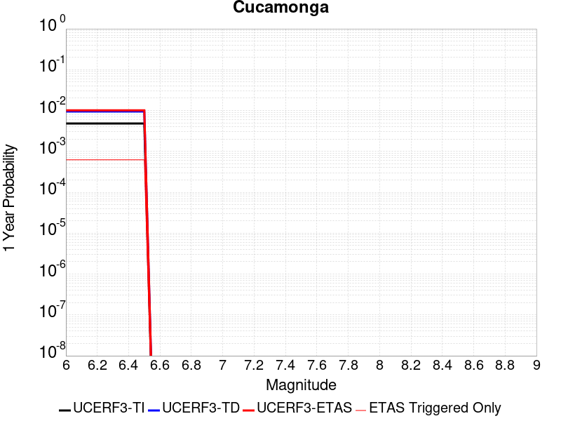 |  |

| Magnitude | 1 wk TI Prob | 1 wk TD Prob | 1 wk ETAS Prob | 1 wk ETAS/TD Gain | 1 wk ETAS Triggered Only | 1 mo TI Prob | 1 mo TD Prob | 1 mo ETAS Prob | 1 mo ETAS/TD Gain | 1 mo ETAS Triggered Only | 1 yr TI Prob | 1 yr TD Prob | 1 yr ETAS Prob | 1 yr ETAS/TD Gain | 1 yr ETAS Triggered Only | 10 yr TI Prob | 10 yr TD Prob | 10 yr ETAS Prob | 10 yr ETAS/TD Gain | 10 yr ETAS Triggered Only |
|-----|-----|-----|-----|-----|-----|-----|-----|-----|-----|-----|-----|-----|-----|-----|-----|-----|-----|-----|-----|-----|
| 6.0 | 9.287573E-5 | 1.8282168E-4 | 3.642186E-4 | 1.9922069 | 1.8143009E-4 | 3.9797812E-4 | 7.831635E-4 | 0.0010924195 | 1.3948805 | 3.094984E-4 | 0.0048346235 | 0.009502821 | 0.0102745 | 1.0812052 | 7.790822E-4 | 0.047307868 | 0.09186649 | 0.093039215 | 1.0127655 | 0.0012913554 |
| 6.1 | 9.287573E-5 | 1.8282168E-4 | 3.642186E-4 | 1.9922069 | 1.8143009E-4 | 3.9797812E-4 | 7.831635E-4 | 0.0010924195 | 1.3948805 | 3.094984E-4 | 0.0048346235 | 0.009502821 | 0.0102745 | 1.0812052 | 7.790822E-4 | 0.047307868 | 0.09186649 | 0.093039215 | 1.0127655 | 0.0012913554 |
| 6.2 | 9.287573E-5 | 1.8282168E-4 | 3.642186E-4 | 1.9922069 | 1.8143009E-4 | 3.9797812E-4 | 7.831635E-4 | 0.0010924195 | 1.3948805 | 3.094984E-4 | 0.0048346235 | 0.009502821 | 0.0102745 | 1.0812052 | 7.790822E-4 | 0.047307868 | 0.09186649 | 0.093039215 | 1.0127655 | 0.0012913554 |
| 6.3 | 9.287573E-5 | 1.8282168E-4 | 3.642186E-4 | 1.9922069 | 1.8143009E-4 | 3.9797812E-4 | 7.831635E-4 | 0.0010924195 | 1.3948805 | 3.094984E-4 | 0.0048346235 | 0.009502821 | 0.0102745 | 1.0812052 | 7.790822E-4 | 0.047307868 | 0.09186649 | 0.093039215 | 1.0127655 | 0.0012913554 |
| 6.4 | 9.287573E-5 | 1.8282168E-4 | 3.642186E-4 | 1.9922069 | 1.8143009E-4 | 3.9797812E-4 | 7.831635E-4 | 0.0010924195 | 1.3948805 | 3.094984E-4 | 0.0048346235 | 0.009502821 | 0.0102745 | 1.0812052 | 7.790822E-4 | 0.047307868 | 0.09186649 | 0.093039215 | 1.0127655 | 0.0012913554 |
| 6.5 | 9.287573E-5 | 1.8282168E-4 | 3.642186E-4 | 1.9922069 | 1.8143009E-4 | 3.9797812E-4 | 7.831635E-4 | 0.0010924195 | 1.3948805 | 3.094984E-4 | 0.0048346235 | 0.009502821 | 0.0102745 | 1.0812052 | 7.790822E-4 | 0.047307868 | 0.09186649 | 0.093039215 | 1.0127655 | 0.0012913554 |

## Pleito
*[(top)](#table-of-contents)*

| 1 Week | 1 Month | 1 Year | 10 Year |
|-----|-----|-----|-----|
|  |  |  |  |

| Magnitude | 1 wk TI Prob | 1 wk TD Prob | 1 wk ETAS Prob | 1 wk ETAS/TD Gain | 1 wk ETAS Triggered Only | 1 mo TI Prob | 1 mo TD Prob | 1 mo ETAS Prob | 1 mo ETAS/TD Gain | 1 mo ETAS Triggered Only | 1 yr TI Prob | 1 yr TD Prob | 1 yr ETAS Prob | 1 yr ETAS/TD Gain | 1 yr ETAS Triggered Only | 10 yr TI Prob | 10 yr TD Prob | 10 yr ETAS Prob | 10 yr ETAS/TD Gain | 10 yr ETAS Triggered Only |
|-----|-----|-----|-----|-----|-----|-----|-----|-----|-----|-----|-----|-----|-----|-----|-----|-----|-----|-----|-----|-----|
| 6.0 | 2.8975299E-5 | 3.5014233E-5 | 1.6307805E-4 | 4.657479 | 1.280683E-4 | 1.2417394E-4 | 1.5005456E-4 | 3.7414048E-4 | 2.4933627 | 2.2411953E-4 | 0.0015107692 | 0.0018257706 | 0.0024223316 | 1.3267447 | 5.976521E-4 | 0.015005396 | 0.018145941 | 0.019256683 | 1.0612116 | 0.00113127 |
| 6.1 | 2.8975299E-5 | 3.5014233E-5 | 1.6307805E-4 | 4.657479 | 1.280683E-4 | 1.2417394E-4 | 1.5005456E-4 | 3.7414048E-4 | 2.4933627 | 2.2411953E-4 | 0.0015107692 | 0.0018257706 | 0.0024223316 | 1.3267447 | 5.976521E-4 | 0.015005396 | 0.018145941 | 0.019256683 | 1.0612116 | 0.00113127 |
| 6.2 | 2.8975299E-5 | 3.5014233E-5 | 1.6307805E-4 | 4.657479 | 1.280683E-4 | 1.2417394E-4 | 1.5005456E-4 | 3.7414048E-4 | 2.4933627 | 2.2411953E-4 | 0.0015107692 | 0.0018257706 | 0.0024223316 | 1.3267447 | 5.976521E-4 | 0.015005396 | 0.018145941 | 0.019256683 | 1.0612116 | 0.00113127 |
| 6.3 | 2.8975299E-5 | 3.5014233E-5 | 1.6307805E-4 | 4.657479 | 1.280683E-4 | 1.2417394E-4 | 1.5005456E-4 | 3.7414048E-4 | 2.4933627 | 2.2411953E-4 | 0.0015107692 | 0.0018257706 | 0.0024223316 | 1.3267447 | 5.976521E-4 | 0.015005396 | 0.018145941 | 0.019256683 | 1.0612116 | 0.00113127 |
| 6.4 | 2.8975299E-5 | 3.5014233E-5 | 1.6307805E-4 | 4.657479 | 1.280683E-4 | 1.2417394E-4 | 1.5005456E-4 | 3.7414048E-4 | 2.4933627 | 2.2411953E-4 | 0.0015107692 | 0.0018257706 | 0.0024223316 | 1.3267447 | 5.976521E-4 | 0.015005396 | 0.018145941 | 0.019256683 | 1.0612116 | 0.00113127 |
| 6.5 | 2.8975299E-5 | 3.5014233E-5 | 1.6307805E-4 | 4.657479 | 1.280683E-4 | 1.2417394E-4 | 1.5005456E-4 | 3.7414048E-4 | 2.4933627 | 2.2411953E-4 | 0.0015107692 | 0.0018257706 | 0.0024223316 | 1.3267447 | 5.976521E-4 | 0.015005396 | 0.018145941 | 0.019256683 | 1.0612116 | 0.00113127 |
| 6.6 | 2.6446418E-5 | 3.190913E-5 | 1.5997335E-4 | 5.0134034 | 1.280683E-4 | 1.1333687E-4 | 1.367484E-4 | 3.5016637E-4 | 2.5606616 | 2.1344717E-4 | 0.0013790029 | 0.0016640209 | 0.002250024 | 1.3521608 | 5.8697973E-4 | 0.013704768 | 0.016553096 | 0.01764465 | 1.0659425 | 0.0011099253 |
| 6.7 | 2.26497E-5 | 2.7271499E-5 | 1.3399217E-4 | 4.9132676 | 1.06723586E-4 | 9.706653E-5 | 1.1687469E-4 | 2.8761246E-4 | 2.460862 | 1.7075773E-4 | 0.0011811443 | 0.0014223875 | 0.001923275 | 1.3521456 | 5.0160085E-4 | 0.01174886 | 0.0141689 | 0.015115804 | 1.0668297 | 9.6051226E-4 |
| 6.8 | 1.799965E-5 | 2.159839E-5 | 1.06975414E-4 | 4.9529347 | 8.5378866E-5 | 7.713908E-5 | 9.256323E-5 | 2.3129104E-4 | 2.498736 | 1.3874067E-4 | 9.387636E-4 | 0.0011267258 | 0.0014998375 | 1.3311468 | 3.7353256E-4 | 0.009348078 | 0.011244575 | 0.011993791 | 1.0666292 | 7.5773743E-4 |
| 6.9 | 1.799965E-5 | 2.159839E-5 | 1.06975414E-4 | 4.9529347 | 8.5378866E-5 | 7.713908E-5 | 9.256323E-5 | 2.3129104E-4 | 2.498736 | 1.3874067E-4 | 9.387636E-4 | 0.0011267258 | 0.0014998375 | 1.3311468 | 3.7353256E-4 | 0.009348078 | 0.011244575 | 0.011993791 | 1.0666292 | 7.5773743E-4 |
| 7.0 | 1.3666451E-5 | 1.6355421E-5 | 9.106071E-5 | 5.567616 | 7.470651E-5 | 5.8569192E-5 | 7.009466E-5 | 1.7681078E-4 | 2.522457 | 1.06723586E-4 | 7.128466E-4 | 8.5340254E-4 | 0.0011413103 | 1.3373646 | 2.8815368E-4 | 0.0071056425 | 0.008534024 | 0.009105412 | 1.0669543 | 5.7630736E-4 |

## San Cayetano
*[(top)](#table-of-contents)*

| 1 Week | 1 Month | 1 Year | 10 Year |
|-----|-----|-----|-----|
|  |  |  |  |

| Magnitude | 1 wk TI Prob | 1 wk TD Prob | 1 wk ETAS Prob | 1 wk ETAS/TD Gain | 1 wk ETAS Triggered Only | 1 mo TI Prob | 1 mo TD Prob | 1 mo ETAS Prob | 1 mo ETAS/TD Gain | 1 mo ETAS Triggered Only | 1 yr TI Prob | 1 yr TD Prob | 1 yr ETAS Prob | 1 yr ETAS/TD Gain | 1 yr ETAS Triggered Only | 10 yr TI Prob | 10 yr TD Prob | 10 yr ETAS Prob | 10 yr ETAS/TD Gain | 10 yr ETAS Triggered Only |
|-----|-----|-----|-----|-----|-----|-----|-----|-----|-----|-----|-----|-----|-----|-----|-----|-----|-----|-----|-----|-----|
| 6.0 | 8.1875E-5 | 1.8670029E-4 | 4.8547052E-4 | 2.6002667 | 2.9882605E-4 | 3.5084566E-4 | 7.9996156E-4 | 0.0011838591 | 1.479895 | 3.842049E-4 | 0.004263182 | 0.009708474 | 0.010268617 | 1.0576963 | 5.65635E-4 | 0.041823186 | 0.09218576 | 0.093048036 | 1.0093538 | 9.498399E-4 |
| 6.1 | 8.1875E-5 | 1.8670029E-4 | 4.8547052E-4 | 2.6002667 | 2.9882605E-4 | 3.5084566E-4 | 7.9996156E-4 | 0.0011838591 | 1.479895 | 3.842049E-4 | 0.004263182 | 0.009708474 | 0.010268617 | 1.0576963 | 5.65635E-4 | 0.041823186 | 0.09218576 | 0.093048036 | 1.0093538 | 9.498399E-4 |
| 6.2 | 8.1875E-5 | 1.8670029E-4 | 4.8547052E-4 | 2.6002667 | 2.9882605E-4 | 3.5084566E-4 | 7.9996156E-4 | 0.0011838591 | 1.479895 | 3.842049E-4 | 0.004263182 | 0.009708474 | 0.010268617 | 1.0576963 | 5.65635E-4 | 0.041823186 | 0.09218576 | 0.093048036 | 1.0093538 | 9.498399E-4 |
| 6.3 | 8.1875E-5 | 1.8670029E-4 | 4.8547052E-4 | 2.6002667 | 2.9882605E-4 | 3.5084566E-4 | 7.9996156E-4 | 0.0011838591 | 1.479895 | 3.842049E-4 | 0.004263182 | 0.009708474 | 0.010268617 | 1.0576963 | 5.65635E-4 | 0.041823186 | 0.09218576 | 0.093048036 | 1.0093538 | 9.498399E-4 |
| 6.4 | 8.1875E-5 | 1.8670029E-4 | 4.8547052E-4 | 2.6002667 | 2.9882605E-4 | 3.5084566E-4 | 7.9996156E-4 | 0.0011838591 | 1.479895 | 3.842049E-4 | 0.004263182 | 0.009708474 | 0.010268617 | 1.0576963 | 5.65635E-4 | 0.041823186 | 0.09218576 | 0.093048036 | 1.0093538 | 9.498399E-4 |
| 6.5 | 8.1875E-5 | 1.8670029E-4 | 4.8547052E-4 | 2.6002667 | 2.9882605E-4 | 3.5084566E-4 | 7.9996156E-4 | 0.0011838591 | 1.479895 | 3.842049E-4 | 0.004263182 | 0.009708474 | 0.010268617 | 1.0576963 | 5.65635E-4 | 0.041823186 | 0.09218576 | 0.093048036 | 1.0093538 | 9.498399E-4 |
| 6.6 | 8.1875E-5 | 1.8670029E-4 | 4.8547052E-4 | 2.6002667 | 2.9882605E-4 | 3.5084566E-4 | 7.9996156E-4 | 0.0011838591 | 1.479895 | 3.842049E-4 | 0.004263182 | 0.009708474 | 0.010268617 | 1.0576963 | 5.65635E-4 | 0.041823186 | 0.09218576 | 0.093048036 | 1.0093538 | 9.498399E-4 |
| 6.7 | 5.4643962E-5 | 1.3262422E-4 | 3.460431E-4 | 2.6091998 | 2.1344717E-4 | 2.341674E-4 | 5.6833174E-4 | 8.456554E-4 | 1.4879608 | 2.7748133E-4 | 0.0028472608 | 0.006909191 | 0.0073331357 | 1.0613595 | 4.2689434E-4 | 0.028110553 | 0.06647811 | 0.06710577 | 1.0094416 | 6.723586E-4 |
| 6.8 | 5.4643962E-5 | 1.3262422E-4 | 3.460431E-4 | 2.6091998 | 2.1344717E-4 | 2.341674E-4 | 5.6833174E-4 | 8.456554E-4 | 1.4879608 | 2.7748133E-4 | 0.0028472608 | 0.006909191 | 0.0073331357 | 1.0613595 | 4.2689434E-4 | 0.028110553 | 0.06647811 | 0.06710577 | 1.0094416 | 6.723586E-4 |
| 6.9 | 4.9065253E-5 | 1.1962955E-4 | 3.1170904E-4 | 2.605619 | 1.9210245E-4 | 2.102627E-4 | 5.1266217E-4 | 7.580006E-4 | 1.4785576 | 2.4546424E-4 | 0.002556943 | 0.006235295 | 0.0065958924 | 1.0578316 | 3.6286018E-4 | 0.02527722 | 0.06024073 | 0.06078232 | 1.0089904 | 5.7630736E-4 |
| 7.0 | 3.8281665E-5 | 9.1909E-5 | 2.4130828E-4 | 2.625513 | 1.4941303E-4 | 1.6405396E-4 | 3.938957E-4 | 5.9659063E-4 | 1.5145904 | 2.0277481E-4 | 0.0019955272 | 0.0047956803 | 0.005093073 | 1.0620127 | 2.9882605E-4 | 0.019777026 | 0.04680347 | 0.047251076 | 1.0095636 | 4.6958379E-4 |
| 7.1 | 3.8281665E-5 | 9.1909E-5 | 2.4130828E-4 | 2.625513 | 1.4941303E-4 | 1.6405396E-4 | 3.938957E-4 | 5.9659063E-4 | 1.5145904 | 2.0277481E-4 | 0.0019955272 | 0.0047956803 | 0.005093073 | 1.0620127 | 2.9882605E-4 | 0.019777026 | 0.04680347 | 0.047251076 | 1.0095636 | 4.6958379E-4 |

## Death Valley (No)
*[(top)](#table-of-contents)*

| 1 Week | 1 Month | 1 Year | 10 Year |
|-----|-----|-----|-----|
|  |  |  |  |

| Magnitude | 1 wk TI Prob | 1 wk TD Prob | 1 wk ETAS Prob | 1 wk ETAS/TD Gain | 1 wk ETAS Triggered Only | 1 mo TI Prob | 1 mo TD Prob | 1 mo ETAS Prob | 1 mo ETAS/TD Gain | 1 mo ETAS Triggered Only | 1 yr TI Prob | 1 yr TD Prob | 1 yr ETAS Prob | 1 yr ETAS/TD Gain | 1 yr ETAS Triggered Only | 10 yr TI Prob | 10 yr TD Prob | 10 yr ETAS Prob | 10 yr ETAS/TD Gain | 10 yr ETAS Triggered Only |
|-----|-----|-----|-----|-----|-----|-----|-----|-----|-----|-----|-----|-----|-----|-----|-----|-----|-----|-----|-----|-----|
| 6.0 | 4.5975892E-5 | 5.9477E-5 | 3.262701E-4 | 5.4856515 | 2.6680896E-4 | 1.9702465E-4 | 2.548782E-4 | 6.389852E-4 | 2.507022 | 3.842049E-4 | 0.0023961363 | 0.003099011 | 0.0038012038 | 1.2265861 | 7.043757E-4 | 0.02370464 | 0.030588351 | 0.03150914 | 1.0301025 | 9.498399E-4 |
| 6.1 | 4.5975892E-5 | 5.9477E-5 | 3.262701E-4 | 5.4856515 | 2.6680896E-4 | 1.9702465E-4 | 2.548782E-4 | 6.389852E-4 | 2.507022 | 3.842049E-4 | 0.0023961363 | 0.003099011 | 0.0038012038 | 1.2265861 | 7.043757E-4 | 0.02370464 | 0.030588351 | 0.03150914 | 1.0301025 | 9.498399E-4 |
| 6.2 | 4.5975892E-5 | 5.9477E-5 | 3.262701E-4 | 5.4856515 | 2.6680896E-4 | 1.9702465E-4 | 2.548782E-4 | 6.389852E-4 | 2.507022 | 3.842049E-4 | 0.0023961363 | 0.003099011 | 0.0038012038 | 1.2265861 | 7.043757E-4 | 0.02370464 | 0.030588351 | 0.03150914 | 1.0301025 | 9.498399E-4 |
| 6.3 | 4.5975892E-5 | 5.9477E-5 | 3.262701E-4 | 5.4856515 | 2.6680896E-4 | 1.9702465E-4 | 2.548782E-4 | 6.389852E-4 | 2.507022 | 3.842049E-4 | 0.0023961363 | 0.003099011 | 0.0038012038 | 1.2265861 | 7.043757E-4 | 0.02370464 | 0.030588351 | 0.03150914 | 1.0301025 | 9.498399E-4 |
| 6.4 | 4.5975892E-5 | 5.9477E-5 | 3.262701E-4 | 5.4856515 | 2.6680896E-4 | 1.9702465E-4 | 2.548782E-4 | 6.389852E-4 | 2.507022 | 3.842049E-4 | 0.0023961363 | 0.003099011 | 0.0038012038 | 1.2265861 | 7.043757E-4 | 0.02370464 | 0.030588351 | 0.03150914 | 1.0301025 | 9.498399E-4 |
| 6.5 | 4.5975892E-5 | 5.9477E-5 | 3.262701E-4 | 5.4856515 | 2.6680896E-4 | 1.9702465E-4 | 2.548782E-4 | 6.389852E-4 | 2.507022 | 3.842049E-4 | 0.0023961363 | 0.003099011 | 0.0038012038 | 1.2265861 | 7.043757E-4 | 0.02370464 | 0.030588351 | 0.03150914 | 1.0301025 | 9.498399E-4 |
| 6.6 | 4.1757343E-5 | 5.400243E-5 | 3.101252E-4 | 5.7428007 | 2.561366E-4 | 1.7894777E-4 | 2.3142013E-4 | 5.941963E-4 | 2.5676088 | 3.6286018E-4 | 0.002176512 | 0.0028141933 | 0.0034420902 | 1.223118 | 6.296692E-4 | 0.021553177 | 0.02781613 | 0.028656544 | 1.0302132 | 8.6446106E-4 |
| 6.7 | 3.751902E-5 | 4.847215E-5 | 2.939245E-4 | 6.0637813 | 2.4546424E-4 | 1.607859E-4 | 2.0772294E-4 | 5.598376E-4 | 2.695117 | 3.5218784E-4 | 0.0019558107 | 0.0025263957 | 0.0031118926 | 1.2317518 | 5.8697973E-4 | 0.019386867 | 0.025007667 | 0.02580889 | 1.032039 | 8.217716E-4 |
| 6.8 | 3.358376E-5 | 4.333242E-5 | 2.6744223E-4 | 6.171874 | 2.2411953E-4 | 1.4392247E-4 | 1.8569885E-4 | 5.0581014E-4 | 2.7238195 | 3.2017074E-4 | 0.0017508477 | 0.0022588398 | 0.0028019007 | 1.2404158 | 5.442903E-4 | 0.017371172 | 0.022389125 | 0.023150764 | 1.0340183 | 7.790822E-4 |
| 6.9 | 2.9934512E-5 | 3.8558388E-5 | 2.4132538E-4 | 6.2587 | 2.0277481E-4 | 1.2828446E-4 | 1.6524145E-4 | 4.4267692E-4 | 2.67897 | 2.7748133E-4 | 0.0015607442 | 0.002010258 | 0.0025108506 | 1.249019 | 5.0160085E-4 | 0.0154982805 | 0.019950643 | 0.020640966 | 1.0346016 | 7.043757E-4 |
| 7.0 | 2.6778222E-5 | 3.444248E-5 | 2.2653832E-4 | 6.5772943 | 1.9210245E-4 | 1.1475876E-4 | 1.4760396E-4 | 4.1437353E-4 | 2.8073335 | 2.6680896E-4 | 0.0013962924 | 0.001795896 | 0.0022752895 | 1.2669384 | 4.8025613E-4 | 0.013875516 | 0.017843472 | 0.01849335 | 1.0364212 | 6.6168624E-4 |
| 7.1 | 2.3953568E-5 | 3.076199E-5 | 2.0151447E-4 | 6.550762 | 1.7075773E-4 | 1.0265411E-4 | 1.3183212E-4 | 3.77264E-4 | 2.8617003 | 2.4546424E-4 | 0.0012490972 | 0.0016041726 | 0.0020303822 | 1.2656881 | 4.2689434E-4 | 0.012420994 | 0.015955374 | 0.016532987 | 1.0362018 | 5.8697973E-4 |
| 7.2 | 2.121599E-5 | 2.720663E-5 | 1.8728766E-4 | 6.883898 | 1.6008537E-4 | 9.09225E-5 | 1.16596304E-4 | 3.5136082E-4 | 3.0134816 | 2.3479189E-4 | 0.0011064193 | 0.0014189329 | 0.0018345644 | 1.2929183 | 4.16222E-4 | 0.0110092675 | 0.0141279865 | 0.014685631 | 1.0394709 | 5.65635E-4 |
| 7.3 | 1.8611821E-5 | 2.3849978E-5 | 1.6258733E-4 | 6.8170853 | 1.3874067E-4 | 7.976251E-5 | 1.0221185E-4 | 3.0496594E-4 | 2.9836652 | 2.0277481E-4 | 9.706759E-4 | 0.0012440139 | 0.0016170818 | 1.2998904 | 3.7353256E-4 | 0.009664469 | 0.0123994695 | 0.012894851 | 1.0399518 | 5.0160085E-4 |
| 7.4 | 6.786848E-6 | 8.734327E-6 | 8.344019E-5 | 9.553133 | 7.470651E-5 | 2.9086168E-5 | 3.7432535E-5 | 1.3348016E-4 | 3.5658865 | 9.6051226E-5 | 3.5406655E-4 | 4.5568874E-4 | 6.263687E-4 | 1.3745537 | 1.7075773E-4 | 0.0035350295 | 0.004551757 | 0.0048067276 | 1.0560158 | 2.561366E-4 |
| 7.5 | 6.183793E-6 | 7.958103E-6 | 7.1991744E-5 | 9.046345 | 6.403415E-5 | 2.65017E-5 | 3.410595E-5 | 1.19481905E-4 | 3.5032568 | 8.5378866E-5 | 3.2261043E-4 | 4.1520374E-4 | 5.7522266E-4 | 1.3853985 | 1.6008537E-4 | 0.003221425 | 0.0041484893 | 0.0043929354 | 1.0589241 | 2.4546424E-4 |
| 7.6 | 5.6024205E-6 | 7.211712E-6 | 7.12454E-5 | 9.879125 | 6.403415E-5 | 2.4010153E-5 | 3.0907213E-5 | 1.0561141E-4 | 3.4170475 | 7.470651E-5 | 2.9228439E-4 | 3.762732E-4 | 5.2563E-4 | 1.3969371 | 1.4941303E-4 | 0.0029190024 | 0.0037605667 | 0.0039838436 | 1.0593731 | 2.2411953E-4 |
| 7.7 | 5.132066E-6 | 6.6084267E-6 | 5.996987E-5 | 9.074757 | 5.3361793E-5 | 2.1994381E-5 | 2.8321763E-5 | 9.23541E-5 | 3.260888 | 6.403415E-5 | 2.677487E-4 | 3.4480577E-4 | 4.6216123E-4 | 1.3403524 | 1.17395946E-4 | 0.0026742632 | 0.00344691 | 0.0036383504 | 1.0555397 | 1.9210245E-4 |
| 7.8 | 4.8153906E-6 | 6.202069E-6 | 5.9563532E-5 | 9.603816 | 5.3361793E-5 | 2.0637224E-5 | 2.6580266E-5 | 9.061272E-5 | 3.409022 | 6.403415E-5 | 2.5122924E-4 | 3.2360948E-4 | 4.4096744E-4 | 1.362653 | 1.17395946E-4 | 0.002509454 | 0.0032355804 | 0.0034270613 | 1.0591798 | 1.9210245E-4 |

## San Andreas (San Bernardino S)
*[(top)](#table-of-contents)*

| 1 Week | 1 Month | 1 Year | 10 Year |
|-----|-----|-----|-----|
|  |  |  |  |

| Magnitude | 1 wk TI Prob | 1 wk TD Prob | 1 wk ETAS Prob | 1 wk ETAS/TD Gain | 1 wk ETAS Triggered Only | 1 mo TI Prob | 1 mo TD Prob | 1 mo ETAS Prob | 1 mo ETAS/TD Gain | 1 mo ETAS Triggered Only | 1 yr TI Prob | 1 yr TD Prob | 1 yr ETAS Prob | 1 yr ETAS/TD Gain | 1 yr ETAS Triggered Only | 10 yr TI Prob | 10 yr TD Prob | 10 yr ETAS Prob | 10 yr ETAS/TD Gain | 10 yr ETAS Triggered Only |
|-----|-----|-----|-----|-----|-----|-----|-----|-----|-----|-----|-----|-----|-----|-----|-----|-----|-----|-----|-----|-----|
| 6.0 | 8.432835E-5 | 3.0557657E-4 | 5.616349E-4 | 1.8379514 | 2.561366E-4 | 3.6135715E-4 | 0.0013090015 | 0.00165007 | 1.2605562 | 3.4151546E-4 | 0.004390651 | 0.015828904 | 0.016448606 | 1.03915 | 6.296692E-4 | 0.043049086 | 0.14053506 | 0.14126885 | 1.0052215 | 8.537887E-4 |
| 6.1 | 8.432835E-5 | 3.0557657E-4 | 5.616349E-4 | 1.8379514 | 2.561366E-4 | 3.6135715E-4 | 0.0013090015 | 0.00165007 | 1.2605562 | 3.4151546E-4 | 0.004390651 | 0.015828904 | 0.016448606 | 1.03915 | 6.296692E-4 | 0.043049086 | 0.14053506 | 0.14126885 | 1.0052215 | 8.537887E-4 |
| 6.2 | 8.432835E-5 | 3.0557657E-4 | 5.616349E-4 | 1.8379514 | 2.561366E-4 | 3.6135715E-4 | 0.0013090015 | 0.00165007 | 1.2605562 | 3.4151546E-4 | 0.004390651 | 0.015828904 | 0.016448606 | 1.03915 | 6.296692E-4 | 0.043049086 | 0.14053506 | 0.14126885 | 1.0052215 | 8.537887E-4 |
| 6.3 | 8.432835E-5 | 3.0557657E-4 | 5.616349E-4 | 1.8379514 | 2.561366E-4 | 3.6135715E-4 | 0.0013090015 | 0.00165007 | 1.2605562 | 3.4151546E-4 | 0.004390651 | 0.015828904 | 0.016448606 | 1.03915 | 6.296692E-4 | 0.043049086 | 0.14053506 | 0.14126885 | 1.0052215 | 8.537887E-4 |
| 6.4 | 8.432835E-5 | 3.0557657E-4 | 5.616349E-4 | 1.8379514 | 2.561366E-4 | 3.6135715E-4 | 0.0013090015 | 0.00165007 | 1.2605562 | 3.4151546E-4 | 0.004390651 | 0.015828904 | 0.016448606 | 1.03915 | 6.296692E-4 | 0.043049086 | 0.14053506 | 0.14126885 | 1.0052215 | 8.537887E-4 |
| 6.5 | 8.432835E-5 | 3.0557657E-4 | 5.616349E-4 | 1.8379514 | 2.561366E-4 | 3.6135715E-4 | 0.0013090015 | 0.00165007 | 1.2605562 | 3.4151546E-4 | 0.004390651 | 0.015828904 | 0.016448606 | 1.03915 | 6.296692E-4 | 0.043049086 | 0.14053506 | 0.14126885 | 1.0052215 | 8.537887E-4 |
| 6.6 | 8.422796E-5 | 3.053887E-4 | 5.614471E-4 | 1.8384671 | 2.561366E-4 | 3.6092702E-4 | 0.0013081972 | 0.0016492659 | 1.2607166 | 3.4151546E-4 | 0.0043854355 | 0.015819253 | 0.016438961 | 1.0391743 | 6.296692E-4 | 0.04299896 | 0.14045276 | 0.14118662 | 1.0052251 | 8.537887E-4 |
| 6.7 | 8.4024105E-5 | 3.050066E-4 | 5.610651E-4 | 1.8395178 | 2.561366E-4 | 3.600536E-4 | 0.0013065612 | 0.0016476304 | 1.2610434 | 3.4151546E-4 | 0.004374844 | 0.015799625 | 0.016419346 | 1.0392238 | 6.296692E-4 | 0.042897146 | 0.14028531 | 0.14101933 | 1.0052323 | 8.537887E-4 |
| 6.8 | 8.383834E-5 | 3.0460325E-4 | 5.6066184E-4 | 1.8406298 | 2.561366E-4 | 3.592577E-4 | 0.0013048343 | 0.0016459042 | 1.2613894 | 3.4151546E-4 | 0.004365193 | 0.015778905 | 0.016398638 | 1.0392761 | 6.296692E-4 | 0.042804368 | 0.14010844 | 0.1408426 | 1.00524 | 8.537887E-4 |
| 6.9 | 8.269897E-5 | 3.0217436E-4 | 5.582336E-4 | 1.8473889 | 2.561366E-4 | 3.54376E-4 | 0.0012944351 | 0.0016355085 | 1.2634921 | 3.4151546E-4 | 0.004305995 | 0.015654119 | 0.01627393 | 1.0395942 | 6.296692E-4 | 0.042235088 | 0.13903125 | 0.13976634 | 1.0052872 | 8.537887E-4 |
| 7.0 | 8.240144E-5 | 3.0153047E-4 | 5.5758987E-4 | 1.8491989 | 2.561366E-4 | 3.5310123E-4 | 0.0012916784 | 0.0016327527 | 1.2640551 | 3.4151546E-4 | 0.004290536 | 0.015621036 | 0.016240869 | 1.0396794 | 6.296692E-4 | 0.042086378 | 0.13874839 | 0.13948372 | 1.0052997 | 8.537887E-4 |
| 7.1 | 8.209429E-5 | 3.0086326E-4 | 5.569228E-4 | 1.8510828 | 2.561366E-4 | 3.5178522E-4 | 0.0012888217 | 0.001629897 | 1.2646412 | 3.4151546E-4 | 0.0042745764 | 0.015586754 | 0.01620661 | 1.039768 | 6.296692E-4 | 0.041932825 | 0.13845524 | 0.13919082 | 1.0053128 | 8.537887E-4 |
| 7.2 | 6.547198E-5 | 2.6130548E-4 | 4.640273E-4 | 1.775804 | 2.0277481E-4 | 2.80564E-4 | 0.0011194341 | 0.0013859444 | 1.2380759 | 2.6680896E-4 | 0.003410517 | 0.013550194 | 0.014023943 | 1.0349625 | 4.8025613E-4 | 0.03358648 | 0.12084773 | 0.12142008 | 1.0047361 | 6.5101386E-4 |
| 7.3 | 6.498085E-5 | 2.5983856E-4 | 4.6256068E-4 | 1.7801849 | 2.0277481E-4 | 2.7845963E-4 | 0.0011131528 | 0.0013796648 | 1.2394208 | 2.6680896E-4 | 0.0033849762 | 0.013474667 | 0.013948453 | 1.0351611 | 4.8025613E-4 | 0.033338774 | 0.12019604 | 0.1207688 | 1.0047653 | 6.5101386E-4 |
| 7.4 | 5.658229E-5 | 2.4132969E-4 | 4.4405556E-4 | 1.8400371 | 2.0277481E-4 | 2.4247299E-4 | 0.0010338924 | 0.0013004255 | 1.2577958 | 2.6680896E-4 | 0.0029481123 | 0.0125208525 | 0.012995096 | 1.0378762 | 4.8025613E-4 | 0.02909307 | 0.111656904 | 0.112235226 | 1.0051795 | 6.5101386E-4 |
| 7.5 | 5.1594427E-5 | 2.278611E-4 | 4.199198E-4 | 1.8428761 | 1.9210245E-4 | 2.2110023E-4 | 9.7621355E-4 | 0.0012321001 | 1.2621216 | 2.561366E-4 | 0.002688572 | 0.011826312 | 0.012279796 | 1.0383453 | 4.589114E-4 | 0.026562763 | 0.10549111 | 0.10605436 | 1.0053393 | 6.296692E-4 |
| 7.6 | 3.6604233E-5 | 1.7518568E-4 | 3.2457252E-4 | 1.8527343 | 1.4941303E-4 | 1.5686586E-4 | 7.5060193E-4 | 9.5322455E-4 | 1.2699468 | 2.0277481E-4 | 0.0019081688 | 0.009104266 | 0.009495548 | 1.0429779 | 3.9487728E-4 | 0.018918669 | 0.08175703 | 0.08223722 | 1.0058734 | 5.2294554E-4 |
| 7.7 | 2.7987022E-5 | 1.432022E-4 | 2.8192298E-4 | 1.9687058 | 1.3874067E-4 | 1.1993887E-4 | 6.13598E-4 | 8.0558256E-4 | 1.3128834 | 1.9210245E-4 | 0.0014592775 | 0.0074482826 | 0.0077978475 | 1.0469322 | 3.5218784E-4 | 0.01449732 | 0.06712321 | 0.06753141 | 1.0060813 | 4.375667E-4 |
| 7.8 | 2.2592892E-5 | 1.21067766E-4 | 2.384495E-4 | 1.969554 | 1.17395946E-4 | 9.682308E-5 | 5.1877514E-4 | 6.894443E-4 | 1.3289849 | 1.7075773E-4 | 0.0011781835 | 0.0063007227 | 0.0066188765 | 1.0504948 | 3.2017074E-4 | 0.011719566 | 0.05660409 | 0.056976616 | 1.0065813 | 3.9487728E-4 |
| 7.9 | 1.2843913E-5 | 6.366969E-5 | 1.7038648E-4 | 2.6761003 | 1.06723586E-4 | 5.504418E-5 | 2.7284448E-4 | 4.1154728E-4 | 1.5083585 | 1.3874067E-4 | 6.699568E-4 | 0.003317339 | 0.0035513523 | 1.0705423 | 2.3479189E-4 | 0.0066794064 | 0.030455248 | 0.03072428 | 1.0088336 | 2.7748133E-4 |
| 8.0 | 6.3800603E-6 | 3.136937E-5 | 6.338544E-5 | 2.0206156 | 3.2017077E-5 | 2.7342829E-5 | 1.3443502E-4 | 1.7711872E-4 | 1.3175043 | 4.2689433E-5 | 3.3284808E-4 | 0.0016358347 | 0.0017210739 | 1.0521075 | 8.5378866E-5 | 0.0033234998 | 0.015136539 | 0.015252158 | 1.0076385 | 1.17395946E-4 |
| 8.1 | 2.2240692E-6 | 1.29589735E-5 | 2.3631193E-5 | 1.823539 | 1.0672358E-5 | 9.531691E-6 | 5.5538447E-5 | 6.621021E-5 | 1.192151 | 1.0672358E-5 | 1.1604215E-4 | 6.7617896E-4 | 7.0817437E-4 | 1.047318 | 3.2017077E-5 | 0.0011598158 | 0.0061071273 | 0.006149556 | 1.0069474 | 4.2689433E-5 |

## Cleghorn
*[(top)](#table-of-contents)*

| 1 Week | 1 Month | 1 Year | 10 Year |
|-----|-----|-----|-----|
|  |  |  |  |

| Magnitude | 1 wk TI Prob | 1 wk TD Prob | 1 wk ETAS Prob | 1 wk ETAS/TD Gain | 1 wk ETAS Triggered Only | 1 mo TI Prob | 1 mo TD Prob | 1 mo ETAS Prob | 1 mo ETAS/TD Gain | 1 mo ETAS Triggered Only | 1 yr TI Prob | 1 yr TD Prob | 1 yr ETAS Prob | 1 yr ETAS/TD Gain | 1 yr ETAS Triggered Only | 10 yr TI Prob | 10 yr TD Prob | 10 yr ETAS Prob | 10 yr ETAS/TD Gain | 10 yr ETAS Triggered Only |
|-----|-----|-----|-----|-----|-----|-----|-----|-----|-----|-----|-----|-----|-----|-----|-----|-----|-----|-----|-----|-----|
| 6.0 | 5.4416636E-5 | 8.607012E-5 | 2.2479883E-4 | 2.6118104 | 1.3874067E-4 | 2.331933E-4 | 3.6884286E-4 | 5.3953764E-4 | 1.4627845 | 1.7075773E-4 | 0.0028354323 | 0.0044848183 | 0.0048354263 | 1.0781767 | 3.5218784E-4 | 0.027995259 | 0.04426744 | 0.04495083 | 1.0154378 | 7.1504805E-4 |
| 6.1 | 5.4416636E-5 | 8.607012E-5 | 2.2479883E-4 | 2.6118104 | 1.3874067E-4 | 2.331933E-4 | 3.6884286E-4 | 5.3953764E-4 | 1.4627845 | 1.7075773E-4 | 0.0028354323 | 0.0044848183 | 0.0048354263 | 1.0781767 | 3.5218784E-4 | 0.027995259 | 0.04426744 | 0.04495083 | 1.0154378 | 7.1504805E-4 |
| 6.2 | 5.4416636E-5 | 8.607012E-5 | 2.2479883E-4 | 2.6118104 | 1.3874067E-4 | 2.331933E-4 | 3.6884286E-4 | 5.3953764E-4 | 1.4627845 | 1.7075773E-4 | 0.0028354323 | 0.0044848183 | 0.0048354263 | 1.0781767 | 3.5218784E-4 | 0.027995259 | 0.04426744 | 0.04495083 | 1.0154378 | 7.1504805E-4 |
| 6.3 | 5.4416636E-5 | 8.607012E-5 | 2.2479883E-4 | 2.6118104 | 1.3874067E-4 | 2.331933E-4 | 3.6884286E-4 | 5.3953764E-4 | 1.4627845 | 1.7075773E-4 | 0.0028354323 | 0.0044848183 | 0.0048354263 | 1.0781767 | 3.5218784E-4 | 0.027995259 | 0.04426744 | 0.04495083 | 1.0154378 | 7.1504805E-4 |
| 6.4 | 5.4416636E-5 | 8.607012E-5 | 2.2479883E-4 | 2.6118104 | 1.3874067E-4 | 2.331933E-4 | 3.6884286E-4 | 5.3953764E-4 | 1.4627845 | 1.7075773E-4 | 0.0028354323 | 0.0044848183 | 0.0048354263 | 1.0781767 | 3.5218784E-4 | 0.027995259 | 0.04426744 | 0.04495083 | 1.0154378 | 7.1504805E-4 |
| 6.5 | 5.4416636E-5 | 8.607012E-5 | 2.2479883E-4 | 2.6118104 | 1.3874067E-4 | 2.331933E-4 | 3.6884286E-4 | 5.3953764E-4 | 1.4627845 | 1.7075773E-4 | 0.0028354323 | 0.0044848183 | 0.0048354263 | 1.0781767 | 3.5218784E-4 | 0.027995259 | 0.04426744 | 0.04495083 | 1.0154378 | 7.1504805E-4 |
| 6.6 | 3.7632213E-5 | 5.9786213E-5 | 1.6650342E-4 | 2.7849803 | 1.06723586E-4 | 1.6127095E-4 | 2.5622663E-4 | 3.8426212E-4 | 1.4996963 | 1.280683E-4 | 0.0019617055 | 0.0031189616 | 0.0033955774 | 1.0886885 | 2.7748133E-4 | 0.019444784 | 0.031117557 | 0.03170695 | 1.0189409 | 6.083244E-4 |
| 6.7 | 3.7632213E-5 | 5.9786213E-5 | 1.6650342E-4 | 2.7849803 | 1.06723586E-4 | 1.6127095E-4 | 2.5622663E-4 | 3.8426212E-4 | 1.4996963 | 1.280683E-4 | 0.0019617055 | 0.0031189616 | 0.0033955774 | 1.0886885 | 2.7748133E-4 | 0.019444784 | 0.031117557 | 0.03170695 | 1.0189409 | 6.083244E-4 |

## Gravel Hills-Harper Lk
*[(top)](#table-of-contents)*

| 1 Week | 1 Month | 1 Year | 10 Year |
|-----|-----|-----|-----|
|  |  |  |  |

| Magnitude | 1 wk TI Prob | 1 wk TD Prob | 1 wk ETAS Prob | 1 wk ETAS/TD Gain | 1 wk ETAS Triggered Only | 1 mo TI Prob | 1 mo TD Prob | 1 mo ETAS Prob | 1 mo ETAS/TD Gain | 1 mo ETAS Triggered Only | 1 yr TI Prob | 1 yr TD Prob | 1 yr ETAS Prob | 1 yr ETAS/TD Gain | 1 yr ETAS Triggered Only | 10 yr TI Prob | 10 yr TD Prob | 10 yr ETAS Prob | 10 yr ETAS/TD Gain | 10 yr ETAS Triggered Only |
|-----|-----|-----|-----|-----|-----|-----|-----|-----|-----|-----|-----|-----|-----|-----|-----|-----|-----|-----|-----|-----|
| 6.0 | 1.0695174E-5 | 1.1443446E-5 | 1.6085476E-4 | 14.056497 | 1.4941303E-4 | 4.583565E-5 | 4.904268E-5 | 3.0516673E-4 | 6.2224727 | 2.561366E-4 | 5.5790617E-4 | 5.9697754E-4 | 0.001076947 | 1.8039992 | 4.8025613E-4 | 0.0055650757 | 0.005958305 | 0.0066054403 | 1.1086106 | 6.5101386E-4 |
| 6.1 | 1.0695174E-5 | 1.1443446E-5 | 1.6085476E-4 | 14.056497 | 1.4941303E-4 | 4.583565E-5 | 4.904268E-5 | 3.0516673E-4 | 6.2224727 | 2.561366E-4 | 5.5790617E-4 | 5.9697754E-4 | 0.001076947 | 1.8039992 | 4.8025613E-4 | 0.0055650757 | 0.005958305 | 0.0066054403 | 1.1086106 | 6.5101386E-4 |
| 6.2 | 1.0695174E-5 | 1.1443446E-5 | 1.6085476E-4 | 14.056497 | 1.4941303E-4 | 4.583565E-5 | 4.904268E-5 | 3.0516673E-4 | 6.2224727 | 2.561366E-4 | 5.5790617E-4 | 5.9697754E-4 | 0.001076947 | 1.8039992 | 4.8025613E-4 | 0.0055650757 | 0.005958305 | 0.0066054403 | 1.1086106 | 6.5101386E-4 |
| 6.3 | 1.0695174E-5 | 1.1443446E-5 | 1.6085476E-4 | 14.056497 | 1.4941303E-4 | 4.583565E-5 | 4.904268E-5 | 3.0516673E-4 | 6.2224727 | 2.561366E-4 | 5.5790617E-4 | 5.9697754E-4 | 0.001076947 | 1.8039992 | 4.8025613E-4 | 0.0055650757 | 0.005958305 | 0.0066054403 | 1.1086106 | 6.5101386E-4 |
| 6.4 | 1.0695174E-5 | 1.1443446E-5 | 1.6085476E-4 | 14.056497 | 1.4941303E-4 | 4.583565E-5 | 4.904268E-5 | 3.0516673E-4 | 6.2224727 | 2.561366E-4 | 5.5790617E-4 | 5.9697754E-4 | 0.001076947 | 1.8039992 | 4.8025613E-4 | 0.0055650757 | 0.005958305 | 0.0066054403 | 1.1086106 | 6.5101386E-4 |
| 6.5 | 1.0695174E-5 | 1.1443446E-5 | 1.6085476E-4 | 14.056497 | 1.4941303E-4 | 4.583565E-5 | 4.904268E-5 | 3.0516673E-4 | 6.2224727 | 2.561366E-4 | 5.5790617E-4 | 5.9697754E-4 | 0.001076947 | 1.8039992 | 4.8025613E-4 | 0.0055650757 | 0.005958305 | 0.0066054403 | 1.1086106 | 6.5101386E-4 |
| 6.6 | 9.406204E-6 | 1.0059137E-5 | 1.3812615E-4 | 13.731412 | 1.280683E-4 | 4.0311683E-5 | 4.3110133E-5 | 2.6722E-4 | 6.1985426 | 2.2411953E-4 | 4.906842E-4 | 5.247856E-4 | 9.407892E-4 | 1.7927115 | 4.16222E-4 | 0.0048960214 | 0.005239992 | 0.0057814303 | 1.1033281 | 5.442903E-4 |
| 6.7 | 7.8983985E-6 | 8.44031E-6 | 9.381846E-5 | 11.115522 | 8.5378866E-5 | 3.384984E-5 | 3.6172514E-5 | 1.962521E-4 | 5.4254484 | 1.6008537E-4 | 4.1204385E-4 | 4.4035696E-4 | 7.710544E-4 | 1.7509758 | 3.3084312E-4 | 0.004112807 | 0.0043993196 | 0.004824336 | 1.0966096 | 4.2689434E-4 |
| 6.8 | 6.69903E-6 | 7.1536347E-6 | 7.118733E-5 | 9.951211 | 6.403415E-5 | 2.8709812E-5 | 3.0658328E-5 | 1.3737864E-4 | 4.4809566 | 1.06723586E-4 | 3.494859E-4 | 3.7324644E-4 | 6.186191E-4 | 1.6574011 | 2.4546424E-4 | 0.003489368 | 0.00373063 | 0.004060239 | 1.0883521 | 3.3084312E-4 |
| 6.9 | 5.603049E-6 | 5.978078E-6 | 7.001185E-5 | 11.711431 | 6.403415E-5 | 2.4012847E-5 | 2.5620335E-5 | 1.3234119E-4 | 5.1654744 | 1.06723586E-4 | 2.9231719E-4 | 3.1192758E-4 | 5.4664625E-4 | 1.752478 | 2.3479189E-4 | 0.0029193296 | 0.003119276 | 0.0034171697 | 1.095501 | 2.9882605E-4 |
| 7.0 | 5.603049E-6 | 5.978078E-6 | 7.001185E-5 | 11.711431 | 6.403415E-5 | 2.4012847E-5 | 2.5620335E-5 | 1.3234119E-4 | 5.1654744 | 1.06723586E-4 | 2.9231719E-4 | 3.1192758E-4 | 5.4664625E-4 | 1.752478 | 2.3479189E-4 | 0.0029193296 | 0.003119276 | 0.0034171697 | 1.095501 | 2.9882605E-4 |

## Pitas Point (Lower West)
*[(top)](#table-of-contents)*

| 1 Week | 1 Month | 1 Year | 10 Year |
|-----|-----|-----|-----|
|  |  |  |  |

| Magnitude | 1 wk TI Prob | 1 wk TD Prob | 1 wk ETAS Prob | 1 wk ETAS/TD Gain | 1 wk ETAS Triggered Only | 1 mo TI Prob | 1 mo TD Prob | 1 mo ETAS Prob | 1 mo ETAS/TD Gain | 1 mo ETAS Triggered Only | 1 yr TI Prob | 1 yr TD Prob | 1 yr ETAS Prob | 1 yr ETAS/TD Gain | 1 yr ETAS Triggered Only | 10 yr TI Prob | 10 yr TD Prob | 10 yr ETAS Prob | 10 yr ETAS/TD Gain | 10 yr ETAS Triggered Only |
|-----|-----|-----|-----|-----|-----|-----|-----|-----|-----|-----|-----|-----|-----|-----|-----|-----|-----|-----|-----|-----|
| 6.0 | 3.3491036E-5 | 4.2920976E-5 | 1.1762428E-4 | 2.7404847 | 7.470651E-5 | 1.4352512E-4 | 1.8393977E-4 | 3.119845E-4 | 1.6961232 | 1.280683E-4 | 0.0017460176 | 0.0022381744 | 0.0025043862 | 1.1189415 | 2.6680896E-4 | 0.017323626 | 0.022255175 | 0.022735177 | 1.0215682 | 4.909285E-4 |
| 6.1 | 3.3491036E-5 | 4.2920976E-5 | 1.1762428E-4 | 2.7404847 | 7.470651E-5 | 1.4352512E-4 | 1.8393977E-4 | 3.119845E-4 | 1.6961232 | 1.280683E-4 | 0.0017460176 | 0.0022381744 | 0.0025043862 | 1.1189415 | 2.6680896E-4 | 0.017323626 | 0.022255175 | 0.022735177 | 1.0215682 | 4.909285E-4 |
| 6.2 | 3.3491036E-5 | 4.2920976E-5 | 1.1762428E-4 | 2.7404847 | 7.470651E-5 | 1.4352512E-4 | 1.8393977E-4 | 3.119845E-4 | 1.6961232 | 1.280683E-4 | 0.0017460176 | 0.0022381744 | 0.0025043862 | 1.1189415 | 2.6680896E-4 | 0.017323626 | 0.022255175 | 0.022735177 | 1.0215682 | 4.909285E-4 |
| 6.3 | 3.3491036E-5 | 4.2920976E-5 | 1.1762428E-4 | 2.7404847 | 7.470651E-5 | 1.4352512E-4 | 1.8393977E-4 | 3.119845E-4 | 1.6961232 | 1.280683E-4 | 0.0017460176 | 0.0022381744 | 0.0025043862 | 1.1189415 | 2.6680896E-4 | 0.017323626 | 0.022255175 | 0.022735177 | 1.0215682 | 4.909285E-4 |
| 6.4 | 3.3491036E-5 | 4.2920976E-5 | 1.1762428E-4 | 2.7404847 | 7.470651E-5 | 1.4352512E-4 | 1.8393977E-4 | 3.119845E-4 | 1.6961232 | 1.280683E-4 | 0.0017460176 | 0.0022381744 | 0.0025043862 | 1.1189415 | 2.6680896E-4 | 0.017323626 | 0.022255175 | 0.022735177 | 1.0215682 | 4.909285E-4 |
| 6.5 | 3.3491036E-5 | 4.2920976E-5 | 1.1762428E-4 | 2.7404847 | 7.470651E-5 | 1.4352512E-4 | 1.8393977E-4 | 3.119845E-4 | 1.6961232 | 1.280683E-4 | 0.0017460176 | 0.0022381744 | 0.0025043862 | 1.1189415 | 2.6680896E-4 | 0.017323626 | 0.022255175 | 0.022735177 | 1.0215682 | 4.909285E-4 |
| 6.6 | 3.3491036E-5 | 4.2920976E-5 | 1.1762428E-4 | 2.7404847 | 7.470651E-5 | 1.4352512E-4 | 1.8393977E-4 | 3.119845E-4 | 1.6961232 | 1.280683E-4 | 0.0017460176 | 0.0022381744 | 0.0025043862 | 1.1189415 | 2.6680896E-4 | 0.017323626 | 0.022255175 | 0.022735177 | 1.0215682 | 4.909285E-4 |
| 6.7 | 3.3491036E-5 | 4.2920976E-5 | 1.1762428E-4 | 2.7404847 | 7.470651E-5 | 1.4352512E-4 | 1.8393977E-4 | 3.119845E-4 | 1.6961232 | 1.280683E-4 | 0.0017460176 | 0.0022381744 | 0.0025043862 | 1.1189415 | 2.6680896E-4 | 0.017323626 | 0.022255175 | 0.022735177 | 1.0215682 | 4.909285E-4 |
| 6.8 | 1.993871E-5 | 2.5410276E-5 | 7.877071E-5 | 3.099955 | 5.3361793E-5 | 8.544882E-5 | 1.08901186E-4 | 2.0494196E-4 | 1.8819075 | 9.6051226E-5 | 0.0010398427 | 0.0013258704 | 0.0014964017 | 1.1286184 | 1.7075773E-4 | 0.010349905 | 0.013258544 | 0.013585 | 1.0246223 | 3.3084312E-4 |
| 6.9 | 1.993871E-5 | 2.5410276E-5 | 7.877071E-5 | 3.099955 | 5.3361793E-5 | 8.544882E-5 | 1.08901186E-4 | 2.0494196E-4 | 1.8819075 | 9.6051226E-5 | 0.0010398427 | 0.0013258704 | 0.0014964017 | 1.1286184 | 1.7075773E-4 | 0.010349905 | 0.013258544 | 0.013585 | 1.0246223 | 3.3084312E-4 |
| 7.0 | 1.993871E-5 | 2.5410276E-5 | 7.877071E-5 | 3.099955 | 5.3361793E-5 | 8.544882E-5 | 1.08901186E-4 | 2.0494196E-4 | 1.8819075 | 9.6051226E-5 | 0.0010398427 | 0.0013258704 | 0.0014964017 | 1.1286184 | 1.7075773E-4 | 0.010349905 | 0.013258544 | 0.013585 | 1.0246223 | 3.3084312E-4 |
| 7.1 | 1.993871E-5 | 2.5410276E-5 | 7.877071E-5 | 3.099955 | 5.3361793E-5 | 8.544882E-5 | 1.08901186E-4 | 2.0494196E-4 | 1.8819075 | 9.6051226E-5 | 0.0010398427 | 0.0013258704 | 0.0014964017 | 1.1286184 | 1.7075773E-4 | 0.010349905 | 0.013258544 | 0.013585 | 1.0246223 | 3.3084312E-4 |

## Red Mountain
*[(top)](#table-of-contents)*

| 1 Week | 1 Month | 1 Year | 10 Year |
|-----|-----|-----|-----|
|  |  |  |  |

| Magnitude | 1 wk TI Prob | 1 wk TD Prob | 1 wk ETAS Prob | 1 wk ETAS/TD Gain | 1 wk ETAS Triggered Only | 1 mo TI Prob | 1 mo TD Prob | 1 mo ETAS Prob | 1 mo ETAS/TD Gain | 1 mo ETAS Triggered Only | 1 yr TI Prob | 1 yr TD Prob | 1 yr ETAS Prob | 1 yr ETAS/TD Gain | 1 yr ETAS Triggered Only | 10 yr TI Prob | 10 yr TD Prob | 10 yr ETAS Prob | 10 yr ETAS/TD Gain | 10 yr ETAS Triggered Only |
|-----|-----|-----|-----|-----|-----|-----|-----|-----|-----|-----|-----|-----|-----|-----|-----|-----|-----|-----|-----|-----|
| 6.0 | 2.454631E-5 | 2.766036E-5 | 9.169274E-5 | 3.314951 | 6.403415E-5 | 1.0519423E-4 | 1.18539596E-4 | 2.1457944E-4 | 1.8101921 | 9.6051226E-5 | 0.0012799873 | 0.0014423667 | 0.0016448491 | 1.140382 | 2.0277481E-4 | 0.012726397 | 0.014340373 | 0.014761145 | 1.0293418 | 4.2689434E-4 |
| 6.1 | 2.454631E-5 | 2.766036E-5 | 9.169274E-5 | 3.314951 | 6.403415E-5 | 1.0519423E-4 | 1.18539596E-4 | 2.1457944E-4 | 1.8101921 | 9.6051226E-5 | 0.0012799873 | 0.0014423667 | 0.0016448491 | 1.140382 | 2.0277481E-4 | 0.012726397 | 0.014340373 | 0.014761145 | 1.0293418 | 4.2689434E-4 |
| 6.2 | 2.454631E-5 | 2.766036E-5 | 9.169274E-5 | 3.314951 | 6.403415E-5 | 1.0519423E-4 | 1.18539596E-4 | 2.1457944E-4 | 1.8101921 | 9.6051226E-5 | 0.0012799873 | 0.0014423667 | 0.0016448491 | 1.140382 | 2.0277481E-4 | 0.012726397 | 0.014340373 | 0.014761145 | 1.0293418 | 4.2689434E-4 |
| 6.3 | 2.454631E-5 | 2.766036E-5 | 9.169274E-5 | 3.314951 | 6.403415E-5 | 1.0519423E-4 | 1.18539596E-4 | 2.1457944E-4 | 1.8101921 | 9.6051226E-5 | 0.0012799873 | 0.0014423667 | 0.0016448491 | 1.140382 | 2.0277481E-4 | 0.012726397 | 0.014340373 | 0.014761145 | 1.0293418 | 4.2689434E-4 |
| 6.4 | 2.454631E-5 | 2.766036E-5 | 9.169274E-5 | 3.314951 | 6.403415E-5 | 1.0519423E-4 | 1.18539596E-4 | 2.1457944E-4 | 1.8101921 | 9.6051226E-5 | 0.0012799873 | 0.0014423667 | 0.0016448491 | 1.140382 | 2.0277481E-4 | 0.012726397 | 0.014340373 | 0.014761145 | 1.0293418 | 4.2689434E-4 |
| 6.5 | 2.454631E-5 | 2.766036E-5 | 9.169274E-5 | 3.314951 | 6.403415E-5 | 1.0519423E-4 | 1.18539596E-4 | 2.1457944E-4 | 1.8101921 | 9.6051226E-5 | 0.0012799873 | 0.0014423667 | 0.0016448491 | 1.140382 | 2.0277481E-4 | 0.012726397 | 0.014340373 | 0.014761145 | 1.0293418 | 4.2689434E-4 |
| 6.6 | 2.2412336E-5 | 2.524622E-5 | 6.7934576E-5 | 2.690881 | 4.2689433E-5 | 9.6049334E-5 | 1.08194174E-4 | 1.828926E-4 | 1.6904109 | 7.470651E-5 | 0.0011687733 | 0.0013165694 | 0.0015084189 | 1.1457193 | 1.9210245E-4 | 0.011626452 | 0.013097815 | 0.013498053 | 1.0305576 | 4.0554962E-4 |
| 6.7 | 1.9718891E-5 | 2.2200657E-5 | 5.421702E-5 | 2.442136 | 3.2017077E-5 | 8.45068E-5 | 9.5142765E-5 | 1.5917083E-4 | 1.6729683 | 6.403415E-5 | 0.0010283845 | 0.0011578472 | 0.0013177473 | 1.1381011 | 1.6008537E-4 | 0.010236385 | 0.01152803 | 0.011897257 | 1.0320286 | 3.7353256E-4 |
| 6.8 | 1.7471099E-5 | 1.9655563E-5 | 5.167201E-5 | 2.6288745 | 3.2017077E-5 | 7.487399E-5 | 8.4235966E-5 | 1.3759326E-4 | 1.6334265 | 5.3361793E-5 | 9.1120956E-4 | 0.0010251886 | 0.0011744484 | 1.1455926 | 1.4941303E-4 | 0.009074822 | 0.010214295 | 0.010520632 | 1.029991 | 3.094984E-4 |
| 6.9 | 1.4678319E-5 | 1.6492819E-5 | 3.7837184E-5 | 2.294161 | 2.1344717E-5 | 6.2905565E-5 | 7.068214E-5 | 1.1336856E-4 | 1.6039208 | 4.2689433E-5 | 7.656061E-4 | 8.6031196E-4 | 9.776069E-4 | 1.13634 | 1.17395946E-4 | 0.007629738 | 0.008579323 | 0.008843843 | 1.0308323 | 2.6680896E-4 |
| 7.0 | 1.3467646E-5 | 1.5122167E-5 | 3.646656E-5 | 2.411464 | 2.1344717E-5 | 5.7717203E-5 | 6.480822E-5 | 1.0749489E-4 | 1.6586614 | 4.2689433E-5 | 7.024804E-4 | 7.888507E-4 | 9.0615405E-4 | 1.1487015 | 1.17395946E-4 | 0.0070026387 | 0.007869966 | 0.008113499 | 1.0309446 | 2.4546424E-4 |
| 7.1 | 1.1752249E-5 | 1.3174863E-5 | 2.384708E-5 | 1.8100439 | 1.0672358E-5 | 5.0365805E-5 | 5.6463014E-5 | 8.847828E-5 | 1.5670131 | 3.2017077E-5 | 6.1303115E-4 | 6.87316E-4 | 7.726362E-4 | 1.1241353 | 8.5378866E-5 | 0.0061134277 | 0.00686129 | 0.007062673 | 1.0293506 | 2.0277481E-4 |
| 7.2 | 1.0311001E-5 | 1.1541763E-5 | 1.1541763E-5 | 1.0 | 0.0 | 4.4189255E-5 | 4.94643E-5 | 7.080796E-5 | 1.4314963 | 2.1344717E-5 | 5.378713E-4 | 6.0215656E-4 | 6.554862E-4 | 1.0885644 | 5.3361793E-5 | 0.0053657135 | 0.00601458 | 0.0061312695 | 1.0194012 | 1.17395946E-4 |
| 7.3 | 8.985892E-6 | 1.0043356E-5 | 1.0043356E-5 | 1.0 | 0.0 | 3.85104E-5 | 4.304278E-5 | 6.438658E-5 | 1.495874 | 2.1344717E-5 | 4.6876323E-4 | 5.2401435E-4 | 5.7734817E-4 | 1.1017793 | 5.3361793E-5 | 0.0046777567 | 0.005237055 | 0.005332603 | 1.0182446 | 9.6051226E-5 |
| 7.4 | 7.757385E-6 | 8.661384E-6 | 8.661384E-6 | 1.0 | 0.0 | 3.3245513E-5 | 3.7120215E-5 | 4.7792175E-5 | 1.2874973 | 1.0672358E-5 | 4.0468894E-4 | 4.519386E-4 | 4.946087E-4 | 1.0944158 | 4.2689433E-5 | 0.0040395274 | 0.004519386 | 0.004604379 | 1.0188063 | 8.5378866E-5 |

## Santa Ynez (West)
*[(top)](#table-of-contents)*

| 1 Week | 1 Month | 1 Year | 10 Year |
|-----|-----|-----|-----|
|  |  |  |  |

| Magnitude | 1 wk TI Prob | 1 wk TD Prob | 1 wk ETAS Prob | 1 wk ETAS/TD Gain | 1 wk ETAS Triggered Only | 1 mo TI Prob | 1 mo TD Prob | 1 mo ETAS Prob | 1 mo ETAS/TD Gain | 1 mo ETAS Triggered Only | 1 yr TI Prob | 1 yr TD Prob | 1 yr ETAS Prob | 1 yr ETAS/TD Gain | 1 yr ETAS Triggered Only | 10 yr TI Prob | 10 yr TD Prob | 10 yr ETAS Prob | 10 yr ETAS/TD Gain | 10 yr ETAS Triggered Only |
|-----|-----|-----|-----|-----|-----|-----|-----|-----|-----|-----|-----|-----|-----|-----|-----|-----|-----|-----|-----|-----|
| 6.0 | 2.685192E-5 | 3.1815256E-5 | 8.517535E-5 | 2.6771858 | 5.3361793E-5 | 1.1507458E-4 | 1.3634498E-4 | 2.3238311E-4 | 1.704376 | 9.6051226E-5 | 0.0014001325 | 0.0016589161 | 0.0018826639 | 1.1348759 | 2.2411953E-4 | 0.013913437 | 0.016483301 | 0.016903158 | 1.0254717 | 4.2689434E-4 |
| 6.1 | 2.685192E-5 | 3.1815256E-5 | 8.517535E-5 | 2.6771858 | 5.3361793E-5 | 1.1507458E-4 | 1.3634498E-4 | 2.3238311E-4 | 1.704376 | 9.6051226E-5 | 0.0014001325 | 0.0016589161 | 0.0018826639 | 1.1348759 | 2.2411953E-4 | 0.013913437 | 0.016483301 | 0.016903158 | 1.0254717 | 4.2689434E-4 |
| 6.2 | 2.685192E-5 | 3.1815256E-5 | 8.517535E-5 | 2.6771858 | 5.3361793E-5 | 1.1507458E-4 | 1.3634498E-4 | 2.3238311E-4 | 1.704376 | 9.6051226E-5 | 0.0014001325 | 0.0016589161 | 0.0018826639 | 1.1348759 | 2.2411953E-4 | 0.013913437 | 0.016483301 | 0.016903158 | 1.0254717 | 4.2689434E-4 |
| 6.3 | 2.685192E-5 | 3.1815256E-5 | 8.517535E-5 | 2.6771858 | 5.3361793E-5 | 1.1507458E-4 | 1.3634498E-4 | 2.3238311E-4 | 1.704376 | 9.6051226E-5 | 0.0014001325 | 0.0016589161 | 0.0018826639 | 1.1348759 | 2.2411953E-4 | 0.013913437 | 0.016483301 | 0.016903158 | 1.0254717 | 4.2689434E-4 |
| 6.4 | 2.685192E-5 | 3.1815256E-5 | 8.517535E-5 | 2.6771858 | 5.3361793E-5 | 1.1507458E-4 | 1.3634498E-4 | 2.3238311E-4 | 1.704376 | 9.6051226E-5 | 0.0014001325 | 0.0016589161 | 0.0018826639 | 1.1348759 | 2.2411953E-4 | 0.013913437 | 0.016483301 | 0.016903158 | 1.0254717 | 4.2689434E-4 |
| 6.5 | 2.685192E-5 | 3.1815256E-5 | 8.517535E-5 | 2.6771858 | 5.3361793E-5 | 1.1507458E-4 | 1.3634498E-4 | 2.3238311E-4 | 1.704376 | 9.6051226E-5 | 0.0014001325 | 0.0016589161 | 0.0018826639 | 1.1348759 | 2.2411953E-4 | 0.013913437 | 0.016483301 | 0.016903158 | 1.0254717 | 4.2689434E-4 |
| 6.6 | 2.3238055E-5 | 2.7473923E-5 | 8.083425E-5 | 2.942217 | 5.3361793E-5 | 9.9587865E-5 | 1.1774108E-4 | 2.13781E-4 | 1.8156874 | 9.6051226E-5 | 0.0012118078 | 0.0014327333 | 0.0016245604 | 1.133889 | 1.9210245E-4 | 0.012052209 | 0.014252615 | 0.014641864 | 1.0273107 | 3.9487728E-4 |
| 6.7 | 2.0120693E-5 | 2.3740045E-5 | 7.710057E-5 | 3.2477012 | 5.3361793E-5 | 8.622869E-5 | 1.0174008E-4 | 1.9778154E-4 | 1.9439884 | 9.6051226E-5 | 0.0010493286 | 0.001238158 | 0.0014087043 | 1.1377419 | 1.7075773E-4 | 0.010443876 | 0.012329982 | 0.012677827 | 1.0282114 | 3.5218784E-4 |
| 6.8 | 1.7365224E-5 | 2.0450778E-5 | 7.3811476E-5 | 3.609226 | 5.3361793E-5 | 7.442026E-5 | 8.764423E-5 | 1.8368704E-4 | 2.095826 | 9.6051226E-5 | 9.056901E-4 | 0.0010667199 | 0.0012266345 | 1.1499125 | 1.6008537E-4 | 0.009020077 | 0.010633079 | 0.010960405 | 1.0307837 | 3.3084312E-4 |
| 6.9 | 1.6294387E-5 | 1.9182638E-5 | 7.254341E-5 | 3.781722 | 5.3361793E-5 | 6.983122E-5 | 8.220969E-5 | 1.7825303E-4 | 2.1682725 | 9.6051226E-5 | 8.4986346E-4 | 0.0010006167 | 0.0011605419 | 1.1598266 | 1.6008537E-4 | 0.008466206 | 0.009978135 | 0.010295112 | 1.031767 | 3.2017074E-4 |
| 7.0 | 6.8679647E-6 | 7.996758E-6 | 5.0685852E-5 | 6.3383 | 4.2689433E-5 | 2.9433802E-5 | 3.427155E-5 | 8.763152E-5 | 2.5569756 | 5.3361793E-5 | 3.5829764E-4 | 4.1720842E-4 | 5.1321957E-4 | 1.2301276 | 9.6051226E-5 | 0.0035772047 | 0.0041674105 | 0.004305573 | 1.033153 | 1.3874067E-4 |
| 7.1 | 6.1421692E-6 | 7.1455725E-6 | 4.9834704E-5 | 6.974207 | 4.2689433E-5 | 2.6323318E-5 | 3.0623705E-5 | 8.398386E-5 | 2.7424462 | 5.3361793E-5 | 3.2043926E-4 | 3.7281192E-4 | 4.6882735E-4 | 1.2575438 | 9.6051226E-5 | 0.0031997757 | 0.0037250149 | 0.0038419734 | 1.0313982 | 1.17395946E-4 |
| 7.2 | 5.357108E-6 | 6.2256004E-6 | 4.8914768E-5 | 7.8570366 | 4.2689433E-5 | 2.2958831E-5 | 2.6681053E-5 | 8.004142E-5 | 2.999935 | 5.3361793E-5 | 2.7948793E-4 | 3.248254E-4 | 4.2084543E-4 | 1.2956051 | 9.6051226E-5 | 0.0027913668 | 0.0032466452 | 0.0033530223 | 1.0327653 | 1.06723586E-4 |
| 7.3 | 4.632513E-6 | 5.3767917E-6 | 3.7393696E-5 | 6.9546485 | 3.2017077E-5 | 1.9853476E-5 | 2.3043369E-5 | 6.5731816E-5 | 2.8525264 | 4.2689433E-5 | 2.4168925E-4 | 2.8054876E-4 | 3.6590366E-4 | 1.3042427 | 8.5378866E-5 | 0.0024142656 | 0.00280507 | 0.002900852 | 1.034146 | 9.6051226E-5 |

## Pitas Point (Lower)-Montalvo
*[(top)](#table-of-contents)*

| 1 Week | 1 Month | 1 Year | 10 Year |
|-----|-----|-----|-----|
|  |  |  |  |

| Magnitude | 1 wk TI Prob | 1 wk TD Prob | 1 wk ETAS Prob | 1 wk ETAS/TD Gain | 1 wk ETAS Triggered Only | 1 mo TI Prob | 1 mo TD Prob | 1 mo ETAS Prob | 1 mo ETAS/TD Gain | 1 mo ETAS Triggered Only | 1 yr TI Prob | 1 yr TD Prob | 1 yr ETAS Prob | 1 yr ETAS/TD Gain | 1 yr ETAS Triggered Only | 10 yr TI Prob | 10 yr TD Prob | 10 yr ETAS Prob | 10 yr ETAS/TD Gain | 10 yr ETAS Triggered Only |
|-----|-----|-----|-----|-----|-----|-----|-----|-----|-----|-----|-----|-----|-----|-----|-----|-----|-----|-----|-----|-----|
| 6.0 | 2.7185706E-5 | 3.4195575E-5 | 9.822754E-5 | 2.8725219 | 6.403415E-5 | 1.1650496E-4 | 1.4655244E-4 | 2.532604E-4 | 1.7281213 | 1.06723586E-4 | 0.0014175249 | 0.0017842753 | 0.0020293016 | 1.1373254 | 2.4546424E-4 | 0.014085168 | 0.017842641 | 0.018261919 | 1.0234987 | 4.2689434E-4 |
| 6.1 | 2.7185706E-5 | 3.4195575E-5 | 9.822754E-5 | 2.8725219 | 6.403415E-5 | 1.1650496E-4 | 1.4655244E-4 | 2.532604E-4 | 1.7281213 | 1.06723586E-4 | 0.0014175249 | 0.0017842753 | 0.0020293016 | 1.1373254 | 2.4546424E-4 | 0.014085168 | 0.017842641 | 0.018261919 | 1.0234987 | 4.2689434E-4 |
| 6.2 | 2.7185706E-5 | 3.4195575E-5 | 9.822754E-5 | 2.8725219 | 6.403415E-5 | 1.1650496E-4 | 1.4655244E-4 | 2.532604E-4 | 1.7281213 | 1.06723586E-4 | 0.0014175249 | 0.0017842753 | 0.0020293016 | 1.1373254 | 2.4546424E-4 | 0.014085168 | 0.017842641 | 0.018261919 | 1.0234987 | 4.2689434E-4 |
| 6.3 | 2.7185706E-5 | 3.4195575E-5 | 9.822754E-5 | 2.8725219 | 6.403415E-5 | 1.1650496E-4 | 1.4655244E-4 | 2.532604E-4 | 1.7281213 | 1.06723586E-4 | 0.0014175249 | 0.0017842753 | 0.0020293016 | 1.1373254 | 2.4546424E-4 | 0.014085168 | 0.017842641 | 0.018261919 | 1.0234987 | 4.2689434E-4 |
| 6.4 | 2.7185706E-5 | 3.4195575E-5 | 9.822754E-5 | 2.8725219 | 6.403415E-5 | 1.1650496E-4 | 1.4655244E-4 | 2.532604E-4 | 1.7281213 | 1.06723586E-4 | 0.0014175249 | 0.0017842753 | 0.0020293016 | 1.1373254 | 2.4546424E-4 | 0.014085168 | 0.017842641 | 0.018261919 | 1.0234987 | 4.2689434E-4 |
| 6.5 | 2.7185706E-5 | 3.4195575E-5 | 9.822754E-5 | 2.8725219 | 6.403415E-5 | 1.1650496E-4 | 1.4655244E-4 | 2.532604E-4 | 1.7281213 | 1.06723586E-4 | 0.0014175249 | 0.0017842753 | 0.0020293016 | 1.1373254 | 2.4546424E-4 | 0.014085168 | 0.017842641 | 0.018261919 | 1.0234987 | 4.2689434E-4 |
| 6.6 | 2.7185706E-5 | 3.4195575E-5 | 9.822754E-5 | 2.8725219 | 6.403415E-5 | 1.1650496E-4 | 1.4655244E-4 | 2.532604E-4 | 1.7281213 | 1.06723586E-4 | 0.0014175249 | 0.0017842753 | 0.0020293016 | 1.1373254 | 2.4546424E-4 | 0.014085168 | 0.017842641 | 0.018261919 | 1.0234987 | 4.2689434E-4 |
| 6.7 | 2.7185706E-5 | 3.4195575E-5 | 9.822754E-5 | 2.8725219 | 6.403415E-5 | 1.1650496E-4 | 1.4655244E-4 | 2.532604E-4 | 1.7281213 | 1.06723586E-4 | 0.0014175249 | 0.0017842753 | 0.0020293016 | 1.1373254 | 2.4546424E-4 | 0.014085168 | 0.017842641 | 0.018261919 | 1.0234987 | 4.2689434E-4 |
| 6.8 | 2.7185706E-5 | 3.4195575E-5 | 9.822754E-5 | 2.8725219 | 6.403415E-5 | 1.1650496E-4 | 1.4655244E-4 | 2.532604E-4 | 1.7281213 | 1.06723586E-4 | 0.0014175249 | 0.0017842753 | 0.0020293016 | 1.1373254 | 2.4546424E-4 | 0.014085168 | 0.017842641 | 0.018261919 | 1.0234987 | 4.2689434E-4 |
| 6.9 | 2.7185706E-5 | 3.4195575E-5 | 9.822754E-5 | 2.8725219 | 6.403415E-5 | 1.1650496E-4 | 1.4655244E-4 | 2.532604E-4 | 1.7281213 | 1.06723586E-4 | 0.0014175249 | 0.0017842753 | 0.0020293016 | 1.1373254 | 2.4546424E-4 | 0.014085168 | 0.017842641 | 0.018261919 | 1.0234987 | 4.2689434E-4 |
| 7.0 | 2.7185706E-5 | 3.4195575E-5 | 9.822754E-5 | 2.8725219 | 6.403415E-5 | 1.1650496E-4 | 1.4655244E-4 | 2.532604E-4 | 1.7281213 | 1.06723586E-4 | 0.0014175249 | 0.0017842753 | 0.0020293016 | 1.1373254 | 2.4546424E-4 | 0.014085168 | 0.017842641 | 0.018261919 | 1.0234987 | 4.2689434E-4 |
| 7.1 | 2.7185706E-5 | 3.4195575E-5 | 9.822754E-5 | 2.8725219 | 6.403415E-5 | 1.1650496E-4 | 1.4655244E-4 | 2.532604E-4 | 1.7281213 | 1.06723586E-4 | 0.0014175249 | 0.0017842753 | 0.0020293016 | 1.1373254 | 2.4546424E-4 | 0.014085168 | 0.017842641 | 0.018261919 | 1.0234987 | 4.2689434E-4 |

## San Jacinto (San Bernardino)
*[(top)](#table-of-contents)*

| 1 Week | 1 Month | 1 Year | 10 Year |
|-----|-----|-----|-----|
|  |  |  |  |

| Magnitude | 1 wk TI Prob | 1 wk TD Prob | 1 wk ETAS Prob | 1 wk ETAS/TD Gain | 1 wk ETAS Triggered Only | 1 mo TI Prob | 1 mo TD Prob | 1 mo ETAS Prob | 1 mo ETAS/TD Gain | 1 mo ETAS Triggered Only | 1 yr TI Prob | 1 yr TD Prob | 1 yr ETAS Prob | 1 yr ETAS/TD Gain | 1 yr ETAS Triggered Only | 10 yr TI Prob | 10 yr TD Prob | 10 yr ETAS Prob | 10 yr ETAS/TD Gain | 10 yr ETAS Triggered Only |
|-----|-----|-----|-----|-----|-----|-----|-----|-----|-----|-----|-----|-----|-----|-----|-----|-----|-----|-----|-----|-----|
| 6.0 | 6.770798E-5 | 1.266041E-4 | 1.9063015E-4 | 1.5057186 | 6.403415E-5 | 2.901448E-4 | 5.424351E-4 | 6.2776764E-4 | 1.1573138 | 8.5378866E-5 | 0.0035267917 | 0.0065838103 | 0.006806454 | 1.0338169 | 2.2411953E-4 | 0.03471343 | 0.064538844 | 0.064908236 | 1.0057236 | 3.9487728E-4 |
| 6.1 | 6.770798E-5 | 1.266041E-4 | 1.9063015E-4 | 1.5057186 | 6.403415E-5 | 2.901448E-4 | 5.424351E-4 | 6.2776764E-4 | 1.1573138 | 8.5378866E-5 | 0.0035267917 | 0.0065838103 | 0.006806454 | 1.0338169 | 2.2411953E-4 | 0.03471343 | 0.064538844 | 0.064908236 | 1.0057236 | 3.9487728E-4 |
| 6.2 | 6.770798E-5 | 1.266041E-4 | 1.9063015E-4 | 1.5057186 | 6.403415E-5 | 2.901448E-4 | 5.424351E-4 | 6.2776764E-4 | 1.1573138 | 8.5378866E-5 | 0.0035267917 | 0.0065838103 | 0.006806454 | 1.0338169 | 2.2411953E-4 | 0.03471343 | 0.064538844 | 0.064908236 | 1.0057236 | 3.9487728E-4 |
| 6.3 | 6.770798E-5 | 1.266041E-4 | 1.9063015E-4 | 1.5057186 | 6.403415E-5 | 2.901448E-4 | 5.424351E-4 | 6.2776764E-4 | 1.1573138 | 8.5378866E-5 | 0.0035267917 | 0.0065838103 | 0.006806454 | 1.0338169 | 2.2411953E-4 | 0.03471343 | 0.064538844 | 0.064908236 | 1.0057236 | 3.9487728E-4 |
| 6.4 | 6.770798E-5 | 1.266041E-4 | 1.9063015E-4 | 1.5057186 | 6.403415E-5 | 2.901448E-4 | 5.424351E-4 | 6.2776764E-4 | 1.1573138 | 8.5378866E-5 | 0.0035267917 | 0.0065838103 | 0.006806454 | 1.0338169 | 2.2411953E-4 | 0.03471343 | 0.064538844 | 0.064908236 | 1.0057236 | 3.9487728E-4 |
| 6.5 | 6.770798E-5 | 1.266041E-4 | 1.9063015E-4 | 1.5057186 | 6.403415E-5 | 2.901448E-4 | 5.424351E-4 | 6.2776764E-4 | 1.1573138 | 8.5378866E-5 | 0.0035267917 | 0.0065838103 | 0.006806454 | 1.0338169 | 2.2411953E-4 | 0.03471343 | 0.064538844 | 0.064908236 | 1.0057236 | 3.9487728E-4 |
| 6.6 | 6.742141E-5 | 1.2610736E-4 | 1.9013345E-4 | 1.5077108 | 6.403415E-5 | 2.889169E-4 | 5.403072E-4 | 6.256399E-4 | 1.1579337 | 8.5378866E-5 | 0.00351189 | 0.0065580956 | 0.0067807455 | 1.0339503 | 2.2411953E-4 | 0.034569066 | 0.064300194 | 0.06466968 | 1.0057462 | 3.9487728E-4 |
| 6.7 | 6.71276E-5 | 1.2559396E-4 | 1.8962006E-4 | 1.5097866 | 6.403415E-5 | 2.8765798E-4 | 5.3810794E-4 | 6.234409E-4 | 1.1585796 | 8.5378866E-5 | 0.0034966122 | 0.0065315217 | 0.0067541776 | 1.0340894 | 2.2411953E-4 | 0.034421038 | 0.06405372 | 0.06442331 | 1.0057698 | 3.9487728E-4 |
| 6.8 | 6.664797E-5 | 1.246922E-4 | 1.8871836E-4 | 1.5134737 | 6.403415E-5 | 2.8560287E-4 | 5.34245E-4 | 6.1957823E-4 | 1.1597269 | 8.5378866E-5 | 0.0034716716 | 0.0064848163 | 0.0067074825 | 1.0343366 | 2.2411953E-4 | 0.034179345 | 0.06361825 | 0.06398801 | 1.005812 | 3.9487728E-4 |
| 6.9 | 6.6334556E-5 | 1.2409322E-4 | 1.8811943E-4 | 1.5159525 | 6.403415E-5 | 2.8425996E-4 | 5.316793E-4 | 6.170128E-4 | 1.160498 | 8.5378866E-5 | 0.0034553735 | 0.0064537986 | 0.006665868 | 1.0328597 | 2.1344717E-4 | 0.034021374 | 0.06332935 | 0.06368922 | 1.0056826 | 3.842049E-4 |
| 7.0 | 6.6140106E-5 | 1.237124E-4 | 1.8773862E-4 | 1.5175409 | 6.403415E-5 | 2.834268E-4 | 5.3004787E-4 | 6.1538146E-4 | 1.1609923 | 8.5378866E-5 | 0.0034452619 | 0.0064340793 | 0.0066461535 | 1.032961 | 2.1344717E-4 | 0.033923354 | 0.06314599 | 0.06350593 | 1.0057002 | 3.842049E-4 |
| 7.1 | 3.950743E-5 | 7.372838E-5 | 8.439995E-5 | 1.1447417 | 1.0672358E-5 | 1.6930657E-4 | 3.1591134E-4 | 3.372493E-4 | 1.0675442 | 2.1344717E-5 | 0.0020593586 | 0.003838852 | 0.0039132717 | 1.0193859 | 7.470651E-5 | 0.020403787 | 0.03836328 | 0.038486436 | 1.0032102 | 1.280683E-4 |
| 7.2 | 3.9056304E-5 | 7.278862E-5 | 8.34602E-5 | 1.1466106 | 1.0672358E-5 | 1.6737341E-4 | 3.1188547E-4 | 3.3322352E-4 | 1.0684164 | 2.1344717E-5 | 0.0020358667 | 0.0037901076 | 0.003864531 | 1.0196363 | 7.470651E-5 | 0.020173162 | 0.03790224 | 0.038025454 | 1.0032508 | 1.280683E-4 |
| 7.3 | 3.8629096E-5 | 7.181476E-5 | 8.2486345E-5 | 1.1485989 | 1.0672358E-5 | 1.6554276E-4 | 3.0771297E-4 | 3.290511E-4 | 1.0693443 | 2.1344717E-5 | 0.00201362 | 0.0037395307 | 0.0038139578 | 1.0199028 | 7.470651E-5 | 0.019954717 | 0.03741947 | 0.037542745 | 1.0032945 | 1.280683E-4 |
| 7.4 | 2.2630244E-5 | 3.4288696E-5 | 4.496069E-5 | 1.3112394 | 1.0672358E-5 | 9.698315E-5 | 1.4694584E-4 | 1.5761663E-4 | 1.0726172 | 1.0672358E-5 | 0.0011801302 | 0.0017880509 | 0.0018093573 | 1.011916 | 2.1344717E-5 | 0.011738827 | 0.01851639 | 0.018568764 | 1.0028285 | 5.3361793E-5 |
| 7.5 | 2.187835E-5 | 3.2830816E-5 | 4.3502827E-5 | 1.3250607 | 1.0672358E-5 | 9.376098E-5 | 1.4069847E-4 | 1.5136933E-4 | 1.075842 | 1.0672358E-5 | 0.0011409421 | 0.0017121107 | 0.0017334189 | 1.0124456 | 2.1344717E-5 | 0.01135102 | 0.017765915 | 0.01781833 | 1.0029502 | 5.3361793E-5 |
| 7.6 | 2.1126454E-5 | 3.1434487E-5 | 4.210651E-5 | 1.3395004 | 1.0672358E-5 | 9.053881E-5 | 1.3471482E-4 | 1.4538574E-4 | 1.0792112 | 1.0672358E-5 | 0.0011017525 | 0.0016393713 | 0.0016606811 | 1.0129987 | 2.1344717E-5 | 0.010963061 | 0.017041424 | 0.017093876 | 1.003078 | 5.3361793E-5 |
| 7.7 | 1.5200701E-5 | 2.0237094E-5 | 2.0237094E-5 | 1.0 | 0.0 | 6.514423E-5 | 8.672961E-5 | 8.672961E-5 | 1.0 | 0.0 | 7.9284236E-4 | 0.0010557924 | 0.0010557924 | 1.0 | 0.0 | 0.007900197 | 0.011221906 | 0.011253564 | 1.0028211 | 3.2017077E-5 |
| 7.8 | 1.5303123E-6 | 1.9707616E-6 | 1.9707616E-6 | 1.0 | 0.0 | 6.5584645E-6 | 8.446107E-6 | 8.446107E-6 | 1.0 | 0.0 | 7.984638E-5 | 1.0282895E-4 | 1.0282895E-4 | 1.0 | 0.0 | 7.98177E-4 | 0.001066982 | 0.001077643 | 1.0099918 | 1.0672358E-5 |

## Santa Ynez (East)
*[(top)](#table-of-contents)*

| 1 Week | 1 Month | 1 Year | 10 Year |
|-----|-----|-----|-----|
|  |  |  |  |

| Magnitude | 1 wk TI Prob | 1 wk TD Prob | 1 wk ETAS Prob | 1 wk ETAS/TD Gain | 1 wk ETAS Triggered Only | 1 mo TI Prob | 1 mo TD Prob | 1 mo ETAS Prob | 1 mo ETAS/TD Gain | 1 mo ETAS Triggered Only | 1 yr TI Prob | 1 yr TD Prob | 1 yr ETAS Prob | 1 yr ETAS/TD Gain | 1 yr ETAS Triggered Only | 10 yr TI Prob | 10 yr TD Prob | 10 yr ETAS Prob | 10 yr ETAS/TD Gain | 10 yr ETAS Triggered Only |
|-----|-----|-----|-----|-----|-----|-----|-----|-----|-----|-----|-----|-----|-----|-----|-----|-----|-----|-----|-----|-----|
| 6.0 | 2.3428358E-5 | 2.7130885E-5 | 9.1163296E-5 | 3.3601298 | 6.403415E-5 | 1.00403384E-4 | 1.16270545E-4 | 2.1231061E-4 | 1.8260051 | 9.6051226E-5 | 0.0012217257 | 0.0014147647 | 0.0016172526 | 1.1431248 | 2.0277481E-4 | 0.012150308 | 0.014066651 | 0.014403363 | 1.0239369 | 3.4151546E-4 |
| 6.1 | 2.3428358E-5 | 2.7130885E-5 | 9.1163296E-5 | 3.3601298 | 6.403415E-5 | 1.00403384E-4 | 1.16270545E-4 | 2.1231061E-4 | 1.8260051 | 9.6051226E-5 | 0.0012217257 | 0.0014147647 | 0.0016172526 | 1.1431248 | 2.0277481E-4 | 0.012150308 | 0.014066651 | 0.014403363 | 1.0239369 | 3.4151546E-4 |
| 6.2 | 2.3428358E-5 | 2.7130885E-5 | 9.1163296E-5 | 3.3601298 | 6.403415E-5 | 1.00403384E-4 | 1.16270545E-4 | 2.1231061E-4 | 1.8260051 | 9.6051226E-5 | 0.0012217257 | 0.0014147647 | 0.0016172526 | 1.1431248 | 2.0277481E-4 | 0.012150308 | 0.014066651 | 0.014403363 | 1.0239369 | 3.4151546E-4 |
| 6.3 | 2.3428358E-5 | 2.7130885E-5 | 9.1163296E-5 | 3.3601298 | 6.403415E-5 | 1.00403384E-4 | 1.16270545E-4 | 2.1231061E-4 | 1.8260051 | 9.6051226E-5 | 0.0012217257 | 0.0014147647 | 0.0016172526 | 1.1431248 | 2.0277481E-4 | 0.012150308 | 0.014066651 | 0.014403363 | 1.0239369 | 3.4151546E-4 |
| 6.4 | 2.3428358E-5 | 2.7130885E-5 | 9.1163296E-5 | 3.3601298 | 6.403415E-5 | 1.00403384E-4 | 1.16270545E-4 | 2.1231061E-4 | 1.8260051 | 9.6051226E-5 | 0.0012217257 | 0.0014147647 | 0.0016172526 | 1.1431248 | 2.0277481E-4 | 0.012150308 | 0.014066651 | 0.014403363 | 1.0239369 | 3.4151546E-4 |
| 6.5 | 2.3428358E-5 | 2.7130885E-5 | 9.1163296E-5 | 3.3601298 | 6.403415E-5 | 1.00403384E-4 | 1.16270545E-4 | 2.1231061E-4 | 1.8260051 | 9.6051226E-5 | 0.0012217257 | 0.0014147647 | 0.0016172526 | 1.1431248 | 2.0277481E-4 | 0.012150308 | 0.014066651 | 0.014403363 | 1.0239369 | 3.4151546E-4 |
| 6.6 | 2.1941343E-5 | 2.5408908E-5 | 8.944143E-5 | 3.5200818 | 6.403415E-5 | 9.403093E-5 | 1.0889128E-4 | 2.0493205E-4 | 1.8819877 | 9.6051226E-5 | 0.0011442254 | 0.0013250347 | 0.0015168826 | 1.1447871 | 1.9210245E-4 | 0.011383517 | 0.013180321 | 0.013475209 | 1.0223733 | 2.9882605E-4 |
| 6.7 | 1.9331053E-5 | 2.2379061E-5 | 8.6411776E-5 | 3.8612783 | 6.403415E-5 | 8.2844745E-5 | 9.590723E-5 | 1.9194925E-4 | 2.0014055 | 9.6051226E-5 | 0.001008168 | 0.0011671331 | 0.0013590114 | 1.1644013 | 1.9210245E-4 | 0.010036064 | 0.011618788 | 0.011914142 | 1.0254204 | 2.9882605E-4 |
| 6.8 | 1.7302833E-5 | 2.0024241E-5 | 8.405711E-5 | 4.1977673 | 6.403415E-5 | 7.415289E-5 | 8.5815846E-5 | 1.7118739E-4 | 1.9948225 | 8.5378866E-5 | 9.024375E-4 | 0.0010443943 | 0.0012043125 | 1.1531205 | 1.6008537E-4 | 0.008987815 | 0.010403484 | 0.010667517 | 1.0253793 | 2.6680896E-4 |
| 6.9 | 1.5430072E-5 | 1.7849516E-5 | 8.188252E-5 | 4.587381 | 6.403415E-5 | 6.6127206E-5 | 7.6496166E-5 | 1.618685E-4 | 2.1160343 | 8.5378866E-5 | 8.048013E-4 | 9.3102927E-4 | 0.0010909656 | 1.1717844 | 1.6008537E-4 | 0.008018929 | 0.0092798015 | 0.009512414 | 1.0250666 | 2.3479189E-4 |
| 7.0 | 1.355306E-5 | 1.5666186E-5 | 7.969933E-5 | 5.0873475 | 6.403415E-5 | 5.808325E-5 | 6.7139554E-5 | 1.5251269E-4 | 2.2715774 | 8.5378866E-5 | 7.0693414E-4 | 8.172031E-4 | 9.771576E-4 | 1.1957341 | 1.6008537E-4 | 0.0070468946 | 0.008150392 | 0.008372686 | 1.0272739 | 2.2411953E-4 |
| 7.1 | 1.17999725E-5 | 1.36319095E-5 | 7.766519E-5 | 5.697308 | 6.403415E-5 | 5.0570332E-5 | 5.842164E-5 | 1.4379552E-4 | 2.46134 | 8.5378866E-5 | 6.155198E-4 | 7.11136E-4 | 8.711075E-4 | 1.2249521 | 1.6008537E-4 | 0.0061381776 | 0.0070969095 | 0.0072982456 | 1.0283695 | 2.0277481E-4 |
| 7.2 | 5.357108E-6 | 6.2256004E-6 | 4.8914768E-5 | 7.8570366 | 4.2689433E-5 | 2.2958831E-5 | 2.6681053E-5 | 8.004142E-5 | 2.999935 | 5.3361793E-5 | 2.7948793E-4 | 3.248254E-4 | 4.2084543E-4 | 1.2956051 | 9.6051226E-5 | 0.0027913668 | 0.0032466452 | 0.0033530223 | 1.0327653 | 1.06723586E-4 |
| 7.3 | 4.632513E-6 | 5.3767917E-6 | 3.7393696E-5 | 6.9546485 | 3.2017077E-5 | 1.9853476E-5 | 2.3043369E-5 | 6.5731816E-5 | 2.8525264 | 4.2689433E-5 | 2.4168925E-4 | 2.8054876E-4 | 3.6590366E-4 | 1.3042427 | 8.5378866E-5 | 0.0024142656 | 0.00280507 | 0.002900852 | 1.034146 | 9.6051226E-5 |

## San Andreas (San Gorgonio Pass-Garnet HIll)
*[(top)](#table-of-contents)*

| 1 Week | 1 Month | 1 Year | 10 Year |
|-----|-----|-----|-----|
|  |  |  |  |

| Magnitude | 1 wk TI Prob | 1 wk TD Prob | 1 wk ETAS Prob | 1 wk ETAS/TD Gain | 1 wk ETAS Triggered Only | 1 mo TI Prob | 1 mo TD Prob | 1 mo ETAS Prob | 1 mo ETAS/TD Gain | 1 mo ETAS Triggered Only | 1 yr TI Prob | 1 yr TD Prob | 1 yr ETAS Prob | 1 yr ETAS/TD Gain | 1 yr ETAS Triggered Only | 10 yr TI Prob | 10 yr TD Prob | 10 yr ETAS Prob | 10 yr ETAS/TD Gain | 10 yr ETAS Triggered Only |
|-----|-----|-----|-----|-----|-----|-----|-----|-----|-----|-----|-----|-----|-----|-----|-----|-----|-----|-----|-----|-----|
| 6.0 | 6.406053E-5 | 2.5446463E-4 | 3.3982177E-4 | 1.3354381 | 8.5378866E-5 | 2.7451623E-4 | 0.0010901445 | 0.0012287339 | 1.1271294 | 1.3874067E-4 | 0.0033371134 | 0.013198856 | 0.01344108 | 1.0183519 | 2.4546424E-4 | 0.03287443 | 0.11774556 | 0.118046865 | 1.002559 | 3.4151546E-4 |
| 6.1 | 6.406053E-5 | 2.5446463E-4 | 3.3982177E-4 | 1.3354381 | 8.5378866E-5 | 2.7451623E-4 | 0.0010901445 | 0.0012287339 | 1.1271294 | 1.3874067E-4 | 0.0033371134 | 0.013198856 | 0.01344108 | 1.0183519 | 2.4546424E-4 | 0.03287443 | 0.11774556 | 0.118046865 | 1.002559 | 3.4151546E-4 |
| 6.2 | 6.406053E-5 | 2.5446463E-4 | 3.3982177E-4 | 1.3354381 | 8.5378866E-5 | 2.7451623E-4 | 0.0010901445 | 0.0012287339 | 1.1271294 | 1.3874067E-4 | 0.0033371134 | 0.013198856 | 0.01344108 | 1.0183519 | 2.4546424E-4 | 0.03287443 | 0.11774556 | 0.118046865 | 1.002559 | 3.4151546E-4 |
| 6.3 | 6.406053E-5 | 2.5446463E-4 | 3.3982177E-4 | 1.3354381 | 8.5378866E-5 | 2.7451623E-4 | 0.0010901445 | 0.0012287339 | 1.1271294 | 1.3874067E-4 | 0.0033371134 | 0.013198856 | 0.01344108 | 1.0183519 | 2.4546424E-4 | 0.03287443 | 0.11774556 | 0.118046865 | 1.002559 | 3.4151546E-4 |
| 6.4 | 6.406053E-5 | 2.5446463E-4 | 3.3982177E-4 | 1.3354381 | 8.5378866E-5 | 2.7451623E-4 | 0.0010901445 | 0.0012287339 | 1.1271294 | 1.3874067E-4 | 0.0033371134 | 0.013198856 | 0.01344108 | 1.0183519 | 2.4546424E-4 | 0.03287443 | 0.11774556 | 0.118046865 | 1.002559 | 3.4151546E-4 |
| 6.5 | 6.406053E-5 | 2.5446463E-4 | 3.3982177E-4 | 1.3354381 | 8.5378866E-5 | 2.7451623E-4 | 0.0010901445 | 0.0012287339 | 1.1271294 | 1.3874067E-4 | 0.0033371134 | 0.013198856 | 0.01344108 | 1.0183519 | 2.4546424E-4 | 0.03287443 | 0.11774556 | 0.118046865 | 1.002559 | 3.4151546E-4 |
| 6.6 | 6.394007E-5 | 2.5425098E-4 | 3.3960812E-4 | 1.3357201 | 8.5378866E-5 | 2.7400005E-4 | 0.0010892297 | 0.0012278192 | 1.1272362 | 1.3874067E-4 | 0.0033308482 | 0.013187864 | 0.013430091 | 1.0183674 | 2.4546424E-4 | 0.032813635 | 0.11764885 | 0.11795018 | 1.0025613 | 3.4151546E-4 |
| 6.7 | 6.367558E-5 | 2.5377903E-4 | 3.3913623E-4 | 1.3363446 | 8.5378866E-5 | 2.728668E-4 | 0.001087209 | 0.0012257987 | 1.127473 | 1.3874067E-4 | 0.003317093 | 0.013163578 | 0.013405811 | 1.0184017 | 2.4546424E-4 | 0.032680146 | 0.11743534 | 0.11773675 | 1.0025666 | 3.4151546E-4 |
| 6.8 | 6.342804E-5 | 2.53231E-4 | 3.3858826E-4 | 1.3370726 | 8.5378866E-5 | 2.7180612E-4 | 0.0010848623 | 0.0012234524 | 1.1277491 | 1.3874067E-4 | 0.0033042182 | 0.013135359 | 0.013377599 | 1.0184418 | 2.4546424E-4 | 0.03255518 | 0.11718895 | 0.11749045 | 1.0025727 | 3.4151546E-4 |
| 6.9 | 6.311567E-5 | 2.5253315E-4 | 3.3789047E-4 | 1.3380044 | 8.5378866E-5 | 2.704677E-4 | 0.001081874 | 0.0012204646 | 1.1281023 | 1.3874067E-4 | 0.0032879722 | 0.013099421 | 0.01334167 | 1.018493 | 2.4546424E-4 | 0.03239748 | 0.116875 | 0.1171766 | 1.0025805 | 3.4151546E-4 |
| 7.0 | 6.275471E-5 | 2.516945E-4 | 3.3705187E-4 | 1.3391309 | 8.5378866E-5 | 2.6892102E-4 | 0.0010782827 | 0.0012168738 | 1.1285294 | 1.3874067E-4 | 0.0032691984 | 0.013056225 | 0.0132984845 | 1.018555 | 2.4546424E-4 | 0.032215208 | 0.11649866 | 0.11680038 | 1.00259 | 3.4151546E-4 |
| 7.1 | 5.698032E-5 | 2.4105505E-4 | 3.2641334E-4 | 1.3541028 | 8.5378866E-5 | 2.4417852E-4 | 0.0010327251 | 0.0011713224 | 1.1342055 | 1.3874067E-4 | 0.0029688207 | 0.012508327 | 0.012750721 | 1.0193787 | 2.4546424E-4 | 0.029294705 | 0.111619234 | 0.11191315 | 1.0026332 | 3.3084312E-4 |
| 7.2 | 5.6554676E-5 | 2.3997852E-4 | 3.2533688E-4 | 1.3556918 | 8.5378866E-5 | 2.4235467E-4 | 0.0010281149 | 0.001166713 | 1.134808 | 1.3874067E-4 | 0.0029466755 | 0.012452842 | 0.012695249 | 1.019466 | 2.4546424E-4 | 0.02907908 | 0.11113716 | 0.11143123 | 1.0026461 | 3.3084312E-4 |
| 7.3 | 5.6086934E-5 | 2.3837794E-4 | 3.2373646E-4 | 1.3580806 | 8.5378866E-5 | 2.4035043E-4 | 0.0010212607 | 0.0011598597 | 1.1357136 | 1.3874067E-4 | 0.0029223398 | 0.012370342 | 0.01261277 | 1.0195975 | 2.4546424E-4 | 0.028842075 | 0.11042753 | 0.11072184 | 1.0026652 | 3.3084312E-4 |
| 7.4 | 3.770566E-5 | 1.74606E-4 | 2.5996997E-4 | 1.4888948 | 8.5378866E-5 | 1.6158567E-4 | 7.4812124E-4 | 8.7609375E-4 | 1.1710585 | 1.280683E-4 | 0.0019655304 | 0.009074706 | 0.009307368 | 1.0256385 | 2.3479189E-4 | 0.019482363 | 0.081598505 | 0.08189255 | 1.0036036 | 3.2017074E-4 |
| 7.5 | 3.2925338E-5 | 1.6180723E-4 | 2.3650166E-4 | 1.4616259 | 7.470651E-5 | 1.4110096E-4 | 6.932988E-4 | 8.106134E-4 | 1.1692121 | 1.17395946E-4 | 0.0017165504 | 0.008412451 | 0.008624102 | 1.0251594 | 2.1344717E-4 | 0.017033515 | 0.07553181 | 0.07580806 | 1.0036575 | 2.9882605E-4 |
| 7.6 | 2.755807E-5 | 1.3971048E-4 | 2.1440655E-4 | 1.534649 | 7.470651E-5 | 1.1810067E-4 | 5.986425E-4 | 7.159682E-4 | 1.1959862 | 1.17395946E-4 | 0.0014369272 | 0.0072677988 | 0.0074796947 | 1.0291555 | 2.1344717E-4 | 0.014276713 | 0.06540738 | 0.06568666 | 1.0042698 | 2.9882605E-4 |
| 7.7 | 2.1845604E-5 | 1.16577445E-4 | 1.9127525E-4 | 1.6407568 | 7.470651E-5 | 9.3620656E-5 | 4.9953954E-4 | 6.168769E-4 | 1.2348909 | 1.17395946E-4 | 0.0011392354 | 0.006068057 | 0.006280209 | 1.034962 | 2.1344717E-4 | 0.011334128 | 0.054707337 | 0.054969635 | 1.0047946 | 2.7748133E-4 |
| 7.8 | 1.6634915E-5 | 9.5212796E-5 | 1.4856951E-4 | 1.5603943 | 5.3361793E-5 | 7.1290546E-5 | 4.0800648E-4 | 5.040185E-4 | 1.2353199 | 9.6051226E-5 | 8.6761673E-4 | 0.0049589034 | 0.0051394342 | 1.0364053 | 1.8143009E-4 | 0.008642371 | 0.044416133 | 0.044640496 | 1.0050514 | 2.3479189E-4 |
| 7.9 | 8.077817E-6 | 4.28294E-5 | 8.551701E-5 | 1.9966893 | 4.2689433E-5 | 3.461876E-5 | 1.8354366E-4 | 2.4756606E-4 | 1.3488129 | 6.403415E-5 | 4.2140187E-4 | 0.0022327097 | 0.0023391948 | 1.0476933 | 1.06723586E-4 | 0.0042060367 | 0.020394128 | 0.020519584 | 1.0061516 | 1.280683E-4 |
| 8.0 | 4.568552E-6 | 2.316693E-5 | 4.451115E-5 | 1.921323 | 2.1344717E-5 | 1.957936E-5 | 9.928437E-5 | 1.3129826E-4 | 1.3224465 | 3.2017077E-5 | 2.3835264E-4 | 0.0012083502 | 0.0012616474 | 1.0441076 | 5.3361793E-5 | 0.0023809716 | 0.011144294 | 0.011218169 | 1.0066289 | 7.470651E-5 |
| 8.1 | 2.2240692E-6 | 1.29589735E-5 | 2.3631193E-5 | 1.823539 | 1.0672358E-5 | 9.531691E-6 | 5.5538447E-5 | 6.621021E-5 | 1.192151 | 1.0672358E-5 | 1.1604215E-4 | 6.7617896E-4 | 7.0817437E-4 | 1.047318 | 3.2017077E-5 | 0.0011598158 | 0.0061071273 | 0.006149556 | 1.0069474 | 4.2689433E-5 |

## San Andreas (Coachella) rev
*[(top)](#table-of-contents)*

| 1 Week | 1 Month | 1 Year | 10 Year |
|-----|-----|-----|-----|
|  |  |  |  |

| Magnitude | 1 wk TI Prob | 1 wk TD Prob | 1 wk ETAS Prob | 1 wk ETAS/TD Gain | 1 wk ETAS Triggered Only | 1 mo TI Prob | 1 mo TD Prob | 1 mo ETAS Prob | 1 mo ETAS/TD Gain | 1 mo ETAS Triggered Only | 1 yr TI Prob | 1 yr TD Prob | 1 yr ETAS Prob | 1 yr ETAS/TD Gain | 1 yr ETAS Triggered Only | 10 yr TI Prob | 10 yr TD Prob | 10 yr ETAS Prob | 10 yr ETAS/TD Gain | 10 yr ETAS Triggered Only |
|-----|-----|-----|-----|-----|-----|-----|-----|-----|-----|-----|-----|-----|-----|-----|-----|-----|-----|-----|-----|-----|
| 6.0 | 1.4215116E-4 | 5.186186E-4 | 6.1462E-4 | 1.1851099 | 9.6051226E-5 | 6.09077E-4 | 0.0022216013 | 0.0023600338 | 1.062312 | 1.3874067E-4 | 0.0073903278 | 0.026862355 | 0.027080454 | 1.0081191 | 2.2411953E-4 | 0.07149333 | 0.23013055 | 0.23038526 | 1.0011067 | 3.3084312E-4 |
| 6.1 | 1.4215116E-4 | 5.186186E-4 | 6.1462E-4 | 1.1851099 | 9.6051226E-5 | 6.09077E-4 | 0.0022216013 | 0.0023600338 | 1.062312 | 1.3874067E-4 | 0.0073903278 | 0.026862355 | 0.027080454 | 1.0081191 | 2.2411953E-4 | 0.07149333 | 0.23013055 | 0.23038526 | 1.0011067 | 3.3084312E-4 |
| 6.2 | 1.4215116E-4 | 5.186186E-4 | 6.1462E-4 | 1.1851099 | 9.6051226E-5 | 6.09077E-4 | 0.0022216013 | 0.0023600338 | 1.062312 | 1.3874067E-4 | 0.0073903278 | 0.026862355 | 0.027080454 | 1.0081191 | 2.2411953E-4 | 0.07149333 | 0.23013055 | 0.23038526 | 1.0011067 | 3.3084312E-4 |
| 6.3 | 1.4215116E-4 | 5.186186E-4 | 6.1462E-4 | 1.1851099 | 9.6051226E-5 | 6.09077E-4 | 0.0022216013 | 0.0023600338 | 1.062312 | 1.3874067E-4 | 0.0073903278 | 0.026862355 | 0.027080454 | 1.0081191 | 2.2411953E-4 | 0.07149333 | 0.23013055 | 0.23038526 | 1.0011067 | 3.3084312E-4 |
| 6.4 | 1.4215116E-4 | 5.186186E-4 | 6.1462E-4 | 1.1851099 | 9.6051226E-5 | 6.09077E-4 | 0.0022216013 | 0.0023600338 | 1.062312 | 1.3874067E-4 | 0.0073903278 | 0.026862355 | 0.027080454 | 1.0081191 | 2.2411953E-4 | 0.07149333 | 0.23013055 | 0.23038526 | 1.0011067 | 3.3084312E-4 |
| 6.5 | 1.4215116E-4 | 5.186186E-4 | 6.1462E-4 | 1.1851099 | 9.6051226E-5 | 6.09077E-4 | 0.0022216013 | 0.0023600338 | 1.062312 | 1.3874067E-4 | 0.0073903278 | 0.026862355 | 0.027080454 | 1.0081191 | 2.2411953E-4 | 0.07149333 | 0.23013055 | 0.23038526 | 1.0011067 | 3.3084312E-4 |
| 6.6 | 1.419504E-4 | 5.181686E-4 | 6.141701E-4 | 1.1852707 | 9.6051226E-5 | 6.08217E-4 | 0.0022196763 | 0.002358109 | 1.0623661 | 1.3874067E-4 | 0.007379928 | 0.026839495 | 0.0270576 | 1.0081263 | 2.2411953E-4 | 0.071396045 | 0.22996132 | 0.23021607 | 1.0011078 | 3.3084312E-4 |
| 6.7 | 1.417257E-4 | 5.176668E-4 | 6.1366835E-4 | 1.1854503 | 9.6051226E-5 | 6.0725445E-4 | 0.0022175293 | 0.0023559623 | 1.0624267 | 1.3874067E-4 | 0.007368289 | 0.026814 | 0.02703211 | 1.0081341 | 2.2411953E-4 | 0.071287155 | 0.22977221 | 0.23002703 | 1.001109 | 3.3084312E-4 |
| 6.8 | 1.414573E-4 | 5.168337E-4 | 6.128353E-4 | 1.1857495 | 9.6051226E-5 | 6.0610473E-4 | 0.0022139647 | 0.0023523981 | 1.0625274 | 1.3874067E-4 | 0.0073543857 | 0.02677167 | 0.02698979 | 1.0081474 | 2.2411953E-4 | 0.07115707 | 0.22946371 | 0.22971864 | 1.0011109 | 3.3084312E-4 |
| 6.9 | 1.4122782E-4 | 5.16135E-4 | 6.121367E-4 | 1.1860011 | 9.6051226E-5 | 6.0512166E-4 | 0.0022109754 | 0.0023494093 | 1.0626122 | 1.3874067E-4 | 0.0073424974 | 0.026736172 | 0.026954299 | 1.0081586 | 2.2411953E-4 | 0.071045816 | 0.22920302 | 0.22945802 | 1.0011126 | 3.3084312E-4 |
| 7.0 | 3.518344E-5 | 1.7667694E-4 | 2.1935883E-4 | 1.2415816 | 4.2689433E-5 | 1.5077746E-4 | 7.570029E-4 | 8.316529E-4 | 1.0986125 | 7.470651E-5 | 0.0018341698 | 0.009183929 | 0.0093319705 | 1.0161196 | 1.4941303E-4 | 0.018191047 | 0.08167031 | 0.08185652 | 1.0022801 | 2.0277481E-4 |
| 7.1 | 3.494209E-5 | 1.7597742E-4 | 2.1865935E-4 | 1.242542 | 4.2689433E-5 | 1.4974322E-4 | 7.5400673E-4 | 8.286569E-4 | 1.0990046 | 7.470651E-5 | 0.0018215991 | 0.009147758 | 0.0092958035 | 1.0161839 | 1.4941303E-4 | 0.018067393 | 0.08135258 | 0.081538856 | 1.0022898 | 2.0277481E-4 |
| 7.2 | 3.469566E-5 | 1.7526992E-4 | 2.1795188E-4 | 1.2435212 | 4.2689433E-5 | 1.486872E-4 | 7.509763E-4 | 8.256267E-4 | 1.0994045 | 7.470651E-5 | 0.0018087636 | 0.009111172 | 0.009259223 | 1.0162494 | 1.4941303E-4 | 0.017941121 | 0.081028596 | 0.08121494 | 1.0022998 | 2.0277481E-4 |
| 7.3 | 3.4415007E-5 | 1.7414277E-4 | 2.1682477E-4 | 1.2450978 | 4.2689433E-5 | 1.4748455E-4 | 7.4614846E-4 | 8.207992E-4 | 1.1000482 | 7.470651E-5 | 0.0017941454 | 0.009052882 | 0.009200943 | 1.016355 | 1.4941303E-4 | 0.017797293 | 0.0805192 | 0.08070564 | 1.0023155 | 2.0277481E-4 |
| 7.4 | 2.4040828E-5 | 1.2752844E-4 | 1.7021243E-4 | 1.3347018 | 4.2689433E-5 | 1.03028055E-4 | 5.4645713E-4 | 6.104563E-4 | 1.1171166 | 6.403415E-5 | 0.0012536447 | 0.006636575 | 0.006774395 | 1.0207667 | 1.3874067E-4 | 0.012465959 | 0.05921359 | 0.05939432 | 1.0030521 | 1.9210245E-4 |
| 7.5 | 2.3755325E-5 | 1.2645396E-4 | 1.6913799E-4 | 1.3375461 | 4.2689433E-5 | 1.01804566E-4 | 5.418541E-4 | 6.0585357E-4 | 1.118112 | 6.403415E-5 | 0.0012387658 | 0.006580873 | 0.0067187008 | 1.0209436 | 1.3874067E-4 | 0.012318831 | 0.058711812 | 0.058892634 | 1.0030799 | 1.9210245E-4 |
| 7.6 | 1.8671783E-5 | 1.0518968E-4 | 1.4787463E-4 | 1.4057902 | 4.2689433E-5 | 8.001947E-5 | 4.507533E-4 | 5.147586E-4 | 1.1419963 | 6.403415E-5 | 9.7380154E-4 | 0.005477352 | 0.005615333 | 1.0251912 | 1.3874067E-4 | 0.009695454 | 0.048804447 | 0.048987176 | 1.003744 | 1.9210245E-4 |
| 7.7 | 1.3209655E-5 | 8.279697E-5 | 1.2548287E-4 | 1.5155491 | 4.2689433E-5 | 5.6611578E-5 | 3.5481108E-4 | 4.188225E-4 | 1.1804099 | 6.403415E-5 | 6.89028E-4 | 0.004313955 | 0.004452097 | 1.0320221 | 1.3874067E-4 | 0.0068689547 | 0.038274445 | 0.038438667 | 1.0042907 | 1.7075773E-4 |
| 7.8 | 1.2769314E-5 | 8.019109E-5 | 1.228771E-4 | 1.5323037 | 4.2689433E-5 | 5.4724485E-5 | 3.4364598E-4 | 4.0765814E-4 | 1.1862736 | 6.403415E-5 | 6.660669E-4 | 0.004178549 | 0.0043167104 | 1.0330644 | 1.3874067E-4 | 0.00664074 | 0.03708048 | 0.037244905 | 1.0044343 | 1.7075773E-4 |
| 7.9 | 5.8437E-6 | 3.3993063E-5 | 6.600905E-5 | 1.9418389 | 3.2017077E-5 | 2.5044188E-5 | 1.4567829E-4 | 1.8836152E-4 | 1.2929964 | 4.2689433E-5 | 3.0487034E-4 | 0.0017725222 | 0.0018577498 | 1.0480826 | 8.5378866E-5 | 0.003044524 | 0.015995512 | 0.016090026 | 1.0059088 | 9.6051226E-5 |
| 8.0 | 2.9995317E-6 | 1.7081222E-5 | 2.7753396E-5 | 1.6247901 | 1.0672358E-5 | 1.2855072E-5 | 7.320436E-5 | 8.3875944E-5 | 1.145778 | 1.0672358E-5 | 1.5649926E-4 | 8.9110894E-4 | 9.230975E-4 | 1.0358975 | 3.2017077E-5 | 0.001563891 | 0.008076503 | 0.008118847 | 1.005243 | 4.2689433E-5 |
| 8.1 | 2.2240692E-6 | 1.29589735E-5 | 2.3631193E-5 | 1.823539 | 1.0672358E-5 | 9.531691E-6 | 5.5538447E-5 | 6.621021E-5 | 1.192151 | 1.0672358E-5 | 1.1604215E-4 | 6.7617896E-4 | 7.0817437E-4 | 1.047318 | 3.2017077E-5 | 0.0011598158 | 0.0061071273 | 0.006149556 | 1.0069474 | 4.2689433E-5 |

## Death Valley (Fish Lake Valley)
*[(top)](#table-of-contents)*

| 1 Week | 1 Month | 1 Year | 10 Year |
|-----|-----|-----|-----|
|  |  |  |  |

| Magnitude | 1 wk TI Prob | 1 wk TD Prob | 1 wk ETAS Prob | 1 wk ETAS/TD Gain | 1 wk ETAS Triggered Only | 1 mo TI Prob | 1 mo TD Prob | 1 mo ETAS Prob | 1 mo ETAS/TD Gain | 1 mo ETAS Triggered Only | 1 yr TI Prob | 1 yr TD Prob | 1 yr ETAS Prob | 1 yr ETAS/TD Gain | 1 yr ETAS Triggered Only | 10 yr TI Prob | 10 yr TD Prob | 10 yr ETAS Prob | 10 yr ETAS/TD Gain | 10 yr ETAS Triggered Only |
|-----|-----|-----|-----|-----|-----|-----|-----|-----|-----|-----|-----|-----|-----|-----|-----|-----|-----|-----|-----|-----|
| 6.0 | 4.3822485E-5 | 5.789578E-5 | 1.6461319E-4 | 2.8432674 | 1.06723586E-4 | 1.8779714E-4 | 2.4810387E-4 | 3.868101E-4 | 1.5590652 | 1.3874067E-4 | 0.0022840325 | 0.0030169503 | 0.0032403937 | 1.0740627 | 2.2411953E-4 | 0.022606993 | 0.02980764 | 0.030118268 | 1.010421 | 3.2017074E-4 |
| 6.1 | 4.3822485E-5 | 5.789578E-5 | 1.6461319E-4 | 2.8432674 | 1.06723586E-4 | 1.8779714E-4 | 2.4810387E-4 | 3.868101E-4 | 1.5590652 | 1.3874067E-4 | 0.0022840325 | 0.0030169503 | 0.0032403937 | 1.0740627 | 2.2411953E-4 | 0.022606993 | 0.02980764 | 0.030118268 | 1.010421 | 3.2017074E-4 |
| 6.2 | 4.3822485E-5 | 5.789578E-5 | 1.6461319E-4 | 2.8432674 | 1.06723586E-4 | 1.8779714E-4 | 2.4810387E-4 | 3.868101E-4 | 1.5590652 | 1.3874067E-4 | 0.0022840325 | 0.0030169503 | 0.0032403937 | 1.0740627 | 2.2411953E-4 | 0.022606993 | 0.02980764 | 0.030118268 | 1.010421 | 3.2017074E-4 |
| 6.3 | 4.3822485E-5 | 5.789578E-5 | 1.6461319E-4 | 2.8432674 | 1.06723586E-4 | 1.8779714E-4 | 2.4810387E-4 | 3.868101E-4 | 1.5590652 | 1.3874067E-4 | 0.0022840325 | 0.0030169503 | 0.0032403937 | 1.0740627 | 2.2411953E-4 | 0.022606993 | 0.02980764 | 0.030118268 | 1.010421 | 3.2017074E-4 |
| 6.4 | 4.3822485E-5 | 5.789578E-5 | 1.6461319E-4 | 2.8432674 | 1.06723586E-4 | 1.8779714E-4 | 2.4810387E-4 | 3.868101E-4 | 1.5590652 | 1.3874067E-4 | 0.0022840325 | 0.0030169503 | 0.0032403937 | 1.0740627 | 2.2411953E-4 | 0.022606993 | 0.02980764 | 0.030118268 | 1.010421 | 3.2017074E-4 |
| 6.5 | 4.3822485E-5 | 5.789578E-5 | 1.6461319E-4 | 2.8432674 | 1.06723586E-4 | 1.8779714E-4 | 2.4810387E-4 | 3.868101E-4 | 1.5590652 | 1.3874067E-4 | 0.0022840325 | 0.0030169503 | 0.0032403937 | 1.0740627 | 2.2411953E-4 | 0.022606993 | 0.02980764 | 0.030118268 | 1.010421 | 3.2017074E-4 |
| 6.6 | 3.9688453E-5 | 5.2355826E-5 | 1.5907382E-4 | 3.0383215 | 1.06723586E-4 | 1.7008229E-4 | 2.2436565E-4 | 3.6307517E-4 | 1.6182299 | 1.3874067E-4 | 0.002068785 | 0.002728719 | 0.002952227 | 1.0819095 | 2.2411953E-4 | 0.020496314 | 0.027001087 | 0.027312612 | 1.0115376 | 3.2017074E-4 |
| 6.7 | 3.5513025E-5 | 4.675536E-5 | 1.5347396E-4 | 3.282489 | 1.06723586E-4 | 1.5218981E-4 | 2.003676E-4 | 3.3908046E-4 | 1.6922919 | 1.3874067E-4 | 0.0018513361 | 0.0024372523 | 0.0026608256 | 1.0917317 | 2.2411953E-4 | 0.018359885 | 0.024155488 | 0.02445751 | 1.0125033 | 3.094984E-4 |
| 6.8 | 3.1370295E-5 | 4.1173662E-5 | 1.4789286E-4 | 3.5919285 | 1.06723586E-4 | 1.344372E-4 | 1.764495E-4 | 3.1516567E-4 | 1.7861524 | 1.3874067E-4 | 0.0016355439 | 0.0021466594 | 0.0023596485 | 1.0992188 | 2.1344717E-4 | 0.016235588 | 0.021308923 | 0.021601383 | 1.0137247 | 2.9882605E-4 |
| 6.9 | 2.7690912E-5 | 3.6226913E-5 | 1.4294664E-4 | 3.9458683 | 1.06723586E-4 | 1.1866994E-4 | 1.5525181E-4 | 2.9397092E-4 | 1.8935105 | 1.3874067E-4 | 0.0014438488 | 0.0018890527 | 0.0021020966 | 1.1127782 | 2.1344717E-4 | 0.014345038 | 0.01877914 | 0.019072356 | 1.0156138 | 2.9882605E-4 |
| 7.0 | 2.4585379E-5 | 3.2061664E-5 | 1.3878183E-4 | 4.328591 | 1.06723586E-4 | 1.0536166E-4 | 1.3740273E-4 | 2.7612434E-4 | 2.0095985 | 1.3874067E-4 | 0.0012820233 | 0.0016720932 | 0.0018851834 | 1.1274393 | 2.1344717E-4 | 0.012746523 | 0.01664401 | 0.016937863 | 1.0176551 | 2.9882605E-4 |
| 7.1 | 2.173166E-5 | 2.8279528E-5 | 1.2432804E-4 | 4.396397 | 9.6051226E-5 | 9.313236E-5 | 1.2119515E-4 | 2.4924794E-4 | 2.0565834 | 1.280683E-4 | 0.0011332966 | 0.0014750471 | 0.0016775228 | 1.1372672 | 2.0277481E-4 | 0.011275344 | 0.014701023 | 0.014974426 | 1.0185975 | 2.7748133E-4 |
| 7.2 | 6.825694E-6 | 8.797788E-6 | 7.2831375E-5 | 8.278374 | 6.403415E-5 | 2.9252646E-5 | 3.77045E-5 | 1.2308016E-4 | 3.2643356 | 8.5378866E-5 | 3.5609276E-4 | 4.5899855E-4 | 6.190105E-4 | 1.3486109 | 1.6008537E-4 | 0.0035552268 | 0.004584719 | 0.0048184344 | 1.050977 | 2.3479189E-4 |
| 7.3 | 6.481329E-6 | 8.352135E-6 | 7.238575E-5 | 8.666737 | 6.403415E-5 | 2.7776827E-5 | 3.5794616E-5 | 1.2117043E-4 | 3.385158 | 8.5378866E-5 | 3.381304E-4 | 4.357552E-4 | 5.9577083E-4 | 1.3672144 | 1.6008537E-4 | 0.0033761635 | 0.0043532187 | 0.0045869886 | 1.0537004 | 2.3479189E-4 |
| 7.4 | 6.1412834E-6 | 7.910633E-6 | 7.1944276E-5 | 9.09463 | 6.403415E-5 | 2.631952E-5 | 3.3902514E-5 | 1.19278484E-4 | 3.5182786 | 8.5378866E-5 | 3.2039304E-4 | 4.1272782E-4 | 5.7274714E-4 | 1.3877114 | 1.6008537E-4 | 0.003199315 | 0.004123822 | 0.0043576458 | 1.0567007 | 2.3479189E-4 |
| 7.5 | 5.8397554E-6 | 7.51827E-6 | 6.087966E-5 | 8.097563 | 5.3361793E-5 | 2.5027284E-5 | 3.2221E-5 | 1.069251E-4 | 3.318491 | 7.470651E-5 | 3.0466457E-4 | 3.9226297E-4 | 5.416174E-4 | 1.3807508 | 1.4941303E-4 | 0.003042472 | 0.003919913 | 0.004143154 | 1.0569504 | 2.2411953E-4 |
| 7.6 | 5.5352266E-6 | 7.1253426E-6 | 6.0486756E-5 | 8.488961 | 5.3361793E-5 | 2.3722185E-5 | 3.0537067E-5 | 9.456927E-5 | 3.096868 | 6.403415E-5 | 2.8877932E-4 | 3.7176826E-4 | 5.104573E-4 | 1.3730525 | 1.3874067E-4 | 0.0028840434 | 0.0037156683 | 0.0039283223 | 1.0572317 | 2.1344717E-4 |
| 7.7 | 5.132066E-6 | 6.6084267E-6 | 5.996987E-5 | 9.074757 | 5.3361793E-5 | 2.1994381E-5 | 2.8321763E-5 | 9.23541E-5 | 3.260888 | 6.403415E-5 | 2.677487E-4 | 3.4480577E-4 | 4.6216123E-4 | 1.3403524 | 1.17395946E-4 | 0.0026742632 | 0.00344691 | 0.0036383504 | 1.0555397 | 1.9210245E-4 |
| 7.8 | 4.8153906E-6 | 6.202069E-6 | 5.9563532E-5 | 9.603816 | 5.3361793E-5 | 2.0637224E-5 | 2.6580266E-5 | 9.061272E-5 | 3.409022 | 6.403415E-5 | 2.5122924E-4 | 3.2360948E-4 | 4.4096744E-4 | 1.362653 | 1.17395946E-4 | 0.002509454 | 0.0032355804 | 0.0034270613 | 1.0591798 | 1.9210245E-4 |

## So Sierra Nevada
*[(top)](#table-of-contents)*

| 1 Week | 1 Month | 1 Year | 10 Year |
|-----|-----|-----|-----|
|  |  |  |  |

| Magnitude | 1 wk TI Prob | 1 wk TD Prob | 1 wk ETAS Prob | 1 wk ETAS/TD Gain | 1 wk ETAS Triggered Only | 1 mo TI Prob | 1 mo TD Prob | 1 mo ETAS Prob | 1 mo ETAS/TD Gain | 1 mo ETAS Triggered Only | 1 yr TI Prob | 1 yr TD Prob | 1 yr ETAS Prob | 1 yr ETAS/TD Gain | 1 yr ETAS Triggered Only | 10 yr TI Prob | 10 yr TD Prob | 10 yr ETAS Prob | 10 yr ETAS/TD Gain | 10 yr ETAS Triggered Only |
|-----|-----|-----|-----|-----|-----|-----|-----|-----|-----|-----|-----|-----|-----|-----|-----|-----|-----|-----|-----|-----|
| 6.0 | 1.1224332E-6 | 1.1279002E-6 | 1.0785137E-4 | 95.62137 | 1.06723586E-4 | 4.8104193E-6 | 4.83385E-6 | 1.7559076E-4 | 36.32524 | 1.7075773E-4 | 5.856528E-5 | 5.8850677E-5 | 2.9362875E-4 | 4.989386 | 2.3479189E-4 | 5.8549846E-4 | 5.8836513E-4 | 8.976814E-4 | 1.5257217 | 3.094984E-4 |
| 6.1 | 1.1224332E-6 | 1.1279002E-6 | 1.0785137E-4 | 95.62137 | 1.06723586E-4 | 4.8104193E-6 | 4.83385E-6 | 1.7559076E-4 | 36.32524 | 1.7075773E-4 | 5.856528E-5 | 5.8850677E-5 | 2.9362875E-4 | 4.989386 | 2.3479189E-4 | 5.8549846E-4 | 5.8836513E-4 | 8.976814E-4 | 1.5257217 | 3.094984E-4 |
| 6.2 | 1.1224332E-6 | 1.1279002E-6 | 1.0785137E-4 | 95.62137 | 1.06723586E-4 | 4.8104193E-6 | 4.83385E-6 | 1.7559076E-4 | 36.32524 | 1.7075773E-4 | 5.856528E-5 | 5.8850677E-5 | 2.9362875E-4 | 4.989386 | 2.3479189E-4 | 5.8549846E-4 | 5.8836513E-4 | 8.976814E-4 | 1.5257217 | 3.094984E-4 |
| 6.3 | 1.1224332E-6 | 1.1279002E-6 | 1.0785137E-4 | 95.62137 | 1.06723586E-4 | 4.8104193E-6 | 4.83385E-6 | 1.7559076E-4 | 36.32524 | 1.7075773E-4 | 5.856528E-5 | 5.8850677E-5 | 2.9362875E-4 | 4.989386 | 2.3479189E-4 | 5.8549846E-4 | 5.8836513E-4 | 8.976814E-4 | 1.5257217 | 3.094984E-4 |
| 6.4 | 1.1224332E-6 | 1.1279002E-6 | 1.0785137E-4 | 95.62137 | 1.06723586E-4 | 4.8104193E-6 | 4.83385E-6 | 1.7559076E-4 | 36.32524 | 1.7075773E-4 | 5.856528E-5 | 5.8850677E-5 | 2.9362875E-4 | 4.989386 | 2.3479189E-4 | 5.8549846E-4 | 5.8836513E-4 | 8.976814E-4 | 1.5257217 | 3.094984E-4 |
| 6.5 | 1.1224332E-6 | 1.1279002E-6 | 1.0785137E-4 | 95.62137 | 1.06723586E-4 | 4.8104193E-6 | 4.83385E-6 | 1.7559076E-4 | 36.32524 | 1.7075773E-4 | 5.856528E-5 | 5.8850677E-5 | 2.9362875E-4 | 4.989386 | 2.3479189E-4 | 5.8549846E-4 | 5.8836513E-4 | 8.976814E-4 | 1.5257217 | 3.094984E-4 |
| 6.6 | 9.894615E-7 | 9.942721E-7 | 8.637305E-5 | 86.870636 | 8.5378866E-5 | 4.2405422E-6 | 4.26116E-6 | 1.5367355E-4 | 36.06378 | 1.4941303E-4 | 5.162738E-5 | 5.187853E-5 | 2.5464283E-4 | 4.908443 | 2.0277481E-4 | 5.161539E-4 | 5.186781E-4 | 7.7468186E-4 | 1.4935696 | 2.561366E-4 |
| 6.7 | 9.162716E-7 | 9.207134E-7 | 7.5627155E-5 | 82.13974 | 7.470651E-5 | 3.926872E-6 | 3.945909E-6 | 1.4268603E-4 | 36.160492 | 1.3874067E-4 | 4.780862E-5 | 4.8040525E-5 | 2.294619E-4 | 4.7764235 | 1.8143009E-4 | 4.7798335E-4 | 4.8031515E-4 | 7.04327E-4 | 1.4663852 | 2.2411953E-4 |
| 6.8 | 7.657727E-7 | 7.694662E-7 | 7.547592E-5 | 98.08867 | 7.470651E-5 | 3.281879E-6 | 3.297709E-6 | 1.313656E-4 | 39.835407 | 1.280683E-4 | 3.9956143E-5 | 4.0149003E-5 | 2.1089989E-4 | 5.252929 | 1.7075773E-4 | 3.994896E-4 | 4.014309E-4 | 6.147924E-4 | 1.5315024 | 2.1344717E-4 |
| 6.9 | 7.1341805E-7 | 7.168437E-7 | 5.40786E-5 | 75.43987 | 5.3361793E-5 | 3.0575022E-6 | 3.0721847E-6 | 1.09795445E-4 | 35.738556 | 1.06723586E-4 | 3.7224454E-5 | 3.740334E-5 | 1.8681076E-4 | 4.9944944 | 1.4941303E-4 | 3.721822E-4 | 3.7398373E-4 | 5.660143E-4 | 1.5134732 | 1.9210245E-4 |
| 7.0 | 6.4606763E-7 | 6.491541E-7 | 3.266621E-5 | 50.321194 | 3.2017077E-5 | 2.7688584E-6 | 2.7820868E-6 | 7.748839E-5 | 27.852613 | 7.470651E-5 | 3.3710327E-5 | 3.3871514E-5 | 1.4059148E-4 | 4.150729 | 1.06723586E-4 | 3.3705216E-4 | 3.386767E-4 | 4.7737037E-4 | 1.4095165 | 1.3874067E-4 |
| 7.1 | 5.6480405E-7 | 5.674726E-7 | 3.258453E-5 | 57.42044 | 3.2017077E-5 | 2.4205865E-6 | 2.432024E-6 | 7.713835E-5 | 31.717758 | 7.470651E-5 | 2.9470242E-5 | 2.9609624E-5 | 1.2565801E-4 | 4.243823 | 9.6051226E-5 | 2.9466333E-4 | 2.960699E-4 | 4.2410026E-4 | 1.432433 | 1.280683E-4 |
| 7.2 | 4.8135706E-7 | 4.835969E-7 | 3.250066E-5 | 67.206085 | 3.2017077E-5 | 2.062957E-6 | 2.0725574E-6 | 7.677891E-5 | 37.045494 | 7.470651E-5 | 2.5116213E-5 | 2.5233227E-5 | 1.10609944E-4 | 4.3835034 | 8.5378866E-5 | 2.5113375E-4 | 2.5231662E-4 | 3.4834363E-4 | 1.3805813 | 9.6051226E-5 |
| 7.3 | 4.2344834E-7 | 4.253936E-7 | 2.1770102E-5 | 51.176373 | 2.1344717E-5 | 1.8147773E-6 | 1.823115E-6 | 6.585715E-5 | 36.12342 | 6.403415E-5 | 2.209469E-5 | 2.2196331E-5 | 9.690118E-5 | 4.3656397 | 7.470651E-5 | 2.2092494E-4 | 2.2195408E-4 | 3.0731398E-4 | 1.3845837 | 8.5378866E-5 |
| 7.4 | 3.701308E-7 | 3.7181007E-7 | 1.1044164E-5 | 29.703781 | 1.0672358E-5 | 1.5862739E-6 | 1.5934714E-6 | 4.428284E-5 | 27.790167 | 4.2689433E-5 | 1.9312713E-5 | 1.9400473E-5 | 6.208908E-5 | 3.2003899 | 4.2689433E-5 | 1.9311035E-4 | 1.9400066E-4 | 2.473521E-4 | 1.2750065 | 5.3361793E-5 |
| 7.5 | 3.2063204E-7 | 3.2207842E-7 | 1.0994434E-5 | 34.13589 | 1.0672358E-5 | 1.3741366E-6 | 1.3803361E-6 | 4.406971E-5 | 31.926798 | 4.2689433E-5 | 1.6729984E-5 | 1.6805592E-5 | 5.949431E-5 | 3.5401495 | 4.2689433E-5 | 1.6728725E-4 | 1.6805592E-4 | 2.2140874E-4 | 1.3174707 | 5.3361793E-5 |

## Lenwood-Lockhart-Old Woman Springs
*[(top)](#table-of-contents)*

| 1 Week | 1 Month | 1 Year | 10 Year |
|-----|-----|-----|-----|
|  |  |  |  |

| Magnitude | 1 wk TI Prob | 1 wk TD Prob | 1 wk ETAS Prob | 1 wk ETAS/TD Gain | 1 wk ETAS Triggered Only | 1 mo TI Prob | 1 mo TD Prob | 1 mo ETAS Prob | 1 mo ETAS/TD Gain | 1 mo ETAS Triggered Only | 1 yr TI Prob | 1 yr TD Prob | 1 yr ETAS Prob | 1 yr ETAS/TD Gain | 1 yr ETAS Triggered Only | 10 yr TI Prob | 10 yr TD Prob | 10 yr ETAS Prob | 10 yr ETAS/TD Gain | 10 yr ETAS Triggered Only |
|-----|-----|-----|-----|-----|-----|-----|-----|-----|-----|-----|-----|-----|-----|-----|-----|-----|-----|-----|-----|-----|
| 6.0 | 1.1036675E-5 | 1.13471315E-5 | 7.538056E-5 | 6.6431375 | 6.403415E-5 | 4.7299174E-5 | 4.862975E-5 | 1.6601999E-4 | 3.4139593 | 1.17395946E-4 | 5.7571527E-4 | 5.9192255E-4 | 7.732453E-4 | 1.3063284 | 1.8143009E-4 | 0.0057422607 | 0.005905067 | 0.006191519 | 1.0485096 | 2.8815368E-4 |
| 6.1 | 1.1036675E-5 | 1.13471315E-5 | 7.538056E-5 | 6.6431375 | 6.403415E-5 | 4.7299174E-5 | 4.862975E-5 | 1.6601999E-4 | 3.4139593 | 1.17395946E-4 | 5.7571527E-4 | 5.9192255E-4 | 7.732453E-4 | 1.3063284 | 1.8143009E-4 | 0.0057422607 | 0.005905067 | 0.006191519 | 1.0485096 | 2.8815368E-4 |
| 6.2 | 1.1036675E-5 | 1.13471315E-5 | 7.538056E-5 | 6.6431375 | 6.403415E-5 | 4.7299174E-5 | 4.862975E-5 | 1.6601999E-4 | 3.4139593 | 1.17395946E-4 | 5.7571527E-4 | 5.9192255E-4 | 7.732453E-4 | 1.3063284 | 1.8143009E-4 | 0.0057422607 | 0.005905067 | 0.006191519 | 1.0485096 | 2.8815368E-4 |
| 6.3 | 1.1036675E-5 | 1.13471315E-5 | 7.538056E-5 | 6.6431375 | 6.403415E-5 | 4.7299174E-5 | 4.862975E-5 | 1.6601999E-4 | 3.4139593 | 1.17395946E-4 | 5.7571527E-4 | 5.9192255E-4 | 7.732453E-4 | 1.3063284 | 1.8143009E-4 | 0.0057422607 | 0.005905067 | 0.006191519 | 1.0485096 | 2.8815368E-4 |
| 6.4 | 1.1036675E-5 | 1.13471315E-5 | 7.538056E-5 | 6.6431375 | 6.403415E-5 | 4.7299174E-5 | 4.862975E-5 | 1.6601999E-4 | 3.4139593 | 1.17395946E-4 | 5.7571527E-4 | 5.9192255E-4 | 7.732453E-4 | 1.3063284 | 1.8143009E-4 | 0.0057422607 | 0.005905067 | 0.006191519 | 1.0485096 | 2.8815368E-4 |
| 6.5 | 1.1036675E-5 | 1.13471315E-5 | 7.538056E-5 | 6.6431375 | 6.403415E-5 | 4.7299174E-5 | 4.862975E-5 | 1.6601999E-4 | 3.4139593 | 1.17395946E-4 | 5.7571527E-4 | 5.9192255E-4 | 7.732453E-4 | 1.3063284 | 1.8143009E-4 | 0.0057422607 | 0.005905067 | 0.006191519 | 1.0485096 | 2.8815368E-4 |
| 6.6 | 1.006756E-5 | 1.03174325E-5 | 7.435092E-5 | 7.2063394 | 6.403415E-5 | 4.314597E-5 | 4.421691E-5 | 1.5093578E-4 | 3.4135306 | 1.06723586E-4 | 5.251756E-4 | 5.3822406E-4 | 6.9822324E-4 | 1.2972726 | 1.6008537E-4 | 0.0052393614 | 0.005370801 | 0.005625562 | 1.0474344 | 2.561366E-4 |
| 6.7 | 8.832586E-6 | 9.00346E-6 | 4.102025E-5 | 4.5560536 | 3.2017077E-5 | 3.785339E-5 | 3.858578E-5 | 1.132894E-4 | 2.9360404 | 7.470651E-5 | 4.6076757E-4 | 4.696966E-4 | 5.870374E-4 | 1.2498226 | 1.17395946E-4 | 0.0045981337 | 0.004688617 | 0.004890441 | 1.0430455 | 2.0277481E-4 |
| 6.8 | 7.710114E-6 | 7.83513E-6 | 2.917968E-5 | 3.7242112 | 2.1344717E-5 | 3.304293E-5 | 3.3578788E-5 | 9.761079E-5 | 2.906918 | 6.403415E-5 | 4.0222338E-4 | 4.08761E-4 | 5.1544094E-4 | 1.2609837 | 1.06723586E-4 | 0.0040149614 | 0.004081657 | 0.0042729755 | 1.0468727 | 1.9210245E-4 |
| 6.9 | 6.7952105E-6 | 6.8845156E-6 | 2.8229086E-5 | 4.1003737 | 2.1344717E-5 | 2.9122006E-5 | 2.9504821E-5 | 7.2193E-5 | 2.4468203 | 4.2689433E-5 | 3.5450273E-4 | 3.5917785E-4 | 4.23189E-4 | 1.1782157 | 6.403415E-5 | 0.0035393774 | 0.0035875305 | 0.0037257734 | 1.0385343 | 1.3874067E-4 |
| 7.0 | 6.0172265E-6 | 6.073082E-6 | 1.6745376E-5 | 2.7573109 | 1.0672358E-5 | 2.5787858E-5 | 2.6027325E-5 | 5.8043566E-5 | 2.230101 | 3.2017077E-5 | 3.1392195E-4 | 3.168524E-4 | 3.5952832E-4 | 1.1346871 | 4.2689433E-5 | 0.0031347885 | 0.0031655584 | 0.0032719444 | 1.0336072 | 1.06723586E-4 |
| 7.1 | 5.316028E-6 | 5.341159E-6 | 1.601346E-5 | 2.9981246 | 1.0672358E-5 | 2.2782777E-5 | 2.289057E-5 | 5.4906912E-5 | 2.3986695 | 3.2017077E-5 | 2.77345E-4 | 2.7867281E-4 | 3.2135038E-4 | 1.1531457 | 4.2689433E-5 | 0.0027699913 | 0.0027847814 | 0.0028805651 | 1.0343955 | 9.6051226E-5 |
| 7.2 | 4.6786963E-6 | 4.6755235E-6 | 1.5347832E-5 | 3.282591 | 1.0672358E-5 | 2.0051402E-5 | 2.0037893E-5 | 5.205433E-5 | 2.5977945 | 3.2017077E-5 | 2.4409847E-4 | 2.4394978E-4 | 2.8662878E-4 | 1.17495 | 4.2689433E-5 | 0.0024383052 | 0.0024383632 | 0.0025341802 | 1.0392957 | 9.6051226E-5 |
| 7.3 | 4.0944874E-6 | 4.0799887E-6 | 1.4752304E-5 | 3.6157708 | 1.0672358E-5 | 1.7547685E-5 | 1.7485638E-5 | 4.9502152E-5 | 2.831018 | 3.2017077E-5 | 2.1362212E-4 | 2.1288253E-4 | 2.555629E-4 | 1.2004877 | 4.2689433E-5 | 0.0021341688 | 0.002128325 | 0.002213522 | 1.0400301 | 8.5378866E-5 |
| 7.4 | 3.5544638E-6 | 3.5373362E-6 | 1.4209657E-5 | 4.0170503 | 1.0672358E-5 | 1.5233327E-5 | 1.5160012E-5 | 4.7176603E-5 | 3.1119106 | 3.2017077E-5 | 1.8544997E-4 | 1.8457315E-4 | 2.272547E-4 | 1.2312447 | 4.2689433E-5 | 0.0018529529 | 0.0018457314 | 0.0019309528 | 1.0461721 | 8.5378866E-5 |

## Oak Ridge (Onshore)
*[(top)](#table-of-contents)*

| 1 Week | 1 Month | 1 Year | 10 Year |
|-----|-----|-----|-----|
|  |  |  |  |

| Magnitude | 1 wk TI Prob | 1 wk TD Prob | 1 wk ETAS Prob | 1 wk ETAS/TD Gain | 1 wk ETAS Triggered Only | 1 mo TI Prob | 1 mo TD Prob | 1 mo ETAS Prob | 1 mo ETAS/TD Gain | 1 mo ETAS Triggered Only | 1 yr TI Prob | 1 yr TD Prob | 1 yr ETAS Prob | 1 yr ETAS/TD Gain | 1 yr ETAS Triggered Only | 10 yr TI Prob | 10 yr TD Prob | 10 yr ETAS Prob | 10 yr ETAS/TD Gain | 10 yr ETAS Triggered Only |
|-----|-----|-----|-----|-----|-----|-----|-----|-----|-----|-----|-----|-----|-----|-----|-----|-----|-----|-----|-----|-----|
| 6.0 | 4.0081308E-5 | 5.2264888E-5 | 8.428029E-5 | 1.6125604 | 3.2017077E-5 | 1.7176573E-4 | 2.2397783E-4 | 2.7732766E-4 | 1.2381926 | 5.3361793E-5 | 0.0020892418 | 0.0027243528 | 0.002884002 | 1.0586008 | 1.6008537E-4 | 0.020697087 | 0.02699201 | 0.02723085 | 1.0088485 | 2.4546424E-4 |
| 6.1 | 4.0081308E-5 | 5.2264888E-5 | 8.428029E-5 | 1.6125604 | 3.2017077E-5 | 1.7176573E-4 | 2.2397783E-4 | 2.7732766E-4 | 1.2381926 | 5.3361793E-5 | 0.0020892418 | 0.0027243528 | 0.002884002 | 1.0586008 | 1.6008537E-4 | 0.020697087 | 0.02699201 | 0.02723085 | 1.0088485 | 2.4546424E-4 |
| 6.2 | 4.0081308E-5 | 5.2264888E-5 | 8.428029E-5 | 1.6125604 | 3.2017077E-5 | 1.7176573E-4 | 2.2397783E-4 | 2.7732766E-4 | 1.2381926 | 5.3361793E-5 | 0.0020892418 | 0.0027243528 | 0.002884002 | 1.0586008 | 1.6008537E-4 | 0.020697087 | 0.02699201 | 0.02723085 | 1.0088485 | 2.4546424E-4 |
| 6.3 | 4.0081308E-5 | 5.2264888E-5 | 8.428029E-5 | 1.6125604 | 3.2017077E-5 | 1.7176573E-4 | 2.2397783E-4 | 2.7732766E-4 | 1.2381926 | 5.3361793E-5 | 0.0020892418 | 0.0027243528 | 0.002884002 | 1.0586008 | 1.6008537E-4 | 0.020697087 | 0.02699201 | 0.02723085 | 1.0088485 | 2.4546424E-4 |
| 6.4 | 4.0081308E-5 | 5.2264888E-5 | 8.428029E-5 | 1.6125604 | 3.2017077E-5 | 1.7176573E-4 | 2.2397783E-4 | 2.7732766E-4 | 1.2381926 | 5.3361793E-5 | 0.0020892418 | 0.0027243528 | 0.002884002 | 1.0586008 | 1.6008537E-4 | 0.020697087 | 0.02699201 | 0.02723085 | 1.0088485 | 2.4546424E-4 |
| 6.5 | 4.0081308E-5 | 5.2264888E-5 | 8.428029E-5 | 1.6125604 | 3.2017077E-5 | 1.7176573E-4 | 2.2397783E-4 | 2.7732766E-4 | 1.2381926 | 5.3361793E-5 | 0.0020892418 | 0.0027243528 | 0.002884002 | 1.0586008 | 1.6008537E-4 | 0.020697087 | 0.02699201 | 0.02723085 | 1.0088485 | 2.4546424E-4 |
| 6.6 | 4.0081308E-5 | 5.2264888E-5 | 8.428029E-5 | 1.6125604 | 3.2017077E-5 | 1.7176573E-4 | 2.2397783E-4 | 2.7732766E-4 | 1.2381926 | 5.3361793E-5 | 0.0020892418 | 0.0027243528 | 0.002884002 | 1.0586008 | 1.6008537E-4 | 0.020697087 | 0.02699201 | 0.02723085 | 1.0088485 | 2.4546424E-4 |
| 6.7 | 3.0016534E-5 | 3.908297E-5 | 7.1098795E-5 | 1.8191758 | 3.2017077E-5 | 1.2863595E-4 | 1.6749227E-4 | 2.1017455E-4 | 1.2548313 | 4.2689433E-5 | 0.0015650174 | 0.0020381245 | 0.0021552811 | 1.0574826 | 1.17395946E-4 | 0.015540415 | 0.020274134 | 0.020430975 | 1.007736 | 1.6008537E-4 |
| 6.8 | 2.4562401E-5 | 3.183199E-5 | 5.3176027E-5 | 1.6705216 | 2.1344717E-5 | 1.0526319E-4 | 1.3642012E-4 | 1.6843282E-4 | 1.2346627 | 3.2017077E-5 | 0.0012808258 | 0.0016604326 | 0.001735015 | 1.0449175 | 7.470651E-5 | 0.012734687 | 0.01655699 | 0.016661946 | 1.0063391 | 1.06723586E-4 |
| 6.9 | 2.3845261E-5 | 3.090968E-5 | 5.2253738E-5 | 1.69053 | 2.1344717E-5 | 1.0218997E-4 | 1.3246776E-4 | 1.6448059E-4 | 1.2416651 | 3.2017077E-5 | 0.0012434528 | 0.0016123839 | 0.0016869699 | 1.0462582 | 7.470651E-5 | 0.01236518 | 0.016083475 | 0.016188484 | 1.0065289 | 1.06723586E-4 |
| 7.0 | 2.2210486E-5 | 2.8783488E-5 | 5.012759E-5 | 1.7415398 | 2.1344717E-5 | 9.5184325E-5 | 1.2335637E-4 | 1.5536949E-4 | 1.2595174 | 3.2017077E-5 | 0.001158253 | 0.0015016058 | 0.0015762001 | 1.0496764 | 7.470651E-5 | 0.011522347 | 0.014990693 | 0.015095817 | 1.0070126 | 1.06723586E-4 |
| 7.1 | 1.9072411E-5 | 2.4648589E-5 | 4.599278E-5 | 1.8659397 | 2.1344717E-5 | 8.173635E-5 | 1.05636806E-4 | 1.376505E-4 | 1.3030543 | 3.2017077E-5 | 9.946857E-4 | 0.0012861256 | 0.0013607361 | 1.0580118 | 7.470651E-5 | 0.009902451 | 0.012860967 | 0.012966318 | 1.0081916 | 1.06723586E-4 |

## San Juan
*[(top)](#table-of-contents)*

| 1 Week | 1 Month | 1 Year | 10 Year |
|-----|-----|-----|-----|
|  |  |  |  |

| Magnitude | 1 wk TI Prob | 1 wk TD Prob | 1 wk ETAS Prob | 1 wk ETAS/TD Gain | 1 wk ETAS Triggered Only | 1 mo TI Prob | 1 mo TD Prob | 1 mo ETAS Prob | 1 mo ETAS/TD Gain | 1 mo ETAS Triggered Only | 1 yr TI Prob | 1 yr TD Prob | 1 yr ETAS Prob | 1 yr ETAS/TD Gain | 1 yr ETAS Triggered Only | 10 yr TI Prob | 10 yr TD Prob | 10 yr ETAS Prob | 10 yr ETAS/TD Gain | 10 yr ETAS Triggered Only |
|-----|-----|-----|-----|-----|-----|-----|-----|-----|-----|-----|-----|-----|-----|-----|-----|-----|-----|-----|-----|-----|
| 6.0 | 1.5480582E-5 | 1.6991073E-5 | 3.8335427E-5 | 2.25621 | 2.1344717E-5 | 6.6343666E-5 | 7.281725E-5 | 1.3684675E-4 | 1.8793175 | 6.403415E-5 | 8.074348E-4 | 8.8626205E-4 | 0.001003554 | 1.1323445 | 1.17395946E-4 | 0.008045073 | 0.008834435 | 0.009088309 | 1.0287368 | 2.561366E-4 |
| 6.1 | 1.5480582E-5 | 1.6991073E-5 | 3.8335427E-5 | 2.25621 | 2.1344717E-5 | 6.6343666E-5 | 7.281725E-5 | 1.3684675E-4 | 1.8793175 | 6.403415E-5 | 8.074348E-4 | 8.8626205E-4 | 0.001003554 | 1.1323445 | 1.17395946E-4 | 0.008045073 | 0.008834435 | 0.009088309 | 1.0287368 | 2.561366E-4 |
| 6.2 | 1.5480582E-5 | 1.6991073E-5 | 3.8335427E-5 | 2.25621 | 2.1344717E-5 | 6.6343666E-5 | 7.281725E-5 | 1.3684675E-4 | 1.8793175 | 6.403415E-5 | 8.074348E-4 | 8.8626205E-4 | 0.001003554 | 1.1323445 | 1.17395946E-4 | 0.008045073 | 0.008834435 | 0.009088309 | 1.0287368 | 2.561366E-4 |
| 6.3 | 1.5480582E-5 | 1.6991073E-5 | 3.8335427E-5 | 2.25621 | 2.1344717E-5 | 6.6343666E-5 | 7.281725E-5 | 1.3684675E-4 | 1.8793175 | 6.403415E-5 | 8.074348E-4 | 8.8626205E-4 | 0.001003554 | 1.1323445 | 1.17395946E-4 | 0.008045073 | 0.008834435 | 0.009088309 | 1.0287368 | 2.561366E-4 |
| 6.4 | 1.5480582E-5 | 1.6991073E-5 | 3.8335427E-5 | 2.25621 | 2.1344717E-5 | 6.6343666E-5 | 7.281725E-5 | 1.3684675E-4 | 1.8793175 | 6.403415E-5 | 8.074348E-4 | 8.8626205E-4 | 0.001003554 | 1.1323445 | 1.17395946E-4 | 0.008045073 | 0.008834435 | 0.009088309 | 1.0287368 | 2.561366E-4 |
| 6.5 | 1.5480582E-5 | 1.6991073E-5 | 3.8335427E-5 | 2.25621 | 2.1344717E-5 | 6.6343666E-5 | 7.281725E-5 | 1.3684675E-4 | 1.8793175 | 6.403415E-5 | 8.074348E-4 | 8.8626205E-4 | 0.001003554 | 1.1323445 | 1.17395946E-4 | 0.008045073 | 0.008834435 | 0.009088309 | 1.0287368 | 2.561366E-4 |
| 6.6 | 1.3888578E-5 | 1.5238386E-5 | 3.658278E-5 | 2.400699 | 2.1344717E-5 | 5.952112E-5 | 6.530614E-5 | 1.1866445E-4 | 1.8170488 | 5.3361793E-5 | 7.244287E-4 | 7.9488434E-4 | 8.9085917E-4 | 1.1207407 | 9.6051226E-5 | 0.007220716 | 0.007927506 | 0.008160437 | 1.0293826 | 2.3479189E-4 |
| 6.7 | 1.19326105E-5 | 1.3077807E-5 | 3.4422246E-5 | 2.6321113 | 2.1344717E-5 | 5.1138755E-5 | 5.6046945E-5 | 9.873399E-5 | 1.7616302 | 4.2689433E-5 | 6.2243646E-4 | 6.8222906E-4 | 7.675497E-4 | 1.1250615 | 8.5378866E-5 | 0.0062069595 | 0.006808338 | 0.0070097325 | 1.0295805 | 2.0277481E-4 |
| 6.8 | 1.0103744E-5 | 1.1057104E-5 | 3.2401585E-5 | 2.9303863 | 2.1344717E-5 | 4.330104E-5 | 4.7387122E-5 | 7.940268E-5 | 1.6756172 | 3.2017077E-5 | 5.270626E-4 | 5.768559E-4 | 6.515193E-4 | 1.1294316 | 7.470651E-5 | 0.005258143 | 0.0057604914 | 0.0059408764 | 1.0313141 | 1.8143009E-4 |
| 6.9 | 8.642364E-6 | 9.446245E-6 | 3.079076E-5 | 3.2595768 | 2.1344717E-5 | 3.703818E-5 | 4.048367E-5 | 7.2499446E-5 | 1.7908319 | 3.2017077E-5 | 4.508465E-4 | 4.928469E-4 | 5.5684947E-4 | 1.129863 | 6.403415E-5 | 0.0044993293 | 0.0049243723 | 0.005083669 | 1.0323488 | 1.6008537E-4 |
| 7.0 | 7.3015253E-6 | 7.97175E-6 | 2.9316298E-5 | 3.6775234 | 2.1344717E-5 | 3.1291875E-5 | 3.4164583E-5 | 6.618057E-5 | 1.9371102 | 3.2017077E-5 | 3.8091198E-4 | 4.1594342E-4 | 4.7995095E-4 | 1.1538851 | 6.403415E-5 | 0.0038025973 | 0.004158416 | 0.0042965794 | 1.033225 | 1.3874067E-4 |

## Santa Susana alt 1
*[(top)](#table-of-contents)*

| 1 Week | 1 Month | 1 Year | 10 Year |
|-----|-----|-----|-----|
|  |  |  |  |

| Magnitude | 1 wk TI Prob | 1 wk TD Prob | 1 wk ETAS Prob | 1 wk ETAS/TD Gain | 1 wk ETAS Triggered Only | 1 mo TI Prob | 1 mo TD Prob | 1 mo ETAS Prob | 1 mo ETAS/TD Gain | 1 mo ETAS Triggered Only | 1 yr TI Prob | 1 yr TD Prob | 1 yr ETAS Prob | 1 yr ETAS/TD Gain | 1 yr ETAS Triggered Only | 10 yr TI Prob | 10 yr TD Prob | 10 yr ETAS Prob | 10 yr ETAS/TD Gain | 10 yr ETAS Triggered Only |
|-----|-----|-----|-----|-----|-----|-----|-----|-----|-----|-----|-----|-----|-----|-----|-----|-----|-----|-----|-----|-----|
| 6.0 | 9.5099895E-5 | 2.0216104E-4 | 2.6618227E-4 | 1.3166841 | 6.403415E-5 | 4.075073E-4 | 8.6613704E-4 | 9.6210506E-4 | 1.1108 | 9.6051226E-5 | 0.00495012 | 0.010495704 | 0.010643548 | 1.0140862 | 1.4941303E-4 | 0.048412967 | 0.10018345 | 0.100413926 | 1.0023005 | 2.561366E-4 |
| 6.1 | 9.5099895E-5 | 2.0216104E-4 | 2.6618227E-4 | 1.3166841 | 6.403415E-5 | 4.075073E-4 | 8.6613704E-4 | 9.6210506E-4 | 1.1108 | 9.6051226E-5 | 0.00495012 | 0.010495704 | 0.010643548 | 1.0140862 | 1.4941303E-4 | 0.048412967 | 0.10018345 | 0.100413926 | 1.0023005 | 2.561366E-4 |
| 6.2 | 9.5099895E-5 | 2.0216104E-4 | 2.6618227E-4 | 1.3166841 | 6.403415E-5 | 4.075073E-4 | 8.6613704E-4 | 9.6210506E-4 | 1.1108 | 9.6051226E-5 | 0.00495012 | 0.010495704 | 0.010643548 | 1.0140862 | 1.4941303E-4 | 0.048412967 | 0.10018345 | 0.100413926 | 1.0023005 | 2.561366E-4 |
| 6.3 | 9.5099895E-5 | 2.0216104E-4 | 2.6618227E-4 | 1.3166841 | 6.403415E-5 | 4.075073E-4 | 8.6613704E-4 | 9.6210506E-4 | 1.1108 | 9.6051226E-5 | 0.00495012 | 0.010495704 | 0.010643548 | 1.0140862 | 1.4941303E-4 | 0.048412967 | 0.10018345 | 0.100413926 | 1.0023005 | 2.561366E-4 |
| 6.4 | 9.5099895E-5 | 2.0216104E-4 | 2.6618227E-4 | 1.3166841 | 6.403415E-5 | 4.075073E-4 | 8.6613704E-4 | 9.6210506E-4 | 1.1108 | 9.6051226E-5 | 0.00495012 | 0.010495704 | 0.010643548 | 1.0140862 | 1.4941303E-4 | 0.048412967 | 0.10018345 | 0.100413926 | 1.0023005 | 2.561366E-4 |
| 6.5 | 9.5099895E-5 | 2.0216104E-4 | 2.6618227E-4 | 1.3166841 | 6.403415E-5 | 4.075073E-4 | 8.6613704E-4 | 9.6210506E-4 | 1.1108 | 9.6051226E-5 | 0.00495012 | 0.010495704 | 0.010643548 | 1.0140862 | 1.4941303E-4 | 0.048412967 | 0.10018345 | 0.100413926 | 1.0023005 | 2.561366E-4 |
| 6.6 | 6.811134E-5 | 1.4962441E-4 | 1.9230746E-4 | 1.285268 | 4.2689433E-5 | 2.9187306E-4 | 6.410975E-4 | 7.157561E-4 | 1.1164544 | 7.470651E-5 | 0.0035477648 | 0.007785119 | 0.007901601 | 1.0149621 | 1.17395946E-4 | 0.034916576 | 0.075827375 | 0.07602464 | 1.0026015 | 2.1344717E-4 |
| 6.7 | 6.811134E-5 | 1.4962441E-4 | 1.9230746E-4 | 1.285268 | 4.2689433E-5 | 2.9187306E-4 | 6.410975E-4 | 7.157561E-4 | 1.1164544 | 7.470651E-5 | 0.0035477648 | 0.007785119 | 0.007901601 | 1.0149621 | 1.17395946E-4 | 0.034916576 | 0.075827375 | 0.07602464 | 1.0026015 | 2.1344717E-4 |

## Mission Ridge-Arroyo Parida-Santa Ana
*[(top)](#table-of-contents)*

| 1 Week | 1 Month | 1 Year | 10 Year |
|-----|-----|-----|-----|
|  |  |  |  |

| Magnitude | 1 wk TI Prob | 1 wk TD Prob | 1 wk ETAS Prob | 1 wk ETAS/TD Gain | 1 wk ETAS Triggered Only | 1 mo TI Prob | 1 mo TD Prob | 1 mo ETAS Prob | 1 mo ETAS/TD Gain | 1 mo ETAS Triggered Only | 1 yr TI Prob | 1 yr TD Prob | 1 yr ETAS Prob | 1 yr ETAS/TD Gain | 1 yr ETAS Triggered Only | 10 yr TI Prob | 10 yr TD Prob | 10 yr ETAS Prob | 10 yr ETAS/TD Gain | 10 yr ETAS Triggered Only |
|-----|-----|-----|-----|-----|-----|-----|-----|-----|-----|-----|-----|-----|-----|-----|-----|-----|-----|-----|-----|-----|
| 6.0 | 7.834363E-6 | 8.254548E-6 | 2.959909E-5 | 3.5857913 | 2.1344717E-5 | 3.357541E-5 | 3.5376324E-5 | 7.806425E-5 | 2.2066805 | 4.2689433E-5 | 4.0870393E-4 | 4.306516E-4 | 5.4799695E-4 | 1.2724833 | 1.17395946E-4 | 0.0040795305 | 0.00430111 | 0.0045455187 | 1.0568246 | 2.4546424E-4 |
| 6.1 | 7.834363E-6 | 8.254548E-6 | 2.959909E-5 | 3.5857913 | 2.1344717E-5 | 3.357541E-5 | 3.5376324E-5 | 7.806425E-5 | 2.2066805 | 4.2689433E-5 | 4.0870393E-4 | 4.306516E-4 | 5.4799695E-4 | 1.2724833 | 1.17395946E-4 | 0.0040795305 | 0.00430111 | 0.0045455187 | 1.0568246 | 2.4546424E-4 |
| 6.2 | 7.834363E-6 | 8.254548E-6 | 2.959909E-5 | 3.5857913 | 2.1344717E-5 | 3.357541E-5 | 3.5376324E-5 | 7.806425E-5 | 2.2066805 | 4.2689433E-5 | 4.0870393E-4 | 4.306516E-4 | 5.4799695E-4 | 1.2724833 | 1.17395946E-4 | 0.0040795305 | 0.00430111 | 0.0045455187 | 1.0568246 | 2.4546424E-4 |
| 6.3 | 7.834363E-6 | 8.254548E-6 | 2.959909E-5 | 3.5857913 | 2.1344717E-5 | 3.357541E-5 | 3.5376324E-5 | 7.806425E-5 | 2.2066805 | 4.2689433E-5 | 4.0870393E-4 | 4.306516E-4 | 5.4799695E-4 | 1.2724833 | 1.17395946E-4 | 0.0040795305 | 0.00430111 | 0.0045455187 | 1.0568246 | 2.4546424E-4 |
| 6.4 | 7.834363E-6 | 8.254548E-6 | 2.959909E-5 | 3.5857913 | 2.1344717E-5 | 3.357541E-5 | 3.5376324E-5 | 7.806425E-5 | 2.2066805 | 4.2689433E-5 | 4.0870393E-4 | 4.306516E-4 | 5.4799695E-4 | 1.2724833 | 1.17395946E-4 | 0.0040795305 | 0.00430111 | 0.0045455187 | 1.0568246 | 2.4546424E-4 |
| 6.5 | 7.834363E-6 | 8.254548E-6 | 2.959909E-5 | 3.5857913 | 2.1344717E-5 | 3.357541E-5 | 3.5376324E-5 | 7.806425E-5 | 2.2066805 | 4.2689433E-5 | 4.0870393E-4 | 4.306516E-4 | 5.4799695E-4 | 1.2724833 | 1.17395946E-4 | 0.0040795305 | 0.00430111 | 0.0045455187 | 1.0568246 | 2.4546424E-4 |
| 6.6 | 6.3056787E-6 | 6.639724E-6 | 2.7984299E-5 | 4.2146783 | 2.1344717E-5 | 2.7024058E-5 | 2.8455815E-5 | 7.114404E-5 | 2.500158 | 4.2689433E-5 | 3.2896822E-4 | 3.4642397E-4 | 4.424419E-4 | 1.2771689 | 9.6051226E-5 | 0.0032848166 | 0.0034617314 | 0.0036638041 | 1.0583733 | 2.0277481E-4 |
| 6.7 | 4.9162536E-6 | 5.1728953E-6 | 2.6517502E-5 | 5.12624 | 2.1344717E-5 | 2.1069487E-5 | 2.2169526E-5 | 6.485802E-5 | 2.925548 | 4.2689433E-5 | 2.564908E-4 | 2.699095E-4 | 3.5526534E-4 | 1.3162386 | 8.5378866E-5 | 0.0025619497 | 0.002698656 | 0.0028583093 | 1.0591604 | 1.6008537E-4 |
| 6.8 | 4.5714046E-6 | 4.809432E-6 | 2.6154046E-5 | 5.4380736 | 2.1344717E-5 | 1.9591585E-5 | 2.0611853E-5 | 6.330041E-5 | 3.0710683 | 4.2689433E-5 | 2.3850145E-4 | 2.509493E-4 | 3.3630675E-4 | 1.3401382 | 8.5378866E-5 | 0.0023824563 | 0.0025094931 | 0.0026478856 | 1.0551476 | 1.3874067E-4 |

## Raymond
*[(top)](#table-of-contents)*

| 1 Week | 1 Month | 1 Year | 10 Year |
|-----|-----|-----|-----|
|  |  |  |  |

| Magnitude | 1 wk TI Prob | 1 wk TD Prob | 1 wk ETAS Prob | 1 wk ETAS/TD Gain | 1 wk ETAS Triggered Only | 1 mo TI Prob | 1 mo TD Prob | 1 mo ETAS Prob | 1 mo ETAS/TD Gain | 1 mo ETAS Triggered Only | 1 yr TI Prob | 1 yr TD Prob | 1 yr ETAS Prob | 1 yr ETAS/TD Gain | 1 yr ETAS Triggered Only | 10 yr TI Prob | 10 yr TD Prob | 10 yr ETAS Prob | 10 yr ETAS/TD Gain | 10 yr ETAS Triggered Only |
|-----|-----|-----|-----|-----|-----|-----|-----|-----|-----|-----|-----|-----|-----|-----|-----|-----|-----|-----|-----|-----|
| 6.0 | 2.9380968E-5 | 3.7712594E-5 | 1.0174433E-4 | 2.6978874 | 6.403415E-5 | 1.2591235E-4 | 1.616254E-4 | 2.4699047E-4 | 1.5281662 | 8.5378866E-5 | 0.0015319049 | 0.0019677528 | 0.002148826 | 1.0920203 | 1.8143009E-4 | 0.015213877 | 0.0196723 | 0.019902473 | 1.0117004 | 2.3479189E-4 |
| 6.1 | 2.9380968E-5 | 3.7712594E-5 | 1.0174433E-4 | 2.6978874 | 6.403415E-5 | 1.2591235E-4 | 1.616254E-4 | 2.4699047E-4 | 1.5281662 | 8.5378866E-5 | 0.0015319049 | 0.0019677528 | 0.002148826 | 1.0920203 | 1.8143009E-4 | 0.015213877 | 0.0196723 | 0.019902473 | 1.0117004 | 2.3479189E-4 |
| 6.2 | 2.9380968E-5 | 3.7712594E-5 | 1.0174433E-4 | 2.6978874 | 6.403415E-5 | 1.2591235E-4 | 1.616254E-4 | 2.4699047E-4 | 1.5281662 | 8.5378866E-5 | 0.0015319049 | 0.0019677528 | 0.002148826 | 1.0920203 | 1.8143009E-4 | 0.015213877 | 0.0196723 | 0.019902473 | 1.0117004 | 2.3479189E-4 |
| 6.3 | 2.9380968E-5 | 3.7712594E-5 | 1.0174433E-4 | 2.6978874 | 6.403415E-5 | 1.2591235E-4 | 1.616254E-4 | 2.4699047E-4 | 1.5281662 | 8.5378866E-5 | 0.0015319049 | 0.0019677528 | 0.002148826 | 1.0920203 | 1.8143009E-4 | 0.015213877 | 0.0196723 | 0.019902473 | 1.0117004 | 2.3479189E-4 |
| 6.4 | 2.9380968E-5 | 3.7712594E-5 | 1.0174433E-4 | 2.6978874 | 6.403415E-5 | 1.2591235E-4 | 1.616254E-4 | 2.4699047E-4 | 1.5281662 | 8.5378866E-5 | 0.0015319049 | 0.0019677528 | 0.002148826 | 1.0920203 | 1.8143009E-4 | 0.015213877 | 0.0196723 | 0.019902473 | 1.0117004 | 2.3479189E-4 |
| 6.5 | 2.9380968E-5 | 3.7712594E-5 | 1.0174433E-4 | 2.6978874 | 6.403415E-5 | 1.2591235E-4 | 1.616254E-4 | 2.4699047E-4 | 1.5281662 | 8.5378866E-5 | 0.0015319049 | 0.0019677528 | 0.002148826 | 1.0920203 | 1.8143009E-4 | 0.015213877 | 0.0196723 | 0.019902473 | 1.0117004 | 2.3479189E-4 |
| 6.6 | 2.9380968E-5 | 3.7712594E-5 | 1.0174433E-4 | 2.6978874 | 6.403415E-5 | 1.2591235E-4 | 1.616254E-4 | 2.4699047E-4 | 1.5281662 | 8.5378866E-5 | 0.0015319049 | 0.0019677528 | 0.002148826 | 1.0920203 | 1.8143009E-4 | 0.015213877 | 0.0196723 | 0.019902473 | 1.0117004 | 2.3479189E-4 |

## Sierra Madre
*[(top)](#table-of-contents)*

| 1 Week | 1 Month | 1 Year | 10 Year |
|-----|-----|-----|-----|
|  |  |  |  |

| Magnitude | 1 wk TI Prob | 1 wk TD Prob | 1 wk ETAS Prob | 1 wk ETAS/TD Gain | 1 wk ETAS Triggered Only | 1 mo TI Prob | 1 mo TD Prob | 1 mo ETAS Prob | 1 mo ETAS/TD Gain | 1 mo ETAS Triggered Only | 1 yr TI Prob | 1 yr TD Prob | 1 yr ETAS Prob | 1 yr ETAS/TD Gain | 1 yr ETAS Triggered Only | 10 yr TI Prob | 10 yr TD Prob | 10 yr ETAS Prob | 10 yr ETAS/TD Gain | 10 yr ETAS Triggered Only |
|-----|-----|-----|-----|-----|-----|-----|-----|-----|-----|-----|-----|-----|-----|-----|-----|-----|-----|-----|-----|-----|
| 6.0 | 2.62475E-5 | 2.6538886E-5 | 6.9227186E-5 | 2.608519 | 4.2689433E-5 | 1.12484435E-4 | 1.1373365E-4 | 1.6708937E-4 | 1.4691287 | 5.3361793E-5 | 0.0013686377 | 0.0013839207 | 0.0014904966 | 1.0770102 | 1.06723586E-4 | 0.01360239 | 0.0137668215 | 0.013945754 | 1.0129974 | 1.8143009E-4 |
| 6.1 | 2.62475E-5 | 2.6538886E-5 | 6.9227186E-5 | 2.608519 | 4.2689433E-5 | 1.12484435E-4 | 1.1373365E-4 | 1.6708937E-4 | 1.4691287 | 5.3361793E-5 | 0.0013686377 | 0.0013839207 | 0.0014904966 | 1.0770102 | 1.06723586E-4 | 0.01360239 | 0.0137668215 | 0.013945754 | 1.0129974 | 1.8143009E-4 |
| 6.2 | 2.62475E-5 | 2.6538886E-5 | 6.9227186E-5 | 2.608519 | 4.2689433E-5 | 1.12484435E-4 | 1.1373365E-4 | 1.6708937E-4 | 1.4691287 | 5.3361793E-5 | 0.0013686377 | 0.0013839207 | 0.0014904966 | 1.0770102 | 1.06723586E-4 | 0.01360239 | 0.0137668215 | 0.013945754 | 1.0129974 | 1.8143009E-4 |
| 6.3 | 2.62475E-5 | 2.6538886E-5 | 6.9227186E-5 | 2.608519 | 4.2689433E-5 | 1.12484435E-4 | 1.1373365E-4 | 1.6708937E-4 | 1.4691287 | 5.3361793E-5 | 0.0013686377 | 0.0013839207 | 0.0014904966 | 1.0770102 | 1.06723586E-4 | 0.01360239 | 0.0137668215 | 0.013945754 | 1.0129974 | 1.8143009E-4 |
| 6.4 | 2.62475E-5 | 2.6538886E-5 | 6.9227186E-5 | 2.608519 | 4.2689433E-5 | 1.12484435E-4 | 1.1373365E-4 | 1.6708937E-4 | 1.4691287 | 5.3361793E-5 | 0.0013686377 | 0.0013839207 | 0.0014904966 | 1.0770102 | 1.06723586E-4 | 0.01360239 | 0.0137668215 | 0.013945754 | 1.0129974 | 1.8143009E-4 |
| 6.5 | 2.62475E-5 | 2.6538886E-5 | 6.9227186E-5 | 2.608519 | 4.2689433E-5 | 1.12484435E-4 | 1.1373365E-4 | 1.6708937E-4 | 1.4691287 | 5.3361793E-5 | 0.0013686377 | 0.0013839207 | 0.0014904966 | 1.0770102 | 1.06723586E-4 | 0.01360239 | 0.0137668215 | 0.013945754 | 1.0129974 | 1.8143009E-4 |
| 6.6 | 2.3026172E-5 | 2.2750124E-5 | 6.543859E-5 | 2.8764057 | 4.2689433E-5 | 9.867986E-5 | 9.749739E-5 | 1.5085399E-4 | 1.5472617 | 5.3361793E-5 | 0.001200765 | 0.0011864736 | 0.0012930706 | 1.0898435 | 1.06723586E-4 | 0.011942975 | 0.011814732 | 0.011994018 | 1.0151749 | 1.8143009E-4 |
| 6.7 | 2.1771615E-5 | 2.125092E-5 | 6.393945E-5 | 3.0087848 | 4.2689433E-5 | 9.3303584E-5 | 9.107268E-5 | 1.4442962E-4 | 1.5858719 | 5.3361793E-5 | 0.0011353791 | 0.0011083324 | 0.0012149378 | 1.0961853 | 1.06723586E-4 | 0.0112959575 | 0.011041103 | 0.01122053 | 1.0162508 | 1.8143009E-4 |
| 6.8 | 1.8811277E-5 | 1.813049E-5 | 6.081915E-5 | 3.3545234 | 4.2689433E-5 | 8.061727E-5 | 7.770026E-5 | 1.3105791E-4 | 1.6867113 | 5.3361793E-5 | 9.810732E-4 | 9.4567396E-4 | 0.0010416344 | 1.101473 | 9.6051226E-5 | 0.009767532 | 0.009429028 | 0.009577033 | 1.0156966 | 1.4941303E-4 |
| 6.9 | 1.5745054E-5 | 1.4611581E-5 | 5.7300393E-5 | 3.9215739 | 4.2689433E-5 | 6.747706E-5 | 6.262E-5 | 1.0530676E-4 | 1.6816794 | 4.2689433E-5 | 8.2122354E-4 | 7.622106E-4 | 8.475244E-4 | 1.1119294 | 8.5378866E-5 | 0.008181954 | 0.007607908 | 0.0077138194 | 1.0139213 | 1.06723586E-4 |
| 7.0 | 1.4540266E-5 | 1.3339557E-5 | 3.4683988E-5 | 2.6000855 | 2.1344717E-5 | 6.231394E-5 | 5.7168716E-5 | 7.851221E-5 | 1.3733423 | 2.1344717E-5 | 7.584081E-4 | 6.958848E-4 | 7.5987435E-4 | 1.0919542 | 6.403415E-5 | 0.0075582503 | 0.0069488278 | 0.0070336135 | 1.0122014 | 8.5378866E-5 |
| 7.1 | 1.2284893E-5 | 1.0947419E-5 | 3.2291904E-5 | 2.9497275 | 2.1344717E-5 | 5.264848E-5 | 4.6917092E-5 | 6.826081E-5 | 1.4549241 | 2.1344717E-5 | 6.4080674E-4 | 5.7114166E-4 | 6.24473E-4 | 1.0933766 | 5.3361793E-5 | 0.0063896202 | 0.0057081603 | 0.005771829 | 1.0111539 | 6.403415E-5 |
| 7.2 | 5.5504106E-6 | 3.3297895E-6 | 3.3297895E-6 | 1.0 | 0.0 | 2.3787257E-5 | 1.4270517E-5 | 1.4270517E-5 | 1.0 | 0.0 | 2.8957136E-4 | 1.7374175E-4 | 1.7374175E-4 | 1.0 | 0.0 | 0.002891943 | 0.0017411701 | 0.0017411701 | 1.0 | 0.0 |

## San Jacinto (Stepovers Combined)
*[(top)](#table-of-contents)*

| 1 Week | 1 Month | 1 Year | 10 Year |
|-----|-----|-----|-----|
|  |  |  |  |

| Magnitude | 1 wk TI Prob | 1 wk TD Prob | 1 wk ETAS Prob | 1 wk ETAS/TD Gain | 1 wk ETAS Triggered Only | 1 mo TI Prob | 1 mo TD Prob | 1 mo ETAS Prob | 1 mo ETAS/TD Gain | 1 mo ETAS Triggered Only | 1 yr TI Prob | 1 yr TD Prob | 1 yr ETAS Prob | 1 yr ETAS/TD Gain | 1 yr ETAS Triggered Only | 10 yr TI Prob | 10 yr TD Prob | 10 yr ETAS Prob | 10 yr ETAS/TD Gain | 10 yr ETAS Triggered Only |
|-----|-----|-----|-----|-----|-----|-----|-----|-----|-----|-----|-----|-----|-----|-----|-----|-----|-----|-----|-----|-----|
| 6.0 | 1.1968766E-4 | 2.2716755E-4 | 2.4850742E-4 | 1.093939 | 2.1344717E-5 | 5.128463E-4 | 9.731359E-4 | 0.0010051217 | 1.0328689 | 3.2017077E-5 | 0.0062260423 | 0.0117805805 | 0.0118755 | 1.0080574 | 9.6051226E-5 | 0.06054471 | 0.113027595 | 0.11317905 | 1.00134 | 1.7075773E-4 |
| 6.1 | 1.1968766E-4 | 2.2716755E-4 | 2.4850742E-4 | 1.093939 | 2.1344717E-5 | 5.128463E-4 | 9.731359E-4 | 0.0010051217 | 1.0328689 | 3.2017077E-5 | 0.0062260423 | 0.0117805805 | 0.0118755 | 1.0080574 | 9.6051226E-5 | 0.06054471 | 0.113027595 | 0.11317905 | 1.00134 | 1.7075773E-4 |
| 6.2 | 1.1968766E-4 | 2.2716755E-4 | 2.4850742E-4 | 1.093939 | 2.1344717E-5 | 5.128463E-4 | 9.731359E-4 | 0.0010051217 | 1.0328689 | 3.2017077E-5 | 0.0062260423 | 0.0117805805 | 0.0118755 | 1.0080574 | 9.6051226E-5 | 0.06054471 | 0.113027595 | 0.11317905 | 1.00134 | 1.7075773E-4 |
| 6.3 | 1.1968766E-4 | 2.2716755E-4 | 2.4850742E-4 | 1.093939 | 2.1344717E-5 | 5.128463E-4 | 9.731359E-4 | 0.0010051217 | 1.0328689 | 3.2017077E-5 | 0.0062260423 | 0.0117805805 | 0.0118755 | 1.0080574 | 9.6051226E-5 | 0.06054471 | 0.113027595 | 0.11317905 | 1.00134 | 1.7075773E-4 |
| 6.4 | 1.1968766E-4 | 2.2716755E-4 | 2.4850742E-4 | 1.093939 | 2.1344717E-5 | 5.128463E-4 | 9.731359E-4 | 0.0010051217 | 1.0328689 | 3.2017077E-5 | 0.0062260423 | 0.0117805805 | 0.0118755 | 1.0080574 | 9.6051226E-5 | 0.06054471 | 0.113027595 | 0.11317905 | 1.00134 | 1.7075773E-4 |
| 6.5 | 1.1968766E-4 | 2.2716755E-4 | 2.4850742E-4 | 1.093939 | 2.1344717E-5 | 5.128463E-4 | 9.731359E-4 | 0.0010051217 | 1.0328689 | 3.2017077E-5 | 0.0062260423 | 0.0117805805 | 0.0118755 | 1.0080574 | 9.6051226E-5 | 0.06054471 | 0.113027595 | 0.11317905 | 1.00134 | 1.7075773E-4 |
| 6.6 | 1.1957375E-4 | 2.2692814E-4 | 2.48268E-4 | 1.094038 | 2.1344717E-5 | 5.1235827E-4 | 9.7211095E-4 | 0.0010040969 | 1.0329036 | 3.2017077E-5 | 0.006220135 | 0.011768302 | 0.011863223 | 1.0080658 | 9.6051226E-5 | 0.06048886 | 0.11292298 | 0.11307446 | 1.0013415 | 1.7075773E-4 |
| 6.7 | 1.1951502E-4 | 2.2680471E-4 | 2.4814458E-4 | 1.0940893 | 2.1344717E-5 | 5.1210664E-4 | 9.7158254E-4 | 0.0010035685 | 1.0329216 | 3.2017077E-5 | 0.006217089 | 0.011761972 | 0.011856893 | 1.0080702 | 9.6051226E-5 | 0.060460065 | 0.11286904 | 0.113020524 | 1.0013422 | 1.7075773E-4 |
| 6.8 | 1.1939376E-4 | 2.2654171E-4 | 2.478816E-4 | 1.0941985 | 2.1344717E-5 | 5.1158713E-4 | 9.704564E-4 | 0.0010024423 | 1.0329597 | 3.2017077E-5 | 0.0062108003 | 0.011748434 | 0.011843357 | 1.0080796 | 9.6051226E-5 | 0.06040061 | 0.11275068 | 0.11290219 | 1.0013437 | 1.7075773E-4 |
| 6.9 | 1.19143144E-4 | 2.2600606E-4 | 2.4734595E-4 | 1.0944217 | 2.1344717E-5 | 5.1051355E-4 | 9.6816255E-4 | 0.0010001486 | 1.0330379 | 3.2017077E-5 | 0.0061978037 | 0.011720859 | 0.011815785 | 1.0080988 | 9.6051226E-5 | 0.060277723 | 0.11250938 | 0.11266092 | 1.001347 | 1.7075773E-4 |
| 7.0 | 9.224271E-5 | 1.62278E-4 | 1.8361925E-4 | 1.1315105 | 2.1344717E-5 | 3.9526602E-4 | 6.952914E-4 | 7.2728615E-4 | 1.0460165 | 3.2017077E-5 | 0.0048017497 | 0.008436837 | 0.008521495 | 1.0100344 | 8.5378866E-5 | 0.046993118 | 0.083286285 | 0.08342325 | 1.0016446 | 1.4941303E-4 |
| 7.1 | 9.189464E-5 | 1.6160391E-4 | 1.8294518E-4 | 1.1320591 | 2.1344717E-5 | 3.9377474E-4 | 6.9240405E-4 | 7.2439894E-4 | 1.0462084 | 3.2017077E-5 | 0.004783673 | 0.008401991 | 0.008486653 | 1.0100764 | 8.5378866E-5 | 0.04682 | 0.0829684 | 0.083105415 | 1.0016514 | 1.4941303E-4 |
| 7.2 | 9.121798E-5 | 1.6023654E-4 | 1.8157784E-4 | 1.1331862 | 2.1344717E-5 | 3.9087565E-4 | 6.8654754E-4 | 7.1854267E-4 | 1.0466028 | 3.2017077E-5 | 0.004748531 | 0.008331316 | 0.008415983 | 1.0101626 | 8.5378866E-5 | 0.046483368 | 0.08232578 | 0.08246289 | 1.0016655 | 1.4941303E-4 |
| 7.3 | 8.9773785E-5 | 1.5732428E-4 | 1.7866564E-4 | 1.1356521 | 2.1344717E-5 | 3.8468806E-4 | 6.740732E-4 | 7.060687E-4 | 1.0474659 | 3.2017077E-5 | 0.004673523 | 0.008180636 | 0.0082653165 | 1.0103513 | 8.5378866E-5 | 0.0457645 | 0.08092336 | 0.081060685 | 1.001697 | 1.4941303E-4 |
| 7.4 | 7.3478965E-5 | 1.1931325E-4 | 1.4065542E-4 | 1.1788751 | 2.1344717E-5 | 3.1487184E-4 | 5.1127357E-4 | 5.326074E-4 | 1.0417268 | 2.1344717E-5 | 0.0038268273 | 0.006212538 | 0.0062443563 | 1.0051216 | 3.2017077E-5 | 0.037615944 | 0.06262941 | 0.06269944 | 1.0011182 | 7.470651E-5 |
| 7.5 | 6.7516885E-5 | 1.08003216E-4 | 1.2934563E-4 | 1.1976091 | 2.1344717E-5 | 2.8932598E-4 | 4.6281965E-4 | 4.841545E-4 | 1.0460975 | 2.1344717E-5 | 0.003516855 | 0.005625739 | 0.005657576 | 1.0056591 | 3.2017077E-5 | 0.034617163 | 0.057019595 | 0.05709004 | 1.0012355 | 7.470651E-5 |
| 7.6 | 2.8268712E-5 | 4.2655167E-5 | 5.3327072E-5 | 1.2501901 | 1.0672358E-5 | 1.21146004E-4 | 1.8279799E-4 | 1.934684E-4 | 1.0583726 | 1.0672358E-5 | 0.0014739545 | 0.0022238137 | 0.002245111 | 1.0095769 | 2.1344717E-5 | 0.014642165 | 0.022920644 | 0.022972783 | 1.0022748 | 5.3361793E-5 |
| 7.7 | 1.673878E-5 | 2.1973781E-5 | 2.1973781E-5 | 1.0 | 0.0 | 7.173566E-5 | 9.417205E-5 | 9.417205E-5 | 1.0 | 0.0 | 8.730317E-4 | 0.0011463144 | 0.0011463144 | 1.0 | 0.0 | 0.008696098 | 0.01216197 | 0.012193598 | 1.0026006 | 3.2017077E-5 |
| 7.8 | 1.5303123E-6 | 1.9707616E-6 | 1.9707616E-6 | 1.0 | 0.0 | 6.5584645E-6 | 8.446107E-6 | 8.446107E-6 | 1.0 | 0.0 | 7.984638E-5 | 1.0282895E-4 | 1.0282895E-4 | 1.0 | 0.0 | 7.98177E-4 | 0.001066982 | 0.001077643 | 1.0099918 | 1.0672358E-5 |

## Ventura-Pitas Point
*[(top)](#table-of-contents)*

| 1 Week | 1 Month | 1 Year | 10 Year |
|-----|-----|-----|-----|
|  |  | 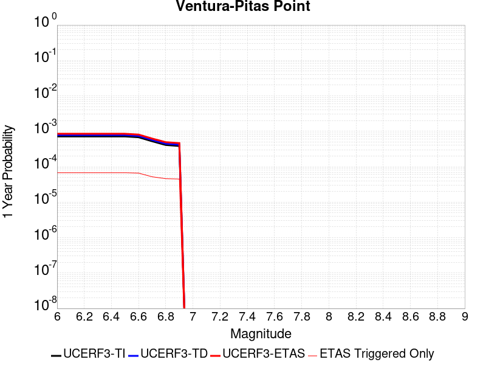 |  |

| Magnitude | 1 wk TI Prob | 1 wk TD Prob | 1 wk ETAS Prob | 1 wk ETAS/TD Gain | 1 wk ETAS Triggered Only | 1 mo TI Prob | 1 mo TD Prob | 1 mo ETAS Prob | 1 mo ETAS/TD Gain | 1 mo ETAS Triggered Only | 1 yr TI Prob | 1 yr TD Prob | 1 yr ETAS Prob | 1 yr ETAS/TD Gain | 1 yr ETAS Triggered Only | 10 yr TI Prob | 10 yr TD Prob | 10 yr ETAS Prob | 10 yr ETAS/TD Gain | 10 yr ETAS Triggered Only |
|-----|-----|-----|-----|-----|-----|-----|-----|-----|-----|-----|-----|-----|-----|-----|-----|-----|-----|-----|-----|-----|
| 6.0 | 1.3734005E-5 | 1.4989571E-5 | 2.566177E-5 | 1.7119749 | 1.0672358E-5 | 5.885869E-5 | 6.423993E-5 | 9.625495E-5 | 1.4983664 | 3.2017077E-5 | 7.1636896E-4 | 7.819278E-4 | 8.9923193E-4 | 1.1500192 | 1.17395946E-4 | 0.00714064 | 0.007800344 | 0.0079591805 | 1.0203627 | 1.6008537E-4 |
| 6.1 | 1.3734005E-5 | 1.4989571E-5 | 2.566177E-5 | 1.7119749 | 1.0672358E-5 | 5.885869E-5 | 6.423993E-5 | 9.625495E-5 | 1.4983664 | 3.2017077E-5 | 7.1636896E-4 | 7.819278E-4 | 8.9923193E-4 | 1.1500192 | 1.17395946E-4 | 0.00714064 | 0.007800344 | 0.0079591805 | 1.0203627 | 1.6008537E-4 |
| 6.2 | 1.3734005E-5 | 1.4989571E-5 | 2.566177E-5 | 1.7119749 | 1.0672358E-5 | 5.885869E-5 | 6.423993E-5 | 9.625495E-5 | 1.4983664 | 3.2017077E-5 | 7.1636896E-4 | 7.819278E-4 | 8.9923193E-4 | 1.1500192 | 1.17395946E-4 | 0.00714064 | 0.007800344 | 0.0079591805 | 1.0203627 | 1.6008537E-4 |
| 6.3 | 1.3734005E-5 | 1.4989571E-5 | 2.566177E-5 | 1.7119749 | 1.0672358E-5 | 5.885869E-5 | 6.423993E-5 | 9.625495E-5 | 1.4983664 | 3.2017077E-5 | 7.1636896E-4 | 7.819278E-4 | 8.9923193E-4 | 1.1500192 | 1.17395946E-4 | 0.00714064 | 0.007800344 | 0.0079591805 | 1.0203627 | 1.6008537E-4 |
| 6.4 | 1.3734005E-5 | 1.4989571E-5 | 2.566177E-5 | 1.7119749 | 1.0672358E-5 | 5.885869E-5 | 6.423993E-5 | 9.625495E-5 | 1.4983664 | 3.2017077E-5 | 7.1636896E-4 | 7.819278E-4 | 8.9923193E-4 | 1.1500192 | 1.17395946E-4 | 0.00714064 | 0.007800344 | 0.0079591805 | 1.0203627 | 1.6008537E-4 |
| 6.5 | 1.3734005E-5 | 1.4989571E-5 | 2.566177E-5 | 1.7119749 | 1.0672358E-5 | 5.885869E-5 | 6.423993E-5 | 9.625495E-5 | 1.4983664 | 3.2017077E-5 | 7.1636896E-4 | 7.819278E-4 | 8.9923193E-4 | 1.1500192 | 1.17395946E-4 | 0.00714064 | 0.007800344 | 0.0079591805 | 1.0203627 | 1.6008537E-4 |
| 6.6 | 1.3017341E-5 | 1.42015815E-5 | 2.4873789E-5 | 1.7514801 | 1.0672358E-5 | 5.5787412E-5 | 6.0862993E-5 | 9.287812E-5 | 1.5260196 | 3.2017077E-5 | 6.7900005E-4 | 7.408419E-4 | 8.581509E-4 | 1.1583455 | 1.17395946E-4 | 0.006769291 | 0.0073922575 | 0.0075511597 | 1.0214957 | 1.6008537E-4 |
| 6.7 | 1.0029534E-5 | 1.09311E-5 | 1.09311E-5 | 1.0 | 0.0 | 4.298301E-5 | 4.6847203E-5 | 6.819092E-5 | 1.4556028 | 2.1344717E-5 | 5.2319246E-4 | 5.70299E-4 | 6.6629547E-4 | 1.1683265 | 9.6051226E-5 | 0.005219624 | 0.005696553 | 0.0058238916 | 1.0223536 | 1.280683E-4 |
| 6.8 | 7.869905E-6 | 8.563513E-6 | 8.563513E-6 | 1.0 | 0.0 | 3.372773E-5 | 3.6700705E-5 | 4.7372672E-5 | 1.2907836 | 1.0672358E-5 | 4.1055772E-4 | 4.4682005E-4 | 5.2149314E-4 | 1.1671213 | 7.470651E-5 | 0.0040980005 | 0.004467117 | 0.0045627393 | 1.0214058 | 9.6051226E-5 |
| 6.9 | 7.3736396E-6 | 8.021501E-6 | 8.021501E-6 | 1.0 | 0.0 | 3.1600932E-5 | 3.4377863E-5 | 4.5049856E-5 | 1.3104321 | 1.0672358E-5 | 3.8467342E-4 | 4.1855048E-4 | 4.932257E-4 | 1.178414 | 7.470651E-5 | 0.003840082 | 0.0041855047 | 0.004281154 | 1.0228525 | 9.6051226E-5 |

## San Jacinto (San Jacinto Valley) rev
*[(top)](#table-of-contents)*

| 1 Week | 1 Month | 1 Year | 10 Year |
|-----|-----|-----|-----|
|  |  |  |  |

| Magnitude | 1 wk TI Prob | 1 wk TD Prob | 1 wk ETAS Prob | 1 wk ETAS/TD Gain | 1 wk ETAS Triggered Only | 1 mo TI Prob | 1 mo TD Prob | 1 mo ETAS Prob | 1 mo ETAS/TD Gain | 1 mo ETAS Triggered Only | 1 yr TI Prob | 1 yr TD Prob | 1 yr ETAS Prob | 1 yr ETAS/TD Gain | 1 yr ETAS Triggered Only | 10 yr TI Prob | 10 yr TD Prob | 10 yr ETAS Prob | 10 yr ETAS/TD Gain | 10 yr ETAS Triggered Only |
|-----|-----|-----|-----|-----|-----|-----|-----|-----|-----|-----|-----|-----|-----|-----|-----|-----|-----|-----|-----|-----|
| 6.0 | 7.806946E-5 | 1.580409E-4 | 1.6871157E-4 | 1.0675185 | 1.0672358E-5 | 3.345405E-4 | 6.770383E-4 | 6.9836853E-4 | 1.0315052 | 2.1344717E-5 | 0.004065426 | 0.008203736 | 0.008288414 | 1.010322 | 8.5378866E-5 | 0.03991852 | 0.07910823 | 0.079255655 | 1.0018636 | 1.6008537E-4 |
| 6.1 | 7.806946E-5 | 1.580409E-4 | 1.6871157E-4 | 1.0675185 | 1.0672358E-5 | 3.345405E-4 | 6.770383E-4 | 6.9836853E-4 | 1.0315052 | 2.1344717E-5 | 0.004065426 | 0.008203736 | 0.008288414 | 1.010322 | 8.5378866E-5 | 0.03991852 | 0.07910823 | 0.079255655 | 1.0018636 | 1.6008537E-4 |
| 6.2 | 7.806946E-5 | 1.580409E-4 | 1.6871157E-4 | 1.0675185 | 1.0672358E-5 | 3.345405E-4 | 6.770383E-4 | 6.9836853E-4 | 1.0315052 | 2.1344717E-5 | 0.004065426 | 0.008203736 | 0.008288414 | 1.010322 | 8.5378866E-5 | 0.03991852 | 0.07910823 | 0.079255655 | 1.0018636 | 1.6008537E-4 |
| 6.3 | 7.806946E-5 | 1.580409E-4 | 1.6871157E-4 | 1.0675185 | 1.0672358E-5 | 3.345405E-4 | 6.770383E-4 | 6.9836853E-4 | 1.0315052 | 2.1344717E-5 | 0.004065426 | 0.008203736 | 0.008288414 | 1.010322 | 8.5378866E-5 | 0.03991852 | 0.07910823 | 0.079255655 | 1.0018636 | 1.6008537E-4 |
| 6.4 | 7.806946E-5 | 1.580409E-4 | 1.6871157E-4 | 1.0675185 | 1.0672358E-5 | 3.345405E-4 | 6.770383E-4 | 6.9836853E-4 | 1.0315052 | 2.1344717E-5 | 0.004065426 | 0.008203736 | 0.008288414 | 1.010322 | 8.5378866E-5 | 0.03991852 | 0.07910823 | 0.079255655 | 1.0018636 | 1.6008537E-4 |
| 6.5 | 7.806946E-5 | 1.580409E-4 | 1.6871157E-4 | 1.0675185 | 1.0672358E-5 | 3.345405E-4 | 6.770383E-4 | 6.9836853E-4 | 1.0315052 | 2.1344717E-5 | 0.004065426 | 0.008203736 | 0.008288414 | 1.010322 | 8.5378866E-5 | 0.03991852 | 0.07910823 | 0.079255655 | 1.0018636 | 1.6008537E-4 |
| 6.6 | 7.8012505E-5 | 1.5793537E-4 | 1.6860604E-4 | 1.0675635 | 1.0672358E-5 | 3.3429646E-4 | 6.765863E-4 | 6.9791655E-4 | 1.0315263 | 2.1344717E-5 | 0.004062466 | 0.008198286 | 0.008282966 | 1.0103289 | 8.5378866E-5 | 0.039889984 | 0.079058796 | 0.07920622 | 1.0018648 | 1.6008537E-4 |
| 6.7 | 7.8012505E-5 | 1.5793537E-4 | 1.6860604E-4 | 1.0675635 | 1.0672358E-5 | 3.3429646E-4 | 6.765863E-4 | 6.9791655E-4 | 1.0315263 | 2.1344717E-5 | 0.004062466 | 0.008198286 | 0.008282966 | 1.0103289 | 8.5378866E-5 | 0.039889984 | 0.079058796 | 0.07920622 | 1.0018648 | 1.6008537E-4 |
| 6.8 | 7.7891236E-5 | 1.5767448E-4 | 1.6834516E-4 | 1.0676754 | 1.0672358E-5 | 3.3377687E-4 | 6.754689E-4 | 6.967992E-4 | 1.0315785 | 2.1344717E-5 | 0.004056163 | 0.0081848195 | 0.0082695 | 1.0103459 | 8.5378866E-5 | 0.039829224 | 0.0789369 | 0.07908435 | 1.0018679 | 1.6008537E-4 |
| 6.9 | 7.764062E-5 | 1.5713525E-4 | 1.6780592E-4 | 1.0679076 | 1.0672358E-5 | 3.327031E-4 | 6.731594E-4 | 6.9448975E-4 | 1.0316869 | 2.1344717E-5 | 0.0040431386 | 0.008156981 | 0.008241664 | 1.0103816 | 8.5378866E-5 | 0.039703645 | 0.07868492 | 0.07883241 | 1.0018744 | 1.6008537E-4 |
| 7.0 | 5.0739076E-5 | 9.3390074E-5 | 1.0406144E-4 | 1.1142665 | 1.0672358E-5 | 2.1743505E-4 | 4.0015313E-4 | 4.2148933E-4 | 1.05332 | 2.1344717E-5 | 0.0026440579 | 0.0048604817 | 0.0049348255 | 1.0152955 | 7.470651E-5 | 0.026128192 | 0.04834233 | 0.048464205 | 1.0025212 | 1.280683E-4 |
| 7.1 | 5.0390987E-5 | 9.2688424E-5 | 1.03359795E-4 | 1.1151316 | 1.0672358E-5 | 2.159435E-4 | 3.9714726E-4 | 4.184835E-4 | 1.0537237 | 2.1344717E-5 | 0.002625942 | 0.004824109 | 0.004898455 | 1.0154114 | 7.470651E-5 | 0.025951283 | 0.048000354 | 0.048122276 | 1.00254 | 1.280683E-4 |
| 7.2 | 4.9789487E-5 | 9.143531E-5 | 1.0210669E-4 | 1.1167097 | 1.0672358E-5 | 2.1336606E-4 | 3.917791E-4 | 4.1311546E-4 | 1.0544602 | 2.1344717E-5 | 0.0025946372 | 0.0047591375 | 0.0048334887 | 1.0156227 | 7.470651E-5 | 0.025645511 | 0.047391243 | 0.047513243 | 1.0025743 | 1.280683E-4 |
| 7.3 | 4.9191407E-5 | 9.01359E-5 | 1.008073E-4 | 1.1183923 | 1.0672358E-5 | 2.1080328E-4 | 3.8621208E-4 | 4.0754856E-4 | 1.0552455 | 2.1344717E-5 | 0.002563509 | 0.004691701 | 0.0047660572 | 1.0158484 | 7.470651E-5 | 0.025341382 | 0.04674962 | 0.046871703 | 1.0026114 | 1.280683E-4 |
| 7.4 | 3.3192722E-5 | 5.2610532E-5 | 6.328233E-5 | 1.2028452 | 1.0672358E-5 | 1.4224676E-4 | 2.2545758E-4 | 2.3612753E-4 | 1.0473257 | 1.0672358E-5 | 0.0017304786 | 0.0027420863 | 0.0027633724 | 1.0077628 | 2.1344717E-5 | 0.01717065 | 0.028029768 | 0.028081635 | 1.0018504 | 5.3361793E-5 |
| 7.5 | 2.8249084E-5 | 4.2866195E-5 | 5.3538097E-5 | 1.2489585 | 1.0672358E-5 | 1.2106189E-4 | 1.8370226E-4 | 1.9437265E-4 | 1.0580853 | 1.0672358E-5 | 0.0014729318 | 0.0022347996 | 0.0022560966 | 1.0095297 | 2.1344717E-5 | 0.014632072 | 0.023027074 | 0.023079207 | 1.002264 | 5.3361793E-5 |
| 7.6 | 2.7497194E-5 | 4.146988E-5 | 5.2141797E-5 | 1.2573414 | 1.0672358E-5 | 1.17839794E-4 | 1.7771887E-4 | 1.8838933E-4 | 1.0600412 | 1.0672358E-5 | 0.0014337553 | 0.0021620982 | 0.0021833968 | 1.0098509 | 2.1344717E-5 | 0.0142454 | 0.022306465 | 0.022358635 | 1.0023389 | 5.3361793E-5 |
| 7.7 | 1.673878E-5 | 2.1973781E-5 | 2.1973781E-5 | 1.0 | 0.0 | 7.173566E-5 | 9.417205E-5 | 9.417205E-5 | 1.0 | 0.0 | 8.730317E-4 | 0.0011463144 | 0.0011463144 | 1.0 | 0.0 | 0.008696098 | 0.01216197 | 0.012193598 | 1.0026006 | 3.2017077E-5 |
| 7.8 | 1.5303123E-6 | 1.9707616E-6 | 1.9707616E-6 | 1.0 | 0.0 | 6.5584645E-6 | 8.446107E-6 | 8.446107E-6 | 1.0 | 0.0 | 7.984638E-5 | 1.0282895E-4 | 1.0282895E-4 | 1.0 | 0.0 | 7.98177E-4 | 0.001066982 | 0.001077643 | 1.0099918 | 1.0672358E-5 |

## Clamshell-Sawpit
*[(top)](#table-of-contents)*

| 1 Week | 1 Month | 1 Year | 10 Year |
|-----|-----|-----|-----|
|  |  |  |  |

| Magnitude | 1 wk TI Prob | 1 wk TD Prob | 1 wk ETAS Prob | 1 wk ETAS/TD Gain | 1 wk ETAS Triggered Only | 1 mo TI Prob | 1 mo TD Prob | 1 mo ETAS Prob | 1 mo ETAS/TD Gain | 1 mo ETAS Triggered Only | 1 yr TI Prob | 1 yr TD Prob | 1 yr ETAS Prob | 1 yr ETAS/TD Gain | 1 yr ETAS Triggered Only | 10 yr TI Prob | 10 yr TD Prob | 10 yr ETAS Prob | 10 yr ETAS/TD Gain | 10 yr ETAS Triggered Only |
|-----|-----|-----|-----|-----|-----|-----|-----|-----|-----|-----|-----|-----|-----|-----|-----|-----|-----|-----|-----|-----|
| 6.0 | 1.1112015E-5 | 1.2128283E-5 | 3.347274E-5 | 2.7598913 | 2.1344717E-5 | 4.7622052E-5 | 5.1978353E-5 | 8.3993764E-5 | 1.6159374 | 3.2017077E-5 | 5.796442E-4 | 6.328364E-4 | 7.181613E-4 | 1.1348292 | 8.5378866E-5 | 0.0057813465 | 0.0063283644 | 0.006476832 | 1.0234606 | 1.4941303E-4 |
| 6.1 | 1.1112015E-5 | 1.2128283E-5 | 3.347274E-5 | 2.7598913 | 2.1344717E-5 | 4.7622052E-5 | 5.1978353E-5 | 8.3993764E-5 | 1.6159374 | 3.2017077E-5 | 5.796442E-4 | 6.328364E-4 | 7.181613E-4 | 1.1348292 | 8.5378866E-5 | 0.0057813465 | 0.0063283644 | 0.006476832 | 1.0234606 | 1.4941303E-4 |
| 6.2 | 1.1112015E-5 | 1.2128283E-5 | 3.347274E-5 | 2.7598913 | 2.1344717E-5 | 4.7622052E-5 | 5.1978353E-5 | 8.3993764E-5 | 1.6159374 | 3.2017077E-5 | 5.796442E-4 | 6.328364E-4 | 7.181613E-4 | 1.1348292 | 8.5378866E-5 | 0.0057813465 | 0.0063283644 | 0.006476832 | 1.0234606 | 1.4941303E-4 |
| 6.3 | 1.1112015E-5 | 1.2128283E-5 | 3.347274E-5 | 2.7598913 | 2.1344717E-5 | 4.7622052E-5 | 5.1978353E-5 | 8.3993764E-5 | 1.6159374 | 3.2017077E-5 | 5.796442E-4 | 6.328364E-4 | 7.181613E-4 | 1.1348292 | 8.5378866E-5 | 0.0057813465 | 0.0063283644 | 0.006476832 | 1.0234606 | 1.4941303E-4 |
| 6.4 | 1.1112015E-5 | 1.2128283E-5 | 3.347274E-5 | 2.7598913 | 2.1344717E-5 | 4.7622052E-5 | 5.1978353E-5 | 8.3993764E-5 | 1.6159374 | 3.2017077E-5 | 5.796442E-4 | 6.328364E-4 | 7.181613E-4 | 1.1348292 | 8.5378866E-5 | 0.0057813465 | 0.0063283644 | 0.006476832 | 1.0234606 | 1.4941303E-4 |
| 6.5 | 1.1112015E-5 | 1.2128283E-5 | 3.347274E-5 | 2.7598913 | 2.1344717E-5 | 4.7622052E-5 | 5.1978353E-5 | 8.3993764E-5 | 1.6159374 | 3.2017077E-5 | 5.796442E-4 | 6.328364E-4 | 7.181613E-4 | 1.1348292 | 8.5378866E-5 | 0.0057813465 | 0.0063283644 | 0.006476832 | 1.0234606 | 1.4941303E-4 |

## Elysian Park (Upper)
*[(top)](#table-of-contents)*

| 1 Week | 1 Month | 1 Year | 10 Year |
|-----|-----|-----|-----|
|  |  |  |  |

| Magnitude | 1 wk TI Prob | 1 wk TD Prob | 1 wk ETAS Prob | 1 wk ETAS/TD Gain | 1 wk ETAS Triggered Only | 1 mo TI Prob | 1 mo TD Prob | 1 mo ETAS Prob | 1 mo ETAS/TD Gain | 1 mo ETAS Triggered Only | 1 yr TI Prob | 1 yr TD Prob | 1 yr ETAS Prob | 1 yr ETAS/TD Gain | 1 yr ETAS Triggered Only | 10 yr TI Prob | 10 yr TD Prob | 10 yr ETAS Prob | 10 yr ETAS/TD Gain | 10 yr ETAS Triggered Only |
|-----|-----|-----|-----|-----|-----|-----|-----|-----|-----|-----|-----|-----|-----|-----|-----|-----|-----|-----|-----|-----|
| 6.0 | 2.4686513E-5 | 3.0328916E-5 | 6.234502E-5 | 2.0556297 | 3.2017077E-5 | 1.0579505E-4 | 1.2998107E-4 | 1.6199399E-4 | 1.246289 | 3.2017077E-5 | 0.0012872935 | 0.0015825125 | 0.0016997227 | 1.0740659 | 1.17395946E-4 | 0.01279862 | 0.015824199 | 0.015960744 | 1.0086288 | 1.3874067E-4 |
| 6.1 | 2.4686513E-5 | 3.0328916E-5 | 6.234502E-5 | 2.0556297 | 3.2017077E-5 | 1.0579505E-4 | 1.2998107E-4 | 1.6199399E-4 | 1.246289 | 3.2017077E-5 | 0.0012872935 | 0.0015825125 | 0.0016997227 | 1.0740659 | 1.17395946E-4 | 0.01279862 | 0.015824199 | 0.015960744 | 1.0086288 | 1.3874067E-4 |
| 6.2 | 2.4686513E-5 | 3.0328916E-5 | 6.234502E-5 | 2.0556297 | 3.2017077E-5 | 1.0579505E-4 | 1.2998107E-4 | 1.6199399E-4 | 1.246289 | 3.2017077E-5 | 0.0012872935 | 0.0015825125 | 0.0016997227 | 1.0740659 | 1.17395946E-4 | 0.01279862 | 0.015824199 | 0.015960744 | 1.0086288 | 1.3874067E-4 |
| 6.3 | 2.4686513E-5 | 3.0328916E-5 | 6.234502E-5 | 2.0556297 | 3.2017077E-5 | 1.0579505E-4 | 1.2998107E-4 | 1.6199399E-4 | 1.246289 | 3.2017077E-5 | 0.0012872935 | 0.0015825125 | 0.0016997227 | 1.0740659 | 1.17395946E-4 | 0.01279862 | 0.015824199 | 0.015960744 | 1.0086288 | 1.3874067E-4 |
| 6.4 | 2.4686513E-5 | 3.0328916E-5 | 6.234502E-5 | 2.0556297 | 3.2017077E-5 | 1.0579505E-4 | 1.2998107E-4 | 1.6199399E-4 | 1.246289 | 3.2017077E-5 | 0.0012872935 | 0.0015825125 | 0.0016997227 | 1.0740659 | 1.17395946E-4 | 0.01279862 | 0.015824199 | 0.015960744 | 1.0086288 | 1.3874067E-4 |
| 6.5 | 2.4686513E-5 | 3.0328916E-5 | 6.234502E-5 | 2.0556297 | 3.2017077E-5 | 1.0579505E-4 | 1.2998107E-4 | 1.6199399E-4 | 1.246289 | 3.2017077E-5 | 0.0012872935 | 0.0015825125 | 0.0016997227 | 1.0740659 | 1.17395946E-4 | 0.01279862 | 0.015824199 | 0.015960744 | 1.0086288 | 1.3874067E-4 |

## Channel Islands Thrust
*[(top)](#table-of-contents)*

| 1 Week | 1 Month | 1 Year | 10 Year |
|-----|-----|-----|-----|
|  |  | 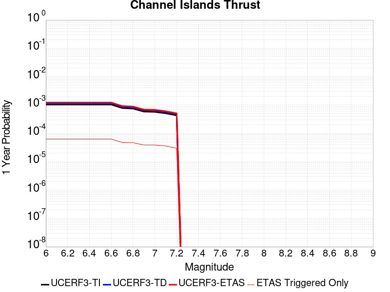 |  |

| Magnitude | 1 wk TI Prob | 1 wk TD Prob | 1 wk ETAS Prob | 1 wk ETAS/TD Gain | 1 wk ETAS Triggered Only | 1 mo TI Prob | 1 mo TD Prob | 1 mo ETAS Prob | 1 mo ETAS/TD Gain | 1 mo ETAS Triggered Only | 1 yr TI Prob | 1 yr TD Prob | 1 yr ETAS Prob | 1 yr ETAS/TD Gain | 1 yr ETAS Triggered Only | 10 yr TI Prob | 10 yr TD Prob | 10 yr ETAS Prob | 10 yr ETAS/TD Gain | 10 yr ETAS Triggered Only |
|-----|-----|-----|-----|-----|-----|-----|-----|-----|-----|-----|-----|-----|-----|-----|-----|-----|-----|-----|-----|-----|
| 6.0 | 1.9940422E-5 | 2.234876E-5 | 4.3693002E-5 | 1.9550525 | 2.1344717E-5 | 8.545615E-5 | 9.577758E-5 | 1.1712025E-4 | 1.2228358 | 2.1344717E-5 | 0.001039932 | 0.0011655908 | 0.00127219 | 1.0914551 | 1.06723586E-4 | 0.010350789 | 0.0116068935 | 0.011733475 | 1.0109057 | 1.280683E-4 |
| 6.1 | 1.9940422E-5 | 2.234876E-5 | 4.3693002E-5 | 1.9550525 | 2.1344717E-5 | 8.545615E-5 | 9.577758E-5 | 1.1712025E-4 | 1.2228358 | 2.1344717E-5 | 0.001039932 | 0.0011655908 | 0.00127219 | 1.0914551 | 1.06723586E-4 | 0.010350789 | 0.0116068935 | 0.011733475 | 1.0109057 | 1.280683E-4 |
| 6.2 | 1.9940422E-5 | 2.234876E-5 | 4.3693002E-5 | 1.9550525 | 2.1344717E-5 | 8.545615E-5 | 9.577758E-5 | 1.1712025E-4 | 1.2228358 | 2.1344717E-5 | 0.001039932 | 0.0011655908 | 0.00127219 | 1.0914551 | 1.06723586E-4 | 0.010350789 | 0.0116068935 | 0.011733475 | 1.0109057 | 1.280683E-4 |
| 6.3 | 1.9940422E-5 | 2.234876E-5 | 4.3693002E-5 | 1.9550525 | 2.1344717E-5 | 8.545615E-5 | 9.577758E-5 | 1.1712025E-4 | 1.2228358 | 2.1344717E-5 | 0.001039932 | 0.0011655908 | 0.00127219 | 1.0914551 | 1.06723586E-4 | 0.010350789 | 0.0116068935 | 0.011733475 | 1.0109057 | 1.280683E-4 |
| 6.4 | 1.9940422E-5 | 2.234876E-5 | 4.3693002E-5 | 1.9550525 | 2.1344717E-5 | 8.545615E-5 | 9.577758E-5 | 1.1712025E-4 | 1.2228358 | 2.1344717E-5 | 0.001039932 | 0.0011655908 | 0.00127219 | 1.0914551 | 1.06723586E-4 | 0.010350789 | 0.0116068935 | 0.011733475 | 1.0109057 | 1.280683E-4 |
| 6.5 | 1.9940422E-5 | 2.234876E-5 | 4.3693002E-5 | 1.9550525 | 2.1344717E-5 | 8.545615E-5 | 9.577758E-5 | 1.1712025E-4 | 1.2228358 | 2.1344717E-5 | 0.001039932 | 0.0011655908 | 0.00127219 | 1.0914551 | 1.06723586E-4 | 0.010350789 | 0.0116068935 | 0.011733475 | 1.0109057 | 1.280683E-4 |
| 6.6 | 1.9940422E-5 | 2.234876E-5 | 4.3693002E-5 | 1.9550525 | 2.1344717E-5 | 8.545615E-5 | 9.577758E-5 | 1.1712025E-4 | 1.2228358 | 2.1344717E-5 | 0.001039932 | 0.0011655908 | 0.00127219 | 1.0914551 | 1.06723586E-4 | 0.010350789 | 0.0116068935 | 0.011733475 | 1.0109057 | 1.280683E-4 |
| 6.7 | 1.5039115E-5 | 1.6832886E-5 | 3.8177244E-5 | 2.2680154 | 2.1344717E-5 | 6.445176E-5 | 7.213959E-5 | 9.348277E-5 | 1.2958595 | 2.1344717E-5 | 7.844176E-4 | 8.780601E-4 | 9.6336403E-4 | 1.0971504 | 8.5378866E-5 | 0.007816545 | 0.00875716 | 0.008862949 | 1.0120803 | 1.06723586E-4 |
| 6.8 | 1.4337753E-5 | 1.605477E-5 | 3.7399146E-5 | 2.3294725 | 2.1344717E-5 | 6.1446066E-5 | 6.8804984E-5 | 9.0148234E-5 | 1.3101991 | 2.1344717E-5 | 7.4784906E-4 | 8.3749247E-4 | 9.121364E-4 | 1.0891279 | 7.470651E-5 | 0.007453373 | 0.008354535 | 0.0084497845 | 1.0114008 | 9.6051226E-5 |
| 6.9 | 1.1226918E-5 | 1.2540004E-5 | 3.3884455E-5 | 2.7021086 | 2.1344717E-5 | 4.8114474E-5 | 5.3742377E-5 | 7.508595E-5 | 1.397146 | 2.1344717E-5 | 5.856363E-4 | 6.542256E-4 | 7.288832E-4 | 1.1141161 | 7.470651E-5 | 0.0058409534 | 0.0065336456 | 0.0066184667 | 1.0129822 | 8.5378866E-5 |
| 7.0 | 1.0975239E-5 | 1.2259085E-5 | 3.360354E-5 | 2.7411132 | 2.1344717E-5 | 4.703589E-5 | 5.253849E-5 | 7.388209E-5 | 1.4062468 | 2.1344717E-5 | 5.725115E-4 | 6.395769E-4 | 7.142356E-4 | 1.1167314 | 7.470651E-5 | 0.005710388 | 0.006388001 | 0.006472835 | 1.0132802 | 8.5378866E-5 |
| 7.1 | 9.782044E-6 | 1.0913239E-5 | 3.225772E-5 | 2.9558342 | 2.1344717E-5 | 4.1922372E-5 | 4.6770787E-5 | 6.811451E-5 | 1.4563472 | 2.1344717E-5 | 5.102853E-4 | 5.693929E-4 | 6.333906E-4 | 1.1123964 | 6.403415E-5 | 0.0050911517 | 0.005689868 | 0.0057535376 | 1.01119 | 6.403415E-5 |
| 7.2 | 8.244729E-6 | 9.190053E-6 | 1.9862313E-5 | 2.161284 | 1.0672358E-5 | 3.5334073E-5 | 3.938594E-5 | 5.005788E-5 | 1.2709581 | 1.0672358E-5 | 4.3010744E-4 | 4.7952382E-4 | 5.3286E-4 | 1.1112274 | 5.3361793E-5 | 0.004292759 | 0.0047952384 | 0.0048483443 | 1.0110747 | 5.3361793E-5 |

## Chino alt 1
*[(top)](#table-of-contents)*

| 1 Week | 1 Month | 1 Year | 10 Year |
|-----|-----|-----|-----|
|  |  |  |  |

| Magnitude | 1 wk TI Prob | 1 wk TD Prob | 1 wk ETAS Prob | 1 wk ETAS/TD Gain | 1 wk ETAS Triggered Only | 1 mo TI Prob | 1 mo TD Prob | 1 mo ETAS Prob | 1 mo ETAS/TD Gain | 1 mo ETAS Triggered Only | 1 yr TI Prob | 1 yr TD Prob | 1 yr ETAS Prob | 1 yr ETAS/TD Gain | 1 yr ETAS Triggered Only | 10 yr TI Prob | 10 yr TD Prob | 10 yr ETAS Prob | 10 yr ETAS/TD Gain | 10 yr ETAS Triggered Only |
|-----|-----|-----|-----|-----|-----|-----|-----|-----|-----|-----|-----|-----|-----|-----|-----|-----|-----|-----|-----|-----|
| 6.0 | 2.1665033E-5 | 2.5894844E-5 | 4.723901E-5 | 1.8242631 | 2.1344717E-5 | 9.2846836E-5 | 1.10977904E-4 | 1.536626E-4 | 1.3846234 | 4.2689433E-5 | 0.001129824 | 0.0013511538 | 0.0014577332 | 1.0788803 | 1.06723586E-4 | 0.01124097 | 0.013511333 | 0.01363767 | 1.0093505 | 1.280683E-4 |
| 6.1 | 2.1665033E-5 | 2.5894844E-5 | 4.723901E-5 | 1.8242631 | 2.1344717E-5 | 9.2846836E-5 | 1.10977904E-4 | 1.536626E-4 | 1.3846234 | 4.2689433E-5 | 0.001129824 | 0.0013511538 | 0.0014577332 | 1.0788803 | 1.06723586E-4 | 0.01124097 | 0.013511333 | 0.01363767 | 1.0093505 | 1.280683E-4 |
| 6.2 | 2.1665033E-5 | 2.5894844E-5 | 4.723901E-5 | 1.8242631 | 2.1344717E-5 | 9.2846836E-5 | 1.10977904E-4 | 1.536626E-4 | 1.3846234 | 4.2689433E-5 | 0.001129824 | 0.0013511538 | 0.0014577332 | 1.0788803 | 1.06723586E-4 | 0.01124097 | 0.013511333 | 0.01363767 | 1.0093505 | 1.280683E-4 |
| 6.3 | 2.1665033E-5 | 2.5894844E-5 | 4.723901E-5 | 1.8242631 | 2.1344717E-5 | 9.2846836E-5 | 1.10977904E-4 | 1.536626E-4 | 1.3846234 | 4.2689433E-5 | 0.001129824 | 0.0013511538 | 0.0014577332 | 1.0788803 | 1.06723586E-4 | 0.01124097 | 0.013511333 | 0.01363767 | 1.0093505 | 1.280683E-4 |
| 6.4 | 2.1665033E-5 | 2.5894844E-5 | 4.723901E-5 | 1.8242631 | 2.1344717E-5 | 9.2846836E-5 | 1.10977904E-4 | 1.536626E-4 | 1.3846234 | 4.2689433E-5 | 0.001129824 | 0.0013511538 | 0.0014577332 | 1.0788803 | 1.06723586E-4 | 0.01124097 | 0.013511333 | 0.01363767 | 1.0093505 | 1.280683E-4 |
| 6.5 | 2.1665033E-5 | 2.5894844E-5 | 4.723901E-5 | 1.8242631 | 2.1344717E-5 | 9.2846836E-5 | 1.10977904E-4 | 1.536626E-4 | 1.3846234 | 4.2689433E-5 | 0.001129824 | 0.0013511538 | 0.0014577332 | 1.0788803 | 1.06723586E-4 | 0.01124097 | 0.013511333 | 0.01363767 | 1.0093505 | 1.280683E-4 |

## Helendale-So Lockhart
*[(top)](#table-of-contents)*

| 1 Week | 1 Month | 1 Year | 10 Year |
|-----|-----|-----|-----|
|  |  |  |  |

| Magnitude | 1 wk TI Prob | 1 wk TD Prob | 1 wk ETAS Prob | 1 wk ETAS/TD Gain | 1 wk ETAS Triggered Only | 1 mo TI Prob | 1 mo TD Prob | 1 mo ETAS Prob | 1 mo ETAS/TD Gain | 1 mo ETAS Triggered Only | 1 yr TI Prob | 1 yr TD Prob | 1 yr ETAS Prob | 1 yr ETAS/TD Gain | 1 yr ETAS Triggered Only | 10 yr TI Prob | 10 yr TD Prob | 10 yr ETAS Prob | 10 yr ETAS/TD Gain | 10 yr ETAS Triggered Only |
|-----|-----|-----|-----|-----|-----|-----|-----|-----|-----|-----|-----|-----|-----|-----|-----|-----|-----|-----|-----|-----|
| 6.0 | 7.171715E-6 | 7.4314485E-6 | 7.4314485E-6 | 1.0 | 0.0 | 3.073556E-5 | 3.184873E-5 | 5.3192765E-5 | 1.6701692 | 2.1344717E-5 | 3.7414118E-4 | 3.8769832E-4 | 4.4103942E-4 | 1.1375841 | 5.3361793E-5 | 0.003735119 | 0.0038711112 | 0.0039774217 | 1.0274625 | 1.06723586E-4 |
| 6.1 | 7.171715E-6 | 7.4314485E-6 | 7.4314485E-6 | 1.0 | 0.0 | 3.073556E-5 | 3.184873E-5 | 5.3192765E-5 | 1.6701692 | 2.1344717E-5 | 3.7414118E-4 | 3.8769832E-4 | 4.4103942E-4 | 1.1375841 | 5.3361793E-5 | 0.003735119 | 0.0038711112 | 0.0039774217 | 1.0274625 | 1.06723586E-4 |
| 6.2 | 7.171715E-6 | 7.4314485E-6 | 7.4314485E-6 | 1.0 | 0.0 | 3.073556E-5 | 3.184873E-5 | 5.3192765E-5 | 1.6701692 | 2.1344717E-5 | 3.7414118E-4 | 3.8769832E-4 | 4.4103942E-4 | 1.1375841 | 5.3361793E-5 | 0.003735119 | 0.0038711112 | 0.0039774217 | 1.0274625 | 1.06723586E-4 |
| 6.3 | 7.171715E-6 | 7.4314485E-6 | 7.4314485E-6 | 1.0 | 0.0 | 3.073556E-5 | 3.184873E-5 | 5.3192765E-5 | 1.6701692 | 2.1344717E-5 | 3.7414118E-4 | 3.8769832E-4 | 4.4103942E-4 | 1.1375841 | 5.3361793E-5 | 0.003735119 | 0.0038711112 | 0.0039774217 | 1.0274625 | 1.06723586E-4 |
| 6.4 | 7.171715E-6 | 7.4314485E-6 | 7.4314485E-6 | 1.0 | 0.0 | 3.073556E-5 | 3.184873E-5 | 5.3192765E-5 | 1.6701692 | 2.1344717E-5 | 3.7414118E-4 | 3.8769832E-4 | 4.4103942E-4 | 1.1375841 | 5.3361793E-5 | 0.003735119 | 0.0038711112 | 0.0039774217 | 1.0274625 | 1.06723586E-4 |
| 6.5 | 7.171715E-6 | 7.4314485E-6 | 7.4314485E-6 | 1.0 | 0.0 | 3.073556E-5 | 3.184873E-5 | 5.3192765E-5 | 1.6701692 | 2.1344717E-5 | 3.7414118E-4 | 3.8769832E-4 | 4.4103942E-4 | 1.1375841 | 5.3361793E-5 | 0.003735119 | 0.0038711112 | 0.0039774217 | 1.0274625 | 1.06723586E-4 |
| 6.6 | 6.5580157E-6 | 6.7948727E-6 | 6.7948727E-6 | 1.0 | 0.0 | 2.810548E-5 | 2.9120609E-5 | 5.0464703E-5 | 1.732955 | 2.1344717E-5 | 3.421305E-4 | 3.5449475E-4 | 4.0783762E-4 | 1.1504757 | 5.3361793E-5 | 0.0034160423 | 0.0035401797 | 0.0036358908 | 1.0270357 | 9.6051226E-5 |
| 6.7 | 5.6879685E-6 | 5.8928526E-6 | 5.8928526E-6 | 1.0 | 0.0 | 2.4376779E-5 | 2.5254889E-5 | 4.6599067E-5 | 1.8451504 | 2.1344717E-5 | 2.9674688E-4 | 3.074438E-4 | 3.607892E-4 | 1.1735126 | 5.3361793E-5 | 0.0029635092 | 0.0030710634 | 0.0031455404 | 1.0242512 | 7.470651E-5 |
| 6.8 | 4.958099E-6 | 5.135111E-6 | 5.135111E-6 | 1.0 | 0.0 | 2.1248823E-5 | 2.2007483E-5 | 3.2679607E-5 | 1.4849316 | 1.0672358E-5 | 2.586737E-4 | 2.6791706E-4 | 3.1059506E-4 | 1.1592956 | 4.2689433E-5 | 0.0025837282 | 0.0026768132 | 0.0027300322 | 1.0198815 | 5.3361793E-5 |
| 6.9 | 4.3792215E-6 | 4.5342804E-6 | 4.5342804E-6 | 1.0 | 0.0 | 1.8767958E-5 | 1.9432535E-5 | 3.0104688E-5 | 1.5491898 | 1.0672358E-5 | 2.2847592E-4 | 2.3657428E-4 | 2.792536E-4 | 1.1804056 | 4.2689433E-5 | 0.0022824116 | 0.0023640923 | 0.002417328 | 1.0225184 | 5.3361793E-5 |
| 7.0 | 3.858262E-6 | 3.9935144E-6 | 3.9935144E-6 | 1.0 | 0.0 | 1.6535305E-5 | 1.7115E-5 | 2.7787175E-5 | 1.6235569 | 1.0672358E-5 | 2.0129874E-4 | 2.0836401E-4 | 2.5104455E-4 | 1.2048364 | 4.2689433E-5 | 0.0020111648 | 0.0020825516 | 0.002135802 | 1.0255699 | 5.3361793E-5 |
| 7.1 | 3.3854772E-6 | 3.502769E-6 | 3.502769E-6 | 1.0 | 0.0 | 1.4509107E-5 | 1.501183E-5 | 2.5684029E-5 | 1.7109193 | 1.0672358E-5 | 1.7663406E-4 | 1.827625E-4 | 2.2544412E-4 | 1.233536 | 4.2689433E-5 | 0.0017649373 | 0.0018269841 | 0.0018802484 | 1.0291542 | 5.3361793E-5 |
| 7.2 | 2.9527619E-6 | 3.05382E-6 | 3.05382E-6 | 1.0 | 0.0 | 1.2654632E-5 | 1.3087783E-5 | 2.3760002E-5 | 1.8154336 | 1.0672358E-5 | 1.5405925E-4 | 1.5934087E-4 | 2.020235E-4 | 1.26787 | 4.2689433E-5 | 0.0015395249 | 0.0015931253 | 0.0016464021 | 1.0334417 | 5.3361793E-5 |
| 7.3 | 2.553375E-6 | 2.6399916E-6 | 2.6399916E-6 | 1.0 | 0.0 | 1.0942989E-5 | 1.13142505E-5 | 1.13142505E-5 | 1.0 | 0.0 | 1.3322275E-4 | 1.3775099E-4 | 1.6976366E-4 | 1.2323952 | 3.2017077E-5 | 0.0013314291 | 0.0013775099 | 0.0014201406 | 1.0309476 | 4.2689433E-5 |

## Simi-Santa Rosa
*[(top)](#table-of-contents)*

| 1 Week | 1 Month | 1 Year | 10 Year |
|-----|-----|-----|-----|
|  |  |  |  |

| Magnitude | 1 wk TI Prob | 1 wk TD Prob | 1 wk ETAS Prob | 1 wk ETAS/TD Gain | 1 wk ETAS Triggered Only | 1 mo TI Prob | 1 mo TD Prob | 1 mo ETAS Prob | 1 mo ETAS/TD Gain | 1 mo ETAS Triggered Only | 1 yr TI Prob | 1 yr TD Prob | 1 yr ETAS Prob | 1 yr ETAS/TD Gain | 1 yr ETAS Triggered Only | 10 yr TI Prob | 10 yr TD Prob | 10 yr ETAS Prob | 10 yr ETAS/TD Gain | 10 yr ETAS Triggered Only |
|-----|-----|-----|-----|-----|-----|-----|-----|-----|-----|-----|-----|-----|-----|-----|-----|-----|-----|-----|-----|-----|
| 6.0 | 1.765222E-5 | 1.996643E-5 | 1.996643E-5 | 1.0 | 0.0 | 7.565018E-5 | 8.556876E-5 | 1.06911655E-4 | 1.2494239 | 2.1344717E-5 | 9.206518E-4 | 0.0010415068 | 0.0011161355 | 1.0716546 | 7.470651E-5 | 0.009168469 | 0.010386396 | 0.010492011 | 1.0101686 | 1.06723586E-4 |
| 6.1 | 1.765222E-5 | 1.996643E-5 | 1.996643E-5 | 1.0 | 0.0 | 7.565018E-5 | 8.556876E-5 | 1.06911655E-4 | 1.2494239 | 2.1344717E-5 | 9.206518E-4 | 0.0010415068 | 0.0011161355 | 1.0716546 | 7.470651E-5 | 0.009168469 | 0.010386396 | 0.010492011 | 1.0101686 | 1.06723586E-4 |
| 6.2 | 1.765222E-5 | 1.996643E-5 | 1.996643E-5 | 1.0 | 0.0 | 7.565018E-5 | 8.556876E-5 | 1.06911655E-4 | 1.2494239 | 2.1344717E-5 | 9.206518E-4 | 0.0010415068 | 0.0011161355 | 1.0716546 | 7.470651E-5 | 0.009168469 | 0.010386396 | 0.010492011 | 1.0101686 | 1.06723586E-4 |
| 6.3 | 1.765222E-5 | 1.996643E-5 | 1.996643E-5 | 1.0 | 0.0 | 7.565018E-5 | 8.556876E-5 | 1.06911655E-4 | 1.2494239 | 2.1344717E-5 | 9.206518E-4 | 0.0010415068 | 0.0011161355 | 1.0716546 | 7.470651E-5 | 0.009168469 | 0.010386396 | 0.010492011 | 1.0101686 | 1.06723586E-4 |
| 6.4 | 1.765222E-5 | 1.996643E-5 | 1.996643E-5 | 1.0 | 0.0 | 7.565018E-5 | 8.556876E-5 | 1.06911655E-4 | 1.2494239 | 2.1344717E-5 | 9.206518E-4 | 0.0010415068 | 0.0011161355 | 1.0716546 | 7.470651E-5 | 0.009168469 | 0.010386396 | 0.010492011 | 1.0101686 | 1.06723586E-4 |
| 6.5 | 1.765222E-5 | 1.996643E-5 | 1.996643E-5 | 1.0 | 0.0 | 7.565018E-5 | 8.556876E-5 | 1.06911655E-4 | 1.2494239 | 2.1344717E-5 | 9.206518E-4 | 0.0010415068 | 0.0011161355 | 1.0716546 | 7.470651E-5 | 0.009168469 | 0.010386396 | 0.010492011 | 1.0101686 | 1.06723586E-4 |
| 6.6 | 1.4207836E-5 | 1.605233E-5 | 1.605233E-5 | 1.0 | 0.0 | 6.0889306E-5 | 6.8795016E-5 | 9.013827E-5 | 1.3102441 | 2.1344717E-5 | 7.4107514E-4 | 8.374578E-4 | 9.014383E-4 | 1.0763985 | 6.403415E-5 | 0.0073860865 | 0.0083626695 | 0.008457918 | 1.0113896 | 9.6051226E-5 |
| 6.7 | 1.1077219E-5 | 1.2498523E-5 | 1.2498523E-5 | 1.0 | 0.0 | 4.747293E-5 | 5.3565098E-5 | 6.423688E-5 | 1.1992302 | 1.0672358E-5 | 5.7782966E-4 | 6.521551E-4 | 7.0548203E-4 | 1.0817704 | 5.3361793E-5 | 0.0057632946 | 0.0065215505 | 0.0066063725 | 1.0130064 | 8.5378866E-5 |
| 6.8 | 1.1077219E-5 | 1.2498523E-5 | 1.2498523E-5 | 1.0 | 0.0 | 4.747293E-5 | 5.3565098E-5 | 6.423688E-5 | 1.1992302 | 1.0672358E-5 | 5.7782966E-4 | 6.521551E-4 | 7.0548203E-4 | 1.0817704 | 5.3361793E-5 | 0.0057632946 | 0.0065215505 | 0.0066063725 | 1.0130064 | 8.5378866E-5 |

## Los Alamos 2011 CFM
*[(top)](#table-of-contents)*

| 1 Week | 1 Month | 1 Year | 10 Year |
|-----|-----|-----|-----|
|  |  |  |  |

| Magnitude | 1 wk TI Prob | 1 wk TD Prob | 1 wk ETAS Prob | 1 wk ETAS/TD Gain | 1 wk ETAS Triggered Only | 1 mo TI Prob | 1 mo TD Prob | 1 mo ETAS Prob | 1 mo ETAS/TD Gain | 1 mo ETAS Triggered Only | 1 yr TI Prob | 1 yr TD Prob | 1 yr ETAS Prob | 1 yr ETAS/TD Gain | 1 yr ETAS Triggered Only | 10 yr TI Prob | 10 yr TD Prob | 10 yr ETAS Prob | 10 yr ETAS/TD Gain | 10 yr ETAS Triggered Only |
|-----|-----|-----|-----|-----|-----|-----|-----|-----|-----|-----|-----|-----|-----|-----|-----|-----|-----|-----|-----|-----|
| 6.0 | 1.3678262E-5 | 1.5031193E-5 | 5.7719986E-5 | 3.8400137 | 4.2689433E-5 | 5.8619804E-5 | 6.441852E-5 | 1.071052E-4 | 1.6626462 | 4.2689433E-5 | 7.134624E-4 | 7.841395E-4 | 8.3745946E-4 | 1.067998 | 5.3361793E-5 | 0.0071117613 | 0.007826112 | 0.007921412 | 1.0121771 | 9.6051226E-5 |
| 6.1 | 1.3678262E-5 | 1.5031193E-5 | 5.7719986E-5 | 3.8400137 | 4.2689433E-5 | 5.8619804E-5 | 6.441852E-5 | 1.071052E-4 | 1.6626462 | 4.2689433E-5 | 7.134624E-4 | 7.841395E-4 | 8.3745946E-4 | 1.067998 | 5.3361793E-5 | 0.0071117613 | 0.007826112 | 0.007921412 | 1.0121771 | 9.6051226E-5 |
| 6.2 | 1.3678262E-5 | 1.5031193E-5 | 5.7719986E-5 | 3.8400137 | 4.2689433E-5 | 5.8619804E-5 | 6.441852E-5 | 1.071052E-4 | 1.6626462 | 4.2689433E-5 | 7.134624E-4 | 7.841395E-4 | 8.3745946E-4 | 1.067998 | 5.3361793E-5 | 0.0071117613 | 0.007826112 | 0.007921412 | 1.0121771 | 9.6051226E-5 |
| 6.3 | 1.3678262E-5 | 1.5031193E-5 | 5.7719986E-5 | 3.8400137 | 4.2689433E-5 | 5.8619804E-5 | 6.441852E-5 | 1.071052E-4 | 1.6626462 | 4.2689433E-5 | 7.134624E-4 | 7.841395E-4 | 8.3745946E-4 | 1.067998 | 5.3361793E-5 | 0.0071117613 | 0.007826112 | 0.007921412 | 1.0121771 | 9.6051226E-5 |
| 6.4 | 1.3678262E-5 | 1.5031193E-5 | 5.7719986E-5 | 3.8400137 | 4.2689433E-5 | 5.8619804E-5 | 6.441852E-5 | 1.071052E-4 | 1.6626462 | 4.2689433E-5 | 7.134624E-4 | 7.841395E-4 | 8.3745946E-4 | 1.067998 | 5.3361793E-5 | 0.0071117613 | 0.007826112 | 0.007921412 | 1.0121771 | 9.6051226E-5 |
| 6.5 | 1.3678262E-5 | 1.5031193E-5 | 5.7719986E-5 | 3.8400137 | 4.2689433E-5 | 5.8619804E-5 | 6.441852E-5 | 1.071052E-4 | 1.6626462 | 4.2689433E-5 | 7.134624E-4 | 7.841395E-4 | 8.3745946E-4 | 1.067998 | 5.3361793E-5 | 0.0071117613 | 0.007826112 | 0.007921412 | 1.0121771 | 9.6051226E-5 |
| 6.6 | 1.3678262E-5 | 1.5031193E-5 | 5.7719986E-5 | 3.8400137 | 4.2689433E-5 | 5.8619804E-5 | 6.441852E-5 | 1.071052E-4 | 1.6626462 | 4.2689433E-5 | 7.134624E-4 | 7.841395E-4 | 8.3745946E-4 | 1.067998 | 5.3361793E-5 | 0.0071117613 | 0.007826112 | 0.007921412 | 1.0121771 | 9.6051226E-5 |
| 6.7 | 8.282411E-6 | 9.085969E-6 | 3.0430492E-5 | 3.349174 | 2.1344717E-5 | 3.5495563E-5 | 3.893987E-5 | 6.0283757E-5 | 1.5481242 | 2.1344717E-5 | 4.3207276E-4 | 4.740929E-4 | 5.0609483E-4 | 1.0675013 | 3.2017077E-5 | 0.0043123364 | 0.004740929 | 0.004794038 | 1.0112022 | 5.3361793E-5 |
| 6.8 | 8.282411E-6 | 9.085969E-6 | 3.0430492E-5 | 3.349174 | 2.1344717E-5 | 3.5495563E-5 | 3.893987E-5 | 6.0283757E-5 | 1.5481242 | 2.1344717E-5 | 4.3207276E-4 | 4.740929E-4 | 5.0609483E-4 | 1.0675013 | 3.2017077E-5 | 0.0043123364 | 0.004740929 | 0.004794038 | 1.0112022 | 5.3361793E-5 |

## Whittier alt 1
*[(top)](#table-of-contents)*

| 1 Week | 1 Month | 1 Year | 10 Year |
|-----|-----|-----|-----|
|  |  |  |  |

| Magnitude | 1 wk TI Prob | 1 wk TD Prob | 1 wk ETAS Prob | 1 wk ETAS/TD Gain | 1 wk ETAS Triggered Only | 1 mo TI Prob | 1 mo TD Prob | 1 mo ETAS Prob | 1 mo ETAS/TD Gain | 1 mo ETAS Triggered Only | 1 yr TI Prob | 1 yr TD Prob | 1 yr ETAS Prob | 1 yr ETAS/TD Gain | 1 yr ETAS Triggered Only | 10 yr TI Prob | 10 yr TD Prob | 10 yr ETAS Prob | 10 yr ETAS/TD Gain | 10 yr ETAS Triggered Only |
|-----|-----|-----|-----|-----|-----|-----|-----|-----|-----|-----|-----|-----|-----|-----|-----|-----|-----|-----|-----|-----|
| 6.0 | 1.9677844E-5 | 3.0721494E-5 | 6.2737585E-5 | 2.0421398 | 3.2017077E-5 | 8.4330895E-5 | 1.3166165E-4 | 1.6367451E-4 | 1.2431449 | 3.2017077E-5 | 0.001026245 | 0.0016026449 | 0.0016772317 | 1.0465398 | 7.470651E-5 | 0.010215186 | 0.015995702 | 0.016090218 | 1.0059087 | 9.6051226E-5 |
| 6.1 | 1.9677844E-5 | 3.0721494E-5 | 6.2737585E-5 | 2.0421398 | 3.2017077E-5 | 8.4330895E-5 | 1.3166165E-4 | 1.6367451E-4 | 1.2431449 | 3.2017077E-5 | 0.001026245 | 0.0016026449 | 0.0016772317 | 1.0465398 | 7.470651E-5 | 0.010215186 | 0.015995702 | 0.016090218 | 1.0059087 | 9.6051226E-5 |
| 6.2 | 1.9677844E-5 | 3.0721494E-5 | 6.2737585E-5 | 2.0421398 | 3.2017077E-5 | 8.4330895E-5 | 1.3166165E-4 | 1.6367451E-4 | 1.2431449 | 3.2017077E-5 | 0.001026245 | 0.0016026449 | 0.0016772317 | 1.0465398 | 7.470651E-5 | 0.010215186 | 0.015995702 | 0.016090218 | 1.0059087 | 9.6051226E-5 |
| 6.3 | 1.9677844E-5 | 3.0721494E-5 | 6.2737585E-5 | 2.0421398 | 3.2017077E-5 | 8.4330895E-5 | 1.3166165E-4 | 1.6367451E-4 | 1.2431449 | 3.2017077E-5 | 0.001026245 | 0.0016026449 | 0.0016772317 | 1.0465398 | 7.470651E-5 | 0.010215186 | 0.015995702 | 0.016090218 | 1.0059087 | 9.6051226E-5 |
| 6.4 | 1.9677844E-5 | 3.0721494E-5 | 6.2737585E-5 | 2.0421398 | 3.2017077E-5 | 8.4330895E-5 | 1.3166165E-4 | 1.6367451E-4 | 1.2431449 | 3.2017077E-5 | 0.001026245 | 0.0016026449 | 0.0016772317 | 1.0465398 | 7.470651E-5 | 0.010215186 | 0.015995702 | 0.016090218 | 1.0059087 | 9.6051226E-5 |
| 6.5 | 1.9677844E-5 | 3.0721494E-5 | 6.2737585E-5 | 2.0421398 | 3.2017077E-5 | 8.4330895E-5 | 1.3166165E-4 | 1.6367451E-4 | 1.2431449 | 3.2017077E-5 | 0.001026245 | 0.0016026449 | 0.0016772317 | 1.0465398 | 7.470651E-5 | 0.010215186 | 0.015995702 | 0.016090218 | 1.0059087 | 9.6051226E-5 |
| 6.6 | 1.9631225E-5 | 3.06427E-5 | 6.265879E-5 | 2.0448196 | 3.2017077E-5 | 8.413111E-5 | 1.3132399E-4 | 1.6333687E-4 | 1.2437701 | 3.2017077E-5 | 0.0010238149 | 0.00159854 | 0.0016731271 | 1.0466595 | 7.470651E-5 | 0.010191108 | 0.015955312 | 0.016049832 | 1.005924 | 9.6051226E-5 |
| 6.7 | 1.9536663E-5 | 3.0504027E-5 | 6.252013E-5 | 2.0495696 | 3.2017077E-5 | 8.372587E-5 | 1.3072975E-4 | 1.6274264E-4 | 1.2448784 | 3.2017077E-5 | 0.0010188858 | 0.0015913156 | 0.0016659033 | 1.0468717 | 7.470651E-5 | 0.010142268 | 0.015884183 | 0.015978709 | 1.0059509 | 9.6051226E-5 |
| 6.8 | 1.9439643E-5 | 3.0352345E-5 | 6.236845E-5 | 2.0548148 | 3.2017077E-5 | 8.331009E-5 | 1.3007974E-4 | 1.6209265E-4 | 1.2461022 | 3.2017077E-5 | 0.0010138283 | 0.0015834133 | 0.0016580016 | 1.0471059 | 7.470651E-5 | 0.010092155 | 0.015806418 | 0.01590095 | 1.0059807 | 9.6051226E-5 |
| 6.9 | 1.9363486E-5 | 3.025448E-5 | 6.2270585E-5 | 2.058227 | 3.2017077E-5 | 8.298373E-5 | 1.2966036E-4 | 1.6167329E-4 | 1.2468983 | 3.2017077E-5 | 0.0010098586 | 0.0015783148 | 0.0016529034 | 1.0472584 | 7.470651E-5 | 0.010052818 | 0.0157561 | 0.015850639 | 1.006 | 9.6051226E-5 |
| 7.0 | 3.152724E-6 | 4.1925437E-6 | 4.1925437E-6 | 1.0 | 0.0 | 1.3511604E-5 | 1.7967934E-5 | 1.7967934E-5 | 1.0 | 0.0 | 1.6449137E-4 | 2.1873988E-4 | 2.1873988E-4 | 1.0 | 0.0 | 0.0016436966 | 0.0021877585 | 0.0021877585 | 1.0 | 0.0 |
| 7.1 | 3.0699127E-6 | 4.0761943E-6 | 4.0761943E-6 | 1.0 | 0.0 | 1.3156702E-5 | 1.74693E-5 | 1.74693E-5 | 1.0 | 0.0 | 1.6017107E-4 | 2.1267022E-4 | 2.1267022E-4 | 1.0 | 0.0 | 0.0016005568 | 0.0021271154 | 0.0021271154 | 1.0 | 0.0 |
| 7.2 | 2.2585555E-6 | 2.9159935E-6 | 2.9159935E-6 | 1.0 | 0.0 | 9.679487E-6 | 1.249706E-5 | 1.249706E-5 | 1.0 | 0.0 | 1.1784139E-4 | 1.5214195E-4 | 1.5214195E-4 | 1.0 | 0.0 | 0.0011777892 | 0.0015224252 | 0.0015224252 | 1.0 | 0.0 |
| 7.3 | 2.1766068E-6 | 2.8138447E-6 | 2.8138447E-6 | 1.0 | 0.0 | 9.3282815E-6 | 1.2059283E-5 | 1.2059283E-5 | 1.0 | 0.0 | 1.13565904E-4 | 1.4681274E-4 | 1.4681274E-4 | 1.0 | 0.0 | 0.0011350788 | 0.0014690856 | 0.0014690856 | 1.0 | 0.0 |
| 7.4 | 2.0680952E-6 | 2.676193E-6 | 2.676193E-6 | 1.0 | 0.0 | 8.863235E-6 | 1.1469352E-5 | 1.1469352E-5 | 1.0 | 0.0 | 1.0790454E-4 | 1.3963127E-4 | 1.3963127E-4 | 1.0 | 0.0 | 0.0010785216 | 0.0013971858 | 0.0013971858 | 1.0 | 0.0 |
| 7.5 | 1.4388213E-6 | 1.9265901E-6 | 1.9265901E-6 | 1.0 | 0.0 | 6.1663623E-6 | 8.256791E-6 | 8.256791E-6 | 1.0 | 0.0 | 7.507287E-5 | 1.0052218E-4 | 1.0052218E-4 | 1.0 | 0.0 | 7.504752E-4 | 0.0010053911 | 0.0010053911 | 1.0 | 0.0 |
| 7.6 | 1.2179905E-6 | 1.5985206E-6 | 1.5985206E-6 | 1.0 | 0.0 | 5.219949E-6 | 6.850787E-6 | 6.850787E-6 | 1.0 | 0.0 | 6.355102E-5 | 8.3405495E-5 | 8.3405495E-5 | 1.0 | 0.0 | 6.353285E-4 | 8.343059E-4 | 8.343059E-4 | 1.0 | 0.0 |
| 7.7 | 9.55754E-7 | 1.2252901E-6 | 1.2252901E-6 | 1.0 | 0.0 | 4.096082E-6 | 5.251235E-6 | 5.251235E-6 | 1.0 | 0.0 | 4.9868657E-5 | 6.393224E-5 | 6.393224E-5 | 1.0 | 0.0 | 4.985747E-4 | 6.396533E-4 | 6.396533E-4 | 1.0 | 0.0 |
| 7.8 | 2.1601753E-7 | 2.7489222E-7 | 2.7489222E-7 | 1.0 | 0.0 | 9.257891E-7 | 1.1781094E-6 | 1.1781094E-6 | 1.0 | 0.0 | 1.1271423E-5 | 1.4343483E-5 | 1.4343483E-5 | 1.0 | 0.0 | 1.1270852E-4 | 1.435847E-4 | 1.435847E-4 | 1.0 | 0.0 |

## Santa Cruz Island
*[(top)](#table-of-contents)*

| 1 Week | 1 Month | 1 Year | 10 Year |
|-----|-----|-----|-----|
|  |  |  |  |

| Magnitude | 1 wk TI Prob | 1 wk TD Prob | 1 wk ETAS Prob | 1 wk ETAS/TD Gain | 1 wk ETAS Triggered Only | 1 mo TI Prob | 1 mo TD Prob | 1 mo ETAS Prob | 1 mo ETAS/TD Gain | 1 mo ETAS Triggered Only | 1 yr TI Prob | 1 yr TD Prob | 1 yr ETAS Prob | 1 yr ETAS/TD Gain | 1 yr ETAS Triggered Only | 10 yr TI Prob | 10 yr TD Prob | 10 yr ETAS Prob | 10 yr ETAS/TD Gain | 10 yr ETAS Triggered Only |
|-----|-----|-----|-----|-----|-----|-----|-----|-----|-----|-----|-----|-----|-----|-----|-----|-----|-----|-----|-----|-----|
| 6.0 | 1.4571279E-5 | 1.590773E-5 | 1.590773E-5 | 1.0 | 0.0 | 6.2446845E-5 | 6.817458E-5 | 6.817458E-5 | 1.0 | 0.0 | 7.600251E-4 | 8.2977675E-4 | 8.724308E-4 | 1.0514042 | 4.2689433E-5 | 0.00757431 | 0.008273421 | 0.008358093 | 1.0102342 | 8.5378866E-5 |
| 6.1 | 1.4571279E-5 | 1.590773E-5 | 1.590773E-5 | 1.0 | 0.0 | 6.2446845E-5 | 6.817458E-5 | 6.817458E-5 | 1.0 | 0.0 | 7.600251E-4 | 8.2977675E-4 | 8.724308E-4 | 1.0514042 | 4.2689433E-5 | 0.00757431 | 0.008273421 | 0.008358093 | 1.0102342 | 8.5378866E-5 |
| 6.2 | 1.4571279E-5 | 1.590773E-5 | 1.590773E-5 | 1.0 | 0.0 | 6.2446845E-5 | 6.817458E-5 | 6.817458E-5 | 1.0 | 0.0 | 7.600251E-4 | 8.2977675E-4 | 8.724308E-4 | 1.0514042 | 4.2689433E-5 | 0.00757431 | 0.008273421 | 0.008358093 | 1.0102342 | 8.5378866E-5 |
| 6.3 | 1.4571279E-5 | 1.590773E-5 | 1.590773E-5 | 1.0 | 0.0 | 6.2446845E-5 | 6.817458E-5 | 6.817458E-5 | 1.0 | 0.0 | 7.600251E-4 | 8.2977675E-4 | 8.724308E-4 | 1.0514042 | 4.2689433E-5 | 0.00757431 | 0.008273421 | 0.008358093 | 1.0102342 | 8.5378866E-5 |
| 6.4 | 1.4571279E-5 | 1.590773E-5 | 1.590773E-5 | 1.0 | 0.0 | 6.2446845E-5 | 6.817458E-5 | 6.817458E-5 | 1.0 | 0.0 | 7.600251E-4 | 8.2977675E-4 | 8.724308E-4 | 1.0514042 | 4.2689433E-5 | 0.00757431 | 0.008273421 | 0.008358093 | 1.0102342 | 8.5378866E-5 |
| 6.5 | 1.4571279E-5 | 1.590773E-5 | 1.590773E-5 | 1.0 | 0.0 | 6.2446845E-5 | 6.817458E-5 | 6.817458E-5 | 1.0 | 0.0 | 7.600251E-4 | 8.2977675E-4 | 8.724308E-4 | 1.0514042 | 4.2689433E-5 | 0.00757431 | 0.008273421 | 0.008358093 | 1.0102342 | 8.5378866E-5 |
| 6.6 | 1.2903651E-5 | 1.4078563E-5 | 1.4078563E-5 | 1.0 | 0.0 | 5.530019E-5 | 6.033568E-5 | 6.033568E-5 | 1.0 | 0.0 | 6.730718E-4 | 7.344058E-4 | 7.6639943E-4 | 1.0435638 | 3.2017077E-5 | 0.006710368 | 0.0073263342 | 0.0074004936 | 1.0101223 | 7.470651E-5 |
| 6.7 | 1.1244336E-5 | 1.2259967E-5 | 1.2259967E-5 | 1.0 | 0.0 | 4.8189122E-5 | 5.2542026E-5 | 5.2542026E-5 | 1.0 | 0.0 | 5.8654463E-4 | 6.395773E-4 | 6.715739E-4 | 1.0500277 | 3.2017077E-5 | 0.0058499887 | 0.0063838377 | 0.0064580673 | 1.0116278 | 7.470651E-5 |
| 6.8 | 9.568355E-6 | 1.0419911E-5 | 1.0419911E-5 | 1.0 | 0.0 | 4.100659E-5 | 4.465636E-5 | 4.465636E-5 | 1.0 | 0.0 | 4.991409E-4 | 5.4362084E-4 | 5.6495395E-4 | 1.0392426 | 2.1344717E-5 | 0.0049802125 | 0.0054293126 | 0.005461156 | 1.0058651 | 3.2017077E-5 |
| 6.9 | 8.213362E-6 | 8.934158E-6 | 8.934158E-6 | 1.0 | 0.0 | 3.5199646E-5 | 3.8289054E-5 | 3.8289054E-5 | 1.0 | 0.0 | 4.2847142E-4 | 4.6613417E-4 | 4.8746893E-4 | 1.0457696 | 2.1344717E-5 | 0.0042764624 | 0.0046579046 | 0.0046897726 | 1.0068417 | 3.2017077E-5 |
| 7.0 | 6.972259E-6 | 7.5758644E-6 | 7.5758644E-6 | 1.0 | 0.0 | 2.9880768E-5 | 3.2467946E-5 | 3.2467946E-5 | 1.0 | 0.0 | 3.637376E-4 | 3.9528962E-4 | 4.166259E-4 | 1.0539763 | 2.1344717E-5 | 0.0036314281 | 0.003952149 | 0.0039840396 | 1.0080692 | 3.2017077E-5 |
| 7.1 | 6.5867994E-6 | 7.155847E-6 | 7.155847E-6 | 1.0 | 0.0 | 2.8228835E-5 | 3.0667914E-5 | 3.0667914E-5 | 1.0 | 0.0 | 3.4363187E-4 | 3.7338186E-4 | 3.9471863E-4 | 1.0571445 | 2.1344717E-5 | 0.0034310098 | 0.0037338187 | 0.0037657162 | 1.0085429 | 3.2017077E-5 |

## San Jacinto (Anza) rev
*[(top)](#table-of-contents)*

| 1 Week | 1 Month | 1 Year | 10 Year |
|-----|-----|-----|-----|
|  |  |  |  |

| Magnitude | 1 wk TI Prob | 1 wk TD Prob | 1 wk ETAS Prob | 1 wk ETAS/TD Gain | 1 wk ETAS Triggered Only | 1 mo TI Prob | 1 mo TD Prob | 1 mo ETAS Prob | 1 mo ETAS/TD Gain | 1 mo ETAS Triggered Only | 1 yr TI Prob | 1 yr TD Prob | 1 yr ETAS Prob | 1 yr ETAS/TD Gain | 1 yr ETAS Triggered Only | 10 yr TI Prob | 10 yr TD Prob | 10 yr ETAS Prob | 10 yr ETAS/TD Gain | 10 yr ETAS Triggered Only |
|-----|-----|-----|-----|-----|-----|-----|-----|-----|-----|-----|-----|-----|-----|-----|-----|-----|-----|-----|-----|-----|
| 6.0 | 7.9249476E-5 | 1.2833404E-4 | 1.4967602E-4 | 1.1663002 | 2.1344717E-5 | 3.3959642E-4 | 5.4991845E-4 | 5.712514E-4 | 1.038793 | 2.1344717E-5 | 0.00412675 | 0.0066802585 | 0.006712062 | 1.0047607 | 3.2017077E-5 | 0.04050952 | 0.067083985 | 0.067153685 | 1.0010389 | 7.470651E-5 |
| 6.1 | 7.9249476E-5 | 1.2833404E-4 | 1.4967602E-4 | 1.1663002 | 2.1344717E-5 | 3.3959642E-4 | 5.4991845E-4 | 5.712514E-4 | 1.038793 | 2.1344717E-5 | 0.00412675 | 0.0066802585 | 0.006712062 | 1.0047607 | 3.2017077E-5 | 0.04050952 | 0.067083985 | 0.067153685 | 1.0010389 | 7.470651E-5 |
| 6.2 | 7.9249476E-5 | 1.2833404E-4 | 1.4967602E-4 | 1.1663002 | 2.1344717E-5 | 3.3959642E-4 | 5.4991845E-4 | 5.712514E-4 | 1.038793 | 2.1344717E-5 | 0.00412675 | 0.0066802585 | 0.006712062 | 1.0047607 | 3.2017077E-5 | 0.04050952 | 0.067083985 | 0.067153685 | 1.0010389 | 7.470651E-5 |
| 6.3 | 7.9249476E-5 | 1.2833404E-4 | 1.4967602E-4 | 1.1663002 | 2.1344717E-5 | 3.3959642E-4 | 5.4991845E-4 | 5.712514E-4 | 1.038793 | 2.1344717E-5 | 0.00412675 | 0.0066802585 | 0.006712062 | 1.0047607 | 3.2017077E-5 | 0.04050952 | 0.067083985 | 0.067153685 | 1.0010389 | 7.470651E-5 |
| 6.4 | 7.9249476E-5 | 1.2833404E-4 | 1.4967602E-4 | 1.1663002 | 2.1344717E-5 | 3.3959642E-4 | 5.4991845E-4 | 5.712514E-4 | 1.038793 | 2.1344717E-5 | 0.00412675 | 0.0066802585 | 0.006712062 | 1.0047607 | 3.2017077E-5 | 0.04050952 | 0.067083985 | 0.067153685 | 1.0010389 | 7.470651E-5 |
| 6.5 | 7.9249476E-5 | 1.2833404E-4 | 1.4967602E-4 | 1.1663002 | 2.1344717E-5 | 3.3959642E-4 | 5.4991845E-4 | 5.712514E-4 | 1.038793 | 2.1344717E-5 | 0.00412675 | 0.0066802585 | 0.006712062 | 1.0047607 | 3.2017077E-5 | 0.04050952 | 0.067083985 | 0.067153685 | 1.0010389 | 7.470651E-5 |
| 6.6 | 7.913556E-5 | 1.2821962E-4 | 1.495616E-4 | 1.1664486 | 2.1344717E-5 | 3.3910832E-4 | 5.494282E-4 | 5.707612E-4 | 1.0388277 | 2.1344717E-5 | 0.00412083 | 0.006674327 | 0.00670613 | 1.004765 | 3.2017077E-5 | 0.04045248 | 0.067026526 | 0.067096226 | 1.0010399 | 7.470651E-5 |
| 6.7 | 7.843403E-5 | 1.2742344E-4 | 1.4876544E-4 | 1.1674888 | 2.1344717E-5 | 3.3610253E-4 | 5.460175E-4 | 5.6735054E-4 | 1.0390702 | 2.1344717E-5 | 0.0040843724 | 0.0066330545 | 0.0066648596 | 1.0047948 | 3.2017077E-5 | 0.04010115 | 0.0666332 | 0.06670293 | 1.0010464 | 7.470651E-5 |
| 6.8 | 7.825213E-5 | 1.2717218E-4 | 1.4851418E-4 | 1.1678197 | 2.1344717E-5 | 3.3532316E-4 | 5.449411E-4 | 5.662742E-4 | 1.0391475 | 2.1344717E-5 | 0.004074919 | 0.00662003 | 0.006651835 | 1.0048044 | 3.2017077E-5 | 0.04001003 | 0.06650948 | 0.066579215 | 1.0010486 | 7.470651E-5 |
| 6.9 | 7.788025E-5 | 1.2661066E-4 | 1.4795267E-4 | 1.1685641 | 2.1344717E-5 | 3.3372978E-4 | 5.4253556E-4 | 5.6386867E-4 | 1.0393212 | 2.1344717E-5 | 0.004055592 | 0.0065909196 | 0.0066227256 | 1.0048257 | 3.2017077E-5 | 0.03982372 | 0.06623408 | 0.06630384 | 1.0010532 | 7.470651E-5 |
| 7.0 | 7.723858E-5 | 1.2564783E-4 | 1.4698986E-4 | 1.169856 | 2.1344717E-5 | 3.309805E-4 | 5.3841085E-4 | 5.597441E-4 | 1.0396225 | 2.1344717E-5 | 0.0040222434 | 0.006541004 | 0.006572812 | 1.0048628 | 3.2017077E-5 | 0.03950216 | 0.065760486 | 0.065830275 | 1.0010613 | 7.470651E-5 |
| 7.1 | 7.661684E-5 | 1.246636E-4 | 1.4600565E-4 | 1.1711972 | 2.1344717E-5 | 3.2831656E-4 | 5.3419446E-4 | 5.555278E-4 | 1.0399355 | 2.1344717E-5 | 0.0039899293 | 0.0064899763 | 0.0065217856 | 1.0049013 | 3.2017077E-5 | 0.039190482 | 0.06527789 | 0.06534772 | 1.0010698 | 7.470651E-5 |
| 7.2 | 7.571461E-5 | 1.2320194E-4 | 1.4454403E-4 | 1.1732285 | 2.1344717E-5 | 3.2445084E-4 | 5.279328E-4 | 5.4926623E-4 | 1.0404094 | 2.1344717E-5 | 0.003943036 | 0.0064141913 | 0.006446003 | 1.0049596 | 3.2017077E-5 | 0.038738023 | 0.06456287 | 0.06463275 | 1.0010824 | 7.470651E-5 |
| 7.3 | 7.427039E-5 | 1.20714394E-4 | 1.4205654E-4 | 1.1767986 | 2.1344717E-5 | 3.1826284E-4 | 5.172761E-4 | 5.386098E-4 | 1.0412424 | 2.1344717E-5 | 0.0038679668 | 0.0062852004 | 0.006317016 | 1.005062 | 3.2017077E-5 | 0.038013313 | 0.063324034 | 0.06339401 | 1.0011051 | 7.470651E-5 |
| 7.4 | 7.3478965E-5 | 1.1931325E-4 | 1.4065542E-4 | 1.1788751 | 2.1344717E-5 | 3.1487184E-4 | 5.1127357E-4 | 5.326074E-4 | 1.0417268 | 2.1344717E-5 | 0.0038268273 | 0.006212538 | 0.0062443563 | 1.0051216 | 3.2017077E-5 | 0.037615944 | 0.06262941 | 0.06269944 | 1.0011182 | 7.470651E-5 |
| 7.5 | 6.7516885E-5 | 1.08003216E-4 | 1.2934563E-4 | 1.1976091 | 2.1344717E-5 | 2.8932598E-4 | 4.6281965E-4 | 4.841545E-4 | 1.0460975 | 2.1344717E-5 | 0.003516855 | 0.005625739 | 0.005657576 | 1.0056591 | 3.2017077E-5 | 0.034617163 | 0.057019595 | 0.05709004 | 1.0012355 | 7.470651E-5 |
| 7.6 | 2.8268712E-5 | 4.2655167E-5 | 5.3327072E-5 | 1.2501901 | 1.0672358E-5 | 1.21146004E-4 | 1.8279799E-4 | 1.934684E-4 | 1.0583726 | 1.0672358E-5 | 0.0014739545 | 0.0022238137 | 0.002245111 | 1.0095769 | 2.1344717E-5 | 0.014642165 | 0.022920644 | 0.022972783 | 1.0022748 | 5.3361793E-5 |
| 7.7 | 1.673878E-5 | 2.1973781E-5 | 2.1973781E-5 | 1.0 | 0.0 | 7.173566E-5 | 9.417205E-5 | 9.417205E-5 | 1.0 | 0.0 | 8.730317E-4 | 0.0011463144 | 0.0011463144 | 1.0 | 0.0 | 0.008696098 | 0.01216197 | 0.012193598 | 1.0026006 | 3.2017077E-5 |
| 7.8 | 1.5303123E-6 | 1.9707616E-6 | 1.9707616E-6 | 1.0 | 0.0 | 6.5584645E-6 | 8.446107E-6 | 8.446107E-6 | 1.0 | 0.0 | 7.984638E-5 | 1.0282895E-4 | 1.0282895E-4 | 1.0 | 0.0 | 7.98177E-4 | 0.001066982 | 0.001077643 | 1.0099918 | 1.0672358E-5 |

## Independence rev 2011
*[(top)](#table-of-contents)*

| 1 Week | 1 Month | 1 Year | 10 Year |
|-----|-----|-----|-----|
|  |  |  |  |

| Magnitude | 1 wk TI Prob | 1 wk TD Prob | 1 wk ETAS Prob | 1 wk ETAS/TD Gain | 1 wk ETAS Triggered Only | 1 mo TI Prob | 1 mo TD Prob | 1 mo ETAS Prob | 1 mo ETAS/TD Gain | 1 mo ETAS Triggered Only | 1 yr TI Prob | 1 yr TD Prob | 1 yr ETAS Prob | 1 yr ETAS/TD Gain | 1 yr ETAS Triggered Only | 10 yr TI Prob | 10 yr TD Prob | 10 yr ETAS Prob | 10 yr ETAS/TD Gain | 10 yr ETAS Triggered Only |
|-----|-----|-----|-----|-----|-----|-----|-----|-----|-----|-----|-----|-----|-----|-----|-----|-----|-----|-----|-----|-----|
| 6.0 | 2.8756149E-6 | 2.9249488E-6 | 2.4269604E-5 | 8.297445 | 2.1344717E-5 | 1.2324005E-5 | 1.2535451E-5 | 5.522435E-5 | 4.4054537 | 4.2689433E-5 | 1.5003444E-4 | 1.5261132E-4 | 1.9529424E-4 | 1.2796838 | 4.2689433E-5 | 0.0014993318 | 0.001525348 | 0.0015999406 | 1.048902 | 7.470651E-5 |
| 6.1 | 2.8756149E-6 | 2.9249488E-6 | 2.4269604E-5 | 8.297445 | 2.1344717E-5 | 1.2324005E-5 | 1.2535451E-5 | 5.522435E-5 | 4.4054537 | 4.2689433E-5 | 1.5003444E-4 | 1.5261132E-4 | 1.9529424E-4 | 1.2796838 | 4.2689433E-5 | 0.0014993318 | 0.001525348 | 0.0015999406 | 1.048902 | 7.470651E-5 |
| 6.2 | 2.8756149E-6 | 2.9249488E-6 | 2.4269604E-5 | 8.297445 | 2.1344717E-5 | 1.2324005E-5 | 1.2535451E-5 | 5.522435E-5 | 4.4054537 | 4.2689433E-5 | 1.5003444E-4 | 1.5261132E-4 | 1.9529424E-4 | 1.2796838 | 4.2689433E-5 | 0.0014993318 | 0.001525348 | 0.0015999406 | 1.048902 | 7.470651E-5 |
| 6.3 | 2.8756149E-6 | 2.9249488E-6 | 2.4269604E-5 | 8.297445 | 2.1344717E-5 | 1.2324005E-5 | 1.2535451E-5 | 5.522435E-5 | 4.4054537 | 4.2689433E-5 | 1.5003444E-4 | 1.5261132E-4 | 1.9529424E-4 | 1.2796838 | 4.2689433E-5 | 0.0014993318 | 0.001525348 | 0.0015999406 | 1.048902 | 7.470651E-5 |
| 6.4 | 2.8756149E-6 | 2.9249488E-6 | 2.4269604E-5 | 8.297445 | 2.1344717E-5 | 1.2324005E-5 | 1.2535451E-5 | 5.522435E-5 | 4.4054537 | 4.2689433E-5 | 1.5003444E-4 | 1.5261132E-4 | 1.9529424E-4 | 1.2796838 | 4.2689433E-5 | 0.0014993318 | 0.001525348 | 0.0015999406 | 1.048902 | 7.470651E-5 |
| 6.5 | 2.8756149E-6 | 2.9249488E-6 | 2.4269604E-5 | 8.297445 | 2.1344717E-5 | 1.2324005E-5 | 1.2535451E-5 | 5.522435E-5 | 4.4054537 | 4.2689433E-5 | 1.5003444E-4 | 1.5261132E-4 | 1.9529424E-4 | 1.2796838 | 4.2689433E-5 | 0.0014993318 | 0.001525348 | 0.0015999406 | 1.048902 | 7.470651E-5 |
| 6.6 | 2.5516226E-6 | 2.5957236E-6 | 2.3940385E-5 | 9.223011 | 2.1344717E-5 | 1.093548E-5 | 1.1124498E-5 | 5.3813455E-5 | 4.8373833 | 4.2689433E-5 | 1.3313134E-4 | 1.3543516E-4 | 1.781188E-4 | 1.3151593 | 4.2689433E-5 | 0.0013305161 | 0.0013538024 | 0.0014284077 | 1.0551081 | 7.470651E-5 |
| 6.7 | 2.2186603E-6 | 2.256487E-6 | 2.3601156E-5 | 10.459248 | 2.1344717E-5 | 9.50851E-6 | 9.670638E-6 | 4.1687403E-5 | 4.310719 | 3.2017077E-5 | 1.15759954E-4 | 1.1773639E-4 | 1.497497E-4 | 1.2719066 | 3.2017077E-5 | 0.0011569967 | 0.0011770084 | 0.0012303074 | 1.0452834 | 5.3361793E-5 |
| 6.8 | 1.9751235E-6 | 2.0086552E-6 | 2.335333E-5 | 11.62635 | 2.1344717E-5 | 8.464787E-6 | 8.608508E-6 | 4.062531E-5 | 4.719204 | 3.2017077E-5 | 1.0305391E-4 | 1.0480621E-4 | 1.3681993E-4 | 1.3054563 | 3.2017077E-5 | 0.0010300614 | 0.0010478286 | 0.0011011345 | 1.0508727 | 5.3361793E-5 |
| 6.9 | 1.7189924E-6 | 1.7480062E-6 | 2.3092685E-5 | 13.210872 | 2.1344717E-5 | 7.36709E-6 | 7.4914487E-6 | 3.9508286E-5 | 5.2737846 | 3.2017077E-5 | 8.969063E-5 | 9.1207185E-5 | 1.2322134E-4 | 1.3510047 | 3.2017077E-5 | 8.965443E-4 | 9.119541E-4 | 9.546046E-4 | 1.0467683 | 4.2689433E-5 |
| 7.0 | 1.4014381E-6 | 1.4248745E-6 | 2.2769562E-5 | 15.980046 | 2.1344717E-5 | 6.0061493E-6 | 6.1066053E-6 | 3.8123486E-5 | 6.242992 | 3.2017077E-5 | 7.312241E-5 | 7.434792E-5 | 1.0636261E-4 | 1.4306065 | 3.2017077E-5 | 7.3098356E-4 | 7.434792E-4 | 7.861369E-4 | 1.0573758 | 4.2689433E-5 |
| 7.1 | 1.4014381E-6 | 1.4248745E-6 | 2.2769562E-5 | 15.980046 | 2.1344717E-5 | 6.0061493E-6 | 6.1066053E-6 | 3.8123486E-5 | 6.242992 | 3.2017077E-5 | 7.312241E-5 | 7.434792E-5 | 1.0636261E-4 | 1.4306065 | 3.2017077E-5 | 7.3098356E-4 | 7.434792E-4 | 7.861369E-4 | 1.0573758 | 4.2689433E-5 |

## Hayward (So) 2011 CFM
*[(top)](#table-of-contents)*

| 1 Week | 1 Month | 1 Year | 10 Year |
|-----|-----|-----|-----|
|  |  |  |  |

| Magnitude | 1 wk TI Prob | 1 wk TD Prob | 1 wk ETAS Prob | 1 wk ETAS/TD Gain | 1 wk ETAS Triggered Only | 1 mo TI Prob | 1 mo TD Prob | 1 mo ETAS Prob | 1 mo ETAS/TD Gain | 1 mo ETAS Triggered Only | 1 yr TI Prob | 1 yr TD Prob | 1 yr ETAS Prob | 1 yr ETAS/TD Gain | 1 yr ETAS Triggered Only | 10 yr TI Prob | 10 yr TD Prob | 10 yr ETAS Prob | 10 yr ETAS/TD Gain | 10 yr ETAS Triggered Only |
|-----|-----|-----|-----|-----|-----|-----|-----|-----|-----|-----|-----|-----|-----|-----|-----|-----|-----|-----|-----|-----|
| 6.0 | 1.2701664E-4 | 2.8183177E-4 | 2.9250115E-4 | 1.0378572 | 1.0672358E-5 | 5.4424343E-4 | 0.001207496 | 0.0012394745 | 1.0264833 | 3.2017077E-5 | 0.0066060508 | 0.014638459 | 0.01469104 | 1.0035919 | 5.3361793E-5 | 0.06413091 | 0.13469909 | 0.1347545 | 1.0004114 | 6.403415E-5 |
| 6.1 | 1.2701664E-4 | 2.8183177E-4 | 2.9250115E-4 | 1.0378572 | 1.0672358E-5 | 5.4424343E-4 | 0.001207496 | 0.0012394745 | 1.0264833 | 3.2017077E-5 | 0.0066060508 | 0.014638459 | 0.01469104 | 1.0035919 | 5.3361793E-5 | 0.06413091 | 0.13469909 | 0.1347545 | 1.0004114 | 6.403415E-5 |
| 6.2 | 1.2701664E-4 | 2.8183177E-4 | 2.9250115E-4 | 1.0378572 | 1.0672358E-5 | 5.4424343E-4 | 0.001207496 | 0.0012394745 | 1.0264833 | 3.2017077E-5 | 0.0066060508 | 0.014638459 | 0.01469104 | 1.0035919 | 5.3361793E-5 | 0.06413091 | 0.13469909 | 0.1347545 | 1.0004114 | 6.403415E-5 |
| 6.3 | 1.2701664E-4 | 2.8183177E-4 | 2.9250115E-4 | 1.0378572 | 1.0672358E-5 | 5.4424343E-4 | 0.001207496 | 0.0012394745 | 1.0264833 | 3.2017077E-5 | 0.0066060508 | 0.014638459 | 0.01469104 | 1.0035919 | 5.3361793E-5 | 0.06413091 | 0.13469909 | 0.1347545 | 1.0004114 | 6.403415E-5 |
| 6.4 | 1.2701664E-4 | 2.8183177E-4 | 2.9250115E-4 | 1.0378572 | 1.0672358E-5 | 5.4424343E-4 | 0.001207496 | 0.0012394745 | 1.0264833 | 3.2017077E-5 | 0.0066060508 | 0.014638459 | 0.01469104 | 1.0035919 | 5.3361793E-5 | 0.06413091 | 0.13469909 | 0.1347545 | 1.0004114 | 6.403415E-5 |
| 6.5 | 1.2701664E-4 | 2.8183177E-4 | 2.9250115E-4 | 1.0378572 | 1.0672358E-5 | 5.4424343E-4 | 0.001207496 | 0.0012394745 | 1.0264833 | 3.2017077E-5 | 0.0066060508 | 0.014638459 | 0.01469104 | 1.0035919 | 5.3361793E-5 | 0.06413091 | 0.13469909 | 0.1347545 | 1.0004114 | 6.403415E-5 |
| 6.6 | 1.2617561E-4 | 2.8017466E-4 | 2.90844E-4 | 1.0380812 | 1.0672358E-5 | 5.4064055E-4 | 0.0012004005 | 0.0012323792 | 1.0266399 | 3.2017077E-5 | 0.0065624514 | 0.014553229 | 0.014605815 | 1.0036134 | 5.3361793E-5 | 0.06372008 | 0.1339794 | 0.13403486 | 1.0004139 | 6.403415E-5 |
| 6.7 | 6.106194E-5 | 1.5483651E-4 | 1.6550721E-4 | 1.068916 | 1.0672358E-5 | 2.6166777E-4 | 6.6351274E-4 | 6.9550856E-4 | 1.0482218 | 3.2017077E-5 | 0.0031811513 | 0.0080654435 | 0.008118374 | 1.0065627 | 5.3361793E-5 | 0.031359967 | 0.075871445 | 0.07592076 | 1.0006499 | 5.3361793E-5 |
| 6.8 | 6.005265E-5 | 1.523396E-4 | 1.6301034E-4 | 1.0700457 | 1.0672358E-5 | 2.573431E-4 | 6.528171E-4 | 6.8481325E-4 | 1.0490124 | 3.2017077E-5 | 0.0031286513 | 0.00793618 | 0.007989118 | 1.0066705 | 5.3361793E-5 | 0.030849686 | 0.07472291 | 0.07477228 | 1.0006608 | 5.3361793E-5 |
| 6.9 | 5.8771016E-5 | 1.4917298E-4 | 1.5984375E-4 | 1.0715328 | 1.0672358E-5 | 2.5185148E-4 | 6.392526E-4 | 6.712492E-4 | 1.0500531 | 3.2017077E-5 | 0.0030619805 | 0.007772221 | 0.007825169 | 1.0068123 | 5.3361793E-5 | 0.030201323 | 0.073260926 | 0.07331038 | 1.000675 | 5.3361793E-5 |
| 7.0 | 1.1420259E-5 | 2.9975652E-5 | 4.064769E-5 | 1.3560236 | 1.0672358E-5 | 4.894305E-5 | 1.2846253E-4 | 1.3913352E-4 | 1.0830669 | 1.0672358E-5 | 5.957187E-4 | 0.0015632241 | 0.0015845355 | 1.0136329 | 2.1344717E-5 | 0.005941243 | 0.015188666 | 0.015209686 | 1.001384 | 2.1344717E-5 |
| 7.1 | 9.497712E-6 | 2.5505822E-5 | 3.617791E-5 | 1.4184177 | 1.0672358E-5 | 4.0703846E-5 | 1.0930784E-4 | 1.19979035E-4 | 1.0976251 | 1.0672358E-5 | 4.954566E-4 | 0.0013303217 | 0.0013516379 | 1.0160234 | 2.1344717E-5 | 0.0049435347 | 0.01294365 | 0.012964718 | 1.0016277 | 2.1344717E-5 |
| 7.2 | 6.6138855E-6 | 1.8792352E-5 | 2.946451E-5 | 1.567899 | 1.0672358E-5 | 2.8344915E-5 | 8.053787E-5 | 9.1209375E-5 | 1.1325029 | 1.0672358E-5 | 3.4504468E-4 | 9.8041E-4 | 0.0010017338 | 1.0217499 | 2.1344717E-5 | 0.0034450945 | 0.009560432 | 0.009581573 | 1.0022112 | 2.1344717E-5 |
| 7.3 | 5.4382035E-6 | 1.5442325E-5 | 2.6114518E-5 | 1.6911002 | 1.0672358E-5 | 2.3306378E-5 | 6.618139E-5 | 7.6853044E-5 | 1.1612486 | 1.0672358E-5 | 2.8371823E-4 | 8.0575846E-4 | 8.27086E-4 | 1.0264689 | 2.1344717E-5 | 0.0028335627 | 0.007868089 | 0.007889266 | 1.0026915 | 2.1344717E-5 |

## Hayward (No) 2011 CFM
*[(top)](#table-of-contents)*

| 1 Week | 1 Month | 1 Year | 10 Year |
|-----|-----|-----|-----|
|  |  |  |  |

| Magnitude | 1 wk TI Prob | 1 wk TD Prob | 1 wk ETAS Prob | 1 wk ETAS/TD Gain | 1 wk ETAS Triggered Only | 1 mo TI Prob | 1 mo TD Prob | 1 mo ETAS Prob | 1 mo ETAS/TD Gain | 1 mo ETAS Triggered Only | 1 yr TI Prob | 1 yr TD Prob | 1 yr ETAS Prob | 1 yr ETAS/TD Gain | 1 yr ETAS Triggered Only | 10 yr TI Prob | 10 yr TD Prob | 10 yr ETAS Prob | 10 yr ETAS/TD Gain | 10 yr ETAS Triggered Only |
|-----|-----|-----|-----|-----|-----|-----|-----|-----|-----|-----|-----|-----|-----|-----|-----|-----|-----|-----|-----|-----|
| 6.0 | 1.382333E-4 | 3.232079E-4 | 3.4454573E-4 | 1.0660188 | 2.1344717E-5 | 5.9229386E-4 | 0.0013846606 | 0.001427291 | 1.0307876 | 4.2689433E-5 | 0.007187361 | 0.016766893 | 0.016829854 | 1.0037551 | 6.403415E-5 | 0.06959299 | 0.1516654 | 0.15171973 | 1.0003582 | 6.403415E-5 |
| 6.1 | 1.382333E-4 | 3.232079E-4 | 3.4454573E-4 | 1.0660188 | 2.1344717E-5 | 5.9229386E-4 | 0.0013846606 | 0.001427291 | 1.0307876 | 4.2689433E-5 | 0.007187361 | 0.016766893 | 0.016829854 | 1.0037551 | 6.403415E-5 | 0.06959299 | 0.1516654 | 0.15171973 | 1.0003582 | 6.403415E-5 |
| 6.2 | 1.382333E-4 | 3.232079E-4 | 3.4454573E-4 | 1.0660188 | 2.1344717E-5 | 5.9229386E-4 | 0.0013846606 | 0.001427291 | 1.0307876 | 4.2689433E-5 | 0.007187361 | 0.016766893 | 0.016829854 | 1.0037551 | 6.403415E-5 | 0.06959299 | 0.1516654 | 0.15171973 | 1.0003582 | 6.403415E-5 |
| 6.3 | 1.382333E-4 | 3.232079E-4 | 3.4454573E-4 | 1.0660188 | 2.1344717E-5 | 5.9229386E-4 | 0.0013846606 | 0.001427291 | 1.0307876 | 4.2689433E-5 | 0.007187361 | 0.016766893 | 0.016829854 | 1.0037551 | 6.403415E-5 | 0.06959299 | 0.1516654 | 0.15171973 | 1.0003582 | 6.403415E-5 |
| 6.4 | 1.382333E-4 | 3.232079E-4 | 3.4454573E-4 | 1.0660188 | 2.1344717E-5 | 5.9229386E-4 | 0.0013846606 | 0.001427291 | 1.0307876 | 4.2689433E-5 | 0.007187361 | 0.016766893 | 0.016829854 | 1.0037551 | 6.403415E-5 | 0.06959299 | 0.1516654 | 0.15171973 | 1.0003582 | 6.403415E-5 |
| 6.5 | 1.382333E-4 | 3.232079E-4 | 3.4454573E-4 | 1.0660188 | 2.1344717E-5 | 5.9229386E-4 | 0.0013846606 | 0.001427291 | 1.0307876 | 4.2689433E-5 | 0.007187361 | 0.016766893 | 0.016829854 | 1.0037551 | 6.403415E-5 | 0.06959299 | 0.1516654 | 0.15171973 | 1.0003582 | 6.403415E-5 |
| 6.6 | 7.644285E-5 | 1.8948103E-4 | 2.0015136E-4 | 1.0563135 | 1.0672358E-5 | 3.2757106E-4 | 8.1190845E-4 | 8.438995E-4 | 1.0394024 | 3.2017077E-5 | 0.003980886 | 0.009857853 | 0.009910689 | 1.0053598 | 5.3361793E-5 | 0.039103247 | 0.092153184 | 0.092201635 | 1.0005257 | 5.3361793E-5 |
| 6.7 | 7.460781E-5 | 1.8587815E-4 | 1.9654853E-4 | 1.0574052 | 1.0672358E-5 | 3.1970858E-4 | 7.96477E-4 | 8.284686E-4 | 1.0401664 | 3.2017077E-5 | 0.003885506 | 0.009671659 | 0.009724504 | 1.005464 | 5.3361793E-5 | 0.03818268 | 0.09049087 | 0.0905394 | 1.0005363 | 5.3361793E-5 |
| 6.8 | 7.23009E-5 | 1.8048302E-4 | 1.9115345E-4 | 1.0591215 | 1.0672358E-5 | 3.098242E-4 | 7.733689E-4 | 8.0536125E-4 | 1.0413674 | 3.2017077E-5 | 0.0037655863 | 0.009392778 | 0.009445639 | 1.0056278 | 5.3361793E-5 | 0.037024144 | 0.088001564 | 0.08805023 | 1.000553 | 5.3361793E-5 |
| 6.9 | 6.957746E-5 | 1.7407205E-4 | 1.8474254E-4 | 1.0612993 | 1.0672358E-5 | 2.98155E-4 | 7.4590935E-4 | 7.7790255E-4 | 1.0428915 | 3.2017077E-5 | 0.003623996 | 0.009061288 | 0.009114166 | 1.0058357 | 5.3361793E-5 | 0.035654634 | 0.08503664 | 0.08508547 | 1.0005741 | 5.3361793E-5 |
| 7.0 | 2.1073694E-5 | 5.2247637E-5 | 6.291944E-5 | 1.2042543 | 1.0672358E-5 | 9.031271E-5 | 2.2390416E-4 | 2.3457412E-4 | 1.0476542 | 1.0672358E-5 | 0.0010990025 | 0.0027234992 | 0.002744786 | 1.0078158 | 2.1344717E-5 | 0.010935834 | 0.026391491 | 0.026412273 | 1.0007874 | 2.1344717E-5 |
| 7.1 | 1.8670535E-5 | 4.6669888E-5 | 5.734175E-5 | 1.2286669 | 1.0672358E-5 | 8.001412E-5 | 2.0000339E-4 | 2.106736E-4 | 1.0533502 | 1.0672358E-5 | 9.737365E-4 | 0.0024331913 | 0.002454484 | 1.0087509 | 2.1344717E-5 | 0.009694808 | 0.023618827 | 0.023639668 | 1.0008824 | 2.1344717E-5 |
| 7.2 | 6.6138855E-6 | 1.8792352E-5 | 2.946451E-5 | 1.567899 | 1.0672358E-5 | 2.8344915E-5 | 8.053787E-5 | 9.1209375E-5 | 1.1325029 | 1.0672358E-5 | 3.4504468E-4 | 9.8041E-4 | 0.0010017338 | 1.0217499 | 2.1344717E-5 | 0.0034450945 | 0.009560432 | 0.009581573 | 1.0022112 | 2.1344717E-5 |
| 7.3 | 5.4382035E-6 | 1.5442325E-5 | 2.6114518E-5 | 1.6911002 | 1.0672358E-5 | 2.3306378E-5 | 6.618139E-5 | 7.6853044E-5 | 1.1612486 | 1.0672358E-5 | 2.8371823E-4 | 8.0575846E-4 | 8.27086E-4 | 1.0264689 | 2.1344717E-5 | 0.0028335627 | 0.007868089 | 0.007889266 | 1.0026915 | 2.1344717E-5 |

## Elsinore (Stepovers Combined)
*[(top)](#table-of-contents)*

| 1 Week | 1 Month | 1 Year | 10 Year |
|-----|-----|-----|-----|
|  |  |  |  |

| Magnitude | 1 wk TI Prob | 1 wk TD Prob | 1 wk ETAS Prob | 1 wk ETAS/TD Gain | 1 wk ETAS Triggered Only | 1 mo TI Prob | 1 mo TD Prob | 1 mo ETAS Prob | 1 mo ETAS/TD Gain | 1 mo ETAS Triggered Only | 1 yr TI Prob | 1 yr TD Prob | 1 yr ETAS Prob | 1 yr ETAS/TD Gain | 1 yr ETAS Triggered Only | 10 yr TI Prob | 10 yr TD Prob | 10 yr ETAS Prob | 10 yr ETAS/TD Gain | 10 yr ETAS Triggered Only |
|-----|-----|-----|-----|-----|-----|-----|-----|-----|-----|-----|-----|-----|-----|-----|-----|-----|-----|-----|-----|-----|
| 6.0 | 6.646544E-5 | 8.957985E-5 | 1.1092266E-4 | 1.2382545 | 2.1344717E-5 | 2.8482082E-4 | 3.8387964E-4 | 4.0521615E-4 | 1.0555813 | 2.1344717E-5 | 0.00346218 | 0.0046677003 | 0.0047101905 | 1.0091031 | 4.2689433E-5 | 0.03408735 | 0.046230808 | 0.04629188 | 1.0013211 | 6.403415E-5 |
| 6.1 | 6.646544E-5 | 8.957985E-5 | 1.1092266E-4 | 1.2382545 | 2.1344717E-5 | 2.8482082E-4 | 3.8387964E-4 | 4.0521615E-4 | 1.0555813 | 2.1344717E-5 | 0.00346218 | 0.0046677003 | 0.0047101905 | 1.0091031 | 4.2689433E-5 | 0.03408735 | 0.046230808 | 0.04629188 | 1.0013211 | 6.403415E-5 |
| 6.2 | 6.646544E-5 | 8.957985E-5 | 1.1092266E-4 | 1.2382545 | 2.1344717E-5 | 2.8482082E-4 | 3.8387964E-4 | 4.0521615E-4 | 1.0555813 | 2.1344717E-5 | 0.00346218 | 0.0046677003 | 0.0047101905 | 1.0091031 | 4.2689433E-5 | 0.03408735 | 0.046230808 | 0.04629188 | 1.0013211 | 6.403415E-5 |
| 6.3 | 6.646544E-5 | 8.957985E-5 | 1.1092266E-4 | 1.2382545 | 2.1344717E-5 | 2.8482082E-4 | 3.8387964E-4 | 4.0521615E-4 | 1.0555813 | 2.1344717E-5 | 0.00346218 | 0.0046677003 | 0.0047101905 | 1.0091031 | 4.2689433E-5 | 0.03408735 | 0.046230808 | 0.04629188 | 1.0013211 | 6.403415E-5 |
| 6.4 | 6.646544E-5 | 8.957985E-5 | 1.1092266E-4 | 1.2382545 | 2.1344717E-5 | 2.8482082E-4 | 3.8387964E-4 | 4.0521615E-4 | 1.0555813 | 2.1344717E-5 | 0.00346218 | 0.0046677003 | 0.0047101905 | 1.0091031 | 4.2689433E-5 | 0.03408735 | 0.046230808 | 0.04629188 | 1.0013211 | 6.403415E-5 |
| 6.5 | 6.646544E-5 | 8.957985E-5 | 1.1092266E-4 | 1.2382545 | 2.1344717E-5 | 2.8482082E-4 | 3.8387964E-4 | 4.0521615E-4 | 1.0555813 | 2.1344717E-5 | 0.00346218 | 0.0046677003 | 0.0047101905 | 1.0091031 | 4.2689433E-5 | 0.03408735 | 0.046230808 | 0.04629188 | 1.0013211 | 6.403415E-5 |
| 6.6 | 6.646544E-5 | 8.957985E-5 | 1.1092266E-4 | 1.2382545 | 2.1344717E-5 | 2.8482082E-4 | 3.8387964E-4 | 4.0521615E-4 | 1.0555813 | 2.1344717E-5 | 0.00346218 | 0.0046677003 | 0.0047101905 | 1.0091031 | 4.2689433E-5 | 0.03408735 | 0.046230808 | 0.04629188 | 1.0013211 | 6.403415E-5 |
| 6.7 | 6.642995E-5 | 8.952384E-5 | 1.1086665E-4 | 1.2384036 | 2.1344717E-5 | 2.8466873E-4 | 3.8363968E-4 | 4.049762E-4 | 1.055616 | 2.1344717E-5 | 0.0034603344 | 0.0046647936 | 0.004707284 | 1.0091087 | 4.2689433E-5 | 0.03406946 | 0.046203177 | 0.046264254 | 1.0013219 | 6.403415E-5 |
| 6.8 | 6.636925E-5 | 8.943652E-5 | 1.1077933E-4 | 1.2386364 | 2.1344717E-5 | 2.8440863E-4 | 3.8326555E-4 | 4.0460206E-4 | 1.0556704 | 2.1344717E-5 | 0.0034571777 | 0.004660258 | 0.0047027483 | 1.0091176 | 4.2689433E-5 | 0.034038864 | 0.04615963 | 0.046220705 | 1.0013232 | 6.403415E-5 |
| 6.9 | 2.99202E-5 | 3.4639877E-5 | 4.5311866E-5 | 1.3080839 | 1.0672358E-5 | 1.2822312E-4 | 1.4844954E-4 | 1.5912032E-4 | 1.0718815 | 1.0672358E-5 | 0.0015599986 | 0.001806118 | 0.0018167711 | 1.0058984 | 1.0672358E-5 | 0.015490928 | 0.018018924 | 0.018039884 | 1.0011632 | 2.1344717E-5 |
| 7.0 | 2.9867753E-5 | 3.4571654E-5 | 4.5243643E-5 | 1.3086919 | 1.0672358E-5 | 1.2799838E-4 | 1.4815718E-4 | 1.5882797E-4 | 1.0720234 | 1.0672358E-5 | 0.0015572662 | 0.0018025645 | 0.0018132175 | 1.00591 | 1.0672358E-5 | 0.0154639855 | 0.017983891 | 0.018004853 | 1.0011655 | 2.1344717E-5 |
| 7.1 | 2.2490323E-5 | 2.6387466E-5 | 3.7059544E-5 | 1.4044373 | 1.0672358E-5 | 9.638354E-5 | 1.1308515E-4 | 1.2375631E-4 | 1.0943638 | 1.0672358E-5 | 0.0011728378 | 0.0013761043 | 0.0013867619 | 1.0077448 | 1.0672358E-5 | 0.011666672 | 0.013749547 | 0.013770599 | 1.001531 | 2.1344717E-5 |
| 7.2 | 2.1634029E-5 | 2.517618E-5 | 3.584827E-5 | 1.4238963 | 1.0672358E-5 | 9.271397E-5 | 1.0789436E-4 | 1.18565564E-4 | 1.0989043 | 1.0672358E-5 | 0.001128208 | 0.001312983 | 0.0013236413 | 1.0081177 | 1.0672358E-5 | 0.011224974 | 0.013125413 | 0.013146478 | 1.0016049 | 2.1344717E-5 |
| 7.3 | 1.2803008E-5 | 1.6803417E-5 | 1.6803417E-5 | 1.0 | 0.0 | 5.486888E-5 | 7.2013085E-5 | 7.2013085E-5 | 1.0 | 0.0 | 6.678239E-4 | 8.76483E-4 | 8.76483E-4 | 1.0 | 0.0 | 0.006658205 | 0.008745466 | 0.008745466 | 1.0 | 0.0 |
| 7.4 | 1.2585987E-5 | 1.6510478E-5 | 1.6510478E-5 | 1.0 | 0.0 | 5.393883E-5 | 7.07577E-5 | 7.07577E-5 | 1.0 | 0.0 | 6.565074E-4 | 8.612108E-4 | 8.612108E-4 | 1.0 | 0.0 | 0.0065457127 | 0.008593576 | 0.008593576 | 1.0 | 0.0 |
| 7.5 | 1.1869309E-5 | 1.5627958E-5 | 1.5627958E-5 | 1.0 | 0.0 | 5.0867475E-5 | 6.697567E-5 | 6.697567E-5 | 1.0 | 0.0 | 6.191355E-4 | 8.151996E-4 | 8.151996E-4 | 1.0 | 0.0 | 0.0061741336 | 0.008135691 | 0.008135691 | 1.0 | 0.0 |
| 7.6 | 1.0456552E-5 | 1.3574289E-5 | 1.3574289E-5 | 1.0 | 0.0 | 4.4813027E-5 | 5.817464E-5 | 5.817464E-5 | 1.0 | 0.0 | 5.45462E-4 | 7.081186E-4 | 7.081186E-4 | 1.0 | 0.0 | 0.0054412507 | 0.0070718653 | 0.0070718653 | 1.0 | 0.0 |
| 7.7 | 4.463199E-6 | 5.214875E-6 | 5.214875E-6 | 1.0 | 0.0 | 1.9127854E-5 | 2.2349386E-5 | 2.2349386E-5 | 1.0 | 0.0 | 2.3285674E-4 | 2.7209E-4 | 2.7209E-4 | 1.0 | 0.0 | 0.0023261288 | 0.0027239968 | 0.0027239968 | 1.0 | 0.0 |
| 7.8 | 2.1601753E-7 | 2.7489222E-7 | 2.7489222E-7 | 1.0 | 0.0 | 9.257891E-7 | 1.1781094E-6 | 1.1781094E-6 | 1.0 | 0.0 | 1.1271423E-5 | 1.4343483E-5 | 1.4343483E-5 | 1.0 | 0.0 | 1.1270852E-4 | 1.435847E-4 | 1.435847E-4 | 1.0 | 0.0 |

## San Jose
*[(top)](#table-of-contents)*

| 1 Week | 1 Month | 1 Year | 10 Year |
|-----|-----|-----|-----|
|  |  |  |  |

| Magnitude | 1 wk TI Prob | 1 wk TD Prob | 1 wk ETAS Prob | 1 wk ETAS/TD Gain | 1 wk ETAS Triggered Only | 1 mo TI Prob | 1 mo TD Prob | 1 mo ETAS Prob | 1 mo ETAS/TD Gain | 1 mo ETAS Triggered Only | 1 yr TI Prob | 1 yr TD Prob | 1 yr ETAS Prob | 1 yr ETAS/TD Gain | 1 yr ETAS Triggered Only | 10 yr TI Prob | 10 yr TD Prob | 10 yr ETAS Prob | 10 yr ETAS/TD Gain | 10 yr ETAS Triggered Only |
|-----|-----|-----|-----|-----|-----|-----|-----|-----|-----|-----|-----|-----|-----|-----|-----|-----|-----|-----|-----|-----|
| 6.0 | 9.706857E-6 | 1.0473486E-5 | 3.181798E-5 | 3.037955 | 2.1344717E-5 | 4.160015E-5 | 4.488637E-5 | 6.623013E-5 | 1.4755064 | 2.1344717E-5 | 5.063641E-4 | 5.4649153E-4 | 5.8915763E-4 | 1.0780728 | 4.2689433E-5 | 0.0050521186 | 0.0054649157 | 0.0055285995 | 1.0116533 | 6.403415E-5 |
| 6.1 | 9.706857E-6 | 1.0473486E-5 | 3.181798E-5 | 3.037955 | 2.1344717E-5 | 4.160015E-5 | 4.488637E-5 | 6.623013E-5 | 1.4755064 | 2.1344717E-5 | 5.063641E-4 | 5.4649153E-4 | 5.8915763E-4 | 1.0780728 | 4.2689433E-5 | 0.0050521186 | 0.0054649157 | 0.0055285995 | 1.0116533 | 6.403415E-5 |
| 6.2 | 9.706857E-6 | 1.0473486E-5 | 3.181798E-5 | 3.037955 | 2.1344717E-5 | 4.160015E-5 | 4.488637E-5 | 6.623013E-5 | 1.4755064 | 2.1344717E-5 | 5.063641E-4 | 5.4649153E-4 | 5.8915763E-4 | 1.0780728 | 4.2689433E-5 | 0.0050521186 | 0.0054649157 | 0.0055285995 | 1.0116533 | 6.403415E-5 |
| 6.3 | 9.706857E-6 | 1.0473486E-5 | 3.181798E-5 | 3.037955 | 2.1344717E-5 | 4.160015E-5 | 4.488637E-5 | 6.623013E-5 | 1.4755064 | 2.1344717E-5 | 5.063641E-4 | 5.4649153E-4 | 5.8915763E-4 | 1.0780728 | 4.2689433E-5 | 0.0050521186 | 0.0054649157 | 0.0055285995 | 1.0116533 | 6.403415E-5 |
| 6.4 | 9.706857E-6 | 1.0473486E-5 | 3.181798E-5 | 3.037955 | 2.1344717E-5 | 4.160015E-5 | 4.488637E-5 | 6.623013E-5 | 1.4755064 | 2.1344717E-5 | 5.063641E-4 | 5.4649153E-4 | 5.8915763E-4 | 1.0780728 | 4.2689433E-5 | 0.0050521186 | 0.0054649157 | 0.0055285995 | 1.0116533 | 6.403415E-5 |
| 6.5 | 9.706857E-6 | 1.0473486E-5 | 3.181798E-5 | 3.037955 | 2.1344717E-5 | 4.160015E-5 | 4.488637E-5 | 6.623013E-5 | 1.4755064 | 2.1344717E-5 | 5.063641E-4 | 5.4649153E-4 | 5.8915763E-4 | 1.0780728 | 4.2689433E-5 | 0.0050521186 | 0.0054649157 | 0.0055285995 | 1.0116533 | 6.403415E-5 |

## Verdugo
*[(top)](#table-of-contents)*

| 1 Week | 1 Month | 1 Year | 10 Year |
|-----|-----|-----|-----|
|  |  |  |  |

| Magnitude | 1 wk TI Prob | 1 wk TD Prob | 1 wk ETAS Prob | 1 wk ETAS/TD Gain | 1 wk ETAS Triggered Only | 1 mo TI Prob | 1 mo TD Prob | 1 mo ETAS Prob | 1 mo ETAS/TD Gain | 1 mo ETAS Triggered Only | 1 yr TI Prob | 1 yr TD Prob | 1 yr ETAS Prob | 1 yr ETAS/TD Gain | 1 yr ETAS Triggered Only | 10 yr TI Prob | 10 yr TD Prob | 10 yr ETAS Prob | 10 yr ETAS/TD Gain | 10 yr ETAS Triggered Only |
|-----|-----|-----|-----|-----|-----|-----|-----|-----|-----|-----|-----|-----|-----|-----|-----|-----|-----|-----|-----|-----|
| 6.0 | 9.032242E-6 | 9.607573E-6 | 2.027983E-5 | 2.1108172 | 1.0672358E-5 | 3.8709033E-5 | 4.1174942E-5 | 6.251878E-5 | 1.5183696 | 2.1344717E-5 | 4.7118057E-4 | 5.0123956E-4 | 5.545746E-4 | 1.1064063 | 5.3361793E-5 | 0.0047018277 | 0.0050059874 | 0.005069701 | 1.0127275 | 6.403415E-5 |
| 6.1 | 9.032242E-6 | 9.607573E-6 | 2.027983E-5 | 2.1108172 | 1.0672358E-5 | 3.8709033E-5 | 4.1174942E-5 | 6.251878E-5 | 1.5183696 | 2.1344717E-5 | 4.7118057E-4 | 5.0123956E-4 | 5.545746E-4 | 1.1064063 | 5.3361793E-5 | 0.0047018277 | 0.0050059874 | 0.005069701 | 1.0127275 | 6.403415E-5 |
| 6.2 | 9.032242E-6 | 9.607573E-6 | 2.027983E-5 | 2.1108172 | 1.0672358E-5 | 3.8709033E-5 | 4.1174942E-5 | 6.251878E-5 | 1.5183696 | 2.1344717E-5 | 4.7118057E-4 | 5.0123956E-4 | 5.545746E-4 | 1.1064063 | 5.3361793E-5 | 0.0047018277 | 0.0050059874 | 0.005069701 | 1.0127275 | 6.403415E-5 |
| 6.3 | 9.032242E-6 | 9.607573E-6 | 2.027983E-5 | 2.1108172 | 1.0672358E-5 | 3.8709033E-5 | 4.1174942E-5 | 6.251878E-5 | 1.5183696 | 2.1344717E-5 | 4.7118057E-4 | 5.0123956E-4 | 5.545746E-4 | 1.1064063 | 5.3361793E-5 | 0.0047018277 | 0.0050059874 | 0.005069701 | 1.0127275 | 6.403415E-5 |
| 6.4 | 9.032242E-6 | 9.607573E-6 | 2.027983E-5 | 2.1108172 | 1.0672358E-5 | 3.8709033E-5 | 4.1174942E-5 | 6.251878E-5 | 1.5183696 | 2.1344717E-5 | 4.7118057E-4 | 5.0123956E-4 | 5.545746E-4 | 1.1064063 | 5.3361793E-5 | 0.0047018277 | 0.0050059874 | 0.005069701 | 1.0127275 | 6.403415E-5 |
| 6.5 | 9.032242E-6 | 9.607573E-6 | 2.027983E-5 | 2.1108172 | 1.0672358E-5 | 3.8709033E-5 | 4.1174942E-5 | 6.251878E-5 | 1.5183696 | 2.1344717E-5 | 4.7118057E-4 | 5.0123956E-4 | 5.545746E-4 | 1.1064063 | 5.3361793E-5 | 0.0047018277 | 0.0050059874 | 0.005069701 | 1.0127275 | 6.403415E-5 |
| 6.6 | 7.857296E-6 | 8.353911E-6 | 1.902618E-5 | 2.2775178 | 1.0672358E-5 | 3.367369E-5 | 3.580226E-5 | 5.714621E-5 | 1.5961622 | 2.1344717E-5 | 4.0990004E-4 | 4.3585425E-4 | 4.891928E-4 | 1.122377 | 5.3361793E-5 | 0.0040914477 | 0.004354794 | 0.004418549 | 1.0146402 | 6.403415E-5 |
| 6.7 | 5.667953E-6 | 6.022347E-6 | 6.022347E-6 | 1.0 | 0.0 | 2.4291001E-5 | 2.5810059E-5 | 2.5810059E-5 | 1.0 | 0.0 | 2.957028E-4 | 3.1423746E-4 | 3.2490646E-4 | 1.033952 | 1.0672358E-5 | 0.0029530963 | 0.0031423746 | 0.0031636523 | 1.0067712 | 2.1344717E-5 |
| 6.8 | 5.667953E-6 | 6.022347E-6 | 6.022347E-6 | 1.0 | 0.0 | 2.4291001E-5 | 2.5810059E-5 | 2.5810059E-5 | 1.0 | 0.0 | 2.957028E-4 | 3.1423746E-4 | 3.2490646E-4 | 1.033952 | 1.0672358E-5 | 0.0029530963 | 0.0031423746 | 0.0031636523 | 1.0067712 | 2.1344717E-5 |

## Elsinore (Glen Ivy) rev
*[(top)](#table-of-contents)*

| 1 Week | 1 Month | 1 Year | 10 Year |
|-----|-----|-----|-----|
|  |  |  |  |

| Magnitude | 1 wk TI Prob | 1 wk TD Prob | 1 wk ETAS Prob | 1 wk ETAS/TD Gain | 1 wk ETAS Triggered Only | 1 mo TI Prob | 1 mo TD Prob | 1 mo ETAS Prob | 1 mo ETAS/TD Gain | 1 mo ETAS Triggered Only | 1 yr TI Prob | 1 yr TD Prob | 1 yr ETAS Prob | 1 yr ETAS/TD Gain | 1 yr ETAS Triggered Only | 10 yr TI Prob | 10 yr TD Prob | 10 yr ETAS Prob | 10 yr ETAS/TD Gain | 10 yr ETAS Triggered Only |
|-----|-----|-----|-----|-----|-----|-----|-----|-----|-----|-----|-----|-----|-----|-----|-----|-----|-----|-----|-----|-----|
| 6.0 | 5.3687647E-5 | 7.371829E-5 | 9.506144E-5 | 1.289523 | 2.1344717E-5 | 2.3006962E-4 | 3.1591902E-4 | 3.37257E-4 | 1.0675426 | 2.1344717E-5 | 0.0027974995 | 0.0038433792 | 0.0038859046 | 1.0110645 | 4.2689433E-5 | 0.02762544 | 0.03826734 | 0.038328923 | 1.0016093 | 6.403415E-5 |
| 6.1 | 5.3687647E-5 | 7.371829E-5 | 9.506144E-5 | 1.289523 | 2.1344717E-5 | 2.3006962E-4 | 3.1591902E-4 | 3.37257E-4 | 1.0675426 | 2.1344717E-5 | 0.0027974995 | 0.0038433792 | 0.0038859046 | 1.0110645 | 4.2689433E-5 | 0.02762544 | 0.03826734 | 0.038328923 | 1.0016093 | 6.403415E-5 |
| 6.2 | 5.3687647E-5 | 7.371829E-5 | 9.506144E-5 | 1.289523 | 2.1344717E-5 | 2.3006962E-4 | 3.1591902E-4 | 3.37257E-4 | 1.0675426 | 2.1344717E-5 | 0.0027974995 | 0.0038433792 | 0.0038859046 | 1.0110645 | 4.2689433E-5 | 0.02762544 | 0.03826734 | 0.038328923 | 1.0016093 | 6.403415E-5 |
| 6.3 | 5.3687647E-5 | 7.371829E-5 | 9.506144E-5 | 1.289523 | 2.1344717E-5 | 2.3006962E-4 | 3.1591902E-4 | 3.37257E-4 | 1.0675426 | 2.1344717E-5 | 0.0027974995 | 0.0038433792 | 0.0038859046 | 1.0110645 | 4.2689433E-5 | 0.02762544 | 0.03826734 | 0.038328923 | 1.0016093 | 6.403415E-5 |
| 6.4 | 5.3687647E-5 | 7.371829E-5 | 9.506144E-5 | 1.289523 | 2.1344717E-5 | 2.3006962E-4 | 3.1591902E-4 | 3.37257E-4 | 1.0675426 | 2.1344717E-5 | 0.0027974995 | 0.0038433792 | 0.0038859046 | 1.0110645 | 4.2689433E-5 | 0.02762544 | 0.03826734 | 0.038328923 | 1.0016093 | 6.403415E-5 |
| 6.5 | 5.3687647E-5 | 7.371829E-5 | 9.506144E-5 | 1.289523 | 2.1344717E-5 | 2.3006962E-4 | 3.1591902E-4 | 3.37257E-4 | 1.0675426 | 2.1344717E-5 | 0.0027974995 | 0.0038433792 | 0.0038859046 | 1.0110645 | 4.2689433E-5 | 0.02762544 | 0.03826734 | 0.038328923 | 1.0016093 | 6.403415E-5 |
| 6.6 | 5.366434E-5 | 7.368723E-5 | 9.503037E-5 | 1.2896451 | 2.1344717E-5 | 2.2996974E-4 | 3.157859E-4 | 3.3712387E-4 | 1.067571 | 2.1344717E-5 | 0.0027962867 | 0.0038417643 | 0.0038842896 | 1.0110693 | 4.2689433E-5 | 0.027613612 | 0.03825175 | 0.038313337 | 1.00161 | 6.403415E-5 |
| 6.7 | 5.3605272E-5 | 7.360545E-5 | 9.49486E-5 | 1.289967 | 2.1344717E-5 | 2.2971665E-4 | 3.1543552E-4 | 3.367735E-4 | 1.0676461 | 2.1344717E-5 | 0.0027932131 | 0.0038375156 | 0.0038800412 | 1.0110816 | 4.2689433E-5 | 0.027583642 | 0.038210876 | 0.038272463 | 1.0016118 | 6.403415E-5 |
| 6.8 | 5.3532647E-5 | 7.3514246E-5 | 9.4857394E-5 | 1.2903267 | 2.1344717E-5 | 2.2940546E-4 | 3.1504474E-4 | 3.3638274E-4 | 1.0677301 | 2.1344717E-5 | 0.002789434 | 0.0038327747 | 0.0038753005 | 1.0110953 | 4.2689433E-5 | 0.02754679 | 0.038164973 | 0.038226563 | 1.0016137 | 6.403415E-5 |
| 6.9 | 1.7045348E-5 | 1.8678082E-5 | 2.9350242E-5 | 1.5713733 | 1.0672358E-5 | 7.304944E-5 | 8.004709E-5 | 9.071859E-5 | 1.1333153 | 1.0672358E-5 | 8.8901405E-4 | 9.74247E-4 | 9.849089E-4 | 1.0109438 | 1.0672358E-5 | 0.008854659 | 0.009768393 | 0.009789529 | 1.0021638 | 2.1344717E-5 |
| 7.0 | 1.6940774E-5 | 1.8528288E-5 | 2.920045E-5 | 1.5759928 | 1.0672358E-5 | 7.2601295E-5 | 7.940515E-5 | 9.007666E-5 | 1.1343932 | 1.0672358E-5 | 8.835623E-4 | 9.6643844E-4 | 9.771005E-4 | 1.0110323 | 1.0672358E-5 | 0.0088005755 | 0.00969088 | 0.009712018 | 1.0021812 | 2.1344717E-5 |
| 7.1 | 1.6789645E-5 | 1.8323519E-5 | 2.8995682E-5 | 1.5824298 | 1.0672358E-5 | 7.195364E-5 | 7.852762E-5 | 8.9199144E-5 | 1.1358951 | 1.0672358E-5 | 8.7568344E-4 | 9.55764E-4 | 9.664261E-4 | 1.0111556 | 1.0672358E-5 | 0.008722408 | 0.009584869 | 0.009606009 | 1.0022056 | 2.1344717E-5 |
| 7.2 | 1.5933345E-5 | 1.7110096E-5 | 2.7782273E-5 | 1.6237355 | 1.0672358E-5 | 6.828398E-5 | 7.332754E-5 | 8.399911E-5 | 1.145533 | 1.0672358E-5 | 8.310403E-4 | 8.925052E-4 | 9.0316805E-4 | 1.011947 | 1.0672358E-5 | 0.008279393 | 0.0089570135 | 0.008978167 | 1.0023617 | 2.1344717E-5 |
| 7.3 | 7.1186646E-6 | 8.762552E-6 | 8.762552E-6 | 1.0 | 0.0 | 3.0508205E-5 | 3.7553385E-5 | 3.7553385E-5 | 1.0 | 0.0 | 3.713741E-4 | 4.5714018E-4 | 4.5714018E-4 | 1.0 | 0.0 | 0.0037075407 | 0.004571716 | 0.004571716 | 1.0 | 0.0 |
| 7.4 | 6.937813E-6 | 8.529489E-6 | 8.529489E-6 | 1.0 | 0.0 | 2.9733144E-5 | 3.6554575E-5 | 3.6554575E-5 | 1.0 | 0.0 | 3.619409E-4 | 4.4498467E-4 | 4.4498467E-4 | 1.0 | 0.0 | 0.0036135197 | 0.0044503105 | 0.0044503105 | 1.0 | 0.0 |
| 7.5 | 6.22113E-6 | 7.646963E-6 | 7.646963E-6 | 1.0 | 0.0 | 2.6661715E-5 | 3.277242E-5 | 3.277242E-5 | 1.0 | 0.0 | 3.2455803E-4 | 3.989543E-4 | 3.989543E-4 | 1.0 | 0.0 | 0.003240844 | 0.0039905123 | 0.0039905123 | 1.0 | 0.0 |
| 7.6 | 5.9726967E-6 | 7.281061E-6 | 7.281061E-6 | 1.0 | 0.0 | 2.559702E-5 | 3.1204305E-5 | 3.1204305E-5 | 1.0 | 0.0 | 3.1159917E-4 | 3.798693E-4 | 3.798693E-4 | 1.0 | 0.0 | 0.003111626 | 0.0038002636 | 0.0038002636 | 1.0 | 0.0 |
| 7.7 | 4.463199E-6 | 5.214875E-6 | 5.214875E-6 | 1.0 | 0.0 | 1.9127854E-5 | 2.2349386E-5 | 2.2349386E-5 | 1.0 | 0.0 | 2.3285674E-4 | 2.7209E-4 | 2.7209E-4 | 1.0 | 0.0 | 0.0023261288 | 0.0027239968 | 0.0027239968 | 1.0 | 0.0 |
| 7.8 | 2.1601753E-7 | 2.7489222E-7 | 2.7489222E-7 | 1.0 | 0.0 | 9.257891E-7 | 1.1781094E-6 | 1.1781094E-6 | 1.0 | 0.0 | 1.1271423E-5 | 1.4343483E-5 | 1.4343483E-5 | 1.0 | 0.0 | 1.1270852E-4 | 1.435847E-4 | 1.435847E-4 | 1.0 | 0.0 |

## Newport-Inglewood (Offshore)
*[(top)](#table-of-contents)*

| 1 Week | 1 Month | 1 Year | 10 Year |
|-----|-----|-----|-----|
|  |  |  | 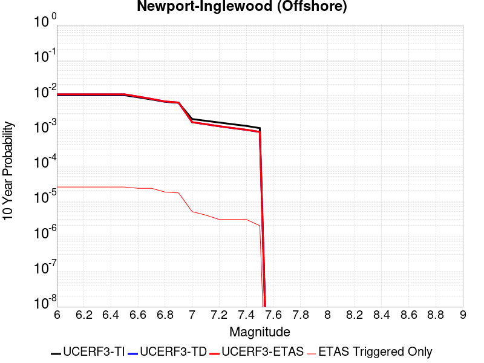 |

| Magnitude | 1 wk TI Prob | 1 wk TD Prob | 1 wk ETAS Prob | 1 wk ETAS/TD Gain | 1 wk ETAS Triggered Only | 1 mo TI Prob | 1 mo TD Prob | 1 mo ETAS Prob | 1 mo ETAS/TD Gain | 1 mo ETAS Triggered Only | 1 yr TI Prob | 1 yr TD Prob | 1 yr ETAS Prob | 1 yr ETAS/TD Gain | 1 yr ETAS Triggered Only | 10 yr TI Prob | 10 yr TD Prob | 10 yr ETAS Prob | 10 yr ETAS/TD Gain | 10 yr ETAS Triggered Only |
|-----|-----|-----|-----|-----|-----|-----|-----|-----|-----|-----|-----|-----|-----|-----|-----|-----|-----|-----|-----|-----|
| 6.0 | 1.9418812E-5 | 2.0497266E-5 | 5.2513686E-5 | 2.5619848 | 3.2017077E-5 | 8.322083E-5 | 8.7843E-5 | 1.1985726E-4 | 1.3644487 | 3.2017077E-5 | 0.0010127426 | 0.0010690573 | 0.0011117011 | 1.0398892 | 4.2689433E-5 | 0.010081396 | 0.010648402 | 0.010711755 | 1.0059495 | 6.403415E-5 |
| 6.1 | 1.9418812E-5 | 2.0497266E-5 | 5.2513686E-5 | 2.5619848 | 3.2017077E-5 | 8.322083E-5 | 8.7843E-5 | 1.1985726E-4 | 1.3644487 | 3.2017077E-5 | 0.0010127426 | 0.0010690573 | 0.0011117011 | 1.0398892 | 4.2689433E-5 | 0.010081396 | 0.010648402 | 0.010711755 | 1.0059495 | 6.403415E-5 |
| 6.2 | 1.9418812E-5 | 2.0497266E-5 | 5.2513686E-5 | 2.5619848 | 3.2017077E-5 | 8.322083E-5 | 8.7843E-5 | 1.1985726E-4 | 1.3644487 | 3.2017077E-5 | 0.0010127426 | 0.0010690573 | 0.0011117011 | 1.0398892 | 4.2689433E-5 | 0.010081396 | 0.010648402 | 0.010711755 | 1.0059495 | 6.403415E-5 |
| 6.3 | 1.9418812E-5 | 2.0497266E-5 | 5.2513686E-5 | 2.5619848 | 3.2017077E-5 | 8.322083E-5 | 8.7843E-5 | 1.1985726E-4 | 1.3644487 | 3.2017077E-5 | 0.0010127426 | 0.0010690573 | 0.0011117011 | 1.0398892 | 4.2689433E-5 | 0.010081396 | 0.010648402 | 0.010711755 | 1.0059495 | 6.403415E-5 |
| 6.4 | 1.9418812E-5 | 2.0497266E-5 | 5.2513686E-5 | 2.5619848 | 3.2017077E-5 | 8.322083E-5 | 8.7843E-5 | 1.1985726E-4 | 1.3644487 | 3.2017077E-5 | 0.0010127426 | 0.0010690573 | 0.0011117011 | 1.0398892 | 4.2689433E-5 | 0.010081396 | 0.010648402 | 0.010711755 | 1.0059495 | 6.403415E-5 |
| 6.5 | 1.9418812E-5 | 2.0497266E-5 | 5.2513686E-5 | 2.5619848 | 3.2017077E-5 | 8.322083E-5 | 8.7843E-5 | 1.1985726E-4 | 1.3644487 | 3.2017077E-5 | 0.0010127426 | 0.0010690573 | 0.0011117011 | 1.0398892 | 4.2689433E-5 | 0.010081396 | 0.010648402 | 0.010711755 | 1.0059495 | 6.403415E-5 |
| 6.6 | 1.6939659E-5 | 1.7683546E-5 | 4.9700055E-5 | 2.8105254 | 3.2017077E-5 | 7.259652E-5 | 7.578494E-5 | 1.0779959E-4 | 1.4224408 | 3.2017077E-5 | 8.8350417E-4 | 9.2238374E-4 | 9.650338E-4 | 1.0462389 | 4.2689433E-5 | 0.008799998 | 0.00919468 | 0.009258125 | 1.0069002 | 6.403415E-5 |
| 6.7 | 1.4691289E-5 | 1.5149292E-5 | 4.7165882E-5 | 3.113405 | 3.2017077E-5 | 6.2961146E-5 | 6.492444E-5 | 9.693943E-5 | 1.4931116 | 3.2017077E-5 | 7.662824E-4 | 7.9025986E-4 | 8.3291554E-4 | 1.0539768 | 4.2689433E-5 | 0.007636454 | 0.007883489 | 0.007947019 | 1.0080585 | 6.403415E-5 |
| 6.8 | 1.26037085E-5 | 1.2822538E-5 | 4.4839202E-5 | 3.4969056 | 3.2017077E-5 | 5.4014774E-5 | 5.4953085E-5 | 8.69684E-5 | 1.5825936 | 3.2017077E-5 | 6.5743143E-4 | 6.689387E-4 | 7.009343E-4 | 1.0478305 | 3.2017077E-5 | 0.006554899 | 0.0066781086 | 0.006731114 | 1.0079372 | 5.3361793E-5 |
| 6.9 | 1.1764378E-5 | 1.1934175E-5 | 4.395087E-5 | 3.682774 | 3.2017077E-5 | 5.0417784E-5 | 5.114597E-5 | 8.316141E-5 | 1.6259621 | 3.2017077E-5 | 6.1366364E-4 | 6.226143E-4 | 6.5461145E-4 | 1.0513916 | 3.2017077E-5 | 0.006119718 | 0.006217534 | 0.0062599583 | 1.0068233 | 4.2689433E-5 |
| 7.0 | 4.071841E-6 | 3.3071306E-6 | 1.3979454E-5 | 4.2270646 | 1.0672358E-5 | 1.745063E-5 | 1.4173362E-5 | 2.4845569E-5 | 1.7529764 | 1.0672358E-5 | 2.124407E-4 | 1.7255088E-4 | 1.832214E-4 | 1.0618398 | 1.0672358E-5 | 0.0021223773 | 0.0017245489 | 0.0017352029 | 1.0061778 | 1.0672358E-5 |
| 7.1 | 3.6344509E-6 | 2.9049047E-6 | 1.35772325E-5 | 4.673899 | 1.0672358E-5 | 1.5576124E-5 | 1.2449554E-5 | 2.312178E-5 | 1.8572376 | 1.0672358E-5 | 1.8962282E-4 | 1.5156664E-4 | 1.6223738E-4 | 1.070403 | 1.0672358E-5 | 0.0018946109 | 0.0015150115 | 0.0015256677 | 1.0070337 | 1.0672358E-5 |
| 7.2 | 3.2446756E-6 | 2.5395498E-6 | 1.3211881E-5 | 5.2024503 | 1.0672358E-5 | 1.3905678E-5 | 1.0883761E-5 | 2.1556003E-5 | 1.9805657 | 1.0672358E-5 | 1.6928847E-4 | 1.325056E-4 | 1.4317654E-4 | 1.0805321 | 1.0672358E-5 | 0.0016915957 | 0.0013246438 | 0.0013353021 | 1.0080462 | 1.0672358E-5 |
| 7.3 | 2.898987E-6 | 2.2514312E-6 | 1.2923766E-5 | 5.7402444 | 1.0672358E-5 | 1.24241715E-5 | 9.648977E-6 | 2.0321233E-5 | 2.1060505 | 1.0672358E-5 | 1.5125379E-4 | 1.1747381E-4 | 1.2814492E-4 | 1.0908382 | 1.0672358E-5 | 0.0015115088 | 0.0011744945 | 0.0011851544 | 1.0090761 | 1.0672358E-5 |
| 7.4 | 2.5994284E-6 | 2.0116724E-6 | 1.268401E-5 | 6.3052063 | 1.0672358E-5 | 1.114036E-5 | 8.621447E-6 | 1.9293713E-5 | 2.2378743 | 1.0672358E-5 | 1.3562544E-4 | 1.049649E-4 | 1.1563614E-4 | 1.1016648 | 1.0672358E-5 | 0.0013554269 | 0.00104953 | 0.0010601912 | 1.0101581 | 1.0672358E-5 |
| 7.5 | 2.2517988E-6 | 1.7516537E-6 | 1.2423993E-5 | 7.0927224 | 1.0672358E-5 | 9.650531E-6 | 7.5070875E-6 | 1.8179366E-5 | 2.421627 | 1.0672358E-5 | 1.17488875E-4 | 9.139879E-5 | 1.02070175E-4 | 1.1167563 | 1.0672358E-5 | 0.0011742678 | 9.1398787E-4 | 9.2465046E-4 | 1.011666 | 1.0672358E-5 |

## Calico-Hidalgo
*[(top)](#table-of-contents)*

| 1 Week | 1 Month | 1 Year | 10 Year |
|-----|-----|-----|-----|
|  |  |  |  |

| Magnitude | 1 wk TI Prob | 1 wk TD Prob | 1 wk ETAS Prob | 1 wk ETAS/TD Gain | 1 wk ETAS Triggered Only | 1 mo TI Prob | 1 mo TD Prob | 1 mo ETAS Prob | 1 mo ETAS/TD Gain | 1 mo ETAS Triggered Only | 1 yr TI Prob | 1 yr TD Prob | 1 yr ETAS Prob | 1 yr ETAS/TD Gain | 1 yr ETAS Triggered Only | 10 yr TI Prob | 10 yr TD Prob | 10 yr ETAS Prob | 10 yr ETAS/TD Gain | 10 yr ETAS Triggered Only |
|-----|-----|-----|-----|-----|-----|-----|-----|-----|-----|-----|-----|-----|-----|-----|-----|-----|-----|-----|-----|-----|
| 6.0 | 2.0989894E-5 | 2.9615694E-5 | 5.0959778E-5 | 1.7207018 | 2.1344717E-5 | 8.995359E-5 | 1.269188E-4 | 1.4826082E-4 | 1.1681548 | 2.1344717E-5 | 0.0010946346 | 0.0015442439 | 0.0015868674 | 1.0276016 | 4.2689433E-5 | 0.010892583 | 0.015345532 | 0.015398076 | 1.0034239 | 5.3361793E-5 |
| 6.1 | 2.0989894E-5 | 2.9615694E-5 | 5.0959778E-5 | 1.7207018 | 2.1344717E-5 | 8.995359E-5 | 1.269188E-4 | 1.4826082E-4 | 1.1681548 | 2.1344717E-5 | 0.0010946346 | 0.0015442439 | 0.0015868674 | 1.0276016 | 4.2689433E-5 | 0.010892583 | 0.015345532 | 0.015398076 | 1.0034239 | 5.3361793E-5 |
| 6.2 | 2.0989894E-5 | 2.9615694E-5 | 5.0959778E-5 | 1.7207018 | 2.1344717E-5 | 8.995359E-5 | 1.269188E-4 | 1.4826082E-4 | 1.1681548 | 2.1344717E-5 | 0.0010946346 | 0.0015442439 | 0.0015868674 | 1.0276016 | 4.2689433E-5 | 0.010892583 | 0.015345532 | 0.015398076 | 1.0034239 | 5.3361793E-5 |
| 6.3 | 2.0989894E-5 | 2.9615694E-5 | 5.0959778E-5 | 1.7207018 | 2.1344717E-5 | 8.995359E-5 | 1.269188E-4 | 1.4826082E-4 | 1.1681548 | 2.1344717E-5 | 0.0010946346 | 0.0015442439 | 0.0015868674 | 1.0276016 | 4.2689433E-5 | 0.010892583 | 0.015345532 | 0.015398076 | 1.0034239 | 5.3361793E-5 |
| 6.4 | 2.0989894E-5 | 2.9615694E-5 | 5.0959778E-5 | 1.7207018 | 2.1344717E-5 | 8.995359E-5 | 1.269188E-4 | 1.4826082E-4 | 1.1681548 | 2.1344717E-5 | 0.0010946346 | 0.0015442439 | 0.0015868674 | 1.0276016 | 4.2689433E-5 | 0.010892583 | 0.015345532 | 0.015398076 | 1.0034239 | 5.3361793E-5 |
| 6.5 | 2.0989894E-5 | 2.9615694E-5 | 5.0959778E-5 | 1.7207018 | 2.1344717E-5 | 8.995359E-5 | 1.269188E-4 | 1.4826082E-4 | 1.1681548 | 2.1344717E-5 | 0.0010946346 | 0.0015442439 | 0.0015868674 | 1.0276016 | 4.2689433E-5 | 0.010892583 | 0.015345532 | 0.015398076 | 1.0034239 | 5.3361793E-5 |
| 6.6 | 1.929251E-5 | 2.7260403E-5 | 4.860454E-5 | 1.7829721 | 2.1344717E-5 | 8.2679566E-5 | 1.1682564E-4 | 1.3816787E-4 | 1.1826844 | 2.1344717E-5 | 0.0010061589 | 0.0014215263 | 0.0014641552 | 1.029988 | 4.2689433E-5 | 0.0100161545 | 0.0141346 | 0.014176686 | 1.0029775 | 4.2689433E-5 |
| 6.7 | 1.699933E-5 | 2.4101535E-5 | 4.544574E-5 | 1.8855951 | 2.1344717E-5 | 7.2852235E-5 | 1.03288774E-4 | 1.2463129E-4 | 1.2066295 | 2.1344717E-5 | 8.86615E-4 | 0.0012569166 | 0.0012995524 | 1.0339209 | 4.2689433E-5 | 0.00883086 | 0.012508152 | 0.012550307 | 1.0033703 | 4.2689433E-5 |
| 6.8 | 1.4895645E-5 | 2.0902306E-5 | 3.157444E-5 | 1.5105722 | 1.0672358E-5 | 6.383692E-5 | 8.9578796E-5 | 1.00250196E-4 | 1.1191287 | 1.0672358E-5 | 7.769373E-4 | 0.001090176 | 0.0011114975 | 1.0195578 | 2.1344717E-5 | 0.0077422657 | 0.010858163 | 0.010879276 | 1.0019444 | 2.1344717E-5 |
| 6.9 | 1.3209459E-5 | 1.8371871E-5 | 2.9044035E-5 | 1.5808969 | 1.0672358E-5 | 5.6610737E-5 | 7.8734774E-5 | 8.940629E-5 | 1.1355375 | 1.0672358E-5 | 6.8901776E-4 | 9.5827354E-4 | 9.795978E-4 | 1.0222528 | 2.1344717E-5 | 0.0068688532 | 0.009551193 | 0.009572334 | 1.0022135 | 2.1344717E-5 |
| 7.0 | 1.1401334E-5 | 1.5655183E-5 | 2.6327374E-5 | 1.6817034 | 1.0672358E-5 | 4.8861944E-5 | 6.709247E-5 | 7.776411E-5 | 1.1590587 | 1.0672358E-5 | 5.9473177E-4 | 8.166432E-4 | 8.3797047E-4 | 1.0261158 | 2.1344717E-5 | 0.0059314263 | 0.008146102 | 0.008167272 | 1.0025989 | 2.1344717E-5 |
| 7.1 | 1.0049503E-5 | 1.3644847E-5 | 2.431706E-5 | 1.7821424 | 1.0672358E-5 | 4.3068587E-5 | 5.847716E-5 | 6.91489E-5 | 1.182494 | 1.0672358E-5 | 5.2423385E-4 | 7.118249E-4 | 7.2248967E-4 | 1.0149822 | 1.0672358E-5 | 0.005229989 | 0.007105075 | 0.0071156714 | 1.0014914 | 1.0672358E-5 |
| 7.2 | 8.817072E-6 | 1.1833239E-5 | 1.1833239E-5 | 1.0 | 0.0 | 3.7786904E-5 | 5.0713446E-5 | 5.0713446E-5 | 1.0 | 0.0 | 4.5995842E-4 | 6.1735895E-4 | 6.1735895E-4 | 1.0 | 0.0 | 0.004590076 | 0.006166015 | 0.006166015 | 1.0 | 0.0 |
| 7.3 | 7.683954E-6 | 1.0189235E-5 | 1.0189235E-5 | 1.0 | 0.0 | 3.2930817E-5 | 4.3667966E-5 | 4.3667966E-5 | 1.0 | 0.0 | 4.008589E-4 | 5.316249E-4 | 5.316249E-4 | 1.0 | 0.0 | 0.004001366 | 0.00531305 | 0.00531305 | 1.0 | 0.0 |
| 7.4 | 6.633441E-6 | 8.756893E-6 | 8.756893E-6 | 1.0 | 0.0 | 2.8428722E-5 | 3.7529542E-5 | 3.7529542E-5 | 1.0 | 0.0 | 3.460647E-4 | 4.5692216E-4 | 4.5692216E-4 | 1.0 | 0.0 | 0.0034552629 | 0.0045692218 | 0.0045692218 | 1.0 | 0.0 |

## Calaveras (Central) 2011 CFM
*[(top)](#table-of-contents)*

| 1 Week | 1 Month | 1 Year | 10 Year |
|-----|-----|-----|-----|
|  |  |  |  |

| Magnitude | 1 wk TI Prob | 1 wk TD Prob | 1 wk ETAS Prob | 1 wk ETAS/TD Gain | 1 wk ETAS Triggered Only | 1 mo TI Prob | 1 mo TD Prob | 1 mo ETAS Prob | 1 mo ETAS/TD Gain | 1 mo ETAS Triggered Only | 1 yr TI Prob | 1 yr TD Prob | 1 yr ETAS Prob | 1 yr ETAS/TD Gain | 1 yr ETAS Triggered Only | 10 yr TI Prob | 10 yr TD Prob | 10 yr ETAS Prob | 10 yr ETAS/TD Gain | 10 yr ETAS Triggered Only |
|-----|-----|-----|-----|-----|-----|-----|-----|-----|-----|-----|-----|-----|-----|-----|-----|-----|-----|-----|-----|-----|
| 6.0 | 2.6808938E-4 | 5.8386003E-4 | 6.265245E-4 | 1.0730731 | 4.2689433E-5 | 0.0011484486 | 0.0025008651 | 0.0025434478 | 1.0170271 | 4.2689433E-5 | 0.013892986 | 0.030145591 | 0.030186994 | 1.0013734 | 4.2689433E-5 | 0.13055827 | 0.25237754 | 0.25241745 | 1.0001581 | 5.3361793E-5 |
| 6.1 | 2.6808938E-4 | 5.8386003E-4 | 6.265245E-4 | 1.0730731 | 4.2689433E-5 | 0.0011484486 | 0.0025008651 | 0.0025434478 | 1.0170271 | 4.2689433E-5 | 0.013892986 | 0.030145591 | 0.030186994 | 1.0013734 | 4.2689433E-5 | 0.13055827 | 0.25237754 | 0.25241745 | 1.0001581 | 5.3361793E-5 |
| 6.2 | 2.6808938E-4 | 5.8386003E-4 | 6.265245E-4 | 1.0730731 | 4.2689433E-5 | 0.0011484486 | 0.0025008651 | 0.0025434478 | 1.0170271 | 4.2689433E-5 | 0.013892986 | 0.030145591 | 0.030186994 | 1.0013734 | 4.2689433E-5 | 0.13055827 | 0.25237754 | 0.25241745 | 1.0001581 | 5.3361793E-5 |
| 6.3 | 2.6808938E-4 | 5.8386003E-4 | 6.265245E-4 | 1.0730731 | 4.2689433E-5 | 0.0011484486 | 0.0025008651 | 0.0025434478 | 1.0170271 | 4.2689433E-5 | 0.013892986 | 0.030145591 | 0.030186994 | 1.0013734 | 4.2689433E-5 | 0.13055827 | 0.25237754 | 0.25241745 | 1.0001581 | 5.3361793E-5 |
| 6.4 | 1.1043065E-4 | 2.3596571E-4 | 2.6797524E-4 | 1.1356533 | 3.2017077E-5 | 4.7318838E-4 | 0.0010110455 | 0.0010430302 | 1.0316353 | 3.2017077E-5 | 0.0057458607 | 0.0122675765 | 0.0122992005 | 1.0025779 | 3.2017077E-5 | 0.055995476 | 0.1116302 | 0.111668125 | 1.0003397 | 4.2689433E-5 |
| 6.5 | 4.6058474E-5 | 1.0043265E-4 | 1.1110394E-4 | 1.1062531 | 1.0672358E-5 | 1.9737853E-4 | 4.3038116E-4 | 4.4104893E-4 | 1.0247868 | 1.0672358E-5 | 0.002400435 | 0.0052319476 | 0.0052425642 | 1.0020292 | 1.0672358E-5 | 0.023746708 | 0.04974921 | 0.04976949 | 1.0004077 | 2.1344717E-5 |
| 6.6 | 4.0714523E-5 | 8.96959E-5 | 1.003673E-4 | 1.1189731 | 1.0672358E-5 | 1.7447914E-4 | 3.8438084E-4 | 3.950491E-4 | 1.0277544 | 1.0672358E-5 | 0.0021222138 | 0.004674486 | 0.004685108 | 1.0022725 | 1.0672358E-5 | 0.02102061 | 0.04470526 | 0.044725653 | 1.0004561 | 2.1344717E-5 |
| 6.7 | 3.6925157E-5 | 8.2311366E-5 | 9.298285E-5 | 1.1296477 | 1.0672358E-5 | 1.5824108E-4 | 3.527417E-4 | 3.634103E-4 | 1.0302448 | 1.0672358E-5 | 0.0019248825 | 0.0042908536 | 0.00430148 | 1.0024766 | 1.0672358E-5 | 0.019082947 | 0.041160695 | 0.041181162 | 1.0004972 | 2.1344717E-5 |
| 6.8 | 3.241399E-5 | 7.175236E-5 | 8.242395E-5 | 1.1487281 | 1.0672358E-5 | 1.389097E-4 | 3.075001E-4 | 3.181692E-4 | 1.0346962 | 1.0672358E-5 | 0.0016899136 | 0.0037420401 | 0.0037526726 | 1.0028414 | 1.0672358E-5 | 0.016771203 | 0.036092106 | 0.03611268 | 1.00057 | 2.1344717E-5 |
| 6.9 | 2.7363296E-5 | 6.059934E-5 | 6.059934E-5 | 1.0 | 0.0 | 1.1726599E-4 | 2.5971147E-4 | 2.5971147E-4 | 1.0 | 0.0 | 0.0014267784 | 0.003161987 | 0.003161987 | 1.0 | 0.0 | 0.014176525 | 0.030637112 | 0.030647457 | 1.0003377 | 1.0672358E-5 |

## Pinto Mtn
*[(top)](#table-of-contents)*

| 1 Week | 1 Month | 1 Year | 10 Year |
|-----|-----|-----|-----|
|  |  |  | 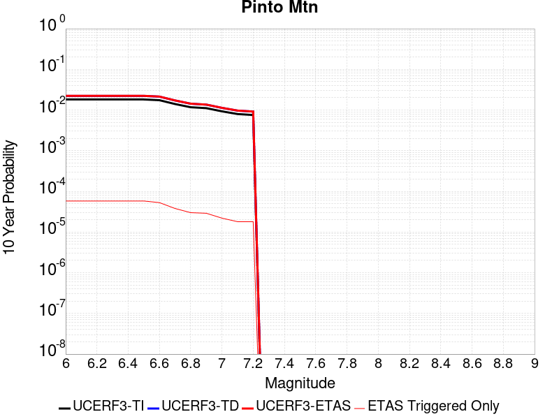 |

| Magnitude | 1 wk TI Prob | 1 wk TD Prob | 1 wk ETAS Prob | 1 wk ETAS/TD Gain | 1 wk ETAS Triggered Only | 1 mo TI Prob | 1 mo TD Prob | 1 mo ETAS Prob | 1 mo ETAS/TD Gain | 1 mo ETAS Triggered Only | 1 yr TI Prob | 1 yr TD Prob | 1 yr ETAS Prob | 1 yr ETAS/TD Gain | 1 yr ETAS Triggered Only | 10 yr TI Prob | 10 yr TD Prob | 10 yr ETAS Prob | 10 yr ETAS/TD Gain | 10 yr ETAS Triggered Only |
|-----|-----|-----|-----|-----|-----|-----|-----|-----|-----|-----|-----|-----|-----|-----|-----|-----|-----|-----|-----|-----|
| 6.0 | 3.51701E-5 | 4.3047E-5 | 7.50627E-5 | 1.7437382 | 3.2017077E-5 | 1.5072028E-4 | 1.844764E-4 | 2.1648758E-4 | 1.1735245 | 3.2017077E-5 | 0.0018334748 | 0.0022440937 | 0.0022973355 | 1.0237254 | 5.3361793E-5 | 0.018184211 | 0.022254989 | 0.022307163 | 1.0023444 | 5.3361793E-5 |
| 6.1 | 3.51701E-5 | 4.3047E-5 | 7.50627E-5 | 1.7437382 | 3.2017077E-5 | 1.5072028E-4 | 1.844764E-4 | 2.1648758E-4 | 1.1735245 | 3.2017077E-5 | 0.0018334748 | 0.0022440937 | 0.0022973355 | 1.0237254 | 5.3361793E-5 | 0.018184211 | 0.022254989 | 0.022307163 | 1.0023444 | 5.3361793E-5 |
| 6.2 | 3.51701E-5 | 4.3047E-5 | 7.50627E-5 | 1.7437382 | 3.2017077E-5 | 1.5072028E-4 | 1.844764E-4 | 2.1648758E-4 | 1.1735245 | 3.2017077E-5 | 0.0018334748 | 0.0022440937 | 0.0022973355 | 1.0237254 | 5.3361793E-5 | 0.018184211 | 0.022254989 | 0.022307163 | 1.0023444 | 5.3361793E-5 |
| 6.3 | 3.51701E-5 | 4.3047E-5 | 7.50627E-5 | 1.7437382 | 3.2017077E-5 | 1.5072028E-4 | 1.844764E-4 | 2.1648758E-4 | 1.1735245 | 3.2017077E-5 | 0.0018334748 | 0.0022440937 | 0.0022973355 | 1.0237254 | 5.3361793E-5 | 0.018184211 | 0.022254989 | 0.022307163 | 1.0023444 | 5.3361793E-5 |
| 6.4 | 3.51701E-5 | 4.3047E-5 | 7.50627E-5 | 1.7437382 | 3.2017077E-5 | 1.5072028E-4 | 1.844764E-4 | 2.1648758E-4 | 1.1735245 | 3.2017077E-5 | 0.0018334748 | 0.0022440937 | 0.0022973355 | 1.0237254 | 5.3361793E-5 | 0.018184211 | 0.022254989 | 0.022307163 | 1.0023444 | 5.3361793E-5 |
| 6.5 | 3.51701E-5 | 4.3047E-5 | 7.50627E-5 | 1.7437382 | 3.2017077E-5 | 1.5072028E-4 | 1.844764E-4 | 2.1648758E-4 | 1.1735245 | 3.2017077E-5 | 0.0018334748 | 0.0022440937 | 0.0022973355 | 1.0237254 | 5.3361793E-5 | 0.018184211 | 0.022254989 | 0.022307163 | 1.0023444 | 5.3361793E-5 |
| 6.6 | 3.3749162E-5 | 4.1291092E-5 | 7.3306845E-5 | 1.775367 | 3.2017077E-5 | 1.4463125E-4 | 1.7695212E-4 | 2.0896354E-4 | 1.1809044 | 3.2017077E-5 | 0.0017594631 | 0.0021526704 | 0.002195268 | 1.0197883 | 4.2689433E-5 | 0.017455976 | 0.021358717 | 0.021400495 | 1.001956 | 4.2689433E-5 |
| 6.7 | 2.7121987E-5 | 3.3122094E-5 | 5.4466105E-5 | 1.6444039 | 2.1344717E-5 | 1.162319E-4 | 1.4194637E-4 | 1.6328806E-4 | 1.1503503 | 2.1344717E-5 | 0.0014142047 | 0.0017272272 | 0.0017485351 | 1.0123365 | 2.1344717E-5 | 0.014052387 | 0.01717749 | 0.017198468 | 1.0012213 | 2.1344717E-5 |
| 6.8 | 2.2587206E-5 | 2.7508535E-5 | 4.8852664E-5 | 1.7759094 | 2.1344717E-5 | 9.679872E-5 | 1.1789061E-4 | 1.3923281E-4 | 1.181034 | 2.1344717E-5 | 0.0011778872 | 0.001434766 | 0.0014560801 | 1.0148555 | 2.1344717E-5 | 0.011716634 | 0.014293642 | 0.014314681 | 1.001472 | 2.1344717E-5 |
| 6.9 | 2.1440546E-5 | 2.6093185E-5 | 4.7437345E-5 | 1.8179976 | 2.1344717E-5 | 9.1884816E-5 | 1.1182535E-4 | 1.3316768E-4 | 1.1908541 | 2.1344717E-5 | 0.0011181235 | 0.0013610155 | 0.0013823311 | 1.0156616 | 2.1344717E-5 | 0.011125144 | 0.013565313 | 0.013586368 | 1.0015521 | 2.1344717E-5 |
| 7.0 | 1.7893128E-5 | 2.1693293E-5 | 3.236542E-5 | 1.4919552 | 1.0672358E-5 | 7.6682576E-5 | 9.2970135E-5 | 1.036415E-4 | 1.1147827 | 1.0672358E-5 | 9.332105E-4 | 0.001131712 | 0.0011423724 | 1.0094196 | 1.0672358E-5 | 0.009293012 | 0.011297592 | 0.011308144 | 1.000934 | 1.0672358E-5 |
| 7.1 | 1.5338705E-5 | 1.854412E-5 | 2.921628E-5 | 1.5755011 | 1.0672358E-5 | 6.573565E-5 | 7.947455E-5 | 9.014606E-5 | 1.1342758 | 1.0672358E-5 | 8.0003764E-4 | 9.675582E-4 | 9.782203E-4 | 1.0110195 | 1.0672358E-5 | 0.007971635 | 0.009671222 | 0.009681792 | 1.0010928 | 1.0672358E-5 |
| 7.2 | 1.4525263E-5 | 1.7549126E-5 | 2.8221297E-5 | 1.6081312 | 1.0672358E-5 | 6.2249645E-5 | 7.521054E-5 | 8.588209E-5 | 1.1418891 | 1.0672358E-5 | 7.5762585E-4 | 9.1568835E-4 | 9.263509E-4 | 1.0116444 | 1.0672358E-5 | 0.007550481 | 0.009156883 | 0.009167458 | 1.0011548 | 1.0672358E-5 |

## San Jacinto (Clark) rev
*[(top)](#table-of-contents)*

| 1 Week | 1 Month | 1 Year | 10 Year |
|-----|-----|-----|-----|
|  |  |  |  |

| Magnitude | 1 wk TI Prob | 1 wk TD Prob | 1 wk ETAS Prob | 1 wk ETAS/TD Gain | 1 wk ETAS Triggered Only | 1 mo TI Prob | 1 mo TD Prob | 1 mo ETAS Prob | 1 mo ETAS/TD Gain | 1 mo ETAS Triggered Only | 1 yr TI Prob | 1 yr TD Prob | 1 yr ETAS Prob | 1 yr ETAS/TD Gain | 1 yr ETAS Triggered Only | 10 yr TI Prob | 10 yr TD Prob | 10 yr ETAS Prob | 10 yr ETAS/TD Gain | 10 yr ETAS Triggered Only |
|-----|-----|-----|-----|-----|-----|-----|-----|-----|-----|-----|-----|-----|-----|-----|-----|-----|-----|-----|-----|-----|
| 6.0 | 6.1857165E-5 | 9.865906E-5 | 1.2000167E-4 | 1.216327 | 2.1344717E-5 | 2.650752E-4 | 4.227864E-4 | 4.441221E-4 | 1.0504645 | 2.1344717E-5 | 0.0032225149 | 0.0051406594 | 0.0051618945 | 1.0041308 | 2.1344717E-5 | 0.031761836 | 0.05230213 | 0.0523527 | 1.0009669 | 5.3361793E-5 |
| 6.1 | 6.1857165E-5 | 9.865906E-5 | 1.2000167E-4 | 1.216327 | 2.1344717E-5 | 2.650752E-4 | 4.227864E-4 | 4.441221E-4 | 1.0504645 | 2.1344717E-5 | 0.0032225149 | 0.0051406594 | 0.0051618945 | 1.0041308 | 2.1344717E-5 | 0.031761836 | 0.05230213 | 0.0523527 | 1.0009669 | 5.3361793E-5 |
| 6.2 | 6.1857165E-5 | 9.865906E-5 | 1.2000167E-4 | 1.216327 | 2.1344717E-5 | 2.650752E-4 | 4.227864E-4 | 4.441221E-4 | 1.0504645 | 2.1344717E-5 | 0.0032225149 | 0.0051406594 | 0.0051618945 | 1.0041308 | 2.1344717E-5 | 0.031761836 | 0.05230213 | 0.0523527 | 1.0009669 | 5.3361793E-5 |
| 6.3 | 6.1857165E-5 | 9.865906E-5 | 1.2000167E-4 | 1.216327 | 2.1344717E-5 | 2.650752E-4 | 4.227864E-4 | 4.441221E-4 | 1.0504645 | 2.1344717E-5 | 0.0032225149 | 0.0051406594 | 0.0051618945 | 1.0041308 | 2.1344717E-5 | 0.031761836 | 0.05230213 | 0.0523527 | 1.0009669 | 5.3361793E-5 |
| 6.4 | 6.1857165E-5 | 9.865906E-5 | 1.2000167E-4 | 1.216327 | 2.1344717E-5 | 2.650752E-4 | 4.227864E-4 | 4.441221E-4 | 1.0504645 | 2.1344717E-5 | 0.0032225149 | 0.0051406594 | 0.0051618945 | 1.0041308 | 2.1344717E-5 | 0.031761836 | 0.05230213 | 0.0523527 | 1.0009669 | 5.3361793E-5 |
| 6.5 | 6.1857165E-5 | 9.865906E-5 | 1.2000167E-4 | 1.216327 | 2.1344717E-5 | 2.650752E-4 | 4.227864E-4 | 4.441221E-4 | 1.0504645 | 2.1344717E-5 | 0.0032225149 | 0.0051406594 | 0.0051618945 | 1.0041308 | 2.1344717E-5 | 0.031761836 | 0.05230213 | 0.0523527 | 1.0009669 | 5.3361793E-5 |
| 6.6 | 6.1629326E-5 | 9.831641E-5 | 1.1965903E-4 | 1.217081 | 2.1344717E-5 | 2.6409896E-4 | 4.2131837E-4 | 4.426541E-4 | 1.0506403 | 2.1344717E-5 | 0.0032106643 | 0.00512287 | 0.0051441058 | 1.0041453 | 2.1344717E-5 | 0.031646714 | 0.052133482 | 0.05218406 | 1.0009702 | 5.3361793E-5 |
| 6.7 | 6.116108E-5 | 9.7617616E-5 | 1.1896025E-4 | 1.2186351 | 2.1344717E-5 | 2.6209257E-4 | 4.183245E-4 | 4.3966027E-4 | 1.051003 | 2.1344717E-5 | 0.0031863083 | 0.0050865905 | 0.0051078266 | 1.004175 | 2.1344717E-5 | 0.031410076 | 0.051788114 | 0.05183871 | 1.000977 | 5.3361793E-5 |
| 6.8 | 6.110044E-5 | 9.753308E-5 | 1.18875716E-4 | 1.2188246 | 2.1344717E-5 | 2.6183276E-4 | 4.1796232E-4 | 4.3929814E-4 | 1.0510472 | 2.1344717E-5 | 0.0031831542 | 0.0050822017 | 0.005103438 | 1.0041785 | 2.1344717E-5 | 0.03137943 | 0.051745888 | 0.05179649 | 1.0009779 | 5.3361793E-5 |
| 6.9 | 6.0730574E-5 | 9.694897E-5 | 1.1829162E-4 | 1.2201431 | 2.1344717E-5 | 2.6024794E-4 | 4.154598E-4 | 4.3679564E-4 | 1.0513548 | 2.1344717E-5 | 0.0031639151 | 0.005051875 | 0.005073112 | 1.0042038 | 2.1344717E-5 | 0.031192465 | 0.051456194 | 0.05150681 | 1.0009837 | 5.3361793E-5 |
| 7.0 | 6.0346E-5 | 9.636309E-5 | 1.1770575E-4 | 1.2214817 | 2.1344717E-5 | 2.5860008E-4 | 4.1294965E-4 | 4.3428555E-4 | 1.0516671 | 2.1344717E-5 | 0.0031439106 | 0.005021455 | 0.0050426926 | 1.0042293 | 2.1344717E-5 | 0.030998027 | 0.051163334 | 0.051213965 | 1.0009896 | 5.3361793E-5 |
| 7.1 | 5.9163158E-5 | 9.465252E-5 | 1.15995215E-4 | 1.2254847 | 2.1344717E-5 | 2.5353173E-4 | 4.0562096E-4 | 4.26957E-4 | 1.052601 | 2.1344717E-5 | 0.0030823802 | 0.0049326345 | 0.004953874 | 1.004306 | 2.1344717E-5 | 0.030399747 | 0.050306328 | 0.050357003 | 1.0010073 | 5.3361793E-5 |
| 7.2 | 5.863685E-5 | 9.390979E-5 | 1.152525E-4 | 1.2272682 | 2.1344717E-5 | 2.512766E-4 | 4.0243877E-4 | 4.237749E-4 | 1.053017 | 2.1344717E-5 | 0.0030550007 | 0.004894066 | 0.0049153063 | 1.00434 | 2.1344717E-5 | 0.030133424 | 0.04993242 | 0.049983114 | 1.0010153 | 5.3361793E-5 |
| 7.3 | 5.8209655E-5 | 9.342446E-5 | 1.1476719E-4 | 1.228449 | 2.1344717E-5 | 2.4944608E-4 | 4.0035948E-4 | 4.2169564E-4 | 1.0532925 | 2.1344717E-5 | 0.0030327768 | 0.004868864 | 0.0048901048 | 1.0043626 | 2.1344717E-5 | 0.0299172 | 0.049677737 | 0.04972845 | 1.0010208 | 5.3361793E-5 |
| 7.4 | 5.7813933E-5 | 9.282713E-5 | 1.14169874E-4 | 1.2299192 | 2.1344717E-5 | 2.4775046E-4 | 3.978003E-4 | 4.1913652E-4 | 1.0536355 | 2.1344717E-5 | 0.0030121899 | 0.0048378445 | 0.004859086 | 1.0043907 | 2.1344717E-5 | 0.029716864 | 0.049371965 | 0.049422693 | 1.0010275 | 5.3361793E-5 |
| 7.5 | 5.731269E-5 | 9.1954265E-5 | 1.1329702E-4 | 1.2321018 | 2.1344717E-5 | 2.4560269E-4 | 3.9406057E-4 | 4.1539688E-4 | 1.0541447 | 2.1344717E-5 | 0.0029861126 | 0.0047925147 | 0.004813757 | 1.0044324 | 2.1344717E-5 | 0.029463045 | 0.04892991 | 0.04898066 | 1.0010372 | 5.3361793E-5 |
| 7.6 | 1.8838993E-5 | 2.7586504E-5 | 3.8258568E-5 | 1.3868581 | 1.0672358E-5 | 8.073604E-5 | 1.1822497E-4 | 1.2889606E-4 | 1.090261 | 1.0672358E-5 | 9.82518E-4 | 0.001438873 | 0.00144953 | 1.0074065 | 1.0672358E-5 | 0.009781853 | 0.015056286 | 0.015087821 | 1.0020945 | 3.2017077E-5 |
| 7.7 | 1.2895799E-5 | 1.7139906E-5 | 1.7139906E-5 | 1.0 | 0.0 | 5.526654E-5 | 7.3456744E-5 | 7.3456744E-5 | 1.0 | 0.0 | 6.726624E-4 | 8.943358E-4 | 8.943358E-4 | 1.0 | 0.0 | 0.006706299 | 0.009567577 | 0.0095887175 | 1.0022095 | 2.1344717E-5 |

## Imperial
*[(top)](#table-of-contents)*

| 1 Week | 1 Month | 1 Year | 10 Year |
|-----|-----|-----|-----|
|  |  |  |  |

| Magnitude | 1 wk TI Prob | 1 wk TD Prob | 1 wk ETAS Prob | 1 wk ETAS/TD Gain | 1 wk ETAS Triggered Only | 1 mo TI Prob | 1 mo TD Prob | 1 mo ETAS Prob | 1 mo ETAS/TD Gain | 1 mo ETAS Triggered Only | 1 yr TI Prob | 1 yr TD Prob | 1 yr ETAS Prob | 1 yr ETAS/TD Gain | 1 yr ETAS Triggered Only | 10 yr TI Prob | 10 yr TD Prob | 10 yr ETAS Prob | 10 yr ETAS/TD Gain | 10 yr ETAS Triggered Only |
|-----|-----|-----|-----|-----|-----|-----|-----|-----|-----|-----|-----|-----|-----|-----|-----|-----|-----|-----|-----|-----|
| 6.0 | 3.2610117E-4 | 4.2223663E-4 | 4.4357235E-4 | 1.0505302 | 2.1344717E-5 | 0.001396828 | 0.0018087402 | 0.0018300463 | 1.0117795 | 2.1344717E-5 | 0.016874276 | 0.0221874 | 0.022218708 | 1.001411 | 3.2017077E-5 | 0.1564893 | 0.21658373 | 0.21661717 | 1.0001544 | 4.2689433E-5 |
| 6.1 | 3.2610117E-4 | 4.2223663E-4 | 4.4357235E-4 | 1.0505302 | 2.1344717E-5 | 0.001396828 | 0.0018087402 | 0.0018300463 | 1.0117795 | 2.1344717E-5 | 0.016874276 | 0.0221874 | 0.022218708 | 1.001411 | 3.2017077E-5 | 0.1564893 | 0.21658373 | 0.21661717 | 1.0001544 | 4.2689433E-5 |
| 6.2 | 3.2610117E-4 | 4.2223663E-4 | 4.4357235E-4 | 1.0505302 | 2.1344717E-5 | 0.001396828 | 0.0018087402 | 0.0018300463 | 1.0117795 | 2.1344717E-5 | 0.016874276 | 0.0221874 | 0.022218708 | 1.001411 | 3.2017077E-5 | 0.1564893 | 0.21658373 | 0.21661717 | 1.0001544 | 4.2689433E-5 |
| 6.3 | 3.2610117E-4 | 4.2223663E-4 | 4.4357235E-4 | 1.0505302 | 2.1344717E-5 | 0.001396828 | 0.0018087402 | 0.0018300463 | 1.0117795 | 2.1344717E-5 | 0.016874276 | 0.0221874 | 0.022218708 | 1.001411 | 3.2017077E-5 | 0.1564893 | 0.21658373 | 0.21661717 | 1.0001544 | 4.2689433E-5 |
| 6.4 | 3.2610117E-4 | 4.2223663E-4 | 4.4357235E-4 | 1.0505302 | 2.1344717E-5 | 0.001396828 | 0.0018087402 | 0.0018300463 | 1.0117795 | 2.1344717E-5 | 0.016874276 | 0.0221874 | 0.022218708 | 1.001411 | 3.2017077E-5 | 0.1564893 | 0.21658373 | 0.21661717 | 1.0001544 | 4.2689433E-5 |
| 6.5 | 3.2610117E-4 | 4.2223663E-4 | 4.4357235E-4 | 1.0505302 | 2.1344717E-5 | 0.001396828 | 0.0018087402 | 0.0018300463 | 1.0117795 | 2.1344717E-5 | 0.016874276 | 0.0221874 | 0.022218708 | 1.001411 | 3.2017077E-5 | 0.1564893 | 0.21658373 | 0.21661717 | 1.0001544 | 4.2689433E-5 |
| 6.6 | 2.7505832E-4 | 3.51371E-4 | 3.7270825E-4 | 1.0607256 | 2.1344717E-5 | 0.0011782888 | 0.0015054093 | 0.0015267219 | 1.0141573 | 2.1344717E-5 | 0.014251595 | 0.018531771 | 0.018563196 | 1.0016956 | 3.2017077E-5 | 0.13371493 | 0.18699032 | 0.18702503 | 1.0001856 | 4.2689433E-5 |
| 6.7 | 2.2892522E-4 | 2.8752215E-4 | 3.0886073E-4 | 1.0742154 | 2.1344717E-5 | 9.807391E-4 | 0.0012320514 | 0.0012533697 | 1.0173032 | 2.1344717E-5 | 0.011875284 | 0.015238598 | 0.015270127 | 1.002069 | 3.2017077E-5 | 0.11260368 | 0.1593126 | 0.15933953 | 1.0001689 | 3.2017077E-5 |
| 6.8 | 1.8687606E-4 | 2.3508105E-4 | 2.5642075E-4 | 1.090776 | 2.1344717E-5 | 8.0065156E-4 | 0.0010074902 | 0.0010288134 | 1.0211647 | 2.1344717E-5 | 0.009704442 | 0.012523335 | 0.012554952 | 1.0025246 | 3.2017077E-5 | 0.09291432 | 0.13362566 | 0.1336534 | 1.0002075 | 3.2017077E-5 |
| 6.9 | 1.8687606E-4 | 2.3508105E-4 | 2.5642075E-4 | 1.090776 | 2.1344717E-5 | 8.0065156E-4 | 0.0010074902 | 0.0010288134 | 1.0211647 | 2.1344717E-5 | 0.009704442 | 0.012523335 | 0.012554952 | 1.0025246 | 3.2017077E-5 | 0.09291432 | 0.13362566 | 0.1336534 | 1.0002075 | 3.2017077E-5 |

## Emerson-Copper Mtn 2011
*[(top)](#table-of-contents)*

| 1 Week | 1 Month | 1 Year | 10 Year |
|-----|-----|-----|-----|
|  |  |  |  |

| Magnitude | 1 wk TI Prob | 1 wk TD Prob | 1 wk ETAS Prob | 1 wk ETAS/TD Gain | 1 wk ETAS Triggered Only | 1 mo TI Prob | 1 mo TD Prob | 1 mo ETAS Prob | 1 mo ETAS/TD Gain | 1 mo ETAS Triggered Only | 1 yr TI Prob | 1 yr TD Prob | 1 yr ETAS Prob | 1 yr ETAS/TD Gain | 1 yr ETAS Triggered Only | 10 yr TI Prob | 10 yr TD Prob | 10 yr ETAS Prob | 10 yr ETAS/TD Gain | 10 yr ETAS Triggered Only |
|-----|-----|-----|-----|-----|-----|-----|-----|-----|-----|-----|-----|-----|-----|-----|-----|-----|-----|-----|-----|-----|
| 6.0 | 1.3738761E-5 | 7.363802E-6 | 2.8708362E-5 | 3.8985786 | 2.1344717E-5 | 5.8879075E-5 | 3.1558855E-5 | 6.3574924E-5 | 2.0144875 | 3.2017077E-5 | 7.166169E-4 | 3.841763E-4 | 4.1618108E-4 | 1.0833075 | 3.2017077E-5 | 0.007143104 | 0.0038365931 | 0.003879119 | 1.0110842 | 4.2689433E-5 |
| 6.1 | 1.3738761E-5 | 7.363802E-6 | 2.8708362E-5 | 3.8985786 | 2.1344717E-5 | 5.8879075E-5 | 3.1558855E-5 | 6.3574924E-5 | 2.0144875 | 3.2017077E-5 | 7.166169E-4 | 3.841763E-4 | 4.1618108E-4 | 1.0833075 | 3.2017077E-5 | 0.007143104 | 0.0038365931 | 0.003879119 | 1.0110842 | 4.2689433E-5 |
| 6.2 | 1.3738761E-5 | 7.363802E-6 | 2.8708362E-5 | 3.8985786 | 2.1344717E-5 | 5.8879075E-5 | 3.1558855E-5 | 6.3574924E-5 | 2.0144875 | 3.2017077E-5 | 7.166169E-4 | 3.841763E-4 | 4.1618108E-4 | 1.0833075 | 3.2017077E-5 | 0.007143104 | 0.0038365931 | 0.003879119 | 1.0110842 | 4.2689433E-5 |
| 6.3 | 1.3738761E-5 | 7.363802E-6 | 2.8708362E-5 | 3.8985786 | 2.1344717E-5 | 5.8879075E-5 | 3.1558855E-5 | 6.3574924E-5 | 2.0144875 | 3.2017077E-5 | 7.166169E-4 | 3.841763E-4 | 4.1618108E-4 | 1.0833075 | 3.2017077E-5 | 0.007143104 | 0.0038365931 | 0.003879119 | 1.0110842 | 4.2689433E-5 |
| 6.4 | 1.3738761E-5 | 7.363802E-6 | 2.8708362E-5 | 3.8985786 | 2.1344717E-5 | 5.8879075E-5 | 3.1558855E-5 | 6.3574924E-5 | 2.0144875 | 3.2017077E-5 | 7.166169E-4 | 3.841763E-4 | 4.1618108E-4 | 1.0833075 | 3.2017077E-5 | 0.007143104 | 0.0038365931 | 0.003879119 | 1.0110842 | 4.2689433E-5 |
| 6.5 | 1.3738761E-5 | 7.363802E-6 | 2.8708362E-5 | 3.8985786 | 2.1344717E-5 | 5.8879075E-5 | 3.1558855E-5 | 6.3574924E-5 | 2.0144875 | 3.2017077E-5 | 7.166169E-4 | 3.841763E-4 | 4.1618108E-4 | 1.0833075 | 3.2017077E-5 | 0.007143104 | 0.0038365931 | 0.003879119 | 1.0110842 | 4.2689433E-5 |
| 6.6 | 1.2946993E-5 | 6.644407E-6 | 1.7316695E-5 | 2.6062062 | 1.0672358E-5 | 5.5485933E-5 | 2.8475804E-5 | 4.981991E-5 | 1.7495525 | 2.1344717E-5 | 6.7533186E-4 | 3.4665258E-4 | 3.6798988E-4 | 1.0615524 | 2.1344717E-5 | 0.006732832 | 0.0034625726 | 0.0034944788 | 1.0092146 | 3.2017077E-5 |
| 6.7 | 1.1127743E-5 | 5.301015E-6 | 1.5973317E-5 | 3.0132565 | 1.0672358E-5 | 4.7689457E-5 | 2.2718517E-5 | 4.406275E-5 | 1.9395082 | 2.1344717E-5 | 5.8046443E-4 | 2.765771E-4 | 2.9791592E-4 | 1.0771532 | 2.1344717E-5 | 0.005789506 | 0.00276373 | 0.0027956585 | 1.0115527 | 3.2017077E-5 |
| 6.8 | 9.893959E-6 | 4.385705E-6 | 1.5058016E-5 | 3.4334314 | 1.0672358E-5 | 4.2401993E-5 | 1.8795821E-5 | 4.0140138E-5 | 2.1355884 | 2.1344717E-5 | 5.16122E-4 | 2.2882903E-4 | 2.5016887E-4 | 1.0932567 | 2.1344717E-5 | 0.005149249 | 0.0022873012 | 0.0023192451 | 1.0139657 | 3.2017077E-5 |
| 6.9 | 8.432605E-6 | 3.3001859E-6 | 1.3972509E-5 | 4.2338552 | 1.0672358E-5 | 3.6139234E-5 | 1.4143652E-5 | 3.548807E-5 | 2.5091162 | 2.1344717E-5 | 4.3990635E-4 | 1.7219881E-4 | 1.9353985E-4 | 1.1239326 | 2.1344717E-5 | 0.0043903654 | 0.0017219725 | 0.0017539344 | 1.0185612 | 3.2017077E-5 |
| 7.0 | 8.181617E-6 | 3.2873893E-6 | 1.3959713E-5 | 4.2464433 | 1.0672358E-5 | 3.5063604E-5 | 1.40888105E-5 | 3.5433226E-5 | 2.5149906 | 2.1344717E-5 | 4.2681574E-4 | 1.7153122E-4 | 1.9287228E-4 | 1.124415 | 2.1344717E-5 | 0.004259969 | 0.0017153069 | 0.0017472691 | 1.0186335 | 3.2017077E-5 |
| 7.1 | 3.1700695E-6 | 5.4303326E-9 | 5.4303326E-9 | 1.0 | 0.0 | 1.3585942E-5 | 2.3272854E-8 | 2.3272854E-8 | 1.0 | 0.0 | 1.6539628E-4 | 2.83347E-7 | 2.83347E-7 | 1.0 | 0.0 | 0.0016527324 | 2.833469E-6 | 2.833469E-6 | 1.0 | 0.0 |
| 7.2 | 2.8879267E-6 | 9.331039E-10 | 9.331039E-10 | 1.0 | 0.0 | 1.237677E-5 | 3.999017E-9 | 3.999017E-9 | 1.0 | 0.0 | 1.5067676E-4 | 4.868803E-8 | 4.868803E-8 | 1.0 | 0.0 | 0.0015057464 | 4.868803E-7 | 4.868803E-7 | 1.0 | 0.0 |
| 7.3 | 2.4973094E-6 | 8.4248597E-10 | 8.4248597E-10 | 1.0 | 0.0 | 1.0702711E-5 | 3.6106542E-9 | 3.6106542E-9 | 1.0 | 0.0 | 1.3029772E-4 | 4.3959716E-8 | 4.3959716E-8 | 1.0 | 0.0 | 0.0013022134 | 4.3959716E-7 | 4.3959716E-7 | 1.0 | 0.0 |

## North Frontal  (West)
*[(top)](#table-of-contents)*

| 1 Week | 1 Month | 1 Year | 10 Year |
|-----|-----|-----|-----|
|  |  |  |  |

| Magnitude | 1 wk TI Prob | 1 wk TD Prob | 1 wk ETAS Prob | 1 wk ETAS/TD Gain | 1 wk ETAS Triggered Only | 1 mo TI Prob | 1 mo TD Prob | 1 mo ETAS Prob | 1 mo ETAS/TD Gain | 1 mo ETAS Triggered Only | 1 yr TI Prob | 1 yr TD Prob | 1 yr ETAS Prob | 1 yr ETAS/TD Gain | 1 yr ETAS Triggered Only | 10 yr TI Prob | 10 yr TD Prob | 10 yr ETAS Prob | 10 yr ETAS/TD Gain | 10 yr ETAS Triggered Only |
|-----|-----|-----|-----|-----|-----|-----|-----|-----|-----|-----|-----|-----|-----|-----|-----|-----|-----|-----|-----|-----|
| 6.0 | 1.416208E-5 | 1.5408456E-5 | 2.608065E-5 | 1.6926193 | 1.0672358E-5 | 6.0693215E-5 | 6.603497E-5 | 7.670662E-5 | 1.1616061 | 1.0672358E-5 | 7.386894E-4 | 8.037511E-4 | 8.2507863E-4 | 1.026535 | 2.1344717E-5 | 0.007362387 | 0.008015518 | 0.008057865 | 1.0052831 | 4.2689433E-5 |
| 6.1 | 1.416208E-5 | 1.5408456E-5 | 2.608065E-5 | 1.6926193 | 1.0672358E-5 | 6.0693215E-5 | 6.603497E-5 | 7.670662E-5 | 1.1616061 | 1.0672358E-5 | 7.386894E-4 | 8.037511E-4 | 8.2507863E-4 | 1.026535 | 2.1344717E-5 | 0.007362387 | 0.008015518 | 0.008057865 | 1.0052831 | 4.2689433E-5 |
| 6.2 | 1.416208E-5 | 1.5408456E-5 | 2.608065E-5 | 1.6926193 | 1.0672358E-5 | 6.0693215E-5 | 6.603497E-5 | 7.670662E-5 | 1.1616061 | 1.0672358E-5 | 7.386894E-4 | 8.037511E-4 | 8.2507863E-4 | 1.026535 | 2.1344717E-5 | 0.007362387 | 0.008015518 | 0.008057865 | 1.0052831 | 4.2689433E-5 |
| 6.3 | 1.416208E-5 | 1.5408456E-5 | 2.608065E-5 | 1.6926193 | 1.0672358E-5 | 6.0693215E-5 | 6.603497E-5 | 7.670662E-5 | 1.1616061 | 1.0672358E-5 | 7.386894E-4 | 8.037511E-4 | 8.2507863E-4 | 1.026535 | 2.1344717E-5 | 0.007362387 | 0.008015518 | 0.008057865 | 1.0052831 | 4.2689433E-5 |
| 6.4 | 1.416208E-5 | 1.5408456E-5 | 2.608065E-5 | 1.6926193 | 1.0672358E-5 | 6.0693215E-5 | 6.603497E-5 | 7.670662E-5 | 1.1616061 | 1.0672358E-5 | 7.386894E-4 | 8.037511E-4 | 8.2507863E-4 | 1.026535 | 2.1344717E-5 | 0.007362387 | 0.008015518 | 0.008057865 | 1.0052831 | 4.2689433E-5 |
| 6.5 | 1.416208E-5 | 1.5408456E-5 | 2.608065E-5 | 1.6926193 | 1.0672358E-5 | 6.0693215E-5 | 6.603497E-5 | 7.670662E-5 | 1.1616061 | 1.0672358E-5 | 7.386894E-4 | 8.037511E-4 | 8.2507863E-4 | 1.026535 | 2.1344717E-5 | 0.007362387 | 0.008015518 | 0.008057865 | 1.0052831 | 4.2689433E-5 |
| 6.6 | 1.416208E-5 | 1.5408456E-5 | 2.608065E-5 | 1.6926193 | 1.0672358E-5 | 6.0693215E-5 | 6.603497E-5 | 7.670662E-5 | 1.1616061 | 1.0672358E-5 | 7.386894E-4 | 8.037511E-4 | 8.2507863E-4 | 1.026535 | 2.1344717E-5 | 0.007362387 | 0.008015518 | 0.008057865 | 1.0052831 | 4.2689433E-5 |
| 6.7 | 1.02118975E-5 | 1.1093774E-5 | 2.1766014E-5 | 1.9620026 | 1.0672358E-5 | 4.3764543E-5 | 4.754425E-5 | 5.82161E-5 | 1.2244614 | 1.0672358E-5 | 5.32703E-4 | 5.787631E-4 | 6.0009543E-4 | 1.0368586 | 2.1344717E-5 | 0.0053142784 | 0.00577899 | 0.005821433 | 1.0073444 | 4.2689433E-5 |
| 6.8 | 1.02118975E-5 | 1.1093774E-5 | 2.1766014E-5 | 1.9620026 | 1.0672358E-5 | 4.3764543E-5 | 4.754425E-5 | 5.82161E-5 | 1.2244614 | 1.0672358E-5 | 5.32703E-4 | 5.787631E-4 | 6.0009543E-4 | 1.0368586 | 2.1344717E-5 | 0.0053142784 | 0.00577899 | 0.005821433 | 1.0073444 | 4.2689433E-5 |
| 6.9 | 7.711016E-6 | 8.362843E-6 | 1.9035113E-5 | 2.2761533 | 1.0672358E-5 | 3.3046796E-5 | 3.5840614E-5 | 4.651259E-5 | 1.2977622 | 1.0672358E-5 | 4.0227044E-4 | 4.3633426E-4 | 4.5766967E-4 | 1.0488969 | 2.1344717E-5 | 0.0040154303 | 0.004360873 | 0.00439275 | 1.0073099 | 3.2017077E-5 |
| 7.0 | 7.711016E-6 | 8.362843E-6 | 1.9035113E-5 | 2.2761533 | 1.0672358E-5 | 3.3046796E-5 | 3.5840614E-5 | 4.651259E-5 | 1.2977622 | 1.0672358E-5 | 4.0227044E-4 | 4.3633426E-4 | 4.5766967E-4 | 1.0488969 | 2.1344717E-5 | 0.0040154303 | 0.004360873 | 0.00439275 | 1.0073099 | 3.2017077E-5 |
| 7.1 | 6.4475635E-6 | 6.9876623E-6 | 1.7659946E-5 | 2.527304 | 1.0672358E-5 | 2.7632123E-5 | 2.9947125E-5 | 4.061916E-5 | 1.3563627 | 1.0672358E-5 | 3.3636915E-4 | 3.6460624E-4 | 3.8594316E-4 | 1.0585204 | 2.1344717E-5 | 0.0033586046 | 0.0036460625 | 0.0036779626 | 1.0087492 | 3.2017077E-5 |

## Great Valley 12
*[(top)](#table-of-contents)*

| 1 Week | 1 Month | 1 Year | 10 Year |
|-----|-----|-----|-----|
|  |  |  |  |

| Magnitude | 1 wk TI Prob | 1 wk TD Prob | 1 wk ETAS Prob | 1 wk ETAS/TD Gain | 1 wk ETAS Triggered Only | 1 mo TI Prob | 1 mo TD Prob | 1 mo ETAS Prob | 1 mo ETAS/TD Gain | 1 mo ETAS Triggered Only | 1 yr TI Prob | 1 yr TD Prob | 1 yr ETAS Prob | 1 yr ETAS/TD Gain | 1 yr ETAS Triggered Only | 10 yr TI Prob | 10 yr TD Prob | 10 yr ETAS Prob | 10 yr ETAS/TD Gain | 10 yr ETAS Triggered Only |
|-----|-----|-----|-----|-----|-----|-----|-----|-----|-----|-----|-----|-----|-----|-----|-----|-----|-----|-----|-----|-----|
| 6.0 | 4.2144962E-5 | 6.0987146E-5 | 6.0987146E-5 | 1.0 | 0.0 | 1.8060877E-4 | 2.6137347E-4 | 2.6137347E-4 | 1.0 | 0.0 | 0.002196694 | 0.0031813493 | 0.0032132645 | 1.0100319 | 3.2017077E-5 | 0.021751061 | 0.031729307 | 0.031770643 | 1.0013027 | 4.2689433E-5 |
| 6.1 | 4.2144962E-5 | 6.0987146E-5 | 6.0987146E-5 | 1.0 | 0.0 | 1.8060877E-4 | 2.6137347E-4 | 2.6137347E-4 | 1.0 | 0.0 | 0.002196694 | 0.0031813493 | 0.0032132645 | 1.0100319 | 3.2017077E-5 | 0.021751061 | 0.031729307 | 0.031770643 | 1.0013027 | 4.2689433E-5 |
| 6.2 | 4.2144962E-5 | 6.0987146E-5 | 6.0987146E-5 | 1.0 | 0.0 | 1.8060877E-4 | 2.6137347E-4 | 2.6137347E-4 | 1.0 | 0.0 | 0.002196694 | 0.0031813493 | 0.0032132645 | 1.0100319 | 3.2017077E-5 | 0.021751061 | 0.031729307 | 0.031770643 | 1.0013027 | 4.2689433E-5 |
| 6.3 | 4.2144962E-5 | 6.0987146E-5 | 6.0987146E-5 | 1.0 | 0.0 | 1.8060877E-4 | 2.6137347E-4 | 2.6137347E-4 | 1.0 | 0.0 | 0.002196694 | 0.0031813493 | 0.0032132645 | 1.0100319 | 3.2017077E-5 | 0.021751061 | 0.031729307 | 0.031770643 | 1.0013027 | 4.2689433E-5 |

## San Gregorio (North) 2011 CFM
*[(top)](#table-of-contents)*

| 1 Week | 1 Month | 1 Year | 10 Year |
|-----|-----|-----|-----|
|  |  |  |  |

| Magnitude | 1 wk TI Prob | 1 wk TD Prob | 1 wk ETAS Prob | 1 wk ETAS/TD Gain | 1 wk ETAS Triggered Only | 1 mo TI Prob | 1 mo TD Prob | 1 mo ETAS Prob | 1 mo ETAS/TD Gain | 1 mo ETAS Triggered Only | 1 yr TI Prob | 1 yr TD Prob | 1 yr ETAS Prob | 1 yr ETAS/TD Gain | 1 yr ETAS Triggered Only | 10 yr TI Prob | 10 yr TD Prob | 10 yr ETAS Prob | 10 yr ETAS/TD Gain | 10 yr ETAS Triggered Only |
|-----|-----|-----|-----|-----|-----|-----|-----|-----|-----|-----|-----|-----|-----|-----|-----|-----|-----|-----|-----|-----|
| 6.0 | 5.5588036E-5 | 7.309379E-5 | 9.4436946E-5 | 1.2919968 | 2.1344717E-5 | 2.3821268E-4 | 3.1322511E-4 | 3.4523217E-4 | 1.1021855 | 3.2017077E-5 | 0.0028963822 | 0.0038075363 | 0.0038394313 | 1.0083768 | 3.2017077E-5 | 0.028589217 | 0.037540782 | 0.03758187 | 1.0010945 | 4.2689433E-5 |
| 6.1 | 5.5588036E-5 | 7.309379E-5 | 9.4436946E-5 | 1.2919968 | 2.1344717E-5 | 2.3821268E-4 | 3.1322511E-4 | 3.4523217E-4 | 1.1021855 | 3.2017077E-5 | 0.0028963822 | 0.0038075363 | 0.0038394313 | 1.0083768 | 3.2017077E-5 | 0.028589217 | 0.037540782 | 0.03758187 | 1.0010945 | 4.2689433E-5 |
| 6.2 | 5.5588036E-5 | 7.309379E-5 | 9.4436946E-5 | 1.2919968 | 2.1344717E-5 | 2.3821268E-4 | 3.1322511E-4 | 3.4523217E-4 | 1.1021855 | 3.2017077E-5 | 0.0028963822 | 0.0038075363 | 0.0038394313 | 1.0083768 | 3.2017077E-5 | 0.028589217 | 0.037540782 | 0.03758187 | 1.0010945 | 4.2689433E-5 |
| 6.3 | 5.5588036E-5 | 7.309379E-5 | 9.4436946E-5 | 1.2919968 | 2.1344717E-5 | 2.3821268E-4 | 3.1322511E-4 | 3.4523217E-4 | 1.1021855 | 3.2017077E-5 | 0.0028963822 | 0.0038075363 | 0.0038394313 | 1.0083768 | 3.2017077E-5 | 0.028589217 | 0.037540782 | 0.03758187 | 1.0010945 | 4.2689433E-5 |
| 6.4 | 5.5588036E-5 | 7.309379E-5 | 9.4436946E-5 | 1.2919968 | 2.1344717E-5 | 2.3821268E-4 | 3.1322511E-4 | 3.4523217E-4 | 1.1021855 | 3.2017077E-5 | 0.0028963822 | 0.0038075363 | 0.0038394313 | 1.0083768 | 3.2017077E-5 | 0.028589217 | 0.037540782 | 0.03758187 | 1.0010945 | 4.2689433E-5 |
| 6.5 | 5.5588036E-5 | 7.309379E-5 | 9.4436946E-5 | 1.2919968 | 2.1344717E-5 | 2.3821268E-4 | 3.1322511E-4 | 3.4523217E-4 | 1.1021855 | 3.2017077E-5 | 0.0028963822 | 0.0038075363 | 0.0038394313 | 1.0083768 | 3.2017077E-5 | 0.028589217 | 0.037540782 | 0.03758187 | 1.0010945 | 4.2689433E-5 |
| 6.6 | 5.0958548E-5 | 6.682393E-5 | 8.816722E-5 | 1.3193959 | 2.1344717E-5 | 2.183755E-4 | 2.863609E-4 | 3.183688E-4 | 1.1117747 | 3.2017077E-5 | 0.00265548 | 0.0034816042 | 0.0035135099 | 1.0091641 | 3.2017077E-5 | 0.026239716 | 0.034387864 | 0.034429085 | 1.0011988 | 4.2689433E-5 |
| 6.7 | 4.7004516E-5 | 6.144922E-5 | 8.279263E-5 | 1.347334 | 2.1344717E-5 | 2.0143238E-4 | 2.6333152E-4 | 2.9534017E-4 | 1.1215527 | 3.2017077E-5 | 0.0024496808 | 0.0032021217 | 0.0032340363 | 1.0099667 | 3.2017077E-5 | 0.024228523 | 0.0316763 | 0.031717636 | 1.001305 | 4.2689433E-5 |
| 6.8 | 4.3033368E-5 | 5.6114783E-5 | 7.74583E-5 | 1.3803546 | 2.1344717E-5 | 1.8441568E-4 | 2.4047414E-4 | 2.724835E-4 | 1.1331095 | 3.2017077E-5 | 0.0022429486 | 0.0029246213 | 0.0029565447 | 1.0109154 | 3.2017077E-5 | 0.02220445 | 0.028973768 | 0.02901522 | 1.0014307 | 4.2689433E-5 |
| 6.9 | 3.8965114E-5 | 5.0579423E-5 | 7.192306E-5 | 1.4219826 | 2.1344717E-5 | 1.6698265E-4 | 2.1675539E-4 | 2.4876551E-4 | 1.1476786 | 3.2017077E-5 | 0.002031118 | 0.0026365893 | 0.002668522 | 1.0121113 | 3.2017077E-5 | 0.020126536 | 0.026162632 | 0.02619381 | 1.0011917 | 3.2017077E-5 |
| 7.0 | 3.5280933E-5 | 4.5518376E-5 | 6.686212E-5 | 1.4689039 | 2.1344717E-5 | 1.5119524E-4 | 1.9506861E-4 | 2.2707945E-4 | 1.1641004 | 3.2017077E-5 | 0.0018392478 | 0.0023731652 | 0.0024051063 | 1.0134593 | 3.2017077E-5 | 0.018240994 | 0.023584368 | 0.02361563 | 1.0013255 | 3.2017077E-5 |
| 7.1 | 3.1442076E-5 | 4.0255403E-5 | 5.092733E-5 | 1.2651055 | 1.0672358E-5 | 1.347448E-4 | 1.7251623E-4 | 1.8318676E-4 | 1.0618522 | 1.0672358E-5 | 0.0016392834 | 0.002099158 | 0.002109808 | 1.0050734 | 1.0672358E-5 | 0.016272435 | 0.02089746 | 0.020907909 | 1.0005001 | 1.0672358E-5 |
| 7.2 | 2.8039283E-5 | 3.552108E-5 | 4.6193058E-5 | 1.3004408 | 1.0672358E-5 | 1.2016282E-4 | 1.5222882E-4 | 1.6289955E-4 | 1.0700967 | 1.0672358E-5 | 0.0014620004 | 0.00185261 | 0.0018632626 | 1.0057501 | 1.0672358E-5 | 0.0145241935 | 0.018474856 | 0.018485332 | 1.000567 | 1.0672358E-5 |
| 7.3 | 2.4776145E-5 | 3.1098632E-5 | 4.177066E-5 | 1.3431671 | 1.0672358E-5 | 1.0617916E-4 | 1.3327754E-4 | 1.4394848E-4 | 1.0800655 | 1.0672358E-5 | 0.0012919646 | 0.0016222443 | 0.0016328993 | 1.0065681 | 1.0672358E-5 | 0.012844792 | 0.0162039 | 0.0162144 | 1.0006479 | 1.0672358E-5 |
| 7.4 | 2.1508438E-5 | 2.6824098E-5 | 3.749617E-5 | 1.3978539 | 1.0672358E-5 | 9.217577E-5 | 1.1495983E-4 | 1.2563096E-4 | 1.0928248 | 1.0672358E-5 | 0.0011216622 | 0.0013995317 | 0.0014101892 | 1.007615 | 1.0672358E-5 | 0.011160175 | 0.014002349 | 0.014012872 | 1.0007515 | 1.0672358E-5 |

## Calaveras (No) 2011 CFM
*[(top)](#table-of-contents)*

| 1 Week | 1 Month | 1 Year | 10 Year |
|-----|-----|-----|-----|
|  |  |  |  |

| Magnitude | 1 wk TI Prob | 1 wk TD Prob | 1 wk ETAS Prob | 1 wk ETAS/TD Gain | 1 wk ETAS Triggered Only | 1 mo TI Prob | 1 mo TD Prob | 1 mo ETAS Prob | 1 mo ETAS/TD Gain | 1 mo ETAS Triggered Only | 1 yr TI Prob | 1 yr TD Prob | 1 yr ETAS Prob | 1 yr ETAS/TD Gain | 1 yr ETAS Triggered Only | 10 yr TI Prob | 10 yr TD Prob | 10 yr ETAS Prob | 10 yr ETAS/TD Gain | 10 yr ETAS Triggered Only |
|-----|-----|-----|-----|-----|-----|-----|-----|-----|-----|-----|-----|-----|-----|-----|-----|-----|-----|-----|-----|-----|
| 6.0 | 6.853089E-5 | 1.452927E-4 | 1.666343E-4 | 1.1468871 | 2.1344717E-5 | 2.9367075E-4 | 6.225777E-4 | 6.439091E-4 | 1.0342631 | 2.1344717E-5 | 0.0035695804 | 0.007561221 | 0.007582404 | 1.0028015 | 2.1344717E-5 | 0.03512784 | 0.07195558 | 0.0719952 | 1.0005506 | 4.2689433E-5 |
| 6.1 | 6.853089E-5 | 1.452927E-4 | 1.666343E-4 | 1.1468871 | 2.1344717E-5 | 2.9367075E-4 | 6.225777E-4 | 6.439091E-4 | 1.0342631 | 2.1344717E-5 | 0.0035695804 | 0.007561221 | 0.007582404 | 1.0028015 | 2.1344717E-5 | 0.03512784 | 0.07195558 | 0.0719952 | 1.0005506 | 4.2689433E-5 |
| 6.2 | 6.853089E-5 | 1.452927E-4 | 1.666343E-4 | 1.1468871 | 2.1344717E-5 | 2.9367075E-4 | 6.225777E-4 | 6.439091E-4 | 1.0342631 | 2.1344717E-5 | 0.0035695804 | 0.007561221 | 0.007582404 | 1.0028015 | 2.1344717E-5 | 0.03512784 | 0.07195558 | 0.0719952 | 1.0005506 | 4.2689433E-5 |
| 6.3 | 6.853089E-5 | 1.452927E-4 | 1.666343E-4 | 1.1468871 | 2.1344717E-5 | 2.9367075E-4 | 6.225777E-4 | 6.439091E-4 | 1.0342631 | 2.1344717E-5 | 0.0035695804 | 0.007561221 | 0.007582404 | 1.0028015 | 2.1344717E-5 | 0.03512784 | 0.07195558 | 0.0719952 | 1.0005506 | 4.2689433E-5 |
| 6.4 | 6.853089E-5 | 1.452927E-4 | 1.666343E-4 | 1.1468871 | 2.1344717E-5 | 2.9367075E-4 | 6.225777E-4 | 6.439091E-4 | 1.0342631 | 2.1344717E-5 | 0.0035695804 | 0.007561221 | 0.007582404 | 1.0028015 | 2.1344717E-5 | 0.03512784 | 0.07195558 | 0.0719952 | 1.0005506 | 4.2689433E-5 |
| 6.5 | 6.853089E-5 | 1.452927E-4 | 1.666343E-4 | 1.1468871 | 2.1344717E-5 | 2.9367075E-4 | 6.225777E-4 | 6.439091E-4 | 1.0342631 | 2.1344717E-5 | 0.0035695804 | 0.007561221 | 0.007582404 | 1.0028015 | 2.1344717E-5 | 0.03512784 | 0.07195558 | 0.0719952 | 1.0005506 | 4.2689433E-5 |
| 6.6 | 6.5130276E-5 | 1.385732E-4 | 1.5991495E-4 | 1.1540108 | 2.1344717E-5 | 2.7909988E-4 | 5.9379323E-4 | 6.151253E-4 | 1.035925 | 2.1344717E-5 | 0.003392747 | 0.0072131394 | 0.0072343303 | 1.0029378 | 2.1344717E-5 | 0.033414144 | 0.06881748 | 0.06885724 | 1.0005777 | 4.2689433E-5 |
| 6.7 | 6.1341E-5 | 1.3118902E-4 | 1.5253095E-4 | 1.1626806 | 2.1344717E-5 | 2.6286353E-4 | 5.6216074E-4 | 5.8349344E-4 | 1.0379478 | 2.1344717E-5 | 0.003195667 | 0.0068304855 | 0.0068516843 | 1.0031036 | 2.1344717E-5 | 0.03150101 | 0.06536239 | 0.065402284 | 1.0006105 | 4.2689433E-5 |
| 6.8 | 3.241399E-5 | 7.175236E-5 | 8.242395E-5 | 1.1487281 | 1.0672358E-5 | 1.389097E-4 | 3.075001E-4 | 3.181692E-4 | 1.0346962 | 1.0672358E-5 | 0.0016899136 | 0.0037420401 | 0.0037526726 | 1.0028414 | 1.0672358E-5 | 0.016771203 | 0.036092106 | 0.03611268 | 1.00057 | 2.1344717E-5 |
| 6.9 | 2.7363296E-5 | 6.059934E-5 | 6.059934E-5 | 1.0 | 0.0 | 1.1726599E-4 | 2.5971147E-4 | 2.5971147E-4 | 1.0 | 0.0 | 0.0014267784 | 0.003161987 | 0.003161987 | 1.0 | 0.0 | 0.014176525 | 0.030637112 | 0.030647457 | 1.0003377 | 1.0672358E-5 |

## Hosgri
*[(top)](#table-of-contents)*

| 1 Week | 1 Month | 1 Year | 10 Year |
|-----|-----|-----|-----|
|  |  |  |  |

| Magnitude | 1 wk TI Prob | 1 wk TD Prob | 1 wk ETAS Prob | 1 wk ETAS/TD Gain | 1 wk ETAS Triggered Only | 1 mo TI Prob | 1 mo TD Prob | 1 mo ETAS Prob | 1 mo ETAS/TD Gain | 1 mo ETAS Triggered Only | 1 yr TI Prob | 1 yr TD Prob | 1 yr ETAS Prob | 1 yr ETAS/TD Gain | 1 yr ETAS Triggered Only | 10 yr TI Prob | 10 yr TD Prob | 10 yr ETAS Prob | 10 yr ETAS/TD Gain | 10 yr ETAS Triggered Only |
|-----|-----|-----|-----|-----|-----|-----|-----|-----|-----|-----|-----|-----|-----|-----|-----|-----|-----|-----|-----|-----|
| 6.0 | 3.1107833E-5 | 3.720853E-5 | 5.8552454E-5 | 1.5736299 | 2.1344717E-5 | 1.3331248E-4 | 1.5945687E-4 | 1.8079819E-4 | 1.1338375 | 2.1344717E-5 | 0.0016218709 | 0.001939923 | 0.0019612263 | 1.0109816 | 2.1344717E-5 | 0.01610085 | 0.01925631 | 0.01929818 | 1.0021743 | 4.2689433E-5 |
| 6.1 | 3.1107833E-5 | 3.720853E-5 | 5.8552454E-5 | 1.5736299 | 2.1344717E-5 | 1.3331248E-4 | 1.5945687E-4 | 1.8079819E-4 | 1.1338375 | 2.1344717E-5 | 0.0016218709 | 0.001939923 | 0.0019612263 | 1.0109816 | 2.1344717E-5 | 0.01610085 | 0.01925631 | 0.01929818 | 1.0021743 | 4.2689433E-5 |
| 6.2 | 3.1107833E-5 | 3.720853E-5 | 5.8552454E-5 | 1.5736299 | 2.1344717E-5 | 1.3331248E-4 | 1.5945687E-4 | 1.8079819E-4 | 1.1338375 | 2.1344717E-5 | 0.0016218709 | 0.001939923 | 0.0019612263 | 1.0109816 | 2.1344717E-5 | 0.01610085 | 0.01925631 | 0.01929818 | 1.0021743 | 4.2689433E-5 |
| 6.3 | 3.1107833E-5 | 3.720853E-5 | 5.8552454E-5 | 1.5736299 | 2.1344717E-5 | 1.3331248E-4 | 1.5945687E-4 | 1.8079819E-4 | 1.1338375 | 2.1344717E-5 | 0.0016218709 | 0.001939923 | 0.0019612263 | 1.0109816 | 2.1344717E-5 | 0.01610085 | 0.01925631 | 0.01929818 | 1.0021743 | 4.2689433E-5 |
| 6.4 | 3.1107833E-5 | 3.720853E-5 | 5.8552454E-5 | 1.5736299 | 2.1344717E-5 | 1.3331248E-4 | 1.5945687E-4 | 1.8079819E-4 | 1.1338375 | 2.1344717E-5 | 0.0016218709 | 0.001939923 | 0.0019612263 | 1.0109816 | 2.1344717E-5 | 0.01610085 | 0.01925631 | 0.01929818 | 1.0021743 | 4.2689433E-5 |
| 6.5 | 3.1107833E-5 | 3.720853E-5 | 5.8552454E-5 | 1.5736299 | 2.1344717E-5 | 1.3331248E-4 | 1.5945687E-4 | 1.8079819E-4 | 1.1338375 | 2.1344717E-5 | 0.0016218709 | 0.001939923 | 0.0019612263 | 1.0109816 | 2.1344717E-5 | 0.01610085 | 0.01925631 | 0.01929818 | 1.0021743 | 4.2689433E-5 |
| 6.6 | 2.743495E-5 | 3.2780124E-5 | 5.412414E-5 | 1.6511269 | 2.1344717E-5 | 1.1757306E-4 | 1.4048017E-4 | 1.6182188E-4 | 1.1519198 | 2.1344717E-5 | 0.0014305119 | 0.0017092682 | 0.0017305765 | 1.0124663 | 2.1344717E-5 | 0.014213383 | 0.016987413 | 0.017029377 | 1.0024703 | 4.2689433E-5 |
| 6.7 | 2.418707E-5 | 2.8858389E-5 | 3.953044E-5 | 1.3698076 | 1.0672358E-5 | 1.0365475E-4 | 1.2367443E-4 | 1.3434548E-4 | 1.0862833 | 1.0672358E-5 | 0.001261266 | 0.0015049598 | 0.0015156161 | 1.0070808 | 1.0672358E-5 | 0.012541314 | 0.014973709 | 0.015005248 | 1.0021062 | 3.2017077E-5 |
| 6.8 | 2.1292695E-5 | 2.5360874E-5 | 3.603296E-5 | 1.4208091 | 1.0672358E-5 | 9.125122E-5 | 1.0868641E-4 | 1.1935761E-4 | 1.0981834 | 1.0672358E-5 | 0.0011104173 | 0.0013227165 | 0.0013333748 | 1.0080578 | 1.0672358E-5 | 0.011048851 | 0.013174292 | 0.013205887 | 1.0023983 | 3.2017077E-5 |
| 6.9 | 1.8692357E-5 | 2.221764E-5 | 3.2889762E-5 | 1.4803445 | 1.0672358E-5 | 8.010764E-5 | 9.521646E-5 | 1.05887804E-4 | 1.1120745 | 1.0672358E-5 | 9.7487407E-4 | 0.001158906 | 0.0011695661 | 1.0091983 | 1.0672358E-5 | 0.009706085 | 0.01155437 | 0.011586017 | 1.002739 | 3.2017077E-5 |
| 7.0 | 1.6336586E-5 | 1.9370036E-5 | 1.9370036E-5 | 1.0 | 0.0 | 7.001206E-5 | 8.301328E-5 | 8.301328E-5 | 1.0 | 0.0 | 8.520634E-4 | 0.0010104795 | 0.0010104795 | 1.0 | 0.0 | 0.008488038 | 0.010084504 | 0.010105634 | 1.0020952 | 2.1344717E-5 |
| 7.1 | 1.4184237E-5 | 1.6776847E-5 | 1.6776847E-5 | 1.0 | 0.0 | 6.0788174E-5 | 7.1900264E-5 | 7.1900264E-5 | 1.0 | 0.0 | 7.398447E-4 | 8.7529485E-4 | 8.7529485E-4 | 1.0 | 0.0 | 0.007373864 | 0.008744048 | 0.008754627 | 1.0012099 | 1.0672358E-5 |
| 7.2 | 1.2201091E-5 | 1.4405841E-5 | 1.4405841E-5 | 1.0 | 0.0 | 5.228934E-5 | 6.1739316E-5 | 6.1739316E-5 | 1.0 | 0.0 | 6.3643674E-4 | 7.516762E-4 | 7.516762E-4 | 1.0 | 0.0 | 0.006346171 | 0.007516762 | 0.007527354 | 1.0014092 | 1.0672358E-5 |

## Great Valley 14 (Kettleman Hills)
*[(top)](#table-of-contents)*

| 1 Week | 1 Month | 1 Year | 10 Year |
|-----|-----|-----|-----|
|  |  |  |  |

| Magnitude | 1 wk TI Prob | 1 wk TD Prob | 1 wk ETAS Prob | 1 wk ETAS/TD Gain | 1 wk ETAS Triggered Only | 1 mo TI Prob | 1 mo TD Prob | 1 mo ETAS Prob | 1 mo ETAS/TD Gain | 1 mo ETAS Triggered Only | 1 yr TI Prob | 1 yr TD Prob | 1 yr ETAS Prob | 1 yr ETAS/TD Gain | 1 yr ETAS Triggered Only | 10 yr TI Prob | 10 yr TD Prob | 10 yr ETAS Prob | 10 yr ETAS/TD Gain | 10 yr ETAS Triggered Only |
|-----|-----|-----|-----|-----|-----|-----|-----|-----|-----|-----|-----|-----|-----|-----|-----|-----|-----|-----|-----|-----|
| 6.0 | 2.0537544E-5 | 2.4301013E-5 | 2.4301013E-5 | 1.0 | 0.0 | 8.801508E-5 | 1.041472E-4 | 1.2548969E-4 | 1.2049263 | 2.1344717E-5 | 0.0010710567 | 0.0012679921 | 0.0013106274 | 1.0336243 | 4.2689433E-5 | 0.010659092 | 0.0126799205 | 0.0127220685 | 1.003324 | 4.2689433E-5 |
| 6.1 | 2.0537544E-5 | 2.4301013E-5 | 2.4301013E-5 | 1.0 | 0.0 | 8.801508E-5 | 1.041472E-4 | 1.2548969E-4 | 1.2049263 | 2.1344717E-5 | 0.0010710567 | 0.0012679921 | 0.0013106274 | 1.0336243 | 4.2689433E-5 | 0.010659092 | 0.0126799205 | 0.0127220685 | 1.003324 | 4.2689433E-5 |
| 6.2 | 2.0537544E-5 | 2.4301013E-5 | 2.4301013E-5 | 1.0 | 0.0 | 8.801508E-5 | 1.041472E-4 | 1.2548969E-4 | 1.2049263 | 2.1344717E-5 | 0.0010710567 | 0.0012679921 | 0.0013106274 | 1.0336243 | 4.2689433E-5 | 0.010659092 | 0.0126799205 | 0.0127220685 | 1.003324 | 4.2689433E-5 |
| 6.3 | 2.0537544E-5 | 2.4301013E-5 | 2.4301013E-5 | 1.0 | 0.0 | 8.801508E-5 | 1.041472E-4 | 1.2548969E-4 | 1.2049263 | 2.1344717E-5 | 0.0010710567 | 0.0012679921 | 0.0013106274 | 1.0336243 | 4.2689433E-5 | 0.010659092 | 0.0126799205 | 0.0127220685 | 1.003324 | 4.2689433E-5 |
| 6.4 | 2.0537544E-5 | 2.4301013E-5 | 2.4301013E-5 | 1.0 | 0.0 | 8.801508E-5 | 1.041472E-4 | 1.2548969E-4 | 1.2049263 | 2.1344717E-5 | 0.0010710567 | 0.0012679921 | 0.0013106274 | 1.0336243 | 4.2689433E-5 | 0.010659092 | 0.0126799205 | 0.0127220685 | 1.003324 | 4.2689433E-5 |
| 6.5 | 2.0537544E-5 | 2.4301013E-5 | 2.4301013E-5 | 1.0 | 0.0 | 8.801508E-5 | 1.041472E-4 | 1.2548969E-4 | 1.2049263 | 2.1344717E-5 | 0.0010710567 | 0.0012679921 | 0.0013106274 | 1.0336243 | 4.2689433E-5 | 0.010659092 | 0.0126799205 | 0.0127220685 | 1.003324 | 4.2689433E-5 |
| 6.6 | 2.0537544E-5 | 2.4301013E-5 | 2.4301013E-5 | 1.0 | 0.0 | 8.801508E-5 | 1.041472E-4 | 1.2548969E-4 | 1.2049263 | 2.1344717E-5 | 0.0010710567 | 0.0012679921 | 0.0013106274 | 1.0336243 | 4.2689433E-5 | 0.010659092 | 0.0126799205 | 0.0127220685 | 1.003324 | 4.2689433E-5 |
| 6.7 | 2.0537544E-5 | 2.4301013E-5 | 2.4301013E-5 | 1.0 | 0.0 | 8.801508E-5 | 1.041472E-4 | 1.2548969E-4 | 1.2049263 | 2.1344717E-5 | 0.0010710567 | 0.0012679921 | 0.0013106274 | 1.0336243 | 4.2689433E-5 | 0.010659092 | 0.0126799205 | 0.0127220685 | 1.003324 | 4.2689433E-5 |
| 6.8 | 2.0537544E-5 | 2.4301013E-5 | 2.4301013E-5 | 1.0 | 0.0 | 8.801508E-5 | 1.041472E-4 | 1.2548969E-4 | 1.2049263 | 2.1344717E-5 | 0.0010710567 | 0.0012679921 | 0.0013106274 | 1.0336243 | 4.2689433E-5 | 0.010659092 | 0.0126799205 | 0.0127220685 | 1.003324 | 4.2689433E-5 |
| 6.9 | 2.0537544E-5 | 2.4301013E-5 | 2.4301013E-5 | 1.0 | 0.0 | 8.801508E-5 | 1.041472E-4 | 1.2548969E-4 | 1.2049263 | 2.1344717E-5 | 0.0010710567 | 0.0012679921 | 0.0013106274 | 1.0336243 | 4.2689433E-5 | 0.010659092 | 0.0126799205 | 0.0127220685 | 1.003324 | 4.2689433E-5 |

## Mono Lake 2011 CFM
*[(top)](#table-of-contents)*

| 1 Week | 1 Month | 1 Year | 10 Year |
|-----|-----|-----|-----|
|  |  |  |  |

| Magnitude | 1 wk TI Prob | 1 wk TD Prob | 1 wk ETAS Prob | 1 wk ETAS/TD Gain | 1 wk ETAS Triggered Only | 1 mo TI Prob | 1 mo TD Prob | 1 mo ETAS Prob | 1 mo ETAS/TD Gain | 1 mo ETAS Triggered Only | 1 yr TI Prob | 1 yr TD Prob | 1 yr ETAS Prob | 1 yr ETAS/TD Gain | 1 yr ETAS Triggered Only | 10 yr TI Prob | 10 yr TD Prob | 10 yr ETAS Prob | 10 yr ETAS/TD Gain | 10 yr ETAS Triggered Only |
|-----|-----|-----|-----|-----|-----|-----|-----|-----|-----|-----|-----|-----|-----|-----|-----|-----|-----|-----|-----|-----|
| 6.0 | 5.046952E-5 | 7.691228E-5 | 1.0892689E-4 | 1.4162484 | 3.2017077E-5 | 2.1628001E-4 | 3.29613E-4 | 3.6161952E-4 | 1.0971034 | 3.2017077E-5 | 0.0026300293 | 0.0040091043 | 0.0040516225 | 1.0106055 | 4.2689433E-5 | 0.0259912 | 0.039705824 | 0.039746817 | 1.0010325 | 4.2689433E-5 |
| 6.1 | 5.046952E-5 | 7.691228E-5 | 1.0892689E-4 | 1.4162484 | 3.2017077E-5 | 2.1628001E-4 | 3.29613E-4 | 3.6161952E-4 | 1.0971034 | 3.2017077E-5 | 0.0026300293 | 0.0040091043 | 0.0040516225 | 1.0106055 | 4.2689433E-5 | 0.0259912 | 0.039705824 | 0.039746817 | 1.0010325 | 4.2689433E-5 |
| 6.2 | 5.046952E-5 | 7.691228E-5 | 1.0892689E-4 | 1.4162484 | 3.2017077E-5 | 2.1628001E-4 | 3.29613E-4 | 3.6161952E-4 | 1.0971034 | 3.2017077E-5 | 0.0026300293 | 0.0040091043 | 0.0040516225 | 1.0106055 | 4.2689433E-5 | 0.0259912 | 0.039705824 | 0.039746817 | 1.0010325 | 4.2689433E-5 |
| 6.3 | 5.046952E-5 | 7.691228E-5 | 1.0892689E-4 | 1.4162484 | 3.2017077E-5 | 2.1628001E-4 | 3.29613E-4 | 3.6161952E-4 | 1.0971034 | 3.2017077E-5 | 0.0026300293 | 0.0040091043 | 0.0040516225 | 1.0106055 | 4.2689433E-5 | 0.0259912 | 0.039705824 | 0.039746817 | 1.0010325 | 4.2689433E-5 |
| 6.4 | 5.046952E-5 | 7.691228E-5 | 1.0892689E-4 | 1.4162484 | 3.2017077E-5 | 2.1628001E-4 | 3.29613E-4 | 3.6161952E-4 | 1.0971034 | 3.2017077E-5 | 0.0026300293 | 0.0040091043 | 0.0040516225 | 1.0106055 | 4.2689433E-5 | 0.0259912 | 0.039705824 | 0.039746817 | 1.0010325 | 4.2689433E-5 |
| 6.5 | 5.046952E-5 | 7.691228E-5 | 1.0892689E-4 | 1.4162484 | 3.2017077E-5 | 2.1628001E-4 | 3.29613E-4 | 3.6161952E-4 | 1.0971034 | 3.2017077E-5 | 0.0026300293 | 0.0040091043 | 0.0040516225 | 1.0106055 | 4.2689433E-5 | 0.0259912 | 0.039705824 | 0.039746817 | 1.0010325 | 4.2689433E-5 |
| 6.6 | 4.2686057E-5 | 6.480708E-5 | 8.6150416E-5 | 1.3293364 | 2.1344717E-5 | 1.8292743E-4 | 2.7774464E-4 | 2.9908342E-4 | 1.0768288 | 2.1344717E-5 | 0.0022248663 | 0.0033799042 | 0.003411813 | 1.0094408 | 3.2017077E-5 | 0.02202723 | 0.033641294 | 0.033672236 | 1.0009197 | 3.2017077E-5 |

## Santa Rosa Island
*[(top)](#table-of-contents)*

| 1 Week | 1 Month | 1 Year | 10 Year |
|-----|-----|-----|-----|
|  |  |  |  |

| Magnitude | 1 wk TI Prob | 1 wk TD Prob | 1 wk ETAS Prob | 1 wk ETAS/TD Gain | 1 wk ETAS Triggered Only | 1 mo TI Prob | 1 mo TD Prob | 1 mo ETAS Prob | 1 mo ETAS/TD Gain | 1 mo ETAS Triggered Only | 1 yr TI Prob | 1 yr TD Prob | 1 yr ETAS Prob | 1 yr ETAS/TD Gain | 1 yr ETAS Triggered Only | 10 yr TI Prob | 10 yr TD Prob | 10 yr ETAS Prob | 10 yr ETAS/TD Gain | 10 yr ETAS Triggered Only |
|-----|-----|-----|-----|-----|-----|-----|-----|-----|-----|-----|-----|-----|-----|-----|-----|-----|-----|-----|-----|-----|
| 6.0 | 1.7608221E-5 | 1.9925783E-5 | 4.1270076E-5 | 2.0711896 | 2.1344717E-5 | 7.546163E-5 | 8.539441E-5 | 1.067373E-4 | 1.2499331 | 2.1344717E-5 | 9.18358E-4 | 0.0010393565 | 0.001060679 | 1.0205151 | 2.1344717E-5 | 0.009145721 | 0.010362199 | 0.010393884 | 1.0030578 | 3.2017077E-5 |
| 6.1 | 1.7608221E-5 | 1.9925783E-5 | 4.1270076E-5 | 2.0711896 | 2.1344717E-5 | 7.546163E-5 | 8.539441E-5 | 1.067373E-4 | 1.2499331 | 2.1344717E-5 | 9.18358E-4 | 0.0010393565 | 0.001060679 | 1.0205151 | 2.1344717E-5 | 0.009145721 | 0.010362199 | 0.010393884 | 1.0030578 | 3.2017077E-5 |
| 6.2 | 1.7608221E-5 | 1.9925783E-5 | 4.1270076E-5 | 2.0711896 | 2.1344717E-5 | 7.546163E-5 | 8.539441E-5 | 1.067373E-4 | 1.2499331 | 2.1344717E-5 | 9.18358E-4 | 0.0010393565 | 0.001060679 | 1.0205151 | 2.1344717E-5 | 0.009145721 | 0.010362199 | 0.010393884 | 1.0030578 | 3.2017077E-5 |
| 6.3 | 1.7608221E-5 | 1.9925783E-5 | 4.1270076E-5 | 2.0711896 | 2.1344717E-5 | 7.546163E-5 | 8.539441E-5 | 1.067373E-4 | 1.2499331 | 2.1344717E-5 | 9.18358E-4 | 0.0010393565 | 0.001060679 | 1.0205151 | 2.1344717E-5 | 0.009145721 | 0.010362199 | 0.010393884 | 1.0030578 | 3.2017077E-5 |
| 6.4 | 1.7608221E-5 | 1.9925783E-5 | 4.1270076E-5 | 2.0711896 | 2.1344717E-5 | 7.546163E-5 | 8.539441E-5 | 1.067373E-4 | 1.2499331 | 2.1344717E-5 | 9.18358E-4 | 0.0010393565 | 0.001060679 | 1.0205151 | 2.1344717E-5 | 0.009145721 | 0.010362199 | 0.010393884 | 1.0030578 | 3.2017077E-5 |
| 6.5 | 1.7608221E-5 | 1.9925783E-5 | 4.1270076E-5 | 2.0711896 | 2.1344717E-5 | 7.546163E-5 | 8.539441E-5 | 1.067373E-4 | 1.2499331 | 2.1344717E-5 | 9.18358E-4 | 0.0010393565 | 0.001060679 | 1.0205151 | 2.1344717E-5 | 0.009145721 | 0.010362199 | 0.010393884 | 1.0030578 | 3.2017077E-5 |
| 6.6 | 1.4172421E-5 | 1.6018337E-5 | 2.6690524E-5 | 1.6662481 | 1.0672358E-5 | 6.0737537E-5 | 6.8649184E-5 | 7.932081E-5 | 1.1554517 | 1.0672358E-5 | 7.392286E-4 | 8.356556E-4 | 8.463191E-4 | 1.0127605 | 1.0672358E-5 | 0.0073677436 | 0.008342039 | 0.008363206 | 1.0025374 | 2.1344717E-5 |
| 6.7 | 1.1049608E-5 | 1.2472602E-5 | 2.3144828E-5 | 1.8556535 | 1.0672358E-5 | 4.7354602E-5 | 5.3453863E-5 | 6.4125656E-5 | 1.1996448 | 1.0672358E-5 | 5.763898E-4 | 6.507749E-4 | 6.614403E-4 | 1.0163888 | 1.0672358E-5 | 0.0057489704 | 0.0065052104 | 0.006526416 | 1.0032598 | 2.1344717E-5 |
| 6.8 | 1.0274539E-5 | 1.1595605E-5 | 2.226784E-5 | 1.9203689 | 1.0672358E-5 | 4.4032997E-5 | 4.9695453E-5 | 6.0367278E-5 | 1.2147446 | 1.0672358E-5 | 5.3596986E-4 | 6.050421E-4 | 6.15708E-4 | 1.0176283 | 1.0672358E-5 | 0.00534679 | 0.0060504214 | 0.006071637 | 1.0035064 | 2.1344717E-5 |

## San Gregorio (South) 2011 CFM
*[(top)](#table-of-contents)*

| 1 Week | 1 Month | 1 Year | 10 Year |
|-----|-----|-----|-----|
|  |  |  |  |

| Magnitude | 1 wk TI Prob | 1 wk TD Prob | 1 wk ETAS Prob | 1 wk ETAS/TD Gain | 1 wk ETAS Triggered Only | 1 mo TI Prob | 1 mo TD Prob | 1 mo ETAS Prob | 1 mo ETAS/TD Gain | 1 mo ETAS Triggered Only | 1 yr TI Prob | 1 yr TD Prob | 1 yr ETAS Prob | 1 yr ETAS/TD Gain | 1 yr ETAS Triggered Only | 10 yr TI Prob | 10 yr TD Prob | 10 yr ETAS Prob | 10 yr ETAS/TD Gain | 10 yr ETAS Triggered Only |
|-----|-----|-----|-----|-----|-----|-----|-----|-----|-----|-----|-----|-----|-----|-----|-----|-----|-----|-----|-----|-----|
| 6.0 | 4.5472258E-5 | 5.991556E-5 | 7.058728E-5 | 1.1781126 | 1.0672358E-5 | 1.9486654E-4 | 2.5675958E-4 | 2.7809883E-4 | 1.0831097 | 2.1344717E-5 | 0.0023699186 | 0.0031223015 | 0.0031435795 | 1.0068148 | 2.1344717E-5 | 0.023448035 | 0.03088203 | 0.030913059 | 1.0010047 | 3.2017077E-5 |
| 6.1 | 4.5472258E-5 | 5.991556E-5 | 7.058728E-5 | 1.1781126 | 1.0672358E-5 | 1.9486654E-4 | 2.5675958E-4 | 2.7809883E-4 | 1.0831097 | 2.1344717E-5 | 0.0023699186 | 0.0031223015 | 0.0031435795 | 1.0068148 | 2.1344717E-5 | 0.023448035 | 0.03088203 | 0.030913059 | 1.0010047 | 3.2017077E-5 |
| 6.2 | 4.5472258E-5 | 5.991556E-5 | 7.058728E-5 | 1.1781126 | 1.0672358E-5 | 1.9486654E-4 | 2.5675958E-4 | 2.7809883E-4 | 1.0831097 | 2.1344717E-5 | 0.0023699186 | 0.0031223015 | 0.0031435795 | 1.0068148 | 2.1344717E-5 | 0.023448035 | 0.03088203 | 0.030913059 | 1.0010047 | 3.2017077E-5 |
| 6.3 | 4.5472258E-5 | 5.991556E-5 | 7.058728E-5 | 1.1781126 | 1.0672358E-5 | 1.9486654E-4 | 2.5675958E-4 | 2.7809883E-4 | 1.0831097 | 2.1344717E-5 | 0.0023699186 | 0.0031223015 | 0.0031435795 | 1.0068148 | 2.1344717E-5 | 0.023448035 | 0.03088203 | 0.030913059 | 1.0010047 | 3.2017077E-5 |
| 6.4 | 4.5472258E-5 | 5.991556E-5 | 7.058728E-5 | 1.1781126 | 1.0672358E-5 | 1.9486654E-4 | 2.5675958E-4 | 2.7809883E-4 | 1.0831097 | 2.1344717E-5 | 0.0023699186 | 0.0031223015 | 0.0031435795 | 1.0068148 | 2.1344717E-5 | 0.023448035 | 0.03088203 | 0.030913059 | 1.0010047 | 3.2017077E-5 |
| 6.5 | 4.5472258E-5 | 5.991556E-5 | 7.058728E-5 | 1.1781126 | 1.0672358E-5 | 1.9486654E-4 | 2.5675958E-4 | 2.7809883E-4 | 1.0831097 | 2.1344717E-5 | 0.0023699186 | 0.0031223015 | 0.0031435795 | 1.0068148 | 2.1344717E-5 | 0.023448035 | 0.03088203 | 0.030913059 | 1.0010047 | 3.2017077E-5 |
| 6.6 | 4.315749E-5 | 5.674213E-5 | 6.741389E-5 | 1.1880746 | 1.0672358E-5 | 1.8494757E-4 | 2.4316214E-4 | 2.6450166E-4 | 1.0877584 | 2.1344717E-5 | 0.0022494113 | 0.002957233 | 0.0029785146 | 1.0071964 | 2.1344717E-5 | 0.02226778 | 0.02927816 | 0.02930924 | 1.0010616 | 3.2017077E-5 |
| 6.7 | 4.008459E-5 | 5.251357E-5 | 6.318537E-5 | 1.2032198 | 1.0672358E-5 | 1.7177979E-4 | 2.250431E-4 | 2.4638302E-4 | 1.0948259 | 2.1344717E-5 | 0.0020894127 | 0.002737236 | 0.0027585223 | 1.0077766 | 2.1344717E-5 | 0.020698763 | 0.02713696 | 0.027168106 | 1.0011479 | 3.2017077E-5 |
| 6.8 | 3.7885424E-5 | 4.9452636E-5 | 6.0124465E-5 | 1.2157991 | 1.0672358E-5 | 1.62356E-4 | 2.1192706E-4 | 2.3326724E-4 | 1.100696 | 2.1344717E-5 | 0.001974892 | 0.0025779405 | 0.00259923 | 1.0082585 | 2.1344717E-5 | 0.019574333 | 0.025582204 | 0.025613403 | 1.0012195 | 3.2017077E-5 |
| 6.9 | 3.543751E-5 | 4.6004345E-5 | 5.667621E-5 | 1.2319752 | 1.0672358E-5 | 1.5186622E-4 | 1.97151E-4 | 2.1849152E-4 | 1.1082445 | 2.1344717E-5 | 0.001847403 | 0.0023984574 | 0.002419751 | 1.008878 | 2.1344717E-5 | 0.018321203 | 0.023827864 | 0.0238487 | 1.0008744 | 2.1344717E-5 |
| 7.0 | 3.3186065E-5 | 4.2815023E-5 | 5.3486925E-5 | 1.249256 | 1.0672358E-5 | 1.4221824E-4 | 1.834845E-4 | 2.048253E-4 | 1.1163085 | 2.1344717E-5 | 0.0017301317 | 0.0022324256 | 0.0022537229 | 1.0095398 | 2.1344717E-5 | 0.017167237 | 0.022202516 | 0.022223387 | 1.00094 | 2.1344717E-5 |
| 7.1 | 3.076152E-5 | 3.9376442E-5 | 5.004838E-5 | 1.2710234 | 1.0672358E-5 | 1.3182842E-4 | 1.6874976E-4 | 1.7942031E-4 | 1.063233 | 1.0672358E-5 | 0.0016038293 | 0.0020533882 | 0.0020640385 | 1.0051868 | 1.0672358E-5 | 0.015923034 | 0.020447142 | 0.020457597 | 1.0005113 | 1.0672358E-5 |
| 7.2 | 2.8039283E-5 | 3.552108E-5 | 4.6193058E-5 | 1.3004408 | 1.0672358E-5 | 1.2016282E-4 | 1.5222882E-4 | 1.6289955E-4 | 1.0700967 | 1.0672358E-5 | 0.0014620004 | 0.00185261 | 0.0018632626 | 1.0057501 | 1.0672358E-5 | 0.0145241935 | 0.018474856 | 0.018485332 | 1.000567 | 1.0672358E-5 |
| 7.3 | 2.4776145E-5 | 3.1098632E-5 | 4.177066E-5 | 1.3431671 | 1.0672358E-5 | 1.0617916E-4 | 1.3327754E-4 | 1.4394848E-4 | 1.0800655 | 1.0672358E-5 | 0.0012919646 | 0.0016222443 | 0.0016328993 | 1.0065681 | 1.0672358E-5 | 0.012844792 | 0.0162039 | 0.0162144 | 1.0006479 | 1.0672358E-5 |
| 7.4 | 2.1508438E-5 | 2.6824098E-5 | 3.749617E-5 | 1.3978539 | 1.0672358E-5 | 9.217577E-5 | 1.1495983E-4 | 1.2563096E-4 | 1.0928248 | 1.0672358E-5 | 0.0011216622 | 0.0013995317 | 0.0014101892 | 1.007615 | 1.0672358E-5 | 0.011160175 | 0.014002349 | 0.014012872 | 1.0007515 | 1.0672358E-5 |

## Calaveras (So) 2011 CFM
*[(top)](#table-of-contents)*

| 1 Week | 1 Month | 1 Year | 10 Year |
|-----|-----|-----|-----|
|  |  |  |  |

| Magnitude | 1 wk TI Prob | 1 wk TD Prob | 1 wk ETAS Prob | 1 wk ETAS/TD Gain | 1 wk ETAS Triggered Only | 1 mo TI Prob | 1 mo TD Prob | 1 mo ETAS Prob | 1 mo ETAS/TD Gain | 1 mo ETAS Triggered Only | 1 yr TI Prob | 1 yr TD Prob | 1 yr ETAS Prob | 1 yr ETAS/TD Gain | 1 yr ETAS Triggered Only | 10 yr TI Prob | 10 yr TD Prob | 10 yr ETAS Prob | 10 yr ETAS/TD Gain | 10 yr ETAS Triggered Only |
|-----|-----|-----|-----|-----|-----|-----|-----|-----|-----|-----|-----|-----|-----|-----|-----|-----|-----|-----|-----|-----|
| 6.0 | 1.00604906E-4 | 2.1600646E-4 | 2.3734657E-4 | 1.0987939 | 2.1344717E-5 | 4.3109263E-4 | 9.255689E-4 | 9.468939E-4 | 1.0230398 | 2.1344717E-5 | 0.0052359286 | 0.0112380525 | 0.011259157 | 1.001878 | 2.1344717E-5 | 0.05114268 | 0.102641135 | 0.10266987 | 1.0002799 | 3.2017077E-5 |
| 6.1 | 1.00604906E-4 | 2.1600646E-4 | 2.3734657E-4 | 1.0987939 | 2.1344717E-5 | 4.3109263E-4 | 9.255689E-4 | 9.468939E-4 | 1.0230398 | 2.1344717E-5 | 0.0052359286 | 0.0112380525 | 0.011259157 | 1.001878 | 2.1344717E-5 | 0.05114268 | 0.102641135 | 0.10266987 | 1.0002799 | 3.2017077E-5 |
| 6.2 | 1.00604906E-4 | 2.1600646E-4 | 2.3734657E-4 | 1.0987939 | 2.1344717E-5 | 4.3109263E-4 | 9.255689E-4 | 9.468939E-4 | 1.0230398 | 2.1344717E-5 | 0.0052359286 | 0.0112380525 | 0.011259157 | 1.001878 | 2.1344717E-5 | 0.05114268 | 0.102641135 | 0.10266987 | 1.0002799 | 3.2017077E-5 |
| 6.3 | 1.00604906E-4 | 2.1600646E-4 | 2.3734657E-4 | 1.0987939 | 2.1344717E-5 | 4.3109263E-4 | 9.255689E-4 | 9.468939E-4 | 1.0230398 | 2.1344717E-5 | 0.0052359286 | 0.0112380525 | 0.011259157 | 1.001878 | 2.1344717E-5 | 0.05114268 | 0.102641135 | 0.10266987 | 1.0002799 | 3.2017077E-5 |
| 6.4 | 1.00604906E-4 | 2.1600646E-4 | 2.3734657E-4 | 1.0987939 | 2.1344717E-5 | 4.3109263E-4 | 9.255689E-4 | 9.468939E-4 | 1.0230398 | 2.1344717E-5 | 0.0052359286 | 0.0112380525 | 0.011259157 | 1.001878 | 2.1344717E-5 | 0.05114268 | 0.102641135 | 0.10266987 | 1.0002799 | 3.2017077E-5 |
| 6.5 | 3.6232093E-5 | 8.0470694E-5 | 8.0470694E-5 | 1.0 | 0.0 | 1.5527116E-4 | 3.448549E-4 | 3.448549E-4 | 1.0 | 0.0 | 0.0018887871 | 0.004195091 | 0.004195091 | 1.0 | 0.0 | 0.018728139 | 0.040133998 | 0.040144242 | 1.0002552 | 1.0672358E-5 |
| 6.6 | 3.4288823E-5 | 7.645369E-5 | 7.645369E-5 | 1.0 | 0.0 | 1.4694381E-4 | 3.2764356E-4 | 3.2764356E-4 | 1.0 | 0.0 | 0.0017875729 | 0.003986383 | 0.003986383 | 1.0 | 0.0 | 0.017732618 | 0.03829094 | 0.038301207 | 1.0002681 | 1.0672358E-5 |
| 6.7 | 3.365726E-5 | 7.5152966E-5 | 7.5152966E-5 | 1.0 | 0.0 | 1.4423742E-4 | 3.220704E-4 | 3.220704E-4 | 1.0 | 0.0 | 0.001754676 | 0.003918774 | 0.003918774 | 1.0 | 0.0 | 0.017408855 | 0.037675563 | 0.037685834 | 1.0002726 | 1.0672358E-5 |
| 6.8 | 2.9146076E-5 | 6.459388E-5 | 6.459388E-5 | 1.0 | 0.0 | 1.2490578E-4 | 2.768274E-4 | 2.768274E-4 | 1.0 | 0.0 | 0.001519667 | 0.0033697556 | 0.0033697556 | 1.0 | 0.0 | 0.015093167 | 0.032588553 | 0.032598875 | 1.0003169 | 1.0672358E-5 |
| 6.9 | 2.7363296E-5 | 6.059934E-5 | 6.059934E-5 | 1.0 | 0.0 | 1.1726599E-4 | 2.5971147E-4 | 2.5971147E-4 | 1.0 | 0.0 | 0.0014267784 | 0.003161987 | 0.003161987 | 1.0 | 0.0 | 0.014176525 | 0.030637112 | 0.030647457 | 1.0003377 | 1.0672358E-5 |

## Deep Springs
*[(top)](#table-of-contents)*

| 1 Week | 1 Month | 1 Year | 10 Year |
|-----|-----|-----|-----|
| 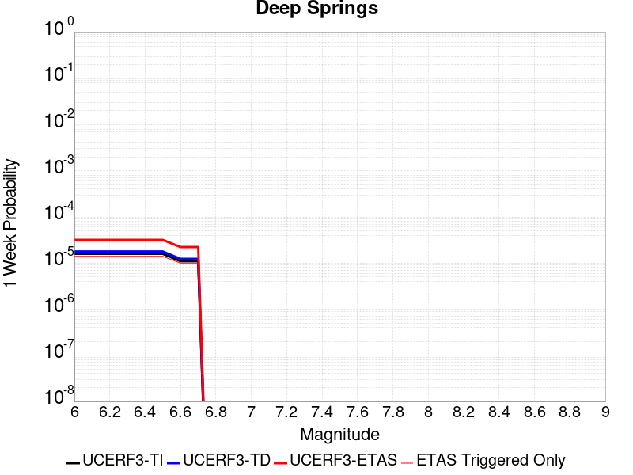 |  |  |  |

| Magnitude | 1 wk TI Prob | 1 wk TD Prob | 1 wk ETAS Prob | 1 wk ETAS/TD Gain | 1 wk ETAS Triggered Only | 1 mo TI Prob | 1 mo TD Prob | 1 mo ETAS Prob | 1 mo ETAS/TD Gain | 1 mo ETAS Triggered Only | 1 yr TI Prob | 1 yr TD Prob | 1 yr ETAS Prob | 1 yr ETAS/TD Gain | 1 yr ETAS Triggered Only | 10 yr TI Prob | 10 yr TD Prob | 10 yr ETAS Prob | 10 yr ETAS/TD Gain | 10 yr ETAS Triggered Only |
|-----|-----|-----|-----|-----|-----|-----|-----|-----|-----|-----|-----|-----|-----|-----|-----|-----|-----|-----|-----|-----|
| 6.0 | 1.5918817E-5 | 1.7845163E-5 | 2.851733E-5 | 1.5980426 | 1.0672358E-5 | 6.8221714E-5 | 7.64782E-5 | 8.714975E-5 | 1.1395371 | 1.0672358E-5 | 8.3028286E-4 | 9.3093317E-4 | 9.52258E-4 | 1.0229069 | 2.1344717E-5 | 0.008271876 | 0.009290814 | 0.009322533 | 1.003414 | 3.2017077E-5 |
| 6.1 | 1.5918817E-5 | 1.7845163E-5 | 2.851733E-5 | 1.5980426 | 1.0672358E-5 | 6.8221714E-5 | 7.64782E-5 | 8.714975E-5 | 1.1395371 | 1.0672358E-5 | 8.3028286E-4 | 9.3093317E-4 | 9.52258E-4 | 1.0229069 | 2.1344717E-5 | 0.008271876 | 0.009290814 | 0.009322533 | 1.003414 | 3.2017077E-5 |
| 6.2 | 1.5918817E-5 | 1.7845163E-5 | 2.851733E-5 | 1.5980426 | 1.0672358E-5 | 6.8221714E-5 | 7.64782E-5 | 8.714975E-5 | 1.1395371 | 1.0672358E-5 | 8.3028286E-4 | 9.3093317E-4 | 9.52258E-4 | 1.0229069 | 2.1344717E-5 | 0.008271876 | 0.009290814 | 0.009322533 | 1.003414 | 3.2017077E-5 |
| 6.3 | 1.5918817E-5 | 1.7845163E-5 | 2.851733E-5 | 1.5980426 | 1.0672358E-5 | 6.8221714E-5 | 7.64782E-5 | 8.714975E-5 | 1.1395371 | 1.0672358E-5 | 8.3028286E-4 | 9.3093317E-4 | 9.52258E-4 | 1.0229069 | 2.1344717E-5 | 0.008271876 | 0.009290814 | 0.009322533 | 1.003414 | 3.2017077E-5 |
| 6.4 | 1.5918817E-5 | 1.7845163E-5 | 2.851733E-5 | 1.5980426 | 1.0672358E-5 | 6.8221714E-5 | 7.64782E-5 | 8.714975E-5 | 1.1395371 | 1.0672358E-5 | 8.3028286E-4 | 9.3093317E-4 | 9.52258E-4 | 1.0229069 | 2.1344717E-5 | 0.008271876 | 0.009290814 | 0.009322533 | 1.003414 | 3.2017077E-5 |
| 6.5 | 1.5918817E-5 | 1.7845163E-5 | 2.851733E-5 | 1.5980426 | 1.0672358E-5 | 6.8221714E-5 | 7.64782E-5 | 8.714975E-5 | 1.1395371 | 1.0672358E-5 | 8.3028286E-4 | 9.3093317E-4 | 9.52258E-4 | 1.0229069 | 2.1344717E-5 | 0.008271876 | 0.009290814 | 0.009322533 | 1.003414 | 3.2017077E-5 |
| 6.6 | 1.1008706E-5 | 1.2328163E-5 | 2.300039E-5 | 1.8656787 | 1.0672358E-5 | 4.7179317E-5 | 5.2834985E-5 | 6.350678E-5 | 1.2019835 | 1.0672358E-5 | 5.7425676E-4 | 6.4326596E-4 | 6.645969E-4 | 1.0331604 | 2.1344717E-5 | 0.0057277507 | 0.0064326595 | 0.0064644706 | 1.0049453 | 3.2017077E-5 |
| 6.7 | 1.1008706E-5 | 1.2328163E-5 | 2.300039E-5 | 1.8656787 | 1.0672358E-5 | 4.7179317E-5 | 5.2834985E-5 | 6.350678E-5 | 1.2019835 | 1.0672358E-5 | 5.7425676E-4 | 6.4326596E-4 | 6.645969E-4 | 1.0331604 | 2.1344717E-5 | 0.0057277507 | 0.0064326595 | 0.0064644706 | 1.0049453 | 3.2017077E-5 |

## Concord 2011 CFM
*[(top)](#table-of-contents)*

| 1 Week | 1 Month | 1 Year | 10 Year |
|-----|-----|-----|-----|
|  |  |  |  |

| Magnitude | 1 wk TI Prob | 1 wk TD Prob | 1 wk ETAS Prob | 1 wk ETAS/TD Gain | 1 wk ETAS Triggered Only | 1 mo TI Prob | 1 mo TD Prob | 1 mo ETAS Prob | 1 mo ETAS/TD Gain | 1 mo ETAS Triggered Only | 1 yr TI Prob | 1 yr TD Prob | 1 yr ETAS Prob | 1 yr ETAS/TD Gain | 1 yr ETAS Triggered Only | 10 yr TI Prob | 10 yr TD Prob | 10 yr ETAS Prob | 10 yr ETAS/TD Gain | 10 yr ETAS Triggered Only |
|-----|-----|-----|-----|-----|-----|-----|-----|-----|-----|-----|-----|-----|-----|-----|-----|-----|-----|-----|-----|-----|
| 6.0 | 7.9834055E-5 | 1.7647086E-4 | 1.9781181E-4 | 1.1209319 | 2.1344717E-5 | 3.421011E-4 | 7.562273E-4 | 7.7755586E-4 | 1.028204 | 2.1344717E-5 | 0.0041571283 | 0.009193515 | 0.009225238 | 1.0034505 | 3.2017077E-5 | 0.040802166 | 0.08864039 | 0.08866957 | 1.0003291 | 3.2017077E-5 |
| 6.1 | 7.9834055E-5 | 1.7647086E-4 | 1.9781181E-4 | 1.1209319 | 2.1344717E-5 | 3.421011E-4 | 7.562273E-4 | 7.7755586E-4 | 1.028204 | 2.1344717E-5 | 0.0041571283 | 0.009193515 | 0.009225238 | 1.0034505 | 3.2017077E-5 | 0.040802166 | 0.08864039 | 0.08866957 | 1.0003291 | 3.2017077E-5 |
| 6.2 | 7.9834055E-5 | 1.7647086E-4 | 1.9781181E-4 | 1.1209319 | 2.1344717E-5 | 3.421011E-4 | 7.562273E-4 | 7.7755586E-4 | 1.028204 | 2.1344717E-5 | 0.0041571283 | 0.009193515 | 0.009225238 | 1.0034505 | 3.2017077E-5 | 0.040802166 | 0.08864039 | 0.08866957 | 1.0003291 | 3.2017077E-5 |
| 6.3 | 7.9834055E-5 | 1.7647086E-4 | 1.9781181E-4 | 1.1209319 | 2.1344717E-5 | 3.421011E-4 | 7.562273E-4 | 7.7755586E-4 | 1.028204 | 2.1344717E-5 | 0.0041571283 | 0.009193515 | 0.009225238 | 1.0034505 | 3.2017077E-5 | 0.040802166 | 0.08864039 | 0.08866957 | 1.0003291 | 3.2017077E-5 |
| 6.4 | 7.9834055E-5 | 1.7647086E-4 | 1.9781181E-4 | 1.1209319 | 2.1344717E-5 | 3.421011E-4 | 7.562273E-4 | 7.7755586E-4 | 1.028204 | 2.1344717E-5 | 0.0041571283 | 0.009193515 | 0.009225238 | 1.0034505 | 3.2017077E-5 | 0.040802166 | 0.08864039 | 0.08866957 | 1.0003291 | 3.2017077E-5 |
| 6.5 | 7.9834055E-5 | 1.7647086E-4 | 1.9781181E-4 | 1.1209319 | 2.1344717E-5 | 3.421011E-4 | 7.562273E-4 | 7.7755586E-4 | 1.028204 | 2.1344717E-5 | 0.0041571283 | 0.009193515 | 0.009225238 | 1.0034505 | 3.2017077E-5 | 0.040802166 | 0.08864039 | 0.08866957 | 1.0003291 | 3.2017077E-5 |
| 6.6 | 6.153684E-5 | 1.4011236E-4 | 1.4011236E-4 | 1.0 | 0.0 | 2.6370265E-4 | 6.004815E-4 | 6.004815E-4 | 1.0 | 0.0 | 0.0032058533 | 0.0073108627 | 0.007321457 | 1.0014491 | 1.0672358E-5 | 0.03159998 | 0.071543366 | 0.071553275 | 1.0001385 | 1.0672358E-5 |
| 6.7 | 6.153684E-5 | 1.4011236E-4 | 1.4011236E-4 | 1.0 | 0.0 | 2.6370265E-4 | 6.004815E-4 | 6.004815E-4 | 1.0 | 0.0 | 0.0032058533 | 0.0073108627 | 0.007321457 | 1.0014491 | 1.0672358E-5 | 0.03159998 | 0.071543366 | 0.071553275 | 1.0001385 | 1.0672358E-5 |

## Anacapa-Dume alt 1
*[(top)](#table-of-contents)*

| 1 Week | 1 Month | 1 Year | 10 Year |
|-----|-----|-----|-----|
|  |  |  |  |

| Magnitude | 1 wk TI Prob | 1 wk TD Prob | 1 wk ETAS Prob | 1 wk ETAS/TD Gain | 1 wk ETAS Triggered Only | 1 mo TI Prob | 1 mo TD Prob | 1 mo ETAS Prob | 1 mo ETAS/TD Gain | 1 mo ETAS Triggered Only | 1 yr TI Prob | 1 yr TD Prob | 1 yr ETAS Prob | 1 yr ETAS/TD Gain | 1 yr ETAS Triggered Only | 10 yr TI Prob | 10 yr TD Prob | 10 yr ETAS Prob | 10 yr ETAS/TD Gain | 10 yr ETAS Triggered Only |
|-----|-----|-----|-----|-----|-----|-----|-----|-----|-----|-----|-----|-----|-----|-----|-----|-----|-----|-----|-----|-----|
| 6.0 | 2.8047281E-5 | 3.3042823E-5 | 4.371483E-5 | 1.322975 | 1.0672358E-5 | 1.20197095E-4 | 1.4160581E-4 | 1.5227665E-4 | 1.075356 | 1.0672358E-5 | 0.0014624172 | 0.0017229331 | 0.0017335871 | 1.0061836 | 1.0672358E-5 | 0.014528306 | 0.017120155 | 0.017151624 | 1.0018381 | 3.2017077E-5 |
| 6.1 | 2.8047281E-5 | 3.3042823E-5 | 4.371483E-5 | 1.322975 | 1.0672358E-5 | 1.20197095E-4 | 1.4160581E-4 | 1.5227665E-4 | 1.075356 | 1.0672358E-5 | 0.0014624172 | 0.0017229331 | 0.0017335871 | 1.0061836 | 1.0672358E-5 | 0.014528306 | 0.017120155 | 0.017151624 | 1.0018381 | 3.2017077E-5 |
| 6.2 | 2.8047281E-5 | 3.3042823E-5 | 4.371483E-5 | 1.322975 | 1.0672358E-5 | 1.20197095E-4 | 1.4160581E-4 | 1.5227665E-4 | 1.075356 | 1.0672358E-5 | 0.0014624172 | 0.0017229331 | 0.0017335871 | 1.0061836 | 1.0672358E-5 | 0.014528306 | 0.017120155 | 0.017151624 | 1.0018381 | 3.2017077E-5 |
| 6.3 | 2.8047281E-5 | 3.3042823E-5 | 4.371483E-5 | 1.322975 | 1.0672358E-5 | 1.20197095E-4 | 1.4160581E-4 | 1.5227665E-4 | 1.075356 | 1.0672358E-5 | 0.0014624172 | 0.0017229331 | 0.0017335871 | 1.0061836 | 1.0672358E-5 | 0.014528306 | 0.017120155 | 0.017151624 | 1.0018381 | 3.2017077E-5 |
| 6.4 | 2.8047281E-5 | 3.3042823E-5 | 4.371483E-5 | 1.322975 | 1.0672358E-5 | 1.20197095E-4 | 1.4160581E-4 | 1.5227665E-4 | 1.075356 | 1.0672358E-5 | 0.0014624172 | 0.0017229331 | 0.0017335871 | 1.0061836 | 1.0672358E-5 | 0.014528306 | 0.017120155 | 0.017151624 | 1.0018381 | 3.2017077E-5 |
| 6.5 | 2.8047281E-5 | 3.3042823E-5 | 4.371483E-5 | 1.322975 | 1.0672358E-5 | 1.20197095E-4 | 1.4160581E-4 | 1.5227665E-4 | 1.075356 | 1.0672358E-5 | 0.0014624172 | 0.0017229331 | 0.0017335871 | 1.0061836 | 1.0672358E-5 | 0.014528306 | 0.017120155 | 0.017151624 | 1.0018381 | 3.2017077E-5 |
| 6.6 | 2.8047281E-5 | 3.3042823E-5 | 4.371483E-5 | 1.322975 | 1.0672358E-5 | 1.20197095E-4 | 1.4160581E-4 | 1.5227665E-4 | 1.075356 | 1.0672358E-5 | 0.0014624172 | 0.0017229331 | 0.0017335871 | 1.0061836 | 1.0672358E-5 | 0.014528306 | 0.017120155 | 0.017151624 | 1.0018381 | 3.2017077E-5 |
| 6.7 | 1.8557415E-5 | 2.1779932E-5 | 3.245206E-5 | 1.4899981 | 1.0672358E-5 | 7.952935E-5 | 9.334038E-5 | 1.0401174E-4 | 1.1143274 | 1.0672358E-5 | 9.6783973E-4 | 0.0011360307 | 0.0011466909 | 1.0093838 | 1.0672358E-5 | 0.009636354 | 0.011322291 | 0.011332842 | 1.000932 | 1.0672358E-5 |
| 6.8 | 1.8557415E-5 | 2.1779932E-5 | 3.245206E-5 | 1.4899981 | 1.0672358E-5 | 7.952935E-5 | 9.334038E-5 | 1.0401174E-4 | 1.1143274 | 1.0672358E-5 | 9.6783973E-4 | 0.0011360307 | 0.0011466909 | 1.0093838 | 1.0672358E-5 | 0.009636354 | 0.011322291 | 0.011332842 | 1.000932 | 1.0672358E-5 |
| 6.9 | 1.3238843E-5 | 1.5484396E-5 | 1.5484396E-5 | 1.0 | 0.0 | 5.6736666E-5 | 6.636107E-5 | 6.636107E-5 | 1.0 | 0.0 | 6.9054996E-4 | 8.078341E-4 | 8.078341E-4 | 1.0 | 0.0 | 0.0068840804 | 0.008067372 | 0.008067372 | 1.0 | 0.0 |
| 7.0 | 1.3238843E-5 | 1.5484396E-5 | 1.5484396E-5 | 1.0 | 0.0 | 5.6736666E-5 | 6.636107E-5 | 6.636107E-5 | 1.0 | 0.0 | 6.9054996E-4 | 8.078341E-4 | 8.078341E-4 | 1.0 | 0.0 | 0.0068840804 | 0.008067372 | 0.008067372 | 1.0 | 0.0 |
| 7.1 | 1.0270256E-5 | 1.1981463E-5 | 1.1981463E-5 | 1.0 | 0.0 | 4.401464E-5 | 5.134913E-5 | 5.134913E-5 | 1.0 | 0.0 | 5.3574645E-4 | 6.2517566E-4 | 6.2517566E-4 | 1.0 | 0.0 | 0.005344567 | 0.0062517566 | 0.0062517566 | 1.0 | 0.0 |

## Johnson Valley (No) 2011 rev
*[(top)](#table-of-contents)*

| 1 Week | 1 Month | 1 Year | 10 Year |
|-----|-----|-----|-----|
|  |  |  |  |

| Magnitude | 1 wk TI Prob | 1 wk TD Prob | 1 wk ETAS Prob | 1 wk ETAS/TD Gain | 1 wk ETAS Triggered Only | 1 mo TI Prob | 1 mo TD Prob | 1 mo ETAS Prob | 1 mo ETAS/TD Gain | 1 mo ETAS Triggered Only | 1 yr TI Prob | 1 yr TD Prob | 1 yr ETAS Prob | 1 yr ETAS/TD Gain | 1 yr ETAS Triggered Only | 10 yr TI Prob | 10 yr TD Prob | 10 yr ETAS Prob | 10 yr ETAS/TD Gain | 10 yr ETAS Triggered Only |
|-----|-----|-----|-----|-----|-----|-----|-----|-----|-----|-----|-----|-----|-----|-----|-----|-----|-----|-----|-----|-----|
| 6.0 | 1.5411064E-5 | 1.0176766E-5 | 2.0849016E-5 | 2.0486877 | 1.0672358E-5 | 6.6045744E-5 | 4.3614225E-5 | 5.4286116E-5 | 1.2446884 | 1.0672358E-5 | 8.0381025E-4 | 5.3091673E-4 | 5.629168E-4 | 1.0602733 | 3.2017077E-5 | 0.00800909 | 0.005300697 | 0.005332544 | 1.0060081 | 3.2017077E-5 |
| 6.1 | 1.5411064E-5 | 1.0176766E-5 | 2.0849016E-5 | 2.0486877 | 1.0672358E-5 | 6.6045744E-5 | 4.3614225E-5 | 5.4286116E-5 | 1.2446884 | 1.0672358E-5 | 8.0381025E-4 | 5.3091673E-4 | 5.629168E-4 | 1.0602733 | 3.2017077E-5 | 0.00800909 | 0.005300697 | 0.005332544 | 1.0060081 | 3.2017077E-5 |
| 6.2 | 1.5411064E-5 | 1.0176766E-5 | 2.0849016E-5 | 2.0486877 | 1.0672358E-5 | 6.6045744E-5 | 4.3614225E-5 | 5.4286116E-5 | 1.2446884 | 1.0672358E-5 | 8.0381025E-4 | 5.3091673E-4 | 5.629168E-4 | 1.0602733 | 3.2017077E-5 | 0.00800909 | 0.005300697 | 0.005332544 | 1.0060081 | 3.2017077E-5 |
| 6.3 | 1.5411064E-5 | 1.0176766E-5 | 2.0849016E-5 | 2.0486877 | 1.0672358E-5 | 6.6045744E-5 | 4.3614225E-5 | 5.4286116E-5 | 1.2446884 | 1.0672358E-5 | 8.0381025E-4 | 5.3091673E-4 | 5.629168E-4 | 1.0602733 | 3.2017077E-5 | 0.00800909 | 0.005300697 | 0.005332544 | 1.0060081 | 3.2017077E-5 |
| 6.4 | 1.5411064E-5 | 1.0176766E-5 | 2.0849016E-5 | 2.0486877 | 1.0672358E-5 | 6.6045744E-5 | 4.3614225E-5 | 5.4286116E-5 | 1.2446884 | 1.0672358E-5 | 8.0381025E-4 | 5.3091673E-4 | 5.629168E-4 | 1.0602733 | 3.2017077E-5 | 0.00800909 | 0.005300697 | 0.005332544 | 1.0060081 | 3.2017077E-5 |
| 6.5 | 1.5411064E-5 | 1.0176766E-5 | 2.0849016E-5 | 2.0486877 | 1.0672358E-5 | 6.6045744E-5 | 4.3614225E-5 | 5.4286116E-5 | 1.2446884 | 1.0672358E-5 | 8.0381025E-4 | 5.3091673E-4 | 5.629168E-4 | 1.0602733 | 3.2017077E-5 | 0.00800909 | 0.005300697 | 0.005332544 | 1.0060081 | 3.2017077E-5 |
| 6.6 | 1.4834682E-5 | 9.547515E-6 | 2.0219772E-5 | 2.1178045 | 1.0672358E-5 | 6.357566E-5 | 4.091752E-5 | 5.1589443E-5 | 1.2608155 | 1.0672358E-5 | 7.7375874E-4 | 4.9809937E-4 | 5.301005E-4 | 1.0642464 | 3.2017077E-5 | 0.0077107013 | 0.0049739927 | 0.0050058505 | 1.0064049 | 3.2017077E-5 |
| 6.7 | 1.0814841E-5 | 5.8714368E-6 | 1.6543732E-5 | 2.8176634 | 1.0672358E-5 | 4.6348494E-5 | 2.5163265E-5 | 3.5835354E-5 | 1.4241139 | 1.0672358E-5 | 5.641468E-4 | 3.063563E-4 | 3.1702538E-4 | 1.0348258 | 1.0672358E-5 | 0.005627168 | 0.0030629311 | 0.0030735708 | 1.0034736 | 1.0672358E-5 |
| 6.8 | 1.0245956E-5 | 5.404906E-6 | 1.6077207E-5 | 2.974558 | 1.0672358E-5 | 4.3910502E-5 | 2.3163884E-5 | 3.3835993E-5 | 1.460722 | 1.0672358E-5 | 5.344792E-4 | 2.8202028E-4 | 2.9268963E-4 | 1.0378319 | 1.0672358E-5 | 0.0053319554 | 0.0028202015 | 0.0028308437 | 1.0037736 | 1.0672358E-5 |
| 6.9 | 3.2082864E-6 | 9.347539E-10 | 9.347539E-10 | 1.0 | 0.0 | 1.3749726E-5 | 4.006089E-9 | 4.006089E-9 | 1.0 | 0.0 | 1.6739006E-4 | 4.8774126E-8 | 4.8774126E-8 | 1.0 | 0.0 | 0.0016726403 | 4.8774126E-7 | 4.8774126E-7 | 1.0 | 0.0 |
| 7.0 | 3.1573343E-6 | 9.347539E-10 | 9.347539E-10 | 1.0 | 0.0 | 1.3531363E-5 | 4.006089E-9 | 4.006089E-9 | 1.0 | 0.0 | 1.6473189E-4 | 4.8774126E-8 | 4.8774126E-8 | 1.0 | 0.0 | 0.0016460982 | 4.8774126E-7 | 4.8774126E-7 | 1.0 | 0.0 |
| 7.1 | 3.0995338E-6 | 9.347539E-10 | 9.347539E-10 | 1.0 | 0.0 | 1.32836485E-5 | 4.006089E-9 | 4.006089E-9 | 1.0 | 0.0 | 1.6171642E-4 | 4.8774126E-8 | 4.8774126E-8 | 1.0 | 0.0 | 0.0016159879 | 4.8774126E-7 | 4.8774126E-7 | 1.0 | 0.0 |
| 7.2 | 2.8879267E-6 | 9.331039E-10 | 9.331039E-10 | 1.0 | 0.0 | 1.237677E-5 | 3.999017E-9 | 3.999017E-9 | 1.0 | 0.0 | 1.5067676E-4 | 4.868803E-8 | 4.868803E-8 | 1.0 | 0.0 | 0.0015057464 | 4.868803E-7 | 4.868803E-7 | 1.0 | 0.0 |
| 7.3 | 2.4973094E-6 | 8.4248597E-10 | 8.4248597E-10 | 1.0 | 0.0 | 1.0702711E-5 | 3.6106542E-9 | 3.6106542E-9 | 1.0 | 0.0 | 1.3029772E-4 | 4.3959716E-8 | 4.3959716E-8 | 1.0 | 0.0 | 0.0013022134 | 4.3959716E-7 | 4.3959716E-7 | 1.0 | 0.0 |

## San Gabriel
*[(top)](#table-of-contents)*

| 1 Week | 1 Month | 1 Year | 10 Year |
|-----|-----|-----|-----|
|  |  |  |  |

| Magnitude | 1 wk TI Prob | 1 wk TD Prob | 1 wk ETAS Prob | 1 wk ETAS/TD Gain | 1 wk ETAS Triggered Only | 1 mo TI Prob | 1 mo TD Prob | 1 mo ETAS Prob | 1 mo ETAS/TD Gain | 1 mo ETAS Triggered Only | 1 yr TI Prob | 1 yr TD Prob | 1 yr ETAS Prob | 1 yr ETAS/TD Gain | 1 yr ETAS Triggered Only | 10 yr TI Prob | 10 yr TD Prob | 10 yr ETAS Prob | 10 yr ETAS/TD Gain | 10 yr ETAS Triggered Only |
|-----|-----|-----|-----|-----|-----|-----|-----|-----|-----|-----|-----|-----|-----|-----|-----|-----|-----|-----|-----|-----|
| 6.0 | 1.26160985E-5 | 1.3513258E-5 | 2.4185472E-5 | 1.7897588 | 1.0672358E-5 | 5.406787E-5 | 5.791289E-5 | 7.925637E-5 | 1.3685446 | 2.1344717E-5 | 6.580775E-4 | 7.048994E-4 | 7.26229E-4 | 1.0302591 | 2.1344717E-5 | 0.006561321 | 0.007030387 | 0.007062179 | 1.0045221 | 3.2017077E-5 |
| 6.1 | 1.26160985E-5 | 1.3513258E-5 | 2.4185472E-5 | 1.7897588 | 1.0672358E-5 | 5.406787E-5 | 5.791289E-5 | 7.925637E-5 | 1.3685446 | 2.1344717E-5 | 6.580775E-4 | 7.048994E-4 | 7.26229E-4 | 1.0302591 | 2.1344717E-5 | 0.006561321 | 0.007030387 | 0.007062179 | 1.0045221 | 3.2017077E-5 |
| 6.2 | 1.26160985E-5 | 1.3513258E-5 | 2.4185472E-5 | 1.7897588 | 1.0672358E-5 | 5.406787E-5 | 5.791289E-5 | 7.925637E-5 | 1.3685446 | 2.1344717E-5 | 6.580775E-4 | 7.048994E-4 | 7.26229E-4 | 1.0302591 | 2.1344717E-5 | 0.006561321 | 0.007030387 | 0.007062179 | 1.0045221 | 3.2017077E-5 |
| 6.3 | 1.26160985E-5 | 1.3513258E-5 | 2.4185472E-5 | 1.7897588 | 1.0672358E-5 | 5.406787E-5 | 5.791289E-5 | 7.925637E-5 | 1.3685446 | 2.1344717E-5 | 6.580775E-4 | 7.048994E-4 | 7.26229E-4 | 1.0302591 | 2.1344717E-5 | 0.006561321 | 0.007030387 | 0.007062179 | 1.0045221 | 3.2017077E-5 |
| 6.4 | 1.26160985E-5 | 1.3513258E-5 | 2.4185472E-5 | 1.7897588 | 1.0672358E-5 | 5.406787E-5 | 5.791289E-5 | 7.925637E-5 | 1.3685446 | 2.1344717E-5 | 6.580775E-4 | 7.048994E-4 | 7.26229E-4 | 1.0302591 | 2.1344717E-5 | 0.006561321 | 0.007030387 | 0.007062179 | 1.0045221 | 3.2017077E-5 |
| 6.5 | 1.26160985E-5 | 1.3513258E-5 | 2.4185472E-5 | 1.7897588 | 1.0672358E-5 | 5.406787E-5 | 5.791289E-5 | 7.925637E-5 | 1.3685446 | 2.1344717E-5 | 6.580775E-4 | 7.048994E-4 | 7.26229E-4 | 1.0302591 | 2.1344717E-5 | 0.006561321 | 0.007030387 | 0.007062179 | 1.0045221 | 3.2017077E-5 |
| 6.6 | 1.1803596E-5 | 1.264043E-5 | 2.3312654E-5 | 1.8442928 | 1.0672358E-5 | 5.058586E-5 | 5.417236E-5 | 7.551592E-5 | 1.3939936 | 2.1344717E-5 | 6.1570876E-4 | 6.5938674E-4 | 6.807174E-4 | 1.0323492 | 2.1344717E-5 | 0.0061400565 | 0.006578034 | 0.0066098403 | 1.0048352 | 3.2017077E-5 |
| 6.7 | 9.549731E-6 | 1.0215835E-5 | 2.0888085E-5 | 2.0446773 | 1.0672358E-5 | 4.0926778E-5 | 4.378162E-5 | 6.51254E-5 | 1.4875056 | 2.1344717E-5 | 4.9816957E-4 | 5.329474E-4 | 5.5428076E-4 | 1.0400289 | 2.1344717E-5 | 0.0049705426 | 0.005320286 | 0.005352133 | 1.0059859 | 3.2017077E-5 |
| 6.8 | 9.157154E-6 | 9.798772E-6 | 2.0471027E-5 | 2.089142 | 1.0672358E-5 | 3.9244354E-5 | 4.1994266E-5 | 6.3338084E-5 | 1.5082556 | 2.1344717E-5 | 4.7769528E-4 | 5.111967E-4 | 5.325305E-4 | 1.041733 | 2.1344717E-5 | 0.004766697 | 0.005103788 | 0.0051356414 | 1.0062412 | 3.2017077E-5 |
| 6.9 | 7.844496E-6 | 8.385175E-6 | 1.9057443E-5 | 2.2727547 | 1.0672358E-5 | 3.3618835E-5 | 3.593617E-5 | 5.728012E-5 | 1.5939406 | 2.1344717E-5 | 4.0923245E-4 | 4.374709E-4 | 4.588063E-4 | 1.0487698 | 2.1344717E-5 | 0.0040847966 | 0.0043696202 | 0.0044014975 | 1.0072951 | 3.2017077E-5 |
| 7.0 | 6.7619258E-6 | 7.2223247E-6 | 1.7894607E-5 | 2.4776795 | 1.0672358E-5 | 2.897936E-5 | 3.0952655E-5 | 5.229671E-5 | 1.6895711 | 2.1344717E-5 | 3.527666E-4 | 3.7681893E-4 | 3.9815562E-4 | 1.0566231 | 2.1344717E-5 | 0.0035220713 | 0.0037652855 | 0.003797182 | 1.0084713 | 3.2017077E-5 |
| 7.1 | 5.927114E-6 | 6.3258008E-6 | 1.6998092E-5 | 2.6871052 | 1.0672358E-5 | 2.540167E-5 | 2.7110491E-5 | 4.845463E-5 | 1.7873018 | 2.1344717E-5 | 3.0922145E-4 | 3.300555E-4 | 3.513932E-4 | 1.0646487 | 2.1344717E-5 | 0.0030879152 | 0.0032991117 | 0.003320386 | 1.0064485 | 2.1344717E-5 |
| 7.2 | 4.9482483E-6 | 5.276545E-6 | 5.276545E-6 | 1.0 | 0.0 | 2.1206606E-5 | 2.2613764E-5 | 3.328588E-5 | 1.4719301 | 1.0672358E-5 | 2.5815985E-4 | 2.7532259E-4 | 2.85992E-4 | 1.0387524 | 1.0672358E-5 | 0.0025786015 | 0.0027532259 | 0.0027638688 | 1.0038656 | 1.0672358E-5 |

## Palos Verdes
*[(top)](#table-of-contents)*

| 1 Week | 1 Month | 1 Year | 10 Year |
|-----|-----|-----|-----|
|  |  |  |  |

| Magnitude | 1 wk TI Prob | 1 wk TD Prob | 1 wk ETAS Prob | 1 wk ETAS/TD Gain | 1 wk ETAS Triggered Only | 1 mo TI Prob | 1 mo TD Prob | 1 mo ETAS Prob | 1 mo ETAS/TD Gain | 1 mo ETAS Triggered Only | 1 yr TI Prob | 1 yr TD Prob | 1 yr ETAS Prob | 1 yr ETAS/TD Gain | 1 yr ETAS Triggered Only | 10 yr TI Prob | 10 yr TD Prob | 10 yr ETAS Prob | 10 yr ETAS/TD Gain | 10 yr ETAS Triggered Only |
|-----|-----|-----|-----|-----|-----|-----|-----|-----|-----|-----|-----|-----|-----|-----|-----|-----|-----|-----|-----|-----|
| 6.0 | 2.416717E-5 | 2.7219172E-5 | 3.789124E-5 | 1.3920791 | 1.0672358E-5 | 1.0356947E-4 | 1.16648946E-4 | 1.2732006E-4 | 1.0914806 | 1.0672358E-5 | 0.0012602288 | 0.0014193773 | 0.0014406918 | 1.0150168 | 2.1344717E-5 | 0.01253106 | 0.014113327 | 0.014144892 | 1.0022366 | 3.2017077E-5 |
| 6.1 | 2.416717E-5 | 2.7219172E-5 | 3.789124E-5 | 1.3920791 | 1.0672358E-5 | 1.0356947E-4 | 1.16648946E-4 | 1.2732006E-4 | 1.0914806 | 1.0672358E-5 | 0.0012602288 | 0.0014193773 | 0.0014406918 | 1.0150168 | 2.1344717E-5 | 0.01253106 | 0.014113327 | 0.014144892 | 1.0022366 | 3.2017077E-5 |
| 6.2 | 2.416717E-5 | 2.7219172E-5 | 3.789124E-5 | 1.3920791 | 1.0672358E-5 | 1.0356947E-4 | 1.16648946E-4 | 1.2732006E-4 | 1.0914806 | 1.0672358E-5 | 0.0012602288 | 0.0014193773 | 0.0014406918 | 1.0150168 | 2.1344717E-5 | 0.01253106 | 0.014113327 | 0.014144892 | 1.0022366 | 3.2017077E-5 |
| 6.3 | 2.416717E-5 | 2.7219172E-5 | 3.789124E-5 | 1.3920791 | 1.0672358E-5 | 1.0356947E-4 | 1.16648946E-4 | 1.2732006E-4 | 1.0914806 | 1.0672358E-5 | 0.0012602288 | 0.0014193773 | 0.0014406918 | 1.0150168 | 2.1344717E-5 | 0.01253106 | 0.014113327 | 0.014144892 | 1.0022366 | 3.2017077E-5 |
| 6.4 | 2.416717E-5 | 2.7219172E-5 | 3.789124E-5 | 1.3920791 | 1.0672358E-5 | 1.0356947E-4 | 1.16648946E-4 | 1.2732006E-4 | 1.0914806 | 1.0672358E-5 | 0.0012602288 | 0.0014193773 | 0.0014406918 | 1.0150168 | 2.1344717E-5 | 0.01253106 | 0.014113327 | 0.014144892 | 1.0022366 | 3.2017077E-5 |
| 6.5 | 2.416717E-5 | 2.7219172E-5 | 3.789124E-5 | 1.3920791 | 1.0672358E-5 | 1.0356947E-4 | 1.16648946E-4 | 1.2732006E-4 | 1.0914806 | 1.0672358E-5 | 0.0012602288 | 0.0014193773 | 0.0014406918 | 1.0150168 | 2.1344717E-5 | 0.01253106 | 0.014113327 | 0.014144892 | 1.0022366 | 3.2017077E-5 |
| 6.6 | 2.2181084E-5 | 2.4975725E-5 | 3.5647816E-5 | 1.4272985 | 1.0672358E-5 | 9.505832E-5 | 1.07035E-4 | 1.17706215E-4 | 1.0996984 | 1.0672358E-5 | 0.0011567206 | 0.0013024732 | 0.0013237902 | 1.0163665 | 2.1344717E-5 | 0.0115071805 | 0.012958492 | 0.012990094 | 1.0024387 | 3.2017077E-5 |
| 6.7 | 1.9382267E-5 | 2.1828162E-5 | 3.2500287E-5 | 1.4889154 | 1.0672358E-5 | 8.306422E-5 | 9.354648E-5 | 1.04217834E-4 | 1.1140755 | 1.0672358E-5 | 0.0010108376 | 0.0011384335 | 0.0011597539 | 1.0187279 | 2.1344717E-5 | 0.0100625185 | 0.011335945 | 0.011367599 | 1.0027924 | 3.2017077E-5 |
| 6.8 | 1.6157266E-5 | 1.8180996E-5 | 2.885316E-5 | 1.5869956 | 1.0672358E-5 | 6.9243586E-5 | 7.791678E-5 | 8.8588306E-5 | 1.1369606 | 1.0672358E-5 | 8.4271457E-4 | 9.483226E-4 | 9.696471E-4 | 1.0224866 | 2.1344717E-5 | 0.00839526 | 0.009452482 | 0.009484196 | 1.0033551 | 3.2017077E-5 |
| 6.9 | 1.3828139E-5 | 1.5540487E-5 | 2.6212681E-5 | 1.6867347 | 1.0672358E-5 | 5.9262107E-5 | 6.6600944E-5 | 7.727259E-5 | 1.1602327 | 1.0672358E-5 | 7.212773E-4 | 8.1066263E-4 | 8.3199004E-4 | 1.0263087 | 2.1344717E-5 | 0.007189407 | 0.008086668 | 0.008118426 | 1.0039272 | 3.2017077E-5 |
| 7.0 | 1.1833321E-5 | 1.3284609E-5 | 2.3956825E-5 | 1.803352 | 1.0672358E-5 | 5.0713246E-5 | 5.6933346E-5 | 6.76051E-5 | 1.1874429 | 1.0672358E-5 | 6.1725883E-4 | 6.930404E-4 | 7.143703E-4 | 1.0307773 | 2.1344717E-5 | 0.0061554713 | 0.006918346 | 0.006939543 | 1.0030639 | 2.1344717E-5 |
| 7.1 | 1.0044758E-5 | 1.1258023E-5 | 1.1258023E-5 | 1.0 | 0.0 | 4.304825E-5 | 4.8248323E-5 | 4.8248323E-5 | 1.0 | 0.0 | 5.239864E-4 | 5.873616E-4 | 5.9802766E-4 | 1.0181593 | 1.0672358E-5 | 0.005227526 | 0.005867563 | 0.005878173 | 1.0018082 | 1.0672358E-5 |
| 7.2 | 8.481934E-6 | 9.495382E-6 | 9.495382E-6 | 1.0 | 0.0 | 3.635064E-5 | 4.0694402E-5 | 4.0694402E-5 | 1.0 | 0.0 | 4.4247916E-4 | 4.9543753E-4 | 4.9543753E-4 | 1.0 | 0.0 | 0.0044159917 | 0.0049527287 | 0.0049527287 | 1.0 | 0.0 |

## Holser alt 1
*[(top)](#table-of-contents)*

| 1 Week | 1 Month | 1 Year | 10 Year |
|-----|-----|-----|-----|
|  |  |  |  |

| Magnitude | 1 wk TI Prob | 1 wk TD Prob | 1 wk ETAS Prob | 1 wk ETAS/TD Gain | 1 wk ETAS Triggered Only | 1 mo TI Prob | 1 mo TD Prob | 1 mo ETAS Prob | 1 mo ETAS/TD Gain | 1 mo ETAS Triggered Only | 1 yr TI Prob | 1 yr TD Prob | 1 yr ETAS Prob | 1 yr ETAS/TD Gain | 1 yr ETAS Triggered Only | 10 yr TI Prob | 10 yr TD Prob | 10 yr ETAS Prob | 10 yr ETAS/TD Gain | 10 yr ETAS Triggered Only |
|-----|-----|-----|-----|-----|-----|-----|-----|-----|-----|-----|-----|-----|-----|-----|-----|-----|-----|-----|-----|-----|
| 6.0 | 7.962936E-6 | 8.4235735E-6 | 8.4235735E-6 | 1.0 | 0.0 | 3.4126424E-5 | 3.6100817E-5 | 4.6772788E-5 | 1.2956159 | 1.0672358E-5 | 4.1540997E-4 | 4.394895E-4 | 4.5015715E-4 | 1.0242729 | 1.0672358E-5 | 0.004146343 | 0.0043911743 | 0.0044230507 | 1.0072592 | 3.2017077E-5 |
| 6.1 | 7.962936E-6 | 8.4235735E-6 | 8.4235735E-6 | 1.0 | 0.0 | 3.4126424E-5 | 3.6100817E-5 | 4.6772788E-5 | 1.2956159 | 1.0672358E-5 | 4.1540997E-4 | 4.394895E-4 | 4.5015715E-4 | 1.0242729 | 1.0672358E-5 | 0.004146343 | 0.0043911743 | 0.0044230507 | 1.0072592 | 3.2017077E-5 |
| 6.2 | 7.962936E-6 | 8.4235735E-6 | 8.4235735E-6 | 1.0 | 0.0 | 3.4126424E-5 | 3.6100817E-5 | 4.6772788E-5 | 1.2956159 | 1.0672358E-5 | 4.1540997E-4 | 4.394895E-4 | 4.5015715E-4 | 1.0242729 | 1.0672358E-5 | 0.004146343 | 0.0043911743 | 0.0044230507 | 1.0072592 | 3.2017077E-5 |
| 6.3 | 7.962936E-6 | 8.4235735E-6 | 8.4235735E-6 | 1.0 | 0.0 | 3.4126424E-5 | 3.6100817E-5 | 4.6772788E-5 | 1.2956159 | 1.0672358E-5 | 4.1540997E-4 | 4.394895E-4 | 4.5015715E-4 | 1.0242729 | 1.0672358E-5 | 0.004146343 | 0.0043911743 | 0.0044230507 | 1.0072592 | 3.2017077E-5 |
| 6.4 | 7.962936E-6 | 8.4235735E-6 | 8.4235735E-6 | 1.0 | 0.0 | 3.4126424E-5 | 3.6100817E-5 | 4.6772788E-5 | 1.2956159 | 1.0672358E-5 | 4.1540997E-4 | 4.394895E-4 | 4.5015715E-4 | 1.0242729 | 1.0672358E-5 | 0.004146343 | 0.0043911743 | 0.0044230507 | 1.0072592 | 3.2017077E-5 |
| 6.5 | 7.962936E-6 | 8.4235735E-6 | 8.4235735E-6 | 1.0 | 0.0 | 3.4126424E-5 | 3.6100817E-5 | 4.6772788E-5 | 1.2956159 | 1.0672358E-5 | 4.1540997E-4 | 4.394895E-4 | 4.5015715E-4 | 1.0242729 | 1.0672358E-5 | 0.004146343 | 0.0043911743 | 0.0044230507 | 1.0072592 | 3.2017077E-5 |
| 6.6 | 5.506786E-6 | 5.810526E-6 | 5.810526E-6 | 1.0 | 0.0 | 2.3600298E-5 | 2.4902254E-5 | 3.5574347E-5 | 1.4285593 | 1.0672358E-5 | 2.8729573E-4 | 3.0318493E-4 | 3.1385405E-4 | 1.0351901 | 1.0672358E-5 | 0.002869246 | 0.0030318494 | 0.0030637693 | 1.0105282 | 3.2017077E-5 |
| 6.7 | 5.506786E-6 | 5.810526E-6 | 5.810526E-6 | 1.0 | 0.0 | 2.3600298E-5 | 2.4902254E-5 | 3.5574347E-5 | 1.4285593 | 1.0672358E-5 | 2.8729573E-4 | 3.0318493E-4 | 3.1385405E-4 | 1.0351901 | 1.0672358E-5 | 0.002869246 | 0.0030318494 | 0.0030637693 | 1.0105282 | 3.2017077E-5 |

## San Jacinto (Superstition Mtn)
*[(top)](#table-of-contents)*

| 1 Week | 1 Month | 1 Year | 10 Year |
|-----|-----|-----|-----|
|  |  |  |  |

| Magnitude | 1 wk TI Prob | 1 wk TD Prob | 1 wk ETAS Prob | 1 wk ETAS/TD Gain | 1 wk ETAS Triggered Only | 1 mo TI Prob | 1 mo TD Prob | 1 mo ETAS Prob | 1 mo ETAS/TD Gain | 1 mo ETAS Triggered Only | 1 yr TI Prob | 1 yr TD Prob | 1 yr ETAS Prob | 1 yr ETAS/TD Gain | 1 yr ETAS Triggered Only | 10 yr TI Prob | 10 yr TD Prob | 10 yr ETAS Prob | 10 yr ETAS/TD Gain | 10 yr ETAS Triggered Only |
|-----|-----|-----|-----|-----|-----|-----|-----|-----|-----|-----|-----|-----|-----|-----|-----|-----|-----|-----|-----|-----|
| 6.0 | 6.369931E-5 | 1.1782884E-4 | 1.1782884E-4 | 1.0 | 0.0 | 2.729685E-4 | 5.049214E-4 | 5.049214E-4 | 1.0 | 0.0 | 0.003318327 | 0.006136903 | 0.00614751 | 1.0017284 | 1.0672358E-5 | 0.032692123 | 0.059778612 | 0.059808712 | 1.0005035 | 3.2017077E-5 |
| 6.1 | 6.369931E-5 | 1.1782884E-4 | 1.1782884E-4 | 1.0 | 0.0 | 2.729685E-4 | 5.049214E-4 | 5.049214E-4 | 1.0 | 0.0 | 0.003318327 | 0.006136903 | 0.00614751 | 1.0017284 | 1.0672358E-5 | 0.032692123 | 0.059778612 | 0.059808712 | 1.0005035 | 3.2017077E-5 |
| 6.2 | 6.369931E-5 | 1.1782884E-4 | 1.1782884E-4 | 1.0 | 0.0 | 2.729685E-4 | 5.049214E-4 | 5.049214E-4 | 1.0 | 0.0 | 0.003318327 | 0.006136903 | 0.00614751 | 1.0017284 | 1.0672358E-5 | 0.032692123 | 0.059778612 | 0.059808712 | 1.0005035 | 3.2017077E-5 |
| 6.3 | 6.369931E-5 | 1.1782884E-4 | 1.1782884E-4 | 1.0 | 0.0 | 2.729685E-4 | 5.049214E-4 | 5.049214E-4 | 1.0 | 0.0 | 0.003318327 | 0.006136903 | 0.00614751 | 1.0017284 | 1.0672358E-5 | 0.032692123 | 0.059778612 | 0.059808712 | 1.0005035 | 3.2017077E-5 |
| 6.4 | 6.369931E-5 | 1.1782884E-4 | 1.1782884E-4 | 1.0 | 0.0 | 2.729685E-4 | 5.049214E-4 | 5.049214E-4 | 1.0 | 0.0 | 0.003318327 | 0.006136903 | 0.00614751 | 1.0017284 | 1.0672358E-5 | 0.032692123 | 0.059778612 | 0.059808712 | 1.0005035 | 3.2017077E-5 |
| 6.5 | 6.369931E-5 | 1.1782884E-4 | 1.1782884E-4 | 1.0 | 0.0 | 2.729685E-4 | 5.049214E-4 | 5.049214E-4 | 1.0 | 0.0 | 0.003318327 | 0.006136903 | 0.00614751 | 1.0017284 | 1.0672358E-5 | 0.032692123 | 0.059778612 | 0.059808712 | 1.0005035 | 3.2017077E-5 |
| 6.6 | 6.356468E-5 | 1.1754235E-4 | 1.1754235E-4 | 1.0 | 0.0 | 2.723916E-4 | 5.036941E-4 | 5.036941E-4 | 1.0 | 0.0 | 0.003311325 | 0.0061220443 | 0.0061326516 | 1.0017326 | 1.0672358E-5 | 0.032624163 | 0.059641294 | 0.059671402 | 1.0005049 | 3.2017077E-5 |
| 6.7 | 3.0048706E-5 | 4.931984E-5 | 4.931984E-5 | 1.0 | 0.0 | 1.2877381E-4 | 2.1135958E-4 | 2.1135958E-4 | 1.0 | 0.0 | 0.0015666935 | 0.0025713246 | 0.0025819694 | 1.0041399 | 1.0672358E-5 | 0.015556943 | 0.025631001 | 0.0256518 | 1.0008115 | 2.1344717E-5 |
| 6.8 | 2.9819825E-5 | 4.8735175E-5 | 4.8735175E-5 | 1.0 | 0.0 | 1.2779298E-4 | 2.088543E-4 | 2.088543E-4 | 1.0 | 0.0 | 0.0015547692 | 0.0025408939 | 0.0025408939 | 1.0 | 0.0 | 0.015439362 | 0.025341224 | 0.025351625 | 1.0004104 | 1.0672358E-5 |
| 6.9 | 2.9555731E-5 | 4.8134865E-5 | 4.8134865E-5 | 1.0 | 0.0 | 1.2666127E-4 | 2.0628194E-4 | 2.0628194E-4 | 1.0 | 0.0 | 0.0015410101 | 0.002509648 | 0.002509648 | 1.0 | 0.0 | 0.015303677 | 0.025041468 | 0.025051873 | 1.0004156 | 1.0672358E-5 |
| 7.0 | 2.915559E-5 | 4.744423E-5 | 4.744423E-5 | 1.0 | 0.0 | 1.2494654E-4 | 2.0332253E-4 | 2.0332253E-4 | 1.0 | 0.0 | 0.0015201626 | 0.0024736994 | 0.0024736994 | 1.0 | 0.0 | 0.015098056 | 0.024688803 | 0.024699211 | 1.0004216 | 1.0672358E-5 |
| 7.1 | 1.5605729E-5 | 2.3894689E-5 | 2.3894689E-5 | 1.0 | 0.0 | 6.687998E-5 | 1.0240406E-4 | 1.0240406E-4 | 1.0 | 0.0 | 8.139595E-4 | 0.0012464593 | 0.0012464593 | 1.0 | 0.0 | 0.008109846 | 0.01256506 | 0.0125755975 | 1.0008386 | 1.0672358E-5 |
| 7.2 | 1.4951773E-5 | 2.282491E-5 | 2.282491E-5 | 1.0 | 0.0 | 6.407745E-5 | 9.781964E-5 | 9.781964E-5 | 1.0 | 0.0 | 7.7986374E-4 | 0.001190706 | 0.001190706 | 1.0 | 0.0 | 0.0077713258 | 0.012013012 | 0.012023556 | 1.0008777 | 1.0672358E-5 |
| 7.3 | 1.3807349E-5 | 2.1078144E-5 | 2.1078144E-5 | 1.0 | 0.0 | 5.917301E-5 | 9.033404E-5 | 9.033404E-5 | 1.0 | 0.0 | 7.2019326E-4 | 0.0010996633 | 0.0010996633 | 1.0 | 0.0 | 0.0071786367 | 0.011102179 | 0.011112734 | 1.0009506 | 1.0672358E-5 |
| 7.4 | 2.3105063E-6 | 3.2496644E-6 | 3.2496644E-6 | 1.0 | 0.0 | 9.902133E-6 | 1.3927083E-5 | 1.3927083E-5 | 1.0 | 0.0 | 1.2055179E-4 | 1.6955346E-4 | 1.6955346E-4 | 1.0 | 0.0 | 0.0012048641 | 0.0017464611 | 0.0017571149 | 1.0061002 | 1.0672358E-5 |
| 7.5 | 2.3105063E-6 | 3.2496644E-6 | 3.2496644E-6 | 1.0 | 0.0 | 9.902133E-6 | 1.3927083E-5 | 1.3927083E-5 | 1.0 | 0.0 | 1.2055179E-4 | 1.6955346E-4 | 1.6955346E-4 | 1.0 | 0.0 | 0.0012048641 | 0.0017464611 | 0.0017571149 | 1.0061002 | 1.0672358E-5 |
| 7.6 | 2.3105063E-6 | 3.2496644E-6 | 3.2496644E-6 | 1.0 | 0.0 | 9.902133E-6 | 1.3927083E-5 | 1.3927083E-5 | 1.0 | 0.0 | 1.2055179E-4 | 1.6955346E-4 | 1.6955346E-4 | 1.0 | 0.0 | 0.0012048641 | 0.0017464611 | 0.0017571149 | 1.0061002 | 1.0672358E-5 |
| 7.7 | 1.5389671E-6 | 2.0643286E-6 | 2.0643286E-6 | 1.0 | 0.0 | 6.5955564E-6 | 8.847107E-6 | 8.847107E-6 | 1.0 | 0.0 | 8.029794E-5 | 1.07710875E-4 | 1.07710875E-4 | 1.0 | 0.0 | 8.0268935E-4 | 0.0011189707 | 0.0011296311 | 1.009527 | 1.0672358E-5 |
| 7.8 | 7.6409924E-7 | 1.0693483E-6 | 1.0693483E-6 | 1.0 | 0.0 | 3.274707E-6 | 4.582921E-6 | 4.582921E-6 | 1.0 | 0.0 | 3.9868828E-5 | 5.5797067E-5 | 5.5797067E-5 | 1.0 | 0.0 | 3.9861677E-4 | 5.7725405E-4 | 5.8792025E-4 | 1.0184774 | 1.0672358E-5 |

## Green Valley 2011 CFM
*[(top)](#table-of-contents)*

| 1 Week | 1 Month | 1 Year | 10 Year |
|-----|-----|-----|-----|
|  |  |  | 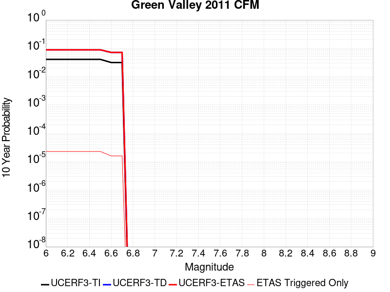 |

| Magnitude | 1 wk TI Prob | 1 wk TD Prob | 1 wk ETAS Prob | 1 wk ETAS/TD Gain | 1 wk ETAS Triggered Only | 1 mo TI Prob | 1 mo TD Prob | 1 mo ETAS Prob | 1 mo ETAS/TD Gain | 1 mo ETAS Triggered Only | 1 yr TI Prob | 1 yr TD Prob | 1 yr ETAS Prob | 1 yr ETAS/TD Gain | 1 yr ETAS Triggered Only | 10 yr TI Prob | 10 yr TD Prob | 10 yr ETAS Prob | 10 yr ETAS/TD Gain | 10 yr ETAS Triggered Only |
|-----|-----|-----|-----|-----|-----|-----|-----|-----|-----|-----|-----|-----|-----|-----|-----|-----|-----|-----|-----|-----|
| 6.0 | 7.9834055E-5 | 1.7647086E-4 | 1.9781181E-4 | 1.1209319 | 2.1344717E-5 | 3.421011E-4 | 7.562273E-4 | 7.7755586E-4 | 1.028204 | 2.1344717E-5 | 0.0041571283 | 0.009193515 | 0.009225238 | 1.0034505 | 3.2017077E-5 | 0.040802166 | 0.08864039 | 0.08866957 | 1.0003291 | 3.2017077E-5 |
| 6.1 | 7.9834055E-5 | 1.7647086E-4 | 1.9781181E-4 | 1.1209319 | 2.1344717E-5 | 3.421011E-4 | 7.562273E-4 | 7.7755586E-4 | 1.028204 | 2.1344717E-5 | 0.0041571283 | 0.009193515 | 0.009225238 | 1.0034505 | 3.2017077E-5 | 0.040802166 | 0.08864039 | 0.08866957 | 1.0003291 | 3.2017077E-5 |
| 6.2 | 7.9834055E-5 | 1.7647086E-4 | 1.9781181E-4 | 1.1209319 | 2.1344717E-5 | 3.421011E-4 | 7.562273E-4 | 7.7755586E-4 | 1.028204 | 2.1344717E-5 | 0.0041571283 | 0.009193515 | 0.009225238 | 1.0034505 | 3.2017077E-5 | 0.040802166 | 0.08864039 | 0.08866957 | 1.0003291 | 3.2017077E-5 |
| 6.3 | 7.9834055E-5 | 1.7647086E-4 | 1.9781181E-4 | 1.1209319 | 2.1344717E-5 | 3.421011E-4 | 7.562273E-4 | 7.7755586E-4 | 1.028204 | 2.1344717E-5 | 0.0041571283 | 0.009193515 | 0.009225238 | 1.0034505 | 3.2017077E-5 | 0.040802166 | 0.08864039 | 0.08866957 | 1.0003291 | 3.2017077E-5 |
| 6.4 | 7.9834055E-5 | 1.7647086E-4 | 1.9781181E-4 | 1.1209319 | 2.1344717E-5 | 3.421011E-4 | 7.562273E-4 | 7.7755586E-4 | 1.028204 | 2.1344717E-5 | 0.0041571283 | 0.009193515 | 0.009225238 | 1.0034505 | 3.2017077E-5 | 0.040802166 | 0.08864039 | 0.08866957 | 1.0003291 | 3.2017077E-5 |
| 6.5 | 7.9834055E-5 | 1.7647086E-4 | 1.9781181E-4 | 1.1209319 | 2.1344717E-5 | 3.421011E-4 | 7.562273E-4 | 7.7755586E-4 | 1.028204 | 2.1344717E-5 | 0.0041571283 | 0.009193515 | 0.009225238 | 1.0034505 | 3.2017077E-5 | 0.040802166 | 0.08864039 | 0.08866957 | 1.0003291 | 3.2017077E-5 |
| 6.6 | 6.153684E-5 | 1.4011236E-4 | 1.4011236E-4 | 1.0 | 0.0 | 2.6370265E-4 | 6.004815E-4 | 6.004815E-4 | 1.0 | 0.0 | 0.0032058533 | 0.0073108627 | 0.007321457 | 1.0014491 | 1.0672358E-5 | 0.03159998 | 0.071543366 | 0.071553275 | 1.0001385 | 1.0672358E-5 |
| 6.7 | 6.153684E-5 | 1.4011236E-4 | 1.4011236E-4 | 1.0 | 0.0 | 2.6370265E-4 | 6.004815E-4 | 6.004815E-4 | 1.0 | 0.0 | 0.0032058533 | 0.0073108627 | 0.007321457 | 1.0014491 | 1.0672358E-5 | 0.03159998 | 0.071543366 | 0.071553275 | 1.0001385 | 1.0672358E-5 |

## Rose Canyon
*[(top)](#table-of-contents)*

| 1 Week | 1 Month | 1 Year | 10 Year |
|-----|-----|-----|-----|
|  |  |  |  |

| Magnitude | 1 wk TI Prob | 1 wk TD Prob | 1 wk ETAS Prob | 1 wk ETAS/TD Gain | 1 wk ETAS Triggered Only | 1 mo TI Prob | 1 mo TD Prob | 1 mo ETAS Prob | 1 mo ETAS/TD Gain | 1 mo ETAS Triggered Only | 1 yr TI Prob | 1 yr TD Prob | 1 yr ETAS Prob | 1 yr ETAS/TD Gain | 1 yr ETAS Triggered Only | 10 yr TI Prob | 10 yr TD Prob | 10 yr ETAS Prob | 10 yr ETAS/TD Gain | 10 yr ETAS Triggered Only |
|-----|-----|-----|-----|-----|-----|-----|-----|-----|-----|-----|-----|-----|-----|-----|-----|-----|-----|-----|-----|-----|
| 6.0 | 1.9167945E-5 | 1.6478027E-5 | 3.7822392E-5 | 2.295323 | 2.1344717E-5 | 8.214574E-5 | 7.06186E-5 | 9.19618E-5 | 1.3022321 | 2.1344717E-5 | 9.996655E-4 | 8.5951196E-4 | 8.915015E-4 | 1.0372183 | 3.2017077E-5 | 0.009951805 | 0.008568751 | 0.008600493 | 1.0037044 | 3.2017077E-5 |
| 6.1 | 1.9167945E-5 | 1.6478027E-5 | 3.7822392E-5 | 2.295323 | 2.1344717E-5 | 8.214574E-5 | 7.06186E-5 | 9.19618E-5 | 1.3022321 | 2.1344717E-5 | 9.996655E-4 | 8.5951196E-4 | 8.915015E-4 | 1.0372183 | 3.2017077E-5 | 0.009951805 | 0.008568751 | 0.008600493 | 1.0037044 | 3.2017077E-5 |
| 6.2 | 1.9167945E-5 | 1.6478027E-5 | 3.7822392E-5 | 2.295323 | 2.1344717E-5 | 8.214574E-5 | 7.06186E-5 | 9.19618E-5 | 1.3022321 | 2.1344717E-5 | 9.996655E-4 | 8.5951196E-4 | 8.915015E-4 | 1.0372183 | 3.2017077E-5 | 0.009951805 | 0.008568751 | 0.008600493 | 1.0037044 | 3.2017077E-5 |
| 6.3 | 1.9167945E-5 | 1.6478027E-5 | 3.7822392E-5 | 2.295323 | 2.1344717E-5 | 8.214574E-5 | 7.06186E-5 | 9.19618E-5 | 1.3022321 | 2.1344717E-5 | 9.996655E-4 | 8.5951196E-4 | 8.915015E-4 | 1.0372183 | 3.2017077E-5 | 0.009951805 | 0.008568751 | 0.008600493 | 1.0037044 | 3.2017077E-5 |
| 6.4 | 1.9167945E-5 | 1.6478027E-5 | 3.7822392E-5 | 2.295323 | 2.1344717E-5 | 8.214574E-5 | 7.06186E-5 | 9.19618E-5 | 1.3022321 | 2.1344717E-5 | 9.996655E-4 | 8.5951196E-4 | 8.915015E-4 | 1.0372183 | 3.2017077E-5 | 0.009951805 | 0.008568751 | 0.008600493 | 1.0037044 | 3.2017077E-5 |
| 6.5 | 1.9167945E-5 | 1.6478027E-5 | 3.7822392E-5 | 2.295323 | 2.1344717E-5 | 8.214574E-5 | 7.06186E-5 | 9.19618E-5 | 1.3022321 | 2.1344717E-5 | 9.996655E-4 | 8.5951196E-4 | 8.915015E-4 | 1.0372183 | 3.2017077E-5 | 0.009951805 | 0.008568751 | 0.008600493 | 1.0037044 | 3.2017077E-5 |
| 6.6 | 1.6032436E-5 | 1.3771202E-5 | 3.5115627E-5 | 2.5499318 | 2.1344717E-5 | 6.870863E-5 | 5.901849E-5 | 8.036195E-5 | 1.3616402 | 2.1344717E-5 | 8.362065E-4 | 7.183819E-4 | 7.5037597E-4 | 1.0445364 | 3.2017077E-5 | 0.008330669 | 0.0071673454 | 0.0071991333 | 1.0044351 | 3.2017077E-5 |
| 6.7 | 1.32651885E-5 | 1.1282621E-5 | 2.195486E-5 | 1.9459006 | 1.0672358E-5 | 5.684957E-5 | 4.8353573E-5 | 5.9025417E-5 | 1.2207043 | 1.0672358E-5 | 6.919237E-4 | 5.8861315E-4 | 6.0994533E-4 | 1.0362414 | 2.1344717E-5 | 0.0068977326 | 0.005877156 | 0.005898375 | 1.0036105 | 2.1344717E-5 |
| 6.8 | 1.2374002E-5 | 1.0546746E-5 | 2.1218992E-5 | 2.0118995 | 1.0672358E-5 | 5.303036E-5 | 4.5199937E-5 | 5.5871813E-5 | 1.2361038 | 1.0672358E-5 | 6.4545334E-4 | 5.5023754E-4 | 5.7157053E-4 | 1.0387704 | 2.1344717E-5 | 0.006435818 | 0.005495354 | 0.0055165812 | 1.0038627 | 2.1344717E-5 |
| 6.9 | 3.8401595E-6 | 3.178941E-6 | 1.3851266E-5 | 4.357195 | 1.0672358E-5 | 1.6457723E-5 | 1.3623983E-5 | 2.4296196E-5 | 1.7833401 | 1.0672358E-5 | 2.0035435E-4 | 1.6586324E-4 | 1.7653384E-4 | 1.0643337 | 1.0672358E-5 | 0.0020017382 | 0.0016577742 | 0.0016684289 | 1.006427 | 1.0672358E-5 |
| 7.0 | 3.6026508E-6 | 2.9376413E-6 | 1.3609969E-5 | 4.632958 | 1.0672358E-5 | 1.543984E-5 | 1.2589852E-5 | 2.3262077E-5 | 1.8476846 | 1.0672358E-5 | 1.8796384E-4 | 1.5327454E-4 | 1.6394525E-4 | 1.0696183 | 1.0672358E-5 | 0.0018780495 | 0.0015320673 | 0.0015427233 | 1.0069553 | 1.0672358E-5 |
| 7.1 | 3.3657313E-6 | 2.6902792E-6 | 1.3362609E-5 | 4.966997 | 1.0672358E-5 | 1.4424483E-5 | 1.1529739E-5 | 2.2201973E-5 | 1.9256269 | 1.0672358E-5 | 1.7560393E-4 | 1.4036939E-4 | 1.5104025E-4 | 1.0760199 | 1.0672358E-5 | 0.0017546522 | 0.0014031857 | 0.001413843 | 1.0075952 | 1.0672358E-5 |
| 7.2 | 3.1430025E-6 | 2.4618412E-6 | 1.3134173E-5 | 5.335102 | 1.0672358E-5 | 1.3469941E-5 | 1.0550727E-5 | 2.1222973E-5 | 2.0115175 | 1.0672358E-5 | 1.639842E-4 | 1.2845139E-4 | 1.3912236E-4 | 1.0830741 | 1.0672358E-5 | 0.0016386324 | 0.0012841492 | 0.0012948079 | 1.0083002 | 1.0672358E-5 |
| 7.3 | 2.898987E-6 | 2.2514312E-6 | 1.2923766E-5 | 5.7402444 | 1.0672358E-5 | 1.24241715E-5 | 9.648977E-6 | 2.0321233E-5 | 2.1060505 | 1.0672358E-5 | 1.5125379E-4 | 1.1747381E-4 | 1.2814492E-4 | 1.0908382 | 1.0672358E-5 | 0.0015115088 | 0.0011744945 | 0.0011851544 | 1.0090761 | 1.0672358E-5 |
| 7.4 | 2.5994284E-6 | 2.0116724E-6 | 1.268401E-5 | 6.3052063 | 1.0672358E-5 | 1.114036E-5 | 8.621447E-6 | 1.9293713E-5 | 2.2378743 | 1.0672358E-5 | 1.3562544E-4 | 1.049649E-4 | 1.1563614E-4 | 1.1016648 | 1.0672358E-5 | 0.0013554269 | 0.00104953 | 0.0010601912 | 1.0101581 | 1.0672358E-5 |
| 7.5 | 2.2517988E-6 | 1.7516537E-6 | 1.2423993E-5 | 7.0927224 | 1.0672358E-5 | 9.650531E-6 | 7.5070875E-6 | 1.8179366E-5 | 2.421627 | 1.0672358E-5 | 1.17488875E-4 | 9.139879E-5 | 1.02070175E-4 | 1.1167563 | 1.0672358E-5 | 0.0011742678 | 9.1398787E-4 | 9.2465046E-4 | 1.011666 | 1.0672358E-5 |

## Great Valley 10 (Panoche)
*[(top)](#table-of-contents)*

| 1 Week | 1 Month | 1 Year | 10 Year |
|-----|-----|-----|-----|
|  |  |  |  |

| Magnitude | 1 wk TI Prob | 1 wk TD Prob | 1 wk ETAS Prob | 1 wk ETAS/TD Gain | 1 wk ETAS Triggered Only | 1 mo TI Prob | 1 mo TD Prob | 1 mo ETAS Prob | 1 mo ETAS/TD Gain | 1 mo ETAS Triggered Only | 1 yr TI Prob | 1 yr TD Prob | 1 yr ETAS Prob | 1 yr ETAS/TD Gain | 1 yr ETAS Triggered Only | 10 yr TI Prob | 10 yr TD Prob | 10 yr ETAS Prob | 10 yr ETAS/TD Gain | 10 yr ETAS Triggered Only |
|-----|-----|-----|-----|-----|-----|-----|-----|-----|-----|-----|-----|-----|-----|-----|-----|-----|-----|-----|-----|-----|
| 6.0 | 3.6887384E-5 | 5.0836705E-5 | 8.285215E-5 | 1.6297704 | 3.2017077E-5 | 1.580792E-4 | 2.1787158E-4 | 2.4988168E-4 | 1.1469219 | 3.2017077E-5 | 0.0019229152 | 0.002652291 | 0.002684223 | 1.0120394 | 3.2017077E-5 | 0.01906361 | 0.026489226 | 0.026520394 | 1.0011767 | 3.2017077E-5 |
| 6.1 | 3.6887384E-5 | 5.0836705E-5 | 8.285215E-5 | 1.6297704 | 3.2017077E-5 | 1.580792E-4 | 2.1787158E-4 | 2.4988168E-4 | 1.1469219 | 3.2017077E-5 | 0.0019229152 | 0.002652291 | 0.002684223 | 1.0120394 | 3.2017077E-5 | 0.01906361 | 0.026489226 | 0.026520394 | 1.0011767 | 3.2017077E-5 |
| 6.2 | 3.6887384E-5 | 5.0836705E-5 | 8.285215E-5 | 1.6297704 | 3.2017077E-5 | 1.580792E-4 | 2.1787158E-4 | 2.4988168E-4 | 1.1469219 | 3.2017077E-5 | 0.0019229152 | 0.002652291 | 0.002684223 | 1.0120394 | 3.2017077E-5 | 0.01906361 | 0.026489226 | 0.026520394 | 1.0011767 | 3.2017077E-5 |
| 6.3 | 3.6887384E-5 | 5.0836705E-5 | 8.285215E-5 | 1.6297704 | 3.2017077E-5 | 1.580792E-4 | 2.1787158E-4 | 2.4988168E-4 | 1.1469219 | 3.2017077E-5 | 0.0019229152 | 0.002652291 | 0.002684223 | 1.0120394 | 3.2017077E-5 | 0.01906361 | 0.026489226 | 0.026520394 | 1.0011767 | 3.2017077E-5 |
| 6.4 | 3.6887384E-5 | 5.0836705E-5 | 8.285215E-5 | 1.6297704 | 3.2017077E-5 | 1.580792E-4 | 2.1787158E-4 | 2.4988168E-4 | 1.1469219 | 3.2017077E-5 | 0.0019229152 | 0.002652291 | 0.002684223 | 1.0120394 | 3.2017077E-5 | 0.01906361 | 0.026489226 | 0.026520394 | 1.0011767 | 3.2017077E-5 |

## Rodgers Creek - Healdsburg 2011 CFM
*[(top)](#table-of-contents)*

| 1 Week | 1 Month | 1 Year | 10 Year |
|-----|-----|-----|-----|
|  |  |  |  |

| Magnitude | 1 wk TI Prob | 1 wk TD Prob | 1 wk ETAS Prob | 1 wk ETAS/TD Gain | 1 wk ETAS Triggered Only | 1 mo TI Prob | 1 mo TD Prob | 1 mo ETAS Prob | 1 mo ETAS/TD Gain | 1 mo ETAS Triggered Only | 1 yr TI Prob | 1 yr TD Prob | 1 yr ETAS Prob | 1 yr ETAS/TD Gain | 1 yr ETAS Triggered Only | 10 yr TI Prob | 10 yr TD Prob | 10 yr ETAS Prob | 10 yr ETAS/TD Gain | 10 yr ETAS Triggered Only |
|-----|-----|-----|-----|-----|-----|-----|-----|-----|-----|-----|-----|-----|-----|-----|-----|-----|-----|-----|-----|-----|
| 6.0 | 9.830927E-5 | 2.4955187E-4 | 2.7089127E-4 | 1.0855108 | 2.1344717E-5 | 4.212574E-4 | 0.0010693158 | 0.0010906378 | 1.0199398 | 2.1344717E-5 | 0.0051167537 | 0.012984863 | 0.013016464 | 1.0024337 | 3.2017077E-5 | 0.05000532 | 0.12216672 | 0.12219483 | 1.0002301 | 3.2017077E-5 |
| 6.1 | 9.830927E-5 | 2.4955187E-4 | 2.7089127E-4 | 1.0855108 | 2.1344717E-5 | 4.212574E-4 | 0.0010693158 | 0.0010906378 | 1.0199398 | 2.1344717E-5 | 0.0051167537 | 0.012984863 | 0.013016464 | 1.0024337 | 3.2017077E-5 | 0.05000532 | 0.12216672 | 0.12219483 | 1.0002301 | 3.2017077E-5 |
| 6.2 | 9.830927E-5 | 2.4955187E-4 | 2.7089127E-4 | 1.0855108 | 2.1344717E-5 | 4.212574E-4 | 0.0010693158 | 0.0010906378 | 1.0199398 | 2.1344717E-5 | 0.0051167537 | 0.012984863 | 0.013016464 | 1.0024337 | 3.2017077E-5 | 0.05000532 | 0.12216672 | 0.12219483 | 1.0002301 | 3.2017077E-5 |
| 6.3 | 9.830927E-5 | 2.4955187E-4 | 2.7089127E-4 | 1.0855108 | 2.1344717E-5 | 4.212574E-4 | 0.0010693158 | 0.0010906378 | 1.0199398 | 2.1344717E-5 | 0.0051167537 | 0.012984863 | 0.013016464 | 1.0024337 | 3.2017077E-5 | 0.05000532 | 0.12216672 | 0.12219483 | 1.0002301 | 3.2017077E-5 |
| 6.4 | 9.830927E-5 | 2.4955187E-4 | 2.7089127E-4 | 1.0855108 | 2.1344717E-5 | 4.212574E-4 | 0.0010693158 | 0.0010906378 | 1.0199398 | 2.1344717E-5 | 0.0051167537 | 0.012984863 | 0.013016464 | 1.0024337 | 3.2017077E-5 | 0.05000532 | 0.12216672 | 0.12219483 | 1.0002301 | 3.2017077E-5 |
| 6.5 | 9.830927E-5 | 2.4955187E-4 | 2.7089127E-4 | 1.0855108 | 2.1344717E-5 | 4.212574E-4 | 0.0010693158 | 0.0010906378 | 1.0199398 | 2.1344717E-5 | 0.0051167537 | 0.012984863 | 0.013016464 | 1.0024337 | 3.2017077E-5 | 0.05000532 | 0.12216672 | 0.12219483 | 1.0002301 | 3.2017077E-5 |
| 6.6 | 9.722793E-5 | 2.4745433E-4 | 2.6879378E-4 | 1.0862359 | 2.1344717E-5 | 4.1662456E-4 | 0.001060334 | 0.0010816561 | 1.0201088 | 2.1344717E-5 | 0.0050606127 | 0.012876847 | 0.012908451 | 1.0024544 | 3.2017077E-5 | 0.049469102 | 0.12122572 | 0.12125386 | 1.0002321 | 3.2017077E-5 |
| 6.7 | 9.631043E-5 | 2.4569524E-4 | 2.6703472E-4 | 1.0868534 | 2.1344717E-5 | 4.1269368E-4 | 0.0010528011 | 0.0010741233 | 1.0202528 | 2.1344717E-5 | 0.0050129755 | 0.012786214 | 0.012817822 | 1.002472 | 3.2017077E-5 | 0.049013894 | 0.12043094 | 0.1204591 | 1.0002339 | 3.2017077E-5 |
| 6.8 | 9.5157004E-5 | 2.4311169E-4 | 2.6445123E-4 | 1.0877767 | 2.1344717E-5 | 4.0775197E-4 | 0.0010417376 | 0.0010630601 | 1.0204682 | 2.1344717E-5 | 0.0049530854 | 0.012653089 | 0.012684701 | 1.0024984 | 3.2017077E-5 | 0.048441324 | 0.1192606 | 0.1192888 | 1.0002364 | 3.2017077E-5 |
| 6.9 | 9.3715214E-5 | 2.3986747E-4 | 2.6120705E-4 | 1.0889641 | 2.1344717E-5 | 4.015748E-4 | 0.0010278448 | 0.0010491676 | 1.0207452 | 2.1344717E-5 | 0.004878218 | 0.012485896 | 0.012517514 | 1.0025322 | 3.2017077E-5 | 0.047725122 | 0.11779124 | 0.11781949 | 1.0002398 | 3.2017077E-5 |
| 7.0 | 9.21773E-5 | 2.3636219E-4 | 2.5770185E-4 | 1.0902838 | 2.1344717E-5 | 3.9498575E-4 | 0.0010128339 | 0.0010341571 | 1.021053 | 2.1344717E-5 | 0.0047983527 | 0.012305218 | 0.012336841 | 1.0025699 | 3.2017077E-5 | 0.046960585 | 0.11620537 | 0.11623367 | 1.0002435 | 3.2017077E-5 |
| 7.1 | 1.8670535E-5 | 4.6669888E-5 | 5.734175E-5 | 1.2286669 | 1.0672358E-5 | 8.001412E-5 | 2.0000339E-4 | 2.106736E-4 | 1.0533502 | 1.0672358E-5 | 9.737365E-4 | 0.0024331913 | 0.002454484 | 1.0087509 | 2.1344717E-5 | 0.009694808 | 0.023618827 | 0.023639668 | 1.0008824 | 2.1344717E-5 |
| 7.2 | 6.6138855E-6 | 1.8792352E-5 | 2.946451E-5 | 1.567899 | 1.0672358E-5 | 2.8344915E-5 | 8.053787E-5 | 9.1209375E-5 | 1.1325029 | 1.0672358E-5 | 3.4504468E-4 | 9.8041E-4 | 0.0010017338 | 1.0217499 | 2.1344717E-5 | 0.0034450945 | 0.009560432 | 0.009581573 | 1.0022112 | 2.1344717E-5 |
| 7.3 | 5.4382035E-6 | 1.5442325E-5 | 2.6114518E-5 | 1.6911002 | 1.0672358E-5 | 2.3306378E-5 | 6.618139E-5 | 7.6853044E-5 | 1.1612486 | 1.0672358E-5 | 2.8371823E-4 | 8.0575846E-4 | 8.27086E-4 | 1.0264689 | 2.1344717E-5 | 0.0028335627 | 0.007868089 | 0.007889266 | 1.0026915 | 2.1344717E-5 |

## Hollywood
*[(top)](#table-of-contents)*

| 1 Week | 1 Month | 1 Year | 10 Year |
|-----|-----|-----|-----|
|  |  |  |  |

| Magnitude | 1 wk TI Prob | 1 wk TD Prob | 1 wk ETAS Prob | 1 wk ETAS/TD Gain | 1 wk ETAS Triggered Only | 1 mo TI Prob | 1 mo TD Prob | 1 mo ETAS Prob | 1 mo ETAS/TD Gain | 1 mo ETAS Triggered Only | 1 yr TI Prob | 1 yr TD Prob | 1 yr ETAS Prob | 1 yr ETAS/TD Gain | 1 yr ETAS Triggered Only | 10 yr TI Prob | 10 yr TD Prob | 10 yr ETAS Prob | 10 yr ETAS/TD Gain | 10 yr ETAS Triggered Only |
|-----|-----|-----|-----|-----|-----|-----|-----|-----|-----|-----|-----|-----|-----|-----|-----|-----|-----|-----|-----|-----|
| 6.0 | 1.8637298E-5 | 2.1684791E-5 | 2.1684791E-5 | 1.0 | 0.0 | 7.987169E-5 | 9.2934824E-5 | 9.2934824E-5 | 1.0 | 0.0 | 9.720039E-4 | 0.0011314814 | 0.0011421416 | 1.0094216 | 1.0672358E-5 | 0.009677634 | 0.011314785 | 0.01134644 | 1.0027976 | 3.2017077E-5 |
| 6.1 | 1.8637298E-5 | 2.1684791E-5 | 2.1684791E-5 | 1.0 | 0.0 | 7.987169E-5 | 9.2934824E-5 | 9.2934824E-5 | 1.0 | 0.0 | 9.720039E-4 | 0.0011314814 | 0.0011421416 | 1.0094216 | 1.0672358E-5 | 0.009677634 | 0.011314785 | 0.01134644 | 1.0027976 | 3.2017077E-5 |
| 6.2 | 1.8637298E-5 | 2.1684791E-5 | 2.1684791E-5 | 1.0 | 0.0 | 7.987169E-5 | 9.2934824E-5 | 9.2934824E-5 | 1.0 | 0.0 | 9.720039E-4 | 0.0011314814 | 0.0011421416 | 1.0094216 | 1.0672358E-5 | 0.009677634 | 0.011314785 | 0.01134644 | 1.0027976 | 3.2017077E-5 |
| 6.3 | 1.8637298E-5 | 2.1684791E-5 | 2.1684791E-5 | 1.0 | 0.0 | 7.987169E-5 | 9.2934824E-5 | 9.2934824E-5 | 1.0 | 0.0 | 9.720039E-4 | 0.0011314814 | 0.0011421416 | 1.0094216 | 1.0672358E-5 | 0.009677634 | 0.011314785 | 0.01134644 | 1.0027976 | 3.2017077E-5 |
| 6.4 | 1.8637298E-5 | 2.1684791E-5 | 2.1684791E-5 | 1.0 | 0.0 | 7.987169E-5 | 9.2934824E-5 | 9.2934824E-5 | 1.0 | 0.0 | 9.720039E-4 | 0.0011314814 | 0.0011421416 | 1.0094216 | 1.0672358E-5 | 0.009677634 | 0.011314785 | 0.01134644 | 1.0027976 | 3.2017077E-5 |
| 6.5 | 1.8637298E-5 | 2.1684791E-5 | 2.1684791E-5 | 1.0 | 0.0 | 7.987169E-5 | 9.2934824E-5 | 9.2934824E-5 | 1.0 | 0.0 | 9.720039E-4 | 0.0011314814 | 0.0011421416 | 1.0094216 | 1.0672358E-5 | 0.009677634 | 0.011314785 | 0.01134644 | 1.0027976 | 3.2017077E-5 |

## Los Osos 2011
*[(top)](#table-of-contents)*

| 1 Week | 1 Month | 1 Year | 10 Year |
|-----|-----|-----|-----|
|  |  |  |  |

| Magnitude | 1 wk TI Prob | 1 wk TD Prob | 1 wk ETAS Prob | 1 wk ETAS/TD Gain | 1 wk ETAS Triggered Only | 1 mo TI Prob | 1 mo TD Prob | 1 mo ETAS Prob | 1 mo ETAS/TD Gain | 1 mo ETAS Triggered Only | 1 yr TI Prob | 1 yr TD Prob | 1 yr ETAS Prob | 1 yr ETAS/TD Gain | 1 yr ETAS Triggered Only | 10 yr TI Prob | 10 yr TD Prob | 10 yr ETAS Prob | 10 yr ETAS/TD Gain | 10 yr ETAS Triggered Only |
|-----|-----|-----|-----|-----|-----|-----|-----|-----|-----|-----|-----|-----|-----|-----|-----|-----|-----|-----|-----|-----|
| 6.0 | 8.431995E-6 | 8.921914E-6 | 1.9594178E-5 | 2.1961854 | 1.0672358E-5 | 3.6136626E-5 | 3.8236416E-5 | 4.8908365E-5 | 1.2791044 | 1.0672358E-5 | 4.3987457E-4 | 4.6546472E-4 | 4.974669E-4 | 1.0687531 | 3.2017077E-5 | 0.004390049 | 0.0046484126 | 0.004680281 | 1.0068557 | 3.2017077E-5 |
| 6.1 | 8.431995E-6 | 8.921914E-6 | 1.9594178E-5 | 2.1961854 | 1.0672358E-5 | 3.6136626E-5 | 3.8236416E-5 | 4.8908365E-5 | 1.2791044 | 1.0672358E-5 | 4.3987457E-4 | 4.6546472E-4 | 4.974669E-4 | 1.0687531 | 3.2017077E-5 | 0.004390049 | 0.0046484126 | 0.004680281 | 1.0068557 | 3.2017077E-5 |
| 6.2 | 8.431995E-6 | 8.921914E-6 | 1.9594178E-5 | 2.1961854 | 1.0672358E-5 | 3.6136626E-5 | 3.8236416E-5 | 4.8908365E-5 | 1.2791044 | 1.0672358E-5 | 4.3987457E-4 | 4.6546472E-4 | 4.974669E-4 | 1.0687531 | 3.2017077E-5 | 0.004390049 | 0.0046484126 | 0.004680281 | 1.0068557 | 3.2017077E-5 |
| 6.3 | 8.431995E-6 | 8.921914E-6 | 1.9594178E-5 | 2.1961854 | 1.0672358E-5 | 3.6136626E-5 | 3.8236416E-5 | 4.8908365E-5 | 1.2791044 | 1.0672358E-5 | 4.3987457E-4 | 4.6546472E-4 | 4.974669E-4 | 1.0687531 | 3.2017077E-5 | 0.004390049 | 0.0046484126 | 0.004680281 | 1.0068557 | 3.2017077E-5 |
| 6.4 | 8.431995E-6 | 8.921914E-6 | 1.9594178E-5 | 2.1961854 | 1.0672358E-5 | 3.6136626E-5 | 3.8236416E-5 | 4.8908365E-5 | 1.2791044 | 1.0672358E-5 | 4.3987457E-4 | 4.6546472E-4 | 4.974669E-4 | 1.0687531 | 3.2017077E-5 | 0.004390049 | 0.0046484126 | 0.004680281 | 1.0068557 | 3.2017077E-5 |
| 6.5 | 8.431995E-6 | 8.921914E-6 | 1.9594178E-5 | 2.1961854 | 1.0672358E-5 | 3.6136626E-5 | 3.8236416E-5 | 4.8908365E-5 | 1.2791044 | 1.0672358E-5 | 4.3987457E-4 | 4.6546472E-4 | 4.974669E-4 | 1.0687531 | 3.2017077E-5 | 0.004390049 | 0.0046484126 | 0.004680281 | 1.0068557 | 3.2017077E-5 |
| 6.6 | 7.640001E-6 | 8.0825275E-6 | 1.8754801E-5 | 2.3204126 | 1.0672358E-5 | 3.274245E-5 | 3.4639146E-5 | 4.5311135E-5 | 1.3080904 | 1.0672358E-5 | 3.9856642E-4 | 4.2168552E-4 | 4.430212E-4 | 1.0505962 | 2.1344717E-5 | 0.0039785234 | 0.004212338 | 0.004233593 | 1.0050459 | 2.1344717E-5 |
| 6.7 | 6.515521E-6 | 6.8883687E-6 | 1.7560655E-5 | 2.5493197 | 1.0672358E-5 | 2.7923363E-5 | 2.9521441E-5 | 4.0193485E-5 | 1.3615015 | 1.0672358E-5 | 3.399139E-4 | 3.593989E-4 | 3.8073596E-4 | 1.0593687 | 2.1344717E-5 | 0.0033939444 | 0.003591573 | 0.003612841 | 1.0059216 | 2.1344717E-5 |
| 6.8 | 4.831725E-6 | 5.104944E-6 | 1.5777248E-5 | 3.0905821 | 1.0672358E-5 | 2.0707228E-5 | 2.1878332E-5 | 3.2550455E-5 | 1.4877943 | 1.0672358E-5 | 2.5208134E-4 | 2.6636868E-4 | 2.770382E-4 | 1.0400554 | 1.0672358E-5 | 0.0025179558 | 0.0026636869 | 0.0026743307 | 1.0039959 | 1.0672358E-5 |
| 6.9 | 4.831725E-6 | 5.104944E-6 | 1.5777248E-5 | 3.0905821 | 1.0672358E-5 | 2.0707228E-5 | 2.1878332E-5 | 3.2550455E-5 | 1.4877943 | 1.0672358E-5 | 2.5208134E-4 | 2.6636868E-4 | 2.770382E-4 | 1.0400554 | 1.0672358E-5 | 0.0025179558 | 0.0026636869 | 0.0026743307 | 1.0039959 | 1.0672358E-5 |

## Coronado Bank alt1
*[(top)](#table-of-contents)*

| 1 Week | 1 Month | 1 Year | 10 Year |
|-----|-----|-----|-----|
|  | 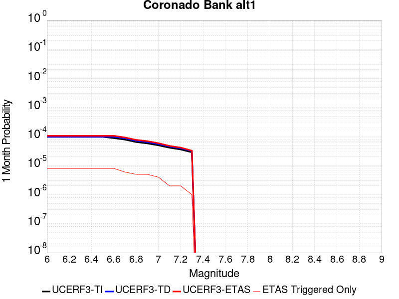 |  |  |

| Magnitude | 1 wk TI Prob | 1 wk TD Prob | 1 wk ETAS Prob | 1 wk ETAS/TD Gain | 1 wk ETAS Triggered Only | 1 mo TI Prob | 1 mo TD Prob | 1 mo ETAS Prob | 1 mo ETAS/TD Gain | 1 mo ETAS Triggered Only | 1 yr TI Prob | 1 yr TD Prob | 1 yr ETAS Prob | 1 yr ETAS/TD Gain | 1 yr ETAS Triggered Only | 10 yr TI Prob | 10 yr TD Prob | 10 yr ETAS Prob | 10 yr ETAS/TD Gain | 10 yr ETAS Triggered Only |
|-----|-----|-----|-----|-----|-----|-----|-----|-----|-----|-----|-----|-----|-----|-----|-----|-----|-----|-----|-----|-----|
| 6.0 | 2.2805418E-5 | 2.2997261E-5 | 3.3669374E-5 | 1.4640602 | 1.0672358E-5 | 9.773385E-5 | 9.8556375E-5 | 1.0922768E-4 | 1.1082761 | 1.0672358E-5 | 0.00118926 | 0.0011993361 | 0.0012206553 | 1.0177758 | 2.1344717E-5 | 0.011829156 | 0.011935918 | 0.011957008 | 1.0017669 | 2.1344717E-5 |
| 6.1 | 2.2805418E-5 | 2.2997261E-5 | 3.3669374E-5 | 1.4640602 | 1.0672358E-5 | 9.773385E-5 | 9.8556375E-5 | 1.0922768E-4 | 1.1082761 | 1.0672358E-5 | 0.00118926 | 0.0011993361 | 0.0012206553 | 1.0177758 | 2.1344717E-5 | 0.011829156 | 0.011935918 | 0.011957008 | 1.0017669 | 2.1344717E-5 |
| 6.2 | 2.2805418E-5 | 2.2997261E-5 | 3.3669374E-5 | 1.4640602 | 1.0672358E-5 | 9.773385E-5 | 9.8556375E-5 | 1.0922768E-4 | 1.1082761 | 1.0672358E-5 | 0.00118926 | 0.0011993361 | 0.0012206553 | 1.0177758 | 2.1344717E-5 | 0.011829156 | 0.011935918 | 0.011957008 | 1.0017669 | 2.1344717E-5 |
| 6.3 | 2.2805418E-5 | 2.2997261E-5 | 3.3669374E-5 | 1.4640602 | 1.0672358E-5 | 9.773385E-5 | 9.8556375E-5 | 1.0922768E-4 | 1.1082761 | 1.0672358E-5 | 0.00118926 | 0.0011993361 | 0.0012206553 | 1.0177758 | 2.1344717E-5 | 0.011829156 | 0.011935918 | 0.011957008 | 1.0017669 | 2.1344717E-5 |
| 6.4 | 2.2805418E-5 | 2.2997261E-5 | 3.3669374E-5 | 1.4640602 | 1.0672358E-5 | 9.773385E-5 | 9.8556375E-5 | 1.0922768E-4 | 1.1082761 | 1.0672358E-5 | 0.00118926 | 0.0011993361 | 0.0012206553 | 1.0177758 | 2.1344717E-5 | 0.011829156 | 0.011935918 | 0.011957008 | 1.0017669 | 2.1344717E-5 |
| 6.5 | 2.2805418E-5 | 2.2997261E-5 | 3.3669374E-5 | 1.4640602 | 1.0672358E-5 | 9.773385E-5 | 9.8556375E-5 | 1.0922768E-4 | 1.1082761 | 1.0672358E-5 | 0.00118926 | 0.0011993361 | 0.0012206553 | 1.0177758 | 2.1344717E-5 | 0.011829156 | 0.011935918 | 0.011957008 | 1.0017669 | 2.1344717E-5 |
| 6.6 | 2.0608364E-5 | 2.2997261E-5 | 3.3669374E-5 | 1.4640602 | 1.0672358E-5 | 8.831857E-5 | 9.8556375E-5 | 1.0922768E-4 | 1.1082761 | 1.0672358E-5 | 0.0010747481 | 0.0011993361 | 0.0012206553 | 1.0177758 | 2.1344717E-5 | 0.010695651 | 0.011935918 | 0.011957008 | 1.0017669 | 2.1344717E-5 |
| 6.7 | 1.8279972E-5 | 2.0392206E-5 | 3.1064348E-5 | 1.523344 | 1.0672358E-5 | 7.834038E-5 | 8.7392655E-5 | 9.8064076E-5 | 1.1221089 | 1.0672358E-5 | 9.533768E-4 | 0.0010635584 | 0.0010848804 | 1.0200478 | 2.1344717E-5 | 0.00949297 | 0.010591865 | 0.010612983 | 1.0019939 | 2.1344717E-5 |
| 6.8 | 1.5100513E-5 | 1.6821805E-5 | 2.7493985E-5 | 1.6344253 | 1.0672358E-5 | 6.471488E-5 | 7.209186E-5 | 8.276345E-5 | 1.1480277 | 1.0672358E-5 | 7.876188E-4 | 8.77436E-4 | 8.98762E-4 | 1.0243049 | 2.1344717E-5 | 0.007848332 | 0.008746733 | 0.008767891 | 1.002419 | 2.1344717E-5 |
| 6.9 | 1.3558665E-5 | 1.5095915E-5 | 2.5768113E-5 | 1.7069592 | 1.0672358E-5 | 5.810727E-5 | 6.4695574E-5 | 7.536724E-5 | 1.164952 | 1.0672358E-5 | 7.0722634E-4 | 7.874548E-4 | 8.087827E-4 | 1.0270846 | 2.1344717E-5 | 0.0070497985 | 0.007853617 | 0.007874794 | 1.0026965 | 2.1344717E-5 |
| 7.0 | 1.1606914E-5 | 1.2905324E-5 | 2.3577544E-5 | 1.8269626 | 1.0672358E-5 | 4.9742972E-5 | 5.5307755E-5 | 6.5979526E-5 | 1.1929525 | 1.0672358E-5 | 6.0545234E-4 | 6.7323423E-4 | 6.9456454E-4 | 1.0316834 | 2.1344717E-5 | 0.0060380544 | 0.006718854 | 0.0067400555 | 1.0031555 | 2.1344717E-5 |
| 7.1 | 9.601701E-6 | 1.06512E-5 | 2.1323445E-5 | 2.0019758 | 1.0672358E-5 | 4.11495E-5 | 4.564759E-5 | 5.6319463E-5 | 1.2337883 | 1.0672358E-5 | 5.0088E-4 | 5.556874E-4 | 5.770203E-4 | 1.03839 | 2.1344717E-5 | 0.0049975254 | 0.005549817 | 0.005571043 | 1.0038247 | 2.1344717E-5 |
| 7.2 | 8.368532E-6 | 9.267938E-6 | 1.9940198E-5 | 2.1515248 | 1.0672358E-5 | 3.5864643E-5 | 3.971952E-5 | 5.0391456E-5 | 1.2686824 | 1.0672358E-5 | 4.3656456E-4 | 4.8354716E-4 | 5.0488155E-4 | 1.0441207 | 2.1344717E-5 | 0.004357079 | 0.0048317458 | 0.0048529874 | 1.0043962 | 2.1344717E-5 |
| 7.3 | 6.710382E-6 | 7.416545E-6 | 7.416545E-6 | 1.0 | 0.0 | 2.8758463E-5 | 3.1785192E-5 | 3.1785192E-5 | 1.0 | 0.0 | 3.5007801E-4 | 3.8698473E-4 | 3.9765294E-4 | 1.0275676 | 1.0672358E-5 | 0.0034952704 | 0.0038698472 | 0.0038804782 | 1.0027472 | 1.0672358E-5 |

## San Joaquin Hills
*[(top)](#table-of-contents)*

| 1 Week | 1 Month | 1 Year | 10 Year |
|-----|-----|-----|-----|
|  |  | 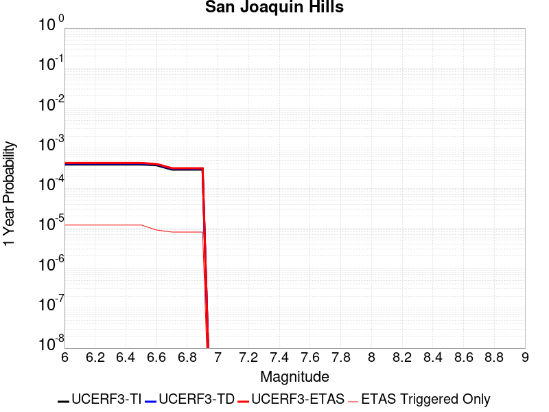 |  |

| Magnitude | 1 wk TI Prob | 1 wk TD Prob | 1 wk ETAS Prob | 1 wk ETAS/TD Gain | 1 wk ETAS Triggered Only | 1 mo TI Prob | 1 mo TD Prob | 1 mo ETAS Prob | 1 mo ETAS/TD Gain | 1 mo ETAS Triggered Only | 1 yr TI Prob | 1 yr TD Prob | 1 yr ETAS Prob | 1 yr ETAS/TD Gain | 1 yr ETAS Triggered Only | 10 yr TI Prob | 10 yr TD Prob | 10 yr ETAS Prob | 10 yr ETAS/TD Gain | 10 yr ETAS Triggered Only |
|-----|-----|-----|-----|-----|-----|-----|-----|-----|-----|-----|-----|-----|-----|-----|-----|-----|-----|-----|-----|-----|
| 6.0 | 7.517352E-6 | 7.930626E-6 | 7.930626E-6 | 1.0 | 0.0 | 3.2216827E-5 | 3.398822E-5 | 4.4660217E-5 | 1.3139911 | 1.0672358E-5 | 3.9216926E-4 | 4.137751E-4 | 4.2444305E-4 | 1.025782 | 1.0672358E-5 | 0.003914779 | 0.0041346652 | 0.0041559217 | 1.005141 | 2.1344717E-5 |
| 6.1 | 7.517352E-6 | 7.930626E-6 | 7.930626E-6 | 1.0 | 0.0 | 3.2216827E-5 | 3.398822E-5 | 4.4660217E-5 | 1.3139911 | 1.0672358E-5 | 3.9216926E-4 | 4.137751E-4 | 4.2444305E-4 | 1.025782 | 1.0672358E-5 | 0.003914779 | 0.0041346652 | 0.0041559217 | 1.005141 | 2.1344717E-5 |
| 6.2 | 7.517352E-6 | 7.930626E-6 | 7.930626E-6 | 1.0 | 0.0 | 3.2216827E-5 | 3.398822E-5 | 4.4660217E-5 | 1.3139911 | 1.0672358E-5 | 3.9216926E-4 | 4.137751E-4 | 4.2444305E-4 | 1.025782 | 1.0672358E-5 | 0.003914779 | 0.0041346652 | 0.0041559217 | 1.005141 | 2.1344717E-5 |
| 6.3 | 7.517352E-6 | 7.930626E-6 | 7.930626E-6 | 1.0 | 0.0 | 3.2216827E-5 | 3.398822E-5 | 4.4660217E-5 | 1.3139911 | 1.0672358E-5 | 3.9216926E-4 | 4.137751E-4 | 4.2444305E-4 | 1.025782 | 1.0672358E-5 | 0.003914779 | 0.0041346652 | 0.0041559217 | 1.005141 | 2.1344717E-5 |
| 6.4 | 7.517352E-6 | 7.930626E-6 | 7.930626E-6 | 1.0 | 0.0 | 3.2216827E-5 | 3.398822E-5 | 4.4660217E-5 | 1.3139911 | 1.0672358E-5 | 3.9216926E-4 | 4.137751E-4 | 4.2444305E-4 | 1.025782 | 1.0672358E-5 | 0.003914779 | 0.0041346652 | 0.0041559217 | 1.005141 | 2.1344717E-5 |
| 6.5 | 7.517352E-6 | 7.930626E-6 | 7.930626E-6 | 1.0 | 0.0 | 3.2216827E-5 | 3.398822E-5 | 4.4660217E-5 | 1.3139911 | 1.0672358E-5 | 3.9216926E-4 | 4.137751E-4 | 4.2444305E-4 | 1.025782 | 1.0672358E-5 | 0.003914779 | 0.0041346652 | 0.0041559217 | 1.005141 | 2.1344717E-5 |
| 6.6 | 7.1722156E-6 | 7.567309E-6 | 7.567309E-6 | 1.0 | 0.0 | 3.0737705E-5 | 3.2431184E-5 | 4.31032E-5 | 1.3290664 | 1.0672358E-5 | 3.7416728E-4 | 3.9482507E-4 | 4.0549322E-4 | 1.02702 | 1.0672358E-5 | 0.003735379 | 0.003945838 | 0.003967099 | 1.005388 | 2.1344717E-5 |
| 6.7 | 5.595255E-6 | 5.8979463E-6 | 5.8979463E-6 | 1.0 | 0.0 | 2.3979444E-5 | 2.5276911E-5 | 3.5949E-5 | 1.422207 | 1.0672358E-5 | 2.9191063E-4 | 3.077464E-4 | 3.184155E-4 | 1.0346684 | 1.0672358E-5 | 0.0029152746 | 0.003077464 | 0.003098743 | 1.0069145 | 2.1344717E-5 |
| 6.8 | 5.595255E-6 | 5.8979463E-6 | 5.8979463E-6 | 1.0 | 0.0 | 2.3979444E-5 | 2.5276911E-5 | 3.5949E-5 | 1.422207 | 1.0672358E-5 | 2.9191063E-4 | 3.077464E-4 | 3.184155E-4 | 1.0346684 | 1.0672358E-5 | 0.0029152746 | 0.003077464 | 0.003098743 | 1.0069145 | 2.1344717E-5 |
| 6.9 | 5.595255E-6 | 5.8979463E-6 | 5.8979463E-6 | 1.0 | 0.0 | 2.3979444E-5 | 2.5276911E-5 | 3.5949E-5 | 1.422207 | 1.0672358E-5 | 2.9191063E-4 | 3.077464E-4 | 3.184155E-4 | 1.0346684 | 1.0672358E-5 | 0.0029152746 | 0.003077464 | 0.003098743 | 1.0069145 | 2.1344717E-5 |

## Santa Monica alt 1
*[(top)](#table-of-contents)*

| 1 Week | 1 Month | 1 Year | 10 Year |
|-----|-----|-----|-----|
|  |  |  |  |

| Magnitude | 1 wk TI Prob | 1 wk TD Prob | 1 wk ETAS Prob | 1 wk ETAS/TD Gain | 1 wk ETAS Triggered Only | 1 mo TI Prob | 1 mo TD Prob | 1 mo ETAS Prob | 1 mo ETAS/TD Gain | 1 mo ETAS Triggered Only | 1 yr TI Prob | 1 yr TD Prob | 1 yr ETAS Prob | 1 yr ETAS/TD Gain | 1 yr ETAS Triggered Only | 10 yr TI Prob | 10 yr TD Prob | 10 yr ETAS Prob | 10 yr ETAS/TD Gain | 10 yr ETAS Triggered Only |
|-----|-----|-----|-----|-----|-----|-----|-----|-----|-----|-----|-----|-----|-----|-----|-----|-----|-----|-----|-----|-----|
| 6.0 | 1.14914055E-5 | 1.2581658E-5 | 2.3253882E-5 | 1.8482368 | 1.0672358E-5 | 4.9247952E-5 | 5.392139E-5 | 6.459317E-5 | 1.1979138 | 1.0672358E-5 | 5.9942884E-4 | 6.564929E-4 | 6.671583E-4 | 1.016246 | 1.0672358E-5 | 0.005978145 | 0.006564929 | 0.006586134 | 1.00323 | 2.1344717E-5 |
| 6.1 | 1.14914055E-5 | 1.2581658E-5 | 2.3253882E-5 | 1.8482368 | 1.0672358E-5 | 4.9247952E-5 | 5.392139E-5 | 6.459317E-5 | 1.1979138 | 1.0672358E-5 | 5.9942884E-4 | 6.564929E-4 | 6.671583E-4 | 1.016246 | 1.0672358E-5 | 0.005978145 | 0.006564929 | 0.006586134 | 1.00323 | 2.1344717E-5 |
| 6.2 | 1.14914055E-5 | 1.2581658E-5 | 2.3253882E-5 | 1.8482368 | 1.0672358E-5 | 4.9247952E-5 | 5.392139E-5 | 6.459317E-5 | 1.1979138 | 1.0672358E-5 | 5.9942884E-4 | 6.564929E-4 | 6.671583E-4 | 1.016246 | 1.0672358E-5 | 0.005978145 | 0.006564929 | 0.006586134 | 1.00323 | 2.1344717E-5 |
| 6.3 | 1.14914055E-5 | 1.2581658E-5 | 2.3253882E-5 | 1.8482368 | 1.0672358E-5 | 4.9247952E-5 | 5.392139E-5 | 6.459317E-5 | 1.1979138 | 1.0672358E-5 | 5.9942884E-4 | 6.564929E-4 | 6.671583E-4 | 1.016246 | 1.0672358E-5 | 0.005978145 | 0.006564929 | 0.006586134 | 1.00323 | 2.1344717E-5 |
| 6.4 | 1.14914055E-5 | 1.2581658E-5 | 2.3253882E-5 | 1.8482368 | 1.0672358E-5 | 4.9247952E-5 | 5.392139E-5 | 6.459317E-5 | 1.1979138 | 1.0672358E-5 | 5.9942884E-4 | 6.564929E-4 | 6.671583E-4 | 1.016246 | 1.0672358E-5 | 0.005978145 | 0.006564929 | 0.006586134 | 1.00323 | 2.1344717E-5 |
| 6.5 | 1.14914055E-5 | 1.2581658E-5 | 2.3253882E-5 | 1.8482368 | 1.0672358E-5 | 4.9247952E-5 | 5.392139E-5 | 6.459317E-5 | 1.1979138 | 1.0672358E-5 | 5.9942884E-4 | 6.564929E-4 | 6.671583E-4 | 1.016246 | 1.0672358E-5 | 0.005978145 | 0.006564929 | 0.006586134 | 1.00323 | 2.1344717E-5 |

## Elsinore (Temecula) rev
*[(top)](#table-of-contents)*

| 1 Week | 1 Month | 1 Year | 10 Year |
|-----|-----|-----|-----|
|  |  |  |  |

| Magnitude | 1 wk TI Prob | 1 wk TD Prob | 1 wk ETAS Prob | 1 wk ETAS/TD Gain | 1 wk ETAS Triggered Only | 1 mo TI Prob | 1 mo TD Prob | 1 mo ETAS Prob | 1 mo ETAS/TD Gain | 1 mo ETAS Triggered Only | 1 yr TI Prob | 1 yr TD Prob | 1 yr ETAS Prob | 1 yr ETAS/TD Gain | 1 yr ETAS Triggered Only | 10 yr TI Prob | 10 yr TD Prob | 10 yr ETAS Prob | 10 yr ETAS/TD Gain | 10 yr ETAS Triggered Only |
|-----|-----|-----|-----|-----|-----|-----|-----|-----|-----|-----|-----|-----|-----|-----|-----|-----|-----|-----|-----|-----|
| 6.0 | 2.9985375E-5 | 3.4747958E-5 | 4.5419947E-5 | 1.3071256 | 1.0672358E-5 | 1.2850242E-4 | 1.4891267E-4 | 1.5958345E-4 | 1.0716579 | 1.0672358E-5 | 0.0015633941 | 0.0018117457 | 0.0018223986 | 1.00588 | 1.0672358E-5 | 0.01552441 | 0.018074041 | 0.018095 | 1.0011597 | 2.1344717E-5 |
| 6.1 | 2.9985375E-5 | 3.4747958E-5 | 4.5419947E-5 | 1.3071256 | 1.0672358E-5 | 1.2850242E-4 | 1.4891267E-4 | 1.5958345E-4 | 1.0716579 | 1.0672358E-5 | 0.0015633941 | 0.0018117457 | 0.0018223986 | 1.00588 | 1.0672358E-5 | 0.01552441 | 0.018074041 | 0.018095 | 1.0011597 | 2.1344717E-5 |
| 6.2 | 2.9985375E-5 | 3.4747958E-5 | 4.5419947E-5 | 1.3071256 | 1.0672358E-5 | 1.2850242E-4 | 1.4891267E-4 | 1.5958345E-4 | 1.0716579 | 1.0672358E-5 | 0.0015633941 | 0.0018117457 | 0.0018223986 | 1.00588 | 1.0672358E-5 | 0.01552441 | 0.018074041 | 0.018095 | 1.0011597 | 2.1344717E-5 |
| 6.3 | 2.9985375E-5 | 3.4747958E-5 | 4.5419947E-5 | 1.3071256 | 1.0672358E-5 | 1.2850242E-4 | 1.4891267E-4 | 1.5958345E-4 | 1.0716579 | 1.0672358E-5 | 0.0015633941 | 0.0018117457 | 0.0018223986 | 1.00588 | 1.0672358E-5 | 0.01552441 | 0.018074041 | 0.018095 | 1.0011597 | 2.1344717E-5 |
| 6.4 | 2.9985375E-5 | 3.4747958E-5 | 4.5419947E-5 | 1.3071256 | 1.0672358E-5 | 1.2850242E-4 | 1.4891267E-4 | 1.5958345E-4 | 1.0716579 | 1.0672358E-5 | 0.0015633941 | 0.0018117457 | 0.0018223986 | 1.00588 | 1.0672358E-5 | 0.01552441 | 0.018074041 | 0.018095 | 1.0011597 | 2.1344717E-5 |
| 6.5 | 2.9985375E-5 | 3.4747958E-5 | 4.5419947E-5 | 1.3071256 | 1.0672358E-5 | 1.2850242E-4 | 1.4891267E-4 | 1.5958345E-4 | 1.0716579 | 1.0672358E-5 | 0.0015633941 | 0.0018117457 | 0.0018223986 | 1.00588 | 1.0672358E-5 | 0.01552441 | 0.018074041 | 0.018095 | 1.0011597 | 2.1344717E-5 |
| 6.6 | 2.9915182E-5 | 3.46808E-5 | 4.535279E-5 | 1.3077203 | 1.0672358E-5 | 1.2820162E-4 | 1.486249E-4 | 1.5929567E-4 | 1.0717967 | 1.0672358E-5 | 0.0015597371 | 0.0018082478 | 0.0018189008 | 1.0058913 | 1.0672358E-5 | 0.015488351 | 0.018039845 | 0.018060803 | 1.0011618 | 2.1344717E-5 |
| 6.7 | 2.9879424E-5 | 3.463569E-5 | 4.530768E-5 | 1.3081212 | 1.0672358E-5 | 1.2804838E-4 | 1.4843159E-4 | 1.5910236E-4 | 1.0718902 | 1.0672358E-5 | 0.0015578741 | 0.0018058982 | 0.0018165513 | 1.0058991 | 1.0672358E-5 | 0.01546998 | 0.018016884 | 0.018037844 | 1.0011634 | 2.1344717E-5 |
| 6.8 | 2.9818717E-5 | 3.45724E-5 | 4.524439E-5 | 1.3086852 | 1.0672358E-5 | 1.2778824E-4 | 1.4816038E-4 | 1.5883116E-4 | 1.0720218 | 1.0672358E-5 | 0.0015547115 | 0.0018026017 | 0.0018132549 | 1.0059098 | 1.0672358E-5 | 0.015438793 | 0.017984249 | 0.018005209 | 1.0011655 | 2.1344717E-5 |
| 6.9 | 2.9704783E-5 | 3.4430177E-5 | 4.510217E-5 | 1.3099604 | 1.0672358E-5 | 1.273E-4 | 1.4755092E-4 | 1.5822171E-4 | 1.0723194 | 1.0672358E-5 | 0.0015487756 | 0.001795194 | 0.0018058472 | 1.0059342 | 1.0672358E-5 | 0.015380259 | 0.017911145 | 0.01793211 | 1.0011704 | 2.1344717E-5 |
| 7.0 | 2.9613002E-5 | 3.4300047E-5 | 4.497204E-5 | 1.3111364 | 1.0672358E-5 | 1.269067E-4 | 1.4699328E-4 | 1.5766406E-4 | 1.0725937 | 1.0672358E-5 | 0.0015439938 | 0.0017884158 | 0.0017990691 | 1.0059568 | 1.0672358E-5 | 0.015333103 | 0.017844401 | 0.017865365 | 1.0011748 | 2.1344717E-5 |
| 7.1 | 2.2180364E-5 | 2.6018337E-5 | 3.6690417E-5 | 1.4101753 | 1.0672358E-5 | 9.505524E-5 | 1.115033E-4 | 1.2217448E-4 | 1.0957028 | 1.0672358E-5 | 0.0011566831 | 0.0013568681 | 0.0013675259 | 1.0078548 | 1.0672358E-5 | 0.01150681 | 0.013559197 | 0.013580252 | 1.0015528 | 2.1344717E-5 |
| 7.2 | 2.1985565E-5 | 2.5725127E-5 | 3.639721E-5 | 1.4148506 | 1.0672358E-5 | 9.422044E-5 | 1.1024679E-4 | 1.2091797E-4 | 1.0967935 | 1.0672358E-5 | 0.0011465302 | 0.0013415889 | 0.001352247 | 1.0079443 | 1.0672358E-5 | 0.0114063285 | 0.013408055 | 0.013429114 | 1.0015706 | 2.1344717E-5 |
| 7.3 | 1.3039819E-5 | 1.715471E-5 | 1.715471E-5 | 1.0 | 0.0 | 5.5883742E-5 | 7.3518546E-5 | 7.3518546E-5 | 1.0 | 0.0 | 6.801722E-4 | 8.947971E-4 | 8.947971E-4 | 1.0 | 0.0 | 0.006780941 | 0.008927152 | 0.008927152 | 1.0 | 0.0 |
| 7.4 | 1.2750458E-5 | 1.6749926E-5 | 1.6749926E-5 | 1.0 | 0.0 | 5.464368E-5 | 7.178385E-5 | 7.178385E-5 | 1.0 | 0.0 | 6.650837E-4 | 8.736942E-4 | 8.736942E-4 | 1.0 | 0.0 | 0.006630967 | 0.008717438 | 0.008717438 | 1.0 | 0.0 |
| 7.5 | 1.1924516E-5 | 1.570584E-5 | 1.570584E-5 | 1.0 | 0.0 | 5.1104067E-5 | 6.730944E-5 | 6.730944E-5 | 1.0 | 0.0 | 6.220144E-4 | 8.192601E-4 | 8.192601E-4 | 1.0 | 0.0 | 0.006202762 | 0.008175999 | 0.008175999 | 1.0 | 0.0 |
| 7.6 | 1.0456552E-5 | 1.3574289E-5 | 1.3574289E-5 | 1.0 | 0.0 | 4.4813027E-5 | 5.817464E-5 | 5.817464E-5 | 1.0 | 0.0 | 5.45462E-4 | 7.081186E-4 | 7.081186E-4 | 1.0 | 0.0 | 0.0054412507 | 0.0070718653 | 0.0070718653 | 1.0 | 0.0 |
| 7.7 | 4.463199E-6 | 5.214875E-6 | 5.214875E-6 | 1.0 | 0.0 | 1.9127854E-5 | 2.2349386E-5 | 2.2349386E-5 | 1.0 | 0.0 | 2.3285674E-4 | 2.7209E-4 | 2.7209E-4 | 1.0 | 0.0 | 0.0023261288 | 0.0027239968 | 0.0027239968 | 1.0 | 0.0 |
| 7.8 | 2.1601753E-7 | 2.7489222E-7 | 2.7489222E-7 | 1.0 | 0.0 | 9.257891E-7 | 1.1781094E-6 | 1.1781094E-6 | 1.0 | 0.0 | 1.1271423E-5 | 1.4343483E-5 | 1.4343483E-5 | 1.0 | 0.0 | 1.1270852E-4 | 1.435847E-4 | 1.435847E-4 | 1.0 | 0.0 |

## Honey Lake 2011 CFM
*[(top)](#table-of-contents)*

| 1 Week | 1 Month | 1 Year | 10 Year |
|-----|-----|-----|-----|
|  |  |  |  |

| Magnitude | 1 wk TI Prob | 1 wk TD Prob | 1 wk ETAS Prob | 1 wk ETAS/TD Gain | 1 wk ETAS Triggered Only | 1 mo TI Prob | 1 mo TD Prob | 1 mo ETAS Prob | 1 mo ETAS/TD Gain | 1 mo ETAS Triggered Only | 1 yr TI Prob | 1 yr TD Prob | 1 yr ETAS Prob | 1 yr ETAS/TD Gain | 1 yr ETAS Triggered Only | 10 yr TI Prob | 10 yr TD Prob | 10 yr ETAS Prob | 10 yr ETAS/TD Gain | 10 yr ETAS Triggered Only |
|-----|-----|-----|-----|-----|-----|-----|-----|-----|-----|-----|-----|-----|-----|-----|-----|-----|-----|-----|-----|-----|
| 6.0 | 4.2419113E-5 | 5.7836412E-5 | 5.7836412E-5 | 1.0 | 0.0 | 1.8178353E-4 | 2.4785337E-4 | 2.4785337E-4 | 1.0 | 0.0 | 0.002210968 | 0.0030145324 | 0.0030251725 | 1.0035297 | 1.0672358E-5 | 0.021890994 | 0.029842986 | 0.029863693 | 1.0006939 | 2.1344717E-5 |
| 6.1 | 4.2419113E-5 | 5.7836412E-5 | 5.7836412E-5 | 1.0 | 0.0 | 1.8178353E-4 | 2.4785337E-4 | 2.4785337E-4 | 1.0 | 0.0 | 0.002210968 | 0.0030145324 | 0.0030251725 | 1.0035297 | 1.0672358E-5 | 0.021890994 | 0.029842986 | 0.029863693 | 1.0006939 | 2.1344717E-5 |
| 6.2 | 4.2419113E-5 | 5.7836412E-5 | 5.7836412E-5 | 1.0 | 0.0 | 1.8178353E-4 | 2.4785337E-4 | 2.4785337E-4 | 1.0 | 0.0 | 0.002210968 | 0.0030145324 | 0.0030251725 | 1.0035297 | 1.0672358E-5 | 0.021890994 | 0.029842986 | 0.029863693 | 1.0006939 | 2.1344717E-5 |
| 6.3 | 4.2419113E-5 | 5.7836412E-5 | 5.7836412E-5 | 1.0 | 0.0 | 1.8178353E-4 | 2.4785337E-4 | 2.4785337E-4 | 1.0 | 0.0 | 0.002210968 | 0.0030145324 | 0.0030251725 | 1.0035297 | 1.0672358E-5 | 0.021890994 | 0.029842986 | 0.029863693 | 1.0006939 | 2.1344717E-5 |
| 6.4 | 4.2419113E-5 | 5.7836412E-5 | 5.7836412E-5 | 1.0 | 0.0 | 1.8178353E-4 | 2.4785337E-4 | 2.4785337E-4 | 1.0 | 0.0 | 0.002210968 | 0.0030145324 | 0.0030251725 | 1.0035297 | 1.0672358E-5 | 0.021890994 | 0.029842986 | 0.029863693 | 1.0006939 | 2.1344717E-5 |
| 6.5 | 4.2419113E-5 | 5.7836412E-5 | 5.7836412E-5 | 1.0 | 0.0 | 1.8178353E-4 | 2.4785337E-4 | 2.4785337E-4 | 1.0 | 0.0 | 0.002210968 | 0.0030145324 | 0.0030251725 | 1.0035297 | 1.0672358E-5 | 0.021890994 | 0.029842986 | 0.029863693 | 1.0006939 | 2.1344717E-5 |
| 6.6 | 3.5778685E-5 | 4.865727E-5 | 4.865727E-5 | 1.0 | 0.0 | 1.533282E-4 | 2.0852126E-4 | 2.0852126E-4 | 1.0 | 0.0 | 0.0018651724 | 0.002536925 | 0.0025475703 | 1.0041962 | 1.0672358E-5 | 0.01849595 | 0.025190448 | 0.025211254 | 1.000826 | 2.1344717E-5 |
| 6.7 | 2.9777242E-5 | 4.0327057E-5 | 4.0327057E-5 | 1.0 | 0.0 | 1.2761052E-4 | 1.7282547E-4 | 1.7282547E-4 | 1.0 | 0.0 | 0.0015525507 | 0.0021032947 | 0.0021139446 | 1.0050634 | 1.0672358E-5 | 0.0154174855 | 0.020948831 | 0.020969728 | 1.0009975 | 2.1344717E-5 |
| 6.8 | 2.4307292E-5 | 3.2781874E-5 | 3.2781874E-5 | 1.0 | 0.0 | 1.0416994E-4 | 1.4049283E-4 | 1.4049283E-4 | 1.0 | 0.0 | 0.0012675312 | 0.0017103229 | 0.001720977 | 1.0062293 | 1.0672358E-5 | 0.012603257 | 0.017085526 | 0.017106505 | 1.001228 | 2.1344717E-5 |
| 6.9 | 2.2774519E-5 | 3.0696156E-5 | 3.0696156E-5 | 1.0 | 0.0 | 9.760143E-5 | 1.3155496E-4 | 1.3155496E-4 | 1.0 | 0.0 | 0.0011876496 | 0.0016016681 | 0.0016123233 | 1.0066526 | 1.0672358E-5 | 0.011813223 | 0.016015066 | 0.016036069 | 1.0013114 | 2.1344717E-5 |

## San Jacinto (Coyote Creek)
*[(top)](#table-of-contents)*

| 1 Week | 1 Month | 1 Year | 10 Year |
|-----|-----|-----|-----|
|  |  |  |  |

| Magnitude | 1 wk TI Prob | 1 wk TD Prob | 1 wk ETAS Prob | 1 wk ETAS/TD Gain | 1 wk ETAS Triggered Only | 1 mo TI Prob | 1 mo TD Prob | 1 mo ETAS Prob | 1 mo ETAS/TD Gain | 1 mo ETAS Triggered Only | 1 yr TI Prob | 1 yr TD Prob | 1 yr ETAS Prob | 1 yr ETAS/TD Gain | 1 yr ETAS Triggered Only | 10 yr TI Prob | 10 yr TD Prob | 10 yr ETAS Prob | 10 yr ETAS/TD Gain | 10 yr ETAS Triggered Only |
|-----|-----|-----|-----|-----|-----|-----|-----|-----|-----|-----|-----|-----|-----|-----|-----|-----|-----|-----|-----|-----|
| 6.0 | 4.69665E-5 | 6.4235006E-5 | 6.4235006E-5 | 1.0 | 0.0 | 2.0126947E-4 | 2.7526915E-4 | 2.7526915E-4 | 1.0 | 0.0 | 0.002447702 | 0.0033471098 | 0.0033471098 | 1.0 | 0.0 | 0.024209166 | 0.033357523 | 0.033378154 | 1.0006186 | 2.1344717E-5 |
| 6.1 | 4.69665E-5 | 6.4235006E-5 | 6.4235006E-5 | 1.0 | 0.0 | 2.0126947E-4 | 2.7526915E-4 | 2.7526915E-4 | 1.0 | 0.0 | 0.002447702 | 0.0033471098 | 0.0033471098 | 1.0 | 0.0 | 0.024209166 | 0.033357523 | 0.033378154 | 1.0006186 | 2.1344717E-5 |
| 6.2 | 4.69665E-5 | 6.4235006E-5 | 6.4235006E-5 | 1.0 | 0.0 | 2.0126947E-4 | 2.7526915E-4 | 2.7526915E-4 | 1.0 | 0.0 | 0.002447702 | 0.0033471098 | 0.0033471098 | 1.0 | 0.0 | 0.024209166 | 0.033357523 | 0.033378154 | 1.0006186 | 2.1344717E-5 |
| 6.3 | 4.69665E-5 | 6.4235006E-5 | 6.4235006E-5 | 1.0 | 0.0 | 2.0126947E-4 | 2.7526915E-4 | 2.7526915E-4 | 1.0 | 0.0 | 0.002447702 | 0.0033471098 | 0.0033471098 | 1.0 | 0.0 | 0.024209166 | 0.033357523 | 0.033378154 | 1.0006186 | 2.1344717E-5 |
| 6.4 | 4.69665E-5 | 6.4235006E-5 | 6.4235006E-5 | 1.0 | 0.0 | 2.0126947E-4 | 2.7526915E-4 | 2.7526915E-4 | 1.0 | 0.0 | 0.002447702 | 0.0033471098 | 0.0033471098 | 1.0 | 0.0 | 0.024209166 | 0.033357523 | 0.033378154 | 1.0006186 | 2.1344717E-5 |
| 6.5 | 4.69665E-5 | 6.4235006E-5 | 6.4235006E-5 | 1.0 | 0.0 | 2.0126947E-4 | 2.7526915E-4 | 2.7526915E-4 | 1.0 | 0.0 | 0.002447702 | 0.0033471098 | 0.0033471098 | 1.0 | 0.0 | 0.024209166 | 0.033357523 | 0.033378154 | 1.0006186 | 2.1344717E-5 |
| 6.6 | 4.65626E-5 | 6.365397E-5 | 6.365397E-5 | 1.0 | 0.0 | 1.9953873E-4 | 2.7277967E-4 | 2.7277967E-4 | 1.0 | 0.0 | 0.0024266774 | 0.0033169023 | 0.0033169023 | 1.0 | 0.0 | 0.024003487 | 0.033065155 | 0.033085793 | 1.0006242 | 2.1344717E-5 |
| 6.7 | 4.6128687E-5 | 6.303452E-5 | 6.303452E-5 | 1.0 | 0.0 | 1.9767939E-4 | 2.7012554E-4 | 2.7012554E-4 | 1.0 | 0.0 | 0.00240409 | 0.0032846953 | 0.0032846953 | 1.0 | 0.0 | 0.023782477 | 0.032753225 | 0.03277387 | 1.0006304 | 2.1344717E-5 |
| 6.8 | 4.5828285E-5 | 6.268431E-5 | 6.268431E-5 | 1.0 | 0.0 | 1.9639214E-4 | 2.6862495E-4 | 2.6862495E-4 | 1.0 | 0.0 | 0.0023884522 | 0.0032664812 | 0.0032664812 | 1.0 | 0.0 | 0.02362944 | 0.03257484 | 0.03259549 | 1.000634 | 2.1344717E-5 |
| 6.9 | 4.523555E-5 | 6.1988314E-5 | 6.1988314E-5 | 1.0 | 0.0 | 1.9385223E-4 | 2.656427E-4 | 2.656427E-4 | 1.0 | 0.0 | 0.0023575963 | 0.003230282 | 0.003230282 | 1.0 | 0.0 | 0.023327406 | 0.032220315 | 0.032240972 | 1.0006411 | 2.1344717E-5 |
| 7.0 | 3.2913522E-5 | 4.3638418E-5 | 4.3638418E-5 | 1.0 | 0.0 | 1.4105032E-4 | 1.8701174E-4 | 1.8701174E-4 | 1.0 | 0.0 | 0.0017159348 | 0.0022750867 | 0.0022750867 | 1.0 | 0.0 | 0.017027453 | 0.022874728 | 0.022885157 | 1.0004559 | 1.0672358E-5 |
| 7.1 | 3.2150587E-5 | 4.262259E-5 | 4.262259E-5 | 1.0 | 0.0 | 1.3778094E-4 | 1.8265881E-4 | 1.8265881E-4 | 1.0 | 0.0 | 0.0016761922 | 0.002222199 | 0.002222199 | 1.0 | 0.0 | 0.016636053 | 0.02235371 | 0.022364143 | 1.0004667 | 1.0672358E-5 |
| 7.2 | 3.1169668E-5 | 4.115963E-5 | 4.115963E-5 | 1.0 | 0.0 | 1.3357744E-4 | 1.7638985E-4 | 1.7638985E-4 | 1.0 | 0.0 | 0.0016250921 | 0.0021460268 | 0.0021460268 | 1.0 | 0.0 | 0.016132593 | 0.021605676 | 0.021616118 | 1.0004833 | 1.0672358E-5 |
| 7.3 | 1.8423585E-5 | 2.7220098E-5 | 2.7220098E-5 | 1.0 | 0.0 | 7.895583E-5 | 1.1665466E-4 | 1.1665466E-4 | 1.0 | 0.0 | 9.608633E-4 | 0.0014197543 | 0.0014197543 | 1.0 | 0.0 | 0.009567193 | 0.014355129 | 0.014365648 | 1.0007328 | 1.0672358E-5 |
| 7.4 | 6.9267962E-6 | 9.391728E-6 | 9.391728E-6 | 1.0 | 0.0 | 2.968593E-5 | 4.024971E-5 | 4.024971E-5 | 1.0 | 0.0 | 3.6136628E-4 | 4.899425E-4 | 4.899425E-4 | 1.0 | 0.0 | 0.003607792 | 0.005030186 | 0.0050408044 | 1.002111 | 1.0672358E-5 |
| 7.5 | 6.1587302E-6 | 8.234252E-6 | 8.234252E-6 | 1.0 | 0.0 | 2.6394291E-5 | 3.5289235E-5 | 3.5289235E-5 | 1.0 | 0.0 | 3.213031E-4 | 4.2957254E-4 | 4.2957254E-4 | 1.0 | 0.0 | 0.0032083893 | 0.004419193 | 0.0044298186 | 1.0024043 | 1.0672358E-5 |
| 7.6 | 5.383844E-6 | 7.2529047E-6 | 7.2529047E-6 | 1.0 | 0.0 | 2.3073413E-5 | 3.108356E-5 | 3.108356E-5 | 1.0 | 0.0 | 2.8088258E-4 | 3.7838623E-4 | 3.7838623E-4 | 1.0 | 0.0 | 0.0028052782 | 0.0038957447 | 0.0039063753 | 1.0027288 | 1.0672358E-5 |
| 7.7 | 3.843031E-6 | 4.8339584E-6 | 4.8339584E-6 | 1.0 | 0.0 | 1.647003E-5 | 2.0716834E-5 | 2.0716834E-5 | 1.0 | 0.0 | 2.0050416E-4 | 2.5220422E-4 | 2.5220422E-4 | 1.0 | 0.0 | 0.0020032334 | 0.002619455 | 0.0026300997 | 1.0040636 | 1.0672358E-5 |
| 7.8 | 1.5303123E-6 | 1.9707616E-6 | 1.9707616E-6 | 1.0 | 0.0 | 6.5584645E-6 | 8.446107E-6 | 8.446107E-6 | 1.0 | 0.0 | 7.984638E-5 | 1.0282895E-4 | 1.0282895E-4 | 1.0 | 0.0 | 7.98177E-4 | 0.001066982 | 0.001077643 | 1.0099918 | 1.0672358E-5 |

## Newport-Inglewood alt 1
*[(top)](#table-of-contents)*

| 1 Week | 1 Month | 1 Year | 10 Year |
|-----|-----|-----|-----|
|  |  |  |  |

| Magnitude | 1 wk TI Prob | 1 wk TD Prob | 1 wk ETAS Prob | 1 wk ETAS/TD Gain | 1 wk ETAS Triggered Only | 1 mo TI Prob | 1 mo TD Prob | 1 mo ETAS Prob | 1 mo ETAS/TD Gain | 1 mo ETAS Triggered Only | 1 yr TI Prob | 1 yr TD Prob | 1 yr ETAS Prob | 1 yr ETAS/TD Gain | 1 yr ETAS Triggered Only | 10 yr TI Prob | 10 yr TD Prob | 10 yr ETAS Prob | 10 yr ETAS/TD Gain | 10 yr ETAS Triggered Only |
|-----|-----|-----|-----|-----|-----|-----|-----|-----|-----|-----|-----|-----|-----|-----|-----|-----|-----|-----|-----|-----|
| 6.0 | 1.1148327E-5 | 8.39976E-6 | 2.9744298E-5 | 3.541089 | 2.1344717E-5 | 4.777767E-5 | 3.599853E-5 | 5.734248E-5 | 1.5929116 | 2.1344717E-5 | 5.8153784E-4 | 4.3820433E-4 | 4.595397E-4 | 1.0486882 | 2.1344717E-5 | 0.005800184 | 0.0043744235 | 0.004395675 | 1.0048581 | 2.1344717E-5 |
| 6.1 | 1.1148327E-5 | 8.39976E-6 | 2.9744298E-5 | 3.541089 | 2.1344717E-5 | 4.777767E-5 | 3.599853E-5 | 5.734248E-5 | 1.5929116 | 2.1344717E-5 | 5.8153784E-4 | 4.3820433E-4 | 4.595397E-4 | 1.0486882 | 2.1344717E-5 | 0.005800184 | 0.0043744235 | 0.004395675 | 1.0048581 | 2.1344717E-5 |
| 6.2 | 1.1148327E-5 | 8.39976E-6 | 2.9744298E-5 | 3.541089 | 2.1344717E-5 | 4.777767E-5 | 3.599853E-5 | 5.734248E-5 | 1.5929116 | 2.1344717E-5 | 5.8153784E-4 | 4.3820433E-4 | 4.595397E-4 | 1.0486882 | 2.1344717E-5 | 0.005800184 | 0.0043744235 | 0.004395675 | 1.0048581 | 2.1344717E-5 |
| 6.3 | 1.1148327E-5 | 8.39976E-6 | 2.9744298E-5 | 3.541089 | 2.1344717E-5 | 4.777767E-5 | 3.599853E-5 | 5.734248E-5 | 1.5929116 | 2.1344717E-5 | 5.8153784E-4 | 4.3820433E-4 | 4.595397E-4 | 1.0486882 | 2.1344717E-5 | 0.005800184 | 0.0043744235 | 0.004395675 | 1.0048581 | 2.1344717E-5 |
| 6.4 | 1.1148327E-5 | 8.39976E-6 | 2.9744298E-5 | 3.541089 | 2.1344717E-5 | 4.777767E-5 | 3.599853E-5 | 5.734248E-5 | 1.5929116 | 2.1344717E-5 | 5.8153784E-4 | 4.3820433E-4 | 4.595397E-4 | 1.0486882 | 2.1344717E-5 | 0.005800184 | 0.0043744235 | 0.004395675 | 1.0048581 | 2.1344717E-5 |
| 6.5 | 1.1148327E-5 | 8.39976E-6 | 2.9744298E-5 | 3.541089 | 2.1344717E-5 | 4.777767E-5 | 3.599853E-5 | 5.734248E-5 | 1.5929116 | 2.1344717E-5 | 5.8153784E-4 | 4.3820433E-4 | 4.595397E-4 | 1.0486882 | 2.1344717E-5 | 0.005800184 | 0.0043744235 | 0.004395675 | 1.0048581 | 2.1344717E-5 |
| 6.6 | 1.00224415E-5 | 7.532022E-6 | 2.8876579E-5 | 3.8338413 | 2.1344717E-5 | 4.2952615E-5 | 3.2279753E-5 | 5.3623782E-5 | 1.6612203 | 2.1344717E-5 | 5.228226E-4 | 3.9294525E-4 | 4.142816E-4 | 1.0542985 | 2.1344717E-5 | 0.005215943 | 0.0039235037 | 0.003944765 | 1.0054189 | 2.1344717E-5 |
| 6.7 | 8.770557E-6 | 6.5171002E-6 | 2.7861679E-5 | 4.275165 | 2.1344717E-5 | 3.7587557E-5 | 2.7930188E-5 | 4.927431E-5 | 1.7641954 | 2.1344717E-5 | 4.575324E-4 | 3.400069E-4 | 3.6134434E-4 | 1.062756 | 2.1344717E-5 | 0.0045659156 | 0.0033958422 | 0.0034171143 | 1.0062642 | 2.1344717E-5 |
| 6.8 | 8.263289E-6 | 6.1460423E-6 | 2.7490629E-5 | 4.4728994 | 2.1344717E-5 | 3.5413614E-5 | 2.633997E-5 | 4.7684127E-5 | 1.8103333 | 2.1344717E-5 | 4.3107543E-4 | 3.206518E-4 | 3.4198968E-4 | 1.0665452 | 2.1344717E-5 | 0.0043024016 | 0.0032028586 | 0.003224135 | 1.0066429 | 2.1344717E-5 |
| 6.9 | 7.711276E-6 | 5.7474776E-6 | 2.7092072E-5 | 4.7137327 | 2.1344717E-5 | 3.304791E-5 | 2.4631869E-5 | 4.597606E-5 | 1.8665274 | 2.1344717E-5 | 4.0228397E-4 | 2.9986154E-4 | 3.2119986E-4 | 1.0711606 | 2.1344717E-5 | 0.004015565 | 0.0029955322 | 0.003016813 | 1.0071042 | 2.1344717E-5 |
| 7.0 | 6.9854723E-6 | 5.2637565E-6 | 2.660836E-5 | 5.0550137 | 2.1344717E-5 | 2.9937395E-5 | 2.2558817E-5 | 4.3903052E-5 | 1.9461594 | 2.1344717E-5 | 3.644268E-4 | 2.7462872E-4 | 2.959676E-4 | 1.0777007 | 2.1344717E-5 | 0.0036382976 | 0.0027438495 | 0.0027651356 | 1.0077578 | 2.1344717E-5 |
| 7.1 | 6.123445E-6 | 4.66162E-6 | 2.6006239E-5 | 5.578798 | 2.1344717E-5 | 2.6243071E-5 | 1.9978273E-5 | 4.1322564E-5 | 2.068375 | 2.1344717E-5 | 3.1946256E-4 | 2.4321795E-4 | 2.645575E-4 | 1.0877383 | 2.1344717E-5 | 0.0031900369 | 0.0024304604 | 0.0024517532 | 1.0087608 | 2.1344717E-5 |
| 7.2 | 3.0524068E-6 | 2.3598534E-6 | 1.3032187E-5 | 5.522456 | 1.0672358E-5 | 1.3081678E-5 | 1.011364E-5 | 2.078589E-5 | 2.0552335 | 1.0672358E-5 | 1.5925779E-4 | 1.2313046E-4 | 1.338015E-4 | 1.0866646 | 1.0672358E-5 | 0.001591437 | 0.001231 | 0.0012416592 | 1.008659 | 1.0672358E-5 |
| 7.3 | 2.8490606E-6 | 2.204696E-6 | 1.2877031E-5 | 5.8407283 | 1.0672358E-5 | 1.2210203E-5 | 9.448685E-6 | 2.0120942E-5 | 2.1294966 | 1.0672358E-5 | 1.4864908E-4 | 1.1503552E-4 | 1.2570665E-4 | 1.0927638 | 1.0672358E-5 | 0.0014854969 | 0.0011501369 | 0.0011607971 | 1.0092685 | 1.0672358E-5 |
| 7.4 | 2.5994284E-6 | 2.0116724E-6 | 1.268401E-5 | 6.3052063 | 1.0672358E-5 | 1.114036E-5 | 8.621447E-6 | 1.9293713E-5 | 2.2378743 | 1.0672358E-5 | 1.3562544E-4 | 1.049649E-4 | 1.1563614E-4 | 1.1016648 | 1.0672358E-5 | 0.0013554269 | 0.00104953 | 0.0010601912 | 1.0101581 | 1.0672358E-5 |
| 7.5 | 2.2517988E-6 | 1.7516537E-6 | 1.2423993E-5 | 7.0927224 | 1.0672358E-5 | 9.650531E-6 | 7.5070875E-6 | 1.8179366E-5 | 2.421627 | 1.0672358E-5 | 1.17488875E-4 | 9.139879E-5 | 1.02070175E-4 | 1.1167563 | 1.0672358E-5 | 0.0011742678 | 9.1398787E-4 | 9.2465046E-4 | 1.011666 | 1.0672358E-5 |

## Great Valley 09 (Laguna Seca)
*[(top)](#table-of-contents)*

| 1 Week | 1 Month | 1 Year | 10 Year |
|-----|-----|-----|-----|
|  |  |  |  |

| Magnitude | 1 wk TI Prob | 1 wk TD Prob | 1 wk ETAS Prob | 1 wk ETAS/TD Gain | 1 wk ETAS Triggered Only | 1 mo TI Prob | 1 mo TD Prob | 1 mo ETAS Prob | 1 mo ETAS/TD Gain | 1 mo ETAS Triggered Only | 1 yr TI Prob | 1 yr TD Prob | 1 yr ETAS Prob | 1 yr ETAS/TD Gain | 1 yr ETAS Triggered Only | 10 yr TI Prob | 10 yr TD Prob | 10 yr ETAS Prob | 10 yr ETAS/TD Gain | 10 yr ETAS Triggered Only |
|-----|-----|-----|-----|-----|-----|-----|-----|-----|-----|-----|-----|-----|-----|-----|-----|-----|-----|-----|-----|-----|
| 6.0 | 2.7186308E-5 | 3.3603857E-5 | 4.4275857E-5 | 1.3175826 | 1.0672358E-5 | 1.16507545E-4 | 1.4401274E-4 | 1.6535439E-4 | 1.1481928 | 2.1344717E-5 | 0.0014175563 | 0.0017526768 | 0.001773984 | 1.012157 | 2.1344717E-5 | 0.014085478 | 0.017460305 | 0.017481277 | 1.0012012 | 2.1344717E-5 |
| 6.1 | 2.7186308E-5 | 3.3603857E-5 | 4.4275857E-5 | 1.3175826 | 1.0672358E-5 | 1.16507545E-4 | 1.4401274E-4 | 1.6535439E-4 | 1.1481928 | 2.1344717E-5 | 0.0014175563 | 0.0017526768 | 0.001773984 | 1.012157 | 2.1344717E-5 | 0.014085478 | 0.017460305 | 0.017481277 | 1.0012012 | 2.1344717E-5 |
| 6.2 | 2.7186308E-5 | 3.3603857E-5 | 4.4275857E-5 | 1.3175826 | 1.0672358E-5 | 1.16507545E-4 | 1.4401274E-4 | 1.6535439E-4 | 1.1481928 | 2.1344717E-5 | 0.0014175563 | 0.0017526768 | 0.001773984 | 1.012157 | 2.1344717E-5 | 0.014085478 | 0.017460305 | 0.017481277 | 1.0012012 | 2.1344717E-5 |
| 6.3 | 2.7186308E-5 | 3.3603857E-5 | 4.4275857E-5 | 1.3175826 | 1.0672358E-5 | 1.16507545E-4 | 1.4401274E-4 | 1.6535439E-4 | 1.1481928 | 2.1344717E-5 | 0.0014175563 | 0.0017526768 | 0.001773984 | 1.012157 | 2.1344717E-5 | 0.014085478 | 0.017460305 | 0.017481277 | 1.0012012 | 2.1344717E-5 |
| 6.4 | 2.7186308E-5 | 3.3603857E-5 | 4.4275857E-5 | 1.3175826 | 1.0672358E-5 | 1.16507545E-4 | 1.4401274E-4 | 1.6535439E-4 | 1.1481928 | 2.1344717E-5 | 0.0014175563 | 0.0017526768 | 0.001773984 | 1.012157 | 2.1344717E-5 | 0.014085478 | 0.017460305 | 0.017481277 | 1.0012012 | 2.1344717E-5 |
| 6.5 | 2.7186308E-5 | 3.3603857E-5 | 4.4275857E-5 | 1.3175826 | 1.0672358E-5 | 1.16507545E-4 | 1.4401274E-4 | 1.6535439E-4 | 1.1481928 | 2.1344717E-5 | 0.0014175563 | 0.0017526768 | 0.001773984 | 1.012157 | 2.1344717E-5 | 0.014085478 | 0.017460305 | 0.017481277 | 1.0012012 | 2.1344717E-5 |
| 6.6 | 1.8800807E-5 | 2.3153776E-5 | 3.3825887E-5 | 1.4609232 | 1.0672358E-5 | 8.05724E-5 | 9.923046E-5 | 1.20573066E-4 | 1.2150811 | 2.1344717E-5 | 9.805275E-4 | 0.0012081307 | 0.0012294498 | 1.0176462 | 2.1344717E-5 | 0.009762122 | 0.012081286 | 0.012102373 | 1.0017455 | 2.1344717E-5 |
| 6.7 | 1.8800807E-5 | 2.3153776E-5 | 3.3825887E-5 | 1.4609232 | 1.0672358E-5 | 8.05724E-5 | 9.923046E-5 | 1.20573066E-4 | 1.2150811 | 2.1344717E-5 | 9.805275E-4 | 0.0012081307 | 0.0012294498 | 1.0176462 | 2.1344717E-5 | 0.009762122 | 0.012081286 | 0.012102373 | 1.0017455 | 2.1344717E-5 |

## Great Valley 04a Trout Creek
*[(top)](#table-of-contents)*

| 1 Week | 1 Month | 1 Year | 10 Year |
|-----|-----|-----|-----|
|  |  |  |  |

| Magnitude | 1 wk TI Prob | 1 wk TD Prob | 1 wk ETAS Prob | 1 wk ETAS/TD Gain | 1 wk ETAS Triggered Only | 1 mo TI Prob | 1 mo TD Prob | 1 mo ETAS Prob | 1 mo ETAS/TD Gain | 1 mo ETAS Triggered Only | 1 yr TI Prob | 1 yr TD Prob | 1 yr ETAS Prob | 1 yr ETAS/TD Gain | 1 yr ETAS Triggered Only | 10 yr TI Prob | 10 yr TD Prob | 10 yr ETAS Prob | 10 yr ETAS/TD Gain | 10 yr ETAS Triggered Only |
|-----|-----|-----|-----|-----|-----|-----|-----|-----|-----|-----|-----|-----|-----|-----|-----|-----|-----|-----|-----|-----|
| 6.0 | 2.9044959E-5 | 3.7163332E-5 | 3.7163332E-5 | 1.0 | 0.0 | 1.2447246E-4 | 1.5927143E-4 | 1.5927143E-4 | 1.0 | 0.0 | 0.0015143986 | 0.001939099 | 0.0019497507 | 1.005493 | 1.0672358E-5 | 0.015041199 | 0.019386286 | 0.019407216 | 1.0010797 | 2.1344717E-5 |
| 6.1 | 2.9044959E-5 | 3.7163332E-5 | 3.7163332E-5 | 1.0 | 0.0 | 1.2447246E-4 | 1.5927143E-4 | 1.5927143E-4 | 1.0 | 0.0 | 0.0015143986 | 0.001939099 | 0.0019497507 | 1.005493 | 1.0672358E-5 | 0.015041199 | 0.019386286 | 0.019407216 | 1.0010797 | 2.1344717E-5 |
| 6.2 | 2.9044959E-5 | 3.7163332E-5 | 3.7163332E-5 | 1.0 | 0.0 | 1.2447246E-4 | 1.5927143E-4 | 1.5927143E-4 | 1.0 | 0.0 | 0.0015143986 | 0.001939099 | 0.0019497507 | 1.005493 | 1.0672358E-5 | 0.015041199 | 0.019386286 | 0.019407216 | 1.0010797 | 2.1344717E-5 |
| 6.3 | 2.9044959E-5 | 3.7163332E-5 | 3.7163332E-5 | 1.0 | 0.0 | 1.2447246E-4 | 1.5927143E-4 | 1.5927143E-4 | 1.0 | 0.0 | 0.0015143986 | 0.001939099 | 0.0019497507 | 1.005493 | 1.0672358E-5 | 0.015041199 | 0.019386286 | 0.019407216 | 1.0010797 | 2.1344717E-5 |
| 6.4 | 2.9044959E-5 | 3.7163332E-5 | 3.7163332E-5 | 1.0 | 0.0 | 1.2447246E-4 | 1.5927143E-4 | 1.5927143E-4 | 1.0 | 0.0 | 0.0015143986 | 0.001939099 | 0.0019497507 | 1.005493 | 1.0672358E-5 | 0.015041199 | 0.019386286 | 0.019407216 | 1.0010797 | 2.1344717E-5 |

## Great Valley 04b Gordon Valley
*[(top)](#table-of-contents)*

| 1 Week | 1 Month | 1 Year | 10 Year |
|-----|-----|-----|-----|
|  |  |  |  |

| Magnitude | 1 wk TI Prob | 1 wk TD Prob | 1 wk ETAS Prob | 1 wk ETAS/TD Gain | 1 wk ETAS Triggered Only | 1 mo TI Prob | 1 mo TD Prob | 1 mo ETAS Prob | 1 mo ETAS/TD Gain | 1 mo ETAS Triggered Only | 1 yr TI Prob | 1 yr TD Prob | 1 yr ETAS Prob | 1 yr ETAS/TD Gain | 1 yr ETAS Triggered Only | 10 yr TI Prob | 10 yr TD Prob | 10 yr ETAS Prob | 10 yr ETAS/TD Gain | 10 yr ETAS Triggered Only |
|-----|-----|-----|-----|-----|-----|-----|-----|-----|-----|-----|-----|-----|-----|-----|-----|-----|-----|-----|-----|-----|
| 6.0 | 2.4076155E-5 | 2.8932132E-5 | 2.8932132E-5 | 1.0 | 0.0 | 1.03179445E-4 | 1.2399205E-4 | 1.2399205E-4 | 1.0 | 0.0 | 0.0012554857 | 0.0015091051 | 0.0015197613 | 1.0070614 | 1.0672358E-5 | 0.012484163 | 0.015042224 | 0.015063248 | 1.0013976 | 2.1344717E-5 |
| 6.1 | 2.4076155E-5 | 2.8932132E-5 | 2.8932132E-5 | 1.0 | 0.0 | 1.03179445E-4 | 1.2399205E-4 | 1.2399205E-4 | 1.0 | 0.0 | 0.0012554857 | 0.0015091051 | 0.0015197613 | 1.0070614 | 1.0672358E-5 | 0.012484163 | 0.015042224 | 0.015063248 | 1.0013976 | 2.1344717E-5 |
| 6.2 | 2.4076155E-5 | 2.8932132E-5 | 2.8932132E-5 | 1.0 | 0.0 | 1.03179445E-4 | 1.2399205E-4 | 1.2399205E-4 | 1.0 | 0.0 | 0.0012554857 | 0.0015091051 | 0.0015197613 | 1.0070614 | 1.0672358E-5 | 0.012484163 | 0.015042224 | 0.015063248 | 1.0013976 | 2.1344717E-5 |
| 6.3 | 2.4076155E-5 | 2.8932132E-5 | 2.8932132E-5 | 1.0 | 0.0 | 1.03179445E-4 | 1.2399205E-4 | 1.2399205E-4 | 1.0 | 0.0 | 0.0012554857 | 0.0015091051 | 0.0015197613 | 1.0070614 | 1.0672358E-5 | 0.012484163 | 0.015042224 | 0.015063248 | 1.0013976 | 2.1344717E-5 |
| 6.4 | 2.4076155E-5 | 2.8932132E-5 | 2.8932132E-5 | 1.0 | 0.0 | 1.03179445E-4 | 1.2399205E-4 | 1.2399205E-4 | 1.0 | 0.0 | 0.0012554857 | 0.0015091051 | 0.0015197613 | 1.0070614 | 1.0672358E-5 | 0.012484163 | 0.015042224 | 0.015063248 | 1.0013976 | 2.1344717E-5 |
| 6.5 | 2.4076155E-5 | 2.8932132E-5 | 2.8932132E-5 | 1.0 | 0.0 | 1.03179445E-4 | 1.2399205E-4 | 1.2399205E-4 | 1.0 | 0.0 | 0.0012554857 | 0.0015091051 | 0.0015197613 | 1.0070614 | 1.0672358E-5 | 0.012484163 | 0.015042224 | 0.015063248 | 1.0013976 | 2.1344717E-5 |
| 6.6 | 1.664996E-5 | 1.9973098E-5 | 1.9973098E-5 | 1.0 | 0.0 | 7.135502E-5 | 8.559899E-5 | 8.559899E-5 | 1.0 | 0.0 | 8.68401E-4 | 0.0010421677 | 0.0010421677 | 1.0 | 0.0 | 0.008650154 | 0.010421675 | 0.010432235 | 1.0010134 | 1.0672358E-5 |
| 6.7 | 1.664996E-5 | 1.9973098E-5 | 1.9973098E-5 | 1.0 | 0.0 | 7.135502E-5 | 8.559899E-5 | 8.559899E-5 | 1.0 | 0.0 | 8.68401E-4 | 0.0010421677 | 0.0010421677 | 1.0 | 0.0 | 0.008650154 | 0.010421675 | 0.010432235 | 1.0010134 | 1.0672358E-5 |

## Malibu Coast alt 1
*[(top)](#table-of-contents)*

| 1 Week | 1 Month | 1 Year | 10 Year |
|-----|-----|-----|-----|
|  |  |  |  |

| Magnitude | 1 wk TI Prob | 1 wk TD Prob | 1 wk ETAS Prob | 1 wk ETAS/TD Gain | 1 wk ETAS Triggered Only | 1 mo TI Prob | 1 mo TD Prob | 1 mo ETAS Prob | 1 mo ETAS/TD Gain | 1 mo ETAS Triggered Only | 1 yr TI Prob | 1 yr TD Prob | 1 yr ETAS Prob | 1 yr ETAS/TD Gain | 1 yr ETAS Triggered Only | 10 yr TI Prob | 10 yr TD Prob | 10 yr ETAS Prob | 10 yr ETAS/TD Gain | 10 yr ETAS Triggered Only |
|-----|-----|-----|-----|-----|-----|-----|-----|-----|-----|-----|-----|-----|-----|-----|-----|-----|-----|-----|-----|-----|
| 6.0 | 5.5048527E-6 | 5.7432603E-6 | 1.6415557E-5 | 2.8582299 | 1.0672358E-5 | 2.3592012E-5 | 2.4613972E-5 | 4.5958164E-5 | 1.8671576 | 2.1344717E-5 | 2.8719488E-4 | 2.996751E-4 | 3.2101345E-4 | 1.0712049 | 2.1344717E-5 | 0.00286824 | 0.002996751 | 0.0030180318 | 1.0071013 | 2.1344717E-5 |
| 6.1 | 5.5048527E-6 | 5.7432603E-6 | 1.6415557E-5 | 2.8582299 | 1.0672358E-5 | 2.3592012E-5 | 2.4613972E-5 | 4.5958164E-5 | 1.8671576 | 2.1344717E-5 | 2.8719488E-4 | 2.996751E-4 | 3.2101345E-4 | 1.0712049 | 2.1344717E-5 | 0.00286824 | 0.002996751 | 0.0030180318 | 1.0071013 | 2.1344717E-5 |
| 6.2 | 5.5048527E-6 | 5.7432603E-6 | 1.6415557E-5 | 2.8582299 | 1.0672358E-5 | 2.3592012E-5 | 2.4613972E-5 | 4.5958164E-5 | 1.8671576 | 2.1344717E-5 | 2.8719488E-4 | 2.996751E-4 | 3.2101345E-4 | 1.0712049 | 2.1344717E-5 | 0.00286824 | 0.002996751 | 0.0030180318 | 1.0071013 | 2.1344717E-5 |
| 6.3 | 5.5048527E-6 | 5.7432603E-6 | 1.6415557E-5 | 2.8582299 | 1.0672358E-5 | 2.3592012E-5 | 2.4613972E-5 | 4.5958164E-5 | 1.8671576 | 2.1344717E-5 | 2.8719488E-4 | 2.996751E-4 | 3.2101345E-4 | 1.0712049 | 2.1344717E-5 | 0.00286824 | 0.002996751 | 0.0030180318 | 1.0071013 | 2.1344717E-5 |
| 6.4 | 5.5048527E-6 | 5.7432603E-6 | 1.6415557E-5 | 2.8582299 | 1.0672358E-5 | 2.3592012E-5 | 2.4613972E-5 | 4.5958164E-5 | 1.8671576 | 2.1344717E-5 | 2.8719488E-4 | 2.996751E-4 | 3.2101345E-4 | 1.0712049 | 2.1344717E-5 | 0.00286824 | 0.002996751 | 0.0030180318 | 1.0071013 | 2.1344717E-5 |
| 6.5 | 5.5048527E-6 | 5.7432603E-6 | 1.6415557E-5 | 2.8582299 | 1.0672358E-5 | 2.3592012E-5 | 2.4613972E-5 | 4.5958164E-5 | 1.8671576 | 2.1344717E-5 | 2.8719488E-4 | 2.996751E-4 | 3.2101345E-4 | 1.0712049 | 2.1344717E-5 | 0.00286824 | 0.002996751 | 0.0030180318 | 1.0071013 | 2.1344717E-5 |

## San Jacinto (Borrego)
*[(top)](#table-of-contents)*

| 1 Week | 1 Month | 1 Year | 10 Year |
|-----|-----|-----|-----|
|  |  |  |  |

| Magnitude | 1 wk TI Prob | 1 wk TD Prob | 1 wk ETAS Prob | 1 wk ETAS/TD Gain | 1 wk ETAS Triggered Only | 1 mo TI Prob | 1 mo TD Prob | 1 mo ETAS Prob | 1 mo ETAS/TD Gain | 1 mo ETAS Triggered Only | 1 yr TI Prob | 1 yr TD Prob | 1 yr ETAS Prob | 1 yr ETAS/TD Gain | 1 yr ETAS Triggered Only | 10 yr TI Prob | 10 yr TD Prob | 10 yr ETAS Prob | 10 yr ETAS/TD Gain | 10 yr ETAS Triggered Only |
|-----|-----|-----|-----|-----|-----|-----|-----|-----|-----|-----|-----|-----|-----|-----|-----|-----|-----|-----|-----|-----|
| 6.0 | 9.239128E-5 | 6.746147E-5 | 6.746147E-5 | 1.0 | 0.0 | 3.9590252E-4 | 2.890956E-4 | 2.890956E-4 | 1.0 | 0.0 | 0.004809465 | 0.003515305 | 0.0035259398 | 1.0030253 | 1.0672358E-5 | 0.047066994 | 0.03517175 | 0.035192344 | 1.0005856 | 2.1344717E-5 |
| 6.1 | 9.239128E-5 | 6.746147E-5 | 6.746147E-5 | 1.0 | 0.0 | 3.9590252E-4 | 2.890956E-4 | 2.890956E-4 | 1.0 | 0.0 | 0.004809465 | 0.003515305 | 0.0035259398 | 1.0030253 | 1.0672358E-5 | 0.047066994 | 0.03517175 | 0.035192344 | 1.0005856 | 2.1344717E-5 |
| 6.2 | 9.239128E-5 | 6.746147E-5 | 6.746147E-5 | 1.0 | 0.0 | 3.9590252E-4 | 2.890956E-4 | 2.890956E-4 | 1.0 | 0.0 | 0.004809465 | 0.003515305 | 0.0035259398 | 1.0030253 | 1.0672358E-5 | 0.047066994 | 0.03517175 | 0.035192344 | 1.0005856 | 2.1344717E-5 |
| 6.3 | 9.239128E-5 | 6.746147E-5 | 6.746147E-5 | 1.0 | 0.0 | 3.9590252E-4 | 2.890956E-4 | 2.890956E-4 | 1.0 | 0.0 | 0.004809465 | 0.003515305 | 0.0035259398 | 1.0030253 | 1.0672358E-5 | 0.047066994 | 0.03517175 | 0.035192344 | 1.0005856 | 2.1344717E-5 |
| 6.4 | 9.239128E-5 | 6.746147E-5 | 6.746147E-5 | 1.0 | 0.0 | 3.9590252E-4 | 2.890956E-4 | 2.890956E-4 | 1.0 | 0.0 | 0.004809465 | 0.003515305 | 0.0035259398 | 1.0030253 | 1.0672358E-5 | 0.047066994 | 0.03517175 | 0.035192344 | 1.0005856 | 2.1344717E-5 |
| 6.5 | 9.239128E-5 | 6.746147E-5 | 6.746147E-5 | 1.0 | 0.0 | 3.9590252E-4 | 2.890956E-4 | 2.890956E-4 | 1.0 | 0.0 | 0.004809465 | 0.003515305 | 0.0035259398 | 1.0030253 | 1.0672358E-5 | 0.047066994 | 0.03517175 | 0.035192344 | 1.0005856 | 2.1344717E-5 |
| 6.6 | 9.205471E-5 | 6.722113E-5 | 6.722113E-5 | 1.0 | 0.0 | 3.9446054E-4 | 2.8806578E-4 | 2.8806578E-4 | 1.0 | 0.0 | 0.004791986 | 0.0035028076 | 0.0035134426 | 1.0030361 | 1.0672358E-5 | 0.046899613 | 0.035048313 | 0.03506891 | 1.0005877 | 2.1344717E-5 |
| 6.7 | 9.1629794E-5 | 6.682258E-5 | 6.682258E-5 | 1.0 | 0.0 | 3.9264E-4 | 2.8635806E-4 | 2.8635806E-4 | 1.0 | 0.0 | 0.0047699185 | 0.0034820824 | 0.0034927176 | 1.0030543 | 1.0672358E-5 | 0.046688255 | 0.034847513 | 0.034868114 | 1.0005912 | 2.1344717E-5 |
| 6.8 | 4.5613822E-5 | 6.5666274E-5 | 6.5666274E-5 | 1.0 | 0.0 | 1.9547316E-4 | 2.8140357E-4 | 2.8140357E-4 | 1.0 | 0.0 | 0.0023772882 | 0.0034219522 | 0.0034219522 | 1.0 | 0.0 | 0.02352017 | 0.034074746 | 0.034085054 | 1.0003026 | 1.0672358E-5 |
| 6.9 | 4.4921322E-5 | 6.461979E-5 | 6.461979E-5 | 1.0 | 0.0 | 1.9250574E-4 | 2.7691957E-4 | 2.7691957E-4 | 1.0 | 0.0 | 0.002341238 | 0.0033675297 | 0.0033675297 | 1.0 | 0.0 | 0.02316725 | 0.033549417 | 0.033559732 | 1.0003074 | 1.0672358E-5 |
| 7.0 | 4.3896973E-5 | 6.325712E-5 | 6.325712E-5 | 1.0 | 0.0 | 1.8811632E-4 | 2.710808E-4 | 2.710808E-4 | 1.0 | 0.0 | 0.0022879103 | 0.0032966596 | 0.0032966596 | 1.0 | 0.0 | 0.02264498 | 0.032856427 | 0.032866746 | 1.0003141 | 1.0672358E-5 |
| 7.1 | 2.9838686E-5 | 3.9105144E-5 | 3.9105144E-5 | 1.0 | 0.0 | 1.2787382E-4 | 1.6758604E-4 | 1.6758604E-4 | 1.0 | 0.0 | 0.0015557519 | 0.0020390416 | 0.0020390416 | 1.0 | 0.0 | 0.015449053 | 0.020523686 | 0.02053414 | 1.0005094 | 1.0672358E-5 |
| 7.2 | 2.8857767E-5 | 3.7642178E-5 | 3.7642178E-5 | 1.0 | 0.0 | 1.2367028E-4 | 1.6131697E-4 | 1.6131697E-4 | 1.0 | 0.0 | 0.0015046457 | 0.0019628557 | 0.0019628557 | 1.0 | 0.0 | 0.014944986 | 0.019774253 | 0.019784715 | 1.000529 | 1.0672358E-5 |
| 7.3 | 1.6111655E-5 | 2.3702598E-5 | 2.3702598E-5 | 1.0 | 0.0 | 6.9048125E-5 | 1.0158089E-4 | 1.0158089E-4 | 1.0 | 0.0 | 8.4033667E-4 | 0.0012364498 | 0.0012364498 | 1.0 | 0.0 | 0.0083716605 | 0.012510133 | 0.012520672 | 1.0008425 | 1.0672358E-5 |
| 7.4 | 4.6148393E-6 | 5.874165E-6 | 5.874165E-6 | 1.0 | 0.0 | 1.9777734E-5 | 2.5174792E-5 | 2.5174792E-5 | 1.0 | 0.0 | 2.4076729E-4 | 3.064673E-4 | 3.064673E-4 | 1.0 | 0.0 | 0.002405066 | 0.0031677345 | 0.0031783732 | 1.0033584 | 1.0672358E-5 |
| 7.5 | 4.6148393E-6 | 5.874165E-6 | 5.874165E-6 | 1.0 | 0.0 | 1.9777734E-5 | 2.5174792E-5 | 2.5174792E-5 | 1.0 | 0.0 | 2.4076729E-4 | 3.064673E-4 | 3.064673E-4 | 1.0 | 0.0 | 0.002405066 | 0.0031677345 | 0.0031783732 | 1.0033584 | 1.0672358E-5 |
| 7.6 | 3.839952E-6 | 4.892815E-6 | 4.892815E-6 | 1.0 | 0.0 | 1.6456834E-5 | 2.0969073E-5 | 2.0969073E-5 | 1.0 | 0.0 | 2.0034352E-4 | 2.5527467E-4 | 2.5527467E-4 | 1.0 | 0.0 | 0.00200163 | 0.0026436278 | 0.0026542721 | 1.0040263 | 1.0672358E-5 |
| 7.7 | 3.068414E-6 | 3.707481E-6 | 3.707481E-6 | 1.0 | 0.0 | 1.3150278E-5 | 1.5889133E-5 | 1.5889133E-5 | 1.0 | 0.0 | 1.6009288E-4 | 1.9343739E-4 | 1.9343739E-4 | 1.0 | 0.0 | 0.001599776 | 0.0020167015 | 0.0020273523 | 1.0052813 | 1.0672358E-5 |
| 7.8 | 1.5303123E-6 | 1.9707616E-6 | 1.9707616E-6 | 1.0 | 0.0 | 6.5584645E-6 | 8.446107E-6 | 8.446107E-6 | 1.0 | 0.0 | 7.984638E-5 | 1.0282895E-4 | 1.0282895E-4 | 1.0 | 0.0 | 7.98177E-4 | 0.001066982 | 0.001077643 | 1.0099918 | 1.0672358E-5 |

## Great Valley 07 (Orestimba)
*[(top)](#table-of-contents)*

| 1 Week | 1 Month | 1 Year | 10 Year |
|-----|-----|-----|-----|
|  |  |  |  |

| Magnitude | 1 wk TI Prob | 1 wk TD Prob | 1 wk ETAS Prob | 1 wk ETAS/TD Gain | 1 wk ETAS Triggered Only | 1 mo TI Prob | 1 mo TD Prob | 1 mo ETAS Prob | 1 mo ETAS/TD Gain | 1 mo ETAS Triggered Only | 1 yr TI Prob | 1 yr TD Prob | 1 yr ETAS Prob | 1 yr ETAS/TD Gain | 1 yr ETAS Triggered Only | 10 yr TI Prob | 10 yr TD Prob | 10 yr ETAS Prob | 10 yr ETAS/TD Gain | 10 yr ETAS Triggered Only |
|-----|-----|-----|-----|-----|-----|-----|-----|-----|-----|-----|-----|-----|-----|-----|-----|-----|-----|-----|-----|-----|
| 6.0 | 2.841624E-5 | 3.5190245E-5 | 3.5190245E-5 | 1.0 | 0.0 | 1.21778205E-4 | 1.5081046E-4 | 1.5081046E-4 | 1.0 | 0.0 | 0.0014816412 | 0.0018352446 | 0.0018458974 | 1.0058045 | 1.0672358E-5 | 0.014718015 | 0.018267011 | 0.018287966 | 1.0011472 | 2.1344717E-5 |
| 6.1 | 2.841624E-5 | 3.5190245E-5 | 3.5190245E-5 | 1.0 | 0.0 | 1.21778205E-4 | 1.5081046E-4 | 1.5081046E-4 | 1.0 | 0.0 | 0.0014816412 | 0.0018352446 | 0.0018458974 | 1.0058045 | 1.0672358E-5 | 0.014718015 | 0.018267011 | 0.018287966 | 1.0011472 | 2.1344717E-5 |
| 6.2 | 2.841624E-5 | 3.5190245E-5 | 3.5190245E-5 | 1.0 | 0.0 | 1.21778205E-4 | 1.5081046E-4 | 1.5081046E-4 | 1.0 | 0.0 | 0.0014816412 | 0.0018352446 | 0.0018458974 | 1.0058045 | 1.0672358E-5 | 0.014718015 | 0.018267011 | 0.018287966 | 1.0011472 | 2.1344717E-5 |
| 6.3 | 2.841624E-5 | 3.5190245E-5 | 3.5190245E-5 | 1.0 | 0.0 | 1.21778205E-4 | 1.5081046E-4 | 1.5081046E-4 | 1.0 | 0.0 | 0.0014816412 | 0.0018352446 | 0.0018458974 | 1.0058045 | 1.0672358E-5 | 0.014718015 | 0.018267011 | 0.018287966 | 1.0011472 | 2.1344717E-5 |
| 6.4 | 2.841624E-5 | 3.5190245E-5 | 3.5190245E-5 | 1.0 | 0.0 | 1.21778205E-4 | 1.5081046E-4 | 1.5081046E-4 | 1.0 | 0.0 | 0.0014816412 | 0.0018352446 | 0.0018458974 | 1.0058045 | 1.0672358E-5 | 0.014718015 | 0.018267011 | 0.018287966 | 1.0011472 | 2.1344717E-5 |
| 6.5 | 2.841624E-5 | 3.5190245E-5 | 3.5190245E-5 | 1.0 | 0.0 | 1.21778205E-4 | 1.5081046E-4 | 1.5081046E-4 | 1.0 | 0.0 | 0.0014816412 | 0.0018352446 | 0.0018458974 | 1.0058045 | 1.0672358E-5 | 0.014718015 | 0.018267011 | 0.018287966 | 1.0011472 | 2.1344717E-5 |
| 6.6 | 1.9500372E-5 | 2.4072657E-5 | 2.4072657E-5 | 1.0 | 0.0 | 8.357035E-5 | 1.03168066E-4 | 1.03168066E-4 | 1.0 | 0.0 | 0.001016994 | 0.0012559886 | 0.0012666476 | 1.0084865 | 1.0672358E-5 | 0.010123523 | 0.012551772 | 0.012572849 | 1.0016792 | 2.1344717E-5 |
| 6.7 | 1.83568E-5 | 2.264984E-5 | 2.264984E-5 | 1.0 | 0.0 | 7.866963E-5 | 9.707074E-5 | 9.707074E-5 | 1.0 | 0.0 | 9.5738185E-4 | 0.0011818361 | 0.0011924958 | 1.0090196 | 1.0672358E-5 | 0.009532678 | 0.011818337 | 0.01183943 | 1.0017847 | 2.1344717E-5 |

## Casmalia 2011 CFM
*[(top)](#table-of-contents)*

| 1 Week | 1 Month | 1 Year | 10 Year |
|-----|-----|-----|-----|
|  |  |  |  |

| Magnitude | 1 wk TI Prob | 1 wk TD Prob | 1 wk ETAS Prob | 1 wk ETAS/TD Gain | 1 wk ETAS Triggered Only | 1 mo TI Prob | 1 mo TD Prob | 1 mo ETAS Prob | 1 mo ETAS/TD Gain | 1 mo ETAS Triggered Only | 1 yr TI Prob | 1 yr TD Prob | 1 yr ETAS Prob | 1 yr ETAS/TD Gain | 1 yr ETAS Triggered Only | 10 yr TI Prob | 10 yr TD Prob | 10 yr ETAS Prob | 10 yr ETAS/TD Gain | 10 yr ETAS Triggered Only |
|-----|-----|-----|-----|-----|-----|-----|-----|-----|-----|-----|-----|-----|-----|-----|-----|-----|-----|-----|-----|-----|
| 6.0 | 4.5215784E-6 | 4.6811892E-6 | 4.6811892E-6 | 1.0 | 0.0 | 1.9378049E-5 | 2.0062238E-5 | 3.0734383E-5 | 1.5319518 | 1.0672358E-5 | 2.359022E-4 | 2.4425777E-4 | 2.6559725E-4 | 1.0873647 | 2.1344717E-5 | 0.0023565195 | 0.0024425776 | 0.0024638702 | 1.0087173 | 2.1344717E-5 |
| 6.1 | 4.5215784E-6 | 4.6811892E-6 | 4.6811892E-6 | 1.0 | 0.0 | 1.9378049E-5 | 2.0062238E-5 | 3.0734383E-5 | 1.5319518 | 1.0672358E-5 | 2.359022E-4 | 2.4425777E-4 | 2.6559725E-4 | 1.0873647 | 2.1344717E-5 | 0.0023565195 | 0.0024425776 | 0.0024638702 | 1.0087173 | 2.1344717E-5 |
| 6.2 | 4.5215784E-6 | 4.6811892E-6 | 4.6811892E-6 | 1.0 | 0.0 | 1.9378049E-5 | 2.0062238E-5 | 3.0734383E-5 | 1.5319518 | 1.0672358E-5 | 2.359022E-4 | 2.4425777E-4 | 2.6559725E-4 | 1.0873647 | 2.1344717E-5 | 0.0023565195 | 0.0024425776 | 0.0024638702 | 1.0087173 | 2.1344717E-5 |
| 6.3 | 4.5215784E-6 | 4.6811892E-6 | 4.6811892E-6 | 1.0 | 0.0 | 1.9378049E-5 | 2.0062238E-5 | 3.0734383E-5 | 1.5319518 | 1.0672358E-5 | 2.359022E-4 | 2.4425777E-4 | 2.6559725E-4 | 1.0873647 | 2.1344717E-5 | 0.0023565195 | 0.0024425776 | 0.0024638702 | 1.0087173 | 2.1344717E-5 |
| 6.4 | 4.5215784E-6 | 4.6811892E-6 | 4.6811892E-6 | 1.0 | 0.0 | 1.9378049E-5 | 2.0062238E-5 | 3.0734383E-5 | 1.5319518 | 1.0672358E-5 | 2.359022E-4 | 2.4425777E-4 | 2.6559725E-4 | 1.0873647 | 2.1344717E-5 | 0.0023565195 | 0.0024425776 | 0.0024638702 | 1.0087173 | 2.1344717E-5 |
| 6.5 | 4.5215784E-6 | 4.6811892E-6 | 4.6811892E-6 | 1.0 | 0.0 | 1.9378049E-5 | 2.0062238E-5 | 3.0734383E-5 | 1.5319518 | 1.0672358E-5 | 2.359022E-4 | 2.4425777E-4 | 2.6559725E-4 | 1.0873647 | 2.1344717E-5 | 0.0023565195 | 0.0024425776 | 0.0024638702 | 1.0087173 | 2.1344717E-5 |

## Great Valley 03 Mysterious Ridge
*[(top)](#table-of-contents)*

| 1 Week | 1 Month | 1 Year | 10 Year |
|-----|-----|-----|-----|
|  |  |  |  |

| Magnitude | 1 wk TI Prob | 1 wk TD Prob | 1 wk ETAS Prob | 1 wk ETAS/TD Gain | 1 wk ETAS Triggered Only | 1 mo TI Prob | 1 mo TD Prob | 1 mo ETAS Prob | 1 mo ETAS/TD Gain | 1 mo ETAS Triggered Only | 1 yr TI Prob | 1 yr TD Prob | 1 yr ETAS Prob | 1 yr ETAS/TD Gain | 1 yr ETAS Triggered Only | 10 yr TI Prob | 10 yr TD Prob | 10 yr ETAS Prob | 10 yr ETAS/TD Gain | 10 yr ETAS Triggered Only |
|-----|-----|-----|-----|-----|-----|-----|-----|-----|-----|-----|-----|-----|-----|-----|-----|-----|-----|-----|-----|-----|
| 6.0 | 1.9343506E-5 | 2.1910257E-5 | 3.2582382E-5 | 1.4870836 | 1.0672358E-5 | 8.289811E-5 | 9.389859E-5 | 1.0456995E-4 | 1.1136477 | 1.0672358E-5 | 0.0010088171 | 0.0011427705 | 0.0011534307 | 1.0093284 | 1.0672358E-5 | 0.010042497 | 0.011384191 | 0.011394741 | 1.0009269 | 1.0672358E-5 |
| 6.1 | 1.9343506E-5 | 2.1910257E-5 | 3.2582382E-5 | 1.4870836 | 1.0672358E-5 | 8.289811E-5 | 9.389859E-5 | 1.0456995E-4 | 1.1136477 | 1.0672358E-5 | 0.0010088171 | 0.0011427705 | 0.0011534307 | 1.0093284 | 1.0672358E-5 | 0.010042497 | 0.011384191 | 0.011394741 | 1.0009269 | 1.0672358E-5 |
| 6.2 | 1.9343506E-5 | 2.1910257E-5 | 3.2582382E-5 | 1.4870836 | 1.0672358E-5 | 8.289811E-5 | 9.389859E-5 | 1.0456995E-4 | 1.1136477 | 1.0672358E-5 | 0.0010088171 | 0.0011427705 | 0.0011534307 | 1.0093284 | 1.0672358E-5 | 0.010042497 | 0.011384191 | 0.011394741 | 1.0009269 | 1.0672358E-5 |
| 6.3 | 1.9343506E-5 | 2.1910257E-5 | 3.2582382E-5 | 1.4870836 | 1.0672358E-5 | 8.289811E-5 | 9.389859E-5 | 1.0456995E-4 | 1.1136477 | 1.0672358E-5 | 0.0010088171 | 0.0011427705 | 0.0011534307 | 1.0093284 | 1.0672358E-5 | 0.010042497 | 0.011384191 | 0.011394741 | 1.0009269 | 1.0672358E-5 |
| 6.4 | 1.9343506E-5 | 2.1910257E-5 | 3.2582382E-5 | 1.4870836 | 1.0672358E-5 | 8.289811E-5 | 9.389859E-5 | 1.0456995E-4 | 1.1136477 | 1.0672358E-5 | 0.0010088171 | 0.0011427705 | 0.0011534307 | 1.0093284 | 1.0672358E-5 | 0.010042497 | 0.011384191 | 0.011394741 | 1.0009269 | 1.0672358E-5 |
| 6.5 | 1.9343506E-5 | 2.1910257E-5 | 3.2582382E-5 | 1.4870836 | 1.0672358E-5 | 8.289811E-5 | 9.389859E-5 | 1.0456995E-4 | 1.1136477 | 1.0672358E-5 | 0.0010088171 | 0.0011427705 | 0.0011534307 | 1.0093284 | 1.0672358E-5 | 0.010042497 | 0.011384191 | 0.011394741 | 1.0009269 | 1.0672358E-5 |
| 6.6 | 1.7440449E-5 | 1.9750794E-5 | 3.0422943E-5 | 1.5403402 | 1.0672358E-5 | 7.474264E-5 | 8.464438E-5 | 9.531584E-5 | 1.126074 | 1.0672358E-5 | 9.096117E-4 | 0.0010302118 | 0.0010408731 | 1.0103487 | 1.0672358E-5 | 0.009058975 | 0.010269466 | 0.010280029 | 1.0010285 | 1.0672358E-5 |
| 6.7 | 1.468422E-5 | 1.6604492E-5 | 2.7276674E-5 | 1.6427286 | 1.0672358E-5 | 6.2930856E-5 | 7.116102E-5 | 8.1832615E-5 | 1.1499641 | 1.0672358E-5 | 7.659138E-4 | 8.6619187E-4 | 8.76855E-4 | 1.0123104 | 1.0672358E-5 | 0.007632794 | 0.008642968 | 0.008653548 | 1.0012242 | 1.0672358E-5 |
| 6.8 | 1.211602E-5 | 1.3673764E-5 | 2.4345978E-5 | 1.7804883 | 1.0672358E-5 | 5.1924766E-5 | 5.8601363E-5 | 6.92731E-5 | 1.1821072 | 1.0672358E-5 | 6.320007E-4 | 7.133854E-4 | 7.2405016E-4 | 1.0149494 | 1.0672358E-5 | 0.006302063 | 0.007125407 | 0.0071360036 | 1.0014871 | 1.0672358E-5 |
| 6.9 | 9.837659E-6 | 1.1085766E-5 | 2.1758007E-5 | 1.9626975 | 1.0672358E-5 | 4.2160715E-5 | 4.7510377E-5 | 5.8182228E-5 | 1.2246215 | 1.0672358E-5 | 5.131858E-4 | 5.7842984E-4 | 5.89096E-4 | 1.0184399 | 1.0672358E-5 | 0.005120023 | 0.005783415 | 0.0057940255 | 1.0018346 | 1.0672358E-5 |
| 7.0 | 9.54151E-6 | 1.0750372E-5 | 2.1422617E-5 | 1.9927325 | 1.0672358E-5 | 4.0891544E-5 | 4.6073023E-5 | 5.674489E-5 | 1.2316294 | 1.0672358E-5 | 4.977408E-4 | 5.609391E-4 | 5.716054E-4 | 1.0190152 | 1.0672358E-5 | 0.0049662744 | 0.0056093903 | 0.005620003 | 1.001892 | 1.0672358E-5 |

## Robinson Creek
*[(top)](#table-of-contents)*

| 1 Week | 1 Month | 1 Year | 10 Year |
|-----|-----|-----|-----|
|  |  |  |  |

| Magnitude | 1 wk TI Prob | 1 wk TD Prob | 1 wk ETAS Prob | 1 wk ETAS/TD Gain | 1 wk ETAS Triggered Only | 1 mo TI Prob | 1 mo TD Prob | 1 mo ETAS Prob | 1 mo ETAS/TD Gain | 1 mo ETAS Triggered Only | 1 yr TI Prob | 1 yr TD Prob | 1 yr ETAS Prob | 1 yr ETAS/TD Gain | 1 yr ETAS Triggered Only | 10 yr TI Prob | 10 yr TD Prob | 10 yr ETAS Prob | 10 yr ETAS/TD Gain | 10 yr ETAS Triggered Only |
|-----|-----|-----|-----|-----|-----|-----|-----|-----|-----|-----|-----|-----|-----|-----|-----|-----|-----|-----|-----|-----|
| 6.0 | 1.0723721E-5 | 1.1667189E-5 | 1.1667189E-5 | 1.0 | 0.0 | 4.5957993E-5 | 5.000224E-5 | 5.000224E-5 | 1.0 | 0.0 | 5.593949E-4 | 6.087773E-4 | 6.087773E-4 | 1.0 | 0.0 | 0.0055798884 | 0.0060877725 | 0.00609838 | 1.0017424 | 1.0672358E-5 |
| 6.1 | 1.0723721E-5 | 1.1667189E-5 | 1.1667189E-5 | 1.0 | 0.0 | 4.5957993E-5 | 5.000224E-5 | 5.000224E-5 | 1.0 | 0.0 | 5.593949E-4 | 6.087773E-4 | 6.087773E-4 | 1.0 | 0.0 | 0.0055798884 | 0.0060877725 | 0.00609838 | 1.0017424 | 1.0672358E-5 |
| 6.2 | 1.0723721E-5 | 1.1667189E-5 | 1.1667189E-5 | 1.0 | 0.0 | 4.5957993E-5 | 5.000224E-5 | 5.000224E-5 | 1.0 | 0.0 | 5.593949E-4 | 6.087773E-4 | 6.087773E-4 | 1.0 | 0.0 | 0.0055798884 | 0.0060877725 | 0.00609838 | 1.0017424 | 1.0672358E-5 |
| 6.3 | 1.0723721E-5 | 1.1667189E-5 | 1.1667189E-5 | 1.0 | 0.0 | 4.5957993E-5 | 5.000224E-5 | 5.000224E-5 | 1.0 | 0.0 | 5.593949E-4 | 6.087773E-4 | 6.087773E-4 | 1.0 | 0.0 | 0.0055798884 | 0.0060877725 | 0.00609838 | 1.0017424 | 1.0672358E-5 |
| 6.4 | 1.0723721E-5 | 1.1667189E-5 | 1.1667189E-5 | 1.0 | 0.0 | 4.5957993E-5 | 5.000224E-5 | 5.000224E-5 | 1.0 | 0.0 | 5.593949E-4 | 6.087773E-4 | 6.087773E-4 | 1.0 | 0.0 | 0.0055798884 | 0.0060877725 | 0.00609838 | 1.0017424 | 1.0672358E-5 |
| 6.5 | 1.0723721E-5 | 1.1667189E-5 | 1.1667189E-5 | 1.0 | 0.0 | 4.5957993E-5 | 5.000224E-5 | 5.000224E-5 | 1.0 | 0.0 | 5.593949E-4 | 6.087773E-4 | 6.087773E-4 | 1.0 | 0.0 | 0.0055798884 | 0.0060877725 | 0.00609838 | 1.0017424 | 1.0672358E-5 |

## Rinconada 2011 CFM
*[(top)](#table-of-contents)*

| 1 Week | 1 Month | 1 Year | 10 Year |
|-----|-----|-----|-----|
|  |  |  |  |

| Magnitude | 1 wk TI Prob | 1 wk TD Prob | 1 wk ETAS Prob | 1 wk ETAS/TD Gain | 1 wk ETAS Triggered Only | 1 mo TI Prob | 1 mo TD Prob | 1 mo ETAS Prob | 1 mo ETAS/TD Gain | 1 mo ETAS Triggered Only | 1 yr TI Prob | 1 yr TD Prob | 1 yr ETAS Prob | 1 yr ETAS/TD Gain | 1 yr ETAS Triggered Only | 10 yr TI Prob | 10 yr TD Prob | 10 yr ETAS Prob | 10 yr ETAS/TD Gain | 10 yr ETAS Triggered Only |
|-----|-----|-----|-----|-----|-----|-----|-----|-----|-----|-----|-----|-----|-----|-----|-----|-----|-----|-----|-----|-----|
| 6.0 | 1.1071962E-5 | 1.1724135E-5 | 2.2396369E-5 | 1.9102789 | 1.0672358E-5 | 4.74504E-5 | 5.024544E-5 | 6.0917264E-5 | 1.2123939 | 1.0672358E-5 | 5.775555E-4 | 6.115867E-4 | 6.222525E-4 | 1.0174396 | 1.0672358E-5 | 0.0057605673 | 0.006101035 | 0.0061116423 | 1.0017385 | 1.0672358E-5 |
| 6.1 | 1.1071962E-5 | 1.1724135E-5 | 2.2396369E-5 | 1.9102789 | 1.0672358E-5 | 4.74504E-5 | 5.024544E-5 | 6.0917264E-5 | 1.2123939 | 1.0672358E-5 | 5.775555E-4 | 6.115867E-4 | 6.222525E-4 | 1.0174396 | 1.0672358E-5 | 0.0057605673 | 0.006101035 | 0.0061116423 | 1.0017385 | 1.0672358E-5 |
| 6.2 | 1.1071962E-5 | 1.1724135E-5 | 2.2396369E-5 | 1.9102789 | 1.0672358E-5 | 4.74504E-5 | 5.024544E-5 | 6.0917264E-5 | 1.2123939 | 1.0672358E-5 | 5.775555E-4 | 6.115867E-4 | 6.222525E-4 | 1.0174396 | 1.0672358E-5 | 0.0057605673 | 0.006101035 | 0.0061116423 | 1.0017385 | 1.0672358E-5 |
| 6.3 | 1.1071962E-5 | 1.1724135E-5 | 2.2396369E-5 | 1.9102789 | 1.0672358E-5 | 4.74504E-5 | 5.024544E-5 | 6.0917264E-5 | 1.2123939 | 1.0672358E-5 | 5.775555E-4 | 6.115867E-4 | 6.222525E-4 | 1.0174396 | 1.0672358E-5 | 0.0057605673 | 0.006101035 | 0.0061116423 | 1.0017385 | 1.0672358E-5 |
| 6.4 | 1.1071962E-5 | 1.1724135E-5 | 2.2396369E-5 | 1.9102789 | 1.0672358E-5 | 4.74504E-5 | 5.024544E-5 | 6.0917264E-5 | 1.2123939 | 1.0672358E-5 | 5.775555E-4 | 6.115867E-4 | 6.222525E-4 | 1.0174396 | 1.0672358E-5 | 0.0057605673 | 0.006101035 | 0.0061116423 | 1.0017385 | 1.0672358E-5 |
| 6.5 | 1.1071962E-5 | 1.1724135E-5 | 2.2396369E-5 | 1.9102789 | 1.0672358E-5 | 4.74504E-5 | 5.024544E-5 | 6.0917264E-5 | 1.2123939 | 1.0672358E-5 | 5.775555E-4 | 6.115867E-4 | 6.222525E-4 | 1.0174396 | 1.0672358E-5 | 0.0057605673 | 0.006101035 | 0.0061116423 | 1.0017385 | 1.0672358E-5 |
| 6.6 | 1.0302408E-5 | 1.0909815E-5 | 2.1582056E-5 | 1.9782239 | 1.0672358E-5 | 4.4152428E-5 | 4.6755624E-5 | 5.742748E-5 | 1.2282476 | 1.0672358E-5 | 5.374232E-4 | 5.6912116E-4 | 5.797875E-4 | 1.0187417 | 1.0672358E-5 | 0.0053612534 | 0.005678627 | 0.0056892387 | 1.0018687 | 1.0672358E-5 |
| 6.7 | 9.66584E-6 | 1.0235816E-5 | 2.0908066E-5 | 2.0426378 | 1.0672358E-5 | 4.142437E-5 | 4.386716E-5 | 5.453905E-5 | 1.2432774 | 1.0672358E-5 | 5.0422497E-4 | 5.339719E-4 | 5.4463855E-4 | 1.019976 | 1.0672358E-5 | 0.005030824 | 0.0053288722 | 0.005339488 | 1.0019921 | 1.0672358E-5 |
| 6.8 | 8.79599E-6 | 9.312425E-6 | 1.9984684E-5 | 2.1460235 | 1.0672358E-5 | 3.7696555E-5 | 3.9909897E-5 | 5.0581828E-5 | 1.2674006 | 1.0672358E-5 | 4.588589E-4 | 4.8581464E-4 | 4.9648184E-4 | 1.0219573 | 1.0672358E-5 | 0.004579126 | 0.0048494954 | 0.0048601157 | 1.00219 | 1.0672358E-5 |
| 6.9 | 7.69202E-6 | 8.138578E-6 | 1.881085E-5 | 2.311319 | 1.0672358E-5 | 3.2965385E-5 | 3.4879264E-5 | 4.555125E-5 | 1.3059694 | 1.0672358E-5 | 4.0127963E-4 | 4.2459206E-4 | 4.352599E-4 | 1.0251249 | 1.0672358E-5 | 0.004005558 | 0.004239751 | 0.004250378 | 1.0025065 | 1.0672358E-5 |
| 7.0 | 6.497495E-6 | 6.8676477E-6 | 1.7539933E-5 | 2.5539942 | 1.0672358E-5 | 2.784611E-5 | 2.9432555E-5 | 4.0104598E-5 | 1.3625932 | 1.0672358E-5 | 3.3897365E-4 | 3.5830197E-4 | 3.689705E-4 | 1.0297753 | 1.0672358E-5 | 0.0033845706 | 0.0035791604 | 0.0035897945 | 1.0029712 | 1.0672358E-5 |
| 7.1 | 5.7995403E-6 | 6.1257683E-6 | 1.6798062E-5 | 2.7421966 | 1.0672358E-5 | 2.4854935E-5 | 2.625314E-5 | 3.6925216E-5 | 1.4065068 | 1.0672358E-5 | 3.0256683E-4 | 3.196045E-4 | 3.3027344E-4 | 1.0333817 | 1.0672358E-5 | 0.0030215518 | 0.0031933533 | 0.0032039916 | 1.0033314 | 1.0672358E-5 |
| 7.2 | 5.130714E-6 | 5.414656E-6 | 1.6086957E-5 | 2.9710026 | 1.0672358E-5 | 2.1988588E-5 | 2.320557E-5 | 3.387768E-5 | 1.4598944 | 1.0672358E-5 | 2.6767817E-4 | 2.825105E-4 | 2.9317985E-4 | 1.0377662 | 1.0672358E-5 | 0.0026735596 | 0.0028234075 | 0.0028340498 | 1.0037693 | 1.0672358E-5 |
| 7.3 | 4.295291E-6 | 4.5275724E-6 | 1.5199883E-5 | 3.3571815 | 1.0672358E-5 | 1.840826E-5 | 1.9403846E-5 | 3.0075997E-5 | 1.5500019 | 1.0672358E-5 | 2.2409752E-4 | 2.3623534E-4 | 2.4690517E-4 | 1.0451661 | 1.0672358E-5 | 0.0022387167 | 0.0023617179 | 0.0023723652 | 1.0045083 | 1.0672358E-5 |
| 7.4 | 3.6962015E-6 | 3.894617E-6 | 1.4566934E-5 | 3.7402742 | 1.0672358E-5 | 1.5840767E-5 | 1.6691214E-5 | 2.7363394E-5 | 1.6393892 | 1.0672358E-5 | 1.9284427E-4 | 2.0321553E-4 | 2.1388572E-4 | 1.0525068 | 1.0672358E-5 | 0.0019267701 | 0.0020321554 | 0.002042806 | 1.005241 | 1.0672358E-5 |

## Burnt Mtn
*[(top)](#table-of-contents)*

| 1 Week | 1 Month | 1 Year | 10 Year |
|-----|-----|-----|-----|
|  |  |  |  |

| Magnitude | 1 wk TI Prob | 1 wk TD Prob | 1 wk ETAS Prob | 1 wk ETAS/TD Gain | 1 wk ETAS Triggered Only | 1 mo TI Prob | 1 mo TD Prob | 1 mo ETAS Prob | 1 mo ETAS/TD Gain | 1 mo ETAS Triggered Only | 1 yr TI Prob | 1 yr TD Prob | 1 yr ETAS Prob | 1 yr ETAS/TD Gain | 1 yr ETAS Triggered Only | 10 yr TI Prob | 10 yr TD Prob | 10 yr ETAS Prob | 10 yr ETAS/TD Gain | 10 yr ETAS Triggered Only |
|-----|-----|-----|-----|-----|-----|-----|-----|-----|-----|-----|-----|-----|-----|-----|-----|-----|-----|-----|-----|-----|
| 6.0 | 1.1997946E-5 | 8.64995E-6 | 8.64995E-6 | 1.0 | 0.0 | 5.1418756E-5 | 3.7071215E-5 | 4.774318E-5 | 1.2878773 | 1.0672358E-5 | 6.2584353E-4 | 4.5134206E-4 | 4.620096E-4 | 1.0236351 | 1.0672358E-5 | 0.006240839 | 0.0045134206 | 0.0045240447 | 1.0023539 | 1.0672358E-5 |
| 6.1 | 1.1997946E-5 | 8.64995E-6 | 8.64995E-6 | 1.0 | 0.0 | 5.1418756E-5 | 3.7071215E-5 | 4.774318E-5 | 1.2878773 | 1.0672358E-5 | 6.2584353E-4 | 4.5134206E-4 | 4.620096E-4 | 1.0236351 | 1.0672358E-5 | 0.006240839 | 0.0045134206 | 0.0045240447 | 1.0023539 | 1.0672358E-5 |
| 6.2 | 1.1997946E-5 | 8.64995E-6 | 8.64995E-6 | 1.0 | 0.0 | 5.1418756E-5 | 3.7071215E-5 | 4.774318E-5 | 1.2878773 | 1.0672358E-5 | 6.2584353E-4 | 4.5134206E-4 | 4.620096E-4 | 1.0236351 | 1.0672358E-5 | 0.006240839 | 0.0045134206 | 0.0045240447 | 1.0023539 | 1.0672358E-5 |
| 6.3 | 1.1997946E-5 | 8.64995E-6 | 8.64995E-6 | 1.0 | 0.0 | 5.1418756E-5 | 3.7071215E-5 | 4.774318E-5 | 1.2878773 | 1.0672358E-5 | 6.2584353E-4 | 4.5134206E-4 | 4.620096E-4 | 1.0236351 | 1.0672358E-5 | 0.006240839 | 0.0045134206 | 0.0045240447 | 1.0023539 | 1.0672358E-5 |
| 6.4 | 1.1997946E-5 | 8.64995E-6 | 8.64995E-6 | 1.0 | 0.0 | 5.1418756E-5 | 3.7071215E-5 | 4.774318E-5 | 1.2878773 | 1.0672358E-5 | 6.2584353E-4 | 4.5134206E-4 | 4.620096E-4 | 1.0236351 | 1.0672358E-5 | 0.006240839 | 0.0045134206 | 0.0045240447 | 1.0023539 | 1.0672358E-5 |
| 6.5 | 1.1997946E-5 | 8.64995E-6 | 8.64995E-6 | 1.0 | 0.0 | 5.1418756E-5 | 3.7071215E-5 | 4.774318E-5 | 1.2878773 | 1.0672358E-5 | 6.2584353E-4 | 4.5134206E-4 | 4.620096E-4 | 1.0236351 | 1.0672358E-5 | 0.006240839 | 0.0045134206 | 0.0045240447 | 1.0023539 | 1.0672358E-5 |
| 6.6 | 1.1997946E-5 | 8.64995E-6 | 8.64995E-6 | 1.0 | 0.0 | 5.1418756E-5 | 3.7071215E-5 | 4.774318E-5 | 1.2878773 | 1.0672358E-5 | 6.2584353E-4 | 4.5134206E-4 | 4.620096E-4 | 1.0236351 | 1.0672358E-5 | 0.006240839 | 0.0045134206 | 0.0045240447 | 1.0023539 | 1.0672358E-5 |

## San Luis Range 2011 CFM
*[(top)](#table-of-contents)*

| 1 Week | 1 Month | 1 Year | 10 Year |
|-----|-----|-----|-----|
|  |  |  |  |

| Magnitude | 1 wk TI Prob | 1 wk TD Prob | 1 wk ETAS Prob | 1 wk ETAS/TD Gain | 1 wk ETAS Triggered Only | 1 mo TI Prob | 1 mo TD Prob | 1 mo ETAS Prob | 1 mo ETAS/TD Gain | 1 mo ETAS Triggered Only | 1 yr TI Prob | 1 yr TD Prob | 1 yr ETAS Prob | 1 yr ETAS/TD Gain | 1 yr ETAS Triggered Only | 10 yr TI Prob | 10 yr TD Prob | 10 yr ETAS Prob | 10 yr ETAS/TD Gain | 10 yr ETAS Triggered Only |
|-----|-----|-----|-----|-----|-----|-----|-----|-----|-----|-----|-----|-----|-----|-----|-----|-----|-----|-----|-----|-----|
| 6.0 | 2.8589725E-6 | 2.906881E-6 | 2.906881E-6 | 1.0 | 0.0 | 1.2252682E-5 | 1.24580165E-5 | 1.24580165E-5 | 1.0 | 0.0 | 1.491662E-4 | 1.5166836E-4 | 1.6233909E-4 | 1.0703558 | 1.0672358E-5 | 0.0014906611 | 0.0015158989 | 0.001526555 | 1.0070297 | 1.0672358E-5 |
| 6.1 | 2.8589725E-6 | 2.906881E-6 | 2.906881E-6 | 1.0 | 0.0 | 1.2252682E-5 | 1.24580165E-5 | 1.24580165E-5 | 1.0 | 0.0 | 1.491662E-4 | 1.5166836E-4 | 1.6233909E-4 | 1.0703558 | 1.0672358E-5 | 0.0014906611 | 0.0015158989 | 0.001526555 | 1.0070297 | 1.0672358E-5 |
| 6.2 | 2.8589725E-6 | 2.906881E-6 | 2.906881E-6 | 1.0 | 0.0 | 1.2252682E-5 | 1.24580165E-5 | 1.24580165E-5 | 1.0 | 0.0 | 1.491662E-4 | 1.5166836E-4 | 1.6233909E-4 | 1.0703558 | 1.0672358E-5 | 0.0014906611 | 0.0015158989 | 0.001526555 | 1.0070297 | 1.0672358E-5 |
| 6.3 | 2.8589725E-6 | 2.906881E-6 | 2.906881E-6 | 1.0 | 0.0 | 1.2252682E-5 | 1.24580165E-5 | 1.24580165E-5 | 1.0 | 0.0 | 1.491662E-4 | 1.5166836E-4 | 1.6233909E-4 | 1.0703558 | 1.0672358E-5 | 0.0014906611 | 0.0015158989 | 0.001526555 | 1.0070297 | 1.0672358E-5 |
| 6.4 | 2.8589725E-6 | 2.906881E-6 | 2.906881E-6 | 1.0 | 0.0 | 1.2252682E-5 | 1.24580165E-5 | 1.24580165E-5 | 1.0 | 0.0 | 1.491662E-4 | 1.5166836E-4 | 1.6233909E-4 | 1.0703558 | 1.0672358E-5 | 0.0014906611 | 0.0015158989 | 0.001526555 | 1.0070297 | 1.0672358E-5 |
| 6.5 | 2.8589725E-6 | 2.906881E-6 | 2.906881E-6 | 1.0 | 0.0 | 1.2252682E-5 | 1.24580165E-5 | 1.24580165E-5 | 1.0 | 0.0 | 1.491662E-4 | 1.5166836E-4 | 1.6233909E-4 | 1.0703558 | 1.0672358E-5 | 0.0014906611 | 0.0015158989 | 0.001526555 | 1.0070297 | 1.0672358E-5 |
| 6.6 | 2.4544863E-6 | 2.495234E-6 | 2.495234E-6 | 1.0 | 0.0 | 1.0519184E-5 | 1.06938305E-5 | 1.06938305E-5 | 1.0 | 0.0 | 1.2806353E-4 | 1.3019213E-4 | 1.4086309E-4 | 1.0819633 | 1.0672358E-5 | 0.0012798976 | 0.0013014051 | 0.0013120635 | 1.0081899 | 1.0672358E-5 |
| 6.7 | 2.1688998E-6 | 2.204711E-6 | 2.204711E-6 | 1.0 | 0.0 | 9.295252E-6 | 9.448742E-6 | 9.448742E-6 | 1.0 | 0.0 | 1.1316381E-4 | 1.1503485E-4 | 1.2570598E-4 | 1.0927644 | 1.0672358E-5 | 0.001131062 | 0.0011499968 | 0.0011606569 | 1.0092697 | 1.0672358E-5 |
| 6.8 | 1.9191828E-6 | 1.950576E-6 | 1.950576E-6 | 1.0 | 0.0 | 8.2250435E-6 | 8.359599E-6 | 8.359599E-6 | 1.0 | 0.0 | 1.001353E-4 | 1.01775826E-4 | 1.12447095E-4 | 1.1048508 | 1.0672358E-5 | 0.0010009019 | 0.0010175342 | 0.0010281957 | 1.0104778 | 1.0672358E-5 |
| 6.9 | 1.6115068E-6 | 1.6374516E-6 | 1.6374516E-6 | 1.0 | 0.0 | 6.9064395E-6 | 7.0176447E-6 | 7.0176447E-6 | 1.0 | 0.0 | 8.4082654E-5 | 8.5438915E-5 | 8.5438915E-5 | 1.0 | 0.0 | 8.405085E-4 | 8.543001E-4 | 8.543001E-4 | 1.0 | 0.0 |
| 7.0 | 1.367995E-6 | 1.3898027E-6 | 1.3898027E-6 | 1.0 | 0.0 | 5.8628225E-6 | 5.956297E-6 | 5.956297E-6 | 1.0 | 0.0 | 7.137752E-5 | 7.251792E-5 | 7.251792E-5 | 1.0 | 0.0 | 7.13546E-4 | 7.251792E-4 | 7.251792E-4 | 1.0 | 0.0 |
| 7.1 | 1.367995E-6 | 1.3898027E-6 | 1.3898027E-6 | 1.0 | 0.0 | 5.8628225E-6 | 5.956297E-6 | 5.956297E-6 | 1.0 | 0.0 | 7.137752E-5 | 7.251792E-5 | 7.251792E-5 | 1.0 | 0.0 | 7.13546E-4 | 7.251792E-4 | 7.251792E-4 | 1.0 | 0.0 |

## Gillem - Big Crack 2011 CFM
*[(top)](#table-of-contents)*

| 1 Week | 1 Month | 1 Year | 10 Year |
|-----|-----|-----|-----|
|  |  |  |  |

| Magnitude | 1 wk TI Prob | 1 wk TD Prob | 1 wk ETAS Prob | 1 wk ETAS/TD Gain | 1 wk ETAS Triggered Only | 1 mo TI Prob | 1 mo TD Prob | 1 mo ETAS Prob | 1 mo ETAS/TD Gain | 1 mo ETAS Triggered Only | 1 yr TI Prob | 1 yr TD Prob | 1 yr ETAS Prob | 1 yr ETAS/TD Gain | 1 yr ETAS Triggered Only | 10 yr TI Prob | 10 yr TD Prob | 10 yr ETAS Prob | 10 yr ETAS/TD Gain | 10 yr ETAS Triggered Only |
|-----|-----|-----|-----|-----|-----|-----|-----|-----|-----|-----|-----|-----|-----|-----|-----|-----|-----|-----|-----|-----|
| 6.0 | 1.910764E-5 | 2.1994592E-5 | 2.1994592E-5 | 1.0 | 0.0 | 8.1887316E-5 | 9.426067E-5 | 1.0493202E-4 | 1.113211 | 1.0672358E-5 | 9.96522E-4 | 0.0011472917 | 0.0011579518 | 1.0092915 | 1.0672358E-5 | 0.009920651 | 0.011440402 | 0.011450953 | 1.0009222 | 1.0672358E-5 |
| 6.1 | 1.910764E-5 | 2.1994592E-5 | 2.1994592E-5 | 1.0 | 0.0 | 8.1887316E-5 | 9.426067E-5 | 1.0493202E-4 | 1.113211 | 1.0672358E-5 | 9.96522E-4 | 0.0011472917 | 0.0011579518 | 1.0092915 | 1.0672358E-5 | 0.009920651 | 0.011440402 | 0.011450953 | 1.0009222 | 1.0672358E-5 |
| 6.2 | 1.910764E-5 | 2.1994592E-5 | 2.1994592E-5 | 1.0 | 0.0 | 8.1887316E-5 | 9.426067E-5 | 1.0493202E-4 | 1.113211 | 1.0672358E-5 | 9.96522E-4 | 0.0011472917 | 0.0011579518 | 1.0092915 | 1.0672358E-5 | 0.009920651 | 0.011440402 | 0.011450953 | 1.0009222 | 1.0672358E-5 |
| 6.3 | 1.910764E-5 | 2.1994592E-5 | 2.1994592E-5 | 1.0 | 0.0 | 8.1887316E-5 | 9.426067E-5 | 1.0493202E-4 | 1.113211 | 1.0672358E-5 | 9.96522E-4 | 0.0011472917 | 0.0011579518 | 1.0092915 | 1.0672358E-5 | 0.009920651 | 0.011440402 | 0.011450953 | 1.0009222 | 1.0672358E-5 |
| 6.4 | 1.910764E-5 | 2.1994592E-5 | 2.1994592E-5 | 1.0 | 0.0 | 8.1887316E-5 | 9.426067E-5 | 1.0493202E-4 | 1.113211 | 1.0672358E-5 | 9.96522E-4 | 0.0011472917 | 0.0011579518 | 1.0092915 | 1.0672358E-5 | 0.009920651 | 0.011440402 | 0.011450953 | 1.0009222 | 1.0672358E-5 |
| 6.5 | 1.910764E-5 | 2.1994592E-5 | 2.1994592E-5 | 1.0 | 0.0 | 8.1887316E-5 | 9.426067E-5 | 1.0493202E-4 | 1.113211 | 1.0672358E-5 | 9.96522E-4 | 0.0011472917 | 0.0011579518 | 1.0092915 | 1.0672358E-5 | 0.009920651 | 0.011440402 | 0.011450953 | 1.0009222 | 1.0672358E-5 |
| 6.6 | 1.3213953E-5 | 1.5149388E-5 | 1.5149388E-5 | 1.0 | 0.0 | 5.6629997E-5 | 6.4925705E-5 | 7.559737E-5 | 1.1643673 | 1.0672358E-5 | 6.892521E-4 | 7.904269E-4 | 8.0109085E-4 | 1.0134914 | 1.0672358E-5 | 0.0068711825 | 0.0079000015 | 0.00791059 | 1.0013403 | 1.0672358E-5 |
| 6.7 | 1.21310995E-5 | 1.3896347E-5 | 1.3896347E-5 | 1.0 | 0.0 | 5.198939E-5 | 5.9555772E-5 | 7.02275E-5 | 1.1791887 | 1.0672358E-5 | 6.32787E-4 | 7.2509155E-4 | 7.357562E-4 | 1.0147079 | 1.0672358E-5 | 0.0063098813 | 0.0072509153 | 0.0072615105 | 1.0014611 | 1.0672358E-5 |

## White Mountains
*[(top)](#table-of-contents)*

| 1 Week | 1 Month | 1 Year | 10 Year |
|-----|-----|-----|-----|
|  | 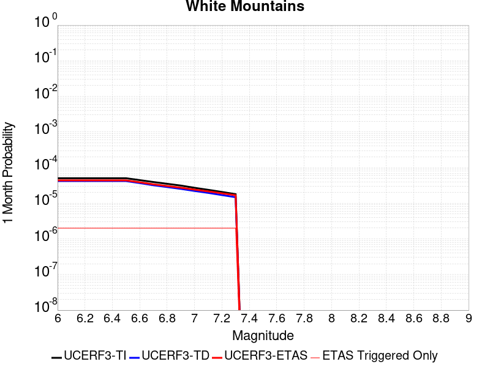 |  |  |

| Magnitude | 1 wk TI Prob | 1 wk TD Prob | 1 wk ETAS Prob | 1 wk ETAS/TD Gain | 1 wk ETAS Triggered Only | 1 mo TI Prob | 1 mo TD Prob | 1 mo ETAS Prob | 1 mo ETAS/TD Gain | 1 mo ETAS Triggered Only | 1 yr TI Prob | 1 yr TD Prob | 1 yr ETAS Prob | 1 yr ETAS/TD Gain | 1 yr ETAS Triggered Only | 10 yr TI Prob | 10 yr TD Prob | 10 yr ETAS Prob | 10 yr ETAS/TD Gain | 10 yr ETAS Triggered Only |
|-----|-----|-----|-----|-----|-----|-----|-----|-----|-----|-----|-----|-----|-----|-----|-----|-----|-----|-----|-----|-----|
| 6.0 | 1.17818645E-5 | 9.78196E-6 | 2.0454214E-5 | 2.091014 | 1.0672358E-5 | 5.049273E-5 | 4.19221E-5 | 5.2594012E-5 | 1.2545652 | 1.0672358E-5 | 6.145756E-4 | 5.1029754E-4 | 5.2096444E-4 | 1.0209033 | 1.0672358E-5 | 0.006128787 | 0.005092789 | 0.005103407 | 1.0020849 | 1.0672358E-5 |
| 6.1 | 1.17818645E-5 | 9.78196E-6 | 2.0454214E-5 | 2.091014 | 1.0672358E-5 | 5.049273E-5 | 4.19221E-5 | 5.2594012E-5 | 1.2545652 | 1.0672358E-5 | 6.145756E-4 | 5.1029754E-4 | 5.2096444E-4 | 1.0209033 | 1.0672358E-5 | 0.006128787 | 0.005092789 | 0.005103407 | 1.0020849 | 1.0672358E-5 |
| 6.2 | 1.17818645E-5 | 9.78196E-6 | 2.0454214E-5 | 2.091014 | 1.0672358E-5 | 5.049273E-5 | 4.19221E-5 | 5.2594012E-5 | 1.2545652 | 1.0672358E-5 | 6.145756E-4 | 5.1029754E-4 | 5.2096444E-4 | 1.0209033 | 1.0672358E-5 | 0.006128787 | 0.005092789 | 0.005103407 | 1.0020849 | 1.0672358E-5 |
| 6.3 | 1.17818645E-5 | 9.78196E-6 | 2.0454214E-5 | 2.091014 | 1.0672358E-5 | 5.049273E-5 | 4.19221E-5 | 5.2594012E-5 | 1.2545652 | 1.0672358E-5 | 6.145756E-4 | 5.1029754E-4 | 5.2096444E-4 | 1.0209033 | 1.0672358E-5 | 0.006128787 | 0.005092789 | 0.005103407 | 1.0020849 | 1.0672358E-5 |
| 6.4 | 1.17818645E-5 | 9.78196E-6 | 2.0454214E-5 | 2.091014 | 1.0672358E-5 | 5.049273E-5 | 4.19221E-5 | 5.2594012E-5 | 1.2545652 | 1.0672358E-5 | 6.145756E-4 | 5.1029754E-4 | 5.2096444E-4 | 1.0209033 | 1.0672358E-5 | 0.006128787 | 0.005092789 | 0.005103407 | 1.0020849 | 1.0672358E-5 |
| 6.5 | 1.17818645E-5 | 9.78196E-6 | 2.0454214E-5 | 2.091014 | 1.0672358E-5 | 5.049273E-5 | 4.19221E-5 | 5.2594012E-5 | 1.2545652 | 1.0672358E-5 | 6.145756E-4 | 5.1029754E-4 | 5.2096444E-4 | 1.0209033 | 1.0672358E-5 | 0.006128787 | 0.005092789 | 0.005103407 | 1.0020849 | 1.0672358E-5 |
| 6.6 | 1.0418851E-5 | 8.601228E-6 | 1.9273495E-5 | 2.2407842 | 1.0672358E-5 | 4.4651457E-5 | 3.6861973E-5 | 4.7533937E-5 | 1.2895116 | 1.0672358E-5 | 5.434959E-4 | 4.4871747E-4 | 4.5938505E-4 | 1.0237734 | 1.0672358E-5 | 0.0054216855 | 0.0044796285 | 0.004490253 | 1.0023718 | 1.0672358E-5 |
| 6.7 | 9.210677E-6 | 7.477168E-6 | 1.8149447E-5 | 2.4273157 | 1.0672358E-5 | 3.9473733E-5 | 3.20447E-5 | 4.2716714E-5 | 1.3330353 | 1.0672358E-5 | 4.804867E-4 | 3.900896E-4 | 4.007578E-4 | 1.027348 | 1.0672358E-5 | 0.0047944915 | 0.0038955477 | 0.0039061785 | 1.0027289 | 1.0672358E-5 |
| 6.8 | 8.211876E-6 | 6.649268E-6 | 1.7321556E-5 | 2.605032 | 1.0672358E-5 | 3.519328E-5 | 2.8496637E-5 | 3.916869E-5 | 1.3745022 | 1.0672358E-5 | 4.2839395E-4 | 3.469065E-4 | 3.5757516E-4 | 1.0307537 | 1.0672358E-5 | 0.0042756903 | 0.00346514 | 0.0034757752 | 1.0030693 | 1.0672358E-5 |
| 6.9 | 7.3301526E-6 | 5.9145773E-6 | 1.6586873E-5 | 2.8044055 | 1.0672358E-5 | 3.141456E-5 | 2.5348027E-5 | 3.6020116E-5 | 1.4210224 | 1.0672358E-5 | 3.8240515E-4 | 3.0858364E-4 | 3.192527E-4 | 1.0345743 | 1.0672358E-5 | 0.0038174777 | 0.003083034 | 0.0030936736 | 1.003451 | 1.0672358E-5 |
| 7.0 | 6.338452E-6 | 5.1713537E-6 | 1.5843658E-5 | 3.063735 | 1.0672358E-5 | 2.7164511E-5 | 2.2162842E-5 | 3.2834963E-5 | 1.4815322 | 1.0672358E-5 | 3.3067772E-4 | 2.6981422E-4 | 2.804837E-4 | 1.0395437 | 1.0672358E-5 | 0.003301861 | 0.0026963425 | 0.0027069862 | 1.0039474 | 1.0672358E-5 |
| 7.1 | 5.5617493E-6 | 4.5614056E-6 | 1.5233715E-5 | 3.3396976 | 1.0672358E-5 | 2.3835852E-5 | 1.954882E-5 | 3.022097E-5 | 1.545923 | 1.0672358E-5 | 2.9016283E-4 | 2.3799589E-4 | 2.4866572E-4 | 1.044832 | 1.0672358E-5 | 0.0028978426 | 0.0023788814 | 0.0023895283 | 1.0044756 | 1.0672358E-5 |
| 7.2 | 4.850874E-6 | 3.965666E-6 | 1.46379825E-5 | 3.6911788 | 1.0672358E-5 | 2.0789295E-5 | 1.6995684E-5 | 2.7667862E-5 | 1.6279346 | 1.0672358E-5 | 2.5308027E-4 | 2.0691776E-4 | 2.175879E-4 | 1.0515671 | 1.0672358E-5 | 0.0025279224 | 0.002068716 | 0.0020793662 | 1.0051483 | 1.0672358E-5 |
| 7.3 | 4.1947515E-6 | 3.448504E-6 | 1.4120826E-5 | 4.0947685 | 1.0672358E-5 | 1.7977383E-5 | 1.4779303E-5 | 2.5451503E-5 | 1.7221045 | 1.0672358E-5 | 2.1885266E-4 | 1.7993801E-4 | 1.9060845E-4 | 1.0593007 | 1.0672358E-5 | 0.0021863724 | 0.00179938 | 0.0018100332 | 1.0059204 | 1.0672358E-5 |

## Great Valley 11
*[(top)](#table-of-contents)*

| 1 Week | 1 Month | 1 Year | 10 Year |
|-----|-----|-----|-----|
|  |  |  |  |

| Magnitude | 1 wk TI Prob | 1 wk TD Prob | 1 wk ETAS Prob | 1 wk ETAS/TD Gain | 1 wk ETAS Triggered Only | 1 mo TI Prob | 1 mo TD Prob | 1 mo ETAS Prob | 1 mo ETAS/TD Gain | 1 mo ETAS Triggered Only | 1 yr TI Prob | 1 yr TD Prob | 1 yr ETAS Prob | 1 yr ETAS/TD Gain | 1 yr ETAS Triggered Only | 10 yr TI Prob | 10 yr TD Prob | 10 yr ETAS Prob | 10 yr ETAS/TD Gain | 10 yr ETAS Triggered Only |
|-----|-----|-----|-----|-----|-----|-----|-----|-----|-----|-----|-----|-----|-----|-----|-----|-----|-----|-----|-----|-----|
| 6.0 | 3.056394E-5 | 3.967284E-5 | 5.0344774E-5 | 1.2689985 | 1.0672358E-5 | 1.3098175E-4 | 1.7002384E-4 | 1.8069439E-4 | 1.0627592 | 1.0672358E-5 | 0.0015935361 | 0.0020699822 | 0.0020806324 | 1.0051451 | 1.0672358E-5 | 0.015821574 | 0.02069238 | 0.020702831 | 1.0005051 | 1.0672358E-5 |
| 6.1 | 3.056394E-5 | 3.967284E-5 | 5.0344774E-5 | 1.2689985 | 1.0672358E-5 | 1.3098175E-4 | 1.7002384E-4 | 1.8069439E-4 | 1.0627592 | 1.0672358E-5 | 0.0015935361 | 0.0020699822 | 0.0020806324 | 1.0051451 | 1.0672358E-5 | 0.015821574 | 0.02069238 | 0.020702831 | 1.0005051 | 1.0672358E-5 |
| 6.2 | 3.056394E-5 | 3.967284E-5 | 5.0344774E-5 | 1.2689985 | 1.0672358E-5 | 1.3098175E-4 | 1.7002384E-4 | 1.8069439E-4 | 1.0627592 | 1.0672358E-5 | 0.0015935361 | 0.0020699822 | 0.0020806324 | 1.0051451 | 1.0672358E-5 | 0.015821574 | 0.02069238 | 0.020702831 | 1.0005051 | 1.0672358E-5 |
| 6.3 | 3.056394E-5 | 3.967284E-5 | 5.0344774E-5 | 1.2689985 | 1.0672358E-5 | 1.3098175E-4 | 1.7002384E-4 | 1.8069439E-4 | 1.0627592 | 1.0672358E-5 | 0.0015935361 | 0.0020699822 | 0.0020806324 | 1.0051451 | 1.0672358E-5 | 0.015821574 | 0.02069238 | 0.020702831 | 1.0005051 | 1.0672358E-5 |
| 6.4 | 3.056394E-5 | 3.967284E-5 | 5.0344774E-5 | 1.2689985 | 1.0672358E-5 | 1.3098175E-4 | 1.7002384E-4 | 1.8069439E-4 | 1.0627592 | 1.0672358E-5 | 0.0015935361 | 0.0020699822 | 0.0020806324 | 1.0051451 | 1.0672358E-5 | 0.015821574 | 0.02069238 | 0.020702831 | 1.0005051 | 1.0672358E-5 |

## Hunting Creek - Berryessa 2011 CFM
*[(top)](#table-of-contents)*

| 1 Week | 1 Month | 1 Year | 10 Year |
|-----|-----|-----|-----|
|  |  |  |  |

| Magnitude | 1 wk TI Prob | 1 wk TD Prob | 1 wk ETAS Prob | 1 wk ETAS/TD Gain | 1 wk ETAS Triggered Only | 1 mo TI Prob | 1 mo TD Prob | 1 mo ETAS Prob | 1 mo ETAS/TD Gain | 1 mo ETAS Triggered Only | 1 yr TI Prob | 1 yr TD Prob | 1 yr ETAS Prob | 1 yr ETAS/TD Gain | 1 yr ETAS Triggered Only | 10 yr TI Prob | 10 yr TD Prob | 10 yr ETAS Prob | 10 yr ETAS/TD Gain | 10 yr ETAS Triggered Only |
|-----|-----|-----|-----|-----|-----|-----|-----|-----|-----|-----|-----|-----|-----|-----|-----|-----|-----|-----|-----|-----|
| 6.0 | 8.539243E-5 | 1.6866675E-4 | 1.7933731E-4 | 1.0632641 | 1.0672358E-5 | 3.6591623E-4 | 7.2268036E-4 | 7.33345E-4 | 1.014757 | 1.0672358E-5 | 0.004445933 | 0.008761587 | 0.0087721655 | 1.0012075 | 1.0672358E-5 | 0.04358031 | 0.08407048 | 0.08408026 | 1.0001162 | 1.0672358E-5 |
| 6.1 | 8.539243E-5 | 1.6866675E-4 | 1.7933731E-4 | 1.0632641 | 1.0672358E-5 | 3.6591623E-4 | 7.2268036E-4 | 7.33345E-4 | 1.014757 | 1.0672358E-5 | 0.004445933 | 0.008761587 | 0.0087721655 | 1.0012075 | 1.0672358E-5 | 0.04358031 | 0.08407048 | 0.08408026 | 1.0001162 | 1.0672358E-5 |
| 6.2 | 8.539243E-5 | 1.6866675E-4 | 1.7933731E-4 | 1.0632641 | 1.0672358E-5 | 3.6591623E-4 | 7.2268036E-4 | 7.33345E-4 | 1.014757 | 1.0672358E-5 | 0.004445933 | 0.008761587 | 0.0087721655 | 1.0012075 | 1.0672358E-5 | 0.04358031 | 0.08407048 | 0.08408026 | 1.0001162 | 1.0672358E-5 |
| 6.3 | 8.539243E-5 | 1.6866675E-4 | 1.7933731E-4 | 1.0632641 | 1.0672358E-5 | 3.6591623E-4 | 7.2268036E-4 | 7.33345E-4 | 1.014757 | 1.0672358E-5 | 0.004445933 | 0.008761587 | 0.0087721655 | 1.0012075 | 1.0672358E-5 | 0.04358031 | 0.08407048 | 0.08408026 | 1.0001162 | 1.0672358E-5 |
| 6.4 | 8.539243E-5 | 1.6866675E-4 | 1.7933731E-4 | 1.0632641 | 1.0672358E-5 | 3.6591623E-4 | 7.2268036E-4 | 7.33345E-4 | 1.014757 | 1.0672358E-5 | 0.004445933 | 0.008761587 | 0.0087721655 | 1.0012075 | 1.0672358E-5 | 0.04358031 | 0.08407048 | 0.08408026 | 1.0001162 | 1.0672358E-5 |
| 6.5 | 8.539243E-5 | 1.6866675E-4 | 1.7933731E-4 | 1.0632641 | 1.0672358E-5 | 3.6591623E-4 | 7.2268036E-4 | 7.33345E-4 | 1.014757 | 1.0672358E-5 | 0.004445933 | 0.008761587 | 0.0087721655 | 1.0012075 | 1.0672358E-5 | 0.04358031 | 0.08407048 | 0.08408026 | 1.0001162 | 1.0672358E-5 |
| 6.6 | 8.234729E-5 | 1.6319305E-4 | 1.7386366E-4 | 1.0653864 | 1.0672358E-5 | 3.528692E-4 | 6.9923437E-4 | 7.0989924E-4 | 1.0152522 | 1.0672358E-5 | 0.004287722 | 0.008478905 | 0.008489487 | 1.001248 | 1.0672358E-5 | 0.042059302 | 0.0815029 | 0.081512704 | 1.0001203 | 1.0672358E-5 |
| 6.7 | 6.651597E-5 | 1.3351835E-4 | 1.4418928E-4 | 1.0799211 | 1.0672358E-5 | 2.8503727E-4 | 5.7215174E-4 | 5.82818E-4 | 1.0186423 | 1.0672358E-5 | 0.0034648073 | 0.006946119 | 0.006956717 | 1.0015258 | 1.0672358E-5 | 0.034112815 | 0.06753316 | 0.06754311 | 1.0001473 | 1.0672358E-5 |
| 6.8 | 5.133638E-5 | 1.0202814E-4 | 1.1269941E-4 | 1.1045915 | 1.0672358E-5 | 2.199945E-4 | 4.3726346E-4 | 4.4793115E-4 | 1.0243965 | 1.0672358E-5 | 0.0026751433 | 0.005315561 | 0.0053261765 | 1.0019971 | 1.0672358E-5 | 0.026431682 | 0.052353263 | 0.052363377 | 1.0001932 | 1.0672358E-5 |
| 6.9 | 5.133638E-5 | 1.0202814E-4 | 1.1269941E-4 | 1.1045915 | 1.0672358E-5 | 2.199945E-4 | 4.3726346E-4 | 4.4793115E-4 | 1.0243965 | 1.0672358E-5 | 0.0026751433 | 0.005315561 | 0.0053261765 | 1.0019971 | 1.0672358E-5 | 0.026431682 | 0.052353263 | 0.052363377 | 1.0001932 | 1.0672358E-5 |

## North Frontal  (East)
*[(top)](#table-of-contents)*

| 1 Week | 1 Month | 1 Year | 10 Year |
|-----|-----|-----|-----|
|  |  |  |  |

| Magnitude | 1 wk TI Prob | 1 wk TD Prob | 1 wk ETAS Prob | 1 wk ETAS/TD Gain | 1 wk ETAS Triggered Only | 1 mo TI Prob | 1 mo TD Prob | 1 mo ETAS Prob | 1 mo ETAS/TD Gain | 1 mo ETAS Triggered Only | 1 yr TI Prob | 1 yr TD Prob | 1 yr ETAS Prob | 1 yr ETAS/TD Gain | 1 yr ETAS Triggered Only | 10 yr TI Prob | 10 yr TD Prob | 10 yr ETAS Prob | 10 yr ETAS/TD Gain | 10 yr ETAS Triggered Only |
|-----|-----|-----|-----|-----|-----|-----|-----|-----|-----|-----|-----|-----|-----|-----|-----|-----|-----|-----|-----|-----|
| 6.0 | 9.1043175E-6 | 9.692292E-6 | 9.692292E-6 | 1.0 | 0.0 | 3.901792E-5 | 4.153805E-5 | 5.2209965E-5 | 1.256919 | 1.0672358E-5 | 4.7493965E-4 | 5.0566456E-4 | 5.163315E-4 | 1.0210949 | 1.0672358E-5 | 0.004739259 | 0.0050506443 | 0.0050612628 | 1.0021024 | 1.0672358E-5 |
| 6.1 | 9.1043175E-6 | 9.692292E-6 | 9.692292E-6 | 1.0 | 0.0 | 3.901792E-5 | 4.153805E-5 | 5.2209965E-5 | 1.256919 | 1.0672358E-5 | 4.7493965E-4 | 5.0566456E-4 | 5.163315E-4 | 1.0210949 | 1.0672358E-5 | 0.004739259 | 0.0050506443 | 0.0050612628 | 1.0021024 | 1.0672358E-5 |
| 6.2 | 9.1043175E-6 | 9.692292E-6 | 9.692292E-6 | 1.0 | 0.0 | 3.901792E-5 | 4.153805E-5 | 5.2209965E-5 | 1.256919 | 1.0672358E-5 | 4.7493965E-4 | 5.0566456E-4 | 5.163315E-4 | 1.0210949 | 1.0672358E-5 | 0.004739259 | 0.0050506443 | 0.0050612628 | 1.0021024 | 1.0672358E-5 |
| 6.3 | 9.1043175E-6 | 9.692292E-6 | 9.692292E-6 | 1.0 | 0.0 | 3.901792E-5 | 4.153805E-5 | 5.2209965E-5 | 1.256919 | 1.0672358E-5 | 4.7493965E-4 | 5.0566456E-4 | 5.163315E-4 | 1.0210949 | 1.0672358E-5 | 0.004739259 | 0.0050506443 | 0.0050612628 | 1.0021024 | 1.0672358E-5 |
| 6.4 | 9.1043175E-6 | 9.692292E-6 | 9.692292E-6 | 1.0 | 0.0 | 3.901792E-5 | 4.153805E-5 | 5.2209965E-5 | 1.256919 | 1.0672358E-5 | 4.7493965E-4 | 5.0566456E-4 | 5.163315E-4 | 1.0210949 | 1.0672358E-5 | 0.004739259 | 0.0050506443 | 0.0050612628 | 1.0021024 | 1.0672358E-5 |
| 6.5 | 9.1043175E-6 | 9.692292E-6 | 9.692292E-6 | 1.0 | 0.0 | 3.901792E-5 | 4.153805E-5 | 5.2209965E-5 | 1.256919 | 1.0672358E-5 | 4.7493965E-4 | 5.0566456E-4 | 5.163315E-4 | 1.0210949 | 1.0672358E-5 | 0.004739259 | 0.0050506443 | 0.0050612628 | 1.0021024 | 1.0672358E-5 |
| 6.6 | 9.1043175E-6 | 9.692292E-6 | 9.692292E-6 | 1.0 | 0.0 | 3.901792E-5 | 4.153805E-5 | 5.2209965E-5 | 1.256919 | 1.0672358E-5 | 4.7493965E-4 | 5.0566456E-4 | 5.163315E-4 | 1.0210949 | 1.0672358E-5 | 0.004739259 | 0.0050506443 | 0.0050612628 | 1.0021024 | 1.0672358E-5 |
| 6.7 | 5.803986E-6 | 6.1718774E-6 | 6.1718774E-6 | 1.0 | 0.0 | 2.4873989E-5 | 2.6450904E-5 | 3.712298E-5 | 1.4034674 | 1.0672358E-5 | 3.0279873E-4 | 3.2203976E-4 | 3.3270867E-4 | 1.0331292 | 1.0672358E-5 | 0.0030238647 | 0.0032203975 | 0.0032310355 | 1.0033033 | 1.0672358E-5 |
| 6.8 | 5.803986E-6 | 6.1718774E-6 | 6.1718774E-6 | 1.0 | 0.0 | 2.4873989E-5 | 2.6450904E-5 | 3.712298E-5 | 1.4034674 | 1.0672358E-5 | 3.0279873E-4 | 3.2203976E-4 | 3.3270867E-4 | 1.0331292 | 1.0672358E-5 | 0.0030238647 | 0.0032203975 | 0.0032310355 | 1.0033033 | 1.0672358E-5 |

## Hat Creek-McArthur-Mayfield
*[(top)](#table-of-contents)*

| 1 Week | 1 Month | 1 Year | 10 Year |
|-----|-----|-----|-----|
|  |  |  |  |

| Magnitude | 1 wk TI Prob | 1 wk TD Prob | 1 wk ETAS Prob | 1 wk ETAS/TD Gain | 1 wk ETAS Triggered Only | 1 mo TI Prob | 1 mo TD Prob | 1 mo ETAS Prob | 1 mo ETAS/TD Gain | 1 mo ETAS Triggered Only | 1 yr TI Prob | 1 yr TD Prob | 1 yr ETAS Prob | 1 yr ETAS/TD Gain | 1 yr ETAS Triggered Only | 10 yr TI Prob | 10 yr TD Prob | 10 yr ETAS Prob | 10 yr ETAS/TD Gain | 10 yr ETAS Triggered Only |
|-----|-----|-----|-----|-----|-----|-----|-----|-----|-----|-----|-----|-----|-----|-----|-----|-----|-----|-----|-----|-----|
| 6.0 | 2.1823456E-5 | 2.4773932E-5 | 3.5446024E-5 | 1.4307792 | 1.0672358E-5 | 9.352575E-5 | 1.0617048E-4 | 1.1684171E-4 | 1.1005102 | 1.0672358E-5 | 0.0011380811 | 0.0012920036 | 0.0013026622 | 1.0082496 | 1.0672358E-5 | 0.011322702 | 0.01285923 | 0.012869765 | 1.0008192 | 1.0672358E-5 |
| 6.1 | 2.1823456E-5 | 2.4773932E-5 | 3.5446024E-5 | 1.4307792 | 1.0672358E-5 | 9.352575E-5 | 1.0617048E-4 | 1.1684171E-4 | 1.1005102 | 1.0672358E-5 | 0.0011380811 | 0.0012920036 | 0.0013026622 | 1.0082496 | 1.0672358E-5 | 0.011322702 | 0.01285923 | 0.012869765 | 1.0008192 | 1.0672358E-5 |
| 6.2 | 2.1823456E-5 | 2.4773932E-5 | 3.5446024E-5 | 1.4307792 | 1.0672358E-5 | 9.352575E-5 | 1.0617048E-4 | 1.1684171E-4 | 1.1005102 | 1.0672358E-5 | 0.0011380811 | 0.0012920036 | 0.0013026622 | 1.0082496 | 1.0672358E-5 | 0.011322702 | 0.01285923 | 0.012869765 | 1.0008192 | 1.0672358E-5 |
| 6.3 | 2.1823456E-5 | 2.4773932E-5 | 3.5446024E-5 | 1.4307792 | 1.0672358E-5 | 9.352575E-5 | 1.0617048E-4 | 1.1684171E-4 | 1.1005102 | 1.0672358E-5 | 0.0011380811 | 0.0012920036 | 0.0013026622 | 1.0082496 | 1.0672358E-5 | 0.011322702 | 0.01285923 | 0.012869765 | 1.0008192 | 1.0672358E-5 |
| 6.4 | 2.1823456E-5 | 2.4773932E-5 | 3.5446024E-5 | 1.4307792 | 1.0672358E-5 | 9.352575E-5 | 1.0617048E-4 | 1.1684171E-4 | 1.1005102 | 1.0672358E-5 | 0.0011380811 | 0.0012920036 | 0.0013026622 | 1.0082496 | 1.0672358E-5 | 0.011322702 | 0.01285923 | 0.012869765 | 1.0008192 | 1.0672358E-5 |
| 6.5 | 2.1823456E-5 | 2.4773932E-5 | 3.5446024E-5 | 1.4307792 | 1.0672358E-5 | 9.352575E-5 | 1.0617048E-4 | 1.1684171E-4 | 1.1005102 | 1.0672358E-5 | 0.0011380811 | 0.0012920036 | 0.0013026622 | 1.0082496 | 1.0672358E-5 | 0.011322702 | 0.01285923 | 0.012869765 | 1.0008192 | 1.0672358E-5 |
| 6.6 | 1.9340694E-5 | 2.1946753E-5 | 3.261888E-5 | 1.4862735 | 1.0672358E-5 | 8.288605E-5 | 9.405493E-5 | 1.04726285E-4 | 1.1134588 | 1.0672358E-5 | 0.0010086704 | 0.001144661 | 0.0011553211 | 1.0093129 | 1.0672358E-5 | 0.010041044 | 0.011401833 | 0.011412384 | 1.0009253 | 1.0672358E-5 |
| 6.7 | 1.6797176E-5 | 1.9037067E-5 | 2.9709223E-5 | 1.5605987 | 1.0672358E-5 | 7.1985916E-5 | 8.1585684E-5 | 9.225717E-5 | 1.130801 | 1.0672358E-5 | 8.7607605E-4 | 9.929959E-4 | 0.0010036577 | 1.010737 | 1.0672358E-5 | 0.0087263035 | 0.00989965 | 0.009910216 | 1.0010674 | 1.0672358E-5 |
| 6.8 | 1.4852288E-5 | 1.6815693E-5 | 2.7487873E-5 | 1.634656 | 1.0672358E-5 | 6.365111E-5 | 7.206607E-5 | 8.273766E-5 | 1.1480806 | 1.0672358E-5 | 7.7467674E-4 | 8.771936E-4 | 8.878566E-4 | 1.0121558 | 1.0672358E-5 | 0.007719817 | 0.008751296 | 0.008761875 | 1.0012089 | 1.0672358E-5 |
| 6.9 | 1.2757133E-5 | 1.4418652E-5 | 2.5090858E-5 | 1.7401665 | 1.0672358E-5 | 5.467228E-5 | 6.179356E-5 | 7.2465264E-5 | 1.1726992 | 1.0672358E-5 | 6.654317E-4 | 7.522186E-4 | 7.6288293E-4 | 1.0141772 | 1.0672358E-5 | 0.0066344263 | 0.007510623 | 0.0075212154 | 1.0014102 | 1.0672358E-5 |
| 7.0 | 1.10079245E-5 | 1.2422667E-5 | 2.3094894E-5 | 1.859093 | 1.0672358E-5 | 4.7175967E-5 | 5.3239713E-5 | 6.39115E-5 | 1.2004479 | 1.0672358E-5 | 5.74216E-4 | 6.4814166E-4 | 6.588071E-4 | 1.0164554 | 1.0672358E-5 | 0.005727345 | 0.0064763394 | 0.0064869425 | 1.0016372 | 1.0672358E-5 |
| 7.1 | 9.3994E-6 | 1.059216E-5 | 2.1264406E-5 | 2.0075607 | 1.0672358E-5 | 4.0282524E-5 | 4.5394972E-5 | 5.6066845E-5 | 1.2350893 | 1.0672358E-5 | 4.9032934E-4 | 5.526838E-4 | 5.633502E-4 | 1.0192994 | 1.0672358E-5 | 0.004892489 | 0.005526838 | 0.0055374512 | 1.0019203 | 1.0672358E-5 |

## Great Valley 08 (Quinto)
*[(top)](#table-of-contents)*

| 1 Week | 1 Month | 1 Year | 10 Year |
|-----|-----|-----|-----|
|  |  |  |  |

| Magnitude | 1 wk TI Prob | 1 wk TD Prob | 1 wk ETAS Prob | 1 wk ETAS/TD Gain | 1 wk ETAS Triggered Only | 1 mo TI Prob | 1 mo TD Prob | 1 mo ETAS Prob | 1 mo ETAS/TD Gain | 1 mo ETAS Triggered Only | 1 yr TI Prob | 1 yr TD Prob | 1 yr ETAS Prob | 1 yr ETAS/TD Gain | 1 yr ETAS Triggered Only | 10 yr TI Prob | 10 yr TD Prob | 10 yr ETAS Prob | 10 yr ETAS/TD Gain | 10 yr ETAS Triggered Only |
|-----|-----|-----|-----|-----|-----|-----|-----|-----|-----|-----|-----|-----|-----|-----|-----|-----|-----|-----|-----|-----|
| 6.0 | 2.5524263E-5 | 3.1194424E-5 | 3.1194424E-5 | 1.0 | 0.0 | 1.0938511E-4 | 1.3368827E-4 | 1.3368827E-4 | 1.0 | 0.0 | 0.0013309501 | 0.0016272905 | 0.0016379455 | 1.0065477 | 1.0672358E-5 | 0.013230069 | 0.016236922 | 0.016247422 | 1.0006466 | 1.0672358E-5 |
| 6.1 | 2.5524263E-5 | 3.1194424E-5 | 3.1194424E-5 | 1.0 | 0.0 | 1.0938511E-4 | 1.3368827E-4 | 1.3368827E-4 | 1.0 | 0.0 | 0.0013309501 | 0.0016272905 | 0.0016379455 | 1.0065477 | 1.0672358E-5 | 0.013230069 | 0.016236922 | 0.016247422 | 1.0006466 | 1.0672358E-5 |
| 6.2 | 2.5524263E-5 | 3.1194424E-5 | 3.1194424E-5 | 1.0 | 0.0 | 1.0938511E-4 | 1.3368827E-4 | 1.3368827E-4 | 1.0 | 0.0 | 0.0013309501 | 0.0016272905 | 0.0016379455 | 1.0065477 | 1.0672358E-5 | 0.013230069 | 0.016236922 | 0.016247422 | 1.0006466 | 1.0672358E-5 |
| 6.3 | 2.5524263E-5 | 3.1194424E-5 | 3.1194424E-5 | 1.0 | 0.0 | 1.0938511E-4 | 1.3368827E-4 | 1.3368827E-4 | 1.0 | 0.0 | 0.0013309501 | 0.0016272905 | 0.0016379455 | 1.0065477 | 1.0672358E-5 | 0.013230069 | 0.016236922 | 0.016247422 | 1.0006466 | 1.0672358E-5 |
| 6.4 | 2.5524263E-5 | 3.1194424E-5 | 3.1194424E-5 | 1.0 | 0.0 | 1.0938511E-4 | 1.3368827E-4 | 1.3368827E-4 | 1.0 | 0.0 | 0.0013309501 | 0.0016272905 | 0.0016379455 | 1.0065477 | 1.0672358E-5 | 0.013230069 | 0.016236922 | 0.016247422 | 1.0006466 | 1.0672358E-5 |
| 6.5 | 2.5524263E-5 | 3.1194424E-5 | 3.1194424E-5 | 1.0 | 0.0 | 1.0938511E-4 | 1.3368827E-4 | 1.3368827E-4 | 1.0 | 0.0 | 0.0013309501 | 0.0016272905 | 0.0016379455 | 1.0065477 | 1.0672358E-5 | 0.013230069 | 0.016236922 | 0.016247422 | 1.0006466 | 1.0672358E-5 |
| 6.6 | 2.0986998E-5 | 2.5576908E-5 | 2.5576908E-5 | 1.0 | 0.0 | 8.994117E-5 | 1.0961532E-4 | 1.0961532E-4 | 1.0 | 0.0 | 0.0010944837 | 0.0013345632 | 0.0013452213 | 1.0079862 | 1.0672358E-5 | 0.010891088 | 0.013345085 | 0.013355616 | 1.000789 | 1.0672358E-5 |

## San Andreas (Creeping Section) 2011 CFM
*[(top)](#table-of-contents)*

| 1 Week | 1 Month | 1 Year | 10 Year |
|-----|-----|-----|-----|
|  |  |  |  |

| Magnitude | 1 wk TI Prob | 1 wk TD Prob | 1 wk ETAS Prob | 1 wk ETAS/TD Gain | 1 wk ETAS Triggered Only | 1 mo TI Prob | 1 mo TD Prob | 1 mo ETAS Prob | 1 mo ETAS/TD Gain | 1 mo ETAS Triggered Only | 1 yr TI Prob | 1 yr TD Prob | 1 yr ETAS Prob | 1 yr ETAS/TD Gain | 1 yr ETAS Triggered Only | 10 yr TI Prob | 10 yr TD Prob | 10 yr ETAS Prob | 10 yr ETAS/TD Gain | 10 yr ETAS Triggered Only |
|-----|-----|-----|-----|-----|-----|-----|-----|-----|-----|-----|-----|-----|-----|-----|-----|-----|-----|-----|-----|-----|
| 6.0 | 2.0678692E-4 | 4.6456268E-4 | 4.6456268E-4 | 1.0 | 0.0 | 8.8592863E-4 | 0.0019886654 | 0.0019886654 | 1.0 | 0.0 | 0.010732949 | 0.023858009 | 0.023858009 | 1.0 | 0.0 | 0.10229127 | 0.20777887 | 0.20778732 | 1.0000407 | 1.0672358E-5 |
| 6.1 | 1.5597911E-4 | 3.5018445E-4 | 3.5018445E-4 | 1.0 | 0.0 | 6.683106E-4 | 0.0014995098 | 0.0014995098 | 1.0 | 0.0 | 0.008106367 | 0.018075831 | 0.018075831 | 1.0 | 0.0 | 0.0781696 | 0.16418044 | 0.16418935 | 1.0000544 | 1.0672358E-5 |
| 6.2 | 1.5597911E-4 | 3.5018445E-4 | 3.5018445E-4 | 1.0 | 0.0 | 6.683106E-4 | 0.0014995098 | 0.0014995098 | 1.0 | 0.0 | 0.008106367 | 0.018075831 | 0.018075831 | 1.0 | 0.0 | 0.0781696 | 0.16418044 | 0.16418935 | 1.0000544 | 1.0672358E-5 |
| 6.3 | 1.5597911E-4 | 3.5018445E-4 | 3.5018445E-4 | 1.0 | 0.0 | 6.683106E-4 | 0.0014995098 | 0.0014995098 | 1.0 | 0.0 | 0.008106367 | 0.018075831 | 0.018075831 | 1.0 | 0.0 | 0.0781696 | 0.16418044 | 0.16418935 | 1.0000544 | 1.0672358E-5 |

## Puente Hills
*[(top)](#table-of-contents)*

| 1 Week | 1 Month | 1 Year | 10 Year |
|-----|-----|-----|-----|
|  | 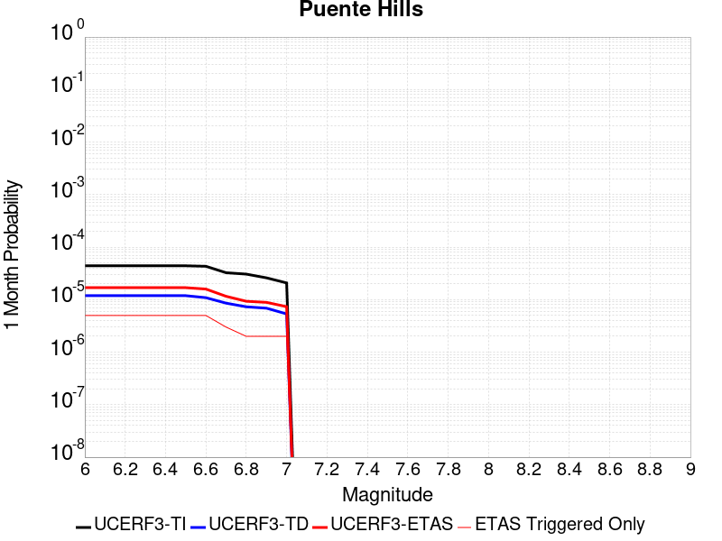 |  |  |

| Magnitude | 1 wk TI Prob | 1 wk TD Prob | 1 wk ETAS Prob | 1 wk ETAS/TD Gain | 1 wk ETAS Triggered Only | 1 mo TI Prob | 1 mo TD Prob | 1 mo ETAS Prob | 1 mo ETAS/TD Gain | 1 mo ETAS Triggered Only | 1 yr TI Prob | 1 yr TD Prob | 1 yr ETAS Prob | 1 yr ETAS/TD Gain | 1 yr ETAS Triggered Only | 10 yr TI Prob | 10 yr TD Prob | 10 yr ETAS Prob | 10 yr ETAS/TD Gain | 10 yr ETAS Triggered Only |
|-----|-----|-----|-----|-----|-----|-----|-----|-----|-----|-----|-----|-----|-----|-----|-----|-----|-----|-----|-----|-----|
| 6.0 | 1.0287503E-5 | 2.7754043E-6 | 1.3447733E-5 | 4.845324 | 1.0672358E-5 | 4.4088552E-5 | 1.189455E-5 | 2.2566783E-5 | 1.8972371 | 1.0672358E-5 | 5.3664594E-4 | 1.4480915E-4 | 1.5547997E-4 | 1.0736887 | 1.0672358E-5 | 0.0053535183 | 0.0014474059 | 0.0014580628 | 1.0073627 | 1.0672358E-5 |
| 6.1 | 1.0287503E-5 | 2.7754043E-6 | 1.3447733E-5 | 4.845324 | 1.0672358E-5 | 4.4088552E-5 | 1.189455E-5 | 2.2566783E-5 | 1.8972371 | 1.0672358E-5 | 5.3664594E-4 | 1.4480915E-4 | 1.5547997E-4 | 1.0736887 | 1.0672358E-5 | 0.0053535183 | 0.0014474059 | 0.0014580628 | 1.0073627 | 1.0672358E-5 |
| 6.2 | 1.0287503E-5 | 2.7754043E-6 | 1.3447733E-5 | 4.845324 | 1.0672358E-5 | 4.4088552E-5 | 1.189455E-5 | 2.2566783E-5 | 1.8972371 | 1.0672358E-5 | 5.3664594E-4 | 1.4480915E-4 | 1.5547997E-4 | 1.0736887 | 1.0672358E-5 | 0.0053535183 | 0.0014474059 | 0.0014580628 | 1.0073627 | 1.0672358E-5 |
| 6.3 | 1.0287503E-5 | 2.7754043E-6 | 1.3447733E-5 | 4.845324 | 1.0672358E-5 | 4.4088552E-5 | 1.189455E-5 | 2.2566783E-5 | 1.8972371 | 1.0672358E-5 | 5.3664594E-4 | 1.4480915E-4 | 1.5547997E-4 | 1.0736887 | 1.0672358E-5 | 0.0053535183 | 0.0014474059 | 0.0014580628 | 1.0073627 | 1.0672358E-5 |
| 6.4 | 1.0287503E-5 | 2.7754043E-6 | 1.3447733E-5 | 4.845324 | 1.0672358E-5 | 4.4088552E-5 | 1.189455E-5 | 2.2566783E-5 | 1.8972371 | 1.0672358E-5 | 5.3664594E-4 | 1.4480915E-4 | 1.5547997E-4 | 1.0736887 | 1.0672358E-5 | 0.0053535183 | 0.0014474059 | 0.0014580628 | 1.0073627 | 1.0672358E-5 |
| 6.5 | 1.0287503E-5 | 2.7754043E-6 | 1.3447733E-5 | 4.845324 | 1.0672358E-5 | 4.4088552E-5 | 1.189455E-5 | 2.2566783E-5 | 1.8972371 | 1.0672358E-5 | 5.3664594E-4 | 1.4480915E-4 | 1.5547997E-4 | 1.0736887 | 1.0672358E-5 | 0.0053535183 | 0.0014474059 | 0.0014580628 | 1.0073627 | 1.0672358E-5 |
| 6.6 | 1.0067095E-5 | 2.542514E-6 | 1.3214845E-5 | 5.197551 | 1.0672358E-5 | 4.314398E-5 | 1.0896458E-5 | 2.15687E-5 | 1.9794232 | 1.0672358E-5 | 5.251514E-4 | 1.3265885E-4 | 1.433298E-4 | 1.080439 | 1.0672358E-5 | 0.0052391207 | 0.0013260479 | 0.0013367061 | 1.0080376 | 1.0672358E-5 |
| 6.7 | 7.591482E-6 | 1.9997742E-6 | 1.2672112E-5 | 6.336771 | 1.0672358E-5 | 3.2534514E-5 | 8.570445E-6 | 1.9242712E-5 | 2.2452407 | 1.0672358E-5 | 3.9603573E-4 | 1.0434237E-4 | 1.15013616E-4 | 1.1022714 | 1.0672358E-5 | 0.003953307 | 0.0010431492 | 0.0010538104 | 1.0102203 | 1.0672358E-5 |
| 6.8 | 7.141342E-6 | 1.7041792E-6 | 1.2376519E-5 | 7.262452 | 1.0672358E-5 | 3.060539E-5 | 7.3036163E-6 | 1.7975897E-5 | 2.4612324 | 1.0672358E-5 | 3.7255694E-4 | 8.891999E-5 | 9.95914E-5 | 1.1200113 | 1.0672358E-5 | 0.0037193296 | 8.8904874E-4 | 8.997116E-4 | 1.0119935 | 1.0672358E-5 |
| 6.9 | 6.066927E-6 | 1.6035817E-6 | 1.2275923E-5 | 7.655315 | 1.0672358E-5 | 2.6000856E-5 | 6.8724867E-6 | 1.7544771E-5 | 2.5529 | 1.0672358E-5 | 3.1651446E-4 | 8.367139E-5 | 9.434285E-5 | 1.1275402 | 1.0672358E-5 | 0.0031606401 | 8.3660224E-4 | 8.4726565E-4 | 1.0127461 | 1.0672358E-5 |
| 7.0 | 4.852166E-6 | 1.2478142E-6 | 1.19201595E-5 | 9.552832 | 1.0672358E-5 | 2.0794832E-5 | 5.347775E-6 | 1.6020076E-5 | 2.9956524 | 1.0672358E-5 | 2.5314768E-4 | 6.510917E-5 | 7.578083E-5 | 1.1639042 | 1.0672358E-5 | 0.0025285948 | 6.510916E-4 | 6.617571E-4 | 1.0163808 | 1.0672358E-5 |

