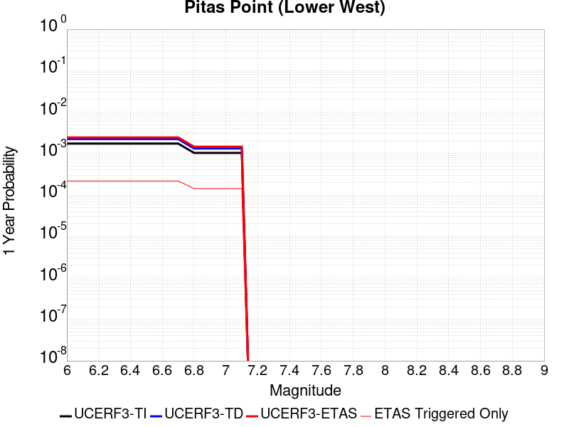
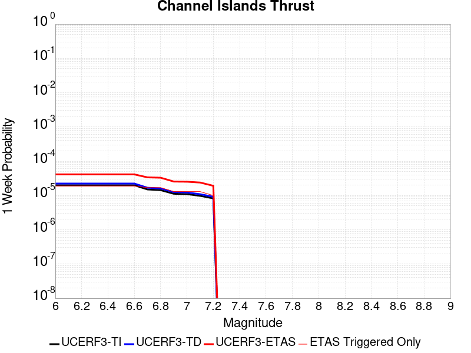
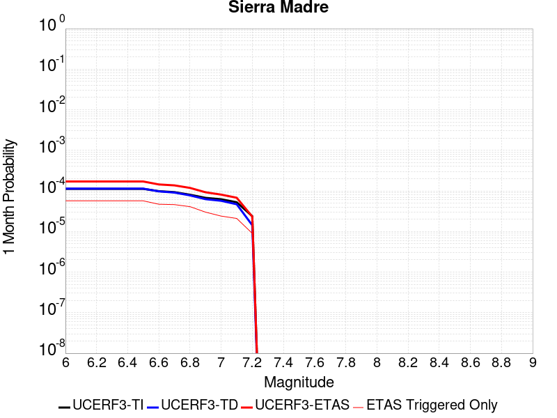
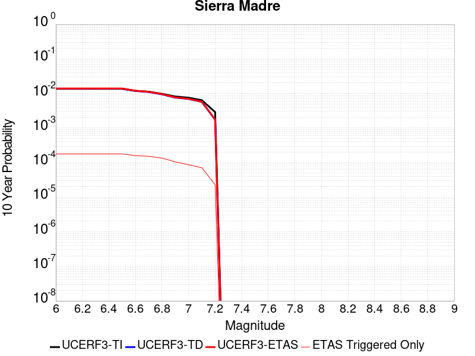
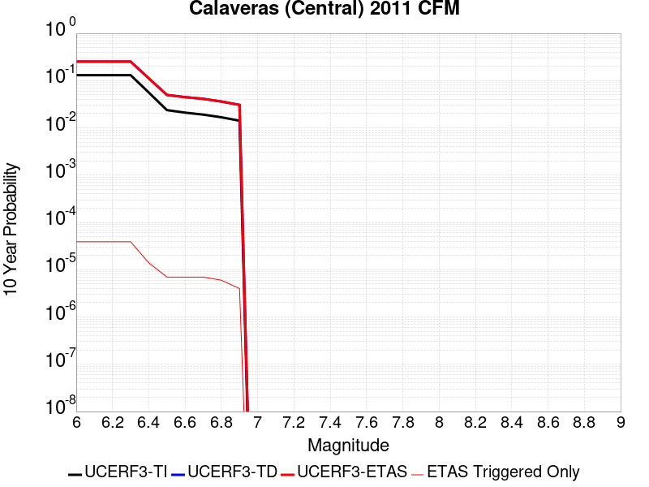
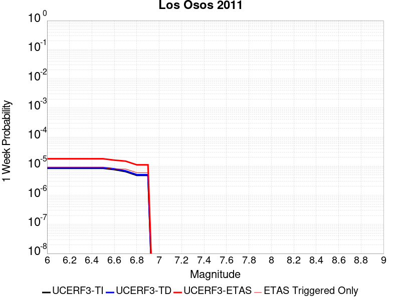
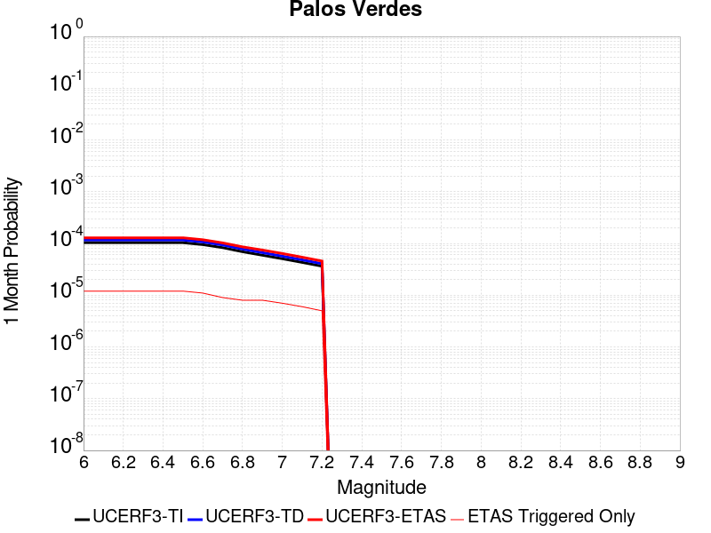
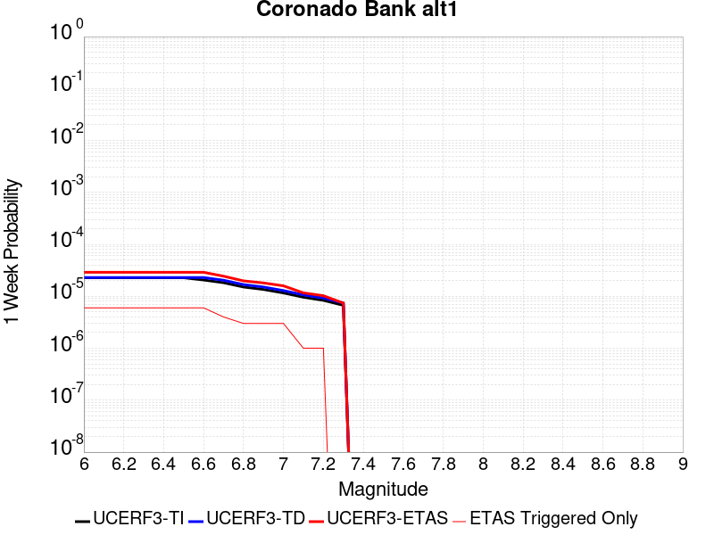
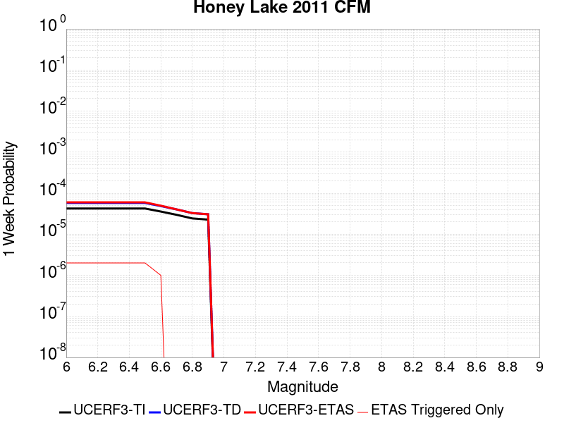

# Parent Section Magnitude-Probability Distributions

Only fault sections with at least one triggered aftershock are plotted. Sections are sorted by total supraseismogenic trigger rate (decreasing)

## Table Of Contents

* [Tank Canyon](#tank-canyon)
* [Little Lake](#little-lake)
* [Garlock (Central)](#garlock-central)
* [Owl Lake](#owl-lake)
* [Garlock (West)](#garlock-west)
* [Garlock (East)](#garlock-east)
* [Death Valley (So)](#death-valley-so)
* [Panamint Valley](#panamint-valley)
* [San Andreas (Mojave N)](#san-andreas-mojave-n)
* [San Andreas (Big Bend)](#san-andreas-big-bend)
* [San Andreas (Mojave S)](#san-andreas-mojave-s)
* [San Andreas (Carrizo) rev](#san-andreas-carrizo-rev)
* [Death Valley (Black Mtns Frontal)](#death-valley-black-mtns-frontal)
* [Blackwater](#blackwater)
* [San Andreas (Parkfield)](#san-andreas-parkfield)
* [San Andreas (Cholame) rev](#san-andreas-cholame-rev)
* [Hunter Mountain-Saline Valley](#hunter-mountain-saline-valley)
* [San Andreas (San Bernardino N)](#san-andreas-san-bernardino-n)
* [Cucamonga](#cucamonga)
* [Pleito](#pleito)
* [San Cayetano](#san-cayetano)
* [San Andreas (San Bernardino S)](#san-andreas-san-bernardino-s)
* [Death Valley (No)](#death-valley-no)
* [Cleghorn](#cleghorn)
* [Gravel Hills-Harper Lk](#gravel-hills-harper-lk)
* [Pitas Point (Lower West)](#pitas-point-lower-west)
* [Santa Ynez (West)](#santa-ynez-west)
* [Pitas Point (Lower)-Montalvo](#pitas-point-lower-montalvo)
* [Red Mountain](#red-mountain)
* [Santa Ynez (East)](#santa-ynez-east)
* [San Andreas (San Gorgonio Pass-Garnet HIll)](#san-andreas-san-gorgonio-pass-garnet-hill)
* [San Andreas (Coachella) rev](#san-andreas-coachella-rev)
* [San Jacinto (San Bernardino)](#san-jacinto-san-bernardino)
* [San Juan](#san-juan)
* [So Sierra Nevada](#so-sierra-nevada)
* [Oak Ridge (Onshore)](#oak-ridge-onshore)
* [Mission Ridge-Arroyo Parida-Santa Ana](#mission-ridge-arroyo-parida-santa-ana)
* [Death Valley (Fish Lake Valley)](#death-valley-fish-lake-valley)
* [Lenwood-Lockhart-Old Woman Springs](#lenwood-lockhart-old-woman-springs)
* [Raymond](#raymond)
* [San Jacinto (Stepovers Combined)](#san-jacinto-stepovers-combined)
* [San Jacinto (San Jacinto Valley) rev](#san-jacinto-san-jacinto-valley-rev)
* [Santa Susana alt 1](#santa-susana-alt-1)
* [Ventura-Pitas Point](#ventura-pitas-point)
* [Helendale-So Lockhart](#helendale-so-lockhart)
* [Simi-Santa Rosa](#simi-santa-rosa)
* [Channel Islands Thrust](#channel-islands-thrust)
* [Los Alamos 2011 CFM](#los-alamos-2011-cfm)
* [Sierra Madre](#sierra-madre)
* [Elysian Park (Upper)](#elysian-park-upper)
* [San Jacinto (Anza) rev](#san-jacinto-anza-rev)
* [Santa Cruz Island](#santa-cruz-island)
* [Clamshell-Sawpit](#clamshell-sawpit)
* [Pinto Mtn](#pinto-mtn)
* [Verdugo](#verdugo)
* [Emerson-Copper Mtn 2011](#emerson-copper-mtn-2011)
* [Hayward (No) 2011 CFM](#hayward-no-2011-cfm)
* [Great Valley 12](#great-valley-12)
* [Elsinore (Stepovers Combined)](#elsinore-stepovers-combined)
* [San Gregorio (North) 2011 CFM](#san-gregorio-north-2011-cfm)
* [Whittier alt 1](#whittier-alt-1)
* [Chino alt 1](#chino-alt-1)
* [Independence rev 2011](#independence-rev-2011)
* [San Jacinto (Clark) rev](#san-jacinto-clark-rev)
* [San Jose](#san-jose)
* [Elsinore (Glen Ivy) rev](#elsinore-glen-ivy-rev)
* [Newport-Inglewood (Offshore)](#newport-inglewood-offshore)
* [Hayward (So) 2011 CFM](#hayward-so-2011-cfm)
* [San Gregorio (South) 2011 CFM](#san-gregorio-south-2011-cfm)
* [Anacapa-Dume alt 1](#anacapa-dume-alt-1)
* [Calaveras (Central) 2011 CFM](#calaveras-central-2011-cfm)
* [San Gabriel](#san-gabriel)
* [Los Osos 2011](#los-osos-2011)
* [Santa Rosa Island](#santa-rosa-island)
* [Calaveras (So) 2011 CFM](#calaveras-so-2011-cfm)
* [Imperial](#imperial)
* [Deep Springs](#deep-springs)
* [Elsinore (Temecula) rev](#elsinore-temecula-rev)
* [Concord 2011 CFM](#concord-2011-cfm)
* [San Jacinto (Coyote Creek)](#san-jacinto-coyote-creek)
* [Newport-Inglewood alt 1](#newport-inglewood-alt-1)
* [Great Valley 04a Trout Creek](#great-valley-04a-trout-creek)
* [Great Valley 04b Gordon Valley](#great-valley-04b-gordon-valley)
* [Palos Verdes](#palos-verdes)
* [Malibu Coast alt 1](#malibu-coast-alt-1)
* [Great Valley 07 (Orestimba)](#great-valley-07-orestimba)
* [Calaveras (No) 2011 CFM](#calaveras-no-2011-cfm)
* [Green Valley 2011 CFM](#green-valley-2011-cfm)
* [Rose Canyon](#rose-canyon)
* [Great Valley 10 (Panoche)](#great-valley-10-panoche)
* [Rodgers Creek - Healdsburg 2011 CFM](#rodgers-creek---healdsburg-2011-cfm)
* [Mono Lake 2011 CFM](#mono-lake-2011-cfm)
* [Coronado Bank alt1](#coronado-bank-alt1)
* [Great Valley 03 Mysterious Ridge](#great-valley-03-mysterious-ridge)
* [San Joaquin Hills](#san-joaquin-hills)
* [Calico-Hidalgo](#calico-hidalgo)
* [North Frontal  (West)](#north-frontal--west)
* [Honey Lake 2011 CFM](#honey-lake-2011-cfm)
* [Robinson Creek](#robinson-creek)
* [Burnt Mtn](#burnt-mtn)
* [San Luis Range 2011 CFM](#san-luis-range-2011-cfm)
* [Great Valley 09 (Laguna Seca)](#great-valley-09-laguna-seca)
* [Great Valley 11](#great-valley-11)
* [San Jacinto (Borrego)](#san-jacinto-borrego)
* [North Frontal  (East)](#north-frontal--east)
* [Holser alt 1](#holser-alt-1)
* [San Jacinto (Superstition Mtn)](#san-jacinto-superstition-mtn)
* [Hosgri](#hosgri)
* [Great Valley 08 (Quinto)](#great-valley-08-quinto)
* [San Andreas (Creeping Section) 2011 CFM](#san-andreas-creeping-section-2011-cfm)
* [Casmalia 2011 CFM](#casmalia-2011-cfm)
* [Hollywood](#hollywood)

## Tank Canyon
*[(top)](#table-of-contents)*

| 1 Week | 1 Month | 1 Year | 10 Year |
|-----|-----|-----|-----|
|  |  |  |  |

| Magnitude | 1 wk TI Prob | 1 wk TD Prob | 1 wk ETAS Prob | 1 wk ETAS/TD Gain | 1 wk ETAS Triggered Only | 1 mo TI Prob | 1 mo TD Prob | 1 mo ETAS Prob | 1 mo ETAS/TD Gain | 1 mo ETAS Triggered Only | 1 yr TI Prob | 1 yr TD Prob | 1 yr ETAS Prob | 1 yr ETAS/TD Gain | 1 yr ETAS Triggered Only | 10 yr TI Prob | 10 yr TD Prob | 10 yr ETAS Prob | 10 yr ETAS/TD Gain | 10 yr ETAS Triggered Only |
|-----|-----|-----|-----|-----|-----|-----|-----|-----|-----|-----|-----|-----|-----|-----|-----|-----|-----|-----|-----|-----|
| 6.0 | 2.7748038E-5 | 3.5073965E-5 | 0.02147497 | 612.2767 | 0.02144065 | 1.18914744E-4 | 1.5031699E-4 | 0.027555734 | 183.31749 | 0.027409537 | 0.0014468255 | 0.0018300817 | 0.043299537 | 23.659891 | 0.041545484 | 0.014374418 | 0.018297758 | 0.07344174 | 4.0137014 | 0.056171797 |
| 6.1 | 2.7748038E-5 | 3.5073965E-5 | 0.02147497 | 612.2767 | 0.02144065 | 1.18914744E-4 | 1.5031699E-4 | 0.027555734 | 183.31749 | 0.027409537 | 0.0014468255 | 0.0018300817 | 0.043299537 | 23.659891 | 0.041545484 | 0.014374418 | 0.018297758 | 0.07344174 | 4.0137014 | 0.056171797 |
| 6.2 | 2.7748038E-5 | 3.5073965E-5 | 0.02147497 | 612.2767 | 0.02144065 | 1.18914744E-4 | 1.5031699E-4 | 0.027555734 | 183.31749 | 0.027409537 | 0.0014468255 | 0.0018300817 | 0.043299537 | 23.659891 | 0.041545484 | 0.014374418 | 0.018297758 | 0.07344174 | 4.0137014 | 0.056171797 |
| 6.3 | 2.7748038E-5 | 3.5073965E-5 | 0.02147497 | 612.2767 | 0.02144065 | 1.18914744E-4 | 1.5031699E-4 | 0.027555734 | 183.31749 | 0.027409537 | 0.0014468255 | 0.0018300817 | 0.043299537 | 23.659891 | 0.041545484 | 0.014374418 | 0.018297758 | 0.07344174 | 4.0137014 | 0.056171797 |

## Little Lake
*[(top)](#table-of-contents)*

| 1 Week | 1 Month | 1 Year | 10 Year |
|-----|-----|-----|-----|
|  |  |  |  |

| Magnitude | 1 wk TI Prob | 1 wk TD Prob | 1 wk ETAS Prob | 1 wk ETAS/TD Gain | 1 wk ETAS Triggered Only | 1 mo TI Prob | 1 mo TD Prob | 1 mo ETAS Prob | 1 mo ETAS/TD Gain | 1 mo ETAS Triggered Only | 1 yr TI Prob | 1 yr TD Prob | 1 yr ETAS Prob | 1 yr ETAS/TD Gain | 1 yr ETAS Triggered Only | 10 yr TI Prob | 10 yr TD Prob | 10 yr ETAS Prob | 10 yr ETAS/TD Gain | 10 yr ETAS Triggered Only |
|-----|-----|-----|-----|-----|-----|-----|-----|-----|-----|-----|-----|-----|-----|-----|-----|-----|-----|-----|-----|-----|
| 6.0 | 1.27106505E-5 | 1.3900362E-5 | 0.011478063 | 825.7384 | 0.011464322 | 5.447308E-5 | 5.957219E-5 | 0.014769551 | 247.92694 | 0.014710856 | 6.630079E-4 | 7.25151E-4 | 0.020578854 | 28.378716 | 0.01986811 | 0.006610333 | 0.0072377534 | 0.03228343 | 4.460421 | 0.025228271 |
| 6.1 | 1.27106505E-5 | 1.3900362E-5 | 0.011478063 | 825.7384 | 0.011464322 | 5.447308E-5 | 5.957219E-5 | 0.014769551 | 247.92694 | 0.014710856 | 6.630079E-4 | 7.25151E-4 | 0.020578854 | 28.378716 | 0.01986811 | 0.006610333 | 0.0072377534 | 0.03228343 | 4.460421 | 0.025228271 |
| 6.2 | 1.27106505E-5 | 1.3900362E-5 | 0.011478063 | 825.7384 | 0.011464322 | 5.447308E-5 | 5.957219E-5 | 0.014769551 | 247.92694 | 0.014710856 | 6.630079E-4 | 7.25151E-4 | 0.020578854 | 28.378716 | 0.01986811 | 0.006610333 | 0.0072377534 | 0.03228343 | 4.460421 | 0.025228271 |
| 6.3 | 1.27106505E-5 | 1.3900362E-5 | 0.011478063 | 825.7384 | 0.011464322 | 5.447308E-5 | 5.957219E-5 | 0.014769551 | 247.92694 | 0.014710856 | 6.630079E-4 | 7.25151E-4 | 0.020578854 | 28.378716 | 0.01986811 | 0.006610333 | 0.0072377534 | 0.03228343 | 4.460421 | 0.025228271 |
| 6.4 | 1.27106505E-5 | 1.3900362E-5 | 0.011478063 | 825.7384 | 0.011464322 | 5.447308E-5 | 5.957219E-5 | 0.014769551 | 247.92694 | 0.014710856 | 6.630079E-4 | 7.25151E-4 | 0.020578854 | 28.378716 | 0.01986811 | 0.006610333 | 0.0072377534 | 0.03228343 | 4.460421 | 0.025228271 |
| 6.5 | 1.27106505E-5 | 1.3900362E-5 | 0.011478063 | 825.7384 | 0.011464322 | 5.447308E-5 | 5.957219E-5 | 0.014769551 | 247.92694 | 0.014710856 | 6.630079E-4 | 7.25151E-4 | 0.020578854 | 28.378716 | 0.01986811 | 0.006610333 | 0.0072377534 | 0.03228343 | 4.460421 | 0.025228271 |
| 6.6 | 1.08505255E-5 | 1.1856941E-5 | 0.009971157 | 840.9553 | 0.009959418 | 4.6501424E-5 | 5.0815026E-5 | 0.012867208 | 253.21658 | 0.012817045 | 5.6600774E-4 | 6.1859656E-4 | 0.017652355 | 28.536135 | 0.017044302 | 0.005645683 | 0.006178476 | 0.027385827 | 4.432457 | 0.021339195 |
| 6.7 | 7.97625E-6 | 8.706619E-6 | 0.007685339 | 882.70074 | 0.007676699 | 3.4183482E-5 | 3.7314083E-5 | 0.009878002 | 264.72583 | 0.009841055 | 4.161044E-4 | 4.5429895E-4 | 0.01350214 | 29.720823 | 0.013053771 | 0.004153261 | 0.0045429897 | 0.020836571 | 4.5865326 | 0.01636794 |
| 6.8 | 7.97625E-6 | 8.706619E-6 | 0.007685339 | 882.70074 | 0.007676699 | 3.4183482E-5 | 3.7314083E-5 | 0.009878002 | 264.72583 | 0.009841055 | 4.161044E-4 | 4.5429895E-4 | 0.01350214 | 29.720823 | 0.013053771 | 0.004153261 | 0.0045429897 | 0.020836571 | 4.5865326 | 0.01636794 |

## Garlock (Central)
*[(top)](#table-of-contents)*

| 1 Week | 1 Month | 1 Year | 10 Year |
|-----|-----|-----|-----|
|  |  |  |  |

| Magnitude | 1 wk TI Prob | 1 wk TD Prob | 1 wk ETAS Prob | 1 wk ETAS/TD Gain | 1 wk ETAS Triggered Only | 1 mo TI Prob | 1 mo TD Prob | 1 mo ETAS Prob | 1 mo ETAS/TD Gain | 1 mo ETAS Triggered Only | 1 yr TI Prob | 1 yr TD Prob | 1 yr ETAS Prob | 1 yr ETAS/TD Gain | 1 yr ETAS Triggered Only | 10 yr TI Prob | 10 yr TD Prob | 10 yr ETAS Prob | 10 yr ETAS/TD Gain | 10 yr ETAS Triggered Only |
|-----|-----|-----|-----|-----|-----|-----|-----|-----|-----|-----|-----|-----|-----|-----|-----|-----|-----|-----|-----|-----|
| 6.0 | 2.575808E-5 | 1.9313613E-5 | 0.011483414 | 594.5762 | 0.011464322 | 1.10387096E-4 | 8.277037E-5 | 0.014183734 | 171.36246 | 0.01410213 | 0.0013431342 | 0.0010073289 | 0.020365557 | 20.217388 | 0.019377748 | 0.013350452 | 0.0100695705 | 0.034909893 | 3.4668703 | 0.025093 |
| 6.1 | 2.575808E-5 | 1.9313613E-5 | 0.011483414 | 594.5762 | 0.011464322 | 1.10387096E-4 | 8.277037E-5 | 0.014183734 | 171.36246 | 0.01410213 | 0.0013431342 | 0.0010073289 | 0.020365557 | 20.217388 | 0.019377748 | 0.013350452 | 0.0100695705 | 0.034909893 | 3.4668703 | 0.025093 |
| 6.2 | 2.575808E-5 | 1.9313613E-5 | 0.011483414 | 594.5762 | 0.011464322 | 1.10387096E-4 | 8.277037E-5 | 0.014183734 | 171.36246 | 0.01410213 | 0.0013431342 | 0.0010073289 | 0.020365557 | 20.217388 | 0.019377748 | 0.013350452 | 0.0100695705 | 0.034909893 | 3.4668703 | 0.025093 |
| 6.3 | 2.575808E-5 | 1.9313613E-5 | 0.011483414 | 594.5762 | 0.011464322 | 1.10387096E-4 | 8.277037E-5 | 0.014183734 | 171.36246 | 0.01410213 | 0.0013431342 | 0.0010073289 | 0.020365557 | 20.217388 | 0.019377748 | 0.013350452 | 0.0100695705 | 0.034909893 | 3.4668703 | 0.025093 |
| 6.4 | 2.575808E-5 | 1.9313613E-5 | 0.011483414 | 594.5762 | 0.011464322 | 1.10387096E-4 | 8.277037E-5 | 0.014183734 | 171.36246 | 0.01410213 | 0.0013431342 | 0.0010073289 | 0.020365557 | 20.217388 | 0.019377748 | 0.013350452 | 0.0100695705 | 0.034909893 | 3.4668703 | 0.025093 |
| 6.5 | 2.575808E-5 | 1.9313613E-5 | 0.011483414 | 594.5762 | 0.011464322 | 1.10387096E-4 | 8.277037E-5 | 0.014183734 | 171.36246 | 0.01410213 | 0.0013431342 | 0.0010073289 | 0.020365557 | 20.217388 | 0.019377748 | 0.013350452 | 0.0100695705 | 0.034909893 | 3.4668703 | 0.025093 |
| 6.6 | 2.540234E-5 | 1.885198E-5 | 0.011009514 | 583.99774 | 0.010990869 | 1.0886263E-4 | 8.0792066E-5 | 0.0136745535 | 169.25613 | 0.013594859 | 0.0013245966 | 9.83265E-4 | 0.019615585 | 19.94944 | 0.01865066 | 0.013167289 | 0.009831364 | 0.03372333 | 3.4301777 | 0.024129186 |
| 6.7 | 2.4966947E-5 | 1.8286464E-5 | 0.010552419 | 577.06177 | 0.010534326 | 1.06996806E-4 | 7.8368575E-5 | 0.013148024 | 167.77164 | 0.01307068 | 0.0013019076 | 9.5378514E-4 | 0.018826475 | 19.738695 | 0.017889753 | 0.012943068 | 0.009539624 | 0.0325175 | 3.4086773 | 0.023199188 |
| 6.8 | 2.4548952E-5 | 1.7797542E-5 | 0.010112309 | 568.18567 | 0.01009469 | 1.0520555E-4 | 7.627332E-5 | 0.012604908 | 165.25974 | 0.012529591 | 0.001280125 | 9.282974E-4 | 0.01807503 | 19.471163 | 0.017162666 | 0.012727758 | 0.009286596 | 0.03124847 | 3.3649 | 0.022167737 |
| 6.9 | 2.3994342E-5 | 1.7148153E-5 | 0.009418407 | 549.23737 | 0.00940142 | 1.0282884E-4 | 7.349039E-5 | 0.011807495 | 160.66719 | 0.011734867 | 0.0012512221 | 8.944436E-4 | 0.016909866 | 18.905458 | 0.01602976 | 0.012442005 | 0.0089510605 | 0.029563002 | 3.3027372 | 0.020798106 |
| 7.0 | 2.343005E-5 | 1.6491087E-5 | 0.008859768 | 537.2458 | 0.008843422 | 1.0041064E-4 | 7.067455E-5 | 0.011128399 | 157.45978 | 0.011058506 | 0.0012218138 | 8.601883E-4 | 0.015913174 | 18.499641 | 0.015065945 | 0.01215118 | 0.008610493 | 0.027989022 | 3.2505717 | 0.019546838 |
| 7.1 | 2.2814058E-5 | 1.5782754E-5 | 0.008233441 | 521.6733 | 0.008217788 | 9.777087E-5 | 6.763899E-5 | 0.010313817 | 152.48332 | 0.010246872 | 0.0011897103 | 8.2325895E-4 | 0.014863094 | 18.053972 | 0.014051404 | 0.011833611 | 0.00824334 | 0.026455171 | 3.209278 | 0.018363206 |
| 7.2 | 2.2145266E-5 | 1.5027377E-5 | 0.007623976 | 507.3391 | 0.0076090633 | 9.490483E-5 | 6.440182E-5 | 0.009549757 | 148.28394 | 0.009485966 | 0.0011548538 | 7.8387547E-4 | 0.013810518 | 17.618256 | 0.013036862 | 0.011488707 | 0.007851825 | 0.02479585 | 3.1579728 | 0.01707812 |
| 7.3 | 1.9954436E-5 | 1.3199953E-5 | 0.0061680055 | 467.27478 | 0.006154887 | 8.551621E-5 | 5.657036E-5 | 0.0077159274 | 136.39523 | 0.00765979 | 0.0010406625 | 6.8859005E-4 | 0.011181867 | 16.238787 | 0.010500507 | 0.010358025 | 0.006900618 | 0.020619964 | 2.9881332 | 0.0138146775 |
| 7.4 | 1.918037E-5 | 1.2553606E-5 | 0.0058630044 | 467.03748 | 0.005850524 | 8.2198996E-5 | 5.3800417E-5 | 0.0073412 | 136.45247 | 0.0072877915 | 0.0010003132 | 6.5488677E-4 | 0.010641579 | 16.249495 | 0.0099932365 | 0.009958224 | 0.006564366 | 0.019582842 | 2.9832036 | 0.013104497 |
| 7.5 | 1.6994161E-5 | 1.0764553E-5 | 0.0044747004 | 415.68848 | 0.0044639837 | 7.283008E-5 | 4.613333E-5 | 0.0056765806 | 123.04727 | 0.005630707 | 8.863455E-4 | 5.615903E-4 | 0.008250878 | 14.691988 | 0.0076936083 | 0.008828186 | 0.005632708 | 0.015687352 | 2.785046 | 0.010111599 |
| 7.6 | 1.621788E-5 | 1.012848E-5 | 0.0041866163 | 413.3509 | 0.00417653 | 6.950335E-5 | 4.34074E-5 | 0.005301887 | 122.14248 | 0.0052587083 | 8.458747E-4 | 5.2841863E-4 | 0.0076940586 | 14.560535 | 0.0071694283 | 0.0084266225 | 0.005301458 | 0.014703495 | 2.7734816 | 0.009452147 |
| 7.7 | 7.713584E-6 | 3.2171508E-6 | 0.0010346646 | 321.60898 | 0.0010314508 | 3.3057797E-5 | 1.378779E-5 | 0.0013664915 | 99.10882 | 0.0013527224 | 4.0240434E-4 | 1.6786634E-4 | 0.0022135153 | 13.186178 | 0.0020459925 | 0.0040167645 | 0.0016902693 | 0.004424902 | 2.617868 | 0.0027392628 |

## Owl Lake
*[(top)](#table-of-contents)*

| 1 Week | 1 Month | 1 Year | 10 Year |
|-----|-----|-----|-----|
|  |  |  |  |

| Magnitude | 1 wk TI Prob | 1 wk TD Prob | 1 wk ETAS Prob | 1 wk ETAS/TD Gain | 1 wk ETAS Triggered Only | 1 mo TI Prob | 1 mo TD Prob | 1 mo ETAS Prob | 1 mo ETAS/TD Gain | 1 mo ETAS Triggered Only | 1 yr TI Prob | 1 yr TD Prob | 1 yr ETAS Prob | 1 yr ETAS/TD Gain | 1 yr ETAS Triggered Only | 10 yr TI Prob | 10 yr TD Prob | 10 yr ETAS Prob | 10 yr ETAS/TD Gain | 10 yr ETAS Triggered Only |
|-----|-----|-----|-----|-----|-----|-----|-----|-----|-----|-----|-----|-----|-----|-----|-----|-----|-----|-----|-----|-----|
| 6.0 | 3.637175E-5 | 4.988367E-5 | 0.004192389 | 84.04332 | 0.0041427123 | 1.5586962E-4 | 2.1378716E-4 | 0.0060123443 | 28.123037 | 0.005799797 | 0.0018960608 | 0.0026025574 | 0.0121481605 | 4.667778 | 0.009570511 | 0.018799646 | 0.025995217 | 0.0393849 | 1.5150826 | 0.013747041 |
| 6.1 | 3.637175E-5 | 4.988367E-5 | 0.004192389 | 84.04332 | 0.0041427123 | 1.5586962E-4 | 2.1378716E-4 | 0.0060123443 | 28.123037 | 0.005799797 | 0.0018960608 | 0.0026025574 | 0.0121481605 | 4.667778 | 0.009570511 | 0.018799646 | 0.025995217 | 0.0393849 | 1.5150826 | 0.013747041 |
| 6.2 | 3.637175E-5 | 4.988367E-5 | 0.004192389 | 84.04332 | 0.0041427123 | 1.5586962E-4 | 2.1378716E-4 | 0.0060123443 | 28.123037 | 0.005799797 | 0.0018960608 | 0.0026025574 | 0.0121481605 | 4.667778 | 0.009570511 | 0.018799646 | 0.025995217 | 0.0393849 | 1.5150826 | 0.013747041 |
| 6.3 | 3.637175E-5 | 4.988367E-5 | 0.004192389 | 84.04332 | 0.0041427123 | 1.5586962E-4 | 2.1378716E-4 | 0.0060123443 | 28.123037 | 0.005799797 | 0.0018960608 | 0.0026025574 | 0.0121481605 | 4.667778 | 0.009570511 | 0.018799646 | 0.025995217 | 0.0393849 | 1.5150826 | 0.013747041 |
| 6.4 | 3.637175E-5 | 4.988367E-5 | 0.004192389 | 84.04332 | 0.0041427123 | 1.5586962E-4 | 2.1378716E-4 | 0.0060123443 | 28.123037 | 0.005799797 | 0.0018960608 | 0.0026025574 | 0.0121481605 | 4.667778 | 0.009570511 | 0.018799646 | 0.025995217 | 0.0393849 | 1.5150826 | 0.013747041 |
| 6.5 | 3.637175E-5 | 4.988367E-5 | 0.004192389 | 84.04332 | 0.0041427123 | 1.5586962E-4 | 2.1378716E-4 | 0.0060123443 | 28.123037 | 0.005799797 | 0.0018960608 | 0.0026025574 | 0.0121481605 | 4.667778 | 0.009570511 | 0.018799646 | 0.025995217 | 0.0393849 | 1.5150826 | 0.013747041 |

## Garlock (West)
*[(top)](#table-of-contents)*

| 1 Week | 1 Month | 1 Year | 10 Year |
|-----|-----|-----|-----|
|  |  |  |  |

| Magnitude | 1 wk TI Prob | 1 wk TD Prob | 1 wk ETAS Prob | 1 wk ETAS/TD Gain | 1 wk ETAS Triggered Only | 1 mo TI Prob | 1 mo TD Prob | 1 mo ETAS Prob | 1 mo ETAS/TD Gain | 1 mo ETAS Triggered Only | 1 yr TI Prob | 1 yr TD Prob | 1 yr ETAS Prob | 1 yr ETAS/TD Gain | 1 yr ETAS Triggered Only | 10 yr TI Prob | 10 yr TD Prob | 10 yr ETAS Prob | 10 yr ETAS/TD Gain | 10 yr ETAS Triggered Only |
|-----|-----|-----|-----|-----|-----|-----|-----|-----|-----|-----|-----|-----|-----|-----|-----|-----|-----|-----|-----|-----|
| 6.0 | 2.516656E-5 | 1.8065048E-5 | 0.0051921345 | 287.41327 | 0.005174163 | 1.07852225E-4 | 7.741977E-5 | 0.0066037998 | 85.29862 | 0.0065268856 | 0.0013123099 | 9.42255E-4 | 0.009963169 | 10.57375 | 0.009029422 | 0.013045873 | 0.009421492 | 0.021179795 | 2.24803 | 0.011870138 |
| 6.1 | 2.516656E-5 | 1.8065048E-5 | 0.0051921345 | 287.41327 | 0.005174163 | 1.07852225E-4 | 7.741977E-5 | 0.0066037998 | 85.29862 | 0.0065268856 | 0.0013123099 | 9.42255E-4 | 0.009963169 | 10.57375 | 0.009029422 | 0.013045873 | 0.009421492 | 0.021179795 | 2.24803 | 0.011870138 |
| 6.2 | 2.516656E-5 | 1.8065048E-5 | 0.0051921345 | 287.41327 | 0.005174163 | 1.07852225E-4 | 7.741977E-5 | 0.0066037998 | 85.29862 | 0.0065268856 | 0.0013123099 | 9.42255E-4 | 0.009963169 | 10.57375 | 0.009029422 | 0.013045873 | 0.009421492 | 0.021179795 | 2.24803 | 0.011870138 |
| 6.3 | 2.516656E-5 | 1.8065048E-5 | 0.0051921345 | 287.41327 | 0.005174163 | 1.07852225E-4 | 7.741977E-5 | 0.0066037998 | 85.29862 | 0.0065268856 | 0.0013123099 | 9.42255E-4 | 0.009963169 | 10.57375 | 0.009029422 | 0.013045873 | 0.009421492 | 0.021179795 | 2.24803 | 0.011870138 |
| 6.4 | 2.516656E-5 | 1.8065048E-5 | 0.0051921345 | 287.41327 | 0.005174163 | 1.07852225E-4 | 7.741977E-5 | 0.0066037998 | 85.29862 | 0.0065268856 | 0.0013123099 | 9.42255E-4 | 0.009963169 | 10.57375 | 0.009029422 | 0.013045873 | 0.009421492 | 0.021179795 | 2.24803 | 0.011870138 |
| 6.5 | 2.516656E-5 | 1.8065048E-5 | 0.0051921345 | 287.41327 | 0.005174163 | 1.07852225E-4 | 7.741977E-5 | 0.0066037998 | 85.29862 | 0.0065268856 | 0.0013123099 | 9.42255E-4 | 0.009963169 | 10.57375 | 0.009029422 | 0.013045873 | 0.009421492 | 0.021179795 | 2.24803 | 0.011870138 |
| 6.6 | 2.498869E-5 | 1.7877663E-5 | 0.0051919483 | 290.41537 | 0.005174163 | 1.07089996E-4 | 7.6616736E-5 | 0.006603002 | 86.18224 | 0.0065268856 | 0.0013030408 | 9.3248655E-4 | 0.009953489 | 10.674136 | 0.009029422 | 0.012954267 | 0.009324339 | 0.021083796 | 2.261157 | 0.011870138 |
| 6.7 | 2.4627925E-5 | 1.7497801E-5 | 0.00519157 | 296.69846 | 0.005174163 | 1.0554398E-4 | 7.498886E-5 | 0.006601385 | 88.03155 | 0.0065268856 | 0.0012842404 | 9.1268384E-4 | 0.009933865 | 10.884233 | 0.009029422 | 0.012768441 | 0.009128104 | 0.020889891 | 2.2885246 | 0.011870138 |
| 6.8 | 2.4270235E-5 | 1.716136E-5 | 0.0051743267 | 301.5103 | 0.005157254 | 1.04011146E-4 | 7.354704E-5 | 0.006583045 | 89.50795 | 0.0065099765 | 0.0012656 | 8.9514436E-4 | 0.009899589 | 11.059211 | 0.009012513 | 0.012584164 | 0.0089538675 | 0.020700965 | 2.3119578 | 0.011853229 |
| 6.9 | 2.3913764E-5 | 1.6823105E-5 | 0.0051570814 | 306.54755 | 0.005140345 | 1.0248353E-4 | 7.2097464E-5 | 0.006564697 | 91.053085 | 0.0064930674 | 0.0012470228 | 8.775101E-4 | 0.00986522 | 11.242287 | 0.008995604 | 0.012400482 | 0.00877859 | 0.020511005 | 2.3364804 | 0.01183632 |
| 7.0 | 2.3579369E-5 | 1.6492264E-5 | 0.0051060263 | 309.6013 | 0.005089618 | 1.0105052E-4 | 7.067965E-5 | 0.0065125646 | 92.142006 | 0.00644234 | 0.0012295957 | 8.6026196E-4 | 0.009797444 | 11.388907 | 0.0089448765 | 0.012228143 | 0.008607132 | 0.020291286 | 2.3574967 | 0.011785594 |
| 7.1 | 2.3205374E-5 | 1.6105636E-5 | 0.0051056417 | 317.0096 | 0.005089618 | 9.944781E-5 | 6.902276E-5 | 0.0064940103 | 94.08505 | 0.006425431 | 0.0012101046 | 8.401051E-4 | 0.009726782 | 11.578054 | 0.008894149 | 0.0120353615 | 0.008406721 | 0.02002617 | 2.3821616 | 0.011717957 |
| 7.2 | 2.2799322E-5 | 1.5676578E-5 | 0.005071397 | 323.50153 | 0.0050557996 | 9.770772E-5 | 6.718404E-5 | 0.006424552 | 95.62616 | 0.006357795 | 0.0011889422 | 8.177357E-4 | 0.00956945 | 11.702376 | 0.008758877 | 0.011826012 | 0.008184515 | 0.019605318 | 2.395416 | 0.011515049 |
| 7.3 | 1.8228246E-5 | 1.1798695E-5 | 0.0048815417 | 413.73575 | 0.0048698005 | 7.811871E-5 | 5.0565202E-5 | 0.006154416 | 121.71248 | 0.0061041596 | 9.506803E-4 | 6.1551924E-4 | 0.009014134 | 14.644764 | 0.008403787 | 0.0094662355 | 0.006171021 | 0.017211698 | 2.7891166 | 0.011109232 |
| 7.4 | 1.7670916E-5 | 1.132978E-5 | 0.0047627133 | 420.37122 | 0.0047514373 | 7.5730306E-5 | 4.8555645E-5 | 0.0059664287 | 122.87817 | 0.00591816 | 9.216264E-4 | 5.9106643E-4 | 0.008736401 | 14.780744 | 0.008150152 | 0.009178135 | 0.0059269792 | 0.016600573 | 2.800849 | 0.010737234 |
| 7.5 | 1.6994161E-5 | 1.0764553E-5 | 0.0044747004 | 415.68848 | 0.0044639837 | 7.283008E-5 | 4.613333E-5 | 0.0056765806 | 123.04727 | 0.005630707 | 8.863455E-4 | 5.615903E-4 | 0.008250878 | 14.691988 | 0.0076936083 | 0.008828186 | 0.005632708 | 0.015687352 | 2.785046 | 0.010111599 |
| 7.6 | 1.621788E-5 | 1.012848E-5 | 0.0041866163 | 413.3509 | 0.00417653 | 6.950335E-5 | 4.34074E-5 | 0.005301887 | 122.14248 | 0.0052587083 | 8.458747E-4 | 5.2841863E-4 | 0.0076940586 | 14.560535 | 0.0071694283 | 0.0084266225 | 0.005301458 | 0.014703495 | 2.7734816 | 0.009452147 |
| 7.7 | 7.713584E-6 | 3.2171508E-6 | 0.0010346646 | 321.60898 | 0.0010314508 | 3.3057797E-5 | 1.378779E-5 | 0.0013664915 | 99.10882 | 0.0013527224 | 4.0240434E-4 | 1.6786634E-4 | 0.0022135153 | 13.186178 | 0.0020459925 | 0.0040167645 | 0.0016902693 | 0.004424902 | 2.617868 | 0.0027392628 |

## Garlock (East)
*[(top)](#table-of-contents)*

| 1 Week | 1 Month | 1 Year | 10 Year |
|-----|-----|-----|-----|
|  |  |  |  |

| Magnitude | 1 wk TI Prob | 1 wk TD Prob | 1 wk ETAS Prob | 1 wk ETAS/TD Gain | 1 wk ETAS Triggered Only | 1 mo TI Prob | 1 mo TD Prob | 1 mo ETAS Prob | 1 mo ETAS/TD Gain | 1 mo ETAS Triggered Only | 1 yr TI Prob | 1 yr TD Prob | 1 yr ETAS Prob | 1 yr ETAS/TD Gain | 1 yr ETAS Triggered Only | 10 yr TI Prob | 10 yr TD Prob | 10 yr ETAS Prob | 10 yr ETAS/TD Gain | 10 yr ETAS Triggered Only |
|-----|-----|-----|-----|-----|-----|-----|-----|-----|-----|-----|-----|-----|-----|-----|-----|-----|-----|-----|-----|-----|
| 6.0 | 2.2327951E-5 | 1.8303952E-5 | 0.004414571 | 241.18132 | 0.004396348 | 9.5687705E-5 | 7.8444085E-5 | 0.0057087094 | 72.77425 | 0.005630707 | 0.0011643751 | 9.548048E-4 | 0.009198532 | 9.63394 | 0.0082516065 | 0.0115829315 | 0.0096519785 | 0.020637238 | 2.1381357 | 0.011092323 |
| 6.1 | 2.2327951E-5 | 1.8303952E-5 | 0.004414571 | 241.18132 | 0.004396348 | 9.5687705E-5 | 7.8444085E-5 | 0.0057087094 | 72.77425 | 0.005630707 | 0.0011643751 | 9.548048E-4 | 0.009198532 | 9.63394 | 0.0082516065 | 0.0115829315 | 0.0096519785 | 0.020637238 | 2.1381357 | 0.011092323 |
| 6.2 | 2.2327951E-5 | 1.8303952E-5 | 0.004414571 | 241.18132 | 0.004396348 | 9.5687705E-5 | 7.8444085E-5 | 0.0057087094 | 72.77425 | 0.005630707 | 0.0011643751 | 9.548048E-4 | 0.009198532 | 9.63394 | 0.0082516065 | 0.0115829315 | 0.0096519785 | 0.020637238 | 2.1381357 | 0.011092323 |
| 6.3 | 2.2327951E-5 | 1.8303952E-5 | 0.004414571 | 241.18132 | 0.004396348 | 9.5687705E-5 | 7.8444085E-5 | 0.0057087094 | 72.77425 | 0.005630707 | 0.0011643751 | 9.548048E-4 | 0.009198532 | 9.63394 | 0.0082516065 | 0.0115829315 | 0.0096519785 | 0.020637238 | 2.1381357 | 0.011092323 |
| 6.4 | 2.2327951E-5 | 1.8303952E-5 | 0.004414571 | 241.18132 | 0.004396348 | 9.5687705E-5 | 7.8444085E-5 | 0.0057087094 | 72.77425 | 0.005630707 | 0.0011643751 | 9.548048E-4 | 0.009198532 | 9.63394 | 0.0082516065 | 0.0115829315 | 0.0096519785 | 0.020637238 | 2.1381357 | 0.011092323 |
| 6.5 | 2.2327951E-5 | 1.8303952E-5 | 0.004414571 | 241.18132 | 0.004396348 | 9.5687705E-5 | 7.8444085E-5 | 0.0057087094 | 72.77425 | 0.005630707 | 0.0011643751 | 9.548048E-4 | 0.009198532 | 9.63394 | 0.0082516065 | 0.0115829315 | 0.0096519785 | 0.020637238 | 2.1381357 | 0.011092323 |
| 6.6 | 2.222123E-5 | 1.816971E-5 | 0.0043975287 | 242.02525 | 0.0043794387 | 9.523036E-5 | 7.7868805E-5 | 0.0056912294 | 73.08742 | 0.005613798 | 0.0011588129 | 9.4780687E-4 | 0.009157807 | 9.662102 | 0.008217788 | 0.011527888 | 0.009581773 | 0.020500824 | 2.1395648 | 0.011024687 |
| 6.7 | 2.2076227E-5 | 1.798404E-5 | 0.004397344 | 244.51367 | 0.0043794387 | 9.4608964E-5 | 7.707312E-5 | 0.005690438 | 73.83168 | 0.005613798 | 0.0011512554 | 9.381278E-4 | 0.009148207 | 9.751556 | 0.008217788 | 0.011453095 | 0.009485973 | 0.020389332 | 2.149419 | 0.011007778 |
| 6.8 | 2.1962227E-5 | 1.7854036E-5 | 0.0043972144 | 246.28687 | 0.0043794387 | 9.4120434E-5 | 7.651599E-5 | 0.005689884 | 74.36203 | 0.005613798 | 0.0011453138 | 9.313506E-4 | 0.009141485 | 9.8153 | 0.008217788 | 0.01139429 | 0.00941876 | 0.020306109 | 2.1559217 | 0.010990869 |
| 6.9 | 1.1702579E-5 | 6.6732687E-6 | 0.0038619062 | 578.7128 | 0.0038552587 | 5.0152947E-5 | 2.8599494E-5 | 0.0048644436 | 170.08846 | 0.0048359823 | 6.10441E-4 | 3.481581E-4 | 0.007007996 | 20.128777 | 0.0066621574 | 0.0060876687 | 0.0034954504 | 0.011987813 | 3.4295473 | 0.008522151 |
| 7.0 | 1.153538E-5 | 6.4796777E-6 | 0.0038109866 | 588.1445 | 0.0038045316 | 4.9436403E-5 | 2.7769835E-5 | 0.004795984 | 172.7048 | 0.0047683464 | 6.01722E-4 | 3.3806017E-4 | 0.006879642 | 20.350348 | 0.006543794 | 0.006000953 | 0.0033946347 | 0.011736191 | 3.4572766 | 0.008369969 |
| 7.1 | 1.135938E-5 | 6.273818E-6 | 0.0036078745 | 575.0684 | 0.0036016232 | 4.868215E-5 | 2.6887597E-5 | 0.00450766 | 167.64828 | 0.004480893 | 5.925439E-4 | 3.2732222E-4 | 0.0065309047 | 19.952524 | 0.0062056137 | 0.0059096646 | 0.0032873498 | 0.011259029 | 3.424956 | 0.007997971 |
| 7.2 | 1.1168294E-5 | 6.048814E-6 | 0.0032187449 | 532.1283 | 0.0032127155 | 4.786324E-5 | 2.5923315E-5 | 0.0040670764 | 156.88875 | 0.0040412582 | 5.825791E-4 | 3.1558552E-4 | 0.0059783226 | 18.94359 | 0.005664525 | 0.005810542 | 0.0031701238 | 0.010485378 | 3.3075612 | 0.0073385187 |
| 7.3 | 1.0952553E-5 | 5.8686815E-6 | 0.0029649315 | 505.21252 | 0.00295908 | 4.693867E-5 | 2.5151334E-5 | 0.0037450443 | 148.90042 | 0.0037199864 | 5.713284E-4 | 3.0618932E-4 | 0.005478768 | 17.8934 | 0.005174163 | 0.0056986175 | 0.0030760262 | 0.009801975 | 3.1865711 | 0.006746703 |
| 7.4 | 1.0735812E-5 | 5.691247E-6 | 0.0027787562 | 488.25085 | 0.0027730807 | 4.6009813E-5 | 2.4390914E-5 | 0.0035582918 | 145.88596 | 0.003533987 | 5.600255E-4 | 2.9693378E-4 | 0.005216 | 17.566206 | 0.0049205273 | 0.0055861627 | 0.0029833042 | 0.009372707 | 3.1417203 | 0.0064085224 |
| 7.5 | 9.0273E-6 | 4.284415E-6 | 0.0015599085 | 364.08902 | 0.0015556307 | 3.8687853E-5 | 1.8361723E-5 | 0.0020643168 | 112.424995 | 0.0020459925 | 4.709228E-4 | 2.2354414E-4 | 0.0030974366 | 13.85604 | 0.002874535 | 0.004699261 | 0.0022480614 | 0.006010298 | 2.6735473 | 0.0037707135 |
| 7.6 | 8.549585E-6 | 3.885532E-6 | 0.0013396937 | 344.79028 | 0.0013358133 | 3.6640562E-5 | 1.6652246E-5 | 0.0017751621 | 106.60195 | 0.0017585391 | 4.4600753E-4 | 2.027353E-4 | 0.0027047643 | 13.341358 | 0.0025025364 | 0.0044511347 | 0.0020396118 | 0.005313273 | 2.6050413 | 0.0032803516 |
| 7.7 | 7.713584E-6 | 3.2171508E-6 | 0.0010346646 | 321.60898 | 0.0010314508 | 3.3057797E-5 | 1.378779E-5 | 0.0013664915 | 99.10882 | 0.0013527224 | 4.0240434E-4 | 1.6786634E-4 | 0.0022135153 | 13.186178 | 0.0020459925 | 0.0040167645 | 0.0016902693 | 0.004424902 | 2.617868 | 0.0027392628 |

## Death Valley (So)
*[(top)](#table-of-contents)*

| 1 Week | 1 Month | 1 Year | 10 Year |
|-----|-----|-----|-----|
|  |  |  |  |

| Magnitude | 1 wk TI Prob | 1 wk TD Prob | 1 wk ETAS Prob | 1 wk ETAS/TD Gain | 1 wk ETAS Triggered Only | 1 mo TI Prob | 1 mo TD Prob | 1 mo ETAS Prob | 1 mo ETAS/TD Gain | 1 mo ETAS Triggered Only | 1 yr TI Prob | 1 yr TD Prob | 1 yr ETAS Prob | 1 yr ETAS/TD Gain | 1 yr ETAS Triggered Only | 10 yr TI Prob | 10 yr TD Prob | 10 yr ETAS Prob | 10 yr ETAS/TD Gain | 10 yr ETAS Triggered Only |
|-----|-----|-----|-----|-----|-----|-----|-----|-----|-----|-----|-----|-----|-----|-----|-----|-----|-----|-----|-----|-----|
| 6.0 | 4.4658216E-5 | 6.228887E-5 | 0.0020405222 | 32.759018 | 0.0019783564 | 1.9137832E-4 | 2.669324E-4 | 0.0034111724 | 12.779161 | 0.0031450794 | 0.0023275411 | 0.0032461619 | 0.008538362 | 2.6302946 | 0.005309435 | 0.023033133 | 0.032094594 | 0.039966803 | 1.2452815 | 0.008133243 |
| 6.1 | 4.4658216E-5 | 6.228887E-5 | 0.0020405222 | 32.759018 | 0.0019783564 | 1.9137832E-4 | 2.669324E-4 | 0.0034111724 | 12.779161 | 0.0031450794 | 0.0023275411 | 0.0032461619 | 0.008538362 | 2.6302946 | 0.005309435 | 0.023033133 | 0.032094594 | 0.039966803 | 1.2452815 | 0.008133243 |
| 6.2 | 4.4658216E-5 | 6.228887E-5 | 0.0020405222 | 32.759018 | 0.0019783564 | 1.9137832E-4 | 2.669324E-4 | 0.0034111724 | 12.779161 | 0.0031450794 | 0.0023275411 | 0.0032461619 | 0.008538362 | 2.6302946 | 0.005309435 | 0.023033133 | 0.032094594 | 0.039966803 | 1.2452815 | 0.008133243 |
| 6.3 | 4.4658216E-5 | 6.228887E-5 | 0.0020405222 | 32.759018 | 0.0019783564 | 1.9137832E-4 | 2.669324E-4 | 0.0034111724 | 12.779161 | 0.0031450794 | 0.0023275411 | 0.0032461619 | 0.008538362 | 2.6302946 | 0.005309435 | 0.023033133 | 0.032094594 | 0.039966803 | 1.2452815 | 0.008133243 |
| 6.4 | 4.4658216E-5 | 6.228887E-5 | 0.0020405222 | 32.759018 | 0.0019783564 | 1.9137832E-4 | 2.669324E-4 | 0.0034111724 | 12.779161 | 0.0031450794 | 0.0023275411 | 0.0032461619 | 0.008538362 | 2.6302946 | 0.005309435 | 0.023033133 | 0.032094594 | 0.039966803 | 1.2452815 | 0.008133243 |
| 6.5 | 4.4658216E-5 | 6.228887E-5 | 0.0020405222 | 32.759018 | 0.0019783564 | 1.9137832E-4 | 2.669324E-4 | 0.0034111724 | 12.779161 | 0.0031450794 | 0.0023275411 | 0.0032461619 | 0.008538362 | 2.6302946 | 0.005309435 | 0.023033133 | 0.032094594 | 0.039966803 | 1.2452815 | 0.008133243 |
| 6.6 | 3.6853275E-5 | 5.1089468E-5 | 0.001741906 | 34.095207 | 0.001690903 | 1.5793304E-4 | 2.1894388E-4 | 0.0029068908 | 13.276876 | 0.0026885357 | 0.0019211388 | 0.0026635646 | 0.0071156584 | 2.6714795 | 0.0044639837 | 0.019046152 | 0.026430551 | 0.033147093 | 1.2541205 | 0.006898884 |
| 6.7 | 2.9971921E-5 | 4.1332314E-5 | 0.0014954488 | 36.181103 | 0.0014541765 | 1.2844476E-4 | 1.7713365E-4 | 0.0024425422 | 13.789262 | 0.00226581 | 0.0015626932 | 0.0021557007 | 0.005783305 | 2.682796 | 0.0036354414 | 0.015517498 | 0.021467837 | 0.02696112 | 1.2558843 | 0.005613798 |
| 6.8 | 2.8134293E-5 | 3.8737995E-5 | 0.0013914079 | 35.91843 | 0.0013527224 | 1.2056997E-4 | 1.6601657E-4 | 0.0022623881 | 13.627484 | 0.0020967196 | 0.0014669509 | 0.0020206098 | 0.005412457 | 2.6786256 | 0.0033987148 | 0.014573049 | 0.020142367 | 0.025295151 | 1.2558182 | 0.0052587083 |
| 6.9 | 5.6768154E-6 | 7.307913E-6 | 9.1852446E-5 | 12.568901 | 8.454515E-5 | 2.4328981E-5 | 3.1319494E-5 | 1.327705E-4 | 4.2392287 | 1.0145418E-4 | 2.961651E-4 | 3.8129094E-4 | 5.6721934E-4 | 1.4876287 | 1.8599932E-4 | 0.0029577068 | 0.003810565 | 0.0040969234 | 1.0751485 | 2.874535E-4 |
| 7.0 | 5.556207E-6 | 7.1531585E-6 | 9.16977E-5 | 12.81919 | 8.454515E-5 | 2.3812097E-5 | 3.0656276E-5 | 1.3210734E-4 | 4.3093085 | 1.0145418E-4 | 2.8987371E-4 | 3.7321905E-4 | 5.422462E-4 | 1.45289 | 1.690903E-4 | 0.002894959 | 0.003730121 | 0.0039996565 | 1.0722592 | 2.7054446E-4 |
| 7.1 | 5.418659E-6 | 6.9768143E-6 | 9.1521375E-5 | 13.117931 | 8.454515E-5 | 2.3222618E-5 | 2.9900531E-5 | 1.3135167E-4 | 4.3929543 | 1.0145418E-4 | 2.826987E-4 | 3.64021E-4 | 5.3304975E-4 | 1.464338 | 1.690903E-4 | 0.0028233933 | 0.003638446 | 0.0038911588 | 1.0694562 | 2.5363543E-4 |
| 7.2 | 5.263499E-6 | 6.7766255E-6 | 9.13212E-5 | 13.47591 | 8.454515E-5 | 2.2557659E-5 | 2.90426E-5 | 1.3049383E-4 | 4.493187 | 1.0145418E-4 | 2.7460488E-4 | 3.5357912E-4 | 5.226096E-4 | 1.4780557 | 1.690903E-4 | 0.002742658 | 0.003534366 | 0.0037534065 | 1.0619745 | 2.1981739E-4 |
| 7.3 | 5.0913163E-6 | 6.5556187E-6 | 9.110021E-5 | 13.896509 | 8.454515E-5 | 2.1819744E-5 | 2.8095446E-5 | 1.2954677E-4 | 4.6109524 | 1.0145418E-4 | 2.65623E-4 | 3.420512E-4 | 4.941804E-4 | 1.4447557 | 1.5218127E-4 | 0.0026530572 | 0.0034194465 | 0.003621661 | 1.0591366 | 2.0290836E-4 |
| 7.4 | 5.018449E-6 | 6.4618785E-6 | 9.100648E-5 | 14.083595 | 8.454515E-5 | 2.1507461E-5 | 2.7693712E-5 | 1.2914508E-4 | 4.663336 | 1.0145418E-4 | 2.6182187E-4 | 3.371616E-4 | 4.8929156E-4 | 1.4512079 | 1.5218127E-4 | 0.0026151363 | 0.0033706997 | 0.003572924 | 1.0599948 | 2.0290836E-4 |
| 7.5 | 4.993322E-6 | 6.430145E-6 | 9.097475E-5 | 14.148165 | 8.454515E-5 | 2.1399776E-5 | 2.7557713E-5 | 1.2900909E-4 | 4.681415 | 1.0145418E-4 | 2.6051112E-4 | 3.3550634E-4 | 4.8763654E-4 | 1.4534347 | 1.5218127E-4 | 0.0026020592 | 0.003354197 | 0.0035564248 | 1.0602909 | 2.0290836E-4 |
| 7.6 | 4.882584E-6 | 6.2884383E-6 | 9.0833055E-5 | 14.444454 | 8.454515E-5 | 2.0925192E-5 | 2.6950413E-5 | 1.2840185E-4 | 4.7643743 | 1.0145418E-4 | 2.5473442E-4 | 3.2811466E-4 | 4.80246E-4 | 1.463653 | 1.5218127E-4 | 0.0025444264 | 0.0032805006 | 0.0034827434 | 1.0616499 | 2.0290836E-4 |
| 7.7 | 4.8153906E-6 | 6.202069E-6 | 7.3837764E-5 | 11.905345 | 6.7636116E-5 | 2.0637224E-5 | 2.6580266E-5 | 1.1112317E-4 | 4.180664 | 8.454515E-5 | 2.5122924E-4 | 3.2360948E-4 | 4.5883795E-4 | 1.4178754 | 1.3527223E-4 | 0.002509454 | 0.0032355804 | 0.0034209779 | 1.0572996 | 1.8599932E-4 |
| 7.8 | 4.8153906E-6 | 6.202069E-6 | 7.3837764E-5 | 11.905345 | 6.7636116E-5 | 2.0637224E-5 | 2.6580266E-5 | 1.1112317E-4 | 4.180664 | 8.454515E-5 | 2.5122924E-4 | 3.2360948E-4 | 4.5883795E-4 | 1.4178754 | 1.3527223E-4 | 0.002509454 | 0.0032355804 | 0.0034209779 | 1.0572996 | 1.8599932E-4 |

## Panamint Valley
*[(top)](#table-of-contents)*

| 1 Week | 1 Month | 1 Year | 10 Year |
|-----|-----|-----|-----|
|  |  |  |  |

| Magnitude | 1 wk TI Prob | 1 wk TD Prob | 1 wk ETAS Prob | 1 wk ETAS/TD Gain | 1 wk ETAS Triggered Only | 1 mo TI Prob | 1 mo TD Prob | 1 mo ETAS Prob | 1 mo ETAS/TD Gain | 1 mo ETAS Triggered Only | 1 yr TI Prob | 1 yr TD Prob | 1 yr ETAS Prob | 1 yr ETAS/TD Gain | 1 yr ETAS Triggered Only | 10 yr TI Prob | 10 yr TD Prob | 10 yr ETAS Prob | 10 yr ETAS/TD Gain | 10 yr ETAS Triggered Only |
|-----|-----|-----|-----|-----|-----|-----|-----|-----|-----|-----|-----|-----|-----|-----|-----|-----|-----|-----|-----|-----|
| 6.0 | 2.4839064E-5 | 2.5506472E-5 | 0.0022574414 | 88.504654 | 0.0022319918 | 1.0644879E-4 | 1.09309134E-4 | 0.0030680657 | 28.06779 | 0.00295908 | 0.0012952434 | 0.0013300732 | 0.0058218925 | 4.377122 | 0.004497802 | 0.0128772 | 0.013225966 | 0.019633155 | 1.4844402 | 0.0064930674 |
| 6.1 | 2.4839064E-5 | 2.5506472E-5 | 0.0022574414 | 88.504654 | 0.0022319918 | 1.0644879E-4 | 1.09309134E-4 | 0.0030680657 | 28.06779 | 0.00295908 | 0.0012952434 | 0.0013300732 | 0.0058218925 | 4.377122 | 0.004497802 | 0.0128772 | 0.013225966 | 0.019633155 | 1.4844402 | 0.0064930674 |
| 6.2 | 2.4839064E-5 | 2.5506472E-5 | 0.0022574414 | 88.504654 | 0.0022319918 | 1.0644879E-4 | 1.09309134E-4 | 0.0030680657 | 28.06779 | 0.00295908 | 0.0012952434 | 0.0013300732 | 0.0058218925 | 4.377122 | 0.004497802 | 0.0128772 | 0.013225966 | 0.019633155 | 1.4844402 | 0.0064930674 |
| 6.3 | 2.4839064E-5 | 2.5506472E-5 | 0.0022574414 | 88.504654 | 0.0022319918 | 1.0644879E-4 | 1.09309134E-4 | 0.0030680657 | 28.06779 | 0.00295908 | 0.0012952434 | 0.0013300732 | 0.0058218925 | 4.377122 | 0.004497802 | 0.0128772 | 0.013225966 | 0.019633155 | 1.4844402 | 0.0064930674 |
| 6.4 | 2.4839064E-5 | 2.5506472E-5 | 0.0022574414 | 88.504654 | 0.0022319918 | 1.0644879E-4 | 1.09309134E-4 | 0.0030680657 | 28.06779 | 0.00295908 | 0.0012952434 | 0.0013300732 | 0.0058218925 | 4.377122 | 0.004497802 | 0.0128772 | 0.013225966 | 0.019633155 | 1.4844402 | 0.0064930674 |
| 6.5 | 2.4839064E-5 | 2.5506472E-5 | 0.0022574414 | 88.504654 | 0.0022319918 | 1.0644879E-4 | 1.09309134E-4 | 0.0030680657 | 28.06779 | 0.00295908 | 0.0012952434 | 0.0013300732 | 0.0058218925 | 4.377122 | 0.004497802 | 0.0128772 | 0.013225966 | 0.019633155 | 1.4844402 | 0.0064930674 |
| 6.6 | 2.151644E-5 | 2.1799351E-5 | 0.0018141174 | 83.21887 | 0.0017923571 | 9.221006E-5 | 9.34227E-5 | 0.0024435583 | 26.155935 | 0.002350355 | 0.0011220792 | 0.001136874 | 0.0047512925 | 4.1792603 | 0.0036185323 | 0.011164304 | 0.0113152405 | 0.016514445 | 1.459487 | 0.0052587083 |
| 6.7 | 2.0301508E-5 | 2.043303E-5 | 0.0016943928 | 82.92421 | 0.0016739939 | 8.7003566E-5 | 8.7567445E-5 | 0.0023024564 | 26.29352 | 0.0022150828 | 0.0010587536 | 0.001065658 | 0.0044100783 | 4.1383615 | 0.0033479878 | 0.010537235 | 0.01061009 | 0.015428221 | 1.4541085 | 0.0048698005 |
| 6.8 | 1.782843E-5 | 1.789433E-5 | 0.0014889536 | 83.20812 | 0.0014710856 | 7.640532E-5 | 7.668799E-5 | 0.0019872617 | 25.913599 | 0.0019107204 | 9.298377E-4 | 9.3332166E-4 | 0.0038389603 | 4.113223 | 0.002908353 | 0.009259567 | 0.009298533 | 0.013469731 | 1.4485867 | 0.0042103482 |
| 6.9 | 1.6185495E-5 | 1.6192123E-5 | 0.0012336225 | 76.18658 | 0.0012174501 | 6.936456E-5 | 6.939322E-5 | 0.0016418238 | 23.659714 | 0.0015725397 | 8.4418635E-4 | 8.4458006E-4 | 0.0033618975 | 3.980555 | 0.0025194455 | 0.008409866 | 0.008418168 | 0.012090072 | 1.4361881 | 0.0037030776 |
| 7.0 | 1.4473978E-5 | 1.4401701E-5 | 0.0010458376 | 72.61903 | 0.0010314508 | 6.202986E-5 | 6.172037E-5 | 0.0014143592 | 22.9156 | 0.0013527224 | 7.5495185E-4 | 7.512313E-4 | 0.0029139612 | 3.8789134 | 0.0021643557 | 0.0075239222 | 0.007491346 | 0.010730341 | 1.432365 | 0.0032634428 |
| 7.1 | 1.29175705E-5 | 1.2765824E-5 | 8.412977E-4 | 65.902336 | 8.2854246E-4 | 5.535984E-5 | 5.470978E-5 | 0.0011706447 | 21.397356 | 0.0011159959 | 6.737976E-4 | 6.659326E-4 | 0.0025246872 | 3.7912052 | 0.0018599932 | 0.0067175827 | 0.0066437623 | 0.009515996 | 1.4323204 | 0.0028914441 |
| 7.2 | 1.1461888E-5 | 1.1226499E-5 | 7.552154E-4 | 67.27079 | 7.439973E-4 | 4.9121452E-5 | 4.8112932E-5 | 0.0010456977 | 21.734234 | 9.976327E-4 | 5.978896E-4 | 5.856619E-4 | 0.0023093729 | 3.9431841 | 0.001724721 | 0.005962835 | 0.005845547 | 0.0084511265 | 1.4457374 | 0.0026208996 |
| 7.3 | 1.011261E-5 | 9.918427E-6 | 6.524552E-4 | 65.78212 | 6.4254313E-4 | 4.3339038E-5 | 4.25071E-5 | 9.2173927E-4 | 21.68436 | 8.7926956E-4 | 5.2752503E-4 | 5.1744515E-4 | 0.0020384705 | 3.9394906 | 0.0015218126 | 0.005262745 | 0.005166732 | 0.0074376566 | 1.4395282 | 0.002282719 |
| 7.4 | 4.3367913E-6 | 4.4250473E-6 | 2.4115041E-4 | 54.496685 | 2.3672641E-4 | 1.8586115E-5 | 1.896443E-5 | 3.571386E-4 | 18.832024 | 3.381806E-4 | 2.2626246E-4 | 2.3088178E-4 | 8.056561E-4 | 3.4894743 | 5.74907E-4 | 0.0022603222 | 0.0023078213 | 0.0032019315 | 1.3874261 | 8.9617854E-4 |
| 7.5 | 3.7993927E-6 | 3.8762123E-6 | 2.406017E-4 | 62.071346 | 2.3672641E-4 | 1.628301E-5 | 1.6612312E-5 | 3.5478728E-4 | 21.356888 | 3.381806E-4 | 1.9822762E-4 | 2.0225039E-4 | 7.6013553E-4 | 3.7583883 | 5.5799796E-4 | 0.001980509 | 0.002022061 | 0.0028320535 | 1.4005775 | 8.116334E-4 |
| 7.6 | 3.2998898E-6 | 3.365071E-6 | 1.7245479E-4 | 51.248486 | 1.690903E-4 | 1.4142308E-5 | 1.4421733E-5 | 2.849623E-4 | 19.759228 | 2.7054446E-4 | 1.7216899E-4 | 1.755846E-4 | 6.3204824E-4 | 3.5996792 | 4.5654378E-4 | 0.0017203566 | 0.001755846 | 0.0024310197 | 1.384529 | 6.763612E-4 |

## San Andreas (Mojave N)
*[(top)](#table-of-contents)*

| 1 Week | 1 Month | 1 Year | 10 Year |
|-----|-----|-----|-----|
|  |  |  |  |

| Magnitude | 1 wk TI Prob | 1 wk TD Prob | 1 wk ETAS Prob | 1 wk ETAS/TD Gain | 1 wk ETAS Triggered Only | 1 mo TI Prob | 1 mo TD Prob | 1 mo ETAS Prob | 1 mo ETAS/TD Gain | 1 mo ETAS Triggered Only | 1 yr TI Prob | 1 yr TD Prob | 1 yr ETAS Prob | 1 yr ETAS/TD Gain | 1 yr ETAS Triggered Only | 10 yr TI Prob | 10 yr TD Prob | 10 yr ETAS Prob | 10 yr ETAS/TD Gain | 10 yr ETAS Triggered Only |
|-----|-----|-----|-----|-----|-----|-----|-----|-----|-----|-----|-----|-----|-----|-----|-----|-----|-----|-----|-----|-----|
| 6.0 | 1.0523762E-4 | 4.3662923E-4 | 0.0011126951 | 2.5483751 | 6.763612E-4 | 4.5094037E-4 | 0.0018700866 | 0.0027308345 | 1.4602716 | 8.623605E-4 | 0.005476387 | 0.022559863 | 0.024245674 | 1.0747261 | 0.001724721 | 0.053433806 | 0.19573303 | 0.19793612 | 1.0112556 | 0.0027392628 |
| 6.1 | 1.0523762E-4 | 4.3662923E-4 | 0.0011126951 | 2.5483751 | 6.763612E-4 | 4.5094037E-4 | 0.0018700866 | 0.0027308345 | 1.4602716 | 8.623605E-4 | 0.005476387 | 0.022559863 | 0.024245674 | 1.0747261 | 0.001724721 | 0.053433806 | 0.19573303 | 0.19793612 | 1.0112556 | 0.0027392628 |
| 6.2 | 1.0523762E-4 | 4.3662923E-4 | 0.0011126951 | 2.5483751 | 6.763612E-4 | 4.5094037E-4 | 0.0018700866 | 0.0027308345 | 1.4602716 | 8.623605E-4 | 0.005476387 | 0.022559863 | 0.024245674 | 1.0747261 | 0.001724721 | 0.053433806 | 0.19573303 | 0.19793612 | 1.0112556 | 0.0027392628 |
| 6.3 | 1.0523762E-4 | 4.3662923E-4 | 0.0011126951 | 2.5483751 | 6.763612E-4 | 4.5094037E-4 | 0.0018700866 | 0.0027308345 | 1.4602716 | 8.623605E-4 | 0.005476387 | 0.022559863 | 0.024245674 | 1.0747261 | 0.001724721 | 0.053433806 | 0.19573303 | 0.19793612 | 1.0112556 | 0.0027392628 |
| 6.4 | 1.0523762E-4 | 4.3662923E-4 | 0.0011126951 | 2.5483751 | 6.763612E-4 | 4.5094037E-4 | 0.0018700866 | 0.0027308345 | 1.4602716 | 8.623605E-4 | 0.005476387 | 0.022559863 | 0.024245674 | 1.0747261 | 0.001724721 | 0.053433806 | 0.19573303 | 0.19793612 | 1.0112556 | 0.0027392628 |
| 6.5 | 1.0523762E-4 | 4.3662923E-4 | 0.0011126951 | 2.5483751 | 6.763612E-4 | 4.5094037E-4 | 0.0018700866 | 0.0027308345 | 1.4602716 | 8.623605E-4 | 0.005476387 | 0.022559863 | 0.024245674 | 1.0747261 | 0.001724721 | 0.053433806 | 0.19573303 | 0.19793612 | 1.0112556 | 0.0027392628 |
| 6.6 | 1.05157305E-4 | 4.3648225E-4 | 0.0011125482 | 2.5488968 | 6.763612E-4 | 4.5059633E-4 | 0.0018694578 | 0.0027302061 | 1.4604268 | 8.623605E-4 | 0.005472219 | 0.022552364 | 0.024238188 | 1.0747516 | 0.001724721 | 0.053394135 | 0.19567315 | 0.19786282 | 1.0111904 | 0.0027223537 |
| 6.7 | 1.0507546E-4 | 4.363306E-4 | 0.0011123966 | 2.5494354 | 6.763612E-4 | 4.5024566E-4 | 0.0018688086 | 0.0027295575 | 1.460587 | 8.623605E-4 | 0.0054679713 | 0.022544624 | 0.024230463 | 1.0747778 | 0.001724721 | 0.053353705 | 0.1956114 | 0.19780123 | 1.0111948 | 0.0027223537 |
| 6.8 | 1.0495169E-4 | 4.3606028E-4 | 0.0011121265 | 2.5503964 | 6.763612E-4 | 4.4971542E-4 | 0.0018676518 | 0.0027284017 | 1.4608728 | 8.623605E-4 | 0.005461548 | 0.022530831 | 0.024216693 | 1.0748247 | 0.001724721 | 0.053292558 | 0.19550118 | 0.19769132 | 1.0112027 | 0.0027223537 |
| 6.9 | 1.01919264E-4 | 4.2973462E-4 | 0.0010212964 | 2.3765745 | 5.9181603E-4 | 4.367237E-4 | 0.0018405803 | 0.002583208 | 1.4034749 | 7.439973E-4 | 0.0053041554 | 0.022207966 | 0.02372905 | 1.0684927 | 0.0015556307 | 0.051793266 | 0.19291273 | 0.19493249 | 1.0104698 | 0.0025025364 |
| 7.0 | 1.0166431E-4 | 4.2917405E-4 | 0.0010207361 | 2.3783731 | 5.9181603E-4 | 4.356314E-4 | 0.0018381812 | 0.0025808108 | 1.4040024 | 7.439973E-4 | 0.0052909213 | 0.022179354 | 0.023700481 | 1.068583 | 0.0015556307 | 0.0516671 | 0.19268334 | 0.19469002 | 1.0104145 | 0.0024856273 |
| 7.1 | 1.01401034E-4 | 4.2859098E-4 | 0.0010201534 | 2.3802493 | 5.9181603E-4 | 4.3450345E-4 | 0.0018356858 | 0.0025783174 | 1.4045527 | 7.439973E-4 | 0.005277255 | 0.02214959 | 0.023670765 | 1.0686773 | 0.0015556307 | 0.051536802 | 0.19244485 | 0.19445212 | 1.0104305 | 0.0024856273 |
| 7.2 | 1.0108741E-4 | 4.278926E-4 | 0.0010194554 | 2.382503 | 5.9181603E-4 | 4.3315982E-4 | 0.001832697 | 0.0025753307 | 1.4052136 | 7.439973E-4 | 0.0052609756 | 0.022113942 | 0.023635171 | 1.0687906 | 0.0015556307 | 0.051381566 | 0.19215985 | 0.19416784 | 1.0104495 | 0.0024856273 |
| 7.3 | 1.00634395E-4 | 4.2664207E-4 | 0.0010182057 | 2.3865569 | 5.9181603E-4 | 4.3121897E-4 | 0.001827345 | 0.0025699828 | 1.4064026 | 7.439973E-4 | 0.0052374597 | 0.022050105 | 0.023571433 | 1.0689942 | 0.0015556307 | 0.051157285 | 0.1916488 | 0.19365805 | 1.0104841 | 0.0024856273 |
| 7.4 | 1.0012071E-4 | 4.2521826E-4 | 0.0010167826 | 2.3912017 | 5.9181603E-4 | 4.290182E-4 | 0.0018212516 | 0.0025638938 | 1.4077648 | 7.439973E-4 | 0.0052107936 | 0.021977417 | 0.02349886 | 1.0692275 | 0.0015556307 | 0.050902903 | 0.19106553 | 0.19306257 | 1.010452 | 0.0024687182 |
| 7.5 | 9.339507E-5 | 4.0500556E-4 | 9.965819E-4 | 2.4606621 | 5.9181603E-4 | 4.002032E-4 | 0.0017347414 | 0.0024605684 | 1.4184064 | 7.2708825E-4 | 0.0048615932 | 0.020944512 | 0.02243445 | 1.0711374 | 0.0015218126 | 0.047566023 | 0.18278176 | 0.1847025 | 1.0105084 | 0.002350355 |
| 7.6 | 9.106496E-5 | 3.9784564E-4 | 9.7252394E-4 | 2.4444754 | 5.74907E-4 | 3.9022003E-4 | 0.0017040963 | 0.0023961852 | 1.4061325 | 6.932702E-4 | 0.0047405837 | 0.020578498 | 0.02203587 | 1.0708202 | 0.0014879946 | 0.046407226 | 0.17986235 | 0.18174836 | 1.0104859 | 0.002299628 |
| 7.7 | 8.313271E-5 | 3.7445044E-4 | 8.815314E-4 | 2.3542004 | 5.0727086E-4 | 3.5623438E-4 | 0.0016039569 | 0.0022285874 | 1.389431 | 6.256341E-4 | 0.004328531 | 0.019381423 | 0.020674763 | 1.066731 | 0.0013189043 | 0.042451844 | 0.17016967 | 0.17188151 | 1.0100597 | 0.0020629016 |
| 7.8 | 5.726896E-5 | 2.6506177E-4 | 6.5386633E-4 | 2.4668453 | 3.8890768E-4 | 2.4541531E-4 | 0.0011355855 | 0.0016085006 | 1.4164505 | 4.7345282E-4 | 0.0029838376 | 0.013756123 | 0.014673327 | 1.066676 | 9.299966E-4 | 0.0294409 | 0.12299887 | 0.12418521 | 1.0096451 | 0.0013527224 |
| 7.9 | 2.148629E-5 | 1.04210856E-4 | 2.5637625E-4 | 2.4601684 | 1.5218127E-4 | 9.208085E-5 | 4.46556E-4 | 6.4937375E-4 | 1.4541821 | 2.0290836E-4 | 0.0011205077 | 0.005425832 | 0.0057621775 | 1.0619897 | 3.381806E-4 | 0.011148746 | 0.049493838 | 0.04991171 | 1.008443 | 4.3963478E-4 |
| 8.0 | 6.3800603E-6 | 3.136937E-5 | 8.209487E-5 | 2.617039 | 5.072709E-5 | 2.7342829E-5 | 1.3443502E-4 | 1.851553E-4 | 1.3772846 | 5.072709E-5 | 3.3284808E-4 | 0.0016358347 | 0.0017202415 | 1.0515987 | 8.454515E-5 | 0.0033234998 | 0.015136539 | 0.015269764 | 1.0088016 | 1.3527223E-4 |
| 8.1 | 2.2240692E-6 | 1.29589735E-5 | 2.9867784E-5 | 2.3047955 | 1.6909029E-5 | 9.531691E-6 | 5.5538447E-5 | 7.2446535E-5 | 1.3044394 | 1.6909029E-5 | 1.1604215E-4 | 6.7617896E-4 | 7.0997415E-4 | 1.0499797 | 3.3818058E-5 | 0.0011598158 | 0.0061071273 | 0.0061575444 | 1.0082555 | 5.072709E-5 |

## San Andreas (Big Bend)
*[(top)](#table-of-contents)*

| 1 Week | 1 Month | 1 Year | 10 Year |
|-----|-----|-----|-----|
|  |  |  |  |

| Magnitude | 1 wk TI Prob | 1 wk TD Prob | 1 wk ETAS Prob | 1 wk ETAS/TD Gain | 1 wk ETAS Triggered Only | 1 mo TI Prob | 1 mo TD Prob | 1 mo ETAS Prob | 1 mo ETAS/TD Gain | 1 mo ETAS Triggered Only | 1 yr TI Prob | 1 yr TD Prob | 1 yr ETAS Prob | 1 yr ETAS/TD Gain | 1 yr ETAS Triggered Only | 10 yr TI Prob | 10 yr TD Prob | 10 yr ETAS Prob | 10 yr ETAS/TD Gain | 10 yr ETAS Triggered Only |
|-----|-----|-----|-----|-----|-----|-----|-----|-----|-----|-----|-----|-----|-----|-----|-----|-----|-----|-----|-----|-----|
| 6.0 | 1.0734612E-4 | 4.329521E-4 | 0.0010583153 | 2.4444165 | 6.256341E-4 | 4.5997367E-4 | 0.0018543553 | 0.0026813613 | 1.4459803 | 8.2854246E-4 | 0.005585809 | 0.0223732 | 0.02397668 | 1.0716697 | 0.0016401758 | 0.054474745 | 0.19450675 | 0.19656338 | 1.0105736 | 0.0025532634 |
| 6.1 | 1.0734612E-4 | 4.329521E-4 | 0.0010583153 | 2.4444165 | 6.256341E-4 | 4.5997367E-4 | 0.0018543553 | 0.0026813613 | 1.4459803 | 8.2854246E-4 | 0.005585809 | 0.0223732 | 0.02397668 | 1.0716697 | 0.0016401758 | 0.054474745 | 0.19450675 | 0.19656338 | 1.0105736 | 0.0025532634 |
| 6.2 | 1.0734612E-4 | 4.329521E-4 | 0.0010583153 | 2.4444165 | 6.256341E-4 | 4.5997367E-4 | 0.0018543553 | 0.0026813613 | 1.4459803 | 8.2854246E-4 | 0.005585809 | 0.0223732 | 0.02397668 | 1.0716697 | 0.0016401758 | 0.054474745 | 0.19450675 | 0.19656338 | 1.0105736 | 0.0025532634 |
| 6.3 | 1.0734612E-4 | 4.329521E-4 | 0.0010583153 | 2.4444165 | 6.256341E-4 | 4.5997367E-4 | 0.0018543553 | 0.0026813613 | 1.4459803 | 8.2854246E-4 | 0.005585809 | 0.0223732 | 0.02397668 | 1.0716697 | 0.0016401758 | 0.054474745 | 0.19450675 | 0.19656338 | 1.0105736 | 0.0025532634 |
| 6.4 | 1.0734612E-4 | 4.329521E-4 | 0.0010583153 | 2.4444165 | 6.256341E-4 | 4.5997367E-4 | 0.0018543553 | 0.0026813613 | 1.4459803 | 8.2854246E-4 | 0.005585809 | 0.0223732 | 0.02397668 | 1.0716697 | 0.0016401758 | 0.054474745 | 0.19450675 | 0.19656338 | 1.0105736 | 0.0025532634 |
| 6.5 | 1.0734612E-4 | 4.329521E-4 | 0.0010583153 | 2.4444165 | 6.256341E-4 | 4.5997367E-4 | 0.0018543553 | 0.0026813613 | 1.4459803 | 8.2854246E-4 | 0.005585809 | 0.0223732 | 0.02397668 | 1.0716697 | 0.0016401758 | 0.054474745 | 0.19450675 | 0.19656338 | 1.0105736 | 0.0025532634 |
| 6.6 | 1.0724574E-4 | 4.3276677E-4 | 0.0010581301 | 2.4450355 | 6.256341E-4 | 4.595436E-4 | 0.0018535622 | 0.002680569 | 1.4461715 | 8.2854246E-4 | 0.0055806 | 0.022363741 | 0.023967236 | 1.0717007 | 0.0016401758 | 0.054425213 | 0.19443108 | 0.1964879 | 1.0105788 | 0.0025532634 |
| 6.7 | 1.0708281E-4 | 4.324658E-4 | 0.0010578294 | 2.4460416 | 6.256341E-4 | 4.588456E-4 | 0.0018522742 | 0.0026792819 | 1.4464824 | 8.2854246E-4 | 0.005572145 | 0.022348382 | 0.023951901 | 1.0717511 | 0.0016401758 | 0.054344814 | 0.19430833 | 0.19636548 | 1.010587 | 0.0025532634 |
| 6.8 | 1.0689705E-4 | 4.320727E-4 | 0.0010574365 | 2.4473577 | 6.256341E-4 | 4.580498E-4 | 0.0018505919 | 0.002677601 | 1.446889 | 8.2854246E-4 | 0.0055625057 | 0.022328319 | 0.023931872 | 1.071817 | 0.0016401758 | 0.054253142 | 0.19414698 | 0.19620454 | 1.010598 | 0.0025532634 |
| 6.9 | 1.06647094E-4 | 4.3154295E-4 | 0.001056907 | 2.4491353 | 6.256341E-4 | 4.5697892E-4 | 0.0018483247 | 0.0026753359 | 1.4474381 | 8.2854246E-4 | 0.0055495338 | 0.022301283 | 0.02390488 | 1.0719061 | 0.0016401758 | 0.054129772 | 0.19392996 | 0.19598806 | 1.0106126 | 0.0025532634 |
| 7.0 | 1.0639214E-4 | 4.3100046E-4 | 0.0010563649 | 2.45096 | 6.256341E-4 | 4.5588662E-4 | 0.001846003 | 0.002673016 | 1.448002 | 8.2854246E-4 | 0.005536303 | 0.022273595 | 0.023877239 | 1.0719975 | 0.0016401758 | 0.054003917 | 0.19370714 | 0.19576581 | 1.0106277 | 0.0025532634 |
| 7.1 | 9.878347E-5 | 4.1491815E-4 | 0.0010233907 | 2.4664881 | 6.0872507E-4 | 4.2328905E-4 | 0.0017771729 | 0.002502969 | 1.4083992 | 7.2708825E-4 | 0.005141373 | 0.02145213 | 0.022891657 | 1.0671042 | 0.0014710856 | 0.05024037 | 0.18707013 | 0.18895331 | 1.0100667 | 0.002316537 |
| 7.2 | 9.8447454E-5 | 4.1419562E-4 | 0.0010226686 | 2.4690473 | 6.0872507E-4 | 4.2184943E-4 | 0.0017740804 | 0.0024998789 | 1.4091125 | 7.2708825E-4 | 0.0051239277 | 0.021415222 | 0.022854803 | 1.0672224 | 0.0014710856 | 0.05007382 | 0.18677177 | 0.18865563 | 1.0100865 | 0.002316537 |
| 7.3 | 9.7971046E-5 | 4.1292782E-4 | 0.0010214015 | 2.4735594 | 6.0872507E-4 | 4.1980835E-4 | 0.0017686546 | 0.0024944567 | 1.4103698 | 7.2708825E-4 | 0.0050991946 | 0.021350458 | 0.022790136 | 1.0674307 | 0.0014710856 | 0.049837634 | 0.1862459 | 0.18813099 | 1.0101215 | 0.002316537 |
| 7.4 | 9.740844E-5 | 4.113638E-4 | 0.0010198385 | 2.4791641 | 6.0872507E-4 | 4.1739794E-4 | 0.0017619608 | 0.002487768 | 1.4119315 | 7.2708825E-4 | 0.0050699846 | 0.021270558 | 0.022710353 | 1.0676895 | 0.0014710856 | 0.049558636 | 0.18560115 | 0.18747395 | 1.0100906 | 0.002299628 |
| 7.5 | 9.6629556E-5 | 4.0913856E-4 | 0.0010176146 | 2.4872127 | 6.0872507E-4 | 4.1406092E-4 | 0.0017524367 | 0.0024782508 | 1.4141742 | 7.2708825E-4 | 0.005029545 | 0.021156862 | 0.022580273 | 1.0672789 | 0.0014541765 | 0.04917225 | 0.18468793 | 0.18653527 | 1.0100025 | 0.00226581 |
| 7.6 | 9.57783E-5 | 4.0665545E-4 | 0.001015133 | 2.4962974 | 6.0872507E-4 | 4.1041384E-4 | 0.0017418092 | 0.002467631 | 1.4167057 | 7.2708825E-4 | 0.004985346 | 0.021029979 | 0.022453574 | 1.0676936 | 0.0014541765 | 0.048749782 | 0.18367083 | 0.18550669 | 1.0099953 | 0.002248901 |
| 7.7 | 8.018139E-5 | 3.5930445E-4 | 8.6639303E-4 | 2.4113064 | 5.0727086E-4 | 3.4358926E-4 | 0.0015391231 | 0.0021637941 | 1.4058617 | 6.256341E-4 | 0.004175178 | 0.018605733 | 0.019850316 | 1.0668924 | 0.0012681772 | 0.040976003 | 0.16405721 | 0.16572514 | 1.0101668 | 0.0019952655 |
| 7.8 | 5.450103E-5 | 2.5067478E-4 | 6.3948496E-4 | 2.5510542 | 3.8890768E-4 | 2.3355494E-4 | 0.0010739786 | 0.001546923 | 1.4403666 | 4.7345282E-4 | 0.0028398235 | 0.013015171 | 0.0138829965 | 1.066678 | 8.7926956E-4 | 0.028038062 | 0.116878085 | 0.11801297 | 1.00971 | 0.0012850863 |
| 7.9 | 2.0202247E-5 | 9.5990974E-5 | 2.4815762E-4 | 2.5852184 | 1.5218127E-4 | 8.6578184E-5 | 4.1133902E-4 | 6.141639E-4 | 1.4930845 | 2.0290836E-4 | 0.0010535796 | 0.004999033 | 0.005301874 | 1.0605799 | 3.0436253E-4 | 0.010485985 | 0.04582507 | 0.046212293 | 1.0084499 | 4.058167E-4 |
| 8.0 | 6.3800603E-6 | 3.136937E-5 | 8.209487E-5 | 2.617039 | 5.072709E-5 | 2.7342829E-5 | 1.3443502E-4 | 1.851553E-4 | 1.3772846 | 5.072709E-5 | 3.3284808E-4 | 0.0016358347 | 0.0017202415 | 1.0515987 | 8.454515E-5 | 0.0033234998 | 0.015136539 | 0.015269764 | 1.0088016 | 1.3527223E-4 |
| 8.1 | 2.2240692E-6 | 1.29589735E-5 | 2.9867784E-5 | 2.3047955 | 1.6909029E-5 | 9.531691E-6 | 5.5538447E-5 | 7.2446535E-5 | 1.3044394 | 1.6909029E-5 | 1.1604215E-4 | 6.7617896E-4 | 7.0997415E-4 | 1.0499797 | 3.3818058E-5 | 0.0011598158 | 0.0061071273 | 0.0061575444 | 1.0082555 | 5.072709E-5 |

## San Andreas (Mojave S)
*[(top)](#table-of-contents)*

| 1 Week | 1 Month | 1 Year | 10 Year |
|-----|-----|-----|-----|
|  |  |  |  |

| Magnitude | 1 wk TI Prob | 1 wk TD Prob | 1 wk ETAS Prob | 1 wk ETAS/TD Gain | 1 wk ETAS Triggered Only | 1 mo TI Prob | 1 mo TD Prob | 1 mo ETAS Prob | 1 mo ETAS/TD Gain | 1 mo ETAS Triggered Only | 1 yr TI Prob | 1 yr TD Prob | 1 yr ETAS Prob | 1 yr ETAS/TD Gain | 1 yr ETAS Triggered Only | 10 yr TI Prob | 10 yr TD Prob | 10 yr ETAS Prob | 10 yr ETAS/TD Gain | 10 yr ETAS Triggered Only |
|-----|-----|-----|-----|-----|-----|-----|-----|-----|-----|-----|-----|-----|-----|-----|-----|-----|-----|-----|-----|-----|
| 6.0 | 1.2943693E-4 | 5.2341627E-4 | 0.0011149226 | 2.1300876 | 5.9181603E-4 | 5.5461173E-4 | 0.0022414345 | 0.0029837643 | 1.3311851 | 7.439973E-4 | 0.0067315125 | 0.026976345 | 0.0284242 | 1.0536712 | 0.0014879946 | 0.0653122 | 0.22817664 | 0.22993849 | 1.0077214 | 0.002282719 |
| 6.1 | 1.2943693E-4 | 5.2341627E-4 | 0.0011149226 | 2.1300876 | 5.9181603E-4 | 5.5461173E-4 | 0.0022414345 | 0.0029837643 | 1.3311851 | 7.439973E-4 | 0.0067315125 | 0.026976345 | 0.0284242 | 1.0536712 | 0.0014879946 | 0.0653122 | 0.22817664 | 0.22993849 | 1.0077214 | 0.002282719 |
| 6.2 | 1.2943693E-4 | 5.2341627E-4 | 0.0011149226 | 2.1300876 | 5.9181603E-4 | 5.5461173E-4 | 0.0022414345 | 0.0029837643 | 1.3311851 | 7.439973E-4 | 0.0067315125 | 0.026976345 | 0.0284242 | 1.0536712 | 0.0014879946 | 0.0653122 | 0.22817664 | 0.22993849 | 1.0077214 | 0.002282719 |
| 6.3 | 1.2943693E-4 | 5.2341627E-4 | 0.0011149226 | 2.1300876 | 5.9181603E-4 | 5.5461173E-4 | 0.0022414345 | 0.0029837643 | 1.3311851 | 7.439973E-4 | 0.0067315125 | 0.026976345 | 0.0284242 | 1.0536712 | 0.0014879946 | 0.0653122 | 0.22817664 | 0.22993849 | 1.0077214 | 0.002282719 |
| 6.4 | 1.2943693E-4 | 5.2341627E-4 | 0.0011149226 | 2.1300876 | 5.9181603E-4 | 5.5461173E-4 | 0.0022414345 | 0.0029837643 | 1.3311851 | 7.439973E-4 | 0.0067315125 | 0.026976345 | 0.0284242 | 1.0536712 | 0.0014879946 | 0.0653122 | 0.22817664 | 0.22993849 | 1.0077214 | 0.002282719 |
| 6.5 | 1.2943693E-4 | 5.2341627E-4 | 0.0011149226 | 2.1300876 | 5.9181603E-4 | 5.5461173E-4 | 0.0022414345 | 0.0029837643 | 1.3311851 | 7.439973E-4 | 0.0067315125 | 0.026976345 | 0.0284242 | 1.0536712 | 0.0014879946 | 0.0653122 | 0.22817664 | 0.22993849 | 1.0077214 | 0.002282719 |
| 6.6 | 1.2919602E-4 | 5.22933E-4 | 0.0011144396 | 2.1311324 | 5.9181603E-4 | 5.535797E-4 | 0.0022393672 | 0.0029816984 | 1.3314915 | 7.439973E-4 | 0.006719025 | 0.0269518 | 0.02839969 | 1.0537214 | 0.0014879946 | 0.06519468 | 0.2279908 | 0.22975308 | 1.0077296 | 0.002282719 |
| 6.7 | 1.287887E-4 | 5.2211765E-4 | 0.0011136247 | 2.1329 | 5.9181603E-4 | 5.518348E-4 | 0.0022358787 | 0.0029782124 | 1.3320099 | 7.439973E-4 | 0.0066979113 | 0.026910376 | 0.028358327 | 1.0538064 | 0.0014879946 | 0.06499596 | 0.22767708 | 0.22944008 | 1.0077434 | 0.002282719 |
| 6.8 | 1.2835562E-4 | 5.210589E-4 | 0.0011125666 | 2.1352031 | 5.9181603E-4 | 5.499795E-4 | 0.002231349 | 0.0029736862 | 1.3326854 | 7.439973E-4 | 0.0066754622 | 0.02685659 | 0.028304622 | 1.0539172 | 0.0014879946 | 0.06478462 | 0.22727028 | 0.2290342 | 1.0077614 | 0.002282719 |
| 6.9 | 1.278557E-4 | 5.198382E-4 | 0.0011113465 | 2.1378703 | 5.9181603E-4 | 5.4783793E-4 | 0.0022261261 | 0.0029684673 | 1.3334676 | 7.439973E-4 | 0.0066495477 | 0.02679457 | 0.028242694 | 1.0540454 | 0.0014879946 | 0.06454061 | 0.22680105 | 0.22856605 | 1.0077821 | 0.002282719 |
| 7.0 | 1.2736667E-4 | 5.1865564E-4 | 0.0011101647 | 2.140466 | 5.9181603E-4 | 5.457429E-4 | 0.0022210667 | 0.0029634116 | 1.334229 | 7.439973E-4 | 0.0066241967 | 0.026734486 | 0.0281827 | 1.0541703 | 0.0014879946 | 0.06430185 | 0.22634536 | 0.22808523 | 1.0076869 | 0.002248901 |
| 7.1 | 1.2686207E-4 | 5.1743153E-4 | 0.0011089413 | 2.1431653 | 5.9181603E-4 | 5.4358126E-4 | 0.0022158294 | 0.0029581783 | 1.3350207 | 7.439973E-4 | 0.006598038 | 0.026672287 | 0.028120594 | 1.0543001 | 0.0014879946 | 0.06405542 | 0.22587313 | 0.22761406 | 1.0077076 | 0.002248901 |
| 7.2 | 1.2627966E-4 | 5.1603396E-4 | 0.0011075446 | 2.146263 | 5.9181603E-4 | 5.4108625E-4 | 0.0022098501 | 0.0029522034 | 1.3359292 | 7.439973E-4 | 0.0065678447 | 0.026601272 | 0.028033223 | 1.0538303 | 0.0014710856 | 0.06377091 | 0.22533216 | 0.22706121 | 1.0076734 | 0.0022319918 |
| 7.3 | 1.1602937E-4 | 4.828936E-4 | 0.001057523 | 2.189971 | 5.74907E-4 | 4.971739E-4 | 0.0020680462 | 0.0027936308 | 1.3508551 | 7.2708825E-4 | 0.006036306 | 0.024914496 | 0.02628298 | 1.0549272 | 0.0014034495 | 0.05874951 | 0.21248999 | 0.21419445 | 1.0080214 | 0.0021643557 |
| 7.4 | 1.1524662E-4 | 4.805332E-4 | 0.0010551639 | 2.1958191 | 5.74907E-4 | 4.938206E-4 | 0.0020579463 | 0.0027835383 | 1.3525807 | 7.2708825E-4 | 0.0059957043 | 0.024794336 | 0.026162988 | 1.0552002 | 0.0014034495 | 0.058364958 | 0.21155837 | 0.21325152 | 1.0080031 | 0.0021474469 |
| 7.5 | 9.4520525E-5 | 4.1331907E-4 | 9.879884E-4 | 2.390377 | 5.74907E-4 | 4.0502506E-4 | 0.0017702914 | 0.0024792133 | 1.400455 | 7.101792E-4 | 0.0049200356 | 0.021363411 | 0.022687234 | 1.0619669 | 0.0013527224 | 0.048125222 | 0.18482538 | 0.1864243 | 1.008651 | 0.0019614473 |
| 7.6 | 8.245433E-5 | 3.7524698E-4 | 8.823275E-4 | 2.3513248 | 5.0727086E-4 | 3.5332784E-4 | 0.00160733 | 0.0022150767 | 1.3781095 | 6.0872507E-4 | 0.004293284 | 0.019415388 | 0.020642363 | 1.063196 | 0.0012512682 | 0.042112812 | 0.16915758 | 0.17064674 | 1.0088034 | 0.0017923571 |
| 7.7 | 7.414645E-5 | 3.5051344E-4 | 8.068972E-4 | 2.3020437 | 4.5654378E-4 | 3.1773178E-4 | 0.0015014539 | 0.002058614 | 1.3710804 | 5.5799796E-4 | 0.0038615242 | 0.018148331 | 0.019227471 | 1.0594622 | 0.001099087 | 0.037951093 | 0.15877695 | 0.1600998 | 1.0083315 | 0.0015725397 |
| 7.8 | 6.36853E-5 | 3.084882E-4 | 7.141797E-4 | 2.3150957 | 4.058167E-4 | 2.7290845E-4 | 0.0013215367 | 0.0018281373 | 1.383342 | 5.0727086E-4 | 0.0033175983 | 0.015991475 | 0.016956517 | 1.0603472 | 9.807236E-4 | 0.03268505 | 0.14064915 | 0.14188428 | 1.0087816 | 0.0014372675 |
| 7.9 | 2.148629E-5 | 1.04210856E-4 | 2.5637625E-4 | 2.4601684 | 1.5218127E-4 | 9.208085E-5 | 4.46556E-4 | 6.4937375E-4 | 1.4541821 | 2.0290836E-4 | 0.0011205077 | 0.005425832 | 0.0057621775 | 1.0619897 | 3.381806E-4 | 0.011148746 | 0.049493838 | 0.04991171 | 1.008443 | 4.3963478E-4 |
| 8.0 | 6.3800603E-6 | 3.136937E-5 | 8.209487E-5 | 2.617039 | 5.072709E-5 | 2.7342829E-5 | 1.3443502E-4 | 1.851553E-4 | 1.3772846 | 5.072709E-5 | 3.3284808E-4 | 0.0016358347 | 0.0017202415 | 1.0515987 | 8.454515E-5 | 0.0033234998 | 0.015136539 | 0.015269764 | 1.0088016 | 1.3527223E-4 |
| 8.1 | 2.2240692E-6 | 1.29589735E-5 | 2.9867784E-5 | 2.3047955 | 1.6909029E-5 | 9.531691E-6 | 5.5538447E-5 | 7.2446535E-5 | 1.3044394 | 1.6909029E-5 | 1.1604215E-4 | 6.7617896E-4 | 7.0997415E-4 | 1.0499797 | 3.3818058E-5 | 0.0011598158 | 0.0061071273 | 0.0061575444 | 1.0082555 | 5.072709E-5 |

## San Andreas (Carrizo) rev
*[(top)](#table-of-contents)*

| 1 Week | 1 Month | 1 Year | 10 Year |
|-----|-----|-----|-----|
|  |  |  |  |

| Magnitude | 1 wk TI Prob | 1 wk TD Prob | 1 wk ETAS Prob | 1 wk ETAS/TD Gain | 1 wk ETAS Triggered Only | 1 mo TI Prob | 1 mo TD Prob | 1 mo ETAS Prob | 1 mo ETAS/TD Gain | 1 mo ETAS Triggered Only | 1 yr TI Prob | 1 yr TD Prob | 1 yr ETAS Prob | 1 yr ETAS/TD Gain | 1 yr ETAS Triggered Only | 10 yr TI Prob | 10 yr TD Prob | 10 yr ETAS Prob | 10 yr ETAS/TD Gain | 10 yr ETAS Triggered Only |
|-----|-----|-----|-----|-----|-----|-----|-----|-----|-----|-----|-----|-----|-----|-----|-----|-----|-----|-----|-----|-----|
| 6.0 | 1.1113902E-4 | 4.4923634E-4 | 0.0010238851 | 2.279168 | 5.74907E-4 | 4.7622315E-4 | 0.0019240503 | 0.0026159866 | 1.3596249 | 6.932702E-4 | 0.005782614 | 0.023205092 | 0.024559459 | 1.058365 | 0.0013865404 | 0.05634437 | 0.20058148 | 0.20235226 | 1.0088283 | 0.0022150828 |
| 6.1 | 1.1113902E-4 | 4.4923634E-4 | 0.0010238851 | 2.279168 | 5.74907E-4 | 4.7622315E-4 | 0.0019240503 | 0.0026159866 | 1.3596249 | 6.932702E-4 | 0.005782614 | 0.023205092 | 0.024559459 | 1.058365 | 0.0013865404 | 0.05634437 | 0.20058148 | 0.20235226 | 1.0088283 | 0.0022150828 |
| 6.2 | 1.1113902E-4 | 4.4923634E-4 | 0.0010238851 | 2.279168 | 5.74907E-4 | 4.7622315E-4 | 0.0019240503 | 0.0026159866 | 1.3596249 | 6.932702E-4 | 0.005782614 | 0.023205092 | 0.024559459 | 1.058365 | 0.0013865404 | 0.05634437 | 0.20058148 | 0.20235226 | 1.0088283 | 0.0022150828 |
| 6.3 | 1.1113902E-4 | 4.4923634E-4 | 0.0010238851 | 2.279168 | 5.74907E-4 | 4.7622315E-4 | 0.0019240503 | 0.0026159866 | 1.3596249 | 6.932702E-4 | 0.005782614 | 0.023205092 | 0.024559459 | 1.058365 | 0.0013865404 | 0.05634437 | 0.20058148 | 0.20235226 | 1.0088283 | 0.0022150828 |
| 6.4 | 1.1113902E-4 | 4.4923634E-4 | 0.0010238851 | 2.279168 | 5.74907E-4 | 4.7622315E-4 | 0.0019240503 | 0.0026159866 | 1.3596249 | 6.932702E-4 | 0.005782614 | 0.023205092 | 0.024559459 | 1.058365 | 0.0013865404 | 0.05634437 | 0.20058148 | 0.20235226 | 1.0088283 | 0.0022150828 |
| 6.5 | 1.1113902E-4 | 4.4923634E-4 | 0.0010238851 | 2.279168 | 5.74907E-4 | 4.7622315E-4 | 0.0019240503 | 0.0026159866 | 1.3596249 | 6.932702E-4 | 0.005782614 | 0.023205092 | 0.024559459 | 1.058365 | 0.0013865404 | 0.05634437 | 0.20058148 | 0.20235226 | 1.0088283 | 0.0022150828 |
| 6.6 | 1.1099849E-4 | 4.4896975E-4 | 0.0010236186 | 2.279928 | 5.74907E-4 | 4.7562108E-4 | 0.0019229094 | 0.0026148465 | 1.3598386 | 6.932702E-4 | 0.005775322 | 0.023191497 | 0.024545882 | 1.0584 | 0.0013865404 | 0.056275163 | 0.20047371 | 0.20224473 | 1.0088341 | 0.0022150828 |
| 6.7 | 1.1077418E-4 | 4.4854544E-4 | 0.0010231945 | 2.2811391 | 5.74907E-4 | 4.7466008E-4 | 0.0019210937 | 0.002613032 | 1.3601794 | 6.932702E-4 | 0.0057636844 | 0.023169862 | 0.024524275 | 1.0584558 | 0.0013865404 | 0.056164686 | 0.20030232 | 0.20207372 | 1.0088437 | 0.0022150828 |
| 6.8 | 1.105471E-4 | 4.4803345E-4 | 0.0010226829 | 2.2826037 | 5.74907E-4 | 4.7368725E-4 | 0.0019189026 | 0.0026108425 | 1.3605914 | 6.932702E-4 | 0.0057519027 | 0.023143753 | 0.024498204 | 1.0585234 | 0.0013865404 | 0.056052838 | 0.20009586 | 0.20186771 | 1.008855 | 0.0022150828 |
| 6.9 | 1.1025541E-4 | 4.473621E-4 | 0.001022012 | 2.2845294 | 5.74907E-4 | 4.7243762E-4 | 0.0019160297 | 0.0026079717 | 1.3611332 | 6.932702E-4 | 0.0057367687 | 0.023109518 | 0.024464017 | 1.0586121 | 0.0013865404 | 0.055909142 | 0.19982636 | 0.20159881 | 1.00887 | 0.0022150828 |
| 7.0 | 1.0991533E-4 | 4.4657878E-4 | 0.0010212291 | 2.2867837 | 5.74907E-4 | 4.7098065E-4 | 0.0019126774 | 0.0026046217 | 1.3617673 | 6.932702E-4 | 0.0057191234 | 0.023069572 | 0.024424125 | 1.058716 | 0.0013865404 | 0.055741582 | 0.19951206 | 0.20128521 | 1.0088874 | 0.0022150828 |
| 7.1 | 1.09542365E-4 | 4.457076E-4 | 0.0010203584 | 2.2893 | 5.74907E-4 | 4.693828E-4 | 0.0019089493 | 0.0026008962 | 1.3624752 | 6.932702E-4 | 0.0056997715 | 0.023025142 | 0.024379758 | 1.058832 | 0.0013865404 | 0.05555778 | 0.19916314 | 0.20093706 | 1.0089068 | 0.0022150828 |
| 7.2 | 1.05608764E-4 | 4.3706578E-4 | 0.0010117216 | 2.3148038 | 5.74907E-4 | 4.5253045E-4 | 0.0018719663 | 0.0025639387 | 1.36965 | 6.932702E-4 | 0.005495649 | 0.022584237 | 0.023922935 | 1.0592759 | 0.0013696314 | 0.053617116 | 0.19563848 | 0.197393 | 1.0089682 | 0.0021812648 |
| 7.3 | 1.0511766E-4 | 4.3558737E-4 | 0.0010102439 | 2.3192682 | 5.74907E-4 | 4.5042645E-4 | 0.0018656392 | 0.002557616 | 1.370906 | 6.932702E-4 | 0.0054701613 | 0.0225088 | 0.023847602 | 1.0594791 | 0.0013696314 | 0.053374548 | 0.195048 | 0.19680382 | 1.009002 | 0.0021812648 |
| 7.4 | 1.04579514E-4 | 4.3395188E-4 | 0.0010086094 | 2.3242426 | 5.74907E-4 | 4.481209E-4 | 0.00185864 | 0.0025506217 | 1.3723054 | 6.932702E-4 | 0.005442232 | 0.022425342 | 0.02376426 | 1.0597055 | 0.0013696314 | 0.053108674 | 0.19439563 | 0.19615287 | 1.0090395 | 0.0021812648 |
| 7.5 | 8.967509E-5 | 3.841574E-4 | 9.5884356E-4 | 2.4959652 | 5.74907E-4 | 3.842652E-4 | 0.0016455129 | 0.0023376422 | 1.4206163 | 6.932702E-4 | 0.004668397 | 0.019879378 | 0.02120521 | 1.0666938 | 0.0013527224 | 0.045715354 | 0.17451581 | 0.17627454 | 1.0100777 | 0.0021305378 |
| 7.6 | 8.902246E-5 | 3.822647E-4 | 9.5695193E-4 | 2.503375 | 5.74907E-4 | 3.8146903E-4 | 0.0016374114 | 0.0023295465 | 1.4227008 | 6.932702E-4 | 0.004634499 | 0.019782541 | 0.021108503 | 1.0670269 | 0.0013527224 | 0.0453903 | 0.17373076 | 0.17547718 | 1.0100524 | 0.0021136287 |
| 7.7 | 7.776459E-5 | 3.4746045E-4 | 8.5455505E-4 | 2.4594312 | 5.0727086E-4 | 3.3323426E-4 | 0.0014884217 | 0.0021131246 | 1.4197083 | 6.256341E-4 | 0.0040495815 | 0.017998766 | 0.019244118 | 1.069191 | 0.0012681772 | 0.039765768 | 0.15920663 | 0.16088423 | 1.0105373 | 0.0019952655 |
| 7.8 | 5.2312953E-5 | 2.3975673E-4 | 6.2857114E-4 | 2.6217039 | 3.8890768E-4 | 2.2417911E-4 | 0.0010272242 | 0.0015001908 | 1.4604316 | 4.7345282E-4 | 0.0027259644 | 0.012452538 | 0.013320859 | 1.0697304 | 8.7926956E-4 | 0.026927674 | 0.112169944 | 0.11331088 | 1.0101715 | 0.0012850863 |
| 7.9 | 1.9307261E-5 | 9.060563E-5 | 2.4277311E-4 | 2.6794484 | 1.5218127E-4 | 8.274278E-5 | 3.8826585E-4 | 5.910954E-4 | 1.5223987 | 2.0290836E-4 | 0.0010069277 | 0.0047193347 | 0.0050222604 | 1.0641884 | 3.0436253E-4 | 0.010023774 | 0.04339103 | 0.04377924 | 1.0089468 | 4.058167E-4 |
| 8.0 | 6.3800603E-6 | 3.136937E-5 | 8.209487E-5 | 2.617039 | 5.072709E-5 | 2.7342829E-5 | 1.3443502E-4 | 1.851553E-4 | 1.3772846 | 5.072709E-5 | 3.3284808E-4 | 0.0016358347 | 0.0017202415 | 1.0515987 | 8.454515E-5 | 0.0033234998 | 0.015136539 | 0.015269764 | 1.0088016 | 1.3527223E-4 |
| 8.1 | 2.2240692E-6 | 1.29589735E-5 | 2.9867784E-5 | 2.3047955 | 1.6909029E-5 | 9.531691E-6 | 5.5538447E-5 | 7.2446535E-5 | 1.3044394 | 1.6909029E-5 | 1.1604215E-4 | 6.7617896E-4 | 7.0997415E-4 | 1.0499797 | 3.3818058E-5 | 0.0011598158 | 0.0061071273 | 0.0061575444 | 1.0082555 | 5.072709E-5 |

## Death Valley (Black Mtns Frontal)
*[(top)](#table-of-contents)*

| 1 Week | 1 Month | 1 Year | 10 Year |
|-----|-----|-----|-----|
|  |  |  |  |

| Magnitude | 1 wk TI Prob | 1 wk TD Prob | 1 wk ETAS Prob | 1 wk ETAS/TD Gain | 1 wk ETAS Triggered Only | 1 mo TI Prob | 1 mo TD Prob | 1 mo ETAS Prob | 1 mo ETAS/TD Gain | 1 mo ETAS Triggered Only | 1 yr TI Prob | 1 yr TD Prob | 1 yr ETAS Prob | 1 yr ETAS/TD Gain | 1 yr ETAS Triggered Only | 10 yr TI Prob | 10 yr TD Prob | 10 yr ETAS Prob | 10 yr ETAS/TD Gain | 10 yr ETAS Triggered Only |
|-----|-----|-----|-----|-----|-----|-----|-----|-----|-----|-----|-----|-----|-----|-----|-----|-----|-----|-----|-----|-----|
| 6.0 | 3.897727E-5 | 4.947383E-5 | 7.9343433E-4 | 16.037455 | 7.439973E-4 | 1.6703474E-4 | 2.1201522E-4 | 0.0011418146 | 5.3855314 | 9.299966E-4 | 0.0020317512 | 0.0025785444 | 0.0041132984 | 1.5952017 | 0.0015387217 | 0.020132754 | 0.025518417 | 0.027545154 | 1.0794225 | 0.0020798107 |
| 6.1 | 3.897727E-5 | 4.947383E-5 | 7.9343433E-4 | 16.037455 | 7.439973E-4 | 1.6703474E-4 | 2.1201522E-4 | 0.0011418146 | 5.3855314 | 9.299966E-4 | 0.0020317512 | 0.0025785444 | 0.0041132984 | 1.5952017 | 0.0015387217 | 0.020132754 | 0.025518417 | 0.027545154 | 1.0794225 | 0.0020798107 |
| 6.2 | 3.897727E-5 | 4.947383E-5 | 7.9343433E-4 | 16.037455 | 7.439973E-4 | 1.6703474E-4 | 2.1201522E-4 | 0.0011418146 | 5.3855314 | 9.299966E-4 | 0.0020317512 | 0.0025785444 | 0.0041132984 | 1.5952017 | 0.0015387217 | 0.020132754 | 0.025518417 | 0.027545154 | 1.0794225 | 0.0020798107 |
| 6.3 | 3.897727E-5 | 4.947383E-5 | 7.9343433E-4 | 16.037455 | 7.439973E-4 | 1.6703474E-4 | 2.1201522E-4 | 0.0011418146 | 5.3855314 | 9.299966E-4 | 0.0020317512 | 0.0025785444 | 0.0041132984 | 1.5952017 | 0.0015387217 | 0.020132754 | 0.025518417 | 0.027545154 | 1.0794225 | 0.0020798107 |
| 6.4 | 3.897727E-5 | 4.947383E-5 | 7.9343433E-4 | 16.037455 | 7.439973E-4 | 1.6703474E-4 | 2.1201522E-4 | 0.0011418146 | 5.3855314 | 9.299966E-4 | 0.0020317512 | 0.0025785444 | 0.0041132984 | 1.5952017 | 0.0015387217 | 0.020132754 | 0.025518417 | 0.027545154 | 1.0794225 | 0.0020798107 |
| 6.5 | 3.897727E-5 | 4.947383E-5 | 7.9343433E-4 | 16.037455 | 7.439973E-4 | 1.6703474E-4 | 2.1201522E-4 | 0.0011418146 | 5.3855314 | 9.299966E-4 | 0.0020317512 | 0.0025785444 | 0.0041132984 | 1.5952017 | 0.0015387217 | 0.020132754 | 0.025518417 | 0.027545154 | 1.0794225 | 0.0020798107 |
| 6.6 | 3.4230983E-5 | 4.342495E-5 | 6.3521526E-4 | 14.627888 | 5.9181603E-4 | 1.4669597E-4 | 1.8609542E-4 | 9.468601E-4 | 5.0880356 | 7.609063E-4 | 0.0017845602 | 0.0022636733 | 0.0035964628 | 1.5887729 | 0.0013358133 | 0.017702973 | 0.022437919 | 0.024223119 | 1.0795617 | 0.0018261751 |
| 6.7 | 3.1676747E-5 | 4.019097E-5 | 5.8125815E-4 | 14.462406 | 5.410889E-4 | 1.3575044E-4 | 1.7223743E-4 | 8.6538825E-4 | 5.024391 | 6.932702E-4 | 0.0016515085 | 0.0020952902 | 0.0033101893 | 1.5798239 | 0.0012174501 | 0.016392887 | 0.020786978 | 0.02239306 | 1.0772638 | 0.0016401758 |
| 6.8 | 2.9047482E-5 | 3.684629E-5 | 5.1028165E-4 | 13.848929 | 4.7345282E-4 | 1.2448327E-4 | 1.5790488E-4 | 7.6653383E-4 | 4.854402 | 6.0872507E-4 | 0.00151453 | 0.0019211107 | 0.0030012096 | 1.5622263 | 0.0010821779 | 0.015042495 | 0.019076241 | 0.020519264 | 1.075645 | 0.0014710856 |
| 6.9 | 2.5887868E-5 | 3.279623E-5 | 4.385996E-4 | 13.373477 | 4.058167E-4 | 1.10943285E-4 | 1.4054945E-4 | 6.8156235E-4 | 4.849271 | 5.410889E-4 | 0.0013498975 | 0.0017101576 | 0.0026892042 | 1.572489 | 9.807236E-4 | 0.01341727 | 0.01700073 | 0.018313834 | 1.0772381 | 0.0013358133 |
| 7.0 | 2.244997E-5 | 2.8405042E-5 | 3.8348458E-4 | 13.500581 | 3.550896E-4 | 9.621061E-5 | 1.2173196E-4 | 5.782202E-4 | 4.7499456 | 4.5654378E-4 | 0.0011707348 | 0.0014813873 | 0.0023087023 | 1.5584732 | 8.2854246E-4 | 0.011645862 | 0.014745472 | 0.015861671 | 1.0756978 | 0.001132905 |
| 7.1 | 1.989245E-5 | 2.5153167E-5 | 3.4641664E-4 | 13.772287 | 3.2127157E-4 | 8.525057E-5 | 1.07796564E-4 | 5.135695E-4 | 4.764248 | 4.058167E-4 | 0.0010374314 | 0.0013119389 | 0.0020380733 | 1.5534818 | 7.2708825E-4 | 0.010326017 | 0.013071986 | 0.014039889 | 1.0740441 | 9.807236E-4 |
| 7.2 | 1.8805691E-5 | 2.3778988E-5 | 3.450429E-4 | 14.510412 | 3.2127157E-4 | 8.059333E-5 | 1.0190769E-4 | 5.07683E-4 | 4.9817934 | 4.058167E-4 | 9.807821E-4 | 0.0012403254 | 0.0019496238 | 1.5718647 | 7.101792E-4 | 0.009764646 | 0.012364016 | 0.013282513 | 1.074288 | 9.299966E-4 |
| 7.3 | 6.7321266E-6 | 8.65193E-6 | 1.1010523E-4 | 12.726088 | 1.0145418E-4 | 2.8851653E-5 | 3.707942E-5 | 1.7234664E-4 | 4.6480403 | 1.3527223E-4 | 3.5121225E-4 | 4.5139133E-4 | 6.373067E-4 | 1.4118718 | 1.8599932E-4 | 0.0035065769 | 0.004508958 | 0.0047446173 | 1.0522646 | 2.3672641E-4 |
| 7.4 | 6.319214E-6 | 8.125558E-6 | 9.2670016E-5 | 11.404757 | 8.454515E-5 | 2.7082066E-5 | 3.48236E-5 | 1.5318269E-4 | 4.398818 | 1.18363205E-4 | 3.2967425E-4 | 4.2393777E-4 | 5.929564E-4 | 1.3986874 | 1.690903E-4 | 0.003291856 | 0.0042355005 | 0.004454387 | 1.051679 | 2.1981739E-4 |
| 7.5 | 6.0176867E-6 | 7.741697E-6 | 9.228619E-5 | 11.920667 | 8.454515E-5 | 2.578983E-5 | 3.317852E-5 | 1.515378E-4 | 4.5673466 | 1.18363205E-4 | 3.1394596E-4 | 4.0391652E-4 | 5.7293853E-4 | 1.4184577 | 1.690903E-4 | 0.0031350278 | 0.004036032 | 0.0042549623 | 1.0542439 | 2.1981739E-4 |
| 7.6 | 5.6024205E-6 | 7.211712E-6 | 9.175625E-5 | 12.7232275 | 8.454515E-5 | 2.4010153E-5 | 3.0907213E-5 | 1.3235825E-4 | 4.282439 | 1.0145418E-4 | 2.9228439E-4 | 3.762732E-4 | 5.283972E-4 | 1.4042914 | 1.5218127E-4 | 0.0029190024 | 0.0037605667 | 0.003962712 | 1.053754 | 2.0290836E-4 |
| 7.7 | 5.132066E-6 | 6.6084267E-6 | 7.42441E-5 | 11.234761 | 6.7636116E-5 | 2.1994381E-5 | 2.8321763E-5 | 1.12864516E-4 | 3.9850807 | 8.454515E-5 | 2.677487E-4 | 3.4480577E-4 | 4.8003136E-4 | 1.392179 | 1.3527223E-4 | 0.0026742632 | 0.00344691 | 0.0036322684 | 1.0537752 | 1.8599932E-4 |
| 7.8 | 4.8153906E-6 | 6.202069E-6 | 7.3837764E-5 | 11.905345 | 6.7636116E-5 | 2.0637224E-5 | 2.6580266E-5 | 1.1112317E-4 | 4.180664 | 8.454515E-5 | 2.5122924E-4 | 3.2360948E-4 | 4.5883795E-4 | 1.4178754 | 1.3527223E-4 | 0.002509454 | 0.0032355804 | 0.0034209779 | 1.0572996 | 1.8599932E-4 |

## Blackwater
*[(top)](#table-of-contents)*

| 1 Week | 1 Month | 1 Year | 10 Year |
|-----|-----|-----|-----|
|  |  |  |  |

| Magnitude | 1 wk TI Prob | 1 wk TD Prob | 1 wk ETAS Prob | 1 wk ETAS/TD Gain | 1 wk ETAS Triggered Only | 1 mo TI Prob | 1 mo TD Prob | 1 mo ETAS Prob | 1 mo ETAS/TD Gain | 1 mo ETAS Triggered Only | 1 yr TI Prob | 1 yr TD Prob | 1 yr ETAS Prob | 1 yr ETAS/TD Gain | 1 yr ETAS Triggered Only | 10 yr TI Prob | 10 yr TD Prob | 10 yr ETAS Prob | 10 yr ETAS/TD Gain | 10 yr ETAS Triggered Only |
|-----|-----|-----|-----|-----|-----|-----|-----|-----|-----|-----|-----|-----|-----|-----|-----|-----|-----|-----|-----|-----|
| 6.0 | 7.413326E-6 | 7.774191E-6 | 7.348568E-4 | 94.525185 | 7.2708825E-4 | 3.177101E-5 | 3.3317654E-5 | 8.2801556E-4 | 24.852156 | 7.947244E-4 | 3.867434E-4 | 4.0558857E-4 | 0.0017915666 | 4.417202 | 0.0013865404 | 0.0038607102 | 0.0040506064 | 0.0060546305 | 1.4947467 | 0.0020121746 |
| 6.1 | 7.413326E-6 | 7.774191E-6 | 7.348568E-4 | 94.525185 | 7.2708825E-4 | 3.177101E-5 | 3.3317654E-5 | 8.2801556E-4 | 24.852156 | 7.947244E-4 | 3.867434E-4 | 4.0558857E-4 | 0.0017915666 | 4.417202 | 0.0013865404 | 0.0038607102 | 0.0040506064 | 0.0060546305 | 1.4947467 | 0.0020121746 |
| 6.2 | 7.413326E-6 | 7.774191E-6 | 7.348568E-4 | 94.525185 | 7.2708825E-4 | 3.177101E-5 | 3.3317654E-5 | 8.2801556E-4 | 24.852156 | 7.947244E-4 | 3.867434E-4 | 4.0558857E-4 | 0.0017915666 | 4.417202 | 0.0013865404 | 0.0038607102 | 0.0040506064 | 0.0060546305 | 1.4947467 | 0.0020121746 |
| 6.3 | 7.413326E-6 | 7.774191E-6 | 7.348568E-4 | 94.525185 | 7.2708825E-4 | 3.177101E-5 | 3.3317654E-5 | 8.2801556E-4 | 24.852156 | 7.947244E-4 | 3.867434E-4 | 4.0558857E-4 | 0.0017915666 | 4.417202 | 0.0013865404 | 0.0038607102 | 0.0040506064 | 0.0060546305 | 1.4947467 | 0.0020121746 |
| 6.4 | 7.413326E-6 | 7.774191E-6 | 7.348568E-4 | 94.525185 | 7.2708825E-4 | 3.177101E-5 | 3.3317654E-5 | 8.2801556E-4 | 24.852156 | 7.947244E-4 | 3.867434E-4 | 4.0558857E-4 | 0.0017915666 | 4.417202 | 0.0013865404 | 0.0038607102 | 0.0040506064 | 0.0060546305 | 1.4947467 | 0.0020121746 |
| 6.5 | 7.413326E-6 | 7.774191E-6 | 7.348568E-4 | 94.525185 | 7.2708825E-4 | 3.177101E-5 | 3.3317654E-5 | 8.2801556E-4 | 24.852156 | 7.947244E-4 | 3.867434E-4 | 4.0558857E-4 | 0.0017915666 | 4.417202 | 0.0013865404 | 0.0038607102 | 0.0040506064 | 0.0060546305 | 1.4947467 | 0.0020121746 |
| 6.6 | 6.51988E-6 | 6.8357062E-6 | 5.986477E-4 | 87.57657 | 5.9181603E-4 | 2.7942044E-5 | 2.9295676E-5 | 6.887285E-4 | 23.509562 | 6.5945217E-4 | 3.4014127E-4 | 3.5663793E-4 | 0.0015567509 | 4.3650737 | 0.001200541 | 0.0033962112 | 0.0035627622 | 0.005298187 | 1.487101 | 0.00174163 |
| 6.7 | 5.474748E-6 | 5.7374127E-6 | 5.1300536E-4 | 89.41406 | 5.0727086E-4 | 2.3462993E-5 | 2.4588799E-5 | 5.994817E-4 | 24.380274 | 5.74907E-4 | 2.856245E-4 | 2.993487E-4 | 0.0013473947 | 4.5010877 | 0.0010483598 | 0.0028525768 | 0.0029915334 | 0.004525652 | 1.5128201 | 0.0015387217 |
| 6.8 | 4.643409E-6 | 4.8641823E-6 | 4.444968E-4 | 91.38161 | 4.3963478E-4 | 1.9900172E-5 | 2.0846448E-5 | 5.111981E-4 | 24.522072 | 4.903618E-4 | 2.4225765E-4 | 2.5379687E-4 | 0.001149748 | 4.53019 | 8.9617854E-4 | 0.0024199372 | 0.0025371225 | 0.0038864128 | 1.5318191 | 0.0013527224 |
| 6.9 | 3.883733E-6 | 4.0671357E-6 | 3.591553E-4 | 88.30669 | 3.550896E-4 | 1.6644462E-5 | 1.7430582E-5 | 4.232402E-4 | 24.281473 | 4.058167E-4 | 2.0262749E-4 | 2.1221735E-4 | 0.0010067731 | 4.7440658 | 7.947244E-4 | 0.0020244285 | 0.0021221733 | 0.0032864204 | 1.5486107 | 0.0011667231 |
| 7.0 | 3.883733E-6 | 4.0671357E-6 | 3.591553E-4 | 88.30669 | 3.550896E-4 | 1.6644462E-5 | 1.7430582E-5 | 4.232402E-4 | 24.281473 | 4.058167E-4 | 2.0262749E-4 | 2.1221735E-4 | 0.0010067731 | 4.7440658 | 7.947244E-4 | 0.0020244285 | 0.0021221733 | 0.0032864204 | 1.5486107 | 0.0011667231 |

## San Andreas (Parkfield)
*[(top)](#table-of-contents)*

| 1 Week | 1 Month | 1 Year | 10 Year |
|-----|-----|-----|-----|
|  |  |  |  |

| Magnitude | 1 wk TI Prob | 1 wk TD Prob | 1 wk ETAS Prob | 1 wk ETAS/TD Gain | 1 wk ETAS Triggered Only | 1 mo TI Prob | 1 mo TD Prob | 1 mo ETAS Prob | 1 mo ETAS/TD Gain | 1 mo ETAS Triggered Only | 1 yr TI Prob | 1 yr TD Prob | 1 yr ETAS Prob | 1 yr ETAS/TD Gain | 1 yr ETAS Triggered Only | 10 yr TI Prob | 10 yr TD Prob | 10 yr ETAS Prob | 10 yr ETAS/TD Gain | 10 yr ETAS Triggered Only |
|-----|-----|-----|-----|-----|-----|-----|-----|-----|-----|-----|-----|-----|-----|-----|-----|-----|-----|-----|-----|-----|
| 6.0 | 7.723521E-4 | 0.0013466828 | 0.0018701568 | 1.3887137 | 5.241799E-4 | 0.0033058827 | 0.0057641217 | 0.006369338 | 1.1049972 | 6.0872507E-4 | 0.03951393 | 0.06891971 | 0.06999028 | 1.0155336 | 0.001149814 | 0.3317935 | 0.5395069 | 0.5404179 | 1.0016886 | 0.0019783564 |
| 6.1 | 1.4269065E-4 | 5.017429E-4 | 9.242565E-4 | 1.8420919 | 4.2272575E-4 | 6.11388E-4 | 0.002148918 | 0.002655099 | 1.2355515 | 5.0727086E-4 | 0.007418273 | 0.02591448 | 0.026836848 | 1.0355927 | 9.4690564E-4 | 0.0717547 | 0.22093078 | 0.22222176 | 1.0058434 | 0.0016570849 |
| 6.2 | 1.4269065E-4 | 5.017429E-4 | 9.242565E-4 | 1.8420919 | 4.2272575E-4 | 6.11388E-4 | 0.002148918 | 0.002655099 | 1.2355515 | 5.0727086E-4 | 0.007418273 | 0.02591448 | 0.026836848 | 1.0355927 | 9.4690564E-4 | 0.0717547 | 0.22093078 | 0.22222176 | 1.0058434 | 0.0016570849 |
| 6.3 | 1.4269065E-4 | 5.017429E-4 | 9.242565E-4 | 1.8420919 | 4.2272575E-4 | 6.11388E-4 | 0.002148918 | 0.002655099 | 1.2355515 | 5.0727086E-4 | 0.007418273 | 0.02591448 | 0.026836848 | 1.0355927 | 9.4690564E-4 | 0.0717547 | 0.22093078 | 0.22222176 | 1.0058434 | 0.0016570849 |
| 6.4 | 1.4269065E-4 | 5.017429E-4 | 9.242565E-4 | 1.8420919 | 4.2272575E-4 | 6.11388E-4 | 0.002148918 | 0.002655099 | 1.2355515 | 5.0727086E-4 | 0.007418273 | 0.02591448 | 0.026836848 | 1.0355927 | 9.4690564E-4 | 0.0717547 | 0.22093078 | 0.22222176 | 1.0058434 | 0.0016570849 |
| 6.5 | 1.4269065E-4 | 5.017429E-4 | 9.242565E-4 | 1.8420919 | 4.2272575E-4 | 6.11388E-4 | 0.002148918 | 0.002655099 | 1.2355515 | 5.0727086E-4 | 0.007418273 | 0.02591448 | 0.026836848 | 1.0355927 | 9.4690564E-4 | 0.0717547 | 0.22093078 | 0.22222176 | 1.0058434 | 0.0016570849 |
| 6.6 | 1.4257019E-4 | 5.015525E-4 | 9.2406623E-4 | 1.8424118 | 4.2272575E-4 | 6.10872E-4 | 0.0021481037 | 0.0026542847 | 1.235641 | 5.0727086E-4 | 0.0074120336 | 0.025904845 | 0.026827222 | 1.0356063 | 9.4690564E-4 | 0.07169635 | 0.22085924 | 0.22215034 | 1.0058458 | 0.0016570849 |
| 6.7 | 1.4246788E-4 | 5.013712E-4 | 9.2388503E-4 | 1.8427165 | 4.2272575E-4 | 6.1043375E-4 | 0.002147328 | 0.0026535096 | 1.2357262 | 5.0727086E-4 | 0.007406734 | 0.025895536 | 0.026817922 | 1.0356195 | 9.4690564E-4 | 0.07164679 | 0.22079132 | 0.22208253 | 1.0058482 | 0.0016570849 |
| 6.8 | 1.4238524E-4 | 5.0115754E-4 | 9.2367147E-4 | 1.843076 | 4.2272575E-4 | 6.1007973E-4 | 0.0021464138 | 0.0026525958 | 1.2358268 | 5.0727086E-4 | 0.007402453 | 0.025884695 | 0.02680709 | 1.0356348 | 9.4690564E-4 | 0.07160675 | 0.22071254 | 0.22200389 | 1.0058508 | 0.0016570849 |
| 6.9 | 1.4226006E-4 | 5.008332E-4 | 9.2334725E-4 | 1.8436222 | 4.2272575E-4 | 6.095435E-4 | 0.0021450259 | 0.0026512088 | 1.2359798 | 5.0727086E-4 | 0.007395969 | 0.025868258 | 0.02679067 | 1.035658 | 9.4690564E-4 | 0.0715461 | 0.22059278 | 0.22188433 | 1.0058548 | 0.0016570849 |
| 7.0 | 1.421111E-4 | 5.0044054E-4 | 9.2295476E-4 | 1.8442844 | 4.2272575E-4 | 6.089054E-4 | 0.002143346 | 0.0026495296 | 1.2361652 | 5.0727086E-4 | 0.0073882528 | 0.025848212 | 0.026770642 | 1.0356864 | 9.4690564E-4 | 0.07147392 | 0.22044773 | 0.22173952 | 1.0058599 | 0.0016570849 |
| 7.1 | 7.911531E-5 | 3.2991724E-4 | 7.356001E-4 | 2.2296503 | 4.058167E-4 | 3.3902156E-4 | 0.0014133246 | 0.0019029934 | 1.346466 | 4.903618E-4 | 0.0041197776 | 0.017099971 | 0.017997446 | 1.0524839 | 9.1308757E-4 | 0.04044234 | 0.15168123 | 0.1530009 | 1.0087003 | 0.0015556307 |
| 7.2 | 7.90033E-5 | 3.296154E-4 | 7.352984E-4 | 2.2307765 | 4.058167E-4 | 3.3854163E-4 | 0.0014120324 | 0.0019017019 | 1.3467834 | 4.903618E-4 | 0.004113957 | 0.017084487 | 0.017981974 | 1.0525323 | 9.1308757E-4 | 0.040386252 | 0.15155983 | 0.1528797 | 1.0087085 | 0.0015556307 |
| 7.3 | 7.893314E-5 | 3.2935737E-4 | 7.350404E-4 | 2.2317412 | 4.058167E-4 | 3.3824102E-4 | 0.0014109277 | 0.0019005977 | 1.3470553 | 4.903618E-4 | 0.0041103107 | 0.017071247 | 0.017968748 | 1.0525738 | 9.1308757E-4 | 0.04035112 | 0.15145631 | 0.15277633 | 1.0087155 | 0.0015556307 |
| 7.4 | 7.878637E-5 | 3.2884022E-4 | 7.3452346E-4 | 2.233679 | 4.058167E-4 | 3.3761217E-4 | 0.0014087138 | 0.0018983848 | 1.3476015 | 4.903618E-4 | 0.004102683 | 0.017044716 | 0.017942239 | 1.052657 | 9.1308757E-4 | 0.04027762 | 0.15124616 | 0.15256651 | 1.0087298 | 0.0015556307 |
| 7.5 | 6.8967216E-5 | 2.9620552E-4 | 7.01902E-4 | 2.3696454 | 4.058167E-4 | 2.9554032E-4 | 0.001268987 | 0.0017587265 | 1.3859296 | 4.903618E-4 | 0.0035922674 | 0.015367592 | 0.016266648 | 1.0585034 | 9.1308757E-4 | 0.035347503 | 0.13755313 | 0.13889477 | 1.0097537 | 0.0015556307 |
| 7.6 | 6.8796966E-5 | 2.9566285E-4 | 7.0135953E-4 | 2.37216 | 4.058167E-4 | 2.948108E-4 | 0.0012666635 | 0.0017564043 | 1.3866384 | 4.903618E-4 | 0.003583415 | 0.015339702 | 0.016238783 | 1.0586114 | 9.1308757E-4 | 0.0352618 | 0.13732228 | 0.13866428 | 1.0097727 | 0.0015556307 |
| 7.7 | 5.8142083E-5 | 2.6259638E-4 | 6.1759277E-4 | 2.3518708 | 3.550896E-4 | 2.4915655E-4 | 0.0011250726 | 0.0015642127 | 1.3903216 | 4.3963478E-4 | 0.0030292615 | 0.0136374645 | 0.014471387 | 1.0611494 | 8.454515E-4 | 0.029882994 | 0.122926764 | 0.12421701 | 1.0104961 | 0.0014710856 |
| 7.8 | 3.7720634E-5 | 1.7457761E-4 | 4.2816877E-4 | 2.4525986 | 2.5363543E-4 | 1.6164983E-4 | 7.480669E-4 | 0.0010522017 | 1.406561 | 3.0436253E-4 | 0.0019663102 | 0.009085932 | 0.0096221045 | 1.0590113 | 5.410889E-4 | 0.019490024 | 0.08308776 | 0.083878465 | 1.0095166 | 8.623605E-4 |
| 7.9 | 1.41195915E-5 | 6.798084E-5 | 1.5252024E-4 | 2.2435768 | 8.454515E-5 | 6.051113E-5 | 2.9132722E-4 | 4.0965594E-4 | 1.4061712 | 1.18363205E-4 | 7.36474E-4 | 0.0035434929 | 0.003711984 | 1.0475495 | 1.690903E-4 | 0.00734038 | 0.03258086 | 0.032842588 | 1.0080333 | 2.7054446E-4 |
| 8.0 | 5.0866283E-6 | 2.564328E-5 | 7.636907E-5 | 2.9781318 | 5.072709E-5 | 2.1799653E-5 | 1.09896864E-4 | 1.6061838E-4 | 1.4615374 | 5.072709E-5 | 2.6537845E-4 | 0.0013374792 | 0.0014219113 | 1.0631278 | 8.454515E-5 | 0.0026506176 | 0.012337761 | 0.012471364 | 1.0108289 | 1.3527223E-4 |
| 8.1 | 2.2154293E-6 | 1.2907957E-5 | 2.9816769E-5 | 2.3099525 | 1.6909029E-5 | 9.494662E-6 | 5.5319815E-5 | 7.222791E-5 | 1.3056426 | 1.6909029E-5 | 1.1559138E-4 | 6.7351875E-4 | 7.0731406E-4 | 1.0501772 | 3.3818058E-5 | 0.0011553128 | 0.0060832473 | 0.006133666 | 1.0082881 | 5.072709E-5 |

## San Andreas (Cholame) rev
*[(top)](#table-of-contents)*

| 1 Week | 1 Month | 1 Year | 10 Year |
|-----|-----|-----|-----|
|  |  |  |  |

| Magnitude | 1 wk TI Prob | 1 wk TD Prob | 1 wk ETAS Prob | 1 wk ETAS/TD Gain | 1 wk ETAS Triggered Only | 1 mo TI Prob | 1 mo TD Prob | 1 mo ETAS Prob | 1 mo ETAS/TD Gain | 1 mo ETAS Triggered Only | 1 yr TI Prob | 1 yr TD Prob | 1 yr ETAS Prob | 1 yr ETAS/TD Gain | 1 yr ETAS Triggered Only | 10 yr TI Prob | 10 yr TD Prob | 10 yr ETAS Prob | 10 yr ETAS/TD Gain | 10 yr ETAS Triggered Only |
|-----|-----|-----|-----|-----|-----|-----|-----|-----|-----|-----|-----|-----|-----|-----|-----|-----|-----|-----|-----|-----|
| 6.0 | 1.6051916E-4 | 5.7249254E-4 | 0.0011132717 | 1.9446048 | 5.410889E-4 | 6.877579E-4 | 0.0024516056 | 0.0030757058 | 1.254568 | 6.256341E-4 | 0.00834135 | 0.029507428 | 0.030623313 | 1.0378171 | 0.001149814 | 0.080351114 | 0.2474813 | 0.24897005 | 1.0060157 | 0.0019783564 |
| 6.1 | 1.6051916E-4 | 5.7249254E-4 | 0.0011132717 | 1.9446048 | 5.410889E-4 | 6.877579E-4 | 0.0024516056 | 0.0030757058 | 1.254568 | 6.256341E-4 | 0.00834135 | 0.029507428 | 0.030623313 | 1.0378171 | 0.001149814 | 0.080351114 | 0.2474813 | 0.24897005 | 1.0060157 | 0.0019783564 |
| 6.2 | 1.6051916E-4 | 5.7249254E-4 | 0.0011132717 | 1.9446048 | 5.410889E-4 | 6.877579E-4 | 0.0024516056 | 0.0030757058 | 1.254568 | 6.256341E-4 | 0.00834135 | 0.029507428 | 0.030623313 | 1.0378171 | 0.001149814 | 0.080351114 | 0.2474813 | 0.24897005 | 1.0060157 | 0.0019783564 |
| 6.3 | 1.6051916E-4 | 5.7249254E-4 | 0.0011132717 | 1.9446048 | 5.410889E-4 | 6.877579E-4 | 0.0024516056 | 0.0030757058 | 1.254568 | 6.256341E-4 | 0.00834135 | 0.029507428 | 0.030623313 | 1.0378171 | 0.001149814 | 0.080351114 | 0.2474813 | 0.24897005 | 1.0060157 | 0.0019783564 |
| 6.4 | 1.6051916E-4 | 5.7249254E-4 | 0.0011132717 | 1.9446048 | 5.410889E-4 | 6.877579E-4 | 0.0024516056 | 0.0030757058 | 1.254568 | 6.256341E-4 | 0.00834135 | 0.029507428 | 0.030623313 | 1.0378171 | 0.001149814 | 0.080351114 | 0.2474813 | 0.24897005 | 1.0060157 | 0.0019783564 |
| 6.5 | 1.6051916E-4 | 5.7249254E-4 | 0.0011132717 | 1.9446048 | 5.410889E-4 | 6.877579E-4 | 0.0024516056 | 0.0030757058 | 1.254568 | 6.256341E-4 | 0.00834135 | 0.029507428 | 0.030623313 | 1.0378171 | 0.001149814 | 0.080351114 | 0.2474813 | 0.24897005 | 1.0060157 | 0.0019783564 |
| 6.6 | 1.6029834E-4 | 5.7202484E-4 | 0.0011128043 | 1.9453775 | 5.410889E-4 | 6.86812E-4 | 0.002449605 | 0.0030737065 | 1.2547764 | 6.256341E-4 | 0.0083299205 | 0.029483816 | 0.030599728 | 1.0378484 | 0.001149814 | 0.08024513 | 0.24731047 | 0.24879956 | 1.0060211 | 0.0019783564 |
| 6.7 | 1.6007364E-4 | 5.7155016E-4 | 0.0011123299 | 1.9461632 | 5.410889E-4 | 6.858495E-4 | 0.0024475744 | 0.0030716772 | 1.2549883 | 6.256341E-4 | 0.008318293 | 0.029459693 | 0.030575633 | 1.0378803 | 0.001149814 | 0.08013727 | 0.2471372 | 0.24862663 | 1.0060267 | 0.0019783564 |
| 6.8 | 1.5980547E-4 | 5.708367E-4 | 0.0011116168 | 1.9473463 | 5.410889E-4 | 6.8470073E-4 | 0.0024445227 | 0.0030686273 | 1.2553074 | 6.256341E-4 | 0.008304413 | 0.029423568 | 0.03053955 | 1.0379282 | 0.001149814 | 0.08000852 | 0.2468793 | 0.24836925 | 1.0060351 | 0.0019783564 |
| 6.9 | 1.5943033E-4 | 5.6985184E-4 | 0.0011106324 | 1.9489845 | 5.410889E-4 | 6.830939E-4 | 0.0024403096 | 0.003064417 | 1.2557492 | 6.256341E-4 | 0.008284999 | 0.029373717 | 0.030489758 | 1.0379945 | 0.001149814 | 0.0798284 | 0.24652228 | 0.24801292 | 1.0060467 | 0.0019783564 |
| 7.0 | 1.5906857E-4 | 5.6890905E-4 | 0.0011096902 | 1.9505581 | 5.410889E-4 | 6.815443E-4 | 0.0024362765 | 0.0030603865 | 1.2561736 | 6.256341E-4 | 0.008266276 | 0.029325863 | 0.030441958 | 1.0380584 | 0.001149814 | 0.079654664 | 0.24617939 | 0.24767071 | 1.0060579 | 0.0019783564 |
| 7.1 | 9.4986666E-5 | 3.9541177E-4 | 9.193844E-4 | 2.3251317 | 5.241799E-4 | 4.070222E-4 | 0.0016936905 | 0.0023013847 | 1.3587987 | 6.0872507E-4 | 0.0049442407 | 0.020456197 | 0.021549363 | 1.0534394 | 0.0011159959 | 0.048356738 | 0.17850818 | 0.18005003 | 1.0086374 | 0.0018769023 |
| 7.2 | 9.465065E-5 | 3.9454125E-4 | 9.185143E-4 | 2.3280566 | 5.241799E-4 | 4.0558254E-4 | 0.0016899646 | 0.0022976608 | 1.3595911 | 6.0872507E-4 | 0.0049267923 | 0.020411683 | 0.0215049 | 1.0535583 | 0.0011159959 | 0.048189856 | 0.1781604 | 0.17970291 | 1.008658 | 0.0018769023 |
| 7.3 | 9.4370014E-5 | 3.9359776E-4 | 9.1757136E-4 | 2.3312414 | 5.241799E-4 | 4.043802E-4 | 0.0016859263 | 0.0022936251 | 1.360454 | 6.0872507E-4 | 0.00491222 | 0.020363439 | 0.02145671 | 1.0536879 | 0.0011159959 | 0.048050456 | 0.17778328 | 0.17932649 | 1.0086803 | 0.0018769023 |
| 7.4 | 9.400309E-5 | 3.9239938E-4 | 9.163736E-4 | 2.3353086 | 5.241799E-4 | 4.0280816E-4 | 0.0016807971 | 0.002288499 | 1.3615558 | 6.0872507E-4 | 0.004893167 | 0.020302156 | 0.021395495 | 1.0538534 | 0.0011159959 | 0.04786817 | 0.17730153 | 0.17884566 | 1.0087091 | 0.0018769023 |
| 7.5 | 7.9358346E-5 | 3.4328582E-4 | 8.672858E-4 | 2.5264246 | 5.241799E-4 | 3.4006286E-4 | 0.0014705557 | 0.0020783856 | 1.4133335 | 6.0872507E-4 | 0.0041324073 | 0.017785678 | 0.018881824 | 1.0616308 | 0.0011159959 | 0.040564027 | 0.15729399 | 0.15884717 | 1.0098743 | 0.0018430842 |
| 7.6 | 7.898946E-5 | 3.4216905E-4 | 8.661696E-4 | 2.5314083 | 5.241799E-4 | 3.3848232E-4 | 0.0014657748 | 0.0020736076 | 1.4146836 | 6.0872507E-4 | 0.0041132374 | 0.01772842 | 0.018824631 | 1.0618335 | 0.0011159959 | 0.040379323 | 0.15682538 | 0.15837942 | 1.0099094 | 0.0018430842 |
| 7.7 | 6.8013156E-5 | 3.0816178E-4 | 7.6456484E-4 | 2.4810505 | 4.5654378E-4 | 2.914524E-4 | 0.0013201776 | 0.0018605521 | 1.4093196 | 5.410889E-4 | 0.0035426598 | 0.015981914 | 0.01699688 | 1.0635072 | 0.0010314508 | 0.03486713 | 0.14234997 | 0.1438437 | 1.0104932 | 0.00174163 |
| 7.8 | 4.7216392E-5 | 2.1851076E-4 | 5.7352276E-4 | 2.624689 | 3.550896E-4 | 2.0234026E-4 | 9.36238E-4 | 0.0013416747 | 1.4330488 | 4.058167E-4 | 0.0024607095 | 0.011356776 | 0.012075607 | 1.0632954 | 7.2708825E-4 | 0.024336396 | 0.10266637 | 0.103682965 | 1.0099019 | 0.001132905 |
| 7.9 | 1.604325E-5 | 7.688082E-5 | 2.1214265E-4 | 2.7593703 | 1.3527223E-4 | 6.875498E-5 | 3.29461E-4 | 4.984956E-4 | 1.513064 | 1.690903E-4 | 8.367703E-4 | 0.0040061846 | 0.004258804 | 1.0630573 | 2.5363543E-4 | 0.008336265 | 0.036792822 | 0.037134845 | 1.009296 | 3.550896E-4 |
| 8.0 | 5.458507E-6 | 2.769139E-5 | 7.841708E-5 | 2.8318214 | 5.072709E-5 | 2.3393392E-5 | 1.1867371E-4 | 1.6939479E-4 | 1.4273994 | 5.072709E-5 | 2.847773E-4 | 0.0014442017 | 0.0015286247 | 1.0584565 | 8.454515E-5 | 0.0028441267 | 0.013304143 | 0.013437616 | 1.0100324 | 1.3527223E-4 |
| 8.1 | 2.2240692E-6 | 1.29589735E-5 | 2.9867784E-5 | 2.3047955 | 1.6909029E-5 | 9.531691E-6 | 5.5538447E-5 | 7.2446535E-5 | 1.3044394 | 1.6909029E-5 | 1.1604215E-4 | 6.7617896E-4 | 7.0997415E-4 | 1.0499797 | 3.3818058E-5 | 0.0011598158 | 0.0061071273 | 0.0061575444 | 1.0082555 | 5.072709E-5 |

## Hunter Mountain-Saline Valley
*[(top)](#table-of-contents)*

| 1 Week | 1 Month | 1 Year | 10 Year |
|-----|-----|-----|-----|
|  |  |  |  |

| Magnitude | 1 wk TI Prob | 1 wk TD Prob | 1 wk ETAS Prob | 1 wk ETAS/TD Gain | 1 wk ETAS Triggered Only | 1 mo TI Prob | 1 mo TD Prob | 1 mo ETAS Prob | 1 mo ETAS/TD Gain | 1 mo ETAS Triggered Only | 1 yr TI Prob | 1 yr TD Prob | 1 yr ETAS Prob | 1 yr ETAS/TD Gain | 1 yr ETAS Triggered Only | 10 yr TI Prob | 10 yr TD Prob | 10 yr ETAS Prob | 10 yr ETAS/TD Gain | 10 yr ETAS Triggered Only |
|-----|-----|-----|-----|-----|-----|-----|-----|-----|-----|-----|-----|-----|-----|-----|-----|-----|-----|-----|-----|-----|
| 6.0 | 2.6350473E-5 | 3.0151663E-5 | 6.2194985E-4 | 20.627382 | 5.9181603E-4 | 1.12925714E-4 | 1.2921583E-4 | 9.576512E-4 | 7.4112535 | 8.2854246E-4 | 0.0013740034 | 0.0015722114 | 0.0027539826 | 1.7516618 | 0.0011836321 | 0.01365539 | 0.015625311 | 0.017289793 | 1.1065247 | 0.001690903 |
| 6.1 | 2.6350473E-5 | 3.0151663E-5 | 6.2194985E-4 | 20.627382 | 5.9181603E-4 | 1.12925714E-4 | 1.2921583E-4 | 9.576512E-4 | 7.4112535 | 8.2854246E-4 | 0.0013740034 | 0.0015722114 | 0.0027539826 | 1.7516618 | 0.0011836321 | 0.01365539 | 0.015625311 | 0.017289793 | 1.1065247 | 0.001690903 |
| 6.2 | 2.6350473E-5 | 3.0151663E-5 | 6.2194985E-4 | 20.627382 | 5.9181603E-4 | 1.12925714E-4 | 1.2921583E-4 | 9.576512E-4 | 7.4112535 | 8.2854246E-4 | 0.0013740034 | 0.0015722114 | 0.0027539826 | 1.7516618 | 0.0011836321 | 0.01365539 | 0.015625311 | 0.017289793 | 1.1065247 | 0.001690903 |
| 6.3 | 2.6350473E-5 | 3.0151663E-5 | 6.2194985E-4 | 20.627382 | 5.9181603E-4 | 1.12925714E-4 | 1.2921583E-4 | 9.576512E-4 | 7.4112535 | 8.2854246E-4 | 0.0013740034 | 0.0015722114 | 0.0027539826 | 1.7516618 | 0.0011836321 | 0.01365539 | 0.015625311 | 0.017289793 | 1.1065247 | 0.001690903 |
| 6.4 | 2.6350473E-5 | 3.0151663E-5 | 6.2194985E-4 | 20.627382 | 5.9181603E-4 | 1.12925714E-4 | 1.2921583E-4 | 9.576512E-4 | 7.4112535 | 8.2854246E-4 | 0.0013740034 | 0.0015722114 | 0.0027539826 | 1.7516618 | 0.0011836321 | 0.01365539 | 0.015625311 | 0.017289793 | 1.1065247 | 0.001690903 |
| 6.5 | 2.6350473E-5 | 3.0151663E-5 | 6.2194985E-4 | 20.627382 | 5.9181603E-4 | 1.12925714E-4 | 1.2921583E-4 | 9.576512E-4 | 7.4112535 | 8.2854246E-4 | 0.0013740034 | 0.0015722114 | 0.0027539826 | 1.7516618 | 0.0011836321 | 0.01365539 | 0.015625311 | 0.017289793 | 1.1065247 | 0.001690903 |
| 6.6 | 2.3915805E-5 | 2.727318E-5 | 6.021645E-4 | 22.078999 | 5.74907E-4 | 1.0249228E-4 | 1.1688063E-4 | 9.115121E-4 | 7.798659 | 7.947244E-4 | 0.0012471292 | 0.0014222359 | 0.0025535296 | 1.7954333 | 0.001132905 | 0.012401534 | 0.014145577 | 0.015729211 | 1.1119527 | 0.0016063577 |
| 6.7 | 2.1143418E-5 | 2.4001838E-5 | 4.974433E-4 | 20.725218 | 4.7345282E-4 | 9.06115E-5 | 1.0286176E-4 | 7.453388E-4 | 7.246024 | 6.4254313E-4 | 0.0011026367 | 0.0012517641 | 0.0022312603 | 1.7824925 | 9.807236E-4 | 0.010971815 | 0.012461145 | 0.013897201 | 1.1152427 | 0.0014541765 |
| 6.8 | 1.8590634E-5 | 2.0984402E-5 | 4.4370125E-4 | 21.144337 | 4.2272575E-4 | 7.967171E-5 | 8.993084E-5 | 6.6478614E-4 | 7.3921933 | 5.74907E-4 | 9.6957135E-4 | 0.0010944982 | 0.001989696 | 1.817907 | 8.9617854E-4 | 0.00965352 | 0.010904897 | 0.012242868 | 1.1226945 | 0.0013527224 |
| 6.9 | 1.6592752E-5 | 1.863061E-5 | 4.4134847E-4 | 23.689426 | 4.2272575E-4 | 7.110986E-5 | 7.984381E-5 | 6.3779723E-4 | 7.988061 | 5.5799796E-4 | 8.6541864E-4 | 9.7180397E-4 | 0.001850219 | 1.9039015 | 8.7926956E-4 | 0.008620561 | 0.009689213 | 0.011012083 | 1.1365302 | 0.0013358133 |
| 7.0 | 1.4621345E-5 | 1.6318016E-5 | 4.221281E-4 | 25.868835 | 4.058167E-4 | 6.2661406E-5 | 6.993326E-5 | 6.1098434E-4 | 8.736678 | 5.410889E-4 | 7.6263555E-4 | 8.512428E-4 | 0.0017128693 | 2.0121982 | 8.623605E-4 | 0.0076002358 | 0.008493364 | 0.009817832 | 1.1559415 | 0.0013358133 |
| 7.1 | 1.4214311E-5 | 1.5853855E-5 | 4.0475535E-4 | 25.530407 | 3.8890768E-4 | 6.0917053E-5 | 6.79441E-5 | 5.751805E-4 | 8.465496 | 5.0727086E-4 | 7.414127E-4 | 8.2704343E-4 | 0.0016549006 | 2.000984 | 8.2854246E-4 | 0.0073894397 | 0.0082531925 | 0.009544442 | 1.1564546 | 0.0013019952 |
| 7.2 | 5.322531E-6 | 5.4705556E-6 | 2.5910462E-4 | 47.36349 | 2.5363543E-4 | 2.2810646E-5 | 2.3445109E-5 | 3.785264E-4 | 16.145218 | 3.550896E-4 | 2.7768422E-4 | 2.8542118E-4 | 9.1087667E-4 | 3.1913424 | 6.256341E-4 | 0.0027733748 | 0.002851954 | 0.0038298809 | 1.342897 | 9.807236E-4 |
| 7.3 | 4.9197506E-6 | 5.0347303E-6 | 2.4175995E-4 | 48.01845 | 2.3672641E-4 | 2.1084476E-5 | 2.1577318E-5 | 3.5975061E-4 | 16.672628 | 3.381806E-4 | 2.5667323E-4 | 2.6268652E-4 | 8.3744247E-4 | 3.187992 | 5.74907E-4 | 0.0025637697 | 0.0026251655 | 0.003535856 | 1.3469079 | 9.1308757E-4 |
| 7.4 | 4.3367913E-6 | 4.4250473E-6 | 2.4115041E-4 | 54.496685 | 2.3672641E-4 | 1.8586115E-5 | 1.896443E-5 | 3.571386E-4 | 18.832024 | 3.381806E-4 | 2.2626246E-4 | 2.3088178E-4 | 8.056561E-4 | 3.4894743 | 5.74907E-4 | 0.0022603222 | 0.0023078213 | 0.0032019315 | 1.3874261 | 8.9617854E-4 |
| 7.5 | 3.7993927E-6 | 3.8762123E-6 | 2.406017E-4 | 62.071346 | 2.3672641E-4 | 1.628301E-5 | 1.6612312E-5 | 3.5478728E-4 | 21.356888 | 3.381806E-4 | 1.9822762E-4 | 2.0225039E-4 | 7.6013553E-4 | 3.7583883 | 5.5799796E-4 | 0.001980509 | 0.002022061 | 0.0028320535 | 1.4005775 | 8.116334E-4 |
| 7.6 | 3.2998898E-6 | 3.365071E-6 | 1.7245479E-4 | 51.248486 | 1.690903E-4 | 1.4142308E-5 | 1.4421733E-5 | 2.849623E-4 | 19.759228 | 2.7054446E-4 | 1.7216899E-4 | 1.755846E-4 | 6.3204824E-4 | 3.5996792 | 4.5654378E-4 | 0.0017203566 | 0.001755846 | 0.0024310197 | 1.384529 | 6.763612E-4 |

## San Andreas (San Bernardino N)
*[(top)](#table-of-contents)*

| 1 Week | 1 Month | 1 Year | 10 Year |
|-----|-----|-----|-----|
|  |  |  |  |

| Magnitude | 1 wk TI Prob | 1 wk TD Prob | 1 wk ETAS Prob | 1 wk ETAS/TD Gain | 1 wk ETAS Triggered Only | 1 mo TI Prob | 1 mo TD Prob | 1 mo ETAS Prob | 1 mo ETAS/TD Gain | 1 mo ETAS Triggered Only | 1 yr TI Prob | 1 yr TD Prob | 1 yr ETAS Prob | 1 yr ETAS/TD Gain | 1 yr ETAS Triggered Only | 10 yr TI Prob | 10 yr TD Prob | 10 yr ETAS Prob | 10 yr ETAS/TD Gain | 10 yr ETAS Triggered Only |
|-----|-----|-----|-----|-----|-----|-----|-----|-----|-----|-----|-----|-----|-----|-----|-----|-----|-----|-----|-----|-----|
| 6.0 | 1.0995041E-4 | 4.016633E-4 | 8.0731703E-4 | 2.0099347 | 4.058167E-4 | 4.7113094E-4 | 0.0017203542 | 0.0022773922 | 1.3237927 | 5.5799796E-4 | 0.0057209437 | 0.020758318 | 0.021801474 | 1.0502524 | 0.0010652689 | 0.055758867 | 0.17985137 | 0.18103014 | 1.0065541 | 0.0014372675 |
| 6.1 | 1.0995041E-4 | 4.016633E-4 | 8.0731703E-4 | 2.0099347 | 4.058167E-4 | 4.7113094E-4 | 0.0017203542 | 0.0022773922 | 1.3237927 | 5.5799796E-4 | 0.0057209437 | 0.020758318 | 0.021801474 | 1.0502524 | 0.0010652689 | 0.055758867 | 0.17985137 | 0.18103014 | 1.0065541 | 0.0014372675 |
| 6.2 | 1.0995041E-4 | 4.016633E-4 | 8.0731703E-4 | 2.0099347 | 4.058167E-4 | 4.7113094E-4 | 0.0017203542 | 0.0022773922 | 1.3237927 | 5.5799796E-4 | 0.0057209437 | 0.020758318 | 0.021801474 | 1.0502524 | 0.0010652689 | 0.055758867 | 0.17985137 | 0.18103014 | 1.0065541 | 0.0014372675 |
| 6.3 | 1.0995041E-4 | 4.016633E-4 | 8.0731703E-4 | 2.0099347 | 4.058167E-4 | 4.7113094E-4 | 0.0017203542 | 0.0022773922 | 1.3237927 | 5.5799796E-4 | 0.0057209437 | 0.020758318 | 0.021801474 | 1.0502524 | 0.0010652689 | 0.055758867 | 0.17985137 | 0.18103014 | 1.0065541 | 0.0014372675 |
| 6.4 | 1.0995041E-4 | 4.016633E-4 | 8.0731703E-4 | 2.0099347 | 4.058167E-4 | 4.7113094E-4 | 0.0017203542 | 0.0022773922 | 1.3237927 | 5.5799796E-4 | 0.0057209437 | 0.020758318 | 0.021801474 | 1.0502524 | 0.0010652689 | 0.055758867 | 0.17985137 | 0.18103014 | 1.0065541 | 0.0014372675 |
| 6.5 | 1.0995041E-4 | 4.016633E-4 | 8.0731703E-4 | 2.0099347 | 4.058167E-4 | 4.7113094E-4 | 0.0017203542 | 0.0022773922 | 1.3237927 | 5.5799796E-4 | 0.0057209437 | 0.020758318 | 0.021801474 | 1.0502524 | 0.0010652689 | 0.055758867 | 0.17985137 | 0.18103014 | 1.0065541 | 0.0014372675 |
| 6.6 | 1.09829954E-4 | 4.014158E-4 | 8.0706965E-4 | 2.0105577 | 4.058167E-4 | 4.7061488E-4 | 0.0017192949 | 0.0022763335 | 1.3239925 | 5.5799796E-4 | 0.0057146936 | 0.020745667 | 0.021788836 | 1.0502837 | 0.0010652689 | 0.05569951 | 0.17974973 | 0.18092865 | 1.0065587 | 0.0014372675 |
| 6.7 | 1.0968671E-4 | 4.0112622E-4 | 8.067801E-4 | 2.0112875 | 4.058167E-4 | 4.7000122E-4 | 0.0017180555 | 0.0022750946 | 1.3242266 | 5.5799796E-4 | 0.005707261 | 0.020730862 | 0.021774048 | 1.0503204 | 0.0010652689 | 0.05562892 | 0.17963059 | 0.18080969 | 1.006564 | 0.0014372675 |
| 6.8 | 9.6153904E-5 | 3.6562132E-4 | 7.7128963E-4 | 2.1095314 | 4.058167E-4 | 4.1202307E-4 | 0.0015660744 | 0.0021231985 | 1.3557456 | 5.5799796E-4 | 0.0050048484 | 0.018912675 | 0.01987485 | 1.0508746 | 9.807236E-4 | 0.048936214 | 0.16500922 | 0.16613872 | 1.0068451 | 0.0013527224 |
| 6.9 | 9.59246E-5 | 3.6505362E-4 | 7.7072217E-4 | 2.1112576 | 4.058167E-4 | 4.1104064E-4 | 0.0015636444 | 0.0021207698 | 1.3562993 | 5.5799796E-4 | 0.0049929423 | 0.0188836 | 0.019845806 | 1.0509545 | 9.807236E-4 | 0.048822403 | 0.164772 | 0.16590184 | 1.0068569 | 0.0013527224 |
| 7.0 | 9.5669224E-5 | 3.64425E-4 | 7.700938E-4 | 2.1131752 | 4.058167E-4 | 4.0994651E-4 | 0.0015609534 | 0.0021180804 | 1.3569145 | 5.5799796E-4 | 0.004979682 | 0.018851407 | 0.019813644 | 1.0510432 | 9.807236E-4 | 0.048695635 | 0.16450974 | 0.16563994 | 1.00687 | 0.0013527224 |
| 7.1 | 9.5384006E-5 | 3.6372882E-4 | 7.6939794E-4 | 2.1153064 | 4.058167E-4 | 4.0872456E-4 | 0.0015579734 | 0.002115102 | 1.3575983 | 5.5799796E-4 | 0.0049648727 | 0.018815754 | 0.019778024 | 1.0511417 | 9.807236E-4 | 0.04855404 | 0.16421874 | 0.1653493 | 1.0068846 | 0.0013527224 |
| 7.2 | 7.876192E-5 | 3.2410742E-4 | 6.452748E-4 | 1.990929 | 3.2127157E-4 | 3.375074E-4 | 0.0013883485 | 0.0018442585 | 1.328383 | 4.5654378E-4 | 0.0041014124 | 0.01678248 | 0.017547242 | 1.0455691 | 7.7781535E-4 | 0.040265374 | 0.14711435 | 0.14806618 | 1.00647 | 0.0011159959 |
| 7.3 | 7.8294186E-5 | 3.2266052E-4 | 6.438284E-4 | 1.995374 | 3.2127157E-4 | 3.3550337E-4 | 0.0013821543 | 0.0018380671 | 1.3298566 | 4.5654378E-4 | 0.004077105 | 0.016708223 | 0.017473044 | 1.045775 | 7.7781535E-4 | 0.040031098 | 0.14649805 | 0.14745055 | 1.0065018 | 0.0011159959 |
| 7.4 | 7.778049E-5 | 3.210994E-4 | 6.4226775E-4 | 2.000215 | 3.2127157E-4 | 3.3330236E-4 | 0.0013754707 | 0.0018313865 | 1.3314617 | 4.5654378E-4 | 0.0040504076 | 0.016628098 | 0.01739298 | 1.0459994 | 7.7781535E-4 | 0.039773732 | 0.14583014 | 0.1467834 | 1.0065367 | 0.0011159959 |
| 7.5 | 5.9146343E-5 | 2.6189696E-4 | 5.661798E-4 | 2.1618416 | 3.0436253E-4 | 2.534597E-4 | 0.0011219733 | 0.0015442247 | 1.3763472 | 4.2272575E-4 | 0.0030815054 | 0.01358183 | 0.014282364 | 1.0515788 | 7.101792E-4 | 0.03039124 | 0.120311 | 0.12117373 | 1.0071708 | 9.807236E-4 |
| 7.6 | 4.7335114E-5 | 2.2432729E-4 | 4.610006E-4 | 2.0550358 | 2.3672641E-4 | 2.02849E-4 | 9.6108246E-4 | 0.0012820453 | 1.3339597 | 3.2127157E-4 | 0.0024668893 | 0.011644533 | 0.012246169 | 1.0516669 | 6.0872507E-4 | 0.024396837 | 0.10364283 | 0.104385495 | 1.0071657 | 8.2854246E-4 |
| 7.7 | 3.8561506E-5 | 1.9188043E-4 | 4.2856144E-4 | 2.2334816 | 2.3672641E-4 | 1.6525312E-4 | 8.22116E-4 | 0.0011431235 | 1.3904649 | 3.2127157E-4 | 0.0020101 | 0.009968772 | 0.0105379475 | 1.0570959 | 5.74907E-4 | 0.01992015 | 0.08914556 | 0.08980783 | 1.0074291 | 7.2708825E-4 |
| 7.8 | 3.2975342E-5 | 1.6895565E-4 | 3.7182972E-4 | 2.2007535 | 2.0290836E-4 | 1.4131523E-4 | 7.23923E-4 | 0.0010111684 | 1.39679 | 2.874535E-4 | 0.0017191551 | 0.008783187 | 0.009319523 | 1.061064 | 5.410889E-4 | 0.017059162 | 0.07850971 | 0.07914855 | 1.0081371 | 6.932702E-4 |
| 7.9 | 2.148629E-5 | 1.04210856E-4 | 2.5637625E-4 | 2.4601684 | 1.5218127E-4 | 9.208085E-5 | 4.46556E-4 | 6.4937375E-4 | 1.4541821 | 2.0290836E-4 | 0.0011205077 | 0.005425832 | 0.0057621775 | 1.0619897 | 3.381806E-4 | 0.011148746 | 0.049493838 | 0.04991171 | 1.008443 | 4.3963478E-4 |
| 8.0 | 6.3800603E-6 | 3.136937E-5 | 8.209487E-5 | 2.617039 | 5.072709E-5 | 2.7342829E-5 | 1.3443502E-4 | 1.851553E-4 | 1.3772846 | 5.072709E-5 | 3.3284808E-4 | 0.0016358347 | 0.0017202415 | 1.0515987 | 8.454515E-5 | 0.0033234998 | 0.015136539 | 0.015269764 | 1.0088016 | 1.3527223E-4 |
| 8.1 | 2.2240692E-6 | 1.29589735E-5 | 2.9867784E-5 | 2.3047955 | 1.6909029E-5 | 9.531691E-6 | 5.5538447E-5 | 7.2446535E-5 | 1.3044394 | 1.6909029E-5 | 1.1604215E-4 | 6.7617896E-4 | 7.0997415E-4 | 1.0499797 | 3.3818058E-5 | 0.0011598158 | 0.0061071273 | 0.0061575444 | 1.0082555 | 5.072709E-5 |

## Cucamonga
*[(top)](#table-of-contents)*

| 1 Week | 1 Month | 1 Year | 10 Year |
|-----|-----|-----|-----|
|  |  |  |  |

| Magnitude | 1 wk TI Prob | 1 wk TD Prob | 1 wk ETAS Prob | 1 wk ETAS/TD Gain | 1 wk ETAS Triggered Only | 1 mo TI Prob | 1 mo TD Prob | 1 mo ETAS Prob | 1 mo ETAS/TD Gain | 1 mo ETAS Triggered Only | 1 yr TI Prob | 1 yr TD Prob | 1 yr ETAS Prob | 1 yr ETAS/TD Gain | 1 yr ETAS Triggered Only | 10 yr TI Prob | 10 yr TD Prob | 10 yr ETAS Prob | 10 yr ETAS/TD Gain | 10 yr ETAS Triggered Only |
|-----|-----|-----|-----|-----|-----|-----|-----|-----|-----|-----|-----|-----|-----|-----|-----|-----|-----|-----|-----|-----|
| 6.0 | 9.287573E-5 | 1.8282168E-4 | 4.195048E-4 | 2.294612 | 2.3672641E-4 | 3.9797812E-4 | 7.831635E-4 | 0.0011548707 | 1.4746228 | 3.7199864E-4 | 0.0048346235 | 0.009502821 | 0.010306742 | 1.0845981 | 8.116334E-4 | 0.047307868 | 0.09186649 | 0.09301817 | 1.0125364 | 0.0012681772 |
| 6.1 | 9.287573E-5 | 1.8282168E-4 | 4.195048E-4 | 2.294612 | 2.3672641E-4 | 3.9797812E-4 | 7.831635E-4 | 0.0011548707 | 1.4746228 | 3.7199864E-4 | 0.0048346235 | 0.009502821 | 0.010306742 | 1.0845981 | 8.116334E-4 | 0.047307868 | 0.09186649 | 0.09301817 | 1.0125364 | 0.0012681772 |
| 6.2 | 9.287573E-5 | 1.8282168E-4 | 4.195048E-4 | 2.294612 | 2.3672641E-4 | 3.9797812E-4 | 7.831635E-4 | 0.0011548707 | 1.4746228 | 3.7199864E-4 | 0.0048346235 | 0.009502821 | 0.010306742 | 1.0845981 | 8.116334E-4 | 0.047307868 | 0.09186649 | 0.09301817 | 1.0125364 | 0.0012681772 |
| 6.3 | 9.287573E-5 | 1.8282168E-4 | 4.195048E-4 | 2.294612 | 2.3672641E-4 | 3.9797812E-4 | 7.831635E-4 | 0.0011548707 | 1.4746228 | 3.7199864E-4 | 0.0048346235 | 0.009502821 | 0.010306742 | 1.0845981 | 8.116334E-4 | 0.047307868 | 0.09186649 | 0.09301817 | 1.0125364 | 0.0012681772 |
| 6.4 | 9.287573E-5 | 1.8282168E-4 | 4.195048E-4 | 2.294612 | 2.3672641E-4 | 3.9797812E-4 | 7.831635E-4 | 0.0011548707 | 1.4746228 | 3.7199864E-4 | 0.0048346235 | 0.009502821 | 0.010306742 | 1.0845981 | 8.116334E-4 | 0.047307868 | 0.09186649 | 0.09301817 | 1.0125364 | 0.0012681772 |
| 6.5 | 9.287573E-5 | 1.8282168E-4 | 4.195048E-4 | 2.294612 | 2.3672641E-4 | 3.9797812E-4 | 7.831635E-4 | 0.0011548707 | 1.4746228 | 3.7199864E-4 | 0.0048346235 | 0.009502821 | 0.010306742 | 1.0845981 | 8.116334E-4 | 0.047307868 | 0.09186649 | 0.09301817 | 1.0125364 | 0.0012681772 |

## Pleito
*[(top)](#table-of-contents)*

| 1 Week | 1 Month | 1 Year | 10 Year |
|-----|-----|-----|-----|
|  |  |  |  |

| Magnitude | 1 wk TI Prob | 1 wk TD Prob | 1 wk ETAS Prob | 1 wk ETAS/TD Gain | 1 wk ETAS Triggered Only | 1 mo TI Prob | 1 mo TD Prob | 1 mo ETAS Prob | 1 mo ETAS/TD Gain | 1 mo ETAS Triggered Only | 1 yr TI Prob | 1 yr TD Prob | 1 yr ETAS Prob | 1 yr ETAS/TD Gain | 1 yr ETAS Triggered Only | 10 yr TI Prob | 10 yr TD Prob | 10 yr ETAS Prob | 10 yr ETAS/TD Gain | 10 yr ETAS Triggered Only |
|-----|-----|-----|-----|-----|-----|-----|-----|-----|-----|-----|-----|-----|-----|-----|-----|-----|-----|-----|-----|-----|
| 6.0 | 2.8975299E-5 | 3.5014233E-5 | 1.533733E-4 | 4.380313 | 1.18363205E-4 | 1.2417394E-4 | 1.5005456E-4 | 3.8674547E-4 | 2.5773654 | 2.3672641E-4 | 0.0015107692 | 0.0018257706 | 0.0024671406 | 1.3512872 | 6.4254313E-4 | 0.015005396 | 0.018145941 | 0.019291492 | 1.0631299 | 0.0011667231 |
| 6.1 | 2.8975299E-5 | 3.5014233E-5 | 1.533733E-4 | 4.380313 | 1.18363205E-4 | 1.2417394E-4 | 1.5005456E-4 | 3.8674547E-4 | 2.5773654 | 2.3672641E-4 | 0.0015107692 | 0.0018257706 | 0.0024671406 | 1.3512872 | 6.4254313E-4 | 0.015005396 | 0.018145941 | 0.019291492 | 1.0631299 | 0.0011667231 |
| 6.2 | 2.8975299E-5 | 3.5014233E-5 | 1.533733E-4 | 4.380313 | 1.18363205E-4 | 1.2417394E-4 | 1.5005456E-4 | 3.8674547E-4 | 2.5773654 | 2.3672641E-4 | 0.0015107692 | 0.0018257706 | 0.0024671406 | 1.3512872 | 6.4254313E-4 | 0.015005396 | 0.018145941 | 0.019291492 | 1.0631299 | 0.0011667231 |
| 6.3 | 2.8975299E-5 | 3.5014233E-5 | 1.533733E-4 | 4.380313 | 1.18363205E-4 | 1.2417394E-4 | 1.5005456E-4 | 3.8674547E-4 | 2.5773654 | 2.3672641E-4 | 0.0015107692 | 0.0018257706 | 0.0024671406 | 1.3512872 | 6.4254313E-4 | 0.015005396 | 0.018145941 | 0.019291492 | 1.0631299 | 0.0011667231 |
| 6.4 | 2.8975299E-5 | 3.5014233E-5 | 1.533733E-4 | 4.380313 | 1.18363205E-4 | 1.2417394E-4 | 1.5005456E-4 | 3.8674547E-4 | 2.5773654 | 2.3672641E-4 | 0.0015107692 | 0.0018257706 | 0.0024671406 | 1.3512872 | 6.4254313E-4 | 0.015005396 | 0.018145941 | 0.019291492 | 1.0631299 | 0.0011667231 |
| 6.5 | 2.8975299E-5 | 3.5014233E-5 | 1.533733E-4 | 4.380313 | 1.18363205E-4 | 1.2417394E-4 | 1.5005456E-4 | 3.8674547E-4 | 2.5773654 | 2.3672641E-4 | 0.0015107692 | 0.0018257706 | 0.0024671406 | 1.3512872 | 6.4254313E-4 | 0.015005396 | 0.018145941 | 0.019291492 | 1.0631299 | 0.0011667231 |
| 6.6 | 2.6446418E-5 | 3.190913E-5 | 1.5026856E-4 | 4.709265 | 1.18363205E-4 | 1.1333687E-4 | 1.367484E-4 | 3.5653572E-4 | 2.6072388 | 2.1981739E-4 | 0.0013790029 | 0.0016640209 | 0.002288614 | 1.3753517 | 6.256341E-4 | 0.013704768 | 0.016553096 | 0.017683879 | 1.0683124 | 0.001149814 |
| 6.7 | 2.26497E-5 | 2.7271499E-5 | 1.1181434E-4 | 4.100044 | 8.454515E-5 | 9.706653E-5 | 1.1687469E-4 | 2.6903817E-4 | 2.301937 | 1.5218127E-4 | 0.0011811443 | 0.0014223875 | 0.0019458219 | 1.3679969 | 5.241799E-4 | 0.01174886 | 0.0141689 | 0.015119059 | 1.0670594 | 9.638147E-4 |
| 6.8 | 1.799965E-5 | 2.159839E-5 | 7.232438E-5 | 3.3486006 | 5.072709E-5 | 7.713908E-5 | 9.256323E-5 | 1.9400801E-4 | 2.0959513 | 1.0145418E-4 | 9.387636E-4 | 0.0011267258 | 0.0014983052 | 1.329787 | 3.7199864E-4 | 0.009348078 | 0.011244575 | 0.011963487 | 1.0639342 | 7.2708825E-4 |
| 6.9 | 1.799965E-5 | 2.159839E-5 | 7.232438E-5 | 3.3486006 | 5.072709E-5 | 7.713908E-5 | 9.256323E-5 | 1.9400801E-4 | 2.0959513 | 1.0145418E-4 | 9.387636E-4 | 0.0011267258 | 0.0014983052 | 1.329787 | 3.7199864E-4 | 0.009348078 | 0.011244575 | 0.011963487 | 1.0639342 | 7.2708825E-4 |
| 7.0 | 1.3666451E-5 | 1.6355421E-5 | 6.708168E-5 | 4.1014953 | 5.072709E-5 | 5.8569192E-5 | 7.009466E-5 | 1.5463389E-4 | 2.206072 | 8.454515E-5 | 7.128466E-4 | 8.5340254E-4 | 0.0011237161 | 1.316748 | 2.7054446E-4 | 0.0071056425 | 0.008534024 | 0.0090537295 | 1.0608982 | 5.241799E-4 |

## San Cayetano
*[(top)](#table-of-contents)*

| 1 Week | 1 Month | 1 Year | 10 Year |
|-----|-----|-----|-----|
|  |  |  |  |

| Magnitude | 1 wk TI Prob | 1 wk TD Prob | 1 wk ETAS Prob | 1 wk ETAS/TD Gain | 1 wk ETAS Triggered Only | 1 mo TI Prob | 1 mo TD Prob | 1 mo ETAS Prob | 1 mo ETAS/TD Gain | 1 mo ETAS Triggered Only | 1 yr TI Prob | 1 yr TD Prob | 1 yr ETAS Prob | 1 yr ETAS/TD Gain | 1 yr ETAS Triggered Only | 10 yr TI Prob | 10 yr TD Prob | 10 yr ETAS Prob | 10 yr ETAS/TD Gain | 10 yr ETAS Triggered Only |
|-----|-----|-----|-----|-----|-----|-----|-----|-----|-----|-----|-----|-----|-----|-----|-----|-----|-----|-----|-----|-----|
| 6.0 | 8.1875E-5 | 1.8670029E-4 | 5.0791184E-4 | 2.7204664 | 3.2127157E-4 | 3.5084566E-4 | 7.9996156E-4 | 0.0011885582 | 1.485769 | 3.8890768E-4 | 0.004263182 | 0.009708474 | 0.0102945445 | 1.0603669 | 5.9181603E-4 | 0.041823186 | 0.09218576 | 0.09310677 | 1.0099908 | 0.0010145417 |
| 6.1 | 8.1875E-5 | 1.8670029E-4 | 5.0791184E-4 | 2.7204664 | 3.2127157E-4 | 3.5084566E-4 | 7.9996156E-4 | 0.0011885582 | 1.485769 | 3.8890768E-4 | 0.004263182 | 0.009708474 | 0.0102945445 | 1.0603669 | 5.9181603E-4 | 0.041823186 | 0.09218576 | 0.09310677 | 1.0099908 | 0.0010145417 |
| 6.2 | 8.1875E-5 | 1.8670029E-4 | 5.0791184E-4 | 2.7204664 | 3.2127157E-4 | 3.5084566E-4 | 7.9996156E-4 | 0.0011885582 | 1.485769 | 3.8890768E-4 | 0.004263182 | 0.009708474 | 0.0102945445 | 1.0603669 | 5.9181603E-4 | 0.041823186 | 0.09218576 | 0.09310677 | 1.0099908 | 0.0010145417 |
| 6.3 | 8.1875E-5 | 1.8670029E-4 | 5.0791184E-4 | 2.7204664 | 3.2127157E-4 | 3.5084566E-4 | 7.9996156E-4 | 0.0011885582 | 1.485769 | 3.8890768E-4 | 0.004263182 | 0.009708474 | 0.0102945445 | 1.0603669 | 5.9181603E-4 | 0.041823186 | 0.09218576 | 0.09310677 | 1.0099908 | 0.0010145417 |
| 6.4 | 8.1875E-5 | 1.8670029E-4 | 5.0791184E-4 | 2.7204664 | 3.2127157E-4 | 3.5084566E-4 | 7.9996156E-4 | 0.0011885582 | 1.485769 | 3.8890768E-4 | 0.004263182 | 0.009708474 | 0.0102945445 | 1.0603669 | 5.9181603E-4 | 0.041823186 | 0.09218576 | 0.09310677 | 1.0099908 | 0.0010145417 |
| 6.5 | 8.1875E-5 | 1.8670029E-4 | 5.0791184E-4 | 2.7204664 | 3.2127157E-4 | 3.5084566E-4 | 7.9996156E-4 | 0.0011885582 | 1.485769 | 3.8890768E-4 | 0.004263182 | 0.009708474 | 0.0102945445 | 1.0603669 | 5.9181603E-4 | 0.041823186 | 0.09218576 | 0.09310677 | 1.0099908 | 0.0010145417 |
| 6.6 | 8.1875E-5 | 1.8670029E-4 | 5.0791184E-4 | 2.7204664 | 3.2127157E-4 | 3.5084566E-4 | 7.9996156E-4 | 0.0011885582 | 1.485769 | 3.8890768E-4 | 0.004263182 | 0.009708474 | 0.0102945445 | 1.0603669 | 5.9181603E-4 | 0.041823186 | 0.09218576 | 0.09310677 | 1.0099908 | 0.0010145417 |
| 6.7 | 5.4643962E-5 | 1.3262422E-4 | 3.6931923E-4 | 2.7847042 | 2.3672641E-4 | 2.341674E-4 | 5.6833174E-4 | 8.556219E-4 | 1.5054972 | 2.874535E-4 | 0.0028472608 | 0.006909191 | 0.007345788 | 1.0631908 | 4.3963478E-4 | 0.028110553 | 0.06647811 | 0.06715686 | 1.0102102 | 7.2708825E-4 |
| 6.8 | 5.4643962E-5 | 1.3262422E-4 | 3.6931923E-4 | 2.7847042 | 2.3672641E-4 | 2.341674E-4 | 5.6833174E-4 | 8.556219E-4 | 1.5054972 | 2.874535E-4 | 0.0028472608 | 0.006909191 | 0.007345788 | 1.0631908 | 4.3963478E-4 | 0.028110553 | 0.06647811 | 0.06715686 | 1.0102102 | 7.2708825E-4 |
| 6.9 | 4.9065253E-5 | 1.1962955E-4 | 3.2251363E-4 | 2.6959362 | 2.0290836E-4 | 2.102627E-4 | 5.1266217E-4 | 7.661676E-4 | 1.4944882 | 2.5363543E-4 | 0.002556943 | 0.006235295 | 0.0066217775 | 1.0619831 | 3.8890768E-4 | 0.02527722 | 0.06024073 | 0.06086046 | 1.0102875 | 6.5945217E-4 |
| 7.0 | 3.8281665E-5 | 9.1909E-5 | 2.4407628E-4 | 2.6556299 | 1.5218127E-4 | 1.6405396E-4 | 3.938957E-4 | 5.9672416E-4 | 1.5149293 | 2.0290836E-4 | 0.0019955272 | 0.0047956803 | 0.005098583 | 1.0631616 | 3.0436253E-4 | 0.019777026 | 0.04680347 | 0.047319233 | 1.0110198 | 5.410889E-4 |
| 7.1 | 3.8281665E-5 | 9.1909E-5 | 2.4407628E-4 | 2.6556299 | 1.5218127E-4 | 1.6405396E-4 | 3.938957E-4 | 5.9672416E-4 | 1.5149293 | 2.0290836E-4 | 0.0019955272 | 0.0047956803 | 0.005098583 | 1.0631616 | 3.0436253E-4 | 0.019777026 | 0.04680347 | 0.047319233 | 1.0110198 | 5.410889E-4 |

## San Andreas (San Bernardino S)
*[(top)](#table-of-contents)*

| 1 Week | 1 Month | 1 Year | 10 Year |
|-----|-----|-----|-----|
|  |  |  |  |

| Magnitude | 1 wk TI Prob | 1 wk TD Prob | 1 wk ETAS Prob | 1 wk ETAS/TD Gain | 1 wk ETAS Triggered Only | 1 mo TI Prob | 1 mo TD Prob | 1 mo ETAS Prob | 1 mo ETAS/TD Gain | 1 mo ETAS Triggered Only | 1 yr TI Prob | 1 yr TD Prob | 1 yr ETAS Prob | 1 yr ETAS/TD Gain | 1 yr ETAS Triggered Only | 10 yr TI Prob | 10 yr TD Prob | 10 yr ETAS Prob | 10 yr ETAS/TD Gain | 10 yr ETAS Triggered Only |
|-----|-----|-----|-----|-----|-----|-----|-----|-----|-----|-----|-----|-----|-----|-----|-----|-----|-----|-----|-----|-----|
| 6.0 | 8.432835E-5 | 3.0557657E-4 | 6.2674994E-4 | 2.0510406 | 3.2127157E-4 | 3.6135715E-4 | 0.0013090015 | 0.001731174 | 1.3225148 | 4.2272575E-4 | 0.004390651 | 0.015828904 | 0.016561124 | 1.0462584 | 7.439973E-4 | 0.043049086 | 0.14053506 | 0.14137796 | 1.0059978 | 9.807236E-4 |
| 6.1 | 8.432835E-5 | 3.0557657E-4 | 6.2674994E-4 | 2.0510406 | 3.2127157E-4 | 3.6135715E-4 | 0.0013090015 | 0.001731174 | 1.3225148 | 4.2272575E-4 | 0.004390651 | 0.015828904 | 0.016561124 | 1.0462584 | 7.439973E-4 | 0.043049086 | 0.14053506 | 0.14137796 | 1.0059978 | 9.807236E-4 |
| 6.2 | 8.432835E-5 | 3.0557657E-4 | 6.2674994E-4 | 2.0510406 | 3.2127157E-4 | 3.6135715E-4 | 0.0013090015 | 0.001731174 | 1.3225148 | 4.2272575E-4 | 0.004390651 | 0.015828904 | 0.016561124 | 1.0462584 | 7.439973E-4 | 0.043049086 | 0.14053506 | 0.14137796 | 1.0059978 | 9.807236E-4 |
| 6.3 | 8.432835E-5 | 3.0557657E-4 | 6.2674994E-4 | 2.0510406 | 3.2127157E-4 | 3.6135715E-4 | 0.0013090015 | 0.001731174 | 1.3225148 | 4.2272575E-4 | 0.004390651 | 0.015828904 | 0.016561124 | 1.0462584 | 7.439973E-4 | 0.043049086 | 0.14053506 | 0.14137796 | 1.0059978 | 9.807236E-4 |
| 6.4 | 8.432835E-5 | 3.0557657E-4 | 6.2674994E-4 | 2.0510406 | 3.2127157E-4 | 3.6135715E-4 | 0.0013090015 | 0.001731174 | 1.3225148 | 4.2272575E-4 | 0.004390651 | 0.015828904 | 0.016561124 | 1.0462584 | 7.439973E-4 | 0.043049086 | 0.14053506 | 0.14137796 | 1.0059978 | 9.807236E-4 |
| 6.5 | 8.432835E-5 | 3.0557657E-4 | 6.2674994E-4 | 2.0510406 | 3.2127157E-4 | 3.6135715E-4 | 0.0013090015 | 0.001731174 | 1.3225148 | 4.2272575E-4 | 0.004390651 | 0.015828904 | 0.016561124 | 1.0462584 | 7.439973E-4 | 0.043049086 | 0.14053506 | 0.14137796 | 1.0059978 | 9.807236E-4 |
| 6.6 | 8.422796E-5 | 3.053887E-4 | 6.2656216E-4 | 2.0516875 | 3.2127157E-4 | 3.6092702E-4 | 0.0013081972 | 0.0017303699 | 1.3227134 | 4.2272575E-4 | 0.0043854355 | 0.015819253 | 0.016551482 | 1.0462872 | 7.439973E-4 | 0.04299896 | 0.14045276 | 0.14129573 | 1.0060018 | 9.807236E-4 |
| 6.7 | 8.4024105E-5 | 3.050066E-4 | 6.2618015E-4 | 2.0530055 | 3.2127157E-4 | 3.600536E-4 | 0.0013065612 | 0.0017287346 | 1.323118 | 4.2272575E-4 | 0.004374844 | 0.015799625 | 0.016531866 | 1.0463456 | 7.439973E-4 | 0.042897146 | 0.14028531 | 0.14112845 | 1.0060102 | 9.807236E-4 |
| 6.8 | 8.383834E-5 | 3.0460325E-4 | 6.2577694E-4 | 2.0544002 | 3.2127157E-4 | 3.592577E-4 | 0.0013048343 | 0.0017270084 | 1.3235462 | 4.2272575E-4 | 0.004365193 | 0.015778905 | 0.016511163 | 1.0464073 | 7.439973E-4 | 0.042804368 | 0.14010844 | 0.14095175 | 1.006019 | 9.807236E-4 |
| 6.9 | 8.269897E-5 | 3.0217436E-4 | 6.2334887E-4 | 2.062878 | 3.2127157E-4 | 3.54376E-4 | 0.0012944351 | 0.0017166137 | 1.3261489 | 4.2272575E-4 | 0.004305995 | 0.015654119 | 0.016386468 | 1.0467832 | 7.439973E-4 | 0.042235088 | 0.13903125 | 0.13987562 | 1.0060732 | 9.807236E-4 |
| 7.0 | 8.240144E-5 | 3.0153047E-4 | 6.2270515E-4 | 2.0651484 | 3.2127157E-4 | 3.5310123E-4 | 0.0012916784 | 0.0017138581 | 1.3268459 | 4.2272575E-4 | 0.004290536 | 0.015621036 | 0.016353412 | 1.046884 | 7.439973E-4 | 0.042086378 | 0.13874839 | 0.13959305 | 1.0060877 | 9.807236E-4 |
| 7.1 | 8.209429E-5 | 3.0086326E-4 | 6.2203815E-4 | 2.067511 | 3.2127157E-4 | 3.5178522E-4 | 0.0012888217 | 0.0017110026 | 1.3275713 | 4.2272575E-4 | 0.0042745764 | 0.015586754 | 0.016319156 | 1.0469886 | 7.439973E-4 | 0.041932825 | 0.13845524 | 0.13930018 | 1.0061026 | 9.807236E-4 |
| 7.2 | 6.547198E-5 | 2.6130548E-4 | 4.9797003E-4 | 1.9057007 | 2.3672641E-4 | 2.80564E-4 | 0.0011194341 | 0.0014403461 | 1.2866733 | 3.2127157E-4 | 0.003410517 | 0.013550194 | 0.014083951 | 1.0393912 | 5.410889E-4 | 0.03358648 | 0.12084773 | 0.12150182 | 1.0054125 | 7.439973E-4 |
| 7.3 | 6.498085E-5 | 2.5983856E-4 | 4.965035E-4 | 1.9108151 | 2.3672641E-4 | 2.7845963E-4 | 0.0011131528 | 0.0014340668 | 1.2882928 | 3.2127157E-4 | 0.0033849762 | 0.013474667 | 0.014008465 | 1.0396149 | 5.410889E-4 | 0.033338774 | 0.12019604 | 0.12085061 | 1.0054458 | 7.439973E-4 |
| 7.4 | 5.658229E-5 | 2.4132969E-4 | 4.7799895E-4 | 1.9806887 | 2.3672641E-4 | 2.4247299E-4 | 0.0010338924 | 0.0013548319 | 1.3104186 | 3.2127157E-4 | 0.0029481123 | 0.0125208525 | 0.013055166 | 1.042674 | 5.410889E-4 | 0.02909307 | 0.111656904 | 0.11231783 | 1.0059192 | 7.439973E-4 |
| 7.5 | 5.1594427E-5 | 2.278611E-4 | 4.476284E-4 | 1.9644792 | 2.1981739E-4 | 2.2110023E-4 | 9.7621355E-4 | 0.0012802789 | 1.3114743 | 3.0436253E-4 | 0.002688572 | 0.011826312 | 0.0123275835 | 1.0423862 | 5.0727086E-4 | 0.026562763 | 0.10549111 | 0.106126375 | 1.006022 | 7.101792E-4 |
| 7.6 | 3.6604233E-5 | 1.7518568E-4 | 3.4424636E-4 | 1.9650371 | 1.690903E-4 | 1.5686586E-4 | 7.5060193E-4 | 9.871507E-4 | 1.3151454 | 2.3672641E-4 | 0.0019081688 | 0.009104266 | 0.0095398985 | 1.0478493 | 4.3963478E-4 | 0.018918669 | 0.08175703 | 0.08230046 | 1.0066469 | 5.9181603E-4 |
| 7.7 | 2.7987022E-5 | 1.432022E-4 | 3.1226827E-4 | 2.180611 | 1.690903E-4 | 1.1993887E-4 | 6.13598E-4 | 8.501791E-4 | 1.3855637 | 2.3672641E-4 | 0.0014592775 | 0.0074482826 | 0.007851077 | 1.0540788 | 4.058167E-4 | 0.01449732 | 0.06712321 | 0.06759643 | 1.00705 | 5.0727086E-4 |
| 7.8 | 2.2592892E-5 | 1.21067766E-4 | 2.5632363E-4 | 2.1171913 | 1.3527223E-4 | 9.682308E-5 | 5.1877514E-4 | 7.2157825E-4 | 1.3909267 | 2.0290836E-4 | 0.0011781835 | 0.0063007227 | 0.0066703777 | 1.0586686 | 3.7199864E-4 | 0.011719566 | 0.05660409 | 0.057050746 | 1.0078908 | 4.7345282E-4 |
| 7.9 | 1.2843913E-5 | 6.366969E-5 | 1.8202537E-4 | 2.8589013 | 1.18363205E-4 | 5.504418E-5 | 2.7284448E-4 | 4.2498423E-4 | 1.5576061 | 1.5218127E-4 | 6.699568E-4 | 0.003317339 | 0.003586986 | 1.0812842 | 2.7054446E-4 | 0.0066794064 | 0.030455248 | 0.030766737 | 1.0102277 | 3.2127157E-4 |
| 8.0 | 6.3800603E-6 | 3.136937E-5 | 8.209487E-5 | 2.617039 | 5.072709E-5 | 2.7342829E-5 | 1.3443502E-4 | 1.851553E-4 | 1.3772846 | 5.072709E-5 | 3.3284808E-4 | 0.0016358347 | 0.0017202415 | 1.0515987 | 8.454515E-5 | 0.0033234998 | 0.015136539 | 0.015269764 | 1.0088016 | 1.3527223E-4 |
| 8.1 | 2.2240692E-6 | 1.29589735E-5 | 2.9867784E-5 | 2.3047955 | 1.6909029E-5 | 9.531691E-6 | 5.5538447E-5 | 7.2446535E-5 | 1.3044394 | 1.6909029E-5 | 1.1604215E-4 | 6.7617896E-4 | 7.0997415E-4 | 1.0499797 | 3.3818058E-5 | 0.0011598158 | 0.0061071273 | 0.0061575444 | 1.0082555 | 5.072709E-5 |

## Death Valley (No)
*[(top)](#table-of-contents)*

| 1 Week | 1 Month | 1 Year | 10 Year |
|-----|-----|-----|-----|
|  |  |  |  |

| Magnitude | 1 wk TI Prob | 1 wk TD Prob | 1 wk ETAS Prob | 1 wk ETAS/TD Gain | 1 wk ETAS Triggered Only | 1 mo TI Prob | 1 mo TD Prob | 1 mo ETAS Prob | 1 mo ETAS/TD Gain | 1 mo ETAS Triggered Only | 1 yr TI Prob | 1 yr TD Prob | 1 yr ETAS Prob | 1 yr ETAS/TD Gain | 1 yr ETAS Triggered Only | 10 yr TI Prob | 10 yr TD Prob | 10 yr ETAS Prob | 10 yr ETAS/TD Gain | 10 yr ETAS Triggered Only |
|-----|-----|-----|-----|-----|-----|-----|-----|-----|-----|-----|-----|-----|-----|-----|-----|-----|-----|-----|-----|-----|
| 6.0 | 4.5975892E-5 | 5.9477E-5 | 3.3000536E-4 | 5.548454 | 2.7054446E-4 | 1.9702465E-4 | 2.548782E-4 | 6.6059147E-4 | 2.5917928 | 4.058167E-4 | 0.0023961363 | 0.003099011 | 0.0038407026 | 1.2393317 | 7.439973E-4 | 0.02370464 | 0.030588351 | 0.03147351 | 1.0289377 | 9.1308757E-4 |
| 6.1 | 4.5975892E-5 | 5.9477E-5 | 3.3000536E-4 | 5.548454 | 2.7054446E-4 | 1.9702465E-4 | 2.548782E-4 | 6.6059147E-4 | 2.5917928 | 4.058167E-4 | 0.0023961363 | 0.003099011 | 0.0038407026 | 1.2393317 | 7.439973E-4 | 0.02370464 | 0.030588351 | 0.03147351 | 1.0289377 | 9.1308757E-4 |
| 6.2 | 4.5975892E-5 | 5.9477E-5 | 3.3000536E-4 | 5.548454 | 2.7054446E-4 | 1.9702465E-4 | 2.548782E-4 | 6.6059147E-4 | 2.5917928 | 4.058167E-4 | 0.0023961363 | 0.003099011 | 0.0038407026 | 1.2393317 | 7.439973E-4 | 0.02370464 | 0.030588351 | 0.03147351 | 1.0289377 | 9.1308757E-4 |
| 6.3 | 4.5975892E-5 | 5.9477E-5 | 3.3000536E-4 | 5.548454 | 2.7054446E-4 | 1.9702465E-4 | 2.548782E-4 | 6.6059147E-4 | 2.5917928 | 4.058167E-4 | 0.0023961363 | 0.003099011 | 0.0038407026 | 1.2393317 | 7.439973E-4 | 0.02370464 | 0.030588351 | 0.03147351 | 1.0289377 | 9.1308757E-4 |
| 6.4 | 4.5975892E-5 | 5.9477E-5 | 3.3000536E-4 | 5.548454 | 2.7054446E-4 | 1.9702465E-4 | 2.548782E-4 | 6.6059147E-4 | 2.5917928 | 4.058167E-4 | 0.0023961363 | 0.003099011 | 0.0038407026 | 1.2393317 | 7.439973E-4 | 0.02370464 | 0.030588351 | 0.03147351 | 1.0289377 | 9.1308757E-4 |
| 6.5 | 4.5975892E-5 | 5.9477E-5 | 3.3000536E-4 | 5.548454 | 2.7054446E-4 | 1.9702465E-4 | 2.548782E-4 | 6.6059147E-4 | 2.5917928 | 4.058167E-4 | 0.0023961363 | 0.003099011 | 0.0038407026 | 1.2393317 | 7.439973E-4 | 0.02370464 | 0.030588351 | 0.03147351 | 1.0289377 | 9.1308757E-4 |
| 6.6 | 4.1757343E-5 | 5.400243E-5 | 3.0762417E-4 | 5.6964874 | 2.5363543E-4 | 1.7894777E-4 | 2.3142013E-4 | 6.202378E-4 | 2.6801376 | 3.8890768E-4 | 0.002176512 | 0.0028141933 | 0.0034717894 | 1.2336713 | 6.5945217E-4 | 0.021553177 | 0.02781613 | 0.028605185 | 1.0283669 | 8.116334E-4 |
| 6.7 | 3.751902E-5 | 4.847215E-5 | 2.851871E-4 | 5.883525 | 2.3672641E-4 | 1.607859E-4 | 2.0772294E-4 | 5.796443E-4 | 2.7904685 | 3.7199864E-4 | 0.0019558107 | 0.0025263957 | 0.003133583 | 1.2403373 | 6.0872507E-4 | 0.019386867 | 0.025007667 | 0.025749546 | 1.0296661 | 7.609063E-4 |
| 6.8 | 3.358376E-5 | 4.333242E-5 | 2.6314027E-4 | 6.072596 | 2.1981739E-4 | 1.4392247E-4 | 1.8569885E-4 | 5.238166E-4 | 2.8207855 | 3.381806E-4 | 0.0017508477 | 0.0022588398 | 0.0028155774 | 1.2464706 | 5.5799796E-4 | 0.017371172 | 0.022389125 | 0.023083404 | 1.0310097 | 7.101792E-4 |
| 6.9 | 2.9934512E-5 | 3.8558388E-5 | 2.4145891E-4 | 6.262163 | 2.0290836E-4 | 1.2828446E-4 | 1.6524145E-4 | 4.5264745E-4 | 2.7393093 | 2.874535E-4 | 0.0015607442 | 0.002010258 | 0.002516509 | 1.2518339 | 5.0727086E-4 | 0.0154982805 | 0.019950643 | 0.020596938 | 1.0323948 | 6.5945217E-4 |
| 7.0 | 2.6778222E-5 | 3.444248E-5 | 2.204354E-4 | 6.4001026 | 1.8599932E-4 | 1.1475876E-4 | 1.4760396E-4 | 4.181085E-4 | 2.8326373 | 2.7054446E-4 | 0.0013962924 | 0.001795896 | 0.0022853771 | 1.2725555 | 4.903618E-4 | 0.013875516 | 0.017843472 | 0.018457942 | 1.0344367 | 6.256341E-4 |
| 7.1 | 2.3953568E-5 | 3.076199E-5 | 1.8293857E-4 | 5.946903 | 1.5218127E-4 | 1.0265411E-4 | 1.3183212E-4 | 3.685273E-4 | 2.795429 | 2.3672641E-4 | 0.0012490972 | 0.0016041726 | 0.00202622 | 1.2630936 | 4.2272575E-4 | 0.012420994 | 0.015955374 | 0.016471189 | 1.0323287 | 5.241799E-4 |
| 7.2 | 2.121599E-5 | 2.720663E-5 | 1.6247519E-4 | 5.9718966 | 1.3527223E-4 | 9.09225E-5 | 1.16596304E-4 | 3.3638807E-4 | 2.8850663 | 2.1981739E-4 | 0.0011064193 | 0.0014189329 | 0.0018241738 | 1.2855955 | 4.058167E-4 | 0.0110092675 | 0.0141279865 | 0.014628091 | 1.0353981 | 5.0727086E-4 |
| 7.3 | 1.8611821E-5 | 2.3849978E-5 | 1.4221037E-4 | 5.962704 | 1.18363205E-4 | 7.976251E-5 | 1.0221185E-4 | 2.8819215E-4 | 2.8195572 | 1.8599932E-4 | 9.706759E-4 | 0.0012440139 | 0.0015986618 | 1.2850835 | 3.550896E-4 | 0.009664469 | 0.0123994695 | 0.012850353 | 1.0363631 | 4.5654378E-4 |
| 7.4 | 6.786848E-6 | 8.734327E-6 | 9.327874E-5 | 10.679556 | 8.454515E-5 | 2.9086168E-5 | 3.7432535E-5 | 1.557913E-4 | 4.1619225 | 1.18363205E-4 | 3.5406655E-4 | 4.5568874E-4 | 6.24702E-4 | 1.3708962 | 1.690903E-4 | 0.0035350295 | 0.004551757 | 0.004770574 | 1.048073 | 2.1981739E-4 |
| 7.5 | 6.183793E-6 | 7.958103E-6 | 9.2502574E-5 | 11.623697 | 8.454515E-5 | 2.65017E-5 | 3.410595E-5 | 1.5246512E-4 | 4.470338 | 1.18363205E-4 | 3.2261043E-4 | 4.1520374E-4 | 5.8422383E-4 | 1.4070774 | 1.690903E-4 | 0.003221425 | 0.0041484893 | 0.004367395 | 1.0527675 | 2.1981739E-4 |
| 7.6 | 5.6024205E-6 | 7.211712E-6 | 9.175625E-5 | 12.7232275 | 8.454515E-5 | 2.4010153E-5 | 3.0907213E-5 | 1.3235825E-4 | 4.282439 | 1.0145418E-4 | 2.9228439E-4 | 3.762732E-4 | 5.283972E-4 | 1.4042914 | 1.5218127E-4 | 0.0029190024 | 0.0037605667 | 0.003962712 | 1.053754 | 2.0290836E-4 |
| 7.7 | 5.132066E-6 | 6.6084267E-6 | 7.42441E-5 | 11.234761 | 6.7636116E-5 | 2.1994381E-5 | 2.8321763E-5 | 1.12864516E-4 | 3.9850807 | 8.454515E-5 | 2.677487E-4 | 3.4480577E-4 | 4.8003136E-4 | 1.392179 | 1.3527223E-4 | 0.0026742632 | 0.00344691 | 0.0036322684 | 1.0537752 | 1.8599932E-4 |
| 7.8 | 4.8153906E-6 | 6.202069E-6 | 7.3837764E-5 | 11.905345 | 6.7636116E-5 | 2.0637224E-5 | 2.6580266E-5 | 1.1112317E-4 | 4.180664 | 8.454515E-5 | 2.5122924E-4 | 3.2360948E-4 | 4.5883795E-4 | 1.4178754 | 1.3527223E-4 | 0.002509454 | 0.0032355804 | 0.0034209779 | 1.0572996 | 1.8599932E-4 |

## Cleghorn
*[(top)](#table-of-contents)*

| 1 Week | 1 Month | 1 Year | 10 Year |
|-----|-----|-----|-----|
|  |  |  |  |

| Magnitude | 1 wk TI Prob | 1 wk TD Prob | 1 wk ETAS Prob | 1 wk ETAS/TD Gain | 1 wk ETAS Triggered Only | 1 mo TI Prob | 1 mo TD Prob | 1 mo ETAS Prob | 1 mo ETAS/TD Gain | 1 mo ETAS Triggered Only | 1 yr TI Prob | 1 yr TD Prob | 1 yr ETAS Prob | 1 yr ETAS/TD Gain | 1 yr ETAS Triggered Only | 10 yr TI Prob | 10 yr TD Prob | 10 yr ETAS Prob | 10 yr ETAS/TD Gain | 10 yr ETAS Triggered Only |
|-----|-----|-----|-----|-----|-----|-----|-----|-----|-----|-----|-----|-----|-----|-----|-----|-----|-----|-----|-----|-----|
| 6.0 | 5.4416636E-5 | 8.607012E-5 | 2.213307E-4 | 2.5715163 | 1.3527223E-4 | 2.331933E-4 | 3.6884286E-4 | 5.5477355E-4 | 1.504092 | 1.8599932E-4 | 0.0028354323 | 0.0044848183 | 0.0048383153 | 1.0788208 | 3.550896E-4 | 0.027995259 | 0.04426744 | 0.04499466 | 1.016428 | 7.609063E-4 |
| 6.1 | 5.4416636E-5 | 8.607012E-5 | 2.213307E-4 | 2.5715163 | 1.3527223E-4 | 2.331933E-4 | 3.6884286E-4 | 5.5477355E-4 | 1.504092 | 1.8599932E-4 | 0.0028354323 | 0.0044848183 | 0.0048383153 | 1.0788208 | 3.550896E-4 | 0.027995259 | 0.04426744 | 0.04499466 | 1.016428 | 7.609063E-4 |
| 6.2 | 5.4416636E-5 | 8.607012E-5 | 2.213307E-4 | 2.5715163 | 1.3527223E-4 | 2.331933E-4 | 3.6884286E-4 | 5.5477355E-4 | 1.504092 | 1.8599932E-4 | 0.0028354323 | 0.0044848183 | 0.0048383153 | 1.0788208 | 3.550896E-4 | 0.027995259 | 0.04426744 | 0.04499466 | 1.016428 | 7.609063E-4 |
| 6.3 | 5.4416636E-5 | 8.607012E-5 | 2.213307E-4 | 2.5715163 | 1.3527223E-4 | 2.331933E-4 | 3.6884286E-4 | 5.5477355E-4 | 1.504092 | 1.8599932E-4 | 0.0028354323 | 0.0044848183 | 0.0048383153 | 1.0788208 | 3.550896E-4 | 0.027995259 | 0.04426744 | 0.04499466 | 1.016428 | 7.609063E-4 |
| 6.4 | 5.4416636E-5 | 8.607012E-5 | 2.213307E-4 | 2.5715163 | 1.3527223E-4 | 2.331933E-4 | 3.6884286E-4 | 5.5477355E-4 | 1.504092 | 1.8599932E-4 | 0.0028354323 | 0.0044848183 | 0.0048383153 | 1.0788208 | 3.550896E-4 | 0.027995259 | 0.04426744 | 0.04499466 | 1.016428 | 7.609063E-4 |
| 6.5 | 5.4416636E-5 | 8.607012E-5 | 2.213307E-4 | 2.5715163 | 1.3527223E-4 | 2.331933E-4 | 3.6884286E-4 | 5.5477355E-4 | 1.504092 | 1.8599932E-4 | 0.0028354323 | 0.0044848183 | 0.0048383153 | 1.0788208 | 3.550896E-4 | 0.027995259 | 0.04426744 | 0.04499466 | 1.016428 | 7.609063E-4 |
| 6.6 | 3.7632213E-5 | 5.9786213E-5 | 1.6123432E-4 | 2.696848 | 1.0145418E-4 | 1.6127095E-4 | 2.5622663E-4 | 3.9146421E-4 | 1.5278045 | 1.3527223E-4 | 0.0019617055 | 0.0031189616 | 0.0033886621 | 1.0864713 | 2.7054446E-4 | 0.019444784 | 0.031117557 | 0.031740107 | 1.0200063 | 6.4254313E-4 |
| 6.7 | 3.7632213E-5 | 5.9786213E-5 | 1.6123432E-4 | 2.696848 | 1.0145418E-4 | 1.6127095E-4 | 2.5622663E-4 | 3.9146421E-4 | 1.5278045 | 1.3527223E-4 | 0.0019617055 | 0.0031189616 | 0.0033886621 | 1.0864713 | 2.7054446E-4 | 0.019444784 | 0.031117557 | 0.031740107 | 1.0200063 | 6.4254313E-4 |

## Gravel Hills-Harper Lk
*[(top)](#table-of-contents)*

| 1 Week | 1 Month | 1 Year | 10 Year |
|-----|-----|-----|-----|
|  |  |  |  |

| Magnitude | 1 wk TI Prob | 1 wk TD Prob | 1 wk ETAS Prob | 1 wk ETAS/TD Gain | 1 wk ETAS Triggered Only | 1 mo TI Prob | 1 mo TD Prob | 1 mo ETAS Prob | 1 mo ETAS/TD Gain | 1 mo ETAS Triggered Only | 1 yr TI Prob | 1 yr TD Prob | 1 yr ETAS Prob | 1 yr ETAS/TD Gain | 1 yr ETAS Triggered Only | 10 yr TI Prob | 10 yr TD Prob | 10 yr ETAS Prob | 10 yr ETAS/TD Gain | 10 yr ETAS Triggered Only |
|-----|-----|-----|-----|-----|-----|-----|-----|-----|-----|-----|-----|-----|-----|-----|-----|-----|-----|-----|-----|-----|
| 6.0 | 1.0695174E-5 | 1.1443446E-5 | 1.12896465E-4 | 9.8656 | 1.0145418E-4 | 4.583565E-5 | 4.904268E-5 | 2.519411E-4 | 5.1371803 | 2.0290836E-4 | 5.5790617E-4 | 5.9697754E-4 | 0.0011208445 | 1.8775322 | 5.241799E-4 | 0.0055650757 | 0.005958305 | 0.0066810613 | 1.1213022 | 7.2708825E-4 |
| 6.1 | 1.0695174E-5 | 1.1443446E-5 | 1.12896465E-4 | 9.8656 | 1.0145418E-4 | 4.583565E-5 | 4.904268E-5 | 2.519411E-4 | 5.1371803 | 2.0290836E-4 | 5.5790617E-4 | 5.9697754E-4 | 0.0011208445 | 1.8775322 | 5.241799E-4 | 0.0055650757 | 0.005958305 | 0.0066810613 | 1.1213022 | 7.2708825E-4 |
| 6.2 | 1.0695174E-5 | 1.1443446E-5 | 1.12896465E-4 | 9.8656 | 1.0145418E-4 | 4.583565E-5 | 4.904268E-5 | 2.519411E-4 | 5.1371803 | 2.0290836E-4 | 5.5790617E-4 | 5.9697754E-4 | 0.0011208445 | 1.8775322 | 5.241799E-4 | 0.0055650757 | 0.005958305 | 0.0066810613 | 1.1213022 | 7.2708825E-4 |
| 6.3 | 1.0695174E-5 | 1.1443446E-5 | 1.12896465E-4 | 9.8656 | 1.0145418E-4 | 4.583565E-5 | 4.904268E-5 | 2.519411E-4 | 5.1371803 | 2.0290836E-4 | 5.5790617E-4 | 5.9697754E-4 | 0.0011208445 | 1.8775322 | 5.241799E-4 | 0.0055650757 | 0.005958305 | 0.0066810613 | 1.1213022 | 7.2708825E-4 |
| 6.4 | 1.0695174E-5 | 1.1443446E-5 | 1.12896465E-4 | 9.8656 | 1.0145418E-4 | 4.583565E-5 | 4.904268E-5 | 2.519411E-4 | 5.1371803 | 2.0290836E-4 | 5.5790617E-4 | 5.9697754E-4 | 0.0011208445 | 1.8775322 | 5.241799E-4 | 0.0055650757 | 0.005958305 | 0.0066810613 | 1.1213022 | 7.2708825E-4 |
| 6.5 | 1.0695174E-5 | 1.1443446E-5 | 1.12896465E-4 | 9.8656 | 1.0145418E-4 | 4.583565E-5 | 4.904268E-5 | 2.519411E-4 | 5.1371803 | 2.0290836E-4 | 5.5790617E-4 | 5.9697754E-4 | 0.0011208445 | 1.8775322 | 5.241799E-4 | 0.0055650757 | 0.005958305 | 0.0066810613 | 1.1213022 | 7.2708825E-4 |
| 6.6 | 9.406204E-6 | 1.0059137E-5 | 9.4603434E-5 | 9.404727 | 8.454515E-5 | 4.0311683E-5 | 4.3110133E-5 | 2.2910144E-4 | 5.314329 | 1.8599932E-4 | 4.906842E-4 | 5.247856E-4 | 9.810898E-4 | 1.869506 | 4.5654378E-4 | 0.0048960214 | 0.005239992 | 0.005828707 | 1.1123503 | 5.9181603E-4 |
| 6.7 | 7.8983985E-6 | 8.44031E-6 | 5.916697E-5 | 7.010047 | 5.072709E-5 | 3.384984E-5 | 3.6172514E-5 | 1.8834828E-4 | 5.2069445 | 1.5218127E-4 | 4.1204385E-4 | 4.4035696E-4 | 8.45995E-4 | 1.9211572 | 4.058167E-4 | 0.004112807 | 0.0043993196 | 0.0049380283 | 1.1224527 | 5.410889E-4 |
| 6.8 | 6.69903E-6 | 7.1536347E-6 | 4.0971452E-5 | 5.727361 | 3.3818058E-5 | 2.8709812E-5 | 3.0658328E-5 | 1.15200884E-4 | 3.7575722 | 8.454515E-5 | 3.494859E-4 | 3.7324644E-4 | 6.6059263E-4 | 1.7698566 | 2.874535E-4 | 0.003489368 | 0.00373063 | 0.0041349325 | 1.1083739 | 4.058167E-4 |
| 6.9 | 5.603049E-6 | 5.978078E-6 | 3.9795934E-5 | 6.656978 | 3.3818058E-5 | 2.4012847E-5 | 2.5620335E-5 | 1.1016332E-4 | 4.299839 | 8.454515E-5 | 2.9231719E-4 | 3.1192758E-4 | 5.8238767E-4 | 1.8670604 | 2.7054446E-4 | 0.0029193296 | 0.003119276 | 0.0034901141 | 1.118886 | 3.7199864E-4 |
| 7.0 | 5.603049E-6 | 5.978078E-6 | 3.9795934E-5 | 6.656978 | 3.3818058E-5 | 2.4012847E-5 | 2.5620335E-5 | 1.1016332E-4 | 4.299839 | 8.454515E-5 | 2.9231719E-4 | 3.1192758E-4 | 5.8238767E-4 | 1.8670604 | 2.7054446E-4 | 0.0029193296 | 0.003119276 | 0.0034901141 | 1.118886 | 3.7199864E-4 |

## Pitas Point (Lower West)
*[(top)](#table-of-contents)*

| 1 Week | 1 Month | 1 Year | 10 Year |
|-----|-----|-----|-----|
|  |  |  |  |

| Magnitude | 1 wk TI Prob | 1 wk TD Prob | 1 wk ETAS Prob | 1 wk ETAS/TD Gain | 1 wk ETAS Triggered Only | 1 mo TI Prob | 1 mo TD Prob | 1 mo ETAS Prob | 1 mo ETAS/TD Gain | 1 mo ETAS Triggered Only | 1 yr TI Prob | 1 yr TD Prob | 1 yr ETAS Prob | 1 yr ETAS/TD Gain | 1 yr ETAS Triggered Only | 10 yr TI Prob | 10 yr TD Prob | 10 yr ETAS Prob | 10 yr ETAS/TD Gain | 10 yr ETAS Triggered Only |
|-----|-----|-----|-----|-----|-----|-----|-----|-----|-----|-----|-----|-----|-----|-----|-----|-----|-----|-----|-----|-----|
| 6.0 | 3.3491036E-5 | 4.2920976E-5 | 1.1055419E-4 | 2.5757613 | 6.7636116E-5 | 1.4352512E-4 | 1.8393977E-4 | 3.1918712E-4 | 1.7352806 | 1.3527223E-4 | 0.0017460176 | 0.0022381744 | 0.0025081134 | 1.1206068 | 2.7054446E-4 | 0.017323626 | 0.022255175 | 0.02278422 | 1.0237719 | 5.410889E-4 |
| 6.1 | 3.3491036E-5 | 4.2920976E-5 | 1.1055419E-4 | 2.5757613 | 6.7636116E-5 | 1.4352512E-4 | 1.8393977E-4 | 3.1918712E-4 | 1.7352806 | 1.3527223E-4 | 0.0017460176 | 0.0022381744 | 0.0025081134 | 1.1206068 | 2.7054446E-4 | 0.017323626 | 0.022255175 | 0.02278422 | 1.0237719 | 5.410889E-4 |
| 6.2 | 3.3491036E-5 | 4.2920976E-5 | 1.1055419E-4 | 2.5757613 | 6.7636116E-5 | 1.4352512E-4 | 1.8393977E-4 | 3.1918712E-4 | 1.7352806 | 1.3527223E-4 | 0.0017460176 | 0.0022381744 | 0.0025081134 | 1.1206068 | 2.7054446E-4 | 0.017323626 | 0.022255175 | 0.02278422 | 1.0237719 | 5.410889E-4 |
| 6.3 | 3.3491036E-5 | 4.2920976E-5 | 1.1055419E-4 | 2.5757613 | 6.7636116E-5 | 1.4352512E-4 | 1.8393977E-4 | 3.1918712E-4 | 1.7352806 | 1.3527223E-4 | 0.0017460176 | 0.0022381744 | 0.0025081134 | 1.1206068 | 2.7054446E-4 | 0.017323626 | 0.022255175 | 0.02278422 | 1.0237719 | 5.410889E-4 |
| 6.4 | 3.3491036E-5 | 4.2920976E-5 | 1.1055419E-4 | 2.5757613 | 6.7636116E-5 | 1.4352512E-4 | 1.8393977E-4 | 3.1918712E-4 | 1.7352806 | 1.3527223E-4 | 0.0017460176 | 0.0022381744 | 0.0025081134 | 1.1206068 | 2.7054446E-4 | 0.017323626 | 0.022255175 | 0.02278422 | 1.0237719 | 5.410889E-4 |
| 6.5 | 3.3491036E-5 | 4.2920976E-5 | 1.1055419E-4 | 2.5757613 | 6.7636116E-5 | 1.4352512E-4 | 1.8393977E-4 | 3.1918712E-4 | 1.7352806 | 1.3527223E-4 | 0.0017460176 | 0.0022381744 | 0.0025081134 | 1.1206068 | 2.7054446E-4 | 0.017323626 | 0.022255175 | 0.02278422 | 1.0237719 | 5.410889E-4 |
| 6.6 | 3.3491036E-5 | 4.2920976E-5 | 1.1055419E-4 | 2.5757613 | 6.7636116E-5 | 1.4352512E-4 | 1.8393977E-4 | 3.1918712E-4 | 1.7352806 | 1.3527223E-4 | 0.0017460176 | 0.0022381744 | 0.0025081134 | 1.1206068 | 2.7054446E-4 | 0.017323626 | 0.022255175 | 0.02278422 | 1.0237719 | 5.410889E-4 |
| 6.7 | 3.3491036E-5 | 4.2920976E-5 | 1.1055419E-4 | 2.5757613 | 6.7636116E-5 | 1.4352512E-4 | 1.8393977E-4 | 3.1918712E-4 | 1.7352806 | 1.3527223E-4 | 0.0017460176 | 0.0022381744 | 0.0025081134 | 1.1206068 | 2.7054446E-4 | 0.017323626 | 0.022255175 | 0.02278422 | 1.0237719 | 5.410889E-4 |
| 6.8 | 1.993871E-5 | 2.5410276E-5 | 9.304468E-5 | 3.6616948 | 6.7636116E-5 | 8.544882E-5 | 1.08901186E-4 | 2.272515E-4 | 2.086768 | 1.18363205E-4 | 0.0010398427 | 0.0013258704 | 0.0014947365 | 1.1273625 | 1.690903E-4 | 0.010349905 | 0.013258544 | 0.01362561 | 1.0276853 | 3.7199864E-4 |
| 6.9 | 1.993871E-5 | 2.5410276E-5 | 9.304468E-5 | 3.6616948 | 6.7636116E-5 | 8.544882E-5 | 1.08901186E-4 | 2.272515E-4 | 2.086768 | 1.18363205E-4 | 0.0010398427 | 0.0013258704 | 0.0014947365 | 1.1273625 | 1.690903E-4 | 0.010349905 | 0.013258544 | 0.01362561 | 1.0276853 | 3.7199864E-4 |
| 7.0 | 1.993871E-5 | 2.5410276E-5 | 9.304468E-5 | 3.6616948 | 6.7636116E-5 | 8.544882E-5 | 1.08901186E-4 | 2.272515E-4 | 2.086768 | 1.18363205E-4 | 0.0010398427 | 0.0013258704 | 0.0014947365 | 1.1273625 | 1.690903E-4 | 0.010349905 | 0.013258544 | 0.01362561 | 1.0276853 | 3.7199864E-4 |
| 7.1 | 1.993871E-5 | 2.5410276E-5 | 9.304468E-5 | 3.6616948 | 6.7636116E-5 | 8.544882E-5 | 1.08901186E-4 | 2.272515E-4 | 2.086768 | 1.18363205E-4 | 0.0010398427 | 0.0013258704 | 0.0014947365 | 1.1273625 | 1.690903E-4 | 0.010349905 | 0.013258544 | 0.01362561 | 1.0276853 | 3.7199864E-4 |

## Santa Ynez (West)
*[(top)](#table-of-contents)*

| 1 Week | 1 Month | 1 Year | 10 Year |
|-----|-----|-----|-----|
|  |  |  |  |

| Magnitude | 1 wk TI Prob | 1 wk TD Prob | 1 wk ETAS Prob | 1 wk ETAS/TD Gain | 1 wk ETAS Triggered Only | 1 mo TI Prob | 1 mo TD Prob | 1 mo ETAS Prob | 1 mo ETAS/TD Gain | 1 mo ETAS Triggered Only | 1 yr TI Prob | 1 yr TD Prob | 1 yr ETAS Prob | 1 yr ETAS/TD Gain | 1 yr ETAS Triggered Only | 10 yr TI Prob | 10 yr TD Prob | 10 yr ETAS Prob | 10 yr ETAS/TD Gain | 10 yr ETAS Triggered Only |
|-----|-----|-----|-----|-----|-----|-----|-----|-----|-----|-----|-----|-----|-----|-----|-----|-----|-----|-----|-----|-----|
| 6.0 | 2.685192E-5 | 3.1815256E-5 | 8.2540726E-5 | 2.5943758 | 5.072709E-5 | 1.1507458E-4 | 1.3634498E-4 | 2.5469204E-4 | 1.8679973 | 1.18363205E-4 | 0.0014001325 | 0.0016589161 | 0.0018783689 | 1.1322868 | 2.1981739E-4 | 0.013913437 | 0.016483301 | 0.01694895 | 1.0282497 | 4.7345282E-4 |
| 6.1 | 2.685192E-5 | 3.1815256E-5 | 8.2540726E-5 | 2.5943758 | 5.072709E-5 | 1.1507458E-4 | 1.3634498E-4 | 2.5469204E-4 | 1.8679973 | 1.18363205E-4 | 0.0014001325 | 0.0016589161 | 0.0018783689 | 1.1322868 | 2.1981739E-4 | 0.013913437 | 0.016483301 | 0.01694895 | 1.0282497 | 4.7345282E-4 |
| 6.2 | 2.685192E-5 | 3.1815256E-5 | 8.2540726E-5 | 2.5943758 | 5.072709E-5 | 1.1507458E-4 | 1.3634498E-4 | 2.5469204E-4 | 1.8679973 | 1.18363205E-4 | 0.0014001325 | 0.0016589161 | 0.0018783689 | 1.1322868 | 2.1981739E-4 | 0.013913437 | 0.016483301 | 0.01694895 | 1.0282497 | 4.7345282E-4 |
| 6.3 | 2.685192E-5 | 3.1815256E-5 | 8.2540726E-5 | 2.5943758 | 5.072709E-5 | 1.1507458E-4 | 1.3634498E-4 | 2.5469204E-4 | 1.8679973 | 1.18363205E-4 | 0.0014001325 | 0.0016589161 | 0.0018783689 | 1.1322868 | 2.1981739E-4 | 0.013913437 | 0.016483301 | 0.01694895 | 1.0282497 | 4.7345282E-4 |
| 6.4 | 2.685192E-5 | 3.1815256E-5 | 8.2540726E-5 | 2.5943758 | 5.072709E-5 | 1.1507458E-4 | 1.3634498E-4 | 2.5469204E-4 | 1.8679973 | 1.18363205E-4 | 0.0014001325 | 0.0016589161 | 0.0018783689 | 1.1322868 | 2.1981739E-4 | 0.013913437 | 0.016483301 | 0.01694895 | 1.0282497 | 4.7345282E-4 |
| 6.5 | 2.685192E-5 | 3.1815256E-5 | 8.2540726E-5 | 2.5943758 | 5.072709E-5 | 1.1507458E-4 | 1.3634498E-4 | 2.5469204E-4 | 1.8679973 | 1.18363205E-4 | 0.0014001325 | 0.0016589161 | 0.0018783689 | 1.1322868 | 2.1981739E-4 | 0.013913437 | 0.016483301 | 0.01694895 | 1.0282497 | 4.7345282E-4 |
| 6.6 | 2.3238055E-5 | 2.7473923E-5 | 7.819962E-5 | 2.8463213 | 5.072709E-5 | 9.9587865E-5 | 1.1774108E-4 | 2.3609035E-4 | 2.0051656 | 1.18363205E-4 | 0.0012118078 | 0.0014327333 | 0.0016184661 | 1.1296353 | 1.8599932E-4 | 0.012052209 | 0.014252615 | 0.014685984 | 1.0304062 | 4.3963478E-4 |
| 6.7 | 2.0120693E-5 | 2.3740045E-5 | 7.446593E-5 | 3.1367223 | 5.072709E-5 | 8.622869E-5 | 1.0174008E-4 | 2.2009124E-4 | 2.1632698 | 1.18363205E-4 | 0.0010493286 | 0.001238158 | 0.001423927 | 1.1500366 | 1.8599932E-4 | 0.010443876 | 0.012329982 | 0.012747495 | 1.0338616 | 4.2272575E-4 |
| 6.8 | 1.7365224E-5 | 2.0450778E-5 | 7.117683E-5 | 3.4803972 | 5.072709E-5 | 7.442026E-5 | 8.764423E-5 | 2.0599706E-4 | 2.350378 | 1.18363205E-4 | 9.056901E-4 | 0.0010667199 | 0.0012525208 | 1.1741797 | 1.8599932E-4 | 0.009020077 | 0.010633079 | 0.011034581 | 1.0377597 | 4.058167E-4 |
| 6.9 | 1.6294387E-5 | 1.9182638E-5 | 6.9908754E-5 | 3.6443763 | 5.072709E-5 | 6.983122E-5 | 8.220969E-5 | 2.0056317E-4 | 2.4396536 | 1.18363205E-4 | 8.4986346E-4 | 0.0010006167 | 0.00118643 | 1.1856986 | 1.8599932E-4 | 0.008466206 | 0.009978135 | 0.0103631625 | 1.0385871 | 3.8890768E-4 |
| 7.0 | 6.8679647E-6 | 7.996758E-6 | 5.872344E-5 | 7.343406 | 5.072709E-5 | 2.9433802E-5 | 3.427155E-5 | 1.0190535E-4 | 2.9734678 | 6.7636116E-5 | 3.5829764E-4 | 4.1720842E-4 | 5.3552224E-4 | 1.2835845 | 1.18363205E-4 | 0.0035772047 | 0.0041674105 | 0.004352635 | 1.0444459 | 1.8599932E-4 |
| 7.1 | 6.1421692E-6 | 7.1455725E-6 | 5.7872297E-5 | 8.099043 | 5.072709E-5 | 2.6323318E-5 | 3.0623705E-5 | 9.825775E-5 | 3.2085521 | 6.7636116E-5 | 3.2043926E-4 | 3.7281192E-4 | 4.91131E-4 | 1.3173693 | 1.18363205E-4 | 0.0031997757 | 0.0037250149 | 0.0038766293 | 1.0407016 | 1.5218127E-4 |
| 7.2 | 5.357108E-6 | 6.2256004E-6 | 5.6952373E-5 | 9.148093 | 5.072709E-5 | 2.2958831E-5 | 2.6681053E-5 | 9.4315365E-5 | 3.5349193 | 6.7636116E-5 | 2.7948793E-4 | 3.248254E-4 | 4.4315014E-4 | 1.3642719 | 1.18363205E-4 | 0.0027913668 | 0.0032466452 | 0.0033814781 | 1.04153 | 1.3527223E-4 |
| 7.3 | 4.632513E-6 | 5.3767917E-6 | 3.9194667E-5 | 7.289602 | 3.3818058E-5 | 1.9853476E-5 | 2.3043369E-5 | 7.376929E-5 | 3.201324 | 5.072709E-5 | 2.4168925E-4 | 2.8054876E-4 | 3.8197447E-4 | 1.3615261 | 1.0145418E-4 | 0.0024142656 | 0.00280507 | 0.0029231014 | 1.0420778 | 1.18363205E-4 |

## Pitas Point (Lower)-Montalvo
*[(top)](#table-of-contents)*

| 1 Week | 1 Month | 1 Year | 10 Year |
|-----|-----|-----|-----|
|  |  |  |  |

| Magnitude | 1 wk TI Prob | 1 wk TD Prob | 1 wk ETAS Prob | 1 wk ETAS/TD Gain | 1 wk ETAS Triggered Only | 1 mo TI Prob | 1 mo TD Prob | 1 mo ETAS Prob | 1 mo ETAS/TD Gain | 1 mo ETAS Triggered Only | 1 yr TI Prob | 1 yr TD Prob | 1 yr ETAS Prob | 1 yr ETAS/TD Gain | 1 yr ETAS Triggered Only | 10 yr TI Prob | 10 yr TD Prob | 10 yr ETAS Prob | 10 yr ETAS/TD Gain | 10 yr ETAS Triggered Only |
|-----|-----|-----|-----|-----|-----|-----|-----|-----|-----|-----|-----|-----|-----|-----|-----|-----|-----|-----|-----|-----|
| 6.0 | 2.7185706E-5 | 3.4195575E-5 | 1.1873783E-4 | 3.4723158 | 8.454515E-5 | 1.1650496E-4 | 1.4655244E-4 | 2.8180485E-4 | 1.9228942 | 1.3527223E-4 | 0.0014175249 | 0.0017842753 | 0.0020205793 | 1.132437 | 2.3672641E-4 | 0.014085168 | 0.017842641 | 0.018324254 | 1.0269922 | 4.903618E-4 |
| 6.1 | 2.7185706E-5 | 3.4195575E-5 | 1.1873783E-4 | 3.4723158 | 8.454515E-5 | 1.1650496E-4 | 1.4655244E-4 | 2.8180485E-4 | 1.9228942 | 1.3527223E-4 | 0.0014175249 | 0.0017842753 | 0.0020205793 | 1.132437 | 2.3672641E-4 | 0.014085168 | 0.017842641 | 0.018324254 | 1.0269922 | 4.903618E-4 |
| 6.2 | 2.7185706E-5 | 3.4195575E-5 | 1.1873783E-4 | 3.4723158 | 8.454515E-5 | 1.1650496E-4 | 1.4655244E-4 | 2.8180485E-4 | 1.9228942 | 1.3527223E-4 | 0.0014175249 | 0.0017842753 | 0.0020205793 | 1.132437 | 2.3672641E-4 | 0.014085168 | 0.017842641 | 0.018324254 | 1.0269922 | 4.903618E-4 |
| 6.3 | 2.7185706E-5 | 3.4195575E-5 | 1.1873783E-4 | 3.4723158 | 8.454515E-5 | 1.1650496E-4 | 1.4655244E-4 | 2.8180485E-4 | 1.9228942 | 1.3527223E-4 | 0.0014175249 | 0.0017842753 | 0.0020205793 | 1.132437 | 2.3672641E-4 | 0.014085168 | 0.017842641 | 0.018324254 | 1.0269922 | 4.903618E-4 |
| 6.4 | 2.7185706E-5 | 3.4195575E-5 | 1.1873783E-4 | 3.4723158 | 8.454515E-5 | 1.1650496E-4 | 1.4655244E-4 | 2.8180485E-4 | 1.9228942 | 1.3527223E-4 | 0.0014175249 | 0.0017842753 | 0.0020205793 | 1.132437 | 2.3672641E-4 | 0.014085168 | 0.017842641 | 0.018324254 | 1.0269922 | 4.903618E-4 |
| 6.5 | 2.7185706E-5 | 3.4195575E-5 | 1.1873783E-4 | 3.4723158 | 8.454515E-5 | 1.1650496E-4 | 1.4655244E-4 | 2.8180485E-4 | 1.9228942 | 1.3527223E-4 | 0.0014175249 | 0.0017842753 | 0.0020205793 | 1.132437 | 2.3672641E-4 | 0.014085168 | 0.017842641 | 0.018324254 | 1.0269922 | 4.903618E-4 |
| 6.6 | 2.7185706E-5 | 3.4195575E-5 | 1.1873783E-4 | 3.4723158 | 8.454515E-5 | 1.1650496E-4 | 1.4655244E-4 | 2.8180485E-4 | 1.9228942 | 1.3527223E-4 | 0.0014175249 | 0.0017842753 | 0.0020205793 | 1.132437 | 2.3672641E-4 | 0.014085168 | 0.017842641 | 0.018324254 | 1.0269922 | 4.903618E-4 |
| 6.7 | 2.7185706E-5 | 3.4195575E-5 | 1.1873783E-4 | 3.4723158 | 8.454515E-5 | 1.1650496E-4 | 1.4655244E-4 | 2.8180485E-4 | 1.9228942 | 1.3527223E-4 | 0.0014175249 | 0.0017842753 | 0.0020205793 | 1.132437 | 2.3672641E-4 | 0.014085168 | 0.017842641 | 0.018324254 | 1.0269922 | 4.903618E-4 |
| 6.8 | 2.7185706E-5 | 3.4195575E-5 | 1.1873783E-4 | 3.4723158 | 8.454515E-5 | 1.1650496E-4 | 1.4655244E-4 | 2.8180485E-4 | 1.9228942 | 1.3527223E-4 | 0.0014175249 | 0.0017842753 | 0.0020205793 | 1.132437 | 2.3672641E-4 | 0.014085168 | 0.017842641 | 0.018324254 | 1.0269922 | 4.903618E-4 |
| 6.9 | 2.7185706E-5 | 3.4195575E-5 | 1.1873783E-4 | 3.4723158 | 8.454515E-5 | 1.1650496E-4 | 1.4655244E-4 | 2.8180485E-4 | 1.9228942 | 1.3527223E-4 | 0.0014175249 | 0.0017842753 | 0.0020205793 | 1.132437 | 2.3672641E-4 | 0.014085168 | 0.017842641 | 0.018324254 | 1.0269922 | 4.903618E-4 |
| 7.0 | 2.7185706E-5 | 3.4195575E-5 | 1.1873783E-4 | 3.4723158 | 8.454515E-5 | 1.1650496E-4 | 1.4655244E-4 | 2.8180485E-4 | 1.9228942 | 1.3527223E-4 | 0.0014175249 | 0.0017842753 | 0.0020205793 | 1.132437 | 2.3672641E-4 | 0.014085168 | 0.017842641 | 0.018324254 | 1.0269922 | 4.903618E-4 |
| 7.1 | 2.7185706E-5 | 3.4195575E-5 | 1.1873783E-4 | 3.4723158 | 8.454515E-5 | 1.1650496E-4 | 1.4655244E-4 | 2.8180485E-4 | 1.9228942 | 1.3527223E-4 | 0.0014175249 | 0.0017842753 | 0.0020205793 | 1.132437 | 2.3672641E-4 | 0.014085168 | 0.017842641 | 0.018324254 | 1.0269922 | 4.903618E-4 |

## Red Mountain
*[(top)](#table-of-contents)*

| 1 Week | 1 Month | 1 Year | 10 Year |
|-----|-----|-----|-----|
|  |  |  |  |

| Magnitude | 1 wk TI Prob | 1 wk TD Prob | 1 wk ETAS Prob | 1 wk ETAS/TD Gain | 1 wk ETAS Triggered Only | 1 mo TI Prob | 1 mo TD Prob | 1 mo ETAS Prob | 1 mo ETAS/TD Gain | 1 mo ETAS Triggered Only | 1 yr TI Prob | 1 yr TD Prob | 1 yr ETAS Prob | 1 yr ETAS/TD Gain | 1 yr ETAS Triggered Only | 10 yr TI Prob | 10 yr TD Prob | 10 yr ETAS Prob | 10 yr ETAS/TD Gain | 10 yr ETAS Triggered Only |
|-----|-----|-----|-----|-----|-----|-----|-----|-----|-----|-----|-----|-----|-----|-----|-----|-----|-----|-----|-----|-----|
| 6.0 | 2.454631E-5 | 2.766036E-5 | 7.8386045E-5 | 2.8338764 | 5.072709E-5 | 1.0519423E-4 | 1.18539596E-4 | 2.0307473E-4 | 1.7131383 | 8.454515E-5 | 0.0012799873 | 0.0014423667 | 0.0016112132 | 1.1170621 | 1.690903E-4 | 0.012726397 | 0.014340373 | 0.014757037 | 1.0290552 | 4.2272575E-4 |
| 6.1 | 2.454631E-5 | 2.766036E-5 | 7.8386045E-5 | 2.8338764 | 5.072709E-5 | 1.0519423E-4 | 1.18539596E-4 | 2.0307473E-4 | 1.7131383 | 8.454515E-5 | 0.0012799873 | 0.0014423667 | 0.0016112132 | 1.1170621 | 1.690903E-4 | 0.012726397 | 0.014340373 | 0.014757037 | 1.0290552 | 4.2272575E-4 |
| 6.2 | 2.454631E-5 | 2.766036E-5 | 7.8386045E-5 | 2.8338764 | 5.072709E-5 | 1.0519423E-4 | 1.18539596E-4 | 2.0307473E-4 | 1.7131383 | 8.454515E-5 | 0.0012799873 | 0.0014423667 | 0.0016112132 | 1.1170621 | 1.690903E-4 | 0.012726397 | 0.014340373 | 0.014757037 | 1.0290552 | 4.2272575E-4 |
| 6.3 | 2.454631E-5 | 2.766036E-5 | 7.8386045E-5 | 2.8338764 | 5.072709E-5 | 1.0519423E-4 | 1.18539596E-4 | 2.0307473E-4 | 1.7131383 | 8.454515E-5 | 0.0012799873 | 0.0014423667 | 0.0016112132 | 1.1170621 | 1.690903E-4 | 0.012726397 | 0.014340373 | 0.014757037 | 1.0290552 | 4.2272575E-4 |
| 6.4 | 2.454631E-5 | 2.766036E-5 | 7.8386045E-5 | 2.8338764 | 5.072709E-5 | 1.0519423E-4 | 1.18539596E-4 | 2.0307473E-4 | 1.7131383 | 8.454515E-5 | 0.0012799873 | 0.0014423667 | 0.0016112132 | 1.1170621 | 1.690903E-4 | 0.012726397 | 0.014340373 | 0.014757037 | 1.0290552 | 4.2272575E-4 |
| 6.5 | 2.454631E-5 | 2.766036E-5 | 7.8386045E-5 | 2.8338764 | 5.072709E-5 | 1.0519423E-4 | 1.18539596E-4 | 2.0307473E-4 | 1.7131383 | 8.454515E-5 | 0.0012799873 | 0.0014423667 | 0.0016112132 | 1.1170621 | 1.690903E-4 | 0.012726397 | 0.014340373 | 0.014757037 | 1.0290552 | 4.2272575E-4 |
| 6.6 | 2.2412336E-5 | 2.524622E-5 | 5.9063426E-5 | 2.3394957 | 3.3818058E-5 | 9.6049334E-5 | 1.08194174E-4 | 1.7582298E-4 | 1.6250688 | 6.7636116E-5 | 0.0011687733 | 0.0013165694 | 0.0014685503 | 1.115437 | 1.5218127E-4 | 0.011626452 | 0.013097815 | 0.013481629 | 1.0293037 | 3.8890768E-4 |
| 6.7 | 1.9718891E-5 | 2.2200657E-5 | 5.6017965E-5 | 2.523257 | 3.3818058E-5 | 8.45068E-5 | 9.5142765E-5 | 1.6277244E-4 | 1.7108232 | 6.7636116E-5 | 0.0010283845 | 0.0011578472 | 0.0013098522 | 1.1312824 | 1.5218127E-4 | 0.010236385 | 0.01152803 | 0.011912454 | 1.0333469 | 3.8890768E-4 |
| 6.8 | 1.7471099E-5 | 1.9655563E-5 | 5.347296E-5 | 2.7204998 | 3.3818058E-5 | 7.487399E-5 | 8.4235966E-5 | 1.5186638E-4 | 1.8028687 | 6.7636116E-5 | 9.1120956E-4 | 0.0010251886 | 0.0011772139 | 1.14829 | 1.5218127E-4 | 0.009074822 | 0.010214295 | 0.010515549 | 1.0294933 | 3.0436253E-4 |
| 6.9 | 1.4678319E-5 | 1.6492819E-5 | 5.031032E-5 | 3.050438 | 3.3818058E-5 | 6.2905565E-5 | 7.068214E-5 | 1.3831348E-4 | 1.9568378 | 6.7636116E-5 | 7.656061E-4 | 8.6031196E-4 | 9.785733E-4 | 1.1374633 | 1.18363205E-4 | 0.007629738 | 0.008579323 | 0.008830783 | 1.02931 | 2.5363543E-4 |
| 7.0 | 1.3467646E-5 | 1.5122167E-5 | 4.8939713E-5 | 3.2362897 | 3.3818058E-5 | 5.7717203E-5 | 6.480822E-5 | 1.3243995E-4 | 2.0435672 | 6.7636116E-5 | 7.024804E-4 | 7.888507E-4 | 9.071205E-4 | 1.1499268 | 1.18363205E-4 | 0.0070026387 | 0.007869966 | 0.00810483 | 1.029843 | 2.3672641E-4 |
| 7.1 | 1.1752249E-5 | 1.3174863E-5 | 3.008367E-5 | 2.2834144 | 1.6909029E-5 | 5.0365805E-5 | 5.6463014E-5 | 1.0718724E-4 | 1.8983619 | 5.072709E-5 | 6.1303115E-4 | 6.87316E-4 | 7.887005E-4 | 1.1475078 | 1.0145418E-4 | 0.0061134277 | 0.00686129 | 0.007062806 | 1.02937 | 2.0290836E-4 |
| 7.2 | 1.0311001E-5 | 1.1541763E-5 | 1.1541763E-5 | 1.0 | 0.0 | 4.4189255E-5 | 4.94643E-5 | 8.328068E-5 | 1.6836524 | 3.3818058E-5 | 5.378713E-4 | 6.0215656E-4 | 6.6975196E-4 | 1.1122555 | 6.7636116E-5 | 0.0053657135 | 0.00601458 | 0.0061154235 | 1.0167665 | 1.0145418E-4 |
| 7.3 | 8.985892E-6 | 1.0043356E-5 | 1.0043356E-5 | 1.0 | 0.0 | 3.85104E-5 | 4.304278E-5 | 7.685938E-5 | 1.7856511 | 3.3818058E-5 | 4.6876323E-4 | 5.2401435E-4 | 5.91615E-4 | 1.1290054 | 6.7636116E-5 | 0.0046777567 | 0.005237055 | 0.005321157 | 1.016059 | 8.454515E-5 |
| 7.4 | 7.757385E-6 | 8.661384E-6 | 8.661384E-6 | 1.0 | 0.0 | 3.3245513E-5 | 3.7120215E-5 | 5.4028616E-5 | 1.455504 | 1.6909029E-5 | 4.0468894E-4 | 4.519386E-4 | 5.0264277E-4 | 1.1121926 | 5.072709E-5 | 0.0040395274 | 0.004519386 | 0.0045867166 | 1.0148982 | 6.7636116E-5 |

## Santa Ynez (East)
*[(top)](#table-of-contents)*

| 1 Week | 1 Month | 1 Year | 10 Year |
|-----|-----|-----|-----|
|  |  |  |  |

| Magnitude | 1 wk TI Prob | 1 wk TD Prob | 1 wk ETAS Prob | 1 wk ETAS/TD Gain | 1 wk ETAS Triggered Only | 1 mo TI Prob | 1 mo TD Prob | 1 mo ETAS Prob | 1 mo ETAS/TD Gain | 1 mo ETAS Triggered Only | 1 yr TI Prob | 1 yr TD Prob | 1 yr ETAS Prob | 1 yr ETAS/TD Gain | 1 yr ETAS Triggered Only | 10 yr TI Prob | 10 yr TD Prob | 10 yr ETAS Prob | 10 yr ETAS/TD Gain | 10 yr ETAS Triggered Only |
|-----|-----|-----|-----|-----|-----|-----|-----|-----|-----|-----|-----|-----|-----|-----|-----|-----|-----|-----|-----|-----|
| 6.0 | 2.3428358E-5 | 2.7130885E-5 | 1.1167374E-4 | 4.1161113 | 8.454515E-5 | 1.00403384E-4 | 1.16270545E-4 | 2.3461999E-4 | 2.0178797 | 1.18363205E-4 | 0.0012217257 | 0.0014147647 | 0.0016511562 | 1.1670889 | 2.3672641E-4 | 0.012150308 | 0.014066651 | 0.014500102 | 1.030814 | 4.3963478E-4 |
| 6.1 | 2.3428358E-5 | 2.7130885E-5 | 1.1167374E-4 | 4.1161113 | 8.454515E-5 | 1.00403384E-4 | 1.16270545E-4 | 2.3461999E-4 | 2.0178797 | 1.18363205E-4 | 0.0012217257 | 0.0014147647 | 0.0016511562 | 1.1670889 | 2.3672641E-4 | 0.012150308 | 0.014066651 | 0.014500102 | 1.030814 | 4.3963478E-4 |
| 6.2 | 2.3428358E-5 | 2.7130885E-5 | 1.1167374E-4 | 4.1161113 | 8.454515E-5 | 1.00403384E-4 | 1.16270545E-4 | 2.3461999E-4 | 2.0178797 | 1.18363205E-4 | 0.0012217257 | 0.0014147647 | 0.0016511562 | 1.1670889 | 2.3672641E-4 | 0.012150308 | 0.014066651 | 0.014500102 | 1.030814 | 4.3963478E-4 |
| 6.3 | 2.3428358E-5 | 2.7130885E-5 | 1.1167374E-4 | 4.1161113 | 8.454515E-5 | 1.00403384E-4 | 1.16270545E-4 | 2.3461999E-4 | 2.0178797 | 1.18363205E-4 | 0.0012217257 | 0.0014147647 | 0.0016511562 | 1.1670889 | 2.3672641E-4 | 0.012150308 | 0.014066651 | 0.014500102 | 1.030814 | 4.3963478E-4 |
| 6.4 | 2.3428358E-5 | 2.7130885E-5 | 1.1167374E-4 | 4.1161113 | 8.454515E-5 | 1.00403384E-4 | 1.16270545E-4 | 2.3461999E-4 | 2.0178797 | 1.18363205E-4 | 0.0012217257 | 0.0014147647 | 0.0016511562 | 1.1670889 | 2.3672641E-4 | 0.012150308 | 0.014066651 | 0.014500102 | 1.030814 | 4.3963478E-4 |
| 6.5 | 2.3428358E-5 | 2.7130885E-5 | 1.1167374E-4 | 4.1161113 | 8.454515E-5 | 1.00403384E-4 | 1.16270545E-4 | 2.3461999E-4 | 2.0178797 | 1.18363205E-4 | 0.0012217257 | 0.0014147647 | 0.0016511562 | 1.1670889 | 2.3672641E-4 | 0.012150308 | 0.014066651 | 0.014500102 | 1.030814 | 4.3963478E-4 |
| 6.6 | 2.1941343E-5 | 2.5408908E-5 | 1.0995191E-4 | 4.3272977 | 8.454515E-5 | 9.403093E-5 | 1.0889128E-4 | 2.272416E-4 | 2.0868669 | 1.18363205E-4 | 0.0011442254 | 0.0013250347 | 0.0015445608 | 1.1656758 | 2.1981739E-4 | 0.011383517 | 0.013180321 | 0.013564102 | 1.0291178 | 3.8890768E-4 |
| 6.7 | 1.9331053E-5 | 2.2379061E-5 | 1.06922314E-4 | 4.777784 | 8.454515E-5 | 8.2844745E-5 | 9.590723E-5 | 2.1425908E-4 | 2.2340243 | 1.18363205E-4 | 0.001008168 | 0.0011671331 | 0.0013866939 | 1.1881198 | 2.1981739E-4 | 0.010036064 | 0.011618788 | 0.012003178 | 1.0330834 | 3.8890768E-4 |
| 6.8 | 1.7302833E-5 | 2.0024241E-5 | 1.045677E-4 | 5.222055 | 8.454515E-5 | 7.415289E-5 | 8.5815846E-5 | 1.8726132E-4 | 2.1821299 | 1.0145418E-4 | 9.024375E-4 | 0.0010443943 | 0.0012301994 | 1.177907 | 1.8599932E-4 | 0.008987815 | 0.010403484 | 0.01075488 | 1.0337768 | 3.550896E-4 |
| 6.9 | 1.5430072E-5 | 1.7849516E-5 | 1.02393155E-4 | 5.736467 | 8.454515E-5 | 6.6127206E-5 | 7.6496166E-5 | 1.7794258E-4 | 2.3261635 | 1.0145418E-4 | 8.048013E-4 | 9.3102927E-4 | 0.0011168554 | 1.1995922 | 1.8599932E-4 | 0.008018929 | 0.0092798015 | 0.00958134 | 1.0324941 | 3.0436253E-4 |
| 7.0 | 1.355306E-5 | 1.5666186E-5 | 1.0021001E-4 | 6.3965797 | 8.454515E-5 | 5.808325E-5 | 6.7139554E-5 | 1.6858692E-4 | 2.5109925 | 1.0145418E-4 | 7.0693414E-4 | 8.172031E-4 | 0.0010030504 | 1.2274188 | 1.8599932E-4 | 0.0070468946 | 0.008150392 | 0.008435504 | 1.0349813 | 2.874535E-4 |
| 7.1 | 1.17999725E-5 | 1.36319095E-5 | 9.817591E-5 | 7.2019186 | 8.454515E-5 | 5.0570332E-5 | 5.842164E-5 | 1.5986989E-4 | 2.736484 | 1.0145418E-4 | 6.155198E-4 | 7.11136E-4 | 8.97003E-4 | 1.2613664 | 1.8599932E-4 | 0.0061381776 | 0.0070969095 | 0.007348745 | 1.0354853 | 2.5363543E-4 |
| 7.2 | 5.357108E-6 | 6.2256004E-6 | 5.6952373E-5 | 9.148093 | 5.072709E-5 | 2.2958831E-5 | 2.6681053E-5 | 9.4315365E-5 | 3.5349193 | 6.7636116E-5 | 2.7948793E-4 | 3.248254E-4 | 4.4315014E-4 | 1.3642719 | 1.18363205E-4 | 0.0027913668 | 0.0032466452 | 0.0033814781 | 1.04153 | 1.3527223E-4 |
| 7.3 | 4.632513E-6 | 5.3767917E-6 | 3.9194667E-5 | 7.289602 | 3.3818058E-5 | 1.9853476E-5 | 2.3043369E-5 | 7.376929E-5 | 3.201324 | 5.072709E-5 | 2.4168925E-4 | 2.8054876E-4 | 3.8197447E-4 | 1.3615261 | 1.0145418E-4 | 0.0024142656 | 0.00280507 | 0.0029231014 | 1.0420778 | 1.18363205E-4 |

## San Andreas (San Gorgonio Pass-Garnet HIll)
*[(top)](#table-of-contents)*

| 1 Week | 1 Month | 1 Year | 10 Year |
|-----|-----|-----|-----|
|  |  |  |  |

| Magnitude | 1 wk TI Prob | 1 wk TD Prob | 1 wk ETAS Prob | 1 wk ETAS/TD Gain | 1 wk ETAS Triggered Only | 1 mo TI Prob | 1 mo TD Prob | 1 mo ETAS Prob | 1 mo ETAS/TD Gain | 1 mo ETAS Triggered Only | 1 yr TI Prob | 1 yr TD Prob | 1 yr ETAS Prob | 1 yr ETAS/TD Gain | 1 yr ETAS Triggered Only | 10 yr TI Prob | 10 yr TD Prob | 10 yr ETAS Prob | 10 yr ETAS/TD Gain | 10 yr ETAS Triggered Only |
|-----|-----|-----|-----|-----|-----|-----|-----|-----|-----|-----|-----|-----|-----|-----|-----|-----|-----|-----|-----|-----|
| 6.0 | 6.406053E-5 | 2.5446463E-4 | 3.55893E-4 | 1.3985951 | 1.0145418E-4 | 2.7451623E-4 | 0.0010901445 | 0.0012590504 | 1.154939 | 1.690903E-4 | 0.0033371134 | 0.013198856 | 0.01346583 | 1.0202271 | 2.7054446E-4 | 0.03287443 | 0.11774556 | 0.11810359 | 1.0030408 | 4.058167E-4 |
| 6.1 | 6.406053E-5 | 2.5446463E-4 | 3.55893E-4 | 1.3985951 | 1.0145418E-4 | 2.7451623E-4 | 0.0010901445 | 0.0012590504 | 1.154939 | 1.690903E-4 | 0.0033371134 | 0.013198856 | 0.01346583 | 1.0202271 | 2.7054446E-4 | 0.03287443 | 0.11774556 | 0.11810359 | 1.0030408 | 4.058167E-4 |
| 6.2 | 6.406053E-5 | 2.5446463E-4 | 3.55893E-4 | 1.3985951 | 1.0145418E-4 | 2.7451623E-4 | 0.0010901445 | 0.0012590504 | 1.154939 | 1.690903E-4 | 0.0033371134 | 0.013198856 | 0.01346583 | 1.0202271 | 2.7054446E-4 | 0.03287443 | 0.11774556 | 0.11810359 | 1.0030408 | 4.058167E-4 |
| 6.3 | 6.406053E-5 | 2.5446463E-4 | 3.55893E-4 | 1.3985951 | 1.0145418E-4 | 2.7451623E-4 | 0.0010901445 | 0.0012590504 | 1.154939 | 1.690903E-4 | 0.0033371134 | 0.013198856 | 0.01346583 | 1.0202271 | 2.7054446E-4 | 0.03287443 | 0.11774556 | 0.11810359 | 1.0030408 | 4.058167E-4 |
| 6.4 | 6.406053E-5 | 2.5446463E-4 | 3.55893E-4 | 1.3985951 | 1.0145418E-4 | 2.7451623E-4 | 0.0010901445 | 0.0012590504 | 1.154939 | 1.690903E-4 | 0.0033371134 | 0.013198856 | 0.01346583 | 1.0202271 | 2.7054446E-4 | 0.03287443 | 0.11774556 | 0.11810359 | 1.0030408 | 4.058167E-4 |
| 6.5 | 6.406053E-5 | 2.5446463E-4 | 3.55893E-4 | 1.3985951 | 1.0145418E-4 | 2.7451623E-4 | 0.0010901445 | 0.0012590504 | 1.154939 | 1.690903E-4 | 0.0033371134 | 0.013198856 | 0.01346583 | 1.0202271 | 2.7054446E-4 | 0.03287443 | 0.11774556 | 0.11810359 | 1.0030408 | 4.058167E-4 |
| 6.6 | 6.394007E-5 | 2.5425098E-4 | 3.5567934E-4 | 1.3989302 | 1.0145418E-4 | 2.7400005E-4 | 0.0010892297 | 0.0012581358 | 1.1550694 | 1.690903E-4 | 0.0033308482 | 0.013187864 | 0.0134548405 | 1.0202441 | 2.7054446E-4 | 0.032813635 | 0.11764885 | 0.118006915 | 1.0030435 | 4.058167E-4 |
| 6.7 | 6.367558E-5 | 2.5377903E-4 | 3.5520745E-4 | 1.3996723 | 1.0145418E-4 | 2.728668E-4 | 0.001087209 | 0.0012561154 | 1.1553578 | 1.690903E-4 | 0.003317093 | 0.013163578 | 0.013430561 | 1.0202819 | 2.7054446E-4 | 0.032680146 | 0.11743534 | 0.1177935 | 1.0030499 | 4.058167E-4 |
| 6.8 | 6.342804E-5 | 2.53231E-4 | 3.5465948E-4 | 1.4005374 | 1.0145418E-4 | 2.7180612E-4 | 0.0010848623 | 0.0012537692 | 1.1556942 | 1.690903E-4 | 0.0033042182 | 0.013135359 | 0.01340235 | 1.0203261 | 2.7054446E-4 | 0.03255518 | 0.11718895 | 0.117547214 | 1.0030571 | 4.058167E-4 |
| 6.9 | 6.311567E-5 | 2.5253315E-4 | 3.5396172E-4 | 1.4016445 | 1.0145418E-4 | 2.704677E-4 | 0.001081874 | 0.0012507814 | 1.1561248 | 1.690903E-4 | 0.0032879722 | 0.013099421 | 0.013366422 | 1.0203826 | 2.7054446E-4 | 0.03239748 | 0.116875 | 0.11723339 | 1.0030664 | 4.058167E-4 |
| 7.0 | 6.275471E-5 | 2.516945E-4 | 3.5312312E-4 | 1.4029832 | 1.0145418E-4 | 2.6892102E-4 | 0.0010782827 | 0.0012471906 | 1.1566453 | 1.690903E-4 | 0.0032691984 | 0.013056225 | 0.013323237 | 1.020451 | 2.7054446E-4 | 0.032215208 | 0.11649866 | 0.11685719 | 1.0030776 | 4.058167E-4 |
| 7.1 | 5.698032E-5 | 2.4105505E-4 | 3.4248477E-4 | 1.4207741 | 1.0145418E-4 | 2.4417852E-4 | 0.0010327251 | 0.0012016407 | 1.163563 | 1.690903E-4 | 0.0029688207 | 0.012508327 | 0.012775487 | 1.0213586 | 2.7054446E-4 | 0.029294705 | 0.111619234 | 0.11196473 | 1.0030953 | 3.8890768E-4 |
| 7.2 | 5.6554676E-5 | 2.3997852E-4 | 3.4140833E-4 | 1.4226621 | 1.0145418E-4 | 2.4235467E-4 | 0.0010281149 | 0.0011970313 | 1.1642972 | 1.690903E-4 | 0.0029466755 | 0.012452842 | 0.012720017 | 1.0214549 | 2.7054446E-4 | 0.02907908 | 0.11113716 | 0.111482844 | 1.0031104 | 3.8890768E-4 |
| 7.3 | 5.6086934E-5 | 2.3837794E-4 | 3.3980794E-4 | 1.4255008 | 1.0145418E-4 | 2.4035043E-4 | 0.0010212607 | 0.0011901783 | 1.1654011 | 1.690903E-4 | 0.0029223398 | 0.012370342 | 0.012637541 | 1.0215999 | 2.7054446E-4 | 0.028842075 | 0.11042753 | 0.1107735 | 1.0031329 | 3.8890768E-4 |
| 7.4 | 3.770566E-5 | 1.74606E-4 | 2.7604247E-4 | 1.5809449 | 1.0145418E-4 | 1.6158567E-4 | 7.4812124E-4 | 9.0018864E-4 | 1.2032658 | 1.5218127E-4 | 0.0019655304 | 0.009074706 | 0.00932604 | 1.0276961 | 2.5363543E-4 | 0.019482363 | 0.081598505 | 0.08194015 | 1.0041869 | 3.7199864E-4 |
| 7.5 | 3.2925338E-5 | 1.6180723E-4 | 2.463387E-4 | 1.5224208 | 8.454515E-5 | 1.4110096E-4 | 6.932988E-4 | 8.284773E-4 | 1.1949786 | 1.3527223E-4 | 0.0017165504 | 0.008412451 | 0.008630419 | 1.0259101 | 2.1981739E-4 | 0.017033515 | 0.07553181 | 0.075844444 | 1.0041392 | 3.381806E-4 |
| 7.6 | 2.755807E-5 | 1.3971048E-4 | 2.2424382E-4 | 1.6050608 | 8.454515E-5 | 1.1810067E-4 | 5.986425E-4 | 7.3383376E-4 | 1.2258297 | 1.3527223E-4 | 0.0014369272 | 0.0072677988 | 0.0074860184 | 1.0300256 | 2.1981739E-4 | 0.014276713 | 0.06540738 | 0.06572344 | 1.0048321 | 3.381806E-4 |
| 7.7 | 2.1845604E-5 | 1.16577445E-4 | 2.0111274E-4 | 1.7251427 | 8.454515E-5 | 9.3620656E-5 | 4.9953954E-4 | 6.3474424E-4 | 1.2706586 | 1.3527223E-4 | 0.0011392354 | 0.006068057 | 0.0062865405 | 1.0360055 | 2.1981739E-4 | 0.011334128 | 0.054707337 | 0.05499505 | 1.0052592 | 3.0436253E-4 |
| 7.8 | 1.6634915E-5 | 9.5212796E-5 | 1.4593506E-4 | 1.5327252 | 5.072709E-5 | 7.1290546E-5 | 4.0800648E-4 | 5.0941925E-4 | 1.2485569 | 1.0145418E-4 | 8.6761673E-4 | 0.0049589034 | 0.0051439805 | 1.0373222 | 1.8599932E-4 | 0.008642371 | 0.044416133 | 0.04467466 | 1.0058206 | 2.7054446E-4 |
| 7.9 | 8.077817E-6 | 4.28294E-5 | 7.664601E-5 | 1.7895653 | 3.3818058E-5 | 3.461876E-5 | 1.8354366E-4 | 2.3426143E-4 | 1.2763255 | 5.072709E-5 | 4.2140187E-4 | 0.0022327097 | 0.0023339372 | 1.0453385 | 1.0145418E-4 | 0.0042060367 | 0.020394128 | 0.020526642 | 1.0064976 | 1.3527223E-4 |
| 8.0 | 4.568552E-6 | 2.316693E-5 | 5.6984205E-5 | 2.459722 | 3.3818058E-5 | 1.957936E-5 | 9.928437E-5 | 1.3309908E-4 | 1.3405843 | 3.3818058E-5 | 2.3835264E-4 | 0.0012083502 | 0.001259016 | 1.0419297 | 5.072709E-5 | 0.0023809716 | 0.011144294 | 0.011227897 | 1.0075018 | 8.454515E-5 |
| 8.1 | 2.2240692E-6 | 1.29589735E-5 | 2.9867784E-5 | 2.3047955 | 1.6909029E-5 | 9.531691E-6 | 5.5538447E-5 | 7.2446535E-5 | 1.3044394 | 1.6909029E-5 | 1.1604215E-4 | 6.7617896E-4 | 7.0997415E-4 | 1.0499797 | 3.3818058E-5 | 0.0011598158 | 0.0061071273 | 0.0061575444 | 1.0082555 | 5.072709E-5 |

## San Andreas (Coachella) rev
*[(top)](#table-of-contents)*

| 1 Week | 1 Month | 1 Year | 10 Year |
|-----|-----|-----|-----|
|  |  |  |  |

| Magnitude | 1 wk TI Prob | 1 wk TD Prob | 1 wk ETAS Prob | 1 wk ETAS/TD Gain | 1 wk ETAS Triggered Only | 1 mo TI Prob | 1 mo TD Prob | 1 mo ETAS Prob | 1 mo ETAS/TD Gain | 1 mo ETAS Triggered Only | 1 yr TI Prob | 1 yr TD Prob | 1 yr ETAS Prob | 1 yr ETAS/TD Gain | 1 yr ETAS Triggered Only | 10 yr TI Prob | 10 yr TD Prob | 10 yr ETAS Prob | 10 yr ETAS/TD Gain | 10 yr ETAS Triggered Only |
|-----|-----|-----|-----|-----|-----|-----|-----|-----|-----|-----|-----|-----|-----|-----|-----|-----|-----|-----|-----|-----|
| 6.0 | 1.4215116E-4 | 5.186186E-4 | 6.2002015E-4 | 1.1955224 | 1.0145418E-4 | 6.09077E-4 | 0.0022216013 | 0.0023734444 | 1.0683485 | 1.5218127E-4 | 0.0073903278 | 0.026862355 | 0.027076269 | 1.0079633 | 2.1981739E-4 | 0.07149333 | 0.23013055 | 0.23041694 | 1.0012444 | 3.7199864E-4 |
| 6.1 | 1.4215116E-4 | 5.186186E-4 | 6.2002015E-4 | 1.1955224 | 1.0145418E-4 | 6.09077E-4 | 0.0022216013 | 0.0023734444 | 1.0683485 | 1.5218127E-4 | 0.0073903278 | 0.026862355 | 0.027076269 | 1.0079633 | 2.1981739E-4 | 0.07149333 | 0.23013055 | 0.23041694 | 1.0012444 | 3.7199864E-4 |
| 6.2 | 1.4215116E-4 | 5.186186E-4 | 6.2002015E-4 | 1.1955224 | 1.0145418E-4 | 6.09077E-4 | 0.0022216013 | 0.0023734444 | 1.0683485 | 1.5218127E-4 | 0.0073903278 | 0.026862355 | 0.027076269 | 1.0079633 | 2.1981739E-4 | 0.07149333 | 0.23013055 | 0.23041694 | 1.0012444 | 3.7199864E-4 |
| 6.3 | 1.4215116E-4 | 5.186186E-4 | 6.2002015E-4 | 1.1955224 | 1.0145418E-4 | 6.09077E-4 | 0.0022216013 | 0.0023734444 | 1.0683485 | 1.5218127E-4 | 0.0073903278 | 0.026862355 | 0.027076269 | 1.0079633 | 2.1981739E-4 | 0.07149333 | 0.23013055 | 0.23041694 | 1.0012444 | 3.7199864E-4 |
| 6.4 | 1.4215116E-4 | 5.186186E-4 | 6.2002015E-4 | 1.1955224 | 1.0145418E-4 | 6.09077E-4 | 0.0022216013 | 0.0023734444 | 1.0683485 | 1.5218127E-4 | 0.0073903278 | 0.026862355 | 0.027076269 | 1.0079633 | 2.1981739E-4 | 0.07149333 | 0.23013055 | 0.23041694 | 1.0012444 | 3.7199864E-4 |
| 6.5 | 1.4215116E-4 | 5.186186E-4 | 6.2002015E-4 | 1.1955224 | 1.0145418E-4 | 6.09077E-4 | 0.0022216013 | 0.0023734444 | 1.0683485 | 1.5218127E-4 | 0.0073903278 | 0.026862355 | 0.027076269 | 1.0079633 | 2.1981739E-4 | 0.07149333 | 0.23013055 | 0.23041694 | 1.0012444 | 3.7199864E-4 |
| 6.6 | 1.419504E-4 | 5.181686E-4 | 6.1957026E-4 | 1.1956923 | 1.0145418E-4 | 6.08217E-4 | 0.0022196763 | 0.0023715196 | 1.0684079 | 1.5218127E-4 | 0.007379928 | 0.026839495 | 0.027053414 | 1.0079702 | 2.1981739E-4 | 0.071396045 | 0.22996132 | 0.23024777 | 1.0012456 | 3.7199864E-4 |
| 6.7 | 1.417257E-4 | 5.176668E-4 | 6.190685E-4 | 1.1958821 | 1.0145418E-4 | 6.0725445E-4 | 0.0022175293 | 0.002369373 | 1.0684743 | 1.5218127E-4 | 0.007368289 | 0.026814 | 0.027027924 | 1.0079781 | 2.1981739E-4 | 0.071287155 | 0.22977221 | 0.23005874 | 1.001247 | 3.7199864E-4 |
| 6.8 | 1.414573E-4 | 5.168337E-4 | 6.1823544E-4 | 1.196198 | 1.0145418E-4 | 6.0610473E-4 | 0.0022139647 | 0.002365809 | 1.0685848 | 1.5218127E-4 | 0.0073543857 | 0.02677167 | 0.026985602 | 1.007991 | 2.1981739E-4 | 0.07115707 | 0.22946371 | 0.22975035 | 1.0012492 | 3.7199864E-4 |
| 6.9 | 1.4122782E-4 | 5.16135E-4 | 6.1753683E-4 | 1.1964637 | 1.0145418E-4 | 6.0512166E-4 | 0.0022109754 | 0.0023628203 | 1.0686778 | 1.5218127E-4 | 0.0073424974 | 0.026736172 | 0.026950112 | 1.0080019 | 2.1981739E-4 | 0.071045816 | 0.22920302 | 0.22948974 | 1.001251 | 3.7199864E-4 |
| 7.0 | 3.518344E-5 | 1.7667694E-4 | 2.1048903E-4 | 1.191378 | 3.3818058E-5 | 1.5077746E-4 | 7.570029E-4 | 8.4148406E-4 | 1.1115994 | 8.454515E-5 | 0.0018341698 | 0.009183929 | 0.009334713 | 1.0164182 | 1.5218127E-4 | 0.018191047 | 0.08167031 | 0.0818877 | 1.0026618 | 2.3672641E-4 |
| 7.1 | 3.494209E-5 | 1.7597742E-4 | 2.0978953E-4 | 1.1921389 | 3.3818058E-5 | 1.4974322E-4 | 7.5400673E-4 | 8.384881E-4 | 1.1120433 | 8.454515E-5 | 0.0018215991 | 0.009147758 | 0.009298546 | 1.0164838 | 1.5218127E-4 | 0.018067393 | 0.08135258 | 0.081570044 | 1.0026731 | 2.3672641E-4 |
| 7.2 | 3.469566E-5 | 1.7526992E-4 | 2.0908205E-4 | 1.1929146 | 3.3818058E-5 | 1.486872E-4 | 7.509763E-4 | 8.35458E-4 | 1.1124958 | 8.454515E-5 | 0.0018087636 | 0.009111172 | 0.009261967 | 1.0165505 | 1.5218127E-4 | 0.017941121 | 0.081028596 | 0.08124614 | 1.0026848 | 2.3672641E-4 |
| 7.3 | 3.4415007E-5 | 1.7414277E-4 | 2.0795494E-4 | 1.1941634 | 3.3818058E-5 | 1.4748455E-4 | 7.4614846E-4 | 8.306305E-4 | 1.1132241 | 8.454515E-5 | 0.0017941454 | 0.009052882 | 0.009203685 | 1.0166581 | 1.5218127E-4 | 0.017797293 | 0.0805192 | 0.08073686 | 1.0027033 | 2.3672641E-4 |
| 7.4 | 2.4040828E-5 | 1.2752844E-4 | 1.6134219E-4 | 1.2651467 | 3.3818058E-5 | 1.03028055E-4 | 5.4645713E-4 | 6.140563E-4 | 1.1237044 | 6.7636116E-5 | 0.0012536447 | 0.006636575 | 0.0067709493 | 1.0202476 | 1.3527223E-4 | 0.012465959 | 0.05921359 | 0.059420392 | 1.0034925 | 2.1981739E-4 |
| 7.5 | 2.3755325E-5 | 1.2645396E-4 | 1.6026774E-4 | 1.2673999 | 3.3818058E-5 | 1.01804566E-4 | 5.418541E-4 | 6.094536E-4 | 1.1247559 | 6.7636116E-5 | 0.0012387658 | 0.006580873 | 0.0067152553 | 1.0204201 | 1.3527223E-4 | 0.012318831 | 0.058711812 | 0.058918722 | 1.0035242 | 2.1981739E-4 |
| 7.6 | 1.8671783E-5 | 1.0518968E-4 | 1.3900419E-4 | 1.3214622 | 3.3818058E-5 | 8.001947E-5 | 4.507533E-4 | 5.1835895E-4 | 1.1499836 | 6.7636116E-5 | 9.7380154E-4 | 0.005477352 | 0.0056118835 | 1.0245614 | 1.3527223E-4 | 0.009695454 | 0.048804447 | 0.049013536 | 1.0042843 | 2.1981739E-4 |
| 7.7 | 1.3209655E-5 | 8.279697E-5 | 1.1661223E-4 | 1.4084117 | 3.3818058E-5 | 5.6611578E-5 | 3.5481108E-4 | 4.2242318E-4 | 1.1905581 | 6.7636116E-5 | 6.89028E-4 | 0.004313955 | 0.004448644 | 1.0312216 | 1.3527223E-4 | 0.0068689547 | 0.038274445 | 0.038453322 | 1.0046736 | 1.8599932E-4 |
| 7.8 | 1.2769314E-5 | 8.019109E-5 | 1.14006434E-4 | 1.4216846 | 3.3818058E-5 | 5.4724485E-5 | 3.4364598E-4 | 4.1125886E-4 | 1.1967515 | 6.7636116E-5 | 6.660669E-4 | 0.004178549 | 0.004313256 | 1.0322378 | 1.3527223E-4 | 0.00664074 | 0.03708048 | 0.037259582 | 1.0048301 | 1.8599932E-4 |
| 7.9 | 5.8437E-6 | 3.3993063E-5 | 5.090152E-5 | 1.497409 | 1.6909029E-5 | 2.5044188E-5 | 1.4567829E-4 | 1.7949143E-4 | 1.2321082 | 3.3818058E-5 | 3.0487034E-4 | 0.0017725222 | 0.0018569176 | 1.0476131 | 8.454515E-5 | 0.003044524 | 0.015995512 | 0.016095342 | 1.0062412 | 1.0145418E-4 |
| 8.0 | 2.9995317E-6 | 1.7081222E-5 | 3.398996E-5 | 1.9899024 | 1.6909029E-5 | 1.2855072E-5 | 7.320436E-5 | 9.011215E-5 | 1.230967 | 1.6909029E-5 | 1.5649926E-4 | 8.9110894E-4 | 9.2489686E-4 | 1.0379167 | 3.3818058E-5 | 0.001563891 | 0.008076503 | 0.00812682 | 1.0062301 | 5.072709E-5 |
| 8.1 | 2.2240692E-6 | 1.29589735E-5 | 2.9867784E-5 | 2.3047955 | 1.6909029E-5 | 9.531691E-6 | 5.5538447E-5 | 7.2446535E-5 | 1.3044394 | 1.6909029E-5 | 1.1604215E-4 | 6.7617896E-4 | 7.0997415E-4 | 1.0499797 | 3.3818058E-5 | 0.0011598158 | 0.0061071273 | 0.0061575444 | 1.0082555 | 5.072709E-5 |

## San Jacinto (San Bernardino)
*[(top)](#table-of-contents)*

| 1 Week | 1 Month | 1 Year | 10 Year |
|-----|-----|-----|-----|
|  |  |  |  |

| Magnitude | 1 wk TI Prob | 1 wk TD Prob | 1 wk ETAS Prob | 1 wk ETAS/TD Gain | 1 wk ETAS Triggered Only | 1 mo TI Prob | 1 mo TD Prob | 1 mo ETAS Prob | 1 mo ETAS/TD Gain | 1 mo ETAS Triggered Only | 1 yr TI Prob | 1 yr TD Prob | 1 yr ETAS Prob | 1 yr ETAS/TD Gain | 1 yr ETAS Triggered Only | 10 yr TI Prob | 10 yr TD Prob | 10 yr ETAS Prob | 10 yr ETAS/TD Gain | 10 yr ETAS Triggered Only |
|-----|-----|-----|-----|-----|-----|-----|-----|-----|-----|-----|-----|-----|-----|-----|-----|-----|-----|-----|-----|-----|
| 6.0 | 6.770798E-5 | 1.266041E-4 | 1.9423166E-4 | 1.5341656 | 6.7636116E-5 | 2.901448E-4 | 5.424351E-4 | 6.269344E-4 | 1.1557777 | 8.454515E-5 | 0.0035267917 | 0.0065838103 | 0.0067685847 | 1.028065 | 1.8599932E-4 | 0.03471343 | 0.064538844 | 0.06487101 | 1.0051469 | 3.550896E-4 |
| 6.1 | 6.770798E-5 | 1.266041E-4 | 1.9423166E-4 | 1.5341656 | 6.7636116E-5 | 2.901448E-4 | 5.424351E-4 | 6.269344E-4 | 1.1557777 | 8.454515E-5 | 0.0035267917 | 0.0065838103 | 0.0067685847 | 1.028065 | 1.8599932E-4 | 0.03471343 | 0.064538844 | 0.06487101 | 1.0051469 | 3.550896E-4 |
| 6.2 | 6.770798E-5 | 1.266041E-4 | 1.9423166E-4 | 1.5341656 | 6.7636116E-5 | 2.901448E-4 | 5.424351E-4 | 6.269344E-4 | 1.1557777 | 8.454515E-5 | 0.0035267917 | 0.0065838103 | 0.0067685847 | 1.028065 | 1.8599932E-4 | 0.03471343 | 0.064538844 | 0.06487101 | 1.0051469 | 3.550896E-4 |
| 6.3 | 6.770798E-5 | 1.266041E-4 | 1.9423166E-4 | 1.5341656 | 6.7636116E-5 | 2.901448E-4 | 5.424351E-4 | 6.269344E-4 | 1.1557777 | 8.454515E-5 | 0.0035267917 | 0.0065838103 | 0.0067685847 | 1.028065 | 1.8599932E-4 | 0.03471343 | 0.064538844 | 0.06487101 | 1.0051469 | 3.550896E-4 |
| 6.4 | 6.770798E-5 | 1.266041E-4 | 1.9423166E-4 | 1.5341656 | 6.7636116E-5 | 2.901448E-4 | 5.424351E-4 | 6.269344E-4 | 1.1557777 | 8.454515E-5 | 0.0035267917 | 0.0065838103 | 0.0067685847 | 1.028065 | 1.8599932E-4 | 0.03471343 | 0.064538844 | 0.06487101 | 1.0051469 | 3.550896E-4 |
| 6.5 | 6.770798E-5 | 1.266041E-4 | 1.9423166E-4 | 1.5341656 | 6.7636116E-5 | 2.901448E-4 | 5.424351E-4 | 6.269344E-4 | 1.1557777 | 8.454515E-5 | 0.0035267917 | 0.0065838103 | 0.0067685847 | 1.028065 | 1.8599932E-4 | 0.03471343 | 0.064538844 | 0.06487101 | 1.0051469 | 3.550896E-4 |
| 6.6 | 6.742141E-5 | 1.2610736E-4 | 1.9373496E-4 | 1.5362699 | 6.7636116E-5 | 2.889169E-4 | 5.403072E-4 | 6.248067E-4 | 1.1563915 | 8.454515E-5 | 0.00351189 | 0.0065580956 | 0.006742875 | 1.0281758 | 1.8599932E-4 | 0.034569066 | 0.064300194 | 0.06463245 | 1.0051672 | 3.550896E-4 |
| 6.7 | 6.71276E-5 | 1.2559396E-4 | 1.9322158E-4 | 1.5384624 | 6.7636116E-5 | 2.8765798E-4 | 5.3810794E-4 | 6.226076E-4 | 1.157031 | 8.454515E-5 | 0.0034966122 | 0.0065315217 | 0.0067163063 | 1.0282912 | 1.8599932E-4 | 0.034421038 | 0.06405372 | 0.06438607 | 1.0051886 | 3.550896E-4 |
| 6.8 | 6.664797E-5 | 1.246922E-4 | 1.9231989E-4 | 1.542357 | 6.7636116E-5 | 2.8560287E-4 | 5.34245E-4 | 6.1874493E-4 | 1.1581671 | 8.454515E-5 | 0.0034716716 | 0.0064848163 | 0.0066696093 | 1.0284963 | 1.8599932E-4 | 0.034179345 | 0.06361825 | 0.063950755 | 1.0052265 | 3.550896E-4 |
| 6.9 | 6.6334556E-5 | 1.2409322E-4 | 1.9172094E-4 | 1.5449752 | 6.7636116E-5 | 2.8425996E-4 | 5.316793E-4 | 6.161795E-4 | 1.1589308 | 8.454515E-5 | 0.0034553735 | 0.0064537986 | 0.0066217976 | 1.026031 | 1.690903E-4 | 0.034021374 | 0.06332935 | 0.06364611 | 1.0050019 | 3.381806E-4 |
| 7.0 | 6.6140106E-5 | 1.237124E-4 | 1.9134015E-4 | 1.546653 | 6.7636116E-5 | 2.834268E-4 | 5.3004787E-4 | 6.145482E-4 | 1.1594203 | 8.454515E-5 | 0.0034452619 | 0.0064340793 | 0.006602082 | 1.0261114 | 1.690903E-4 | 0.033923354 | 0.06314599 | 0.063462816 | 1.0050174 | 3.381806E-4 |
| 7.1 | 3.950743E-5 | 7.372838E-5 | 9.063616E-5 | 1.2293253 | 1.6909029E-5 | 1.6930657E-4 | 3.1591134E-4 | 3.3281502E-4 | 1.0535077 | 1.6909029E-5 | 0.0020593586 | 0.003838852 | 0.0039062286 | 1.0175512 | 6.7636116E-5 | 0.020403787 | 0.03836328 | 0.038509622 | 1.0038147 | 1.5218127E-4 |
| 7.2 | 3.9056304E-5 | 7.278862E-5 | 8.969642E-5 | 1.2322863 | 1.6909029E-5 | 1.6737341E-4 | 3.1188547E-4 | 3.2878923E-4 | 1.0541986 | 1.6909029E-5 | 0.0020358667 | 0.0037901076 | 0.0038574873 | 1.0177778 | 6.7636116E-5 | 0.020173162 | 0.03790224 | 0.038048655 | 1.003863 | 1.5218127E-4 |
| 7.3 | 3.8629096E-5 | 7.181476E-5 | 8.872257E-5 | 1.2354366 | 1.6909029E-5 | 1.6554276E-4 | 3.0771297E-4 | 3.246168E-4 | 1.0549338 | 1.6909029E-5 | 0.00201362 | 0.0037395307 | 0.003806914 | 1.0180192 | 6.7636116E-5 | 0.019954717 | 0.03741947 | 0.037565954 | 1.0039147 | 1.5218127E-4 |
| 7.4 | 2.2630244E-5 | 3.4288696E-5 | 5.1197145E-5 | 1.4931202 | 1.6909029E-5 | 9.698315E-5 | 1.4694584E-4 | 1.6385238E-4 | 1.1150529 | 1.6909029E-5 | 0.0011801302 | 0.0017880509 | 0.0018218084 | 1.0188795 | 3.3818058E-5 | 0.011738827 | 0.01851639 | 0.018599369 | 1.0044814 | 8.454515E-5 |
| 7.5 | 2.187835E-5 | 3.2830816E-5 | 4.973929E-5 | 1.5150183 | 1.6909029E-5 | 9.376098E-5 | 1.4069847E-4 | 1.5760511E-4 | 1.1201622 | 1.6909029E-5 | 0.0011409421 | 0.0017121107 | 0.0017458709 | 1.0197184 | 3.3818058E-5 | 0.01135102 | 0.017765915 | 0.01784896 | 1.0046743 | 8.454515E-5 |
| 7.6 | 2.1126454E-5 | 3.1434487E-5 | 4.8342983E-5 | 1.5378964 | 1.6909029E-5 | 9.053881E-5 | 1.3471482E-4 | 1.5162157E-4 | 1.1255003 | 1.6909029E-5 | 0.0011017525 | 0.0016393713 | 0.0016731339 | 1.0205948 | 3.3818058E-5 | 0.010963061 | 0.017041424 | 0.01712453 | 1.0048766 | 8.454515E-5 |
| 7.7 | 1.5200701E-5 | 2.0237094E-5 | 2.0237094E-5 | 1.0 | 0.0 | 6.514423E-5 | 8.672961E-5 | 8.672961E-5 | 1.0 | 0.0 | 7.9284236E-4 | 0.0010557924 | 0.0010557924 | 1.0 | 0.0 | 0.007900197 | 0.011221906 | 0.0112720635 | 1.0044696 | 5.072709E-5 |
| 7.8 | 1.5303123E-6 | 1.9707616E-6 | 1.9707616E-6 | 1.0 | 0.0 | 6.5584645E-6 | 8.446107E-6 | 8.446107E-6 | 1.0 | 0.0 | 7.984638E-5 | 1.0282895E-4 | 1.0282895E-4 | 1.0 | 0.0 | 7.98177E-4 | 0.001066982 | 0.0010838731 | 1.0158306 | 1.6909029E-5 |

## San Juan
*[(top)](#table-of-contents)*

| 1 Week | 1 Month | 1 Year | 10 Year |
|-----|-----|-----|-----|
|  |  |  |  |

| Magnitude | 1 wk TI Prob | 1 wk TD Prob | 1 wk ETAS Prob | 1 wk ETAS/TD Gain | 1 wk ETAS Triggered Only | 1 mo TI Prob | 1 mo TD Prob | 1 mo ETAS Prob | 1 mo ETAS/TD Gain | 1 mo ETAS Triggered Only | 1 yr TI Prob | 1 yr TD Prob | 1 yr ETAS Prob | 1 yr ETAS/TD Gain | 1 yr ETAS Triggered Only | 10 yr TI Prob | 10 yr TD Prob | 10 yr ETAS Prob | 10 yr ETAS/TD Gain | 10 yr ETAS Triggered Only |
|-----|-----|-----|-----|-----|-----|-----|-----|-----|-----|-----|-----|-----|-----|-----|-----|-----|-----|-----|-----|-----|
| 6.0 | 1.5480582E-5 | 1.6991073E-5 | 5.0808558E-5 | 2.990309 | 3.3818058E-5 | 6.6343666E-5 | 7.281725E-5 | 1.5735625E-4 | 2.1609747 | 8.454515E-5 | 8.074348E-4 | 8.8626205E-4 | 0.0010552024 | 1.1906213 | 1.690903E-4 | 0.008045073 | 0.008834435 | 0.009186387 | 1.0398387 | 3.550896E-4 |
| 6.1 | 1.5480582E-5 | 1.6991073E-5 | 5.0808558E-5 | 2.990309 | 3.3818058E-5 | 6.6343666E-5 | 7.281725E-5 | 1.5735625E-4 | 2.1609747 | 8.454515E-5 | 8.074348E-4 | 8.8626205E-4 | 0.0010552024 | 1.1906213 | 1.690903E-4 | 0.008045073 | 0.008834435 | 0.009186387 | 1.0398387 | 3.550896E-4 |
| 6.2 | 1.5480582E-5 | 1.6991073E-5 | 5.0808558E-5 | 2.990309 | 3.3818058E-5 | 6.6343666E-5 | 7.281725E-5 | 1.5735625E-4 | 2.1609747 | 8.454515E-5 | 8.074348E-4 | 8.8626205E-4 | 0.0010552024 | 1.1906213 | 1.690903E-4 | 0.008045073 | 0.008834435 | 0.009186387 | 1.0398387 | 3.550896E-4 |
| 6.3 | 1.5480582E-5 | 1.6991073E-5 | 5.0808558E-5 | 2.990309 | 3.3818058E-5 | 6.6343666E-5 | 7.281725E-5 | 1.5735625E-4 | 2.1609747 | 8.454515E-5 | 8.074348E-4 | 8.8626205E-4 | 0.0010552024 | 1.1906213 | 1.690903E-4 | 0.008045073 | 0.008834435 | 0.009186387 | 1.0398387 | 3.550896E-4 |
| 6.4 | 1.5480582E-5 | 1.6991073E-5 | 5.0808558E-5 | 2.990309 | 3.3818058E-5 | 6.6343666E-5 | 7.281725E-5 | 1.5735625E-4 | 2.1609747 | 8.454515E-5 | 8.074348E-4 | 8.8626205E-4 | 0.0010552024 | 1.1906213 | 1.690903E-4 | 0.008045073 | 0.008834435 | 0.009186387 | 1.0398387 | 3.550896E-4 |
| 6.5 | 1.5480582E-5 | 1.6991073E-5 | 5.0808558E-5 | 2.990309 | 3.3818058E-5 | 6.6343666E-5 | 7.281725E-5 | 1.5735625E-4 | 2.1609747 | 8.454515E-5 | 8.074348E-4 | 8.8626205E-4 | 0.0010552024 | 1.1906213 | 1.690903E-4 | 0.008045073 | 0.008834435 | 0.009186387 | 1.0398387 | 3.550896E-4 |
| 6.6 | 1.3888578E-5 | 1.5238386E-5 | 4.905593E-5 | 3.2192338 | 3.3818058E-5 | 5.952112E-5 | 6.530614E-5 | 1.3293784E-4 | 2.0356102 | 6.7636116E-5 | 7.244287E-4 | 7.9488434E-4 | 9.3004905E-4 | 1.1700432 | 1.3527223E-4 | 0.007220716 | 0.007927506 | 0.008246231 | 1.0402049 | 3.2127157E-4 |
| 6.7 | 1.19326105E-5 | 1.3077807E-5 | 4.6895424E-5 | 3.5858781 | 3.3818058E-5 | 5.1138755E-5 | 5.6046945E-5 | 1.2367927E-4 | 2.2067087 | 6.7636116E-5 | 6.2243646E-4 | 6.8222906E-4 | 8.17409E-4 | 1.1981446 | 1.3527223E-4 | 0.0062069595 | 0.006808338 | 0.0070938347 | 1.0419333 | 2.874535E-4 |
| 6.8 | 1.0103744E-5 | 1.1057104E-5 | 4.487479E-5 | 4.058458 | 3.3818058E-5 | 4.330104E-5 | 4.7387122E-5 | 9.811181E-5 | 2.0704317 | 5.072709E-5 | 5.270626E-4 | 5.768559E-4 | 6.951508E-4 | 1.2050685 | 1.18363205E-4 | 0.005258143 | 0.0057604914 | 0.006012666 | 1.0437765 | 2.5363543E-4 |
| 6.9 | 8.642364E-6 | 9.446245E-6 | 4.3263983E-5 | 4.5800195 | 3.3818058E-5 | 3.703818E-5 | 4.048367E-5 | 9.1208705E-5 | 2.2529752 | 5.072709E-5 | 4.508465E-4 | 4.928469E-4 | 5.9425103E-4 | 1.2057519 | 1.0145418E-4 | 0.0044993293 | 0.0049243723 | 0.005143107 | 1.0444188 | 2.1981739E-4 |
| 7.0 | 7.3015253E-6 | 7.97175E-6 | 4.178954E-5 | 5.2422037 | 3.3818058E-5 | 3.1291875E-5 | 3.4164583E-5 | 8.4889936E-5 | 2.484735 | 5.072709E-5 | 3.8091198E-4 | 4.1594342E-4 | 5.173554E-4 | 1.243812 | 1.0145418E-4 | 0.0038025973 | 0.004158416 | 0.0043604802 | 1.0485917 | 2.0290836E-4 |

## So Sierra Nevada
*[(top)](#table-of-contents)*

| 1 Week | 1 Month | 1 Year | 10 Year |
|-----|-----|-----|-----|
|  |  |  |  |

| Magnitude | 1 wk TI Prob | 1 wk TD Prob | 1 wk ETAS Prob | 1 wk ETAS/TD Gain | 1 wk ETAS Triggered Only | 1 mo TI Prob | 1 mo TD Prob | 1 mo ETAS Prob | 1 mo ETAS/TD Gain | 1 mo ETAS Triggered Only | 1 yr TI Prob | 1 yr TD Prob | 1 yr ETAS Prob | 1 yr ETAS/TD Gain | 1 yr ETAS Triggered Only | 10 yr TI Prob | 10 yr TD Prob | 10 yr ETAS Prob | 10 yr ETAS/TD Gain | 10 yr ETAS Triggered Only |
|-----|-----|-----|-----|-----|-----|-----|-----|-----|-----|-----|-----|-----|-----|-----|-----|-----|-----|-----|-----|-----|
| 6.0 | 1.1224332E-6 | 1.1279002E-6 | 1.1949097E-4 | 105.941086 | 1.18363205E-4 | 4.8104193E-6 | 4.83385E-6 | 1.9083227E-4 | 39.478317 | 1.8599932E-4 | 5.856528E-5 | 5.8850677E-5 | 3.2937923E-4 | 5.5968637 | 2.7054446E-4 | 5.8549846E-4 | 5.8836513E-4 | 9.2634675E-4 | 1.574442 | 3.381806E-4 |
| 6.1 | 1.1224332E-6 | 1.1279002E-6 | 1.1949097E-4 | 105.941086 | 1.18363205E-4 | 4.8104193E-6 | 4.83385E-6 | 1.9083227E-4 | 39.478317 | 1.8599932E-4 | 5.856528E-5 | 5.8850677E-5 | 3.2937923E-4 | 5.5968637 | 2.7054446E-4 | 5.8549846E-4 | 5.8836513E-4 | 9.2634675E-4 | 1.574442 | 3.381806E-4 |
| 6.2 | 1.1224332E-6 | 1.1279002E-6 | 1.1949097E-4 | 105.941086 | 1.18363205E-4 | 4.8104193E-6 | 4.83385E-6 | 1.9083227E-4 | 39.478317 | 1.8599932E-4 | 5.856528E-5 | 5.8850677E-5 | 3.2937923E-4 | 5.5968637 | 2.7054446E-4 | 5.8549846E-4 | 5.8836513E-4 | 9.2634675E-4 | 1.574442 | 3.381806E-4 |
| 6.3 | 1.1224332E-6 | 1.1279002E-6 | 1.1949097E-4 | 105.941086 | 1.18363205E-4 | 4.8104193E-6 | 4.83385E-6 | 1.9083227E-4 | 39.478317 | 1.8599932E-4 | 5.856528E-5 | 5.8850677E-5 | 3.2937923E-4 | 5.5968637 | 2.7054446E-4 | 5.8549846E-4 | 5.8836513E-4 | 9.2634675E-4 | 1.574442 | 3.381806E-4 |
| 6.4 | 1.1224332E-6 | 1.1279002E-6 | 1.1949097E-4 | 105.941086 | 1.18363205E-4 | 4.8104193E-6 | 4.83385E-6 | 1.9083227E-4 | 39.478317 | 1.8599932E-4 | 5.856528E-5 | 5.8850677E-5 | 3.2937923E-4 | 5.5968637 | 2.7054446E-4 | 5.8549846E-4 | 5.8836513E-4 | 9.2634675E-4 | 1.574442 | 3.381806E-4 |
| 6.5 | 1.1224332E-6 | 1.1279002E-6 | 1.1949097E-4 | 105.941086 | 1.18363205E-4 | 4.8104193E-6 | 4.83385E-6 | 1.9083227E-4 | 39.478317 | 1.8599932E-4 | 5.856528E-5 | 5.8850677E-5 | 3.2937923E-4 | 5.5968637 | 2.7054446E-4 | 5.8549846E-4 | 5.8836513E-4 | 9.2634675E-4 | 1.574442 | 3.381806E-4 |
| 6.6 | 9.894615E-7 | 9.942721E-7 | 1.0244835E-4 | 103.038536 | 1.0145418E-4 | 4.2405422E-6 | 4.26116E-6 | 1.7335074E-4 | 40.68158 | 1.690903E-4 | 5.162738E-5 | 5.187853E-5 | 2.8859265E-4 | 5.5628533 | 2.3672641E-4 | 5.161539E-4 | 5.186781E-4 | 7.8908226E-4 | 1.5213332 | 2.7054446E-4 |
| 6.7 | 9.162716E-7 | 9.207134E-7 | 1.023748E-4 | 111.190735 | 1.0145418E-4 | 3.926872E-6 | 3.945909E-6 | 1.7303554E-4 | 43.85188 | 1.690903E-4 | 4.780862E-5 | 4.8040525E-5 | 2.6784735E-4 | 5.5754457 | 2.1981739E-4 | 4.7798335E-4 | 4.8031515E-4 | 7.3382875E-4 | 1.5278069 | 2.5363543E-4 |
| 6.8 | 7.657727E-7 | 7.694662E-7 | 1.0222357E-4 | 132.84996 | 1.0145418E-4 | 3.281879E-6 | 3.297709E-6 | 1.7238744E-4 | 52.27491 | 1.690903E-4 | 3.9956143E-5 | 4.0149003E-5 | 2.5995757E-4 | 6.4748197 | 2.1981739E-4 | 3.994896E-4 | 4.014309E-4 | 6.5496453E-4 | 1.6315747 | 2.5363543E-4 |
| 6.9 | 7.1341805E-7 | 7.168437E-7 | 8.526193E-5 | 118.94075 | 8.454515E-5 | 3.0575022E-6 | 3.0721847E-6 | 1.5525299E-4 | 50.535046 | 1.5218127E-4 | 3.7224454E-5 | 3.740334E-5 | 2.403041E-4 | 6.4246697 | 2.0290836E-4 | 3.721822E-4 | 3.7398373E-4 | 6.106216E-4 | 1.6327492 | 2.3672641E-4 |
| 7.0 | 6.4606763E-7 | 6.491541E-7 | 5.137621E-5 | 79.14332 | 5.072709E-5 | 2.7688584E-6 | 2.7820868E-6 | 1.2114496E-4 | 43.54464 | 1.18363205E-4 | 3.3710327E-5 | 3.3871514E-5 | 2.0295609E-4 | 5.99194 | 1.690903E-4 | 3.3705216E-4 | 3.386767E-4 | 5.4151635E-4 | 1.5989182 | 2.0290836E-4 |
| 7.1 | 5.6480405E-7 | 5.674726E-7 | 5.1294533E-5 | 90.3912 | 5.072709E-5 | 2.4205865E-6 | 2.432024E-6 | 1.2079494E-4 | 49.66848 | 1.18363205E-4 | 2.9470242E-5 | 2.9609624E-5 | 1.8178638E-4 | 6.139436 | 1.5218127E-4 | 2.9466333E-4 | 2.960699E-4 | 4.8201415E-4 | 1.6280417 | 1.8599932E-4 |
| 7.2 | 4.8135706E-7 | 4.835969E-7 | 5.121066E-5 | 105.89533 | 5.072709E-5 | 2.062957E-6 | 2.0725574E-6 | 1.2043552E-4 | 58.109615 | 1.18363205E-4 | 2.5116213E-5 | 2.5233227E-5 | 1.6050205E-4 | 6.360742 | 1.3527223E-4 | 2.5113375E-4 | 2.5231662E-4 | 3.8755473E-4 | 1.5359857 | 1.3527223E-4 |
| 7.3 | 4.2344834E-7 | 4.253936E-7 | 3.424344E-5 | 80.498245 | 3.3818058E-5 | 1.8147773E-6 | 1.823115E-6 | 1.032771E-4 | 56.64871 | 1.0145418E-4 | 2.209469E-5 | 2.2196331E-5 | 1.405569E-4 | 6.332439 | 1.18363205E-4 | 2.2092494E-4 | 2.2195408E-4 | 3.40291E-4 | 1.5331596 | 1.18363205E-4 |
| 7.4 | 3.701308E-7 | 3.7181007E-7 | 1.7280834E-5 | 46.477585 | 1.6909029E-5 | 1.5862739E-6 | 1.5934714E-6 | 6.922948E-5 | 43.445698 | 6.7636116E-5 | 1.9312713E-5 | 1.9400473E-5 | 8.703528E-5 | 4.486245 | 6.7636116E-5 | 1.9311035E-4 | 1.9400066E-4 | 2.6162365E-4 | 1.348571 | 6.7636116E-5 |
| 7.5 | 3.2063204E-7 | 3.2207842E-7 | 1.7231103E-5 | 53.49971 | 1.6909029E-5 | 1.3741366E-6 | 1.3803361E-6 | 6.901636E-5 | 49.999676 | 6.7636116E-5 | 1.6729984E-5 | 1.6805592E-5 | 8.444057E-5 | 5.024552 | 6.7636116E-5 | 1.6728725E-4 | 1.6805592E-4 | 2.3568068E-4 | 1.4023943 | 6.7636116E-5 |

## Oak Ridge (Onshore)
*[(top)](#table-of-contents)*

| 1 Week | 1 Month | 1 Year | 10 Year |
|-----|-----|-----|-----|
|  |  |  |  |

| Magnitude | 1 wk TI Prob | 1 wk TD Prob | 1 wk ETAS Prob | 1 wk ETAS/TD Gain | 1 wk ETAS Triggered Only | 1 mo TI Prob | 1 mo TD Prob | 1 mo ETAS Prob | 1 mo ETAS/TD Gain | 1 mo ETAS Triggered Only | 1 yr TI Prob | 1 yr TD Prob | 1 yr ETAS Prob | 1 yr ETAS/TD Gain | 1 yr ETAS Triggered Only | 10 yr TI Prob | 10 yr TD Prob | 10 yr ETAS Prob | 10 yr ETAS/TD Gain | 10 yr ETAS Triggered Only |
|-----|-----|-----|-----|-----|-----|-----|-----|-----|-----|-----|-----|-----|-----|-----|-----|-----|-----|-----|-----|-----|
| 6.0 | 4.0081308E-5 | 5.2264888E-5 | 8.608118E-5 | 1.6470174 | 3.3818058E-5 | 1.7176573E-4 | 2.2397783E-4 | 2.7469356E-4 | 1.2264318 | 5.072709E-5 | 0.0020892418 | 0.0027243528 | 0.0028929824 | 1.0618972 | 1.690903E-4 | 0.020697087 | 0.02699201 | 0.027255252 | 1.0097526 | 2.7054446E-4 |
| 6.1 | 4.0081308E-5 | 5.2264888E-5 | 8.608118E-5 | 1.6470174 | 3.3818058E-5 | 1.7176573E-4 | 2.2397783E-4 | 2.7469356E-4 | 1.2264318 | 5.072709E-5 | 0.0020892418 | 0.0027243528 | 0.0028929824 | 1.0618972 | 1.690903E-4 | 0.020697087 | 0.02699201 | 0.027255252 | 1.0097526 | 2.7054446E-4 |
| 6.2 | 4.0081308E-5 | 5.2264888E-5 | 8.608118E-5 | 1.6470174 | 3.3818058E-5 | 1.7176573E-4 | 2.2397783E-4 | 2.7469356E-4 | 1.2264318 | 5.072709E-5 | 0.0020892418 | 0.0027243528 | 0.0028929824 | 1.0618972 | 1.690903E-4 | 0.020697087 | 0.02699201 | 0.027255252 | 1.0097526 | 2.7054446E-4 |
| 6.3 | 4.0081308E-5 | 5.2264888E-5 | 8.608118E-5 | 1.6470174 | 3.3818058E-5 | 1.7176573E-4 | 2.2397783E-4 | 2.7469356E-4 | 1.2264318 | 5.072709E-5 | 0.0020892418 | 0.0027243528 | 0.0028929824 | 1.0618972 | 1.690903E-4 | 0.020697087 | 0.02699201 | 0.027255252 | 1.0097526 | 2.7054446E-4 |
| 6.4 | 4.0081308E-5 | 5.2264888E-5 | 8.608118E-5 | 1.6470174 | 3.3818058E-5 | 1.7176573E-4 | 2.2397783E-4 | 2.7469356E-4 | 1.2264318 | 5.072709E-5 | 0.0020892418 | 0.0027243528 | 0.0028929824 | 1.0618972 | 1.690903E-4 | 0.020697087 | 0.02699201 | 0.027255252 | 1.0097526 | 2.7054446E-4 |
| 6.5 | 4.0081308E-5 | 5.2264888E-5 | 8.608118E-5 | 1.6470174 | 3.3818058E-5 | 1.7176573E-4 | 2.2397783E-4 | 2.7469356E-4 | 1.2264318 | 5.072709E-5 | 0.0020892418 | 0.0027243528 | 0.0028929824 | 1.0618972 | 1.690903E-4 | 0.020697087 | 0.02699201 | 0.027255252 | 1.0097526 | 2.7054446E-4 |
| 6.6 | 4.0081308E-5 | 5.2264888E-5 | 8.608118E-5 | 1.6470174 | 3.3818058E-5 | 1.7176573E-4 | 2.2397783E-4 | 2.7469356E-4 | 1.2264318 | 5.072709E-5 | 0.0020892418 | 0.0027243528 | 0.0028929824 | 1.0618972 | 1.690903E-4 | 0.020697087 | 0.02699201 | 0.027255252 | 1.0097526 | 2.7054446E-4 |
| 6.7 | 3.0016534E-5 | 3.908297E-5 | 7.2899704E-5 | 1.8652551 | 3.3818058E-5 | 1.2863595E-4 | 1.6749227E-4 | 2.0130466E-4 | 1.2018744 | 3.3818058E-5 | 0.0015650174 | 0.0020381245 | 0.0021562465 | 1.0579562 | 1.18363205E-4 | 0.015540415 | 0.020274134 | 0.020423232 | 1.007354 | 1.5218127E-4 |
| 6.8 | 2.4562401E-5 | 3.183199E-5 | 6.564897E-5 | 2.0623584 | 3.3818058E-5 | 1.0526319E-4 | 1.3642012E-4 | 1.7023356E-4 | 1.2478626 | 3.3818058E-5 | 0.0012808258 | 0.0016604326 | 0.0017279563 | 1.0406663 | 6.7636116E-5 | 0.012734687 | 0.01655699 | 0.016656764 | 1.0060261 | 1.0145418E-4 |
| 6.9 | 2.3845261E-5 | 3.090968E-5 | 6.472669E-5 | 2.094059 | 3.3818058E-5 | 1.0218997E-4 | 1.3246776E-4 | 1.6628133E-4 | 1.2552589 | 3.3818058E-5 | 0.0012434528 | 0.0016123839 | 0.0016799109 | 1.0418802 | 6.7636116E-5 | 0.01236518 | 0.016083475 | 0.016183298 | 1.0062065 | 1.0145418E-4 |
| 7.0 | 2.2210486E-5 | 2.8783488E-5 | 6.260057E-5 | 2.174878 | 3.3818058E-5 | 9.5184325E-5 | 1.2335637E-4 | 1.5717026E-4 | 1.2741154 | 3.3818058E-5 | 0.001158253 | 0.0015016058 | 0.0015691404 | 1.0449749 | 6.7636116E-5 | 0.011522347 | 0.014990693 | 0.015090627 | 1.0066663 | 1.0145418E-4 |
| 7.1 | 1.9072411E-5 | 2.4648589E-5 | 5.8465812E-5 | 2.3719742 | 3.3818058E-5 | 8.173635E-5 | 1.05636806E-4 | 1.394513E-4 | 1.3201014 | 3.3818058E-5 | 9.946857E-4 | 0.0012861256 | 0.0013536748 | 1.0525213 | 6.7636116E-5 | 0.009902451 | 0.012860967 | 0.012961116 | 1.0077871 | 1.0145418E-4 |

## Mission Ridge-Arroyo Parida-Santa Ana
*[(top)](#table-of-contents)*

| 1 Week | 1 Month | 1 Year | 10 Year |
|-----|-----|-----|-----|
|  |  |  |  |

| Magnitude | 1 wk TI Prob | 1 wk TD Prob | 1 wk ETAS Prob | 1 wk ETAS/TD Gain | 1 wk ETAS Triggered Only | 1 mo TI Prob | 1 mo TD Prob | 1 mo ETAS Prob | 1 mo ETAS/TD Gain | 1 mo ETAS Triggered Only | 1 yr TI Prob | 1 yr TD Prob | 1 yr ETAS Prob | 1 yr ETAS/TD Gain | 1 yr ETAS Triggered Only | 10 yr TI Prob | 10 yr TD Prob | 10 yr ETAS Prob | 10 yr ETAS/TD Gain | 10 yr ETAS Triggered Only |
|-----|-----|-----|-----|-----|-----|-----|-----|-----|-----|-----|-----|-----|-----|-----|-----|-----|-----|-----|-----|-----|
| 6.0 | 7.834363E-6 | 8.254548E-6 | 2.516344E-5 | 3.048433 | 1.6909029E-5 | 3.357541E-5 | 3.5376324E-5 | 8.610162E-5 | 2.4338768 | 5.072709E-5 | 4.0870393E-4 | 4.306516E-4 | 5.320621E-4 | 1.2354815 | 1.0145418E-4 | 0.0040795305 | 0.00430111 | 0.0045704907 | 1.0626305 | 2.7054446E-4 |
| 6.1 | 7.834363E-6 | 8.254548E-6 | 2.516344E-5 | 3.048433 | 1.6909029E-5 | 3.357541E-5 | 3.5376324E-5 | 8.610162E-5 | 2.4338768 | 5.072709E-5 | 4.0870393E-4 | 4.306516E-4 | 5.320621E-4 | 1.2354815 | 1.0145418E-4 | 0.0040795305 | 0.00430111 | 0.0045704907 | 1.0626305 | 2.7054446E-4 |
| 6.2 | 7.834363E-6 | 8.254548E-6 | 2.516344E-5 | 3.048433 | 1.6909029E-5 | 3.357541E-5 | 3.5376324E-5 | 8.610162E-5 | 2.4338768 | 5.072709E-5 | 4.0870393E-4 | 4.306516E-4 | 5.320621E-4 | 1.2354815 | 1.0145418E-4 | 0.0040795305 | 0.00430111 | 0.0045704907 | 1.0626305 | 2.7054446E-4 |
| 6.3 | 7.834363E-6 | 8.254548E-6 | 2.516344E-5 | 3.048433 | 1.6909029E-5 | 3.357541E-5 | 3.5376324E-5 | 8.610162E-5 | 2.4338768 | 5.072709E-5 | 4.0870393E-4 | 4.306516E-4 | 5.320621E-4 | 1.2354815 | 1.0145418E-4 | 0.0040795305 | 0.00430111 | 0.0045704907 | 1.0626305 | 2.7054446E-4 |
| 6.4 | 7.834363E-6 | 8.254548E-6 | 2.516344E-5 | 3.048433 | 1.6909029E-5 | 3.357541E-5 | 3.5376324E-5 | 8.610162E-5 | 2.4338768 | 5.072709E-5 | 4.0870393E-4 | 4.306516E-4 | 5.320621E-4 | 1.2354815 | 1.0145418E-4 | 0.0040795305 | 0.00430111 | 0.0045704907 | 1.0626305 | 2.7054446E-4 |
| 6.5 | 7.834363E-6 | 8.254548E-6 | 2.516344E-5 | 3.048433 | 1.6909029E-5 | 3.357541E-5 | 3.5376324E-5 | 8.610162E-5 | 2.4338768 | 5.072709E-5 | 4.0870393E-4 | 4.306516E-4 | 5.320621E-4 | 1.2354815 | 1.0145418E-4 | 0.0040795305 | 0.00430111 | 0.0045704907 | 1.0626305 | 2.7054446E-4 |
| 6.6 | 6.3056787E-6 | 6.639724E-6 | 2.354864E-5 | 3.5466297 | 1.6909029E-5 | 2.7024058E-5 | 2.8455815E-5 | 7.918146E-5 | 2.782611 | 5.072709E-5 | 3.2896822E-4 | 3.4642397E-4 | 4.47843E-4 | 1.2927599 | 1.0145418E-4 | 0.0032848166 | 0.0034617314 | 0.0037144888 | 1.0730147 | 2.5363543E-4 |
| 6.7 | 4.9162536E-6 | 5.1728953E-6 | 2.2081837E-5 | 4.268758 | 1.6909029E-5 | 2.1069487E-5 | 2.2169526E-5 | 7.289549E-5 | 3.2880943 | 5.072709E-5 | 2.564908E-4 | 2.699095E-4 | 3.713363E-4 | 1.3757807 | 1.0145418E-4 | 0.0025619497 | 0.002698656 | 0.0029010167 | 1.0749857 | 2.0290836E-4 |
| 6.8 | 4.5714046E-6 | 4.809432E-6 | 2.171838E-5 | 4.5157886 | 1.6909029E-5 | 1.9591585E-5 | 2.0611853E-5 | 7.13379E-5 | 3.4610133 | 5.072709E-5 | 2.3850145E-4 | 2.509493E-4 | 3.5237803E-4 | 1.40418 | 1.0145418E-4 | 0.0023824563 | 0.0025094931 | 0.002678159 | 1.0672112 | 1.690903E-4 |

## Death Valley (Fish Lake Valley)
*[(top)](#table-of-contents)*

| 1 Week | 1 Month | 1 Year | 10 Year |
|-----|-----|-----|-----|
|  |  |  |  |

| Magnitude | 1 wk TI Prob | 1 wk TD Prob | 1 wk ETAS Prob | 1 wk ETAS/TD Gain | 1 wk ETAS Triggered Only | 1 mo TI Prob | 1 mo TD Prob | 1 mo ETAS Prob | 1 mo ETAS/TD Gain | 1 mo ETAS Triggered Only | 1 yr TI Prob | 1 yr TD Prob | 1 yr ETAS Prob | 1 yr ETAS/TD Gain | 1 yr ETAS Triggered Only | 10 yr TI Prob | 10 yr TD Prob | 10 yr ETAS Prob | 10 yr ETAS/TD Gain | 10 yr ETAS Triggered Only |
|-----|-----|-----|-----|-----|-----|-----|-----|-----|-----|-----|-----|-----|-----|-----|-----|-----|-----|-----|-----|-----|
| 6.0 | 4.3822485E-5 | 5.789578E-5 | 1.7625213E-4 | 3.0443 | 1.18363205E-4 | 1.8779714E-4 | 2.4810387E-4 | 4.0024737E-4 | 1.6132251 | 1.5218127E-4 | 0.0022840325 | 0.0030169503 | 0.0032361045 | 1.072641 | 2.1981739E-4 | 0.022606993 | 0.02980764 | 0.03007012 | 1.0088058 | 2.7054446E-4 |
| 6.1 | 4.3822485E-5 | 5.789578E-5 | 1.7625213E-4 | 3.0443 | 1.18363205E-4 | 1.8779714E-4 | 2.4810387E-4 | 4.0024737E-4 | 1.6132251 | 1.5218127E-4 | 0.0022840325 | 0.0030169503 | 0.0032361045 | 1.072641 | 2.1981739E-4 | 0.022606993 | 0.02980764 | 0.03007012 | 1.0088058 | 2.7054446E-4 |
| 6.2 | 4.3822485E-5 | 5.789578E-5 | 1.7625213E-4 | 3.0443 | 1.18363205E-4 | 1.8779714E-4 | 2.4810387E-4 | 4.0024737E-4 | 1.6132251 | 1.5218127E-4 | 0.0022840325 | 0.0030169503 | 0.0032361045 | 1.072641 | 2.1981739E-4 | 0.022606993 | 0.02980764 | 0.03007012 | 1.0088058 | 2.7054446E-4 |
| 6.3 | 4.3822485E-5 | 5.789578E-5 | 1.7625213E-4 | 3.0443 | 1.18363205E-4 | 1.8779714E-4 | 2.4810387E-4 | 4.0024737E-4 | 1.6132251 | 1.5218127E-4 | 0.0022840325 | 0.0030169503 | 0.0032361045 | 1.072641 | 2.1981739E-4 | 0.022606993 | 0.02980764 | 0.03007012 | 1.0088058 | 2.7054446E-4 |
| 6.4 | 4.3822485E-5 | 5.789578E-5 | 1.7625213E-4 | 3.0443 | 1.18363205E-4 | 1.8779714E-4 | 2.4810387E-4 | 4.0024737E-4 | 1.6132251 | 1.5218127E-4 | 0.0022840325 | 0.0030169503 | 0.0032361045 | 1.072641 | 2.1981739E-4 | 0.022606993 | 0.02980764 | 0.03007012 | 1.0088058 | 2.7054446E-4 |
| 6.5 | 4.3822485E-5 | 5.789578E-5 | 1.7625213E-4 | 3.0443 | 1.18363205E-4 | 1.8779714E-4 | 2.4810387E-4 | 4.0024737E-4 | 1.6132251 | 1.5218127E-4 | 0.0022840325 | 0.0030169503 | 0.0032361045 | 1.072641 | 2.1981739E-4 | 0.022606993 | 0.02980764 | 0.03007012 | 1.0088058 | 2.7054446E-4 |
| 6.6 | 3.9688453E-5 | 5.2355826E-5 | 1.7071284E-4 | 3.2606273 | 1.18363205E-4 | 1.7008229E-4 | 2.2436565E-4 | 3.7651276E-4 | 1.6781213 | 1.5218127E-4 | 0.002068785 | 0.002728719 | 0.0029479365 | 1.0803372 | 2.1981739E-4 | 0.020496314 | 0.027001087 | 0.027264327 | 1.0097492 | 2.7054446E-4 |
| 6.7 | 3.5513025E-5 | 4.675536E-5 | 1.6511303E-4 | 3.5314248 | 1.18363205E-4 | 1.5218981E-4 | 2.003676E-4 | 3.5251837E-4 | 1.7593582 | 1.5218127E-4 | 0.0018513361 | 0.0024372523 | 0.0026565338 | 1.0899708 | 2.1981739E-4 | 0.018359885 | 0.024155488 | 0.024419498 | 1.0109296 | 2.7054446E-4 |
| 6.8 | 3.1370295E-5 | 4.1173662E-5 | 1.5953199E-4 | 3.8746126 | 1.18363205E-4 | 1.344372E-4 | 1.764495E-4 | 3.286039E-4 | 1.8623114 | 1.5218127E-4 | 0.0016355439 | 0.0021466594 | 0.0023491322 | 1.0943199 | 2.0290836E-4 | 0.016235588 | 0.021308923 | 0.021557154 | 1.0116491 | 2.5363543E-4 |
| 6.9 | 2.7690912E-5 | 3.6226913E-5 | 1.5458582E-4 | 4.267154 | 1.18363205E-4 | 1.1866994E-4 | 1.5525181E-4 | 3.0740944E-4 | 1.98007 | 1.5218127E-4 | 0.0014438488 | 0.0018890527 | 0.0020915777 | 1.1072098 | 2.0290836E-4 | 0.014345038 | 0.01877914 | 0.019028014 | 1.0132526 | 2.5363543E-4 |
| 7.0 | 2.4585379E-5 | 3.2061664E-5 | 1.5042108E-4 | 4.6916175 | 1.18363205E-4 | 1.0536166E-4 | 1.3740273E-4 | 2.895631E-4 | 2.1074042 | 1.5218127E-4 | 0.0012820233 | 0.0016720932 | 0.0018746622 | 1.121147 | 2.0290836E-4 | 0.012746523 | 0.01664401 | 0.016893424 | 1.0149852 | 2.5363543E-4 |
| 7.1 | 2.173166E-5 | 2.8279528E-5 | 1.2973083E-4 | 4.587447 | 1.0145418E-4 | 9.313236E-5 | 1.2119515E-4 | 2.56451E-4 | 2.1160169 | 1.3527223E-4 | 0.0011332966 | 0.0014750471 | 0.001660772 | 1.1259112 | 1.8599932E-4 | 0.011275344 | 0.014701023 | 0.01493427 | 1.015866 | 2.3672641E-4 |
| 7.2 | 6.825694E-6 | 8.797788E-6 | 7.643331E-5 | 8.687788 | 6.7636116E-5 | 2.9252646E-5 | 3.77045E-5 | 1.3915486E-4 | 3.6906695 | 1.0145418E-4 | 3.5609276E-4 | 4.5899855E-4 | 6.1110995E-4 | 1.3313985 | 1.5218127E-4 | 0.0035552268 | 0.004584719 | 0.004786697 | 1.0440546 | 2.0290836E-4 |
| 7.3 | 6.481329E-6 | 8.352135E-6 | 7.5987686E-5 | 9.097996 | 6.7636116E-5 | 2.7776827E-5 | 3.5794616E-5 | 1.3724517E-4 | 3.8342404 | 1.0145418E-4 | 3.381304E-4 | 4.357552E-4 | 5.878702E-4 | 1.3490835 | 1.5218127E-4 | 0.0033761635 | 0.0043532187 | 0.004555244 | 1.0464082 | 2.0290836E-4 |
| 7.4 | 6.1412834E-6 | 7.910633E-6 | 7.554622E-5 | 9.549958 | 6.7636116E-5 | 2.631952E-5 | 3.3902514E-5 | 1.3535326E-4 | 3.9924252 | 1.0145418E-4 | 3.2039304E-4 | 4.1272782E-4 | 5.6484627E-4 | 1.3685684 | 1.5218127E-4 | 0.003199315 | 0.004123822 | 0.0043258937 | 1.0490011 | 2.0290836E-4 |
| 7.5 | 5.8397554E-6 | 7.51827E-6 | 7.515388E-5 | 9.996166 | 6.7636116E-5 | 2.5027284E-5 | 3.2221E-5 | 1.3367191E-4 | 4.148596 | 1.0145418E-4 | 3.0466457E-4 | 3.9226297E-4 | 5.4438453E-4 | 1.3878051 | 1.5218127E-4 | 0.003042472 | 0.003919913 | 0.004122026 | 1.0515605 | 2.0290836E-4 |
| 7.6 | 5.5352266E-6 | 7.1253426E-6 | 7.476098E-5 | 10.492265 | 6.7636116E-5 | 2.3722185E-5 | 3.0537067E-5 | 1.1507963E-4 | 3.7685227 | 8.454515E-5 | 2.8877932E-4 | 3.7176826E-4 | 5.069902E-4 | 1.3637265 | 1.3527223E-4 | 0.0028840434 | 0.0037156683 | 0.0039009764 | 1.0498722 | 1.8599932E-4 |
| 7.7 | 5.132066E-6 | 6.6084267E-6 | 7.42441E-5 | 11.234761 | 6.7636116E-5 | 2.1994381E-5 | 2.8321763E-5 | 1.12864516E-4 | 3.9850807 | 8.454515E-5 | 2.677487E-4 | 3.4480577E-4 | 4.8003136E-4 | 1.392179 | 1.3527223E-4 | 0.0026742632 | 0.00344691 | 0.0036322684 | 1.0537752 | 1.8599932E-4 |
| 7.8 | 4.8153906E-6 | 6.202069E-6 | 7.3837764E-5 | 11.905345 | 6.7636116E-5 | 2.0637224E-5 | 2.6580266E-5 | 1.1112317E-4 | 4.180664 | 8.454515E-5 | 2.5122924E-4 | 3.2360948E-4 | 4.5883795E-4 | 1.4178754 | 1.3527223E-4 | 0.002509454 | 0.0032355804 | 0.0034209779 | 1.0572996 | 1.8599932E-4 |

## Lenwood-Lockhart-Old Woman Springs
*[(top)](#table-of-contents)*

| 1 Week | 1 Month | 1 Year | 10 Year |
|-----|-----|-----|-----|
|  |  |  |  |

| Magnitude | 1 wk TI Prob | 1 wk TD Prob | 1 wk ETAS Prob | 1 wk ETAS/TD Gain | 1 wk ETAS Triggered Only | 1 mo TI Prob | 1 mo TD Prob | 1 mo ETAS Prob | 1 mo ETAS/TD Gain | 1 mo ETAS Triggered Only | 1 yr TI Prob | 1 yr TD Prob | 1 yr ETAS Prob | 1 yr ETAS/TD Gain | 1 yr ETAS Triggered Only | 10 yr TI Prob | 10 yr TD Prob | 10 yr ETAS Prob | 10 yr ETAS/TD Gain | 10 yr ETAS Triggered Only |
|-----|-----|-----|-----|-----|-----|-----|-----|-----|-----|-----|-----|-----|-----|-----|-----|-----|-----|-----|-----|-----|
| 6.0 | 1.1036675E-5 | 1.13471315E-5 | 9.589132E-5 | 8.45071 | 8.454515E-5 | 4.7299174E-5 | 4.862975E-5 | 2.0080361E-4 | 4.129234 | 1.5218127E-4 | 5.7571527E-4 | 5.9192255E-4 | 7.778118E-4 | 1.3140432 | 1.8599932E-4 | 0.0057422607 | 0.005905067 | 0.006157205 | 1.0426985 | 2.5363543E-4 |
| 6.1 | 1.1036675E-5 | 1.13471315E-5 | 9.589132E-5 | 8.45071 | 8.454515E-5 | 4.7299174E-5 | 4.862975E-5 | 2.0080361E-4 | 4.129234 | 1.5218127E-4 | 5.7571527E-4 | 5.9192255E-4 | 7.778118E-4 | 1.3140432 | 1.8599932E-4 | 0.0057422607 | 0.005905067 | 0.006157205 | 1.0426985 | 2.5363543E-4 |
| 6.2 | 1.1036675E-5 | 1.13471315E-5 | 9.589132E-5 | 8.45071 | 8.454515E-5 | 4.7299174E-5 | 4.862975E-5 | 2.0080361E-4 | 4.129234 | 1.5218127E-4 | 5.7571527E-4 | 5.9192255E-4 | 7.778118E-4 | 1.3140432 | 1.8599932E-4 | 0.0057422607 | 0.005905067 | 0.006157205 | 1.0426985 | 2.5363543E-4 |
| 6.3 | 1.1036675E-5 | 1.13471315E-5 | 9.589132E-5 | 8.45071 | 8.454515E-5 | 4.7299174E-5 | 4.862975E-5 | 2.0080361E-4 | 4.129234 | 1.5218127E-4 | 5.7571527E-4 | 5.9192255E-4 | 7.778118E-4 | 1.3140432 | 1.8599932E-4 | 0.0057422607 | 0.005905067 | 0.006157205 | 1.0426985 | 2.5363543E-4 |
| 6.4 | 1.1036675E-5 | 1.13471315E-5 | 9.589132E-5 | 8.45071 | 8.454515E-5 | 4.7299174E-5 | 4.862975E-5 | 2.0080361E-4 | 4.129234 | 1.5218127E-4 | 5.7571527E-4 | 5.9192255E-4 | 7.778118E-4 | 1.3140432 | 1.8599932E-4 | 0.0057422607 | 0.005905067 | 0.006157205 | 1.0426985 | 2.5363543E-4 |
| 6.5 | 1.1036675E-5 | 1.13471315E-5 | 9.589132E-5 | 8.45071 | 8.454515E-5 | 4.7299174E-5 | 4.862975E-5 | 2.0080361E-4 | 4.129234 | 1.5218127E-4 | 5.7571527E-4 | 5.9192255E-4 | 7.778118E-4 | 1.3140432 | 1.8599932E-4 | 0.0057422607 | 0.005905067 | 0.006157205 | 1.0426985 | 2.5363543E-4 |
| 6.6 | 1.006756E-5 | 1.03174325E-5 | 9.486171E-5 | 9.194313 | 8.454515E-5 | 4.314597E-5 | 4.421691E-5 | 1.7948316E-4 | 4.059152 | 1.3527223E-4 | 5.251756E-4 | 5.3822406E-4 | 7.072233E-4 | 1.3139943 | 1.690903E-4 | 0.0052393614 | 0.005370801 | 0.0056062555 | 1.0438398 | 2.3672641E-4 |
| 6.7 | 8.832586E-6 | 9.00346E-6 | 4.2821215E-5 | 4.7560844 | 3.3818058E-5 | 3.785339E-5 | 3.858578E-5 | 1.2312767E-4 | 3.1910117 | 8.454515E-5 | 4.6076757E-4 | 4.696966E-4 | 5.711031E-4 | 1.2158979 | 1.0145418E-4 | 0.0045981337 | 0.004688617 | 0.0048569147 | 1.0358949 | 1.690903E-4 |
| 6.8 | 7.710114E-6 | 7.83513E-6 | 2.4744028E-5 | 3.1580875 | 1.6909029E-5 | 3.304293E-5 | 3.3578788E-5 | 1.0121264E-4 | 3.0141835 | 6.7636116E-5 | 4.0222338E-4 | 4.08761E-4 | 4.9327157E-4 | 1.2067481 | 8.454515E-5 | 0.0040149614 | 0.004081657 | 0.0042332173 | 1.037132 | 1.5218127E-4 |
| 6.9 | 6.7952105E-6 | 6.8845156E-6 | 2.379343E-5 | 3.456079 | 1.6909029E-5 | 2.9122006E-5 | 2.9504821E-5 | 8.023041E-5 | 2.7192307 | 5.072709E-5 | 3.5450273E-4 | 3.5917785E-4 | 4.098867E-4 | 1.1411804 | 5.072709E-5 | 0.0035393774 | 0.0035875305 | 0.0036886206 | 1.0281782 | 1.0145418E-4 |
| 7.0 | 6.0172265E-6 | 6.073082E-6 | 6.073082E-6 | 1.0 | 0.0 | 2.5787858E-5 | 2.6027325E-5 | 5.9844504E-5 | 2.2992952 | 3.3818058E-5 | 3.1392195E-4 | 3.168524E-4 | 3.5065977E-4 | 1.1066974 | 3.3818058E-5 | 0.0031347885 | 0.0031655584 | 0.0032329806 | 1.0212986 | 6.7636116E-5 |
| 7.1 | 5.316028E-6 | 5.341159E-6 | 5.341159E-6 | 1.0 | 0.0 | 2.2782777E-5 | 2.289057E-5 | 5.6707857E-5 | 2.4773457 | 3.3818058E-5 | 2.77345E-4 | 2.7867281E-4 | 3.1248145E-4 | 1.1213201 | 3.3818058E-5 | 0.0027699913 | 0.0027847814 | 0.002835367 | 1.0181651 | 5.072709E-5 |
| 7.2 | 4.6786963E-6 | 4.6755235E-6 | 4.6755235E-6 | 1.0 | 0.0 | 2.0051402E-5 | 2.0037893E-5 | 5.3855274E-5 | 2.6876714 | 3.3818058E-5 | 2.4409847E-4 | 2.4394978E-4 | 2.777596E-4 | 1.1385933 | 3.3818058E-5 | 0.0024383052 | 0.0024383632 | 0.0024889666 | 1.020753 | 5.072709E-5 |
| 7.3 | 4.0944874E-6 | 4.0799887E-6 | 4.0799887E-6 | 1.0 | 0.0 | 1.7547685E-5 | 1.7485638E-5 | 5.1303105E-5 | 2.934014 | 3.3818058E-5 | 2.1362212E-4 | 2.1288253E-4 | 2.4669338E-4 | 1.158824 | 3.3818058E-5 | 0.0021341688 | 0.002128325 | 0.002178944 | 1.0237836 | 5.072709E-5 |
| 7.4 | 3.5544638E-6 | 3.5373362E-6 | 3.5373362E-6 | 1.0 | 0.0 | 1.5233327E-5 | 1.5160012E-5 | 4.897756E-5 | 3.2307072 | 3.3818058E-5 | 1.8544997E-4 | 1.8457315E-4 | 2.1838496E-4 | 1.1831893 | 3.3818058E-5 | 0.0018529529 | 0.0018457314 | 0.001896365 | 1.0274327 | 5.072709E-5 |

## Raymond
*[(top)](#table-of-contents)*

| 1 Week | 1 Month | 1 Year | 10 Year |
|-----|-----|-----|-----|
|  |  |  |  |

| Magnitude | 1 wk TI Prob | 1 wk TD Prob | 1 wk ETAS Prob | 1 wk ETAS/TD Gain | 1 wk ETAS Triggered Only | 1 mo TI Prob | 1 mo TD Prob | 1 mo ETAS Prob | 1 mo ETAS/TD Gain | 1 mo ETAS Triggered Only | 1 yr TI Prob | 1 yr TD Prob | 1 yr ETAS Prob | 1 yr ETAS/TD Gain | 1 yr ETAS Triggered Only | 10 yr TI Prob | 10 yr TD Prob | 10 yr ETAS Prob | 10 yr ETAS/TD Gain | 10 yr ETAS Triggered Only |
|-----|-----|-----|-----|-----|-----|-----|-----|-----|-----|-----|-----|-----|-----|-----|-----|-----|-----|-----|-----|-----|
| 6.0 | 2.9380968E-5 | 3.7712594E-5 | 8.8437766E-5 | 2.345046 | 5.072709E-5 | 1.2591235E-4 | 1.616254E-4 | 2.2925058E-4 | 1.418407 | 6.7636116E-5 | 0.0015319049 | 0.0019677528 | 0.0021365103 | 1.0857615 | 1.690903E-4 | 0.015213877 | 0.0196723 | 0.019887794 | 1.0109541 | 2.1981739E-4 |
| 6.1 | 2.9380968E-5 | 3.7712594E-5 | 8.8437766E-5 | 2.345046 | 5.072709E-5 | 1.2591235E-4 | 1.616254E-4 | 2.2925058E-4 | 1.418407 | 6.7636116E-5 | 0.0015319049 | 0.0019677528 | 0.0021365103 | 1.0857615 | 1.690903E-4 | 0.015213877 | 0.0196723 | 0.019887794 | 1.0109541 | 2.1981739E-4 |
| 6.2 | 2.9380968E-5 | 3.7712594E-5 | 8.8437766E-5 | 2.345046 | 5.072709E-5 | 1.2591235E-4 | 1.616254E-4 | 2.2925058E-4 | 1.418407 | 6.7636116E-5 | 0.0015319049 | 0.0019677528 | 0.0021365103 | 1.0857615 | 1.690903E-4 | 0.015213877 | 0.0196723 | 0.019887794 | 1.0109541 | 2.1981739E-4 |
| 6.3 | 2.9380968E-5 | 3.7712594E-5 | 8.8437766E-5 | 2.345046 | 5.072709E-5 | 1.2591235E-4 | 1.616254E-4 | 2.2925058E-4 | 1.418407 | 6.7636116E-5 | 0.0015319049 | 0.0019677528 | 0.0021365103 | 1.0857615 | 1.690903E-4 | 0.015213877 | 0.0196723 | 0.019887794 | 1.0109541 | 2.1981739E-4 |
| 6.4 | 2.9380968E-5 | 3.7712594E-5 | 8.8437766E-5 | 2.345046 | 5.072709E-5 | 1.2591235E-4 | 1.616254E-4 | 2.2925058E-4 | 1.418407 | 6.7636116E-5 | 0.0015319049 | 0.0019677528 | 0.0021365103 | 1.0857615 | 1.690903E-4 | 0.015213877 | 0.0196723 | 0.019887794 | 1.0109541 | 2.1981739E-4 |
| 6.5 | 2.9380968E-5 | 3.7712594E-5 | 8.8437766E-5 | 2.345046 | 5.072709E-5 | 1.2591235E-4 | 1.616254E-4 | 2.2925058E-4 | 1.418407 | 6.7636116E-5 | 0.0015319049 | 0.0019677528 | 0.0021365103 | 1.0857615 | 1.690903E-4 | 0.015213877 | 0.0196723 | 0.019887794 | 1.0109541 | 2.1981739E-4 |
| 6.6 | 2.9380968E-5 | 3.7712594E-5 | 8.8437766E-5 | 2.345046 | 5.072709E-5 | 1.2591235E-4 | 1.616254E-4 | 2.2925058E-4 | 1.418407 | 6.7636116E-5 | 0.0015319049 | 0.0019677528 | 0.0021365103 | 1.0857615 | 1.690903E-4 | 0.015213877 | 0.0196723 | 0.019887794 | 1.0109541 | 2.1981739E-4 |

## San Jacinto (Stepovers Combined)
*[(top)](#table-of-contents)*

| 1 Week | 1 Month | 1 Year | 10 Year |
|-----|-----|-----|-----|
|  |  |  |  |

| Magnitude | 1 wk TI Prob | 1 wk TD Prob | 1 wk ETAS Prob | 1 wk ETAS/TD Gain | 1 wk ETAS Triggered Only | 1 mo TI Prob | 1 mo TD Prob | 1 mo ETAS Prob | 1 mo ETAS/TD Gain | 1 mo ETAS Triggered Only | 1 yr TI Prob | 1 yr TD Prob | 1 yr ETAS Prob | 1 yr ETAS/TD Gain | 1 yr ETAS Triggered Only | 10 yr TI Prob | 10 yr TD Prob | 10 yr ETAS Prob | 10 yr ETAS/TD Gain | 10 yr ETAS Triggered Only |
|-----|-----|-----|-----|-----|-----|-----|-----|-----|-----|-----|-----|-----|-----|-----|-----|-----|-----|-----|-----|-----|
| 6.0 | 1.1968766E-4 | 2.2716755E-4 | 2.4407274E-4 | 1.0744172 | 1.6909029E-5 | 5.128463E-4 | 9.731359E-4 | 9.900284E-4 | 1.0173589 | 1.6909029E-5 | 0.0062260423 | 0.0117805805 | 0.011864129 | 1.0070921 | 8.454515E-5 | 0.06054471 | 0.113027595 | 0.11320757 | 1.0015923 | 2.0290836E-4 |
| 6.1 | 1.1968766E-4 | 2.2716755E-4 | 2.4407274E-4 | 1.0744172 | 1.6909029E-5 | 5.128463E-4 | 9.731359E-4 | 9.900284E-4 | 1.0173589 | 1.6909029E-5 | 0.0062260423 | 0.0117805805 | 0.011864129 | 1.0070921 | 8.454515E-5 | 0.06054471 | 0.113027595 | 0.11320757 | 1.0015923 | 2.0290836E-4 |
| 6.2 | 1.1968766E-4 | 2.2716755E-4 | 2.4407274E-4 | 1.0744172 | 1.6909029E-5 | 5.128463E-4 | 9.731359E-4 | 9.900284E-4 | 1.0173589 | 1.6909029E-5 | 0.0062260423 | 0.0117805805 | 0.011864129 | 1.0070921 | 8.454515E-5 | 0.06054471 | 0.113027595 | 0.11320757 | 1.0015923 | 2.0290836E-4 |
| 6.3 | 1.1968766E-4 | 2.2716755E-4 | 2.4407274E-4 | 1.0744172 | 1.6909029E-5 | 5.128463E-4 | 9.731359E-4 | 9.900284E-4 | 1.0173589 | 1.6909029E-5 | 0.0062260423 | 0.0117805805 | 0.011864129 | 1.0070921 | 8.454515E-5 | 0.06054471 | 0.113027595 | 0.11320757 | 1.0015923 | 2.0290836E-4 |
| 6.4 | 1.1968766E-4 | 2.2716755E-4 | 2.4407274E-4 | 1.0744172 | 1.6909029E-5 | 5.128463E-4 | 9.731359E-4 | 9.900284E-4 | 1.0173589 | 1.6909029E-5 | 0.0062260423 | 0.0117805805 | 0.011864129 | 1.0070921 | 8.454515E-5 | 0.06054471 | 0.113027595 | 0.11320757 | 1.0015923 | 2.0290836E-4 |
| 6.5 | 1.1968766E-4 | 2.2716755E-4 | 2.4407274E-4 | 1.0744172 | 1.6909029E-5 | 5.128463E-4 | 9.731359E-4 | 9.900284E-4 | 1.0173589 | 1.6909029E-5 | 0.0062260423 | 0.0117805805 | 0.011864129 | 1.0070921 | 8.454515E-5 | 0.06054471 | 0.113027595 | 0.11320757 | 1.0015923 | 2.0290836E-4 |
| 6.6 | 1.1957375E-4 | 2.2692814E-4 | 2.4383333E-4 | 1.0744958 | 1.6909029E-5 | 5.1235827E-4 | 9.7211095E-4 | 9.890036E-4 | 1.0173773 | 1.6909029E-5 | 0.006220135 | 0.011768302 | 0.011851852 | 1.0070996 | 8.454515E-5 | 0.06048886 | 0.11292298 | 0.11310298 | 1.001594 | 2.0290836E-4 |
| 6.7 | 1.1951502E-4 | 2.2680471E-4 | 2.437099E-4 | 1.0745363 | 1.6909029E-5 | 5.1210664E-4 | 9.7158254E-4 | 9.884752E-4 | 1.0173867 | 1.6909029E-5 | 0.006217089 | 0.011761972 | 0.011845523 | 1.0071034 | 8.454515E-5 | 0.060460065 | 0.11286904 | 0.113049045 | 1.0015948 | 2.0290836E-4 |
| 6.8 | 1.1939376E-4 | 2.2654171E-4 | 2.4344692E-4 | 1.0746229 | 1.6909029E-5 | 5.1158713E-4 | 9.704564E-4 | 9.87349E-4 | 1.017407 | 1.6909029E-5 | 0.0062108003 | 0.011748434 | 0.011831986 | 1.0071118 | 8.454515E-5 | 0.06040061 | 0.11275068 | 0.112930715 | 1.0015967 | 2.0290836E-4 |
| 6.9 | 1.19143144E-4 | 2.2600606E-4 | 2.4291126E-4 | 1.0747998 | 1.6909029E-5 | 5.1051355E-4 | 9.6816255E-4 | 9.850552E-4 | 1.0174482 | 1.6909029E-5 | 0.0061978037 | 0.011720859 | 0.011804414 | 1.0071287 | 8.454515E-5 | 0.060277723 | 0.11250938 | 0.11268946 | 1.0016006 | 2.0290836E-4 |
| 7.0 | 9.224271E-5 | 1.62278E-4 | 1.7918428E-4 | 1.104181 | 1.6909029E-5 | 3.9526602E-4 | 6.952914E-4 | 7.1218866E-4 | 1.0243025 | 1.6909029E-5 | 0.0048017497 | 0.008436837 | 0.008503903 | 1.0079491 | 6.7636116E-5 | 0.046993118 | 0.083286285 | 0.083441295 | 1.0018611 | 1.690903E-4 |
| 7.1 | 9.189464E-5 | 1.6160391E-4 | 1.785102E-4 | 1.1046157 | 1.6909029E-5 | 3.9377474E-4 | 6.9240405E-4 | 7.093014E-4 | 1.0244038 | 1.6909029E-5 | 0.004783673 | 0.008401991 | 0.008469059 | 1.0079824 | 6.7636116E-5 | 0.04682 | 0.0829684 | 0.08312346 | 1.001869 | 1.690903E-4 |
| 7.2 | 9.121798E-5 | 1.6023654E-4 | 1.7714285E-4 | 1.1055086 | 1.6909029E-5 | 3.9087565E-4 | 6.8654754E-4 | 7.03445E-4 | 1.0246122 | 1.6909029E-5 | 0.004748531 | 0.008331316 | 0.0083983885 | 1.0080507 | 6.7636116E-5 | 0.046483368 | 0.08232578 | 0.08248095 | 1.0018848 | 1.690903E-4 |
| 7.3 | 8.9773785E-5 | 1.5732428E-4 | 1.7423065E-4 | 1.1074619 | 1.6909029E-5 | 3.8468806E-4 | 6.740732E-4 | 6.909708E-4 | 1.0250679 | 1.6909029E-5 | 0.004673523 | 0.008180636 | 0.008247719 | 1.0082002 | 6.7636116E-5 | 0.0457645 | 0.08092336 | 0.081078775 | 1.0019205 | 1.690903E-4 |
| 7.4 | 7.3478965E-5 | 1.1931325E-4 | 1.3622026E-4 | 1.1417028 | 1.6909029E-5 | 3.1487184E-4 | 5.1127357E-4 | 5.281739E-4 | 1.0330554 | 1.6909029E-5 | 0.0038268273 | 0.006212538 | 0.006246146 | 1.0054097 | 3.3818058E-5 | 0.037615944 | 0.06262941 | 0.06272451 | 1.0015185 | 1.0145418E-4 |
| 7.5 | 6.7516885E-5 | 1.08003216E-4 | 1.2491041E-4 | 1.1565435 | 1.6909029E-5 | 2.8932598E-4 | 4.6281965E-4 | 4.7972085E-4 | 1.0365179 | 1.6909029E-5 | 0.003516855 | 0.005625739 | 0.005659367 | 1.0059775 | 3.3818058E-5 | 0.034617163 | 0.057019595 | 0.057115264 | 1.0016779 | 1.0145418E-4 |
| 7.6 | 2.8268712E-5 | 4.2655167E-5 | 5.9563477E-5 | 1.3963953 | 1.6909029E-5 | 1.21146004E-4 | 1.8279799E-4 | 1.9970392E-4 | 1.0924842 | 1.6909029E-5 | 0.0014739545 | 0.0022238137 | 0.0022575567 | 1.0151734 | 3.3818058E-5 | 0.014642165 | 0.022920644 | 0.023003252 | 1.003604 | 8.454515E-5 |
| 7.7 | 1.673878E-5 | 2.1973781E-5 | 2.1973781E-5 | 1.0 | 0.0 | 7.173566E-5 | 9.417205E-5 | 9.417205E-5 | 1.0 | 0.0 | 8.730317E-4 | 0.0011463144 | 0.0011463144 | 1.0 | 0.0 | 0.008696098 | 0.01216197 | 0.012212081 | 1.0041202 | 5.072709E-5 |
| 7.8 | 1.5303123E-6 | 1.9707616E-6 | 1.9707616E-6 | 1.0 | 0.0 | 6.5584645E-6 | 8.446107E-6 | 8.446107E-6 | 1.0 | 0.0 | 7.984638E-5 | 1.0282895E-4 | 1.0282895E-4 | 1.0 | 0.0 | 7.98177E-4 | 0.001066982 | 0.0010838731 | 1.0158306 | 1.6909029E-5 |

## San Jacinto (San Jacinto Valley) rev
*[(top)](#table-of-contents)*

| 1 Week | 1 Month | 1 Year | 10 Year |
|-----|-----|-----|-----|
|  |  |  |  |

| Magnitude | 1 wk TI Prob | 1 wk TD Prob | 1 wk ETAS Prob | 1 wk ETAS/TD Gain | 1 wk ETAS Triggered Only | 1 mo TI Prob | 1 mo TD Prob | 1 mo ETAS Prob | 1 mo ETAS/TD Gain | 1 mo ETAS Triggered Only | 1 yr TI Prob | 1 yr TD Prob | 1 yr ETAS Prob | 1 yr ETAS/TD Gain | 1 yr ETAS Triggered Only | 10 yr TI Prob | 10 yr TD Prob | 10 yr ETAS Prob | 10 yr ETAS/TD Gain | 10 yr ETAS Triggered Only |
|-----|-----|-----|-----|-----|-----|-----|-----|-----|-----|-----|-----|-----|-----|-----|-----|-----|-----|-----|-----|-----|
| 6.0 | 7.806946E-5 | 1.580409E-4 | 1.7494726E-4 | 1.1069746 | 1.6909029E-5 | 3.345405E-4 | 6.770383E-4 | 6.9393584E-4 | 1.0249581 | 1.6909029E-5 | 0.004065426 | 0.008203736 | 0.008287587 | 1.0102211 | 8.454515E-5 | 0.03991852 | 0.07910823 | 0.07929509 | 1.002362 | 2.0290836E-4 |
| 6.1 | 7.806946E-5 | 1.580409E-4 | 1.7494726E-4 | 1.1069746 | 1.6909029E-5 | 3.345405E-4 | 6.770383E-4 | 6.9393584E-4 | 1.0249581 | 1.6909029E-5 | 0.004065426 | 0.008203736 | 0.008287587 | 1.0102211 | 8.454515E-5 | 0.03991852 | 0.07910823 | 0.07929509 | 1.002362 | 2.0290836E-4 |
| 6.2 | 7.806946E-5 | 1.580409E-4 | 1.7494726E-4 | 1.1069746 | 1.6909029E-5 | 3.345405E-4 | 6.770383E-4 | 6.9393584E-4 | 1.0249581 | 1.6909029E-5 | 0.004065426 | 0.008203736 | 0.008287587 | 1.0102211 | 8.454515E-5 | 0.03991852 | 0.07910823 | 0.07929509 | 1.002362 | 2.0290836E-4 |
| 6.3 | 7.806946E-5 | 1.580409E-4 | 1.7494726E-4 | 1.1069746 | 1.6909029E-5 | 3.345405E-4 | 6.770383E-4 | 6.9393584E-4 | 1.0249581 | 1.6909029E-5 | 0.004065426 | 0.008203736 | 0.008287587 | 1.0102211 | 8.454515E-5 | 0.03991852 | 0.07910823 | 0.07929509 | 1.002362 | 2.0290836E-4 |
| 6.4 | 7.806946E-5 | 1.580409E-4 | 1.7494726E-4 | 1.1069746 | 1.6909029E-5 | 3.345405E-4 | 6.770383E-4 | 6.9393584E-4 | 1.0249581 | 1.6909029E-5 | 0.004065426 | 0.008203736 | 0.008287587 | 1.0102211 | 8.454515E-5 | 0.03991852 | 0.07910823 | 0.07929509 | 1.002362 | 2.0290836E-4 |
| 6.5 | 7.806946E-5 | 1.580409E-4 | 1.7494726E-4 | 1.1069746 | 1.6909029E-5 | 3.345405E-4 | 6.770383E-4 | 6.9393584E-4 | 1.0249581 | 1.6909029E-5 | 0.004065426 | 0.008203736 | 0.008287587 | 1.0102211 | 8.454515E-5 | 0.03991852 | 0.07910823 | 0.07929509 | 1.002362 | 2.0290836E-4 |
| 6.6 | 7.8012505E-5 | 1.5793537E-4 | 1.7484173E-4 | 1.107046 | 1.6909029E-5 | 3.3429646E-4 | 6.765863E-4 | 6.9348386E-4 | 1.0249748 | 1.6909029E-5 | 0.004062466 | 0.008198286 | 0.008282139 | 1.010228 | 8.454515E-5 | 0.039889984 | 0.079058796 | 0.07924566 | 1.0023637 | 2.0290836E-4 |
| 6.7 | 7.8012505E-5 | 1.5793537E-4 | 1.7484173E-4 | 1.107046 | 1.6909029E-5 | 3.3429646E-4 | 6.765863E-4 | 6.9348386E-4 | 1.0249748 | 1.6909029E-5 | 0.004062466 | 0.008198286 | 0.008282139 | 1.010228 | 8.454515E-5 | 0.039889984 | 0.079058796 | 0.07924566 | 1.0023637 | 2.0290836E-4 |
| 6.8 | 7.7891236E-5 | 1.5767448E-4 | 1.7458084E-4 | 1.1072232 | 1.6909029E-5 | 3.3377687E-4 | 6.754689E-4 | 6.923665E-4 | 1.0250161 | 1.6909029E-5 | 0.004056163 | 0.0081848195 | 0.008268673 | 1.010245 | 8.454515E-5 | 0.039829224 | 0.0789369 | 0.07912379 | 1.0023676 | 2.0290836E-4 |
| 6.9 | 7.764062E-5 | 1.5713525E-4 | 1.7404162E-4 | 1.1075913 | 1.6909029E-5 | 3.327031E-4 | 6.731594E-4 | 6.90057E-4 | 1.025102 | 1.6909029E-5 | 0.0040431386 | 0.008156981 | 0.008240837 | 1.0102803 | 8.454515E-5 | 0.039703645 | 0.07868492 | 0.07887186 | 1.0023758 | 2.0290836E-4 |
| 7.0 | 5.0739076E-5 | 9.3390074E-5 | 1.1029753E-4 | 1.1810412 | 1.6909029E-5 | 2.1743505E-4 | 4.0015313E-4 | 4.1705542E-4 | 1.0422394 | 1.6909029E-5 | 0.0026440579 | 0.0048604817 | 0.0049277893 | 1.0138478 | 6.7636116E-5 | 0.026128192 | 0.04834233 | 0.048487153 | 1.0029958 | 1.5218127E-4 |
| 7.1 | 5.0390987E-5 | 9.2688424E-5 | 1.0959589E-4 | 1.1824118 | 1.6909029E-5 | 2.159435E-4 | 3.9714726E-4 | 4.1404957E-4 | 1.0425593 | 1.6909029E-5 | 0.002625942 | 0.004824109 | 0.004891419 | 1.0139529 | 6.7636116E-5 | 0.025951283 | 0.048000354 | 0.04814523 | 1.0030183 | 1.5218127E-4 |
| 7.2 | 4.9789487E-5 | 9.143531E-5 | 1.0834279E-4 | 1.184912 | 1.6909029E-5 | 2.1336606E-4 | 3.917791E-4 | 4.086815E-4 | 1.0431427 | 1.6909029E-5 | 0.0025946372 | 0.0047591375 | 0.0048264517 | 1.0141442 | 6.7636116E-5 | 0.025645511 | 0.047391243 | 0.047536213 | 1.003059 | 1.5218127E-4 |
| 7.3 | 4.9191407E-5 | 9.01359E-5 | 1.0704341E-4 | 1.187578 | 1.6909029E-5 | 2.1080328E-4 | 3.8621208E-4 | 4.031146E-4 | 1.0437648 | 1.6909029E-5 | 0.002563509 | 0.004691701 | 0.0047590197 | 1.0143485 | 6.7636116E-5 | 0.025341382 | 0.04674962 | 0.04689469 | 1.003103 | 1.5218127E-4 |
| 7.4 | 3.3192722E-5 | 5.2610532E-5 | 6.951867E-5 | 1.3213832 | 1.6909029E-5 | 1.4224676E-4 | 2.2545758E-4 | 2.423628E-4 | 1.0749818 | 1.6909029E-5 | 0.0017304786 | 0.0027420863 | 0.0027758116 | 1.0122992 | 3.3818058E-5 | 0.01717065 | 0.028029768 | 0.028111944 | 1.0029317 | 8.454515E-5 |
| 7.5 | 2.8249084E-5 | 4.2866195E-5 | 5.9774502E-5 | 1.3944438 | 1.6909029E-5 | 1.2106189E-4 | 1.8370226E-4 | 2.0060818E-4 | 1.092029 | 1.6909029E-5 | 0.0014729318 | 0.0022347996 | 0.002268542 | 1.0150987 | 3.3818058E-5 | 0.014632072 | 0.023027074 | 0.023109673 | 1.003587 | 8.454515E-5 |
| 7.6 | 2.7497194E-5 | 4.146988E-5 | 5.8378206E-5 | 1.4077256 | 1.6909029E-5 | 1.17839794E-4 | 1.7771887E-4 | 1.946249E-4 | 1.0951279 | 1.6909029E-5 | 0.0014337553 | 0.0021620982 | 0.002195843 | 1.0156075 | 3.3818058E-5 | 0.0142454 | 0.022306465 | 0.022389123 | 1.0037056 | 8.454515E-5 |
| 7.7 | 1.673878E-5 | 2.1973781E-5 | 2.1973781E-5 | 1.0 | 0.0 | 7.173566E-5 | 9.417205E-5 | 9.417205E-5 | 1.0 | 0.0 | 8.730317E-4 | 0.0011463144 | 0.0011463144 | 1.0 | 0.0 | 0.008696098 | 0.01216197 | 0.012212081 | 1.0041202 | 5.072709E-5 |
| 7.8 | 1.5303123E-6 | 1.9707616E-6 | 1.9707616E-6 | 1.0 | 0.0 | 6.5584645E-6 | 8.446107E-6 | 8.446107E-6 | 1.0 | 0.0 | 7.984638E-5 | 1.0282895E-4 | 1.0282895E-4 | 1.0 | 0.0 | 7.98177E-4 | 0.001066982 | 0.0010838731 | 1.0158306 | 1.6909029E-5 |

## Santa Susana alt 1
*[(top)](#table-of-contents)*

| 1 Week | 1 Month | 1 Year | 10 Year |
|-----|-----|-----|-----|
|  |  |  |  |

| Magnitude | 1 wk TI Prob | 1 wk TD Prob | 1 wk ETAS Prob | 1 wk ETAS/TD Gain | 1 wk ETAS Triggered Only | 1 mo TI Prob | 1 mo TD Prob | 1 mo ETAS Prob | 1 mo ETAS/TD Gain | 1 mo ETAS Triggered Only | 1 yr TI Prob | 1 yr TD Prob | 1 yr ETAS Prob | 1 yr ETAS/TD Gain | 1 yr ETAS Triggered Only | 10 yr TI Prob | 10 yr TD Prob | 10 yr ETAS Prob | 10 yr ETAS/TD Gain | 10 yr ETAS Triggered Only |
|-----|-----|-----|-----|-----|-----|-----|-----|-----|-----|-----|-----|-----|-----|-----|-----|-----|-----|-----|-----|-----|
| 6.0 | 9.5099895E-5 | 2.0216104E-4 | 2.3597227E-4 | 1.167249 | 3.3818058E-5 | 4.075073E-4 | 8.6613704E-4 | 9.3371456E-4 | 1.0780218 | 6.7636116E-5 | 0.00495012 | 0.010495704 | 0.010596093 | 1.0095648 | 1.0145418E-4 | 0.048412967 | 0.10018345 | 0.10035081 | 1.0016706 | 1.8599932E-4 |
| 6.1 | 9.5099895E-5 | 2.0216104E-4 | 2.3597227E-4 | 1.167249 | 3.3818058E-5 | 4.075073E-4 | 8.6613704E-4 | 9.3371456E-4 | 1.0780218 | 6.7636116E-5 | 0.00495012 | 0.010495704 | 0.010596093 | 1.0095648 | 1.0145418E-4 | 0.048412967 | 0.10018345 | 0.10035081 | 1.0016706 | 1.8599932E-4 |
| 6.2 | 9.5099895E-5 | 2.0216104E-4 | 2.3597227E-4 | 1.167249 | 3.3818058E-5 | 4.075073E-4 | 8.6613704E-4 | 9.3371456E-4 | 1.0780218 | 6.7636116E-5 | 0.00495012 | 0.010495704 | 0.010596093 | 1.0095648 | 1.0145418E-4 | 0.048412967 | 0.10018345 | 0.10035081 | 1.0016706 | 1.8599932E-4 |
| 6.3 | 9.5099895E-5 | 2.0216104E-4 | 2.3597227E-4 | 1.167249 | 3.3818058E-5 | 4.075073E-4 | 8.6613704E-4 | 9.3371456E-4 | 1.0780218 | 6.7636116E-5 | 0.00495012 | 0.010495704 | 0.010596093 | 1.0095648 | 1.0145418E-4 | 0.048412967 | 0.10018345 | 0.10035081 | 1.0016706 | 1.8599932E-4 |
| 6.4 | 9.5099895E-5 | 2.0216104E-4 | 2.3597227E-4 | 1.167249 | 3.3818058E-5 | 4.075073E-4 | 8.6613704E-4 | 9.3371456E-4 | 1.0780218 | 6.7636116E-5 | 0.00495012 | 0.010495704 | 0.010596093 | 1.0095648 | 1.0145418E-4 | 0.048412967 | 0.10018345 | 0.10035081 | 1.0016706 | 1.8599932E-4 |
| 6.5 | 9.5099895E-5 | 2.0216104E-4 | 2.3597227E-4 | 1.167249 | 3.3818058E-5 | 4.075073E-4 | 8.6613704E-4 | 9.3371456E-4 | 1.0780218 | 6.7636116E-5 | 0.00495012 | 0.010495704 | 0.010596093 | 1.0095648 | 1.0145418E-4 | 0.048412967 | 0.10018345 | 0.10035081 | 1.0016706 | 1.8599932E-4 |
| 6.6 | 6.811134E-5 | 1.4962441E-4 | 1.8343741E-4 | 1.2259859 | 3.3818058E-5 | 2.9187306E-4 | 6.410975E-4 | 7.086902E-4 | 1.1054329 | 6.7636116E-5 | 0.0035477648 | 0.007785119 | 0.007885783 | 1.0129304 | 1.0145418E-4 | 0.034916576 | 0.075827375 | 0.075999275 | 1.0022669 | 1.8599932E-4 |
| 6.7 | 6.811134E-5 | 1.4962441E-4 | 1.8343741E-4 | 1.2259859 | 3.3818058E-5 | 2.9187306E-4 | 6.410975E-4 | 7.086902E-4 | 1.1054329 | 6.7636116E-5 | 0.0035477648 | 0.007785119 | 0.007885783 | 1.0129304 | 1.0145418E-4 | 0.034916576 | 0.075827375 | 0.075999275 | 1.0022669 | 1.8599932E-4 |

## Ventura-Pitas Point
*[(top)](#table-of-contents)*

| 1 Week | 1 Month | 1 Year | 10 Year |
|-----|-----|-----|-----|
|  |  |  |  |

| Magnitude | 1 wk TI Prob | 1 wk TD Prob | 1 wk ETAS Prob | 1 wk ETAS/TD Gain | 1 wk ETAS Triggered Only | 1 mo TI Prob | 1 mo TD Prob | 1 mo ETAS Prob | 1 mo ETAS/TD Gain | 1 mo ETAS Triggered Only | 1 yr TI Prob | 1 yr TD Prob | 1 yr ETAS Prob | 1 yr ETAS/TD Gain | 1 yr ETAS Triggered Only | 10 yr TI Prob | 10 yr TD Prob | 10 yr ETAS Prob | 10 yr ETAS/TD Gain | 10 yr ETAS Triggered Only |
|-----|-----|-----|-----|-----|-----|-----|-----|-----|-----|-----|-----|-----|-----|-----|-----|-----|-----|-----|-----|-----|
| 6.0 | 1.3734005E-5 | 1.4989571E-5 | 3.1898348E-5 | 2.128036 | 1.6909029E-5 | 5.885869E-5 | 6.423993E-5 | 1.1496376E-4 | 1.7895997 | 5.072709E-5 | 7.1636896E-4 | 7.819278E-4 | 8.8330265E-4 | 1.1296474 | 1.0145418E-4 | 0.00714064 | 0.007800344 | 0.007951338 | 1.0193573 | 1.5218127E-4 |
| 6.1 | 1.3734005E-5 | 1.4989571E-5 | 3.1898348E-5 | 2.128036 | 1.6909029E-5 | 5.885869E-5 | 6.423993E-5 | 1.1496376E-4 | 1.7895997 | 5.072709E-5 | 7.1636896E-4 | 7.819278E-4 | 8.8330265E-4 | 1.1296474 | 1.0145418E-4 | 0.00714064 | 0.007800344 | 0.007951338 | 1.0193573 | 1.5218127E-4 |
| 6.2 | 1.3734005E-5 | 1.4989571E-5 | 3.1898348E-5 | 2.128036 | 1.6909029E-5 | 5.885869E-5 | 6.423993E-5 | 1.1496376E-4 | 1.7895997 | 5.072709E-5 | 7.1636896E-4 | 7.819278E-4 | 8.8330265E-4 | 1.1296474 | 1.0145418E-4 | 0.00714064 | 0.007800344 | 0.007951338 | 1.0193573 | 1.5218127E-4 |
| 6.3 | 1.3734005E-5 | 1.4989571E-5 | 3.1898348E-5 | 2.128036 | 1.6909029E-5 | 5.885869E-5 | 6.423993E-5 | 1.1496376E-4 | 1.7895997 | 5.072709E-5 | 7.1636896E-4 | 7.819278E-4 | 8.8330265E-4 | 1.1296474 | 1.0145418E-4 | 0.00714064 | 0.007800344 | 0.007951338 | 1.0193573 | 1.5218127E-4 |
| 6.4 | 1.3734005E-5 | 1.4989571E-5 | 3.1898348E-5 | 2.128036 | 1.6909029E-5 | 5.885869E-5 | 6.423993E-5 | 1.1496376E-4 | 1.7895997 | 5.072709E-5 | 7.1636896E-4 | 7.819278E-4 | 8.8330265E-4 | 1.1296474 | 1.0145418E-4 | 0.00714064 | 0.007800344 | 0.007951338 | 1.0193573 | 1.5218127E-4 |
| 6.5 | 1.3734005E-5 | 1.4989571E-5 | 3.1898348E-5 | 2.128036 | 1.6909029E-5 | 5.885869E-5 | 6.423993E-5 | 1.1496376E-4 | 1.7895997 | 5.072709E-5 | 7.1636896E-4 | 7.819278E-4 | 8.8330265E-4 | 1.1296474 | 1.0145418E-4 | 0.00714064 | 0.007800344 | 0.007951338 | 1.0193573 | 1.5218127E-4 |
| 6.6 | 1.3017341E-5 | 1.42015815E-5 | 3.1110372E-5 | 2.190627 | 1.6909029E-5 | 5.5787412E-5 | 6.0862993E-5 | 1.11586996E-4 | 1.8334129 | 5.072709E-5 | 6.7900005E-4 | 7.408419E-4 | 8.422209E-4 | 1.136843 | 1.0145418E-4 | 0.006769291 | 0.0073922575 | 0.007543314 | 1.0204344 | 1.5218127E-4 |
| 6.7 | 1.0029534E-5 | 1.09311E-5 | 1.09311E-5 | 1.0 | 0.0 | 4.298301E-5 | 4.6847203E-5 | 8.0663674E-5 | 1.7218462 | 3.3818058E-5 | 5.2319246E-4 | 5.70299E-4 | 6.3789653E-4 | 1.11853 | 6.7636116E-5 | 0.005219624 | 0.005696553 | 0.005797429 | 1.0177083 | 1.0145418E-4 |
| 6.8 | 7.869905E-6 | 8.563513E-6 | 8.563513E-6 | 1.0 | 0.0 | 3.372773E-5 | 3.6700705E-5 | 5.3609114E-5 | 1.4607108 | 1.6909029E-5 | 4.1055772E-4 | 4.4682005E-4 | 4.8062298E-4 | 1.0756522 | 3.3818058E-5 | 0.0040980005 | 0.004467117 | 0.0045176176 | 1.011305 | 5.072709E-5 |
| 6.9 | 7.3736396E-6 | 8.021501E-6 | 8.021501E-6 | 1.0 | 0.0 | 3.1600932E-5 | 3.4377863E-5 | 5.128631E-5 | 1.4918412 | 1.6909029E-5 | 3.8467342E-4 | 4.1855048E-4 | 4.5235438E-4 | 1.0807642 | 3.3818058E-5 | 0.003840082 | 0.0041855047 | 0.0042360197 | 1.012069 | 5.072709E-5 |

## Helendale-So Lockhart
*[(top)](#table-of-contents)*

| 1 Week | 1 Month | 1 Year | 10 Year |
|-----|-----|-----|-----|
|  |  |  |  |

| Magnitude | 1 wk TI Prob | 1 wk TD Prob | 1 wk ETAS Prob | 1 wk ETAS/TD Gain | 1 wk ETAS Triggered Only | 1 mo TI Prob | 1 mo TD Prob | 1 mo ETAS Prob | 1 mo ETAS/TD Gain | 1 mo ETAS Triggered Only | 1 yr TI Prob | 1 yr TD Prob | 1 yr ETAS Prob | 1 yr ETAS/TD Gain | 1 yr ETAS Triggered Only | 10 yr TI Prob | 10 yr TD Prob | 10 yr ETAS Prob | 10 yr ETAS/TD Gain | 10 yr ETAS Triggered Only |
|-----|-----|-----|-----|-----|-----|-----|-----|-----|-----|-----|-----|-----|-----|-----|-----|-----|-----|-----|-----|-----|
| 6.0 | 7.171715E-6 | 7.4314485E-6 | 7.4314485E-6 | 1.0 | 0.0 | 3.073556E-5 | 3.184873E-5 | 4.8757218E-5 | 1.5309 | 1.6909029E-5 | 3.7414118E-4 | 3.8769832E-4 | 4.553082E-4 | 1.1743879 | 6.7636116E-5 | 0.003735119 | 0.0038711112 | 0.00400586 | 1.0348088 | 1.3527223E-4 |
| 6.1 | 7.171715E-6 | 7.4314485E-6 | 7.4314485E-6 | 1.0 | 0.0 | 3.073556E-5 | 3.184873E-5 | 4.8757218E-5 | 1.5309 | 1.6909029E-5 | 3.7414118E-4 | 3.8769832E-4 | 4.553082E-4 | 1.1743879 | 6.7636116E-5 | 0.003735119 | 0.0038711112 | 0.00400586 | 1.0348088 | 1.3527223E-4 |
| 6.2 | 7.171715E-6 | 7.4314485E-6 | 7.4314485E-6 | 1.0 | 0.0 | 3.073556E-5 | 3.184873E-5 | 4.8757218E-5 | 1.5309 | 1.6909029E-5 | 3.7414118E-4 | 3.8769832E-4 | 4.553082E-4 | 1.1743879 | 6.7636116E-5 | 0.003735119 | 0.0038711112 | 0.00400586 | 1.0348088 | 1.3527223E-4 |
| 6.3 | 7.171715E-6 | 7.4314485E-6 | 7.4314485E-6 | 1.0 | 0.0 | 3.073556E-5 | 3.184873E-5 | 4.8757218E-5 | 1.5309 | 1.6909029E-5 | 3.7414118E-4 | 3.8769832E-4 | 4.553082E-4 | 1.1743879 | 6.7636116E-5 | 0.003735119 | 0.0038711112 | 0.00400586 | 1.0348088 | 1.3527223E-4 |
| 6.4 | 7.171715E-6 | 7.4314485E-6 | 7.4314485E-6 | 1.0 | 0.0 | 3.073556E-5 | 3.184873E-5 | 4.8757218E-5 | 1.5309 | 1.6909029E-5 | 3.7414118E-4 | 3.8769832E-4 | 4.553082E-4 | 1.1743879 | 6.7636116E-5 | 0.003735119 | 0.0038711112 | 0.00400586 | 1.0348088 | 1.3527223E-4 |
| 6.5 | 7.171715E-6 | 7.4314485E-6 | 7.4314485E-6 | 1.0 | 0.0 | 3.073556E-5 | 3.184873E-5 | 4.8757218E-5 | 1.5309 | 1.6909029E-5 | 3.7414118E-4 | 3.8769832E-4 | 4.553082E-4 | 1.1743879 | 6.7636116E-5 | 0.003735119 | 0.0038711112 | 0.00400586 | 1.0348088 | 1.3527223E-4 |
| 6.6 | 6.5580157E-6 | 6.7948727E-6 | 6.7948727E-6 | 1.0 | 0.0 | 2.810548E-5 | 2.9120609E-5 | 4.6029145E-5 | 1.5806382 | 1.6909029E-5 | 3.421305E-4 | 3.5449475E-4 | 4.2210688E-4 | 1.1907282 | 6.7636116E-5 | 0.0034160423 | 0.0035401797 | 0.003674973 | 1.0380753 | 1.3527223E-4 |
| 6.7 | 5.6879685E-6 | 5.8928526E-6 | 5.8928526E-6 | 1.0 | 0.0 | 2.4376779E-5 | 2.5254889E-5 | 4.216349E-5 | 1.669518 | 1.6909029E-5 | 2.9674688E-4 | 3.074438E-4 | 3.7505914E-4 | 1.2199274 | 6.7636116E-5 | 0.0029635092 | 0.0030710634 | 0.003172206 | 1.0329341 | 1.0145418E-4 |
| 6.8 | 4.958099E-6 | 5.135111E-6 | 5.135111E-6 | 1.0 | 0.0 | 2.1248823E-5 | 2.2007483E-5 | 3.891614E-5 | 1.768314 | 1.6909029E-5 | 2.586737E-4 | 2.6791706E-4 | 3.3553506E-4 | 1.2523841 | 6.7636116E-5 | 0.0025837282 | 0.0026768132 | 0.002761132 | 1.0314997 | 8.454515E-5 |
| 6.9 | 4.3792215E-6 | 4.5342804E-6 | 4.5342804E-6 | 1.0 | 0.0 | 1.8767958E-5 | 1.9432535E-5 | 3.6341236E-5 | 1.8701233 | 1.6909029E-5 | 2.2847592E-4 | 2.3657428E-4 | 3.041944E-4 | 1.2858304 | 6.7636116E-5 | 0.0022824116 | 0.0023640923 | 0.0024484375 | 1.0356777 | 8.454515E-5 |
| 7.0 | 3.858262E-6 | 3.9935144E-6 | 3.9935144E-6 | 1.0 | 0.0 | 1.6535305E-5 | 1.7115E-5 | 3.402374E-5 | 1.9879487 | 1.6909029E-5 | 2.0129874E-4 | 2.0836401E-4 | 2.7598604E-4 | 1.3245379 | 6.7636116E-5 | 0.0020111648 | 0.0020825516 | 0.0021669206 | 1.0405123 | 8.454515E-5 |
| 7.1 | 3.3854772E-6 | 3.502769E-6 | 3.502769E-6 | 1.0 | 0.0 | 1.4509107E-5 | 1.501183E-5 | 3.1920605E-5 | 2.1263633 | 1.6909029E-5 | 1.7663406E-4 | 1.827625E-4 | 2.5038625E-4 | 1.370009 | 6.7636116E-5 | 0.0017649373 | 0.0018269841 | 0.0019113747 | 1.0461912 | 8.454515E-5 |
| 7.2 | 2.9527619E-6 | 3.05382E-6 | 3.05382E-6 | 1.0 | 0.0 | 1.2654632E-5 | 1.3087783E-5 | 2.999659E-5 | 2.2919536 | 1.6909029E-5 | 1.5405925E-4 | 1.5934087E-4 | 2.269662E-4 | 1.4244068 | 6.7636116E-5 | 0.0015395249 | 0.0015931253 | 0.0016775357 | 1.0529842 | 8.454515E-5 |
| 7.3 | 2.553375E-6 | 2.6399916E-6 | 2.6399916E-6 | 1.0 | 0.0 | 1.0942989E-5 | 1.13142505E-5 | 1.13142505E-5 | 1.0 | 0.0 | 1.3322275E-4 | 1.3775099E-4 | 1.884711E-4 | 1.3682014 | 5.072709E-5 | 0.0013314291 | 0.0013775099 | 0.0014450529 | 1.0490327 | 6.7636116E-5 |

## Simi-Santa Rosa
*[(top)](#table-of-contents)*

| 1 Week | 1 Month | 1 Year | 10 Year |
|-----|-----|-----|-----|
|  |  |  |  |

| Magnitude | 1 wk TI Prob | 1 wk TD Prob | 1 wk ETAS Prob | 1 wk ETAS/TD Gain | 1 wk ETAS Triggered Only | 1 mo TI Prob | 1 mo TD Prob | 1 mo ETAS Prob | 1 mo ETAS/TD Gain | 1 mo ETAS Triggered Only | 1 yr TI Prob | 1 yr TD Prob | 1 yr ETAS Prob | 1 yr ETAS/TD Gain | 1 yr ETAS Triggered Only | 10 yr TI Prob | 10 yr TD Prob | 10 yr ETAS Prob | 10 yr ETAS/TD Gain | 10 yr ETAS Triggered Only |
|-----|-----|-----|-----|-----|-----|-----|-----|-----|-----|-----|-----|-----|-----|-----|-----|-----|-----|-----|-----|-----|
| 6.0 | 1.765222E-5 | 1.996643E-5 | 1.996643E-5 | 1.0 | 0.0 | 7.565018E-5 | 8.556876E-5 | 1.1938393E-4 | 1.3951812 | 3.3818058E-5 | 9.206518E-4 | 0.0010415068 | 0.0011428554 | 1.0973095 | 1.0145418E-4 | 0.009168469 | 0.010386396 | 0.010520263 | 1.0128887 | 1.3527223E-4 |
| 6.1 | 1.765222E-5 | 1.996643E-5 | 1.996643E-5 | 1.0 | 0.0 | 7.565018E-5 | 8.556876E-5 | 1.1938393E-4 | 1.3951812 | 3.3818058E-5 | 9.206518E-4 | 0.0010415068 | 0.0011428554 | 1.0973095 | 1.0145418E-4 | 0.009168469 | 0.010386396 | 0.010520263 | 1.0128887 | 1.3527223E-4 |
| 6.2 | 1.765222E-5 | 1.996643E-5 | 1.996643E-5 | 1.0 | 0.0 | 7.565018E-5 | 8.556876E-5 | 1.1938393E-4 | 1.3951812 | 3.3818058E-5 | 9.206518E-4 | 0.0010415068 | 0.0011428554 | 1.0973095 | 1.0145418E-4 | 0.009168469 | 0.010386396 | 0.010520263 | 1.0128887 | 1.3527223E-4 |
| 6.3 | 1.765222E-5 | 1.996643E-5 | 1.996643E-5 | 1.0 | 0.0 | 7.565018E-5 | 8.556876E-5 | 1.1938393E-4 | 1.3951812 | 3.3818058E-5 | 9.206518E-4 | 0.0010415068 | 0.0011428554 | 1.0973095 | 1.0145418E-4 | 0.009168469 | 0.010386396 | 0.010520263 | 1.0128887 | 1.3527223E-4 |
| 6.4 | 1.765222E-5 | 1.996643E-5 | 1.996643E-5 | 1.0 | 0.0 | 7.565018E-5 | 8.556876E-5 | 1.1938393E-4 | 1.3951812 | 3.3818058E-5 | 9.206518E-4 | 0.0010415068 | 0.0011428554 | 1.0973095 | 1.0145418E-4 | 0.009168469 | 0.010386396 | 0.010520263 | 1.0128887 | 1.3527223E-4 |
| 6.5 | 1.765222E-5 | 1.996643E-5 | 1.996643E-5 | 1.0 | 0.0 | 7.565018E-5 | 8.556876E-5 | 1.1938393E-4 | 1.3951812 | 3.3818058E-5 | 9.206518E-4 | 0.0010415068 | 0.0011428554 | 1.0973095 | 1.0145418E-4 | 0.009168469 | 0.010386396 | 0.010520263 | 1.0128887 | 1.3527223E-4 |
| 6.6 | 1.4207836E-5 | 1.605233E-5 | 1.605233E-5 | 1.0 | 0.0 | 6.0889306E-5 | 6.8795016E-5 | 1.0261075E-4 | 1.4915434 | 3.3818058E-5 | 7.4107514E-4 | 8.374578E-4 | 9.219321E-4 | 1.10087 | 8.454515E-5 | 0.0073860865 | 0.0083626695 | 0.008480043 | 1.0140353 | 1.18363205E-4 |
| 6.7 | 1.1077219E-5 | 1.2498523E-5 | 1.2498523E-5 | 1.0 | 0.0 | 4.747293E-5 | 5.3565098E-5 | 7.047322E-5 | 1.3156556 | 1.6909029E-5 | 5.7782966E-4 | 6.521551E-4 | 7.197471E-4 | 1.1036441 | 6.7636116E-5 | 0.0057632946 | 0.0065215505 | 0.0066223433 | 1.0154552 | 1.0145418E-4 |
| 6.8 | 1.1077219E-5 | 1.2498523E-5 | 1.2498523E-5 | 1.0 | 0.0 | 4.747293E-5 | 5.3565098E-5 | 7.047322E-5 | 1.3156556 | 1.6909029E-5 | 5.7782966E-4 | 6.521551E-4 | 7.197471E-4 | 1.1036441 | 6.7636116E-5 | 0.0057632946 | 0.0065215505 | 0.0066223433 | 1.0154552 | 1.0145418E-4 |

## Channel Islands Thrust
*[(top)](#table-of-contents)*

| 1 Week | 1 Month | 1 Year | 10 Year |
|-----|-----|-----|-----|
|  |  |  |  |

| Magnitude | 1 wk TI Prob | 1 wk TD Prob | 1 wk ETAS Prob | 1 wk ETAS/TD Gain | 1 wk ETAS Triggered Only | 1 mo TI Prob | 1 mo TD Prob | 1 mo ETAS Prob | 1 mo ETAS/TD Gain | 1 mo ETAS Triggered Only | 1 yr TI Prob | 1 yr TD Prob | 1 yr ETAS Prob | 1 yr ETAS/TD Gain | 1 yr ETAS Triggered Only | 10 yr TI Prob | 10 yr TD Prob | 10 yr ETAS Prob | 10 yr ETAS/TD Gain | 10 yr ETAS Triggered Only |
|-----|-----|-----|-----|-----|-----|-----|-----|-----|-----|-----|-----|-----|-----|-----|-----|-----|-----|-----|-----|-----|
| 6.0 | 1.9940422E-5 | 2.234876E-5 | 3.925741E-5 | 1.7565812 | 1.6909029E-5 | 8.545615E-5 | 9.577758E-5 | 1.1268499E-4 | 1.1765279 | 1.6909029E-5 | 0.001039932 | 0.0011655908 | 0.0012669268 | 1.0869396 | 1.0145418E-4 | 0.010350789 | 0.0116068935 | 0.0117238825 | 1.0100793 | 1.18363205E-4 |
| 6.1 | 1.9940422E-5 | 2.234876E-5 | 3.925741E-5 | 1.7565812 | 1.6909029E-5 | 8.545615E-5 | 9.577758E-5 | 1.1268499E-4 | 1.1765279 | 1.6909029E-5 | 0.001039932 | 0.0011655908 | 0.0012669268 | 1.0869396 | 1.0145418E-4 | 0.010350789 | 0.0116068935 | 0.0117238825 | 1.0100793 | 1.18363205E-4 |
| 6.2 | 1.9940422E-5 | 2.234876E-5 | 3.925741E-5 | 1.7565812 | 1.6909029E-5 | 8.545615E-5 | 9.577758E-5 | 1.1268499E-4 | 1.1765279 | 1.6909029E-5 | 0.001039932 | 0.0011655908 | 0.0012669268 | 1.0869396 | 1.0145418E-4 | 0.010350789 | 0.0116068935 | 0.0117238825 | 1.0100793 | 1.18363205E-4 |
| 6.3 | 1.9940422E-5 | 2.234876E-5 | 3.925741E-5 | 1.7565812 | 1.6909029E-5 | 8.545615E-5 | 9.577758E-5 | 1.1268499E-4 | 1.1765279 | 1.6909029E-5 | 0.001039932 | 0.0011655908 | 0.0012669268 | 1.0869396 | 1.0145418E-4 | 0.010350789 | 0.0116068935 | 0.0117238825 | 1.0100793 | 1.18363205E-4 |
| 6.4 | 1.9940422E-5 | 2.234876E-5 | 3.925741E-5 | 1.7565812 | 1.6909029E-5 | 8.545615E-5 | 9.577758E-5 | 1.1268499E-4 | 1.1765279 | 1.6909029E-5 | 0.001039932 | 0.0011655908 | 0.0012669268 | 1.0869396 | 1.0145418E-4 | 0.010350789 | 0.0116068935 | 0.0117238825 | 1.0100793 | 1.18363205E-4 |
| 6.5 | 1.9940422E-5 | 2.234876E-5 | 3.925741E-5 | 1.7565812 | 1.6909029E-5 | 8.545615E-5 | 9.577758E-5 | 1.1268499E-4 | 1.1765279 | 1.6909029E-5 | 0.001039932 | 0.0011655908 | 0.0012669268 | 1.0869396 | 1.0145418E-4 | 0.010350789 | 0.0116068935 | 0.0117238825 | 1.0100793 | 1.18363205E-4 |
| 6.6 | 1.9940422E-5 | 2.234876E-5 | 3.925741E-5 | 1.7565812 | 1.6909029E-5 | 8.545615E-5 | 9.577758E-5 | 1.1268499E-4 | 1.1765279 | 1.6909029E-5 | 0.001039932 | 0.0011655908 | 0.0012669268 | 1.0869396 | 1.0145418E-4 | 0.010350789 | 0.0116068935 | 0.0117238825 | 1.0100793 | 1.18363205E-4 |
| 6.7 | 1.5039115E-5 | 1.6832886E-5 | 3.374163E-5 | 2.0045066 | 1.6909029E-5 | 6.445176E-5 | 7.213959E-5 | 8.9047404E-5 | 1.2343763 | 1.6909029E-5 | 7.844176E-4 | 8.780601E-4 | 9.794252E-4 | 1.115442 | 1.0145418E-4 | 0.007816545 | 0.00875716 | 0.008874487 | 1.0133978 | 1.18363205E-4 |
| 6.8 | 1.4337753E-5 | 1.605477E-5 | 3.296353E-5 | 2.0531921 | 1.6909029E-5 | 6.1446066E-5 | 6.8804984E-5 | 8.571285E-5 | 1.2457361 | 1.6909029E-5 | 7.4784906E-4 | 8.3749247E-4 | 9.219668E-4 | 1.1008658 | 8.454515E-5 | 0.007453373 | 0.008354535 | 0.008455142 | 1.0120422 | 1.0145418E-4 |
| 6.9 | 1.1226918E-5 | 1.2540004E-5 | 2.944882E-5 | 2.34839 | 1.6909029E-5 | 4.8114474E-5 | 5.3742377E-5 | 7.0650494E-5 | 1.3146143 | 1.6909029E-5 | 5.856363E-4 | 6.542256E-4 | 7.387154E-4 | 1.1291448 | 8.454515E-5 | 0.0058409534 | 0.0065336456 | 0.0066176383 | 1.0128554 | 8.454515E-5 |
| 7.0 | 1.0975239E-5 | 1.2259085E-5 | 2.9167908E-5 | 2.3792892 | 1.6909029E-5 | 4.703589E-5 | 5.253849E-5 | 6.944663E-5 | 1.3218238 | 1.6909029E-5 | 5.725115E-4 | 6.395769E-4 | 7.2406797E-4 | 1.1321046 | 8.454515E-5 | 0.005710388 | 0.006388001 | 0.0064720064 | 1.0131505 | 8.454515E-5 |
| 7.1 | 9.782044E-6 | 1.0913239E-5 | 2.7822083E-5 | 2.5493884 | 1.6909029E-5 | 4.1922372E-5 | 4.6770787E-5 | 6.367903E-5 | 1.3615128 | 1.6909029E-5 | 5.102853E-4 | 5.693929E-4 | 6.3699053E-4 | 1.1187187 | 6.7636116E-5 | 0.0050911517 | 0.005689868 | 0.005757119 | 1.0118195 | 6.7636116E-5 |
| 7.2 | 8.244729E-6 | 9.190053E-6 | 9.190053E-6 | 1.0 | 0.0 | 3.5334073E-5 | 3.938594E-5 | 3.938594E-5 | 1.0 | 0.0 | 4.3010744E-4 | 4.7952382E-4 | 5.3022656E-4 | 1.1057357 | 5.072709E-5 | 0.004292759 | 0.0047952384 | 0.004845722 | 1.010528 | 5.072709E-5 |

## Los Alamos 2011 CFM
*[(top)](#table-of-contents)*

| 1 Week | 1 Month | 1 Year | 10 Year |
|-----|-----|-----|-----|
|  |  |  |  |

| Magnitude | 1 wk TI Prob | 1 wk TD Prob | 1 wk ETAS Prob | 1 wk ETAS/TD Gain | 1 wk ETAS Triggered Only | 1 mo TI Prob | 1 mo TD Prob | 1 mo ETAS Prob | 1 mo ETAS/TD Gain | 1 mo ETAS Triggered Only | 1 yr TI Prob | 1 yr TD Prob | 1 yr ETAS Prob | 1 yr ETAS/TD Gain | 1 yr ETAS Triggered Only | 10 yr TI Prob | 10 yr TD Prob | 10 yr ETAS Prob | 10 yr ETAS/TD Gain | 10 yr ETAS Triggered Only |
|-----|-----|-----|-----|-----|-----|-----|-----|-----|-----|-----|-----|-----|-----|-----|-----|-----|-----|-----|-----|-----|
| 6.0 | 1.3678262E-5 | 1.5031193E-5 | 6.575752E-5 | 4.3747373 | 5.072709E-5 | 5.8619804E-5 | 6.441852E-5 | 1.1514234E-4 | 1.7874105 | 5.072709E-5 | 7.134624E-4 | 7.841395E-4 | 8.517226E-4 | 1.0861876 | 6.7636116E-5 | 0.0071117613 | 0.007826112 | 0.007943549 | 1.0150058 | 1.18363205E-4 |
| 6.1 | 1.3678262E-5 | 1.5031193E-5 | 6.575752E-5 | 4.3747373 | 5.072709E-5 | 5.8619804E-5 | 6.441852E-5 | 1.1514234E-4 | 1.7874105 | 5.072709E-5 | 7.134624E-4 | 7.841395E-4 | 8.517226E-4 | 1.0861876 | 6.7636116E-5 | 0.0071117613 | 0.007826112 | 0.007943549 | 1.0150058 | 1.18363205E-4 |
| 6.2 | 1.3678262E-5 | 1.5031193E-5 | 6.575752E-5 | 4.3747373 | 5.072709E-5 | 5.8619804E-5 | 6.441852E-5 | 1.1514234E-4 | 1.7874105 | 5.072709E-5 | 7.134624E-4 | 7.841395E-4 | 8.517226E-4 | 1.0861876 | 6.7636116E-5 | 0.0071117613 | 0.007826112 | 0.007943549 | 1.0150058 | 1.18363205E-4 |
| 6.3 | 1.3678262E-5 | 1.5031193E-5 | 6.575752E-5 | 4.3747373 | 5.072709E-5 | 5.8619804E-5 | 6.441852E-5 | 1.1514234E-4 | 1.7874105 | 5.072709E-5 | 7.134624E-4 | 7.841395E-4 | 8.517226E-4 | 1.0861876 | 6.7636116E-5 | 0.0071117613 | 0.007826112 | 0.007943549 | 1.0150058 | 1.18363205E-4 |
| 6.4 | 1.3678262E-5 | 1.5031193E-5 | 6.575752E-5 | 4.3747373 | 5.072709E-5 | 5.8619804E-5 | 6.441852E-5 | 1.1514234E-4 | 1.7874105 | 5.072709E-5 | 7.134624E-4 | 7.841395E-4 | 8.517226E-4 | 1.0861876 | 6.7636116E-5 | 0.0071117613 | 0.007826112 | 0.007943549 | 1.0150058 | 1.18363205E-4 |
| 6.5 | 1.3678262E-5 | 1.5031193E-5 | 6.575752E-5 | 4.3747373 | 5.072709E-5 | 5.8619804E-5 | 6.441852E-5 | 1.1514234E-4 | 1.7874105 | 5.072709E-5 | 7.134624E-4 | 7.841395E-4 | 8.517226E-4 | 1.0861876 | 6.7636116E-5 | 0.0071117613 | 0.007826112 | 0.007943549 | 1.0150058 | 1.18363205E-4 |
| 6.6 | 1.3678262E-5 | 1.5031193E-5 | 6.575752E-5 | 4.3747373 | 5.072709E-5 | 5.8619804E-5 | 6.441852E-5 | 1.1514234E-4 | 1.7874105 | 5.072709E-5 | 7.134624E-4 | 7.841395E-4 | 8.517226E-4 | 1.0861876 | 6.7636116E-5 | 0.0071117613 | 0.007826112 | 0.007943549 | 1.0150058 | 1.18363205E-4 |
| 6.7 | 8.282411E-6 | 9.085969E-6 | 2.5994845E-5 | 2.8609874 | 1.6909029E-5 | 3.5495563E-5 | 3.893987E-5 | 5.584824E-5 | 1.4342175 | 1.6909029E-5 | 4.3207276E-4 | 4.740929E-4 | 5.0789496E-4 | 1.0712984 | 3.3818058E-5 | 0.0043123364 | 0.004740929 | 0.0047914158 | 1.0106491 | 5.072709E-5 |
| 6.8 | 8.282411E-6 | 9.085969E-6 | 2.5994845E-5 | 2.8609874 | 1.6909029E-5 | 3.5495563E-5 | 3.893987E-5 | 5.584824E-5 | 1.4342175 | 1.6909029E-5 | 4.3207276E-4 | 4.740929E-4 | 5.0789496E-4 | 1.0712984 | 3.3818058E-5 | 0.0043123364 | 0.004740929 | 0.0047914158 | 1.0106491 | 5.072709E-5 |

## Sierra Madre
*[(top)](#table-of-contents)*

| 1 Week | 1 Month | 1 Year | 10 Year |
|-----|-----|-----|-----|
|  |  |  |  |

| Magnitude | 1 wk TI Prob | 1 wk TD Prob | 1 wk ETAS Prob | 1 wk ETAS/TD Gain | 1 wk ETAS Triggered Only | 1 mo TI Prob | 1 mo TD Prob | 1 mo ETAS Prob | 1 mo ETAS/TD Gain | 1 mo ETAS Triggered Only | 1 yr TI Prob | 1 yr TD Prob | 1 yr ETAS Prob | 1 yr ETAS/TD Gain | 1 yr ETAS Triggered Only | 10 yr TI Prob | 10 yr TD Prob | 10 yr ETAS Prob | 10 yr ETAS/TD Gain | 10 yr ETAS Triggered Only |
|-----|-----|-----|-----|-----|-----|-----|-----|-----|-----|-----|-----|-----|-----|-----|-----|-----|-----|-----|-----|-----|
| 6.0 | 2.62475E-5 | 2.6538886E-5 | 4.3447468E-5 | 1.6371248 | 1.6909029E-5 | 1.12484435E-4 | 1.1373365E-4 | 1.3064075E-4 | 1.1486553 | 1.6909029E-5 | 0.0013686377 | 0.0013839207 | 0.0014683488 | 1.0610065 | 8.454515E-5 | 0.01360239 | 0.0137668215 | 0.013883554 | 1.0084794 | 1.18363205E-4 |
| 6.1 | 2.62475E-5 | 2.6538886E-5 | 4.3447468E-5 | 1.6371248 | 1.6909029E-5 | 1.12484435E-4 | 1.1373365E-4 | 1.3064075E-4 | 1.1486553 | 1.6909029E-5 | 0.0013686377 | 0.0013839207 | 0.0014683488 | 1.0610065 | 8.454515E-5 | 0.01360239 | 0.0137668215 | 0.013883554 | 1.0084794 | 1.18363205E-4 |
| 6.2 | 2.62475E-5 | 2.6538886E-5 | 4.3447468E-5 | 1.6371248 | 1.6909029E-5 | 1.12484435E-4 | 1.1373365E-4 | 1.3064075E-4 | 1.1486553 | 1.6909029E-5 | 0.0013686377 | 0.0013839207 | 0.0014683488 | 1.0610065 | 8.454515E-5 | 0.01360239 | 0.0137668215 | 0.013883554 | 1.0084794 | 1.18363205E-4 |
| 6.3 | 2.62475E-5 | 2.6538886E-5 | 4.3447468E-5 | 1.6371248 | 1.6909029E-5 | 1.12484435E-4 | 1.1373365E-4 | 1.3064075E-4 | 1.1486553 | 1.6909029E-5 | 0.0013686377 | 0.0013839207 | 0.0014683488 | 1.0610065 | 8.454515E-5 | 0.01360239 | 0.0137668215 | 0.013883554 | 1.0084794 | 1.18363205E-4 |
| 6.4 | 2.62475E-5 | 2.6538886E-5 | 4.3447468E-5 | 1.6371248 | 1.6909029E-5 | 1.12484435E-4 | 1.1373365E-4 | 1.3064075E-4 | 1.1486553 | 1.6909029E-5 | 0.0013686377 | 0.0013839207 | 0.0014683488 | 1.0610065 | 8.454515E-5 | 0.01360239 | 0.0137668215 | 0.013883554 | 1.0084794 | 1.18363205E-4 |
| 6.5 | 2.62475E-5 | 2.6538886E-5 | 4.3447468E-5 | 1.6371248 | 1.6909029E-5 | 1.12484435E-4 | 1.1373365E-4 | 1.3064075E-4 | 1.1486553 | 1.6909029E-5 | 0.0013686377 | 0.0013839207 | 0.0014683488 | 1.0610065 | 8.454515E-5 | 0.01360239 | 0.0137668215 | 0.013883554 | 1.0084794 | 1.18363205E-4 |
| 6.6 | 2.3026172E-5 | 2.2750124E-5 | 3.9658767E-5 | 1.7432331 | 1.6909029E-5 | 9.867986E-5 | 9.749739E-5 | 1.1440477E-4 | 1.1734136 | 1.6909029E-5 | 0.001200765 | 0.0011864736 | 0.0012709184 | 1.071173 | 8.454515E-5 | 0.011942975 | 0.011814732 | 0.011931697 | 1.0098999 | 1.18363205E-4 |
| 6.7 | 2.1771615E-5 | 2.125092E-5 | 3.815959E-5 | 1.7956676 | 1.6909029E-5 | 9.3303584E-5 | 9.107268E-5 | 1.0798017E-4 | 1.1856483 | 1.6909029E-5 | 0.0011353791 | 0.0011083324 | 0.0011927839 | 1.0761969 | 8.454515E-5 | 0.0112959575 | 0.011041103 | 0.011158159 | 1.0106019 | 1.18363205E-4 |
| 6.8 | 1.8811277E-5 | 1.813049E-5 | 3.503921E-5 | 1.9326127 | 1.6909029E-5 | 8.061727E-5 | 7.770026E-5 | 9.4607974E-5 | 1.2176018 | 1.6909029E-5 | 9.810732E-4 | 9.4567396E-4 | 0.0010132461 | 1.0714539 | 6.7636116E-5 | 0.009767532 | 0.009429028 | 0.009529526 | 1.0106583 | 1.0145418E-4 |
| 6.9 | 1.5745054E-5 | 1.4611581E-5 | 3.152036E-5 | 2.157218 | 1.6909029E-5 | 6.747706E-5 | 6.262E-5 | 7.952797E-5 | 1.2700092 | 1.6909029E-5 | 8.2122354E-4 | 7.622106E-4 | 8.2979514E-4 | 1.0886692 | 6.7636116E-5 | 0.008181954 | 0.007607908 | 0.00769181 | 1.0110283 | 8.454515E-5 |
| 7.0 | 1.4540266E-5 | 1.3339557E-5 | 3.024836E-5 | 2.2675686 | 1.6909029E-5 | 6.231394E-5 | 5.7168716E-5 | 7.407678E-5 | 1.2957573 | 1.6909029E-5 | 7.584081E-4 | 6.958848E-4 | 7.6347386E-4 | 1.0971268 | 6.7636116E-5 | 0.0075582503 | 0.0069488278 | 0.0070327856 | 1.0120822 | 8.454515E-5 |
| 7.1 | 1.2284893E-5 | 1.0947419E-5 | 2.7856264E-5 | 2.5445507 | 1.6909029E-5 | 5.264848E-5 | 4.6917092E-5 | 6.3825326E-5 | 1.3603854 | 1.6909029E-5 | 6.4080674E-4 | 5.7114166E-4 | 6.218398E-4 | 1.0887662 | 5.072709E-5 | 0.0063896202 | 0.0057081603 | 0.005758598 | 1.008836 | 5.072709E-5 |
| 7.2 | 5.5504106E-6 | 3.3297895E-6 | 3.3297895E-6 | 1.0 | 0.0 | 2.3787257E-5 | 1.4270517E-5 | 1.4270517E-5 | 1.0 | 0.0 | 2.8957136E-4 | 1.7374175E-4 | 1.7374175E-4 | 1.0 | 0.0 | 0.002891943 | 0.0017411701 | 0.0017411701 | 1.0 | 0.0 |

## Elysian Park (Upper)
*[(top)](#table-of-contents)*

| 1 Week | 1 Month | 1 Year | 10 Year |
|-----|-----|-----|-----|
|  |  |  |  |

| Magnitude | 1 wk TI Prob | 1 wk TD Prob | 1 wk ETAS Prob | 1 wk ETAS/TD Gain | 1 wk ETAS Triggered Only | 1 mo TI Prob | 1 mo TD Prob | 1 mo ETAS Prob | 1 mo ETAS/TD Gain | 1 mo ETAS Triggered Only | 1 yr TI Prob | 1 yr TD Prob | 1 yr ETAS Prob | 1 yr ETAS/TD Gain | 1 yr ETAS Triggered Only | 10 yr TI Prob | 10 yr TD Prob | 10 yr ETAS Prob | 10 yr ETAS/TD Gain | 10 yr ETAS Triggered Only |
|-----|-----|-----|-----|-----|-----|-----|-----|-----|-----|-----|-----|-----|-----|-----|-----|-----|-----|-----|-----|-----|
| 6.0 | 2.4686513E-5 | 3.0328916E-5 | 6.414595E-5 | 2.1150095 | 3.3818058E-5 | 1.0579505E-4 | 1.2998107E-4 | 1.6379473E-4 | 1.260143 | 3.3818058E-5 | 0.0012872935 | 0.0015825125 | 0.0017006884 | 1.0746762 | 1.18363205E-4 | 0.01279862 | 0.015824199 | 0.015940689 | 1.0073615 | 1.18363205E-4 |
| 6.1 | 2.4686513E-5 | 3.0328916E-5 | 6.414595E-5 | 2.1150095 | 3.3818058E-5 | 1.0579505E-4 | 1.2998107E-4 | 1.6379473E-4 | 1.260143 | 3.3818058E-5 | 0.0012872935 | 0.0015825125 | 0.0017006884 | 1.0746762 | 1.18363205E-4 | 0.01279862 | 0.015824199 | 0.015940689 | 1.0073615 | 1.18363205E-4 |
| 6.2 | 2.4686513E-5 | 3.0328916E-5 | 6.414595E-5 | 2.1150095 | 3.3818058E-5 | 1.0579505E-4 | 1.2998107E-4 | 1.6379473E-4 | 1.260143 | 3.3818058E-5 | 0.0012872935 | 0.0015825125 | 0.0017006884 | 1.0746762 | 1.18363205E-4 | 0.01279862 | 0.015824199 | 0.015940689 | 1.0073615 | 1.18363205E-4 |
| 6.3 | 2.4686513E-5 | 3.0328916E-5 | 6.414595E-5 | 2.1150095 | 3.3818058E-5 | 1.0579505E-4 | 1.2998107E-4 | 1.6379473E-4 | 1.260143 | 3.3818058E-5 | 0.0012872935 | 0.0015825125 | 0.0017006884 | 1.0746762 | 1.18363205E-4 | 0.01279862 | 0.015824199 | 0.015940689 | 1.0073615 | 1.18363205E-4 |
| 6.4 | 2.4686513E-5 | 3.0328916E-5 | 6.414595E-5 | 2.1150095 | 3.3818058E-5 | 1.0579505E-4 | 1.2998107E-4 | 1.6379473E-4 | 1.260143 | 3.3818058E-5 | 0.0012872935 | 0.0015825125 | 0.0017006884 | 1.0746762 | 1.18363205E-4 | 0.01279862 | 0.015824199 | 0.015940689 | 1.0073615 | 1.18363205E-4 |
| 6.5 | 2.4686513E-5 | 3.0328916E-5 | 6.414595E-5 | 2.1150095 | 3.3818058E-5 | 1.0579505E-4 | 1.2998107E-4 | 1.6379473E-4 | 1.260143 | 3.3818058E-5 | 0.0012872935 | 0.0015825125 | 0.0017006884 | 1.0746762 | 1.18363205E-4 | 0.01279862 | 0.015824199 | 0.015940689 | 1.0073615 | 1.18363205E-4 |

## San Jacinto (Anza) rev
*[(top)](#table-of-contents)*

| 1 Week | 1 Month | 1 Year | 10 Year |
|-----|-----|-----|-----|
|  |  |  |  |

| Magnitude | 1 wk TI Prob | 1 wk TD Prob | 1 wk ETAS Prob | 1 wk ETAS/TD Gain | 1 wk ETAS Triggered Only | 1 mo TI Prob | 1 mo TD Prob | 1 mo ETAS Prob | 1 mo ETAS/TD Gain | 1 mo ETAS Triggered Only | 1 yr TI Prob | 1 yr TD Prob | 1 yr ETAS Prob | 1 yr ETAS/TD Gain | 1 yr ETAS Triggered Only | 10 yr TI Prob | 10 yr TD Prob | 10 yr ETAS Prob | 10 yr ETAS/TD Gain | 10 yr ETAS Triggered Only |
|-----|-----|-----|-----|-----|-----|-----|-----|-----|-----|-----|-----|-----|-----|-----|-----|-----|-----|-----|-----|-----|
| 6.0 | 7.9249476E-5 | 1.2833404E-4 | 1.452409E-4 | 1.131741 | 1.6909029E-5 | 3.3959642E-4 | 5.4991845E-4 | 5.6681817E-4 | 1.0307313 | 1.6909029E-5 | 0.00412675 | 0.0066802585 | 0.006713851 | 1.0050286 | 3.3818058E-5 | 0.04050952 | 0.067083985 | 0.06717864 | 1.0014108 | 1.0145418E-4 |
| 6.1 | 7.9249476E-5 | 1.2833404E-4 | 1.452409E-4 | 1.131741 | 1.6909029E-5 | 3.3959642E-4 | 5.4991845E-4 | 5.6681817E-4 | 1.0307313 | 1.6909029E-5 | 0.00412675 | 0.0066802585 | 0.006713851 | 1.0050286 | 3.3818058E-5 | 0.04050952 | 0.067083985 | 0.06717864 | 1.0014108 | 1.0145418E-4 |
| 6.2 | 7.9249476E-5 | 1.2833404E-4 | 1.452409E-4 | 1.131741 | 1.6909029E-5 | 3.3959642E-4 | 5.4991845E-4 | 5.6681817E-4 | 1.0307313 | 1.6909029E-5 | 0.00412675 | 0.0066802585 | 0.006713851 | 1.0050286 | 3.3818058E-5 | 0.04050952 | 0.067083985 | 0.06717864 | 1.0014108 | 1.0145418E-4 |
| 6.3 | 7.9249476E-5 | 1.2833404E-4 | 1.452409E-4 | 1.131741 | 1.6909029E-5 | 3.3959642E-4 | 5.4991845E-4 | 5.6681817E-4 | 1.0307313 | 1.6909029E-5 | 0.00412675 | 0.0066802585 | 0.006713851 | 1.0050286 | 3.3818058E-5 | 0.04050952 | 0.067083985 | 0.06717864 | 1.0014108 | 1.0145418E-4 |
| 6.4 | 7.9249476E-5 | 1.2833404E-4 | 1.452409E-4 | 1.131741 | 1.6909029E-5 | 3.3959642E-4 | 5.4991845E-4 | 5.6681817E-4 | 1.0307313 | 1.6909029E-5 | 0.00412675 | 0.0066802585 | 0.006713851 | 1.0050286 | 3.3818058E-5 | 0.04050952 | 0.067083985 | 0.06717864 | 1.0014108 | 1.0145418E-4 |
| 6.5 | 7.9249476E-5 | 1.2833404E-4 | 1.452409E-4 | 1.131741 | 1.6909029E-5 | 3.3959642E-4 | 5.4991845E-4 | 5.6681817E-4 | 1.0307313 | 1.6909029E-5 | 0.00412675 | 0.0066802585 | 0.006713851 | 1.0050286 | 3.3818058E-5 | 0.04050952 | 0.067083985 | 0.06717864 | 1.0014108 | 1.0145418E-4 |
| 6.6 | 7.913556E-5 | 1.2821962E-4 | 1.4512647E-4 | 1.1318586 | 1.6909029E-5 | 3.3910832E-4 | 5.494282E-4 | 5.6632794E-4 | 1.0307587 | 1.6909029E-5 | 0.00412083 | 0.006674327 | 0.0067079193 | 1.005033 | 3.3818058E-5 | 0.04045248 | 0.067026526 | 0.06712118 | 1.0014122 | 1.0145418E-4 |
| 6.7 | 7.843403E-5 | 1.2742344E-4 | 1.4433032E-4 | 1.1326826 | 1.6909029E-5 | 3.3610253E-4 | 5.460175E-4 | 5.6291727E-4 | 1.030951 | 1.6909029E-5 | 0.0040843724 | 0.0066330545 | 0.006666648 | 1.0050646 | 3.3818058E-5 | 0.04010115 | 0.0666332 | 0.0667279 | 1.0014211 | 1.0145418E-4 |
| 6.8 | 7.825213E-5 | 1.2717218E-4 | 1.4407907E-4 | 1.1329448 | 1.6909029E-5 | 3.3532316E-4 | 5.449411E-4 | 5.6184095E-4 | 1.0310122 | 1.6909029E-5 | 0.004074919 | 0.00662003 | 0.006653624 | 1.0050746 | 3.3818058E-5 | 0.04001003 | 0.06650948 | 0.06660418 | 1.001424 | 1.0145418E-4 |
| 6.9 | 7.788025E-5 | 1.2661066E-4 | 1.4351754E-4 | 1.1335344 | 1.6909029E-5 | 3.3372978E-4 | 5.4253556E-4 | 5.594354E-4 | 1.0311497 | 1.6909029E-5 | 0.004055592 | 0.0065909196 | 0.0066245147 | 1.0050972 | 3.3818058E-5 | 0.03982372 | 0.06623408 | 0.066328816 | 1.0014303 | 1.0145418E-4 |
| 7.0 | 7.723858E-5 | 1.2564783E-4 | 1.4255474E-4 | 1.1345578 | 1.6909029E-5 | 3.309805E-4 | 5.3841085E-4 | 5.553108E-4 | 1.0313885 | 1.6909029E-5 | 0.0040222434 | 0.006541004 | 0.006574601 | 1.0051364 | 3.3818058E-5 | 0.03950216 | 0.065760486 | 0.065855265 | 1.0014414 | 1.0145418E-4 |
| 7.1 | 7.661684E-5 | 1.246636E-4 | 1.4157052E-4 | 1.1356204 | 1.6909029E-5 | 3.2831656E-4 | 5.3419446E-4 | 5.510945E-4 | 1.0316364 | 1.6909029E-5 | 0.0039899293 | 0.0064899763 | 0.006523575 | 1.005177 | 3.3818058E-5 | 0.039190482 | 0.06527789 | 0.06537272 | 1.0014527 | 1.0145418E-4 |
| 7.2 | 7.571461E-5 | 1.2320194E-4 | 1.4010888E-4 | 1.1372296 | 1.6909029E-5 | 3.2445084E-4 | 5.279328E-4 | 5.4483284E-4 | 1.0320119 | 1.6909029E-5 | 0.003943036 | 0.0064141913 | 0.0064477925 | 1.0052385 | 3.3818058E-5 | 0.038738023 | 0.06456287 | 0.06465778 | 1.00147 | 1.0145418E-4 |
| 7.3 | 7.427039E-5 | 1.20714394E-4 | 1.3762139E-4 | 1.1400578 | 1.6909029E-5 | 3.1826284E-4 | 5.172761E-4 | 5.341764E-4 | 1.0326717 | 1.6909029E-5 | 0.0038679668 | 0.0062852004 | 0.0063188057 | 1.0053468 | 3.3818058E-5 | 0.038013313 | 0.063324034 | 0.06341907 | 1.0015007 | 1.0145418E-4 |
| 7.4 | 7.3478965E-5 | 1.1931325E-4 | 1.3622026E-4 | 1.1417028 | 1.6909029E-5 | 3.1487184E-4 | 5.1127357E-4 | 5.281739E-4 | 1.0330554 | 1.6909029E-5 | 0.0038268273 | 0.006212538 | 0.006246146 | 1.0054097 | 3.3818058E-5 | 0.037615944 | 0.06262941 | 0.06272451 | 1.0015185 | 1.0145418E-4 |
| 7.5 | 6.7516885E-5 | 1.08003216E-4 | 1.2491041E-4 | 1.1565435 | 1.6909029E-5 | 2.8932598E-4 | 4.6281965E-4 | 4.7972085E-4 | 1.0365179 | 1.6909029E-5 | 0.003516855 | 0.005625739 | 0.005659367 | 1.0059775 | 3.3818058E-5 | 0.034617163 | 0.057019595 | 0.057115264 | 1.0016779 | 1.0145418E-4 |
| 7.6 | 2.8268712E-5 | 4.2655167E-5 | 5.9563477E-5 | 1.3963953 | 1.6909029E-5 | 1.21146004E-4 | 1.8279799E-4 | 1.9970392E-4 | 1.0924842 | 1.6909029E-5 | 0.0014739545 | 0.0022238137 | 0.0022575567 | 1.0151734 | 3.3818058E-5 | 0.014642165 | 0.022920644 | 0.023003252 | 1.003604 | 8.454515E-5 |
| 7.7 | 1.673878E-5 | 2.1973781E-5 | 2.1973781E-5 | 1.0 | 0.0 | 7.173566E-5 | 9.417205E-5 | 9.417205E-5 | 1.0 | 0.0 | 8.730317E-4 | 0.0011463144 | 0.0011463144 | 1.0 | 0.0 | 0.008696098 | 0.01216197 | 0.012212081 | 1.0041202 | 5.072709E-5 |
| 7.8 | 1.5303123E-6 | 1.9707616E-6 | 1.9707616E-6 | 1.0 | 0.0 | 6.5584645E-6 | 8.446107E-6 | 8.446107E-6 | 1.0 | 0.0 | 7.984638E-5 | 1.0282895E-4 | 1.0282895E-4 | 1.0 | 0.0 | 7.98177E-4 | 0.001066982 | 0.0010838731 | 1.0158306 | 1.6909029E-5 |

## Santa Cruz Island
*[(top)](#table-of-contents)*

| 1 Week | 1 Month | 1 Year | 10 Year |
|-----|-----|-----|-----|
|  |  |  |  |

| Magnitude | 1 wk TI Prob | 1 wk TD Prob | 1 wk ETAS Prob | 1 wk ETAS/TD Gain | 1 wk ETAS Triggered Only | 1 mo TI Prob | 1 mo TD Prob | 1 mo ETAS Prob | 1 mo ETAS/TD Gain | 1 mo ETAS Triggered Only | 1 yr TI Prob | 1 yr TD Prob | 1 yr ETAS Prob | 1 yr ETAS/TD Gain | 1 yr ETAS Triggered Only | 10 yr TI Prob | 10 yr TD Prob | 10 yr ETAS Prob | 10 yr ETAS/TD Gain | 10 yr ETAS Triggered Only |
|-----|-----|-----|-----|-----|-----|-----|-----|-----|-----|-----|-----|-----|-----|-----|-----|-----|-----|-----|-----|-----|
| 6.0 | 1.4571279E-5 | 1.590773E-5 | 1.590773E-5 | 1.0 | 0.0 | 6.2446845E-5 | 6.817458E-5 | 6.817458E-5 | 1.0 | 0.0 | 7.600251E-4 | 8.2977675E-4 | 8.6356676E-4 | 1.0407218 | 3.3818058E-5 | 0.00757431 | 0.008273421 | 0.008357267 | 1.0101343 | 8.454515E-5 |
| 6.1 | 1.4571279E-5 | 1.590773E-5 | 1.590773E-5 | 1.0 | 0.0 | 6.2446845E-5 | 6.817458E-5 | 6.817458E-5 | 1.0 | 0.0 | 7.600251E-4 | 8.2977675E-4 | 8.6356676E-4 | 1.0407218 | 3.3818058E-5 | 0.00757431 | 0.008273421 | 0.008357267 | 1.0101343 | 8.454515E-5 |
| 6.2 | 1.4571279E-5 | 1.590773E-5 | 1.590773E-5 | 1.0 | 0.0 | 6.2446845E-5 | 6.817458E-5 | 6.817458E-5 | 1.0 | 0.0 | 7.600251E-4 | 8.2977675E-4 | 8.6356676E-4 | 1.0407218 | 3.3818058E-5 | 0.00757431 | 0.008273421 | 0.008357267 | 1.0101343 | 8.454515E-5 |
| 6.3 | 1.4571279E-5 | 1.590773E-5 | 1.590773E-5 | 1.0 | 0.0 | 6.2446845E-5 | 6.817458E-5 | 6.817458E-5 | 1.0 | 0.0 | 7.600251E-4 | 8.2977675E-4 | 8.6356676E-4 | 1.0407218 | 3.3818058E-5 | 0.00757431 | 0.008273421 | 0.008357267 | 1.0101343 | 8.454515E-5 |
| 6.4 | 1.4571279E-5 | 1.590773E-5 | 1.590773E-5 | 1.0 | 0.0 | 6.2446845E-5 | 6.817458E-5 | 6.817458E-5 | 1.0 | 0.0 | 7.600251E-4 | 8.2977675E-4 | 8.6356676E-4 | 1.0407218 | 3.3818058E-5 | 0.00757431 | 0.008273421 | 0.008357267 | 1.0101343 | 8.454515E-5 |
| 6.5 | 1.4571279E-5 | 1.590773E-5 | 1.590773E-5 | 1.0 | 0.0 | 6.2446845E-5 | 6.817458E-5 | 6.817458E-5 | 1.0 | 0.0 | 7.600251E-4 | 8.2977675E-4 | 8.6356676E-4 | 1.0407218 | 3.3818058E-5 | 0.00757431 | 0.008273421 | 0.008357267 | 1.0101343 | 8.454515E-5 |
| 6.6 | 1.2903651E-5 | 1.4078563E-5 | 1.4078563E-5 | 1.0 | 0.0 | 5.530019E-5 | 6.033568E-5 | 6.033568E-5 | 1.0 | 0.0 | 6.730718E-4 | 7.344058E-4 | 7.681991E-4 | 1.0460144 | 3.3818058E-5 | 0.006710368 | 0.0073263342 | 0.0074102604 | 1.0114553 | 8.454515E-5 |
| 6.7 | 1.1244336E-5 | 1.2259967E-5 | 1.2259967E-5 | 1.0 | 0.0 | 4.8189122E-5 | 5.2542026E-5 | 5.2542026E-5 | 1.0 | 0.0 | 5.8654463E-4 | 6.395773E-4 | 6.7337375E-4 | 1.0528418 | 3.3818058E-5 | 0.0058499887 | 0.0063838377 | 0.006467843 | 1.013159 | 8.454515E-5 |
| 6.8 | 9.568355E-6 | 1.0419911E-5 | 1.0419911E-5 | 1.0 | 0.0 | 4.100659E-5 | 4.465636E-5 | 4.465636E-5 | 1.0 | 0.0 | 4.991409E-4 | 5.4362084E-4 | 5.605207E-4 | 1.0310875 | 1.6909029E-5 | 0.0049802125 | 0.0054293126 | 0.0054629473 | 1.006195 | 3.3818058E-5 |
| 6.9 | 8.213362E-6 | 8.934158E-6 | 8.934158E-6 | 1.0 | 0.0 | 3.5199646E-5 | 3.8289054E-5 | 3.8289054E-5 | 1.0 | 0.0 | 4.2847142E-4 | 4.6613417E-4 | 4.830353E-4 | 1.0362581 | 1.6909029E-5 | 0.0042764624 | 0.0046579046 | 0.0046915654 | 1.0072266 | 3.3818058E-5 |
| 7.0 | 6.972259E-6 | 7.5758644E-6 | 7.5758644E-6 | 1.0 | 0.0 | 2.9880768E-5 | 3.2467946E-5 | 3.2467946E-5 | 1.0 | 0.0 | 3.637376E-4 | 3.9528962E-4 | 4.1219196E-4 | 1.0427594 | 1.6909029E-5 | 0.0036314281 | 0.003952149 | 0.0039858334 | 1.0085231 | 3.3818058E-5 |
| 7.1 | 6.5867994E-6 | 7.155847E-6 | 7.155847E-6 | 1.0 | 0.0 | 2.8228835E-5 | 3.0667914E-5 | 3.0667914E-5 | 1.0 | 0.0 | 3.4363187E-4 | 3.7338186E-4 | 3.9028458E-4 | 1.0452693 | 1.6909029E-5 | 0.0034310098 | 0.0037338187 | 0.0037675104 | 1.0090234 | 3.3818058E-5 |

## Clamshell-Sawpit
*[(top)](#table-of-contents)*

| 1 Week | 1 Month | 1 Year | 10 Year |
|-----|-----|-----|-----|
|  |  |  |  |

| Magnitude | 1 wk TI Prob | 1 wk TD Prob | 1 wk ETAS Prob | 1 wk ETAS/TD Gain | 1 wk ETAS Triggered Only | 1 mo TI Prob | 1 mo TD Prob | 1 mo ETAS Prob | 1 mo ETAS/TD Gain | 1 mo ETAS Triggered Only | 1 yr TI Prob | 1 yr TD Prob | 1 yr ETAS Prob | 1 yr ETAS/TD Gain | 1 yr ETAS Triggered Only | 10 yr TI Prob | 10 yr TD Prob | 10 yr ETAS Prob | 10 yr ETAS/TD Gain | 10 yr ETAS Triggered Only |
|-----|-----|-----|-----|-----|-----|-----|-----|-----|-----|-----|-----|-----|-----|-----|-----|-----|-----|-----|-----|-----|
| 6.0 | 1.1112015E-5 | 1.2128283E-5 | 4.594593E-5 | 3.7883296 | 3.3818058E-5 | 4.7622052E-5 | 5.1978353E-5 | 1.02702805E-4 | 1.9758765 | 5.072709E-5 | 5.796442E-4 | 6.328364E-4 | 7.004298E-4 | 1.1068101 | 6.7636116E-5 | 0.0057813465 | 0.0063283644 | 0.006429177 | 1.0159302 | 1.0145418E-4 |
| 6.1 | 1.1112015E-5 | 1.2128283E-5 | 4.594593E-5 | 3.7883296 | 3.3818058E-5 | 4.7622052E-5 | 5.1978353E-5 | 1.02702805E-4 | 1.9758765 | 5.072709E-5 | 5.796442E-4 | 6.328364E-4 | 7.004298E-4 | 1.1068101 | 6.7636116E-5 | 0.0057813465 | 0.0063283644 | 0.006429177 | 1.0159302 | 1.0145418E-4 |
| 6.2 | 1.1112015E-5 | 1.2128283E-5 | 4.594593E-5 | 3.7883296 | 3.3818058E-5 | 4.7622052E-5 | 5.1978353E-5 | 1.02702805E-4 | 1.9758765 | 5.072709E-5 | 5.796442E-4 | 6.328364E-4 | 7.004298E-4 | 1.1068101 | 6.7636116E-5 | 0.0057813465 | 0.0063283644 | 0.006429177 | 1.0159302 | 1.0145418E-4 |
| 6.3 | 1.1112015E-5 | 1.2128283E-5 | 4.594593E-5 | 3.7883296 | 3.3818058E-5 | 4.7622052E-5 | 5.1978353E-5 | 1.02702805E-4 | 1.9758765 | 5.072709E-5 | 5.796442E-4 | 6.328364E-4 | 7.004298E-4 | 1.1068101 | 6.7636116E-5 | 0.0057813465 | 0.0063283644 | 0.006429177 | 1.0159302 | 1.0145418E-4 |
| 6.4 | 1.1112015E-5 | 1.2128283E-5 | 4.594593E-5 | 3.7883296 | 3.3818058E-5 | 4.7622052E-5 | 5.1978353E-5 | 1.02702805E-4 | 1.9758765 | 5.072709E-5 | 5.796442E-4 | 6.328364E-4 | 7.004298E-4 | 1.1068101 | 6.7636116E-5 | 0.0057813465 | 0.0063283644 | 0.006429177 | 1.0159302 | 1.0145418E-4 |
| 6.5 | 1.1112015E-5 | 1.2128283E-5 | 4.594593E-5 | 3.7883296 | 3.3818058E-5 | 4.7622052E-5 | 5.1978353E-5 | 1.02702805E-4 | 1.9758765 | 5.072709E-5 | 5.796442E-4 | 6.328364E-4 | 7.004298E-4 | 1.1068101 | 6.7636116E-5 | 0.0057813465 | 0.0063283644 | 0.006429177 | 1.0159302 | 1.0145418E-4 |

## Pinto Mtn
*[(top)](#table-of-contents)*

| 1 Week | 1 Month | 1 Year | 10 Year |
|-----|-----|-----|-----|
|  |  |  |  |

| Magnitude | 1 wk TI Prob | 1 wk TD Prob | 1 wk ETAS Prob | 1 wk ETAS/TD Gain | 1 wk ETAS Triggered Only | 1 mo TI Prob | 1 mo TD Prob | 1 mo ETAS Prob | 1 mo ETAS/TD Gain | 1 mo ETAS Triggered Only | 1 yr TI Prob | 1 yr TD Prob | 1 yr ETAS Prob | 1 yr ETAS/TD Gain | 1 yr ETAS Triggered Only | 10 yr TI Prob | 10 yr TD Prob | 10 yr ETAS Prob | 10 yr ETAS/TD Gain | 10 yr ETAS Triggered Only |
|-----|-----|-----|-----|-----|-----|-----|-----|-----|-----|-----|-----|-----|-----|-----|-----|-----|-----|-----|-----|-----|
| 6.0 | 3.51701E-5 | 4.3047E-5 | 9.37719E-5 | 2.178361 | 5.072709E-5 | 1.5072028E-4 | 1.844764E-4 | 2.3519414E-4 | 1.274928 | 5.072709E-5 | 0.0018334748 | 0.0022440937 | 0.002328449 | 1.03759 | 8.454515E-5 | 0.018184211 | 0.022254989 | 0.022337653 | 1.0037144 | 8.454515E-5 |
| 6.1 | 3.51701E-5 | 4.3047E-5 | 9.37719E-5 | 2.178361 | 5.072709E-5 | 1.5072028E-4 | 1.844764E-4 | 2.3519414E-4 | 1.274928 | 5.072709E-5 | 0.0018334748 | 0.0022440937 | 0.002328449 | 1.03759 | 8.454515E-5 | 0.018184211 | 0.022254989 | 0.022337653 | 1.0037144 | 8.454515E-5 |
| 6.2 | 3.51701E-5 | 4.3047E-5 | 9.37719E-5 | 2.178361 | 5.072709E-5 | 1.5072028E-4 | 1.844764E-4 | 2.3519414E-4 | 1.274928 | 5.072709E-5 | 0.0018334748 | 0.0022440937 | 0.002328449 | 1.03759 | 8.454515E-5 | 0.018184211 | 0.022254989 | 0.022337653 | 1.0037144 | 8.454515E-5 |
| 6.3 | 3.51701E-5 | 4.3047E-5 | 9.37719E-5 | 2.178361 | 5.072709E-5 | 1.5072028E-4 | 1.844764E-4 | 2.3519414E-4 | 1.274928 | 5.072709E-5 | 0.0018334748 | 0.0022440937 | 0.002328449 | 1.03759 | 8.454515E-5 | 0.018184211 | 0.022254989 | 0.022337653 | 1.0037144 | 8.454515E-5 |
| 6.4 | 3.51701E-5 | 4.3047E-5 | 9.37719E-5 | 2.178361 | 5.072709E-5 | 1.5072028E-4 | 1.844764E-4 | 2.3519414E-4 | 1.274928 | 5.072709E-5 | 0.0018334748 | 0.0022440937 | 0.002328449 | 1.03759 | 8.454515E-5 | 0.018184211 | 0.022254989 | 0.022337653 | 1.0037144 | 8.454515E-5 |
| 6.5 | 3.51701E-5 | 4.3047E-5 | 9.37719E-5 | 2.178361 | 5.072709E-5 | 1.5072028E-4 | 1.844764E-4 | 2.3519414E-4 | 1.274928 | 5.072709E-5 | 0.0018334748 | 0.0022440937 | 0.002328449 | 1.03759 | 8.454515E-5 | 0.018184211 | 0.022254989 | 0.022337653 | 1.0037144 | 8.454515E-5 |
| 6.6 | 3.3749162E-5 | 4.1291092E-5 | 9.201609E-5 | 2.228473 | 5.072709E-5 | 1.4463125E-4 | 1.7695212E-4 | 2.2767024E-4 | 1.2866205 | 5.072709E-5 | 0.0017594631 | 0.0021526704 | 0.0022201608 | 1.031352 | 6.7636116E-5 | 0.017455976 | 0.021358717 | 0.02142491 | 1.0030991 | 6.7636116E-5 |
| 6.7 | 2.7121987E-5 | 3.3122094E-5 | 6.6939036E-5 | 2.0209782 | 3.3818058E-5 | 1.162319E-4 | 1.4194637E-4 | 1.7575963E-4 | 1.2382115 | 3.3818058E-5 | 0.0014142047 | 0.0017272272 | 0.0017609869 | 1.0195456 | 3.3818058E-5 | 0.014052387 | 0.01717749 | 0.017210728 | 1.0019349 | 3.3818058E-5 |
| 6.8 | 2.2587206E-5 | 2.7508535E-5 | 6.132566E-5 | 2.2293322 | 3.3818058E-5 | 9.679872E-5 | 1.1789061E-4 | 1.5170468E-4 | 1.2868259 | 3.3818058E-5 | 0.0011778872 | 0.001434766 | 0.0014685356 | 1.0235366 | 3.3818058E-5 | 0.011716634 | 0.014293642 | 0.014326977 | 1.0023321 | 3.3818058E-5 |
| 6.9 | 2.1440546E-5 | 2.6093185E-5 | 5.9910362E-5 | 2.2960157 | 3.3818058E-5 | 9.1884816E-5 | 1.1182535E-4 | 1.4563963E-4 | 1.3023847 | 3.3818058E-5 | 0.0011181235 | 0.0013610155 | 0.0013947876 | 1.0248139 | 3.3818058E-5 | 0.011125144 | 0.013565313 | 0.013598672 | 1.0024592 | 3.3818058E-5 |
| 7.0 | 1.7893128E-5 | 2.1693293E-5 | 3.8601956E-5 | 1.779442 | 1.6909029E-5 | 7.6682576E-5 | 9.2970135E-5 | 1.0987759E-4 | 1.181859 | 1.6909029E-5 | 9.332105E-4 | 0.001131712 | 0.001148602 | 1.0149242 | 1.6909029E-5 | 0.009293012 | 0.011297592 | 0.011314309 | 1.0014797 | 1.6909029E-5 |
| 7.1 | 1.5338705E-5 | 1.854412E-5 | 3.5452835E-5 | 1.91181 | 1.6909029E-5 | 6.573565E-5 | 7.947455E-5 | 9.638224E-5 | 1.2127434 | 1.6909029E-5 | 8.0003764E-4 | 9.675582E-4 | 9.844508E-4 | 1.017459 | 1.6909029E-5 | 0.007971635 | 0.009671222 | 0.009687968 | 1.0017315 | 1.6909029E-5 |
| 7.2 | 1.4525263E-5 | 1.7549126E-5 | 3.445786E-5 | 1.9635085 | 1.6909029E-5 | 6.2249645E-5 | 7.521054E-5 | 9.2118295E-5 | 1.2248057 | 1.6909029E-5 | 7.5762585E-4 | 9.1568835E-4 | 9.325819E-4 | 1.0184491 | 1.6909029E-5 | 0.007550481 | 0.009156883 | 0.009173637 | 1.0018296 | 1.6909029E-5 |

## Verdugo
*[(top)](#table-of-contents)*

| 1 Week | 1 Month | 1 Year | 10 Year |
|-----|-----|-----|-----|
|  |  |  |  |

| Magnitude | 1 wk TI Prob | 1 wk TD Prob | 1 wk ETAS Prob | 1 wk ETAS/TD Gain | 1 wk ETAS Triggered Only | 1 mo TI Prob | 1 mo TD Prob | 1 mo ETAS Prob | 1 mo ETAS/TD Gain | 1 mo ETAS Triggered Only | 1 yr TI Prob | 1 yr TD Prob | 1 yr ETAS Prob | 1 yr ETAS/TD Gain | 1 yr ETAS Triggered Only | 10 yr TI Prob | 10 yr TD Prob | 10 yr ETAS Prob | 10 yr ETAS/TD Gain | 10 yr ETAS Triggered Only |
|-----|-----|-----|-----|-----|-----|-----|-----|-----|-----|-----|-----|-----|-----|-----|-----|-----|-----|-----|-----|-----|
| 6.0 | 9.032242E-6 | 9.607573E-6 | 2.651644E-5 | 2.759952 | 1.6909029E-5 | 3.8709033E-5 | 4.1174942E-5 | 7.499161E-5 | 1.8212924 | 3.3818058E-5 | 4.7118057E-4 | 5.0123956E-4 | 5.6884176E-4 | 1.13487 | 6.7636116E-5 | 0.0047018277 | 0.0050059874 | 0.005090109 | 1.0168042 | 8.454515E-5 |
| 6.1 | 9.032242E-6 | 9.607573E-6 | 2.651644E-5 | 2.759952 | 1.6909029E-5 | 3.8709033E-5 | 4.1174942E-5 | 7.499161E-5 | 1.8212924 | 3.3818058E-5 | 4.7118057E-4 | 5.0123956E-4 | 5.6884176E-4 | 1.13487 | 6.7636116E-5 | 0.0047018277 | 0.0050059874 | 0.005090109 | 1.0168042 | 8.454515E-5 |
| 6.2 | 9.032242E-6 | 9.607573E-6 | 2.651644E-5 | 2.759952 | 1.6909029E-5 | 3.8709033E-5 | 4.1174942E-5 | 7.499161E-5 | 1.8212924 | 3.3818058E-5 | 4.7118057E-4 | 5.0123956E-4 | 5.6884176E-4 | 1.13487 | 6.7636116E-5 | 0.0047018277 | 0.0050059874 | 0.005090109 | 1.0168042 | 8.454515E-5 |
| 6.3 | 9.032242E-6 | 9.607573E-6 | 2.651644E-5 | 2.759952 | 1.6909029E-5 | 3.8709033E-5 | 4.1174942E-5 | 7.499161E-5 | 1.8212924 | 3.3818058E-5 | 4.7118057E-4 | 5.0123956E-4 | 5.6884176E-4 | 1.13487 | 6.7636116E-5 | 0.0047018277 | 0.0050059874 | 0.005090109 | 1.0168042 | 8.454515E-5 |
| 6.4 | 9.032242E-6 | 9.607573E-6 | 2.651644E-5 | 2.759952 | 1.6909029E-5 | 3.8709033E-5 | 4.1174942E-5 | 7.499161E-5 | 1.8212924 | 3.3818058E-5 | 4.7118057E-4 | 5.0123956E-4 | 5.6884176E-4 | 1.13487 | 6.7636116E-5 | 0.0047018277 | 0.0050059874 | 0.005090109 | 1.0168042 | 8.454515E-5 |
| 6.5 | 9.032242E-6 | 9.607573E-6 | 2.651644E-5 | 2.759952 | 1.6909029E-5 | 3.8709033E-5 | 4.1174942E-5 | 7.499161E-5 | 1.8212924 | 3.3818058E-5 | 4.7118057E-4 | 5.0123956E-4 | 5.6884176E-4 | 1.13487 | 6.7636116E-5 | 0.0047018277 | 0.0050059874 | 0.005090109 | 1.0168042 | 8.454515E-5 |
| 6.6 | 7.857296E-6 | 8.353911E-6 | 2.5262798E-5 | 3.0240686 | 1.6909029E-5 | 3.367369E-5 | 3.580226E-5 | 6.9619105E-5 | 1.9445451 | 3.3818058E-5 | 4.0990004E-4 | 4.3585425E-4 | 5.034609E-4 | 1.155113 | 6.7636116E-5 | 0.0040914477 | 0.004354794 | 0.0044389707 | 1.0193297 | 8.454515E-5 |
| 6.7 | 5.667953E-6 | 6.022347E-6 | 6.022347E-6 | 1.0 | 0.0 | 2.4291001E-5 | 2.5810059E-5 | 2.5810059E-5 | 1.0 | 0.0 | 2.957028E-4 | 3.1423746E-4 | 3.1423746E-4 | 1.0 | 0.0 | 0.0029530963 | 0.0031423746 | 0.0031592306 | 1.0053641 | 1.6909029E-5 |
| 6.8 | 5.667953E-6 | 6.022347E-6 | 6.022347E-6 | 1.0 | 0.0 | 2.4291001E-5 | 2.5810059E-5 | 2.5810059E-5 | 1.0 | 0.0 | 2.957028E-4 | 3.1423746E-4 | 3.1423746E-4 | 1.0 | 0.0 | 0.0029530963 | 0.0031423746 | 0.0031592306 | 1.0053641 | 1.6909029E-5 |

## Emerson-Copper Mtn 2011
*[(top)](#table-of-contents)*

| 1 Week | 1 Month | 1 Year | 10 Year |
|-----|-----|-----|-----|
|  |  |  |  |

| Magnitude | 1 wk TI Prob | 1 wk TD Prob | 1 wk ETAS Prob | 1 wk ETAS/TD Gain | 1 wk ETAS Triggered Only | 1 mo TI Prob | 1 mo TD Prob | 1 mo ETAS Prob | 1 mo ETAS/TD Gain | 1 mo ETAS Triggered Only | 1 yr TI Prob | 1 yr TD Prob | 1 yr ETAS Prob | 1 yr ETAS/TD Gain | 1 yr ETAS Triggered Only | 10 yr TI Prob | 10 yr TD Prob | 10 yr ETAS Prob | 10 yr ETAS/TD Gain | 10 yr ETAS Triggered Only |
|-----|-----|-----|-----|-----|-----|-----|-----|-----|-----|-----|-----|-----|-----|-----|-----|-----|-----|-----|-----|-----|
| 6.0 | 1.3738761E-5 | 7.363802E-6 | 4.118161E-5 | 5.5924387 | 3.3818058E-5 | 5.8879075E-5 | 3.1558855E-5 | 8.228434E-5 | 2.6073298 | 5.072709E-5 | 7.166169E-4 | 3.841763E-4 | 4.348839E-4 | 1.1319904 | 5.072709E-5 | 0.007143104 | 0.0038365931 | 0.00390397 | 1.0175616 | 6.7636116E-5 |
| 6.1 | 1.3738761E-5 | 7.363802E-6 | 4.118161E-5 | 5.5924387 | 3.3818058E-5 | 5.8879075E-5 | 3.1558855E-5 | 8.228434E-5 | 2.6073298 | 5.072709E-5 | 7.166169E-4 | 3.841763E-4 | 4.348839E-4 | 1.1319904 | 5.072709E-5 | 0.007143104 | 0.0038365931 | 0.00390397 | 1.0175616 | 6.7636116E-5 |
| 6.2 | 1.3738761E-5 | 7.363802E-6 | 4.118161E-5 | 5.5924387 | 3.3818058E-5 | 5.8879075E-5 | 3.1558855E-5 | 8.228434E-5 | 2.6073298 | 5.072709E-5 | 7.166169E-4 | 3.841763E-4 | 4.348839E-4 | 1.1319904 | 5.072709E-5 | 0.007143104 | 0.0038365931 | 0.00390397 | 1.0175616 | 6.7636116E-5 |
| 6.3 | 1.3738761E-5 | 7.363802E-6 | 4.118161E-5 | 5.5924387 | 3.3818058E-5 | 5.8879075E-5 | 3.1558855E-5 | 8.228434E-5 | 2.6073298 | 5.072709E-5 | 7.166169E-4 | 3.841763E-4 | 4.348839E-4 | 1.1319904 | 5.072709E-5 | 0.007143104 | 0.0038365931 | 0.00390397 | 1.0175616 | 6.7636116E-5 |
| 6.4 | 1.3738761E-5 | 7.363802E-6 | 4.118161E-5 | 5.5924387 | 3.3818058E-5 | 5.8879075E-5 | 3.1558855E-5 | 8.228434E-5 | 2.6073298 | 5.072709E-5 | 7.166169E-4 | 3.841763E-4 | 4.348839E-4 | 1.1319904 | 5.072709E-5 | 0.007143104 | 0.0038365931 | 0.00390397 | 1.0175616 | 6.7636116E-5 |
| 6.5 | 1.3738761E-5 | 7.363802E-6 | 4.118161E-5 | 5.5924387 | 3.3818058E-5 | 5.8879075E-5 | 3.1558855E-5 | 8.228434E-5 | 2.6073298 | 5.072709E-5 | 7.166169E-4 | 3.841763E-4 | 4.348839E-4 | 1.1319904 | 5.072709E-5 | 0.007143104 | 0.0038365931 | 0.00390397 | 1.0175616 | 6.7636116E-5 |
| 6.6 | 1.2946993E-5 | 6.644407E-6 | 2.3553324E-5 | 3.5448346 | 1.6909029E-5 | 5.5485933E-5 | 2.8475804E-5 | 6.22929E-5 | 2.187573 | 3.3818058E-5 | 6.7533186E-4 | 3.4665258E-4 | 3.804589E-4 | 1.0975223 | 3.3818058E-5 | 0.006732832 | 0.0034625726 | 0.003513124 | 1.0145994 | 5.072709E-5 |
| 6.7 | 1.1127743E-5 | 5.301015E-6 | 2.2209955E-5 | 4.1897554 | 1.6909029E-5 | 4.7689457E-5 | 2.2718517E-5 | 5.6535806E-5 | 2.4885342 | 3.3818058E-5 | 5.8046443E-4 | 2.765771E-4 | 3.1038583E-4 | 1.1222397 | 3.3818058E-5 | 0.005789506 | 0.00276373 | 0.002814317 | 1.0183039 | 5.072709E-5 |
| 6.8 | 9.893959E-6 | 4.385705E-6 | 2.129466E-5 | 4.8554707 | 1.6909029E-5 | 4.2401993E-5 | 1.8795821E-5 | 5.2613243E-5 | 2.799199 | 3.3818058E-5 | 5.16122E-4 | 2.2882903E-4 | 2.6263934E-4 | 1.1477536 | 3.3818058E-5 | 0.005149249 | 0.0022873012 | 0.0023379123 | 1.022127 | 5.072709E-5 |
| 6.9 | 8.432605E-6 | 3.3001859E-6 | 2.020916E-5 | 6.123643 | 1.6909029E-5 | 3.6139234E-5 | 1.4143652E-5 | 4.796123E-5 | 3.3910077 | 3.3818058E-5 | 4.3990635E-4 | 1.7219881E-4 | 2.0601104E-4 | 1.1963558 | 3.3818058E-5 | 0.0043903654 | 0.0017219725 | 0.0017726122 | 1.029408 | 5.072709E-5 |
| 7.0 | 8.181617E-6 | 3.2873893E-6 | 2.0196363E-5 | 6.1435876 | 1.6909029E-5 | 3.5063604E-5 | 1.40888105E-5 | 4.7906393E-5 | 3.4003148 | 3.3818058E-5 | 4.2681574E-4 | 1.7153122E-4 | 2.0534347E-4 | 1.1971202 | 3.3818058E-5 | 0.004259969 | 0.0017153069 | 0.001765947 | 1.0295224 | 5.072709E-5 |
| 7.1 | 3.1700695E-6 | 5.4303326E-9 | 5.4303326E-9 | 1.0 | 0.0 | 1.3585942E-5 | 2.3272854E-8 | 2.3272854E-8 | 1.0 | 0.0 | 1.6539628E-4 | 2.83347E-7 | 2.83347E-7 | 1.0 | 0.0 | 0.0016527324 | 2.833469E-6 | 2.833469E-6 | 1.0 | 0.0 |
| 7.2 | 2.8879267E-6 | 9.331039E-10 | 9.331039E-10 | 1.0 | 0.0 | 1.237677E-5 | 3.999017E-9 | 3.999017E-9 | 1.0 | 0.0 | 1.5067676E-4 | 4.868803E-8 | 4.868803E-8 | 1.0 | 0.0 | 0.0015057464 | 4.868803E-7 | 4.868803E-7 | 1.0 | 0.0 |
| 7.3 | 2.4973094E-6 | 8.4248597E-10 | 8.4248597E-10 | 1.0 | 0.0 | 1.0702711E-5 | 3.6106542E-9 | 3.6106542E-9 | 1.0 | 0.0 | 1.3029772E-4 | 4.3959716E-8 | 4.3959716E-8 | 1.0 | 0.0 | 0.0013022134 | 4.3959716E-7 | 4.3959716E-7 | 1.0 | 0.0 |

## Hayward (No) 2011 CFM
*[(top)](#table-of-contents)*

| 1 Week | 1 Month | 1 Year | 10 Year |
|-----|-----|-----|-----|
|  |  |  |  |

| Magnitude | 1 wk TI Prob | 1 wk TD Prob | 1 wk ETAS Prob | 1 wk ETAS/TD Gain | 1 wk ETAS Triggered Only | 1 mo TI Prob | 1 mo TD Prob | 1 mo ETAS Prob | 1 mo ETAS/TD Gain | 1 mo ETAS Triggered Only | 1 yr TI Prob | 1 yr TD Prob | 1 yr ETAS Prob | 1 yr ETAS/TD Gain | 1 yr ETAS Triggered Only | 10 yr TI Prob | 10 yr TD Prob | 10 yr ETAS Prob | 10 yr ETAS/TD Gain | 10 yr ETAS Triggered Only |
|-----|-----|-----|-----|-----|-----|-----|-----|-----|-----|-----|-----|-----|-----|-----|-----|-----|-----|-----|-----|-----|
| 6.0 | 1.382333E-4 | 3.232079E-4 | 3.5701503E-4 | 1.1045988 | 3.3818058E-5 | 5.9229386E-4 | 0.0013846606 | 0.0014353174 | 1.0365843 | 5.072709E-5 | 0.007187361 | 0.016766893 | 0.016833395 | 1.0039663 | 6.7636116E-5 | 0.06959299 | 0.1516654 | 0.15172279 | 1.0003784 | 6.7636116E-5 |
| 6.1 | 1.382333E-4 | 3.232079E-4 | 3.5701503E-4 | 1.1045988 | 3.3818058E-5 | 5.9229386E-4 | 0.0013846606 | 0.0014353174 | 1.0365843 | 5.072709E-5 | 0.007187361 | 0.016766893 | 0.016833395 | 1.0039663 | 6.7636116E-5 | 0.06959299 | 0.1516654 | 0.15172279 | 1.0003784 | 6.7636116E-5 |
| 6.2 | 1.382333E-4 | 3.232079E-4 | 3.5701503E-4 | 1.1045988 | 3.3818058E-5 | 5.9229386E-4 | 0.0013846606 | 0.0014353174 | 1.0365843 | 5.072709E-5 | 0.007187361 | 0.016766893 | 0.016833395 | 1.0039663 | 6.7636116E-5 | 0.06959299 | 0.1516654 | 0.15172279 | 1.0003784 | 6.7636116E-5 |
| 6.3 | 1.382333E-4 | 3.232079E-4 | 3.5701503E-4 | 1.1045988 | 3.3818058E-5 | 5.9229386E-4 | 0.0013846606 | 0.0014353174 | 1.0365843 | 5.072709E-5 | 0.007187361 | 0.016766893 | 0.016833395 | 1.0039663 | 6.7636116E-5 | 0.06959299 | 0.1516654 | 0.15172279 | 1.0003784 | 6.7636116E-5 |
| 6.4 | 1.382333E-4 | 3.232079E-4 | 3.5701503E-4 | 1.1045988 | 3.3818058E-5 | 5.9229386E-4 | 0.0013846606 | 0.0014353174 | 1.0365843 | 5.072709E-5 | 0.007187361 | 0.016766893 | 0.016833395 | 1.0039663 | 6.7636116E-5 | 0.06959299 | 0.1516654 | 0.15172279 | 1.0003784 | 6.7636116E-5 |
| 6.5 | 1.382333E-4 | 3.232079E-4 | 3.5701503E-4 | 1.1045988 | 3.3818058E-5 | 5.9229386E-4 | 0.0013846606 | 0.0014353174 | 1.0365843 | 5.072709E-5 | 0.007187361 | 0.016766893 | 0.016833395 | 1.0039663 | 6.7636116E-5 | 0.06959299 | 0.1516654 | 0.15172279 | 1.0003784 | 6.7636116E-5 |
| 6.6 | 7.644285E-5 | 1.8948103E-4 | 2.0638686E-4 | 1.0892217 | 1.6909029E-5 | 3.2757106E-4 | 8.1190845E-4 | 8.4569905E-4 | 1.0416187 | 3.3818058E-5 | 0.003980886 | 0.009857853 | 0.009908079 | 1.0050951 | 5.072709E-5 | 0.039103247 | 0.092153184 | 0.092199236 | 1.0004997 | 5.072709E-5 |
| 6.7 | 7.460781E-5 | 1.8587815E-4 | 2.0278404E-4 | 1.0909514 | 1.6909029E-5 | 3.1970858E-4 | 7.96477E-4 | 8.3026814E-4 | 1.0424258 | 3.3818058E-5 | 0.003885506 | 0.009671659 | 0.009721896 | 1.0051942 | 5.072709E-5 | 0.03818268 | 0.09049087 | 0.090537004 | 1.0005099 | 5.072709E-5 |
| 6.8 | 7.23009E-5 | 1.8048302E-4 | 1.97389E-4 | 1.0936707 | 1.6909029E-5 | 3.098242E-4 | 7.733689E-4 | 8.0716086E-4 | 1.0436944 | 3.3818058E-5 | 0.0037655863 | 0.009392778 | 0.009443029 | 1.0053499 | 5.072709E-5 | 0.037024144 | 0.088001564 | 0.088047825 | 1.0005257 | 5.072709E-5 |
| 6.9 | 6.957746E-5 | 1.7407205E-4 | 1.9097814E-4 | 1.0971212 | 1.6909029E-5 | 2.98155E-4 | 7.4590935E-4 | 7.797022E-4 | 1.0453042 | 3.3818058E-5 | 0.003623996 | 0.009061288 | 0.009111555 | 1.0055475 | 5.072709E-5 | 0.035654634 | 0.08503664 | 0.08508306 | 1.0005459 | 5.072709E-5 |
| 7.0 | 2.1073694E-5 | 5.2247637E-5 | 6.915578E-5 | 1.3236156 | 1.6909029E-5 | 9.031271E-5 | 2.2390416E-4 | 2.408094E-4 | 1.0755022 | 1.6909029E-5 | 0.0010990025 | 0.0027234992 | 0.0027572252 | 1.0123833 | 3.3818058E-5 | 0.010935834 | 0.026391491 | 0.026424417 | 1.0012475 | 3.3818058E-5 |
| 7.1 | 1.8670535E-5 | 4.6669888E-5 | 6.3578125E-5 | 1.3622944 | 1.6909029E-5 | 8.001412E-5 | 2.0000339E-4 | 2.1690903E-4 | 1.0845268 | 1.6909029E-5 | 9.737365E-4 | 0.0024331913 | 0.002466927 | 1.0138649 | 3.3818058E-5 | 0.009694808 | 0.023618827 | 0.023651846 | 1.001398 | 3.3818058E-5 |
| 7.2 | 6.6138855E-6 | 1.8792352E-5 | 3.5701065E-5 | 1.8997656 | 1.6909029E-5 | 2.8344915E-5 | 8.053787E-5 | 9.744554E-5 | 1.2099344 | 1.6909029E-5 | 3.4504468E-4 | 9.8041E-4 | 0.0010141949 | 1.03446 | 3.3818058E-5 | 0.0034450945 | 0.009560432 | 0.009593927 | 1.0035034 | 3.3818058E-5 |
| 7.3 | 5.4382035E-6 | 1.5442325E-5 | 3.2351094E-5 | 2.0949626 | 1.6909029E-5 | 2.3306378E-5 | 6.618139E-5 | 8.3089304E-5 | 1.2554783 | 1.6909029E-5 | 2.8371823E-4 | 8.0575846E-4 | 8.3954923E-4 | 1.0419366 | 3.3818058E-5 | 0.0028335627 | 0.007868089 | 0.007901641 | 1.0042644 | 3.3818058E-5 |

## Great Valley 12
*[(top)](#table-of-contents)*

| 1 Week | 1 Month | 1 Year | 10 Year |
|-----|-----|-----|-----|
|  |  |  |  |

| Magnitude | 1 wk TI Prob | 1 wk TD Prob | 1 wk ETAS Prob | 1 wk ETAS/TD Gain | 1 wk ETAS Triggered Only | 1 mo TI Prob | 1 mo TD Prob | 1 mo ETAS Prob | 1 mo ETAS/TD Gain | 1 mo ETAS Triggered Only | 1 yr TI Prob | 1 yr TD Prob | 1 yr ETAS Prob | 1 yr ETAS/TD Gain | 1 yr ETAS Triggered Only | 10 yr TI Prob | 10 yr TD Prob | 10 yr ETAS Prob | 10 yr ETAS/TD Gain | 10 yr ETAS Triggered Only |
|-----|-----|-----|-----|-----|-----|-----|-----|-----|-----|-----|-----|-----|-----|-----|-----|-----|-----|-----|-----|-----|
| 6.0 | 4.2144962E-5 | 6.0987146E-5 | 6.0987146E-5 | 1.0 | 0.0 | 1.8060877E-4 | 2.6137347E-4 | 2.6137347E-4 | 1.0 | 0.0 | 0.002196694 | 0.0031813493 | 0.003231915 | 1.0158944 | 5.072709E-5 | 0.021751061 | 0.031729307 | 0.031794798 | 1.002064 | 6.7636116E-5 |
| 6.1 | 4.2144962E-5 | 6.0987146E-5 | 6.0987146E-5 | 1.0 | 0.0 | 1.8060877E-4 | 2.6137347E-4 | 2.6137347E-4 | 1.0 | 0.0 | 0.002196694 | 0.0031813493 | 0.003231915 | 1.0158944 | 5.072709E-5 | 0.021751061 | 0.031729307 | 0.031794798 | 1.002064 | 6.7636116E-5 |
| 6.2 | 4.2144962E-5 | 6.0987146E-5 | 6.0987146E-5 | 1.0 | 0.0 | 1.8060877E-4 | 2.6137347E-4 | 2.6137347E-4 | 1.0 | 0.0 | 0.002196694 | 0.0031813493 | 0.003231915 | 1.0158944 | 5.072709E-5 | 0.021751061 | 0.031729307 | 0.031794798 | 1.002064 | 6.7636116E-5 |
| 6.3 | 4.2144962E-5 | 6.0987146E-5 | 6.0987146E-5 | 1.0 | 0.0 | 1.8060877E-4 | 2.6137347E-4 | 2.6137347E-4 | 1.0 | 0.0 | 0.002196694 | 0.0031813493 | 0.003231915 | 1.0158944 | 5.072709E-5 | 0.021751061 | 0.031729307 | 0.031794798 | 1.002064 | 6.7636116E-5 |

## Elsinore (Stepovers Combined)
*[(top)](#table-of-contents)*

| 1 Week | 1 Month | 1 Year | 10 Year |
|-----|-----|-----|-----|
|  |  |  |  |

| Magnitude | 1 wk TI Prob | 1 wk TD Prob | 1 wk ETAS Prob | 1 wk ETAS/TD Gain | 1 wk ETAS Triggered Only | 1 mo TI Prob | 1 mo TD Prob | 1 mo ETAS Prob | 1 mo ETAS/TD Gain | 1 mo ETAS Triggered Only | 1 yr TI Prob | 1 yr TD Prob | 1 yr ETAS Prob | 1 yr ETAS/TD Gain | 1 yr ETAS Triggered Only | 10 yr TI Prob | 10 yr TD Prob | 10 yr ETAS Prob | 10 yr ETAS/TD Gain | 10 yr ETAS Triggered Only |
|-----|-----|-----|-----|-----|-----|-----|-----|-----|-----|-----|-----|-----|-----|-----|-----|-----|-----|-----|-----|-----|
| 6.0 | 6.646544E-5 | 8.957985E-5 | 1.2339489E-4 | 1.3774848 | 3.3818058E-5 | 2.8482082E-4 | 3.8387964E-4 | 4.176847E-4 | 1.0880617 | 3.3818058E-5 | 0.00346218 | 0.0046677003 | 0.0047013606 | 1.0072113 | 3.3818058E-5 | 0.03408735 | 0.046230808 | 0.046295315 | 1.0013953 | 6.7636116E-5 |
| 6.1 | 6.646544E-5 | 8.957985E-5 | 1.2339489E-4 | 1.3774848 | 3.3818058E-5 | 2.8482082E-4 | 3.8387964E-4 | 4.176847E-4 | 1.0880617 | 3.3818058E-5 | 0.00346218 | 0.0046677003 | 0.0047013606 | 1.0072113 | 3.3818058E-5 | 0.03408735 | 0.046230808 | 0.046295315 | 1.0013953 | 6.7636116E-5 |
| 6.2 | 6.646544E-5 | 8.957985E-5 | 1.2339489E-4 | 1.3774848 | 3.3818058E-5 | 2.8482082E-4 | 3.8387964E-4 | 4.176847E-4 | 1.0880617 | 3.3818058E-5 | 0.00346218 | 0.0046677003 | 0.0047013606 | 1.0072113 | 3.3818058E-5 | 0.03408735 | 0.046230808 | 0.046295315 | 1.0013953 | 6.7636116E-5 |
| 6.3 | 6.646544E-5 | 8.957985E-5 | 1.2339489E-4 | 1.3774848 | 3.3818058E-5 | 2.8482082E-4 | 3.8387964E-4 | 4.176847E-4 | 1.0880617 | 3.3818058E-5 | 0.00346218 | 0.0046677003 | 0.0047013606 | 1.0072113 | 3.3818058E-5 | 0.03408735 | 0.046230808 | 0.046295315 | 1.0013953 | 6.7636116E-5 |
| 6.4 | 6.646544E-5 | 8.957985E-5 | 1.2339489E-4 | 1.3774848 | 3.3818058E-5 | 2.8482082E-4 | 3.8387964E-4 | 4.176847E-4 | 1.0880617 | 3.3818058E-5 | 0.00346218 | 0.0046677003 | 0.0047013606 | 1.0072113 | 3.3818058E-5 | 0.03408735 | 0.046230808 | 0.046295315 | 1.0013953 | 6.7636116E-5 |
| 6.5 | 6.646544E-5 | 8.957985E-5 | 1.2339489E-4 | 1.3774848 | 3.3818058E-5 | 2.8482082E-4 | 3.8387964E-4 | 4.176847E-4 | 1.0880617 | 3.3818058E-5 | 0.00346218 | 0.0046677003 | 0.0047013606 | 1.0072113 | 3.3818058E-5 | 0.03408735 | 0.046230808 | 0.046295315 | 1.0013953 | 6.7636116E-5 |
| 6.6 | 6.646544E-5 | 8.957985E-5 | 1.2339489E-4 | 1.3774848 | 3.3818058E-5 | 2.8482082E-4 | 3.8387964E-4 | 4.176847E-4 | 1.0880617 | 3.3818058E-5 | 0.00346218 | 0.0046677003 | 0.0047013606 | 1.0072113 | 3.3818058E-5 | 0.03408735 | 0.046230808 | 0.046295315 | 1.0013953 | 6.7636116E-5 |
| 6.7 | 6.642995E-5 | 8.952384E-5 | 1.2333888E-4 | 1.377721 | 3.3818058E-5 | 2.8466873E-4 | 3.8363968E-4 | 4.1744477E-4 | 1.0881168 | 3.3818058E-5 | 0.0034603344 | 0.0046647936 | 0.004698454 | 1.0072159 | 3.3818058E-5 | 0.03406946 | 0.046203177 | 0.04626769 | 1.0013963 | 6.7636116E-5 |
| 6.8 | 6.636925E-5 | 8.943652E-5 | 1.2325155E-4 | 1.3780898 | 3.3818058E-5 | 2.8440863E-4 | 3.8326555E-4 | 4.1707064E-4 | 1.0882028 | 3.3818058E-5 | 0.0034571777 | 0.004660258 | 0.0046939184 | 1.0072229 | 3.3818058E-5 | 0.034038864 | 0.04615963 | 0.04622414 | 1.0013976 | 6.7636116E-5 |
| 6.9 | 2.99202E-5 | 3.4639877E-5 | 5.1548323E-5 | 1.4881208 | 1.6909029E-5 | 1.2822312E-4 | 1.4844954E-4 | 1.6535606E-4 | 1.1138873 | 1.6909029E-5 | 0.0015599986 | 0.001806118 | 0.0018229964 | 1.0093452 | 1.6909029E-5 | 0.015490928 | 0.018018924 | 0.018052133 | 1.001843 | 3.3818058E-5 |
| 7.0 | 2.9867753E-5 | 3.4571654E-5 | 5.14801E-5 | 1.489084 | 1.6909029E-5 | 1.2799838E-4 | 1.4815718E-4 | 1.6506371E-4 | 1.114112 | 1.6909029E-5 | 0.0015572662 | 0.0018025645 | 0.001819443 | 1.0093637 | 1.6909029E-5 | 0.0154639855 | 0.017983891 | 0.018017102 | 1.0018467 | 3.3818058E-5 |
| 7.1 | 2.2490323E-5 | 2.6387466E-5 | 4.329605E-5 | 1.6407808 | 1.6909029E-5 | 9.638354E-5 | 1.1308515E-4 | 1.2999227E-4 | 1.1495079 | 1.6909029E-5 | 0.0011728378 | 0.0013761043 | 0.00139299 | 1.0122707 | 1.6909029E-5 | 0.011666672 | 0.013749547 | 0.013782901 | 1.0024258 | 3.3818058E-5 |
| 7.2 | 2.1634029E-5 | 2.517618E-5 | 4.2084783E-5 | 1.6716112 | 1.6909029E-5 | 9.271397E-5 | 1.0789436E-4 | 1.2480156E-4 | 1.1567014 | 1.6909029E-5 | 0.001128208 | 0.001312983 | 0.0013298697 | 1.0128614 | 1.6909029E-5 | 0.011224974 | 0.013125413 | 0.013158787 | 1.0025427 | 3.3818058E-5 |
| 7.3 | 1.2803008E-5 | 1.6803417E-5 | 1.6803417E-5 | 1.0 | 0.0 | 5.486888E-5 | 7.2013085E-5 | 7.2013085E-5 | 1.0 | 0.0 | 6.678239E-4 | 8.76483E-4 | 8.76483E-4 | 1.0 | 0.0 | 0.006658205 | 0.008745466 | 0.008745466 | 1.0 | 0.0 |
| 7.4 | 1.2585987E-5 | 1.6510478E-5 | 1.6510478E-5 | 1.0 | 0.0 | 5.393883E-5 | 7.07577E-5 | 7.07577E-5 | 1.0 | 0.0 | 6.565074E-4 | 8.612108E-4 | 8.612108E-4 | 1.0 | 0.0 | 0.0065457127 | 0.008593576 | 0.008593576 | 1.0 | 0.0 |
| 7.5 | 1.1869309E-5 | 1.5627958E-5 | 1.5627958E-5 | 1.0 | 0.0 | 5.0867475E-5 | 6.697567E-5 | 6.697567E-5 | 1.0 | 0.0 | 6.191355E-4 | 8.151996E-4 | 8.151996E-4 | 1.0 | 0.0 | 0.0061741336 | 0.008135691 | 0.008135691 | 1.0 | 0.0 |
| 7.6 | 1.0456552E-5 | 1.3574289E-5 | 1.3574289E-5 | 1.0 | 0.0 | 4.4813027E-5 | 5.817464E-5 | 5.817464E-5 | 1.0 | 0.0 | 5.45462E-4 | 7.081186E-4 | 7.081186E-4 | 1.0 | 0.0 | 0.0054412507 | 0.0070718653 | 0.0070718653 | 1.0 | 0.0 |
| 7.7 | 4.463199E-6 | 5.214875E-6 | 5.214875E-6 | 1.0 | 0.0 | 1.9127854E-5 | 2.2349386E-5 | 2.2349386E-5 | 1.0 | 0.0 | 2.3285674E-4 | 2.7209E-4 | 2.7209E-4 | 1.0 | 0.0 | 0.0023261288 | 0.0027239968 | 0.0027239968 | 1.0 | 0.0 |
| 7.8 | 2.1601753E-7 | 2.7489222E-7 | 2.7489222E-7 | 1.0 | 0.0 | 9.257891E-7 | 1.1781094E-6 | 1.1781094E-6 | 1.0 | 0.0 | 1.1271423E-5 | 1.4343483E-5 | 1.4343483E-5 | 1.0 | 0.0 | 1.1270852E-4 | 1.435847E-4 | 1.435847E-4 | 1.0 | 0.0 |

## San Gregorio (North) 2011 CFM
*[(top)](#table-of-contents)*

| 1 Week | 1 Month | 1 Year | 10 Year |
|-----|-----|-----|-----|
|  |  |  |  |

| Magnitude | 1 wk TI Prob | 1 wk TD Prob | 1 wk ETAS Prob | 1 wk ETAS/TD Gain | 1 wk ETAS Triggered Only | 1 mo TI Prob | 1 mo TD Prob | 1 mo ETAS Prob | 1 mo ETAS/TD Gain | 1 mo ETAS Triggered Only | 1 yr TI Prob | 1 yr TD Prob | 1 yr ETAS Prob | 1 yr ETAS/TD Gain | 1 yr ETAS Triggered Only | 10 yr TI Prob | 10 yr TD Prob | 10 yr ETAS Prob | 10 yr ETAS/TD Gain | 10 yr ETAS Triggered Only |
|-----|-----|-----|-----|-----|-----|-----|-----|-----|-----|-----|-----|-----|-----|-----|-----|-----|-----|-----|-----|-----|
| 6.0 | 5.5588036E-5 | 7.309379E-5 | 1.0690938E-4 | 1.4626329 | 3.3818058E-5 | 2.3821268E-4 | 3.1322511E-4 | 3.6393633E-4 | 1.1619002 | 5.072709E-5 | 0.0028963822 | 0.0038075363 | 0.0038580701 | 1.013272 | 5.072709E-5 | 0.028589217 | 0.037540782 | 0.037605878 | 1.001734 | 6.7636116E-5 |
| 6.1 | 5.5588036E-5 | 7.309379E-5 | 1.0690938E-4 | 1.4626329 | 3.3818058E-5 | 2.3821268E-4 | 3.1322511E-4 | 3.6393633E-4 | 1.1619002 | 5.072709E-5 | 0.0028963822 | 0.0038075363 | 0.0038580701 | 1.013272 | 5.072709E-5 | 0.028589217 | 0.037540782 | 0.037605878 | 1.001734 | 6.7636116E-5 |
| 6.2 | 5.5588036E-5 | 7.309379E-5 | 1.0690938E-4 | 1.4626329 | 3.3818058E-5 | 2.3821268E-4 | 3.1322511E-4 | 3.6393633E-4 | 1.1619002 | 5.072709E-5 | 0.0028963822 | 0.0038075363 | 0.0038580701 | 1.013272 | 5.072709E-5 | 0.028589217 | 0.037540782 | 0.037605878 | 1.001734 | 6.7636116E-5 |
| 6.3 | 5.5588036E-5 | 7.309379E-5 | 1.0690938E-4 | 1.4626329 | 3.3818058E-5 | 2.3821268E-4 | 3.1322511E-4 | 3.6393633E-4 | 1.1619002 | 5.072709E-5 | 0.0028963822 | 0.0038075363 | 0.0038580701 | 1.013272 | 5.072709E-5 | 0.028589217 | 0.037540782 | 0.037605878 | 1.001734 | 6.7636116E-5 |
| 6.4 | 5.5588036E-5 | 7.309379E-5 | 1.0690938E-4 | 1.4626329 | 3.3818058E-5 | 2.3821268E-4 | 3.1322511E-4 | 3.6393633E-4 | 1.1619002 | 5.072709E-5 | 0.0028963822 | 0.0038075363 | 0.0038580701 | 1.013272 | 5.072709E-5 | 0.028589217 | 0.037540782 | 0.037605878 | 1.001734 | 6.7636116E-5 |
| 6.5 | 5.5588036E-5 | 7.309379E-5 | 1.0690938E-4 | 1.4626329 | 3.3818058E-5 | 2.3821268E-4 | 3.1322511E-4 | 3.6393633E-4 | 1.1619002 | 5.072709E-5 | 0.0028963822 | 0.0038075363 | 0.0038580701 | 1.013272 | 5.072709E-5 | 0.028589217 | 0.037540782 | 0.037605878 | 1.001734 | 6.7636116E-5 |
| 6.6 | 5.0958548E-5 | 6.682393E-5 | 1.0063973E-4 | 1.5060433 | 3.3818058E-5 | 2.183755E-4 | 2.863609E-4 | 3.3707346E-4 | 1.1770931 | 5.072709E-5 | 0.00265548 | 0.0034816042 | 0.0035321547 | 1.0145193 | 5.072709E-5 | 0.026239716 | 0.034387864 | 0.034453176 | 1.0018992 | 6.7636116E-5 |
| 6.7 | 4.7004516E-5 | 6.144922E-5 | 9.52652E-5 | 1.5503078 | 3.3818058E-5 | 2.0143238E-4 | 2.6333152E-4 | 3.1404526E-4 | 1.1925851 | 5.072709E-5 | 0.0024496808 | 0.0032021217 | 0.0032526862 | 1.0157909 | 5.072709E-5 | 0.024228523 | 0.0316763 | 0.031741794 | 1.0020676 | 6.7636116E-5 |
| 6.8 | 4.3033368E-5 | 5.6114783E-5 | 8.9930945E-5 | 1.6026248 | 3.3818058E-5 | 1.8441568E-4 | 2.4047414E-4 | 2.9118903E-4 | 1.2108954 | 5.072709E-5 | 0.0022429486 | 0.0029246213 | 0.0029752 | 1.0172942 | 5.072709E-5 | 0.02220445 | 0.028973768 | 0.029039444 | 1.0022668 | 6.7636116E-5 |
| 6.9 | 3.8965114E-5 | 5.0579423E-5 | 8.439577E-5 | 1.6685792 | 3.3818058E-5 | 1.6698265E-4 | 2.1675539E-4 | 2.6747148E-4 | 1.2339785 | 5.072709E-5 | 0.002031118 | 0.0026365893 | 0.0026871827 | 1.0191889 | 5.072709E-5 | 0.020126536 | 0.026162632 | 0.026212031 | 1.0018882 | 5.072709E-5 |
| 7.0 | 3.5280933E-5 | 4.5518376E-5 | 7.9334895E-5 | 1.7429202 | 3.3818058E-5 | 1.5119524E-4 | 1.9506861E-4 | 2.457858E-4 | 1.2599967 | 5.072709E-5 | 0.0018392478 | 0.0023731652 | 0.002423772 | 1.0213245 | 5.072709E-5 | 0.018240994 | 0.023584368 | 0.0236339 | 1.0021001 | 5.072709E-5 |
| 7.1 | 3.1442076E-5 | 4.0255403E-5 | 5.716375E-5 | 1.4200268 | 1.6909029E-5 | 1.347448E-4 | 1.7251623E-4 | 1.8942234E-4 | 1.0979972 | 1.6909029E-5 | 0.0016392834 | 0.002099158 | 0.0021160315 | 1.0080383 | 1.6909029E-5 | 0.016272435 | 0.02089746 | 0.020914014 | 1.0007923 | 1.6909029E-5 |
| 7.2 | 2.8039283E-5 | 3.552108E-5 | 5.2429506E-5 | 1.4760112 | 1.6909029E-5 | 1.2016282E-4 | 1.5222882E-4 | 1.6913528E-4 | 1.1110595 | 1.6909029E-5 | 0.0014620004 | 0.00185261 | 0.0018694877 | 1.0091102 | 1.6909029E-5 | 0.0145241935 | 0.018474856 | 0.018491453 | 1.0008984 | 1.6909029E-5 |
| 7.3 | 2.4776145E-5 | 3.1098632E-5 | 4.8007136E-5 | 1.5437057 | 1.6909029E-5 | 1.0617916E-4 | 1.3327754E-4 | 1.5018432E-4 | 1.126854 | 1.6909029E-5 | 0.0012919646 | 0.0016222443 | 0.0016391259 | 1.0104064 | 1.6909029E-5 | 0.012844792 | 0.0162039 | 0.016220536 | 1.0010266 | 1.6909029E-5 |
| 7.4 | 2.1508438E-5 | 2.6824098E-5 | 4.3732674E-5 | 1.6303502 | 1.6909029E-5 | 9.217577E-5 | 1.1495983E-4 | 1.3186692E-4 | 1.1470695 | 1.6909029E-5 | 0.0011216622 | 0.0013995317 | 0.0014164171 | 1.012065 | 1.6909029E-5 | 0.011160175 | 0.014002349 | 0.014019022 | 1.0011907 | 1.6909029E-5 |

## Whittier alt 1
*[(top)](#table-of-contents)*

| 1 Week | 1 Month | 1 Year | 10 Year |
|-----|-----|-----|-----|
|  |  |  |  |

| Magnitude | 1 wk TI Prob | 1 wk TD Prob | 1 wk ETAS Prob | 1 wk ETAS/TD Gain | 1 wk ETAS Triggered Only | 1 mo TI Prob | 1 mo TD Prob | 1 mo ETAS Prob | 1 mo ETAS/TD Gain | 1 mo ETAS Triggered Only | 1 yr TI Prob | 1 yr TD Prob | 1 yr ETAS Prob | 1 yr ETAS/TD Gain | 1 yr ETAS Triggered Only | 10 yr TI Prob | 10 yr TD Prob | 10 yr ETAS Prob | 10 yr ETAS/TD Gain | 10 yr ETAS Triggered Only |
|-----|-----|-----|-----|-----|-----|-----|-----|-----|-----|-----|-----|-----|-----|-----|-----|-----|-----|-----|-----|-----|
| 6.0 | 1.9677844E-5 | 3.0721494E-5 | 6.4538515E-5 | 2.100761 | 3.3818058E-5 | 8.4330895E-5 | 1.3166165E-4 | 1.6547526E-4 | 1.256822 | 3.3818058E-5 | 0.001026245 | 0.0016026449 | 0.0016701727 | 1.0421351 | 6.7636116E-5 | 0.010215186 | 0.015995702 | 0.016062256 | 1.0041608 | 6.7636116E-5 |
| 6.1 | 1.9677844E-5 | 3.0721494E-5 | 6.4538515E-5 | 2.100761 | 3.3818058E-5 | 8.4330895E-5 | 1.3166165E-4 | 1.6547526E-4 | 1.256822 | 3.3818058E-5 | 0.001026245 | 0.0016026449 | 0.0016701727 | 1.0421351 | 6.7636116E-5 | 0.010215186 | 0.015995702 | 0.016062256 | 1.0041608 | 6.7636116E-5 |
| 6.2 | 1.9677844E-5 | 3.0721494E-5 | 6.4538515E-5 | 2.100761 | 3.3818058E-5 | 8.4330895E-5 | 1.3166165E-4 | 1.6547526E-4 | 1.256822 | 3.3818058E-5 | 0.001026245 | 0.0016026449 | 0.0016701727 | 1.0421351 | 6.7636116E-5 | 0.010215186 | 0.015995702 | 0.016062256 | 1.0041608 | 6.7636116E-5 |
| 6.3 | 1.9677844E-5 | 3.0721494E-5 | 6.4538515E-5 | 2.100761 | 3.3818058E-5 | 8.4330895E-5 | 1.3166165E-4 | 1.6547526E-4 | 1.256822 | 3.3818058E-5 | 0.001026245 | 0.0016026449 | 0.0016701727 | 1.0421351 | 6.7636116E-5 | 0.010215186 | 0.015995702 | 0.016062256 | 1.0041608 | 6.7636116E-5 |
| 6.4 | 1.9677844E-5 | 3.0721494E-5 | 6.4538515E-5 | 2.100761 | 3.3818058E-5 | 8.4330895E-5 | 1.3166165E-4 | 1.6547526E-4 | 1.256822 | 3.3818058E-5 | 0.001026245 | 0.0016026449 | 0.0016701727 | 1.0421351 | 6.7636116E-5 | 0.010215186 | 0.015995702 | 0.016062256 | 1.0041608 | 6.7636116E-5 |
| 6.5 | 1.9677844E-5 | 3.0721494E-5 | 6.4538515E-5 | 2.100761 | 3.3818058E-5 | 8.4330895E-5 | 1.3166165E-4 | 1.6547526E-4 | 1.256822 | 3.3818058E-5 | 0.001026245 | 0.0016026449 | 0.0016701727 | 1.0421351 | 6.7636116E-5 | 0.010215186 | 0.015995702 | 0.016062256 | 1.0041608 | 6.7636116E-5 |
| 6.6 | 1.9631225E-5 | 3.06427E-5 | 6.4459724E-5 | 2.1035914 | 3.3818058E-5 | 8.413111E-5 | 1.3132399E-4 | 1.6513761E-4 | 1.2574824 | 3.3818058E-5 | 0.0010238149 | 0.00159854 | 0.001666068 | 1.0422436 | 6.7636116E-5 | 0.010191108 | 0.015955312 | 0.01602187 | 1.0041715 | 6.7636116E-5 |
| 6.7 | 1.9536663E-5 | 3.0504027E-5 | 6.432105E-5 | 2.1086087 | 3.3818058E-5 | 8.372587E-5 | 1.3072975E-4 | 1.6454338E-4 | 1.2586529 | 3.3818058E-5 | 0.0010188858 | 0.0015913156 | 0.0016588442 | 1.0424356 | 6.7636116E-5 | 0.010142268 | 0.015884183 | 0.015950745 | 1.0041904 | 6.7636116E-5 |
| 6.8 | 1.9439643E-5 | 3.0352345E-5 | 6.416938E-5 | 2.1141489 | 3.3818058E-5 | 8.331009E-5 | 1.3007974E-4 | 1.638934E-4 | 1.2599456 | 3.3818058E-5 | 0.0010138283 | 0.0015834133 | 0.0016509424 | 1.0426477 | 6.7636116E-5 | 0.010092155 | 0.015806418 | 0.015872985 | 1.0042114 | 6.7636116E-5 |
| 6.9 | 1.9363486E-5 | 3.025448E-5 | 6.4071515E-5 | 2.117753 | 3.3818058E-5 | 8.298373E-5 | 1.2966036E-4 | 1.6347403E-4 | 1.2607865 | 3.3818058E-5 | 0.0010098586 | 0.0015783148 | 0.0016458442 | 1.0427858 | 6.7636116E-5 | 0.010052818 | 0.0157561 | 0.015822671 | 1.004225 | 6.7636116E-5 |
| 7.0 | 3.152724E-6 | 4.1925437E-6 | 4.1925437E-6 | 1.0 | 0.0 | 1.3511604E-5 | 1.7967934E-5 | 1.7967934E-5 | 1.0 | 0.0 | 1.6449137E-4 | 2.1873988E-4 | 2.1873988E-4 | 1.0 | 0.0 | 0.0016436966 | 0.0021877585 | 0.0021877585 | 1.0 | 0.0 |
| 7.1 | 3.0699127E-6 | 4.0761943E-6 | 4.0761943E-6 | 1.0 | 0.0 | 1.3156702E-5 | 1.74693E-5 | 1.74693E-5 | 1.0 | 0.0 | 1.6017107E-4 | 2.1267022E-4 | 2.1267022E-4 | 1.0 | 0.0 | 0.0016005568 | 0.0021271154 | 0.0021271154 | 1.0 | 0.0 |
| 7.2 | 2.2585555E-6 | 2.9159935E-6 | 2.9159935E-6 | 1.0 | 0.0 | 9.679487E-6 | 1.249706E-5 | 1.249706E-5 | 1.0 | 0.0 | 1.1784139E-4 | 1.5214195E-4 | 1.5214195E-4 | 1.0 | 0.0 | 0.0011777892 | 0.0015224252 | 0.0015224252 | 1.0 | 0.0 |
| 7.3 | 2.1766068E-6 | 2.8138447E-6 | 2.8138447E-6 | 1.0 | 0.0 | 9.3282815E-6 | 1.2059283E-5 | 1.2059283E-5 | 1.0 | 0.0 | 1.13565904E-4 | 1.4681274E-4 | 1.4681274E-4 | 1.0 | 0.0 | 0.0011350788 | 0.0014690856 | 0.0014690856 | 1.0 | 0.0 |
| 7.4 | 2.0680952E-6 | 2.676193E-6 | 2.676193E-6 | 1.0 | 0.0 | 8.863235E-6 | 1.1469352E-5 | 1.1469352E-5 | 1.0 | 0.0 | 1.0790454E-4 | 1.3963127E-4 | 1.3963127E-4 | 1.0 | 0.0 | 0.0010785216 | 0.0013971858 | 0.0013971858 | 1.0 | 0.0 |
| 7.5 | 1.4388213E-6 | 1.9265901E-6 | 1.9265901E-6 | 1.0 | 0.0 | 6.1663623E-6 | 8.256791E-6 | 8.256791E-6 | 1.0 | 0.0 | 7.507287E-5 | 1.0052218E-4 | 1.0052218E-4 | 1.0 | 0.0 | 7.504752E-4 | 0.0010053911 | 0.0010053911 | 1.0 | 0.0 |
| 7.6 | 1.2179905E-6 | 1.5985206E-6 | 1.5985206E-6 | 1.0 | 0.0 | 5.219949E-6 | 6.850787E-6 | 6.850787E-6 | 1.0 | 0.0 | 6.355102E-5 | 8.3405495E-5 | 8.3405495E-5 | 1.0 | 0.0 | 6.353285E-4 | 8.343059E-4 | 8.343059E-4 | 1.0 | 0.0 |
| 7.7 | 9.55754E-7 | 1.2252901E-6 | 1.2252901E-6 | 1.0 | 0.0 | 4.096082E-6 | 5.251235E-6 | 5.251235E-6 | 1.0 | 0.0 | 4.9868657E-5 | 6.393224E-5 | 6.393224E-5 | 1.0 | 0.0 | 4.985747E-4 | 6.396533E-4 | 6.396533E-4 | 1.0 | 0.0 |
| 7.8 | 2.1601753E-7 | 2.7489222E-7 | 2.7489222E-7 | 1.0 | 0.0 | 9.257891E-7 | 1.1781094E-6 | 1.1781094E-6 | 1.0 | 0.0 | 1.1271423E-5 | 1.4343483E-5 | 1.4343483E-5 | 1.0 | 0.0 | 1.1270852E-4 | 1.435847E-4 | 1.435847E-4 | 1.0 | 0.0 |

## Chino alt 1
*[(top)](#table-of-contents)*

| 1 Week | 1 Month | 1 Year | 10 Year |
|-----|-----|-----|-----|
|  |  |  |  |

| Magnitude | 1 wk TI Prob | 1 wk TD Prob | 1 wk ETAS Prob | 1 wk ETAS/TD Gain | 1 wk ETAS Triggered Only | 1 mo TI Prob | 1 mo TD Prob | 1 mo ETAS Prob | 1 mo ETAS/TD Gain | 1 mo ETAS Triggered Only | 1 yr TI Prob | 1 yr TD Prob | 1 yr ETAS Prob | 1 yr ETAS/TD Gain | 1 yr ETAS Triggered Only | 10 yr TI Prob | 10 yr TD Prob | 10 yr ETAS Prob | 10 yr ETAS/TD Gain | 10 yr ETAS Triggered Only |
|-----|-----|-----|-----|-----|-----|-----|-----|-----|-----|-----|-----|-----|-----|-----|-----|-----|-----|-----|-----|-----|
| 6.0 | 2.1665033E-5 | 2.5894844E-5 | 4.2803436E-5 | 1.6529714 | 1.6909029E-5 | 9.2846836E-5 | 1.10977904E-4 | 1.2788505E-4 | 1.152347 | 1.6909029E-5 | 0.001129824 | 0.0013511538 | 0.0014018124 | 1.0374928 | 5.072709E-5 | 0.01124097 | 0.013511333 | 0.0135780545 | 1.0049382 | 6.7636116E-5 |
| 6.1 | 2.1665033E-5 | 2.5894844E-5 | 4.2803436E-5 | 1.6529714 | 1.6909029E-5 | 9.2846836E-5 | 1.10977904E-4 | 1.2788505E-4 | 1.152347 | 1.6909029E-5 | 0.001129824 | 0.0013511538 | 0.0014018124 | 1.0374928 | 5.072709E-5 | 0.01124097 | 0.013511333 | 0.0135780545 | 1.0049382 | 6.7636116E-5 |
| 6.2 | 2.1665033E-5 | 2.5894844E-5 | 4.2803436E-5 | 1.6529714 | 1.6909029E-5 | 9.2846836E-5 | 1.10977904E-4 | 1.2788505E-4 | 1.152347 | 1.6909029E-5 | 0.001129824 | 0.0013511538 | 0.0014018124 | 1.0374928 | 5.072709E-5 | 0.01124097 | 0.013511333 | 0.0135780545 | 1.0049382 | 6.7636116E-5 |
| 6.3 | 2.1665033E-5 | 2.5894844E-5 | 4.2803436E-5 | 1.6529714 | 1.6909029E-5 | 9.2846836E-5 | 1.10977904E-4 | 1.2788505E-4 | 1.152347 | 1.6909029E-5 | 0.001129824 | 0.0013511538 | 0.0014018124 | 1.0374928 | 5.072709E-5 | 0.01124097 | 0.013511333 | 0.0135780545 | 1.0049382 | 6.7636116E-5 |
| 6.4 | 2.1665033E-5 | 2.5894844E-5 | 4.2803436E-5 | 1.6529714 | 1.6909029E-5 | 9.2846836E-5 | 1.10977904E-4 | 1.2788505E-4 | 1.152347 | 1.6909029E-5 | 0.001129824 | 0.0013511538 | 0.0014018124 | 1.0374928 | 5.072709E-5 | 0.01124097 | 0.013511333 | 0.0135780545 | 1.0049382 | 6.7636116E-5 |
| 6.5 | 2.1665033E-5 | 2.5894844E-5 | 4.2803436E-5 | 1.6529714 | 1.6909029E-5 | 9.2846836E-5 | 1.10977904E-4 | 1.2788505E-4 | 1.152347 | 1.6909029E-5 | 0.001129824 | 0.0013511538 | 0.0014018124 | 1.0374928 | 5.072709E-5 | 0.01124097 | 0.013511333 | 0.0135780545 | 1.0049382 | 6.7636116E-5 |

## Independence rev 2011
*[(top)](#table-of-contents)*

| 1 Week | 1 Month | 1 Year | 10 Year |
|-----|-----|-----|-----|
|  |  |  |  |

| Magnitude | 1 wk TI Prob | 1 wk TD Prob | 1 wk ETAS Prob | 1 wk ETAS/TD Gain | 1 wk ETAS Triggered Only | 1 mo TI Prob | 1 mo TD Prob | 1 mo ETAS Prob | 1 mo ETAS/TD Gain | 1 mo ETAS Triggered Only | 1 yr TI Prob | 1 yr TD Prob | 1 yr ETAS Prob | 1 yr ETAS/TD Gain | 1 yr ETAS Triggered Only | 10 yr TI Prob | 10 yr TD Prob | 10 yr ETAS Prob | 10 yr ETAS/TD Gain | 10 yr ETAS Triggered Only |
|-----|-----|-----|-----|-----|-----|-----|-----|-----|-----|-----|-----|-----|-----|-----|-----|-----|-----|-----|-----|-----|
| 6.0 | 2.8756149E-6 | 2.9249488E-6 | 3.674291E-5 | 12.561897 | 3.3818058E-5 | 1.2324005E-5 | 1.2535451E-5 | 6.3261905E-5 | 5.0466394 | 5.072709E-5 | 1.5003444E-4 | 1.5261132E-4 | 2.0333067E-4 | 1.3323433 | 5.072709E-5 | 0.0014993318 | 0.001525348 | 0.0015928809 | 1.0442739 | 6.7636116E-5 |
| 6.1 | 2.8756149E-6 | 2.9249488E-6 | 3.674291E-5 | 12.561897 | 3.3818058E-5 | 1.2324005E-5 | 1.2535451E-5 | 6.3261905E-5 | 5.0466394 | 5.072709E-5 | 1.5003444E-4 | 1.5261132E-4 | 2.0333067E-4 | 1.3323433 | 5.072709E-5 | 0.0014993318 | 0.001525348 | 0.0015928809 | 1.0442739 | 6.7636116E-5 |
| 6.2 | 2.8756149E-6 | 2.9249488E-6 | 3.674291E-5 | 12.561897 | 3.3818058E-5 | 1.2324005E-5 | 1.2535451E-5 | 6.3261905E-5 | 5.0466394 | 5.072709E-5 | 1.5003444E-4 | 1.5261132E-4 | 2.0333067E-4 | 1.3323433 | 5.072709E-5 | 0.0014993318 | 0.001525348 | 0.0015928809 | 1.0442739 | 6.7636116E-5 |
| 6.3 | 2.8756149E-6 | 2.9249488E-6 | 3.674291E-5 | 12.561897 | 3.3818058E-5 | 1.2324005E-5 | 1.2535451E-5 | 6.3261905E-5 | 5.0466394 | 5.072709E-5 | 1.5003444E-4 | 1.5261132E-4 | 2.0333067E-4 | 1.3323433 | 5.072709E-5 | 0.0014993318 | 0.001525348 | 0.0015928809 | 1.0442739 | 6.7636116E-5 |
| 6.4 | 2.8756149E-6 | 2.9249488E-6 | 3.674291E-5 | 12.561897 | 3.3818058E-5 | 1.2324005E-5 | 1.2535451E-5 | 6.3261905E-5 | 5.0466394 | 5.072709E-5 | 1.5003444E-4 | 1.5261132E-4 | 2.0333067E-4 | 1.3323433 | 5.072709E-5 | 0.0014993318 | 0.001525348 | 0.0015928809 | 1.0442739 | 6.7636116E-5 |
| 6.5 | 2.8756149E-6 | 2.9249488E-6 | 3.674291E-5 | 12.561897 | 3.3818058E-5 | 1.2324005E-5 | 1.2535451E-5 | 6.3261905E-5 | 5.0466394 | 5.072709E-5 | 1.5003444E-4 | 1.5261132E-4 | 2.0333067E-4 | 1.3323433 | 5.072709E-5 | 0.0014993318 | 0.001525348 | 0.0015928809 | 1.0442739 | 6.7636116E-5 |
| 6.6 | 2.5516226E-6 | 2.5957236E-6 | 3.6413694E-5 | 14.028341 | 3.3818058E-5 | 1.093548E-5 | 1.1124498E-5 | 6.1851024E-5 | 5.5598936 | 5.072709E-5 | 1.3313134E-4 | 1.3543516E-4 | 1.8615538E-4 | 1.3744981 | 5.072709E-5 | 0.0013305161 | 0.0013538024 | 0.0014213469 | 1.0498924 | 6.7636116E-5 |
| 6.7 | 2.2186603E-6 | 2.256487E-6 | 3.607447E-5 | 15.987005 | 3.3818058E-5 | 9.50851E-6 | 9.670638E-6 | 4.348837E-5 | 4.496949 | 3.3818058E-5 | 1.15759954E-4 | 1.1773639E-4 | 1.5155047E-4 | 1.2872015 | 3.3818058E-5 | 0.0011569967 | 0.0011770084 | 0.0012276758 | 1.0430475 | 5.072709E-5 |
| 6.8 | 1.9751235E-6 | 2.0086552E-6 | 3.5826644E-5 | 17.836136 | 3.3818058E-5 | 8.464787E-6 | 8.608508E-6 | 4.2426276E-5 | 4.928412 | 3.3818058E-5 | 1.0305391E-4 | 1.0480621E-4 | 1.3862073E-4 | 1.3226385 | 3.3818058E-5 | 0.0010300614 | 0.0010478286 | 0.0010985025 | 1.048361 | 5.072709E-5 |
| 6.9 | 1.7189924E-6 | 1.7480062E-6 | 3.5566005E-5 | 20.346613 | 3.3818058E-5 | 7.36709E-6 | 7.4914487E-6 | 4.1309253E-5 | 5.514188 | 3.3818058E-5 | 8.969063E-5 | 9.1207185E-5 | 1.2502215E-4 | 1.370749 | 3.3818058E-5 | 8.965443E-4 | 9.119541E-4 | 9.626349E-4 | 1.0555738 | 5.072709E-5 |
| 7.0 | 1.4014381E-6 | 1.4248745E-6 | 3.5242887E-5 | 24.734028 | 3.3818058E-5 | 6.0061493E-6 | 6.1066053E-6 | 3.9924456E-5 | 6.537914 | 3.3818058E-5 | 7.312241E-5 | 7.434792E-5 | 1.0816346E-4 | 1.4548284 | 3.3818058E-5 | 7.3098356E-4 | 7.434792E-4 | 7.9416856E-4 | 1.0681787 | 5.072709E-5 |
| 7.1 | 1.4014381E-6 | 1.4248745E-6 | 3.5242887E-5 | 24.734028 | 3.3818058E-5 | 6.0061493E-6 | 6.1066053E-6 | 3.9924456E-5 | 6.537914 | 3.3818058E-5 | 7.312241E-5 | 7.434792E-5 | 1.0816346E-4 | 1.4548284 | 3.3818058E-5 | 7.3098356E-4 | 7.434792E-4 | 7.9416856E-4 | 1.0681787 | 5.072709E-5 |

## San Jacinto (Clark) rev
*[(top)](#table-of-contents)*

| 1 Week | 1 Month | 1 Year | 10 Year |
|-----|-----|-----|-----|
|  |  |  |  |

| Magnitude | 1 wk TI Prob | 1 wk TD Prob | 1 wk ETAS Prob | 1 wk ETAS/TD Gain | 1 wk ETAS Triggered Only | 1 mo TI Prob | 1 mo TD Prob | 1 mo ETAS Prob | 1 mo ETAS/TD Gain | 1 mo ETAS Triggered Only | 1 yr TI Prob | 1 yr TD Prob | 1 yr ETAS Prob | 1 yr ETAS/TD Gain | 1 yr ETAS Triggered Only | 10 yr TI Prob | 10 yr TD Prob | 10 yr ETAS Prob | 10 yr ETAS/TD Gain | 10 yr ETAS Triggered Only |
|-----|-----|-----|-----|-----|-----|-----|-----|-----|-----|-----|-----|-----|-----|-----|-----|-----|-----|-----|-----|-----|
| 6.0 | 6.1857165E-5 | 9.865906E-5 | 1.1556642E-4 | 1.1713716 | 1.6909029E-5 | 2.650752E-4 | 4.227864E-4 | 4.3968827E-4 | 1.0399773 | 1.6909029E-5 | 0.0032225149 | 0.0051406594 | 0.0051574814 | 1.0032724 | 1.6909029E-5 | 0.031761836 | 0.05230213 | 0.052366227 | 1.0012256 | 6.7636116E-5 |
| 6.1 | 6.1857165E-5 | 9.865906E-5 | 1.1556642E-4 | 1.1713716 | 1.6909029E-5 | 2.650752E-4 | 4.227864E-4 | 4.3968827E-4 | 1.0399773 | 1.6909029E-5 | 0.0032225149 | 0.0051406594 | 0.0051574814 | 1.0032724 | 1.6909029E-5 | 0.031761836 | 0.05230213 | 0.052366227 | 1.0012256 | 6.7636116E-5 |
| 6.2 | 6.1857165E-5 | 9.865906E-5 | 1.1556642E-4 | 1.1713716 | 1.6909029E-5 | 2.650752E-4 | 4.227864E-4 | 4.3968827E-4 | 1.0399773 | 1.6909029E-5 | 0.0032225149 | 0.0051406594 | 0.0051574814 | 1.0032724 | 1.6909029E-5 | 0.031761836 | 0.05230213 | 0.052366227 | 1.0012256 | 6.7636116E-5 |
| 6.3 | 6.1857165E-5 | 9.865906E-5 | 1.1556642E-4 | 1.1713716 | 1.6909029E-5 | 2.650752E-4 | 4.227864E-4 | 4.3968827E-4 | 1.0399773 | 1.6909029E-5 | 0.0032225149 | 0.0051406594 | 0.0051574814 | 1.0032724 | 1.6909029E-5 | 0.031761836 | 0.05230213 | 0.052366227 | 1.0012256 | 6.7636116E-5 |
| 6.4 | 6.1857165E-5 | 9.865906E-5 | 1.1556642E-4 | 1.1713716 | 1.6909029E-5 | 2.650752E-4 | 4.227864E-4 | 4.3968827E-4 | 1.0399773 | 1.6909029E-5 | 0.0032225149 | 0.0051406594 | 0.0051574814 | 1.0032724 | 1.6909029E-5 | 0.031761836 | 0.05230213 | 0.052366227 | 1.0012256 | 6.7636116E-5 |
| 6.5 | 6.1857165E-5 | 9.865906E-5 | 1.1556642E-4 | 1.1713716 | 1.6909029E-5 | 2.650752E-4 | 4.227864E-4 | 4.3968827E-4 | 1.0399773 | 1.6909029E-5 | 0.0032225149 | 0.0051406594 | 0.0051574814 | 1.0032724 | 1.6909029E-5 | 0.031761836 | 0.05230213 | 0.052366227 | 1.0012256 | 6.7636116E-5 |
| 6.6 | 6.1629326E-5 | 9.831641E-5 | 1.15223775E-4 | 1.1719689 | 1.6909029E-5 | 2.6409896E-4 | 4.2131837E-4 | 4.3822028E-4 | 1.0401167 | 1.6909029E-5 | 0.0032106643 | 0.00512287 | 0.0051396927 | 1.0032837 | 1.6909029E-5 | 0.031646714 | 0.052133482 | 0.05219759 | 1.0012298 | 6.7636116E-5 |
| 6.7 | 6.116108E-5 | 9.7617616E-5 | 1.1452499E-4 | 1.1732001 | 1.6909029E-5 | 2.6209257E-4 | 4.183245E-4 | 4.3522645E-4 | 1.040404 | 1.6909029E-5 | 0.0031863083 | 0.0050865905 | 0.0051034135 | 1.0033073 | 1.6909029E-5 | 0.031410076 | 0.051788114 | 0.051852245 | 1.0012383 | 6.7636116E-5 |
| 6.8 | 6.110044E-5 | 9.753308E-5 | 1.1444046E-4 | 1.1733502 | 1.6909029E-5 | 2.6183276E-4 | 4.1796232E-4 | 4.3486428E-4 | 1.040439 | 1.6909029E-5 | 0.0031831542 | 0.0050822017 | 0.0050990246 | 1.0033102 | 1.6909029E-5 | 0.03137943 | 0.051745888 | 0.051810022 | 1.0012394 | 6.7636116E-5 |
| 6.9 | 6.0730574E-5 | 9.694897E-5 | 1.1385636E-4 | 1.1743947 | 1.6909029E-5 | 2.6024794E-4 | 4.154598E-4 | 4.3236182E-4 | 1.0406827 | 1.6909029E-5 | 0.0031639151 | 0.005051875 | 0.005068699 | 1.0033301 | 1.6909029E-5 | 0.031192465 | 0.051456194 | 0.05152035 | 1.0012468 | 6.7636116E-5 |
| 7.0 | 6.0346E-5 | 9.636309E-5 | 1.13270486E-4 | 1.1754552 | 1.6909029E-5 | 2.5860008E-4 | 4.1294965E-4 | 4.298517E-4 | 1.04093 | 1.6909029E-5 | 0.0031439106 | 0.005021455 | 0.0050382796 | 1.0033505 | 1.6909029E-5 | 0.030998027 | 0.051163334 | 0.05122751 | 1.0012543 | 6.7636116E-5 |
| 7.1 | 5.9163158E-5 | 9.465252E-5 | 1.1155995E-4 | 1.1786263 | 1.6909029E-5 | 2.5353173E-4 | 4.0562096E-4 | 4.2252312E-4 | 1.0416698 | 1.6909029E-5 | 0.0030823802 | 0.0049326345 | 0.0049494603 | 1.003411 | 1.6909029E-5 | 0.030399747 | 0.050306328 | 0.05037056 | 1.0012769 | 6.7636116E-5 |
| 7.2 | 5.863685E-5 | 9.390979E-5 | 1.1081723E-4 | 1.1800392 | 1.6909029E-5 | 2.512766E-4 | 4.0243877E-4 | 4.19341E-4 | 1.0419995 | 1.6909029E-5 | 0.0030550007 | 0.004894066 | 0.0049108923 | 1.0034381 | 1.6909029E-5 | 0.030133424 | 0.04993242 | 0.049996678 | 1.0012869 | 6.7636116E-5 |
| 7.3 | 5.8209655E-5 | 9.342446E-5 | 1.10331915E-4 | 1.1809746 | 1.6909029E-5 | 2.4944608E-4 | 4.0035948E-4 | 4.1726173E-4 | 1.0422177 | 1.6909029E-5 | 0.0030327768 | 0.004868864 | 0.0048856908 | 1.003456 | 1.6909029E-5 | 0.0299172 | 0.049677737 | 0.049742013 | 1.0012939 | 6.7636116E-5 |
| 7.4 | 5.7813933E-5 | 9.282713E-5 | 1.09734596E-4 | 1.1821392 | 1.6909029E-5 | 2.4775046E-4 | 3.978003E-4 | 4.1470258E-4 | 1.0424894 | 1.6909029E-5 | 0.0030121899 | 0.0048378445 | 0.0048546717 | 1.0034783 | 1.6909029E-5 | 0.029716864 | 0.049371965 | 0.049436264 | 1.0013022 | 6.7636116E-5 |
| 7.5 | 5.731269E-5 | 9.1954265E-5 | 1.0886174E-4 | 1.1838683 | 1.6909029E-5 | 2.4560269E-4 | 3.9406057E-4 | 4.1096294E-4 | 1.0428928 | 1.6909029E-5 | 0.0029861126 | 0.0047925147 | 0.0048093423 | 1.0035113 | 1.6909029E-5 | 0.029463045 | 0.04892991 | 0.048994236 | 1.0013146 | 6.7636116E-5 |
| 7.6 | 1.8838993E-5 | 2.7586504E-5 | 4.4495067E-5 | 1.6129287 | 1.6909029E-5 | 8.073604E-5 | 1.1822497E-4 | 1.35132E-4 | 1.1430073 | 1.6909029E-5 | 9.82518E-4 | 0.001438873 | 0.0014557577 | 1.0117347 | 1.6909029E-5 | 0.009781853 | 0.015056286 | 0.01510625 | 1.0033184 | 5.072709E-5 |
| 7.7 | 1.2895799E-5 | 1.7139906E-5 | 1.7139906E-5 | 1.0 | 0.0 | 5.526654E-5 | 7.3456744E-5 | 7.3456744E-5 | 1.0 | 0.0 | 6.726624E-4 | 8.943358E-4 | 8.943358E-4 | 1.0 | 0.0 | 0.006706299 | 0.009567577 | 0.0096010715 | 1.0035008 | 3.3818058E-5 |

## San Jose
*[(top)](#table-of-contents)*

| 1 Week | 1 Month | 1 Year | 10 Year |
|-----|-----|-----|-----|
|  |  |  |  |

| Magnitude | 1 wk TI Prob | 1 wk TD Prob | 1 wk ETAS Prob | 1 wk ETAS/TD Gain | 1 wk ETAS Triggered Only | 1 mo TI Prob | 1 mo TD Prob | 1 mo ETAS Prob | 1 mo ETAS/TD Gain | 1 mo ETAS Triggered Only | 1 yr TI Prob | 1 yr TD Prob | 1 yr ETAS Prob | 1 yr ETAS/TD Gain | 1 yr ETAS Triggered Only | 10 yr TI Prob | 10 yr TD Prob | 10 yr ETAS Prob | 10 yr ETAS/TD Gain | 10 yr ETAS Triggered Only |
|-----|-----|-----|-----|-----|-----|-----|-----|-----|-----|-----|-----|-----|-----|-----|-----|-----|-----|-----|-----|-----|
| 6.0 | 9.706857E-6 | 1.0473486E-5 | 1.0473486E-5 | 1.0 | 0.0 | 4.160015E-5 | 4.488637E-5 | 4.488637E-5 | 1.0 | 0.0 | 5.063641E-4 | 5.4649153E-4 | 5.8029115E-4 | 1.0618483 | 3.3818058E-5 | 0.0050521186 | 0.0054649157 | 0.005532182 | 1.0123088 | 6.7636116E-5 |
| 6.1 | 9.706857E-6 | 1.0473486E-5 | 1.0473486E-5 | 1.0 | 0.0 | 4.160015E-5 | 4.488637E-5 | 4.488637E-5 | 1.0 | 0.0 | 5.063641E-4 | 5.4649153E-4 | 5.8029115E-4 | 1.0618483 | 3.3818058E-5 | 0.0050521186 | 0.0054649157 | 0.005532182 | 1.0123088 | 6.7636116E-5 |
| 6.2 | 9.706857E-6 | 1.0473486E-5 | 1.0473486E-5 | 1.0 | 0.0 | 4.160015E-5 | 4.488637E-5 | 4.488637E-5 | 1.0 | 0.0 | 5.063641E-4 | 5.4649153E-4 | 5.8029115E-4 | 1.0618483 | 3.3818058E-5 | 0.0050521186 | 0.0054649157 | 0.005532182 | 1.0123088 | 6.7636116E-5 |
| 6.3 | 9.706857E-6 | 1.0473486E-5 | 1.0473486E-5 | 1.0 | 0.0 | 4.160015E-5 | 4.488637E-5 | 4.488637E-5 | 1.0 | 0.0 | 5.063641E-4 | 5.4649153E-4 | 5.8029115E-4 | 1.0618483 | 3.3818058E-5 | 0.0050521186 | 0.0054649157 | 0.005532182 | 1.0123088 | 6.7636116E-5 |
| 6.4 | 9.706857E-6 | 1.0473486E-5 | 1.0473486E-5 | 1.0 | 0.0 | 4.160015E-5 | 4.488637E-5 | 4.488637E-5 | 1.0 | 0.0 | 5.063641E-4 | 5.4649153E-4 | 5.8029115E-4 | 1.0618483 | 3.3818058E-5 | 0.0050521186 | 0.0054649157 | 0.005532182 | 1.0123088 | 6.7636116E-5 |
| 6.5 | 9.706857E-6 | 1.0473486E-5 | 1.0473486E-5 | 1.0 | 0.0 | 4.160015E-5 | 4.488637E-5 | 4.488637E-5 | 1.0 | 0.0 | 5.063641E-4 | 5.4649153E-4 | 5.8029115E-4 | 1.0618483 | 3.3818058E-5 | 0.0050521186 | 0.0054649157 | 0.005532182 | 1.0123088 | 6.7636116E-5 |

## Elsinore (Glen Ivy) rev
*[(top)](#table-of-contents)*

| 1 Week | 1 Month | 1 Year | 10 Year |
|-----|-----|-----|-----|
|  |  |  |  |

| Magnitude | 1 wk TI Prob | 1 wk TD Prob | 1 wk ETAS Prob | 1 wk ETAS/TD Gain | 1 wk ETAS Triggered Only | 1 mo TI Prob | 1 mo TD Prob | 1 mo ETAS Prob | 1 mo ETAS/TD Gain | 1 mo ETAS Triggered Only | 1 yr TI Prob | 1 yr TD Prob | 1 yr ETAS Prob | 1 yr ETAS/TD Gain | 1 yr ETAS Triggered Only | 10 yr TI Prob | 10 yr TD Prob | 10 yr ETAS Prob | 10 yr ETAS/TD Gain | 10 yr ETAS Triggered Only |
|-----|-----|-----|-----|-----|-----|-----|-----|-----|-----|-----|-----|-----|-----|-----|-----|-----|-----|-----|-----|-----|
| 6.0 | 5.3687647E-5 | 7.371829E-5 | 1.0753386E-4 | 1.4587133 | 3.3818058E-5 | 2.3006962E-4 | 3.1591902E-4 | 3.4972638E-4 | 1.1070127 | 3.3818058E-5 | 0.0027974995 | 0.0038433792 | 0.0038770672 | 1.0087652 | 3.3818058E-5 | 0.02762544 | 0.03826734 | 0.038332388 | 1.0016998 | 6.7636116E-5 |
| 6.1 | 5.3687647E-5 | 7.371829E-5 | 1.0753386E-4 | 1.4587133 | 3.3818058E-5 | 2.3006962E-4 | 3.1591902E-4 | 3.4972638E-4 | 1.1070127 | 3.3818058E-5 | 0.0027974995 | 0.0038433792 | 0.0038770672 | 1.0087652 | 3.3818058E-5 | 0.02762544 | 0.03826734 | 0.038332388 | 1.0016998 | 6.7636116E-5 |
| 6.2 | 5.3687647E-5 | 7.371829E-5 | 1.0753386E-4 | 1.4587133 | 3.3818058E-5 | 2.3006962E-4 | 3.1591902E-4 | 3.4972638E-4 | 1.1070127 | 3.3818058E-5 | 0.0027974995 | 0.0038433792 | 0.0038770672 | 1.0087652 | 3.3818058E-5 | 0.02762544 | 0.03826734 | 0.038332388 | 1.0016998 | 6.7636116E-5 |
| 6.3 | 5.3687647E-5 | 7.371829E-5 | 1.0753386E-4 | 1.4587133 | 3.3818058E-5 | 2.3006962E-4 | 3.1591902E-4 | 3.4972638E-4 | 1.1070127 | 3.3818058E-5 | 0.0027974995 | 0.0038433792 | 0.0038770672 | 1.0087652 | 3.3818058E-5 | 0.02762544 | 0.03826734 | 0.038332388 | 1.0016998 | 6.7636116E-5 |
| 6.4 | 5.3687647E-5 | 7.371829E-5 | 1.0753386E-4 | 1.4587133 | 3.3818058E-5 | 2.3006962E-4 | 3.1591902E-4 | 3.4972638E-4 | 1.1070127 | 3.3818058E-5 | 0.0027974995 | 0.0038433792 | 0.0038770672 | 1.0087652 | 3.3818058E-5 | 0.02762544 | 0.03826734 | 0.038332388 | 1.0016998 | 6.7636116E-5 |
| 6.5 | 5.3687647E-5 | 7.371829E-5 | 1.0753386E-4 | 1.4587133 | 3.3818058E-5 | 2.3006962E-4 | 3.1591902E-4 | 3.4972638E-4 | 1.1070127 | 3.3818058E-5 | 0.0027974995 | 0.0038433792 | 0.0038770672 | 1.0087652 | 3.3818058E-5 | 0.02762544 | 0.03826734 | 0.038332388 | 1.0016998 | 6.7636116E-5 |
| 6.6 | 5.366434E-5 | 7.368723E-5 | 1.075028E-4 | 1.4589068 | 3.3818058E-5 | 2.2996974E-4 | 3.157859E-4 | 3.495933E-4 | 1.1070579 | 3.3818058E-5 | 0.0027962867 | 0.0038417643 | 0.0038754523 | 1.0087689 | 3.3818058E-5 | 0.027613612 | 0.03825175 | 0.0383168 | 1.0017005 | 6.7636116E-5 |
| 6.7 | 5.3605272E-5 | 7.360545E-5 | 1.07421016E-4 | 1.4594166 | 3.3818058E-5 | 2.2971665E-4 | 3.1543552E-4 | 3.492429E-4 | 1.1071769 | 3.3818058E-5 | 0.0027932131 | 0.0038375156 | 0.0038712039 | 1.0087787 | 3.3818058E-5 | 0.027583642 | 0.038210876 | 0.038275927 | 1.0017024 | 6.7636116E-5 |
| 6.8 | 5.3532647E-5 | 7.3514246E-5 | 1.0732982E-4 | 1.4599867 | 3.3818058E-5 | 2.2940546E-4 | 3.1504474E-4 | 3.4885213E-4 | 1.1073098 | 3.3818058E-5 | 0.002789434 | 0.0038327747 | 0.0038664632 | 1.0087895 | 3.3818058E-5 | 0.02754679 | 0.038164973 | 0.038230028 | 1.0017046 | 6.7636116E-5 |
| 6.9 | 1.7045348E-5 | 1.8678082E-5 | 3.5586796E-5 | 1.9052703 | 1.6909029E-5 | 7.304944E-5 | 8.004709E-5 | 9.695476E-5 | 1.2112216 | 1.6909029E-5 | 8.8901405E-4 | 9.74247E-4 | 9.911396E-4 | 1.0173391 | 1.6909029E-5 | 0.008854659 | 0.009768393 | 0.00980188 | 1.0034282 | 3.3818058E-5 |
| 7.0 | 1.6940774E-5 | 1.8528288E-5 | 3.5437006E-5 | 1.9125892 | 1.6909029E-5 | 7.2601295E-5 | 7.940515E-5 | 9.631284E-5 | 1.2129294 | 1.6909029E-5 | 8.835623E-4 | 9.6643844E-4 | 9.833311E-4 | 1.0174793 | 1.6909029E-5 | 0.0088005755 | 0.00969088 | 0.00972437 | 1.0034559 | 3.3818058E-5 |
| 7.1 | 1.6789645E-5 | 1.8323519E-5 | 3.523224E-5 | 1.9227878 | 1.6909029E-5 | 7.195364E-5 | 7.852762E-5 | 9.543532E-5 | 1.215309 | 1.6909029E-5 | 8.7568344E-4 | 9.55764E-4 | 9.726568E-4 | 1.0176747 | 1.6909029E-5 | 0.008722408 | 0.009584869 | 0.009618363 | 1.0034945 | 3.3818058E-5 |
| 7.2 | 1.5933345E-5 | 1.7110096E-5 | 3.4018838E-5 | 1.9882317 | 1.6909029E-5 | 6.828398E-5 | 7.332754E-5 | 9.023533E-5 | 1.230579 | 1.6909029E-5 | 8.310403E-4 | 8.925052E-4 | 9.093991E-4 | 1.0189286 | 1.6909029E-5 | 0.008279393 | 0.0089570135 | 0.008990529 | 1.0037417 | 3.3818058E-5 |
| 7.3 | 7.1186646E-6 | 8.762552E-6 | 8.762552E-6 | 1.0 | 0.0 | 3.0508205E-5 | 3.7553385E-5 | 3.7553385E-5 | 1.0 | 0.0 | 3.713741E-4 | 4.5714018E-4 | 4.5714018E-4 | 1.0 | 0.0 | 0.0037075407 | 0.004571716 | 0.004571716 | 1.0 | 0.0 |
| 7.4 | 6.937813E-6 | 8.529489E-6 | 8.529489E-6 | 1.0 | 0.0 | 2.9733144E-5 | 3.6554575E-5 | 3.6554575E-5 | 1.0 | 0.0 | 3.619409E-4 | 4.4498467E-4 | 4.4498467E-4 | 1.0 | 0.0 | 0.0036135197 | 0.0044503105 | 0.0044503105 | 1.0 | 0.0 |
| 7.5 | 6.22113E-6 | 7.646963E-6 | 7.646963E-6 | 1.0 | 0.0 | 2.6661715E-5 | 3.277242E-5 | 3.277242E-5 | 1.0 | 0.0 | 3.2455803E-4 | 3.989543E-4 | 3.989543E-4 | 1.0 | 0.0 | 0.003240844 | 0.0039905123 | 0.0039905123 | 1.0 | 0.0 |
| 7.6 | 5.9726967E-6 | 7.281061E-6 | 7.281061E-6 | 1.0 | 0.0 | 2.559702E-5 | 3.1204305E-5 | 3.1204305E-5 | 1.0 | 0.0 | 3.1159917E-4 | 3.798693E-4 | 3.798693E-4 | 1.0 | 0.0 | 0.003111626 | 0.0038002636 | 0.0038002636 | 1.0 | 0.0 |
| 7.7 | 4.463199E-6 | 5.214875E-6 | 5.214875E-6 | 1.0 | 0.0 | 1.9127854E-5 | 2.2349386E-5 | 2.2349386E-5 | 1.0 | 0.0 | 2.3285674E-4 | 2.7209E-4 | 2.7209E-4 | 1.0 | 0.0 | 0.0023261288 | 0.0027239968 | 0.0027239968 | 1.0 | 0.0 |
| 7.8 | 2.1601753E-7 | 2.7489222E-7 | 2.7489222E-7 | 1.0 | 0.0 | 9.257891E-7 | 1.1781094E-6 | 1.1781094E-6 | 1.0 | 0.0 | 1.1271423E-5 | 1.4343483E-5 | 1.4343483E-5 | 1.0 | 0.0 | 1.1270852E-4 | 1.435847E-4 | 1.435847E-4 | 1.0 | 0.0 |

## Newport-Inglewood (Offshore)
*[(top)](#table-of-contents)*

| 1 Week | 1 Month | 1 Year | 10 Year |
|-----|-----|-----|-----|
|  |  |  |  |

| Magnitude | 1 wk TI Prob | 1 wk TD Prob | 1 wk ETAS Prob | 1 wk ETAS/TD Gain | 1 wk ETAS Triggered Only | 1 mo TI Prob | 1 mo TD Prob | 1 mo ETAS Prob | 1 mo ETAS/TD Gain | 1 mo ETAS Triggered Only | 1 yr TI Prob | 1 yr TD Prob | 1 yr ETAS Prob | 1 yr ETAS/TD Gain | 1 yr ETAS Triggered Only | 10 yr TI Prob | 10 yr TD Prob | 10 yr ETAS Prob | 10 yr ETAS/TD Gain | 10 yr ETAS Triggered Only |
|-----|-----|-----|-----|-----|-----|-----|-----|-----|-----|-----|-----|-----|-----|-----|-----|-----|-----|-----|-----|-----|
| 6.0 | 1.9418812E-5 | 2.0497266E-5 | 5.431463E-5 | 2.6498475 | 3.3818058E-5 | 8.322083E-5 | 8.7843E-5 | 1.21658086E-4 | 1.3849492 | 3.3818058E-5 | 0.0010127426 | 0.0010690573 | 0.0011197302 | 1.0473995 | 5.072709E-5 | 0.010081396 | 0.010648402 | 0.010715318 | 1.0062841 | 6.7636116E-5 |
| 6.1 | 1.9418812E-5 | 2.0497266E-5 | 5.431463E-5 | 2.6498475 | 3.3818058E-5 | 8.322083E-5 | 8.7843E-5 | 1.21658086E-4 | 1.3849492 | 3.3818058E-5 | 0.0010127426 | 0.0010690573 | 0.0011197302 | 1.0473995 | 5.072709E-5 | 0.010081396 | 0.010648402 | 0.010715318 | 1.0062841 | 6.7636116E-5 |
| 6.2 | 1.9418812E-5 | 2.0497266E-5 | 5.431463E-5 | 2.6498475 | 3.3818058E-5 | 8.322083E-5 | 8.7843E-5 | 1.21658086E-4 | 1.3849492 | 3.3818058E-5 | 0.0010127426 | 0.0010690573 | 0.0011197302 | 1.0473995 | 5.072709E-5 | 0.010081396 | 0.010648402 | 0.010715318 | 1.0062841 | 6.7636116E-5 |
| 6.3 | 1.9418812E-5 | 2.0497266E-5 | 5.431463E-5 | 2.6498475 | 3.3818058E-5 | 8.322083E-5 | 8.7843E-5 | 1.21658086E-4 | 1.3849492 | 3.3818058E-5 | 0.0010127426 | 0.0010690573 | 0.0011197302 | 1.0473995 | 5.072709E-5 | 0.010081396 | 0.010648402 | 0.010715318 | 1.0062841 | 6.7636116E-5 |
| 6.4 | 1.9418812E-5 | 2.0497266E-5 | 5.431463E-5 | 2.6498475 | 3.3818058E-5 | 8.322083E-5 | 8.7843E-5 | 1.21658086E-4 | 1.3849492 | 3.3818058E-5 | 0.0010127426 | 0.0010690573 | 0.0011197302 | 1.0473995 | 5.072709E-5 | 0.010081396 | 0.010648402 | 0.010715318 | 1.0062841 | 6.7636116E-5 |
| 6.5 | 1.9418812E-5 | 2.0497266E-5 | 5.431463E-5 | 2.6498475 | 3.3818058E-5 | 8.322083E-5 | 8.7843E-5 | 1.21658086E-4 | 1.3849492 | 3.3818058E-5 | 0.0010127426 | 0.0010690573 | 0.0011197302 | 1.0473995 | 5.072709E-5 | 0.010081396 | 0.010648402 | 0.010715318 | 1.0062841 | 6.7636116E-5 |
| 6.6 | 1.6939659E-5 | 1.7683546E-5 | 5.1501007E-5 | 2.9123688 | 3.3818058E-5 | 7.259652E-5 | 7.578494E-5 | 1.0960044E-4 | 1.4462034 | 3.3818058E-5 | 8.8350417E-4 | 9.2238374E-4 | 9.7306404E-4 | 1.0549449 | 5.072709E-5 | 0.008799998 | 0.00919468 | 0.009261694 | 1.0072883 | 6.7636116E-5 |
| 6.7 | 1.4691289E-5 | 1.5149292E-5 | 4.896684E-5 | 3.2322855 | 3.3818058E-5 | 6.2961146E-5 | 6.492444E-5 | 9.8740304E-5 | 1.5208496 | 3.3818058E-5 | 7.662824E-4 | 7.9025986E-4 | 8.4094686E-4 | 1.0641396 | 5.072709E-5 | 0.007636454 | 0.007883489 | 0.007950593 | 1.0085118 | 6.7636116E-5 |
| 6.8 | 1.26037085E-5 | 1.2822538E-5 | 4.664016E-5 | 3.6373582 | 3.3818058E-5 | 5.4014774E-5 | 5.4953085E-5 | 8.876929E-5 | 1.6153649 | 3.3818058E-5 | 6.5743143E-4 | 6.689387E-4 | 7.027341E-4 | 1.050521 | 3.3818058E-5 | 0.006554899 | 0.0066781086 | 0.006728497 | 1.0075454 | 5.072709E-5 |
| 6.9 | 1.1764378E-5 | 1.1934175E-5 | 4.575183E-5 | 3.833682 | 3.3818058E-5 | 5.0417784E-5 | 5.114597E-5 | 8.4962296E-5 | 1.661173 | 3.3818058E-5 | 6.1366364E-4 | 6.226143E-4 | 6.564113E-4 | 1.0542824 | 3.3818058E-5 | 0.006119718 | 0.006217534 | 0.0062679457 | 1.008108 | 5.072709E-5 |
| 7.0 | 4.071841E-6 | 3.3071306E-6 | 2.0216105E-5 | 6.1128836 | 1.6909029E-5 | 1.745063E-5 | 1.4173362E-5 | 3.1082152E-5 | 2.192998 | 1.6909029E-5 | 2.124407E-4 | 1.7255088E-4 | 1.8945699E-4 | 1.0979775 | 1.6909029E-5 | 0.0021223773 | 0.0017245489 | 0.0017414287 | 1.009788 | 1.6909029E-5 |
| 7.1 | 3.6344509E-6 | 2.9049047E-6 | 1.9813884E-5 | 6.8208385 | 1.6909029E-5 | 1.5576124E-5 | 1.2449554E-5 | 2.9358373E-5 | 2.3581867 | 1.6909029E-5 | 1.8962282E-4 | 1.5156664E-4 | 1.6847311E-4 | 1.1115447 | 1.6909029E-5 | 0.0018946109 | 0.0015150115 | 0.001531895 | 1.011144 | 1.6909029E-5 |
| 7.2 | 3.2446756E-6 | 2.5395498E-6 | 1.9448536E-5 | 7.6582613 | 1.6909029E-5 | 1.3905678E-5 | 1.0883761E-5 | 2.7792606E-5 | 2.5535848 | 1.6909029E-5 | 1.6928847E-4 | 1.325056E-4 | 1.4941239E-4 | 1.127593 | 1.6909029E-5 | 0.0016915957 | 0.0013246438 | 0.0013415305 | 1.012748 | 1.6909029E-5 |
| 7.3 | 2.898987E-6 | 2.2514312E-6 | 1.9160423E-5 | 8.51033 | 1.6909029E-5 | 1.24241715E-5 | 9.648977E-6 | 2.6557844E-5 | 2.7524 | 1.6909029E-5 | 1.5125379E-4 | 1.1747381E-4 | 1.3438085E-4 | 1.1439219 | 1.6909029E-5 | 0.0015115088 | 0.0011744945 | 0.0011913837 | 1.01438 | 1.6909029E-5 |
| 7.4 | 2.5994284E-6 | 2.0116724E-6 | 1.8920668E-5 | 9.405441 | 1.6909029E-5 | 1.114036E-5 | 8.621447E-6 | 2.553033E-5 | 2.9612584 | 1.6909029E-5 | 1.3562544E-4 | 1.049649E-4 | 1.2187215E-4 | 1.1610754 | 1.6909029E-5 | 0.0013554269 | 0.00104953 | 0.0010664213 | 1.0160941 | 1.6909029E-5 |
| 7.5 | 2.2517988E-6 | 1.7516537E-6 | 1.8660654E-5 | 10.653164 | 1.6909029E-5 | 9.650531E-6 | 7.5070875E-6 | 2.441599E-5 | 3.2523918 | 1.6909029E-5 | 1.17488875E-4 | 9.139879E-5 | 1.08306274E-4 | 1.1849859 | 1.6909029E-5 | 0.0011742678 | 9.1398787E-4 | 9.308815E-4 | 1.0184834 | 1.6909029E-5 |

## Hayward (So) 2011 CFM
*[(top)](#table-of-contents)*

| 1 Week | 1 Month | 1 Year | 10 Year |
|-----|-----|-----|-----|
|  |  |  |  |

| Magnitude | 1 wk TI Prob | 1 wk TD Prob | 1 wk ETAS Prob | 1 wk ETAS/TD Gain | 1 wk ETAS Triggered Only | 1 mo TI Prob | 1 mo TD Prob | 1 mo ETAS Prob | 1 mo ETAS/TD Gain | 1 mo ETAS Triggered Only | 1 yr TI Prob | 1 yr TD Prob | 1 yr ETAS Prob | 1 yr ETAS/TD Gain | 1 yr ETAS Triggered Only | 10 yr TI Prob | 10 yr TD Prob | 10 yr ETAS Prob | 10 yr ETAS/TD Gain | 10 yr ETAS Triggered Only |
|-----|-----|-----|-----|-----|-----|-----|-----|-----|-----|-----|-----|-----|-----|-----|-----|-----|-----|-----|-----|-----|
| 6.0 | 1.2701664E-4 | 2.8183177E-4 | 2.9873606E-4 | 1.05998 | 1.6909029E-5 | 5.4424343E-4 | 0.001207496 | 0.0012412732 | 1.0279729 | 3.3818058E-5 | 0.0066060508 | 0.014638459 | 0.014688443 | 1.0034146 | 5.072709E-5 | 0.06413091 | 0.13469909 | 0.13474298 | 1.0003259 | 5.072709E-5 |
| 6.1 | 1.2701664E-4 | 2.8183177E-4 | 2.9873606E-4 | 1.05998 | 1.6909029E-5 | 5.4424343E-4 | 0.001207496 | 0.0012412732 | 1.0279729 | 3.3818058E-5 | 0.0066060508 | 0.014638459 | 0.014688443 | 1.0034146 | 5.072709E-5 | 0.06413091 | 0.13469909 | 0.13474298 | 1.0003259 | 5.072709E-5 |
| 6.2 | 1.2701664E-4 | 2.8183177E-4 | 2.9873606E-4 | 1.05998 | 1.6909029E-5 | 5.4424343E-4 | 0.001207496 | 0.0012412732 | 1.0279729 | 3.3818058E-5 | 0.0066060508 | 0.014638459 | 0.014688443 | 1.0034146 | 5.072709E-5 | 0.06413091 | 0.13469909 | 0.13474298 | 1.0003259 | 5.072709E-5 |
| 6.3 | 1.2701664E-4 | 2.8183177E-4 | 2.9873606E-4 | 1.05998 | 1.6909029E-5 | 5.4424343E-4 | 0.001207496 | 0.0012412732 | 1.0279729 | 3.3818058E-5 | 0.0066060508 | 0.014638459 | 0.014688443 | 1.0034146 | 5.072709E-5 | 0.06413091 | 0.13469909 | 0.13474298 | 1.0003259 | 5.072709E-5 |
| 6.4 | 1.2701664E-4 | 2.8183177E-4 | 2.9873606E-4 | 1.05998 | 1.6909029E-5 | 5.4424343E-4 | 0.001207496 | 0.0012412732 | 1.0279729 | 3.3818058E-5 | 0.0066060508 | 0.014638459 | 0.014688443 | 1.0034146 | 5.072709E-5 | 0.06413091 | 0.13469909 | 0.13474298 | 1.0003259 | 5.072709E-5 |
| 6.5 | 1.2701664E-4 | 2.8183177E-4 | 2.9873606E-4 | 1.05998 | 1.6909029E-5 | 5.4424343E-4 | 0.001207496 | 0.0012412732 | 1.0279729 | 3.3818058E-5 | 0.0066060508 | 0.014638459 | 0.014688443 | 1.0034146 | 5.072709E-5 | 0.06413091 | 0.13469909 | 0.13474298 | 1.0003259 | 5.072709E-5 |
| 6.6 | 1.2617561E-4 | 2.8017466E-4 | 2.9707895E-4 | 1.0603348 | 1.6909029E-5 | 5.4064055E-4 | 0.0012004005 | 0.0012341781 | 1.0281385 | 3.3818058E-5 | 0.0065624514 | 0.014553229 | 0.014603218 | 1.0034349 | 5.072709E-5 | 0.06372008 | 0.1339794 | 0.13402334 | 1.000328 | 5.072709E-5 |
| 6.7 | 6.106194E-5 | 1.5483651E-4 | 1.7174293E-4 | 1.1091888 | 1.6909029E-5 | 2.6166777E-4 | 6.6351274E-4 | 6.9730834E-4 | 1.0509344 | 3.3818058E-5 | 0.0031811513 | 0.0080654435 | 0.008115761 | 1.0062387 | 5.072709E-5 | 0.031359967 | 0.075871445 | 0.075918324 | 1.0006179 | 5.072709E-5 |
| 6.8 | 6.005265E-5 | 1.523396E-4 | 1.6924606E-4 | 1.1109787 | 1.6909029E-5 | 2.573431E-4 | 6.528171E-4 | 6.866131E-4 | 1.0517695 | 3.3818058E-5 | 0.0031286513 | 0.00793618 | 0.007986505 | 1.0063411 | 5.072709E-5 | 0.030849686 | 0.07472291 | 0.07476985 | 1.0006281 | 5.072709E-5 |
| 6.9 | 5.8771016E-5 | 1.4917298E-4 | 1.660795E-4 | 1.1133349 | 1.6909029E-5 | 2.5185148E-4 | 6.392526E-4 | 6.73049E-4 | 1.0528687 | 3.3818058E-5 | 0.0030619805 | 0.007772221 | 0.007822555 | 1.006476 | 5.072709E-5 | 0.030201323 | 0.073260926 | 0.07330794 | 1.0006417 | 5.072709E-5 |
| 7.0 | 1.1420259E-5 | 2.9975652E-5 | 4.6884175E-5 | 1.5640752 | 1.6909029E-5 | 4.894305E-5 | 1.2846253E-4 | 1.4536938E-4 | 1.1316092 | 1.6909029E-5 | 5.957187E-4 | 0.0015632241 | 0.0015969893 | 1.0215998 | 3.3818058E-5 | 0.005941243 | 0.015188666 | 0.01522197 | 1.0021927 | 3.3818058E-5 |
| 7.1 | 9.497712E-6 | 2.5505822E-5 | 4.241442E-5 | 1.662931 | 1.6909029E-5 | 4.0703846E-5 | 1.0930784E-4 | 1.2621502E-4 | 1.1546749 | 1.6909029E-5 | 4.954566E-4 | 0.0013303217 | 0.0013640947 | 1.0253872 | 3.3818058E-5 | 0.0049435347 | 0.01294365 | 0.01297703 | 1.0025789 | 3.3818058E-5 |
| 7.2 | 6.6138855E-6 | 1.8792352E-5 | 3.5701065E-5 | 1.8997656 | 1.6909029E-5 | 2.8344915E-5 | 8.053787E-5 | 9.744554E-5 | 1.2099344 | 1.6909029E-5 | 3.4504468E-4 | 9.8041E-4 | 0.0010141949 | 1.03446 | 3.3818058E-5 | 0.0034450945 | 0.009560432 | 0.009593927 | 1.0035034 | 3.3818058E-5 |
| 7.3 | 5.4382035E-6 | 1.5442325E-5 | 3.2351094E-5 | 2.0949626 | 1.6909029E-5 | 2.3306378E-5 | 6.618139E-5 | 8.3089304E-5 | 1.2554783 | 1.6909029E-5 | 2.8371823E-4 | 8.0575846E-4 | 8.3954923E-4 | 1.0419366 | 3.3818058E-5 | 0.0028335627 | 0.007868089 | 0.007901641 | 1.0042644 | 3.3818058E-5 |

## San Gregorio (South) 2011 CFM
*[(top)](#table-of-contents)*

| 1 Week | 1 Month | 1 Year | 10 Year |
|-----|-----|-----|-----|
|  |  |  |  |

| Magnitude | 1 wk TI Prob | 1 wk TD Prob | 1 wk ETAS Prob | 1 wk ETAS/TD Gain | 1 wk ETAS Triggered Only | 1 mo TI Prob | 1 mo TD Prob | 1 mo ETAS Prob | 1 mo ETAS/TD Gain | 1 mo ETAS Triggered Only | 1 yr TI Prob | 1 yr TD Prob | 1 yr ETAS Prob | 1 yr ETAS/TD Gain | 1 yr ETAS Triggered Only | 10 yr TI Prob | 10 yr TD Prob | 10 yr ETAS Prob | 10 yr ETAS/TD Gain | 10 yr ETAS Triggered Only |
|-----|-----|-----|-----|-----|-----|-----|-----|-----|-----|-----|-----|-----|-----|-----|-----|-----|-----|-----|-----|-----|
| 6.0 | 4.5472258E-5 | 5.991556E-5 | 7.682358E-5 | 1.2821974 | 1.6909029E-5 | 1.9486654E-4 | 2.5675958E-4 | 2.9056898E-4 | 1.1316772 | 3.3818058E-5 | 0.0023699186 | 0.0031223015 | 0.003156014 | 1.0107973 | 3.3818058E-5 | 0.023448035 | 0.03088203 | 0.030931192 | 1.0015919 | 5.072709E-5 |
| 6.1 | 4.5472258E-5 | 5.991556E-5 | 7.682358E-5 | 1.2821974 | 1.6909029E-5 | 1.9486654E-4 | 2.5675958E-4 | 2.9056898E-4 | 1.1316772 | 3.3818058E-5 | 0.0023699186 | 0.0031223015 | 0.003156014 | 1.0107973 | 3.3818058E-5 | 0.023448035 | 0.03088203 | 0.030931192 | 1.0015919 | 5.072709E-5 |
| 6.2 | 4.5472258E-5 | 5.991556E-5 | 7.682358E-5 | 1.2821974 | 1.6909029E-5 | 1.9486654E-4 | 2.5675958E-4 | 2.9056898E-4 | 1.1316772 | 3.3818058E-5 | 0.0023699186 | 0.0031223015 | 0.003156014 | 1.0107973 | 3.3818058E-5 | 0.023448035 | 0.03088203 | 0.030931192 | 1.0015919 | 5.072709E-5 |
| 6.3 | 4.5472258E-5 | 5.991556E-5 | 7.682358E-5 | 1.2821974 | 1.6909029E-5 | 1.9486654E-4 | 2.5675958E-4 | 2.9056898E-4 | 1.1316772 | 3.3818058E-5 | 0.0023699186 | 0.0031223015 | 0.003156014 | 1.0107973 | 3.3818058E-5 | 0.023448035 | 0.03088203 | 0.030931192 | 1.0015919 | 5.072709E-5 |
| 6.4 | 4.5472258E-5 | 5.991556E-5 | 7.682358E-5 | 1.2821974 | 1.6909029E-5 | 1.9486654E-4 | 2.5675958E-4 | 2.9056898E-4 | 1.1316772 | 3.3818058E-5 | 0.0023699186 | 0.0031223015 | 0.003156014 | 1.0107973 | 3.3818058E-5 | 0.023448035 | 0.03088203 | 0.030931192 | 1.0015919 | 5.072709E-5 |
| 6.5 | 4.5472258E-5 | 5.991556E-5 | 7.682358E-5 | 1.2821974 | 1.6909029E-5 | 1.9486654E-4 | 2.5675958E-4 | 2.9056898E-4 | 1.1316772 | 3.3818058E-5 | 0.0023699186 | 0.0031223015 | 0.003156014 | 1.0107973 | 3.3818058E-5 | 0.023448035 | 0.03088203 | 0.030931192 | 1.0015919 | 5.072709E-5 |
| 6.6 | 4.315749E-5 | 5.674213E-5 | 7.36502E-5 | 1.2979809 | 1.6909029E-5 | 1.8494757E-4 | 2.4316214E-4 | 2.76972E-4 | 1.1390424 | 3.3818058E-5 | 0.0022494113 | 0.002957233 | 0.002990951 | 1.0114019 | 3.3818058E-5 | 0.02226778 | 0.02927816 | 0.029327402 | 1.0016819 | 5.072709E-5 |
| 6.7 | 4.008459E-5 | 5.251357E-5 | 6.942171E-5 | 1.3219767 | 1.6909029E-5 | 1.7177979E-4 | 2.250431E-4 | 2.5885354E-4 | 1.1502398 | 3.3818058E-5 | 0.0020894127 | 0.002737236 | 0.0027709615 | 1.012321 | 3.3818058E-5 | 0.020698763 | 0.02713696 | 0.02718631 | 1.0018185 | 5.072709E-5 |
| 6.8 | 3.7885424E-5 | 4.9452636E-5 | 6.636083E-5 | 1.3419068 | 1.6909029E-5 | 1.62356E-4 | 2.1192706E-4 | 2.4573796E-4 | 1.1595402 | 3.3818058E-5 | 0.001974892 | 0.0025779405 | 0.0026116713 | 1.0130844 | 3.3818058E-5 | 0.019574333 | 0.025582204 | 0.025631635 | 1.0019321 | 5.072709E-5 |
| 6.9 | 3.543751E-5 | 4.6004345E-5 | 6.291259E-5 | 1.367536 | 1.6909029E-5 | 1.5186622E-4 | 1.97151E-4 | 2.309624E-4 | 1.1715 | 3.3818058E-5 | 0.001847403 | 0.0023984574 | 0.0024321943 | 1.0140661 | 3.3818058E-5 | 0.018321203 | 0.023827864 | 0.023860876 | 1.0013855 | 3.3818058E-5 |
| 7.0 | 3.3186065E-5 | 4.2815023E-5 | 5.9723327E-5 | 1.3949152 | 1.6909029E-5 | 1.4221824E-4 | 1.834845E-4 | 2.1729634E-4 | 1.1842763 | 3.3818058E-5 | 0.0017301317 | 0.0022324256 | 0.0022661684 | 1.0151148 | 3.3818058E-5 | 0.017167237 | 0.022202516 | 0.022235584 | 1.0014894 | 3.3818058E-5 |
| 7.1 | 3.076152E-5 | 3.9376442E-5 | 5.6284807E-5 | 1.4294031 | 1.6909029E-5 | 1.3182842E-4 | 1.6874976E-4 | 1.8565592E-4 | 1.1001849 | 1.6909029E-5 | 0.0016038293 | 0.0020533882 | 0.0020702623 | 1.0082178 | 1.6909029E-5 | 0.015923034 | 0.020447142 | 0.020463707 | 1.00081 | 1.6909029E-5 |
| 7.2 | 2.8039283E-5 | 3.552108E-5 | 5.2429506E-5 | 1.4760112 | 1.6909029E-5 | 1.2016282E-4 | 1.5222882E-4 | 1.6913528E-4 | 1.1110595 | 1.6909029E-5 | 0.0014620004 | 0.00185261 | 0.0018694877 | 1.0091102 | 1.6909029E-5 | 0.0145241935 | 0.018474856 | 0.018491453 | 1.0008984 | 1.6909029E-5 |
| 7.3 | 2.4776145E-5 | 3.1098632E-5 | 4.8007136E-5 | 1.5437057 | 1.6909029E-5 | 1.0617916E-4 | 1.3327754E-4 | 1.5018432E-4 | 1.126854 | 1.6909029E-5 | 0.0012919646 | 0.0016222443 | 0.0016391259 | 1.0104064 | 1.6909029E-5 | 0.012844792 | 0.0162039 | 0.016220536 | 1.0010266 | 1.6909029E-5 |
| 7.4 | 2.1508438E-5 | 2.6824098E-5 | 4.3732674E-5 | 1.6303502 | 1.6909029E-5 | 9.217577E-5 | 1.1495983E-4 | 1.3186692E-4 | 1.1470695 | 1.6909029E-5 | 0.0011216622 | 0.0013995317 | 0.0014164171 | 1.012065 | 1.6909029E-5 | 0.011160175 | 0.014002349 | 0.014019022 | 1.0011907 | 1.6909029E-5 |

## Anacapa-Dume alt 1
*[(top)](#table-of-contents)*

| 1 Week | 1 Month | 1 Year | 10 Year |
|-----|-----|-----|-----|
|  |  |  |  |

| Magnitude | 1 wk TI Prob | 1 wk TD Prob | 1 wk ETAS Prob | 1 wk ETAS/TD Gain | 1 wk ETAS Triggered Only | 1 mo TI Prob | 1 mo TD Prob | 1 mo ETAS Prob | 1 mo ETAS/TD Gain | 1 mo ETAS Triggered Only | 1 yr TI Prob | 1 yr TD Prob | 1 yr ETAS Prob | 1 yr ETAS/TD Gain | 1 yr ETAS Triggered Only | 10 yr TI Prob | 10 yr TD Prob | 10 yr ETAS Prob | 10 yr ETAS/TD Gain | 10 yr ETAS Triggered Only |
|-----|-----|-----|-----|-----|-----|-----|-----|-----|-----|-----|-----|-----|-----|-----|-----|-----|-----|-----|-----|-----|
| 6.0 | 2.8047281E-5 | 3.3042823E-5 | 4.9951293E-5 | 1.5117139 | 1.6909029E-5 | 1.20197095E-4 | 1.4160581E-4 | 1.5851244E-4 | 1.1193923 | 1.6909029E-5 | 0.0014624172 | 0.0017229331 | 0.001739813 | 1.0097972 | 1.6909029E-5 | 0.014528306 | 0.017120155 | 0.017170014 | 1.0029123 | 5.072709E-5 |
| 6.1 | 2.8047281E-5 | 3.3042823E-5 | 4.9951293E-5 | 1.5117139 | 1.6909029E-5 | 1.20197095E-4 | 1.4160581E-4 | 1.5851244E-4 | 1.1193923 | 1.6909029E-5 | 0.0014624172 | 0.0017229331 | 0.001739813 | 1.0097972 | 1.6909029E-5 | 0.014528306 | 0.017120155 | 0.017170014 | 1.0029123 | 5.072709E-5 |
| 6.2 | 2.8047281E-5 | 3.3042823E-5 | 4.9951293E-5 | 1.5117139 | 1.6909029E-5 | 1.20197095E-4 | 1.4160581E-4 | 1.5851244E-4 | 1.1193923 | 1.6909029E-5 | 0.0014624172 | 0.0017229331 | 0.001739813 | 1.0097972 | 1.6909029E-5 | 0.014528306 | 0.017120155 | 0.017170014 | 1.0029123 | 5.072709E-5 |
| 6.3 | 2.8047281E-5 | 3.3042823E-5 | 4.9951293E-5 | 1.5117139 | 1.6909029E-5 | 1.20197095E-4 | 1.4160581E-4 | 1.5851244E-4 | 1.1193923 | 1.6909029E-5 | 0.0014624172 | 0.0017229331 | 0.001739813 | 1.0097972 | 1.6909029E-5 | 0.014528306 | 0.017120155 | 0.017170014 | 1.0029123 | 5.072709E-5 |
| 6.4 | 2.8047281E-5 | 3.3042823E-5 | 4.9951293E-5 | 1.5117139 | 1.6909029E-5 | 1.20197095E-4 | 1.4160581E-4 | 1.5851244E-4 | 1.1193923 | 1.6909029E-5 | 0.0014624172 | 0.0017229331 | 0.001739813 | 1.0097972 | 1.6909029E-5 | 0.014528306 | 0.017120155 | 0.017170014 | 1.0029123 | 5.072709E-5 |
| 6.5 | 2.8047281E-5 | 3.3042823E-5 | 4.9951293E-5 | 1.5117139 | 1.6909029E-5 | 1.20197095E-4 | 1.4160581E-4 | 1.5851244E-4 | 1.1193923 | 1.6909029E-5 | 0.0014624172 | 0.0017229331 | 0.001739813 | 1.0097972 | 1.6909029E-5 | 0.014528306 | 0.017120155 | 0.017170014 | 1.0029123 | 5.072709E-5 |
| 6.6 | 2.8047281E-5 | 3.3042823E-5 | 4.9951293E-5 | 1.5117139 | 1.6909029E-5 | 1.20197095E-4 | 1.4160581E-4 | 1.5851244E-4 | 1.1193923 | 1.6909029E-5 | 0.0014624172 | 0.0017229331 | 0.001739813 | 1.0097972 | 1.6909029E-5 | 0.014528306 | 0.017120155 | 0.017170014 | 1.0029123 | 5.072709E-5 |
| 6.7 | 1.8557415E-5 | 2.1779932E-5 | 3.8688595E-5 | 1.7763413 | 1.6909029E-5 | 7.952935E-5 | 9.334038E-5 | 1.1024783E-4 | 1.1811376 | 1.6909029E-5 | 9.6783973E-4 | 0.0011360307 | 0.0011529205 | 1.0148674 | 1.6909029E-5 | 0.009636354 | 0.011322291 | 0.011339008 | 1.0014765 | 1.6909029E-5 |
| 6.8 | 1.8557415E-5 | 2.1779932E-5 | 3.8688595E-5 | 1.7763413 | 1.6909029E-5 | 7.952935E-5 | 9.334038E-5 | 1.1024783E-4 | 1.1811376 | 1.6909029E-5 | 9.6783973E-4 | 0.0011360307 | 0.0011529205 | 1.0148674 | 1.6909029E-5 | 0.009636354 | 0.011322291 | 0.011339008 | 1.0014765 | 1.6909029E-5 |
| 6.9 | 1.3238843E-5 | 1.5484396E-5 | 1.5484396E-5 | 1.0 | 0.0 | 5.6736666E-5 | 6.636107E-5 | 6.636107E-5 | 1.0 | 0.0 | 6.9054996E-4 | 8.078341E-4 | 8.078341E-4 | 1.0 | 0.0 | 0.0068840804 | 0.008067372 | 0.008067372 | 1.0 | 0.0 |
| 7.0 | 1.3238843E-5 | 1.5484396E-5 | 1.5484396E-5 | 1.0 | 0.0 | 5.6736666E-5 | 6.636107E-5 | 6.636107E-5 | 1.0 | 0.0 | 6.9054996E-4 | 8.078341E-4 | 8.078341E-4 | 1.0 | 0.0 | 0.0068840804 | 0.008067372 | 0.008067372 | 1.0 | 0.0 |
| 7.1 | 1.0270256E-5 | 1.1981463E-5 | 1.1981463E-5 | 1.0 | 0.0 | 4.401464E-5 | 5.134913E-5 | 5.134913E-5 | 1.0 | 0.0 | 5.3574645E-4 | 6.2517566E-4 | 6.2517566E-4 | 1.0 | 0.0 | 0.005344567 | 0.0062517566 | 0.0062517566 | 1.0 | 0.0 |

## Calaveras (Central) 2011 CFM
*[(top)](#table-of-contents)*

| 1 Week | 1 Month | 1 Year | 10 Year |
|-----|-----|-----|-----|
|  |  |  |  |

| Magnitude | 1 wk TI Prob | 1 wk TD Prob | 1 wk ETAS Prob | 1 wk ETAS/TD Gain | 1 wk ETAS Triggered Only | 1 mo TI Prob | 1 mo TD Prob | 1 mo ETAS Prob | 1 mo ETAS/TD Gain | 1 mo ETAS Triggered Only | 1 yr TI Prob | 1 yr TD Prob | 1 yr ETAS Prob | 1 yr ETAS/TD Gain | 1 yr ETAS Triggered Only | 10 yr TI Prob | 10 yr TD Prob | 10 yr ETAS Prob | 10 yr ETAS/TD Gain | 10 yr ETAS Triggered Only |
|-----|-----|-----|-----|-----|-----|-----|-----|-----|-----|-----|-----|-----|-----|-----|-----|-----|-----|-----|-----|-----|
| 6.0 | 2.6808938E-4 | 5.8386003E-4 | 6.3455745E-4 | 1.0868316 | 5.072709E-5 | 0.0011484486 | 0.0025008651 | 0.0025514653 | 1.020233 | 5.072709E-5 | 0.013892986 | 0.030145591 | 0.03019479 | 1.001632 | 5.072709E-5 | 0.13055827 | 0.25237754 | 0.25241545 | 1.0001503 | 5.072709E-5 |
| 6.1 | 2.6808938E-4 | 5.8386003E-4 | 6.3455745E-4 | 1.0868316 | 5.072709E-5 | 0.0011484486 | 0.0025008651 | 0.0025514653 | 1.020233 | 5.072709E-5 | 0.013892986 | 0.030145591 | 0.03019479 | 1.001632 | 5.072709E-5 | 0.13055827 | 0.25237754 | 0.25241545 | 1.0001503 | 5.072709E-5 |
| 6.2 | 2.6808938E-4 | 5.8386003E-4 | 6.3455745E-4 | 1.0868316 | 5.072709E-5 | 0.0011484486 | 0.0025008651 | 0.0025514653 | 1.020233 | 5.072709E-5 | 0.013892986 | 0.030145591 | 0.03019479 | 1.001632 | 5.072709E-5 | 0.13055827 | 0.25237754 | 0.25241545 | 1.0001503 | 5.072709E-5 |
| 6.3 | 2.6808938E-4 | 5.8386003E-4 | 6.3455745E-4 | 1.0868316 | 5.072709E-5 | 0.0011484486 | 0.0025008651 | 0.0025514653 | 1.020233 | 5.072709E-5 | 0.013892986 | 0.030145591 | 0.03019479 | 1.001632 | 5.072709E-5 | 0.13055827 | 0.25237754 | 0.25241545 | 1.0001503 | 5.072709E-5 |
| 6.4 | 1.1043065E-4 | 2.3596571E-4 | 2.8668082E-4 | 1.2149258 | 5.072709E-5 | 4.7318838E-4 | 0.0010110455 | 0.0010617212 | 1.0501221 | 5.072709E-5 | 0.0057458607 | 0.0122675765 | 0.012317681 | 1.0040843 | 5.072709E-5 | 0.055995476 | 0.1116302 | 0.11167526 | 1.0004036 | 5.072709E-5 |
| 6.5 | 4.6058474E-5 | 1.0043265E-4 | 1.1733998E-4 | 1.168345 | 1.6909029E-5 | 1.9737853E-4 | 4.3038116E-4 | 4.4728292E-4 | 1.0392716 | 1.6909029E-5 | 0.002400435 | 0.0052319476 | 0.0052487683 | 1.003215 | 1.6909029E-5 | 0.023746708 | 0.04974921 | 0.049765278 | 1.0003229 | 1.6909029E-5 |
| 6.6 | 4.0714523E-5 | 8.96959E-5 | 1.0660342E-4 | 1.1884981 | 1.6909029E-5 | 1.7447914E-4 | 3.8438084E-4 | 4.0128338E-4 | 1.0439734 | 1.6909029E-5 | 0.0021222138 | 0.004674486 | 0.004691316 | 1.0036004 | 1.6909029E-5 | 0.02102061 | 0.04470526 | 0.044721413 | 1.0003613 | 1.6909029E-5 |
| 6.7 | 3.6925157E-5 | 8.2311366E-5 | 9.9219E-5 | 1.2054107 | 1.6909029E-5 | 1.5824108E-4 | 3.527417E-4 | 3.6964478E-4 | 1.0479192 | 1.6909029E-5 | 0.0019248825 | 0.0042908536 | 0.00430769 | 1.0039238 | 1.6909029E-5 | 0.019082947 | 0.041160695 | 0.041176908 | 1.0003939 | 1.6909029E-5 |
| 6.8 | 3.241399E-5 | 7.175236E-5 | 8.866017E-5 | 1.2356412 | 1.6909029E-5 | 1.389097E-4 | 3.075001E-4 | 3.2440393E-4 | 1.0549718 | 1.6909029E-5 | 0.0016899136 | 0.0037420401 | 0.003758886 | 1.0045017 | 1.6909029E-5 | 0.016771203 | 0.036092106 | 0.036108404 | 1.0004516 | 1.6909029E-5 |
| 6.9 | 2.7363296E-5 | 6.059934E-5 | 6.059934E-5 | 1.0 | 0.0 | 1.1726599E-4 | 2.5971147E-4 | 2.5971147E-4 | 1.0 | 0.0 | 0.0014267784 | 0.003161987 | 0.003161987 | 1.0 | 0.0 | 0.014176525 | 0.030637112 | 0.030637112 | 1.0 | 0.0 |

## San Gabriel
*[(top)](#table-of-contents)*

| 1 Week | 1 Month | 1 Year | 10 Year |
|-----|-----|-----|-----|
|  |  |  |  |

| Magnitude | 1 wk TI Prob | 1 wk TD Prob | 1 wk ETAS Prob | 1 wk ETAS/TD Gain | 1 wk ETAS Triggered Only | 1 mo TI Prob | 1 mo TD Prob | 1 mo ETAS Prob | 1 mo ETAS/TD Gain | 1 mo ETAS Triggered Only | 1 yr TI Prob | 1 yr TD Prob | 1 yr ETAS Prob | 1 yr ETAS/TD Gain | 1 yr ETAS Triggered Only | 10 yr TI Prob | 10 yr TD Prob | 10 yr ETAS Prob | 10 yr ETAS/TD Gain | 10 yr ETAS Triggered Only |
|-----|-----|-----|-----|-----|-----|-----|-----|-----|-----|-----|-----|-----|-----|-----|-----|-----|-----|-----|-----|-----|
| 6.0 | 1.26160985E-5 | 1.3513258E-5 | 3.042206E-5 | 2.251275 | 1.6909029E-5 | 5.406787E-5 | 5.791289E-5 | 9.172899E-5 | 1.5839132 | 3.3818058E-5 | 6.580775E-4 | 7.048994E-4 | 7.386936E-4 | 1.0479419 | 3.3818058E-5 | 0.006561321 | 0.007030387 | 0.007080757 | 1.0071647 | 5.072709E-5 |
| 6.1 | 1.26160985E-5 | 1.3513258E-5 | 3.042206E-5 | 2.251275 | 1.6909029E-5 | 5.406787E-5 | 5.791289E-5 | 9.172899E-5 | 1.5839132 | 3.3818058E-5 | 6.580775E-4 | 7.048994E-4 | 7.386936E-4 | 1.0479419 | 3.3818058E-5 | 0.006561321 | 0.007030387 | 0.007080757 | 1.0071647 | 5.072709E-5 |
| 6.2 | 1.26160985E-5 | 1.3513258E-5 | 3.042206E-5 | 2.251275 | 1.6909029E-5 | 5.406787E-5 | 5.791289E-5 | 9.172899E-5 | 1.5839132 | 3.3818058E-5 | 6.580775E-4 | 7.048994E-4 | 7.386936E-4 | 1.0479419 | 3.3818058E-5 | 0.006561321 | 0.007030387 | 0.007080757 | 1.0071647 | 5.072709E-5 |
| 6.3 | 1.26160985E-5 | 1.3513258E-5 | 3.042206E-5 | 2.251275 | 1.6909029E-5 | 5.406787E-5 | 5.791289E-5 | 9.172899E-5 | 1.5839132 | 3.3818058E-5 | 6.580775E-4 | 7.048994E-4 | 7.386936E-4 | 1.0479419 | 3.3818058E-5 | 0.006561321 | 0.007030387 | 0.007080757 | 1.0071647 | 5.072709E-5 |
| 6.4 | 1.26160985E-5 | 1.3513258E-5 | 3.042206E-5 | 2.251275 | 1.6909029E-5 | 5.406787E-5 | 5.791289E-5 | 9.172899E-5 | 1.5839132 | 3.3818058E-5 | 6.580775E-4 | 7.048994E-4 | 7.386936E-4 | 1.0479419 | 3.3818058E-5 | 0.006561321 | 0.007030387 | 0.007080757 | 1.0071647 | 5.072709E-5 |
| 6.5 | 1.26160985E-5 | 1.3513258E-5 | 3.042206E-5 | 2.251275 | 1.6909029E-5 | 5.406787E-5 | 5.791289E-5 | 9.172899E-5 | 1.5839132 | 3.3818058E-5 | 6.580775E-4 | 7.048994E-4 | 7.386936E-4 | 1.0479419 | 3.3818058E-5 | 0.006561321 | 0.007030387 | 0.007080757 | 1.0071647 | 5.072709E-5 |
| 6.6 | 1.1803596E-5 | 1.264043E-5 | 2.9549246E-5 | 2.3376772 | 1.6909029E-5 | 5.058586E-5 | 5.417236E-5 | 8.7988585E-5 | 1.624234 | 3.3818058E-5 | 6.1570876E-4 | 6.5938674E-4 | 6.931825E-4 | 1.0512533 | 3.3818058E-5 | 0.0061400565 | 0.006578034 | 0.006628427 | 1.0076609 | 5.072709E-5 |
| 6.7 | 9.549731E-6 | 1.0215835E-5 | 2.7124692E-5 | 2.6551616 | 1.6909029E-5 | 4.0926778E-5 | 4.378162E-5 | 7.75982E-5 | 1.7723922 | 3.3818058E-5 | 4.9816957E-4 | 5.329474E-4 | 5.6674745E-4 | 1.063421 | 3.3818058E-5 | 0.0049705426 | 0.005320286 | 0.005370743 | 1.0094839 | 5.072709E-5 |
| 6.8 | 9.157154E-6 | 9.798772E-6 | 2.6707636E-5 | 2.7256105 | 1.6909029E-5 | 3.9244354E-5 | 4.1994266E-5 | 7.58109E-5 | 1.805268 | 3.3818058E-5 | 4.7769528E-4 | 5.111967E-4 | 5.4499746E-4 | 1.0661209 | 3.3818058E-5 | 0.004766697 | 0.005103788 | 0.005154256 | 1.0098884 | 5.072709E-5 |
| 6.9 | 7.844496E-6 | 8.385175E-6 | 2.5294063E-5 | 3.016522 | 1.6909029E-5 | 3.3618835E-5 | 3.593617E-5 | 6.975301E-5 | 1.9410253 | 3.3818058E-5 | 4.0923245E-4 | 4.374709E-4 | 4.712742E-4 | 1.0772698 | 3.3818058E-5 | 0.0040847966 | 0.0043696202 | 0.004420126 | 1.0115583 | 5.072709E-5 |
| 7.0 | 6.7619258E-6 | 7.2223247E-6 | 2.4131232E-5 | 3.3412 | 1.6909029E-5 | 2.897936E-5 | 3.0952655E-5 | 6.4769665E-5 | 2.09254 | 3.3818058E-5 | 3.527666E-4 | 3.7681893E-4 | 4.1062426E-4 | 1.0897124 | 3.3818058E-5 | 0.0035220713 | 0.0037652855 | 0.0038158216 | 1.0134215 | 5.072709E-5 |
| 7.1 | 5.927114E-6 | 6.3258008E-6 | 2.3234723E-5 | 3.6730092 | 1.6909029E-5 | 2.540167E-5 | 2.7110491E-5 | 6.0927632E-5 | 2.2473822 | 3.3818058E-5 | 3.0922145E-4 | 3.300555E-4 | 3.638624E-4 | 1.102428 | 3.3818058E-5 | 0.0030879152 | 0.0032991117 | 0.0033328182 | 1.0102168 | 3.3818058E-5 |
| 7.2 | 4.9482483E-6 | 5.276545E-6 | 5.276545E-6 | 1.0 | 0.0 | 2.1206606E-5 | 2.2613764E-5 | 3.9522412E-5 | 1.7477149 | 1.6909029E-5 | 2.5815985E-4 | 2.7532259E-4 | 2.9222696E-4 | 1.0613984 | 1.6909029E-5 | 0.0025786015 | 0.0027532259 | 0.0027700881 | 1.0061246 | 1.6909029E-5 |

## Los Osos 2011
*[(top)](#table-of-contents)*

| 1 Week | 1 Month | 1 Year | 10 Year |
|-----|-----|-----|-----|
|  |  |  |  |

| Magnitude | 1 wk TI Prob | 1 wk TD Prob | 1 wk ETAS Prob | 1 wk ETAS/TD Gain | 1 wk ETAS Triggered Only | 1 mo TI Prob | 1 mo TD Prob | 1 mo ETAS Prob | 1 mo ETAS/TD Gain | 1 mo ETAS Triggered Only | 1 yr TI Prob | 1 yr TD Prob | 1 yr ETAS Prob | 1 yr ETAS/TD Gain | 1 yr ETAS Triggered Only | 10 yr TI Prob | 10 yr TD Prob | 10 yr ETAS Prob | 10 yr ETAS/TD Gain | 10 yr ETAS Triggered Only |
|-----|-----|-----|-----|-----|-----|-----|-----|-----|-----|-----|-----|-----|-----|-----|-----|-----|-----|-----|-----|-----|
| 6.0 | 8.431995E-6 | 8.921914E-6 | 2.5830792E-5 | 2.8952076 | 1.6909029E-5 | 3.6136626E-5 | 3.8236416E-5 | 5.5144796E-5 | 1.4422063 | 1.6909029E-5 | 4.3987457E-4 | 4.6546472E-4 | 5.161682E-4 | 1.1089308 | 5.072709E-5 | 0.004390049 | 0.0046484126 | 0.0046989038 | 1.010862 | 5.072709E-5 |
| 6.1 | 8.431995E-6 | 8.921914E-6 | 2.5830792E-5 | 2.8952076 | 1.6909029E-5 | 3.6136626E-5 | 3.8236416E-5 | 5.5144796E-5 | 1.4422063 | 1.6909029E-5 | 4.3987457E-4 | 4.6546472E-4 | 5.161682E-4 | 1.1089308 | 5.072709E-5 | 0.004390049 | 0.0046484126 | 0.0046989038 | 1.010862 | 5.072709E-5 |
| 6.2 | 8.431995E-6 | 8.921914E-6 | 2.5830792E-5 | 2.8952076 | 1.6909029E-5 | 3.6136626E-5 | 3.8236416E-5 | 5.5144796E-5 | 1.4422063 | 1.6909029E-5 | 4.3987457E-4 | 4.6546472E-4 | 5.161682E-4 | 1.1089308 | 5.072709E-5 | 0.004390049 | 0.0046484126 | 0.0046989038 | 1.010862 | 5.072709E-5 |
| 6.3 | 8.431995E-6 | 8.921914E-6 | 2.5830792E-5 | 2.8952076 | 1.6909029E-5 | 3.6136626E-5 | 3.8236416E-5 | 5.5144796E-5 | 1.4422063 | 1.6909029E-5 | 4.3987457E-4 | 4.6546472E-4 | 5.161682E-4 | 1.1089308 | 5.072709E-5 | 0.004390049 | 0.0046484126 | 0.0046989038 | 1.010862 | 5.072709E-5 |
| 6.4 | 8.431995E-6 | 8.921914E-6 | 2.5830792E-5 | 2.8952076 | 1.6909029E-5 | 3.6136626E-5 | 3.8236416E-5 | 5.5144796E-5 | 1.4422063 | 1.6909029E-5 | 4.3987457E-4 | 4.6546472E-4 | 5.161682E-4 | 1.1089308 | 5.072709E-5 | 0.004390049 | 0.0046484126 | 0.0046989038 | 1.010862 | 5.072709E-5 |
| 6.5 | 8.431995E-6 | 8.921914E-6 | 2.5830792E-5 | 2.8952076 | 1.6909029E-5 | 3.6136626E-5 | 3.8236416E-5 | 5.5144796E-5 | 1.4422063 | 1.6909029E-5 | 4.3987457E-4 | 4.6546472E-4 | 5.161682E-4 | 1.1089308 | 5.072709E-5 | 0.004390049 | 0.0046484126 | 0.0046989038 | 1.010862 | 5.072709E-5 |
| 6.6 | 7.640001E-6 | 8.0825275E-6 | 2.4991421E-5 | 3.0920303 | 1.6909029E-5 | 3.274245E-5 | 3.4639146E-5 | 5.154759E-5 | 1.488131 | 1.6909029E-5 | 3.9856642E-4 | 4.2168552E-4 | 4.554893E-4 | 1.0801635 | 3.3818058E-5 | 0.0039785234 | 0.004212338 | 0.0042460137 | 1.0079945 | 3.3818058E-5 |
| 6.7 | 6.515521E-6 | 6.8883687E-6 | 2.3797282E-5 | 3.454705 | 1.6909029E-5 | 2.7923363E-5 | 2.9521441E-5 | 4.642997E-5 | 1.5727543 | 1.6909029E-5 | 3.399139E-4 | 3.593989E-4 | 3.932048E-4 | 1.0940623 | 3.3818058E-5 | 0.0033939444 | 0.003591573 | 0.0036252695 | 1.0093821 | 3.3818058E-5 |
| 6.8 | 4.831725E-6 | 5.104944E-6 | 2.2013886E-5 | 4.3122683 | 1.6909029E-5 | 2.0707228E-5 | 2.1878332E-5 | 3.878699E-5 | 1.7728496 | 1.6909029E-5 | 2.5208134E-4 | 2.6636868E-4 | 2.832732E-4 | 1.0634629 | 1.6909029E-5 | 0.0025179558 | 0.0026636869 | 0.0026805508 | 1.0063311 | 1.6909029E-5 |
| 6.9 | 4.831725E-6 | 5.104944E-6 | 2.2013886E-5 | 4.3122683 | 1.6909029E-5 | 2.0707228E-5 | 2.1878332E-5 | 3.878699E-5 | 1.7728496 | 1.6909029E-5 | 2.5208134E-4 | 2.6636868E-4 | 2.832732E-4 | 1.0634629 | 1.6909029E-5 | 0.0025179558 | 0.0026636869 | 0.0026805508 | 1.0063311 | 1.6909029E-5 |

## Santa Rosa Island
*[(top)](#table-of-contents)*

| 1 Week | 1 Month | 1 Year | 10 Year |
|-----|-----|-----|-----|
|  |  |  |  |

| Magnitude | 1 wk TI Prob | 1 wk TD Prob | 1 wk ETAS Prob | 1 wk ETAS/TD Gain | 1 wk ETAS Triggered Only | 1 mo TI Prob | 1 mo TD Prob | 1 mo ETAS Prob | 1 mo ETAS/TD Gain | 1 mo ETAS Triggered Only | 1 yr TI Prob | 1 yr TD Prob | 1 yr ETAS Prob | 1 yr ETAS/TD Gain | 1 yr ETAS Triggered Only | 10 yr TI Prob | 10 yr TD Prob | 10 yr ETAS Prob | 10 yr ETAS/TD Gain | 10 yr ETAS Triggered Only |
|-----|-----|-----|-----|-----|-----|-----|-----|-----|-----|-----|-----|-----|-----|-----|-----|-----|-----|-----|-----|-----|
| 6.0 | 1.7608221E-5 | 1.9925783E-5 | 5.374317E-5 | 2.6971672 | 3.3818058E-5 | 7.546163E-5 | 8.539441E-5 | 1.1920958E-4 | 1.3959881 | 3.3818058E-5 | 9.18358E-4 | 0.0010393565 | 0.0010731394 | 1.0325037 | 3.3818058E-5 | 0.009145721 | 0.010362199 | 0.010395666 | 1.0032297 | 3.3818058E-5 |
| 6.1 | 1.7608221E-5 | 1.9925783E-5 | 5.374317E-5 | 2.6971672 | 3.3818058E-5 | 7.546163E-5 | 8.539441E-5 | 1.1920958E-4 | 1.3959881 | 3.3818058E-5 | 9.18358E-4 | 0.0010393565 | 0.0010731394 | 1.0325037 | 3.3818058E-5 | 0.009145721 | 0.010362199 | 0.010395666 | 1.0032297 | 3.3818058E-5 |
| 6.2 | 1.7608221E-5 | 1.9925783E-5 | 5.374317E-5 | 2.6971672 | 3.3818058E-5 | 7.546163E-5 | 8.539441E-5 | 1.1920958E-4 | 1.3959881 | 3.3818058E-5 | 9.18358E-4 | 0.0010393565 | 0.0010731394 | 1.0325037 | 3.3818058E-5 | 0.009145721 | 0.010362199 | 0.010395666 | 1.0032297 | 3.3818058E-5 |
| 6.3 | 1.7608221E-5 | 1.9925783E-5 | 5.374317E-5 | 2.6971672 | 3.3818058E-5 | 7.546163E-5 | 8.539441E-5 | 1.1920958E-4 | 1.3959881 | 3.3818058E-5 | 9.18358E-4 | 0.0010393565 | 0.0010731394 | 1.0325037 | 3.3818058E-5 | 0.009145721 | 0.010362199 | 0.010395666 | 1.0032297 | 3.3818058E-5 |
| 6.4 | 1.7608221E-5 | 1.9925783E-5 | 5.374317E-5 | 2.6971672 | 3.3818058E-5 | 7.546163E-5 | 8.539441E-5 | 1.1920958E-4 | 1.3959881 | 3.3818058E-5 | 9.18358E-4 | 0.0010393565 | 0.0010731394 | 1.0325037 | 3.3818058E-5 | 0.009145721 | 0.010362199 | 0.010395666 | 1.0032297 | 3.3818058E-5 |
| 6.5 | 1.7608221E-5 | 1.9925783E-5 | 5.374317E-5 | 2.6971672 | 3.3818058E-5 | 7.546163E-5 | 8.539441E-5 | 1.1920958E-4 | 1.3959881 | 3.3818058E-5 | 9.18358E-4 | 0.0010393565 | 0.0010731394 | 1.0325037 | 3.3818058E-5 | 0.009145721 | 0.010362199 | 0.010395666 | 1.0032297 | 3.3818058E-5 |
| 6.6 | 1.4172421E-5 | 1.6018337E-5 | 3.2927095E-5 | 2.0555875 | 1.6909029E-5 | 6.0737537E-5 | 6.8649184E-5 | 8.5557054E-5 | 1.2462938 | 1.6909029E-5 | 7.392286E-4 | 8.356556E-4 | 8.525505E-4 | 1.0202175 | 1.6909029E-5 | 0.0073677436 | 0.008342039 | 0.008358807 | 1.0020101 | 1.6909029E-5 |
| 6.7 | 1.1049608E-5 | 1.2472602E-5 | 2.9381421E-5 | 2.355677 | 1.6909029E-5 | 4.7354602E-5 | 5.3453863E-5 | 7.036199E-5 | 1.3163126 | 1.6909029E-5 | 5.763898E-4 | 6.507749E-4 | 6.6767295E-4 | 1.025966 | 1.6909029E-5 | 0.0057489704 | 0.0065052104 | 0.0065220096 | 1.0025824 | 1.6909029E-5 |
| 6.8 | 1.0274539E-5 | 1.1595605E-5 | 2.8504439E-5 | 2.4582105 | 1.6909029E-5 | 4.4032997E-5 | 4.9695453E-5 | 6.660364E-5 | 1.3402362 | 1.6909029E-5 | 5.3596986E-4 | 6.050421E-4 | 6.2194094E-4 | 1.0279299 | 1.6909029E-5 | 0.00534679 | 0.0060504214 | 0.006067228 | 1.0027778 | 1.6909029E-5 |

## Calaveras (So) 2011 CFM
*[(top)](#table-of-contents)*

| 1 Week | 1 Month | 1 Year | 10 Year |
|-----|-----|-----|-----|
|  |  |  |  |

| Magnitude | 1 wk TI Prob | 1 wk TD Prob | 1 wk ETAS Prob | 1 wk ETAS/TD Gain | 1 wk ETAS Triggered Only | 1 mo TI Prob | 1 mo TD Prob | 1 mo ETAS Prob | 1 mo ETAS/TD Gain | 1 mo ETAS Triggered Only | 1 yr TI Prob | 1 yr TD Prob | 1 yr ETAS Prob | 1 yr ETAS/TD Gain | 1 yr ETAS Triggered Only | 10 yr TI Prob | 10 yr TD Prob | 10 yr ETAS Prob | 10 yr ETAS/TD Gain | 10 yr ETAS Triggered Only |
|-----|-----|-----|-----|-----|-----|-----|-----|-----|-----|-----|-----|-----|-----|-----|-----|-----|-----|-----|-----|-----|
| 6.0 | 1.00604906E-4 | 2.1600646E-4 | 2.498172E-4 | 1.1565266 | 3.3818058E-5 | 4.3109263E-4 | 9.255689E-4 | 9.593557E-4 | 1.0365038 | 3.3818058E-5 | 0.0052359286 | 0.0112380525 | 0.011271491 | 1.0029755 | 3.3818058E-5 | 0.05114268 | 0.102641135 | 0.10267149 | 1.0002956 | 3.3818058E-5 |
| 6.1 | 1.00604906E-4 | 2.1600646E-4 | 2.498172E-4 | 1.1565266 | 3.3818058E-5 | 4.3109263E-4 | 9.255689E-4 | 9.593557E-4 | 1.0365038 | 3.3818058E-5 | 0.0052359286 | 0.0112380525 | 0.011271491 | 1.0029755 | 3.3818058E-5 | 0.05114268 | 0.102641135 | 0.10267149 | 1.0002956 | 3.3818058E-5 |
| 6.2 | 1.00604906E-4 | 2.1600646E-4 | 2.498172E-4 | 1.1565266 | 3.3818058E-5 | 4.3109263E-4 | 9.255689E-4 | 9.593557E-4 | 1.0365038 | 3.3818058E-5 | 0.0052359286 | 0.0112380525 | 0.011271491 | 1.0029755 | 3.3818058E-5 | 0.05114268 | 0.102641135 | 0.10267149 | 1.0002956 | 3.3818058E-5 |
| 6.3 | 1.00604906E-4 | 2.1600646E-4 | 2.498172E-4 | 1.1565266 | 3.3818058E-5 | 4.3109263E-4 | 9.255689E-4 | 9.593557E-4 | 1.0365038 | 3.3818058E-5 | 0.0052359286 | 0.0112380525 | 0.011271491 | 1.0029755 | 3.3818058E-5 | 0.05114268 | 0.102641135 | 0.10267149 | 1.0002956 | 3.3818058E-5 |
| 6.4 | 1.00604906E-4 | 2.1600646E-4 | 2.498172E-4 | 1.1565266 | 3.3818058E-5 | 4.3109263E-4 | 9.255689E-4 | 9.593557E-4 | 1.0365038 | 3.3818058E-5 | 0.0052359286 | 0.0112380525 | 0.011271491 | 1.0029755 | 3.3818058E-5 | 0.05114268 | 0.102641135 | 0.10267149 | 1.0002956 | 3.3818058E-5 |
| 6.5 | 3.6232093E-5 | 8.0470694E-5 | 8.0470694E-5 | 1.0 | 0.0 | 1.5527116E-4 | 3.448549E-4 | 3.448549E-4 | 1.0 | 0.0 | 0.0018887871 | 0.004195091 | 0.004195091 | 1.0 | 0.0 | 0.018728139 | 0.040133998 | 0.040133998 | 1.0 | 0.0 |
| 6.6 | 3.4288823E-5 | 7.645369E-5 | 7.645369E-5 | 1.0 | 0.0 | 1.4694381E-4 | 3.2764356E-4 | 3.2764356E-4 | 1.0 | 0.0 | 0.0017875729 | 0.003986383 | 0.003986383 | 1.0 | 0.0 | 0.017732618 | 0.03829094 | 0.03829094 | 1.0 | 0.0 |
| 6.7 | 3.365726E-5 | 7.5152966E-5 | 7.5152966E-5 | 1.0 | 0.0 | 1.4423742E-4 | 3.220704E-4 | 3.220704E-4 | 1.0 | 0.0 | 0.001754676 | 0.003918774 | 0.003918774 | 1.0 | 0.0 | 0.017408855 | 0.037675563 | 0.037675563 | 1.0 | 0.0 |
| 6.8 | 2.9146076E-5 | 6.459388E-5 | 6.459388E-5 | 1.0 | 0.0 | 1.2490578E-4 | 2.768274E-4 | 2.768274E-4 | 1.0 | 0.0 | 0.001519667 | 0.0033697556 | 0.0033697556 | 1.0 | 0.0 | 0.015093167 | 0.032588553 | 0.032588553 | 1.0 | 0.0 |
| 6.9 | 2.7363296E-5 | 6.059934E-5 | 6.059934E-5 | 1.0 | 0.0 | 1.1726599E-4 | 2.5971147E-4 | 2.5971147E-4 | 1.0 | 0.0 | 0.0014267784 | 0.003161987 | 0.003161987 | 1.0 | 0.0 | 0.014176525 | 0.030637112 | 0.030637112 | 1.0 | 0.0 |

## Imperial
*[(top)](#table-of-contents)*

| 1 Week | 1 Month | 1 Year | 10 Year |
|-----|-----|-----|-----|
|  |  |  |  |

| Magnitude | 1 wk TI Prob | 1 wk TD Prob | 1 wk ETAS Prob | 1 wk ETAS/TD Gain | 1 wk ETAS Triggered Only | 1 mo TI Prob | 1 mo TD Prob | 1 mo ETAS Prob | 1 mo ETAS/TD Gain | 1 mo ETAS Triggered Only | 1 yr TI Prob | 1 yr TD Prob | 1 yr ETAS Prob | 1 yr ETAS/TD Gain | 1 yr ETAS Triggered Only | 10 yr TI Prob | 10 yr TD Prob | 10 yr ETAS Prob | 10 yr ETAS/TD Gain | 10 yr ETAS Triggered Only |
|-----|-----|-----|-----|-----|-----|-----|-----|-----|-----|-----|-----|-----|-----|-----|-----|-----|-----|-----|-----|-----|
| 6.0 | 3.2610117E-4 | 4.2223663E-4 | 4.2223663E-4 | 1.0 | 0.0 | 0.001396828 | 0.0018087402 | 0.0018087402 | 1.0 | 0.0 | 0.016874276 | 0.0221874 | 0.022203935 | 1.0007452 | 1.6909029E-5 | 0.1564893 | 0.21658373 | 0.21661022 | 1.0001223 | 3.3818058E-5 |
| 6.1 | 3.2610117E-4 | 4.2223663E-4 | 4.2223663E-4 | 1.0 | 0.0 | 0.001396828 | 0.0018087402 | 0.0018087402 | 1.0 | 0.0 | 0.016874276 | 0.0221874 | 0.022203935 | 1.0007452 | 1.6909029E-5 | 0.1564893 | 0.21658373 | 0.21661022 | 1.0001223 | 3.3818058E-5 |
| 6.2 | 3.2610117E-4 | 4.2223663E-4 | 4.2223663E-4 | 1.0 | 0.0 | 0.001396828 | 0.0018087402 | 0.0018087402 | 1.0 | 0.0 | 0.016874276 | 0.0221874 | 0.022203935 | 1.0007452 | 1.6909029E-5 | 0.1564893 | 0.21658373 | 0.21661022 | 1.0001223 | 3.3818058E-5 |
| 6.3 | 3.2610117E-4 | 4.2223663E-4 | 4.2223663E-4 | 1.0 | 0.0 | 0.001396828 | 0.0018087402 | 0.0018087402 | 1.0 | 0.0 | 0.016874276 | 0.0221874 | 0.022203935 | 1.0007452 | 1.6909029E-5 | 0.1564893 | 0.21658373 | 0.21661022 | 1.0001223 | 3.3818058E-5 |
| 6.4 | 3.2610117E-4 | 4.2223663E-4 | 4.2223663E-4 | 1.0 | 0.0 | 0.001396828 | 0.0018087402 | 0.0018087402 | 1.0 | 0.0 | 0.016874276 | 0.0221874 | 0.022203935 | 1.0007452 | 1.6909029E-5 | 0.1564893 | 0.21658373 | 0.21661022 | 1.0001223 | 3.3818058E-5 |
| 6.5 | 3.2610117E-4 | 4.2223663E-4 | 4.2223663E-4 | 1.0 | 0.0 | 0.001396828 | 0.0018087402 | 0.0018087402 | 1.0 | 0.0 | 0.016874276 | 0.0221874 | 0.022203935 | 1.0007452 | 1.6909029E-5 | 0.1564893 | 0.21658373 | 0.21661022 | 1.0001223 | 3.3818058E-5 |
| 6.6 | 2.7505832E-4 | 3.51371E-4 | 3.51371E-4 | 1.0 | 0.0 | 0.0011782888 | 0.0015054093 | 0.0015054093 | 1.0 | 0.0 | 0.014251595 | 0.018531771 | 0.018548368 | 1.0008955 | 1.6909029E-5 | 0.13371493 | 0.18699032 | 0.18701781 | 1.000147 | 3.3818058E-5 |
| 6.7 | 2.2892522E-4 | 2.8752215E-4 | 2.8752215E-4 | 1.0 | 0.0 | 9.807391E-4 | 0.0012320514 | 0.0012320514 | 1.0 | 0.0 | 0.011875284 | 0.015238598 | 0.015255249 | 1.0010927 | 1.6909029E-5 | 0.11260368 | 0.1593126 | 0.15932682 | 1.0000893 | 1.6909029E-5 |
| 6.8 | 1.8687606E-4 | 2.3508105E-4 | 2.3508105E-4 | 1.0 | 0.0 | 8.0065156E-4 | 0.0010074902 | 0.0010074902 | 1.0 | 0.0 | 0.009704442 | 0.012523335 | 0.012540033 | 1.0013332 | 1.6909029E-5 | 0.09291432 | 0.13362566 | 0.1336403 | 1.0001097 | 1.6909029E-5 |
| 6.9 | 1.8687606E-4 | 2.3508105E-4 | 2.3508105E-4 | 1.0 | 0.0 | 8.0065156E-4 | 0.0010074902 | 0.0010074902 | 1.0 | 0.0 | 0.009704442 | 0.012523335 | 0.012540033 | 1.0013332 | 1.6909029E-5 | 0.09291432 | 0.13362566 | 0.1336403 | 1.0001097 | 1.6909029E-5 |

## Deep Springs
*[(top)](#table-of-contents)*

| 1 Week | 1 Month | 1 Year | 10 Year |
|-----|-----|-----|-----|
|  |  |  |  |

| Magnitude | 1 wk TI Prob | 1 wk TD Prob | 1 wk ETAS Prob | 1 wk ETAS/TD Gain | 1 wk ETAS Triggered Only | 1 mo TI Prob | 1 mo TD Prob | 1 mo ETAS Prob | 1 mo ETAS/TD Gain | 1 mo ETAS Triggered Only | 1 yr TI Prob | 1 yr TD Prob | 1 yr ETAS Prob | 1 yr ETAS/TD Gain | 1 yr ETAS Triggered Only | 10 yr TI Prob | 10 yr TD Prob | 10 yr ETAS Prob | 10 yr ETAS/TD Gain | 10 yr ETAS Triggered Only |
|-----|-----|-----|-----|-----|-----|-----|-----|-----|-----|-----|-----|-----|-----|-----|-----|-----|-----|-----|-----|-----|
| 6.0 | 1.5918817E-5 | 1.7845163E-5 | 3.475389E-5 | 1.9475244 | 1.6909029E-5 | 6.8221714E-5 | 7.64782E-5 | 9.338594E-5 | 1.2210791 | 1.6909029E-5 | 8.3028286E-4 | 9.3093317E-4 | 9.478264E-4 | 1.0181466 | 1.6909029E-5 | 0.008271876 | 0.009290814 | 0.009324318 | 1.0036061 | 3.3818058E-5 |
| 6.1 | 1.5918817E-5 | 1.7845163E-5 | 3.475389E-5 | 1.9475244 | 1.6909029E-5 | 6.8221714E-5 | 7.64782E-5 | 9.338594E-5 | 1.2210791 | 1.6909029E-5 | 8.3028286E-4 | 9.3093317E-4 | 9.478264E-4 | 1.0181466 | 1.6909029E-5 | 0.008271876 | 0.009290814 | 0.009324318 | 1.0036061 | 3.3818058E-5 |
| 6.2 | 1.5918817E-5 | 1.7845163E-5 | 3.475389E-5 | 1.9475244 | 1.6909029E-5 | 6.8221714E-5 | 7.64782E-5 | 9.338594E-5 | 1.2210791 | 1.6909029E-5 | 8.3028286E-4 | 9.3093317E-4 | 9.478264E-4 | 1.0181466 | 1.6909029E-5 | 0.008271876 | 0.009290814 | 0.009324318 | 1.0036061 | 3.3818058E-5 |
| 6.3 | 1.5918817E-5 | 1.7845163E-5 | 3.475389E-5 | 1.9475244 | 1.6909029E-5 | 6.8221714E-5 | 7.64782E-5 | 9.338594E-5 | 1.2210791 | 1.6909029E-5 | 8.3028286E-4 | 9.3093317E-4 | 9.478264E-4 | 1.0181466 | 1.6909029E-5 | 0.008271876 | 0.009290814 | 0.009324318 | 1.0036061 | 3.3818058E-5 |
| 6.4 | 1.5918817E-5 | 1.7845163E-5 | 3.475389E-5 | 1.9475244 | 1.6909029E-5 | 6.8221714E-5 | 7.64782E-5 | 9.338594E-5 | 1.2210791 | 1.6909029E-5 | 8.3028286E-4 | 9.3093317E-4 | 9.478264E-4 | 1.0181466 | 1.6909029E-5 | 0.008271876 | 0.009290814 | 0.009324318 | 1.0036061 | 3.3818058E-5 |
| 6.5 | 1.5918817E-5 | 1.7845163E-5 | 3.475389E-5 | 1.9475244 | 1.6909029E-5 | 6.8221714E-5 | 7.64782E-5 | 9.338594E-5 | 1.2210791 | 1.6909029E-5 | 8.3028286E-4 | 9.3093317E-4 | 9.478264E-4 | 1.0181466 | 1.6909029E-5 | 0.008271876 | 0.009290814 | 0.009324318 | 1.0036061 | 3.3818058E-5 |
| 6.6 | 1.1008706E-5 | 1.2328163E-5 | 2.9236984E-5 | 2.3715606 | 1.6909029E-5 | 4.7179317E-5 | 5.2834985E-5 | 6.974312E-5 | 1.3200178 | 1.6909029E-5 | 5.7425676E-4 | 6.4326596E-4 | 6.601641E-4 | 1.0262693 | 1.6909029E-5 | 0.0057277507 | 0.0064326595 | 0.0064662597 | 1.0052234 | 3.3818058E-5 |
| 6.7 | 1.1008706E-5 | 1.2328163E-5 | 2.9236984E-5 | 2.3715606 | 1.6909029E-5 | 4.7179317E-5 | 5.2834985E-5 | 6.974312E-5 | 1.3200178 | 1.6909029E-5 | 5.7425676E-4 | 6.4326596E-4 | 6.601641E-4 | 1.0262693 | 1.6909029E-5 | 0.0057277507 | 0.0064326595 | 0.0064662597 | 1.0052234 | 3.3818058E-5 |

## Elsinore (Temecula) rev
*[(top)](#table-of-contents)*

| 1 Week | 1 Month | 1 Year | 10 Year |
|-----|-----|-----|-----|
|  |  |  |  |

| Magnitude | 1 wk TI Prob | 1 wk TD Prob | 1 wk ETAS Prob | 1 wk ETAS/TD Gain | 1 wk ETAS Triggered Only | 1 mo TI Prob | 1 mo TD Prob | 1 mo ETAS Prob | 1 mo ETAS/TD Gain | 1 mo ETAS Triggered Only | 1 yr TI Prob | 1 yr TD Prob | 1 yr ETAS Prob | 1 yr ETAS/TD Gain | 1 yr ETAS Triggered Only | 10 yr TI Prob | 10 yr TD Prob | 10 yr ETAS Prob | 10 yr ETAS/TD Gain | 10 yr ETAS Triggered Only |
|-----|-----|-----|-----|-----|-----|-----|-----|-----|-----|-----|-----|-----|-----|-----|-----|-----|-----|-----|-----|-----|
| 6.0 | 2.9985375E-5 | 3.4747958E-5 | 5.16564E-5 | 1.4866024 | 1.6909029E-5 | 1.2850242E-4 | 1.4891267E-4 | 1.6581919E-4 | 1.113533 | 1.6909029E-5 | 0.0015633941 | 0.0018117457 | 0.001828624 | 1.0093161 | 1.6909029E-5 | 0.01552441 | 0.018074041 | 0.018107247 | 1.0018373 | 3.3818058E-5 |
| 6.1 | 2.9985375E-5 | 3.4747958E-5 | 5.16564E-5 | 1.4866024 | 1.6909029E-5 | 1.2850242E-4 | 1.4891267E-4 | 1.6581919E-4 | 1.113533 | 1.6909029E-5 | 0.0015633941 | 0.0018117457 | 0.001828624 | 1.0093161 | 1.6909029E-5 | 0.01552441 | 0.018074041 | 0.018107247 | 1.0018373 | 3.3818058E-5 |
| 6.2 | 2.9985375E-5 | 3.4747958E-5 | 5.16564E-5 | 1.4866024 | 1.6909029E-5 | 1.2850242E-4 | 1.4891267E-4 | 1.6581919E-4 | 1.113533 | 1.6909029E-5 | 0.0015633941 | 0.0018117457 | 0.001828624 | 1.0093161 | 1.6909029E-5 | 0.01552441 | 0.018074041 | 0.018107247 | 1.0018373 | 3.3818058E-5 |
| 6.3 | 2.9985375E-5 | 3.4747958E-5 | 5.16564E-5 | 1.4866024 | 1.6909029E-5 | 1.2850242E-4 | 1.4891267E-4 | 1.6581919E-4 | 1.113533 | 1.6909029E-5 | 0.0015633941 | 0.0018117457 | 0.001828624 | 1.0093161 | 1.6909029E-5 | 0.01552441 | 0.018074041 | 0.018107247 | 1.0018373 | 3.3818058E-5 |
| 6.4 | 2.9985375E-5 | 3.4747958E-5 | 5.16564E-5 | 1.4866024 | 1.6909029E-5 | 1.2850242E-4 | 1.4891267E-4 | 1.6581919E-4 | 1.113533 | 1.6909029E-5 | 0.0015633941 | 0.0018117457 | 0.001828624 | 1.0093161 | 1.6909029E-5 | 0.01552441 | 0.018074041 | 0.018107247 | 1.0018373 | 3.3818058E-5 |
| 6.5 | 2.9985375E-5 | 3.4747958E-5 | 5.16564E-5 | 1.4866024 | 1.6909029E-5 | 1.2850242E-4 | 1.4891267E-4 | 1.6581919E-4 | 1.113533 | 1.6909029E-5 | 0.0015633941 | 0.0018117457 | 0.001828624 | 1.0093161 | 1.6909029E-5 | 0.01552441 | 0.018074041 | 0.018107247 | 1.0018373 | 3.3818058E-5 |
| 6.6 | 2.9915182E-5 | 3.46808E-5 | 5.1589243E-5 | 1.4875448 | 1.6909029E-5 | 1.2820162E-4 | 1.486249E-4 | 1.6553141E-4 | 1.113753 | 1.6909029E-5 | 0.0015597371 | 0.0018082478 | 0.0018251262 | 1.0093342 | 1.6909029E-5 | 0.015488351 | 0.018039845 | 0.018073052 | 1.0018408 | 3.3818058E-5 |
| 6.7 | 2.9879424E-5 | 3.463569E-5 | 5.154413E-5 | 1.4881798 | 1.6909029E-5 | 1.2804838E-4 | 1.4843159E-4 | 1.653381E-4 | 1.1139011 | 1.6909029E-5 | 0.0015578741 | 0.0018058982 | 0.0018227766 | 1.0093464 | 1.6909029E-5 | 0.01546998 | 0.018016884 | 0.018050093 | 1.0018432 | 3.3818058E-5 |
| 6.8 | 2.9818717E-5 | 3.45724E-5 | 5.1480845E-5 | 1.4890735 | 1.6909029E-5 | 1.2778824E-4 | 1.4816038E-4 | 1.650669E-4 | 1.1141096 | 1.6909029E-5 | 0.0015547115 | 0.0018026017 | 0.0018194803 | 1.0093634 | 1.6909029E-5 | 0.015438793 | 0.017984249 | 0.018017458 | 1.0018466 | 3.3818058E-5 |
| 6.9 | 2.9704783E-5 | 3.4430177E-5 | 5.1338626E-5 | 1.4910938 | 1.6909029E-5 | 1.273E-4 | 1.4755092E-4 | 1.6445745E-4 | 1.114581 | 1.6909029E-5 | 0.0015487756 | 0.001795194 | 0.0018120726 | 1.0094022 | 1.6909029E-5 | 0.015380259 | 0.017911145 | 0.017944358 | 1.0018543 | 3.3818058E-5 |
| 7.0 | 2.9613002E-5 | 3.4300047E-5 | 5.1208495E-5 | 1.492957 | 1.6909029E-5 | 1.269067E-4 | 1.4699328E-4 | 1.6389982E-4 | 1.1150157 | 1.6909029E-5 | 0.0015439938 | 0.0017884158 | 0.0018052947 | 1.0094378 | 1.6909029E-5 | 0.015333103 | 0.017844401 | 0.017877616 | 1.0018613 | 3.3818058E-5 |
| 7.1 | 2.2180364E-5 | 2.6018337E-5 | 4.2926928E-5 | 1.6498721 | 1.6909029E-5 | 9.505524E-5 | 1.115033E-4 | 1.2841045E-4 | 1.1516291 | 1.6909029E-5 | 0.0011566831 | 0.0013568681 | 0.0013737541 | 1.0124449 | 1.6909029E-5 | 0.01150681 | 0.013559197 | 0.013592557 | 1.0024602 | 3.3818058E-5 |
| 7.2 | 2.1985565E-5 | 2.5725127E-5 | 4.263372E-5 | 1.6572794 | 1.6909029E-5 | 9.422044E-5 | 1.1024679E-4 | 1.2715395E-4 | 1.1533574 | 1.6909029E-5 | 0.0011465302 | 0.0013415889 | 0.0013584752 | 1.0125868 | 1.6909029E-5 | 0.0114063285 | 0.013408055 | 0.013441419 | 1.0024884 | 3.3818058E-5 |
| 7.3 | 1.3039819E-5 | 1.715471E-5 | 1.715471E-5 | 1.0 | 0.0 | 5.5883742E-5 | 7.3518546E-5 | 7.3518546E-5 | 1.0 | 0.0 | 6.801722E-4 | 8.947971E-4 | 8.947971E-4 | 1.0 | 0.0 | 0.006780941 | 0.008927152 | 0.008927152 | 1.0 | 0.0 |
| 7.4 | 1.2750458E-5 | 1.6749926E-5 | 1.6749926E-5 | 1.0 | 0.0 | 5.464368E-5 | 7.178385E-5 | 7.178385E-5 | 1.0 | 0.0 | 6.650837E-4 | 8.736942E-4 | 8.736942E-4 | 1.0 | 0.0 | 0.006630967 | 0.008717438 | 0.008717438 | 1.0 | 0.0 |
| 7.5 | 1.1924516E-5 | 1.570584E-5 | 1.570584E-5 | 1.0 | 0.0 | 5.1104067E-5 | 6.730944E-5 | 6.730944E-5 | 1.0 | 0.0 | 6.220144E-4 | 8.192601E-4 | 8.192601E-4 | 1.0 | 0.0 | 0.006202762 | 0.008175999 | 0.008175999 | 1.0 | 0.0 |
| 7.6 | 1.0456552E-5 | 1.3574289E-5 | 1.3574289E-5 | 1.0 | 0.0 | 4.4813027E-5 | 5.817464E-5 | 5.817464E-5 | 1.0 | 0.0 | 5.45462E-4 | 7.081186E-4 | 7.081186E-4 | 1.0 | 0.0 | 0.0054412507 | 0.0070718653 | 0.0070718653 | 1.0 | 0.0 |
| 7.7 | 4.463199E-6 | 5.214875E-6 | 5.214875E-6 | 1.0 | 0.0 | 1.9127854E-5 | 2.2349386E-5 | 2.2349386E-5 | 1.0 | 0.0 | 2.3285674E-4 | 2.7209E-4 | 2.7209E-4 | 1.0 | 0.0 | 0.0023261288 | 0.0027239968 | 0.0027239968 | 1.0 | 0.0 |
| 7.8 | 2.1601753E-7 | 2.7489222E-7 | 2.7489222E-7 | 1.0 | 0.0 | 9.257891E-7 | 1.1781094E-6 | 1.1781094E-6 | 1.0 | 0.0 | 1.1271423E-5 | 1.4343483E-5 | 1.4343483E-5 | 1.0 | 0.0 | 1.1270852E-4 | 1.435847E-4 | 1.435847E-4 | 1.0 | 0.0 |

## Concord 2011 CFM
*[(top)](#table-of-contents)*

| 1 Week | 1 Month | 1 Year | 10 Year |
|-----|-----|-----|-----|
|  |  |  |  |

| Magnitude | 1 wk TI Prob | 1 wk TD Prob | 1 wk ETAS Prob | 1 wk ETAS/TD Gain | 1 wk ETAS Triggered Only | 1 mo TI Prob | 1 mo TD Prob | 1 mo ETAS Prob | 1 mo ETAS/TD Gain | 1 mo ETAS Triggered Only | 1 yr TI Prob | 1 yr TD Prob | 1 yr ETAS Prob | 1 yr ETAS/TD Gain | 1 yr ETAS Triggered Only | 10 yr TI Prob | 10 yr TD Prob | 10 yr ETAS Prob | 10 yr ETAS/TD Gain | 10 yr ETAS Triggered Only |
|-----|-----|-----|-----|-----|-----|-----|-----|-----|-----|-----|-----|-----|-----|-----|-----|-----|-----|-----|-----|-----|
| 6.0 | 7.9834055E-5 | 1.7647086E-4 | 1.9337691E-4 | 1.0958008 | 1.6909029E-5 | 3.421011E-4 | 7.562273E-4 | 7.731235E-4 | 1.0223428 | 1.6909029E-5 | 0.0041571283 | 0.009193515 | 0.0092270225 | 1.0036447 | 3.3818058E-5 | 0.040802166 | 0.08864039 | 0.08867121 | 1.0003477 | 3.3818058E-5 |
| 6.1 | 7.9834055E-5 | 1.7647086E-4 | 1.9337691E-4 | 1.0958008 | 1.6909029E-5 | 3.421011E-4 | 7.562273E-4 | 7.731235E-4 | 1.0223428 | 1.6909029E-5 | 0.0041571283 | 0.009193515 | 0.0092270225 | 1.0036447 | 3.3818058E-5 | 0.040802166 | 0.08864039 | 0.08867121 | 1.0003477 | 3.3818058E-5 |
| 6.2 | 7.9834055E-5 | 1.7647086E-4 | 1.9337691E-4 | 1.0958008 | 1.6909029E-5 | 3.421011E-4 | 7.562273E-4 | 7.731235E-4 | 1.0223428 | 1.6909029E-5 | 0.0041571283 | 0.009193515 | 0.0092270225 | 1.0036447 | 3.3818058E-5 | 0.040802166 | 0.08864039 | 0.08867121 | 1.0003477 | 3.3818058E-5 |
| 6.3 | 7.9834055E-5 | 1.7647086E-4 | 1.9337691E-4 | 1.0958008 | 1.6909029E-5 | 3.421011E-4 | 7.562273E-4 | 7.731235E-4 | 1.0223428 | 1.6909029E-5 | 0.0041571283 | 0.009193515 | 0.0092270225 | 1.0036447 | 3.3818058E-5 | 0.040802166 | 0.08864039 | 0.08867121 | 1.0003477 | 3.3818058E-5 |
| 6.4 | 7.9834055E-5 | 1.7647086E-4 | 1.9337691E-4 | 1.0958008 | 1.6909029E-5 | 3.421011E-4 | 7.562273E-4 | 7.731235E-4 | 1.0223428 | 1.6909029E-5 | 0.0041571283 | 0.009193515 | 0.0092270225 | 1.0036447 | 3.3818058E-5 | 0.040802166 | 0.08864039 | 0.08867121 | 1.0003477 | 3.3818058E-5 |
| 6.5 | 7.9834055E-5 | 1.7647086E-4 | 1.9337691E-4 | 1.0958008 | 1.6909029E-5 | 3.421011E-4 | 7.562273E-4 | 7.731235E-4 | 1.0223428 | 1.6909029E-5 | 0.0041571283 | 0.009193515 | 0.0092270225 | 1.0036447 | 3.3818058E-5 | 0.040802166 | 0.08864039 | 0.08867121 | 1.0003477 | 3.3818058E-5 |
| 6.6 | 6.153684E-5 | 1.4011236E-4 | 1.4011236E-4 | 1.0 | 0.0 | 2.6370265E-4 | 6.004815E-4 | 6.004815E-4 | 1.0 | 0.0 | 0.0032058533 | 0.0073108627 | 0.0073276483 | 1.002296 | 1.6909029E-5 | 0.03159998 | 0.071543366 | 0.071559064 | 1.0002195 | 1.6909029E-5 |
| 6.7 | 6.153684E-5 | 1.4011236E-4 | 1.4011236E-4 | 1.0 | 0.0 | 2.6370265E-4 | 6.004815E-4 | 6.004815E-4 | 1.0 | 0.0 | 0.0032058533 | 0.0073108627 | 0.0073276483 | 1.002296 | 1.6909029E-5 | 0.03159998 | 0.071543366 | 0.071559064 | 1.0002195 | 1.6909029E-5 |

## San Jacinto (Coyote Creek)
*[(top)](#table-of-contents)*

| 1 Week | 1 Month | 1 Year | 10 Year |
|-----|-----|-----|-----|
|  |  |  |  |

| Magnitude | 1 wk TI Prob | 1 wk TD Prob | 1 wk ETAS Prob | 1 wk ETAS/TD Gain | 1 wk ETAS Triggered Only | 1 mo TI Prob | 1 mo TD Prob | 1 mo ETAS Prob | 1 mo ETAS/TD Gain | 1 mo ETAS Triggered Only | 1 yr TI Prob | 1 yr TD Prob | 1 yr ETAS Prob | 1 yr ETAS/TD Gain | 1 yr ETAS Triggered Only | 10 yr TI Prob | 10 yr TD Prob | 10 yr ETAS Prob | 10 yr ETAS/TD Gain | 10 yr ETAS Triggered Only |
|-----|-----|-----|-----|-----|-----|-----|-----|-----|-----|-----|-----|-----|-----|-----|-----|-----|-----|-----|-----|-----|
| 6.0 | 4.69665E-5 | 6.4235006E-5 | 6.4235006E-5 | 1.0 | 0.0 | 2.0126947E-4 | 2.7526915E-4 | 2.7526915E-4 | 1.0 | 0.0 | 0.002447702 | 0.0033471098 | 0.0033471098 | 1.0 | 0.0 | 0.024209166 | 0.033357523 | 0.033390213 | 1.00098 | 3.3818058E-5 |
| 6.1 | 4.69665E-5 | 6.4235006E-5 | 6.4235006E-5 | 1.0 | 0.0 | 2.0126947E-4 | 2.7526915E-4 | 2.7526915E-4 | 1.0 | 0.0 | 0.002447702 | 0.0033471098 | 0.0033471098 | 1.0 | 0.0 | 0.024209166 | 0.033357523 | 0.033390213 | 1.00098 | 3.3818058E-5 |
| 6.2 | 4.69665E-5 | 6.4235006E-5 | 6.4235006E-5 | 1.0 | 0.0 | 2.0126947E-4 | 2.7526915E-4 | 2.7526915E-4 | 1.0 | 0.0 | 0.002447702 | 0.0033471098 | 0.0033471098 | 1.0 | 0.0 | 0.024209166 | 0.033357523 | 0.033390213 | 1.00098 | 3.3818058E-5 |
| 6.3 | 4.69665E-5 | 6.4235006E-5 | 6.4235006E-5 | 1.0 | 0.0 | 2.0126947E-4 | 2.7526915E-4 | 2.7526915E-4 | 1.0 | 0.0 | 0.002447702 | 0.0033471098 | 0.0033471098 | 1.0 | 0.0 | 0.024209166 | 0.033357523 | 0.033390213 | 1.00098 | 3.3818058E-5 |
| 6.4 | 4.69665E-5 | 6.4235006E-5 | 6.4235006E-5 | 1.0 | 0.0 | 2.0126947E-4 | 2.7526915E-4 | 2.7526915E-4 | 1.0 | 0.0 | 0.002447702 | 0.0033471098 | 0.0033471098 | 1.0 | 0.0 | 0.024209166 | 0.033357523 | 0.033390213 | 1.00098 | 3.3818058E-5 |
| 6.5 | 4.69665E-5 | 6.4235006E-5 | 6.4235006E-5 | 1.0 | 0.0 | 2.0126947E-4 | 2.7526915E-4 | 2.7526915E-4 | 1.0 | 0.0 | 0.002447702 | 0.0033471098 | 0.0033471098 | 1.0 | 0.0 | 0.024209166 | 0.033357523 | 0.033390213 | 1.00098 | 3.3818058E-5 |
| 6.6 | 4.65626E-5 | 6.365397E-5 | 6.365397E-5 | 1.0 | 0.0 | 1.9953873E-4 | 2.7277967E-4 | 2.7277967E-4 | 1.0 | 0.0 | 0.0024266774 | 0.0033169023 | 0.0033169023 | 1.0 | 0.0 | 0.024003487 | 0.033065155 | 0.033097852 | 1.000989 | 3.3818058E-5 |
| 6.7 | 4.6128687E-5 | 6.303452E-5 | 6.303452E-5 | 1.0 | 0.0 | 1.9767939E-4 | 2.7012554E-4 | 2.7012554E-4 | 1.0 | 0.0 | 0.00240409 | 0.0032846953 | 0.0032846953 | 1.0 | 0.0 | 0.023782477 | 0.032753225 | 0.032785933 | 1.0009987 | 3.3818058E-5 |
| 6.8 | 4.5828285E-5 | 6.268431E-5 | 6.268431E-5 | 1.0 | 0.0 | 1.9639214E-4 | 2.6862495E-4 | 2.6862495E-4 | 1.0 | 0.0 | 0.0023884522 | 0.0032664812 | 0.0032664812 | 1.0 | 0.0 | 0.02362944 | 0.03257484 | 0.032607555 | 1.0010043 | 3.3818058E-5 |
| 6.9 | 4.523555E-5 | 6.1988314E-5 | 6.1988314E-5 | 1.0 | 0.0 | 1.9385223E-4 | 2.656427E-4 | 2.656427E-4 | 1.0 | 0.0 | 0.0023575963 | 0.003230282 | 0.003230282 | 1.0 | 0.0 | 0.023327406 | 0.032220315 | 0.032253046 | 1.0010158 | 3.3818058E-5 |
| 7.0 | 3.2913522E-5 | 4.3638418E-5 | 4.3638418E-5 | 1.0 | 0.0 | 1.4105032E-4 | 1.8701174E-4 | 1.8701174E-4 | 1.0 | 0.0 | 0.0017159348 | 0.0022750867 | 0.0022750867 | 1.0 | 0.0 | 0.017027453 | 0.022874728 | 0.02289125 | 1.0007223 | 1.6909029E-5 |
| 7.1 | 3.2150587E-5 | 4.262259E-5 | 4.262259E-5 | 1.0 | 0.0 | 1.3778094E-4 | 1.8265881E-4 | 1.8265881E-4 | 1.0 | 0.0 | 0.0016761922 | 0.002222199 | 0.002222199 | 1.0 | 0.0 | 0.016636053 | 0.02235371 | 0.022370242 | 1.0007396 | 1.6909029E-5 |
| 7.2 | 3.1169668E-5 | 4.115963E-5 | 4.115963E-5 | 1.0 | 0.0 | 1.3357744E-4 | 1.7638985E-4 | 1.7638985E-4 | 1.0 | 0.0 | 0.0016250921 | 0.0021460268 | 0.0021460268 | 1.0 | 0.0 | 0.016132593 | 0.021605676 | 0.02162222 | 1.0007657 | 1.6909029E-5 |
| 7.3 | 1.8423585E-5 | 2.7220098E-5 | 2.7220098E-5 | 1.0 | 0.0 | 7.895583E-5 | 1.1665466E-4 | 1.1665466E-4 | 1.0 | 0.0 | 9.608633E-4 | 0.0014197543 | 0.0014197543 | 1.0 | 0.0 | 0.009567193 | 0.014355129 | 0.014371795 | 1.001161 | 1.6909029E-5 |
| 7.4 | 6.9267962E-6 | 9.391728E-6 | 9.391728E-6 | 1.0 | 0.0 | 2.968593E-5 | 4.024971E-5 | 4.024971E-5 | 1.0 | 0.0 | 3.6136628E-4 | 4.899425E-4 | 4.899425E-4 | 1.0 | 0.0 | 0.003607792 | 0.005030186 | 0.00504701 | 1.0033447 | 1.6909029E-5 |
| 7.5 | 6.1587302E-6 | 8.234252E-6 | 8.234252E-6 | 1.0 | 0.0 | 2.6394291E-5 | 3.5289235E-5 | 3.5289235E-5 | 1.0 | 0.0 | 3.213031E-4 | 4.2957254E-4 | 4.2957254E-4 | 1.0 | 0.0 | 0.0032083893 | 0.004419193 | 0.0044360277 | 1.0038093 | 1.6909029E-5 |
| 7.6 | 5.383844E-6 | 7.2529047E-6 | 7.2529047E-6 | 1.0 | 0.0 | 2.3073413E-5 | 3.108356E-5 | 3.108356E-5 | 1.0 | 0.0 | 2.8088258E-4 | 3.7838623E-4 | 3.7838623E-4 | 1.0 | 0.0 | 0.0028052782 | 0.0038957447 | 0.0039125877 | 1.0043235 | 1.6909029E-5 |
| 7.7 | 3.843031E-6 | 4.8339584E-6 | 4.8339584E-6 | 1.0 | 0.0 | 1.647003E-5 | 2.0716834E-5 | 2.0716834E-5 | 1.0 | 0.0 | 2.0050416E-4 | 2.5220422E-4 | 2.5220422E-4 | 1.0 | 0.0 | 0.0020032334 | 0.002619455 | 0.00263632 | 1.0064383 | 1.6909029E-5 |
| 7.8 | 1.5303123E-6 | 1.9707616E-6 | 1.9707616E-6 | 1.0 | 0.0 | 6.5584645E-6 | 8.446107E-6 | 8.446107E-6 | 1.0 | 0.0 | 7.984638E-5 | 1.0282895E-4 | 1.0282895E-4 | 1.0 | 0.0 | 7.98177E-4 | 0.001066982 | 0.0010838731 | 1.0158306 | 1.6909029E-5 |

## Newport-Inglewood alt 1
*[(top)](#table-of-contents)*

| 1 Week | 1 Month | 1 Year | 10 Year |
|-----|-----|-----|-----|
|  |  |  |  |

| Magnitude | 1 wk TI Prob | 1 wk TD Prob | 1 wk ETAS Prob | 1 wk ETAS/TD Gain | 1 wk ETAS Triggered Only | 1 mo TI Prob | 1 mo TD Prob | 1 mo ETAS Prob | 1 mo ETAS/TD Gain | 1 mo ETAS Triggered Only | 1 yr TI Prob | 1 yr TD Prob | 1 yr ETAS Prob | 1 yr ETAS/TD Gain | 1 yr ETAS Triggered Only | 10 yr TI Prob | 10 yr TD Prob | 10 yr ETAS Prob | 10 yr ETAS/TD Gain | 10 yr ETAS Triggered Only |
|-----|-----|-----|-----|-----|-----|-----|-----|-----|-----|-----|-----|-----|-----|-----|-----|-----|-----|-----|-----|-----|
| 6.0 | 1.1148327E-5 | 8.39976E-6 | 4.2217536E-5 | 5.0260406 | 3.3818058E-5 | 4.777767E-5 | 3.599853E-5 | 6.9815374E-5 | 1.9393951 | 3.3818058E-5 | 5.8153784E-4 | 4.3820433E-4 | 4.7200758E-4 | 1.0771403 | 3.3818058E-5 | 0.005800184 | 0.0043744235 | 0.0044080936 | 1.007697 | 3.3818058E-5 |
| 6.1 | 1.1148327E-5 | 8.39976E-6 | 4.2217536E-5 | 5.0260406 | 3.3818058E-5 | 4.777767E-5 | 3.599853E-5 | 6.9815374E-5 | 1.9393951 | 3.3818058E-5 | 5.8153784E-4 | 4.3820433E-4 | 4.7200758E-4 | 1.0771403 | 3.3818058E-5 | 0.005800184 | 0.0043744235 | 0.0044080936 | 1.007697 | 3.3818058E-5 |
| 6.2 | 1.1148327E-5 | 8.39976E-6 | 4.2217536E-5 | 5.0260406 | 3.3818058E-5 | 4.777767E-5 | 3.599853E-5 | 6.9815374E-5 | 1.9393951 | 3.3818058E-5 | 5.8153784E-4 | 4.3820433E-4 | 4.7200758E-4 | 1.0771403 | 3.3818058E-5 | 0.005800184 | 0.0043744235 | 0.0044080936 | 1.007697 | 3.3818058E-5 |
| 6.3 | 1.1148327E-5 | 8.39976E-6 | 4.2217536E-5 | 5.0260406 | 3.3818058E-5 | 4.777767E-5 | 3.599853E-5 | 6.9815374E-5 | 1.9393951 | 3.3818058E-5 | 5.8153784E-4 | 4.3820433E-4 | 4.7200758E-4 | 1.0771403 | 3.3818058E-5 | 0.005800184 | 0.0043744235 | 0.0044080936 | 1.007697 | 3.3818058E-5 |
| 6.4 | 1.1148327E-5 | 8.39976E-6 | 4.2217536E-5 | 5.0260406 | 3.3818058E-5 | 4.777767E-5 | 3.599853E-5 | 6.9815374E-5 | 1.9393951 | 3.3818058E-5 | 5.8153784E-4 | 4.3820433E-4 | 4.7200758E-4 | 1.0771403 | 3.3818058E-5 | 0.005800184 | 0.0043744235 | 0.0044080936 | 1.007697 | 3.3818058E-5 |
| 6.5 | 1.1148327E-5 | 8.39976E-6 | 4.2217536E-5 | 5.0260406 | 3.3818058E-5 | 4.777767E-5 | 3.599853E-5 | 6.9815374E-5 | 1.9393951 | 3.3818058E-5 | 5.8153784E-4 | 4.3820433E-4 | 4.7200758E-4 | 1.0771403 | 3.3818058E-5 | 0.005800184 | 0.0043744235 | 0.0044080936 | 1.007697 | 3.3818058E-5 |
| 6.6 | 1.00224415E-5 | 7.532022E-6 | 4.1349827E-5 | 5.4898705 | 3.3818058E-5 | 4.2952615E-5 | 3.2279753E-5 | 6.609672E-5 | 2.0476217 | 3.3818058E-5 | 5.228226E-4 | 3.9294525E-4 | 4.2675002E-4 | 1.0860292 | 3.3818058E-5 | 0.005215943 | 0.0039235037 | 0.003957189 | 1.0085856 | 3.3818058E-5 |
| 6.7 | 8.770557E-6 | 6.5171002E-6 | 4.033494E-5 | 6.1890926 | 3.3818058E-5 | 3.7587557E-5 | 2.7930188E-5 | 6.17473E-5 | 2.210773 | 3.3818058E-5 | 4.575324E-4 | 3.400069E-4 | 3.7381344E-4 | 1.099429 | 3.3818058E-5 | 0.0045659156 | 0.0033958422 | 0.0034295453 | 1.0099249 | 3.3818058E-5 |
| 6.8 | 8.263289E-6 | 6.1460423E-6 | 3.9963892E-5 | 6.5023785 | 3.3818058E-5 | 3.5413614E-5 | 2.633997E-5 | 6.015714E-5 | 2.2838726 | 3.3818058E-5 | 4.3107543E-4 | 3.206518E-4 | 3.54459E-4 | 1.1054327 | 3.3818058E-5 | 0.0043024016 | 0.0032028586 | 0.0032365683 | 1.0105249 | 3.3818058E-5 |
| 6.9 | 7.711276E-6 | 5.7474776E-6 | 3.956534E-5 | 6.883949 | 3.3818058E-5 | 3.304791E-5 | 2.4631869E-5 | 5.8449095E-5 | 2.3729055 | 3.3818058E-5 | 4.0228397E-4 | 2.9986154E-4 | 3.3366945E-4 | 1.112745 | 3.3818058E-5 | 0.004015565 | 0.0029955322 | 0.003029249 | 1.0112556 | 3.3818058E-5 |
| 7.0 | 6.9854723E-6 | 5.2637565E-6 | 3.908164E-5 | 7.4246664 | 3.3818058E-5 | 2.9937395E-5 | 2.2558817E-5 | 5.6376113E-5 | 2.4990723 | 3.3818058E-5 | 3.644268E-4 | 2.7462872E-4 | 3.084375E-4 | 1.1231072 | 3.3818058E-5 | 0.0036382976 | 0.0027438495 | 0.0027775748 | 1.0122912 | 3.3818058E-5 |
| 7.1 | 6.123445E-6 | 4.66162E-6 | 3.847952E-5 | 8.254538 | 3.3818058E-5 | 2.6243071E-5 | 1.9978273E-5 | 5.379566E-5 | 2.692708 | 3.3818058E-5 | 3.1946256E-4 | 2.4321795E-4 | 2.7702778E-4 | 1.1390104 | 3.3818058E-5 | 0.0031900369 | 0.0024304604 | 0.0024641962 | 1.0138805 | 3.3818058E-5 |
| 7.2 | 3.0524068E-6 | 2.3598534E-6 | 1.9268842E-5 | 8.165271 | 1.6909029E-5 | 1.3081678E-5 | 1.011364E-5 | 2.7022497E-5 | 2.6718864 | 1.6909029E-5 | 1.5925779E-4 | 1.2313046E-4 | 1.400374E-4 | 1.1373092 | 1.6909029E-5 | 0.001591437 | 0.001231 | 0.0012478882 | 1.0137191 | 1.6909029E-5 |
| 7.3 | 2.8490606E-6 | 2.204696E-6 | 1.9113688E-5 | 8.669535 | 1.6909029E-5 | 1.2210203E-5 | 9.448685E-6 | 2.6357555E-5 | 2.7895474 | 1.6909029E-5 | 1.4864908E-4 | 1.1503552E-4 | 1.319426E-4 | 1.1469728 | 1.6909029E-5 | 0.0014854969 | 0.0011501369 | 0.0011670266 | 1.0146848 | 1.6909029E-5 |
| 7.4 | 2.5994284E-6 | 2.0116724E-6 | 1.8920668E-5 | 9.405441 | 1.6909029E-5 | 1.114036E-5 | 8.621447E-6 | 2.553033E-5 | 2.9612584 | 1.6909029E-5 | 1.3562544E-4 | 1.049649E-4 | 1.2187215E-4 | 1.1610754 | 1.6909029E-5 | 0.0013554269 | 0.00104953 | 0.0010664213 | 1.0160941 | 1.6909029E-5 |
| 7.5 | 2.2517988E-6 | 1.7516537E-6 | 1.8660654E-5 | 10.653164 | 1.6909029E-5 | 9.650531E-6 | 7.5070875E-6 | 2.441599E-5 | 3.2523918 | 1.6909029E-5 | 1.17488875E-4 | 9.139879E-5 | 1.08306274E-4 | 1.1849859 | 1.6909029E-5 | 0.0011742678 | 9.1398787E-4 | 9.308815E-4 | 1.0184834 | 1.6909029E-5 |

## Great Valley 04a Trout Creek
*[(top)](#table-of-contents)*

| 1 Week | 1 Month | 1 Year | 10 Year |
|-----|-----|-----|-----|
|  |  |  |  |

| Magnitude | 1 wk TI Prob | 1 wk TD Prob | 1 wk ETAS Prob | 1 wk ETAS/TD Gain | 1 wk ETAS Triggered Only | 1 mo TI Prob | 1 mo TD Prob | 1 mo ETAS Prob | 1 mo ETAS/TD Gain | 1 mo ETAS Triggered Only | 1 yr TI Prob | 1 yr TD Prob | 1 yr ETAS Prob | 1 yr ETAS/TD Gain | 1 yr ETAS Triggered Only | 10 yr TI Prob | 10 yr TD Prob | 10 yr ETAS Prob | 10 yr ETAS/TD Gain | 10 yr ETAS Triggered Only |
|-----|-----|-----|-----|-----|-----|-----|-----|-----|-----|-----|-----|-----|-----|-----|-----|-----|-----|-----|-----|-----|
| 6.0 | 2.9044959E-5 | 3.7163332E-5 | 3.7163332E-5 | 1.0 | 0.0 | 1.2447246E-4 | 1.5927143E-4 | 1.5927143E-4 | 1.0 | 0.0 | 0.0015143986 | 0.001939099 | 0.0019559753 | 1.0087031 | 1.6909029E-5 | 0.015041199 | 0.019386286 | 0.019419448 | 1.0017107 | 3.3818058E-5 |
| 6.1 | 2.9044959E-5 | 3.7163332E-5 | 3.7163332E-5 | 1.0 | 0.0 | 1.2447246E-4 | 1.5927143E-4 | 1.5927143E-4 | 1.0 | 0.0 | 0.0015143986 | 0.001939099 | 0.0019559753 | 1.0087031 | 1.6909029E-5 | 0.015041199 | 0.019386286 | 0.019419448 | 1.0017107 | 3.3818058E-5 |
| 6.2 | 2.9044959E-5 | 3.7163332E-5 | 3.7163332E-5 | 1.0 | 0.0 | 1.2447246E-4 | 1.5927143E-4 | 1.5927143E-4 | 1.0 | 0.0 | 0.0015143986 | 0.001939099 | 0.0019559753 | 1.0087031 | 1.6909029E-5 | 0.015041199 | 0.019386286 | 0.019419448 | 1.0017107 | 3.3818058E-5 |
| 6.3 | 2.9044959E-5 | 3.7163332E-5 | 3.7163332E-5 | 1.0 | 0.0 | 1.2447246E-4 | 1.5927143E-4 | 1.5927143E-4 | 1.0 | 0.0 | 0.0015143986 | 0.001939099 | 0.0019559753 | 1.0087031 | 1.6909029E-5 | 0.015041199 | 0.019386286 | 0.019419448 | 1.0017107 | 3.3818058E-5 |
| 6.4 | 2.9044959E-5 | 3.7163332E-5 | 3.7163332E-5 | 1.0 | 0.0 | 1.2447246E-4 | 1.5927143E-4 | 1.5927143E-4 | 1.0 | 0.0 | 0.0015143986 | 0.001939099 | 0.0019559753 | 1.0087031 | 1.6909029E-5 | 0.015041199 | 0.019386286 | 0.019419448 | 1.0017107 | 3.3818058E-5 |

## Great Valley 04b Gordon Valley
*[(top)](#table-of-contents)*

| 1 Week | 1 Month | 1 Year | 10 Year |
|-----|-----|-----|-----|
|  |  |  |  |

| Magnitude | 1 wk TI Prob | 1 wk TD Prob | 1 wk ETAS Prob | 1 wk ETAS/TD Gain | 1 wk ETAS Triggered Only | 1 mo TI Prob | 1 mo TD Prob | 1 mo ETAS Prob | 1 mo ETAS/TD Gain | 1 mo ETAS Triggered Only | 1 yr TI Prob | 1 yr TD Prob | 1 yr ETAS Prob | 1 yr ETAS/TD Gain | 1 yr ETAS Triggered Only | 10 yr TI Prob | 10 yr TD Prob | 10 yr ETAS Prob | 10 yr ETAS/TD Gain | 10 yr ETAS Triggered Only |
|-----|-----|-----|-----|-----|-----|-----|-----|-----|-----|-----|-----|-----|-----|-----|-----|-----|-----|-----|-----|-----|
| 6.0 | 2.4076155E-5 | 2.8932132E-5 | 2.8932132E-5 | 1.0 | 0.0 | 1.03179445E-4 | 1.2399205E-4 | 1.2399205E-4 | 1.0 | 0.0 | 0.0012554857 | 0.0015091051 | 0.0015259886 | 1.0111878 | 1.6909029E-5 | 0.012484163 | 0.015042224 | 0.015075533 | 1.0022144 | 3.3818058E-5 |
| 6.1 | 2.4076155E-5 | 2.8932132E-5 | 2.8932132E-5 | 1.0 | 0.0 | 1.03179445E-4 | 1.2399205E-4 | 1.2399205E-4 | 1.0 | 0.0 | 0.0012554857 | 0.0015091051 | 0.0015259886 | 1.0111878 | 1.6909029E-5 | 0.012484163 | 0.015042224 | 0.015075533 | 1.0022144 | 3.3818058E-5 |
| 6.2 | 2.4076155E-5 | 2.8932132E-5 | 2.8932132E-5 | 1.0 | 0.0 | 1.03179445E-4 | 1.2399205E-4 | 1.2399205E-4 | 1.0 | 0.0 | 0.0012554857 | 0.0015091051 | 0.0015259886 | 1.0111878 | 1.6909029E-5 | 0.012484163 | 0.015042224 | 0.015075533 | 1.0022144 | 3.3818058E-5 |
| 6.3 | 2.4076155E-5 | 2.8932132E-5 | 2.8932132E-5 | 1.0 | 0.0 | 1.03179445E-4 | 1.2399205E-4 | 1.2399205E-4 | 1.0 | 0.0 | 0.0012554857 | 0.0015091051 | 0.0015259886 | 1.0111878 | 1.6909029E-5 | 0.012484163 | 0.015042224 | 0.015075533 | 1.0022144 | 3.3818058E-5 |
| 6.4 | 2.4076155E-5 | 2.8932132E-5 | 2.8932132E-5 | 1.0 | 0.0 | 1.03179445E-4 | 1.2399205E-4 | 1.2399205E-4 | 1.0 | 0.0 | 0.0012554857 | 0.0015091051 | 0.0015259886 | 1.0111878 | 1.6909029E-5 | 0.012484163 | 0.015042224 | 0.015075533 | 1.0022144 | 3.3818058E-5 |
| 6.5 | 2.4076155E-5 | 2.8932132E-5 | 2.8932132E-5 | 1.0 | 0.0 | 1.03179445E-4 | 1.2399205E-4 | 1.2399205E-4 | 1.0 | 0.0 | 0.0012554857 | 0.0015091051 | 0.0015259886 | 1.0111878 | 1.6909029E-5 | 0.012484163 | 0.015042224 | 0.015075533 | 1.0022144 | 3.3818058E-5 |
| 6.6 | 1.664996E-5 | 1.9973098E-5 | 1.9973098E-5 | 1.0 | 0.0 | 7.135502E-5 | 8.559899E-5 | 8.559899E-5 | 1.0 | 0.0 | 8.68401E-4 | 0.0010421677 | 0.0010421677 | 1.0 | 0.0 | 0.008650154 | 0.010421675 | 0.010438407 | 1.0016056 | 1.6909029E-5 |
| 6.7 | 1.664996E-5 | 1.9973098E-5 | 1.9973098E-5 | 1.0 | 0.0 | 7.135502E-5 | 8.559899E-5 | 8.559899E-5 | 1.0 | 0.0 | 8.68401E-4 | 0.0010421677 | 0.0010421677 | 1.0 | 0.0 | 0.008650154 | 0.010421675 | 0.010438407 | 1.0016056 | 1.6909029E-5 |

## Palos Verdes
*[(top)](#table-of-contents)*

| 1 Week | 1 Month | 1 Year | 10 Year |
|-----|-----|-----|-----|
|  |  |  |  |

| Magnitude | 1 wk TI Prob | 1 wk TD Prob | 1 wk ETAS Prob | 1 wk ETAS/TD Gain | 1 wk ETAS Triggered Only | 1 mo TI Prob | 1 mo TD Prob | 1 mo ETAS Prob | 1 mo ETAS/TD Gain | 1 mo ETAS Triggered Only | 1 yr TI Prob | 1 yr TD Prob | 1 yr ETAS Prob | 1 yr ETAS/TD Gain | 1 yr ETAS Triggered Only | 10 yr TI Prob | 10 yr TD Prob | 10 yr ETAS Prob | 10 yr ETAS/TD Gain | 10 yr ETAS Triggered Only |
|-----|-----|-----|-----|-----|-----|-----|-----|-----|-----|-----|-----|-----|-----|-----|-----|-----|-----|-----|-----|-----|
| 6.0 | 2.416717E-5 | 2.7219172E-5 | 4.412774E-5 | 1.6212007 | 1.6909029E-5 | 1.0356947E-4 | 1.16648946E-4 | 1.3355601E-4 | 1.1449397 | 1.6909029E-5 | 0.0012602288 | 0.0014193773 | 0.0014531474 | 1.0237921 | 3.3818058E-5 | 0.01253106 | 0.014113327 | 0.014146668 | 1.0023624 | 3.3818058E-5 |
| 6.1 | 2.416717E-5 | 2.7219172E-5 | 4.412774E-5 | 1.6212007 | 1.6909029E-5 | 1.0356947E-4 | 1.16648946E-4 | 1.3355601E-4 | 1.1449397 | 1.6909029E-5 | 0.0012602288 | 0.0014193773 | 0.0014531474 | 1.0237921 | 3.3818058E-5 | 0.01253106 | 0.014113327 | 0.014146668 | 1.0023624 | 3.3818058E-5 |
| 6.2 | 2.416717E-5 | 2.7219172E-5 | 4.412774E-5 | 1.6212007 | 1.6909029E-5 | 1.0356947E-4 | 1.16648946E-4 | 1.3355601E-4 | 1.1449397 | 1.6909029E-5 | 0.0012602288 | 0.0014193773 | 0.0014531474 | 1.0237921 | 3.3818058E-5 | 0.01253106 | 0.014113327 | 0.014146668 | 1.0023624 | 3.3818058E-5 |
| 6.3 | 2.416717E-5 | 2.7219172E-5 | 4.412774E-5 | 1.6212007 | 1.6909029E-5 | 1.0356947E-4 | 1.16648946E-4 | 1.3355601E-4 | 1.1449397 | 1.6909029E-5 | 0.0012602288 | 0.0014193773 | 0.0014531474 | 1.0237921 | 3.3818058E-5 | 0.01253106 | 0.014113327 | 0.014146668 | 1.0023624 | 3.3818058E-5 |
| 6.4 | 2.416717E-5 | 2.7219172E-5 | 4.412774E-5 | 1.6212007 | 1.6909029E-5 | 1.0356947E-4 | 1.16648946E-4 | 1.3355601E-4 | 1.1449397 | 1.6909029E-5 | 0.0012602288 | 0.0014193773 | 0.0014531474 | 1.0237921 | 3.3818058E-5 | 0.01253106 | 0.014113327 | 0.014146668 | 1.0023624 | 3.3818058E-5 |
| 6.5 | 2.416717E-5 | 2.7219172E-5 | 4.412774E-5 | 1.6212007 | 1.6909029E-5 | 1.0356947E-4 | 1.16648946E-4 | 1.3355601E-4 | 1.1449397 | 1.6909029E-5 | 0.0012602288 | 0.0014193773 | 0.0014531474 | 1.0237921 | 3.3818058E-5 | 0.01253106 | 0.014113327 | 0.014146668 | 1.0023624 | 3.3818058E-5 |
| 6.6 | 2.2181084E-5 | 2.4975725E-5 | 4.1884334E-5 | 1.6770016 | 1.6909029E-5 | 9.505832E-5 | 1.07035E-4 | 1.2394221E-4 | 1.1579597 | 1.6909029E-5 | 0.0011567206 | 0.0013024732 | 0.0013362473 | 1.0259306 | 3.3818058E-5 | 0.0115071805 | 0.012958492 | 0.012991872 | 1.0025759 | 3.3818058E-5 |
| 6.7 | 1.9382267E-5 | 2.1828162E-5 | 3.8736824E-5 | 1.7746259 | 1.6909029E-5 | 8.306422E-5 | 9.354648E-5 | 1.10453926E-4 | 1.1807384 | 1.6909029E-5 | 0.0010108376 | 0.0011384335 | 0.001172213 | 1.0296719 | 3.3818058E-5 | 0.0100625185 | 0.011335945 | 0.011369379 | 1.0029495 | 3.3818058E-5 |
| 6.8 | 1.6157266E-5 | 1.8180996E-5 | 3.5089717E-5 | 1.9300218 | 1.6909029E-5 | 6.9243586E-5 | 7.791678E-5 | 9.482449E-5 | 1.216997 | 1.6909029E-5 | 8.4271457E-4 | 9.483226E-4 | 9.821086E-4 | 1.0356271 | 3.3818058E-5 | 0.00839526 | 0.009452482 | 0.00948598 | 1.0035439 | 3.3818058E-5 |
| 6.9 | 1.3828139E-5 | 1.5540487E-5 | 3.2449254E-5 | 2.088046 | 1.6909029E-5 | 5.9262107E-5 | 6.6600944E-5 | 8.350884E-5 | 1.2538688 | 1.6909029E-5 | 7.212773E-4 | 8.1066263E-4 | 8.444532E-4 | 1.0416827 | 3.3818058E-5 | 0.007189407 | 0.008086668 | 0.008120213 | 1.0041481 | 3.3818058E-5 |
| 7.0 | 1.1833321E-5 | 1.3284609E-5 | 3.0193414E-5 | 2.2728117 | 1.6909029E-5 | 5.0713246E-5 | 5.6933346E-5 | 7.384141E-5 | 1.29698 | 1.6909029E-5 | 6.1725883E-4 | 6.930404E-4 | 7.26835E-4 | 1.0487628 | 3.3818058E-5 | 0.0061554713 | 0.006918346 | 0.00695193 | 1.0048543 | 3.3818058E-5 |
| 7.1 | 1.0044758E-5 | 1.1258023E-5 | 1.1258023E-5 | 1.0 | 0.0 | 4.304825E-5 | 4.8248323E-5 | 4.8248323E-5 | 1.0 | 0.0 | 5.239864E-4 | 5.873616E-4 | 6.0426065E-4 | 1.0287712 | 1.6909029E-5 | 0.005227526 | 0.005867563 | 0.005884373 | 1.0028648 | 1.6909029E-5 |
| 7.2 | 8.481934E-6 | 9.495382E-6 | 9.495382E-6 | 1.0 | 0.0 | 3.635064E-5 | 4.0694402E-5 | 4.0694402E-5 | 1.0 | 0.0 | 4.4247916E-4 | 4.9543753E-4 | 4.9543753E-4 | 1.0 | 0.0 | 0.0044159917 | 0.0049527287 | 0.0049527287 | 1.0 | 0.0 |

## Malibu Coast alt 1
*[(top)](#table-of-contents)*

| 1 Week | 1 Month | 1 Year | 10 Year |
|-----|-----|-----|-----|
|  |  |  |  |

| Magnitude | 1 wk TI Prob | 1 wk TD Prob | 1 wk ETAS Prob | 1 wk ETAS/TD Gain | 1 wk ETAS Triggered Only | 1 mo TI Prob | 1 mo TD Prob | 1 mo ETAS Prob | 1 mo ETAS/TD Gain | 1 mo ETAS Triggered Only | 1 yr TI Prob | 1 yr TD Prob | 1 yr ETAS Prob | 1 yr ETAS/TD Gain | 1 yr ETAS Triggered Only | 10 yr TI Prob | 10 yr TD Prob | 10 yr ETAS Prob | 10 yr ETAS/TD Gain | 10 yr ETAS Triggered Only |
|-----|-----|-----|-----|-----|-----|-----|-----|-----|-----|-----|-----|-----|-----|-----|-----|-----|-----|-----|-----|-----|
| 6.0 | 5.5048527E-6 | 5.7432603E-6 | 2.2652193E-5 | 3.944135 | 1.6909029E-5 | 2.3592012E-5 | 2.4613972E-5 | 5.84312E-5 | 2.3739038 | 3.3818058E-5 | 2.8719488E-4 | 2.996751E-4 | 3.3348304E-4 | 1.1128153 | 3.3818058E-5 | 0.00286824 | 0.002996751 | 0.0030304678 | 1.0112511 | 3.3818058E-5 |
| 6.1 | 5.5048527E-6 | 5.7432603E-6 | 2.2652193E-5 | 3.944135 | 1.6909029E-5 | 2.3592012E-5 | 2.4613972E-5 | 5.84312E-5 | 2.3739038 | 3.3818058E-5 | 2.8719488E-4 | 2.996751E-4 | 3.3348304E-4 | 1.1128153 | 3.3818058E-5 | 0.00286824 | 0.002996751 | 0.0030304678 | 1.0112511 | 3.3818058E-5 |
| 6.2 | 5.5048527E-6 | 5.7432603E-6 | 2.2652193E-5 | 3.944135 | 1.6909029E-5 | 2.3592012E-5 | 2.4613972E-5 | 5.84312E-5 | 2.3739038 | 3.3818058E-5 | 2.8719488E-4 | 2.996751E-4 | 3.3348304E-4 | 1.1128153 | 3.3818058E-5 | 0.00286824 | 0.002996751 | 0.0030304678 | 1.0112511 | 3.3818058E-5 |
| 6.3 | 5.5048527E-6 | 5.7432603E-6 | 2.2652193E-5 | 3.944135 | 1.6909029E-5 | 2.3592012E-5 | 2.4613972E-5 | 5.84312E-5 | 2.3739038 | 3.3818058E-5 | 2.8719488E-4 | 2.996751E-4 | 3.3348304E-4 | 1.1128153 | 3.3818058E-5 | 0.00286824 | 0.002996751 | 0.0030304678 | 1.0112511 | 3.3818058E-5 |
| 6.4 | 5.5048527E-6 | 5.7432603E-6 | 2.2652193E-5 | 3.944135 | 1.6909029E-5 | 2.3592012E-5 | 2.4613972E-5 | 5.84312E-5 | 2.3739038 | 3.3818058E-5 | 2.8719488E-4 | 2.996751E-4 | 3.3348304E-4 | 1.1128153 | 3.3818058E-5 | 0.00286824 | 0.002996751 | 0.0030304678 | 1.0112511 | 3.3818058E-5 |
| 6.5 | 5.5048527E-6 | 5.7432603E-6 | 2.2652193E-5 | 3.944135 | 1.6909029E-5 | 2.3592012E-5 | 2.4613972E-5 | 5.84312E-5 | 2.3739038 | 3.3818058E-5 | 2.8719488E-4 | 2.996751E-4 | 3.3348304E-4 | 1.1128153 | 3.3818058E-5 | 0.00286824 | 0.002996751 | 0.0030304678 | 1.0112511 | 3.3818058E-5 |

## Great Valley 07 (Orestimba)
*[(top)](#table-of-contents)*

| 1 Week | 1 Month | 1 Year | 10 Year |
|-----|-----|-----|-----|
|  |  |  |  |

| Magnitude | 1 wk TI Prob | 1 wk TD Prob | 1 wk ETAS Prob | 1 wk ETAS/TD Gain | 1 wk ETAS Triggered Only | 1 mo TI Prob | 1 mo TD Prob | 1 mo ETAS Prob | 1 mo ETAS/TD Gain | 1 mo ETAS Triggered Only | 1 yr TI Prob | 1 yr TD Prob | 1 yr ETAS Prob | 1 yr ETAS/TD Gain | 1 yr ETAS Triggered Only | 10 yr TI Prob | 10 yr TD Prob | 10 yr ETAS Prob | 10 yr ETAS/TD Gain | 10 yr ETAS Triggered Only |
|-----|-----|-----|-----|-----|-----|-----|-----|-----|-----|-----|-----|-----|-----|-----|-----|-----|-----|-----|-----|-----|
| 6.0 | 2.841624E-5 | 3.5190245E-5 | 3.5190245E-5 | 1.0 | 0.0 | 1.21778205E-4 | 1.5081046E-4 | 1.5081046E-4 | 1.0 | 0.0 | 0.0014816412 | 0.0018352446 | 0.0018521226 | 1.0091966 | 1.6909029E-5 | 0.014718015 | 0.018267011 | 0.018300213 | 1.0018175 | 3.3818058E-5 |
| 6.1 | 2.841624E-5 | 3.5190245E-5 | 3.5190245E-5 | 1.0 | 0.0 | 1.21778205E-4 | 1.5081046E-4 | 1.5081046E-4 | 1.0 | 0.0 | 0.0014816412 | 0.0018352446 | 0.0018521226 | 1.0091966 | 1.6909029E-5 | 0.014718015 | 0.018267011 | 0.018300213 | 1.0018175 | 3.3818058E-5 |
| 6.2 | 2.841624E-5 | 3.5190245E-5 | 3.5190245E-5 | 1.0 | 0.0 | 1.21778205E-4 | 1.5081046E-4 | 1.5081046E-4 | 1.0 | 0.0 | 0.0014816412 | 0.0018352446 | 0.0018521226 | 1.0091966 | 1.6909029E-5 | 0.014718015 | 0.018267011 | 0.018300213 | 1.0018175 | 3.3818058E-5 |
| 6.3 | 2.841624E-5 | 3.5190245E-5 | 3.5190245E-5 | 1.0 | 0.0 | 1.21778205E-4 | 1.5081046E-4 | 1.5081046E-4 | 1.0 | 0.0 | 0.0014816412 | 0.0018352446 | 0.0018521226 | 1.0091966 | 1.6909029E-5 | 0.014718015 | 0.018267011 | 0.018300213 | 1.0018175 | 3.3818058E-5 |
| 6.4 | 2.841624E-5 | 3.5190245E-5 | 3.5190245E-5 | 1.0 | 0.0 | 1.21778205E-4 | 1.5081046E-4 | 1.5081046E-4 | 1.0 | 0.0 | 0.0014816412 | 0.0018352446 | 0.0018521226 | 1.0091966 | 1.6909029E-5 | 0.014718015 | 0.018267011 | 0.018300213 | 1.0018175 | 3.3818058E-5 |
| 6.5 | 2.841624E-5 | 3.5190245E-5 | 3.5190245E-5 | 1.0 | 0.0 | 1.21778205E-4 | 1.5081046E-4 | 1.5081046E-4 | 1.0 | 0.0 | 0.0014816412 | 0.0018352446 | 0.0018521226 | 1.0091966 | 1.6909029E-5 | 0.014718015 | 0.018267011 | 0.018300213 | 1.0018175 | 3.3818058E-5 |
| 6.6 | 1.9500372E-5 | 2.4072657E-5 | 2.4072657E-5 | 1.0 | 0.0 | 8.357035E-5 | 1.03168066E-4 | 1.03168066E-4 | 1.0 | 0.0 | 0.001016994 | 0.0012559886 | 0.0012728764 | 1.0134459 | 1.6909029E-5 | 0.010123523 | 0.012551772 | 0.012585166 | 1.0026605 | 3.3818058E-5 |
| 6.7 | 1.83568E-5 | 2.264984E-5 | 2.264984E-5 | 1.0 | 0.0 | 7.866963E-5 | 9.707074E-5 | 9.707074E-5 | 1.0 | 0.0 | 9.5738185E-4 | 0.0011818361 | 0.0011987252 | 1.0142906 | 1.6909029E-5 | 0.009532678 | 0.011818337 | 0.011851755 | 1.0028276 | 3.3818058E-5 |

## Calaveras (No) 2011 CFM
*[(top)](#table-of-contents)*

| 1 Week | 1 Month | 1 Year | 10 Year |
|-----|-----|-----|-----|
|  |  |  |  |

| Magnitude | 1 wk TI Prob | 1 wk TD Prob | 1 wk ETAS Prob | 1 wk ETAS/TD Gain | 1 wk ETAS Triggered Only | 1 mo TI Prob | 1 mo TD Prob | 1 mo ETAS Prob | 1 mo ETAS/TD Gain | 1 mo ETAS Triggered Only | 1 yr TI Prob | 1 yr TD Prob | 1 yr ETAS Prob | 1 yr ETAS/TD Gain | 1 yr ETAS Triggered Only | 10 yr TI Prob | 10 yr TD Prob | 10 yr ETAS Prob | 10 yr ETAS/TD Gain | 10 yr ETAS Triggered Only |
|-----|-----|-----|-----|-----|-----|-----|-----|-----|-----|-----|-----|-----|-----|-----|-----|-----|-----|-----|-----|-----|
| 6.0 | 6.853089E-5 | 1.452927E-4 | 1.6219926E-4 | 1.1163622 | 1.6909029E-5 | 2.9367075E-4 | 6.225777E-4 | 6.394762E-4 | 1.0271428 | 1.6909029E-5 | 0.0035695804 | 0.007561221 | 0.007578002 | 1.0022193 | 1.6909029E-5 | 0.03512784 | 0.07195558 | 0.071986966 | 1.0004362 | 3.3818058E-5 |
| 6.1 | 6.853089E-5 | 1.452927E-4 | 1.6219926E-4 | 1.1163622 | 1.6909029E-5 | 2.9367075E-4 | 6.225777E-4 | 6.394762E-4 | 1.0271428 | 1.6909029E-5 | 0.0035695804 | 0.007561221 | 0.007578002 | 1.0022193 | 1.6909029E-5 | 0.03512784 | 0.07195558 | 0.071986966 | 1.0004362 | 3.3818058E-5 |
| 6.2 | 6.853089E-5 | 1.452927E-4 | 1.6219926E-4 | 1.1163622 | 1.6909029E-5 | 2.9367075E-4 | 6.225777E-4 | 6.394762E-4 | 1.0271428 | 1.6909029E-5 | 0.0035695804 | 0.007561221 | 0.007578002 | 1.0022193 | 1.6909029E-5 | 0.03512784 | 0.07195558 | 0.071986966 | 1.0004362 | 3.3818058E-5 |
| 6.3 | 6.853089E-5 | 1.452927E-4 | 1.6219926E-4 | 1.1163622 | 1.6909029E-5 | 2.9367075E-4 | 6.225777E-4 | 6.394762E-4 | 1.0271428 | 1.6909029E-5 | 0.0035695804 | 0.007561221 | 0.007578002 | 1.0022193 | 1.6909029E-5 | 0.03512784 | 0.07195558 | 0.071986966 | 1.0004362 | 3.3818058E-5 |
| 6.4 | 6.853089E-5 | 1.452927E-4 | 1.6219926E-4 | 1.1163622 | 1.6909029E-5 | 2.9367075E-4 | 6.225777E-4 | 6.394762E-4 | 1.0271428 | 1.6909029E-5 | 0.0035695804 | 0.007561221 | 0.007578002 | 1.0022193 | 1.6909029E-5 | 0.03512784 | 0.07195558 | 0.071986966 | 1.0004362 | 3.3818058E-5 |
| 6.5 | 6.853089E-5 | 1.452927E-4 | 1.6219926E-4 | 1.1163622 | 1.6909029E-5 | 2.9367075E-4 | 6.225777E-4 | 6.394762E-4 | 1.0271428 | 1.6909029E-5 | 0.0035695804 | 0.007561221 | 0.007578002 | 1.0022193 | 1.6909029E-5 | 0.03512784 | 0.07195558 | 0.071986966 | 1.0004362 | 3.3818058E-5 |
| 6.6 | 6.5130276E-5 | 1.385732E-4 | 1.5547988E-4 | 1.1220055 | 1.6909029E-5 | 2.7909988E-4 | 5.9379323E-4 | 6.106922E-4 | 1.0284594 | 1.6909029E-5 | 0.003392747 | 0.0072131394 | 0.0072299265 | 1.0023273 | 1.6909029E-5 | 0.033414144 | 0.06881748 | 0.068848975 | 1.0004576 | 3.3818058E-5 |
| 6.7 | 6.1341E-5 | 1.3118902E-4 | 1.4809583E-4 | 1.1288737 | 1.6909029E-5 | 2.6286353E-4 | 5.6216074E-4 | 5.7906023E-4 | 1.0300617 | 1.6909029E-5 | 0.003195667 | 0.0068304855 | 0.006847279 | 1.0024586 | 1.6909029E-5 | 0.03150101 | 0.06536239 | 0.06539399 | 1.0004836 | 3.3818058E-5 |
| 6.8 | 3.241399E-5 | 7.175236E-5 | 8.866017E-5 | 1.2356412 | 1.6909029E-5 | 1.389097E-4 | 3.075001E-4 | 3.2440393E-4 | 1.0549718 | 1.6909029E-5 | 0.0016899136 | 0.0037420401 | 0.003758886 | 1.0045017 | 1.6909029E-5 | 0.016771203 | 0.036092106 | 0.036108404 | 1.0004516 | 1.6909029E-5 |
| 6.9 | 2.7363296E-5 | 6.059934E-5 | 6.059934E-5 | 1.0 | 0.0 | 1.1726599E-4 | 2.5971147E-4 | 2.5971147E-4 | 1.0 | 0.0 | 0.0014267784 | 0.003161987 | 0.003161987 | 1.0 | 0.0 | 0.014176525 | 0.030637112 | 0.030637112 | 1.0 | 0.0 |

## Green Valley 2011 CFM
*[(top)](#table-of-contents)*

| 1 Week | 1 Month | 1 Year | 10 Year |
|-----|-----|-----|-----|
|  |  |  |  |

| Magnitude | 1 wk TI Prob | 1 wk TD Prob | 1 wk ETAS Prob | 1 wk ETAS/TD Gain | 1 wk ETAS Triggered Only | 1 mo TI Prob | 1 mo TD Prob | 1 mo ETAS Prob | 1 mo ETAS/TD Gain | 1 mo ETAS Triggered Only | 1 yr TI Prob | 1 yr TD Prob | 1 yr ETAS Prob | 1 yr ETAS/TD Gain | 1 yr ETAS Triggered Only | 10 yr TI Prob | 10 yr TD Prob | 10 yr ETAS Prob | 10 yr ETAS/TD Gain | 10 yr ETAS Triggered Only |
|-----|-----|-----|-----|-----|-----|-----|-----|-----|-----|-----|-----|-----|-----|-----|-----|-----|-----|-----|-----|-----|
| 6.0 | 7.9834055E-5 | 1.7647086E-4 | 1.9337691E-4 | 1.0958008 | 1.6909029E-5 | 3.421011E-4 | 7.562273E-4 | 7.731235E-4 | 1.0223428 | 1.6909029E-5 | 0.0041571283 | 0.009193515 | 0.0092270225 | 1.0036447 | 3.3818058E-5 | 0.040802166 | 0.08864039 | 0.08867121 | 1.0003477 | 3.3818058E-5 |
| 6.1 | 7.9834055E-5 | 1.7647086E-4 | 1.9337691E-4 | 1.0958008 | 1.6909029E-5 | 3.421011E-4 | 7.562273E-4 | 7.731235E-4 | 1.0223428 | 1.6909029E-5 | 0.0041571283 | 0.009193515 | 0.0092270225 | 1.0036447 | 3.3818058E-5 | 0.040802166 | 0.08864039 | 0.08867121 | 1.0003477 | 3.3818058E-5 |
| 6.2 | 7.9834055E-5 | 1.7647086E-4 | 1.9337691E-4 | 1.0958008 | 1.6909029E-5 | 3.421011E-4 | 7.562273E-4 | 7.731235E-4 | 1.0223428 | 1.6909029E-5 | 0.0041571283 | 0.009193515 | 0.0092270225 | 1.0036447 | 3.3818058E-5 | 0.040802166 | 0.08864039 | 0.08867121 | 1.0003477 | 3.3818058E-5 |
| 6.3 | 7.9834055E-5 | 1.7647086E-4 | 1.9337691E-4 | 1.0958008 | 1.6909029E-5 | 3.421011E-4 | 7.562273E-4 | 7.731235E-4 | 1.0223428 | 1.6909029E-5 | 0.0041571283 | 0.009193515 | 0.0092270225 | 1.0036447 | 3.3818058E-5 | 0.040802166 | 0.08864039 | 0.08867121 | 1.0003477 | 3.3818058E-5 |
| 6.4 | 7.9834055E-5 | 1.7647086E-4 | 1.9337691E-4 | 1.0958008 | 1.6909029E-5 | 3.421011E-4 | 7.562273E-4 | 7.731235E-4 | 1.0223428 | 1.6909029E-5 | 0.0041571283 | 0.009193515 | 0.0092270225 | 1.0036447 | 3.3818058E-5 | 0.040802166 | 0.08864039 | 0.08867121 | 1.0003477 | 3.3818058E-5 |
| 6.5 | 7.9834055E-5 | 1.7647086E-4 | 1.9337691E-4 | 1.0958008 | 1.6909029E-5 | 3.421011E-4 | 7.562273E-4 | 7.731235E-4 | 1.0223428 | 1.6909029E-5 | 0.0041571283 | 0.009193515 | 0.0092270225 | 1.0036447 | 3.3818058E-5 | 0.040802166 | 0.08864039 | 0.08867121 | 1.0003477 | 3.3818058E-5 |
| 6.6 | 6.153684E-5 | 1.4011236E-4 | 1.4011236E-4 | 1.0 | 0.0 | 2.6370265E-4 | 6.004815E-4 | 6.004815E-4 | 1.0 | 0.0 | 0.0032058533 | 0.0073108627 | 0.0073276483 | 1.002296 | 1.6909029E-5 | 0.03159998 | 0.071543366 | 0.071559064 | 1.0002195 | 1.6909029E-5 |
| 6.7 | 6.153684E-5 | 1.4011236E-4 | 1.4011236E-4 | 1.0 | 0.0 | 2.6370265E-4 | 6.004815E-4 | 6.004815E-4 | 1.0 | 0.0 | 0.0032058533 | 0.0073108627 | 0.0073276483 | 1.002296 | 1.6909029E-5 | 0.03159998 | 0.071543366 | 0.071559064 | 1.0002195 | 1.6909029E-5 |

## Rose Canyon
*[(top)](#table-of-contents)*

| 1 Week | 1 Month | 1 Year | 10 Year |
|-----|-----|-----|-----|
|  |  |  |  |

| Magnitude | 1 wk TI Prob | 1 wk TD Prob | 1 wk ETAS Prob | 1 wk ETAS/TD Gain | 1 wk ETAS Triggered Only | 1 mo TI Prob | 1 mo TD Prob | 1 mo ETAS Prob | 1 mo ETAS/TD Gain | 1 mo ETAS Triggered Only | 1 yr TI Prob | 1 yr TD Prob | 1 yr ETAS Prob | 1 yr ETAS/TD Gain | 1 yr ETAS Triggered Only | 10 yr TI Prob | 10 yr TD Prob | 10 yr ETAS Prob | 10 yr ETAS/TD Gain | 10 yr ETAS Triggered Only |
|-----|-----|-----|-----|-----|-----|-----|-----|-----|-----|-----|-----|-----|-----|-----|-----|-----|-----|-----|-----|-----|
| 6.0 | 1.9167945E-5 | 1.6478027E-5 | 5.0295526E-5 | 3.0522788 | 3.3818058E-5 | 8.214574E-5 | 7.06186E-5 | 1.04434264E-4 | 1.4788494 | 3.3818058E-5 | 9.996655E-4 | 8.5951196E-4 | 8.933009E-4 | 1.0393119 | 3.3818058E-5 | 0.009951805 | 0.008568751 | 0.008602278 | 1.0039128 | 3.3818058E-5 |
| 6.1 | 1.9167945E-5 | 1.6478027E-5 | 5.0295526E-5 | 3.0522788 | 3.3818058E-5 | 8.214574E-5 | 7.06186E-5 | 1.04434264E-4 | 1.4788494 | 3.3818058E-5 | 9.996655E-4 | 8.5951196E-4 | 8.933009E-4 | 1.0393119 | 3.3818058E-5 | 0.009951805 | 0.008568751 | 0.008602278 | 1.0039128 | 3.3818058E-5 |
| 6.2 | 1.9167945E-5 | 1.6478027E-5 | 5.0295526E-5 | 3.0522788 | 3.3818058E-5 | 8.214574E-5 | 7.06186E-5 | 1.04434264E-4 | 1.4788494 | 3.3818058E-5 | 9.996655E-4 | 8.5951196E-4 | 8.933009E-4 | 1.0393119 | 3.3818058E-5 | 0.009951805 | 0.008568751 | 0.008602278 | 1.0039128 | 3.3818058E-5 |
| 6.3 | 1.9167945E-5 | 1.6478027E-5 | 5.0295526E-5 | 3.0522788 | 3.3818058E-5 | 8.214574E-5 | 7.06186E-5 | 1.04434264E-4 | 1.4788494 | 3.3818058E-5 | 9.996655E-4 | 8.5951196E-4 | 8.933009E-4 | 1.0393119 | 3.3818058E-5 | 0.009951805 | 0.008568751 | 0.008602278 | 1.0039128 | 3.3818058E-5 |
| 6.4 | 1.9167945E-5 | 1.6478027E-5 | 5.0295526E-5 | 3.0522788 | 3.3818058E-5 | 8.214574E-5 | 7.06186E-5 | 1.04434264E-4 | 1.4788494 | 3.3818058E-5 | 9.996655E-4 | 8.5951196E-4 | 8.933009E-4 | 1.0393119 | 3.3818058E-5 | 0.009951805 | 0.008568751 | 0.008602278 | 1.0039128 | 3.3818058E-5 |
| 6.5 | 1.9167945E-5 | 1.6478027E-5 | 5.0295526E-5 | 3.0522788 | 3.3818058E-5 | 8.214574E-5 | 7.06186E-5 | 1.04434264E-4 | 1.4788494 | 3.3818058E-5 | 9.996655E-4 | 8.5951196E-4 | 8.933009E-4 | 1.0393119 | 3.3818058E-5 | 0.009951805 | 0.008568751 | 0.008602278 | 1.0039128 | 3.3818058E-5 |
| 6.6 | 1.6032436E-5 | 1.3771202E-5 | 4.7588797E-5 | 3.4556746 | 3.3818058E-5 | 6.870863E-5 | 5.901849E-5 | 9.2834554E-5 | 1.5729741 | 3.3818058E-5 | 8.362065E-4 | 7.183819E-4 | 7.5217563E-4 | 1.0470415 | 3.3818058E-5 | 0.008330669 | 0.0071673454 | 0.0072009214 | 1.0046846 | 3.3818058E-5 |
| 6.7 | 1.32651885E-5 | 1.1282621E-5 | 2.819146E-5 | 2.4986622 | 1.6909029E-5 | 5.684957E-5 | 4.8353573E-5 | 6.526179E-5 | 1.3496786 | 1.6909029E-5 | 6.919237E-4 | 5.8861315E-4 | 6.0551224E-4 | 1.02871 | 1.6909029E-5 | 0.0068977326 | 0.005877156 | 0.0058939653 | 1.0028602 | 1.6909029E-5 |
| 6.8 | 1.2374002E-5 | 1.0546746E-5 | 2.7455597E-5 | 2.6032293 | 1.6909029E-5 | 5.303036E-5 | 4.5199937E-5 | 6.21082E-5 | 1.3740772 | 1.6909029E-5 | 6.4545334E-4 | 5.5023754E-4 | 5.6713726E-4 | 1.0307136 | 1.6909029E-5 | 0.006435818 | 0.005495354 | 0.00551217 | 1.0030601 | 1.6909029E-5 |
| 6.9 | 3.8401595E-6 | 3.178941E-6 | 2.0087917E-5 | 6.3190594 | 1.6909029E-5 | 1.6457723E-5 | 1.3623983E-5 | 3.053278E-5 | 2.2411053 | 1.6909029E-5 | 2.0035435E-4 | 1.6586324E-4 | 1.8276947E-4 | 1.1019287 | 1.6909029E-5 | 0.0020017382 | 0.0016577742 | 0.0016746552 | 1.010183 | 1.6909029E-5 |
| 7.0 | 3.6026508E-6 | 2.9376413E-6 | 1.984662E-5 | 6.7559714 | 1.6909029E-5 | 1.543984E-5 | 1.2589852E-5 | 2.949867E-5 | 2.3430512 | 1.6909029E-5 | 1.8796384E-4 | 1.5327454E-4 | 1.7018097E-4 | 1.1103016 | 1.6909029E-5 | 0.0018780495 | 0.0015320673 | 0.0015489504 | 1.0110198 | 1.6909029E-5 |
| 7.1 | 3.3657313E-6 | 2.6902792E-6 | 1.9599263E-5 | 7.2852154 | 1.6909029E-5 | 1.4424483E-5 | 1.1529739E-5 | 2.8438573E-5 | 2.466541 | 1.6909029E-5 | 1.7560393E-4 | 1.4036939E-4 | 1.5727604E-4 | 1.120444 | 1.6909029E-5 | 0.0017546522 | 0.0014031857 | 0.001420071 | 1.0120336 | 1.6909029E-5 |
| 7.2 | 3.1430025E-6 | 2.4618412E-6 | 1.937083E-5 | 7.8684316 | 1.6909029E-5 | 1.3469941E-5 | 1.0550727E-5 | 2.7459577E-5 | 2.6026244 | 1.6909029E-5 | 1.639842E-4 | 1.2845139E-4 | 1.4535824E-4 | 1.1316206 | 1.6909029E-5 | 0.0016386324 | 0.0012841492 | 0.0013010366 | 1.0131506 | 1.6909029E-5 |
| 7.3 | 2.898987E-6 | 2.2514312E-6 | 1.9160423E-5 | 8.51033 | 1.6909029E-5 | 1.24241715E-5 | 9.648977E-6 | 2.6557844E-5 | 2.7524 | 1.6909029E-5 | 1.5125379E-4 | 1.1747381E-4 | 1.3438085E-4 | 1.1439219 | 1.6909029E-5 | 0.0015115088 | 0.0011744945 | 0.0011913837 | 1.01438 | 1.6909029E-5 |
| 7.4 | 2.5994284E-6 | 2.0116724E-6 | 1.8920668E-5 | 9.405441 | 1.6909029E-5 | 1.114036E-5 | 8.621447E-6 | 2.553033E-5 | 2.9612584 | 1.6909029E-5 | 1.3562544E-4 | 1.049649E-4 | 1.2187215E-4 | 1.1610754 | 1.6909029E-5 | 0.0013554269 | 0.00104953 | 0.0010664213 | 1.0160941 | 1.6909029E-5 |
| 7.5 | 2.2517988E-6 | 1.7516537E-6 | 1.8660654E-5 | 10.653164 | 1.6909029E-5 | 9.650531E-6 | 7.5070875E-6 | 2.441599E-5 | 3.2523918 | 1.6909029E-5 | 1.17488875E-4 | 9.139879E-5 | 1.08306274E-4 | 1.1849859 | 1.6909029E-5 | 0.0011742678 | 9.1398787E-4 | 9.308815E-4 | 1.0184834 | 1.6909029E-5 |

## Great Valley 10 (Panoche)
*[(top)](#table-of-contents)*

| 1 Week | 1 Month | 1 Year | 10 Year |
|-----|-----|-----|-----|
|  |  |  |  |

| Magnitude | 1 wk TI Prob | 1 wk TD Prob | 1 wk ETAS Prob | 1 wk ETAS/TD Gain | 1 wk ETAS Triggered Only | 1 mo TI Prob | 1 mo TD Prob | 1 mo ETAS Prob | 1 mo ETAS/TD Gain | 1 mo ETAS Triggered Only | 1 yr TI Prob | 1 yr TD Prob | 1 yr ETAS Prob | 1 yr ETAS/TD Gain | 1 yr ETAS Triggered Only | 10 yr TI Prob | 10 yr TD Prob | 10 yr ETAS Prob | 10 yr ETAS/TD Gain | 10 yr ETAS Triggered Only |
|-----|-----|-----|-----|-----|-----|-----|-----|-----|-----|-----|-----|-----|-----|-----|-----|-----|-----|-----|-----|-----|
| 6.0 | 3.6887384E-5 | 5.0836705E-5 | 8.4653046E-5 | 1.6651953 | 3.3818058E-5 | 1.580792E-4 | 2.1787158E-4 | 2.5168227E-4 | 1.1551863 | 3.3818058E-5 | 0.0019229152 | 0.002652291 | 0.0026860193 | 1.0127167 | 3.3818058E-5 | 0.01906361 | 0.026489226 | 0.026522148 | 1.0012429 | 3.3818058E-5 |
| 6.1 | 3.6887384E-5 | 5.0836705E-5 | 8.4653046E-5 | 1.6651953 | 3.3818058E-5 | 1.580792E-4 | 2.1787158E-4 | 2.5168227E-4 | 1.1551863 | 3.3818058E-5 | 0.0019229152 | 0.002652291 | 0.0026860193 | 1.0127167 | 3.3818058E-5 | 0.01906361 | 0.026489226 | 0.026522148 | 1.0012429 | 3.3818058E-5 |
| 6.2 | 3.6887384E-5 | 5.0836705E-5 | 8.4653046E-5 | 1.6651953 | 3.3818058E-5 | 1.580792E-4 | 2.1787158E-4 | 2.5168227E-4 | 1.1551863 | 3.3818058E-5 | 0.0019229152 | 0.002652291 | 0.0026860193 | 1.0127167 | 3.3818058E-5 | 0.01906361 | 0.026489226 | 0.026522148 | 1.0012429 | 3.3818058E-5 |
| 6.3 | 3.6887384E-5 | 5.0836705E-5 | 8.4653046E-5 | 1.6651953 | 3.3818058E-5 | 1.580792E-4 | 2.1787158E-4 | 2.5168227E-4 | 1.1551863 | 3.3818058E-5 | 0.0019229152 | 0.002652291 | 0.0026860193 | 1.0127167 | 3.3818058E-5 | 0.01906361 | 0.026489226 | 0.026522148 | 1.0012429 | 3.3818058E-5 |
| 6.4 | 3.6887384E-5 | 5.0836705E-5 | 8.4653046E-5 | 1.6651953 | 3.3818058E-5 | 1.580792E-4 | 2.1787158E-4 | 2.5168227E-4 | 1.1551863 | 3.3818058E-5 | 0.0019229152 | 0.002652291 | 0.0026860193 | 1.0127167 | 3.3818058E-5 | 0.01906361 | 0.026489226 | 0.026522148 | 1.0012429 | 3.3818058E-5 |

## Rodgers Creek - Healdsburg 2011 CFM
*[(top)](#table-of-contents)*

| 1 Week | 1 Month | 1 Year | 10 Year |
|-----|-----|-----|-----|
|  |  |  |  |

| Magnitude | 1 wk TI Prob | 1 wk TD Prob | 1 wk ETAS Prob | 1 wk ETAS/TD Gain | 1 wk ETAS Triggered Only | 1 mo TI Prob | 1 mo TD Prob | 1 mo ETAS Prob | 1 mo ETAS/TD Gain | 1 mo ETAS Triggered Only | 1 yr TI Prob | 1 yr TD Prob | 1 yr ETAS Prob | 1 yr ETAS/TD Gain | 1 yr ETAS Triggered Only | 10 yr TI Prob | 10 yr TD Prob | 10 yr ETAS Prob | 10 yr ETAS/TD Gain | 10 yr ETAS Triggered Only |
|-----|-----|-----|-----|-----|-----|-----|-----|-----|-----|-----|-----|-----|-----|-----|-----|-----|-----|-----|-----|-----|
| 6.0 | 9.830927E-5 | 2.4955187E-4 | 2.664567E-4 | 1.0677407 | 1.6909029E-5 | 4.212574E-4 | 0.0010693158 | 0.0010862068 | 1.0157961 | 1.6909029E-5 | 0.0051167537 | 0.012984863 | 0.013018242 | 1.0025706 | 3.3818058E-5 | 0.05000532 | 0.12216672 | 0.122196406 | 1.000243 | 3.3818058E-5 |
| 6.1 | 9.830927E-5 | 2.4955187E-4 | 2.664567E-4 | 1.0677407 | 1.6909029E-5 | 4.212574E-4 | 0.0010693158 | 0.0010862068 | 1.0157961 | 1.6909029E-5 | 0.0051167537 | 0.012984863 | 0.013018242 | 1.0025706 | 3.3818058E-5 | 0.05000532 | 0.12216672 | 0.122196406 | 1.000243 | 3.3818058E-5 |
| 6.2 | 9.830927E-5 | 2.4955187E-4 | 2.664567E-4 | 1.0677407 | 1.6909029E-5 | 4.212574E-4 | 0.0010693158 | 0.0010862068 | 1.0157961 | 1.6909029E-5 | 0.0051167537 | 0.012984863 | 0.013018242 | 1.0025706 | 3.3818058E-5 | 0.05000532 | 0.12216672 | 0.122196406 | 1.000243 | 3.3818058E-5 |
| 6.3 | 9.830927E-5 | 2.4955187E-4 | 2.664567E-4 | 1.0677407 | 1.6909029E-5 | 4.212574E-4 | 0.0010693158 | 0.0010862068 | 1.0157961 | 1.6909029E-5 | 0.0051167537 | 0.012984863 | 0.013018242 | 1.0025706 | 3.3818058E-5 | 0.05000532 | 0.12216672 | 0.122196406 | 1.000243 | 3.3818058E-5 |
| 6.4 | 9.830927E-5 | 2.4955187E-4 | 2.664567E-4 | 1.0677407 | 1.6909029E-5 | 4.212574E-4 | 0.0010693158 | 0.0010862068 | 1.0157961 | 1.6909029E-5 | 0.0051167537 | 0.012984863 | 0.013018242 | 1.0025706 | 3.3818058E-5 | 0.05000532 | 0.12216672 | 0.122196406 | 1.000243 | 3.3818058E-5 |
| 6.5 | 9.830927E-5 | 2.4955187E-4 | 2.664567E-4 | 1.0677407 | 1.6909029E-5 | 4.212574E-4 | 0.0010693158 | 0.0010862068 | 1.0157961 | 1.6909029E-5 | 0.0051167537 | 0.012984863 | 0.013018242 | 1.0025706 | 3.3818058E-5 | 0.05000532 | 0.12216672 | 0.122196406 | 1.000243 | 3.3818058E-5 |
| 6.6 | 9.722793E-5 | 2.4745433E-4 | 2.6435917E-4 | 1.068315 | 1.6909029E-5 | 4.1662456E-4 | 0.001060334 | 0.0010772251 | 1.0159299 | 1.6909029E-5 | 0.0050606127 | 0.012876847 | 0.012910229 | 1.0025924 | 3.3818058E-5 | 0.049469102 | 0.12122572 | 0.12125544 | 1.0002451 | 3.3818058E-5 |
| 6.7 | 9.631043E-5 | 2.4569524E-4 | 2.626001E-4 | 1.0688043 | 1.6909029E-5 | 4.1269368E-4 | 0.0010528011 | 0.0010696923 | 1.0160441 | 1.6909029E-5 | 0.0050129755 | 0.012786214 | 0.0128196 | 1.002611 | 3.3818058E-5 | 0.049013894 | 0.12043094 | 0.12046068 | 1.000247 | 3.3818058E-5 |
| 6.8 | 9.5157004E-5 | 2.4311169E-4 | 2.6001662E-4 | 1.0695356 | 1.6909029E-5 | 4.0775197E-4 | 0.0010417376 | 0.001058629 | 1.0162146 | 1.6909029E-5 | 0.0049530854 | 0.012653089 | 0.01268648 | 1.0026389 | 3.3818058E-5 | 0.048441324 | 0.1192606 | 0.11929039 | 1.0002497 | 3.3818058E-5 |
| 6.9 | 9.3715214E-5 | 2.3986747E-4 | 2.5677244E-4 | 1.0704763 | 1.6909029E-5 | 4.015748E-4 | 0.0010278448 | 0.0010447365 | 1.0164341 | 1.6909029E-5 | 0.004878218 | 0.012485896 | 0.0125192925 | 1.0026747 | 3.3818058E-5 | 0.047725122 | 0.11779124 | 0.117821075 | 1.0002533 | 3.3818058E-5 |
| 7.0 | 9.21773E-5 | 2.3636219E-4 | 2.532672E-4 | 1.0715218 | 1.6909029E-5 | 3.9498575E-4 | 0.0010128339 | 0.0010297259 | 1.0166779 | 1.6909029E-5 | 0.0047983527 | 0.012305218 | 0.01233862 | 1.0027144 | 3.3818058E-5 | 0.046960585 | 0.11620537 | 0.116235256 | 1.0002573 | 3.3818058E-5 |
| 7.1 | 1.8670535E-5 | 4.6669888E-5 | 6.3578125E-5 | 1.3622944 | 1.6909029E-5 | 8.001412E-5 | 2.0000339E-4 | 2.1690903E-4 | 1.0845268 | 1.6909029E-5 | 9.737365E-4 | 0.0024331913 | 0.002466927 | 1.0138649 | 3.3818058E-5 | 0.009694808 | 0.023618827 | 0.023651846 | 1.001398 | 3.3818058E-5 |
| 7.2 | 6.6138855E-6 | 1.8792352E-5 | 3.5701065E-5 | 1.8997656 | 1.6909029E-5 | 2.8344915E-5 | 8.053787E-5 | 9.744554E-5 | 1.2099344 | 1.6909029E-5 | 3.4504468E-4 | 9.8041E-4 | 0.0010141949 | 1.03446 | 3.3818058E-5 | 0.0034450945 | 0.009560432 | 0.009593927 | 1.0035034 | 3.3818058E-5 |
| 7.3 | 5.4382035E-6 | 1.5442325E-5 | 3.2351094E-5 | 2.0949626 | 1.6909029E-5 | 2.3306378E-5 | 6.618139E-5 | 8.3089304E-5 | 1.2554783 | 1.6909029E-5 | 2.8371823E-4 | 8.0575846E-4 | 8.3954923E-4 | 1.0419366 | 3.3818058E-5 | 0.0028335627 | 0.007868089 | 0.007901641 | 1.0042644 | 3.3818058E-5 |

## Mono Lake 2011 CFM
*[(top)](#table-of-contents)*

| 1 Week | 1 Month | 1 Year | 10 Year |
|-----|-----|-----|-----|
|  |  |  |  |

| Magnitude | 1 wk TI Prob | 1 wk TD Prob | 1 wk ETAS Prob | 1 wk ETAS/TD Gain | 1 wk ETAS Triggered Only | 1 mo TI Prob | 1 mo TD Prob | 1 mo ETAS Prob | 1 mo ETAS/TD Gain | 1 mo ETAS Triggered Only | 1 yr TI Prob | 1 yr TD Prob | 1 yr ETAS Prob | 1 yr ETAS/TD Gain | 1 yr ETAS Triggered Only | 10 yr TI Prob | 10 yr TD Prob | 10 yr ETAS Prob | 10 yr ETAS/TD Gain | 10 yr ETAS Triggered Only |
|-----|-----|-----|-----|-----|-----|-----|-----|-----|-----|-----|-----|-----|-----|-----|-----|-----|-----|-----|-----|-----|
| 6.0 | 5.046952E-5 | 7.691228E-5 | 9.382E-5 | 1.2198313 | 1.6909029E-5 | 2.1628001E-4 | 3.29613E-4 | 3.4651643E-4 | 1.0512828 | 1.6909029E-5 | 0.0026300293 | 0.0040091043 | 0.0040427865 | 1.0084015 | 3.3818058E-5 | 0.0259912 | 0.039705824 | 0.039738297 | 1.0008179 | 3.3818058E-5 |
| 6.1 | 5.046952E-5 | 7.691228E-5 | 9.382E-5 | 1.2198313 | 1.6909029E-5 | 2.1628001E-4 | 3.29613E-4 | 3.4651643E-4 | 1.0512828 | 1.6909029E-5 | 0.0026300293 | 0.0040091043 | 0.0040427865 | 1.0084015 | 3.3818058E-5 | 0.0259912 | 0.039705824 | 0.039738297 | 1.0008179 | 3.3818058E-5 |
| 6.2 | 5.046952E-5 | 7.691228E-5 | 9.382E-5 | 1.2198313 | 1.6909029E-5 | 2.1628001E-4 | 3.29613E-4 | 3.4651643E-4 | 1.0512828 | 1.6909029E-5 | 0.0026300293 | 0.0040091043 | 0.0040427865 | 1.0084015 | 3.3818058E-5 | 0.0259912 | 0.039705824 | 0.039738297 | 1.0008179 | 3.3818058E-5 |
| 6.3 | 5.046952E-5 | 7.691228E-5 | 9.382E-5 | 1.2198313 | 1.6909029E-5 | 2.1628001E-4 | 3.29613E-4 | 3.4651643E-4 | 1.0512828 | 1.6909029E-5 | 0.0026300293 | 0.0040091043 | 0.0040427865 | 1.0084015 | 3.3818058E-5 | 0.0259912 | 0.039705824 | 0.039738297 | 1.0008179 | 3.3818058E-5 |
| 6.4 | 5.046952E-5 | 7.691228E-5 | 9.382E-5 | 1.2198313 | 1.6909029E-5 | 2.1628001E-4 | 3.29613E-4 | 3.4651643E-4 | 1.0512828 | 1.6909029E-5 | 0.0026300293 | 0.0040091043 | 0.0040427865 | 1.0084015 | 3.3818058E-5 | 0.0259912 | 0.039705824 | 0.039738297 | 1.0008179 | 3.3818058E-5 |
| 6.5 | 5.046952E-5 | 7.691228E-5 | 9.382E-5 | 1.2198313 | 1.6909029E-5 | 2.1628001E-4 | 3.29613E-4 | 3.4651643E-4 | 1.0512828 | 1.6909029E-5 | 0.0026300293 | 0.0040091043 | 0.0040427865 | 1.0084015 | 3.3818058E-5 | 0.0259912 | 0.039705824 | 0.039738297 | 1.0008179 | 3.3818058E-5 |
| 6.6 | 4.2686057E-5 | 6.480708E-5 | 8.1715014E-5 | 1.2608964 | 1.6909029E-5 | 1.8292743E-4 | 2.7774464E-4 | 2.9464895E-4 | 1.0608629 | 1.6909029E-5 | 0.0022248663 | 0.0033799042 | 0.0034136078 | 1.0099719 | 3.3818058E-5 | 0.02202723 | 0.033641294 | 0.033673976 | 1.0009714 | 3.3818058E-5 |

## Coronado Bank alt1
*[(top)](#table-of-contents)*

| 1 Week | 1 Month | 1 Year | 10 Year |
|-----|-----|-----|-----|
|  |  |  |  |

| Magnitude | 1 wk TI Prob | 1 wk TD Prob | 1 wk ETAS Prob | 1 wk ETAS/TD Gain | 1 wk ETAS Triggered Only | 1 mo TI Prob | 1 mo TD Prob | 1 mo ETAS Prob | 1 mo ETAS/TD Gain | 1 mo ETAS Triggered Only | 1 yr TI Prob | 1 yr TD Prob | 1 yr ETAS Prob | 1 yr ETAS/TD Gain | 1 yr ETAS Triggered Only | 10 yr TI Prob | 10 yr TD Prob | 10 yr ETAS Prob | 10 yr ETAS/TD Gain | 10 yr ETAS Triggered Only |
|-----|-----|-----|-----|-----|-----|-----|-----|-----|-----|-----|-----|-----|-----|-----|-----|-----|-----|-----|-----|-----|
| 6.0 | 2.2805418E-5 | 2.2997261E-5 | 3.9905903E-5 | 1.7352458 | 1.6909029E-5 | 9.773385E-5 | 9.8556375E-5 | 1.15463736E-4 | 1.1715502 | 1.6909029E-5 | 0.00118926 | 0.0011993361 | 0.0012162249 | 1.0140817 | 1.6909029E-5 | 0.011829156 | 0.011935918 | 0.011952626 | 1.0013998 | 1.6909029E-5 |
| 6.1 | 2.2805418E-5 | 2.2997261E-5 | 3.9905903E-5 | 1.7352458 | 1.6909029E-5 | 9.773385E-5 | 9.8556375E-5 | 1.15463736E-4 | 1.1715502 | 1.6909029E-5 | 0.00118926 | 0.0011993361 | 0.0012162249 | 1.0140817 | 1.6909029E-5 | 0.011829156 | 0.011935918 | 0.011952626 | 1.0013998 | 1.6909029E-5 |
| 6.2 | 2.2805418E-5 | 2.2997261E-5 | 3.9905903E-5 | 1.7352458 | 1.6909029E-5 | 9.773385E-5 | 9.8556375E-5 | 1.15463736E-4 | 1.1715502 | 1.6909029E-5 | 0.00118926 | 0.0011993361 | 0.0012162249 | 1.0140817 | 1.6909029E-5 | 0.011829156 | 0.011935918 | 0.011952626 | 1.0013998 | 1.6909029E-5 |
| 6.3 | 2.2805418E-5 | 2.2997261E-5 | 3.9905903E-5 | 1.7352458 | 1.6909029E-5 | 9.773385E-5 | 9.8556375E-5 | 1.15463736E-4 | 1.1715502 | 1.6909029E-5 | 0.00118926 | 0.0011993361 | 0.0012162249 | 1.0140817 | 1.6909029E-5 | 0.011829156 | 0.011935918 | 0.011952626 | 1.0013998 | 1.6909029E-5 |
| 6.4 | 2.2805418E-5 | 2.2997261E-5 | 3.9905903E-5 | 1.7352458 | 1.6909029E-5 | 9.773385E-5 | 9.8556375E-5 | 1.15463736E-4 | 1.1715502 | 1.6909029E-5 | 0.00118926 | 0.0011993361 | 0.0012162249 | 1.0140817 | 1.6909029E-5 | 0.011829156 | 0.011935918 | 0.011952626 | 1.0013998 | 1.6909029E-5 |
| 6.5 | 2.2805418E-5 | 2.2997261E-5 | 3.9905903E-5 | 1.7352458 | 1.6909029E-5 | 9.773385E-5 | 9.8556375E-5 | 1.15463736E-4 | 1.1715502 | 1.6909029E-5 | 0.00118926 | 0.0011993361 | 0.0012162249 | 1.0140817 | 1.6909029E-5 | 0.011829156 | 0.011935918 | 0.011952626 | 1.0013998 | 1.6909029E-5 |
| 6.6 | 2.0608364E-5 | 2.2997261E-5 | 3.9905903E-5 | 1.7352458 | 1.6909029E-5 | 8.831857E-5 | 9.8556375E-5 | 1.15463736E-4 | 1.1715502 | 1.6909029E-5 | 0.0010747481 | 0.0011993361 | 0.0012162249 | 1.0140817 | 1.6909029E-5 | 0.010695651 | 0.011935918 | 0.011952626 | 1.0013998 | 1.6909029E-5 |
| 6.7 | 1.8279972E-5 | 2.0392206E-5 | 3.730089E-5 | 1.8291738 | 1.6909029E-5 | 7.834038E-5 | 8.7392655E-5 | 1.04300205E-4 | 1.1934665 | 1.6909029E-5 | 9.533768E-4 | 0.0010635584 | 0.0010804494 | 1.0158817 | 1.6909029E-5 | 0.00949297 | 0.010591865 | 0.010608595 | 1.0015795 | 1.6909029E-5 |
| 6.8 | 1.5100513E-5 | 1.6821805E-5 | 3.373055E-5 | 2.0051682 | 1.6909029E-5 | 6.471488E-5 | 7.209186E-5 | 8.8999666E-5 | 1.2345315 | 1.6909029E-5 | 7.876188E-4 | 8.77436E-4 | 8.943302E-4 | 1.0192541 | 1.6909029E-5 | 0.007848332 | 0.008746733 | 0.008763494 | 1.0019163 | 1.6909029E-5 |
| 6.9 | 1.3558665E-5 | 1.5095915E-5 | 3.200469E-5 | 2.1200893 | 1.6909029E-5 | 5.810727E-5 | 6.4695574E-5 | 8.160351E-5 | 1.2613461 | 1.6909029E-5 | 7.0722634E-4 | 7.874548E-4 | 8.0435054E-4 | 1.0214561 | 1.6909029E-5 | 0.0070497985 | 0.007853617 | 0.007870393 | 1.0021361 | 1.6909029E-5 |
| 7.0 | 1.1606914E-5 | 1.2905324E-5 | 2.9814135E-5 | 2.3102198 | 1.6909029E-5 | 4.9742972E-5 | 5.5307755E-5 | 7.221585E-5 | 1.3057092 | 1.6909029E-5 | 6.0545234E-4 | 6.7323423E-4 | 6.9013186E-4 | 1.0250992 | 1.6909029E-5 | 0.0060380544 | 0.006718854 | 0.0067356494 | 1.0024997 | 1.6909029E-5 |
| 7.1 | 9.601701E-6 | 1.06512E-5 | 2.7560049E-5 | 2.5875065 | 1.6909029E-5 | 4.11495E-5 | 4.564759E-5 | 6.2555846E-5 | 1.3704085 | 1.6909029E-5 | 5.0088E-4 | 5.556874E-4 | 5.72587E-4 | 1.0304121 | 1.6909029E-5 | 0.0049975254 | 0.005549817 | 0.005566632 | 1.0030298 | 1.6909029E-5 |
| 7.2 | 8.368532E-6 | 9.267938E-6 | 2.6176811E-5 | 2.824448 | 1.6909029E-5 | 3.5864643E-5 | 3.971952E-5 | 5.662788E-5 | 1.4256939 | 1.6909029E-5 | 4.3656456E-4 | 4.8354716E-4 | 5.00448E-4 | 1.0349518 | 1.6909029E-5 | 0.004357079 | 0.0048317458 | 0.0048485734 | 1.0034827 | 1.6909029E-5 |
| 7.3 | 6.710382E-6 | 7.416545E-6 | 7.416545E-6 | 1.0 | 0.0 | 2.8758463E-5 | 3.1785192E-5 | 3.1785192E-5 | 1.0 | 0.0 | 3.5007801E-4 | 3.8698473E-4 | 3.8698473E-4 | 1.0 | 0.0 | 0.0034952704 | 0.0038698472 | 0.0038698472 | 1.0 | 0.0 |

## Great Valley 03 Mysterious Ridge
*[(top)](#table-of-contents)*

| 1 Week | 1 Month | 1 Year | 10 Year |
|-----|-----|-----|-----|
|  |  |  |  |

| Magnitude | 1 wk TI Prob | 1 wk TD Prob | 1 wk ETAS Prob | 1 wk ETAS/TD Gain | 1 wk ETAS Triggered Only | 1 mo TI Prob | 1 mo TD Prob | 1 mo ETAS Prob | 1 mo ETAS/TD Gain | 1 mo ETAS Triggered Only | 1 yr TI Prob | 1 yr TD Prob | 1 yr ETAS Prob | 1 yr ETAS/TD Gain | 1 yr ETAS Triggered Only | 10 yr TI Prob | 10 yr TD Prob | 10 yr ETAS Prob | 10 yr ETAS/TD Gain | 10 yr ETAS Triggered Only |
|-----|-----|-----|-----|-----|-----|-----|-----|-----|-----|-----|-----|-----|-----|-----|-----|-----|-----|-----|-----|-----|
| 6.0 | 1.9343506E-5 | 2.1910257E-5 | 3.8818915E-5 | 1.7717235 | 1.6909029E-5 | 8.289811E-5 | 9.389859E-5 | 1.1080603E-4 | 1.1800606 | 1.6909029E-5 | 0.0010088171 | 0.0011427705 | 0.0011596602 | 1.0147796 | 1.6909029E-5 | 0.010042497 | 0.011384191 | 0.011400907 | 1.0014684 | 1.6909029E-5 |
| 6.1 | 1.9343506E-5 | 2.1910257E-5 | 3.8818915E-5 | 1.7717235 | 1.6909029E-5 | 8.289811E-5 | 9.389859E-5 | 1.1080603E-4 | 1.1800606 | 1.6909029E-5 | 0.0010088171 | 0.0011427705 | 0.0011596602 | 1.0147796 | 1.6909029E-5 | 0.010042497 | 0.011384191 | 0.011400907 | 1.0014684 | 1.6909029E-5 |
| 6.2 | 1.9343506E-5 | 2.1910257E-5 | 3.8818915E-5 | 1.7717235 | 1.6909029E-5 | 8.289811E-5 | 9.389859E-5 | 1.1080603E-4 | 1.1800606 | 1.6909029E-5 | 0.0010088171 | 0.0011427705 | 0.0011596602 | 1.0147796 | 1.6909029E-5 | 0.010042497 | 0.011384191 | 0.011400907 | 1.0014684 | 1.6909029E-5 |
| 6.3 | 1.9343506E-5 | 2.1910257E-5 | 3.8818915E-5 | 1.7717235 | 1.6909029E-5 | 8.289811E-5 | 9.389859E-5 | 1.1080603E-4 | 1.1800606 | 1.6909029E-5 | 0.0010088171 | 0.0011427705 | 0.0011596602 | 1.0147796 | 1.6909029E-5 | 0.010042497 | 0.011384191 | 0.011400907 | 1.0014684 | 1.6909029E-5 |
| 6.4 | 1.9343506E-5 | 2.1910257E-5 | 3.8818915E-5 | 1.7717235 | 1.6909029E-5 | 8.289811E-5 | 9.389859E-5 | 1.1080603E-4 | 1.1800606 | 1.6909029E-5 | 0.0010088171 | 0.0011427705 | 0.0011596602 | 1.0147796 | 1.6909029E-5 | 0.010042497 | 0.011384191 | 0.011400907 | 1.0014684 | 1.6909029E-5 |
| 6.5 | 1.9343506E-5 | 2.1910257E-5 | 3.8818915E-5 | 1.7717235 | 1.6909029E-5 | 8.289811E-5 | 9.389859E-5 | 1.1080603E-4 | 1.1800606 | 1.6909029E-5 | 0.0010088171 | 0.0011427705 | 0.0011596602 | 1.0147796 | 1.6909029E-5 | 0.010042497 | 0.011384191 | 0.011400907 | 1.0014684 | 1.6909029E-5 |
| 6.6 | 1.7440449E-5 | 1.9750794E-5 | 3.665949E-5 | 1.856102 | 1.6909029E-5 | 7.474264E-5 | 8.464438E-5 | 1.0155198E-4 | 1.1997486 | 1.6909029E-5 | 9.096117E-4 | 0.0010302118 | 0.0010471033 | 1.0163963 | 1.6909029E-5 | 0.009058975 | 0.010269466 | 0.010286202 | 1.0016296 | 1.6909029E-5 |
| 6.7 | 1.468422E-5 | 1.6604492E-5 | 3.351324E-5 | 2.0183237 | 1.6909029E-5 | 6.2930856E-5 | 7.116102E-5 | 8.8068846E-5 | 1.2375996 | 1.6909029E-5 | 7.659138E-4 | 8.6619187E-4 | 8.830863E-4 | 1.0195042 | 1.6909029E-5 | 0.007632794 | 0.008642968 | 0.008659731 | 1.0019395 | 1.6909029E-5 |
| 6.8 | 1.211602E-5 | 1.3673764E-5 | 3.0582563E-5 | 2.2365868 | 1.6909029E-5 | 5.1924766E-5 | 5.8601363E-5 | 7.55094E-5 | 1.2885264 | 1.6909029E-5 | 6.320007E-4 | 7.133854E-4 | 7.302824E-4 | 1.0236856 | 1.6909029E-5 | 0.006302063 | 0.007125407 | 0.007142196 | 1.0023562 | 1.6909029E-5 |
| 6.9 | 9.837659E-6 | 1.1085766E-5 | 2.7994609E-5 | 2.525275 | 1.6909029E-5 | 4.2160715E-5 | 4.7510377E-5 | 6.44186E-5 | 1.3558849 | 1.6909029E-5 | 5.131858E-4 | 5.7842984E-4 | 5.953291E-4 | 1.0292157 | 1.6909029E-5 | 0.005120023 | 0.005783415 | 0.005800226 | 1.0029068 | 1.6909029E-5 |
| 7.0 | 9.54151E-6 | 1.0750372E-5 | 2.765922E-5 | 2.5728617 | 1.6909029E-5 | 4.0891544E-5 | 4.6073023E-5 | 6.298127E-5 | 1.3669881 | 1.6909029E-5 | 4.977408E-4 | 5.609391E-4 | 5.778386E-4 | 1.0301273 | 1.6909029E-5 | 0.0049662744 | 0.0056093903 | 0.005626205 | 1.0029975 | 1.6909029E-5 |

## San Joaquin Hills
*[(top)](#table-of-contents)*

| 1 Week | 1 Month | 1 Year | 10 Year |
|-----|-----|-----|-----|
|  |  |  |  |

| Magnitude | 1 wk TI Prob | 1 wk TD Prob | 1 wk ETAS Prob | 1 wk ETAS/TD Gain | 1 wk ETAS Triggered Only | 1 mo TI Prob | 1 mo TD Prob | 1 mo ETAS Prob | 1 mo ETAS/TD Gain | 1 mo ETAS Triggered Only | 1 yr TI Prob | 1 yr TD Prob | 1 yr ETAS Prob | 1 yr ETAS/TD Gain | 1 yr ETAS Triggered Only | 10 yr TI Prob | 10 yr TD Prob | 10 yr ETAS Prob | 10 yr ETAS/TD Gain | 10 yr ETAS Triggered Only |
|-----|-----|-----|-----|-----|-----|-----|-----|-----|-----|-----|-----|-----|-----|-----|-----|-----|-----|-----|-----|-----|
| 6.0 | 7.517352E-6 | 7.930626E-6 | 7.930626E-6 | 1.0 | 0.0 | 3.2216827E-5 | 3.398822E-5 | 5.0896673E-5 | 1.4974799 | 1.6909029E-5 | 3.9216926E-4 | 4.137751E-4 | 4.3067714E-4 | 1.0408484 | 1.6909029E-5 | 0.003914779 | 0.0041346652 | 0.0041515045 | 1.0040727 | 1.6909029E-5 |
| 6.1 | 7.517352E-6 | 7.930626E-6 | 7.930626E-6 | 1.0 | 0.0 | 3.2216827E-5 | 3.398822E-5 | 5.0896673E-5 | 1.4974799 | 1.6909029E-5 | 3.9216926E-4 | 4.137751E-4 | 4.3067714E-4 | 1.0408484 | 1.6909029E-5 | 0.003914779 | 0.0041346652 | 0.0041515045 | 1.0040727 | 1.6909029E-5 |
| 6.2 | 7.517352E-6 | 7.930626E-6 | 7.930626E-6 | 1.0 | 0.0 | 3.2216827E-5 | 3.398822E-5 | 5.0896673E-5 | 1.4974799 | 1.6909029E-5 | 3.9216926E-4 | 4.137751E-4 | 4.3067714E-4 | 1.0408484 | 1.6909029E-5 | 0.003914779 | 0.0041346652 | 0.0041515045 | 1.0040727 | 1.6909029E-5 |
| 6.3 | 7.517352E-6 | 7.930626E-6 | 7.930626E-6 | 1.0 | 0.0 | 3.2216827E-5 | 3.398822E-5 | 5.0896673E-5 | 1.4974799 | 1.6909029E-5 | 3.9216926E-4 | 4.137751E-4 | 4.3067714E-4 | 1.0408484 | 1.6909029E-5 | 0.003914779 | 0.0041346652 | 0.0041515045 | 1.0040727 | 1.6909029E-5 |
| 6.4 | 7.517352E-6 | 7.930626E-6 | 7.930626E-6 | 1.0 | 0.0 | 3.2216827E-5 | 3.398822E-5 | 5.0896673E-5 | 1.4974799 | 1.6909029E-5 | 3.9216926E-4 | 4.137751E-4 | 4.3067714E-4 | 1.0408484 | 1.6909029E-5 | 0.003914779 | 0.0041346652 | 0.0041515045 | 1.0040727 | 1.6909029E-5 |
| 6.5 | 7.517352E-6 | 7.930626E-6 | 7.930626E-6 | 1.0 | 0.0 | 3.2216827E-5 | 3.398822E-5 | 5.0896673E-5 | 1.4974799 | 1.6909029E-5 | 3.9216926E-4 | 4.137751E-4 | 4.3067714E-4 | 1.0408484 | 1.6909029E-5 | 0.003914779 | 0.0041346652 | 0.0041515045 | 1.0040727 | 1.6909029E-5 |
| 6.6 | 7.1722156E-6 | 7.567309E-6 | 7.567309E-6 | 1.0 | 0.0 | 3.0737705E-5 | 3.2431184E-5 | 4.9339666E-5 | 1.5213649 | 1.6909029E-5 | 3.7416728E-4 | 3.9482507E-4 | 4.1172744E-4 | 1.0428097 | 1.6909029E-5 | 0.003735379 | 0.003945838 | 0.0039626807 | 1.0042684 | 1.6909029E-5 |
| 6.7 | 5.595255E-6 | 5.8979463E-6 | 5.8979463E-6 | 1.0 | 0.0 | 2.3979444E-5 | 2.5276911E-5 | 4.2185515E-5 | 1.6689346 | 1.6909029E-5 | 2.9191063E-4 | 3.077464E-4 | 3.2465023E-4 | 1.0549278 | 1.6909029E-5 | 0.0029152746 | 0.003077464 | 0.0030943211 | 1.0054775 | 1.6909029E-5 |
| 6.8 | 5.595255E-6 | 5.8979463E-6 | 5.8979463E-6 | 1.0 | 0.0 | 2.3979444E-5 | 2.5276911E-5 | 4.2185515E-5 | 1.6689346 | 1.6909029E-5 | 2.9191063E-4 | 3.077464E-4 | 3.2465023E-4 | 1.0549278 | 1.6909029E-5 | 0.0029152746 | 0.003077464 | 0.0030943211 | 1.0054775 | 1.6909029E-5 |
| 6.9 | 5.595255E-6 | 5.8979463E-6 | 5.8979463E-6 | 1.0 | 0.0 | 2.3979444E-5 | 2.5276911E-5 | 4.2185515E-5 | 1.6689346 | 1.6909029E-5 | 2.9191063E-4 | 3.077464E-4 | 3.2465023E-4 | 1.0549278 | 1.6909029E-5 | 0.0029152746 | 0.003077464 | 0.0030943211 | 1.0054775 | 1.6909029E-5 |

## Calico-Hidalgo
*[(top)](#table-of-contents)*

| 1 Week | 1 Month | 1 Year | 10 Year |
|-----|-----|-----|-----|
|  |  |  |  |

| Magnitude | 1 wk TI Prob | 1 wk TD Prob | 1 wk ETAS Prob | 1 wk ETAS/TD Gain | 1 wk ETAS Triggered Only | 1 mo TI Prob | 1 mo TD Prob | 1 mo ETAS Prob | 1 mo ETAS/TD Gain | 1 mo ETAS Triggered Only | 1 yr TI Prob | 1 yr TD Prob | 1 yr ETAS Prob | 1 yr ETAS/TD Gain | 1 yr ETAS Triggered Only | 10 yr TI Prob | 10 yr TD Prob | 10 yr ETAS Prob | 10 yr ETAS/TD Gain | 10 yr ETAS Triggered Only |
|-----|-----|-----|-----|-----|-----|-----|-----|-----|-----|-----|-----|-----|-----|-----|-----|-----|-----|-----|-----|-----|
| 6.0 | 2.0989894E-5 | 2.9615694E-5 | 2.9615694E-5 | 1.0 | 0.0 | 8.995359E-5 | 1.269188E-4 | 1.269188E-4 | 1.0 | 0.0 | 0.0010946346 | 0.0015442439 | 0.0015611268 | 1.0109328 | 1.6909029E-5 | 0.010892583 | 0.015345532 | 0.015362183 | 1.0010849 | 1.6909029E-5 |
| 6.1 | 2.0989894E-5 | 2.9615694E-5 | 2.9615694E-5 | 1.0 | 0.0 | 8.995359E-5 | 1.269188E-4 | 1.269188E-4 | 1.0 | 0.0 | 0.0010946346 | 0.0015442439 | 0.0015611268 | 1.0109328 | 1.6909029E-5 | 0.010892583 | 0.015345532 | 0.015362183 | 1.0010849 | 1.6909029E-5 |
| 6.2 | 2.0989894E-5 | 2.9615694E-5 | 2.9615694E-5 | 1.0 | 0.0 | 8.995359E-5 | 1.269188E-4 | 1.269188E-4 | 1.0 | 0.0 | 0.0010946346 | 0.0015442439 | 0.0015611268 | 1.0109328 | 1.6909029E-5 | 0.010892583 | 0.015345532 | 0.015362183 | 1.0010849 | 1.6909029E-5 |
| 6.3 | 2.0989894E-5 | 2.9615694E-5 | 2.9615694E-5 | 1.0 | 0.0 | 8.995359E-5 | 1.269188E-4 | 1.269188E-4 | 1.0 | 0.0 | 0.0010946346 | 0.0015442439 | 0.0015611268 | 1.0109328 | 1.6909029E-5 | 0.010892583 | 0.015345532 | 0.015362183 | 1.0010849 | 1.6909029E-5 |
| 6.4 | 2.0989894E-5 | 2.9615694E-5 | 2.9615694E-5 | 1.0 | 0.0 | 8.995359E-5 | 1.269188E-4 | 1.269188E-4 | 1.0 | 0.0 | 0.0010946346 | 0.0015442439 | 0.0015611268 | 1.0109328 | 1.6909029E-5 | 0.010892583 | 0.015345532 | 0.015362183 | 1.0010849 | 1.6909029E-5 |
| 6.5 | 2.0989894E-5 | 2.9615694E-5 | 2.9615694E-5 | 1.0 | 0.0 | 8.995359E-5 | 1.269188E-4 | 1.269188E-4 | 1.0 | 0.0 | 0.0010946346 | 0.0015442439 | 0.0015611268 | 1.0109328 | 1.6909029E-5 | 0.010892583 | 0.015345532 | 0.015362183 | 1.0010849 | 1.6909029E-5 |
| 6.6 | 1.929251E-5 | 2.7260403E-5 | 2.7260403E-5 | 1.0 | 0.0 | 8.2679566E-5 | 1.1682564E-4 | 1.1682564E-4 | 1.0 | 0.0 | 0.0010061589 | 0.0014215263 | 0.0014384113 | 1.011878 | 1.6909029E-5 | 0.0100161545 | 0.0141346 | 0.0141512705 | 1.0011793 | 1.6909029E-5 |
| 6.7 | 1.699933E-5 | 2.4101535E-5 | 2.4101535E-5 | 1.0 | 0.0 | 7.2852235E-5 | 1.03288774E-4 | 1.03288774E-4 | 1.0 | 0.0 | 8.86615E-4 | 0.0012569166 | 0.0012738043 | 1.0134358 | 1.6909029E-5 | 0.00883086 | 0.012508152 | 0.01252485 | 1.0013349 | 1.6909029E-5 |
| 6.8 | 1.4895645E-5 | 2.0902306E-5 | 2.0902306E-5 | 1.0 | 0.0 | 6.383692E-5 | 8.9578796E-5 | 8.9578796E-5 | 1.0 | 0.0 | 7.769373E-4 | 0.001090176 | 0.001090176 | 1.0 | 0.0 | 0.0077422657 | 0.010858163 | 0.010858163 | 1.0 | 0.0 |
| 6.9 | 1.3209459E-5 | 1.8371871E-5 | 1.8371871E-5 | 1.0 | 0.0 | 5.6610737E-5 | 7.8734774E-5 | 7.8734774E-5 | 1.0 | 0.0 | 6.8901776E-4 | 9.5827354E-4 | 9.5827354E-4 | 1.0 | 0.0 | 0.0068688532 | 0.009551193 | 0.009551193 | 1.0 | 0.0 |
| 7.0 | 1.1401334E-5 | 1.5655183E-5 | 1.5655183E-5 | 1.0 | 0.0 | 4.8861944E-5 | 6.709247E-5 | 6.709247E-5 | 1.0 | 0.0 | 5.9473177E-4 | 8.166432E-4 | 8.166432E-4 | 1.0 | 0.0 | 0.0059314263 | 0.008146102 | 0.008146102 | 1.0 | 0.0 |
| 7.1 | 1.0049503E-5 | 1.3644847E-5 | 1.3644847E-5 | 1.0 | 0.0 | 4.3068587E-5 | 5.847716E-5 | 5.847716E-5 | 1.0 | 0.0 | 5.2423385E-4 | 7.118249E-4 | 7.118249E-4 | 1.0 | 0.0 | 0.005229989 | 0.007105075 | 0.007105075 | 1.0 | 0.0 |
| 7.2 | 8.817072E-6 | 1.1833239E-5 | 1.1833239E-5 | 1.0 | 0.0 | 3.7786904E-5 | 5.0713446E-5 | 5.0713446E-5 | 1.0 | 0.0 | 4.5995842E-4 | 6.1735895E-4 | 6.1735895E-4 | 1.0 | 0.0 | 0.004590076 | 0.006166015 | 0.006166015 | 1.0 | 0.0 |
| 7.3 | 7.683954E-6 | 1.0189235E-5 | 1.0189235E-5 | 1.0 | 0.0 | 3.2930817E-5 | 4.3667966E-5 | 4.3667966E-5 | 1.0 | 0.0 | 4.008589E-4 | 5.316249E-4 | 5.316249E-4 | 1.0 | 0.0 | 0.004001366 | 0.00531305 | 0.00531305 | 1.0 | 0.0 |
| 7.4 | 6.633441E-6 | 8.756893E-6 | 8.756893E-6 | 1.0 | 0.0 | 2.8428722E-5 | 3.7529542E-5 | 3.7529542E-5 | 1.0 | 0.0 | 3.460647E-4 | 4.5692216E-4 | 4.5692216E-4 | 1.0 | 0.0 | 0.0034552629 | 0.0045692218 | 0.0045692218 | 1.0 | 0.0 |

## North Frontal  (West)
*[(top)](#table-of-contents)*

| 1 Week | 1 Month | 1 Year | 10 Year |
|-----|-----|-----|-----|
|  |  |  |  |

| Magnitude | 1 wk TI Prob | 1 wk TD Prob | 1 wk ETAS Prob | 1 wk ETAS/TD Gain | 1 wk ETAS Triggered Only | 1 mo TI Prob | 1 mo TD Prob | 1 mo ETAS Prob | 1 mo ETAS/TD Gain | 1 mo ETAS Triggered Only | 1 yr TI Prob | 1 yr TD Prob | 1 yr ETAS Prob | 1 yr ETAS/TD Gain | 1 yr ETAS Triggered Only | 10 yr TI Prob | 10 yr TD Prob | 10 yr ETAS Prob | 10 yr ETAS/TD Gain | 10 yr ETAS Triggered Only |
|-----|-----|-----|-----|-----|-----|-----|-----|-----|-----|-----|-----|-----|-----|-----|-----|-----|-----|-----|-----|-----|
| 6.0 | 1.416208E-5 | 1.5408456E-5 | 1.5408456E-5 | 1.0 | 0.0 | 6.0693215E-5 | 6.603497E-5 | 6.603497E-5 | 1.0 | 0.0 | 7.386894E-4 | 8.037511E-4 | 8.206465E-4 | 1.0210208 | 1.6909029E-5 | 0.007362387 | 0.008015518 | 0.008032291 | 1.0020926 | 1.6909029E-5 |
| 6.1 | 1.416208E-5 | 1.5408456E-5 | 1.5408456E-5 | 1.0 | 0.0 | 6.0693215E-5 | 6.603497E-5 | 6.603497E-5 | 1.0 | 0.0 | 7.386894E-4 | 8.037511E-4 | 8.206465E-4 | 1.0210208 | 1.6909029E-5 | 0.007362387 | 0.008015518 | 0.008032291 | 1.0020926 | 1.6909029E-5 |
| 6.2 | 1.416208E-5 | 1.5408456E-5 | 1.5408456E-5 | 1.0 | 0.0 | 6.0693215E-5 | 6.603497E-5 | 6.603497E-5 | 1.0 | 0.0 | 7.386894E-4 | 8.037511E-4 | 8.206465E-4 | 1.0210208 | 1.6909029E-5 | 0.007362387 | 0.008015518 | 0.008032291 | 1.0020926 | 1.6909029E-5 |
| 6.3 | 1.416208E-5 | 1.5408456E-5 | 1.5408456E-5 | 1.0 | 0.0 | 6.0693215E-5 | 6.603497E-5 | 6.603497E-5 | 1.0 | 0.0 | 7.386894E-4 | 8.037511E-4 | 8.206465E-4 | 1.0210208 | 1.6909029E-5 | 0.007362387 | 0.008015518 | 0.008032291 | 1.0020926 | 1.6909029E-5 |
| 6.4 | 1.416208E-5 | 1.5408456E-5 | 1.5408456E-5 | 1.0 | 0.0 | 6.0693215E-5 | 6.603497E-5 | 6.603497E-5 | 1.0 | 0.0 | 7.386894E-4 | 8.037511E-4 | 8.206465E-4 | 1.0210208 | 1.6909029E-5 | 0.007362387 | 0.008015518 | 0.008032291 | 1.0020926 | 1.6909029E-5 |
| 6.5 | 1.416208E-5 | 1.5408456E-5 | 1.5408456E-5 | 1.0 | 0.0 | 6.0693215E-5 | 6.603497E-5 | 6.603497E-5 | 1.0 | 0.0 | 7.386894E-4 | 8.037511E-4 | 8.206465E-4 | 1.0210208 | 1.6909029E-5 | 0.007362387 | 0.008015518 | 0.008032291 | 1.0020926 | 1.6909029E-5 |
| 6.6 | 1.416208E-5 | 1.5408456E-5 | 1.5408456E-5 | 1.0 | 0.0 | 6.0693215E-5 | 6.603497E-5 | 6.603497E-5 | 1.0 | 0.0 | 7.386894E-4 | 8.037511E-4 | 8.206465E-4 | 1.0210208 | 1.6909029E-5 | 0.007362387 | 0.008015518 | 0.008032291 | 1.0020926 | 1.6909029E-5 |
| 6.7 | 1.02118975E-5 | 1.1093774E-5 | 1.1093774E-5 | 1.0 | 0.0 | 4.3764543E-5 | 4.754425E-5 | 4.754425E-5 | 1.0 | 0.0 | 5.32703E-4 | 5.787631E-4 | 5.9566234E-4 | 1.0291989 | 1.6909029E-5 | 0.0053142784 | 0.00577899 | 0.0057958015 | 1.0029091 | 1.6909029E-5 |
| 6.8 | 1.02118975E-5 | 1.1093774E-5 | 1.1093774E-5 | 1.0 | 0.0 | 4.3764543E-5 | 4.754425E-5 | 4.754425E-5 | 1.0 | 0.0 | 5.32703E-4 | 5.787631E-4 | 5.9566234E-4 | 1.0291989 | 1.6909029E-5 | 0.0053142784 | 0.00577899 | 0.0057958015 | 1.0029091 | 1.6909029E-5 |
| 6.9 | 7.711016E-6 | 8.362843E-6 | 8.362843E-6 | 1.0 | 0.0 | 3.3046796E-5 | 3.5840614E-5 | 3.5840614E-5 | 1.0 | 0.0 | 4.0227044E-4 | 4.3633426E-4 | 4.5323593E-4 | 1.0387355 | 1.6909029E-5 | 0.0040154303 | 0.004360873 | 0.004377708 | 1.0038605 | 1.6909029E-5 |
| 7.0 | 7.711016E-6 | 8.362843E-6 | 8.362843E-6 | 1.0 | 0.0 | 3.3046796E-5 | 3.5840614E-5 | 3.5840614E-5 | 1.0 | 0.0 | 4.0227044E-4 | 4.3633426E-4 | 4.5323593E-4 | 1.0387355 | 1.6909029E-5 | 0.0040154303 | 0.004360873 | 0.004377708 | 1.0038605 | 1.6909029E-5 |
| 7.1 | 6.4475635E-6 | 6.9876623E-6 | 6.9876623E-6 | 1.0 | 0.0 | 2.7632123E-5 | 2.9947125E-5 | 2.9947125E-5 | 1.0 | 0.0 | 3.3636915E-4 | 3.6460624E-4 | 3.815091E-4 | 1.0463592 | 1.6909029E-5 | 0.0033586046 | 0.0036460625 | 0.0036629096 | 1.0046207 | 1.6909029E-5 |

## Honey Lake 2011 CFM
*[(top)](#table-of-contents)*

| 1 Week | 1 Month | 1 Year | 10 Year |
|-----|-----|-----|-----|
|  |  |  |  |

| Magnitude | 1 wk TI Prob | 1 wk TD Prob | 1 wk ETAS Prob | 1 wk ETAS/TD Gain | 1 wk ETAS Triggered Only | 1 mo TI Prob | 1 mo TD Prob | 1 mo ETAS Prob | 1 mo ETAS/TD Gain | 1 mo ETAS Triggered Only | 1 yr TI Prob | 1 yr TD Prob | 1 yr ETAS Prob | 1 yr ETAS/TD Gain | 1 yr ETAS Triggered Only | 10 yr TI Prob | 10 yr TD Prob | 10 yr ETAS Prob | 10 yr ETAS/TD Gain | 10 yr ETAS Triggered Only |
|-----|-----|-----|-----|-----|-----|-----|-----|-----|-----|-----|-----|-----|-----|-----|-----|-----|-----|-----|-----|-----|
| 6.0 | 4.2419113E-5 | 5.7836412E-5 | 5.7836412E-5 | 1.0 | 0.0 | 1.8178353E-4 | 2.4785337E-4 | 2.4785337E-4 | 1.0 | 0.0 | 0.002210968 | 0.0030145324 | 0.0030313905 | 1.0055922 | 1.6909029E-5 | 0.021890994 | 0.029842986 | 0.02985939 | 1.0005497 | 1.6909029E-5 |
| 6.1 | 4.2419113E-5 | 5.7836412E-5 | 5.7836412E-5 | 1.0 | 0.0 | 1.8178353E-4 | 2.4785337E-4 | 2.4785337E-4 | 1.0 | 0.0 | 0.002210968 | 0.0030145324 | 0.0030313905 | 1.0055922 | 1.6909029E-5 | 0.021890994 | 0.029842986 | 0.02985939 | 1.0005497 | 1.6909029E-5 |
| 6.2 | 4.2419113E-5 | 5.7836412E-5 | 5.7836412E-5 | 1.0 | 0.0 | 1.8178353E-4 | 2.4785337E-4 | 2.4785337E-4 | 1.0 | 0.0 | 0.002210968 | 0.0030145324 | 0.0030313905 | 1.0055922 | 1.6909029E-5 | 0.021890994 | 0.029842986 | 0.02985939 | 1.0005497 | 1.6909029E-5 |
| 6.3 | 4.2419113E-5 | 5.7836412E-5 | 5.7836412E-5 | 1.0 | 0.0 | 1.8178353E-4 | 2.4785337E-4 | 2.4785337E-4 | 1.0 | 0.0 | 0.002210968 | 0.0030145324 | 0.0030313905 | 1.0055922 | 1.6909029E-5 | 0.021890994 | 0.029842986 | 0.02985939 | 1.0005497 | 1.6909029E-5 |
| 6.4 | 4.2419113E-5 | 5.7836412E-5 | 5.7836412E-5 | 1.0 | 0.0 | 1.8178353E-4 | 2.4785337E-4 | 2.4785337E-4 | 1.0 | 0.0 | 0.002210968 | 0.0030145324 | 0.0030313905 | 1.0055922 | 1.6909029E-5 | 0.021890994 | 0.029842986 | 0.02985939 | 1.0005497 | 1.6909029E-5 |
| 6.5 | 4.2419113E-5 | 5.7836412E-5 | 5.7836412E-5 | 1.0 | 0.0 | 1.8178353E-4 | 2.4785337E-4 | 2.4785337E-4 | 1.0 | 0.0 | 0.002210968 | 0.0030145324 | 0.0030313905 | 1.0055922 | 1.6909029E-5 | 0.021890994 | 0.029842986 | 0.02985939 | 1.0005497 | 1.6909029E-5 |
| 6.6 | 3.5778685E-5 | 4.865727E-5 | 4.865727E-5 | 1.0 | 0.0 | 1.533282E-4 | 2.0852126E-4 | 2.0852126E-4 | 1.0 | 0.0 | 0.0018651724 | 0.002536925 | 0.0025537913 | 1.0066483 | 1.6909029E-5 | 0.01849595 | 0.025190448 | 0.025206931 | 1.0006543 | 1.6909029E-5 |
| 6.7 | 2.9777242E-5 | 4.0327057E-5 | 4.0327057E-5 | 1.0 | 0.0 | 1.2761052E-4 | 1.7282547E-4 | 1.7282547E-4 | 1.0 | 0.0 | 0.0015525507 | 0.0021032947 | 0.0021201682 | 1.0080224 | 1.6909029E-5 | 0.0154174855 | 0.020948831 | 0.020965386 | 1.0007902 | 1.6909029E-5 |
| 6.8 | 2.4307292E-5 | 3.2781874E-5 | 3.2781874E-5 | 1.0 | 0.0 | 1.0416994E-4 | 1.4049283E-4 | 1.4049283E-4 | 1.0 | 0.0 | 0.0012675312 | 0.0017103229 | 0.001727203 | 1.0098696 | 1.6909029E-5 | 0.012603257 | 0.017085526 | 0.017102145 | 1.0009727 | 1.6909029E-5 |
| 6.9 | 2.2774519E-5 | 3.0696156E-5 | 3.0696156E-5 | 1.0 | 0.0 | 9.760143E-5 | 1.3155496E-4 | 1.3155496E-4 | 1.0 | 0.0 | 0.0011876496 | 0.0016016681 | 0.00161855 | 1.0105402 | 1.6909029E-5 | 0.011813223 | 0.016015066 | 0.016031705 | 1.0010389 | 1.6909029E-5 |

## Robinson Creek
*[(top)](#table-of-contents)*

| 1 Week | 1 Month | 1 Year | 10 Year |
|-----|-----|-----|-----|
|  |  |  |  |

| Magnitude | 1 wk TI Prob | 1 wk TD Prob | 1 wk ETAS Prob | 1 wk ETAS/TD Gain | 1 wk ETAS Triggered Only | 1 mo TI Prob | 1 mo TD Prob | 1 mo ETAS Prob | 1 mo ETAS/TD Gain | 1 mo ETAS Triggered Only | 1 yr TI Prob | 1 yr TD Prob | 1 yr ETAS Prob | 1 yr ETAS/TD Gain | 1 yr ETAS Triggered Only | 10 yr TI Prob | 10 yr TD Prob | 10 yr ETAS Prob | 10 yr ETAS/TD Gain | 10 yr ETAS Triggered Only |
|-----|-----|-----|-----|-----|-----|-----|-----|-----|-----|-----|-----|-----|-----|-----|-----|-----|-----|-----|-----|-----|
| 6.0 | 1.0723721E-5 | 1.1667189E-5 | 1.1667189E-5 | 1.0 | 0.0 | 4.5957993E-5 | 5.000224E-5 | 5.000224E-5 | 1.0 | 0.0 | 5.593949E-4 | 6.087773E-4 | 6.087773E-4 | 1.0 | 0.0 | 0.0055798884 | 0.0060877725 | 0.0061045787 | 1.0027606 | 1.6909029E-5 |
| 6.1 | 1.0723721E-5 | 1.1667189E-5 | 1.1667189E-5 | 1.0 | 0.0 | 4.5957993E-5 | 5.000224E-5 | 5.000224E-5 | 1.0 | 0.0 | 5.593949E-4 | 6.087773E-4 | 6.087773E-4 | 1.0 | 0.0 | 0.0055798884 | 0.0060877725 | 0.0061045787 | 1.0027606 | 1.6909029E-5 |
| 6.2 | 1.0723721E-5 | 1.1667189E-5 | 1.1667189E-5 | 1.0 | 0.0 | 4.5957993E-5 | 5.000224E-5 | 5.000224E-5 | 1.0 | 0.0 | 5.593949E-4 | 6.087773E-4 | 6.087773E-4 | 1.0 | 0.0 | 0.0055798884 | 0.0060877725 | 0.0061045787 | 1.0027606 | 1.6909029E-5 |
| 6.3 | 1.0723721E-5 | 1.1667189E-5 | 1.1667189E-5 | 1.0 | 0.0 | 4.5957993E-5 | 5.000224E-5 | 5.000224E-5 | 1.0 | 0.0 | 5.593949E-4 | 6.087773E-4 | 6.087773E-4 | 1.0 | 0.0 | 0.0055798884 | 0.0060877725 | 0.0061045787 | 1.0027606 | 1.6909029E-5 |
| 6.4 | 1.0723721E-5 | 1.1667189E-5 | 1.1667189E-5 | 1.0 | 0.0 | 4.5957993E-5 | 5.000224E-5 | 5.000224E-5 | 1.0 | 0.0 | 5.593949E-4 | 6.087773E-4 | 6.087773E-4 | 1.0 | 0.0 | 0.0055798884 | 0.0060877725 | 0.0061045787 | 1.0027606 | 1.6909029E-5 |
| 6.5 | 1.0723721E-5 | 1.1667189E-5 | 1.1667189E-5 | 1.0 | 0.0 | 4.5957993E-5 | 5.000224E-5 | 5.000224E-5 | 1.0 | 0.0 | 5.593949E-4 | 6.087773E-4 | 6.087773E-4 | 1.0 | 0.0 | 0.0055798884 | 0.0060877725 | 0.0061045787 | 1.0027606 | 1.6909029E-5 |

## Burnt Mtn
*[(top)](#table-of-contents)*

| 1 Week | 1 Month | 1 Year | 10 Year |
|-----|-----|-----|-----|
|  |  |  |  |

| Magnitude | 1 wk TI Prob | 1 wk TD Prob | 1 wk ETAS Prob | 1 wk ETAS/TD Gain | 1 wk ETAS Triggered Only | 1 mo TI Prob | 1 mo TD Prob | 1 mo ETAS Prob | 1 mo ETAS/TD Gain | 1 mo ETAS Triggered Only | 1 yr TI Prob | 1 yr TD Prob | 1 yr ETAS Prob | 1 yr ETAS/TD Gain | 1 yr ETAS Triggered Only | 10 yr TI Prob | 10 yr TD Prob | 10 yr ETAS Prob | 10 yr ETAS/TD Gain | 10 yr ETAS Triggered Only |
|-----|-----|-----|-----|-----|-----|-----|-----|-----|-----|-----|-----|-----|-----|-----|-----|-----|-----|-----|-----|-----|
| 6.0 | 1.1997946E-5 | 8.64995E-6 | 8.64995E-6 | 1.0 | 0.0 | 5.1418756E-5 | 3.7071215E-5 | 5.397962E-5 | 1.456106 | 1.6909029E-5 | 6.2584353E-4 | 4.5134206E-4 | 4.6824347E-4 | 1.037447 | 1.6909029E-5 | 0.006240839 | 0.0045134206 | 0.0045302534 | 1.0037295 | 1.6909029E-5 |
| 6.1 | 1.1997946E-5 | 8.64995E-6 | 8.64995E-6 | 1.0 | 0.0 | 5.1418756E-5 | 3.7071215E-5 | 5.397962E-5 | 1.456106 | 1.6909029E-5 | 6.2584353E-4 | 4.5134206E-4 | 4.6824347E-4 | 1.037447 | 1.6909029E-5 | 0.006240839 | 0.0045134206 | 0.0045302534 | 1.0037295 | 1.6909029E-5 |
| 6.2 | 1.1997946E-5 | 8.64995E-6 | 8.64995E-6 | 1.0 | 0.0 | 5.1418756E-5 | 3.7071215E-5 | 5.397962E-5 | 1.456106 | 1.6909029E-5 | 6.2584353E-4 | 4.5134206E-4 | 4.6824347E-4 | 1.037447 | 1.6909029E-5 | 0.006240839 | 0.0045134206 | 0.0045302534 | 1.0037295 | 1.6909029E-5 |
| 6.3 | 1.1997946E-5 | 8.64995E-6 | 8.64995E-6 | 1.0 | 0.0 | 5.1418756E-5 | 3.7071215E-5 | 5.397962E-5 | 1.456106 | 1.6909029E-5 | 6.2584353E-4 | 4.5134206E-4 | 4.6824347E-4 | 1.037447 | 1.6909029E-5 | 0.006240839 | 0.0045134206 | 0.0045302534 | 1.0037295 | 1.6909029E-5 |
| 6.4 | 1.1997946E-5 | 8.64995E-6 | 8.64995E-6 | 1.0 | 0.0 | 5.1418756E-5 | 3.7071215E-5 | 5.397962E-5 | 1.456106 | 1.6909029E-5 | 6.2584353E-4 | 4.5134206E-4 | 4.6824347E-4 | 1.037447 | 1.6909029E-5 | 0.006240839 | 0.0045134206 | 0.0045302534 | 1.0037295 | 1.6909029E-5 |
| 6.5 | 1.1997946E-5 | 8.64995E-6 | 8.64995E-6 | 1.0 | 0.0 | 5.1418756E-5 | 3.7071215E-5 | 5.397962E-5 | 1.456106 | 1.6909029E-5 | 6.2584353E-4 | 4.5134206E-4 | 4.6824347E-4 | 1.037447 | 1.6909029E-5 | 0.006240839 | 0.0045134206 | 0.0045302534 | 1.0037295 | 1.6909029E-5 |
| 6.6 | 1.1997946E-5 | 8.64995E-6 | 8.64995E-6 | 1.0 | 0.0 | 5.1418756E-5 | 3.7071215E-5 | 5.397962E-5 | 1.456106 | 1.6909029E-5 | 6.2584353E-4 | 4.5134206E-4 | 4.6824347E-4 | 1.037447 | 1.6909029E-5 | 0.006240839 | 0.0045134206 | 0.0045302534 | 1.0037295 | 1.6909029E-5 |

## San Luis Range 2011 CFM
*[(top)](#table-of-contents)*

| 1 Week | 1 Month | 1 Year | 10 Year |
|-----|-----|-----|-----|
|  |  |  |  |

| Magnitude | 1 wk TI Prob | 1 wk TD Prob | 1 wk ETAS Prob | 1 wk ETAS/TD Gain | 1 wk ETAS Triggered Only | 1 mo TI Prob | 1 mo TD Prob | 1 mo ETAS Prob | 1 mo ETAS/TD Gain | 1 mo ETAS Triggered Only | 1 yr TI Prob | 1 yr TD Prob | 1 yr ETAS Prob | 1 yr ETAS/TD Gain | 1 yr ETAS Triggered Only | 10 yr TI Prob | 10 yr TD Prob | 10 yr ETAS Prob | 10 yr ETAS/TD Gain | 10 yr ETAS Triggered Only |
|-----|-----|-----|-----|-----|-----|-----|-----|-----|-----|-----|-----|-----|-----|-----|-----|-----|-----|-----|-----|-----|
| 6.0 | 2.8589725E-6 | 2.906881E-6 | 2.906881E-6 | 1.0 | 0.0 | 1.2252682E-5 | 1.24580165E-5 | 1.24580165E-5 | 1.0 | 0.0 | 1.491662E-4 | 1.5166836E-4 | 1.6857481E-4 | 1.11147 | 1.6909029E-5 | 0.0014906611 | 0.0015158989 | 0.0015327822 | 1.0111376 | 1.6909029E-5 |
| 6.1 | 2.8589725E-6 | 2.906881E-6 | 2.906881E-6 | 1.0 | 0.0 | 1.2252682E-5 | 1.24580165E-5 | 1.24580165E-5 | 1.0 | 0.0 | 1.491662E-4 | 1.5166836E-4 | 1.6857481E-4 | 1.11147 | 1.6909029E-5 | 0.0014906611 | 0.0015158989 | 0.0015327822 | 1.0111376 | 1.6909029E-5 |
| 6.2 | 2.8589725E-6 | 2.906881E-6 | 2.906881E-6 | 1.0 | 0.0 | 1.2252682E-5 | 1.24580165E-5 | 1.24580165E-5 | 1.0 | 0.0 | 1.491662E-4 | 1.5166836E-4 | 1.6857481E-4 | 1.11147 | 1.6909029E-5 | 0.0014906611 | 0.0015158989 | 0.0015327822 | 1.0111376 | 1.6909029E-5 |
| 6.3 | 2.8589725E-6 | 2.906881E-6 | 2.906881E-6 | 1.0 | 0.0 | 1.2252682E-5 | 1.24580165E-5 | 1.24580165E-5 | 1.0 | 0.0 | 1.491662E-4 | 1.5166836E-4 | 1.6857481E-4 | 1.11147 | 1.6909029E-5 | 0.0014906611 | 0.0015158989 | 0.0015327822 | 1.0111376 | 1.6909029E-5 |
| 6.4 | 2.8589725E-6 | 2.906881E-6 | 2.906881E-6 | 1.0 | 0.0 | 1.2252682E-5 | 1.24580165E-5 | 1.24580165E-5 | 1.0 | 0.0 | 1.491662E-4 | 1.5166836E-4 | 1.6857481E-4 | 1.11147 | 1.6909029E-5 | 0.0014906611 | 0.0015158989 | 0.0015327822 | 1.0111376 | 1.6909029E-5 |
| 6.5 | 2.8589725E-6 | 2.906881E-6 | 2.906881E-6 | 1.0 | 0.0 | 1.2252682E-5 | 1.24580165E-5 | 1.24580165E-5 | 1.0 | 0.0 | 1.491662E-4 | 1.5166836E-4 | 1.6857481E-4 | 1.11147 | 1.6909029E-5 | 0.0014906611 | 0.0015158989 | 0.0015327822 | 1.0111376 | 1.6909029E-5 |
| 6.6 | 2.4544863E-6 | 2.495234E-6 | 2.495234E-6 | 1.0 | 0.0 | 1.0519184E-5 | 1.06938305E-5 | 1.06938305E-5 | 1.0 | 0.0 | 1.2806353E-4 | 1.3019213E-4 | 1.4709895E-4 | 1.1298606 | 1.6909029E-5 | 0.0012798976 | 0.0013014051 | 0.0013182921 | 1.012976 | 1.6909029E-5 |
| 6.7 | 2.1688998E-6 | 2.204711E-6 | 2.204711E-6 | 1.0 | 0.0 | 9.295252E-6 | 9.448742E-6 | 9.448742E-6 | 1.0 | 0.0 | 1.1316381E-4 | 1.1503485E-4 | 1.3194192E-4 | 1.1469736 | 1.6909029E-5 | 0.001131062 | 0.0011499968 | 0.0011668864 | 1.0146866 | 1.6909029E-5 |
| 6.8 | 1.9191828E-6 | 1.950576E-6 | 1.950576E-6 | 1.0 | 0.0 | 8.2250435E-6 | 8.359599E-6 | 8.359599E-6 | 1.0 | 0.0 | 1.001353E-4 | 1.01775826E-4 | 1.18683136E-4 | 1.166123 | 1.6909029E-5 | 0.0010009019 | 0.0010175342 | 0.001034426 | 1.0166007 | 1.6909029E-5 |
| 6.9 | 1.6115068E-6 | 1.6374516E-6 | 1.6374516E-6 | 1.0 | 0.0 | 6.9064395E-6 | 7.0176447E-6 | 7.0176447E-6 | 1.0 | 0.0 | 8.4082654E-5 | 8.5438915E-5 | 8.5438915E-5 | 1.0 | 0.0 | 8.405085E-4 | 8.543001E-4 | 8.543001E-4 | 1.0 | 0.0 |
| 7.0 | 1.367995E-6 | 1.3898027E-6 | 1.3898027E-6 | 1.0 | 0.0 | 5.8628225E-6 | 5.956297E-6 | 5.956297E-6 | 1.0 | 0.0 | 7.137752E-5 | 7.251792E-5 | 7.251792E-5 | 1.0 | 0.0 | 7.13546E-4 | 7.251792E-4 | 7.251792E-4 | 1.0 | 0.0 |
| 7.1 | 1.367995E-6 | 1.3898027E-6 | 1.3898027E-6 | 1.0 | 0.0 | 5.8628225E-6 | 5.956297E-6 | 5.956297E-6 | 1.0 | 0.0 | 7.137752E-5 | 7.251792E-5 | 7.251792E-5 | 1.0 | 0.0 | 7.13546E-4 | 7.251792E-4 | 7.251792E-4 | 1.0 | 0.0 |

## Great Valley 09 (Laguna Seca)
*[(top)](#table-of-contents)*

| 1 Week | 1 Month | 1 Year | 10 Year |
|-----|-----|-----|-----|
|  |  |  |  |

| Magnitude | 1 wk TI Prob | 1 wk TD Prob | 1 wk ETAS Prob | 1 wk ETAS/TD Gain | 1 wk ETAS Triggered Only | 1 mo TI Prob | 1 mo TD Prob | 1 mo ETAS Prob | 1 mo ETAS/TD Gain | 1 mo ETAS Triggered Only | 1 yr TI Prob | 1 yr TD Prob | 1 yr ETAS Prob | 1 yr ETAS/TD Gain | 1 yr ETAS Triggered Only | 10 yr TI Prob | 10 yr TD Prob | 10 yr ETAS Prob | 10 yr ETAS/TD Gain | 10 yr ETAS Triggered Only |
|-----|-----|-----|-----|-----|-----|-----|-----|-----|-----|-----|-----|-----|-----|-----|-----|-----|-----|-----|-----|-----|
| 6.0 | 2.7186308E-5 | 3.3603857E-5 | 5.0512317E-5 | 1.5031703 | 1.6909029E-5 | 1.16507545E-4 | 1.4401274E-4 | 1.6091933E-4 | 1.1173965 | 1.6909029E-5 | 0.0014175563 | 0.0017526768 | 0.0017695562 | 1.0096307 | 1.6909029E-5 | 0.014085478 | 0.017460305 | 0.017476918 | 1.0009515 | 1.6909029E-5 |
| 6.1 | 2.7186308E-5 | 3.3603857E-5 | 5.0512317E-5 | 1.5031703 | 1.6909029E-5 | 1.16507545E-4 | 1.4401274E-4 | 1.6091933E-4 | 1.1173965 | 1.6909029E-5 | 0.0014175563 | 0.0017526768 | 0.0017695562 | 1.0096307 | 1.6909029E-5 | 0.014085478 | 0.017460305 | 0.017476918 | 1.0009515 | 1.6909029E-5 |
| 6.2 | 2.7186308E-5 | 3.3603857E-5 | 5.0512317E-5 | 1.5031703 | 1.6909029E-5 | 1.16507545E-4 | 1.4401274E-4 | 1.6091933E-4 | 1.1173965 | 1.6909029E-5 | 0.0014175563 | 0.0017526768 | 0.0017695562 | 1.0096307 | 1.6909029E-5 | 0.014085478 | 0.017460305 | 0.017476918 | 1.0009515 | 1.6909029E-5 |
| 6.3 | 2.7186308E-5 | 3.3603857E-5 | 5.0512317E-5 | 1.5031703 | 1.6909029E-5 | 1.16507545E-4 | 1.4401274E-4 | 1.6091933E-4 | 1.1173965 | 1.6909029E-5 | 0.0014175563 | 0.0017526768 | 0.0017695562 | 1.0096307 | 1.6909029E-5 | 0.014085478 | 0.017460305 | 0.017476918 | 1.0009515 | 1.6909029E-5 |
| 6.4 | 2.7186308E-5 | 3.3603857E-5 | 5.0512317E-5 | 1.5031703 | 1.6909029E-5 | 1.16507545E-4 | 1.4401274E-4 | 1.6091933E-4 | 1.1173965 | 1.6909029E-5 | 0.0014175563 | 0.0017526768 | 0.0017695562 | 1.0096307 | 1.6909029E-5 | 0.014085478 | 0.017460305 | 0.017476918 | 1.0009515 | 1.6909029E-5 |
| 6.5 | 2.7186308E-5 | 3.3603857E-5 | 5.0512317E-5 | 1.5031703 | 1.6909029E-5 | 1.16507545E-4 | 1.4401274E-4 | 1.6091933E-4 | 1.1173965 | 1.6909029E-5 | 0.0014175563 | 0.0017526768 | 0.0017695562 | 1.0096307 | 1.6909029E-5 | 0.014085478 | 0.017460305 | 0.017476918 | 1.0009515 | 1.6909029E-5 |
| 6.6 | 1.8800807E-5 | 2.3153776E-5 | 4.0062412E-5 | 1.7302756 | 1.6909029E-5 | 8.05724E-5 | 9.923046E-5 | 1.1613782E-4 | 1.1703846 | 1.6909029E-5 | 9.805275E-4 | 0.0012081307 | 0.0012250193 | 1.0139791 | 1.6909029E-5 | 0.009762122 | 0.012081286 | 0.012097991 | 1.0013827 | 1.6909029E-5 |
| 6.7 | 1.8800807E-5 | 2.3153776E-5 | 4.0062412E-5 | 1.7302756 | 1.6909029E-5 | 8.05724E-5 | 9.923046E-5 | 1.1613782E-4 | 1.1703846 | 1.6909029E-5 | 9.805275E-4 | 0.0012081307 | 0.0012250193 | 1.0139791 | 1.6909029E-5 | 0.009762122 | 0.012081286 | 0.012097991 | 1.0013827 | 1.6909029E-5 |

## Great Valley 11
*[(top)](#table-of-contents)*

| 1 Week | 1 Month | 1 Year | 10 Year |
|-----|-----|-----|-----|
|  |  |  |  |

| Magnitude | 1 wk TI Prob | 1 wk TD Prob | 1 wk ETAS Prob | 1 wk ETAS/TD Gain | 1 wk ETAS Triggered Only | 1 mo TI Prob | 1 mo TD Prob | 1 mo ETAS Prob | 1 mo ETAS/TD Gain | 1 mo ETAS Triggered Only | 1 yr TI Prob | 1 yr TD Prob | 1 yr ETAS Prob | 1 yr ETAS/TD Gain | 1 yr ETAS Triggered Only | 10 yr TI Prob | 10 yr TD Prob | 10 yr ETAS Prob | 10 yr ETAS/TD Gain | 10 yr ETAS Triggered Only |
|-----|-----|-----|-----|-----|-----|-----|-----|-----|-----|-----|-----|-----|-----|-----|-----|-----|-----|-----|-----|-----|
| 6.0 | 3.056394E-5 | 3.967284E-5 | 5.6581197E-5 | 1.4261948 | 1.6909029E-5 | 1.3098175E-4 | 1.7002384E-4 | 1.8693E-4 | 1.099434 | 1.6909029E-5 | 0.0015935361 | 0.0020699822 | 0.0020868562 | 1.0081518 | 1.6909029E-5 | 0.015821574 | 0.02069238 | 0.020708939 | 1.0008003 | 1.6909029E-5 |
| 6.1 | 3.056394E-5 | 3.967284E-5 | 5.6581197E-5 | 1.4261948 | 1.6909029E-5 | 1.3098175E-4 | 1.7002384E-4 | 1.8693E-4 | 1.099434 | 1.6909029E-5 | 0.0015935361 | 0.0020699822 | 0.0020868562 | 1.0081518 | 1.6909029E-5 | 0.015821574 | 0.02069238 | 0.020708939 | 1.0008003 | 1.6909029E-5 |
| 6.2 | 3.056394E-5 | 3.967284E-5 | 5.6581197E-5 | 1.4261948 | 1.6909029E-5 | 1.3098175E-4 | 1.7002384E-4 | 1.8693E-4 | 1.099434 | 1.6909029E-5 | 0.0015935361 | 0.0020699822 | 0.0020868562 | 1.0081518 | 1.6909029E-5 | 0.015821574 | 0.02069238 | 0.020708939 | 1.0008003 | 1.6909029E-5 |
| 6.3 | 3.056394E-5 | 3.967284E-5 | 5.6581197E-5 | 1.4261948 | 1.6909029E-5 | 1.3098175E-4 | 1.7002384E-4 | 1.8693E-4 | 1.099434 | 1.6909029E-5 | 0.0015935361 | 0.0020699822 | 0.0020868562 | 1.0081518 | 1.6909029E-5 | 0.015821574 | 0.02069238 | 0.020708939 | 1.0008003 | 1.6909029E-5 |
| 6.4 | 3.056394E-5 | 3.967284E-5 | 5.6581197E-5 | 1.4261948 | 1.6909029E-5 | 1.3098175E-4 | 1.7002384E-4 | 1.8693E-4 | 1.099434 | 1.6909029E-5 | 0.0015935361 | 0.0020699822 | 0.0020868562 | 1.0081518 | 1.6909029E-5 | 0.015821574 | 0.02069238 | 0.020708939 | 1.0008003 | 1.6909029E-5 |

## San Jacinto (Borrego)
*[(top)](#table-of-contents)*

| 1 Week | 1 Month | 1 Year | 10 Year |
|-----|-----|-----|-----|
|  |  |  |  |

| Magnitude | 1 wk TI Prob | 1 wk TD Prob | 1 wk ETAS Prob | 1 wk ETAS/TD Gain | 1 wk ETAS Triggered Only | 1 mo TI Prob | 1 mo TD Prob | 1 mo ETAS Prob | 1 mo ETAS/TD Gain | 1 mo ETAS Triggered Only | 1 yr TI Prob | 1 yr TD Prob | 1 yr ETAS Prob | 1 yr ETAS/TD Gain | 1 yr ETAS Triggered Only | 10 yr TI Prob | 10 yr TD Prob | 10 yr ETAS Prob | 10 yr ETAS/TD Gain | 10 yr ETAS Triggered Only |
|-----|-----|-----|-----|-----|-----|-----|-----|-----|-----|-----|-----|-----|-----|-----|-----|-----|-----|-----|-----|-----|
| 6.0 | 9.239128E-5 | 6.746147E-5 | 6.746147E-5 | 1.0 | 0.0 | 3.9590252E-4 | 2.890956E-4 | 2.890956E-4 | 1.0 | 0.0 | 0.004809465 | 0.003515305 | 0.003515305 | 1.0 | 0.0 | 0.047066994 | 0.03517175 | 0.035188068 | 1.0004638 | 1.6909029E-5 |
| 6.1 | 9.239128E-5 | 6.746147E-5 | 6.746147E-5 | 1.0 | 0.0 | 3.9590252E-4 | 2.890956E-4 | 2.890956E-4 | 1.0 | 0.0 | 0.004809465 | 0.003515305 | 0.003515305 | 1.0 | 0.0 | 0.047066994 | 0.03517175 | 0.035188068 | 1.0004638 | 1.6909029E-5 |
| 6.2 | 9.239128E-5 | 6.746147E-5 | 6.746147E-5 | 1.0 | 0.0 | 3.9590252E-4 | 2.890956E-4 | 2.890956E-4 | 1.0 | 0.0 | 0.004809465 | 0.003515305 | 0.003515305 | 1.0 | 0.0 | 0.047066994 | 0.03517175 | 0.035188068 | 1.0004638 | 1.6909029E-5 |
| 6.3 | 9.239128E-5 | 6.746147E-5 | 6.746147E-5 | 1.0 | 0.0 | 3.9590252E-4 | 2.890956E-4 | 2.890956E-4 | 1.0 | 0.0 | 0.004809465 | 0.003515305 | 0.003515305 | 1.0 | 0.0 | 0.047066994 | 0.03517175 | 0.035188068 | 1.0004638 | 1.6909029E-5 |
| 6.4 | 9.239128E-5 | 6.746147E-5 | 6.746147E-5 | 1.0 | 0.0 | 3.9590252E-4 | 2.890956E-4 | 2.890956E-4 | 1.0 | 0.0 | 0.004809465 | 0.003515305 | 0.003515305 | 1.0 | 0.0 | 0.047066994 | 0.03517175 | 0.035188068 | 1.0004638 | 1.6909029E-5 |
| 6.5 | 9.239128E-5 | 6.746147E-5 | 6.746147E-5 | 1.0 | 0.0 | 3.9590252E-4 | 2.890956E-4 | 2.890956E-4 | 1.0 | 0.0 | 0.004809465 | 0.003515305 | 0.003515305 | 1.0 | 0.0 | 0.047066994 | 0.03517175 | 0.035188068 | 1.0004638 | 1.6909029E-5 |
| 6.6 | 9.205471E-5 | 6.722113E-5 | 6.722113E-5 | 1.0 | 0.0 | 3.9446054E-4 | 2.8806578E-4 | 2.8806578E-4 | 1.0 | 0.0 | 0.004791986 | 0.0035028076 | 0.0035028076 | 1.0 | 0.0 | 0.046899613 | 0.035048313 | 0.03506463 | 1.0004655 | 1.6909029E-5 |
| 6.7 | 9.1629794E-5 | 6.682258E-5 | 6.682258E-5 | 1.0 | 0.0 | 3.9264E-4 | 2.8635806E-4 | 2.8635806E-4 | 1.0 | 0.0 | 0.0047699185 | 0.0034820824 | 0.0034820824 | 1.0 | 0.0 | 0.046688255 | 0.034847513 | 0.03486383 | 1.0004684 | 1.6909029E-5 |
| 6.8 | 4.5613822E-5 | 6.5666274E-5 | 6.5666274E-5 | 1.0 | 0.0 | 1.9547316E-4 | 2.8140357E-4 | 2.8140357E-4 | 1.0 | 0.0 | 0.0023772882 | 0.0034219522 | 0.0034219522 | 1.0 | 0.0 | 0.02352017 | 0.034074746 | 0.034091078 | 1.0004793 | 1.6909029E-5 |
| 6.9 | 4.4921322E-5 | 6.461979E-5 | 6.461979E-5 | 1.0 | 0.0 | 1.9250574E-4 | 2.7691957E-4 | 2.7691957E-4 | 1.0 | 0.0 | 0.002341238 | 0.0033675297 | 0.0033675297 | 1.0 | 0.0 | 0.02316725 | 0.033549417 | 0.03356576 | 1.0004871 | 1.6909029E-5 |
| 7.0 | 4.3896973E-5 | 6.325712E-5 | 6.325712E-5 | 1.0 | 0.0 | 1.8811632E-4 | 2.710808E-4 | 2.710808E-4 | 1.0 | 0.0 | 0.0022879103 | 0.0032966596 | 0.0032966596 | 1.0 | 0.0 | 0.02264498 | 0.032856427 | 0.03287278 | 1.0004977 | 1.6909029E-5 |
| 7.1 | 2.9838686E-5 | 3.9105144E-5 | 3.9105144E-5 | 1.0 | 0.0 | 1.2787382E-4 | 1.6758604E-4 | 1.6758604E-4 | 1.0 | 0.0 | 0.0015557519 | 0.0020390416 | 0.0020390416 | 1.0 | 0.0 | 0.015449053 | 0.020523686 | 0.020540249 | 1.0008069 | 1.6909029E-5 |
| 7.2 | 2.8857767E-5 | 3.7642178E-5 | 3.7642178E-5 | 1.0 | 0.0 | 1.2367028E-4 | 1.6131697E-4 | 1.6131697E-4 | 1.0 | 0.0 | 0.0015046457 | 0.0019628557 | 0.0019628557 | 1.0 | 0.0 | 0.014944986 | 0.019774253 | 0.019790828 | 1.0008382 | 1.6909029E-5 |
| 7.3 | 1.6111655E-5 | 2.3702598E-5 | 2.3702598E-5 | 1.0 | 0.0 | 6.9048125E-5 | 1.0158089E-4 | 1.0158089E-4 | 1.0 | 0.0 | 8.4033667E-4 | 0.0012364498 | 0.0012364498 | 1.0 | 0.0 | 0.0083716605 | 0.012510133 | 0.01252683 | 1.0013347 | 1.6909029E-5 |
| 7.4 | 4.6148393E-6 | 5.874165E-6 | 5.874165E-6 | 1.0 | 0.0 | 1.9777734E-5 | 2.5174792E-5 | 2.5174792E-5 | 1.0 | 0.0 | 2.4076729E-4 | 3.064673E-4 | 3.064673E-4 | 1.0 | 0.0 | 0.002405066 | 0.0031677345 | 0.00318459 | 1.005321 | 1.6909029E-5 |
| 7.5 | 4.6148393E-6 | 5.874165E-6 | 5.874165E-6 | 1.0 | 0.0 | 1.9777734E-5 | 2.5174792E-5 | 2.5174792E-5 | 1.0 | 0.0 | 2.4076729E-4 | 3.064673E-4 | 3.064673E-4 | 1.0 | 0.0 | 0.002405066 | 0.0031677345 | 0.00318459 | 1.005321 | 1.6909029E-5 |
| 7.6 | 3.839952E-6 | 4.892815E-6 | 4.892815E-6 | 1.0 | 0.0 | 1.6456834E-5 | 2.0969073E-5 | 2.0969073E-5 | 1.0 | 0.0 | 2.0034352E-4 | 2.5527467E-4 | 2.5527467E-4 | 1.0 | 0.0 | 0.00200163 | 0.0026436278 | 0.0026604922 | 1.0063792 | 1.6909029E-5 |
| 7.7 | 3.068414E-6 | 3.707481E-6 | 3.707481E-6 | 1.0 | 0.0 | 1.3150278E-5 | 1.5889133E-5 | 1.5889133E-5 | 1.0 | 0.0 | 1.6009288E-4 | 1.9343739E-4 | 1.9343739E-4 | 1.0 | 0.0 | 0.001599776 | 0.0020167015 | 0.0020335764 | 1.0083675 | 1.6909029E-5 |
| 7.8 | 1.5303123E-6 | 1.9707616E-6 | 1.9707616E-6 | 1.0 | 0.0 | 6.5584645E-6 | 8.446107E-6 | 8.446107E-6 | 1.0 | 0.0 | 7.984638E-5 | 1.0282895E-4 | 1.0282895E-4 | 1.0 | 0.0 | 7.98177E-4 | 0.001066982 | 0.0010838731 | 1.0158306 | 1.6909029E-5 |

## North Frontal  (East)
*[(top)](#table-of-contents)*

| 1 Week | 1 Month | 1 Year | 10 Year |
|-----|-----|-----|-----|
|  |  |  |  |

| Magnitude | 1 wk TI Prob | 1 wk TD Prob | 1 wk ETAS Prob | 1 wk ETAS/TD Gain | 1 wk ETAS Triggered Only | 1 mo TI Prob | 1 mo TD Prob | 1 mo ETAS Prob | 1 mo ETAS/TD Gain | 1 mo ETAS Triggered Only | 1 yr TI Prob | 1 yr TD Prob | 1 yr ETAS Prob | 1 yr ETAS/TD Gain | 1 yr ETAS Triggered Only | 10 yr TI Prob | 10 yr TD Prob | 10 yr ETAS Prob | 10 yr ETAS/TD Gain | 10 yr ETAS Triggered Only |
|-----|-----|-----|-----|-----|-----|-----|-----|-----|-----|-----|-----|-----|-----|-----|-----|-----|-----|-----|-----|-----|
| 6.0 | 9.1043175E-6 | 9.692292E-6 | 9.692292E-6 | 1.0 | 0.0 | 3.901792E-5 | 4.153805E-5 | 5.8446378E-5 | 1.4070563 | 1.6909029E-5 | 4.7493965E-4 | 5.0566456E-4 | 5.2256504E-4 | 1.0334224 | 1.6909029E-5 | 0.004739259 | 0.0050506443 | 0.005067468 | 1.003331 | 1.6909029E-5 |
| 6.1 | 9.1043175E-6 | 9.692292E-6 | 9.692292E-6 | 1.0 | 0.0 | 3.901792E-5 | 4.153805E-5 | 5.8446378E-5 | 1.4070563 | 1.6909029E-5 | 4.7493965E-4 | 5.0566456E-4 | 5.2256504E-4 | 1.0334224 | 1.6909029E-5 | 0.004739259 | 0.0050506443 | 0.005067468 | 1.003331 | 1.6909029E-5 |
| 6.2 | 9.1043175E-6 | 9.692292E-6 | 9.692292E-6 | 1.0 | 0.0 | 3.901792E-5 | 4.153805E-5 | 5.8446378E-5 | 1.4070563 | 1.6909029E-5 | 4.7493965E-4 | 5.0566456E-4 | 5.2256504E-4 | 1.0334224 | 1.6909029E-5 | 0.004739259 | 0.0050506443 | 0.005067468 | 1.003331 | 1.6909029E-5 |
| 6.3 | 9.1043175E-6 | 9.692292E-6 | 9.692292E-6 | 1.0 | 0.0 | 3.901792E-5 | 4.153805E-5 | 5.8446378E-5 | 1.4070563 | 1.6909029E-5 | 4.7493965E-4 | 5.0566456E-4 | 5.2256504E-4 | 1.0334224 | 1.6909029E-5 | 0.004739259 | 0.0050506443 | 0.005067468 | 1.003331 | 1.6909029E-5 |
| 6.4 | 9.1043175E-6 | 9.692292E-6 | 9.692292E-6 | 1.0 | 0.0 | 3.901792E-5 | 4.153805E-5 | 5.8446378E-5 | 1.4070563 | 1.6909029E-5 | 4.7493965E-4 | 5.0566456E-4 | 5.2256504E-4 | 1.0334224 | 1.6909029E-5 | 0.004739259 | 0.0050506443 | 0.005067468 | 1.003331 | 1.6909029E-5 |
| 6.5 | 9.1043175E-6 | 9.692292E-6 | 9.692292E-6 | 1.0 | 0.0 | 3.901792E-5 | 4.153805E-5 | 5.8446378E-5 | 1.4070563 | 1.6909029E-5 | 4.7493965E-4 | 5.0566456E-4 | 5.2256504E-4 | 1.0334224 | 1.6909029E-5 | 0.004739259 | 0.0050506443 | 0.005067468 | 1.003331 | 1.6909029E-5 |
| 6.6 | 9.1043175E-6 | 9.692292E-6 | 9.692292E-6 | 1.0 | 0.0 | 3.901792E-5 | 4.153805E-5 | 5.8446378E-5 | 1.4070563 | 1.6909029E-5 | 4.7493965E-4 | 5.0566456E-4 | 5.2256504E-4 | 1.0334224 | 1.6909029E-5 | 0.004739259 | 0.0050506443 | 0.005067468 | 1.003331 | 1.6909029E-5 |
| 6.7 | 5.803986E-6 | 6.1718774E-6 | 6.1718774E-6 | 1.0 | 0.0 | 2.4873989E-5 | 2.6450904E-5 | 4.3359487E-5 | 1.6392441 | 1.6909029E-5 | 3.0279873E-4 | 3.2203976E-4 | 3.3894333E-4 | 1.0524892 | 1.6909029E-5 | 0.0030238647 | 0.0032203975 | 0.0032372521 | 1.0052336 | 1.6909029E-5 |
| 6.8 | 5.803986E-6 | 6.1718774E-6 | 6.1718774E-6 | 1.0 | 0.0 | 2.4873989E-5 | 2.6450904E-5 | 4.3359487E-5 | 1.6392441 | 1.6909029E-5 | 3.0279873E-4 | 3.2203976E-4 | 3.3894333E-4 | 1.0524892 | 1.6909029E-5 | 0.0030238647 | 0.0032203975 | 0.0032372521 | 1.0052336 | 1.6909029E-5 |

## Holser alt 1
*[(top)](#table-of-contents)*

| 1 Week | 1 Month | 1 Year | 10 Year |
|-----|-----|-----|-----|
|  |  |  |  |

| Magnitude | 1 wk TI Prob | 1 wk TD Prob | 1 wk ETAS Prob | 1 wk ETAS/TD Gain | 1 wk ETAS Triggered Only | 1 mo TI Prob | 1 mo TD Prob | 1 mo ETAS Prob | 1 mo ETAS/TD Gain | 1 mo ETAS Triggered Only | 1 yr TI Prob | 1 yr TD Prob | 1 yr ETAS Prob | 1 yr ETAS/TD Gain | 1 yr ETAS Triggered Only | 10 yr TI Prob | 10 yr TD Prob | 10 yr ETAS Prob | 10 yr ETAS/TD Gain | 10 yr ETAS Triggered Only |
|-----|-----|-----|-----|-----|-----|-----|-----|-----|-----|-----|-----|-----|-----|-----|-----|-----|-----|-----|-----|-----|
| 6.0 | 7.962936E-6 | 8.4235735E-6 | 8.4235735E-6 | 1.0 | 0.0 | 3.4126424E-5 | 3.6100817E-5 | 3.6100817E-5 | 1.0 | 0.0 | 4.1540997E-4 | 4.394895E-4 | 4.394895E-4 | 1.0 | 0.0 | 0.004146343 | 0.0043911743 | 0.0044080094 | 1.0038338 | 1.6909029E-5 |
| 6.1 | 7.962936E-6 | 8.4235735E-6 | 8.4235735E-6 | 1.0 | 0.0 | 3.4126424E-5 | 3.6100817E-5 | 3.6100817E-5 | 1.0 | 0.0 | 4.1540997E-4 | 4.394895E-4 | 4.394895E-4 | 1.0 | 0.0 | 0.004146343 | 0.0043911743 | 0.0044080094 | 1.0038338 | 1.6909029E-5 |
| 6.2 | 7.962936E-6 | 8.4235735E-6 | 8.4235735E-6 | 1.0 | 0.0 | 3.4126424E-5 | 3.6100817E-5 | 3.6100817E-5 | 1.0 | 0.0 | 4.1540997E-4 | 4.394895E-4 | 4.394895E-4 | 1.0 | 0.0 | 0.004146343 | 0.0043911743 | 0.0044080094 | 1.0038338 | 1.6909029E-5 |
| 6.3 | 7.962936E-6 | 8.4235735E-6 | 8.4235735E-6 | 1.0 | 0.0 | 3.4126424E-5 | 3.6100817E-5 | 3.6100817E-5 | 1.0 | 0.0 | 4.1540997E-4 | 4.394895E-4 | 4.394895E-4 | 1.0 | 0.0 | 0.004146343 | 0.0043911743 | 0.0044080094 | 1.0038338 | 1.6909029E-5 |
| 6.4 | 7.962936E-6 | 8.4235735E-6 | 8.4235735E-6 | 1.0 | 0.0 | 3.4126424E-5 | 3.6100817E-5 | 3.6100817E-5 | 1.0 | 0.0 | 4.1540997E-4 | 4.394895E-4 | 4.394895E-4 | 1.0 | 0.0 | 0.004146343 | 0.0043911743 | 0.0044080094 | 1.0038338 | 1.6909029E-5 |
| 6.5 | 7.962936E-6 | 8.4235735E-6 | 8.4235735E-6 | 1.0 | 0.0 | 3.4126424E-5 | 3.6100817E-5 | 3.6100817E-5 | 1.0 | 0.0 | 4.1540997E-4 | 4.394895E-4 | 4.394895E-4 | 1.0 | 0.0 | 0.004146343 | 0.0043911743 | 0.0044080094 | 1.0038338 | 1.6909029E-5 |
| 6.6 | 5.506786E-6 | 5.810526E-6 | 5.810526E-6 | 1.0 | 0.0 | 2.3600298E-5 | 2.4902254E-5 | 2.4902254E-5 | 1.0 | 0.0 | 2.8729573E-4 | 3.0318493E-4 | 3.0318493E-4 | 1.0 | 0.0 | 0.002869246 | 0.0030318494 | 0.0030487073 | 1.0055603 | 1.6909029E-5 |
| 6.7 | 5.506786E-6 | 5.810526E-6 | 5.810526E-6 | 1.0 | 0.0 | 2.3600298E-5 | 2.4902254E-5 | 2.4902254E-5 | 1.0 | 0.0 | 2.8729573E-4 | 3.0318493E-4 | 3.0318493E-4 | 1.0 | 0.0 | 0.002869246 | 0.0030318494 | 0.0030487073 | 1.0055603 | 1.6909029E-5 |

## San Jacinto (Superstition Mtn)
*[(top)](#table-of-contents)*

| 1 Week | 1 Month | 1 Year | 10 Year |
|-----|-----|-----|-----|
|  |  |  |  |

| Magnitude | 1 wk TI Prob | 1 wk TD Prob | 1 wk ETAS Prob | 1 wk ETAS/TD Gain | 1 wk ETAS Triggered Only | 1 mo TI Prob | 1 mo TD Prob | 1 mo ETAS Prob | 1 mo ETAS/TD Gain | 1 mo ETAS Triggered Only | 1 yr TI Prob | 1 yr TD Prob | 1 yr ETAS Prob | 1 yr ETAS/TD Gain | 1 yr ETAS Triggered Only | 10 yr TI Prob | 10 yr TD Prob | 10 yr ETAS Prob | 10 yr ETAS/TD Gain | 10 yr ETAS Triggered Only |
|-----|-----|-----|-----|-----|-----|-----|-----|-----|-----|-----|-----|-----|-----|-----|-----|-----|-----|-----|-----|-----|
| 6.0 | 6.369931E-5 | 1.1782884E-4 | 1.1782884E-4 | 1.0 | 0.0 | 2.729685E-4 | 5.049214E-4 | 5.049214E-4 | 1.0 | 0.0 | 0.003318327 | 0.006136903 | 0.006136903 | 1.0 | 0.0 | 0.032692123 | 0.059778612 | 0.059794508 | 1.000266 | 1.6909029E-5 |
| 6.1 | 6.369931E-5 | 1.1782884E-4 | 1.1782884E-4 | 1.0 | 0.0 | 2.729685E-4 | 5.049214E-4 | 5.049214E-4 | 1.0 | 0.0 | 0.003318327 | 0.006136903 | 0.006136903 | 1.0 | 0.0 | 0.032692123 | 0.059778612 | 0.059794508 | 1.000266 | 1.6909029E-5 |
| 6.2 | 6.369931E-5 | 1.1782884E-4 | 1.1782884E-4 | 1.0 | 0.0 | 2.729685E-4 | 5.049214E-4 | 5.049214E-4 | 1.0 | 0.0 | 0.003318327 | 0.006136903 | 0.006136903 | 1.0 | 0.0 | 0.032692123 | 0.059778612 | 0.059794508 | 1.000266 | 1.6909029E-5 |
| 6.3 | 6.369931E-5 | 1.1782884E-4 | 1.1782884E-4 | 1.0 | 0.0 | 2.729685E-4 | 5.049214E-4 | 5.049214E-4 | 1.0 | 0.0 | 0.003318327 | 0.006136903 | 0.006136903 | 1.0 | 0.0 | 0.032692123 | 0.059778612 | 0.059794508 | 1.000266 | 1.6909029E-5 |
| 6.4 | 6.369931E-5 | 1.1782884E-4 | 1.1782884E-4 | 1.0 | 0.0 | 2.729685E-4 | 5.049214E-4 | 5.049214E-4 | 1.0 | 0.0 | 0.003318327 | 0.006136903 | 0.006136903 | 1.0 | 0.0 | 0.032692123 | 0.059778612 | 0.059794508 | 1.000266 | 1.6909029E-5 |
| 6.5 | 6.369931E-5 | 1.1782884E-4 | 1.1782884E-4 | 1.0 | 0.0 | 2.729685E-4 | 5.049214E-4 | 5.049214E-4 | 1.0 | 0.0 | 0.003318327 | 0.006136903 | 0.006136903 | 1.0 | 0.0 | 0.032692123 | 0.059778612 | 0.059794508 | 1.000266 | 1.6909029E-5 |
| 6.6 | 6.356468E-5 | 1.1754235E-4 | 1.1754235E-4 | 1.0 | 0.0 | 2.723916E-4 | 5.036941E-4 | 5.036941E-4 | 1.0 | 0.0 | 0.003311325 | 0.0061220443 | 0.0061220443 | 1.0 | 0.0 | 0.032624163 | 0.059641294 | 0.059657197 | 1.0002666 | 1.6909029E-5 |
| 6.7 | 3.0048706E-5 | 4.931984E-5 | 4.931984E-5 | 1.0 | 0.0 | 1.2877381E-4 | 2.1135958E-4 | 2.1135958E-4 | 1.0 | 0.0 | 0.0015666935 | 0.0025713246 | 0.0025713246 | 1.0 | 0.0 | 0.015556943 | 0.025631001 | 0.025647476 | 1.0006428 | 1.6909029E-5 |
| 6.8 | 2.9819825E-5 | 4.8735175E-5 | 4.8735175E-5 | 1.0 | 0.0 | 1.2779298E-4 | 2.088543E-4 | 2.088543E-4 | 1.0 | 0.0 | 0.0015547692 | 0.0025408939 | 0.0025408939 | 1.0 | 0.0 | 0.015439362 | 0.025341224 | 0.025357705 | 1.0006503 | 1.6909029E-5 |
| 6.9 | 2.9555731E-5 | 4.8134865E-5 | 4.8134865E-5 | 1.0 | 0.0 | 1.2666127E-4 | 2.0628194E-4 | 2.0628194E-4 | 1.0 | 0.0 | 0.0015410101 | 0.002509648 | 0.002509648 | 1.0 | 0.0 | 0.015303677 | 0.025041468 | 0.025057955 | 1.0006583 | 1.6909029E-5 |
| 7.0 | 2.915559E-5 | 4.744423E-5 | 4.744423E-5 | 1.0 | 0.0 | 1.2494654E-4 | 2.0332253E-4 | 2.0332253E-4 | 1.0 | 0.0 | 0.0015201626 | 0.0024736994 | 0.0024736994 | 1.0 | 0.0 | 0.015098056 | 0.024688803 | 0.024705295 | 1.0006679 | 1.6909029E-5 |
| 7.1 | 1.5605729E-5 | 2.3894689E-5 | 2.3894689E-5 | 1.0 | 0.0 | 6.687998E-5 | 1.0240406E-4 | 1.0240406E-4 | 1.0 | 0.0 | 8.139595E-4 | 0.0012464593 | 0.0012464593 | 1.0 | 0.0 | 0.008109846 | 0.01256506 | 0.012581755 | 1.0013288 | 1.6909029E-5 |
| 7.2 | 1.4951773E-5 | 2.282491E-5 | 2.282491E-5 | 1.0 | 0.0 | 6.407745E-5 | 9.781964E-5 | 9.781964E-5 | 1.0 | 0.0 | 7.7986374E-4 | 0.001190706 | 0.001190706 | 1.0 | 0.0 | 0.0077713258 | 0.012013012 | 0.012029718 | 1.0013907 | 1.6909029E-5 |
| 7.3 | 1.3807349E-5 | 2.1078144E-5 | 2.1078144E-5 | 1.0 | 0.0 | 5.917301E-5 | 9.033404E-5 | 9.033404E-5 | 1.0 | 0.0 | 7.2019326E-4 | 0.0010996633 | 0.0010996633 | 1.0 | 0.0 | 0.0071786367 | 0.011102179 | 0.011118901 | 1.0015061 | 1.6909029E-5 |
| 7.4 | 2.3105063E-6 | 3.2496644E-6 | 3.2496644E-6 | 1.0 | 0.0 | 9.902133E-6 | 1.3927083E-5 | 1.3927083E-5 | 1.0 | 0.0 | 1.2055179E-4 | 1.6955346E-4 | 1.6955346E-4 | 1.0 | 0.0 | 0.0012048641 | 0.0017464611 | 0.0017633407 | 1.009665 | 1.6909029E-5 |
| 7.5 | 2.3105063E-6 | 3.2496644E-6 | 3.2496644E-6 | 1.0 | 0.0 | 9.902133E-6 | 1.3927083E-5 | 1.3927083E-5 | 1.0 | 0.0 | 1.2055179E-4 | 1.6955346E-4 | 1.6955346E-4 | 1.0 | 0.0 | 0.0012048641 | 0.0017464611 | 0.0017633407 | 1.009665 | 1.6909029E-5 |
| 7.6 | 2.3105063E-6 | 3.2496644E-6 | 3.2496644E-6 | 1.0 | 0.0 | 9.902133E-6 | 1.3927083E-5 | 1.3927083E-5 | 1.0 | 0.0 | 1.2055179E-4 | 1.6955346E-4 | 1.6955346E-4 | 1.0 | 0.0 | 0.0012048641 | 0.0017464611 | 0.0017633407 | 1.009665 | 1.6909029E-5 |
| 7.7 | 1.5389671E-6 | 2.0643286E-6 | 2.0643286E-6 | 1.0 | 0.0 | 6.5955564E-6 | 8.847107E-6 | 8.847107E-6 | 1.0 | 0.0 | 8.029794E-5 | 1.07710875E-4 | 1.07710875E-4 | 1.0 | 0.0 | 8.0268935E-4 | 0.0011189707 | 0.0011358608 | 1.0150943 | 1.6909029E-5 |
| 7.8 | 7.6409924E-7 | 1.0693483E-6 | 1.0693483E-6 | 1.0 | 0.0 | 3.274707E-6 | 4.582921E-6 | 4.582921E-6 | 1.0 | 0.0 | 3.9868828E-5 | 5.5797067E-5 | 5.5797067E-5 | 1.0 | 0.0 | 3.9861677E-4 | 5.7725405E-4 | 5.9415336E-4 | 1.0292753 | 1.6909029E-5 |

## Hosgri
*[(top)](#table-of-contents)*

| 1 Week | 1 Month | 1 Year | 10 Year |
|-----|-----|-----|-----|
|  |  |  |  |

| Magnitude | 1 wk TI Prob | 1 wk TD Prob | 1 wk ETAS Prob | 1 wk ETAS/TD Gain | 1 wk ETAS Triggered Only | 1 mo TI Prob | 1 mo TD Prob | 1 mo ETAS Prob | 1 mo ETAS/TD Gain | 1 mo ETAS Triggered Only | 1 yr TI Prob | 1 yr TD Prob | 1 yr ETAS Prob | 1 yr ETAS/TD Gain | 1 yr ETAS Triggered Only | 10 yr TI Prob | 10 yr TD Prob | 10 yr ETAS Prob | 10 yr ETAS/TD Gain | 10 yr ETAS Triggered Only |
|-----|-----|-----|-----|-----|-----|-----|-----|-----|-----|-----|-----|-----|-----|-----|-----|-----|-----|-----|-----|-----|
| 6.0 | 3.1107833E-5 | 3.720853E-5 | 5.4116932E-5 | 1.4544227 | 1.6909029E-5 | 1.3331248E-4 | 1.5945687E-4 | 1.7636322E-4 | 1.1060245 | 1.6909029E-5 | 0.0016218709 | 0.001939923 | 0.0019567993 | 1.0086994 | 1.6909029E-5 | 0.01610085 | 0.01925631 | 0.019272894 | 1.0008612 | 1.6909029E-5 |
| 6.1 | 3.1107833E-5 | 3.720853E-5 | 5.4116932E-5 | 1.4544227 | 1.6909029E-5 | 1.3331248E-4 | 1.5945687E-4 | 1.7636322E-4 | 1.1060245 | 1.6909029E-5 | 0.0016218709 | 0.001939923 | 0.0019567993 | 1.0086994 | 1.6909029E-5 | 0.01610085 | 0.01925631 | 0.019272894 | 1.0008612 | 1.6909029E-5 |
| 6.2 | 3.1107833E-5 | 3.720853E-5 | 5.4116932E-5 | 1.4544227 | 1.6909029E-5 | 1.3331248E-4 | 1.5945687E-4 | 1.7636322E-4 | 1.1060245 | 1.6909029E-5 | 0.0016218709 | 0.001939923 | 0.0019567993 | 1.0086994 | 1.6909029E-5 | 0.01610085 | 0.01925631 | 0.019272894 | 1.0008612 | 1.6909029E-5 |
| 6.3 | 3.1107833E-5 | 3.720853E-5 | 5.4116932E-5 | 1.4544227 | 1.6909029E-5 | 1.3331248E-4 | 1.5945687E-4 | 1.7636322E-4 | 1.1060245 | 1.6909029E-5 | 0.0016218709 | 0.001939923 | 0.0019567993 | 1.0086994 | 1.6909029E-5 | 0.01610085 | 0.01925631 | 0.019272894 | 1.0008612 | 1.6909029E-5 |
| 6.4 | 3.1107833E-5 | 3.720853E-5 | 5.4116932E-5 | 1.4544227 | 1.6909029E-5 | 1.3331248E-4 | 1.5945687E-4 | 1.7636322E-4 | 1.1060245 | 1.6909029E-5 | 0.0016218709 | 0.001939923 | 0.0019567993 | 1.0086994 | 1.6909029E-5 | 0.01610085 | 0.01925631 | 0.019272894 | 1.0008612 | 1.6909029E-5 |
| 6.5 | 3.1107833E-5 | 3.720853E-5 | 5.4116932E-5 | 1.4544227 | 1.6909029E-5 | 1.3331248E-4 | 1.5945687E-4 | 1.7636322E-4 | 1.1060245 | 1.6909029E-5 | 0.0016218709 | 0.001939923 | 0.0019567993 | 1.0086994 | 1.6909029E-5 | 0.01610085 | 0.01925631 | 0.019272894 | 1.0008612 | 1.6909029E-5 |
| 6.6 | 2.743495E-5 | 3.2780124E-5 | 4.96886E-5 | 1.5158149 | 1.6909029E-5 | 1.1757306E-4 | 1.4048017E-4 | 1.5738682E-4 | 1.120349 | 1.6909029E-5 | 0.0014305119 | 0.0017092682 | 0.0017261483 | 1.0098757 | 1.6909029E-5 | 0.014213383 | 0.016987413 | 0.017004034 | 1.0009785 | 1.6909029E-5 |
| 6.7 | 2.418707E-5 | 2.8858389E-5 | 4.576693E-5 | 1.5859143 | 1.6909029E-5 | 1.0365475E-4 | 1.2367443E-4 | 1.4058137E-4 | 1.1367052 | 1.6909029E-5 | 0.001261266 | 0.0015049598 | 0.0015218434 | 1.0112187 | 1.6909029E-5 | 0.012541314 | 0.014973709 | 0.014990365 | 1.0011123 | 1.6909029E-5 |
| 6.8 | 2.1292695E-5 | 2.5360874E-5 | 4.2269476E-5 | 1.6667199 | 1.6909029E-5 | 9.125122E-5 | 1.0868641E-4 | 1.2559361E-4 | 1.1555594 | 1.6909029E-5 | 0.0011104173 | 0.0013227165 | 0.0013396031 | 1.0127666 | 1.6909029E-5 | 0.011048851 | 0.013174292 | 0.013190978 | 1.0012666 | 1.6909029E-5 |
| 6.9 | 1.8692357E-5 | 2.221764E-5 | 3.9126295E-5 | 1.7610463 | 1.6909029E-5 | 8.010764E-5 | 9.521646E-5 | 1.1212388E-4 | 1.1775682 | 1.6909029E-5 | 9.7487407E-4 | 0.001158906 | 0.0011757954 | 1.0145736 | 1.6909029E-5 | 0.009706085 | 0.01155437 | 0.011571083 | 1.0014465 | 1.6909029E-5 |
| 7.0 | 1.6336586E-5 | 1.9370036E-5 | 1.9370036E-5 | 1.0 | 0.0 | 7.001206E-5 | 8.301328E-5 | 8.301328E-5 | 1.0 | 0.0 | 8.520634E-4 | 0.0010104795 | 0.0010104795 | 1.0 | 0.0 | 0.008488038 | 0.010084504 | 0.010084504 | 1.0 | 0.0 |
| 7.1 | 1.4184237E-5 | 1.6776847E-5 | 1.6776847E-5 | 1.0 | 0.0 | 6.0788174E-5 | 7.1900264E-5 | 7.1900264E-5 | 1.0 | 0.0 | 7.398447E-4 | 8.7529485E-4 | 8.7529485E-4 | 1.0 | 0.0 | 0.007373864 | 0.008744048 | 0.008744048 | 1.0 | 0.0 |
| 7.2 | 1.2201091E-5 | 1.4405841E-5 | 1.4405841E-5 | 1.0 | 0.0 | 5.228934E-5 | 6.1739316E-5 | 6.1739316E-5 | 1.0 | 0.0 | 6.3643674E-4 | 7.516762E-4 | 7.516762E-4 | 1.0 | 0.0 | 0.006346171 | 0.007516762 | 0.007516762 | 1.0 | 0.0 |

## Great Valley 08 (Quinto)
*[(top)](#table-of-contents)*

| 1 Week | 1 Month | 1 Year | 10 Year |
|-----|-----|-----|-----|
|  |  |  |  |

| Magnitude | 1 wk TI Prob | 1 wk TD Prob | 1 wk ETAS Prob | 1 wk ETAS/TD Gain | 1 wk ETAS Triggered Only | 1 mo TI Prob | 1 mo TD Prob | 1 mo ETAS Prob | 1 mo ETAS/TD Gain | 1 mo ETAS Triggered Only | 1 yr TI Prob | 1 yr TD Prob | 1 yr ETAS Prob | 1 yr ETAS/TD Gain | 1 yr ETAS Triggered Only | 10 yr TI Prob | 10 yr TD Prob | 10 yr ETAS Prob | 10 yr ETAS/TD Gain | 10 yr ETAS Triggered Only |
|-----|-----|-----|-----|-----|-----|-----|-----|-----|-----|-----|-----|-----|-----|-----|-----|-----|-----|-----|-----|-----|
| 6.0 | 2.5524263E-5 | 3.1194424E-5 | 3.1194424E-5 | 1.0 | 0.0 | 1.0938511E-4 | 1.3368827E-4 | 1.3368827E-4 | 1.0 | 0.0 | 0.0013309501 | 0.0016272905 | 0.001644172 | 1.010374 | 1.6909029E-5 | 0.013230069 | 0.016236922 | 0.016253557 | 1.0010245 | 1.6909029E-5 |
| 6.1 | 2.5524263E-5 | 3.1194424E-5 | 3.1194424E-5 | 1.0 | 0.0 | 1.0938511E-4 | 1.3368827E-4 | 1.3368827E-4 | 1.0 | 0.0 | 0.0013309501 | 0.0016272905 | 0.001644172 | 1.010374 | 1.6909029E-5 | 0.013230069 | 0.016236922 | 0.016253557 | 1.0010245 | 1.6909029E-5 |
| 6.2 | 2.5524263E-5 | 3.1194424E-5 | 3.1194424E-5 | 1.0 | 0.0 | 1.0938511E-4 | 1.3368827E-4 | 1.3368827E-4 | 1.0 | 0.0 | 0.0013309501 | 0.0016272905 | 0.001644172 | 1.010374 | 1.6909029E-5 | 0.013230069 | 0.016236922 | 0.016253557 | 1.0010245 | 1.6909029E-5 |
| 6.3 | 2.5524263E-5 | 3.1194424E-5 | 3.1194424E-5 | 1.0 | 0.0 | 1.0938511E-4 | 1.3368827E-4 | 1.3368827E-4 | 1.0 | 0.0 | 0.0013309501 | 0.0016272905 | 0.001644172 | 1.010374 | 1.6909029E-5 | 0.013230069 | 0.016236922 | 0.016253557 | 1.0010245 | 1.6909029E-5 |
| 6.4 | 2.5524263E-5 | 3.1194424E-5 | 3.1194424E-5 | 1.0 | 0.0 | 1.0938511E-4 | 1.3368827E-4 | 1.3368827E-4 | 1.0 | 0.0 | 0.0013309501 | 0.0016272905 | 0.001644172 | 1.010374 | 1.6909029E-5 | 0.013230069 | 0.016236922 | 0.016253557 | 1.0010245 | 1.6909029E-5 |
| 6.5 | 2.5524263E-5 | 3.1194424E-5 | 3.1194424E-5 | 1.0 | 0.0 | 1.0938511E-4 | 1.3368827E-4 | 1.3368827E-4 | 1.0 | 0.0 | 0.0013309501 | 0.0016272905 | 0.001644172 | 1.010374 | 1.6909029E-5 | 0.013230069 | 0.016236922 | 0.016253557 | 1.0010245 | 1.6909029E-5 |
| 6.6 | 2.0986998E-5 | 2.5576908E-5 | 2.5576908E-5 | 1.0 | 0.0 | 8.994117E-5 | 1.0961532E-4 | 1.0961532E-4 | 1.0 | 0.0 | 0.0010944837 | 0.0013345632 | 0.0013514496 | 1.0126532 | 1.6909029E-5 | 0.010891088 | 0.013345085 | 0.013361769 | 1.0012501 | 1.6909029E-5 |

## San Andreas (Creeping Section) 2011 CFM
*[(top)](#table-of-contents)*

| 1 Week | 1 Month | 1 Year | 10 Year |
|-----|-----|-----|-----|
|  |  |  |  |

| Magnitude | 1 wk TI Prob | 1 wk TD Prob | 1 wk ETAS Prob | 1 wk ETAS/TD Gain | 1 wk ETAS Triggered Only | 1 mo TI Prob | 1 mo TD Prob | 1 mo ETAS Prob | 1 mo ETAS/TD Gain | 1 mo ETAS Triggered Only | 1 yr TI Prob | 1 yr TD Prob | 1 yr ETAS Prob | 1 yr ETAS/TD Gain | 1 yr ETAS Triggered Only | 10 yr TI Prob | 10 yr TD Prob | 10 yr ETAS Prob | 10 yr ETAS/TD Gain | 10 yr ETAS Triggered Only |
|-----|-----|-----|-----|-----|-----|-----|-----|-----|-----|-----|-----|-----|-----|-----|-----|-----|-----|-----|-----|-----|
| 6.0 | 2.0678692E-4 | 4.6456268E-4 | 4.6456268E-4 | 1.0 | 0.0 | 8.8592863E-4 | 0.0019886654 | 0.0019886654 | 1.0 | 0.0 | 0.010732949 | 0.023858009 | 0.023858009 | 1.0 | 0.0 | 0.10229127 | 0.20777887 | 0.20779227 | 1.0000645 | 1.6909029E-5 |
| 6.1 | 1.5597911E-4 | 3.5018445E-4 | 3.5018445E-4 | 1.0 | 0.0 | 6.683106E-4 | 0.0014995098 | 0.0014995098 | 1.0 | 0.0 | 0.008106367 | 0.018075831 | 0.018075831 | 1.0 | 0.0 | 0.0781696 | 0.16418044 | 0.16419457 | 1.0000861 | 1.6909029E-5 |
| 6.2 | 1.5597911E-4 | 3.5018445E-4 | 3.5018445E-4 | 1.0 | 0.0 | 6.683106E-4 | 0.0014995098 | 0.0014995098 | 1.0 | 0.0 | 0.008106367 | 0.018075831 | 0.018075831 | 1.0 | 0.0 | 0.0781696 | 0.16418044 | 0.16419457 | 1.0000861 | 1.6909029E-5 |
| 6.3 | 1.5597911E-4 | 3.5018445E-4 | 3.5018445E-4 | 1.0 | 0.0 | 6.683106E-4 | 0.0014995098 | 0.0014995098 | 1.0 | 0.0 | 0.008106367 | 0.018075831 | 0.018075831 | 1.0 | 0.0 | 0.0781696 | 0.16418044 | 0.16419457 | 1.0000861 | 1.6909029E-5 |

## Casmalia 2011 CFM
*[(top)](#table-of-contents)*

| 1 Week | 1 Month | 1 Year | 10 Year |
|-----|-----|-----|-----|
|  |  |  |  |

| Magnitude | 1 wk TI Prob | 1 wk TD Prob | 1 wk ETAS Prob | 1 wk ETAS/TD Gain | 1 wk ETAS Triggered Only | 1 mo TI Prob | 1 mo TD Prob | 1 mo ETAS Prob | 1 mo ETAS/TD Gain | 1 mo ETAS Triggered Only | 1 yr TI Prob | 1 yr TD Prob | 1 yr ETAS Prob | 1 yr ETAS/TD Gain | 1 yr ETAS Triggered Only | 10 yr TI Prob | 10 yr TD Prob | 10 yr ETAS Prob | 10 yr ETAS/TD Gain | 10 yr ETAS Triggered Only |
|-----|-----|-----|-----|-----|-----|-----|-----|-----|-----|-----|-----|-----|-----|-----|-----|-----|-----|-----|-----|-----|
| 6.0 | 4.5215784E-6 | 4.6811892E-6 | 4.6811892E-6 | 1.0 | 0.0 | 1.9378049E-5 | 2.0062238E-5 | 2.0062238E-5 | 1.0 | 0.0 | 2.359022E-4 | 2.4425777E-4 | 2.6116267E-4 | 1.0692092 | 1.6909029E-5 | 0.0023565195 | 0.0024425776 | 0.0024594453 | 1.0069057 | 1.6909029E-5 |
| 6.1 | 4.5215784E-6 | 4.6811892E-6 | 4.6811892E-6 | 1.0 | 0.0 | 1.9378049E-5 | 2.0062238E-5 | 2.0062238E-5 | 1.0 | 0.0 | 2.359022E-4 | 2.4425777E-4 | 2.6116267E-4 | 1.0692092 | 1.6909029E-5 | 0.0023565195 | 0.0024425776 | 0.0024594453 | 1.0069057 | 1.6909029E-5 |
| 6.2 | 4.5215784E-6 | 4.6811892E-6 | 4.6811892E-6 | 1.0 | 0.0 | 1.9378049E-5 | 2.0062238E-5 | 2.0062238E-5 | 1.0 | 0.0 | 2.359022E-4 | 2.4425777E-4 | 2.6116267E-4 | 1.0692092 | 1.6909029E-5 | 0.0023565195 | 0.0024425776 | 0.0024594453 | 1.0069057 | 1.6909029E-5 |
| 6.3 | 4.5215784E-6 | 4.6811892E-6 | 4.6811892E-6 | 1.0 | 0.0 | 1.9378049E-5 | 2.0062238E-5 | 2.0062238E-5 | 1.0 | 0.0 | 2.359022E-4 | 2.4425777E-4 | 2.6116267E-4 | 1.0692092 | 1.6909029E-5 | 0.0023565195 | 0.0024425776 | 0.0024594453 | 1.0069057 | 1.6909029E-5 |
| 6.4 | 4.5215784E-6 | 4.6811892E-6 | 4.6811892E-6 | 1.0 | 0.0 | 1.9378049E-5 | 2.0062238E-5 | 2.0062238E-5 | 1.0 | 0.0 | 2.359022E-4 | 2.4425777E-4 | 2.6116267E-4 | 1.0692092 | 1.6909029E-5 | 0.0023565195 | 0.0024425776 | 0.0024594453 | 1.0069057 | 1.6909029E-5 |
| 6.5 | 4.5215784E-6 | 4.6811892E-6 | 4.6811892E-6 | 1.0 | 0.0 | 1.9378049E-5 | 2.0062238E-5 | 2.0062238E-5 | 1.0 | 0.0 | 2.359022E-4 | 2.4425777E-4 | 2.6116267E-4 | 1.0692092 | 1.6909029E-5 | 0.0023565195 | 0.0024425776 | 0.0024594453 | 1.0069057 | 1.6909029E-5 |

## Hollywood
*[(top)](#table-of-contents)*

| 1 Week | 1 Month | 1 Year | 10 Year |
|-----|-----|-----|-----|
|  |  |  |  |

| Magnitude | 1 wk TI Prob | 1 wk TD Prob | 1 wk ETAS Prob | 1 wk ETAS/TD Gain | 1 wk ETAS Triggered Only | 1 mo TI Prob | 1 mo TD Prob | 1 mo ETAS Prob | 1 mo ETAS/TD Gain | 1 mo ETAS Triggered Only | 1 yr TI Prob | 1 yr TD Prob | 1 yr ETAS Prob | 1 yr ETAS/TD Gain | 1 yr ETAS Triggered Only | 10 yr TI Prob | 10 yr TD Prob | 10 yr ETAS Prob | 10 yr ETAS/TD Gain | 10 yr ETAS Triggered Only |
|-----|-----|-----|-----|-----|-----|-----|-----|-----|-----|-----|-----|-----|-----|-----|-----|-----|-----|-----|-----|-----|
| 6.0 | 1.8637298E-5 | 2.1684791E-5 | 2.1684791E-5 | 1.0 | 0.0 | 7.987169E-5 | 9.2934824E-5 | 9.2934824E-5 | 1.0 | 0.0 | 9.720039E-4 | 0.0011314814 | 0.0011483713 | 1.0149273 | 1.6909029E-5 | 0.009677634 | 0.011314785 | 0.011331503 | 1.0014775 | 1.6909029E-5 |
| 6.1 | 1.8637298E-5 | 2.1684791E-5 | 2.1684791E-5 | 1.0 | 0.0 | 7.987169E-5 | 9.2934824E-5 | 9.2934824E-5 | 1.0 | 0.0 | 9.720039E-4 | 0.0011314814 | 0.0011483713 | 1.0149273 | 1.6909029E-5 | 0.009677634 | 0.011314785 | 0.011331503 | 1.0014775 | 1.6909029E-5 |
| 6.2 | 1.8637298E-5 | 2.1684791E-5 | 2.1684791E-5 | 1.0 | 0.0 | 7.987169E-5 | 9.2934824E-5 | 9.2934824E-5 | 1.0 | 0.0 | 9.720039E-4 | 0.0011314814 | 0.0011483713 | 1.0149273 | 1.6909029E-5 | 0.009677634 | 0.011314785 | 0.011331503 | 1.0014775 | 1.6909029E-5 |
| 6.3 | 1.8637298E-5 | 2.1684791E-5 | 2.1684791E-5 | 1.0 | 0.0 | 7.987169E-5 | 9.2934824E-5 | 9.2934824E-5 | 1.0 | 0.0 | 9.720039E-4 | 0.0011314814 | 0.0011483713 | 1.0149273 | 1.6909029E-5 | 0.009677634 | 0.011314785 | 0.011331503 | 1.0014775 | 1.6909029E-5 |
| 6.4 | 1.8637298E-5 | 2.1684791E-5 | 2.1684791E-5 | 1.0 | 0.0 | 7.987169E-5 | 9.2934824E-5 | 9.2934824E-5 | 1.0 | 0.0 | 9.720039E-4 | 0.0011314814 | 0.0011483713 | 1.0149273 | 1.6909029E-5 | 0.009677634 | 0.011314785 | 0.011331503 | 1.0014775 | 1.6909029E-5 |
| 6.5 | 1.8637298E-5 | 2.1684791E-5 | 2.1684791E-5 | 1.0 | 0.0 | 7.987169E-5 | 9.2934824E-5 | 9.2934824E-5 | 1.0 | 0.0 | 9.720039E-4 | 0.0011314814 | 0.0011483713 | 1.0149273 | 1.6909029E-5 | 0.009677634 | 0.011314785 | 0.011331503 | 1.0014775 | 1.6909029E-5 |

