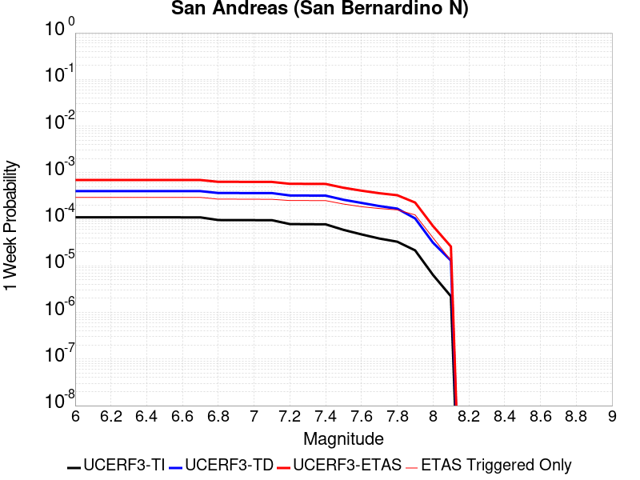
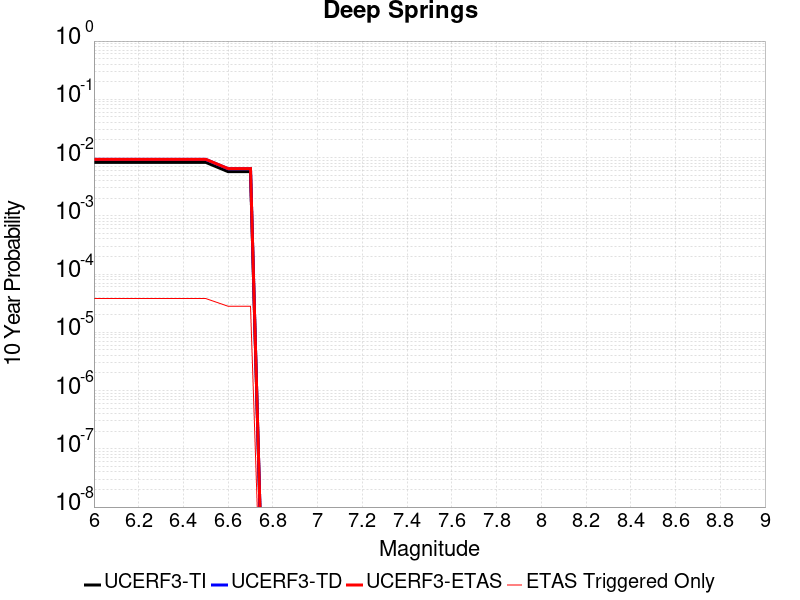
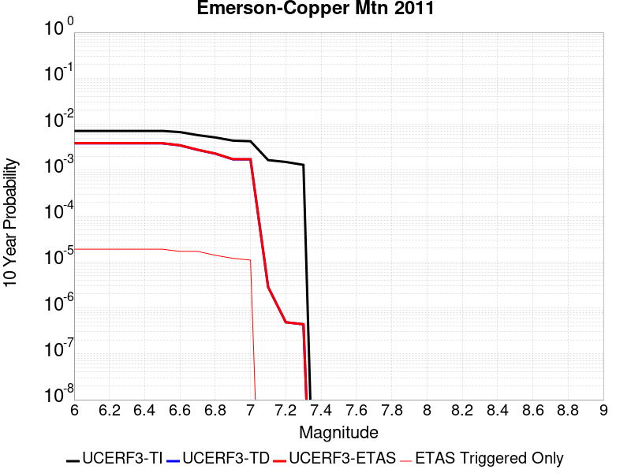
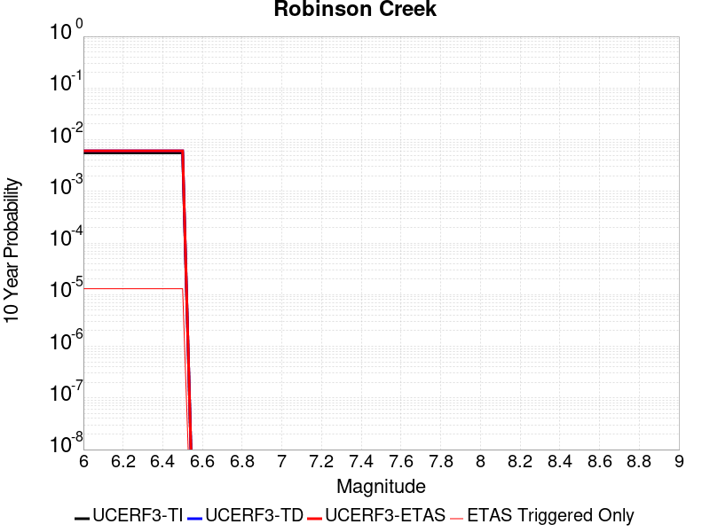
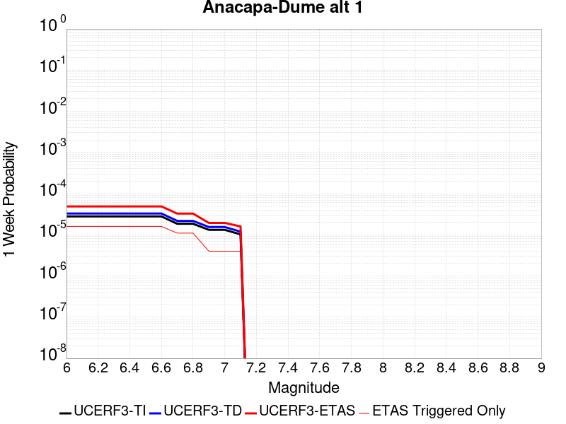

# Parent Section Magnitude-Probability Distributions

Only fault sections with at least one triggered aftershock are plotted. Sections are sorted by total supraseismogenic trigger rate (decreasing)

## Table Of Contents

* [Tank Canyon](#tank-canyon)
* [Little Lake](#little-lake)
* [Garlock (Central)](#garlock-central)
* [Owl Lake](#owl-lake)
* [Garlock (West)](#garlock-west)
* [Garlock (East)](#garlock-east)
* [Death Valley (So)](#death-valley-so)
* [Panamint Valley](#panamint-valley)
* [San Andreas (Mojave N)](#san-andreas-mojave-n)
* [San Andreas (Big Bend)](#san-andreas-big-bend)
* [Blackwater](#blackwater)
* [San Andreas (Mojave S)](#san-andreas-mojave-s)
* [San Andreas (Carrizo) rev](#san-andreas-carrizo-rev)
* [San Andreas (Cholame) rev](#san-andreas-cholame-rev)
* [San Andreas (Parkfield)](#san-andreas-parkfield)
* [Death Valley (Black Mtns Frontal)](#death-valley-black-mtns-frontal)
* [Hunter Mountain-Saline Valley](#hunter-mountain-saline-valley)
* [San Andreas (San Bernardino N)](#san-andreas-san-bernardino-n)
* [Cucamonga](#cucamonga)
* [Pleito](#pleito)
* [Death Valley (No)](#death-valley-no)
* [San Cayetano](#san-cayetano)
* [San Andreas (San Bernardino S)](#san-andreas-san-bernardino-s)
* [Gravel Hills-Harper Lk](#gravel-hills-harper-lk)
* [San Andreas (Coachella) rev](#san-andreas-coachella-rev)
* [San Andreas (San Gorgonio Pass-Garnet HIll)](#san-andreas-san-gorgonio-pass-garnet-hill)
* [San Jacinto (San Bernardino)](#san-jacinto-san-bernardino)
* [Pitas Point (Lower)-Montalvo](#pitas-point-lower-montalvo)
* [Red Mountain](#red-mountain)
* [Pitas Point (Lower West)](#pitas-point-lower-west)
* [Santa Ynez (East)](#santa-ynez-east)
* [Mission Ridge-Arroyo Parida-Santa Ana](#mission-ridge-arroyo-parida-santa-ana)
* [So Sierra Nevada](#so-sierra-nevada)
* [Cleghorn](#cleghorn)
* [Santa Ynez (West)](#santa-ynez-west)
* [Death Valley (Fish Lake Valley)](#death-valley-fish-lake-valley)
* [Lenwood-Lockhart-Old Woman Springs](#lenwood-lockhart-old-woman-springs)
* [San Jose](#san-jose)
* [San Juan](#san-juan)
* [Santa Susana alt 1](#santa-susana-alt-1)
* [Ventura-Pitas Point](#ventura-pitas-point)
* [Elysian Park (Upper)](#elysian-park-upper)
* [Independence rev 2011](#independence-rev-2011)
* [Raymond](#raymond)
* [San Jacinto (Stepovers Combined)](#san-jacinto-stepovers-combined)
* [Elsinore (Glen Ivy) rev](#elsinore-glen-ivy-rev)
* [Elsinore (Stepovers Combined)](#elsinore-stepovers-combined)
* [San Jacinto (San Jacinto Valley) rev](#san-jacinto-san-jacinto-valley-rev)
* [Hayward (So) 2011 CFM](#hayward-so-2011-cfm)
* [San Gregorio (South) 2011 CFM](#san-gregorio-south-2011-cfm)
* [Oak Ridge (Onshore)](#oak-ridge-onshore)
* [Great Valley 03 Mysterious Ridge](#great-valley-03-mysterious-ridge)
* [Chino alt 1](#chino-alt-1)
* [Imperial](#imperial)
* [San Gabriel](#san-gabriel)
* [San Jacinto (Anza) rev](#san-jacinto-anza-rev)
* [San Jacinto (Clark) rev](#san-jacinto-clark-rev)
* [Great Valley 04a Trout Creek](#great-valley-04a-trout-creek)
* [Helendale-So Lockhart](#helendale-so-lockhart)
* [Deep Springs](#deep-springs)
* [Great Valley 04b Gordon Valley](#great-valley-04b-gordon-valley)
* [Los Alamos 2011 CFM](#los-alamos-2011-cfm)
* [Sierra Madre](#sierra-madre)
* [Emerson-Copper Mtn 2011](#emerson-copper-mtn-2011)
* [Calaveras (No) 2011 CFM](#calaveras-no-2011-cfm)
* [Verdugo](#verdugo)
* [Elsinore (Temecula) rev](#elsinore-temecula-rev)
* [Hayward (No) 2011 CFM](#hayward-no-2011-cfm)
* [Rose Canyon](#rose-canyon)
* [Robinson Creek](#robinson-creek)
* [Great Valley 12](#great-valley-12)
* [Anacapa-Dume alt 1](#anacapa-dume-alt-1)
* [Simi-Santa Rosa](#simi-santa-rosa)
* [Burnt Mtn](#burnt-mtn)
* [San Gregorio (North) 2011 CFM](#san-gregorio-north-2011-cfm)
* [Whittier alt 1](#whittier-alt-1)
* [Mono Lake 2011 CFM](#mono-lake-2011-cfm)

## Tank Canyon
*[(top)](#table-of-contents)*

| 1 Week | 1 Month | 1 Year | 10 Year |
|-----|-----|-----|-----|
|  |  |  |  |

| Magnitude | 1 wk TI Prob | 1 wk TD Prob | 1 wk ETAS Prob | 1 wk ETAS/TD Gain | 1 wk ETAS Triggered Only | 1 mo TI Prob | 1 mo TD Prob | 1 mo ETAS Prob | 1 mo ETAS/TD Gain | 1 mo ETAS Triggered Only | 1 yr TI Prob | 1 yr TD Prob | 1 yr ETAS Prob | 1 yr ETAS/TD Gain | 1 yr ETAS Triggered Only | 10 yr TI Prob | 10 yr TD Prob | 10 yr ETAS Prob | 10 yr ETAS/TD Gain | 10 yr ETAS Triggered Only |
|-----|-----|-----|-----|-----|-----|-----|-----|-----|-----|-----|-----|-----|-----|-----|-----|-----|-----|-----|-----|-----|
| 6.0 | 2.7748038E-5 | 3.5073965E-5 | 0.020857388 | 594.6687 | 0.020823045 | 1.18914744E-4 | 1.5031699E-4 | 0.027059851 | 180.01857 | 0.02691358 | 0.0014468255 | 0.0018300817 | 0.042989187 | 23.49031 | 0.041234568 | 0.014374418 | 0.018297758 | 0.07251358 | 3.962976 | 0.055226337 |
| 6.1 | 2.7748038E-5 | 3.5073965E-5 | 0.020857388 | 594.6687 | 0.020823045 | 1.18914744E-4 | 1.5031699E-4 | 0.027059851 | 180.01857 | 0.02691358 | 0.0014468255 | 0.0018300817 | 0.042989187 | 23.49031 | 0.041234568 | 0.014374418 | 0.018297758 | 0.07251358 | 3.962976 | 0.055226337 |
| 6.2 | 2.7748038E-5 | 3.5073965E-5 | 0.020857388 | 594.6687 | 0.020823045 | 1.18914744E-4 | 1.5031699E-4 | 0.027059851 | 180.01857 | 0.02691358 | 0.0014468255 | 0.0018300817 | 0.042989187 | 23.49031 | 0.041234568 | 0.014374418 | 0.018297758 | 0.07251358 | 3.962976 | 0.055226337 |
| 6.3 | 2.7748038E-5 | 3.5073965E-5 | 0.020857388 | 594.6687 | 0.020823045 | 1.18914744E-4 | 1.5031699E-4 | 0.027059851 | 180.01857 | 0.02691358 | 0.0014468255 | 0.0018300817 | 0.042989187 | 23.49031 | 0.041234568 | 0.014374418 | 0.018297758 | 0.07251358 | 3.962976 | 0.055226337 |

## Little Lake
*[(top)](#table-of-contents)*

| 1 Week | 1 Month | 1 Year | 10 Year |
|-----|-----|-----|-----|
|  |  |  |  |

| Magnitude | 1 wk TI Prob | 1 wk TD Prob | 1 wk ETAS Prob | 1 wk ETAS/TD Gain | 1 wk ETAS Triggered Only | 1 mo TI Prob | 1 mo TD Prob | 1 mo ETAS Prob | 1 mo ETAS/TD Gain | 1 mo ETAS Triggered Only | 1 yr TI Prob | 1 yr TD Prob | 1 yr ETAS Prob | 1 yr ETAS/TD Gain | 1 yr ETAS Triggered Only | 10 yr TI Prob | 10 yr TD Prob | 10 yr ETAS Prob | 10 yr ETAS/TD Gain | 10 yr ETAS Triggered Only |
|-----|-----|-----|-----|-----|-----|-----|-----|-----|-----|-----|-----|-----|-----|-----|-----|-----|-----|-----|-----|-----|
| 6.0 | 1.27106505E-5 | 1.3900362E-5 | 0.011207161 | 806.2495 | 0.011193416 | 5.447308E-5 | 5.957219E-5 | 0.014873505 | 249.67194 | 0.014814815 | 6.630079E-4 | 7.25151E-4 | 0.020792892 | 28.67388 | 0.020082304 | 0.006610333 | 0.0072377534 | 0.032404073 | 4.47709 | 0.025349794 |
| 6.1 | 1.27106505E-5 | 1.3900362E-5 | 0.011207161 | 806.2495 | 0.011193416 | 5.447308E-5 | 5.957219E-5 | 0.014873505 | 249.67194 | 0.014814815 | 6.630079E-4 | 7.25151E-4 | 0.020792892 | 28.67388 | 0.020082304 | 0.006610333 | 0.0072377534 | 0.032404073 | 4.47709 | 0.025349794 |
| 6.2 | 1.27106505E-5 | 1.3900362E-5 | 0.011207161 | 806.2495 | 0.011193416 | 5.447308E-5 | 5.957219E-5 | 0.014873505 | 249.67194 | 0.014814815 | 6.630079E-4 | 7.25151E-4 | 0.020792892 | 28.67388 | 0.020082304 | 0.006610333 | 0.0072377534 | 0.032404073 | 4.47709 | 0.025349794 |
| 6.3 | 1.27106505E-5 | 1.3900362E-5 | 0.011207161 | 806.2495 | 0.011193416 | 5.447308E-5 | 5.957219E-5 | 0.014873505 | 249.67194 | 0.014814815 | 6.630079E-4 | 7.25151E-4 | 0.020792892 | 28.67388 | 0.020082304 | 0.006610333 | 0.0072377534 | 0.032404073 | 4.47709 | 0.025349794 |
| 6.4 | 1.27106505E-5 | 1.3900362E-5 | 0.011207161 | 806.2495 | 0.011193416 | 5.447308E-5 | 5.957219E-5 | 0.014873505 | 249.67194 | 0.014814815 | 6.630079E-4 | 7.25151E-4 | 0.020792892 | 28.67388 | 0.020082304 | 0.006610333 | 0.0072377534 | 0.032404073 | 4.47709 | 0.025349794 |
| 6.5 | 1.27106505E-5 | 1.3900362E-5 | 0.011207161 | 806.2495 | 0.011193416 | 5.447308E-5 | 5.957219E-5 | 0.014873505 | 249.67194 | 0.014814815 | 6.630079E-4 | 7.25151E-4 | 0.020792892 | 28.67388 | 0.020082304 | 0.006610333 | 0.0072377534 | 0.032404073 | 4.47709 | 0.025349794 |
| 6.6 | 1.08505255E-5 | 1.1856941E-5 | 0.009641373 | 813.14166 | 0.00962963 | 4.6501424E-5 | 5.0815026E-5 | 0.012807368 | 252.03899 | 0.012757202 | 5.6600774E-4 | 6.1859656E-4 | 0.017645095 | 28.524399 | 0.017037038 | 0.005645683 | 0.006178476 | 0.027772622 | 4.4950604 | 0.021728395 |
| 6.7 | 7.97625E-6 | 8.706619E-6 | 0.006675315 | 766.6943 | 0.006666667 | 3.4183482E-5 | 3.7314083E-5 | 0.009172776 | 245.82611 | 0.009135802 | 4.161044E-4 | 4.5429895E-4 | 0.01304117 | 28.706142 | 0.012592592 | 0.004153261 | 0.0045429897 | 0.02043753 | 4.4986963 | 0.015967079 |
| 6.8 | 7.97625E-6 | 8.706619E-6 | 0.006675315 | 766.6943 | 0.006666667 | 3.4183482E-5 | 3.7314083E-5 | 0.009172776 | 245.82611 | 0.009135802 | 4.161044E-4 | 4.5429895E-4 | 0.01304117 | 28.706142 | 0.012592592 | 0.004153261 | 0.0045429897 | 0.02043753 | 4.4986963 | 0.015967079 |

## Garlock (Central)
*[(top)](#table-of-contents)*

| 1 Week | 1 Month | 1 Year | 10 Year |
|-----|-----|-----|-----|
|  |  |  |  |

| Magnitude | 1 wk TI Prob | 1 wk TD Prob | 1 wk ETAS Prob | 1 wk ETAS/TD Gain | 1 wk ETAS Triggered Only | 1 mo TI Prob | 1 mo TD Prob | 1 mo ETAS Prob | 1 mo ETAS/TD Gain | 1 mo ETAS Triggered Only | 1 yr TI Prob | 1 yr TD Prob | 1 yr ETAS Prob | 1 yr ETAS/TD Gain | 1 yr ETAS Triggered Only | 10 yr TI Prob | 10 yr TD Prob | 10 yr ETAS Prob | 10 yr ETAS/TD Gain | 10 yr ETAS Triggered Only |
|-----|-----|-----|-----|-----|-----|-----|-----|-----|-----|-----|-----|-----|-----|-----|-----|-----|-----|-----|-----|-----|
| 6.0 | 2.575808E-5 | 1.9313613E-5 | 0.012035542 | 623.1637 | 0.012016461 | 1.10387096E-4 | 8.277037E-5 | 0.01448487 | 175.00067 | 0.014403292 | 0.0013431342 | 0.0010073289 | 0.01983608 | 19.691763 | 0.018847737 | 0.013350452 | 0.0100695705 | 0.034675248 | 3.4435678 | 0.024855968 |
| 6.1 | 2.575808E-5 | 1.9313613E-5 | 0.012035542 | 623.1637 | 0.012016461 | 1.10387096E-4 | 8.277037E-5 | 0.01448487 | 175.00067 | 0.014403292 | 0.0013431342 | 0.0010073289 | 0.01983608 | 19.691763 | 0.018847737 | 0.013350452 | 0.0100695705 | 0.034675248 | 3.4435678 | 0.024855968 |
| 6.2 | 2.575808E-5 | 1.9313613E-5 | 0.012035542 | 623.1637 | 0.012016461 | 1.10387096E-4 | 8.277037E-5 | 0.01448487 | 175.00067 | 0.014403292 | 0.0013431342 | 0.0010073289 | 0.01983608 | 19.691763 | 0.018847737 | 0.013350452 | 0.0100695705 | 0.034675248 | 3.4435678 | 0.024855968 |
| 6.3 | 2.575808E-5 | 1.9313613E-5 | 0.012035542 | 623.1637 | 0.012016461 | 1.10387096E-4 | 8.277037E-5 | 0.01448487 | 175.00067 | 0.014403292 | 0.0013431342 | 0.0010073289 | 0.01983608 | 19.691763 | 0.018847737 | 0.013350452 | 0.0100695705 | 0.034675248 | 3.4435678 | 0.024855968 |
| 6.4 | 2.575808E-5 | 1.9313613E-5 | 0.012035542 | 623.1637 | 0.012016461 | 1.10387096E-4 | 8.277037E-5 | 0.01448487 | 175.00067 | 0.014403292 | 0.0013431342 | 0.0010073289 | 0.01983608 | 19.691763 | 0.018847737 | 0.013350452 | 0.0100695705 | 0.034675248 | 3.4435678 | 0.024855968 |
| 6.5 | 2.575808E-5 | 1.9313613E-5 | 0.012035542 | 623.1637 | 0.012016461 | 1.10387096E-4 | 8.277037E-5 | 0.01448487 | 175.00067 | 0.014403292 | 0.0013431342 | 0.0010073289 | 0.01983608 | 19.691763 | 0.018847737 | 0.013350452 | 0.0100695705 | 0.034675248 | 3.4435678 | 0.024855968 |
| 6.6 | 2.540234E-5 | 1.885198E-5 | 0.011705874 | 620.9361 | 0.011687242 | 1.0886263E-4 | 8.0792066E-5 | 0.014153729 | 175.18712 | 0.014074074 | 0.0013245966 | 9.83265E-4 | 0.019319128 | 19.647936 | 0.01835391 | 0.013167289 | 0.009831364 | 0.033791002 | 3.437061 | 0.02419753 |
| 6.7 | 2.4966947E-5 | 1.8286464E-5 | 0.010799983 | 590.5998 | 0.010781893 | 1.06996806E-4 | 7.8368575E-5 | 0.013163763 | 167.97247 | 0.01308642 | 0.0013019076 | 9.5378514E-4 | 0.018139025 | 19.017935 | 0.017201645 | 0.012943068 | 0.009539624 | 0.03203897 | 3.358515 | 0.02271605 |
| 6.8 | 2.4548952E-5 | 1.7797542E-5 | 0.01055259 | 592.924 | 0.010534979 | 1.0520555E-4 | 7.627332E-5 | 0.0129148 | 169.32265 | 0.012839506 | 0.001280125 | 9.282974E-4 | 0.017785063 | 19.158798 | 0.016872428 | 0.012727758 | 0.009286596 | 0.03122091 | 3.3619323 | 0.022139918 |
| 6.9 | 2.3994342E-5 | 1.7148153E-5 | 0.009728916 | 567.3448 | 0.009711934 | 1.0282884E-4 | 7.349039E-5 | 0.011842173 | 161.13907 | 0.011769547 | 0.0012512221 | 8.944436E-4 | 0.0159427 | 17.824154 | 0.015061729 | 0.012442005 | 0.0089510605 | 0.029016742 | 3.24171 | 0.020246914 |
| 7.0 | 2.343005E-5 | 1.6491087E-5 | 0.009152143 | 554.9751 | 0.009135802 | 1.0041064E-4 | 7.067455E-5 | 0.011181001 | 158.20407 | 0.011111111 | 0.0012218138 | 8.601883E-4 | 0.01500439 | 17.443146 | 0.014156379 | 0.01215118 | 0.008610493 | 0.027622323 | 3.2079844 | 0.019176954 |
| 7.1 | 2.2814058E-5 | 1.5782754E-5 | 0.008739925 | 553.7642 | 0.00872428 | 9.777087E-5 | 6.763899E-5 | 0.010601906 | 156.74252 | 0.010534979 | 0.0011897103 | 8.2325895E-4 | 0.014310089 | 17.382246 | 0.013497942 | 0.011833611 | 0.00824334 | 0.026527578 | 3.2180617 | 0.018436214 |
| 7.2 | 2.2145266E-5 | 1.5027377E-5 | 0.007916143 | 526.78143 | 0.007901235 | 9.490483E-5 | 6.440182E-5 | 0.00977571 | 151.79245 | 0.009711934 | 0.0011548538 | 7.8387547E-4 | 0.013202117 | 16.84211 | 0.012427984 | 0.011488707 | 0.007851825 | 0.024918407 | 3.1735816 | 0.017201645 |
| 7.3 | 1.9954436E-5 | 1.3199953E-5 | 0.006432868 | 487.34024 | 0.006419753 | 8.551621E-5 | 5.657036E-5 | 0.007875058 | 139.2082 | 0.00781893 | 0.0010406625 | 6.8859005E-4 | 0.010558332 | 15.333262 | 0.009876544 | 0.010358025 | 0.006900618 | 0.020387152 | 2.9543953 | 0.013580247 |
| 7.4 | 1.918037E-5 | 1.2553606E-5 | 0.0062676193 | 499.26843 | 0.0062551443 | 8.2198996E-5 | 5.3800417E-5 | 0.0077077094 | 143.26486 | 0.007654321 | 0.0010003132 | 6.5488677E-4 | 0.010360461 | 15.820232 | 0.009711934 | 0.009958224 | 0.006564366 | 0.019728411 | 3.0053794 | 0.013251029 |
| 7.5 | 1.6994161E-5 | 1.0764553E-5 | 0.0044551613 | 413.87332 | 0.0044444446 | 7.283008E-5 | 4.613333E-5 | 0.0057248836 | 124.094315 | 0.0056790123 | 8.863455E-4 | 5.615903E-4 | 0.007800321 | 13.889701 | 0.0072427983 | 0.008828186 | 0.005632708 | 0.015862824 | 2.8161986 | 0.010288066 |
| 7.6 | 1.621788E-5 | 1.012848E-5 | 0.003960706 | 391.0464 | 0.0039506173 | 6.950335E-5 | 4.34074E-5 | 0.0051460667 | 118.55275 | 0.0051028808 | 8.458747E-4 | 5.2841863E-4 | 0.0070270402 | 13.298244 | 0.0065020574 | 0.0084266225 | 0.005301458 | 0.014552563 | 2.7450118 | 0.009300412 |
| 7.7 | 7.713584E-6 | 3.2171508E-6 | 8.262598E-4 | 256.82965 | 8.2304527E-4 | 3.3057797E-5 | 1.378779E-5 | 0.0012483387 | 90.53944 | 0.001234568 | 4.0240434E-4 | 1.6786634E-4 | 0.0020605526 | 12.2749605 | 0.0018930042 | 0.0040167645 | 0.0016902693 | 0.004401728 | 2.6041577 | 0.0027160493 |

## Owl Lake
*[(top)](#table-of-contents)*

| 1 Week | 1 Month | 1 Year | 10 Year |
|-----|-----|-----|-----|
|  |  |  |  |

| Magnitude | 1 wk TI Prob | 1 wk TD Prob | 1 wk ETAS Prob | 1 wk ETAS/TD Gain | 1 wk ETAS Triggered Only | 1 mo TI Prob | 1 mo TD Prob | 1 mo ETAS Prob | 1 mo ETAS/TD Gain | 1 mo ETAS Triggered Only | 1 yr TI Prob | 1 yr TD Prob | 1 yr ETAS Prob | 1 yr ETAS/TD Gain | 1 yr ETAS Triggered Only | 10 yr TI Prob | 10 yr TD Prob | 10 yr ETAS Prob | 10 yr ETAS/TD Gain | 10 yr ETAS Triggered Only |
|-----|-----|-----|-----|-----|-----|-----|-----|-----|-----|-----|-----|-----|-----|-----|-----|-----|-----|-----|-----|-----|
| 6.0 | 3.637175E-5 | 4.988367E-5 | 0.004576407 | 91.74158 | 0.004526749 | 1.5586962E-4 | 2.1378716E-4 | 0.0058092983 | 27.17328 | 0.005596708 | 0.0018960608 | 0.0026025574 | 0.011139951 | 4.2803864 | 0.008559671 | 0.018799646 | 0.025995217 | 0.038500957 | 1.4810785 | 0.012839506 |
| 6.1 | 3.637175E-5 | 4.988367E-5 | 0.004576407 | 91.74158 | 0.004526749 | 1.5586962E-4 | 2.1378716E-4 | 0.0058092983 | 27.17328 | 0.005596708 | 0.0018960608 | 0.0026025574 | 0.011139951 | 4.2803864 | 0.008559671 | 0.018799646 | 0.025995217 | 0.038500957 | 1.4810785 | 0.012839506 |
| 6.2 | 3.637175E-5 | 4.988367E-5 | 0.004576407 | 91.74158 | 0.004526749 | 1.5586962E-4 | 2.1378716E-4 | 0.0058092983 | 27.17328 | 0.005596708 | 0.0018960608 | 0.0026025574 | 0.011139951 | 4.2803864 | 0.008559671 | 0.018799646 | 0.025995217 | 0.038500957 | 1.4810785 | 0.012839506 |
| 6.3 | 3.637175E-5 | 4.988367E-5 | 0.004576407 | 91.74158 | 0.004526749 | 1.5586962E-4 | 2.1378716E-4 | 0.0058092983 | 27.17328 | 0.005596708 | 0.0018960608 | 0.0026025574 | 0.011139951 | 4.2803864 | 0.008559671 | 0.018799646 | 0.025995217 | 0.038500957 | 1.4810785 | 0.012839506 |
| 6.4 | 3.637175E-5 | 4.988367E-5 | 0.004576407 | 91.74158 | 0.004526749 | 1.5586962E-4 | 2.1378716E-4 | 0.0058092983 | 27.17328 | 0.005596708 | 0.0018960608 | 0.0026025574 | 0.011139951 | 4.2803864 | 0.008559671 | 0.018799646 | 0.025995217 | 0.038500957 | 1.4810785 | 0.012839506 |
| 6.5 | 3.637175E-5 | 4.988367E-5 | 0.004576407 | 91.74158 | 0.004526749 | 1.5586962E-4 | 2.1378716E-4 | 0.0058092983 | 27.17328 | 0.005596708 | 0.0018960608 | 0.0026025574 | 0.011139951 | 4.2803864 | 0.008559671 | 0.018799646 | 0.025995217 | 0.038500957 | 1.4810785 | 0.012839506 |

## Garlock (West)
*[(top)](#table-of-contents)*

| 1 Week | 1 Month | 1 Year | 10 Year |
|-----|-----|-----|-----|
|  |  |  |  |

| Magnitude | 1 wk TI Prob | 1 wk TD Prob | 1 wk ETAS Prob | 1 wk ETAS/TD Gain | 1 wk ETAS Triggered Only | 1 mo TI Prob | 1 mo TD Prob | 1 mo ETAS Prob | 1 mo ETAS/TD Gain | 1 mo ETAS Triggered Only | 1 yr TI Prob | 1 yr TD Prob | 1 yr ETAS Prob | 1 yr ETAS/TD Gain | 1 yr ETAS Triggered Only | 10 yr TI Prob | 10 yr TD Prob | 10 yr ETAS Prob | 10 yr ETAS/TD Gain | 10 yr ETAS Triggered Only |
|-----|-----|-----|-----|-----|-----|-----|-----|-----|-----|-----|-----|-----|-----|-----|-----|-----|-----|-----|-----|-----|
| 6.0 | 2.516656E-5 | 1.8065048E-5 | 0.0050385506 | 278.91156 | 0.005020576 | 1.07852225E-4 | 7.741977E-5 | 0.0064143776 | 82.85194 | 0.0063374485 | 0.0013123099 | 9.42255E-4 | 0.009000499 | 9.552083 | 0.008065844 | 0.013045873 | 0.009421492 | 0.020754036 | 2.2028396 | 0.011440329 |
| 6.1 | 2.516656E-5 | 1.8065048E-5 | 0.0050385506 | 278.91156 | 0.005020576 | 1.07852225E-4 | 7.741977E-5 | 0.0064143776 | 82.85194 | 0.0063374485 | 0.0013123099 | 9.42255E-4 | 0.009000499 | 9.552083 | 0.008065844 | 0.013045873 | 0.009421492 | 0.020754036 | 2.2028396 | 0.011440329 |
| 6.2 | 2.516656E-5 | 1.8065048E-5 | 0.0050385506 | 278.91156 | 0.005020576 | 1.07852225E-4 | 7.741977E-5 | 0.0064143776 | 82.85194 | 0.0063374485 | 0.0013123099 | 9.42255E-4 | 0.009000499 | 9.552083 | 0.008065844 | 0.013045873 | 0.009421492 | 0.020754036 | 2.2028396 | 0.011440329 |
| 6.3 | 2.516656E-5 | 1.8065048E-5 | 0.0050385506 | 278.91156 | 0.005020576 | 1.07852225E-4 | 7.741977E-5 | 0.0064143776 | 82.85194 | 0.0063374485 | 0.0013123099 | 9.42255E-4 | 0.009000499 | 9.552083 | 0.008065844 | 0.013045873 | 0.009421492 | 0.020754036 | 2.2028396 | 0.011440329 |
| 6.4 | 2.516656E-5 | 1.8065048E-5 | 0.0050385506 | 278.91156 | 0.005020576 | 1.07852225E-4 | 7.741977E-5 | 0.0064143776 | 82.85194 | 0.0063374485 | 0.0013123099 | 9.42255E-4 | 0.009000499 | 9.552083 | 0.008065844 | 0.013045873 | 0.009421492 | 0.020754036 | 2.2028396 | 0.011440329 |
| 6.5 | 2.516656E-5 | 1.8065048E-5 | 0.0050385506 | 278.91156 | 0.005020576 | 1.07852225E-4 | 7.741977E-5 | 0.0064143776 | 82.85194 | 0.0063374485 | 0.0013123099 | 9.42255E-4 | 0.009000499 | 9.552083 | 0.008065844 | 0.013045873 | 0.009421492 | 0.020754036 | 2.2028396 | 0.011440329 |
| 6.6 | 2.498869E-5 | 1.7877663E-5 | 0.005038364 | 281.82455 | 0.005020576 | 1.07089996E-4 | 7.6616736E-5 | 0.00641358 | 83.70991 | 0.0063374485 | 0.0013030408 | 9.3248655E-4 | 0.008990809 | 9.641757 | 0.008065844 | 0.012954267 | 0.009324339 | 0.020657996 | 2.2154915 | 0.011440329 |
| 6.7 | 2.4627925E-5 | 1.7497801E-5 | 0.005037986 | 287.9211 | 0.005020576 | 1.0554398E-4 | 7.498886E-5 | 0.006411962 | 85.50554 | 0.0063374485 | 0.0012842404 | 9.1268384E-4 | 0.008971166 | 9.829434 | 0.008065844 | 0.012768441 | 0.009128104 | 0.020464005 | 2.241868 | 0.011440329 |
| 6.8 | 2.4270235E-5 | 1.716136E-5 | 0.0050376514 | 293.54617 | 0.005020576 | 1.04011146E-4 | 7.354704E-5 | 0.0064105294 | 87.16231 | 0.0063374485 | 0.0012656 | 8.9514436E-4 | 0.008953768 | 10.002597 | 0.008065844 | 0.012584164 | 0.0089538675 | 0.020291762 | 2.2662566 | 0.011440329 |
| 6.9 | 2.3913764E-5 | 1.6823105E-5 | 0.0049550114 | 294.53607 | 0.004938272 | 1.0248353E-4 | 7.2097464E-5 | 0.0063267904 | 87.7533 | 0.0062551443 | 0.0012470228 | 8.775101E-4 | 0.008854044 | 10.089962 | 0.007983539 | 0.012400482 | 0.00877859 | 0.020036908 | 2.2824745 | 0.011358025 |
| 7.0 | 2.3579369E-5 | 1.6492264E-5 | 0.004954682 | 300.42465 | 0.004938272 | 1.0105052E-4 | 7.067965E-5 | 0.0063253813 | 89.493675 | 0.0062551443 | 0.0012295957 | 8.6026196E-4 | 0.008836933 | 10.272375 | 0.007983539 | 0.012228143 | 0.008607132 | 0.019867398 | 2.308248 | 0.011358025 |
| 7.1 | 2.3205374E-5 | 1.6105636E-5 | 0.0049542976 | 307.61267 | 0.004938272 | 9.944781E-5 | 6.902276E-5 | 0.006323735 | 91.61811 | 0.0062551443 | 0.0012101046 | 8.401051E-4 | 0.008734702 | 10.397154 | 0.007901235 | 0.0120353615 | 0.008406721 | 0.019587649 | 2.3299987 | 0.01127572 |
| 7.2 | 2.2799322E-5 | 1.5676578E-5 | 0.0048715677 | 310.75452 | 0.004855967 | 9.770772E-5 | 6.718404E-5 | 0.006239609 | 92.873375 | 0.0061728396 | 0.0011889422 | 8.177357E-4 | 0.008630272 | 10.5538645 | 0.00781893 | 0.011826012 | 0.008184515 | 0.019286318 | 2.3564398 | 0.011193416 |
| 7.3 | 1.8228246E-5 | 1.1798695E-5 | 0.004785405 | 405.58765 | 0.0047736624 | 7.811871E-5 | 5.0565202E-5 | 0.0060584918 | 119.81544 | 0.0060082306 | 9.506803E-4 | 6.1551924E-4 | 0.008265129 | 13.4278965 | 0.007654321 | 0.0094662355 | 0.006171021 | 0.017049972 | 2.7629094 | 0.010946502 |
| 7.4 | 1.7670916E-5 | 1.132978E-5 | 0.0047026346 | 415.06848 | 0.004691358 | 7.5730306E-5 | 4.8555645E-5 | 0.005974194 | 123.03809 | 0.005925926 | 9.216264E-4 | 5.9106643E-4 | 0.008158607 | 13.803199 | 0.0075720167 | 0.009178135 | 0.0059269792 | 0.016644968 | 2.8083394 | 0.010781893 |
| 7.5 | 1.6994161E-5 | 1.0764553E-5 | 0.0044551613 | 413.87332 | 0.0044444446 | 7.283008E-5 | 4.613333E-5 | 0.0057248836 | 124.094315 | 0.0056790123 | 8.863455E-4 | 5.615903E-4 | 0.007800321 | 13.889701 | 0.0072427983 | 0.008828186 | 0.005632708 | 0.015862824 | 2.8161986 | 0.010288066 |
| 7.6 | 1.621788E-5 | 1.012848E-5 | 0.003960706 | 391.0464 | 0.0039506173 | 6.950335E-5 | 4.34074E-5 | 0.0051460667 | 118.55275 | 0.0051028808 | 8.458747E-4 | 5.2841863E-4 | 0.0070270402 | 13.298244 | 0.0065020574 | 0.0084266225 | 0.005301458 | 0.014552563 | 2.7450118 | 0.009300412 |
| 7.7 | 7.713584E-6 | 3.2171508E-6 | 8.262598E-4 | 256.82965 | 8.2304527E-4 | 3.3057797E-5 | 1.378779E-5 | 0.0012483387 | 90.53944 | 0.001234568 | 4.0240434E-4 | 1.6786634E-4 | 0.0020605526 | 12.2749605 | 0.0018930042 | 0.0040167645 | 0.0016902693 | 0.004401728 | 2.6041577 | 0.0027160493 |

## Garlock (East)
*[(top)](#table-of-contents)*

| 1 Week | 1 Month | 1 Year | 10 Year |
|-----|-----|-----|-----|
|  |  |  |  |

| Magnitude | 1 wk TI Prob | 1 wk TD Prob | 1 wk ETAS Prob | 1 wk ETAS/TD Gain | 1 wk ETAS Triggered Only | 1 mo TI Prob | 1 mo TD Prob | 1 mo ETAS Prob | 1 mo ETAS/TD Gain | 1 mo ETAS Triggered Only | 1 yr TI Prob | 1 yr TD Prob | 1 yr ETAS Prob | 1 yr ETAS/TD Gain | 1 yr ETAS Triggered Only | 10 yr TI Prob | 10 yr TD Prob | 10 yr ETAS Prob | 10 yr ETAS/TD Gain | 10 yr ETAS Triggered Only |
|-----|-----|-----|-----|-----|-----|-----|-----|-----|-----|-----|-----|-----|-----|-----|-----|-----|-----|-----|-----|-----|
| 6.0 | 2.2327951E-5 | 1.8303952E-5 | 0.0044626673 | 243.80894 | 0.0044444446 | 9.5687705E-5 | 7.8444085E-5 | 0.005674713 | 72.34086 | 0.005596708 | 0.0011643751 | 9.548048E-4 | 0.008766269 | 9.181216 | 0.00781893 | 0.0115829315 | 0.0096519785 | 0.020329805 | 2.1062837 | 0.010781893 |
| 6.1 | 2.2327951E-5 | 1.8303952E-5 | 0.0044626673 | 243.80894 | 0.0044444446 | 9.5687705E-5 | 7.8444085E-5 | 0.005674713 | 72.34086 | 0.005596708 | 0.0011643751 | 9.548048E-4 | 0.008766269 | 9.181216 | 0.00781893 | 0.0115829315 | 0.0096519785 | 0.020329805 | 2.1062837 | 0.010781893 |
| 6.2 | 2.2327951E-5 | 1.8303952E-5 | 0.0044626673 | 243.80894 | 0.0044444446 | 9.5687705E-5 | 7.8444085E-5 | 0.005674713 | 72.34086 | 0.005596708 | 0.0011643751 | 9.548048E-4 | 0.008766269 | 9.181216 | 0.00781893 | 0.0115829315 | 0.0096519785 | 0.020329805 | 2.1062837 | 0.010781893 |
| 6.3 | 2.2327951E-5 | 1.8303952E-5 | 0.0044626673 | 243.80894 | 0.0044444446 | 9.5687705E-5 | 7.8444085E-5 | 0.005674713 | 72.34086 | 0.005596708 | 0.0011643751 | 9.548048E-4 | 0.008766269 | 9.181216 | 0.00781893 | 0.0115829315 | 0.0096519785 | 0.020329805 | 2.1062837 | 0.010781893 |
| 6.4 | 2.2327951E-5 | 1.8303952E-5 | 0.0044626673 | 243.80894 | 0.0044444446 | 9.5687705E-5 | 7.8444085E-5 | 0.005674713 | 72.34086 | 0.005596708 | 0.0011643751 | 9.548048E-4 | 0.008766269 | 9.181216 | 0.00781893 | 0.0115829315 | 0.0096519785 | 0.020329805 | 2.1062837 | 0.010781893 |
| 6.5 | 2.2327951E-5 | 1.8303952E-5 | 0.0044626673 | 243.80894 | 0.0044444446 | 9.5687705E-5 | 7.8444085E-5 | 0.005674713 | 72.34086 | 0.005596708 | 0.0011643751 | 9.548048E-4 | 0.008766269 | 9.181216 | 0.00781893 | 0.0115829315 | 0.0096519785 | 0.020329805 | 2.1062837 | 0.010781893 |
| 6.6 | 2.222123E-5 | 1.816971E-5 | 0.0044625336 | 245.60289 | 0.0044444446 | 9.523036E-5 | 7.7868805E-5 | 0.005674141 | 72.86796 | 0.005596708 | 0.0011588129 | 9.4780687E-4 | 0.0086771 | 9.154923 | 0.0077366256 | 0.011527888 | 0.009581773 | 0.020178841 | 2.105961 | 0.010699589 |
| 6.7 | 2.2076227E-5 | 1.798404E-5 | 0.0044623488 | 248.12825 | 0.0044444446 | 9.4608964E-5 | 7.707312E-5 | 0.0056733494 | 73.60996 | 0.005596708 | 0.0011512554 | 9.381278E-4 | 0.008667495 | 9.239141 | 0.0077366256 | 0.011453095 | 0.009485973 | 0.020002542 | 2.1086442 | 0.010617284 |
| 6.8 | 2.1962227E-5 | 1.7854036E-5 | 0.0044622193 | 249.92775 | 0.0044444446 | 9.4120434E-5 | 7.651599E-5 | 0.0056727957 | 74.138695 | 0.005596708 | 0.0011453138 | 9.313506E-4 | 0.008660771 | 9.299152 | 0.0077366256 | 0.01139429 | 0.00941876 | 0.019854514 | 2.1079752 | 0.010534979 |
| 6.9 | 1.1702579E-5 | 6.6732687E-6 | 0.003957264 | 593.0024 | 0.0039506173 | 5.0152947E-5 | 2.8599494E-5 | 0.0048021255 | 167.90947 | 0.0047736624 | 6.10441E-4 | 3.481581E-4 | 0.0066011245 | 18.960135 | 0.0062551443 | 0.0060876687 | 0.0034954504 | 0.011779151 | 3.369852 | 0.008312757 |
| 7.0 | 1.153538E-5 | 6.4796777E-6 | 0.0039570713 | 610.6896 | 0.0039506173 | 4.9436403E-5 | 2.7769835E-5 | 0.0047189975 | 169.93251 | 0.004691358 | 6.01722E-4 | 3.3806017E-4 | 0.006426536 | 19.010036 | 0.006090535 | 0.006000953 | 0.0033946347 | 0.0114330975 | 3.3679905 | 0.008065844 |
| 7.1 | 1.135938E-5 | 6.273818E-6 | 0.0037922582 | 604.4578 | 0.0037860083 | 4.868215E-5 | 2.6887597E-5 | 0.0044712126 | 166.29274 | 0.0044444446 | 5.925439E-4 | 3.2732222E-4 | 0.006169031 | 18.846966 | 0.005843621 | 0.0059096646 | 0.0032873498 | 0.010998542 | 3.3457172 | 0.0077366256 |
| 7.2 | 1.1168294E-5 | 6.048814E-6 | 0.003545122 | 586.08545 | 0.0035390947 | 4.786324E-5 | 2.5923315E-5 | 0.0042233453 | 162.91687 | 0.004197531 | 5.825791E-4 | 3.1558552E-4 | 0.005910527 | 18.728764 | 0.005596708 | 0.005810542 | 0.0031701238 | 0.010472005 | 3.3033426 | 0.007325103 |
| 7.3 | 1.0952553E-5 | 5.8686815E-6 | 0.0032157265 | 547.947 | 0.0032098766 | 4.693867E-5 | 2.5151334E-5 | 0.0038933668 | 154.79762 | 0.0038683128 | 5.713284E-4 | 3.0618932E-4 | 0.0053252284 | 17.391945 | 0.005020576 | 0.0056986175 | 0.0030760262 | 0.0095580835 | 3.1072829 | 0.0065020574 |
| 7.4 | 1.0735812E-5 | 5.691247E-6 | 0.0031332455 | 550.5376 | 0.0031275721 | 4.6009813E-5 | 2.4390914E-5 | 0.0038103068 | 156.21828 | 0.0037860083 | 5.600255E-4 | 2.9693378E-4 | 0.005233739 | 17.625946 | 0.004938272 | 0.0055861627 | 0.0029833042 | 0.009301846 | 3.1179676 | 0.0063374485 |
| 7.5 | 9.0273E-6 | 4.284415E-6 | 0.0014857595 | 346.78235 | 0.0014814815 | 3.8687853E-5 | 1.8361723E-5 | 0.001993634 | 108.57555 | 0.0019753086 | 4.709228E-4 | 2.2354414E-4 | 0.0028567002 | 12.779133 | 0.0026337449 | 0.004699261 | 0.0022480614 | 0.005861319 | 2.6072774 | 0.0036213992 |
| 7.6 | 8.549585E-6 | 3.885532E-6 | 0.0010738402 | 276.36893 | 0.0010699589 | 3.6640562E-5 | 1.6652246E-5 | 0.0014981091 | 89.96438 | 0.0014814815 | 4.4600753E-4 | 2.027353E-4 | 0.0023422192 | 11.55309 | 0.0021399178 | 0.0044511347 | 0.0020396118 | 0.0049965316 | 2.4497464 | 0.002962963 |
| 7.7 | 7.713584E-6 | 3.2171508E-6 | 8.262598E-4 | 256.82965 | 8.2304527E-4 | 3.3057797E-5 | 1.378779E-5 | 0.0012483387 | 90.53944 | 0.001234568 | 4.0240434E-4 | 1.6786634E-4 | 0.0020605526 | 12.2749605 | 0.0018930042 | 0.0040167645 | 0.0016902693 | 0.004401728 | 2.6041577 | 0.0027160493 |

## Death Valley (So)
*[(top)](#table-of-contents)*

| 1 Week | 1 Month | 1 Year | 10 Year |
|-----|-----|-----|-----|
|  |  |  |  |

| Magnitude | 1 wk TI Prob | 1 wk TD Prob | 1 wk ETAS Prob | 1 wk ETAS/TD Gain | 1 wk ETAS Triggered Only | 1 mo TI Prob | 1 mo TD Prob | 1 mo ETAS Prob | 1 mo ETAS/TD Gain | 1 mo ETAS Triggered Only | 1 yr TI Prob | 1 yr TD Prob | 1 yr ETAS Prob | 1 yr ETAS/TD Gain | 1 yr ETAS Triggered Only | 10 yr TI Prob | 10 yr TD Prob | 10 yr ETAS Prob | 10 yr ETAS/TD Gain | 10 yr ETAS Triggered Only |
|-----|-----|-----|-----|-----|-----|-----|-----|-----|-----|-----|-----|-----|-----|-----|-----|-----|-----|-----|-----|-----|
| 6.0 | 4.4658216E-5 | 6.228887E-5 | 0.0021197738 | 34.031345 | 0.002057613 | 1.9137832E-4 | 2.669324E-4 | 0.0036405171 | 13.63835 | 0.0033744855 | 0.0023275411 | 0.0032461619 | 0.0092348885 | 2.844864 | 0.0060082306 | 0.023033133 | 0.032094594 | 0.040379547 | 1.2581416 | 0.008559671 |
| 6.1 | 4.4658216E-5 | 6.228887E-5 | 0.0021197738 | 34.031345 | 0.002057613 | 1.9137832E-4 | 2.669324E-4 | 0.0036405171 | 13.63835 | 0.0033744855 | 0.0023275411 | 0.0032461619 | 0.0092348885 | 2.844864 | 0.0060082306 | 0.023033133 | 0.032094594 | 0.040379547 | 1.2581416 | 0.008559671 |
| 6.2 | 4.4658216E-5 | 6.228887E-5 | 0.0021197738 | 34.031345 | 0.002057613 | 1.9137832E-4 | 2.669324E-4 | 0.0036405171 | 13.63835 | 0.0033744855 | 0.0023275411 | 0.0032461619 | 0.0092348885 | 2.844864 | 0.0060082306 | 0.023033133 | 0.032094594 | 0.040379547 | 1.2581416 | 0.008559671 |
| 6.3 | 4.4658216E-5 | 6.228887E-5 | 0.0021197738 | 34.031345 | 0.002057613 | 1.9137832E-4 | 2.669324E-4 | 0.0036405171 | 13.63835 | 0.0033744855 | 0.0023275411 | 0.0032461619 | 0.0092348885 | 2.844864 | 0.0060082306 | 0.023033133 | 0.032094594 | 0.040379547 | 1.2581416 | 0.008559671 |
| 6.4 | 4.4658216E-5 | 6.228887E-5 | 0.0021197738 | 34.031345 | 0.002057613 | 1.9137832E-4 | 2.669324E-4 | 0.0036405171 | 13.63835 | 0.0033744855 | 0.0023275411 | 0.0032461619 | 0.0092348885 | 2.844864 | 0.0060082306 | 0.023033133 | 0.032094594 | 0.040379547 | 1.2581416 | 0.008559671 |
| 6.5 | 4.4658216E-5 | 6.228887E-5 | 0.0021197738 | 34.031345 | 0.002057613 | 1.9137832E-4 | 2.669324E-4 | 0.0036405171 | 13.63835 | 0.0033744855 | 0.0023275411 | 0.0032461619 | 0.0092348885 | 2.844864 | 0.0060082306 | 0.023033133 | 0.032094594 | 0.040379547 | 1.2581416 | 0.008559671 |
| 6.6 | 3.6853275E-5 | 5.1089468E-5 | 0.0016970959 | 33.218117 | 0.0016460905 | 1.5793304E-4 | 2.1894388E-4 | 0.002852112 | 13.026681 | 0.0026337449 | 0.0019211388 | 0.0026635646 | 0.0071782563 | 2.694981 | 0.004526749 | 0.019046152 | 0.026430551 | 0.03308127 | 1.2516301 | 0.0068312758 |
| 6.7 | 2.9971921E-5 | 4.1332314E-5 | 0.0015227526 | 36.841694 | 0.0014814815 | 1.2844476E-4 | 1.7713365E-4 | 0.0025635422 | 14.472362 | 0.0023868312 | 0.0015626932 | 0.0021557007 | 0.006015674 | 2.790589 | 0.0038683128 | 0.015517498 | 0.021467837 | 0.027186008 | 1.2663599 | 0.005843621 |
| 6.8 | 2.8134293E-5 | 3.8737995E-5 | 0.0012732581 | 32.868458 | 0.001234568 | 1.2056997E-4 | 1.6601657E-4 | 0.002305579 | 13.887644 | 0.0021399178 | 0.0014669509 | 0.0020206098 | 0.0056346916 | 2.7886095 | 0.0036213992 | 0.014573049 | 0.020142367 | 0.02546505 | 1.2642531 | 0.0054320986 |
| 6.9 | 5.6768154E-6 | 7.307913E-6 | 1.7191576E-4 | 23.524603 | 1.6460905E-4 | 2.4328981E-5 | 3.1319494E-5 | 2.7822534E-4 | 8.883456 | 2.4691358E-4 | 2.961651E-4 | 3.8129094E-4 | 6.2811037E-4 | 1.6473258 | 2.4691358E-4 | 0.0029577068 | 0.003810565 | 0.004056538 | 1.0645502 | 2.4691358E-4 |
| 7.0 | 5.556207E-6 | 7.1531585E-6 | 1.7176103E-4 | 24.011915 | 1.6460905E-4 | 2.3812097E-5 | 3.0656276E-5 | 2.775623E-4 | 9.054012 | 2.4691358E-4 | 2.8987371E-4 | 3.7321905E-4 | 6.2004046E-4 | 1.6613313 | 2.4691358E-4 | 0.002894959 | 0.003730121 | 0.0039761136 | 1.0659477 | 2.4691358E-4 |
| 7.1 | 5.418659E-6 | 6.9768143E-6 | 1.7158472E-4 | 24.593563 | 1.6460905E-4 | 2.3222618E-5 | 2.9900531E-5 | 2.7680674E-4 | 9.257586 | 2.4691358E-4 | 2.826987E-4 | 3.64021E-4 | 6.108447E-4 | 1.678048 | 2.4691358E-4 | 0.0028233933 | 0.003638446 | 0.0038844612 | 1.0676155 | 2.4691358E-4 |
| 7.2 | 5.263499E-6 | 6.7766255E-6 | 1.7138457E-4 | 25.290546 | 1.6460905E-4 | 2.2557659E-5 | 2.90426E-5 | 2.7594902E-4 | 9.501526 | 2.4691358E-4 | 2.7460488E-4 | 3.5357912E-4 | 6.004054E-4 | 1.6980793 | 2.4691358E-4 | 0.002742658 | 0.003534366 | 0.003780407 | 1.0696138 | 2.4691358E-4 |
| 7.3 | 5.0913163E-6 | 6.5556187E-6 | 1.711636E-4 | 26.10945 | 1.6460905E-4 | 2.1819744E-5 | 2.8095446E-5 | 2.750021E-4 | 9.788137 | 2.4691358E-4 | 2.65623E-4 | 3.420512E-4 | 5.888803E-4 | 1.7216146 | 2.4691358E-4 | 0.0026530572 | 0.0034194465 | 0.003665516 | 1.0719618 | 2.4691358E-4 |
| 7.4 | 5.018449E-6 | 6.4618785E-6 | 1.7106987E-4 | 26.473705 | 1.6460905E-4 | 2.1507461E-5 | 2.7693712E-5 | 2.7460046E-4 | 9.915625 | 2.4691358E-4 | 2.6182187E-4 | 3.371616E-4 | 5.8399193E-4 | 1.7320832 | 2.4691358E-4 | 0.0026151363 | 0.0033706997 | 0.003616781 | 1.073006 | 2.4691358E-4 |
| 7.5 | 4.993322E-6 | 6.430145E-6 | 1.7103813E-4 | 26.599422 | 1.6460905E-4 | 2.1399776E-5 | 2.7557713E-5 | 2.744645E-4 | 9.959625 | 2.4691358E-4 | 2.6051112E-4 | 3.3550634E-4 | 5.823371E-4 | 1.7356962 | 2.4691358E-4 | 0.0026020592 | 0.003354197 | 0.0036002824 | 1.0733664 | 2.4691358E-4 |
| 7.6 | 4.882584E-6 | 6.2884383E-6 | 1.7089646E-4 | 27.176296 | 1.6460905E-4 | 2.0925192E-5 | 2.6950413E-5 | 2.7385732E-4 | 10.161527 | 2.4691358E-4 | 2.5473442E-4 | 3.2811466E-4 | 5.749472E-4 | 1.7522753 | 2.4691358E-4 | 0.0025444264 | 0.0032805006 | 0.0035266043 | 1.0750201 | 2.4691358E-4 |
| 7.7 | 4.8153906E-6 | 6.202069E-6 | 1.708101E-4 | 27.540827 | 1.6460905E-4 | 2.0637224E-5 | 2.6580266E-5 | 2.7348727E-4 | 10.28911 | 2.4691358E-4 | 2.5122924E-4 | 3.2360948E-4 | 5.7044317E-4 | 1.7627517 | 2.4691358E-4 | 0.002509454 | 0.0032355804 | 0.0034816952 | 1.0760651 | 2.4691358E-4 |
| 7.8 | 4.8153906E-6 | 6.202069E-6 | 1.708101E-4 | 27.540827 | 1.6460905E-4 | 2.0637224E-5 | 2.6580266E-5 | 2.7348727E-4 | 10.28911 | 2.4691358E-4 | 2.5122924E-4 | 3.2360948E-4 | 5.7044317E-4 | 1.7627517 | 2.4691358E-4 | 0.002509454 | 0.0032355804 | 0.0034816952 | 1.0760651 | 2.4691358E-4 |

## Panamint Valley
*[(top)](#table-of-contents)*

| 1 Week | 1 Month | 1 Year | 10 Year |
|-----|-----|-----|-----|
|  |  |  |  |

| Magnitude | 1 wk TI Prob | 1 wk TD Prob | 1 wk ETAS Prob | 1 wk ETAS/TD Gain | 1 wk ETAS Triggered Only | 1 mo TI Prob | 1 mo TD Prob | 1 mo ETAS Prob | 1 mo ETAS/TD Gain | 1 mo ETAS Triggered Only | 1 yr TI Prob | 1 yr TD Prob | 1 yr ETAS Prob | 1 yr ETAS/TD Gain | 1 yr ETAS Triggered Only | 10 yr TI Prob | 10 yr TD Prob | 10 yr ETAS Prob | 10 yr ETAS/TD Gain | 10 yr ETAS Triggered Only |
|-----|-----|-----|-----|-----|-----|-----|-----|-----|-----|-----|-----|-----|-----|-----|-----|-----|-----|-----|-----|-----|
| 6.0 | 2.4839064E-5 | 2.5506472E-5 | 0.0015069501 | 59.08109 | 0.0014814815 | 1.0644879E-4 | 1.09309134E-4 | 0.002578175 | 23.58609 | 0.002469136 | 0.0012952434 | 0.0013300732 | 0.004864461 | 3.6572878 | 0.0035390947 | 0.0128772 | 0.013225966 | 0.018667435 | 1.4114232 | 0.0055144033 |
| 6.1 | 2.4839064E-5 | 2.5506472E-5 | 0.0015069501 | 59.08109 | 0.0014814815 | 1.0644879E-4 | 1.09309134E-4 | 0.002578175 | 23.58609 | 0.002469136 | 0.0012952434 | 0.0013300732 | 0.004864461 | 3.6572878 | 0.0035390947 | 0.0128772 | 0.013225966 | 0.018667435 | 1.4114232 | 0.0055144033 |
| 6.2 | 2.4839064E-5 | 2.5506472E-5 | 0.0015069501 | 59.08109 | 0.0014814815 | 1.0644879E-4 | 1.09309134E-4 | 0.002578175 | 23.58609 | 0.002469136 | 0.0012952434 | 0.0013300732 | 0.004864461 | 3.6572878 | 0.0035390947 | 0.0128772 | 0.013225966 | 0.018667435 | 1.4114232 | 0.0055144033 |
| 6.3 | 2.4839064E-5 | 2.5506472E-5 | 0.0015069501 | 59.08109 | 0.0014814815 | 1.0644879E-4 | 1.09309134E-4 | 0.002578175 | 23.58609 | 0.002469136 | 0.0012952434 | 0.0013300732 | 0.004864461 | 3.6572878 | 0.0035390947 | 0.0128772 | 0.013225966 | 0.018667435 | 1.4114232 | 0.0055144033 |
| 6.4 | 2.4839064E-5 | 2.5506472E-5 | 0.0015069501 | 59.08109 | 0.0014814815 | 1.0644879E-4 | 1.09309134E-4 | 0.002578175 | 23.58609 | 0.002469136 | 0.0012952434 | 0.0013300732 | 0.004864461 | 3.6572878 | 0.0035390947 | 0.0128772 | 0.013225966 | 0.018667435 | 1.4114232 | 0.0055144033 |
| 6.5 | 2.4839064E-5 | 2.5506472E-5 | 0.0015069501 | 59.08109 | 0.0014814815 | 1.0644879E-4 | 1.09309134E-4 | 0.002578175 | 23.58609 | 0.002469136 | 0.0012952434 | 0.0013300732 | 0.004864461 | 3.6572878 | 0.0035390947 | 0.0128772 | 0.013225966 | 0.018667435 | 1.4114232 | 0.0055144033 |
| 6.6 | 2.151644E-5 | 2.1799351E-5 | 0.0010094321 | 46.305607 | 9.876543E-4 | 9.221006E-5 | 9.34227E-5 | 0.0017393595 | 18.618168 | 0.0016460905 | 0.0011220792 | 0.001136874 | 0.0036032028 | 3.169395 | 0.002469136 | 0.011164304 | 0.0113152405 | 0.015465274 | 1.366765 | 0.004197531 |
| 6.7 | 2.0301508E-5 | 2.043303E-5 | 0.0010080672 | 49.33518 | 9.876543E-4 | 8.7003566E-5 | 8.7567445E-5 | 0.0017335138 | 19.796328 | 0.0016460905 | 0.0010587536 | 0.001065658 | 0.003367729 | 3.1602342 | 0.0023045267 | 0.010537235 | 0.01061009 | 0.01451879 | 1.3683947 | 0.0039506173 |
| 6.8 | 1.782843E-5 | 1.789433E-5 | 9.232279E-4 | 51.593323 | 9.053498E-4 | 7.640532E-5 | 7.668799E-5 | 0.0014757577 | 19.243662 | 0.001399177 | 9.298377E-4 | 9.3332166E-4 | 0.0029067867 | 3.1144533 | 0.0019753086 | 0.009259567 | 0.009298533 | 0.01272318 | 1.3682997 | 0.0034567902 |
| 6.9 | 1.6185495E-5 | 1.6192123E-5 | 8.392241E-4 | 51.829155 | 8.2304527E-4 | 6.936456E-5 | 6.939322E-5 | 0.0013038755 | 18.789665 | 0.001234568 | 8.4418635E-4 | 8.4458006E-4 | 0.0024892804 | 2.9473586 | 0.0016460905 | 0.008409866 | 0.008418168 | 0.0114378 | 1.3587042 | 0.0030452674 |
| 7.0 | 1.4473978E-5 | 1.4401701E-5 | 8.3743513E-4 | 58.14835 | 8.2304527E-4 | 6.202986E-5 | 6.172037E-5 | 0.0012139126 | 19.667942 | 0.0011522634 | 7.5495185E-4 | 7.512313E-4 | 0.0023138425 | 3.080067 | 0.0015637861 | 0.0075239222 | 0.007491346 | 0.010432113 | 1.3925551 | 0.002962963 |
| 7.1 | 1.29175705E-5 | 1.2765824E-5 | 5.8889017E-4 | 46.13021 | 5.761317E-4 | 5.535984E-5 | 5.470978E-5 | 8.7771E-4 | 16.043018 | 8.2304527E-4 | 6.737976E-4 | 6.659326E-4 | 0.0018996784 | 2.8526585 | 0.001234568 | 0.0067175827 | 0.0066437623 | 0.009260009 | 1.39379 | 0.0026337449 |
| 7.2 | 1.1461888E-5 | 1.1226499E-5 | 5.0504814E-4 | 44.98714 | 4.9382716E-4 | 4.9121452E-5 | 4.8112932E-5 | 7.8881806E-4 | 16.395136 | 7.4074074E-4 | 5.978896E-4 | 5.856619E-4 | 0.0017372505 | 2.9663026 | 0.0011522634 | 0.005962835 | 0.005845547 | 0.008218426 | 1.4059293 | 0.0023868312 |
| 7.3 | 1.011261E-5 | 9.918427E-6 | 5.037407E-4 | 50.788364 | 4.9382716E-4 | 4.3339038E-5 | 4.25071E-5 | 7.832164E-4 | 18.42554 | 7.4074074E-4 | 5.2752503E-4 | 5.1744515E-4 | 0.0016691124 | 3.2256796 | 0.0011522634 | 0.005262745 | 0.005166732 | 0.007459352 | 1.4437273 | 0.0023045267 |
| 7.4 | 4.3367913E-6 | 4.4250473E-6 | 1.6903337E-4 | 38.199223 | 1.6460905E-4 | 1.8586115E-5 | 1.896443E-5 | 2.6587333E-4 | 14.019578 | 2.4691358E-4 | 2.2626246E-4 | 2.3088178E-4 | 6.4230943E-4 | 2.7819839 | 4.1152263E-4 | 0.0022603222 | 0.0023078213 | 0.003128967 | 1.3558099 | 8.2304527E-4 |
| 7.5 | 3.7993927E-6 | 3.8762123E-6 | 1.6848462E-4 | 43.46631 | 1.6460905E-4 | 1.628301E-5 | 1.6612312E-5 | 2.635218E-4 | 15.863041 | 2.4691358E-4 | 1.9822762E-4 | 2.0225039E-4 | 6.136898E-4 | 3.034307 | 4.1152263E-4 | 0.001980509 | 0.002022061 | 0.0027613041 | 1.3655888 | 7.4074074E-4 |
| 7.6 | 3.2998898E-6 | 3.365071E-6 | 8.566932E-5 | 25.458399 | 8.230453E-5 | 1.4142308E-5 | 1.4421733E-5 | 1.7902842E-4 | 12.413794 | 1.6460905E-4 | 1.7216899E-4 | 1.755846E-4 | 5.047449E-4 | 2.8746536 | 3.292181E-4 | 0.0017203566 | 0.001755846 | 0.002248806 | 1.2807536 | 4.9382716E-4 |

## San Andreas (Mojave N)
*[(top)](#table-of-contents)*

| 1 Week | 1 Month | 1 Year | 10 Year |
|-----|-----|-----|-----|
|  |  |  |  |

| Magnitude | 1 wk TI Prob | 1 wk TD Prob | 1 wk ETAS Prob | 1 wk ETAS/TD Gain | 1 wk ETAS Triggered Only | 1 mo TI Prob | 1 mo TD Prob | 1 mo ETAS Prob | 1 mo ETAS/TD Gain | 1 mo ETAS Triggered Only | 1 yr TI Prob | 1 yr TD Prob | 1 yr ETAS Prob | 1 yr ETAS/TD Gain | 1 yr ETAS Triggered Only | 10 yr TI Prob | 10 yr TD Prob | 10 yr ETAS Prob | 10 yr ETAS/TD Gain | 10 yr ETAS Triggered Only |
|-----|-----|-----|-----|-----|-----|-----|-----|-----|-----|-----|-----|-----|-----|-----|-----|-----|-----|-----|-----|-----|
| 6.0 | 1.0523762E-4 | 4.3662923E-4 | 0.0012593152 | 2.884175 | 8.2304527E-4 | 4.5094037E-4 | 0.0018700866 | 0.0031023459 | 1.6589316 | 0.001234568 | 0.005476387 | 0.022559863 | 0.024168817 | 1.0713193 | 0.0016460905 | 0.053433806 | 0.19573303 | 0.19824843 | 1.0128512 | 0.0031275721 |
| 6.1 | 1.0523762E-4 | 4.3662923E-4 | 0.0012593152 | 2.884175 | 8.2304527E-4 | 4.5094037E-4 | 0.0018700866 | 0.0031023459 | 1.6589316 | 0.001234568 | 0.005476387 | 0.022559863 | 0.024168817 | 1.0713193 | 0.0016460905 | 0.053433806 | 0.19573303 | 0.19824843 | 1.0128512 | 0.0031275721 |
| 6.2 | 1.0523762E-4 | 4.3662923E-4 | 0.0012593152 | 2.884175 | 8.2304527E-4 | 4.5094037E-4 | 0.0018700866 | 0.0031023459 | 1.6589316 | 0.001234568 | 0.005476387 | 0.022559863 | 0.024168817 | 1.0713193 | 0.0016460905 | 0.053433806 | 0.19573303 | 0.19824843 | 1.0128512 | 0.0031275721 |
| 6.3 | 1.0523762E-4 | 4.3662923E-4 | 0.0012593152 | 2.884175 | 8.2304527E-4 | 4.5094037E-4 | 0.0018700866 | 0.0031023459 | 1.6589316 | 0.001234568 | 0.005476387 | 0.022559863 | 0.024168817 | 1.0713193 | 0.0016460905 | 0.053433806 | 0.19573303 | 0.19824843 | 1.0128512 | 0.0031275721 |
| 6.4 | 1.0523762E-4 | 4.3662923E-4 | 0.0012593152 | 2.884175 | 8.2304527E-4 | 4.5094037E-4 | 0.0018700866 | 0.0031023459 | 1.6589316 | 0.001234568 | 0.005476387 | 0.022559863 | 0.024168817 | 1.0713193 | 0.0016460905 | 0.053433806 | 0.19573303 | 0.19824843 | 1.0128512 | 0.0031275721 |
| 6.5 | 1.0523762E-4 | 4.3662923E-4 | 0.0012593152 | 2.884175 | 8.2304527E-4 | 4.5094037E-4 | 0.0018700866 | 0.0031023459 | 1.6589316 | 0.001234568 | 0.005476387 | 0.022559863 | 0.024168817 | 1.0713193 | 0.0016460905 | 0.053433806 | 0.19573303 | 0.19824843 | 1.0128512 | 0.0031275721 |
| 6.6 | 1.05157305E-4 | 4.3648225E-4 | 0.0012591683 | 2.8848097 | 8.2304527E-4 | 4.5059633E-4 | 0.0018694578 | 0.0031017177 | 1.6591537 | 0.001234568 | 0.005472219 | 0.022552364 | 0.024161331 | 1.0713437 | 0.0016460905 | 0.053394135 | 0.19567315 | 0.19812255 | 1.0125178 | 0.0030452674 |
| 6.7 | 1.0507546E-4 | 4.363306E-4 | 0.0012590167 | 2.8854651 | 8.2304527E-4 | 4.5024566E-4 | 0.0018688086 | 0.0031010692 | 1.659383 | 0.001234568 | 0.0054679713 | 0.022544624 | 0.024153605 | 1.0713687 | 0.0016460905 | 0.053353705 | 0.1956114 | 0.19806097 | 1.0125227 | 0.0030452674 |
| 6.8 | 1.0495169E-4 | 4.3606028E-4 | 0.0012587466 | 2.8866346 | 8.2304527E-4 | 4.4971542E-4 | 0.0018676518 | 0.003099914 | 1.6597922 | 0.001234568 | 0.005461548 | 0.022530831 | 0.024139835 | 1.0714134 | 0.0016460905 | 0.053292558 | 0.19550118 | 0.1979511 | 1.0125314 | 0.0030452674 |
| 6.9 | 1.01919264E-4 | 4.2973462E-4 | 0.0010056187 | 2.3400924 | 5.761317E-4 | 4.367237E-4 | 0.0018405803 | 0.0028264166 | 1.5356117 | 9.876543E-4 | 0.0053041554 | 0.022207966 | 0.023576071 | 1.0616043 | 0.001399177 | 0.051793266 | 0.19291273 | 0.19510481 | 1.0113631 | 0.0027160493 |
| 7.0 | 1.0166431E-4 | 4.2917405E-4 | 0.0010050585 | 2.3418436 | 5.761317E-4 | 4.356314E-4 | 0.0018381812 | 0.0028240199 | 1.5363121 | 9.876543E-4 | 0.0052909213 | 0.022179354 | 0.023547497 | 1.0616854 | 0.001399177 | 0.0516671 | 0.19268334 | 0.1948096 | 1.0110351 | 0.0026337449 |
| 7.1 | 1.01401034E-4 | 4.2859098E-4 | 0.0010044758 | 2.34367 | 5.761317E-4 | 4.3450345E-4 | 0.0018356858 | 0.0028215272 | 1.5370425 | 9.876543E-4 | 0.005277255 | 0.02214959 | 0.023517776 | 1.0617702 | 0.001399177 | 0.051536802 | 0.19244485 | 0.19457173 | 1.011052 | 0.0026337449 |
| 7.2 | 1.0108741E-4 | 4.278926E-4 | 0.0010037777 | 2.3458638 | 5.761317E-4 | 4.3315982E-4 | 0.001832697 | 0.0028185411 | 1.53792 | 9.876543E-4 | 0.0052609756 | 0.022113942 | 0.023482177 | 1.0618721 | 0.001399177 | 0.051381566 | 0.19215985 | 0.1942875 | 1.0110723 | 0.0026337449 |
| 7.3 | 1.00634395E-4 | 4.2664207E-4 | 0.001002528 | 2.3498104 | 5.761317E-4 | 4.3121897E-4 | 0.001827345 | 0.0028131946 | 1.5394983 | 9.876543E-4 | 0.0052374597 | 0.022050105 | 0.02341843 | 1.0620552 | 0.001399177 | 0.051157285 | 0.1916488 | 0.19377778 | 1.0111088 | 0.0026337449 |
| 7.4 | 1.0012071E-4 | 4.2521826E-4 | 0.001001105 | 2.354332 | 5.761317E-4 | 4.290182E-4 | 0.0018212516 | 0.002807107 | 1.5413066 | 9.876543E-4 | 0.0052107936 | 0.021977417 | 0.023345843 | 1.0622652 | 0.001399177 | 0.050902903 | 0.19106553 | 0.1931295 | 1.0108023 | 0.0025514404 |
| 7.5 | 9.339507E-5 | 4.0500556E-4 | 9.809039E-4 | 2.4219518 | 5.761317E-4 | 4.002032E-4 | 0.0017347414 | 0.0026385207 | 1.5209879 | 9.053498E-4 | 0.0048615932 | 0.020944512 | 0.022153223 | 1.0577102 | 0.001234568 | 0.047566023 | 0.18278176 | 0.18473232 | 1.0106715 | 0.0023868312 |
| 7.6 | 9.106496E-5 | 3.9784564E-4 | 9.737481E-4 | 2.4475524 | 5.761317E-4 | 3.9022003E-4 | 0.0017040963 | 0.0026079034 | 1.5303732 | 9.053498E-4 | 0.0047405837 | 0.020578498 | 0.02178766 | 1.0587585 | 0.001234568 | 0.046407226 | 0.17986235 | 0.18181989 | 1.0108835 | 0.0023868312 |
| 7.7 | 8.313271E-5 | 3.7445044E-4 | 9.503664E-4 | 2.53803 | 5.761317E-4 | 3.5623438E-4 | 0.0016039569 | 0.0025078545 | 1.5635424 | 9.053498E-4 | 0.004328531 | 0.019381423 | 0.020511353 | 1.0582997 | 0.0011522634 | 0.042451844 | 0.17016967 | 0.17201373 | 1.0108366 | 0.0022222223 |
| 7.8 | 5.726896E-5 | 2.6506177E-4 | 6.764753E-4 | 2.5521421 | 4.1152263E-4 | 2.4541531E-4 | 0.0011355855 | 0.0017110629 | 1.5067672 | 5.761317E-4 | 0.0029838376 | 0.013756123 | 0.014486675 | 1.0531074 | 7.4074074E-4 | 0.0294409 | 0.12299887 | 0.12429813 | 1.0105631 | 0.0014814815 |
| 7.9 | 2.148629E-5 | 1.04210856E-4 | 3.5109872E-4 | 3.3691182 | 2.4691358E-4 | 9.208085E-5 | 4.46556E-4 | 7.756271E-4 | 1.7369089 | 3.292181E-4 | 0.0011205077 | 0.005425832 | 0.0059169796 | 1.0905203 | 4.9382716E-4 | 0.011148746 | 0.049493838 | 0.050119683 | 1.012645 | 6.584362E-4 |
| 8.0 | 6.3800603E-6 | 3.136937E-5 | 1.1367132E-4 | 3.6236403 | 8.230453E-5 | 2.7342829E-5 | 1.3443502E-4 | 2.1672848E-4 | 1.612143 | 8.230453E-5 | 3.3284808E-4 | 0.0016358347 | 0.0018001745 | 1.1004623 | 1.6460905E-4 | 0.0033234998 | 0.015136539 | 0.015379715 | 1.0160655 | 2.4691358E-4 |
| 8.1 | 2.2240692E-6 | 1.29589735E-5 | 9.526243E-5 | 7.351079 | 8.230453E-5 | 9.531691E-6 | 5.5538447E-5 | 1.378384E-4 | 2.4818556 | 8.230453E-5 | 1.1604215E-4 | 6.7617896E-4 | 8.406767E-4 | 1.2432755 | 1.6460905E-4 | 0.0011598158 | 0.0061071273 | 0.0063525327 | 1.0401834 | 2.4691358E-4 |

## San Andreas (Big Bend)
*[(top)](#table-of-contents)*

| 1 Week | 1 Month | 1 Year | 10 Year |
|-----|-----|-----|-----|
|  |  |  |  |

| Magnitude | 1 wk TI Prob | 1 wk TD Prob | 1 wk ETAS Prob | 1 wk ETAS/TD Gain | 1 wk ETAS Triggered Only | 1 mo TI Prob | 1 mo TD Prob | 1 mo ETAS Prob | 1 mo ETAS/TD Gain | 1 mo ETAS Triggered Only | 1 yr TI Prob | 1 yr TD Prob | 1 yr ETAS Prob | 1 yr ETAS/TD Gain | 1 yr ETAS Triggered Only | 10 yr TI Prob | 10 yr TD Prob | 10 yr ETAS Prob | 10 yr ETAS/TD Gain | 10 yr ETAS Triggered Only |
|-----|-----|-----|-----|-----|-----|-----|-----|-----|-----|-----|-----|-----|-----|-----|-----|-----|-----|-----|-----|-----|
| 6.0 | 1.0734612E-4 | 4.329521E-4 | 0.0010088343 | 2.3301291 | 5.761317E-4 | 4.5997367E-4 | 0.0018543553 | 0.0027580264 | 1.4873235 | 9.053498E-4 | 0.005585809 | 0.0223732 | 0.02366061 | 1.0575424 | 0.0013168724 | 0.054474745 | 0.19450675 | 0.19656192 | 1.010566 | 0.0025514404 |
| 6.1 | 1.0734612E-4 | 4.329521E-4 | 0.0010088343 | 2.3301291 | 5.761317E-4 | 4.5997367E-4 | 0.0018543553 | 0.0027580264 | 1.4873235 | 9.053498E-4 | 0.005585809 | 0.0223732 | 0.02366061 | 1.0575424 | 0.0013168724 | 0.054474745 | 0.19450675 | 0.19656192 | 1.010566 | 0.0025514404 |
| 6.2 | 1.0734612E-4 | 4.329521E-4 | 0.0010088343 | 2.3301291 | 5.761317E-4 | 4.5997367E-4 | 0.0018543553 | 0.0027580264 | 1.4873235 | 9.053498E-4 | 0.005585809 | 0.0223732 | 0.02366061 | 1.0575424 | 0.0013168724 | 0.054474745 | 0.19450675 | 0.19656192 | 1.010566 | 0.0025514404 |
| 6.3 | 1.0734612E-4 | 4.329521E-4 | 0.0010088343 | 2.3301291 | 5.761317E-4 | 4.5997367E-4 | 0.0018543553 | 0.0027580264 | 1.4873235 | 9.053498E-4 | 0.005585809 | 0.0223732 | 0.02366061 | 1.0575424 | 0.0013168724 | 0.054474745 | 0.19450675 | 0.19656192 | 1.010566 | 0.0025514404 |
| 6.4 | 1.0734612E-4 | 4.329521E-4 | 0.0010088343 | 2.3301291 | 5.761317E-4 | 4.5997367E-4 | 0.0018543553 | 0.0027580264 | 1.4873235 | 9.053498E-4 | 0.005585809 | 0.0223732 | 0.02366061 | 1.0575424 | 0.0013168724 | 0.054474745 | 0.19450675 | 0.19656192 | 1.010566 | 0.0025514404 |
| 6.5 | 1.0734612E-4 | 4.329521E-4 | 0.0010088343 | 2.3301291 | 5.761317E-4 | 4.5997367E-4 | 0.0018543553 | 0.0027580264 | 1.4873235 | 9.053498E-4 | 0.005585809 | 0.0223732 | 0.02366061 | 1.0575424 | 0.0013168724 | 0.054474745 | 0.19450675 | 0.19656192 | 1.010566 | 0.0025514404 |
| 6.6 | 1.0724574E-4 | 4.3276677E-4 | 0.0010086491 | 2.3306992 | 5.761317E-4 | 4.595436E-4 | 0.0018535622 | 0.0027572338 | 1.4875324 | 9.053498E-4 | 0.0055806 | 0.022363741 | 0.023651162 | 1.0575674 | 0.0013168724 | 0.054425213 | 0.19443108 | 0.19648644 | 1.0105711 | 0.0025514404 |
| 6.7 | 1.0708281E-4 | 4.324658E-4 | 0.0010083483 | 2.3316257 | 5.761317E-4 | 4.588456E-4 | 0.0018522742 | 0.002755947 | 1.4878721 | 9.053498E-4 | 0.005572145 | 0.022348382 | 0.023635823 | 1.0576079 | 0.0013168724 | 0.054344814 | 0.19430833 | 0.196364 | 1.0105795 | 0.0025514404 |
| 6.8 | 1.0689705E-4 | 4.320727E-4 | 0.0010079554 | 2.3328376 | 5.761317E-4 | 4.580498E-4 | 0.0018505919 | 0.0027542661 | 1.4883164 | 9.053498E-4 | 0.0055625057 | 0.022328319 | 0.023615789 | 1.0576608 | 0.0013168724 | 0.054253142 | 0.19414698 | 0.19620307 | 1.0105903 | 0.0025514404 |
| 6.9 | 1.06647094E-4 | 4.3154295E-4 | 0.0010074261 | 2.3344746 | 5.761317E-4 | 4.5697892E-4 | 0.0018483247 | 0.0027520012 | 1.4889165 | 9.053498E-4 | 0.0055495338 | 0.022301283 | 0.023588788 | 1.0577323 | 0.0013168724 | 0.054129772 | 0.19392996 | 0.19598658 | 1.0106051 | 0.0025514404 |
| 7.0 | 1.0639214E-4 | 4.3100046E-4 | 0.0010068838 | 2.336155 | 5.761317E-4 | 4.5588662E-4 | 0.001846003 | 0.0027496815 | 1.4895325 | 9.053498E-4 | 0.005536303 | 0.022273595 | 0.023561137 | 1.0578057 | 0.0013168724 | 0.054003917 | 0.19370714 | 0.19576435 | 1.0106202 | 0.0025514404 |
| 7.1 | 9.878347E-5 | 4.1491815E-4 | 9.908108E-4 | 2.3879669 | 5.761317E-4 | 4.2328905E-4 | 0.0017771729 | 0.0026809138 | 1.5085273 | 9.053498E-4 | 0.005141373 | 0.02145213 | 0.022740753 | 1.0600697 | 0.0013168724 | 0.05024037 | 0.18707013 | 0.18914428 | 1.0110875 | 0.0025514404 |
| 7.2 | 9.8447454E-5 | 4.1419562E-4 | 9.900887E-4 | 2.3903892 | 5.761317E-4 | 4.2184943E-4 | 0.0017740804 | 0.002677824 | 1.5094153 | 9.053498E-4 | 0.0051239277 | 0.021415222 | 0.022703893 | 1.0601755 | 0.0013168724 | 0.05007382 | 0.18677177 | 0.18884666 | 1.0111094 | 0.0025514404 |
| 7.3 | 9.7971046E-5 | 4.1292782E-4 | 9.888216E-4 | 2.3946598 | 5.761317E-4 | 4.1980835E-4 | 0.0017686546 | 0.0026724031 | 1.5109808 | 9.053498E-4 | 0.0050991946 | 0.021350458 | 0.022639215 | 1.060362 | 0.0013168724 | 0.049837634 | 0.1862459 | 0.18832214 | 1.0111479 | 0.0025514404 |
| 7.4 | 9.740844E-5 | 4.113638E-4 | 9.872585E-4 | 2.3999643 | 5.761317E-4 | 4.1739794E-4 | 0.0017619608 | 0.0026657153 | 1.5129255 | 9.053498E-4 | 0.0050699846 | 0.021270558 | 0.02255942 | 1.0605937 | 0.0013168724 | 0.049558636 | 0.18560115 | 0.187612 | 1.0108343 | 0.002469136 |
| 7.5 | 9.6629556E-5 | 4.0913856E-4 | 9.850345E-4 | 2.4075818 | 5.761317E-4 | 4.1406092E-4 | 0.0017524367 | 0.0026562 | 1.515718 | 9.053498E-4 | 0.005029545 | 0.021156862 | 0.022365311 | 1.0571185 | 0.001234568 | 0.04917225 | 0.18468793 | 0.18663394 | 1.0105368 | 0.0023868312 |
| 7.6 | 9.57783E-5 | 4.0665545E-4 | 9.825529E-4 | 2.4161801 | 5.761317E-4 | 4.1041384E-4 | 0.0017418092 | 0.002645582 | 1.5188702 | 9.053498E-4 | 0.004985346 | 0.021029979 | 0.022238584 | 1.0574706 | 0.001234568 | 0.048749782 | 0.18367083 | 0.18561928 | 1.0106083 | 0.0023868312 |
| 7.7 | 8.018139E-5 | 3.5930445E-4 | 9.352291E-4 | 2.6028876 | 5.761317E-4 | 3.4358926E-4 | 0.0015391231 | 0.0024430794 | 1.5873191 | 9.053498E-4 | 0.004175178 | 0.018605733 | 0.019736558 | 1.0607783 | 0.0011522634 | 0.040976003 | 0.16405721 | 0.16591486 | 1.0113232 | 0.0022222223 |
| 7.8 | 5.450103E-5 | 2.5067478E-4 | 6.620943E-4 | 2.641248 | 4.1152263E-4 | 2.3355494E-4 | 0.0010739786 | 0.0016494915 | 1.5358701 | 5.761317E-4 | 0.0028398235 | 0.013015171 | 0.013746271 | 1.0561728 | 7.4074074E-4 | 0.028038062 | 0.116878085 | 0.118186414 | 1.011194 | 0.0014814815 |
| 7.9 | 2.0202247E-5 | 9.5990974E-5 | 3.4288084E-4 | 3.5720115 | 2.4691358E-4 | 8.6578184E-5 | 4.1133902E-4 | 7.404217E-4 | 1.800028 | 3.292181E-4 | 0.0010535796 | 0.004999033 | 0.0054903915 | 1.0982907 | 4.9382716E-4 | 0.010485985 | 0.04582507 | 0.046453334 | 1.01371 | 6.584362E-4 |
| 8.0 | 6.3800603E-6 | 3.136937E-5 | 1.1367132E-4 | 3.6236403 | 8.230453E-5 | 2.7342829E-5 | 1.3443502E-4 | 2.1672848E-4 | 1.612143 | 8.230453E-5 | 3.3284808E-4 | 0.0016358347 | 0.0018001745 | 1.1004623 | 1.6460905E-4 | 0.0033234998 | 0.015136539 | 0.015379715 | 1.0160655 | 2.4691358E-4 |
| 8.1 | 2.2240692E-6 | 1.29589735E-5 | 9.526243E-5 | 7.351079 | 8.230453E-5 | 9.531691E-6 | 5.5538447E-5 | 1.378384E-4 | 2.4818556 | 8.230453E-5 | 1.1604215E-4 | 6.7617896E-4 | 8.406767E-4 | 1.2432755 | 1.6460905E-4 | 0.0011598158 | 0.0061071273 | 0.0063525327 | 1.0401834 | 2.4691358E-4 |

## Blackwater
*[(top)](#table-of-contents)*

| 1 Week | 1 Month | 1 Year | 10 Year |
|-----|-----|-----|-----|
|  |  |  |  |

| Magnitude | 1 wk TI Prob | 1 wk TD Prob | 1 wk ETAS Prob | 1 wk ETAS/TD Gain | 1 wk ETAS Triggered Only | 1 mo TI Prob | 1 mo TD Prob | 1 mo ETAS Prob | 1 mo ETAS/TD Gain | 1 mo ETAS Triggered Only | 1 yr TI Prob | 1 yr TD Prob | 1 yr ETAS Prob | 1 yr ETAS/TD Gain | 1 yr ETAS Triggered Only | 10 yr TI Prob | 10 yr TD Prob | 10 yr ETAS Prob | 10 yr ETAS/TD Gain | 10 yr ETAS Triggered Only |
|-----|-----|-----|-----|-----|-----|-----|-----|-----|-----|-----|-----|-----|-----|-----|-----|-----|-----|-----|-----|-----|
| 6.0 | 7.413326E-6 | 7.774191E-6 | 7.485092E-4 | 96.2813 | 7.4074074E-4 | 3.177101E-5 | 3.3317654E-5 | 8.563355E-4 | 25.702154 | 8.2304527E-4 | 3.867434E-4 | 4.0558857E-4 | 0.0018864692 | 4.6511893 | 0.0014814815 | 0.0038607102 | 0.0040506064 | 0.006509741 | 1.6071028 | 0.002469136 |
| 6.1 | 7.413326E-6 | 7.774191E-6 | 7.485092E-4 | 96.2813 | 7.4074074E-4 | 3.177101E-5 | 3.3317654E-5 | 8.563355E-4 | 25.702154 | 8.2304527E-4 | 3.867434E-4 | 4.0558857E-4 | 0.0018864692 | 4.6511893 | 0.0014814815 | 0.0038607102 | 0.0040506064 | 0.006509741 | 1.6071028 | 0.002469136 |
| 6.2 | 7.413326E-6 | 7.774191E-6 | 7.485092E-4 | 96.2813 | 7.4074074E-4 | 3.177101E-5 | 3.3317654E-5 | 8.563355E-4 | 25.702154 | 8.2304527E-4 | 3.867434E-4 | 4.0558857E-4 | 0.0018864692 | 4.6511893 | 0.0014814815 | 0.0038607102 | 0.0040506064 | 0.006509741 | 1.6071028 | 0.002469136 |
| 6.3 | 7.413326E-6 | 7.774191E-6 | 7.485092E-4 | 96.2813 | 7.4074074E-4 | 3.177101E-5 | 3.3317654E-5 | 8.563355E-4 | 25.702154 | 8.2304527E-4 | 3.867434E-4 | 4.0558857E-4 | 0.0018864692 | 4.6511893 | 0.0014814815 | 0.0038607102 | 0.0040506064 | 0.006509741 | 1.6071028 | 0.002469136 |
| 6.4 | 7.413326E-6 | 7.774191E-6 | 7.485092E-4 | 96.2813 | 7.4074074E-4 | 3.177101E-5 | 3.3317654E-5 | 8.563355E-4 | 25.702154 | 8.2304527E-4 | 3.867434E-4 | 4.0558857E-4 | 0.0018864692 | 4.6511893 | 0.0014814815 | 0.0038607102 | 0.0040506064 | 0.006509741 | 1.6071028 | 0.002469136 |
| 6.5 | 7.413326E-6 | 7.774191E-6 | 7.485092E-4 | 96.2813 | 7.4074074E-4 | 3.177101E-5 | 3.3317654E-5 | 8.563355E-4 | 25.702154 | 8.2304527E-4 | 3.867434E-4 | 4.0558857E-4 | 0.0018864692 | 4.6511893 | 0.0014814815 | 0.0038607102 | 0.0040506064 | 0.006509741 | 1.6071028 | 0.002469136 |
| 6.6 | 6.51988E-6 | 6.8357062E-6 | 7.475714E-4 | 109.36272 | 7.4074074E-4 | 2.7942044E-5 | 2.9295676E-5 | 8.5231685E-4 | 29.093605 | 8.2304527E-4 | 3.4014127E-4 | 3.5663793E-4 | 0.0018375911 | 5.1525397 | 0.0014814815 | 0.0033962112 | 0.0035627622 | 0.0058590784 | 1.6445326 | 0.0023045267 |
| 6.7 | 5.474748E-6 | 5.7374127E-6 | 7.464739E-4 | 130.10637 | 7.4074074E-4 | 2.3462993E-5 | 2.4588799E-5 | 8.4761385E-4 | 34.471542 | 8.2304527E-4 | 2.856245E-4 | 2.993487E-4 | 0.0016981068 | 5.6726713 | 0.001399177 | 0.0028525768 | 0.0029915334 | 0.0051250495 | 1.7131847 | 0.0021399178 |
| 6.8 | 4.643409E-6 | 4.8641823E-6 | 6.632972E-4 | 136.36356 | 6.584362E-4 | 1.9900172E-5 | 2.0846448E-5 | 7.6157175E-4 | 36.532448 | 7.4074074E-4 | 2.4225765E-4 | 2.5379687E-4 | 0.0014880515 | 5.863159 | 0.001234568 | 0.0024199372 | 0.0025371225 | 0.004425324 | 1.7442294 | 0.0018930042 |
| 6.9 | 3.883733E-6 | 4.0671357E-6 | 5.801965E-4 | 142.6548 | 5.761317E-4 | 1.6644462E-5 | 1.7430582E-5 | 6.758553E-4 | 38.77411 | 6.584362E-4 | 2.0262749E-4 | 2.1221735E-4 | 0.0013642362 | 6.428486 | 0.0011522634 | 0.0020244285 | 0.0021221733 | 0.0037647707 | 1.7740165 | 0.0016460905 |
| 7.0 | 3.883733E-6 | 4.0671357E-6 | 5.801965E-4 | 142.6548 | 5.761317E-4 | 1.6644462E-5 | 1.7430582E-5 | 6.758553E-4 | 38.77411 | 6.584362E-4 | 2.0262749E-4 | 2.1221735E-4 | 0.0013642362 | 6.428486 | 0.0011522634 | 0.0020244285 | 0.0021221733 | 0.0037647707 | 1.7740165 | 0.0016460905 |

## San Andreas (Mojave S)
*[(top)](#table-of-contents)*

| 1 Week | 1 Month | 1 Year | 10 Year |
|-----|-----|-----|-----|
|  |  |  |  |

| Magnitude | 1 wk TI Prob | 1 wk TD Prob | 1 wk ETAS Prob | 1 wk ETAS/TD Gain | 1 wk ETAS Triggered Only | 1 mo TI Prob | 1 mo TD Prob | 1 mo ETAS Prob | 1 mo ETAS/TD Gain | 1 mo ETAS Triggered Only | 1 yr TI Prob | 1 yr TD Prob | 1 yr ETAS Prob | 1 yr ETAS/TD Gain | 1 yr ETAS Triggered Only | 10 yr TI Prob | 10 yr TD Prob | 10 yr ETAS Prob | 10 yr ETAS/TD Gain | 10 yr ETAS Triggered Only |
|-----|-----|-----|-----|-----|-----|-----|-----|-----|-----|-----|-----|-----|-----|-----|-----|-----|-----|-----|-----|-----|
| 6.0 | 1.2943693E-4 | 5.2341627E-4 | 0.0011815078 | 2.2573006 | 6.584362E-4 | 5.5461173E-4 | 0.0022414345 | 0.003144755 | 1.40301 | 9.053498E-4 | 0.0067315125 | 0.026976345 | 0.028417861 | 1.0534363 | 0.0014814815 | 0.0653122 | 0.22817664 | 0.23008238 | 1.008352 | 0.002469136 |
| 6.1 | 1.2943693E-4 | 5.2341627E-4 | 0.0011815078 | 2.2573006 | 6.584362E-4 | 5.5461173E-4 | 0.0022414345 | 0.003144755 | 1.40301 | 9.053498E-4 | 0.0067315125 | 0.026976345 | 0.028417861 | 1.0534363 | 0.0014814815 | 0.0653122 | 0.22817664 | 0.23008238 | 1.008352 | 0.002469136 |
| 6.2 | 1.2943693E-4 | 5.2341627E-4 | 0.0011815078 | 2.2573006 | 6.584362E-4 | 5.5461173E-4 | 0.0022414345 | 0.003144755 | 1.40301 | 9.053498E-4 | 0.0067315125 | 0.026976345 | 0.028417861 | 1.0534363 | 0.0014814815 | 0.0653122 | 0.22817664 | 0.23008238 | 1.008352 | 0.002469136 |
| 6.3 | 1.2943693E-4 | 5.2341627E-4 | 0.0011815078 | 2.2573006 | 6.584362E-4 | 5.5461173E-4 | 0.0022414345 | 0.003144755 | 1.40301 | 9.053498E-4 | 0.0067315125 | 0.026976345 | 0.028417861 | 1.0534363 | 0.0014814815 | 0.0653122 | 0.22817664 | 0.23008238 | 1.008352 | 0.002469136 |
| 6.4 | 1.2943693E-4 | 5.2341627E-4 | 0.0011815078 | 2.2573006 | 6.584362E-4 | 5.5461173E-4 | 0.0022414345 | 0.003144755 | 1.40301 | 9.053498E-4 | 0.0067315125 | 0.026976345 | 0.028417861 | 1.0534363 | 0.0014814815 | 0.0653122 | 0.22817664 | 0.23008238 | 1.008352 | 0.002469136 |
| 6.5 | 1.2943693E-4 | 5.2341627E-4 | 0.0011815078 | 2.2573006 | 6.584362E-4 | 5.5461173E-4 | 0.0022414345 | 0.003144755 | 1.40301 | 9.053498E-4 | 0.0067315125 | 0.026976345 | 0.028417861 | 1.0534363 | 0.0014814815 | 0.0653122 | 0.22817664 | 0.23008238 | 1.008352 | 0.002469136 |
| 6.6 | 1.2919602E-4 | 5.22933E-4 | 0.0011810249 | 2.258463 | 6.584362E-4 | 5.535797E-4 | 0.0022393672 | 0.0031426896 | 1.4033829 | 9.053498E-4 | 0.006719025 | 0.0269518 | 0.02839335 | 1.0534863 | 0.0014814815 | 0.06519468 | 0.2279908 | 0.22989699 | 1.0083609 | 0.002469136 |
| 6.7 | 1.287887E-4 | 5.2211765E-4 | 0.00118021 | 2.2604294 | 6.584362E-4 | 5.518348E-4 | 0.0022358787 | 0.003139204 | 1.4040136 | 9.053498E-4 | 0.0066979113 | 0.026910376 | 0.02835199 | 1.053571 | 0.0014814815 | 0.06499596 | 0.22767708 | 0.22958405 | 1.0083758 | 0.002469136 |
| 6.8 | 1.2835562E-4 | 5.210589E-4 | 0.001179152 | 2.262992 | 6.584362E-4 | 5.499795E-4 | 0.002231349 | 0.0031346786 | 1.4048357 | 9.053498E-4 | 0.0066754622 | 0.02685659 | 0.028298283 | 1.0536813 | 0.0014814815 | 0.06478462 | 0.22727028 | 0.22917825 | 1.0083952 | 0.002469136 |
| 6.9 | 1.278557E-4 | 5.198382E-4 | 0.0011779321 | 2.2659593 | 6.584362E-4 | 5.4783793E-4 | 0.0022261261 | 0.0031294606 | 1.4057876 | 9.053498E-4 | 0.0066495477 | 0.02679457 | 0.028236356 | 1.0538089 | 0.0014814815 | 0.06454061 | 0.22680105 | 0.22871019 | 1.0084176 | 0.002469136 |
| 7.0 | 1.2736667E-4 | 5.1865564E-4 | 0.0011767503 | 2.2688472 | 6.584362E-4 | 5.457429E-4 | 0.0022210667 | 0.0031244056 | 1.406714 | 9.053498E-4 | 0.0066241967 | 0.026734486 | 0.02817636 | 1.0539331 | 0.0014814815 | 0.06430185 | 0.22634536 | 0.22819194 | 1.0081582 | 0.0023868312 |
| 7.1 | 1.2686207E-4 | 5.1743153E-4 | 0.001175527 | 2.2718506 | 6.584362E-4 | 5.4358126E-4 | 0.0022158294 | 0.0031191732 | 1.4076774 | 9.053498E-4 | 0.006598038 | 0.026672287 | 0.028114254 | 1.0540624 | 0.0014814815 | 0.06405542 | 0.22587313 | 0.22772084 | 1.0081803 | 0.0023868312 |
| 7.2 | 1.2627966E-4 | 5.1603396E-4 | 0.0011741304 | 2.2752967 | 6.584362E-4 | 5.4108625E-4 | 0.0022098501 | 0.0031131993 | 1.408783 | 9.053498E-4 | 0.0065678447 | 0.026601272 | 0.027963229 | 1.051199 | 0.001399177 | 0.06377091 | 0.22533216 | 0.22711739 | 1.0079228 | 0.0023045267 |
| 7.3 | 1.1602937E-4 | 4.828936E-4 | 0.0010587471 | 2.1925058 | 5.761317E-4 | 4.971739E-4 | 0.0020680462 | 0.0028893894 | 1.397159 | 8.2304527E-4 | 0.006036306 | 0.024914496 | 0.026118306 | 1.0483177 | 0.001234568 | 0.05874951 | 0.21248999 | 0.2141752 | 1.0079308 | 0.0021399178 |
| 7.4 | 1.1524662E-4 | 4.805332E-4 | 0.001056388 | 2.1983664 | 5.761317E-4 | 4.938206E-4 | 0.0020579463 | 0.0028792978 | 1.3991122 | 8.2304527E-4 | 0.0059957043 | 0.024794336 | 0.025998294 | 1.0485578 | 0.001234568 | 0.058364958 | 0.21155837 | 0.21318069 | 1.0076684 | 0.002057613 |
| 7.5 | 9.4520525E-5 | 4.1331907E-4 | 9.892127E-4 | 2.393339 | 5.761317E-4 | 4.0502506E-4 | 0.0017702914 | 0.0025097209 | 1.417688 | 7.4074074E-4 | 0.0049200356 | 0.021363411 | 0.022410512 | 1.0490137 | 0.0010699589 | 0.048125222 | 0.18482538 | 0.18636851 | 1.0083491 | 0.0018930042 |
| 7.6 | 8.245433E-5 | 3.7524698E-4 | 8.6888886E-4 | 2.315512 | 4.9382716E-4 | 3.5332784E-4 | 0.00160733 | 0.002264708 | 1.4089875 | 6.584362E-4 | 0.004293284 | 0.019415388 | 0.020383867 | 1.049882 | 9.876543E-4 | 0.042112812 | 0.16915758 | 0.17066199 | 1.0088935 | 0.0018106996 |
| 7.7 | 7.414645E-5 | 3.5051344E-4 | 8.441675E-4 | 2.4083743 | 4.9382716E-4 | 3.1773178E-4 | 0.0015014539 | 0.0021589017 | 1.437874 | 6.584362E-4 | 0.0038615242 | 0.018148331 | 0.01903725 | 1.0489807 | 9.053498E-4 | 0.037951093 | 0.15877695 | 0.16016167 | 1.0087212 | 0.0016460905 |
| 7.8 | 6.36853E-5 | 3.084882E-4 | 7.198839E-4 | 2.3335865 | 4.1152263E-4 | 2.7290845E-4 | 0.0013215367 | 0.0018969071 | 1.4353797 | 5.761317E-4 | 0.0033175983 | 0.015991475 | 0.016720371 | 1.0455803 | 7.4074074E-4 | 0.03268505 | 0.14064915 | 0.14192227 | 1.0090517 | 0.0014814815 |
| 7.9 | 2.148629E-5 | 1.04210856E-4 | 3.5109872E-4 | 3.3691182 | 2.4691358E-4 | 9.208085E-5 | 4.46556E-4 | 7.756271E-4 | 1.7369089 | 3.292181E-4 | 0.0011205077 | 0.005425832 | 0.0059169796 | 1.0905203 | 4.9382716E-4 | 0.011148746 | 0.049493838 | 0.050119683 | 1.012645 | 6.584362E-4 |
| 8.0 | 6.3800603E-6 | 3.136937E-5 | 1.1367132E-4 | 3.6236403 | 8.230453E-5 | 2.7342829E-5 | 1.3443502E-4 | 2.1672848E-4 | 1.612143 | 8.230453E-5 | 3.3284808E-4 | 0.0016358347 | 0.0018001745 | 1.1004623 | 1.6460905E-4 | 0.0033234998 | 0.015136539 | 0.015379715 | 1.0160655 | 2.4691358E-4 |
| 8.1 | 2.2240692E-6 | 1.29589735E-5 | 9.526243E-5 | 7.351079 | 8.230453E-5 | 9.531691E-6 | 5.5538447E-5 | 1.378384E-4 | 2.4818556 | 8.230453E-5 | 1.1604215E-4 | 6.7617896E-4 | 8.406767E-4 | 1.2432755 | 1.6460905E-4 | 0.0011598158 | 0.0061071273 | 0.0063525327 | 1.0401834 | 2.4691358E-4 |

## San Andreas (Carrizo) rev
*[(top)](#table-of-contents)*

| 1 Week | 1 Month | 1 Year | 10 Year |
|-----|-----|-----|-----|
|  |  |  |  |

| Magnitude | 1 wk TI Prob | 1 wk TD Prob | 1 wk ETAS Prob | 1 wk ETAS/TD Gain | 1 wk ETAS Triggered Only | 1 mo TI Prob | 1 mo TD Prob | 1 mo ETAS Prob | 1 mo ETAS/TD Gain | 1 mo ETAS Triggered Only | 1 yr TI Prob | 1 yr TD Prob | 1 yr ETAS Prob | 1 yr ETAS/TD Gain | 1 yr ETAS Triggered Only | 10 yr TI Prob | 10 yr TD Prob | 10 yr ETAS Prob | 10 yr ETAS/TD Gain | 10 yr ETAS Triggered Only |
|-----|-----|-----|-----|-----|-----|-----|-----|-----|-----|-----|-----|-----|-----|-----|-----|-----|-----|-----|-----|-----|
| 6.0 | 1.1113902E-4 | 4.4923634E-4 | 0.0010251092 | 2.2818928 | 5.761317E-4 | 4.7622315E-4 | 0.0019240503 | 0.002827658 | 1.4696383 | 9.053498E-4 | 0.005782614 | 0.023205092 | 0.024411011 | 1.0519679 | 0.001234568 | 0.05634437 | 0.20058148 | 0.20242375 | 1.0091847 | 0.0023045267 |
| 6.1 | 1.1113902E-4 | 4.4923634E-4 | 0.0010251092 | 2.2818928 | 5.761317E-4 | 4.7622315E-4 | 0.0019240503 | 0.002827658 | 1.4696383 | 9.053498E-4 | 0.005782614 | 0.023205092 | 0.024411011 | 1.0519679 | 0.001234568 | 0.05634437 | 0.20058148 | 0.20242375 | 1.0091847 | 0.0023045267 |
| 6.2 | 1.1113902E-4 | 4.4923634E-4 | 0.0010251092 | 2.2818928 | 5.761317E-4 | 4.7622315E-4 | 0.0019240503 | 0.002827658 | 1.4696383 | 9.053498E-4 | 0.005782614 | 0.023205092 | 0.024411011 | 1.0519679 | 0.001234568 | 0.05634437 | 0.20058148 | 0.20242375 | 1.0091847 | 0.0023045267 |
| 6.3 | 1.1113902E-4 | 4.4923634E-4 | 0.0010251092 | 2.2818928 | 5.761317E-4 | 4.7622315E-4 | 0.0019240503 | 0.002827658 | 1.4696383 | 9.053498E-4 | 0.005782614 | 0.023205092 | 0.024411011 | 1.0519679 | 0.001234568 | 0.05634437 | 0.20058148 | 0.20242375 | 1.0091847 | 0.0023045267 |
| 6.4 | 1.1113902E-4 | 4.4923634E-4 | 0.0010251092 | 2.2818928 | 5.761317E-4 | 4.7622315E-4 | 0.0019240503 | 0.002827658 | 1.4696383 | 9.053498E-4 | 0.005782614 | 0.023205092 | 0.024411011 | 1.0519679 | 0.001234568 | 0.05634437 | 0.20058148 | 0.20242375 | 1.0091847 | 0.0023045267 |
| 6.5 | 1.1113902E-4 | 4.4923634E-4 | 0.0010251092 | 2.2818928 | 5.761317E-4 | 4.7622315E-4 | 0.0019240503 | 0.002827658 | 1.4696383 | 9.053498E-4 | 0.005782614 | 0.023205092 | 0.024411011 | 1.0519679 | 0.001234568 | 0.05634437 | 0.20058148 | 0.20242375 | 1.0091847 | 0.0023045267 |
| 6.6 | 1.1099849E-4 | 4.4896975E-4 | 0.0010248427 | 2.2826545 | 5.761317E-4 | 4.7562108E-4 | 0.0019229094 | 0.0028265184 | 1.4699175 | 9.053498E-4 | 0.005775322 | 0.023191497 | 0.024397435 | 1.0519991 | 0.001234568 | 0.056275163 | 0.20047371 | 0.20231624 | 1.0091909 | 0.0023045267 |
| 6.7 | 1.1077418E-4 | 4.4854544E-4 | 0.0010244187 | 2.2838683 | 5.761317E-4 | 4.7466008E-4 | 0.0019210937 | 0.0028247042 | 1.4703625 | 9.053498E-4 | 0.0057636844 | 0.023169862 | 0.024375824 | 1.0520488 | 0.001234568 | 0.056164686 | 0.20030232 | 0.20214525 | 1.0092007 | 0.0023045267 |
| 6.8 | 1.105471E-4 | 4.4803345E-4 | 0.001023907 | 2.285336 | 5.761317E-4 | 4.7368725E-4 | 0.0019189026 | 0.002822515 | 1.4709007 | 9.053498E-4 | 0.0057519027 | 0.023143753 | 0.02434975 | 1.0521089 | 0.001234568 | 0.056052838 | 0.20009586 | 0.20193925 | 1.0092126 | 0.0023045267 |
| 6.9 | 1.1025541E-4 | 4.473621E-4 | 0.0010232361 | 2.2872658 | 5.761317E-4 | 4.7243762E-4 | 0.0019160297 | 0.0028196448 | 1.471608 | 9.053498E-4 | 0.0057367687 | 0.023109518 | 0.024315557 | 1.0521879 | 0.001234568 | 0.055909142 | 0.19982636 | 0.20167038 | 1.0092281 | 0.0023045267 |
| 7.0 | 1.0991533E-4 | 4.4657878E-4 | 0.0010224532 | 2.2895248 | 5.761317E-4 | 4.7098065E-4 | 0.0019126774 | 0.0028162957 | 1.4724362 | 9.053498E-4 | 0.0057191234 | 0.023069572 | 0.024275659 | 1.0522804 | 0.001234568 | 0.055741582 | 0.19951206 | 0.2013568 | 1.0092462 | 0.0023045267 |
| 7.1 | 1.09542365E-4 | 4.457076E-4 | 0.0010215825 | 2.2920463 | 5.761317E-4 | 4.693828E-4 | 0.0019089493 | 0.002812571 | 1.4733607 | 9.053498E-4 | 0.0056997715 | 0.023025142 | 0.024231285 | 1.0523837 | 0.001234568 | 0.05555778 | 0.19916314 | 0.20100869 | 1.0092665 | 0.0023045267 |
| 7.2 | 1.05608764E-4 | 4.3706578E-4 | 0.0010129457 | 2.3176045 | 5.761317E-4 | 4.5253045E-4 | 0.0018719663 | 0.0027756214 | 1.4827304 | 9.053498E-4 | 0.005495649 | 0.022584237 | 0.023790922 | 1.0534304 | 0.001234568 | 0.053617116 | 0.19563848 | 0.19749215 | 1.009475 | 0.0023045267 |
| 7.3 | 1.0511766E-4 | 4.3558737E-4 | 0.0010114681 | 2.3220787 | 5.761317E-4 | 4.5042645E-4 | 0.0018656392 | 0.0027693 | 1.4843706 | 9.053498E-4 | 0.0054701613 | 0.0225088 | 0.02371558 | 1.0536137 | 0.001234568 | 0.053374548 | 0.195048 | 0.19690304 | 1.0095106 | 0.0023045267 |
| 7.4 | 1.04579514E-4 | 4.3395188E-4 | 0.0010098335 | 2.3270636 | 5.761317E-4 | 4.481209E-4 | 0.00185864 | 0.002762307 | 1.4861981 | 9.053498E-4 | 0.005442232 | 0.022425342 | 0.023632225 | 1.0538177 | 0.001234568 | 0.053108674 | 0.19439563 | 0.19625217 | 1.0095503 | 0.0023045267 |
| 7.5 | 8.967509E-5 | 3.841574E-4 | 9.600678E-4 | 2.499152 | 5.761317E-4 | 3.842652E-4 | 0.0016455129 | 0.0025493728 | 1.5492878 | 9.053498E-4 | 0.004668397 | 0.019879378 | 0.021008736 | 1.0568105 | 0.0011522634 | 0.045715354 | 0.17451581 | 0.17635022 | 1.0105114 | 0.0022222223 |
| 7.6 | 8.902246E-5 | 3.822647E-4 | 9.5817616E-4 | 2.5065777 | 5.761317E-4 | 3.8146903E-4 | 0.0016374114 | 0.0025412787 | 1.5520099 | 9.053498E-4 | 0.004634499 | 0.019782541 | 0.020912008 | 1.0570942 | 0.0011522634 | 0.0453903 | 0.17373076 | 0.17556691 | 1.010569 | 0.0022222223 |
| 7.7 | 7.776459E-5 | 3.4746045E-4 | 9.2339196E-4 | 2.6575456 | 5.761317E-4 | 3.3323426E-4 | 0.0014884217 | 0.0023924238 | 1.6073563 | 9.053498E-4 | 0.0040495815 | 0.017998766 | 0.019130291 | 1.0628668 | 0.0011522634 | 0.039765768 | 0.15920663 | 0.16107506 | 1.0117359 | 0.0022222223 |
| 7.8 | 5.2312953E-5 | 2.3975673E-4 | 6.511807E-4 | 2.716006 | 4.1152263E-4 | 2.2417911E-4 | 0.0010272242 | 0.0016027641 | 1.5602865 | 5.761317E-4 | 0.0027259644 | 0.012452538 | 0.013184055 | 1.0587444 | 7.4074074E-4 | 0.026927674 | 0.112169944 | 0.11348525 | 1.011726 | 0.0014814815 |
| 7.9 | 1.9307261E-5 | 9.060563E-5 | 3.3749684E-4 | 3.724899 | 2.4691358E-4 | 8.274278E-5 | 3.8826585E-4 | 7.1735616E-4 | 1.8475901 | 3.292181E-4 | 0.0010069277 | 0.0047193347 | 0.005210831 | 1.1041453 | 4.9382716E-4 | 0.010023774 | 0.04339103 | 0.0440209 | 1.014516 | 6.584362E-4 |
| 8.0 | 6.3800603E-6 | 3.136937E-5 | 1.1367132E-4 | 3.6236403 | 8.230453E-5 | 2.7342829E-5 | 1.3443502E-4 | 2.1672848E-4 | 1.612143 | 8.230453E-5 | 3.3284808E-4 | 0.0016358347 | 0.0018001745 | 1.1004623 | 1.6460905E-4 | 0.0033234998 | 0.015136539 | 0.015379715 | 1.0160655 | 2.4691358E-4 |
| 8.1 | 2.2240692E-6 | 1.29589735E-5 | 9.526243E-5 | 7.351079 | 8.230453E-5 | 9.531691E-6 | 5.5538447E-5 | 1.378384E-4 | 2.4818556 | 8.230453E-5 | 1.1604215E-4 | 6.7617896E-4 | 8.406767E-4 | 1.2432755 | 1.6460905E-4 | 0.0011598158 | 0.0061071273 | 0.0063525327 | 1.0401834 | 2.4691358E-4 |

## San Andreas (Cholame) rev
*[(top)](#table-of-contents)*

| 1 Week | 1 Month | 1 Year | 10 Year |
|-----|-----|-----|-----|
|  |  |  |  |

| Magnitude | 1 wk TI Prob | 1 wk TD Prob | 1 wk ETAS Prob | 1 wk ETAS/TD Gain | 1 wk ETAS Triggered Only | 1 mo TI Prob | 1 mo TD Prob | 1 mo ETAS Prob | 1 mo ETAS/TD Gain | 1 mo ETAS Triggered Only | 1 yr TI Prob | 1 yr TD Prob | 1 yr ETAS Prob | 1 yr ETAS/TD Gain | 1 yr ETAS Triggered Only | 10 yr TI Prob | 10 yr TD Prob | 10 yr ETAS Prob | 10 yr ETAS/TD Gain | 10 yr ETAS Triggered Only |
|-----|-----|-----|-----|-----|-----|-----|-----|-----|-----|-----|-----|-----|-----|-----|-----|-----|-----|-----|-----|-----|
| 6.0 | 1.6051916E-4 | 5.7249254E-4 | 0.0011482944 | 2.0057805 | 5.761317E-4 | 6.877579E-4 | 0.0024516056 | 0.003272633 | 1.3348938 | 8.2304527E-4 | 0.00834135 | 0.029507428 | 0.030386062 | 1.0297767 | 9.053498E-4 | 0.080351114 | 0.2474813 | 0.2490297 | 1.0062566 | 0.002057613 |
| 6.1 | 1.6051916E-4 | 5.7249254E-4 | 0.0011482944 | 2.0057805 | 5.761317E-4 | 6.877579E-4 | 0.0024516056 | 0.003272633 | 1.3348938 | 8.2304527E-4 | 0.00834135 | 0.029507428 | 0.030386062 | 1.0297767 | 9.053498E-4 | 0.080351114 | 0.2474813 | 0.2490297 | 1.0062566 | 0.002057613 |
| 6.2 | 1.6051916E-4 | 5.7249254E-4 | 0.0011482944 | 2.0057805 | 5.761317E-4 | 6.877579E-4 | 0.0024516056 | 0.003272633 | 1.3348938 | 8.2304527E-4 | 0.00834135 | 0.029507428 | 0.030386062 | 1.0297767 | 9.053498E-4 | 0.080351114 | 0.2474813 | 0.2490297 | 1.0062566 | 0.002057613 |
| 6.3 | 1.6051916E-4 | 5.7249254E-4 | 0.0011482944 | 2.0057805 | 5.761317E-4 | 6.877579E-4 | 0.0024516056 | 0.003272633 | 1.3348938 | 8.2304527E-4 | 0.00834135 | 0.029507428 | 0.030386062 | 1.0297767 | 9.053498E-4 | 0.080351114 | 0.2474813 | 0.2490297 | 1.0062566 | 0.002057613 |
| 6.4 | 1.6051916E-4 | 5.7249254E-4 | 0.0011482944 | 2.0057805 | 5.761317E-4 | 6.877579E-4 | 0.0024516056 | 0.003272633 | 1.3348938 | 8.2304527E-4 | 0.00834135 | 0.029507428 | 0.030386062 | 1.0297767 | 9.053498E-4 | 0.080351114 | 0.2474813 | 0.2490297 | 1.0062566 | 0.002057613 |
| 6.5 | 1.6051916E-4 | 5.7249254E-4 | 0.0011482944 | 2.0057805 | 5.761317E-4 | 6.877579E-4 | 0.0024516056 | 0.003272633 | 1.3348938 | 8.2304527E-4 | 0.00834135 | 0.029507428 | 0.030386062 | 1.0297767 | 9.053498E-4 | 0.080351114 | 0.2474813 | 0.2490297 | 1.0062566 | 0.002057613 |
| 6.6 | 1.6029834E-4 | 5.7202484E-4 | 0.001147827 | 2.0066032 | 5.761317E-4 | 6.86812E-4 | 0.002449605 | 0.003270634 | 1.335168 | 8.2304527E-4 | 0.0083299205 | 0.029483816 | 0.030362472 | 1.0298014 | 9.053498E-4 | 0.08024513 | 0.24731047 | 0.24885923 | 1.0062623 | 0.002057613 |
| 6.7 | 1.6007364E-4 | 5.7155016E-4 | 0.0011473525 | 2.0074399 | 5.761317E-4 | 6.858495E-4 | 0.0024475744 | 0.003268605 | 1.3354467 | 8.2304527E-4 | 0.008318293 | 0.029459693 | 0.030338371 | 1.0298265 | 9.053498E-4 | 0.08013727 | 0.2471372 | 0.2486863 | 1.0062681 | 0.002057613 |
| 6.8 | 1.5980547E-4 | 5.708367E-4 | 0.0011466396 | 2.0086997 | 5.761317E-4 | 6.8470073E-4 | 0.0024445227 | 0.003265556 | 1.3358666 | 8.2304527E-4 | 0.008304413 | 0.029423568 | 0.030302279 | 1.0298642 | 9.053498E-4 | 0.08000852 | 0.2468793 | 0.24842893 | 1.0062768 | 0.002057613 |
| 6.9 | 1.5943033E-4 | 5.6985184E-4 | 0.0011456553 | 2.010444 | 5.761317E-4 | 6.830939E-4 | 0.0024403096 | 0.0032613464 | 1.3364478 | 8.2304527E-4 | 0.008284999 | 0.029373717 | 0.030252473 | 1.0299164 | 9.053498E-4 | 0.0798284 | 0.24652228 | 0.24807264 | 1.006289 | 0.002057613 |
| 7.0 | 1.5906857E-4 | 5.6890905E-4 | 0.001144713 | 2.0121195 | 5.761317E-4 | 6.815443E-4 | 0.0024362765 | 0.0032573168 | 1.3370061 | 8.2304527E-4 | 0.008266276 | 0.029325863 | 0.030204663 | 1.0299667 | 9.053498E-4 | 0.079654664 | 0.24617939 | 0.24773045 | 1.0063006 | 0.002057613 |
| 7.1 | 9.4986666E-5 | 3.9541177E-4 | 9.7131566E-4 | 2.4564662 | 5.761317E-4 | 4.070222E-4 | 0.0016936905 | 0.0025153419 | 1.4851248 | 8.2304527E-4 | 0.0049442407 | 0.020456197 | 0.021343026 | 1.0433526 | 9.053498E-4 | 0.048356738 | 0.17850818 | 0.18013087 | 1.0090903 | 0.0019753086 |
| 7.2 | 9.465065E-5 | 3.9454125E-4 | 9.7044563E-4 | 2.459681 | 5.761317E-4 | 4.0558254E-4 | 0.0016899646 | 0.002511619 | 1.4861962 | 8.2304527E-4 | 0.0049267923 | 0.020411683 | 0.021298554 | 1.0434492 | 9.053498E-4 | 0.048189856 | 0.1781604 | 0.17978379 | 1.0091119 | 0.0019753086 |
| 7.3 | 9.4370014E-5 | 3.9359776E-4 | 9.6950267E-4 | 2.4631815 | 5.761317E-4 | 4.043802E-4 | 0.0016859263 | 0.002507584 | 1.4873627 | 8.2304527E-4 | 0.00491222 | 0.020363439 | 0.021250352 | 1.0435542 | 9.053498E-4 | 0.048050456 | 0.17778328 | 0.1794074 | 1.0091355 | 0.0019753086 |
| 7.4 | 9.400309E-5 | 3.9239938E-4 | 9.68305E-4 | 2.4676516 | 5.761317E-4 | 4.0280816E-4 | 0.0016807971 | 0.0025024589 | 1.4888525 | 8.2304527E-4 | 0.004893167 | 0.020302156 | 0.021189125 | 1.0436884 | 9.053498E-4 | 0.04786817 | 0.17730153 | 0.17892662 | 1.0091656 | 0.0019753086 |
| 7.5 | 7.9358346E-5 | 3.4328582E-4 | 9.1921975E-4 | 2.6777096 | 5.761317E-4 | 3.4006286E-4 | 0.0014705557 | 0.0022923907 | 1.5588602 | 8.2304527E-4 | 0.0041324073 | 0.017785678 | 0.018674925 | 1.0499979 | 9.053498E-4 | 0.040564027 | 0.15729399 | 0.1589586 | 1.0105828 | 0.0019753086 |
| 7.6 | 7.898946E-5 | 3.4216905E-4 | 9.181036E-4 | 2.6831872 | 5.761317E-4 | 3.3848232E-4 | 0.0014657748 | 0.0022876137 | 1.5606856 | 8.2304527E-4 | 0.0041132374 | 0.01772842 | 0.01861772 | 1.0501623 | 9.053498E-4 | 0.040379323 | 0.15682538 | 0.15849091 | 1.0106202 | 0.0019753086 |
| 7.7 | 6.8013156E-5 | 3.0816178E-4 | 8.841159E-4 | 2.8689995 | 5.761317E-4 | 2.914524E-4 | 0.0013201776 | 0.0021421362 | 1.6226122 | 8.2304527E-4 | 0.0035426598 | 0.015981914 | 0.016872793 | 1.0557431 | 9.053498E-4 | 0.03486713 | 0.14234997 | 0.1440441 | 1.0119011 | 0.0019753086 |
| 7.8 | 4.7216392E-5 | 2.1851076E-4 | 6.2994345E-4 | 2.8828945 | 4.1152263E-4 | 2.0234026E-4 | 9.36238E-4 | 0.0014296029 | 1.5269651 | 4.9382716E-4 | 0.0024607095 | 0.011356776 | 0.011926364 | 1.0501541 | 5.761317E-4 | 0.024336396 | 0.10266637 | 0.10384805 | 1.0115099 | 0.0013168724 |
| 7.9 | 1.604325E-5 | 7.688082E-5 | 3.2377543E-4 | 4.211394 | 2.4691358E-4 | 6.875498E-5 | 3.29461E-4 | 6.585707E-4 | 1.9989336 | 3.292181E-4 | 8.367703E-4 | 0.0040061846 | 0.004416059 | 1.1023103 | 4.1152263E-4 | 0.008336265 | 0.036792822 | 0.037347756 | 1.0150827 | 5.761317E-4 |
| 8.0 | 5.458507E-6 | 2.769139E-5 | 1.09993634E-4 | 3.972124 | 8.230453E-5 | 2.3393392E-5 | 1.1867371E-4 | 2.0096848E-4 | 1.6934539 | 8.230453E-5 | 2.847773E-4 | 0.0014442017 | 0.0016085729 | 1.1138147 | 1.6460905E-4 | 0.0028441267 | 0.013304143 | 0.013547773 | 1.0183122 | 2.4691358E-4 |
| 8.1 | 2.2240692E-6 | 1.29589735E-5 | 9.526243E-5 | 7.351079 | 8.230453E-5 | 9.531691E-6 | 5.5538447E-5 | 1.378384E-4 | 2.4818556 | 8.230453E-5 | 1.1604215E-4 | 6.7617896E-4 | 8.406767E-4 | 1.2432755 | 1.6460905E-4 | 0.0011598158 | 0.0061071273 | 0.0063525327 | 1.0401834 | 2.4691358E-4 |

## San Andreas (Parkfield)
*[(top)](#table-of-contents)*

| 1 Week | 1 Month | 1 Year | 10 Year |
|-----|-----|-----|-----|
|  |  |  |  |

| Magnitude | 1 wk TI Prob | 1 wk TD Prob | 1 wk ETAS Prob | 1 wk ETAS/TD Gain | 1 wk ETAS Triggered Only | 1 mo TI Prob | 1 mo TD Prob | 1 mo ETAS Prob | 1 mo ETAS/TD Gain | 1 mo ETAS Triggered Only | 1 yr TI Prob | 1 yr TD Prob | 1 yr ETAS Prob | 1 yr ETAS/TD Gain | 1 yr ETAS Triggered Only | 10 yr TI Prob | 10 yr TD Prob | 10 yr ETAS Prob | 10 yr ETAS/TD Gain | 10 yr ETAS Triggered Only |
|-----|-----|-----|-----|-----|-----|-----|-----|-----|-----|-----|-----|-----|-----|-----|-----|-----|-----|-----|-----|-----|
| 6.0 | 7.723521E-4 | 0.0013466828 | 0.001839845 | 1.3662051 | 4.9382716E-4 | 0.0033058827 | 0.0057641217 | 0.0065005925 | 1.1277682 | 7.4074074E-4 | 0.03951393 | 0.06891971 | 0.06976266 | 1.012231 | 9.053498E-4 | 0.3317935 | 0.5395069 | 0.54037863 | 1.0016158 | 0.0018930042 |
| 6.1 | 1.4269065E-4 | 5.017429E-4 | 9.1305905E-4 | 1.8197747 | 4.1152263E-4 | 6.11388E-4 | 0.002148918 | 0.0028059394 | 1.3057451 | 6.584362E-4 | 0.007418273 | 0.02591448 | 0.026636027 | 1.0278434 | 7.4074074E-4 | 0.0717547 | 0.22093078 | 0.2222132 | 1.0058047 | 0.0016460905 |
| 6.2 | 1.4269065E-4 | 5.017429E-4 | 9.1305905E-4 | 1.8197747 | 4.1152263E-4 | 6.11388E-4 | 0.002148918 | 0.0028059394 | 1.3057451 | 6.584362E-4 | 0.007418273 | 0.02591448 | 0.026636027 | 1.0278434 | 7.4074074E-4 | 0.0717547 | 0.22093078 | 0.2222132 | 1.0058047 | 0.0016460905 |
| 6.3 | 1.4269065E-4 | 5.017429E-4 | 9.1305905E-4 | 1.8197747 | 4.1152263E-4 | 6.11388E-4 | 0.002148918 | 0.0028059394 | 1.3057451 | 6.584362E-4 | 0.007418273 | 0.02591448 | 0.026636027 | 1.0278434 | 7.4074074E-4 | 0.0717547 | 0.22093078 | 0.2222132 | 1.0058047 | 0.0016460905 |
| 6.4 | 1.4269065E-4 | 5.017429E-4 | 9.1305905E-4 | 1.8197747 | 4.1152263E-4 | 6.11388E-4 | 0.002148918 | 0.0028059394 | 1.3057451 | 6.584362E-4 | 0.007418273 | 0.02591448 | 0.026636027 | 1.0278434 | 7.4074074E-4 | 0.0717547 | 0.22093078 | 0.2222132 | 1.0058047 | 0.0016460905 |
| 6.5 | 1.4269065E-4 | 5.017429E-4 | 9.1305905E-4 | 1.8197747 | 4.1152263E-4 | 6.11388E-4 | 0.002148918 | 0.0028059394 | 1.3057451 | 6.584362E-4 | 0.007418273 | 0.02591448 | 0.026636027 | 1.0278434 | 7.4074074E-4 | 0.0717547 | 0.22093078 | 0.2222132 | 1.0058047 | 0.0016460905 |
| 6.6 | 1.4257019E-4 | 5.015525E-4 | 9.1286877E-4 | 1.8200861 | 4.1152263E-4 | 6.10872E-4 | 0.0021481037 | 0.0028051254 | 1.3058614 | 6.584362E-4 | 0.0074120336 | 0.025904845 | 0.026626397 | 1.027854 | 7.4074074E-4 | 0.07169635 | 0.22085924 | 0.22214177 | 1.005807 | 0.0016460905 |
| 6.7 | 1.4246788E-4 | 5.013712E-4 | 9.1268757E-4 | 1.8203827 | 4.1152263E-4 | 6.1043375E-4 | 0.002147328 | 0.0028043503 | 1.3059721 | 6.584362E-4 | 0.007406734 | 0.025895536 | 0.026617095 | 1.0278642 | 7.4074074E-4 | 0.07164679 | 0.22079132 | 0.22207397 | 1.0058093 | 0.0016460905 |
| 6.8 | 1.4238524E-4 | 5.0115754E-4 | 9.1247394E-4 | 1.8207327 | 4.1152263E-4 | 6.1007973E-4 | 0.0021464138 | 0.0028034367 | 1.3061026 | 6.584362E-4 | 0.007402453 | 0.025884695 | 0.026606264 | 1.0278761 | 7.4074074E-4 | 0.07160675 | 0.22071254 | 0.22199532 | 1.0058119 | 0.0016460905 |
| 6.9 | 1.4226006E-4 | 5.008332E-4 | 9.121497E-4 | 1.8212645 | 4.1152263E-4 | 6.095435E-4 | 0.0021450259 | 0.0028020497 | 1.3063011 | 6.584362E-4 | 0.007395969 | 0.025868258 | 0.026589837 | 1.0278944 | 7.4074074E-4 | 0.0715461 | 0.22059278 | 0.22187576 | 1.005816 | 0.0016460905 |
| 7.0 | 1.421111E-4 | 5.0044054E-4 | 9.1175723E-4 | 1.8219092 | 4.1152263E-4 | 6.089054E-4 | 0.002143346 | 0.0028003708 | 1.3065417 | 6.584362E-4 | 0.0073882528 | 0.025848212 | 0.026569806 | 1.0279166 | 7.4074074E-4 | 0.07147392 | 0.22044773 | 0.22173095 | 1.005821 | 0.0016460905 |
| 7.1 | 7.911531E-5 | 3.2991724E-4 | 7.4130413E-4 | 2.2469397 | 4.1152263E-4 | 3.3902156E-4 | 0.0014133246 | 0.0020708302 | 1.4652191 | 6.584362E-4 | 0.0041197776 | 0.017099971 | 0.017828045 | 1.0425775 | 7.4074074E-4 | 0.04044234 | 0.15168123 | 0.15300782 | 1.0087459 | 0.0015637861 |
| 7.2 | 7.90033E-5 | 3.296154E-4 | 7.410024E-4 | 2.2480817 | 4.1152263E-4 | 3.3854163E-4 | 0.0014120324 | 0.002069539 | 1.4656454 | 6.584362E-4 | 0.004113957 | 0.017084487 | 0.017812572 | 1.0426167 | 7.4074074E-4 | 0.040386252 | 0.15155983 | 0.15288661 | 1.0087541 | 0.0015637861 |
| 7.3 | 7.893314E-5 | 3.2935737E-4 | 7.4074446E-4 | 2.24906 | 4.1152263E-4 | 3.3824102E-4 | 0.0014109277 | 0.0020684348 | 1.4660106 | 6.584362E-4 | 0.0041103107 | 0.017071247 | 0.017799344 | 1.0426503 | 7.4074074E-4 | 0.04035112 | 0.15145631 | 0.15278326 | 1.0087612 | 0.0015637861 |
| 7.4 | 7.878637E-5 | 3.2884022E-4 | 7.402275E-4 | 2.251025 | 4.1152263E-4 | 3.3761217E-4 | 0.0014087138 | 0.0020662225 | 1.466744 | 6.584362E-4 | 0.004102683 | 0.017044716 | 0.017772831 | 1.0427179 | 7.4074074E-4 | 0.04027762 | 0.15124616 | 0.15257344 | 1.0087756 | 0.0015637861 |
| 7.5 | 6.8967216E-5 | 2.9620552E-4 | 7.0760626E-4 | 2.3889031 | 4.1152263E-4 | 2.9554032E-4 | 0.001268987 | 0.0019265877 | 1.5182091 | 6.584362E-4 | 0.0035922674 | 0.015367592 | 0.01609695 | 1.0474608 | 7.4074074E-4 | 0.035347503 | 0.13755313 | 0.1389018 | 1.0098048 | 0.0015637861 |
| 7.6 | 6.8796966E-5 | 2.9566285E-4 | 7.070638E-4 | 2.391453 | 4.1152263E-4 | 2.948108E-4 | 0.0012666635 | 0.0019242658 | 1.5191609 | 6.584362E-4 | 0.003583415 | 0.015339702 | 0.01606908 | 1.0475484 | 7.4074074E-4 | 0.0352618 | 0.13732228 | 0.13867131 | 1.0098239 | 0.0015637861 |
| 7.7 | 5.8142083E-5 | 2.6259638E-4 | 6.7401095E-4 | 2.5667183 | 4.1152263E-4 | 2.4915655E-4 | 0.0011250726 | 0.001782768 | 1.5845804 | 6.584362E-4 | 0.0030292615 | 0.0136374645 | 0.014368104 | 1.0535759 | 7.4074074E-4 | 0.029882994 | 0.122926764 | 0.12429831 | 1.0111575 | 0.0015637861 |
| 7.8 | 3.7720634E-5 | 1.7457761E-4 | 4.214481E-4 | 2.4141016 | 2.4691358E-4 | 1.6164983E-4 | 7.480669E-4 | 0.0010770387 | 1.4397626 | 3.292181E-4 | 0.0019663102 | 0.009085932 | 0.009493715 | 1.0448807 | 4.1152263E-4 | 0.019490024 | 0.08308776 | 0.083917886 | 1.0099909 | 9.053498E-4 |
| 7.9 | 1.41195915E-5 | 6.798084E-5 | 1.5027978E-4 | 2.2106194 | 8.230453E-5 | 6.051113E-5 | 2.9132722E-4 | 4.5588834E-4 | 1.5648669 | 1.6460905E-4 | 7.36474E-4 | 0.0035434929 | 0.0037895315 | 1.0694339 | 2.4691358E-4 | 0.00734038 | 0.03258086 | 0.032978974 | 1.0122193 | 4.1152263E-4 |
| 8.0 | 5.0866283E-6 | 2.564328E-5 | 1.0794569E-4 | 4.209512 | 8.230453E-5 | 2.1799653E-5 | 1.09896864E-4 | 1.9219235E-4 | 1.7488428 | 8.230453E-5 | 2.6537845E-4 | 0.0013374792 | 0.0015018681 | 1.1229095 | 1.6460905E-4 | 0.0026506176 | 0.012337761 | 0.012581628 | 1.019766 | 2.4691358E-4 |
| 8.1 | 2.2154293E-6 | 1.2907957E-5 | 9.521142E-5 | 7.3761806 | 8.230453E-5 | 9.494662E-6 | 5.5319815E-5 | 1.3761979E-4 | 2.4877124 | 8.230453E-5 | 1.1559138E-4 | 6.7351875E-4 | 8.380169E-4 | 1.244237 | 1.6460905E-4 | 0.0011553128 | 0.0060832473 | 0.006328659 | 1.0403422 | 2.4691358E-4 |

## Death Valley (Black Mtns Frontal)
*[(top)](#table-of-contents)*

| 1 Week | 1 Month | 1 Year | 10 Year |
|-----|-----|-----|-----|
|  |  |  |  |

| Magnitude | 1 wk TI Prob | 1 wk TD Prob | 1 wk ETAS Prob | 1 wk ETAS/TD Gain | 1 wk ETAS Triggered Only | 1 mo TI Prob | 1 mo TD Prob | 1 mo ETAS Prob | 1 mo ETAS/TD Gain | 1 mo ETAS Triggered Only | 1 yr TI Prob | 1 yr TD Prob | 1 yr ETAS Prob | 1 yr ETAS/TD Gain | 1 yr ETAS Triggered Only | 10 yr TI Prob | 10 yr TD Prob | 10 yr ETAS Prob | 10 yr ETAS/TD Gain | 10 yr ETAS Triggered Only |
|-----|-----|-----|-----|-----|-----|-----|-----|-----|-----|-----|-----|-----|-----|-----|-----|-----|-----|-----|-----|-----|
| 6.0 | 3.897727E-5 | 4.947383E-5 | 7.901779E-4 | 15.971635 | 7.4074074E-4 | 1.6703474E-4 | 2.1201522E-4 | 0.0011994601 | 5.6574244 | 9.876543E-4 | 0.0020317512 | 0.0025785444 | 0.0038099291 | 1.4775503 | 0.001234568 | 0.020132754 | 0.025518417 | 0.026962094 | 1.0565739 | 0.0014814815 |
| 6.1 | 3.897727E-5 | 4.947383E-5 | 7.901779E-4 | 15.971635 | 7.4074074E-4 | 1.6703474E-4 | 2.1201522E-4 | 0.0011994601 | 5.6574244 | 9.876543E-4 | 0.0020317512 | 0.0025785444 | 0.0038099291 | 1.4775503 | 0.001234568 | 0.020132754 | 0.025518417 | 0.026962094 | 1.0565739 | 0.0014814815 |
| 6.2 | 3.897727E-5 | 4.947383E-5 | 7.901779E-4 | 15.971635 | 7.4074074E-4 | 1.6703474E-4 | 2.1201522E-4 | 0.0011994601 | 5.6574244 | 9.876543E-4 | 0.0020317512 | 0.0025785444 | 0.0038099291 | 1.4775503 | 0.001234568 | 0.020132754 | 0.025518417 | 0.026962094 | 1.0565739 | 0.0014814815 |
| 6.3 | 3.897727E-5 | 4.947383E-5 | 7.901779E-4 | 15.971635 | 7.4074074E-4 | 1.6703474E-4 | 2.1201522E-4 | 0.0011994601 | 5.6574244 | 9.876543E-4 | 0.0020317512 | 0.0025785444 | 0.0038099291 | 1.4775503 | 0.001234568 | 0.020132754 | 0.025518417 | 0.026962094 | 1.0565739 | 0.0014814815 |
| 6.4 | 3.897727E-5 | 4.947383E-5 | 7.901779E-4 | 15.971635 | 7.4074074E-4 | 1.6703474E-4 | 2.1201522E-4 | 0.0011994601 | 5.6574244 | 9.876543E-4 | 0.0020317512 | 0.0025785444 | 0.0038099291 | 1.4775503 | 0.001234568 | 0.020132754 | 0.025518417 | 0.026962094 | 1.0565739 | 0.0014814815 |
| 6.5 | 3.897727E-5 | 4.947383E-5 | 7.901779E-4 | 15.971635 | 7.4074074E-4 | 1.6703474E-4 | 2.1201522E-4 | 0.0011994601 | 5.6574244 | 9.876543E-4 | 0.0020317512 | 0.0025785444 | 0.0038099291 | 1.4775503 | 0.001234568 | 0.020132754 | 0.025518417 | 0.026962094 | 1.0565739 | 0.0014814815 |
| 6.6 | 3.4230983E-5 | 4.342495E-5 | 4.5492972E-4 | 10.47623 | 4.1152263E-4 | 1.4669597E-4 | 1.8609542E-4 | 8.444091E-4 | 4.537506 | 6.584362E-4 | 0.0017845602 | 0.0022636733 | 0.0031669736 | 1.3990419 | 9.053498E-4 | 0.017702973 | 0.022437919 | 0.02356433 | 1.0502012 | 0.0011522634 |
| 6.7 | 3.1676747E-5 | 4.019097E-5 | 3.6939586E-4 | 9.191015 | 3.292181E-4 | 1.3575044E-4 | 1.7223743E-4 | 7.482699E-4 | 4.3444095 | 5.761317E-4 | 0.0016515085 | 0.0020952902 | 0.0029166108 | 1.3919842 | 8.2304527E-4 | 0.016392887 | 0.020786978 | 0.021834696 | 1.0504026 | 0.0010699589 |
| 6.8 | 2.9047482E-5 | 3.684629E-5 | 2.8375076E-4 | 7.700932 | 2.4691358E-4 | 1.2448327E-4 | 1.5790488E-4 | 6.516541E-4 | 4.1268773 | 4.9382716E-4 | 0.00151453 | 0.0019211107 | 0.0026604284 | 1.3848387 | 7.4074074E-4 | 0.015042495 | 0.019076241 | 0.020045055 | 1.0507864 | 9.876543E-4 |
| 6.9 | 2.5887868E-5 | 3.279623E-5 | 2.7970172E-4 | 8.528471 | 2.4691358E-4 | 1.10943285E-4 | 1.4054945E-4 | 6.343072E-4 | 4.5130534 | 4.9382716E-4 | 0.0013498975 | 0.0017101576 | 0.0024496315 | 1.4324011 | 7.4074074E-4 | 0.01341727 | 0.01700073 | 0.017971594 | 1.0571072 | 9.876543E-4 |
| 7.0 | 2.244997E-5 | 2.8405042E-5 | 2.753116E-4 | 9.692349 | 2.4691358E-4 | 9.621061E-5 | 1.2173196E-4 | 6.15499E-4 | 5.056183 | 4.9382716E-4 | 0.0011707348 | 0.0014813873 | 0.002138848 | 1.4438143 | 6.584362E-4 | 0.011645862 | 0.014745472 | 0.015637472 | 1.0604931 | 9.053498E-4 |
| 7.1 | 1.989245E-5 | 2.5153167E-5 | 2.7206054E-4 | 10.8161545 | 2.4691358E-4 | 8.525057E-5 | 1.07796564E-4 | 6.015705E-4 | 5.5806093 | 4.9382716E-4 | 0.0010374314 | 0.0013119389 | 0.0019695112 | 1.5012218 | 6.584362E-4 | 0.010326017 | 0.013071986 | 0.0139655005 | 1.0683534 | 9.053498E-4 |
| 7.2 | 1.8805691E-5 | 2.3778988E-5 | 2.706867E-4 | 11.383441 | 2.4691358E-4 | 8.059333E-5 | 1.0190769E-4 | 5.956845E-4 | 5.8453345 | 4.9382716E-4 | 9.807821E-4 | 0.0012403254 | 0.001897945 | 1.5301992 | 6.584362E-4 | 0.009764646 | 0.012364016 | 0.013258171 | 1.0723193 | 9.053498E-4 |
| 7.3 | 6.7321266E-6 | 8.65193E-6 | 1.7325956E-4 | 20.025537 | 1.6460905E-4 | 2.8851653E-5 | 3.707942E-5 | 3.6628533E-4 | 9.8784 | 3.292181E-4 | 3.5121225E-4 | 4.5139133E-4 | 7.8046083E-4 | 1.7290115 | 3.292181E-4 | 0.0035065769 | 0.004508958 | 0.0048366915 | 1.072685 | 3.292181E-4 |
| 7.4 | 6.319214E-6 | 8.125558E-6 | 1.7273327E-4 | 21.258018 | 1.6460905E-4 | 2.7082066E-5 | 3.48236E-5 | 3.6403025E-4 | 10.45355 | 3.292181E-4 | 3.2967425E-4 | 4.2393777E-4 | 7.530163E-4 | 1.7762426 | 3.292181E-4 | 0.003291856 | 0.0042355005 | 0.0045633246 | 1.077399 | 3.292181E-4 |
| 7.5 | 6.0176867E-6 | 7.741697E-6 | 1.7234948E-4 | 22.262493 | 1.6460905E-4 | 2.578983E-5 | 3.317852E-5 | 3.623857E-4 | 10.922298 | 3.292181E-4 | 3.1394596E-4 | 4.0391652E-4 | 7.330016E-4 | 1.8147355 | 3.292181E-4 | 0.0031350278 | 0.004036032 | 0.0043639215 | 1.0812405 | 3.292181E-4 |
| 7.6 | 5.6024205E-6 | 7.211712E-6 | 1.7181959E-4 | 23.825075 | 1.6460905E-4 | 2.4010153E-5 | 3.0907213E-5 | 2.7781317E-4 | 8.98862 | 2.4691358E-4 | 2.9228439E-4 | 3.762732E-4 | 6.2309386E-4 | 1.6559613 | 2.4691358E-4 | 0.0029190024 | 0.0037605667 | 0.004006552 | 1.0654117 | 2.4691358E-4 |
| 7.7 | 5.132066E-6 | 6.6084267E-6 | 1.712164E-4 | 25.908796 | 1.6460905E-4 | 2.1994381E-5 | 2.8321763E-5 | 2.7522835E-4 | 9.71791 | 2.4691358E-4 | 2.677487E-4 | 3.4480577E-4 | 5.916342E-4 | 1.7158477 | 2.4691358E-4 | 0.0026742632 | 0.00344691 | 0.0036929727 | 1.0713863 | 2.4691358E-4 |
| 7.8 | 4.8153906E-6 | 6.202069E-6 | 1.708101E-4 | 27.540827 | 1.6460905E-4 | 2.0637224E-5 | 2.6580266E-5 | 2.7348727E-4 | 10.28911 | 2.4691358E-4 | 2.5122924E-4 | 3.2360948E-4 | 5.7044317E-4 | 1.7627517 | 2.4691358E-4 | 0.002509454 | 0.0032355804 | 0.0034816952 | 1.0760651 | 2.4691358E-4 |

## Hunter Mountain-Saline Valley
*[(top)](#table-of-contents)*

| 1 Week | 1 Month | 1 Year | 10 Year |
|-----|-----|-----|-----|
|  |  |  |  |

| Magnitude | 1 wk TI Prob | 1 wk TD Prob | 1 wk ETAS Prob | 1 wk ETAS/TD Gain | 1 wk ETAS Triggered Only | 1 mo TI Prob | 1 mo TD Prob | 1 mo ETAS Prob | 1 mo ETAS/TD Gain | 1 mo ETAS Triggered Only | 1 yr TI Prob | 1 yr TD Prob | 1 yr ETAS Prob | 1 yr ETAS/TD Gain | 1 yr ETAS Triggered Only | 10 yr TI Prob | 10 yr TD Prob | 10 yr ETAS Prob | 10 yr ETAS/TD Gain | 10 yr ETAS Triggered Only |
|-----|-----|-----|-----|-----|-----|-----|-----|-----|-----|-----|-----|-----|-----|-----|-----|-----|-----|-----|-----|-----|
| 6.0 | 2.6350473E-5 | 3.0151663E-5 | 2.7705778E-4 | 9.188807 | 2.4691358E-4 | 1.12925714E-4 | 1.2921583E-4 | 6.229792E-4 | 4.82123 | 4.9382716E-4 | 0.0013740034 | 0.0015722114 | 0.0023117876 | 1.470405 | 7.4074074E-4 | 0.01365539 | 0.015625311 | 0.017083645 | 1.0933315 | 0.0014814815 |
| 6.1 | 2.6350473E-5 | 3.0151663E-5 | 2.7705778E-4 | 9.188807 | 2.4691358E-4 | 1.12925714E-4 | 1.2921583E-4 | 6.229792E-4 | 4.82123 | 4.9382716E-4 | 0.0013740034 | 0.0015722114 | 0.0023117876 | 1.470405 | 7.4074074E-4 | 0.01365539 | 0.015625311 | 0.017083645 | 1.0933315 | 0.0014814815 |
| 6.2 | 2.6350473E-5 | 3.0151663E-5 | 2.7705778E-4 | 9.188807 | 2.4691358E-4 | 1.12925714E-4 | 1.2921583E-4 | 6.229792E-4 | 4.82123 | 4.9382716E-4 | 0.0013740034 | 0.0015722114 | 0.0023117876 | 1.470405 | 7.4074074E-4 | 0.01365539 | 0.015625311 | 0.017083645 | 1.0933315 | 0.0014814815 |
| 6.3 | 2.6350473E-5 | 3.0151663E-5 | 2.7705778E-4 | 9.188807 | 2.4691358E-4 | 1.12925714E-4 | 1.2921583E-4 | 6.229792E-4 | 4.82123 | 4.9382716E-4 | 0.0013740034 | 0.0015722114 | 0.0023117876 | 1.470405 | 7.4074074E-4 | 0.01365539 | 0.015625311 | 0.017083645 | 1.0933315 | 0.0014814815 |
| 6.4 | 2.6350473E-5 | 3.0151663E-5 | 2.7705778E-4 | 9.188807 | 2.4691358E-4 | 1.12925714E-4 | 1.2921583E-4 | 6.229792E-4 | 4.82123 | 4.9382716E-4 | 0.0013740034 | 0.0015722114 | 0.0023117876 | 1.470405 | 7.4074074E-4 | 0.01365539 | 0.015625311 | 0.017083645 | 1.0933315 | 0.0014814815 |
| 6.5 | 2.6350473E-5 | 3.0151663E-5 | 2.7705778E-4 | 9.188807 | 2.4691358E-4 | 1.12925714E-4 | 1.2921583E-4 | 6.229792E-4 | 4.82123 | 4.9382716E-4 | 0.0013740034 | 0.0015722114 | 0.0023117876 | 1.470405 | 7.4074074E-4 | 0.01365539 | 0.015625311 | 0.017083645 | 1.0933315 | 0.0014814815 |
| 6.6 | 2.3915805E-5 | 2.727318E-5 | 2.7418003E-4 | 10.053101 | 2.4691358E-4 | 1.0249228E-4 | 1.1688063E-4 | 5.283552E-4 | 4.520468 | 4.1152263E-4 | 0.0012471292 | 0.0014222359 | 0.0020797355 | 1.4623001 | 6.584362E-4 | 0.012401534 | 0.014145577 | 0.015362681 | 1.0860413 | 0.001234568 |
| 6.7 | 2.1143418E-5 | 2.4001838E-5 | 1.8860694E-4 | 7.858021 | 1.6460905E-4 | 9.06115E-5 | 1.0286176E-4 | 4.32046E-4 | 4.2002587 | 3.292181E-4 | 0.0011026367 | 0.0012517641 | 0.0018271747 | 1.4596796 | 5.761317E-4 | 0.010971815 | 0.012461145 | 0.01359905 | 1.0913162 | 0.0011522634 |
| 6.8 | 1.8590634E-5 | 2.0984402E-5 | 1.8559E-4 | 8.844189 | 1.6460905E-4 | 7.967171E-5 | 8.993084E-5 | 3.368222E-4 | 3.7453473 | 2.4691358E-4 | 9.6957135E-4 | 0.0010944982 | 0.0015055705 | 1.3755805 | 4.1152263E-4 | 0.00965352 | 0.010904897 | 0.011881781 | 1.0895822 | 9.876543E-4 |
| 6.9 | 1.6592752E-5 | 1.863061E-5 | 1.832366E-4 | 9.835244 | 1.6460905E-4 | 7.110986E-5 | 7.984381E-5 | 3.2673767E-4 | 4.0922103 | 2.4691358E-4 | 8.6541864E-4 | 9.7180397E-4 | 0.0013829266 | 1.4230511 | 4.1152263E-4 | 0.008620561 | 0.009689213 | 0.010667297 | 1.1009457 | 9.876543E-4 |
| 7.0 | 1.4621345E-5 | 1.6318016E-5 | 1.8092438E-4 | 11.0874 | 1.6460905E-4 | 6.2661406E-5 | 6.993326E-5 | 3.1682957E-4 | 4.530456 | 2.4691358E-4 | 7.6263555E-4 | 8.512428E-4 | 0.0012624151 | 1.4830259 | 4.1152263E-4 | 0.0076002358 | 0.008493364 | 0.00947263 | 1.1152978 | 9.876543E-4 |
| 7.1 | 1.4214311E-5 | 1.5853855E-5 | 1.804603E-4 | 11.382739 | 1.6460905E-4 | 6.0917053E-5 | 6.79441E-5 | 3.148409E-4 | 4.6338224 | 2.4691358E-4 | 7.414127E-4 | 8.2704343E-4 | 0.0012382257 | 1.4971713 | 4.1152263E-4 | 0.0073894397 | 0.0082531925 | 0.009232695 | 1.1186817 | 9.876543E-4 |
| 7.2 | 5.322531E-6 | 5.4705556E-6 | 1.7007871E-4 | 31.089842 | 1.6460905E-4 | 2.2810646E-5 | 2.3445109E-5 | 2.703529E-4 | 11.531313 | 2.4691358E-4 | 2.7768422E-4 | 2.8542118E-4 | 6.968263E-4 | 2.441397 | 4.1152263E-4 | 0.0027733748 | 0.002851954 | 0.0037547217 | 1.3165436 | 9.053498E-4 |
| 7.3 | 4.9197506E-6 | 5.0347303E-6 | 1.6964295E-4 | 33.694546 | 1.6460905E-4 | 2.1084476E-5 | 2.1577318E-5 | 2.6848557E-4 | 12.442954 | 2.4691358E-4 | 2.5667323E-4 | 2.6268652E-4 | 6.7410106E-4 | 2.5661807 | 4.1152263E-4 | 0.0025637697 | 0.0026251655 | 0.0035281386 | 1.343968 | 9.053498E-4 |
| 7.4 | 4.3367913E-6 | 4.4250473E-6 | 1.6903337E-4 | 38.199223 | 1.6460905E-4 | 1.8586115E-5 | 1.896443E-5 | 2.6587333E-4 | 14.019578 | 2.4691358E-4 | 2.2626246E-4 | 2.3088178E-4 | 6.4230943E-4 | 2.7819839 | 4.1152263E-4 | 0.0022603222 | 0.0023078213 | 0.003128967 | 1.3558099 | 8.2304527E-4 |
| 7.5 | 3.7993927E-6 | 3.8762123E-6 | 1.6848462E-4 | 43.46631 | 1.6460905E-4 | 1.628301E-5 | 1.6612312E-5 | 2.635218E-4 | 15.863041 | 2.4691358E-4 | 1.9822762E-4 | 2.0225039E-4 | 6.136898E-4 | 3.034307 | 4.1152263E-4 | 0.001980509 | 0.002022061 | 0.0027613041 | 1.3655888 | 7.4074074E-4 |
| 7.6 | 3.2998898E-6 | 3.365071E-6 | 8.566932E-5 | 25.458399 | 8.230453E-5 | 1.4142308E-5 | 1.4421733E-5 | 1.7902842E-4 | 12.413794 | 1.6460905E-4 | 1.7216899E-4 | 1.755846E-4 | 5.047449E-4 | 2.8746536 | 3.292181E-4 | 0.0017203566 | 0.001755846 | 0.002248806 | 1.2807536 | 4.9382716E-4 |

## San Andreas (San Bernardino N)
*[(top)](#table-of-contents)*

| 1 Week | 1 Month | 1 Year | 10 Year |
|-----|-----|-----|-----|
|  |  |  |  |

| Magnitude | 1 wk TI Prob | 1 wk TD Prob | 1 wk ETAS Prob | 1 wk ETAS/TD Gain | 1 wk ETAS Triggered Only | 1 mo TI Prob | 1 mo TD Prob | 1 mo ETAS Prob | 1 mo ETAS/TD Gain | 1 mo ETAS Triggered Only | 1 yr TI Prob | 1 yr TD Prob | 1 yr ETAS Prob | 1 yr ETAS/TD Gain | 1 yr ETAS Triggered Only | 10 yr TI Prob | 10 yr TD Prob | 10 yr ETAS Prob | 10 yr ETAS/TD Gain | 10 yr ETAS Triggered Only |
|-----|-----|-----|-----|-----|-----|-----|-----|-----|-----|-----|-----|-----|-----|-----|-----|-----|-----|-----|-----|-----|
| 6.0 | 1.0995041E-4 | 4.016633E-4 | 8.952921E-4 | 2.2289617 | 4.9382716E-4 | 4.7113094E-4 | 0.0017203542 | 0.0024598206 | 1.4298338 | 7.4074074E-4 | 0.0057209437 | 0.020758318 | 0.021806065 | 1.0504737 | 0.0010699589 | 0.055758867 | 0.17985137 | 0.18086389 | 1.0056298 | 0.001234568 |
| 6.1 | 1.0995041E-4 | 4.016633E-4 | 8.952921E-4 | 2.2289617 | 4.9382716E-4 | 4.7113094E-4 | 0.0017203542 | 0.0024598206 | 1.4298338 | 7.4074074E-4 | 0.0057209437 | 0.020758318 | 0.021806065 | 1.0504737 | 0.0010699589 | 0.055758867 | 0.17985137 | 0.18086389 | 1.0056298 | 0.001234568 |
| 6.2 | 1.0995041E-4 | 4.016633E-4 | 8.952921E-4 | 2.2289617 | 4.9382716E-4 | 4.7113094E-4 | 0.0017203542 | 0.0024598206 | 1.4298338 | 7.4074074E-4 | 0.0057209437 | 0.020758318 | 0.021806065 | 1.0504737 | 0.0010699589 | 0.055758867 | 0.17985137 | 0.18086389 | 1.0056298 | 0.001234568 |
| 6.3 | 1.0995041E-4 | 4.016633E-4 | 8.952921E-4 | 2.2289617 | 4.9382716E-4 | 4.7113094E-4 | 0.0017203542 | 0.0024598206 | 1.4298338 | 7.4074074E-4 | 0.0057209437 | 0.020758318 | 0.021806065 | 1.0504737 | 0.0010699589 | 0.055758867 | 0.17985137 | 0.18086389 | 1.0056298 | 0.001234568 |
| 6.4 | 1.0995041E-4 | 4.016633E-4 | 8.952921E-4 | 2.2289617 | 4.9382716E-4 | 4.7113094E-4 | 0.0017203542 | 0.0024598206 | 1.4298338 | 7.4074074E-4 | 0.0057209437 | 0.020758318 | 0.021806065 | 1.0504737 | 0.0010699589 | 0.055758867 | 0.17985137 | 0.18086389 | 1.0056298 | 0.001234568 |
| 6.5 | 1.0995041E-4 | 4.016633E-4 | 8.952921E-4 | 2.2289617 | 4.9382716E-4 | 4.7113094E-4 | 0.0017203542 | 0.0024598206 | 1.4298338 | 7.4074074E-4 | 0.0057209437 | 0.020758318 | 0.021806065 | 1.0504737 | 0.0010699589 | 0.055758867 | 0.17985137 | 0.18086389 | 1.0056298 | 0.001234568 |
| 6.6 | 1.09829954E-4 | 4.014158E-4 | 8.9504477E-4 | 2.2297196 | 4.9382716E-4 | 4.7061488E-4 | 0.0017192949 | 0.0024587621 | 1.4300991 | 7.4074074E-4 | 0.0057146936 | 0.020745667 | 0.021793429 | 1.050505 | 0.0010699589 | 0.05569951 | 0.17974973 | 0.18076238 | 1.0056337 | 0.001234568 |
| 6.7 | 1.0968671E-4 | 4.0112622E-4 | 8.947553E-4 | 2.2306077 | 4.9382716E-4 | 4.7000122E-4 | 0.0017180555 | 0.0024575235 | 1.4304099 | 7.4074074E-4 | 0.005707261 | 0.020730862 | 0.021778641 | 1.0505419 | 0.0010699589 | 0.05562892 | 0.17963059 | 0.1806434 | 1.0056382 | 0.001234568 |
| 6.8 | 9.6153904E-5 | 3.6562132E-4 | 8.5926795E-4 | 2.3501582 | 4.9382716E-4 | 4.1202307E-4 | 0.0015660744 | 0.002305655 | 1.4722513 | 7.4074074E-4 | 0.0050048484 | 0.018912675 | 0.019881649 | 1.0512341 | 9.876543E-4 | 0.048936214 | 0.16500922 | 0.16597135 | 1.0058308 | 0.0011522634 |
| 6.9 | 9.59246E-5 | 3.6505362E-4 | 8.587005E-4 | 2.3522587 | 4.9382716E-4 | 4.1104064E-4 | 0.0015636444 | 0.0023032269 | 1.4729863 | 7.4074074E-4 | 0.0049929423 | 0.0188836 | 0.019852605 | 1.0513146 | 9.876543E-4 | 0.048822403 | 0.164772 | 0.16573441 | 1.0058408 | 0.0011522634 |
| 7.0 | 9.5669224E-5 | 3.64425E-4 | 8.580722E-4 | 2.354592 | 4.9382716E-4 | 4.0994651E-4 | 0.0015609534 | 0.002300538 | 1.473803 | 7.4074074E-4 | 0.004979682 | 0.018851407 | 0.019820444 | 1.0514039 | 9.876543E-4 | 0.048695635 | 0.16450974 | 0.16547245 | 1.005852 | 0.0011522634 |
| 7.1 | 9.5384006E-5 | 3.6372882E-4 | 8.573764E-4 | 2.3571856 | 4.9382716E-4 | 4.0872456E-4 | 0.0015579734 | 0.0022975602 | 1.4747107 | 7.4074074E-4 | 0.0049648727 | 0.018815754 | 0.019784825 | 1.0515032 | 9.876543E-4 | 0.04855404 | 0.16421874 | 0.16518177 | 1.0058644 | 0.0011522634 |
| 7.2 | 7.876192E-5 | 3.2410742E-4 | 7.3549664E-4 | 2.2692993 | 4.1152263E-4 | 3.375074E-4 | 0.0013883485 | 0.0020458708 | 1.4736001 | 6.584362E-4 | 0.0041014124 | 0.01678248 | 0.017591713 | 1.0482188 | 8.2304527E-4 | 0.040265374 | 0.14711435 | 0.14795671 | 1.0057259 | 9.876543E-4 |
| 7.3 | 7.8294186E-5 | 3.2266052E-4 | 7.3405035E-4 | 2.2749927 | 4.1152263E-4 | 3.3550337E-4 | 0.0013821543 | 0.0020396805 | 1.4757257 | 6.584362E-4 | 0.004077105 | 0.016708223 | 0.017517518 | 1.0484369 | 8.2304527E-4 | 0.040031098 | 0.14649805 | 0.14734101 | 1.0057541 | 9.876543E-4 |
| 7.4 | 7.778049E-5 | 3.210994E-4 | 7.3248986E-4 | 2.2811937 | 4.1152263E-4 | 3.3330236E-4 | 0.0013754707 | 0.0020330013 | 1.4780405 | 6.584362E-4 | 0.0040504076 | 0.016628098 | 0.017437456 | 1.0486742 | 8.2304527E-4 | 0.039773732 | 0.14583014 | 0.14667377 | 1.005785 | 9.876543E-4 |
| 7.5 | 5.9146343E-5 | 2.6189696E-4 | 6.733118E-4 | 2.5709035 | 4.1152263E-4 | 2.534597E-4 | 0.0011219733 | 0.0016974586 | 1.5129224 | 5.761317E-4 | 0.0030815054 | 0.01358183 | 0.01431251 | 1.0537983 | 7.4074074E-4 | 0.03039124 | 0.120311 | 0.12110743 | 1.0066197 | 9.053498E-4 |
| 7.6 | 4.7335114E-5 | 2.2432729E-4 | 5.5347156E-4 | 2.46725 | 3.292181E-4 | 2.02849E-4 | 9.6108246E-4 | 0.001454435 | 1.5133301 | 4.9382716E-4 | 0.0024668893 | 0.011644533 | 0.012295302 | 1.0558863 | 6.584362E-4 | 0.024396837 | 0.10364283 | 0.10438057 | 1.0071181 | 8.2304527E-4 |
| 7.7 | 3.8561506E-5 | 1.9188043E-4 | 5.210354E-4 | 2.715417 | 3.292181E-4 | 1.6525312E-4 | 8.22116E-4 | 0.0013155371 | 1.6001843 | 4.9382716E-4 | 0.0020101 | 0.009968772 | 0.010620644 | 1.0653914 | 6.584362E-4 | 0.01992015 | 0.08914556 | 0.08989523 | 1.0084095 | 8.2304527E-4 |
| 7.8 | 3.2975342E-5 | 1.6895565E-4 | 4.158275E-4 | 2.4611638 | 2.4691358E-4 | 1.4131523E-4 | 7.23923E-4 | 0.0011351476 | 1.5680504 | 4.1152263E-4 | 0.0017191551 | 0.008783187 | 0.009354258 | 1.0650187 | 5.761317E-4 | 0.017059162 | 0.07850971 | 0.079192296 | 1.0086943 | 7.4074074E-4 |
| 7.9 | 2.148629E-5 | 1.04210856E-4 | 3.5109872E-4 | 3.3691182 | 2.4691358E-4 | 9.208085E-5 | 4.46556E-4 | 7.756271E-4 | 1.7369089 | 3.292181E-4 | 0.0011205077 | 0.005425832 | 0.0059169796 | 1.0905203 | 4.9382716E-4 | 0.011148746 | 0.049493838 | 0.050119683 | 1.012645 | 6.584362E-4 |
| 8.0 | 6.3800603E-6 | 3.136937E-5 | 1.1367132E-4 | 3.6236403 | 8.230453E-5 | 2.7342829E-5 | 1.3443502E-4 | 2.1672848E-4 | 1.612143 | 8.230453E-5 | 3.3284808E-4 | 0.0016358347 | 0.0018001745 | 1.1004623 | 1.6460905E-4 | 0.0033234998 | 0.015136539 | 0.015379715 | 1.0160655 | 2.4691358E-4 |
| 8.1 | 2.2240692E-6 | 1.29589735E-5 | 9.526243E-5 | 7.351079 | 8.230453E-5 | 9.531691E-6 | 5.5538447E-5 | 1.378384E-4 | 2.4818556 | 8.230453E-5 | 1.1604215E-4 | 6.7617896E-4 | 8.406767E-4 | 1.2432755 | 1.6460905E-4 | 0.0011598158 | 0.0061071273 | 0.0063525327 | 1.0401834 | 2.4691358E-4 |

## Cucamonga
*[(top)](#table-of-contents)*

| 1 Week | 1 Month | 1 Year | 10 Year |
|-----|-----|-----|-----|
|  |  |  |  |

| Magnitude | 1 wk TI Prob | 1 wk TD Prob | 1 wk ETAS Prob | 1 wk ETAS/TD Gain | 1 wk ETAS Triggered Only | 1 mo TI Prob | 1 mo TD Prob | 1 mo ETAS Prob | 1 mo ETAS/TD Gain | 1 mo ETAS Triggered Only | 1 yr TI Prob | 1 yr TD Prob | 1 yr ETAS Prob | 1 yr ETAS/TD Gain | 1 yr ETAS Triggered Only | 10 yr TI Prob | 10 yr TD Prob | 10 yr ETAS Prob | 10 yr ETAS/TD Gain | 10 yr ETAS Triggered Only |
|-----|-----|-----|-----|-----|-----|-----|-----|-----|-----|-----|-----|-----|-----|-----|-----|-----|-----|-----|-----|-----|
| 6.0 | 9.287573E-5 | 1.8282168E-4 | 5.942691E-4 | 3.2505395 | 4.1152263E-4 | 3.9797812E-4 | 7.831635E-4 | 0.001358844 | 1.7350707 | 5.761317E-4 | 0.0048346235 | 0.009502821 | 0.010481089 | 1.1029451 | 9.876543E-4 | 0.047307868 | 0.09186649 | 0.09298764 | 1.0122042 | 0.001234568 |
| 6.1 | 9.287573E-5 | 1.8282168E-4 | 5.942691E-4 | 3.2505395 | 4.1152263E-4 | 3.9797812E-4 | 7.831635E-4 | 0.001358844 | 1.7350707 | 5.761317E-4 | 0.0048346235 | 0.009502821 | 0.010481089 | 1.1029451 | 9.876543E-4 | 0.047307868 | 0.09186649 | 0.09298764 | 1.0122042 | 0.001234568 |
| 6.2 | 9.287573E-5 | 1.8282168E-4 | 5.942691E-4 | 3.2505395 | 4.1152263E-4 | 3.9797812E-4 | 7.831635E-4 | 0.001358844 | 1.7350707 | 5.761317E-4 | 0.0048346235 | 0.009502821 | 0.010481089 | 1.1029451 | 9.876543E-4 | 0.047307868 | 0.09186649 | 0.09298764 | 1.0122042 | 0.001234568 |
| 6.3 | 9.287573E-5 | 1.8282168E-4 | 5.942691E-4 | 3.2505395 | 4.1152263E-4 | 3.9797812E-4 | 7.831635E-4 | 0.001358844 | 1.7350707 | 5.761317E-4 | 0.0048346235 | 0.009502821 | 0.010481089 | 1.1029451 | 9.876543E-4 | 0.047307868 | 0.09186649 | 0.09298764 | 1.0122042 | 0.001234568 |
| 6.4 | 9.287573E-5 | 1.8282168E-4 | 5.942691E-4 | 3.2505395 | 4.1152263E-4 | 3.9797812E-4 | 7.831635E-4 | 0.001358844 | 1.7350707 | 5.761317E-4 | 0.0048346235 | 0.009502821 | 0.010481089 | 1.1029451 | 9.876543E-4 | 0.047307868 | 0.09186649 | 0.09298764 | 1.0122042 | 0.001234568 |
| 6.5 | 9.287573E-5 | 1.8282168E-4 | 5.942691E-4 | 3.2505395 | 4.1152263E-4 | 3.9797812E-4 | 7.831635E-4 | 0.001358844 | 1.7350707 | 5.761317E-4 | 0.0048346235 | 0.009502821 | 0.010481089 | 1.1029451 | 9.876543E-4 | 0.047307868 | 0.09186649 | 0.09298764 | 1.0122042 | 0.001234568 |

## Pleito
*[(top)](#table-of-contents)*

| 1 Week | 1 Month | 1 Year | 10 Year |
|-----|-----|-----|-----|
|  |  |  |  |

| Magnitude | 1 wk TI Prob | 1 wk TD Prob | 1 wk ETAS Prob | 1 wk ETAS/TD Gain | 1 wk ETAS Triggered Only | 1 mo TI Prob | 1 mo TD Prob | 1 mo ETAS Prob | 1 mo ETAS/TD Gain | 1 mo ETAS Triggered Only | 1 yr TI Prob | 1 yr TD Prob | 1 yr ETAS Prob | 1 yr ETAS/TD Gain | 1 yr ETAS Triggered Only | 10 yr TI Prob | 10 yr TD Prob | 10 yr ETAS Prob | 10 yr ETAS/TD Gain | 10 yr ETAS Triggered Only |
|-----|-----|-----|-----|-----|-----|-----|-----|-----|-----|-----|-----|-----|-----|-----|-----|-----|-----|-----|-----|-----|
| 6.0 | 2.8975299E-5 | 3.5014233E-5 | 2.8191917E-4 | 8.051559 | 2.4691358E-4 | 1.2417394E-4 | 1.5005456E-4 | 4.7922326E-4 | 3.19366 | 3.292181E-4 | 0.0015107692 | 0.0018257706 | 0.0023186961 | 1.2699822 | 4.9382716E-4 | 0.015005396 | 0.018145941 | 0.019358106 | 1.066801 | 0.001234568 |
| 6.1 | 2.8975299E-5 | 3.5014233E-5 | 2.8191917E-4 | 8.051559 | 2.4691358E-4 | 1.2417394E-4 | 1.5005456E-4 | 4.7922326E-4 | 3.19366 | 3.292181E-4 | 0.0015107692 | 0.0018257706 | 0.0023186961 | 1.2699822 | 4.9382716E-4 | 0.015005396 | 0.018145941 | 0.019358106 | 1.066801 | 0.001234568 |
| 6.2 | 2.8975299E-5 | 3.5014233E-5 | 2.8191917E-4 | 8.051559 | 2.4691358E-4 | 1.2417394E-4 | 1.5005456E-4 | 4.7922326E-4 | 3.19366 | 3.292181E-4 | 0.0015107692 | 0.0018257706 | 0.0023186961 | 1.2699822 | 4.9382716E-4 | 0.015005396 | 0.018145941 | 0.019358106 | 1.066801 | 0.001234568 |
| 6.3 | 2.8975299E-5 | 3.5014233E-5 | 2.8191917E-4 | 8.051559 | 2.4691358E-4 | 1.2417394E-4 | 1.5005456E-4 | 4.7922326E-4 | 3.19366 | 3.292181E-4 | 0.0015107692 | 0.0018257706 | 0.0023186961 | 1.2699822 | 4.9382716E-4 | 0.015005396 | 0.018145941 | 0.019358106 | 1.066801 | 0.001234568 |
| 6.4 | 2.8975299E-5 | 3.5014233E-5 | 2.8191917E-4 | 8.051559 | 2.4691358E-4 | 1.2417394E-4 | 1.5005456E-4 | 4.7922326E-4 | 3.19366 | 3.292181E-4 | 0.0015107692 | 0.0018257706 | 0.0023186961 | 1.2699822 | 4.9382716E-4 | 0.015005396 | 0.018145941 | 0.019358106 | 1.066801 | 0.001234568 |
| 6.5 | 2.8975299E-5 | 3.5014233E-5 | 2.8191917E-4 | 8.051559 | 2.4691358E-4 | 1.2417394E-4 | 1.5005456E-4 | 4.7922326E-4 | 3.19366 | 3.292181E-4 | 0.0015107692 | 0.0018257706 | 0.0023186961 | 1.2699822 | 4.9382716E-4 | 0.015005396 | 0.018145941 | 0.019358106 | 1.066801 | 0.001234568 |
| 6.6 | 2.6446418E-5 | 3.190913E-5 | 2.7881484E-4 | 8.737776 | 2.4691358E-4 | 1.1333687E-4 | 1.367484E-4 | 4.6592148E-4 | 3.407144 | 3.292181E-4 | 0.0013790029 | 0.0016640209 | 0.0021570262 | 1.2962736 | 4.9382716E-4 | 0.013704768 | 0.016553096 | 0.01776723 | 1.0733477 | 0.001234568 |
| 6.7 | 2.26497E-5 | 2.7271499E-5 | 1.9187607E-4 | 7.0357723 | 1.6460905E-4 | 9.706653E-5 | 1.1687469E-4 | 2.814645E-4 | 2.408259 | 1.6460905E-4 | 0.0011811443 | 0.0014223875 | 0.0017511374 | 1.2311254 | 3.292181E-4 | 0.01174886 | 0.0141689 | 0.0149802845 | 1.0572652 | 8.2304527E-4 |
| 6.8 | 1.799965E-5 | 2.159839E-5 | 1.8620389E-4 | 8.621193 | 1.6460905E-4 | 7.713908E-5 | 9.256323E-5 | 2.5715705E-4 | 2.7781773 | 1.6460905E-4 | 9.387636E-4 | 0.0011267258 | 0.0013733611 | 1.2188957 | 2.4691358E-4 | 0.009348078 | 0.011244575 | 0.011732848 | 1.043423 | 4.9382716E-4 |
| 6.9 | 1.799965E-5 | 2.159839E-5 | 1.8620389E-4 | 8.621193 | 1.6460905E-4 | 7.713908E-5 | 9.256323E-5 | 2.5715705E-4 | 2.7781773 | 1.6460905E-4 | 9.387636E-4 | 0.0011267258 | 0.0013733611 | 1.2188957 | 2.4691358E-4 | 0.009348078 | 0.011244575 | 0.011732848 | 1.043423 | 4.9382716E-4 |
| 7.0 | 1.3666451E-5 | 1.6355421E-5 | 1.8096178E-4 | 11.06433 | 1.6460905E-4 | 5.8569192E-5 | 7.009466E-5 | 2.3469218E-4 | 3.3482175 | 1.6460905E-4 | 7.128466E-4 | 8.5340254E-4 | 0.0010178711 | 1.192721 | 1.6460905E-4 | 0.0071056425 | 0.008534024 | 0.008860432 | 1.038248 | 3.292181E-4 |

## Death Valley (No)
*[(top)](#table-of-contents)*

| 1 Week | 1 Month | 1 Year | 10 Year |
|-----|-----|-----|-----|
|  |  |  |  |

| Magnitude | 1 wk TI Prob | 1 wk TD Prob | 1 wk ETAS Prob | 1 wk ETAS/TD Gain | 1 wk ETAS Triggered Only | 1 mo TI Prob | 1 mo TD Prob | 1 mo ETAS Prob | 1 mo ETAS/TD Gain | 1 mo ETAS Triggered Only | 1 yr TI Prob | 1 yr TD Prob | 1 yr ETAS Prob | 1 yr ETAS/TD Gain | 1 yr ETAS Triggered Only | 10 yr TI Prob | 10 yr TD Prob | 10 yr ETAS Prob | 10 yr ETAS/TD Gain | 10 yr ETAS Triggered Only |
|-----|-----|-----|-----|-----|-----|-----|-----|-----|-----|-----|-----|-----|-----|-----|-----|-----|-----|-----|-----|-----|
| 6.0 | 4.5975892E-5 | 5.9477E-5 | 3.8867551E-4 | 6.5348883 | 3.292181E-4 | 1.9702465E-4 | 2.548782E-4 | 9.131466E-4 | 3.5826786 | 6.584362E-4 | 0.0023961363 | 0.003099011 | 0.0040836046 | 1.3177122 | 9.876543E-4 | 0.02370464 | 0.030588351 | 0.031625584 | 1.0339093 | 0.0010699589 |
| 6.1 | 4.5975892E-5 | 5.9477E-5 | 3.8867551E-4 | 6.5348883 | 3.292181E-4 | 1.9702465E-4 | 2.548782E-4 | 9.131466E-4 | 3.5826786 | 6.584362E-4 | 0.0023961363 | 0.003099011 | 0.0040836046 | 1.3177122 | 9.876543E-4 | 0.02370464 | 0.030588351 | 0.031625584 | 1.0339093 | 0.0010699589 |
| 6.2 | 4.5975892E-5 | 5.9477E-5 | 3.8867551E-4 | 6.5348883 | 3.292181E-4 | 1.9702465E-4 | 2.548782E-4 | 9.131466E-4 | 3.5826786 | 6.584362E-4 | 0.0023961363 | 0.003099011 | 0.0040836046 | 1.3177122 | 9.876543E-4 | 0.02370464 | 0.030588351 | 0.031625584 | 1.0339093 | 0.0010699589 |
| 6.3 | 4.5975892E-5 | 5.9477E-5 | 3.8867551E-4 | 6.5348883 | 3.292181E-4 | 1.9702465E-4 | 2.548782E-4 | 9.131466E-4 | 3.5826786 | 6.584362E-4 | 0.0023961363 | 0.003099011 | 0.0040836046 | 1.3177122 | 9.876543E-4 | 0.02370464 | 0.030588351 | 0.031625584 | 1.0339093 | 0.0010699589 |
| 6.4 | 4.5975892E-5 | 5.9477E-5 | 3.8867551E-4 | 6.5348883 | 3.292181E-4 | 1.9702465E-4 | 2.548782E-4 | 9.131466E-4 | 3.5826786 | 6.584362E-4 | 0.0023961363 | 0.003099011 | 0.0040836046 | 1.3177122 | 9.876543E-4 | 0.02370464 | 0.030588351 | 0.031625584 | 1.0339093 | 0.0010699589 |
| 6.5 | 4.5975892E-5 | 5.9477E-5 | 3.8867551E-4 | 6.5348883 | 3.292181E-4 | 1.9702465E-4 | 2.548782E-4 | 9.131466E-4 | 3.5826786 | 6.584362E-4 | 0.0023961363 | 0.003099011 | 0.0040836046 | 1.3177122 | 9.876543E-4 | 0.02370464 | 0.030588351 | 0.031625584 | 1.0339093 | 0.0010699589 |
| 6.6 | 4.1757343E-5 | 5.400243E-5 | 3.8320277E-4 | 7.096028 | 3.292181E-4 | 1.7894777E-4 | 2.3142013E-4 | 8.89704E-4 | 3.84454 | 6.584362E-4 | 0.002176512 | 0.0028141933 | 0.0037169952 | 1.3208032 | 9.053498E-4 | 0.021553177 | 0.02781613 | 0.02877631 | 1.0345188 | 9.876543E-4 |
| 6.7 | 3.751902E-5 | 4.847215E-5 | 3.776743E-4 | 7.791573 | 3.292181E-4 | 1.607859E-4 | 2.0772294E-4 | 8.6602237E-4 | 4.1691227 | 6.584362E-4 | 0.0019558107 | 0.0025263957 | 0.0033473617 | 1.3249553 | 8.2304527E-4 | 0.019386867 | 0.025007667 | 0.025890376 | 1.0352975 | 9.053498E-4 |
| 6.8 | 3.358376E-5 | 4.333242E-5 | 3.7253625E-4 | 8.597172 | 3.292181E-4 | 1.4392247E-4 | 1.8569885E-4 | 8.440128E-4 | 4.545062 | 6.584362E-4 | 0.0017508477 | 0.0022588398 | 0.003080026 | 1.3635433 | 8.2304527E-4 | 0.017371172 | 0.022389125 | 0.023274206 | 1.0395317 | 9.053498E-4 |
| 6.9 | 2.9934512E-5 | 3.8558388E-5 | 3.677638E-4 | 9.537842 | 3.292181E-4 | 1.2828446E-4 | 1.6524145E-4 | 8.2356884E-4 | 4.984033 | 6.584362E-4 | 0.0015607442 | 0.002010258 | 0.0028316488 | 1.4085996 | 8.2304527E-4 | 0.0154982805 | 0.019950643 | 0.020837931 | 1.0444741 | 9.053498E-4 |
| 7.0 | 2.6778222E-5 | 3.444248E-5 | 2.8134754E-4 | 8.168621 | 2.4691358E-4 | 1.1475876E-4 | 1.4760396E-4 | 7.236506E-4 | 4.9026504 | 5.761317E-4 | 0.0013962924 | 0.001795896 | 0.0025353064 | 1.4117223 | 7.4074074E-4 | 0.013875516 | 0.017843472 | 0.01865183 | 1.0453027 | 8.2304527E-4 |
| 7.1 | 2.3953568E-5 | 3.076199E-5 | 2.7766798E-4 | 9.026334 | 2.4691358E-4 | 1.0265411E-4 | 1.3183212E-4 | 7.0788787E-4 | 5.369616 | 5.761317E-4 | 0.0012490972 | 0.0016041726 | 0.002343725 | 1.461018 | 7.4074074E-4 | 0.012420994 | 0.015955374 | 0.016684296 | 1.045685 | 7.4074074E-4 |
| 7.2 | 2.121599E-5 | 2.720663E-5 | 2.741135E-4 | 10.075246 | 2.4691358E-4 | 9.09225E-5 | 1.16596304E-4 | 6.926608E-4 | 5.9406753 | 5.761317E-4 | 0.0011064193 | 0.0014189329 | 0.0021586227 | 1.5213 | 7.4074074E-4 | 0.0110092675 | 0.0141279865 | 0.014858263 | 1.05169 | 7.4074074E-4 |
| 7.3 | 1.8611821E-5 | 2.3849978E-5 | 2.7075768E-4 | 11.352533 | 2.4691358E-4 | 7.976251E-5 | 1.0221185E-4 | 6.782847E-4 | 6.636067 | 5.761317E-4 | 9.706759E-4 | 0.0012440139 | 0.001983833 | 1.5947033 | 7.4074074E-4 | 0.009664469 | 0.0123994695 | 0.013131025 | 1.058999 | 7.4074074E-4 |
| 7.4 | 6.786848E-6 | 8.734327E-6 | 1.7334195E-4 | 19.846056 | 1.6460905E-4 | 2.9086168E-5 | 3.7432535E-5 | 3.6663833E-4 | 9.794643 | 3.292181E-4 | 3.5406655E-4 | 4.5568874E-4 | 7.8475685E-4 | 1.7221334 | 3.292181E-4 | 0.0035350295 | 0.004551757 | 0.0048794765 | 1.0719985 | 3.292181E-4 |
| 7.5 | 6.183793E-6 | 7.958103E-6 | 1.7256585E-4 | 21.684294 | 1.6460905E-4 | 2.65017E-5 | 3.410595E-5 | 3.6331284E-4 | 10.652476 | 3.292181E-4 | 3.2261043E-4 | 4.1520374E-4 | 7.442852E-4 | 1.7925781 | 3.292181E-4 | 0.003221425 | 0.0041484893 | 0.004476342 | 1.0790293 | 3.292181E-4 |
| 7.6 | 5.6024205E-6 | 7.211712E-6 | 1.7181959E-4 | 23.825075 | 1.6460905E-4 | 2.4010153E-5 | 3.0907213E-5 | 2.7781317E-4 | 8.98862 | 2.4691358E-4 | 2.9228439E-4 | 3.762732E-4 | 6.2309386E-4 | 1.6559613 | 2.4691358E-4 | 0.0029190024 | 0.0037605667 | 0.004006552 | 1.0654117 | 2.4691358E-4 |
| 7.7 | 5.132066E-6 | 6.6084267E-6 | 1.712164E-4 | 25.908796 | 1.6460905E-4 | 2.1994381E-5 | 2.8321763E-5 | 2.7522835E-4 | 9.71791 | 2.4691358E-4 | 2.677487E-4 | 3.4480577E-4 | 5.916342E-4 | 1.7158477 | 2.4691358E-4 | 0.0026742632 | 0.00344691 | 0.0036929727 | 1.0713863 | 2.4691358E-4 |
| 7.8 | 4.8153906E-6 | 6.202069E-6 | 1.708101E-4 | 27.540827 | 1.6460905E-4 | 2.0637224E-5 | 2.6580266E-5 | 2.7348727E-4 | 10.28911 | 2.4691358E-4 | 2.5122924E-4 | 3.2360948E-4 | 5.7044317E-4 | 1.7627517 | 2.4691358E-4 | 0.002509454 | 0.0032355804 | 0.0034816952 | 1.0760651 | 2.4691358E-4 |

## San Cayetano
*[(top)](#table-of-contents)*

| 1 Week | 1 Month | 1 Year | 10 Year |
|-----|-----|-----|-----|
|  |  |  |  |

| Magnitude | 1 wk TI Prob | 1 wk TD Prob | 1 wk ETAS Prob | 1 wk ETAS/TD Gain | 1 wk ETAS Triggered Only | 1 mo TI Prob | 1 mo TD Prob | 1 mo ETAS Prob | 1 mo ETAS/TD Gain | 1 mo ETAS Triggered Only | 1 yr TI Prob | 1 yr TD Prob | 1 yr ETAS Prob | 1 yr ETAS/TD Gain | 1 yr ETAS Triggered Only | 10 yr TI Prob | 10 yr TD Prob | 10 yr ETAS Prob | 10 yr ETAS/TD Gain | 10 yr ETAS Triggered Only |
|-----|-----|-----|-----|-----|-----|-----|-----|-----|-----|-----|-----|-----|-----|-----|-----|-----|-----|-----|-----|-----|
| 6.0 | 8.1875E-5 | 1.8670029E-4 | 3.512786E-4 | 1.8815109 | 1.6460905E-4 | 3.5084566E-4 | 7.9996156E-4 | 0.0011289163 | 1.4112132 | 3.292181E-4 | 0.004263182 | 0.009708474 | 0.010197507 | 1.0503718 | 4.9382716E-4 | 0.041823186 | 0.09218576 | 0.09285821 | 1.0072945 | 7.4074074E-4 |
| 6.1 | 8.1875E-5 | 1.8670029E-4 | 3.512786E-4 | 1.8815109 | 1.6460905E-4 | 3.5084566E-4 | 7.9996156E-4 | 0.0011289163 | 1.4112132 | 3.292181E-4 | 0.004263182 | 0.009708474 | 0.010197507 | 1.0503718 | 4.9382716E-4 | 0.041823186 | 0.09218576 | 0.09285821 | 1.0072945 | 7.4074074E-4 |
| 6.2 | 8.1875E-5 | 1.8670029E-4 | 3.512786E-4 | 1.8815109 | 1.6460905E-4 | 3.5084566E-4 | 7.9996156E-4 | 0.0011289163 | 1.4112132 | 3.292181E-4 | 0.004263182 | 0.009708474 | 0.010197507 | 1.0503718 | 4.9382716E-4 | 0.041823186 | 0.09218576 | 0.09285821 | 1.0072945 | 7.4074074E-4 |
| 6.3 | 8.1875E-5 | 1.8670029E-4 | 3.512786E-4 | 1.8815109 | 1.6460905E-4 | 3.5084566E-4 | 7.9996156E-4 | 0.0011289163 | 1.4112132 | 3.292181E-4 | 0.004263182 | 0.009708474 | 0.010197507 | 1.0503718 | 4.9382716E-4 | 0.041823186 | 0.09218576 | 0.09285821 | 1.0072945 | 7.4074074E-4 |
| 6.4 | 8.1875E-5 | 1.8670029E-4 | 3.512786E-4 | 1.8815109 | 1.6460905E-4 | 3.5084566E-4 | 7.9996156E-4 | 0.0011289163 | 1.4112132 | 3.292181E-4 | 0.004263182 | 0.009708474 | 0.010197507 | 1.0503718 | 4.9382716E-4 | 0.041823186 | 0.09218576 | 0.09285821 | 1.0072945 | 7.4074074E-4 |
| 6.5 | 8.1875E-5 | 1.8670029E-4 | 3.512786E-4 | 1.8815109 | 1.6460905E-4 | 3.5084566E-4 | 7.9996156E-4 | 0.0011289163 | 1.4112132 | 3.292181E-4 | 0.004263182 | 0.009708474 | 0.010197507 | 1.0503718 | 4.9382716E-4 | 0.041823186 | 0.09218576 | 0.09285821 | 1.0072945 | 7.4074074E-4 |
| 6.6 | 8.1875E-5 | 1.8670029E-4 | 3.512786E-4 | 1.8815109 | 1.6460905E-4 | 3.5084566E-4 | 7.9996156E-4 | 0.0011289163 | 1.4112132 | 3.292181E-4 | 0.004263182 | 0.009708474 | 0.010197507 | 1.0503718 | 4.9382716E-4 | 0.041823186 | 0.09218576 | 0.09285821 | 1.0072945 | 7.4074074E-4 |
| 6.7 | 5.4643962E-5 | 1.3262422E-4 | 1.3262422E-4 | 1.0 | 0.0 | 2.341674E-4 | 5.6833174E-4 | 6.505895E-4 | 1.1447355 | 8.230453E-5 | 0.0028472608 | 0.006909191 | 0.006990927 | 1.01183 | 8.230453E-5 | 0.028110553 | 0.06647811 | 0.06670861 | 1.0034673 | 2.4691358E-4 |
| 6.8 | 5.4643962E-5 | 1.3262422E-4 | 1.3262422E-4 | 1.0 | 0.0 | 2.341674E-4 | 5.6833174E-4 | 6.505895E-4 | 1.1447355 | 8.230453E-5 | 0.0028472608 | 0.006909191 | 0.006990927 | 1.01183 | 8.230453E-5 | 0.028110553 | 0.06647811 | 0.06670861 | 1.0034673 | 2.4691358E-4 |
| 6.9 | 4.9065253E-5 | 1.1962955E-4 | 1.1962955E-4 | 1.0 | 0.0 | 2.102627E-4 | 5.1266217E-4 | 5.9492455E-4 | 1.1604611 | 8.230453E-5 | 0.002556943 | 0.006235295 | 0.006317086 | 1.0131174 | 8.230453E-5 | 0.02527722 | 0.06024073 | 0.06047277 | 1.0038519 | 2.4691358E-4 |
| 7.0 | 3.8281665E-5 | 9.1909E-5 | 9.1909E-5 | 1.0 | 0.0 | 1.6405396E-4 | 3.938957E-4 | 4.761678E-4 | 1.2088678 | 8.230453E-5 | 0.0019955272 | 0.0047956803 | 0.00487759 | 1.01708 | 8.230453E-5 | 0.019777026 | 0.04680347 | 0.046960376 | 1.0033524 | 1.6460905E-4 |
| 7.1 | 3.8281665E-5 | 9.1909E-5 | 9.1909E-5 | 1.0 | 0.0 | 1.6405396E-4 | 3.938957E-4 | 4.761678E-4 | 1.2088678 | 8.230453E-5 | 0.0019955272 | 0.0047956803 | 0.00487759 | 1.01708 | 8.230453E-5 | 0.019777026 | 0.04680347 | 0.046960376 | 1.0033524 | 1.6460905E-4 |

## San Andreas (San Bernardino S)
*[(top)](#table-of-contents)*

| 1 Week | 1 Month | 1 Year | 10 Year |
|-----|-----|-----|-----|
|  |  |  |  |

| Magnitude | 1 wk TI Prob | 1 wk TD Prob | 1 wk ETAS Prob | 1 wk ETAS/TD Gain | 1 wk ETAS Triggered Only | 1 mo TI Prob | 1 mo TD Prob | 1 mo ETAS Prob | 1 mo ETAS/TD Gain | 1 mo ETAS Triggered Only | 1 yr TI Prob | 1 yr TD Prob | 1 yr ETAS Prob | 1 yr ETAS/TD Gain | 1 yr ETAS Triggered Only | 10 yr TI Prob | 10 yr TD Prob | 10 yr ETAS Prob | 10 yr ETAS/TD Gain | 10 yr ETAS Triggered Only |
|-----|-----|-----|-----|-----|-----|-----|-----|-----|-----|-----|-----|-----|-----|-----|-----|-----|-----|-----|-----|-----|
| 6.0 | 8.432835E-5 | 3.0557657E-4 | 7.992528E-4 | 2.6155565 | 4.9382716E-4 | 3.6135715E-4 | 0.0013090015 | 0.0018843791 | 1.4395546 | 5.761317E-4 | 0.004390651 | 0.015828904 | 0.016638922 | 1.0511733 | 8.2304527E-4 | 0.043049086 | 0.14053506 | 0.14131317 | 1.0055368 | 9.053498E-4 |
| 6.1 | 8.432835E-5 | 3.0557657E-4 | 7.992528E-4 | 2.6155565 | 4.9382716E-4 | 3.6135715E-4 | 0.0013090015 | 0.0018843791 | 1.4395546 | 5.761317E-4 | 0.004390651 | 0.015828904 | 0.016638922 | 1.0511733 | 8.2304527E-4 | 0.043049086 | 0.14053506 | 0.14131317 | 1.0055368 | 9.053498E-4 |
| 6.2 | 8.432835E-5 | 3.0557657E-4 | 7.992528E-4 | 2.6155565 | 4.9382716E-4 | 3.6135715E-4 | 0.0013090015 | 0.0018843791 | 1.4395546 | 5.761317E-4 | 0.004390651 | 0.015828904 | 0.016638922 | 1.0511733 | 8.2304527E-4 | 0.043049086 | 0.14053506 | 0.14131317 | 1.0055368 | 9.053498E-4 |
| 6.3 | 8.432835E-5 | 3.0557657E-4 | 7.992528E-4 | 2.6155565 | 4.9382716E-4 | 3.6135715E-4 | 0.0013090015 | 0.0018843791 | 1.4395546 | 5.761317E-4 | 0.004390651 | 0.015828904 | 0.016638922 | 1.0511733 | 8.2304527E-4 | 0.043049086 | 0.14053506 | 0.14131317 | 1.0055368 | 9.053498E-4 |
| 6.4 | 8.432835E-5 | 3.0557657E-4 | 7.992528E-4 | 2.6155565 | 4.9382716E-4 | 3.6135715E-4 | 0.0013090015 | 0.0018843791 | 1.4395546 | 5.761317E-4 | 0.004390651 | 0.015828904 | 0.016638922 | 1.0511733 | 8.2304527E-4 | 0.043049086 | 0.14053506 | 0.14131317 | 1.0055368 | 9.053498E-4 |
| 6.5 | 8.432835E-5 | 3.0557657E-4 | 7.992528E-4 | 2.6155565 | 4.9382716E-4 | 3.6135715E-4 | 0.0013090015 | 0.0018843791 | 1.4395546 | 5.761317E-4 | 0.004390651 | 0.015828904 | 0.016638922 | 1.0511733 | 8.2304527E-4 | 0.043049086 | 0.14053506 | 0.14131317 | 1.0055368 | 9.053498E-4 |
| 6.6 | 8.422796E-5 | 3.053887E-4 | 7.9906505E-4 | 2.6165507 | 4.9382716E-4 | 3.6092702E-4 | 0.0013081972 | 0.0018835751 | 1.4398252 | 5.761317E-4 | 0.0043854355 | 0.015819253 | 0.016629279 | 1.051205 | 8.2304527E-4 | 0.04299896 | 0.14045276 | 0.14123094 | 1.0055406 | 9.053498E-4 |
| 6.7 | 8.4024105E-5 | 3.050066E-4 | 7.9868315E-4 | 2.6185765 | 4.9382716E-4 | 3.600536E-4 | 0.0013065612 | 0.00188194 | 1.4403766 | 5.761317E-4 | 0.004374844 | 0.015799625 | 0.016609665 | 1.0512697 | 8.2304527E-4 | 0.042897146 | 0.14028531 | 0.14106366 | 1.0055482 | 9.053498E-4 |
| 6.8 | 8.383834E-5 | 3.0460325E-4 | 7.9828E-4 | 2.6207206 | 4.9382716E-4 | 3.592577E-4 | 0.0013048343 | 0.0018802142 | 1.4409602 | 5.761317E-4 | 0.004365193 | 0.015778905 | 0.016588964 | 1.0513381 | 8.2304527E-4 | 0.042804368 | 0.14010844 | 0.14088693 | 1.0055565 | 9.053498E-4 |
| 6.9 | 8.269897E-5 | 3.0217436E-4 | 7.958523E-4 | 2.6337519 | 4.9382716E-4 | 3.54376E-4 | 0.0012944351 | 0.001869821 | 1.4445074 | 5.761317E-4 | 0.004305995 | 0.015654119 | 0.01646428 | 1.0517539 | 8.2304527E-4 | 0.042235088 | 0.13903125 | 0.13981073 | 1.0056065 | 9.053498E-4 |
| 7.0 | 8.240144E-5 | 3.0153047E-4 | 7.9520873E-4 | 2.6372416 | 4.9382716E-4 | 3.5310123E-4 | 0.0012916784 | 0.0018670659 | 1.4454572 | 5.761317E-4 | 0.004290536 | 0.015621036 | 0.016431225 | 1.0518652 | 8.2304527E-4 | 0.042086378 | 0.13874839 | 0.13952813 | 1.0056198 | 9.053498E-4 |
| 7.1 | 8.209429E-5 | 3.0086326E-4 | 7.9454185E-4 | 2.6408737 | 4.9382716E-4 | 3.5178522E-4 | 0.0012888217 | 0.0018642108 | 1.446446 | 5.761317E-4 | 0.0042745764 | 0.015586754 | 0.016396971 | 1.0519811 | 8.2304527E-4 | 0.041932825 | 0.13845524 | 0.13923524 | 1.0056336 | 9.053498E-4 |
| 7.2 | 6.547198E-5 | 2.6130548E-4 | 6.7272055E-4 | 2.5744603 | 4.1152263E-4 | 2.80564E-4 | 0.0011194341 | 0.0016127086 | 1.4406462 | 4.9382716E-4 | 0.003410517 | 0.013550194 | 0.014199709 | 1.0479339 | 6.584362E-4 | 0.03358648 | 0.12084773 | 0.12149896 | 1.0053889 | 7.4074074E-4 |
| 7.3 | 6.498085E-5 | 2.5983856E-4 | 6.712543E-4 | 2.5833511 | 4.1152263E-4 | 2.7845963E-4 | 0.0011131528 | 0.0016064303 | 1.4431354 | 4.9382716E-4 | 0.0033849762 | 0.013474667 | 0.014124231 | 1.0482063 | 6.584362E-4 | 0.033338774 | 0.12019604 | 0.12084774 | 1.005422 | 7.4074074E-4 |
| 7.4 | 5.658229E-5 | 2.4132969E-4 | 6.52753E-4 | 2.7048185 | 4.1152263E-4 | 2.4247299E-4 | 0.0010338924 | 0.0015272091 | 1.477145 | 4.9382716E-4 | 0.0029481123 | 0.0125208525 | 0.013171044 | 1.0519288 | 6.584362E-4 | 0.02909307 | 0.111656904 | 0.11231494 | 1.0058933 | 7.4074074E-4 |
| 7.5 | 5.1594427E-5 | 2.278611E-4 | 6.3928997E-4 | 2.8056126 | 4.1152263E-4 | 2.2110023E-4 | 9.7621355E-4 | 0.0014695586 | 1.505366 | 4.9382716E-4 | 0.002688572 | 0.011826312 | 0.012476961 | 1.0550171 | 6.584362E-4 | 0.026562763 | 0.10549111 | 0.10615371 | 1.0062811 | 7.4074074E-4 |
| 7.6 | 3.6604233E-5 | 1.7518568E-4 | 5.043461E-4 | 2.8789232 | 3.292181E-4 | 1.5686586E-4 | 7.5060193E-4 | 0.0011618157 | 1.5478452 | 4.1152263E-4 | 0.0019081688 | 0.009104266 | 0.009675153 | 1.0627054 | 5.761317E-4 | 0.018918669 | 0.08175703 | 0.08236164 | 1.0073951 | 6.584362E-4 |
| 7.7 | 2.7987022E-5 | 1.432022E-4 | 4.7237315E-4 | 3.2986445 | 3.292181E-4 | 1.1993887E-4 | 6.13598E-4 | 0.0010248681 | 1.67026 | 4.1152263E-4 | 0.0014592775 | 0.0074482826 | 0.0080201235 | 1.0767748 | 5.761317E-4 | 0.01449732 | 0.06712321 | 0.06773745 | 1.009151 | 6.584362E-4 |
| 7.8 | 2.2592892E-5 | 1.21067766E-4 | 3.6795146E-4 | 3.039219 | 2.4691358E-4 | 9.682308E-5 | 5.1877514E-4 | 8.4782246E-4 | 1.6342773 | 3.292181E-4 | 0.0011781835 | 0.0063007227 | 0.0067914384 | 1.0778824 | 4.9382716E-4 | 0.011719566 | 0.05660409 | 0.05714761 | 1.0096022 | 5.761317E-4 |
| 7.9 | 1.2843913E-5 | 6.366969E-5 | 3.1056756E-4 | 4.8777924 | 2.4691358E-4 | 5.504418E-5 | 2.7284448E-4 | 5.196907E-4 | 1.9047139 | 2.4691358E-4 | 6.699568E-4 | 0.003317339 | 0.0037274966 | 1.1236405 | 4.1152263E-4 | 0.0066794064 | 0.030455248 | 0.030934036 | 1.015721 | 4.9382716E-4 |
| 8.0 | 6.3800603E-6 | 3.136937E-5 | 1.1367132E-4 | 3.6236403 | 8.230453E-5 | 2.7342829E-5 | 1.3443502E-4 | 2.1672848E-4 | 1.612143 | 8.230453E-5 | 3.3284808E-4 | 0.0016358347 | 0.0018001745 | 1.1004623 | 1.6460905E-4 | 0.0033234998 | 0.015136539 | 0.015379715 | 1.0160655 | 2.4691358E-4 |
| 8.1 | 2.2240692E-6 | 1.29589735E-5 | 9.526243E-5 | 7.351079 | 8.230453E-5 | 9.531691E-6 | 5.5538447E-5 | 1.378384E-4 | 2.4818556 | 8.230453E-5 | 1.1604215E-4 | 6.7617896E-4 | 8.406767E-4 | 1.2432755 | 1.6460905E-4 | 0.0011598158 | 0.0061071273 | 0.0063525327 | 1.0401834 | 2.4691358E-4 |

## Gravel Hills-Harper Lk
*[(top)](#table-of-contents)*

| 1 Week | 1 Month | 1 Year | 10 Year |
|-----|-----|-----|-----|
|  |  |  |  |

| Magnitude | 1 wk TI Prob | 1 wk TD Prob | 1 wk ETAS Prob | 1 wk ETAS/TD Gain | 1 wk ETAS Triggered Only | 1 mo TI Prob | 1 mo TD Prob | 1 mo ETAS Prob | 1 mo ETAS/TD Gain | 1 mo ETAS Triggered Only | 1 yr TI Prob | 1 yr TD Prob | 1 yr ETAS Prob | 1 yr ETAS/TD Gain | 1 yr ETAS Triggered Only | 10 yr TI Prob | 10 yr TD Prob | 10 yr ETAS Prob | 10 yr ETAS/TD Gain | 10 yr ETAS Triggered Only |
|-----|-----|-----|-----|-----|-----|-----|-----|-----|-----|-----|-----|-----|-----|-----|-----|-----|-----|-----|-----|-----|
| 6.0 | 1.0695174E-5 | 1.1443446E-5 | 1.7605061E-4 | 15.384406 | 1.6460905E-4 | 4.583565E-5 | 4.904268E-5 | 2.9594416E-4 | 6.0344205 | 2.4691358E-4 | 5.5790617E-4 | 5.9697754E-4 | 0.0011727653 | 1.964505 | 5.761317E-4 | 0.0055650757 | 0.005958305 | 0.0066946326 | 1.12358 | 7.4074074E-4 |
| 6.1 | 1.0695174E-5 | 1.1443446E-5 | 1.7605061E-4 | 15.384406 | 1.6460905E-4 | 4.583565E-5 | 4.904268E-5 | 2.9594416E-4 | 6.0344205 | 2.4691358E-4 | 5.5790617E-4 | 5.9697754E-4 | 0.0011727653 | 1.964505 | 5.761317E-4 | 0.0055650757 | 0.005958305 | 0.0066946326 | 1.12358 | 7.4074074E-4 |
| 6.2 | 1.0695174E-5 | 1.1443446E-5 | 1.7605061E-4 | 15.384406 | 1.6460905E-4 | 4.583565E-5 | 4.904268E-5 | 2.9594416E-4 | 6.0344205 | 2.4691358E-4 | 5.5790617E-4 | 5.9697754E-4 | 0.0011727653 | 1.964505 | 5.761317E-4 | 0.0055650757 | 0.005958305 | 0.0066946326 | 1.12358 | 7.4074074E-4 |
| 6.3 | 1.0695174E-5 | 1.1443446E-5 | 1.7605061E-4 | 15.384406 | 1.6460905E-4 | 4.583565E-5 | 4.904268E-5 | 2.9594416E-4 | 6.0344205 | 2.4691358E-4 | 5.5790617E-4 | 5.9697754E-4 | 0.0011727653 | 1.964505 | 5.761317E-4 | 0.0055650757 | 0.005958305 | 0.0066946326 | 1.12358 | 7.4074074E-4 |
| 6.4 | 1.0695174E-5 | 1.1443446E-5 | 1.7605061E-4 | 15.384406 | 1.6460905E-4 | 4.583565E-5 | 4.904268E-5 | 2.9594416E-4 | 6.0344205 | 2.4691358E-4 | 5.5790617E-4 | 5.9697754E-4 | 0.0011727653 | 1.964505 | 5.761317E-4 | 0.0055650757 | 0.005958305 | 0.0066946326 | 1.12358 | 7.4074074E-4 |
| 6.5 | 1.0695174E-5 | 1.1443446E-5 | 1.7605061E-4 | 15.384406 | 1.6460905E-4 | 4.583565E-5 | 4.904268E-5 | 2.9594416E-4 | 6.0344205 | 2.4691358E-4 | 5.5790617E-4 | 5.9697754E-4 | 0.0011727653 | 1.964505 | 5.761317E-4 | 0.0055650757 | 0.005958305 | 0.0066946326 | 1.12358 | 7.4074074E-4 |
| 6.6 | 9.406204E-6 | 1.0059137E-5 | 9.236283E-5 | 9.181984 | 8.230453E-5 | 4.0311683E-5 | 4.3110133E-5 | 2.0771209E-4 | 4.8181734 | 1.6460905E-4 | 4.906842E-4 | 5.247856E-4 | 9.360923E-4 | 1.7837614 | 4.1152263E-4 | 0.0048960214 | 0.005239992 | 0.0057312315 | 1.0937481 | 4.9382716E-4 |
| 6.7 | 7.8983985E-6 | 8.44031E-6 | 8.44031E-6 | 1.0 | 0.0 | 3.384984E-5 | 3.6172514E-5 | 1.1847406E-4 | 3.2752512 | 8.230453E-5 | 4.1204385E-4 | 4.4035696E-4 | 6.871618E-4 | 1.5604655 | 2.4691358E-4 | 0.004112807 | 0.0043993196 | 0.0047270893 | 1.0745046 | 3.292181E-4 |
| 6.8 | 6.69903E-6 | 7.1536347E-6 | 7.1536347E-6 | 1.0 | 0.0 | 2.8709812E-5 | 3.0658328E-5 | 3.0658328E-5 | 1.0 | 0.0 | 3.494859E-4 | 3.7324644E-4 | 5.377941E-4 | 1.4408551 | 1.6460905E-4 | 0.003489368 | 0.00373063 | 0.003894625 | 1.043959 | 1.6460905E-4 |
| 6.9 | 5.603049E-6 | 5.978078E-6 | 5.978078E-6 | 1.0 | 0.0 | 2.4012847E-5 | 2.5620335E-5 | 2.5620335E-5 | 1.0 | 0.0 | 2.9231719E-4 | 3.1192758E-4 | 3.9420644E-4 | 1.2637755 | 8.230453E-5 | 0.0029193296 | 0.003119276 | 0.0032013236 | 1.0263035 | 8.230453E-5 |
| 7.0 | 5.603049E-6 | 5.978078E-6 | 5.978078E-6 | 1.0 | 0.0 | 2.4012847E-5 | 2.5620335E-5 | 2.5620335E-5 | 1.0 | 0.0 | 2.9231719E-4 | 3.1192758E-4 | 3.9420644E-4 | 1.2637755 | 8.230453E-5 | 0.0029193296 | 0.003119276 | 0.0032013236 | 1.0263035 | 8.230453E-5 |

## San Andreas (Coachella) rev
*[(top)](#table-of-contents)*

| 1 Week | 1 Month | 1 Year | 10 Year |
|-----|-----|-----|-----|
|  |  |  |  |

| Magnitude | 1 wk TI Prob | 1 wk TD Prob | 1 wk ETAS Prob | 1 wk ETAS/TD Gain | 1 wk ETAS Triggered Only | 1 mo TI Prob | 1 mo TD Prob | 1 mo ETAS Prob | 1 mo ETAS/TD Gain | 1 mo ETAS Triggered Only | 1 yr TI Prob | 1 yr TD Prob | 1 yr ETAS Prob | 1 yr ETAS/TD Gain | 1 yr ETAS Triggered Only | 10 yr TI Prob | 10 yr TD Prob | 10 yr ETAS Prob | 10 yr ETAS/TD Gain | 10 yr ETAS Triggered Only |
|-----|-----|-----|-----|-----|-----|-----|-----|-----|-----|-----|-----|-----|-----|-----|-----|-----|-----|-----|-----|-----|
| 6.0 | 1.4215116E-4 | 5.186186E-4 | 6.831423E-4 | 1.3172344 | 1.6460905E-4 | 6.09077E-4 | 0.0022216013 | 0.0023858447 | 1.0739301 | 1.6460905E-4 | 0.0073903278 | 0.026862355 | 0.027102636 | 1.0089449 | 2.4691358E-4 | 0.07149333 | 0.23013055 | 0.23051074 | 1.001652 | 4.9382716E-4 |
| 6.1 | 1.4215116E-4 | 5.186186E-4 | 6.831423E-4 | 1.3172344 | 1.6460905E-4 | 6.09077E-4 | 0.0022216013 | 0.0023858447 | 1.0739301 | 1.6460905E-4 | 0.0073903278 | 0.026862355 | 0.027102636 | 1.0089449 | 2.4691358E-4 | 0.07149333 | 0.23013055 | 0.23051074 | 1.001652 | 4.9382716E-4 |
| 6.2 | 1.4215116E-4 | 5.186186E-4 | 6.831423E-4 | 1.3172344 | 1.6460905E-4 | 6.09077E-4 | 0.0022216013 | 0.0023858447 | 1.0739301 | 1.6460905E-4 | 0.0073903278 | 0.026862355 | 0.027102636 | 1.0089449 | 2.4691358E-4 | 0.07149333 | 0.23013055 | 0.23051074 | 1.001652 | 4.9382716E-4 |
| 6.3 | 1.4215116E-4 | 5.186186E-4 | 6.831423E-4 | 1.3172344 | 1.6460905E-4 | 6.09077E-4 | 0.0022216013 | 0.0023858447 | 1.0739301 | 1.6460905E-4 | 0.0073903278 | 0.026862355 | 0.027102636 | 1.0089449 | 2.4691358E-4 | 0.07149333 | 0.23013055 | 0.23051074 | 1.001652 | 4.9382716E-4 |
| 6.4 | 1.4215116E-4 | 5.186186E-4 | 6.831423E-4 | 1.3172344 | 1.6460905E-4 | 6.09077E-4 | 0.0022216013 | 0.0023858447 | 1.0739301 | 1.6460905E-4 | 0.0073903278 | 0.026862355 | 0.027102636 | 1.0089449 | 2.4691358E-4 | 0.07149333 | 0.23013055 | 0.23051074 | 1.001652 | 4.9382716E-4 |
| 6.5 | 1.4215116E-4 | 5.186186E-4 | 6.831423E-4 | 1.3172344 | 1.6460905E-4 | 6.09077E-4 | 0.0022216013 | 0.0023858447 | 1.0739301 | 1.6460905E-4 | 0.0073903278 | 0.026862355 | 0.027102636 | 1.0089449 | 2.4691358E-4 | 0.07149333 | 0.23013055 | 0.23051074 | 1.001652 | 4.9382716E-4 |
| 6.6 | 1.419504E-4 | 5.181686E-4 | 6.826924E-4 | 1.31751 | 1.6460905E-4 | 6.08217E-4 | 0.0022196763 | 0.00238392 | 1.0739944 | 1.6460905E-4 | 0.007379928 | 0.026839495 | 0.027079782 | 1.0089527 | 2.4691358E-4 | 0.071396045 | 0.22996132 | 0.23034158 | 1.0016536 | 4.9382716E-4 |
| 6.7 | 1.417257E-4 | 5.176668E-4 | 6.8219064E-4 | 1.317818 | 1.6460905E-4 | 6.0725445E-4 | 0.0022175293 | 0.0023817732 | 1.0740663 | 1.6460905E-4 | 0.007368289 | 0.026814 | 0.027054293 | 1.0089614 | 2.4691358E-4 | 0.071287155 | 0.22977221 | 0.23015258 | 1.0016553 | 4.9382716E-4 |
| 6.8 | 1.414573E-4 | 5.168337E-4 | 6.8135763E-4 | 1.3183306 | 1.6460905E-4 | 6.0610473E-4 | 0.0022139647 | 0.0023782093 | 1.0741857 | 1.6460905E-4 | 0.0073543857 | 0.02677167 | 0.027011974 | 1.008976 | 2.4691358E-4 | 0.07115707 | 0.22946371 | 0.22984423 | 1.0016583 | 4.9382716E-4 |
| 6.9 | 1.4122782E-4 | 5.16135E-4 | 6.806591E-4 | 1.3187617 | 1.6460905E-4 | 6.0512166E-4 | 0.0022109754 | 0.0023752206 | 1.0742862 | 1.6460905E-4 | 0.0073424974 | 0.026736172 | 0.026976485 | 1.0089883 | 2.4691358E-4 | 0.071045816 | 0.22920302 | 0.22958365 | 1.0016607 | 4.9382716E-4 |
| 7.0 | 3.518344E-5 | 1.7667694E-4 | 2.5896693E-4 | 1.4657652 | 8.230453E-5 | 1.5077746E-4 | 7.570029E-4 | 8.3924516E-4 | 1.1086419 | 8.230453E-5 | 0.0018341698 | 0.009183929 | 0.009347026 | 1.017759 | 1.6460905E-4 | 0.018191047 | 0.08167031 | 0.08189705 | 1.0027764 | 2.4691358E-4 |
| 7.1 | 3.494209E-5 | 1.7597742E-4 | 2.5826748E-4 | 1.467617 | 8.230453E-5 | 1.4974322E-4 | 7.5400673E-4 | 8.3624915E-4 | 1.1090739 | 8.230453E-5 | 0.0018215991 | 0.009147758 | 0.009310861 | 1.0178299 | 1.6460905E-4 | 0.018067393 | 0.08135258 | 0.0815794 | 1.0027882 | 2.4691358E-4 |
| 7.2 | 3.469566E-5 | 1.7526992E-4 | 2.5756002E-4 | 1.469505 | 8.230453E-5 | 1.486872E-4 | 7.509763E-4 | 8.3321903E-4 | 1.1095144 | 8.230453E-5 | 0.0018087636 | 0.009111172 | 0.009274281 | 1.0179021 | 1.6460905E-4 | 0.017941121 | 0.081028596 | 0.0812555 | 1.0028003 | 2.4691358E-4 |
| 7.3 | 3.4415007E-5 | 1.7414277E-4 | 2.5643298E-4 | 1.4725444 | 8.230453E-5 | 1.4748455E-4 | 7.4614846E-4 | 8.283915E-4 | 1.1102235 | 8.230453E-5 | 0.0017941454 | 0.009052882 | 0.009216001 | 1.0180185 | 1.6460905E-4 | 0.017797293 | 0.0805192 | 0.080746226 | 1.0028197 | 2.4691358E-4 |
| 7.4 | 2.4040828E-5 | 1.2752844E-4 | 2.0982248E-4 | 1.6452994 | 8.230453E-5 | 1.03028055E-4 | 5.4645713E-4 | 6.2871666E-4 | 1.1505325 | 8.230453E-5 | 0.0012536447 | 0.006636575 | 0.006800092 | 1.0246387 | 1.6460905E-4 | 0.012465959 | 0.05921359 | 0.059445884 | 1.0039229 | 2.4691358E-4 |
| 7.5 | 2.3755325E-5 | 1.2645396E-4 | 2.0874807E-4 | 1.6507833 | 8.230453E-5 | 1.01804566E-4 | 5.418541E-4 | 6.24114E-4 | 1.151812 | 8.230453E-5 | 0.0012387658 | 0.006580873 | 0.0067443987 | 1.0248487 | 1.6460905E-4 | 0.012318831 | 0.058711812 | 0.05894423 | 1.0039586 | 2.4691358E-4 |
| 7.6 | 1.8671783E-5 | 1.0518968E-4 | 1.8748555E-4 | 1.7823569 | 8.230453E-5 | 8.001947E-5 | 4.507533E-4 | 5.330207E-4 | 1.182511 | 8.230453E-5 | 9.7380154E-4 | 0.005477352 | 0.0056410595 | 1.029888 | 1.6460905E-4 | 0.009695454 | 0.048804447 | 0.04903931 | 1.0048124 | 2.4691358E-4 |
| 7.7 | 1.3209655E-5 | 8.279697E-5 | 1.6509468E-4 | 1.99397 | 8.230453E-5 | 5.6611578E-5 | 3.5481108E-4 | 4.370864E-4 | 1.2318848 | 8.230453E-5 | 6.89028E-4 | 0.004313955 | 0.004477854 | 1.0379927 | 1.6460905E-4 | 0.0068689547 | 0.038274445 | 0.038511906 | 1.0062042 | 2.4691358E-4 |
| 7.8 | 1.2769314E-5 | 8.019109E-5 | 1.6248901E-4 | 2.0262728 | 8.230453E-5 | 5.4724485E-5 | 3.4364598E-4 | 4.2592222E-4 | 1.2394215 | 8.230453E-5 | 6.660669E-4 | 0.004178549 | 0.0043424703 | 1.0392293 | 1.6460905E-4 | 0.00664074 | 0.03708048 | 0.037318237 | 1.0064119 | 2.4691358E-4 |
| 7.9 | 5.8437E-6 | 3.3993063E-5 | 1.16294796E-4 | 3.421133 | 8.230453E-5 | 2.5044188E-5 | 1.4567829E-4 | 2.2797084E-4 | 1.5648922 | 8.230453E-5 | 3.0487034E-4 | 0.0017725222 | 0.0019368395 | 1.0927025 | 1.6460905E-4 | 0.003044524 | 0.015995512 | 0.016238475 | 1.0151895 | 2.4691358E-4 |
| 8.0 | 2.9995317E-6 | 1.7081222E-5 | 9.938434E-5 | 5.8183393 | 8.230453E-5 | 1.2855072E-5 | 7.320436E-5 | 1.5550287E-4 | 2.1242294 | 8.230453E-5 | 1.5649926E-4 | 8.9110894E-4 | 0.0010555714 | 1.1845592 | 1.6460905E-4 | 0.001563891 | 0.008076503 | 0.008321422 | 1.0303249 | 2.4691358E-4 |
| 8.1 | 2.2240692E-6 | 1.29589735E-5 | 9.526243E-5 | 7.351079 | 8.230453E-5 | 9.531691E-6 | 5.5538447E-5 | 1.378384E-4 | 2.4818556 | 8.230453E-5 | 1.1604215E-4 | 6.7617896E-4 | 8.406767E-4 | 1.2432755 | 1.6460905E-4 | 0.0011598158 | 0.0061071273 | 0.0063525327 | 1.0401834 | 2.4691358E-4 |

## San Andreas (San Gorgonio Pass-Garnet HIll)
*[(top)](#table-of-contents)*

| 1 Week | 1 Month | 1 Year | 10 Year |
|-----|-----|-----|-----|
|  |  |  |  |

| Magnitude | 1 wk TI Prob | 1 wk TD Prob | 1 wk ETAS Prob | 1 wk ETAS/TD Gain | 1 wk ETAS Triggered Only | 1 mo TI Prob | 1 mo TD Prob | 1 mo ETAS Prob | 1 mo ETAS/TD Gain | 1 mo ETAS Triggered Only | 1 yr TI Prob | 1 yr TD Prob | 1 yr ETAS Prob | 1 yr ETAS/TD Gain | 1 yr ETAS Triggered Only | 10 yr TI Prob | 10 yr TD Prob | 10 yr ETAS Prob | 10 yr ETAS/TD Gain | 10 yr ETAS Triggered Only |
|-----|-----|-----|-----|-----|-----|-----|-----|-----|-----|-----|-----|-----|-----|-----|-----|-----|-----|-----|-----|-----|
| 6.0 | 6.406053E-5 | 2.5446463E-4 | 4.190318E-4 | 1.6467192 | 1.6460905E-4 | 2.7451623E-4 | 0.0010901445 | 0.001336789 | 1.2262492 | 2.4691358E-4 | 0.0033371134 | 0.013198856 | 0.0135237295 | 1.0246137 | 3.292181E-4 | 0.03287443 | 0.11774556 | 0.11818124 | 1.0037001 | 4.9382716E-4 |
| 6.1 | 6.406053E-5 | 2.5446463E-4 | 4.190318E-4 | 1.6467192 | 1.6460905E-4 | 2.7451623E-4 | 0.0010901445 | 0.001336789 | 1.2262492 | 2.4691358E-4 | 0.0033371134 | 0.013198856 | 0.0135237295 | 1.0246137 | 3.292181E-4 | 0.03287443 | 0.11774556 | 0.11818124 | 1.0037001 | 4.9382716E-4 |
| 6.2 | 6.406053E-5 | 2.5446463E-4 | 4.190318E-4 | 1.6467192 | 1.6460905E-4 | 2.7451623E-4 | 0.0010901445 | 0.001336789 | 1.2262492 | 2.4691358E-4 | 0.0033371134 | 0.013198856 | 0.0135237295 | 1.0246137 | 3.292181E-4 | 0.03287443 | 0.11774556 | 0.11818124 | 1.0037001 | 4.9382716E-4 |
| 6.3 | 6.406053E-5 | 2.5446463E-4 | 4.190318E-4 | 1.6467192 | 1.6460905E-4 | 2.7451623E-4 | 0.0010901445 | 0.001336789 | 1.2262492 | 2.4691358E-4 | 0.0033371134 | 0.013198856 | 0.0135237295 | 1.0246137 | 3.292181E-4 | 0.03287443 | 0.11774556 | 0.11818124 | 1.0037001 | 4.9382716E-4 |
| 6.4 | 6.406053E-5 | 2.5446463E-4 | 4.190318E-4 | 1.6467192 | 1.6460905E-4 | 2.7451623E-4 | 0.0010901445 | 0.001336789 | 1.2262492 | 2.4691358E-4 | 0.0033371134 | 0.013198856 | 0.0135237295 | 1.0246137 | 3.292181E-4 | 0.03287443 | 0.11774556 | 0.11818124 | 1.0037001 | 4.9382716E-4 |
| 6.5 | 6.406053E-5 | 2.5446463E-4 | 4.190318E-4 | 1.6467192 | 1.6460905E-4 | 2.7451623E-4 | 0.0010901445 | 0.001336789 | 1.2262492 | 2.4691358E-4 | 0.0033371134 | 0.013198856 | 0.0135237295 | 1.0246137 | 3.292181E-4 | 0.03287443 | 0.11774556 | 0.11818124 | 1.0037001 | 4.9382716E-4 |
| 6.6 | 6.394007E-5 | 2.5425098E-4 | 4.1881818E-4 | 1.6472628 | 1.6460905E-4 | 2.7400005E-4 | 0.0010892297 | 0.0013358743 | 1.2264395 | 2.4691358E-4 | 0.0033308482 | 0.013187864 | 0.01351274 | 1.0246345 | 3.292181E-4 | 0.032813635 | 0.11764885 | 0.11808457 | 1.0037036 | 4.9382716E-4 |
| 6.7 | 6.367558E-5 | 2.5377903E-4 | 4.183463E-4 | 1.6484668 | 1.6460905E-4 | 2.728668E-4 | 0.001087209 | 0.001333854 | 1.2268609 | 2.4691358E-4 | 0.003317093 | 0.013163578 | 0.013488462 | 1.0246806 | 3.292181E-4 | 0.032680146 | 0.11743534 | 0.11787117 | 1.0037112 | 4.9382716E-4 |
| 6.8 | 6.342804E-5 | 2.53231E-4 | 4.1779838E-4 | 1.6498705 | 1.6460905E-4 | 2.7180612E-4 | 0.0010848623 | 0.0013315079 | 1.2273521 | 2.4691358E-4 | 0.0033042182 | 0.013135359 | 0.013460252 | 1.0247343 | 3.292181E-4 | 0.03255518 | 0.11718895 | 0.11762491 | 1.0037202 | 4.9382716E-4 |
| 6.9 | 6.311567E-5 | 2.5253315E-4 | 4.1710064E-4 | 1.6516669 | 1.6460905E-4 | 2.704677E-4 | 0.001081874 | 0.0013285205 | 1.2279807 | 2.4691358E-4 | 0.0032879722 | 0.013099421 | 0.013424327 | 1.024803 | 3.292181E-4 | 0.03239748 | 0.116875 | 0.11731111 | 1.0037315 | 4.9382716E-4 |
| 7.0 | 6.275471E-5 | 2.516945E-4 | 4.162621E-4 | 1.6538388 | 1.6460905E-4 | 2.6892102E-4 | 0.0010782827 | 0.00132493 | 1.2287409 | 2.4691358E-4 | 0.0032691984 | 0.013056225 | 0.013381145 | 1.0248863 | 3.292181E-4 | 0.032215208 | 0.11649866 | 0.116934955 | 1.0037451 | 4.9382716E-4 |
| 7.1 | 5.698032E-5 | 2.4105505E-4 | 4.0562442E-4 | 1.6827044 | 1.6460905E-4 | 2.4417852E-4 | 0.0010327251 | 0.0012793837 | 1.2388425 | 2.4691358E-4 | 0.0029688207 | 0.012508327 | 0.012833427 | 1.0259907 | 3.292181E-4 | 0.029294705 | 0.111619234 | 0.11198483 | 1.0032753 | 4.1152263E-4 |
| 7.2 | 5.6554676E-5 | 2.3997852E-4 | 4.0454805E-4 | 1.6857679 | 1.6460905E-4 | 2.4235467E-4 | 0.0010281149 | 0.0012747747 | 1.2399145 | 2.4691358E-4 | 0.0029466755 | 0.012452842 | 0.01277796 | 1.026108 | 3.292181E-4 | 0.02907908 | 0.11113716 | 0.111502945 | 1.0032914 | 4.1152263E-4 |
| 7.3 | 5.6086934E-5 | 2.3837794E-4 | 4.0294774E-4 | 1.6903735 | 1.6460905E-4 | 2.4035043E-4 | 0.0010212607 | 0.0012679221 | 1.2415264 | 2.4691358E-4 | 0.0029223398 | 0.012370342 | 0.0126954885 | 1.0262843 | 3.292181E-4 | 0.028842075 | 0.11042753 | 0.11079361 | 1.0033151 | 4.1152263E-4 |
| 7.4 | 3.770566E-5 | 1.74606E-4 | 3.391863E-4 | 1.942581 | 1.6460905E-4 | 1.6158567E-4 | 7.4812124E-4 | 9.948501E-4 | 1.329798 | 2.4691358E-4 | 0.0019655304 | 0.009074706 | 0.009400937 | 1.0359495 | 3.292181E-4 | 0.019482363 | 0.081598505 | 0.08197645 | 1.0046318 | 4.1152263E-4 |
| 7.5 | 3.2925338E-5 | 1.6180723E-4 | 3.2638965E-4 | 2.017151 | 1.6460905E-4 | 1.4110096E-4 | 6.932988E-4 | 9.400412E-4 | 1.3558961 | 2.4691358E-4 | 0.0017165504 | 0.008412451 | 0.0087389 | 1.0388054 | 3.292181E-4 | 0.017033515 | 0.07553181 | 0.075912245 | 1.0050368 | 4.1152263E-4 |
| 7.6 | 2.755807E-5 | 1.3971048E-4 | 3.0429655E-4 | 2.1780508 | 1.6460905E-4 | 1.1810067E-4 | 5.986425E-4 | 8.454083E-4 | 1.4122089 | 2.4691358E-4 | 0.0014369272 | 0.0072677988 | 0.007594624 | 1.044969 | 3.292181E-4 | 0.014276713 | 0.06540738 | 0.06579198 | 1.0058801 | 4.1152263E-4 |
| 7.7 | 2.1845604E-5 | 1.16577445E-4 | 2.811673E-4 | 2.41185 | 1.6460905E-4 | 9.3620656E-5 | 4.9953954E-4 | 7.463298E-4 | 1.4940355 | 2.4691358E-4 | 0.0011392354 | 0.006068057 | 0.0063952776 | 1.053925 | 3.292181E-4 | 0.011334128 | 0.054707337 | 0.055096343 | 1.0071107 | 4.1152263E-4 |
| 7.8 | 1.6634915E-5 | 9.5212796E-5 | 1.7750949E-4 | 1.8643448 | 8.230453E-5 | 7.1290546E-5 | 4.0800648E-4 | 5.7254836E-4 | 1.4032825 | 1.6460905E-4 | 8.6761673E-4 | 0.0049589034 | 0.005204593 | 1.049545 | 2.4691358E-4 | 0.008642371 | 0.044416133 | 0.04473073 | 1.0070829 | 3.292181E-4 |
| 7.9 | 8.077817E-6 | 4.28294E-5 | 1.251304E-4 | 2.9216006 | 8.230453E-5 | 3.461876E-5 | 1.8354366E-4 | 2.6583308E-4 | 1.4483371 | 8.230453E-5 | 4.2140187E-4 | 0.0022327097 | 0.0023969512 | 1.0735615 | 1.6460905E-4 | 0.0042060367 | 0.020394128 | 0.020636007 | 1.0118601 | 2.4691358E-4 |
| 8.0 | 4.568552E-6 | 2.316693E-5 | 1.05469546E-4 | 4.552591 | 8.230453E-5 | 1.957936E-5 | 9.928437E-5 | 1.8158073E-4 | 1.8288953 | 8.230453E-5 | 2.3835264E-4 | 0.0012083502 | 0.0013727603 | 1.1360617 | 1.6460905E-4 | 0.0023809716 | 0.011144294 | 0.011388456 | 1.0219091 | 2.4691358E-4 |
| 8.1 | 2.2240692E-6 | 1.29589735E-5 | 9.526243E-5 | 7.351079 | 8.230453E-5 | 9.531691E-6 | 5.5538447E-5 | 1.378384E-4 | 2.4818556 | 8.230453E-5 | 1.1604215E-4 | 6.7617896E-4 | 8.406767E-4 | 1.2432755 | 1.6460905E-4 | 0.0011598158 | 0.0061071273 | 0.0063525327 | 1.0401834 | 2.4691358E-4 |

## San Jacinto (San Bernardino)
*[(top)](#table-of-contents)*

| 1 Week | 1 Month | 1 Year | 10 Year |
|-----|-----|-----|-----|
|  |  |  |  |

| Magnitude | 1 wk TI Prob | 1 wk TD Prob | 1 wk ETAS Prob | 1 wk ETAS/TD Gain | 1 wk ETAS Triggered Only | 1 mo TI Prob | 1 mo TD Prob | 1 mo ETAS Prob | 1 mo ETAS/TD Gain | 1 mo ETAS Triggered Only | 1 yr TI Prob | 1 yr TD Prob | 1 yr ETAS Prob | 1 yr ETAS/TD Gain | 1 yr ETAS Triggered Only | 10 yr TI Prob | 10 yr TD Prob | 10 yr ETAS Prob | 10 yr ETAS/TD Gain | 10 yr ETAS Triggered Only |
|-----|-----|-----|-----|-----|-----|-----|-----|-----|-----|-----|-----|-----|-----|-----|-----|-----|-----|-----|-----|-----|
| 6.0 | 6.770798E-5 | 1.266041E-4 | 3.7348643E-4 | 2.9500341 | 2.4691358E-4 | 2.901448E-4 | 5.424351E-4 | 8.714746E-4 | 1.6065971 | 3.292181E-4 | 0.0035267917 | 0.0065838103 | 0.006992623 | 1.0620937 | 4.1152263E-4 | 0.03471343 | 0.064538844 | 0.065000795 | 1.0071578 | 4.9382716E-4 |
| 6.1 | 6.770798E-5 | 1.266041E-4 | 3.7348643E-4 | 2.9500341 | 2.4691358E-4 | 2.901448E-4 | 5.424351E-4 | 8.714746E-4 | 1.6065971 | 3.292181E-4 | 0.0035267917 | 0.0065838103 | 0.006992623 | 1.0620937 | 4.1152263E-4 | 0.03471343 | 0.064538844 | 0.065000795 | 1.0071578 | 4.9382716E-4 |
| 6.2 | 6.770798E-5 | 1.266041E-4 | 3.7348643E-4 | 2.9500341 | 2.4691358E-4 | 2.901448E-4 | 5.424351E-4 | 8.714746E-4 | 1.6065971 | 3.292181E-4 | 0.0035267917 | 0.0065838103 | 0.006992623 | 1.0620937 | 4.1152263E-4 | 0.03471343 | 0.064538844 | 0.065000795 | 1.0071578 | 4.9382716E-4 |
| 6.3 | 6.770798E-5 | 1.266041E-4 | 3.7348643E-4 | 2.9500341 | 2.4691358E-4 | 2.901448E-4 | 5.424351E-4 | 8.714746E-4 | 1.6065971 | 3.292181E-4 | 0.0035267917 | 0.0065838103 | 0.006992623 | 1.0620937 | 4.1152263E-4 | 0.03471343 | 0.064538844 | 0.065000795 | 1.0071578 | 4.9382716E-4 |
| 6.4 | 6.770798E-5 | 1.266041E-4 | 3.7348643E-4 | 2.9500341 | 2.4691358E-4 | 2.901448E-4 | 5.424351E-4 | 8.714746E-4 | 1.6065971 | 3.292181E-4 | 0.0035267917 | 0.0065838103 | 0.006992623 | 1.0620937 | 4.1152263E-4 | 0.03471343 | 0.064538844 | 0.065000795 | 1.0071578 | 4.9382716E-4 |
| 6.5 | 6.770798E-5 | 1.266041E-4 | 3.7348643E-4 | 2.9500341 | 2.4691358E-4 | 2.901448E-4 | 5.424351E-4 | 8.714746E-4 | 1.6065971 | 3.292181E-4 | 0.0035267917 | 0.0065838103 | 0.006992623 | 1.0620937 | 4.1152263E-4 | 0.03471343 | 0.064538844 | 0.065000795 | 1.0071578 | 4.9382716E-4 |
| 6.6 | 6.742141E-5 | 1.2610736E-4 | 3.729898E-4 | 2.9577162 | 2.4691358E-4 | 2.889169E-4 | 5.403072E-4 | 8.693474E-4 | 1.6089873 | 3.292181E-4 | 0.00351189 | 0.0065580956 | 0.0069669196 | 1.0623388 | 4.1152263E-4 | 0.034569066 | 0.064300194 | 0.06476227 | 1.0071862 | 4.9382716E-4 |
| 6.7 | 6.71276E-5 | 1.2559396E-4 | 3.7247653E-4 | 2.9657202 | 2.4691358E-4 | 2.8765798E-4 | 5.3810794E-4 | 8.671489E-4 | 1.6114776 | 3.292181E-4 | 0.0034966122 | 0.0065315217 | 0.0069403565 | 1.062594 | 4.1152263E-4 | 0.034421038 | 0.06405372 | 0.06451592 | 1.0072157 | 4.9382716E-4 |
| 6.8 | 6.664797E-5 | 1.246922E-4 | 3.7157498E-4 | 2.9799378 | 2.4691358E-4 | 2.8560287E-4 | 5.34245E-4 | 8.632872E-4 | 1.6159014 | 3.292181E-4 | 0.0034716716 | 0.0064848163 | 0.00689367 | 1.0630479 | 4.1152263E-4 | 0.034179345 | 0.06361825 | 0.06408066 | 1.0072685 | 4.9382716E-4 |
| 6.9 | 6.6334556E-5 | 1.2409322E-4 | 3.7097617E-4 | 2.9894958 | 2.4691358E-4 | 2.8425996E-4 | 5.316793E-4 | 8.607224E-4 | 1.618875 | 3.292181E-4 | 0.0034553735 | 0.0064537986 | 0.006862665 | 1.063353 | 4.1152263E-4 | 0.034021374 | 0.06332935 | 0.0637919 | 1.007304 | 4.9382716E-4 |
| 7.0 | 6.6140106E-5 | 1.237124E-4 | 3.7059543E-4 | 2.9956207 | 2.4691358E-4 | 2.834268E-4 | 5.3004787E-4 | 8.5909147E-4 | 1.620781 | 3.292181E-4 | 0.0034452619 | 0.0064340793 | 0.0068429545 | 1.0635483 | 4.1152263E-4 | 0.033923354 | 0.06314599 | 0.06360863 | 1.0073266 | 4.9382716E-4 |
| 7.1 | 3.950743E-5 | 7.372838E-5 | 1.5602684E-4 | 2.1162386 | 8.230453E-5 | 1.6930657E-4 | 3.1591134E-4 | 3.9818988E-4 | 1.2604482 | 8.230453E-5 | 0.0020593586 | 0.003838852 | 0.004002829 | 1.0427152 | 1.6460905E-4 | 0.020403787 | 0.03836328 | 0.038521573 | 1.0041262 | 1.6460905E-4 |
| 7.2 | 3.9056304E-5 | 7.278862E-5 | 1.5508715E-4 | 2.1306512 | 8.230453E-5 | 1.6737341E-4 | 3.1188547E-4 | 3.9416432E-4 | 1.2638111 | 8.230453E-5 | 0.0020358667 | 0.0037901076 | 0.0039540925 | 1.0432667 | 1.6460905E-4 | 0.020173162 | 0.03790224 | 0.03806061 | 1.0041784 | 1.6460905E-4 |
| 7.3 | 3.8629096E-5 | 7.181476E-5 | 1.5411337E-4 | 2.145985 | 8.230453E-5 | 1.6554276E-4 | 3.0771297E-4 | 3.8999217E-4 | 1.2673894 | 8.230453E-5 | 0.00201362 | 0.0037395307 | 0.0039035243 | 1.043854 | 1.6460905E-4 | 0.019954717 | 0.03741947 | 0.03757792 | 1.0042344 | 1.6460905E-4 |
| 7.4 | 2.2630244E-5 | 3.4288696E-5 | 1.165904E-4 | 3.4002576 | 8.230453E-5 | 9.698315E-5 | 1.4694584E-4 | 2.2923827E-4 | 1.5600188 | 8.230453E-5 | 0.0011801302 | 0.0017880509 | 0.0018702082 | 1.045948 | 8.230453E-5 | 0.011738827 | 0.01851639 | 0.01859717 | 1.0043627 | 8.230453E-5 |
| 7.5 | 2.187835E-5 | 3.2830816E-5 | 1.1513264E-4 | 3.5068467 | 8.230453E-5 | 9.376098E-5 | 1.4069847E-4 | 2.2299141E-4 | 1.5848887 | 8.230453E-5 | 0.0011409421 | 0.0017121107 | 0.0017942743 | 1.0479896 | 8.230453E-5 | 0.01135102 | 0.017765915 | 0.017846758 | 1.0045505 | 8.230453E-5 |
| 7.6 | 2.1126454E-5 | 3.1434487E-5 | 1.1373642E-4 | 3.6182053 | 8.230453E-5 | 9.053881E-5 | 1.3471482E-4 | 2.1700826E-4 | 1.6108714 | 8.230453E-5 | 0.0011017525 | 0.0016393713 | 0.0017215409 | 1.0501226 | 8.230453E-5 | 0.010963061 | 0.017041424 | 0.017122326 | 1.0047474 | 8.230453E-5 |
| 7.7 | 1.5200701E-5 | 2.0237094E-5 | 2.0237094E-5 | 1.0 | 0.0 | 6.514423E-5 | 8.672961E-5 | 8.672961E-5 | 1.0 | 0.0 | 7.9284236E-4 | 0.0010557924 | 0.0010557924 | 1.0 | 0.0 | 0.007900197 | 0.011221906 | 0.011221906 | 1.0 | 0.0 |
| 7.8 | 1.5303123E-6 | 1.9707616E-6 | 1.9707616E-6 | 1.0 | 0.0 | 6.5584645E-6 | 8.446107E-6 | 8.446107E-6 | 1.0 | 0.0 | 7.984638E-5 | 1.0282895E-4 | 1.0282895E-4 | 1.0 | 0.0 | 7.98177E-4 | 0.001066982 | 0.001066982 | 1.0 | 0.0 |

## Pitas Point (Lower)-Montalvo
*[(top)](#table-of-contents)*

| 1 Week | 1 Month | 1 Year | 10 Year |
|-----|-----|-----|-----|
|  |  |  |  |

| Magnitude | 1 wk TI Prob | 1 wk TD Prob | 1 wk ETAS Prob | 1 wk ETAS/TD Gain | 1 wk ETAS Triggered Only | 1 mo TI Prob | 1 mo TD Prob | 1 mo ETAS Prob | 1 mo ETAS/TD Gain | 1 mo ETAS Triggered Only | 1 yr TI Prob | 1 yr TD Prob | 1 yr ETAS Prob | 1 yr ETAS/TD Gain | 1 yr ETAS Triggered Only | 10 yr TI Prob | 10 yr TD Prob | 10 yr ETAS Prob | 10 yr ETAS/TD Gain | 10 yr ETAS Triggered Only |
|-----|-----|-----|-----|-----|-----|-----|-----|-----|-----|-----|-----|-----|-----|-----|-----|-----|-----|-----|-----|-----|
| 6.0 | 2.7185706E-5 | 3.4195575E-5 | 3.4195575E-5 | 1.0 | 0.0 | 1.1650496E-4 | 1.4655244E-4 | 2.288449E-4 | 1.5615222 | 8.230453E-5 | 0.0014175249 | 0.0017842753 | 0.0020307484 | 1.1381361 | 2.4691358E-4 | 0.014085168 | 0.017842641 | 0.018327657 | 1.0271829 | 4.9382716E-4 |
| 6.1 | 2.7185706E-5 | 3.4195575E-5 | 3.4195575E-5 | 1.0 | 0.0 | 1.1650496E-4 | 1.4655244E-4 | 2.288449E-4 | 1.5615222 | 8.230453E-5 | 0.0014175249 | 0.0017842753 | 0.0020307484 | 1.1381361 | 2.4691358E-4 | 0.014085168 | 0.017842641 | 0.018327657 | 1.0271829 | 4.9382716E-4 |
| 6.2 | 2.7185706E-5 | 3.4195575E-5 | 3.4195575E-5 | 1.0 | 0.0 | 1.1650496E-4 | 1.4655244E-4 | 2.288449E-4 | 1.5615222 | 8.230453E-5 | 0.0014175249 | 0.0017842753 | 0.0020307484 | 1.1381361 | 2.4691358E-4 | 0.014085168 | 0.017842641 | 0.018327657 | 1.0271829 | 4.9382716E-4 |
| 6.3 | 2.7185706E-5 | 3.4195575E-5 | 3.4195575E-5 | 1.0 | 0.0 | 1.1650496E-4 | 1.4655244E-4 | 2.288449E-4 | 1.5615222 | 8.230453E-5 | 0.0014175249 | 0.0017842753 | 0.0020307484 | 1.1381361 | 2.4691358E-4 | 0.014085168 | 0.017842641 | 0.018327657 | 1.0271829 | 4.9382716E-4 |
| 6.4 | 2.7185706E-5 | 3.4195575E-5 | 3.4195575E-5 | 1.0 | 0.0 | 1.1650496E-4 | 1.4655244E-4 | 2.288449E-4 | 1.5615222 | 8.230453E-5 | 0.0014175249 | 0.0017842753 | 0.0020307484 | 1.1381361 | 2.4691358E-4 | 0.014085168 | 0.017842641 | 0.018327657 | 1.0271829 | 4.9382716E-4 |
| 6.5 | 2.7185706E-5 | 3.4195575E-5 | 3.4195575E-5 | 1.0 | 0.0 | 1.1650496E-4 | 1.4655244E-4 | 2.288449E-4 | 1.5615222 | 8.230453E-5 | 0.0014175249 | 0.0017842753 | 0.0020307484 | 1.1381361 | 2.4691358E-4 | 0.014085168 | 0.017842641 | 0.018327657 | 1.0271829 | 4.9382716E-4 |
| 6.6 | 2.7185706E-5 | 3.4195575E-5 | 3.4195575E-5 | 1.0 | 0.0 | 1.1650496E-4 | 1.4655244E-4 | 2.288449E-4 | 1.5615222 | 8.230453E-5 | 0.0014175249 | 0.0017842753 | 0.0020307484 | 1.1381361 | 2.4691358E-4 | 0.014085168 | 0.017842641 | 0.018327657 | 1.0271829 | 4.9382716E-4 |
| 6.7 | 2.7185706E-5 | 3.4195575E-5 | 3.4195575E-5 | 1.0 | 0.0 | 1.1650496E-4 | 1.4655244E-4 | 2.288449E-4 | 1.5615222 | 8.230453E-5 | 0.0014175249 | 0.0017842753 | 0.0020307484 | 1.1381361 | 2.4691358E-4 | 0.014085168 | 0.017842641 | 0.018327657 | 1.0271829 | 4.9382716E-4 |
| 6.8 | 2.7185706E-5 | 3.4195575E-5 | 3.4195575E-5 | 1.0 | 0.0 | 1.1650496E-4 | 1.4655244E-4 | 2.288449E-4 | 1.5615222 | 8.230453E-5 | 0.0014175249 | 0.0017842753 | 0.0020307484 | 1.1381361 | 2.4691358E-4 | 0.014085168 | 0.017842641 | 0.018327657 | 1.0271829 | 4.9382716E-4 |
| 6.9 | 2.7185706E-5 | 3.4195575E-5 | 3.4195575E-5 | 1.0 | 0.0 | 1.1650496E-4 | 1.4655244E-4 | 2.288449E-4 | 1.5615222 | 8.230453E-5 | 0.0014175249 | 0.0017842753 | 0.0020307484 | 1.1381361 | 2.4691358E-4 | 0.014085168 | 0.017842641 | 0.018327657 | 1.0271829 | 4.9382716E-4 |
| 7.0 | 2.7185706E-5 | 3.4195575E-5 | 3.4195575E-5 | 1.0 | 0.0 | 1.1650496E-4 | 1.4655244E-4 | 2.288449E-4 | 1.5615222 | 8.230453E-5 | 0.0014175249 | 0.0017842753 | 0.0020307484 | 1.1381361 | 2.4691358E-4 | 0.014085168 | 0.017842641 | 0.018327657 | 1.0271829 | 4.9382716E-4 |
| 7.1 | 2.7185706E-5 | 3.4195575E-5 | 3.4195575E-5 | 1.0 | 0.0 | 1.1650496E-4 | 1.4655244E-4 | 2.288449E-4 | 1.5615222 | 8.230453E-5 | 0.0014175249 | 0.0017842753 | 0.0020307484 | 1.1381361 | 2.4691358E-4 | 0.014085168 | 0.017842641 | 0.018327657 | 1.0271829 | 4.9382716E-4 |

## Red Mountain
*[(top)](#table-of-contents)*

| 1 Week | 1 Month | 1 Year | 10 Year |
|-----|-----|-----|-----|
|  |  |  |  |

| Magnitude | 1 wk TI Prob | 1 wk TD Prob | 1 wk ETAS Prob | 1 wk ETAS/TD Gain | 1 wk ETAS Triggered Only | 1 mo TI Prob | 1 mo TD Prob | 1 mo ETAS Prob | 1 mo ETAS/TD Gain | 1 mo ETAS Triggered Only | 1 yr TI Prob | 1 yr TD Prob | 1 yr ETAS Prob | 1 yr ETAS/TD Gain | 1 yr ETAS Triggered Only | 10 yr TI Prob | 10 yr TD Prob | 10 yr ETAS Prob | 10 yr ETAS/TD Gain | 10 yr ETAS Triggered Only |
|-----|-----|-----|-----|-----|-----|-----|-----|-----|-----|-----|-----|-----|-----|-----|-----|-----|-----|-----|-----|-----|
| 6.0 | 2.454631E-5 | 2.766036E-5 | 2.766036E-5 | 1.0 | 0.0 | 1.0519423E-4 | 1.18539596E-4 | 2.0083437E-4 | 1.6942387 | 8.230453E-5 | 0.0012799873 | 0.0014423667 | 0.0016889242 | 1.1709394 | 2.4691358E-4 | 0.012726397 | 0.014340373 | 0.014827118 | 1.0339423 | 4.9382716E-4 |
| 6.1 | 2.454631E-5 | 2.766036E-5 | 2.766036E-5 | 1.0 | 0.0 | 1.0519423E-4 | 1.18539596E-4 | 2.0083437E-4 | 1.6942387 | 8.230453E-5 | 0.0012799873 | 0.0014423667 | 0.0016889242 | 1.1709394 | 2.4691358E-4 | 0.012726397 | 0.014340373 | 0.014827118 | 1.0339423 | 4.9382716E-4 |
| 6.2 | 2.454631E-5 | 2.766036E-5 | 2.766036E-5 | 1.0 | 0.0 | 1.0519423E-4 | 1.18539596E-4 | 2.0083437E-4 | 1.6942387 | 8.230453E-5 | 0.0012799873 | 0.0014423667 | 0.0016889242 | 1.1709394 | 2.4691358E-4 | 0.012726397 | 0.014340373 | 0.014827118 | 1.0339423 | 4.9382716E-4 |
| 6.3 | 2.454631E-5 | 2.766036E-5 | 2.766036E-5 | 1.0 | 0.0 | 1.0519423E-4 | 1.18539596E-4 | 2.0083437E-4 | 1.6942387 | 8.230453E-5 | 0.0012799873 | 0.0014423667 | 0.0016889242 | 1.1709394 | 2.4691358E-4 | 0.012726397 | 0.014340373 | 0.014827118 | 1.0339423 | 4.9382716E-4 |
| 6.4 | 2.454631E-5 | 2.766036E-5 | 2.766036E-5 | 1.0 | 0.0 | 1.0519423E-4 | 1.18539596E-4 | 2.0083437E-4 | 1.6942387 | 8.230453E-5 | 0.0012799873 | 0.0014423667 | 0.0016889242 | 1.1709394 | 2.4691358E-4 | 0.012726397 | 0.014340373 | 0.014827118 | 1.0339423 | 4.9382716E-4 |
| 6.5 | 2.454631E-5 | 2.766036E-5 | 2.766036E-5 | 1.0 | 0.0 | 1.0519423E-4 | 1.18539596E-4 | 2.0083437E-4 | 1.6942387 | 8.230453E-5 | 0.0012799873 | 0.0014423667 | 0.0016889242 | 1.1709394 | 2.4691358E-4 | 0.012726397 | 0.014340373 | 0.014827118 | 1.0339423 | 4.9382716E-4 |
| 6.6 | 2.2412336E-5 | 2.524622E-5 | 2.524622E-5 | 1.0 | 0.0 | 9.6049334E-5 | 1.08194174E-4 | 1.904898E-4 | 1.7606289 | 8.230453E-5 | 0.0011687733 | 0.0013165694 | 0.0015631579 | 1.1872963 | 2.4691358E-4 | 0.011626452 | 0.013097815 | 0.013585174 | 1.0372092 | 4.9382716E-4 |
| 6.7 | 1.9718891E-5 | 2.2200657E-5 | 2.2200657E-5 | 1.0 | 0.0 | 8.45068E-5 | 9.5142765E-5 | 1.7743946E-4 | 1.8649812 | 8.230453E-5 | 0.0010283845 | 0.0011578472 | 0.001404475 | 1.2130054 | 2.4691358E-4 | 0.010236385 | 0.01152803 | 0.012016164 | 1.0423433 | 4.9382716E-4 |
| 6.8 | 1.7471099E-5 | 1.9655563E-5 | 1.9655563E-5 | 1.0 | 0.0 | 7.487399E-5 | 8.4235966E-5 | 1.6653356E-4 | 1.9769888 | 8.230453E-5 | 9.1120956E-4 | 0.0010251886 | 0.001271849 | 1.2406001 | 2.4691358E-4 | 0.009074822 | 0.010214295 | 0.01054015 | 1.0319018 | 3.292181E-4 |
| 6.9 | 1.4678319E-5 | 1.6492819E-5 | 1.6492819E-5 | 1.0 | 0.0 | 6.2905565E-5 | 7.068214E-5 | 1.5298085E-4 | 2.1643493 | 8.230453E-5 | 7.656061E-4 | 8.6031196E-4 | 0.0010247794 | 1.1911719 | 1.6460905E-4 | 0.007629738 | 0.008579323 | 0.008824118 | 1.0285332 | 2.4691358E-4 |
| 7.0 | 1.3467646E-5 | 1.5122167E-5 | 1.5122167E-5 | 1.0 | 0.0 | 5.7717203E-5 | 6.480822E-5 | 1.471074E-4 | 2.2698882 | 8.230453E-5 | 7.024804E-4 | 7.888507E-4 | 9.533299E-4 | 1.2085049 | 1.6460905E-4 | 0.0070026387 | 0.007869966 | 0.008114937 | 1.0311272 | 2.4691358E-4 |
| 7.1 | 1.1752249E-5 | 1.3174863E-5 | 1.3174863E-5 | 1.0 | 0.0 | 5.0365805E-5 | 5.6463014E-5 | 1.3876289E-4 | 2.4575891 | 8.230453E-5 | 6.1303115E-4 | 6.87316E-4 | 8.518119E-4 | 1.2393309 | 1.6460905E-4 | 0.0061134277 | 0.00686129 | 0.007106509 | 1.0357395 | 2.4691358E-4 |
| 7.2 | 1.0311001E-5 | 1.1541763E-5 | 1.1541763E-5 | 1.0 | 0.0 | 4.4189255E-5 | 4.94643E-5 | 1.3176475E-4 | 2.6638355 | 8.230453E-5 | 5.378713E-4 | 6.0215656E-4 | 7.666665E-4 | 1.2732012 | 1.6460905E-4 | 0.0053657135 | 0.00601458 | 0.006178199 | 1.0272037 | 1.6460905E-4 |
| 7.3 | 8.985892E-6 | 1.0043356E-5 | 1.0043356E-5 | 1.0 | 0.0 | 3.85104E-5 | 4.304278E-5 | 1.2534377E-4 | 2.912074 | 8.230453E-5 | 4.6876323E-4 | 5.2401435E-4 | 6.8853714E-4 | 1.3139663 | 1.6460905E-4 | 0.0046777567 | 0.005237055 | 0.005400802 | 1.031267 | 1.6460905E-4 |
| 7.4 | 7.757385E-6 | 8.661384E-6 | 8.661384E-6 | 1.0 | 0.0 | 3.3245513E-5 | 3.7120215E-5 | 3.7120215E-5 | 1.0 | 0.0 | 4.0468894E-4 | 4.519386E-4 | 5.3420593E-4 | 1.1820321 | 8.230453E-5 | 0.0040395274 | 0.004519386 | 0.0046013184 | 1.0181291 | 8.230453E-5 |

## Pitas Point (Lower West)
*[(top)](#table-of-contents)*

| 1 Week | 1 Month | 1 Year | 10 Year |
|-----|-----|-----|-----|
|  |  |  |  |

| Magnitude | 1 wk TI Prob | 1 wk TD Prob | 1 wk ETAS Prob | 1 wk ETAS/TD Gain | 1 wk ETAS Triggered Only | 1 mo TI Prob | 1 mo TD Prob | 1 mo ETAS Prob | 1 mo ETAS/TD Gain | 1 mo ETAS Triggered Only | 1 yr TI Prob | 1 yr TD Prob | 1 yr ETAS Prob | 1 yr ETAS/TD Gain | 1 yr ETAS Triggered Only | 10 yr TI Prob | 10 yr TD Prob | 10 yr ETAS Prob | 10 yr ETAS/TD Gain | 10 yr ETAS Triggered Only |
|-----|-----|-----|-----|-----|-----|-----|-----|-----|-----|-----|-----|-----|-----|-----|-----|-----|-----|-----|-----|-----|
| 6.0 | 3.3491036E-5 | 4.2920976E-5 | 1.2522197E-4 | 2.9175005 | 8.230453E-5 | 1.4352512E-4 | 1.8393977E-4 | 4.3080794E-4 | 2.3421142 | 2.4691358E-4 | 0.0017460176 | 0.0022381744 | 0.0025666556 | 1.1467631 | 3.292181E-4 | 0.017323626 | 0.022255175 | 0.022738012 | 1.0216955 | 4.9382716E-4 |
| 6.1 | 3.3491036E-5 | 4.2920976E-5 | 1.2522197E-4 | 2.9175005 | 8.230453E-5 | 1.4352512E-4 | 1.8393977E-4 | 4.3080794E-4 | 2.3421142 | 2.4691358E-4 | 0.0017460176 | 0.0022381744 | 0.0025666556 | 1.1467631 | 3.292181E-4 | 0.017323626 | 0.022255175 | 0.022738012 | 1.0216955 | 4.9382716E-4 |
| 6.2 | 3.3491036E-5 | 4.2920976E-5 | 1.2522197E-4 | 2.9175005 | 8.230453E-5 | 1.4352512E-4 | 1.8393977E-4 | 4.3080794E-4 | 2.3421142 | 2.4691358E-4 | 0.0017460176 | 0.0022381744 | 0.0025666556 | 1.1467631 | 3.292181E-4 | 0.017323626 | 0.022255175 | 0.022738012 | 1.0216955 | 4.9382716E-4 |
| 6.3 | 3.3491036E-5 | 4.2920976E-5 | 1.2522197E-4 | 2.9175005 | 8.230453E-5 | 1.4352512E-4 | 1.8393977E-4 | 4.3080794E-4 | 2.3421142 | 2.4691358E-4 | 0.0017460176 | 0.0022381744 | 0.0025666556 | 1.1467631 | 3.292181E-4 | 0.017323626 | 0.022255175 | 0.022738012 | 1.0216955 | 4.9382716E-4 |
| 6.4 | 3.3491036E-5 | 4.2920976E-5 | 1.2522197E-4 | 2.9175005 | 8.230453E-5 | 1.4352512E-4 | 1.8393977E-4 | 4.3080794E-4 | 2.3421142 | 2.4691358E-4 | 0.0017460176 | 0.0022381744 | 0.0025666556 | 1.1467631 | 3.292181E-4 | 0.017323626 | 0.022255175 | 0.022738012 | 1.0216955 | 4.9382716E-4 |
| 6.5 | 3.3491036E-5 | 4.2920976E-5 | 1.2522197E-4 | 2.9175005 | 8.230453E-5 | 1.4352512E-4 | 1.8393977E-4 | 4.3080794E-4 | 2.3421142 | 2.4691358E-4 | 0.0017460176 | 0.0022381744 | 0.0025666556 | 1.1467631 | 3.292181E-4 | 0.017323626 | 0.022255175 | 0.022738012 | 1.0216955 | 4.9382716E-4 |
| 6.6 | 3.3491036E-5 | 4.2920976E-5 | 1.2522197E-4 | 2.9175005 | 8.230453E-5 | 1.4352512E-4 | 1.8393977E-4 | 4.3080794E-4 | 2.3421142 | 2.4691358E-4 | 0.0017460176 | 0.0022381744 | 0.0025666556 | 1.1467631 | 3.292181E-4 | 0.017323626 | 0.022255175 | 0.022738012 | 1.0216955 | 4.9382716E-4 |
| 6.7 | 3.3491036E-5 | 4.2920976E-5 | 1.2522197E-4 | 2.9175005 | 8.230453E-5 | 1.4352512E-4 | 1.8393977E-4 | 4.3080794E-4 | 2.3421142 | 2.4691358E-4 | 0.0017460176 | 0.0022381744 | 0.0025666556 | 1.1467631 | 3.292181E-4 | 0.017323626 | 0.022255175 | 0.022738012 | 1.0216955 | 4.9382716E-4 |
| 6.8 | 1.993871E-5 | 2.5410276E-5 | 1.0771271E-4 | 4.238943 | 8.230453E-5 | 8.544882E-5 | 1.08901186E-4 | 3.5578787E-4 | 3.2670708 | 2.4691358E-4 | 0.0010398427 | 0.0013258704 | 0.0016546521 | 1.2479742 | 3.292181E-4 | 0.010349905 | 0.013258544 | 0.013583397 | 1.0245014 | 3.292181E-4 |
| 6.9 | 1.993871E-5 | 2.5410276E-5 | 1.0771271E-4 | 4.238943 | 8.230453E-5 | 8.544882E-5 | 1.08901186E-4 | 3.5578787E-4 | 3.2670708 | 2.4691358E-4 | 0.0010398427 | 0.0013258704 | 0.0016546521 | 1.2479742 | 3.292181E-4 | 0.010349905 | 0.013258544 | 0.013583397 | 1.0245014 | 3.292181E-4 |
| 7.0 | 1.993871E-5 | 2.5410276E-5 | 1.0771271E-4 | 4.238943 | 8.230453E-5 | 8.544882E-5 | 1.08901186E-4 | 3.5578787E-4 | 3.2670708 | 2.4691358E-4 | 0.0010398427 | 0.0013258704 | 0.0016546521 | 1.2479742 | 3.292181E-4 | 0.010349905 | 0.013258544 | 0.013583397 | 1.0245014 | 3.292181E-4 |
| 7.1 | 1.993871E-5 | 2.5410276E-5 | 1.0771271E-4 | 4.238943 | 8.230453E-5 | 8.544882E-5 | 1.08901186E-4 | 3.5578787E-4 | 3.2670708 | 2.4691358E-4 | 0.0010398427 | 0.0013258704 | 0.0016546521 | 1.2479742 | 3.292181E-4 | 0.010349905 | 0.013258544 | 0.013583397 | 1.0245014 | 3.292181E-4 |

## Santa Ynez (East)
*[(top)](#table-of-contents)*

| 1 Week | 1 Month | 1 Year | 10 Year |
|-----|-----|-----|-----|
|  |  |  |  |

| Magnitude | 1 wk TI Prob | 1 wk TD Prob | 1 wk ETAS Prob | 1 wk ETAS/TD Gain | 1 wk ETAS Triggered Only | 1 mo TI Prob | 1 mo TD Prob | 1 mo ETAS Prob | 1 mo ETAS/TD Gain | 1 mo ETAS Triggered Only | 1 yr TI Prob | 1 yr TD Prob | 1 yr ETAS Prob | 1 yr ETAS/TD Gain | 1 yr ETAS Triggered Only | 10 yr TI Prob | 10 yr TD Prob | 10 yr ETAS Prob | 10 yr ETAS/TD Gain | 10 yr ETAS Triggered Only |
|-----|-----|-----|-----|-----|-----|-----|-----|-----|-----|-----|-----|-----|-----|-----|-----|-----|-----|-----|-----|-----|
| 6.0 | 2.3428358E-5 | 2.7130885E-5 | 1.0943318E-4 | 4.033528 | 8.230453E-5 | 1.00403384E-4 | 1.16270545E-4 | 2.8086046E-4 | 2.415577 | 1.6460905E-4 | 0.0012217257 | 0.0014147647 | 0.0015791409 | 1.1161863 | 1.6460905E-4 | 0.012150308 | 0.014066651 | 0.014472385 | 1.0288436 | 4.1152263E-4 |
| 6.1 | 2.3428358E-5 | 2.7130885E-5 | 1.0943318E-4 | 4.033528 | 8.230453E-5 | 1.00403384E-4 | 1.16270545E-4 | 2.8086046E-4 | 2.415577 | 1.6460905E-4 | 0.0012217257 | 0.0014147647 | 0.0015791409 | 1.1161863 | 1.6460905E-4 | 0.012150308 | 0.014066651 | 0.014472385 | 1.0288436 | 4.1152263E-4 |
| 6.2 | 2.3428358E-5 | 2.7130885E-5 | 1.0943318E-4 | 4.033528 | 8.230453E-5 | 1.00403384E-4 | 1.16270545E-4 | 2.8086046E-4 | 2.415577 | 1.6460905E-4 | 0.0012217257 | 0.0014147647 | 0.0015791409 | 1.1161863 | 1.6460905E-4 | 0.012150308 | 0.014066651 | 0.014472385 | 1.0288436 | 4.1152263E-4 |
| 6.3 | 2.3428358E-5 | 2.7130885E-5 | 1.0943318E-4 | 4.033528 | 8.230453E-5 | 1.00403384E-4 | 1.16270545E-4 | 2.8086046E-4 | 2.415577 | 1.6460905E-4 | 0.0012217257 | 0.0014147647 | 0.0015791409 | 1.1161863 | 1.6460905E-4 | 0.012150308 | 0.014066651 | 0.014472385 | 1.0288436 | 4.1152263E-4 |
| 6.4 | 2.3428358E-5 | 2.7130885E-5 | 1.0943318E-4 | 4.033528 | 8.230453E-5 | 1.00403384E-4 | 1.16270545E-4 | 2.8086046E-4 | 2.415577 | 1.6460905E-4 | 0.0012217257 | 0.0014147647 | 0.0015791409 | 1.1161863 | 1.6460905E-4 | 0.012150308 | 0.014066651 | 0.014472385 | 1.0288436 | 4.1152263E-4 |
| 6.5 | 2.3428358E-5 | 2.7130885E-5 | 1.0943318E-4 | 4.033528 | 8.230453E-5 | 1.00403384E-4 | 1.16270545E-4 | 2.8086046E-4 | 2.415577 | 1.6460905E-4 | 0.0012217257 | 0.0014147647 | 0.0015791409 | 1.1161863 | 1.6460905E-4 | 0.012150308 | 0.014066651 | 0.014472385 | 1.0288436 | 4.1152263E-4 |
| 6.6 | 2.1941343E-5 | 2.5408908E-5 | 1.0771134E-4 | 4.239117 | 8.230453E-5 | 9.403093E-5 | 1.0889128E-4 | 2.734824E-4 | 2.511518 | 1.6460905E-4 | 0.0011442254 | 0.0013250347 | 0.0014894257 | 1.1240654 | 1.6460905E-4 | 0.011383517 | 0.013180321 | 0.01358642 | 1.030811 | 4.1152263E-4 |
| 6.7 | 1.9331053E-5 | 2.2379061E-5 | 1.0468175E-4 | 4.6776648 | 8.230453E-5 | 8.2844745E-5 | 9.590723E-5 | 2.605005E-4 | 2.7161717 | 1.6460905E-4 | 0.001008168 | 0.0011671331 | 0.0013315501 | 1.1408725 | 1.6460905E-4 | 0.010036064 | 0.011618788 | 0.0120255295 | 1.0350072 | 4.1152263E-4 |
| 6.8 | 1.7302833E-5 | 2.0024241E-5 | 1.0232712E-4 | 5.110162 | 8.230453E-5 | 7.415289E-5 | 8.5815846E-5 | 2.5041078E-4 | 2.9180014 | 1.6460905E-4 | 9.024375E-4 | 0.0010443943 | 0.0012088314 | 1.1574473 | 1.6460905E-4 | 0.008987815 | 0.010403484 | 0.010810725 | 1.0391448 | 4.1152263E-4 |
| 6.9 | 1.5430072E-5 | 1.7849516E-5 | 1.00152574E-4 | 5.610941 | 8.230453E-5 | 6.6127206E-5 | 7.6496166E-5 | 2.4109262E-4 | 3.1516955 | 1.6460905E-4 | 8.048013E-4 | 9.3102927E-4 | 0.0010954851 | 1.1766387 | 1.6460905E-4 | 0.008018929 | 0.0092798015 | 0.009605965 | 1.0351477 | 3.292181E-4 |
| 7.0 | 1.355306E-5 | 1.5666186E-5 | 9.796942E-5 | 6.2535596 | 8.230453E-5 | 5.808325E-5 | 6.7139554E-5 | 2.3173755E-4 | 3.4515803 | 1.6460905E-4 | 7.0693414E-4 | 8.172031E-4 | 9.816776E-4 | 1.2012652 | 1.6460905E-4 | 0.0070468946 | 0.008150392 | 0.008476928 | 1.0400637 | 3.292181E-4 |
| 7.1 | 1.17999725E-5 | 1.36319095E-5 | 9.593531E-5 | 7.037555 | 8.230453E-5 | 5.0570332E-5 | 5.842164E-5 | 2.2302108E-4 | 3.8174396 | 1.6460905E-4 | 6.155198E-4 | 7.11136E-4 | 8.75628E-4 | 1.2313088 | 1.6460905E-4 | 0.0061381776 | 0.0070969095 | 0.007342071 | 1.0345448 | 2.4691358E-4 |
| 7.2 | 5.357108E-6 | 6.2256004E-6 | 8.852962E-5 | 14.220253 | 8.230453E-5 | 2.2958831E-5 | 2.6681053E-5 | 1.9128571E-4 | 7.169347 | 1.6460905E-4 | 2.7948793E-4 | 3.248254E-4 | 4.8938097E-4 | 1.506597 | 1.6460905E-4 | 0.0027913668 | 0.0032466452 | 0.0034107198 | 1.0505366 | 1.6460905E-4 |
| 7.3 | 4.632513E-6 | 5.3767917E-6 | 8.768088E-5 | 16.307285 | 8.230453E-5 | 1.9853476E-5 | 2.3043369E-5 | 1.8764863E-4 | 8.143281 | 1.6460905E-4 | 2.4168925E-4 | 2.8054876E-4 | 4.4511163E-4 | 1.5865749 | 1.6460905E-4 | 0.0024142656 | 0.00280507 | 0.0029692175 | 1.058518 | 1.6460905E-4 |

## Mission Ridge-Arroyo Parida-Santa Ana
*[(top)](#table-of-contents)*

| 1 Week | 1 Month | 1 Year | 10 Year |
|-----|-----|-----|-----|
|  |  |  |  |

| Magnitude | 1 wk TI Prob | 1 wk TD Prob | 1 wk ETAS Prob | 1 wk ETAS/TD Gain | 1 wk ETAS Triggered Only | 1 mo TI Prob | 1 mo TD Prob | 1 mo ETAS Prob | 1 mo ETAS/TD Gain | 1 mo ETAS Triggered Only | 1 yr TI Prob | 1 yr TD Prob | 1 yr ETAS Prob | 1 yr ETAS/TD Gain | 1 yr ETAS Triggered Only | 10 yr TI Prob | 10 yr TD Prob | 10 yr ETAS Prob | 10 yr ETAS/TD Gain | 10 yr ETAS Triggered Only |
|-----|-----|-----|-----|-----|-----|-----|-----|-----|-----|-----|-----|-----|-----|-----|-----|-----|-----|-----|-----|-----|
| 6.0 | 7.834363E-6 | 8.254548E-6 | 9.0558395E-5 | 10.970727 | 8.230453E-5 | 3.357541E-5 | 3.5376324E-5 | 1.1767794E-4 | 3.3264601 | 8.230453E-5 | 4.0870393E-4 | 4.306516E-4 | 5.9518975E-4 | 1.3820679 | 1.6460905E-4 | 0.0040795305 | 0.00430111 | 0.004710863 | 1.0952667 | 4.1152263E-4 |
| 6.1 | 7.834363E-6 | 8.254548E-6 | 9.0558395E-5 | 10.970727 | 8.230453E-5 | 3.357541E-5 | 3.5376324E-5 | 1.1767794E-4 | 3.3264601 | 8.230453E-5 | 4.0870393E-4 | 4.306516E-4 | 5.9518975E-4 | 1.3820679 | 1.6460905E-4 | 0.0040795305 | 0.00430111 | 0.004710863 | 1.0952667 | 4.1152263E-4 |
| 6.2 | 7.834363E-6 | 8.254548E-6 | 9.0558395E-5 | 10.970727 | 8.230453E-5 | 3.357541E-5 | 3.5376324E-5 | 1.1767794E-4 | 3.3264601 | 8.230453E-5 | 4.0870393E-4 | 4.306516E-4 | 5.9518975E-4 | 1.3820679 | 1.6460905E-4 | 0.0040795305 | 0.00430111 | 0.004710863 | 1.0952667 | 4.1152263E-4 |
| 6.3 | 7.834363E-6 | 8.254548E-6 | 9.0558395E-5 | 10.970727 | 8.230453E-5 | 3.357541E-5 | 3.5376324E-5 | 1.1767794E-4 | 3.3264601 | 8.230453E-5 | 4.0870393E-4 | 4.306516E-4 | 5.9518975E-4 | 1.3820679 | 1.6460905E-4 | 0.0040795305 | 0.00430111 | 0.004710863 | 1.0952667 | 4.1152263E-4 |
| 6.4 | 7.834363E-6 | 8.254548E-6 | 9.0558395E-5 | 10.970727 | 8.230453E-5 | 3.357541E-5 | 3.5376324E-5 | 1.1767794E-4 | 3.3264601 | 8.230453E-5 | 4.0870393E-4 | 4.306516E-4 | 5.9518975E-4 | 1.3820679 | 1.6460905E-4 | 0.0040795305 | 0.00430111 | 0.004710863 | 1.0952667 | 4.1152263E-4 |
| 6.5 | 7.834363E-6 | 8.254548E-6 | 9.0558395E-5 | 10.970727 | 8.230453E-5 | 3.357541E-5 | 3.5376324E-5 | 1.1767794E-4 | 3.3264601 | 8.230453E-5 | 4.0870393E-4 | 4.306516E-4 | 5.9518975E-4 | 1.3820679 | 1.6460905E-4 | 0.0040795305 | 0.00430111 | 0.004710863 | 1.0952667 | 4.1152263E-4 |
| 6.6 | 6.3056787E-6 | 6.639724E-6 | 8.894371E-5 | 13.395694 | 8.230453E-5 | 2.7024058E-5 | 2.8455815E-5 | 1.10758E-4 | 3.89228 | 8.230453E-5 | 3.2896822E-4 | 3.4642397E-4 | 5.10976E-4 | 1.4750019 | 1.6460905E-4 | 0.0032848166 | 0.0034617314 | 0.0037898098 | 1.0947729 | 3.292181E-4 |
| 6.7 | 4.9162536E-6 | 5.1728953E-6 | 8.7477E-5 | 16.910645 | 8.230453E-5 | 2.1069487E-5 | 2.2169526E-5 | 1.0447223E-4 | 4.7124248 | 8.230453E-5 | 2.564908E-4 | 2.699095E-4 | 4.3447412E-4 | 1.609703 | 1.6460905E-4 | 0.0025619497 | 0.002698656 | 0.0030269856 | 1.1216642 | 3.292181E-4 |
| 6.8 | 4.5714046E-6 | 4.809432E-6 | 8.711356E-5 | 18.113066 | 8.230453E-5 | 1.9591585E-5 | 2.0611853E-5 | 1.0291468E-4 | 4.9929857 | 8.230453E-5 | 2.3850145E-4 | 2.509493E-4 | 4.1551705E-4 | 1.6557808 | 1.6460905E-4 | 0.0023824563 | 0.0025094931 | 0.002837885 | 1.1308599 | 3.292181E-4 |

## So Sierra Nevada
*[(top)](#table-of-contents)*

| 1 Week | 1 Month | 1 Year | 10 Year |
|-----|-----|-----|-----|
|  |  |  |  |

| Magnitude | 1 wk TI Prob | 1 wk TD Prob | 1 wk ETAS Prob | 1 wk ETAS/TD Gain | 1 wk ETAS Triggered Only | 1 mo TI Prob | 1 mo TD Prob | 1 mo ETAS Prob | 1 mo ETAS/TD Gain | 1 mo ETAS Triggered Only | 1 yr TI Prob | 1 yr TD Prob | 1 yr ETAS Prob | 1 yr ETAS/TD Gain | 1 yr ETAS Triggered Only | 10 yr TI Prob | 10 yr TD Prob | 10 yr ETAS Prob | 10 yr ETAS/TD Gain | 10 yr ETAS Triggered Only |
|-----|-----|-----|-----|-----|-----|-----|-----|-----|-----|-----|-----|-----|-----|-----|-----|-----|-----|-----|-----|-----|
| 6.0 | 1.1224332E-6 | 1.1279002E-6 | 1.6573677E-4 | 146.94275 | 1.6460905E-4 | 4.8104193E-6 | 4.83385E-6 | 1.6944211E-4 | 35.05324 | 1.6460905E-4 | 5.856528E-5 | 5.8850677E-5 | 3.880494E-4 | 6.5937967 | 3.292181E-4 | 5.8549846E-4 | 5.8836513E-4 | 9.996456E-4 | 1.6990227 | 4.1152263E-4 |
| 6.1 | 1.1224332E-6 | 1.1279002E-6 | 1.6573677E-4 | 146.94275 | 1.6460905E-4 | 4.8104193E-6 | 4.83385E-6 | 1.6944211E-4 | 35.05324 | 1.6460905E-4 | 5.856528E-5 | 5.8850677E-5 | 3.880494E-4 | 6.5937967 | 3.292181E-4 | 5.8549846E-4 | 5.8836513E-4 | 9.996456E-4 | 1.6990227 | 4.1152263E-4 |
| 6.2 | 1.1224332E-6 | 1.1279002E-6 | 1.6573677E-4 | 146.94275 | 1.6460905E-4 | 4.8104193E-6 | 4.83385E-6 | 1.6944211E-4 | 35.05324 | 1.6460905E-4 | 5.856528E-5 | 5.8850677E-5 | 3.880494E-4 | 6.5937967 | 3.292181E-4 | 5.8549846E-4 | 5.8836513E-4 | 9.996456E-4 | 1.6990227 | 4.1152263E-4 |
| 6.3 | 1.1224332E-6 | 1.1279002E-6 | 1.6573677E-4 | 146.94275 | 1.6460905E-4 | 4.8104193E-6 | 4.83385E-6 | 1.6944211E-4 | 35.05324 | 1.6460905E-4 | 5.856528E-5 | 5.8850677E-5 | 3.880494E-4 | 6.5937967 | 3.292181E-4 | 5.8549846E-4 | 5.8836513E-4 | 9.996456E-4 | 1.6990227 | 4.1152263E-4 |
| 6.4 | 1.1224332E-6 | 1.1279002E-6 | 1.6573677E-4 | 146.94275 | 1.6460905E-4 | 4.8104193E-6 | 4.83385E-6 | 1.6944211E-4 | 35.05324 | 1.6460905E-4 | 5.856528E-5 | 5.8850677E-5 | 3.880494E-4 | 6.5937967 | 3.292181E-4 | 5.8549846E-4 | 5.8836513E-4 | 9.996456E-4 | 1.6990227 | 4.1152263E-4 |
| 6.5 | 1.1224332E-6 | 1.1279002E-6 | 1.6573677E-4 | 146.94275 | 1.6460905E-4 | 4.8104193E-6 | 4.83385E-6 | 1.6944211E-4 | 35.05324 | 1.6460905E-4 | 5.856528E-5 | 5.8850677E-5 | 3.880494E-4 | 6.5937967 | 3.292181E-4 | 5.8549846E-4 | 5.8836513E-4 | 9.996456E-4 | 1.6990227 | 4.1152263E-4 |
| 6.6 | 9.894615E-7 | 9.942721E-7 | 1.6560317E-4 | 166.55717 | 1.6460905E-4 | 4.2405422E-6 | 4.26116E-6 | 1.6886952E-4 | 39.629936 | 1.6460905E-4 | 5.162738E-5 | 5.187853E-5 | 2.987793E-4 | 5.759209 | 2.4691358E-4 | 5.161539E-4 | 5.186781E-4 | 8.4772543E-4 | 1.6343961 | 3.292181E-4 |
| 6.7 | 9.162716E-7 | 9.207134E-7 | 1.6552962E-4 | 179.78409 | 1.6460905E-4 | 3.926872E-6 | 3.945909E-6 | 1.6855431E-4 | 42.716217 | 1.6460905E-4 | 4.780862E-5 | 4.8040525E-5 | 2.1264167E-4 | 4.4262977 | 1.6460905E-4 | 4.7798335E-4 | 4.8031515E-4 | 7.2711013E-4 | 1.5138189 | 2.4691358E-4 |
| 6.8 | 7.657727E-7 | 7.694662E-7 | 1.653784E-4 | 214.92612 | 1.6460905E-4 | 3.281879E-6 | 3.297709E-6 | 1.6790623E-4 | 50.91602 | 1.6460905E-4 | 3.9956143E-5 | 4.0149003E-5 | 2.0475144E-4 | 5.0997887 | 1.6460905E-4 | 3.994896E-4 | 4.014309E-4 | 6.4824533E-4 | 1.6148367 | 2.4691358E-4 |
| 6.9 | 7.1341805E-7 | 7.168437E-7 | 8.302131E-5 | 115.81508 | 8.230453E-5 | 3.0575022E-6 | 3.0721847E-6 | 8.537646E-5 | 27.790146 | 8.230453E-5 | 3.7224454E-5 | 3.740334E-5 | 1.1970479E-4 | 3.200377 | 8.230453E-5 | 3.721822E-4 | 3.7398373E-4 | 5.385312E-4 | 1.4399858 | 1.6460905E-4 |
| 7.0 | 6.4606763E-7 | 6.491541E-7 | 8.295363E-5 | 127.78726 | 8.230453E-5 | 2.7688584E-6 | 2.7820868E-6 | 8.508639E-5 | 30.583656 | 8.230453E-5 | 3.3710327E-5 | 3.3871514E-5 | 1.1617325E-4 | 3.4298217 | 8.230453E-5 | 3.3705216E-4 | 3.386767E-4 | 5.0323E-4 | 1.4858713 | 1.6460905E-4 |
| 7.1 | 5.6480405E-7 | 5.674726E-7 | 8.287195E-5 | 146.03691 | 8.230453E-5 | 2.4205865E-6 | 2.432024E-6 | 8.473635E-5 | 34.841904 | 8.230453E-5 | 2.9470242E-5 | 2.9609624E-5 | 1.11911715E-4 | 3.7795722 | 8.230453E-5 | 2.9466333E-4 | 2.960699E-4 | 4.606302E-4 | 1.5558158 | 1.6460905E-4 |
| 7.2 | 4.8135706E-7 | 4.835969E-7 | 8.278809E-5 | 171.19232 | 8.230453E-5 | 2.062957E-6 | 2.0725574E-6 | 8.4376916E-5 | 40.711494 | 8.230453E-5 | 2.5116213E-5 | 2.5233227E-5 | 1.0753568E-4 | 4.2616696 | 8.230453E-5 | 2.5113375E-4 | 2.5231662E-4 | 3.346004E-4 | 1.3261131 | 8.230453E-5 |
| 7.3 | 4.2344834E-7 | 4.253936E-7 | 8.2729886E-5 | 194.47844 | 8.230453E-5 | 1.8147773E-6 | 1.823115E-6 | 8.412749E-5 | 46.14492 | 8.230453E-5 | 2.209469E-5 | 2.2196331E-5 | 1.0449903E-4 | 4.7079415 | 8.230453E-5 | 2.2092494E-4 | 2.2195408E-4 | 3.0424033E-4 | 1.3707355 | 8.230453E-5 |
| 7.4 | 3.701308E-7 | 3.7181007E-7 | 3.7181007E-7 | 1.0 | 0.0 | 1.5862739E-6 | 1.5934714E-6 | 1.5934714E-6 | 1.0 | 0.0 | 1.9312713E-5 | 1.9400473E-5 | 1.9400473E-5 | 1.0 | 0.0 | 1.9311035E-4 | 1.9400066E-4 | 1.9400066E-4 | 1.0 | 0.0 |
| 7.5 | 3.2063204E-7 | 3.2207842E-7 | 3.2207842E-7 | 1.0 | 0.0 | 1.3741366E-6 | 1.3803361E-6 | 1.3803361E-6 | 1.0 | 0.0 | 1.6729984E-5 | 1.6805592E-5 | 1.6805592E-5 | 1.0 | 0.0 | 1.6728725E-4 | 1.6805592E-4 | 1.6805592E-4 | 1.0 | 0.0 |

## Cleghorn
*[(top)](#table-of-contents)*

| 1 Week | 1 Month | 1 Year | 10 Year |
|-----|-----|-----|-----|
|  |  |  |  |

| Magnitude | 1 wk TI Prob | 1 wk TD Prob | 1 wk ETAS Prob | 1 wk ETAS/TD Gain | 1 wk ETAS Triggered Only | 1 mo TI Prob | 1 mo TD Prob | 1 mo ETAS Prob | 1 mo ETAS/TD Gain | 1 mo ETAS Triggered Only | 1 yr TI Prob | 1 yr TD Prob | 1 yr ETAS Prob | 1 yr ETAS/TD Gain | 1 yr ETAS Triggered Only | 10 yr TI Prob | 10 yr TD Prob | 10 yr ETAS Prob | 10 yr ETAS/TD Gain | 10 yr ETAS Triggered Only |
|-----|-----|-----|-----|-----|-----|-----|-----|-----|-----|-----|-----|-----|-----|-----|-----|-----|-----|-----|-----|-----|
| 6.0 | 5.4416636E-5 | 8.607012E-5 | 4.1525988E-4 | 4.82467 | 3.292181E-4 | 2.331933E-4 | 3.6884286E-4 | 6.9793954E-4 | 1.8922409 | 3.292181E-4 | 0.0028354323 | 0.0044848183 | 0.0048125596 | 1.073078 | 3.292181E-4 | 0.027995259 | 0.04426744 | 0.044660743 | 1.0088848 | 4.1152263E-4 |
| 6.1 | 5.4416636E-5 | 8.607012E-5 | 4.1525988E-4 | 4.82467 | 3.292181E-4 | 2.331933E-4 | 3.6884286E-4 | 6.9793954E-4 | 1.8922409 | 3.292181E-4 | 0.0028354323 | 0.0044848183 | 0.0048125596 | 1.073078 | 3.292181E-4 | 0.027995259 | 0.04426744 | 0.044660743 | 1.0088848 | 4.1152263E-4 |
| 6.2 | 5.4416636E-5 | 8.607012E-5 | 4.1525988E-4 | 4.82467 | 3.292181E-4 | 2.331933E-4 | 3.6884286E-4 | 6.9793954E-4 | 1.8922409 | 3.292181E-4 | 0.0028354323 | 0.0044848183 | 0.0048125596 | 1.073078 | 3.292181E-4 | 0.027995259 | 0.04426744 | 0.044660743 | 1.0088848 | 4.1152263E-4 |
| 6.3 | 5.4416636E-5 | 8.607012E-5 | 4.1525988E-4 | 4.82467 | 3.292181E-4 | 2.331933E-4 | 3.6884286E-4 | 6.9793954E-4 | 1.8922409 | 3.292181E-4 | 0.0028354323 | 0.0044848183 | 0.0048125596 | 1.073078 | 3.292181E-4 | 0.027995259 | 0.04426744 | 0.044660743 | 1.0088848 | 4.1152263E-4 |
| 6.4 | 5.4416636E-5 | 8.607012E-5 | 4.1525988E-4 | 4.82467 | 3.292181E-4 | 2.331933E-4 | 3.6884286E-4 | 6.9793954E-4 | 1.8922409 | 3.292181E-4 | 0.0028354323 | 0.0044848183 | 0.0048125596 | 1.073078 | 3.292181E-4 | 0.027995259 | 0.04426744 | 0.044660743 | 1.0088848 | 4.1152263E-4 |
| 6.5 | 5.4416636E-5 | 8.607012E-5 | 4.1525988E-4 | 4.82467 | 3.292181E-4 | 2.331933E-4 | 3.6884286E-4 | 6.9793954E-4 | 1.8922409 | 3.292181E-4 | 0.0028354323 | 0.0044848183 | 0.0048125596 | 1.073078 | 3.292181E-4 | 0.027995259 | 0.04426744 | 0.044660743 | 1.0088848 | 4.1152263E-4 |
| 6.6 | 3.7632213E-5 | 5.9786213E-5 | 3.8898463E-4 | 6.50626 | 3.292181E-4 | 1.6127095E-4 | 2.5622663E-4 | 5.853604E-4 | 2.2845416 | 3.292181E-4 | 0.0019617055 | 0.0031189616 | 0.003447153 | 1.1052245 | 3.292181E-4 | 0.019444784 | 0.031117557 | 0.031516273 | 1.0128132 | 4.1152263E-4 |
| 6.7 | 3.7632213E-5 | 5.9786213E-5 | 3.8898463E-4 | 6.50626 | 3.292181E-4 | 1.6127095E-4 | 2.5622663E-4 | 5.853604E-4 | 2.2845416 | 3.292181E-4 | 0.0019617055 | 0.0031189616 | 0.003447153 | 1.1052245 | 3.292181E-4 | 0.019444784 | 0.031117557 | 0.031516273 | 1.0128132 | 4.1152263E-4 |

## Santa Ynez (West)
*[(top)](#table-of-contents)*

| 1 Week | 1 Month | 1 Year | 10 Year |
|-----|-----|-----|-----|
|  |  |  |  |

| Magnitude | 1 wk TI Prob | 1 wk TD Prob | 1 wk ETAS Prob | 1 wk ETAS/TD Gain | 1 wk ETAS Triggered Only | 1 mo TI Prob | 1 mo TD Prob | 1 mo ETAS Prob | 1 mo ETAS/TD Gain | 1 mo ETAS Triggered Only | 1 yr TI Prob | 1 yr TD Prob | 1 yr ETAS Prob | 1 yr ETAS/TD Gain | 1 yr ETAS Triggered Only | 10 yr TI Prob | 10 yr TD Prob | 10 yr ETAS Prob | 10 yr ETAS/TD Gain | 10 yr ETAS Triggered Only |
|-----|-----|-----|-----|-----|-----|-----|-----|-----|-----|-----|-----|-----|-----|-----|-----|-----|-----|-----|-----|-----|
| 6.0 | 2.685192E-5 | 3.1815256E-5 | 1.1411716E-4 | 3.5868695 | 8.230453E-5 | 1.1507458E-4 | 1.3634498E-4 | 3.832249E-4 | 2.8107004 | 2.4691358E-4 | 0.0014001325 | 0.0016589161 | 0.0019054201 | 1.1485934 | 2.4691358E-4 | 0.013913437 | 0.016483301 | 0.016888041 | 1.0245545 | 4.1152263E-4 |
| 6.1 | 2.685192E-5 | 3.1815256E-5 | 1.1411716E-4 | 3.5868695 | 8.230453E-5 | 1.1507458E-4 | 1.3634498E-4 | 3.832249E-4 | 2.8107004 | 2.4691358E-4 | 0.0014001325 | 0.0016589161 | 0.0019054201 | 1.1485934 | 2.4691358E-4 | 0.013913437 | 0.016483301 | 0.016888041 | 1.0245545 | 4.1152263E-4 |
| 6.2 | 2.685192E-5 | 3.1815256E-5 | 1.1411716E-4 | 3.5868695 | 8.230453E-5 | 1.1507458E-4 | 1.3634498E-4 | 3.832249E-4 | 2.8107004 | 2.4691358E-4 | 0.0014001325 | 0.0016589161 | 0.0019054201 | 1.1485934 | 2.4691358E-4 | 0.013913437 | 0.016483301 | 0.016888041 | 1.0245545 | 4.1152263E-4 |
| 6.3 | 2.685192E-5 | 3.1815256E-5 | 1.1411716E-4 | 3.5868695 | 8.230453E-5 | 1.1507458E-4 | 1.3634498E-4 | 3.832249E-4 | 2.8107004 | 2.4691358E-4 | 0.0014001325 | 0.0016589161 | 0.0019054201 | 1.1485934 | 2.4691358E-4 | 0.013913437 | 0.016483301 | 0.016888041 | 1.0245545 | 4.1152263E-4 |
| 6.4 | 2.685192E-5 | 3.1815256E-5 | 1.1411716E-4 | 3.5868695 | 8.230453E-5 | 1.1507458E-4 | 1.3634498E-4 | 3.832249E-4 | 2.8107004 | 2.4691358E-4 | 0.0014001325 | 0.0016589161 | 0.0019054201 | 1.1485934 | 2.4691358E-4 | 0.013913437 | 0.016483301 | 0.016888041 | 1.0245545 | 4.1152263E-4 |
| 6.5 | 2.685192E-5 | 3.1815256E-5 | 1.1411716E-4 | 3.5868695 | 8.230453E-5 | 1.1507458E-4 | 1.3634498E-4 | 3.832249E-4 | 2.8107004 | 2.4691358E-4 | 0.0014001325 | 0.0016589161 | 0.0019054201 | 1.1485934 | 2.4691358E-4 | 0.013913437 | 0.016483301 | 0.016888041 | 1.0245545 | 4.1152263E-4 |
| 6.6 | 2.3238055E-5 | 2.7473923E-5 | 1.0977619E-4 | 3.9956503 | 8.230453E-5 | 9.9587865E-5 | 1.1774108E-4 | 3.646256E-4 | 3.0968425 | 2.4691358E-4 | 0.0012118078 | 0.0014327333 | 0.001679293 | 1.1720905 | 2.4691358E-4 | 0.012052209 | 0.014252615 | 0.014658272 | 1.0284619 | 4.1152263E-4 |
| 6.7 | 2.0120693E-5 | 2.3740045E-5 | 1.0604262E-4 | 4.4668245 | 8.230453E-5 | 8.622869E-5 | 1.0174008E-4 | 3.4862853E-4 | 3.4266589 | 2.4691358E-4 | 0.0010493286 | 0.001238158 | 0.0014847658 | 1.1991732 | 2.4691358E-4 | 0.010443876 | 0.012329982 | 0.01273643 | 1.0329642 | 4.1152263E-4 |
| 6.8 | 1.7365224E-5 | 2.0450778E-5 | 1.0275362E-4 | 5.024436 | 8.230453E-5 | 7.442026E-5 | 8.764423E-5 | 3.3453616E-4 | 3.816979 | 2.4691358E-4 | 9.056901E-4 | 0.0010667199 | 0.0013133701 | 1.231223 | 2.4691358E-4 | 0.009020077 | 0.010633079 | 0.011040227 | 1.0382906 | 4.1152263E-4 |
| 6.9 | 1.6294387E-5 | 1.9182638E-5 | 1.0148559E-4 | 5.2904916 | 8.230453E-5 | 6.983122E-5 | 8.220969E-5 | 3.2910297E-4 | 4.003214 | 2.4691358E-4 | 8.4986346E-4 | 0.0010006167 | 0.0012472833 | 1.2465144 | 2.4691358E-4 | 0.008466206 | 0.009978135 | 0.0103855515 | 1.040831 | 4.1152263E-4 |
| 7.0 | 6.8679647E-6 | 7.996758E-6 | 9.030063E-5 | 11.292155 | 8.230453E-5 | 2.9433802E-5 | 3.427155E-5 | 1.9887496E-4 | 5.802917 | 1.6460905E-4 | 3.5829764E-4 | 4.1720842E-4 | 5.817488E-4 | 1.3943841 | 1.6460905E-4 | 0.0035772047 | 0.0041674105 | 0.004413295 | 1.0590018 | 2.4691358E-4 |
| 7.1 | 6.1421692E-6 | 7.1455725E-6 | 8.944951E-5 | 12.518172 | 8.230453E-5 | 2.6323318E-5 | 3.0623705E-5 | 1.9522772E-4 | 6.3750525 | 1.6460905E-4 | 3.2043926E-4 | 3.7281192E-4 | 5.373596E-4 | 1.4413692 | 1.6460905E-4 | 0.0031997757 | 0.0037250149 | 0.0038890108 | 1.0440255 | 1.6460905E-4 |
| 7.2 | 5.357108E-6 | 6.2256004E-6 | 8.852962E-5 | 14.220253 | 8.230453E-5 | 2.2958831E-5 | 2.6681053E-5 | 1.9128571E-4 | 7.169347 | 1.6460905E-4 | 2.7948793E-4 | 3.248254E-4 | 4.8938097E-4 | 1.506597 | 1.6460905E-4 | 0.0027913668 | 0.0032466452 | 0.0034107198 | 1.0505366 | 1.6460905E-4 |
| 7.3 | 4.632513E-6 | 5.3767917E-6 | 8.768088E-5 | 16.307285 | 8.230453E-5 | 1.9853476E-5 | 2.3043369E-5 | 1.8764863E-4 | 8.143281 | 1.6460905E-4 | 2.4168925E-4 | 2.8054876E-4 | 4.4511163E-4 | 1.5865749 | 1.6460905E-4 | 0.0024142656 | 0.00280507 | 0.0029692175 | 1.058518 | 1.6460905E-4 |

## Death Valley (Fish Lake Valley)
*[(top)](#table-of-contents)*

| 1 Week | 1 Month | 1 Year | 10 Year |
|-----|-----|-----|-----|
|  |  |  |  |

| Magnitude | 1 wk TI Prob | 1 wk TD Prob | 1 wk ETAS Prob | 1 wk ETAS/TD Gain | 1 wk ETAS Triggered Only | 1 mo TI Prob | 1 mo TD Prob | 1 mo ETAS Prob | 1 mo ETAS/TD Gain | 1 mo ETAS Triggered Only | 1 yr TI Prob | 1 yr TD Prob | 1 yr ETAS Prob | 1 yr ETAS/TD Gain | 1 yr ETAS Triggered Only | 10 yr TI Prob | 10 yr TD Prob | 10 yr ETAS Prob | 10 yr ETAS/TD Gain | 10 yr ETAS Triggered Only |
|-----|-----|-----|-----|-----|-----|-----|-----|-----|-----|-----|-----|-----|-----|-----|-----|-----|-----|-----|-----|-----|
| 6.0 | 4.3822485E-5 | 5.789578E-5 | 2.224953E-4 | 3.8430314 | 1.6460905E-4 | 1.8779714E-4 | 2.4810387E-4 | 5.772403E-4 | 2.3266075 | 3.292181E-4 | 0.0022840325 | 0.0030169503 | 0.0033451752 | 1.1087936 | 3.292181E-4 | 0.022606993 | 0.02980764 | 0.030127047 | 1.0107155 | 3.292181E-4 |
| 6.1 | 4.3822485E-5 | 5.789578E-5 | 2.224953E-4 | 3.8430314 | 1.6460905E-4 | 1.8779714E-4 | 2.4810387E-4 | 5.772403E-4 | 2.3266075 | 3.292181E-4 | 0.0022840325 | 0.0030169503 | 0.0033451752 | 1.1087936 | 3.292181E-4 | 0.022606993 | 0.02980764 | 0.030127047 | 1.0107155 | 3.292181E-4 |
| 6.2 | 4.3822485E-5 | 5.789578E-5 | 2.224953E-4 | 3.8430314 | 1.6460905E-4 | 1.8779714E-4 | 2.4810387E-4 | 5.772403E-4 | 2.3266075 | 3.292181E-4 | 0.0022840325 | 0.0030169503 | 0.0033451752 | 1.1087936 | 3.292181E-4 | 0.022606993 | 0.02980764 | 0.030127047 | 1.0107155 | 3.292181E-4 |
| 6.3 | 4.3822485E-5 | 5.789578E-5 | 2.224953E-4 | 3.8430314 | 1.6460905E-4 | 1.8779714E-4 | 2.4810387E-4 | 5.772403E-4 | 2.3266075 | 3.292181E-4 | 0.0022840325 | 0.0030169503 | 0.0033451752 | 1.1087936 | 3.292181E-4 | 0.022606993 | 0.02980764 | 0.030127047 | 1.0107155 | 3.292181E-4 |
| 6.4 | 4.3822485E-5 | 5.789578E-5 | 2.224953E-4 | 3.8430314 | 1.6460905E-4 | 1.8779714E-4 | 2.4810387E-4 | 5.772403E-4 | 2.3266075 | 3.292181E-4 | 0.0022840325 | 0.0030169503 | 0.0033451752 | 1.1087936 | 3.292181E-4 | 0.022606993 | 0.02980764 | 0.030127047 | 1.0107155 | 3.292181E-4 |
| 6.5 | 4.3822485E-5 | 5.789578E-5 | 2.224953E-4 | 3.8430314 | 1.6460905E-4 | 1.8779714E-4 | 2.4810387E-4 | 5.772403E-4 | 2.3266075 | 3.292181E-4 | 0.0022840325 | 0.0030169503 | 0.0033451752 | 1.1087936 | 3.292181E-4 | 0.022606993 | 0.02980764 | 0.030127047 | 1.0107155 | 3.292181E-4 |
| 6.6 | 3.9688453E-5 | 5.2355826E-5 | 2.1695626E-4 | 4.14388 | 1.6460905E-4 | 1.7008229E-4 | 2.2436565E-4 | 5.5350986E-4 | 2.4669993 | 3.292181E-4 | 0.002068785 | 0.002728719 | 0.0030570386 | 1.1203201 | 3.292181E-4 | 0.020496314 | 0.027001087 | 0.027321415 | 1.0118636 | 3.292181E-4 |
| 6.7 | 3.5513025E-5 | 4.675536E-5 | 2.1135672E-4 | 4.520481 | 1.6460905E-4 | 1.5218981E-4 | 2.003676E-4 | 5.2951975E-4 | 2.6427412 | 3.292181E-4 | 0.0018513361 | 0.0024372523 | 0.0027656679 | 1.1347483 | 3.292181E-4 | 0.018359885 | 0.024155488 | 0.024476755 | 1.0133 | 3.292181E-4 |
| 6.8 | 3.1370295E-5 | 4.1173662E-5 | 2.0577594E-4 | 4.9977565 | 1.6460905E-4 | 1.344372E-4 | 1.764495E-4 | 5.056095E-4 | 2.865463 | 3.292181E-4 | 0.0016355439 | 0.0021466594 | 0.002475171 | 1.1530337 | 3.292181E-4 | 0.016235588 | 0.021308923 | 0.021631127 | 1.0151205 | 3.292181E-4 |
| 6.9 | 2.7690912E-5 | 3.6226913E-5 | 2.0083E-4 | 5.5436687 | 1.6460905E-4 | 1.1866994E-4 | 1.5525181E-4 | 4.8441882E-4 | 3.1202135 | 3.292181E-4 | 0.0014438488 | 0.0018890527 | 0.0022176488 | 1.1739476 | 3.292181E-4 | 0.014345038 | 0.01877914 | 0.019102177 | 1.0172018 | 3.292181E-4 |
| 7.0 | 2.4585379E-5 | 3.2061664E-5 | 1.9666544E-4 | 6.1339746 | 1.6460905E-4 | 1.0536166E-4 | 1.3740273E-4 | 4.665756E-4 | 3.3956792 | 3.292181E-4 | 0.0012820233 | 0.0016720932 | 0.0020007608 | 1.1965606 | 3.292181E-4 | 0.012746523 | 0.01664401 | 0.01696775 | 1.0194508 | 3.292181E-4 |
| 7.1 | 2.173166E-5 | 2.8279528E-5 | 1.9288392E-4 | 6.8206205 | 1.6460905E-4 | 9.313236E-5 | 1.2119515E-4 | 4.5037337E-4 | 3.7161005 | 3.292181E-4 | 0.0011332966 | 0.0014750471 | 0.0018037795 | 1.2228624 | 3.292181E-4 | 0.011275344 | 0.014701023 | 0.0150254015 | 1.022065 | 3.292181E-4 |
| 7.2 | 6.825694E-6 | 8.797788E-6 | 1.734054E-4 | 19.710114 | 1.6460905E-4 | 2.9252646E-5 | 3.77045E-5 | 3.669102E-4 | 9.731204 | 3.292181E-4 | 3.5609276E-4 | 4.5899855E-4 | 7.8806555E-4 | 1.7169238 | 3.292181E-4 | 0.0035552268 | 0.004584719 | 0.0049124276 | 1.0714785 | 3.292181E-4 |
| 7.3 | 6.481329E-6 | 8.352135E-6 | 1.7295982E-4 | 20.708454 | 1.6460905E-4 | 2.7776827E-5 | 3.5794616E-5 | 3.6500095E-4 | 10.197091 | 3.292181E-4 | 3.381304E-4 | 4.357552E-4 | 7.6482986E-4 | 1.7551824 | 3.292181E-4 | 0.0033761635 | 0.0043532187 | 0.0046810037 | 1.0752971 | 3.292181E-4 |
| 7.4 | 6.1412834E-6 | 7.910633E-6 | 1.7251838E-4 | 21.808418 | 1.6460905E-4 | 2.631952E-5 | 3.3902514E-5 | 3.6310946E-4 | 10.7104 | 3.292181E-4 | 3.2039304E-4 | 4.1272782E-4 | 7.418101E-4 | 1.7973347 | 3.292181E-4 | 0.003199315 | 0.004123822 | 0.0044516823 | 1.079504 | 3.292181E-4 |
| 7.5 | 5.8397554E-6 | 7.51827E-6 | 1.7212609E-4 | 22.894373 | 1.6460905E-4 | 2.5027284E-5 | 3.2221E-5 | 3.614285E-4 | 11.217172 | 3.292181E-4 | 3.0466457E-4 | 3.9226297E-4 | 7.2135194E-4 | 1.8389498 | 3.292181E-4 | 0.003042472 | 0.003919913 | 0.0042478405 | 1.0836569 | 3.292181E-4 |
| 7.6 | 5.5352266E-6 | 7.1253426E-6 | 1.7173322E-4 | 24.10175 | 1.6460905E-4 | 2.3722185E-5 | 3.0537067E-5 | 2.7744312E-4 | 9.085454 | 2.4691358E-4 | 2.8877932E-4 | 3.7176826E-4 | 6.1859004E-4 | 1.663913 | 2.4691358E-4 | 0.0028840434 | 0.0037156683 | 0.003961664 | 1.0662051 | 2.4691358E-4 |
| 7.7 | 5.132066E-6 | 6.6084267E-6 | 1.712164E-4 | 25.908796 | 1.6460905E-4 | 2.1994381E-5 | 2.8321763E-5 | 2.7522835E-4 | 9.71791 | 2.4691358E-4 | 2.677487E-4 | 3.4480577E-4 | 5.916342E-4 | 1.7158477 | 2.4691358E-4 | 0.0026742632 | 0.00344691 | 0.0036929727 | 1.0713863 | 2.4691358E-4 |
| 7.8 | 4.8153906E-6 | 6.202069E-6 | 1.708101E-4 | 27.540827 | 1.6460905E-4 | 2.0637224E-5 | 2.6580266E-5 | 2.7348727E-4 | 10.28911 | 2.4691358E-4 | 2.5122924E-4 | 3.2360948E-4 | 5.7044317E-4 | 1.7627517 | 2.4691358E-4 | 0.002509454 | 0.0032355804 | 0.0034816952 | 1.0760651 | 2.4691358E-4 |

## Lenwood-Lockhart-Old Woman Springs
*[(top)](#table-of-contents)*

| 1 Week | 1 Month | 1 Year | 10 Year |
|-----|-----|-----|-----|
|  |  |  |  |

| Magnitude | 1 wk TI Prob | 1 wk TD Prob | 1 wk ETAS Prob | 1 wk ETAS/TD Gain | 1 wk ETAS Triggered Only | 1 mo TI Prob | 1 mo TD Prob | 1 mo ETAS Prob | 1 mo ETAS/TD Gain | 1 mo ETAS Triggered Only | 1 yr TI Prob | 1 yr TD Prob | 1 yr ETAS Prob | 1 yr ETAS/TD Gain | 1 yr ETAS Triggered Only | 10 yr TI Prob | 10 yr TD Prob | 10 yr ETAS Prob | 10 yr ETAS/TD Gain | 10 yr ETAS Triggered Only |
|-----|-----|-----|-----|-----|-----|-----|-----|-----|-----|-----|-----|-----|-----|-----|-----|-----|-----|-----|-----|-----|
| 6.0 | 1.1036675E-5 | 1.13471315E-5 | 9.365073E-5 | 8.253251 | 8.230453E-5 | 4.7299174E-5 | 4.862975E-5 | 2.9553132E-4 | 6.0771713 | 2.4691358E-4 | 5.7571527E-4 | 5.9192255E-4 | 8.3869003E-4 | 1.4168913 | 2.4691358E-4 | 0.0057422607 | 0.005905067 | 0.0062323413 | 1.0554225 | 3.292181E-4 |
| 6.1 | 1.1036675E-5 | 1.13471315E-5 | 9.365073E-5 | 8.253251 | 8.230453E-5 | 4.7299174E-5 | 4.862975E-5 | 2.9553132E-4 | 6.0771713 | 2.4691358E-4 | 5.7571527E-4 | 5.9192255E-4 | 8.3869003E-4 | 1.4168913 | 2.4691358E-4 | 0.0057422607 | 0.005905067 | 0.0062323413 | 1.0554225 | 3.292181E-4 |
| 6.2 | 1.1036675E-5 | 1.13471315E-5 | 9.365073E-5 | 8.253251 | 8.230453E-5 | 4.7299174E-5 | 4.862975E-5 | 2.9553132E-4 | 6.0771713 | 2.4691358E-4 | 5.7571527E-4 | 5.9192255E-4 | 8.3869003E-4 | 1.4168913 | 2.4691358E-4 | 0.0057422607 | 0.005905067 | 0.0062323413 | 1.0554225 | 3.292181E-4 |
| 6.3 | 1.1036675E-5 | 1.13471315E-5 | 9.365073E-5 | 8.253251 | 8.230453E-5 | 4.7299174E-5 | 4.862975E-5 | 2.9553132E-4 | 6.0771713 | 2.4691358E-4 | 5.7571527E-4 | 5.9192255E-4 | 8.3869003E-4 | 1.4168913 | 2.4691358E-4 | 0.0057422607 | 0.005905067 | 0.0062323413 | 1.0554225 | 3.292181E-4 |
| 6.4 | 1.1036675E-5 | 1.13471315E-5 | 9.365073E-5 | 8.253251 | 8.230453E-5 | 4.7299174E-5 | 4.862975E-5 | 2.9553132E-4 | 6.0771713 | 2.4691358E-4 | 5.7571527E-4 | 5.9192255E-4 | 8.3869003E-4 | 1.4168913 | 2.4691358E-4 | 0.0057422607 | 0.005905067 | 0.0062323413 | 1.0554225 | 3.292181E-4 |
| 6.5 | 1.1036675E-5 | 1.13471315E-5 | 9.365073E-5 | 8.253251 | 8.230453E-5 | 4.7299174E-5 | 4.862975E-5 | 2.9553132E-4 | 6.0771713 | 2.4691358E-4 | 5.7571527E-4 | 5.9192255E-4 | 8.3869003E-4 | 1.4168913 | 2.4691358E-4 | 0.0057422607 | 0.005905067 | 0.0062323413 | 1.0554225 | 3.292181E-4 |
| 6.6 | 1.006756E-5 | 1.03174325E-5 | 9.262111E-5 | 8.977147 | 8.230453E-5 | 4.314597E-5 | 4.421691E-5 | 2.0881869E-4 | 4.722598 | 1.6460905E-4 | 5.251756E-4 | 5.3822406E-4 | 7.027445E-4 | 1.3056728 | 1.6460905E-4 | 0.0052393614 | 0.005370801 | 0.0056163883 | 1.0457264 | 2.4691358E-4 |
| 6.7 | 8.832586E-6 | 9.00346E-6 | 9.130724E-5 | 10.141351 | 8.230453E-5 | 3.785339E-5 | 3.858578E-5 | 2.0318848E-4 | 5.2658906 | 1.6460905E-4 | 4.6076757E-4 | 4.696966E-4 | 6.3422835E-4 | 1.3502936 | 1.6460905E-4 | 0.0045981337 | 0.004688617 | 0.004934373 | 1.0524155 | 2.4691358E-4 |
| 6.8 | 7.710114E-6 | 7.83513E-6 | 9.0139016E-5 | 11.504468 | 8.230453E-5 | 3.304293E-5 | 3.3578788E-5 | 1.9818232E-4 | 5.902009 | 1.6460905E-4 | 4.0222338E-4 | 4.08761E-4 | 5.7330274E-4 | 1.4025378 | 1.6460905E-4 | 0.0040149614 | 0.004081657 | 0.004327563 | 1.0602466 | 2.4691358E-4 |
| 6.9 | 6.7952105E-6 | 6.8845156E-6 | 8.918848E-5 | 12.954939 | 8.230453E-5 | 2.9122006E-5 | 2.9504821E-5 | 1.9410902E-4 | 6.5788913 | 1.6460905E-4 | 3.5450273E-4 | 3.5917785E-4 | 5.237278E-4 | 1.4581294 | 1.6460905E-4 | 0.0035393774 | 0.0035875305 | 0.0038335584 | 1.0685786 | 2.4691358E-4 |
| 7.0 | 6.0172265E-6 | 6.073082E-6 | 6.073082E-6 | 1.0 | 0.0 | 2.5787858E-5 | 2.6027325E-5 | 1.0832971E-4 | 4.1621532 | 8.230453E-5 | 3.1392195E-4 | 3.168524E-4 | 3.9913086E-4 | 1.2596743 | 8.230453E-5 | 0.0031347885 | 0.0031655584 | 0.0033296465 | 1.0518354 | 1.6460905E-4 |
| 7.1 | 5.316028E-6 | 5.341159E-6 | 5.341159E-6 | 1.0 | 0.0 | 2.2782777E-5 | 2.289057E-5 | 1.0519321E-4 | 4.5954823 | 8.230453E-5 | 2.77345E-4 | 2.7867281E-4 | 3.609544E-4 | 1.2952623 | 8.230453E-5 | 0.0027699913 | 0.0027847814 | 0.002948932 | 1.0589457 | 1.6460905E-4 |
| 7.2 | 4.6786963E-6 | 4.6755235E-6 | 4.6755235E-6 | 1.0 | 0.0 | 2.0051402E-5 | 2.0037893E-5 | 1.0234077E-4 | 5.107362 | 8.230453E-5 | 2.4409847E-4 | 2.4394978E-4 | 3.2623424E-4 | 1.3373008 | 8.230453E-5 | 0.0024383052 | 0.0024383632 | 0.002602571 | 1.0673434 | 1.6460905E-4 |
| 7.3 | 4.0944874E-6 | 4.0799887E-6 | 4.0799887E-6 | 1.0 | 0.0 | 1.7547685E-5 | 1.7485638E-5 | 9.9788725E-5 | 5.706897 | 8.230453E-5 | 2.1362212E-4 | 2.1288253E-4 | 2.9516954E-4 | 1.3865372 | 8.230453E-5 | 0.0021341688 | 0.002128325 | 0.0022925837 | 1.0771774 | 1.6460905E-4 |
| 7.4 | 3.5544638E-6 | 3.5373362E-6 | 3.5373362E-6 | 1.0 | 0.0 | 1.5233327E-5 | 1.5160012E-5 | 9.746329E-5 | 6.428972 | 8.230453E-5 | 1.8544997E-4 | 1.8457315E-4 | 2.6686248E-4 | 1.445836 | 8.230453E-5 | 0.0018529529 | 0.0018457314 | 0.0020100367 | 1.0890191 | 1.6460905E-4 |

## San Jose
*[(top)](#table-of-contents)*

| 1 Week | 1 Month | 1 Year | 10 Year |
|-----|-----|-----|-----|
|  |  |  |  |

| Magnitude | 1 wk TI Prob | 1 wk TD Prob | 1 wk ETAS Prob | 1 wk ETAS/TD Gain | 1 wk ETAS Triggered Only | 1 mo TI Prob | 1 mo TD Prob | 1 mo ETAS Prob | 1 mo ETAS/TD Gain | 1 mo ETAS Triggered Only | 1 yr TI Prob | 1 yr TD Prob | 1 yr ETAS Prob | 1 yr ETAS/TD Gain | 1 yr ETAS Triggered Only | 10 yr TI Prob | 10 yr TD Prob | 10 yr ETAS Prob | 10 yr ETAS/TD Gain | 10 yr ETAS Triggered Only |
|-----|-----|-----|-----|-----|-----|-----|-----|-----|-----|-----|-----|-----|-----|-----|-----|-----|-----|-----|-----|-----|
| 6.0 | 9.706857E-6 | 1.0473486E-5 | 1.0473486E-5 | 1.0 | 0.0 | 4.160015E-5 | 4.488637E-5 | 4.488637E-5 | 1.0 | 0.0 | 5.063641E-4 | 5.4649153E-4 | 6.287511E-4 | 1.150523 | 8.230453E-5 | 0.0050521186 | 0.0054649157 | 0.00571048 | 1.0449346 | 2.4691358E-4 |
| 6.1 | 9.706857E-6 | 1.0473486E-5 | 1.0473486E-5 | 1.0 | 0.0 | 4.160015E-5 | 4.488637E-5 | 4.488637E-5 | 1.0 | 0.0 | 5.063641E-4 | 5.4649153E-4 | 6.287511E-4 | 1.150523 | 8.230453E-5 | 0.0050521186 | 0.0054649157 | 0.00571048 | 1.0449346 | 2.4691358E-4 |
| 6.2 | 9.706857E-6 | 1.0473486E-5 | 1.0473486E-5 | 1.0 | 0.0 | 4.160015E-5 | 4.488637E-5 | 4.488637E-5 | 1.0 | 0.0 | 5.063641E-4 | 5.4649153E-4 | 6.287511E-4 | 1.150523 | 8.230453E-5 | 0.0050521186 | 0.0054649157 | 0.00571048 | 1.0449346 | 2.4691358E-4 |
| 6.3 | 9.706857E-6 | 1.0473486E-5 | 1.0473486E-5 | 1.0 | 0.0 | 4.160015E-5 | 4.488637E-5 | 4.488637E-5 | 1.0 | 0.0 | 5.063641E-4 | 5.4649153E-4 | 6.287511E-4 | 1.150523 | 8.230453E-5 | 0.0050521186 | 0.0054649157 | 0.00571048 | 1.0449346 | 2.4691358E-4 |
| 6.4 | 9.706857E-6 | 1.0473486E-5 | 1.0473486E-5 | 1.0 | 0.0 | 4.160015E-5 | 4.488637E-5 | 4.488637E-5 | 1.0 | 0.0 | 5.063641E-4 | 5.4649153E-4 | 6.287511E-4 | 1.150523 | 8.230453E-5 | 0.0050521186 | 0.0054649157 | 0.00571048 | 1.0449346 | 2.4691358E-4 |
| 6.5 | 9.706857E-6 | 1.0473486E-5 | 1.0473486E-5 | 1.0 | 0.0 | 4.160015E-5 | 4.488637E-5 | 4.488637E-5 | 1.0 | 0.0 | 5.063641E-4 | 5.4649153E-4 | 6.287511E-4 | 1.150523 | 8.230453E-5 | 0.0050521186 | 0.0054649157 | 0.00571048 | 1.0449346 | 2.4691358E-4 |

## San Juan
*[(top)](#table-of-contents)*

| 1 Week | 1 Month | 1 Year | 10 Year |
|-----|-----|-----|-----|
|  |  |  |  |

| Magnitude | 1 wk TI Prob | 1 wk TD Prob | 1 wk ETAS Prob | 1 wk ETAS/TD Gain | 1 wk ETAS Triggered Only | 1 mo TI Prob | 1 mo TD Prob | 1 mo ETAS Prob | 1 mo ETAS/TD Gain | 1 mo ETAS Triggered Only | 1 yr TI Prob | 1 yr TD Prob | 1 yr ETAS Prob | 1 yr ETAS/TD Gain | 1 yr ETAS Triggered Only | 10 yr TI Prob | 10 yr TD Prob | 10 yr ETAS Prob | 10 yr ETAS/TD Gain | 10 yr ETAS Triggered Only |
|-----|-----|-----|-----|-----|-----|-----|-----|-----|-----|-----|-----|-----|-----|-----|-----|-----|-----|-----|-----|-----|
| 6.0 | 1.5480582E-5 | 1.6991073E-5 | 1.6991073E-5 | 1.0 | 0.0 | 6.6343666E-5 | 7.281725E-5 | 7.281725E-5 | 1.0 | 0.0 | 8.074348E-4 | 8.8626205E-4 | 8.8626205E-4 | 1.0 | 0.0 | 0.008045073 | 0.008834435 | 0.009079167 | 1.0277021 | 2.4691358E-4 |
| 6.1 | 1.5480582E-5 | 1.6991073E-5 | 1.6991073E-5 | 1.0 | 0.0 | 6.6343666E-5 | 7.281725E-5 | 7.281725E-5 | 1.0 | 0.0 | 8.074348E-4 | 8.8626205E-4 | 8.8626205E-4 | 1.0 | 0.0 | 0.008045073 | 0.008834435 | 0.009079167 | 1.0277021 | 2.4691358E-4 |
| 6.2 | 1.5480582E-5 | 1.6991073E-5 | 1.6991073E-5 | 1.0 | 0.0 | 6.6343666E-5 | 7.281725E-5 | 7.281725E-5 | 1.0 | 0.0 | 8.074348E-4 | 8.8626205E-4 | 8.8626205E-4 | 1.0 | 0.0 | 0.008045073 | 0.008834435 | 0.009079167 | 1.0277021 | 2.4691358E-4 |
| 6.3 | 1.5480582E-5 | 1.6991073E-5 | 1.6991073E-5 | 1.0 | 0.0 | 6.6343666E-5 | 7.281725E-5 | 7.281725E-5 | 1.0 | 0.0 | 8.074348E-4 | 8.8626205E-4 | 8.8626205E-4 | 1.0 | 0.0 | 0.008045073 | 0.008834435 | 0.009079167 | 1.0277021 | 2.4691358E-4 |
| 6.4 | 1.5480582E-5 | 1.6991073E-5 | 1.6991073E-5 | 1.0 | 0.0 | 6.6343666E-5 | 7.281725E-5 | 7.281725E-5 | 1.0 | 0.0 | 8.074348E-4 | 8.8626205E-4 | 8.8626205E-4 | 1.0 | 0.0 | 0.008045073 | 0.008834435 | 0.009079167 | 1.0277021 | 2.4691358E-4 |
| 6.5 | 1.5480582E-5 | 1.6991073E-5 | 1.6991073E-5 | 1.0 | 0.0 | 6.6343666E-5 | 7.281725E-5 | 7.281725E-5 | 1.0 | 0.0 | 8.074348E-4 | 8.8626205E-4 | 8.8626205E-4 | 1.0 | 0.0 | 0.008045073 | 0.008834435 | 0.009079167 | 1.0277021 | 2.4691358E-4 |
| 6.6 | 1.3888578E-5 | 1.5238386E-5 | 1.5238386E-5 | 1.0 | 0.0 | 5.952112E-5 | 6.530614E-5 | 6.530614E-5 | 1.0 | 0.0 | 7.244287E-4 | 7.9488434E-4 | 7.9488434E-4 | 1.0 | 0.0 | 0.007220716 | 0.007927506 | 0.008172463 | 1.0308995 | 2.4691358E-4 |
| 6.7 | 1.19326105E-5 | 1.3077807E-5 | 1.3077807E-5 | 1.0 | 0.0 | 5.1138755E-5 | 5.6046945E-5 | 5.6046945E-5 | 1.0 | 0.0 | 6.2243646E-4 | 6.8222906E-4 | 6.8222906E-4 | 1.0 | 0.0 | 0.0062069595 | 0.006808338 | 0.007053571 | 1.0360194 | 2.4691358E-4 |
| 6.8 | 1.0103744E-5 | 1.1057104E-5 | 1.1057104E-5 | 1.0 | 0.0 | 4.330104E-5 | 4.7387122E-5 | 4.7387122E-5 | 1.0 | 0.0 | 5.270626E-4 | 5.768559E-4 | 5.768559E-4 | 1.0 | 0.0 | 0.005258143 | 0.0057604914 | 0.006005983 | 1.0426164 | 2.4691358E-4 |
| 6.9 | 8.642364E-6 | 9.446245E-6 | 9.446245E-6 | 1.0 | 0.0 | 3.703818E-5 | 4.048367E-5 | 4.048367E-5 | 1.0 | 0.0 | 4.508465E-4 | 4.928469E-4 | 4.928469E-4 | 1.0 | 0.0 | 0.0044993293 | 0.0049243723 | 0.0051700696 | 1.0498942 | 2.4691358E-4 |
| 7.0 | 7.3015253E-6 | 7.97175E-6 | 7.97175E-6 | 1.0 | 0.0 | 3.1291875E-5 | 3.4164583E-5 | 3.4164583E-5 | 1.0 | 0.0 | 3.8091198E-4 | 4.1594342E-4 | 4.1594342E-4 | 1.0 | 0.0 | 0.0038025973 | 0.004158416 | 0.0044043027 | 1.05913 | 2.4691358E-4 |

## Santa Susana alt 1
*[(top)](#table-of-contents)*

| 1 Week | 1 Month | 1 Year | 10 Year |
|-----|-----|-----|-----|
|  |  |  |  |

| Magnitude | 1 wk TI Prob | 1 wk TD Prob | 1 wk ETAS Prob | 1 wk ETAS/TD Gain | 1 wk ETAS Triggered Only | 1 mo TI Prob | 1 mo TD Prob | 1 mo ETAS Prob | 1 mo ETAS/TD Gain | 1 mo ETAS Triggered Only | 1 yr TI Prob | 1 yr TD Prob | 1 yr ETAS Prob | 1 yr ETAS/TD Gain | 1 yr ETAS Triggered Only | 10 yr TI Prob | 10 yr TD Prob | 10 yr ETAS Prob | 10 yr ETAS/TD Gain | 10 yr ETAS Triggered Only |
|-----|-----|-----|-----|-----|-----|-----|-----|-----|-----|-----|-----|-----|-----|-----|-----|-----|-----|-----|-----|-----|
| 6.0 | 9.5099895E-5 | 2.0216104E-4 | 2.0216104E-4 | 1.0 | 0.0 | 4.075073E-4 | 8.6613704E-4 | 9.4837026E-4 | 1.0949426 | 8.230453E-5 | 0.00495012 | 0.010495704 | 0.010577144 | 1.0077595 | 8.230453E-5 | 0.048412967 | 0.10018345 | 0.100405626 | 1.0022177 | 2.4691358E-4 |
| 6.1 | 9.5099895E-5 | 2.0216104E-4 | 2.0216104E-4 | 1.0 | 0.0 | 4.075073E-4 | 8.6613704E-4 | 9.4837026E-4 | 1.0949426 | 8.230453E-5 | 0.00495012 | 0.010495704 | 0.010577144 | 1.0077595 | 8.230453E-5 | 0.048412967 | 0.10018345 | 0.100405626 | 1.0022177 | 2.4691358E-4 |
| 6.2 | 9.5099895E-5 | 2.0216104E-4 | 2.0216104E-4 | 1.0 | 0.0 | 4.075073E-4 | 8.6613704E-4 | 9.4837026E-4 | 1.0949426 | 8.230453E-5 | 0.00495012 | 0.010495704 | 0.010577144 | 1.0077595 | 8.230453E-5 | 0.048412967 | 0.10018345 | 0.100405626 | 1.0022177 | 2.4691358E-4 |
| 6.3 | 9.5099895E-5 | 2.0216104E-4 | 2.0216104E-4 | 1.0 | 0.0 | 4.075073E-4 | 8.6613704E-4 | 9.4837026E-4 | 1.0949426 | 8.230453E-5 | 0.00495012 | 0.010495704 | 0.010577144 | 1.0077595 | 8.230453E-5 | 0.048412967 | 0.10018345 | 0.100405626 | 1.0022177 | 2.4691358E-4 |
| 6.4 | 9.5099895E-5 | 2.0216104E-4 | 2.0216104E-4 | 1.0 | 0.0 | 4.075073E-4 | 8.6613704E-4 | 9.4837026E-4 | 1.0949426 | 8.230453E-5 | 0.00495012 | 0.010495704 | 0.010577144 | 1.0077595 | 8.230453E-5 | 0.048412967 | 0.10018345 | 0.100405626 | 1.0022177 | 2.4691358E-4 |
| 6.5 | 9.5099895E-5 | 2.0216104E-4 | 2.0216104E-4 | 1.0 | 0.0 | 4.075073E-4 | 8.6613704E-4 | 9.4837026E-4 | 1.0949426 | 8.230453E-5 | 0.00495012 | 0.010495704 | 0.010577144 | 1.0077595 | 8.230453E-5 | 0.048412967 | 0.10018345 | 0.100405626 | 1.0022177 | 2.4691358E-4 |
| 6.6 | 6.811134E-5 | 1.4962441E-4 | 1.4962441E-4 | 1.0 | 0.0 | 2.9187306E-4 | 6.410975E-4 | 7.233492E-4 | 1.1282984 | 8.230453E-5 | 0.0035477648 | 0.007785119 | 0.007866783 | 1.0104897 | 8.230453E-5 | 0.034916576 | 0.075827375 | 0.076055564 | 1.0030093 | 2.4691358E-4 |
| 6.7 | 6.811134E-5 | 1.4962441E-4 | 1.4962441E-4 | 1.0 | 0.0 | 2.9187306E-4 | 6.410975E-4 | 7.233492E-4 | 1.1282984 | 8.230453E-5 | 0.0035477648 | 0.007785119 | 0.007866783 | 1.0104897 | 8.230453E-5 | 0.034916576 | 0.075827375 | 0.076055564 | 1.0030093 | 2.4691358E-4 |

## Ventura-Pitas Point
*[(top)](#table-of-contents)*

| 1 Week | 1 Month | 1 Year | 10 Year |
|-----|-----|-----|-----|
|  |  |  |  |

| Magnitude | 1 wk TI Prob | 1 wk TD Prob | 1 wk ETAS Prob | 1 wk ETAS/TD Gain | 1 wk ETAS Triggered Only | 1 mo TI Prob | 1 mo TD Prob | 1 mo ETAS Prob | 1 mo ETAS/TD Gain | 1 mo ETAS Triggered Only | 1 yr TI Prob | 1 yr TD Prob | 1 yr ETAS Prob | 1 yr ETAS/TD Gain | 1 yr ETAS Triggered Only | 10 yr TI Prob | 10 yr TD Prob | 10 yr ETAS Prob | 10 yr ETAS/TD Gain | 10 yr ETAS Triggered Only |
|-----|-----|-----|-----|-----|-----|-----|-----|-----|-----|-----|-----|-----|-----|-----|-----|-----|-----|-----|-----|-----|
| 6.0 | 1.3734005E-5 | 1.4989571E-5 | 1.4989571E-5 | 1.0 | 0.0 | 5.885869E-5 | 6.423993E-5 | 6.423993E-5 | 1.0 | 0.0 | 7.1636896E-4 | 7.819278E-4 | 8.64168E-4 | 1.1051762 | 8.230453E-5 | 0.00714064 | 0.007800344 | 0.0079636695 | 1.0209382 | 1.6460905E-4 |
| 6.1 | 1.3734005E-5 | 1.4989571E-5 | 1.4989571E-5 | 1.0 | 0.0 | 5.885869E-5 | 6.423993E-5 | 6.423993E-5 | 1.0 | 0.0 | 7.1636896E-4 | 7.819278E-4 | 8.64168E-4 | 1.1051762 | 8.230453E-5 | 0.00714064 | 0.007800344 | 0.0079636695 | 1.0209382 | 1.6460905E-4 |
| 6.2 | 1.3734005E-5 | 1.4989571E-5 | 1.4989571E-5 | 1.0 | 0.0 | 5.885869E-5 | 6.423993E-5 | 6.423993E-5 | 1.0 | 0.0 | 7.1636896E-4 | 7.819278E-4 | 8.64168E-4 | 1.1051762 | 8.230453E-5 | 0.00714064 | 0.007800344 | 0.0079636695 | 1.0209382 | 1.6460905E-4 |
| 6.3 | 1.3734005E-5 | 1.4989571E-5 | 1.4989571E-5 | 1.0 | 0.0 | 5.885869E-5 | 6.423993E-5 | 6.423993E-5 | 1.0 | 0.0 | 7.1636896E-4 | 7.819278E-4 | 8.64168E-4 | 1.1051762 | 8.230453E-5 | 0.00714064 | 0.007800344 | 0.0079636695 | 1.0209382 | 1.6460905E-4 |
| 6.4 | 1.3734005E-5 | 1.4989571E-5 | 1.4989571E-5 | 1.0 | 0.0 | 5.885869E-5 | 6.423993E-5 | 6.423993E-5 | 1.0 | 0.0 | 7.1636896E-4 | 7.819278E-4 | 8.64168E-4 | 1.1051762 | 8.230453E-5 | 0.00714064 | 0.007800344 | 0.0079636695 | 1.0209382 | 1.6460905E-4 |
| 6.5 | 1.3734005E-5 | 1.4989571E-5 | 1.4989571E-5 | 1.0 | 0.0 | 5.885869E-5 | 6.423993E-5 | 6.423993E-5 | 1.0 | 0.0 | 7.1636896E-4 | 7.819278E-4 | 8.64168E-4 | 1.1051762 | 8.230453E-5 | 0.00714064 | 0.007800344 | 0.0079636695 | 1.0209382 | 1.6460905E-4 |
| 6.6 | 1.3017341E-5 | 1.42015815E-5 | 1.42015815E-5 | 1.0 | 0.0 | 5.5787412E-5 | 6.0862993E-5 | 6.0862993E-5 | 1.0 | 0.0 | 6.7900005E-4 | 7.408419E-4 | 8.230855E-4 | 1.1110137 | 8.230453E-5 | 0.006769291 | 0.0073922575 | 0.00755565 | 1.0221032 | 1.6460905E-4 |
| 6.7 | 1.0029534E-5 | 1.09311E-5 | 1.09311E-5 | 1.0 | 0.0 | 4.298301E-5 | 4.6847203E-5 | 4.6847203E-5 | 1.0 | 0.0 | 5.2319246E-4 | 5.70299E-4 | 6.525566E-4 | 1.1442358 | 8.230453E-5 | 0.005219624 | 0.005696553 | 0.0058602244 | 1.0287317 | 1.6460905E-4 |
| 6.8 | 7.869905E-6 | 8.563513E-6 | 8.563513E-6 | 1.0 | 0.0 | 3.372773E-5 | 3.6700705E-5 | 3.6700705E-5 | 1.0 | 0.0 | 4.1055772E-4 | 4.4682005E-4 | 5.290878E-4 | 1.1841183 | 8.230453E-5 | 0.0040980005 | 0.004467117 | 0.004630991 | 1.0366844 | 1.6460905E-4 |
| 6.9 | 7.3736396E-6 | 8.021501E-6 | 8.021501E-6 | 1.0 | 0.0 | 3.1600932E-5 | 3.4377863E-5 | 3.4377863E-5 | 1.0 | 0.0 | 3.8467342E-4 | 4.1855048E-4 | 5.008206E-4 | 1.1965595 | 8.230453E-5 | 0.003840082 | 0.0041855047 | 0.004349425 | 1.0391637 | 1.6460905E-4 |

## Elysian Park (Upper)
*[(top)](#table-of-contents)*

| 1 Week | 1 Month | 1 Year | 10 Year |
|-----|-----|-----|-----|
|  |  |  |  |

| Magnitude | 1 wk TI Prob | 1 wk TD Prob | 1 wk ETAS Prob | 1 wk ETAS/TD Gain | 1 wk ETAS Triggered Only | 1 mo TI Prob | 1 mo TD Prob | 1 mo ETAS Prob | 1 mo ETAS/TD Gain | 1 mo ETAS Triggered Only | 1 yr TI Prob | 1 yr TD Prob | 1 yr ETAS Prob | 1 yr ETAS/TD Gain | 1 yr ETAS Triggered Only | 10 yr TI Prob | 10 yr TD Prob | 10 yr ETAS Prob | 10 yr ETAS/TD Gain | 10 yr ETAS Triggered Only |
|-----|-----|-----|-----|-----|-----|-----|-----|-----|-----|-----|-----|-----|-----|-----|-----|-----|-----|-----|-----|-----|
| 6.0 | 2.4686513E-5 | 3.0328916E-5 | 1.1263094E-4 | 3.713649 | 8.230453E-5 | 1.0579505E-4 | 1.2998107E-4 | 2.122749E-4 | 1.6331216 | 8.230453E-5 | 0.0012872935 | 0.0015825125 | 0.0017468611 | 1.1038529 | 1.6460905E-4 | 0.01279862 | 0.015824199 | 0.015986202 | 1.0102378 | 1.6460905E-4 |
| 6.1 | 2.4686513E-5 | 3.0328916E-5 | 1.1263094E-4 | 3.713649 | 8.230453E-5 | 1.0579505E-4 | 1.2998107E-4 | 2.122749E-4 | 1.6331216 | 8.230453E-5 | 0.0012872935 | 0.0015825125 | 0.0017468611 | 1.1038529 | 1.6460905E-4 | 0.01279862 | 0.015824199 | 0.015986202 | 1.0102378 | 1.6460905E-4 |
| 6.2 | 2.4686513E-5 | 3.0328916E-5 | 1.1263094E-4 | 3.713649 | 8.230453E-5 | 1.0579505E-4 | 1.2998107E-4 | 2.122749E-4 | 1.6331216 | 8.230453E-5 | 0.0012872935 | 0.0015825125 | 0.0017468611 | 1.1038529 | 1.6460905E-4 | 0.01279862 | 0.015824199 | 0.015986202 | 1.0102378 | 1.6460905E-4 |
| 6.3 | 2.4686513E-5 | 3.0328916E-5 | 1.1263094E-4 | 3.713649 | 8.230453E-5 | 1.0579505E-4 | 1.2998107E-4 | 2.122749E-4 | 1.6331216 | 8.230453E-5 | 0.0012872935 | 0.0015825125 | 0.0017468611 | 1.1038529 | 1.6460905E-4 | 0.01279862 | 0.015824199 | 0.015986202 | 1.0102378 | 1.6460905E-4 |
| 6.4 | 2.4686513E-5 | 3.0328916E-5 | 1.1263094E-4 | 3.713649 | 8.230453E-5 | 1.0579505E-4 | 1.2998107E-4 | 2.122749E-4 | 1.6331216 | 8.230453E-5 | 0.0012872935 | 0.0015825125 | 0.0017468611 | 1.1038529 | 1.6460905E-4 | 0.01279862 | 0.015824199 | 0.015986202 | 1.0102378 | 1.6460905E-4 |
| 6.5 | 2.4686513E-5 | 3.0328916E-5 | 1.1263094E-4 | 3.713649 | 8.230453E-5 | 1.0579505E-4 | 1.2998107E-4 | 2.122749E-4 | 1.6331216 | 8.230453E-5 | 0.0012872935 | 0.0015825125 | 0.0017468611 | 1.1038529 | 1.6460905E-4 | 0.01279862 | 0.015824199 | 0.015986202 | 1.0102378 | 1.6460905E-4 |

## Independence rev 2011
*[(top)](#table-of-contents)*

| 1 Week | 1 Month | 1 Year | 10 Year |
|-----|-----|-----|-----|
|  |  |  |  |

| Magnitude | 1 wk TI Prob | 1 wk TD Prob | 1 wk ETAS Prob | 1 wk ETAS/TD Gain | 1 wk ETAS Triggered Only | 1 mo TI Prob | 1 mo TD Prob | 1 mo ETAS Prob | 1 mo ETAS/TD Gain | 1 mo ETAS Triggered Only | 1 yr TI Prob | 1 yr TD Prob | 1 yr ETAS Prob | 1 yr ETAS/TD Gain | 1 yr ETAS Triggered Only | 10 yr TI Prob | 10 yr TD Prob | 10 yr ETAS Prob | 10 yr ETAS/TD Gain | 10 yr ETAS Triggered Only |
|-----|-----|-----|-----|-----|-----|-----|-----|-----|-----|-----|-----|-----|-----|-----|-----|-----|-----|-----|-----|-----|
| 6.0 | 2.8756149E-6 | 2.9249488E-6 | 8.5229236E-5 | 29.138708 | 8.230453E-5 | 1.2324005E-5 | 1.2535451E-5 | 1.7714244E-4 | 14.131317 | 1.6460905E-4 | 1.5003444E-4 | 1.5261132E-4 | 3.1719526E-4 | 2.0784516 | 1.6460905E-4 | 0.0014993318 | 0.001525348 | 0.001689706 | 1.1077511 | 1.6460905E-4 |
| 6.1 | 2.8756149E-6 | 2.9249488E-6 | 8.5229236E-5 | 29.138708 | 8.230453E-5 | 1.2324005E-5 | 1.2535451E-5 | 1.7714244E-4 | 14.131317 | 1.6460905E-4 | 1.5003444E-4 | 1.5261132E-4 | 3.1719526E-4 | 2.0784516 | 1.6460905E-4 | 0.0014993318 | 0.001525348 | 0.001689706 | 1.1077511 | 1.6460905E-4 |
| 6.2 | 2.8756149E-6 | 2.9249488E-6 | 8.5229236E-5 | 29.138708 | 8.230453E-5 | 1.2324005E-5 | 1.2535451E-5 | 1.7714244E-4 | 14.131317 | 1.6460905E-4 | 1.5003444E-4 | 1.5261132E-4 | 3.1719526E-4 | 2.0784516 | 1.6460905E-4 | 0.0014993318 | 0.001525348 | 0.001689706 | 1.1077511 | 1.6460905E-4 |
| 6.3 | 2.8756149E-6 | 2.9249488E-6 | 8.5229236E-5 | 29.138708 | 8.230453E-5 | 1.2324005E-5 | 1.2535451E-5 | 1.7714244E-4 | 14.131317 | 1.6460905E-4 | 1.5003444E-4 | 1.5261132E-4 | 3.1719526E-4 | 2.0784516 | 1.6460905E-4 | 0.0014993318 | 0.001525348 | 0.001689706 | 1.1077511 | 1.6460905E-4 |
| 6.4 | 2.8756149E-6 | 2.9249488E-6 | 8.5229236E-5 | 29.138708 | 8.230453E-5 | 1.2324005E-5 | 1.2535451E-5 | 1.7714244E-4 | 14.131317 | 1.6460905E-4 | 1.5003444E-4 | 1.5261132E-4 | 3.1719526E-4 | 2.0784516 | 1.6460905E-4 | 0.0014993318 | 0.001525348 | 0.001689706 | 1.1077511 | 1.6460905E-4 |
| 6.5 | 2.8756149E-6 | 2.9249488E-6 | 8.5229236E-5 | 29.138708 | 8.230453E-5 | 1.2324005E-5 | 1.2535451E-5 | 1.7714244E-4 | 14.131317 | 1.6460905E-4 | 1.5003444E-4 | 1.5261132E-4 | 3.1719526E-4 | 2.0784516 | 1.6460905E-4 | 0.0014993318 | 0.001525348 | 0.001689706 | 1.1077511 | 1.6460905E-4 |
| 6.6 | 2.5516226E-6 | 2.5957236E-6 | 8.4900035E-5 | 32.707657 | 8.230453E-5 | 1.093548E-5 | 1.1124498E-5 | 1.7573172E-4 | 15.796823 | 1.6460905E-4 | 1.3313134E-4 | 1.3543516E-4 | 3.0002193E-4 | 2.215244 | 1.6460905E-4 | 0.0013305161 | 0.0013538024 | 0.0015181886 | 1.1214255 | 1.6460905E-4 |
| 6.7 | 2.2186603E-6 | 2.256487E-6 | 8.456083E-5 | 37.47455 | 8.230453E-5 | 9.50851E-6 | 9.670638E-6 | 9.197437E-5 | 9.510683 | 8.230453E-5 | 1.15759954E-4 | 1.1773639E-4 | 2.0003122E-4 | 1.6989753 | 8.230453E-5 | 0.0011569967 | 0.0011770084 | 0.0012592161 | 1.0698446 | 8.230453E-5 |
| 6.8 | 1.9751235E-6 | 2.0086552E-6 | 8.431302E-5 | 41.974857 | 8.230453E-5 | 8.464787E-6 | 8.608508E-6 | 9.091233E-5 | 10.560752 | 8.230453E-5 | 1.0305391E-4 | 1.0480621E-4 | 1.8710211E-4 | 1.7852197 | 8.230453E-5 | 0.0010300614 | 0.0010478286 | 0.0011300469 | 1.0784653 | 8.230453E-5 |
| 6.9 | 1.7189924E-6 | 1.7480062E-6 | 8.4052386E-5 | 48.08472 | 8.230453E-5 | 7.36709E-6 | 7.4914487E-6 | 8.979536E-5 | 11.986382 | 8.230453E-5 | 8.969063E-5 | 9.1207185E-5 | 1.735042E-4 | 1.9023085 | 8.230453E-5 | 8.965443E-4 | 9.119541E-4 | 9.941836E-4 | 1.0901685 | 8.230453E-5 |
| 7.0 | 1.4014381E-6 | 1.4248745E-6 | 8.372928E-5 | 58.762566 | 8.230453E-5 | 6.0061493E-6 | 6.1066053E-6 | 8.841063E-5 | 14.477869 | 8.230453E-5 | 7.312241E-5 | 7.434792E-5 | 1.5664632E-4 | 2.1069362 | 8.230453E-5 | 7.3098356E-4 | 7.434792E-4 | 8.257225E-4 | 1.1106195 | 8.230453E-5 |
| 7.1 | 1.4014381E-6 | 1.4248745E-6 | 8.372928E-5 | 58.762566 | 8.230453E-5 | 6.0061493E-6 | 6.1066053E-6 | 8.841063E-5 | 14.477869 | 8.230453E-5 | 7.312241E-5 | 7.434792E-5 | 1.5664632E-4 | 2.1069362 | 8.230453E-5 | 7.3098356E-4 | 7.434792E-4 | 8.257225E-4 | 1.1106195 | 8.230453E-5 |

## Raymond
*[(top)](#table-of-contents)*

| 1 Week | 1 Month | 1 Year | 10 Year |
|-----|-----|-----|-----|
|  |  |  |  |

| Magnitude | 1 wk TI Prob | 1 wk TD Prob | 1 wk ETAS Prob | 1 wk ETAS/TD Gain | 1 wk ETAS Triggered Only | 1 mo TI Prob | 1 mo TD Prob | 1 mo ETAS Prob | 1 mo ETAS/TD Gain | 1 mo ETAS Triggered Only | 1 yr TI Prob | 1 yr TD Prob | 1 yr ETAS Prob | 1 yr ETAS/TD Gain | 1 yr ETAS Triggered Only | 10 yr TI Prob | 10 yr TD Prob | 10 yr ETAS Prob | 10 yr ETAS/TD Gain | 10 yr ETAS Triggered Only |
|-----|-----|-----|-----|-----|-----|-----|-----|-----|-----|-----|-----|-----|-----|-----|-----|-----|-----|-----|-----|-----|
| 6.0 | 2.9380968E-5 | 3.7712594E-5 | 1.2001402E-4 | 3.1823325 | 8.230453E-5 | 1.2591235E-4 | 1.616254E-4 | 2.4391663E-4 | 1.5091479 | 8.230453E-5 | 0.0015319049 | 0.0019677528 | 0.0020498952 | 1.0417444 | 8.230453E-5 | 0.015213877 | 0.0196723 | 0.01983367 | 1.0082029 | 1.6460905E-4 |
| 6.1 | 2.9380968E-5 | 3.7712594E-5 | 1.2001402E-4 | 3.1823325 | 8.230453E-5 | 1.2591235E-4 | 1.616254E-4 | 2.4391663E-4 | 1.5091479 | 8.230453E-5 | 0.0015319049 | 0.0019677528 | 0.0020498952 | 1.0417444 | 8.230453E-5 | 0.015213877 | 0.0196723 | 0.01983367 | 1.0082029 | 1.6460905E-4 |
| 6.2 | 2.9380968E-5 | 3.7712594E-5 | 1.2001402E-4 | 3.1823325 | 8.230453E-5 | 1.2591235E-4 | 1.616254E-4 | 2.4391663E-4 | 1.5091479 | 8.230453E-5 | 0.0015319049 | 0.0019677528 | 0.0020498952 | 1.0417444 | 8.230453E-5 | 0.015213877 | 0.0196723 | 0.01983367 | 1.0082029 | 1.6460905E-4 |
| 6.3 | 2.9380968E-5 | 3.7712594E-5 | 1.2001402E-4 | 3.1823325 | 8.230453E-5 | 1.2591235E-4 | 1.616254E-4 | 2.4391663E-4 | 1.5091479 | 8.230453E-5 | 0.0015319049 | 0.0019677528 | 0.0020498952 | 1.0417444 | 8.230453E-5 | 0.015213877 | 0.0196723 | 0.01983367 | 1.0082029 | 1.6460905E-4 |
| 6.4 | 2.9380968E-5 | 3.7712594E-5 | 1.2001402E-4 | 3.1823325 | 8.230453E-5 | 1.2591235E-4 | 1.616254E-4 | 2.4391663E-4 | 1.5091479 | 8.230453E-5 | 0.0015319049 | 0.0019677528 | 0.0020498952 | 1.0417444 | 8.230453E-5 | 0.015213877 | 0.0196723 | 0.01983367 | 1.0082029 | 1.6460905E-4 |
| 6.5 | 2.9380968E-5 | 3.7712594E-5 | 1.2001402E-4 | 3.1823325 | 8.230453E-5 | 1.2591235E-4 | 1.616254E-4 | 2.4391663E-4 | 1.5091479 | 8.230453E-5 | 0.0015319049 | 0.0019677528 | 0.0020498952 | 1.0417444 | 8.230453E-5 | 0.015213877 | 0.0196723 | 0.01983367 | 1.0082029 | 1.6460905E-4 |
| 6.6 | 2.9380968E-5 | 3.7712594E-5 | 1.2001402E-4 | 3.1823325 | 8.230453E-5 | 1.2591235E-4 | 1.616254E-4 | 2.4391663E-4 | 1.5091479 | 8.230453E-5 | 0.0015319049 | 0.0019677528 | 0.0020498952 | 1.0417444 | 8.230453E-5 | 0.015213877 | 0.0196723 | 0.01983367 | 1.0082029 | 1.6460905E-4 |

## San Jacinto (Stepovers Combined)
*[(top)](#table-of-contents)*

| 1 Week | 1 Month | 1 Year | 10 Year |
|-----|-----|-----|-----|
|  |  |  |  |

| Magnitude | 1 wk TI Prob | 1 wk TD Prob | 1 wk ETAS Prob | 1 wk ETAS/TD Gain | 1 wk ETAS Triggered Only | 1 mo TI Prob | 1 mo TD Prob | 1 mo ETAS Prob | 1 mo ETAS/TD Gain | 1 mo ETAS Triggered Only | 1 yr TI Prob | 1 yr TD Prob | 1 yr ETAS Prob | 1 yr ETAS/TD Gain | 1 yr ETAS Triggered Only | 10 yr TI Prob | 10 yr TD Prob | 10 yr ETAS Prob | 10 yr ETAS/TD Gain | 10 yr ETAS Triggered Only |
|-----|-----|-----|-----|-----|-----|-----|-----|-----|-----|-----|-----|-----|-----|-----|-----|-----|-----|-----|-----|-----|
| 6.0 | 1.1968766E-4 | 2.2716755E-4 | 3.0945337E-4 | 1.3622253 | 8.230453E-5 | 5.128463E-4 | 9.731359E-4 | 0.0010553603 | 1.0844944 | 8.230453E-5 | 0.0062260423 | 0.0117805805 | 0.01194325 | 1.0138083 | 1.6460905E-4 | 0.06054471 | 0.113027595 | 0.1131736 | 1.0012918 | 1.6460905E-4 |
| 6.1 | 1.1968766E-4 | 2.2716755E-4 | 3.0945337E-4 | 1.3622253 | 8.230453E-5 | 5.128463E-4 | 9.731359E-4 | 0.0010553603 | 1.0844944 | 8.230453E-5 | 0.0062260423 | 0.0117805805 | 0.01194325 | 1.0138083 | 1.6460905E-4 | 0.06054471 | 0.113027595 | 0.1131736 | 1.0012918 | 1.6460905E-4 |
| 6.2 | 1.1968766E-4 | 2.2716755E-4 | 3.0945337E-4 | 1.3622253 | 8.230453E-5 | 5.128463E-4 | 9.731359E-4 | 0.0010553603 | 1.0844944 | 8.230453E-5 | 0.0062260423 | 0.0117805805 | 0.01194325 | 1.0138083 | 1.6460905E-4 | 0.06054471 | 0.113027595 | 0.1131736 | 1.0012918 | 1.6460905E-4 |
| 6.3 | 1.1968766E-4 | 2.2716755E-4 | 3.0945337E-4 | 1.3622253 | 8.230453E-5 | 5.128463E-4 | 9.731359E-4 | 0.0010553603 | 1.0844944 | 8.230453E-5 | 0.0062260423 | 0.0117805805 | 0.01194325 | 1.0138083 | 1.6460905E-4 | 0.06054471 | 0.113027595 | 0.1131736 | 1.0012918 | 1.6460905E-4 |
| 6.4 | 1.1968766E-4 | 2.2716755E-4 | 3.0945337E-4 | 1.3622253 | 8.230453E-5 | 5.128463E-4 | 9.731359E-4 | 0.0010553603 | 1.0844944 | 8.230453E-5 | 0.0062260423 | 0.0117805805 | 0.01194325 | 1.0138083 | 1.6460905E-4 | 0.06054471 | 0.113027595 | 0.1131736 | 1.0012918 | 1.6460905E-4 |
| 6.5 | 1.1968766E-4 | 2.2716755E-4 | 3.0945337E-4 | 1.3622253 | 8.230453E-5 | 5.128463E-4 | 9.731359E-4 | 0.0010553603 | 1.0844944 | 8.230453E-5 | 0.0062260423 | 0.0117805805 | 0.01194325 | 1.0138083 | 1.6460905E-4 | 0.06054471 | 0.113027595 | 0.1131736 | 1.0012918 | 1.6460905E-4 |
| 6.6 | 1.1957375E-4 | 2.2692814E-4 | 3.09214E-4 | 1.3626075 | 8.230453E-5 | 5.1235827E-4 | 9.7211095E-4 | 0.0010543355 | 1.0845835 | 8.230453E-5 | 0.006220135 | 0.011768302 | 0.011930974 | 1.0138229 | 1.6460905E-4 | 0.06048886 | 0.11292298 | 0.113069005 | 1.0012931 | 1.6460905E-4 |
| 6.7 | 1.1951502E-4 | 2.2680471E-4 | 3.0909057E-4 | 1.3628049 | 8.230453E-5 | 5.1210664E-4 | 9.7158254E-4 | 0.0010538071 | 1.0846295 | 8.230453E-5 | 0.006217089 | 0.011761972 | 0.011924645 | 1.0138304 | 1.6460905E-4 | 0.060460065 | 0.11286904 | 0.11301507 | 1.0012938 | 1.6460905E-4 |
| 6.8 | 1.1939376E-4 | 2.2654171E-4 | 3.0882758E-4 | 1.3632262 | 8.230453E-5 | 5.1158713E-4 | 9.704564E-4 | 0.001052681 | 1.0847278 | 8.230453E-5 | 0.0062108003 | 0.011748434 | 0.011911109 | 1.0138465 | 1.6460905E-4 | 0.06040061 | 0.11275068 | 0.11289673 | 1.0012953 | 1.6460905E-4 |
| 6.9 | 1.19143144E-4 | 2.2600606E-4 | 3.08292E-4 | 1.3640872 | 8.230453E-5 | 5.1051355E-4 | 9.6816255E-4 | 0.0010503874 | 1.0849288 | 8.230453E-5 | 0.0061978037 | 0.011720859 | 0.011883539 | 1.0138795 | 1.6460905E-4 | 0.060277723 | 0.11250938 | 0.11265547 | 1.0012984 | 1.6460905E-4 |
| 7.0 | 9.224271E-5 | 1.62278E-4 | 2.4456918E-4 | 1.5071 | 8.230453E-5 | 3.9526602E-4 | 6.952914E-4 | 7.775387E-4 | 1.1182919 | 8.230453E-5 | 0.0048017497 | 0.008436837 | 0.008600057 | 1.0193461 | 1.6460905E-4 | 0.046993118 | 0.083286285 | 0.08343718 | 1.0018119 | 1.6460905E-4 |
| 7.1 | 9.189464E-5 | 1.6160391E-4 | 2.4389513E-4 | 1.5092156 | 8.230453E-5 | 3.9377474E-4 | 6.9240405E-4 | 7.746516E-4 | 1.1187855 | 8.230453E-5 | 0.004783673 | 0.008401991 | 0.008565217 | 1.0194271 | 1.6460905E-4 | 0.04682 | 0.0829684 | 0.08311935 | 1.0018194 | 1.6460905E-4 |
| 7.2 | 9.121798E-5 | 1.6023654E-4 | 2.4252788E-4 | 1.5135616 | 8.230453E-5 | 3.9087565E-4 | 6.8654754E-4 | 7.687956E-4 | 1.1197995 | 8.230453E-5 | 0.004748531 | 0.008331316 | 0.008494553 | 1.0195932 | 1.6460905E-4 | 0.046483368 | 0.08232578 | 0.08247684 | 1.0018349 | 1.6460905E-4 |
| 7.3 | 8.9773785E-5 | 1.5732428E-4 | 2.3961587E-4 | 1.5230697 | 8.230453E-5 | 3.8468806E-4 | 6.740732E-4 | 7.5632223E-4 | 1.122018 | 8.230453E-5 | 0.004673523 | 0.008180636 | 0.008343899 | 1.0199572 | 1.6460905E-4 | 0.0457645 | 0.08092336 | 0.081074655 | 1.0018696 | 1.6460905E-4 |
| 7.4 | 7.3478965E-5 | 1.1931325E-4 | 2.0160795E-4 | 1.6897366 | 8.230453E-5 | 3.1487184E-4 | 5.1127357E-4 | 5.93536E-4 | 1.1608971 | 8.230453E-5 | 0.0038268273 | 0.006212538 | 0.006294331 | 1.0131658 | 8.230453E-5 | 0.037615944 | 0.06262941 | 0.06270655 | 1.0012318 | 8.230453E-5 |
| 7.5 | 6.7516885E-5 | 1.08003216E-4 | 1.9029884E-4 | 1.761974 | 8.230453E-5 | 2.8932598E-4 | 4.6281965E-4 | 5.450861E-4 | 1.1777505 | 8.230453E-5 | 0.003516855 | 0.005625739 | 0.0057075806 | 1.0145477 | 8.230453E-5 | 0.034617163 | 0.057019595 | 0.057097208 | 1.0013611 | 8.230453E-5 |
| 7.6 | 2.8268712E-5 | 4.2655167E-5 | 1.2495619E-4 | 2.92945 | 8.230453E-5 | 1.21146004E-4 | 1.8279799E-4 | 2.6508747E-4 | 1.4501662 | 8.230453E-5 | 0.0014739545 | 0.0022238137 | 0.0023059351 | 1.0369282 | 8.230453E-5 | 0.014642165 | 0.022920644 | 0.023001062 | 1.0035086 | 8.230453E-5 |
| 7.7 | 1.673878E-5 | 2.1973781E-5 | 2.1973781E-5 | 1.0 | 0.0 | 7.173566E-5 | 9.417205E-5 | 9.417205E-5 | 1.0 | 0.0 | 8.730317E-4 | 0.0011463144 | 0.0011463144 | 1.0 | 0.0 | 0.008696098 | 0.01216197 | 0.01216197 | 1.0 | 0.0 |
| 7.8 | 1.5303123E-6 | 1.9707616E-6 | 1.9707616E-6 | 1.0 | 0.0 | 6.5584645E-6 | 8.446107E-6 | 8.446107E-6 | 1.0 | 0.0 | 7.984638E-5 | 1.0282895E-4 | 1.0282895E-4 | 1.0 | 0.0 | 7.98177E-4 | 0.001066982 | 0.001066982 | 1.0 | 0.0 |

## Elsinore (Glen Ivy) rev
*[(top)](#table-of-contents)*

| 1 Week | 1 Month | 1 Year | 10 Year |
|-----|-----|-----|-----|
|  |  |  |  |

| Magnitude | 1 wk TI Prob | 1 wk TD Prob | 1 wk ETAS Prob | 1 wk ETAS/TD Gain | 1 wk ETAS Triggered Only | 1 mo TI Prob | 1 mo TD Prob | 1 mo ETAS Prob | 1 mo ETAS/TD Gain | 1 mo ETAS Triggered Only | 1 yr TI Prob | 1 yr TD Prob | 1 yr ETAS Prob | 1 yr ETAS/TD Gain | 1 yr ETAS Triggered Only | 10 yr TI Prob | 10 yr TD Prob | 10 yr ETAS Prob | 10 yr ETAS/TD Gain | 10 yr ETAS Triggered Only |
|-----|-----|-----|-----|-----|-----|-----|-----|-----|-----|-----|-----|-----|-----|-----|-----|-----|-----|-----|-----|-----|
| 6.0 | 5.3687647E-5 | 7.371829E-5 | 2.3831522E-4 | 3.2327824 | 1.6460905E-4 | 2.3006962E-4 | 3.1591902E-4 | 4.8047607E-4 | 1.5208837 | 1.6460905E-4 | 0.0027974995 | 0.0038433792 | 0.004007356 | 1.0426646 | 1.6460905E-4 | 0.02762544 | 0.03826734 | 0.03842565 | 1.0041369 | 1.6460905E-4 |
| 6.1 | 5.3687647E-5 | 7.371829E-5 | 2.3831522E-4 | 3.2327824 | 1.6460905E-4 | 2.3006962E-4 | 3.1591902E-4 | 4.8047607E-4 | 1.5208837 | 1.6460905E-4 | 0.0027974995 | 0.0038433792 | 0.004007356 | 1.0426646 | 1.6460905E-4 | 0.02762544 | 0.03826734 | 0.03842565 | 1.0041369 | 1.6460905E-4 |
| 6.2 | 5.3687647E-5 | 7.371829E-5 | 2.3831522E-4 | 3.2327824 | 1.6460905E-4 | 2.3006962E-4 | 3.1591902E-4 | 4.8047607E-4 | 1.5208837 | 1.6460905E-4 | 0.0027974995 | 0.0038433792 | 0.004007356 | 1.0426646 | 1.6460905E-4 | 0.02762544 | 0.03826734 | 0.03842565 | 1.0041369 | 1.6460905E-4 |
| 6.3 | 5.3687647E-5 | 7.371829E-5 | 2.3831522E-4 | 3.2327824 | 1.6460905E-4 | 2.3006962E-4 | 3.1591902E-4 | 4.8047607E-4 | 1.5208837 | 1.6460905E-4 | 0.0027974995 | 0.0038433792 | 0.004007356 | 1.0426646 | 1.6460905E-4 | 0.02762544 | 0.03826734 | 0.03842565 | 1.0041369 | 1.6460905E-4 |
| 6.4 | 5.3687647E-5 | 7.371829E-5 | 2.3831522E-4 | 3.2327824 | 1.6460905E-4 | 2.3006962E-4 | 3.1591902E-4 | 4.8047607E-4 | 1.5208837 | 1.6460905E-4 | 0.0027974995 | 0.0038433792 | 0.004007356 | 1.0426646 | 1.6460905E-4 | 0.02762544 | 0.03826734 | 0.03842565 | 1.0041369 | 1.6460905E-4 |
| 6.5 | 5.3687647E-5 | 7.371829E-5 | 2.3831522E-4 | 3.2327824 | 1.6460905E-4 | 2.3006962E-4 | 3.1591902E-4 | 4.8047607E-4 | 1.5208837 | 1.6460905E-4 | 0.0027974995 | 0.0038433792 | 0.004007356 | 1.0426646 | 1.6460905E-4 | 0.02762544 | 0.03826734 | 0.03842565 | 1.0041369 | 1.6460905E-4 |
| 6.6 | 5.366434E-5 | 7.368723E-5 | 2.3828415E-4 | 3.2337239 | 1.6460905E-4 | 2.2996974E-4 | 3.157859E-4 | 4.8034298E-4 | 1.5211033 | 1.6460905E-4 | 0.0027962867 | 0.0038417643 | 0.004005741 | 1.0426826 | 1.6460905E-4 | 0.027613612 | 0.03825175 | 0.038410064 | 1.0041387 | 1.6460905E-4 |
| 6.7 | 5.3605272E-5 | 7.360545E-5 | 2.3820238E-4 | 3.2362058 | 1.6460905E-4 | 2.2971665E-4 | 3.1543552E-4 | 4.7999265E-4 | 1.5216823 | 1.6460905E-4 | 0.0027932131 | 0.0038375156 | 0.004001493 | 1.0427301 | 1.6460905E-4 | 0.027583642 | 0.038210876 | 0.038369194 | 1.0041434 | 1.6460905E-4 |
| 6.8 | 5.3532647E-5 | 7.3514246E-5 | 2.381112E-4 | 3.2389803 | 1.6460905E-4 | 2.2940546E-4 | 3.1504474E-4 | 4.7960193E-4 | 1.5223296 | 1.6460905E-4 | 0.002789434 | 0.0038327747 | 0.0039967527 | 1.0427831 | 1.6460905E-4 | 0.02754679 | 0.038164973 | 0.038323298 | 1.0041485 | 1.6460905E-4 |
| 6.9 | 1.7045348E-5 | 1.8678082E-5 | 1.0098107E-4 | 5.406394 | 8.230453E-5 | 7.304944E-5 | 8.004709E-5 | 1.6234502E-4 | 2.028119 | 8.230453E-5 | 8.8901405E-4 | 9.74247E-4 | 0.0010564714 | 1.0843978 | 8.230453E-5 | 0.008854659 | 0.009768393 | 0.009849894 | 1.0083433 | 8.230453E-5 |
| 7.0 | 1.6940774E-5 | 1.8528288E-5 | 1.0083129E-4 | 5.4420185 | 8.230453E-5 | 7.2601295E-5 | 7.940515E-5 | 1.6170314E-4 | 2.0364313 | 8.230453E-5 | 8.835623E-4 | 9.6643844E-4 | 0.0010486634 | 1.0850804 | 8.230453E-5 | 0.0088005755 | 0.00969088 | 0.009772386 | 1.0084107 | 8.230453E-5 |
| 7.1 | 1.6789645E-5 | 1.8323519E-5 | 1.0062654E-4 | 5.49166 | 8.230453E-5 | 7.195364E-5 | 7.852762E-5 | 1.6082569E-4 | 2.0480142 | 8.230453E-5 | 8.7568344E-4 | 9.55764E-4 | 0.0010379899 | 1.0860316 | 8.230453E-5 | 0.008722408 | 0.009584869 | 0.009666385 | 1.0085046 | 8.230453E-5 |
| 7.2 | 1.5933345E-5 | 1.7110096E-5 | 9.941321E-5 | 5.8102074 | 8.230453E-5 | 6.828398E-5 | 7.332754E-5 | 1.5562602E-4 | 2.122341 | 8.230453E-5 | 8.310403E-4 | 8.925052E-4 | 9.747363E-4 | 1.0921351 | 8.230453E-5 | 0.008279393 | 0.0089570135 | 0.009038581 | 1.0091065 | 8.230453E-5 |
| 7.3 | 7.1186646E-6 | 8.762552E-6 | 8.762552E-6 | 1.0 | 0.0 | 3.0508205E-5 | 3.7553385E-5 | 3.7553385E-5 | 1.0 | 0.0 | 3.713741E-4 | 4.5714018E-4 | 4.5714018E-4 | 1.0 | 0.0 | 0.0037075407 | 0.004571716 | 0.004571716 | 1.0 | 0.0 |
| 7.4 | 6.937813E-6 | 8.529489E-6 | 8.529489E-6 | 1.0 | 0.0 | 2.9733144E-5 | 3.6554575E-5 | 3.6554575E-5 | 1.0 | 0.0 | 3.619409E-4 | 4.4498467E-4 | 4.4498467E-4 | 1.0 | 0.0 | 0.0036135197 | 0.0044503105 | 0.0044503105 | 1.0 | 0.0 |
| 7.5 | 6.22113E-6 | 7.646963E-6 | 7.646963E-6 | 1.0 | 0.0 | 2.6661715E-5 | 3.277242E-5 | 3.277242E-5 | 1.0 | 0.0 | 3.2455803E-4 | 3.989543E-4 | 3.989543E-4 | 1.0 | 0.0 | 0.003240844 | 0.0039905123 | 0.0039905123 | 1.0 | 0.0 |
| 7.6 | 5.9726967E-6 | 7.281061E-6 | 7.281061E-6 | 1.0 | 0.0 | 2.559702E-5 | 3.1204305E-5 | 3.1204305E-5 | 1.0 | 0.0 | 3.1159917E-4 | 3.798693E-4 | 3.798693E-4 | 1.0 | 0.0 | 0.003111626 | 0.0038002636 | 0.0038002636 | 1.0 | 0.0 |
| 7.7 | 4.463199E-6 | 5.214875E-6 | 5.214875E-6 | 1.0 | 0.0 | 1.9127854E-5 | 2.2349386E-5 | 2.2349386E-5 | 1.0 | 0.0 | 2.3285674E-4 | 2.7209E-4 | 2.7209E-4 | 1.0 | 0.0 | 0.0023261288 | 0.0027239968 | 0.0027239968 | 1.0 | 0.0 |
| 7.8 | 2.1601753E-7 | 2.7489222E-7 | 2.7489222E-7 | 1.0 | 0.0 | 9.257891E-7 | 1.1781094E-6 | 1.1781094E-6 | 1.0 | 0.0 | 1.1271423E-5 | 1.4343483E-5 | 1.4343483E-5 | 1.0 | 0.0 | 1.1270852E-4 | 1.435847E-4 | 1.435847E-4 | 1.0 | 0.0 |

## Elsinore (Stepovers Combined)
*[(top)](#table-of-contents)*

| 1 Week | 1 Month | 1 Year | 10 Year |
|-----|-----|-----|-----|
|  |  |  |  |

| Magnitude | 1 wk TI Prob | 1 wk TD Prob | 1 wk ETAS Prob | 1 wk ETAS/TD Gain | 1 wk ETAS Triggered Only | 1 mo TI Prob | 1 mo TD Prob | 1 mo ETAS Prob | 1 mo ETAS/TD Gain | 1 mo ETAS Triggered Only | 1 yr TI Prob | 1 yr TD Prob | 1 yr ETAS Prob | 1 yr ETAS/TD Gain | 1 yr ETAS Triggered Only | 10 yr TI Prob | 10 yr TD Prob | 10 yr ETAS Prob | 10 yr ETAS/TD Gain | 10 yr ETAS Triggered Only |
|-----|-----|-----|-----|-----|-----|-----|-----|-----|-----|-----|-----|-----|-----|-----|-----|-----|-----|-----|-----|-----|
| 6.0 | 6.646544E-5 | 8.957985E-5 | 2.5417417E-4 | 2.837403 | 1.6460905E-4 | 2.8482082E-4 | 3.8387964E-4 | 5.484255E-4 | 1.4286392 | 1.6460905E-4 | 0.00346218 | 0.0046677003 | 0.004831541 | 1.0351009 | 1.6460905E-4 | 0.03408735 | 0.046230808 | 0.046387807 | 1.003396 | 1.6460905E-4 |
| 6.1 | 6.646544E-5 | 8.957985E-5 | 2.5417417E-4 | 2.837403 | 1.6460905E-4 | 2.8482082E-4 | 3.8387964E-4 | 5.484255E-4 | 1.4286392 | 1.6460905E-4 | 0.00346218 | 0.0046677003 | 0.004831541 | 1.0351009 | 1.6460905E-4 | 0.03408735 | 0.046230808 | 0.046387807 | 1.003396 | 1.6460905E-4 |
| 6.2 | 6.646544E-5 | 8.957985E-5 | 2.5417417E-4 | 2.837403 | 1.6460905E-4 | 2.8482082E-4 | 3.8387964E-4 | 5.484255E-4 | 1.4286392 | 1.6460905E-4 | 0.00346218 | 0.0046677003 | 0.004831541 | 1.0351009 | 1.6460905E-4 | 0.03408735 | 0.046230808 | 0.046387807 | 1.003396 | 1.6460905E-4 |
| 6.3 | 6.646544E-5 | 8.957985E-5 | 2.5417417E-4 | 2.837403 | 1.6460905E-4 | 2.8482082E-4 | 3.8387964E-4 | 5.484255E-4 | 1.4286392 | 1.6460905E-4 | 0.00346218 | 0.0046677003 | 0.004831541 | 1.0351009 | 1.6460905E-4 | 0.03408735 | 0.046230808 | 0.046387807 | 1.003396 | 1.6460905E-4 |
| 6.4 | 6.646544E-5 | 8.957985E-5 | 2.5417417E-4 | 2.837403 | 1.6460905E-4 | 2.8482082E-4 | 3.8387964E-4 | 5.484255E-4 | 1.4286392 | 1.6460905E-4 | 0.00346218 | 0.0046677003 | 0.004831541 | 1.0351009 | 1.6460905E-4 | 0.03408735 | 0.046230808 | 0.046387807 | 1.003396 | 1.6460905E-4 |
| 6.5 | 6.646544E-5 | 8.957985E-5 | 2.5417417E-4 | 2.837403 | 1.6460905E-4 | 2.8482082E-4 | 3.8387964E-4 | 5.484255E-4 | 1.4286392 | 1.6460905E-4 | 0.00346218 | 0.0046677003 | 0.004831541 | 1.0351009 | 1.6460905E-4 | 0.03408735 | 0.046230808 | 0.046387807 | 1.003396 | 1.6460905E-4 |
| 6.6 | 6.646544E-5 | 8.957985E-5 | 2.5417417E-4 | 2.837403 | 1.6460905E-4 | 2.8482082E-4 | 3.8387964E-4 | 5.484255E-4 | 1.4286392 | 1.6460905E-4 | 0.00346218 | 0.0046677003 | 0.004831541 | 1.0351009 | 1.6460905E-4 | 0.03408735 | 0.046230808 | 0.046387807 | 1.003396 | 1.6460905E-4 |
| 6.7 | 6.642995E-5 | 8.952384E-5 | 2.5411817E-4 | 2.838553 | 1.6460905E-4 | 2.8466873E-4 | 3.8363968E-4 | 5.4818555E-4 | 1.4289074 | 1.6460905E-4 | 0.0034603344 | 0.0046647936 | 0.0048286347 | 1.0351229 | 1.6460905E-4 | 0.03406946 | 0.046203177 | 0.04636018 | 1.0033981 | 1.6460905E-4 |
| 6.8 | 6.636925E-5 | 8.943652E-5 | 2.5403086E-4 | 2.8403482 | 1.6460905E-4 | 2.8440863E-4 | 3.8326555E-4 | 5.478115E-4 | 1.4293263 | 1.6460905E-4 | 0.0034571777 | 0.004660258 | 0.0048241 | 1.0351573 | 1.6460905E-4 | 0.034038864 | 0.04615963 | 0.04631664 | 1.0034015 | 1.6460905E-4 |
| 6.9 | 2.99202E-5 | 3.4639877E-5 | 1.16941555E-4 | 3.3759227 | 8.230453E-5 | 1.2822312E-4 | 1.4844954E-4 | 2.3074185E-4 | 1.5543453 | 8.230453E-5 | 0.0015599986 | 0.001806118 | 0.0018882739 | 1.0454875 | 8.230453E-5 | 0.015490928 | 0.018018924 | 0.018099744 | 1.0044854 | 8.230453E-5 |
| 7.0 | 2.9867753E-5 | 3.4571654E-5 | 1.16873336E-4 | 3.3806117 | 8.230453E-5 | 1.2799838E-4 | 1.4815718E-4 | 2.3044953E-4 | 1.5554394 | 8.230453E-5 | 0.0015572662 | 0.0018025645 | 0.0018847206 | 1.0455774 | 8.230453E-5 | 0.0154639855 | 0.017983891 | 0.018064717 | 1.0044943 | 8.230453E-5 |
| 7.1 | 2.2490323E-5 | 2.6387466E-5 | 1.0868982E-4 | 4.118994 | 8.230453E-5 | 9.638354E-5 | 1.1308515E-4 | 1.9538037E-4 | 1.7277279 | 8.230453E-5 | 0.0011728378 | 0.0013761043 | 0.0014582955 | 1.0597275 | 8.230453E-5 | 0.011666672 | 0.013749547 | 0.01383072 | 1.0059037 | 8.230453E-5 |
| 7.2 | 2.1634029E-5 | 2.517618E-5 | 1.07478634E-4 | 4.2690606 | 8.230453E-5 | 9.271397E-5 | 1.0789436E-4 | 1.9019001E-4 | 1.7627428 | 8.230453E-5 | 0.001128208 | 0.001312983 | 0.0013951794 | 1.0626029 | 8.230453E-5 | 0.011224974 | 0.013125413 | 0.013206637 | 1.0061883 | 8.230453E-5 |
| 7.3 | 1.2803008E-5 | 1.6803417E-5 | 1.6803417E-5 | 1.0 | 0.0 | 5.486888E-5 | 7.2013085E-5 | 7.2013085E-5 | 1.0 | 0.0 | 6.678239E-4 | 8.76483E-4 | 8.76483E-4 | 1.0 | 0.0 | 0.006658205 | 0.008745466 | 0.008745466 | 1.0 | 0.0 |
| 7.4 | 1.2585987E-5 | 1.6510478E-5 | 1.6510478E-5 | 1.0 | 0.0 | 5.393883E-5 | 7.07577E-5 | 7.07577E-5 | 1.0 | 0.0 | 6.565074E-4 | 8.612108E-4 | 8.612108E-4 | 1.0 | 0.0 | 0.0065457127 | 0.008593576 | 0.008593576 | 1.0 | 0.0 |
| 7.5 | 1.1869309E-5 | 1.5627958E-5 | 1.5627958E-5 | 1.0 | 0.0 | 5.0867475E-5 | 6.697567E-5 | 6.697567E-5 | 1.0 | 0.0 | 6.191355E-4 | 8.151996E-4 | 8.151996E-4 | 1.0 | 0.0 | 0.0061741336 | 0.008135691 | 0.008135691 | 1.0 | 0.0 |
| 7.6 | 1.0456552E-5 | 1.3574289E-5 | 1.3574289E-5 | 1.0 | 0.0 | 4.4813027E-5 | 5.817464E-5 | 5.817464E-5 | 1.0 | 0.0 | 5.45462E-4 | 7.081186E-4 | 7.081186E-4 | 1.0 | 0.0 | 0.0054412507 | 0.0070718653 | 0.0070718653 | 1.0 | 0.0 |
| 7.7 | 4.463199E-6 | 5.214875E-6 | 5.214875E-6 | 1.0 | 0.0 | 1.9127854E-5 | 2.2349386E-5 | 2.2349386E-5 | 1.0 | 0.0 | 2.3285674E-4 | 2.7209E-4 | 2.7209E-4 | 1.0 | 0.0 | 0.0023261288 | 0.0027239968 | 0.0027239968 | 1.0 | 0.0 |
| 7.8 | 2.1601753E-7 | 2.7489222E-7 | 2.7489222E-7 | 1.0 | 0.0 | 9.257891E-7 | 1.1781094E-6 | 1.1781094E-6 | 1.0 | 0.0 | 1.1271423E-5 | 1.4343483E-5 | 1.4343483E-5 | 1.0 | 0.0 | 1.1270852E-4 | 1.435847E-4 | 1.435847E-4 | 1.0 | 0.0 |

## San Jacinto (San Jacinto Valley) rev
*[(top)](#table-of-contents)*

| 1 Week | 1 Month | 1 Year | 10 Year |
|-----|-----|-----|-----|
|  |  |  |  |

| Magnitude | 1 wk TI Prob | 1 wk TD Prob | 1 wk ETAS Prob | 1 wk ETAS/TD Gain | 1 wk ETAS Triggered Only | 1 mo TI Prob | 1 mo TD Prob | 1 mo ETAS Prob | 1 mo ETAS/TD Gain | 1 mo ETAS Triggered Only | 1 yr TI Prob | 1 yr TD Prob | 1 yr ETAS Prob | 1 yr ETAS/TD Gain | 1 yr ETAS Triggered Only | 10 yr TI Prob | 10 yr TD Prob | 10 yr ETAS Prob | 10 yr ETAS/TD Gain | 10 yr ETAS Triggered Only |
|-----|-----|-----|-----|-----|-----|-----|-----|-----|-----|-----|-----|-----|-----|-----|-----|-----|-----|-----|-----|-----|
| 6.0 | 7.806946E-5 | 1.580409E-4 | 2.4033242E-4 | 1.5206976 | 8.230453E-5 | 3.345405E-4 | 6.770383E-4 | 7.592871E-4 | 1.1214832 | 8.230453E-5 | 0.004065426 | 0.008203736 | 0.008366995 | 1.0199006 | 1.6460905E-4 | 0.03991852 | 0.07910823 | 0.07925982 | 1.0019162 | 1.6460905E-4 |
| 6.1 | 7.806946E-5 | 1.580409E-4 | 2.4033242E-4 | 1.5206976 | 8.230453E-5 | 3.345405E-4 | 6.770383E-4 | 7.592871E-4 | 1.1214832 | 8.230453E-5 | 0.004065426 | 0.008203736 | 0.008366995 | 1.0199006 | 1.6460905E-4 | 0.03991852 | 0.07910823 | 0.07925982 | 1.0019162 | 1.6460905E-4 |
| 6.2 | 7.806946E-5 | 1.580409E-4 | 2.4033242E-4 | 1.5206976 | 8.230453E-5 | 3.345405E-4 | 6.770383E-4 | 7.592871E-4 | 1.1214832 | 8.230453E-5 | 0.004065426 | 0.008203736 | 0.008366995 | 1.0199006 | 1.6460905E-4 | 0.03991852 | 0.07910823 | 0.07925982 | 1.0019162 | 1.6460905E-4 |
| 6.3 | 7.806946E-5 | 1.580409E-4 | 2.4033242E-4 | 1.5206976 | 8.230453E-5 | 3.345405E-4 | 6.770383E-4 | 7.592871E-4 | 1.1214832 | 8.230453E-5 | 0.004065426 | 0.008203736 | 0.008366995 | 1.0199006 | 1.6460905E-4 | 0.03991852 | 0.07910823 | 0.07925982 | 1.0019162 | 1.6460905E-4 |
| 6.4 | 7.806946E-5 | 1.580409E-4 | 2.4033242E-4 | 1.5206976 | 8.230453E-5 | 3.345405E-4 | 6.770383E-4 | 7.592871E-4 | 1.1214832 | 8.230453E-5 | 0.004065426 | 0.008203736 | 0.008366995 | 1.0199006 | 1.6460905E-4 | 0.03991852 | 0.07910823 | 0.07925982 | 1.0019162 | 1.6460905E-4 |
| 6.5 | 7.806946E-5 | 1.580409E-4 | 2.4033242E-4 | 1.5206976 | 8.230453E-5 | 3.345405E-4 | 6.770383E-4 | 7.592871E-4 | 1.1214832 | 8.230453E-5 | 0.004065426 | 0.008203736 | 0.008366995 | 1.0199006 | 1.6460905E-4 | 0.03991852 | 0.07910823 | 0.07925982 | 1.0019162 | 1.6460905E-4 |
| 6.6 | 7.8012505E-5 | 1.5793537E-4 | 2.402269E-4 | 1.5210456 | 8.230453E-5 | 3.3429646E-4 | 6.765863E-4 | 7.588351E-4 | 1.1215645 | 8.230453E-5 | 0.004062466 | 0.008198286 | 0.008361546 | 1.0199139 | 1.6460905E-4 | 0.039889984 | 0.079058796 | 0.079210386 | 1.0019175 | 1.6460905E-4 |
| 6.7 | 7.8012505E-5 | 1.5793537E-4 | 2.402269E-4 | 1.5210456 | 8.230453E-5 | 3.3429646E-4 | 6.765863E-4 | 7.588351E-4 | 1.1215645 | 8.230453E-5 | 0.004062466 | 0.008198286 | 0.008361546 | 1.0199139 | 1.6460905E-4 | 0.039889984 | 0.079058796 | 0.079210386 | 1.0019175 | 1.6460905E-4 |
| 6.8 | 7.7891236E-5 | 1.5767448E-4 | 2.3996603E-4 | 1.5219078 | 8.230453E-5 | 3.3377687E-4 | 6.754689E-4 | 7.577178E-4 | 1.1217657 | 8.230453E-5 | 0.004056163 | 0.0081848195 | 0.008348081 | 1.0199469 | 1.6460905E-4 | 0.039829224 | 0.0789369 | 0.07908852 | 1.0019207 | 1.6460905E-4 |
| 6.9 | 7.764062E-5 | 1.5713525E-4 | 2.3942684E-4 | 1.5236992 | 8.230453E-5 | 3.327031E-4 | 6.731594E-4 | 7.554085E-4 | 1.1221837 | 8.230453E-5 | 0.0040431386 | 0.008156981 | 0.008320248 | 1.0200155 | 1.6460905E-4 | 0.039703645 | 0.07868492 | 0.07883658 | 1.0019274 | 1.6460905E-4 |
| 7.0 | 5.0739076E-5 | 9.3390074E-5 | 1.7568692E-4 | 1.8812162 | 8.230453E-5 | 2.1743505E-4 | 4.0015313E-4 | 4.8242474E-4 | 1.2056003 | 8.230453E-5 | 0.0026440579 | 0.0048604817 | 0.0050242906 | 1.0337023 | 1.6460905E-4 | 0.026128192 | 0.04834233 | 0.04849898 | 1.0032405 | 1.6460905E-4 |
| 7.1 | 5.0390987E-5 | 9.2688424E-5 | 1.7498533E-4 | 1.8878876 | 8.230453E-5 | 2.159435E-4 | 3.9714726E-4 | 4.794191E-4 | 1.207157 | 8.230453E-5 | 0.002625942 | 0.004824109 | 0.004987924 | 1.0339576 | 1.6460905E-4 | 0.025951283 | 0.048000354 | 0.048157062 | 1.0032647 | 1.6460905E-4 |
| 7.2 | 4.9789487E-5 | 9.143531E-5 | 1.737323E-4 | 1.9000572 | 8.230453E-5 | 2.1336606E-4 | 3.917791E-4 | 4.7405137E-4 | 1.2099966 | 8.230453E-5 | 0.0025946372 | 0.0047591375 | 0.004922963 | 1.0344234 | 1.6460905E-4 | 0.025645511 | 0.047391243 | 0.047548052 | 1.0033088 | 1.6460905E-4 |
| 7.3 | 4.9191407E-5 | 9.01359E-5 | 1.72433E-4 | 1.9130336 | 8.230453E-5 | 2.1080328E-4 | 3.8621208E-4 | 4.6848482E-4 | 1.2130247 | 8.230453E-5 | 0.002563509 | 0.004691701 | 0.004855538 | 1.0349206 | 1.6460905E-4 | 0.025341382 | 0.04674962 | 0.046906535 | 1.0033565 | 1.6460905E-4 |
| 7.4 | 3.3192722E-5 | 5.2610532E-5 | 1.3491073E-4 | 2.5643294 | 8.230453E-5 | 1.4224676E-4 | 2.2545758E-4 | 3.0774355E-4 | 1.3649732 | 8.230453E-5 | 0.0017304786 | 0.0027420863 | 0.0028241652 | 1.029933 | 8.230453E-5 | 0.01717065 | 0.028029768 | 0.028109767 | 1.002854 | 8.230453E-5 |
| 7.5 | 2.8249084E-5 | 4.2866195E-5 | 1.251672E-4 | 2.919951 | 8.230453E-5 | 1.2106189E-4 | 1.8370226E-4 | 2.6599166E-4 | 1.4479499 | 8.230453E-5 | 0.0014729318 | 0.0022347996 | 0.00231692 | 1.0367463 | 8.230453E-5 | 0.014632072 | 0.023027074 | 0.023107484 | 1.003492 | 8.230453E-5 |
| 7.6 | 2.7497194E-5 | 4.146988E-5 | 1.23771E-4 | 2.9845998 | 8.230453E-5 | 1.17839794E-4 | 1.7771887E-4 | 2.6000876E-4 | 1.4630342 | 8.230453E-5 | 0.0014337553 | 0.0021620982 | 0.0022442248 | 1.0379846 | 8.230453E-5 | 0.0142454 | 0.022306465 | 0.022386933 | 1.0036074 | 8.230453E-5 |
| 7.7 | 1.673878E-5 | 2.1973781E-5 | 2.1973781E-5 | 1.0 | 0.0 | 7.173566E-5 | 9.417205E-5 | 9.417205E-5 | 1.0 | 0.0 | 8.730317E-4 | 0.0011463144 | 0.0011463144 | 1.0 | 0.0 | 0.008696098 | 0.01216197 | 0.01216197 | 1.0 | 0.0 |
| 7.8 | 1.5303123E-6 | 1.9707616E-6 | 1.9707616E-6 | 1.0 | 0.0 | 6.5584645E-6 | 8.446107E-6 | 8.446107E-6 | 1.0 | 0.0 | 7.984638E-5 | 1.0282895E-4 | 1.0282895E-4 | 1.0 | 0.0 | 7.98177E-4 | 0.001066982 | 0.001066982 | 1.0 | 0.0 |

## Hayward (So) 2011 CFM
*[(top)](#table-of-contents)*

| 1 Week | 1 Month | 1 Year | 10 Year |
|-----|-----|-----|-----|
|  |  |  |  |

| Magnitude | 1 wk TI Prob | 1 wk TD Prob | 1 wk ETAS Prob | 1 wk ETAS/TD Gain | 1 wk ETAS Triggered Only | 1 mo TI Prob | 1 mo TD Prob | 1 mo ETAS Prob | 1 mo ETAS/TD Gain | 1 mo ETAS Triggered Only | 1 yr TI Prob | 1 yr TD Prob | 1 yr ETAS Prob | 1 yr ETAS/TD Gain | 1 yr ETAS Triggered Only | 10 yr TI Prob | 10 yr TD Prob | 10 yr ETAS Prob | 10 yr ETAS/TD Gain | 10 yr ETAS Triggered Only |
|-----|-----|-----|-----|-----|-----|-----|-----|-----|-----|-----|-----|-----|-----|-----|-----|-----|-----|-----|-----|-----|
| 6.0 | 1.2701664E-4 | 2.8183177E-4 | 2.8183177E-4 | 1.0 | 0.0 | 5.4424343E-4 | 0.001207496 | 0.0012897012 | 1.068079 | 8.230453E-5 | 0.0066060508 | 0.014638459 | 0.014719559 | 1.0055401 | 8.230453E-5 | 0.06413091 | 0.13469909 | 0.1347703 | 1.0005287 | 8.230453E-5 |
| 6.1 | 1.2701664E-4 | 2.8183177E-4 | 2.8183177E-4 | 1.0 | 0.0 | 5.4424343E-4 | 0.001207496 | 0.0012897012 | 1.068079 | 8.230453E-5 | 0.0066060508 | 0.014638459 | 0.014719559 | 1.0055401 | 8.230453E-5 | 0.06413091 | 0.13469909 | 0.1347703 | 1.0005287 | 8.230453E-5 |
| 6.2 | 1.2701664E-4 | 2.8183177E-4 | 2.8183177E-4 | 1.0 | 0.0 | 5.4424343E-4 | 0.001207496 | 0.0012897012 | 1.068079 | 8.230453E-5 | 0.0066060508 | 0.014638459 | 0.014719559 | 1.0055401 | 8.230453E-5 | 0.06413091 | 0.13469909 | 0.1347703 | 1.0005287 | 8.230453E-5 |
| 6.3 | 1.2701664E-4 | 2.8183177E-4 | 2.8183177E-4 | 1.0 | 0.0 | 5.4424343E-4 | 0.001207496 | 0.0012897012 | 1.068079 | 8.230453E-5 | 0.0066060508 | 0.014638459 | 0.014719559 | 1.0055401 | 8.230453E-5 | 0.06413091 | 0.13469909 | 0.1347703 | 1.0005287 | 8.230453E-5 |
| 6.4 | 1.2701664E-4 | 2.8183177E-4 | 2.8183177E-4 | 1.0 | 0.0 | 5.4424343E-4 | 0.001207496 | 0.0012897012 | 1.068079 | 8.230453E-5 | 0.0066060508 | 0.014638459 | 0.014719559 | 1.0055401 | 8.230453E-5 | 0.06413091 | 0.13469909 | 0.1347703 | 1.0005287 | 8.230453E-5 |
| 6.5 | 1.2701664E-4 | 2.8183177E-4 | 2.8183177E-4 | 1.0 | 0.0 | 5.4424343E-4 | 0.001207496 | 0.0012897012 | 1.068079 | 8.230453E-5 | 0.0066060508 | 0.014638459 | 0.014719559 | 1.0055401 | 8.230453E-5 | 0.06413091 | 0.13469909 | 0.1347703 | 1.0005287 | 8.230453E-5 |
| 6.6 | 1.2617561E-4 | 2.8017466E-4 | 2.8017466E-4 | 1.0 | 0.0 | 5.4064055E-4 | 0.0012004005 | 0.0012826063 | 1.0684819 | 8.230453E-5 | 0.0065624514 | 0.014553229 | 0.014634336 | 1.0055732 | 8.230453E-5 | 0.06372008 | 0.1339794 | 0.13405068 | 1.000532 | 8.230453E-5 |
| 6.7 | 6.106194E-5 | 1.5483651E-4 | 1.5483651E-4 | 1.0 | 0.0 | 2.6166777E-4 | 6.6351274E-4 | 7.457626E-4 | 1.1239613 | 8.230453E-5 | 0.0031811513 | 0.0080654435 | 0.008147084 | 1.0101223 | 8.230453E-5 | 0.031359967 | 0.075871445 | 0.07594751 | 1.0010024 | 8.230453E-5 |
| 6.8 | 6.005265E-5 | 1.523396E-4 | 1.523396E-4 | 1.0 | 0.0 | 2.573431E-4 | 6.528171E-4 | 7.350679E-4 | 1.1259936 | 8.230453E-5 | 0.0031286513 | 0.00793618 | 0.0080178315 | 1.0102885 | 8.230453E-5 | 0.030849686 | 0.07472291 | 0.07479906 | 1.0010191 | 8.230453E-5 |
| 6.9 | 5.8771016E-5 | 1.4917298E-4 | 1.4917298E-4 | 1.0 | 0.0 | 2.5185148E-4 | 6.392526E-4 | 7.215045E-4 | 1.1286689 | 8.230453E-5 | 0.0030619805 | 0.007772221 | 0.007853886 | 1.0105072 | 8.230453E-5 | 0.030201323 | 0.073260926 | 0.073337205 | 1.0010412 | 8.230453E-5 |
| 7.0 | 1.1420259E-5 | 2.9975652E-5 | 2.9975652E-5 | 1.0 | 0.0 | 4.894305E-5 | 1.2846253E-4 | 1.2846253E-4 | 1.0 | 0.0 | 5.957187E-4 | 0.0015632241 | 0.0015632241 | 1.0 | 0.0 | 0.005941243 | 0.015188666 | 0.015188666 | 1.0 | 0.0 |
| 7.1 | 9.497712E-6 | 2.5505822E-5 | 2.5505822E-5 | 1.0 | 0.0 | 4.0703846E-5 | 1.0930784E-4 | 1.0930784E-4 | 1.0 | 0.0 | 4.954566E-4 | 0.0013303217 | 0.0013303217 | 1.0 | 0.0 | 0.0049435347 | 0.01294365 | 0.01294365 | 1.0 | 0.0 |
| 7.2 | 6.6138855E-6 | 1.8792352E-5 | 1.8792352E-5 | 1.0 | 0.0 | 2.8344915E-5 | 8.053787E-5 | 8.053787E-5 | 1.0 | 0.0 | 3.4504468E-4 | 9.8041E-4 | 9.8041E-4 | 1.0 | 0.0 | 0.0034450945 | 0.009560432 | 0.009560432 | 1.0 | 0.0 |
| 7.3 | 5.4382035E-6 | 1.5442325E-5 | 1.5442325E-5 | 1.0 | 0.0 | 2.3306378E-5 | 6.618139E-5 | 6.618139E-5 | 1.0 | 0.0 | 2.8371823E-4 | 8.0575846E-4 | 8.0575846E-4 | 1.0 | 0.0 | 0.0028335627 | 0.007868089 | 0.007868089 | 1.0 | 0.0 |

## San Gregorio (South) 2011 CFM
*[(top)](#table-of-contents)*

| 1 Week | 1 Month | 1 Year | 10 Year |
|-----|-----|-----|-----|
|  |  |  |  |

| Magnitude | 1 wk TI Prob | 1 wk TD Prob | 1 wk ETAS Prob | 1 wk ETAS/TD Gain | 1 wk ETAS Triggered Only | 1 mo TI Prob | 1 mo TD Prob | 1 mo ETAS Prob | 1 mo ETAS/TD Gain | 1 mo ETAS Triggered Only | 1 yr TI Prob | 1 yr TD Prob | 1 yr ETAS Prob | 1 yr ETAS/TD Gain | 1 yr ETAS Triggered Only | 10 yr TI Prob | 10 yr TD Prob | 10 yr ETAS Prob | 10 yr ETAS/TD Gain | 10 yr ETAS Triggered Only |
|-----|-----|-----|-----|-----|-----|-----|-----|-----|-----|-----|-----|-----|-----|-----|-----|-----|-----|-----|-----|-----|
| 6.0 | 4.5472258E-5 | 5.991556E-5 | 5.991556E-5 | 1.0 | 0.0 | 1.9486654E-4 | 2.5675958E-4 | 3.3904298E-4 | 1.3204687 | 8.230453E-5 | 0.0023699186 | 0.0031223015 | 0.003204349 | 1.0262779 | 8.230453E-5 | 0.023448035 | 0.03088203 | 0.030961793 | 1.0025828 | 8.230453E-5 |
| 6.1 | 4.5472258E-5 | 5.991556E-5 | 5.991556E-5 | 1.0 | 0.0 | 1.9486654E-4 | 2.5675958E-4 | 3.3904298E-4 | 1.3204687 | 8.230453E-5 | 0.0023699186 | 0.0031223015 | 0.003204349 | 1.0262779 | 8.230453E-5 | 0.023448035 | 0.03088203 | 0.030961793 | 1.0025828 | 8.230453E-5 |
| 6.2 | 4.5472258E-5 | 5.991556E-5 | 5.991556E-5 | 1.0 | 0.0 | 1.9486654E-4 | 2.5675958E-4 | 3.3904298E-4 | 1.3204687 | 8.230453E-5 | 0.0023699186 | 0.0031223015 | 0.003204349 | 1.0262779 | 8.230453E-5 | 0.023448035 | 0.03088203 | 0.030961793 | 1.0025828 | 8.230453E-5 |
| 6.3 | 4.5472258E-5 | 5.991556E-5 | 5.991556E-5 | 1.0 | 0.0 | 1.9486654E-4 | 2.5675958E-4 | 3.3904298E-4 | 1.3204687 | 8.230453E-5 | 0.0023699186 | 0.0031223015 | 0.003204349 | 1.0262779 | 8.230453E-5 | 0.023448035 | 0.03088203 | 0.030961793 | 1.0025828 | 8.230453E-5 |
| 6.4 | 4.5472258E-5 | 5.991556E-5 | 5.991556E-5 | 1.0 | 0.0 | 1.9486654E-4 | 2.5675958E-4 | 3.3904298E-4 | 1.3204687 | 8.230453E-5 | 0.0023699186 | 0.0031223015 | 0.003204349 | 1.0262779 | 8.230453E-5 | 0.023448035 | 0.03088203 | 0.030961793 | 1.0025828 | 8.230453E-5 |
| 6.5 | 4.5472258E-5 | 5.991556E-5 | 5.991556E-5 | 1.0 | 0.0 | 1.9486654E-4 | 2.5675958E-4 | 3.3904298E-4 | 1.3204687 | 8.230453E-5 | 0.0023699186 | 0.0031223015 | 0.003204349 | 1.0262779 | 8.230453E-5 | 0.023448035 | 0.03088203 | 0.030961793 | 1.0025828 | 8.230453E-5 |
| 6.6 | 4.315749E-5 | 5.674213E-5 | 5.674213E-5 | 1.0 | 0.0 | 1.8494757E-4 | 2.4316214E-4 | 3.2544666E-4 | 1.3383936 | 8.230453E-5 | 0.0022494113 | 0.002957233 | 0.0030392942 | 1.0277493 | 8.230453E-5 | 0.02226778 | 0.02927816 | 0.029358055 | 1.0027288 | 8.230453E-5 |
| 6.7 | 4.008459E-5 | 5.251357E-5 | 5.251357E-5 | 1.0 | 0.0 | 1.7177979E-4 | 2.250431E-4 | 3.0732912E-4 | 1.3656455 | 8.230453E-5 | 0.0020894127 | 0.002737236 | 0.0028193153 | 1.0299861 | 8.230453E-5 | 0.020698763 | 0.02713696 | 0.02721703 | 1.0029507 | 8.230453E-5 |
| 6.8 | 3.7885424E-5 | 4.9452636E-5 | 4.9452636E-5 | 1.0 | 0.0 | 1.62356E-4 | 2.1192706E-4 | 2.9421414E-4 | 1.3882803 | 8.230453E-5 | 0.001974892 | 0.0025779405 | 0.0026600328 | 1.0318441 | 8.230453E-5 | 0.019574333 | 0.025582204 | 0.025662404 | 1.003135 | 8.230453E-5 |
| 6.9 | 3.543751E-5 | 4.6004345E-5 | 4.6004345E-5 | 1.0 | 0.0 | 1.5186622E-4 | 1.97151E-4 | 2.7943932E-4 | 1.4173871 | 8.230453E-5 | 0.001847403 | 0.0023984574 | 0.0024805644 | 1.0342333 | 8.230453E-5 | 0.018321203 | 0.023827864 | 0.023908207 | 1.0033718 | 8.230453E-5 |
| 7.0 | 3.3186065E-5 | 4.2815023E-5 | 4.2815023E-5 | 1.0 | 0.0 | 1.4221824E-4 | 1.834845E-4 | 2.657739E-4 | 1.4484817 | 8.230453E-5 | 0.0017301317 | 0.0022324256 | 0.0023145464 | 1.0367855 | 8.230453E-5 | 0.017167237 | 0.022202516 | 0.022282993 | 1.0036247 | 8.230453E-5 |
| 7.1 | 3.076152E-5 | 3.9376442E-5 | 3.9376442E-5 | 1.0 | 0.0 | 1.3182842E-4 | 1.6874976E-4 | 1.6874976E-4 | 1.0 | 0.0 | 0.0016038293 | 0.0020533882 | 0.0020533882 | 1.0 | 0.0 | 0.015923034 | 0.020447142 | 0.020447142 | 1.0 | 0.0 |
| 7.2 | 2.8039283E-5 | 3.552108E-5 | 3.552108E-5 | 1.0 | 0.0 | 1.2016282E-4 | 1.5222882E-4 | 1.5222882E-4 | 1.0 | 0.0 | 0.0014620004 | 0.00185261 | 0.00185261 | 1.0 | 0.0 | 0.0145241935 | 0.018474856 | 0.018474856 | 1.0 | 0.0 |
| 7.3 | 2.4776145E-5 | 3.1098632E-5 | 3.1098632E-5 | 1.0 | 0.0 | 1.0617916E-4 | 1.3327754E-4 | 1.3327754E-4 | 1.0 | 0.0 | 0.0012919646 | 0.0016222443 | 0.0016222443 | 1.0 | 0.0 | 0.012844792 | 0.0162039 | 0.0162039 | 1.0 | 0.0 |
| 7.4 | 2.1508438E-5 | 2.6824098E-5 | 2.6824098E-5 | 1.0 | 0.0 | 9.217577E-5 | 1.1495983E-4 | 1.1495983E-4 | 1.0 | 0.0 | 0.0011216622 | 0.0013995317 | 0.0013995317 | 1.0 | 0.0 | 0.011160175 | 0.014002349 | 0.014002349 | 1.0 | 0.0 |

## Oak Ridge (Onshore)
*[(top)](#table-of-contents)*

| 1 Week | 1 Month | 1 Year | 10 Year |
|-----|-----|-----|-----|
|  |  |  |  |

| Magnitude | 1 wk TI Prob | 1 wk TD Prob | 1 wk ETAS Prob | 1 wk ETAS/TD Gain | 1 wk ETAS Triggered Only | 1 mo TI Prob | 1 mo TD Prob | 1 mo ETAS Prob | 1 mo ETAS/TD Gain | 1 mo ETAS Triggered Only | 1 yr TI Prob | 1 yr TD Prob | 1 yr ETAS Prob | 1 yr ETAS/TD Gain | 1 yr ETAS Triggered Only | 10 yr TI Prob | 10 yr TD Prob | 10 yr ETAS Prob | 10 yr ETAS/TD Gain | 10 yr ETAS Triggered Only |
|-----|-----|-----|-----|-----|-----|-----|-----|-----|-----|-----|-----|-----|-----|-----|-----|-----|-----|-----|-----|-----|
| 6.0 | 4.0081308E-5 | 5.2264888E-5 | 5.2264888E-5 | 1.0 | 0.0 | 1.7176573E-4 | 2.2397783E-4 | 2.2397783E-4 | 1.0 | 0.0 | 0.0020892418 | 0.0027243528 | 0.0027243528 | 1.0 | 0.0 | 0.020697087 | 0.02699201 | 0.027072093 | 1.0029669 | 8.230453E-5 |
| 6.1 | 4.0081308E-5 | 5.2264888E-5 | 5.2264888E-5 | 1.0 | 0.0 | 1.7176573E-4 | 2.2397783E-4 | 2.2397783E-4 | 1.0 | 0.0 | 0.0020892418 | 0.0027243528 | 0.0027243528 | 1.0 | 0.0 | 0.020697087 | 0.02699201 | 0.027072093 | 1.0029669 | 8.230453E-5 |
| 6.2 | 4.0081308E-5 | 5.2264888E-5 | 5.2264888E-5 | 1.0 | 0.0 | 1.7176573E-4 | 2.2397783E-4 | 2.2397783E-4 | 1.0 | 0.0 | 0.0020892418 | 0.0027243528 | 0.0027243528 | 1.0 | 0.0 | 0.020697087 | 0.02699201 | 0.027072093 | 1.0029669 | 8.230453E-5 |
| 6.3 | 4.0081308E-5 | 5.2264888E-5 | 5.2264888E-5 | 1.0 | 0.0 | 1.7176573E-4 | 2.2397783E-4 | 2.2397783E-4 | 1.0 | 0.0 | 0.0020892418 | 0.0027243528 | 0.0027243528 | 1.0 | 0.0 | 0.020697087 | 0.02699201 | 0.027072093 | 1.0029669 | 8.230453E-5 |
| 6.4 | 4.0081308E-5 | 5.2264888E-5 | 5.2264888E-5 | 1.0 | 0.0 | 1.7176573E-4 | 2.2397783E-4 | 2.2397783E-4 | 1.0 | 0.0 | 0.0020892418 | 0.0027243528 | 0.0027243528 | 1.0 | 0.0 | 0.020697087 | 0.02699201 | 0.027072093 | 1.0029669 | 8.230453E-5 |
| 6.5 | 4.0081308E-5 | 5.2264888E-5 | 5.2264888E-5 | 1.0 | 0.0 | 1.7176573E-4 | 2.2397783E-4 | 2.2397783E-4 | 1.0 | 0.0 | 0.0020892418 | 0.0027243528 | 0.0027243528 | 1.0 | 0.0 | 0.020697087 | 0.02699201 | 0.027072093 | 1.0029669 | 8.230453E-5 |
| 6.6 | 4.0081308E-5 | 5.2264888E-5 | 5.2264888E-5 | 1.0 | 0.0 | 1.7176573E-4 | 2.2397783E-4 | 2.2397783E-4 | 1.0 | 0.0 | 0.0020892418 | 0.0027243528 | 0.0027243528 | 1.0 | 0.0 | 0.020697087 | 0.02699201 | 0.027072093 | 1.0029669 | 8.230453E-5 |
| 6.7 | 3.0016534E-5 | 3.908297E-5 | 3.908297E-5 | 1.0 | 0.0 | 1.2863595E-4 | 1.6749227E-4 | 1.6749227E-4 | 1.0 | 0.0 | 0.0015650174 | 0.0020381245 | 0.0020381245 | 1.0 | 0.0 | 0.015540415 | 0.020274134 | 0.02035477 | 1.0039773 | 8.230453E-5 |
| 6.8 | 2.4562401E-5 | 3.183199E-5 | 3.183199E-5 | 1.0 | 0.0 | 1.0526319E-4 | 1.3642012E-4 | 1.3642012E-4 | 1.0 | 0.0 | 0.0012808258 | 0.0016604326 | 0.0016604326 | 1.0 | 0.0 | 0.012734687 | 0.01655699 | 0.01663793 | 1.0048887 | 8.230453E-5 |
| 6.9 | 2.3845261E-5 | 3.090968E-5 | 3.090968E-5 | 1.0 | 0.0 | 1.0218997E-4 | 1.3246776E-4 | 1.3246776E-4 | 1.0 | 0.0 | 0.0012434528 | 0.0016123839 | 0.0016123839 | 1.0 | 0.0 | 0.01236518 | 0.016083475 | 0.016164457 | 1.005035 | 8.230453E-5 |
| 7.0 | 2.2210486E-5 | 2.8783488E-5 | 2.8783488E-5 | 1.0 | 0.0 | 9.5184325E-5 | 1.2335637E-4 | 1.2335637E-4 | 1.0 | 0.0 | 0.001158253 | 0.0015016058 | 0.0015016058 | 1.0 | 0.0 | 0.011522347 | 0.014990693 | 0.015071764 | 1.005408 | 8.230453E-5 |
| 7.1 | 1.9072411E-5 | 2.4648589E-5 | 2.4648589E-5 | 1.0 | 0.0 | 8.173635E-5 | 1.05636806E-4 | 1.05636806E-4 | 1.0 | 0.0 | 9.946857E-4 | 0.0012861256 | 0.0012861256 | 1.0 | 0.0 | 0.009902451 | 0.012860967 | 0.012942213 | 1.0063173 | 8.230453E-5 |

## Great Valley 03 Mysterious Ridge
*[(top)](#table-of-contents)*

| 1 Week | 1 Month | 1 Year | 10 Year |
|-----|-----|-----|-----|
|  |  |  |  |

| Magnitude | 1 wk TI Prob | 1 wk TD Prob | 1 wk ETAS Prob | 1 wk ETAS/TD Gain | 1 wk ETAS Triggered Only | 1 mo TI Prob | 1 mo TD Prob | 1 mo ETAS Prob | 1 mo ETAS/TD Gain | 1 mo ETAS Triggered Only | 1 yr TI Prob | 1 yr TD Prob | 1 yr ETAS Prob | 1 yr ETAS/TD Gain | 1 yr ETAS Triggered Only | 10 yr TI Prob | 10 yr TD Prob | 10 yr ETAS Prob | 10 yr ETAS/TD Gain | 10 yr ETAS Triggered Only |
|-----|-----|-----|-----|-----|-----|-----|-----|-----|-----|-----|-----|-----|-----|-----|-----|-----|-----|-----|-----|-----|
| 6.0 | 1.9343506E-5 | 2.1910257E-5 | 1.0421298E-4 | 4.7563562 | 8.230453E-5 | 8.289811E-5 | 9.389859E-5 | 1.7619539E-4 | 1.8764434 | 8.230453E-5 | 0.0010088171 | 0.0011427705 | 0.0012249809 | 1.0719396 | 8.230453E-5 | 0.010042497 | 0.011384191 | 0.011465558 | 1.0071474 | 8.230453E-5 |
| 6.1 | 1.9343506E-5 | 2.1910257E-5 | 1.0421298E-4 | 4.7563562 | 8.230453E-5 | 8.289811E-5 | 9.389859E-5 | 1.7619539E-4 | 1.8764434 | 8.230453E-5 | 0.0010088171 | 0.0011427705 | 0.0012249809 | 1.0719396 | 8.230453E-5 | 0.010042497 | 0.011384191 | 0.011465558 | 1.0071474 | 8.230453E-5 |
| 6.2 | 1.9343506E-5 | 2.1910257E-5 | 1.0421298E-4 | 4.7563562 | 8.230453E-5 | 8.289811E-5 | 9.389859E-5 | 1.7619539E-4 | 1.8764434 | 8.230453E-5 | 0.0010088171 | 0.0011427705 | 0.0012249809 | 1.0719396 | 8.230453E-5 | 0.010042497 | 0.011384191 | 0.011465558 | 1.0071474 | 8.230453E-5 |
| 6.3 | 1.9343506E-5 | 2.1910257E-5 | 1.0421298E-4 | 4.7563562 | 8.230453E-5 | 8.289811E-5 | 9.389859E-5 | 1.7619539E-4 | 1.8764434 | 8.230453E-5 | 0.0010088171 | 0.0011427705 | 0.0012249809 | 1.0719396 | 8.230453E-5 | 0.010042497 | 0.011384191 | 0.011465558 | 1.0071474 | 8.230453E-5 |
| 6.4 | 1.9343506E-5 | 2.1910257E-5 | 1.0421298E-4 | 4.7563562 | 8.230453E-5 | 8.289811E-5 | 9.389859E-5 | 1.7619539E-4 | 1.8764434 | 8.230453E-5 | 0.0010088171 | 0.0011427705 | 0.0012249809 | 1.0719396 | 8.230453E-5 | 0.010042497 | 0.011384191 | 0.011465558 | 1.0071474 | 8.230453E-5 |
| 6.5 | 1.9343506E-5 | 2.1910257E-5 | 1.0421298E-4 | 4.7563562 | 8.230453E-5 | 8.289811E-5 | 9.389859E-5 | 1.7619539E-4 | 1.8764434 | 8.230453E-5 | 0.0010088171 | 0.0011427705 | 0.0012249809 | 1.0719396 | 8.230453E-5 | 0.010042497 | 0.011384191 | 0.011465558 | 1.0071474 | 8.230453E-5 |
| 6.6 | 1.7440449E-5 | 1.9750794E-5 | 1.02053695E-4 | 5.167068 | 8.230453E-5 | 7.474264E-5 | 8.464438E-5 | 1.6694194E-4 | 1.9722743 | 8.230453E-5 | 9.096117E-4 | 0.0010302118 | 0.0011124315 | 1.0798086 | 8.230453E-5 | 0.009058975 | 0.010269466 | 0.010350925 | 1.0079322 | 8.230453E-5 |
| 6.7 | 1.468422E-5 | 1.6604492E-5 | 9.890765E-5 | 5.9566803 | 8.230453E-5 | 6.2930856E-5 | 7.116102E-5 | 1.5345968E-4 | 2.1565135 | 8.230453E-5 | 7.659138E-4 | 8.6619187E-4 | 9.4842515E-4 | 1.0949365 | 8.230453E-5 | 0.007632794 | 0.008642968 | 0.008724561 | 1.0094404 | 8.230453E-5 |
| 6.8 | 1.211602E-5 | 1.3673764E-5 | 9.5977164E-5 | 7.019074 | 8.230453E-5 | 5.1924766E-5 | 5.8601363E-5 | 1.4090107E-4 | 2.4043992 | 8.230453E-5 | 6.320007E-4 | 7.133854E-4 | 7.956312E-4 | 1.1152894 | 8.230453E-5 | 0.006302063 | 0.007125407 | 0.0072071254 | 1.0114685 | 8.230453E-5 |
| 6.9 | 9.837659E-6 | 1.1085766E-5 | 9.338938E-5 | 8.42426 | 8.230453E-5 | 4.2160715E-5 | 4.7510377E-5 | 1.29811E-4 | 2.7322662 | 8.230453E-5 | 5.131858E-4 | 5.7842984E-4 | 6.6068675E-4 | 1.1422073 | 8.230453E-5 | 0.005120023 | 0.005783415 | 0.0058652433 | 1.0141488 | 8.230453E-5 |
| 7.0 | 9.54151E-6 | 1.0750372E-5 | 9.305401E-5 | 8.655888 | 8.230453E-5 | 4.0891544E-5 | 4.6073023E-5 | 1.2837375E-4 | 2.7863107 | 8.230453E-5 | 4.977408E-4 | 5.609391E-4 | 6.431974E-4 | 1.146644 | 8.230453E-5 | 0.0049662744 | 0.0056093903 | 0.0056912336 | 1.0145904 | 8.230453E-5 |

## Chino alt 1
*[(top)](#table-of-contents)*

| 1 Week | 1 Month | 1 Year | 10 Year |
|-----|-----|-----|-----|
|  |  |  |  |

| Magnitude | 1 wk TI Prob | 1 wk TD Prob | 1 wk ETAS Prob | 1 wk ETAS/TD Gain | 1 wk ETAS Triggered Only | 1 mo TI Prob | 1 mo TD Prob | 1 mo ETAS Prob | 1 mo ETAS/TD Gain | 1 mo ETAS Triggered Only | 1 yr TI Prob | 1 yr TD Prob | 1 yr ETAS Prob | 1 yr ETAS/TD Gain | 1 yr ETAS Triggered Only | 10 yr TI Prob | 10 yr TD Prob | 10 yr ETAS Prob | 10 yr ETAS/TD Gain | 10 yr ETAS Triggered Only |
|-----|-----|-----|-----|-----|-----|-----|-----|-----|-----|-----|-----|-----|-----|-----|-----|-----|-----|-----|-----|-----|
| 6.0 | 2.1665033E-5 | 2.5894844E-5 | 2.5894844E-5 | 1.0 | 0.0 | 9.2846836E-5 | 1.10977904E-4 | 1.10977904E-4 | 1.0 | 0.0 | 0.001129824 | 0.0013511538 | 0.0013511538 | 1.0 | 0.0 | 0.01124097 | 0.013511333 | 0.013592524 | 1.0060092 | 8.230453E-5 |
| 6.1 | 2.1665033E-5 | 2.5894844E-5 | 2.5894844E-5 | 1.0 | 0.0 | 9.2846836E-5 | 1.10977904E-4 | 1.10977904E-4 | 1.0 | 0.0 | 0.001129824 | 0.0013511538 | 0.0013511538 | 1.0 | 0.0 | 0.01124097 | 0.013511333 | 0.013592524 | 1.0060092 | 8.230453E-5 |
| 6.2 | 2.1665033E-5 | 2.5894844E-5 | 2.5894844E-5 | 1.0 | 0.0 | 9.2846836E-5 | 1.10977904E-4 | 1.10977904E-4 | 1.0 | 0.0 | 0.001129824 | 0.0013511538 | 0.0013511538 | 1.0 | 0.0 | 0.01124097 | 0.013511333 | 0.013592524 | 1.0060092 | 8.230453E-5 |
| 6.3 | 2.1665033E-5 | 2.5894844E-5 | 2.5894844E-5 | 1.0 | 0.0 | 9.2846836E-5 | 1.10977904E-4 | 1.10977904E-4 | 1.0 | 0.0 | 0.001129824 | 0.0013511538 | 0.0013511538 | 1.0 | 0.0 | 0.01124097 | 0.013511333 | 0.013592524 | 1.0060092 | 8.230453E-5 |
| 6.4 | 2.1665033E-5 | 2.5894844E-5 | 2.5894844E-5 | 1.0 | 0.0 | 9.2846836E-5 | 1.10977904E-4 | 1.10977904E-4 | 1.0 | 0.0 | 0.001129824 | 0.0013511538 | 0.0013511538 | 1.0 | 0.0 | 0.01124097 | 0.013511333 | 0.013592524 | 1.0060092 | 8.230453E-5 |
| 6.5 | 2.1665033E-5 | 2.5894844E-5 | 2.5894844E-5 | 1.0 | 0.0 | 9.2846836E-5 | 1.10977904E-4 | 1.10977904E-4 | 1.0 | 0.0 | 0.001129824 | 0.0013511538 | 0.0013511538 | 1.0 | 0.0 | 0.01124097 | 0.013511333 | 0.013592524 | 1.0060092 | 8.230453E-5 |

## Imperial
*[(top)](#table-of-contents)*

| 1 Week | 1 Month | 1 Year | 10 Year |
|-----|-----|-----|-----|
|  |  |  |  |

| Magnitude | 1 wk TI Prob | 1 wk TD Prob | 1 wk ETAS Prob | 1 wk ETAS/TD Gain | 1 wk ETAS Triggered Only | 1 mo TI Prob | 1 mo TD Prob | 1 mo ETAS Prob | 1 mo ETAS/TD Gain | 1 mo ETAS Triggered Only | 1 yr TI Prob | 1 yr TD Prob | 1 yr ETAS Prob | 1 yr ETAS/TD Gain | 1 yr ETAS Triggered Only | 10 yr TI Prob | 10 yr TD Prob | 10 yr ETAS Prob | 10 yr ETAS/TD Gain | 10 yr ETAS Triggered Only |
|-----|-----|-----|-----|-----|-----|-----|-----|-----|-----|-----|-----|-----|-----|-----|-----|-----|-----|-----|-----|-----|
| 6.0 | 3.2610117E-4 | 4.2223663E-4 | 4.2223663E-4 | 1.0 | 0.0 | 0.001396828 | 0.0018087402 | 0.0018087402 | 1.0 | 0.0 | 0.016874276 | 0.0221874 | 0.02226788 | 1.0036272 | 8.230453E-5 | 0.1564893 | 0.21658373 | 0.2166482 | 1.0002977 | 8.230453E-5 |
| 6.1 | 3.2610117E-4 | 4.2223663E-4 | 4.2223663E-4 | 1.0 | 0.0 | 0.001396828 | 0.0018087402 | 0.0018087402 | 1.0 | 0.0 | 0.016874276 | 0.0221874 | 0.02226788 | 1.0036272 | 8.230453E-5 | 0.1564893 | 0.21658373 | 0.2166482 | 1.0002977 | 8.230453E-5 |
| 6.2 | 3.2610117E-4 | 4.2223663E-4 | 4.2223663E-4 | 1.0 | 0.0 | 0.001396828 | 0.0018087402 | 0.0018087402 | 1.0 | 0.0 | 0.016874276 | 0.0221874 | 0.02226788 | 1.0036272 | 8.230453E-5 | 0.1564893 | 0.21658373 | 0.2166482 | 1.0002977 | 8.230453E-5 |
| 6.3 | 3.2610117E-4 | 4.2223663E-4 | 4.2223663E-4 | 1.0 | 0.0 | 0.001396828 | 0.0018087402 | 0.0018087402 | 1.0 | 0.0 | 0.016874276 | 0.0221874 | 0.02226788 | 1.0036272 | 8.230453E-5 | 0.1564893 | 0.21658373 | 0.2166482 | 1.0002977 | 8.230453E-5 |
| 6.4 | 3.2610117E-4 | 4.2223663E-4 | 4.2223663E-4 | 1.0 | 0.0 | 0.001396828 | 0.0018087402 | 0.0018087402 | 1.0 | 0.0 | 0.016874276 | 0.0221874 | 0.02226788 | 1.0036272 | 8.230453E-5 | 0.1564893 | 0.21658373 | 0.2166482 | 1.0002977 | 8.230453E-5 |
| 6.5 | 3.2610117E-4 | 4.2223663E-4 | 4.2223663E-4 | 1.0 | 0.0 | 0.001396828 | 0.0018087402 | 0.0018087402 | 1.0 | 0.0 | 0.016874276 | 0.0221874 | 0.02226788 | 1.0036272 | 8.230453E-5 | 0.1564893 | 0.21658373 | 0.2166482 | 1.0002977 | 8.230453E-5 |
| 6.6 | 2.7505832E-4 | 3.51371E-4 | 3.51371E-4 | 1.0 | 0.0 | 0.0011782888 | 0.0015054093 | 0.0015054093 | 1.0 | 0.0 | 0.014251595 | 0.018531771 | 0.01861255 | 1.004359 | 8.230453E-5 | 0.13371493 | 0.18699032 | 0.18705724 | 1.0003579 | 8.230453E-5 |
| 6.7 | 2.2892522E-4 | 2.8752215E-4 | 2.8752215E-4 | 1.0 | 0.0 | 9.807391E-4 | 0.0012320514 | 0.0012320514 | 1.0 | 0.0 | 0.011875284 | 0.015238598 | 0.015319648 | 1.0053188 | 8.230453E-5 | 0.11260368 | 0.1593126 | 0.1593818 | 1.0004343 | 8.230453E-5 |
| 6.8 | 1.8687606E-4 | 2.3508105E-4 | 2.3508105E-4 | 1.0 | 0.0 | 8.0065156E-4 | 0.0010074902 | 0.0010074902 | 1.0 | 0.0 | 0.009704442 | 0.012523335 | 0.01260461 | 1.0064898 | 8.230453E-5 | 0.09291432 | 0.13362566 | 0.13369697 | 1.0005336 | 8.230453E-5 |
| 6.9 | 1.8687606E-4 | 2.3508105E-4 | 2.3508105E-4 | 1.0 | 0.0 | 8.0065156E-4 | 0.0010074902 | 0.0010074902 | 1.0 | 0.0 | 0.009704442 | 0.012523335 | 0.01260461 | 1.0064898 | 8.230453E-5 | 0.09291432 | 0.13362566 | 0.13369697 | 1.0005336 | 8.230453E-5 |

## San Gabriel
*[(top)](#table-of-contents)*

| 1 Week | 1 Month | 1 Year | 10 Year |
|-----|-----|-----|-----|
|  |  |  |  |

| Magnitude | 1 wk TI Prob | 1 wk TD Prob | 1 wk ETAS Prob | 1 wk ETAS/TD Gain | 1 wk ETAS Triggered Only | 1 mo TI Prob | 1 mo TD Prob | 1 mo ETAS Prob | 1 mo ETAS/TD Gain | 1 mo ETAS Triggered Only | 1 yr TI Prob | 1 yr TD Prob | 1 yr ETAS Prob | 1 yr ETAS/TD Gain | 1 yr ETAS Triggered Only | 10 yr TI Prob | 10 yr TD Prob | 10 yr ETAS Prob | 10 yr ETAS/TD Gain | 10 yr ETAS Triggered Only |
|-----|-----|-----|-----|-----|-----|-----|-----|-----|-----|-----|-----|-----|-----|-----|-----|-----|-----|-----|-----|-----|
| 6.0 | 1.26160985E-5 | 1.3513258E-5 | 1.3513258E-5 | 1.0 | 0.0 | 5.406787E-5 | 5.791289E-5 | 5.791289E-5 | 1.0 | 0.0 | 6.580775E-4 | 7.048994E-4 | 7.048994E-4 | 1.0 | 0.0 | 0.006561321 | 0.007030387 | 0.007112113 | 1.0116247 | 8.230453E-5 |
| 6.1 | 1.26160985E-5 | 1.3513258E-5 | 1.3513258E-5 | 1.0 | 0.0 | 5.406787E-5 | 5.791289E-5 | 5.791289E-5 | 1.0 | 0.0 | 6.580775E-4 | 7.048994E-4 | 7.048994E-4 | 1.0 | 0.0 | 0.006561321 | 0.007030387 | 0.007112113 | 1.0116247 | 8.230453E-5 |
| 6.2 | 1.26160985E-5 | 1.3513258E-5 | 1.3513258E-5 | 1.0 | 0.0 | 5.406787E-5 | 5.791289E-5 | 5.791289E-5 | 1.0 | 0.0 | 6.580775E-4 | 7.048994E-4 | 7.048994E-4 | 1.0 | 0.0 | 0.006561321 | 0.007030387 | 0.007112113 | 1.0116247 | 8.230453E-5 |
| 6.3 | 1.26160985E-5 | 1.3513258E-5 | 1.3513258E-5 | 1.0 | 0.0 | 5.406787E-5 | 5.791289E-5 | 5.791289E-5 | 1.0 | 0.0 | 6.580775E-4 | 7.048994E-4 | 7.048994E-4 | 1.0 | 0.0 | 0.006561321 | 0.007030387 | 0.007112113 | 1.0116247 | 8.230453E-5 |
| 6.4 | 1.26160985E-5 | 1.3513258E-5 | 1.3513258E-5 | 1.0 | 0.0 | 5.406787E-5 | 5.791289E-5 | 5.791289E-5 | 1.0 | 0.0 | 6.580775E-4 | 7.048994E-4 | 7.048994E-4 | 1.0 | 0.0 | 0.006561321 | 0.007030387 | 0.007112113 | 1.0116247 | 8.230453E-5 |
| 6.5 | 1.26160985E-5 | 1.3513258E-5 | 1.3513258E-5 | 1.0 | 0.0 | 5.406787E-5 | 5.791289E-5 | 5.791289E-5 | 1.0 | 0.0 | 6.580775E-4 | 7.048994E-4 | 7.048994E-4 | 1.0 | 0.0 | 0.006561321 | 0.007030387 | 0.007112113 | 1.0116247 | 8.230453E-5 |
| 6.6 | 1.1803596E-5 | 1.264043E-5 | 1.264043E-5 | 1.0 | 0.0 | 5.058586E-5 | 5.417236E-5 | 5.417236E-5 | 1.0 | 0.0 | 6.1570876E-4 | 6.5938674E-4 | 6.5938674E-4 | 1.0 | 0.0 | 0.0061400565 | 0.006578034 | 0.006659797 | 1.0124297 | 8.230453E-5 |
| 6.7 | 9.549731E-6 | 1.0215835E-5 | 1.0215835E-5 | 1.0 | 0.0 | 4.0926778E-5 | 4.378162E-5 | 4.378162E-5 | 1.0 | 0.0 | 4.9816957E-4 | 5.329474E-4 | 5.329474E-4 | 1.0 | 0.0 | 0.0049705426 | 0.005320286 | 0.005402153 | 1.0153877 | 8.230453E-5 |
| 6.8 | 9.157154E-6 | 9.798772E-6 | 9.798772E-6 | 1.0 | 0.0 | 3.9244354E-5 | 4.1994266E-5 | 4.1994266E-5 | 1.0 | 0.0 | 4.7769528E-4 | 5.111967E-4 | 5.111967E-4 | 1.0 | 0.0 | 0.004766697 | 0.005103788 | 0.005185672 | 1.0160439 | 8.230453E-5 |
| 6.9 | 7.844496E-6 | 8.385175E-6 | 8.385175E-6 | 1.0 | 0.0 | 3.3618835E-5 | 3.593617E-5 | 3.593617E-5 | 1.0 | 0.0 | 4.0923245E-4 | 4.374709E-4 | 4.374709E-4 | 1.0 | 0.0 | 0.0040847966 | 0.0043696202 | 0.0044515654 | 1.0187533 | 8.230453E-5 |
| 7.0 | 6.7619258E-6 | 7.2223247E-6 | 7.2223247E-6 | 1.0 | 0.0 | 2.897936E-5 | 3.0952655E-5 | 3.0952655E-5 | 1.0 | 0.0 | 3.527666E-4 | 3.7681893E-4 | 3.7681893E-4 | 1.0 | 0.0 | 0.0035220713 | 0.0037652855 | 0.00384728 | 1.0217764 | 8.230453E-5 |
| 7.1 | 5.927114E-6 | 6.3258008E-6 | 6.3258008E-6 | 1.0 | 0.0 | 2.540167E-5 | 2.7110491E-5 | 2.7110491E-5 | 1.0 | 0.0 | 3.0922145E-4 | 3.300555E-4 | 3.300555E-4 | 1.0 | 0.0 | 0.0030879152 | 0.0032991117 | 0.0032991117 | 1.0 | 0.0 |
| 7.2 | 4.9482483E-6 | 5.276545E-6 | 5.276545E-6 | 1.0 | 0.0 | 2.1206606E-5 | 2.2613764E-5 | 2.2613764E-5 | 1.0 | 0.0 | 2.5815985E-4 | 2.7532259E-4 | 2.7532259E-4 | 1.0 | 0.0 | 0.0025786015 | 0.0027532259 | 0.0027532259 | 1.0 | 0.0 |

## San Jacinto (Anza) rev
*[(top)](#table-of-contents)*

| 1 Week | 1 Month | 1 Year | 10 Year |
|-----|-----|-----|-----|
|  |  |  |  |

| Magnitude | 1 wk TI Prob | 1 wk TD Prob | 1 wk ETAS Prob | 1 wk ETAS/TD Gain | 1 wk ETAS Triggered Only | 1 mo TI Prob | 1 mo TD Prob | 1 mo ETAS Prob | 1 mo ETAS/TD Gain | 1 mo ETAS Triggered Only | 1 yr TI Prob | 1 yr TD Prob | 1 yr ETAS Prob | 1 yr ETAS/TD Gain | 1 yr ETAS Triggered Only | 10 yr TI Prob | 10 yr TD Prob | 10 yr ETAS Prob | 10 yr ETAS/TD Gain | 10 yr ETAS Triggered Only |
|-----|-----|-----|-----|-----|-----|-----|-----|-----|-----|-----|-----|-----|-----|-----|-----|-----|-----|-----|-----|-----|
| 6.0 | 7.9249476E-5 | 1.2833404E-4 | 2.1062802E-4 | 1.6412481 | 8.230453E-5 | 3.3959642E-4 | 5.4991845E-4 | 6.321777E-4 | 1.1495845 | 8.230453E-5 | 0.00412675 | 0.0066802585 | 0.0067620133 | 1.0122383 | 8.230453E-5 | 0.04050952 | 0.067083985 | 0.06716077 | 1.0011445 | 8.230453E-5 |
| 6.1 | 7.9249476E-5 | 1.2833404E-4 | 2.1062802E-4 | 1.6412481 | 8.230453E-5 | 3.3959642E-4 | 5.4991845E-4 | 6.321777E-4 | 1.1495845 | 8.230453E-5 | 0.00412675 | 0.0066802585 | 0.0067620133 | 1.0122383 | 8.230453E-5 | 0.04050952 | 0.067083985 | 0.06716077 | 1.0011445 | 8.230453E-5 |
| 6.2 | 7.9249476E-5 | 1.2833404E-4 | 2.1062802E-4 | 1.6412481 | 8.230453E-5 | 3.3959642E-4 | 5.4991845E-4 | 6.321777E-4 | 1.1495845 | 8.230453E-5 | 0.00412675 | 0.0066802585 | 0.0067620133 | 1.0122383 | 8.230453E-5 | 0.04050952 | 0.067083985 | 0.06716077 | 1.0011445 | 8.230453E-5 |
| 6.3 | 7.9249476E-5 | 1.2833404E-4 | 2.1062802E-4 | 1.6412481 | 8.230453E-5 | 3.3959642E-4 | 5.4991845E-4 | 6.321777E-4 | 1.1495845 | 8.230453E-5 | 0.00412675 | 0.0066802585 | 0.0067620133 | 1.0122383 | 8.230453E-5 | 0.04050952 | 0.067083985 | 0.06716077 | 1.0011445 | 8.230453E-5 |
| 6.4 | 7.9249476E-5 | 1.2833404E-4 | 2.1062802E-4 | 1.6412481 | 8.230453E-5 | 3.3959642E-4 | 5.4991845E-4 | 6.321777E-4 | 1.1495845 | 8.230453E-5 | 0.00412675 | 0.0066802585 | 0.0067620133 | 1.0122383 | 8.230453E-5 | 0.04050952 | 0.067083985 | 0.06716077 | 1.0011445 | 8.230453E-5 |
| 6.5 | 7.9249476E-5 | 1.2833404E-4 | 2.1062802E-4 | 1.6412481 | 8.230453E-5 | 3.3959642E-4 | 5.4991845E-4 | 6.321777E-4 | 1.1495845 | 8.230453E-5 | 0.00412675 | 0.0066802585 | 0.0067620133 | 1.0122383 | 8.230453E-5 | 0.04050952 | 0.067083985 | 0.06716077 | 1.0011445 | 8.230453E-5 |
| 6.6 | 7.913556E-5 | 1.2821962E-4 | 2.105136E-4 | 1.6418204 | 8.230453E-5 | 3.3910832E-4 | 5.494282E-4 | 6.316875E-4 | 1.149718 | 8.230453E-5 | 0.00412083 | 0.006674327 | 0.006756082 | 1.0122492 | 8.230453E-5 | 0.04045248 | 0.067026526 | 0.06710332 | 1.0011456 | 8.230453E-5 |
| 6.7 | 7.843403E-5 | 1.2742344E-4 | 2.0971749E-4 | 1.6458312 | 8.230453E-5 | 3.3610253E-4 | 5.460175E-4 | 6.282771E-4 | 1.1506537 | 8.230453E-5 | 0.0040843724 | 0.0066330545 | 0.0067148134 | 1.0123259 | 8.230453E-5 | 0.04010115 | 0.0666332 | 0.066710025 | 1.0011529 | 8.230453E-5 |
| 6.8 | 7.825213E-5 | 1.2717218E-4 | 2.0946625E-4 | 1.6471074 | 8.230453E-5 | 3.3532316E-4 | 5.449411E-4 | 6.272008E-4 | 1.1509515 | 8.230453E-5 | 0.004074919 | 0.00662003 | 0.0067017893 | 1.0123503 | 8.230453E-5 | 0.04001003 | 0.06650948 | 0.06658631 | 1.0011551 | 8.230453E-5 |
| 6.9 | 7.788025E-5 | 1.2661066E-4 | 2.0890476E-4 | 1.6499778 | 8.230453E-5 | 3.3372978E-4 | 5.4253556E-4 | 6.2479544E-4 | 1.1516212 | 8.230453E-5 | 0.004055592 | 0.0065909196 | 0.0066726813 | 1.0124053 | 8.230453E-5 | 0.03982372 | 0.06623408 | 0.066310935 | 1.0011604 | 8.230453E-5 |
| 7.0 | 7.723858E-5 | 1.2564783E-4 | 2.0794201E-4 | 1.6549591 | 8.230453E-5 | 3.309805E-4 | 5.3841085E-4 | 6.206711E-4 | 1.1527834 | 8.230453E-5 | 0.0040222434 | 0.006541004 | 0.0066227703 | 1.0125005 | 8.230453E-5 | 0.03950216 | 0.065760486 | 0.065837376 | 1.0011693 | 8.230453E-5 |
| 7.1 | 7.661684E-5 | 1.246636E-4 | 2.0695786E-4 | 1.6601306 | 8.230453E-5 | 3.2831656E-4 | 5.3419446E-4 | 6.1645504E-4 | 1.1539899 | 8.230453E-5 | 0.0039899293 | 0.0064899763 | 0.006571747 | 1.0125995 | 8.230453E-5 | 0.039190482 | 0.06527789 | 0.065354824 | 1.0011785 | 8.230453E-5 |
| 7.2 | 7.571461E-5 | 1.2320194E-4 | 2.0549633E-4 | 1.6679634 | 8.230453E-5 | 3.2445084E-4 | 5.279328E-4 | 6.101938E-4 | 1.1558174 | 8.230453E-5 | 0.003943036 | 0.0064141913 | 0.006495968 | 1.0127493 | 8.230453E-5 | 0.038738023 | 0.06456287 | 0.06463986 | 1.0011925 | 8.230453E-5 |
| 7.3 | 7.427039E-5 | 1.20714394E-4 | 2.0300898E-4 | 1.6817297 | 8.230453E-5 | 3.1826284E-4 | 5.172761E-4 | 5.995381E-4 | 1.1590291 | 8.230453E-5 | 0.0038679668 | 0.0062852004 | 0.0063669877 | 1.0130126 | 8.230453E-5 | 0.038013313 | 0.063324034 | 0.063401125 | 1.0012175 | 8.230453E-5 |
| 7.4 | 7.3478965E-5 | 1.1931325E-4 | 2.0160795E-4 | 1.6897366 | 8.230453E-5 | 3.1487184E-4 | 5.1127357E-4 | 5.93536E-4 | 1.1608971 | 8.230453E-5 | 0.0038268273 | 0.006212538 | 0.006294331 | 1.0131658 | 8.230453E-5 | 0.037615944 | 0.06262941 | 0.06270655 | 1.0012318 | 8.230453E-5 |
| 7.5 | 6.7516885E-5 | 1.08003216E-4 | 1.9029884E-4 | 1.761974 | 8.230453E-5 | 2.8932598E-4 | 4.6281965E-4 | 5.450861E-4 | 1.1777505 | 8.230453E-5 | 0.003516855 | 0.005625739 | 0.0057075806 | 1.0145477 | 8.230453E-5 | 0.034617163 | 0.057019595 | 0.057097208 | 1.0013611 | 8.230453E-5 |
| 7.6 | 2.8268712E-5 | 4.2655167E-5 | 1.2495619E-4 | 2.92945 | 8.230453E-5 | 1.21146004E-4 | 1.8279799E-4 | 2.6508747E-4 | 1.4501662 | 8.230453E-5 | 0.0014739545 | 0.0022238137 | 0.0023059351 | 1.0369282 | 8.230453E-5 | 0.014642165 | 0.022920644 | 0.023001062 | 1.0035086 | 8.230453E-5 |
| 7.7 | 1.673878E-5 | 2.1973781E-5 | 2.1973781E-5 | 1.0 | 0.0 | 7.173566E-5 | 9.417205E-5 | 9.417205E-5 | 1.0 | 0.0 | 8.730317E-4 | 0.0011463144 | 0.0011463144 | 1.0 | 0.0 | 0.008696098 | 0.01216197 | 0.01216197 | 1.0 | 0.0 |
| 7.8 | 1.5303123E-6 | 1.9707616E-6 | 1.9707616E-6 | 1.0 | 0.0 | 6.5584645E-6 | 8.446107E-6 | 8.446107E-6 | 1.0 | 0.0 | 7.984638E-5 | 1.0282895E-4 | 1.0282895E-4 | 1.0 | 0.0 | 7.98177E-4 | 0.001066982 | 0.001066982 | 1.0 | 0.0 |

## San Jacinto (Clark) rev
*[(top)](#table-of-contents)*

| 1 Week | 1 Month | 1 Year | 10 Year |
|-----|-----|-----|-----|
|  |  |  |  |

| Magnitude | 1 wk TI Prob | 1 wk TD Prob | 1 wk ETAS Prob | 1 wk ETAS/TD Gain | 1 wk ETAS Triggered Only | 1 mo TI Prob | 1 mo TD Prob | 1 mo ETAS Prob | 1 mo ETAS/TD Gain | 1 mo ETAS Triggered Only | 1 yr TI Prob | 1 yr TD Prob | 1 yr ETAS Prob | 1 yr ETAS/TD Gain | 1 yr ETAS Triggered Only | 10 yr TI Prob | 10 yr TD Prob | 10 yr ETAS Prob | 10 yr ETAS/TD Gain | 10 yr ETAS Triggered Only |
|-----|-----|-----|-----|-----|-----|-----|-----|-----|-----|-----|-----|-----|-----|-----|-----|-----|-----|-----|-----|-----|
| 6.0 | 6.1857165E-5 | 9.865906E-5 | 1.8095547E-4 | 1.8341495 | 8.230453E-5 | 2.650752E-4 | 4.227864E-4 | 5.050561E-4 | 1.1945894 | 8.230453E-5 | 0.0032225149 | 0.0051406594 | 0.005222541 | 1.0159281 | 8.230453E-5 | 0.031761836 | 0.05230213 | 0.05238013 | 1.0014913 | 8.230453E-5 |
| 6.1 | 6.1857165E-5 | 9.865906E-5 | 1.8095547E-4 | 1.8341495 | 8.230453E-5 | 2.650752E-4 | 4.227864E-4 | 5.050561E-4 | 1.1945894 | 8.230453E-5 | 0.0032225149 | 0.0051406594 | 0.005222541 | 1.0159281 | 8.230453E-5 | 0.031761836 | 0.05230213 | 0.05238013 | 1.0014913 | 8.230453E-5 |
| 6.2 | 6.1857165E-5 | 9.865906E-5 | 1.8095547E-4 | 1.8341495 | 8.230453E-5 | 2.650752E-4 | 4.227864E-4 | 5.050561E-4 | 1.1945894 | 8.230453E-5 | 0.0032225149 | 0.0051406594 | 0.005222541 | 1.0159281 | 8.230453E-5 | 0.031761836 | 0.05230213 | 0.05238013 | 1.0014913 | 8.230453E-5 |
| 6.3 | 6.1857165E-5 | 9.865906E-5 | 1.8095547E-4 | 1.8341495 | 8.230453E-5 | 2.650752E-4 | 4.227864E-4 | 5.050561E-4 | 1.1945894 | 8.230453E-5 | 0.0032225149 | 0.0051406594 | 0.005222541 | 1.0159281 | 8.230453E-5 | 0.031761836 | 0.05230213 | 0.05238013 | 1.0014913 | 8.230453E-5 |
| 6.4 | 6.1857165E-5 | 9.865906E-5 | 1.8095547E-4 | 1.8341495 | 8.230453E-5 | 2.650752E-4 | 4.227864E-4 | 5.050561E-4 | 1.1945894 | 8.230453E-5 | 0.0032225149 | 0.0051406594 | 0.005222541 | 1.0159281 | 8.230453E-5 | 0.031761836 | 0.05230213 | 0.05238013 | 1.0014913 | 8.230453E-5 |
| 6.5 | 6.1857165E-5 | 9.865906E-5 | 1.8095547E-4 | 1.8341495 | 8.230453E-5 | 2.650752E-4 | 4.227864E-4 | 5.050561E-4 | 1.1945894 | 8.230453E-5 | 0.0032225149 | 0.0051406594 | 0.005222541 | 1.0159281 | 8.230453E-5 | 0.031761836 | 0.05230213 | 0.05238013 | 1.0014913 | 8.230453E-5 |
| 6.6 | 6.1629326E-5 | 9.831641E-5 | 1.8061284E-4 | 1.837057 | 8.230453E-5 | 2.6409896E-4 | 4.2131837E-4 | 5.0358824E-4 | 1.1952677 | 8.230453E-5 | 0.0032106643 | 0.00512287 | 0.0052047535 | 1.0159838 | 8.230453E-5 | 0.031646714 | 0.052133482 | 0.052211493 | 1.0014964 | 8.230453E-5 |
| 6.7 | 6.116108E-5 | 9.7617616E-5 | 1.799141E-4 | 1.8430496 | 8.230453E-5 | 2.6209257E-4 | 4.183245E-4 | 5.005946E-4 | 1.1966658 | 8.230453E-5 | 0.0031863083 | 0.0050865905 | 0.0051684766 | 1.0160984 | 8.230453E-5 | 0.031410076 | 0.051788114 | 0.051866155 | 1.0015069 | 8.230453E-5 |
| 6.8 | 6.110044E-5 | 9.753308E-5 | 1.7982959E-4 | 1.8437804 | 8.230453E-5 | 2.6183276E-4 | 4.1796232E-4 | 5.0023245E-4 | 1.1968362 | 8.230453E-5 | 0.0031831542 | 0.0050822017 | 0.0051640878 | 1.0161123 | 8.230453E-5 | 0.03137943 | 0.051745888 | 0.051823933 | 1.0015082 | 8.230453E-5 |
| 6.9 | 6.0730574E-5 | 9.694897E-5 | 1.7924552E-4 | 1.8488646 | 8.230453E-5 | 2.6024794E-4 | 4.154598E-4 | 4.9773016E-4 | 1.1980224 | 8.230453E-5 | 0.0031639151 | 0.005051875 | 0.005133764 | 1.0162096 | 8.230453E-5 | 0.031192465 | 0.051456194 | 0.051534265 | 1.0015172 | 8.230453E-5 |
| 7.0 | 6.0346E-5 | 9.636309E-5 | 1.7865968E-4 | 1.8540262 | 8.230453E-5 | 2.5860008E-4 | 4.1294965E-4 | 4.952202E-4 | 1.1992265 | 8.230453E-5 | 0.0031439106 | 0.005021455 | 0.0051033464 | 1.0163083 | 8.230453E-5 | 0.030998027 | 0.051163334 | 0.051241428 | 1.0015264 | 8.230453E-5 |
| 7.1 | 5.9163158E-5 | 9.465252E-5 | 1.7694925E-4 | 1.8694617 | 8.230453E-5 | 2.5353173E-4 | 4.0562096E-4 | 4.878921E-4 | 1.2028277 | 8.230453E-5 | 0.0030823802 | 0.0049326345 | 0.005014533 | 1.0166034 | 8.230453E-5 | 0.030399747 | 0.050306328 | 0.05038449 | 1.0015538 | 8.230453E-5 |
| 7.2 | 5.863685E-5 | 9.390979E-5 | 1.7620658E-4 | 1.876339 | 8.230453E-5 | 2.512766E-4 | 4.0243877E-4 | 4.8471018E-4 | 1.2044321 | 8.230453E-5 | 0.0030550007 | 0.004894066 | 0.004975968 | 1.016735 | 8.230453E-5 | 0.030133424 | 0.04993242 | 0.050010614 | 1.001566 | 8.230453E-5 |
| 7.3 | 5.8209655E-5 | 9.342446E-5 | 1.757213E-4 | 1.8808917 | 8.230453E-5 | 2.4944608E-4 | 4.0035948E-4 | 4.8263106E-4 | 1.2054943 | 8.230453E-5 | 0.0030327768 | 0.004868864 | 0.004950768 | 1.016822 | 8.230453E-5 | 0.0299172 | 0.049677737 | 0.049755953 | 1.0015745 | 8.230453E-5 |
| 7.4 | 5.7813933E-5 | 9.282713E-5 | 1.7512402E-4 | 1.8865607 | 8.230453E-5 | 2.4775046E-4 | 3.978003E-4 | 4.8007208E-4 | 1.2068168 | 8.230453E-5 | 0.0030121899 | 0.0048378445 | 0.004919751 | 1.0169303 | 8.230453E-5 | 0.029716864 | 0.049371965 | 0.049450208 | 1.0015848 | 8.230453E-5 |
| 7.5 | 5.731269E-5 | 9.1954265E-5 | 1.7425122E-4 | 1.894977 | 8.230453E-5 | 2.4560269E-4 | 3.9406057E-4 | 4.7633264E-4 | 1.2087803 | 8.230453E-5 | 0.0029861126 | 0.0047925147 | 0.0048744245 | 1.0170913 | 8.230453E-5 | 0.029463045 | 0.04892991 | 0.049008187 | 1.0015998 | 8.230453E-5 |
| 7.6 | 1.8838993E-5 | 2.7586504E-5 | 1.0988876E-4 | 3.9834247 | 8.230453E-5 | 8.073604E-5 | 1.1822497E-4 | 2.0051976E-4 | 1.6960864 | 8.230453E-5 | 9.82518E-4 | 0.001438873 | 0.0015210591 | 1.0571184 | 8.230453E-5 | 0.009781853 | 0.015056286 | 0.015137351 | 1.0053842 | 8.230453E-5 |
| 7.7 | 1.2895799E-5 | 1.7139906E-5 | 1.7139906E-5 | 1.0 | 0.0 | 5.526654E-5 | 7.3456744E-5 | 7.3456744E-5 | 1.0 | 0.0 | 6.726624E-4 | 8.943358E-4 | 8.943358E-4 | 1.0 | 0.0 | 0.006706299 | 0.009567577 | 0.009567577 | 1.0 | 0.0 |

## Great Valley 04a Trout Creek
*[(top)](#table-of-contents)*

| 1 Week | 1 Month | 1 Year | 10 Year |
|-----|-----|-----|-----|
|  |  |  |  |

| Magnitude | 1 wk TI Prob | 1 wk TD Prob | 1 wk ETAS Prob | 1 wk ETAS/TD Gain | 1 wk ETAS Triggered Only | 1 mo TI Prob | 1 mo TD Prob | 1 mo ETAS Prob | 1 mo ETAS/TD Gain | 1 mo ETAS Triggered Only | 1 yr TI Prob | 1 yr TD Prob | 1 yr ETAS Prob | 1 yr ETAS/TD Gain | 1 yr ETAS Triggered Only | 10 yr TI Prob | 10 yr TD Prob | 10 yr ETAS Prob | 10 yr ETAS/TD Gain | 10 yr ETAS Triggered Only |
|-----|-----|-----|-----|-----|-----|-----|-----|-----|-----|-----|-----|-----|-----|-----|-----|-----|-----|-----|-----|-----|
| 6.0 | 2.9044959E-5 | 3.7163332E-5 | 3.7163332E-5 | 1.0 | 0.0 | 1.2447246E-4 | 1.5927143E-4 | 1.5927143E-4 | 1.0 | 0.0 | 0.0015143986 | 0.001939099 | 0.001939099 | 1.0 | 0.0 | 0.015041199 | 0.019386286 | 0.019466994 | 1.0041631 | 8.230453E-5 |
| 6.1 | 2.9044959E-5 | 3.7163332E-5 | 3.7163332E-5 | 1.0 | 0.0 | 1.2447246E-4 | 1.5927143E-4 | 1.5927143E-4 | 1.0 | 0.0 | 0.0015143986 | 0.001939099 | 0.001939099 | 1.0 | 0.0 | 0.015041199 | 0.019386286 | 0.019466994 | 1.0041631 | 8.230453E-5 |
| 6.2 | 2.9044959E-5 | 3.7163332E-5 | 3.7163332E-5 | 1.0 | 0.0 | 1.2447246E-4 | 1.5927143E-4 | 1.5927143E-4 | 1.0 | 0.0 | 0.0015143986 | 0.001939099 | 0.001939099 | 1.0 | 0.0 | 0.015041199 | 0.019386286 | 0.019466994 | 1.0041631 | 8.230453E-5 |
| 6.3 | 2.9044959E-5 | 3.7163332E-5 | 3.7163332E-5 | 1.0 | 0.0 | 1.2447246E-4 | 1.5927143E-4 | 1.5927143E-4 | 1.0 | 0.0 | 0.0015143986 | 0.001939099 | 0.001939099 | 1.0 | 0.0 | 0.015041199 | 0.019386286 | 0.019466994 | 1.0041631 | 8.230453E-5 |
| 6.4 | 2.9044959E-5 | 3.7163332E-5 | 3.7163332E-5 | 1.0 | 0.0 | 1.2447246E-4 | 1.5927143E-4 | 1.5927143E-4 | 1.0 | 0.0 | 0.0015143986 | 0.001939099 | 0.001939099 | 1.0 | 0.0 | 0.015041199 | 0.019386286 | 0.019466994 | 1.0041631 | 8.230453E-5 |

## Helendale-So Lockhart
*[(top)](#table-of-contents)*

| 1 Week | 1 Month | 1 Year | 10 Year |
|-----|-----|-----|-----|
|  |  |  |  |

| Magnitude | 1 wk TI Prob | 1 wk TD Prob | 1 wk ETAS Prob | 1 wk ETAS/TD Gain | 1 wk ETAS Triggered Only | 1 mo TI Prob | 1 mo TD Prob | 1 mo ETAS Prob | 1 mo ETAS/TD Gain | 1 mo ETAS Triggered Only | 1 yr TI Prob | 1 yr TD Prob | 1 yr ETAS Prob | 1 yr ETAS/TD Gain | 1 yr ETAS Triggered Only | 10 yr TI Prob | 10 yr TD Prob | 10 yr ETAS Prob | 10 yr ETAS/TD Gain | 10 yr ETAS Triggered Only |
|-----|-----|-----|-----|-----|-----|-----|-----|-----|-----|-----|-----|-----|-----|-----|-----|-----|-----|-----|-----|-----|
| 6.0 | 7.171715E-6 | 7.4314485E-6 | 7.4314485E-6 | 1.0 | 0.0 | 3.073556E-5 | 3.184873E-5 | 3.184873E-5 | 1.0 | 0.0 | 3.7414118E-4 | 3.8769832E-4 | 4.6997092E-4 | 1.2122078 | 8.230453E-5 | 0.003735119 | 0.0038711112 | 0.0039530974 | 1.021179 | 8.230453E-5 |
| 6.1 | 7.171715E-6 | 7.4314485E-6 | 7.4314485E-6 | 1.0 | 0.0 | 3.073556E-5 | 3.184873E-5 | 3.184873E-5 | 1.0 | 0.0 | 3.7414118E-4 | 3.8769832E-4 | 4.6997092E-4 | 1.2122078 | 8.230453E-5 | 0.003735119 | 0.0038711112 | 0.0039530974 | 1.021179 | 8.230453E-5 |
| 6.2 | 7.171715E-6 | 7.4314485E-6 | 7.4314485E-6 | 1.0 | 0.0 | 3.073556E-5 | 3.184873E-5 | 3.184873E-5 | 1.0 | 0.0 | 3.7414118E-4 | 3.8769832E-4 | 4.6997092E-4 | 1.2122078 | 8.230453E-5 | 0.003735119 | 0.0038711112 | 0.0039530974 | 1.021179 | 8.230453E-5 |
| 6.3 | 7.171715E-6 | 7.4314485E-6 | 7.4314485E-6 | 1.0 | 0.0 | 3.073556E-5 | 3.184873E-5 | 3.184873E-5 | 1.0 | 0.0 | 3.7414118E-4 | 3.8769832E-4 | 4.6997092E-4 | 1.2122078 | 8.230453E-5 | 0.003735119 | 0.0038711112 | 0.0039530974 | 1.021179 | 8.230453E-5 |
| 6.4 | 7.171715E-6 | 7.4314485E-6 | 7.4314485E-6 | 1.0 | 0.0 | 3.073556E-5 | 3.184873E-5 | 3.184873E-5 | 1.0 | 0.0 | 3.7414118E-4 | 3.8769832E-4 | 4.6997092E-4 | 1.2122078 | 8.230453E-5 | 0.003735119 | 0.0038711112 | 0.0039530974 | 1.021179 | 8.230453E-5 |
| 6.5 | 7.171715E-6 | 7.4314485E-6 | 7.4314485E-6 | 1.0 | 0.0 | 3.073556E-5 | 3.184873E-5 | 3.184873E-5 | 1.0 | 0.0 | 3.7414118E-4 | 3.8769832E-4 | 4.6997092E-4 | 1.2122078 | 8.230453E-5 | 0.003735119 | 0.0038711112 | 0.0039530974 | 1.021179 | 8.230453E-5 |
| 6.6 | 6.5580157E-6 | 6.7948727E-6 | 6.7948727E-6 | 1.0 | 0.0 | 2.810548E-5 | 2.9120609E-5 | 2.9120609E-5 | 1.0 | 0.0 | 3.421305E-4 | 3.5449475E-4 | 4.367701E-4 | 1.2320919 | 8.230453E-5 | 0.0034160423 | 0.0035401797 | 0.003622193 | 1.0231664 | 8.230453E-5 |
| 6.7 | 5.6879685E-6 | 5.8928526E-6 | 5.8928526E-6 | 1.0 | 0.0 | 2.4376779E-5 | 2.5254889E-5 | 2.5254889E-5 | 1.0 | 0.0 | 2.9674688E-4 | 3.074438E-4 | 3.8972305E-4 | 1.2676235 | 8.230453E-5 | 0.0029635092 | 0.0030710634 | 0.003153115 | 1.0267177 | 8.230453E-5 |
| 6.8 | 4.958099E-6 | 5.135111E-6 | 5.135111E-6 | 1.0 | 0.0 | 2.1248823E-5 | 2.2007483E-5 | 2.2007483E-5 | 1.0 | 0.0 | 2.586737E-4 | 2.6791706E-4 | 3.5019955E-4 | 1.3071193 | 8.230453E-5 | 0.0025837282 | 0.0026768132 | 0.0027588974 | 1.0306649 | 8.230453E-5 |
| 6.9 | 4.3792215E-6 | 4.5342804E-6 | 4.5342804E-6 | 1.0 | 0.0 | 1.8767958E-5 | 1.9432535E-5 | 1.9432535E-5 | 1.0 | 0.0 | 2.2847592E-4 | 2.3657428E-4 | 3.1885933E-4 | 1.3478191 | 8.230453E-5 | 0.0022824116 | 0.0023640923 | 0.0024462023 | 1.0347321 | 8.230453E-5 |
| 7.0 | 3.858262E-6 | 3.9935144E-6 | 3.9935144E-6 | 1.0 | 0.0 | 1.6535305E-5 | 1.7115E-5 | 1.7115E-5 | 1.0 | 0.0 | 2.0129874E-4 | 2.0836401E-4 | 2.906514E-4 | 1.3949213 | 8.230453E-5 | 0.0020111648 | 0.0020825516 | 0.0021646847 | 1.0394387 | 8.230453E-5 |
| 7.1 | 3.3854772E-6 | 3.502769E-6 | 3.502769E-6 | 1.0 | 0.0 | 1.4509107E-5 | 1.501183E-5 | 1.501183E-5 | 1.0 | 0.0 | 1.7663406E-4 | 1.827625E-4 | 2.65052E-4 | 1.4502537 | 8.230453E-5 | 0.0017649373 | 0.0018269841 | 0.0019091383 | 1.044967 | 8.230453E-5 |
| 7.2 | 2.9527619E-6 | 3.05382E-6 | 3.05382E-6 | 1.0 | 0.0 | 1.2654632E-5 | 1.3087783E-5 | 1.3087783E-5 | 1.0 | 0.0 | 1.5405925E-4 | 1.5934087E-4 | 2.4163228E-4 | 1.5164489 | 8.230453E-5 | 0.0015395249 | 0.0015931253 | 0.0016752987 | 1.05158 | 8.230453E-5 |
| 7.3 | 2.553375E-6 | 2.6399916E-6 | 2.6399916E-6 | 1.0 | 0.0 | 1.0942989E-5 | 1.13142505E-5 | 1.13142505E-5 | 1.0 | 0.0 | 1.3322275E-4 | 1.3775099E-4 | 2.2004418E-4 | 1.5974054 | 8.230453E-5 | 0.0013314291 | 0.0013775099 | 0.0014597011 | 1.0596665 | 8.230453E-5 |

## Deep Springs
*[(top)](#table-of-contents)*

| 1 Week | 1 Month | 1 Year | 10 Year |
|-----|-----|-----|-----|
|  |  |  |  |

| Magnitude | 1 wk TI Prob | 1 wk TD Prob | 1 wk ETAS Prob | 1 wk ETAS/TD Gain | 1 wk ETAS Triggered Only | 1 mo TI Prob | 1 mo TD Prob | 1 mo ETAS Prob | 1 mo ETAS/TD Gain | 1 mo ETAS Triggered Only | 1 yr TI Prob | 1 yr TD Prob | 1 yr ETAS Prob | 1 yr ETAS/TD Gain | 1 yr ETAS Triggered Only | 10 yr TI Prob | 10 yr TD Prob | 10 yr ETAS Prob | 10 yr ETAS/TD Gain | 10 yr ETAS Triggered Only |
|-----|-----|-----|-----|-----|-----|-----|-----|-----|-----|-----|-----|-----|-----|-----|-----|-----|-----|-----|-----|-----|
| 6.0 | 1.5918817E-5 | 1.7845163E-5 | 1.7845163E-5 | 1.0 | 0.0 | 6.8221714E-5 | 7.64782E-5 | 7.64782E-5 | 1.0 | 0.0 | 8.3028286E-4 | 9.3093317E-4 | 9.3093317E-4 | 1.0 | 0.0 | 0.008271876 | 0.009290814 | 0.009372354 | 1.0087764 | 8.230453E-5 |
| 6.1 | 1.5918817E-5 | 1.7845163E-5 | 1.7845163E-5 | 1.0 | 0.0 | 6.8221714E-5 | 7.64782E-5 | 7.64782E-5 | 1.0 | 0.0 | 8.3028286E-4 | 9.3093317E-4 | 9.3093317E-4 | 1.0 | 0.0 | 0.008271876 | 0.009290814 | 0.009372354 | 1.0087764 | 8.230453E-5 |
| 6.2 | 1.5918817E-5 | 1.7845163E-5 | 1.7845163E-5 | 1.0 | 0.0 | 6.8221714E-5 | 7.64782E-5 | 7.64782E-5 | 1.0 | 0.0 | 8.3028286E-4 | 9.3093317E-4 | 9.3093317E-4 | 1.0 | 0.0 | 0.008271876 | 0.009290814 | 0.009372354 | 1.0087764 | 8.230453E-5 |
| 6.3 | 1.5918817E-5 | 1.7845163E-5 | 1.7845163E-5 | 1.0 | 0.0 | 6.8221714E-5 | 7.64782E-5 | 7.64782E-5 | 1.0 | 0.0 | 8.3028286E-4 | 9.3093317E-4 | 9.3093317E-4 | 1.0 | 0.0 | 0.008271876 | 0.009290814 | 0.009372354 | 1.0087764 | 8.230453E-5 |
| 6.4 | 1.5918817E-5 | 1.7845163E-5 | 1.7845163E-5 | 1.0 | 0.0 | 6.8221714E-5 | 7.64782E-5 | 7.64782E-5 | 1.0 | 0.0 | 8.3028286E-4 | 9.3093317E-4 | 9.3093317E-4 | 1.0 | 0.0 | 0.008271876 | 0.009290814 | 0.009372354 | 1.0087764 | 8.230453E-5 |
| 6.5 | 1.5918817E-5 | 1.7845163E-5 | 1.7845163E-5 | 1.0 | 0.0 | 6.8221714E-5 | 7.64782E-5 | 7.64782E-5 | 1.0 | 0.0 | 8.3028286E-4 | 9.3093317E-4 | 9.3093317E-4 | 1.0 | 0.0 | 0.008271876 | 0.009290814 | 0.009372354 | 1.0087764 | 8.230453E-5 |
| 6.6 | 1.1008706E-5 | 1.2328163E-5 | 1.2328163E-5 | 1.0 | 0.0 | 4.7179317E-5 | 5.2834985E-5 | 5.2834985E-5 | 1.0 | 0.0 | 5.7425676E-4 | 6.4326596E-4 | 6.4326596E-4 | 1.0 | 0.0 | 0.0057277507 | 0.0064326595 | 0.0065144342 | 1.0127125 | 8.230453E-5 |
| 6.7 | 1.1008706E-5 | 1.2328163E-5 | 1.2328163E-5 | 1.0 | 0.0 | 4.7179317E-5 | 5.2834985E-5 | 5.2834985E-5 | 1.0 | 0.0 | 5.7425676E-4 | 6.4326596E-4 | 6.4326596E-4 | 1.0 | 0.0 | 0.0057277507 | 0.0064326595 | 0.0065144342 | 1.0127125 | 8.230453E-5 |

## Great Valley 04b Gordon Valley
*[(top)](#table-of-contents)*

| 1 Week | 1 Month | 1 Year | 10 Year |
|-----|-----|-----|-----|
|  |  |  |  |

| Magnitude | 1 wk TI Prob | 1 wk TD Prob | 1 wk ETAS Prob | 1 wk ETAS/TD Gain | 1 wk ETAS Triggered Only | 1 mo TI Prob | 1 mo TD Prob | 1 mo ETAS Prob | 1 mo ETAS/TD Gain | 1 mo ETAS Triggered Only | 1 yr TI Prob | 1 yr TD Prob | 1 yr ETAS Prob | 1 yr ETAS/TD Gain | 1 yr ETAS Triggered Only | 10 yr TI Prob | 10 yr TD Prob | 10 yr ETAS Prob | 10 yr ETAS/TD Gain | 10 yr ETAS Triggered Only |
|-----|-----|-----|-----|-----|-----|-----|-----|-----|-----|-----|-----|-----|-----|-----|-----|-----|-----|-----|-----|-----|
| 6.0 | 2.4076155E-5 | 2.8932132E-5 | 2.8932132E-5 | 1.0 | 0.0 | 1.03179445E-4 | 1.2399205E-4 | 1.2399205E-4 | 1.0 | 0.0 | 0.0012554857 | 0.0015091051 | 0.0015091051 | 1.0 | 0.0 | 0.012484163 | 0.015042224 | 0.01512329 | 1.0053892 | 8.230453E-5 |
| 6.1 | 2.4076155E-5 | 2.8932132E-5 | 2.8932132E-5 | 1.0 | 0.0 | 1.03179445E-4 | 1.2399205E-4 | 1.2399205E-4 | 1.0 | 0.0 | 0.0012554857 | 0.0015091051 | 0.0015091051 | 1.0 | 0.0 | 0.012484163 | 0.015042224 | 0.01512329 | 1.0053892 | 8.230453E-5 |
| 6.2 | 2.4076155E-5 | 2.8932132E-5 | 2.8932132E-5 | 1.0 | 0.0 | 1.03179445E-4 | 1.2399205E-4 | 1.2399205E-4 | 1.0 | 0.0 | 0.0012554857 | 0.0015091051 | 0.0015091051 | 1.0 | 0.0 | 0.012484163 | 0.015042224 | 0.01512329 | 1.0053892 | 8.230453E-5 |
| 6.3 | 2.4076155E-5 | 2.8932132E-5 | 2.8932132E-5 | 1.0 | 0.0 | 1.03179445E-4 | 1.2399205E-4 | 1.2399205E-4 | 1.0 | 0.0 | 0.0012554857 | 0.0015091051 | 0.0015091051 | 1.0 | 0.0 | 0.012484163 | 0.015042224 | 0.01512329 | 1.0053892 | 8.230453E-5 |
| 6.4 | 2.4076155E-5 | 2.8932132E-5 | 2.8932132E-5 | 1.0 | 0.0 | 1.03179445E-4 | 1.2399205E-4 | 1.2399205E-4 | 1.0 | 0.0 | 0.0012554857 | 0.0015091051 | 0.0015091051 | 1.0 | 0.0 | 0.012484163 | 0.015042224 | 0.01512329 | 1.0053892 | 8.230453E-5 |
| 6.5 | 2.4076155E-5 | 2.8932132E-5 | 2.8932132E-5 | 1.0 | 0.0 | 1.03179445E-4 | 1.2399205E-4 | 1.2399205E-4 | 1.0 | 0.0 | 0.0012554857 | 0.0015091051 | 0.0015091051 | 1.0 | 0.0 | 0.012484163 | 0.015042224 | 0.01512329 | 1.0053892 | 8.230453E-5 |
| 6.6 | 1.664996E-5 | 1.9973098E-5 | 1.9973098E-5 | 1.0 | 0.0 | 7.135502E-5 | 8.559899E-5 | 8.559899E-5 | 1.0 | 0.0 | 8.68401E-4 | 0.0010421677 | 0.0010421677 | 1.0 | 0.0 | 0.008650154 | 0.010421675 | 0.010503121 | 1.0078151 | 8.230453E-5 |
| 6.7 | 1.664996E-5 | 1.9973098E-5 | 1.9973098E-5 | 1.0 | 0.0 | 7.135502E-5 | 8.559899E-5 | 8.559899E-5 | 1.0 | 0.0 | 8.68401E-4 | 0.0010421677 | 0.0010421677 | 1.0 | 0.0 | 0.008650154 | 0.010421675 | 0.010503121 | 1.0078151 | 8.230453E-5 |

## Los Alamos 2011 CFM
*[(top)](#table-of-contents)*

| 1 Week | 1 Month | 1 Year | 10 Year |
|-----|-----|-----|-----|
|  |  |  |  |

| Magnitude | 1 wk TI Prob | 1 wk TD Prob | 1 wk ETAS Prob | 1 wk ETAS/TD Gain | 1 wk ETAS Triggered Only | 1 mo TI Prob | 1 mo TD Prob | 1 mo ETAS Prob | 1 mo ETAS/TD Gain | 1 mo ETAS Triggered Only | 1 yr TI Prob | 1 yr TD Prob | 1 yr ETAS Prob | 1 yr ETAS/TD Gain | 1 yr ETAS Triggered Only | 10 yr TI Prob | 10 yr TD Prob | 10 yr ETAS Prob | 10 yr ETAS/TD Gain | 10 yr ETAS Triggered Only |
|-----|-----|-----|-----|-----|-----|-----|-----|-----|-----|-----|-----|-----|-----|-----|-----|-----|-----|-----|-----|-----|
| 6.0 | 1.3678262E-5 | 1.5031193E-5 | 9.733448E-5 | 6.4754996 | 8.230453E-5 | 5.8619804E-5 | 6.441852E-5 | 1.4671775E-4 | 2.277571 | 8.230453E-5 | 7.134624E-4 | 7.841395E-4 | 8.663795E-4 | 1.1048793 | 8.230453E-5 | 0.0071117613 | 0.007826112 | 0.007907772 | 1.0104344 | 8.230453E-5 |
| 6.1 | 1.3678262E-5 | 1.5031193E-5 | 9.733448E-5 | 6.4754996 | 8.230453E-5 | 5.8619804E-5 | 6.441852E-5 | 1.4671775E-4 | 2.277571 | 8.230453E-5 | 7.134624E-4 | 7.841395E-4 | 8.663795E-4 | 1.1048793 | 8.230453E-5 | 0.0071117613 | 0.007826112 | 0.007907772 | 1.0104344 | 8.230453E-5 |
| 6.2 | 1.3678262E-5 | 1.5031193E-5 | 9.733448E-5 | 6.4754996 | 8.230453E-5 | 5.8619804E-5 | 6.441852E-5 | 1.4671775E-4 | 2.277571 | 8.230453E-5 | 7.134624E-4 | 7.841395E-4 | 8.663795E-4 | 1.1048793 | 8.230453E-5 | 0.0071117613 | 0.007826112 | 0.007907772 | 1.0104344 | 8.230453E-5 |
| 6.3 | 1.3678262E-5 | 1.5031193E-5 | 9.733448E-5 | 6.4754996 | 8.230453E-5 | 5.8619804E-5 | 6.441852E-5 | 1.4671775E-4 | 2.277571 | 8.230453E-5 | 7.134624E-4 | 7.841395E-4 | 8.663795E-4 | 1.1048793 | 8.230453E-5 | 0.0071117613 | 0.007826112 | 0.007907772 | 1.0104344 | 8.230453E-5 |
| 6.4 | 1.3678262E-5 | 1.5031193E-5 | 9.733448E-5 | 6.4754996 | 8.230453E-5 | 5.8619804E-5 | 6.441852E-5 | 1.4671775E-4 | 2.277571 | 8.230453E-5 | 7.134624E-4 | 7.841395E-4 | 8.663795E-4 | 1.1048793 | 8.230453E-5 | 0.0071117613 | 0.007826112 | 0.007907772 | 1.0104344 | 8.230453E-5 |
| 6.5 | 1.3678262E-5 | 1.5031193E-5 | 9.733448E-5 | 6.4754996 | 8.230453E-5 | 5.8619804E-5 | 6.441852E-5 | 1.4671775E-4 | 2.277571 | 8.230453E-5 | 7.134624E-4 | 7.841395E-4 | 8.663795E-4 | 1.1048793 | 8.230453E-5 | 0.0071117613 | 0.007826112 | 0.007907772 | 1.0104344 | 8.230453E-5 |
| 6.6 | 1.3678262E-5 | 1.5031193E-5 | 9.733448E-5 | 6.4754996 | 8.230453E-5 | 5.8619804E-5 | 6.441852E-5 | 1.4671775E-4 | 2.277571 | 8.230453E-5 | 7.134624E-4 | 7.841395E-4 | 8.663795E-4 | 1.1048793 | 8.230453E-5 | 0.0071117613 | 0.007826112 | 0.007907772 | 1.0104344 | 8.230453E-5 |
| 6.7 | 8.282411E-6 | 9.085969E-6 | 9.1389746E-5 | 10.058337 | 8.230453E-5 | 3.5495563E-5 | 3.893987E-5 | 1.2124119E-4 | 3.113549 | 8.230453E-5 | 4.3207276E-4 | 4.740929E-4 | 5.563584E-4 | 1.1735219 | 8.230453E-5 | 0.0043123364 | 0.004740929 | 0.0048228432 | 1.0172781 | 8.230453E-5 |
| 6.8 | 8.282411E-6 | 9.085969E-6 | 9.1389746E-5 | 10.058337 | 8.230453E-5 | 3.5495563E-5 | 3.893987E-5 | 1.2124119E-4 | 3.113549 | 8.230453E-5 | 4.3207276E-4 | 4.740929E-4 | 5.563584E-4 | 1.1735219 | 8.230453E-5 | 0.0043123364 | 0.004740929 | 0.0048228432 | 1.0172781 | 8.230453E-5 |

## Sierra Madre
*[(top)](#table-of-contents)*

| 1 Week | 1 Month | 1 Year | 10 Year |
|-----|-----|-----|-----|
|  |  |  |  |

| Magnitude | 1 wk TI Prob | 1 wk TD Prob | 1 wk ETAS Prob | 1 wk ETAS/TD Gain | 1 wk ETAS Triggered Only | 1 mo TI Prob | 1 mo TD Prob | 1 mo ETAS Prob | 1 mo ETAS/TD Gain | 1 mo ETAS Triggered Only | 1 yr TI Prob | 1 yr TD Prob | 1 yr ETAS Prob | 1 yr ETAS/TD Gain | 1 yr ETAS Triggered Only | 10 yr TI Prob | 10 yr TD Prob | 10 yr ETAS Prob | 10 yr ETAS/TD Gain | 10 yr ETAS Triggered Only |
|-----|-----|-----|-----|-----|-----|-----|-----|-----|-----|-----|-----|-----|-----|-----|-----|-----|-----|-----|-----|-----|
| 6.0 | 2.62475E-5 | 2.6538886E-5 | 2.6538886E-5 | 1.0 | 0.0 | 1.12484435E-4 | 1.1373365E-4 | 1.1373365E-4 | 1.0 | 0.0 | 0.0013686377 | 0.0013839207 | 0.0013839207 | 1.0 | 0.0 | 0.01360239 | 0.0137668215 | 0.013847993 | 1.0058962 | 8.230453E-5 |
| 6.1 | 2.62475E-5 | 2.6538886E-5 | 2.6538886E-5 | 1.0 | 0.0 | 1.12484435E-4 | 1.1373365E-4 | 1.1373365E-4 | 1.0 | 0.0 | 0.0013686377 | 0.0013839207 | 0.0013839207 | 1.0 | 0.0 | 0.01360239 | 0.0137668215 | 0.013847993 | 1.0058962 | 8.230453E-5 |
| 6.2 | 2.62475E-5 | 2.6538886E-5 | 2.6538886E-5 | 1.0 | 0.0 | 1.12484435E-4 | 1.1373365E-4 | 1.1373365E-4 | 1.0 | 0.0 | 0.0013686377 | 0.0013839207 | 0.0013839207 | 1.0 | 0.0 | 0.01360239 | 0.0137668215 | 0.013847993 | 1.0058962 | 8.230453E-5 |
| 6.3 | 2.62475E-5 | 2.6538886E-5 | 2.6538886E-5 | 1.0 | 0.0 | 1.12484435E-4 | 1.1373365E-4 | 1.1373365E-4 | 1.0 | 0.0 | 0.0013686377 | 0.0013839207 | 0.0013839207 | 1.0 | 0.0 | 0.01360239 | 0.0137668215 | 0.013847993 | 1.0058962 | 8.230453E-5 |
| 6.4 | 2.62475E-5 | 2.6538886E-5 | 2.6538886E-5 | 1.0 | 0.0 | 1.12484435E-4 | 1.1373365E-4 | 1.1373365E-4 | 1.0 | 0.0 | 0.0013686377 | 0.0013839207 | 0.0013839207 | 1.0 | 0.0 | 0.01360239 | 0.0137668215 | 0.013847993 | 1.0058962 | 8.230453E-5 |
| 6.5 | 2.62475E-5 | 2.6538886E-5 | 2.6538886E-5 | 1.0 | 0.0 | 1.12484435E-4 | 1.1373365E-4 | 1.1373365E-4 | 1.0 | 0.0 | 0.0013686377 | 0.0013839207 | 0.0013839207 | 1.0 | 0.0 | 0.01360239 | 0.0137668215 | 0.013847993 | 1.0058962 | 8.230453E-5 |
| 6.6 | 2.3026172E-5 | 2.2750124E-5 | 2.2750124E-5 | 1.0 | 0.0 | 9.867986E-5 | 9.749739E-5 | 9.749739E-5 | 1.0 | 0.0 | 0.001200765 | 0.0011864736 | 0.0011864736 | 1.0 | 0.0 | 0.011942975 | 0.011814732 | 0.0118960645 | 1.006884 | 8.230453E-5 |
| 6.7 | 2.1771615E-5 | 2.125092E-5 | 2.125092E-5 | 1.0 | 0.0 | 9.3303584E-5 | 9.107268E-5 | 9.107268E-5 | 1.0 | 0.0 | 0.0011353791 | 0.0011083324 | 0.0011083324 | 1.0 | 0.0 | 0.0112959575 | 0.011041103 | 0.011122499 | 1.007372 | 8.230453E-5 |
| 6.8 | 1.8811277E-5 | 1.813049E-5 | 1.813049E-5 | 1.0 | 0.0 | 8.061727E-5 | 7.770026E-5 | 7.770026E-5 | 1.0 | 0.0 | 9.810732E-4 | 9.4567396E-4 | 9.4567396E-4 | 1.0 | 0.0 | 0.009767532 | 0.009429028 | 0.009510557 | 1.0086465 | 8.230453E-5 |
| 6.9 | 1.5745054E-5 | 1.4611581E-5 | 1.4611581E-5 | 1.0 | 0.0 | 6.747706E-5 | 6.262E-5 | 6.262E-5 | 1.0 | 0.0 | 8.2122354E-4 | 7.622106E-4 | 7.622106E-4 | 1.0 | 0.0 | 0.008181954 | 0.007607908 | 0.007689586 | 1.010736 | 8.230453E-5 |
| 7.0 | 1.4540266E-5 | 1.3339557E-5 | 1.3339557E-5 | 1.0 | 0.0 | 6.231394E-5 | 5.7168716E-5 | 5.7168716E-5 | 1.0 | 0.0 | 7.584081E-4 | 6.958848E-4 | 6.958848E-4 | 1.0 | 0.0 | 0.0075582503 | 0.0069488278 | 0.0070305606 | 1.011762 | 8.230453E-5 |
| 7.1 | 1.2284893E-5 | 1.0947419E-5 | 1.0947419E-5 | 1.0 | 0.0 | 5.264848E-5 | 4.6917092E-5 | 4.6917092E-5 | 1.0 | 0.0 | 6.4080674E-4 | 5.7114166E-4 | 5.7114166E-4 | 1.0 | 0.0 | 0.0063896202 | 0.0057081603 | 0.0057081603 | 1.0 | 0.0 |
| 7.2 | 5.5504106E-6 | 3.3297895E-6 | 3.3297895E-6 | 1.0 | 0.0 | 2.3787257E-5 | 1.4270517E-5 | 1.4270517E-5 | 1.0 | 0.0 | 2.8957136E-4 | 1.7374175E-4 | 1.7374175E-4 | 1.0 | 0.0 | 0.002891943 | 0.0017411701 | 0.0017411701 | 1.0 | 0.0 |

## Emerson-Copper Mtn 2011
*[(top)](#table-of-contents)*

| 1 Week | 1 Month | 1 Year | 10 Year |
|-----|-----|-----|-----|
|  |  |  |  |

| Magnitude | 1 wk TI Prob | 1 wk TD Prob | 1 wk ETAS Prob | 1 wk ETAS/TD Gain | 1 wk ETAS Triggered Only | 1 mo TI Prob | 1 mo TD Prob | 1 mo ETAS Prob | 1 mo ETAS/TD Gain | 1 mo ETAS Triggered Only | 1 yr TI Prob | 1 yr TD Prob | 1 yr ETAS Prob | 1 yr ETAS/TD Gain | 1 yr ETAS Triggered Only | 10 yr TI Prob | 10 yr TD Prob | 10 yr ETAS Prob | 10 yr ETAS/TD Gain | 10 yr ETAS Triggered Only |
|-----|-----|-----|-----|-----|-----|-----|-----|-----|-----|-----|-----|-----|-----|-----|-----|-----|-----|-----|-----|-----|
| 6.0 | 1.3738761E-5 | 7.363802E-6 | 8.966772E-5 | 12.176824 | 8.230453E-5 | 5.8879075E-5 | 3.1558855E-5 | 1.13860784E-4 | 3.607887 | 8.230453E-5 | 7.166169E-4 | 3.841763E-4 | 4.664492E-4 | 1.214154 | 8.230453E-5 | 0.007143104 | 0.0038365931 | 0.003918582 | 1.0213702 | 8.230453E-5 |
| 6.1 | 1.3738761E-5 | 7.363802E-6 | 8.966772E-5 | 12.176824 | 8.230453E-5 | 5.8879075E-5 | 3.1558855E-5 | 1.13860784E-4 | 3.607887 | 8.230453E-5 | 7.166169E-4 | 3.841763E-4 | 4.664492E-4 | 1.214154 | 8.230453E-5 | 0.007143104 | 0.0038365931 | 0.003918582 | 1.0213702 | 8.230453E-5 |
| 6.2 | 1.3738761E-5 | 7.363802E-6 | 8.966772E-5 | 12.176824 | 8.230453E-5 | 5.8879075E-5 | 3.1558855E-5 | 1.13860784E-4 | 3.607887 | 8.230453E-5 | 7.166169E-4 | 3.841763E-4 | 4.664492E-4 | 1.214154 | 8.230453E-5 | 0.007143104 | 0.0038365931 | 0.003918582 | 1.0213702 | 8.230453E-5 |
| 6.3 | 1.3738761E-5 | 7.363802E-6 | 8.966772E-5 | 12.176824 | 8.230453E-5 | 5.8879075E-5 | 3.1558855E-5 | 1.13860784E-4 | 3.607887 | 8.230453E-5 | 7.166169E-4 | 3.841763E-4 | 4.664492E-4 | 1.214154 | 8.230453E-5 | 0.007143104 | 0.0038365931 | 0.003918582 | 1.0213702 | 8.230453E-5 |
| 6.4 | 1.3738761E-5 | 7.363802E-6 | 8.966772E-5 | 12.176824 | 8.230453E-5 | 5.8879075E-5 | 3.1558855E-5 | 1.13860784E-4 | 3.607887 | 8.230453E-5 | 7.166169E-4 | 3.841763E-4 | 4.664492E-4 | 1.214154 | 8.230453E-5 | 0.007143104 | 0.0038365931 | 0.003918582 | 1.0213702 | 8.230453E-5 |
| 6.5 | 1.3738761E-5 | 7.363802E-6 | 8.966772E-5 | 12.176824 | 8.230453E-5 | 5.8879075E-5 | 3.1558855E-5 | 1.13860784E-4 | 3.607887 | 8.230453E-5 | 7.166169E-4 | 3.841763E-4 | 4.664492E-4 | 1.214154 | 8.230453E-5 | 0.007143104 | 0.0038365931 | 0.003918582 | 1.0213702 | 8.230453E-5 |
| 6.6 | 1.2946993E-5 | 6.644407E-6 | 6.644407E-6 | 1.0 | 0.0 | 5.5485933E-5 | 2.8475804E-5 | 2.8475804E-5 | 1.0 | 0.0 | 6.7533186E-4 | 3.4665258E-4 | 3.4665258E-4 | 1.0 | 0.0 | 0.006732832 | 0.0034625726 | 0.0034625726 | 1.0 | 0.0 |
| 6.7 | 1.1127743E-5 | 5.301015E-6 | 5.301015E-6 | 1.0 | 0.0 | 4.7689457E-5 | 2.2718517E-5 | 2.2718517E-5 | 1.0 | 0.0 | 5.8046443E-4 | 2.765771E-4 | 2.765771E-4 | 1.0 | 0.0 | 0.005789506 | 0.00276373 | 0.00276373 | 1.0 | 0.0 |
| 6.8 | 9.893959E-6 | 4.385705E-6 | 4.385705E-6 | 1.0 | 0.0 | 4.2401993E-5 | 1.8795821E-5 | 1.8795821E-5 | 1.0 | 0.0 | 5.16122E-4 | 2.2882903E-4 | 2.2882903E-4 | 1.0 | 0.0 | 0.005149249 | 0.0022873012 | 0.0022873012 | 1.0 | 0.0 |
| 6.9 | 8.432605E-6 | 3.3001859E-6 | 3.3001859E-6 | 1.0 | 0.0 | 3.6139234E-5 | 1.4143652E-5 | 1.4143652E-5 | 1.0 | 0.0 | 4.3990635E-4 | 1.7219881E-4 | 1.7219881E-4 | 1.0 | 0.0 | 0.0043903654 | 0.0017219725 | 0.0017219725 | 1.0 | 0.0 |
| 7.0 | 8.181617E-6 | 3.2873893E-6 | 3.2873893E-6 | 1.0 | 0.0 | 3.5063604E-5 | 1.40888105E-5 | 1.40888105E-5 | 1.0 | 0.0 | 4.2681574E-4 | 1.7153122E-4 | 1.7153122E-4 | 1.0 | 0.0 | 0.004259969 | 0.0017153069 | 0.0017153069 | 1.0 | 0.0 |
| 7.1 | 3.1700695E-6 | 5.4303326E-9 | 5.4303326E-9 | 1.0 | 0.0 | 1.3585942E-5 | 2.3272854E-8 | 2.3272854E-8 | 1.0 | 0.0 | 1.6539628E-4 | 2.83347E-7 | 2.83347E-7 | 1.0 | 0.0 | 0.0016527324 | 2.833469E-6 | 2.833469E-6 | 1.0 | 0.0 |
| 7.2 | 2.8879267E-6 | 9.331039E-10 | 9.331039E-10 | 1.0 | 0.0 | 1.237677E-5 | 3.999017E-9 | 3.999017E-9 | 1.0 | 0.0 | 1.5067676E-4 | 4.868803E-8 | 4.868803E-8 | 1.0 | 0.0 | 0.0015057464 | 4.868803E-7 | 4.868803E-7 | 1.0 | 0.0 |
| 7.3 | 2.4973094E-6 | 8.4248597E-10 | 8.4248597E-10 | 1.0 | 0.0 | 1.0702711E-5 | 3.6106542E-9 | 3.6106542E-9 | 1.0 | 0.0 | 1.3029772E-4 | 4.3959716E-8 | 4.3959716E-8 | 1.0 | 0.0 | 0.0013022134 | 4.3959716E-7 | 4.3959716E-7 | 1.0 | 0.0 |

## Calaveras (No) 2011 CFM
*[(top)](#table-of-contents)*

| 1 Week | 1 Month | 1 Year | 10 Year |
|-----|-----|-----|-----|
|  |  |  |  |

| Magnitude | 1 wk TI Prob | 1 wk TD Prob | 1 wk ETAS Prob | 1 wk ETAS/TD Gain | 1 wk ETAS Triggered Only | 1 mo TI Prob | 1 mo TD Prob | 1 mo ETAS Prob | 1 mo ETAS/TD Gain | 1 mo ETAS Triggered Only | 1 yr TI Prob | 1 yr TD Prob | 1 yr ETAS Prob | 1 yr ETAS/TD Gain | 1 yr ETAS Triggered Only | 10 yr TI Prob | 10 yr TD Prob | 10 yr ETAS Prob | 10 yr ETAS/TD Gain | 10 yr ETAS Triggered Only |
|-----|-----|-----|-----|-----|-----|-----|-----|-----|-----|-----|-----|-----|-----|-----|-----|-----|-----|-----|-----|-----|
| 6.0 | 6.853089E-5 | 1.452927E-4 | 1.452927E-4 | 1.0 | 0.0 | 2.9367075E-4 | 6.225777E-4 | 6.225777E-4 | 1.0 | 0.0 | 0.0035695804 | 0.007561221 | 0.007561221 | 1.0 | 0.0 | 0.03512784 | 0.07195558 | 0.07203196 | 1.0010616 | 8.230453E-5 |
| 6.1 | 6.853089E-5 | 1.452927E-4 | 1.452927E-4 | 1.0 | 0.0 | 2.9367075E-4 | 6.225777E-4 | 6.225777E-4 | 1.0 | 0.0 | 0.0035695804 | 0.007561221 | 0.007561221 | 1.0 | 0.0 | 0.03512784 | 0.07195558 | 0.07203196 | 1.0010616 | 8.230453E-5 |
| 6.2 | 6.853089E-5 | 1.452927E-4 | 1.452927E-4 | 1.0 | 0.0 | 2.9367075E-4 | 6.225777E-4 | 6.225777E-4 | 1.0 | 0.0 | 0.0035695804 | 0.007561221 | 0.007561221 | 1.0 | 0.0 | 0.03512784 | 0.07195558 | 0.07203196 | 1.0010616 | 8.230453E-5 |
| 6.3 | 6.853089E-5 | 1.452927E-4 | 1.452927E-4 | 1.0 | 0.0 | 2.9367075E-4 | 6.225777E-4 | 6.225777E-4 | 1.0 | 0.0 | 0.0035695804 | 0.007561221 | 0.007561221 | 1.0 | 0.0 | 0.03512784 | 0.07195558 | 0.07203196 | 1.0010616 | 8.230453E-5 |
| 6.4 | 6.853089E-5 | 1.452927E-4 | 1.452927E-4 | 1.0 | 0.0 | 2.9367075E-4 | 6.225777E-4 | 6.225777E-4 | 1.0 | 0.0 | 0.0035695804 | 0.007561221 | 0.007561221 | 1.0 | 0.0 | 0.03512784 | 0.07195558 | 0.07203196 | 1.0010616 | 8.230453E-5 |
| 6.5 | 6.853089E-5 | 1.452927E-4 | 1.452927E-4 | 1.0 | 0.0 | 2.9367075E-4 | 6.225777E-4 | 6.225777E-4 | 1.0 | 0.0 | 0.0035695804 | 0.007561221 | 0.007561221 | 1.0 | 0.0 | 0.03512784 | 0.07195558 | 0.07203196 | 1.0010616 | 8.230453E-5 |
| 6.6 | 6.5130276E-5 | 1.385732E-4 | 1.385732E-4 | 1.0 | 0.0 | 2.7909988E-4 | 5.9379323E-4 | 5.9379323E-4 | 1.0 | 0.0 | 0.003392747 | 0.0072131394 | 0.0072131394 | 1.0 | 0.0 | 0.033414144 | 0.06881748 | 0.068894126 | 1.0011137 | 8.230453E-5 |
| 6.7 | 6.1341E-5 | 1.3118902E-4 | 1.3118902E-4 | 1.0 | 0.0 | 2.6286353E-4 | 5.6216074E-4 | 5.6216074E-4 | 1.0 | 0.0 | 0.003195667 | 0.0068304855 | 0.0068304855 | 1.0 | 0.0 | 0.03150101 | 0.06536239 | 0.065439306 | 1.001177 | 8.230453E-5 |
| 6.8 | 3.241399E-5 | 7.175236E-5 | 7.175236E-5 | 1.0 | 0.0 | 1.389097E-4 | 3.075001E-4 | 3.075001E-4 | 1.0 | 0.0 | 0.0016899136 | 0.0037420401 | 0.0037420401 | 1.0 | 0.0 | 0.016771203 | 0.036092106 | 0.036092106 | 1.0 | 0.0 |
| 6.9 | 2.7363296E-5 | 6.059934E-5 | 6.059934E-5 | 1.0 | 0.0 | 1.1726599E-4 | 2.5971147E-4 | 2.5971147E-4 | 1.0 | 0.0 | 0.0014267784 | 0.003161987 | 0.003161987 | 1.0 | 0.0 | 0.014176525 | 0.030637112 | 0.030637112 | 1.0 | 0.0 |

## Verdugo
*[(top)](#table-of-contents)*

| 1 Week | 1 Month | 1 Year | 10 Year |
|-----|-----|-----|-----|
|  |  |  |  |

| Magnitude | 1 wk TI Prob | 1 wk TD Prob | 1 wk ETAS Prob | 1 wk ETAS/TD Gain | 1 wk ETAS Triggered Only | 1 mo TI Prob | 1 mo TD Prob | 1 mo ETAS Prob | 1 mo ETAS/TD Gain | 1 mo ETAS Triggered Only | 1 yr TI Prob | 1 yr TD Prob | 1 yr ETAS Prob | 1 yr ETAS/TD Gain | 1 yr ETAS Triggered Only | 10 yr TI Prob | 10 yr TD Prob | 10 yr ETAS Prob | 10 yr ETAS/TD Gain | 10 yr ETAS Triggered Only |
|-----|-----|-----|-----|-----|-----|-----|-----|-----|-----|-----|-----|-----|-----|-----|-----|-----|-----|-----|-----|-----|
| 6.0 | 9.032242E-6 | 9.607573E-6 | 9.191131E-5 | 9.566548 | 8.230453E-5 | 3.8709033E-5 | 4.1174942E-5 | 1.2347609E-4 | 2.998816 | 8.230453E-5 | 4.7118057E-4 | 5.0123956E-4 | 5.835028E-4 | 1.1641197 | 8.230453E-5 | 0.0047018277 | 0.0050059874 | 0.00508788 | 1.016359 | 8.230453E-5 |
| 6.1 | 9.032242E-6 | 9.607573E-6 | 9.191131E-5 | 9.566548 | 8.230453E-5 | 3.8709033E-5 | 4.1174942E-5 | 1.2347609E-4 | 2.998816 | 8.230453E-5 | 4.7118057E-4 | 5.0123956E-4 | 5.835028E-4 | 1.1641197 | 8.230453E-5 | 0.0047018277 | 0.0050059874 | 0.00508788 | 1.016359 | 8.230453E-5 |
| 6.2 | 9.032242E-6 | 9.607573E-6 | 9.191131E-5 | 9.566548 | 8.230453E-5 | 3.8709033E-5 | 4.1174942E-5 | 1.2347609E-4 | 2.998816 | 8.230453E-5 | 4.7118057E-4 | 5.0123956E-4 | 5.835028E-4 | 1.1641197 | 8.230453E-5 | 0.0047018277 | 0.0050059874 | 0.00508788 | 1.016359 | 8.230453E-5 |
| 6.3 | 9.032242E-6 | 9.607573E-6 | 9.191131E-5 | 9.566548 | 8.230453E-5 | 3.8709033E-5 | 4.1174942E-5 | 1.2347609E-4 | 2.998816 | 8.230453E-5 | 4.7118057E-4 | 5.0123956E-4 | 5.835028E-4 | 1.1641197 | 8.230453E-5 | 0.0047018277 | 0.0050059874 | 0.00508788 | 1.016359 | 8.230453E-5 |
| 6.4 | 9.032242E-6 | 9.607573E-6 | 9.191131E-5 | 9.566548 | 8.230453E-5 | 3.8709033E-5 | 4.1174942E-5 | 1.2347609E-4 | 2.998816 | 8.230453E-5 | 4.7118057E-4 | 5.0123956E-4 | 5.835028E-4 | 1.1641197 | 8.230453E-5 | 0.0047018277 | 0.0050059874 | 0.00508788 | 1.016359 | 8.230453E-5 |
| 6.5 | 9.032242E-6 | 9.607573E-6 | 9.191131E-5 | 9.566548 | 8.230453E-5 | 3.8709033E-5 | 4.1174942E-5 | 1.2347609E-4 | 2.998816 | 8.230453E-5 | 4.7118057E-4 | 5.0123956E-4 | 5.835028E-4 | 1.1641197 | 8.230453E-5 | 0.0047018277 | 0.0050059874 | 0.00508788 | 1.016359 | 8.230453E-5 |
| 6.6 | 7.857296E-6 | 8.353911E-6 | 9.065775E-5 | 10.852133 | 8.230453E-5 | 3.367369E-5 | 3.580226E-5 | 1.1810384E-4 | 3.2987819 | 8.230453E-5 | 4.0990004E-4 | 4.3585425E-4 | 5.181229E-4 | 1.1887527 | 8.230453E-5 | 0.0040914477 | 0.004354794 | 0.00443674 | 1.0188174 | 8.230453E-5 |
| 6.7 | 5.667953E-6 | 6.022347E-6 | 6.022347E-6 | 1.0 | 0.0 | 2.4291001E-5 | 2.5810059E-5 | 2.5810059E-5 | 1.0 | 0.0 | 2.957028E-4 | 3.1423746E-4 | 3.1423746E-4 | 1.0 | 0.0 | 0.0029530963 | 0.0031423746 | 0.0031423746 | 1.0 | 0.0 |
| 6.8 | 5.667953E-6 | 6.022347E-6 | 6.022347E-6 | 1.0 | 0.0 | 2.4291001E-5 | 2.5810059E-5 | 2.5810059E-5 | 1.0 | 0.0 | 2.957028E-4 | 3.1423746E-4 | 3.1423746E-4 | 1.0 | 0.0 | 0.0029530963 | 0.0031423746 | 0.0031423746 | 1.0 | 0.0 |

## Elsinore (Temecula) rev
*[(top)](#table-of-contents)*

| 1 Week | 1 Month | 1 Year | 10 Year |
|-----|-----|-----|-----|
|  |  |  |  |

| Magnitude | 1 wk TI Prob | 1 wk TD Prob | 1 wk ETAS Prob | 1 wk ETAS/TD Gain | 1 wk ETAS Triggered Only | 1 mo TI Prob | 1 mo TD Prob | 1 mo ETAS Prob | 1 mo ETAS/TD Gain | 1 mo ETAS Triggered Only | 1 yr TI Prob | 1 yr TD Prob | 1 yr ETAS Prob | 1 yr ETAS/TD Gain | 1 yr ETAS Triggered Only | 10 yr TI Prob | 10 yr TD Prob | 10 yr ETAS Prob | 10 yr ETAS/TD Gain | 10 yr ETAS Triggered Only |
|-----|-----|-----|-----|-----|-----|-----|-----|-----|-----|-----|-----|-----|-----|-----|-----|-----|-----|-----|-----|-----|
| 6.0 | 2.9985375E-5 | 3.4747958E-5 | 1.17049625E-4 | 3.3685324 | 8.230453E-5 | 1.2850242E-4 | 1.4891267E-4 | 2.3120495E-4 | 1.552621 | 8.230453E-5 | 0.0015633941 | 0.0018117457 | 0.001893901 | 1.045346 | 8.230453E-5 | 0.01552441 | 0.018074041 | 0.018154858 | 1.0044714 | 8.230453E-5 |
| 6.1 | 2.9985375E-5 | 3.4747958E-5 | 1.17049625E-4 | 3.3685324 | 8.230453E-5 | 1.2850242E-4 | 1.4891267E-4 | 2.3120495E-4 | 1.552621 | 8.230453E-5 | 0.0015633941 | 0.0018117457 | 0.001893901 | 1.045346 | 8.230453E-5 | 0.01552441 | 0.018074041 | 0.018154858 | 1.0044714 | 8.230453E-5 |
| 6.2 | 2.9985375E-5 | 3.4747958E-5 | 1.17049625E-4 | 3.3685324 | 8.230453E-5 | 1.2850242E-4 | 1.4891267E-4 | 2.3120495E-4 | 1.552621 | 8.230453E-5 | 0.0015633941 | 0.0018117457 | 0.001893901 | 1.045346 | 8.230453E-5 | 0.01552441 | 0.018074041 | 0.018154858 | 1.0044714 | 8.230453E-5 |
| 6.3 | 2.9985375E-5 | 3.4747958E-5 | 1.17049625E-4 | 3.3685324 | 8.230453E-5 | 1.2850242E-4 | 1.4891267E-4 | 2.3120495E-4 | 1.552621 | 8.230453E-5 | 0.0015633941 | 0.0018117457 | 0.001893901 | 1.045346 | 8.230453E-5 | 0.01552441 | 0.018074041 | 0.018154858 | 1.0044714 | 8.230453E-5 |
| 6.4 | 2.9985375E-5 | 3.4747958E-5 | 1.17049625E-4 | 3.3685324 | 8.230453E-5 | 1.2850242E-4 | 1.4891267E-4 | 2.3120495E-4 | 1.552621 | 8.230453E-5 | 0.0015633941 | 0.0018117457 | 0.001893901 | 1.045346 | 8.230453E-5 | 0.01552441 | 0.018074041 | 0.018154858 | 1.0044714 | 8.230453E-5 |
| 6.5 | 2.9985375E-5 | 3.4747958E-5 | 1.17049625E-4 | 3.3685324 | 8.230453E-5 | 1.2850242E-4 | 1.4891267E-4 | 2.3120495E-4 | 1.552621 | 8.230453E-5 | 0.0015633941 | 0.0018117457 | 0.001893901 | 1.045346 | 8.230453E-5 | 0.01552441 | 0.018074041 | 0.018154858 | 1.0044714 | 8.230453E-5 |
| 6.6 | 2.9915182E-5 | 3.46808E-5 | 1.16982475E-4 | 3.373119 | 8.230453E-5 | 1.2820162E-4 | 1.486249E-4 | 2.309172E-4 | 1.5536911 | 8.230453E-5 | 0.0015597371 | 0.0018082478 | 0.0018904035 | 1.0454339 | 8.230453E-5 | 0.015488351 | 0.018039845 | 0.018120663 | 1.0044801 | 8.230453E-5 |
| 6.7 | 2.9879424E-5 | 3.463569E-5 | 1.16937365E-4 | 3.3762102 | 8.230453E-5 | 1.2804838E-4 | 1.4843159E-4 | 2.3072389E-4 | 1.5544124 | 8.230453E-5 | 0.0015578741 | 0.0018058982 | 0.0018880541 | 1.0454931 | 8.230453E-5 | 0.01546998 | 0.018016884 | 0.018097706 | 1.0044858 | 8.230453E-5 |
| 6.8 | 2.9818717E-5 | 3.45724E-5 | 1.1687408E-4 | 3.3805602 | 8.230453E-5 | 1.2778824E-4 | 1.4816038E-4 | 2.3045272E-4 | 1.5554274 | 8.230453E-5 | 0.0015547115 | 0.0018026017 | 0.0018847579 | 1.0455765 | 8.230453E-5 | 0.015438793 | 0.017984249 | 0.018065073 | 1.0044942 | 8.230453E-5 |
| 6.9 | 2.9704783E-5 | 3.4430177E-5 | 1.1673187E-4 | 3.390394 | 8.230453E-5 | 1.273E-4 | 1.4755092E-4 | 2.2984331E-4 | 1.5577219 | 8.230453E-5 | 0.0015487756 | 0.001795194 | 0.0018773507 | 1.0457648 | 8.230453E-5 | 0.015380259 | 0.017911145 | 0.017991977 | 1.0045129 | 8.230453E-5 |
| 7.0 | 2.9613002E-5 | 3.4300047E-5 | 1.16601754E-4 | 3.3994634 | 8.230453E-5 | 1.269067E-4 | 1.4699328E-4 | 2.2928571E-4 | 1.559838 | 8.230453E-5 | 0.0015439938 | 0.0017884158 | 0.0018705731 | 1.0459386 | 8.230453E-5 | 0.015333103 | 0.017844401 | 0.017925238 | 1.0045301 | 8.230453E-5 |
| 7.1 | 2.2180364E-5 | 2.6018337E-5 | 1.08320724E-4 | 4.163245 | 8.230453E-5 | 9.505524E-5 | 1.115033E-4 | 1.9379865E-4 | 1.7380531 | 8.230453E-5 | 0.0011566831 | 0.0013568681 | 0.0014390609 | 1.0605754 | 8.230453E-5 | 0.01150681 | 0.013559197 | 0.013640386 | 1.0059878 | 8.230453E-5 |
| 7.2 | 2.1985565E-5 | 2.5725127E-5 | 1.0802753E-4 | 4.199301 | 8.230453E-5 | 9.422044E-5 | 1.1024679E-4 | 1.9254224E-4 | 1.7464658 | 8.230453E-5 | 0.0011465302 | 0.0013415889 | 0.001423783 | 1.0612662 | 8.230453E-5 | 0.0114063285 | 0.013408055 | 0.013489256 | 1.0060562 | 8.230453E-5 |
| 7.3 | 1.3039819E-5 | 1.715471E-5 | 1.715471E-5 | 1.0 | 0.0 | 5.5883742E-5 | 7.3518546E-5 | 7.3518546E-5 | 1.0 | 0.0 | 6.801722E-4 | 8.947971E-4 | 8.947971E-4 | 1.0 | 0.0 | 0.006780941 | 0.008927152 | 0.008927152 | 1.0 | 0.0 |
| 7.4 | 1.2750458E-5 | 1.6749926E-5 | 1.6749926E-5 | 1.0 | 0.0 | 5.464368E-5 | 7.178385E-5 | 7.178385E-5 | 1.0 | 0.0 | 6.650837E-4 | 8.736942E-4 | 8.736942E-4 | 1.0 | 0.0 | 0.006630967 | 0.008717438 | 0.008717438 | 1.0 | 0.0 |
| 7.5 | 1.1924516E-5 | 1.570584E-5 | 1.570584E-5 | 1.0 | 0.0 | 5.1104067E-5 | 6.730944E-5 | 6.730944E-5 | 1.0 | 0.0 | 6.220144E-4 | 8.192601E-4 | 8.192601E-4 | 1.0 | 0.0 | 0.006202762 | 0.008175999 | 0.008175999 | 1.0 | 0.0 |
| 7.6 | 1.0456552E-5 | 1.3574289E-5 | 1.3574289E-5 | 1.0 | 0.0 | 4.4813027E-5 | 5.817464E-5 | 5.817464E-5 | 1.0 | 0.0 | 5.45462E-4 | 7.081186E-4 | 7.081186E-4 | 1.0 | 0.0 | 0.0054412507 | 0.0070718653 | 0.0070718653 | 1.0 | 0.0 |
| 7.7 | 4.463199E-6 | 5.214875E-6 | 5.214875E-6 | 1.0 | 0.0 | 1.9127854E-5 | 2.2349386E-5 | 2.2349386E-5 | 1.0 | 0.0 | 2.3285674E-4 | 2.7209E-4 | 2.7209E-4 | 1.0 | 0.0 | 0.0023261288 | 0.0027239968 | 0.0027239968 | 1.0 | 0.0 |
| 7.8 | 2.1601753E-7 | 2.7489222E-7 | 2.7489222E-7 | 1.0 | 0.0 | 9.257891E-7 | 1.1781094E-6 | 1.1781094E-6 | 1.0 | 0.0 | 1.1271423E-5 | 1.4343483E-5 | 1.4343483E-5 | 1.0 | 0.0 | 1.1270852E-4 | 1.435847E-4 | 1.435847E-4 | 1.0 | 0.0 |

## Hayward (No) 2011 CFM
*[(top)](#table-of-contents)*

| 1 Week | 1 Month | 1 Year | 10 Year |
|-----|-----|-----|-----|
|  |  |  |  |

| Magnitude | 1 wk TI Prob | 1 wk TD Prob | 1 wk ETAS Prob | 1 wk ETAS/TD Gain | 1 wk ETAS Triggered Only | 1 mo TI Prob | 1 mo TD Prob | 1 mo ETAS Prob | 1 mo ETAS/TD Gain | 1 mo ETAS Triggered Only | 1 yr TI Prob | 1 yr TD Prob | 1 yr ETAS Prob | 1 yr ETAS/TD Gain | 1 yr ETAS Triggered Only | 10 yr TI Prob | 10 yr TD Prob | 10 yr ETAS Prob | 10 yr ETAS/TD Gain | 10 yr ETAS Triggered Only |
|-----|-----|-----|-----|-----|-----|-----|-----|-----|-----|-----|-----|-----|-----|-----|-----|-----|-----|-----|-----|-----|
| 6.0 | 1.382333E-4 | 3.232079E-4 | 3.232079E-4 | 1.0 | 0.0 | 5.9229386E-4 | 0.0013846606 | 0.0014668512 | 1.0593579 | 8.230453E-5 | 0.007187361 | 0.016766893 | 0.016847817 | 1.0048264 | 8.230453E-5 | 0.06959299 | 0.1516654 | 0.15173523 | 1.0004604 | 8.230453E-5 |
| 6.1 | 1.382333E-4 | 3.232079E-4 | 3.232079E-4 | 1.0 | 0.0 | 5.9229386E-4 | 0.0013846606 | 0.0014668512 | 1.0593579 | 8.230453E-5 | 0.007187361 | 0.016766893 | 0.016847817 | 1.0048264 | 8.230453E-5 | 0.06959299 | 0.1516654 | 0.15173523 | 1.0004604 | 8.230453E-5 |
| 6.2 | 1.382333E-4 | 3.232079E-4 | 3.232079E-4 | 1.0 | 0.0 | 5.9229386E-4 | 0.0013846606 | 0.0014668512 | 1.0593579 | 8.230453E-5 | 0.007187361 | 0.016766893 | 0.016847817 | 1.0048264 | 8.230453E-5 | 0.06959299 | 0.1516654 | 0.15173523 | 1.0004604 | 8.230453E-5 |
| 6.3 | 1.382333E-4 | 3.232079E-4 | 3.232079E-4 | 1.0 | 0.0 | 5.9229386E-4 | 0.0013846606 | 0.0014668512 | 1.0593579 | 8.230453E-5 | 0.007187361 | 0.016766893 | 0.016847817 | 1.0048264 | 8.230453E-5 | 0.06959299 | 0.1516654 | 0.15173523 | 1.0004604 | 8.230453E-5 |
| 6.4 | 1.382333E-4 | 3.232079E-4 | 3.232079E-4 | 1.0 | 0.0 | 5.9229386E-4 | 0.0013846606 | 0.0014668512 | 1.0593579 | 8.230453E-5 | 0.007187361 | 0.016766893 | 0.016847817 | 1.0048264 | 8.230453E-5 | 0.06959299 | 0.1516654 | 0.15173523 | 1.0004604 | 8.230453E-5 |
| 6.5 | 1.382333E-4 | 3.232079E-4 | 3.232079E-4 | 1.0 | 0.0 | 5.9229386E-4 | 0.0013846606 | 0.0014668512 | 1.0593579 | 8.230453E-5 | 0.007187361 | 0.016766893 | 0.016847817 | 1.0048264 | 8.230453E-5 | 0.06959299 | 0.1516654 | 0.15173523 | 1.0004604 | 8.230453E-5 |
| 6.6 | 7.644285E-5 | 1.8948103E-4 | 1.8948103E-4 | 1.0 | 0.0 | 3.2757106E-4 | 8.1190845E-4 | 8.9414616E-4 | 1.1012894 | 8.230453E-5 | 0.003980886 | 0.009857853 | 0.0099393455 | 1.0082668 | 8.230453E-5 | 0.039103247 | 0.092153184 | 0.092227906 | 1.0008109 | 8.230453E-5 |
| 6.7 | 7.460781E-5 | 1.8587815E-4 | 1.8587815E-4 | 1.0 | 0.0 | 3.1970858E-4 | 7.96477E-4 | 8.78716E-4 | 1.1032534 | 8.230453E-5 | 0.003885506 | 0.009671659 | 0.009753168 | 1.0084276 | 8.230453E-5 | 0.03818268 | 0.09049087 | 0.090565726 | 1.0008272 | 8.230453E-5 |
| 6.8 | 7.23009E-5 | 1.8048302E-4 | 1.8048302E-4 | 1.0 | 0.0 | 3.098242E-4 | 7.733689E-4 | 8.5560983E-4 | 1.106341 | 8.230453E-5 | 0.0037655863 | 0.009392778 | 0.00947431 | 1.0086802 | 8.230453E-5 | 0.037024144 | 0.088001564 | 0.08807663 | 1.000853 | 8.230453E-5 |
| 6.9 | 6.957746E-5 | 1.7407205E-4 | 1.7407205E-4 | 1.0 | 0.0 | 2.98155E-4 | 7.4590935E-4 | 8.2815246E-4 | 1.1102589 | 8.230453E-5 | 0.003623996 | 0.009061288 | 0.009142847 | 1.0090008 | 8.230453E-5 | 0.035654634 | 0.08503664 | 0.08511195 | 1.0008856 | 8.230453E-5 |
| 7.0 | 2.1073694E-5 | 5.2247637E-5 | 5.2247637E-5 | 1.0 | 0.0 | 9.031271E-5 | 2.2390416E-4 | 2.2390416E-4 | 1.0 | 0.0 | 0.0010990025 | 0.0027234992 | 0.0027234992 | 1.0 | 0.0 | 0.010935834 | 0.026391491 | 0.026391491 | 1.0 | 0.0 |
| 7.1 | 1.8670535E-5 | 4.6669888E-5 | 4.6669888E-5 | 1.0 | 0.0 | 8.001412E-5 | 2.0000339E-4 | 2.0000339E-4 | 1.0 | 0.0 | 9.737365E-4 | 0.0024331913 | 0.0024331913 | 1.0 | 0.0 | 0.009694808 | 0.023618827 | 0.023618827 | 1.0 | 0.0 |
| 7.2 | 6.6138855E-6 | 1.8792352E-5 | 1.8792352E-5 | 1.0 | 0.0 | 2.8344915E-5 | 8.053787E-5 | 8.053787E-5 | 1.0 | 0.0 | 3.4504468E-4 | 9.8041E-4 | 9.8041E-4 | 1.0 | 0.0 | 0.0034450945 | 0.009560432 | 0.009560432 | 1.0 | 0.0 |
| 7.3 | 5.4382035E-6 | 1.5442325E-5 | 1.5442325E-5 | 1.0 | 0.0 | 2.3306378E-5 | 6.618139E-5 | 6.618139E-5 | 1.0 | 0.0 | 2.8371823E-4 | 8.0575846E-4 | 8.0575846E-4 | 1.0 | 0.0 | 0.0028335627 | 0.007868089 | 0.007868089 | 1.0 | 0.0 |

## Rose Canyon
*[(top)](#table-of-contents)*

| 1 Week | 1 Month | 1 Year | 10 Year |
|-----|-----|-----|-----|
|  |  |  |  |

| Magnitude | 1 wk TI Prob | 1 wk TD Prob | 1 wk ETAS Prob | 1 wk ETAS/TD Gain | 1 wk ETAS Triggered Only | 1 mo TI Prob | 1 mo TD Prob | 1 mo ETAS Prob | 1 mo ETAS/TD Gain | 1 mo ETAS Triggered Only | 1 yr TI Prob | 1 yr TD Prob | 1 yr ETAS Prob | 1 yr ETAS/TD Gain | 1 yr ETAS Triggered Only | 10 yr TI Prob | 10 yr TD Prob | 10 yr ETAS Prob | 10 yr ETAS/TD Gain | 10 yr ETAS Triggered Only |
|-----|-----|-----|-----|-----|-----|-----|-----|-----|-----|-----|-----|-----|-----|-----|-----|-----|-----|-----|-----|-----|
| 6.0 | 1.9167945E-5 | 1.6478027E-5 | 9.8781195E-5 | 5.9947224 | 8.230453E-5 | 8.214574E-5 | 7.06186E-5 | 1.529173E-4 | 2.1653972 | 8.230453E-5 | 9.996655E-4 | 8.5951196E-4 | 9.417457E-4 | 1.095675 | 8.230453E-5 | 0.009951805 | 0.008568751 | 0.008650349 | 1.0095229 | 8.230453E-5 |
| 6.1 | 1.9167945E-5 | 1.6478027E-5 | 9.8781195E-5 | 5.9947224 | 8.230453E-5 | 8.214574E-5 | 7.06186E-5 | 1.529173E-4 | 2.1653972 | 8.230453E-5 | 9.996655E-4 | 8.5951196E-4 | 9.417457E-4 | 1.095675 | 8.230453E-5 | 0.009951805 | 0.008568751 | 0.008650349 | 1.0095229 | 8.230453E-5 |
| 6.2 | 1.9167945E-5 | 1.6478027E-5 | 9.8781195E-5 | 5.9947224 | 8.230453E-5 | 8.214574E-5 | 7.06186E-5 | 1.529173E-4 | 2.1653972 | 8.230453E-5 | 9.996655E-4 | 8.5951196E-4 | 9.417457E-4 | 1.095675 | 8.230453E-5 | 0.009951805 | 0.008568751 | 0.008650349 | 1.0095229 | 8.230453E-5 |
| 6.3 | 1.9167945E-5 | 1.6478027E-5 | 9.8781195E-5 | 5.9947224 | 8.230453E-5 | 8.214574E-5 | 7.06186E-5 | 1.529173E-4 | 2.1653972 | 8.230453E-5 | 9.996655E-4 | 8.5951196E-4 | 9.417457E-4 | 1.095675 | 8.230453E-5 | 0.009951805 | 0.008568751 | 0.008650349 | 1.0095229 | 8.230453E-5 |
| 6.4 | 1.9167945E-5 | 1.6478027E-5 | 9.8781195E-5 | 5.9947224 | 8.230453E-5 | 8.214574E-5 | 7.06186E-5 | 1.529173E-4 | 2.1653972 | 8.230453E-5 | 9.996655E-4 | 8.5951196E-4 | 9.417457E-4 | 1.095675 | 8.230453E-5 | 0.009951805 | 0.008568751 | 0.008650349 | 1.0095229 | 8.230453E-5 |
| 6.5 | 1.9167945E-5 | 1.6478027E-5 | 9.8781195E-5 | 5.9947224 | 8.230453E-5 | 8.214574E-5 | 7.06186E-5 | 1.529173E-4 | 2.1653972 | 8.230453E-5 | 9.996655E-4 | 8.5951196E-4 | 9.417457E-4 | 1.095675 | 8.230453E-5 | 0.009951805 | 0.008568751 | 0.008650349 | 1.0095229 | 8.230453E-5 |
| 6.6 | 1.6032436E-5 | 1.3771202E-5 | 9.60746E-5 | 6.9764857 | 8.230453E-5 | 6.870863E-5 | 5.901849E-5 | 1.4131816E-4 | 2.3944726 | 8.230453E-5 | 8.362065E-4 | 7.183819E-4 | 8.006273E-4 | 1.114487 | 8.230453E-5 | 0.008330669 | 0.0071673454 | 0.00724906 | 1.0114009 | 8.230453E-5 |
| 6.7 | 1.32651885E-5 | 1.1282621E-5 | 1.1282621E-5 | 1.0 | 0.0 | 5.684957E-5 | 4.8353573E-5 | 4.8353573E-5 | 1.0 | 0.0 | 6.919237E-4 | 5.8861315E-4 | 5.8861315E-4 | 1.0 | 0.0 | 0.0068977326 | 0.005877156 | 0.005877156 | 1.0 | 0.0 |
| 6.8 | 1.2374002E-5 | 1.0546746E-5 | 1.0546746E-5 | 1.0 | 0.0 | 5.303036E-5 | 4.5199937E-5 | 4.5199937E-5 | 1.0 | 0.0 | 6.4545334E-4 | 5.5023754E-4 | 5.5023754E-4 | 1.0 | 0.0 | 0.006435818 | 0.005495354 | 0.005495354 | 1.0 | 0.0 |
| 6.9 | 3.8401595E-6 | 3.178941E-6 | 3.178941E-6 | 1.0 | 0.0 | 1.6457723E-5 | 1.3623983E-5 | 1.3623983E-5 | 1.0 | 0.0 | 2.0035435E-4 | 1.6586324E-4 | 1.6586324E-4 | 1.0 | 0.0 | 0.0020017382 | 0.0016577742 | 0.0016577742 | 1.0 | 0.0 |
| 7.0 | 3.6026508E-6 | 2.9376413E-6 | 2.9376413E-6 | 1.0 | 0.0 | 1.543984E-5 | 1.2589852E-5 | 1.2589852E-5 | 1.0 | 0.0 | 1.8796384E-4 | 1.5327454E-4 | 1.5327454E-4 | 1.0 | 0.0 | 0.0018780495 | 0.0015320673 | 0.0015320673 | 1.0 | 0.0 |
| 7.1 | 3.3657313E-6 | 2.6902792E-6 | 2.6902792E-6 | 1.0 | 0.0 | 1.4424483E-5 | 1.1529739E-5 | 1.1529739E-5 | 1.0 | 0.0 | 1.7560393E-4 | 1.4036939E-4 | 1.4036939E-4 | 1.0 | 0.0 | 0.0017546522 | 0.0014031857 | 0.0014031857 | 1.0 | 0.0 |
| 7.2 | 3.1430025E-6 | 2.4618412E-6 | 2.4618412E-6 | 1.0 | 0.0 | 1.3469941E-5 | 1.0550727E-5 | 1.0550727E-5 | 1.0 | 0.0 | 1.639842E-4 | 1.2845139E-4 | 1.2845139E-4 | 1.0 | 0.0 | 0.0016386324 | 0.0012841492 | 0.0012841492 | 1.0 | 0.0 |
| 7.3 | 2.898987E-6 | 2.2514312E-6 | 2.2514312E-6 | 1.0 | 0.0 | 1.24241715E-5 | 9.648977E-6 | 9.648977E-6 | 1.0 | 0.0 | 1.5125379E-4 | 1.1747381E-4 | 1.1747381E-4 | 1.0 | 0.0 | 0.0015115088 | 0.0011744945 | 0.0011744945 | 1.0 | 0.0 |
| 7.4 | 2.5994284E-6 | 2.0116724E-6 | 2.0116724E-6 | 1.0 | 0.0 | 1.114036E-5 | 8.621447E-6 | 8.621447E-6 | 1.0 | 0.0 | 1.3562544E-4 | 1.049649E-4 | 1.049649E-4 | 1.0 | 0.0 | 0.0013554269 | 0.00104953 | 0.00104953 | 1.0 | 0.0 |
| 7.5 | 2.2517988E-6 | 1.7516537E-6 | 1.7516537E-6 | 1.0 | 0.0 | 9.650531E-6 | 7.5070875E-6 | 7.5070875E-6 | 1.0 | 0.0 | 1.17488875E-4 | 9.139879E-5 | 9.139879E-5 | 1.0 | 0.0 | 0.0011742678 | 9.1398787E-4 | 9.1398787E-4 | 1.0 | 0.0 |

## Robinson Creek
*[(top)](#table-of-contents)*

| 1 Week | 1 Month | 1 Year | 10 Year |
|-----|-----|-----|-----|
|  |  |  |  |

| Magnitude | 1 wk TI Prob | 1 wk TD Prob | 1 wk ETAS Prob | 1 wk ETAS/TD Gain | 1 wk ETAS Triggered Only | 1 mo TI Prob | 1 mo TD Prob | 1 mo ETAS Prob | 1 mo ETAS/TD Gain | 1 mo ETAS Triggered Only | 1 yr TI Prob | 1 yr TD Prob | 1 yr ETAS Prob | 1 yr ETAS/TD Gain | 1 yr ETAS Triggered Only | 10 yr TI Prob | 10 yr TD Prob | 10 yr ETAS Prob | 10 yr ETAS/TD Gain | 10 yr ETAS Triggered Only |
|-----|-----|-----|-----|-----|-----|-----|-----|-----|-----|-----|-----|-----|-----|-----|-----|-----|-----|-----|-----|-----|
| 6.0 | 1.0723721E-5 | 1.1667189E-5 | 1.1667189E-5 | 1.0 | 0.0 | 4.5957993E-5 | 5.000224E-5 | 5.000224E-5 | 1.0 | 0.0 | 5.593949E-4 | 6.087773E-4 | 6.087773E-4 | 1.0 | 0.0 | 0.0055798884 | 0.0060877725 | 0.006169576 | 1.0134374 | 8.230453E-5 |
| 6.1 | 1.0723721E-5 | 1.1667189E-5 | 1.1667189E-5 | 1.0 | 0.0 | 4.5957993E-5 | 5.000224E-5 | 5.000224E-5 | 1.0 | 0.0 | 5.593949E-4 | 6.087773E-4 | 6.087773E-4 | 1.0 | 0.0 | 0.0055798884 | 0.0060877725 | 0.006169576 | 1.0134374 | 8.230453E-5 |
| 6.2 | 1.0723721E-5 | 1.1667189E-5 | 1.1667189E-5 | 1.0 | 0.0 | 4.5957993E-5 | 5.000224E-5 | 5.000224E-5 | 1.0 | 0.0 | 5.593949E-4 | 6.087773E-4 | 6.087773E-4 | 1.0 | 0.0 | 0.0055798884 | 0.0060877725 | 0.006169576 | 1.0134374 | 8.230453E-5 |
| 6.3 | 1.0723721E-5 | 1.1667189E-5 | 1.1667189E-5 | 1.0 | 0.0 | 4.5957993E-5 | 5.000224E-5 | 5.000224E-5 | 1.0 | 0.0 | 5.593949E-4 | 6.087773E-4 | 6.087773E-4 | 1.0 | 0.0 | 0.0055798884 | 0.0060877725 | 0.006169576 | 1.0134374 | 8.230453E-5 |
| 6.4 | 1.0723721E-5 | 1.1667189E-5 | 1.1667189E-5 | 1.0 | 0.0 | 4.5957993E-5 | 5.000224E-5 | 5.000224E-5 | 1.0 | 0.0 | 5.593949E-4 | 6.087773E-4 | 6.087773E-4 | 1.0 | 0.0 | 0.0055798884 | 0.0060877725 | 0.006169576 | 1.0134374 | 8.230453E-5 |
| 6.5 | 1.0723721E-5 | 1.1667189E-5 | 1.1667189E-5 | 1.0 | 0.0 | 4.5957993E-5 | 5.000224E-5 | 5.000224E-5 | 1.0 | 0.0 | 5.593949E-4 | 6.087773E-4 | 6.087773E-4 | 1.0 | 0.0 | 0.0055798884 | 0.0060877725 | 0.006169576 | 1.0134374 | 8.230453E-5 |

## Great Valley 12
*[(top)](#table-of-contents)*

| 1 Week | 1 Month | 1 Year | 10 Year |
|-----|-----|-----|-----|
|  |  |  |  |

| Magnitude | 1 wk TI Prob | 1 wk TD Prob | 1 wk ETAS Prob | 1 wk ETAS/TD Gain | 1 wk ETAS Triggered Only | 1 mo TI Prob | 1 mo TD Prob | 1 mo ETAS Prob | 1 mo ETAS/TD Gain | 1 mo ETAS Triggered Only | 1 yr TI Prob | 1 yr TD Prob | 1 yr ETAS Prob | 1 yr ETAS/TD Gain | 1 yr ETAS Triggered Only | 10 yr TI Prob | 10 yr TD Prob | 10 yr ETAS Prob | 10 yr ETAS/TD Gain | 10 yr ETAS Triggered Only |
|-----|-----|-----|-----|-----|-----|-----|-----|-----|-----|-----|-----|-----|-----|-----|-----|-----|-----|-----|-----|-----|
| 6.0 | 4.2144962E-5 | 6.0987146E-5 | 6.0987146E-5 | 1.0 | 0.0 | 1.8060877E-4 | 2.6137347E-4 | 2.6137347E-4 | 1.0 | 0.0 | 0.002196694 | 0.0031813493 | 0.0032633918 | 1.0257887 | 8.230453E-5 | 0.021751061 | 0.031729307 | 0.031809002 | 1.0025116 | 8.230453E-5 |
| 6.1 | 4.2144962E-5 | 6.0987146E-5 | 6.0987146E-5 | 1.0 | 0.0 | 1.8060877E-4 | 2.6137347E-4 | 2.6137347E-4 | 1.0 | 0.0 | 0.002196694 | 0.0031813493 | 0.0032633918 | 1.0257887 | 8.230453E-5 | 0.021751061 | 0.031729307 | 0.031809002 | 1.0025116 | 8.230453E-5 |
| 6.2 | 4.2144962E-5 | 6.0987146E-5 | 6.0987146E-5 | 1.0 | 0.0 | 1.8060877E-4 | 2.6137347E-4 | 2.6137347E-4 | 1.0 | 0.0 | 0.002196694 | 0.0031813493 | 0.0032633918 | 1.0257887 | 8.230453E-5 | 0.021751061 | 0.031729307 | 0.031809002 | 1.0025116 | 8.230453E-5 |
| 6.3 | 4.2144962E-5 | 6.0987146E-5 | 6.0987146E-5 | 1.0 | 0.0 | 1.8060877E-4 | 2.6137347E-4 | 2.6137347E-4 | 1.0 | 0.0 | 0.002196694 | 0.0031813493 | 0.0032633918 | 1.0257887 | 8.230453E-5 | 0.021751061 | 0.031729307 | 0.031809002 | 1.0025116 | 8.230453E-5 |

## Anacapa-Dume alt 1
*[(top)](#table-of-contents)*

| 1 Week | 1 Month | 1 Year | 10 Year |
|-----|-----|-----|-----|
|  |  |  |  |

| Magnitude | 1 wk TI Prob | 1 wk TD Prob | 1 wk ETAS Prob | 1 wk ETAS/TD Gain | 1 wk ETAS Triggered Only | 1 mo TI Prob | 1 mo TD Prob | 1 mo ETAS Prob | 1 mo ETAS/TD Gain | 1 mo ETAS Triggered Only | 1 yr TI Prob | 1 yr TD Prob | 1 yr ETAS Prob | 1 yr ETAS/TD Gain | 1 yr ETAS Triggered Only | 10 yr TI Prob | 10 yr TD Prob | 10 yr ETAS Prob | 10 yr ETAS/TD Gain | 10 yr ETAS Triggered Only |
|-----|-----|-----|-----|-----|-----|-----|-----|-----|-----|-----|-----|-----|-----|-----|-----|-----|-----|-----|-----|-----|
| 6.0 | 2.8047281E-5 | 3.3042823E-5 | 3.3042823E-5 | 1.0 | 0.0 | 1.20197095E-4 | 1.4160581E-4 | 1.4160581E-4 | 1.0 | 0.0 | 0.0014624172 | 0.0017229331 | 0.0017229331 | 1.0 | 0.0 | 0.014528306 | 0.017120155 | 0.017201051 | 1.0047252 | 8.230453E-5 |
| 6.1 | 2.8047281E-5 | 3.3042823E-5 | 3.3042823E-5 | 1.0 | 0.0 | 1.20197095E-4 | 1.4160581E-4 | 1.4160581E-4 | 1.0 | 0.0 | 0.0014624172 | 0.0017229331 | 0.0017229331 | 1.0 | 0.0 | 0.014528306 | 0.017120155 | 0.017201051 | 1.0047252 | 8.230453E-5 |
| 6.2 | 2.8047281E-5 | 3.3042823E-5 | 3.3042823E-5 | 1.0 | 0.0 | 1.20197095E-4 | 1.4160581E-4 | 1.4160581E-4 | 1.0 | 0.0 | 0.0014624172 | 0.0017229331 | 0.0017229331 | 1.0 | 0.0 | 0.014528306 | 0.017120155 | 0.017201051 | 1.0047252 | 8.230453E-5 |
| 6.3 | 2.8047281E-5 | 3.3042823E-5 | 3.3042823E-5 | 1.0 | 0.0 | 1.20197095E-4 | 1.4160581E-4 | 1.4160581E-4 | 1.0 | 0.0 | 0.0014624172 | 0.0017229331 | 0.0017229331 | 1.0 | 0.0 | 0.014528306 | 0.017120155 | 0.017201051 | 1.0047252 | 8.230453E-5 |
| 6.4 | 2.8047281E-5 | 3.3042823E-5 | 3.3042823E-5 | 1.0 | 0.0 | 1.20197095E-4 | 1.4160581E-4 | 1.4160581E-4 | 1.0 | 0.0 | 0.0014624172 | 0.0017229331 | 0.0017229331 | 1.0 | 0.0 | 0.014528306 | 0.017120155 | 0.017201051 | 1.0047252 | 8.230453E-5 |
| 6.5 | 2.8047281E-5 | 3.3042823E-5 | 3.3042823E-5 | 1.0 | 0.0 | 1.20197095E-4 | 1.4160581E-4 | 1.4160581E-4 | 1.0 | 0.0 | 0.0014624172 | 0.0017229331 | 0.0017229331 | 1.0 | 0.0 | 0.014528306 | 0.017120155 | 0.017201051 | 1.0047252 | 8.230453E-5 |
| 6.6 | 2.8047281E-5 | 3.3042823E-5 | 3.3042823E-5 | 1.0 | 0.0 | 1.20197095E-4 | 1.4160581E-4 | 1.4160581E-4 | 1.0 | 0.0 | 0.0014624172 | 0.0017229331 | 0.0017229331 | 1.0 | 0.0 | 0.014528306 | 0.017120155 | 0.017201051 | 1.0047252 | 8.230453E-5 |
| 6.7 | 1.8557415E-5 | 2.1779932E-5 | 2.1779932E-5 | 1.0 | 0.0 | 7.952935E-5 | 9.334038E-5 | 9.334038E-5 | 1.0 | 0.0 | 9.6783973E-4 | 0.0011360307 | 0.0011360307 | 1.0 | 0.0 | 0.009636354 | 0.011322291 | 0.011322291 | 1.0 | 0.0 |
| 6.8 | 1.8557415E-5 | 2.1779932E-5 | 2.1779932E-5 | 1.0 | 0.0 | 7.952935E-5 | 9.334038E-5 | 9.334038E-5 | 1.0 | 0.0 | 9.6783973E-4 | 0.0011360307 | 0.0011360307 | 1.0 | 0.0 | 0.009636354 | 0.011322291 | 0.011322291 | 1.0 | 0.0 |
| 6.9 | 1.3238843E-5 | 1.5484396E-5 | 1.5484396E-5 | 1.0 | 0.0 | 5.6736666E-5 | 6.636107E-5 | 6.636107E-5 | 1.0 | 0.0 | 6.9054996E-4 | 8.078341E-4 | 8.078341E-4 | 1.0 | 0.0 | 0.0068840804 | 0.008067372 | 0.008067372 | 1.0 | 0.0 |
| 7.0 | 1.3238843E-5 | 1.5484396E-5 | 1.5484396E-5 | 1.0 | 0.0 | 5.6736666E-5 | 6.636107E-5 | 6.636107E-5 | 1.0 | 0.0 | 6.9054996E-4 | 8.078341E-4 | 8.078341E-4 | 1.0 | 0.0 | 0.0068840804 | 0.008067372 | 0.008067372 | 1.0 | 0.0 |
| 7.1 | 1.0270256E-5 | 1.1981463E-5 | 1.1981463E-5 | 1.0 | 0.0 | 4.401464E-5 | 5.134913E-5 | 5.134913E-5 | 1.0 | 0.0 | 5.3574645E-4 | 6.2517566E-4 | 6.2517566E-4 | 1.0 | 0.0 | 0.005344567 | 0.0062517566 | 0.0062517566 | 1.0 | 0.0 |

## Simi-Santa Rosa
*[(top)](#table-of-contents)*

| 1 Week | 1 Month | 1 Year | 10 Year |
|-----|-----|-----|-----|
|  |  |  |  |

| Magnitude | 1 wk TI Prob | 1 wk TD Prob | 1 wk ETAS Prob | 1 wk ETAS/TD Gain | 1 wk ETAS Triggered Only | 1 mo TI Prob | 1 mo TD Prob | 1 mo ETAS Prob | 1 mo ETAS/TD Gain | 1 mo ETAS Triggered Only | 1 yr TI Prob | 1 yr TD Prob | 1 yr ETAS Prob | 1 yr ETAS/TD Gain | 1 yr ETAS Triggered Only | 10 yr TI Prob | 10 yr TD Prob | 10 yr ETAS Prob | 10 yr ETAS/TD Gain | 10 yr ETAS Triggered Only |
|-----|-----|-----|-----|-----|-----|-----|-----|-----|-----|-----|-----|-----|-----|-----|-----|-----|-----|-----|-----|-----|
| 6.0 | 1.765222E-5 | 1.996643E-5 | 1.996643E-5 | 1.0 | 0.0 | 7.565018E-5 | 8.556876E-5 | 8.556876E-5 | 1.0 | 0.0 | 9.206518E-4 | 0.0010415068 | 0.0011237257 | 1.0789422 | 8.230453E-5 | 0.009168469 | 0.010386396 | 0.010467846 | 1.007842 | 8.230453E-5 |
| 6.1 | 1.765222E-5 | 1.996643E-5 | 1.996643E-5 | 1.0 | 0.0 | 7.565018E-5 | 8.556876E-5 | 8.556876E-5 | 1.0 | 0.0 | 9.206518E-4 | 0.0010415068 | 0.0011237257 | 1.0789422 | 8.230453E-5 | 0.009168469 | 0.010386396 | 0.010467846 | 1.007842 | 8.230453E-5 |
| 6.2 | 1.765222E-5 | 1.996643E-5 | 1.996643E-5 | 1.0 | 0.0 | 7.565018E-5 | 8.556876E-5 | 8.556876E-5 | 1.0 | 0.0 | 9.206518E-4 | 0.0010415068 | 0.0011237257 | 1.0789422 | 8.230453E-5 | 0.009168469 | 0.010386396 | 0.010467846 | 1.007842 | 8.230453E-5 |
| 6.3 | 1.765222E-5 | 1.996643E-5 | 1.996643E-5 | 1.0 | 0.0 | 7.565018E-5 | 8.556876E-5 | 8.556876E-5 | 1.0 | 0.0 | 9.206518E-4 | 0.0010415068 | 0.0011237257 | 1.0789422 | 8.230453E-5 | 0.009168469 | 0.010386396 | 0.010467846 | 1.007842 | 8.230453E-5 |
| 6.4 | 1.765222E-5 | 1.996643E-5 | 1.996643E-5 | 1.0 | 0.0 | 7.565018E-5 | 8.556876E-5 | 8.556876E-5 | 1.0 | 0.0 | 9.206518E-4 | 0.0010415068 | 0.0011237257 | 1.0789422 | 8.230453E-5 | 0.009168469 | 0.010386396 | 0.010467846 | 1.007842 | 8.230453E-5 |
| 6.5 | 1.765222E-5 | 1.996643E-5 | 1.996643E-5 | 1.0 | 0.0 | 7.565018E-5 | 8.556876E-5 | 8.556876E-5 | 1.0 | 0.0 | 9.206518E-4 | 0.0010415068 | 0.0011237257 | 1.0789422 | 8.230453E-5 | 0.009168469 | 0.010386396 | 0.010467846 | 1.007842 | 8.230453E-5 |
| 6.6 | 1.4207836E-5 | 1.605233E-5 | 1.605233E-5 | 1.0 | 0.0 | 6.0889306E-5 | 6.8795016E-5 | 6.8795016E-5 | 1.0 | 0.0 | 7.4107514E-4 | 8.374578E-4 | 9.196934E-4 | 1.0981967 | 8.230453E-5 | 0.0073860865 | 0.0083626695 | 0.008444286 | 1.0097595 | 8.230453E-5 |
| 6.7 | 1.1077219E-5 | 1.2498523E-5 | 1.2498523E-5 | 1.0 | 0.0 | 4.747293E-5 | 5.3565098E-5 | 5.3565098E-5 | 1.0 | 0.0 | 5.7782966E-4 | 6.521551E-4 | 7.3440594E-4 | 1.1261216 | 8.230453E-5 | 0.0057632946 | 0.0065215505 | 0.0066033183 | 1.0125381 | 8.230453E-5 |
| 6.8 | 1.1077219E-5 | 1.2498523E-5 | 1.2498523E-5 | 1.0 | 0.0 | 4.747293E-5 | 5.3565098E-5 | 5.3565098E-5 | 1.0 | 0.0 | 5.7782966E-4 | 6.521551E-4 | 7.3440594E-4 | 1.1261216 | 8.230453E-5 | 0.0057632946 | 0.0065215505 | 0.0066033183 | 1.0125381 | 8.230453E-5 |

## Burnt Mtn
*[(top)](#table-of-contents)*

| 1 Week | 1 Month | 1 Year | 10 Year |
|-----|-----|-----|-----|
|  |  |  |  |

| Magnitude | 1 wk TI Prob | 1 wk TD Prob | 1 wk ETAS Prob | 1 wk ETAS/TD Gain | 1 wk ETAS Triggered Only | 1 mo TI Prob | 1 mo TD Prob | 1 mo ETAS Prob | 1 mo ETAS/TD Gain | 1 mo ETAS Triggered Only | 1 yr TI Prob | 1 yr TD Prob | 1 yr ETAS Prob | 1 yr ETAS/TD Gain | 1 yr ETAS Triggered Only | 10 yr TI Prob | 10 yr TD Prob | 10 yr ETAS Prob | 10 yr ETAS/TD Gain | 10 yr ETAS Triggered Only |
|-----|-----|-----|-----|-----|-----|-----|-----|-----|-----|-----|-----|-----|-----|-----|-----|-----|-----|-----|-----|-----|
| 6.0 | 1.1997946E-5 | 8.64995E-6 | 8.64995E-6 | 1.0 | 0.0 | 5.1418756E-5 | 3.7071215E-5 | 1.1937269E-4 | 3.220091 | 8.230453E-5 | 6.2584353E-4 | 4.5134206E-4 | 5.336094E-4 | 1.1822728 | 8.230453E-5 | 0.006240839 | 0.0045134206 | 0.0045953537 | 1.0181532 | 8.230453E-5 |
| 6.1 | 1.1997946E-5 | 8.64995E-6 | 8.64995E-6 | 1.0 | 0.0 | 5.1418756E-5 | 3.7071215E-5 | 1.1937269E-4 | 3.220091 | 8.230453E-5 | 6.2584353E-4 | 4.5134206E-4 | 5.336094E-4 | 1.1822728 | 8.230453E-5 | 0.006240839 | 0.0045134206 | 0.0045953537 | 1.0181532 | 8.230453E-5 |
| 6.2 | 1.1997946E-5 | 8.64995E-6 | 8.64995E-6 | 1.0 | 0.0 | 5.1418756E-5 | 3.7071215E-5 | 1.1937269E-4 | 3.220091 | 8.230453E-5 | 6.2584353E-4 | 4.5134206E-4 | 5.336094E-4 | 1.1822728 | 8.230453E-5 | 0.006240839 | 0.0045134206 | 0.0045953537 | 1.0181532 | 8.230453E-5 |
| 6.3 | 1.1997946E-5 | 8.64995E-6 | 8.64995E-6 | 1.0 | 0.0 | 5.1418756E-5 | 3.7071215E-5 | 1.1937269E-4 | 3.220091 | 8.230453E-5 | 6.2584353E-4 | 4.5134206E-4 | 5.336094E-4 | 1.1822728 | 8.230453E-5 | 0.006240839 | 0.0045134206 | 0.0045953537 | 1.0181532 | 8.230453E-5 |
| 6.4 | 1.1997946E-5 | 8.64995E-6 | 8.64995E-6 | 1.0 | 0.0 | 5.1418756E-5 | 3.7071215E-5 | 1.1937269E-4 | 3.220091 | 8.230453E-5 | 6.2584353E-4 | 4.5134206E-4 | 5.336094E-4 | 1.1822728 | 8.230453E-5 | 0.006240839 | 0.0045134206 | 0.0045953537 | 1.0181532 | 8.230453E-5 |
| 6.5 | 1.1997946E-5 | 8.64995E-6 | 8.64995E-6 | 1.0 | 0.0 | 5.1418756E-5 | 3.7071215E-5 | 1.1937269E-4 | 3.220091 | 8.230453E-5 | 6.2584353E-4 | 4.5134206E-4 | 5.336094E-4 | 1.1822728 | 8.230453E-5 | 0.006240839 | 0.0045134206 | 0.0045953537 | 1.0181532 | 8.230453E-5 |
| 6.6 | 1.1997946E-5 | 8.64995E-6 | 8.64995E-6 | 1.0 | 0.0 | 5.1418756E-5 | 3.7071215E-5 | 1.1937269E-4 | 3.220091 | 8.230453E-5 | 6.2584353E-4 | 4.5134206E-4 | 5.336094E-4 | 1.1822728 | 8.230453E-5 | 0.006240839 | 0.0045134206 | 0.0045953537 | 1.0181532 | 8.230453E-5 |

## San Gregorio (North) 2011 CFM
*[(top)](#table-of-contents)*

| 1 Week | 1 Month | 1 Year | 10 Year |
|-----|-----|-----|-----|
|  |  |  |  |

| Magnitude | 1 wk TI Prob | 1 wk TD Prob | 1 wk ETAS Prob | 1 wk ETAS/TD Gain | 1 wk ETAS Triggered Only | 1 mo TI Prob | 1 mo TD Prob | 1 mo ETAS Prob | 1 mo ETAS/TD Gain | 1 mo ETAS Triggered Only | 1 yr TI Prob | 1 yr TD Prob | 1 yr ETAS Prob | 1 yr ETAS/TD Gain | 1 yr ETAS Triggered Only | 10 yr TI Prob | 10 yr TD Prob | 10 yr ETAS Prob | 10 yr ETAS/TD Gain | 10 yr ETAS Triggered Only |
|-----|-----|-----|-----|-----|-----|-----|-----|-----|-----|-----|-----|-----|-----|-----|-----|-----|-----|-----|-----|-----|
| 6.0 | 5.5588036E-5 | 7.309379E-5 | 7.309379E-5 | 1.0 | 0.0 | 2.3821268E-4 | 3.1322511E-4 | 3.9550388E-4 | 1.2626824 | 8.230453E-5 | 0.0028963822 | 0.0038075363 | 0.0038895274 | 1.021534 | 8.230453E-5 | 0.028589217 | 0.037540782 | 0.037619997 | 1.0021101 | 8.230453E-5 |
| 6.1 | 5.5588036E-5 | 7.309379E-5 | 7.309379E-5 | 1.0 | 0.0 | 2.3821268E-4 | 3.1322511E-4 | 3.9550388E-4 | 1.2626824 | 8.230453E-5 | 0.0028963822 | 0.0038075363 | 0.0038895274 | 1.021534 | 8.230453E-5 | 0.028589217 | 0.037540782 | 0.037619997 | 1.0021101 | 8.230453E-5 |
| 6.2 | 5.5588036E-5 | 7.309379E-5 | 7.309379E-5 | 1.0 | 0.0 | 2.3821268E-4 | 3.1322511E-4 | 3.9550388E-4 | 1.2626824 | 8.230453E-5 | 0.0028963822 | 0.0038075363 | 0.0038895274 | 1.021534 | 8.230453E-5 | 0.028589217 | 0.037540782 | 0.037619997 | 1.0021101 | 8.230453E-5 |
| 6.3 | 5.5588036E-5 | 7.309379E-5 | 7.309379E-5 | 1.0 | 0.0 | 2.3821268E-4 | 3.1322511E-4 | 3.9550388E-4 | 1.2626824 | 8.230453E-5 | 0.0028963822 | 0.0038075363 | 0.0038895274 | 1.021534 | 8.230453E-5 | 0.028589217 | 0.037540782 | 0.037619997 | 1.0021101 | 8.230453E-5 |
| 6.4 | 5.5588036E-5 | 7.309379E-5 | 7.309379E-5 | 1.0 | 0.0 | 2.3821268E-4 | 3.1322511E-4 | 3.9550388E-4 | 1.2626824 | 8.230453E-5 | 0.0028963822 | 0.0038075363 | 0.0038895274 | 1.021534 | 8.230453E-5 | 0.028589217 | 0.037540782 | 0.037619997 | 1.0021101 | 8.230453E-5 |
| 6.5 | 5.5588036E-5 | 7.309379E-5 | 7.309379E-5 | 1.0 | 0.0 | 2.3821268E-4 | 3.1322511E-4 | 3.9550388E-4 | 1.2626824 | 8.230453E-5 | 0.0028963822 | 0.0038075363 | 0.0038895274 | 1.021534 | 8.230453E-5 | 0.028589217 | 0.037540782 | 0.037619997 | 1.0021101 | 8.230453E-5 |
| 6.6 | 5.0958548E-5 | 6.682393E-5 | 6.682393E-5 | 1.0 | 0.0 | 2.183755E-4 | 2.863609E-4 | 3.6864186E-4 | 1.2873331 | 8.230453E-5 | 0.00265548 | 0.0034816042 | 0.0035636222 | 1.0235575 | 8.230453E-5 | 0.026239716 | 0.034387864 | 0.03446734 | 1.0023111 | 8.230453E-5 |
| 6.7 | 4.7004516E-5 | 6.144922E-5 | 6.144922E-5 | 1.0 | 0.0 | 2.0143238E-4 | 2.6333152E-4 | 3.456144E-4 | 1.3124686 | 8.230453E-5 | 0.0024496808 | 0.0032021217 | 0.0032841626 | 1.0256208 | 8.230453E-5 | 0.024228523 | 0.0316763 | 0.031756 | 1.002516 | 8.230453E-5 |
| 6.8 | 4.3033368E-5 | 5.6114783E-5 | 5.6114783E-5 | 1.0 | 0.0 | 1.8441568E-4 | 2.4047414E-4 | 3.2275886E-4 | 1.342177 | 8.230453E-5 | 0.0022429486 | 0.0029246213 | 0.003006685 | 1.0280596 | 8.230453E-5 | 0.02220445 | 0.028973768 | 0.029053688 | 1.0027584 | 8.230453E-5 |
| 6.9 | 3.8965114E-5 | 5.0579423E-5 | 5.0579423E-5 | 1.0 | 0.0 | 1.6698265E-4 | 2.1675539E-4 | 2.9904206E-4 | 1.3796293 | 8.230453E-5 | 0.002031118 | 0.0026365893 | 0.0027186768 | 1.031134 | 8.230453E-5 | 0.020126536 | 0.026162632 | 0.026242783 | 1.0030636 | 8.230453E-5 |
| 7.0 | 3.5280933E-5 | 4.5518376E-5 | 4.5518376E-5 | 1.0 | 0.0 | 1.5119524E-4 | 1.9506861E-4 | 2.773571E-4 | 1.4218438 | 8.230453E-5 | 0.0018392478 | 0.0023731652 | 0.0024552743 | 1.0345991 | 8.230453E-5 | 0.018240994 | 0.023584368 | 0.023664732 | 1.0034075 | 8.230453E-5 |
| 7.1 | 3.1442076E-5 | 4.0255403E-5 | 4.0255403E-5 | 1.0 | 0.0 | 1.347448E-4 | 1.7251623E-4 | 1.7251623E-4 | 1.0 | 0.0 | 0.0016392834 | 0.002099158 | 0.002099158 | 1.0 | 0.0 | 0.016272435 | 0.02089746 | 0.02089746 | 1.0 | 0.0 |
| 7.2 | 2.8039283E-5 | 3.552108E-5 | 3.552108E-5 | 1.0 | 0.0 | 1.2016282E-4 | 1.5222882E-4 | 1.5222882E-4 | 1.0 | 0.0 | 0.0014620004 | 0.00185261 | 0.00185261 | 1.0 | 0.0 | 0.0145241935 | 0.018474856 | 0.018474856 | 1.0 | 0.0 |
| 7.3 | 2.4776145E-5 | 3.1098632E-5 | 3.1098632E-5 | 1.0 | 0.0 | 1.0617916E-4 | 1.3327754E-4 | 1.3327754E-4 | 1.0 | 0.0 | 0.0012919646 | 0.0016222443 | 0.0016222443 | 1.0 | 0.0 | 0.012844792 | 0.0162039 | 0.0162039 | 1.0 | 0.0 |
| 7.4 | 2.1508438E-5 | 2.6824098E-5 | 2.6824098E-5 | 1.0 | 0.0 | 9.217577E-5 | 1.1495983E-4 | 1.1495983E-4 | 1.0 | 0.0 | 0.0011216622 | 0.0013995317 | 0.0013995317 | 1.0 | 0.0 | 0.011160175 | 0.014002349 | 0.014002349 | 1.0 | 0.0 |

## Whittier alt 1
*[(top)](#table-of-contents)*

| 1 Week | 1 Month | 1 Year | 10 Year |
|-----|-----|-----|-----|
|  |  |  |  |

| Magnitude | 1 wk TI Prob | 1 wk TD Prob | 1 wk ETAS Prob | 1 wk ETAS/TD Gain | 1 wk ETAS Triggered Only | 1 mo TI Prob | 1 mo TD Prob | 1 mo ETAS Prob | 1 mo ETAS/TD Gain | 1 mo ETAS Triggered Only | 1 yr TI Prob | 1 yr TD Prob | 1 yr ETAS Prob | 1 yr ETAS/TD Gain | 1 yr ETAS Triggered Only | 10 yr TI Prob | 10 yr TD Prob | 10 yr ETAS Prob | 10 yr ETAS/TD Gain | 10 yr ETAS Triggered Only |
|-----|-----|-----|-----|-----|-----|-----|-----|-----|-----|-----|-----|-----|-----|-----|-----|-----|-----|-----|-----|-----|
| 6.0 | 1.9677844E-5 | 3.0721494E-5 | 1.1302349E-4 | 3.6789713 | 8.230453E-5 | 8.4330895E-5 | 1.3166165E-4 | 2.1395534E-4 | 1.6250392 | 8.230453E-5 | 0.001026245 | 0.0016026449 | 0.0016848175 | 1.0512731 | 8.230453E-5 | 0.010215186 | 0.015995702 | 0.01607669 | 1.005063 | 8.230453E-5 |
| 6.1 | 1.9677844E-5 | 3.0721494E-5 | 1.1302349E-4 | 3.6789713 | 8.230453E-5 | 8.4330895E-5 | 1.3166165E-4 | 2.1395534E-4 | 1.6250392 | 8.230453E-5 | 0.001026245 | 0.0016026449 | 0.0016848175 | 1.0512731 | 8.230453E-5 | 0.010215186 | 0.015995702 | 0.01607669 | 1.005063 | 8.230453E-5 |
| 6.2 | 1.9677844E-5 | 3.0721494E-5 | 1.1302349E-4 | 3.6789713 | 8.230453E-5 | 8.4330895E-5 | 1.3166165E-4 | 2.1395534E-4 | 1.6250392 | 8.230453E-5 | 0.001026245 | 0.0016026449 | 0.0016848175 | 1.0512731 | 8.230453E-5 | 0.010215186 | 0.015995702 | 0.01607669 | 1.005063 | 8.230453E-5 |
| 6.3 | 1.9677844E-5 | 3.0721494E-5 | 1.1302349E-4 | 3.6789713 | 8.230453E-5 | 8.4330895E-5 | 1.3166165E-4 | 2.1395534E-4 | 1.6250392 | 8.230453E-5 | 0.001026245 | 0.0016026449 | 0.0016848175 | 1.0512731 | 8.230453E-5 | 0.010215186 | 0.015995702 | 0.01607669 | 1.005063 | 8.230453E-5 |
| 6.4 | 1.9677844E-5 | 3.0721494E-5 | 1.1302349E-4 | 3.6789713 | 8.230453E-5 | 8.4330895E-5 | 1.3166165E-4 | 2.1395534E-4 | 1.6250392 | 8.230453E-5 | 0.001026245 | 0.0016026449 | 0.0016848175 | 1.0512731 | 8.230453E-5 | 0.010215186 | 0.015995702 | 0.01607669 | 1.005063 | 8.230453E-5 |
| 6.5 | 1.9677844E-5 | 3.0721494E-5 | 1.1302349E-4 | 3.6789713 | 8.230453E-5 | 8.4330895E-5 | 1.3166165E-4 | 2.1395534E-4 | 1.6250392 | 8.230453E-5 | 0.001026245 | 0.0016026449 | 0.0016848175 | 1.0512731 | 8.230453E-5 | 0.010215186 | 0.015995702 | 0.01607669 | 1.005063 | 8.230453E-5 |
| 6.6 | 1.9631225E-5 | 3.06427E-5 | 1.12944705E-4 | 3.6858602 | 8.230453E-5 | 8.413111E-5 | 1.3132399E-4 | 2.136177E-4 | 1.6266465 | 8.230453E-5 | 0.0010238149 | 0.00159854 | 0.0016807129 | 1.051405 | 8.230453E-5 | 0.010191108 | 0.015955312 | 0.016036304 | 1.0050762 | 8.230453E-5 |
| 6.7 | 1.9536663E-5 | 3.0504027E-5 | 1.1280605E-4 | 3.6980705 | 8.230453E-5 | 8.372587E-5 | 1.3072975E-4 | 2.1302351E-4 | 1.6294954 | 8.230453E-5 | 0.0010188858 | 0.0015913156 | 0.0016734892 | 1.0516387 | 8.230453E-5 | 0.010142268 | 0.015884183 | 0.01596518 | 1.0050992 | 8.230453E-5 |
| 6.8 | 1.9439643E-5 | 3.0352345E-5 | 1.1265437E-4 | 3.7115543 | 8.230453E-5 | 8.331009E-5 | 1.3007974E-4 | 2.1237356E-4 | 1.6326413 | 8.230453E-5 | 0.0010138283 | 0.0015834133 | 0.0016655875 | 1.0518969 | 8.230453E-5 | 0.010092155 | 0.015806418 | 0.015887422 | 1.0051247 | 8.230453E-5 |
| 6.9 | 1.9363486E-5 | 3.025448E-5 | 1.1255652E-4 | 3.7203257 | 8.230453E-5 | 8.298373E-5 | 1.2966036E-4 | 2.1195422E-4 | 1.6346878 | 8.230453E-5 | 0.0010098586 | 0.0015783148 | 0.0016604895 | 1.0520648 | 8.230453E-5 | 0.010052818 | 0.0157561 | 0.015837109 | 1.0051414 | 8.230453E-5 |
| 7.0 | 3.152724E-6 | 4.1925437E-6 | 4.1925437E-6 | 1.0 | 0.0 | 1.3511604E-5 | 1.7967934E-5 | 1.7967934E-5 | 1.0 | 0.0 | 1.6449137E-4 | 2.1873988E-4 | 2.1873988E-4 | 1.0 | 0.0 | 0.0016436966 | 0.0021877585 | 0.0021877585 | 1.0 | 0.0 |
| 7.1 | 3.0699127E-6 | 4.0761943E-6 | 4.0761943E-6 | 1.0 | 0.0 | 1.3156702E-5 | 1.74693E-5 | 1.74693E-5 | 1.0 | 0.0 | 1.6017107E-4 | 2.1267022E-4 | 2.1267022E-4 | 1.0 | 0.0 | 0.0016005568 | 0.0021271154 | 0.0021271154 | 1.0 | 0.0 |
| 7.2 | 2.2585555E-6 | 2.9159935E-6 | 2.9159935E-6 | 1.0 | 0.0 | 9.679487E-6 | 1.249706E-5 | 1.249706E-5 | 1.0 | 0.0 | 1.1784139E-4 | 1.5214195E-4 | 1.5214195E-4 | 1.0 | 0.0 | 0.0011777892 | 0.0015224252 | 0.0015224252 | 1.0 | 0.0 |
| 7.3 | 2.1766068E-6 | 2.8138447E-6 | 2.8138447E-6 | 1.0 | 0.0 | 9.3282815E-6 | 1.2059283E-5 | 1.2059283E-5 | 1.0 | 0.0 | 1.13565904E-4 | 1.4681274E-4 | 1.4681274E-4 | 1.0 | 0.0 | 0.0011350788 | 0.0014690856 | 0.0014690856 | 1.0 | 0.0 |
| 7.4 | 2.0680952E-6 | 2.676193E-6 | 2.676193E-6 | 1.0 | 0.0 | 8.863235E-6 | 1.1469352E-5 | 1.1469352E-5 | 1.0 | 0.0 | 1.0790454E-4 | 1.3963127E-4 | 1.3963127E-4 | 1.0 | 0.0 | 0.0010785216 | 0.0013971858 | 0.0013971858 | 1.0 | 0.0 |
| 7.5 | 1.4388213E-6 | 1.9265901E-6 | 1.9265901E-6 | 1.0 | 0.0 | 6.1663623E-6 | 8.256791E-6 | 8.256791E-6 | 1.0 | 0.0 | 7.507287E-5 | 1.0052218E-4 | 1.0052218E-4 | 1.0 | 0.0 | 7.504752E-4 | 0.0010053911 | 0.0010053911 | 1.0 | 0.0 |
| 7.6 | 1.2179905E-6 | 1.5985206E-6 | 1.5985206E-6 | 1.0 | 0.0 | 5.219949E-6 | 6.850787E-6 | 6.850787E-6 | 1.0 | 0.0 | 6.355102E-5 | 8.3405495E-5 | 8.3405495E-5 | 1.0 | 0.0 | 6.353285E-4 | 8.343059E-4 | 8.343059E-4 | 1.0 | 0.0 |
| 7.7 | 9.55754E-7 | 1.2252901E-6 | 1.2252901E-6 | 1.0 | 0.0 | 4.096082E-6 | 5.251235E-6 | 5.251235E-6 | 1.0 | 0.0 | 4.9868657E-5 | 6.393224E-5 | 6.393224E-5 | 1.0 | 0.0 | 4.985747E-4 | 6.396533E-4 | 6.396533E-4 | 1.0 | 0.0 |
| 7.8 | 2.1601753E-7 | 2.7489222E-7 | 2.7489222E-7 | 1.0 | 0.0 | 9.257891E-7 | 1.1781094E-6 | 1.1781094E-6 | 1.0 | 0.0 | 1.1271423E-5 | 1.4343483E-5 | 1.4343483E-5 | 1.0 | 0.0 | 1.1270852E-4 | 1.435847E-4 | 1.435847E-4 | 1.0 | 0.0 |

## Mono Lake 2011 CFM
*[(top)](#table-of-contents)*

| 1 Week | 1 Month | 1 Year | 10 Year |
|-----|-----|-----|-----|
|  |  |  |  |

| Magnitude | 1 wk TI Prob | 1 wk TD Prob | 1 wk ETAS Prob | 1 wk ETAS/TD Gain | 1 wk ETAS Triggered Only | 1 mo TI Prob | 1 mo TD Prob | 1 mo ETAS Prob | 1 mo ETAS/TD Gain | 1 mo ETAS Triggered Only | 1 yr TI Prob | 1 yr TD Prob | 1 yr ETAS Prob | 1 yr ETAS/TD Gain | 1 yr ETAS Triggered Only | 10 yr TI Prob | 10 yr TD Prob | 10 yr ETAS Prob | 10 yr ETAS/TD Gain | 10 yr ETAS Triggered Only |
|-----|-----|-----|-----|-----|-----|-----|-----|-----|-----|-----|-----|-----|-----|-----|-----|-----|-----|-----|-----|-----|
| 6.0 | 5.046952E-5 | 7.691228E-5 | 7.691228E-5 | 1.0 | 0.0 | 2.1628001E-4 | 3.29613E-4 | 3.29613E-4 | 1.0 | 0.0 | 0.0026300293 | 0.0040091043 | 0.004091079 | 1.0204471 | 8.230453E-5 | 0.0259912 | 0.039705824 | 0.03978486 | 1.0019906 | 8.230453E-5 |
| 6.1 | 5.046952E-5 | 7.691228E-5 | 7.691228E-5 | 1.0 | 0.0 | 2.1628001E-4 | 3.29613E-4 | 3.29613E-4 | 1.0 | 0.0 | 0.0026300293 | 0.0040091043 | 0.004091079 | 1.0204471 | 8.230453E-5 | 0.0259912 | 0.039705824 | 0.03978486 | 1.0019906 | 8.230453E-5 |
| 6.2 | 5.046952E-5 | 7.691228E-5 | 7.691228E-5 | 1.0 | 0.0 | 2.1628001E-4 | 3.29613E-4 | 3.29613E-4 | 1.0 | 0.0 | 0.0026300293 | 0.0040091043 | 0.004091079 | 1.0204471 | 8.230453E-5 | 0.0259912 | 0.039705824 | 0.03978486 | 1.0019906 | 8.230453E-5 |
| 6.3 | 5.046952E-5 | 7.691228E-5 | 7.691228E-5 | 1.0 | 0.0 | 2.1628001E-4 | 3.29613E-4 | 3.29613E-4 | 1.0 | 0.0 | 0.0026300293 | 0.0040091043 | 0.004091079 | 1.0204471 | 8.230453E-5 | 0.0259912 | 0.039705824 | 0.03978486 | 1.0019906 | 8.230453E-5 |
| 6.4 | 5.046952E-5 | 7.691228E-5 | 7.691228E-5 | 1.0 | 0.0 | 2.1628001E-4 | 3.29613E-4 | 3.29613E-4 | 1.0 | 0.0 | 0.0026300293 | 0.0040091043 | 0.004091079 | 1.0204471 | 8.230453E-5 | 0.0259912 | 0.039705824 | 0.03978486 | 1.0019906 | 8.230453E-5 |
| 6.5 | 5.046952E-5 | 7.691228E-5 | 7.691228E-5 | 1.0 | 0.0 | 2.1628001E-4 | 3.29613E-4 | 3.29613E-4 | 1.0 | 0.0 | 0.0026300293 | 0.0040091043 | 0.004091079 | 1.0204471 | 8.230453E-5 | 0.0259912 | 0.039705824 | 0.03978486 | 1.0019906 | 8.230453E-5 |
| 6.6 | 4.2686057E-5 | 6.480708E-5 | 6.480708E-5 | 1.0 | 0.0 | 1.8292743E-4 | 2.7774464E-4 | 2.7774464E-4 | 1.0 | 0.0 | 0.0022248663 | 0.0033799042 | 0.0034619304 | 1.0242689 | 8.230453E-5 | 0.02202723 | 0.033641294 | 0.03372083 | 1.0023643 | 8.230453E-5 |

