# Parent Section Magnitude-Probability Distributions

Only fault sections with at least one triggered aftershock are plotted. Sections are sorted by total supraseismogenic trigger rate (decreasing)

## Table Of Contents

* [San Andreas (Mojave S)](#san-andreas-mojave-s)
* [San Andreas (San Bernardino N)](#san-andreas-san-bernardino-n)
* [Lenwood-Lockhart-Old Woman Springs](#lenwood-lockhart-old-woman-springs)
* [San Andreas (San Bernardino S)](#san-andreas-san-bernardino-s)
* [Helendale-So Lockhart](#helendale-so-lockhart)
* [San Andreas (Mojave N)](#san-andreas-mojave-n)
* [San Andreas (Big Bend)](#san-andreas-big-bend)
* [San Andreas (Carrizo) rev](#san-andreas-carrizo-rev)
* [San Andreas (Parkfield)](#san-andreas-parkfield)
* [San Andreas (Cholame) rev](#san-andreas-cholame-rev)
* [San Andreas (San Gorgonio Pass-Garnet HIll)](#san-andreas-san-gorgonio-pass-garnet-hill)
* [San Andreas (Coachella) rev](#san-andreas-coachella-rev)
* [San Jacinto (San Bernardino)](#san-jacinto-san-bernardino)
* [Gravel Hills-Harper Lk](#gravel-hills-harper-lk)
* [San Jacinto (San Jacinto Valley) rev](#san-jacinto-san-jacinto-valley-rev)
* [San Jacinto (Stepovers Combined)](#san-jacinto-stepovers-combined)
* [San Andreas (Creeping Section) 2011 CFM](#san-andreas-creeping-section-2011-cfm)
* [San Jacinto (Anza) rev](#san-jacinto-anza-rev)
* [San Gorgonio Pass](#san-gorgonio-pass)
* [San Andreas (North Branch Mill Creek)](#san-andreas-north-branch-mill-creek)
* [Pleito](#pleito)
* [Garlic Springs](#garlic-springs)
* [Chino alt 1](#chino-alt-1)
* [San Jacinto (Borrego)](#san-jacinto-borrego)
* [Elsinore (Glen Ivy) rev](#elsinore-glen-ivy-rev)
* [Owl Lake](#owl-lake)
* [San Jacinto (Coyote Creek)](#san-jacinto-coyote-creek)
* [Nelson Lake](#nelson-lake)
* [Brawley (Seismic Zone) alt 1](#brawley-seismic-zone-alt-1)
* [Coronado Bank alt1](#coronado-bank-alt1)
* [Goldstone Lake](#goldstone-lake)
* [Imperial](#imperial)
* [McLean Lake](#mclean-lake)
* [Blackwater](#blackwater)
* [Manix-Afton Hills](#manix-afton-hills)
* [Garlock (East)](#garlock-east)
* [Calaveras (So) - Paicines extension 2011 CFM](#calaveras-so---paicines-extension-2011-cfm)
* [Cleghorn](#cleghorn)
* [Raymond](#raymond)
* [San Pedro Basin](#san-pedro-basin)
* [Cleghorn Lake](#cleghorn-lake)
* [North Frontal  (East)](#north-frontal--east)
* [San Jacinto (Superstition Mtn)](#san-jacinto-superstition-mtn)
* [Coyote Lake](#coyote-lake)
* [Pisgah-Bullion Mtn-Mesquite Lk](#pisgah-bullion-mtn-mesquite-lk)
* [Palos Verdes](#palos-verdes)
* [Calico-Hidalgo](#calico-hidalgo)
* [Elysian Park (Upper)](#elysian-park-upper)
* [Mission Creek](#mission-creek)
* [Whittier alt 1](#whittier-alt-1)
* [Garlock (West)](#garlock-west)
* [Death Valley (So)](#death-valley-so)

## San Andreas (Mojave S)
*[(top)](#table-of-contents)*

| 1 Week | 1 Month | 1 Year |
|-----|-----|-----|
| 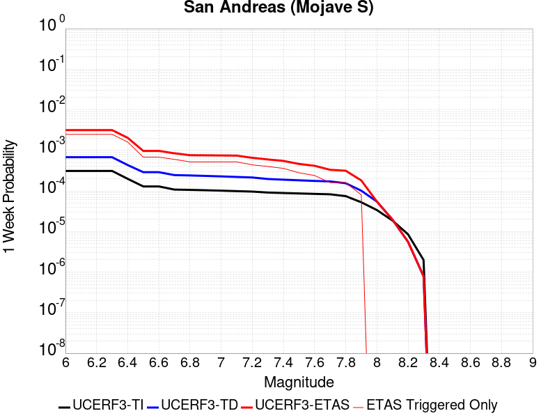 |  |  |

| Magnitude | 1 wk TI Prob | 1 wk TD Prob | 1 wk ETAS Prob | 1 wk ETAS/TD Gain | 1 wk ETAS Triggered Only | 1 mo TI Prob | 1 mo TD Prob | 1 mo ETAS Prob | 1 mo ETAS/TD Gain | 1 mo ETAS Triggered Only | 1 yr TI Prob | 1 yr TD Prob | 1 yr ETAS Prob | 1 yr ETAS/TD Gain | 1 yr ETAS Triggered Only |
|-----|-----|-----|-----|-----|-----|-----|-----|-----|-----|-----|-----|-----|-----|-----|-----|
| 6.0 | 3.1064058E-4 | 6.771211E-4 | 0.003155442 | 4.6600847 | 0.00248 | 0.0013306376 | 0.0028988488 | 0.005650848 | 1.9493421 | 0.00276 | 0.016080605 | 0.034691453 | 0.038861584 | 1.1202064 | 0.00432 |
| 6.1 | 3.1064058E-4 | 6.771211E-4 | 0.003155442 | 4.6600847 | 0.00248 | 0.0013306376 | 0.0028988488 | 0.005650848 | 1.9493421 | 0.00276 | 0.016080605 | 0.034691453 | 0.038861584 | 1.1202064 | 0.00432 |
| 6.2 | 3.1064058E-4 | 6.771211E-4 | 0.003155442 | 4.6600847 | 0.00248 | 0.0013306376 | 0.0028988488 | 0.005650848 | 1.9493421 | 0.00276 | 0.016080605 | 0.034691453 | 0.038861584 | 1.1202064 | 0.00432 |
| 6.3 | 3.1064058E-4 | 6.771211E-4 | 0.003155442 | 4.6600847 | 0.00248 | 0.0013306376 | 0.0028988488 | 0.005650848 | 1.9493421 | 0.00276 | 0.016080605 | 0.034691453 | 0.038861584 | 1.1202064 | 0.00432 |
| 6.4 | 1.9872203E-4 | 4.341842E-4 | 0.0020334895 | 4.6834717 | 0.0016 | 8.5138786E-4 | 0.0018594908 | 0.0036960694 | 1.9876782 | 0.00184 | 0.010316478 | 0.022410452 | 0.025304118 | 1.1291212 | 0.00296 |
| 6.5 | 1.291105E-4 | 2.8979595E-4 | 9.695989E-4 | 3.3457985 | 6.8E-4 | 5.5321335E-4 | 0.0012413943 | 0.002040401 | 1.6436367 | 8.0E-4 | 0.006714592 | 0.015010072 | 0.016507257 | 1.0997454 | 0.00152 |
| 6.6 | 1.291105E-4 | 2.8979595E-4 | 9.695989E-4 | 3.3457985 | 6.8E-4 | 5.5321335E-4 | 0.0012413943 | 0.002040401 | 1.6436367 | 8.0E-4 | 0.006714592 | 0.015010072 | 0.016507257 | 1.0997454 | 0.00152 |
| 6.7 | 1.08001186E-4 | 2.4557297E-4 | 8.454256E-4 | 3.4426658 | 6.0E-4 | 4.6278012E-4 | 0.0010520316 | 0.0017712741 | 1.68367 | 7.2E-4 | 0.0056198016 | 0.012733568 | 0.013957778 | 1.0961404 | 0.00124 |
| 6.8 | 1.0624356E-4 | 2.4074306E-4 | 7.6061784E-4 | 3.1594594 | 5.2E-4 | 4.5525006E-4 | 0.0010313485 | 0.0016706884 | 1.6199068 | 6.4E-4 | 0.0055285925 | 0.012484655 | 0.013630173 | 1.0917541 | 0.00116 |
| 6.9 | 1.0393785E-4 | 2.3443767E-4 | 7.5431576E-4 | 3.2175536 | 5.2E-4 | 4.4537184E-4 | 0.0010043464 | 0.0016437037 | 1.6365902 | 6.4E-4 | 0.0054089287 | 0.012159616 | 0.01330551 | 1.0942378 | 0.00116 |
| 7.0 | 1.0155622E-4 | 2.2812336E-4 | 7.480047E-4 | 3.2789485 | 5.2E-4 | 4.3516833E-4 | 9.773056E-4 | 0.0016166802 | 1.6542217 | 6.4E-4 | 0.005285311 | 0.0118340105 | 0.012940757 | 1.0935224 | 0.00112 |
| 7.1 | 9.885595E-5 | 2.2099643E-4 | 7.4088154E-4 | 3.3524592 | 5.2E-4 | 4.2359953E-4 | 9.4678416E-4 | 0.0015861782 | 1.6753324 | 6.4E-4 | 0.0051451353 | 0.0114663765 | 0.0125339925 | 1.0931084 | 0.00108 |
| 7.2 | 9.6411415E-5 | 2.1461575E-4 | 6.5452134E-4 | 3.0497358 | 4.4E-4 | 4.1312634E-4 | 9.194579E-4 | 0.0014789429 | 1.6084945 | 5.6E-4 | 0.005018219 | 0.011137128 | 0.012046881 | 1.0816866 | 9.2E-4 |
| 7.3 | 9.1180635E-5 | 1.968396E-4 | 5.9676083E-4 | 3.0317116 | 4.0E-4 | 3.907156E-4 | 8.4332563E-4 | 0.0013628871 | 1.6160865 | 5.2E-4 | 0.004746591 | 0.0102192685 | 0.011050684 | 1.0813577 | 8.4E-4 |
| 7.4 | 8.887388E-5 | 1.8930127E-4 | 5.492331E-4 | 2.9013705 | 3.6E-4 | 3.8083247E-4 | 8.11039E-4 | 0.0012906496 | 1.5913534 | 4.8E-4 | 0.0046267817 | 0.009829793 | 0.01062193 | 1.0805852 | 8.0E-4 |
| 7.5 | 8.6750515E-5 | 1.8259375E-4 | 4.625426E-4 | 2.5331788 | 2.8E-4 | 3.7173493E-4 | 7.8231003E-4 | 0.0011819971 | 1.5109062 | 4.0E-4 | 0.004516484 | 0.009483118 | 0.010156669 | 1.0710263 | 6.8E-4 |
| 7.6 | 8.453092E-5 | 1.7644193E-4 | 4.163996E-4 | 2.359981 | 2.4E-4 | 3.6222505E-4 | 7.559606E-4 | 0.0011156885 | 1.4758554 | 3.6E-4 | 0.0044011753 | 0.009165057 | 0.009799192 | 1.0691905 | 6.4E-4 |
| 7.7 | 8.259102E-5 | 1.716408E-4 | 3.3161332E-4 | 1.9320194 | 1.6E-4 | 3.539135E-4 | 7.353961E-4 | 0.0010151902 | 1.3804672 | 2.8E-4 | 0.004300386 | 0.008916762 | 0.0094717685 | 1.0622431 | 5.6E-4 |
| 7.8 | 7.444844E-5 | 1.54684E-4 | 3.1465926E-4 | 2.0342069 | 1.6E-4 | 3.1902574E-4 | 6.627631E-4 | 9.425775E-4 | 1.4221938 | 2.8E-4 | 0.0038772223 | 0.008039338 | 0.008555157 | 1.0641619 | 5.2E-4 |
| 7.9 | 5.2586525E-5 | 1.0133334E-4 | 1.8132523E-4 | 1.7893937 | 8.0E-5 | 2.2535135E-4 | 4.342135E-4 | 5.1417877E-4 | 1.1841612 | 8.0E-5 | 0.0027402006 | 0.0052737463 | 0.0055124806 | 1.0452684 | 2.4E-4 |
| 8.0 | 3.379877E-5 | 5.4809316E-5 | 5.4809316E-5 | 1.0 | 0.0 | 1.4484383E-4 | 2.3487593E-4 | 2.3487593E-4 | 1.0 | 0.0 | 0.0017620471 | 0.0028558664 | 0.0028558664 | 1.0 | 0.0 |
| 8.1 | 1.8668277E-5 | 1.9660263E-5 | 1.9660263E-5 | 1.0 | 0.0 | 8.000444E-5 | 8.425555E-5 | 8.425555E-5 | 1.0 | 0.0 | 9.736188E-4 | 0.0010253292 | 0.0010253292 | 1.0 | 0.0 |
| 8.2 | 8.541571E-6 | 5.592881E-6 | 5.592881E-6 | 1.0 | 0.0 | 3.660622E-5 | 2.396927E-5 | 2.396927E-5 | 1.0 | 0.0 | 4.455896E-4 | 2.9178688E-4 | 2.9178688E-4 | 1.0 | 0.0 |
| 8.3 | 1.983087E-6 | 7.877893E-7 | 7.877893E-7 | 1.0 | 0.0 | 8.498917E-6 | 3.3762356E-6 | 3.3762356E-6 | 1.0 | 0.0 | 1.034694E-4 | 4.110491E-5 | 4.110491E-5 | 1.0 | 0.0 |

## San Andreas (San Bernardino N)
*[(top)](#table-of-contents)*

| 1 Week | 1 Month | 1 Year |
|-----|-----|-----|
|  |  | 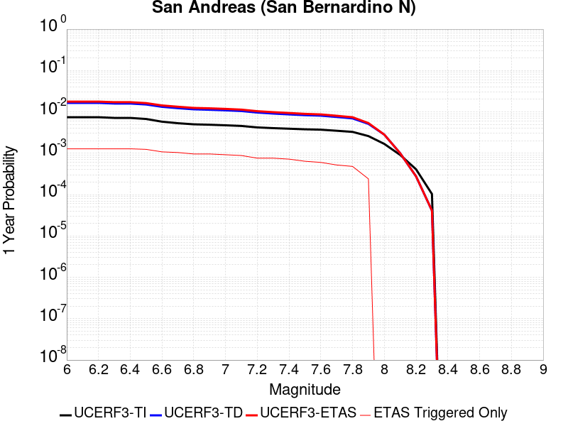 |

| Magnitude | 1 wk TI Prob | 1 wk TD Prob | 1 wk ETAS Prob | 1 wk ETAS/TD Gain | 1 wk ETAS Triggered Only | 1 mo TI Prob | 1 mo TD Prob | 1 mo ETAS Prob | 1 mo ETAS/TD Gain | 1 mo ETAS Triggered Only | 1 yr TI Prob | 1 yr TD Prob | 1 yr ETAS Prob | 1 yr ETAS/TD Gain | 1 yr ETAS Triggered Only |
|-----|-----|-----|-----|-----|-----|-----|-----|-----|-----|-----|-----|-----|-----|-----|-----|
| 6.0 | 1.4273766E-4 | 3.1797116E-4 | 9.177804E-4 | 2.8863637 | 6.0E-4 | 6.115894E-4 | 0.0013620278 | 0.0021209926 | 1.5572315 | 7.6E-4 | 0.0074207084 | 0.016458113 | 0.017717047 | 1.0764931 | 0.00128 |
| 6.1 | 1.4273766E-4 | 3.1797116E-4 | 9.177804E-4 | 2.8863637 | 6.0E-4 | 6.115894E-4 | 0.0013620278 | 0.0021209926 | 1.5572315 | 7.6E-4 | 0.0074207084 | 0.016458113 | 0.017717047 | 1.0764931 | 0.00128 |
| 6.2 | 1.4273766E-4 | 3.1797116E-4 | 9.177804E-4 | 2.8863637 | 6.0E-4 | 6.115894E-4 | 0.0013620278 | 0.0021209926 | 1.5572315 | 7.6E-4 | 0.0074207084 | 0.016458113 | 0.017717047 | 1.0764931 | 0.00128 |
| 6.3 | 1.3730655E-4 | 3.070095E-4 | 9.068253E-4 | 2.9537368 | 6.0E-4 | 5.883239E-4 | 0.0013150972 | 0.0020740977 | 1.577144 | 7.6E-4 | 0.0071393442 | 0.015895175 | 0.017154828 | 1.0792476 | 0.00128 |
| 6.4 | 1.3730655E-4 | 3.070095E-4 | 9.068253E-4 | 2.9537368 | 6.0E-4 | 5.883239E-4 | 0.0013150972 | 0.0020740977 | 1.577144 | 7.6E-4 | 0.0071393442 | 0.015895175 | 0.017154828 | 1.0792476 | 0.00128 |
| 6.5 | 1.2942807E-4 | 2.9113982E-4 | 8.9096517E-4 | 3.0602655 | 6.0E-4 | 5.545738E-4 | 0.0012471506 | 0.0019662527 | 1.576596 | 7.2E-4 | 0.0067310524 | 0.015079602 | 0.016300904 | 1.0809903 | 0.00124 |
| 6.6 | 1.1125901E-4 | 2.5549048E-4 | 8.153474E-4 | 3.1913025 | 5.6E-4 | 4.767372E-4 | 0.001094502 | 0.0017737577 | 1.6206071 | 6.8E-4 | 0.005788839 | 0.0132447835 | 0.014310479 | 1.0804615 | 0.00108 |
| 6.7 | 1.02209575E-4 | 2.3682536E-4 | 7.9669274E-4 | 3.3640516 | 5.6E-4 | 4.3796748E-4 | 0.0010145725 | 0.0016938825 | 1.669553 | 6.8E-4 | 0.0053192247 | 0.012282886 | 0.013310112 | 1.0836307 | 0.00104 |
| 6.8 | 9.610582E-5 | 2.2205901E-4 | 7.0195243E-4 | 3.1611075 | 4.8E-4 | 4.1181705E-4 | 9.5133507E-4 | 0.0015507642 | 1.6300926 | 6.0E-4 | 0.0050023515 | 0.011521262 | 0.012470202 | 1.0823642 | 9.6E-4 |
| 6.9 | 9.3877505E-5 | 2.1660629E-4 | 6.9650233E-4 | 3.215522 | 4.8E-4 | 4.0227012E-4 | 9.279831E-4 | 0.0015274263 | 1.6459635 | 6.0E-4 | 0.0048866454 | 0.011239915 | 0.012189125 | 1.0844499 | 9.6E-4 |
| 7.0 | 9.1019785E-5 | 2.0986385E-4 | 6.897631E-4 | 3.2867172 | 4.8E-4 | 3.900265E-4 | 8.991071E-4 | 0.0014985676 | 1.6667287 | 6.0E-4 | 0.0047382377 | 0.010891914 | 0.011801894 | 1.0835463 | 9.2E-4 |
| 7.1 | 8.771155E-5 | 2.015964E-4 | 6.814996E-4 | 3.380515 | 4.8E-4 | 3.758525E-4 | 8.63699E-4 | 0.0014631808 | 1.6940864 | 6.0E-4 | 0.0045664064 | 0.010465035 | 0.011335826 | 1.0832095 | 8.8E-4 |
| 7.2 | 8.0830236E-5 | 1.8562343E-4 | 5.8554916E-4 | 3.1545002 | 4.0E-4 | 3.4636928E-4 | 7.952866E-4 | 0.0013148731 | 1.6533324 | 5.2E-4 | 0.0042088944 | 0.009639736 | 0.01039241 | 1.0780803 | 7.6E-4 |
| 7.3 | 7.7668235E-5 | 1.7502681E-4 | 5.749568E-4 | 3.284964 | 4.0E-4 | 3.328214E-4 | 7.4989937E-4 | 0.0012695094 | 1.6929064 | 5.2E-4 | 0.0040445733 | 0.009091886 | 0.009844976 | 1.082831 | 7.6E-4 |
| 7.4 | 7.520177E-5 | 1.6720418E-4 | 5.27144E-4 | 3.1526961 | 3.6E-4 | 3.2225347E-4 | 7.1639265E-4 | 0.0011960488 | 1.6695436 | 4.8E-4 | 0.0039163795 | 0.008687268 | 0.009401013 | 1.0821599 | 7.2E-4 |
| 7.5 | 7.274697E-5 | 1.600578E-4 | 4.4001298E-4 | 2.749088 | 2.8E-4 | 3.1173544E-4 | 6.857817E-4 | 0.0010855073 | 1.582876 | 4.0E-4 | 0.003788775 | 0.008317487 | 0.008952164 | 1.0763063 | 6.4E-4 |
| 7.6 | 7.1185845E-5 | 1.5574165E-4 | 3.9570426E-4 | 2.5407736 | 2.4E-4 | 3.0504653E-4 | 6.6729356E-4 | 0.0010270533 | 1.5391327 | 3.6E-4 | 0.0037076178 | 0.008094089 | 0.008689232 | 1.0735282 | 6.0E-4 |
| 7.7 | 6.709961E-5 | 1.4479096E-4 | 3.047678E-4 | 2.1048813 | 1.6E-4 | 2.8753807E-4 | 6.2038517E-4 | 9.0021145E-4 | 1.4510525 | 2.8E-4 | 0.003495157 | 0.0075270706 | 0.008043157 | 1.0685639 | 5.2E-4 |
| 7.8 | 6.300812E-5 | 1.3354905E-4 | 2.9352767E-4 | 2.1979017 | 1.6E-4 | 2.7000686E-4 | 5.722275E-4 | 8.520673E-4 | 1.4890358 | 2.8E-4 | 0.0032823787 | 0.006944645 | 0.007421312 | 1.068638 | 4.8E-4 |
| 7.9 | 4.983037E-5 | 9.844076E-5 | 1.7843288E-4 | 1.8125916 | 8.0E-5 | 2.1354125E-4 | 4.2182076E-4 | 5.01787E-4 | 1.189574 | 8.0E-5 | 0.0025967648 | 0.005123585 | 0.005362355 | 1.0466022 | 2.4E-4 |
| 8.0 | 3.2211527E-5 | 5.4014366E-5 | 5.4014366E-5 | 1.0 | 0.0 | 1.380421E-4 | 2.3146962E-4 | 2.3146962E-4 | 1.0 | 0.0 | 0.0016793669 | 0.0028145025 | 0.0028145025 | 1.0 | 0.0 |
| 8.1 | 1.743376E-5 | 1.9157624E-5 | 1.9157624E-5 | 1.0 | 0.0 | 7.471398E-5 | 8.210152E-5 | 8.210152E-5 | 1.0 | 0.0 | 9.0926304E-4 | 9.991282E-4 | 9.991282E-4 | 1.0 | 0.0 |
| 8.2 | 7.831616E-6 | 5.2765454E-6 | 5.2765454E-6 | 1.0 | 0.0 | 3.3563636E-5 | 2.261357E-5 | 2.261357E-5 | 1.0 | 0.0 | 4.0856065E-4 | 2.752855E-4 | 2.752855E-4 | 1.0 | 0.0 |
| 8.3 | 1.983087E-6 | 7.877893E-7 | 7.877893E-7 | 1.0 | 0.0 | 8.498917E-6 | 3.3762356E-6 | 3.3762356E-6 | 1.0 | 0.0 | 1.034694E-4 | 4.110491E-5 | 4.110491E-5 | 1.0 | 0.0 |

## Lenwood-Lockhart-Old Woman Springs
*[(top)](#table-of-contents)*

| 1 Week | 1 Month | 1 Year |
|-----|-----|-----|
|  |  | 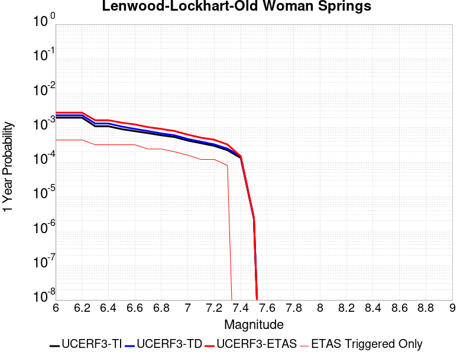 |

| Magnitude | 1 wk TI Prob | 1 wk TD Prob | 1 wk ETAS Prob | 1 wk ETAS/TD Gain | 1 wk ETAS Triggered Only | 1 mo TI Prob | 1 mo TD Prob | 1 mo ETAS Prob | 1 mo ETAS/TD Gain | 1 mo ETAS Triggered Only | 1 yr TI Prob | 1 yr TD Prob | 1 yr ETAS Prob | 1 yr ETAS/TD Gain | 1 yr ETAS Triggered Only |
|-----|-----|-----|-----|-----|-----|-----|-----|-----|-----|-----|-----|-----|-----|-----|-----|
| 6.0 | 3.744542E-5 | 4.3976295E-5 | 2.8396575E-4 | 6.457246 | 2.4E-4 | 1.604705E-4 | 1.884572E-4 | 4.684044E-4 | 2.4854686 | 2.8E-4 | 0.0019519776 | 0.002292224 | 0.0027312154 | 1.1915133 | 4.4E-4 |
| 6.1 | 3.744542E-5 | 4.3976295E-5 | 2.8396575E-4 | 6.457246 | 2.4E-4 | 1.604705E-4 | 1.884572E-4 | 4.684044E-4 | 2.4854686 | 2.8E-4 | 0.0019519776 | 0.002292224 | 0.0027312154 | 1.1915133 | 4.4E-4 |
| 6.2 | 3.744542E-5 | 4.3976295E-5 | 2.8396575E-4 | 6.457246 | 2.4E-4 | 1.604705E-4 | 1.884572E-4 | 4.684044E-4 | 2.4854686 | 2.8E-4 | 0.0019519776 | 0.002292224 | 0.0027312154 | 1.1915133 | 4.4E-4 |
| 6.3 | 2.1079984E-5 | 2.5359855E-5 | 1.8535579E-4 | 7.3090243 | 1.6E-4 | 9.0339665E-5 | 1.0868068E-4 | 3.0865893E-4 | 2.8400536 | 2.0E-4 | 0.0010993304 | 0.001322404 | 0.001641981 | 1.2416636 | 3.2E-4 |
| 6.4 | 2.1079984E-5 | 2.5359855E-5 | 1.8535579E-4 | 7.3090243 | 1.6E-4 | 9.0339665E-5 | 1.0868068E-4 | 3.0865893E-4 | 2.8400536 | 2.0E-4 | 0.0010993304 | 0.001322404 | 0.001641981 | 1.2416636 | 3.2E-4 |
| 6.5 | 1.7397282E-5 | 2.0667581E-5 | 1.8066427E-4 | 8.741433 | 1.6E-4 | 7.455765E-5 | 8.857241E-5 | 2.885547E-4 | 3.2578394 | 2.0E-4 | 9.073613E-4 | 0.0010778473 | 0.0013975025 | 1.296568 | 3.2E-4 |
| 6.6 | 1.52050325E-5 | 1.768411E-5 | 1.7768129E-4 | 10.04751 | 1.6E-4 | 6.51628E-5 | 7.5786884E-5 | 2.7577172E-4 | 3.638779 | 2.0E-4 | 7.9306826E-4 | 9.223226E-4 | 0.0012420275 | 1.3466302 | 3.2E-4 |
| 6.7 | 1.332523E-5 | 1.5268157E-5 | 1.3526632E-4 | 8.859375 | 1.2E-4 | 5.7106878E-5 | 6.543335E-5 | 1.854255E-4 | 2.8338072 | 1.2E-4 | 6.950544E-4 | 7.9636567E-4 | 0.0010361746 | 1.3011291 | 2.4E-4 |
| 6.8 | 1.1525329E-5 | 1.3034469E-5 | 1.3303291E-4 | 10.206239 | 1.2E-4 | 4.9393333E-5 | 5.5860837E-5 | 1.7585413E-4 | 3.1480756 | 1.2E-4 | 6.011979E-4 | 6.798977E-4 | 9.1973454E-4 | 1.3527542 | 2.4E-4 |
| 6.9 | 1.0253909E-5 | 1.1517644E-5 | 9.1516726E-5 | 7.9457846 | 8.0E-5 | 4.3944583E-5 | 4.936042E-5 | 1.2935647E-4 | 2.6206517 | 8.0E-5 | 5.3489394E-4 | 6.00801E-4 | 8.006809E-4 | 1.3326889 | 2.0E-4 |
| 7.0 | 8.104563E-6 | 8.993927E-6 | 8.8993205E-5 | 9.894811 | 8.0E-5 | 3.4733377E-5 | 3.8544847E-5 | 1.18541764E-4 | 3.0754244 | 8.0E-5 | 4.2279682E-4 | 4.6918486E-4 | 6.291098E-4 | 1.3408569 | 1.6E-4 |
| 7.1 | 6.7986157E-6 | 7.518288E-6 | 8.7517685E-5 | 11.64064 | 8.0E-5 | 2.91366E-5 | 3.2220847E-5 | 1.1221827E-4 | 3.4827845 | 8.0E-5 | 3.5468035E-4 | 3.9222036E-4 | 5.121733E-4 | 1.3058305 | 1.2E-4 |
| 7.2 | 5.6893327E-6 | 6.2822814E-6 | 8.6281776E-5 | 13.734148 | 8.0E-5 | 2.4382627E-5 | 2.6923795E-5 | 1.06921645E-4 | 3.9712691 | 8.0E-5 | 2.9681803E-4 | 3.277499E-4 | 4.4771057E-4 | 1.3660128 | 1.2E-4 |
| 7.3 | 4.253348E-6 | 4.7090152E-6 | 4.4708828E-5 | 9.494305 | 4.0E-5 | 1.8228506E-5 | 2.0181347E-5 | 6.018054E-5 | 2.9819882 | 4.0E-5 | 2.2190946E-4 | 2.4568205E-4 | 3.2566237E-4 | 1.3255441 | 8.0E-5 |
| 7.4 | 2.5448119E-6 | 2.852325E-6 | 2.852325E-6 | 1.0 | 0.0 | 1.0906291E-5 | 1.2224203E-5 | 1.2224203E-5 | 1.0 | 0.0 | 1.3277601E-4 | 1.4882116E-4 | 1.4882116E-4 | 1.0 | 0.0 |
| 7.5 | 4.3706837E-8 | 4.5635893E-8 | 4.5635893E-8 | 1.0 | 0.0 | 1.8731501E-7 | 1.9558239E-7 | 1.9558239E-7 | 1.0 | 0.0 | 2.2805577E-6 | 2.3812136E-6 | 2.3812136E-6 | 1.0 | 0.0 |

## San Andreas (San Bernardino S)
*[(top)](#table-of-contents)*

| 1 Week | 1 Month | 1 Year |
|-----|-----|-----|
|  |  |  |

| Magnitude | 1 wk TI Prob | 1 wk TD Prob | 1 wk ETAS Prob | 1 wk ETAS/TD Gain | 1 wk ETAS Triggered Only | 1 mo TI Prob | 1 mo TD Prob | 1 mo ETAS Prob | 1 mo ETAS/TD Gain | 1 mo ETAS Triggered Only | 1 yr TI Prob | 1 yr TD Prob | 1 yr ETAS Prob | 1 yr ETAS/TD Gain | 1 yr ETAS Triggered Only |
|-----|-----|-----|-----|-----|-----|-----|-----|-----|-----|-----|-----|-----|-----|-----|-----|
| 6.0 | 1.2336002E-4 | 3.0132735E-4 | 5.4125505E-4 | 1.796236 | 2.4E-4 | 5.2857865E-4 | 0.0012907899 | 0.0016103769 | 1.2475902 | 3.2E-4 | 0.006416472 | 0.015607107 | 0.016118992 | 1.0327982 | 5.2E-4 |
| 6.1 | 1.2336002E-4 | 3.0132735E-4 | 5.4125505E-4 | 1.796236 | 2.4E-4 | 5.2857865E-4 | 0.0012907899 | 0.0016103769 | 1.2475902 | 3.2E-4 | 0.006416472 | 0.015607107 | 0.016118992 | 1.0327982 | 5.2E-4 |
| 6.2 | 1.2336002E-4 | 3.0132735E-4 | 5.4125505E-4 | 1.796236 | 2.4E-4 | 5.2857865E-4 | 0.0012907899 | 0.0016103769 | 1.2475902 | 3.2E-4 | 0.006416472 | 0.015607107 | 0.016118992 | 1.0327982 | 5.2E-4 |
| 6.3 | 1.1712257E-4 | 2.891963E-4 | 5.291269E-4 | 1.8296461 | 2.4E-4 | 5.018573E-4 | 0.0012388497 | 0.0015584533 | 1.2579842 | 3.2E-4 | 0.006093008 | 0.014983551 | 0.015495759 | 1.0341847 | 5.2E-4 |
| 6.4 | 1.1712257E-4 | 2.891963E-4 | 5.291269E-4 | 1.8296461 | 2.4E-4 | 5.018573E-4 | 0.0012388497 | 0.0015584533 | 1.2579842 | 3.2E-4 | 0.006093008 | 0.014983551 | 0.015495759 | 1.0341847 | 5.2E-4 |
| 6.5 | 1.0689076E-4 | 2.6930252E-4 | 5.0923787E-4 | 1.890951 | 2.4E-4 | 4.5802278E-4 | 0.001153668 | 0.0014732989 | 1.2770561 | 3.2E-4 | 0.0055621783 | 0.013960089 | 0.014472829 | 1.0367291 | 5.2E-4 |
| 6.6 | 9.7648895E-5 | 2.517273E-4 | 4.916669E-4 | 1.9531727 | 2.4E-4 | 4.1842813E-4 | 0.0010784089 | 0.0013980638 | 1.2964134 | 3.2E-4 | 0.005082469 | 0.0130549725 | 0.0135287065 | 1.0362875 | 4.8E-4 |
| 6.7 | 8.757013E-5 | 2.3241482E-4 | 4.7235904E-4 | 2.0323963 | 2.4E-4 | 3.7524657E-4 | 9.957057E-4 | 0.0013153871 | 1.3210601 | 3.2E-4 | 0.00455906 | 0.012059439 | 0.01253365 | 1.0393229 | 4.8E-4 |
| 6.8 | 8.562978E-5 | 2.2800392E-4 | 4.679492E-4 | 2.0523734 | 2.4E-4 | 3.6693315E-4 | 9.76816E-4 | 0.0012965035 | 1.3272749 | 3.2E-4 | 0.004458263 | 0.011831971 | 0.012306291 | 1.040088 | 4.8E-4 |
| 6.9 | 6.124075E-5 | 1.7172846E-4 | 4.1168724E-4 | 2.3973153 | 2.4E-4 | 2.6243398E-4 | 7.3577237E-4 | 0.0010155664 | 1.3802725 | 2.8E-4 | 0.0031904527 | 0.008921444 | 0.0093575185 | 1.0488794 | 4.4E-4 |
| 7.0 | 5.8598747E-5 | 1.660076E-4 | 4.0596776E-4 | 2.445477 | 2.4E-4 | 2.5111332E-4 | 7.1126793E-4 | 9.910688E-4 | 1.3933831 | 2.8E-4 | 0.0030530186 | 0.008625501 | 0.008982395 | 1.0413767 | 3.6E-4 |
| 7.1 | 5.613814E-5 | 1.6018077E-4 | 4.0014234E-4 | 2.4980671 | 2.4E-4 | 2.4056983E-4 | 6.863092E-4 | 9.66117E-4 | 1.4076993 | 2.8E-4 | 0.0029250039 | 0.008323984 | 0.008680988 | 1.0428885 | 3.6E-4 |
| 7.2 | 4.991222E-5 | 1.4621996E-4 | 3.4619073E-4 | 2.3676023 | 2.0E-4 | 2.1389198E-4 | 6.2650687E-4 | 8.6635654E-4 | 1.3828363 | 2.4E-4 | 0.002601025 | 0.0076011484 | 0.007918716 | 1.0417789 | 3.2E-4 |
| 7.3 | 4.7410045E-5 | 1.3813804E-4 | 3.381104E-4 | 2.447627 | 2.0E-4 | 2.0317009E-4 | 5.918862E-4 | 8.317441E-4 | 1.4052434 | 2.4E-4 | 0.0024707897 | 0.0071824905 | 0.007500192 | 1.0442328 | 3.2E-4 |
| 7.4 | 4.5556746E-5 | 1.3220012E-4 | 2.9217897E-4 | 2.2101264 | 1.6E-4 | 1.952286E-4 | 5.6644925E-4 | 7.663359E-4 | 1.3528767 | 2.0E-4 | 0.002374317 | 0.0068747913 | 0.0071528666 | 1.0404485 | 2.8E-4 |
| 7.5 | 4.3084514E-5 | 1.2453202E-4 | 2.0452206E-4 | 1.642325 | 8.0E-5 | 1.8463485E-4 | 5.335998E-4 | 6.5353577E-4 | 1.2247677 | 1.2E-4 | 0.0022456115 | 0.006477298 | 0.006676003 | 1.0306771 | 2.0E-4 |
| 7.6 | 3.408608E-5 | 9.923654E-5 | 1.3923256E-4 | 1.4030373 | 4.0E-5 | 1.4607502E-4 | 4.2523025E-4 | 5.051962E-4 | 1.1880534 | 8.0E-5 | 0.0017770125 | 0.0051649143 | 0.005324088 | 1.0308182 | 1.6E-4 |
| 7.7 | 2.8315713E-5 | 8.3315266E-5 | 8.3315266E-5 | 1.0 | 0.0 | 1.2134742E-4 | 3.570166E-4 | 3.9700232E-4 | 1.1119996 | 4.0E-5 | 0.0014764034 | 0.0043380233 | 0.0044575026 | 1.0275424 | 1.2E-4 |
| 7.8 | 2.6222975E-5 | 7.540562E-5 | 7.540562E-5 | 1.0 | 0.0 | 1.1237934E-4 | 3.2312694E-4 | 3.63114E-4 | 1.1237503 | 4.0E-5 | 0.0013673597 | 0.00392698 | 0.0040465086 | 1.0304378 | 1.2E-4 |
| 7.9 | 2.1469694E-5 | 5.85263E-5 | 5.85263E-5 | 1.0 | 0.0 | 9.200973E-5 | 2.508029E-4 | 2.508029E-4 | 1.0 | 0.0 | 0.0011196428 | 0.003049253 | 0.0031290092 | 1.026156 | 8.0E-5 |
| 8.0 | 1.2420249E-5 | 3.168168E-5 | 3.168168E-5 | 1.0 | 0.0 | 5.322855E-5 | 1.3577157E-4 | 1.3577157E-4 | 1.0 | 0.0 | 6.478649E-4 | 0.0016517665 | 0.0016517665 | 1.0 | 0.0 |
| 8.1 | 4.9197724E-6 | 7.958367E-6 | 7.958367E-6 | 1.0 | 0.0 | 2.1084568E-5 | 3.410684E-5 | 3.410684E-5 | 1.0 | 0.0 | 2.566744E-4 | 4.1517182E-4 | 4.1517182E-4 | 1.0 | 0.0 |
| 8.2 | 2.5634774E-6 | 2.9684513E-6 | 2.9684513E-6 | 1.0 | 0.0 | 1.0986286E-5 | 1.2721873E-5 | 1.2721873E-5 | 1.0 | 0.0 | 1.3374983E-4 | 1.5487784E-4 | 1.5487784E-4 | 1.0 | 0.0 |
| 8.3 | 5.2850464E-7 | 3.291787E-7 | 3.291787E-7 | 1.0 | 0.0 | 2.2650179E-6 | 1.4107652E-6 | 1.4107652E-6 | 1.0 | 0.0 | 2.7576245E-5 | 1.7175944E-5 | 1.7175944E-5 | 1.0 | 0.0 |

## Helendale-So Lockhart
*[(top)](#table-of-contents)*

| 1 Week | 1 Month | 1 Year |
|-----|-----|-----|
| 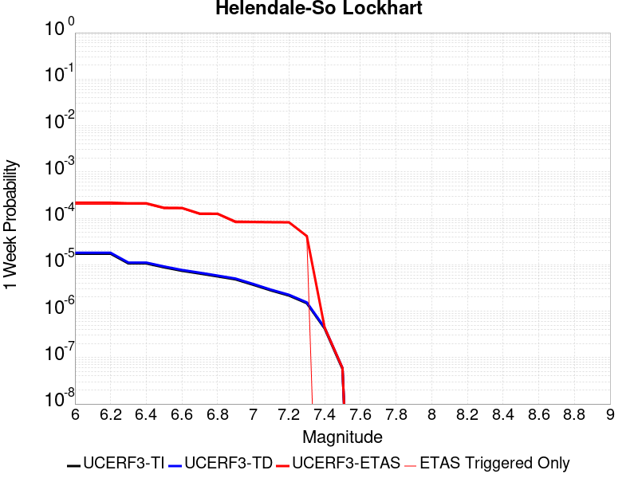 |  |  |

| Magnitude | 1 wk TI Prob | 1 wk TD Prob | 1 wk ETAS Prob | 1 wk ETAS/TD Gain | 1 wk ETAS Triggered Only | 1 mo TI Prob | 1 mo TD Prob | 1 mo ETAS Prob | 1 mo ETAS/TD Gain | 1 mo ETAS Triggered Only | 1 yr TI Prob | 1 yr TD Prob | 1 yr ETAS Prob | 1 yr ETAS/TD Gain | 1 yr ETAS Triggered Only |
|-----|-----|-----|-----|-----|-----|-----|-----|-----|-----|-----|-----|-----|-----|-----|-----|
| 6.0 | 1.7296055E-5 | 1.81066E-5 | 2.1810298E-4 | 12.045496 | 2.0E-4 | 7.412385E-5 | 7.759753E-5 | 3.575758E-4 | 4.6080823 | 2.8E-4 | 9.0208417E-4 | 9.4436115E-4 | 0.0014239078 | 1.5078001 | 4.8E-4 |
| 6.1 | 1.7296055E-5 | 1.81066E-5 | 2.1810298E-4 | 12.045496 | 2.0E-4 | 7.412385E-5 | 7.759753E-5 | 3.575758E-4 | 4.6080823 | 2.8E-4 | 9.0208417E-4 | 9.4436115E-4 | 0.0014239078 | 1.5078001 | 4.8E-4 |
| 6.2 | 1.7296055E-5 | 1.81066E-5 | 2.1810298E-4 | 12.045496 | 2.0E-4 | 7.412385E-5 | 7.759753E-5 | 3.575758E-4 | 4.6080823 | 2.8E-4 | 9.0208417E-4 | 9.4436115E-4 | 0.0014239078 | 1.5078001 | 4.8E-4 |
| 6.3 | 1.0669118E-5 | 1.1137076E-5 | 2.1113484E-4 | 18.957834 | 2.0E-4 | 4.5723988E-5 | 4.772947E-5 | 2.8771802E-4 | 6.0281 | 2.4E-4 | 5.5654737E-4 | 5.8095413E-4 | 8.607915E-4 | 1.4816858 | 2.8E-4 |
| 6.4 | 1.0669118E-5 | 1.1137076E-5 | 2.1113484E-4 | 18.957834 | 2.0E-4 | 4.5723988E-5 | 4.772947E-5 | 2.8771802E-4 | 6.0281 | 2.4E-4 | 5.5654737E-4 | 5.8095413E-4 | 8.607915E-4 | 1.4816858 | 2.8E-4 |
| 6.5 | 8.790038E-6 | 9.171543E-6 | 1.6917007E-4 | 18.445105 | 1.6E-4 | 3.767105E-5 | 3.930603E-5 | 1.9929974E-4 | 5.070462 | 1.6E-4 | 4.585485E-4 | 4.784474E-4 | 6.783517E-4 | 1.4178188 | 2.0E-4 |
| 6.6 | 7.396949E-6 | 7.716665E-6 | 1.6771544E-4 | 21.734186 | 1.6E-4 | 3.1700827E-5 | 3.3071006E-5 | 1.9306572E-4 | 5.8379145 | 1.6E-4 | 3.858892E-4 | 4.0256613E-4 | 6.024856E-4 | 1.4966128 | 2.0E-4 |
| 6.7 | 6.4600285E-6 | 6.739015E-6 | 1.267382E-4 | 18.806635 | 1.2E-4 | 2.7685543E-5 | 2.8881179E-5 | 1.4887772E-4 | 5.154835 | 1.2E-4 | 3.3701936E-4 | 3.515724E-4 | 5.115162E-4 | 1.4549383 | 1.6E-4 |
| 6.8 | 5.600104E-6 | 5.8368437E-6 | 1.2583614E-4 | 21.558937 | 1.2E-4 | 2.4000226E-5 | 2.5014808E-5 | 1.450118E-4 | 5.7970386 | 1.2E-4 | 2.9216358E-4 | 3.0451332E-4 | 4.644646E-4 | 1.5252686 | 1.6E-4 |
| 6.9 | 4.839122E-6 | 5.0402173E-6 | 8.5039814E-5 | 16.872252 | 8.0E-5 | 2.0738931E-5 | 2.1600754E-5 | 1.0159903E-4 | 4.7034945 | 8.0E-5 | 2.5246723E-4 | 2.629579E-4 | 3.8292634E-4 | 1.4562268 | 1.2E-4 |
| 7.0 | 3.6937633E-6 | 3.8457424E-6 | 8.3845436E-5 | 21.802145 | 8.0E-5 | 1.5830317E-5 | 1.6481652E-5 | 9.648033E-5 | 5.8538027 | 8.0E-5 | 1.9271708E-4 | 2.0064594E-4 | 3.2062185E-4 | 1.5979484 | 1.2E-4 |
| 7.1 | 2.7858857E-6 | 2.8982486E-6 | 8.289802E-5 | 28.602797 | 8.0E-5 | 1.1939455E-5 | 1.2421007E-5 | 9.2420014E-5 | 7.4406214 | 8.0E-5 | 1.4535317E-4 | 1.5121548E-4 | 2.3120339E-4 | 1.5289663 | 8.0E-5 |
| 7.2 | 2.1672065E-6 | 2.2543188E-6 | 8.225414E-5 | 36.48736 | 8.0E-5 | 9.2879945E-6 | 9.661331E-6 | 8.9660556E-5 | 9.280352 | 8.0E-5 | 1.1307546E-4 | 1.1762055E-4 | 1.9761114E-4 | 1.6800733 | 8.0E-5 |
| 7.3 | 1.4823496E-6 | 1.5424213E-6 | 4.154236E-5 | 26.933212 | 4.0E-5 | 6.3529114E-6 | 6.610361E-6 | 4.6610097E-5 | 7.0510664 | 4.0E-5 | 7.734395E-5 | 8.047833E-5 | 1.2047511E-4 | 1.4969882 | 4.0E-5 |
| 7.4 | 4.2321457E-7 | 4.411508E-7 | 4.411508E-7 | 1.0 | 0.0 | 1.8137755E-6 | 1.8906451E-6 | 1.8906451E-6 | 1.0 | 0.0 | 2.2082493E-5 | 2.3018407E-5 | 2.3018407E-5 | 1.0 | 0.0 |
| 7.5 | 5.6942316E-8 | 5.9424394E-8 | 5.9424394E-8 | 1.0 | 0.0 | 2.440385E-7 | 2.5467594E-7 | 2.5467594E-7 | 1.0 | 0.0 | 2.9711643E-6 | 3.1006762E-6 | 3.1006762E-6 | 1.0 | 0.0 |

## San Andreas (Mojave N)
*[(top)](#table-of-contents)*

| 1 Week | 1 Month | 1 Year |
|-----|-----|-----|
|  |  |  |

| Magnitude | 1 wk TI Prob | 1 wk TD Prob | 1 wk ETAS Prob | 1 wk ETAS/TD Gain | 1 wk ETAS Triggered Only | 1 mo TI Prob | 1 mo TD Prob | 1 mo ETAS Prob | 1 mo ETAS/TD Gain | 1 mo ETAS Triggered Only | 1 yr TI Prob | 1 yr TD Prob | 1 yr ETAS Prob | 1 yr ETAS/TD Gain | 1 yr ETAS Triggered Only |
|-----|-----|-----|-----|-----|-----|-----|-----|-----|-----|-----|-----|-----|-----|-----|-----|
| 6.0 | 9.877682E-5 | 1.9626696E-4 | 3.1624341E-4 | 1.6112921 | 1.2E-4 | 4.2326056E-4 | 8.4087317E-4 | 0.0010007386 | 1.1901184 | 1.6E-4 | 0.0051410277 | 0.0101897055 | 0.010585629 | 1.0388553 | 4.0E-4 |
| 6.1 | 9.877682E-5 | 1.9626696E-4 | 3.1624341E-4 | 1.6112921 | 1.2E-4 | 4.2326056E-4 | 8.4087317E-4 | 0.0010007386 | 1.1901184 | 1.6E-4 | 0.0051410277 | 0.0101897055 | 0.010585629 | 1.0388553 | 4.0E-4 |
| 6.2 | 9.877682E-5 | 1.9626696E-4 | 3.1624341E-4 | 1.6112921 | 1.2E-4 | 4.2326056E-4 | 8.4087317E-4 | 0.0010007386 | 1.1901184 | 1.6E-4 | 0.0051410277 | 0.0101897055 | 0.010585629 | 1.0388553 | 4.0E-4 |
| 6.3 | 9.877682E-5 | 1.9626696E-4 | 3.1624341E-4 | 1.6112921 | 1.2E-4 | 4.2326056E-4 | 8.4087317E-4 | 0.0010007386 | 1.1901184 | 1.6E-4 | 0.0051410277 | 0.0101897055 | 0.010585629 | 1.0388553 | 4.0E-4 |
| 6.4 | 9.877682E-5 | 1.9626696E-4 | 3.1624341E-4 | 1.6112921 | 1.2E-4 | 4.2326056E-4 | 8.4087317E-4 | 0.0010007386 | 1.1901184 | 1.6E-4 | 0.0051410277 | 0.0101897055 | 0.010585629 | 1.0388553 | 4.0E-4 |
| 6.5 | 9.861474E-5 | 1.9600392E-4 | 3.159804E-4 | 1.6121126 | 1.2E-4 | 4.2256617E-4 | 8.397466E-4 | 9.996123E-4 | 1.1903737 | 1.6E-4 | 0.0051326132 | 0.0101761175 | 0.010572047 | 1.0389078 | 4.0E-4 |
| 6.6 | 9.861474E-5 | 1.9600392E-4 | 3.159804E-4 | 1.6121126 | 1.2E-4 | 4.2256617E-4 | 8.397466E-4 | 9.996123E-4 | 1.1903737 | 1.6E-4 | 0.0051326132 | 0.0101761175 | 0.010572047 | 1.0389078 | 4.0E-4 |
| 6.7 | 9.8552715E-5 | 1.959032E-4 | 3.158797E-4 | 1.6124275 | 1.2E-4 | 4.223004E-4 | 8.393152E-4 | 9.99181E-4 | 1.1904716 | 1.6E-4 | 0.0051293927 | 0.010170914 | 0.0105668465 | 1.0389278 | 4.0E-4 |
| 6.8 | 9.8464974E-5 | 1.9575418E-4 | 3.157307E-4 | 1.6128937 | 1.2E-4 | 4.219245E-4 | 8.3867693E-4 | 9.985428E-4 | 1.1906167 | 1.6E-4 | 0.0051248376 | 0.010163216 | 0.010559151 | 1.0389576 | 4.0E-4 |
| 6.9 | 9.825824E-5 | 1.9543302E-4 | 3.1540956E-4 | 1.6139011 | 1.2E-4 | 4.2103877E-4 | 8.373014E-4 | 9.971674E-4 | 1.1909301 | 1.6E-4 | 0.0051141046 | 0.010146625 | 0.010542567 | 1.039022 | 4.0E-4 |
| 7.0 | 9.781462E-5 | 1.9474408E-4 | 3.147207E-4 | 1.6160734 | 1.2E-4 | 4.1913814E-4 | 8.3435065E-4 | 9.942172E-4 | 1.1916059 | 1.6E-4 | 0.005091073 | 0.010111034 | 0.010506989 | 1.0391607 | 4.0E-4 |
| 7.1 | 9.7121134E-5 | 1.9375767E-4 | 3.1373443E-4 | 1.6192104 | 1.2E-4 | 4.1616702E-4 | 8.3012594E-4 | 9.899931E-4 | 1.1925819 | 1.6E-4 | 0.005055068 | 0.010060075 | 0.010456051 | 1.0393611 | 4.0E-4 |
| 7.2 | 9.663819E-5 | 1.93063E-4 | 3.1303984E-4 | 1.6214387 | 1.2E-4 | 4.1409794E-4 | 8.2715065E-4 | 9.870183E-4 | 1.1932751 | 1.6E-4 | 0.0050299936 | 0.010024184 | 0.010420174 | 1.0395035 | 4.0E-4 |
| 7.3 | 9.6277574E-5 | 1.92585E-4 | 3.1256187E-4 | 1.6229815 | 1.2E-4 | 4.125529E-4 | 8.251034E-4 | 9.849713E-4 | 1.1937551 | 1.6E-4 | 0.0050112694 | 0.009999488 | 0.010395488 | 1.039602 | 4.0E-4 |
| 7.4 | 9.593308E-5 | 1.919794E-4 | 3.1195636E-4 | 1.6249471 | 1.2E-4 | 4.1107697E-4 | 8.225096E-4 | 9.82378E-4 | 1.1943666 | 1.6E-4 | 0.0049933824 | 0.009968198 | 0.01036421 | 1.0397276 | 4.0E-4 |
| 7.5 | 9.561707E-5 | 1.9143702E-4 | 3.1141404E-4 | 1.626718 | 1.2E-4 | 4.0972308E-4 | 8.201866E-4 | 9.800553E-4 | 1.1949176 | 1.6E-4 | 0.0049769743 | 0.0099401735 | 0.010296595 | 1.0358567 | 3.6E-4 |
| 7.6 | 9.418194E-5 | 1.8794056E-4 | 3.07918E-4 | 1.6383797 | 1.2E-4 | 4.0357444E-4 | 8.0521114E-4 | 9.6508226E-4 | 1.1985457 | 1.6E-4 | 0.004902454 | 0.009759494 | 0.010115981 | 1.0365272 | 3.6E-4 |
| 7.7 | 8.202141E-5 | 1.6224218E-4 | 2.4222922E-4 | 1.49301 | 8.0E-5 | 3.51473E-4 | 6.951384E-4 | 8.1505504E-4 | 1.1725075 | 1.2E-4 | 0.00427079 | 0.0084305275 | 0.008747829 | 1.0376374 | 3.2E-4 |
| 7.8 | 7.2859846E-5 | 1.4698919E-4 | 2.2697743E-4 | 1.5441778 | 8.0E-5 | 3.1221908E-4 | 6.298016E-4 | 7.49726E-4 | 1.1904162 | 1.2E-4 | 0.003794643 | 0.007640919 | 0.007958474 | 1.0415598 | 3.2E-4 |
| 7.9 | 5.3874453E-5 | 1.0174001E-4 | 1.8173187E-4 | 1.786238 | 8.0E-5 | 2.3087008E-4 | 4.3595576E-4 | 5.159209E-4 | 1.1834248 | 8.0E-5 | 0.0028072202 | 0.0052948557 | 0.005533585 | 1.045087 | 2.4E-4 |
| 8.0 | 3.468538E-5 | 5.500278E-5 | 5.500278E-5 | 1.0 | 0.0 | 1.4864317E-4 | 2.3570491E-4 | 2.3570491E-4 | 1.0 | 0.0 | 0.0018082283 | 0.0028659326 | 0.0028659326 | 1.0 | 0.0 |
| 8.1 | 1.9152367E-5 | 1.9757208E-5 | 1.9757208E-5 | 1.0 | 0.0 | 8.207899E-5 | 8.467101E-5 | 8.467101E-5 | 1.0 | 0.0 | 9.988535E-4 | 0.0010303827 | 0.0010303827 | 1.0 | 0.0 |
| 8.2 | 8.643924E-6 | 5.607368E-6 | 5.607368E-6 | 1.0 | 0.0 | 3.704486E-5 | 2.4031357E-5 | 2.4031357E-5 | 1.0 | 0.0 | 4.5092785E-4 | 2.9254257E-4 | 2.9254257E-4 | 1.0 | 0.0 |
| 8.3 | 1.983087E-6 | 7.877893E-7 | 7.877893E-7 | 1.0 | 0.0 | 8.498917E-6 | 3.3762356E-6 | 3.3762356E-6 | 1.0 | 0.0 | 1.034694E-4 | 4.110491E-5 | 4.110491E-5 | 1.0 | 0.0 |

## San Andreas (Big Bend)
*[(top)](#table-of-contents)*

| 1 Week | 1 Month | 1 Year |
|-----|-----|-----|
| 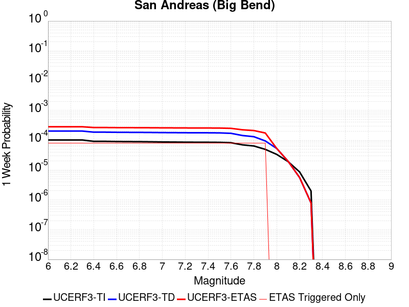 | 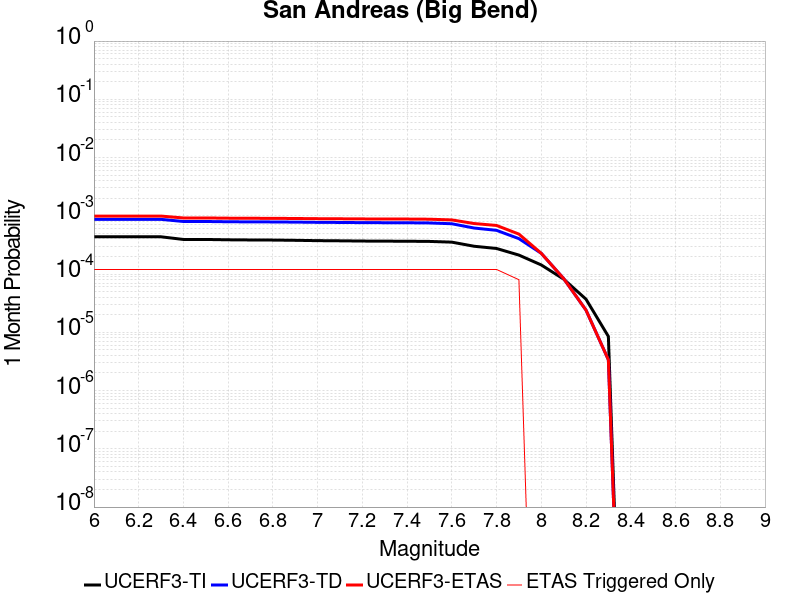 | 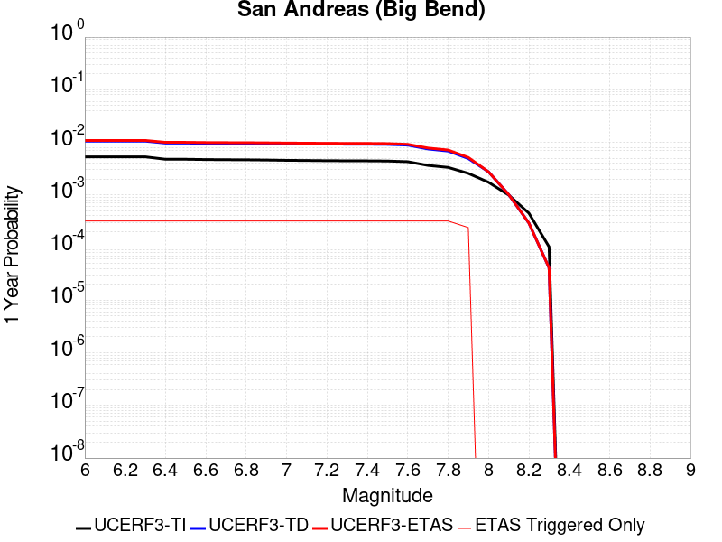 |

| Magnitude | 1 wk TI Prob | 1 wk TD Prob | 1 wk ETAS Prob | 1 wk ETAS/TD Gain | 1 wk ETAS Triggered Only | 1 mo TI Prob | 1 mo TD Prob | 1 mo ETAS Prob | 1 mo ETAS/TD Gain | 1 mo ETAS Triggered Only | 1 yr TI Prob | 1 yr TD Prob | 1 yr ETAS Prob | 1 yr ETAS/TD Gain | 1 yr ETAS Triggered Only |
|-----|-----|-----|-----|-----|-----|-----|-----|-----|-----|-----|-----|-----|-----|-----|-----|
| 6.0 | 1.0179969E-4 | 2.0293587E-4 | 2.8291965E-4 | 1.3941332 | 8.0E-5 | 4.362114E-4 | 8.694363E-4 | 9.89332E-4 | 1.1379005 | 1.2E-4 | 0.0052979486 | 0.0105343 | 0.010850929 | 1.030057 | 3.2E-4 |
| 6.1 | 1.0179969E-4 | 2.0293587E-4 | 2.8291965E-4 | 1.3941332 | 8.0E-5 | 4.362114E-4 | 8.694363E-4 | 9.89332E-4 | 1.1379005 | 1.2E-4 | 0.0052979486 | 0.0105343 | 0.010850929 | 1.030057 | 3.2E-4 |
| 6.2 | 1.0179969E-4 | 2.0293587E-4 | 2.8291965E-4 | 1.3941332 | 8.0E-5 | 4.362114E-4 | 8.694363E-4 | 9.89332E-4 | 1.1379005 | 1.2E-4 | 0.0052979486 | 0.0105343 | 0.010850929 | 1.030057 | 3.2E-4 |
| 6.3 | 1.0179969E-4 | 2.0293587E-4 | 2.8291965E-4 | 1.3941332 | 8.0E-5 | 4.362114E-4 | 8.694363E-4 | 9.89332E-4 | 1.1379005 | 1.2E-4 | 0.0052979486 | 0.0105343 | 0.010850929 | 1.030057 | 3.2E-4 |
| 6.4 | 9.1639464E-5 | 1.8646746E-4 | 2.6645255E-4 | 1.4289492 | 8.0E-5 | 3.9268145E-4 | 7.989017E-4 | 9.188059E-4 | 1.1500862 | 1.2E-4 | 0.0047704205 | 0.0096833715 | 0.010000274 | 1.0327263 | 3.2E-4 |
| 6.5 | 9.1639464E-5 | 1.8646746E-4 | 2.6645255E-4 | 1.4289492 | 8.0E-5 | 3.9268145E-4 | 7.989017E-4 | 9.188059E-4 | 1.1500862 | 1.2E-4 | 0.0047704205 | 0.0096833715 | 0.010000274 | 1.0327263 | 3.2E-4 |
| 6.6 | 9.042622E-5 | 1.8453281E-4 | 2.6451805E-4 | 1.4334472 | 8.0E-5 | 3.8748336E-4 | 7.906154E-4 | 9.1052055E-4 | 1.1516604 | 1.2E-4 | 0.0047074095 | 0.009583375 | 0.009900308 | 1.0330712 | 3.2E-4 |
| 6.7 | 8.9836685E-5 | 1.836743E-4 | 2.636596E-4 | 1.4354736 | 8.0E-5 | 3.8495753E-4 | 7.869383E-4 | 9.0684387E-4 | 1.1523697 | 1.2E-4 | 0.00467679 | 0.009538999 | 0.0098559465 | 1.0332265 | 3.2E-4 |
| 6.8 | 8.9471854E-5 | 1.8314009E-4 | 2.6312543E-4 | 1.4367441 | 8.0E-5 | 3.8339442E-4 | 7.846502E-4 | 9.04556E-4 | 1.1528144 | 1.2E-4 | 0.004657841 | 0.009511384 | 0.009828341 | 1.0333239 | 3.2E-4 |
| 6.9 | 8.858234E-5 | 1.8195626E-4 | 2.619417E-4 | 1.4395862 | 8.0E-5 | 3.7958333E-4 | 7.795797E-4 | 8.994861E-4 | 1.1538091 | 1.2E-4 | 0.004611638 | 0.009450188 | 0.009767164 | 1.0335418 | 3.2E-4 |
| 7.0 | 8.7433385E-5 | 1.803388E-4 | 2.6032436E-4 | 1.4435295 | 8.0E-5 | 3.746607E-4 | 7.7265187E-4 | 8.925591E-4 | 1.1551893 | 1.2E-4 | 0.004551957 | 0.009366569 | 0.009683572 | 1.0338441 | 3.2E-4 |
| 7.1 | 8.684964E-5 | 1.7945496E-4 | 2.594406E-4 | 1.4457144 | 8.0E-5 | 3.7215967E-4 | 7.688662E-4 | 8.8877394E-4 | 1.155954 | 1.2E-4 | 0.0045216335 | 0.009320875 | 0.009637892 | 1.0340115 | 3.2E-4 |
| 7.2 | 8.606521E-5 | 1.7835775E-4 | 2.583435E-4 | 1.4484568 | 8.0E-5 | 3.6879873E-4 | 7.6416665E-4 | 8.8407495E-4 | 1.1569138 | 1.2E-4 | 0.0044808835 | 0.009264145 | 0.00958118 | 1.0342218 | 3.2E-4 |
| 7.3 | 8.568266E-5 | 1.7777378E-4 | 2.5775956E-4 | 1.4499301 | 8.0E-5 | 3.6715972E-4 | 7.6166535E-4 | 8.8157394E-4 | 1.1574295 | 1.2E-4 | 0.0044610105 | 0.009233951 | 0.009550996 | 1.0343348 | 3.2E-4 |
| 7.4 | 8.5432206E-5 | 1.7739709E-4 | 2.573829E-4 | 1.4508857 | 8.0E-5 | 3.6608664E-4 | 7.6005195E-4 | 8.799607E-4 | 1.157764 | 1.2E-4 | 0.004447999 | 0.009214474 | 0.009531525 | 1.034408 | 3.2E-4 |
| 7.5 | 8.4791965E-5 | 1.7608136E-4 | 2.560673E-4 | 1.4542555 | 8.0E-5 | 3.633435E-4 | 7.5441634E-4 | 8.743258E-4 | 1.1589434 | 1.2E-4 | 0.0044147377 | 0.009146439 | 0.009463512 | 1.0346663 | 3.2E-4 |
| 7.6 | 8.241105E-5 | 1.7049891E-4 | 2.5048526E-4 | 1.4691312 | 8.0E-5 | 3.531424E-4 | 7.3050515E-4 | 8.504175E-4 | 1.1641499 | 1.2E-4 | 0.0042910352 | 0.008857722 | 0.009174888 | 1.0358067 | 3.2E-4 |
| 7.7 | 7.00432E-5 | 1.4393656E-4 | 2.2392505E-4 | 1.5557204 | 8.0E-5 | 3.001506E-4 | 6.167252E-4 | 7.366512E-4 | 1.1944561 | 1.2E-4 | 0.0036482112 | 0.0074828197 | 0.007800425 | 1.0424446 | 3.2E-4 |
| 7.8 | 6.415362E-5 | 1.3139434E-4 | 2.1138383E-4 | 1.6087742 | 8.0E-5 | 2.749151E-4 | 5.629971E-4 | 6.8292953E-4 | 1.213025 | 1.2E-4 | 0.0033419547 | 0.0068329778 | 0.0071507916 | 1.0465117 | 3.2E-4 |
| 7.9 | 4.939911E-5 | 9.463773E-5 | 1.7463016E-4 | 1.8452488 | 8.0E-5 | 2.116933E-4 | 4.0552724E-4 | 4.854948E-4 | 1.1971941 | 8.0E-5 | 0.0025743195 | 0.0049261265 | 0.005164944 | 1.0484798 | 2.4E-4 |
| 8.0 | 3.344983E-5 | 5.2957934E-5 | 5.2957934E-5 | 1.0 | 0.0 | 1.4334853E-4 | 2.2694284E-4 | 2.2694284E-4 | 1.0 | 0.0 | 0.0017438711 | 0.00275953 | 0.00275953 | 1.0 | 0.0 |
| 8.1 | 1.9104898E-5 | 1.9529352E-5 | 1.9529352E-5 | 1.0 | 0.0 | 8.1875565E-5 | 8.369455E-5 | 8.369455E-5 | 1.0 | 0.0 | 9.963791E-4 | 0.0010185054 | 0.0010185054 | 1.0 | 0.0 |
| 8.2 | 8.643924E-6 | 5.607368E-6 | 5.607368E-6 | 1.0 | 0.0 | 3.704486E-5 | 2.4031357E-5 | 2.4031357E-5 | 1.0 | 0.0 | 4.5092785E-4 | 2.9254257E-4 | 2.9254257E-4 | 1.0 | 0.0 |
| 8.3 | 1.983087E-6 | 7.877893E-7 | 7.877893E-7 | 1.0 | 0.0 | 8.498917E-6 | 3.3762356E-6 | 3.3762356E-6 | 1.0 | 0.0 | 1.034694E-4 | 4.110491E-5 | 4.110491E-5 | 1.0 | 0.0 |

## San Andreas (Carrizo) rev
*[(top)](#table-of-contents)*

| 1 Week | 1 Month | 1 Year |
|-----|-----|-----|
|  |  | 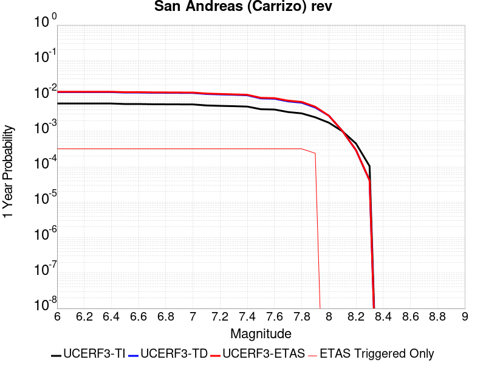 |

| Magnitude | 1 wk TI Prob | 1 wk TD Prob | 1 wk ETAS Prob | 1 wk ETAS/TD Gain | 1 wk ETAS Triggered Only | 1 mo TI Prob | 1 mo TD Prob | 1 mo ETAS Prob | 1 mo ETAS/TD Gain | 1 mo ETAS Triggered Only | 1 yr TI Prob | 1 yr TD Prob | 1 yr ETAS Prob | 1 yr ETAS/TD Gain | 1 yr ETAS Triggered Only |
|-----|-----|-----|-----|-----|-----|-----|-----|-----|-----|-----|-----|-----|-----|-----|-----|
| 6.0 | 1.1674632E-4 | 2.457212E-4 | 3.2570152E-4 | 1.3254923 | 8.0E-5 | 5.002454E-4 | 0.0010526674 | 0.0011725411 | 1.1138761 | 1.2E-4 | 0.006073493 | 0.0127414055 | 0.013057329 | 1.0247949 | 3.2E-4 |
| 6.1 | 1.1674632E-4 | 2.457212E-4 | 3.2570152E-4 | 1.3254923 | 8.0E-5 | 5.002454E-4 | 0.0010526674 | 0.0011725411 | 1.1138761 | 1.2E-4 | 0.006073493 | 0.0127414055 | 0.013057329 | 1.0247949 | 3.2E-4 |
| 6.2 | 1.1674632E-4 | 2.457212E-4 | 3.2570152E-4 | 1.3254923 | 8.0E-5 | 5.002454E-4 | 0.0010526674 | 0.0011725411 | 1.1138761 | 1.2E-4 | 0.006073493 | 0.0127414055 | 0.013057329 | 1.0247949 | 3.2E-4 |
| 6.3 | 1.1674632E-4 | 2.457212E-4 | 3.2570152E-4 | 1.3254923 | 8.0E-5 | 5.002454E-4 | 0.0010526674 | 0.0011725411 | 1.1138761 | 1.2E-4 | 0.006073493 | 0.0127414055 | 0.013057329 | 1.0247949 | 3.2E-4 |
| 6.4 | 1.1674632E-4 | 2.457212E-4 | 3.2570152E-4 | 1.3254923 | 8.0E-5 | 5.002454E-4 | 0.0010526674 | 0.0011725411 | 1.1138761 | 1.2E-4 | 0.006073493 | 0.0127414055 | 0.013057329 | 1.0247949 | 3.2E-4 |
| 6.5 | 1.13136164E-4 | 2.3891036E-4 | 3.1889125E-4 | 1.3347737 | 8.0E-5 | 4.847792E-4 | 0.0010235013 | 0.0011433786 | 1.1171246 | 1.2E-4 | 0.0058862255 | 0.012390388 | 0.012706423 | 1.0255065 | 3.2E-4 |
| 6.6 | 1.13136164E-4 | 2.3891036E-4 | 3.1889125E-4 | 1.3347737 | 8.0E-5 | 4.847792E-4 | 0.0010235013 | 0.0011433786 | 1.1171246 | 1.2E-4 | 0.0058862255 | 0.012390388 | 0.012706423 | 1.0255065 | 3.2E-4 |
| 6.7 | 1.1149675E-4 | 2.3581758E-4 | 3.157987E-4 | 1.3391652 | 8.0E-5 | 4.777557E-4 | 0.0010102568 | 0.0011301356 | 1.1186616 | 1.2E-4 | 0.0058011734 | 0.012230956 | 0.012547042 | 1.0258431 | 3.2E-4 |
| 6.8 | 1.1103589E-4 | 2.3483614E-4 | 3.1481736E-4 | 1.3405831 | 8.0E-5 | 4.7578133E-4 | 0.0010060539 | 0.0011259331 | 1.1191579 | 1.2E-4 | 0.005777263 | 0.012180358 | 0.01249646 | 1.0259519 | 3.2E-4 |
| 6.9 | 1.1053259E-4 | 2.3375664E-4 | 3.1373795E-4 | 1.3421563 | 8.0E-5 | 4.7362508E-4 | 0.001001431 | 0.0011213109 | 1.1197085 | 1.2E-4 | 0.0057511497 | 0.012124702 | 0.012440823 | 1.0260724 | 3.2E-4 |
| 7.0 | 1.1005377E-4 | 2.3276206E-4 | 3.1274345E-4 | 1.3436186 | 8.0E-5 | 4.7157376E-4 | 9.971719E-4 | 0.0011170522 | 1.1202203 | 1.2E-4 | 0.0057263062 | 0.012073423 | 0.012389559 | 1.0261844 | 3.2E-4 |
| 7.1 | 1.0308142E-4 | 2.1781186E-4 | 2.9779444E-4 | 1.3672094 | 8.0E-5 | 4.417027E-4 | 9.331465E-4 | 0.0010530346 | 1.1284772 | 1.2E-4 | 0.0053644776 | 0.011302199 | 0.0116185825 | 1.0279931 | 3.2E-4 |
| 7.2 | 1.0027479E-4 | 2.1187181E-4 | 2.9185487E-4 | 1.3775069 | 8.0E-5 | 4.296783E-4 | 9.077071E-4 | 0.0010275982 | 1.1320813 | 1.2E-4 | 0.0052187922 | 0.01099564 | 0.0113121215 | 1.0287825 | 3.2E-4 |
| 7.3 | 9.816942E-5 | 2.0659102E-4 | 2.865745E-4 | 1.3871585 | 8.0E-5 | 4.2065824E-4 | 8.850907E-4 | 0.0010049845 | 1.1354593 | 1.2E-4 | 0.005109493 | 0.010723028 | 0.011039597 | 1.0295223 | 3.2E-4 |
| 7.4 | 9.5634205E-5 | 2.0024394E-4 | 2.8022792E-4 | 1.3994328 | 8.0E-5 | 4.0979648E-4 | 8.57907E-4 | 9.778041E-4 | 1.1397552 | 1.2E-4 | 0.0049778637 | 0.010395263 | 0.010711937 | 1.0304632 | 3.2E-4 |
| 7.5 | 8.052417E-5 | 1.6317047E-4 | 2.4315741E-4 | 1.4902048 | 8.0E-5 | 3.4505792E-4 | 6.9911475E-4 | 8.1903086E-4 | 1.1715256 | 1.2E-4 | 0.0041929903 | 0.008478587 | 0.008795873 | 1.0374222 | 3.2E-4 |
| 7.6 | 7.897024E-5 | 1.5967674E-4 | 2.3966396E-4 | 1.5009322 | 8.0E-5 | 3.384E-4 | 6.8414956E-4 | 8.040675E-4 | 1.1752802 | 1.2E-4 | 0.0041122385 | 0.008297788 | 0.008615132 | 1.0382445 | 3.2E-4 |
| 7.7 | 6.707427E-5 | 1.3457966E-4 | 2.1456889E-4 | 1.5943635 | 8.0E-5 | 2.8742946E-4 | 5.766425E-4 | 6.9657335E-4 | 1.2079812 | 1.2E-4 | 0.003493839 | 0.006998057 | 0.0073158178 | 1.0454069 | 3.2E-4 |
| 7.8 | 6.147705E-5 | 1.2361974E-4 | 2.0360986E-4 | 1.6470658 | 8.0E-5 | 2.6344648E-4 | 5.2969134E-4 | 6.496278E-4 | 1.226427 | 1.2E-4 | 0.0032027436 | 0.0064299493 | 0.0067478917 | 1.0494471 | 3.2E-4 |
| 7.9 | 4.7636717E-5 | 8.998664E-5 | 1.6997945E-4 | 1.8889408 | 8.0E-5 | 2.0414138E-4 | 3.8560005E-4 | 4.655692E-4 | 1.2073889 | 8.0E-5 | 0.0024825884 | 0.004684583 | 0.0049234587 | 1.0509919 | 2.4E-4 |
| 8.0 | 3.3554235E-5 | 5.2868458E-5 | 5.2868458E-5 | 1.0 | 0.0 | 1.4379594E-4 | 2.2655944E-4 | 2.2655944E-4 | 1.0 | 0.0 | 0.0017493097 | 0.0027548738 | 0.0027548738 | 1.0 | 0.0 |
| 8.1 | 1.9175432E-5 | 1.954181E-5 | 1.954181E-5 | 1.0 | 0.0 | 8.217783E-5 | 8.374793E-5 | 8.374793E-5 | 1.0 | 0.0 | 0.0010000558 | 0.0010191548 | 0.0010191548 | 1.0 | 0.0 |
| 8.2 | 8.643924E-6 | 5.607368E-6 | 5.607368E-6 | 1.0 | 0.0 | 3.704486E-5 | 2.4031357E-5 | 2.4031357E-5 | 1.0 | 0.0 | 4.5092785E-4 | 2.9254257E-4 | 2.9254257E-4 | 1.0 | 0.0 |
| 8.3 | 1.983087E-6 | 7.877893E-7 | 7.877893E-7 | 1.0 | 0.0 | 8.498917E-6 | 3.3762356E-6 | 3.3762356E-6 | 1.0 | 0.0 | 1.034694E-4 | 4.110491E-5 | 4.110491E-5 | 1.0 | 0.0 |

## San Andreas (Parkfield)
*[(top)](#table-of-contents)*

| 1 Week | 1 Month | 1 Year |
|-----|-----|-----|
|  |  | 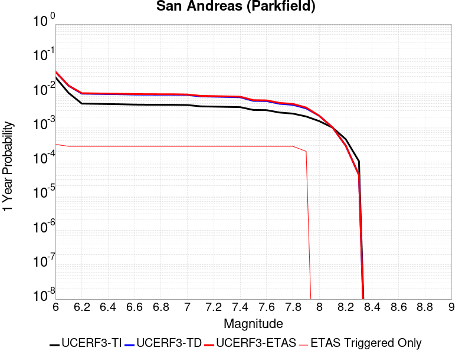 |

| Magnitude | 1 wk TI Prob | 1 wk TD Prob | 1 wk ETAS Prob | 1 wk ETAS/TD Gain | 1 wk ETAS Triggered Only | 1 mo TI Prob | 1 mo TD Prob | 1 mo ETAS Prob | 1 mo ETAS/TD Gain | 1 mo ETAS Triggered Only | 1 yr TI Prob | 1 yr TD Prob | 1 yr ETAS Prob | 1 yr ETAS/TD Gain | 1 yr ETAS Triggered Only |
|-----|-----|-----|-----|-----|-----|-----|-----|-----|-----|-----|-----|-----|-----|-----|-----|
| 6.0 | 5.556969E-4 | 8.0344157E-4 | 9.2334516E-4 | 1.1492375 | 1.2E-4 | 0.0023793848 | 0.003439371 | 0.0035988207 | 1.0463601 | 1.6E-4 | 0.028586963 | 0.041359875 | 0.04166664 | 1.007417 | 3.2E-4 |
| 6.1 | 1.925858E-4 | 3.0992847E-4 | 3.899037E-4 | 1.2580441 | 8.0E-5 | 8.2510663E-4 | 0.0013276909 | 0.0014475316 | 1.0902625 | 1.2E-4 | 0.0099994885 | 0.016126512 | 0.016401995 | 1.0170827 | 2.8E-4 |
| 6.2 | 9.4306815E-5 | 1.8443585E-4 | 2.6442108E-4 | 1.4336752 | 8.0E-5 | 4.0410945E-4 | 7.902011E-4 | 9.101063E-4 | 1.1517401 | 1.2E-4 | 0.0049089384 | 0.009578473 | 0.009855791 | 1.0289522 | 2.8E-4 |
| 6.3 | 9.283051E-5 | 1.8139459E-4 | 2.6138008E-4 | 1.4409475 | 8.0E-5 | 3.9778434E-4 | 7.7717495E-4 | 8.970817E-4 | 1.1542854 | 1.2E-4 | 0.0048322747 | 0.009421266 | 0.0096986275 | 1.02944 | 2.8E-4 |
| 6.4 | 9.138826E-5 | 1.7900368E-4 | 2.5898934E-4 | 1.4468381 | 8.0E-5 | 3.916052E-4 | 7.6693424E-4 | 8.868422E-4 | 1.1563472 | 1.2E-4 | 0.0047573745 | 0.009297662 | 0.009575059 | 1.0298351 | 2.8E-4 |
| 6.5 | 9.000255E-5 | 1.7657269E-4 | 2.5655856E-4 | 1.4529912 | 8.0E-5 | 3.8566816E-4 | 7.565218E-4 | 8.7643106E-4 | 1.1585007 | 1.2E-4 | 0.0046854047 | 0.009171973 | 0.009449405 | 1.0302478 | 2.8E-4 |
| 6.6 | 8.8109264E-5 | 1.7335823E-4 | 2.5334436E-4 | 1.4613922 | 8.0E-5 | 3.7755648E-4 | 7.427535E-4 | 8.6266437E-4 | 1.161441 | 1.2E-4 | 0.0045870654 | 0.009005753 | 0.009283232 | 1.0308112 | 2.8E-4 |
| 6.7 | 8.738073E-5 | 1.7202341E-4 | 2.5200966E-4 | 1.464973 | 8.0E-5 | 3.7443507E-4 | 7.3703605E-4 | 8.569476E-4 | 1.1626943 | 1.2E-4 | 0.0045492216 | 0.0089367535 | 0.009214251 | 1.0310513 | 2.8E-4 |
| 6.8 | 8.710195E-5 | 1.7147408E-4 | 2.5146035E-4 | 1.4664629 | 8.0E-5 | 3.7324068E-4 | 7.346831E-4 | 8.54595E-4 | 1.1632158 | 1.2E-4 | 0.0045347405 | 0.008908349 | 0.009185854 | 1.0311512 | 2.8E-4 |
| 6.9 | 8.6801556E-5 | 1.708797E-4 | 2.5086603E-4 | 1.4680856 | 8.0E-5 | 3.7195362E-4 | 7.3213724E-4 | 8.520493E-4 | 1.1637837 | 1.2E-4 | 0.0045191357 | 0.008877606 | 0.00915512 | 1.03126 | 2.8E-4 |
| 7.0 | 8.5571606E-5 | 1.6839206E-4 | 2.4837858E-4 | 1.4750018 | 8.0E-5 | 3.6668387E-4 | 7.214818E-4 | 8.4139523E-4 | 1.1662043 | 1.2E-4 | 0.004455241 | 0.008748925 | 0.009026475 | 1.031724 | 2.8E-4 |
| 7.1 | 7.82589E-5 | 1.5312967E-4 | 2.3311742E-4 | 1.522353 | 8.0E-5 | 3.3535215E-4 | 6.561057E-4 | 7.76027E-4 | 1.1827774 | 1.2E-4 | 0.0040752706 | 0.007959004 | 0.008236775 | 1.0349003 | 2.8E-4 |
| 7.2 | 7.690929E-5 | 1.504851E-4 | 2.3047306E-4 | 1.5315341 | 8.0E-5 | 3.2956956E-4 | 6.447775E-4 | 7.647001E-4 | 1.1859907 | 1.2E-4 | 0.004005129 | 0.0078220805 | 0.00809989 | 1.0355161 | 2.8E-4 |
| 7.3 | 7.5543794E-5 | 1.4742615E-4 | 2.2741436E-4 | 1.5425645 | 8.0E-5 | 3.2371894E-4 | 6.3167413E-4 | 7.5159833E-4 | 1.1898514 | 1.2E-4 | 0.003934157 | 0.0076636793 | 0.007941534 | 1.036256 | 2.8E-4 |
| 7.4 | 7.4214564E-5 | 1.4441142E-4 | 2.2439986E-4 | 1.5538929 | 8.0E-5 | 3.1802364E-4 | 6.1876E-4 | 7.386858E-4 | 1.1938163 | 1.2E-4 | 0.003865065 | 0.0075075435 | 0.0077854414 | 1.0370158 | 2.8E-4 |
| 7.5 | 6.149578E-5 | 1.1344282E-4 | 1.9343373E-4 | 1.7051212 | 8.0E-5 | 2.6352672E-4 | 4.86093E-4 | 6.0603465E-4 | 1.2467463 | 1.2E-4 | 0.0032037178 | 0.005902156 | 0.006180503 | 1.0471603 | 2.8E-4 |
| 7.6 | 6.0643448E-5 | 1.11714806E-4 | 1.9170587E-4 | 1.7160292 | 8.0E-5 | 2.598746E-4 | 4.7869E-4 | 5.9863256E-4 | 1.2505642 | 1.2E-4 | 0.0031593828 | 0.0058125085 | 0.0060908813 | 1.047892 | 2.8E-4 |
| 7.7 | 5.1652263E-5 | 9.3113E-5 | 1.7310555E-4 | 1.8590912 | 8.0E-5 | 2.2134806E-4 | 3.9899469E-4 | 5.189468E-4 | 1.3006359 | 1.2E-4 | 0.002691582 | 0.004846951 | 0.005125594 | 1.0574883 | 2.8E-4 |
| 7.8 | 4.8090482E-5 | 8.685296E-5 | 1.6684602E-4 | 1.9210169 | 8.0E-5 | 2.060858E-4 | 3.721739E-4 | 4.9212924E-4 | 1.32231 | 1.2E-4 | 0.0025062072 | 0.0045218114 | 0.004800545 | 1.061642 | 2.8E-4 |
| 7.9 | 3.970278E-5 | 6.848254E-5 | 1.4847706E-4 | 2.1681008 | 8.0E-5 | 1.7014367E-4 | 2.934636E-4 | 3.7344013E-4 | 1.2725261 | 8.0E-5 | 0.002069531 | 0.0035670698 | 0.0037663563 | 1.0558684 | 2.0E-4 |
| 8.0 | 2.8982335E-5 | 4.131844E-5 | 4.131844E-5 | 1.0 | 0.0 | 1.2420409E-4 | 1.77067E-4 | 1.77067E-4 | 1.0 | 0.0 | 0.0015111357 | 0.0021536606 | 0.0021536606 | 1.0 | 0.0 |
| 8.1 | 1.8836186E-5 | 1.9031799E-5 | 1.9031799E-5 | 1.0 | 0.0 | 8.0724014E-5 | 8.1562306E-5 | 8.1562306E-5 | 1.0 | 0.0 | 9.823717E-4 | 9.925694E-4 | 9.925694E-4 | 1.0 | 0.0 |
| 8.2 | 8.643924E-6 | 5.607368E-6 | 5.607368E-6 | 1.0 | 0.0 | 3.704486E-5 | 2.4031357E-5 | 2.4031357E-5 | 1.0 | 0.0 | 4.5092785E-4 | 2.9254257E-4 | 2.9254257E-4 | 1.0 | 0.0 |
| 8.3 | 1.983087E-6 | 7.877893E-7 | 7.877893E-7 | 1.0 | 0.0 | 8.498917E-6 | 3.3762356E-6 | 3.3762356E-6 | 1.0 | 0.0 | 1.034694E-4 | 4.110491E-5 | 4.110491E-5 | 1.0 | 0.0 |

## San Andreas (Cholame) rev
*[(top)](#table-of-contents)*

| 1 Week | 1 Month | 1 Year |
|-----|-----|-----|
|  | 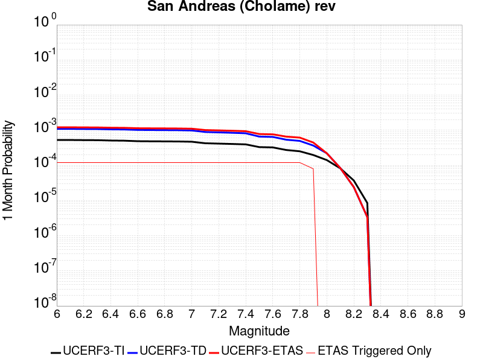 | 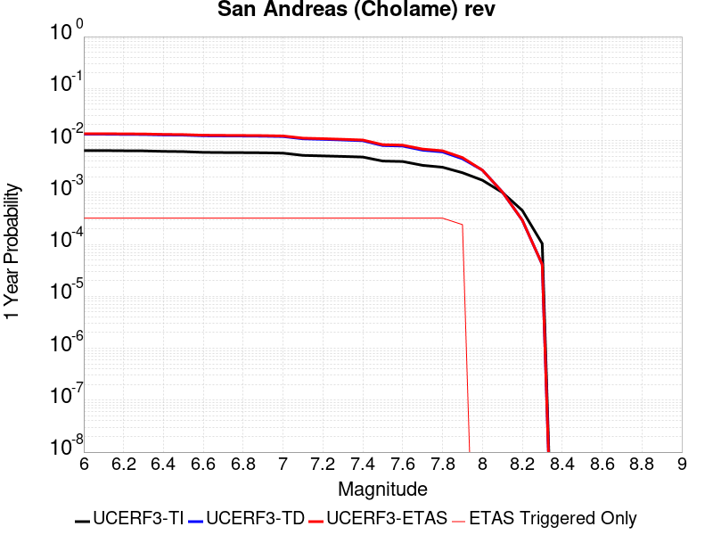 |

| Magnitude | 1 wk TI Prob | 1 wk TD Prob | 1 wk ETAS Prob | 1 wk ETAS/TD Gain | 1 wk ETAS Triggered Only | 1 mo TI Prob | 1 mo TD Prob | 1 mo ETAS Prob | 1 mo ETAS/TD Gain | 1 mo ETAS Triggered Only | 1 yr TI Prob | 1 yr TD Prob | 1 yr ETAS Prob | 1 yr ETAS/TD Gain | 1 yr ETAS Triggered Only |
|-----|-----|-----|-----|-----|-----|-----|-----|-----|-----|-----|-----|-----|-----|-----|-----|
| 6.0 | 1.2302514E-4 | 2.5456081E-4 | 3.3454044E-4 | 1.3141868 | 8.0E-5 | 5.27144E-4 | 0.0010905204 | 0.0012103895 | 1.1099192 | 1.2E-4 | 0.0063991086 | 0.013196777 | 0.013512554 | 1.0239284 | 3.2E-4 |
| 6.1 | 1.2302514E-4 | 2.5456081E-4 | 3.3454044E-4 | 1.3141868 | 8.0E-5 | 5.27144E-4 | 0.0010905204 | 0.0012103895 | 1.1099192 | 1.2E-4 | 0.0063991086 | 0.013196777 | 0.013512554 | 1.0239284 | 3.2E-4 |
| 6.2 | 1.2203569E-4 | 2.5272561E-4 | 3.3270541E-4 | 1.3164688 | 8.0E-5 | 5.2290526E-4 | 0.0010826618 | 0.001202532 | 1.1107179 | 1.2E-4 | 0.006347804 | 0.013102253 | 0.013418061 | 1.0241033 | 3.2E-4 |
| 6.3 | 1.2142645E-4 | 2.5158338E-4 | 3.3156326E-4 | 1.317906 | 8.0E-5 | 5.202953E-4 | 0.0010777706 | 0.0011976412 | 1.111221 | 1.2E-4 | 0.006316212 | 0.013043418 | 0.013359243 | 1.0242134 | 3.2E-4 |
| 6.4 | 1.1865206E-4 | 2.466236E-4 | 3.2660388E-4 | 1.324301 | 8.0E-5 | 5.0840975E-4 | 0.0010565318 | 0.001176405 | 1.1134592 | 1.2E-4 | 0.006172335 | 0.012787894 | 0.013103803 | 1.0247036 | 3.2E-4 |
| 6.5 | 1.17443946E-4 | 2.445465E-4 | 3.2452695E-4 | 1.3270562 | 8.0E-5 | 5.032341E-4 | 0.0010476371 | 0.0011675113 | 1.1144235 | 1.2E-4 | 0.006109677 | 0.012680864 | 0.012996806 | 1.0249149 | 3.2E-4 |
| 6.6 | 1.13579066E-4 | 2.3760591E-4 | 3.175869E-4 | 1.336612 | 8.0E-5 | 4.866766E-4 | 0.0010179152 | 0.0011377931 | 1.117768 | 1.2E-4 | 0.0059092017 | 0.012323147 | 0.012639204 | 1.0256474 | 3.2E-4 |
| 6.7 | 1.1271412E-4 | 2.3604305E-4 | 3.1602418E-4 | 1.3388412 | 8.0E-5 | 4.829711E-4 | 0.0010112225 | 0.001131101 | 1.1185483 | 1.2E-4 | 0.005864331 | 0.012242582 | 0.012558664 | 1.0258182 | 3.2E-4 |
| 6.8 | 1.1217975E-4 | 2.3492136E-4 | 3.1490257E-4 | 1.3404595 | 8.0E-5 | 4.8068175E-4 | 0.0010064188 | 0.0011262981 | 1.1191146 | 1.2E-4 | 0.005836608 | 0.012184754 | 0.012500855 | 1.0259423 | 3.2E-4 |
| 6.9 | 1.1146753E-4 | 2.3340227E-4 | 3.1338359E-4 | 1.3426759 | 8.0E-5 | 4.7763053E-4 | 9.999136E-4 | 0.0011197935 | 1.1198903 | 1.2E-4 | 0.0057996577 | 0.012106434 | 0.012422561 | 1.0261122 | 3.2E-4 |
| 7.0 | 1.0965793E-4 | 2.2961597E-4 | 3.0959758E-4 | 1.3483279 | 8.0E-5 | 4.698779E-4 | 9.836989E-4 | 0.0011035808 | 1.1218686 | 1.2E-4 | 0.005705768 | 0.011911196 | 0.012227384 | 1.0265455 | 3.2E-4 |
| 7.1 | 9.927982E-5 | 2.0771689E-4 | 2.8770027E-4 | 1.3850596 | 8.0E-5 | 4.2541555E-4 | 8.899126E-4 | 0.0010098058 | 1.1347247 | 1.2E-4 | 0.0051671406 | 0.010781161 | 0.011097711 | 1.0293614 | 3.2E-4 |
| 7.2 | 9.696786E-5 | 2.0274252E-4 | 2.827263E-4 | 1.3945092 | 8.0E-5 | 4.1551032E-4 | 8.686082E-4 | 9.885039E-4 | 1.1380321 | 1.2E-4 | 0.00504711 | 0.010524314 | 0.010840946 | 1.0300858 | 3.2E-4 |
| 7.3 | 9.4727984E-5 | 1.9699681E-4 | 2.7698107E-4 | 1.4060179 | 8.0E-5 | 4.0591392E-4 | 8.439999E-4 | 9.638986E-4 | 1.1420602 | 1.2E-4 | 0.0049308087 | 0.01022756 | 0.010544287 | 1.0309681 | 3.2E-4 |
| 7.4 | 9.220358E-5 | 1.9066039E-4 | 2.7064513E-4 | 1.4195143 | 8.0E-5 | 3.9509835E-4 | 8.16861E-4 | 9.3676295E-4 | 1.1467838 | 1.2E-4 | 0.004799717 | 0.009900185 | 0.010217017 | 1.0320027 | 3.2E-4 |
| 7.5 | 7.71631E-5 | 1.537305E-4 | 2.3371821E-4 | 1.5203112 | 8.0E-5 | 3.306571E-4 | 6.586788E-4 | 7.785998E-4 | 1.1820629 | 1.2E-4 | 0.0040183207 | 0.007990002 | 0.008307445 | 1.0397301 | 3.2E-4 |
| 7.6 | 7.5634416E-5 | 1.5029922E-4 | 2.302872E-4 | 1.5321915 | 8.0E-5 | 3.241072E-4 | 6.439807E-4 | 7.6390343E-4 | 1.186221 | 1.2E-4 | 0.0039388672 | 0.007812348 | 0.008129848 | 1.0406408 | 3.2E-4 |
| 7.7 | 6.3783E-5 | 1.253131E-4 | 2.0530308E-4 | 1.6383209 | 8.0E-5 | 2.7332708E-4 | 5.3694565E-4 | 6.568812E-4 | 1.2233663 | 1.2E-4 | 0.0033226798 | 0.006517746 | 0.0068356604 | 1.0487767 | 3.2E-4 |
| 7.8 | 5.863422E-5 | 1.1572884E-4 | 1.957196E-4 | 1.6911911 | 8.0E-5 | 2.512653E-4 | 4.9588655E-4 | 6.1582704E-4 | 1.2418709 | 1.2E-4 | 0.003054864 | 0.006020727 | 0.006338801 | 1.0528297 | 3.2E-4 |
| 7.9 | 4.595283E-5 | 8.541111E-5 | 1.6540427E-4 | 1.9365662 | 8.0E-5 | 1.9692584E-4 | 3.6599627E-4 | 4.45967E-4 | 1.2185014 | 8.0E-5 | 0.0023949358 | 0.0044469074 | 0.00468584 | 1.0537301 | 2.4E-4 |
| 8.0 | 3.2950178E-5 | 5.1490908E-5 | 5.1490908E-5 | 1.0 | 0.0 | 1.412074E-4 | 2.2065666E-4 | 2.2065666E-4 | 1.0 | 0.0 | 0.0017178444 | 0.002683187 | 0.002683187 | 1.0 | 0.0 |
| 8.1 | 1.9177472E-5 | 1.9541987E-5 | 1.9541987E-5 | 1.0 | 0.0 | 8.218658E-5 | 8.374869E-5 | 8.374869E-5 | 1.0 | 0.0 | 0.0010001622 | 0.0010191639 | 0.0010191639 | 1.0 | 0.0 |
| 8.2 | 8.643924E-6 | 5.607368E-6 | 5.607368E-6 | 1.0 | 0.0 | 3.704486E-5 | 2.4031357E-5 | 2.4031357E-5 | 1.0 | 0.0 | 4.5092785E-4 | 2.9254257E-4 | 2.9254257E-4 | 1.0 | 0.0 |
| 8.3 | 1.983087E-6 | 7.877893E-7 | 7.877893E-7 | 1.0 | 0.0 | 8.498917E-6 | 3.3762356E-6 | 3.3762356E-6 | 1.0 | 0.0 | 1.034694E-4 | 4.110491E-5 | 4.110491E-5 | 1.0 | 0.0 |

## San Andreas (San Gorgonio Pass-Garnet HIll)
*[(top)](#table-of-contents)*

| 1 Week | 1 Month | 1 Year |
|-----|-----|-----|
| 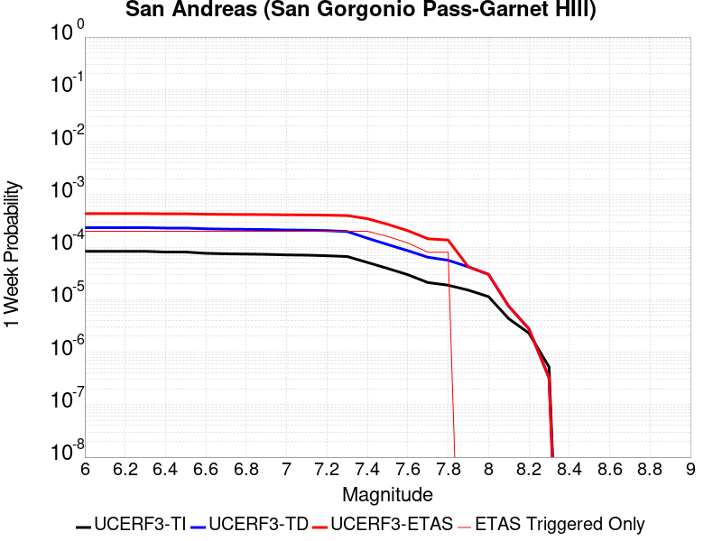 | 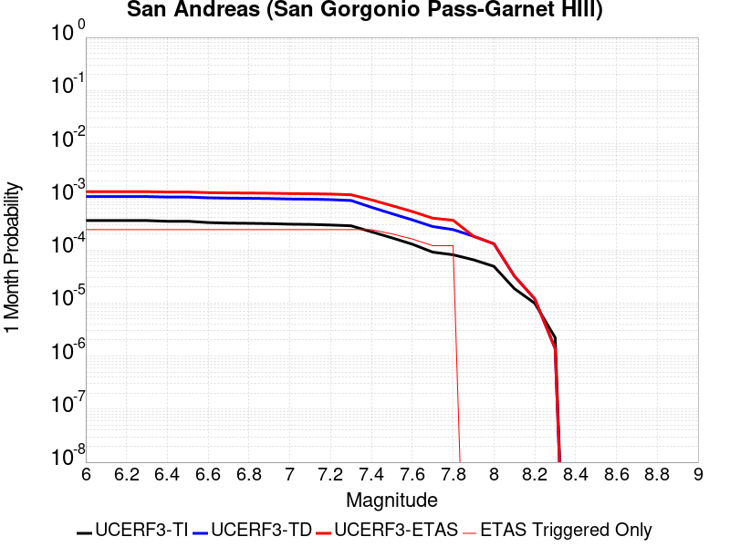 |  |

| Magnitude | 1 wk TI Prob | 1 wk TD Prob | 1 wk ETAS Prob | 1 wk ETAS/TD Gain | 1 wk ETAS Triggered Only | 1 mo TI Prob | 1 mo TD Prob | 1 mo ETAS Prob | 1 mo ETAS/TD Gain | 1 mo ETAS Triggered Only | 1 yr TI Prob | 1 yr TD Prob | 1 yr ETAS Prob | 1 yr ETAS/TD Gain | 1 yr ETAS Triggered Only |
|-----|-----|-----|-----|-----|-----|-----|-----|-----|-----|-----|-----|-----|-----|-----|-----|
| 6.0 | 8.31567E-5 | 2.3487274E-4 | 4.3482578E-4 | 1.8513249 | 2.0E-4 | 3.5633717E-4 | 0.0010062061 | 0.0012459647 | 1.2382797 | 2.4E-4 | 0.004329778 | 0.01218165 | 0.012458239 | 1.0227054 | 2.8E-4 |
| 6.1 | 8.31567E-5 | 2.3487274E-4 | 4.3482578E-4 | 1.8513249 | 2.0E-4 | 3.5633717E-4 | 0.0010062061 | 0.0012459647 | 1.2382797 | 2.4E-4 | 0.004329778 | 0.01218165 | 0.012458239 | 1.0227054 | 2.8E-4 |
| 6.2 | 8.31567E-5 | 2.3487274E-4 | 4.3482578E-4 | 1.8513249 | 2.0E-4 | 3.5633717E-4 | 0.0010062061 | 0.0012459647 | 1.2382797 | 2.4E-4 | 0.004329778 | 0.01218165 | 0.012458239 | 1.0227054 | 2.8E-4 |
| 6.3 | 8.31567E-5 | 2.3487274E-4 | 4.3482578E-4 | 1.8513249 | 2.0E-4 | 3.5633717E-4 | 0.0010062061 | 0.0012459647 | 1.2382797 | 2.4E-4 | 0.004329778 | 0.01218165 | 0.012458239 | 1.0227054 | 2.8E-4 |
| 6.4 | 8.059055E-5 | 2.3044254E-4 | 4.3039644E-4 | 1.8676953 | 2.0E-4 | 3.4534236E-4 | 9.872341E-4 | 0.0012269971 | 1.2428634 | 2.4E-4 | 0.0041964394 | 0.011953557 | 0.012230209 | 1.023144 | 2.8E-4 |
| 6.5 | 8.059055E-5 | 2.3044254E-4 | 4.3039644E-4 | 1.8676953 | 2.0E-4 | 3.4534236E-4 | 9.872341E-4 | 0.0012269971 | 1.2428634 | 2.4E-4 | 0.0041964394 | 0.011953557 | 0.012230209 | 1.023144 | 2.8E-4 |
| 6.6 | 7.619237E-5 | 2.2287853E-4 | 4.2283395E-4 | 1.8971498 | 2.0E-4 | 3.2649786E-4 | 9.548463E-4 | 0.0011946171 | 1.2511094 | 2.4E-4 | 0.0039678677 | 0.011563838 | 0.0118406005 | 1.0239334 | 2.8E-4 |
| 6.7 | 7.440636E-5 | 2.1963443E-4 | 4.195905E-4 | 1.9104041 | 2.0E-4 | 3.188454E-4 | 9.409531E-4 | 0.0011807273 | 1.2548206 | 2.4E-4 | 0.0038750346 | 0.011396466 | 0.011673275 | 1.024289 | 2.8E-4 |
| 6.8 | 7.3735864E-5 | 2.1810358E-4 | 4.1805996E-4 | 1.9167955 | 2.0E-4 | 3.1597257E-4 | 9.3439705E-4 | 0.0011741729 | 1.2566102 | 2.4E-4 | 0.0038401815 | 0.011317481 | 0.011594312 | 1.0244604 | 2.8E-4 |
| 6.9 | 7.27575E-5 | 2.1579085E-4 | 4.157477E-4 | 1.9266233 | 2.0E-4 | 3.117806E-4 | 9.244924E-4 | 0.0011642704 | 1.259362 | 2.4E-4 | 0.003789323 | 0.011198137 | 0.011475001 | 1.0247241 | 2.8E-4 |
| 7.0 | 7.102591E-5 | 2.1162683E-4 | 4.115845E-4 | 1.9448597 | 2.0E-4 | 3.0436125E-4 | 9.066591E-4 | 0.0011464416 | 1.2644681 | 2.4E-4 | 0.003699303 | 0.010983224 | 0.011260149 | 1.0252135 | 2.8E-4 |
| 7.1 | 7.028513E-5 | 2.0997925E-4 | 4.0993726E-4 | 1.952275 | 2.0E-4 | 3.0118722E-4 | 8.9960295E-4 | 0.001139387 | 1.2665443 | 2.4E-4 | 0.0036607897 | 0.010898178 | 0.011175127 | 1.0254123 | 2.8E-4 |
| 7.2 | 6.8498244E-5 | 2.0605292E-4 | 4.060117E-4 | 1.9704244 | 2.0E-4 | 2.9353087E-4 | 8.827873E-4 | 0.0011225754 | 1.2716261 | 2.4E-4 | 0.003567883 | 0.010695473 | 0.010972478 | 1.0258993 | 2.8E-4 |
| 7.3 | 6.622592E-5 | 1.9831101E-4 | 3.9827134E-4 | 2.0083168 | 2.0E-4 | 2.8379448E-4 | 8.496297E-4 | 0.0010894258 | 1.282236 | 2.4E-4 | 0.0034497243 | 0.010295663 | 0.010572781 | 1.0269159 | 2.8E-4 |
| 7.4 | 5.1050705E-5 | 1.477468E-4 | 3.4771726E-4 | 2.3534672 | 2.0E-4 | 2.1877038E-4 | 6.3304784E-4 | 8.7289594E-4 | 1.3788782 | 2.4E-4 | 0.002660276 | 0.007680315 | 0.007958164 | 1.0361768 | 2.8E-4 |
| 7.5 | 3.9302922E-5 | 1.1204231E-4 | 2.720244E-4 | 2.427872 | 1.6E-4 | 1.6843023E-4 | 4.8009327E-4 | 6.7999726E-4 | 1.4163858 | 2.0E-4 | 0.0020487092 | 0.0058295405 | 0.006068141 | 1.0409297 | 2.4E-4 |
| 7.6 | 2.9851626E-5 | 8.560878E-5 | 2.0559851E-4 | 2.4016054 | 1.2E-4 | 1.2792926E-4 | 3.668433E-4 | 5.267846E-4 | 1.4359936 | 1.6E-4 | 0.0015564259 | 0.0044571967 | 0.004656305 | 1.0446713 | 2.0E-4 |
| 7.7 | 2.1135214E-5 | 6.411543E-5 | 1.4411031E-4 | 2.2476695 | 8.0E-5 | 9.0576345E-5 | 2.747515E-4 | 3.9471855E-4 | 1.4366382 | 1.2E-4 | 0.0011022091 | 0.0033399744 | 0.00349944 | 1.0477445 | 1.6E-4 |
| 7.8 | 1.883379E-5 | 5.6178174E-5 | 1.3617368E-4 | 2.4239604 | 8.0E-5 | 8.0713755E-5 | 2.4074141E-4 | 3.6071253E-4 | 1.4983401 | 1.2E-4 | 9.822468E-4 | 0.0029270905 | 0.0030467391 | 1.0408764 | 1.2E-4 |
| 7.9 | 1.5156185E-5 | 4.2101485E-5 | 4.2101485E-5 | 1.0 | 0.0 | 6.495346E-5 | 1.8042246E-4 | 1.8042246E-4 | 1.0 | 0.0 | 7.9052144E-4 | 0.0021944318 | 0.0021944318 | 1.0 | 0.0 |
| 8.0 | 1.1405907E-5 | 3.0308918E-5 | 3.0308918E-5 | 1.0 | 0.0 | 4.8881542E-5 | 1.298889E-4 | 1.298889E-4 | 1.0 | 0.0 | 5.9497025E-4 | 0.0015802513 | 0.0015802513 | 1.0 | 0.0 |
| 8.1 | 4.3511436E-6 | 7.4929885E-6 | 7.4929885E-6 | 1.0 | 0.0 | 1.8647626E-5 | 3.2112413E-5 | 3.2112413E-5 | 1.0 | 0.0 | 2.2701119E-4 | 3.908986E-4 | 3.908986E-4 | 1.0 | 0.0 |
| 8.2 | 2.3042528E-6 | 2.7894796E-6 | 2.7894796E-6 | 1.0 | 0.0 | 9.875332E-6 | 1.1954859E-5 | 1.1954859E-5 | 1.0 | 0.0 | 1.2022553E-4 | 1.4554072E-4 | 1.4554072E-4 | 1.0 | 0.0 |
| 8.3 | 5.202968E-7 | 3.241516E-7 | 3.241516E-7 | 1.0 | 0.0 | 2.2298414E-6 | 1.3892205E-6 | 1.3892205E-6 | 1.0 | 0.0 | 2.714798E-5 | 1.6913642E-5 | 1.6913642E-5 | 1.0 | 0.0 |

## San Andreas (Coachella) rev
*[(top)](#table-of-contents)*

| 1 Week | 1 Month | 1 Year |
|-----|-----|-----|
| 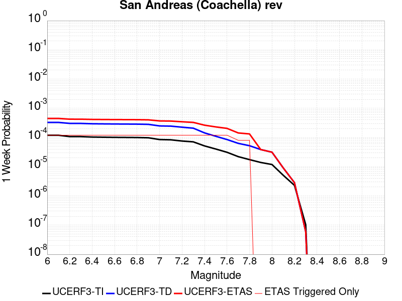 |  | 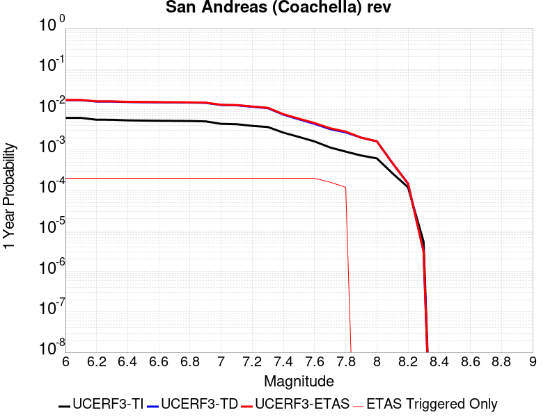 |

| Magnitude | 1 wk TI Prob | 1 wk TD Prob | 1 wk ETAS Prob | 1 wk ETAS/TD Gain | 1 wk ETAS Triggered Only | 1 mo TI Prob | 1 mo TD Prob | 1 mo ETAS Prob | 1 mo ETAS/TD Gain | 1 mo ETAS Triggered Only | 1 yr TI Prob | 1 yr TD Prob | 1 yr ETAS Prob | 1 yr ETAS/TD Gain | 1 yr ETAS Triggered Only |
|-----|-----|-----|-----|-----|-----|-----|-----|-----|-----|-----|-----|-----|-----|-----|-----|
| 6.0 | 1.1925945E-4 | 3.285021E-4 | 4.4846267E-4 | 1.3651744 | 1.2E-4 | 5.110118E-4 | 0.0014071113 | 0.0015668862 | 1.1135482 | 1.6E-4 | 0.0062038354 | 0.016998356 | 0.017194957 | 1.0115658 | 2.0E-4 |
| 6.1 | 1.1925945E-4 | 3.285021E-4 | 4.4846267E-4 | 1.3651744 | 1.2E-4 | 5.110118E-4 | 0.0014071113 | 0.0015668862 | 1.1135482 | 1.6E-4 | 0.0062038354 | 0.016998356 | 0.017194957 | 1.0115658 | 2.0E-4 |
| 6.2 | 1.07432395E-4 | 3.0350155E-4 | 4.2346513E-4 | 1.3952651 | 1.2E-4 | 4.603433E-4 | 0.0013000766 | 0.0014598685 | 1.1229097 | 1.6E-4 | 0.005590286 | 0.015714664 | 0.01591152 | 1.012527 | 2.0E-4 |
| 6.3 | 1.0718766E-4 | 3.0295455E-4 | 4.229182E-4 | 1.395979 | 1.2E-4 | 4.592948E-4 | 0.0012977346 | 0.0014575269 | 1.1231318 | 1.6E-4 | 0.005577586 | 0.01568656 | 0.015883423 | 1.0125498 | 2.0E-4 |
| 6.4 | 1.0355944E-4 | 2.9503368E-4 | 4.1499827E-4 | 1.4066132 | 1.2E-4 | 4.4375064E-4 | 0.0012638214 | 0.0014236191 | 1.1264402 | 1.6E-4 | 0.0053892885 | 0.01527953 | 0.015476474 | 1.0128894 | 2.0E-4 |
| 6.5 | 1.0227914E-4 | 2.9222743E-4 | 4.1219237E-4 | 1.410519 | 1.2E-4 | 4.382655E-4 | 0.0012518062 | 0.0014116059 | 1.1276553 | 1.6E-4 | 0.0053228354 | 0.015135286 | 0.015332259 | 1.0130142 | 2.0E-4 |
| 6.6 | 1.0116757E-4 | 2.898844E-4 | 4.098496E-4 | 1.4138381 | 1.2E-4 | 4.3350324E-4 | 0.0012417742 | 0.0014015755 | 1.1286879 | 1.6E-4 | 0.0052651367 | 0.015014836 | 0.015211833 | 1.0131202 | 2.0E-4 |
| 6.7 | 1.0050676E-4 | 2.8846966E-4 | 4.0843504E-4 | 1.4158683 | 1.2E-4 | 4.3067214E-4 | 0.0012357167 | 0.001395519 | 1.1293195 | 1.6E-4 | 0.005230834 | 0.0149421 | 0.015139112 | 1.013185 | 2.0E-4 |
| 6.8 | 9.976819E-5 | 2.8650457E-4 | 4.0647018E-4 | 1.4187214 | 1.2E-4 | 4.2750788E-4 | 0.0012273028 | 0.0013871065 | 1.1302072 | 1.6E-4 | 0.0051924936 | 0.014841062 | 0.0150380945 | 1.0132761 | 2.0E-4 |
| 6.9 | 9.77719E-5 | 2.8146335E-4 | 4.0142957E-4 | 1.4262233 | 1.2E-4 | 4.1895514E-4 | 0.0012057178 | 0.0013655248 | 1.1325411 | 1.6E-4 | 0.0050888555 | 0.014581811 | 0.014778894 | 1.0135157 | 2.0E-4 |
| 7.0 | 8.500761E-5 | 2.487273E-4 | 3.6869745E-4 | 1.482336 | 1.2E-4 | 3.6426744E-4 | 0.001065542 | 0.0012253715 | 1.1499983 | 1.6E-4 | 0.0044259406 | 0.012896588 | 0.013094009 | 1.015308 | 2.0E-4 |
| 7.1 | 8.319876E-5 | 2.4473912E-4 | 3.6470976E-4 | 1.490198 | 1.2E-4 | 3.5651738E-4 | 0.0010484635 | 0.0012082958 | 1.1524442 | 1.6E-4 | 0.004331963 | 0.012691099 | 0.012888561 | 1.0155591 | 2.0E-4 |
| 7.2 | 7.563917E-5 | 2.2518281E-4 | 3.451558E-4 | 1.5327803 | 1.2E-4 | 3.2412758E-4 | 9.647154E-4 | 0.0011245611 | 1.165692 | 1.6E-4 | 0.0039391145 | 0.011682851 | 0.011880514 | 1.0169191 | 2.0E-4 |
| 7.3 | 7.082985E-5 | 2.0829777E-4 | 3.2827278E-4 | 1.5759783 | 1.2E-4 | 3.0352117E-4 | 8.9240225E-4 | 0.0010522595 | 1.1791314 | 1.6E-4 | 0.0036891096 | 0.010811501 | 0.011009338 | 1.0182989 | 2.0E-4 |
| 7.4 | 5.146215E-5 | 1.4354692E-4 | 2.6352968E-4 | 1.8358436 | 1.2E-4 | 2.2053342E-4 | 6.150569E-4 | 7.749585E-4 | 1.2599785 | 1.6E-4 | 0.0026816884 | 0.0074627977 | 0.007661305 | 1.0265996 | 2.0E-4 |
| 7.5 | 4.0285166E-5 | 1.1011688E-4 | 2.3010367E-4 | 2.089631 | 1.2E-4 | 1.7263928E-4 | 4.7184445E-4 | 6.3176895E-4 | 1.3389348 | 1.6E-4 | 0.002099857 | 0.0057296446 | 0.0059284987 | 1.0347062 | 2.0E-4 |
| 7.6 | 3.1168736E-5 | 8.5009575E-5 | 2.0499938E-4 | 2.4114857 | 1.2E-4 | 1.3357346E-4 | 3.6427603E-4 | 5.242177E-4 | 1.4390674 | 1.6E-4 | 0.0016250437 | 0.0044260686 | 0.004625183 | 1.0449868 | 2.0E-4 |
| 7.7 | 2.2100989E-5 | 6.2934116E-5 | 1.4292909E-4 | 2.2710905 | 8.0E-5 | 9.4715084E-5 | 2.696898E-4 | 3.8965742E-4 | 1.4448357 | 1.2E-4 | 0.001152546 | 0.003278536 | 0.0034380115 | 1.0486423 | 1.6E-4 |
| 7.8 | 1.7484861E-5 | 5.2283296E-5 | 1.322791E-4 | 2.5300455 | 8.0E-5 | 7.493296E-5 | 2.2405203E-4 | 3.4402515E-4 | 1.5354699 | 1.2E-4 | 9.1192697E-4 | 0.0027244242 | 0.002844097 | 1.043926 | 1.2E-4 |
| 7.9 | 1.3967285E-5 | 3.862311E-5 | 3.862311E-5 | 1.0 | 0.0 | 5.985842E-5 | 1.6551714E-4 | 1.6551714E-4 | 1.0 | 0.0 | 7.2853256E-4 | 0.0020133099 | 0.0020133099 | 1.0 | 0.0 |
| 8.0 | 1.1887396E-5 | 3.1410258E-5 | 3.1410258E-5 | 1.0 | 0.0 | 5.094499E-5 | 1.3460845E-4 | 1.3460845E-4 | 1.0 | 0.0 | 6.200787E-4 | 0.0016376268 | 0.0016376268 | 1.0 | 0.0 |
| 8.1 | 5.100864E-6 | 9.116648E-6 | 9.116648E-6 | 1.0 | 0.0 | 2.1860664E-5 | 3.907076E-5 | 3.907076E-5 | 1.0 | 0.0 | 2.6612106E-4 | 4.755828E-4 | 4.755828E-4 | 1.0 | 0.0 |
| 8.2 | 2.3004484E-6 | 2.842999E-6 | 2.842999E-6 | 1.0 | 0.0 | 9.859027E-6 | 1.2184225E-5 | 1.2184225E-5 | 1.0 | 0.0 | 1.2002704E-4 | 1.4833287E-4 | 1.4833287E-4 | 1.0 | 0.0 |
| 8.3 | 1.0424446E-7 | 5.965764E-8 | 5.965764E-8 | 1.0 | 0.0 | 4.4676187E-7 | 2.5567556E-7 | 2.5567556E-7 | 1.0 | 0.0 | 5.439312E-6 | 3.112846E-6 | 3.112846E-6 | 1.0 | 0.0 |

## San Jacinto (San Bernardino)
*[(top)](#table-of-contents)*

| 1 Week | 1 Month | 1 Year |
|-----|-----|-----|
| 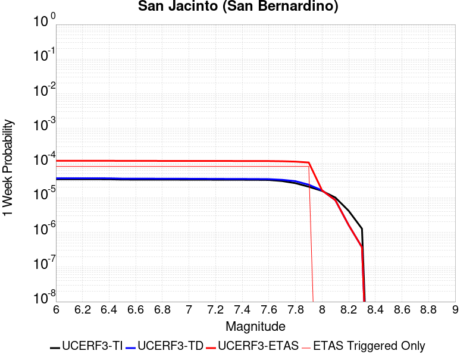 | 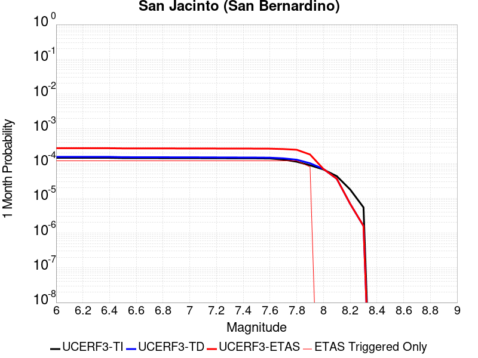 |  |

| Magnitude | 1 wk TI Prob | 1 wk TD Prob | 1 wk ETAS Prob | 1 wk ETAS/TD Gain | 1 wk ETAS Triggered Only | 1 mo TI Prob | 1 mo TD Prob | 1 mo ETAS Prob | 1 mo ETAS/TD Gain | 1 mo ETAS Triggered Only | 1 yr TI Prob | 1 yr TD Prob | 1 yr ETAS Prob | 1 yr ETAS/TD Gain | 1 yr ETAS Triggered Only |
|-----|-----|-----|-----|-----|-----|-----|-----|-----|-----|-----|-----|-----|-----|-----|-----|
| 6.0 | 3.409352E-5 | 3.6394562E-5 | 1.1639165E-4 | 3.1980507 | 8.0E-5 | 1.461069E-4 | 1.5596737E-4 | 2.7594867E-4 | 1.7692716 | 1.2E-4 | 0.0017774 | 0.0018972505 | 0.0020968711 | 1.1052157 | 2.0E-4 |
| 6.1 | 3.409352E-5 | 3.6394562E-5 | 1.1639165E-4 | 3.1980507 | 8.0E-5 | 1.461069E-4 | 1.5596737E-4 | 2.7594867E-4 | 1.7692716 | 1.2E-4 | 0.0017774 | 0.0018972505 | 0.0020968711 | 1.1052157 | 2.0E-4 |
| 6.2 | 3.409352E-5 | 3.6394562E-5 | 1.1639165E-4 | 3.1980507 | 8.0E-5 | 1.461069E-4 | 1.5596737E-4 | 2.7594867E-4 | 1.7692716 | 1.2E-4 | 0.0017774 | 0.0018972505 | 0.0020968711 | 1.1052157 | 2.0E-4 |
| 6.3 | 3.409352E-5 | 3.6394562E-5 | 1.1639165E-4 | 3.1980507 | 8.0E-5 | 1.461069E-4 | 1.5596737E-4 | 2.7594867E-4 | 1.7692716 | 1.2E-4 | 0.0017774 | 0.0018972505 | 0.0020968711 | 1.1052157 | 2.0E-4 |
| 6.4 | 3.400795E-5 | 3.6287136E-5 | 1.1628423E-4 | 3.2045581 | 8.0E-5 | 1.4574021E-4 | 1.5550703E-4 | 2.7548836E-4 | 1.7715492 | 1.2E-4 | 0.0017729428 | 0.0018916556 | 0.0020912774 | 1.1055275 | 2.0E-4 |
| 6.5 | 3.341482E-5 | 3.5547153E-5 | 1.1554431E-4 | 3.250452 | 8.0E-5 | 1.4319851E-4 | 1.5233604E-4 | 2.7231776E-4 | 1.7876121 | 1.2E-4 | 0.0017420477 | 0.001853115 | 0.0020527444 | 1.1077263 | 2.0E-4 |
| 6.6 | 3.3364955E-5 | 3.5484314E-5 | 1.15481474E-4 | 3.2544372 | 8.0E-5 | 1.4298483E-4 | 1.5206679E-4 | 2.7204852E-4 | 1.789007 | 1.2E-4 | 0.0017394501 | 0.0018498423 | 0.0020494724 | 1.1079173 | 2.0E-4 |
| 6.7 | 3.335922E-5 | 3.547408E-5 | 1.15471244E-4 | 3.2550876 | 8.0E-5 | 1.4296026E-4 | 1.5202291E-4 | 2.720047E-4 | 1.7892346 | 1.2E-4 | 0.0017391514 | 0.0018493092 | 0.0020489392 | 1.1079485 | 2.0E-4 |
| 6.8 | 3.327683E-5 | 3.5368048E-5 | 1.1536522E-4 | 3.2618487 | 8.0E-5 | 1.4260718E-4 | 1.5156854E-4 | 2.7155035E-4 | 1.791601 | 1.2E-4 | 0.0017348597 | 0.0018437867 | 0.002043418 | 1.1082724 | 2.0E-4 |
| 6.9 | 3.3235785E-5 | 3.530894E-5 | 1.1530612E-4 | 3.265635 | 8.0E-5 | 1.4243131E-4 | 1.5131527E-4 | 2.712971E-4 | 1.7929262 | 1.2E-4 | 0.0017327217 | 0.0018407081 | 0.0020403399 | 1.1084539 | 2.0E-4 |
| 7.0 | 3.3197095E-5 | 3.52488E-5 | 1.1524598E-4 | 3.269501 | 8.0E-5 | 1.422655E-4 | 1.5105754E-4 | 2.710394E-4 | 1.7942793 | 1.2E-4 | 0.0017307063 | 0.0018375756 | 0.002037208 | 1.108639 | 2.0E-4 |
| 7.1 | 3.3129716E-5 | 3.5128847E-5 | 1.1512604E-4 | 3.2772505 | 8.0E-5 | 1.4197677E-4 | 1.5054352E-4 | 2.7052546E-4 | 1.7969917 | 1.2E-4 | 0.0017271966 | 0.001831328 | 0.0020309617 | 1.1090103 | 2.0E-4 |
| 7.2 | 3.3034008E-5 | 3.4996167E-5 | 1.1499337E-4 | 3.2858846 | 8.0E-5 | 1.4156665E-4 | 1.4997496E-4 | 2.6995697E-4 | 1.8000135 | 1.2E-4 | 0.0017222111 | 0.0018244174 | 0.0020240524 | 1.109424 | 2.0E-4 |
| 7.3 | 3.2956614E-5 | 3.4863686E-5 | 1.1486089E-4 | 3.2945714 | 8.0E-5 | 1.4123498E-4 | 1.4940725E-4 | 2.693893E-4 | 1.8030539 | 1.2E-4 | 0.0017181796 | 0.001817517 | 0.0020171534 | 1.1098403 | 2.0E-4 |
| 7.4 | 3.2915937E-5 | 3.4785193E-5 | 1.1478241E-4 | 3.2997491 | 8.0E-5 | 1.4106068E-4 | 1.490709E-4 | 2.69053E-4 | 1.8048661 | 1.2E-4 | 0.0017160608 | 0.0018134287 | 0.002013066 | 1.1100883 | 2.0E-4 |
| 7.5 | 3.281791E-5 | 3.4649816E-5 | 1.14647046E-4 | 3.3087347 | 8.0E-5 | 1.406406E-4 | 1.4849077E-4 | 2.6847294E-4 | 1.808011 | 1.2E-4 | 0.0017109542 | 0.0018063774 | 0.0020060162 | 1.1105188 | 2.0E-4 |
| 7.6 | 3.2521442E-5 | 3.4374003E-5 | 1.1437125E-4 | 3.3272603 | 8.0E-5 | 1.3937015E-4 | 1.4730885E-4 | 2.6729118E-4 | 1.8144951 | 1.2E-4 | 0.0016955109 | 0.0017920113 | 0.001991653 | 1.1114064 | 2.0E-4 |
| 7.7 | 3.0287873E-5 | 3.2853422E-5 | 1.12850794E-4 | 3.4349785 | 8.0E-5 | 1.297987E-4 | 1.4079278E-4 | 2.6077588E-4 | 1.8521965 | 1.2E-4 | 0.0015791537 | 0.0017128056 | 0.001912463 | 1.1165675 | 2.0E-4 |
| 7.8 | 2.6316151E-5 | 3.0049645E-5 | 1.10047244E-4 | 3.6621811 | 8.0E-5 | 1.1277862E-4 | 1.2877784E-4 | 2.487624E-4 | 1.9317174 | 1.2E-4 | 0.0013722149 | 0.0015667436 | 0.0017664302 | 1.1274533 | 2.0E-4 |
| 7.9 | 2.0761147E-5 | 2.3754892E-5 | 1.03752995E-4 | 4.367647 | 8.0E-5 | 8.897331E-5 | 1.0180272E-4 | 1.8179457E-4 | 1.7857536 | 8.0E-5 | 0.0010827117 | 0.0012387441 | 0.0013585956 | 1.0967523 | 1.2E-4 |
| 8.0 | 1.5738568E-5 | 1.6286816E-5 | 1.6286816E-5 | 1.0 | 0.0 | 6.744926E-5 | 6.979878E-5 | 6.979878E-5 | 1.0 | 0.0 | 8.2088535E-4 | 8.494695E-4 | 8.494695E-4 | 1.0 | 0.0 |
| 8.1 | 1.0105832E-5 | 8.478705E-6 | 8.478705E-6 | 1.0 | 0.0 | 4.3309992E-5 | 3.6336805E-5 | 3.6336805E-5 | 1.0 | 0.0 | 5.2717153E-4 | 4.4231134E-4 | 4.4231134E-4 | 1.0 | 0.0 |
| 8.2 | 4.189207E-6 | 1.6207553E-6 | 1.6207553E-6 | 1.0 | 0.0 | 1.7953622E-5 | 6.9460752E-6 | 6.9460752E-6 | 1.0 | 0.0 | 2.1856341E-4 | 8.456522E-5 | 8.456522E-5 | 1.0 | 0.0 |
| 8.3 | 1.2758221E-6 | 3.728509E-7 | 3.728509E-7 | 1.0 | 0.0 | 5.4677976E-6 | 1.5979316E-6 | 1.5979316E-6 | 1.0 | 0.0 | 6.65684E-5 | 1.9454648E-5 | 1.9454648E-5 | 1.0 | 0.0 |

## Gravel Hills-Harper Lk
*[(top)](#table-of-contents)*

| 1 Week | 1 Month | 1 Year |
|-----|-----|-----|
|  | 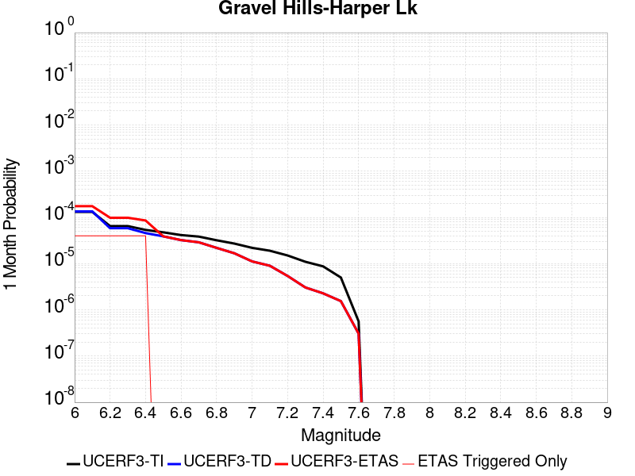 | 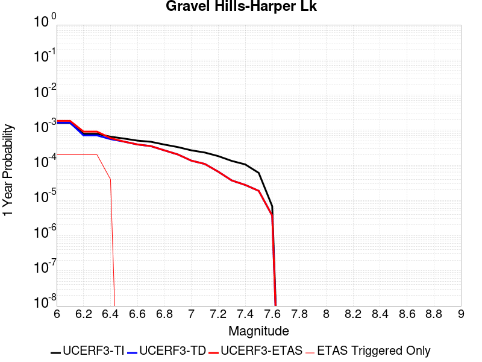 |

| Magnitude | 1 wk TI Prob | 1 wk TD Prob | 1 wk ETAS Prob | 1 wk ETAS/TD Gain | 1 wk ETAS Triggered Only | 1 mo TI Prob | 1 mo TD Prob | 1 mo ETAS Prob | 1 mo ETAS/TD Gain | 1 mo ETAS Triggered Only | 1 yr TI Prob | 1 yr TD Prob | 1 yr ETAS Prob | 1 yr ETAS/TD Gain | 1 yr ETAS Triggered Only |
|-----|-----|-----|-----|-----|-----|-----|-----|-----|-----|-----|-----|-----|-----|-----|-----|
| 6.0 | 3.0679566E-5 | 3.14785E-5 | 7.147724E-5 | 2.2706685 | 4.0E-5 | 1.3147724E-4 | 1.349021E-4 | 1.748967E-4 | 1.2964714 | 4.0E-5 | 0.0015995599 | 0.001641413 | 0.0018410847 | 1.1216463 | 2.0E-4 |
| 6.1 | 3.0679566E-5 | 3.14785E-5 | 7.147724E-5 | 2.2706685 | 4.0E-5 | 1.3147724E-4 | 1.349021E-4 | 1.748967E-4 | 1.2964714 | 4.0E-5 | 0.0015995599 | 0.001641413 | 0.0018410847 | 1.1216463 | 2.0E-4 |
| 6.2 | 1.514536E-5 | 1.3640053E-5 | 5.3639505E-5 | 3.9325 | 4.0E-5 | 6.490707E-5 | 5.8456128E-5 | 9.845379E-5 | 1.6842339 | 4.0E-5 | 7.8995706E-4 | 7.1148283E-4 | 9.113405E-4 | 1.2809031 | 2.0E-4 |
| 6.3 | 1.514536E-5 | 1.3640053E-5 | 5.3639505E-5 | 3.9325 | 4.0E-5 | 6.490707E-5 | 5.8456128E-5 | 9.845379E-5 | 1.6842339 | 4.0E-5 | 7.8995706E-4 | 7.1148283E-4 | 9.113405E-4 | 1.2809031 | 2.0E-4 |
| 6.4 | 1.2532521E-5 | 1.06932575E-5 | 5.069283E-5 | 4.740635 | 4.0E-5 | 5.37097E-5 | 4.5827474E-5 | 8.582564E-5 | 1.8727989 | 4.0E-5 | 6.537194E-4 | 5.5781245E-4 | 5.977902E-4 | 1.0716687 | 4.0E-5 |
| 6.5 | 1.1094058E-5 | 9.086593E-6 | 9.086593E-6 | 1.0 | 0.0 | 4.7545094E-5 | 3.8941984E-5 | 3.8941984E-5 | 1.0 | 0.0 | 5.787078E-4 | 4.7401953E-4 | 4.7401953E-4 | 1.0 | 0.0 |
| 6.6 | 9.688328E-6 | 7.534075E-6 | 7.534075E-6 | 1.0 | 0.0 | 4.1520743E-5 | 3.228851E-5 | 3.228851E-5 | 1.0 | 0.0 | 5.053978E-4 | 3.9304423E-4 | 3.9304423E-4 | 1.0 | 0.0 |
| 6.7 | 8.974824E-6 | 6.7515366E-6 | 6.7515366E-6 | 1.0 | 0.0 | 3.8462964E-5 | 2.8934848E-5 | 2.8934848E-5 | 1.0 | 0.0 | 4.6818596E-4 | 3.5222704E-4 | 3.5222704E-4 | 1.0 | 0.0 |
| 6.8 | 7.4780046E-6 | 5.1178117E-6 | 5.1178117E-6 | 1.0 | 0.0 | 3.20482E-5 | 2.1933301E-5 | 2.1933301E-5 | 1.0 | 0.0 | 3.9011694E-4 | 2.670066E-4 | 2.670066E-4 | 1.0 | 0.0 |
| 6.9 | 6.3409307E-6 | 3.908781E-6 | 3.908781E-6 | 1.0 | 0.0 | 2.7175134E-5 | 1.6751816E-5 | 1.6751816E-5 | 1.0 | 0.0 | 3.3080703E-4 | 2.0393525E-4 | 2.0393525E-4 | 1.0 | 0.0 |
| 7.0 | 5.1239335E-6 | 2.6067862E-6 | 2.6067862E-6 | 1.0 | 0.0 | 2.195953E-5 | 1.1171895E-5 | 1.1171895E-5 | 1.0 | 0.0 | 2.6732447E-4 | 1.3600958E-4 | 1.3600958E-4 | 1.0 | 0.0 |
| 7.1 | 4.438899E-6 | 2.099272E-6 | 2.099272E-6 | 1.0 | 0.0 | 1.9023713E-5 | 8.99685E-6 | 8.99685E-6 | 1.0 | 0.0 | 2.315891E-4 | 1.09531364E-4 | 1.09531364E-4 | 1.0 | 0.0 |
| 7.2 | 3.50367E-6 | 1.2621932E-6 | 1.2621932E-6 | 1.0 | 0.0 | 1.5015643E-5 | 5.409389E-6 | 5.409389E-6 | 1.0 | 0.0 | 1.8280011E-4 | 6.5857406E-5 | 6.5857406E-5 | 1.0 | 0.0 |
| 7.3 | 2.561638E-6 | 7.12401E-7 | 7.12401E-7 | 1.0 | 0.0 | 1.0978401E-5 | 3.0531437E-6 | 3.0531437E-6 | 1.0 | 0.0 | 1.3365384E-4 | 3.717141E-5 | 3.717141E-5 | 1.0 | 0.0 |
| 7.4 | 2.0368864E-6 | 5.3089406E-7 | 5.3089406E-7 | 1.0 | 0.0 | 8.729483E-6 | 2.275258E-6 | 2.275258E-6 | 1.0 | 0.0 | 1.06276275E-4 | 2.7700922E-5 | 2.7700922E-5 | 1.0 | 0.0 |
| 7.5 | 1.1681728E-6 | 3.605487E-7 | 3.605487E-7 | 1.0 | 0.0 | 5.0064455E-6 | 1.5452079E-6 | 1.5452079E-6 | 1.0 | 0.0 | 6.0951766E-5 | 1.8812749E-5 | 1.8812749E-5 | 1.0 | 0.0 |
| 7.6 | 1.3154387E-7 | 7.121983E-8 | 7.121983E-8 | 1.0 | 0.0 | 5.6375933E-7 | 3.0522784E-7 | 3.0522784E-7 | 1.0 | 0.0 | 6.863748E-6 | 3.7161442E-6 | 3.7161442E-6 | 1.0 | 0.0 |

## San Jacinto (San Jacinto Valley) rev
*[(top)](#table-of-contents)*

| 1 Week | 1 Month | 1 Year |
|-----|-----|-----|
| 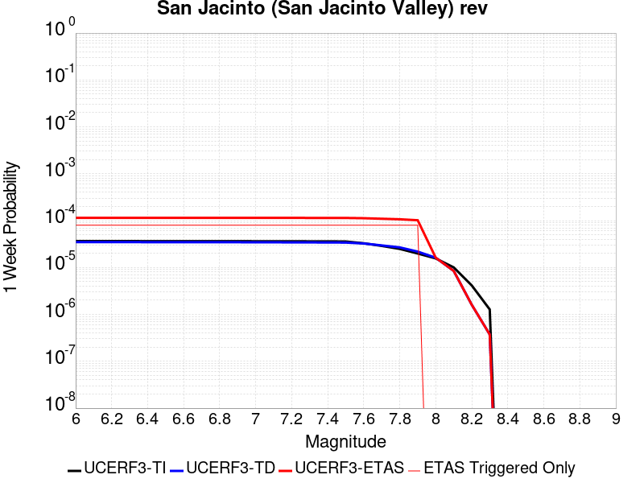 | 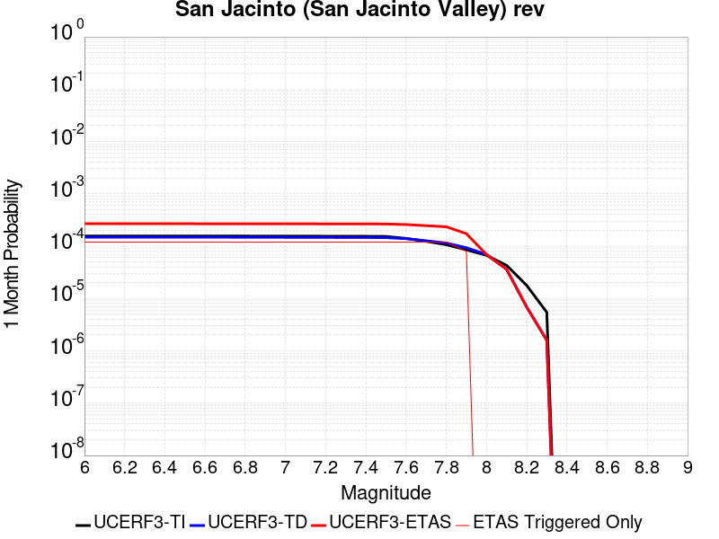 | 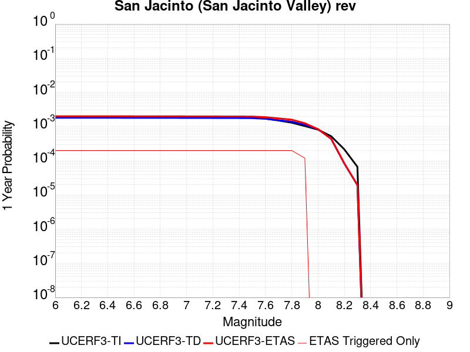 |

| Magnitude | 1 wk TI Prob | 1 wk TD Prob | 1 wk ETAS Prob | 1 wk ETAS/TD Gain | 1 wk ETAS Triggered Only | 1 mo TI Prob | 1 mo TD Prob | 1 mo ETAS Prob | 1 mo ETAS/TD Gain | 1 mo ETAS Triggered Only | 1 yr TI Prob | 1 yr TD Prob | 1 yr ETAS Prob | 1 yr ETAS/TD Gain | 1 yr ETAS Triggered Only |
|-----|-----|-----|-----|-----|-----|-----|-----|-----|-----|-----|-----|-----|-----|-----|-----|
| 6.0 | 3.652694E-5 | 3.4785007E-5 | 1.14782226E-4 | 3.2997615 | 8.0E-5 | 1.5653463E-4 | 1.4907008E-4 | 2.690522E-4 | 1.8048705 | 1.2E-4 | 0.0019041431 | 0.0018134193 | 0.0020130565 | 1.110089 | 2.0E-4 |
| 6.1 | 3.652694E-5 | 3.4785007E-5 | 1.14782226E-4 | 3.2997615 | 8.0E-5 | 1.5653463E-4 | 1.4907008E-4 | 2.690522E-4 | 1.8048705 | 1.2E-4 | 0.0019041431 | 0.0018134193 | 0.0020130565 | 1.110089 | 2.0E-4 |
| 6.2 | 3.652694E-5 | 3.4785007E-5 | 1.14782226E-4 | 3.2997615 | 8.0E-5 | 1.5653463E-4 | 1.4907008E-4 | 2.690522E-4 | 1.8048705 | 1.2E-4 | 0.0019041431 | 0.0018134193 | 0.0020130565 | 1.110089 | 2.0E-4 |
| 6.3 | 3.652694E-5 | 3.4785007E-5 | 1.14782226E-4 | 3.2997615 | 8.0E-5 | 1.5653463E-4 | 1.4907008E-4 | 2.690522E-4 | 1.8048705 | 1.2E-4 | 0.0019041431 | 0.0018134193 | 0.0020130565 | 1.110089 | 2.0E-4 |
| 6.4 | 3.646941E-5 | 3.470649E-5 | 1.1470371E-4 | 3.3049643 | 8.0E-5 | 1.5628811E-4 | 1.4873363E-4 | 2.6871578E-4 | 1.8066915 | 1.2E-4 | 0.0019011468 | 0.0018093301 | 0.0020089683 | 1.1103381 | 2.0E-4 |
| 6.5 | 3.646941E-5 | 3.470649E-5 | 1.1470371E-4 | 3.3049643 | 8.0E-5 | 1.5628811E-4 | 1.4873363E-4 | 2.6871578E-4 | 1.8066915 | 1.2E-4 | 0.0019011468 | 0.0018093301 | 0.0020089683 | 1.1103381 | 2.0E-4 |
| 6.6 | 3.6442503E-5 | 3.4669836E-5 | 1.1466706E-4 | 3.3074014 | 8.0E-5 | 1.561728E-4 | 1.4857655E-4 | 2.6855874E-4 | 1.8075445 | 1.2E-4 | 0.0018997455 | 0.0018074211 | 0.0020070595 | 1.1104549 | 2.0E-4 |
| 6.7 | 3.6432113E-5 | 3.4655393E-5 | 1.1465262E-4 | 3.308363 | 8.0E-5 | 1.5612828E-4 | 1.4851466E-4 | 2.6849683E-4 | 1.807881 | 1.2E-4 | 0.0018992044 | 0.0018066689 | 0.0020063077 | 1.1105009 | 2.0E-4 |
| 6.8 | 3.6409598E-5 | 3.462441E-5 | 1.1462164E-4 | 3.3104289 | 8.0E-5 | 1.560318E-4 | 1.4838189E-4 | 2.683641E-4 | 1.808604 | 1.2E-4 | 0.0018980318 | 0.0018050552 | 0.0020046942 | 1.1105999 | 2.0E-4 |
| 6.9 | 3.638078E-5 | 3.4584784E-5 | 1.1458201E-4 | 3.313076 | 8.0E-5 | 1.5590832E-4 | 1.4821209E-4 | 2.681943E-4 | 1.8095305 | 1.2E-4 | 0.0018965311 | 0.0018029913 | 0.0020026306 | 1.1107267 | 2.0E-4 |
| 7.0 | 3.6294874E-5 | 3.446665E-5 | 1.14463895E-4 | 3.3210042 | 8.0E-5 | 1.5554018E-4 | 1.4770588E-4 | 2.6768816E-4 | 1.8123053 | 1.2E-4 | 0.0018920569 | 0.0017968385 | 0.001996479 | 1.1111066 | 2.0E-4 |
| 7.1 | 3.6260717E-5 | 3.4422897E-5 | 1.14420145E-4 | 3.3239546 | 8.0E-5 | 1.5539382E-4 | 1.4751837E-4 | 2.6750067E-4 | 1.813338 | 1.2E-4 | 0.001890278 | 0.0017945593 | 0.0019942003 | 1.111248 | 2.0E-4 |
| 7.2 | 3.6210204E-5 | 3.4356966E-5 | 1.1435422E-4 | 3.3284142 | 8.0E-5 | 1.5517735E-4 | 1.4723586E-4 | 2.672182E-4 | 1.8148988 | 1.2E-4 | 0.001887647 | 0.0017911253 | 0.001990767 | 1.1114616 | 2.0E-4 |
| 7.3 | 3.6119454E-5 | 3.42449E-5 | 1.1424216E-4 | 3.3360343 | 8.0E-5 | 1.5478847E-4 | 1.4675561E-4 | 2.66738E-4 | 1.8175659 | 1.2E-4 | 0.0018829206 | 0.001785288 | 0.0019849308 | 1.1118268 | 2.0E-4 |
| 7.4 | 3.607848E-5 | 3.4192242E-5 | 1.14189505E-4 | 3.339632 | 8.0E-5 | 1.5461289E-4 | 1.4652996E-4 | 2.665124E-4 | 1.8188251 | 1.2E-4 | 0.0018807866 | 0.0017825452 | 0.0019821888 | 1.1119992 | 2.0E-4 |
| 7.5 | 3.5856774E-5 | 3.4000583E-5 | 1.1399786E-4 | 3.3528209 | 8.0E-5 | 1.5366284E-4 | 1.4570866E-4 | 2.6569117E-4 | 1.8234411 | 1.2E-4 | 0.0018692396 | 0.0017725622 | 0.0019722078 | 1.112631 | 2.0E-4 |
| 7.6 | 3.286655E-5 | 3.2510947E-5 | 1.1250834E-4 | 3.4606295 | 8.0E-5 | 1.4084904E-4 | 1.393252E-4 | 2.593085E-4 | 1.8611742 | 1.2E-4 | 0.001713488 | 0.0016949666 | 0.0018946276 | 1.1177964 | 2.0E-4 |
| 7.7 | 2.8882527E-5 | 2.9595956E-5 | 1.0959359E-4 | 3.702992 | 8.0E-5 | 1.237764E-4 | 1.2683365E-4 | 2.4681844E-4 | 1.9460012 | 1.2E-4 | 0.0015059357 | 0.001543107 | 0.0017427984 | 1.1294086 | 2.0E-4 |
| 7.8 | 2.4950225E-5 | 2.687312E-5 | 1.0687097E-4 | 3.9768724 | 8.0E-5 | 1.0692515E-4 | 1.15165436E-4 | 2.3515162E-4 | 2.0418594 | 1.2E-4 | 0.0013010362 | 0.0014012383 | 0.0016009579 | 1.1425309 | 2.0E-4 |
| 7.9 | 1.9881603E-5 | 2.1818549E-5 | 1.01816804E-4 | 4.666525 | 8.0E-5 | 8.520408E-5 | 9.350472E-5 | 1.7349725E-4 | 1.8554918 | 8.0E-5 | 0.001036866 | 0.0011378262 | 0.0012576897 | 1.1053443 | 1.2E-4 |
| 8.0 | 1.563292E-5 | 1.618842E-5 | 1.618842E-5 | 1.0 | 0.0 | 6.6996516E-5 | 6.93771E-5 | 6.93771E-5 | 1.0 | 0.0 | 8.153773E-4 | 8.4433955E-4 | 8.4433955E-4 | 1.0 | 0.0 |
| 8.1 | 1.0045313E-5 | 8.449115E-6 | 8.449115E-6 | 1.0 | 0.0 | 4.305063E-5 | 3.6209993E-5 | 3.6209993E-5 | 1.0 | 0.0 | 5.2401534E-4 | 4.40768E-4 | 4.40768E-4 | 1.0 | 0.0 |
| 8.2 | 4.1554413E-6 | 1.6074547E-6 | 1.6074547E-6 | 1.0 | 0.0 | 1.7808914E-5 | 6.8890736E-6 | 6.8890736E-6 | 1.0 | 0.0 | 2.1680194E-4 | 8.387127E-5 | 8.387127E-5 | 1.0 | 0.0 |
| 8.3 | 1.2758221E-6 | 3.728509E-7 | 3.728509E-7 | 1.0 | 0.0 | 5.4677976E-6 | 1.5979316E-6 | 1.5979316E-6 | 1.0 | 0.0 | 6.65684E-5 | 1.9454648E-5 | 1.9454648E-5 | 1.0 | 0.0 |

## San Jacinto (Stepovers Combined)
*[(top)](#table-of-contents)*

| 1 Week | 1 Month | 1 Year |
|-----|-----|-----|
|  |  | 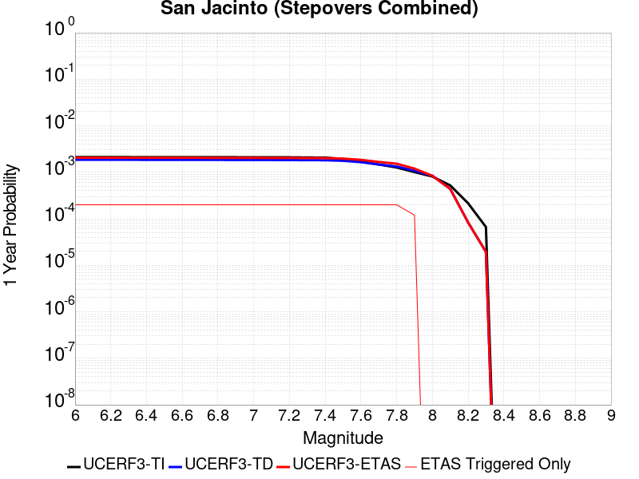 |

| Magnitude | 1 wk TI Prob | 1 wk TD Prob | 1 wk ETAS Prob | 1 wk ETAS/TD Gain | 1 wk ETAS Triggered Only | 1 mo TI Prob | 1 mo TD Prob | 1 mo ETAS Prob | 1 mo ETAS/TD Gain | 1 mo ETAS Triggered Only | 1 yr TI Prob | 1 yr TD Prob | 1 yr ETAS Prob | 1 yr ETAS/TD Gain | 1 yr ETAS Triggered Only |
|-----|-----|-----|-----|-----|-----|-----|-----|-----|-----|-----|-----|-----|-----|-----|-----|
| 6.0 | 4.0667746E-5 | 3.5654804E-5 | 1.1565195E-4 | 3.2436569 | 8.0E-5 | 1.742787E-4 | 1.5279738E-4 | 2.7277903E-4 | 1.7852339 | 1.2E-4 | 0.0021197782 | 0.001858722 | 0.0020583502 | 1.1074008 | 2.0E-4 |
| 6.1 | 4.0667746E-5 | 3.5654804E-5 | 1.1565195E-4 | 3.2436569 | 8.0E-5 | 1.742787E-4 | 1.5279738E-4 | 2.7277903E-4 | 1.7852339 | 1.2E-4 | 0.0021197782 | 0.001858722 | 0.0020583502 | 1.1074008 | 2.0E-4 |
| 6.2 | 4.0667746E-5 | 3.5654804E-5 | 1.1565195E-4 | 3.2436569 | 8.0E-5 | 1.742787E-4 | 1.5279738E-4 | 2.7277903E-4 | 1.7852339 | 1.2E-4 | 0.0021197782 | 0.001858722 | 0.0020583502 | 1.1074008 | 2.0E-4 |
| 6.3 | 4.0667746E-5 | 3.5654804E-5 | 1.1565195E-4 | 3.2436569 | 8.0E-5 | 1.742787E-4 | 1.5279738E-4 | 2.7277903E-4 | 1.7852339 | 1.2E-4 | 0.0021197782 | 0.001858722 | 0.0020583502 | 1.1074008 | 2.0E-4 |
| 6.4 | 4.0577226E-5 | 3.552656E-5 | 1.1552371E-4 | 3.2517567 | 8.0E-5 | 1.738908E-4 | 1.522478E-4 | 2.7222955E-4 | 1.7880687 | 1.2E-4 | 0.0021150648 | 0.0018520436 | 0.0020516731 | 1.1077888 | 2.0E-4 |
| 6.5 | 4.0577226E-5 | 3.552656E-5 | 1.1552371E-4 | 3.2517567 | 8.0E-5 | 1.738908E-4 | 1.522478E-4 | 2.7222955E-4 | 1.7880687 | 1.2E-4 | 0.0021150648 | 0.0018520436 | 0.0020516731 | 1.1077888 | 2.0E-4 |
| 6.6 | 4.053861E-5 | 3.5471832E-5 | 1.15468996E-4 | 3.2552307 | 8.0E-5 | 1.7372532E-4 | 1.520133E-4 | 2.7199506E-4 | 1.7892847 | 1.2E-4 | 0.0021130538 | 0.0018491937 | 0.0020488237 | 1.1079552 | 2.0E-4 |
| 6.7 | 4.0516545E-5 | 3.5440866E-5 | 1.1543803E-4 | 3.2572012 | 8.0E-5 | 1.7363077E-4 | 1.5188061E-4 | 2.7186237E-4 | 1.7899743 | 1.2E-4 | 0.002111905 | 0.0018475811 | 0.0020472116 | 1.1080496 | 2.0E-4 |
| 6.8 | 4.049434E-5 | 3.5412282E-5 | 1.1540945E-4 | 3.2590234 | 8.0E-5 | 1.7353562E-4 | 1.5175811E-4 | 2.717399E-4 | 1.7906121 | 1.2E-4 | 0.0021107488 | 0.0018460923 | 0.0020457231 | 1.1081369 | 2.0E-4 |
| 6.9 | 4.046386E-5 | 3.5374713E-5 | 1.15371884E-4 | 3.2614224 | 8.0E-5 | 1.73405E-4 | 1.5159712E-4 | 2.7157893E-4 | 1.7914518 | 1.2E-4 | 0.0021091616 | 0.0018441357 | 0.002043767 | 1.1082519 | 2.0E-4 |
| 7.0 | 4.036382E-5 | 3.5254863E-5 | 1.1525204E-4 | 3.2691104 | 8.0E-5 | 1.7297632E-4 | 1.5108353E-4 | 2.710654E-4 | 1.7941426 | 1.2E-4 | 0.0021039525 | 0.0018378934 | 0.0020375259 | 1.1086203 | 2.0E-4 |
| 7.1 | 4.0343282E-5 | 3.523326E-5 | 1.1523044E-4 | 3.2705019 | 8.0E-5 | 1.7288832E-4 | 1.5099096E-4 | 2.7097284E-4 | 1.7946295 | 1.2E-4 | 0.002102883 | 0.0018367684 | 0.002036401 | 1.1086869 | 2.0E-4 |
| 7.2 | 4.0257353E-5 | 3.5137495E-5 | 1.1513468E-4 | 3.2766902 | 8.0E-5 | 1.725201E-4 | 1.5058058E-4 | 2.705625E-4 | 1.7967955 | 1.2E-4 | 0.0020984085 | 0.0018317803 | 0.002031414 | 1.1089834 | 2.0E-4 |
| 7.3 | 3.9940667E-5 | 3.4963145E-5 | 1.1496035E-4 | 3.2880437 | 8.0E-5 | 1.7116306E-4 | 1.4983346E-4 | 2.6981547E-4 | 1.8007692 | 1.2E-4 | 0.0020819185 | 0.0018226993 | 0.0020223348 | 1.1095273 | 2.0E-4 |
| 7.4 | 3.9721202E-5 | 3.4847715E-5 | 1.1484493E-4 | 3.2956228 | 8.0E-5 | 1.7022261E-4 | 1.4933883E-4 | 2.693209E-4 | 1.8034219 | 1.2E-4 | 0.0020704903 | 0.0018166872 | 0.0020163239 | 1.1098905 | 2.0E-4 |
| 7.5 | 3.7036873E-5 | 3.3907352E-5 | 1.13904636E-4 | 3.3592904 | 8.0E-5 | 1.5871979E-4 | 1.4530914E-4 | 2.6529172E-4 | 1.8257055 | 1.2E-4 | 0.0019307006 | 0.0017677062 | 0.0019673528 | 1.112941 | 2.0E-4 |
| 7.6 | 3.2940967E-5 | 3.1670912E-5 | 1.1166838E-4 | 3.5258973 | 8.0E-5 | 1.4116794E-4 | 1.3572544E-4 | 2.5570914E-4 | 1.884018 | 1.2E-4 | 0.0017173645 | 0.0016512069 | 0.0018508766 | 1.1209235 | 2.0E-4 |
| 7.7 | 2.8236149E-5 | 2.8227036E-5 | 1.08224776E-4 | 3.8340821 | 8.0E-5 | 1.2100645E-4 | 1.2096741E-4 | 2.409529E-4 | 1.9918827 | 1.2E-4 | 0.0014722579 | 0.0014717843 | 0.0016714899 | 1.1356895 | 2.0E-4 |
| 7.8 | 2.4329287E-5 | 2.5537129E-5 | 1.0553509E-4 | 4.1326137 | 8.0E-5 | 1.042642E-4 | 1.09440254E-4 | 2.2942713E-4 | 2.0963688 | 1.2E-4 | 0.0012686774 | 0.0013316215 | 0.0015313552 | 1.1499928 | 2.0E-4 |
| 7.9 | 1.9370926E-5 | 2.071883E-5 | 1.00717174E-4 | 4.861142 | 8.0E-5 | 8.301561E-5 | 8.879197E-5 | 1.6878486E-4 | 1.9009024 | 8.0E-5 | 0.0010102465 | 0.0010805068 | 0.0012003771 | 1.110939 | 1.2E-4 |
| 8.0 | 1.5583017E-5 | 1.6136504E-5 | 1.6136504E-5 | 1.0 | 0.0 | 6.6782646E-5 | 6.915462E-5 | 6.915462E-5 | 1.0 | 0.0 | 8.127754E-4 | 8.4163295E-4 | 8.4163295E-4 | 1.0 | 0.0 |
| 8.1 | 1.0024873E-5 | 8.439436E-6 | 8.439436E-6 | 1.0 | 0.0 | 4.2963035E-5 | 3.6168516E-5 | 3.6168516E-5 | 1.0 | 0.0 | 5.229494E-4 | 4.4026322E-4 | 4.4026322E-4 | 1.0 | 0.0 |
| 8.2 | 4.142796E-6 | 1.6027543E-6 | 1.6027543E-6 | 1.0 | 0.0 | 1.775472E-5 | 6.8689287E-6 | 6.8689287E-6 | 1.0 | 0.0 | 2.1614227E-4 | 8.362603E-5 | 8.362603E-5 | 1.0 | 0.0 |
| 8.3 | 1.2750878E-6 | 3.725573E-7 | 3.725573E-7 | 1.0 | 0.0 | 5.4646503E-6 | 1.5966733E-6 | 1.5966733E-6 | 1.0 | 0.0 | 6.653009E-5 | 1.9439329E-5 | 1.9439329E-5 | 1.0 | 0.0 |

## San Andreas (Creeping Section) 2011 CFM
*[(top)](#table-of-contents)*

| 1 Week | 1 Month | 1 Year |
|-----|-----|-----|
| 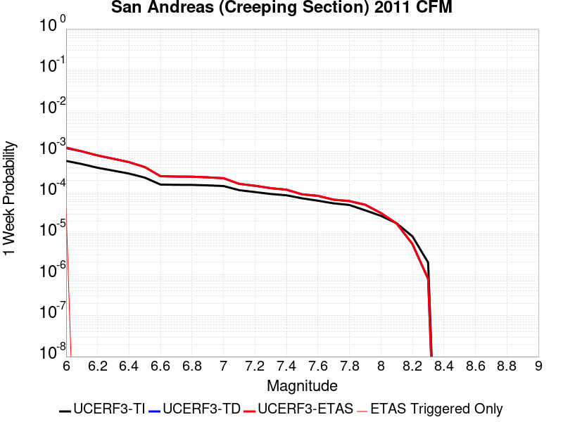 | 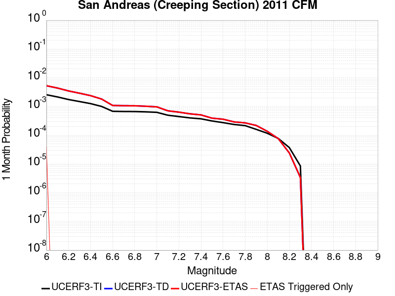 | 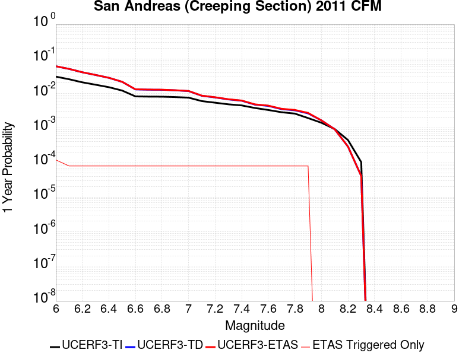 |

| Magnitude | 1 wk TI Prob | 1 wk TD Prob | 1 wk ETAS Prob | 1 wk ETAS/TD Gain | 1 wk ETAS Triggered Only | 1 mo TI Prob | 1 mo TD Prob | 1 mo ETAS Prob | 1 mo ETAS/TD Gain | 1 mo ETAS Triggered Only | 1 yr TI Prob | 1 yr TD Prob | 1 yr ETAS Prob | 1 yr ETAS/TD Gain | 1 yr ETAS Triggered Only |
|-----|-----|-----|-----|-----|-----|-----|-----|-----|-----|-----|-----|-----|-----|-----|-----|
| 6.0 | 5.986481E-4 | 0.0012305736 | 0.0012705245 | 1.0324652 | 4.0E-5 | 0.0025631124 | 0.0052583744 | 0.005298164 | 1.0075669 | 4.0E-5 | 0.030762846 | 0.06135223 | 0.06146487 | 1.001836 | 1.2E-4 |
| 6.1 | 5.015945E-4 | 0.0010242044 | 0.0010242044 | 1.0 | 0.0 | 0.00214792 | 0.00437824 | 0.00437824 | 1.0 | 0.0 | 0.025839351 | 0.051369127 | 0.05144502 | 1.0014774 | 8.0E-5 |
| 6.2 | 4.073338E-4 | 8.1310584E-4 | 8.1310584E-4 | 1.0 | 0.0 | 0.0017445484 | 0.0034773606 | 0.0034773606 | 1.0 | 0.0 | 0.021034058 | 0.04105309 | 0.041129805 | 1.0018687 | 8.0E-5 |
| 6.3 | 3.464099E-4 | 6.7629415E-4 | 6.7629415E-4 | 1.0 | 0.0 | 0.0014837692 | 0.002893196 | 0.002893196 | 1.0 | 0.0 | 0.017915873 | 0.034310453 | 0.034387708 | 1.0022516 | 8.0E-5 |
| 6.4 | 2.935057E-4 | 5.56817E-4 | 5.56817E-4 | 1.0 | 0.0 | 0.0012572751 | 0.0023828198 | 0.0023828198 | 1.0 | 0.0 | 0.015200248 | 0.028386578 | 0.028464308 | 1.0027382 | 8.0E-5 |
| 6.5 | 2.3409708E-4 | 4.233272E-4 | 4.233272E-4 | 1.0 | 0.0 | 0.0010028875 | 0.0018122771 | 0.0018122771 | 1.0 | 0.0 | 0.012141965 | 0.021710506 | 0.021788768 | 1.0036049 | 8.0E-5 |
| 6.6 | 1.5842178E-4 | 2.530843E-4 | 2.530843E-4 | 1.0 | 0.0 | 6.7877385E-4 | 0.0010841859 | 0.0010841859 | 1.0 | 0.0 | 0.0082328 | 0.013118694 | 0.013197645 | 1.0060182 | 8.0E-5 |
| 6.7 | 1.5616413E-4 | 2.484441E-4 | 2.484441E-4 | 1.0 | 0.0 | 6.691031E-4 | 0.0010643183 | 0.0010643183 | 1.0 | 0.0 | 0.0081159435 | 0.01288029 | 0.01295926 | 1.006131 | 8.0E-5 |
| 6.8 | 1.5538467E-4 | 2.4667758E-4 | 2.4667758E-4 | 1.0 | 0.0 | 6.6576427E-4 | 0.0010567546 | 0.0010567546 | 1.0 | 0.0 | 0.008075596 | 0.012789439 | 0.0128684165 | 1.0061752 | 8.0E-5 |
| 6.9 | 1.5153569E-4 | 2.3774903E-4 | 2.3774903E-4 | 1.0 | 0.0 | 6.49277E-4 | 0.0010185286 | 0.0010185286 | 1.0 | 0.0 | 0.007876333 | 0.012330608 | 0.012409622 | 1.006408 | 8.0E-5 |
| 7.0 | 1.4588932E-4 | 2.26266E-4 | 2.26266E-4 | 1.0 | 0.0 | 6.250901E-4 | 9.69353E-4 | 9.69353E-4 | 1.0 | 0.0 | 0.0075839474 | 0.011738516 | 0.011817577 | 1.0067352 | 8.0E-5 |
| 7.1 | 1.1565079E-4 | 1.648249E-4 | 1.648249E-4 | 1.0 | 0.0 | 4.955521E-4 | 7.0620206E-4 | 7.0620206E-4 | 1.0 | 0.0 | 0.006016669 | 0.008564321 | 0.0086436365 | 1.0092611 | 8.0E-5 |
| 7.2 | 1.0393792E-4 | 1.4804474E-4 | 1.4804474E-4 | 1.0 | 0.0 | 4.4537216E-4 | 6.343239E-4 | 6.343239E-4 | 1.0 | 0.0 | 0.005408933 | 0.0076957205 | 0.0077751046 | 1.0103154 | 8.0E-5 |
| 7.3 | 9.332884E-5 | 1.2946628E-4 | 1.2946628E-4 | 1.0 | 0.0 | 3.999194E-4 | 5.5473816E-4 | 5.5473816E-4 | 1.0 | 0.0 | 0.0048581534 | 0.006733159 | 0.0068126204 | 1.0118015 | 8.0E-5 |
| 7.4 | 8.670252E-5 | 1.1859965E-4 | 1.1859965E-4 | 1.0 | 0.0 | 3.715293E-4 | 5.081858E-4 | 5.081858E-4 | 1.0 | 0.0 | 0.004513991 | 0.006169733 | 0.0062492397 | 1.0128865 | 8.0E-5 |
| 7.5 | 7.3036405E-5 | 9.138321E-5 | 9.138321E-5 | 1.0 | 0.0 | 3.129756E-4 | 3.9158363E-4 | 3.9158363E-4 | 1.0 | 0.0 | 0.0038038217 | 0.004757131 | 0.00483675 | 1.0167369 | 8.0E-5 |
| 7.6 | 6.3935775E-5 | 8.4007974E-5 | 8.4007974E-5 | 1.0 | 0.0 | 2.7398168E-4 | 3.5998458E-4 | 3.5998458E-4 | 1.0 | 0.0 | 0.0033306254 | 0.004374024 | 0.004453674 | 1.0182098 | 8.0E-5 |
| 7.7 | 5.5050095E-5 | 6.768488E-5 | 6.768488E-5 | 1.0 | 0.0 | 2.3590765E-4 | 2.900458E-4 | 2.900458E-4 | 1.0 | 0.0 | 0.0028683927 | 0.0035255942 | 0.0036053122 | 1.0226113 | 8.0E-5 |
| 7.8 | 5.027131E-5 | 6.260343E-5 | 6.260343E-5 | 1.0 | 0.0 | 2.1543067E-4 | 2.6827282E-4 | 2.6827282E-4 | 1.0 | 0.0 | 0.0026197135 | 0.0032613333 | 0.0033410725 | 1.0244498 | 8.0E-5 |
| 7.9 | 3.7271806E-5 | 5.1009967E-5 | 5.1009967E-5 | 1.0 | 0.0 | 1.5972654E-4 | 2.1859583E-4 | 2.1859583E-4 | 1.0 | 0.0 | 0.0019429359 | 0.002658158 | 0.0027379454 | 1.0300161 | 8.0E-5 |
| 8.0 | 2.7310243E-5 | 3.1948035E-5 | 3.1948035E-5 | 1.0 | 0.0 | 1.17038646E-4 | 1.3691297E-4 | 1.3691297E-4 | 1.0 | 0.0 | 0.0014240141 | 0.0016656418 | 0.0016656418 | 1.0 | 0.0 |
| 8.1 | 1.7940547E-5 | 1.7734084E-5 | 1.7734084E-5 | 1.0 | 0.0 | 7.688579E-5 | 7.600101E-5 | 7.600101E-5 | 1.0 | 0.0 | 9.3568244E-4 | 9.2491996E-4 | 9.2491996E-4 | 1.0 | 0.0 |
| 8.2 | 8.643924E-6 | 5.607368E-6 | 5.607368E-6 | 1.0 | 0.0 | 3.704486E-5 | 2.4031357E-5 | 2.4031357E-5 | 1.0 | 0.0 | 4.5092785E-4 | 2.9254257E-4 | 2.9254257E-4 | 1.0 | 0.0 |
| 8.3 | 1.983087E-6 | 7.877893E-7 | 7.877893E-7 | 1.0 | 0.0 | 8.498917E-6 | 3.3762356E-6 | 3.3762356E-6 | 1.0 | 0.0 | 1.034694E-4 | 4.110491E-5 | 4.110491E-5 | 1.0 | 0.0 |

## San Jacinto (Anza) rev
*[(top)](#table-of-contents)*

| 1 Week | 1 Month | 1 Year |
|-----|-----|-----|
| 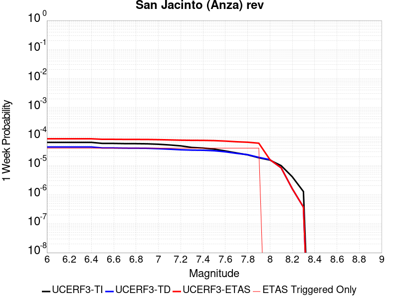 | 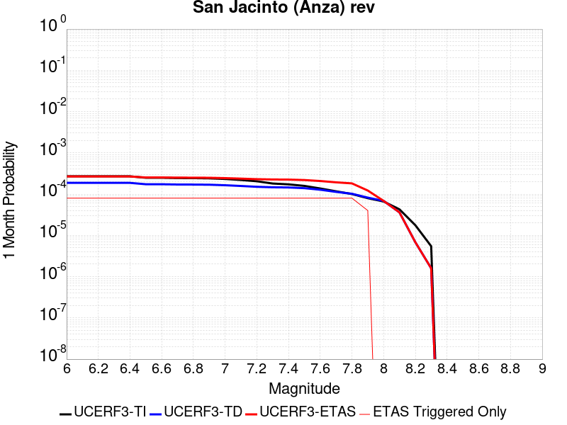 | 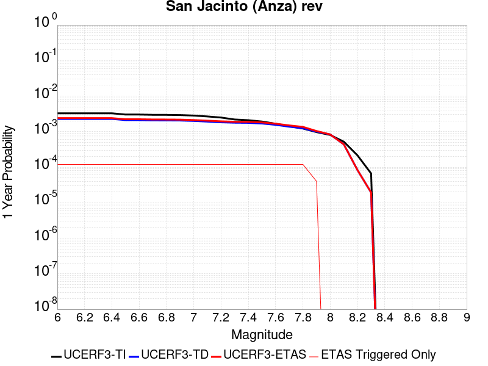 |

| Magnitude | 1 wk TI Prob | 1 wk TD Prob | 1 wk ETAS Prob | 1 wk ETAS/TD Gain | 1 wk ETAS Triggered Only | 1 mo TI Prob | 1 mo TD Prob | 1 mo ETAS Prob | 1 mo ETAS/TD Gain | 1 mo ETAS Triggered Only | 1 yr TI Prob | 1 yr TD Prob | 1 yr ETAS Prob | 1 yr ETAS/TD Gain | 1 yr ETAS Triggered Only |
|-----|-----|-----|-----|-----|-----|-----|-----|-----|-----|-----|-----|-----|-----|-----|-----|
| 6.0 | 6.3015636E-5 | 4.3745757E-5 | 8.374401E-5 | 1.9143344 | 4.0E-5 | 2.7003905E-4 | 1.8746841E-4 | 2.674534E-4 | 1.4266585 | 8.0E-5 | 0.0032827691 | 0.002280051 | 0.0023997773 | 1.0525104 | 1.2E-4 |
| 6.1 | 6.3015636E-5 | 4.3745757E-5 | 8.374401E-5 | 1.9143344 | 4.0E-5 | 2.7003905E-4 | 1.8746841E-4 | 2.674534E-4 | 1.4266585 | 8.0E-5 | 0.0032827691 | 0.002280051 | 0.0023997773 | 1.0525104 | 1.2E-4 |
| 6.2 | 6.3015636E-5 | 4.3745757E-5 | 8.374401E-5 | 1.9143344 | 4.0E-5 | 2.7003905E-4 | 1.8746841E-4 | 2.674534E-4 | 1.4266585 | 8.0E-5 | 0.0032827691 | 0.002280051 | 0.0023997773 | 1.0525104 | 1.2E-4 |
| 6.3 | 6.3015636E-5 | 4.3745757E-5 | 8.374401E-5 | 1.9143344 | 4.0E-5 | 2.7003905E-4 | 1.8746841E-4 | 2.674534E-4 | 1.4266585 | 8.0E-5 | 0.0032827691 | 0.002280051 | 0.0023997773 | 1.0525104 | 1.2E-4 |
| 6.4 | 6.3015636E-5 | 4.3745757E-5 | 8.374401E-5 | 1.9143344 | 4.0E-5 | 2.7003905E-4 | 1.8746841E-4 | 2.674534E-4 | 1.4266585 | 8.0E-5 | 0.0032827691 | 0.002280051 | 0.0023997773 | 1.0525104 | 1.2E-4 |
| 6.5 | 5.811017E-5 | 4.0506016E-5 | 8.05044E-5 | 1.9874676 | 4.0E-5 | 2.4901982E-4 | 1.735857E-4 | 2.535718E-4 | 1.4607875 | 8.0E-5 | 0.0030276014 | 0.002111363 | 0.0022311097 | 1.0567154 | 1.2E-4 |
| 6.6 | 5.811017E-5 | 4.0506016E-5 | 8.05044E-5 | 1.9874676 | 4.0E-5 | 2.4901982E-4 | 1.735857E-4 | 2.535718E-4 | 1.4607875 | 8.0E-5 | 0.0030276014 | 0.002111363 | 0.0022311097 | 1.0567154 | 1.2E-4 |
| 6.7 | 5.712442E-5 | 3.9923914E-5 | 7.992232E-5 | 2.0018656 | 4.0E-5 | 2.4479596E-4 | 1.710913E-4 | 2.510776E-4 | 1.4675066 | 8.0E-5 | 0.0029763177 | 0.0020810522 | 0.0022008026 | 1.0575432 | 1.2E-4 |
| 6.8 | 5.6967532E-5 | 3.977942E-5 | 7.9777834E-5 | 2.005505 | 4.0E-5 | 2.4412372E-4 | 1.7047212E-4 | 2.5045848E-4 | 1.4692049 | 8.0E-5 | 0.0029681553 | 0.002073528 | 0.002193279 | 1.0577524 | 1.2E-4 |
| 6.9 | 5.6211324E-5 | 3.9481514E-5 | 7.9479934E-5 | 2.0130923 | 4.0E-5 | 2.4088343E-4 | 1.6919555E-4 | 2.4918202E-4 | 1.4727457 | 8.0E-5 | 0.0029288116 | 0.0020580152 | 0.0021777682 | 1.0581886 | 1.2E-4 |
| 7.0 | 5.4383527E-5 | 3.833281E-5 | 7.833128E-5 | 2.0434525 | 4.0E-5 | 2.3305144E-4 | 1.6427317E-4 | 2.4426E-4 | 1.4869137 | 8.0E-5 | 0.0028337094 | 0.0019981961 | 0.0021179563 | 1.0599341 | 1.2E-4 |
| 7.1 | 5.1393665E-5 | 3.6780868E-5 | 7.67794E-5 | 2.087482 | 4.0E-5 | 2.2023996E-4 | 1.576228E-4 | 2.3761018E-4 | 1.5074608 | 8.0E-5 | 0.0026781242 | 0.0019173726 | 0.0020371426 | 1.0624657 | 1.2E-4 |
| 7.2 | 4.785222E-5 | 3.5116576E-5 | 7.5115175E-5 | 2.1390233 | 4.0E-5 | 2.0506482E-4 | 1.5049095E-4 | 2.3047891E-4 | 1.5315135 | 8.0E-5 | 0.0024938055 | 0.0018306911 | 0.0019504714 | 1.065429 | 1.2E-4 |
| 7.3 | 4.2143256E-5 | 3.4199693E-5 | 7.4198324E-5 | 2.1695611 | 4.0E-5 | 1.8060145E-4 | 1.465619E-4 | 2.2655018E-4 | 1.5457644 | 8.0E-5 | 0.002196605 | 0.0017829342 | 0.0019027203 | 1.0671848 | 1.2E-4 |
| 7.4 | 4.0264713E-5 | 3.3834353E-5 | 7.3833E-5 | 2.1821904 | 4.0E-5 | 1.7255165E-4 | 1.4499633E-4 | 2.2498473E-4 | 1.5516582 | 8.0E-5 | 0.002098792 | 0.0017639044 | 0.0018836927 | 1.0679109 | 1.2E-4 |
| 7.5 | 3.694492E-5 | 3.253924E-5 | 7.2537936E-5 | 2.229245 | 4.0E-5 | 1.5832575E-4 | 1.3944645E-4 | 2.194353E-4 | 1.573617 | 8.0E-5 | 0.0019259118 | 0.0016964416 | 0.0018162379 | 1.0706162 | 1.2E-4 |
| 7.6 | 3.200565E-5 | 2.983583E-5 | 6.9834634E-5 | 2.3406298 | 4.0E-5 | 1.3715986E-4 | 1.278616E-4 | 2.0785136E-4 | 1.6255965 | 8.0E-5 | 0.001668642 | 0.0015556056 | 0.0016754188 | 1.0770204 | 1.2E-4 |
| 7.7 | 2.731642E-5 | 2.6414782E-5 | 6.6413726E-5 | 2.5142636 | 4.0E-5 | 1.1706512E-4 | 1.13201306E-4 | 1.9319225E-4 | 1.7066257 | 8.0E-5 | 0.001424336 | 0.0013773555 | 0.0014971902 | 1.0870035 | 1.2E-4 |
| 7.8 | 2.3466424E-5 | 2.3813845E-5 | 6.381289E-5 | 2.679655 | 4.0E-5 | 1.0056651E-4 | 1.0205535E-4 | 1.8204718E-4 | 1.7838084 | 8.0E-5 | 0.0012237094 | 0.0012418164 | 0.0013616675 | 1.0965127 | 1.2E-4 |
| 7.9 | 1.8611925E-5 | 1.9186835E-5 | 5.9186066E-5 | 3.0847228 | 4.0E-5 | 7.9762955E-5 | 8.22267E-5 | 1.2222341E-4 | 1.4864199 | 4.0E-5 | 9.7068126E-4 | 0.0010006512 | 0.0010406111 | 1.0399339 | 4.0E-5 |
| 8.0 | 1.5460775E-5 | 1.5988953E-5 | 1.5988953E-5 | 1.0 | 0.0 | 6.6258784E-5 | 6.852229E-5 | 6.852229E-5 | 1.0 | 0.0 | 8.0640207E-4 | 8.339403E-4 | 8.339403E-4 | 1.0 | 0.0 |
| 8.1 | 9.983884E-6 | 8.416394E-6 | 8.416394E-6 | 1.0 | 0.0 | 4.2787375E-5 | 3.6069763E-5 | 3.6069763E-5 | 1.0 | 0.0 | 5.2081177E-4 | 4.390614E-4 | 4.390614E-4 | 1.0 | 0.0 |
| 8.2 | 4.1226E-6 | 1.5944853E-6 | 1.5944853E-6 | 1.0 | 0.0 | 1.7668166E-5 | 6.8334907E-6 | 6.8334907E-6 | 1.0 | 0.0 | 2.1508869E-4 | 8.31946E-5 | 8.31946E-5 | 1.0 | 0.0 |
| 8.3 | 1.2750878E-6 | 3.725573E-7 | 3.725573E-7 | 1.0 | 0.0 | 5.4646503E-6 | 1.5966733E-6 | 1.5966733E-6 | 1.0 | 0.0 | 6.653009E-5 | 1.9439329E-5 | 1.9439329E-5 | 1.0 | 0.0 |

## San Gorgonio Pass
*[(top)](#table-of-contents)*

| 1 Week | 1 Month | 1 Year |
|-----|-----|-----|
| 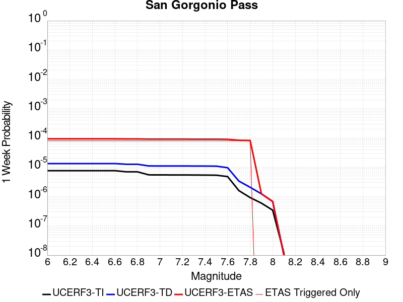 |  | 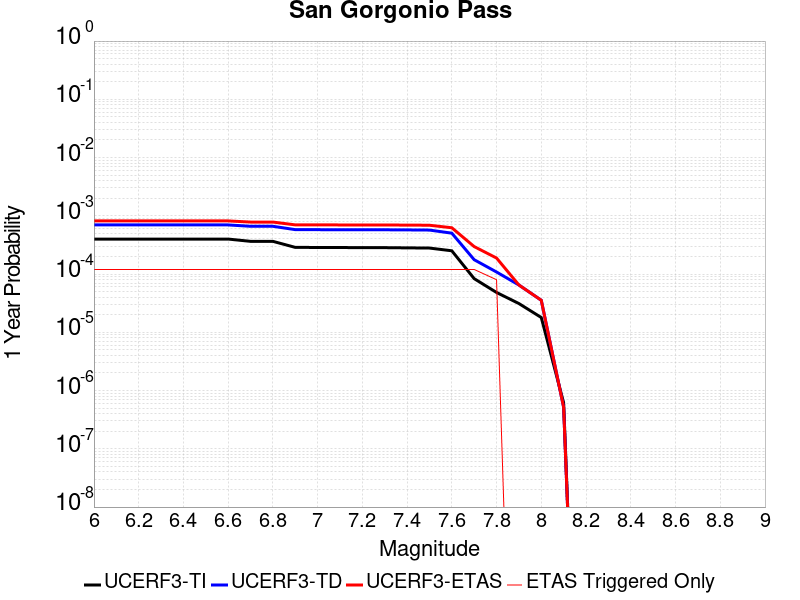 |

| Magnitude | 1 wk TI Prob | 1 wk TD Prob | 1 wk ETAS Prob | 1 wk ETAS/TD Gain | 1 wk ETAS Triggered Only | 1 mo TI Prob | 1 mo TD Prob | 1 mo ETAS Prob | 1 mo ETAS/TD Gain | 1 mo ETAS Triggered Only | 1 yr TI Prob | 1 yr TD Prob | 1 yr ETAS Prob | 1 yr ETAS/TD Gain | 1 yr ETAS Triggered Only |
|-----|-----|-----|-----|-----|-----|-----|-----|-----|-----|-----|-----|-----|-----|-----|-----|
| 6.0 | 7.644328E-6 | 1.3367909E-5 | 9.336684E-5 | 6.984401 | 8.0E-5 | 3.2760996E-5 | 5.7289828E-5 | 1.3728524E-4 | 2.3963284 | 8.0E-5 | 3.987921E-4 | 6.9728907E-4 | 8.1720535E-4 | 1.171975 | 1.2E-4 |
| 6.1 | 7.644328E-6 | 1.3367909E-5 | 9.336684E-5 | 6.984401 | 8.0E-5 | 3.2760996E-5 | 5.7289828E-5 | 1.3728524E-4 | 2.3963284 | 8.0E-5 | 3.987921E-4 | 6.9728907E-4 | 8.1720535E-4 | 1.171975 | 1.2E-4 |
| 6.2 | 7.644328E-6 | 1.3367909E-5 | 9.336684E-5 | 6.984401 | 8.0E-5 | 3.2760996E-5 | 5.7289828E-5 | 1.3728524E-4 | 2.3963284 | 8.0E-5 | 3.987921E-4 | 6.9728907E-4 | 8.1720535E-4 | 1.171975 | 1.2E-4 |
| 6.3 | 7.644328E-6 | 1.3367909E-5 | 9.336684E-5 | 6.984401 | 8.0E-5 | 3.2760996E-5 | 5.7289828E-5 | 1.3728524E-4 | 2.3963284 | 8.0E-5 | 3.987921E-4 | 6.9728907E-4 | 8.1720535E-4 | 1.171975 | 1.2E-4 |
| 6.4 | 7.644328E-6 | 1.3367909E-5 | 9.336684E-5 | 6.984401 | 8.0E-5 | 3.2760996E-5 | 5.7289828E-5 | 1.3728524E-4 | 2.3963284 | 8.0E-5 | 3.987921E-4 | 6.9728907E-4 | 8.1720535E-4 | 1.171975 | 1.2E-4 |
| 6.5 | 7.644328E-6 | 1.3367909E-5 | 9.336684E-5 | 6.984401 | 8.0E-5 | 3.2760996E-5 | 5.7289828E-5 | 1.3728524E-4 | 2.3963284 | 8.0E-5 | 3.987921E-4 | 6.9728907E-4 | 8.1720535E-4 | 1.171975 | 1.2E-4 |
| 6.6 | 7.644328E-6 | 1.3367909E-5 | 9.336684E-5 | 6.984401 | 8.0E-5 | 3.2760996E-5 | 5.7289828E-5 | 1.3728524E-4 | 2.3963284 | 8.0E-5 | 3.987921E-4 | 6.9728907E-4 | 8.1720535E-4 | 1.171975 | 1.2E-4 |
| 6.7 | 6.987586E-6 | 1.2672042E-5 | 9.267103E-5 | 7.31303 | 8.0E-5 | 2.9946454E-5 | 5.430767E-5 | 1.3430332E-4 | 2.4730084 | 8.0E-5 | 3.645371E-4 | 6.6100346E-4 | 7.809241E-4 | 1.1814221 | 1.2E-4 |
| 6.8 | 6.987586E-6 | 1.2672042E-5 | 9.267103E-5 | 7.31303 | 8.0E-5 | 2.9946454E-5 | 5.430767E-5 | 1.3430332E-4 | 2.4730084 | 8.0E-5 | 3.645371E-4 | 6.6100346E-4 | 7.809241E-4 | 1.1814221 | 1.2E-4 |
| 6.9 | 5.504702E-6 | 1.11025965E-5 | 9.110171E-5 | 8.205441 | 8.0E-5 | 2.3591367E-5 | 4.7581718E-5 | 1.275779E-4 | 2.681238 | 8.0E-5 | 2.8718702E-4 | 5.7915854E-4 | 6.99089E-4 | 1.2070771 | 1.2E-4 |
| 7.0 | 5.4825764E-6 | 1.1078932E-5 | 9.107804E-5 | 8.220833 | 8.0E-5 | 2.3496545E-5 | 4.7480302E-5 | 1.2747651E-4 | 2.6848292 | 8.0E-5 | 2.8603288E-4 | 5.779245E-4 | 6.978551E-4 | 1.2075197 | 1.2E-4 |
| 7.1 | 5.4692787E-6 | 1.1064639E-5 | 9.1063754E-5 | 8.230161 | 8.0E-5 | 2.3439556E-5 | 4.7419046E-5 | 1.2741526E-4 | 2.6870058 | 8.0E-5 | 2.8533922E-4 | 5.771791E-4 | 6.971098E-4 | 1.2077878 | 1.2E-4 |
| 7.2 | 5.453661E-6 | 1.104766E-5 | 9.104678E-5 | 8.241272 | 8.0E-5 | 2.3372622E-5 | 4.7346286E-5 | 1.273425E-4 | 2.6895986 | 8.0E-5 | 2.8452452E-4 | 5.762936E-4 | 6.962245E-4 | 1.2081072 | 1.2E-4 |
| 7.3 | 5.4422303E-6 | 1.10345745E-5 | 9.103369E-5 | 8.24986 | 8.0E-5 | 2.3323635E-5 | 4.7290207E-5 | 1.2728642E-4 | 2.6916022 | 8.0E-5 | 2.8392827E-4 | 5.7561125E-4 | 6.955422E-4 | 1.208354 | 1.2E-4 |
| 7.4 | 5.398595E-6 | 1.0981908E-5 | 9.098103E-5 | 8.284628 | 8.0E-5 | 2.313663E-5 | 4.7064503E-5 | 1.2706073E-4 | 2.699715 | 8.0E-5 | 2.8165206E-4 | 5.728648E-4 | 6.92796E-4 | 1.2093536 | 1.2E-4 |
| 7.5 | 5.3578788E-6 | 1.0908337E-5 | 9.0907466E-5 | 8.33376 | 8.0E-5 | 2.2962136E-5 | 4.6749206E-5 | 1.2674546E-4 | 2.711179 | 8.0E-5 | 2.7952815E-4 | 5.69028E-4 | 6.889597E-4 | 1.210766 | 1.2E-4 |
| 7.6 | 4.8091474E-6 | 9.653645E-6 | 8.965287E-5 | 9.286945 | 8.0E-5 | 2.0610469E-5 | 4.1372135E-5 | 1.2136883E-4 | 2.9335885 | 8.0E-5 | 2.5090357E-4 | 5.035942E-4 | 6.235338E-4 | 1.238167 | 1.2E-4 |
| 7.7 | 1.5991155E-6 | 3.379842E-6 | 8.337957E-5 | 24.669666 | 8.0E-5 | 6.853334E-6 | 1.4484958E-5 | 9.4483796E-5 | 6.5228906 | 8.0E-5 | 8.343615E-5 | 1.7634034E-4 | 2.963192E-4 | 1.6803823 | 1.2E-4 |
| 7.8 | 9.258398E-7 | 2.0781015E-6 | 8.207794E-5 | 39.496593 | 8.0E-5 | 3.967879E-6 | 8.90612E-6 | 8.8905406E-5 | 9.982508 | 8.0E-5 | 4.8307855E-5 | 1.08426626E-4 | 1.8841795E-4 | 1.7377461 | 8.0E-5 |
| 7.9 | 5.975575E-7 | 1.2436711E-6 | 1.2436711E-6 | 1.0 | 0.0 | 2.5609581E-6 | 5.3300087E-6 | 5.3300087E-6 | 1.0 | 0.0 | 3.117922E-5 | 6.489093E-5 | 6.489093E-5 | 1.0 | 0.0 |
| 8.0 | 3.4413725E-7 | 6.801386E-7 | 6.801386E-7 | 1.0 | 0.0 | 1.4748731E-6 | 2.9148766E-6 | 2.9148766E-6 | 1.0 | 0.0 | 1.7956432E-5 | 3.548805E-5 | 3.548805E-5 | 1.0 | 0.0 |
| 8.1 | 1.1787731E-8 | 9.854372E-9 | 9.854372E-9 | 1.0 | 0.0 | 5.0518846E-8 | 4.2233022E-8 | 4.2233022E-8 | 1.0 | 0.0 | 6.1506677E-7 | 5.14187E-7 | 5.14187E-7 | 1.0 | 0.0 |

## San Andreas (North Branch Mill Creek)
*[(top)](#table-of-contents)*

| 1 Week | 1 Month | 1 Year |
|-----|-----|-----|
| 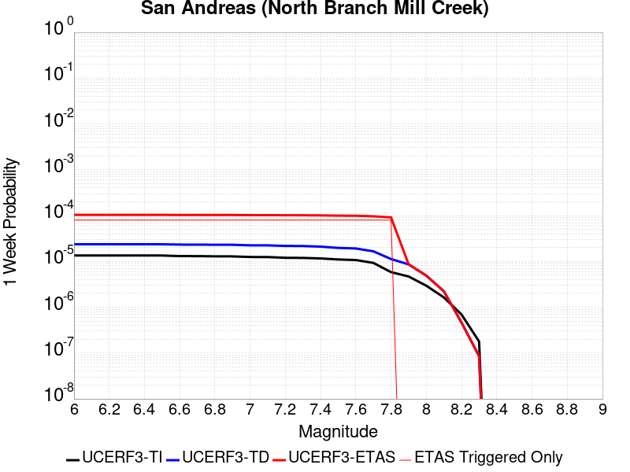 |  | 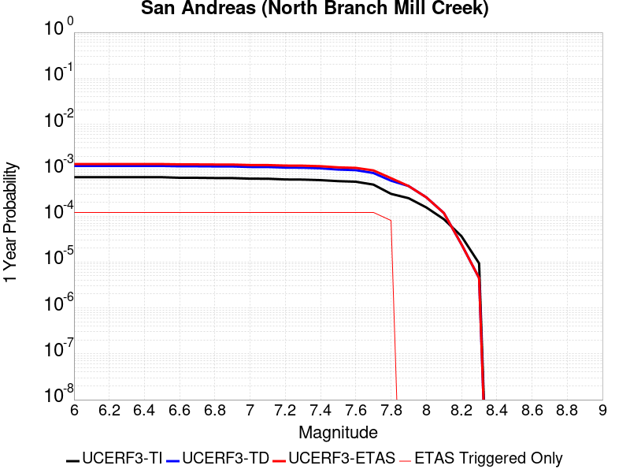 |

| Magnitude | 1 wk TI Prob | 1 wk TD Prob | 1 wk ETAS Prob | 1 wk ETAS/TD Gain | 1 wk ETAS Triggered Only | 1 mo TI Prob | 1 mo TD Prob | 1 mo ETAS Prob | 1 mo ETAS/TD Gain | 1 mo ETAS Triggered Only | 1 yr TI Prob | 1 yr TD Prob | 1 yr ETAS Prob | 1 yr ETAS/TD Gain | 1 yr ETAS Triggered Only |
|-----|-----|-----|-----|-----|-----|-----|-----|-----|-----|-----|-----|-----|-----|-----|-----|
| 6.0 | 1.3461156E-5 | 2.3679182E-5 | 1.0367729E-4 | 4.378415 | 8.0E-5 | 5.7689394E-5 | 1.0147828E-4 | 1.8147017E-4 | 1.7882661 | 8.0E-5 | 7.02142E-4 | 0.0012348011 | 0.001354653 | 1.0970616 | 1.2E-4 |
| 6.1 | 1.3461156E-5 | 2.3679182E-5 | 1.0367729E-4 | 4.378415 | 8.0E-5 | 5.7689394E-5 | 1.0147828E-4 | 1.8147017E-4 | 1.7882661 | 8.0E-5 | 7.02142E-4 | 0.0012348011 | 0.001354653 | 1.0970616 | 1.2E-4 |
| 6.2 | 1.3461156E-5 | 2.3679182E-5 | 1.0367729E-4 | 4.378415 | 8.0E-5 | 5.7689394E-5 | 1.0147828E-4 | 1.8147017E-4 | 1.7882661 | 8.0E-5 | 7.02142E-4 | 0.0012348011 | 0.001354653 | 1.0970616 | 1.2E-4 |
| 6.3 | 1.3461156E-5 | 2.3679182E-5 | 1.0367729E-4 | 4.378415 | 8.0E-5 | 5.7689394E-5 | 1.0147828E-4 | 1.8147017E-4 | 1.7882661 | 8.0E-5 | 7.02142E-4 | 0.0012348011 | 0.001354653 | 1.0970616 | 1.2E-4 |
| 6.4 | 1.3461156E-5 | 2.3679182E-5 | 1.0367729E-4 | 4.378415 | 8.0E-5 | 5.7689394E-5 | 1.0147828E-4 | 1.8147017E-4 | 1.7882661 | 8.0E-5 | 7.02142E-4 | 0.0012348011 | 0.001354653 | 1.0970616 | 1.2E-4 |
| 6.5 | 1.3450706E-5 | 2.366814E-5 | 1.0366624E-4 | 4.379991 | 8.0E-5 | 5.764461E-5 | 1.0143096E-4 | 1.8142285E-4 | 1.7886338 | 8.0E-5 | 7.0159714E-4 | 0.0012342257 | 0.0013540776 | 1.0971069 | 1.2E-4 |
| 6.6 | 1.3074523E-5 | 2.328236E-5 | 1.032805E-4 | 4.4359975 | 8.0E-5 | 5.6032466E-5 | 9.9777746E-5 | 1.7976976E-4 | 1.801702 | 8.0E-5 | 6.8198174E-4 | 0.0012141204 | 0.0013339747 | 1.098717 | 1.2E-4 |
| 6.7 | 1.3050216E-5 | 2.3257642E-5 | 1.03255785E-4 | 4.4396496 | 8.0E-5 | 5.59283E-5 | 9.967182E-5 | 1.7966385E-4 | 1.802554 | 8.0E-5 | 6.8071426E-4 | 0.0012128322 | 0.0013326866 | 1.098822 | 1.2E-4 |
| 6.8 | 1.29049395E-5 | 2.3106015E-5 | 1.0310417E-4 | 4.462222 | 8.0E-5 | 5.530571E-5 | 9.9022036E-5 | 1.7901411E-4 | 1.807821 | 8.0E-5 | 6.73139E-4 | 0.0012049298 | 0.0013247852 | 1.0994709 | 1.2E-4 |
| 6.9 | 1.2867369E-5 | 2.306539E-5 | 1.0306355E-4 | 4.46832 | 8.0E-5 | 5.51447E-5 | 9.8847944E-5 | 1.7884004E-4 | 1.8092439 | 8.0E-5 | 6.711799E-4 | 0.0012028125 | 0.0013226682 | 1.0996462 | 1.2E-4 |
| 7.0 | 1.2495996E-5 | 2.2464183E-5 | 1.02462385E-4 | 4.5611444 | 8.0E-5 | 5.3553173E-5 | 9.6271535E-5 | 1.7626383E-4 | 1.8309029 | 8.0E-5 | 6.518148E-4 | 0.0011714785 | 0.001291338 | 1.1023147 | 1.2E-4 |
| 7.1 | 1.2452067E-5 | 2.2409202E-5 | 1.0240741E-4 | 4.569882 | 8.0E-5 | 5.3364907E-5 | 9.603592E-5 | 1.7602823E-4 | 1.8329417 | 8.0E-5 | 6.4952404E-4 | 0.001168613 | 0.0012884728 | 1.1025659 | 1.2E-4 |
| 7.2 | 1.2002777E-5 | 2.1786782E-5 | 1.0178504E-4 | 4.671871 | 8.0E-5 | 5.143946E-5 | 9.3368595E-5 | 1.7336113E-4 | 1.8567392 | 8.0E-5 | 6.2609545E-4 | 0.0011361726 | 0.0012560362 | 1.1054977 | 1.2E-4 |
| 7.3 | 1.1923425E-5 | 2.1656399E-5 | 1.0165467E-4 | 4.6939783 | 8.0E-5 | 5.109939E-5 | 9.280985E-5 | 1.7280242E-4 | 1.8618975 | 8.0E-5 | 6.219575E-4 | 0.0011293768 | 0.0012492413 | 1.1061333 | 1.2E-4 |
| 7.4 | 1.16105175E-5 | 2.1028349E-5 | 1.01026664E-4 | 4.804308 | 8.0E-5 | 4.975841E-5 | 9.0118396E-5 | 1.7011119E-4 | 1.8876411 | 8.0E-5 | 6.0564023E-4 | 0.0010966419 | 0.0012165102 | 1.109305 | 1.2E-4 |
| 7.5 | 1.1037265E-5 | 1.9721652E-5 | 9.972008E-5 | 5.0563755 | 8.0E-5 | 4.7301706E-5 | 8.451864E-5 | 1.6451188E-4 | 1.9464568 | 8.0E-5 | 5.757461E-4 | 0.0010285309 | 0.0011484075 | 1.1165513 | 1.2E-4 |
| 7.6 | 1.0720915E-5 | 1.9161336E-5 | 9.9159806E-5 | 5.174994 | 8.0E-5 | 4.5945973E-5 | 8.211744E-5 | 1.6211087E-4 | 1.9741344 | 8.0E-5 | 5.592486E-4 | 9.993234E-4 | 0.0011192035 | 1.1199613 | 1.2E-4 |
| 7.7 | 9.276279E-6 | 1.6599204E-5 | 9.6597876E-5 | 5.819428 | 8.0E-5 | 3.9754876E-5 | 7.113752E-5 | 1.5113183E-4 | 2.1245024 | 8.0E-5 | 4.839081E-4 | 8.657568E-4 | 9.856529E-4 | 1.1384871 | 1.2E-4 |
| 7.8 | 5.8346777E-6 | 1.1282931E-5 | 9.1282025E-5 | 8.090276 | 8.0E-5 | 2.5005522E-5 | 4.8354523E-5 | 1.2835066E-4 | 2.654367 | 8.0E-5 | 3.043997E-4 | 5.8855745E-4 | 6.685103E-4 | 1.1358455 | 8.0E-5 |
| 7.9 | 4.690204E-6 | 8.6155715E-6 | 8.6155715E-6 | 1.0 | 0.0 | 2.0100719E-5 | 3.6923357E-5 | 3.6923357E-5 | 1.0 | 0.0 | 2.4469878E-4 | 4.4944923E-4 | 4.4944923E-4 | 1.0 | 0.0 |
| 8.0 | 2.9570454E-6 | 4.9120426E-6 | 4.9120426E-6 | 1.0 | 0.0 | 1.267299E-5 | 2.105144E-5 | 2.105144E-5 | 1.0 | 0.0 | 1.5428272E-4 | 2.562712E-4 | 2.562712E-4 | 1.0 | 0.0 |
| 8.1 | 1.6376824E-6 | 2.2310655E-6 | 2.2310655E-6 | 1.0 | 0.0 | 7.01862E-6 | 9.561673E-6 | 9.561673E-6 | 1.0 | 0.0 | 8.544835E-5 | 1.1640717E-4 | 1.1640717E-4 | 1.0 | 0.0 |
| 8.2 | 6.9631557E-7 | 4.641532E-7 | 4.641532E-7 | 1.0 | 0.0 | 2.984206E-6 | 1.9892263E-6 | 1.9892263E-6 | 1.0 | 0.0 | 3.63321E-5 | 2.4218563E-5 | 2.4218563E-5 | 1.0 | 0.0 |
| 8.3 | 1.7876137E-7 | 8.5759865E-8 | 8.5759865E-8 | 1.0 | 0.0 | 7.661199E-7 | 3.675422E-7 | 3.675422E-7 | 1.0 | 0.0 | 9.32747E-6 | 4.4748176E-6 | 4.4748176E-6 | 1.0 | 0.0 |

## Pleito
*[(top)](#table-of-contents)*

| 1 Week | 1 Month | 1 Year |
|-----|-----|-----|
| 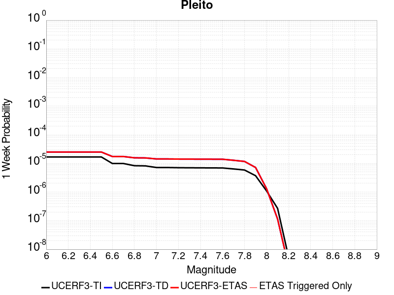 |  |  |

| Magnitude | 1 wk TI Prob | 1 wk TD Prob | 1 wk ETAS Prob | 1 wk ETAS/TD Gain | 1 wk ETAS Triggered Only | 1 mo TI Prob | 1 mo TD Prob | 1 mo ETAS Prob | 1 mo ETAS/TD Gain | 1 mo ETAS Triggered Only | 1 yr TI Prob | 1 yr TD Prob | 1 yr ETAS Prob | 1 yr ETAS/TD Gain | 1 yr ETAS Triggered Only |
|-----|-----|-----|-----|-----|-----|-----|-----|-----|-----|-----|-----|-----|-----|-----|-----|
| 6.0 | 1.6763008E-5 | 2.4935694E-5 | 2.4935694E-5 | 1.0 | 0.0 | 7.183948E-5 | 1.0686329E-4 | 1.0686329E-4 | 1.0 | 0.0 | 8.742947E-4 | 0.0013003562 | 0.0014202001 | 1.0921624 | 1.2E-4 |
| 6.1 | 1.6763008E-5 | 2.4935694E-5 | 2.4935694E-5 | 1.0 | 0.0 | 7.183948E-5 | 1.0686329E-4 | 1.0686329E-4 | 1.0 | 0.0 | 8.742947E-4 | 0.0013003562 | 0.0014202001 | 1.0921624 | 1.2E-4 |
| 6.2 | 1.6763008E-5 | 2.4935694E-5 | 2.4935694E-5 | 1.0 | 0.0 | 7.183948E-5 | 1.0686329E-4 | 1.0686329E-4 | 1.0 | 0.0 | 8.742947E-4 | 0.0013003562 | 0.0014202001 | 1.0921624 | 1.2E-4 |
| 6.3 | 1.6763008E-5 | 2.4935694E-5 | 2.4935694E-5 | 1.0 | 0.0 | 7.183948E-5 | 1.0686329E-4 | 1.0686329E-4 | 1.0 | 0.0 | 8.742947E-4 | 0.0013003562 | 0.0014202001 | 1.0921624 | 1.2E-4 |
| 6.4 | 1.6763008E-5 | 2.4935694E-5 | 2.4935694E-5 | 1.0 | 0.0 | 7.183948E-5 | 1.0686329E-4 | 1.0686329E-4 | 1.0 | 0.0 | 8.742947E-4 | 0.0013003562 | 0.0014202001 | 1.0921624 | 1.2E-4 |
| 6.5 | 1.6763008E-5 | 2.4935694E-5 | 2.4935694E-5 | 1.0 | 0.0 | 7.183948E-5 | 1.0686329E-4 | 1.0686329E-4 | 1.0 | 0.0 | 8.742947E-4 | 0.0013003562 | 0.0014202001 | 1.0921624 | 1.2E-4 |
| 6.6 | 9.910213E-6 | 1.738388E-5 | 1.738388E-5 | 1.0 | 0.0 | 4.247165E-5 | 7.450023E-5 | 7.450023E-5 | 1.0 | 0.0 | 5.169696E-4 | 9.066666E-4 | 9.466304E-4 | 1.0440776 | 4.0E-5 |
| 6.7 | 9.910213E-6 | 1.738388E-5 | 1.738388E-5 | 1.0 | 0.0 | 4.247165E-5 | 7.450023E-5 | 7.450023E-5 | 1.0 | 0.0 | 5.169696E-4 | 9.066666E-4 | 9.466304E-4 | 1.0440776 | 4.0E-5 |
| 6.8 | 8.300162E-6 | 1.564301E-5 | 1.564301E-5 | 1.0 | 0.0 | 3.557164E-5 | 6.703976E-5 | 6.703976E-5 | 1.0 | 0.0 | 4.3299864E-4 | 8.159049E-4 | 8.5587223E-4 | 1.0489854 | 4.0E-5 |
| 6.9 | 8.183114E-6 | 1.551415E-5 | 1.551415E-5 | 1.0 | 0.0 | 3.5070017E-5 | 6.6487526E-5 | 6.6487526E-5 | 1.0 | 0.0 | 4.2689382E-4 | 8.0918643E-4 | 8.49154E-4 | 1.0493923 | 4.0E-5 |
| 7.0 | 7.1748823E-6 | 1.4299022E-5 | 1.4299022E-5 | 1.0 | 0.0 | 3.0749135E-5 | 6.128009E-5 | 6.128009E-5 | 1.0 | 0.0 | 3.743064E-4 | 7.458302E-4 | 7.8580034E-4 | 1.0535915 | 4.0E-5 |
| 7.1 | 7.1671807E-6 | 1.4289369E-5 | 1.4289369E-5 | 1.0 | 0.0 | 3.0716128E-5 | 6.1238716E-5 | 6.1238716E-5 | 1.0 | 0.0 | 3.7390468E-4 | 7.4532686E-4 | 7.852971E-4 | 1.0536277 | 4.0E-5 |
| 7.2 | 7.0649667E-6 | 1.4136105E-5 | 1.4136105E-5 | 1.0 | 0.0 | 3.0278077E-5 | 6.05819E-5 | 6.05819E-5 | 1.0 | 0.0 | 3.6857324E-4 | 7.373356E-4 | 7.773061E-4 | 1.0542094 | 4.0E-5 |
| 7.3 | 7.02082E-6 | 1.4079238E-5 | 1.4079238E-5 | 1.0 | 0.0 | 3.008888E-5 | 6.03382E-5 | 6.03382E-5 | 1.0 | 0.0 | 3.6627054E-4 | 7.343705E-4 | 7.743411E-4 | 1.0544285 | 4.0E-5 |
| 7.4 | 6.987146E-6 | 1.4038616E-5 | 1.4038616E-5 | 1.0 | 0.0 | 2.9944567E-5 | 6.0164115E-5 | 6.0164115E-5 | 1.0 | 0.0 | 3.6451413E-4 | 7.3225243E-4 | 7.7222317E-4 | 1.0545859 | 4.0E-5 |
| 7.5 | 6.9494554E-6 | 1.3995384E-5 | 1.3995384E-5 | 1.0 | 0.0 | 2.9783041E-5 | 5.997884E-5 | 5.997884E-5 | 1.0 | 0.0 | 3.625482E-4 | 7.299982E-4 | 7.69969E-4 | 1.0547546 | 4.0E-5 |
| 7.6 | 6.92694E-6 | 1.3954241E-5 | 1.3954241E-5 | 1.0 | 0.0 | 2.9686547E-5 | 5.9802518E-5 | 5.9802518E-5 | 1.0 | 0.0 | 3.6137376E-4 | 7.27853E-4 | 7.6782383E-4 | 1.0549161 | 4.0E-5 |
| 7.7 | 6.395867E-6 | 1.2826297E-5 | 1.2826297E-5 | 1.0 | 0.0 | 2.741057E-5 | 5.496869E-5 | 5.496869E-5 | 1.0 | 0.0 | 3.336726E-4 | 6.690386E-4 | 7.0901186E-4 | 1.0597473 | 4.0E-5 |
| 7.8 | 5.8664327E-6 | 1.1680238E-5 | 1.1680238E-5 | 1.0 | 0.0 | 2.5141611E-5 | 5.00572E-5 | 5.00572E-5 | 1.0 | 0.0 | 3.060561E-4 | 6.0927623E-4 | 6.4925186E-4 | 1.0656117 | 4.0E-5 |
| 7.9 | 3.7167474E-6 | 7.2014245E-6 | 7.2014245E-6 | 1.0 | 0.0 | 1.592882E-5 | 3.0862884E-5 | 3.0862884E-5 | 1.0 | 0.0 | 1.9391612E-4 | 3.75691E-4 | 3.75691E-4 | 1.0 | 0.0 |
| 8.0 | 1.0903841E-6 | 1.3071021E-6 | 1.3071021E-6 | 1.0 | 0.0 | 4.6730665E-6 | 5.601854E-6 | 5.601854E-6 | 1.0 | 0.0 | 5.68931E-5 | 6.8200454E-5 | 6.8200454E-5 | 1.0 | 0.0 |
| 8.1 | 2.6894583E-7 | 1.13801775E-7 | 1.13801775E-7 | 1.0 | 0.0 | 1.1526245E-6 | 4.8772176E-7 | 4.8772176E-7 | 1.0 | 0.0 | 1.4033113E-5 | 5.937997E-6 | 5.937997E-6 | 1.0 | 0.0 |
| 8.2 | 5.2967013E-9 | 2.5342395E-9 | 2.5342395E-9 | 1.0 | 0.0 | 2.2700148E-8 | 1.0861028E-8 | 1.0861028E-8 | 1.0 | 0.0 | 2.7637427E-7 | 1.32233E-7 | 1.32233E-7 | 1.0 | 0.0 |

## Garlic Springs
*[(top)](#table-of-contents)*

| 1 Week | 1 Month | 1 Year |
|-----|-----|-----|
| 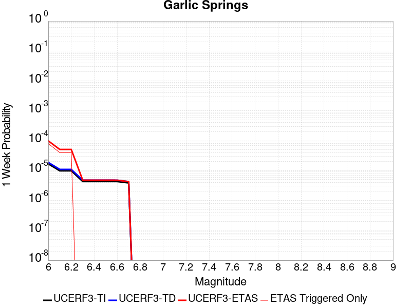 | 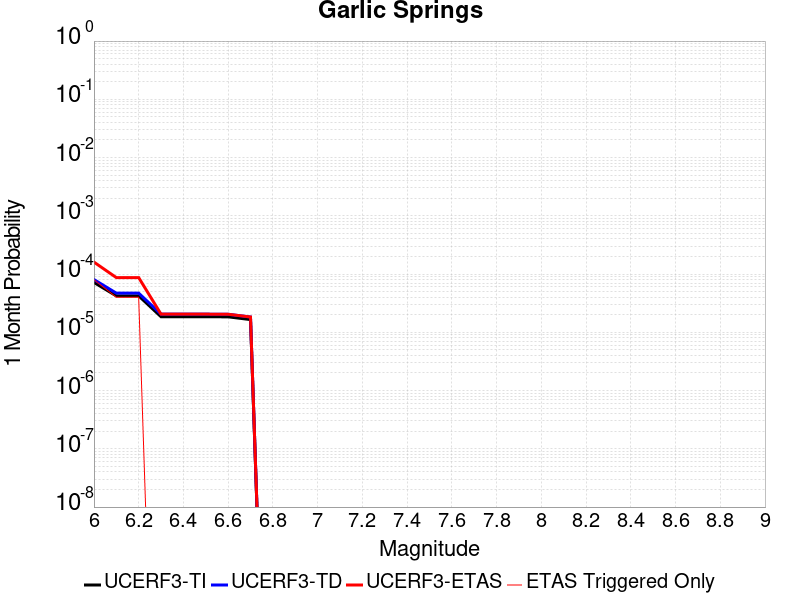 |  |

| Magnitude | 1 wk TI Prob | 1 wk TD Prob | 1 wk ETAS Prob | 1 wk ETAS/TD Gain | 1 wk ETAS Triggered Only | 1 mo TI Prob | 1 mo TD Prob | 1 mo ETAS Prob | 1 mo ETAS/TD Gain | 1 mo ETAS Triggered Only | 1 yr TI Prob | 1 yr TD Prob | 1 yr ETAS Prob | 1 yr ETAS/TD Gain | 1 yr ETAS Triggered Only |
|-----|-----|-----|-----|-----|-----|-----|-----|-----|-----|-----|-----|-----|-----|-----|-----|
| 6.0 | 1.6760017E-5 | 1.8784498E-5 | 9.8783E-5 | 5.258751 | 8.0E-5 | 7.182667E-5 | 8.0503174E-5 | 1.6049673E-4 | 1.9936696 | 8.0E-5 | 8.7413884E-4 | 9.798029E-4 | 0.0010996853 | 1.1223537 | 1.2E-4 |
| 6.1 | 9.852767E-6 | 1.097782E-5 | 5.097738E-5 | 4.6436706 | 4.0E-5 | 4.222546E-5 | 4.7047353E-5 | 8.704547E-5 | 1.8501673 | 4.0E-5 | 5.139737E-4 | 5.72722E-4 | 6.5267616E-4 | 1.1396039 | 8.0E-5 |
| 6.2 | 9.852767E-6 | 1.097782E-5 | 5.097738E-5 | 4.6436706 | 4.0E-5 | 4.222546E-5 | 4.7047353E-5 | 8.704547E-5 | 1.8501673 | 4.0E-5 | 5.139737E-4 | 5.72722E-4 | 6.5267616E-4 | 1.1396039 | 8.0E-5 |
| 6.3 | 4.3167724E-6 | 4.7797594E-6 | 4.7797594E-6 | 1.0 | 0.0 | 1.8500323E-5 | 2.0484651E-5 | 2.0484651E-5 | 1.0 | 0.0 | 2.2521814E-4 | 2.4939515E-4 | 2.8938515E-4 | 1.160348 | 4.0E-5 |
| 6.4 | 4.3167724E-6 | 4.7797594E-6 | 4.7797594E-6 | 1.0 | 0.0 | 1.8500323E-5 | 2.0484651E-5 | 2.0484651E-5 | 1.0 | 0.0 | 2.2521814E-4 | 2.4939515E-4 | 2.8938515E-4 | 1.160348 | 4.0E-5 |
| 6.5 | 4.3167724E-6 | 4.7797594E-6 | 4.7797594E-6 | 1.0 | 0.0 | 1.8500323E-5 | 2.0484651E-5 | 2.0484651E-5 | 1.0 | 0.0 | 2.2521814E-4 | 2.4939515E-4 | 2.8938515E-4 | 1.160348 | 4.0E-5 |
| 6.6 | 4.301311E-6 | 4.7626213E-6 | 4.7626213E-6 | 1.0 | 0.0 | 1.8434059E-5 | 2.0411206E-5 | 2.0411206E-5 | 1.0 | 0.0 | 2.2441156E-4 | 2.4850114E-4 | 2.884912E-4 | 1.160925 | 4.0E-5 |
| 6.7 | 3.8599724E-6 | 4.272602E-6 | 4.272602E-6 | 1.0 | 0.0 | 1.6542634E-5 | 1.831115E-5 | 1.831115E-5 | 1.0 | 0.0 | 2.0138794E-4 | 2.2293825E-4 | 2.6292933E-4 | 1.1793818 | 4.0E-5 |

## Chino alt 1
*[(top)](#table-of-contents)*

| 1 Week | 1 Month | 1 Year |
|-----|-----|-----|
|  | 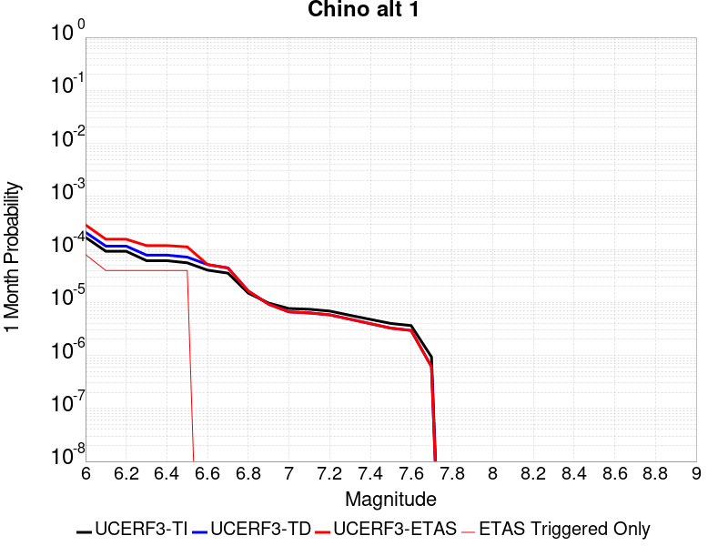 |  |

| Magnitude | 1 wk TI Prob | 1 wk TD Prob | 1 wk ETAS Prob | 1 wk ETAS/TD Gain | 1 wk ETAS Triggered Only | 1 mo TI Prob | 1 mo TD Prob | 1 mo ETAS Prob | 1 mo ETAS/TD Gain | 1 mo ETAS Triggered Only | 1 yr TI Prob | 1 yr TD Prob | 1 yr ETAS Prob | 1 yr ETAS/TD Gain | 1 yr ETAS Triggered Only |
|-----|-----|-----|-----|-----|-----|-----|-----|-----|-----|-----|-----|-----|-----|-----|-----|
| 6.0 | 3.939946E-5 | 4.9004397E-5 | 1.2900047E-4 | 2.6324265 | 8.0E-5 | 1.6884391E-4 | 2.1000468E-4 | 2.899879E-4 | 1.3808639 | 8.0E-5 | 0.0020537362 | 0.002554319 | 0.0026341148 | 1.0312395 | 8.0E-5 |
| 6.1 | 2.1505624E-5 | 2.6917825E-5 | 6.691675E-5 | 2.485964 | 4.0E-5 | 9.2163704E-5 | 1.15357594E-4 | 1.5535297E-4 | 1.3467078 | 4.0E-5 | 0.0011215154 | 0.0014036838 | 0.0014436276 | 1.0284564 | 4.0E-5 |
| 6.2 | 2.1505624E-5 | 2.6917825E-5 | 6.691675E-5 | 2.485964 | 4.0E-5 | 9.2163704E-5 | 1.15357594E-4 | 1.5535297E-4 | 1.3467078 | 4.0E-5 | 0.0011215154 | 0.0014036838 | 0.0014436276 | 1.0284564 | 4.0E-5 |
| 6.3 | 1.4290785E-5 | 1.81977E-5 | 5.8196973E-5 | 3.19804 | 4.0E-5 | 6.1244784E-5 | 7.7988065E-5 | 1.1798494E-4 | 1.512859 | 4.0E-5 | 7.454001E-4 | 9.491364E-4 | 9.890985E-4 | 1.0421035 | 4.0E-5 |
| 6.4 | 1.4290785E-5 | 1.81977E-5 | 5.8196973E-5 | 3.19804 | 4.0E-5 | 6.1244784E-5 | 7.7988065E-5 | 1.1798494E-4 | 1.512859 | 4.0E-5 | 7.454001E-4 | 9.491364E-4 | 9.890985E-4 | 1.0421035 | 4.0E-5 |
| 6.5 | 1.3017944E-5 | 1.668369E-5 | 5.6683024E-5 | 3.397511 | 4.0E-5 | 5.5789995E-5 | 7.149982E-5 | 1.1149696E-4 | 1.559402 | 4.0E-5 | 6.790315E-4 | 8.702065E-4 | 9.1017166E-4 | 1.0459261 | 4.0E-5 |
| 6.6 | 9.470016E-6 | 1.2065467E-5 | 1.2065467E-5 | 1.0 | 0.0 | 4.058515E-5 | 5.170831E-5 | 5.170831E-5 | 1.0 | 0.0 | 4.940122E-4 | 6.294009E-4 | 6.294009E-4 | 1.0 | 0.0 |
| 6.7 | 8.314155E-6 | 1.0425587E-5 | 1.0425587E-5 | 1.0 | 0.0 | 3.5631605E-5 | 4.4680502E-5 | 4.4680502E-5 | 1.0 | 0.0 | 4.3372845E-4 | 5.438817E-4 | 5.438817E-4 | 1.0 | 0.0 |
| 6.8 | 3.4856364E-6 | 3.8184653E-6 | 3.8184653E-6 | 1.0 | 0.0 | 1.4938357E-5 | 1.636476E-5 | 1.636476E-5 | 1.0 | 0.0 | 1.8185932E-4 | 1.9922481E-4 | 1.9922481E-4 | 1.0 | 0.0 |
| 6.9 | 2.2645952E-6 | 2.1561063E-6 | 2.1561063E-6 | 1.0 | 0.0 | 9.705372E-6 | 9.240424E-6 | 9.240424E-6 | 1.0 | 0.0 | 1.18156495E-4 | 1.1249657E-4 | 1.1249657E-4 | 1.0 | 0.0 |
| 7.0 | 1.7864003E-6 | 1.545482E-6 | 1.545482E-6 | 1.0 | 0.0 | 7.655979E-6 | 6.623478E-6 | 6.623478E-6 | 1.0 | 0.0 | 9.3207556E-5 | 8.063792E-5 | 8.063792E-5 | 1.0 | 0.0 |
| 7.1 | 1.7315456E-6 | 1.4756972E-6 | 1.4756972E-6 | 1.0 | 0.0 | 7.420889E-6 | 6.3244015E-6 | 6.3244015E-6 | 1.0 | 0.0 | 9.034557E-5 | 7.699693E-5 | 7.699693E-5 | 1.0 | 0.0 |
| 7.2 | 1.6008337E-6 | 1.3596422E-6 | 1.3596422E-6 | 1.0 | 0.0 | 6.860698E-6 | 5.8270252E-6 | 5.8270252E-6 | 1.0 | 0.0 | 8.352579E-5 | 7.094178E-5 | 7.094178E-5 | 1.0 | 0.0 |
| 7.3 | 1.3320939E-6 | 1.1237295E-6 | 1.1237295E-6 | 1.0 | 0.0 | 5.7089615E-6 | 4.815975E-6 | 4.815975E-6 | 1.0 | 0.0 | 6.9504385E-5 | 5.8632966E-5 | 5.8632966E-5 | 1.0 | 0.0 |
| 7.4 | 1.114294E-6 | 9.2541916E-7 | 9.2541916E-7 | 1.0 | 0.0 | 4.775537E-6 | 3.9660763E-6 | 3.9660763E-6 | 1.0 | 0.0 | 5.8140613E-5 | 4.8285947E-5 | 4.8285947E-5 | 1.0 | 0.0 |
| 7.5 | 9.354081E-7 | 7.638138E-7 | 7.638138E-7 | 1.0 | 0.0 | 4.0088858E-6 | 3.2734836E-6 | 3.2734836E-6 | 1.0 | 0.0 | 4.8807087E-5 | 3.985397E-5 | 3.985397E-5 | 1.0 | 0.0 |
| 7.6 | 8.521771E-7 | 6.8946184E-7 | 6.8946184E-7 | 1.0 | 0.0 | 3.6521824E-6 | 2.9548335E-6 | 2.9548335E-6 | 1.0 | 0.0 | 4.4464414E-5 | 3.5974535E-5 | 3.5974535E-5 | 1.0 | 0.0 |
| 7.7 | 2.1803626E-7 | 1.4221726E-7 | 1.4221726E-7 | 1.0 | 0.0 | 9.344408E-7 | 6.095024E-7 | 6.095024E-7 | 1.0 | 0.0 | 1.1376757E-5 | 7.4206764E-6 | 7.4206764E-6 | 1.0 | 0.0 |

## San Jacinto (Borrego)
*[(top)](#table-of-contents)*

| 1 Week | 1 Month | 1 Year |
|-----|-----|-----|
| 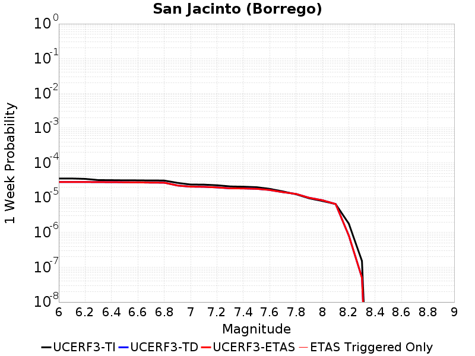 |  | 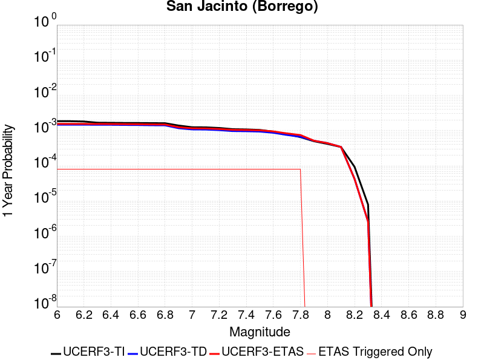 |

| Magnitude | 1 wk TI Prob | 1 wk TD Prob | 1 wk ETAS Prob | 1 wk ETAS/TD Gain | 1 wk ETAS Triggered Only | 1 mo TI Prob | 1 mo TD Prob | 1 mo ETAS Prob | 1 mo ETAS/TD Gain | 1 mo ETAS Triggered Only | 1 yr TI Prob | 1 yr TD Prob | 1 yr ETAS Prob | 1 yr ETAS/TD Gain | 1 yr ETAS Triggered Only |
|-----|-----|-----|-----|-----|-----|-----|-----|-----|-----|-----|-----|-----|-----|-----|-----|
| 6.0 | 3.543992E-5 | 2.8126837E-5 | 2.8126837E-5 | 1.0 | 0.0 | 1.5187653E-4 | 1.2053809E-4 | 1.6053327E-4 | 1.3318053 | 4.0E-5 | 0.0018475284 | 0.0014665757 | 0.0015464582 | 1.0544689 | 8.0E-5 |
| 6.1 | 3.542281E-5 | 2.8126837E-5 | 2.8126837E-5 | 1.0 | 0.0 | 1.5180321E-4 | 1.2053809E-4 | 1.6053327E-4 | 1.3318053 | 4.0E-5 | 0.0018466372 | 0.0014665757 | 0.0015464582 | 1.0544689 | 8.0E-5 |
| 6.2 | 3.4688688E-5 | 2.8126837E-5 | 2.8126837E-5 | 1.0 | 0.0 | 1.4865733E-4 | 1.2053808E-4 | 1.6053327E-4 | 1.3318053 | 4.0E-5 | 0.0018084005 | 0.0014665755 | 0.0015464582 | 1.0544689 | 8.0E-5 |
| 6.3 | 3.2087122E-5 | 2.7972088E-5 | 2.7972088E-5 | 1.0 | 0.0 | 1.3750899E-4 | 1.1987494E-4 | 1.5987015E-4 | 1.333641 | 4.0E-5 | 0.0016728862 | 0.0014585126 | 0.0015383959 | 1.0547704 | 8.0E-5 |
| 6.4 | 3.1828724E-5 | 2.793903E-5 | 2.793903E-5 | 1.0 | 0.0 | 1.364017E-4 | 1.1973327E-4 | 1.5972849E-4 | 1.3340359 | 4.0E-5 | 0.0016594254 | 0.00145679 | 0.0015366735 | 1.0548352 | 8.0E-5 |
| 6.5 | 3.1563577E-5 | 2.7678178E-5 | 2.7678178E-5 | 1.0 | 0.0 | 1.3526545E-4 | 1.1861543E-4 | 1.586107E-4 | 1.3371842 | 4.0E-5 | 0.0016456128 | 0.0014431985 | 0.0015230831 | 1.0553524 | 8.0E-5 |
| 6.6 | 3.1467625E-5 | 2.75222E-5 | 2.75222E-5 | 1.0 | 0.0 | 1.3485427E-4 | 1.1794702E-4 | 1.579423E-4 | 1.3390954 | 4.0E-5 | 0.0016406142 | 0.0014350713 | 0.0015149565 | 1.0556663 | 8.0E-5 |
| 6.7 | 3.1223695E-5 | 2.7139871E-5 | 2.7139871E-5 | 1.0 | 0.0 | 1.3380898E-4 | 1.1630862E-4 | 1.5630397E-4 | 1.3438725 | 4.0E-5 | 0.0016279068 | 0.0014151498 | 0.0014950366 | 1.0564511 | 8.0E-5 |
| 6.8 | 3.1015585E-5 | 2.69605E-5 | 2.69605E-5 | 1.0 | 0.0 | 1.3291716E-4 | 1.1553995E-4 | 1.5553534E-4 | 1.3461605 | 4.0E-5 | 0.001617065 | 0.0014058034 | 0.0014856909 | 1.056827 | 8.0E-5 |
| 6.9 | 2.6641965E-5 | 2.2371234E-5 | 2.2371234E-5 | 1.0 | 0.0 | 1.1417485E-4 | 9.587322E-5 | 1.3586938E-4 | 1.4171777 | 4.0E-5 | 0.0013891924 | 0.0011666353 | 0.0012465421 | 1.0684932 | 8.0E-5 |
| 7.0 | 2.3854353E-5 | 2.0659534E-5 | 2.0659534E-5 | 1.0 | 0.0 | 1.02228936E-4 | 8.853787E-5 | 1.2853433E-4 | 1.4517441 | 4.0E-5 | 0.0012439266 | 0.0010774181 | 0.0011573319 | 1.0741715 | 8.0E-5 |
| 7.1 | 2.3672901E-5 | 2.0495838E-5 | 2.0495838E-5 | 1.0 | 0.0 | 1.0145135E-4 | 8.7836364E-5 | 1.2783286E-4 | 1.4553523 | 4.0E-5 | 0.0012344702 | 0.0010688857 | 0.0011488001 | 1.0747643 | 8.0E-5 |
| 7.2 | 2.2717244E-5 | 1.972176E-5 | 1.972176E-5 | 1.0 | 0.0 | 9.735599E-5 | 8.45191E-5 | 1.2451572E-4 | 1.4732258 | 4.0E-5 | 0.0011846646 | 0.0010285367 | 0.0011084544 | 1.0777004 | 8.0E-5 |
| 7.3 | 2.1016205E-5 | 1.8560979E-5 | 1.8560979E-5 | 1.0 | 0.0 | 9.006634E-5 | 7.954463E-5 | 1.1954145E-4 | 1.5028223 | 4.0E-5 | 0.001096006 | 9.6802774E-4 | 0.0010479504 | 1.0825622 | 8.0E-5 |
| 7.4 | 2.0683625E-5 | 1.8363E-5 | 1.8363E-5 | 1.0 | 0.0 | 8.86411E-5 | 7.869621E-5 | 1.1869306E-4 | 1.5082437 | 4.0E-5 | 0.001078671 | 9.577073E-4 | 0.0010376307 | 1.0834528 | 8.0E-5 |
| 7.5 | 1.9993966E-5 | 1.7956301E-5 | 1.7956301E-5 | 1.0 | 0.0 | 8.568561E-5 | 7.695332E-5 | 1.1695024E-4 | 1.5197556 | 4.0E-5 | 0.001042723 | 9.36506E-4 | 0.0010164311 | 1.085344 | 8.0E-5 |
| 7.6 | 1.788966E-5 | 1.6602748E-5 | 1.6602748E-5 | 1.0 | 0.0 | 7.666772E-5 | 7.11527E-5 | 1.1114986E-4 | 1.5621312 | 4.0E-5 | 9.3302975E-4 | 8.6594163E-4 | 9.4587234E-4 | 1.092305 | 8.0E-5 |
| 7.7 | 1.5125781E-5 | 1.4399063E-5 | 1.4399063E-5 | 1.0 | 0.0 | 6.4823165E-5 | 6.1708815E-5 | 1.0170635E-4 | 1.6481656 | 4.0E-5 | 7.889362E-4 | 7.5104664E-4 | 8.3098654E-4 | 1.106438 | 8.0E-5 |
| 7.8 | 1.250089E-5 | 1.2786345E-5 | 1.2786345E-5 | 1.0 | 0.0 | 5.3574146E-5 | 5.4797474E-5 | 9.479528E-5 | 1.7299206 | 4.0E-5 | 6.5207E-4 | 6.6695566E-4 | 7.469023E-4 | 1.119868 | 8.0E-5 |
| 7.9 | 9.561E-6 | 9.893191E-6 | 9.893191E-6 | 1.0 | 0.0 | 4.0975072E-5 | 4.2398708E-5 | 4.2398708E-5 | 1.0 | 0.0 | 4.987573E-4 | 5.1608257E-4 | 5.1608257E-4 | 1.0 | 0.0 |
| 8.0 | 8.01699E-6 | 8.4200565E-6 | 8.4200565E-6 | 1.0 | 0.0 | 3.4358076E-5 | 3.608546E-5 | 3.608546E-5 | 1.0 | 0.0 | 4.1822926E-4 | 4.3925247E-4 | 4.3925247E-4 | 1.0 | 0.0 |
| 8.1 | 6.541947E-6 | 6.5665754E-6 | 6.5665754E-6 | 1.0 | 0.0 | 2.8036617E-5 | 2.8142165E-5 | 2.8142165E-5 | 1.0 | 0.0 | 3.4129233E-4 | 3.4257752E-4 | 3.4257752E-4 | 1.0 | 0.0 |
| 8.2 | 1.7968189E-6 | 8.160789E-7 | 8.160789E-7 | 1.0 | 0.0 | 7.70063E-6 | 3.4974764E-6 | 3.4974764E-6 | 1.0 | 0.0 | 9.3751136E-5 | 4.2580967E-5 | 4.2580967E-5 | 1.0 | 0.0 |
| 8.3 | 1.5167889E-7 | 5.032685E-8 | 5.032685E-8 | 1.0 | 0.0 | 6.500522E-7 | 2.1568648E-7 | 2.1568648E-7 | 1.0 | 0.0 | 7.9143565E-6 | 2.6259802E-6 | 2.6259802E-6 | 1.0 | 0.0 |

## Elsinore (Glen Ivy) rev
*[(top)](#table-of-contents)*

| 1 Week | 1 Month | 1 Year |
|-----|-----|-----|
| 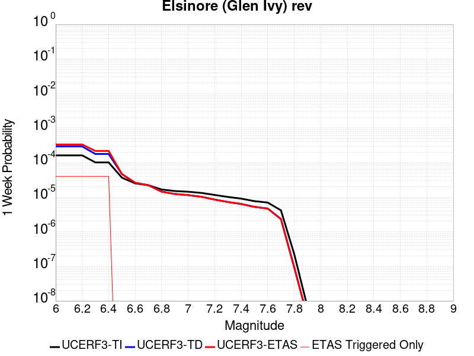 | 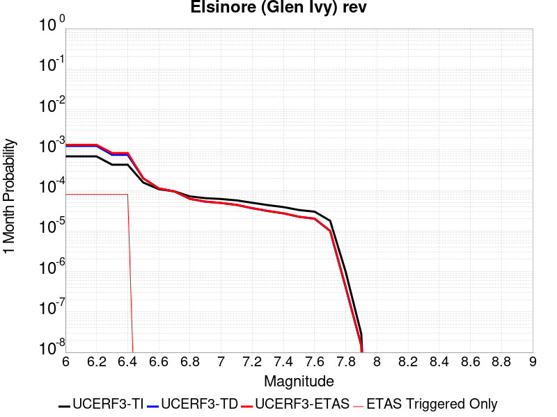 | 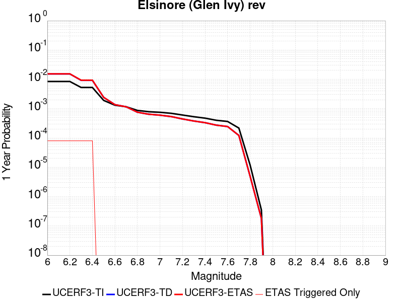 |

| Magnitude | 1 wk TI Prob | 1 wk TD Prob | 1 wk ETAS Prob | 1 wk ETAS/TD Gain | 1 wk ETAS Triggered Only | 1 mo TI Prob | 1 mo TD Prob | 1 mo ETAS Prob | 1 mo ETAS/TD Gain | 1 mo ETAS Triggered Only | 1 yr TI Prob | 1 yr TD Prob | 1 yr ETAS Prob | 1 yr ETAS/TD Gain | 1 yr ETAS Triggered Only |
|-----|-----|-----|-----|-----|-----|-----|-----|-----|-----|-----|-----|-----|-----|-----|-----|
| 6.0 | 1.6204086E-4 | 2.9420294E-4 | 3.3419117E-4 | 1.1359205 | 4.0E-5 | 6.94276E-4 | 0.0012604159 | 0.0013403151 | 1.0633911 | 8.0E-5 | 0.008420097 | 0.01525921 | 0.01533799 | 1.0051627 | 8.0E-5 |
| 6.1 | 1.6204086E-4 | 2.9420294E-4 | 3.3419117E-4 | 1.1359205 | 4.0E-5 | 6.94276E-4 | 0.0012604159 | 0.0013403151 | 1.0633911 | 8.0E-5 | 0.008420097 | 0.01525921 | 0.01533799 | 1.0051627 | 8.0E-5 |
| 6.2 | 1.6204086E-4 | 2.9420294E-4 | 3.3419117E-4 | 1.1359205 | 4.0E-5 | 6.94276E-4 | 0.0012604159 | 0.0013403151 | 1.0633911 | 8.0E-5 | 0.008420097 | 0.01525921 | 0.01533799 | 1.0051627 | 8.0E-5 |
| 6.3 | 1.0111737E-4 | 1.7740557E-4 | 2.1739847E-4 | 1.225432 | 4.0E-5 | 4.332882E-4 | 7.6020526E-4 | 8.4014446E-4 | 1.1051548 | 8.0E-5 | 0.005262531 | 0.009237009 | 0.00931627 | 1.0085808 | 8.0E-5 |
| 6.4 | 1.0111737E-4 | 1.7740557E-4 | 2.1739847E-4 | 1.225432 | 4.0E-5 | 4.332882E-4 | 7.6020526E-4 | 8.4014446E-4 | 1.1051548 | 8.0E-5 | 0.005262531 | 0.009237009 | 0.00931627 | 1.0085808 | 8.0E-5 |
| 6.5 | 3.6624708E-5 | 4.6445854E-5 | 4.6445854E-5 | 1.0 | 0.0 | 1.569536E-4 | 1.9904051E-4 | 1.9904051E-4 | 1.0 | 0.0 | 0.001909235 | 0.0024209863 | 0.0024209863 | 1.0 | 0.0 |
| 6.6 | 2.5051324E-5 | 2.6190002E-5 | 2.6190002E-5 | 1.0 | 0.0 | 1.073584E-4 | 1.1223829E-4 | 1.1223829E-4 | 1.0 | 0.0 | 0.0013063047 | 0.0013656892 | 0.0013656892 | 1.0 | 0.0 |
| 6.7 | 2.2189772E-5 | 2.2104245E-5 | 2.2104245E-5 | 1.0 | 0.0 | 9.509556E-5 | 9.472924E-5 | 9.472924E-5 | 1.0 | 0.0 | 0.0011571734 | 0.0011527548 | 0.0011527548 | 1.0 | 0.0 |
| 6.8 | 1.6654378E-5 | 1.4455017E-5 | 1.4455017E-5 | 1.0 | 0.0 | 7.137396E-5 | 6.194863E-5 | 6.194863E-5 | 1.0 | 0.0 | 8.686314E-4 | 7.539688E-4 | 7.539688E-4 | 1.0 | 0.0 |
| 6.9 | 1.5042909E-5 | 1.2346976E-5 | 1.2346976E-5 | 1.0 | 0.0 | 6.446802E-5 | 5.291456E-5 | 5.291456E-5 | 1.0 | 0.0 | 7.8461546E-4 | 6.4404745E-4 | 6.4404745E-4 | 1.0 | 0.0 |
| 7.0 | 1.4361385E-5 | 1.146508E-5 | 1.146508E-5 | 1.0 | 0.0 | 6.154734E-5 | 4.913515E-5 | 4.913515E-5 | 1.0 | 0.0 | 7.490812E-4 | 5.9805915E-4 | 5.9805915E-4 | 1.0 | 0.0 |
| 7.1 | 1.3265571E-5 | 1.0257165E-5 | 1.0257165E-5 | 1.0 | 0.0 | 5.6851208E-5 | 4.3958553E-5 | 4.3958553E-5 | 1.0 | 0.0 | 6.919436E-4 | 5.350665E-4 | 5.350665E-4 | 1.0 | 0.0 |
| 7.2 | 1.1596403E-5 | 8.515252E-6 | 8.515252E-6 | 1.0 | 0.0 | 4.9697923E-5 | 3.649344E-5 | 3.649344E-5 | 1.0 | 0.0 | 6.049042E-4 | 4.4421875E-4 | 4.4421875E-4 | 1.0 | 0.0 |
| 7.3 | 1.0150827E-5 | 7.247325E-6 | 7.247325E-6 | 1.0 | 0.0 | 4.3502816E-5 | 3.10596E-5 | 3.10596E-5 | 1.0 | 0.0 | 5.2951806E-4 | 3.780865E-4 | 3.780865E-4 | 1.0 | 0.0 |
| 7.4 | 9.080705E-6 | 6.359954E-6 | 6.359954E-6 | 1.0 | 0.0 | 3.8916725E-5 | 2.725667E-5 | 2.725667E-5 | 1.0 | 0.0 | 4.7370812E-4 | 3.3180078E-4 | 3.3180078E-4 | 1.0 | 0.0 |
| 7.5 | 7.671649E-6 | 5.231759E-6 | 5.231759E-6 | 1.0 | 0.0 | 3.287808E-5 | 2.2421638E-5 | 2.2421638E-5 | 1.0 | 0.0 | 4.0021708E-4 | 2.729505E-4 | 2.729505E-4 | 1.0 | 0.0 |
| 7.6 | 6.990086E-6 | 4.693085E-6 | 4.693085E-6 | 1.0 | 0.0 | 2.9957167E-5 | 2.0113073E-5 | 2.0113073E-5 | 1.0 | 0.0 | 3.6466747E-4 | 2.4485032E-4 | 2.4485032E-4 | 1.0 | 0.0 |
| 7.7 | 4.163505E-6 | 2.3324235E-6 | 2.3324235E-6 | 1.0 | 0.0 | 1.7843471E-5 | 9.996066E-6 | 9.996066E-6 | 1.0 | 0.0 | 2.172226E-4 | 1.2169606E-4 | 1.2169606E-4 | 1.0 | 0.0 |
| 7.8 | 2.2692414E-7 | 9.397192E-8 | 9.397192E-8 | 1.0 | 0.0 | 9.725317E-7 | 4.0273673E-7 | 4.0273673E-7 | 1.0 | 0.0 | 1.1840509E-5 | 4.903312E-6 | 4.903312E-6 | 1.0 | 0.0 |
| 7.9 | 6.676829E-9 | 3.4429164E-9 | 3.4429164E-9 | 1.0 | 0.0 | 2.861498E-8 | 1.4755356E-8 | 1.4755356E-8 | 1.0 | 0.0 | 3.4838732E-7 | 1.7964643E-7 | 1.7964643E-7 | 1.0 | 0.0 |

## Owl Lake
*[(top)](#table-of-contents)*

| 1 Week | 1 Month | 1 Year |
|-----|-----|-----|
| 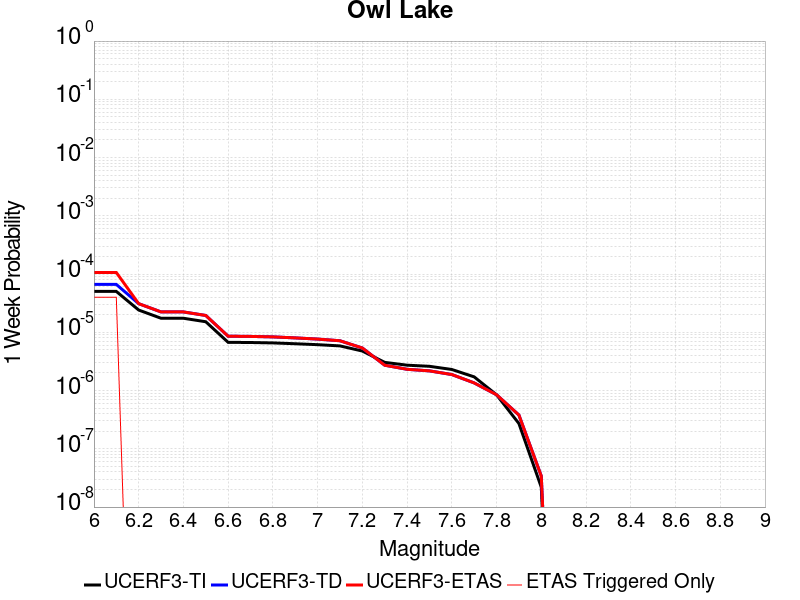 | 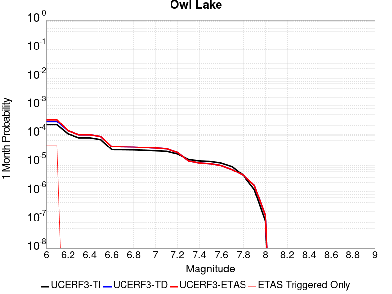 | 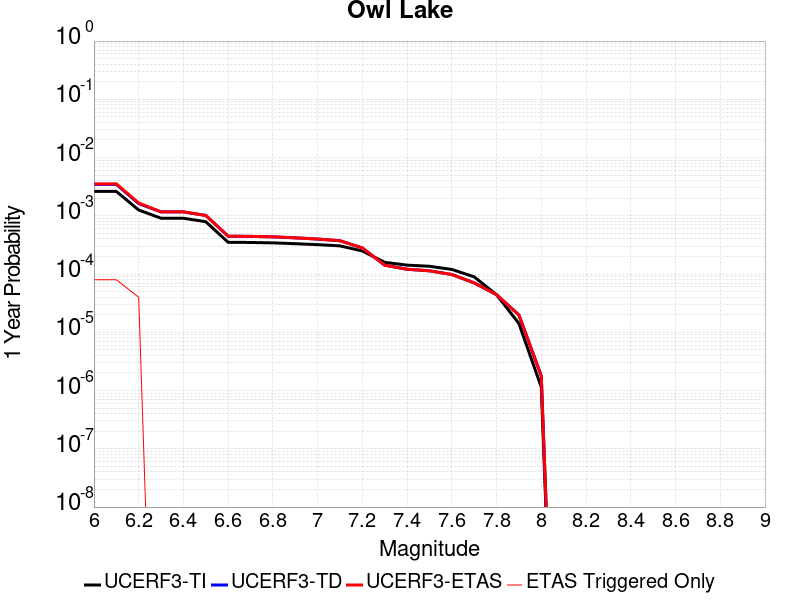 |

| Magnitude | 1 wk TI Prob | 1 wk TD Prob | 1 wk ETAS Prob | 1 wk ETAS/TD Gain | 1 wk ETAS Triggered Only | 1 mo TI Prob | 1 mo TD Prob | 1 mo ETAS Prob | 1 mo ETAS/TD Gain | 1 mo ETAS Triggered Only | 1 yr TI Prob | 1 yr TD Prob | 1 yr ETAS Prob | 1 yr ETAS/TD Gain | 1 yr ETAS Triggered Only |
|-----|-----|-----|-----|-----|-----|-----|-----|-----|-----|-----|-----|-----|-----|-----|-----|
| 6.0 | 5.0320643E-5 | 6.64403E-5 | 1.0643764E-4 | 1.6020043 | 4.0E-5 | 2.1564208E-4 | 2.847135E-4 | 3.247021E-4 | 1.1404521 | 4.0E-5 | 0.0026222812 | 0.0034617756 | 0.0035414987 | 1.0230296 | 8.0E-5 |
| 6.1 | 5.0320643E-5 | 6.64403E-5 | 1.0643764E-4 | 1.6020043 | 4.0E-5 | 2.1564208E-4 | 2.847135E-4 | 3.247021E-4 | 1.1404521 | 4.0E-5 | 0.0026222812 | 0.0034617756 | 0.0035414987 | 1.0230296 | 8.0E-5 |
| 6.2 | 2.4125871E-5 | 3.1022744E-5 | 3.1022744E-5 | 1.0 | 0.0 | 1.0339249E-4 | 1.3294873E-4 | 1.3294873E-4 | 1.0 | 0.0 | 0.0012580766 | 0.0016176249 | 0.0016575601 | 1.0246876 | 4.0E-5 |
| 6.3 | 1.7433485E-5 | 2.238944E-5 | 2.238944E-5 | 1.0 | 0.0 | 7.471279E-5 | 9.595211E-5 | 9.595211E-5 | 1.0 | 0.0 | 9.0924866E-4 | 0.0011677343 | 0.0011677343 | 1.0 | 0.0 |
| 6.4 | 1.7433485E-5 | 2.238944E-5 | 2.238944E-5 | 1.0 | 0.0 | 7.471279E-5 | 9.595211E-5 | 9.595211E-5 | 1.0 | 0.0 | 9.0924866E-4 | 0.0011677343 | 0.0011677343 | 1.0 | 0.0 |
| 6.5 | 1.5182742E-5 | 1.946037E-5 | 1.946037E-5 | 1.0 | 0.0 | 6.506727E-5 | 8.339978E-5 | 8.339978E-5 | 1.0 | 0.0 | 7.919061E-4 | 0.0010150598 | 0.0010150598 | 1.0 | 0.0 |
| 6.6 | 6.7271576E-6 | 8.568449E-6 | 8.568449E-6 | 1.0 | 0.0 | 2.8830356E-5 | 3.6721438E-5 | 3.6721438E-5 | 1.0 | 0.0 | 3.5095305E-4 | 4.4699747E-4 | 4.4699747E-4 | 1.0 | 0.0 |
| 6.7 | 6.682835E-6 | 8.500858E-6 | 8.500858E-6 | 1.0 | 0.0 | 2.8640408E-5 | 3.643177E-5 | 3.643177E-5 | 1.0 | 0.0 | 3.4864116E-4 | 4.434722E-4 | 4.434722E-4 | 1.0 | 0.0 |
| 6.8 | 6.5774975E-6 | 8.347227E-6 | 8.347227E-6 | 1.0 | 0.0 | 2.8188972E-5 | 3.577337E-5 | 3.577337E-5 | 1.0 | 0.0 | 3.4314668E-4 | 4.354594E-4 | 4.354594E-4 | 1.0 | 0.0 |
| 6.9 | 6.363419E-6 | 8.02014E-6 | 8.02014E-6 | 1.0 | 0.0 | 2.727151E-5 | 3.4371606E-5 | 3.4371606E-5 | 1.0 | 0.0 | 3.3198006E-4 | 4.1839955E-4 | 4.1839955E-4 | 1.0 | 0.0 |
| 7.0 | 6.1342453E-6 | 7.652003E-6 | 7.652003E-6 | 1.0 | 0.0 | 2.6289357E-5 | 3.2793916E-5 | 3.2793916E-5 | 1.0 | 0.0 | 3.2002592E-4 | 3.991983E-4 | 3.991983E-4 | 1.0 | 0.0 |
| 7.1 | 5.842926E-6 | 7.1620548E-6 | 7.1620548E-6 | 1.0 | 0.0 | 2.504087E-5 | 3.069419E-5 | 3.069419E-5 | 1.0 | 0.0 | 3.0482994E-4 | 3.7364312E-4 | 3.7364312E-4 | 1.0 | 0.0 |
| 7.2 | 4.77173E-6 | 5.376442E-6 | 5.376442E-6 | 1.0 | 0.0 | 2.045011E-5 | 2.3041714E-5 | 2.3041714E-5 | 1.0 | 0.0 | 2.4895166E-4 | 2.805008E-4 | 2.805008E-4 | 1.0 | 0.0 |
| 7.3 | 3.0494948E-6 | 2.7237572E-6 | 2.7237572E-6 | 1.0 | 0.0 | 1.3069198E-5 | 1.16731935E-5 | 1.16731935E-5 | 1.0 | 0.0 | 1.5910587E-4 | 1.4211203E-4 | 1.4211203E-4 | 1.0 | 0.0 |
| 7.4 | 2.7263884E-6 | 2.317959E-6 | 2.317959E-6 | 1.0 | 0.0 | 1.1684469E-5 | 9.934072E-6 | 9.934072E-6 | 1.0 | 0.0 | 1.4224913E-4 | 1.2094073E-4 | 1.2094073E-4 | 1.0 | 0.0 |
| 7.5 | 2.6090431E-6 | 2.1776593E-6 | 2.1776593E-6 | 1.0 | 0.0 | 1.1181565E-5 | 9.3327935E-6 | 9.3327935E-6 | 1.0 | 0.0 | 1.3612706E-4 | 1.1362093E-4 | 1.1362093E-4 | 1.0 | 0.0 |
| 7.6 | 2.3008756E-6 | 1.8842499E-6 | 1.8842499E-6 | 1.0 | 0.0 | 9.860858E-6 | 8.075332E-6 | 8.075332E-6 | 1.0 | 0.0 | 1.20049335E-4 | 9.831281E-5 | 9.831281E-5 | 1.0 | 0.0 |
| 7.7 | 1.7184348E-6 | 1.3525299E-6 | 1.3525299E-6 | 1.0 | 0.0 | 7.3646997E-6 | 5.796544E-6 | 5.796544E-6 | 1.0 | 0.0 | 8.966153E-5 | 7.0570684E-5 | 7.0570684E-5 | 1.0 | 0.0 |
| 7.8 | 8.4612907E-7 | 8.4826485E-7 | 8.4826485E-7 | 1.0 | 0.0 | 3.6262625E-6 | 3.6354159E-6 | 3.6354159E-6 | 1.0 | 0.0 | 4.4148852E-5 | 4.4260312E-5 | 4.4260312E-5 | 1.0 | 0.0 |
| 7.9 | 2.716738E-7 | 3.8033835E-7 | 3.8033835E-7 | 1.0 | 0.0 | 1.1643157E-6 | 1.6300206E-6 | 1.6300206E-6 | 1.0 | 0.0 | 1.4175452E-5 | 1.984533E-5 | 1.984533E-5 | 1.0 | 0.0 |
| 8.0 | 2.1995428E-8 | 3.4170547E-8 | 3.4170547E-8 | 1.0 | 0.0 | 9.426611E-8 | 1.464452E-7 | 1.464452E-7 | 1.0 | 0.0 | 1.1476893E-6 | 1.7829695E-6 | 1.7829695E-6 | 1.0 | 0.0 |

## San Jacinto (Coyote Creek)
*[(top)](#table-of-contents)*

| 1 Week | 1 Month | 1 Year |
|-----|-----|-----|
|  |  | 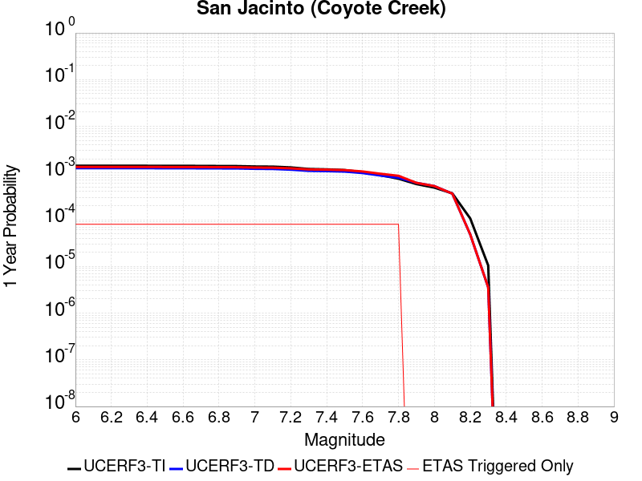 |

| Magnitude | 1 wk TI Prob | 1 wk TD Prob | 1 wk ETAS Prob | 1 wk ETAS/TD Gain | 1 wk ETAS Triggered Only | 1 mo TI Prob | 1 mo TD Prob | 1 mo ETAS Prob | 1 mo ETAS/TD Gain | 1 mo ETAS Triggered Only | 1 yr TI Prob | 1 yr TD Prob | 1 yr ETAS Prob | 1 yr ETAS/TD Gain | 1 yr ETAS Triggered Only |
|-----|-----|-----|-----|-----|-----|-----|-----|-----|-----|-----|-----|-----|-----|-----|-----|
| 6.0 | 2.7374346E-5 | 2.4356477E-5 | 2.4356477E-5 | 1.0 | 0.0 | 1.1731335E-4 | 1.04380735E-4 | 1.4437657E-4 | 1.3831725 | 4.0E-5 | 0.0014273542 | 0.0012700972 | 0.0013499956 | 1.0629073 | 8.0E-5 |
| 6.1 | 2.7374346E-5 | 2.4356477E-5 | 2.4356477E-5 | 1.0 | 0.0 | 1.1731335E-4 | 1.04380735E-4 | 1.4437657E-4 | 1.3831725 | 4.0E-5 | 0.0014273542 | 0.0012700972 | 0.0013499956 | 1.0629073 | 8.0E-5 |
| 6.2 | 2.7374346E-5 | 2.4356477E-5 | 2.4356477E-5 | 1.0 | 0.0 | 1.1731335E-4 | 1.04380735E-4 | 1.4437657E-4 | 1.3831725 | 4.0E-5 | 0.0014273542 | 0.0012700972 | 0.0013499956 | 1.0629073 | 8.0E-5 |
| 6.3 | 2.7374346E-5 | 2.4356477E-5 | 2.4356477E-5 | 1.0 | 0.0 | 1.1731335E-4 | 1.04380735E-4 | 1.4437657E-4 | 1.3831725 | 4.0E-5 | 0.0014273542 | 0.0012700972 | 0.0013499956 | 1.0629073 | 8.0E-5 |
| 6.4 | 2.7374346E-5 | 2.4356477E-5 | 2.4356477E-5 | 1.0 | 0.0 | 1.1731335E-4 | 1.04380735E-4 | 1.4437657E-4 | 1.3831725 | 4.0E-5 | 0.0014273542 | 0.0012700972 | 0.0013499956 | 1.0629073 | 8.0E-5 |
| 6.5 | 2.7282445E-5 | 2.4242463E-5 | 2.4242463E-5 | 1.0 | 0.0 | 1.16919524E-4 | 1.0389215E-4 | 1.4388798E-4 | 1.3849747 | 4.0E-5 | 0.0014225657 | 0.0012641556 | 0.0013440545 | 1.0632033 | 8.0E-5 |
| 6.6 | 2.7282445E-5 | 2.4242463E-5 | 2.4242463E-5 | 1.0 | 0.0 | 1.16919524E-4 | 1.0389215E-4 | 1.4388798E-4 | 1.3849747 | 4.0E-5 | 0.0014225657 | 0.0012641556 | 0.0013440545 | 1.0632033 | 8.0E-5 |
| 6.7 | 2.7216198E-5 | 2.4167522E-5 | 2.4167522E-5 | 1.0 | 0.0 | 1.1663563E-4 | 1.03571E-4 | 1.4356685E-4 | 1.3861685 | 4.0E-5 | 0.0014191137 | 0.0012602502 | 0.0013401493 | 1.0633994 | 8.0E-5 |
| 6.8 | 2.7078617E-5 | 2.4084618E-5 | 2.4084618E-5 | 1.0 | 0.0 | 1.1604605E-4 | 1.0321572E-4 | 1.432116E-4 | 1.3874979 | 4.0E-5 | 0.001411945 | 0.0012559297 | 0.0013358291 | 1.0636178 | 8.0E-5 |
| 6.9 | 2.6982952E-5 | 2.4003995E-5 | 2.4003995E-5 | 1.0 | 0.0 | 1.15636096E-4 | 1.02870225E-4 | 1.4286612E-4 | 1.3887994 | 4.0E-5 | 0.0014069602 | 0.0012517282 | 0.001331628 | 1.0638317 | 8.0E-5 |
| 7.0 | 2.6449972E-5 | 2.3580524E-5 | 2.3580524E-5 | 1.0 | 0.0 | 1.1335209E-4 | 1.01055484E-4 | 1.4105144E-4 | 1.3957821 | 4.0E-5 | 0.001379188 | 0.0012296587 | 0.0013095604 | 1.0649787 | 8.0E-5 |
| 7.1 | 2.6257849E-5 | 2.3406348E-5 | 2.3406348E-5 | 1.0 | 0.0 | 1.1252879E-4 | 1.0030907E-4 | 1.4030507E-4 | 1.3987275 | 4.0E-5 | 0.0013691769 | 0.0012205814 | 0.0013004837 | 1.0654626 | 8.0E-5 |
| 7.2 | 2.5270041E-5 | 2.2599575E-5 | 2.2599575E-5 | 1.0 | 0.0 | 1.0829568E-4 | 9.685174E-5 | 1.3684787E-4 | 1.4129624 | 4.0E-5 | 0.0013177024 | 0.0011785345 | 0.0012584402 | 1.0678009 | 8.0E-5 |
| 7.3 | 2.339701E-5 | 2.1328571E-5 | 2.1328571E-5 | 1.0 | 0.0 | 1.0026905E-4 | 9.1404974E-5 | 1.3140132E-4 | 1.437573 | 4.0E-5 | 0.001220092 | 0.0011122895 | 0.0011922006 | 1.0718437 | 8.0E-5 |
| 7.4 | 2.296333E-5 | 2.1058198E-5 | 2.1058198E-5 | 1.0 | 0.0 | 9.841056E-5 | 9.0246314E-5 | 1.302427E-4 | 1.4431914 | 4.0E-5 | 0.0011974899 | 0.0010981972 | 0.0011781093 | 1.0727667 | 8.0E-5 |
| 7.5 | 2.2188895E-5 | 2.0579188E-5 | 2.0579188E-5 | 1.0 | 0.0 | 9.50918E-5 | 8.819355E-5 | 1.2819002E-4 | 1.4535079 | 4.0E-5 | 0.0011571277 | 0.0010732296 | 0.0011531437 | 1.0744613 | 8.0E-5 |
| 7.6 | 2.0013189E-5 | 1.9158566E-5 | 1.9158566E-5 | 1.0 | 0.0 | 8.5767984E-5 | 8.210557E-5 | 1.2210228E-4 | 1.4871377 | 4.0E-5 | 0.001043725 | 9.991786E-4 | 0.0010790988 | 1.0799857 | 8.0E-5 |
| 7.7 | 1.7230794E-5 | 1.6934096E-5 | 1.6934096E-5 | 1.0 | 0.0 | 7.384417E-5 | 7.2572686E-5 | 1.1256978E-4 | 1.5511316 | 4.0E-5 | 8.986819E-4 | 8.8321505E-4 | 9.631444E-4 | 1.0904982 | 8.0E-5 |
| 7.8 | 1.4478809E-5 | 1.5174756E-5 | 1.5174756E-5 | 1.0 | 0.0 | 6.205057E-5 | 6.5033055E-5 | 1.0503045E-4 | 1.6150318 | 4.0E-5 | 7.552038E-4 | 7.914904E-4 | 8.714271E-4 | 1.1009952 | 8.0E-5 |
| 7.9 | 1.1114467E-5 | 1.180864E-5 | 1.180864E-5 | 1.0 | 0.0 | 4.7632562E-5 | 5.060748E-5 | 5.060748E-5 | 1.0 | 0.0 | 5.797721E-4 | 6.1597244E-4 | 6.1597244E-4 | 1.0 | 0.0 |
| 8.0 | 9.327402E-6 | 1.0048055E-5 | 1.0048055E-5 | 1.0 | 0.0 | 3.9973966E-5 | 4.3062384E-5 | 4.3062384E-5 | 1.0 | 0.0 | 4.8657437E-4 | 5.24159E-4 | 5.24159E-4 | 1.0 | 0.0 |
| 8.1 | 7.0235833E-6 | 6.9387575E-6 | 6.9387575E-6 | 1.0 | 0.0 | 3.0100724E-5 | 2.9737195E-5 | 2.9737195E-5 | 1.0 | 0.0 | 3.664147E-4 | 3.6199074E-4 | 3.6199074E-4 | 1.0 | 0.0 |
| 8.2 | 2.0358202E-6 | 9.2101675E-7 | 9.2101675E-7 | 1.0 | 0.0 | 8.724915E-6 | 3.947209E-6 | 3.947209E-6 | 1.0 | 0.0 | 1.06220665E-4 | 4.805623E-5 | 4.805623E-5 | 1.0 | 0.0 |
| 8.3 | 2.0051264E-7 | 6.7996226E-8 | 6.7996226E-8 | 1.0 | 0.0 | 8.5933965E-7 | 2.9141236E-7 | 2.9141236E-7 | 1.0 | 0.0 | 1.046241E-5 | 3.5479404E-6 | 3.5479404E-6 | 1.0 | 0.0 |

## Nelson Lake
*[(top)](#table-of-contents)*

| 1 Week | 1 Month | 1 Year |
|-----|-----|-----|
|  |  |  |

| Magnitude | 1 wk TI Prob | 1 wk TD Prob | 1 wk ETAS Prob | 1 wk ETAS/TD Gain | 1 wk ETAS Triggered Only | 1 mo TI Prob | 1 mo TD Prob | 1 mo ETAS Prob | 1 mo ETAS/TD Gain | 1 mo ETAS Triggered Only | 1 yr TI Prob | 1 yr TD Prob | 1 yr ETAS Prob | 1 yr ETAS/TD Gain | 1 yr ETAS Triggered Only |
|-----|-----|-----|-----|-----|-----|-----|-----|-----|-----|-----|-----|-----|-----|-----|-----|
| 6.0 | 9.913453E-6 | 1.0193228E-5 | 1.0193228E-5 | 1.0 | 0.0 | 4.2485535E-5 | 4.368459E-5 | 4.368459E-5 | 1.0 | 0.0 | 5.1713863E-4 | 5.317404E-4 | 6.116979E-4 | 1.1503694 | 8.0E-5 |
| 6.1 | 9.913453E-6 | 1.0193228E-5 | 1.0193228E-5 | 1.0 | 0.0 | 4.2485535E-5 | 4.368459E-5 | 4.368459E-5 | 1.0 | 0.0 | 5.1713863E-4 | 5.317404E-4 | 6.116979E-4 | 1.1503694 | 8.0E-5 |
| 6.2 | 4.5596407E-6 | 4.696791E-6 | 4.696791E-6 | 1.0 | 0.0 | 1.954117E-5 | 2.0128957E-5 | 2.0128957E-5 | 1.0 | 0.0 | 2.3788778E-4 | 2.4504375E-4 | 2.8503395E-4 | 1.1631962 | 4.0E-5 |
| 6.3 | 4.5596407E-6 | 4.696791E-6 | 4.696791E-6 | 1.0 | 0.0 | 1.954117E-5 | 2.0128957E-5 | 2.0128957E-5 | 1.0 | 0.0 | 2.3788778E-4 | 2.4504375E-4 | 2.8503395E-4 | 1.1631962 | 4.0E-5 |
| 6.4 | 3.4025713E-6 | 3.5102732E-6 | 3.5102732E-6 | 1.0 | 0.0 | 1.4582367E-5 | 1.5043946E-5 | 1.5043946E-5 | 1.0 | 0.0 | 1.7752586E-4 | 1.8314549E-4 | 2.2313817E-4 | 1.2183656 | 4.0E-5 |
| 6.5 | 2.8352947E-6 | 2.9281807E-6 | 2.9281807E-6 | 1.0 | 0.0 | 1.2151207E-5 | 1.254929E-5 | 1.254929E-5 | 1.0 | 0.0 | 1.479309E-4 | 1.5277765E-4 | 1.9277153E-4 | 1.2617784 | 4.0E-5 |
| 6.6 | 2.251518E-6 | 2.32934E-6 | 2.32934E-6 | 1.0 | 0.0 | 9.649328E-6 | 9.982851E-6 | 9.982851E-6 | 1.0 | 0.0 | 1.1747423E-4 | 1.21535064E-4 | 1.615302E-4 | 1.3290831 | 4.0E-5 |
| 6.7 | 1.8911853E-6 | 1.9593788E-6 | 1.9593788E-6 | 1.0 | 0.0 | 8.105055E-6 | 8.397314E-6 | 8.397314E-6 | 1.0 | 0.0 | 9.867457E-5 | 1.0223308E-4 | 1.42229E-4 | 1.3912227 | 4.0E-5 |
| 6.8 | 1.4874814E-6 | 1.544029E-6 | 1.544029E-6 | 1.0 | 0.0 | 6.374905E-6 | 6.617254E-6 | 6.617254E-6 | 1.0 | 0.0 | 7.76117E-5 | 8.0562604E-5 | 8.0562604E-5 | 1.0 | 0.0 |
| 6.9 | 6.835972E-7 | 7.141004E-7 | 7.141004E-7 | 1.0 | 0.0 | 2.9296991E-6 | 3.0604285E-6 | 3.0604285E-6 | 1.0 | 0.0 | 3.56685E-5 | 3.72604E-5 | 3.72604E-5 | 1.0 | 0.0 |

## Brawley (Seismic Zone) alt 1
*[(top)](#table-of-contents)*

| 1 Week | 1 Month | 1 Year |
|-----|-----|-----|
| 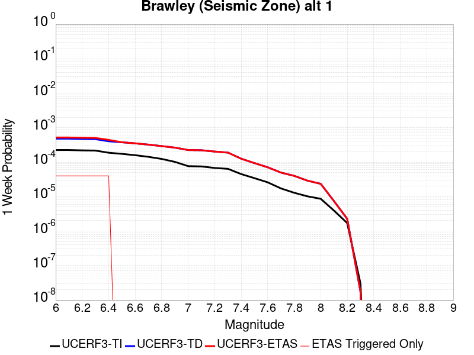 | 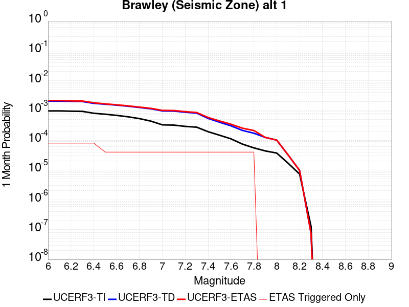 | 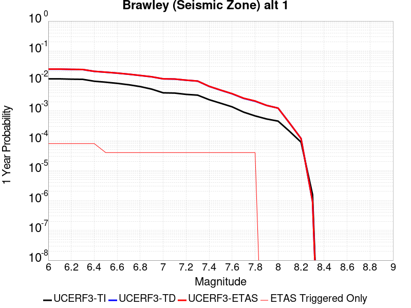 |

| Magnitude | 1 wk TI Prob | 1 wk TD Prob | 1 wk ETAS Prob | 1 wk ETAS/TD Gain | 1 wk ETAS Triggered Only | 1 mo TI Prob | 1 mo TD Prob | 1 mo ETAS Prob | 1 mo ETAS/TD Gain | 1 mo ETAS Triggered Only | 1 yr TI Prob | 1 yr TD Prob | 1 yr ETAS Prob | 1 yr ETAS/TD Gain | 1 yr ETAS Triggered Only |
|-----|-----|-----|-----|-----|-----|-----|-----|-----|-----|-----|-----|-----|-----|-----|-----|
| 6.0 | 2.2521618E-4 | 4.7906235E-4 | 5.190432E-4 | 1.0834564 | 4.0E-5 | 9.6485513E-4 | 0.0020515462 | 0.002131382 | 1.0389149 | 8.0E-5 | 0.011683988 | 0.024686452 | 0.024764478 | 1.0031606 | 8.0E-5 |
| 6.1 | 2.2521618E-4 | 4.7906235E-4 | 5.190432E-4 | 1.0834564 | 4.0E-5 | 9.6485513E-4 | 0.0020515462 | 0.002131382 | 1.0389149 | 8.0E-5 | 0.011683988 | 0.024686452 | 0.024764478 | 1.0031606 | 8.0E-5 |
| 6.2 | 2.198148E-4 | 4.6985512E-4 | 5.098363E-4 | 1.0850927 | 4.0E-5 | 9.417233E-4 | 0.0020121478 | 0.0020919868 | 1.0396785 | 8.0E-5 | 0.011405343 | 0.024218049 | 0.02429611 | 1.0032233 | 8.0E-5 |
| 6.3 | 2.1704129E-4 | 4.6419835E-4 | 5.041798E-4 | 1.08613 | 4.0E-5 | 9.298453E-4 | 0.0019879416 | 0.0020677825 | 1.0401627 | 8.0E-5 | 0.011262234 | 0.02393082 | 0.024008906 | 1.003263 | 8.0E-5 |
| 6.4 | 1.876142E-4 | 4.0299946E-4 | 4.4298332E-4 | 1.0992157 | 4.0E-5 | 8.038131E-4 | 0.0017260119 | 0.0018058738 | 1.0462697 | 8.0E-5 | 0.00974259 | 0.020814236 | 0.020892572 | 1.0037636 | 8.0E-5 |
| 6.5 | 1.7390939E-4 | 3.772201E-4 | 3.772201E-4 | 1.0 | 0.0 | 7.45113E-4 | 0.0016156683 | 0.0016556038 | 1.0247176 | 4.0E-5 | 0.009034078 | 0.019498011 | 0.019537231 | 1.0020115 | 4.0E-5 |
| 6.6 | 1.591791E-4 | 3.512329E-4 | 3.512329E-4 | 1.0 | 0.0 | 6.8201777E-4 | 0.0015044258 | 0.0015443655 | 1.0265483 | 4.0E-5 | 0.008271996 | 0.018166747 | 0.01820602 | 1.0021619 | 4.0E-5 |
| 6.7 | 1.4268003E-4 | 3.2273377E-4 | 3.2273377E-4 | 1.0 | 0.0 | 6.1134255E-4 | 0.00138242 | 0.0014223647 | 1.0288948 | 4.0E-5 | 0.007417723 | 0.016705167 | 0.016744498 | 1.0023545 | 4.0E-5 |
| 6.8 | 1.239713E-4 | 2.923154E-4 | 2.923154E-4 | 1.0 | 0.0 | 5.3119735E-4 | 0.0012521851 | 0.001292135 | 1.0319041 | 4.0E-5 | 0.0064481674 | 0.015140241 | 0.015179635 | 1.002602 | 4.0E-5 |
| 6.9 | 1.0180238E-4 | 2.6387183E-4 | 2.6387183E-4 | 1.0 | 0.0 | 4.3622297E-4 | 0.0011303935 | 0.0011703483 | 1.0353459 | 4.0E-5 | 0.005298089 | 0.013676707 | 0.013716159 | 1.0028846 | 4.0E-5 |
| 7.0 | 7.6619996E-5 | 2.2495743E-4 | 2.2495743E-4 | 1.0 | 0.0 | 3.283301E-4 | 9.6375024E-4 | 0.0010037117 | 1.0414646 | 4.0E-5 | 0.0039900932 | 0.011671247 | 0.01171078 | 1.0033872 | 4.0E-5 |
| 7.1 | 7.5127435E-5 | 2.2177385E-4 | 2.2177385E-4 | 1.0 | 0.0 | 3.2193496E-4 | 9.501164E-4 | 9.900783E-4 | 1.0420601 | 4.0E-5 | 0.0039125155 | 0.011507019 | 0.011546559 | 1.0034361 | 4.0E-5 |
| 7.2 | 6.788582E-5 | 2.0301084E-4 | 2.0301084E-4 | 1.0 | 0.0 | 2.9090676E-4 | 8.697594E-4 | 9.097246E-4 | 1.0459497 | 4.0E-5 | 0.0035360386 | 0.01053855 | 0.0105781285 | 1.0037556 | 4.0E-5 |
| 7.3 | 6.399602E-5 | 1.8927702E-4 | 1.8927702E-4 | 1.0 | 0.0 | 2.7423984E-4 | 8.109379E-4 | 8.509055E-4 | 1.0492857 | 4.0E-5 | 0.0033337586 | 0.009829069 | 0.009868675 | 1.0040295 | 4.0E-5 |
| 7.4 | 4.506759E-5 | 1.2596935E-4 | 1.2596935E-4 | 1.0 | 0.0 | 1.9313251E-4 | 5.3975784E-4 | 5.7973625E-4 | 1.0740674 | 4.0E-5 | 0.0023488526 | 0.006551927 | 0.0065916646 | 1.0060651 | 4.0E-5 |
| 7.5 | 3.43289E-5 | 9.392528E-5 | 9.392528E-5 | 1.0 | 0.0 | 1.4711556E-4 | 4.0247513E-4 | 4.4245902E-4 | 1.099345 | 4.0E-5 | 0.0017896603 | 0.004889188 | 0.004928992 | 1.0081413 | 4.0E-5 |
| 7.6 | 2.5980507E-5 | 7.102579E-5 | 7.102579E-5 | 1.0 | 0.0 | 1.1134028E-4 | 3.0436084E-4 | 3.4434866E-4 | 1.131383 | 4.0E-5 | 0.001354725 | 0.0036993215 | 0.0037391735 | 1.0107728 | 4.0E-5 |
| 7.7 | 1.7292105E-5 | 4.982994E-5 | 4.982994E-5 | 1.0 | 0.0 | 7.4106916E-5 | 2.1353943E-4 | 2.535309E-4 | 1.187279 | 4.0E-5 | 9.018782E-4 | 0.0025967488 | 0.002636645 | 1.0153639 | 4.0E-5 |
| 7.8 | 1.2927471E-5 | 4.006102E-5 | 4.006102E-5 | 1.0 | 0.0 | 5.5402274E-5 | 1.716788E-4 | 2.1167193E-4 | 1.2329533 | 4.0E-5 | 6.743139E-4 | 0.0020881882 | 0.0021281047 | 1.0191153 | 4.0E-5 |
| 7.9 | 1.0200774E-5 | 2.9043316E-5 | 2.9043316E-5 | 1.0 | 0.0 | 4.371687E-5 | 1.2446543E-4 | 1.2446543E-4 | 1.0 | 0.0 | 5.321229E-4 | 0.0015143143 | 0.0015143143 | 1.0 | 0.0 |
| 8.0 | 8.650396E-6 | 2.3532893E-5 | 2.3532893E-5 | 1.0 | 0.0 | 3.70726E-5 | 1.00851365E-4 | 1.00851365E-4 | 1.0 | 0.0 | 4.5126543E-4 | 0.0012271745 | 0.0012271745 | 1.0 | 0.0 |
| 8.1 | 3.9368224E-6 | 7.4387112E-6 | 7.4387112E-6 | 1.0 | 0.0 | 1.6871985E-5 | 3.18798E-5 | 3.18798E-5 | 1.0 | 0.0 | 2.0539707E-4 | 3.880676E-4 | 3.880676E-4 | 1.0 | 0.0 |
| 8.2 | 1.7101195E-6 | 2.2599863E-6 | 2.2599863E-6 | 1.0 | 0.0 | 7.329063E-6 | 9.68562E-6 | 9.68562E-6 | 1.0 | 0.0 | 8.922769E-5 | 1.17916075E-4 | 1.17916075E-4 | 1.0 | 0.0 |
| 8.3 | 3.0346666E-8 | 1.7654946E-8 | 1.7654946E-8 | 1.0 | 0.0 | 1.3005713E-7 | 7.5664055E-8 | 7.5664055E-8 | 1.0 | 0.0 | 1.5834444E-6 | 9.2120973E-7 | 9.2120973E-7 | 1.0 | 0.0 |

## Coronado Bank alt1
*[(top)](#table-of-contents)*

| 1 Week | 1 Month | 1 Year |
|-----|-----|-----|
|  |  |  |

| Magnitude | 1 wk TI Prob | 1 wk TD Prob | 1 wk ETAS Prob | 1 wk ETAS/TD Gain | 1 wk ETAS Triggered Only | 1 mo TI Prob | 1 mo TD Prob | 1 mo ETAS Prob | 1 mo ETAS/TD Gain | 1 mo ETAS Triggered Only | 1 yr TI Prob | 1 yr TD Prob | 1 yr ETAS Prob | 1 yr ETAS/TD Gain | 1 yr ETAS Triggered Only |
|-----|-----|-----|-----|-----|-----|-----|-----|-----|-----|-----|-----|-----|-----|-----|-----|
| 6.0 | 7.533492E-5 | 9.4029245E-5 | 1.7402173E-4 | 1.8507191 | 8.0E-5 | 3.22824E-4 | 4.0292446E-4 | 4.8289224E-4 | 1.1984683 | 8.0E-5 | 0.0039233007 | 0.0048951716 | 0.0049747797 | 1.0162627 | 8.0E-5 |
| 6.1 | 4.1807285E-5 | 5.0528783E-5 | 1.3052474E-4 | 2.5831761 | 8.0E-5 | 1.7916178E-4 | 2.1653448E-4 | 2.9651716E-4 | 1.3693762 | 8.0E-5 | 0.0021791123 | 0.0026331986 | 0.002712988 | 1.0303013 | 8.0E-5 |
| 6.2 | 4.1807285E-5 | 5.0528783E-5 | 1.3052474E-4 | 2.5831761 | 8.0E-5 | 1.7916178E-4 | 2.1653448E-4 | 2.9651716E-4 | 1.3693762 | 8.0E-5 | 0.0021791123 | 0.0026331986 | 0.002712988 | 1.0303013 | 8.0E-5 |
| 6.3 | 3.1793104E-5 | 3.7735168E-5 | 1.1773215E-4 | 3.1199582 | 8.0E-5 | 1.3624904E-4 | 1.6171228E-4 | 2.4169934E-4 | 1.4946258 | 8.0E-5 | 0.0016575698 | 0.0019671016 | 0.002046944 | 1.040589 | 8.0E-5 |
| 6.4 | 2.9878007E-5 | 3.535792E-5 | 7.5356504E-5 | 2.1312482 | 4.0E-5 | 1.2804232E-4 | 1.5152531E-4 | 1.9151924E-4 | 1.2639424 | 4.0E-5 | 0.0015578003 | 0.0018432919 | 0.0018832182 | 1.0216603 | 4.0E-5 |
| 6.5 | 2.4512565E-5 | 2.8781236E-5 | 6.8780086E-5 | 2.3897543 | 4.0E-5 | 1.0504962E-4 | 1.2334248E-4 | 1.6333755E-4 | 1.3242602 | 4.0E-5 | 0.0012782287 | 0.0015006869 | 0.0015406269 | 1.0266144 | 4.0E-5 |
| 6.6 | 2.1317413E-5 | 2.4921088E-5 | 6.492009E-5 | 2.6050265 | 4.0E-5 | 9.135714E-5 | 1.0680041E-4 | 1.4679614E-4 | 1.3744904 | 4.0E-5 | 0.0011117056 | 0.0012995416 | 0.0013394896 | 1.0307401 | 4.0E-5 |
| 6.7 | 1.8585655E-5 | 2.1647098E-5 | 6.1646235E-5 | 2.8477826 | 4.0E-5 | 7.9650374E-5 | 9.27701E-5 | 1.3276639E-4 | 1.4311334 | 4.0E-5 | 9.6931186E-4 | 0.0011289112 | 0.0011688661 | 1.0353924 | 4.0E-5 |
| 6.8 | 1.5862879E-5 | 1.8429711E-5 | 5.8428974E-5 | 3.1703684 | 4.0E-5 | 6.798199E-5 | 7.898219E-5 | 1.18979035E-4 | 1.5064033 | 4.0E-5 | 8.273665E-4 | 9.6120324E-4 | 0.0010011648 | 1.0415745 | 4.0E-5 |
| 6.9 | 1.3021509E-5 | 1.5103577E-5 | 5.5102973E-5 | 3.6483393 | 4.0E-5 | 5.5805274E-5 | 6.472811E-5 | 1.0472552E-4 | 1.6179295 | 4.0E-5 | 6.792174E-4 | 7.8779797E-4 | 8.2776643E-4 | 1.0507344 | 4.0E-5 |
| 7.0 | 1.0974371E-5 | 1.272712E-5 | 5.272661E-5 | 4.1428547 | 4.0E-5 | 4.7032172E-5 | 5.4543758E-5 | 9.4541574E-5 | 1.7333162 | 4.0E-5 | 5.7246623E-4 | 6.638855E-4 | 7.0385897E-4 | 1.0602113 | 4.0E-5 |
| 7.1 | 8.766221E-6 | 1.0169476E-5 | 1.0169476E-5 | 1.0 | 0.0 | 3.7568978E-5 | 4.3582837E-5 | 4.3582837E-5 | 1.0 | 0.0 | 4.573063E-4 | 5.3050905E-4 | 5.3050905E-4 | 1.0 | 0.0 |
| 7.2 | 8.026024E-7 | 8.333763E-7 | 8.333763E-7 | 1.0 | 0.0 | 3.43972E-6 | 3.571608E-6 | 3.571608E-6 | 1.0 | 0.0 | 4.1877785E-5 | 4.348347E-5 | 4.348347E-5 | 1.0 | 0.0 |
| 7.3 | 3.7293114E-7 | 3.700848E-7 | 3.700848E-7 | 1.0 | 0.0 | 1.5982754E-6 | 1.5860767E-6 | 1.5860767E-6 | 1.0 | 0.0 | 1.9458828E-5 | 1.9310313E-5 | 1.9310313E-5 | 1.0 | 0.0 |
| 7.4 | 2.0557036E-7 | 1.9678428E-7 | 1.9678428E-7 | 1.0 | 0.0 | 8.810155E-7 | 8.4336097E-7 | 8.4336097E-7 | 1.0 | 0.0 | 1.0726311E-5 | 1.0267871E-5 | 1.0267871E-5 | 1.0 | 0.0 |
| 7.5 | 6.845446E-8 | 6.2802876E-8 | 6.2802876E-8 | 1.0 | 0.0 | 2.9337625E-7 | 2.6915515E-7 | 2.6915515E-7 | 1.0 | 0.0 | 3.5718497E-6 | 3.2769592E-6 | 3.2769592E-6 | 1.0 | 0.0 |
| 7.6 | 6.0975145E-9 | 5.5322116E-9 | 5.5322116E-9 | 1.0 | 0.0 | 2.6132206E-8 | 2.3709477E-8 | 2.3709477E-8 | 1.0 | 0.0 | 3.1815955E-7 | 2.8866285E-7 | 2.8866285E-7 | 1.0 | 0.0 |

## Goldstone Lake
*[(top)](#table-of-contents)*

| 1 Week | 1 Month | 1 Year |
|-----|-----|-----|
| 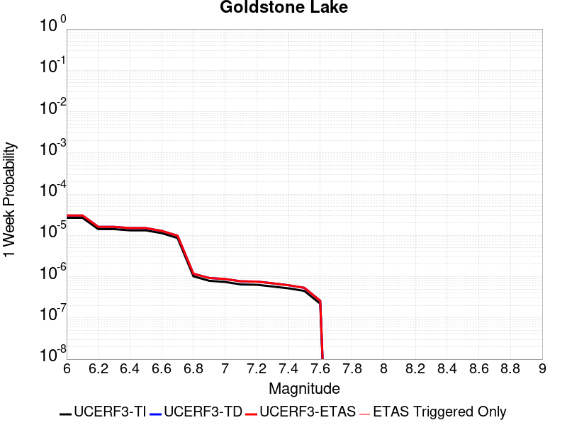 |  |  |

| Magnitude | 1 wk TI Prob | 1 wk TD Prob | 1 wk ETAS Prob | 1 wk ETAS/TD Gain | 1 wk ETAS Triggered Only | 1 mo TI Prob | 1 mo TD Prob | 1 mo ETAS Prob | 1 mo ETAS/TD Gain | 1 mo ETAS Triggered Only | 1 yr TI Prob | 1 yr TD Prob | 1 yr ETAS Prob | 1 yr ETAS/TD Gain | 1 yr ETAS Triggered Only |
|-----|-----|-----|-----|-----|-----|-----|-----|-----|-----|-----|-----|-----|-----|-----|-----|
| 6.0 | 2.671352E-5 | 3.0389869E-5 | 3.0389869E-5 | 1.0 | 0.0 | 1.1448149E-4 | 1.302369E-4 | 1.302369E-4 | 1.0 | 0.0 | 0.001392921 | 0.0015846775 | 0.0016645506 | 1.0504035 | 8.0E-5 |
| 6.1 | 2.671352E-5 | 3.0389869E-5 | 3.0389869E-5 | 1.0 | 0.0 | 1.1448149E-4 | 1.302369E-4 | 1.302369E-4 | 1.0 | 0.0 | 0.001392921 | 0.0015846775 | 0.0016645506 | 1.0504035 | 8.0E-5 |
| 6.2 | 1.4197047E-5 | 1.6103195E-5 | 1.6103195E-5 | 1.0 | 0.0 | 6.0843064E-5 | 6.901242E-5 | 6.901242E-5 | 1.0 | 0.0 | 7.4051257E-4 | 8.4000104E-4 | 8.799674E-4 | 1.0475789 | 4.0E-5 |
| 6.3 | 1.4197047E-5 | 1.6103195E-5 | 1.6103195E-5 | 1.0 | 0.0 | 6.0843064E-5 | 6.901242E-5 | 6.901242E-5 | 1.0 | 0.0 | 7.4051257E-4 | 8.4000104E-4 | 8.799674E-4 | 1.0475789 | 4.0E-5 |
| 6.4 | 1.3238931E-5 | 1.501491E-5 | 1.501491E-5 | 1.0 | 0.0 | 5.6737044E-5 | 6.434858E-5 | 6.434858E-5 | 1.0 | 0.0 | 6.9055456E-4 | 7.8326045E-4 | 8.232291E-4 | 1.0510286 | 4.0E-5 |
| 6.5 | 1.3238931E-5 | 1.501491E-5 | 1.501491E-5 | 1.0 | 0.0 | 5.6737044E-5 | 6.434858E-5 | 6.434858E-5 | 1.0 | 0.0 | 6.9055456E-4 | 7.8326045E-4 | 8.232291E-4 | 1.0510286 | 4.0E-5 |
| 6.6 | 1.1328278E-5 | 1.2860688E-5 | 1.2860688E-5 | 1.0 | 0.0 | 4.8548856E-5 | 5.5116612E-5 | 5.5116612E-5 | 1.0 | 0.0 | 5.90922E-4 | 6.709339E-4 | 7.1090704E-4 | 1.0595784 | 4.0E-5 |
| 6.7 | 8.651175E-6 | 9.82873E-6 | 9.82873E-6 | 1.0 | 0.0 | 3.707594E-5 | 4.212296E-5 | 4.212296E-5 | 1.0 | 0.0 | 4.5130608E-4 | 5.1281694E-4 | 5.1281694E-4 | 1.0 | 0.0 |
| 6.8 | 1.0215377E-6 | 1.1757171E-6 | 1.1757171E-6 | 1.0 | 0.0 | 4.378012E-6 | 5.0387785E-6 | 5.0387785E-6 | 1.0 | 0.0 | 5.3300988E-5 | 6.134552E-5 | 6.134552E-5 | 1.0 | 0.0 |
| 6.9 | 7.9360774E-7 | 9.28516E-7 | 9.28516E-7 | 1.0 | 0.0 | 3.4011714E-6 | 3.9793485E-6 | 3.9793485E-6 | 1.0 | 0.0 | 4.1408475E-5 | 4.8447564E-5 | 4.8447564E-5 | 1.0 | 0.0 |
| 7.0 | 7.4382757E-7 | 8.748952E-7 | 8.748952E-7 | 1.0 | 0.0 | 3.1878285E-6 | 3.7495458E-6 | 3.7495458E-6 | 1.0 | 0.0 | 3.8811122E-5 | 4.5649835E-5 | 4.5649835E-5 | 1.0 | 0.0 |
| 7.1 | 6.4709513E-7 | 7.712674E-7 | 7.712674E-7 | 1.0 | 0.0 | 2.773262E-6 | 3.305428E-6 | 3.305428E-6 | 1.0 | 0.0 | 3.376394E-5 | 4.0242903E-5 | 4.0242903E-5 | 1.0 | 0.0 |
| 7.2 | 6.356704E-7 | 7.589702E-7 | 7.589702E-7 | 1.0 | 0.0 | 2.7242988E-6 | 3.2527257E-6 | 3.2527257E-6 | 1.0 | 0.0 | 3.3167835E-5 | 3.9601277E-5 | 3.9601277E-5 | 1.0 | 0.0 |
| 7.3 | 5.7695723E-7 | 6.897807E-7 | 6.897807E-7 | 1.0 | 0.0 | 2.4726714E-6 | 2.9562E-6 | 2.9562E-6 | 1.0 | 0.0 | 3.0104358E-5 | 3.5991197E-5 | 3.5991197E-5 | 1.0 | 0.0 |
| 7.4 | 5.209647E-7 | 6.194571E-7 | 6.194571E-7 | 1.0 | 0.0 | 2.232704E-6 | 2.654814E-6 | 2.654814E-6 | 1.0 | 0.0 | 2.718283E-5 | 3.2321936E-5 | 3.2321936E-5 | 1.0 | 0.0 |
| 7.5 | 4.512955E-7 | 5.3497666E-7 | 5.3497666E-7 | 1.0 | 0.0 | 1.934122E-6 | 2.2927554E-6 | 2.2927554E-6 | 1.0 | 0.0 | 2.3547682E-5 | 2.7913995E-5 | 2.7913995E-5 | 1.0 | 0.0 |
| 7.6 | 2.21172E-7 | 2.6043384E-7 | 2.6043384E-7 | 1.0 | 0.0 | 9.478797E-7 | 1.1161446E-6 | 1.1161446E-6 | 1.0 | 0.0 | 1.1540374E-5 | 1.3589005E-5 | 1.3589005E-5 | 1.0 | 0.0 |

## Imperial
*[(top)](#table-of-contents)*

| 1 Week | 1 Month | 1 Year |
|-----|-----|-----|
|  |  |  |

| Magnitude | 1 wk TI Prob | 1 wk TD Prob | 1 wk ETAS Prob | 1 wk ETAS/TD Gain | 1 wk ETAS Triggered Only | 1 mo TI Prob | 1 mo TD Prob | 1 mo ETAS Prob | 1 mo ETAS/TD Gain | 1 mo ETAS Triggered Only | 1 yr TI Prob | 1 yr TD Prob | 1 yr ETAS Prob | 1 yr ETAS/TD Gain | 1 yr ETAS Triggered Only |
|-----|-----|-----|-----|-----|-----|-----|-----|-----|-----|-----|-----|-----|-----|-----|-----|
| 6.0 | 2.7496446E-4 | 5.092747E-4 | 5.4925436E-4 | 1.078503 | 4.0E-5 | 0.0011778869 | 0.0021808199 | 0.0022606454 | 1.0366035 | 8.0E-5 | 0.0142467655 | 0.026244733 | 0.026322633 | 1.0029682 | 8.0E-5 |
| 6.1 | 2.5356023E-4 | 4.8989133E-4 | 5.2987173E-4 | 1.0816108 | 4.0E-5 | 0.001086234 | 0.0020978837 | 0.0021777158 | 1.0380536 | 8.0E-5 | 0.013144928 | 0.025256295 | 0.025334274 | 1.0030875 | 8.0E-5 |
| 6.2 | 2.4820742E-4 | 4.807923E-4 | 5.207731E-4 | 1.083156 | 4.0E-5 | 0.0010633124 | 0.0020589496 | 0.0021387849 | 1.0387747 | 8.0E-5 | 0.01286919 | 0.024793668 | 0.024871685 | 1.0031466 | 8.0E-5 |
| 6.3 | 2.3205351E-4 | 4.618754E-4 | 5.018569E-4 | 1.0865635 | 4.0E-5 | 9.94136E-4 | 0.0019780016 | 0.0020578434 | 1.0403649 | 8.0E-5 | 0.012036599 | 0.023824649 | 0.023902742 | 1.0032779 | 8.0E-5 |
| 6.4 | 2.0304754E-4 | 4.0161575E-4 | 4.415997E-4 | 1.0995576 | 4.0E-5 | 8.6991355E-4 | 0.0017200898 | 0.0017999522 | 1.0464292 | 8.0E-5 | 0.010539869 | 0.020755747 | 0.020834086 | 1.0037744 | 8.0E-5 |
| 6.5 | 1.854992E-4 | 3.7255368E-4 | 3.7255368E-4 | 1.0 | 0.0 | 7.9475436E-4 | 0.0015956942 | 0.0016356304 | 1.0250275 | 4.0E-5 | 0.009633281 | 0.019265464 | 0.019304693 | 1.0020362 | 4.0E-5 |
| 6.6 | 1.6586106E-4 | 3.4277118E-4 | 3.4277118E-4 | 1.0 | 0.0 | 7.106394E-4 | 0.0014682026 | 0.0015081438 | 1.0272042 | 4.0E-5 | 0.008617763 | 0.017735237 | 0.017774528 | 1.0022154 | 4.0E-5 |
| 6.7 | 1.4224656E-4 | 3.0978522E-4 | 3.0978522E-4 | 1.0 | 0.0 | 6.094856E-4 | 0.0013269838 | 0.0013669307 | 1.0301036 | 4.0E-5 | 0.0073952693 | 0.01604038 | 0.016079739 | 1.0024537 | 4.0E-5 |
| 6.8 | 1.2317259E-4 | 2.7964902E-4 | 2.7964902E-4 | 1.0 | 0.0 | 5.2777573E-4 | 0.0011979516 | 0.0012379037 | 1.0333503 | 4.0E-5 | 0.0064067547 | 0.014488932 | 0.014528352 | 1.0027207 | 4.0E-5 |
| 6.9 | 9.859898E-5 | 2.5139938E-4 | 2.5139938E-4 | 1.0 | 0.0 | 4.2249862E-4 | 0.0010769854 | 0.0011169423 | 1.0371007 | 4.0E-5 | 0.0051317946 | 0.013034438 | 0.013073916 | 1.0030288 | 4.0E-5 |
| 7.0 | 7.3191884E-5 | 2.1355721E-4 | 2.1355721E-4 | 1.0 | 0.0 | 3.136418E-4 | 9.149274E-4 | 9.548908E-4 | 1.0436794 | 4.0E-5 | 0.003811904 | 0.0110830385 | 0.0111225955 | 1.0035691 | 4.0E-5 |
| 7.1 | 7.1760296E-5 | 2.1055574E-4 | 2.1055574E-4 | 1.0 | 0.0 | 3.0750787E-4 | 9.020729E-4 | 9.4203674E-4 | 1.0443023 | 4.0E-5 | 0.003737482 | 0.010928115 | 0.010967677 | 1.0036203 | 4.0E-5 |
| 7.2 | 6.46614E-5 | 1.922011E-4 | 1.922011E-4 | 1.0 | 0.0 | 2.7709085E-4 | 8.2346203E-4 | 8.634291E-4 | 1.0485353 | 4.0E-5 | 0.0033683628 | 0.00998019 | 0.01001979 | 1.0039679 | 4.0E-5 |
| 7.3 | 6.088115E-5 | 1.7887545E-4 | 1.7887545E-4 | 1.0 | 0.0 | 2.6089314E-4 | 7.663867E-4 | 8.06356E-4 | 1.052153 | 4.0E-5 | 0.0031717476 | 0.009291418 | 0.009331047 | 1.0042651 | 4.0E-5 |
| 7.4 | 4.199346E-5 | 1.1570693E-4 | 1.1570693E-4 | 1.0 | 0.0 | 1.7995955E-4 | 4.957935E-4 | 5.3577364E-4 | 1.0806388 | 4.0E-5 | 0.0021888057 | 0.006019749 | 0.006059509 | 1.0066048 | 4.0E-5 |
| 7.5 | 3.130448E-5 | 8.383019E-5 | 8.383019E-5 | 1.0 | 0.0 | 1.3415517E-4 | 3.592231E-4 | 3.9920874E-4 | 1.1113114 | 4.0E-5 | 0.0016321153 | 0.004364831 | 0.0044046566 | 1.0091242 | 4.0E-5 |
| 7.6 | 2.3074248E-5 | 6.126616E-5 | 6.126616E-5 | 1.0 | 0.0 | 9.888588E-5 | 2.6254298E-4 | 3.0253245E-4 | 1.152316 | 4.0E-5 | 0.0012032706 | 0.003191799 | 0.0032316712 | 1.0124921 | 4.0E-5 |
| 7.7 | 1.45864815E-5 | 4.047476E-5 | 4.047476E-5 | 1.0 | 0.0 | 6.2511994E-5 | 1.7345174E-4 | 2.1344482E-4 | 1.2305716 | 4.0E-5 | 7.608177E-4 | 0.0021097353 | 0.0021496508 | 1.0189197 | 4.0E-5 |
| 7.8 | 1.0352979E-5 | 3.1258456E-5 | 3.1258456E-5 | 1.0 | 0.0 | 4.4369157E-5 | 1.3395795E-4 | 1.7395258E-4 | 1.2985612 | 4.0E-5 | 5.400606E-4 | 0.0016297202 | 0.0016696551 | 1.0245041 | 4.0E-5 |
| 7.9 | 8.137906E-6 | 2.238844E-5 | 2.238844E-5 | 1.0 | 0.0 | 3.4876273E-5 | 9.594693E-5 | 9.594693E-5 | 1.0 | 0.0 | 4.2453592E-4 | 0.0011675289 | 0.0011675289 | 1.0 | 0.0 |
| 8.0 | 6.93792E-6 | 1.821489E-5 | 1.821489E-5 | 1.0 | 0.0 | 2.9733603E-5 | 7.806149E-5 | 7.806149E-5 | 1.0 | 0.0 | 3.6194647E-4 | 9.49985E-4 | 9.49985E-4 | 1.0 | 0.0 |
| 8.1 | 3.4286315E-6 | 6.476726E-6 | 6.476726E-6 | 1.0 | 0.0 | 1.4694053E-5 | 2.7757102E-5 | 2.7757102E-5 | 1.0 | 0.0 | 1.7888541E-4 | 3.3789044E-4 | 3.3789044E-4 | 1.0 | 0.0 |
| 8.2 | 1.4906886E-6 | 1.9734612E-6 | 1.9734612E-6 | 1.0 | 0.0 | 6.3886496E-6 | 8.457663E-6 | 8.457663E-6 | 1.0 | 0.0 | 7.7779034E-5 | 1.0296722E-4 | 1.0296722E-4 | 1.0 | 0.0 |
| 8.3 | 2.5758007E-8 | 1.4872131E-8 | 1.4872131E-8 | 1.0 | 0.0 | 1.10391454E-7 | 6.37377E-8 | 6.37377E-8 | 1.0 | 0.0 | 1.3440151E-6 | 7.760065E-7 | 7.760065E-7 | 1.0 | 0.0 |

## McLean Lake
*[(top)](#table-of-contents)*

| 1 Week | 1 Month | 1 Year |
|-----|-----|-----|
| 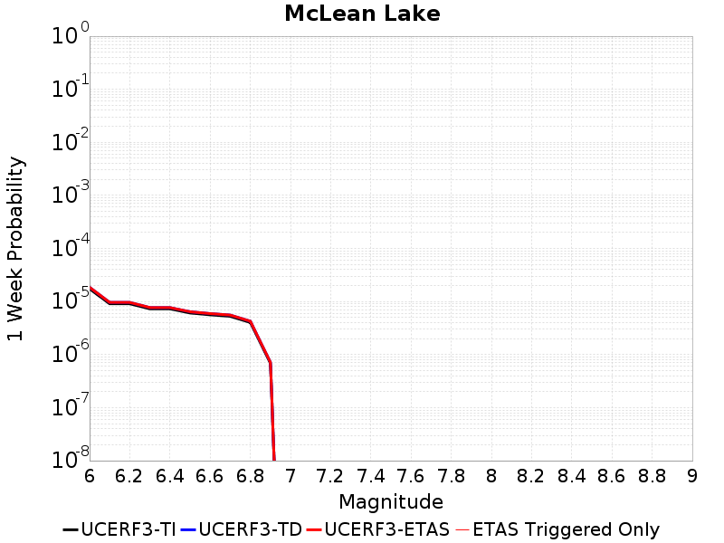 |  |  |

| Magnitude | 1 wk TI Prob | 1 wk TD Prob | 1 wk ETAS Prob | 1 wk ETAS/TD Gain | 1 wk ETAS Triggered Only | 1 mo TI Prob | 1 mo TD Prob | 1 mo ETAS Prob | 1 mo ETAS/TD Gain | 1 mo ETAS Triggered Only | 1 yr TI Prob | 1 yr TD Prob | 1 yr ETAS Prob | 1 yr ETAS/TD Gain | 1 yr ETAS Triggered Only |
|-----|-----|-----|-----|-----|-----|-----|-----|-----|-----|-----|-----|-----|-----|-----|-----|
| 6.0 | 1.7360222E-5 | 1.8505758E-5 | 1.8505758E-5 | 1.0 | 0.0 | 7.439883E-5 | 7.930826E-5 | 7.930826E-5 | 1.0 | 0.0 | 9.0542925E-4 | 9.651989E-4 | 0.0010451217 | 1.0828044 | 8.0E-5 |
| 6.1 | 9.062689E-6 | 9.594095E-6 | 9.594095E-6 | 1.0 | 0.0 | 3.8839516E-5 | 4.1116953E-5 | 4.1116953E-5 | 1.0 | 0.0 | 4.727685E-4 | 5.004928E-4 | 5.404728E-4 | 1.0798812 | 4.0E-5 |
| 6.2 | 9.062689E-6 | 9.594095E-6 | 9.594095E-6 | 1.0 | 0.0 | 3.8839516E-5 | 4.1116953E-5 | 4.1116953E-5 | 1.0 | 0.0 | 4.727685E-4 | 5.004928E-4 | 5.404728E-4 | 1.0798812 | 4.0E-5 |
| 6.3 | 7.2575485E-6 | 7.6691795E-6 | 7.6691795E-6 | 1.0 | 0.0 | 3.110341E-5 | 3.2867538E-5 | 3.2867538E-5 | 1.0 | 0.0 | 3.786182E-4 | 4.0009595E-4 | 4.0009595E-4 | 1.0 | 0.0 |
| 6.4 | 7.2575485E-6 | 7.6691795E-6 | 7.6691795E-6 | 1.0 | 0.0 | 3.110341E-5 | 3.2867538E-5 | 3.2867538E-5 | 1.0 | 0.0 | 3.786182E-4 | 4.0009595E-4 | 4.0009595E-4 | 1.0 | 0.0 |
| 6.5 | 6.06582E-6 | 6.405088E-6 | 6.405088E-6 | 1.0 | 0.0 | 2.5996113E-5 | 2.7450124E-5 | 2.7450124E-5 | 1.0 | 0.0 | 3.164567E-4 | 3.341605E-4 | 3.341605E-4 | 1.0 | 0.0 |
| 6.6 | 5.598744E-6 | 5.9113777E-6 | 5.9113777E-6 | 1.0 | 0.0 | 2.3994397E-5 | 2.5334266E-5 | 2.5334266E-5 | 1.0 | 0.0 | 2.9209262E-4 | 3.0840744E-4 | 3.0840744E-4 | 1.0 | 0.0 |
| 6.7 | 5.246996E-6 | 5.5402083E-6 | 5.5402083E-6 | 1.0 | 0.0 | 2.2486933E-5 | 2.3743569E-5 | 2.3743569E-5 | 1.0 | 0.0 | 2.73744E-4 | 2.8904597E-4 | 2.8904597E-4 | 1.0 | 0.0 |
| 6.8 | 4.02324E-6 | 4.2477054E-6 | 4.2477054E-6 | 1.0 | 0.0 | 1.7242342E-5 | 1.8204359E-5 | 1.8204359E-5 | 1.0 | 0.0 | 2.099053E-4 | 2.2162148E-4 | 2.2162148E-4 | 1.0 | 0.0 |
| 6.9 | 6.835972E-7 | 7.141004E-7 | 7.141004E-7 | 1.0 | 0.0 | 2.9296991E-6 | 3.0604285E-6 | 3.0604285E-6 | 1.0 | 0.0 | 3.56685E-5 | 3.72604E-5 | 3.72604E-5 | 1.0 | 0.0 |

## Blackwater
*[(top)](#table-of-contents)*

| 1 Week | 1 Month | 1 Year |
|-----|-----|-----|
|  |  | 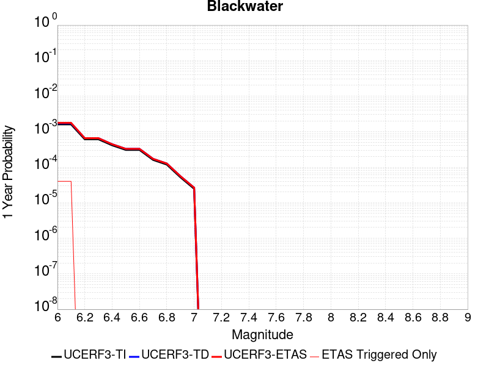 |

| Magnitude | 1 wk TI Prob | 1 wk TD Prob | 1 wk ETAS Prob | 1 wk ETAS/TD Gain | 1 wk ETAS Triggered Only | 1 mo TI Prob | 1 mo TD Prob | 1 mo ETAS Prob | 1 mo ETAS/TD Gain | 1 mo ETAS Triggered Only | 1 yr TI Prob | 1 yr TD Prob | 1 yr ETAS Prob | 1 yr ETAS/TD Gain | 1 yr ETAS Triggered Only |
|-----|-----|-----|-----|-----|-----|-----|-----|-----|-----|-----|-----|-----|-----|-----|-----|
| 6.0 | 3.0708583E-5 | 3.3104585E-5 | 3.3104585E-5 | 1.0 | 0.0 | 1.3160157E-4 | 1.4186984E-4 | 1.8186416E-4 | 1.2819086 | 4.0E-5 | 0.0016010714 | 0.0017260336 | 0.0017659646 | 1.0231345 | 4.0E-5 |
| 6.1 | 3.0708583E-5 | 3.3104585E-5 | 3.3104585E-5 | 1.0 | 0.0 | 1.3160157E-4 | 1.4186984E-4 | 1.8186416E-4 | 1.2819086 | 4.0E-5 | 0.0016010714 | 0.0017260336 | 0.0017659646 | 1.0231345 | 4.0E-5 |
| 6.2 | 1.1707779E-5 | 1.2548166E-5 | 1.2548166E-5 | 1.0 | 0.0 | 5.017523E-5 | 5.3776796E-5 | 5.3776796E-5 | 1.0 | 0.0 | 6.107122E-4 | 6.5454544E-4 | 6.5454544E-4 | 1.0 | 0.0 |
| 6.3 | 1.1707779E-5 | 1.2548166E-5 | 1.2548166E-5 | 1.0 | 0.0 | 5.017523E-5 | 5.3776796E-5 | 5.3776796E-5 | 1.0 | 0.0 | 6.107122E-4 | 6.5454544E-4 | 6.5454544E-4 | 1.0 | 0.0 |
| 6.4 | 7.929244E-6 | 8.482096E-6 | 8.482096E-6 | 1.0 | 0.0 | 3.3982033E-5 | 3.6351354E-5 | 3.6351354E-5 | 1.0 | 0.0 | 4.136527E-4 | 4.424919E-4 | 4.424919E-4 | 1.0 | 0.0 |
| 6.5 | 5.8832115E-6 | 6.2874497E-6 | 6.2874497E-6 | 1.0 | 0.0 | 2.521352E-5 | 2.6945949E-5 | 2.6945949E-5 | 1.0 | 0.0 | 3.0693135E-4 | 3.280201E-4 | 3.280201E-4 | 1.0 | 0.0 |
| 6.6 | 5.8832115E-6 | 6.2874497E-6 | 6.2874497E-6 | 1.0 | 0.0 | 2.521352E-5 | 2.6945949E-5 | 2.6945949E-5 | 1.0 | 0.0 | 3.0693135E-4 | 3.280201E-4 | 3.280201E-4 | 1.0 | 0.0 |
| 6.7 | 3.0715053E-6 | 3.2822265E-6 | 3.2822265E-6 | 1.0 | 0.0 | 1.3163528E-5 | 1.4066616E-5 | 1.4066616E-5 | 1.0 | 0.0 | 1.6025416E-4 | 1.7124876E-4 | 1.7124876E-4 | 1.0 | 0.0 |
| 6.8 | 2.2722281E-6 | 2.4293208E-6 | 2.4293208E-6 | 1.0 | 0.0 | 9.738084E-6 | 1.0411339E-5 | 1.0411339E-5 | 1.0 | 0.0 | 1.1855473E-4 | 1.2675159E-4 | 1.2675159E-4 | 1.0 | 0.0 |
| 6.9 | 9.952399E-7 | 1.0656032E-6 | 1.0656032E-6 | 1.0 | 0.0 | 4.265307E-6 | 4.5668658E-6 | 4.5668658E-6 | 1.0 | 0.0 | 5.1928873E-5 | 5.560069E-5 | 5.560069E-5 | 1.0 | 0.0 |
| 7.0 | 4.7385504E-7 | 5.076783E-7 | 5.076783E-7 | 1.0 | 0.0 | 2.0308057E-6 | 2.1757642E-6 | 2.1757642E-6 | 1.0 | 0.0 | 2.4724779E-5 | 2.6489928E-5 | 2.6489928E-5 | 1.0 | 0.0 |

## Manix-Afton Hills
*[(top)](#table-of-contents)*

| 1 Week | 1 Month | 1 Year |
|-----|-----|-----|
|  |  |  |

| Magnitude | 1 wk TI Prob | 1 wk TD Prob | 1 wk ETAS Prob | 1 wk ETAS/TD Gain | 1 wk ETAS Triggered Only | 1 mo TI Prob | 1 mo TD Prob | 1 mo ETAS Prob | 1 mo ETAS/TD Gain | 1 mo ETAS Triggered Only | 1 yr TI Prob | 1 yr TD Prob | 1 yr ETAS Prob | 1 yr ETAS/TD Gain | 1 yr ETAS Triggered Only |
|-----|-----|-----|-----|-----|-----|-----|-----|-----|-----|-----|-----|-----|-----|-----|-----|
| 6.0 | 1.3783202E-5 | 1.4714453E-5 | 1.4714453E-5 | 1.0 | 0.0 | 5.906953E-5 | 6.3060514E-5 | 6.3060514E-5 | 1.0 | 0.0 | 7.189342E-4 | 7.675088E-4 | 8.074781E-4 | 1.0520767 | 4.0E-5 |
| 6.1 | 1.3783202E-5 | 1.4714453E-5 | 1.4714453E-5 | 1.0 | 0.0 | 5.906953E-5 | 6.3060514E-5 | 6.3060514E-5 | 1.0 | 0.0 | 7.189342E-4 | 7.675088E-4 | 8.074781E-4 | 1.0520767 | 4.0E-5 |
| 6.2 | 1.3783202E-5 | 1.4714453E-5 | 1.4714453E-5 | 1.0 | 0.0 | 5.906953E-5 | 6.3060514E-5 | 6.3060514E-5 | 1.0 | 0.0 | 7.189342E-4 | 7.675088E-4 | 8.074781E-4 | 1.0520767 | 4.0E-5 |
| 6.3 | 1.10494875E-5 | 1.1795832E-5 | 1.1795832E-5 | 1.0 | 0.0 | 4.7354086E-5 | 5.0552644E-5 | 5.0552644E-5 | 1.0 | 0.0 | 5.763835E-4 | 6.1531505E-4 | 6.552904E-4 | 1.0649674 | 4.0E-5 |
| 6.4 | 1.10494875E-5 | 1.1795832E-5 | 1.1795832E-5 | 1.0 | 0.0 | 4.7354086E-5 | 5.0552644E-5 | 5.0552644E-5 | 1.0 | 0.0 | 5.763835E-4 | 6.1531505E-4 | 6.552904E-4 | 1.0649674 | 4.0E-5 |
| 6.5 | 9.788949E-6 | 1.0456734E-5 | 1.0456734E-5 | 1.0 | 0.0 | 4.1951964E-5 | 4.4813856E-5 | 4.4813856E-5 | 1.0 | 0.0 | 5.1064545E-4 | 5.454814E-4 | 5.854596E-4 | 1.0732898 | 4.0E-5 |
| 6.6 | 8.810006E-6 | 9.41582E-6 | 9.41582E-6 | 1.0 | 0.0 | 3.775662E-5 | 4.035294E-5 | 4.035294E-5 | 1.0 | 0.0 | 4.5958988E-4 | 4.911952E-4 | 5.311755E-4 | 1.0813941 | 4.0E-5 |
| 6.7 | 8.80128E-6 | 9.406297E-6 | 9.406297E-6 | 1.0 | 0.0 | 3.7719226E-5 | 4.0312127E-5 | 4.0312127E-5 | 1.0 | 0.0 | 4.591348E-4 | 4.906985E-4 | 5.306789E-4 | 1.0814764 | 4.0E-5 |
| 6.8 | 6.8994877E-6 | 7.3818233E-6 | 7.3818233E-6 | 1.0 | 0.0 | 2.9568899E-5 | 3.163605E-5 | 3.163605E-5 | 1.0 | 0.0 | 3.5994186E-4 | 3.8510896E-4 | 4.2509357E-4 | 1.1038268 | 4.0E-5 |
| 6.9 | 4.9328037E-6 | 5.27219E-6 | 5.27219E-6 | 1.0 | 0.0 | 2.1140417E-5 | 2.2594937E-5 | 2.2594937E-5 | 1.0 | 0.0 | 2.5735417E-4 | 2.750648E-4 | 3.150538E-4 | 1.1453803 | 4.0E-5 |
| 7.0 | 3.347973E-6 | 3.5909125E-6 | 3.5909125E-6 | 1.0 | 0.0 | 1.4348378E-5 | 1.5389556E-5 | 1.5389556E-5 | 1.0 | 0.0 | 1.746775E-4 | 1.8735585E-4 | 2.2734836E-4 | 1.2134575 | 4.0E-5 |
| 7.1 | 1.2073567E-6 | 1.2937948E-6 | 1.2937948E-6 | 1.0 | 0.0 | 5.1743755E-6 | 5.544832E-6 | 5.544832E-6 | 1.0 | 0.0 | 6.29962E-5 | 6.750788E-5 | 1.0750518E-4 | 1.5924834 | 4.0E-5 |

## Garlock (East)
*[(top)](#table-of-contents)*

| 1 Week | 1 Month | 1 Year |
|-----|-----|-----|
| 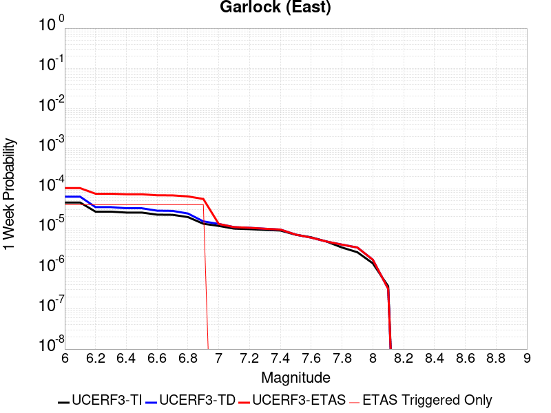 |  |  |

| Magnitude | 1 wk TI Prob | 1 wk TD Prob | 1 wk ETAS Prob | 1 wk ETAS/TD Gain | 1 wk ETAS Triggered Only | 1 mo TI Prob | 1 mo TD Prob | 1 mo ETAS Prob | 1 mo ETAS/TD Gain | 1 mo ETAS Triggered Only | 1 yr TI Prob | 1 yr TD Prob | 1 yr ETAS Prob | 1 yr ETAS/TD Gain | 1 yr ETAS Triggered Only |
|-----|-----|-----|-----|-----|-----|-----|-----|-----|-----|-----|-----|-----|-----|-----|-----|
| 6.0 | 4.5092507E-5 | 6.302061E-5 | 1.03018094E-4 | 1.6346729 | 4.0E-5 | 1.9323928E-4 | 2.700629E-4 | 3.100521E-4 | 1.1480737 | 4.0E-5 | 0.0023501497 | 0.0032835056 | 0.003323374 | 1.0121421 | 4.0E-5 |
| 6.1 | 4.5092507E-5 | 6.302061E-5 | 1.03018094E-4 | 1.6346729 | 4.0E-5 | 1.9323928E-4 | 2.700629E-4 | 3.100521E-4 | 1.1480737 | 4.0E-5 | 0.0023501497 | 0.0032835056 | 0.003323374 | 1.0121421 | 4.0E-5 |
| 6.2 | 2.6674514E-5 | 3.460235E-5 | 7.460097E-5 | 2.1559508 | 4.0E-5 | 1.1431433E-4 | 1.4828754E-4 | 1.8828161E-4 | 1.2697061 | 4.0E-5 | 0.0013908884 | 0.001803939 | 0.0018438668 | 1.0221337 | 4.0E-5 |
| 6.3 | 2.6674514E-5 | 3.460235E-5 | 7.460097E-5 | 2.1559508 | 4.0E-5 | 1.1431433E-4 | 1.4828754E-4 | 1.8828161E-4 | 1.2697061 | 4.0E-5 | 0.0013908884 | 0.001803939 | 0.0018438668 | 1.0221337 | 4.0E-5 |
| 6.4 | 2.5312667E-5 | 3.243003E-5 | 7.242873E-5 | 2.2333848 | 4.0E-5 | 1.0847834E-4 | 1.389786E-4 | 1.7897304E-4 | 1.2877741 | 4.0E-5 | 0.0013199237 | 0.0016907807 | 0.0017307131 | 1.0236177 | 4.0E-5 |
| 6.5 | 2.5312667E-5 | 3.243003E-5 | 7.242873E-5 | 2.2333848 | 4.0E-5 | 1.0847834E-4 | 1.389786E-4 | 1.7897304E-4 | 1.2877741 | 4.0E-5 | 0.0013199237 | 0.0016907807 | 0.0017307131 | 1.0236177 | 4.0E-5 |
| 6.6 | 2.246556E-5 | 2.8214976E-5 | 6.821385E-5 | 2.417647 | 4.0E-5 | 9.627742E-5 | 1.2091586E-4 | 1.6091102E-4 | 1.3307686 | 4.0E-5 | 0.0011715472 | 0.00147118 | 0.0015111212 | 1.0271491 | 4.0E-5 |
| 6.7 | 2.2241198E-5 | 2.7884198E-5 | 6.7883084E-5 | 2.4344642 | 4.0E-5 | 9.531594E-5 | 1.1949836E-4 | 1.5949359E-4 | 1.3346926 | 4.0E-5 | 0.0011598538 | 0.0014539452 | 0.001493887 | 1.0274713 | 4.0E-5 |
| 6.8 | 1.9528685E-5 | 2.3971877E-5 | 6.397092E-5 | 2.668582 | 4.0E-5 | 8.369167E-5 | 1.0273269E-4 | 1.4272858E-4 | 1.38932 | 4.0E-5 | 0.0010184698 | 0.0012500725 | 0.0012900225 | 1.0319581 | 4.0E-5 |
| 6.9 | 1.3318621E-5 | 1.5256402E-5 | 5.525579E-5 | 3.6218102 | 4.0E-5 | 5.7078556E-5 | 6.538297E-5 | 1.0538036E-4 | 1.6117401 | 4.0E-5 | 6.9470983E-4 | 7.957527E-4 | 8.3572086E-4 | 1.0502269 | 4.0E-5 |
| 7.0 | 1.1760853E-5 | 1.3163365E-5 | 1.3163365E-5 | 1.0 | 0.0 | 5.0402683E-5 | 5.641323E-5 | 5.641323E-5 | 1.0 | 0.0 | 6.134799E-4 | 6.8661966E-4 | 6.8661966E-4 | 1.0 | 0.0 |
| 7.1 | 1.0064758E-5 | 1.0956659E-5 | 1.0956659E-5 | 1.0 | 0.0 | 4.3133965E-5 | 4.6956284E-5 | 4.6956284E-5 | 1.0 | 0.0 | 5.2502943E-4 | 5.715463E-4 | 5.715463E-4 | 1.0 | 0.0 |
| 7.2 | 9.768808E-6 | 1.0552171E-5 | 1.0552171E-5 | 1.0 | 0.0 | 4.186565E-5 | 4.5222823E-5 | 4.5222823E-5 | 1.0 | 0.0 | 5.095951E-4 | 5.504523E-4 | 5.504523E-4 | 1.0 | 0.0 |
| 7.3 | 9.344516E-6 | 9.99686E-6 | 9.99686E-6 | 1.0 | 0.0 | 4.004731E-5 | 4.2843003E-5 | 4.2843003E-5 | 1.0 | 0.0 | 4.8746695E-4 | 5.214922E-4 | 5.214922E-4 | 1.0 | 0.0 |
| 7.4 | 9.023491E-6 | 9.542039E-6 | 9.542039E-6 | 1.0 | 0.0 | 3.867153E-5 | 4.0893832E-5 | 4.0893832E-5 | 1.0 | 0.0 | 4.7072413E-4 | 4.9777207E-4 | 4.9777207E-4 | 1.0 | 0.0 |
| 7.5 | 7.081253E-6 | 7.1334935E-6 | 7.1334935E-6 | 1.0 | 0.0 | 3.0347876E-5 | 3.057176E-5 | 3.057176E-5 | 1.0 | 0.0 | 3.6942272E-4 | 3.7214835E-4 | 3.7214835E-4 | 1.0 | 0.0 |
| 7.6 | 6.116396E-6 | 6.0000416E-6 | 6.0000416E-6 | 1.0 | 0.0 | 2.6212863E-5 | 2.5714213E-5 | 2.5714213E-5 | 1.0 | 0.0 | 3.1909486E-4 | 3.130258E-4 | 3.130258E-4 | 1.0 | 0.0 |
| 7.7 | 4.797145E-6 | 4.795929E-6 | 4.795929E-6 | 1.0 | 0.0 | 2.055903E-5 | 2.055382E-5 | 2.055382E-5 | 1.0 | 0.0 | 2.5027743E-4 | 2.5021416E-4 | 2.5021416E-4 | 1.0 | 0.0 |
| 7.8 | 3.4028885E-6 | 4.0130544E-6 | 4.0130544E-6 | 1.0 | 0.0 | 1.4583726E-5 | 1.7198692E-5 | 1.7198692E-5 | 1.0 | 0.0 | 1.775424E-4 | 2.0937403E-4 | 2.0937403E-4 | 1.0 | 0.0 |
| 7.9 | 2.5928412E-6 | 3.4017612E-6 | 3.4017612E-6 | 1.0 | 0.0 | 1.1112129E-5 | 1.4578895E-5 | 1.4578895E-5 | 1.0 | 0.0 | 1.3528178E-4 | 1.7748366E-4 | 1.7748366E-4 | 1.0 | 0.0 |
| 8.0 | 1.3743648E-6 | 1.6867408E-6 | 1.6867408E-6 | 1.0 | 0.0 | 5.8901214E-6 | 7.2288694E-6 | 7.2288694E-6 | 1.0 | 0.0 | 7.1709874E-5 | 8.800796E-5 | 8.800796E-5 | 1.0 | 0.0 |
| 8.1 | 3.6733252E-7 | 3.1722044E-7 | 3.1722044E-7 | 1.0 | 0.0 | 1.5742813E-6 | 1.3595155E-6 | 1.3595155E-6 | 1.0 | 0.0 | 1.9166706E-5 | 1.6551992E-5 | 1.6551992E-5 | 1.0 | 0.0 |

## Calaveras (So) - Paicines extension 2011 CFM
*[(top)](#table-of-contents)*

| 1 Week | 1 Month | 1 Year |
|-----|-----|-----|
|  |  |  |

| Magnitude | 1 wk TI Prob | 1 wk TD Prob | 1 wk ETAS Prob | 1 wk ETAS/TD Gain | 1 wk ETAS Triggered Only | 1 mo TI Prob | 1 mo TD Prob | 1 mo ETAS Prob | 1 mo ETAS/TD Gain | 1 mo ETAS Triggered Only | 1 yr TI Prob | 1 yr TD Prob | 1 yr ETAS Prob | 1 yr ETAS/TD Gain | 1 yr ETAS Triggered Only |
|-----|-----|-----|-----|-----|-----|-----|-----|-----|-----|-----|-----|-----|-----|-----|-----|
| 6.0 | 1.5183659E-4 | 3.058916E-4 | 3.058916E-4 | 1.0 | 0.0 | 6.5056595E-4 | 0.0013097163 | 0.0013097163 | 1.0 | 0.0 | 0.007891912 | 0.015730867 | 0.015770238 | 1.0025028 | 4.0E-5 |
| 6.1 | 1.5024997E-4 | 3.028294E-4 | 3.028294E-4 | 1.0 | 0.0 | 6.437695E-4 | 0.0012966117 | 0.0012966117 | 1.0 | 0.0 | 0.0078097614 | 0.015574093 | 0.01561347 | 1.0025283 | 4.0E-5 |
| 6.2 | 1.2743923E-4 | 2.5378828E-4 | 2.5378828E-4 | 1.0 | 0.0 | 5.460538E-4 | 0.0010868111 | 0.0010868111 | 1.0 | 0.0 | 0.0066279583 | 0.013080635 | 0.013120112 | 1.0030179 | 4.0E-5 |
| 6.3 | 1.1525114E-4 | 2.266418E-4 | 2.266418E-4 | 1.0 | 0.0 | 4.9383997E-4 | 9.706734E-4 | 9.706734E-4 | 1.0 | 0.0 | 0.0059959386 | 0.011701727 | 0.011741259 | 1.0033783 | 4.0E-5 |
| 6.4 | 1.07200925E-4 | 2.0905094E-4 | 2.0905094E-4 | 1.0 | 0.0 | 4.5935164E-4 | 8.953991E-4 | 8.953991E-4 | 1.0 | 0.0 | 0.0055782744 | 0.010806446 | 0.010846014 | 1.0036615 | 4.0E-5 |
| 6.5 | 9.69631E-5 | 1.8797735E-4 | 1.8797735E-4 | 1.0 | 0.0 | 4.1548995E-4 | 8.0519065E-4 | 8.0519065E-4 | 1.0 | 0.0 | 0.0050468626 | 0.009727674 | 0.009767285 | 1.004072 | 4.0E-5 |
| 6.6 | 8.0552316E-5 | 1.5134095E-4 | 1.5134095E-4 | 1.0 | 0.0 | 3.4517853E-4 | 6.4840337E-4 | 6.4840337E-4 | 1.0 | 0.0 | 0.0041944524 | 0.007859206 | 0.007898891 | 1.0050496 | 4.0E-5 |
| 6.7 | 7.815757E-5 | 1.4674113E-4 | 1.4674113E-4 | 1.0 | 0.0 | 3.34918E-4 | 6.2870386E-4 | 6.2870386E-4 | 1.0 | 0.0 | 0.004070005 | 0.00762175 | 0.007661445 | 1.0052081 | 4.0E-5 |
| 6.8 | 6.965264E-5 | 1.278175E-4 | 1.278175E-4 | 1.0 | 0.0 | 2.9847719E-4 | 5.476545E-4 | 5.476545E-4 | 1.0 | 0.0 | 0.0036279052 | 0.0066440827 | 0.0066838167 | 1.0059804 | 4.0E-5 |
| 6.9 | 5.8000453E-5 | 1.0197004E-4 | 1.0197004E-4 | 1.0 | 0.0 | 2.4854968E-4 | 4.3694186E-4 | 4.3694186E-4 | 1.0 | 0.0 | 0.0030218933 | 0.005306889 | 0.005346677 | 1.0074974 | 4.0E-5 |
| 7.0 | 4.9865852E-5 | 8.614713E-5 | 8.614713E-5 | 1.0 | 0.0 | 2.1369329E-4 | 3.691502E-4 | 3.691502E-4 | 1.0 | 0.0 | 0.0025986114 | 0.0044852314 | 0.004525052 | 1.0088781 | 4.0E-5 |
| 7.1 | 4.283875E-5 | 7.154534E-5 | 7.154534E-5 | 1.0 | 0.0 | 1.8358172E-4 | 3.0658717E-4 | 3.0658717E-4 | 1.0 | 0.0 | 0.0022328163 | 0.0037263667 | 0.0037662177 | 1.0106943 | 4.0E-5 |
| 7.2 | 3.450115E-5 | 5.6180077E-5 | 5.6180077E-5 | 1.0 | 0.0 | 1.478537E-4 | 2.4074971E-4 | 2.4074971E-4 | 1.0 | 0.0 | 0.0017986323 | 0.0029272172 | 0.0029671001 | 1.0136249 | 4.0E-5 |
| 7.3 | 2.5709045E-5 | 4.092334E-5 | 4.092334E-5 | 1.0 | 0.0 | 1.1017697E-4 | 1.7537405E-4 | 1.7537405E-4 | 1.0 | 0.0 | 0.0013405791 | 0.0021331052 | 0.00217302 | 1.018712 | 4.0E-5 |
| 7.4 | 1.8003093E-5 | 2.8743207E-5 | 2.8743207E-5 | 1.0 | 0.0 | 7.715383E-5 | 1.2317937E-4 | 1.2317937E-4 | 1.0 | 0.0 | 9.3894306E-4 | 0.0014986794 | 0.0015386195 | 1.0266502 | 4.0E-5 |
| 7.5 | 1.5595824E-5 | 2.6044754E-5 | 2.6044754E-5 | 1.0 | 0.0 | 6.683753E-5 | 1.1161561E-4 | 1.1161561E-4 | 1.0 | 0.0 | 8.134431E-4 | 0.0013580752 | 0.0013980209 | 1.0294135 | 4.0E-5 |
| 7.6 | 1.1110309E-5 | 1.9413746E-5 | 1.9413746E-5 | 1.0 | 0.0 | 4.761474E-5 | 8.319912E-5 | 8.319912E-5 | 1.0 | 0.0 | 5.795553E-4 | 0.00101248 | 0.0010524394 | 1.039467 | 4.0E-5 |
| 7.7 | 6.2140443E-6 | 1.0582229E-5 | 1.0582229E-5 | 1.0 | 0.0 | 2.6631347E-5 | 4.5351622E-5 | 4.5351622E-5 | 1.0 | 0.0 | 3.241884E-4 | 5.520162E-4 | 5.9199415E-4 | 1.0724217 | 4.0E-5 |
| 7.8 | 5.305533E-6 | 9.562843E-6 | 9.562843E-6 | 1.0 | 0.0 | 2.27378E-5 | 4.098297E-5 | 4.098297E-5 | 1.0 | 0.0 | 2.7679754E-4 | 4.988535E-4 | 5.3883356E-4 | 1.0801438 | 4.0E-5 |
| 7.9 | 3.363505E-6 | 7.481766E-6 | 7.481766E-6 | 1.0 | 0.0 | 1.4414942E-5 | 3.2064316E-5 | 3.2064316E-5 | 1.0 | 0.0 | 1.7548777E-4 | 3.9031322E-4 | 4.302976E-4 | 1.1024418 | 4.0E-5 |
| 8.0 | 2.0271132E-6 | 4.46918E-6 | 4.46918E-6 | 1.0 | 0.0 | 8.687599E-6 | 1.9153487E-5 | 1.9153487E-5 | 1.0 | 0.0 | 1.05766376E-4 | 2.3316882E-4 | 2.3316882E-4 | 1.0 | 0.0 |
| 8.1 | 1.2206116E-6 | 2.4070437E-6 | 2.4070437E-6 | 1.0 | 0.0 | 5.2311816E-6 | 1.0315861E-5 | 1.0315861E-5 | 1.0 | 0.0 | 6.3687774E-5 | 1.255884E-4 | 1.255884E-4 | 1.0 | 0.0 |

## Cleghorn
*[(top)](#table-of-contents)*

| 1 Week | 1 Month | 1 Year |
|-----|-----|-----|
| 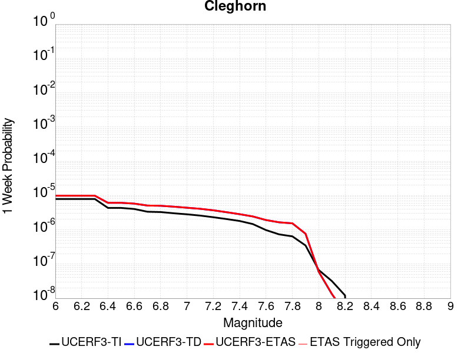 | 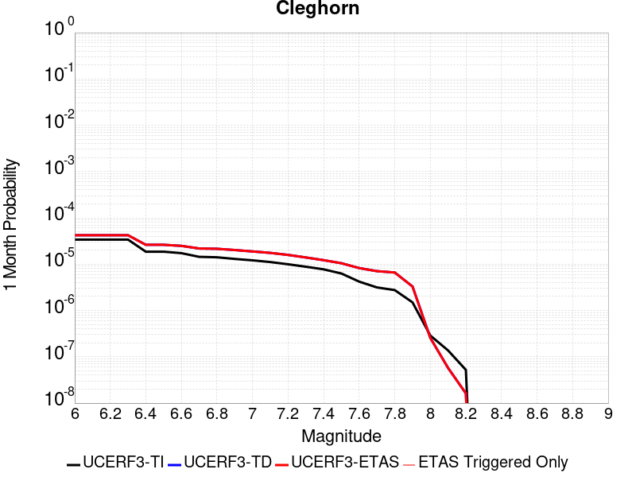 | 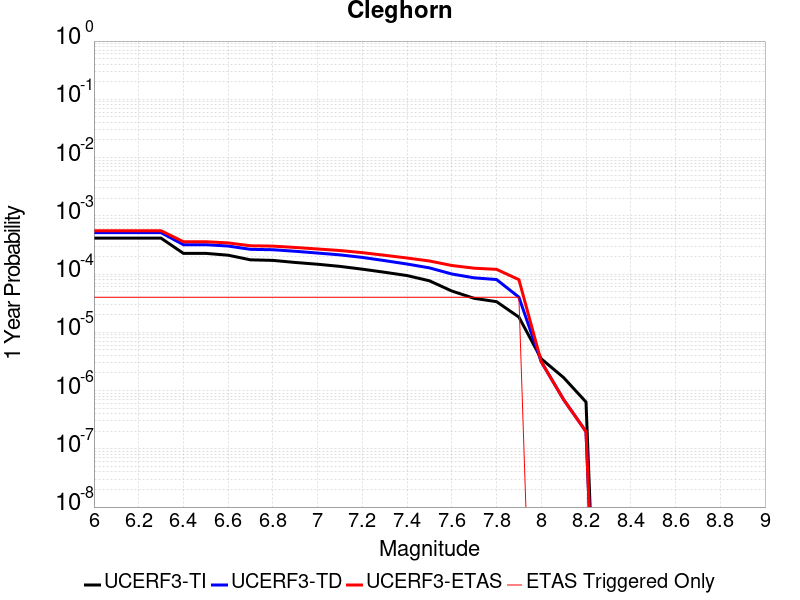 |

| Magnitude | 1 wk TI Prob | 1 wk TD Prob | 1 wk ETAS Prob | 1 wk ETAS/TD Gain | 1 wk ETAS Triggered Only | 1 mo TI Prob | 1 mo TD Prob | 1 mo ETAS Prob | 1 mo ETAS/TD Gain | 1 mo ETAS Triggered Only | 1 yr TI Prob | 1 yr TD Prob | 1 yr ETAS Prob | 1 yr ETAS/TD Gain | 1 yr ETAS Triggered Only |
|-----|-----|-----|-----|-----|-----|-----|-----|-----|-----|-----|-----|-----|-----|-----|-----|
| 6.0 | 7.9267165E-6 | 9.860011E-6 | 9.860011E-6 | 1.0 | 0.0 | 3.39712E-5 | 4.2256568E-5 | 4.2256568E-5 | 1.0 | 0.0 | 4.1352084E-4 | 5.143629E-4 | 5.5434235E-4 | 1.0777261 | 4.0E-5 |
| 6.1 | 7.9267165E-6 | 9.860011E-6 | 9.860011E-6 | 1.0 | 0.0 | 3.39712E-5 | 4.2256568E-5 | 4.2256568E-5 | 1.0 | 0.0 | 4.1352084E-4 | 5.143629E-4 | 5.5434235E-4 | 1.0777261 | 4.0E-5 |
| 6.2 | 7.9267165E-6 | 9.860011E-6 | 9.860011E-6 | 1.0 | 0.0 | 3.39712E-5 | 4.2256568E-5 | 4.2256568E-5 | 1.0 | 0.0 | 4.1352084E-4 | 5.143629E-4 | 5.5434235E-4 | 1.0777261 | 4.0E-5 |
| 6.3 | 7.9267165E-6 | 9.860011E-6 | 9.860011E-6 | 1.0 | 0.0 | 3.39712E-5 | 4.2256568E-5 | 4.2256568E-5 | 1.0 | 0.0 | 4.1352084E-4 | 5.143629E-4 | 5.5434235E-4 | 1.0777261 | 4.0E-5 |
| 6.4 | 4.3445207E-6 | 6.119313E-6 | 6.119313E-6 | 1.0 | 0.0 | 1.8619241E-5 | 2.622537E-5 | 2.622537E-5 | 1.0 | 0.0 | 2.2666567E-4 | 3.1924812E-4 | 3.5923536E-4 | 1.1252544 | 4.0E-5 |
| 6.5 | 4.3445207E-6 | 6.119313E-6 | 6.119313E-6 | 1.0 | 0.0 | 1.8619241E-5 | 2.622537E-5 | 2.622537E-5 | 1.0 | 0.0 | 2.2666567E-4 | 3.1924812E-4 | 3.5923536E-4 | 1.1252544 | 4.0E-5 |
| 6.6 | 4.040109E-6 | 5.8016744E-6 | 5.8016744E-6 | 1.0 | 0.0 | 1.7314638E-5 | 2.4864088E-5 | 2.4864088E-5 | 1.0 | 0.0 | 2.1078532E-4 | 3.0267914E-4 | 3.4266704E-4 | 1.1321131 | 4.0E-5 |
| 6.7 | 3.3632055E-6 | 5.095068E-6 | 5.095068E-6 | 1.0 | 0.0 | 1.4413658E-5 | 2.1835825E-5 | 2.1835825E-5 | 1.0 | 0.0 | 1.7547216E-4 | 2.6581905E-4 | 3.0580844E-4 | 1.1504383 | 4.0E-5 |
| 6.8 | 3.2902772E-6 | 5.016956E-6 | 5.016956E-6 | 1.0 | 0.0 | 1.4101111E-5 | 2.1501066E-5 | 2.1501066E-5 | 1.0 | 0.0 | 1.716675E-4 | 2.6174434E-4 | 3.0173387E-4 | 1.1527809 | 4.0E-5 |
| 6.9 | 3.031547E-6 | 4.7183826E-6 | 4.7183826E-6 | 1.0 | 0.0 | 1.299228E-5 | 2.0221485E-5 | 2.0221485E-5 | 1.0 | 0.0 | 1.5816953E-4 | 2.4616905E-4 | 2.861592E-4 | 1.16245 | 4.0E-5 |
| 7.0 | 2.8259715E-6 | 4.3970613E-6 | 4.3970613E-6 | 1.0 | 0.0 | 1.211125E-5 | 1.8844414E-5 | 1.8844414E-5 | 1.0 | 0.0 | 1.4744449E-4 | 2.2940683E-4 | 2.6939766E-4 | 1.1743227 | 4.0E-5 |
| 7.1 | 2.5962665E-6 | 4.091863E-6 | 4.091863E-6 | 1.0 | 0.0 | 1.1126809E-5 | 1.753644E-5 | 1.753644E-5 | 1.0 | 0.0 | 1.3546048E-4 | 2.1348546E-4 | 2.5347693E-4 | 1.1873264 | 4.0E-5 |
| 7.2 | 2.3247253E-6 | 3.7018629E-6 | 3.7018629E-6 | 1.0 | 0.0 | 9.96307E-6 | 1.5865031E-5 | 1.5865031E-5 | 1.0 | 0.0 | 1.21293626E-4 | 1.9313981E-4 | 2.331321E-4 | 1.2070638 | 4.0E-5 |
| 7.3 | 2.056928E-6 | 3.259398E-6 | 3.259398E-6 | 1.0 | 0.0 | 8.815376E-6 | 1.39687745E-5 | 1.39687745E-5 | 1.0 | 0.0 | 1.0732192E-4 | 1.7005672E-4 | 2.1004991E-4 | 1.2351756 | 4.0E-5 |
| 7.4 | 1.8055999E-6 | 2.848641E-6 | 2.848641E-6 | 1.0 | 0.0 | 7.738263E-6 | 1.2208406E-5 | 1.2208406E-5 | 1.0 | 0.0 | 9.4209274E-5 | 1.4862734E-4 | 1.886214E-4 | 1.2690895 | 4.0E-5 |
| 7.5 | 1.4683443E-6 | 2.4473384E-6 | 2.4473384E-6 | 1.0 | 0.0 | 6.292889E-6 | 1.0488551E-5 | 1.0488551E-5 | 1.0 | 0.0 | 7.661323E-5 | 1.2769073E-4 | 1.6768562E-4 | 1.3132169 | 4.0E-5 |
| 7.6 | 9.804088E-7 | 1.922553E-6 | 1.922553E-6 | 1.0 | 0.0 | 4.201745E-6 | 8.239488E-6 | 8.239488E-6 | 1.0 | 0.0 | 5.1155046E-5 | 1.003112E-4 | 1.4030718E-4 | 1.3987191 | 4.0E-5 |
| 7.7 | 7.3434086E-7 | 1.6504058E-6 | 1.6504058E-6 | 1.0 | 0.0 | 3.1471714E-6 | 7.0731485E-6 | 7.0731485E-6 | 1.0 | 0.0 | 3.831614E-5 | 8.611221E-5 | 1.2610876E-4 | 1.4644703 | 4.0E-5 |
| 7.8 | 6.434184E-7 | 1.54314E-6 | 1.54314E-6 | 1.0 | 0.0 | 2.7575045E-6 | 6.6134407E-6 | 6.6134407E-6 | 1.0 | 0.0 | 3.35721E-5 | 8.051569E-5 | 1.2051247E-4 | 1.4967576 | 4.0E-5 |
| 7.9 | 3.4943926E-7 | 7.6891484E-7 | 7.6891484E-7 | 1.0 | 0.0 | 1.497596E-6 | 3.295345E-6 | 3.295345E-6 | 1.0 | 0.0 | 1.8233079E-5 | 4.0120096E-5 | 8.0118494E-5 | 1.9969666 | 4.0E-5 |
| 8.0 | 6.717524E-8 | 5.973961E-8 | 5.973961E-8 | 1.0 | 0.0 | 2.8789387E-7 | 2.5602688E-7 | 2.5602688E-7 | 1.0 | 0.0 | 3.505102E-6 | 3.1171228E-6 | 3.1171228E-6 | 1.0 | 0.0 |
| 8.1 | 3.1984914E-8 | 1.3392032E-8 | 1.3392032E-8 | 1.0 | 0.0 | 1.370782E-7 | 5.7394423E-8 | 5.7394423E-8 | 1.0 | 0.0 | 1.6689258E-6 | 6.987769E-7 | 6.987769E-7 | 1.0 | 0.0 |
| 8.2 | 1.21887656E-8 | 3.7836694E-9 | 3.7836694E-9 | 1.0 | 0.0 | 5.2237567E-8 | 1.6215727E-8 | 1.6215727E-8 | 1.0 | 0.0 | 6.359922E-7 | 1.9742646E-7 | 1.9742646E-7 | 1.0 | 0.0 |

## Raymond
*[(top)](#table-of-contents)*

| 1 Week | 1 Month | 1 Year |
|-----|-----|-----|
|  |  | 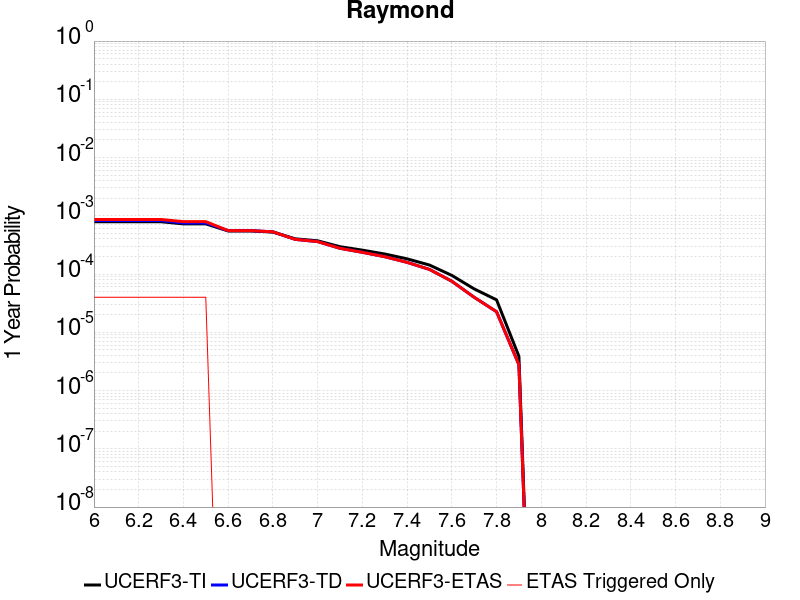 |

| Magnitude | 1 wk TI Prob | 1 wk TD Prob | 1 wk ETAS Prob | 1 wk ETAS/TD Gain | 1 wk ETAS Triggered Only | 1 mo TI Prob | 1 mo TD Prob | 1 mo ETAS Prob | 1 mo ETAS/TD Gain | 1 mo ETAS Triggered Only | 1 yr TI Prob | 1 yr TD Prob | 1 yr ETAS Prob | 1 yr ETAS/TD Gain | 1 yr ETAS Triggered Only |
|-----|-----|-----|-----|-----|-----|-----|-----|-----|-----|-----|-----|-----|-----|-----|-----|
| 6.0 | 1.5157413E-5 | 1.5816651E-5 | 5.5816017E-5 | 3.5289404 | 4.0E-5 | 6.4958724E-5 | 6.778403E-5 | 1.07781314E-4 | 1.5900695 | 4.0E-5 | 7.905855E-4 | 8.249831E-4 | 8.649501E-4 | 1.0484458 | 4.0E-5 |
| 6.1 | 1.5157413E-5 | 1.5816651E-5 | 5.5816017E-5 | 3.5289404 | 4.0E-5 | 6.4958724E-5 | 6.778403E-5 | 1.07781314E-4 | 1.5900695 | 4.0E-5 | 7.905855E-4 | 8.249831E-4 | 8.649501E-4 | 1.0484458 | 4.0E-5 |
| 6.2 | 1.5157413E-5 | 1.5816651E-5 | 5.5816017E-5 | 3.5289404 | 4.0E-5 | 6.4958724E-5 | 6.778403E-5 | 1.07781314E-4 | 1.5900695 | 4.0E-5 | 7.905855E-4 | 8.249831E-4 | 8.649501E-4 | 1.0484458 | 4.0E-5 |
| 6.3 | 1.5157413E-5 | 1.5816651E-5 | 5.5816017E-5 | 3.5289404 | 4.0E-5 | 6.4958724E-5 | 6.778403E-5 | 1.07781314E-4 | 1.5900695 | 4.0E-5 | 7.905855E-4 | 8.249831E-4 | 8.649501E-4 | 1.0484458 | 4.0E-5 |
| 6.4 | 1.3941944E-5 | 1.4460684E-5 | 5.4460106E-5 | 3.7660809 | 4.0E-5 | 5.9749822E-5 | 6.197302E-5 | 1.0197054E-4 | 1.6454022 | 4.0E-5 | 7.2721124E-4 | 7.542837E-4 | 7.942535E-4 | 1.0529904 | 4.0E-5 |
| 6.5 | 1.3941944E-5 | 1.4460684E-5 | 5.4460106E-5 | 3.7660809 | 4.0E-5 | 5.9749822E-5 | 6.197302E-5 | 1.0197054E-4 | 1.6454022 | 4.0E-5 | 7.2721124E-4 | 7.542837E-4 | 7.942535E-4 | 1.0529904 | 4.0E-5 |
| 6.6 | 1.0542609E-5 | 1.0675657E-5 | 1.0675657E-5 | 1.0 | 0.0 | 4.5181827E-5 | 4.5752044E-5 | 4.5752044E-5 | 1.0 | 0.0 | 5.499499E-4 | 5.568942E-4 | 5.568942E-4 | 1.0 | 0.0 |
| 6.7 | 1.0542609E-5 | 1.0675657E-5 | 1.0675657E-5 | 1.0 | 0.0 | 4.5181827E-5 | 4.5752044E-5 | 4.5752044E-5 | 1.0 | 0.0 | 5.499499E-4 | 5.568942E-4 | 5.568942E-4 | 1.0 | 0.0 |
| 6.8 | 1.0079132E-5 | 1.0181076E-5 | 1.0181076E-5 | 1.0 | 0.0 | 4.3195567E-5 | 4.363248E-5 | 4.363248E-5 | 1.0 | 0.0 | 5.257791E-4 | 5.311013E-4 | 5.311013E-4 | 1.0 | 0.0 |
| 6.9 | 7.721598E-6 | 7.552302E-6 | 7.552302E-6 | 1.0 | 0.0 | 3.3092143E-5 | 3.2366614E-5 | 3.2366614E-5 | 1.0 | 0.0 | 4.0282236E-4 | 3.9399348E-4 | 3.9399348E-4 | 1.0 | 0.0 |
| 7.0 | 7.137566E-6 | 6.9145035E-6 | 6.9145035E-6 | 1.0 | 0.0 | 3.058921E-5 | 2.9633255E-5 | 2.9633255E-5 | 1.0 | 0.0 | 3.7236E-4 | 3.6072623E-4 | 3.6072623E-4 | 1.0 | 0.0 |
| 7.1 | 5.654976E-6 | 5.3022604E-6 | 5.3022604E-6 | 1.0 | 0.0 | 2.4235387E-5 | 2.2723776E-5 | 2.2723776E-5 | 1.0 | 0.0 | 2.9502588E-4 | 2.7662705E-4 | 2.7662705E-4 | 1.0 | 0.0 |
| 7.2 | 4.9358455E-6 | 4.529158E-6 | 4.529158E-6 | 1.0 | 0.0 | 2.1153453E-5 | 1.9410534E-5 | 1.9410534E-5 | 1.0 | 0.0 | 2.5751285E-4 | 2.3629777E-4 | 2.3629777E-4 | 1.0 | 0.0 |
| 7.3 | 4.2368597E-6 | 3.8079293E-6 | 3.8079293E-6 | 1.0 | 0.0 | 1.8157843E-5 | 1.6319596E-5 | 1.6319596E-5 | 1.0 | 0.0 | 2.2104931E-4 | 1.9867306E-4 | 1.9867306E-4 | 1.0 | 0.0 |
| 7.4 | 3.4999923E-6 | 3.045825E-6 | 3.045825E-6 | 1.0 | 0.0 | 1.49998805E-5 | 1.3053471E-5 | 1.3053471E-5 | 1.0 | 0.0 | 1.8260824E-4 | 1.589145E-4 | 1.589145E-4 | 1.0 | 0.0 |
| 7.5 | 2.738017E-6 | 2.303755E-6 | 2.303755E-6 | 1.0 | 0.0 | 1.1734306E-5 | 9.873199E-6 | 9.873199E-6 | 1.0 | 0.0 | 1.428558E-4 | 1.20199635E-4 | 1.20199635E-4 | 1.0 | 0.0 |
| 7.6 | 1.8186392E-6 | 1.4435308E-6 | 1.4435308E-6 | 1.0 | 0.0 | 7.794145E-6 | 6.1865458E-6 | 6.1865458E-6 | 1.0 | 0.0 | 9.488958E-5 | 7.531863E-5 | 7.531863E-5 | 1.0 | 0.0 |
| 7.7 | 1.0660348E-6 | 7.653782E-7 | 7.653782E-7 | 1.0 | 0.0 | 4.5687125E-6 | 3.2801881E-6 | 3.2801881E-6 | 1.0 | 0.0 | 5.5622655E-5 | 3.9935578E-5 | 3.9935578E-5 | 1.0 | 0.0 |
| 7.8 | 6.913602E-7 | 4.3288983E-7 | 4.3288983E-7 | 1.0 | 0.0 | 2.962969E-6 | 1.855241E-6 | 1.855241E-6 | 1.0 | 0.0 | 3.607355E-5 | 2.258733E-5 | 2.258733E-5 | 1.0 | 0.0 |
| 7.9 | 7.425201E-8 | 5.330067E-8 | 5.330067E-8 | 1.0 | 0.0 | 3.1822285E-7 | 2.2843143E-7 | 2.2843143E-7 | 1.0 | 0.0 | 3.874356E-6 | 2.7811504E-6 | 2.7811504E-6 | 1.0 | 0.0 |

## San Pedro Basin
*[(top)](#table-of-contents)*

| 1 Week | 1 Month | 1 Year |
|-----|-----|-----|
|  | 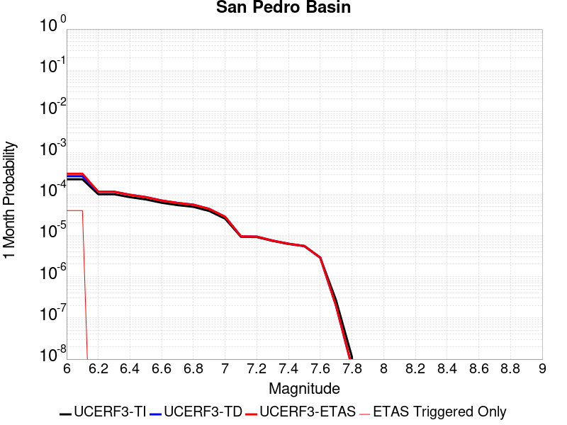 | 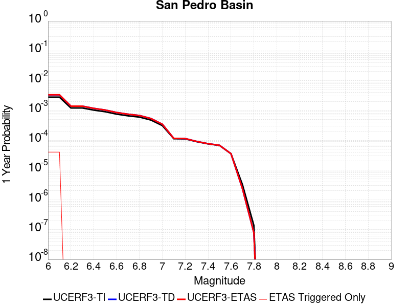 |

| Magnitude | 1 wk TI Prob | 1 wk TD Prob | 1 wk ETAS Prob | 1 wk ETAS/TD Gain | 1 wk ETAS Triggered Only | 1 mo TI Prob | 1 mo TD Prob | 1 mo ETAS Prob | 1 mo ETAS/TD Gain | 1 mo ETAS Triggered Only | 1 yr TI Prob | 1 yr TD Prob | 1 yr ETAS Prob | 1 yr ETAS/TD Gain | 1 yr ETAS Triggered Only |
|-----|-----|-----|-----|-----|-----|-----|-----|-----|-----|-----|-----|-----|-----|-----|-----|
| 6.0 | 5.3449043E-5 | 6.34106E-5 | 1.0340807E-4 | 1.6307693 | 4.0E-5 | 2.2904722E-4 | 2.7173443E-4 | 3.1172356E-4 | 1.1471626 | 4.0E-5 | 0.0027850836 | 0.003303951 | 0.0033438187 | 1.0120667 | 4.0E-5 |
| 6.1 | 5.3449043E-5 | 6.34106E-5 | 1.0340807E-4 | 1.6307693 | 4.0E-5 | 2.2904722E-4 | 2.7173443E-4 | 3.1172356E-4 | 1.1471626 | 4.0E-5 | 0.0027850836 | 0.003303951 | 0.0033438187 | 1.0120667 | 4.0E-5 |
| 6.2 | 2.3189454E-5 | 2.6656566E-5 | 2.6656566E-5 | 1.0 | 0.0 | 9.9379584E-5 | 1.1423769E-4 | 1.1423769E-4 | 1.0 | 0.0 | 0.0012092749 | 0.0013900036 | 0.0013900036 | 1.0 | 0.0 |
| 6.3 | 2.3189454E-5 | 2.6656566E-5 | 2.6656566E-5 | 1.0 | 0.0 | 9.9379584E-5 | 1.1423769E-4 | 1.1423769E-4 | 1.0 | 0.0 | 0.0012092749 | 0.0013900036 | 0.0013900036 | 1.0 | 0.0 |
| 6.4 | 1.966056E-5 | 2.2474544E-5 | 2.2474544E-5 | 1.0 | 0.0 | 8.425682E-5 | 9.6316144E-5 | 9.6316144E-5 | 1.0 | 0.0 | 0.001025344 | 0.0011720584 | 0.0011720584 | 1.0 | 0.0 |
| 6.5 | 1.7342953E-5 | 1.975468E-5 | 1.975468E-5 | 1.0 | 0.0 | 7.4324824E-5 | 8.466037E-5 | 8.466037E-5 | 1.0 | 0.0 | 9.04529E-4 | 0.0010302897 | 0.0010302897 | 1.0 | 0.0 |
| 6.6 | 1.439804E-5 | 1.6330361E-5 | 1.6330361E-5 | 1.0 | 0.0 | 6.170443E-5 | 6.998557E-5 | 6.998557E-5 | 1.0 | 0.0 | 7.509924E-4 | 8.517733E-4 | 8.517733E-4 | 1.0 | 0.0 |
| 6.7 | 1.2634884E-5 | 1.4291868E-5 | 1.4291868E-5 | 1.0 | 0.0 | 5.414838E-5 | 6.124959E-5 | 6.124959E-5 | 1.0 | 0.0 | 6.590571E-4 | 7.454892E-4 | 7.454892E-4 | 1.0 | 0.0 |
| 6.8 | 1.146091E-5 | 1.2939066E-5 | 1.2939066E-5 | 1.0 | 0.0 | 4.911726E-5 | 5.5452132E-5 | 5.5452132E-5 | 1.0 | 0.0 | 5.9783855E-4 | 6.7495037E-4 | 6.7495037E-4 | 1.0 | 0.0 |
| 6.9 | 9.109035E-6 | 1.0239538E-5 | 1.0239538E-5 | 1.0 | 0.0 | 3.9038136E-5 | 4.3883152E-5 | 4.3883152E-5 | 1.0 | 0.0 | 4.7518566E-4 | 5.3417444E-4 | 5.3417444E-4 | 1.0 | 0.0 |
| 7.0 | 5.9351028E-6 | 6.586627E-6 | 6.586627E-6 | 1.0 | 0.0 | 2.5435906E-5 | 2.822823E-5 | 2.822823E-5 | 1.0 | 0.0 | 3.0963816E-4 | 3.4364813E-4 | 3.4364813E-4 | 1.0 | 0.0 |
| 7.1 | 2.1557585E-6 | 2.2099746E-6 | 2.2099746E-6 | 1.0 | 0.0 | 9.238933E-6 | 9.471286E-6 | 9.471286E-6 | 1.0 | 0.0 | 1.1247819E-4 | 1.1530696E-4 | 1.1530696E-4 | 1.0 | 0.0 |
| 7.2 | 2.1251979E-6 | 2.178317E-6 | 2.178317E-6 | 1.0 | 0.0 | 9.107958E-6 | 9.335612E-6 | 9.335612E-6 | 1.0 | 0.0 | 1.1088375E-4 | 1.136553E-4 | 1.136553E-4 | 1.0 | 0.0 |
| 7.3 | 1.7145798E-6 | 1.7445271E-6 | 1.7445271E-6 | 1.0 | 0.0 | 7.3481783E-6 | 7.4765244E-6 | 7.4765244E-6 | 1.0 | 0.0 | 8.94604E-5 | 9.102297E-5 | 9.102297E-5 | 1.0 | 0.0 |
| 7.4 | 1.4467993E-6 | 1.4643826E-6 | 1.4643826E-6 | 1.0 | 0.0 | 6.200554E-6 | 6.275911E-6 | 6.275911E-6 | 1.0 | 0.0 | 7.548913E-5 | 7.640661E-5 | 7.640661E-5 | 1.0 | 0.0 |
| 7.5 | 1.2803735E-6 | 1.2933225E-6 | 1.2933225E-6 | 1.0 | 0.0 | 5.487303E-6 | 5.5427995E-6 | 5.5427995E-6 | 1.0 | 0.0 | 6.680587E-5 | 6.748157E-5 | 6.748157E-5 | 1.0 | 0.0 |
| 7.6 | 6.755009E-7 | 6.7703843E-7 | 6.7703843E-7 | 1.0 | 0.0 | 2.8950008E-6 | 2.9015905E-6 | 2.9015905E-6 | 1.0 | 0.0 | 3.5246063E-5 | 3.532635E-5 | 3.532635E-5 | 1.0 | 0.0 |
| 7.7 | 6.211885E-8 | 4.5709044E-8 | 4.5709044E-8 | 1.0 | 0.0 | 2.6622362E-7 | 1.9589588E-7 | 1.9589588E-7 | 1.0 | 0.0 | 3.2412677E-6 | 2.38503E-6 | 2.38503E-6 | 1.0 | 0.0 |
| 7.8 | 2.6580573E-9 | 1.515122E-9 | 1.515122E-9 | 1.0 | 0.0 | 1.1391674E-8 | 6.49338E-9 | 6.49338E-9 | 1.0 | 0.0 | 1.3869362E-7 | 7.90569E-8 | 7.90569E-8 | 1.0 | 0.0 |

## Cleghorn Lake
*[(top)](#table-of-contents)*

| 1 Week | 1 Month | 1 Year |
|-----|-----|-----|
|  |  | 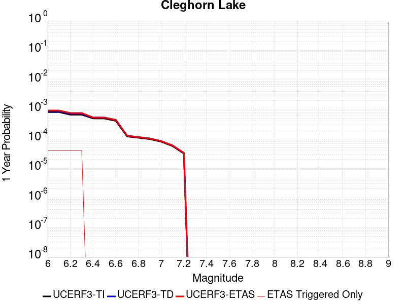 |

| Magnitude | 1 wk TI Prob | 1 wk TD Prob | 1 wk ETAS Prob | 1 wk ETAS/TD Gain | 1 wk ETAS Triggered Only | 1 mo TI Prob | 1 mo TD Prob | 1 mo ETAS Prob | 1 mo ETAS/TD Gain | 1 mo ETAS Triggered Only | 1 yr TI Prob | 1 yr TD Prob | 1 yr ETAS Prob | 1 yr ETAS/TD Gain | 1 yr ETAS Triggered Only |
|-----|-----|-----|-----|-----|-----|-----|-----|-----|-----|-----|-----|-----|-----|-----|-----|
| 6.0 | 1.5467183E-5 | 1.6799104E-5 | 5.679843E-5 | 3.3810394 | 4.0E-5 | 6.6286244E-5 | 7.199448E-5 | 1.11991605E-4 | 1.5555581 | 4.0E-5 | 8.067362E-4 | 8.7623525E-4 | 9.1620017E-4 | 1.0456098 | 4.0E-5 |
| 6.1 | 1.5467183E-5 | 1.6799104E-5 | 5.679843E-5 | 3.3810394 | 4.0E-5 | 6.6286244E-5 | 7.199448E-5 | 1.11991605E-4 | 1.5555581 | 4.0E-5 | 8.067362E-4 | 8.7623525E-4 | 9.1620017E-4 | 1.0456098 | 4.0E-5 |
| 6.2 | 1.2624631E-5 | 1.3685442E-5 | 5.3684893E-5 | 3.9227738 | 4.0E-5 | 5.410444E-5 | 5.865085E-5 | 9.86485E-5 | 1.681962 | 4.0E-5 | 6.585225E-4 | 7.138889E-4 | 7.5386034E-4 | 1.0559912 | 4.0E-5 |
| 6.3 | 1.2624631E-5 | 1.3685442E-5 | 5.3684893E-5 | 3.9227738 | 4.0E-5 | 5.410444E-5 | 5.865085E-5 | 9.86485E-5 | 1.681962 | 4.0E-5 | 6.585225E-4 | 7.138889E-4 | 7.5386034E-4 | 1.0559912 | 4.0E-5 |
| 6.4 | 9.417684E-6 | 1.0172885E-5 | 1.0172885E-5 | 1.0 | 0.0 | 4.036088E-5 | 4.359758E-5 | 4.359758E-5 | 1.0 | 0.0 | 4.912829E-4 | 5.307124E-4 | 5.307124E-4 | 1.0 | 0.0 |
| 6.5 | 9.368219E-6 | 1.01203E-5 | 1.01203E-5 | 1.0 | 0.0 | 4.014889E-5 | 4.3372227E-5 | 4.3372227E-5 | 1.0 | 0.0 | 4.8870314E-4 | 5.2797E-4 | 5.2797E-4 | 1.0 | 0.0 |
| 6.6 | 7.803798E-6 | 8.444179E-6 | 8.444179E-6 | 1.0 | 0.0 | 3.3444423E-5 | 3.6189063E-5 | 3.6189063E-5 | 1.0 | 0.0 | 4.0710976E-4 | 4.405527E-4 | 4.405527E-4 | 1.0 | 0.0 |
| 6.7 | 2.3108669E-6 | 2.4443107E-6 | 2.4443107E-6 | 1.0 | 0.0 | 9.903678E-6 | 1.0475576E-5 | 1.0475576E-5 | 1.0 | 0.0 | 1.205706E-4 | 1.2753287E-4 | 1.2753287E-4 | 1.0 | 0.0 |
| 6.8 | 2.0882828E-6 | 2.206705E-6 | 2.206705E-6 | 1.0 | 0.0 | 8.949753E-6 | 9.457273E-6 | 9.457273E-6 | 1.0 | 0.0 | 1.08957785E-4 | 1.1513639E-4 | 1.1513639E-4 | 1.0 | 0.0 |
| 6.9 | 1.876935E-6 | 1.9814236E-6 | 1.9814236E-6 | 1.0 | 0.0 | 8.043982E-6 | 8.491788E-6 | 8.491788E-6 | 1.0 | 0.0 | 9.7931086E-5 | 1.0338278E-4 | 1.0338278E-4 | 1.0 | 0.0 |
| 7.0 | 1.5357559E-6 | 1.620583E-6 | 1.620583E-6 | 1.0 | 0.0 | 6.5817944E-6 | 6.945338E-6 | 6.945338E-6 | 1.0 | 0.0 | 8.01304E-5 | 8.455633E-5 | 8.455633E-5 | 1.0 | 0.0 |
| 7.1 | 1.0905424E-6 | 1.1499736E-6 | 1.1499736E-6 | 1.0 | 0.0 | 4.6737446E-6 | 4.9284495E-6 | 4.9284495E-6 | 1.0 | 0.0 | 5.6901354E-5 | 6.0002323E-5 | 6.0002323E-5 | 1.0 | 0.0 |
| 7.2 | 6.06668E-7 | 6.3884215E-7 | 6.3884215E-7 | 1.0 | 0.0 | 2.600003E-6 | 2.7378926E-6 | 2.7378926E-6 | 1.0 | 0.0 | 3.1654577E-5 | 3.3333403E-5 | 3.3333403E-5 | 1.0 | 0.0 |

## North Frontal  (East)
*[(top)](#table-of-contents)*

| 1 Week | 1 Month | 1 Year |
|-----|-----|-----|
|  | 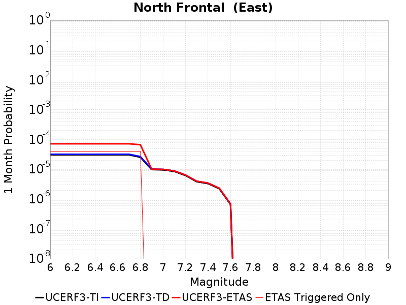 | 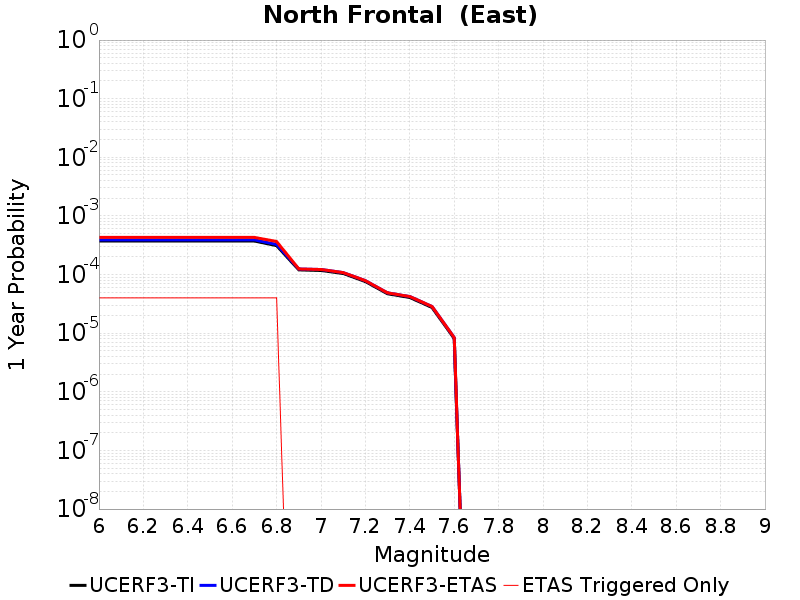 |

| Magnitude | 1 wk TI Prob | 1 wk TD Prob | 1 wk ETAS Prob | 1 wk ETAS/TD Gain | 1 wk ETAS Triggered Only | 1 mo TI Prob | 1 mo TD Prob | 1 mo ETAS Prob | 1 mo ETAS/TD Gain | 1 mo ETAS Triggered Only | 1 yr TI Prob | 1 yr TD Prob | 1 yr ETAS Prob | 1 yr ETAS/TD Gain | 1 yr ETAS Triggered Only |
|-----|-----|-----|-----|-----|-----|-----|-----|-----|-----|-----|-----|-----|-----|-----|-----|
| 6.0 | 7.135738E-6 | 7.4783907E-6 | 4.747809E-5 | 6.3487043 | 4.0E-5 | 3.0581377E-5 | 3.2049964E-5 | 7.204868E-5 | 2.2480114 | 4.0E-5 | 3.7226462E-4 | 3.9015838E-4 | 4.301428E-4 | 1.1024824 | 4.0E-5 |
| 6.1 | 7.135738E-6 | 7.4783907E-6 | 4.747809E-5 | 6.3487043 | 4.0E-5 | 3.0581377E-5 | 3.2049964E-5 | 7.204868E-5 | 2.2480114 | 4.0E-5 | 3.7226462E-4 | 3.9015838E-4 | 4.301428E-4 | 1.1024824 | 4.0E-5 |
| 6.2 | 7.135738E-6 | 7.4783907E-6 | 4.747809E-5 | 6.3487043 | 4.0E-5 | 3.0581377E-5 | 3.2049964E-5 | 7.204868E-5 | 2.2480114 | 4.0E-5 | 3.7226462E-4 | 3.9015838E-4 | 4.301428E-4 | 1.1024824 | 4.0E-5 |
| 6.3 | 7.135738E-6 | 7.4783907E-6 | 4.747809E-5 | 6.3487043 | 4.0E-5 | 3.0581377E-5 | 3.2049964E-5 | 7.204868E-5 | 2.2480114 | 4.0E-5 | 3.7226462E-4 | 3.9015838E-4 | 4.301428E-4 | 1.1024824 | 4.0E-5 |
| 6.4 | 7.135738E-6 | 7.4783907E-6 | 4.747809E-5 | 6.3487043 | 4.0E-5 | 3.0581377E-5 | 3.2049964E-5 | 7.204868E-5 | 2.2480114 | 4.0E-5 | 3.7226462E-4 | 3.9015838E-4 | 4.301428E-4 | 1.1024824 | 4.0E-5 |
| 6.5 | 7.135738E-6 | 7.4783907E-6 | 4.747809E-5 | 6.3487043 | 4.0E-5 | 3.0581377E-5 | 3.2049964E-5 | 7.204868E-5 | 2.2480114 | 4.0E-5 | 3.7226462E-4 | 3.9015838E-4 | 4.301428E-4 | 1.1024824 | 4.0E-5 |
| 6.6 | 7.135738E-6 | 7.4783907E-6 | 4.747809E-5 | 6.3487043 | 4.0E-5 | 3.0581377E-5 | 3.2049964E-5 | 7.204868E-5 | 2.2480114 | 4.0E-5 | 3.7226462E-4 | 3.9015838E-4 | 4.301428E-4 | 1.1024824 | 4.0E-5 |
| 6.7 | 7.135738E-6 | 7.4783907E-6 | 4.747809E-5 | 6.3487043 | 4.0E-5 | 3.0581377E-5 | 3.2049964E-5 | 7.204868E-5 | 2.2480114 | 4.0E-5 | 3.7226462E-4 | 3.9015838E-4 | 4.301428E-4 | 1.1024824 | 4.0E-5 |
| 6.8 | 5.959142E-6 | 6.2376685E-6 | 4.623742E-5 | 7.4126124 | 4.0E-5 | 2.553893E-5 | 2.6732692E-5 | 6.673163E-5 | 2.4962552 | 4.0E-5 | 3.108921E-4 | 3.2544002E-4 | 3.65427E-4 | 1.1228706 | 4.0E-5 |
| 6.9 | 2.2946929E-6 | 2.3827697E-6 | 2.3827697E-6 | 1.0 | 0.0 | 9.834361E-6 | 1.0211833E-5 | 1.0211833E-5 | 1.0 | 0.0 | 1.1972676E-4 | 1.2432244E-4 | 1.2432244E-4 | 1.0 | 0.0 |
| 7.0 | 2.2468673E-6 | 2.3324542E-6 | 2.3324542E-6 | 1.0 | 0.0 | 9.629396E-6 | 9.996196E-6 | 9.996196E-6 | 1.0 | 0.0 | 1.1723159E-4 | 1.2169736E-4 | 1.2169736E-4 | 1.0 | 0.0 |
| 7.1 | 1.9921076E-6 | 2.064858E-6 | 2.064858E-6 | 1.0 | 0.0 | 8.537577E-6 | 8.849364E-6 | 8.849364E-6 | 1.0 | 0.0 | 1.0394004E-4 | 1.07736116E-4 | 1.07736116E-4 | 1.0 | 0.0 |
| 7.2 | 1.4524545E-6 | 1.5046977E-6 | 1.5046977E-6 | 1.0 | 0.0 | 6.2247905E-6 | 6.44869E-6 | 6.44869E-6 | 1.0 | 0.0 | 7.5784184E-5 | 7.851022E-5 | 7.851022E-5 | 1.0 | 0.0 |
| 7.3 | 8.9802575E-7 | 9.309882E-7 | 9.309882E-7 | 1.0 | 0.0 | 3.848676E-6 | 3.989944E-6 | 3.989944E-6 | 1.0 | 0.0 | 4.685662E-5 | 4.8576603E-5 | 4.8576603E-5 | 1.0 | 0.0 |
| 7.4 | 7.776139E-7 | 8.061474E-7 | 8.061474E-7 | 1.0 | 0.0 | 3.3326266E-6 | 3.4549134E-6 | 3.4549134E-6 | 1.0 | 0.0 | 4.0573974E-5 | 4.2062868E-5 | 4.2062868E-5 | 1.0 | 0.0 |
| 7.5 | 5.244417E-7 | 5.4419115E-7 | 5.4419115E-7 | 1.0 | 0.0 | 2.2476054E-6 | 2.332246E-6 | 2.332246E-6 | 1.0 | 0.0 | 2.7364253E-5 | 2.8394792E-5 | 2.8394792E-5 | 1.0 | 0.0 |
| 7.6 | 1.5489647E-7 | 1.6091616E-7 | 1.6091616E-7 | 1.0 | 0.0 | 6.6384183E-7 | 6.896406E-7 | 6.896406E-7 | 1.0 | 0.0 | 8.082245E-6 | 8.396362E-6 | 8.396362E-6 | 1.0 | 0.0 |

## San Jacinto (Superstition Mtn)
*[(top)](#table-of-contents)*

| 1 Week | 1 Month | 1 Year |
|-----|-----|-----|
| 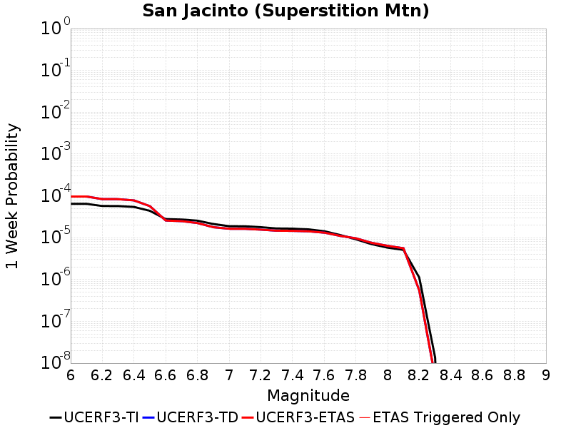 | 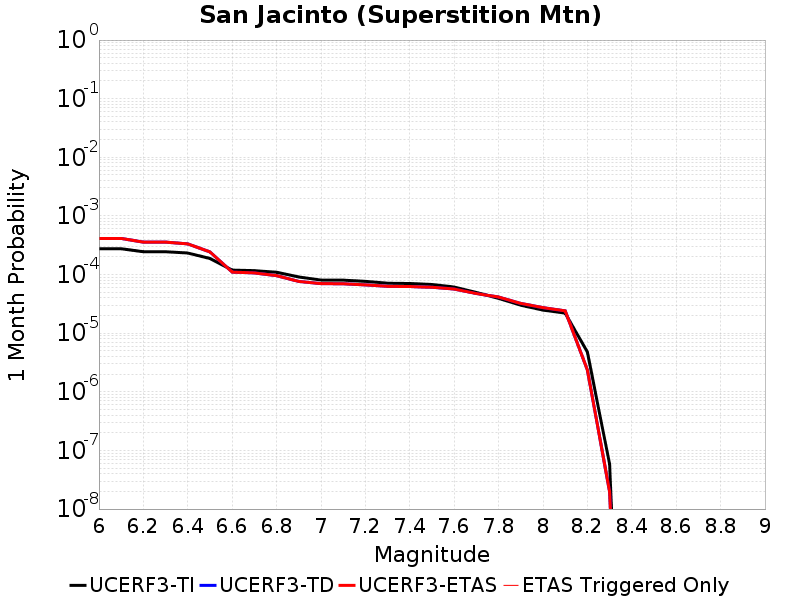 | 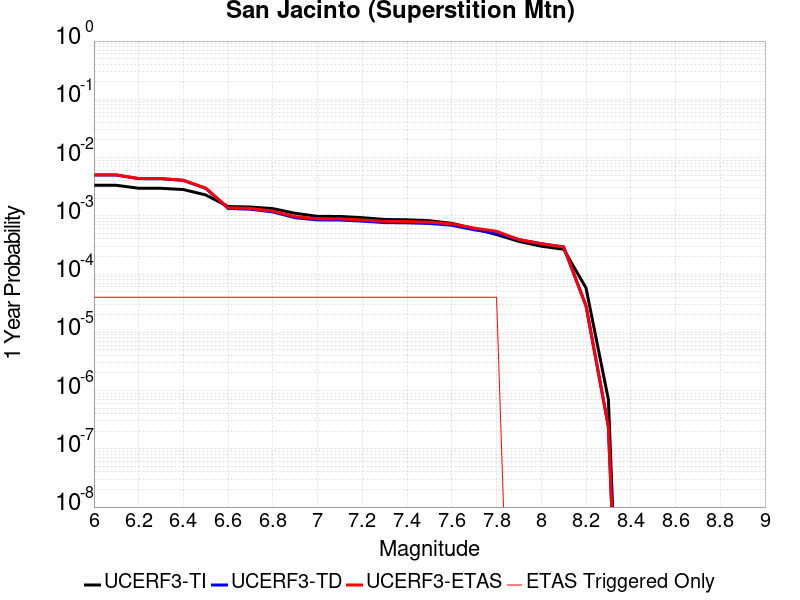 |

| Magnitude | 1 wk TI Prob | 1 wk TD Prob | 1 wk ETAS Prob | 1 wk ETAS/TD Gain | 1 wk ETAS Triggered Only | 1 mo TI Prob | 1 mo TD Prob | 1 mo ETAS Prob | 1 mo ETAS/TD Gain | 1 mo ETAS Triggered Only | 1 yr TI Prob | 1 yr TD Prob | 1 yr ETAS Prob | 1 yr ETAS/TD Gain | 1 yr ETAS Triggered Only |
|-----|-----|-----|-----|-----|-----|-----|-----|-----|-----|-----|-----|-----|-----|-----|-----|
| 6.0 | 6.4193904E-5 | 9.618683E-5 | 9.618683E-5 | 1.0 | 0.0 | 2.7508775E-4 | 4.1217334E-4 | 4.1217334E-4 | 1.0 | 0.0 | 0.0033440501 | 0.005008075 | 0.0050478745 | 1.0079471 | 4.0E-5 |
| 6.1 | 6.4193904E-5 | 9.618683E-5 | 9.618683E-5 | 1.0 | 0.0 | 2.7508775E-4 | 4.1217334E-4 | 4.1217334E-4 | 1.0 | 0.0 | 0.0033440501 | 0.005008075 | 0.0050478745 | 1.0079471 | 4.0E-5 |
| 6.2 | 5.7023593E-5 | 8.3323815E-5 | 8.3323815E-5 | 1.0 | 0.0 | 2.4436394E-4 | 3.5706247E-4 | 3.5706247E-4 | 1.0 | 0.0 | 0.002971072 | 0.004340213 | 0.0043800394 | 1.0091761 | 4.0E-5 |
| 6.3 | 5.6940098E-5 | 8.316908E-5 | 8.316908E-5 | 1.0 | 0.0 | 2.4400617E-4 | 3.5639948E-4 | 3.5639948E-4 | 1.0 | 0.0 | 0.002966728 | 0.004332173 | 0.0043719998 | 1.0091932 | 4.0E-5 |
| 6.4 | 5.4171585E-5 | 7.765849E-5 | 7.765849E-5 | 1.0 | 0.0 | 2.3214328E-4 | 3.3278894E-4 | 3.3278894E-4 | 1.0 | 0.0 | 0.0028226813 | 0.0040458273 | 0.0040856656 | 1.0098467 | 4.0E-5 |
| 6.5 | 4.375144E-5 | 5.6590954E-5 | 5.6590954E-5 | 1.0 | 0.0 | 1.874927E-4 | 2.4251675E-4 | 2.4251675E-4 | 1.0 | 0.0 | 0.0022803338 | 0.00294982 | 0.002989702 | 1.0135201 | 4.0E-5 |
| 6.6 | 2.772192E-5 | 2.5649655E-5 | 2.5649655E-5 | 1.0 | 0.0 | 1.1880282E-4 | 1.0992257E-4 | 1.0992257E-4 | 1.0 | 0.0 | 0.0014454646 | 0.0013375052 | 0.0013774517 | 1.0298665 | 4.0E-5 |
| 6.7 | 2.7124124E-5 | 2.4859904E-5 | 2.4859904E-5 | 1.0 | 0.0 | 1.1624106E-4 | 1.0653821E-4 | 1.0653821E-4 | 1.0 | 0.0 | 0.0014143161 | 0.0012963502 | 0.0013362983 | 1.0308158 | 4.0E-5 |
| 6.8 | 2.5475807E-5 | 2.2321101E-5 | 2.2321101E-5 | 1.0 | 0.0 | 1.0917746E-4 | 9.565842E-5 | 9.565842E-5 | 1.0 | 0.0 | 0.001328425 | 0.0011640311 | 0.0012039845 | 1.0343233 | 4.0E-5 |
| 6.9 | 2.1162023E-5 | 1.7771237E-5 | 1.7771237E-5 | 1.0 | 0.0 | 9.069123E-5 | 7.616024E-5 | 7.616024E-5 | 1.0 | 0.0 | 0.0011036064 | 9.268603E-4 | 9.6682325E-4 | 1.0431165 | 4.0E-5 |
| 7.0 | 1.8754288E-5 | 1.6300326E-5 | 1.6300326E-5 | 1.0 | 0.0 | 8.037304E-5 | 6.985668E-5 | 6.985668E-5 | 1.0 | 0.0 | 9.781026E-4 | 8.5017574E-4 | 8.9014176E-4 | 1.0470091 | 4.0E-5 |
| 7.1 | 1.8678527E-5 | 1.6225338E-5 | 1.6225338E-5 | 1.0 | 0.0 | 8.0048376E-5 | 6.953532E-5 | 6.953532E-5 | 1.0 | 0.0 | 9.7415317E-4 | 8.462663E-4 | 8.862324E-4 | 1.0472264 | 4.0E-5 |
| 7.2 | 1.7804578E-5 | 1.5518503E-5 | 1.5518503E-5 | 1.0 | 0.0 | 7.6303106E-5 | 6.650618E-5 | 6.650618E-5 | 1.0 | 0.0 | 9.285943E-4 | 8.0941425E-4 | 8.4938185E-4 | 1.0493784 | 4.0E-5 |
| 7.3 | 1.6583685E-5 | 1.4666085E-5 | 1.4666085E-5 | 1.0 | 0.0 | 7.1070994E-5 | 6.285315E-5 | 6.285315E-5 | 1.0 | 0.0 | 8.649459E-4 | 7.6497043E-4 | 8.0493983E-4 | 1.0522496 | 4.0E-5 |
| 7.4 | 1.6387552E-5 | 1.453072E-5 | 1.453072E-5 | 1.0 | 0.0 | 7.023047E-5 | 6.227304E-5 | 6.227304E-5 | 1.0 | 0.0 | 8.5472054E-4 | 7.579126E-4 | 7.978822E-4 | 1.0527365 | 4.0E-5 |
| 7.5 | 1.5790754E-5 | 1.4170097E-5 | 1.4170097E-5 | 1.0 | 0.0 | 6.767291E-5 | 6.0727583E-5 | 6.0727583E-5 | 1.0 | 0.0 | 8.236062E-4 | 7.391095E-4 | 7.7908E-4 | 1.0540792 | 4.0E-5 |
| 7.6 | 1.4248672E-5 | 1.31832085E-5 | 1.31832085E-5 | 1.0 | 0.0 | 6.106431E-5 | 5.649825E-5 | 5.649825E-5 | 1.0 | 0.0 | 7.432043E-4 | 6.8765087E-4 | 7.2762335E-4 | 1.0581291 | 4.0E-5 |
| 7.7 | 1.15449975E-5 | 1.1026264E-5 | 1.1026264E-5 | 1.0 | 0.0 | 4.947762E-5 | 4.7254565E-5 | 4.7254565E-5 | 1.0 | 0.0 | 6.022235E-4 | 5.7517324E-4 | 6.1515026E-4 | 1.0695043 | 4.0E-5 |
| 7.8 | 9.1391985E-6 | 9.632236E-6 | 9.632236E-6 | 1.0 | 0.0 | 3.9167408E-5 | 4.128036E-5 | 4.128036E-5 | 1.0 | 0.0 | 4.767588E-4 | 5.024731E-4 | 5.42453E-4 | 1.0795662 | 4.0E-5 |
| 7.9 | 6.973017E-6 | 7.4874865E-6 | 7.4874865E-6 | 1.0 | 0.0 | 2.9884017E-5 | 3.2088836E-5 | 3.2088836E-5 | 1.0 | 0.0 | 3.6377716E-4 | 3.9061208E-4 | 3.9061208E-4 | 1.0 | 0.0 |
| 8.0 | 5.7638235E-6 | 6.3564244E-6 | 6.3564244E-6 | 1.0 | 0.0 | 2.4701867E-5 | 2.7241536E-5 | 2.7241536E-5 | 1.0 | 0.0 | 3.0070372E-4 | 3.3161574E-4 | 3.3161574E-4 | 1.0 | 0.0 |
| 8.1 | 5.1124434E-6 | 5.58386E-6 | 5.58386E-6 | 1.0 | 0.0 | 2.1910288E-5 | 2.3930612E-5 | 2.3930612E-5 | 1.0 | 0.0 | 2.6672508E-4 | 2.9131674E-4 | 2.9131674E-4 | 1.0 | 0.0 |
| 8.2 | 1.1075938E-6 | 5.458512E-7 | 5.458512E-7 | 1.0 | 0.0 | 4.7468216E-6 | 2.3393604E-6 | 2.3393604E-6 | 1.0 | 0.0 | 5.779102E-5 | 2.8481363E-5 | 2.8481363E-5 | 1.0 | 0.0 |
| 8.3 | 1.3584393E-8 | 4.5896105E-9 | 4.5896105E-9 | 1.0 | 0.0 | 5.8218827E-8 | 1.966976E-8 | 1.966976E-8 | 1.0 | 0.0 | 7.0881396E-7 | 2.394793E-7 | 2.394793E-7 | 1.0 | 0.0 |

## Coyote Lake
*[(top)](#table-of-contents)*

| 1 Week | 1 Month | 1 Year |
|-----|-----|-----|
|  |  | 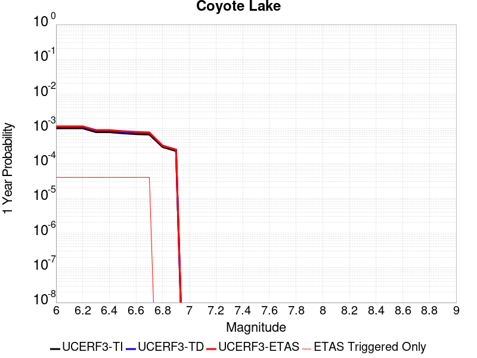 |

| Magnitude | 1 wk TI Prob | 1 wk TD Prob | 1 wk ETAS Prob | 1 wk ETAS/TD Gain | 1 wk ETAS Triggered Only | 1 mo TI Prob | 1 mo TD Prob | 1 mo ETAS Prob | 1 mo ETAS/TD Gain | 1 mo ETAS Triggered Only | 1 yr TI Prob | 1 yr TD Prob | 1 yr ETAS Prob | 1 yr ETAS/TD Gain | 1 yr ETAS Triggered Only |
|-----|-----|-----|-----|-----|-----|-----|-----|-----|-----|-----|-----|-----|-----|-----|-----|
| 6.0 | 1.980352E-5 | 2.1713819E-5 | 2.1713819E-5 | 1.0 | 0.0 | 8.486947E-5 | 9.305631E-5 | 9.305631E-5 | 1.0 | 0.0 | 0.0010327959 | 0.0011324438 | 0.0011723986 | 1.0352819 | 4.0E-5 |
| 6.1 | 1.980352E-5 | 2.1713819E-5 | 2.1713819E-5 | 1.0 | 0.0 | 8.486947E-5 | 9.305631E-5 | 9.305631E-5 | 1.0 | 0.0 | 0.0010327959 | 0.0011324438 | 0.0011723986 | 1.0352819 | 4.0E-5 |
| 6.2 | 1.980352E-5 | 2.1713819E-5 | 2.1713819E-5 | 1.0 | 0.0 | 8.486947E-5 | 9.305631E-5 | 9.305631E-5 | 1.0 | 0.0 | 0.0010327959 | 0.0011324438 | 0.0011723986 | 1.0352819 | 4.0E-5 |
| 6.3 | 1.5344787E-5 | 1.6826156E-5 | 1.6826156E-5 | 1.0 | 0.0 | 6.576172E-5 | 7.2110444E-5 | 7.2110444E-5 | 1.0 | 0.0 | 8.003548E-4 | 8.776523E-4 | 9.1761723E-4 | 1.0455362 | 4.0E-5 |
| 6.4 | 1.5344787E-5 | 1.6826156E-5 | 1.6826156E-5 | 1.0 | 0.0 | 6.576172E-5 | 7.2110444E-5 | 7.2110444E-5 | 1.0 | 0.0 | 8.003548E-4 | 8.776523E-4 | 9.1761723E-4 | 1.0455362 | 4.0E-5 |
| 6.5 | 1.4189697E-5 | 1.5563075E-5 | 1.5563075E-5 | 1.0 | 0.0 | 6.081157E-5 | 6.6697525E-5 | 6.6697525E-5 | 1.0 | 0.0 | 7.401293E-4 | 8.118002E-4 | 8.517677E-4 | 1.0492332 | 4.0E-5 |
| 6.6 | 1.3469301E-5 | 1.4776421E-5 | 1.4776421E-5 | 1.0 | 0.0 | 5.7724297E-5 | 6.332632E-5 | 6.332632E-5 | 1.0 | 0.0 | 7.025667E-4 | 7.707852E-4 | 8.1075437E-4 | 1.0518551 | 4.0E-5 |
| 6.7 | 1.3027966E-5 | 1.4286406E-5 | 1.4286406E-5 | 1.0 | 0.0 | 5.5832945E-5 | 6.1226354E-5 | 6.1226354E-5 | 1.0 | 0.0 | 6.7955407E-4 | 7.452357E-4 | 7.852059E-4 | 1.0536343 | 4.0E-5 |
| 6.8 | 5.695434E-6 | 6.2263775E-6 | 6.2263775E-6 | 1.0 | 0.0 | 2.4408775E-5 | 2.668437E-5 | 2.668437E-5 | 1.0 | 0.0 | 2.971363E-4 | 3.248638E-4 | 3.248638E-4 | 1.0 | 0.0 |
| 6.9 | 4.385688E-6 | 4.7945646E-6 | 4.7945646E-6 | 1.0 | 0.0 | 1.879567E-5 | 2.0548134E-5 | 2.0548134E-5 | 1.0 | 0.0 | 2.2881327E-4 | 2.5017353E-4 | 2.5017353E-4 | 1.0 | 0.0 |

## Pisgah-Bullion Mtn-Mesquite Lk
*[(top)](#table-of-contents)*

| 1 Week | 1 Month | 1 Year |
|-----|-----|-----|
| 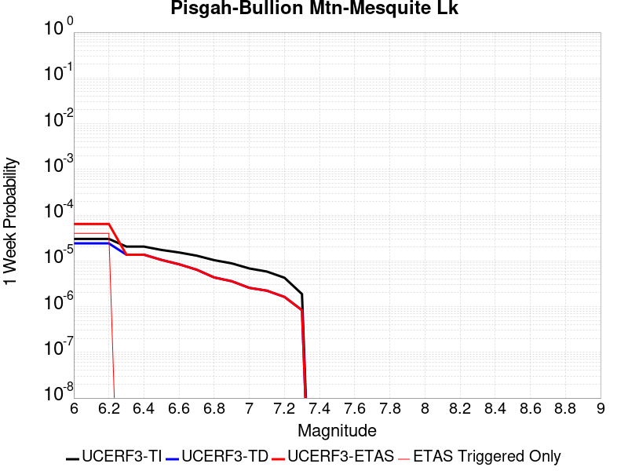 |  |  |

| Magnitude | 1 wk TI Prob | 1 wk TD Prob | 1 wk ETAS Prob | 1 wk ETAS/TD Gain | 1 wk ETAS Triggered Only | 1 mo TI Prob | 1 mo TD Prob | 1 mo ETAS Prob | 1 mo ETAS/TD Gain | 1 mo ETAS Triggered Only | 1 yr TI Prob | 1 yr TD Prob | 1 yr ETAS Prob | 1 yr ETAS/TD Gain | 1 yr ETAS Triggered Only |
|-----|-----|-----|-----|-----|-----|-----|-----|-----|-----|-----|-----|-----|-----|-----|-----|
| 6.0 | 3.0240792E-5 | 2.410175E-5 | 6.410079E-5 | 2.6595905 | 4.0E-5 | 1.2959696E-4 | 1.0328969E-4 | 1.4328556E-4 | 1.3872204 | 4.0E-5 | 0.0015767008 | 0.0012569273 | 0.001296877 | 1.0317836 | 4.0E-5 |
| 6.1 | 3.0240792E-5 | 2.410175E-5 | 6.410079E-5 | 2.6595905 | 4.0E-5 | 1.2959696E-4 | 1.0328969E-4 | 1.4328556E-4 | 1.3872204 | 4.0E-5 | 0.0015767008 | 0.0012569273 | 0.001296877 | 1.0317836 | 4.0E-5 |
| 6.2 | 3.0240792E-5 | 2.410175E-5 | 6.410079E-5 | 2.6595905 | 4.0E-5 | 1.2959696E-4 | 1.0328969E-4 | 1.4328556E-4 | 1.3872204 | 4.0E-5 | 0.0015767008 | 0.0012569273 | 0.001296877 | 1.0317836 | 4.0E-5 |
| 6.3 | 2.0498217E-5 | 1.3643435E-5 | 1.3643435E-5 | 1.0 | 0.0 | 8.784654E-5 | 5.8470643E-5 | 5.8470643E-5 | 1.0 | 0.0 | 0.0010690069 | 7.116638E-4 | 7.116638E-4 | 1.0 | 0.0 |
| 6.4 | 2.0498217E-5 | 1.3643435E-5 | 1.3643435E-5 | 1.0 | 0.0 | 8.784654E-5 | 5.8470643E-5 | 5.8470643E-5 | 1.0 | 0.0 | 0.0010690069 | 7.116638E-4 | 7.116638E-4 | 1.0 | 0.0 |
| 6.5 | 1.7316182E-5 | 1.0481163E-5 | 1.0481163E-5 | 1.0 | 0.0 | 7.42101E-5 | 4.4918554E-5 | 4.4918554E-5 | 1.0 | 0.0 | 9.0313336E-4 | 5.4675614E-4 | 5.4675614E-4 | 1.0 | 0.0 |
| 6.6 | 1.5251077E-5 | 8.417571E-6 | 8.417571E-6 | 1.0 | 0.0 | 6.536012E-5 | 3.6074845E-5 | 3.6074845E-5 | 1.0 | 0.0 | 7.9546886E-4 | 4.3913E-4 | 4.3913E-4 | 1.0 | 0.0 |
| 6.7 | 1.2997425E-5 | 6.414017E-6 | 6.414017E-6 | 1.0 | 0.0 | 5.570206E-5 | 2.748838E-5 | 2.748838E-5 | 1.0 | 0.0 | 6.7796157E-4 | 3.3462432E-4 | 3.3462432E-4 | 1.0 | 0.0 |
| 6.8 | 1.035386E-5 | 4.3350883E-6 | 4.3350883E-6 | 1.0 | 0.0 | 4.437293E-5 | 1.8578823E-5 | 1.8578823E-5 | 1.0 | 0.0 | 5.401065E-4 | 2.2617457E-4 | 2.2617457E-4 | 1.0 | 0.0 |
| 6.9 | 8.816252E-6 | 3.5822954E-6 | 3.5822954E-6 | 1.0 | 0.0 | 3.778339E-5 | 1.5352609E-5 | 1.5352609E-5 | 1.0 | 0.0 | 4.5991567E-4 | 1.8690256E-4 | 1.8690256E-4 | 1.0 | 0.0 |
| 7.0 | 6.8232207E-6 | 2.5689233E-6 | 2.5689233E-6 | 1.0 | 0.0 | 2.9242048E-5 | 1.1009627E-5 | 1.1009627E-5 | 1.0 | 0.0 | 3.5596377E-4 | 1.3403427E-4 | 1.3403427E-4 | 1.0 | 0.0 |
| 7.1 | 5.837013E-6 | 2.2286247E-6 | 2.2286247E-6 | 1.0 | 0.0 | 2.501553E-5 | 9.551215E-6 | 9.551215E-6 | 1.0 | 0.0 | 3.045215E-4 | 1.16280135E-4 | 1.16280135E-4 | 1.0 | 0.0 |
| 7.2 | 4.278052E-6 | 1.6285954E-6 | 1.6285954E-6 | 1.0 | 0.0 | 1.833438E-5 | 6.9796774E-6 | 6.9796774E-6 | 1.0 | 0.0 | 2.231982E-4 | 8.49745E-5 | 8.49745E-5 | 1.0 | 0.0 |
| 7.3 | 1.8803692E-6 | 8.3521843E-7 | 8.3521843E-7 | 1.0 | 0.0 | 8.0587E-6 | 3.5795035E-6 | 3.5795035E-6 | 1.0 | 0.0 | 9.811026E-5 | 4.357973E-5 | 4.357973E-5 | 1.0 | 0.0 |

## Palos Verdes
*[(top)](#table-of-contents)*

| 1 Week | 1 Month | 1 Year |
|-----|-----|-----|
|  |  |  |

| Magnitude | 1 wk TI Prob | 1 wk TD Prob | 1 wk ETAS Prob | 1 wk ETAS/TD Gain | 1 wk ETAS Triggered Only | 1 mo TI Prob | 1 mo TD Prob | 1 mo ETAS Prob | 1 mo ETAS/TD Gain | 1 mo ETAS Triggered Only | 1 yr TI Prob | 1 yr TD Prob | 1 yr ETAS Prob | 1 yr ETAS/TD Gain | 1 yr ETAS Triggered Only |
|-----|-----|-----|-----|-----|-----|-----|-----|-----|-----|-----|-----|-----|-----|-----|-----|
| 6.0 | 6.126063E-5 | 7.628893E-5 | 7.628893E-5 | 1.0 | 0.0 | 2.6251914E-4 | 3.2691337E-4 | 3.2691337E-4 | 1.0 | 0.0 | 0.0031914865 | 0.0039734347 | 0.0040132757 | 1.0100268 | 4.0E-5 |
| 6.1 | 6.126063E-5 | 7.628893E-5 | 7.628893E-5 | 1.0 | 0.0 | 2.6251914E-4 | 3.2691337E-4 | 3.2691337E-4 | 1.0 | 0.0 | 0.0031914865 | 0.0039734347 | 0.0040132757 | 1.0100268 | 4.0E-5 |
| 6.2 | 6.126063E-5 | 7.628893E-5 | 7.628893E-5 | 1.0 | 0.0 | 2.6251914E-4 | 3.2691337E-4 | 3.2691337E-4 | 1.0 | 0.0 | 0.0031914865 | 0.0039734347 | 0.0040132757 | 1.0100268 | 4.0E-5 |
| 6.3 | 4.0838047E-5 | 4.9786013E-5 | 4.9786013E-5 | 1.0 | 0.0 | 1.7500846E-4 | 2.133523E-4 | 2.133523E-4 | 1.0 | 0.0 | 0.0021286458 | 0.0025946742 | 0.0025946742 | 1.0 | 0.0 |
| 6.4 | 4.0838047E-5 | 4.9786013E-5 | 4.9786013E-5 | 1.0 | 0.0 | 1.7500846E-4 | 2.133523E-4 | 2.133523E-4 | 1.0 | 0.0 | 0.0021286458 | 0.0025946742 | 0.0025946742 | 1.0 | 0.0 |
| 6.5 | 3.0512005E-5 | 3.6586363E-5 | 3.6586363E-5 | 1.0 | 0.0 | 1.3075917E-4 | 1.5678987E-4 | 1.5678987E-4 | 1.0 | 0.0 | 0.0015908304 | 0.001907361 | 0.001907361 | 1.0 | 0.0 |
| 6.6 | 2.9255087E-5 | 3.517859E-5 | 3.517859E-5 | 1.0 | 0.0 | 1.2537291E-4 | 1.5075726E-4 | 1.5075726E-4 | 1.0 | 0.0 | 0.0015253464 | 0.0018340375 | 0.0018340375 | 1.0 | 0.0 |
| 6.7 | 2.287198E-5 | 2.7266105E-5 | 2.7266105E-5 | 1.0 | 0.0 | 9.801909E-5 | 1.16850024E-4 | 1.16850024E-4 | 1.0 | 0.0 | 0.001192729 | 0.0014218123 | 0.0014218123 | 1.0 | 0.0 |
| 6.8 | 2.1325764E-5 | 2.5448615E-5 | 2.5448615E-5 | 1.0 | 0.0 | 9.139293E-5 | 1.0906144E-4 | 1.0906144E-4 | 1.0 | 0.0 | 0.001112141 | 0.0013271046 | 0.0013271046 | 1.0 | 0.0 |
| 6.9 | 1.9009392E-5 | 2.2628212E-5 | 2.2628212E-5 | 1.0 | 0.0 | 8.1466285E-5 | 9.697494E-5 | 9.697494E-5 | 1.0 | 0.0 | 9.914007E-4 | 0.0011801178 | 0.0011801178 | 1.0 | 0.0 |
| 7.0 | 1.7098473E-5 | 2.0332458E-5 | 2.0332458E-5 | 1.0 | 0.0 | 7.3277115E-5 | 8.713668E-5 | 8.713668E-5 | 1.0 | 0.0 | 8.917837E-4 | 0.0010604581 | 0.0010604581 | 1.0 | 0.0 |
| 7.1 | 1.5982785E-5 | 1.9007015E-5 | 1.9007015E-5 | 1.0 | 0.0 | 6.849585E-5 | 8.145657E-5 | 8.145657E-5 | 1.0 | 0.0 | 8.336179E-4 | 9.913674E-4 | 9.913674E-4 | 1.0 | 0.0 |
| 7.2 | 1.4468002E-5 | 1.7208347E-5 | 1.7208347E-5 | 1.0 | 0.0 | 6.200425E-5 | 7.374845E-5 | 7.374845E-5 | 1.0 | 0.0 | 7.546402E-4 | 8.9760165E-4 | 8.9760165E-4 | 1.0 | 0.0 |
| 7.3 | 5.288233E-6 | 6.207409E-6 | 6.207409E-6 | 1.0 | 0.0 | 2.2663658E-5 | 2.660311E-5 | 2.660311E-5 | 1.0 | 0.0 | 2.7589512E-4 | 3.2387965E-4 | 3.2387965E-4 | 1.0 | 0.0 |
| 7.4 | 8.279556E-7 | 8.40879E-7 | 8.40879E-7 | 1.0 | 0.0 | 3.5483763E-6 | 3.6037625E-6 | 3.6037625E-6 | 1.0 | 0.0 | 4.3200624E-5 | 4.3875E-5 | 4.3875E-5 | 1.0 | 0.0 |
| 7.5 | 6.559831E-7 | 6.667599E-7 | 6.667599E-7 | 1.0 | 0.0 | 2.8113532E-6 | 2.8575396E-6 | 2.8575396E-6 | 1.0 | 0.0 | 3.4227687E-5 | 3.4790057E-5 | 3.4790057E-5 | 1.0 | 0.0 |
| 7.6 | 3.5018968E-7 | 3.56221E-7 | 3.56221E-7 | 1.0 | 0.0 | 1.500812E-6 | 1.5266609E-6 | 1.5266609E-6 | 1.0 | 0.0 | 1.8272232E-5 | 1.8586983E-5 | 1.8586983E-5 | 1.0 | 0.0 |
| 7.7 | 1.1986104E-7 | 1.2199109E-7 | 1.2199109E-7 | 1.0 | 0.0 | 5.1369005E-7 | 5.228188E-7 | 5.228188E-7 | 1.0 | 0.0 | 6.2541585E-6 | 6.365301E-6 | 6.365301E-6 | 1.0 | 0.0 |
| 7.8 | 3.0445005E-8 | 3.1029597E-8 | 3.1029597E-8 | 1.0 | 0.0 | 1.3047858E-7 | 1.3298397E-7 | 1.3298397E-7 | 1.0 | 0.0 | 1.5885756E-6 | 1.619079E-6 | 1.619079E-6 | 1.0 | 0.0 |

## Calico-Hidalgo
*[(top)](#table-of-contents)*

| 1 Week | 1 Month | 1 Year |
|-----|-----|-----|
|  |  | 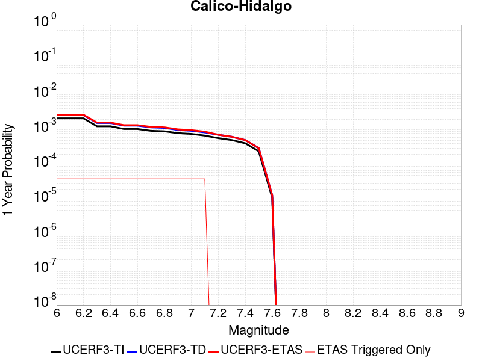 |

| Magnitude | 1 wk TI Prob | 1 wk TD Prob | 1 wk ETAS Prob | 1 wk ETAS/TD Gain | 1 wk ETAS Triggered Only | 1 mo TI Prob | 1 mo TD Prob | 1 mo ETAS Prob | 1 mo ETAS/TD Gain | 1 mo ETAS Triggered Only | 1 yr TI Prob | 1 yr TD Prob | 1 yr ETAS Prob | 1 yr ETAS/TD Gain | 1 yr ETAS Triggered Only |
|-----|-----|-----|-----|-----|-----|-----|-----|-----|-----|-----|-----|-----|-----|-----|-----|
| 6.0 | 4.0906612E-5 | 5.073094E-5 | 5.073094E-5 | 1.0 | 0.0 | 1.7530227E-4 | 2.174025E-4 | 2.174025E-4 | 1.0 | 0.0 | 0.0021322158 | 0.0026440606 | 0.002683955 | 1.0150882 | 4.0E-5 |
| 6.1 | 4.0906612E-5 | 5.073094E-5 | 5.073094E-5 | 1.0 | 0.0 | 1.7530227E-4 | 2.174025E-4 | 2.174025E-4 | 1.0 | 0.0 | 0.0021322158 | 0.0026440606 | 0.002683955 | 1.0150882 | 4.0E-5 |
| 6.2 | 4.0906612E-5 | 5.073094E-5 | 5.073094E-5 | 1.0 | 0.0 | 1.7530227E-4 | 2.174025E-4 | 2.174025E-4 | 1.0 | 0.0 | 0.0021322158 | 0.0026440606 | 0.002683955 | 1.0150882 | 4.0E-5 |
| 6.3 | 2.4242801E-5 | 3.01023E-5 | 3.01023E-5 | 1.0 | 0.0 | 1.0389358E-4 | 1.2900366E-4 | 1.2900366E-4 | 1.0 | 0.0 | 0.0012641704 | 0.0015695215 | 0.0016094587 | 1.0254455 | 4.0E-5 |
| 6.4 | 2.4242801E-5 | 3.01023E-5 | 3.01023E-5 | 1.0 | 0.0 | 1.0389358E-4 | 1.2900366E-4 | 1.2900366E-4 | 1.0 | 0.0 | 0.0012641704 | 0.0015695215 | 0.0016094587 | 1.0254455 | 4.0E-5 |
| 6.5 | 2.0286952E-5 | 2.5324422E-5 | 2.5324422E-5 | 1.0 | 0.0 | 8.694118E-5 | 1.0852882E-4 | 1.0852882E-4 | 1.0 | 0.0 | 0.0010579949 | 0.0013205545 | 0.0013605017 | 1.0302503 | 4.0E-5 |
| 6.6 | 2.0269223E-5 | 2.5305366E-5 | 2.5305366E-5 | 1.0 | 0.0 | 8.6865206E-5 | 1.0844716E-4 | 1.0844716E-4 | 1.0 | 0.0 | 0.0010570707 | 0.0013195615 | 0.0013595087 | 1.0302731 | 4.0E-5 |
| 6.7 | 1.799852E-5 | 2.2548089E-5 | 2.2548089E-5 | 1.0 | 0.0 | 7.713423E-5 | 9.663117E-5 | 9.663117E-5 | 1.0 | 0.0 | 9.3870464E-4 | 0.0011758641 | 0.0012158172 | 1.0339775 | 4.0E-5 |
| 6.8 | 1.7458793E-5 | 2.1849313E-5 | 2.1849313E-5 | 1.0 | 0.0 | 7.4821255E-5 | 9.3636634E-5 | 9.3636634E-5 | 1.0 | 0.0 | 9.10568E-4 | 0.0011394443 | 0.0011793987 | 1.0350648 | 4.0E-5 |
| 6.9 | 1.542884E-5 | 1.9032297E-5 | 1.9032297E-5 | 1.0 | 0.0 | 6.612192E-5 | 8.156451E-5 | 8.156451E-5 | 1.0 | 0.0 | 8.04737E-4 | 9.926087E-4 | 0.001032569 | 1.0402578 | 4.0E-5 |
| 7.0 | 1.468253E-5 | 1.8036559E-5 | 1.8036559E-5 | 1.0 | 0.0 | 6.292361E-5 | 7.729732E-5 | 7.729732E-5 | 1.0 | 0.0 | 7.658257E-4 | 9.407016E-4 | 9.806639E-4 | 1.0424814 | 4.0E-5 |
| 7.1 | 1.3139281E-5 | 1.6206326E-5 | 1.6206326E-5 | 1.0 | 0.0 | 5.6309986E-5 | 6.9453905E-5 | 6.9453905E-5 | 1.0 | 0.0 | 6.853584E-4 | 8.4528583E-4 | 8.85252E-4 | 1.0472813 | 4.0E-5 |
| 7.2 | 1.1127404E-5 | 1.3871357E-5 | 1.3871357E-5 | 1.0 | 0.0 | 4.7688E-5 | 5.944738E-5 | 5.944738E-5 | 1.0 | 0.0 | 5.8044674E-4 | 7.2354235E-4 | 7.2354235E-4 | 1.0 | 0.0 |
| 7.3 | 9.808154E-6 | 1.2178817E-5 | 1.2178817E-5 | 1.0 | 0.0 | 4.2034266E-5 | 5.2193944E-5 | 5.2193944E-5 | 1.0 | 0.0 | 5.11647E-4 | 6.3528673E-4 | 6.3528673E-4 | 1.0 | 0.0 |
| 7.4 | 7.942452E-6 | 9.793949E-6 | 9.793949E-6 | 1.0 | 0.0 | 3.4038632E-5 | 4.1973446E-5 | 4.1973446E-5 | 1.0 | 0.0 | 4.1434157E-4 | 5.1091635E-4 | 5.1091635E-4 | 1.0 | 0.0 |
| 7.5 | 4.7121216E-6 | 5.7738143E-6 | 5.7738143E-6 | 1.0 | 0.0 | 2.019465E-5 | 2.4744726E-5 | 2.4744726E-5 | 1.0 | 0.0 | 2.4584212E-4 | 3.0123306E-4 | 3.0123306E-4 | 1.0 | 0.0 |
| 7.6 | 2.21172E-7 | 2.6043384E-7 | 2.6043384E-7 | 1.0 | 0.0 | 9.478797E-7 | 1.1161446E-6 | 1.1161446E-6 | 1.0 | 0.0 | 1.1540374E-5 | 1.3589005E-5 | 1.3589005E-5 | 1.0 | 0.0 |

## Elysian Park (Upper)
*[(top)](#table-of-contents)*

| 1 Week | 1 Month | 1 Year |
|-----|-----|-----|
| 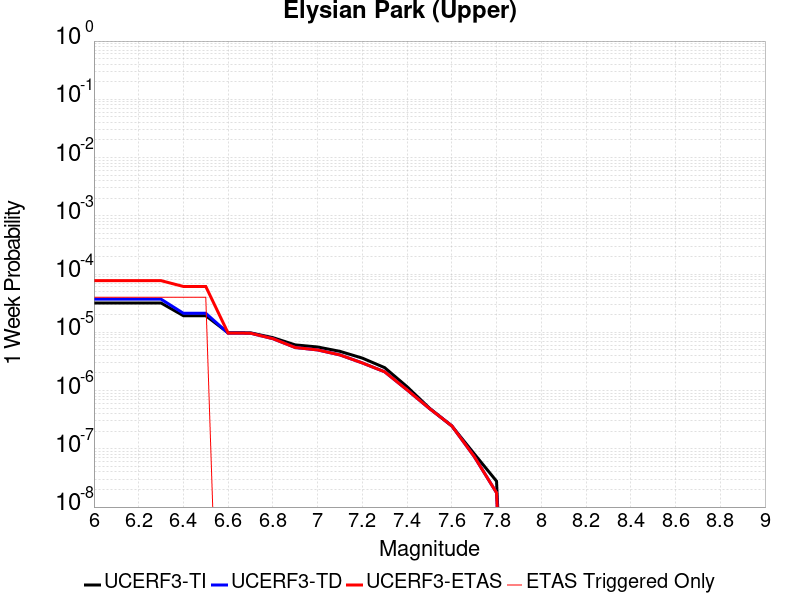 | 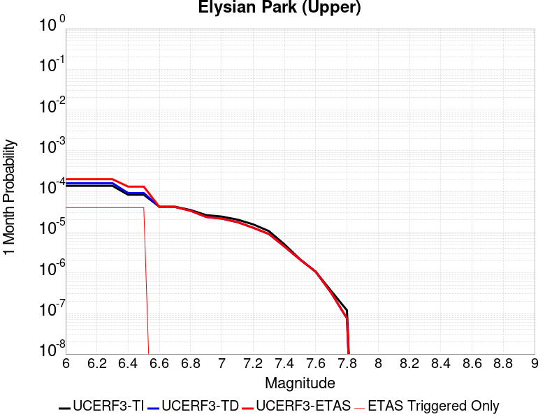 | 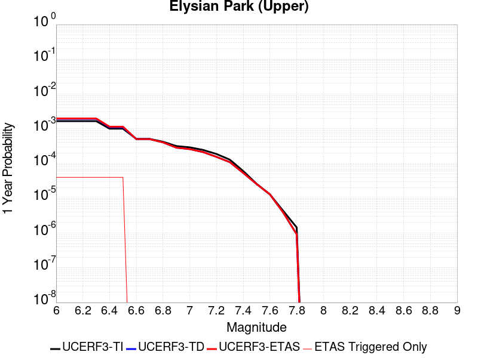 |

| Magnitude | 1 wk TI Prob | 1 wk TD Prob | 1 wk ETAS Prob | 1 wk ETAS/TD Gain | 1 wk ETAS Triggered Only | 1 mo TI Prob | 1 mo TD Prob | 1 mo ETAS Prob | 1 mo ETAS/TD Gain | 1 mo ETAS Triggered Only | 1 yr TI Prob | 1 yr TD Prob | 1 yr ETAS Prob | 1 yr ETAS/TD Gain | 1 yr ETAS Triggered Only |
|-----|-----|-----|-----|-----|-----|-----|-----|-----|-----|-----|-----|-----|-----|-----|-----|
| 6.0 | 3.1876025E-5 | 3.706077E-5 | 7.705929E-5 | 2.0792682 | 4.0E-5 | 1.3660437E-4 | 1.5882494E-4 | 1.988186E-4 | 1.2518096 | 4.0E-5 | 0.0016618895 | 0.0019324546 | 0.0019723773 | 1.0206591 | 4.0E-5 |
| 6.1 | 3.1876025E-5 | 3.706077E-5 | 7.705929E-5 | 2.0792682 | 4.0E-5 | 1.3660437E-4 | 1.5882494E-4 | 1.988186E-4 | 1.2518096 | 4.0E-5 | 0.0016618895 | 0.0019324546 | 0.0019723773 | 1.0206591 | 4.0E-5 |
| 6.2 | 3.1876025E-5 | 3.706077E-5 | 7.705929E-5 | 2.0792682 | 4.0E-5 | 1.3660437E-4 | 1.5882494E-4 | 1.988186E-4 | 1.2518096 | 4.0E-5 | 0.0016618895 | 0.0019324546 | 0.0019723773 | 1.0206591 | 4.0E-5 |
| 6.3 | 3.1876025E-5 | 3.706077E-5 | 7.705929E-5 | 2.0792682 | 4.0E-5 | 1.3660437E-4 | 1.5882494E-4 | 1.988186E-4 | 1.2518096 | 4.0E-5 | 0.0016618895 | 0.0019324546 | 0.0019723773 | 1.0206591 | 4.0E-5 |
| 6.4 | 1.9273462E-5 | 2.1214437E-5 | 6.121359E-5 | 2.8854685 | 4.0E-5 | 8.259794E-5 | 9.091683E-5 | 1.3091319E-4 | 1.4399226 | 4.0E-5 | 0.001005166 | 0.0011065218 | 0.0011464776 | 1.0361093 | 4.0E-5 |
| 6.5 | 1.9273462E-5 | 2.1214437E-5 | 6.121359E-5 | 2.8854685 | 4.0E-5 | 8.259794E-5 | 9.091683E-5 | 1.3091319E-4 | 1.4399226 | 4.0E-5 | 0.001005166 | 0.0011065218 | 0.0011464776 | 1.0361093 | 4.0E-5 |
| 6.6 | 9.813258E-6 | 9.669027E-6 | 9.669027E-6 | 1.0 | 0.0 | 4.205614E-5 | 4.1438074E-5 | 4.1438074E-5 | 1.0 | 0.0 | 5.119132E-4 | 5.04399E-4 | 5.04399E-4 | 1.0 | 0.0 |
| 6.7 | 9.801478E-6 | 9.656595E-6 | 9.656595E-6 | 1.0 | 0.0 | 4.2005657E-5 | 4.138479E-5 | 4.138479E-5 | 1.0 | 0.0 | 5.112989E-4 | 5.037506E-4 | 5.037506E-4 | 1.0 | 0.0 |
| 6.8 | 8.102489E-6 | 7.775748E-6 | 7.775748E-6 | 1.0 | 0.0 | 3.4724493E-5 | 3.3324235E-5 | 3.3324235E-5 | 1.0 | 0.0 | 4.2268867E-4 | 4.05652E-4 | 4.05652E-4 | 1.0 | 0.0 |
| 6.9 | 6.08275E-6 | 5.483149E-6 | 5.483149E-6 | 1.0 | 0.0 | 2.6068668E-5 | 2.3499004E-5 | 2.3499004E-5 | 1.0 | 0.0 | 3.173398E-4 | 2.8606356E-4 | 2.8606356E-4 | 1.0 | 0.0 |
| 7.0 | 5.5995934E-6 | 4.9843247E-6 | 4.9843247E-6 | 1.0 | 0.0 | 2.3998036E-5 | 2.136122E-5 | 2.136122E-5 | 1.0 | 0.0 | 2.9213692E-4 | 2.600425E-4 | 2.600425E-4 | 1.0 | 0.0 |
| 7.1 | 4.709881E-6 | 4.0886803E-6 | 4.0886803E-6 | 1.0 | 0.0 | 2.0185047E-5 | 1.75228E-5 | 1.75228E-5 | 1.0 | 0.0 | 2.4572524E-4 | 2.1331961E-4 | 2.1331961E-4 | 1.0 | 0.0 |
| 7.2 | 3.6063436E-6 | 2.978894E-6 | 2.978894E-6 | 1.0 | 0.0 | 1.5455667E-5 | 1.2766626E-5 | 1.2766626E-5 | 1.0 | 0.0 | 1.881565E-4 | 1.554227E-4 | 1.554227E-4 | 1.0 | 0.0 |
| 7.3 | 2.471135E-6 | 2.0961668E-6 | 2.0961668E-6 | 1.0 | 0.0 | 1.0590536E-5 | 8.983541E-6 | 8.983541E-6 | 1.0 | 0.0 | 1.2893214E-4 | 1.09369204E-4 | 1.09369204E-4 | 1.0 | 0.0 |
| 7.4 | 1.163943E-6 | 1.0279479E-6 | 1.0279479E-6 | 1.0 | 0.0 | 4.988318E-6 | 4.4054837E-6 | 4.4054837E-6 | 1.0 | 0.0 | 6.0731076E-5 | 5.363547E-5 | 5.363547E-5 | 1.0 | 0.0 |
| 7.5 | 4.99459E-7 | 4.9193983E-7 | 4.9193983E-7 | 1.0 | 0.0 | 2.140537E-6 | 2.108312E-6 | 2.108312E-6 | 1.0 | 0.0 | 2.6060725E-5 | 2.5668412E-5 | 2.5668412E-5 | 1.0 | 0.0 |
| 7.6 | 2.4667852E-7 | 2.4786985E-7 | 2.4786985E-7 | 1.0 | 0.0 | 1.0571932E-6 | 1.0622989E-6 | 1.0622989E-6 | 1.0 | 0.0 | 1.2871251E-5 | 1.2933417E-5 | 1.2933417E-5 | 1.0 | 0.0 |
| 7.7 | 8.2312795E-8 | 7.3911366E-8 | 7.3911366E-8 | 1.0 | 0.0 | 3.527691E-7 | 3.1676296E-7 | 3.1676296E-7 | 1.0 | 0.0 | 4.294955E-6 | 3.8565836E-6 | 3.8565836E-6 | 1.0 | 0.0 |
| 7.8 | 2.7819295E-8 | 1.7599204E-8 | 1.7599204E-8 | 1.0 | 0.0 | 1.1922555E-7 | 7.5425156E-8 | 7.5425156E-8 | 1.0 | 0.0 | 1.45157E-6 | 9.18301E-7 | 9.18301E-7 | 1.0 | 0.0 |

## Mission Creek
*[(top)](#table-of-contents)*

| 1 Week | 1 Month | 1 Year |
|-----|-----|-----|
| 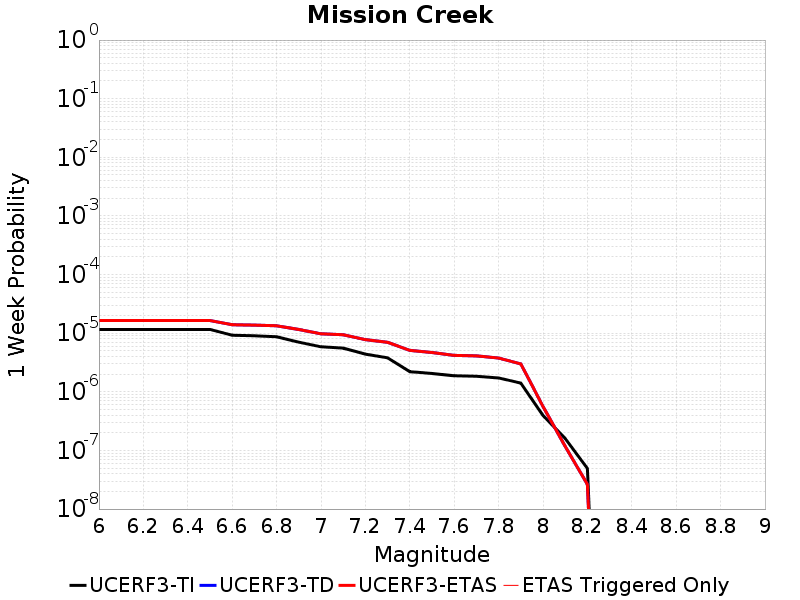 |  | 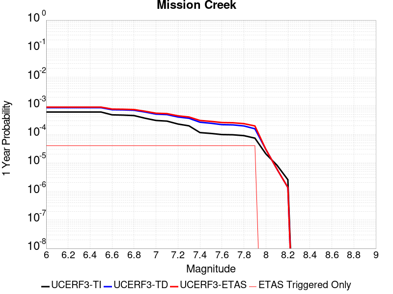 |

| Magnitude | 1 wk TI Prob | 1 wk TD Prob | 1 wk ETAS Prob | 1 wk ETAS/TD Gain | 1 wk ETAS Triggered Only | 1 mo TI Prob | 1 mo TD Prob | 1 mo ETAS Prob | 1 mo ETAS/TD Gain | 1 mo ETAS Triggered Only | 1 yr TI Prob | 1 yr TD Prob | 1 yr ETAS Prob | 1 yr ETAS/TD Gain | 1 yr ETAS Triggered Only |
|-----|-----|-----|-----|-----|-----|-----|-----|-----|-----|-----|-----|-----|-----|-----|-----|
| 6.0 | 1.1549387E-5 | 1.6382799E-5 | 1.6382799E-5 | 1.0 | 0.0 | 4.9496433E-5 | 7.02102E-5 | 7.02102E-5 | 1.0 | 0.0 | 6.0245243E-4 | 8.544889E-4 | 8.944547E-4 | 1.0467716 | 4.0E-5 |
| 6.1 | 1.1549387E-5 | 1.6382799E-5 | 1.6382799E-5 | 1.0 | 0.0 | 4.9496433E-5 | 7.02102E-5 | 7.02102E-5 | 1.0 | 0.0 | 6.0245243E-4 | 8.544889E-4 | 8.944547E-4 | 1.0467716 | 4.0E-5 |
| 6.2 | 1.1549387E-5 | 1.6382799E-5 | 1.6382799E-5 | 1.0 | 0.0 | 4.9496433E-5 | 7.02102E-5 | 7.02102E-5 | 1.0 | 0.0 | 6.0245243E-4 | 8.544889E-4 | 8.944547E-4 | 1.0467716 | 4.0E-5 |
| 6.3 | 1.1549387E-5 | 1.6382799E-5 | 1.6382799E-5 | 1.0 | 0.0 | 4.9496433E-5 | 7.02102E-5 | 7.02102E-5 | 1.0 | 0.0 | 6.0245243E-4 | 8.544889E-4 | 8.944547E-4 | 1.0467716 | 4.0E-5 |
| 6.4 | 1.1549387E-5 | 1.6382799E-5 | 1.6382799E-5 | 1.0 | 0.0 | 4.9496433E-5 | 7.02102E-5 | 7.02102E-5 | 1.0 | 0.0 | 6.0245243E-4 | 8.544889E-4 | 8.944547E-4 | 1.0467716 | 4.0E-5 |
| 6.5 | 1.1549387E-5 | 1.6382799E-5 | 1.6382799E-5 | 1.0 | 0.0 | 4.9496433E-5 | 7.02102E-5 | 7.02102E-5 | 1.0 | 0.0 | 6.0245243E-4 | 8.544889E-4 | 8.944547E-4 | 1.0467716 | 4.0E-5 |
| 6.6 | 9.202681E-6 | 1.3905611E-5 | 1.3905611E-5 | 1.0 | 0.0 | 3.9439463E-5 | 5.9594167E-5 | 5.9594167E-5 | 1.0 | 0.0 | 4.800697E-4 | 7.253265E-4 | 7.652975E-4 | 1.0551076 | 4.0E-5 |
| 6.7 | 9.019164E-6 | 1.3711242E-5 | 1.3711242E-5 | 1.0 | 0.0 | 3.8652986E-5 | 5.8761194E-5 | 5.8761194E-5 | 1.0 | 0.0 | 4.7049852E-4 | 7.151917E-4 | 7.551631E-4 | 1.055889 | 4.0E-5 |
| 6.8 | 8.673558E-6 | 1.3333226E-5 | 1.3333226E-5 | 1.0 | 0.0 | 3.717186E-5 | 5.7141195E-5 | 5.7141195E-5 | 1.0 | 0.0 | 4.524734E-4 | 6.9548085E-4 | 7.3545304E-4 | 1.0574741 | 4.0E-5 |
| 6.9 | 7.002255E-6 | 1.1536997E-5 | 1.1536997E-5 | 1.0 | 0.0 | 3.000932E-5 | 4.9443373E-5 | 4.9443373E-5 | 1.0 | 0.0 | 3.653022E-4 | 6.0181366E-4 | 6.417896E-4 | 1.0664258 | 4.0E-5 |
| 7.0 | 5.84644E-6 | 9.7312795E-6 | 9.7312795E-6 | 1.0 | 0.0 | 2.5055931E-5 | 4.1704843E-5 | 4.1704843E-5 | 1.0 | 0.0 | 3.0501327E-4 | 5.0764275E-4 | 5.476224E-4 | 1.0787556 | 4.0E-5 |
| 7.1 | 5.54703E-6 | 9.3855515E-6 | 9.3855515E-6 | 1.0 | 0.0 | 2.377277E-5 | 4.0223196E-5 | 4.0223196E-5 | 1.0 | 0.0 | 2.8939504E-4 | 4.896118E-4 | 5.295923E-4 | 1.0816574 | 4.0E-5 |
| 7.2 | 4.384709E-6 | 7.735159E-6 | 7.735159E-6 | 1.0 | 0.0 | 1.8791474E-5 | 3.315028E-5 | 3.315028E-5 | 1.0 | 0.0 | 2.2876218E-4 | 4.0353357E-4 | 4.4351743E-4 | 1.0990844 | 4.0E-5 |
| 7.3 | 3.7888456E-6 | 6.967982E-6 | 6.967982E-6 | 1.0 | 0.0 | 1.623781E-5 | 2.9862456E-5 | 2.9862456E-5 | 1.0 | 0.0 | 1.9767738E-4 | 3.635181E-4 | 4.0350357E-4 | 1.1099957 | 4.0E-5 |
| 7.4 | 2.1982462E-6 | 5.074753E-6 | 5.074753E-6 | 1.0 | 0.0 | 9.421021E-6 | 2.1748761E-5 | 2.1748761E-5 | 1.0 | 0.0 | 1.1469489E-4 | 2.6475918E-4 | 3.047486E-4 | 1.1510407 | 4.0E-5 |
| 7.5 | 2.051923E-6 | 4.664606E-6 | 4.664606E-6 | 1.0 | 0.0 | 8.793926E-6 | 1.9991017E-5 | 1.9991017E-5 | 1.0 | 0.0 | 1.0706078E-4 | 2.4336358E-4 | 2.8335385E-4 | 1.1643231 | 4.0E-5 |
| 7.6 | 1.8733427E-6 | 4.1712638E-6 | 4.1712638E-6 | 1.0 | 0.0 | 8.028587E-6 | 1.7876722E-5 | 1.7876722E-5 | 1.0 | 0.0 | 9.774366E-5 | 2.1762746E-4 | 2.5761875E-4 | 1.1837603 | 4.0E-5 |
| 7.7 | 1.8411953E-6 | 4.0906184E-6 | 4.0906184E-6 | 1.0 | 0.0 | 7.890813E-6 | 1.7531105E-5 | 1.7531105E-5 | 1.0 | 0.0 | 9.606641E-5 | 2.1342038E-4 | 2.5341185E-4 | 1.1873835 | 4.0E-5 |
| 7.8 | 1.7194251E-6 | 3.754731E-6 | 3.754731E-6 | 1.0 | 0.0 | 7.368944E-6 | 1.6091606E-5 | 1.6091606E-5 | 1.0 | 0.0 | 8.97132E-5 | 1.9589777E-4 | 2.3588994E-4 | 1.2041482 | 4.0E-5 |
| 7.9 | 1.4035052E-6 | 2.986388E-6 | 2.986388E-6 | 1.0 | 0.0 | 6.0150082E-6 | 1.2798743E-5 | 1.2798743E-5 | 1.0 | 0.0 | 7.3230265E-5 | 1.5581361E-4 | 1.9580738E-4 | 1.2566769 | 4.0E-5 |
| 8.0 | 3.9318823E-7 | 5.6164873E-7 | 5.6164873E-7 | 1.0 | 0.0 | 1.6850913E-6 | 2.4070637E-6 | 2.4070637E-6 | 1.0 | 0.0 | 2.0515794E-5 | 2.9305613E-5 | 2.9305613E-5 | 1.0 | 0.0 |
| 8.1 | 1.596793E-7 | 1.1683749E-7 | 1.1683749E-7 | 1.0 | 0.0 | 6.8433974E-7 | 5.0073197E-7 | 5.0073197E-7 | 1.0 | 0.0 | 8.331805E-6 | 6.0963953E-6 | 6.0963953E-6 | 1.0 | 0.0 |
| 8.2 | 4.9003038E-8 | 2.6213556E-8 | 2.6213556E-8 | 1.0 | 0.0 | 2.10013E-7 | 1.12343805E-7 | 1.12343805E-7 | 1.0 | 0.0 | 2.5569052E-6 | 1.367785E-6 | 1.367785E-6 | 1.0 | 0.0 |

## Whittier alt 1
*[(top)](#table-of-contents)*

| 1 Week | 1 Month | 1 Year |
|-----|-----|-----|
| 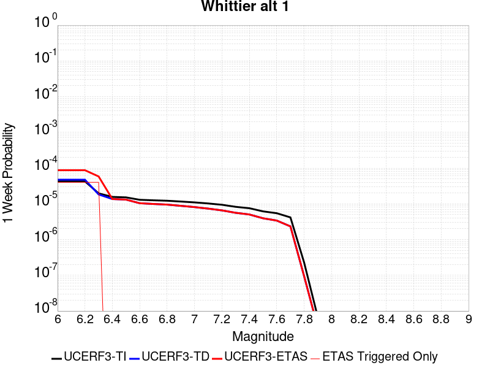 |  |  |

| Magnitude | 1 wk TI Prob | 1 wk TD Prob | 1 wk ETAS Prob | 1 wk ETAS/TD Gain | 1 wk ETAS Triggered Only | 1 mo TI Prob | 1 mo TD Prob | 1 mo ETAS Prob | 1 mo ETAS/TD Gain | 1 mo ETAS Triggered Only | 1 yr TI Prob | 1 yr TD Prob | 1 yr ETAS Prob | 1 yr ETAS/TD Gain | 1 yr ETAS Triggered Only |
|-----|-----|-----|-----|-----|-----|-----|-----|-----|-----|-----|-----|-----|-----|-----|-----|
| 6.0 | 4.2554693E-5 | 4.7282294E-5 | 8.72804E-5 | 1.8459426 | 4.0E-5 | 1.8236451E-4 | 2.0262448E-4 | 2.4261637E-4 | 1.1973695 | 4.0E-5 | 0.002218027 | 0.0024644844 | 0.0025043858 | 1.0161905 | 4.0E-5 |
| 6.1 | 4.2554693E-5 | 4.7282294E-5 | 8.72804E-5 | 1.8459426 | 4.0E-5 | 1.8236451E-4 | 2.0262448E-4 | 2.4261637E-4 | 1.1973695 | 4.0E-5 | 0.002218027 | 0.0024644844 | 0.0025043858 | 1.0161905 | 4.0E-5 |
| 6.2 | 4.2554693E-5 | 4.7282294E-5 | 8.72804E-5 | 1.8459426 | 4.0E-5 | 1.8236451E-4 | 2.0262448E-4 | 2.4261637E-4 | 1.1973695 | 4.0E-5 | 0.002218027 | 0.0024644844 | 0.0025043858 | 1.0161905 | 4.0E-5 |
| 6.3 | 1.9617712E-5 | 1.8284845E-5 | 5.8284113E-5 | 3.1875641 | 4.0E-5 | 8.40732E-5 | 7.836137E-5 | 1.1835824E-4 | 1.5104156 | 4.0E-5 | 0.0010231105 | 9.5365115E-4 | 9.93613E-4 | 1.0419041 | 4.0E-5 |
| 6.4 | 1.5611336E-5 | 1.3617991E-5 | 1.3617991E-5 | 1.0 | 0.0 | 6.690401E-5 | 5.8361547E-5 | 5.8361547E-5 | 1.0 | 0.0 | 8.142519E-4 | 7.103262E-4 | 7.103262E-4 | 1.0 | 0.0 |
| 6.5 | 1.5150166E-5 | 1.3114483E-5 | 1.3114483E-5 | 1.0 | 0.0 | 6.492767E-5 | 5.620375E-5 | 5.620375E-5 | 1.0 | 0.0 | 7.9020765E-4 | 6.840717E-4 | 6.840717E-4 | 1.0 | 0.0 |
| 6.6 | 1.295588E-5 | 1.0391854E-5 | 1.0391854E-5 | 1.0 | 0.0 | 5.552402E-5 | 4.4535765E-5 | 4.4535765E-5 | 1.0 | 0.0 | 6.7579525E-4 | 5.4209004E-4 | 5.4209004E-4 | 1.0 | 0.0 |
| 6.7 | 1.2542085E-5 | 9.910169E-6 | 9.910169E-6 | 1.0 | 0.0 | 5.3750682E-5 | 4.2471474E-5 | 4.2471474E-5 | 1.0 | 0.0 | 6.542181E-4 | 5.1696936E-4 | 5.1696936E-4 | 1.0 | 0.0 |
| 6.8 | 1.2195878E-5 | 9.505836E-6 | 9.505836E-6 | 1.0 | 0.0 | 5.2267E-5 | 4.0738672E-5 | 4.0738672E-5 | 1.0 | 0.0 | 6.36165E-4 | 4.958823E-4 | 4.958823E-4 | 1.0 | 0.0 |
| 6.9 | 1.1580298E-5 | 8.782643E-6 | 8.782643E-6 | 1.0 | 0.0 | 4.9628903E-5 | 3.7639365E-5 | 3.7639365E-5 | 1.0 | 0.0 | 6.040644E-4 | 4.5816458E-4 | 4.5816458E-4 | 1.0 | 0.0 |
| 7.0 | 1.0964795E-5 | 8.092889E-6 | 8.092889E-6 | 1.0 | 0.0 | 4.6991136E-5 | 3.468336E-5 | 3.468336E-5 | 1.0 | 0.0 | 5.7196687E-4 | 4.221896E-4 | 4.221896E-4 | 1.0 | 0.0 |
| 7.1 | 1.0230601E-5 | 7.3345395E-6 | 7.3345395E-6 | 1.0 | 0.0 | 4.3844695E-5 | 3.143337E-5 | 3.143337E-5 | 1.0 | 0.0 | 5.336784E-4 | 3.826354E-4 | 3.826354E-4 | 1.0 | 0.0 |
| 7.2 | 9.40865E-6 | 6.5504482E-6 | 6.5504482E-6 | 1.0 | 0.0 | 4.032216E-5 | 2.8073055E-5 | 2.8073055E-5 | 1.0 | 0.0 | 4.908117E-4 | 3.4173706E-4 | 3.4173706E-4 | 1.0 | 0.0 |
| 7.3 | 8.237384E-6 | 5.6038593E-6 | 5.6038593E-6 | 1.0 | 0.0 | 3.5302593E-5 | 2.4016326E-5 | 2.4016326E-5 | 1.0 | 0.0 | 4.2972428E-4 | 2.9236058E-4 | 2.9236058E-4 | 1.0 | 0.0 |
| 7.4 | 7.5316966E-6 | 5.033336E-6 | 5.033336E-6 | 1.0 | 0.0 | 3.2278298E-5 | 2.1571266E-5 | 2.1571266E-5 | 1.0 | 0.0 | 3.9291743E-4 | 2.6259953E-4 | 2.6259953E-4 | 1.0 | 0.0 |
| 7.5 | 6.149649E-6 | 3.93817E-6 | 3.93817E-6 | 1.0 | 0.0 | 2.6355372E-5 | 1.6877766E-5 | 1.6877766E-5 | 1.0 | 0.0 | 3.208294E-4 | 2.0546833E-4 | 2.0546833E-4 | 1.0 | 0.0 |
| 7.6 | 5.457711E-6 | 3.39915E-6 | 3.39915E-6 | 1.0 | 0.0 | 2.338998E-5 | 1.45677095E-5 | 1.45677095E-5 | 1.0 | 0.0 | 2.8473578E-4 | 1.7734825E-4 | 1.7734825E-4 | 1.0 | 0.0 |
| 7.7 | 4.1676276E-6 | 2.3360851E-6 | 2.3360851E-6 | 1.0 | 0.0 | 1.7861139E-5 | 1.0011759E-5 | 1.0011759E-5 | 1.0 | 0.0 | 2.1743766E-4 | 1.2188709E-4 | 1.2188709E-4 | 1.0 | 0.0 |
| 7.8 | 2.2692414E-7 | 9.397192E-8 | 9.397192E-8 | 1.0 | 0.0 | 9.725317E-7 | 4.0273673E-7 | 4.0273673E-7 | 1.0 | 0.0 | 1.1840509E-5 | 4.903312E-6 | 4.903312E-6 | 1.0 | 0.0 |
| 7.9 | 6.676829E-9 | 3.4429164E-9 | 3.4429164E-9 | 1.0 | 0.0 | 2.861498E-8 | 1.4755356E-8 | 1.4755356E-8 | 1.0 | 0.0 | 3.4838732E-7 | 1.7964643E-7 | 1.7964643E-7 | 1.0 | 0.0 |

## Garlock (West)
*[(top)](#table-of-contents)*

| 1 Week | 1 Month | 1 Year |
|-----|-----|-----|
|  | 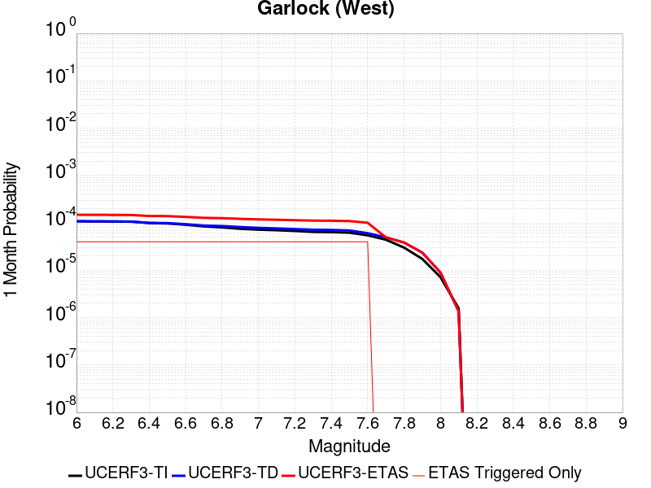 |  |

| Magnitude | 1 wk TI Prob | 1 wk TD Prob | 1 wk ETAS Prob | 1 wk ETAS/TD Gain | 1 wk ETAS Triggered Only | 1 mo TI Prob | 1 mo TD Prob | 1 mo ETAS Prob | 1 mo ETAS/TD Gain | 1 mo ETAS Triggered Only | 1 yr TI Prob | 1 yr TD Prob | 1 yr ETAS Prob | 1 yr ETAS/TD Gain | 1 yr ETAS Triggered Only |
|-----|-----|-----|-----|-----|-----|-----|-----|-----|-----|-----|-----|-----|-----|-----|-----|
| 6.0 | 2.5181727E-5 | 2.5328825E-5 | 6.532781E-5 | 2.5791883 | 4.0E-5 | 1.0791722E-4 | 1.0854761E-4 | 1.4854327E-4 | 1.3684618 | 4.0E-5 | 0.0013131002 | 0.0013207694 | 0.0013607166 | 1.0302454 | 4.0E-5 |
| 6.1 | 2.5077732E-5 | 2.5229843E-5 | 6.5228836E-5 | 2.5853841 | 4.0E-5 | 1.0747157E-4 | 1.0812344E-4 | 1.4811911E-4 | 1.3699075 | 4.0E-5 | 0.001307681 | 0.0013156114 | 0.0013555588 | 1.0303642 | 4.0E-5 |
| 6.2 | 2.494612E-5 | 2.5111442E-5 | 6.5110435E-5 | 2.5928595 | 4.0E-5 | 1.0690756E-4 | 1.0761604E-4 | 1.4761173E-4 | 1.3716518 | 4.0E-5 | 0.0013008224 | 0.0013094412 | 0.0013493889 | 1.0305073 | 4.0E-5 |
| 6.3 | 2.4733758E-5 | 2.4930645E-5 | 6.492965E-5 | 2.6044111 | 4.0E-5 | 1.0599751E-4 | 1.0684126E-4 | 1.4683699E-4 | 1.3743472 | 4.0E-5 | 0.0012897556 | 0.0013000196 | 0.0013399676 | 1.0307288 | 4.0E-5 |
| 6.4 | 2.3237335E-5 | 2.3309083E-5 | 6.330815E-5 | 2.7160292 | 4.0E-5 | 9.958477E-5 | 9.989226E-5 | 1.3988826E-4 | 1.4003915 | 4.0E-5 | 0.0012117702 | 0.0012155125 | 0.0012554639 | 1.0328679 | 4.0E-5 |
| 6.5 | 2.2732203E-5 | 2.3122879E-5 | 6.312195E-5 | 2.7298484 | 4.0E-5 | 9.742009E-5 | 9.90943E-5 | 1.3909033E-4 | 1.403616 | 4.0E-5 | 0.0011854442 | 0.0012058083 | 0.00124576 | 1.0331328 | 4.0E-5 |
| 6.6 | 2.1319436E-5 | 2.1901993E-5 | 6.190112E-5 | 2.8262777 | 4.0E-5 | 9.136581E-5 | 9.386232E-5 | 1.3385856E-4 | 1.4261161 | 4.0E-5 | 0.001111811 | 0.0011421769 | 0.0011821312 | 1.0349809 | 4.0E-5 |
| 6.7 | 1.970802E-5 | 2.05206E-5 | 6.051978E-5 | 2.9492207 | 4.0E-5 | 8.446021E-5 | 8.794248E-5 | 1.2793895E-4 | 1.4548028 | 4.0E-5 | 0.001027818 | 0.0010701754 | 0.0011101327 | 1.0373371 | 4.0E-5 |
| 6.8 | 1.8744462E-5 | 2.0026835E-5 | 6.0026032E-5 | 2.9972801 | 4.0E-5 | 8.033094E-5 | 8.5826476E-5 | 1.2582305E-4 | 1.4660167 | 4.0E-5 | 9.775903E-4 | 0.0010444381 | 0.0010843964 | 1.0382581 | 4.0E-5 |
| 6.9 | 1.7559682E-5 | 1.9078003E-5 | 5.907724E-5 | 3.0966156 | 4.0E-5 | 7.5253614E-5 | 8.1760314E-5 | 1.21757046E-4 | 1.4891949 | 4.0E-5 | 9.158276E-4 | 9.949787E-4 | 0.001034939 | 1.0401618 | 4.0E-5 |
| 7.0 | 1.6794445E-5 | 1.8338675E-5 | 5.833794E-5 | 3.1811428 | 4.0E-5 | 7.197421E-5 | 7.8591955E-5 | 1.1858881E-4 | 1.5089179 | 4.0E-5 | 8.759337E-4 | 9.564384E-4 | 9.964001E-4 | 1.0417818 | 4.0E-5 |
| 7.1 | 1.6337795E-5 | 1.7838813E-5 | 5.78381E-5 | 3.2422616 | 4.0E-5 | 7.0017246E-5 | 7.6449825E-5 | 1.1644676E-4 | 1.523179 | 4.0E-5 | 8.521265E-4 | 9.303805E-4 | 9.7034324E-4 | 1.0429531 | 4.0E-5 |
| 7.2 | 1.5780008E-5 | 1.7286979E-5 | 5.728629E-5 | 3.3138404 | 4.0E-5 | 6.762685E-5 | 7.408495E-5 | 1.1408199E-4 | 1.5398808 | 4.0E-5 | 8.2304585E-4 | 9.0161234E-4 | 9.415763E-4 | 1.044325 | 4.0E-5 |
| 7.3 | 1.5058865E-5 | 1.6739175E-5 | 5.6738507E-5 | 3.3895638 | 4.0E-5 | 6.45364E-5 | 7.173736E-5 | 1.11734495E-4 | 1.5575495 | 4.0E-5 | 7.854473E-4 | 8.730536E-4 | 9.1301865E-4 | 1.0457762 | 4.0E-5 |
| 7.4 | 1.4887923E-5 | 1.6574775E-5 | 5.657411E-5 | 3.4132657 | 4.0E-5 | 6.380382E-5 | 7.1032824E-5 | 1.1102998E-4 | 1.56308 | 4.0E-5 | 7.7653467E-4 | 8.6448266E-4 | 9.044481E-4 | 1.0462304 | 4.0E-5 |
| 7.5 | 1.4509299E-5 | 1.6165865E-5 | 5.6165216E-5 | 3.4743097 | 4.0E-5 | 6.218123E-5 | 6.928044E-5 | 1.0927767E-4 | 1.5773236 | 4.0E-5 | 7.567935E-4 | 8.4316416E-4 | 8.831304E-4 | 1.0474004 | 4.0E-5 |
| 7.6 | 1.2756717E-5 | 1.41623805E-5 | 5.4161814E-5 | 3.824344 | 4.0E-5 | 5.4670498E-5 | 6.0694507E-5 | 1.0069208E-4 | 1.6589983 | 4.0E-5 | 6.6541E-4 | 7.3870574E-4 | 7.786762E-4 | 1.0541087 | 4.0E-5 |
| 7.7 | 1.0328985E-5 | 1.1565329E-5 | 1.1565329E-5 | 1.0 | 0.0 | 4.4266326E-5 | 4.956476E-5 | 4.956476E-5 | 1.0 | 0.0 | 5.388092E-4 | 6.032842E-4 | 6.032842E-4 | 1.0 | 0.0 |
| 7.8 | 7.0306583E-6 | 8.9839405E-6 | 8.9839405E-6 | 1.0 | 0.0 | 3.0131043E-5 | 3.8502036E-5 | 3.8502036E-5 | 1.0 | 0.0 | 3.667837E-4 | 4.6866163E-4 | 4.6866163E-4 | 1.0 | 0.0 |
| 7.9 | 4.060633E-6 | 5.514807E-6 | 5.514807E-6 | 1.0 | 0.0 | 1.7402595E-5 | 2.3634675E-5 | 2.3634675E-5 | 1.0 | 0.0 | 2.11856E-4 | 2.8771427E-4 | 2.8771427E-4 | 1.0 | 0.0 |
| 8.0 | 1.6729537E-6 | 2.093995E-6 | 2.093995E-6 | 1.0 | 0.0 | 7.169782E-6 | 8.974233E-6 | 8.974233E-6 | 1.0 | 0.0 | 8.7288594E-5 | 1.09255845E-4 | 1.09255845E-4 | 1.0 | 0.0 |
| 8.1 | 3.6733252E-7 | 3.1722044E-7 | 3.1722044E-7 | 1.0 | 0.0 | 1.5742813E-6 | 1.3595155E-6 | 1.3595155E-6 | 1.0 | 0.0 | 1.9166706E-5 | 1.6551992E-5 | 1.6551992E-5 | 1.0 | 0.0 |

## Death Valley (So)
*[(top)](#table-of-contents)*

| 1 Week | 1 Month | 1 Year |
|-----|-----|-----|
| 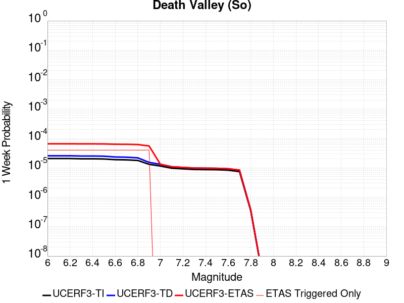 |  | 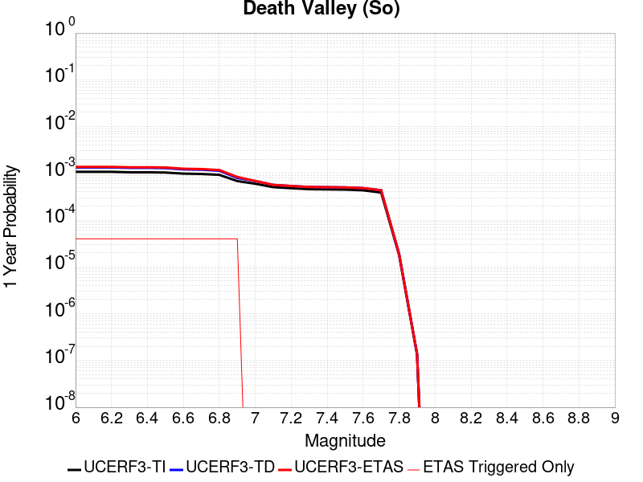 |

| Magnitude | 1 wk TI Prob | 1 wk TD Prob | 1 wk ETAS Prob | 1 wk ETAS/TD Gain | 1 wk ETAS Triggered Only | 1 mo TI Prob | 1 mo TD Prob | 1 mo ETAS Prob | 1 mo ETAS/TD Gain | 1 mo ETAS Triggered Only | 1 yr TI Prob | 1 yr TD Prob | 1 yr ETAS Prob | 1 yr ETAS/TD Gain | 1 yr ETAS Triggered Only |
|-----|-----|-----|-----|-----|-----|-----|-----|-----|-----|-----|-----|-----|-----|-----|-----|
| 6.0 | 2.0684236E-5 | 2.5651949E-5 | 6.565092E-5 | 2.5592957 | 4.0E-5 | 8.864371E-5 | 1.0993239E-4 | 1.4992799E-4 | 1.36382 | 4.0E-5 | 0.0010787029 | 0.0013376221 | 0.0013775686 | 1.0298638 | 4.0E-5 |
| 6.1 | 2.0684236E-5 | 2.5651949E-5 | 6.565092E-5 | 2.5592957 | 4.0E-5 | 8.864371E-5 | 1.0993239E-4 | 1.4992799E-4 | 1.36382 | 4.0E-5 | 0.0010787029 | 0.0013376221 | 0.0013775686 | 1.0298638 | 4.0E-5 |
| 6.2 | 2.0684236E-5 | 2.5651949E-5 | 6.565092E-5 | 2.5592957 | 4.0E-5 | 8.864371E-5 | 1.0993239E-4 | 1.4992799E-4 | 1.36382 | 4.0E-5 | 0.0010787029 | 0.0013376221 | 0.0013775686 | 1.0298638 | 4.0E-5 |
| 6.3 | 2.0240292E-5 | 2.515182E-5 | 6.5150816E-5 | 2.5903022 | 4.0E-5 | 8.6741224E-5 | 1.0778916E-4 | 1.4778484E-4 | 1.3710549 | 4.0E-5 | 0.0010555626 | 0.0013115597 | 0.0013515073 | 1.0304581 | 4.0E-5 |
| 6.4 | 2.0240292E-5 | 2.515182E-5 | 6.5150816E-5 | 2.5903022 | 4.0E-5 | 8.6741224E-5 | 1.0778916E-4 | 1.4778484E-4 | 1.3710549 | 4.0E-5 | 0.0010555626 | 0.0013115597 | 0.0013515073 | 1.0304581 | 4.0E-5 |
| 6.5 | 1.9962767E-5 | 2.4840947E-5 | 6.483995E-5 | 2.6102047 | 4.0E-5 | 8.55519E-5 | 1.0645695E-4 | 1.4645269E-4 | 1.3756987 | 4.0E-5 | 0.0010410968 | 0.0012953595 | 0.0013353077 | 1.0308394 | 4.0E-5 |
| 6.6 | 1.8937297E-5 | 2.3337238E-5 | 6.33363E-5 | 2.713959 | 4.0E-5 | 8.115732E-5 | 1.00012985E-4 | 1.4000898E-4 | 1.3999081 | 4.0E-5 | 9.876423E-4 | 0.0012169925 | 0.0012569438 | 1.0328279 | 4.0E-5 |
| 6.7 | 1.8621096E-5 | 2.293739E-5 | 6.293647E-5 | 2.7438376 | 4.0E-5 | 7.980225E-5 | 9.8299475E-5 | 1.3829555E-4 | 1.4068798 | 4.0E-5 | 9.711593E-4 | 0.0011961536 | 0.0012361058 | 1.0334005 | 4.0E-5 |
| 6.8 | 1.7830353E-5 | 2.1828011E-5 | 6.182714E-5 | 2.8324678 | 4.0E-5 | 7.641356E-5 | 9.354534E-5 | 1.335416E-4 | 1.4275601 | 4.0E-5 | 9.29938E-4 | 0.0011383336 | 0.001178288 | 1.035099 | 4.0E-5 |
| 6.9 | 1.3135183E-5 | 1.5312111E-5 | 5.53115E-5 | 3.6122713 | 4.0E-5 | 5.6292425E-5 | 6.5621716E-5 | 1.0561909E-4 | 1.6095144 | 4.0E-5 | 6.8514474E-4 | 7.98658E-4 | 8.3862606E-4 | 1.0500441 | 4.0E-5 |
| 7.0 | 1.1507512E-5 | 1.3160505E-5 | 1.3160505E-5 | 1.0 | 0.0 | 4.9316975E-5 | 5.6400975E-5 | 5.6400975E-5 | 1.0 | 0.0 | 6.002687E-4 | 6.8647135E-4 | 6.8647135E-4 | 1.0 | 0.0 |
| 7.1 | 9.715903E-6 | 1.0869782E-5 | 1.0869782E-5 | 1.0 | 0.0 | 4.1638916E-5 | 4.6583973E-5 | 4.6583973E-5 | 1.0 | 0.0 | 5.068359E-4 | 5.6701654E-4 | 5.6701654E-4 | 1.0 | 0.0 |
| 7.2 | 9.233269E-6 | 1.02904705E-5 | 1.02904705E-5 | 1.0 | 0.0 | 3.9570554E-5 | 4.4101293E-5 | 4.4101293E-5 | 1.0 | 0.0 | 4.81665E-4 | 5.368052E-4 | 5.368052E-4 | 1.0 | 0.0 |
| 7.3 | 8.8041315E-6 | 9.811974E-6 | 9.811974E-6 | 1.0 | 0.0 | 3.7731446E-5 | 4.2050666E-5 | 4.2050666E-5 | 1.0 | 0.0 | 4.592835E-4 | 5.118508E-4 | 5.118508E-4 | 1.0 | 0.0 |
| 7.4 | 8.708749E-6 | 9.710965E-6 | 9.710965E-6 | 1.0 | 0.0 | 3.7322676E-5 | 4.1617783E-5 | 4.1617783E-5 | 1.0 | 0.0 | 4.5430884E-4 | 5.065829E-4 | 5.065829E-4 | 1.0 | 0.0 |
| 7.5 | 8.612678E-6 | 9.608584E-6 | 9.608584E-6 | 1.0 | 0.0 | 3.6910955E-5 | 4.117902E-5 | 4.117902E-5 | 1.0 | 0.0 | 4.492982E-4 | 5.0124346E-4 | 5.0124346E-4 | 1.0 | 0.0 |
| 7.6 | 8.319024E-6 | 9.287581E-6 | 9.287581E-6 | 1.0 | 0.0 | 3.5652476E-5 | 3.9803333E-5 | 3.9803333E-5 | 1.0 | 0.0 | 4.3398244E-4 | 4.8450203E-4 | 4.8450203E-4 | 1.0 | 0.0 |
| 7.7 | 7.4718328E-6 | 8.348488E-6 | 8.348488E-6 | 1.0 | 0.0 | 3.2021748E-5 | 3.577877E-5 | 3.577877E-5 | 1.0 | 0.0 | 3.8979502E-4 | 4.3552349E-4 | 4.3552349E-4 | 1.0 | 0.0 |
| 7.8 | 3.4586725E-7 | 3.6489428E-7 | 3.6489428E-7 | 1.0 | 0.0 | 1.4822873E-6 | 1.5638317E-6 | 1.5638317E-6 | 1.0 | 0.0 | 1.80467E-5 | 1.903949E-5 | 1.903949E-5 | 1.0 | 0.0 |
| 7.9 | 2.5591178E-9 | 2.6700626E-9 | 2.6700626E-9 | 1.0 | 0.0 | 1.0967647E-8 | 1.1443126E-8 | 1.1443126E-8 | 1.0 | 0.0 | 1.335311E-7 | 1.3932005E-7 | 1.3932005E-7 | 1.0 | 0.0 |

