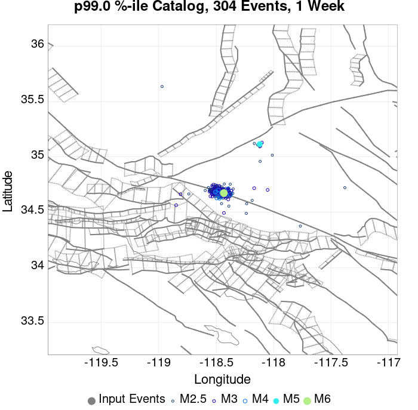
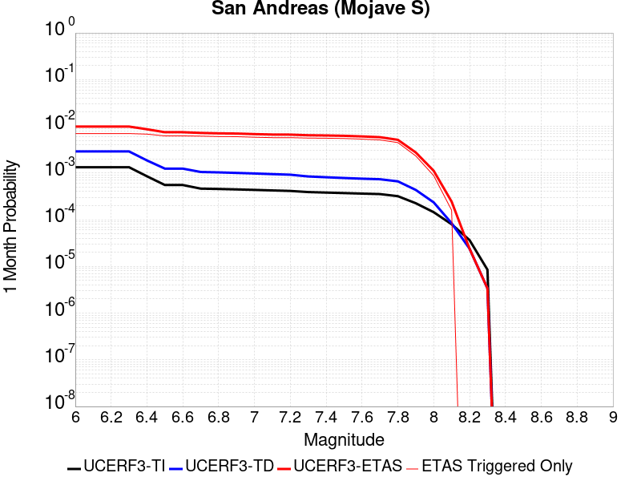
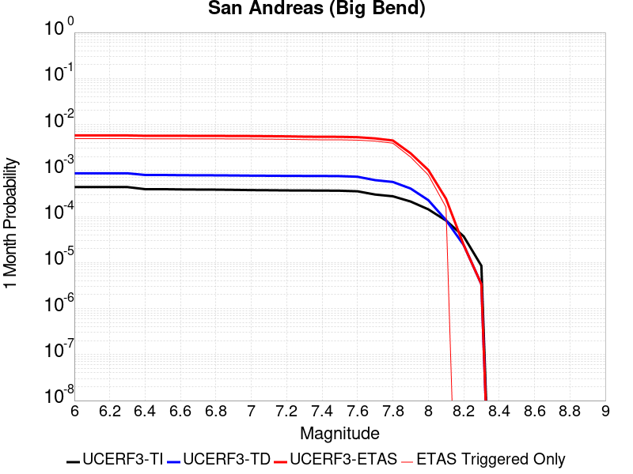
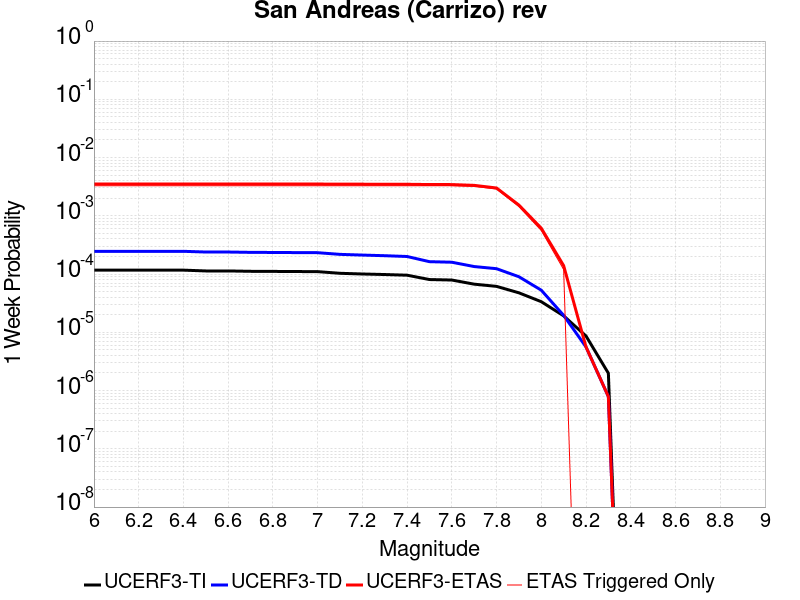
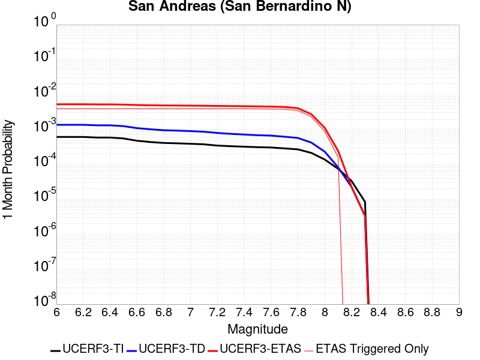
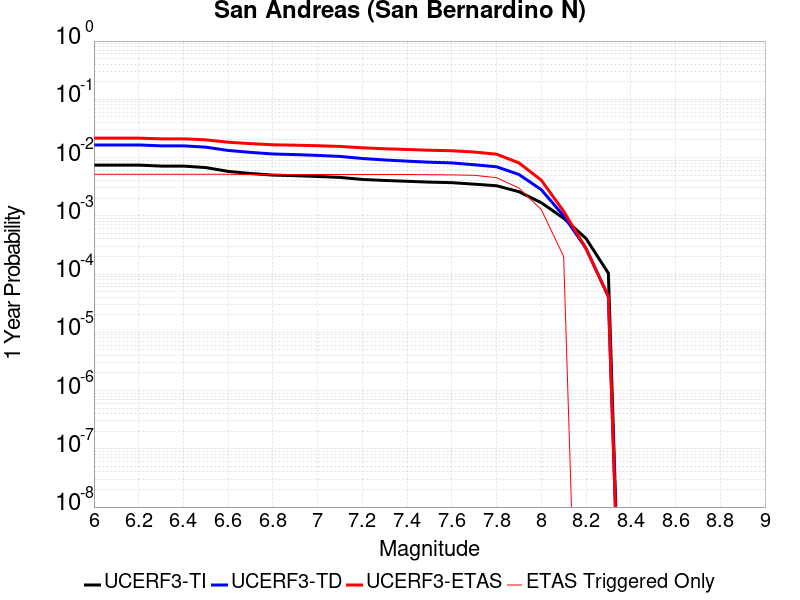

# M6OnSAF Results

|   | M6OnSAF |
|-----|-----|
| Num Simulations | 25000 |
| Start Time | 2020/01/01 00:00:00 UTC |
| Start Time Epoch Milliseconds | 1577836800000 |
| Duration | 1 Year |
| Includes Spontaneous? | false |
| Trigger Ruptures | *(none)* |
| Config Generated With | u3etas_config_builder.sh --start-year 2020 --num-simulations 25000 --duration-years 1 --magnitude 6 --latitude 34.695 --depth 5 --longitude -118.5 --name M6OnSAF --hpc-site USC_HPC --nodes 36 --hours 24 --queue scec |

## Table Of Contents

* [Probabilities Summary Table](#probabilities-summary-table)
* [Magnitude Number Distribution](#magnitude-number-distribution)
  * [1 Year Magnitude Number Distribution](#1-year-magnitude-number-distribution)
  * [1 Month Magnitude Number Distribution](#1-month-magnitude-number-distribution)
  * [1 Week Magnitude Number Distribution](#1-week-magnitude-number-distribution)
  * [1 Day Magnitude Number Distribution](#1-day-magnitude-number-distribution)
  * [1 Hour Magnitude Number Distribution](#1-hour-magnitude-number-distribution)
* [Hazard Change Over Time](#hazard-change-over-time)
  * [M&ge;5.0 Hazard Change Over Time](#m50-hazard-change-over-time)
  * [M&ge;6.0 Hazard Change Over Time](#m60-hazard-change-over-time)
  * [M&ge;7.0 Hazard Change Over Time](#m70-hazard-change-over-time)
  * [M&ge;8.0 Hazard Change Over Time](#m80-hazard-change-over-time)
* [Trigger Rupture Fault Map](#trigger-rupture-fault-map)
* [Fault Distances To Triggers](#fault-distances-to-triggers)
* [Individual Simulated Catalog Maps](#individual-simulated-catalog-maps)
* [Section Participation](#section-participation)
  * [Section Participation Plots](#section-participation-plots)
  * [Supra-Seismogenic Parent Sections Table](#supra-seismogenic-parent-sections-table)
  * [M≥6.5 Parent Sections Table](#m65-parent-sections-table)
  * [M≥7 Parent Sections Table](#m7-parent-sections-table)
  * [M≥7.5 Parent Sections Table](#m75-parent-sections-table)
  * [M≥8 Parent Sections Table](#m8-parent-sections-table)
* [Fault Magnitude-Probability Distributions](#fault-magnitude-probability-distributions)
* [Gridded Nucleation](#gridded-nucleation)
* [JSON Input File](#json-input-file)

## Probabilities Summary Table
*[(top)](#table-of-contents)*

| Magnitude | 1 Hour Prob | 1 Day Prob | 1 Week Prob | 1 Month Prob | 1 Year Prob |
|-----|-----|-----|-----|-----|-----|
| **M&ge;3** | 1.000 (100.00%) | 1.000 (100.00%) | 1.000 (100.00%) | 1.000 (100.00%) | 1.000 (100.00%) |
| *95% Conf* | *[99.97% 100.00%]* | *[99.98% 100.00%]* | *[99.98% 100.00%]* | *[99.98% 100.00%]* | *[99.98% 100.00%]* |
| **M&ge;3.5** | 0.974 (97.40%) | 1.000 (99.99%) | 1.000 (100.00%) | 1.000 (100.00%) | 1.000 (100.00%) |
| *95% Conf* | *[97.19% 97.59%]* | *[99.96% 100.00%]* | *[99.98% 100.00%]* | *[99.98% 100.00%]* | *[99.98% 100.00%]* |
| **M&ge;4** | 0.687 (68.68%) | 0.939 (93.89%) | 0.977 (97.67%) | 0.988 (98.82%) | 0.996 (99.62%) |
| *95% Conf* | *[68.10% 69.26%]* | *[93.58% 94.18%]* | *[97.48% 97.85%]* | *[98.67% 98.94%]* | *[99.54% 99.69%]* |
| **M&ge;4.5** | 0.315 (31.48%) | 0.602 (60.22%) | 0.711 (71.12%) | 0.772 (77.17%) | 0.844 (84.39%) |
| *95% Conf* | *[30.91% 32.06%]* | *[59.61% 60.83%]* | *[70.55% 71.68%]* | *[76.65% 77.69%]* | *[83.93% 84.83%]* |
| **M&ge;5** | 0.111 (11.11%) | 0.251 (25.08%) | 0.326 (32.62%) | 0.378 (37.80%) | 0.456 (45.55%) |
| *95% Conf* | *[10.72% 11.51%]* | *[24.54% 25.62%]* | *[32.04% 33.21%]* | *[37.20% 38.41%]* | *[44.93% 46.17%]* |
| **M&ge;5.5** | 0.033 (3.26%) | 0.078 (7.82%) | 0.107 (10.68%) | 0.127 (12.74%) | 0.163 (16.32%) |
| *95% Conf* | *[3.05% 3.49%]* | *[7.50% 8.17%]* | *[10.30% 11.07%]* | *[12.33% 13.16%]* | *[15.87% 16.79%]* |
| **M&ge;6** | 6.64E-3 (0.66%) | 0.017 (1.69%) | 0.024 (2.43%) | 0.030 (2.96%) | 0.039 (3.86%) |
| *95% Conf* | *[0.57% 0.77%]* | *[1.53% 1.86%]* | *[2.24% 2.63%]* | *[2.76% 3.18%]* | *[3.63% 4.11%]* |
| **M&ge;6.5** | 1.52E-3 (0.15%) | 4.16E-3 (0.42%) | 5.76E-3 (0.58%) | 7.52E-3 (0.75%) | 9.88E-3 (0.99%) |
| *95% Conf* | *[0.11% 0.21%]* | *[0.34% 0.51%]* | *[0.49% 0.68%]* | *[0.65% 0.87%]* | *[0.87% 1.12%]* |
| **M&ge;7** | 1.36E-3 (0.14%) | 3.60E-3 (0.36%) | 4.96E-3 (0.50%) | 6.44E-3 (0.64%) | 8.36E-3 (0.84%) |
| *95% Conf* | *[0.10% 0.19%]* | *[0.29% 0.44%]* | *[0.41% 0.59%]* | *[0.55% 0.75%]* | *[0.73% 0.96%]* |
| **M&ge;7.5** | 1.08E-3 (0.11%) | 3.28E-3 (0.33%) | 4.56E-3 (0.46%) | 5.76E-3 (0.58%) | 7.52E-3 (0.75%) |
| *95% Conf* | *[0.07% 0.16%]* | *[0.26% 0.41%]* | *[0.38% 0.55%]* | *[0.49% 0.68%]* | *[0.65% 0.87%]* |
| **M&ge;8** | 1.20E-4 (0.01%) | 4.40E-4 (0.04%) | 6.00E-4 (0.06%) | 8.80E-4 (0.09%) | 1.28E-3 (0.13%) |
| *95% Conf* | *[0.00% 0.04%]* | *[0.02% 0.08%]* | *[0.03% 0.10%]* | *[0.06% 0.14%]* | *[0.09% 0.18%]* |

## Magnitude Number Distribution
*[(top)](#table-of-contents)*

### 1 Year Magnitude Number Distribution
*[(top)](#table-of-contents)*

**Legend**
* **Mean** (thick black line): mean expected number across all 25000 catalogs
* **2.5%,97.5%** (thin black lines): expected number percentiles across all 25000 catalogs
* **Median** (thin blue line): median expected number across all 25000 catalogs
* **Mode** (thin cyan line): modal expected number across all 25000 catalogs
* **1 yr Probability** (thin red line): 1 year probability calculated as the fraction of catalogs with at least 1 occurrence
* **1 yr Supraseismogenic Probability** (thin dashed red line): same as above, but only for supraseismogenic ruptures on explicitly modeled UCERF3 faults
* **95% Conf** (light red shaded region): binomial 95% confidence bounds on probability
* **Primary** (thin green line): mean expected number from primary triggered aftershocks only (no secondary, tertiary, etc...) across all 25000 catalogs


| Mag | Mean | 2.5 %ile | 97.5 %ile | Median | Mode | 1 yr Probability | 1 yr Prob 95% Conf | 1 yr Supra-Seis Prob | Primary Aftershocks Mean |
|-----|-----|-----|-----|-----|-----|-----|-----|-----|-----|
| **M&ge;2.5** | 395.366 | 162.000 | 574.000 | 218.000 | 198.000 | 1.000 (100.00%) | [99.98% 100.00%] | 0.011 (1.14%) | 147.294 |
| **M&ge;2.6** | 313.942 | 126.000 | 456.000 | 173.000 | 167.000 | 1.000 (100.00%) | [99.98% 100.00%] | 0.011 (1.14%) | 116.903 |
| **M&ge;2.7** | 249.335 | 98.000 | 363.000 | 138.000 | 122.000 | 1.000 (100.00%) | [99.98% 100.00%] | 0.011 (1.14%) | 92.828 |
| **M&ge;2.8** | 197.995 | 76.000 | 289.000 | 110.000 | 100.000 | 1.000 (100.00%) | [99.98% 100.00%] | 0.011 (1.14%) | 73.727 |
| **M&ge;2.9** | 157.243 | 59.000 | 230.000 | 87.000 | 79.000 | 1.000 (100.00%) | [99.98% 100.00%] | 0.011 (1.14%) | 58.539 |
| **M&ge;3** | 124.932 | 45.000 | 184.000 | 69.000 | 63.000 | 1.000 (100.00%) | [99.98% 100.00%] | 0.011 (1.14%) | 46.536 |
| **M&ge;3.1** | 99.243 | 34.000 | 148.000 | 55.000 | 53.000 | 1.000 (100.00%) | [99.98% 100.00%] | 0.011 (1.14%) | 36.955 |
| **M&ge;3.2** | 78.843 | 26.000 | 118.000 | 44.000 | 41.000 | 1.000 (100.00%) | [99.98% 100.00%] | 0.011 (1.14%) | 29.367 |
| **M&ge;3.3** | 62.608 | 20.000 | 95.000 | 35.000 | 32.000 | 1.000 (100.00%) | [99.98% 100.00%] | 0.011 (1.14%) | 23.301 |
| **M&ge;3.4** | 49.692 | 14.000 | 76.000 | 28.000 | 26.000 | 1.000 (100.00%) | [99.98% 100.00%] | 0.011 (1.14%) | 18.494 |
| **M&ge;3.5** | 39.438 | 11.000 | 61.000 | 22.000 | 19.000 | 1.000 (100.00%) | [99.98% 100.00%] | 0.011 (1.14%) | 14.669 |
| **M&ge;3.6** | 31.324 | 8.000 | 49.000 | 17.000 | 15.000 | 1.000 (100.00%) | [99.98% 100.00%] | 0.011 (1.14%) | 11.652 |
| **M&ge;3.7** | 24.868 | 6.000 | 40.000 | 14.000 | 13.000 | 1.000 (99.99%) | [99.97% 100.00%] | 0.011 (1.14%) | 9.250 |
| **M&ge;3.8** | 19.767 | 4.000 | 32.000 | 11.000 | 9.000 | 1.000 (99.98%) | [99.95% 99.99%] | 0.011 (1.14%) | 7.351 |
| **M&ge;3.9** | 15.684 | 3.000 | 27.000 | 9.000 | 7.000 | 0.999 (99.90%) | [99.85% 99.94%] | 0.011 (1.14%) | 5.830 |
| **M&ge;4** | 12.448 | 2.000 | 22.000 | 7.000 | 6.000 | 0.996 (99.62%) | [99.54% 99.69%] | 0.011 (1.14%) | 4.632 |
| **M&ge;4.1** | 9.866 | 1.000 | 18.000 | 5.000 | 4.000 | 0.989 (98.91%) | [98.77% 99.04%] | 0.011 (1.14%) | 3.674 |
| **M&ge;4.2** | 7.831 | 0.000 | 15.000 | 4.000 | 3.000 | 0.972 (97.18%) | [96.96% 97.38%] | 0.011 (1.14%) | 2.915 |
| **M&ge;4.3** | 6.195 | 0.000 | 12.000 | 3.000 | 2.000 | 0.943 (94.32%) | [94.02% 94.60%] | 0.011 (1.14%) | 2.312 |
| **M&ge;4.4** | 4.913 | 0.000 | 10.000 | 3.000 | 2.000 | 0.901 (90.07%) | [89.69% 90.44%] | 0.011 (1.14%) | 1.837 |
| **M&ge;4.5** | 3.890 | 0.000 | 9.000 | 2.000 | 1.000 | 0.844 (84.39%) | [83.93% 84.83%] | 0.011 (1.14%) | 1.458 |
| **M&ge;4.6** | 3.070 | 0.000 | 7.000 | 1.000 | 1.000 | 0.774 (77.41%) | [76.89% 77.93%] | 0.011 (1.14%) | 1.150 |
| **M&ge;4.7** | 2.431 | 0.000 | 6.000 | 1.000 | 0.000 | 0.697 (69.66%) | [69.09% 70.23%] | 0.011 (1.14%) | 0.914 |
| **M&ge;4.8** | 1.917 | 0.000 | 5.000 | 1.000 | 0.000 | 0.615 (61.54%) | [60.94% 62.15%] | 0.011 (1.14%) | 0.722 |
| **M&ge;4.9** | 1.517 | 0.000 | 5.000 | 1.000 | 0.000 | 0.537 (53.74%) | [53.12% 54.36%] | 0.011 (1.14%) | 0.571 |
| **M&ge;5** | 1.190 | 0.000 | 4.000 | 0.000 | 0.000 | 0.456 (45.55%) | [44.93% 46.17%] | 0.011 (1.14%) | 0.447 |
| **M&ge;5.1** | 0.927 | 0.000 | 3.000 | 0.000 | 0.000 | 0.382 (38.22%) | [37.62% 38.83%] | 0.011 (1.14%) | 0.347 |
| **M&ge;5.2** | 0.722 | 0.000 | 3.000 | 0.000 | 0.000 | 0.317 (31.74%) | [31.16% 32.32%] | 0.011 (1.14%) | 0.271 |
| **M&ge;5.3** | 0.556 | 0.000 | 3.000 | 0.000 | 0.000 | 0.257 (25.73%) | [25.19% 26.28%] | 0.011 (1.14%) | 0.208 |
| **M&ge;5.4** | 0.432 | 0.000 | 2.000 | 0.000 | 0.000 | 0.208 (20.81%) | [20.31% 21.32%] | 0.011 (1.14%) | 0.161 |
| **M&ge;5.5** | 0.328 | 0.000 | 2.000 | 0.000 | 0.000 | 0.163 (16.32%) | [15.87% 16.79%] | 0.011 (1.14%) | 0.123 |
| **M&ge;5.6** | 0.249 | 0.000 | 2.000 | 0.000 | 0.000 | 0.128 (12.79%) | [12.38% 13.21%] | 0.011 (1.14%) | 0.092 |
| **M&ge;5.7** | 0.184 | 0.000 | 1.000 | 0.000 | 0.000 | 0.098 (9.76%) | [9.40% 10.14%] | 0.011 (1.14%) | 0.068 |
| **M&ge;5.8** | 0.134 | 0.000 | 1.000 | 0.000 | 0.000 | 0.074 (7.37%) | [7.05% 7.70%] | 0.011 (1.14%) | 0.050 |
| **M&ge;5.9** | 0.093 | 0.000 | 1.000 | 0.000 | 0.000 | 0.054 (5.41%) | [5.13% 5.70%] | 0.011 (1.14%) | 0.035 |
| **M&ge;6** | 0.065 | 0.000 | 1.000 | 0.000 | 0.000 | 0.039 (3.86%) | [3.63% 4.11%] | 0.011 (1.14%) | 0.025 |
| **M&ge;6.1** | 0.039 | 0.000 | 0.000 | 0.000 | 0.000 | 0.024 (2.40%) | [2.21% 2.60%] | 0.011 (1.12%) | 0.015 |
| **M&ge;6.2** | 0.026 | 0.000 | 0.000 | 0.000 | 0.000 | 0.017 (1.66%) | [1.50% 1.82%] | 0.011 (1.11%) | 9.92E-3 |
| **M&ge;6.3** | 0.019 | 0.000 | 0.000 | 0.000 | 0.000 | 0.013 (1.26%) | [1.13% 1.41%] | 0.011 (1.09%) | 7.44E-3 |
| **M&ge;6.4** | 0.015 | 0.000 | 0.000 | 0.000 | 0.000 | 0.011 (1.10%) | [0.98% 1.24%] | 0.010 (1.04%) | 6.48E-3 |
| **M&ge;6.5** | 0.013 | 0.000 | 0.000 | 0.000 | 0.000 | 9.88E-3 (0.99%) | [0.87% 1.12%] | 9.32E-3 (0.93%) | 5.84E-3 |
| **M&ge;6.6** | 0.011 | 0.000 | 0.000 | 0.000 | 0.000 | 9.52E-3 (0.95%) | [0.84% 1.08%] | 9.24E-3 (0.92%) | 5.64E-3 |
| **M&ge;6.7** | 0.010 | 0.000 | 0.000 | 0.000 | 0.000 | 9.24E-3 (0.92%) | [0.81% 1.05%] | 9.00E-3 (0.90%) | 5.56E-3 |
| **M&ge;6.8** | 9.64E-3 | 0.000 | 0.000 | 0.000 | 0.000 | 8.96E-3 (0.90%) | [0.78% 1.02%] | 8.76E-3 (0.88%) | 5.40E-3 |
| **M&ge;6.9** | 9.12E-3 | 0.000 | 0.000 | 0.000 | 0.000 | 8.64E-3 (0.86%) | [0.75% 0.99%] | 8.52E-3 (0.85%) | 5.20E-3 |
| **M&ge;7** | 8.64E-3 | 0.000 | 0.000 | 0.000 | 0.000 | 8.36E-3 (0.84%) | [0.73% 0.96%] | 8.28E-3 (0.83%) | 5.04E-3 |
| **M&ge;7.1** | 8.20E-3 | 0.000 | 0.000 | 0.000 | 0.000 | 7.96E-3 (0.80%) | [0.69% 0.92%] | 7.88E-3 (0.79%) | 4.80E-3 |
| **M&ge;7.2** | 8.00E-3 | 0.000 | 0.000 | 0.000 | 0.000 | 7.84E-3 (0.78%) | [0.68% 0.90%] | 7.80E-3 (0.78%) | 4.72E-3 |
| **M&ge;7.3** | 7.76E-3 | 0.000 | 0.000 | 0.000 | 0.000 | 7.64E-3 (0.76%) | [0.66% 0.88%] | 7.64E-3 (0.76%) | 4.60E-3 |
| **M&ge;7.4** | 7.64E-3 | 0.000 | 0.000 | 0.000 | 0.000 | 7.60E-3 (0.76%) | [0.66% 0.88%] | 7.60E-3 (0.76%) | 4.56E-3 |
| **M&ge;7.5** | 7.56E-3 | 0.000 | 0.000 | 0.000 | 0.000 | 7.52E-3 (0.75%) | [0.65% 0.87%] | 7.52E-3 (0.75%) | 4.48E-3 |
| **M&ge;7.6** | 7.28E-3 | 0.000 | 0.000 | 0.000 | 0.000 | 7.24E-3 (0.72%) | [0.62% 0.84%] | 7.24E-3 (0.72%) | 4.32E-3 |
| **M&ge;7.7** | 6.96E-3 | 0.000 | 0.000 | 0.000 | 0.000 | 6.96E-3 (0.70%) | [0.60% 0.81%] | 6.96E-3 (0.70%) | 4.08E-3 |
| **M&ge;7.8** | 5.88E-3 | 0.000 | 0.000 | 0.000 | 0.000 | 5.88E-3 (0.59%) | [0.50% 0.69%] | 5.88E-3 (0.59%) | 3.52E-3 |
| **M&ge;7.9** | 3.04E-3 | 0.000 | 0.000 | 0.000 | 0.000 | 3.04E-3 (0.30%) | [0.24% 0.38%] | 3.04E-3 (0.30%) | 1.56E-3 |
| **M&ge;8** | 1.28E-3 | 0.000 | 0.000 | 0.000 | 0.000 | 1.28E-3 (0.13%) | [0.09% 0.18%] | 1.28E-3 (0.13%) | 6.00E-4 |
| **M&ge;8.1** | 2.00E-4 | 0.000 | 0.000 | 0.000 | 0.000 | 2.00E-4 (0.02%) | [0.01% 0.05%] | 2.00E-4 (0.02%) | 8.00E-5 |
| **M&ge;8.2** | 0.000 | 0.000 | 0.000 | 0.000 | 0.000 | 0.000 (0.00%) | [0.00% 0.02%] | 0.000 (0.00%) | 0.000 |
| **M&ge;8.3** | 0.000 | 0.000 | 0.000 | 0.000 | 0.000 | 0.000 (0.00%) | [0.00% 0.02%] | 0.000 (0.00%) | 0.000 |
| **M&ge;8.4** | 0.000 | 0.000 | 0.000 | 0.000 | 0.000 | 0.000 (0.00%) | [0.00% 0.02%] | 0.000 (0.00%) | 0.000 |
| **M&ge;8.5** | 0.000 | 0.000 | 0.000 | 0.000 | 0.000 | 0.000 (0.00%) | [0.00% 0.02%] | 0.000 (0.00%) | 0.000 |
| **M&ge;8.6** | 0.000 | 0.000 | 0.000 | 0.000 | 0.000 | 0.000 (0.00%) | [0.00% 0.02%] | 0.000 (0.00%) | 0.000 |
| **M&ge;8.7** | 0.000 | 0.000 | 0.000 | 0.000 | 0.000 | 0.000 (0.00%) | [0.00% 0.02%] | 0.000 (0.00%) | 0.000 |
| **M&ge;8.8** | 0.000 | 0.000 | 0.000 | 0.000 | 0.000 | 0.000 (0.00%) | [0.00% 0.02%] | 0.000 (0.00%) | 0.000 |
| **M&ge;8.9** | 0.000 | 0.000 | 0.000 | 0.000 | 0.000 | 0.000 (0.00%) | [0.00% 0.02%] | 0.000 (0.00%) | 0.000 |
| **M&ge;9** | 0.000 | 0.000 | 0.000 | 0.000 | 0.000 | 0.000 (0.00%) | [0.00% 0.02%] | 0.000 (0.00%) | 0.000 |

### 1 Month Magnitude Number Distribution
*[(top)](#table-of-contents)*

**Legend**
* **Mean** (thick black line): mean expected number across all 25000 catalogs
* **2.5%,97.5%** (thin black lines): expected number percentiles across all 25000 catalogs
* **Median** (thin blue line): median expected number across all 25000 catalogs
* **Mode** (thin cyan line): modal expected number across all 25000 catalogs
* **1 mo Probability** (thin red line): 1 month probability calculated as the fraction of catalogs with at least 1 occurrence
* **1 mo Supraseismogenic Probability** (thin dashed red line): same as above, but only for supraseismogenic ruptures on explicitly modeled UCERF3 faults
* **95% Conf** (light red shaded region): binomial 95% confidence bounds on probability
* **Primary** (thin green line): mean expected number from primary triggered aftershocks only (no secondary, tertiary, etc...) across all 25000 catalogs


| Mag | Mean | 2.5 %ile | 97.5 %ile | Median | Mode | 1 mo Probability | 1 mo Prob 95% Conf | 1 mo Supra-Seis Prob | Primary Aftershocks Mean |
|-----|-----|-----|-----|-----|-----|-----|-----|-----|-----|
| **M&ge;2.5** | 266.686 | 126.000 | 382.000 | 167.000 | 156.000 | 1.000 (100.00%) | [99.98% 100.00%] | 8.44E-3 (0.84%) | 122.848 |
| **M&ge;2.6** | 211.746 | 98.000 | 305.000 | 133.000 | 126.000 | 1.000 (100.00%) | [99.98% 100.00%] | 8.44E-3 (0.84%) | 97.515 |
| **M&ge;2.7** | 168.152 | 76.000 | 243.000 | 106.000 | 100.000 | 1.000 (100.00%) | [99.98% 100.00%] | 8.44E-3 (0.84%) | 77.430 |
| **M&ge;2.8** | 133.511 | 59.000 | 193.000 | 84.000 | 79.000 | 1.000 (100.00%) | [99.98% 100.00%] | 8.44E-3 (0.84%) | 61.491 |
| **M&ge;2.9** | 106.040 | 45.000 | 155.000 | 67.000 | 63.000 | 1.000 (100.00%) | [99.98% 100.00%] | 8.44E-3 (0.84%) | 48.831 |
| **M&ge;3** | 84.237 | 34.000 | 124.000 | 53.000 | 50.000 | 1.000 (100.00%) | [99.98% 100.00%] | 8.44E-3 (0.84%) | 38.828 |
| **M&ge;3.1** | 66.919 | 26.000 | 99.000 | 42.000 | 38.000 | 1.000 (100.00%) | [99.98% 100.00%] | 8.44E-3 (0.84%) | 30.841 |
| **M&ge;3.2** | 53.163 | 20.000 | 80.000 | 34.000 | 31.000 | 1.000 (100.00%) | [99.98% 100.00%] | 8.44E-3 (0.84%) | 24.507 |
| **M&ge;3.3** | 42.217 | 14.000 | 64.000 | 27.000 | 24.000 | 1.000 (100.00%) | [99.98% 100.00%] | 8.44E-3 (0.84%) | 19.453 |
| **M&ge;3.4** | 33.522 | 11.000 | 51.000 | 21.000 | 20.000 | 1.000 (100.00%) | [99.98% 100.00%] | 8.44E-3 (0.84%) | 15.444 |
| **M&ge;3.5** | 26.607 | 8.000 | 41.000 | 17.000 | 16.000 | 1.000 (100.00%) | [99.98% 100.00%] | 8.44E-3 (0.84%) | 12.247 |
| **M&ge;3.6** | 21.136 | 6.000 | 34.000 | 13.000 | 12.000 | 1.000 (100.00%) | [99.98% 100.00%] | 8.44E-3 (0.84%) | 9.726 |
| **M&ge;3.7** | 16.783 | 4.000 | 27.000 | 11.000 | 10.000 | 1.000 (99.99%) | [99.96% 100.00%] | 8.44E-3 (0.84%) | 7.721 |
| **M&ge;3.8** | 13.342 | 3.000 | 23.000 | 8.000 | 7.000 | 0.999 (99.92%) | [99.87% 99.95%] | 8.44E-3 (0.84%) | 6.138 |
| **M&ge;3.9** | 10.591 | 2.000 | 19.000 | 7.000 | 5.000 | 0.996 (99.64%) | [99.56% 99.71%] | 8.44E-3 (0.84%) | 4.872 |
| **M&ge;4** | 8.406 | 1.000 | 15.000 | 5.000 | 4.000 | 0.988 (98.82%) | [98.67% 98.94%] | 8.44E-3 (0.84%) | 3.873 |
| **M&ge;4.1** | 6.662 | 0.000 | 13.000 | 4.000 | 3.000 | 0.972 (97.23%) | [97.02% 97.43%] | 8.44E-3 (0.84%) | 3.071 |
| **M&ge;4.2** | 5.287 | 0.000 | 11.000 | 3.000 | 2.000 | 0.944 (94.42%) | [94.13% 94.70%] | 8.44E-3 (0.84%) | 2.435 |
| **M&ge;4.3** | 4.182 | 0.000 | 9.000 | 2.000 | 2.000 | 0.899 (89.91%) | [89.53% 90.28%] | 8.44E-3 (0.84%) | 1.931 |
| **M&ge;4.4** | 3.315 | 0.000 | 8.000 | 2.000 | 1.000 | 0.841 (84.14%) | [83.68% 84.59%] | 8.44E-3 (0.84%) | 1.533 |
| **M&ge;4.5** | 2.622 | 0.000 | 6.000 | 1.000 | 1.000 | 0.772 (77.17%) | [76.65% 77.69%] | 8.44E-3 (0.84%) | 1.217 |
| **M&ge;4.6** | 2.069 | 0.000 | 5.000 | 1.000 | 1.000 | 0.693 (69.28%) | [68.70% 69.85%] | 8.44E-3 (0.84%) | 0.959 |
| **M&ge;4.7** | 1.639 | 0.000 | 5.000 | 1.000 | 0.000 | 0.609 (60.92%) | [60.31% 61.53%] | 8.44E-3 (0.84%) | 0.762 |
| **M&ge;4.8** | 1.292 | 0.000 | 4.000 | 1.000 | 0.000 | 0.527 (52.68%) | [52.06% 53.30%] | 8.44E-3 (0.84%) | 0.601 |
| **M&ge;4.9** | 1.019 | 0.000 | 4.000 | 0.000 | 0.000 | 0.452 (45.22%) | [44.61% 45.84%] | 8.44E-3 (0.84%) | 0.475 |
| **M&ge;5** | 0.796 | 0.000 | 3.000 | 0.000 | 0.000 | 0.378 (37.80%) | [37.20% 38.41%] | 8.44E-3 (0.84%) | 0.371 |
| **M&ge;5.1** | 0.620 | 0.000 | 3.000 | 0.000 | 0.000 | 0.312 (31.23%) | [30.65% 31.81%] | 8.44E-3 (0.84%) | 0.286 |
| **M&ge;5.2** | 0.485 | 0.000 | 2.000 | 0.000 | 0.000 | 0.256 (25.62%) | [25.08% 26.17%] | 8.44E-3 (0.84%) | 0.225 |
| **M&ge;5.3** | 0.375 | 0.000 | 2.000 | 0.000 | 0.000 | 0.205 (20.52%) | [20.03% 21.03%] | 8.44E-3 (0.84%) | 0.171 |
| **M&ge;5.4** | 0.291 | 0.000 | 2.000 | 0.000 | 0.000 | 0.164 (16.38%) | [15.92% 16.84%] | 8.44E-3 (0.84%) | 0.133 |
| **M&ge;5.5** | 0.221 | 0.000 | 2.000 | 0.000 | 0.000 | 0.127 (12.74%) | [12.33% 13.16%] | 8.44E-3 (0.84%) | 0.101 |
| **M&ge;5.6** | 0.169 | 0.000 | 1.000 | 0.000 | 0.000 | 0.100 (10.03%) | [9.66% 10.41%] | 8.44E-3 (0.84%) | 0.077 |
| **M&ge;5.7** | 0.125 | 0.000 | 1.000 | 0.000 | 0.000 | 0.076 (7.64%) | [7.31% 7.97%] | 8.44E-3 (0.84%) | 0.057 |
| **M&ge;5.8** | 0.090 | 0.000 | 1.000 | 0.000 | 0.000 | 0.057 (5.72%) | [5.44% 6.02%] | 8.44E-3 (0.84%) | 0.041 |
| **M&ge;5.9** | 0.063 | 0.000 | 1.000 | 0.000 | 0.000 | 0.041 (4.12%) | [3.88% 4.38%] | 8.44E-3 (0.84%) | 0.029 |
| **M&ge;6** | 0.044 | 0.000 | 1.000 | 0.000 | 0.000 | 0.030 (2.96%) | [2.76% 3.18%] | 8.44E-3 (0.84%) | 0.020 |
| **M&ge;6.1** | 0.026 | 0.000 | 0.000 | 0.000 | 0.000 | 0.018 (1.80%) | [1.64% 1.97%] | 8.24E-3 (0.82%) | 0.012 |
| **M&ge;6.2** | 0.017 | 0.000 | 0.000 | 0.000 | 0.000 | 0.012 (1.24%) | [1.11% 1.39%] | 8.16E-3 (0.82%) | 8.08E-3 |
| **M&ge;6.3** | 0.013 | 0.000 | 0.000 | 0.000 | 0.000 | 9.32E-3 (0.93%) | [0.82% 1.06%] | 8.04E-3 (0.80%) | 6.04E-3 |
| **M&ge;6.4** | 0.010 | 0.000 | 0.000 | 0.000 | 0.000 | 8.32E-3 (0.83%) | [0.72% 0.95%] | 7.72E-3 (0.77%) | 5.40E-3 |
| **M&ge;6.5** | 9.08E-3 | 0.000 | 0.000 | 0.000 | 0.000 | 7.52E-3 (0.75%) | [0.65% 0.87%] | 7.04E-3 (0.70%) | 4.88E-3 |
| **M&ge;6.6** | 7.88E-3 | 0.000 | 0.000 | 0.000 | 0.000 | 7.20E-3 (0.72%) | [0.62% 0.83%] | 7.00E-3 (0.70%) | 4.72E-3 |
| **M&ge;6.7** | 7.64E-3 | 0.000 | 0.000 | 0.000 | 0.000 | 7.08E-3 (0.71%) | [0.61% 0.82%] | 6.92E-3 (0.69%) | 4.68E-3 |
| **M&ge;6.8** | 7.24E-3 | 0.000 | 0.000 | 0.000 | 0.000 | 6.84E-3 (0.68%) | [0.59% 0.80%] | 6.72E-3 (0.67%) | 4.52E-3 |
| **M&ge;6.9** | 6.96E-3 | 0.000 | 0.000 | 0.000 | 0.000 | 6.68E-3 (0.67%) | [0.57% 0.78%] | 6.60E-3 (0.66%) | 4.36E-3 |
| **M&ge;7** | 6.56E-3 | 0.000 | 0.000 | 0.000 | 0.000 | 6.44E-3 (0.64%) | [0.55% 0.75%] | 6.40E-3 (0.64%) | 4.20E-3 |
| **M&ge;7.1** | 6.20E-3 | 0.000 | 0.000 | 0.000 | 0.000 | 6.08E-3 (0.61%) | [0.52% 0.71%] | 6.04E-3 (0.60%) | 3.96E-3 |
| **M&ge;7.2** | 6.08E-3 | 0.000 | 0.000 | 0.000 | 0.000 | 6.00E-3 (0.60%) | [0.51% 0.71%] | 6.00E-3 (0.60%) | 3.88E-3 |
| **M&ge;7.3** | 5.96E-3 | 0.000 | 0.000 | 0.000 | 0.000 | 5.88E-3 (0.59%) | [0.50% 0.69%] | 5.88E-3 (0.59%) | 3.80E-3 |
| **M&ge;7.4** | 5.88E-3 | 0.000 | 0.000 | 0.000 | 0.000 | 5.84E-3 (0.58%) | [0.50% 0.69%] | 5.84E-3 (0.58%) | 3.76E-3 |
| **M&ge;7.5** | 5.80E-3 | 0.000 | 0.000 | 0.000 | 0.000 | 5.76E-3 (0.58%) | [0.49% 0.68%] | 5.76E-3 (0.58%) | 3.68E-3 |
| **M&ge;7.6** | 5.60E-3 | 0.000 | 0.000 | 0.000 | 0.000 | 5.56E-3 (0.56%) | [0.47% 0.66%] | 5.56E-3 (0.56%) | 3.56E-3 |
| **M&ge;7.7** | 5.32E-3 | 0.000 | 0.000 | 0.000 | 0.000 | 5.32E-3 (0.53%) | [0.45% 0.63%] | 5.32E-3 (0.53%) | 3.32E-3 |
| **M&ge;7.8** | 4.56E-3 | 0.000 | 0.000 | 0.000 | 0.000 | 4.56E-3 (0.46%) | [0.38% 0.55%] | 4.56E-3 (0.46%) | 2.88E-3 |
| **M&ge;7.9** | 2.36E-3 | 0.000 | 0.000 | 0.000 | 0.000 | 2.36E-3 (0.24%) | [0.18% 0.31%] | 2.36E-3 (0.24%) | 1.28E-3 |
| **M&ge;8** | 8.80E-4 | 0.000 | 0.000 | 0.000 | 0.000 | 8.80E-4 (0.09%) | [0.06% 0.14%] | 8.80E-4 (0.09%) | 4.00E-4 |
| **M&ge;8.1** | 1.60E-4 | 0.000 | 0.000 | 0.000 | 0.000 | 1.60E-4 (0.02%) | [0.01% 0.04%] | 1.60E-4 (0.02%) | 4.00E-5 |
| **M&ge;8.2** | 0.000 | 0.000 | 0.000 | 0.000 | 0.000 | 0.000 (0.00%) | [0.00% 0.02%] | 0.000 (0.00%) | 0.000 |
| **M&ge;8.3** | 0.000 | 0.000 | 0.000 | 0.000 | 0.000 | 0.000 (0.00%) | [0.00% 0.02%] | 0.000 (0.00%) | 0.000 |
| **M&ge;8.4** | 0.000 | 0.000 | 0.000 | 0.000 | 0.000 | 0.000 (0.00%) | [0.00% 0.02%] | 0.000 (0.00%) | 0.000 |
| **M&ge;8.5** | 0.000 | 0.000 | 0.000 | 0.000 | 0.000 | 0.000 (0.00%) | [0.00% 0.02%] | 0.000 (0.00%) | 0.000 |
| **M&ge;8.6** | 0.000 | 0.000 | 0.000 | 0.000 | 0.000 | 0.000 (0.00%) | [0.00% 0.02%] | 0.000 (0.00%) | 0.000 |
| **M&ge;8.7** | 0.000 | 0.000 | 0.000 | 0.000 | 0.000 | 0.000 (0.00%) | [0.00% 0.02%] | 0.000 (0.00%) | 0.000 |
| **M&ge;8.8** | 0.000 | 0.000 | 0.000 | 0.000 | 0.000 | 0.000 (0.00%) | [0.00% 0.02%] | 0.000 (0.00%) | 0.000 |
| **M&ge;8.9** | 0.000 | 0.000 | 0.000 | 0.000 | 0.000 | 0.000 (0.00%) | [0.00% 0.02%] | 0.000 (0.00%) | 0.000 |
| **M&ge;9** | 0.000 | 0.000 | 0.000 | 0.000 | 0.000 | 0.000 (0.00%) | [0.00% 0.02%] | 0.000 (0.00%) | 0.000 |

### 1 Week Magnitude Number Distribution
*[(top)](#table-of-contents)*

**Legend**
* **Mean** (thick black line): mean expected number across all 25000 catalogs
* **2.5%,97.5%** (thin black lines): expected number percentiles across all 25000 catalogs
* **Median** (thin blue line): median expected number across all 25000 catalogs
* **Mode** (thin cyan line): modal expected number across all 25000 catalogs
* **1 wk Probability** (thin red line): 1 week probability calculated as the fraction of catalogs with at least 1 occurrence
* **1 wk Supraseismogenic Probability** (thin dashed red line): same as above, but only for supraseismogenic ruptures on explicitly modeled UCERF3 faults
* **95% Conf** (light red shaded region): binomial 95% confidence bounds on probability
* **Primary** (thin green line): mean expected number from primary triggered aftershocks only (no secondary, tertiary, etc...) across all 25000 catalogs


| Mag | Mean | 2.5 %ile | 97.5 %ile | Median | Mode | 1 wk Probability | 1 wk Prob 95% Conf | 1 wk Supra-Seis Prob | Primary Aftershocks Mean |
|-----|-----|-----|-----|-----|-----|-----|-----|-----|-----|
| **M&ge;2.5** | 199.823 | 104.000 | 292.000 | 138.000 | 127.000 | 1.000 (100.00%) | [99.98% 100.00%] | 6.40E-3 (0.64%) | 106.497 |
| **M&ge;2.6** | 158.658 | 80.000 | 233.000 | 109.000 | 104.000 | 1.000 (100.00%) | [99.98% 100.00%] | 6.40E-3 (0.64%) | 84.528 |
| **M&ge;2.7** | 125.985 | 62.000 | 185.000 | 87.000 | 83.000 | 1.000 (100.00%) | [99.98% 100.00%] | 6.40E-3 (0.64%) | 67.116 |
| **M&ge;2.8** | 100.026 | 48.000 | 147.000 | 69.000 | 67.000 | 1.000 (100.00%) | [99.98% 100.00%] | 6.40E-3 (0.64%) | 53.283 |
| **M&ge;2.9** | 79.437 | 36.000 | 118.000 | 55.000 | 51.000 | 1.000 (100.00%) | [99.98% 100.00%] | 6.40E-3 (0.64%) | 42.314 |
| **M&ge;3** | 63.115 | 28.000 | 95.000 | 44.000 | 41.000 | 1.000 (100.00%) | [99.98% 100.00%] | 6.40E-3 (0.64%) | 33.641 |
| **M&ge;3.1** | 50.134 | 21.000 | 76.000 | 35.000 | 33.000 | 1.000 (100.00%) | [99.98% 100.00%] | 6.40E-3 (0.64%) | 26.717 |
| **M&ge;3.2** | 39.824 | 16.000 | 61.000 | 28.000 | 26.000 | 1.000 (100.00%) | [99.98% 100.00%] | 6.40E-3 (0.64%) | 21.223 |
| **M&ge;3.3** | 31.629 | 11.000 | 49.000 | 22.000 | 21.000 | 1.000 (100.00%) | [99.98% 100.00%] | 6.40E-3 (0.64%) | 16.850 |
| **M&ge;3.4** | 25.112 | 8.000 | 40.000 | 17.000 | 16.000 | 1.000 (100.00%) | [99.98% 100.00%] | 6.40E-3 (0.64%) | 13.374 |
| **M&ge;3.5** | 19.928 | 6.000 | 32.000 | 14.000 | 12.000 | 1.000 (100.00%) | [99.98% 100.00%] | 6.40E-3 (0.64%) | 10.606 |
| **M&ge;3.6** | 15.828 | 4.000 | 26.000 | 11.000 | 10.000 | 1.000 (100.00%) | [99.97% 100.00%] | 6.40E-3 (0.64%) | 8.424 |
| **M&ge;3.7** | 12.564 | 3.000 | 22.000 | 9.000 | 8.000 | 1.000 (99.98%) | [99.94% 99.99%] | 6.40E-3 (0.64%) | 6.687 |
| **M&ge;3.8** | 9.985 | 2.000 | 18.000 | 7.000 | 6.000 | 0.998 (99.77%) | [99.70% 99.82%] | 6.40E-3 (0.64%) | 5.315 |
| **M&ge;3.9** | 7.927 | 1.000 | 15.000 | 5.000 | 5.000 | 0.991 (99.11%) | [98.99% 99.22%] | 6.40E-3 (0.64%) | 4.215 |
| **M&ge;4** | 6.294 | 1.000 | 12.000 | 4.000 | 4.000 | 0.977 (97.67%) | [97.48% 97.85%] | 6.40E-3 (0.64%) | 3.350 |
| **M&ge;4.1** | 4.988 | 0.000 | 10.000 | 3.000 | 2.000 | 0.952 (95.16%) | [94.88% 95.42%] | 6.40E-3 (0.64%) | 2.654 |
| **M&ge;4.2** | 3.962 | 0.000 | 9.000 | 3.000 | 2.000 | 0.912 (91.16%) | [90.80% 91.51%] | 6.40E-3 (0.64%) | 2.108 |
| **M&ge;4.3** | 3.135 | 0.000 | 7.000 | 2.000 | 1.000 | 0.854 (85.42%) | [84.98% 85.86%] | 6.40E-3 (0.64%) | 1.672 |
| **M&ge;4.4** | 2.491 | 0.000 | 6.000 | 2.000 | 1.000 | 0.786 (78.64%) | [78.12% 79.14%] | 6.40E-3 (0.64%) | 1.331 |
| **M&ge;4.5** | 1.970 | 0.000 | 5.000 | 1.000 | 1.000 | 0.711 (71.12%) | [70.55% 71.68%] | 6.40E-3 (0.64%) | 1.058 |
| **M&ge;4.6** | 1.556 | 0.000 | 5.000 | 1.000 | 0.000 | 0.628 (62.84%) | [62.24% 63.44%] | 6.40E-3 (0.64%) | 0.833 |
| **M&ge;4.7** | 1.232 | 0.000 | 4.000 | 1.000 | 0.000 | 0.544 (54.36%) | [53.74% 54.97%] | 6.40E-3 (0.64%) | 0.662 |
| **M&ge;4.8** | 0.969 | 0.000 | 3.000 | 0.000 | 0.000 | 0.464 (46.36%) | [45.74% 46.98%] | 6.40E-3 (0.64%) | 0.522 |
| **M&ge;4.9** | 0.766 | 0.000 | 3.000 | 0.000 | 0.000 | 0.394 (39.39%) | [38.78% 40.00%] | 6.40E-3 (0.64%) | 0.412 |
| **M&ge;5** | 0.597 | 0.000 | 3.000 | 0.000 | 0.000 | 0.326 (32.62%) | [32.04% 33.21%] | 6.40E-3 (0.64%) | 0.322 |
| **M&ge;5.1** | 0.464 | 0.000 | 2.000 | 0.000 | 0.000 | 0.266 (26.64%) | [26.09% 27.19%] | 6.40E-3 (0.64%) | 0.248 |
| **M&ge;5.2** | 0.364 | 0.000 | 2.000 | 0.000 | 0.000 | 0.218 (21.78%) | [21.27% 22.30%] | 6.40E-3 (0.64%) | 0.195 |
| **M&ge;5.3** | 0.281 | 0.000 | 2.000 | 0.000 | 0.000 | 0.173 (17.34%) | [16.87% 17.81%] | 6.40E-3 (0.64%) | 0.149 |
| **M&ge;5.4** | 0.218 | 0.000 | 1.000 | 0.000 | 0.000 | 0.138 (13.79%) | [13.36% 14.22%] | 6.40E-3 (0.64%) | 0.116 |
| **M&ge;5.5** | 0.166 | 0.000 | 1.000 | 0.000 | 0.000 | 0.107 (10.68%) | [10.30% 11.07%] | 6.40E-3 (0.64%) | 0.088 |
| **M&ge;5.6** | 0.128 | 0.000 | 1.000 | 0.000 | 0.000 | 0.084 (8.39%) | [8.05% 8.74%] | 6.40E-3 (0.64%) | 0.068 |
| **M&ge;5.7** | 0.094 | 0.000 | 1.000 | 0.000 | 0.000 | 0.064 (6.36%) | [6.07% 6.68%] | 6.40E-3 (0.64%) | 0.050 |
| **M&ge;5.8** | 0.069 | 0.000 | 1.000 | 0.000 | 0.000 | 0.048 (4.83%) | [4.57% 5.11%] | 6.40E-3 (0.64%) | 0.037 |
| **M&ge;5.9** | 0.047 | 0.000 | 1.000 | 0.000 | 0.000 | 0.034 (3.42%) | [3.20% 3.65%] | 6.40E-3 (0.64%) | 0.026 |
| **M&ge;6** | 0.033 | 0.000 | 0.000 | 0.000 | 0.000 | 0.024 (2.43%) | [2.24% 2.63%] | 6.40E-3 (0.64%) | 0.018 |
| **M&ge;6.1** | 0.020 | 0.000 | 0.000 | 0.000 | 0.000 | 0.014 (1.44%) | [1.30% 1.60%] | 6.28E-3 (0.63%) | 0.010 |
| **M&ge;6.2** | 0.013 | 0.000 | 0.000 | 0.000 | 0.000 | 9.88E-3 (0.99%) | [0.87% 1.12%] | 6.24E-3 (0.62%) | 6.96E-3 |
| **M&ge;6.3** | 9.24E-3 | 0.000 | 0.000 | 0.000 | 0.000 | 7.16E-3 (0.72%) | [0.62% 0.83%] | 6.20E-3 (0.62%) | 5.08E-3 |
| **M&ge;6.4** | 7.48E-3 | 0.000 | 0.000 | 0.000 | 0.000 | 6.36E-3 (0.64%) | [0.54% 0.74%] | 5.92E-3 (0.59%) | 4.52E-3 |
| **M&ge;6.5** | 6.72E-3 | 0.000 | 0.000 | 0.000 | 0.000 | 5.76E-3 (0.58%) | [0.49% 0.68%] | 5.40E-3 (0.54%) | 4.08E-3 |
| **M&ge;6.6** | 5.96E-3 | 0.000 | 0.000 | 0.000 | 0.000 | 5.56E-3 (0.56%) | [0.47% 0.66%] | 5.36E-3 (0.54%) | 3.96E-3 |
| **M&ge;6.7** | 5.80E-3 | 0.000 | 0.000 | 0.000 | 0.000 | 5.48E-3 (0.55%) | [0.46% 0.65%] | 5.32E-3 (0.53%) | 3.92E-3 |
| **M&ge;6.8** | 5.48E-3 | 0.000 | 0.000 | 0.000 | 0.000 | 5.24E-3 (0.52%) | [0.44% 0.62%] | 5.12E-3 (0.51%) | 3.76E-3 |
| **M&ge;6.9** | 5.28E-3 | 0.000 | 0.000 | 0.000 | 0.000 | 5.12E-3 (0.51%) | [0.43% 0.61%] | 5.04E-3 (0.50%) | 3.64E-3 |
| **M&ge;7** | 5.04E-3 | 0.000 | 0.000 | 0.000 | 0.000 | 4.96E-3 (0.50%) | [0.41% 0.59%] | 4.92E-3 (0.49%) | 3.52E-3 |
| **M&ge;7.1** | 4.84E-3 | 0.000 | 0.000 | 0.000 | 0.000 | 4.76E-3 (0.48%) | [0.40% 0.57%] | 4.72E-3 (0.47%) | 3.36E-3 |
| **M&ge;7.2** | 4.76E-3 | 0.000 | 0.000 | 0.000 | 0.000 | 4.72E-3 (0.47%) | [0.39% 0.57%] | 4.72E-3 (0.47%) | 3.32E-3 |
| **M&ge;7.3** | 4.68E-3 | 0.000 | 0.000 | 0.000 | 0.000 | 4.64E-3 (0.46%) | [0.39% 0.56%] | 4.64E-3 (0.46%) | 3.24E-3 |
| **M&ge;7.4** | 4.60E-3 | 0.000 | 0.000 | 0.000 | 0.000 | 4.60E-3 (0.46%) | [0.38% 0.55%] | 4.60E-3 (0.46%) | 3.20E-3 |
| **M&ge;7.5** | 4.56E-3 | 0.000 | 0.000 | 0.000 | 0.000 | 4.56E-3 (0.46%) | [0.38% 0.55%] | 4.56E-3 (0.46%) | 3.16E-3 |
| **M&ge;7.6** | 4.40E-3 | 0.000 | 0.000 | 0.000 | 0.000 | 4.40E-3 (0.44%) | [0.36% 0.53%] | 4.40E-3 (0.44%) | 3.04E-3 |
| **M&ge;7.7** | 4.16E-3 | 0.000 | 0.000 | 0.000 | 0.000 | 4.16E-3 (0.42%) | [0.34% 0.51%] | 4.16E-3 (0.42%) | 2.80E-3 |
| **M&ge;7.8** | 3.56E-3 | 0.000 | 0.000 | 0.000 | 0.000 | 3.56E-3 (0.36%) | [0.29% 0.44%] | 3.56E-3 (0.36%) | 2.48E-3 |
| **M&ge;7.9** | 1.80E-3 | 0.000 | 0.000 | 0.000 | 0.000 | 1.80E-3 (0.18%) | [0.13% 0.24%] | 1.80E-3 (0.18%) | 1.08E-3 |
| **M&ge;8** | 6.00E-4 | 0.000 | 0.000 | 0.000 | 0.000 | 6.00E-4 (0.06%) | [0.03% 0.10%] | 6.00E-4 (0.06%) | 3.60E-4 |
| **M&ge;8.1** | 1.20E-4 | 0.000 | 0.000 | 0.000 | 0.000 | 1.20E-4 (0.01%) | [0.00% 0.04%] | 1.20E-4 (0.01%) | 4.00E-5 |
| **M&ge;8.2** | 0.000 | 0.000 | 0.000 | 0.000 | 0.000 | 0.000 (0.00%) | [0.00% 0.02%] | 0.000 (0.00%) | 0.000 |
| **M&ge;8.3** | 0.000 | 0.000 | 0.000 | 0.000 | 0.000 | 0.000 (0.00%) | [0.00% 0.02%] | 0.000 (0.00%) | 0.000 |
| **M&ge;8.4** | 0.000 | 0.000 | 0.000 | 0.000 | 0.000 | 0.000 (0.00%) | [0.00% 0.02%] | 0.000 (0.00%) | 0.000 |
| **M&ge;8.5** | 0.000 | 0.000 | 0.000 | 0.000 | 0.000 | 0.000 (0.00%) | [0.00% 0.02%] | 0.000 (0.00%) | 0.000 |
| **M&ge;8.6** | 0.000 | 0.000 | 0.000 | 0.000 | 0.000 | 0.000 (0.00%) | [0.00% 0.02%] | 0.000 (0.00%) | 0.000 |
| **M&ge;8.7** | 0.000 | 0.000 | 0.000 | 0.000 | 0.000 | 0.000 (0.00%) | [0.00% 0.02%] | 0.000 (0.00%) | 0.000 |
| **M&ge;8.8** | 0.000 | 0.000 | 0.000 | 0.000 | 0.000 | 0.000 (0.00%) | [0.00% 0.02%] | 0.000 (0.00%) | 0.000 |
| **M&ge;8.9** | 0.000 | 0.000 | 0.000 | 0.000 | 0.000 | 0.000 (0.00%) | [0.00% 0.02%] | 0.000 (0.00%) | 0.000 |
| **M&ge;9** | 0.000 | 0.000 | 0.000 | 0.000 | 0.000 | 0.000 (0.00%) | [0.00% 0.02%] | 0.000 (0.00%) | 0.000 |

### 1 Day Magnitude Number Distribution
*[(top)](#table-of-contents)*

**Legend**
* **Mean** (thick black line): mean expected number across all 25000 catalogs
* **2.5%,97.5%** (thin black lines): expected number percentiles across all 25000 catalogs
* **Median** (thin blue line): median expected number across all 25000 catalogs
* **Mode** (thin cyan line): modal expected number across all 25000 catalogs
* **1 d Probability** (thin red line): 1 day probability calculated as the fraction of catalogs with at least 1 occurrence
* **1 d Supraseismogenic Probability** (thin dashed red line): same as above, but only for supraseismogenic ruptures on explicitly modeled UCERF3 faults
* **95% Conf** (light red shaded region): binomial 95% confidence bounds on probability
* **Primary** (thin green line): mean expected number from primary triggered aftershocks only (no secondary, tertiary, etc...) across all 25000 catalogs


| Mag | Mean | 2.5 %ile | 97.5 %ile | Median | Mode | 1 d Probability | 1 d Prob 95% Conf | 1 d Supra-Seis Prob | Primary Aftershocks Mean |
|-----|-----|-----|-----|-----|-----|-----|-----|-----|-----|
| **M&ge;2.5** | 128.696 | 74.000 | 183.000 | 99.000 | 97.000 | 1.000 (100.00%) | [99.98% 100.00%] | 4.52E-3 (0.45%) | 81.950 |
| **M&ge;2.6** | 102.199 | 57.000 | 146.000 | 78.000 | 75.000 | 1.000 (100.00%) | [99.98% 100.00%] | 4.52E-3 (0.45%) | 65.054 |
| **M&ge;2.7** | 81.165 | 44.000 | 117.000 | 62.000 | 60.000 | 1.000 (100.00%) | [99.98% 100.00%] | 4.52E-3 (0.45%) | 51.670 |
| **M&ge;2.8** | 64.454 | 33.000 | 93.000 | 49.000 | 48.000 | 1.000 (100.00%) | [99.98% 100.00%] | 4.52E-3 (0.45%) | 41.027 |
| **M&ge;2.9** | 51.194 | 25.000 | 75.000 | 39.000 | 36.000 | 1.000 (100.00%) | [99.98% 100.00%] | 4.52E-3 (0.45%) | 32.576 |
| **M&ge;3** | 40.684 | 19.000 | 61.000 | 31.000 | 31.000 | 1.000 (100.00%) | [99.98% 100.00%] | 4.52E-3 (0.45%) | 25.901 |
| **M&ge;3.1** | 32.313 | 14.000 | 48.000 | 25.000 | 24.000 | 1.000 (100.00%) | [99.98% 100.00%] | 4.52E-3 (0.45%) | 20.573 |
| **M&ge;3.2** | 25.662 | 10.000 | 39.000 | 20.000 | 19.000 | 1.000 (100.00%) | [99.98% 100.00%] | 4.52E-3 (0.45%) | 16.336 |
| **M&ge;3.3** | 20.395 | 7.000 | 32.000 | 16.000 | 14.000 | 1.000 (100.00%) | [99.98% 100.00%] | 4.52E-3 (0.45%) | 12.977 |
| **M&ge;3.4** | 16.204 | 5.000 | 26.000 | 12.000 | 12.000 | 1.000 (100.00%) | [99.98% 100.00%] | 4.52E-3 (0.45%) | 10.309 |
| **M&ge;3.5** | 12.859 | 4.000 | 21.000 | 10.000 | 9.000 | 1.000 (99.99%) | [99.96% 100.00%] | 4.52E-3 (0.45%) | 8.171 |
| **M&ge;3.6** | 10.215 | 2.000 | 18.000 | 8.000 | 7.000 | 0.999 (99.93%) | [99.88% 99.96%] | 4.52E-3 (0.45%) | 6.489 |
| **M&ge;3.7** | 8.109 | 2.000 | 15.000 | 6.000 | 5.000 | 0.997 (99.68%) | [99.60% 99.74%] | 4.52E-3 (0.45%) | 5.153 |
| **M&ge;3.8** | 6.433 | 1.000 | 12.000 | 5.000 | 4.000 | 0.988 (98.78%) | [98.63% 98.91%] | 4.52E-3 (0.45%) | 4.091 |
| **M&ge;3.9** | 5.102 | 0.000 | 10.000 | 4.000 | 3.000 | 0.970 (97.03%) | [96.81% 97.23%] | 4.52E-3 (0.45%) | 3.244 |
| **M&ge;4** | 4.051 | 0.000 | 9.000 | 3.000 | 2.000 | 0.939 (93.89%) | [93.58% 94.18%] | 4.52E-3 (0.45%) | 2.577 |
| **M&ge;4.1** | 3.212 | 0.000 | 7.000 | 2.000 | 2.000 | 0.894 (89.45%) | [89.06% 89.82%] | 4.52E-3 (0.45%) | 2.046 |
| **M&ge;4.2** | 2.554 | 0.000 | 6.000 | 2.000 | 1.000 | 0.832 (83.24%) | [82.77% 83.70%] | 4.52E-3 (0.45%) | 1.628 |
| **M&ge;4.3** | 2.027 | 0.000 | 5.000 | 1.000 | 1.000 | 0.762 (76.17%) | [75.63% 76.69%] | 4.52E-3 (0.45%) | 1.294 |
| **M&ge;4.4** | 1.607 | 0.000 | 5.000 | 1.000 | 1.000 | 0.683 (68.30%) | [67.72% 68.88%] | 4.52E-3 (0.45%) | 1.028 |
| **M&ge;4.5** | 1.275 | 0.000 | 4.000 | 1.000 | 0.000 | 0.602 (60.22%) | [59.61% 60.83%] | 4.52E-3 (0.45%) | 0.820 |
| **M&ge;4.6** | 1.006 | 0.000 | 3.000 | 1.000 | 0.000 | 0.520 (51.98%) | [51.36% 52.60%] | 4.52E-3 (0.45%) | 0.646 |
| **M&ge;4.7** | 0.797 | 0.000 | 3.000 | 0.000 | 0.000 | 0.442 (44.17%) | [43.55% 44.79%] | 4.52E-3 (0.45%) | 0.513 |
| **M&ge;4.8** | 0.628 | 0.000 | 3.000 | 0.000 | 0.000 | 0.371 (37.09%) | [36.49% 37.69%] | 4.52E-3 (0.45%) | 0.405 |
| **M&ge;4.9** | 0.497 | 0.000 | 2.000 | 0.000 | 0.000 | 0.309 (30.86%) | [30.28% 31.43%] | 4.52E-3 (0.45%) | 0.319 |
| **M&ge;5** | 0.387 | 0.000 | 2.000 | 0.000 | 0.000 | 0.251 (25.08%) | [24.54% 25.62%] | 4.52E-3 (0.45%) | 0.249 |
| **M&ge;5.1** | 0.299 | 0.000 | 2.000 | 0.000 | 0.000 | 0.201 (20.08%) | [19.59% 20.59%] | 4.52E-3 (0.45%) | 0.191 |
| **M&ge;5.2** | 0.235 | 0.000 | 2.000 | 0.000 | 0.000 | 0.163 (16.29%) | [15.84% 16.76%] | 4.52E-3 (0.45%) | 0.150 |
| **M&ge;5.3** | 0.182 | 0.000 | 1.000 | 0.000 | 0.000 | 0.129 (12.92%) | [12.51% 13.35%] | 4.52E-3 (0.45%) | 0.115 |
| **M&ge;5.4** | 0.141 | 0.000 | 1.000 | 0.000 | 0.000 | 0.102 (10.17%) | [9.80% 10.55%] | 4.52E-3 (0.45%) | 0.089 |
| **M&ge;5.5** | 0.108 | 0.000 | 1.000 | 0.000 | 0.000 | 0.078 (7.82%) | [7.50% 8.17%] | 4.52E-3 (0.45%) | 0.068 |
| **M&ge;5.6** | 0.082 | 0.000 | 1.000 | 0.000 | 0.000 | 0.060 (6.05%) | [5.76% 6.35%] | 4.52E-3 (0.45%) | 0.052 |
| **M&ge;5.7** | 0.061 | 0.000 | 1.000 | 0.000 | 0.000 | 0.046 (4.57%) | [4.31% 4.84%] | 4.52E-3 (0.45%) | 0.038 |
| **M&ge;5.8** | 0.045 | 0.000 | 1.000 | 0.000 | 0.000 | 0.034 (3.44%) | [3.22% 3.68%] | 4.52E-3 (0.45%) | 0.028 |
| **M&ge;5.9** | 0.030 | 0.000 | 0.000 | 0.000 | 0.000 | 0.024 (2.36%) | [2.17% 2.55%] | 4.52E-3 (0.45%) | 0.019 |
| **M&ge;6** | 0.021 | 0.000 | 0.000 | 0.000 | 0.000 | 0.017 (1.69%) | [1.53% 1.86%] | 4.52E-3 (0.45%) | 0.014 |
| **M&ge;6.1** | 0.013 | 0.000 | 0.000 | 0.000 | 0.000 | 0.010 (1.04%) | [0.92% 1.18%] | 4.44E-3 (0.44%) | 8.20E-3 |
| **M&ge;6.2** | 8.48E-3 | 0.000 | 0.000 | 0.000 | 0.000 | 6.80E-3 (0.68%) | [0.58% 0.79%] | 4.40E-3 (0.44%) | 5.36E-3 |
| **M&ge;6.3** | 6.16E-3 | 0.000 | 0.000 | 0.000 | 0.000 | 4.96E-3 (0.50%) | [0.41% 0.59%] | 4.36E-3 (0.44%) | 3.96E-3 |
| **M&ge;6.4** | 5.12E-3 | 0.000 | 0.000 | 0.000 | 0.000 | 4.56E-3 (0.46%) | [0.38% 0.55%] | 4.24E-3 (0.42%) | 3.64E-3 |
| **M&ge;6.5** | 4.64E-3 | 0.000 | 0.000 | 0.000 | 0.000 | 4.16E-3 (0.42%) | [0.34% 0.51%] | 3.88E-3 (0.39%) | 3.32E-3 |
| **M&ge;6.6** | 4.28E-3 | 0.000 | 0.000 | 0.000 | 0.000 | 4.00E-3 (0.40%) | [0.33% 0.49%] | 3.84E-3 (0.38%) | 3.24E-3 |
| **M&ge;6.7** | 4.16E-3 | 0.000 | 0.000 | 0.000 | 0.000 | 3.96E-3 (0.40%) | [0.32% 0.48%] | 3.84E-3 (0.38%) | 3.24E-3 |
| **M&ge;6.8** | 3.92E-3 | 0.000 | 0.000 | 0.000 | 0.000 | 3.80E-3 (0.38%) | [0.31% 0.47%] | 3.68E-3 (0.37%) | 3.12E-3 |
| **M&ge;6.9** | 3.80E-3 | 0.000 | 0.000 | 0.000 | 0.000 | 3.72E-3 (0.37%) | [0.30% 0.46%] | 3.64E-3 (0.36%) | 3.04E-3 |
| **M&ge;7** | 3.64E-3 | 0.000 | 0.000 | 0.000 | 0.000 | 3.60E-3 (0.36%) | [0.29% 0.44%] | 3.56E-3 (0.36%) | 2.96E-3 |
| **M&ge;7.1** | 3.48E-3 | 0.000 | 0.000 | 0.000 | 0.000 | 3.44E-3 (0.34%) | [0.28% 0.43%] | 3.40E-3 (0.34%) | 2.80E-3 |
| **M&ge;7.2** | 3.40E-3 | 0.000 | 0.000 | 0.000 | 0.000 | 3.40E-3 (0.34%) | [0.27% 0.42%] | 3.40E-3 (0.34%) | 2.76E-3 |
| **M&ge;7.3** | 3.32E-3 | 0.000 | 0.000 | 0.000 | 0.000 | 3.32E-3 (0.33%) | [0.27% 0.41%] | 3.32E-3 (0.33%) | 2.68E-3 |
| **M&ge;7.4** | 3.28E-3 | 0.000 | 0.000 | 0.000 | 0.000 | 3.28E-3 (0.33%) | [0.26% 0.41%] | 3.28E-3 (0.33%) | 2.64E-3 |
| **M&ge;7.5** | 3.28E-3 | 0.000 | 0.000 | 0.000 | 0.000 | 3.28E-3 (0.33%) | [0.26% 0.41%] | 3.28E-3 (0.33%) | 2.64E-3 |
| **M&ge;7.6** | 3.12E-3 | 0.000 | 0.000 | 0.000 | 0.000 | 3.12E-3 (0.31%) | [0.25% 0.39%] | 3.12E-3 (0.31%) | 2.52E-3 |
| **M&ge;7.7** | 2.92E-3 | 0.000 | 0.000 | 0.000 | 0.000 | 2.92E-3 (0.29%) | [0.23% 0.37%] | 2.92E-3 (0.29%) | 2.32E-3 |
| **M&ge;7.8** | 2.52E-3 | 0.000 | 0.000 | 0.000 | 0.000 | 2.52E-3 (0.25%) | [0.20% 0.32%] | 2.52E-3 (0.25%) | 2.08E-3 |
| **M&ge;7.9** | 1.28E-3 | 0.000 | 0.000 | 0.000 | 0.000 | 1.28E-3 (0.13%) | [0.09% 0.18%] | 1.28E-3 (0.13%) | 1.00E-3 |
| **M&ge;8** | 4.40E-4 | 0.000 | 0.000 | 0.000 | 0.000 | 4.40E-4 (0.04%) | [0.02% 0.08%] | 4.40E-4 (0.04%) | 3.60E-4 |
| **M&ge;8.1** | 4.00E-5 | 0.000 | 0.000 | 0.000 | 0.000 | 4.00E-5 (0.00%) | [0.00% 0.03%] | 4.00E-5 (0.00%) | 4.00E-5 |
| **M&ge;8.2** | 0.000 | 0.000 | 0.000 | 0.000 | 0.000 | 0.000 (0.00%) | [0.00% 0.02%] | 0.000 (0.00%) | 0.000 |
| **M&ge;8.3** | 0.000 | 0.000 | 0.000 | 0.000 | 0.000 | 0.000 (0.00%) | [0.00% 0.02%] | 0.000 (0.00%) | 0.000 |
| **M&ge;8.4** | 0.000 | 0.000 | 0.000 | 0.000 | 0.000 | 0.000 (0.00%) | [0.00% 0.02%] | 0.000 (0.00%) | 0.000 |
| **M&ge;8.5** | 0.000 | 0.000 | 0.000 | 0.000 | 0.000 | 0.000 (0.00%) | [0.00% 0.02%] | 0.000 (0.00%) | 0.000 |
| **M&ge;8.6** | 0.000 | 0.000 | 0.000 | 0.000 | 0.000 | 0.000 (0.00%) | [0.00% 0.02%] | 0.000 (0.00%) | 0.000 |
| **M&ge;8.7** | 0.000 | 0.000 | 0.000 | 0.000 | 0.000 | 0.000 (0.00%) | [0.00% 0.02%] | 0.000 (0.00%) | 0.000 |
| **M&ge;8.8** | 0.000 | 0.000 | 0.000 | 0.000 | 0.000 | 0.000 (0.00%) | [0.00% 0.02%] | 0.000 (0.00%) | 0.000 |
| **M&ge;8.9** | 0.000 | 0.000 | 0.000 | 0.000 | 0.000 | 0.000 (0.00%) | [0.00% 0.02%] | 0.000 (0.00%) | 0.000 |
| **M&ge;9** | 0.000 | 0.000 | 0.000 | 0.000 | 0.000 | 0.000 (0.00%) | [0.00% 0.02%] | 0.000 (0.00%) | 0.000 |

### 1 Hour Magnitude Number Distribution
*[(top)](#table-of-contents)*

**Legend**
* **Mean** (thick black line): mean expected number across all 25000 catalogs
* **2.5%,97.5%** (thin black lines): expected number percentiles across all 25000 catalogs
* **Median** (thin blue line): median expected number across all 25000 catalogs
* **Mode** (thin cyan line): modal expected number across all 25000 catalogs
* **1 hr Probability** (thin red line): 1 hour probability calculated as the fraction of catalogs with at least 1 occurrence
* **1 hr Supraseismogenic Probability** (thin dashed red line): same as above, but only for supraseismogenic ruptures on explicitly modeled UCERF3 faults
* **95% Conf** (light red shaded region): binomial 95% confidence bounds on probability
* **Primary** (thin green line): mean expected number from primary triggered aftershocks only (no secondary, tertiary, etc...) across all 25000 catalogs


| Mag | Mean | 2.5 %ile | 97.5 %ile | Median | Mode | 1 hr Probability | 1 hr Prob 95% Conf | 1 hr Supra-Seis Prob | Primary Aftershocks Mean |
|-----|-----|-----|-----|-----|-----|-----|-----|-----|-----|
| **M&ge;2.5** | 41.744 | 26.000 | 57.000 | 38.000 | 37.000 | 1.000 (100.00%) | [99.98% 100.00%] | 1.68E-3 (0.17%) | 36.032 |
| **M&ge;2.6** | 33.120 | 19.000 | 46.000 | 30.000 | 31.000 | 1.000 (100.00%) | [99.98% 100.00%] | 1.68E-3 (0.17%) | 28.589 |
| **M&ge;2.7** | 26.305 | 15.000 | 38.000 | 24.000 | 23.000 | 1.000 (100.00%) | [99.98% 100.00%] | 1.68E-3 (0.17%) | 22.709 |
| **M&ge;2.8** | 20.887 | 11.000 | 31.000 | 19.000 | 19.000 | 1.000 (100.00%) | [99.98% 100.00%] | 1.68E-3 (0.17%) | 18.031 |
| **M&ge;2.9** | 16.596 | 8.000 | 26.000 | 15.000 | 15.000 | 1.000 (100.00%) | [99.98% 100.00%] | 1.68E-3 (0.17%) | 14.323 |
| **M&ge;3** | 13.201 | 6.000 | 21.000 | 12.000 | 11.000 | 1.000 (100.00%) | [99.97% 100.00%] | 1.68E-3 (0.17%) | 11.394 |
| **M&ge;3.1** | 10.480 | 4.000 | 18.000 | 10.000 | 9.000 | 1.000 (99.99%) | [99.97% 100.00%] | 1.68E-3 (0.17%) | 9.048 |
| **M&ge;3.2** | 8.316 | 3.000 | 15.000 | 8.000 | 7.000 | 0.999 (99.95%) | [99.91% 99.97%] | 1.68E-3 (0.17%) | 7.184 |
| **M&ge;3.3** | 6.603 | 2.000 | 12.000 | 6.000 | 5.000 | 0.997 (99.73%) | [99.66% 99.79%] | 1.68E-3 (0.17%) | 5.703 |
| **M&ge;3.4** | 5.244 | 1.000 | 10.000 | 5.000 | 4.000 | 0.990 (99.02%) | [98.89% 99.14%] | 1.68E-3 (0.17%) | 4.527 |
| **M&ge;3.5** | 4.159 | 0.000 | 9.000 | 4.000 | 3.000 | 0.974 (97.40%) | [97.19% 97.59%] | 1.68E-3 (0.17%) | 3.587 |
| **M&ge;3.6** | 3.304 | 0.000 | 7.000 | 3.000 | 2.000 | 0.947 (94.72%) | [94.43% 94.99%] | 1.68E-3 (0.17%) | 2.852 |
| **M&ge;3.7** | 2.622 | 0.000 | 6.000 | 2.000 | 2.000 | 0.903 (90.30%) | [89.93% 90.67%] | 1.68E-3 (0.17%) | 2.263 |
| **M&ge;3.8** | 2.085 | 0.000 | 5.000 | 2.000 | 1.000 | 0.842 (84.24%) | [83.78% 84.69%] | 1.68E-3 (0.17%) | 1.799 |
| **M&ge;3.9** | 1.657 | 0.000 | 5.000 | 1.000 | 1.000 | 0.769 (76.86%) | [76.33% 77.38%] | 1.68E-3 (0.17%) | 1.430 |
| **M&ge;4** | 1.316 | 0.000 | 4.000 | 1.000 | 1.000 | 0.687 (68.68%) | [68.10% 69.26%] | 1.68E-3 (0.17%) | 1.135 |
| **M&ge;4.1** | 1.043 | 0.000 | 4.000 | 1.000 | 0.000 | 0.604 (60.42%) | [59.81% 61.03%] | 1.68E-3 (0.17%) | 0.900 |
| **M&ge;4.2** | 0.828 | 0.000 | 3.000 | 1.000 | 0.000 | 0.523 (52.29%) | [51.67% 52.91%] | 1.68E-3 (0.17%) | 0.715 |
| **M&ge;4.3** | 0.661 | 0.000 | 3.000 | 0.000 | 0.000 | 0.446 (44.65%) | [44.03% 45.27%] | 1.68E-3 (0.17%) | 0.571 |
| **M&ge;4.4** | 0.525 | 0.000 | 2.000 | 0.000 | 0.000 | 0.376 (37.63%) | [37.03% 38.23%] | 1.68E-3 (0.17%) | 0.454 |
| **M&ge;4.5** | 0.417 | 0.000 | 2.000 | 0.000 | 0.000 | 0.315 (31.48%) | [30.91% 32.06%] | 1.68E-3 (0.17%) | 0.362 |
| **M&ge;4.6** | 0.329 | 0.000 | 2.000 | 0.000 | 0.000 | 0.257 (25.74%) | [25.20% 26.28%] | 1.68E-3 (0.17%) | 0.285 |
| **M&ge;4.7** | 0.263 | 0.000 | 2.000 | 0.000 | 0.000 | 0.211 (21.11%) | [20.60% 21.62%] | 1.68E-3 (0.17%) | 0.227 |
| **M&ge;4.8** | 0.208 | 0.000 | 1.000 | 0.000 | 0.000 | 0.172 (17.15%) | [16.69% 17.63%] | 1.68E-3 (0.17%) | 0.180 |
| **M&ge;4.9** | 0.167 | 0.000 | 1.000 | 0.000 | 0.000 | 0.140 (13.95%) | [13.53% 14.39%] | 1.68E-3 (0.17%) | 0.143 |
| **M&ge;5** | 0.131 | 0.000 | 1.000 | 0.000 | 0.000 | 0.111 (11.11%) | [10.72% 11.51%] | 1.68E-3 (0.17%) | 0.112 |
| **M&ge;5.1** | 0.101 | 0.000 | 1.000 | 0.000 | 0.000 | 0.088 (8.78%) | [8.43% 9.14%] | 1.68E-3 (0.17%) | 0.087 |
| **M&ge;5.2** | 0.080 | 0.000 | 1.000 | 0.000 | 0.000 | 0.070 (6.96%) | [6.65% 7.29%] | 1.68E-3 (0.17%) | 0.068 |
| **M&ge;5.3** | 0.061 | 0.000 | 1.000 | 0.000 | 0.000 | 0.055 (5.46%) | [5.18% 5.75%] | 1.68E-3 (0.17%) | 0.052 |
| **M&ge;5.4** | 0.047 | 0.000 | 1.000 | 0.000 | 0.000 | 0.042 (4.23%) | [3.98% 4.49%] | 1.68E-3 (0.17%) | 0.040 |
| **M&ge;5.5** | 0.036 | 0.000 | 1.000 | 0.000 | 0.000 | 0.033 (3.26%) | [3.05% 3.49%] | 1.68E-3 (0.17%) | 0.031 |
| **M&ge;5.6** | 0.028 | 0.000 | 1.000 | 0.000 | 0.000 | 0.025 (2.51%) | [2.32% 2.72%] | 1.68E-3 (0.17%) | 0.024 |
| **M&ge;5.7** | 0.020 | 0.000 | 0.000 | 0.000 | 0.000 | 0.018 (1.85%) | [1.69% 2.02%] | 1.68E-3 (0.17%) | 0.017 |
| **M&ge;5.8** | 0.015 | 0.000 | 0.000 | 0.000 | 0.000 | 0.014 (1.39%) | [1.25% 1.55%] | 1.68E-3 (0.17%) | 0.013 |
| **M&ge;5.9** | 0.010 | 0.000 | 0.000 | 0.000 | 0.000 | 9.28E-3 (0.93%) | [0.81% 1.06%] | 1.68E-3 (0.17%) | 8.32E-3 |
| **M&ge;6** | 7.24E-3 | 0.000 | 0.000 | 0.000 | 0.000 | 6.64E-3 (0.66%) | [0.57% 0.77%] | 1.68E-3 (0.17%) | 5.92E-3 |
| **M&ge;6.1** | 4.24E-3 | 0.000 | 0.000 | 0.000 | 0.000 | 3.88E-3 (0.39%) | [0.32% 0.48%] | 1.60E-3 (0.16%) | 3.56E-3 |
| **M&ge;6.2** | 2.44E-3 | 0.000 | 0.000 | 0.000 | 0.000 | 2.24E-3 (0.22%) | [0.17% 0.29%] | 1.60E-3 (0.16%) | 2.00E-3 |
| **M&ge;6.3** | 2.00E-3 | 0.000 | 0.000 | 0.000 | 0.000 | 1.80E-3 (0.18%) | [0.13% 0.24%] | 1.60E-3 (0.16%) | 1.64E-3 |
| **M&ge;6.4** | 1.84E-3 | 0.000 | 0.000 | 0.000 | 0.000 | 1.68E-3 (0.17%) | [0.12% 0.23%] | 1.56E-3 (0.16%) | 1.52E-3 |
| **M&ge;6.5** | 1.68E-3 | 0.000 | 0.000 | 0.000 | 0.000 | 1.52E-3 (0.15%) | [0.11% 0.21%] | 1.44E-3 (0.14%) | 1.36E-3 |
| **M&ge;6.6** | 1.56E-3 | 0.000 | 0.000 | 0.000 | 0.000 | 1.52E-3 (0.15%) | [0.11% 0.21%] | 1.44E-3 (0.14%) | 1.36E-3 |
| **M&ge;6.7** | 1.52E-3 | 0.000 | 0.000 | 0.000 | 0.000 | 1.48E-3 (0.15%) | [0.11% 0.21%] | 1.44E-3 (0.14%) | 1.36E-3 |
| **M&ge;6.8** | 1.40E-3 | 0.000 | 0.000 | 0.000 | 0.000 | 1.40E-3 (0.14%) | [0.10% 0.20%] | 1.36E-3 (0.14%) | 1.28E-3 |
| **M&ge;6.9** | 1.36E-3 | 0.000 | 0.000 | 0.000 | 0.000 | 1.36E-3 (0.14%) | [0.10% 0.19%] | 1.32E-3 (0.13%) | 1.24E-3 |
| **M&ge;7** | 1.36E-3 | 0.000 | 0.000 | 0.000 | 0.000 | 1.36E-3 (0.14%) | [0.10% 0.19%] | 1.32E-3 (0.13%) | 1.24E-3 |
| **M&ge;7.1** | 1.20E-3 | 0.000 | 0.000 | 0.000 | 0.000 | 1.20E-3 (0.12%) | [0.08% 0.17%] | 1.16E-3 (0.12%) | 1.08E-3 |
| **M&ge;7.2** | 1.16E-3 | 0.000 | 0.000 | 0.000 | 0.000 | 1.16E-3 (0.12%) | [0.08% 0.17%] | 1.16E-3 (0.12%) | 1.04E-3 |
| **M&ge;7.3** | 1.12E-3 | 0.000 | 0.000 | 0.000 | 0.000 | 1.12E-3 (0.11%) | [0.08% 0.16%] | 1.12E-3 (0.11%) | 1.00E-3 |
| **M&ge;7.4** | 1.08E-3 | 0.000 | 0.000 | 0.000 | 0.000 | 1.08E-3 (0.11%) | [0.07% 0.16%] | 1.08E-3 (0.11%) | 9.60E-4 |
| **M&ge;7.5** | 1.08E-3 | 0.000 | 0.000 | 0.000 | 0.000 | 1.08E-3 (0.11%) | [0.07% 0.16%] | 1.08E-3 (0.11%) | 9.60E-4 |
| **M&ge;7.6** | 1.04E-3 | 0.000 | 0.000 | 0.000 | 0.000 | 1.04E-3 (0.10%) | [0.07% 0.15%] | 1.04E-3 (0.10%) | 9.20E-4 |
| **M&ge;7.7** | 1.00E-3 | 0.000 | 0.000 | 0.000 | 0.000 | 1.00E-3 (0.10%) | [0.07% 0.15%] | 1.00E-3 (0.10%) | 8.80E-4 |
| **M&ge;7.8** | 9.20E-4 | 0.000 | 0.000 | 0.000 | 0.000 | 9.20E-4 (0.09%) | [0.06% 0.14%] | 9.20E-4 (0.09%) | 8.00E-4 |
| **M&ge;7.9** | 4.40E-4 | 0.000 | 0.000 | 0.000 | 0.000 | 4.40E-4 (0.04%) | [0.02% 0.08%] | 4.40E-4 (0.04%) | 4.00E-4 |
| **M&ge;8** | 1.20E-4 | 0.000 | 0.000 | 0.000 | 0.000 | 1.20E-4 (0.01%) | [0.00% 0.04%] | 1.20E-4 (0.01%) | 1.20E-4 |
| **M&ge;8.1** | 0.000 | 0.000 | 0.000 | 0.000 | 0.000 | 0.000 (0.00%) | [0.00% 0.02%] | 0.000 (0.00%) | 0.000 |
| **M&ge;8.2** | 0.000 | 0.000 | 0.000 | 0.000 | 0.000 | 0.000 (0.00%) | [0.00% 0.02%] | 0.000 (0.00%) | 0.000 |
| **M&ge;8.3** | 0.000 | 0.000 | 0.000 | 0.000 | 0.000 | 0.000 (0.00%) | [0.00% 0.02%] | 0.000 (0.00%) | 0.000 |
| **M&ge;8.4** | 0.000 | 0.000 | 0.000 | 0.000 | 0.000 | 0.000 (0.00%) | [0.00% 0.02%] | 0.000 (0.00%) | 0.000 |
| **M&ge;8.5** | 0.000 | 0.000 | 0.000 | 0.000 | 0.000 | 0.000 (0.00%) | [0.00% 0.02%] | 0.000 (0.00%) | 0.000 |
| **M&ge;8.6** | 0.000 | 0.000 | 0.000 | 0.000 | 0.000 | 0.000 (0.00%) | [0.00% 0.02%] | 0.000 (0.00%) | 0.000 |
| **M&ge;8.7** | 0.000 | 0.000 | 0.000 | 0.000 | 0.000 | 0.000 (0.00%) | [0.00% 0.02%] | 0.000 (0.00%) | 0.000 |
| **M&ge;8.8** | 0.000 | 0.000 | 0.000 | 0.000 | 0.000 | 0.000 (0.00%) | [0.00% 0.02%] | 0.000 (0.00%) | 0.000 |
| **M&ge;8.9** | 0.000 | 0.000 | 0.000 | 0.000 | 0.000 | 0.000 (0.00%) | [0.00% 0.02%] | 0.000 (0.00%) | 0.000 |
| **M&ge;9** | 0.000 | 0.000 | 0.000 | 0.000 | 0.000 | 0.000 (0.00%) | [0.00% 0.02%] | 0.000 (0.00%) | 0.000 |


## Hazard Change Over Time
*[(top)](#table-of-contents)*

These plots show how the probability of ruptures of various magnitudes within 100km of any scenario rupture changes over time

### M&ge;5.0 Hazard Change Over Time
*[(top)](#table-of-contents)*


| Forecast Duration | UCERF3-ETAS [95% Conf] | UCERF3-ETAS Triggered Only | UCERF3-TD | UCERF3-ETAS/TD Gain | UCERF3-TI |
|-----|-----|-----|-----|-----|-----|
| 1 Hour | 0.110 [0.107 - 0.114] | 0.110 | 7.94E-5 | 1390.85 | 7.88E-5 |
| 1 Day | 0.250 [0.245 - 0.256] | 0.249 | 1.90E-3 | 131.59 | 1.89E-3 |
| 1 Week | 0.333 [0.327 - 0.339] | 0.324 | 0.013 | 25.13 | 0.013 |
| 1 Month | 0.410 [0.404 - 0.416] | 0.375 | 0.056 | 7.38 | 0.055 |
| 1 Year | 0.727 [0.724 - 0.730] | 0.452 | 0.501 | 1.45 | 0.499 |
| 10 Years | 0.999 [0.999 - 0.999] \* | \* | 0.999 | 1 \* | 0.999 |
| 30 Years | 1.000 [1.000 - 1.000] \* | \* | 1.000 | 1 \* | 1.000 |
| 100 Years | 1.000 [1.000 - 1.000] \* | \* | 1.000 | 1 \* | 1.000 |

\* *forecast duration is longer than simulation length, only ETAS ruptures from the first 1 year are included*
### M&ge;6.0 Hazard Change Over Time
*[(top)](#table-of-contents)*


| Forecast Duration | UCERF3-ETAS [95% Conf] | UCERF3-ETAS Triggered Only | UCERF3-TD | UCERF3-ETAS/TD Gain | UCERF3-TI |
|-----|-----|-----|-----|-----|-----|
| 1 Hour | 6.49E-3 [5.55E-3 - 7.59E-3] | 6.48E-3 | 1.22E-5 | 533.7 | 1.16E-5 |
| 1 Day | 0.017 [0.015 - 0.018] | 0.017 | 2.92E-4 | 57.58 | 2.79E-4 |
| 1 Week | 0.026 [0.024 - 0.028] | 0.024 | 2.04E-3 | 12.65 | 1.95E-3 |
| 1 Month | 0.038 [0.035 - 0.040] | 0.029 | 8.72E-3 | 4.3 | 8.34E-3 |
| 1 Year | 0.135 [0.133 - 0.137] | 0.038 | 0.101 | 1.34 | 0.097 |
| 10 Years | 0.664 [0.663 - 0.665] \* | \* | 0.650 | 1.02 \* | 0.639 |
| 30 Years | 0.955 [0.954 - 0.955] \* | \* | 0.953 | 1 \* | 0.953 |
| 100 Years | 1.000 [1.000 - 1.000] \* | \* | 1.000 | 1 \* | 1.000 |

\* *forecast duration is longer than simulation length, only ETAS ruptures from the first 1 year are included*
### M&ge;7.0 Hazard Change Over Time
*[(top)](#table-of-contents)*


| Forecast Duration | UCERF3-ETAS [95% Conf] | UCERF3-ETAS Triggered Only | UCERF3-TD | UCERF3-ETAS/TD Gain | UCERF3-TI |
|-----|-----|-----|-----|-----|-----|
| 1 Hour | 1.32E-3 [9.26E-4 - 1.88E-3] | 1.32E-3 | 2.78E-6 | 475.71 | 2.57E-6 |
| 1 Day | 3.63E-3 [2.94E-3 - 4.47E-3] | 3.56E-3 | 6.67E-5 | 54.34 | 6.17E-5 |
| 1 Week | 5.38E-3 [4.57E-3 - 6.35E-3] | 4.92E-3 | 4.67E-4 | 11.53 | 4.32E-4 |
| 1 Month | 8.39E-3 [7.46E-3 - 9.47E-3] | 6.40E-3 | 2.00E-3 | 4.19 | 1.85E-3 |
| 1 Year | 0.032 [0.031 - 0.033] | 8.32E-3 | 0.024 | 1.34 | 0.022 |
| 10 Years | 0.223 [0.222 - 0.224] \* | \* | 0.217 | 1.03 \* | 0.202 |
| 30 Years | 0.520 [0.520 - 0.521] \* | \* | 0.516 | 1.01 \* | 0.491 |
| 100 Years | 0.881 [0.881 - 0.881] \* | \* | 0.880 | 1 \* | 0.895 |

\* *forecast duration is longer than simulation length, only ETAS ruptures from the first 1 year are included*
### M&ge;8.0 Hazard Change Over Time
*[(top)](#table-of-contents)*


| Forecast Duration | UCERF3-ETAS [95% Conf] | UCERF3-ETAS Triggered Only | UCERF3-TD | UCERF3-ETAS/TD Gain | UCERF3-TI |
|-----|-----|-----|-----|-----|-----|
| 1 Hour | 1.20E-4 [3.13E-5 - 3.83E-4] | 1.20E-4 | 3.29E-7 | 366.09 | 2.77E-7 |
| 1 Day | 4.48E-4 [2.39E-4 - 8.21E-4] | 4.40E-4 | 7.89E-6 | 56.78 | 6.66E-6 |
| 1 Week | 6.55E-4 [4.04E-4 - 1.07E-3] | 6.00E-4 | 5.52E-5 | 11.87 | 4.66E-5 |
| 1 Month | 1.12E-3 [8.02E-4 - 1.59E-3] | 8.80E-4 | 2.37E-4 | 4.72 | 2.00E-4 |
| 1 Year | 4.15E-3 [3.76E-3 - 4.70E-3] | 1.28E-3 | 2.88E-3 | 1.44 | 2.43E-3 |
| 10 Years | 0.031 [0.030 - 0.031] \* | \* | 0.029 | 1.04 \* | 0.024 |
| 30 Years | 0.094 [0.093 - 0.094] \* | \* | 0.092 | 1.01 \* | 0.070 |
| 100 Years | 0.284 [0.283 - 0.284] \* | \* | 0.283 | 1 \* | 0.216 |

\* *forecast duration is longer than simulation length, only ETAS ruptures from the first 1 year are included*

## Trigger Rupture Fault Map
*[(top)](#table-of-contents)*


## Fault Distances To Triggers
*[(top)](#table-of-contents)*

| Section Name | Strike, Dip, Rake | Hypocenter In Polygon? | Surface In Polygon? | Minimum Distance (km) | Minimum Poly Distance (km) |
|-----|-----|-----|-----|-----|-----|
| San Andreas (Mojave S) | 115, 90, 180 | true | true | 0.323 | 0.000 |
| San Andreas (Mojave N) | 109, 90, 180 | false | false | 0.948 | 0.895 |
| San Gabriel | 313, 61, 161 | false | false | 18.037 | 15.250 |

## Individual Simulated Catalog Maps
*[(top)](#table-of-contents)*

These are map plots of individual catalogs from the simulations, selected as the closest catalog to each of the given percentiles in terms of total number of events.

| Duration | p0.0 %-ile | p25.0 %-ile | p50.0 %-ile | p75.0 %-ile | p90.0 %-ile | p95.0 %-ile | p97.5 %-ile | p98.0 %-ile | p99.0 %-ile | p99.996 %-ile |
|-----|-----|-----|-----|-----|-----|-----|-----|-----|-----|-----|
| **1 Week** |  |  |  |  |  |  |  |  |  |  |
| **1 Month** |  |  |  |  |  |  |  |  |  |  |
| **1 Year** |  |  |  |  |  |  |  |  |  |  |

## Section Participation
*[(top)](#table-of-contents)*

### Section Participation Plots
*[(top)](#table-of-contents)*

| Min Mag | 1 yr Triggered Ruptures (no spontaneous) | 1 yr Triggered Ruptures (primary aftershocks only) |
|-----|-----|-----|
| **All Supra. Seis.** |  |  |
| **M&ge;6.5** |  |  |
| **M&ge;7** |  |  |
| **M&ge;7.5** |  |  |
| **M&ge;8** |  |  |

### Supra-Seismogenic Parent Sections Table
*[(top)](#table-of-contents)*

*First 10 of 104 with matching ruptures shown*

| Parent Name | Triggered 1 Year Mean Count | Triggered 1 Day Prob | Triggered 1 Day 95% Conf | Triggered 1 Week Prob | Triggered 1 Week 95% Conf | Triggered 1 Month Prob | Triggered 1 Month 95% Conf | Triggered 1 Year Prob | Triggered 1 Year 95% Conf | Triggered 1 Year Primary Mean Count |
|-----|-----|-----|-----|-----|-----|-----|-----|-----|-----|-----|
| San Andreas (Mojave S) | 0.00972 | 3.80E-3 (0.38%) | [0.31% 0.47%] | 5.36E-3 (0.54%) | [0.45% 0.64%] | 7.00E-3 (0.70%) | [0.60% 0.81%] | 9.48E-3 (0.95%) | [0.83% 1.08%] | 0.00568 |
| San Andreas (Mojave N) | 0.00836 | 3.52E-3 (0.35%) | [0.28% 0.44%] | 5.04E-3 (0.50%) | [0.42% 0.60%] | 6.44E-3 (0.64%) | [0.55% 0.75%] | 8.32E-3 (0.83%) | [0.72% 0.95%] | 0.00516 |
| San Andreas (Big Bend) | 0.00672 | 2.68E-3 (0.27%) | [0.21% 0.34%] | 3.96E-3 (0.40%) | [0.32% 0.48%] | 4.92E-3 (0.49%) | [0.41% 0.59%] | 6.40E-3 (0.64%) | [0.55% 0.75%] | 0.00388 |
| San Andreas (Carrizo) rev | 0.00536 | 2.12E-3 (0.21%) | [0.16% 0.28%] | 3.28E-3 (0.33%) | [0.26% 0.41%] | 4.04E-3 (0.40%) | [0.33% 0.49%] | 5.36E-3 (0.54%) | [0.45% 0.64%] | 0.0032 |
| San Andreas (San Bernardino N) | 0.00532 | 2.20E-3 (0.22%) | [0.17% 0.29%] | 2.96E-3 (0.30%) | [0.23% 0.37%] | 3.92E-3 (0.39%) | [0.32% 0.48%] | 5.16E-3 (0.52%) | [0.43% 0.61%] | 0.00284 |
| San Andreas (Cholame) rev | 0.00464 | 1.80E-3 (0.18%) | [0.13% 0.24%] | 2.80E-3 (0.28%) | [0.22% 0.36%] | 3.48E-3 (0.35%) | [0.28% 0.43%] | 4.64E-3 (0.46%) | [0.39% 0.56%] | 0.00284 |
| San Andreas (Parkfield) | 0.00292 | 1.04E-3 (0.10%) | [0.07% 0.15%] | 1.76E-3 (0.18%) | [0.13% 0.24%] | 2.12E-3 (0.21%) | [0.16% 0.28%] | 2.84E-3 (0.28%) | [0.22% 0.36%] | 0.0016 |
| San Andreas (San Bernardino S) | 0.00288 | 1.24E-3 (0.12%) | [0.09% 0.18%] | 1.72E-3 (0.17%) | [0.13% 0.23%] | 2.32E-3 (0.23%) | [0.18% 0.30%] | 2.88E-3 (0.29%) | [0.23% 0.36%] | 0.00144 |
| Pleito | 0.00208 | 5.20E-4 (0.05%) | [0.03% 0.09%] | 9.20E-4 (0.09%) | [0.06% 0.14%] | 1.28E-3 (0.13%) | [0.09% 0.18%] | 2.04E-3 (0.20%) | [0.15% 0.27%] | 5.2E-4 |
| San Andreas (Creeping Section) 2011 CFM | 0.00184 | 6.00E-4 (0.06%) | [0.03% 0.10%] | 1.16E-3 (0.12%) | [0.08% 0.17%] | 1.24E-3 (0.12%) | [0.09% 0.18%] | 1.72E-3 (0.17%) | [0.13% 0.23%] | 0.001 |

### M≥6.5 Parent Sections Table
*[(top)](#table-of-contents)*

*First 10 of 79 with matching ruptures shown*

| Parent Name | Triggered 1 Year Mean Count | Triggered 1 Day Prob | Triggered 1 Day 95% Conf | Triggered 1 Week Prob | Triggered 1 Week 95% Conf | Triggered 1 Month Prob | Triggered 1 Month 95% Conf | Triggered 1 Year Prob | Triggered 1 Year 95% Conf | Triggered 1 Year Primary Mean Count |
|-----|-----|-----|-----|-----|-----|-----|-----|-----|-----|-----|
| San Andreas (Mojave N) | 0.00824 | 3.48E-3 (0.35%) | [0.28% 0.43%] | 4.96E-3 (0.50%) | [0.41% 0.59%] | 6.36E-3 (0.64%) | [0.54% 0.74%] | 8.20E-3 (0.82%) | [0.71% 0.94%] | 0.00508 |
| San Andreas (Mojave S) | 0.00824 | 3.36E-3 (0.34%) | [0.27% 0.42%] | 4.80E-3 (0.48%) | [0.40% 0.58%] | 6.24E-3 (0.62%) | [0.53% 0.73%] | 8.24E-3 (0.82%) | [0.72% 0.95%] | 0.005 |
| San Andreas (Big Bend) | 0.0064 | 2.68E-3 (0.27%) | [0.21% 0.34%] | 3.96E-3 (0.40%) | [0.32% 0.48%] | 4.88E-3 (0.49%) | [0.41% 0.58%] | 6.36E-3 (0.64%) | [0.54% 0.74%] | 0.00388 |
| San Andreas (Carrizo) rev | 0.00536 | 2.12E-3 (0.21%) | [0.16% 0.28%] | 3.28E-3 (0.33%) | [0.26% 0.41%] | 4.04E-3 (0.40%) | [0.33% 0.49%] | 5.36E-3 (0.54%) | [0.45% 0.64%] | 0.0032 |
| San Andreas (San Bernardino N) | 0.00524 | 2.20E-3 (0.22%) | [0.17% 0.29%] | 2.96E-3 (0.30%) | [0.23% 0.37%] | 3.92E-3 (0.39%) | [0.32% 0.48%] | 5.16E-3 (0.52%) | [0.43% 0.61%] | 0.00284 |
| San Andreas (Cholame) rev | 0.00464 | 1.80E-3 (0.18%) | [0.13% 0.24%] | 2.80E-3 (0.28%) | [0.22% 0.36%] | 3.48E-3 (0.35%) | [0.28% 0.43%] | 4.64E-3 (0.46%) | [0.39% 0.56%] | 0.00284 |
| San Andreas (Parkfield) | 0.00288 | 1.00E-3 (0.10%) | [0.07% 0.15%] | 1.72E-3 (0.17%) | [0.13% 0.23%] | 2.08E-3 (0.21%) | [0.16% 0.27%] | 2.80E-3 (0.28%) | [0.22% 0.36%] | 0.0016 |
| San Andreas (San Bernardino S) | 0.00284 | 1.24E-3 (0.12%) | [0.09% 0.18%] | 1.72E-3 (0.17%) | [0.13% 0.23%] | 2.28E-3 (0.23%) | [0.17% 0.30%] | 2.84E-3 (0.28%) | [0.22% 0.36%] | 0.00144 |
| Pleito | 0.00208 | 5.20E-4 (0.05%) | [0.03% 0.09%] | 9.20E-4 (0.09%) | [0.06% 0.14%] | 1.28E-3 (0.13%) | [0.09% 0.18%] | 2.04E-3 (0.20%) | [0.15% 0.27%] | 5.2E-4 |
| San Andreas (Creeping Section) 2011 CFM | 0.0018 | 6.00E-4 (0.06%) | [0.03% 0.10%] | 1.16E-3 (0.12%) | [0.08% 0.17%] | 1.24E-3 (0.12%) | [0.09% 0.18%] | 1.72E-3 (0.17%) | [0.13% 0.23%] | 0.001 |

### M≥7 Parent Sections Table
*[(top)](#table-of-contents)*

*First 10 of 54 with matching ruptures shown*

| Parent Name | Triggered 1 Year Mean Count | Triggered 1 Day Prob | Triggered 1 Day 95% Conf | Triggered 1 Week Prob | Triggered 1 Week 95% Conf | Triggered 1 Month Prob | Triggered 1 Month 95% Conf | Triggered 1 Year Prob | Triggered 1 Year 95% Conf | Triggered 1 Year Primary Mean Count |
|-----|-----|-----|-----|-----|-----|-----|-----|-----|-----|-----|
| San Andreas (Mojave N) | 0.00792 | 3.40E-3 (0.34%) | [0.27% 0.42%] | 4.76E-3 (0.48%) | [0.40% 0.57%] | 6.08E-3 (0.61%) | [0.52% 0.71%] | 7.88E-3 (0.79%) | [0.68% 0.91%] | 0.0048 |
| San Andreas (Mojave S) | 0.00768 | 3.24E-3 (0.32%) | [0.26% 0.40%] | 4.52E-3 (0.45%) | [0.37% 0.55%] | 5.84E-3 (0.58%) | [0.50% 0.69%] | 7.68E-3 (0.77%) | [0.67% 0.89%] | 0.00464 |
| San Andreas (Big Bend) | 0.00632 | 2.64E-3 (0.26%) | [0.21% 0.34%] | 3.92E-3 (0.39%) | [0.32% 0.48%] | 4.84E-3 (0.48%) | [0.40% 0.58%] | 6.32E-3 (0.63%) | [0.54% 0.74%] | 0.00384 |
| San Andreas (Carrizo) rev | 0.00536 | 2.12E-3 (0.21%) | [0.16% 0.28%] | 3.28E-3 (0.33%) | [0.26% 0.41%] | 4.04E-3 (0.40%) | [0.33% 0.49%] | 5.36E-3 (0.54%) | [0.45% 0.64%] | 0.0032 |
| San Andreas (San Bernardino N) | 0.00512 | 2.20E-3 (0.22%) | [0.17% 0.29%] | 2.96E-3 (0.30%) | [0.23% 0.37%] | 3.92E-3 (0.39%) | [0.32% 0.48%] | 5.12E-3 (0.51%) | [0.43% 0.61%] | 0.00284 |
| San Andreas (Cholame) rev | 0.00464 | 1.80E-3 (0.18%) | [0.13% 0.24%] | 2.80E-3 (0.28%) | [0.22% 0.36%] | 3.48E-3 (0.35%) | [0.28% 0.43%] | 4.64E-3 (0.46%) | [0.39% 0.56%] | 0.00284 |
| San Andreas (Parkfield) | 0.00288 | 1.00E-3 (0.10%) | [0.07% 0.15%] | 1.72E-3 (0.17%) | [0.13% 0.23%] | 2.08E-3 (0.21%) | [0.16% 0.27%] | 2.80E-3 (0.28%) | [0.22% 0.36%] | 0.0016 |
| San Andreas (San Bernardino S) | 0.00284 | 1.24E-3 (0.12%) | [0.09% 0.18%] | 1.72E-3 (0.17%) | [0.13% 0.23%] | 2.28E-3 (0.23%) | [0.17% 0.30%] | 2.84E-3 (0.28%) | [0.22% 0.36%] | 0.00144 |
| San Andreas (San Gorgonio Pass-Garnet HIll) | 0.0018 | 7.20E-4 (0.07%) | [0.04% 0.12%] | 9.60E-4 (0.10%) | [0.06% 0.15%] | 1.32E-3 (0.13%) | [0.09% 0.19%] | 1.76E-3 (0.18%) | [0.13% 0.24%] | 8.4E-4 |
| San Andreas (Creeping Section) 2011 CFM | 0.00176 | 6.00E-4 (0.06%) | [0.03% 0.10%] | 1.16E-3 (0.12%) | [0.08% 0.17%] | 1.24E-3 (0.12%) | [0.09% 0.18%] | 1.72E-3 (0.17%) | [0.13% 0.23%] | 0.001 |

### M≥7.5 Parent Sections Table
*[(top)](#table-of-contents)*

*First 10 of 46 with matching ruptures shown*

| Parent Name | Triggered 1 Year Mean Count | Triggered 1 Day Prob | Triggered 1 Day 95% Conf | Triggered 1 Week Prob | Triggered 1 Week 95% Conf | Triggered 1 Month Prob | Triggered 1 Month 95% Conf | Triggered 1 Year Prob | Triggered 1 Year 95% Conf | Triggered 1 Year Primary Mean Count |
|-----|-----|-----|-----|-----|-----|-----|-----|-----|-----|-----|
| San Andreas (Mojave N) | 0.00748 | 3.20E-3 (0.32%) | [0.26% 0.40%] | 4.48E-3 (0.45%) | [0.37% 0.54%] | 5.68E-3 (0.57%) | [0.48% 0.67%] | 7.44E-3 (0.74%) | [0.64% 0.86%] | 0.00444 |
| San Andreas (Mojave S) | 0.00724 | 3.08E-3 (0.31%) | [0.24% 0.39%] | 4.32E-3 (0.43%) | [0.36% 0.52%] | 5.48E-3 (0.55%) | [0.46% 0.65%] | 7.24E-3 (0.72%) | [0.62% 0.84%] | 0.00428 |
| San Andreas (Big Bend) | 0.00612 | 2.52E-3 (0.25%) | [0.20% 0.32%] | 3.76E-3 (0.38%) | [0.31% 0.46%] | 4.64E-3 (0.46%) | [0.39% 0.56%] | 6.12E-3 (0.61%) | [0.52% 0.72%] | 0.00368 |
| San Andreas (Carrizo) rev | 0.00536 | 2.12E-3 (0.21%) | [0.16% 0.28%] | 3.28E-3 (0.33%) | [0.26% 0.41%] | 4.04E-3 (0.40%) | [0.33% 0.49%] | 5.36E-3 (0.54%) | [0.45% 0.64%] | 0.0032 |
| San Andreas (San Bernardino N) | 0.00508 | 2.20E-3 (0.22%) | [0.17% 0.29%] | 2.96E-3 (0.30%) | [0.23% 0.37%] | 3.88E-3 (0.39%) | [0.32% 0.48%] | 5.08E-3 (0.51%) | [0.43% 0.61%] | 0.0028 |
| San Andreas (Cholame) rev | 0.00464 | 1.80E-3 (0.18%) | [0.13% 0.24%] | 2.80E-3 (0.28%) | [0.22% 0.36%] | 3.48E-3 (0.35%) | [0.28% 0.43%] | 4.64E-3 (0.46%) | [0.39% 0.56%] | 0.00284 |
| San Andreas (San Bernardino S) | 0.00284 | 1.24E-3 (0.12%) | [0.09% 0.18%] | 1.72E-3 (0.17%) | [0.13% 0.23%] | 2.28E-3 (0.23%) | [0.17% 0.30%] | 2.84E-3 (0.28%) | [0.22% 0.36%] | 0.00144 |
| San Andreas (Parkfield) | 0.0028 | 1.00E-3 (0.10%) | [0.07% 0.15%] | 1.72E-3 (0.17%) | [0.13% 0.23%] | 2.08E-3 (0.21%) | [0.16% 0.27%] | 2.80E-3 (0.28%) | [0.22% 0.36%] | 0.0016 |
| San Andreas (San Gorgonio Pass-Garnet HIll) | 0.00176 | 7.20E-4 (0.07%) | [0.04% 0.12%] | 9.60E-4 (0.10%) | [0.06% 0.15%] | 1.32E-3 (0.13%) | [0.09% 0.19%] | 1.76E-3 (0.18%) | [0.13% 0.24%] | 8.4E-4 |
| San Andreas (Creeping Section) 2011 CFM | 0.00172 | 6.00E-4 (0.06%) | [0.03% 0.10%] | 1.16E-3 (0.12%) | [0.08% 0.17%] | 1.24E-3 (0.12%) | [0.09% 0.18%] | 1.72E-3 (0.17%) | [0.13% 0.23%] | 0.001 |

### M≥8 Parent Sections Table
*[(top)](#table-of-contents)*

*First 10 of 35 with matching ruptures shown*

| Parent Name | Triggered 1 Year Mean Count | Triggered 1 Day Prob | Triggered 1 Day 95% Conf | Triggered 1 Week Prob | Triggered 1 Week 95% Conf | Triggered 1 Month Prob | Triggered 1 Month 95% Conf | Triggered 1 Year Prob | Triggered 1 Year 95% Conf | Triggered 1 Year Primary Mean Count |
|-----|-----|-----|-----|-----|-----|-----|-----|-----|-----|-----|
| San Andreas (Mojave N) | 0.00128 | 4.40E-4 (0.04%) | [0.02% 0.08%] | 6.00E-4 (0.06%) | [0.03% 0.10%] | 8.80E-4 (0.09%) | [0.06% 0.14%] | 1.28E-3 (0.13%) | [0.09% 0.18%] | 6.0E-4 |
| San Andreas (Mojave S) | 0.00128 | 4.40E-4 (0.04%) | [0.02% 0.08%] | 6.00E-4 (0.06%) | [0.03% 0.10%] | 8.80E-4 (0.09%) | [0.06% 0.14%] | 1.28E-3 (0.13%) | [0.09% 0.18%] | 6.0E-4 |
| San Andreas (San Bernardino N) | 0.00128 | 4.40E-4 (0.04%) | [0.02% 0.08%] | 6.00E-4 (0.06%) | [0.03% 0.10%] | 8.80E-4 (0.09%) | [0.06% 0.14%] | 1.28E-3 (0.13%) | [0.09% 0.18%] | 6.0E-4 |
| San Andreas (Big Bend) | 0.0012 | 4.00E-4 (0.04%) | [0.02% 0.08%] | 5.60E-4 (0.06%) | [0.03% 0.10%] | 8.00E-4 (0.08%) | [0.05% 0.13%] | 1.20E-3 (0.12%) | [0.08% 0.17%] | 6.0E-4 |
| San Andreas (Carrizo) rev | 0.0012 | 4.00E-4 (0.04%) | [0.02% 0.08%] | 5.60E-4 (0.06%) | [0.03% 0.10%] | 8.00E-4 (0.08%) | [0.05% 0.13%] | 1.20E-3 (0.12%) | [0.08% 0.17%] | 6.0E-4 |
| San Andreas (Cholame) rev | 0.00116 | 4.00E-4 (0.04%) | [0.02% 0.08%] | 5.20E-4 (0.05%) | [0.03% 0.09%] | 7.60E-4 (0.08%) | [0.05% 0.12%] | 1.16E-3 (0.12%) | [0.08% 0.17%] | 6.0E-4 |
| San Andreas (San Bernardino S) | 9.2E-4 | 3.60E-4 (0.04%) | [0.02% 0.07%] | 4.40E-4 (0.04%) | [0.02% 0.08%] | 6.80E-4 (0.07%) | [0.04% 0.11%] | 9.20E-4 (0.09%) | [0.06% 0.14%] | 4.4E-4 |
| San Andreas (Parkfield) | 8.8E-4 | 3.20E-4 (0.03%) | [0.01% 0.07%] | 4.40E-4 (0.04%) | [0.02% 0.08%] | 5.60E-4 (0.06%) | [0.03% 0.10%] | 8.80E-4 (0.09%) | [0.06% 0.14%] | 4.8E-4 |
| San Andreas (San Gorgonio Pass-Garnet HIll) | 8.8E-4 | 3.60E-4 (0.04%) | [0.02% 0.07%] | 4.40E-4 (0.04%) | [0.02% 0.08%] | 6.40E-4 (0.06%) | [0.04% 0.11%] | 8.80E-4 (0.09%) | [0.06% 0.14%] | 4.4E-4 |
| San Andreas (Coachella) rev | 7.6E-4 | 2.80E-4 (0.03%) | [0.01% 0.06%] | 3.60E-4 (0.04%) | [0.02% 0.07%] | 5.60E-4 (0.06%) | [0.03% 0.10%] | 7.60E-4 (0.08%) | [0.05% 0.12%] | 4.0E-4 |

## Fault Magnitude-Probability Distributions
*[(top)](#table-of-contents)*

The first 5 sections (sorted by trigger rate) are plotted below. All fault MPDs are available [here](plots/parent_sect_mpds/README.md)

| 1 Week | 1 Month | 1 Year |
|-----|-----|-----|
|  |  |  |
|  |  |  |
|  |  |  |
|  |  |  |
|  |  |  |

## Gridded Nucleation
*[(top)](#table-of-contents)*

| Min Mag | Triggered Ruptures (no spontaneous) | Triggered Ruptures (primary aftershocks only) |
|-----|-----|-----|
| **M&ge;2.5** |  |  |
| **M&ge;5** |  |  |
| **M&ge;6** |  |  |
| **M&ge;7** |  |  |


## JSON Input File
*[(top)](#table-of-contents)*

```
{
  "numSimulations": 25000,
  "duration": 1.0,
  "startYear": 2020,
  "includeSpontaneous": false,
  "randomSeed": 1583273566749,
  "binaryOutput": true,
  "binaryOutputFilters": [
    {
      "prefix": "results_complete",
      "descendantsOnly": false
    },
    {
      "prefix": "results_m5_preserve_chain",
      "minMag": 5.0,
      "preserveChainBelowMag": true,
      "descendantsOnly": false
    }
  ],
  "forceRecalc": false,
  "simulationName": "M6OnSAF",
  "numRetries": 3,
  "outputDir": "${ETAS_SIM_DIR}/2020_03_03-M6OnSAF",
  "treatTriggerCatalogAsSpontaneous": false,
  "triggerRuptures": [
    {
      "mag": 6.0,
      "latitude": 34.695,
      "longitude": -118.50000000000001,
      "depth": 5.0
    }
  ],
  "cacheDir": "${ETAS_LAUNCHER}/inputs/cache_fm3p1_ba",
  "fssFile": "${ETAS_LAUNCHER}/inputs/2013_05_10-ucerf3p3-production-10runs_COMPOUND_SOL_FM3_1_SpatSeisU3_MEAN_BRANCH_AVG_SOL.zip",
  "probModel": "FULL_TD",
  "applySubSeisForSupraNucl": true,
  "totRateScaleFactor": 1.14,
  "gridSeisCorr": true,
  "timeIndependentERF": false,
  "griddedOnly": false,
  "imposeGR": false,
  "includeIndirectTriggering": true,
  "gridSeisDiscr": 0.1,
  "catalogCompletenessModel": "RELAXED",
  "configCommand": "u3etas_config_builder.sh --start-year 2020 --num-simulations 25000 --duration-years 1 --magnitude 6 --latitude 34.695 --depth 5 --longitude -118.5 --name M6OnSAF --hpc-site USC_HPC --nodes 36 --hours 24 --queue scec",
  "configTime": 1583273566749
}
```

