# Parent Section Magnitude-Probability Distributions

Only fault sections with at least one triggered aftershock are plotted. Sections are sorted by total supraseismogenic trigger rate (decreasing)

## Table Of Contents

* [San Andreas (Mojave S)](#san-andreas-mojave-s)
* [San Andreas (Mojave N)](#san-andreas-mojave-n)
* [San Andreas (Big Bend)](#san-andreas-big-bend)
* [San Andreas (Carrizo) rev](#san-andreas-carrizo-rev)
* [San Andreas (San Bernardino N)](#san-andreas-san-bernardino-n)
* [San Andreas (Cholame) rev](#san-andreas-cholame-rev)
* [San Andreas (Parkfield)](#san-andreas-parkfield)
* [San Andreas (San Bernardino S)](#san-andreas-san-bernardino-s)
* [Pleito](#pleito)
* [San Andreas (Creeping Section) 2011 CFM](#san-andreas-creeping-section-2011-cfm)
* [San Andreas (San Gorgonio Pass-Garnet HIll)](#san-andreas-san-gorgonio-pass-garnet-hill)
* [San Andreas (Coachella) rev](#san-andreas-coachella-rev)
* [Garlock (West)](#garlock-west)
* [Garlock (Central)](#garlock-central)
* [Brawley (Seismic Zone) alt 1](#brawley-seismic-zone-alt-1)
* [San Jacinto (San Bernardino)](#san-jacinto-san-bernardino)
* [Imperial](#imperial)
* [Owl Lake](#owl-lake)
* [San Jacinto (Stepovers Combined)](#san-jacinto-stepovers-combined)
* [San Jacinto (San Jacinto Valley) rev](#san-jacinto-san-jacinto-valley-rev)
* [Big Pine (East)](#big-pine-east)
* [San Jacinto (Anza) rev](#san-jacinto-anza-rev)
* [Garlock (East)](#garlock-east)
* [Santa Ynez (East)](#santa-ynez-east)
* [Big Pine (Central)](#big-pine-central)
* [San Andreas (Santa Cruz Mts) 2011 CFM](#san-andreas-santa-cruz-mts-2011-cfm)
* [San Andreas (North Branch Mill Creek)](#san-andreas-north-branch-mill-creek)
* [Mission Creek](#mission-creek)
* [San Jacinto (Coyote Creek)](#san-jacinto-coyote-creek)
* [San Jacinto (Clark) rev](#san-jacinto-clark-rev)
* [Cleghorn](#cleghorn)
* [Mission Ridge-Arroyo Parida-Santa Ana](#mission-ridge-arroyo-parida-santa-ana)
* [San Jacinto (Borrego)](#san-jacinto-borrego)
* [Calaveras (So) - Paicines extension 2011 CFM](#calaveras-so---paicines-extension-2011-cfm)
* [San Juan](#san-juan)
* [Simi-Santa Rosa](#simi-santa-rosa)
* [Elsinore (Glen Ivy) rev](#elsinore-glen-ivy-rev)
* [Gravel Hills-Harper Lk](#gravel-hills-harper-lk)
* [San Jacinto (Lytle Creek connector)](#san-jacinto-lytle-creek-connector)
* [Lenwood-Lockhart-Old Woman Springs](#lenwood-lockhart-old-woman-springs)
* [So Sierra Nevada](#so-sierra-nevada)
* [Coyote Canyon](#coyote-canyon)
* [Elmore Ranch](#elmore-ranch)
* [Calaveras (So) 2011 CFM](#calaveras-so-2011-cfm)
* [Rose Canyon](#rose-canyon)
* [Death Valley (So)](#death-valley-so)
* [San Cayetano](#san-cayetano)
* [Coronado Bank alt1](#coronado-bank-alt1)
* [Bicycle Lake](#bicycle-lake)
* [Earthquake Valley (So Extension)](#earthquake-valley-so-extension)
* [Tank Canyon](#tank-canyon)
* [Oak Ridge (Onshore)](#oak-ridge-onshore)
* [Panamint Valley](#panamint-valley)
* [San Andreas (Peninsula) 2011 CFM](#san-andreas-peninsula-2011-cfm)
* [Red Mountain](#red-mountain)
* [Oceanic - West Huasna](#oceanic---west-huasna)
* [Newport-Inglewood (Offshore)](#newport-inglewood-offshore)
* [Lost Hills](#lost-hills)
* [La Panza 2011](#la-panza-2011)
* [Whittier alt 1](#whittier-alt-1)
* [Robinson Creek](#robinson-creek)
* [San Diego Trough north alt1](#san-diego-trough-north-alt1)
* [Superstition Hills](#superstition-hills)
* [Garlic Springs](#garlic-springs)
* [Earthquake Valley (No  Extension)](#earthquake-valley-no--extension)
* [Holser alt 1](#holser-alt-1)
* [San Gabriel (Extension)](#san-gabriel-extension)
* [Great Valley 07 (Orestimba)](#great-valley-07-orestimba)
* [Cady](#cady)
* [White Mountains](#white-mountains)
* [Raymond](#raymond)
* [Elysian Park (Upper)](#elysian-park-upper)
* [Carlsbad](#carlsbad)
* [Calaveras (Central) 2011 CFM](#calaveras-central-2011-cfm)
* [Santa Ynez (West)](#santa-ynez-west)
* [Great Valley 09 (Laguna Seca)](#great-valley-09-laguna-seca)
* [Palos Verdes](#palos-verdes)
* [Oceanside alt1](#oceanside-alt1)
* [Shoreline](#shoreline)
* [San Gabriel](#san-gabriel)
* [Great Valley 08 (Quinto)](#great-valley-08-quinto)
* [Blue Cut](#blue-cut)
* [Mission (connected) 2011 CFM](#mission-connected-2011-cfm)
* [San Diego Trough south](#san-diego-trough-south)
* [Nelson Lake](#nelson-lake)
* [Malibu Coast (Extension) alt 1](#malibu-coast-extension-alt-1)
* [Ventura-Pitas Point](#ventura-pitas-point)
* [Great Valley 05 Pittsburg - Kirby Hills alt1](#great-valley-05-pittsburg---kirby-hills-alt1)
* [Hayward (So) 2011 CFM](#hayward-so-2011-cfm)
* [Helendale-So Lockhart](#helendale-so-lockhart)
* [Goldstone Lake](#goldstone-lake)
* [Pine Mtn](#pine-mtn)
* [Earthquake Valley](#earthquake-valley)
* [San Jacinto (Superstition Mtn)](#san-jacinto-superstition-mtn)
* [McLean Lake](#mclean-lake)
* [Hayward (So) extension 2011 CFM](#hayward-so-extension-2011-cfm)
* [Channel Islands Thrust](#channel-islands-thrust)
* [Butano 2011 CFM](#butano-2011-cfm)
* [San Luis Range - Pecho 2011 CFM](#san-luis-range---pecho-2011-cfm)
* [Ortigalita (North)](#ortigalita-north)
* [Santa Rosa Island](#santa-rosa-island)
* [Hosgri](#hosgri)
* [Honey Lake 2011 CFM](#honey-lake-2011-cfm)
* [Chino alt 1](#chino-alt-1)

## San Andreas (Mojave S)
*[(top)](#table-of-contents)*

| 1 Week | 1 Month | 1 Year |
|-----|-----|-----|
| 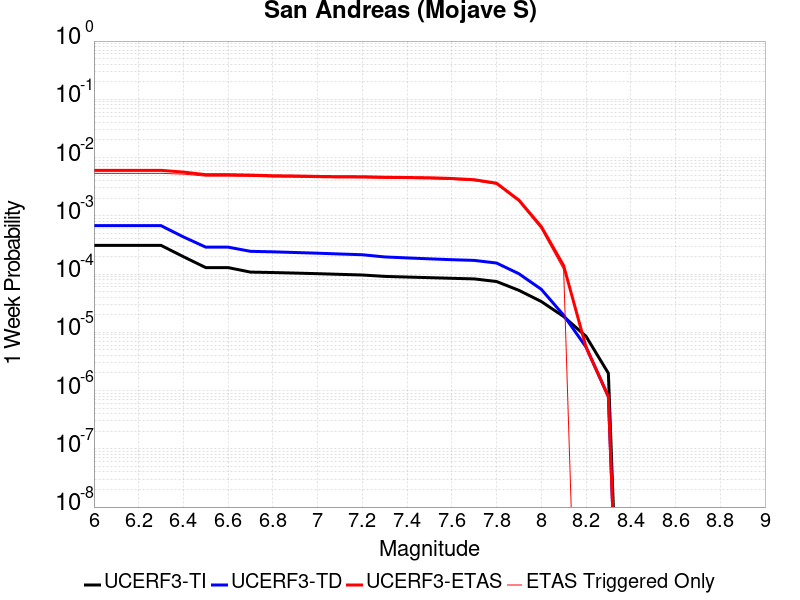 |  | 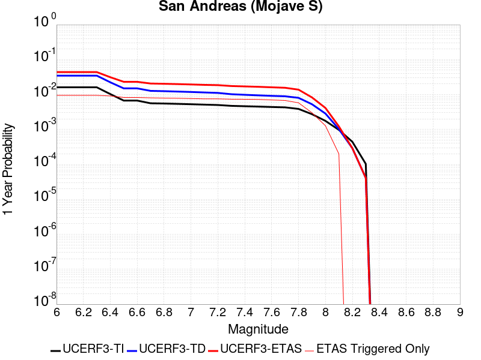 |

| Magnitude | 1 wk TI Prob | 1 wk TD Prob | 1 wk ETAS Prob | 1 wk ETAS/TD Gain | 1 wk ETAS Triggered Only | 1 mo TI Prob | 1 mo TD Prob | 1 mo ETAS Prob | 1 mo ETAS/TD Gain | 1 mo ETAS Triggered Only | 1 yr TI Prob | 1 yr TD Prob | 1 yr ETAS Prob | 1 yr ETAS/TD Gain | 1 yr ETAS Triggered Only |
|-----|-----|-----|-----|-----|-----|-----|-----|-----|-----|-----|-----|-----|-----|-----|-----|
| 6.0 | 3.1064058E-4 | 6.771211E-4 | 0.006033492 | 8.910506 | 0.00536 | 0.0013306376 | 0.0028988488 | 0.009878557 | 3.4077518 | 0.007 | 0.016080605 | 0.034691453 | 0.043842576 | 1.2637862 | 0.00948 |
| 6.1 | 3.1064058E-4 | 6.771211E-4 | 0.006033492 | 8.910506 | 0.00536 | 0.0013306376 | 0.0028988488 | 0.009878557 | 3.4077518 | 0.007 | 0.016080605 | 0.034691453 | 0.043842576 | 1.2637862 | 0.00948 |
| 6.2 | 3.1064058E-4 | 6.771211E-4 | 0.006033492 | 8.910506 | 0.00536 | 0.0013306376 | 0.0028988488 | 0.009878557 | 3.4077518 | 0.007 | 0.016080605 | 0.034691453 | 0.043842576 | 1.2637862 | 0.00948 |
| 6.3 | 3.1064058E-4 | 6.771211E-4 | 0.006033492 | 8.910506 | 0.00536 | 0.0013306376 | 0.0028988488 | 0.009878557 | 3.4077518 | 0.007 | 0.016080605 | 0.034691453 | 0.043842576 | 1.2637862 | 0.00948 |
| 6.4 | 1.9872203E-4 | 4.341842E-4 | 0.0056319265 | 12.971283 | 0.0052 | 8.5138786E-4 | 0.0018594908 | 0.008646846 | 4.650115 | 0.0068 | 0.010316478 | 0.022410452 | 0.03132607 | 1.397833 | 0.00912 |
| 6.5 | 1.291105E-4 | 2.8979595E-4 | 0.0050884048 | 17.558578 | 0.0048 | 5.5321335E-4 | 0.0012413943 | 0.007473648 | 6.0203657 | 0.00624 | 0.006714592 | 0.015010072 | 0.023126388 | 1.5407248 | 0.00824 |
| 6.6 | 1.291105E-4 | 2.8979595E-4 | 0.0050884048 | 17.558578 | 0.0048 | 5.5321335E-4 | 0.0012413943 | 0.007473648 | 6.0203657 | 0.00624 | 0.006714592 | 0.015010072 | 0.023126388 | 1.5407248 | 0.00824 |
| 6.7 | 1.08001186E-4 | 2.4557297E-4 | 0.005004404 | 20.37848 | 0.00476 | 4.6278012E-4 | 0.0010520316 | 0.007205551 | 6.8491774 | 0.00616 | 0.0056198016 | 0.012733568 | 0.02067119 | 1.623362 | 0.00804 |
| 6.8 | 1.0624356E-4 | 2.4074306E-4 | 0.004879626 | 20.269022 | 0.00464 | 4.5525006E-4 | 0.0010313485 | 0.007065119 | 6.8503704 | 0.00604 | 0.0055285925 | 0.012484655 | 0.020305777 | 1.6264588 | 0.00792 |
| 6.9 | 1.0393785E-4 | 2.3443767E-4 | 0.0048333593 | 20.61682 | 0.0046 | 4.4537184E-4 | 0.0010043464 | 0.0069983206 | 6.9680343 | 0.006 | 0.0054089287 | 0.012159616 | 0.019904284 | 1.6369172 | 0.00784 |
| 7.0 | 1.0155622E-4 | 2.2812336E-4 | 0.0047470923 | 20.809322 | 0.00452 | 4.3516833E-4 | 9.773056E-4 | 0.0068115983 | 6.969773 | 0.00584 | 0.005285311 | 0.0118340105 | 0.019423125 | 1.641297 | 0.00768 |
| 7.1 | 9.885595E-5 | 2.2099643E-4 | 0.0047000065 | 21.26734 | 0.00448 | 4.2359953E-4 | 9.4678416E-4 | 0.0066613685 | 7.035784 | 0.00572 | 0.0051451353 | 0.0114663765 | 0.018900149 | 1.6483105 | 0.00752 |
| 7.2 | 9.6411415E-5 | 2.1461575E-4 | 0.0046936544 | 21.870037 | 0.00448 | 4.1312634E-4 | 9.194579E-4 | 0.0066341986 | 7.2153373 | 0.00572 | 0.005018219 | 0.011137128 | 0.018573377 | 1.667699 | 0.00752 |
| 7.3 | 9.1180635E-5 | 1.968396E-4 | 0.0045959735 | 23.348827 | 0.0044 | 3.907156E-4 | 8.4332563E-4 | 0.006438603 | 7.634777 | 0.0056 | 0.004746591 | 0.0102192685 | 0.017504055 | 1.7128482 | 0.00736 |
| 7.4 | 8.887388E-5 | 1.8930127E-4 | 0.004548476 | 24.02771 | 0.00436 | 3.8083247E-4 | 8.11039E-4 | 0.0063665295 | 7.849844 | 0.00556 | 0.0046267817 | 0.009829793 | 0.017077839 | 1.7373549 | 0.00732 |
| 7.5 | 8.6750515E-5 | 1.8259375E-4 | 0.004501805 | 24.65476 | 0.00432 | 3.7173493E-4 | 7.8231003E-4 | 0.006258023 | 7.9994154 | 0.00548 | 0.004516484 | 0.009483118 | 0.01665446 | 1.756222 | 0.00724 |
| 7.6 | 8.453092E-5 | 1.7644193E-4 | 0.004375701 | 24.799667 | 0.0042 | 3.6222505E-4 | 7.559606E-4 | 0.0060719387 | 8.0320835 | 0.00532 | 0.0044011753 | 0.009165057 | 0.016100902 | 1.7567705 | 0.007 |
| 7.7 | 8.259102E-5 | 1.716408E-4 | 0.004170954 | 24.300482 | 0.004 | 3.539135E-4 | 7.353961E-4 | 0.005851631 | 7.957114 | 0.00512 | 0.004300386 | 0.008916762 | 0.015616485 | 1.7513627 | 0.00676 |
| 7.8 | 7.444844E-5 | 1.54684E-4 | 0.0036341457 | 23.493998 | 0.00348 | 3.1902574E-4 | 6.627631E-4 | 0.0051397937 | 7.7551 | 0.00448 | 0.0038772223 | 0.008039338 | 0.013792709 | 1.7156525 | 0.0058 |
| 7.9 | 5.2586525E-5 | 1.0133334E-4 | 0.001861155 | 18.36666 | 0.00176 | 2.2535135E-4 | 4.342135E-4 | 0.002753206 | 6.340674 | 0.00232 | 0.0027402006 | 0.0052737463 | 0.0082579255 | 1.5658556 | 0.003 |
| 8.0 | 3.379877E-5 | 5.4809316E-5 | 6.547764E-4 | 11.9464445 | 6.0E-4 | 1.4484383E-4 | 2.3487593E-4 | 0.0011146693 | 4.745779 | 8.8E-4 | 0.0017620471 | 0.0028558664 | 0.0041322107 | 1.4469203 | 0.00128 |
| 8.1 | 1.8668277E-5 | 1.9660263E-5 | 1.396579E-4 | 7.1035624 | 1.2E-4 | 8.000444E-5 | 8.425555E-5 | 2.4424208E-4 | 2.8988247 | 1.6E-4 | 9.736188E-4 | 0.0010253292 | 0.0012251242 | 1.1948593 | 2.0E-4 |
| 8.2 | 8.541571E-6 | 5.592881E-6 | 5.592881E-6 | 1.0 | 0.0 | 3.660622E-5 | 2.396927E-5 | 2.396927E-5 | 1.0 | 0.0 | 4.455896E-4 | 2.9178688E-4 | 2.9178688E-4 | 1.0 | 0.0 |
| 8.3 | 1.983087E-6 | 7.877893E-7 | 7.877893E-7 | 1.0 | 0.0 | 8.498917E-6 | 3.3762356E-6 | 3.3762356E-6 | 1.0 | 0.0 | 1.034694E-4 | 4.110491E-5 | 4.110491E-5 | 1.0 | 0.0 |

## San Andreas (Mojave N)
*[(top)](#table-of-contents)*

| 1 Week | 1 Month | 1 Year |
|-----|-----|-----|
|  |  |  |

| Magnitude | 1 wk TI Prob | 1 wk TD Prob | 1 wk ETAS Prob | 1 wk ETAS/TD Gain | 1 wk ETAS Triggered Only | 1 mo TI Prob | 1 mo TD Prob | 1 mo ETAS Prob | 1 mo ETAS/TD Gain | 1 mo ETAS Triggered Only | 1 yr TI Prob | 1 yr TD Prob | 1 yr ETAS Prob | 1 yr ETAS/TD Gain | 1 yr ETAS Triggered Only |
|-----|-----|-----|-----|-----|-----|-----|-----|-----|-----|-----|-----|-----|-----|-----|-----|
| 6.0 | 9.877682E-5 | 1.9626696E-4 | 0.0052352776 | 26.67427 | 0.00504 | 4.2326056E-4 | 8.4087317E-4 | 0.007275458 | 8.652266 | 0.00644 | 0.0051410277 | 0.0101897055 | 0.018424926 | 1.8081903 | 0.00832 |
| 6.1 | 9.877682E-5 | 1.9626696E-4 | 0.0052352776 | 26.67427 | 0.00504 | 4.2326056E-4 | 8.4087317E-4 | 0.007275458 | 8.652266 | 0.00644 | 0.0051410277 | 0.0101897055 | 0.018424926 | 1.8081903 | 0.00832 |
| 6.2 | 9.877682E-5 | 1.9626696E-4 | 0.0052352776 | 26.67427 | 0.00504 | 4.2326056E-4 | 8.4087317E-4 | 0.007275458 | 8.652266 | 0.00644 | 0.0051410277 | 0.0101897055 | 0.018424926 | 1.8081903 | 0.00832 |
| 6.3 | 9.877682E-5 | 1.9626696E-4 | 0.0052352776 | 26.67427 | 0.00504 | 4.2326056E-4 | 8.4087317E-4 | 0.007275458 | 8.652266 | 0.00644 | 0.0051410277 | 0.0101897055 | 0.018424926 | 1.8081903 | 0.00832 |
| 6.4 | 9.877682E-5 | 1.9626696E-4 | 0.0052352776 | 26.67427 | 0.00504 | 4.2326056E-4 | 8.4087317E-4 | 0.007275458 | 8.652266 | 0.00644 | 0.0051410277 | 0.0101897055 | 0.018424926 | 1.8081903 | 0.00832 |
| 6.5 | 9.861474E-5 | 1.9600392E-4 | 0.0051550316 | 26.300655 | 0.00496 | 4.2256617E-4 | 8.397466E-4 | 0.007194406 | 8.567353 | 0.00636 | 0.0051326132 | 0.0101761175 | 0.018292673 | 1.7976083 | 0.0082 |
| 6.6 | 9.861474E-5 | 1.9600392E-4 | 0.0051550316 | 26.300655 | 0.00496 | 4.2256617E-4 | 8.397466E-4 | 0.007194406 | 8.567353 | 0.00636 | 0.0051326132 | 0.0101761175 | 0.018292673 | 1.7976083 | 0.0082 |
| 6.7 | 9.8552715E-5 | 1.959032E-4 | 0.0051549315 | 26.313667 | 0.00496 | 4.223004E-4 | 8.393152E-4 | 0.007193977 | 8.571246 | 0.00636 | 0.0051293927 | 0.010170914 | 0.018287513 | 1.7980205 | 0.0082 |
| 6.8 | 9.8464974E-5 | 1.9575418E-4 | 0.0050348067 | 25.720047 | 0.00484 | 4.219245E-4 | 8.3867693E-4 | 0.0070734434 | 8.434051 | 0.00624 | 0.0051248376 | 0.010163216 | 0.018161098 | 1.7869439 | 0.00808 |
| 6.9 | 9.825824E-5 | 1.9543302E-4 | 0.004994495 | 25.556046 | 0.0048 | 4.2103877E-4 | 8.373014E-4 | 0.0070321104 | 8.3985405 | 0.0062 | 0.0051141046 | 0.010146625 | 0.018065453 | 1.7804395 | 0.008 |
| 7.0 | 9.781462E-5 | 1.9474408E-4 | 0.004953817 | 25.437576 | 0.00476 | 4.1913814E-4 | 8.3435065E-4 | 0.0069092778 | 8.281024 | 0.00608 | 0.005091073 | 0.010111034 | 0.01791136 | 1.7714666 | 0.00788 |
| 7.1 | 9.7121134E-5 | 1.9375767E-4 | 0.0048328587 | 24.942799 | 0.00464 | 4.1616702E-4 | 8.3012594E-4 | 0.006705245 | 8.077382 | 0.00588 | 0.005055068 | 0.010060075 | 0.017623216 | 1.7517977 | 0.00764 |
| 7.2 | 9.663819E-5 | 1.93063E-4 | 0.004832167 | 25.028965 | 0.00464 | 4.1409794E-4 | 8.2715065E-4 | 0.00666232 | 8.054543 | 0.00584 | 0.0050299936 | 0.010024184 | 0.017548 | 1.7505665 | 0.0076 |
| 7.3 | 9.6277574E-5 | 1.92585E-4 | 0.004751707 | 24.673298 | 0.00456 | 4.125529E-4 | 8.251034E-4 | 0.006580351 | 7.9751835 | 0.00576 | 0.0050112694 | 0.009999488 | 0.017444292 | 1.7445185 | 0.00752 |
| 7.4 | 9.593308E-5 | 1.919794E-4 | 0.0047111115 | 24.539673 | 0.00452 | 4.1107697E-4 | 8.225096E-4 | 0.006537805 | 7.948606 | 0.00572 | 0.0049933824 | 0.009968198 | 0.017373636 | 1.7429065 | 0.00748 |
| 7.5 | 9.561707E-5 | 1.9143702E-4 | 0.0046705795 | 24.397472 | 0.00448 | 4.0972308E-4 | 8.201866E-4 | 0.006495528 | 7.9195733 | 0.00568 | 0.0049769743 | 0.0099401735 | 0.017306218 | 1.7410378 | 0.00744 |
| 7.6 | 9.418194E-5 | 1.8794056E-4 | 0.004547121 | 24.194464 | 0.00436 | 4.0357444E-4 | 8.0521114E-4 | 0.006320766 | 7.849825 | 0.00552 | 0.004902454 | 0.009759494 | 0.016889226 | 1.7305431 | 0.0072 |
| 7.7 | 8.202141E-5 | 1.6224218E-4 | 0.004281574 | 26.390015 | 0.00412 | 3.51473E-4 | 6.951384E-4 | 0.005971468 | 8.590329 | 0.00528 | 0.00427079 | 0.0084305275 | 0.015292188 | 1.8139064 | 0.00692 |
| 7.8 | 7.2859846E-5 | 1.4698919E-4 | 0.0036664717 | 24.943819 | 0.00352 | 3.1221908E-4 | 6.298016E-4 | 0.005146955 | 8.172343 | 0.00452 | 0.003794643 | 0.007640919 | 0.013436296 | 1.758466 | 0.00584 |
| 7.9 | 5.3874453E-5 | 1.0174001E-4 | 0.0019015569 | 18.690353 | 0.0018 | 2.3087008E-4 | 4.3595576E-4 | 0.002794927 | 6.411033 | 0.00236 | 0.0028072202 | 0.0052948557 | 0.0083187595 | 1.5711021 | 0.00304 |
| 8.0 | 3.468538E-5 | 5.500278E-5 | 6.549698E-4 | 11.90794 | 6.0E-4 | 1.4864317E-4 | 2.3570491E-4 | 0.0011154974 | 4.732602 | 8.8E-4 | 0.0018082283 | 0.0028659326 | 0.0041422644 | 1.445346 | 0.00128 |
| 8.1 | 1.9152367E-5 | 1.9757208E-5 | 1.3975483E-4 | 7.0736127 | 1.2E-4 | 8.207899E-5 | 8.467101E-5 | 2.4465745E-4 | 2.8895068 | 1.6E-4 | 9.988535E-4 | 0.0010303827 | 0.0012301765 | 1.1939026 | 2.0E-4 |
| 8.2 | 8.643924E-6 | 5.607368E-6 | 5.607368E-6 | 1.0 | 0.0 | 3.704486E-5 | 2.4031357E-5 | 2.4031357E-5 | 1.0 | 0.0 | 4.5092785E-4 | 2.9254257E-4 | 2.9254257E-4 | 1.0 | 0.0 |
| 8.3 | 1.983087E-6 | 7.877893E-7 | 7.877893E-7 | 1.0 | 0.0 | 8.498917E-6 | 3.3762356E-6 | 3.3762356E-6 | 1.0 | 0.0 | 1.034694E-4 | 4.110491E-5 | 4.110491E-5 | 1.0 | 0.0 |

## San Andreas (Big Bend)
*[(top)](#table-of-contents)*

| 1 Week | 1 Month | 1 Year |
|-----|-----|-----|
|  |  |  |

| Magnitude | 1 wk TI Prob | 1 wk TD Prob | 1 wk ETAS Prob | 1 wk ETAS/TD Gain | 1 wk ETAS Triggered Only | 1 mo TI Prob | 1 mo TD Prob | 1 mo ETAS Prob | 1 mo ETAS/TD Gain | 1 mo ETAS Triggered Only | 1 yr TI Prob | 1 yr TD Prob | 1 yr ETAS Prob | 1 yr ETAS/TD Gain | 1 yr ETAS Triggered Only |
|-----|-----|-----|-----|-----|-----|-----|-----|-----|-----|-----|-----|-----|-----|-----|-----|
| 6.0 | 1.0179969E-4 | 2.0293587E-4 | 0.0041621323 | 20.509592 | 0.00396 | 4.362114E-4 | 8.694363E-4 | 0.005785159 | 6.6539187 | 0.00492 | 0.0052979486 | 0.0105343 | 0.01686688 | 1.6011392 | 0.0064 |
| 6.1 | 1.0179969E-4 | 2.0293587E-4 | 0.0041621323 | 20.509592 | 0.00396 | 4.362114E-4 | 8.694363E-4 | 0.005785159 | 6.6539187 | 0.00492 | 0.0052979486 | 0.0105343 | 0.01686688 | 1.6011392 | 0.0064 |
| 6.2 | 1.0179969E-4 | 2.0293587E-4 | 0.0041621323 | 20.509592 | 0.00396 | 4.362114E-4 | 8.694363E-4 | 0.005785159 | 6.6539187 | 0.00492 | 0.0052979486 | 0.0105343 | 0.01686688 | 1.6011392 | 0.0064 |
| 6.3 | 1.0179969E-4 | 2.0293587E-4 | 0.0041621323 | 20.509592 | 0.00396 | 4.362114E-4 | 8.694363E-4 | 0.005785159 | 6.6539187 | 0.00492 | 0.0052979486 | 0.0105343 | 0.01686688 | 1.6011392 | 0.0064 |
| 6.4 | 9.1639464E-5 | 1.8646746E-4 | 0.004145729 | 22.232988 | 0.00396 | 3.9268145E-4 | 7.989017E-4 | 0.005675003 | 7.1035056 | 0.00488 | 0.0047704205 | 0.0096833715 | 0.015981786 | 1.650436 | 0.00636 |
| 6.5 | 9.1639464E-5 | 1.8646746E-4 | 0.004145729 | 22.232988 | 0.00396 | 3.9268145E-4 | 7.989017E-4 | 0.005675003 | 7.1035056 | 0.00488 | 0.0047704205 | 0.0096833715 | 0.015981786 | 1.650436 | 0.00636 |
| 6.6 | 9.042622E-5 | 1.8453281E-4 | 0.004143802 | 22.455639 | 0.00396 | 3.8748336E-4 | 7.906154E-4 | 0.005666757 | 7.1675267 | 0.00488 | 0.0047074095 | 0.009583375 | 0.015882425 | 1.6572893 | 0.00636 |
| 6.7 | 8.9836685E-5 | 1.836743E-4 | 0.004142947 | 22.555943 | 0.00396 | 3.8495753E-4 | 7.869383E-4 | 0.005663098 | 7.1963687 | 0.00488 | 0.00467679 | 0.009538999 | 0.01583833 | 1.6603767 | 0.00636 |
| 6.8 | 8.9471854E-5 | 1.8314009E-4 | 0.004142415 | 22.618832 | 0.00396 | 3.8339442E-4 | 7.846502E-4 | 0.005660821 | 7.214452 | 0.00488 | 0.004657841 | 0.009511384 | 0.015810892 | 1.6623124 | 0.00636 |
| 6.9 | 8.858234E-5 | 1.8195626E-4 | 0.004101243 | 22.53972 | 0.00392 | 3.7958333E-4 | 7.795797E-4 | 0.0056158067 | 7.203634 | 0.00484 | 0.004611638 | 0.009450188 | 0.015710462 | 1.6624498 | 0.00632 |
| 7.0 | 8.7433385E-5 | 1.803388E-4 | 0.0040996317 | 22.732944 | 0.00392 | 3.746607E-4 | 7.7265187E-4 | 0.005608912 | 7.2593007 | 0.00484 | 0.004551957 | 0.009366569 | 0.015627373 | 1.6684201 | 0.00632 |
| 7.1 | 8.684964E-5 | 1.7945496E-4 | 0.0040587587 | 22.617144 | 0.00388 | 3.7215967E-4 | 7.688662E-4 | 0.005565176 | 7.2381587 | 0.0048 | 0.0045216335 | 0.009320875 | 0.0155423395 | 1.6674765 | 0.00628 |
| 7.2 | 8.606521E-5 | 1.7835775E-4 | 0.004057666 | 22.75015 | 0.00388 | 3.6879873E-4 | 7.6416665E-4 | 0.005520529 | 7.224248 | 0.00476 | 0.0044808835 | 0.009264145 | 0.015446337 | 1.6673245 | 0.00624 |
| 7.3 | 8.568266E-5 | 1.7777378E-4 | 0.003977098 | 22.371681 | 0.0038 | 3.6715972E-4 | 7.6166535E-4 | 0.0054381005 | 7.139751 | 0.00468 | 0.0044610105 | 0.009233951 | 0.0153370695 | 1.6609434 | 0.00616 |
| 7.4 | 8.5432206E-5 | 1.7739709E-4 | 0.00393673 | 22.191628 | 0.00376 | 3.6608664E-4 | 7.6005195E-4 | 0.0053965254 | 7.100206 | 0.00464 | 0.004447999 | 0.009214474 | 0.015278081 | 1.6580524 | 0.00612 |
| 7.5 | 8.4791965E-5 | 1.7608136E-4 | 0.0039354195 | 22.350004 | 0.00376 | 3.633435E-4 | 7.5441634E-4 | 0.005390916 | 7.1458097 | 0.00464 | 0.0044147377 | 0.009146439 | 0.015210463 | 1.6629928 | 0.00612 |
| 7.6 | 8.241105E-5 | 1.7049891E-4 | 0.0038498715 | 22.580036 | 0.00368 | 3.531424E-4 | 7.3050515E-4 | 0.005287174 | 7.2376957 | 0.00456 | 0.0042910352 | 0.008857722 | 0.014764931 | 1.6668992 | 0.00596 |
| 7.7 | 7.00432E-5 | 1.4393656E-4 | 0.0036234357 | 25.173838 | 0.00348 | 3.001506E-4 | 6.167252E-4 | 0.0049740365 | 8.065239 | 0.00436 | 0.0036482112 | 0.0074828197 | 0.013160018 | 1.7586977 | 0.00572 |
| 7.8 | 6.415362E-5 | 1.3139434E-4 | 0.0032109898 | 24.437807 | 0.00308 | 2.749151E-4 | 5.629971E-4 | 0.0044807903 | 7.9588156 | 0.00392 | 0.0033419547 | 0.0068329778 | 0.011878266 | 1.7383733 | 0.00508 |
| 7.9 | 4.939911E-5 | 9.463773E-5 | 0.0016144939 | 17.059727 | 0.00152 | 2.116933E-4 | 4.0552724E-4 | 0.0023647323 | 5.831254 | 0.00196 | 0.0025743195 | 0.0049261265 | 0.0075531215 | 1.533278 | 0.00264 |
| 8.0 | 3.344983E-5 | 5.2957934E-5 | 6.129283E-4 | 11.573871 | 5.6E-4 | 1.4334853E-4 | 2.2694284E-4 | 0.0010267613 | 4.524317 | 8.0E-4 | 0.0017438711 | 0.00275953 | 0.0039562183 | 1.4336567 | 0.0012 |
| 8.1 | 1.9104898E-5 | 1.9529352E-5 | 1.3952701E-4 | 7.144477 | 1.2E-4 | 8.1875565E-5 | 8.369455E-5 | 2.4368115E-4 | 2.9115536 | 1.6E-4 | 9.963791E-4 | 0.0010185054 | 0.0012183017 | 1.1961662 | 2.0E-4 |
| 8.2 | 8.643924E-6 | 5.607368E-6 | 5.607368E-6 | 1.0 | 0.0 | 3.704486E-5 | 2.4031357E-5 | 2.4031357E-5 | 1.0 | 0.0 | 4.5092785E-4 | 2.9254257E-4 | 2.9254257E-4 | 1.0 | 0.0 |
| 8.3 | 1.983087E-6 | 7.877893E-7 | 7.877893E-7 | 1.0 | 0.0 | 8.498917E-6 | 3.3762356E-6 | 3.3762356E-6 | 1.0 | 0.0 | 1.034694E-4 | 4.110491E-5 | 4.110491E-5 | 1.0 | 0.0 |

## San Andreas (Carrizo) rev
*[(top)](#table-of-contents)*

| 1 Week | 1 Month | 1 Year |
|-----|-----|-----|
|  |  | 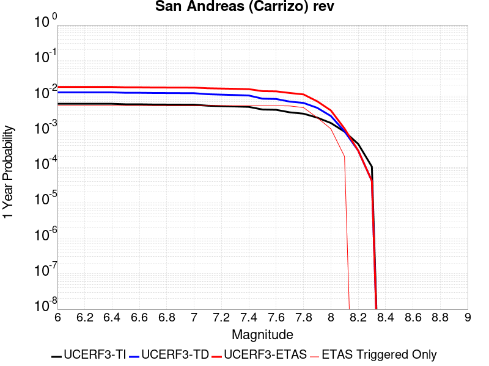 |

| Magnitude | 1 wk TI Prob | 1 wk TD Prob | 1 wk ETAS Prob | 1 wk ETAS/TD Gain | 1 wk ETAS Triggered Only | 1 mo TI Prob | 1 mo TD Prob | 1 mo ETAS Prob | 1 mo ETAS/TD Gain | 1 mo ETAS Triggered Only | 1 yr TI Prob | 1 yr TD Prob | 1 yr ETAS Prob | 1 yr ETAS/TD Gain | 1 yr ETAS Triggered Only |
|-----|-----|-----|-----|-----|-----|-----|-----|-----|-----|-----|-----|-----|-----|-----|-----|
| 6.0 | 1.1674632E-4 | 2.457212E-4 | 0.0035249153 | 14.345182 | 0.00328 | 5.002454E-4 | 0.0010526674 | 0.0050884145 | 4.8338294 | 0.00404 | 0.006073493 | 0.0127414055 | 0.018033111 | 1.4153157 | 0.00536 |
| 6.1 | 1.1674632E-4 | 2.457212E-4 | 0.0035249153 | 14.345182 | 0.00328 | 5.002454E-4 | 0.0010526674 | 0.0050884145 | 4.8338294 | 0.00404 | 0.006073493 | 0.0127414055 | 0.018033111 | 1.4153157 | 0.00536 |
| 6.2 | 1.1674632E-4 | 2.457212E-4 | 0.0035249153 | 14.345182 | 0.00328 | 5.002454E-4 | 0.0010526674 | 0.0050884145 | 4.8338294 | 0.00404 | 0.006073493 | 0.0127414055 | 0.018033111 | 1.4153157 | 0.00536 |
| 6.3 | 1.1674632E-4 | 2.457212E-4 | 0.0035249153 | 14.345182 | 0.00328 | 5.002454E-4 | 0.0010526674 | 0.0050884145 | 4.8338294 | 0.00404 | 0.006073493 | 0.0127414055 | 0.018033111 | 1.4153157 | 0.00536 |
| 6.4 | 1.1674632E-4 | 2.457212E-4 | 0.0035249153 | 14.345182 | 0.00328 | 5.002454E-4 | 0.0010526674 | 0.0050884145 | 4.8338294 | 0.00404 | 0.006073493 | 0.0127414055 | 0.018033111 | 1.4153157 | 0.00536 |
| 6.5 | 1.13136164E-4 | 2.3891036E-4 | 0.0035181267 | 14.7257185 | 0.00328 | 4.847792E-4 | 0.0010235013 | 0.0050593666 | 4.943195 | 0.00404 | 0.0058862255 | 0.012390388 | 0.017683975 | 1.4272333 | 0.00536 |
| 6.6 | 1.13136164E-4 | 2.3891036E-4 | 0.0035181267 | 14.7257185 | 0.00328 | 4.847792E-4 | 0.0010235013 | 0.0050593666 | 4.943195 | 0.00404 | 0.0058862255 | 0.012390388 | 0.017683975 | 1.4272333 | 0.00536 |
| 6.7 | 1.1149675E-4 | 2.3581758E-4 | 0.003515044 | 14.905776 | 0.00328 | 4.777557E-4 | 0.0010102568 | 0.0050461753 | 4.994943 | 0.00404 | 0.0058011734 | 0.012230956 | 0.017525397 | 1.4328723 | 0.00536 |
| 6.8 | 1.1103589E-4 | 2.3483614E-4 | 0.0035140659 | 14.963906 | 0.00328 | 4.7578133E-4 | 0.0010060539 | 0.0050419895 | 5.011649 | 0.00404 | 0.005777263 | 0.012180358 | 0.01747507 | 1.4346927 | 0.00536 |
| 6.9 | 1.1053259E-4 | 2.3375664E-4 | 0.00351299 | 15.028407 | 0.00328 | 4.7362508E-4 | 0.001001431 | 0.0050373855 | 5.0301867 | 0.00404 | 0.0057511497 | 0.012124702 | 0.017419714 | 1.4367127 | 0.00536 |
| 7.0 | 1.1005377E-4 | 2.3276206E-4 | 0.0035119986 | 15.088364 | 0.00328 | 4.7157376E-4 | 9.971719E-4 | 0.0050331433 | 5.047418 | 0.00404 | 0.0057263062 | 0.012073423 | 0.01736871 | 1.4385903 | 0.00536 |
| 7.1 | 1.0308142E-4 | 2.1781186E-4 | 0.0034970974 | 16.055588 | 0.00328 | 4.417027E-4 | 9.331465E-4 | 0.0049693766 | 5.325398 | 0.00404 | 0.0053644776 | 0.011302199 | 0.01660162 | 1.468884 | 0.00536 |
| 7.2 | 1.0027479E-4 | 2.1187181E-4 | 0.003491177 | 16.47778 | 0.00328 | 4.296783E-4 | 9.077071E-4 | 0.00494404 | 5.446735 | 0.00404 | 0.0052187922 | 0.01099564 | 0.016296703 | 1.482106 | 0.00536 |
| 7.3 | 9.816942E-5 | 2.0659102E-4 | 0.0034859134 | 16.873499 | 0.00328 | 4.2065824E-4 | 8.850907E-4 | 0.004921515 | 5.560464 | 0.00404 | 0.005109493 | 0.010723028 | 0.016025553 | 1.4944988 | 0.00536 |
| 7.4 | 9.5634205E-5 | 2.0024394E-4 | 0.0034795871 | 17.376741 | 0.00328 | 4.0979648E-4 | 8.57907E-4 | 0.004894441 | 5.7050953 | 0.00404 | 0.0049778637 | 0.010395263 | 0.015699545 | 1.5102594 | 0.00536 |
| 7.5 | 8.052417E-5 | 1.6317047E-4 | 0.0034426353 | 21.098398 | 0.00328 | 3.4505792E-4 | 6.9911475E-4 | 0.0047362903 | 6.774697 | 0.00404 | 0.0041929903 | 0.008478587 | 0.013793142 | 1.6268208 | 0.00536 |
| 7.6 | 7.897024E-5 | 1.5967674E-4 | 0.003439153 | 21.538221 | 0.00328 | 3.384E-4 | 6.8414956E-4 | 0.0047213854 | 6.9011016 | 0.00404 | 0.0041122385 | 0.008297788 | 0.013613312 | 1.6405953 | 0.00536 |
| 7.7 | 6.707427E-5 | 1.3457966E-4 | 0.003334149 | 24.774538 | 0.0032 | 2.8742946E-4 | 5.766425E-4 | 0.004534359 | 7.8633795 | 0.00396 | 0.003493839 | 0.006998057 | 0.012241107 | 1.7492151 | 0.00528 |
| 7.8 | 6.147705E-5 | 1.2361974E-4 | 0.0030032636 | 24.294369 | 0.00288 | 2.6344648E-4 | 5.2969134E-4 | 0.0041677635 | 7.868286 | 0.00364 | 0.0032027436 | 0.0064299493 | 0.011159343 | 1.7355258 | 0.00476 |
| 7.9 | 4.7636717E-5 | 8.998664E-5 | 0.001529857 | 17.000935 | 0.00144 | 2.0414138E-4 | 3.8560005E-4 | 0.0022248905 | 5.7699437 | 0.00184 | 0.0024825884 | 0.004684583 | 0.0071529653 | 1.5269161 | 0.00248 |
| 8.0 | 3.3554235E-5 | 5.2868458E-5 | 6.1283883E-4 | 11.591767 | 5.6E-4 | 1.4379594E-4 | 2.2655944E-4 | 0.0010263781 | 4.5302825 | 8.0E-4 | 0.0017493097 | 0.0027548738 | 0.0039515677 | 1.4343916 | 0.0012 |
| 8.1 | 1.9175432E-5 | 1.954181E-5 | 1.3953946E-4 | 7.1405597 | 1.2E-4 | 8.217783E-5 | 8.374793E-5 | 2.4373452E-4 | 2.910335 | 1.6E-4 | 0.0010000558 | 0.0010191548 | 0.001218951 | 1.1960411 | 2.0E-4 |
| 8.2 | 8.643924E-6 | 5.607368E-6 | 5.607368E-6 | 1.0 | 0.0 | 3.704486E-5 | 2.4031357E-5 | 2.4031357E-5 | 1.0 | 0.0 | 4.5092785E-4 | 2.9254257E-4 | 2.9254257E-4 | 1.0 | 0.0 |
| 8.3 | 1.983087E-6 | 7.877893E-7 | 7.877893E-7 | 1.0 | 0.0 | 8.498917E-6 | 3.3762356E-6 | 3.3762356E-6 | 1.0 | 0.0 | 1.034694E-4 | 4.110491E-5 | 4.110491E-5 | 1.0 | 0.0 |

## San Andreas (San Bernardino N)
*[(top)](#table-of-contents)*

| 1 Week | 1 Month | 1 Year |
|-----|-----|-----|
|  |  |  |

| Magnitude | 1 wk TI Prob | 1 wk TD Prob | 1 wk ETAS Prob | 1 wk ETAS/TD Gain | 1 wk ETAS Triggered Only | 1 mo TI Prob | 1 mo TD Prob | 1 mo ETAS Prob | 1 mo ETAS/TD Gain | 1 mo ETAS Triggered Only | 1 yr TI Prob | 1 yr TD Prob | 1 yr ETAS Prob | 1 yr ETAS/TD Gain | 1 yr ETAS Triggered Only |
|-----|-----|-----|-----|-----|-----|-----|-----|-----|-----|-----|-----|-----|-----|-----|-----|
| 6.0 | 1.4273766E-4 | 3.1797116E-4 | 0.0032770298 | 10.306061 | 0.00296 | 6.115894E-4 | 0.0013620278 | 0.005276689 | 3.8741417 | 0.00392 | 0.0074207084 | 0.016458113 | 0.02153319 | 1.3083632 | 0.00516 |
| 6.1 | 1.4273766E-4 | 3.1797116E-4 | 0.0032770298 | 10.306061 | 0.00296 | 6.115894E-4 | 0.0013620278 | 0.005276689 | 3.8741417 | 0.00392 | 0.0074207084 | 0.016458113 | 0.02153319 | 1.3083632 | 0.00516 |
| 6.2 | 1.4273766E-4 | 3.1797116E-4 | 0.0032770298 | 10.306061 | 0.00296 | 6.115894E-4 | 0.0013620278 | 0.005276689 | 3.8741417 | 0.00392 | 0.0074207084 | 0.016458113 | 0.02153319 | 1.3083632 | 0.00516 |
| 6.3 | 1.3730655E-4 | 3.070095E-4 | 0.0032661008 | 10.638435 | 0.00296 | 5.883239E-4 | 0.0013150972 | 0.005229942 | 3.9768481 | 0.00392 | 0.0071393442 | 0.015895175 | 0.020973155 | 1.3194668 | 0.00516 |
| 6.4 | 1.3730655E-4 | 3.070095E-4 | 0.0032661008 | 10.638435 | 0.00296 | 5.883239E-4 | 0.0013150972 | 0.005229942 | 3.9768481 | 0.00392 | 0.0071393442 | 0.015895175 | 0.020973155 | 1.3194668 | 0.00516 |
| 6.5 | 1.2942807E-4 | 2.9113982E-4 | 0.003250278 | 11.163976 | 0.00296 | 5.545738E-4 | 0.0012471506 | 0.005162262 | 4.139245 | 0.00392 | 0.0067310524 | 0.015079602 | 0.02016179 | 1.3370241 | 0.00516 |
| 6.6 | 1.1125901E-4 | 2.5549048E-4 | 0.0032147341 | 12.582599 | 0.00296 | 4.767372E-4 | 0.001094502 | 0.0050102114 | 4.577617 | 0.00392 | 0.005788839 | 0.0132447835 | 0.01833644 | 1.3844273 | 0.00516 |
| 6.7 | 1.02209575E-4 | 2.3682536E-4 | 0.0031961245 | 13.495702 | 0.00296 | 4.3796748E-4 | 0.0010145725 | 0.0049305954 | 4.8597765 | 0.00392 | 0.0053192247 | 0.012282886 | 0.017339997 | 1.4117202 | 0.00512 |
| 6.8 | 9.610582E-5 | 2.2205901E-4 | 0.0031814016 | 14.326831 | 0.00296 | 4.1181705E-4 | 9.5133507E-4 | 0.004867606 | 5.1166053 | 0.00392 | 0.0050023515 | 0.011521262 | 0.016582273 | 1.4392757 | 0.00512 |
| 6.9 | 9.3877505E-5 | 2.1660629E-4 | 0.003175965 | 14.662387 | 0.00296 | 4.0227012E-4 | 9.279831E-4 | 0.004844345 | 5.220295 | 0.00392 | 0.0048866454 | 0.011239915 | 0.016302366 | 1.4503995 | 0.00512 |
| 7.0 | 9.1019785E-5 | 2.0986385E-4 | 0.0031692428 | 15.101422 | 0.00296 | 3.900265E-4 | 8.991071E-4 | 0.0048155827 | 5.3559613 | 0.00392 | 0.0047382377 | 0.010891914 | 0.015956149 | 1.4649534 | 0.00512 |
| 7.1 | 8.771155E-5 | 2.015964E-4 | 0.0031609996 | 15.679842 | 0.00296 | 3.758525E-4 | 8.63699E-4 | 0.0047803135 | 5.534698 | 0.00392 | 0.0045664064 | 0.010465035 | 0.015531454 | 1.4841282 | 0.00512 |
| 7.2 | 8.0830236E-5 | 1.8562343E-4 | 0.003145074 | 16.943302 | 0.00296 | 3.4636928E-4 | 7.952866E-4 | 0.004712169 | 5.9251204 | 0.00392 | 0.0042088944 | 0.009639736 | 0.014710381 | 1.5260148 | 0.00512 |
| 7.3 | 7.7668235E-5 | 1.7502681E-4 | 0.0031345086 | 17.908735 | 0.00296 | 3.328214E-4 | 7.4989937E-4 | 0.00466696 | 6.2234483 | 0.00392 | 0.0040445733 | 0.009091886 | 0.014165335 | 1.5580195 | 0.00512 |
| 7.4 | 7.520177E-5 | 1.6720418E-4 | 0.0031267093 | 18.699945 | 0.00296 | 3.2225347E-4 | 7.1639265E-4 | 0.0046335845 | 6.4679394 | 0.00392 | 0.0039163795 | 0.008687268 | 0.013762789 | 1.5842483 | 0.00512 |
| 7.5 | 7.274697E-5 | 1.600578E-4 | 0.003119584 | 19.49036 | 0.00296 | 3.1173544E-4 | 6.857817E-4 | 0.0045631207 | 6.6538973 | 0.00388 | 0.003788775 | 0.008317487 | 0.013355234 | 1.6056814 | 0.00508 |
| 7.6 | 7.1185845E-5 | 1.5574165E-4 | 0.003075287 | 19.746078 | 0.00292 | 3.0504653E-4 | 6.6729356E-4 | 0.004504731 | 6.750749 | 0.00384 | 0.0037076178 | 0.008094089 | 0.013093295 | 1.6176367 | 0.00504 |
| 7.7 | 6.709961E-5 | 1.4479096E-4 | 0.003024374 | 20.887865 | 0.00288 | 2.8753807E-4 | 6.2038517E-4 | 0.0044180276 | 7.121427 | 0.0038 | 0.003495157 | 0.0075270706 | 0.012449737 | 1.6539949 | 0.00496 |
| 7.8 | 6.300812E-5 | 1.3354905E-4 | 0.0027731964 | 20.765379 | 0.00264 | 2.7000686E-4 | 5.722275E-4 | 0.004050236 | 7.0780168 | 0.00348 | 0.0032823787 | 0.006944645 | 0.011433255 | 1.6463412 | 0.00452 |
| 7.9 | 4.983037E-5 | 9.844076E-5 | 0.0018582675 | 18.877014 | 0.00176 | 2.1354125E-4 | 4.2182076E-4 | 0.002740842 | 6.4976463 | 0.00232 | 0.0025967648 | 0.005123585 | 0.0081082145 | 1.5825275 | 0.003 |
| 8.0 | 3.2211527E-5 | 5.4014366E-5 | 6.53982E-4 | 12.107555 | 6.0E-4 | 1.380421E-4 | 2.3146962E-4 | 0.001111266 | 4.800915 | 8.8E-4 | 0.0016793669 | 0.0028145025 | 0.0040909 | 1.4535073 | 0.00128 |
| 8.1 | 1.743376E-5 | 1.9157624E-5 | 1.3915532E-4 | 7.2637053 | 1.2E-4 | 7.471398E-5 | 8.210152E-5 | 2.4208838E-4 | 2.9486468 | 1.6E-4 | 9.0926304E-4 | 9.991282E-4 | 0.0011989285 | 1.1999745 | 2.0E-4 |
| 8.2 | 7.831616E-6 | 5.2765454E-6 | 5.2765454E-6 | 1.0 | 0.0 | 3.3563636E-5 | 2.261357E-5 | 2.261357E-5 | 1.0 | 0.0 | 4.0856065E-4 | 2.752855E-4 | 2.752855E-4 | 1.0 | 0.0 |
| 8.3 | 1.983087E-6 | 7.877893E-7 | 7.877893E-7 | 1.0 | 0.0 | 8.498917E-6 | 3.3762356E-6 | 3.3762356E-6 | 1.0 | 0.0 | 1.034694E-4 | 4.110491E-5 | 4.110491E-5 | 1.0 | 0.0 |

## San Andreas (Cholame) rev
*[(top)](#table-of-contents)*

| 1 Week | 1 Month | 1 Year |
|-----|-----|-----|
| 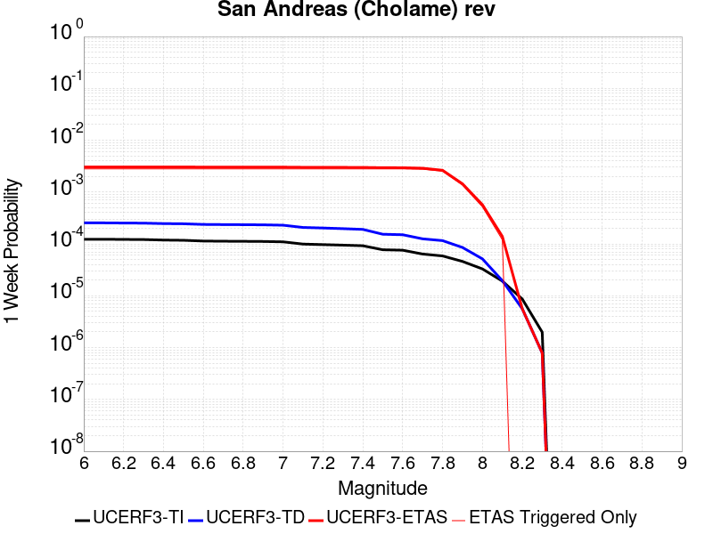 | 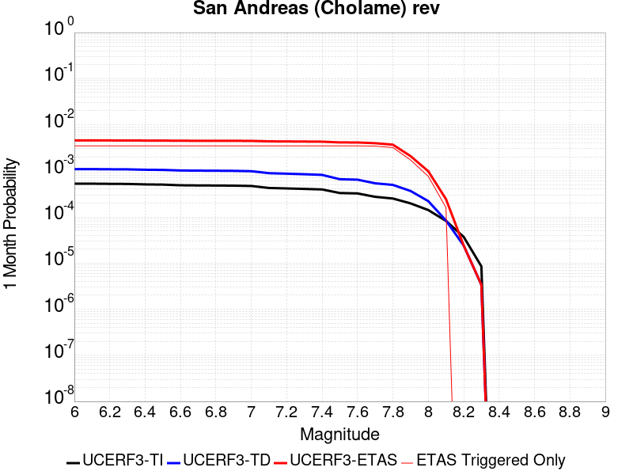 | 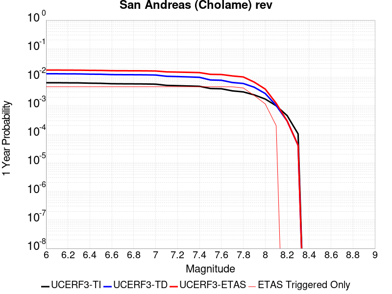 |

| Magnitude | 1 wk TI Prob | 1 wk TD Prob | 1 wk ETAS Prob | 1 wk ETAS/TD Gain | 1 wk ETAS Triggered Only | 1 mo TI Prob | 1 mo TD Prob | 1 mo ETAS Prob | 1 mo ETAS/TD Gain | 1 mo ETAS Triggered Only | 1 yr TI Prob | 1 yr TD Prob | 1 yr ETAS Prob | 1 yr ETAS/TD Gain | 1 yr ETAS Triggered Only |
|-----|-----|-----|-----|-----|-----|-----|-----|-----|-----|-----|-----|-----|-----|-----|-----|
| 6.0 | 1.2302514E-4 | 2.5456081E-4 | 0.003053848 | 11.996537 | 0.0028 | 5.27144E-4 | 0.0010905204 | 0.0045667253 | 4.187657 | 0.00348 | 0.0063991086 | 0.013196777 | 0.017775543 | 1.346961 | 0.00464 |
| 6.1 | 1.2302514E-4 | 2.5456081E-4 | 0.003053848 | 11.996537 | 0.0028 | 5.27144E-4 | 0.0010905204 | 0.0045667253 | 4.187657 | 0.00348 | 0.0063991086 | 0.013196777 | 0.017775543 | 1.346961 | 0.00464 |
| 6.2 | 1.2203569E-4 | 2.5272561E-4 | 0.003052018 | 12.076409 | 0.0028 | 5.2290526E-4 | 0.0010826618 | 0.0045588943 | 4.21082 | 0.00348 | 0.006347804 | 0.013102253 | 0.017681459 | 1.3494976 | 0.00464 |
| 6.3 | 1.2142645E-4 | 2.5158338E-4 | 0.0030508789 | 12.126711 | 0.0028 | 5.202953E-4 | 0.0010777706 | 0.00455402 | 4.2254076 | 0.00348 | 0.006316212 | 0.013043418 | 0.017622896 | 1.351095 | 0.00464 |
| 6.4 | 1.1865206E-4 | 2.466236E-4 | 0.003045933 | 12.3505335 | 0.0028 | 5.0840975E-4 | 0.0010565318 | 0.004532855 | 4.290316 | 0.00348 | 0.006172335 | 0.012787894 | 0.017368559 | 1.3582032 | 0.00464 |
| 6.5 | 1.17443946E-4 | 2.445465E-4 | 0.0030438618 | 12.446965 | 0.0028 | 5.032341E-4 | 0.0010476371 | 0.004523991 | 4.318281 | 0.00348 | 0.006109677 | 0.012680864 | 0.017262025 | 1.3612657 | 0.00464 |
| 6.6 | 1.13579066E-4 | 2.3760591E-4 | 0.0030369407 | 12.781419 | 0.0028 | 4.866766E-4 | 0.0010179152 | 0.0044943728 | 4.415272 | 0.00348 | 0.0059092017 | 0.012323147 | 0.016905967 | 1.3718872 | 0.00464 |
| 6.7 | 1.1271412E-4 | 2.3604305E-4 | 0.0030353821 | 12.859443 | 0.0028 | 4.829711E-4 | 0.0010112225 | 0.0044877036 | 4.437899 | 0.00348 | 0.005864331 | 0.012242582 | 0.016825777 | 1.374365 | 0.00464 |
| 6.8 | 1.1217975E-4 | 2.3492136E-4 | 0.0030342636 | 12.916082 | 0.0028 | 4.8068175E-4 | 0.0010064188 | 0.0044829166 | 4.4543247 | 0.00348 | 0.005836608 | 0.012184754 | 0.016768217 | 1.3761637 | 0.00464 |
| 6.9 | 1.1146753E-4 | 2.3340227E-4 | 0.0030327488 | 12.993656 | 0.0028 | 4.7763053E-4 | 9.999136E-4 | 0.0044764336 | 4.476821 | 0.00348 | 0.0057996577 | 0.012106434 | 0.01669026 | 1.3786273 | 0.00464 |
| 7.0 | 1.0965793E-4 | 2.2961597E-4 | 0.003028973 | 13.191474 | 0.0028 | 4.698779E-4 | 9.836989E-4 | 0.0044602756 | 4.5341883 | 0.00348 | 0.005705768 | 0.011911196 | 0.016495928 | 1.3849095 | 0.00464 |
| 7.1 | 9.927982E-5 | 2.0771689E-4 | 0.0030071354 | 14.477086 | 0.0028 | 4.2541555E-4 | 8.899126E-4 | 0.0043668156 | 4.9070163 | 0.00348 | 0.0051671406 | 0.010781161 | 0.015371136 | 1.4257404 | 0.00464 |
| 7.2 | 9.696786E-5 | 2.0274252E-4 | 0.003002175 | 14.80782 | 0.0028 | 4.1551032E-4 | 8.686082E-4 | 0.0043455856 | 5.002929 | 0.00348 | 0.00504711 | 0.010524314 | 0.015115481 | 1.4362439 | 0.00464 |
| 7.3 | 9.4727984E-5 | 1.9699681E-4 | 0.0029964452 | 15.210628 | 0.0028 | 4.0591392E-4 | 8.439999E-4 | 0.004321063 | 5.1197433 | 0.00348 | 0.0049308087 | 0.01022756 | 0.0148201035 | 1.4490361 | 0.00464 |
| 7.4 | 9.220358E-5 | 1.9066039E-4 | 0.0029901266 | 15.682999 | 0.0028 | 3.9509835E-4 | 8.16861E-4 | 0.0042940183 | 5.256731 | 0.00348 | 0.004799717 | 0.009900185 | 0.014494248 | 1.4640381 | 0.00464 |
| 7.5 | 7.71631E-5 | 1.537305E-4 | 0.0029533 | 19.210892 | 0.0028 | 3.306571E-4 | 6.586788E-4 | 0.004136387 | 6.2798233 | 0.00348 | 0.0040183207 | 0.007990002 | 0.012592928 | 1.5760858 | 0.00464 |
| 7.6 | 7.5634416E-5 | 1.5029922E-4 | 0.0029498783 | 19.626703 | 0.0028 | 3.241072E-4 | 6.439807E-4 | 0.0041217394 | 6.4004087 | 0.00348 | 0.0039388672 | 0.007812348 | 0.012416099 | 1.5892916 | 0.00464 |
| 7.7 | 6.3783E-5 | 1.253131E-4 | 0.0028849673 | 23.022072 | 0.00276 | 2.7332708E-4 | 5.3694565E-4 | 0.0039750985 | 7.4031672 | 0.00344 | 0.0033226798 | 0.006517746 | 0.011087764 | 1.7011654 | 0.0046 |
| 7.8 | 5.863422E-5 | 1.1572884E-4 | 0.0026354373 | 22.772518 | 0.00252 | 2.512653E-4 | 4.9588655E-4 | 0.0036942996 | 7.449889 | 0.0032 | 0.003054864 | 0.006020727 | 0.010195441 | 1.6933901 | 0.0042 |
| 7.9 | 4.595283E-5 | 8.541111E-5 | 0.0014452949 | 16.921627 | 0.00136 | 1.9692584E-4 | 3.6599627E-4 | 0.0020853668 | 5.6977816 | 0.00172 | 0.0023949358 | 0.0044469074 | 0.0067167683 | 1.5104359 | 0.00228 |
| 8.0 | 3.2950178E-5 | 5.1490908E-5 | 5.7146413E-4 | 11.098351 | 5.2E-4 | 1.412074E-4 | 2.2065666E-4 | 9.80489E-4 | 4.443505 | 7.6E-4 | 0.0017178444 | 0.002683187 | 0.0038400744 | 1.4311618 | 0.00116 |
| 8.1 | 1.9177472E-5 | 1.9541987E-5 | 1.3953964E-4 | 7.1405044 | 1.2E-4 | 8.218658E-5 | 8.374869E-5 | 2.4373528E-4 | 2.9103177 | 1.6E-4 | 0.0010001622 | 0.0010191639 | 0.00121896 | 1.1960393 | 2.0E-4 |
| 8.2 | 8.643924E-6 | 5.607368E-6 | 5.607368E-6 | 1.0 | 0.0 | 3.704486E-5 | 2.4031357E-5 | 2.4031357E-5 | 1.0 | 0.0 | 4.5092785E-4 | 2.9254257E-4 | 2.9254257E-4 | 1.0 | 0.0 |
| 8.3 | 1.983087E-6 | 7.877893E-7 | 7.877893E-7 | 1.0 | 0.0 | 8.498917E-6 | 3.3762356E-6 | 3.3762356E-6 | 1.0 | 0.0 | 1.034694E-4 | 4.110491E-5 | 4.110491E-5 | 1.0 | 0.0 |

## San Andreas (Parkfield)
*[(top)](#table-of-contents)*

| 1 Week | 1 Month | 1 Year |
|-----|-----|-----|
| 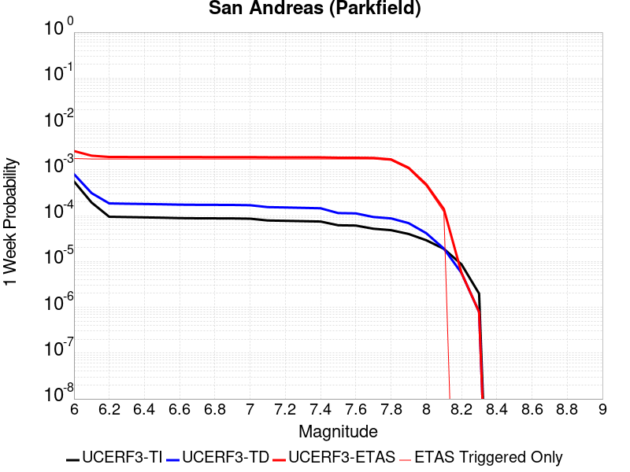 |  | 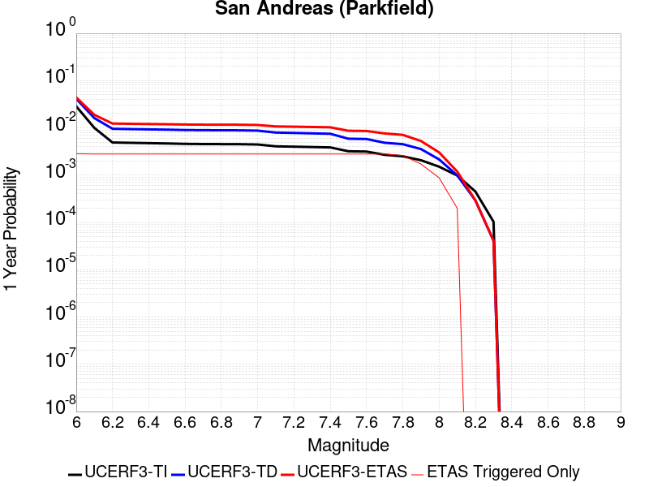 |

| Magnitude | 1 wk TI Prob | 1 wk TD Prob | 1 wk ETAS Prob | 1 wk ETAS/TD Gain | 1 wk ETAS Triggered Only | 1 mo TI Prob | 1 mo TD Prob | 1 mo ETAS Prob | 1 mo ETAS/TD Gain | 1 mo ETAS Triggered Only | 1 yr TI Prob | 1 yr TD Prob | 1 yr ETAS Prob | 1 yr ETAS/TD Gain | 1 yr ETAS Triggered Only |
|-----|-----|-----|-----|-----|-----|-----|-----|-----|-----|-----|-----|-----|-----|-----|-----|
| 6.0 | 5.556969E-4 | 8.0344157E-4 | 0.0025620274 | 3.1888163 | 0.00176 | 0.0023793848 | 0.003439371 | 0.0055520795 | 1.6142718 | 0.00212 | 0.028586963 | 0.041359875 | 0.044082414 | 1.0658256 | 0.00284 |
| 6.1 | 1.925858E-4 | 3.0992847E-4 | 0.0020293954 | 6.5479474 | 0.00172 | 8.2510663E-4 | 0.0013276909 | 0.0034049293 | 2.5645497 | 0.00208 | 0.0099994885 | 0.016126512 | 0.018881356 | 1.1708272 | 0.0028 |
| 6.2 | 9.4306815E-5 | 1.8443585E-4 | 0.0019041186 | 10.324016 | 0.00172 | 4.0410945E-4 | 7.902011E-4 | 0.0028685576 | 3.6301613 | 0.00208 | 0.0049089384 | 0.009578473 | 0.012351654 | 1.2895222 | 0.0028 |
| 6.3 | 9.283051E-5 | 1.8139459E-4 | 0.0019010826 | 10.480371 | 0.00172 | 3.9778434E-4 | 7.7717495E-4 | 0.0028555584 | 3.67428 | 0.00208 | 0.0048322747 | 0.009421266 | 0.012194886 | 1.2944 | 0.0028 |
| 6.4 | 9.138826E-5 | 1.7900368E-4 | 0.0018986958 | 10.607021 | 0.00172 | 3.916052E-4 | 7.6693424E-4 | 0.002845339 | 3.710017 | 0.00208 | 0.0047573745 | 0.009297662 | 0.012071629 | 1.2983509 | 0.0028 |
| 6.5 | 9.000255E-5 | 1.7657269E-4 | 0.001896269 | 10.73931 | 0.00172 | 3.8566816E-4 | 7.565218E-4 | 0.0028349482 | 3.747345 | 0.00208 | 0.0046854047 | 0.009171973 | 0.011946292 | 1.3024778 | 0.0028 |
| 6.6 | 8.8109264E-5 | 1.7335823E-4 | 0.00189306 | 10.919931 | 0.00172 | 3.7755648E-4 | 7.427535E-4 | 0.0028212087 | 3.7983108 | 0.00208 | 0.0045870654 | 0.009005753 | 0.011780537 | 1.3081124 | 0.0028 |
| 6.7 | 8.738073E-5 | 1.7202341E-4 | 0.0018917276 | 10.996919 | 0.00172 | 3.7443507E-4 | 7.3703605E-4 | 0.002815503 | 3.8200343 | 0.00208 | 0.0045492216 | 0.0089367535 | 0.011711731 | 1.3105129 | 0.0028 |
| 6.8 | 8.710195E-5 | 1.7147408E-4 | 0.0018911791 | 11.028951 | 0.00172 | 3.7324068E-4 | 7.346831E-4 | 0.002813155 | 3.8290725 | 0.00208 | 0.0045347405 | 0.008908349 | 0.011683405 | 1.3115119 | 0.0028 |
| 6.9 | 8.6801556E-5 | 1.708797E-4 | 0.0018905858 | 11.063841 | 0.00172 | 3.7195362E-4 | 7.3213724E-4 | 0.0028106144 | 3.8389175 | 0.00208 | 0.0045191357 | 0.008877606 | 0.011652748 | 1.3126004 | 0.0028 |
| 7.0 | 8.5571606E-5 | 1.6839206E-4 | 0.0018881024 | 11.212538 | 0.00172 | 3.6668387E-4 | 7.214818E-4 | 0.002799981 | 3.8808756 | 0.00208 | 0.004455241 | 0.008748925 | 0.011524428 | 1.3172393 | 0.0028 |
| 7.1 | 7.82589E-5 | 1.5312967E-4 | 0.0018728663 | 12.230591 | 0.00172 | 3.3535215E-4 | 6.561057E-4 | 0.002734741 | 4.168141 | 0.00208 | 0.0040752706 | 0.007959004 | 0.010736718 | 1.3490028 | 0.0028 |
| 7.2 | 7.690929E-5 | 1.504851E-4 | 0.0018702262 | 12.427983 | 0.00172 | 3.2956956E-4 | 6.447775E-4 | 0.0027234363 | 4.2238393 | 0.00208 | 0.004005129 | 0.0078220805 | 0.0106001785 | 1.3551611 | 0.0028 |
| 7.3 | 7.5543794E-5 | 1.4742615E-4 | 0.0018671725 | 12.665137 | 0.00172 | 3.2371894E-4 | 6.3167413E-4 | 0.0027103603 | 4.290757 | 0.00208 | 0.003934157 | 0.0076636793 | 0.010442222 | 1.3625598 | 0.0028 |
| 7.4 | 7.4214564E-5 | 1.4441142E-4 | 0.001864163 | 12.908695 | 0.00172 | 3.1802364E-4 | 6.1876E-4 | 0.002697473 | 4.359482 | 0.00208 | 0.003865065 | 0.0075075435 | 0.010286522 | 1.3701582 | 0.0028 |
| 7.5 | 6.149578E-5 | 1.1344282E-4 | 0.0018332477 | 16.160105 | 0.00172 | 2.6352672E-4 | 4.86093E-4 | 0.002565082 | 5.2769365 | 0.00208 | 0.0032037178 | 0.005902156 | 0.00868563 | 1.4716029 | 0.0028 |
| 7.6 | 6.0643448E-5 | 1.11714806E-4 | 0.0018315227 | 16.394629 | 0.00172 | 2.598746E-4 | 4.7869E-4 | 0.0025576942 | 5.343112 | 0.00208 | 0.0031593828 | 0.0058125085 | 0.008596234 | 1.4789197 | 0.0028 |
| 7.7 | 5.1652263E-5 | 9.3113E-5 | 0.0018129528 | 19.470459 | 0.00172 | 2.2134806E-4 | 3.9899469E-4 | 0.0024781649 | 6.211022 | 0.00208 | 0.002691582 | 0.004846951 | 0.007633379 | 1.5748827 | 0.0028 |
| 7.8 | 4.8090482E-5 | 8.685296E-5 | 0.001686714 | 19.42034 | 0.0016 | 2.060858E-4 | 3.721739E-4 | 0.0023314445 | 6.264395 | 0.00196 | 0.0025062072 | 0.0045218114 | 0.0071100546 | 1.5723908 | 0.0026 |
| 7.9 | 3.970278E-5 | 6.848254E-5 | 0.0011084114 | 16.185312 | 0.00104 | 1.7014367E-4 | 2.934636E-4 | 0.0015330997 | 5.224156 | 0.00124 | 0.002069531 | 0.0035670698 | 0.0052809343 | 1.4804685 | 0.00172 |
| 8.0 | 2.8982335E-5 | 4.131844E-5 | 4.8130026E-4 | 11.648559 | 4.4E-4 | 1.2420409E-4 | 1.77067E-4 | 7.3696784E-4 | 4.1620846 | 5.6E-4 | 0.0015111357 | 0.0021536606 | 0.0030317653 | 1.4077266 | 8.8E-4 |
| 8.1 | 1.8836186E-5 | 1.9031799E-5 | 1.3902952E-4 | 7.3051167 | 1.2E-4 | 8.0724014E-5 | 8.1562306E-5 | 2.4154926E-4 | 2.9615304 | 1.6E-4 | 9.823717E-4 | 9.925694E-4 | 0.0011923708 | 1.2012973 | 2.0E-4 |
| 8.2 | 8.643924E-6 | 5.607368E-6 | 5.607368E-6 | 1.0 | 0.0 | 3.704486E-5 | 2.4031357E-5 | 2.4031357E-5 | 1.0 | 0.0 | 4.5092785E-4 | 2.9254257E-4 | 2.9254257E-4 | 1.0 | 0.0 |
| 8.3 | 1.983087E-6 | 7.877893E-7 | 7.877893E-7 | 1.0 | 0.0 | 8.498917E-6 | 3.3762356E-6 | 3.3762356E-6 | 1.0 | 0.0 | 1.034694E-4 | 4.110491E-5 | 4.110491E-5 | 1.0 | 0.0 |

## San Andreas (San Bernardino S)
*[(top)](#table-of-contents)*

| 1 Week | 1 Month | 1 Year |
|-----|-----|-----|
| 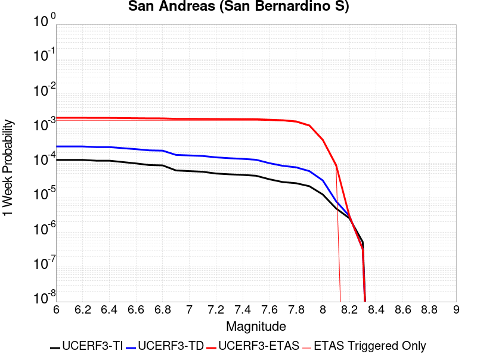 | 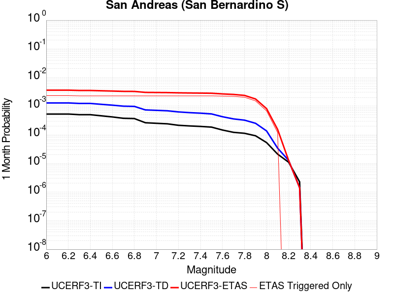 | 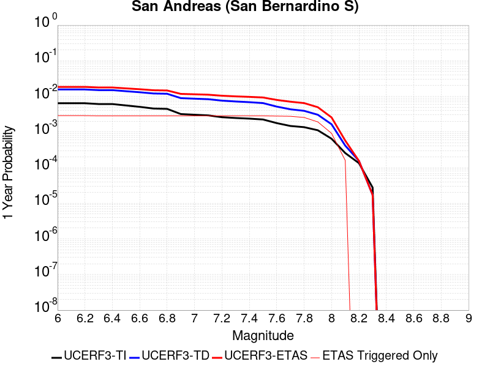 |

| Magnitude | 1 wk TI Prob | 1 wk TD Prob | 1 wk ETAS Prob | 1 wk ETAS/TD Gain | 1 wk ETAS Triggered Only | 1 mo TI Prob | 1 mo TD Prob | 1 mo ETAS Prob | 1 mo ETAS/TD Gain | 1 mo ETAS Triggered Only | 1 yr TI Prob | 1 yr TD Prob | 1 yr ETAS Prob | 1 yr ETAS/TD Gain | 1 yr ETAS Triggered Only |
|-----|-----|-----|-----|-----|-----|-----|-----|-----|-----|-----|-----|-----|-----|-----|-----|
| 6.0 | 1.2336002E-4 | 3.0132735E-4 | 0.002020809 | 6.706358 | 0.00172 | 5.2857865E-4 | 0.0012907899 | 0.0036077953 | 2.795029 | 0.00232 | 0.006416472 | 0.015607107 | 0.01844216 | 1.1816514 | 0.00288 |
| 6.1 | 1.2336002E-4 | 3.0132735E-4 | 0.002020809 | 6.706358 | 0.00172 | 5.2857865E-4 | 0.0012907899 | 0.0036077953 | 2.795029 | 0.00232 | 0.006416472 | 0.015607107 | 0.01844216 | 1.1816514 | 0.00288 |
| 6.2 | 1.2336002E-4 | 3.0132735E-4 | 0.002020809 | 6.706358 | 0.00172 | 5.2857865E-4 | 0.0012907899 | 0.0036077953 | 2.795029 | 0.00232 | 0.006416472 | 0.015607107 | 0.01844216 | 1.1816514 | 0.00288 |
| 6.3 | 1.1712257E-4 | 2.891963E-4 | 0.0020086989 | 6.9457974 | 0.00172 | 5.018573E-4 | 0.0012388497 | 0.0035160251 | 2.838137 | 0.00228 | 0.006093008 | 0.014983551 | 0.017780997 | 1.1867012 | 0.00284 |
| 6.4 | 1.1712257E-4 | 2.891963E-4 | 0.0020086989 | 6.9457974 | 0.00172 | 5.018573E-4 | 0.0012388497 | 0.0035160251 | 2.838137 | 0.00228 | 0.006093008 | 0.014983551 | 0.017780997 | 1.1867012 | 0.00284 |
| 6.5 | 1.0689076E-4 | 2.6930252E-4 | 0.0019888394 | 7.385149 | 0.00172 | 4.5802278E-4 | 0.001153668 | 0.0034310378 | 2.974025 | 0.00228 | 0.0055621783 | 0.013960089 | 0.016760442 | 1.200597 | 0.00284 |
| 6.6 | 9.7648895E-5 | 2.517273E-4 | 0.0019712944 | 7.831071 | 0.00172 | 4.1842813E-4 | 0.0010784089 | 0.0033559501 | 3.1119459 | 0.00228 | 0.005082469 | 0.0130549725 | 0.015857896 | 1.2147017 | 0.00284 |
| 6.7 | 8.757013E-5 | 2.3241482E-4 | 0.0019520151 | 8.398841 | 0.00172 | 3.7524657E-4 | 9.957057E-4 | 0.0032734354 | 3.2875533 | 0.00228 | 0.00455906 | 0.012059439 | 0.01486519 | 1.2326602 | 0.00284 |
| 6.8 | 8.562978E-5 | 2.2800392E-4 | 0.0019476118 | 8.54201 | 0.00172 | 3.6693315E-4 | 9.76816E-4 | 0.003254589 | 3.331834 | 0.00228 | 0.004458263 | 0.011831971 | 0.014638368 | 1.2371876 | 0.00284 |
| 6.9 | 6.124075E-5 | 1.7172846E-4 | 0.0018914331 | 11.014092 | 0.00172 | 2.6243398E-4 | 7.3577237E-4 | 0.003014095 | 4.0965047 | 0.00228 | 0.0031904527 | 0.008921444 | 0.011736107 | 1.3154941 | 0.00284 |
| 7.0 | 5.8598747E-5 | 1.660076E-4 | 0.001885722 | 11.359252 | 0.00172 | 2.5111332E-4 | 7.1126793E-4 | 0.0029896463 | 4.2032633 | 0.00228 | 0.0030530186 | 0.008625501 | 0.011441004 | 1.3264163 | 0.00284 |
| 7.1 | 5.613814E-5 | 1.6018077E-4 | 0.0018799052 | 11.736148 | 0.00172 | 2.4056983E-4 | 6.863092E-4 | 0.0029647443 | 4.3198376 | 0.00228 | 0.0029250039 | 0.008323984 | 0.011140345 | 1.3383428 | 0.00284 |
| 7.2 | 4.991222E-5 | 1.4621996E-4 | 0.0018659685 | 12.761379 | 0.00172 | 2.1389198E-4 | 6.2650687E-4 | 0.0029050785 | 4.6369457 | 0.00228 | 0.002601025 | 0.0076011484 | 0.0104195615 | 1.3707877 | 0.00284 |
| 7.3 | 4.7410045E-5 | 1.3813804E-4 | 0.0018579004 | 13.449594 | 0.00172 | 2.0317009E-4 | 5.918862E-4 | 0.0028705366 | 4.849812 | 0.00228 | 0.0024707897 | 0.0071824905 | 0.010002092 | 1.392566 | 0.00284 |
| 7.4 | 4.5556746E-5 | 1.3220012E-4 | 0.0018519728 | 14.008858 | 0.00172 | 1.952286E-4 | 5.6644925E-4 | 0.0028451576 | 5.022794 | 0.00228 | 0.002374317 | 0.0068747913 | 0.009695267 | 1.4102634 | 0.00284 |
| 7.5 | 4.3084514E-5 | 1.2453202E-4 | 0.0018443178 | 14.809989 | 0.00172 | 1.8463485E-4 | 5.335998E-4 | 0.0028123832 | 5.270585 | 0.00228 | 0.0022456115 | 0.006477298 | 0.009298903 | 1.4356145 | 0.00284 |
| 7.6 | 3.408608E-5 | 9.923654E-5 | 0.0017790698 | 17.927568 | 0.00168 | 1.4607502E-4 | 4.2523025E-4 | 0.0026642778 | 6.265495 | 0.00224 | 0.0017770125 | 0.0051649143 | 0.007950453 | 1.5393193 | 0.0028 |
| 7.7 | 2.8315713E-5 | 8.3315266E-5 | 0.0017231787 | 20.682627 | 0.00164 | 1.2134742E-4 | 3.570166E-4 | 0.002556231 | 7.1599784 | 0.0022 | 0.0014764034 | 0.0043380233 | 0.00708605 | 1.6334745 | 0.00276 |
| 7.8 | 2.6222975E-5 | 7.540562E-5 | 0.001595291 | 21.15613 | 0.00152 | 1.1237934E-4 | 3.2312694E-4 | 0.0023624678 | 7.311269 | 0.00204 | 0.0013673597 | 0.00392698 | 0.006476927 | 1.6493404 | 0.00256 |
| 7.9 | 2.1469694E-5 | 5.85263E-5 | 0.0012184584 | 20.818989 | 0.00116 | 9.200973E-5 | 2.508029E-4 | 0.0017704217 | 7.0590158 | 0.00152 | 0.0011196428 | 0.003049253 | 0.0049633984 | 1.6277424 | 0.00192 |
| 8.0 | 1.2420249E-5 | 3.168168E-5 | 4.7166774E-4 | 14.8877125 | 4.4E-4 | 5.322855E-5 | 1.3577157E-4 | 8.1567926E-4 | 6.0077324 | 6.8E-4 | 6.478649E-4 | 0.0016517665 | 0.0025702468 | 1.5560595 | 9.2E-4 |
| 8.1 | 4.9197724E-6 | 7.958367E-6 | 8.795773E-5 | 11.052234 | 8.0E-5 | 2.1084568E-5 | 3.410684E-5 | 1.5410275E-4 | 4.5182357 | 1.2E-4 | 2.566744E-4 | 4.1517182E-4 | 5.7510537E-4 | 1.3852227 | 1.6E-4 |
| 8.2 | 2.5634774E-6 | 2.9684513E-6 | 2.9684513E-6 | 1.0 | 0.0 | 1.0986286E-5 | 1.2721873E-5 | 1.2721873E-5 | 1.0 | 0.0 | 1.3374983E-4 | 1.5487784E-4 | 1.5487784E-4 | 1.0 | 0.0 |
| 8.3 | 5.2850464E-7 | 3.291787E-7 | 3.291787E-7 | 1.0 | 0.0 | 2.2650179E-6 | 1.4107652E-6 | 1.4107652E-6 | 1.0 | 0.0 | 2.7576245E-5 | 1.7175944E-5 | 1.7175944E-5 | 1.0 | 0.0 |

## Pleito
*[(top)](#table-of-contents)*

| 1 Week | 1 Month | 1 Year |
|-----|-----|-----|
| 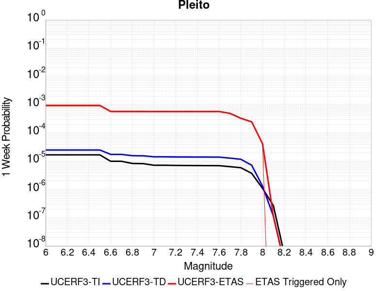 | 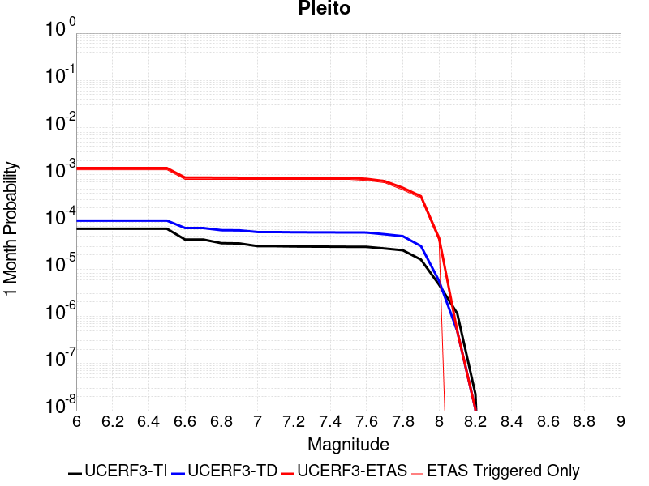 | 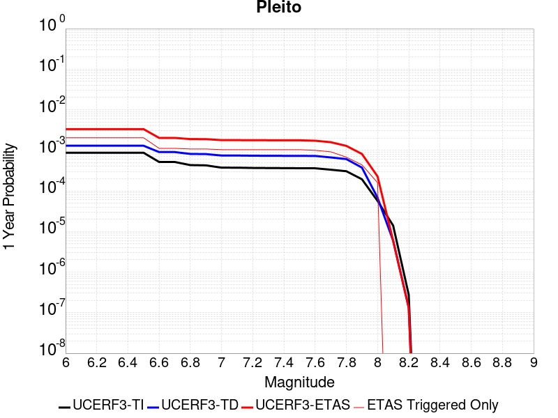 |

| Magnitude | 1 wk TI Prob | 1 wk TD Prob | 1 wk ETAS Prob | 1 wk ETAS/TD Gain | 1 wk ETAS Triggered Only | 1 mo TI Prob | 1 mo TD Prob | 1 mo ETAS Prob | 1 mo ETAS/TD Gain | 1 mo ETAS Triggered Only | 1 yr TI Prob | 1 yr TD Prob | 1 yr ETAS Prob | 1 yr ETAS/TD Gain | 1 yr ETAS Triggered Only |
|-----|-----|-----|-----|-----|-----|-----|-----|-----|-----|-----|-----|-----|-----|-----|-----|
| 6.0 | 1.6763008E-5 | 2.4935694E-5 | 9.449128E-4 | 37.893982 | 9.2E-4 | 7.183948E-5 | 1.0686329E-4 | 0.0013867265 | 12.97664 | 0.00128 | 8.742947E-4 | 0.0013003562 | 0.0033377034 | 2.566761 | 0.00204 |
| 6.1 | 1.6763008E-5 | 2.4935694E-5 | 9.449128E-4 | 37.893982 | 9.2E-4 | 7.183948E-5 | 1.0686329E-4 | 0.0013867265 | 12.97664 | 0.00128 | 8.742947E-4 | 0.0013003562 | 0.0033377034 | 2.566761 | 0.00204 |
| 6.2 | 1.6763008E-5 | 2.4935694E-5 | 9.449128E-4 | 37.893982 | 9.2E-4 | 7.183948E-5 | 1.0686329E-4 | 0.0013867265 | 12.97664 | 0.00128 | 8.742947E-4 | 0.0013003562 | 0.0033377034 | 2.566761 | 0.00204 |
| 6.3 | 1.6763008E-5 | 2.4935694E-5 | 9.449128E-4 | 37.893982 | 9.2E-4 | 7.183948E-5 | 1.0686329E-4 | 0.0013867265 | 12.97664 | 0.00128 | 8.742947E-4 | 0.0013003562 | 0.0033377034 | 2.566761 | 0.00204 |
| 6.4 | 1.6763008E-5 | 2.4935694E-5 | 9.449128E-4 | 37.893982 | 9.2E-4 | 7.183948E-5 | 1.0686329E-4 | 0.0013867265 | 12.97664 | 0.00128 | 8.742947E-4 | 0.0013003562 | 0.0033377034 | 2.566761 | 0.00204 |
| 6.5 | 1.6763008E-5 | 2.4935694E-5 | 9.449128E-4 | 37.893982 | 9.2E-4 | 7.183948E-5 | 1.0686329E-4 | 0.0013867265 | 12.97664 | 0.00128 | 8.742947E-4 | 0.0013003562 | 0.0033377034 | 2.566761 | 0.00204 |
| 6.6 | 9.910213E-6 | 1.738388E-5 | 5.773741E-4 | 33.213192 | 5.6E-4 | 4.247165E-5 | 7.450023E-5 | 8.7444065E-4 | 11.737421 | 8.0E-4 | 5.169696E-4 | 9.066666E-4 | 0.0020256513 | 2.2341743 | 0.00112 |
| 6.7 | 9.910213E-6 | 1.738388E-5 | 5.773741E-4 | 33.213192 | 5.6E-4 | 4.247165E-5 | 7.450023E-5 | 8.7444065E-4 | 11.737421 | 8.0E-4 | 5.169696E-4 | 9.066666E-4 | 0.0020256513 | 2.2341743 | 0.00112 |
| 6.8 | 8.300162E-6 | 1.564301E-5 | 5.7563424E-4 | 36.798176 | 5.6E-4 | 3.557164E-5 | 6.703976E-5 | 8.669861E-4 | 12.932417 | 8.0E-4 | 4.3299864E-4 | 8.159049E-4 | 0.0018950237 | 2.3226037 | 0.00108 |
| 6.9 | 8.183114E-6 | 1.551415E-5 | 5.755055E-4 | 37.09552 | 5.6E-4 | 3.5070017E-5 | 6.6487526E-5 | 8.6643436E-4 | 13.031532 | 8.0E-4 | 4.2689382E-4 | 8.0918643E-4 | 0.0018883125 | 2.3335938 | 0.00108 |
| 7.0 | 7.1748823E-6 | 1.4299022E-5 | 5.74291E-4 | 40.16296 | 5.6E-4 | 3.0749135E-5 | 6.128009E-5 | 8.6123106E-4 | 14.054012 | 8.0E-4 | 3.743064E-4 | 7.458302E-4 | 0.0017850546 | 2.3933792 | 0.00104 |
| 7.1 | 7.1671807E-6 | 1.4289369E-5 | 5.742814E-4 | 40.189415 | 5.6E-4 | 3.0716128E-5 | 6.1238716E-5 | 8.6118974E-4 | 14.062831 | 8.0E-4 | 3.7390468E-4 | 7.4532686E-4 | 0.0017845518 | 2.394321 | 0.00104 |
| 7.2 | 7.0649667E-6 | 1.4136105E-5 | 5.741282E-4 | 40.614315 | 5.6E-4 | 3.0278077E-5 | 6.05819E-5 | 8.6053344E-4 | 14.204464 | 8.0E-4 | 3.6857324E-4 | 7.373356E-4 | 0.0017765687 | 2.4094439 | 0.00104 |
| 7.3 | 7.02082E-6 | 1.4079238E-5 | 5.7407137E-4 | 40.77432 | 5.6E-4 | 3.008888E-5 | 6.03382E-5 | 8.602899E-4 | 14.257799 | 8.0E-4 | 3.6627054E-4 | 7.343705E-4 | 0.0017736068 | 2.415139 | 0.00104 |
| 7.4 | 6.987146E-6 | 1.4038616E-5 | 5.7403074E-4 | 40.889412 | 5.6E-4 | 2.9944567E-5 | 6.0164115E-5 | 8.60116E-4 | 14.296163 | 8.0E-4 | 3.6451413E-4 | 7.3225243E-4 | 0.0017714909 | 2.4192352 | 0.00104 |
| 7.5 | 6.9494554E-6 | 1.3995384E-5 | 5.7398755E-4 | 41.012634 | 5.6E-4 | 2.9783041E-5 | 5.997884E-5 | 8.599309E-4 | 14.337237 | 8.0E-4 | 3.625482E-4 | 7.299982E-4 | 0.0017692391 | 2.423621 | 0.00104 |
| 7.6 | 6.92694E-6 | 1.3954241E-5 | 5.7394645E-4 | 41.13061 | 5.6E-4 | 2.9686547E-5 | 5.9802518E-5 | 8.1975706E-4 | 13.707735 | 7.6E-4 | 3.6137376E-4 | 7.27853E-4 | 0.0017271251 | 2.3729038 | 0.001 |
| 7.7 | 6.395867E-6 | 1.2826297E-5 | 4.9282017E-4 | 38.422634 | 4.8E-4 | 2.741057E-5 | 5.496869E-5 | 7.349313E-4 | 13.369999 | 6.8E-4 | 3.336726E-4 | 6.690386E-4 | 0.0015884232 | 2.3741875 | 9.2E-4 |
| 7.8 | 5.8664327E-6 | 1.1680238E-5 | 3.316765E-4 | 28.396383 | 3.2E-4 | 2.5141611E-5 | 5.00572E-5 | 5.300332E-4 | 10.58855 | 4.8E-4 | 3.060561E-4 | 6.0927623E-4 | 0.001288862 | 2.1153984 | 6.8E-4 |
| 7.9 | 3.7167474E-6 | 7.2014245E-6 | 2.471997E-4 | 34.3265 | 2.4E-4 | 1.592882E-5 | 3.0862884E-5 | 3.5085302E-4 | 11.368121 | 3.2E-4 | 1.9391612E-4 | 3.75691E-4 | 8.155257E-4 | 2.1707354 | 4.4E-4 |
| 8.0 | 1.0903841E-6 | 1.3071021E-6 | 4.130705E-5 | 31.602007 | 4.0E-5 | 4.6730665E-6 | 5.601854E-6 | 4.560163E-5 | 8.140453 | 4.0E-5 | 5.68931E-5 | 6.8200454E-5 | 2.2818954E-4 | 3.3458655 | 1.6E-4 |
| 8.1 | 2.6894583E-7 | 1.13801775E-7 | 1.13801775E-7 | 1.0 | 0.0 | 1.1526245E-6 | 4.8772176E-7 | 4.8772176E-7 | 1.0 | 0.0 | 1.4033113E-5 | 5.937997E-6 | 5.937997E-6 | 1.0 | 0.0 |
| 8.2 | 5.2967013E-9 | 2.5342395E-9 | 2.5342395E-9 | 1.0 | 0.0 | 2.2700148E-8 | 1.0861028E-8 | 1.0861028E-8 | 1.0 | 0.0 | 2.7637427E-7 | 1.32233E-7 | 1.32233E-7 | 1.0 | 0.0 |

## San Andreas (Creeping Section) 2011 CFM
*[(top)](#table-of-contents)*

| 1 Week | 1 Month | 1 Year |
|-----|-----|-----|
| 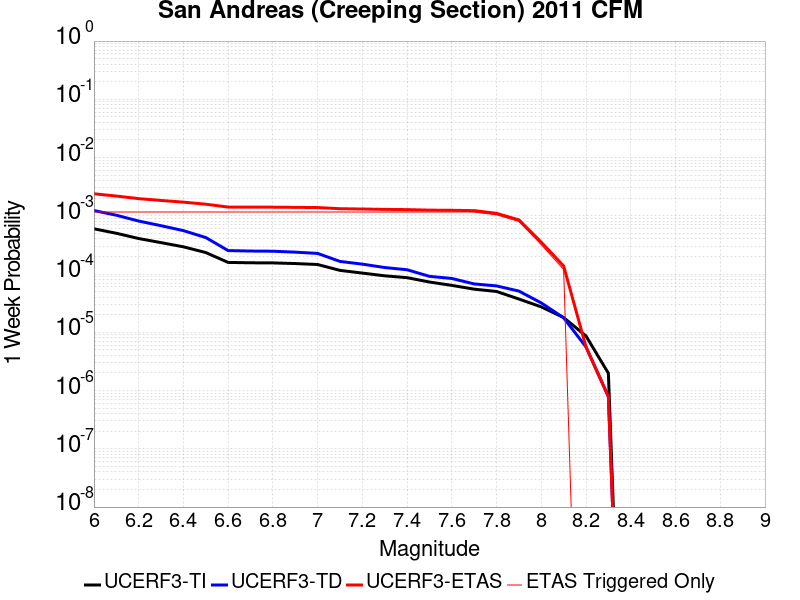 | 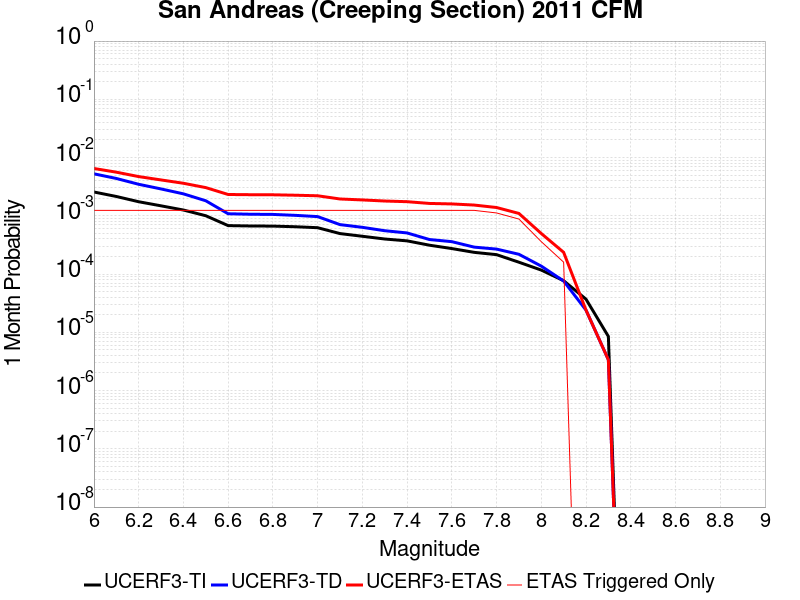 | 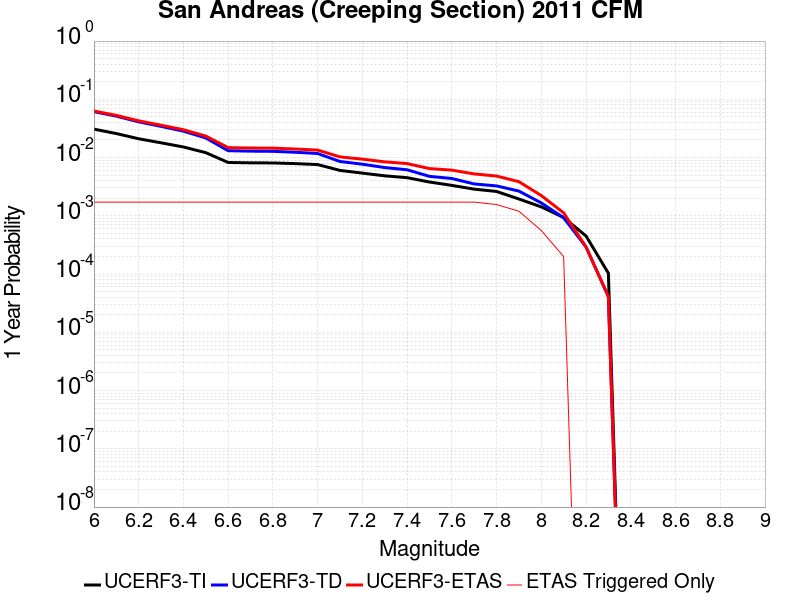 |

| Magnitude | 1 wk TI Prob | 1 wk TD Prob | 1 wk ETAS Prob | 1 wk ETAS/TD Gain | 1 wk ETAS Triggered Only | 1 mo TI Prob | 1 mo TD Prob | 1 mo ETAS Prob | 1 mo ETAS/TD Gain | 1 mo ETAS Triggered Only | 1 yr TI Prob | 1 yr TD Prob | 1 yr ETAS Prob | 1 yr ETAS/TD Gain | 1 yr ETAS Triggered Only |
|-----|-----|-----|-----|-----|-----|-----|-----|-----|-----|-----|-----|-----|-----|-----|-----|
| 6.0 | 5.986481E-4 | 0.0012305736 | 0.0023891462 | 1.9414898 | 0.00116 | 0.0025631124 | 0.0052583744 | 0.006491854 | 1.2345743 | 0.00124 | 0.030762846 | 0.06135223 | 0.062966704 | 1.0263149 | 0.00172 |
| 6.1 | 5.015945E-4 | 0.0010242044 | 0.0021830164 | 2.1314263 | 0.00116 | 0.00214792 | 0.00437824 | 0.005612811 | 1.2819788 | 0.00124 | 0.025839351 | 0.051369127 | 0.05300077 | 1.0317632 | 0.00172 |
| 6.2 | 4.073338E-4 | 8.1310584E-4 | 0.0019721626 | 2.4254684 | 0.00116 | 0.0017445484 | 0.0034773606 | 0.0047130487 | 1.3553523 | 0.00124 | 0.021034058 | 0.04105309 | 0.042702477 | 1.040177 | 0.00172 |
| 6.3 | 3.464099E-4 | 6.7629415E-4 | 0.0018355097 | 2.71407 | 0.00116 | 0.0014837692 | 0.002893196 | 0.0041296086 | 1.4273517 | 0.00124 | 0.017915873 | 0.034310453 | 0.035971437 | 1.0484105 | 0.00172 |
| 6.4 | 2.935057E-4 | 5.56817E-4 | 0.001716171 | 3.08211 | 0.00116 | 0.0012572751 | 0.0023828198 | 0.003619865 | 1.5191518 | 0.00124 | 0.015200248 | 0.028386578 | 0.030057753 | 1.058872 | 0.00172 |
| 6.5 | 2.3409708E-4 | 4.233272E-4 | 0.0015828362 | 3.7390373 | 0.00116 | 0.0010028875 | 0.0018122771 | 0.00305003 | 1.6829821 | 0.00124 | 0.012141965 | 0.021710506 | 0.023393163 | 1.0775043 | 0.00172 |
| 6.6 | 1.5842178E-4 | 2.530843E-4 | 0.0014127907 | 5.5822935 | 0.00116 | 6.7877385E-4 | 0.0010841859 | 0.0023228414 | 2.1424754 | 0.00124 | 0.0082328 | 0.013118694 | 0.01481613 | 1.1293906 | 0.00172 |
| 6.7 | 1.5616413E-4 | 2.484441E-4 | 0.0014081559 | 5.6678987 | 0.00116 | 6.691031E-4 | 0.0010643183 | 0.0023029987 | 2.1638248 | 0.00124 | 0.0081159435 | 0.01288029 | 0.014578137 | 1.1318173 | 0.00172 |
| 6.8 | 1.5538467E-4 | 2.4667758E-4 | 0.0014063914 | 5.701335 | 0.00116 | 6.6576427E-4 | 0.0010567546 | 0.0022954443 | 2.172164 | 0.00124 | 0.008075596 | 0.012789439 | 0.014487442 | 1.132766 | 0.00172 |
| 6.9 | 1.5153569E-4 | 2.3774903E-4 | 0.0013974733 | 5.8779345 | 0.00116 | 6.49277E-4 | 0.0010185286 | 0.0022572656 | 2.2162025 | 0.00124 | 0.007876333 | 0.012330608 | 0.0140294 | 1.1377703 | 0.00172 |
| 7.0 | 1.4588932E-4 | 2.26266E-4 | 0.0013860036 | 6.1255493 | 0.00116 | 6.250901E-4 | 9.69353E-4 | 0.0022081512 | 2.2779636 | 0.00124 | 0.0075839474 | 0.011738516 | 0.013438326 | 1.1448061 | 0.00172 |
| 7.1 | 1.1565079E-4 | 1.648249E-4 | 0.0013246337 | 8.036612 | 0.00116 | 4.955521E-4 | 7.0620206E-4 | 0.0019453263 | 2.7546313 | 0.00124 | 0.006016669 | 0.008564321 | 0.010269591 | 1.1991132 | 0.00172 |
| 7.2 | 1.0393792E-4 | 1.4804474E-4 | 0.001307873 | 8.83431 | 0.00116 | 4.4537216E-4 | 6.343239E-4 | 0.0018735373 | 2.9535973 | 0.00124 | 0.005408933 | 0.0076957205 | 0.009402484 | 1.2217809 | 0.00172 |
| 7.3 | 9.332884E-5 | 1.2946628E-4 | 0.0012893161 | 9.958702 | 0.00116 | 3.999194E-4 | 5.5473816E-4 | 0.0017940502 | 3.2340488 | 0.00124 | 0.0048581534 | 0.006733159 | 0.008441578 | 1.2537322 | 0.00172 |
| 7.4 | 8.670252E-5 | 1.1859965E-4 | 0.0012784621 | 10.779645 | 0.00116 | 3.715293E-4 | 5.081858E-4 | 0.0017475557 | 3.4388125 | 0.00124 | 0.004513991 | 0.006169733 | 0.007879121 | 1.2770603 | 0.00172 |
| 7.5 | 7.3036405E-5 | 9.138321E-5 | 0.0012512772 | 13.692638 | 0.00116 | 3.129756E-4 | 3.9158363E-4 | 0.0016310981 | 4.1653886 | 0.00124 | 0.0038038217 | 0.004757131 | 0.0064689484 | 1.3598424 | 0.00172 |
| 7.6 | 6.3935775E-5 | 8.4007974E-5 | 0.0012439105 | 14.807053 | 0.00116 | 2.7398168E-4 | 3.5998458E-4 | 0.0015995383 | 4.4433517 | 0.00124 | 0.0033306254 | 0.004374024 | 0.0060865004 | 1.3915106 | 0.00172 |
| 7.7 | 5.5050095E-5 | 6.768488E-5 | 0.0012276063 | 18.137085 | 0.00116 | 2.3590765E-4 | 2.900458E-4 | 0.0015296862 | 5.273947 | 0.00124 | 0.0028683927 | 0.0035255942 | 0.00523953 | 1.4861411 | 0.00172 |
| 7.8 | 5.027131E-5 | 6.260343E-5 | 0.0011025383 | 17.61147 | 0.00104 | 2.1543067E-4 | 2.6827282E-4 | 0.0013879724 | 5.173734 | 0.00112 | 0.0026197135 | 0.0032613333 | 0.0048162458 | 1.476772 | 0.00156 |
| 7.9 | 3.7271806E-5 | 5.1009967E-5 | 8.5096917E-4 | 16.68241 | 8.0E-4 | 1.5972654E-4 | 2.1859583E-4 | 0.0010984035 | 5.024814 | 8.8E-4 | 0.0019429359 | 0.002658158 | 0.0038549684 | 1.4502404 | 0.0012 |
| 8.0 | 2.7310243E-5 | 3.1948035E-5 | 3.519378E-4 | 11.015945 | 3.2E-4 | 1.17038646E-4 | 1.3691297E-4 | 4.968637E-4 | 3.6290474 | 3.6E-4 | 0.0014240141 | 0.0016656418 | 0.0022247091 | 1.3356467 | 5.6E-4 |
| 8.1 | 1.7940547E-5 | 1.7734084E-5 | 1.3773196E-4 | 7.766511 | 1.2E-4 | 7.688579E-5 | 7.600101E-5 | 2.3598885E-4 | 3.1050754 | 1.6E-4 | 9.3568244E-4 | 9.2491996E-4 | 0.001124735 | 1.2160349 | 2.0E-4 |
| 8.2 | 8.643924E-6 | 5.607368E-6 | 5.607368E-6 | 1.0 | 0.0 | 3.704486E-5 | 2.4031357E-5 | 2.4031357E-5 | 1.0 | 0.0 | 4.5092785E-4 | 2.9254257E-4 | 2.9254257E-4 | 1.0 | 0.0 |
| 8.3 | 1.983087E-6 | 7.877893E-7 | 7.877893E-7 | 1.0 | 0.0 | 8.498917E-6 | 3.3762356E-6 | 3.3762356E-6 | 1.0 | 0.0 | 1.034694E-4 | 4.110491E-5 | 4.110491E-5 | 1.0 | 0.0 |

## San Andreas (San Gorgonio Pass-Garnet HIll)
*[(top)](#table-of-contents)*

| 1 Week | 1 Month | 1 Year |
|-----|-----|-----|
|  | 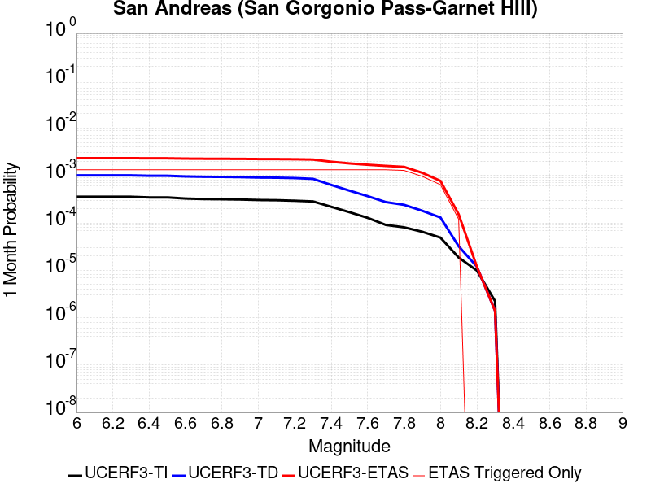 | 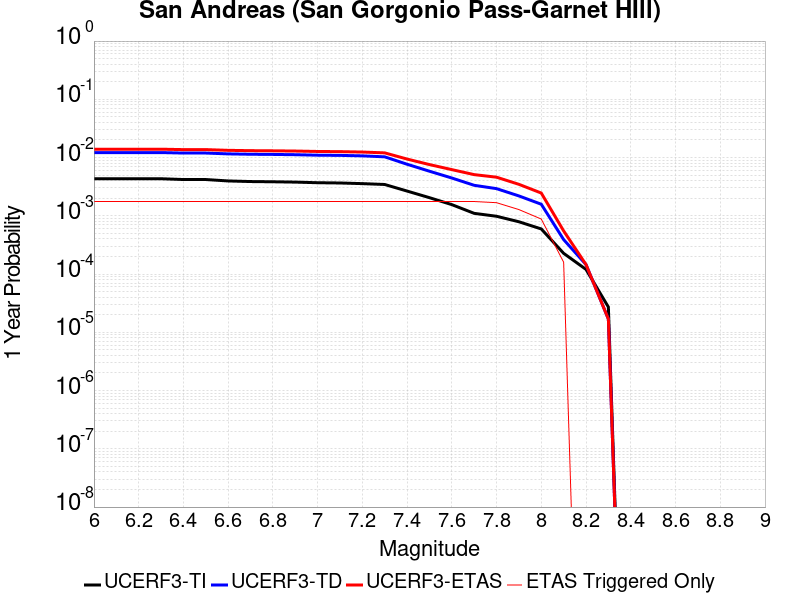 |

| Magnitude | 1 wk TI Prob | 1 wk TD Prob | 1 wk ETAS Prob | 1 wk ETAS/TD Gain | 1 wk ETAS Triggered Only | 1 mo TI Prob | 1 mo TD Prob | 1 mo ETAS Prob | 1 mo ETAS/TD Gain | 1 mo ETAS Triggered Only | 1 yr TI Prob | 1 yr TD Prob | 1 yr ETAS Prob | 1 yr ETAS/TD Gain | 1 yr ETAS Triggered Only |
|-----|-----|-----|-----|-----|-----|-----|-----|-----|-----|-----|-----|-----|-----|-----|-----|
| 6.0 | 8.31567E-5 | 2.3487274E-4 | 0.0011946473 | 5.0863595 | 9.6E-4 | 3.5633717E-4 | 0.0010062061 | 0.002324878 | 2.3105383 | 0.00132 | 0.004329778 | 0.01218165 | 0.013920209 | 1.1427196 | 0.00176 |
| 6.1 | 8.31567E-5 | 2.3487274E-4 | 0.0011946473 | 5.0863595 | 9.6E-4 | 3.5633717E-4 | 0.0010062061 | 0.002324878 | 2.3105383 | 0.00132 | 0.004329778 | 0.01218165 | 0.013920209 | 1.1427196 | 0.00176 |
| 6.2 | 8.31567E-5 | 2.3487274E-4 | 0.0011946473 | 5.0863595 | 9.6E-4 | 3.5633717E-4 | 0.0010062061 | 0.002324878 | 2.3105383 | 0.00132 | 0.004329778 | 0.01218165 | 0.013920209 | 1.1427196 | 0.00176 |
| 6.3 | 8.31567E-5 | 2.3487274E-4 | 0.0011946473 | 5.0863595 | 9.6E-4 | 3.5633717E-4 | 0.0010062061 | 0.002324878 | 2.3105383 | 0.00132 | 0.004329778 | 0.01218165 | 0.013920209 | 1.1427196 | 0.00176 |
| 6.4 | 8.059055E-5 | 2.3044254E-4 | 0.0011902213 | 5.1649375 | 9.6E-4 | 3.4534236E-4 | 9.872341E-4 | 0.002305931 | 2.335749 | 0.00132 | 0.0041964394 | 0.011953557 | 0.013692519 | 1.1454765 | 0.00176 |
| 6.5 | 8.059055E-5 | 2.3044254E-4 | 0.0011902213 | 5.1649375 | 9.6E-4 | 3.4534236E-4 | 9.872341E-4 | 0.002305931 | 2.335749 | 0.00132 | 0.0041964394 | 0.011953557 | 0.013692519 | 1.1454765 | 0.00176 |
| 6.6 | 7.619237E-5 | 2.2287853E-4 | 0.0011826645 | 5.306319 | 9.6E-4 | 3.2649786E-4 | 9.548463E-4 | 0.0022735859 | 2.3811014 | 0.00132 | 0.0039678677 | 0.011563838 | 0.013303486 | 1.1504385 | 0.00176 |
| 6.7 | 7.440636E-5 | 2.1963443E-4 | 0.0011794235 | 5.36994 | 9.6E-4 | 3.188454E-4 | 9.409531E-4 | 0.002259711 | 2.4015129 | 0.00132 | 0.0038750346 | 0.011396466 | 0.013136408 | 1.1526738 | 0.00176 |
| 6.8 | 7.3735864E-5 | 2.1810358E-4 | 0.0011778942 | 5.400618 | 9.6E-4 | 3.1597257E-4 | 9.3439705E-4 | 0.0022531636 | 2.4113557 | 0.00132 | 0.0038401815 | 0.011317481 | 0.0130575625 | 1.1537516 | 0.00176 |
| 6.9 | 7.27575E-5 | 2.1579085E-4 | 0.0011755837 | 5.447792 | 9.6E-4 | 3.117806E-4 | 9.244924E-4 | 0.002243272 | 2.4264905 | 0.00132 | 0.003789323 | 0.011198137 | 0.012938429 | 1.155409 | 0.00176 |
| 7.0 | 7.102591E-5 | 2.1162683E-4 | 0.0011714237 | 5.5353265 | 9.6E-4 | 3.0436125E-4 | 9.066591E-4 | 0.0022254623 | 2.4545743 | 0.00132 | 0.003699303 | 0.010983224 | 0.012723894 | 1.1584843 | 0.00176 |
| 7.1 | 7.028513E-5 | 2.0997925E-4 | 0.0011697777 | 5.5709205 | 9.6E-4 | 3.0118722E-4 | 8.9960295E-4 | 0.0022184155 | 2.465994 | 0.00132 | 0.0036607897 | 0.010898178 | 0.012638997 | 1.1597348 | 0.00176 |
| 7.2 | 6.8498244E-5 | 2.0605292E-4 | 0.0011658551 | 5.658037 | 9.6E-4 | 2.9353087E-4 | 8.827873E-4 | 0.0022016221 | 2.493944 | 0.00132 | 0.003567883 | 0.010695473 | 0.012436649 | 1.1627955 | 0.00176 |
| 7.3 | 6.622592E-5 | 1.9831101E-4 | 0.0011581206 | 5.839921 | 9.6E-4 | 2.8379448E-4 | 8.496297E-4 | 0.0021685082 | 2.552298 | 0.00132 | 0.0034497243 | 0.010295663 | 0.012037543 | 1.1691858 | 0.00176 |
| 7.4 | 5.1050705E-5 | 1.477468E-4 | 0.0011076049 | 7.496642 | 9.6E-4 | 2.1877038E-4 | 6.3304784E-4 | 0.0019522122 | 3.0838304 | 0.00132 | 0.002660276 | 0.007680315 | 0.009426798 | 1.2273973 | 0.00176 |
| 7.5 | 3.9302922E-5 | 1.1204231E-4 | 0.0010719347 | 9.567232 | 9.6E-4 | 1.6843023E-4 | 4.8009327E-4 | 0.0017994596 | 3.7481458 | 0.00132 | 0.0020487092 | 0.0058295405 | 0.0075792805 | 1.3001506 | 0.00176 |
| 7.6 | 2.9851626E-5 | 8.560878E-5 | 0.0010455266 | 12.212843 | 9.6E-4 | 1.2792926E-4 | 3.668433E-4 | 0.001686359 | 4.5969467 | 0.00132 | 0.0015564259 | 0.0044571967 | 0.006209352 | 1.393107 | 0.00176 |
| 7.7 | 2.1135214E-5 | 6.411543E-5 | 0.0010240539 | 15.9720335 | 9.6E-4 | 9.0576345E-5 | 2.747515E-4 | 0.0015943889 | 5.803021 | 0.00132 | 0.0011022091 | 0.0033399744 | 0.005094096 | 1.5251901 | 0.00176 |
| 7.8 | 1.883379E-5 | 5.6178174E-5 | 9.7612647E-4 | 17.375546 | 9.2E-4 | 8.0713755E-5 | 2.4074141E-4 | 0.0015204332 | 6.3156285 | 0.00128 | 9.822468E-4 | 0.0029270905 | 0.004602173 | 1.5722688 | 0.00168 |
| 7.9 | 1.5156185E-5 | 4.2101485E-5 | 7.2207284E-4 | 17.15077 | 6.8E-4 | 6.495346E-5 | 1.8042246E-4 | 0.0011402493 | 6.3198853 | 9.6E-4 | 7.9052144E-4 | 0.0021944318 | 0.003471623 | 1.5820144 | 0.00128 |
| 8.0 | 1.1405907E-5 | 3.0308918E-5 | 4.7029558E-4 | 15.51674 | 4.4E-4 | 4.8881542E-5 | 1.298889E-4 | 7.6980575E-4 | 5.9266477 | 6.4E-4 | 5.9497025E-4 | 0.0015802513 | 0.0024588606 | 1.5559934 | 8.8E-4 |
| 8.1 | 4.3511436E-6 | 7.4929885E-6 | 8.7492386E-5 | 11.676568 | 8.0E-5 | 1.8647626E-5 | 3.2112413E-5 | 1.5210857E-4 | 4.7367525 | 1.2E-4 | 2.2701119E-4 | 3.908986E-4 | 5.508361E-4 | 1.4091533 | 1.6E-4 |
| 8.2 | 2.3042528E-6 | 2.7894796E-6 | 2.7894796E-6 | 1.0 | 0.0 | 9.875332E-6 | 1.1954859E-5 | 1.1954859E-5 | 1.0 | 0.0 | 1.2022553E-4 | 1.4554072E-4 | 1.4554072E-4 | 1.0 | 0.0 |
| 8.3 | 5.202968E-7 | 3.241516E-7 | 3.241516E-7 | 1.0 | 0.0 | 2.2298414E-6 | 1.3892205E-6 | 1.3892205E-6 | 1.0 | 0.0 | 2.714798E-5 | 1.6913642E-5 | 1.6913642E-5 | 1.0 | 0.0 |

## San Andreas (Coachella) rev
*[(top)](#table-of-contents)*

| 1 Week | 1 Month | 1 Year |
|-----|-----|-----|
| 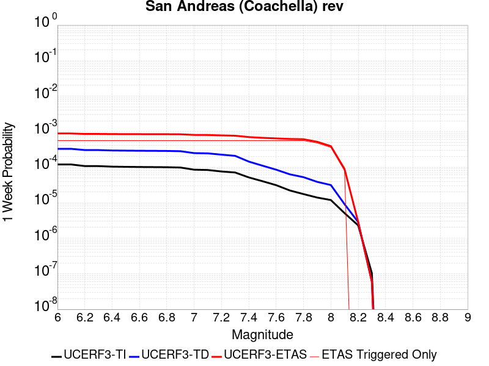 | 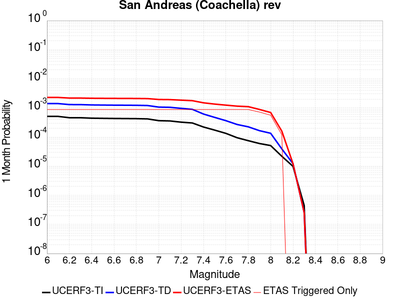 | 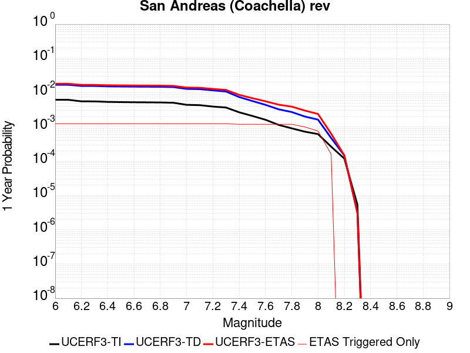 |

| Magnitude | 1 wk TI Prob | 1 wk TD Prob | 1 wk ETAS Prob | 1 wk ETAS/TD Gain | 1 wk ETAS Triggered Only | 1 mo TI Prob | 1 mo TD Prob | 1 mo ETAS Prob | 1 mo ETAS/TD Gain | 1 mo ETAS Triggered Only | 1 yr TI Prob | 1 yr TD Prob | 1 yr ETAS Prob | 1 yr ETAS/TD Gain | 1 yr ETAS Triggered Only |
|-----|-----|-----|-----|-----|-----|-----|-----|-----|-----|-----|-----|-----|-----|-----|-----|
| 6.0 | 1.1925945E-4 | 3.285021E-4 | 8.883181E-4 | 2.7041476 | 5.6E-4 | 5.110118E-4 | 0.0014071113 | 0.002285873 | 1.6245147 | 8.8E-4 | 0.0062038354 | 0.016998356 | 0.018217279 | 1.0717082 | 0.00124 |
| 6.1 | 1.1925945E-4 | 3.285021E-4 | 8.883181E-4 | 2.7041476 | 5.6E-4 | 5.110118E-4 | 0.0014071113 | 0.002285873 | 1.6245147 | 8.8E-4 | 0.0062038354 | 0.016998356 | 0.018217279 | 1.0717082 | 0.00124 |
| 6.2 | 1.07432395E-4 | 3.0350155E-4 | 8.633316E-4 | 2.8445706 | 5.6E-4 | 4.603433E-4 | 0.0013000766 | 0.0021789325 | 1.6760032 | 8.8E-4 | 0.005590286 | 0.015714664 | 0.016935177 | 1.0776672 | 0.00124 |
| 6.3 | 1.0718766E-4 | 3.0295455E-4 | 8.627849E-4 | 2.847902 | 5.6E-4 | 4.592948E-4 | 0.0012977346 | 0.0021765926 | 1.6772248 | 8.8E-4 | 0.005577586 | 0.01568656 | 0.01690711 | 1.0778085 | 0.00124 |
| 6.4 | 1.0355944E-4 | 2.9503368E-4 | 8.5486844E-4 | 2.8975284 | 5.6E-4 | 4.4375064E-4 | 0.0012638214 | 0.0021427092 | 1.695421 | 8.8E-4 | 0.0053892885 | 0.01527953 | 0.016500583 | 1.0799143 | 0.00124 |
| 6.5 | 1.0227914E-4 | 2.9222743E-4 | 8.5206376E-4 | 2.9157555 | 5.6E-4 | 4.382655E-4 | 0.0012518062 | 0.0021307045 | 1.7021042 | 8.8E-4 | 0.0053228354 | 0.015135286 | 0.016356518 | 1.0806878 | 0.00124 |
| 6.6 | 1.0116757E-4 | 2.898844E-4 | 8.4972207E-4 | 2.9312446 | 5.6E-4 | 4.3350324E-4 | 0.0012417742 | 0.0021206813 | 1.7077835 | 8.8E-4 | 0.0052651367 | 0.015014836 | 0.016236218 | 1.081345 | 0.00124 |
| 6.7 | 1.0050676E-4 | 2.8846966E-4 | 8.483081E-4 | 2.9407187 | 5.6E-4 | 4.3067214E-4 | 0.0012357167 | 0.0021146294 | 1.7112573 | 8.8E-4 | 0.005230834 | 0.0149421 | 0.016163573 | 1.0817469 | 0.00124 |
| 6.8 | 9.976819E-5 | 2.8650457E-4 | 8.463441E-4 | 2.9540336 | 5.6E-4 | 4.2750788E-4 | 0.0012273028 | 0.0021062228 | 1.7161394 | 8.8E-4 | 0.0051924936 | 0.014841062 | 0.01606266 | 1.082312 | 0.00124 |
| 6.9 | 9.77719E-5 | 2.8146335E-4 | 8.413057E-4 | 2.9890418 | 5.6E-4 | 4.1895514E-4 | 0.0012057178 | 0.0020846566 | 1.7289758 | 8.8E-4 | 0.0050888555 | 0.014581811 | 0.01580373 | 1.0837975 | 0.00124 |
| 7.0 | 8.500761E-5 | 2.487273E-4 | 8.08588E-4 | 3.2509017 | 5.6E-4 | 3.6426744E-4 | 0.001065542 | 0.0019446043 | 1.8249907 | 8.8E-4 | 0.0044259406 | 0.012896588 | 0.014120596 | 1.0949094 | 0.00124 |
| 7.1 | 8.319876E-5 | 2.4473912E-4 | 8.0460205E-4 | 3.2875907 | 5.6E-4 | 3.5651738E-4 | 0.0010484635 | 0.0019275409 | 1.8384434 | 8.8E-4 | 0.004331963 | 0.012691099 | 0.013915363 | 1.0964663 | 0.00124 |
| 7.2 | 7.563917E-5 | 2.2518281E-4 | 7.8505673E-4 | 3.4863083 | 5.6E-4 | 3.2412758E-4 | 9.647154E-4 | 0.0018438664 | 1.9113061 | 8.8E-4 | 0.0039391145 | 0.011682851 | 0.012908365 | 1.1048985 | 0.00124 |
| 7.3 | 7.082985E-5 | 2.0829777E-4 | 7.681811E-4 | 3.6878989 | 5.6E-4 | 3.0352117E-4 | 8.9240225E-4 | 0.001771617 | 1.9852225 | 8.8E-4 | 0.0036891096 | 0.010811501 | 0.012038095 | 1.1134527 | 0.00124 |
| 7.4 | 5.146215E-5 | 1.4354692E-4 | 7.0346653E-4 | 4.900604 | 5.6E-4 | 2.2053342E-4 | 6.150569E-4 | 0.0014945157 | 2.4298818 | 8.8E-4 | 0.0026816884 | 0.0074627977 | 0.008653842 | 1.1595976 | 0.0012 |
| 7.5 | 4.0285166E-5 | 1.1011688E-4 | 6.700552E-4 | 6.0849457 | 5.6E-4 | 1.7263928E-4 | 4.7184445E-4 | 0.0013514293 | 2.8641415 | 8.8E-4 | 0.002099857 | 0.0057296446 | 0.0069227694 | 1.208237 | 0.0012 |
| 7.6 | 3.1168736E-5 | 8.5009575E-5 | 6.4496195E-4 | 7.586933 | 5.6E-4 | 1.3357346E-4 | 3.6427603E-4 | 0.0012439555 | 3.4148705 | 8.8E-4 | 0.0016250437 | 0.0044260686 | 0.005620757 | 1.269921 | 0.0012 |
| 7.7 | 2.2100989E-5 | 6.2934116E-5 | 6.2289886E-4 | 9.8976345 | 5.6E-4 | 9.4715084E-5 | 2.696898E-4 | 0.0011494524 | 4.2621284 | 8.8E-4 | 0.001152546 | 0.003278536 | 0.0044746017 | 1.364817 | 0.0012 |
| 7.8 | 1.7484861E-5 | 5.2283296E-5 | 6.12254E-4 | 11.710319 | 5.6E-4 | 7.493296E-5 | 2.2405203E-4 | 0.0011038549 | 4.9267793 | 8.8E-4 | 9.1192697E-4 | 0.0027244242 | 0.003921155 | 1.43926 | 0.0012 |
| 7.9 | 1.3967285E-5 | 3.862311E-5 | 5.186046E-4 | 13.427312 | 4.8E-4 | 5.985842E-5 | 1.6551714E-4 | 8.8539795E-4 | 5.3492827 | 7.2E-4 | 7.2853256E-4 | 0.0020133099 | 0.0030112965 | 1.4956945 | 0.001 |
| 8.0 | 1.1887396E-5 | 3.1410258E-5 | 3.9139893E-4 | 12.460864 | 3.6E-4 | 5.094499E-5 | 1.3460845E-4 | 6.9453305E-4 | 5.1596546 | 5.6E-4 | 6.200787E-4 | 0.0016376268 | 0.0023963822 | 1.4633262 | 7.6E-4 |
| 8.1 | 5.100864E-6 | 9.116648E-6 | 8.9115914E-5 | 9.775076 | 8.0E-5 | 2.1860664E-5 | 3.907076E-5 | 1.5906607E-4 | 4.0712304 | 1.2E-4 | 2.6612106E-4 | 4.755828E-4 | 6.355067E-4 | 1.3362693 | 1.6E-4 |
| 8.2 | 2.3004484E-6 | 2.842999E-6 | 2.842999E-6 | 1.0 | 0.0 | 9.859027E-6 | 1.2184225E-5 | 1.2184225E-5 | 1.0 | 0.0 | 1.2002704E-4 | 1.4833287E-4 | 1.4833287E-4 | 1.0 | 0.0 |
| 8.3 | 1.0424446E-7 | 5.965764E-8 | 5.965764E-8 | 1.0 | 0.0 | 4.4676187E-7 | 2.5567556E-7 | 2.5567556E-7 | 1.0 | 0.0 | 5.439312E-6 | 3.112846E-6 | 3.112846E-6 | 1.0 | 0.0 |

## Garlock (West)
*[(top)](#table-of-contents)*

| 1 Week | 1 Month | 1 Year |
|-----|-----|-----|
| 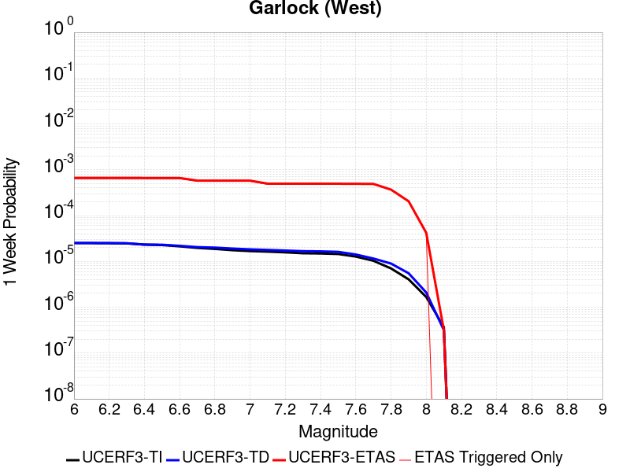 | 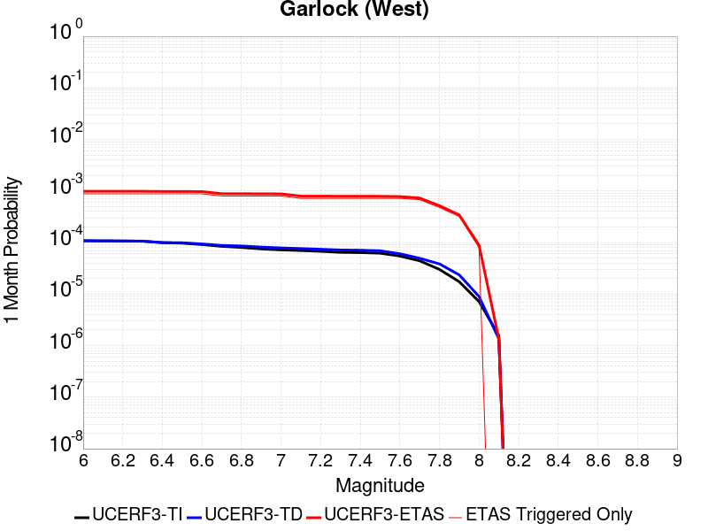 | 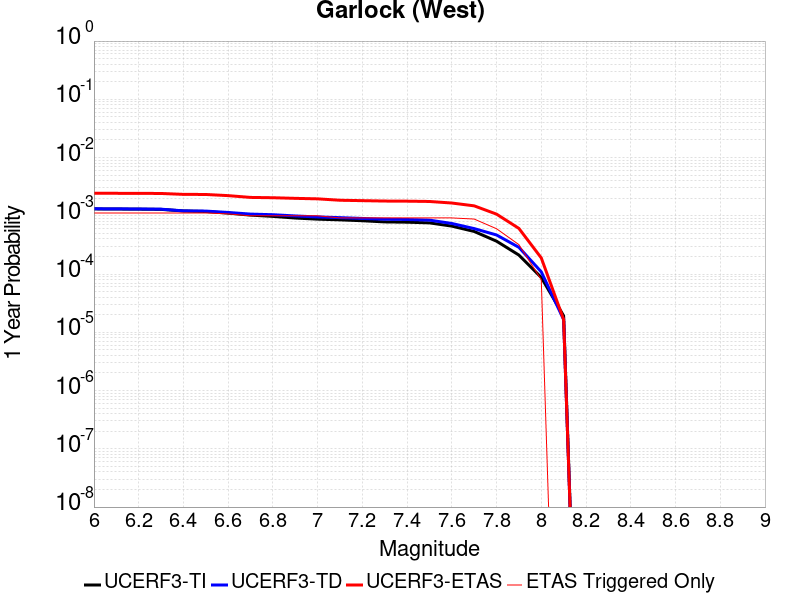 |

| Magnitude | 1 wk TI Prob | 1 wk TD Prob | 1 wk ETAS Prob | 1 wk ETAS/TD Gain | 1 wk ETAS Triggered Only | 1 mo TI Prob | 1 mo TD Prob | 1 mo ETAS Prob | 1 mo ETAS/TD Gain | 1 mo ETAS Triggered Only | 1 yr TI Prob | 1 yr TD Prob | 1 yr ETAS Prob | 1 yr ETAS/TD Gain | 1 yr ETAS Triggered Only |
|-----|-----|-----|-----|-----|-----|-----|-----|-----|-----|-----|-----|-----|-----|-----|-----|
| 6.0 | 2.5181727E-5 | 2.5328825E-5 | 6.6531263E-4 | 26.267014 | 6.4E-4 | 1.0791722E-4 | 1.0854761E-4 | 9.884521E-4 | 9.106161 | 8.8E-4 | 0.0013131002 | 0.0013207694 | 0.0024392903 | 1.8468705 | 0.00112 |
| 6.1 | 2.5077732E-5 | 2.5229843E-5 | 6.652137E-4 | 26.366144 | 6.4E-4 | 1.0747157E-4 | 1.0812344E-4 | 9.880282E-4 | 9.137966 | 8.8E-4 | 0.001307681 | 0.0013156114 | 0.002434138 | 1.8501953 | 0.00112 |
| 6.2 | 2.494612E-5 | 2.5111442E-5 | 6.6509534E-4 | 26.48575 | 6.4E-4 | 1.0690756E-4 | 1.0761604E-4 | 9.875214E-4 | 9.17634 | 8.8E-4 | 0.0013008224 | 0.0013094412 | 0.0024279747 | 1.8542067 | 0.00112 |
| 6.3 | 2.4733758E-5 | 2.4930645E-5 | 6.6491467E-4 | 26.670578 | 6.4E-4 | 1.0599751E-4 | 1.0684126E-4 | 9.867472E-4 | 9.235639 | 8.8E-4 | 0.0012897556 | 0.0013000196 | 0.0024185635 | 1.8604054 | 0.00112 |
| 6.4 | 2.3237335E-5 | 2.3309083E-5 | 6.6329417E-4 | 28.456469 | 6.4E-4 | 9.958477E-5 | 9.989226E-5 | 9.798043E-4 | 9.808611 | 8.8E-4 | 0.0012117702 | 0.0012155125 | 0.0023341512 | 1.920302 | 0.00112 |
| 6.5 | 2.2732203E-5 | 2.3122879E-5 | 6.631081E-4 | 28.677574 | 6.4E-4 | 9.742009E-5 | 9.90943E-5 | 9.790071E-4 | 9.87955 | 8.8E-4 | 0.0011854442 | 0.0012058083 | 0.0023244577 | 1.9277176 | 0.00112 |
| 6.6 | 2.1319436E-5 | 2.1901993E-5 | 6.61888E-4 | 30.220446 | 6.4E-4 | 9.136581E-5 | 9.386232E-5 | 9.737797E-4 | 10.374555 | 8.8E-4 | 0.001111811 | 0.0011421769 | 0.0022209433 | 1.9444828 | 0.00108 |
| 6.7 | 1.970802E-5 | 2.05206E-5 | 5.8050914E-4 | 28.289091 | 5.6E-4 | 8.446021E-5 | 8.794248E-5 | 8.878721E-4 | 10.096056 | 8.0E-4 | 0.001027818 | 0.0010701754 | 0.0020691052 | 1.9334263 | 0.001 |
| 6.8 | 1.8744462E-5 | 2.0026835E-5 | 5.800156E-4 | 28.961922 | 5.6E-4 | 8.033094E-5 | 8.5826476E-5 | 8.857578E-4 | 10.320333 | 8.0E-4 | 9.775903E-4 | 0.0010444381 | 0.0020433937 | 1.9564526 | 0.001 |
| 6.9 | 1.7559682E-5 | 1.9078003E-5 | 5.7906733E-4 | 30.352617 | 5.6E-4 | 7.5253614E-5 | 8.1760314E-5 | 8.816949E-4 | 10.783898 | 8.0E-4 | 9.158276E-4 | 9.949787E-4 | 0.0019939838 | 2.0040467 | 0.001 |
| 7.0 | 1.6794445E-5 | 1.8338675E-5 | 5.783284E-4 | 31.536 | 5.6E-4 | 7.197421E-5 | 7.8591955E-5 | 8.785291E-4 | 11.178359 | 8.0E-4 | 8.759337E-4 | 9.564384E-4 | 0.001955482 | 2.0445457 | 0.001 |
| 7.1 | 1.6337795E-5 | 1.7838813E-5 | 4.978303E-4 | 27.90714 | 4.8E-4 | 7.0017246E-5 | 7.6449825E-5 | 7.963948E-4 | 10.417222 | 7.2E-4 | 8.521265E-4 | 9.303805E-4 | 0.0018495246 | 1.9879228 | 9.2E-4 |
| 7.2 | 1.5780008E-5 | 1.7286979E-5 | 4.972787E-4 | 28.766085 | 4.8E-4 | 6.762685E-5 | 7.408495E-5 | 7.940316E-4 | 10.717853 | 7.2E-4 | 8.2304585E-4 | 9.0161234E-4 | 0.0018207829 | 2.0194743 | 9.2E-4 |
| 7.3 | 1.5058865E-5 | 1.6739175E-5 | 4.9673114E-4 | 29.674767 | 4.8E-4 | 6.45364E-5 | 7.173736E-5 | 7.916857E-4 | 11.035892 | 7.2E-4 | 7.854473E-4 | 8.730536E-4 | 0.0017922504 | 2.0528526 | 9.2E-4 |
| 7.4 | 1.4887923E-5 | 1.6574775E-5 | 4.965668E-4 | 29.959188 | 4.8E-4 | 6.380382E-5 | 7.1032824E-5 | 7.909817E-4 | 11.135439 | 7.2E-4 | 7.7653467E-4 | 8.6448266E-4 | 0.0017836874 | 2.0633004 | 9.2E-4 |
| 7.5 | 1.4509299E-5 | 1.6165865E-5 | 4.961581E-4 | 30.691715 | 4.8E-4 | 6.218123E-5 | 6.928044E-5 | 7.892306E-4 | 11.391824 | 7.2E-4 | 7.567935E-4 | 8.4316416E-4 | 0.0017623884 | 2.090208 | 9.2E-4 |
| 7.6 | 1.2756717E-5 | 1.41623805E-5 | 4.9415557E-4 | 34.892128 | 4.8E-4 | 5.4670498E-5 | 6.0694507E-5 | 7.806508E-4 | 12.861968 | 7.2E-4 | 6.6541E-4 | 7.3870574E-4 | 0.0016580261 | 2.2445014 | 9.2E-4 |
| 7.7 | 1.0328985E-5 | 1.1565329E-5 | 4.915598E-4 | 42.50288 | 4.8E-4 | 4.4266326E-5 | 4.956476E-5 | 7.2953105E-4 | 14.718746 | 6.8E-4 | 5.388092E-4 | 6.032842E-4 | 0.0014827533 | 2.4578023 | 8.8E-4 |
| 7.8 | 7.0306583E-6 | 8.9839405E-6 | 3.6898072E-4 | 41.07114 | 3.6E-4 | 3.0131043E-5 | 3.8502036E-5 | 5.184836E-4 | 13.466393 | 4.8E-4 | 3.667837E-4 | 4.6866163E-4 | 0.0010683804 | 2.2796414 | 6.0E-4 |
| 7.9 | 4.060633E-6 | 5.514807E-6 | 2.055137E-4 | 37.2658 | 2.0E-4 | 1.7402595E-5 | 2.3634675E-5 | 3.4362712E-4 | 14.539109 | 3.2E-4 | 2.11856E-4 | 2.8771427E-4 | 6.076222E-4 | 2.1118946 | 3.2E-4 |
| 8.0 | 1.6729537E-6 | 2.093995E-6 | 4.209391E-5 | 20.102203 | 4.0E-5 | 7.169782E-6 | 8.974233E-6 | 8.897352E-5 | 9.9143305 | 8.0E-5 | 8.7288594E-5 | 1.09255845E-4 | 1.892471E-4 | 1.7321463 | 8.0E-5 |
| 8.1 | 3.6733252E-7 | 3.1722044E-7 | 3.1722044E-7 | 1.0 | 0.0 | 1.5742813E-6 | 1.3595155E-6 | 1.3595155E-6 | 1.0 | 0.0 | 1.9166706E-5 | 1.6551992E-5 | 1.6551992E-5 | 1.0 | 0.0 |

## Garlock (Central)
*[(top)](#table-of-contents)*

| 1 Week | 1 Month | 1 Year |
|-----|-----|-----|
| 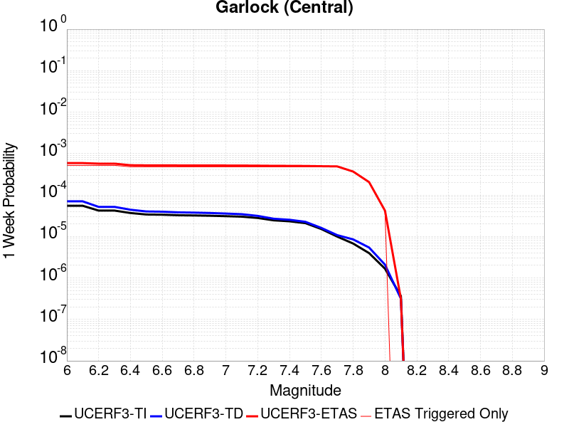 | 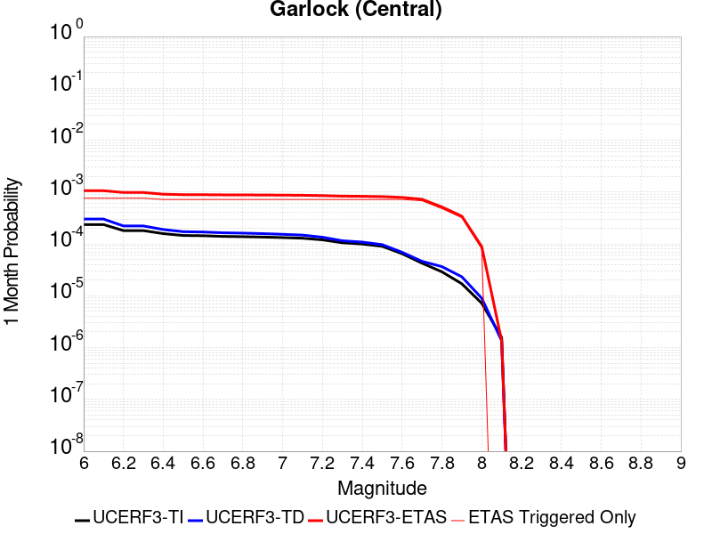 | 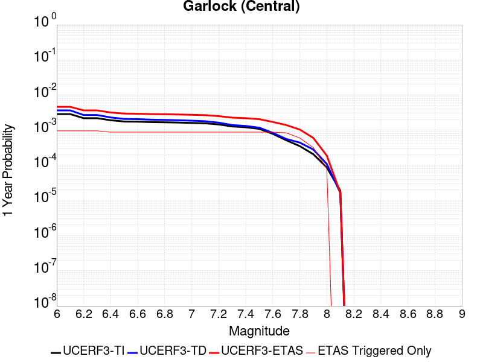 |

| Magnitude | 1 wk TI Prob | 1 wk TD Prob | 1 wk ETAS Prob | 1 wk ETAS/TD Gain | 1 wk ETAS Triggered Only | 1 mo TI Prob | 1 mo TD Prob | 1 mo ETAS Prob | 1 mo ETAS/TD Gain | 1 mo ETAS Triggered Only | 1 yr TI Prob | 1 yr TD Prob | 1 yr ETAS Prob | 1 yr ETAS/TD Gain | 1 yr ETAS Triggered Only |
|-----|-----|-----|-----|-----|-----|-----|-----|-----|-----|-----|-----|-----|-----|-----|-----|
| 6.0 | 5.5131142E-5 | 7.0410926E-5 | 5.903743E-4 | 8.384698 | 5.2E-4 | 2.3625491E-4 | 3.0172654E-4 | 0.0010614973 | 3.5180771 | 7.6E-4 | 0.0028726095 | 0.0036673974 | 0.0046238764 | 1.260806 | 9.6E-4 |
| 6.1 | 5.5131142E-5 | 7.0410926E-5 | 5.903743E-4 | 8.384698 | 5.2E-4 | 2.3625491E-4 | 3.0172654E-4 | 0.0010614973 | 3.5180771 | 7.6E-4 | 0.0028726095 | 0.0036673974 | 0.0046238764 | 1.260806 | 9.6E-4 |
| 6.2 | 4.216245E-5 | 5.181263E-5 | 5.7178567E-4 | 11.035644 | 5.2E-4 | 1.806837E-4 | 2.220354E-4 | 9.818666E-4 | 4.4221177 | 7.6E-4 | 0.0021976046 | 0.0026999614 | 0.0036573694 | 1.3546007 | 9.6E-4 |
| 6.3 | 4.216245E-5 | 5.181263E-5 | 5.7178567E-4 | 11.035644 | 5.2E-4 | 1.806837E-4 | 2.220354E-4 | 9.818666E-4 | 4.4221177 | 7.6E-4 | 0.0021976046 | 0.0026999614 | 0.0036573694 | 1.3546007 | 9.6E-4 |
| 6.4 | 3.6858168E-5 | 4.4255168E-5 | 5.242339E-4 | 11.845711 | 4.8E-4 | 1.5795401E-4 | 1.8965136E-4 | 9.0951484E-4 | 4.79572 | 7.2E-4 | 0.0019213937 | 0.0023065854 | 0.0031845556 | 1.3806363 | 8.8E-4 |
| 6.5 | 3.39199E-5 | 4.0159928E-5 | 5.2014063E-4 | 12.951733 | 4.8E-4 | 1.453629E-4 | 1.7210275E-4 | 8.9197885E-4 | 5.1828275 | 7.2E-4 | 0.0017683565 | 0.0020933591 | 0.002971517 | 1.419497 | 8.8E-4 |
| 6.6 | 3.3571985E-5 | 3.961341E-5 | 5.195944E-4 | 13.116629 | 4.8E-4 | 1.4387199E-4 | 1.6976082E-4 | 8.896386E-4 | 5.240541 | 7.2E-4 | 0.0017502342 | 0.0020649007 | 0.0029430834 | 1.4252906 | 8.8E-4 |
| 6.7 | 3.2580007E-5 | 3.8228853E-5 | 5.182105E-4 | 13.555482 | 4.8E-4 | 1.3962112E-4 | 1.6382778E-4 | 8.837098E-4 | 5.3941393 | 7.2E-4 | 0.0016985617 | 0.0019927998 | 0.0028710463 | 1.4407097 | 8.8E-4 |
| 6.8 | 3.2185937E-5 | 3.7654747E-5 | 5.1763665E-4 | 13.746917 | 4.8E-4 | 1.3793244E-4 | 1.6136763E-4 | 8.812514E-4 | 5.4611416 | 7.2E-4 | 0.0016780337 | 0.001962902 | 0.0028411746 | 1.4474359 | 8.8E-4 |
| 6.9 | 3.165394E-5 | 3.6858168E-5 | 5.168405E-4 | 14.022413 | 4.8E-4 | 1.3565269E-4 | 1.5795414E-4 | 8.778404E-4 | 5.557565 | 7.2E-4 | 0.0016503202 | 0.0019214168 | 0.0027997259 | 1.4571154 | 8.8E-4 |
| 7.0 | 3.0903822E-5 | 3.5761113E-5 | 5.15744E-4 | 14.421921 | 4.8E-4 | 1.3243823E-4 | 1.5325303E-4 | 8.731427E-4 | 5.6973925 | 7.2E-4 | 0.0016112428 | 0.0018642801 | 0.0027426395 | 1.4711521 | 8.8E-4 |
| 7.1 | 3.0069863E-5 | 3.4526223E-5 | 5.145096E-4 | 14.901997 | 4.8E-4 | 1.2886449E-4 | 1.4796125E-4 | 8.6785475E-4 | 5.865419 | 7.2E-4 | 0.0015677959 | 0.001799961 | 0.002678377 | 1.4880195 | 8.8E-4 |
| 7.2 | 2.7957109E-5 | 3.141258E-5 | 5.113975E-4 | 16.280022 | 4.8E-4 | 1.1981068E-4 | 1.346185E-4 | 8.545216E-4 | 6.3477273 | 7.2E-4 | 0.0014577188 | 0.0016377677 | 0.0025163265 | 1.5364368 | 8.8E-4 |
| 7.3 | 2.4519275E-5 | 2.6838161E-5 | 5.068253E-4 | 18.8845 | 4.8E-4 | 1.0507837E-4 | 1.15015704E-4 | 8.349329E-4 | 7.259295 | 7.2E-4 | 0.0012785783 | 0.0013994314 | 0.0022782 | 1.6279469 | 8.8E-4 |
| 7.4 | 2.3225532E-5 | 2.532011E-5 | 5.05308E-4 | 19.956783 | 4.8E-4 | 9.95342E-5 | 1.0851033E-4 | 8.284322E-4 | 7.634593 | 7.2E-4 | 0.0012111551 | 0.001320327 | 0.002199165 | 1.6656215 | 8.8E-4 |
| 7.5 | 2.097765E-5 | 2.2598408E-5 | 5.025876E-4 | 22.239954 | 4.8E-4 | 8.9901114E-5 | 9.6846794E-5 | 8.1677706E-4 | 8.433702 | 7.2E-4 | 0.0010939965 | 0.0011784837 | 0.0020574466 | 1.7458422 | 8.8E-4 |
| 7.6 | 1.511254E-5 | 1.6095431E-5 | 4.960877E-4 | 30.821646 | 4.8E-4 | 6.476642E-5 | 6.897865E-5 | 7.88929E-4 | 11.437293 | 7.2E-4 | 7.882459E-4 | 8.3949923E-4 | 0.0017187605 | 2.047364 | 8.8E-4 |
| 7.7 | 9.934069E-6 | 1.0775618E-5 | 4.9077044E-4 | 45.54453 | 4.8E-4 | 4.2573887E-5 | 4.6180405E-5 | 7.26149E-4 | 15.72418 | 6.8E-4 | 5.182138E-4 | 5.621018E-4 | 0.0014016296 | 2.4935513 | 8.4E-4 |
| 7.8 | 6.7562896E-6 | 8.50792E-6 | 3.6850484E-4 | 43.313156 | 3.6E-4 | 2.8955206E-5 | 3.6462003E-5 | 5.164445E-4 | 14.163909 | 4.8E-4 | 3.5247262E-4 | 4.4383464E-4 | 0.0010435684 | 2.351255 | 6.0E-4 |
| 7.9 | 3.975453E-6 | 5.419516E-6 | 2.0541843E-4 | 37.90346 | 2.0E-4 | 1.7037546E-5 | 2.3226292E-5 | 3.4321885E-4 | 14.777169 | 3.2E-4 | 2.0741238E-4 | 2.827435E-4 | 6.02653E-4 | 2.1314478 | 3.2E-4 |
| 8.0 | 1.6729537E-6 | 2.093995E-6 | 4.209391E-5 | 20.102203 | 4.0E-5 | 7.169782E-6 | 8.974233E-6 | 8.897352E-5 | 9.9143305 | 8.0E-5 | 8.7288594E-5 | 1.09255845E-4 | 1.892471E-4 | 1.7321463 | 8.0E-5 |
| 8.1 | 3.6733252E-7 | 3.1722044E-7 | 3.1722044E-7 | 1.0 | 0.0 | 1.5742813E-6 | 1.3595155E-6 | 1.3595155E-6 | 1.0 | 0.0 | 1.9166706E-5 | 1.6551992E-5 | 1.6551992E-5 | 1.0 | 0.0 |

## Brawley (Seismic Zone) alt 1
*[(top)](#table-of-contents)*

| 1 Week | 1 Month | 1 Year |
|-----|-----|-----|
| 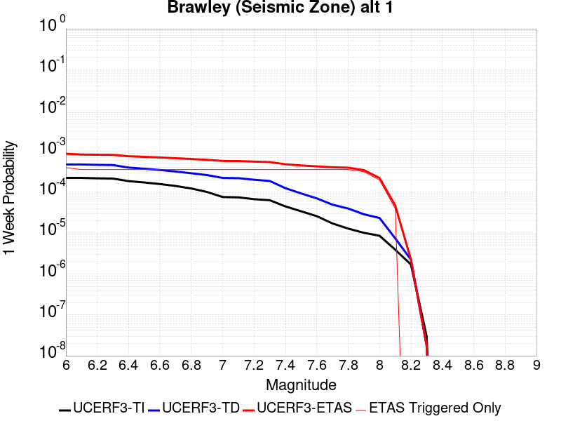 | 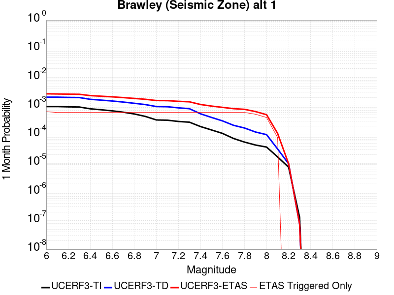 | 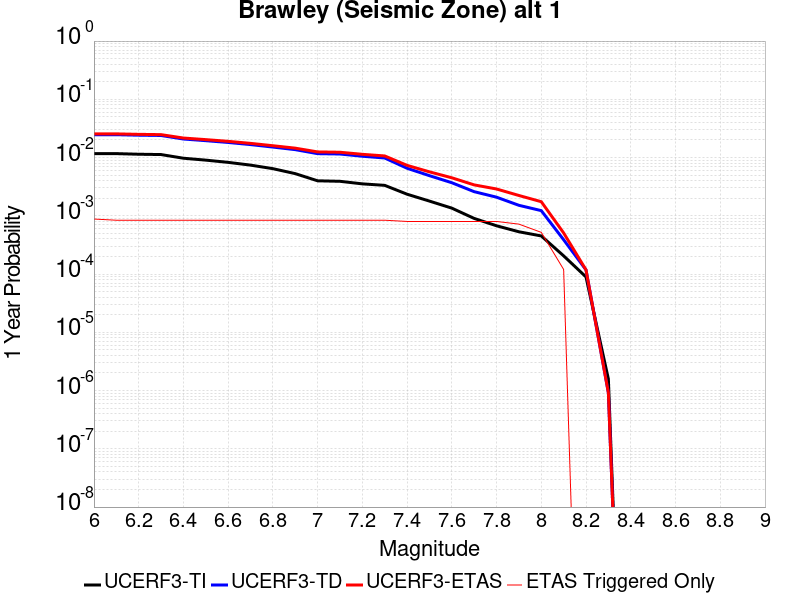 |

| Magnitude | 1 wk TI Prob | 1 wk TD Prob | 1 wk ETAS Prob | 1 wk ETAS/TD Gain | 1 wk ETAS Triggered Only | 1 mo TI Prob | 1 mo TD Prob | 1 mo ETAS Prob | 1 mo ETAS/TD Gain | 1 mo ETAS Triggered Only | 1 yr TI Prob | 1 yr TD Prob | 1 yr ETAS Prob | 1 yr ETAS/TD Gain | 1 yr ETAS Triggered Only |
|-----|-----|-----|-----|-----|-----|-----|-----|-----|-----|-----|-----|-----|-----|-----|-----|
| 6.0 | 2.2521618E-4 | 4.7906235E-4 | 8.788707E-4 | 1.8345644 | 4.0E-4 | 9.6485513E-4 | 0.0020515462 | 0.0026902333 | 1.3113198 | 6.4E-4 | 0.011683988 | 0.024686452 | 0.02554473 | 1.034767 | 8.8E-4 |
| 6.1 | 2.2521618E-4 | 4.7906235E-4 | 8.3888986E-4 | 1.7511079 | 3.6E-4 | 9.6485513E-4 | 0.0020515462 | 0.0026503152 | 1.2918624 | 6.0E-4 | 0.011683988 | 0.024686452 | 0.025505716 | 1.0331868 | 8.4E-4 |
| 6.2 | 2.198148E-4 | 4.6985512E-4 | 8.2968595E-4 | 1.7658336 | 3.6E-4 | 9.417233E-4 | 0.0020121478 | 0.0026109405 | 1.2975888 | 6.0E-4 | 0.011405343 | 0.024218049 | 0.025037706 | 1.0338448 | 8.4E-4 |
| 6.3 | 2.1704129E-4 | 4.6419835E-4 | 8.2403125E-4 | 1.7751706 | 3.6E-4 | 9.298453E-4 | 0.0019879416 | 0.0025867487 | 1.3012197 | 6.0E-4 | 0.011262234 | 0.02393082 | 0.024750717 | 1.0342612 | 8.4E-4 |
| 6.4 | 1.876142E-4 | 4.0299946E-4 | 7.6285435E-4 | 1.8929415 | 3.6E-4 | 8.038131E-4 | 0.0017260119 | 0.0023249763 | 1.3470222 | 6.0E-4 | 0.00974259 | 0.020814236 | 0.021636752 | 1.039517 | 8.4E-4 |
| 6.5 | 1.7390939E-4 | 3.772201E-4 | 7.370843E-4 | 1.95399 | 3.6E-4 | 7.45113E-4 | 0.0016156683 | 0.002214699 | 1.3707633 | 6.0E-4 | 0.009034078 | 0.019498011 | 0.020321632 | 1.0422413 | 8.4E-4 |
| 6.6 | 1.591791E-4 | 3.512329E-4 | 7.1110646E-4 | 2.024601 | 3.6E-4 | 6.8201777E-4 | 0.0015044258 | 0.0021035231 | 1.3982233 | 6.0E-4 | 0.008271996 | 0.018166747 | 0.018991487 | 1.0453984 | 8.4E-4 |
| 6.7 | 1.4268003E-4 | 3.2273377E-4 | 6.826176E-4 | 2.1151104 | 3.6E-4 | 6.1134255E-4 | 0.00138242 | 0.0019815906 | 1.4334215 | 6.0E-4 | 0.007417723 | 0.016705167 | 0.017531134 | 1.0494438 | 8.4E-4 |
| 6.8 | 1.239713E-4 | 2.923154E-4 | 6.5221015E-4 | 2.2311864 | 3.6E-4 | 5.3119735E-4 | 0.0012521851 | 0.0018514338 | 1.4785624 | 6.0E-4 | 0.0064481674 | 0.015140241 | 0.015967524 | 1.0546412 | 8.4E-4 |
| 6.9 | 1.0180238E-4 | 2.6387183E-4 | 6.2377687E-4 | 2.3639388 | 3.6E-4 | 4.3622297E-4 | 0.0011303935 | 0.0017297153 | 1.5301887 | 6.0E-4 | 0.005298089 | 0.013676707 | 0.014505218 | 1.0605783 | 8.4E-4 |
| 7.0 | 7.6619996E-5 | 2.2495743E-4 | 5.8487646E-4 | 2.5999427 | 3.6E-4 | 3.283301E-4 | 9.6375024E-4 | 0.001563172 | 1.6219679 | 6.0E-4 | 0.0039900932 | 0.011671247 | 0.012501443 | 1.0711317 | 8.4E-4 |
| 7.1 | 7.5127435E-5 | 2.2177385E-4 | 5.81694E-4 | 2.6229153 | 3.6E-4 | 3.2193496E-4 | 9.501164E-4 | 0.0015495463 | 1.6309016 | 6.0E-4 | 0.0039125155 | 0.011507019 | 0.012337353 | 1.0721589 | 8.4E-4 |
| 7.2 | 6.788582E-5 | 2.0301084E-4 | 5.6293776E-4 | 2.7729445 | 3.6E-4 | 2.9090676E-4 | 8.697594E-4 | 0.0014692375 | 1.6892459 | 6.0E-4 | 0.0035360386 | 0.01053855 | 0.011369698 | 1.0788673 | 8.4E-4 |
| 7.3 | 6.399602E-5 | 1.8927702E-4 | 5.492089E-4 | 2.9016142 | 3.6E-4 | 2.7423984E-4 | 8.109379E-4 | 0.0014104514 | 1.739284 | 6.0E-4 | 0.0033337586 | 0.009829069 | 0.010660812 | 1.0846208 | 8.4E-4 |
| 7.4 | 4.506759E-5 | 1.2596935E-4 | 4.85924E-4 | 3.857478 | 3.6E-4 | 1.9313251E-4 | 5.3975784E-4 | 0.0011394339 | 2.1110096 | 6.0E-4 | 0.0023488526 | 0.006551927 | 0.007346685 | 1.1213015 | 8.0E-4 |
| 7.5 | 3.43289E-5 | 9.392528E-5 | 4.5389147E-4 | 4.8324738 | 3.6E-4 | 1.4711556E-4 | 4.0247513E-4 | 0.0010022336 | 2.4901752 | 6.0E-4 | 0.0017896603 | 0.004889188 | 0.0056852764 | 1.1628264 | 8.0E-4 |
| 7.6 | 2.5980507E-5 | 7.102579E-5 | 4.3100023E-4 | 6.0682216 | 3.6E-4 | 1.1134028E-4 | 3.0436084E-4 | 9.0417825E-4 | 2.9707441 | 6.0E-4 | 0.001354725 | 0.0036993215 | 0.004496362 | 1.2154559 | 8.0E-4 |
| 7.7 | 1.7292105E-5 | 4.982994E-5 | 4.09812E-4 | 8.224212 | 3.6E-4 | 7.4106916E-5 | 2.1353943E-4 | 8.134113E-4 | 3.8091855 | 6.0E-4 | 9.018782E-4 | 0.0025967488 | 0.0033946713 | 1.3072776 | 8.0E-4 |
| 7.8 | 1.2927471E-5 | 4.006102E-5 | 4.0004659E-4 | 9.985932 | 3.6E-4 | 5.5402274E-5 | 1.716788E-4 | 7.715758E-4 | 4.494299 | 6.0E-4 | 6.743139E-4 | 0.0020881882 | 0.0028865177 | 1.3823073 | 8.0E-4 |
| 7.9 | 1.0200774E-5 | 2.9043316E-5 | 3.4903403E-4 | 12.017705 | 3.2E-4 | 4.371687E-5 | 1.2446543E-4 | 6.444007E-4 | 5.177347 | 5.2E-4 | 5.321229E-4 | 0.0015143143 | 0.002233224 | 1.4747428 | 7.2E-4 |
| 8.0 | 8.650396E-6 | 2.3532893E-5 | 2.2352819E-4 | 9.498543 | 2.0E-4 | 3.70726E-5 | 1.00851365E-4 | 5.0081103E-4 | 4.9658327 | 4.0E-4 | 4.5126543E-4 | 0.0012271745 | 0.0017465365 | 1.4232175 | 5.2E-4 |
| 8.1 | 3.9368224E-6 | 7.4387112E-6 | 4.7438414E-5 | 6.377236 | 4.0E-5 | 1.6871985E-5 | 3.18798E-5 | 1.1187725E-4 | 3.509346 | 8.0E-5 | 2.0539707E-4 | 3.880676E-4 | 5.0802104E-4 | 1.3091044 | 1.2E-4 |
| 8.2 | 1.7101195E-6 | 2.2599863E-6 | 2.2599863E-6 | 1.0 | 0.0 | 7.329063E-6 | 9.68562E-6 | 9.68562E-6 | 1.0 | 0.0 | 8.922769E-5 | 1.17916075E-4 | 1.17916075E-4 | 1.0 | 0.0 |
| 8.3 | 3.0346666E-8 | 1.7654946E-8 | 1.7654946E-8 | 1.0 | 0.0 | 1.3005713E-7 | 7.5664055E-8 | 7.5664055E-8 | 1.0 | 0.0 | 1.5834444E-6 | 9.2120973E-7 | 9.2120973E-7 | 1.0 | 0.0 |

## San Jacinto (San Bernardino)
*[(top)](#table-of-contents)*

| 1 Week | 1 Month | 1 Year |
|-----|-----|-----|
| 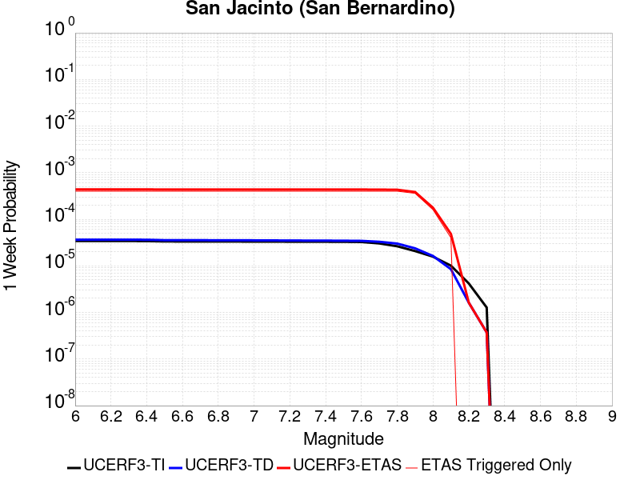 |  | 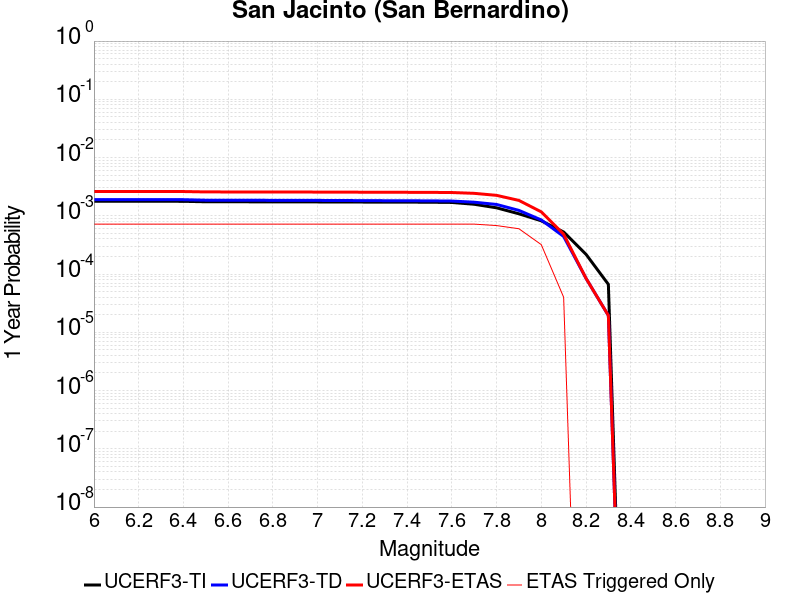 |

| Magnitude | 1 wk TI Prob | 1 wk TD Prob | 1 wk ETAS Prob | 1 wk ETAS/TD Gain | 1 wk ETAS Triggered Only | 1 mo TI Prob | 1 mo TD Prob | 1 mo ETAS Prob | 1 mo ETAS/TD Gain | 1 mo ETAS Triggered Only | 1 yr TI Prob | 1 yr TD Prob | 1 yr ETAS Prob | 1 yr ETAS/TD Gain | 1 yr ETAS Triggered Only |
|-----|-----|-----|-----|-----|-----|-----|-----|-----|-----|-----|-----|-----|-----|-----|-----|
| 6.0 | 3.409352E-5 | 3.6394562E-5 | 4.3638E-4 | 11.990253 | 4.0E-4 | 1.461069E-4 | 1.5596737E-4 | 6.758863E-4 | 4.3335104 | 5.2E-4 | 0.0017774 | 0.0018972505 | 0.0026158844 | 1.3787766 | 7.2E-4 |
| 6.1 | 3.409352E-5 | 3.6394562E-5 | 4.3638E-4 | 11.990253 | 4.0E-4 | 1.461069E-4 | 1.5596737E-4 | 6.758863E-4 | 4.3335104 | 5.2E-4 | 0.0017774 | 0.0018972505 | 0.0026158844 | 1.3787766 | 7.2E-4 |
| 6.2 | 3.409352E-5 | 3.6394562E-5 | 4.3638E-4 | 11.990253 | 4.0E-4 | 1.461069E-4 | 1.5596737E-4 | 6.758863E-4 | 4.3335104 | 5.2E-4 | 0.0017774 | 0.0018972505 | 0.0026158844 | 1.3787766 | 7.2E-4 |
| 6.3 | 3.409352E-5 | 3.6394562E-5 | 4.3638E-4 | 11.990253 | 4.0E-4 | 1.461069E-4 | 1.5596737E-4 | 6.758863E-4 | 4.3335104 | 5.2E-4 | 0.0017774 | 0.0018972505 | 0.0026158844 | 1.3787766 | 7.2E-4 |
| 6.4 | 3.400795E-5 | 3.6287136E-5 | 4.3627262E-4 | 12.022791 | 4.0E-4 | 1.4574021E-4 | 1.5550703E-4 | 6.7542616E-4 | 4.3433805 | 5.2E-4 | 0.0017729428 | 0.0018916556 | 0.0026102937 | 1.3798989 | 7.2E-4 |
| 6.5 | 3.341482E-5 | 3.5547153E-5 | 4.3553294E-4 | 12.252259 | 4.0E-4 | 1.4319851E-4 | 1.5233604E-4 | 6.722568E-4 | 4.412986 | 5.2E-4 | 0.0017420477 | 0.001853115 | 0.0025717807 | 1.387815 | 7.2E-4 |
| 6.6 | 3.3364955E-5 | 3.5484314E-5 | 4.354701E-4 | 12.272186 | 4.0E-4 | 1.4298483E-4 | 1.5206679E-4 | 6.719877E-4 | 4.41903 | 5.2E-4 | 0.0017394501 | 0.0018498423 | 0.0025685104 | 1.3885024 | 7.2E-4 |
| 6.7 | 3.335922E-5 | 3.547408E-5 | 4.354599E-4 | 12.275438 | 4.0E-4 | 1.4296026E-4 | 1.5202291E-4 | 6.719439E-4 | 4.420017 | 5.2E-4 | 0.0017391514 | 0.0018493092 | 0.0025679776 | 1.3886145 | 7.2E-4 |
| 6.8 | 3.327683E-5 | 3.5368048E-5 | 4.353539E-4 | 12.309243 | 4.0E-4 | 1.4260718E-4 | 1.5156854E-4 | 6.7148975E-4 | 4.4302707 | 5.2E-4 | 0.0017348597 | 0.0018437867 | 0.002562459 | 1.3897808 | 7.2E-4 |
| 6.9 | 3.3235785E-5 | 3.530894E-5 | 4.3529482E-4 | 12.328176 | 4.0E-4 | 1.4243131E-4 | 1.5131527E-4 | 6.712366E-4 | 4.4360137 | 5.2E-4 | 0.0017327217 | 0.0018407081 | 0.0025593827 | 1.3904338 | 7.2E-4 |
| 7.0 | 3.3197095E-5 | 3.52488E-5 | 4.352347E-4 | 12.347505 | 4.0E-4 | 1.422655E-4 | 1.5105754E-4 | 6.70979E-4 | 4.441877 | 5.2E-4 | 0.0017307063 | 0.0018375756 | 0.0025562525 | 1.3911006 | 7.2E-4 |
| 7.1 | 3.3129716E-5 | 3.5128847E-5 | 4.351148E-4 | 12.386253 | 4.0E-4 | 1.4197677E-4 | 1.5054352E-4 | 6.7046523E-4 | 4.4536304 | 5.2E-4 | 0.0017271966 | 0.001831328 | 0.0025500094 | 1.3924373 | 7.2E-4 |
| 7.2 | 3.3034008E-5 | 3.4996167E-5 | 4.3498218E-4 | 12.429422 | 4.0E-4 | 1.4156665E-4 | 1.4997496E-4 | 6.6989695E-4 | 4.4667253 | 5.2E-4 | 0.0017222111 | 0.0018244174 | 0.0025431039 | 1.3939265 | 7.2E-4 |
| 7.3 | 3.2956614E-5 | 3.4863686E-5 | 4.3484973E-4 | 12.4728565 | 4.0E-4 | 1.4123498E-4 | 1.4940725E-4 | 6.6932954E-4 | 4.4799004 | 5.2E-4 | 0.0017181796 | 0.001817517 | 0.0025362084 | 1.3954248 | 7.2E-4 |
| 7.4 | 3.2915937E-5 | 3.4785193E-5 | 4.3477127E-4 | 12.498745 | 4.0E-4 | 1.4106068E-4 | 1.490709E-4 | 6.689934E-4 | 4.4877534 | 5.2E-4 | 0.0017160608 | 0.0018134287 | 0.0025321231 | 1.396318 | 7.2E-4 |
| 7.5 | 3.281791E-5 | 3.4649816E-5 | 4.3463596E-4 | 12.543673 | 4.0E-4 | 1.406406E-4 | 1.4849077E-4 | 6.6841353E-4 | 4.5013814 | 5.2E-4 | 0.0017109542 | 0.0018063774 | 0.0025250767 | 1.3978678 | 7.2E-4 |
| 7.6 | 3.2521442E-5 | 3.4374003E-5 | 4.3436026E-4 | 12.636301 | 4.0E-4 | 1.3937015E-4 | 1.4730885E-4 | 6.6723226E-4 | 4.5294785 | 5.2E-4 | 0.0016955109 | 0.0017920113 | 0.002510721 | 1.4010632 | 7.2E-4 |
| 7.7 | 3.0287873E-5 | 3.2853422E-5 | 4.328403E-4 | 13.174892 | 4.0E-4 | 1.297987E-4 | 1.4079278E-4 | 6.607196E-4 | 4.692851 | 5.2E-4 | 0.0015791537 | 0.0017128056 | 0.0024315724 | 1.4196429 | 7.2E-4 |
| 7.8 | 2.6316151E-5 | 3.0049645E-5 | 4.3003762E-4 | 14.310905 | 4.0E-4 | 1.1277862E-4 | 1.2877784E-4 | 6.0871604E-4 | 4.7268696 | 4.8E-4 | 0.0013722149 | 0.0015667436 | 0.002245678 | 1.4333413 | 6.8E-4 |
| 7.9 | 2.0761147E-5 | 2.3754892E-5 | 3.8374634E-4 | 16.154413 | 3.6E-4 | 8.897331E-5 | 1.0180272E-4 | 5.417579E-4 | 5.3216453 | 4.4E-4 | 0.0010827117 | 0.0012387441 | 0.001838001 | 1.4837615 | 6.0E-4 |
| 8.0 | 1.5738568E-5 | 1.6286816E-5 | 1.7628421E-4 | 10.823736 | 1.6E-4 | 6.744926E-5 | 6.979878E-5 | 2.6978482E-4 | 3.8651795 | 2.0E-4 | 8.2088535E-4 | 8.494695E-4 | 0.0011691977 | 1.3763857 | 3.2E-4 |
| 8.1 | 1.0105832E-5 | 8.478705E-6 | 4.8478367E-5 | 5.7176614 | 4.0E-5 | 4.3309992E-5 | 3.6336805E-5 | 7.633535E-5 | 2.1007721 | 4.0E-5 | 5.2717153E-4 | 4.4231134E-4 | 4.8229363E-4 | 1.090394 | 4.0E-5 |
| 8.2 | 4.189207E-6 | 1.6207553E-6 | 1.6207553E-6 | 1.0 | 0.0 | 1.7953622E-5 | 6.9460752E-6 | 6.9460752E-6 | 1.0 | 0.0 | 2.1856341E-4 | 8.456522E-5 | 8.456522E-5 | 1.0 | 0.0 |
| 8.3 | 1.2758221E-6 | 3.728509E-7 | 3.728509E-7 | 1.0 | 0.0 | 5.4677976E-6 | 1.5979316E-6 | 1.5979316E-6 | 1.0 | 0.0 | 6.65684E-5 | 1.9454648E-5 | 1.9454648E-5 | 1.0 | 0.0 |

## Imperial
*[(top)](#table-of-contents)*

| 1 Week | 1 Month | 1 Year |
|-----|-----|-----|
| 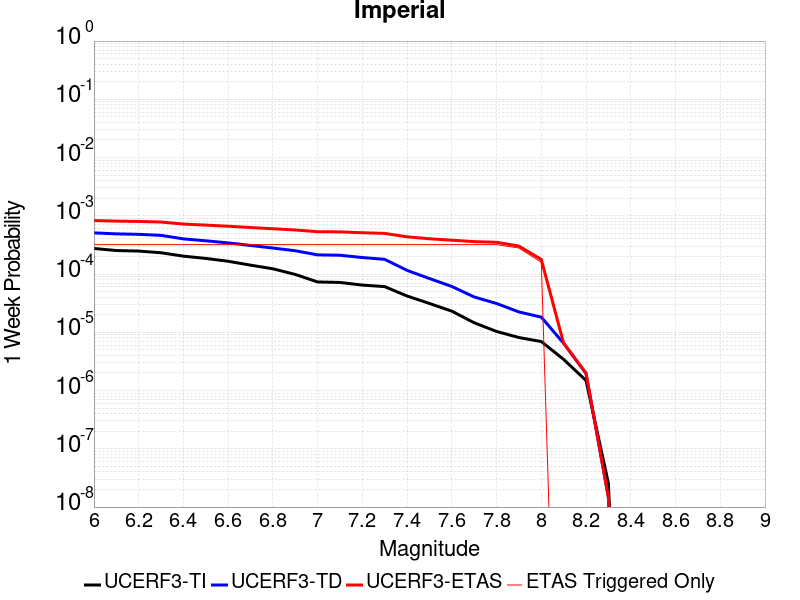 | 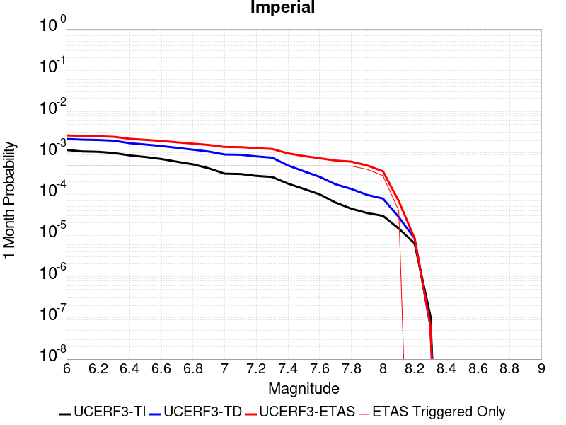 | 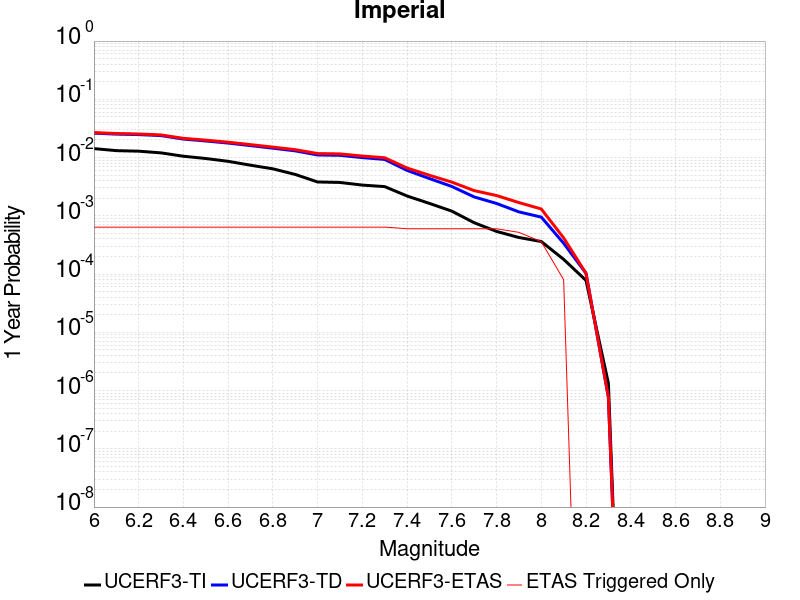 |

| Magnitude | 1 wk TI Prob | 1 wk TD Prob | 1 wk ETAS Prob | 1 wk ETAS/TD Gain | 1 wk ETAS Triggered Only | 1 mo TI Prob | 1 mo TD Prob | 1 mo ETAS Prob | 1 mo ETAS/TD Gain | 1 mo ETAS Triggered Only | 1 yr TI Prob | 1 yr TD Prob | 1 yr ETAS Prob | 1 yr ETAS/TD Gain | 1 yr ETAS Triggered Only |
|-----|-----|-----|-----|-----|-----|-----|-----|-----|-----|-----|-----|-----|-----|-----|-----|
| 6.0 | 2.7496446E-4 | 5.092747E-4 | 8.291117E-4 | 1.6280246 | 3.2E-4 | 0.0011778869 | 0.0021808199 | 0.0026597732 | 1.2196207 | 4.8E-4 | 0.0142467655 | 0.026244733 | 0.026867935 | 1.0237459 | 6.4E-4 |
| 6.1 | 2.5356023E-4 | 4.8989133E-4 | 8.0973457E-4 | 1.652886 | 3.2E-4 | 0.001086234 | 0.0020978837 | 0.0025768767 | 1.228322 | 4.8E-4 | 0.013144928 | 0.025256295 | 0.02588013 | 1.0247002 | 6.4E-4 |
| 6.2 | 2.4820742E-4 | 4.807923E-4 | 8.0063846E-4 | 1.665248 | 3.2E-4 | 0.0010633124 | 0.0020589496 | 0.0025379614 | 1.2326486 | 4.8E-4 | 0.01286919 | 0.024793668 | 0.0254178 | 1.0251731 | 6.4E-4 |
| 6.3 | 2.3205351E-4 | 4.618754E-4 | 7.817276E-4 | 1.6925075 | 3.2E-4 | 9.94136E-4 | 0.0019780016 | 0.002457052 | 1.2421892 | 4.8E-4 | 0.012036599 | 0.023824649 | 0.0244494 | 1.026223 | 6.4E-4 |
| 6.4 | 2.0304754E-4 | 4.0161575E-4 | 7.214872E-4 | 1.7964615 | 3.2E-4 | 8.6991355E-4 | 0.0017200898 | 0.0021992642 | 1.2785752 | 4.8E-4 | 0.010539869 | 0.020755747 | 0.021382462 | 1.0301949 | 6.4E-4 |
| 6.5 | 1.854992E-4 | 3.7255368E-4 | 6.9243443E-4 | 1.8586166 | 3.2E-4 | 7.9475436E-4 | 0.0015956942 | 0.0020749283 | 1.3003296 | 4.8E-4 | 0.009633281 | 0.019265464 | 0.019893134 | 1.03258 | 6.4E-4 |
| 6.6 | 1.6586106E-4 | 3.4277118E-4 | 6.626615E-4 | 1.9332474 | 3.2E-4 | 7.106394E-4 | 0.0014682026 | 0.0019474978 | 1.3264503 | 4.8E-4 | 0.008617763 | 0.017735237 | 0.018363887 | 1.0354464 | 6.4E-4 |
| 6.7 | 1.4224656E-4 | 3.0978522E-4 | 6.296861E-4 | 2.0326538 | 3.2E-4 | 6.094856E-4 | 0.0013269838 | 0.0018063468 | 1.3612425 | 4.8E-4 | 0.0073952693 | 0.01604038 | 0.016670113 | 1.0392593 | 6.4E-4 |
| 6.8 | 1.2317259E-4 | 2.7964902E-4 | 5.995595E-4 | 2.1439714 | 3.2E-4 | 5.2777573E-4 | 0.0011979516 | 0.0016773766 | 1.400204 | 4.8E-4 | 0.0064067547 | 0.014488932 | 0.015119659 | 1.0435317 | 6.4E-4 |
| 6.9 | 9.859898E-5 | 2.5139938E-4 | 5.7131896E-4 | 2.272555 | 3.2E-4 | 4.2249862E-4 | 0.0010769854 | 0.0015564684 | 1.4452085 | 4.8E-4 | 0.0051317946 | 0.013034438 | 0.013666095 | 1.0484607 | 6.4E-4 |
| 7.0 | 7.3191884E-5 | 2.1355721E-4 | 5.3348887E-4 | 2.4981074 | 3.2E-4 | 3.136418E-4 | 9.149274E-4 | 0.0013944883 | 1.5241518 | 4.8E-4 | 0.003811904 | 0.0110830385 | 0.011715946 | 1.0571059 | 6.4E-4 |
| 7.1 | 7.1760296E-5 | 2.1055574E-4 | 5.304884E-4 | 2.5194676 | 3.2E-4 | 3.0750787E-4 | 9.020729E-4 | 0.0013816399 | 1.5316278 | 4.8E-4 | 0.003737482 | 0.010928115 | 0.011561121 | 1.0579245 | 6.4E-4 |
| 7.2 | 6.46614E-5 | 1.922011E-4 | 5.121396E-4 | 2.6646028 | 3.2E-4 | 2.7709085E-4 | 8.2346203E-4 | 0.0013030667 | 1.5824249 | 4.8E-4 | 0.0033683628 | 0.00998019 | 0.010613803 | 1.063487 | 6.4E-4 |
| 7.3 | 6.088115E-5 | 1.7887545E-4 | 4.988182E-4 | 2.7886343 | 3.2E-4 | 2.6089314E-4 | 7.663867E-4 | 0.0012460188 | 1.6258357 | 4.8E-4 | 0.0031717476 | 0.009291418 | 0.009925472 | 1.0682408 | 6.4E-4 |
| 7.4 | 4.199346E-5 | 1.1570693E-4 | 4.356699E-4 | 3.7652879 | 3.2E-4 | 1.7995955E-4 | 4.957935E-4 | 9.755555E-4 | 1.9676651 | 4.8E-4 | 0.0021888057 | 0.006019749 | 0.0066161375 | 1.099072 | 6.0E-4 |
| 7.5 | 3.130448E-5 | 8.383019E-5 | 4.0380337E-4 | 4.8169203 | 3.2E-4 | 1.3415517E-4 | 3.592231E-4 | 8.390507E-4 | 2.335737 | 4.8E-4 | 0.0016321153 | 0.004364831 | 0.0049622124 | 1.1368624 | 6.0E-4 |
| 7.6 | 2.3074248E-5 | 6.126616E-5 | 3.8124656E-4 | 6.2227917 | 3.2E-4 | 9.888588E-5 | 2.6254298E-4 | 7.4241695E-4 | 2.8277922 | 4.8E-4 | 0.0012032706 | 0.003191799 | 0.0037898838 | 1.1873817 | 6.0E-4 |
| 7.7 | 1.45864815E-5 | 4.047476E-5 | 3.604618E-4 | 8.905842 | 3.2E-4 | 6.2511994E-5 | 1.7345174E-4 | 6.533685E-4 | 3.7668602 | 4.8E-4 | 7.608177E-4 | 0.0021097353 | 0.0027084693 | 1.2837958 | 6.0E-4 |
| 7.8 | 1.0352979E-5 | 3.1258456E-5 | 3.5124845E-4 | 11.236911 | 3.2E-4 | 4.4369157E-5 | 1.3395795E-4 | 6.138936E-4 | 4.582734 | 4.8E-4 | 5.400606E-4 | 0.0016297202 | 0.0022287425 | 1.3675613 | 6.0E-4 |
| 7.9 | 8.137906E-6 | 2.238844E-5 | 3.0238216E-4 | 13.506174 | 2.8E-4 | 3.4876273E-5 | 9.594693E-5 | 4.9590855E-4 | 5.168571 | 4.0E-4 | 4.2453592E-4 | 0.0011675289 | 0.0016869218 | 1.4448651 | 5.2E-4 |
| 8.0 | 6.93792E-6 | 1.821489E-5 | 1.7821198E-4 | 9.783862 | 1.6E-4 | 2.9733603E-5 | 7.806149E-5 | 3.5803963E-4 | 4.586636 | 2.8E-4 | 3.6194647E-4 | 9.49985E-4 | 0.001309643 | 1.3785933 | 3.6E-4 |
| 8.1 | 3.4286315E-6 | 6.476726E-6 | 6.476726E-6 | 1.0 | 0.0 | 1.4694053E-5 | 2.7757102E-5 | 6.7755995E-5 | 2.4410326 | 4.0E-5 | 1.7888541E-4 | 3.3789044E-4 | 4.178634E-4 | 1.2366831 | 8.0E-5 |
| 8.2 | 1.4906886E-6 | 1.9734612E-6 | 1.9734612E-6 | 1.0 | 0.0 | 6.3886496E-6 | 8.457663E-6 | 8.457663E-6 | 1.0 | 0.0 | 7.7779034E-5 | 1.0296722E-4 | 1.0296722E-4 | 1.0 | 0.0 |
| 8.3 | 2.5758007E-8 | 1.4872131E-8 | 1.4872131E-8 | 1.0 | 0.0 | 1.10391454E-7 | 6.37377E-8 | 6.37377E-8 | 1.0 | 0.0 | 1.3440151E-6 | 7.760065E-7 | 7.760065E-7 | 1.0 | 0.0 |

## Owl Lake
*[(top)](#table-of-contents)*

| 1 Week | 1 Month | 1 Year |
|-----|-----|-----|
| 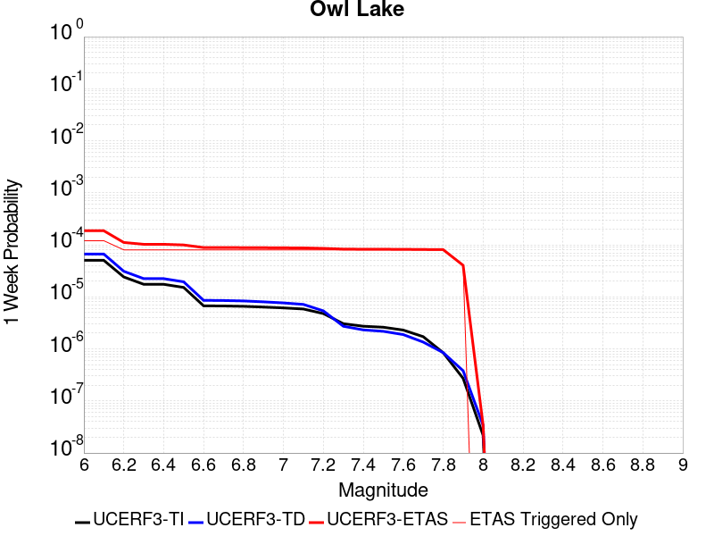 | 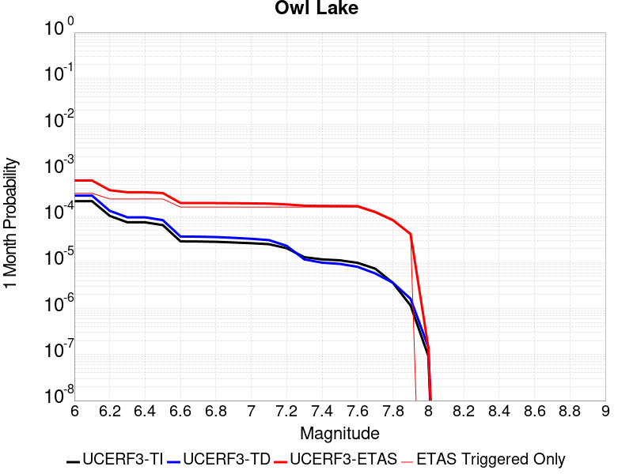 | 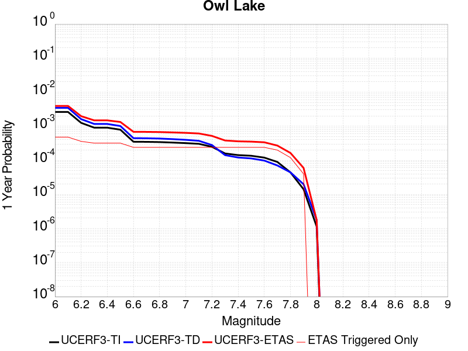 |

| Magnitude | 1 wk TI Prob | 1 wk TD Prob | 1 wk ETAS Prob | 1 wk ETAS/TD Gain | 1 wk ETAS Triggered Only | 1 mo TI Prob | 1 mo TD Prob | 1 mo ETAS Prob | 1 mo ETAS/TD Gain | 1 mo ETAS Triggered Only | 1 yr TI Prob | 1 yr TD Prob | 1 yr ETAS Prob | 1 yr ETAS/TD Gain | 1 yr ETAS Triggered Only |
|-----|-----|-----|-----|-----|-----|-----|-----|-----|-----|-----|-----|-----|-----|-----|-----|
| 6.0 | 5.0320643E-5 | 6.64403E-5 | 1.8643233E-4 | 2.8060129 | 1.2E-4 | 2.1564208E-4 | 2.847135E-4 | 6.0462236E-4 | 2.123617 | 3.2E-4 | 0.0026222812 | 0.0034617756 | 0.003940114 | 1.1381772 | 4.8E-4 |
| 6.1 | 5.0320643E-5 | 6.64403E-5 | 1.8643233E-4 | 2.8060129 | 1.2E-4 | 2.1564208E-4 | 2.847135E-4 | 6.0462236E-4 | 2.123617 | 3.2E-4 | 0.0026222812 | 0.0034617756 | 0.003940114 | 1.1381772 | 4.8E-4 |
| 6.2 | 2.4125871E-5 | 3.1022744E-5 | 1.11020265E-4 | 3.5786731 | 8.0E-5 | 1.0339249E-4 | 1.3294873E-4 | 3.7291684E-4 | 2.8049672 | 2.4E-4 | 0.0012580766 | 0.0016176249 | 0.0019770425 | 1.2221885 | 3.6E-4 |
| 6.3 | 1.7433485E-5 | 2.238944E-5 | 1.0238765E-4 | 4.573033 | 8.0E-5 | 7.471279E-5 | 9.595211E-5 | 3.3592907E-4 | 3.5010078 | 2.4E-4 | 9.0924866E-4 | 0.0011677343 | 0.0014873606 | 1.2737149 | 3.2E-4 |
| 6.4 | 1.7433485E-5 | 2.238944E-5 | 1.0238765E-4 | 4.573033 | 8.0E-5 | 7.471279E-5 | 9.595211E-5 | 3.3592907E-4 | 3.5010078 | 2.4E-4 | 9.0924866E-4 | 0.0011677343 | 0.0014873606 | 1.2737149 | 3.2E-4 |
| 6.5 | 1.5182742E-5 | 1.946037E-5 | 9.945881E-5 | 5.1108384 | 8.0E-5 | 6.506727E-5 | 8.339978E-5 | 3.2337976E-4 | 3.8774655 | 2.4E-4 | 7.919061E-4 | 0.0010150598 | 0.001334735 | 1.3149323 | 3.2E-4 |
| 6.6 | 6.7271576E-6 | 8.568449E-6 | 8.8567765E-5 | 10.336499 | 8.0E-5 | 2.8830356E-5 | 3.6721438E-5 | 1.9671555E-4 | 5.356968 | 1.6E-4 | 3.5095305E-4 | 4.4699747E-4 | 6.8689015E-4 | 1.5366758 | 2.4E-4 |
| 6.7 | 6.682835E-6 | 8.500858E-6 | 8.850018E-5 | 10.410735 | 8.0E-5 | 2.8640408E-5 | 3.643177E-5 | 1.9642594E-4 | 5.391611 | 1.6E-4 | 3.4864116E-4 | 4.434722E-4 | 6.833658E-4 | 1.5409439 | 2.4E-4 |
| 6.8 | 6.5774975E-6 | 8.347227E-6 | 8.834656E-5 | 10.583941 | 8.0E-5 | 2.8188972E-5 | 3.577337E-5 | 1.9576764E-4 | 5.4724407 | 1.6E-4 | 3.4314668E-4 | 4.354594E-4 | 6.753549E-4 | 1.5509021 | 2.4E-4 |
| 6.9 | 6.363419E-6 | 8.02014E-6 | 8.80195E-5 | 10.974809 | 8.0E-5 | 2.727151E-5 | 3.4371606E-5 | 1.943661E-4 | 5.654845 | 1.6E-4 | 3.3198006E-4 | 4.1839955E-4 | 6.5829913E-4 | 1.5733744 | 2.4E-4 |
| 7.0 | 6.1342453E-6 | 7.652003E-6 | 8.765139E-5 | 11.4546995 | 8.0E-5 | 2.6289357E-5 | 3.2793916E-5 | 1.9278866E-4 | 5.8787937 | 1.6E-4 | 3.2002592E-4 | 3.991983E-4 | 6.391025E-4 | 1.6009649 | 2.4E-4 |
| 7.1 | 5.842926E-6 | 7.1620548E-6 | 8.716148E-5 | 12.169899 | 8.0E-5 | 2.504087E-5 | 3.069419E-5 | 1.9068927E-4 | 6.212553 | 1.6E-4 | 3.0482994E-4 | 3.7364312E-4 | 6.1355345E-4 | 1.6420841 | 2.4E-4 |
| 7.2 | 4.77173E-6 | 5.376442E-6 | 8.5376014E-5 | 15.879649 | 8.0E-5 | 2.045011E-5 | 2.3041714E-5 | 1.8303802E-4 | 7.943768 | 1.6E-4 | 2.4895166E-4 | 2.805008E-4 | 5.204335E-4 | 1.8553725 | 2.4E-4 |
| 7.3 | 3.0494948E-6 | 2.7237572E-6 | 8.272354E-5 | 30.371115 | 8.0E-5 | 1.3069198E-5 | 1.16731935E-5 | 1.7167133E-4 | 14.706457 | 1.6E-4 | 1.5910587E-4 | 1.4211203E-4 | 3.820779E-4 | 2.6885686 | 2.4E-4 |
| 7.4 | 2.7263884E-6 | 2.317959E-6 | 8.2317776E-5 | 35.513042 | 8.0E-5 | 1.1684469E-5 | 9.934072E-6 | 1.6993248E-4 | 17.106024 | 1.6E-4 | 1.4224913E-4 | 1.2094073E-4 | 3.609117E-4 | 2.984203 | 2.4E-4 |
| 7.5 | 2.6090431E-6 | 2.1776593E-6 | 8.217749E-5 | 37.73661 | 8.0E-5 | 1.1181565E-5 | 9.3327935E-6 | 1.693313E-4 | 18.143688 | 1.6E-4 | 1.3612706E-4 | 1.1362093E-4 | 3.5359367E-4 | 3.112047 | 2.4E-4 |
| 7.6 | 2.3008756E-6 | 1.8842499E-6 | 8.18841E-5 | 43.457134 | 8.0E-5 | 9.860858E-6 | 8.075332E-6 | 1.6807404E-4 | 20.813267 | 1.6E-4 | 1.20049335E-4 | 9.831281E-5 | 3.3828922E-4 | 3.4409475 | 2.4E-4 |
| 7.7 | 1.7184348E-6 | 1.3525299E-6 | 8.1352424E-5 | 60.148335 | 8.0E-5 | 7.3646997E-6 | 5.796544E-6 | 1.2579585E-4 | 21.70187 | 1.2E-4 | 8.966153E-5 | 7.0570684E-5 | 2.7055657E-4 | 3.8338382 | 2.0E-4 |
| 7.8 | 8.4612907E-7 | 8.4826485E-7 | 8.08482E-5 | 95.31009 | 8.0E-5 | 3.6262625E-6 | 3.6354159E-6 | 8.3635125E-5 | 23.005655 | 8.0E-5 | 4.4148852E-5 | 4.4260312E-5 | 1.64255E-4 | 3.7111127 | 1.2E-4 |
| 7.9 | 2.716738E-7 | 3.8033835E-7 | 4.0380324E-5 | 106.16947 | 4.0E-5 | 1.1643157E-6 | 1.6300206E-6 | 4.1629955E-5 | 25.539528 | 4.0E-5 | 1.4175452E-5 | 1.984533E-5 | 5.9844537E-5 | 3.0155475 | 4.0E-5 |
| 8.0 | 2.1995428E-8 | 3.4170547E-8 | 3.4170547E-8 | 1.0 | 0.0 | 9.426611E-8 | 1.464452E-7 | 1.464452E-7 | 1.0 | 0.0 | 1.1476893E-6 | 1.7829695E-6 | 1.7829695E-6 | 1.0 | 0.0 |

## San Jacinto (Stepovers Combined)
*[(top)](#table-of-contents)*

| 1 Week | 1 Month | 1 Year |
|-----|-----|-----|
| 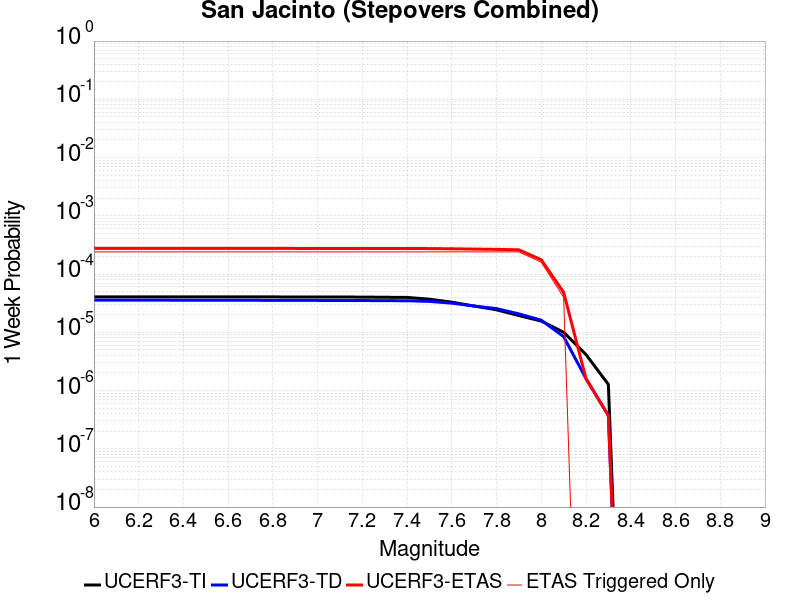 | 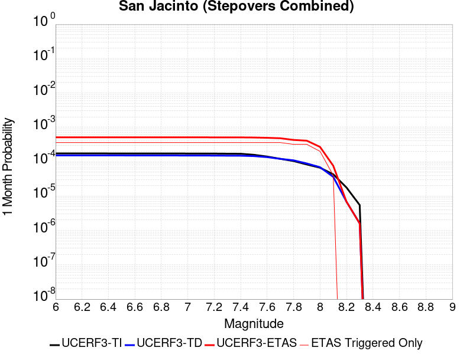 | 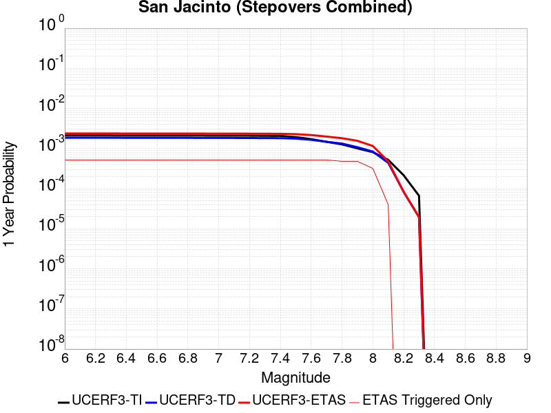 |

| Magnitude | 1 wk TI Prob | 1 wk TD Prob | 1 wk ETAS Prob | 1 wk ETAS/TD Gain | 1 wk ETAS Triggered Only | 1 mo TI Prob | 1 mo TD Prob | 1 mo ETAS Prob | 1 mo ETAS/TD Gain | 1 mo ETAS Triggered Only | 1 yr TI Prob | 1 yr TD Prob | 1 yr ETAS Prob | 1 yr ETAS/TD Gain | 1 yr ETAS Triggered Only |
|-----|-----|-----|-----|-----|-----|-----|-----|-----|-----|-----|-----|-----|-----|-----|-----|
| 6.0 | 4.0667746E-5 | 3.5654804E-5 | 2.7564625E-4 | 7.7309704 | 2.4E-4 | 1.742787E-4 | 1.5279738E-4 | 5.127424E-4 | 3.3557014 | 3.6E-4 | 0.0021197782 | 0.001858722 | 0.0023777555 | 1.2792422 | 5.2E-4 |
| 6.1 | 4.0667746E-5 | 3.5654804E-5 | 2.7564625E-4 | 7.7309704 | 2.4E-4 | 1.742787E-4 | 1.5279738E-4 | 5.127424E-4 | 3.3557014 | 3.6E-4 | 0.0021197782 | 0.001858722 | 0.0023777555 | 1.2792422 | 5.2E-4 |
| 6.2 | 4.0667746E-5 | 3.5654804E-5 | 2.7564625E-4 | 7.7309704 | 2.4E-4 | 1.742787E-4 | 1.5279738E-4 | 5.127424E-4 | 3.3557014 | 3.6E-4 | 0.0021197782 | 0.001858722 | 0.0023777555 | 1.2792422 | 5.2E-4 |
| 6.3 | 4.0667746E-5 | 3.5654804E-5 | 2.7564625E-4 | 7.7309704 | 2.4E-4 | 1.742787E-4 | 1.5279738E-4 | 5.127424E-4 | 3.3557014 | 3.6E-4 | 0.0021197782 | 0.001858722 | 0.0023777555 | 1.2792422 | 5.2E-4 |
| 6.4 | 4.0577226E-5 | 3.552656E-5 | 2.7551802E-4 | 7.7552695 | 2.4E-4 | 1.738908E-4 | 1.522478E-4 | 5.12193E-4 | 3.364206 | 3.6E-4 | 0.0021150648 | 0.0018520436 | 0.0023710805 | 1.2802509 | 5.2E-4 |
| 6.5 | 4.0577226E-5 | 3.552656E-5 | 2.7551802E-4 | 7.7552695 | 2.4E-4 | 1.738908E-4 | 1.522478E-4 | 5.12193E-4 | 3.364206 | 3.6E-4 | 0.0021150648 | 0.0018520436 | 0.0023710805 | 1.2802509 | 5.2E-4 |
| 6.6 | 4.053861E-5 | 3.5471832E-5 | 2.7546333E-4 | 7.765692 | 2.4E-4 | 1.7372532E-4 | 1.520133E-4 | 5.1195855E-4 | 3.3678539 | 3.6E-4 | 0.0021130538 | 0.0018491937 | 0.002368232 | 1.2806836 | 5.2E-4 |
| 6.7 | 4.0516545E-5 | 3.5440866E-5 | 2.7543237E-4 | 7.7716036 | 2.4E-4 | 1.7363077E-4 | 1.5188061E-4 | 5.118259E-4 | 3.3699229 | 3.6E-4 | 0.002111905 | 0.0018475811 | 0.0023666203 | 1.2809291 | 5.2E-4 |
| 6.8 | 4.049434E-5 | 3.5412282E-5 | 2.7540379E-4 | 7.77707 | 2.4E-4 | 1.7353562E-4 | 1.5175811E-4 | 5.117035E-4 | 3.3718362 | 3.6E-4 | 0.0021107488 | 0.0018460923 | 0.0023651323 | 1.2811561 | 5.2E-4 |
| 6.9 | 4.046386E-5 | 3.5374713E-5 | 2.753662E-4 | 7.7842674 | 2.4E-4 | 1.73405E-4 | 1.5159712E-4 | 5.1154254E-4 | 3.3743553 | 3.6E-4 | 0.0021091616 | 0.0018441357 | 0.0023631768 | 1.2814549 | 5.2E-4 |
| 7.0 | 4.036382E-5 | 3.5254863E-5 | 2.752464E-4 | 7.8073316 | 2.4E-4 | 1.7297632E-4 | 1.5108353E-4 | 5.1102915E-4 | 3.3824277 | 3.6E-4 | 0.0021039525 | 0.0018378934 | 0.0023569376 | 1.2824126 | 5.2E-4 |
| 7.1 | 4.0343282E-5 | 3.523326E-5 | 2.752248E-4 | 7.8115053 | 2.4E-4 | 1.7288832E-4 | 1.5099096E-4 | 5.109366E-4 | 3.3838885 | 3.6E-4 | 0.002102883 | 0.0018367684 | 0.0023558133 | 1.282586 | 5.2E-4 |
| 7.2 | 4.0257353E-5 | 3.5137495E-5 | 2.7512907E-4 | 7.830071 | 2.4E-4 | 1.725201E-4 | 1.5058058E-4 | 5.1052636E-4 | 3.3903866 | 3.6E-4 | 0.0020984085 | 0.0018317803 | 0.0023508277 | 1.2833568 | 5.2E-4 |
| 7.3 | 3.9940667E-5 | 3.4963145E-5 | 2.7495474E-4 | 7.8641315 | 2.4E-4 | 1.7116306E-4 | 1.4983346E-4 | 5.097795E-4 | 3.4023077 | 3.6E-4 | 0.0020819185 | 0.0018226993 | 0.0023417515 | 1.2847712 | 5.2E-4 |
| 7.4 | 3.9721202E-5 | 3.4847715E-5 | 2.7483935E-4 | 7.8868685 | 2.4E-4 | 1.7022261E-4 | 1.4933883E-4 | 5.092851E-4 | 3.4102657 | 3.6E-4 | 0.0020704903 | 0.0018166872 | 0.0023357426 | 1.2857153 | 5.2E-4 |
| 7.5 | 3.7036873E-5 | 3.3907352E-5 | 2.738992E-4 | 8.077871 | 2.4E-4 | 1.5871979E-4 | 1.4530914E-4 | 5.052568E-4 | 3.4771166 | 3.6E-4 | 0.0019307006 | 0.0017677062 | 0.0022867871 | 1.2936466 | 5.2E-4 |
| 7.6 | 3.2940967E-5 | 3.1670912E-5 | 2.716633E-4 | 8.577691 | 2.4E-4 | 1.4116794E-4 | 1.3572544E-4 | 4.956766E-4 | 3.6520538 | 3.6E-4 | 0.0017173645 | 0.0016512069 | 0.0021703483 | 1.3144011 | 5.2E-4 |
| 7.7 | 2.8236149E-5 | 2.8227036E-5 | 2.6822026E-4 | 9.502247 | 2.4E-4 | 1.2100645E-4 | 1.2096741E-4 | 4.8092386E-4 | 3.9756482 | 3.6E-4 | 0.0014722579 | 0.0014717843 | 0.001991019 | 1.3527926 | 5.2E-4 |
| 7.8 | 2.4329287E-5 | 2.5537129E-5 | 2.65531E-4 | 10.3978405 | 2.4E-4 | 1.042642E-4 | 1.09440254E-4 | 4.2940522E-4 | 3.9236498 | 3.2E-4 | 0.0012686774 | 0.0013316215 | 0.0018109824 | 1.3599827 | 4.8E-4 |
| 7.9 | 1.9370926E-5 | 2.071883E-5 | 2.6071386E-4 | 12.583426 | 2.4E-4 | 8.301561E-5 | 8.879197E-5 | 4.0876356E-4 | 4.6036096 | 3.2E-4 | 0.0010102465 | 0.0010805068 | 0.0015599881 | 1.443756 | 4.8E-4 |
| 8.0 | 1.5583017E-5 | 1.6136504E-5 | 1.7613392E-4 | 10.915246 | 1.6E-4 | 6.6782646E-5 | 6.915462E-5 | 2.691408E-4 | 3.89187 | 2.0E-4 | 8.127754E-4 | 8.4163295E-4 | 0.0011613637 | 1.3798933 | 3.2E-4 |
| 8.1 | 1.0024873E-5 | 8.439436E-6 | 4.84391E-5 | 5.739613 | 4.0E-5 | 4.2963035E-5 | 3.6168516E-5 | 7.616707E-5 | 2.1058943 | 4.0E-5 | 5.229494E-4 | 4.4026322E-4 | 4.802456E-4 | 1.0908147 | 4.0E-5 |
| 8.2 | 4.142796E-6 | 1.6027543E-6 | 1.6027543E-6 | 1.0 | 0.0 | 1.775472E-5 | 6.8689287E-6 | 6.8689287E-6 | 1.0 | 0.0 | 2.1614227E-4 | 8.362603E-5 | 8.362603E-5 | 1.0 | 0.0 |
| 8.3 | 1.2750878E-6 | 3.725573E-7 | 3.725573E-7 | 1.0 | 0.0 | 5.4646503E-6 | 1.5966733E-6 | 1.5966733E-6 | 1.0 | 0.0 | 6.653009E-5 | 1.9439329E-5 | 1.9439329E-5 | 1.0 | 0.0 |

## San Jacinto (San Jacinto Valley) rev
*[(top)](#table-of-contents)*

| 1 Week | 1 Month | 1 Year |
|-----|-----|-----|
| 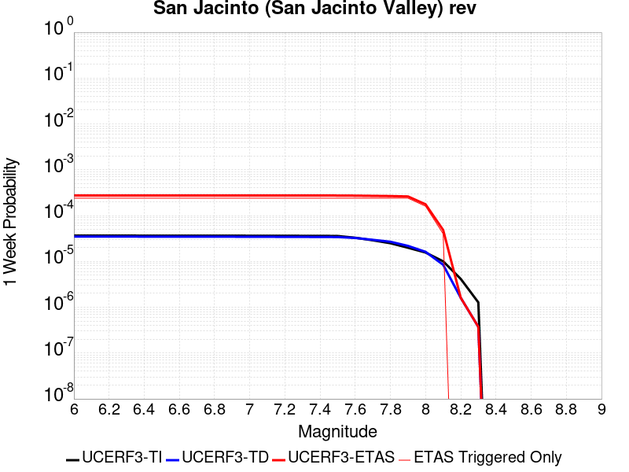 | 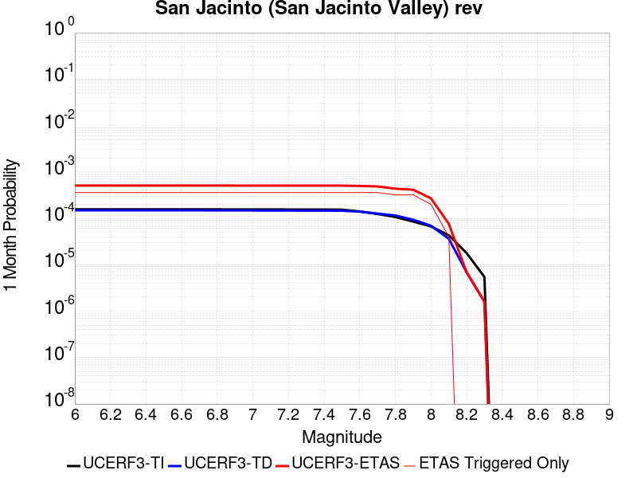 | 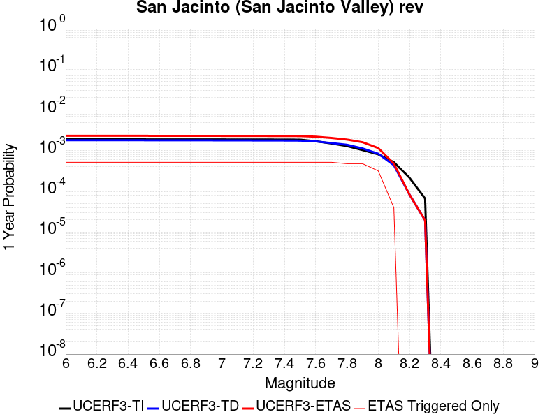 |

| Magnitude | 1 wk TI Prob | 1 wk TD Prob | 1 wk ETAS Prob | 1 wk ETAS/TD Gain | 1 wk ETAS Triggered Only | 1 mo TI Prob | 1 mo TD Prob | 1 mo ETAS Prob | 1 mo ETAS/TD Gain | 1 mo ETAS Triggered Only | 1 yr TI Prob | 1 yr TD Prob | 1 yr ETAS Prob | 1 yr ETAS/TD Gain | 1 yr ETAS Triggered Only |
|-----|-----|-----|-----|-----|-----|-----|-----|-----|-----|-----|-----|-----|-----|-----|-----|
| 6.0 | 3.652694E-5 | 3.4785007E-5 | 2.7477666E-4 | 7.8992844 | 2.4E-4 | 1.5653463E-4 | 1.4907008E-4 | 5.0901645E-4 | 3.4146113 | 3.6E-4 | 0.0019041431 | 0.0018134193 | 0.0023324762 | 1.2862312 | 5.2E-4 |
| 6.1 | 3.652694E-5 | 3.4785007E-5 | 2.7477666E-4 | 7.8992844 | 2.4E-4 | 1.5653463E-4 | 1.4907008E-4 | 5.0901645E-4 | 3.4146113 | 3.6E-4 | 0.0019041431 | 0.0018134193 | 0.0023324762 | 1.2862312 | 5.2E-4 |
| 6.2 | 3.652694E-5 | 3.4785007E-5 | 2.7477666E-4 | 7.8992844 | 2.4E-4 | 1.5653463E-4 | 1.4907008E-4 | 5.0901645E-4 | 3.4146113 | 3.6E-4 | 0.0019041431 | 0.0018134193 | 0.0023324762 | 1.2862312 | 5.2E-4 |
| 6.3 | 3.652694E-5 | 3.4785007E-5 | 2.7477666E-4 | 7.8992844 | 2.4E-4 | 1.5653463E-4 | 1.4907008E-4 | 5.0901645E-4 | 3.4146113 | 3.6E-4 | 0.0019041431 | 0.0018134193 | 0.0023324762 | 1.2862312 | 5.2E-4 |
| 6.4 | 3.646941E-5 | 3.470649E-5 | 2.7469816E-4 | 7.914893 | 2.4E-4 | 1.5628811E-4 | 1.4873363E-4 | 5.0868007E-4 | 3.4200745 | 3.6E-4 | 0.0019011468 | 0.0018093301 | 0.0023283893 | 1.2868792 | 5.2E-4 |
| 6.5 | 3.646941E-5 | 3.470649E-5 | 2.7469816E-4 | 7.914893 | 2.4E-4 | 1.5628811E-4 | 1.4873363E-4 | 5.0868007E-4 | 3.4200745 | 3.6E-4 | 0.0019011468 | 0.0018093301 | 0.0023283893 | 1.2868792 | 5.2E-4 |
| 6.6 | 3.6442503E-5 | 3.4669836E-5 | 2.7466152E-4 | 7.9222045 | 2.4E-4 | 1.561728E-4 | 1.4857655E-4 | 5.085231E-4 | 3.4226334 | 3.6E-4 | 0.0018997455 | 0.0018074211 | 0.0023264813 | 1.2871827 | 5.2E-4 |
| 6.7 | 3.6432113E-5 | 3.4655393E-5 | 2.746471E-4 | 7.9250894 | 2.4E-4 | 1.5612828E-4 | 1.4851466E-4 | 5.084612E-4 | 3.4236429 | 3.6E-4 | 0.0018992044 | 0.0018066689 | 0.0023257295 | 1.2873025 | 5.2E-4 |
| 6.8 | 3.6409598E-5 | 3.462441E-5 | 2.746161E-4 | 7.9312863 | 2.4E-4 | 1.560318E-4 | 1.4838189E-4 | 5.083285E-4 | 3.425812 | 3.6E-4 | 0.0018980318 | 0.0018050552 | 0.0023241166 | 1.2875599 | 5.2E-4 |
| 6.9 | 3.638078E-5 | 3.4584784E-5 | 2.7457648E-4 | 7.939228 | 2.4E-4 | 1.5590832E-4 | 1.4821209E-4 | 5.0815876E-4 | 3.4285917 | 3.6E-4 | 0.0018965311 | 0.0018029913 | 0.0023220538 | 1.2878896 | 5.2E-4 |
| 7.0 | 3.6294874E-5 | 3.446665E-5 | 2.7445838E-4 | 7.963012 | 2.4E-4 | 1.5554018E-4 | 1.4770588E-4 | 5.076527E-4 | 3.436916 | 3.6E-4 | 0.0018920569 | 0.0017968385 | 0.002315904 | 1.2888772 | 5.2E-4 |
| 7.1 | 3.6260717E-5 | 3.4422897E-5 | 2.7441463E-4 | 7.9718637 | 2.4E-4 | 1.5539382E-4 | 1.4751837E-4 | 5.074653E-4 | 3.4400141 | 3.6E-4 | 0.001890278 | 0.0017945593 | 0.0023136262 | 1.2892448 | 5.2E-4 |
| 7.2 | 3.6210204E-5 | 3.4356966E-5 | 2.743487E-4 | 7.985243 | 2.4E-4 | 1.5517735E-4 | 1.4723586E-4 | 5.0718285E-4 | 3.4446967 | 3.6E-4 | 0.001887647 | 0.0017911253 | 0.0023101938 | 1.2898003 | 5.2E-4 |
| 7.3 | 3.6119454E-5 | 3.42449E-5 | 2.742367E-4 | 8.008103 | 2.4E-4 | 1.5478847E-4 | 1.4675561E-4 | 5.0670275E-4 | 3.4526978 | 3.6E-4 | 0.0018829206 | 0.001785288 | 0.0023043596 | 1.2907495 | 5.2E-4 |
| 7.4 | 3.607848E-5 | 3.4192242E-5 | 2.7418404E-4 | 8.018896 | 2.4E-4 | 1.5461289E-4 | 1.4652996E-4 | 5.064772E-4 | 3.4564755 | 3.6E-4 | 0.0018807866 | 0.0017825452 | 0.0023016182 | 1.2911977 | 5.2E-4 |
| 7.5 | 3.5856774E-5 | 3.4000583E-5 | 2.7399242E-4 | 8.058462 | 2.4E-4 | 1.5366284E-4 | 1.4570866E-4 | 5.0565624E-4 | 3.4703236 | 3.6E-4 | 0.0018692396 | 0.0017725622 | 0.0022916405 | 1.2928406 | 5.2E-4 |
| 7.6 | 3.286655E-5 | 3.2510947E-5 | 2.7250315E-4 | 8.381888 | 2.4E-4 | 1.4084904E-4 | 1.393252E-4 | 4.9927505E-4 | 3.5835228 | 3.6E-4 | 0.001713488 | 0.0016949666 | 0.0022140853 | 1.3062707 | 5.2E-4 |
| 7.7 | 2.8882527E-5 | 2.9595956E-5 | 2.6958884E-4 | 9.108975 | 2.4E-4 | 1.237764E-4 | 1.2683365E-4 | 4.86788E-4 | 3.8380034 | 3.6E-4 | 0.0015059357 | 0.001543107 | 0.0020623046 | 1.3364625 | 5.2E-4 |
| 7.8 | 2.4950225E-5 | 2.687312E-5 | 2.6686667E-4 | 9.930617 | 2.4E-4 | 1.0692515E-4 | 1.15165436E-4 | 4.3512858E-4 | 3.7782915 | 3.2E-4 | 0.0013010362 | 0.0014012383 | 0.0018805657 | 1.3420742 | 4.8E-4 |
| 7.9 | 1.9881603E-5 | 2.1818549E-5 | 2.6181331E-4 | 11.999575 | 2.4E-4 | 8.520408E-5 | 9.350472E-5 | 4.134748E-4 | 4.421967 | 3.2E-4 | 0.001036866 | 0.0011378262 | 0.0016172801 | 1.4213771 | 4.8E-4 |
| 8.0 | 1.563292E-5 | 1.618842E-5 | 1.7618583E-4 | 10.883449 | 1.6E-4 | 6.6996516E-5 | 6.93771E-5 | 2.6936323E-4 | 3.8825958 | 2.0E-4 | 8.153773E-4 | 8.4433955E-4 | 0.0011640694 | 1.3786745 | 3.2E-4 |
| 8.1 | 1.0045313E-5 | 8.449115E-6 | 4.8448775E-5 | 5.734184 | 4.0E-5 | 4.305063E-5 | 3.6209993E-5 | 7.620854E-5 | 2.1046276 | 4.0E-5 | 5.2401534E-4 | 4.40768E-4 | 4.8075037E-4 | 1.0907106 | 4.0E-5 |
| 8.2 | 4.1554413E-6 | 1.6074547E-6 | 1.6074547E-6 | 1.0 | 0.0 | 1.7808914E-5 | 6.8890736E-6 | 6.8890736E-6 | 1.0 | 0.0 | 2.1680194E-4 | 8.387127E-5 | 8.387127E-5 | 1.0 | 0.0 |
| 8.3 | 1.2758221E-6 | 3.728509E-7 | 3.728509E-7 | 1.0 | 0.0 | 5.4677976E-6 | 1.5979316E-6 | 1.5979316E-6 | 1.0 | 0.0 | 6.65684E-5 | 1.9454648E-5 | 1.9454648E-5 | 1.0 | 0.0 |

## Big Pine (East)
*[(top)](#table-of-contents)*

| 1 Week | 1 Month | 1 Year |
|-----|-----|-----|
| 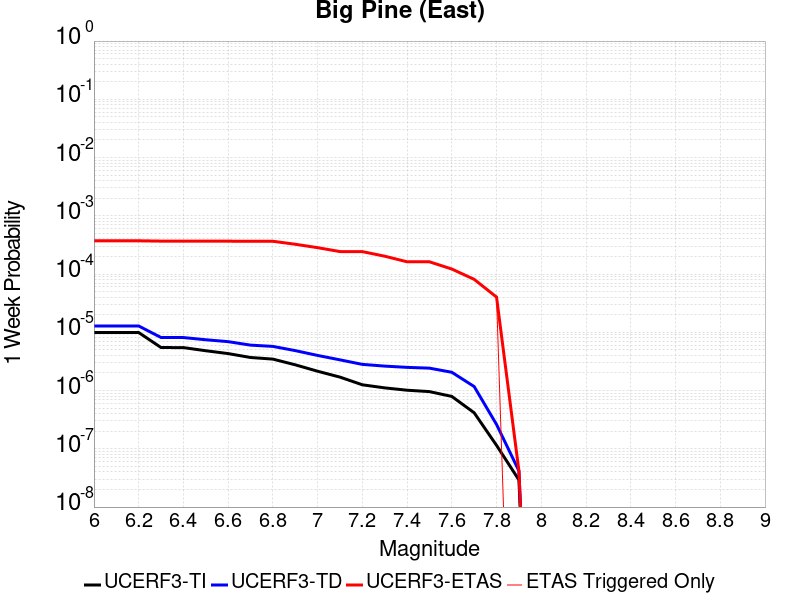 | 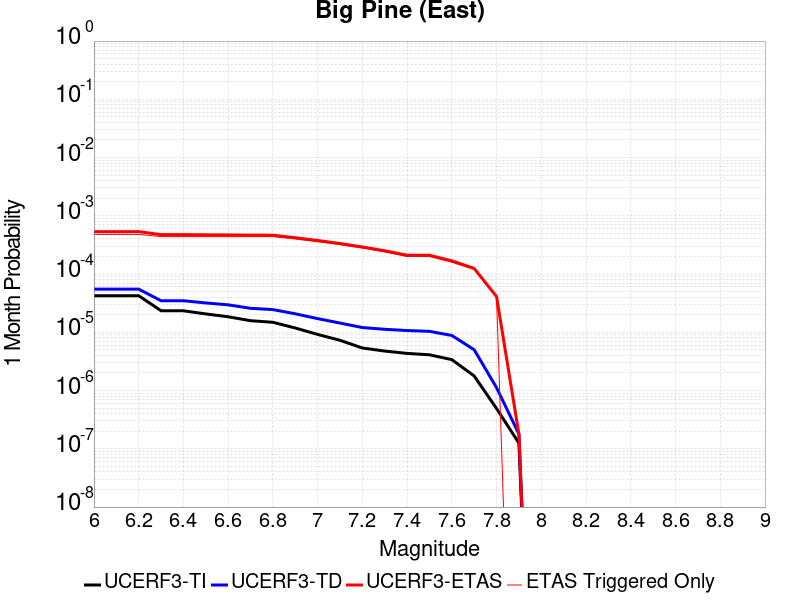 | 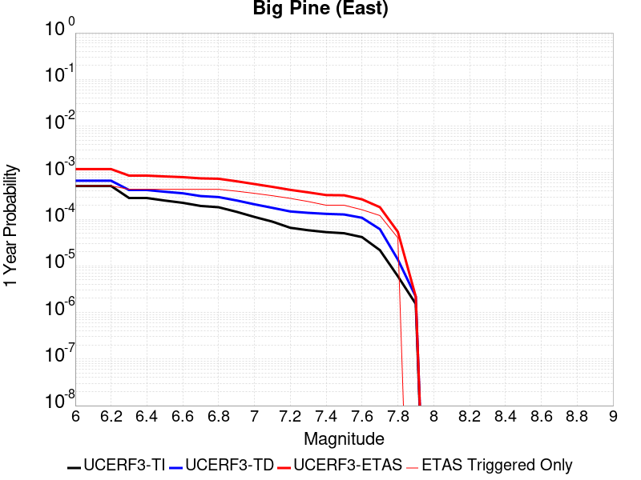 |

| Magnitude | 1 wk TI Prob | 1 wk TD Prob | 1 wk ETAS Prob | 1 wk ETAS/TD Gain | 1 wk ETAS Triggered Only | 1 mo TI Prob | 1 mo TD Prob | 1 mo ETAS Prob | 1 mo ETAS/TD Gain | 1 mo ETAS Triggered Only | 1 yr TI Prob | 1 yr TD Prob | 1 yr ETAS Prob | 1 yr ETAS/TD Gain | 1 yr ETAS Triggered Only |
|-----|-----|-----|-----|-----|-----|-----|-----|-----|-----|-----|-----|-----|-----|-----|-----|
| 6.0 | 9.916913E-6 | 1.2849277E-5 | 3.7284466E-4 | 29.01678 | 3.6E-4 | 4.250036E-5 | 5.5067292E-5 | 5.3504086E-4 | 9.716128 | 4.8E-4 | 5.173191E-4 | 6.7026017E-4 | 0.0011899116 | 1.7752981 | 5.2E-4 |
| 6.1 | 9.916913E-6 | 1.2849277E-5 | 3.7284466E-4 | 29.01678 | 3.6E-4 | 4.250036E-5 | 5.5067292E-5 | 5.3504086E-4 | 9.716128 | 4.8E-4 | 5.173191E-4 | 6.7026017E-4 | 0.0011899116 | 1.7752981 | 5.2E-4 |
| 6.2 | 9.916913E-6 | 1.2849277E-5 | 3.7284466E-4 | 29.01678 | 3.6E-4 | 4.250036E-5 | 5.5067292E-5 | 5.3504086E-4 | 9.716128 | 4.8E-4 | 5.173191E-4 | 6.7026017E-4 | 0.0011899116 | 1.7752981 | 5.2E-4 |
| 6.3 | 5.479711E-6 | 8.144284E-6 | 3.6814137E-4 | 45.20242 | 3.6E-4 | 2.3484265E-5 | 3.4903627E-5 | 4.7488828E-4 | 13.6057 | 4.4E-4 | 2.858834E-4 | 4.24872E-4 | 8.6468505E-4 | 2.035166 | 4.4E-4 |
| 6.4 | 5.465009E-6 | 8.128574E-6 | 3.6812565E-4 | 45.28785 | 3.6E-4 | 2.3421257E-5 | 3.48363E-5 | 4.7482096E-4 | 13.630063 | 4.4E-4 | 2.851165E-4 | 4.2405262E-4 | 8.63866E-4 | 2.037167 | 4.4E-4 |
| 6.5 | 4.826767E-6 | 7.453499E-6 | 3.6745082E-4 | 49.299103 | 3.6E-4 | 2.068598E-5 | 3.1943193E-5 | 4.7192915E-4 | 14.7740135 | 4.4E-4 | 2.518227E-4 | 3.8884176E-4 | 8.286706E-4 | 2.1311257 | 4.4E-4 |
| 6.6 | 4.3146847E-6 | 6.913335E-6 | 3.6691086E-4 | 53.072914 | 3.6E-4 | 1.8491375E-5 | 2.9628256E-5 | 4.6961522E-4 | 15.850248 | 4.4E-4 | 2.2510924E-4 | 3.6066677E-4 | 8.005081E-4 | 2.2195227 | 4.4E-4 |
| 6.7 | 3.6968106E-6 | 6.024692E-6 | 3.6602252E-4 | 60.75373 | 3.6E-4 | 1.5843378E-5 | 2.5819862E-5 | 4.658085E-4 | 18.040705 | 4.4E-4 | 1.9287605E-4 | 3.1431302E-4 | 7.541747E-4 | 2.3994384 | 4.4E-4 |
| 6.8 | 3.4671132E-6 | 5.730609E-6 | 3.6572854E-4 | 63.820194 | 3.6E-4 | 1.4858972E-5 | 2.4559527E-5 | 4.6454874E-4 | 18.915215 | 4.4E-4 | 1.8089297E-4 | 2.9897268E-4 | 7.3884113E-4 | 2.4712663 | 4.4E-4 |
| 6.9 | 2.7686972E-6 | 4.851478E-6 | 3.248499E-4 | 66.95896 | 3.2E-4 | 1.1865792E-5 | 2.0791887E-5 | 4.2078356E-4 | 20.237873 | 4.0E-4 | 1.4445644E-4 | 2.5311258E-4 | 6.530113E-4 | 2.5799246 | 4.0E-4 |
| 7.0 | 2.1472624E-6 | 4.008895E-6 | 2.8400778E-4 | 70.844406 | 2.8E-4 | 9.20252E-6 | 1.7180868E-5 | 3.7717467E-4 | 21.95318 | 3.6E-4 | 1.12034926E-4 | 2.0915753E-4 | 5.690822E-4 | 2.7208307 | 3.6E-4 |
| 7.1 | 1.7018335E-6 | 3.3665633E-6 | 2.4336575E-4 | 72.28908 | 2.4E-4 | 7.293552E-6 | 1.4428051E-5 | 3.3442344E-4 | 23.178698 | 3.2E-4 | 8.879537E-5 | 1.7564771E-4 | 4.955915E-4 | 2.8215084 | 3.2E-4 |
| 7.2 | 1.25603E-6 | 2.8149723E-6 | 2.4281429E-4 | 86.25815 | 2.4E-4 | 5.3829745E-6 | 1.2064112E-5 | 2.9206072E-4 | 24.209053 | 2.8E-4 | 6.553574E-5 | 1.468709E-4 | 4.2682976E-4 | 2.9061563 | 2.8E-4 |
| 7.3 | 1.112297E-6 | 2.6296866E-6 | 2.0262916E-4 | 77.05449 | 2.0E-4 | 4.7669787E-6 | 1.1270038E-5 | 2.5126734E-4 | 22.295162 | 2.4E-4 | 5.803642E-5 | 1.3720429E-4 | 3.7717135E-4 | 2.7489765 | 2.4E-4 |
| 7.4 | 1.0137181E-6 | 2.5020183E-6 | 1.6250162E-4 | 64.94821 | 1.6E-4 | 4.3444993E-6 | 1.07228925E-5 | 2.1072075E-4 | 19.651484 | 2.0E-4 | 5.2892992E-5 | 1.3054362E-4 | 3.305175E-4 | 2.531855 | 2.0E-4 |
| 7.5 | 9.598608E-7 | 2.4251278E-6 | 1.6242474E-4 | 66.975746 | 1.6E-4 | 4.1136827E-6 | 1.0393365E-5 | 2.1039128E-4 | 20.242846 | 2.0E-4 | 5.0082934E-5 | 1.2653209E-4 | 3.265068E-4 | 2.5804267 | 2.0E-4 |
| 7.6 | 7.929459E-7 | 2.0607458E-6 | 1.220605E-4 | 59.231228 | 1.2E-4 | 3.3983351E-6 | 8.831738E-6 | 1.6883033E-4 | 19.116318 | 1.6E-4 | 4.1373947E-5 | 1.07521286E-4 | 2.6750407E-4 | 2.4879174 | 1.6E-4 |
| 7.7 | 4.155788E-7 | 1.1718464E-6 | 8.1171755E-5 | 69.26825 | 8.0E-5 | 1.7810507E-6 | 5.0221893E-6 | 1.2502159E-4 | 24.89384 | 1.2E-4 | 2.1684076E-5 | 6.114348E-5 | 1.8113614E-4 | 2.9624767 | 1.2E-4 |
| 7.8 | 1.14666925E-7 | 2.617199E-7 | 4.0261708E-5 | 153.83511 | 4.0E-5 | 4.914296E-7 | 1.1216562E-6 | 4.112161E-5 | 36.66151 | 4.0E-5 | 5.9831386E-6 | 1.3656083E-5 | 5.3655538E-5 | 3.9290576 | 4.0E-5 |
| 7.9 | 2.9231824E-8 | 4.188171E-8 | 4.188171E-8 | 1.0 | 0.0 | 1.2527924E-7 | 1.7949303E-7 | 1.7949303E-7 | 1.0 | 0.0 | 1.5252737E-6 | 2.1853257E-6 | 2.1853257E-6 | 1.0 | 0.0 |

## San Jacinto (Anza) rev
*[(top)](#table-of-contents)*

| 1 Week | 1 Month | 1 Year |
|-----|-----|-----|
| 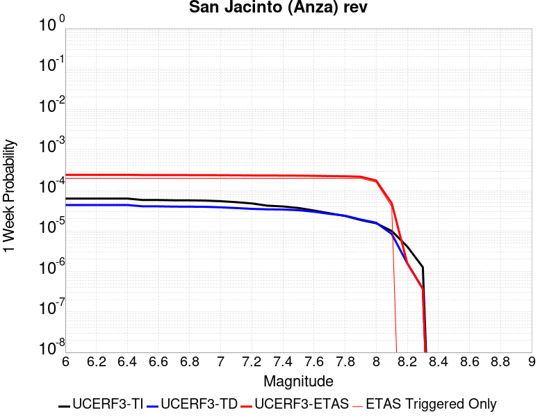 |  | 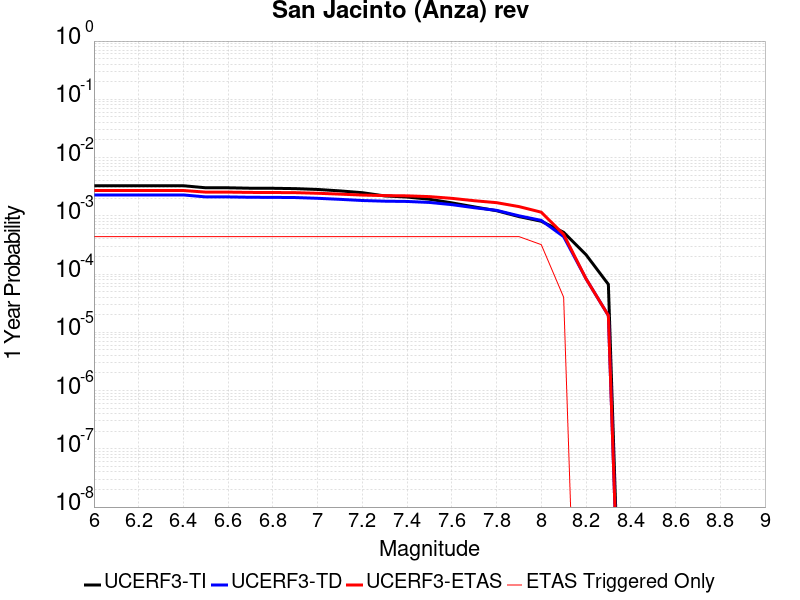 |

| Magnitude | 1 wk TI Prob | 1 wk TD Prob | 1 wk ETAS Prob | 1 wk ETAS/TD Gain | 1 wk ETAS Triggered Only | 1 mo TI Prob | 1 mo TD Prob | 1 mo ETAS Prob | 1 mo ETAS/TD Gain | 1 mo ETAS Triggered Only | 1 yr TI Prob | 1 yr TD Prob | 1 yr ETAS Prob | 1 yr ETAS/TD Gain | 1 yr ETAS Triggered Only |
|-----|-----|-----|-----|-----|-----|-----|-----|-----|-----|-----|-----|-----|-----|-----|-----|
| 6.0 | 6.3015636E-5 | 4.3745757E-5 | 2.4373701E-4 | 5.571672 | 2.0E-4 | 2.7003905E-4 | 1.8746841E-4 | 4.6741593E-4 | 2.493305 | 2.8E-4 | 0.0032827691 | 0.002280051 | 0.0027190475 | 1.1925381 | 4.4E-4 |
| 6.1 | 6.3015636E-5 | 4.3745757E-5 | 2.4373701E-4 | 5.571672 | 2.0E-4 | 2.7003905E-4 | 1.8746841E-4 | 4.6741593E-4 | 2.493305 | 2.8E-4 | 0.0032827691 | 0.002280051 | 0.0027190475 | 1.1925381 | 4.4E-4 |
| 6.2 | 6.3015636E-5 | 4.3745757E-5 | 2.4373701E-4 | 5.571672 | 2.0E-4 | 2.7003905E-4 | 1.8746841E-4 | 4.6741593E-4 | 2.493305 | 2.8E-4 | 0.0032827691 | 0.002280051 | 0.0027190475 | 1.1925381 | 4.4E-4 |
| 6.3 | 6.3015636E-5 | 4.3745757E-5 | 2.4373701E-4 | 5.571672 | 2.0E-4 | 2.7003905E-4 | 1.8746841E-4 | 4.6741593E-4 | 2.493305 | 2.8E-4 | 0.0032827691 | 0.002280051 | 0.0027190475 | 1.1925381 | 4.4E-4 |
| 6.4 | 6.3015636E-5 | 4.3745757E-5 | 2.4373701E-4 | 5.571672 | 2.0E-4 | 2.7003905E-4 | 1.8746841E-4 | 4.6741593E-4 | 2.493305 | 2.8E-4 | 0.0032827691 | 0.002280051 | 0.0027190475 | 1.1925381 | 4.4E-4 |
| 6.5 | 5.811017E-5 | 4.0506016E-5 | 2.4049792E-4 | 5.9373384 | 2.0E-4 | 2.4901982E-4 | 1.735857E-4 | 4.535371E-4 | 2.6127563 | 2.8E-4 | 0.0030276014 | 0.002111363 | 0.002550434 | 1.2079562 | 4.4E-4 |
| 6.6 | 5.811017E-5 | 4.0506016E-5 | 2.4049792E-4 | 5.9373384 | 2.0E-4 | 2.4901982E-4 | 1.735857E-4 | 4.535371E-4 | 2.6127563 | 2.8E-4 | 0.0030276014 | 0.002111363 | 0.002550434 | 1.2079562 | 4.4E-4 |
| 6.7 | 5.712442E-5 | 3.9923914E-5 | 2.3991593E-4 | 6.009329 | 2.0E-4 | 2.4479596E-4 | 1.710913E-4 | 4.510434E-4 | 2.6362731 | 2.8E-4 | 0.0029763177 | 0.0020810522 | 0.0025201365 | 1.2109915 | 4.4E-4 |
| 6.8 | 5.6967532E-5 | 3.977942E-5 | 2.3977147E-4 | 6.027525 | 2.0E-4 | 2.4412372E-4 | 1.7047212E-4 | 4.5042438E-4 | 2.6422172 | 2.8E-4 | 0.0029681553 | 0.002073528 | 0.0025126156 | 1.2117587 | 4.4E-4 |
| 6.9 | 5.6211324E-5 | 3.9481514E-5 | 2.3947362E-4 | 6.0654616 | 2.0E-4 | 2.4088343E-4 | 1.6919555E-4 | 4.4914818E-4 | 2.65461 | 2.8E-4 | 0.0029288116 | 0.0020580152 | 0.0024971096 | 1.2133583 | 4.4E-4 |
| 7.0 | 5.4383527E-5 | 3.833281E-5 | 2.3832514E-4 | 6.2172623 | 2.0E-4 | 2.3305144E-4 | 1.6427317E-4 | 4.4422716E-4 | 2.7041981 | 2.8E-4 | 0.0028337094 | 0.0019981961 | 0.0024373168 | 1.2197586 | 4.4E-4 |
| 7.1 | 5.1393665E-5 | 3.6780868E-5 | 2.3677351E-4 | 6.4374094 | 2.0E-4 | 2.2023996E-4 | 1.576228E-4 | 4.3757865E-4 | 2.7761128 | 2.8E-4 | 0.0026781242 | 0.0019173726 | 0.002356529 | 1.2290407 | 4.4E-4 |
| 7.2 | 4.785222E-5 | 3.5116576E-5 | 2.3510955E-4 | 6.695116 | 2.0E-4 | 2.0506482E-4 | 1.5049095E-4 | 4.3044882E-4 | 2.860297 | 2.8E-4 | 0.0024938055 | 0.0018306911 | 0.0022698855 | 1.2399064 | 4.4E-4 |
| 7.3 | 4.2143256E-5 | 3.4199693E-5 | 2.3419285E-4 | 6.8478055 | 2.0E-4 | 1.8060145E-4 | 1.465619E-4 | 4.2652086E-4 | 2.9101756 | 2.8E-4 | 0.002196605 | 0.0017829342 | 0.0022221496 | 1.2463442 | 4.4E-4 |
| 7.4 | 4.0264713E-5 | 3.3834353E-5 | 2.3382758E-4 | 6.9109516 | 2.0E-4 | 1.7255165E-4 | 1.4499633E-4 | 4.2495574E-4 | 2.9308033 | 2.8E-4 | 0.002098792 | 0.0017639044 | 0.0022031283 | 1.2490066 | 4.4E-4 |
| 7.5 | 3.694492E-5 | 3.253924E-5 | 2.3253274E-4 | 7.146225 | 2.0E-4 | 1.5832575E-4 | 1.3944645E-4 | 4.194074E-4 | 3.0076592 | 2.8E-4 | 0.0019259118 | 0.0016964416 | 0.0021356952 | 1.2589264 | 4.4E-4 |
| 7.6 | 3.200565E-5 | 2.983583E-5 | 2.2982986E-4 | 7.7031493 | 2.0E-4 | 1.3715986E-4 | 1.278616E-4 | 4.0782578E-4 | 3.189588 | 2.8E-4 | 0.001668642 | 0.0015556056 | 0.0019949211 | 1.2824081 | 4.4E-4 |
| 7.7 | 2.731642E-5 | 2.6414782E-5 | 2.264095E-4 | 8.571318 | 2.0E-4 | 1.1706512E-4 | 1.13201306E-4 | 3.931696E-4 | 3.4731898 | 2.8E-4 | 0.001424336 | 0.0013773555 | 0.0018167495 | 1.3190128 | 4.4E-4 |
| 7.8 | 2.3466424E-5 | 2.3813845E-5 | 2.2380908E-4 | 9.398275 | 2.0E-4 | 1.0056651E-4 | 1.0205535E-4 | 3.8202677E-4 | 3.7433293 | 2.8E-4 | 0.0012237094 | 0.0012418164 | 0.0016812701 | 1.3538797 | 4.4E-4 |
| 7.9 | 1.8611925E-5 | 1.9186835E-5 | 2.19183E-4 | 11.423614 | 2.0E-4 | 7.9762955E-5 | 8.22267E-5 | 3.622037E-4 | 4.4049397 | 2.8E-4 | 9.7068126E-4 | 0.0010006512 | 0.0014402108 | 1.4392737 | 4.4E-4 |
| 8.0 | 1.5460775E-5 | 1.5988953E-5 | 1.759864E-4 | 11.006749 | 1.6E-4 | 6.6258784E-5 | 6.852229E-5 | 2.685086E-4 | 3.9185584 | 2.0E-4 | 8.0640207E-4 | 8.339403E-4 | 0.0011536734 | 1.3834006 | 3.2E-4 |
| 8.1 | 9.983884E-6 | 8.416394E-6 | 4.8416056E-5 | 5.752589 | 4.0E-5 | 4.2787375E-5 | 3.6069763E-5 | 7.606832E-5 | 2.108922 | 4.0E-5 | 5.2081177E-4 | 4.390614E-4 | 4.7904384E-4 | 1.0910634 | 4.0E-5 |
| 8.2 | 4.1226E-6 | 1.5944853E-6 | 1.5944853E-6 | 1.0 | 0.0 | 1.7668166E-5 | 6.8334907E-6 | 6.8334907E-6 | 1.0 | 0.0 | 2.1508869E-4 | 8.31946E-5 | 8.31946E-5 | 1.0 | 0.0 |
| 8.3 | 1.2750878E-6 | 3.725573E-7 | 3.725573E-7 | 1.0 | 0.0 | 5.4646503E-6 | 1.5966733E-6 | 1.5966733E-6 | 1.0 | 0.0 | 6.653009E-5 | 1.9439329E-5 | 1.9439329E-5 | 1.0 | 0.0 |

## Garlock (East)
*[(top)](#table-of-contents)*

| 1 Week | 1 Month | 1 Year |
|-----|-----|-----|
| 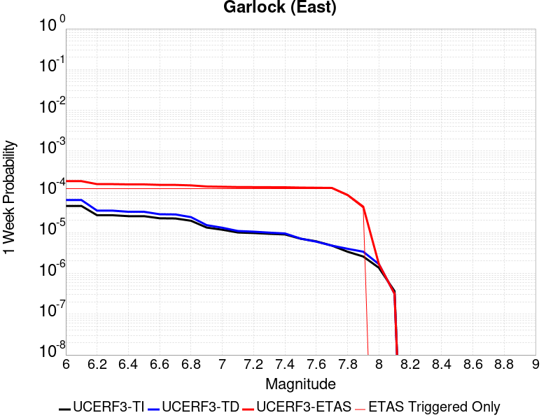 |  | 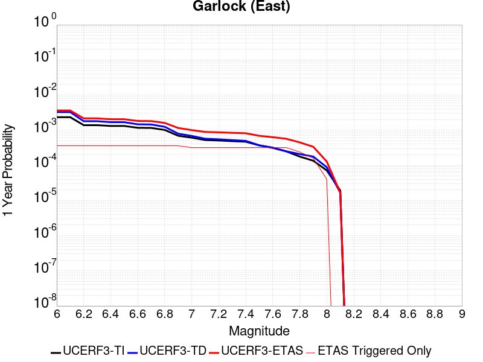 |

| Magnitude | 1 wk TI Prob | 1 wk TD Prob | 1 wk ETAS Prob | 1 wk ETAS/TD Gain | 1 wk ETAS Triggered Only | 1 mo TI Prob | 1 mo TD Prob | 1 mo ETAS Prob | 1 mo ETAS/TD Gain | 1 mo ETAS Triggered Only | 1 yr TI Prob | 1 yr TD Prob | 1 yr ETAS Prob | 1 yr ETAS/TD Gain | 1 yr ETAS Triggered Only |
|-----|-----|-----|-----|-----|-----|-----|-----|-----|-----|-----|-----|-----|-----|-----|-----|
| 6.0 | 4.5092507E-5 | 6.302061E-5 | 1.8301305E-4 | 2.9040189 | 1.2E-4 | 1.9323928E-4 | 2.700629E-4 | 5.899765E-4 | 2.1845891 | 3.2E-4 | 0.0023501497 | 0.0032835056 | 0.0036423234 | 1.1092789 | 3.6E-4 |
| 6.1 | 4.5092507E-5 | 6.302061E-5 | 1.8301305E-4 | 2.9040189 | 1.2E-4 | 1.9323928E-4 | 2.700629E-4 | 5.899765E-4 | 2.1845891 | 3.2E-4 | 0.0023501497 | 0.0032835056 | 0.0036423234 | 1.1092789 | 3.6E-4 |
| 6.2 | 2.6674514E-5 | 3.460235E-5 | 1.545982E-4 | 4.4678526 | 1.2E-4 | 1.1431433E-4 | 1.4828754E-4 | 4.682401E-4 | 3.1576495 | 3.2E-4 | 0.0013908884 | 0.001803939 | 0.0021632896 | 1.1992033 | 3.6E-4 |
| 6.3 | 2.6674514E-5 | 3.460235E-5 | 1.545982E-4 | 4.4678526 | 1.2E-4 | 1.1431433E-4 | 1.4828754E-4 | 4.682401E-4 | 3.1576495 | 3.2E-4 | 0.0013908884 | 0.001803939 | 0.0021632896 | 1.1992033 | 3.6E-4 |
| 6.4 | 2.5312667E-5 | 3.243003E-5 | 1.5242613E-4 | 4.7001543 | 1.2E-4 | 1.0847834E-4 | 1.389786E-4 | 4.5893414E-4 | 3.3021927 | 3.2E-4 | 0.0013199237 | 0.0016907807 | 0.002050172 | 1.2125593 | 3.6E-4 |
| 6.5 | 2.5312667E-5 | 3.243003E-5 | 1.5242613E-4 | 4.7001543 | 1.2E-4 | 1.0847834E-4 | 1.389786E-4 | 4.5893414E-4 | 3.3021927 | 3.2E-4 | 0.0013199237 | 0.0016907807 | 0.002050172 | 1.2125593 | 3.6E-4 |
| 6.6 | 2.246556E-5 | 2.8214976E-5 | 1.4821159E-4 | 5.2529407 | 1.2E-4 | 9.627742E-5 | 1.2091586E-4 | 4.4087716E-4 | 3.6461484 | 3.2E-4 | 0.0011715472 | 0.00147118 | 0.0018306504 | 1.2443415 | 3.6E-4 |
| 6.7 | 2.2241198E-5 | 2.7884198E-5 | 1.4788086E-4 | 5.303393 | 1.2E-4 | 9.531594E-5 | 1.1949836E-4 | 4.3946013E-4 | 3.677541 | 3.2E-4 | 0.0011598538 | 0.0014539452 | 0.0018134218 | 1.2472422 | 3.6E-4 |
| 6.8 | 1.9528685E-5 | 2.3971877E-5 | 1.43969E-4 | 6.0057454 | 1.2E-4 | 8.369167E-5 | 1.0273269E-4 | 4.226998E-4 | 4.11456 | 3.2E-4 | 0.0010184698 | 0.0012500725 | 0.0016096225 | 1.2876233 | 3.6E-4 |
| 6.9 | 1.3318621E-5 | 1.5256402E-5 | 1.3525457E-4 | 8.865431 | 1.2E-4 | 5.7078556E-5 | 6.538297E-5 | 3.8536204E-4 | 5.893921 | 3.2E-4 | 6.9470983E-4 | 7.957527E-4 | 0.0011554662 | 1.4520419 | 3.6E-4 |
| 7.0 | 1.1760853E-5 | 1.3163365E-5 | 1.3316178E-4 | 10.11609 | 1.2E-4 | 5.0402683E-5 | 5.641323E-5 | 3.3639744E-4 | 5.9630947 | 2.8E-4 | 6.134799E-4 | 6.8661966E-4 | 0.0010064 | 1.4657313 | 3.2E-4 |
| 7.1 | 1.0064758E-5 | 1.0956659E-5 | 1.3095535E-4 | 11.952124 | 1.2E-4 | 4.3133965E-5 | 4.6956284E-5 | 3.2694315E-4 | 6.962713 | 2.8E-4 | 5.2502943E-4 | 5.715463E-4 | 8.913634E-4 | 1.5595646 | 3.2E-4 |
| 7.2 | 9.768808E-6 | 1.0552171E-5 | 1.305509E-4 | 12.371947 | 1.2E-4 | 4.186565E-5 | 4.5222823E-5 | 3.2521016E-4 | 7.1912837 | 2.8E-4 | 5.095951E-4 | 5.504523E-4 | 8.702762E-4 | 1.5810201 | 3.2E-4 |
| 7.3 | 9.344516E-6 | 9.99686E-6 | 1.2999566E-4 | 13.003649 | 1.2E-4 | 4.004731E-5 | 4.2843003E-5 | 3.22831E-4 | 7.5352097 | 2.8E-4 | 4.8746695E-4 | 5.214922E-4 | 8.413253E-4 | 1.6133038 | 3.2E-4 |
| 7.4 | 9.023491E-6 | 9.542039E-6 | 1.2954089E-4 | 13.575808 | 1.2E-4 | 3.867153E-5 | 4.0893832E-5 | 3.208824E-4 | 7.8467183 | 2.8E-4 | 4.7072413E-4 | 4.9777207E-4 | 8.1761274E-4 | 1.6425445 | 3.2E-4 |
| 7.5 | 7.081253E-6 | 7.1334935E-6 | 1.2713263E-4 | 17.821934 | 1.2E-4 | 3.0347876E-5 | 3.057176E-5 | 3.105632E-4 | 10.1585 | 2.8E-4 | 3.6942272E-4 | 3.7214835E-4 | 6.9202925E-4 | 1.8595521 | 3.2E-4 |
| 7.6 | 6.116396E-6 | 6.0000416E-6 | 1.2599932E-4 | 20.99974 | 1.2E-4 | 2.6212863E-5 | 2.5714213E-5 | 3.05707E-4 | 11.88864 | 2.8E-4 | 3.1909486E-4 | 3.130258E-4 | 6.3292566E-4 | 2.0219598 | 3.2E-4 |
| 7.7 | 4.797145E-6 | 4.795929E-6 | 1.2479535E-4 | 26.021101 | 1.2E-4 | 2.055903E-5 | 2.055382E-5 | 3.0054807E-4 | 14.622492 | 2.8E-4 | 2.5027743E-4 | 2.5021416E-4 | 5.701341E-4 | 2.2785845 | 3.2E-4 |
| 7.8 | 3.4028885E-6 | 4.0130544E-6 | 8.401273E-5 | 20.93486 | 8.0E-5 | 1.4583726E-5 | 1.7198692E-5 | 2.1719525E-4 | 12.628592 | 2.0E-4 | 1.775424E-4 | 2.0937403E-4 | 4.4932376E-4 | 2.146034 | 2.4E-4 |
| 7.9 | 2.5928412E-6 | 3.4017612E-6 | 4.3401626E-5 | 12.758575 | 4.0E-5 | 1.1112129E-5 | 1.4578895E-5 | 1.7457656E-4 | 11.974608 | 1.6E-4 | 1.3528178E-4 | 1.7748366E-4 | 3.3745525E-4 | 1.9013314 | 1.6E-4 |
| 8.0 | 1.3743648E-6 | 1.6867408E-6 | 1.6867408E-6 | 1.0 | 0.0 | 5.8901214E-6 | 7.2288694E-6 | 4.722858E-5 | 6.533329 | 4.0E-5 | 7.1709874E-5 | 8.800796E-5 | 1.2800444E-4 | 1.4544643 | 4.0E-5 |
| 8.1 | 3.6733252E-7 | 3.1722044E-7 | 3.1722044E-7 | 1.0 | 0.0 | 1.5742813E-6 | 1.3595155E-6 | 1.3595155E-6 | 1.0 | 0.0 | 1.9166706E-5 | 1.6551992E-5 | 1.6551992E-5 | 1.0 | 0.0 |

## Santa Ynez (East)
*[(top)](#table-of-contents)*

| 1 Week | 1 Month | 1 Year |
|-----|-----|-----|
| 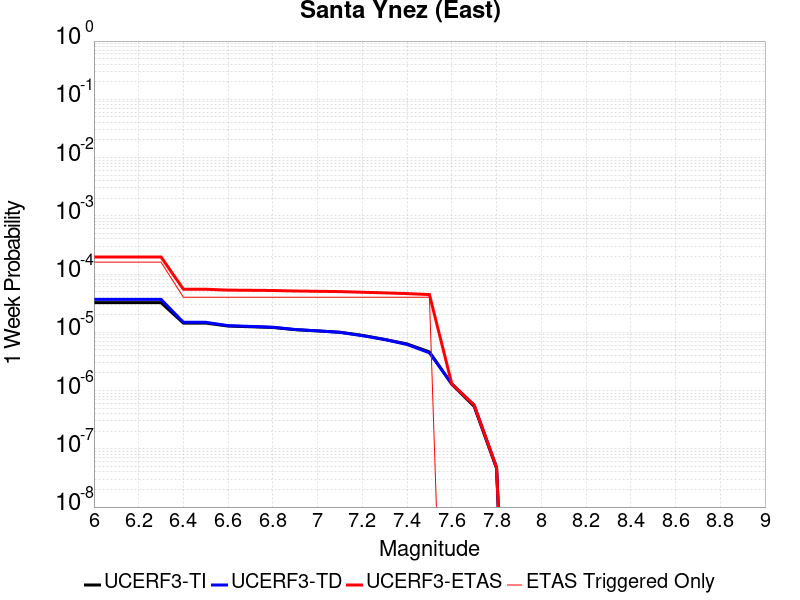 | 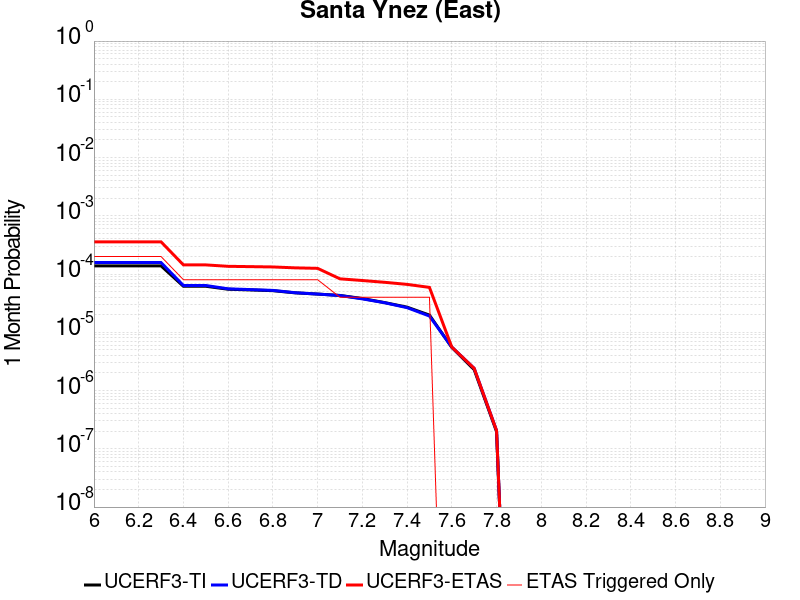 | 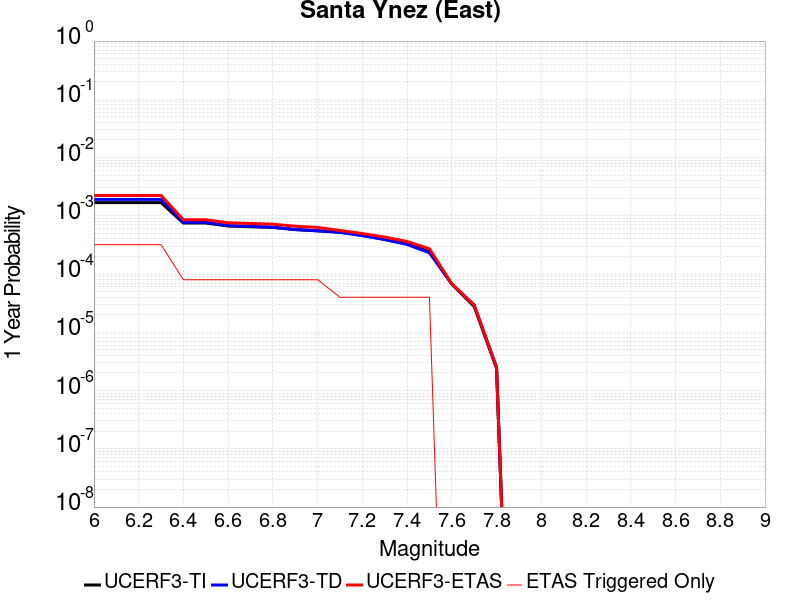 |

| Magnitude | 1 wk TI Prob | 1 wk TD Prob | 1 wk ETAS Prob | 1 wk ETAS/TD Gain | 1 wk ETAS Triggered Only | 1 mo TI Prob | 1 mo TD Prob | 1 mo ETAS Prob | 1 mo ETAS/TD Gain | 1 mo ETAS Triggered Only | 1 yr TI Prob | 1 yr TD Prob | 1 yr ETAS Prob | 1 yr ETAS/TD Gain | 1 yr ETAS Triggered Only |
|-----|-----|-----|-----|-----|-----|-----|-----|-----|-----|-----|-----|-----|-----|-----|-----|
| 6.0 | 3.2269712E-5 | 3.6773254E-5 | 1.9676737E-4 | 5.350828 | 1.6E-4 | 1.3829143E-4 | 1.5759347E-4 | 3.5756195E-4 | 2.268888 | 2.0E-4 | 0.0016823979 | 0.0019175955 | 0.0022369819 | 1.1665556 | 3.2E-4 |
| 6.1 | 3.2269712E-5 | 3.6773254E-5 | 1.9676737E-4 | 5.350828 | 1.6E-4 | 1.3829143E-4 | 1.5759347E-4 | 3.5756195E-4 | 2.268888 | 2.0E-4 | 0.0016823979 | 0.0019175955 | 0.0022369819 | 1.1665556 | 3.2E-4 |
| 6.2 | 3.2269712E-5 | 3.6773254E-5 | 1.9676737E-4 | 5.350828 | 1.6E-4 | 1.3829143E-4 | 1.5759347E-4 | 3.5756195E-4 | 2.268888 | 2.0E-4 | 0.0016823979 | 0.0019175955 | 0.0022369819 | 1.1665556 | 3.2E-4 |
| 6.3 | 3.2269712E-5 | 3.6773254E-5 | 1.9676737E-4 | 5.350828 | 1.6E-4 | 1.3829143E-4 | 1.5759347E-4 | 3.5756195E-4 | 2.268888 | 2.0E-4 | 0.0016823979 | 0.0019175955 | 0.0022369819 | 1.1665556 | 3.2E-4 |
| 6.4 | 1.4404779E-5 | 1.4855053E-5 | 5.485446E-5 | 3.6926463 | 4.0E-5 | 6.1733306E-5 | 6.366299E-5 | 1.4365789E-4 | 2.256537 | 8.0E-5 | 7.513438E-4 | 7.7482633E-4 | 8.5476437E-4 | 1.103169 | 8.0E-5 |
| 6.5 | 1.4404779E-5 | 1.4855053E-5 | 5.485446E-5 | 3.6926463 | 4.0E-5 | 6.1733306E-5 | 6.366299E-5 | 1.4365789E-4 | 2.256537 | 8.0E-5 | 7.513438E-4 | 7.7482633E-4 | 8.5476437E-4 | 1.103169 | 8.0E-5 |
| 6.6 | 1.280208E-5 | 1.3016704E-5 | 5.301618E-5 | 4.0729346 | 4.0E-5 | 5.4864904E-5 | 5.578469E-5 | 1.3578022E-4 | 2.4340053 | 8.0E-5 | 6.6777546E-4 | 6.7896873E-4 | 7.589144E-4 | 1.1177458 | 8.0E-5 |
| 6.7 | 1.2457027E-5 | 1.2633079E-5 | 5.2632575E-5 | 4.1662507 | 4.0E-5 | 5.3386164E-5 | 5.414065E-5 | 1.3413632E-4 | 2.4775527 | 8.0E-5 | 6.497827E-4 | 6.5896474E-4 | 7.3891203E-4 | 1.1213225 | 8.0E-5 |
| 6.8 | 1.2095134E-5 | 1.2235392E-5 | 5.2234904E-5 | 4.2691646 | 4.0E-5 | 5.1835254E-5 | 5.2436353E-5 | 1.3243216E-4 | 2.5255792 | 8.0E-5 | 6.309115E-4 | 6.382272E-4 | 7.1817613E-4 | 1.1252673 | 8.0E-5 |
| 6.9 | 1.1104036E-5 | 1.1161518E-5 | 5.116107E-5 | 4.583702 | 4.0E-5 | 4.758786E-5 | 4.7834208E-5 | 1.2783038E-4 | 2.6723633 | 8.0E-5 | 5.7922816E-4 | 5.822271E-4 | 6.6218054E-4 | 1.1373234 | 8.0E-5 |
| 7.0 | 1.0577444E-5 | 1.0585669E-5 | 5.0585244E-5 | 4.7786536 | 4.0E-5 | 4.5331115E-5 | 4.5366367E-5 | 1.2536274E-4 | 2.763341 | 8.0E-5 | 5.5176654E-4 | 5.5219675E-4 | 6.321526E-4 | 1.1447959 | 8.0E-5 |
| 7.1 | 1.0021775E-5 | 9.9848085E-6 | 4.998441E-5 | 5.006046 | 4.0E-5 | 4.294976E-5 | 4.279134E-5 | 8.278963E-5 | 1.9347286 | 4.0E-5 | 5.2278786E-4 | 5.2086124E-4 | 5.6084036E-4 | 1.0767559 | 4.0E-5 |
| 7.2 | 8.874109E-6 | 8.752264E-6 | 4.8751914E-5 | 5.570206 | 4.0E-5 | 3.8031343E-5 | 3.750917E-5 | 7.750767E-5 | 2.066366 | 4.0E-5 | 4.629332E-4 | 4.5657952E-4 | 4.965613E-4 | 1.0875679 | 4.0E-5 |
| 7.3 | 7.5504267E-6 | 7.5080898E-6 | 4.750779E-5 | 6.327547 | 4.0E-5 | 3.235857E-5 | 3.2177137E-5 | 7.217585E-5 | 2.2430787 | 4.0E-5 | 3.9389438E-4 | 3.9168724E-4 | 4.3167156E-4 | 1.1020823 | 4.0E-5 |
| 7.4 | 6.309394E-6 | 6.185729E-6 | 4.6185483E-5 | 7.466457 | 4.0E-5 | 2.703998E-5 | 2.6510004E-5 | 6.650895E-5 | 2.5088243 | 4.0E-5 | 3.2916202E-4 | 3.2271244E-4 | 3.6269953E-4 | 1.1239094 | 4.0E-5 |
| 7.5 | 4.6103073E-6 | 4.442555E-6 | 4.444238E-5 | 10.003787 | 4.0E-5 | 1.975831E-5 | 1.9039388E-5 | 5.9038626E-5 | 3.100868 | 4.0E-5 | 2.4053088E-4 | 2.3178058E-4 | 2.717713E-4 | 1.172537 | 4.0E-5 |
| 7.6 | 1.2858658E-6 | 1.3010639E-6 | 1.3010639E-6 | 1.0 | 0.0 | 5.5108417E-6 | 5.5759765E-6 | 5.5759765E-6 | 1.0 | 0.0 | 6.7092435E-5 | 6.788547E-5 | 6.788547E-5 | 1.0 | 0.0 |
| 7.7 | 5.3302307E-7 | 5.61315E-7 | 5.61315E-7 | 1.0 | 0.0 | 2.2843826E-6 | 2.4056337E-6 | 2.4056337E-6 | 1.0 | 0.0 | 2.7812002E-5 | 2.9288234E-5 | 2.9288234E-5 | 1.0 | 0.0 |
| 7.8 | 4.613933E-8 | 4.803677E-8 | 4.803677E-8 | 1.0 | 0.0 | 1.9773998E-7 | 2.0587186E-7 | 2.0587186E-7 | 1.0 | 0.0 | 2.4074816E-6 | 2.5064871E-6 | 2.5064871E-6 | 1.0 | 0.0 |

## Big Pine (Central)
*[(top)](#table-of-contents)*

| 1 Week | 1 Month | 1 Year |
|-----|-----|-----|
| 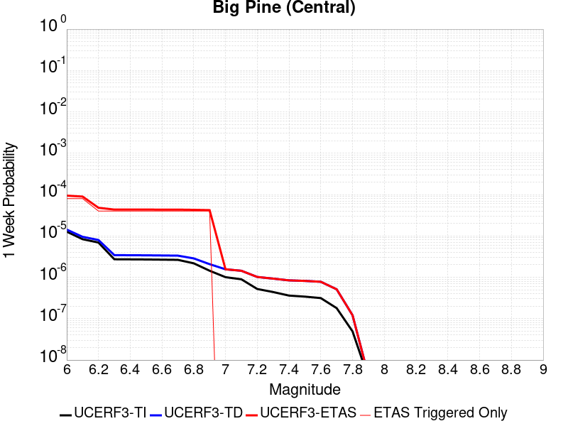 | 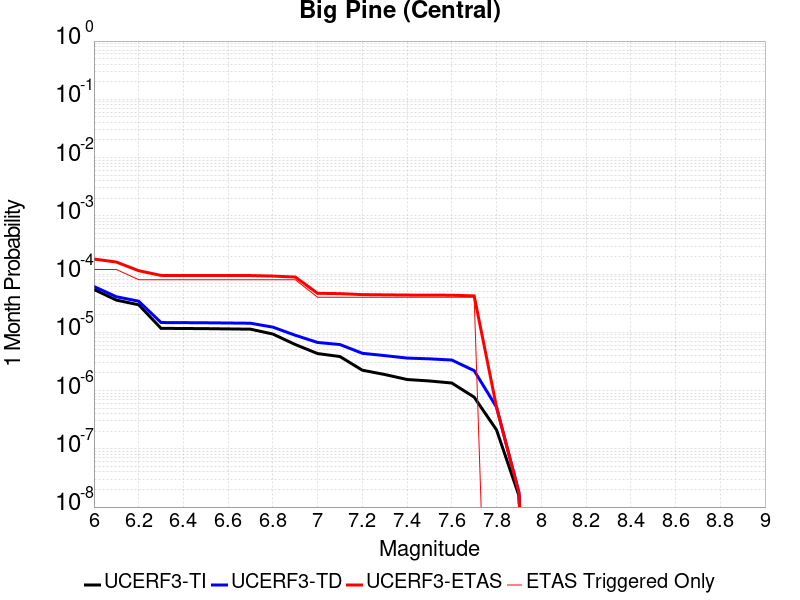 | 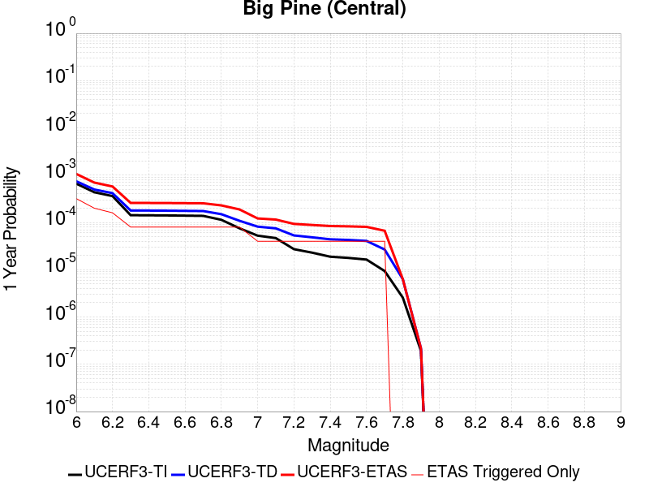 |

| Magnitude | 1 wk TI Prob | 1 wk TD Prob | 1 wk ETAS Prob | 1 wk ETAS/TD Gain | 1 wk ETAS Triggered Only | 1 mo TI Prob | 1 mo TD Prob | 1 mo ETAS Prob | 1 mo ETAS/TD Gain | 1 mo ETAS Triggered Only | 1 yr TI Prob | 1 yr TD Prob | 1 yr ETAS Prob | 1 yr ETAS/TD Gain | 1 yr ETAS Triggered Only |
|-----|-----|-----|-----|-----|-----|-----|-----|-----|-----|-----|-----|-----|-----|-----|-----|
| 6.0 | 1.2706755E-5 | 1.4262975E-5 | 9.4261835E-5 | 6.608848 | 8.0E-5 | 5.4456385E-5 | 6.1125815E-5 | 1.8111848E-4 | 2.9630442 | 1.2E-4 | 6.628048E-4 | 7.4398925E-4 | 0.0010637512 | 1.4297937 | 3.2E-4 |
| 6.1 | 8.342579E-6 | 9.521826E-6 | 8.952106E-5 | 9.40167 | 8.0E-5 | 3.5753423E-5 | 4.080731E-5 | 1.6080242E-4 | 3.9405298 | 1.2E-4 | 4.3521097E-4 | 4.967375E-4 | 6.9663813E-4 | 1.4024272 | 2.0E-4 |
| 6.2 | 6.923899E-6 | 7.977751E-6 | 4.797743E-5 | 6.0139046 | 4.0E-5 | 2.9673516E-5 | 3.419002E-5 | 1.14187285E-4 | 3.3397841 | 8.0E-5 | 3.6121515E-4 | 4.1620323E-4 | 5.7613663E-4 | 1.3842676 | 1.6E-4 |
| 6.3 | 2.728396E-6 | 3.4336192E-6 | 4.3433483E-5 | 12.649476 | 4.0E-5 | 1.1693074E-5 | 1.4715432E-5 | 9.4714254E-5 | 6.4363894 | 8.0E-5 | 1.4235388E-4 | 1.7914653E-4 | 2.591322E-4 | 1.4464818 | 8.0E-5 |
| 6.4 | 2.7136944E-6 | 3.4179088E-6 | 4.341777E-5 | 12.703022 | 4.0E-5 | 1.1630066E-5 | 1.4648103E-5 | 9.464693E-5 | 6.4613776 | 8.0E-5 | 1.4158686E-4 | 1.7832694E-4 | 2.5831268E-4 | 1.4485343 | 8.0E-5 |
| 6.5 | 2.6971882E-6 | 3.4002499E-6 | 4.3400112E-5 | 12.763802 | 4.0E-5 | 1.1559327E-5 | 1.45724225E-5 | 9.457126E-5 | 6.4897413 | 8.0E-5 | 1.4072572E-4 | 1.7740567E-4 | 2.5739148E-4 | 1.4508638 | 8.0E-5 |
| 6.6 | 2.669092E-6 | 3.3702636E-6 | 4.3370128E-5 | 12.868468 | 4.0E-5 | 1.1438916E-5 | 1.4443911E-5 | 9.444276E-5 | 6.538586 | 8.0E-5 | 1.3925991E-4 | 1.758413E-4 | 2.5582724E-4 | 1.4548757 | 8.0E-5 |
| 6.7 | 2.6408059E-6 | 3.340283E-6 | 4.334015E-5 | 12.974993 | 4.0E-5 | 1.1317691E-5 | 1.4315425E-5 | 9.431428E-5 | 6.5882974 | 8.0E-5 | 1.3778417E-4 | 1.7427723E-4 | 2.542633E-4 | 1.4589587 | 8.0E-5 |
| 6.8 | 2.1786943E-6 | 2.8636898E-6 | 4.2863576E-5 | 14.967953 | 4.0E-5 | 9.337228E-6 | 1.22729025E-5 | 9.227192E-5 | 7.5183454 | 8.0E-5 | 1.1367482E-4 | 1.4941308E-4 | 2.2940112E-4 | 1.5353484 | 8.0E-5 |
| 6.9 | 1.4411696E-6 | 2.0773482E-6 | 4.2077267E-5 | 20.25528 | 4.0E-5 | 6.1764263E-6 | 8.902892E-6 | 8.890218E-5 | 9.9857645 | 8.0E-5 | 7.51954E-5 | 1.0838759E-4 | 1.8837892E-4 | 1.738012 | 8.0E-5 |
| 7.0 | 1.0073411E-6 | 1.5621584E-6 | 1.5621584E-6 | 1.0 | 0.0 | 4.317169E-6 | 6.6949483E-6 | 4.669468E-5 | 6.974614 | 4.0E-5 | 5.2560266E-5 | 8.15081E-5 | 1.2150484E-4 | 1.4907088 | 4.0E-5 |
| 7.1 | 8.947104E-7 | 1.4380338E-6 | 1.4380338E-6 | 1.0 | 0.0 | 3.834468E-6 | 6.162988E-6 | 4.6162742E-5 | 7.4903183 | 4.0E-5 | 4.6683643E-5 | 7.5031945E-5 | 1.15028946E-4 | 1.5330663 | 4.0E-5 |
| 7.2 | 5.215166E-7 | 1.0184339E-6 | 1.0184339E-6 | 1.0 | 0.0 | 2.2350691E-6 | 4.3647096E-6 | 4.4364537E-5 | 10.164372 | 4.0E-5 | 2.7211627E-5 | 5.3139087E-5 | 9.3136965E-5 | 1.7527015 | 4.0E-5 |
| 7.3 | 4.4024807E-7 | 9.2900996E-7 | 9.2900996E-7 | 1.0 | 0.0 | 1.8867761E-6 | 3.9814654E-6 | 4.3981305E-5 | 11.046513 | 4.0E-5 | 2.2971257E-5 | 4.8473306E-5 | 8.8471366E-5 | 1.8251565 | 4.0E-5 |
| 7.4 | 3.6130905E-7 | 8.4268595E-7 | 8.4268595E-7 | 1.0 | 0.0 | 1.5484665E-6 | 3.6115064E-6 | 4.3611362E-5 | 12.07567 | 4.0E-5 | 1.8852415E-5 | 4.396924E-5 | 8.396748E-5 | 1.9096868 | 4.0E-5 |
| 7.5 | 3.408184E-7 | 8.175001E-7 | 8.175001E-7 | 1.0 | 0.0 | 1.4606494E-6 | 3.5035673E-6 | 4.3503427E-5 | 12.416895 | 4.0E-5 | 1.7783263E-5 | 4.2655138E-5 | 8.265343E-5 | 1.9377134 | 4.0E-5 |
| 7.6 | 3.1428627E-7 | 7.7960885E-7 | 7.7960885E-7 | 1.0 | 0.0 | 1.3469405E-6 | 3.3411768E-6 | 4.3341042E-5 | 12.97179 | 4.0E-5 | 1.6398877E-5 | 4.0678107E-5 | 8.067648E-5 | 1.98329 | 4.0E-5 |
| 7.7 | 1.7972785E-7 | 5.127105E-7 | 5.127105E-7 | 1.0 | 0.0 | 7.70262E-7 | 2.1973292E-6 | 4.219724E-5 | 19.203878 | 4.0E-5 | 9.377899E-6 | 2.6752165E-5 | 6.67511E-5 | 2.495166 | 4.0E-5 |
| 7.8 | 4.9230927E-8 | 1.2097215E-7 | 1.2097215E-7 | 1.0 | 0.0 | 2.1098968E-7 | 5.1845194E-7 | 5.1845194E-7 | 1.0 | 0.0 | 2.5687964E-6 | 6.312136E-6 | 6.312136E-6 | 1.0 | 0.0 |
| 7.9 | 3.6805972E-9 | 4.1519E-9 | 4.1519E-9 | 1.0 | 0.0 | 1.5773987E-8 | 1.7793857E-8 | 1.7793857E-8 | 1.0 | 0.0 | 1.9204828E-7 | 2.166402E-7 | 2.166402E-7 | 1.0 | 0.0 |

## San Andreas (Santa Cruz Mts) 2011 CFM
*[(top)](#table-of-contents)*

| 1 Week | 1 Month | 1 Year |
|-----|-----|-----|
| 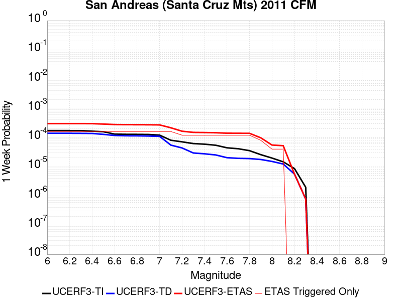 | 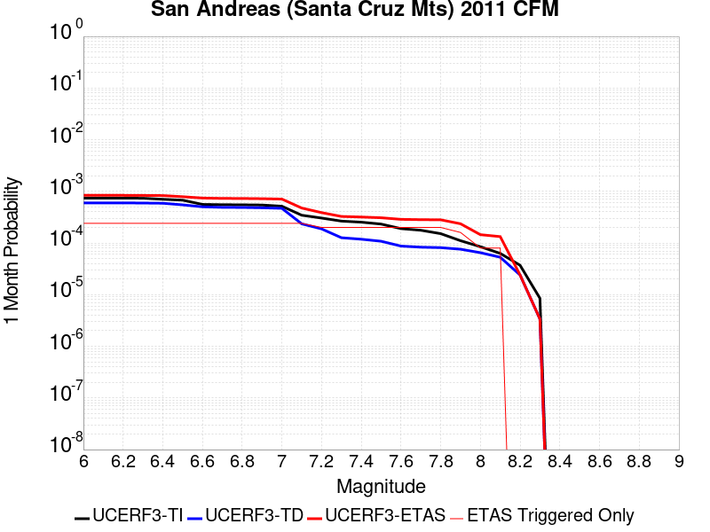 | 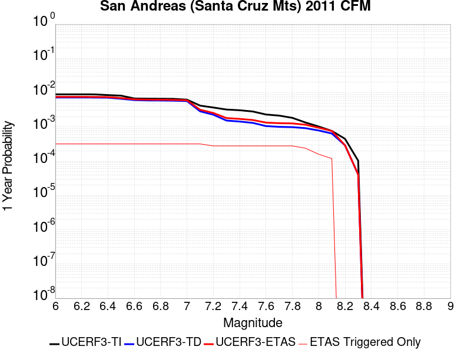 |

| Magnitude | 1 wk TI Prob | 1 wk TD Prob | 1 wk ETAS Prob | 1 wk ETAS/TD Gain | 1 wk ETAS Triggered Only | 1 mo TI Prob | 1 mo TD Prob | 1 mo ETAS Prob | 1 mo ETAS/TD Gain | 1 mo ETAS Triggered Only | 1 yr TI Prob | 1 yr TD Prob | 1 yr ETAS Prob | 1 yr ETAS/TD Gain | 1 yr ETAS Triggered Only |
|-----|-----|-----|-----|-----|-----|-----|-----|-----|-----|-----|-----|-----|-----|-----|-----|
| 6.0 | 1.7221631E-4 | 1.3941765E-4 | 2.9939535E-4 | 2.1474707 | 1.6E-4 | 7.378611E-4 | 5.973695E-4 | 8.372261E-4 | 1.4015214 | 2.4E-4 | 0.008946515 | 0.007249104 | 0.007566784 | 1.0438234 | 3.2E-4 |
| 6.1 | 1.7221631E-4 | 1.3941765E-4 | 2.9939535E-4 | 2.1474707 | 1.6E-4 | 7.378611E-4 | 5.973695E-4 | 8.372261E-4 | 1.4015214 | 2.4E-4 | 0.008946515 | 0.007249104 | 0.007566784 | 1.0438234 | 3.2E-4 |
| 6.2 | 1.7221631E-4 | 1.3941765E-4 | 2.9939535E-4 | 2.1474707 | 1.6E-4 | 7.378611E-4 | 5.973695E-4 | 8.372261E-4 | 1.4015214 | 2.4E-4 | 0.008946515 | 0.007249104 | 0.007566784 | 1.0438234 | 3.2E-4 |
| 6.3 | 1.716926E-4 | 1.3860887E-4 | 2.985867E-4 | 2.1541672 | 1.6E-4 | 7.3561794E-4 | 5.939049E-4 | 8.3376234E-4 | 1.4038651 | 2.4E-4 | 0.008919428 | 0.007207201 | 0.0075248946 | 1.04408 | 3.2E-4 |
| 6.4 | 1.6392978E-4 | 1.3733425E-4 | 2.9731228E-4 | 2.1648808 | 1.6E-4 | 7.02367E-4 | 5.8844464E-4 | 8.2830345E-4 | 1.4076148 | 2.4E-4 | 0.008517839 | 0.0071411594 | 0.0074588745 | 1.0444907 | 3.2E-4 |
| 6.5 | 1.5742714E-4 | 1.278895E-4 | 2.8786904E-4 | 2.25092 | 1.6E-4 | 6.745133E-4 | 5.479845E-4 | 7.87853E-4 | 1.4377286 | 2.4E-4 | 0.00818132 | 0.00665162 | 0.0069694915 | 1.0477886 | 3.2E-4 |
| 6.6 | 1.3038084E-4 | 1.1715973E-4 | 2.77141E-4 | 2.3654969 | 1.6E-4 | 5.5865536E-4 | 5.020178E-4 | 7.418973E-4 | 1.4778306 | 2.4E-4 | 0.006780438 | 0.0060951724 | 0.006413222 | 1.0521805 | 3.2E-4 |
| 6.7 | 1.2867592E-4 | 1.1441586E-4 | 2.7439755E-4 | 2.3982475 | 1.6E-4 | 5.5135164E-4 | 4.902628E-4 | 7.3014514E-4 | 1.4892933 | 2.4E-4 | 0.0066920654 | 0.005952845 | 0.00627094 | 1.0534358 | 3.2E-4 |
| 6.8 | 1.2801298E-4 | 1.1378967E-4 | 2.7377147E-4 | 2.4059432 | 1.6E-4 | 5.485117E-4 | 4.8758014E-4 | 7.274631E-4 | 1.4919868 | 2.4E-4 | 0.0066577005 | 0.0059203724 | 0.006238478 | 1.0537306 | 3.2E-4 |
| 6.9 | 1.269149E-4 | 1.1220608E-4 | 2.7218813E-4 | 2.4257877 | 1.6E-4 | 5.4380763E-4 | 4.8079586E-4 | 7.2068046E-4 | 1.4989324 | 2.4E-4 | 0.006600777 | 0.005838219 | 0.006156351 | 1.0544913 | 3.2E-4 |
| 7.0 | 1.2030331E-4 | 1.0948385E-4 | 2.6946634E-4 | 2.4612427 | 1.6E-4 | 5.154837E-4 | 4.691334E-4 | 7.090208E-4 | 1.5113416 | 2.4E-4 | 0.006257969 | 0.00569698 | 0.0060151564 | 1.0558501 | 3.2E-4 |
| 7.1 | 8.049617E-5 | 5.4874155E-5 | 2.1486537E-4 | 3.9156024 | 1.6E-4 | 3.4493793E-4 | 2.3515396E-4 | 4.7509753E-4 | 2.0203679 | 2.4E-4 | 0.0041915346 | 0.0028592765 | 0.0031783616 | 1.1115965 | 3.2E-4 |
| 7.2 | 7.093979E-5 | 4.3771735E-5 | 1.6376648E-4 | 3.741375 | 1.2E-4 | 3.0399222E-4 | 1.875798E-4 | 3.8754227E-4 | 2.0660129 | 2.0E-4 | 0.0036948253 | 0.0022814157 | 0.002560777 | 1.1224508 | 2.8E-4 |
| 7.3 | 6.193693E-5 | 2.9517532E-5 | 1.4951399E-4 | 5.0652604 | 1.2E-4 | 2.6541698E-4 | 1.2649759E-4 | 3.2647228E-4 | 2.5808578 | 2.0E-4 | 0.0032266637 | 0.0015390218 | 0.0018185909 | 1.1816537 | 2.8E-4 |
| 7.4 | 5.906492E-5 | 2.7614462E-5 | 1.4761115E-4 | 5.345429 | 1.2E-4 | 2.5311083E-4 | 1.1834233E-4 | 3.1831866E-4 | 2.6898124 | 2.0E-4 | 0.0030772698 | 0.0014398671 | 0.001719464 | 1.1941824 | 2.8E-4 |
| 7.5 | 5.424296E-5 | 2.5224388E-5 | 1.4522136E-4 | 5.7571807 | 1.2E-4 | 2.324491E-4 | 1.08100045E-4 | 3.0807842E-4 | 2.849938 | 2.0E-4 | 0.002826395 | 0.0013153247 | 0.0015949564 | 1.2125952 | 2.8E-4 |
| 7.6 | 4.43084E-5 | 2.0342583E-5 | 1.4034014E-4 | 6.898836 | 1.2E-4 | 1.8987931E-4 | 8.7179586E-5 | 2.8716214E-4 | 3.293915 | 2.0E-4 | 0.0023093296 | 0.0010608948 | 0.0013405978 | 1.2636482 | 2.8E-4 |
| 7.7 | 4.118098E-5 | 1.9356086E-5 | 1.3935377E-4 | 7.19948 | 1.2E-4 | 1.7647797E-4 | 8.295202E-5 | 2.8293542E-4 | 3.4108322 | 2.0E-4 | 0.002146502 | 0.0010094732 | 0.0012891905 | 1.2770925 | 2.8E-4 |
| 7.8 | 3.5408906E-5 | 1.8973216E-5 | 1.3897094E-4 | 7.324585 | 1.2E-4 | 1.5174363E-4 | 8.131125E-5 | 2.8129498E-4 | 3.459484 | 2.0E-4 | 0.0018459131 | 9.895151E-4 | 0.0012692381 | 1.2826868 | 2.8E-4 |
| 7.9 | 2.5860836E-5 | 1.7686616E-5 | 9.76852E-5 | 5.523114 | 8.0E-5 | 1.10827445E-4 | 7.579759E-5 | 2.3578545E-4 | 3.1107252 | 1.6E-4 | 0.001348489 | 9.2244515E-4 | 0.0011622238 | 1.2599381 | 2.4E-4 |
| 8.0 | 1.9777332E-5 | 1.5154375E-5 | 5.515377E-5 | 3.6394618 | 4.0E-5 | 8.4757245E-5 | 6.494571E-5 | 1.4494051E-4 | 2.231718 | 8.0E-5 | 0.0010314309 | 7.904273E-4 | 9.503009E-4 | 1.2022622 | 1.6E-4 |
| 8.1 | 1.468494E-5 | 1.23638665E-5 | 5.236337E-5 | 4.235194 | 4.0E-5 | 6.293394E-5 | 5.298692E-5 | 1.3298268E-4 | 2.5097265 | 8.0E-5 | 7.6595135E-4 | 6.44925E-4 | 7.648476E-4 | 1.1859481 | 1.2E-4 |
| 8.2 | 8.63836E-6 | 5.601494E-6 | 5.601494E-6 | 1.0 | 0.0 | 3.7021015E-5 | 2.4006182E-5 | 2.4006182E-5 | 1.0 | 0.0 | 4.5063766E-4 | 2.9223616E-4 | 2.9223616E-4 | 1.0 | 0.0 |
| 8.3 | 1.983087E-6 | 7.877893E-7 | 7.877893E-7 | 1.0 | 0.0 | 8.498917E-6 | 3.3762356E-6 | 3.3762356E-6 | 1.0 | 0.0 | 1.034694E-4 | 4.110491E-5 | 4.110491E-5 | 1.0 | 0.0 |

## San Andreas (North Branch Mill Creek)
*[(top)](#table-of-contents)*

| 1 Week | 1 Month | 1 Year |
|-----|-----|-----|
| 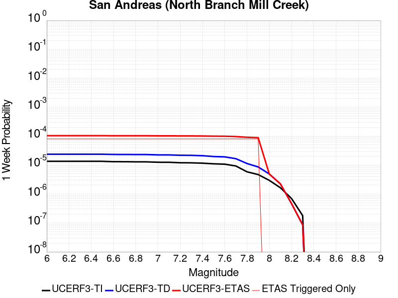 | 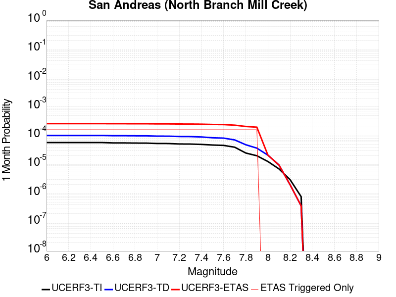 | 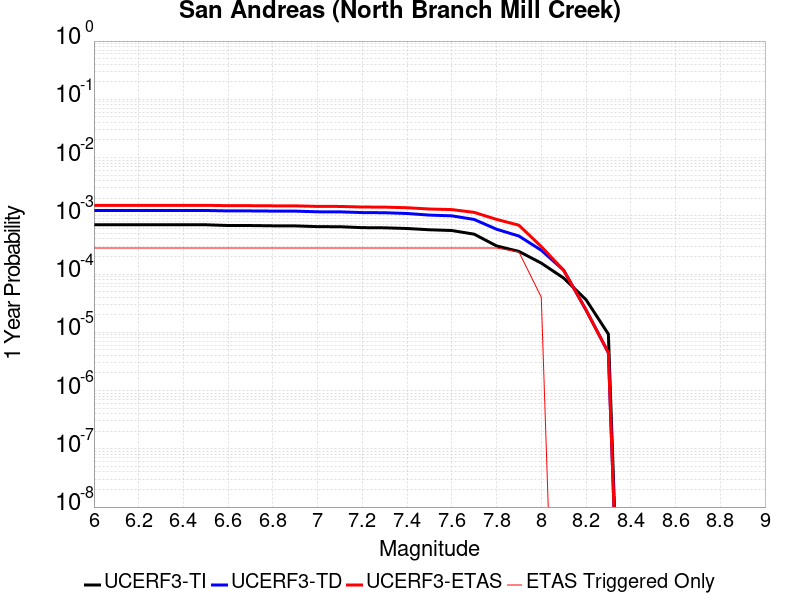 |

| Magnitude | 1 wk TI Prob | 1 wk TD Prob | 1 wk ETAS Prob | 1 wk ETAS/TD Gain | 1 wk ETAS Triggered Only | 1 mo TI Prob | 1 mo TD Prob | 1 mo ETAS Prob | 1 mo ETAS/TD Gain | 1 mo ETAS Triggered Only | 1 yr TI Prob | 1 yr TD Prob | 1 yr ETAS Prob | 1 yr ETAS/TD Gain | 1 yr ETAS Triggered Only |
|-----|-----|-----|-----|-----|-----|-----|-----|-----|-----|-----|-----|-----|-----|-----|-----|
| 6.0 | 1.3461156E-5 | 2.3679182E-5 | 1.0367729E-4 | 4.378415 | 8.0E-5 | 5.7689394E-5 | 1.0147828E-4 | 2.6146203E-4 | 2.5765321 | 1.6E-4 | 7.02142E-4 | 0.0012348011 | 0.0015144554 | 1.2264771 | 2.8E-4 |
| 6.1 | 1.3461156E-5 | 2.3679182E-5 | 1.0367729E-4 | 4.378415 | 8.0E-5 | 5.7689394E-5 | 1.0147828E-4 | 2.6146203E-4 | 2.5765321 | 1.6E-4 | 7.02142E-4 | 0.0012348011 | 0.0015144554 | 1.2264771 | 2.8E-4 |
| 6.2 | 1.3461156E-5 | 2.3679182E-5 | 1.0367729E-4 | 4.378415 | 8.0E-5 | 5.7689394E-5 | 1.0147828E-4 | 2.6146203E-4 | 2.5765321 | 1.6E-4 | 7.02142E-4 | 0.0012348011 | 0.0015144554 | 1.2264771 | 2.8E-4 |
| 6.3 | 1.3461156E-5 | 2.3679182E-5 | 1.0367729E-4 | 4.378415 | 8.0E-5 | 5.7689394E-5 | 1.0147828E-4 | 2.6146203E-4 | 2.5765321 | 1.6E-4 | 7.02142E-4 | 0.0012348011 | 0.0015144554 | 1.2264771 | 2.8E-4 |
| 6.4 | 1.3461156E-5 | 2.3679182E-5 | 1.0367729E-4 | 4.378415 | 8.0E-5 | 5.7689394E-5 | 1.0147828E-4 | 2.6146203E-4 | 2.5765321 | 1.6E-4 | 7.02142E-4 | 0.0012348011 | 0.0015144554 | 1.2264771 | 2.8E-4 |
| 6.5 | 1.3450706E-5 | 2.366814E-5 | 1.0366624E-4 | 4.379991 | 8.0E-5 | 5.764461E-5 | 1.0143096E-4 | 2.6141474E-4 | 2.5772676 | 1.6E-4 | 7.0159714E-4 | 0.0012342257 | 0.0015138801 | 1.2265829 | 2.8E-4 |
| 6.6 | 1.3074523E-5 | 2.328236E-5 | 1.032805E-4 | 4.4359975 | 8.0E-5 | 5.6032466E-5 | 9.9777746E-5 | 2.597618E-4 | 2.603404 | 1.6E-4 | 6.8198174E-4 | 0.0012141204 | 0.0014937804 | 1.2303396 | 2.8E-4 |
| 6.7 | 1.3050216E-5 | 2.3257642E-5 | 1.03255785E-4 | 4.4396496 | 8.0E-5 | 5.59283E-5 | 9.967182E-5 | 2.5965588E-4 | 2.605108 | 1.6E-4 | 6.8071426E-4 | 0.0012128322 | 0.0014924926 | 1.2305846 | 2.8E-4 |
| 6.8 | 1.29049395E-5 | 2.3106015E-5 | 1.0310417E-4 | 4.462222 | 8.0E-5 | 5.530571E-5 | 9.9022036E-5 | 2.590062E-4 | 2.615642 | 1.6E-4 | 6.73139E-4 | 0.0012049298 | 0.0014845923 | 1.2320987 | 2.8E-4 |
| 6.9 | 1.2867369E-5 | 2.306539E-5 | 1.0306355E-4 | 4.46832 | 8.0E-5 | 5.51447E-5 | 9.8847944E-5 | 2.5883212E-4 | 2.6184878 | 1.6E-4 | 6.711799E-4 | 0.0012028125 | 0.0014824758 | 1.2325077 | 2.8E-4 |
| 7.0 | 1.2495996E-5 | 2.2464183E-5 | 1.02462385E-4 | 4.5611444 | 8.0E-5 | 5.3553173E-5 | 9.6271535E-5 | 2.5625614E-4 | 2.6618059 | 1.6E-4 | 6.518148E-4 | 0.0011714785 | 0.0014511505 | 1.2387342 | 2.8E-4 |
| 7.1 | 1.2452067E-5 | 2.2409202E-5 | 1.0240741E-4 | 4.569882 | 8.0E-5 | 5.3364907E-5 | 9.603592E-5 | 2.5602055E-4 | 2.6658833 | 1.6E-4 | 6.4952404E-4 | 0.001168613 | 0.0014482858 | 1.2393203 | 2.8E-4 |
| 7.2 | 1.2002777E-5 | 2.1786782E-5 | 1.0178504E-4 | 4.671871 | 8.0E-5 | 5.143946E-5 | 9.3368595E-5 | 2.5335365E-4 | 2.7134783 | 1.6E-4 | 6.2609545E-4 | 0.0011361726 | 0.0014158544 | 1.2461615 | 2.8E-4 |
| 7.3 | 1.1923425E-5 | 2.1656399E-5 | 1.0165467E-4 | 4.6939783 | 8.0E-5 | 5.109939E-5 | 9.280985E-5 | 2.52795E-4 | 2.723795 | 1.6E-4 | 6.219575E-4 | 0.0011293768 | 0.0014090607 | 1.2476443 | 2.8E-4 |
| 7.4 | 1.16105175E-5 | 2.1028349E-5 | 1.01026664E-4 | 4.804308 | 8.0E-5 | 4.975841E-5 | 9.0118396E-5 | 2.5010397E-4 | 2.7752821 | 1.6E-4 | 6.0564023E-4 | 0.0010966419 | 0.0013763348 | 1.2550449 | 2.8E-4 |
| 7.5 | 1.1037265E-5 | 1.9721652E-5 | 9.972008E-5 | 5.0563755 | 8.0E-5 | 4.7301706E-5 | 8.451864E-5 | 2.4450512E-4 | 2.8929136 | 1.6E-4 | 5.757461E-4 | 0.0010285309 | 0.0013082429 | 1.271953 | 2.8E-4 |
| 7.6 | 1.0720915E-5 | 1.9161336E-5 | 9.9159806E-5 | 5.174994 | 8.0E-5 | 4.5945973E-5 | 8.211744E-5 | 2.421043E-4 | 2.948269 | 1.6E-4 | 5.592486E-4 | 9.993234E-4 | 0.0012790436 | 1.2799096 | 2.8E-4 |
| 7.7 | 9.276279E-6 | 1.6599204E-5 | 9.6597876E-5 | 5.819428 | 8.0E-5 | 3.9754876E-5 | 7.113752E-5 | 2.3112613E-4 | 3.2490048 | 1.6E-4 | 4.839081E-4 | 8.657568E-4 | 0.0011455144 | 1.3231364 | 2.8E-4 |
| 7.8 | 5.8346777E-6 | 1.1282931E-5 | 9.1282025E-5 | 8.090276 | 8.0E-5 | 2.5005522E-5 | 4.8354523E-5 | 2.0834678E-4 | 4.308734 | 1.6E-4 | 3.043997E-4 | 5.8855745E-4 | 8.6839264E-4 | 1.4754595 | 2.8E-4 |
| 7.9 | 4.690204E-6 | 8.6155715E-6 | 8.8614885E-5 | 10.285433 | 8.0E-5 | 2.0100719E-5 | 3.6923357E-5 | 1.9691745E-4 | 5.3331404 | 1.6E-4 | 2.4469878E-4 | 4.4944923E-4 | 6.893414E-4 | 1.5337468 | 2.4E-4 |
| 8.0 | 2.9570454E-6 | 4.9120426E-6 | 4.9120426E-6 | 1.0 | 0.0 | 1.267299E-5 | 2.105144E-5 | 2.105144E-5 | 1.0 | 0.0 | 1.5428272E-4 | 2.562712E-4 | 2.9626093E-4 | 1.1560446 | 4.0E-5 |
| 8.1 | 1.6376824E-6 | 2.2310655E-6 | 2.2310655E-6 | 1.0 | 0.0 | 7.01862E-6 | 9.561673E-6 | 9.561673E-6 | 1.0 | 0.0 | 8.544835E-5 | 1.1640717E-4 | 1.1640717E-4 | 1.0 | 0.0 |
| 8.2 | 6.9631557E-7 | 4.641532E-7 | 4.641532E-7 | 1.0 | 0.0 | 2.984206E-6 | 1.9892263E-6 | 1.9892263E-6 | 1.0 | 0.0 | 3.63321E-5 | 2.4218563E-5 | 2.4218563E-5 | 1.0 | 0.0 |
| 8.3 | 1.7876137E-7 | 8.5759865E-8 | 8.5759865E-8 | 1.0 | 0.0 | 7.661199E-7 | 3.675422E-7 | 3.675422E-7 | 1.0 | 0.0 | 9.32747E-6 | 4.4748176E-6 | 4.4748176E-6 | 1.0 | 0.0 |

## Mission Creek
*[(top)](#table-of-contents)*

| 1 Week | 1 Month | 1 Year |
|-----|-----|-----|
| 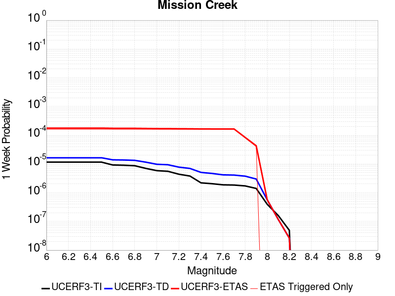 | 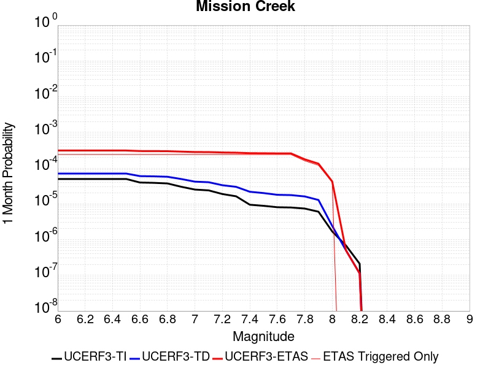 | 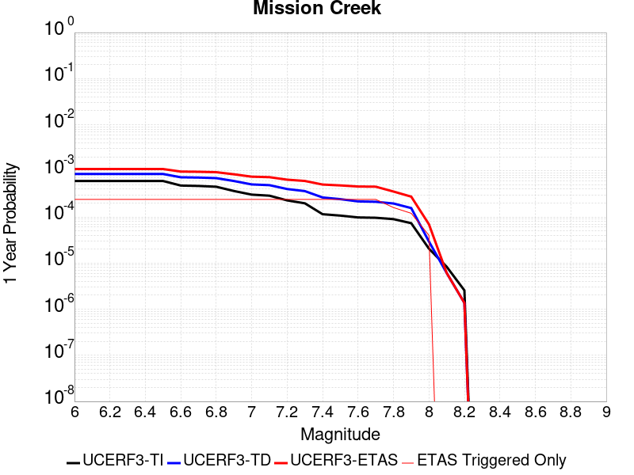 |

| Magnitude | 1 wk TI Prob | 1 wk TD Prob | 1 wk ETAS Prob | 1 wk ETAS/TD Gain | 1 wk ETAS Triggered Only | 1 mo TI Prob | 1 mo TD Prob | 1 mo ETAS Prob | 1 mo ETAS/TD Gain | 1 mo ETAS Triggered Only | 1 yr TI Prob | 1 yr TD Prob | 1 yr ETAS Prob | 1 yr ETAS/TD Gain | 1 yr ETAS Triggered Only |
|-----|-----|-----|-----|-----|-----|-----|-----|-----|-----|-----|-----|-----|-----|-----|-----|
| 6.0 | 1.1549387E-5 | 1.6382799E-5 | 1.7638018E-4 | 10.76618 | 1.6E-4 | 4.9496433E-5 | 7.02102E-5 | 3.1019334E-4 | 4.418067 | 2.4E-4 | 6.0245243E-4 | 8.544889E-4 | 0.0010942839 | 1.2806296 | 2.4E-4 |
| 6.1 | 1.1549387E-5 | 1.6382799E-5 | 1.7638018E-4 | 10.76618 | 1.6E-4 | 4.9496433E-5 | 7.02102E-5 | 3.1019334E-4 | 4.418067 | 2.4E-4 | 6.0245243E-4 | 8.544889E-4 | 0.0010942839 | 1.2806296 | 2.4E-4 |
| 6.2 | 1.1549387E-5 | 1.6382799E-5 | 1.7638018E-4 | 10.76618 | 1.6E-4 | 4.9496433E-5 | 7.02102E-5 | 3.1019334E-4 | 4.418067 | 2.4E-4 | 6.0245243E-4 | 8.544889E-4 | 0.0010942839 | 1.2806296 | 2.4E-4 |
| 6.3 | 1.1549387E-5 | 1.6382799E-5 | 1.7638018E-4 | 10.76618 | 1.6E-4 | 4.9496433E-5 | 7.02102E-5 | 3.1019334E-4 | 4.418067 | 2.4E-4 | 6.0245243E-4 | 8.544889E-4 | 0.0010942839 | 1.2806296 | 2.4E-4 |
| 6.4 | 1.1549387E-5 | 1.6382799E-5 | 1.7638018E-4 | 10.76618 | 1.6E-4 | 4.9496433E-5 | 7.02102E-5 | 3.1019334E-4 | 4.418067 | 2.4E-4 | 6.0245243E-4 | 8.544889E-4 | 0.0010942839 | 1.2806296 | 2.4E-4 |
| 6.5 | 1.1549387E-5 | 1.6382799E-5 | 1.7638018E-4 | 10.76618 | 1.6E-4 | 4.9496433E-5 | 7.02102E-5 | 3.1019334E-4 | 4.418067 | 2.4E-4 | 6.0245243E-4 | 8.544889E-4 | 0.0010942839 | 1.2806296 | 2.4E-4 |
| 6.6 | 9.202681E-6 | 1.3905611E-5 | 1.7390339E-4 | 12.505986 | 1.6E-4 | 3.9439463E-5 | 5.9594167E-5 | 2.9957987E-4 | 5.027 | 2.4E-4 | 4.800697E-4 | 7.253265E-4 | 9.651524E-4 | 1.3306454 | 2.4E-4 |
| 6.7 | 9.019164E-6 | 1.3711242E-5 | 1.7370905E-4 | 12.669096 | 1.6E-4 | 3.8652986E-5 | 5.8761194E-5 | 2.987471E-4 | 5.0840883 | 2.4E-4 | 4.7049852E-4 | 7.151917E-4 | 9.550201E-4 | 1.3353343 | 2.4E-4 |
| 6.8 | 8.673558E-6 | 1.3333226E-5 | 1.733311E-4 | 12.999937 | 1.6E-4 | 3.717186E-5 | 5.7141195E-5 | 2.9712747E-4 | 5.199882 | 2.4E-4 | 4.524734E-4 | 6.9548085E-4 | 9.3531393E-4 | 1.3448449 | 2.4E-4 |
| 6.9 | 7.002255E-6 | 1.1536997E-5 | 1.7153515E-4 | 14.868267 | 1.6E-4 | 3.000932E-5 | 4.9443373E-5 | 2.894315E-4 | 5.853798 | 2.4E-4 | 3.653022E-4 | 6.0181366E-4 | 8.416692E-4 | 1.3985546 | 2.4E-4 |
| 7.0 | 5.84644E-6 | 9.7312795E-6 | 1.6972973E-4 | 17.441666 | 1.6E-4 | 2.5055931E-5 | 4.1704843E-5 | 2.8169484E-4 | 6.7544875 | 2.4E-4 | 3.0501327E-4 | 5.0764275E-4 | 7.475209E-4 | 1.4725335 | 2.4E-4 |
| 7.1 | 5.54703E-6 | 9.3855515E-6 | 1.6938405E-4 | 18.04732 | 1.6E-4 | 2.377277E-5 | 4.0223196E-5 | 2.8021354E-4 | 6.9664664 | 2.4E-4 | 2.8939504E-4 | 4.896118E-4 | 7.294943E-4 | 1.4899442 | 2.4E-4 |
| 7.2 | 4.384709E-6 | 7.735159E-6 | 1.6773392E-4 | 21.684612 | 1.6E-4 | 1.8791474E-5 | 3.315028E-5 | 2.7314233E-4 | 8.239518 | 2.4E-4 | 2.2876218E-4 | 4.0353357E-4 | 6.4343674E-4 | 1.594506 | 2.4E-4 |
| 7.3 | 3.7888456E-6 | 6.967982E-6 | 1.6696687E-4 | 23.962011 | 1.6E-4 | 1.623781E-5 | 2.9862456E-5 | 2.6985529E-4 | 9.036607 | 2.4E-4 | 1.9767738E-4 | 3.635181E-4 | 6.0343085E-4 | 1.6599747 | 2.4E-4 |
| 7.4 | 2.1982462E-6 | 5.074753E-6 | 1.6507394E-4 | 32.52847 | 1.6E-4 | 9.421021E-6 | 2.1748761E-5 | 2.6174355E-4 | 12.034871 | 2.4E-4 | 1.1469489E-4 | 2.6475918E-4 | 5.0469564E-4 | 1.9062442 | 2.4E-4 |
| 7.5 | 2.051923E-6 | 4.664606E-6 | 1.6466386E-4 | 35.3007 | 1.6E-4 | 8.793926E-6 | 1.9991017E-5 | 2.599862E-4 | 13.005153 | 2.4E-4 | 1.0706078E-4 | 2.4336358E-4 | 4.8330516E-4 | 1.9859388 | 2.4E-4 |
| 7.6 | 1.8733427E-6 | 4.1712638E-6 | 1.6417059E-4 | 39.357517 | 1.6E-4 | 8.028587E-6 | 1.7876722E-5 | 2.5787242E-4 | 14.425039 | 2.4E-4 | 9.774366E-5 | 2.1762746E-4 | 4.5757522E-4 | 2.102562 | 2.4E-4 |
| 7.7 | 1.8411953E-6 | 4.0906184E-6 | 1.6408996E-4 | 40.11373 | 1.6E-4 | 7.890813E-6 | 1.7531105E-5 | 2.575269E-4 | 14.6897135 | 2.4E-4 | 9.606641E-5 | 2.1342038E-4 | 4.5336917E-4 | 2.1243012 | 2.4E-4 |
| 7.8 | 1.7194251E-6 | 3.754731E-6 | 8.375443E-5 | 22.306372 | 8.0E-5 | 7.368944E-6 | 1.6091606E-5 | 1.7608903E-4 | 10.942912 | 1.6E-4 | 8.97132E-5 | 1.9589777E-4 | 3.5586642E-4 | 1.8165926 | 1.6E-4 |
| 7.9 | 1.4035052E-6 | 2.986388E-6 | 4.298627E-5 | 14.394067 | 4.0E-5 | 6.0150082E-6 | 1.2798743E-5 | 1.3279721E-4 | 10.3758 | 1.2E-4 | 7.3230265E-5 | 1.5581361E-4 | 2.757949E-4 | 1.7700309 | 1.2E-4 |
| 8.0 | 3.9318823E-7 | 5.6164873E-7 | 5.6164873E-7 | 1.0 | 0.0 | 1.6850913E-6 | 2.4070637E-6 | 4.2406966E-5 | 17.617718 | 4.0E-5 | 2.0515794E-5 | 2.9305613E-5 | 6.930444E-5 | 2.3648863 | 4.0E-5 |
| 8.1 | 1.596793E-7 | 1.1683749E-7 | 1.1683749E-7 | 1.0 | 0.0 | 6.8433974E-7 | 5.0073197E-7 | 5.0073197E-7 | 1.0 | 0.0 | 8.331805E-6 | 6.0963953E-6 | 6.0963953E-6 | 1.0 | 0.0 |
| 8.2 | 4.9003038E-8 | 2.6213556E-8 | 2.6213556E-8 | 1.0 | 0.0 | 2.10013E-7 | 1.12343805E-7 | 1.12343805E-7 | 1.0 | 0.0 | 2.5569052E-6 | 1.367785E-6 | 1.367785E-6 | 1.0 | 0.0 |

## San Jacinto (Coyote Creek)
*[(top)](#table-of-contents)*

| 1 Week | 1 Month | 1 Year |
|-----|-----|-----|
| 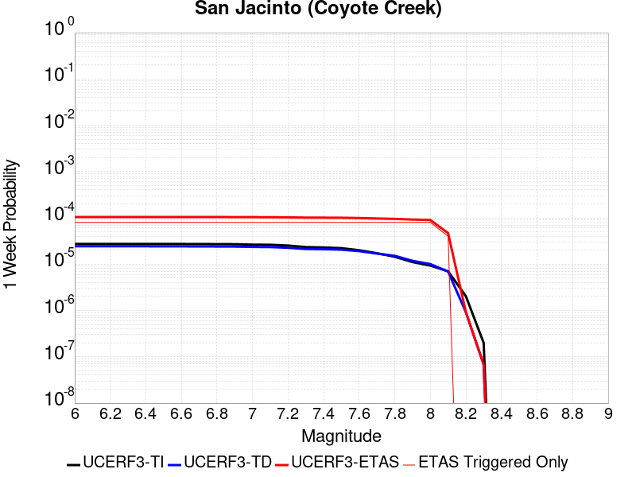 | 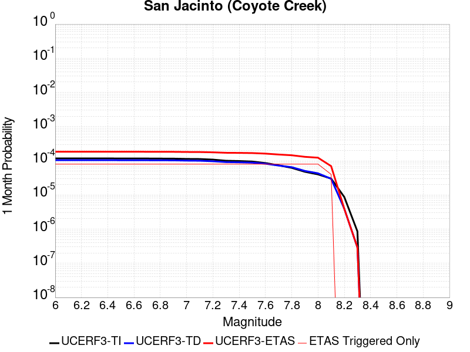 | 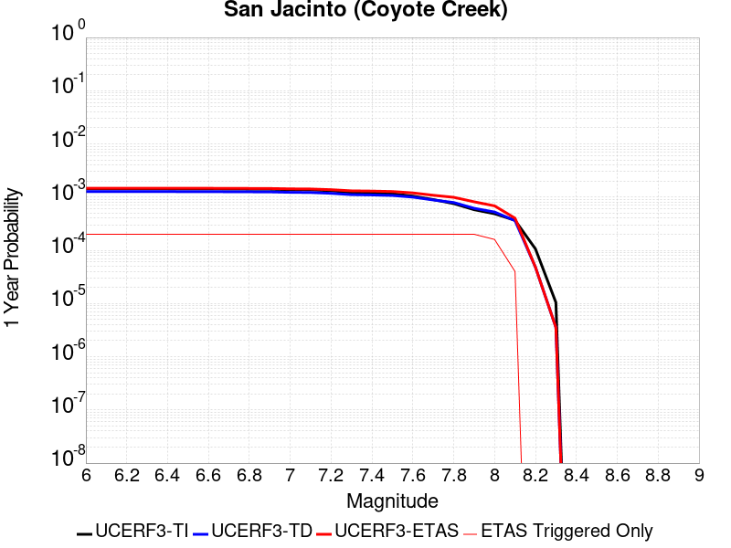 |

| Magnitude | 1 wk TI Prob | 1 wk TD Prob | 1 wk ETAS Prob | 1 wk ETAS/TD Gain | 1 wk ETAS Triggered Only | 1 mo TI Prob | 1 mo TD Prob | 1 mo ETAS Prob | 1 mo ETAS/TD Gain | 1 mo ETAS Triggered Only | 1 yr TI Prob | 1 yr TD Prob | 1 yr ETAS Prob | 1 yr ETAS/TD Gain | 1 yr ETAS Triggered Only |
|-----|-----|-----|-----|-----|-----|-----|-----|-----|-----|-----|-----|-----|-----|-----|-----|
| 6.0 | 2.7374346E-5 | 2.4356477E-5 | 1.0435453E-4 | 4.284467 | 8.0E-5 | 1.1731335E-4 | 1.04380735E-4 | 1.8437239E-4 | 1.7663449 | 8.0E-5 | 0.0014273542 | 0.0012700972 | 0.0014698432 | 1.1572683 | 2.0E-4 |
| 6.1 | 2.7374346E-5 | 2.4356477E-5 | 1.0435453E-4 | 4.284467 | 8.0E-5 | 1.1731335E-4 | 1.04380735E-4 | 1.8437239E-4 | 1.7663449 | 8.0E-5 | 0.0014273542 | 0.0012700972 | 0.0014698432 | 1.1572683 | 2.0E-4 |
| 6.2 | 2.7374346E-5 | 2.4356477E-5 | 1.0435453E-4 | 4.284467 | 8.0E-5 | 1.1731335E-4 | 1.04380735E-4 | 1.8437239E-4 | 1.7663449 | 8.0E-5 | 0.0014273542 | 0.0012700972 | 0.0014698432 | 1.1572683 | 2.0E-4 |
| 6.3 | 2.7374346E-5 | 2.4356477E-5 | 1.0435453E-4 | 4.284467 | 8.0E-5 | 1.1731335E-4 | 1.04380735E-4 | 1.8437239E-4 | 1.7663449 | 8.0E-5 | 0.0014273542 | 0.0012700972 | 0.0014698432 | 1.1572683 | 2.0E-4 |
| 6.4 | 2.7374346E-5 | 2.4356477E-5 | 1.0435453E-4 | 4.284467 | 8.0E-5 | 1.1731335E-4 | 1.04380735E-4 | 1.8437239E-4 | 1.7663449 | 8.0E-5 | 0.0014273542 | 0.0012700972 | 0.0014698432 | 1.1572683 | 2.0E-4 |
| 6.5 | 2.7282445E-5 | 2.4242463E-5 | 1.0424052E-4 | 4.299915 | 8.0E-5 | 1.16919524E-4 | 1.0389215E-4 | 1.8388384E-4 | 1.7699493 | 8.0E-5 | 0.0014225657 | 0.0012641556 | 0.0014639028 | 1.1580083 | 2.0E-4 |
| 6.6 | 2.7282445E-5 | 2.4242463E-5 | 1.0424052E-4 | 4.299915 | 8.0E-5 | 1.16919524E-4 | 1.0389215E-4 | 1.8388384E-4 | 1.7699493 | 8.0E-5 | 0.0014225657 | 0.0012641556 | 0.0014639028 | 1.1580083 | 2.0E-4 |
| 6.7 | 2.7216198E-5 | 2.4167522E-5 | 1.0416559E-4 | 4.310148 | 8.0E-5 | 1.1663563E-4 | 1.03571E-4 | 1.8356272E-4 | 1.772337 | 8.0E-5 | 0.0014191137 | 0.0012602502 | 0.0014599981 | 1.1584986 | 2.0E-4 |
| 6.8 | 2.7078617E-5 | 2.4084618E-5 | 1.0408269E-4 | 4.3215423 | 8.0E-5 | 1.1604605E-4 | 1.0321572E-4 | 1.8320746E-4 | 1.7749957 | 8.0E-5 | 0.001411945 | 0.0012559297 | 0.0014556785 | 1.1590446 | 2.0E-4 |
| 6.9 | 2.6982952E-5 | 2.4003995E-5 | 1.0400207E-4 | 4.3326983 | 8.0E-5 | 1.15636096E-4 | 1.02870225E-4 | 1.82862E-4 | 1.7775989 | 8.0E-5 | 0.0014069602 | 0.0012517282 | 0.0014514778 | 1.1595792 | 2.0E-4 |
| 7.0 | 2.6449972E-5 | 2.3580524E-5 | 1.0357863E-4 | 4.3925505 | 8.0E-5 | 1.1335209E-4 | 1.01055484E-4 | 1.810474E-4 | 1.7915643 | 8.0E-5 | 0.001379188 | 0.0012296587 | 0.0014294127 | 1.1624467 | 2.0E-4 |
| 7.1 | 2.6257849E-5 | 2.3406348E-5 | 1.03404476E-4 | 4.417796 | 8.0E-5 | 1.1252879E-4 | 1.0030907E-4 | 1.8030105E-4 | 1.797455 | 8.0E-5 | 0.0013691769 | 0.0012205814 | 0.0014203372 | 1.1636564 | 2.0E-4 |
| 7.2 | 2.5270041E-5 | 2.2599575E-5 | 1.0259777E-4 | 4.5398097 | 8.0E-5 | 1.0829568E-4 | 9.685174E-5 | 1.76844E-4 | 1.8259248 | 8.0E-5 | 0.0013177024 | 0.0011785345 | 0.0013782987 | 1.1695023 | 2.0E-4 |
| 7.3 | 2.339701E-5 | 2.1328571E-5 | 1.0132686E-4 | 4.750757 | 8.0E-5 | 1.0026905E-4 | 9.1404974E-5 | 1.7139767E-4 | 1.8751459 | 8.0E-5 | 0.001220092 | 0.0011122895 | 0.001312067 | 1.1796093 | 2.0E-4 |
| 7.4 | 2.296333E-5 | 2.1058198E-5 | 1.0105652E-4 | 4.7989154 | 8.0E-5 | 9.841056E-5 | 9.0246314E-5 | 1.702391E-4 | 1.8863828 | 8.0E-5 | 0.0011974899 | 0.0010981972 | 0.0012979775 | 1.1819167 | 2.0E-4 |
| 7.5 | 2.2188895E-5 | 2.0579188E-5 | 1.0057754E-4 | 4.887343 | 8.0E-5 | 9.50918E-5 | 8.819355E-5 | 1.681865E-4 | 1.9070158 | 8.0E-5 | 0.0011571277 | 0.0010732296 | 0.0012730149 | 1.1861534 | 2.0E-4 |
| 7.6 | 2.0013189E-5 | 1.9158566E-5 | 9.9157034E-5 | 5.1755977 | 8.0E-5 | 8.5767984E-5 | 8.210557E-5 | 1.6209901E-4 | 1.9742754 | 8.0E-5 | 0.001043725 | 9.991786E-4 | 0.0011989789 | 1.1999644 | 2.0E-4 |
| 7.7 | 1.7230794E-5 | 1.6934096E-5 | 9.6932745E-5 | 5.724117 | 8.0E-5 | 7.384417E-5 | 7.2572686E-5 | 1.5256688E-4 | 2.1022632 | 8.0E-5 | 8.986819E-4 | 8.8321505E-4 | 0.0010830384 | 1.2262454 | 2.0E-4 |
| 7.8 | 1.4478809E-5 | 1.5174756E-5 | 9.517354E-5 | 6.2718334 | 8.0E-5 | 6.205057E-5 | 6.5033055E-5 | 1.4502785E-4 | 2.2300637 | 8.0E-5 | 7.552038E-4 | 7.914904E-4 | 9.913321E-4 | 1.2524878 | 2.0E-4 |
| 7.9 | 1.1114467E-5 | 1.180864E-5 | 9.18077E-5 | 7.7746205 | 8.0E-5 | 4.7632562E-5 | 5.060748E-5 | 1.3060342E-4 | 2.580714 | 8.0E-5 | 5.797721E-4 | 6.1597244E-4 | 8.158493E-4 | 1.3244898 | 2.0E-4 |
| 8.0 | 9.327402E-6 | 1.0048055E-5 | 9.004725E-5 | 8.961659 | 8.0E-5 | 3.9973966E-5 | 4.3062384E-5 | 1.2305894E-4 | 2.8576899 | 8.0E-5 | 4.8657437E-4 | 5.24159E-4 | 6.840751E-4 | 1.3050909 | 1.6E-4 |
| 8.1 | 7.0235833E-6 | 6.9387575E-6 | 4.693848E-5 | 6.764681 | 4.0E-5 | 3.0100724E-5 | 2.9737195E-5 | 6.973601E-5 | 2.3450768 | 4.0E-5 | 3.664147E-4 | 3.6199074E-4 | 4.0197626E-4 | 1.11046 | 4.0E-5 |
| 8.2 | 2.0358202E-6 | 9.2101675E-7 | 9.2101675E-7 | 1.0 | 0.0 | 8.724915E-6 | 3.947209E-6 | 3.947209E-6 | 1.0 | 0.0 | 1.06220665E-4 | 4.805623E-5 | 4.805623E-5 | 1.0 | 0.0 |
| 8.3 | 2.0051264E-7 | 6.7996226E-8 | 6.7996226E-8 | 1.0 | 0.0 | 8.5933965E-7 | 2.9141236E-7 | 2.9141236E-7 | 1.0 | 0.0 | 1.046241E-5 | 3.5479404E-6 | 3.5479404E-6 | 1.0 | 0.0 |

## San Jacinto (Clark) rev
*[(top)](#table-of-contents)*

| 1 Week | 1 Month | 1 Year |
|-----|-----|-----|
| 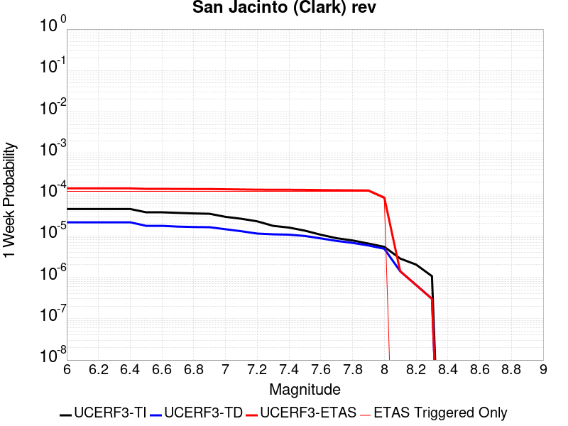 | 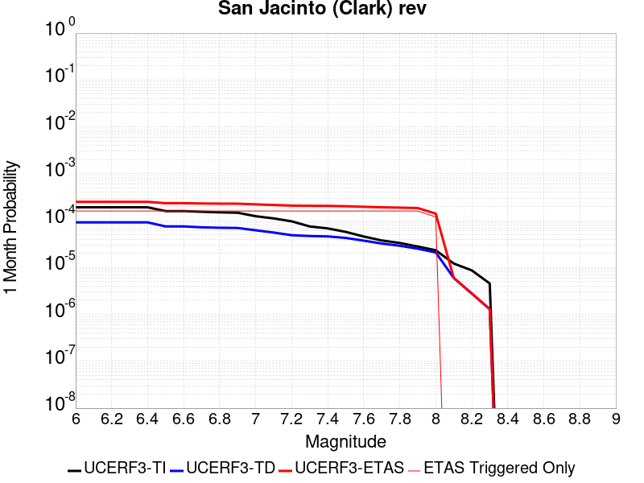 | 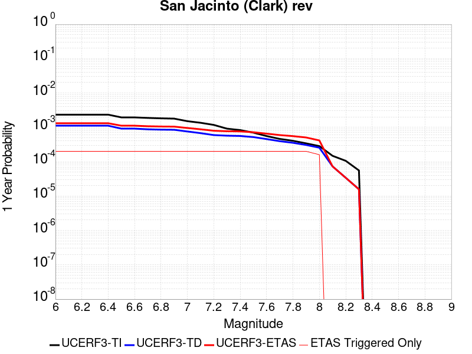 |

| Magnitude | 1 wk TI Prob | 1 wk TD Prob | 1 wk ETAS Prob | 1 wk ETAS/TD Gain | 1 wk ETAS Triggered Only | 1 mo TI Prob | 1 mo TD Prob | 1 mo ETAS Prob | 1 mo ETAS/TD Gain | 1 mo ETAS Triggered Only | 1 yr TI Prob | 1 yr TD Prob | 1 yr ETAS Prob | 1 yr ETAS/TD Gain | 1 yr ETAS Triggered Only |
|-----|-----|-----|-----|-----|-----|-----|-----|-----|-----|-----|-----|-----|-----|-----|-----|
| 6.0 | 4.482615E-5 | 2.1381953E-5 | 1.4137938E-4 | 6.6120896 | 1.2E-4 | 1.9209793E-4 | 9.1633774E-5 | 2.5161912E-4 | 2.7459211 | 1.6E-4 | 0.0023362834 | 0.0011150796 | 0.0013148566 | 1.1791594 | 2.0E-4 |
| 6.1 | 4.482615E-5 | 2.1381953E-5 | 1.4137938E-4 | 6.6120896 | 1.2E-4 | 1.9209793E-4 | 9.1633774E-5 | 2.5161912E-4 | 2.7459211 | 1.6E-4 | 0.0023362834 | 0.0011150796 | 0.0013148566 | 1.1791594 | 2.0E-4 |
| 6.2 | 4.482615E-5 | 2.1381953E-5 | 1.4137938E-4 | 6.6120896 | 1.2E-4 | 1.9209793E-4 | 9.1633774E-5 | 2.5161912E-4 | 2.7459211 | 1.6E-4 | 0.0023362834 | 0.0011150796 | 0.0013148566 | 1.1791594 | 2.0E-4 |
| 6.3 | 4.482615E-5 | 2.1381953E-5 | 1.4137938E-4 | 6.6120896 | 1.2E-4 | 1.9209793E-4 | 9.1633774E-5 | 2.5161912E-4 | 2.7459211 | 1.6E-4 | 0.0023362834 | 0.0011150796 | 0.0013148566 | 1.1791594 | 2.0E-4 |
| 6.4 | 4.482615E-5 | 2.1381953E-5 | 1.4137938E-4 | 6.6120896 | 1.2E-4 | 1.9209793E-4 | 9.1633774E-5 | 2.5161912E-4 | 2.7459211 | 1.6E-4 | 0.0023362834 | 0.0011150796 | 0.0013148566 | 1.1791594 | 2.0E-4 |
| 6.5 | 3.7294863E-5 | 1.7559976E-5 | 1.3755787E-4 | 7.833602 | 1.2E-4 | 1.5982533E-4 | 7.5254895E-5 | 2.3524286E-4 | 3.1259475 | 1.6E-4 | 0.0019441366 | 9.1584784E-4 | 0.0011156646 | 1.2181768 | 2.0E-4 |
| 6.6 | 3.7294863E-5 | 1.7559976E-5 | 1.3755787E-4 | 7.833602 | 1.2E-4 | 1.5982533E-4 | 7.5254895E-5 | 2.3524286E-4 | 3.1259475 | 1.6E-4 | 0.0019441366 | 9.1584784E-4 | 0.0011156646 | 1.2181768 | 2.0E-4 |
| 6.7 | 3.6039248E-5 | 1.6803659E-5 | 1.3680164E-4 | 8.141182 | 1.2E-4 | 1.5444479E-4 | 7.201371E-5 | 2.3200219E-4 | 3.2216392 | 1.6E-4 | 0.0018787434 | 8.764185E-4 | 0.0010762432 | 1.2280015 | 2.0E-4 |
| 6.8 | 3.5031844E-5 | 1.6428598E-5 | 1.3642662E-4 | 8.304216 | 1.2E-4 | 1.5012783E-4 | 7.040639E-5 | 2.3039513E-4 | 3.2723608 | 1.6E-4 | 0.0018262739 | 8.568649E-4 | 0.0010566936 | 1.233209 | 2.0E-4 |
| 6.9 | 3.435112E-5 | 1.6257003E-5 | 1.3625505E-4 | 8.381314 | 1.2E-4 | 1.4721078E-4 | 6.967103E-5 | 2.2965988E-4 | 3.296347 | 1.6E-4 | 0.0017908178 | 8.4791885E-4 | 0.0010477493 | 1.2356716 | 2.0E-4 |
| 7.0 | 2.8959772E-5 | 1.4511907E-5 | 1.3451016E-4 | 9.268952 | 1.2E-4 | 1.241074E-4 | 6.219242E-5 | 2.2218247E-4 | 3.5725007 | 1.6E-4 | 0.0015099603 | 7.569325E-4 | 9.567811E-4 | 1.2640244 | 2.0E-4 |
| 7.1 | 2.6002877E-5 | 1.2989396E-5 | 1.3298784E-4 | 10.238185 | 1.2E-4 | 1.11436144E-4 | 5.5667664E-5 | 2.1565876E-4 | 3.8740401 | 1.6E-4 | 0.0013558907 | 6.775452E-4 | 8.774097E-4 | 1.2949833 | 2.0E-4 |
| 7.2 | 2.2544838E-5 | 1.1407055E-5 | 1.3140569E-4 | 11.519685 | 1.2E-4 | 9.661716E-5 | 4.888647E-5 | 2.0887866E-4 | 4.272729 | 1.6E-4 | 0.001175679 | 5.950317E-4 | 7.949127E-4 | 1.3359165 | 2.0E-4 |
| 7.3 | 1.75334E-5 | 1.0946427E-5 | 1.3094512E-4 | 11.962361 | 1.2E-4 | 7.514098E-5 | 4.6912424E-5 | 2.0690492E-4 | 4.4104505 | 1.6E-4 | 9.144575E-4 | 5.710105E-4 | 7.7089627E-4 | 1.3500563 | 2.0E-4 |
| 7.4 | 1.5924552E-5 | 1.0743272E-5 | 1.3074199E-4 | 12.1696615 | 1.2E-4 | 6.82463E-5 | 4.6041787E-5 | 2.0603443E-4 | 4.474944 | 1.6E-4 | 8.305819E-4 | 5.6041597E-4 | 7.603039E-4 | 1.3566778 | 2.0E-4 |
| 7.5 | 1.3428931E-5 | 9.976539E-6 | 1.2997535E-4 | 13.028099 | 1.2E-4 | 5.7551293E-5 | 4.2755903E-5 | 2.0274906E-4 | 4.7420135 | 1.6E-4 | 7.004617E-4 | 5.2042986E-4 | 7.203258E-4 | 1.3840977 | 2.0E-4 |
| 7.6 | 1.0688787E-5 | 8.727412E-6 | 1.2872636E-4 | 14.7496605 | 1.2E-4 | 4.5808283E-5 | 3.740266E-5 | 1.9739667E-4 | 5.2776103 | 1.6E-4 | 5.5757316E-4 | 4.5528274E-4 | 6.5519166E-4 | 1.4390875 | 2.0E-4 |
| 7.7 | 8.81236E-6 | 7.5768367E-6 | 1.2757593E-4 | 16.837624 | 1.2E-4 | 3.776671E-5 | 3.2471755E-5 | 1.9246656E-4 | 5.9271994 | 1.6E-4 | 4.597127E-4 | 3.952721E-4 | 5.9519307E-4 | 1.5057806 | 2.0E-4 |
| 7.8 | 7.780431E-6 | 6.7993083E-6 | 1.2679849E-4 | 18.648733 | 1.2E-4 | 3.3344273E-5 | 2.9139568E-5 | 1.8913491E-4 | 6.490656 | 1.6E-4 | 4.0589093E-4 | 3.5471667E-4 | 5.546457E-4 | 1.5636302 | 2.0E-4 |
| 7.9 | 6.5437994E-6 | 5.8761307E-6 | 1.2587542E-4 | 21.421482 | 1.2E-4 | 2.8044553E-5 | 2.5183175E-5 | 1.8517915E-4 | 7.353288 | 1.6E-4 | 3.4138895E-4 | 3.065622E-4 | 5.065009E-4 | 1.6521962 | 2.0E-4 |
| 8.0 | 5.4488164E-6 | 4.898215E-6 | 8.489782E-5 | 17.3324 | 8.0E-5 | 2.3351862E-5 | 2.0992184E-5 | 1.4098966E-4 | 6.7162933 | 1.2E-4 | 2.8427184E-4 | 2.5555E-4 | 4.1550913E-4 | 1.6259406 | 1.6E-4 |
| 8.1 | 2.8397242E-6 | 1.4004763E-6 | 1.4004763E-6 | 1.0 | 0.0 | 1.217019E-5 | 6.002028E-6 | 6.002028E-6 | 1.0 | 0.0 | 1.4816198E-4 | 7.307225E-5 | 7.307225E-5 | 1.0 | 0.0 |
| 8.2 | 2.030244E-6 | 6.5120884E-7 | 6.5120884E-7 | 1.0 | 0.0 | 8.701017E-6 | 2.790892E-6 | 2.790892E-6 | 1.0 | 0.0 | 1.05929736E-4 | 3.3978587E-5 | 3.3978587E-5 | 1.0 | 0.0 |
| 8.3 | 1.0659804E-6 | 3.019421E-7 | 3.019421E-7 | 1.0 | 0.0 | 4.568479E-6 | 1.2940369E-6 | 1.2940369E-6 | 1.0 | 0.0 | 5.5619817E-5 | 1.575479E-5 | 1.575479E-5 | 1.0 | 0.0 |

## Cleghorn
*[(top)](#table-of-contents)*

| 1 Week | 1 Month | 1 Year |
|-----|-----|-----|
| 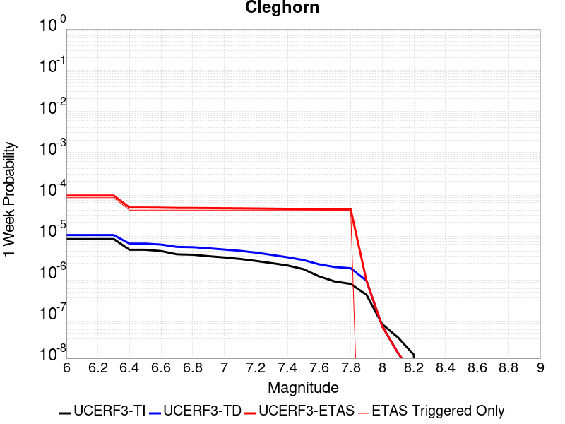 | 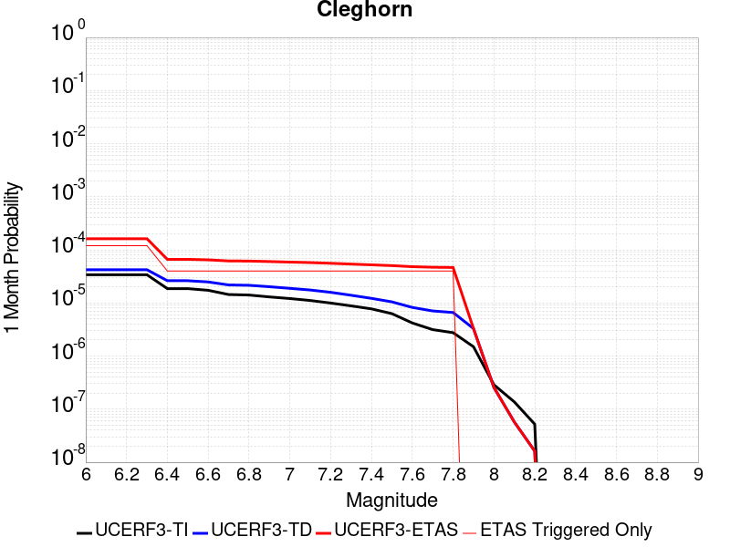 | 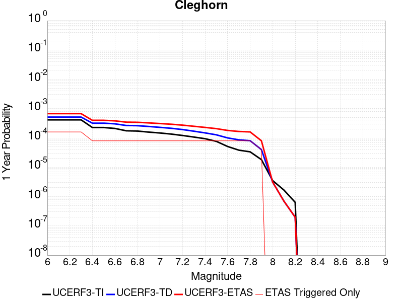 |

| Magnitude | 1 wk TI Prob | 1 wk TD Prob | 1 wk ETAS Prob | 1 wk ETAS/TD Gain | 1 wk ETAS Triggered Only | 1 mo TI Prob | 1 mo TD Prob | 1 mo ETAS Prob | 1 mo ETAS/TD Gain | 1 mo ETAS Triggered Only | 1 yr TI Prob | 1 yr TD Prob | 1 yr ETAS Prob | 1 yr ETAS/TD Gain | 1 yr ETAS Triggered Only |
|-----|-----|-----|-----|-----|-----|-----|-----|-----|-----|-----|-----|-----|-----|-----|-----|
| 6.0 | 7.9267165E-6 | 9.860011E-6 | 8.9859226E-5 | 9.113501 | 8.0E-5 | 3.39712E-5 | 4.2256568E-5 | 1.622515E-4 | 3.8396752 | 1.2E-4 | 4.1352084E-4 | 5.143629E-4 | 6.7428057E-4 | 1.3109044 | 1.6E-4 |
| 6.1 | 7.9267165E-6 | 9.860011E-6 | 8.9859226E-5 | 9.113501 | 8.0E-5 | 3.39712E-5 | 4.2256568E-5 | 1.622515E-4 | 3.8396752 | 1.2E-4 | 4.1352084E-4 | 5.143629E-4 | 6.7428057E-4 | 1.3109044 | 1.6E-4 |
| 6.2 | 7.9267165E-6 | 9.860011E-6 | 8.9859226E-5 | 9.113501 | 8.0E-5 | 3.39712E-5 | 4.2256568E-5 | 1.622515E-4 | 3.8396752 | 1.2E-4 | 4.1352084E-4 | 5.143629E-4 | 6.7428057E-4 | 1.3109044 | 1.6E-4 |
| 6.3 | 7.9267165E-6 | 9.860011E-6 | 8.9859226E-5 | 9.113501 | 8.0E-5 | 3.39712E-5 | 4.2256568E-5 | 1.622515E-4 | 3.8396752 | 1.2E-4 | 4.1352084E-4 | 5.143629E-4 | 6.7428057E-4 | 1.3109044 | 1.6E-4 |
| 6.4 | 4.3445207E-6 | 6.119313E-6 | 4.611907E-5 | 7.536641 | 4.0E-5 | 1.8619241E-5 | 2.622537E-5 | 6.622432E-5 | 2.5252006 | 4.0E-5 | 2.2666567E-4 | 3.1924812E-4 | 3.9922257E-4 | 1.2505088 | 8.0E-5 |
| 6.5 | 4.3445207E-6 | 6.119313E-6 | 4.611907E-5 | 7.536641 | 4.0E-5 | 1.8619241E-5 | 2.622537E-5 | 6.622432E-5 | 2.5252006 | 4.0E-5 | 2.2666567E-4 | 3.1924812E-4 | 3.9922257E-4 | 1.2505088 | 8.0E-5 |
| 6.6 | 4.040109E-6 | 5.8016744E-6 | 4.5801444E-5 | 7.894521 | 4.0E-5 | 1.7314638E-5 | 2.4864088E-5 | 6.4863096E-5 | 2.608706 | 4.0E-5 | 2.1078532E-4 | 3.0267914E-4 | 3.8265492E-4 | 1.2642263 | 8.0E-5 |
| 6.7 | 3.3632055E-6 | 5.095068E-6 | 4.5094865E-5 | 8.850689 | 4.0E-5 | 1.4413658E-5 | 2.1835825E-5 | 6.183495E-5 | 2.831812 | 4.0E-5 | 1.7547216E-4 | 2.6581905E-4 | 3.457978E-4 | 1.3008766 | 8.0E-5 |
| 6.8 | 3.2902772E-6 | 5.016956E-6 | 4.5016757E-5 | 8.972921 | 4.0E-5 | 1.4101111E-5 | 2.1501066E-5 | 6.1500206E-5 | 2.860333 | 4.0E-5 | 1.716675E-4 | 2.6174434E-4 | 3.417234E-4 | 1.3055618 | 8.0E-5 |
| 6.9 | 3.031547E-6 | 4.7183826E-6 | 4.4718196E-5 | 9.477441 | 4.0E-5 | 1.299228E-5 | 2.0221485E-5 | 6.0220675E-5 | 2.978054 | 4.0E-5 | 1.5816953E-4 | 2.4616905E-4 | 3.2614934E-4 | 1.3248999 | 8.0E-5 |
| 7.0 | 2.8259715E-6 | 4.3970613E-6 | 4.4396886E-5 | 10.096945 | 4.0E-5 | 1.211125E-5 | 1.8844414E-5 | 5.884366E-5 | 3.1226048 | 4.0E-5 | 1.4744449E-4 | 2.2940683E-4 | 3.0938847E-4 | 1.3486454 | 8.0E-5 |
| 7.1 | 2.5962665E-6 | 4.091863E-6 | 4.40917E-5 | 10.775458 | 4.0E-5 | 1.1126809E-5 | 1.753644E-5 | 5.7535737E-5 | 3.2809248 | 4.0E-5 | 1.3546048E-4 | 2.1348546E-4 | 2.934684E-4 | 1.3746527 | 8.0E-5 |
| 7.2 | 2.3247253E-6 | 3.7018629E-6 | 4.3701715E-5 | 11.80533 | 4.0E-5 | 9.96307E-6 | 1.5865031E-5 | 5.5864395E-5 | 3.5212283 | 4.0E-5 | 1.21293626E-4 | 1.9313981E-4 | 2.7312437E-4 | 1.4141277 | 8.0E-5 |
| 7.3 | 2.056928E-6 | 3.259398E-6 | 4.3259268E-5 | 13.272164 | 4.0E-5 | 8.815376E-6 | 1.39687745E-5 | 5.3968215E-5 | 3.8634896 | 4.0E-5 | 1.0732192E-4 | 1.7005672E-4 | 2.5004311E-4 | 1.4703512 | 8.0E-5 |
| 7.4 | 1.8055999E-6 | 2.848641E-6 | 4.2848525E-5 | 15.041743 | 4.0E-5 | 7.738263E-6 | 1.2208406E-5 | 5.2207917E-5 | 4.276391 | 4.0E-5 | 9.4209274E-5 | 1.4862734E-4 | 2.2861545E-4 | 1.5381789 | 8.0E-5 |
| 7.5 | 1.4683443E-6 | 2.4473384E-6 | 4.2447242E-5 | 17.344248 | 4.0E-5 | 6.292889E-6 | 1.0488551E-5 | 5.0488132E-5 | 4.813642 | 4.0E-5 | 7.661323E-5 | 1.2769073E-4 | 2.0768051E-4 | 1.6264338 | 8.0E-5 |
| 7.6 | 9.804088E-7 | 1.922553E-6 | 4.1922478E-5 | 21.805626 | 4.0E-5 | 4.201745E-6 | 8.239488E-6 | 4.823916E-5 | 5.8546305 | 4.0E-5 | 5.1155046E-5 | 1.003112E-4 | 1.8030318E-4 | 1.7974381 | 8.0E-5 |
| 7.7 | 7.3434086E-7 | 1.6504058E-6 | 4.165034E-5 | 25.236423 | 4.0E-5 | 3.1471714E-6 | 7.0731485E-6 | 4.7072866E-5 | 6.65515 | 4.0E-5 | 3.831614E-5 | 8.611221E-5 | 1.6610532E-4 | 1.9289404 | 8.0E-5 |
| 7.8 | 6.434184E-7 | 1.54314E-6 | 4.1543077E-5 | 26.921133 | 4.0E-5 | 2.7575045E-6 | 6.6134407E-6 | 4.6613175E-5 | 7.048249 | 4.0E-5 | 3.35721E-5 | 8.051569E-5 | 1.6050925E-4 | 1.9935151 | 8.0E-5 |
| 7.9 | 3.4943926E-7 | 7.6891484E-7 | 7.6891484E-7 | 1.0 | 0.0 | 1.497596E-6 | 3.295345E-6 | 3.295345E-6 | 1.0 | 0.0 | 1.8233079E-5 | 4.0120096E-5 | 8.0118494E-5 | 1.9969666 | 4.0E-5 |
| 8.0 | 6.717524E-8 | 5.973961E-8 | 5.973961E-8 | 1.0 | 0.0 | 2.8789387E-7 | 2.5602688E-7 | 2.5602688E-7 | 1.0 | 0.0 | 3.505102E-6 | 3.1171228E-6 | 3.1171228E-6 | 1.0 | 0.0 |
| 8.1 | 3.1984914E-8 | 1.3392032E-8 | 1.3392032E-8 | 1.0 | 0.0 | 1.370782E-7 | 5.7394423E-8 | 5.7394423E-8 | 1.0 | 0.0 | 1.6689258E-6 | 6.987769E-7 | 6.987769E-7 | 1.0 | 0.0 |
| 8.2 | 1.21887656E-8 | 3.7836694E-9 | 3.7836694E-9 | 1.0 | 0.0 | 5.2237567E-8 | 1.6215727E-8 | 1.6215727E-8 | 1.0 | 0.0 | 6.359922E-7 | 1.9742646E-7 | 1.9742646E-7 | 1.0 | 0.0 |

## Mission Ridge-Arroyo Parida-Santa Ana
*[(top)](#table-of-contents)*

| 1 Week | 1 Month | 1 Year |
|-----|-----|-----|
| 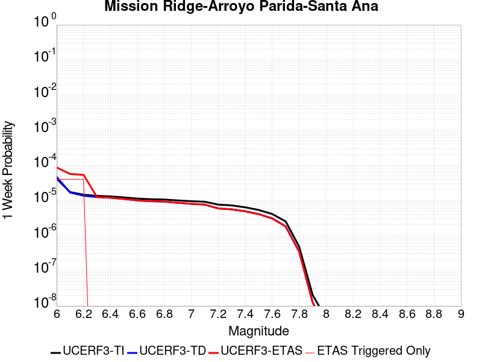 | 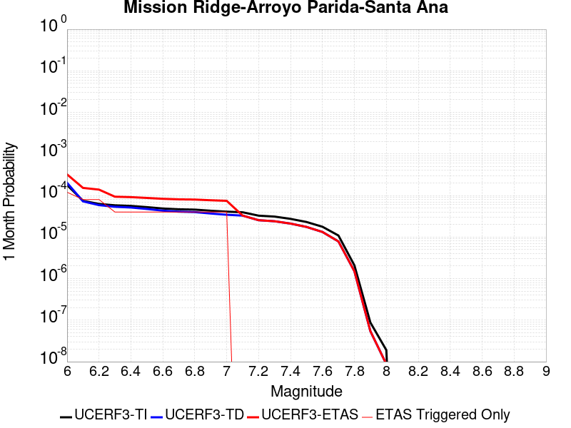 | 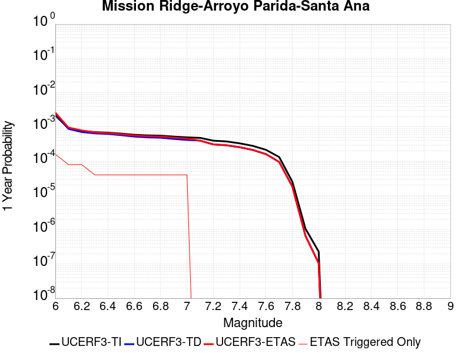 |

| Magnitude | 1 wk TI Prob | 1 wk TD Prob | 1 wk ETAS Prob | 1 wk ETAS/TD Gain | 1 wk ETAS Triggered Only | 1 mo TI Prob | 1 mo TD Prob | 1 mo ETAS Prob | 1 mo ETAS/TD Gain | 1 mo ETAS Triggered Only | 1 yr TI Prob | 1 yr TD Prob | 1 yr ETAS Prob | 1 yr ETAS/TD Gain | 1 yr ETAS Triggered Only |
|-----|-----|-----|-----|-----|-----|-----|-----|-----|-----|-----|-----|-----|-----|-----|-----|
| 6.0 | 4.169034E-5 | 4.7170066E-5 | 8.716818E-5 | 1.8479555 | 4.0E-5 | 1.7866064E-4 | 2.0214664E-4 | 3.2212236E-4 | 1.5935085 | 1.2E-4 | 0.0021730233 | 0.002459196 | 0.0026188025 | 1.064902 | 1.6E-4 |
| 6.1 | 1.73813E-5 | 1.6862212E-5 | 5.686154E-5 | 3.372128 | 4.0E-5 | 7.4489166E-5 | 7.226469E-5 | 1.522589E-4 | 2.1069615 | 8.0E-5 | 9.065282E-4 | 8.7947806E-4 | 9.594077E-4 | 1.090883 | 8.0E-5 |
| 6.2 | 1.4622182E-5 | 1.36796E-5 | 5.3679054E-5 | 3.9240222 | 4.0E-5 | 6.2664985E-5 | 5.862556E-5 | 1.3862088E-4 | 2.3645124 | 8.0E-5 | 7.6267915E-4 | 7.1353634E-4 | 7.934792E-4 | 1.1120377 | 8.0E-5 |
| 6.3 | 1.3552434E-5 | 1.2488047E-5 | 1.2488047E-5 | 1.0 | 0.0 | 5.8080568E-5 | 5.3519125E-5 | 9.351698E-5 | 1.7473564 | 4.0E-5 | 7.069015E-4 | 6.514037E-4 | 6.913776E-4 | 1.0613658 | 4.0E-5 |
| 6.4 | 1.30977305E-5 | 1.198482E-5 | 1.198482E-5 | 1.0 | 0.0 | 5.613192E-5 | 5.136252E-5 | 9.136047E-5 | 1.778738 | 4.0E-5 | 6.831918E-4 | 6.2516227E-4 | 6.6513725E-4 | 1.0639434 | 4.0E-5 |
| 6.5 | 1.225205E-5 | 1.10541505E-5 | 1.10541505E-5 | 1.0 | 0.0 | 5.2507727E-5 | 4.7374084E-5 | 8.737219E-5 | 1.8443035 | 4.0E-5 | 6.3909404E-4 | 5.7662954E-4 | 6.166065E-4 | 1.0693287 | 4.0E-5 |
| 6.6 | 1.1352241E-5 | 1.0068564E-5 | 1.0068564E-5 | 1.0 | 0.0 | 4.8651553E-5 | 4.315029E-5 | 8.314856E-5 | 1.9269526 | 4.0E-5 | 5.921717E-4 | 5.2523025E-4 | 5.652092E-4 | 1.076117 | 4.0E-5 |
| 6.7 | 1.0864116E-5 | 9.521832E-6 | 9.521832E-6 | 1.0 | 0.0 | 4.6559664E-5 | 4.0807223E-5 | 8.080559E-5 | 1.9801786 | 4.0E-5 | 5.667165E-4 | 4.967167E-4 | 5.366968E-4 | 1.0804888 | 4.0E-5 |
| 6.8 | 1.0666365E-5 | 9.30451E-6 | 9.30451E-6 | 1.0 | 0.0 | 4.571219E-5 | 3.987587E-5 | 7.987428E-5 | 2.0030727 | 4.0E-5 | 5.564038E-4 | 4.853826E-4 | 5.253632E-4 | 1.0823692 | 4.0E-5 |
| 6.9 | 1.0038665E-5 | 8.596469E-6 | 8.596469E-6 | 1.0 | 0.0 | 4.302214E-5 | 3.6841502E-5 | 7.684003E-5 | 2.085692 | 4.0E-5 | 5.236687E-4 | 4.4845478E-4 | 4.8843684E-4 | 1.0891552 | 4.0E-5 |
| 7.0 | 9.5379955E-6 | 8.029229E-6 | 8.029229E-6 | 1.0 | 0.0 | 4.0876483E-5 | 3.441054E-5 | 7.440916E-5 | 2.1623945 | 4.0E-5 | 4.975576E-4 | 4.188695E-4 | 4.5885274E-4 | 1.0954552 | 4.0E-5 |
| 7.1 | 9.207389E-6 | 7.656349E-6 | 7.656349E-6 | 1.0 | 0.0 | 3.945964E-5 | 3.2812524E-5 | 3.2812524E-5 | 1.0 | 0.0 | 4.803152E-4 | 3.9942094E-4 | 3.9942094E-4 | 1.0 | 0.0 |
| 7.2 | 7.638091E-6 | 5.9341537E-6 | 5.9341537E-6 | 1.0 | 0.0 | 3.2734264E-5 | 2.543184E-5 | 2.543184E-5 | 1.0 | 0.0 | 3.984668E-4 | 3.0958897E-4 | 3.0958897E-4 | 1.0 | 0.0 |
| 7.3 | 7.2500147E-6 | 5.598995E-6 | 5.598995E-6 | 1.0 | 0.0 | 3.1071122E-5 | 2.3995473E-5 | 2.3995473E-5 | 1.0 | 0.0 | 3.7822526E-4 | 2.9210604E-4 | 2.9210604E-4 | 1.0 | 0.0 |
| 7.4 | 6.3899715E-6 | 4.920958E-6 | 4.920958E-6 | 1.0 | 0.0 | 2.7385306E-5 | 2.108965E-5 | 2.108965E-5 | 1.0 | 0.0 | 3.3336508E-4 | 2.5673644E-4 | 2.5673644E-4 | 1.0 | 0.0 |
| 7.5 | 5.379025E-6 | 4.0858736E-6 | 4.0858736E-6 | 1.0 | 0.0 | 2.305276E-5 | 1.751077E-5 | 1.751077E-5 | 1.0 | 0.0 | 2.806312E-4 | 2.1317287E-4 | 2.1317287E-4 | 1.0 | 0.0 |
| 7.6 | 4.1270696E-6 | 3.0896479E-6 | 3.0896479E-6 | 1.0 | 0.0 | 1.768732E-5 | 1.32412815E-5 | 1.32412815E-5 | 1.0 | 0.0 | 2.1532185E-4 | 1.6120075E-4 | 1.6120075E-4 | 1.0 | 0.0 |
| 7.7 | 2.5406805E-6 | 1.8289526E-6 | 1.8289526E-6 | 1.0 | 0.0 | 1.0888585E-5 | 7.838345E-6 | 7.838345E-6 | 1.0 | 0.0 | 1.3256045E-4 | 9.542773E-5 | 9.542773E-5 | 1.0 | 0.0 |
| 7.8 | 4.8608285E-7 | 3.511175E-7 | 3.511175E-7 | 1.0 | 0.0 | 2.0832106E-6 | 1.5047884E-6 | 1.5047884E-6 | 1.0 | 0.0 | 2.5362791E-5 | 1.8320647E-5 | 1.8320647E-5 | 1.0 | 0.0 |
| 7.9 | 2.0472514E-8 | 1.26979485E-8 | 1.26979485E-8 | 1.0 | 0.0 | 8.7739345E-8 | 5.441978E-8 | 5.441978E-8 | 1.0 | 0.0 | 1.068226E-6 | 6.625606E-7 | 6.625606E-7 | 1.0 | 0.0 |
| 8.0 | 4.443582E-9 | 2.0354007E-9 | 2.0354007E-9 | 1.0 | 0.0 | 1.9043922E-8 | 8.723146E-9 | 8.723146E-9 | 1.0 | 0.0 | 2.3185973E-7 | 1.062043E-7 | 1.062043E-7 | 1.0 | 0.0 |

## San Jacinto (Borrego)
*[(top)](#table-of-contents)*

| 1 Week | 1 Month | 1 Year |
|-----|-----|-----|
|  | 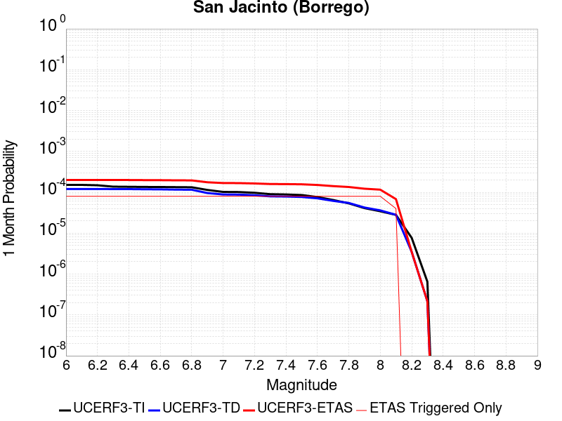 |  |

| Magnitude | 1 wk TI Prob | 1 wk TD Prob | 1 wk ETAS Prob | 1 wk ETAS/TD Gain | 1 wk ETAS Triggered Only | 1 mo TI Prob | 1 mo TD Prob | 1 mo ETAS Prob | 1 mo ETAS/TD Gain | 1 mo ETAS Triggered Only | 1 yr TI Prob | 1 yr TD Prob | 1 yr ETAS Prob | 1 yr ETAS/TD Gain | 1 yr ETAS Triggered Only |
|-----|-----|-----|-----|-----|-----|-----|-----|-----|-----|-----|-----|-----|-----|-----|-----|
| 6.0 | 3.543992E-5 | 2.8126837E-5 | 1.0812459E-4 | 3.8441787 | 8.0E-5 | 1.5187653E-4 | 1.2053809E-4 | 2.0052845E-4 | 1.6636106 | 8.0E-5 | 0.0018475284 | 0.0014665757 | 0.0016263409 | 1.1089377 | 1.6E-4 |
| 6.1 | 3.542281E-5 | 2.8126837E-5 | 1.0812459E-4 | 3.8441787 | 8.0E-5 | 1.5180321E-4 | 1.2053809E-4 | 2.0052845E-4 | 1.6636106 | 8.0E-5 | 0.0018466372 | 0.0014665757 | 0.0016263409 | 1.1089377 | 1.6E-4 |
| 6.2 | 3.4688688E-5 | 2.8126837E-5 | 1.0812459E-4 | 3.8441787 | 8.0E-5 | 1.4865733E-4 | 1.2053808E-4 | 2.0052845E-4 | 1.6636107 | 8.0E-5 | 0.0018084005 | 0.0014665755 | 0.0016263409 | 1.1089377 | 1.6E-4 |
| 6.3 | 3.2087122E-5 | 2.7972088E-5 | 1.0796985E-4 | 3.8599138 | 8.0E-5 | 1.3750899E-4 | 1.1987494E-4 | 1.9986535E-4 | 1.6672822 | 8.0E-5 | 0.0016728862 | 0.0014585126 | 0.0016182793 | 1.1095408 | 1.6E-4 |
| 6.4 | 3.1828724E-5 | 2.793903E-5 | 1.07936794E-4 | 3.863298 | 8.0E-5 | 1.364017E-4 | 1.1973327E-4 | 1.997237E-4 | 1.6680717 | 8.0E-5 | 0.0016594254 | 0.00145679 | 0.001616557 | 1.1096705 | 1.6E-4 |
| 6.5 | 3.1563577E-5 | 2.7678178E-5 | 1.07675965E-4 | 3.8902838 | 8.0E-5 | 1.3526545E-4 | 1.1861543E-4 | 1.9860595E-4 | 1.6743685 | 8.0E-5 | 0.0016456128 | 0.0014431985 | 0.0016029676 | 1.1107049 | 1.6E-4 |
| 6.6 | 3.1467625E-5 | 2.75222E-5 | 1.0752E-4 | 3.9066644 | 8.0E-5 | 1.3485427E-4 | 1.1794702E-4 | 1.9793758E-4 | 1.6781906 | 8.0E-5 | 0.0016406142 | 0.0014350713 | 0.0015948417 | 1.1113328 | 1.6E-4 |
| 6.7 | 3.1223695E-5 | 2.7139871E-5 | 1.071377E-4 | 3.9476125 | 8.0E-5 | 1.3380898E-4 | 1.1630862E-4 | 1.9629931E-4 | 1.6877452 | 8.0E-5 | 0.0016279068 | 0.0014151498 | 0.0015749234 | 1.1129023 | 1.6E-4 |
| 6.8 | 3.1015585E-5 | 2.69605E-5 | 1.06958345E-4 | 3.967224 | 8.0E-5 | 1.3291716E-4 | 1.1553995E-4 | 1.9553071E-4 | 1.6923212 | 8.0E-5 | 0.001617065 | 0.0014058034 | 0.0015655785 | 1.1136539 | 1.6E-4 |
| 6.9 | 2.6641965E-5 | 2.2371234E-5 | 1.0236944E-4 | 4.5759406 | 8.0E-5 | 1.1417485E-4 | 9.587322E-5 | 1.7586556E-4 | 1.8343554 | 8.0E-5 | 0.0013891924 | 0.0011666353 | 0.0013264487 | 1.1369865 | 1.6E-4 |
| 7.0 | 2.3854353E-5 | 2.0659534E-5 | 1.0065788E-4 | 4.8722243 | 8.0E-5 | 1.02228936E-4 | 8.853787E-5 | 1.6853078E-4 | 1.9034882 | 8.0E-5 | 0.0012439266 | 0.0010774181 | 0.0012372456 | 1.1483432 | 1.6E-4 |
| 7.1 | 2.3672901E-5 | 2.0495838E-5 | 1.004942E-4 | 4.9031515 | 8.0E-5 | 1.0145135E-4 | 8.7836364E-5 | 1.6782933E-4 | 1.9107045 | 8.0E-5 | 0.0012344702 | 0.0010688857 | 0.0012287146 | 1.1495286 | 1.6E-4 |
| 7.2 | 2.2717244E-5 | 1.972176E-5 | 9.9720186E-5 | 5.056353 | 8.0E-5 | 9.735599E-5 | 8.45191E-5 | 1.6451234E-4 | 1.9464515 | 8.0E-5 | 0.0011846646 | 0.0010285367 | 0.0011883721 | 1.1554008 | 1.6E-4 |
| 7.3 | 2.1016205E-5 | 1.8560979E-5 | 9.8559496E-5 | 5.3100376 | 8.0E-5 | 9.006634E-5 | 7.954463E-5 | 1.5953828E-4 | 2.0056446 | 8.0E-5 | 0.001096006 | 9.6802774E-4 | 0.0011278728 | 1.1651245 | 1.6E-4 |
| 7.4 | 2.0683625E-5 | 1.8363E-5 | 9.836153E-5 | 5.3565063 | 8.0E-5 | 8.86411E-5 | 7.869621E-5 | 1.5868992E-4 | 2.0164874 | 8.0E-5 | 0.001078671 | 9.577073E-4 | 0.001117554 | 1.1669056 | 1.6E-4 |
| 7.5 | 1.9993966E-5 | 1.7956301E-5 | 9.7954864E-5 | 5.45518 | 8.0E-5 | 8.568561E-5 | 7.695332E-5 | 1.5694716E-4 | 2.0395112 | 8.0E-5 | 0.001042723 | 9.36506E-4 | 0.0010963562 | 1.1706878 | 1.6E-4 |
| 7.6 | 1.788966E-5 | 1.6602748E-5 | 9.660142E-5 | 5.8183994 | 8.0E-5 | 7.666772E-5 | 7.11527E-5 | 1.51147E-4 | 2.1242623 | 8.0E-5 | 9.3302975E-4 | 8.6594163E-4 | 0.001025803 | 1.18461 | 1.6E-4 |
| 7.7 | 1.5125781E-5 | 1.4399063E-5 | 9.439791E-5 | 6.555837 | 8.0E-5 | 6.4823165E-5 | 6.1708815E-5 | 1.4170387E-4 | 2.2963312 | 8.0E-5 | 7.889362E-4 | 7.5104664E-4 | 9.109265E-4 | 1.2128761 | 1.6E-4 |
| 7.8 | 1.250089E-5 | 1.2786345E-5 | 9.2785325E-5 | 7.2565947 | 8.0E-5 | 5.3574146E-5 | 5.4797474E-5 | 1.347931E-4 | 2.4598413 | 8.0E-5 | 6.5207E-4 | 6.6695566E-4 | 8.2684896E-4 | 1.239736 | 1.6E-4 |
| 7.9 | 9.561E-6 | 9.893191E-6 | 8.98924E-5 | 9.086289 | 8.0E-5 | 4.0975072E-5 | 4.2398708E-5 | 1.2239531E-4 | 2.88677 | 8.0E-5 | 4.987573E-4 | 5.1608257E-4 | 6.7599997E-4 | 1.3098679 | 1.6E-4 |
| 8.0 | 8.01699E-6 | 8.4200565E-6 | 8.841938E-5 | 10.501044 | 8.0E-5 | 3.4358076E-5 | 3.608546E-5 | 1.1608257E-4 | 3.2168794 | 8.0E-5 | 4.1822926E-4 | 4.3925247E-4 | 5.9918215E-4 | 1.3640952 | 1.6E-4 |
| 8.1 | 6.541947E-6 | 6.5665754E-6 | 4.6566314E-5 | 7.0914154 | 4.0E-5 | 2.8036617E-5 | 2.8142165E-5 | 6.814104E-5 | 2.4213147 | 4.0E-5 | 3.4129233E-4 | 3.4257752E-4 | 3.825638E-4 | 1.1167219 | 4.0E-5 |
| 8.2 | 1.7968189E-6 | 8.160789E-7 | 8.160789E-7 | 1.0 | 0.0 | 7.70063E-6 | 3.4974764E-6 | 3.4974764E-6 | 1.0 | 0.0 | 9.3751136E-5 | 4.2580967E-5 | 4.2580967E-5 | 1.0 | 0.0 |
| 8.3 | 1.5167889E-7 | 5.032685E-8 | 5.032685E-8 | 1.0 | 0.0 | 6.500522E-7 | 2.1568648E-7 | 2.1568648E-7 | 1.0 | 0.0 | 7.9143565E-6 | 2.6259802E-6 | 2.6259802E-6 | 1.0 | 0.0 |

## Calaveras (So) - Paicines extension 2011 CFM
*[(top)](#table-of-contents)*

| 1 Week | 1 Month | 1 Year |
|-----|-----|-----|
| 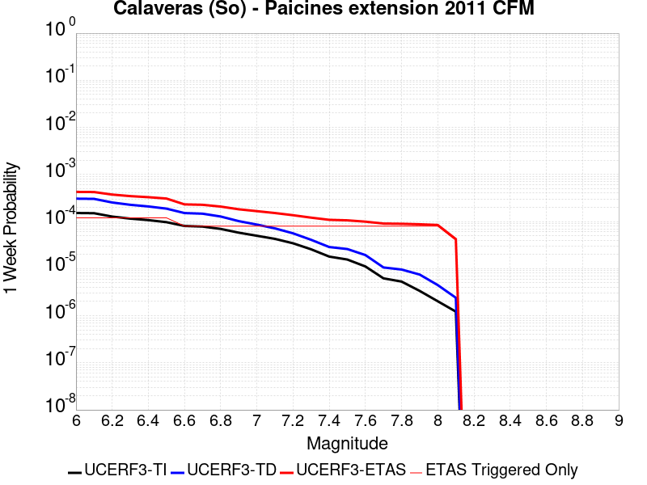 | 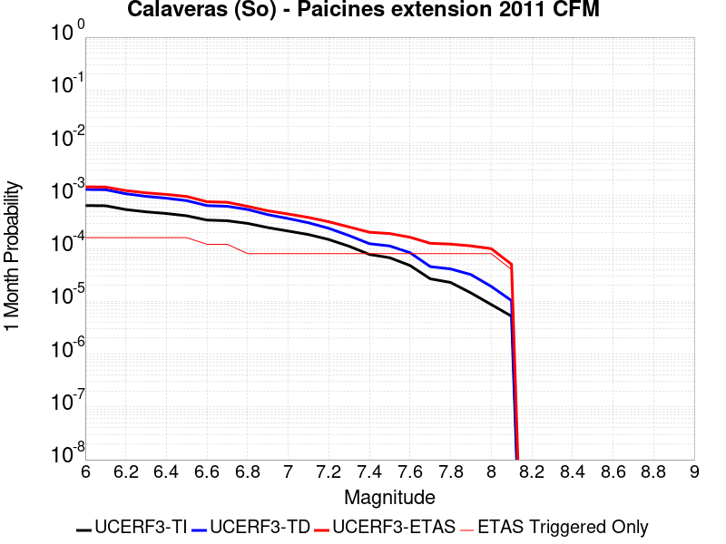 | 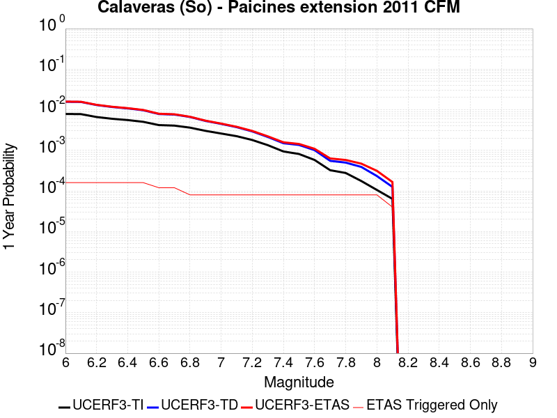 |

| Magnitude | 1 wk TI Prob | 1 wk TD Prob | 1 wk ETAS Prob | 1 wk ETAS/TD Gain | 1 wk ETAS Triggered Only | 1 mo TI Prob | 1 mo TD Prob | 1 mo ETAS Prob | 1 mo ETAS/TD Gain | 1 mo ETAS Triggered Only | 1 yr TI Prob | 1 yr TD Prob | 1 yr ETAS Prob | 1 yr ETAS/TD Gain | 1 yr ETAS Triggered Only |
|-----|-----|-----|-----|-----|-----|-----|-----|-----|-----|-----|-----|-----|-----|-----|-----|
| 6.0 | 1.5183659E-4 | 3.058916E-4 | 4.2585487E-4 | 1.3921759 | 1.2E-4 | 6.5056595E-4 | 0.0013097163 | 0.0014695066 | 1.1220039 | 1.6E-4 | 0.007891912 | 0.015730867 | 0.01588835 | 1.0100111 | 1.6E-4 |
| 6.1 | 1.5024997E-4 | 3.028294E-4 | 4.2279306E-4 | 1.3961427 | 1.2E-4 | 6.437695E-4 | 0.0012966117 | 0.0014564043 | 1.1232386 | 1.6E-4 | 0.0078097614 | 0.015574093 | 0.015731601 | 1.0101135 | 1.6E-4 |
| 6.2 | 1.2743923E-4 | 2.5378828E-4 | 3.7375782E-4 | 1.472715 | 1.2E-4 | 5.460538E-4 | 0.0010868111 | 0.0012466372 | 1.1470597 | 1.6E-4 | 0.0066279583 | 0.013080635 | 0.013238543 | 1.0120718 | 1.6E-4 |
| 6.3 | 1.1525114E-4 | 2.266418E-4 | 3.466146E-4 | 1.5293498 | 1.2E-4 | 4.9383997E-4 | 9.706734E-4 | 0.001130518 | 1.164674 | 1.6E-4 | 0.0059959386 | 0.011701727 | 0.011859856 | 1.0135132 | 1.6E-4 |
| 6.4 | 1.07200925E-4 | 2.0905094E-4 | 3.2902585E-4 | 1.5739028 | 1.2E-4 | 4.5935164E-4 | 8.953991E-4 | 0.0010552559 | 1.1785313 | 1.6E-4 | 0.0055782744 | 0.010806446 | 0.010964717 | 1.0146459 | 1.6E-4 |
| 6.5 | 9.69631E-5 | 1.8797735E-4 | 3.079548E-4 | 1.6382548 | 1.2E-4 | 4.1548995E-4 | 8.0519065E-4 | 9.6506183E-4 | 1.1985507 | 1.6E-4 | 0.0050468626 | 0.009727674 | 0.009886117 | 1.0162879 | 1.6E-4 |
| 6.6 | 8.0552316E-5 | 1.5134095E-4 | 2.3132884E-4 | 1.5285277 | 8.0E-5 | 3.4517853E-4 | 6.4840337E-4 | 7.683256E-4 | 1.18495 | 1.2E-4 | 0.0041944524 | 0.007859206 | 0.007978263 | 1.0151488 | 1.2E-4 |
| 6.7 | 7.815757E-5 | 1.4674113E-4 | 2.267294E-4 | 1.5450977 | 8.0E-5 | 3.34918E-4 | 6.2870386E-4 | 7.486284E-4 | 1.1907489 | 1.2E-4 | 0.004070005 | 0.00762175 | 0.007740835 | 1.0156244 | 1.2E-4 |
| 6.8 | 6.965264E-5 | 1.278175E-4 | 2.0780729E-4 | 1.6258124 | 8.0E-5 | 2.9847719E-4 | 5.476545E-4 | 6.276107E-4 | 1.1459975 | 8.0E-5 | 0.0036279052 | 0.0066440827 | 0.006723551 | 1.0119607 | 8.0E-5 |
| 6.9 | 5.8000453E-5 | 1.0197004E-4 | 1.8196189E-4 | 1.7844641 | 8.0E-5 | 2.4854968E-4 | 4.3694186E-4 | 5.169069E-4 | 1.1830107 | 8.0E-5 | 0.0030218933 | 0.005306889 | 0.0053864643 | 1.0149947 | 8.0E-5 |
| 7.0 | 4.9865852E-5 | 8.614713E-5 | 1.6614023E-4 | 1.9285638 | 8.0E-5 | 2.1369329E-4 | 3.691502E-4 | 4.4912068E-4 | 1.2166339 | 8.0E-5 | 0.0025986114 | 0.0044852314 | 0.0045648725 | 1.0177563 | 8.0E-5 |
| 7.1 | 4.283875E-5 | 7.154534E-5 | 1.5153961E-4 | 2.118092 | 8.0E-5 | 1.8358172E-4 | 3.0658717E-4 | 3.8656263E-4 | 1.2608572 | 8.0E-5 | 0.0022328163 | 0.0037263667 | 0.0038060686 | 1.0213886 | 8.0E-5 |
| 7.2 | 3.450115E-5 | 5.6180077E-5 | 1.3617559E-4 | 2.4239123 | 8.0E-5 | 1.478537E-4 | 2.4074971E-4 | 3.2073044E-4 | 1.3322153 | 8.0E-5 | 0.0017986323 | 0.0029272172 | 0.003006983 | 1.0272497 | 8.0E-5 |
| 7.3 | 2.5709045E-5 | 4.092334E-5 | 1.2092006E-4 | 2.9547946 | 8.0E-5 | 1.1017697E-4 | 1.7537405E-4 | 2.5536E-4 | 1.4560878 | 8.0E-5 | 0.0013405791 | 0.0021331052 | 0.0022129347 | 1.037424 | 8.0E-5 |
| 7.4 | 1.8003093E-5 | 2.8743207E-5 | 1.08740904E-4 | 3.7831864 | 8.0E-5 | 7.715383E-5 | 1.2317937E-4 | 2.031695E-4 | 1.6493794 | 8.0E-5 | 9.3894306E-4 | 0.0014986794 | 0.0015785595 | 1.0533004 | 8.0E-5 |
| 7.5 | 1.5595824E-5 | 2.6044754E-5 | 1.0604267E-4 | 4.0715556 | 8.0E-5 | 6.683753E-5 | 1.1161561E-4 | 1.9160668E-4 | 1.7166656 | 8.0E-5 | 8.134431E-4 | 0.0013580752 | 0.0014379666 | 1.0588269 | 8.0E-5 |
| 7.6 | 1.1110309E-5 | 1.9413746E-5 | 9.9412195E-5 | 5.1207113 | 8.0E-5 | 4.761474E-5 | 8.319912E-5 | 1.6319247E-4 | 1.9614686 | 8.0E-5 | 5.795553E-4 | 0.00101248 | 0.001092399 | 1.078934 | 8.0E-5 |
| 7.7 | 6.2140443E-6 | 1.0582229E-5 | 9.058138E-5 | 8.559764 | 8.0E-5 | 2.6631347E-5 | 4.5351622E-5 | 1.25348E-4 | 2.7639143 | 8.0E-5 | 3.241884E-4 | 5.520162E-4 | 6.3197204E-4 | 1.1448432 | 8.0E-5 |
| 7.8 | 5.305533E-6 | 9.562843E-6 | 8.9562076E-5 | 9.365633 | 8.0E-5 | 2.27378E-5 | 4.098297E-5 | 1.2097969E-4 | 2.9519503 | 8.0E-5 | 2.7679754E-4 | 4.988535E-4 | 5.788136E-4 | 1.1602877 | 8.0E-5 |
| 7.9 | 3.363505E-6 | 7.481766E-6 | 8.748117E-5 | 11.692583 | 8.0E-5 | 1.4414942E-5 | 3.2064316E-5 | 1.1206175E-4 | 3.4949052 | 8.0E-5 | 1.7548777E-4 | 3.9031322E-4 | 4.70282E-4 | 1.2048836 | 8.0E-5 |
| 8.0 | 2.0271132E-6 | 4.46918E-6 | 8.4468826E-5 | 18.900295 | 8.0E-5 | 8.687599E-6 | 1.9153487E-5 | 9.9151956E-5 | 5.176705 | 8.0E-5 | 1.05766376E-4 | 2.3316882E-4 | 3.1315017E-4 | 1.343019 | 8.0E-5 |
| 8.1 | 1.2206116E-6 | 2.4070437E-6 | 4.2406948E-5 | 17.617855 | 4.0E-5 | 5.2311816E-6 | 1.0315861E-5 | 5.0315448E-5 | 4.8774843 | 4.0E-5 | 6.3687774E-5 | 1.255884E-4 | 1.6558338E-4 | 1.3184607 | 4.0E-5 |

## San Juan
*[(top)](#table-of-contents)*

| 1 Week | 1 Month | 1 Year |
|-----|-----|-----|
| 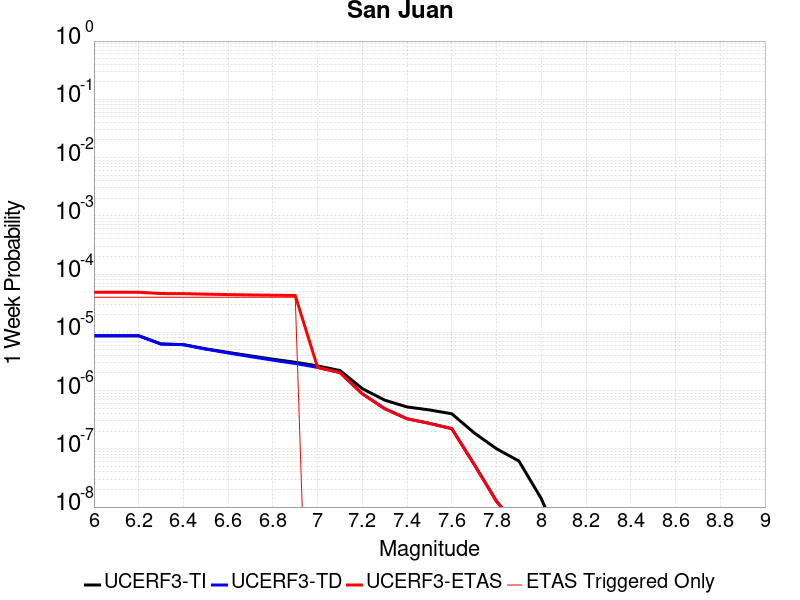 | 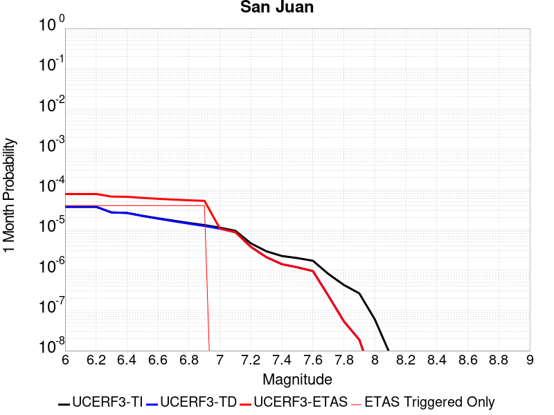 | 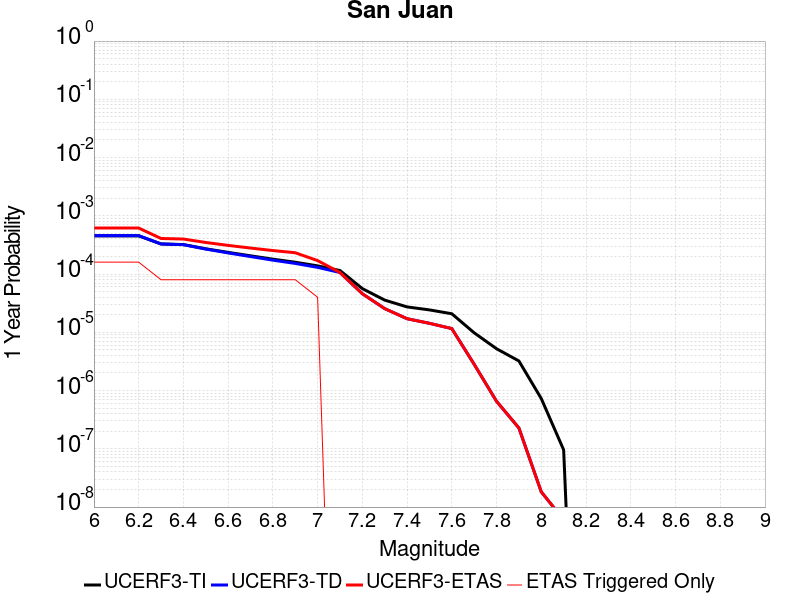 |

| Magnitude | 1 wk TI Prob | 1 wk TD Prob | 1 wk ETAS Prob | 1 wk ETAS/TD Gain | 1 wk ETAS Triggered Only | 1 mo TI Prob | 1 mo TD Prob | 1 mo ETAS Prob | 1 mo ETAS/TD Gain | 1 mo ETAS Triggered Only | 1 yr TI Prob | 1 yr TD Prob | 1 yr ETAS Prob | 1 yr ETAS/TD Gain | 1 yr ETAS Triggered Only |
|-----|-----|-----|-----|-----|-----|-----|-----|-----|-----|-----|-----|-----|-----|-----|-----|
| 6.0 | 8.682808E-6 | 8.759608E-6 | 4.875926E-5 | 5.5663743 | 4.0E-5 | 3.72115E-5 | 3.7540663E-5 | 7.753916E-5 | 2.0654712 | 4.0E-5 | 4.5295584E-4 | 4.5696655E-4 | 6.168934E-4 | 1.349975 | 1.6E-4 |
| 6.1 | 8.682808E-6 | 8.759608E-6 | 4.875926E-5 | 5.5663743 | 4.0E-5 | 3.72115E-5 | 3.7540663E-5 | 7.753916E-5 | 2.0654712 | 4.0E-5 | 4.5295584E-4 | 4.5696655E-4 | 6.168934E-4 | 1.349975 | 1.6E-4 |
| 6.2 | 8.682808E-6 | 8.759608E-6 | 4.875926E-5 | 5.5663743 | 4.0E-5 | 3.72115E-5 | 3.7540663E-5 | 7.753916E-5 | 2.0654712 | 4.0E-5 | 4.5295584E-4 | 4.5696655E-4 | 6.168934E-4 | 1.349975 | 1.6E-4 |
| 6.3 | 6.3054235E-6 | 6.2927156E-6 | 4.6292465E-5 | 7.3565164 | 4.0E-5 | 2.7022963E-5 | 2.696851E-5 | 6.6967434E-5 | 2.4831715 | 4.0E-5 | 3.2895492E-4 | 3.2829354E-4 | 4.0826728E-4 | 1.2436043 | 8.0E-5 |
| 6.4 | 6.1490473E-6 | 6.123244E-6 | 4.6122997E-5 | 7.532445 | 4.0E-5 | 2.6352795E-5 | 2.6242218E-5 | 6.624117E-5 | 2.5242214 | 4.0E-5 | 3.2079802E-4 | 3.1945354E-4 | 3.9942798E-4 | 1.2503476 | 8.0E-5 |
| 6.5 | 5.204848E-6 | 5.1457387E-6 | 4.5145534E-5 | 8.773382 | 4.0E-5 | 2.23063E-5 | 2.2052984E-5 | 6.20521E-5 | 2.8137734 | 4.0E-5 | 2.7154534E-4 | 2.6846296E-4 | 3.4844148E-4 | 1.2979127 | 8.0E-5 |
| 6.6 | 4.5179986E-6 | 4.421473E-6 | 4.4421296E-5 | 10.046719 | 4.0E-5 | 1.9362706E-5 | 1.8949037E-5 | 5.894828E-5 | 3.1108851 | 4.0E-5 | 2.3571544E-4 | 2.3068089E-4 | 3.1066244E-4 | 1.3467194 | 8.0E-5 |
| 6.7 | 3.9442616E-6 | 3.8256167E-6 | 4.3825465E-5 | 11.4557905 | 4.0E-5 | 1.6903869E-5 | 1.6395401E-5 | 5.6394743E-5 | 3.4396687 | 4.0E-5 | 2.0578515E-4 | 1.9959638E-4 | 2.7958042E-4 | 1.4007288 | 8.0E-5 |
| 6.8 | 3.4536245E-6 | 3.3218946E-6 | 4.332176E-5 | 13.041281 | 4.0E-5 | 1.4801163E-5 | 1.4236617E-5 | 5.4236047E-5 | 3.8096163 | 4.0E-5 | 1.8018926E-4 | 1.7331763E-4 | 2.5330376E-4 | 1.4615003 | 8.0E-5 |
| 6.9 | 3.059865E-6 | 2.9173539E-6 | 4.2917236E-5 | 14.711015 | 4.0E-5 | 1.3113641E-5 | 1.2502889E-5 | 5.250239E-5 | 4.1992207 | 4.0E-5 | 1.596469E-4 | 1.5221261E-4 | 2.3220043E-4 | 1.5255007 | 8.0E-5 |
| 7.0 | 2.6504351E-6 | 2.4970402E-6 | 2.4970402E-6 | 1.0 | 0.0 | 1.1358958E-5 | 1.0701559E-5 | 1.0701559E-5 | 1.0 | 0.0 | 1.3828653E-4 | 1.3028424E-4 | 1.7027903E-4 | 1.306981 | 4.0E-5 |
| 7.1 | 2.2039317E-6 | 2.0380103E-6 | 2.0380103E-6 | 1.0 | 0.0 | 9.445387E-6 | 8.734303E-6 | 8.734303E-6 | 1.0 | 0.0 | 1.1499152E-4 | 1.0633549E-4 | 1.0633549E-4 | 1.0 | 0.0 |
| 7.2 | 1.0786707E-6 | 8.806433E-7 | 8.806433E-7 | 1.0 | 0.0 | 4.622866E-6 | 3.77418E-6 | 3.77418E-6 | 1.0 | 0.0 | 5.628194E-5 | 4.5949684E-5 | 4.5949684E-5 | 1.0 | 0.0 |
| 7.3 | 6.846433E-7 | 4.890126E-7 | 4.890126E-7 | 1.0 | 0.0 | 2.9341822E-6 | 2.0957666E-6 | 2.0957666E-6 | 1.0 | 0.0 | 3.5723086E-5 | 2.551566E-5 | 2.551566E-5 | 1.0 | 0.0 |
| 7.4 | 5.23043E-7 | 3.2786707E-7 | 3.2786707E-7 | 1.0 | 0.0 | 2.2416111E-6 | 1.4051437E-6 | 1.4051437E-6 | 1.0 | 0.0 | 2.7291273E-5 | 1.7107492E-5 | 1.7107492E-5 | 1.0 | 0.0 |
| 7.5 | 4.648444E-7 | 2.7371732E-7 | 2.7371732E-7 | 1.0 | 0.0 | 1.9921886E-6 | 1.1730737E-6 | 1.1730737E-6 | 1.0 | 0.0 | 2.4254627E-5 | 1.4282079E-5 | 1.4282079E-5 | 1.0 | 0.0 |
| 7.6 | 3.9906567E-7 | 2.219133E-7 | 2.219133E-7 | 1.0 | 0.0 | 1.7102802E-6 | 9.510566E-7 | 9.510566E-7 | 1.0 | 0.0 | 2.0822463E-5 | 1.15790535E-5 | 1.15790535E-5 | 1.0 | 0.0 |
| 7.7 | 1.8784601E-7 | 5.4077724E-8 | 5.4077724E-8 | 1.0 | 0.0 | 8.0505407E-7 | 2.3176165E-7 | 2.3176165E-7 | 1.0 | 0.0 | 9.80149E-6 | 2.8216944E-6 | 2.8216944E-6 | 1.0 | 0.0 |
| 7.8 | 1.00154914E-7 | 1.254366E-8 | 1.254366E-8 | 1.0 | 0.0 | 4.2923529E-7 | 5.3758537E-8 | 5.3758537E-8 | 1.0 | 0.0 | 5.225927E-6 | 6.5451E-7 | 6.5451E-7 | 1.0 | 0.0 |
| 7.9 | 6.171429E-8 | 4.362376E-9 | 4.362376E-9 | 1.0 | 0.0 | 2.6448978E-7 | 1.8695896E-8 | 1.8695896E-8 | 1.0 | 0.0 | 3.2201583E-6 | 2.2762252E-7 | 2.2762252E-7 | 1.0 | 0.0 |
| 8.0 | 1.3974572E-8 | 3.496773E-10 | 3.496773E-10 | 1.0 | 0.0 | 5.989102E-8 | 1.4986121E-9 | 1.4986121E-9 | 1.0 | 0.0 | 7.2917294E-7 | 1.824562E-8 | 1.824562E-8 | 1.0 | 0.0 |
| 8.1 | 1.8403477E-9 | 1.1596091E-10 | 1.1596091E-10 | 1.0 | 0.0 | 7.887204E-9 | 4.969739E-10 | 4.969739E-10 | 1.0 | 0.0 | 9.602671E-8 | 6.0506586E-9 | 6.0506586E-9 | 1.0 | 0.0 |

## Simi-Santa Rosa
*[(top)](#table-of-contents)*

| 1 Week | 1 Month | 1 Year |
|-----|-----|-----|
| 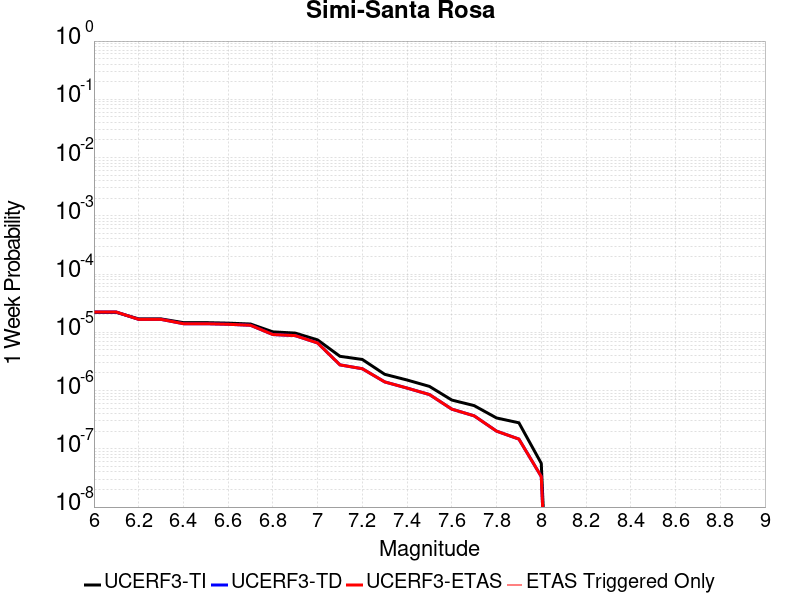 | 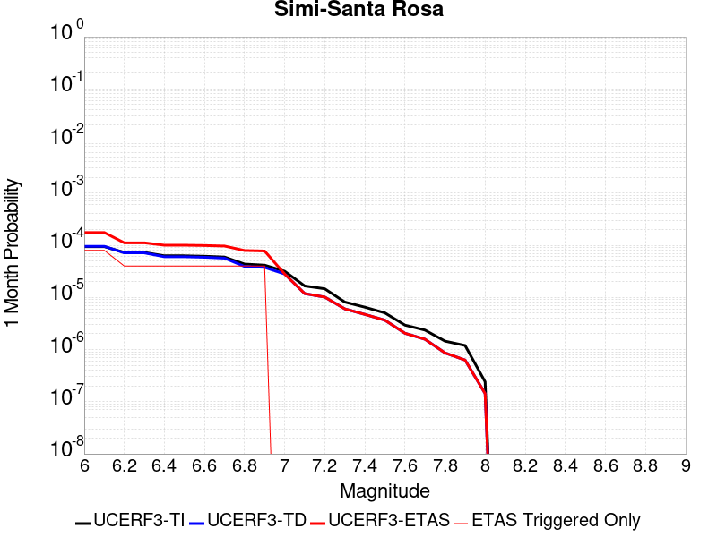 | 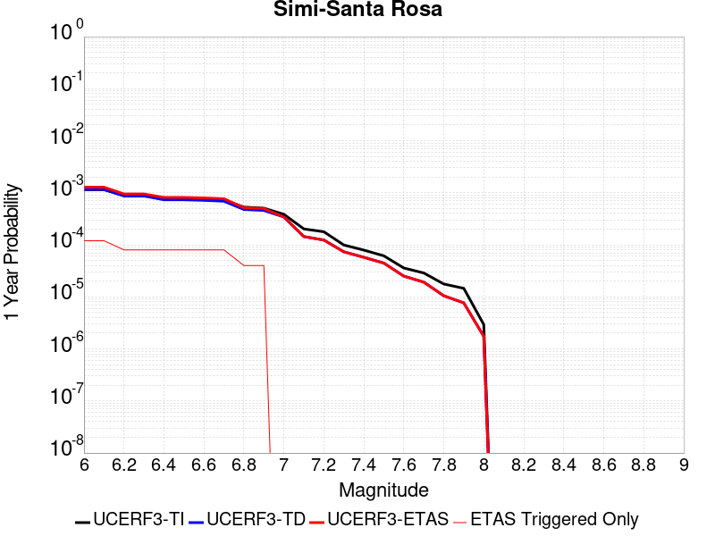 |

| Magnitude | 1 wk TI Prob | 1 wk TD Prob | 1 wk ETAS Prob | 1 wk ETAS/TD Gain | 1 wk ETAS Triggered Only | 1 mo TI Prob | 1 mo TD Prob | 1 mo ETAS Prob | 1 mo ETAS/TD Gain | 1 mo ETAS Triggered Only | 1 yr TI Prob | 1 yr TD Prob | 1 yr ETAS Prob | 1 yr ETAS/TD Gain | 1 yr ETAS Triggered Only |
|-----|-----|-----|-----|-----|-----|-----|-----|-----|-----|-----|-----|-----|-----|-----|-----|
| 6.0 | 2.198912E-5 | 2.2285461E-5 | 2.2285461E-5 | 1.0 | 0.0 | 9.4235686E-5 | 9.550587E-5 | 1.7549824E-4 | 1.8375648 | 8.0E-5 | 0.0011467156 | 0.0011622076 | 0.0012820682 | 1.1031318 | 1.2E-4 |
| 6.1 | 2.198912E-5 | 2.2285461E-5 | 2.2285461E-5 | 1.0 | 0.0 | 9.4235686E-5 | 9.550587E-5 | 1.7549824E-4 | 1.8375648 | 8.0E-5 | 0.0011467156 | 0.0011622076 | 0.0012820682 | 1.1031318 | 1.2E-4 |
| 6.2 | 1.69983E-5 | 1.6676233E-5 | 1.6676233E-5 | 1.0 | 0.0 | 7.284782E-5 | 7.146777E-5 | 1.1146491E-4 | 1.5596528 | 4.0E-5 | 8.865613E-4 | 8.6980197E-4 | 9.497324E-4 | 1.091895 | 8.0E-5 |
| 6.3 | 1.69983E-5 | 1.6676233E-5 | 1.6676233E-5 | 1.0 | 0.0 | 7.284782E-5 | 7.146777E-5 | 1.1146491E-4 | 1.5596528 | 4.0E-5 | 8.865613E-4 | 8.6980197E-4 | 9.497324E-4 | 1.091895 | 8.0E-5 |
| 6.4 | 1.4666188E-5 | 1.40591355E-5 | 1.40591355E-5 | 1.0 | 0.0 | 6.285358E-5 | 6.0252187E-5 | 1.0024978E-4 | 1.6638364 | 4.0E-5 | 7.6497364E-4 | 7.333484E-4 | 8.132897E-4 | 1.1090087 | 8.0E-5 |
| 6.5 | 1.4666188E-5 | 1.40591355E-5 | 1.40591355E-5 | 1.0 | 0.0 | 6.285358E-5 | 6.0252187E-5 | 1.0024978E-4 | 1.6638364 | 4.0E-5 | 7.6497364E-4 | 7.333484E-4 | 8.132897E-4 | 1.1090087 | 8.0E-5 |
| 6.6 | 1.4377586E-5 | 1.3736045E-5 | 1.3736045E-5 | 1.0 | 0.0 | 6.1616774E-5 | 5.8867576E-5 | 9.8865225E-5 | 1.6794512 | 4.0E-5 | 7.4992597E-4 | 7.1650196E-4 | 7.9644466E-4 | 1.1115736 | 8.0E-5 |
| 6.7 | 1.3881404E-5 | 1.3213798E-5 | 1.3213798E-5 | 1.0 | 0.0 | 5.9490372E-5 | 5.6629477E-5 | 9.662721E-5 | 1.706306 | 4.0E-5 | 7.240546E-4 | 6.892705E-4 | 7.6921534E-4 | 1.1159848 | 8.0E-5 |
| 6.8 | 1.0176516E-5 | 9.158662E-6 | 9.158662E-6 | 1.0 | 0.0 | 4.3612912E-5 | 3.925091E-5 | 7.924934E-5 | 2.0190446 | 4.0E-5 | 5.308578E-4 | 4.7779162E-4 | 5.177725E-4 | 1.0836785 | 4.0E-5 |
| 6.9 | 9.699797E-6 | 8.779024E-6 | 8.779024E-6 | 1.0 | 0.0 | 4.15699E-5 | 3.7623937E-5 | 7.762243E-5 | 2.063113 | 4.0E-5 | 5.05996E-4 | 4.579916E-4 | 4.979733E-4 | 1.0872978 | 4.0E-5 |
| 7.0 | 7.4049476E-6 | 6.5625313E-6 | 6.5625313E-6 | 1.0 | 0.0 | 3.1735104E-5 | 2.8124903E-5 | 2.8124903E-5 | 1.0 | 0.0 | 3.8630638E-4 | 3.4237956E-4 | 3.4237956E-4 | 1.0 | 0.0 |
| 7.1 | 3.873439E-6 | 2.7608828E-6 | 2.7608828E-6 | 1.0 | 0.0 | 1.6600346E-5 | 1.1832302E-5 | 1.1832302E-5 | 1.0 | 0.0 | 2.0209046E-4 | 1.44049E-4 | 1.44049E-4 | 1.0 | 0.0 |
| 7.2 | 3.417706E-6 | 2.368875E-6 | 2.368875E-6 | 1.0 | 0.0 | 1.4647229E-5 | 1.0152283E-5 | 1.0152283E-5 | 1.0 | 0.0 | 1.7831543E-4 | 1.2359726E-4 | 1.2359726E-4 | 1.0 | 0.0 |
| 7.3 | 1.90225E-6 | 1.4082424E-6 | 1.4082424E-6 | 1.0 | 0.0 | 8.152474E-6 | 6.035311E-6 | 6.035311E-6 | 1.0 | 0.0 | 9.9251854E-5 | 7.347745E-5 | 7.347745E-5 | 1.0 | 0.0 |
| 7.4 | 1.5170556E-6 | 1.1032644E-6 | 1.1032644E-6 | 1.0 | 0.0 | 6.5016507E-6 | 4.7282674E-6 | 4.7282674E-6 | 1.0 | 0.0 | 7.915472E-5 | 5.7565147E-5 | 5.7565147E-5 | 1.0 | 0.0 |
| 7.5 | 1.178732E-6 | 8.5424404E-7 | 8.5424404E-7 | 1.0 | 0.0 | 5.0516987E-6 | 3.6610409E-6 | 3.6610409E-6 | 1.0 | 0.0 | 6.1502695E-5 | 4.457227E-5 | 4.457227E-5 | 1.0 | 0.0 |
| 7.6 | 6.8722386E-7 | 4.799764E-7 | 4.799764E-7 | 1.0 | 0.0 | 2.9452417E-6 | 2.05704E-6 | 2.05704E-6 | 1.0 | 0.0 | 3.5857727E-5 | 2.5044175E-5 | 2.5044175E-5 | 1.0 | 0.0 |
| 7.7 | 5.5126515E-7 | 3.679374E-7 | 3.679374E-7 | 1.0 | 0.0 | 2.3625628E-6 | 1.5768735E-6 | 1.5768735E-6 | 1.0 | 0.0 | 2.8763823E-5 | 1.9198267E-5 | 1.9198267E-5 | 1.0 | 0.0 |
| 7.8 | 3.3860243E-7 | 2.0116858E-7 | 2.0116858E-7 | 1.0 | 0.0 | 1.4511525E-6 | 8.621508E-7 | 8.621508E-7 | 1.0 | 0.0 | 1.7667637E-5 | 1.0496636E-5 | 1.0496636E-5 | 1.0 | 0.0 |
| 7.9 | 2.7955386E-7 | 1.4685692E-7 | 1.4685692E-7 | 1.0 | 0.0 | 1.1980875E-6 | 6.293866E-7 | 6.293866E-7 | 1.0 | 0.0 | 1.4586617E-5 | 7.662756E-6 | 7.662756E-6 | 1.0 | 0.0 |
| 8.0 | 5.6259015E-8 | 3.3399083E-8 | 3.3399083E-8 | 1.0 | 0.0 | 2.4111003E-7 | 1.431389E-7 | 1.431389E-7 | 1.0 | 0.0 | 2.9355108E-6 | 1.742715E-6 | 1.742715E-6 | 1.0 | 0.0 |

## Elsinore (Glen Ivy) rev
*[(top)](#table-of-contents)*

| 1 Week | 1 Month | 1 Year |
|-----|-----|-----|
|  | 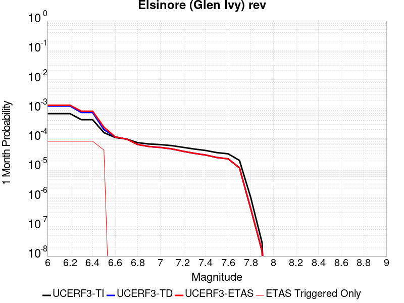 | 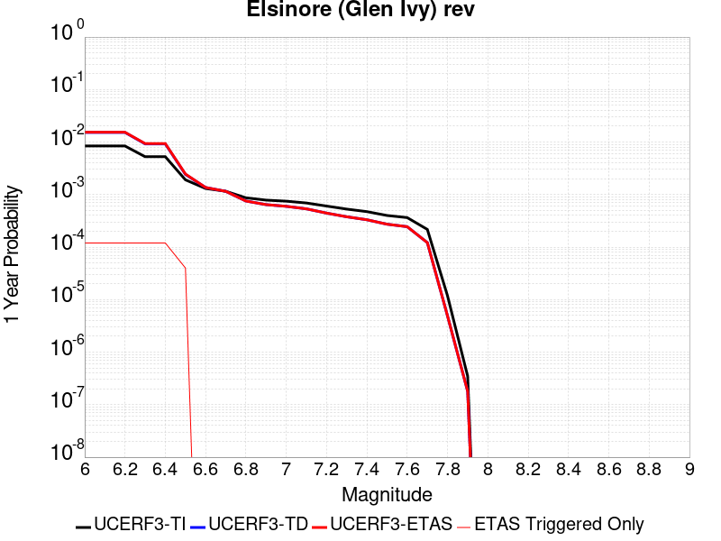 |

| Magnitude | 1 wk TI Prob | 1 wk TD Prob | 1 wk ETAS Prob | 1 wk ETAS/TD Gain | 1 wk ETAS Triggered Only | 1 mo TI Prob | 1 mo TD Prob | 1 mo ETAS Prob | 1 mo ETAS/TD Gain | 1 mo ETAS Triggered Only | 1 yr TI Prob | 1 yr TD Prob | 1 yr ETAS Prob | 1 yr ETAS/TD Gain | 1 yr ETAS Triggered Only |
|-----|-----|-----|-----|-----|-----|-----|-----|-----|-----|-----|-----|-----|-----|-----|-----|
| 6.0 | 1.6204086E-4 | 2.9420294E-4 | 3.3419117E-4 | 1.1359205 | 4.0E-5 | 6.94276E-4 | 0.0012604159 | 0.0013403151 | 1.0633911 | 8.0E-5 | 0.008420097 | 0.01525921 | 0.015377379 | 1.0077441 | 1.2E-4 |
| 6.1 | 1.6204086E-4 | 2.9420294E-4 | 3.3419117E-4 | 1.1359205 | 4.0E-5 | 6.94276E-4 | 0.0012604159 | 0.0013403151 | 1.0633911 | 8.0E-5 | 0.008420097 | 0.01525921 | 0.015377379 | 1.0077441 | 1.2E-4 |
| 6.2 | 1.6204086E-4 | 2.9420294E-4 | 3.3419117E-4 | 1.1359205 | 4.0E-5 | 6.94276E-4 | 0.0012604159 | 0.0013403151 | 1.0633911 | 8.0E-5 | 0.008420097 | 0.01525921 | 0.015377379 | 1.0077441 | 1.2E-4 |
| 6.3 | 1.0111737E-4 | 1.7740557E-4 | 2.1739847E-4 | 1.225432 | 4.0E-5 | 4.332882E-4 | 7.6020526E-4 | 8.4014446E-4 | 1.1051548 | 8.0E-5 | 0.005262531 | 0.009237009 | 0.009355901 | 1.0128713 | 1.2E-4 |
| 6.4 | 1.0111737E-4 | 1.7740557E-4 | 2.1739847E-4 | 1.225432 | 4.0E-5 | 4.332882E-4 | 7.6020526E-4 | 8.4014446E-4 | 1.1051548 | 8.0E-5 | 0.005262531 | 0.009237009 | 0.009355901 | 1.0128713 | 1.2E-4 |
| 6.5 | 3.6624708E-5 | 4.6445854E-5 | 4.6445854E-5 | 1.0 | 0.0 | 1.569536E-4 | 1.9904051E-4 | 2.3903255E-4 | 1.2009242 | 4.0E-5 | 0.001909235 | 0.0024209863 | 0.0024608893 | 1.0164822 | 4.0E-5 |
| 6.6 | 2.5051324E-5 | 2.6190002E-5 | 2.6190002E-5 | 1.0 | 0.0 | 1.073584E-4 | 1.1223829E-4 | 1.1223829E-4 | 1.0 | 0.0 | 0.0013063047 | 0.0013656892 | 0.0013656892 | 1.0 | 0.0 |
| 6.7 | 2.2189772E-5 | 2.2104245E-5 | 2.2104245E-5 | 1.0 | 0.0 | 9.509556E-5 | 9.472924E-5 | 9.472924E-5 | 1.0 | 0.0 | 0.0011571734 | 0.0011527548 | 0.0011527548 | 1.0 | 0.0 |
| 6.8 | 1.6654378E-5 | 1.4455017E-5 | 1.4455017E-5 | 1.0 | 0.0 | 7.137396E-5 | 6.194863E-5 | 6.194863E-5 | 1.0 | 0.0 | 8.686314E-4 | 7.539688E-4 | 7.539688E-4 | 1.0 | 0.0 |
| 6.9 | 1.5042909E-5 | 1.2346976E-5 | 1.2346976E-5 | 1.0 | 0.0 | 6.446802E-5 | 5.291456E-5 | 5.291456E-5 | 1.0 | 0.0 | 7.8461546E-4 | 6.4404745E-4 | 6.4404745E-4 | 1.0 | 0.0 |
| 7.0 | 1.4361385E-5 | 1.146508E-5 | 1.146508E-5 | 1.0 | 0.0 | 6.154734E-5 | 4.913515E-5 | 4.913515E-5 | 1.0 | 0.0 | 7.490812E-4 | 5.9805915E-4 | 5.9805915E-4 | 1.0 | 0.0 |
| 7.1 | 1.3265571E-5 | 1.0257165E-5 | 1.0257165E-5 | 1.0 | 0.0 | 5.6851208E-5 | 4.3958553E-5 | 4.3958553E-5 | 1.0 | 0.0 | 6.919436E-4 | 5.350665E-4 | 5.350665E-4 | 1.0 | 0.0 |
| 7.2 | 1.1596403E-5 | 8.515252E-6 | 8.515252E-6 | 1.0 | 0.0 | 4.9697923E-5 | 3.649344E-5 | 3.649344E-5 | 1.0 | 0.0 | 6.049042E-4 | 4.4421875E-4 | 4.4421875E-4 | 1.0 | 0.0 |
| 7.3 | 1.0150827E-5 | 7.247325E-6 | 7.247325E-6 | 1.0 | 0.0 | 4.3502816E-5 | 3.10596E-5 | 3.10596E-5 | 1.0 | 0.0 | 5.2951806E-4 | 3.780865E-4 | 3.780865E-4 | 1.0 | 0.0 |
| 7.4 | 9.080705E-6 | 6.359954E-6 | 6.359954E-6 | 1.0 | 0.0 | 3.8916725E-5 | 2.725667E-5 | 2.725667E-5 | 1.0 | 0.0 | 4.7370812E-4 | 3.3180078E-4 | 3.3180078E-4 | 1.0 | 0.0 |
| 7.5 | 7.671649E-6 | 5.231759E-6 | 5.231759E-6 | 1.0 | 0.0 | 3.287808E-5 | 2.2421638E-5 | 2.2421638E-5 | 1.0 | 0.0 | 4.0021708E-4 | 2.729505E-4 | 2.729505E-4 | 1.0 | 0.0 |
| 7.6 | 6.990086E-6 | 4.693085E-6 | 4.693085E-6 | 1.0 | 0.0 | 2.9957167E-5 | 2.0113073E-5 | 2.0113073E-5 | 1.0 | 0.0 | 3.6466747E-4 | 2.4485032E-4 | 2.4485032E-4 | 1.0 | 0.0 |
| 7.7 | 4.163505E-6 | 2.3324235E-6 | 2.3324235E-6 | 1.0 | 0.0 | 1.7843471E-5 | 9.996066E-6 | 9.996066E-6 | 1.0 | 0.0 | 2.172226E-4 | 1.2169606E-4 | 1.2169606E-4 | 1.0 | 0.0 |
| 7.8 | 2.2692414E-7 | 9.397192E-8 | 9.397192E-8 | 1.0 | 0.0 | 9.725317E-7 | 4.0273673E-7 | 4.0273673E-7 | 1.0 | 0.0 | 1.1840509E-5 | 4.903312E-6 | 4.903312E-6 | 1.0 | 0.0 |
| 7.9 | 6.676829E-9 | 3.4429164E-9 | 3.4429164E-9 | 1.0 | 0.0 | 2.861498E-8 | 1.4755356E-8 | 1.4755356E-8 | 1.0 | 0.0 | 3.4838732E-7 | 1.7964643E-7 | 1.7964643E-7 | 1.0 | 0.0 |

## Gravel Hills-Harper Lk
*[(top)](#table-of-contents)*

| 1 Week | 1 Month | 1 Year |
|-----|-----|-----|
| 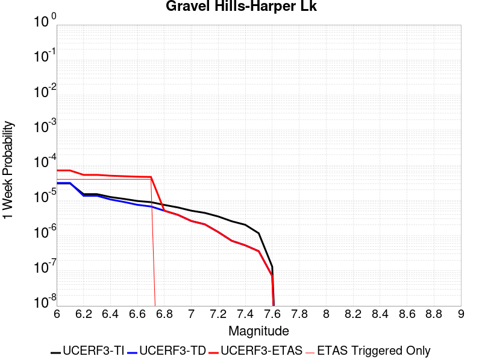 | 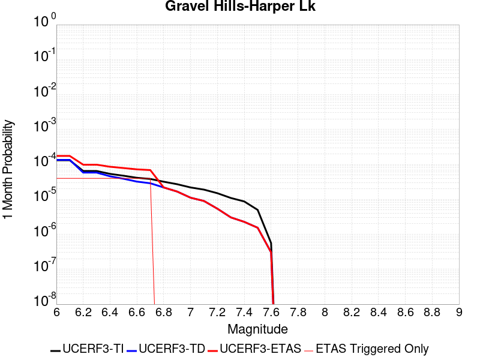 | 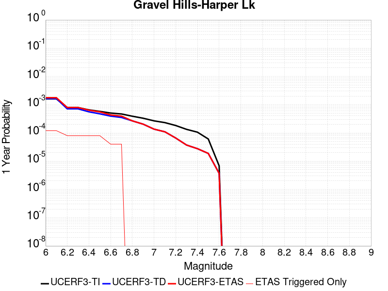 |

| Magnitude | 1 wk TI Prob | 1 wk TD Prob | 1 wk ETAS Prob | 1 wk ETAS/TD Gain | 1 wk ETAS Triggered Only | 1 mo TI Prob | 1 mo TD Prob | 1 mo ETAS Prob | 1 mo ETAS/TD Gain | 1 mo ETAS Triggered Only | 1 yr TI Prob | 1 yr TD Prob | 1 yr ETAS Prob | 1 yr ETAS/TD Gain | 1 yr ETAS Triggered Only |
|-----|-----|-----|-----|-----|-----|-----|-----|-----|-----|-----|-----|-----|-----|-----|-----|
| 6.0 | 3.0679566E-5 | 3.14785E-5 | 7.147724E-5 | 2.2706685 | 4.0E-5 | 1.3147724E-4 | 1.349021E-4 | 1.748967E-4 | 1.2964714 | 4.0E-5 | 0.0015995599 | 0.001641413 | 0.001761216 | 1.0729878 | 1.2E-4 |
| 6.1 | 3.0679566E-5 | 3.14785E-5 | 7.147724E-5 | 2.2706685 | 4.0E-5 | 1.3147724E-4 | 1.349021E-4 | 1.748967E-4 | 1.2964714 | 4.0E-5 | 0.0015995599 | 0.001641413 | 0.001761216 | 1.0729878 | 1.2E-4 |
| 6.2 | 1.514536E-5 | 1.3640053E-5 | 5.3639505E-5 | 3.9325 | 4.0E-5 | 6.490707E-5 | 5.8456128E-5 | 9.845379E-5 | 1.6842339 | 4.0E-5 | 7.8995706E-4 | 7.1148283E-4 | 7.9142593E-4 | 1.1123612 | 8.0E-5 |
| 6.3 | 1.514536E-5 | 1.3640053E-5 | 5.3639505E-5 | 3.9325 | 4.0E-5 | 6.490707E-5 | 5.8456128E-5 | 9.845379E-5 | 1.6842339 | 4.0E-5 | 7.8995706E-4 | 7.1148283E-4 | 7.9142593E-4 | 1.1123612 | 8.0E-5 |
| 6.4 | 1.2532521E-5 | 1.06932575E-5 | 5.069283E-5 | 4.740635 | 4.0E-5 | 5.37097E-5 | 4.5827474E-5 | 8.582564E-5 | 1.8727989 | 4.0E-5 | 6.537194E-4 | 5.5781245E-4 | 6.3776784E-4 | 1.1433374 | 8.0E-5 |
| 6.5 | 1.1094058E-5 | 9.086593E-6 | 4.908623E-5 | 5.40205 | 4.0E-5 | 4.7545094E-5 | 3.8941984E-5 | 7.894042E-5 | 2.0271292 | 4.0E-5 | 5.787078E-4 | 4.7401953E-4 | 5.5398163E-4 | 1.1686894 | 8.0E-5 |
| 6.6 | 9.688328E-6 | 7.534075E-6 | 4.7533773E-5 | 6.3091717 | 4.0E-5 | 4.1520743E-5 | 3.228851E-5 | 7.2287214E-5 | 2.2387908 | 4.0E-5 | 5.053978E-4 | 3.9304423E-4 | 4.330285E-4 | 1.1017298 | 4.0E-5 |
| 6.7 | 8.974824E-6 | 6.7515366E-6 | 4.6751265E-5 | 6.924537 | 4.0E-5 | 3.8462964E-5 | 2.8934848E-5 | 6.893369E-5 | 2.382376 | 4.0E-5 | 4.6818596E-4 | 3.5222704E-4 | 3.9221297E-4 | 1.1135231 | 4.0E-5 |
| 6.8 | 7.4780046E-6 | 5.1178117E-6 | 5.1178117E-6 | 1.0 | 0.0 | 3.20482E-5 | 2.1933301E-5 | 2.1933301E-5 | 1.0 | 0.0 | 3.9011694E-4 | 2.670066E-4 | 2.670066E-4 | 1.0 | 0.0 |
| 6.9 | 6.3409307E-6 | 3.908781E-6 | 3.908781E-6 | 1.0 | 0.0 | 2.7175134E-5 | 1.6751816E-5 | 1.6751816E-5 | 1.0 | 0.0 | 3.3080703E-4 | 2.0393525E-4 | 2.0393525E-4 | 1.0 | 0.0 |
| 7.0 | 5.1239335E-6 | 2.6067862E-6 | 2.6067862E-6 | 1.0 | 0.0 | 2.195953E-5 | 1.1171895E-5 | 1.1171895E-5 | 1.0 | 0.0 | 2.6732447E-4 | 1.3600958E-4 | 1.3600958E-4 | 1.0 | 0.0 |
| 7.1 | 4.438899E-6 | 2.099272E-6 | 2.099272E-6 | 1.0 | 0.0 | 1.9023713E-5 | 8.99685E-6 | 8.99685E-6 | 1.0 | 0.0 | 2.315891E-4 | 1.09531364E-4 | 1.09531364E-4 | 1.0 | 0.0 |
| 7.2 | 3.50367E-6 | 1.2621932E-6 | 1.2621932E-6 | 1.0 | 0.0 | 1.5015643E-5 | 5.409389E-6 | 5.409389E-6 | 1.0 | 0.0 | 1.8280011E-4 | 6.5857406E-5 | 6.5857406E-5 | 1.0 | 0.0 |
| 7.3 | 2.561638E-6 | 7.12401E-7 | 7.12401E-7 | 1.0 | 0.0 | 1.0978401E-5 | 3.0531437E-6 | 3.0531437E-6 | 1.0 | 0.0 | 1.3365384E-4 | 3.717141E-5 | 3.717141E-5 | 1.0 | 0.0 |
| 7.4 | 2.0368864E-6 | 5.3089406E-7 | 5.3089406E-7 | 1.0 | 0.0 | 8.729483E-6 | 2.275258E-6 | 2.275258E-6 | 1.0 | 0.0 | 1.06276275E-4 | 2.7700922E-5 | 2.7700922E-5 | 1.0 | 0.0 |
| 7.5 | 1.1681728E-6 | 3.605487E-7 | 3.605487E-7 | 1.0 | 0.0 | 5.0064455E-6 | 1.5452079E-6 | 1.5452079E-6 | 1.0 | 0.0 | 6.0951766E-5 | 1.8812749E-5 | 1.8812749E-5 | 1.0 | 0.0 |
| 7.6 | 1.3154387E-7 | 7.121983E-8 | 7.121983E-8 | 1.0 | 0.0 | 5.6375933E-7 | 3.0522784E-7 | 3.0522784E-7 | 1.0 | 0.0 | 6.863748E-6 | 3.7161442E-6 | 3.7161442E-6 | 1.0 | 0.0 |

## San Jacinto (Lytle Creek connector)
*[(top)](#table-of-contents)*

| 1 Week | 1 Month | 1 Year |
|-----|-----|-----|
| 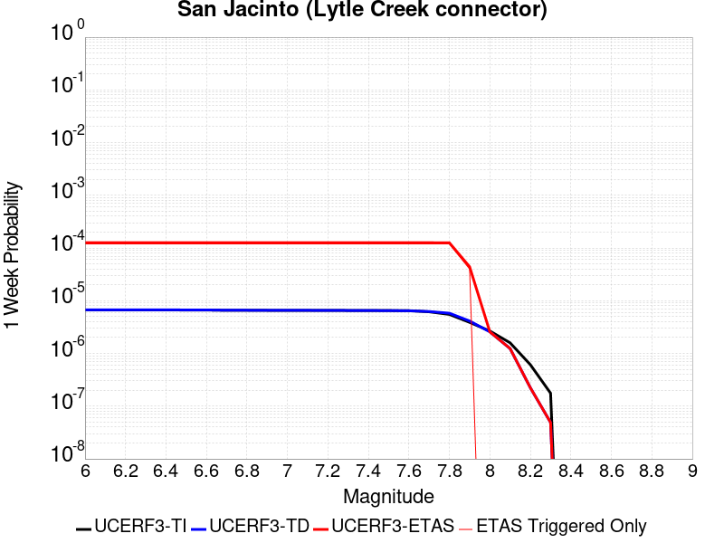 | 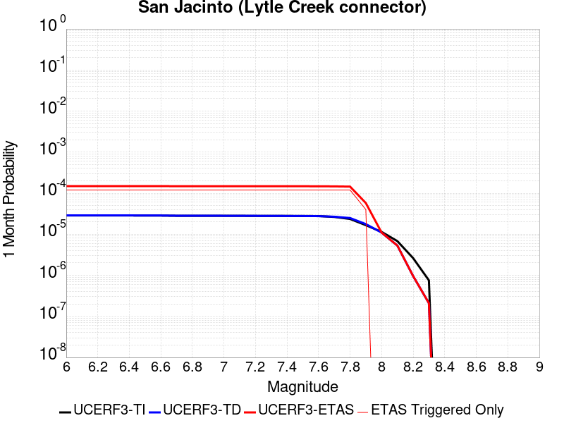 | 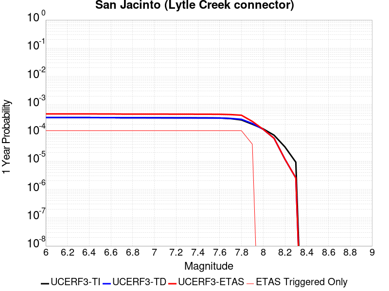 |

| Magnitude | 1 wk TI Prob | 1 wk TD Prob | 1 wk ETAS Prob | 1 wk ETAS/TD Gain | 1 wk ETAS Triggered Only | 1 mo TI Prob | 1 mo TD Prob | 1 mo ETAS Prob | 1 mo ETAS/TD Gain | 1 mo ETAS Triggered Only | 1 yr TI Prob | 1 yr TD Prob | 1 yr ETAS Prob | 1 yr ETAS/TD Gain | 1 yr ETAS Triggered Only |
|-----|-----|-----|-----|-----|-----|-----|-----|-----|-----|-----|-----|-----|-----|-----|-----|
| 6.0 | 6.693995E-6 | 6.7295123E-6 | 1.267287E-4 | 18.831781 | 1.2E-4 | 2.8688235E-5 | 2.8840448E-5 | 1.4883699E-4 | 5.1607027 | 1.2E-4 | 3.492233E-4 | 3.5107599E-4 | 4.7103385E-4 | 1.3416864 | 1.2E-4 |
| 6.1 | 6.693995E-6 | 6.7295123E-6 | 1.267287E-4 | 18.831781 | 1.2E-4 | 2.8688235E-5 | 2.8840448E-5 | 1.4883699E-4 | 5.1607027 | 1.2E-4 | 3.492233E-4 | 3.5107599E-4 | 4.7103385E-4 | 1.3416864 | 1.2E-4 |
| 6.2 | 6.693995E-6 | 6.7295123E-6 | 1.267287E-4 | 18.831781 | 1.2E-4 | 2.8688235E-5 | 2.8840448E-5 | 1.4883699E-4 | 5.1607027 | 1.2E-4 | 3.492233E-4 | 3.5107599E-4 | 4.7103385E-4 | 1.3416864 | 1.2E-4 |
| 6.3 | 6.693995E-6 | 6.7295123E-6 | 1.267287E-4 | 18.831781 | 1.2E-4 | 2.8688235E-5 | 2.8840448E-5 | 1.4883699E-4 | 5.1607027 | 1.2E-4 | 3.492233E-4 | 3.5107599E-4 | 4.7103385E-4 | 1.3416864 | 1.2E-4 |
| 6.4 | 6.693995E-6 | 6.7295123E-6 | 1.267287E-4 | 18.831781 | 1.2E-4 | 2.8688235E-5 | 2.8840448E-5 | 1.4883699E-4 | 5.1607027 | 1.2E-4 | 3.492233E-4 | 3.5107599E-4 | 4.7103385E-4 | 1.3416864 | 1.2E-4 |
| 6.5 | 6.6561875E-6 | 6.6897233E-6 | 1.2668892E-4 | 18.937841 | 1.2E-4 | 2.8526205E-5 | 2.8669929E-5 | 1.4866648E-4 | 5.18545 | 1.2E-4 | 3.472512E-4 | 3.4900056E-4 | 4.6895866E-4 | 1.343719 | 1.2E-4 |
| 6.6 | 6.6561875E-6 | 6.6897233E-6 | 1.2668892E-4 | 18.937841 | 1.2E-4 | 2.8526205E-5 | 2.8669929E-5 | 1.4866648E-4 | 5.18545 | 1.2E-4 | 3.472512E-4 | 3.4900056E-4 | 4.6895866E-4 | 1.343719 | 1.2E-4 |
| 6.7 | 6.5802237E-6 | 6.6088837E-6 | 1.266081E-4 | 19.157259 | 1.2E-4 | 2.8200653E-5 | 2.832348E-5 | 1.4832008E-4 | 5.2366476 | 1.2E-4 | 3.4328885E-4 | 3.4478388E-4 | 4.647425E-4 | 1.3479241 | 1.2E-4 |
| 6.8 | 6.575632E-6 | 6.6033695E-6 | 1.2660258E-4 | 19.17242 | 1.2E-4 | 2.8180975E-5 | 2.8299848E-5 | 1.4829646E-4 | 5.2401857 | 1.2E-4 | 3.4304935E-4 | 3.4449625E-4 | 4.644549E-4 | 1.3482147 | 1.2E-4 |
| 6.9 | 6.570433E-6 | 6.5947534E-6 | 1.2659396E-4 | 19.196163 | 1.2E-4 | 2.8158694E-5 | 2.8262923E-5 | 1.4825953E-4 | 5.245725 | 1.2E-4 | 3.4277816E-4 | 3.4404683E-4 | 4.6400554E-4 | 1.3486698 | 1.2E-4 |
| 7.0 | 6.5643826E-6 | 6.5848626E-6 | 1.2658407E-4 | 19.223495 | 1.2E-4 | 2.8132765E-5 | 2.8220535E-5 | 1.4821715E-4 | 5.252103 | 1.2E-4 | 3.424626E-4 | 3.435309E-4 | 4.634897E-4 | 1.3491936 | 1.2E-4 |
| 7.1 | 6.557402E-6 | 6.5735626E-6 | 1.2657278E-4 | 19.254822 | 1.2E-4 | 2.8102848E-5 | 2.8172106E-5 | 1.4816872E-4 | 5.2594123 | 1.2E-4 | 3.4209844E-4 | 3.429415E-4 | 4.6290032E-4 | 1.3497939 | 1.2E-4 |
| 7.2 | 6.546394E-6 | 6.5555055E-6 | 1.2655472E-4 | 19.305105 | 1.2E-4 | 2.8055672E-5 | 2.809472E-5 | 1.4809135E-4 | 5.271145 | 1.2E-4 | 3.4152428E-4 | 3.4199964E-4 | 4.6195858E-4 | 1.3507576 | 1.2E-4 |
| 7.3 | 6.5364216E-6 | 6.536247E-6 | 1.2653547E-4 | 19.35904 | 1.2E-4 | 2.8012933E-5 | 2.8012188E-5 | 1.4800882E-4 | 5.2837296 | 1.2E-4 | 3.4100408E-4 | 3.409951E-4 | 4.6095415E-4 | 1.3517913 | 1.2E-4 |
| 7.4 | 6.5269523E-6 | 6.517283E-6 | 1.265165E-4 | 19.41246 | 1.2E-4 | 2.7972354E-5 | 2.7930913E-5 | 1.4792757E-4 | 5.296195 | 1.2E-4 | 3.4051016E-4 | 3.4000588E-4 | 4.599651E-4 | 1.352815 | 1.2E-4 |
| 7.5 | 6.5111835E-6 | 6.4935025E-6 | 1.2649273E-4 | 19.47989 | 1.2E-4 | 2.7904773E-5 | 2.7829E-5 | 1.4782566E-4 | 5.3119283 | 1.2E-4 | 3.3968766E-4 | 3.3876547E-4 | 4.5872483E-4 | 1.3541074 | 1.2E-4 |
| 7.6 | 6.4768806E-6 | 6.4525266E-6 | 1.2645175E-4 | 19.597246 | 1.2E-4 | 2.7757764E-5 | 2.7653392E-5 | 1.4765008E-4 | 5.3393116 | 1.2E-4 | 3.3789838E-4 | 3.3662812E-4 | 4.565877E-4 | 1.3563565 | 1.2E-4 |
| 7.7 | 6.1655364E-6 | 6.2444665E-6 | 1.2624371E-4 | 20.216894 | 1.2E-4 | 2.642346E-5 | 2.6761725E-5 | 1.4675851E-4 | 5.483896 | 1.2E-4 | 3.2165812E-4 | 3.2577536E-4 | 4.4573625E-4 | 1.368232 | 1.2E-4 |
| 7.8 | 5.5043524E-6 | 5.803494E-6 | 1.2580279E-4 | 21.67708 | 1.2E-4 | 2.3589868E-5 | 2.4871879E-5 | 1.448689E-4 | 5.824606 | 1.2E-4 | 2.871688E-4 | 3.027731E-4 | 4.2273678E-4 | 1.3962164 | 1.2E-4 |
| 7.9 | 3.889249E-6 | 4.130606E-6 | 4.413044E-5 | 10.683769 | 4.0E-5 | 1.6668104E-5 | 1.7702478E-5 | 5.7701767E-5 | 3.2595308 | 4.0E-5 | 2.0291525E-4 | 2.1550638E-4 | 2.5549775E-4 | 1.1855694 | 4.0E-5 |
| 8.0 | 2.668535E-6 | 2.5686622E-6 | 2.5686622E-6 | 1.0 | 0.0 | 1.1436528E-5 | 1.1008506E-5 | 1.1008506E-5 | 1.0 | 0.0 | 1.3923083E-4 | 1.3402035E-4 | 1.3402035E-4 | 1.0 | 0.0 |
| 8.1 | 1.5911459E-6 | 1.2385202E-6 | 1.2385202E-6 | 1.0 | 0.0 | 6.8191785E-6 | 5.307933E-6 | 5.307933E-6 | 1.0 | 0.0 | 8.3020335E-5 | 6.462219E-5 | 6.462219E-5 | 1.0 | 0.0 |
| 8.2 | 6.1294963E-7 | 2.2397407E-7 | 2.2397407E-7 | 1.0 | 0.0 | 2.6269242E-6 | 9.598884E-7 | 9.598884E-7 | 1.0 | 0.0 | 3.1982334E-5 | 1.168658E-5 | 1.168658E-5 | 1.0 | 0.0 |
| 8.3 | 1.762871E-7 | 4.901543E-8 | 4.901543E-8 | 1.0 | 0.0 | 7.5551594E-7 | 2.1006612E-7 | 2.1006612E-7 | 1.0 | 0.0 | 9.1983675E-6 | 2.557552E-6 | 2.557552E-6 | 1.0 | 0.0 |

## Lenwood-Lockhart-Old Woman Springs
*[(top)](#table-of-contents)*

| 1 Week | 1 Month | 1 Year |
|-----|-----|-----|
| 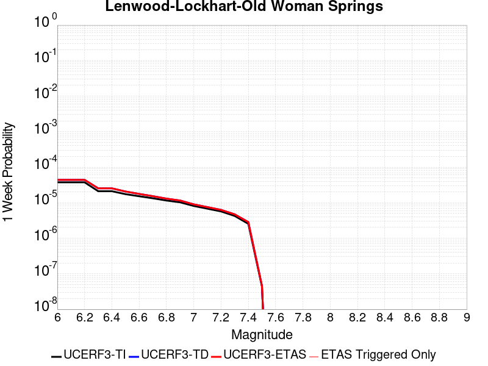 | 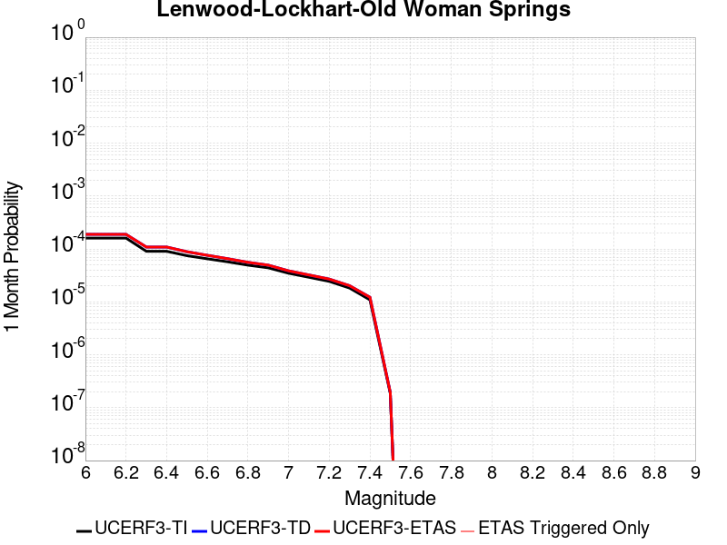 | 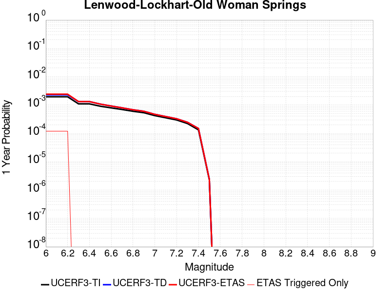 |

| Magnitude | 1 wk TI Prob | 1 wk TD Prob | 1 wk ETAS Prob | 1 wk ETAS/TD Gain | 1 wk ETAS Triggered Only | 1 mo TI Prob | 1 mo TD Prob | 1 mo ETAS Prob | 1 mo ETAS/TD Gain | 1 mo ETAS Triggered Only | 1 yr TI Prob | 1 yr TD Prob | 1 yr ETAS Prob | 1 yr ETAS/TD Gain | 1 yr ETAS Triggered Only |
|-----|-----|-----|-----|-----|-----|-----|-----|-----|-----|-----|-----|-----|-----|-----|-----|
| 6.0 | 3.744542E-5 | 4.3976295E-5 | 4.3976295E-5 | 1.0 | 0.0 | 1.604705E-4 | 1.884572E-4 | 1.884572E-4 | 1.0 | 0.0 | 0.0019519776 | 0.002292224 | 0.002411949 | 1.052231 | 1.2E-4 |
| 6.1 | 3.744542E-5 | 4.3976295E-5 | 4.3976295E-5 | 1.0 | 0.0 | 1.604705E-4 | 1.884572E-4 | 1.884572E-4 | 1.0 | 0.0 | 0.0019519776 | 0.002292224 | 0.002411949 | 1.052231 | 1.2E-4 |
| 6.2 | 3.744542E-5 | 4.3976295E-5 | 4.3976295E-5 | 1.0 | 0.0 | 1.604705E-4 | 1.884572E-4 | 1.884572E-4 | 1.0 | 0.0 | 0.0019519776 | 0.002292224 | 0.002411949 | 1.052231 | 1.2E-4 |
| 6.3 | 2.1079984E-5 | 2.5359855E-5 | 2.5359855E-5 | 1.0 | 0.0 | 9.0339665E-5 | 1.0868068E-4 | 1.0868068E-4 | 1.0 | 0.0 | 0.0010993304 | 0.001322404 | 0.001322404 | 1.0 | 0.0 |
| 6.4 | 2.1079984E-5 | 2.5359855E-5 | 2.5359855E-5 | 1.0 | 0.0 | 9.0339665E-5 | 1.0868068E-4 | 1.0868068E-4 | 1.0 | 0.0 | 0.0010993304 | 0.001322404 | 0.001322404 | 1.0 | 0.0 |
| 6.5 | 1.7397282E-5 | 2.0667581E-5 | 2.0667581E-5 | 1.0 | 0.0 | 7.455765E-5 | 8.857241E-5 | 8.857241E-5 | 1.0 | 0.0 | 9.073613E-4 | 0.0010778473 | 0.0010778473 | 1.0 | 0.0 |
| 6.6 | 1.52050325E-5 | 1.768411E-5 | 1.768411E-5 | 1.0 | 0.0 | 6.51628E-5 | 7.5786884E-5 | 7.5786884E-5 | 1.0 | 0.0 | 7.9306826E-4 | 9.223226E-4 | 9.223226E-4 | 1.0 | 0.0 |
| 6.7 | 1.332523E-5 | 1.5268157E-5 | 1.5268157E-5 | 1.0 | 0.0 | 5.7106878E-5 | 6.543335E-5 | 6.543335E-5 | 1.0 | 0.0 | 6.950544E-4 | 7.9636567E-4 | 7.9636567E-4 | 1.0 | 0.0 |
| 6.8 | 1.1525329E-5 | 1.3034469E-5 | 1.3034469E-5 | 1.0 | 0.0 | 4.9393333E-5 | 5.5860837E-5 | 5.5860837E-5 | 1.0 | 0.0 | 6.011979E-4 | 6.798977E-4 | 6.798977E-4 | 1.0 | 0.0 |
| 6.9 | 1.0253909E-5 | 1.1517644E-5 | 1.1517644E-5 | 1.0 | 0.0 | 4.3944583E-5 | 4.936042E-5 | 4.936042E-5 | 1.0 | 0.0 | 5.3489394E-4 | 6.00801E-4 | 6.00801E-4 | 1.0 | 0.0 |
| 7.0 | 8.104563E-6 | 8.993927E-6 | 8.993927E-6 | 1.0 | 0.0 | 3.4733377E-5 | 3.8544847E-5 | 3.8544847E-5 | 1.0 | 0.0 | 4.2279682E-4 | 4.6918486E-4 | 4.6918486E-4 | 1.0 | 0.0 |
| 7.1 | 6.7986157E-6 | 7.518288E-6 | 7.518288E-6 | 1.0 | 0.0 | 2.91366E-5 | 3.2220847E-5 | 3.2220847E-5 | 1.0 | 0.0 | 3.5468035E-4 | 3.9222036E-4 | 3.9222036E-4 | 1.0 | 0.0 |
| 7.2 | 5.6893327E-6 | 6.2822814E-6 | 6.2822814E-6 | 1.0 | 0.0 | 2.4382627E-5 | 2.6923795E-5 | 2.6923795E-5 | 1.0 | 0.0 | 2.9681803E-4 | 3.277499E-4 | 3.277499E-4 | 1.0 | 0.0 |
| 7.3 | 4.253348E-6 | 4.7090152E-6 | 4.7090152E-6 | 1.0 | 0.0 | 1.8228506E-5 | 2.0181347E-5 | 2.0181347E-5 | 1.0 | 0.0 | 2.2190946E-4 | 2.4568205E-4 | 2.4568205E-4 | 1.0 | 0.0 |
| 7.4 | 2.5448119E-6 | 2.852325E-6 | 2.852325E-6 | 1.0 | 0.0 | 1.0906291E-5 | 1.2224203E-5 | 1.2224203E-5 | 1.0 | 0.0 | 1.3277601E-4 | 1.4882116E-4 | 1.4882116E-4 | 1.0 | 0.0 |
| 7.5 | 4.3706837E-8 | 4.5635893E-8 | 4.5635893E-8 | 1.0 | 0.0 | 1.8731501E-7 | 1.9558239E-7 | 1.9558239E-7 | 1.0 | 0.0 | 2.2805577E-6 | 2.3812136E-6 | 2.3812136E-6 | 1.0 | 0.0 |

## So Sierra Nevada
*[(top)](#table-of-contents)*

| 1 Week | 1 Month | 1 Year |
|-----|-----|-----|
|  | 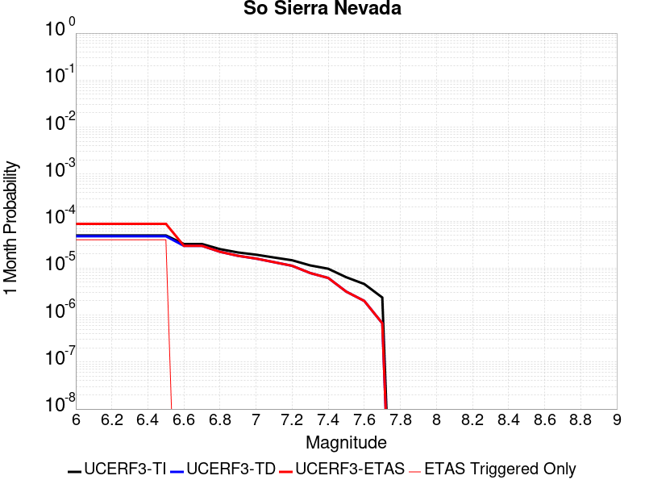 | 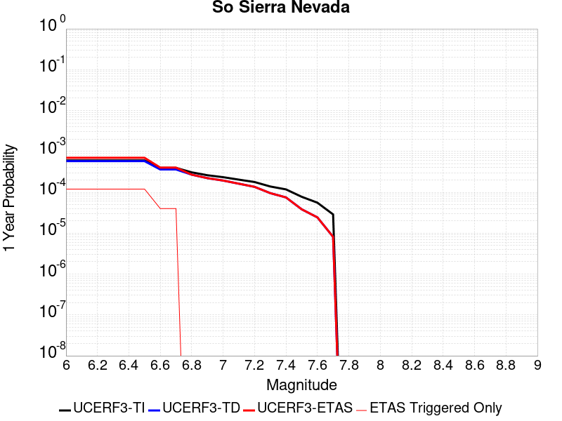 |

| Magnitude | 1 wk TI Prob | 1 wk TD Prob | 1 wk ETAS Prob | 1 wk ETAS/TD Gain | 1 wk ETAS Triggered Only | 1 mo TI Prob | 1 mo TD Prob | 1 mo ETAS Prob | 1 mo ETAS/TD Gain | 1 mo ETAS Triggered Only | 1 yr TI Prob | 1 yr TD Prob | 1 yr ETAS Prob | 1 yr ETAS/TD Gain | 1 yr ETAS Triggered Only |
|-----|-----|-----|-----|-----|-----|-----|-----|-----|-----|-----|-----|-----|-----|-----|-----|
| 6.0 | 1.15488665E-5 | 1.1081638E-5 | 5.1081195E-5 | 4.6095347 | 4.0E-5 | 4.9494203E-5 | 4.7491943E-5 | 8.749004E-5 | 1.8422081 | 4.0E-5 | 6.024253E-4 | 5.780738E-4 | 6.980044E-4 | 1.207466 | 1.2E-4 |
| 6.1 | 1.15488665E-5 | 1.1081638E-5 | 5.1081195E-5 | 4.6095347 | 4.0E-5 | 4.9494203E-5 | 4.7491943E-5 | 8.749004E-5 | 1.8422081 | 4.0E-5 | 6.024253E-4 | 5.780738E-4 | 6.980044E-4 | 1.207466 | 1.2E-4 |
| 6.2 | 1.15488665E-5 | 1.1081638E-5 | 5.1081195E-5 | 4.6095347 | 4.0E-5 | 4.9494203E-5 | 4.7491943E-5 | 8.749004E-5 | 1.8422081 | 4.0E-5 | 6.024253E-4 | 5.780738E-4 | 6.980044E-4 | 1.207466 | 1.2E-4 |
| 6.3 | 1.15488665E-5 | 1.1081638E-5 | 5.1081195E-5 | 4.6095347 | 4.0E-5 | 4.9494203E-5 | 4.7491943E-5 | 8.749004E-5 | 1.8422081 | 4.0E-5 | 6.024253E-4 | 5.780738E-4 | 6.980044E-4 | 1.207466 | 1.2E-4 |
| 6.4 | 1.15488665E-5 | 1.1081638E-5 | 5.1081195E-5 | 4.6095347 | 4.0E-5 | 4.9494203E-5 | 4.7491943E-5 | 8.749004E-5 | 1.8422081 | 4.0E-5 | 6.024253E-4 | 5.780738E-4 | 6.980044E-4 | 1.207466 | 1.2E-4 |
| 6.5 | 1.15488665E-5 | 1.1081638E-5 | 5.1081195E-5 | 4.6095347 | 4.0E-5 | 4.9494203E-5 | 4.7491943E-5 | 8.749004E-5 | 1.8422081 | 4.0E-5 | 6.024253E-4 | 5.780738E-4 | 6.980044E-4 | 1.207466 | 1.2E-4 |
| 6.6 | 7.587044E-6 | 6.9369835E-6 | 6.9369835E-6 | 1.0 | 0.0 | 3.2515498E-5 | 2.9729606E-5 | 2.9729606E-5 | 1.0 | 0.0 | 3.9580427E-4 | 3.6190078E-4 | 4.018863E-4 | 1.1104876 | 4.0E-5 |
| 6.7 | 7.587044E-6 | 6.9369835E-6 | 6.9369835E-6 | 1.0 | 0.0 | 3.2515498E-5 | 2.9729606E-5 | 2.9729606E-5 | 1.0 | 0.0 | 3.9580427E-4 | 3.6190078E-4 | 4.018863E-4 | 1.1104876 | 4.0E-5 |
| 6.8 | 5.9026956E-6 | 5.180487E-6 | 5.180487E-6 | 1.0 | 0.0 | 2.5297022E-5 | 2.2201903E-5 | 2.2201903E-5 | 1.0 | 0.0 | 3.0794772E-4 | 2.702758E-4 | 2.702758E-4 | 1.0 | 0.0 |
| 6.9 | 5.0118915E-6 | 4.2533916E-6 | 4.2533916E-6 | 1.0 | 0.0 | 2.1479358E-5 | 1.8228699E-5 | 1.8228699E-5 | 1.0 | 0.0 | 2.614798E-4 | 2.2191253E-4 | 2.2191253E-4 | 1.0 | 0.0 |
| 7.0 | 4.4924795E-6 | 3.7148159E-6 | 3.7148159E-6 | 1.0 | 0.0 | 1.925334E-5 | 1.5920545E-5 | 1.5920545E-5 | 1.0 | 0.0 | 2.3438422E-4 | 1.9381604E-4 | 1.9381604E-4 | 1.0 | 0.0 |
| 7.1 | 3.9118436E-6 | 3.1127947E-6 | 3.1127947E-6 | 1.0 | 0.0 | 1.6764936E-5 | 1.3340484E-5 | 1.3340484E-5 | 1.0 | 0.0 | 2.0409399E-4 | 1.6240886E-4 | 1.6240886E-4 | 1.0 | 0.0 |
| 7.2 | 3.4200818E-6 | 2.6062064E-6 | 2.6062064E-6 | 1.0 | 0.0 | 1.4657411E-5 | 1.1169411E-5 | 1.1169411E-5 | 1.0 | 0.0 | 1.7843937E-4 | 1.359796E-4 | 1.359796E-4 | 1.0 | 0.0 |
| 7.3 | 2.6593618E-6 | 1.829074E-6 | 1.829074E-6 | 1.0 | 0.0 | 1.13972155E-5 | 7.838867E-6 | 7.838867E-6 | 1.0 | 0.0 | 1.3875226E-4 | 9.543431E-5 | 9.543431E-5 | 1.0 | 0.0 |
| 7.4 | 2.2577992E-6 | 1.4370321E-6 | 1.4370321E-6 | 1.0 | 0.0 | 9.676246E-6 | 6.1586957E-6 | 6.1586957E-6 | 1.0 | 0.0 | 1.1780193E-4 | 7.49798E-5 | 7.49798E-5 | 1.0 | 0.0 |
| 7.5 | 1.489319E-6 | 7.358567E-7 | 7.358567E-7 | 1.0 | 0.0 | 6.3827797E-6 | 3.1536679E-6 | 3.1536679E-6 | 1.0 | 0.0 | 7.770758E-5 | 3.8395232E-5 | 3.8395232E-5 | 1.0 | 0.0 |
| 7.6 | 1.0680322E-6 | 4.6630498E-7 | 4.6630498E-7 | 1.0 | 0.0 | 4.577273E-6 | 1.9984484E-6 | 1.9984484E-6 | 1.0 | 0.0 | 5.5726876E-5 | 2.433084E-5 | 2.433084E-5 | 1.0 | 0.0 |
| 7.7 | 5.509146E-7 | 1.5597114E-7 | 1.5597114E-7 | 1.0 | 0.0 | 2.3610605E-6 | 6.684475E-7 | 6.684475E-7 | 1.0 | 0.0 | 2.8745531E-5 | 8.13832E-6 | 8.13832E-6 | 1.0 | 0.0 |

## Coyote Canyon
*[(top)](#table-of-contents)*

| 1 Week | 1 Month | 1 Year |
|-----|-----|-----|
| 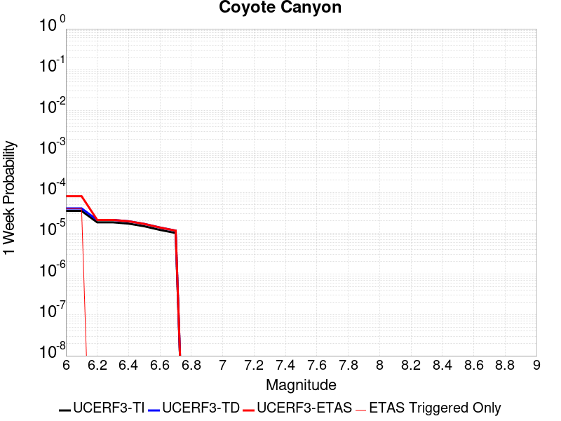 | 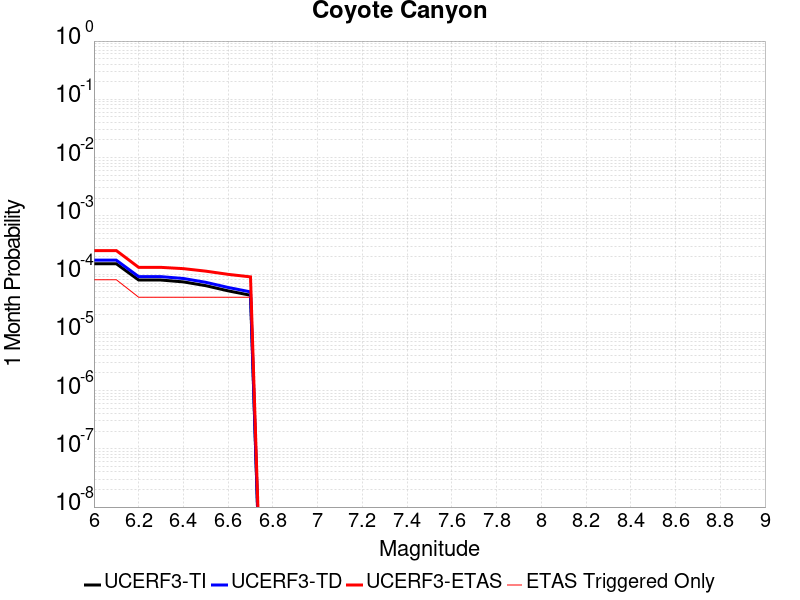 | 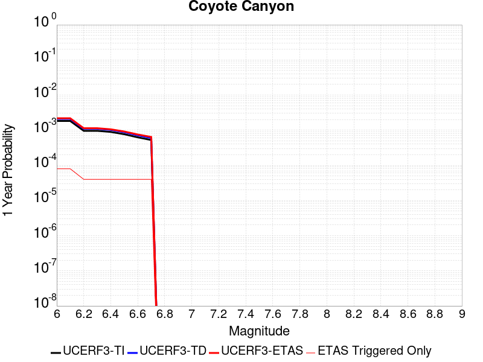 |

| Magnitude | 1 wk TI Prob | 1 wk TD Prob | 1 wk ETAS Prob | 1 wk ETAS/TD Gain | 1 wk ETAS Triggered Only | 1 mo TI Prob | 1 mo TD Prob | 1 mo ETAS Prob | 1 mo ETAS/TD Gain | 1 mo ETAS Triggered Only | 1 yr TI Prob | 1 yr TD Prob | 1 yr ETAS Prob | 1 yr ETAS/TD Gain | 1 yr ETAS Triggered Only |
|-----|-----|-----|-----|-----|-----|-----|-----|-----|-----|-----|-----|-----|-----|-----|-----|
| 6.0 | 3.5090034E-5 | 4.0384904E-5 | 8.038329E-5 | 1.9904292 | 4.0E-5 | 1.503772E-4 | 1.7306813E-4 | 2.5305428E-4 | 1.4621657 | 8.0E-5 | 0.0018293047 | 0.0021053257 | 0.0021851573 | 1.0379189 | 8.0E-5 |
| 6.1 | 3.5090034E-5 | 4.0384904E-5 | 8.038329E-5 | 1.9904292 | 4.0E-5 | 1.503772E-4 | 1.7306813E-4 | 2.5305428E-4 | 1.4621657 | 8.0E-5 | 0.0018293047 | 0.0021053257 | 0.0021851573 | 1.0379189 | 8.0E-5 |
| 6.2 | 1.841879E-5 | 2.1070035E-5 | 2.1070035E-5 | 1.0 | 0.0 | 7.8935285E-5 | 9.02976E-5 | 1.3029399E-4 | 1.4429396 | 4.0E-5 | 9.606133E-4 | 0.0010989209 | 0.001138877 | 1.0363593 | 4.0E-5 |
| 6.3 | 1.841879E-5 | 2.1070035E-5 | 2.1070035E-5 | 1.0 | 0.0 | 7.8935285E-5 | 9.02976E-5 | 1.3029399E-4 | 1.4429396 | 4.0E-5 | 9.606133E-4 | 0.0010989209 | 0.001138877 | 1.0363593 | 4.0E-5 |
| 6.4 | 1.712201E-5 | 1.957468E-5 | 1.957468E-5 | 1.0 | 0.0 | 7.337798E-5 | 8.3889354E-5 | 1.23886E-4 | 1.4767785 | 4.0E-5 | 8.930107E-4 | 0.0010209751 | 0.0010609342 | 1.0391382 | 4.0E-5 |
| 6.5 | 1.4744935E-5 | 1.6845073E-5 | 1.6845073E-5 | 1.0 | 0.0 | 6.3191044E-5 | 7.21917E-5 | 1.1218882E-4 | 1.5540403 | 4.0E-5 | 7.6907943E-4 | 8.7867316E-4 | 9.18638E-4 | 1.0454832 | 4.0E-5 |
| 6.6 | 1.2017839E-5 | 1.3730698E-5 | 1.3730698E-5 | 1.0 | 0.0 | 5.150401E-5 | 5.884502E-5 | 9.884267E-5 | 1.6797116 | 4.0E-5 | 6.268809E-4 | 7.162913E-4 | 7.562627E-4 | 1.0558032 | 4.0E-5 |
| 6.7 | 1.00956095E-5 | 1.15390885E-5 | 1.15390885E-5 | 1.0 | 0.0 | 4.326618E-5 | 4.945279E-5 | 8.945081E-5 | 1.8088123 | 4.0E-5 | 5.266384E-4 | 6.020084E-4 | 6.4198434E-4 | 1.0664042 | 4.0E-5 |

## Elmore Ranch
*[(top)](#table-of-contents)*

| 1 Week | 1 Month | 1 Year |
|-----|-----|-----|
| 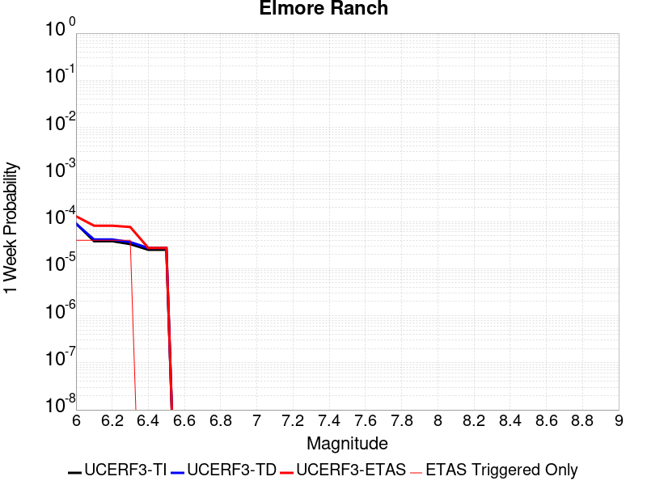 | 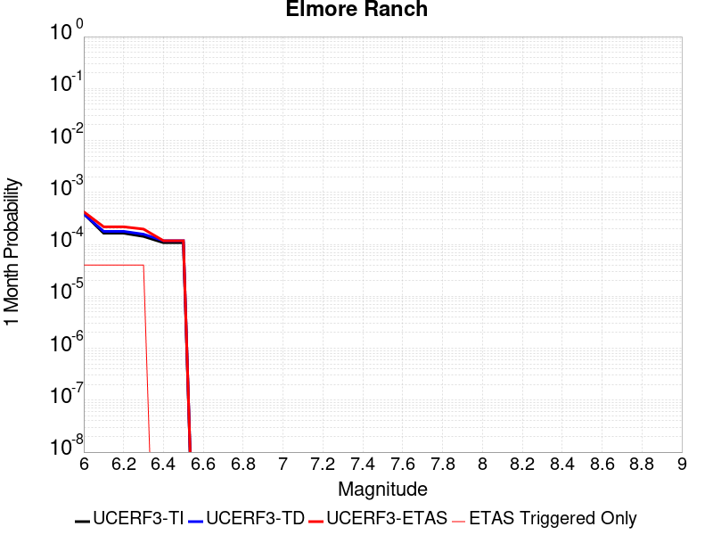 | 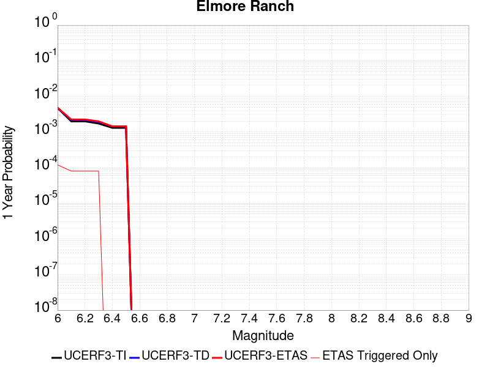 |

| Magnitude | 1 wk TI Prob | 1 wk TD Prob | 1 wk ETAS Prob | 1 wk ETAS/TD Gain | 1 wk ETAS Triggered Only | 1 mo TI Prob | 1 mo TD Prob | 1 mo ETAS Prob | 1 mo ETAS/TD Gain | 1 mo ETAS Triggered Only | 1 yr TI Prob | 1 yr TD Prob | 1 yr ETAS Prob | 1 yr ETAS/TD Gain | 1 yr ETAS Triggered Only |
|-----|-----|-----|-----|-----|-----|-----|-----|-----|-----|-----|-----|-----|-----|-----|-----|
| 6.0 | 9.102099E-5 | 8.966761E-5 | 1.2966403E-4 | 1.446052 | 4.0E-5 | 3.9003167E-4 | 3.8422062E-4 | 4.2420524E-4 | 1.1040668 | 4.0E-5 | 0.0047383 | 0.0046685147 | 0.0047879545 | 1.0255841 | 1.2E-4 |
| 6.1 | 3.8306698E-5 | 4.1548446E-5 | 8.154679E-5 | 1.9626915 | 4.0E-5 | 1.6416123E-4 | 1.7805643E-4 | 2.180493E-4 | 1.2246078 | 4.0E-5 | 0.0019968306 | 0.0021661238 | 0.0022459505 | 1.0368524 | 8.0E-5 |
| 6.2 | 3.8306698E-5 | 4.1548446E-5 | 8.154679E-5 | 1.9626915 | 4.0E-5 | 1.6416123E-4 | 1.7805643E-4 | 2.180493E-4 | 1.2246078 | 4.0E-5 | 0.0019968306 | 0.0021661238 | 0.0022459505 | 1.0368524 | 8.0E-5 |
| 6.3 | 3.3197924E-5 | 3.6596153E-5 | 7.659469E-5 | 2.092971 | 4.0E-5 | 1.4226905E-4 | 1.5683495E-4 | 1.9682868E-4 | 1.2550051 | 4.0E-5 | 0.0017307495 | 0.001908332 | 0.0019881793 | 1.0418414 | 8.0E-5 |
| 6.4 | 2.5148964E-5 | 2.7451913E-5 | 2.7451913E-5 | 1.0 | 0.0 | 1.0777682E-4 | 1.1764941E-4 | 1.1764941E-4 | 1.0 | 0.0 | 0.0013113929 | 0.00143209 | 0.00143209 | 1.0 | 0.0 |
| 6.5 | 2.5148964E-5 | 2.7451913E-5 | 2.7451913E-5 | 1.0 | 0.0 | 1.0777682E-4 | 1.1764941E-4 | 1.1764941E-4 | 1.0 | 0.0 | 0.0013113929 | 0.00143209 | 0.00143209 | 1.0 | 0.0 |

## Calaveras (So) 2011 CFM
*[(top)](#table-of-contents)*

| 1 Week | 1 Month | 1 Year |
|-----|-----|-----|
| 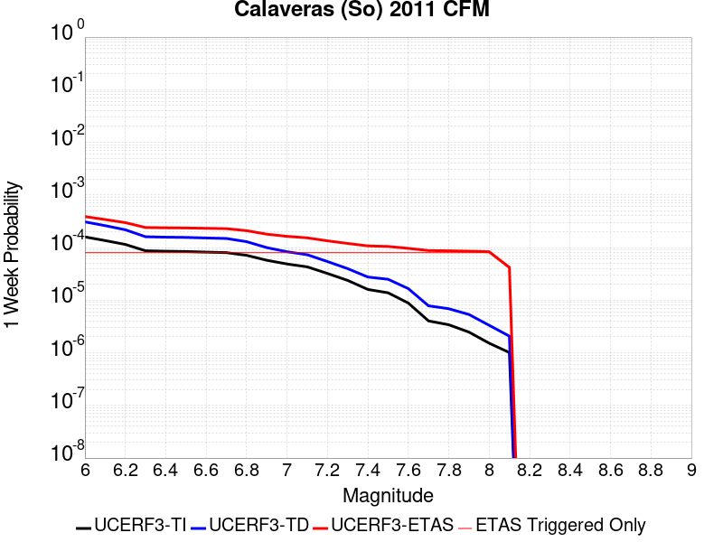 | 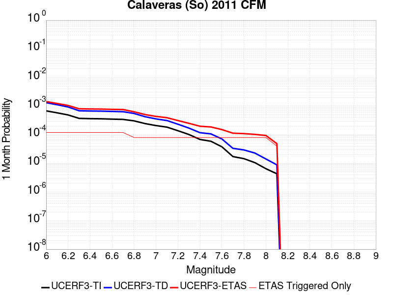 | 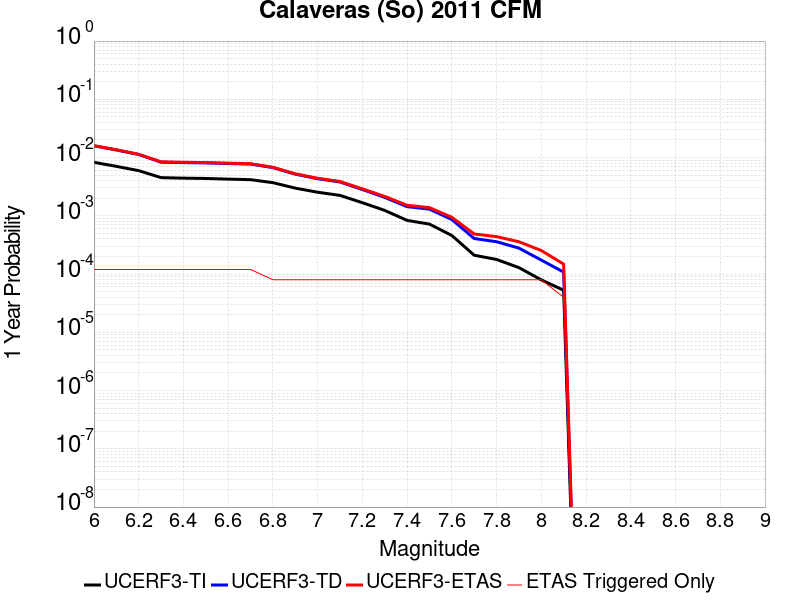 |

| Magnitude | 1 wk TI Prob | 1 wk TD Prob | 1 wk ETAS Prob | 1 wk ETAS/TD Gain | 1 wk ETAS Triggered Only | 1 mo TI Prob | 1 mo TD Prob | 1 mo ETAS Prob | 1 mo ETAS/TD Gain | 1 mo ETAS Triggered Only | 1 yr TI Prob | 1 yr TD Prob | 1 yr ETAS Prob | 1 yr ETAS/TD Gain | 1 yr ETAS Triggered Only |
|-----|-----|-----|-----|-----|-----|-----|-----|-----|-----|-----|-----|-----|-----|-----|-----|
| 6.0 | 1.5950744E-4 | 3.0790493E-4 | 3.878803E-4 | 1.2597405 | 8.0E-5 | 6.834242E-4 | 0.0013187632 | 0.001438605 | 1.0908743 | 1.2E-4 | 0.00828899 | 0.015898287 | 0.016016379 | 1.0074279 | 1.2E-4 |
| 6.1 | 1.3584697E-4 | 2.6108976E-4 | 3.4106887E-4 | 1.306328 | 8.0E-5 | 5.8207137E-4 | 0.0011183338 | 0.0012381995 | 1.1071825 | 1.2E-4 | 0.007063716 | 0.013499089 | 0.013617469 | 1.0087695 | 1.2E-4 |
| 6.2 | 1.14676266E-4 | 2.1784513E-4 | 2.978277E-4 | 1.3671534 | 8.0E-5 | 4.9137714E-4 | 9.3321304E-4 | 0.001053101 | 1.128468 | 1.2E-4 | 0.0059661185 | 0.011280941 | 0.011399588 | 1.0105174 | 1.2E-4 |
| 6.3 | 8.691518E-5 | 1.6052955E-4 | 2.4051672E-4 | 1.4982706 | 8.0E-5 | 3.7244044E-4 | 6.8776263E-4 | 8.0768013E-4 | 1.1743588 | 1.2E-4 | 0.004525038 | 0.008334652 | 0.008453651 | 1.0142777 | 1.2E-4 |
| 6.4 | 8.50982E-5 | 1.5758992E-4 | 2.375773E-4 | 1.5075667 | 8.0E-5 | 3.646556E-4 | 6.7517074E-4 | 7.950897E-4 | 1.1776128 | 1.2E-4 | 0.0044306475 | 0.008182503 | 0.008301522 | 1.0145454 | 1.2E-4 |
| 6.5 | 8.4062965E-5 | 1.5583218E-4 | 2.3581972E-4 | 1.5132928 | 8.0E-5 | 3.602201E-4 | 6.6764234E-4 | 7.875622E-4 | 1.1796169 | 1.2E-4 | 0.004376863 | 0.008091622 | 0.008210652 | 1.0147102 | 1.2E-4 |
| 6.6 | 8.194716E-5 | 1.521856E-4 | 2.3217342E-4 | 1.5255939 | 8.0E-5 | 3.5115483E-4 | 6.5202266E-4 | 7.719444E-4 | 1.1839226 | 1.2E-4 | 0.0042669317 | 0.007903222 | 0.008022274 | 1.0150636 | 1.2E-4 |
| 6.7 | 8.012326E-5 | 1.4886065E-4 | 2.2884874E-4 | 1.5373354 | 8.0E-5 | 3.433402E-4 | 6.377831E-4 | 7.577065E-4 | 1.1880318 | 1.2E-4 | 0.004172157 | 0.0077315248 | 0.007850597 | 1.0154009 | 1.2E-4 |
| 6.8 | 7.119773E-5 | 1.2941338E-4 | 2.0940304E-4 | 1.6180941 | 8.0E-5 | 3.0509746E-4 | 5.54491E-4 | 6.344466E-4 | 1.1441965 | 8.0E-5 | 0.0037082357 | 0.0067267935 | 0.0068062553 | 1.0118127 | 8.0E-5 |
| 6.9 | 5.7343088E-5 | 9.972352E-5 | 1.7971554E-4 | 1.802138 | 8.0E-5 | 2.4573295E-4 | 4.2731693E-4 | 5.0728273E-4 | 1.1871346 | 8.0E-5 | 0.0029876942 | 0.005190248 | 0.005269833 | 1.0153335 | 8.0E-5 |
| 7.0 | 4.8746577E-5 | 8.3315186E-5 | 1.6330852E-4 | 1.9601291 | 8.0E-5 | 2.0889717E-4 | 3.5701657E-4 | 4.3698802E-4 | 1.2239993 | 8.0E-5 | 0.0025403565 | 0.0043380805 | 0.0044177338 | 1.0183613 | 8.0E-5 |
| 7.1 | 4.2998014E-5 | 7.307419E-5 | 1.5306835E-4 | 2.0946977 | 8.0E-5 | 1.8426418E-4 | 3.1313783E-4 | 3.931128E-4 | 1.2553985 | 8.0E-5 | 0.002241108 | 0.0038058492 | 0.0038855448 | 1.0209403 | 8.0E-5 |
| 7.2 | 3.221292E-5 | 5.426544E-5 | 1.342611E-4 | 2.4741547 | 8.0E-5 | 1.3804805E-4 | 2.325456E-4 | 3.12527E-4 | 1.3439386 | 8.0E-5 | 0.0016794393 | 0.0028275952 | 0.0029073688 | 1.0282125 | 8.0E-5 |
| 7.3 | 2.3756531E-5 | 3.976839E-5 | 1.1976521E-4 | 3.0115678 | 8.0E-5 | 1.0180973E-4 | 1.7042493E-4 | 2.504113E-4 | 1.4693348 | 8.0E-5 | 0.0012388286 | 0.0020729662 | 0.0021528003 | 1.038512 | 8.0E-5 |
| 7.4 | 1.5997684E-5 | 2.7537306E-5 | 1.075351E-4 | 3.9050698 | 8.0E-5 | 6.8559704E-5 | 1.18011696E-4 | 1.9800226E-4 | 1.6778189 | 8.0E-5 | 8.343947E-4 | 0.001435848 | 0.0015157331 | 1.0556362 | 8.0E-5 |
| 7.5 | 1.3814293E-5 | 2.4971192E-5 | 1.0496919E-4 | 4.203612 | 8.0E-5 | 5.9202768E-5 | 1.0701502E-4 | 1.8700646E-4 | 1.7474786 | 8.0E-5 | 7.205553E-4 | 0.0013021316 | 0.0013820274 | 1.0613577 | 8.0E-5 |
| 7.6 | 8.817309E-6 | 1.6584063E-5 | 9.6582735E-5 | 5.823828 | 8.0E-5 | 3.7787922E-5 | 7.107262E-5 | 1.5106694E-4 | 2.1255293 | 8.0E-5 | 4.5997082E-4 | 8.6496706E-4 | 9.448979E-4 | 1.092409 | 8.0E-5 |
| 7.7 | 4.0352206E-6 | 7.815648E-6 | 8.7815024E-5 | 11.235795 | 8.0E-5 | 1.7293689E-5 | 3.3495206E-5 | 1.13492526E-4 | 3.3883214 | 8.0E-5 | 2.1053031E-4 | 4.077279E-4 | 4.876953E-4 | 1.1961293 | 8.0E-5 |
| 7.8 | 3.413169E-6 | 6.882057E-6 | 8.6881504E-5 | 12.6243515 | 8.0E-5 | 1.4627784E-5 | 2.9494196E-5 | 1.0949184E-4 | 3.712318 | 8.0E-5 | 1.7807873E-4 | 3.5903274E-4 | 4.39004E-4 | 1.2227409 | 8.0E-5 |
| 7.9 | 2.4740732E-6 | 5.3497497E-6 | 8.534932E-5 | 15.95389 | 8.0E-5 | 1.06031275E-5 | 2.29273E-5 | 1.0292546E-4 | 4.48921 | 8.0E-5 | 1.2908543E-4 | 2.7910416E-4 | 3.5908184E-4 | 1.2865514 | 8.0E-5 |
| 8.0 | 1.5231818E-6 | 3.3315503E-6 | 8.333128E-5 | 25.012764 | 8.0E-5 | 6.527906E-6 | 1.42779945E-5 | 9.427685E-5 | 6.6029477 | 8.0E-5 | 7.9474354E-5 | 1.7382075E-4 | 2.5380685E-4 | 1.4601642 | 8.0E-5 |
| 8.1 | 1.0104524E-6 | 2.0730229E-6 | 4.207294E-5 | 20.295454 | 4.0E-5 | 4.330503E-6 | 8.8843535E-6 | 4.8883998E-5 | 5.5022573 | 4.0E-5 | 5.2722597E-5 | 1.08161665E-4 | 1.4815734E-4 | 1.3697767 | 4.0E-5 |

## Rose Canyon
*[(top)](#table-of-contents)*

| 1 Week | 1 Month | 1 Year |
|-----|-----|-----|
| 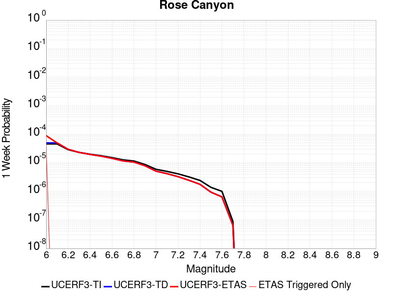 | 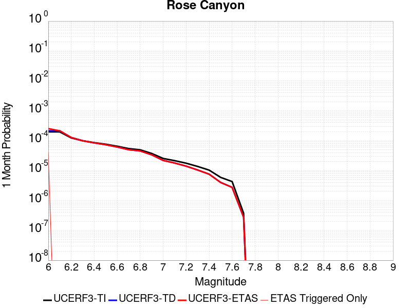 | 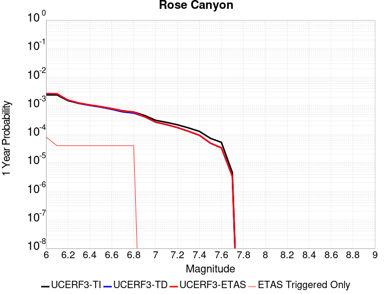 |

| Magnitude | 1 wk TI Prob | 1 wk TD Prob | 1 wk ETAS Prob | 1 wk ETAS/TD Gain | 1 wk ETAS Triggered Only | 1 mo TI Prob | 1 mo TD Prob | 1 mo ETAS Prob | 1 mo ETAS/TD Gain | 1 mo ETAS Triggered Only | 1 yr TI Prob | 1 yr TD Prob | 1 yr ETAS Prob | 1 yr ETAS/TD Gain | 1 yr ETAS Triggered Only |
|-----|-----|-----|-----|-----|-----|-----|-----|-----|-----|-----|-----|-----|-----|-----|-----|
| 6.0 | 4.5923203E-5 | 4.9824474E-5 | 8.982248E-5 | 1.8027784 | 4.0E-5 | 1.9679888E-4 | 2.1351733E-4 | 2.535088E-4 | 1.1872984 | 4.0E-5 | 0.0023933933 | 0.0025966738 | 0.002676466 | 1.0307287 | 8.0E-5 |
| 6.1 | 4.5923203E-5 | 4.9824474E-5 | 4.9824474E-5 | 1.0 | 0.0 | 1.9679888E-4 | 2.1351733E-4 | 2.1351733E-4 | 1.0 | 0.0 | 0.0023933933 | 0.0025966738 | 0.0026365698 | 1.0153643 | 4.0E-5 |
| 6.2 | 2.8844734E-5 | 2.9753832E-5 | 2.9753832E-5 | 1.0 | 0.0 | 1.2361443E-4 | 1.2751039E-4 | 1.2751039E-4 | 1.0 | 0.0 | 0.0015039665 | 0.0015513623 | 0.0015913004 | 1.0257438 | 4.0E-5 |
| 6.3 | 2.3171577E-5 | 2.3239887E-5 | 2.3239887E-5 | 1.0 | 0.0 | 9.9302975E-5 | 9.959579E-5 | 9.959579E-5 | 1.0 | 0.0 | 0.0012083431 | 0.0012119177 | 0.0012518693 | 1.0329655 | 4.0E-5 |
| 6.4 | 2.0066604E-5 | 1.9717654E-5 | 1.9717654E-5 | 1.0 | 0.0 | 8.599689E-5 | 8.450155E-5 | 8.450155E-5 | 1.0 | 0.0 | 0.0010465092 | 0.0010283309 | 0.0010682897 | 1.0388579 | 4.0E-5 |
| 6.5 | 1.776989E-5 | 1.714663E-5 | 1.714663E-5 | 1.0 | 0.0 | 7.615444E-5 | 7.3483534E-5 | 7.3483534E-5 | 1.0 | 0.0 | 9.267859E-4 | 8.943018E-4 | 9.34266E-4 | 1.0446876 | 4.0E-5 |
| 6.6 | 1.5227364E-5 | 1.4353479E-5 | 1.4353479E-5 | 1.0 | 0.0 | 6.52585E-5 | 6.151349E-5 | 6.151349E-5 | 1.0 | 0.0 | 7.942326E-4 | 7.486746E-4 | 7.8864465E-4 | 1.0533878 | 4.0E-5 |
| 6.7 | 1.2703898E-5 | 1.1679114E-5 | 1.1679114E-5 | 1.0 | 0.0 | 5.4444143E-5 | 5.005241E-5 | 5.005241E-5 | 1.0 | 0.0 | 6.626558E-4 | 6.09222E-4 | 6.491976E-4 | 1.0656176 | 4.0E-5 |
| 6.8 | 1.1554917E-5 | 1.061447E-5 | 1.061447E-5 | 1.0 | 0.0 | 4.9520135E-5 | 4.5489815E-5 | 4.5489815E-5 | 1.0 | 0.0 | 6.0274085E-4 | 5.537018E-4 | 5.9367967E-4 | 1.072201 | 4.0E-5 |
| 6.9 | 8.732078E-6 | 7.8845E-6 | 7.8845E-6 | 1.0 | 0.0 | 3.7422655E-5 | 3.3790293E-5 | 3.3790293E-5 | 1.0 | 0.0 | 4.5552556E-4 | 4.1132208E-4 | 4.1132208E-4 | 1.0 | 0.0 |
| 7.0 | 5.9337494E-6 | 5.1091783E-6 | 5.1091783E-6 | 1.0 | 0.0 | 2.5430107E-5 | 2.1896296E-5 | 2.1896296E-5 | 1.0 | 0.0 | 3.0956755E-4 | 2.665549E-4 | 2.665549E-4 | 1.0 | 0.0 |
| 7.1 | 5.013409E-6 | 4.1786834E-6 | 4.1786834E-6 | 1.0 | 0.0 | 2.1485863E-5 | 1.790852E-5 | 1.790852E-5 | 1.0 | 0.0 | 2.6155898E-4 | 2.1801452E-4 | 2.1801452E-4 | 1.0 | 0.0 |
| 7.2 | 4.120763E-6 | 3.2832077E-6 | 3.2832077E-6 | 1.0 | 0.0 | 1.7660293E-5 | 1.4070815E-5 | 1.4070815E-5 | 1.0 | 0.0 | 2.1499286E-4 | 1.712988E-4 | 1.712988E-4 | 1.0 | 0.0 |
| 7.3 | 3.2081239E-6 | 2.441237E-6 | 2.441237E-6 | 1.0 | 0.0 | 1.374903E-5 | 1.0462402E-5 | 1.0462402E-5 | 1.0 | 0.0 | 1.6738157E-4 | 1.2737238E-4 | 1.2737238E-4 | 1.0 | 0.0 |
| 7.4 | 2.4194755E-6 | 1.7685494E-6 | 1.7685494E-6 | 1.0 | 0.0 | 1.0369139E-5 | 7.5794756E-6 | 7.5794756E-6 | 1.0 | 0.0 | 1.2623696E-4 | 9.227626E-5 | 9.227626E-5 | 1.0 | 0.0 |
| 7.5 | 1.3842889E-6 | 9.3817954E-7 | 9.3817954E-7 | 1.0 | 0.0 | 5.9326535E-6 | 4.0207633E-6 | 4.0207633E-6 | 1.0 | 0.0 | 7.222766E-5 | 4.895173E-5 | 4.895173E-5 | 1.0 | 0.0 |
| 7.6 | 1.0021575E-6 | 6.4136486E-7 | 6.4136486E-7 | 1.0 | 0.0 | 4.2949537E-6 | 2.7487038E-6 | 2.7487038E-6 | 1.0 | 0.0 | 5.2289808E-5 | 3.3464978E-5 | 3.3464978E-5 | 1.0 | 0.0 |
| 7.7 | 8.7620116E-8 | 6.450501E-8 | 6.450501E-8 | 1.0 | 0.0 | 3.7551473E-7 | 2.7645E-7 | 2.7645E-7 | 1.0 | 0.0 | 4.5718825E-6 | 3.365774E-6 | 3.365774E-6 | 1.0 | 0.0 |

## Death Valley (So)
*[(top)](#table-of-contents)*

| 1 Week | 1 Month | 1 Year |
|-----|-----|-----|
|  | 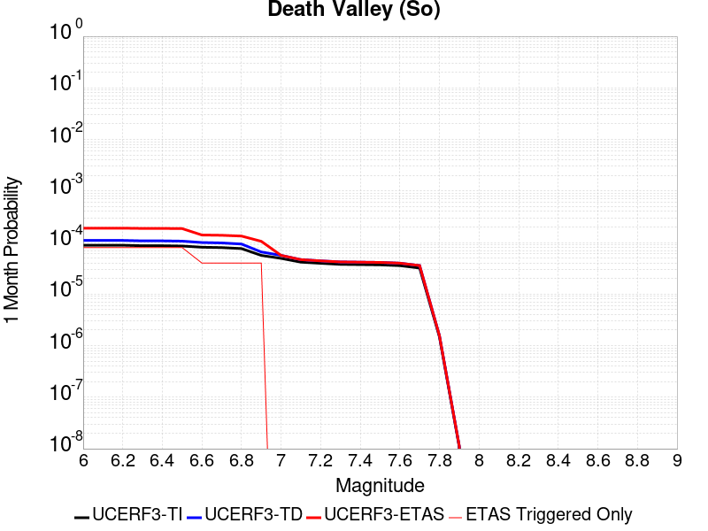 | 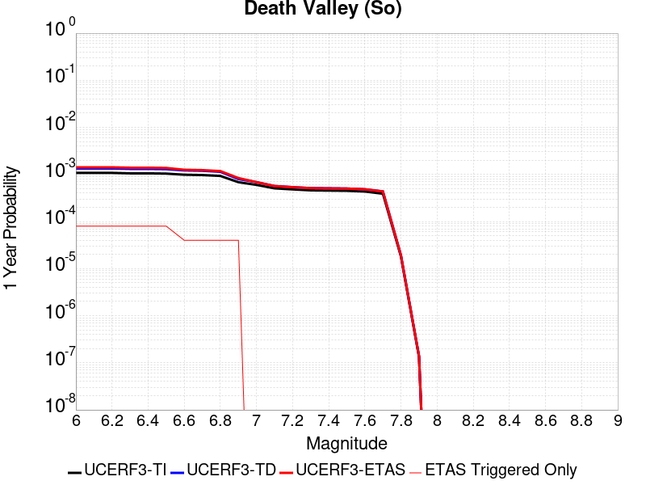 |

| Magnitude | 1 wk TI Prob | 1 wk TD Prob | 1 wk ETAS Prob | 1 wk ETAS/TD Gain | 1 wk ETAS Triggered Only | 1 mo TI Prob | 1 mo TD Prob | 1 mo ETAS Prob | 1 mo ETAS/TD Gain | 1 mo ETAS Triggered Only | 1 yr TI Prob | 1 yr TD Prob | 1 yr ETAS Prob | 1 yr ETAS/TD Gain | 1 yr ETAS Triggered Only |
|-----|-----|-----|-----|-----|-----|-----|-----|-----|-----|-----|-----|-----|-----|-----|-----|
| 6.0 | 2.0684236E-5 | 2.5651949E-5 | 2.5651949E-5 | 1.0 | 0.0 | 8.864371E-5 | 1.0993239E-4 | 1.899236E-4 | 1.72764 | 8.0E-5 | 0.0010787029 | 0.0013376221 | 0.001417515 | 1.0597277 | 8.0E-5 |
| 6.1 | 2.0684236E-5 | 2.5651949E-5 | 2.5651949E-5 | 1.0 | 0.0 | 8.864371E-5 | 1.0993239E-4 | 1.899236E-4 | 1.72764 | 8.0E-5 | 0.0010787029 | 0.0013376221 | 0.001417515 | 1.0597277 | 8.0E-5 |
| 6.2 | 2.0684236E-5 | 2.5651949E-5 | 2.5651949E-5 | 1.0 | 0.0 | 8.864371E-5 | 1.0993239E-4 | 1.899236E-4 | 1.72764 | 8.0E-5 | 0.0010787029 | 0.0013376221 | 0.001417515 | 1.0597277 | 8.0E-5 |
| 6.3 | 2.0240292E-5 | 2.515182E-5 | 2.515182E-5 | 1.0 | 0.0 | 8.6741224E-5 | 1.0778916E-4 | 1.8778053E-4 | 1.7421097 | 8.0E-5 | 0.0010555626 | 0.0013115597 | 0.0013914548 | 1.0609161 | 8.0E-5 |
| 6.4 | 2.0240292E-5 | 2.515182E-5 | 2.515182E-5 | 1.0 | 0.0 | 8.6741224E-5 | 1.0778916E-4 | 1.8778053E-4 | 1.7421097 | 8.0E-5 | 0.0010555626 | 0.0013115597 | 0.0013914548 | 1.0609161 | 8.0E-5 |
| 6.5 | 1.9962767E-5 | 2.4840947E-5 | 2.4840947E-5 | 1.0 | 0.0 | 8.55519E-5 | 1.0645695E-4 | 1.8644844E-4 | 1.7513975 | 8.0E-5 | 0.0010410968 | 0.0012953595 | 0.0013752559 | 1.0616789 | 8.0E-5 |
| 6.6 | 1.8937297E-5 | 2.3337238E-5 | 2.3337238E-5 | 1.0 | 0.0 | 8.115732E-5 | 1.00012985E-4 | 1.4000898E-4 | 1.3999081 | 4.0E-5 | 9.876423E-4 | 0.0012169925 | 0.0012569438 | 1.0328279 | 4.0E-5 |
| 6.7 | 1.8621096E-5 | 2.293739E-5 | 2.293739E-5 | 1.0 | 0.0 | 7.980225E-5 | 9.8299475E-5 | 1.3829555E-4 | 1.4068798 | 4.0E-5 | 9.711593E-4 | 0.0011961536 | 0.0012361058 | 1.0334005 | 4.0E-5 |
| 6.8 | 1.7830353E-5 | 2.1828011E-5 | 2.1828011E-5 | 1.0 | 0.0 | 7.641356E-5 | 9.354534E-5 | 1.335416E-4 | 1.4275601 | 4.0E-5 | 9.29938E-4 | 0.0011383336 | 0.001178288 | 1.035099 | 4.0E-5 |
| 6.9 | 1.3135183E-5 | 1.5312111E-5 | 1.5312111E-5 | 1.0 | 0.0 | 5.6292425E-5 | 6.5621716E-5 | 1.0561909E-4 | 1.6095144 | 4.0E-5 | 6.8514474E-4 | 7.98658E-4 | 8.3862606E-4 | 1.0500441 | 4.0E-5 |
| 7.0 | 1.1507512E-5 | 1.3160505E-5 | 1.3160505E-5 | 1.0 | 0.0 | 4.9316975E-5 | 5.6400975E-5 | 5.6400975E-5 | 1.0 | 0.0 | 6.002687E-4 | 6.8647135E-4 | 6.8647135E-4 | 1.0 | 0.0 |
| 7.1 | 9.715903E-6 | 1.0869782E-5 | 1.0869782E-5 | 1.0 | 0.0 | 4.1638916E-5 | 4.6583973E-5 | 4.6583973E-5 | 1.0 | 0.0 | 5.068359E-4 | 5.6701654E-4 | 5.6701654E-4 | 1.0 | 0.0 |
| 7.2 | 9.233269E-6 | 1.02904705E-5 | 1.02904705E-5 | 1.0 | 0.0 | 3.9570554E-5 | 4.4101293E-5 | 4.4101293E-5 | 1.0 | 0.0 | 4.81665E-4 | 5.368052E-4 | 5.368052E-4 | 1.0 | 0.0 |
| 7.3 | 8.8041315E-6 | 9.811974E-6 | 9.811974E-6 | 1.0 | 0.0 | 3.7731446E-5 | 4.2050666E-5 | 4.2050666E-5 | 1.0 | 0.0 | 4.592835E-4 | 5.118508E-4 | 5.118508E-4 | 1.0 | 0.0 |
| 7.4 | 8.708749E-6 | 9.710965E-6 | 9.710965E-6 | 1.0 | 0.0 | 3.7322676E-5 | 4.1617783E-5 | 4.1617783E-5 | 1.0 | 0.0 | 4.5430884E-4 | 5.065829E-4 | 5.065829E-4 | 1.0 | 0.0 |
| 7.5 | 8.612678E-6 | 9.608584E-6 | 9.608584E-6 | 1.0 | 0.0 | 3.6910955E-5 | 4.117902E-5 | 4.117902E-5 | 1.0 | 0.0 | 4.492982E-4 | 5.0124346E-4 | 5.0124346E-4 | 1.0 | 0.0 |
| 7.6 | 8.319024E-6 | 9.287581E-6 | 9.287581E-6 | 1.0 | 0.0 | 3.5652476E-5 | 3.9803333E-5 | 3.9803333E-5 | 1.0 | 0.0 | 4.3398244E-4 | 4.8450203E-4 | 4.8450203E-4 | 1.0 | 0.0 |
| 7.7 | 7.4718328E-6 | 8.348488E-6 | 8.348488E-6 | 1.0 | 0.0 | 3.2021748E-5 | 3.577877E-5 | 3.577877E-5 | 1.0 | 0.0 | 3.8979502E-4 | 4.3552349E-4 | 4.3552349E-4 | 1.0 | 0.0 |
| 7.8 | 3.4586725E-7 | 3.6489428E-7 | 3.6489428E-7 | 1.0 | 0.0 | 1.4822873E-6 | 1.5638317E-6 | 1.5638317E-6 | 1.0 | 0.0 | 1.80467E-5 | 1.903949E-5 | 1.903949E-5 | 1.0 | 0.0 |
| 7.9 | 2.5591178E-9 | 2.6700626E-9 | 2.6700626E-9 | 1.0 | 0.0 | 1.0967647E-8 | 1.1443126E-8 | 1.1443126E-8 | 1.0 | 0.0 | 1.335311E-7 | 1.3932005E-7 | 1.3932005E-7 | 1.0 | 0.0 |

## San Cayetano
*[(top)](#table-of-contents)*

| 1 Week | 1 Month | 1 Year |
|-----|-----|-----|
| 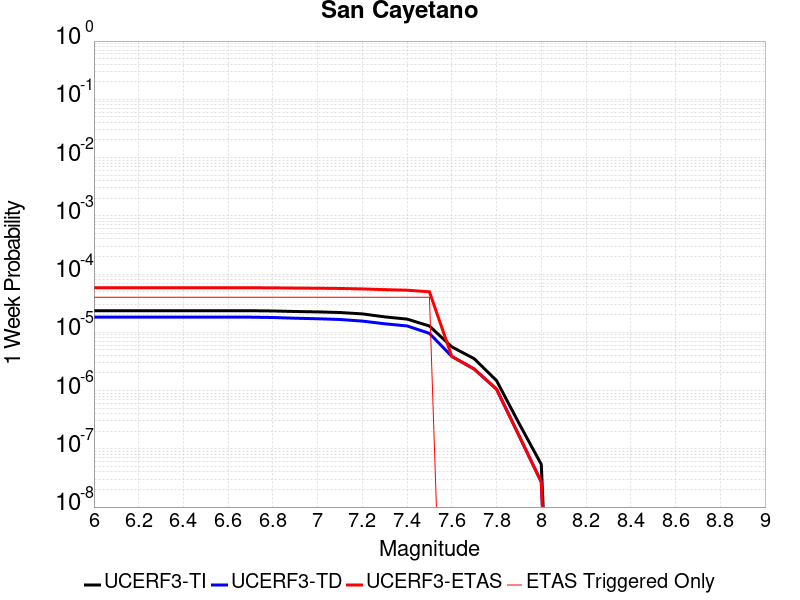 | 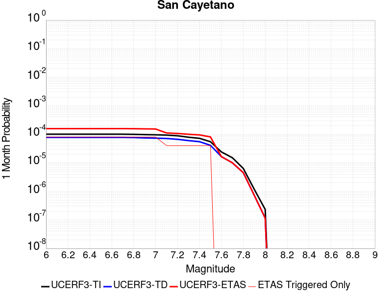 | 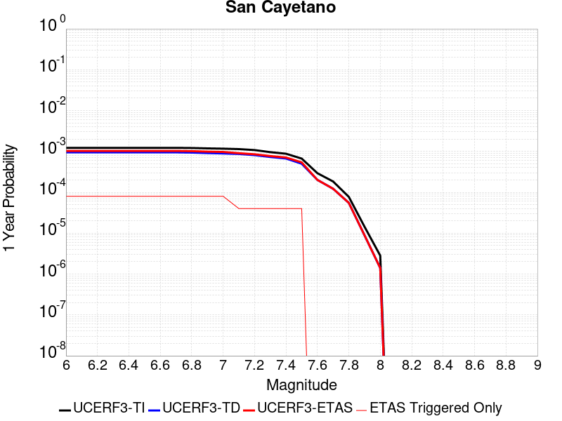 |

| Magnitude | 1 wk TI Prob | 1 wk TD Prob | 1 wk ETAS Prob | 1 wk ETAS/TD Gain | 1 wk ETAS Triggered Only | 1 mo TI Prob | 1 mo TD Prob | 1 mo ETAS Prob | 1 mo ETAS/TD Gain | 1 mo ETAS Triggered Only | 1 yr TI Prob | 1 yr TD Prob | 1 yr ETAS Prob | 1 yr ETAS/TD Gain | 1 yr ETAS Triggered Only |
|-----|-----|-----|-----|-----|-----|-----|-----|-----|-----|-----|-----|-----|-----|-----|-----|
| 6.0 | 2.3476267E-5 | 1.8191893E-5 | 5.8191166E-5 | 3.1987414 | 4.0E-5 | 1.0060869E-4 | 7.796295E-5 | 1.5795672E-4 | 2.0260484 | 8.0E-5 | 0.0012242225 | 9.4878924E-4 | 0.0010287133 | 1.0842379 | 8.0E-5 |
| 6.1 | 2.3476267E-5 | 1.8191893E-5 | 5.8191166E-5 | 3.1987414 | 4.0E-5 | 1.0060869E-4 | 7.796295E-5 | 1.5795672E-4 | 2.0260484 | 8.0E-5 | 0.0012242225 | 9.4878924E-4 | 0.0010287133 | 1.0842379 | 8.0E-5 |
| 6.2 | 2.3476267E-5 | 1.8191893E-5 | 5.8191166E-5 | 3.1987414 | 4.0E-5 | 1.0060869E-4 | 7.796295E-5 | 1.5795672E-4 | 2.0260484 | 8.0E-5 | 0.0012242225 | 9.4878924E-4 | 0.0010287133 | 1.0842379 | 8.0E-5 |
| 6.3 | 2.3476267E-5 | 1.8191893E-5 | 5.8191166E-5 | 3.1987414 | 4.0E-5 | 1.0060869E-4 | 7.796295E-5 | 1.5795672E-4 | 2.0260484 | 8.0E-5 | 0.0012242225 | 9.4878924E-4 | 0.0010287133 | 1.0842379 | 8.0E-5 |
| 6.4 | 2.3476267E-5 | 1.8191893E-5 | 5.8191166E-5 | 3.1987414 | 4.0E-5 | 1.0060869E-4 | 7.796295E-5 | 1.5795672E-4 | 2.0260484 | 8.0E-5 | 0.0012242225 | 9.4878924E-4 | 0.0010287133 | 1.0842379 | 8.0E-5 |
| 6.5 | 2.3476267E-5 | 1.8191893E-5 | 5.8191166E-5 | 3.1987414 | 4.0E-5 | 1.0060869E-4 | 7.796295E-5 | 1.5795672E-4 | 2.0260484 | 8.0E-5 | 0.0012242225 | 9.4878924E-4 | 0.0010287133 | 1.0842379 | 8.0E-5 |
| 6.6 | 2.3476267E-5 | 1.8191893E-5 | 5.8191166E-5 | 3.1987414 | 4.0E-5 | 1.0060869E-4 | 7.796295E-5 | 1.5795672E-4 | 2.0260484 | 8.0E-5 | 0.0012242225 | 9.4878924E-4 | 0.0010287133 | 1.0842379 | 8.0E-5 |
| 6.7 | 2.3476267E-5 | 1.8191893E-5 | 5.8191166E-5 | 3.1987414 | 4.0E-5 | 1.0060869E-4 | 7.796295E-5 | 1.5795672E-4 | 2.0260484 | 8.0E-5 | 0.0012242225 | 9.4878924E-4 | 0.0010287133 | 1.0842379 | 8.0E-5 |
| 6.8 | 2.3241924E-5 | 1.795945E-5 | 5.7958732E-5 | 3.2271998 | 4.0E-5 | 9.960445E-5 | 7.696682E-5 | 1.5696067E-4 | 2.0393288 | 8.0E-5 | 0.0012120095 | 9.366718E-4 | 0.0010165969 | 1.0853288 | 8.0E-5 |
| 6.9 | 2.2761007E-5 | 1.7454628E-5 | 5.745393E-5 | 3.291616 | 4.0E-5 | 9.7543525E-5 | 7.480342E-5 | 1.5479744E-4 | 2.0693898 | 8.0E-5 | 0.0011869454 | 9.1035455E-4 | 9.902817E-4 | 1.0877979 | 8.0E-5 |
| 7.0 | 2.240283E-5 | 1.7088216E-5 | 5.708753E-5 | 3.3407545 | 4.0E-5 | 9.600859E-5 | 7.323317E-5 | 1.5322732E-4 | 2.0923212 | 8.0E-5 | 0.0011682777 | 8.912526E-4 | 9.7118126E-4 | 1.0896813 | 8.0E-5 |
| 7.1 | 2.1871154E-5 | 1.6605602E-5 | 5.660494E-5 | 3.4087856 | 4.0E-5 | 9.373015E-5 | 7.116494E-5 | 1.11162095E-4 | 1.5620345 | 4.0E-5 | 0.0011405671 | 8.6609216E-4 | 9.060575E-4 | 1.0461445 | 4.0E-5 |
| 7.2 | 2.0714133E-5 | 1.5581662E-5 | 5.5581037E-5 | 3.5670805 | 4.0E-5 | 8.8771834E-5 | 6.6776855E-5 | 1.0677418E-4 | 1.5989699 | 4.0E-5 | 0.0010802611 | 8.127082E-4 | 8.526757E-4 | 1.0491781 | 4.0E-5 |
| 7.3 | 1.8408395E-5 | 1.4011361E-5 | 5.40108E-5 | 3.8547862 | 4.0E-5 | 7.8890735E-5 | 6.004732E-5 | 1.0004492E-4 | 1.6661012 | 4.0E-5 | 9.600714E-4 | 7.308339E-4 | 7.708047E-4 | 1.054692 | 4.0E-5 |
| 7.4 | 1.6856795E-5 | 1.2863538E-5 | 5.2863023E-5 | 4.1095243 | 4.0E-5 | 7.2241404E-5 | 5.51283E-5 | 9.5126095E-5 | 1.7255402 | 4.0E-5 | 8.7918417E-4 | 6.709832E-4 | 7.109564E-4 | 1.059574 | 4.0E-5 |
| 7.5 | 1.2822778E-5 | 9.588695E-6 | 4.958831E-5 | 5.171539 | 4.0E-5 | 5.495361E-5 | 4.109377E-5 | 8.109213E-5 | 1.9733436 | 4.0E-5 | 6.688548E-4 | 5.002034E-4 | 5.401834E-4 | 1.0799274 | 4.0E-5 |
| 7.6 | 5.6272684E-6 | 3.856865E-6 | 3.856865E-6 | 1.0 | 0.0 | 2.4116642E-5 | 1.6529317E-5 | 1.6529317E-5 | 1.0 | 0.0 | 2.9358055E-4 | 2.0122595E-4 | 2.0122595E-4 | 1.0 | 0.0 |
| 7.7 | 3.5261346E-6 | 2.3419418E-6 | 2.3419418E-6 | 1.0 | 0.0 | 1.5111918E-5 | 1.0036855E-5 | 1.0036855E-5 | 1.0 | 0.0 | 1.8397206E-4 | 1.2219194E-4 | 1.2219194E-4 | 1.0 | 0.0 |
| 7.8 | 1.4826929E-6 | 1.0569837E-6 | 1.0569837E-6 | 1.0 | 0.0 | 6.354383E-6 | 4.5299225E-6 | 4.5299225E-6 | 1.0 | 0.0 | 7.736187E-5 | 5.515043E-5 | 5.515043E-5 | 1.0 | 0.0 |
| 7.9 | 2.7568166E-7 | 1.6989308E-7 | 1.6989308E-7 | 1.0 | 0.0 | 1.1814923E-6 | 7.28113E-7 | 7.28113E-7 | 1.0 | 0.0 | 1.4384574E-5 | 8.86474E-6 | 8.86474E-6 | 1.0 | 0.0 |
| 8.0 | 5.407832E-8 | 2.6923225E-8 | 2.6923225E-8 | 1.0 | 0.0 | 2.3176422E-7 | 1.1538524E-7 | 1.1538524E-7 | 1.0 | 0.0 | 2.8217257E-6 | 1.4048145E-6 | 1.4048145E-6 | 1.0 | 0.0 |

## Coronado Bank alt1
*[(top)](#table-of-contents)*

| 1 Week | 1 Month | 1 Year |
|-----|-----|-----|
| 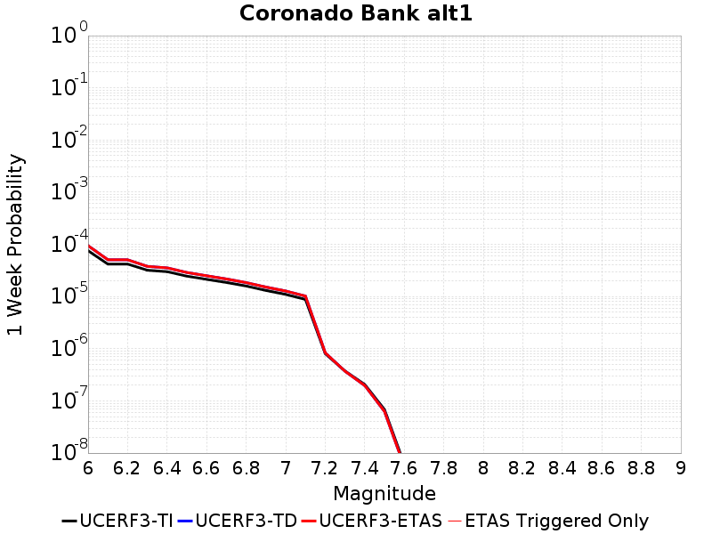 | 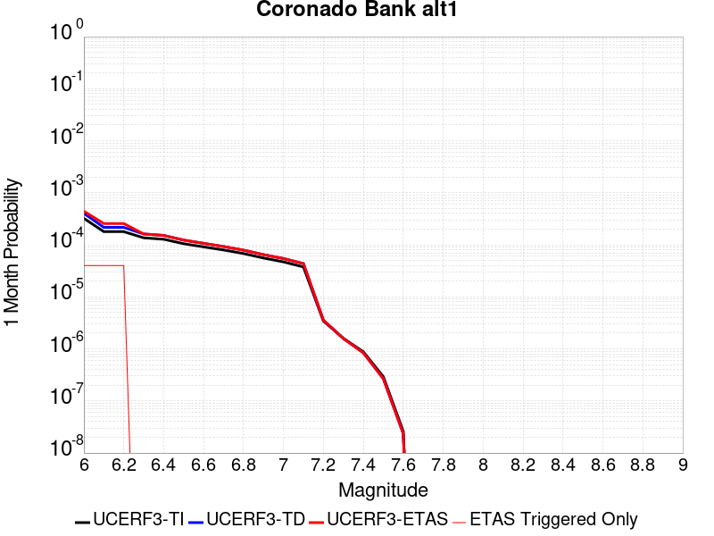 | 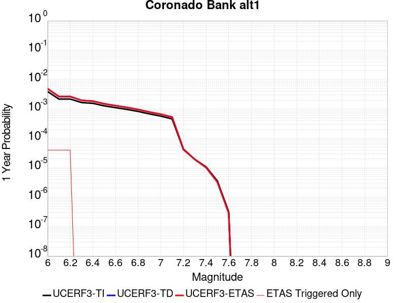 |

| Magnitude | 1 wk TI Prob | 1 wk TD Prob | 1 wk ETAS Prob | 1 wk ETAS/TD Gain | 1 wk ETAS Triggered Only | 1 mo TI Prob | 1 mo TD Prob | 1 mo ETAS Prob | 1 mo ETAS/TD Gain | 1 mo ETAS Triggered Only | 1 yr TI Prob | 1 yr TD Prob | 1 yr ETAS Prob | 1 yr ETAS/TD Gain | 1 yr ETAS Triggered Only |
|-----|-----|-----|-----|-----|-----|-----|-----|-----|-----|-----|-----|-----|-----|-----|-----|
| 6.0 | 7.533492E-5 | 9.4029245E-5 | 9.4029245E-5 | 1.0 | 0.0 | 3.22824E-4 | 4.0292446E-4 | 4.4290835E-4 | 1.0992342 | 4.0E-5 | 0.0039233007 | 0.0048951716 | 0.0049349754 | 1.0081313 | 4.0E-5 |
| 6.1 | 4.1807285E-5 | 5.0528783E-5 | 5.0528783E-5 | 1.0 | 0.0 | 1.7916178E-4 | 2.1653448E-4 | 2.5652582E-4 | 1.1846881 | 4.0E-5 | 0.0021791123 | 0.0026331986 | 0.0026730935 | 1.0151507 | 4.0E-5 |
| 6.2 | 4.1807285E-5 | 5.0528783E-5 | 5.0528783E-5 | 1.0 | 0.0 | 1.7916178E-4 | 2.1653448E-4 | 2.5652582E-4 | 1.1846881 | 4.0E-5 | 0.0021791123 | 0.0026331986 | 0.0026730935 | 1.0151507 | 4.0E-5 |
| 6.3 | 3.1793104E-5 | 3.7735168E-5 | 3.7735168E-5 | 1.0 | 0.0 | 1.3624904E-4 | 1.6171228E-4 | 1.6171228E-4 | 1.0 | 0.0 | 0.0016575698 | 0.0019671016 | 0.0019671016 | 1.0 | 0.0 |
| 6.4 | 2.9878007E-5 | 3.535792E-5 | 3.535792E-5 | 1.0 | 0.0 | 1.2804232E-4 | 1.5152531E-4 | 1.5152531E-4 | 1.0 | 0.0 | 0.0015578003 | 0.0018432919 | 0.0018432919 | 1.0 | 0.0 |
| 6.5 | 2.4512565E-5 | 2.8781236E-5 | 2.8781236E-5 | 1.0 | 0.0 | 1.0504962E-4 | 1.2334248E-4 | 1.2334248E-4 | 1.0 | 0.0 | 0.0012782287 | 0.0015006869 | 0.0015006869 | 1.0 | 0.0 |
| 6.6 | 2.1317413E-5 | 2.4921088E-5 | 2.4921088E-5 | 1.0 | 0.0 | 9.135714E-5 | 1.0680041E-4 | 1.0680041E-4 | 1.0 | 0.0 | 0.0011117056 | 0.0012995416 | 0.0012995416 | 1.0 | 0.0 |
| 6.7 | 1.8585655E-5 | 2.1647098E-5 | 2.1647098E-5 | 1.0 | 0.0 | 7.9650374E-5 | 9.27701E-5 | 9.27701E-5 | 1.0 | 0.0 | 9.6931186E-4 | 0.0011289112 | 0.0011289112 | 1.0 | 0.0 |
| 6.8 | 1.5862879E-5 | 1.8429711E-5 | 1.8429711E-5 | 1.0 | 0.0 | 6.798199E-5 | 7.898219E-5 | 7.898219E-5 | 1.0 | 0.0 | 8.273665E-4 | 9.6120324E-4 | 9.6120324E-4 | 1.0 | 0.0 |
| 6.9 | 1.3021509E-5 | 1.5103577E-5 | 1.5103577E-5 | 1.0 | 0.0 | 5.5805274E-5 | 6.472811E-5 | 6.472811E-5 | 1.0 | 0.0 | 6.792174E-4 | 7.8779797E-4 | 7.8779797E-4 | 1.0 | 0.0 |
| 7.0 | 1.0974371E-5 | 1.272712E-5 | 1.272712E-5 | 1.0 | 0.0 | 4.7032172E-5 | 5.4543758E-5 | 5.4543758E-5 | 1.0 | 0.0 | 5.7246623E-4 | 6.638855E-4 | 6.638855E-4 | 1.0 | 0.0 |
| 7.1 | 8.766221E-6 | 1.0169476E-5 | 1.0169476E-5 | 1.0 | 0.0 | 3.7568978E-5 | 4.3582837E-5 | 4.3582837E-5 | 1.0 | 0.0 | 4.573063E-4 | 5.3050905E-4 | 5.3050905E-4 | 1.0 | 0.0 |
| 7.2 | 8.026024E-7 | 8.333763E-7 | 8.333763E-7 | 1.0 | 0.0 | 3.43972E-6 | 3.571608E-6 | 3.571608E-6 | 1.0 | 0.0 | 4.1877785E-5 | 4.348347E-5 | 4.348347E-5 | 1.0 | 0.0 |
| 7.3 | 3.7293114E-7 | 3.700848E-7 | 3.700848E-7 | 1.0 | 0.0 | 1.5982754E-6 | 1.5860767E-6 | 1.5860767E-6 | 1.0 | 0.0 | 1.9458828E-5 | 1.9310313E-5 | 1.9310313E-5 | 1.0 | 0.0 |
| 7.4 | 2.0557036E-7 | 1.9678428E-7 | 1.9678428E-7 | 1.0 | 0.0 | 8.810155E-7 | 8.4336097E-7 | 8.4336097E-7 | 1.0 | 0.0 | 1.0726311E-5 | 1.0267871E-5 | 1.0267871E-5 | 1.0 | 0.0 |
| 7.5 | 6.845446E-8 | 6.2802876E-8 | 6.2802876E-8 | 1.0 | 0.0 | 2.9337625E-7 | 2.6915515E-7 | 2.6915515E-7 | 1.0 | 0.0 | 3.5718497E-6 | 3.2769592E-6 | 3.2769592E-6 | 1.0 | 0.0 |
| 7.6 | 6.0975145E-9 | 5.5322116E-9 | 5.5322116E-9 | 1.0 | 0.0 | 2.6132206E-8 | 2.3709477E-8 | 2.3709477E-8 | 1.0 | 0.0 | 3.1815955E-7 | 2.8866285E-7 | 2.8866285E-7 | 1.0 | 0.0 |

## Bicycle Lake
*[(top)](#table-of-contents)*

| 1 Week | 1 Month | 1 Year |
|-----|-----|-----|
| 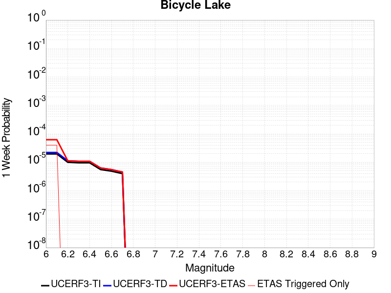 | 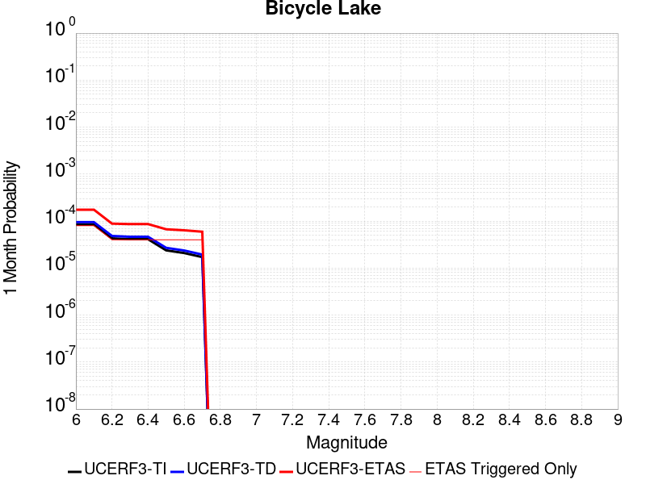 | 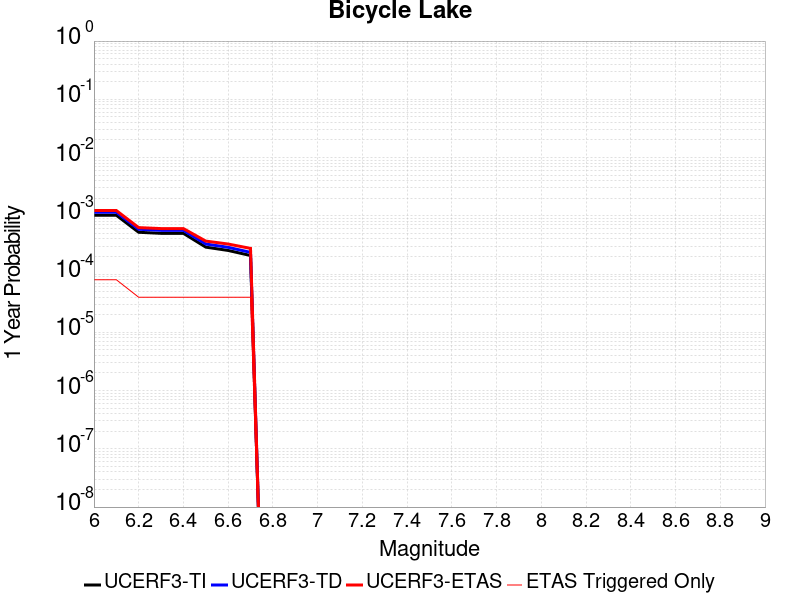 |

| Magnitude | 1 wk TI Prob | 1 wk TD Prob | 1 wk ETAS Prob | 1 wk ETAS/TD Gain | 1 wk ETAS Triggered Only | 1 mo TI Prob | 1 mo TD Prob | 1 mo ETAS Prob | 1 mo ETAS/TD Gain | 1 mo ETAS Triggered Only | 1 yr TI Prob | 1 yr TD Prob | 1 yr ETAS Prob | 1 yr ETAS/TD Gain | 1 yr ETAS Triggered Only |
|-----|-----|-----|-----|-----|-----|-----|-----|-----|-----|-----|-----|-----|-----|-----|-----|
| 6.0 | 1.9621975E-5 | 2.2106533E-5 | 6.2105646E-5 | 2.8093798 | 4.0E-5 | 8.4091465E-5 | 9.473961E-5 | 1.7473203E-4 | 1.8443398 | 8.0E-5 | 0.0010233327 | 0.0011529794 | 0.0012328873 | 1.0693054 | 8.0E-5 |
| 6.1 | 1.9621975E-5 | 2.2106533E-5 | 6.2105646E-5 | 2.8093798 | 4.0E-5 | 8.4091465E-5 | 9.473961E-5 | 1.7473203E-4 | 1.8443398 | 8.0E-5 | 0.0010233327 | 0.0011529794 | 0.0012328873 | 1.0693054 | 8.0E-5 |
| 6.2 | 9.9971285E-6 | 1.1260444E-5 | 1.1260444E-5 | 1.0 | 0.0 | 4.2844134E-5 | 4.8258447E-5 | 8.8256515E-5 | 1.8288305 | 4.0E-5 | 5.2150246E-4 | 5.8744027E-4 | 6.2741677E-4 | 1.068052 | 4.0E-5 |
| 6.3 | 9.589428E-6 | 1.0802963E-5 | 1.0802963E-5 | 1.0 | 0.0 | 4.10969E-5 | 4.6297882E-5 | 8.629603E-5 | 1.8639305 | 4.0E-5 | 5.002399E-4 | 5.635828E-4 | 6.035603E-4 | 1.0709345 | 4.0E-5 |
| 6.4 | 9.589428E-6 | 1.0802963E-5 | 1.0802963E-5 | 1.0 | 0.0 | 4.10969E-5 | 4.6297882E-5 | 8.629603E-5 | 1.8639305 | 4.0E-5 | 5.002399E-4 | 5.635828E-4 | 6.035603E-4 | 1.0709345 | 4.0E-5 |
| 6.5 | 5.557707E-6 | 6.2883923E-6 | 6.2883923E-6 | 1.0 | 0.0 | 2.3818526E-5 | 2.6950127E-5 | 6.694905E-5 | 2.484183 | 4.0E-5 | 2.8995197E-4 | 3.2809528E-4 | 3.6808217E-4 | 1.1218758 | 4.0E-5 |
| 6.6 | 4.8742945E-6 | 5.51574E-6 | 5.51574E-6 | 1.0 | 0.0 | 2.0889667E-5 | 2.3638819E-5 | 6.3637875E-5 | 2.692092 | 4.0E-5 | 2.54302E-4 | 2.8779084E-4 | 3.2777933E-4 | 1.1389499 | 4.0E-5 |
| 6.7 | 3.991108E-6 | 4.5179236E-6 | 4.5179236E-6 | 1.0 | 0.0 | 1.7104636E-5 | 1.936253E-5 | 5.9361755E-5 | 3.065806 | 4.0E-5 | 2.0822904E-4 | 2.3573879E-4 | 2.7572937E-4 | 1.1696393 | 4.0E-5 |

## Earthquake Valley (So Extension)
*[(top)](#table-of-contents)*

| 1 Week | 1 Month | 1 Year |
|-----|-----|-----|
| 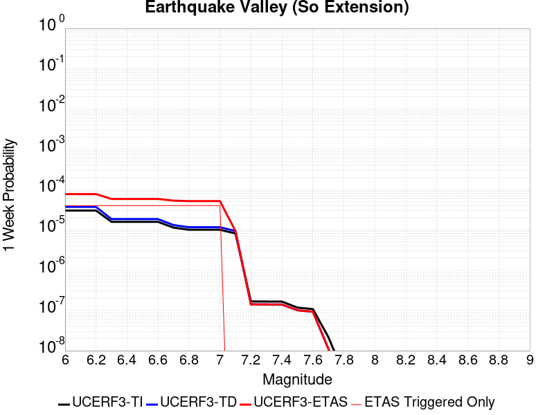 | 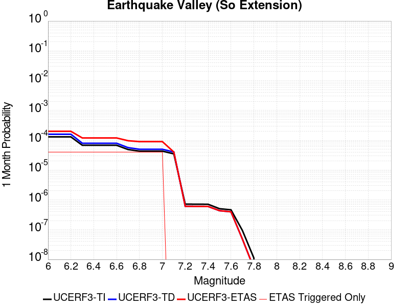 | 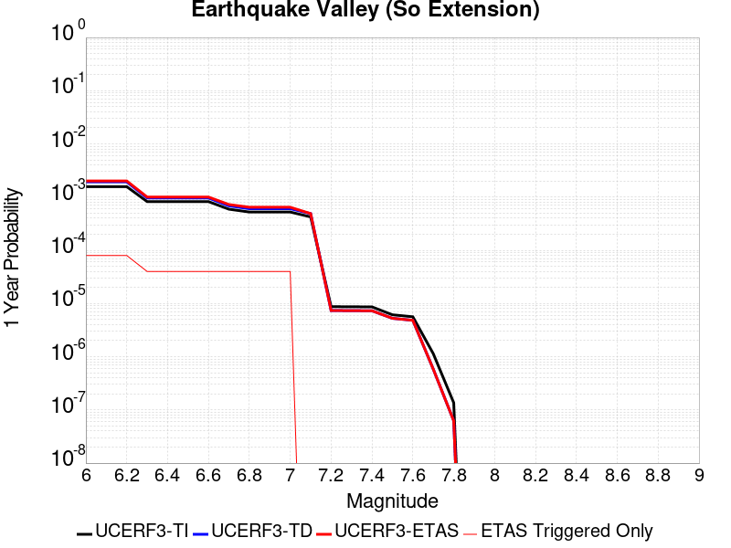 |

| Magnitude | 1 wk TI Prob | 1 wk TD Prob | 1 wk ETAS Prob | 1 wk ETAS/TD Gain | 1 wk ETAS Triggered Only | 1 mo TI Prob | 1 mo TD Prob | 1 mo ETAS Prob | 1 mo ETAS/TD Gain | 1 mo ETAS Triggered Only | 1 yr TI Prob | 1 yr TD Prob | 1 yr ETAS Prob | 1 yr ETAS/TD Gain | 1 yr ETAS Triggered Only |
|-----|-----|-----|-----|-----|-----|-----|-----|-----|-----|-----|-----|-----|-----|-----|-----|
| 6.0 | 3.0194888E-5 | 3.710108E-5 | 7.709959E-5 | 2.078096 | 4.0E-5 | 1.2940024E-4 | 1.5899699E-4 | 1.9899063E-4 | 1.2515371 | 4.0E-5 | 0.0015743093 | 0.0019345878 | 0.002014433 | 1.0412725 | 8.0E-5 |
| 6.1 | 3.0194888E-5 | 3.710108E-5 | 7.709959E-5 | 2.078096 | 4.0E-5 | 1.2940024E-4 | 1.5899699E-4 | 1.9899063E-4 | 1.2515371 | 4.0E-5 | 0.0015743093 | 0.0019345878 | 0.002014433 | 1.0412725 | 8.0E-5 |
| 6.2 | 3.0194888E-5 | 3.710108E-5 | 7.709959E-5 | 2.078096 | 4.0E-5 | 1.2940024E-4 | 1.5899699E-4 | 1.9899063E-4 | 1.2515371 | 4.0E-5 | 0.0015743093 | 0.0019345878 | 0.002014433 | 1.0412725 | 8.0E-5 |
| 6.3 | 1.5795305E-5 | 1.845737E-5 | 5.8456633E-5 | 3.167116 | 4.0E-5 | 6.769241E-5 | 7.910124E-5 | 1.1909808E-4 | 1.5056411 | 4.0E-5 | 8.238434E-4 | 9.627432E-4 | 0.0010027047 | 1.041508 | 4.0E-5 |
| 6.4 | 1.5795305E-5 | 1.845737E-5 | 5.8456633E-5 | 3.167116 | 4.0E-5 | 6.769241E-5 | 7.910124E-5 | 1.1909808E-4 | 1.5056411 | 4.0E-5 | 8.238434E-4 | 9.627432E-4 | 0.0010027047 | 1.041508 | 4.0E-5 |
| 6.5 | 1.5795305E-5 | 1.845737E-5 | 5.8456633E-5 | 3.167116 | 4.0E-5 | 6.769241E-5 | 7.910124E-5 | 1.1909808E-4 | 1.5056411 | 4.0E-5 | 8.238434E-4 | 9.627432E-4 | 0.0010027047 | 1.041508 | 4.0E-5 |
| 6.6 | 1.5795305E-5 | 1.845737E-5 | 5.8456633E-5 | 3.167116 | 4.0E-5 | 6.769241E-5 | 7.910124E-5 | 1.1909808E-4 | 1.5056411 | 4.0E-5 | 8.238434E-4 | 9.627432E-4 | 0.0010027047 | 1.041508 | 4.0E-5 |
| 6.7 | 1.1363076E-5 | 1.31454935E-5 | 5.3144966E-5 | 4.042828 | 4.0E-5 | 4.8697988E-5 | 5.633704E-5 | 9.633479E-5 | 1.7099724 | 4.0E-5 | 5.927367E-4 | 6.8576384E-4 | 7.2573643E-4 | 1.0582892 | 4.0E-5 |
| 6.8 | 1.0049611E-5 | 1.1600614E-5 | 5.160015E-5 | 4.4480534 | 4.0E-5 | 4.306905E-5 | 4.9716386E-5 | 8.97144E-5 | 1.8045237 | 4.0E-5 | 5.242395E-4 | 6.052021E-4 | 6.451779E-4 | 1.0660536 | 4.0E-5 |
| 6.9 | 1.0049611E-5 | 1.1600614E-5 | 5.160015E-5 | 4.4480534 | 4.0E-5 | 4.306905E-5 | 4.9716386E-5 | 8.97144E-5 | 1.8045237 | 4.0E-5 | 5.242395E-4 | 6.052021E-4 | 6.451779E-4 | 1.0660536 | 4.0E-5 |
| 7.0 | 1.0049611E-5 | 1.1600614E-5 | 5.160015E-5 | 4.4480534 | 4.0E-5 | 4.306905E-5 | 4.9716386E-5 | 8.97144E-5 | 1.8045237 | 4.0E-5 | 5.242395E-4 | 6.052021E-4 | 6.451779E-4 | 1.0660536 | 4.0E-5 |
| 7.1 | 8.140254E-6 | 9.388555E-6 | 9.388555E-6 | 1.0 | 0.0 | 3.4886336E-5 | 4.023642E-5 | 4.023642E-5 | 1.0 | 0.0 | 4.2465836E-4 | 4.8983545E-4 | 4.8983545E-4 | 1.0 | 0.0 |
| 7.2 | 1.673835E-7 | 1.4165126E-7 | 1.4165126E-7 | 1.0 | 0.0 | 7.173577E-7 | 6.070767E-7 | 6.070767E-7 | 1.0 | 0.0 | 8.733795E-6 | 7.3911374E-6 | 7.3911374E-6 | 1.0 | 0.0 |
| 7.3 | 1.6632116E-7 | 1.4063316E-7 | 1.4063316E-7 | 1.0 | 0.0 | 7.1280476E-7 | 6.0271344E-7 | 6.0271344E-7 | 1.0 | 0.0 | 8.678364E-6 | 7.338015E-6 | 7.338015E-6 | 1.0 | 0.0 |
| 7.4 | 1.6569169E-7 | 1.400792E-7 | 1.400792E-7 | 1.0 | 0.0 | 7.1010703E-7 | 6.0033926E-7 | 6.0033926E-7 | 1.0 | 0.0 | 8.645519E-6 | 7.3091096E-6 | 7.3091096E-6 | 1.0 | 0.0 |
| 7.5 | 1.1764555E-7 | 1.0104535E-7 | 1.0104535E-7 | 1.0 | 0.0 | 5.041951E-7 | 4.3305144E-7 | 4.3305144E-7 | 1.0 | 0.0 | 6.138558E-6 | 5.272391E-6 | 5.272391E-6 | 1.0 | 0.0 |
| 7.6 | 1.07927605E-7 | 9.268867E-8 | 9.268867E-8 | 1.0 | 0.0 | 4.6254678E-7 | 3.9723713E-7 | 3.9723713E-7 | 1.0 | 0.0 | 5.6314925E-6 | 4.8363536E-6 | 4.8363536E-6 | 1.0 | 0.0 |
| 7.7 | 2.1826905E-8 | 1.1193839E-8 | 1.1193839E-8 | 1.0 | 0.0 | 9.3543875E-8 | 4.7973597E-8 | 4.7973597E-8 | 1.0 | 0.0 | 1.1388961E-6 | 5.840784E-7 | 5.840784E-7 | 1.0 | 0.0 |
| 7.8 | 2.6169649E-9 | 1.1983311E-9 | 1.1983311E-9 | 1.0 | 0.0 | 1.1215564E-8 | 5.1357043E-9 | 5.1357043E-9 | 1.0 | 0.0 | 1.3654947E-7 | 6.25272E-8 | 6.25272E-8 | 1.0 | 0.0 |

## Tank Canyon
*[(top)](#table-of-contents)*

| 1 Week | 1 Month | 1 Year |
|-----|-----|-----|
| 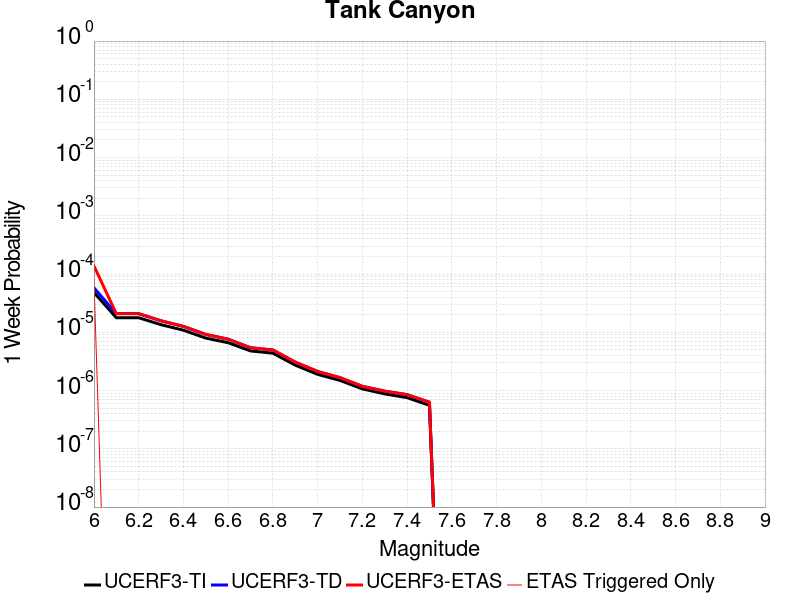 | 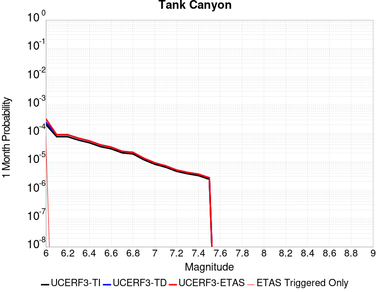 |  |

| Magnitude | 1 wk TI Prob | 1 wk TD Prob | 1 wk ETAS Prob | 1 wk ETAS/TD Gain | 1 wk ETAS Triggered Only | 1 mo TI Prob | 1 mo TD Prob | 1 mo ETAS Prob | 1 mo ETAS/TD Gain | 1 mo ETAS Triggered Only | 1 yr TI Prob | 1 yr TD Prob | 1 yr ETAS Prob | 1 yr ETAS/TD Gain | 1 yr ETAS Triggered Only |
|-----|-----|-----|-----|-----|-----|-----|-----|-----|-----|-----|-----|-----|-----|-----|-----|
| 6.0 | 4.8284557E-5 | 5.800436E-5 | 1.3799971E-4 | 2.3791268 | 8.0E-5 | 2.0691741E-4 | 2.485703E-4 | 3.2855038E-4 | 1.3217605 | 8.0E-5 | 0.0025163088 | 0.0030228058 | 0.0031025638 | 1.0263854 | 8.0E-5 |
| 6.1 | 1.7796336E-5 | 2.088598E-5 | 2.088598E-5 | 1.0 | 0.0 | 7.626778E-5 | 8.9508496E-5 | 8.9508496E-5 | 1.0 | 0.0 | 9.281647E-4 | 0.0010892592 | 0.0010892592 | 1.0 | 0.0 |
| 6.2 | 1.7796336E-5 | 2.088598E-5 | 2.088598E-5 | 1.0 | 0.0 | 7.626778E-5 | 8.9508496E-5 | 8.9508496E-5 | 1.0 | 0.0 | 9.281647E-4 | 0.0010892592 | 0.0010892592 | 1.0 | 0.0 |
| 6.3 | 1.3515912E-5 | 1.5768876E-5 | 1.5768876E-5 | 1.0 | 0.0 | 5.792405E-5 | 6.757928E-5 | 6.757928E-5 | 1.0 | 0.0 | 7.049971E-4 | 8.224908E-4 | 8.224908E-4 | 1.0 | 0.0 |
| 6.4 | 1.0870146E-5 | 1.2625341E-5 | 1.2625341E-5 | 1.0 | 0.0 | 4.658551E-5 | 5.4107582E-5 | 5.4107582E-5 | 1.0 | 0.0 | 5.67031E-4 | 6.585785E-4 | 6.585785E-4 | 1.0 | 0.0 |
| 6.5 | 7.964826E-6 | 9.201362E-6 | 9.201362E-6 | 1.0 | 0.0 | 3.4134522E-5 | 3.9433875E-5 | 3.9433875E-5 | 1.0 | 0.0 | 4.1550855E-4 | 4.800122E-4 | 4.800122E-4 | 1.0 | 0.0 |
| 6.6 | 6.6317E-6 | 7.6165943E-6 | 7.6165943E-6 | 1.0 | 0.0 | 2.8421264E-5 | 3.264219E-5 | 3.264219E-5 | 1.0 | 0.0 | 3.4597394E-4 | 3.9735527E-4 | 3.9735527E-4 | 1.0 | 0.0 |
| 6.7 | 4.793663E-6 | 5.433774E-6 | 5.433774E-6 | 1.0 | 0.0 | 2.0544108E-5 | 2.3287419E-5 | 2.3287419E-5 | 1.0 | 0.0 | 2.500958E-4 | 2.8349183E-4 | 2.8349183E-4 | 1.0 | 0.0 |
| 6.8 | 4.382823E-6 | 4.971998E-6 | 4.971998E-6 | 1.0 | 0.0 | 1.8783392E-5 | 2.1308413E-5 | 2.1308413E-5 | 1.0 | 0.0 | 2.286638E-4 | 2.594033E-4 | 2.594033E-4 | 1.0 | 0.0 |
| 6.9 | 2.729601E-6 | 3.0754818E-6 | 3.0754818E-6 | 1.0 | 0.0 | 1.1698237E-5 | 1.3180577E-5 | 1.3180577E-5 | 1.0 | 0.0 | 1.4241673E-4 | 1.6046294E-4 | 1.6046294E-4 | 1.0 | 0.0 |
| 7.0 | 1.8987357E-6 | 2.1284195E-6 | 2.1284195E-6 | 1.0 | 0.0 | 8.137413E-6 | 9.12177E-6 | 9.12177E-6 | 1.0 | 0.0 | 9.90685E-5 | 1.11052585E-4 | 1.11052585E-4 | 1.0 | 0.0 |
| 7.1 | 1.4928986E-6 | 1.6647061E-6 | 1.6647061E-6 | 1.0 | 0.0 | 6.398121E-6 | 7.134439E-6 | 7.134439E-6 | 1.0 | 0.0 | 7.789434E-5 | 8.685892E-5 | 8.685892E-5 | 1.0 | 0.0 |
| 7.2 | 1.069082E-6 | 1.1831523E-6 | 1.1831523E-6 | 1.0 | 0.0 | 4.581772E-6 | 5.0706462E-6 | 5.0706462E-6 | 1.0 | 0.0 | 5.5781646E-5 | 6.17339E-5 | 6.17339E-5 | 1.0 | 0.0 |
| 7.3 | 8.776551E-7 | 9.772481E-7 | 9.772481E-7 | 1.0 | 0.0 | 3.7613736E-6 | 4.1882026E-6 | 4.1882026E-6 | 1.0 | 0.0 | 4.579376E-5 | 5.0990693E-5 | 5.0990693E-5 | 1.0 | 0.0 |
| 7.4 | 7.55721E-7 | 8.5113516E-7 | 8.5113516E-7 | 1.0 | 0.0 | 3.2388E-6 | 3.6477197E-6 | 3.6477197E-6 | 1.0 | 0.0 | 3.9431678E-5 | 4.44106E-5 | 4.44106E-5 | 1.0 | 0.0 |
| 7.5 | 5.587665E-7 | 6.3064164E-7 | 6.3064164E-7 | 1.0 | 0.0 | 2.3947114E-6 | 2.70275E-6 | 2.70275E-6 | 1.0 | 0.0 | 2.915522E-5 | 3.290598E-5 | 3.290598E-5 | 1.0 | 0.0 |

## Oak Ridge (Onshore)
*[(top)](#table-of-contents)*

| 1 Week | 1 Month | 1 Year |
|-----|-----|-----|
| 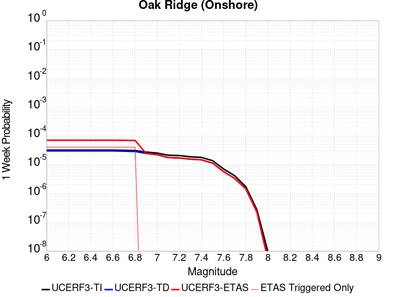 | 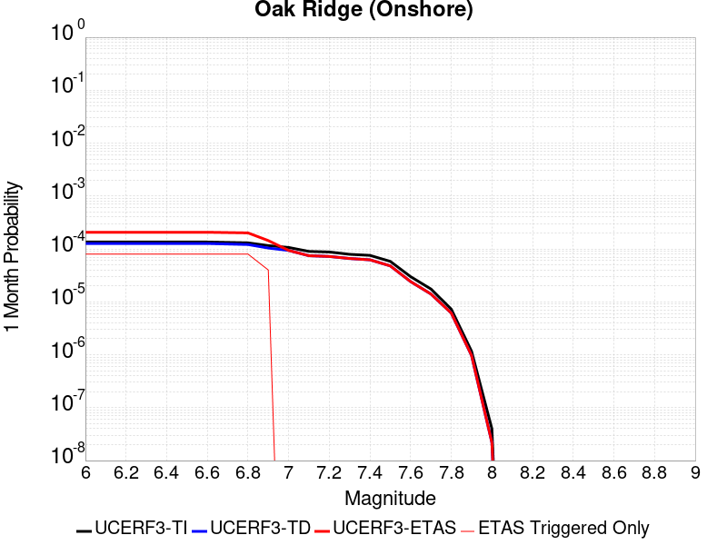 | 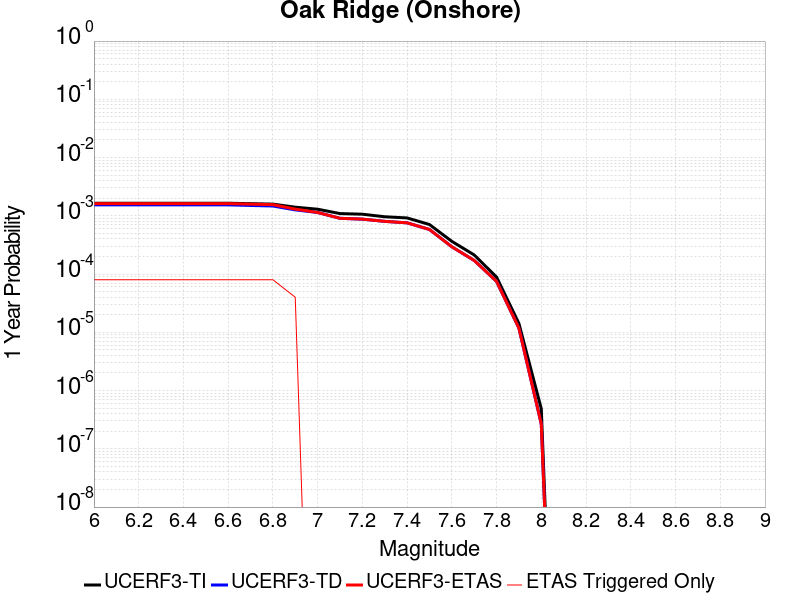 |

| Magnitude | 1 wk TI Prob | 1 wk TD Prob | 1 wk ETAS Prob | 1 wk ETAS/TD Gain | 1 wk ETAS Triggered Only | 1 mo TI Prob | 1 mo TD Prob | 1 mo ETAS Prob | 1 mo ETAS/TD Gain | 1 mo ETAS Triggered Only | 1 yr TI Prob | 1 yr TD Prob | 1 yr ETAS Prob | 1 yr ETAS/TD Gain | 1 yr ETAS Triggered Only |
|-----|-----|-----|-----|-----|-----|-----|-----|-----|-----|-----|-----|-----|-----|-----|-----|
| 6.0 | 3.155064E-5 | 2.9546469E-5 | 6.954529E-5 | 2.3537598 | 4.0E-5 | 1.3521002E-4 | 1.2662179E-4 | 2.0661167E-4 | 1.6317228 | 8.0E-5 | 0.001644939 | 0.0015405683 | 0.001620445 | 1.0518489 | 8.0E-5 |
| 6.1 | 3.155064E-5 | 2.9546469E-5 | 6.954529E-5 | 2.3537598 | 4.0E-5 | 1.3521002E-4 | 1.2662179E-4 | 2.0661167E-4 | 1.6317228 | 8.0E-5 | 0.001644939 | 0.0015405683 | 0.001620445 | 1.0518489 | 8.0E-5 |
| 6.2 | 3.155064E-5 | 2.9546469E-5 | 6.954529E-5 | 2.3537598 | 4.0E-5 | 1.3521002E-4 | 1.2662179E-4 | 2.0661167E-4 | 1.6317228 | 8.0E-5 | 0.001644939 | 0.0015405683 | 0.001620445 | 1.0518489 | 8.0E-5 |
| 6.3 | 3.155064E-5 | 2.9546469E-5 | 6.954529E-5 | 2.3537598 | 4.0E-5 | 1.3521002E-4 | 1.2662179E-4 | 2.0661167E-4 | 1.6317228 | 8.0E-5 | 0.001644939 | 0.0015405683 | 0.001620445 | 1.0518489 | 8.0E-5 |
| 6.4 | 3.155064E-5 | 2.9546469E-5 | 6.954529E-5 | 2.3537598 | 4.0E-5 | 1.3521002E-4 | 1.2662179E-4 | 2.0661167E-4 | 1.6317228 | 8.0E-5 | 0.001644939 | 0.0015405683 | 0.001620445 | 1.0518489 | 8.0E-5 |
| 6.5 | 3.155064E-5 | 2.9546469E-5 | 6.954529E-5 | 2.3537598 | 4.0E-5 | 1.3521002E-4 | 1.2662179E-4 | 2.0661167E-4 | 1.6317228 | 8.0E-5 | 0.001644939 | 0.0015405683 | 0.001620445 | 1.0518489 | 8.0E-5 |
| 6.6 | 3.155064E-5 | 2.9546469E-5 | 6.954529E-5 | 2.3537598 | 4.0E-5 | 1.3521002E-4 | 1.2662179E-4 | 2.0661167E-4 | 1.6317228 | 8.0E-5 | 0.001644939 | 0.0015405683 | 0.001620445 | 1.0518489 | 8.0E-5 |
| 6.7 | 3.098897E-5 | 2.8884271E-5 | 6.888311E-5 | 2.3847969 | 4.0E-5 | 1.328031E-4 | 1.2378408E-4 | 2.0377417E-4 | 1.6462067 | 8.0E-5 | 0.0016156785 | 0.001506067 | 0.0015859464 | 1.0530385 | 8.0E-5 |
| 6.8 | 3.0449872E-5 | 2.8259132E-5 | 6.8258E-5 | 2.4154317 | 4.0E-5 | 1.3049292E-4 | 1.2110516E-4 | 2.0109546E-4 | 1.6605029 | 8.0E-5 | 0.0015875935 | 0.0014734953 | 0.0015533774 | 1.0542127 | 8.0E-5 |
| 6.9 | 2.697928E-5 | 2.423737E-5 | 2.423737E-5 | 1.0 | 0.0 | 1.15620365E-4 | 1.0387043E-4 | 1.4386627E-4 | 1.3850552 | 4.0E-5 | 0.0014067689 | 0.0012639104 | 0.0013038599 | 1.0316079 | 4.0E-5 |
| 7.0 | 2.4893961E-5 | 2.1878457E-5 | 2.1878457E-5 | 1.0 | 0.0 | 1.0668404E-4 | 9.376155E-5 | 9.376155E-5 | 1.0 | 0.0 | 0.0012981043 | 0.0011409668 | 0.0011409668 | 1.0 | 0.0 |
| 7.1 | 2.0945363E-5 | 1.7368691E-5 | 1.7368691E-5 | 1.0 | 0.0 | 8.976275E-5 | 7.443515E-5 | 7.443515E-5 | 1.0 | 0.0 | 0.0010923136 | 9.058759E-4 | 9.058759E-4 | 1.0 | 0.0 |
| 7.2 | 2.0439404E-5 | 1.6823378E-5 | 1.6823378E-5 | 1.0 | 0.0 | 8.7594504E-5 | 7.209823E-5 | 7.209823E-5 | 1.0 | 0.0 | 0.0010659413 | 8.7744714E-4 | 8.7744714E-4 | 1.0 | 0.0 |
| 7.3 | 1.8463334E-5 | 1.5393638E-5 | 1.5393638E-5 | 1.0 | 0.0 | 7.912617E-5 | 6.597109E-5 | 6.597109E-5 | 1.0 | 0.0 | 9.6293533E-4 | 8.0290646E-4 | 8.0290646E-4 | 1.0 | 0.0 |
| 7.4 | 1.763139E-5 | 1.4528081E-5 | 1.4528081E-5 | 1.0 | 0.0 | 7.556091E-5 | 6.226174E-5 | 6.226174E-5 | 1.0 | 0.0 | 9.1956573E-4 | 7.57777E-4 | 7.57777E-4 | 1.0 | 0.0 |
| 7.5 | 1.3594944E-5 | 1.1172879E-5 | 1.1172879E-5 | 1.0 | 0.0 | 5.8262744E-5 | 4.7882902E-5 | 4.7882902E-5 | 1.0 | 0.0 | 7.0911803E-4 | 5.8282097E-4 | 5.8282097E-4 | 1.0 | 0.0 |
| 7.6 | 6.9889534E-6 | 5.6380254E-6 | 5.6380254E-6 | 1.0 | 0.0 | 2.9952313E-5 | 2.4162744E-5 | 2.4162744E-5 | 1.0 | 0.0 | 3.646084E-4 | 2.941421E-4 | 2.941421E-4 | 1.0 | 0.0 |
| 7.7 | 4.0824193E-6 | 3.2840244E-6 | 3.2840244E-6 | 1.0 | 0.0 | 1.7495966E-5 | 1.4074315E-5 | 1.4074315E-5 | 1.0 | 0.0 | 2.1299256E-4 | 1.7134144E-4 | 1.7134144E-4 | 1.0 | 0.0 |
| 7.8 | 1.7023609E-6 | 1.4373388E-6 | 1.4373388E-6 | 1.0 | 0.0 | 7.295812E-6 | 6.1600094E-6 | 6.1600094E-6 | 1.0 | 0.0 | 8.882289E-5 | 7.499556E-5 | 7.499556E-5 | 1.0 | 0.0 |
| 7.9 | 2.721225E-7 | 2.2623067E-7 | 2.2623067E-7 | 1.0 | 0.0 | 1.1662388E-6 | 9.695597E-7 | 9.695597E-7 | 1.0 | 0.0 | 1.4198865E-5 | 1.1804327E-5 | 1.1804327E-5 | 1.0 | 0.0 |
| 8.0 | 9.364255E-9 | 5.1270783E-9 | 5.1270783E-9 | 1.0 | 0.0 | 4.0132523E-8 | 2.1973191E-8 | 2.1973191E-8 | 1.0 | 0.0 | 4.8861335E-7 | 2.6752357E-7 | 2.6752357E-7 | 1.0 | 0.0 |

## Panamint Valley
*[(top)](#table-of-contents)*

| 1 Week | 1 Month | 1 Year |
|-----|-----|-----|
|  | 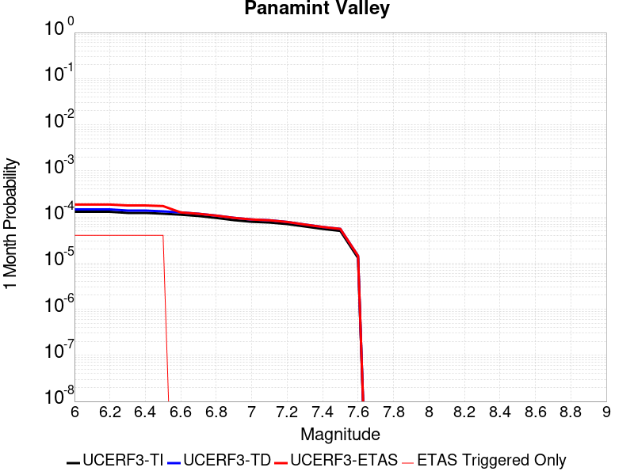 | 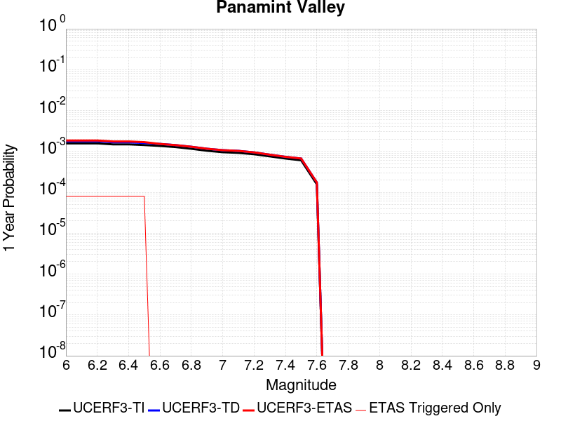 |

| Magnitude | 1 wk TI Prob | 1 wk TD Prob | 1 wk ETAS Prob | 1 wk ETAS/TD Gain | 1 wk ETAS Triggered Only | 1 mo TI Prob | 1 mo TD Prob | 1 mo ETAS Prob | 1 mo ETAS/TD Gain | 1 mo ETAS Triggered Only | 1 yr TI Prob | 1 yr TD Prob | 1 yr ETAS Prob | 1 yr ETAS/TD Gain | 1 yr ETAS Triggered Only |
|-----|-----|-----|-----|-----|-----|-----|-----|-----|-----|-----|-----|-----|-----|-----|-----|
| 6.0 | 3.0211835E-5 | 3.4006032E-5 | 7.4004674E-5 | 2.1762218 | 4.0E-5 | 1.2947287E-4 | 1.4573216E-4 | 1.8572634E-4 | 1.2744361 | 4.0E-5 | 0.0015751923 | 0.0017728747 | 0.0018527329 | 1.0450444 | 8.0E-5 |
| 6.1 | 3.0211835E-5 | 3.4006032E-5 | 7.4004674E-5 | 2.1762218 | 4.0E-5 | 1.2947287E-4 | 1.4573216E-4 | 1.8572634E-4 | 1.2744361 | 4.0E-5 | 0.0015751923 | 0.0017728747 | 0.0018527329 | 1.0450444 | 8.0E-5 |
| 6.2 | 3.0211835E-5 | 3.4006032E-5 | 7.4004674E-5 | 2.1762218 | 4.0E-5 | 1.2947287E-4 | 1.4573216E-4 | 1.8572634E-4 | 1.2744361 | 4.0E-5 | 0.0015751923 | 0.0017728747 | 0.0018527329 | 1.0450444 | 8.0E-5 |
| 6.3 | 2.8573924E-5 | 3.212314E-5 | 7.212185E-5 | 2.2451684 | 4.0E-5 | 1.2245393E-4 | 1.3766348E-4 | 1.7765797E-4 | 1.2905236 | 4.0E-5 | 0.001489857 | 0.0016747921 | 0.0017546582 | 1.0476872 | 8.0E-5 |
| 6.4 | 2.8573924E-5 | 3.212314E-5 | 7.212185E-5 | 2.2451684 | 4.0E-5 | 1.2245393E-4 | 1.3766348E-4 | 1.7765797E-4 | 1.2905236 | 4.0E-5 | 0.001489857 | 0.0016747921 | 0.0017546582 | 1.0476872 | 8.0E-5 |
| 6.5 | 2.7468774E-5 | 3.0848154E-5 | 7.084692E-5 | 2.296634 | 4.0E-5 | 1.1771801E-4 | 1.3219983E-4 | 1.7219454E-4 | 1.3025322 | 4.0E-5 | 0.0014322745 | 0.001608372 | 0.0016882434 | 1.0496597 | 8.0E-5 |
| 6.6 | 2.6135967E-5 | 2.9271281E-5 | 2.9271281E-5 | 1.0 | 0.0 | 1.1200648E-4 | 1.2544247E-4 | 1.2544247E-4 | 1.0 | 0.0 | 0.0013628257 | 0.0015262186 | 0.0015262186 | 1.0 | 0.0 |
| 6.7 | 2.4498746E-5 | 2.7359867E-5 | 2.7359867E-5 | 1.0 | 0.0 | 1.04990395E-4 | 1.17251446E-4 | 1.17251446E-4 | 1.0 | 0.0 | 0.0012775084 | 0.0014266267 | 0.0014266267 | 1.0 | 0.0 |
| 6.8 | 2.2244329E-5 | 2.4952975E-5 | 2.4952975E-5 | 1.0 | 0.0 | 9.532935E-5 | 1.06937056E-4 | 1.06937056E-4 | 1.0 | 0.0 | 0.0011600169 | 0.0013012029 | 0.0013012029 | 1.0 | 0.0 |
| 6.9 | 1.9902658E-5 | 2.2306494E-5 | 2.2306494E-5 | 1.0 | 0.0 | 8.529431E-5 | 9.559586E-5 | 9.559586E-5 | 1.0 | 0.0 | 0.0010379635 | 0.0011632767 | 0.0011632767 | 1.0 | 0.0 |
| 7.0 | 1.8353881E-5 | 2.0581738E-5 | 2.0581738E-5 | 1.0 | 0.0 | 7.865712E-5 | 8.8204564E-5 | 8.8204564E-5 | 1.0 | 0.0 | 9.5722964E-4 | 0.0010733792 | 0.0010733792 | 1.0 | 0.0 |
| 7.1 | 1.7667631E-5 | 1.9787058E-5 | 1.9787058E-5 | 1.0 | 0.0 | 7.571623E-5 | 8.4799016E-5 | 8.4799016E-5 | 1.0 | 0.0 | 9.2145515E-4 | 0.0010319566 | 0.0010319566 | 1.0 | 0.0 |
| 7.2 | 1.6381597E-5 | 1.8171384E-5 | 1.8171384E-5 | 1.0 | 0.0 | 7.020495E-5 | 7.787513E-5 | 7.787513E-5 | 1.0 | 0.0 | 8.544101E-4 | 9.477346E-4 | 9.477346E-4 | 1.0 | 0.0 |
| 7.3 | 1.4520491E-5 | 1.5977024E-5 | 1.5977024E-5 | 1.0 | 0.0 | 6.222919E-5 | 6.847125E-5 | 6.847125E-5 | 1.0 | 0.0 | 7.57377E-4 | 8.3333487E-4 | 8.3333487E-4 | 1.0 | 0.0 |
| 7.4 | 1.2852287E-5 | 1.4154711E-5 | 1.4154711E-5 | 1.0 | 0.0 | 5.5080065E-5 | 6.0661725E-5 | 6.0661725E-5 | 1.0 | 0.0 | 6.7039346E-4 | 7.3832204E-4 | 7.3832204E-4 | 1.0 | 0.0 |
| 7.5 | 1.1637851E-5 | 1.2845683E-5 | 1.2845683E-5 | 1.0 | 0.0 | 4.987555E-5 | 5.5051856E-5 | 5.5051856E-5 | 1.0 | 0.0 | 6.070656E-4 | 6.700659E-4 | 6.700659E-4 | 1.0 | 0.0 |
| 7.6 | 3.0068115E-6 | 3.3365502E-6 | 3.3365502E-6 | 1.0 | 0.0 | 1.2886271E-5 | 1.4299464E-5 | 1.4299464E-5 | 1.0 | 0.0 | 1.5687906E-4 | 1.7408936E-4 | 1.7408936E-4 | 1.0 | 0.0 |

## San Andreas (Peninsula) 2011 CFM
*[(top)](#table-of-contents)*

| 1 Week | 1 Month | 1 Year |
|-----|-----|-----|
| 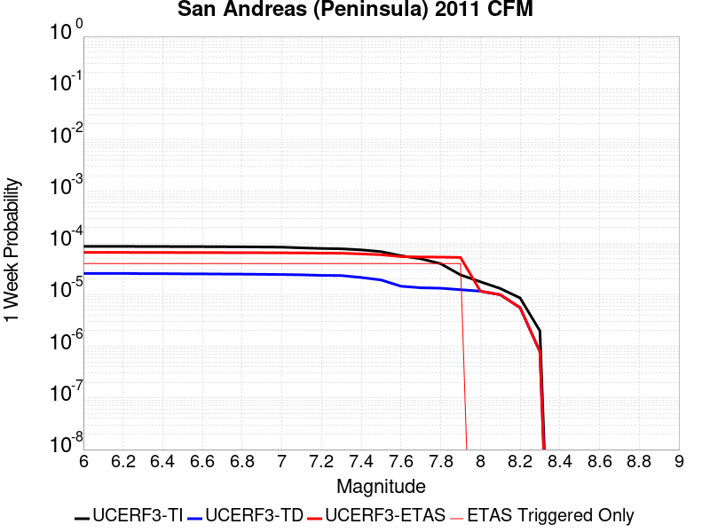 | 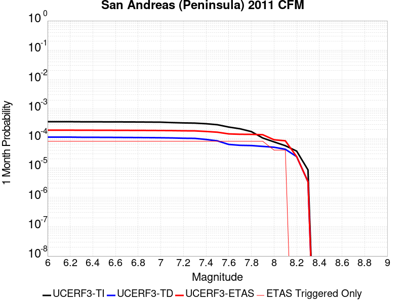 | 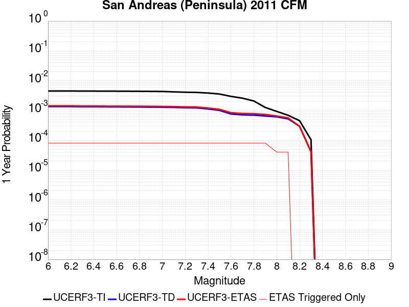 |

| Magnitude | 1 wk TI Prob | 1 wk TD Prob | 1 wk ETAS Prob | 1 wk ETAS/TD Gain | 1 wk ETAS Triggered Only | 1 mo TI Prob | 1 mo TD Prob | 1 mo ETAS Prob | 1 mo ETAS/TD Gain | 1 mo ETAS Triggered Only | 1 yr TI Prob | 1 yr TD Prob | 1 yr ETAS Prob | 1 yr ETAS/TD Gain | 1 yr ETAS Triggered Only |
|-----|-----|-----|-----|-----|-----|-----|-----|-----|-----|-----|-----|-----|-----|-----|-----|
| 6.0 | 8.6200685E-5 | 2.5801015E-5 | 6.5799984E-5 | 2.5502865 | 4.0E-5 | 3.6937918E-4 | 1.105711E-4 | 1.9056225E-4 | 1.7234364 | 8.0E-5 | 0.0044879215 | 0.0013453735 | 0.0014252658 | 1.059383 | 8.0E-5 |
| 6.1 | 8.6200685E-5 | 2.5801015E-5 | 6.5799984E-5 | 2.5502865 | 4.0E-5 | 3.6937918E-4 | 1.105711E-4 | 1.9056225E-4 | 1.7234364 | 8.0E-5 | 0.0044879215 | 0.0013453735 | 0.0014252658 | 1.059383 | 8.0E-5 |
| 6.2 | 8.6200685E-5 | 2.5801015E-5 | 6.5799984E-5 | 2.5502865 | 4.0E-5 | 3.6937918E-4 | 1.105711E-4 | 1.9056225E-4 | 1.7234364 | 8.0E-5 | 0.0044879215 | 0.0013453735 | 0.0014252658 | 1.059383 | 8.0E-5 |
| 6.3 | 8.551163E-5 | 2.54887E-5 | 6.548768E-5 | 2.5692828 | 4.0E-5 | 3.6642692E-4 | 1.0923272E-4 | 1.8922398E-4 | 1.7323012 | 8.0E-5 | 0.004452125 | 0.0013290987 | 0.0014089925 | 1.0601112 | 8.0E-5 |
| 6.4 | 8.551163E-5 | 2.54887E-5 | 6.548768E-5 | 2.5692828 | 4.0E-5 | 3.6642692E-4 | 1.0923272E-4 | 1.8922398E-4 | 1.7323012 | 8.0E-5 | 0.004452125 | 0.0013290987 | 0.0014089925 | 1.0601112 | 8.0E-5 |
| 6.5 | 8.511146E-5 | 2.5307645E-5 | 6.530663E-5 | 2.5805101 | 4.0E-5 | 3.647124E-4 | 1.08456836E-4 | 1.8844816E-4 | 1.7375406 | 8.0E-5 | 0.004431336 | 0.0013196638 | 0.0013995583 | 1.0605415 | 8.0E-5 |
| 6.6 | 8.4985084E-5 | 2.5237454E-5 | 6.523645E-5 | 2.5849059 | 4.0E-5 | 3.6417096E-4 | 1.0815604E-4 | 1.8814739E-4 | 1.7395921 | 8.0E-5 | 0.0044247704 | 0.0013160061 | 0.0013959007 | 1.06071 | 8.0E-5 |
| 6.7 | 8.462618E-5 | 2.5063902E-5 | 6.50629E-5 | 2.5958807 | 4.0E-5 | 3.6263323E-4 | 1.07412314E-4 | 1.8740373E-4 | 1.7447135 | 8.0E-5 | 0.004406125 | 0.0013069621 | 0.0013868575 | 1.0611306 | 8.0E-5 |
| 6.8 | 8.42337E-5 | 2.495804E-5 | 6.495704E-5 | 2.60265 | 4.0E-5 | 3.6095164E-4 | 1.0695866E-4 | 1.869501E-4 | 1.7478726 | 8.0E-5 | 0.004385734 | 0.0013014454 | 0.0013813414 | 1.0613902 | 8.0E-5 |
| 6.9 | 8.365989E-5 | 2.476054E-5 | 6.475955E-5 | 2.6154337 | 4.0E-5 | 3.5849313E-4 | 1.061123E-4 | 1.861038E-4 | 1.7538383 | 8.0E-5 | 0.004355922 | 0.0012911533 | 0.0013710499 | 1.0618801 | 8.0E-5 |
| 7.0 | 8.30936E-5 | 2.4519966E-5 | 6.451899E-5 | 2.6312835 | 4.0E-5 | 3.560668E-4 | 1.05081344E-4 | 1.8507293E-4 | 1.761235 | 8.0E-5 | 0.004326499 | 0.0012786163 | 0.001358514 | 1.0624876 | 8.0E-5 |
| 7.1 | 8.041264E-5 | 2.4201698E-5 | 6.420073E-5 | 2.6527367 | 4.0E-5 | 3.4458007E-4 | 1.03717444E-4 | 1.8370914E-4 | 1.7712463 | 8.0E-5 | 0.0041871946 | 0.0012620301 | 0.0013419291 | 1.0633099 | 8.0E-5 |
| 7.2 | 7.8427016E-5 | 2.361941E-5 | 6.361846E-5 | 2.6934824 | 4.0E-5 | 3.3607247E-4 | 1.0122212E-4 | 1.8121403E-4 | 1.790261 | 8.0E-5 | 0.004084008 | 0.0012316842 | 0.0013115858 | 1.0648717 | 8.0E-5 |
| 7.3 | 7.721087E-5 | 2.3402055E-5 | 6.340112E-5 | 2.7092116 | 4.0E-5 | 3.3086175E-4 | 1.0029068E-4 | 1.8028266E-4 | 1.7976013 | 8.0E-5 | 0.004020803 | 0.0012203567 | 0.001300259 | 1.0654746 | 8.0E-5 |
| 7.4 | 7.3536525E-5 | 2.1486432E-5 | 6.1485574E-5 | 2.8616 | 4.0E-5 | 3.1511846E-4 | 9.2081464E-5 | 1.720741E-4 | 1.8687159 | 8.0E-5 | 0.0038298194 | 0.0011205166 | 0.001200427 | 1.0713156 | 8.0E-5 |
| 7.5 | 6.806207E-5 | 1.9247474E-5 | 5.9246704E-5 | 3.0781548 | 4.0E-5 | 2.9166197E-4 | 8.248657E-5 | 1.6247998E-4 | 1.9697748 | 8.0E-5 | 0.0035452035 | 0.0010038124 | 0.0010837321 | 1.0796162 | 8.0E-5 |
| 7.6 | 5.6731416E-5 | 1.45483245E-5 | 5.454774E-5 | 3.7494175 | 4.0E-5 | 2.43112E-4 | 6.2348474E-5 | 1.4234349E-4 | 2.2830307 | 8.0E-5 | 0.0029558712 | 7.588284E-4 | 8.3876774E-4 | 1.1053457 | 8.0E-5 |
| 7.7 | 4.946994E-5 | 1.3589812E-5 | 5.358927E-5 | 3.9433415 | 4.0E-5 | 2.1199681E-4 | 5.8240752E-5 | 1.382361E-4 | 2.3735287 | 8.0E-5 | 0.002578006 | 7.088506E-4 | 7.887939E-4 | 1.1127788 | 8.0E-5 |
| 7.8 | 3.9718198E-5 | 1.3313264E-5 | 5.331273E-5 | 4.0044823 | 4.0E-5 | 1.7020974E-4 | 5.7055597E-5 | 1.3705103E-4 | 2.4020612 | 8.0E-5 | 0.0020703338 | 6.9443067E-4 | 7.743751E-4 | 1.1151223 | 8.0E-5 |
| 7.9 | 2.4115114E-5 | 1.2479283E-5 | 5.2478783E-5 | 4.205272 | 4.0E-5 | 1.0334639E-4 | 5.3481544E-5 | 1.3347727E-4 | 2.495763 | 8.0E-5 | 0.001257516 | 6.5094343E-4 | 7.3089136E-4 | 1.1228186 | 8.0E-5 |
| 8.0 | 1.7756569E-5 | 1.1674584E-5 | 1.1674584E-5 | 1.0 | 0.0 | 7.6097356E-5 | 5.0032973E-5 | 9.0030975E-5 | 1.7994328 | 4.0E-5 | 9.260915E-4 | 6.0898135E-4 | 6.48957E-4 | 1.0656434 | 4.0E-5 |
| 8.1 | 1.3159258E-5 | 9.968845E-6 | 9.968845E-6 | 1.0 | 0.0 | 5.6395602E-5 | 4.272292E-5 | 8.272121E-5 | 1.9362255 | 4.0E-5 | 6.864001E-4 | 5.2002753E-4 | 5.6000677E-4 | 1.076879 | 4.0E-5 |
| 8.2 | 8.635426E-6 | 5.5992937E-6 | 5.5992937E-6 | 1.0 | 0.0 | 3.700844E-5 | 2.3996754E-5 | 2.3996754E-5 | 1.0 | 0.0 | 4.5048463E-4 | 2.9212137E-4 | 2.9212137E-4 | 1.0 | 0.0 |
| 8.3 | 1.983087E-6 | 7.877893E-7 | 7.877893E-7 | 1.0 | 0.0 | 8.498917E-6 | 3.3762356E-6 | 3.3762356E-6 | 1.0 | 0.0 | 1.034694E-4 | 4.110491E-5 | 4.110491E-5 | 1.0 | 0.0 |

## Red Mountain
*[(top)](#table-of-contents)*

| 1 Week | 1 Month | 1 Year |
|-----|-----|-----|
|  | 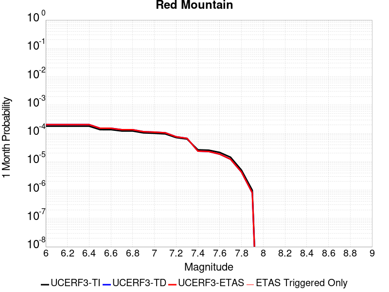 | 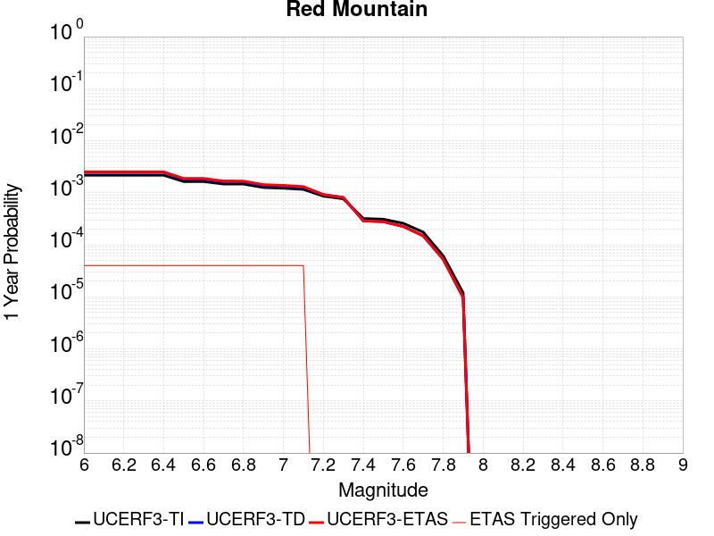 |

| Magnitude | 1 wk TI Prob | 1 wk TD Prob | 1 wk ETAS Prob | 1 wk ETAS/TD Gain | 1 wk ETAS Triggered Only | 1 mo TI Prob | 1 mo TD Prob | 1 mo ETAS Prob | 1 mo ETAS/TD Gain | 1 mo ETAS Triggered Only | 1 yr TI Prob | 1 yr TD Prob | 1 yr ETAS Prob | 1 yr ETAS/TD Gain | 1 yr ETAS Triggered Only |
|-----|-----|-----|-----|-----|-----|-----|-----|-----|-----|-----|-----|-----|-----|-----|-----|
| 6.0 | 4.1810763E-5 | 4.7617137E-5 | 4.7617137E-5 | 1.0 | 0.0 | 1.7917668E-4 | 2.0405841E-4 | 2.0405841E-4 | 1.0 | 0.0 | 0.0021792934 | 0.002481745 | 0.0025216457 | 1.0160776 | 4.0E-5 |
| 6.1 | 4.1810763E-5 | 4.7617137E-5 | 4.7617137E-5 | 1.0 | 0.0 | 1.7917668E-4 | 2.0405841E-4 | 2.0405841E-4 | 1.0 | 0.0 | 0.0021792934 | 0.002481745 | 0.0025216457 | 1.0160776 | 4.0E-5 |
| 6.2 | 4.1810763E-5 | 4.7617137E-5 | 4.7617137E-5 | 1.0 | 0.0 | 1.7917668E-4 | 2.0405841E-4 | 2.0405841E-4 | 1.0 | 0.0 | 0.0021792934 | 0.002481745 | 0.0025216457 | 1.0160776 | 4.0E-5 |
| 6.3 | 4.1810763E-5 | 4.7617137E-5 | 4.7617137E-5 | 1.0 | 0.0 | 1.7917668E-4 | 2.0405841E-4 | 2.0405841E-4 | 1.0 | 0.0 | 0.0021792934 | 0.002481745 | 0.0025216457 | 1.0160776 | 4.0E-5 |
| 6.4 | 4.1810763E-5 | 4.7617137E-5 | 4.7617137E-5 | 1.0 | 0.0 | 1.7917668E-4 | 2.0405841E-4 | 2.0405841E-4 | 1.0 | 0.0 | 0.0021792934 | 0.002481745 | 0.0025216457 | 1.0160776 | 4.0E-5 |
| 6.5 | 3.154503E-5 | 3.5378947E-5 | 3.5378947E-5 | 1.0 | 0.0 | 1.3518598E-4 | 1.5161576E-4 | 1.5161576E-4 | 1.0 | 0.0 | 0.0016446467 | 0.0018444513 | 0.0018843776 | 1.0216466 | 4.0E-5 |
| 6.6 | 3.1535834E-5 | 3.5368324E-5 | 3.5368324E-5 | 1.0 | 0.0 | 1.3514658E-4 | 1.5157025E-4 | 1.5157025E-4 | 1.0 | 0.0 | 0.0016441676 | 0.001843898 | 0.0018838242 | 1.0216532 | 4.0E-5 |
| 6.7 | 2.8267326E-5 | 3.148608E-5 | 3.148608E-5 | 1.0 | 0.0 | 1.2114006E-4 | 1.3493384E-4 | 1.3493384E-4 | 1.0 | 0.0 | 0.0014738824 | 0.0016416667 | 0.0016816012 | 1.0243255 | 4.0E-5 |
| 6.8 | 2.8212884E-5 | 3.1423937E-5 | 3.1423937E-5 | 1.0 | 0.0 | 1.20906756E-4 | 1.3466754E-4 | 1.3466754E-4 | 1.0 | 0.0 | 0.0014710457 | 0.0016384295 | 0.0016783639 | 1.0243737 | 4.0E-5 |
| 6.9 | 2.4227871E-5 | 2.6720827E-5 | 2.6720827E-5 | 1.0 | 0.0 | 1.03829596E-4 | 1.14513234E-4 | 1.14513234E-4 | 1.0 | 0.0 | 0.0012633923 | 0.0013933829 | 0.0014333272 | 1.0286671 | 4.0E-5 |
| 7.0 | 2.348524E-5 | 2.58491E-5 | 2.58491E-5 | 1.0 | 0.0 | 1.0064714E-4 | 1.10777575E-4 | 1.10777575E-4 | 1.0 | 0.0 | 0.0012246901 | 0.0013479582 | 0.0013879044 | 1.0296345 | 4.0E-5 |
| 7.1 | 2.2311642E-5 | 2.447537E-5 | 2.447537E-5 | 1.0 | 0.0 | 9.561782E-5 | 1.0489065E-4 | 1.0489065E-4 | 1.0 | 0.0 | 0.0011635252 | 0.0012763705 | 0.0013163195 | 1.0312989 | 4.0E-5 |
| 7.2 | 1.6533986E-5 | 1.767884E-5 | 1.767884E-5 | 1.0 | 0.0 | 7.085802E-5 | 7.576461E-5 | 7.576461E-5 | 1.0 | 0.0 | 8.623549E-4 | 9.221073E-4 | 9.221073E-4 | 1.0 | 0.0 |
| 7.3 | 1.4703092E-5 | 1.556691E-5 | 1.556691E-5 | 1.0 | 0.0 | 6.301173E-5 | 6.671397E-5 | 6.671397E-5 | 1.0 | 0.0 | 7.668978E-4 | 8.120016E-4 | 8.120016E-4 | 1.0 | 0.0 |
| 7.4 | 6.1331984E-6 | 5.530447E-6 | 5.530447E-6 | 1.0 | 0.0 | 2.6284872E-5 | 2.3701703E-5 | 2.3701703E-5 | 1.0 | 0.0 | 3.199713E-4 | 2.8853054E-4 | 2.8853054E-4 | 1.0 | 0.0 |
| 7.5 | 5.954766E-6 | 5.3400213E-6 | 5.3400213E-6 | 1.0 | 0.0 | 2.5520176E-5 | 2.2885608E-5 | 2.2885608E-5 | 1.0 | 0.0 | 3.1066386E-4 | 2.7859717E-4 | 2.7859717E-4 | 1.0 | 0.0 |
| 7.6 | 4.9726646E-6 | 4.316545E-6 | 4.316545E-6 | 1.0 | 0.0 | 2.1311245E-5 | 1.849935E-5 | 1.849935E-5 | 1.0 | 0.0 | 2.5943352E-4 | 2.2520665E-4 | 2.2520665E-4 | 1.0 | 0.0 |
| 7.7 | 3.3613894E-6 | 2.8534687E-6 | 2.8534687E-6 | 1.0 | 0.0 | 1.4405875E-5 | 1.2229096E-5 | 1.2229096E-5 | 1.0 | 0.0 | 1.7537741E-4 | 1.4887934E-4 | 1.4887934E-4 | 1.0 | 0.0 |
| 7.8 | 1.1828961E-6 | 1.0125256E-6 | 1.0125256E-6 | 1.0 | 0.0 | 5.069545E-6 | 4.3393884E-6 | 4.3393884E-6 | 1.0 | 0.0 | 6.171996E-5 | 5.28308E-5 | 5.28308E-5 | 1.0 | 0.0 |
| 7.9 | 2.2967266E-7 | 1.8623352E-7 | 1.8623352E-7 | 1.0 | 0.0 | 9.843111E-7 | 7.9814345E-7 | 7.9814345E-7 | 1.0 | 0.0 | 1.19839215E-5 | 9.717356E-6 | 9.717356E-6 | 1.0 | 0.0 |

## Oceanic - West Huasna
*[(top)](#table-of-contents)*

| 1 Week | 1 Month | 1 Year |
|-----|-----|-----|
| 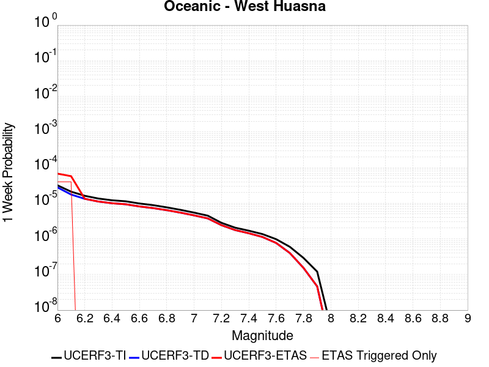 | 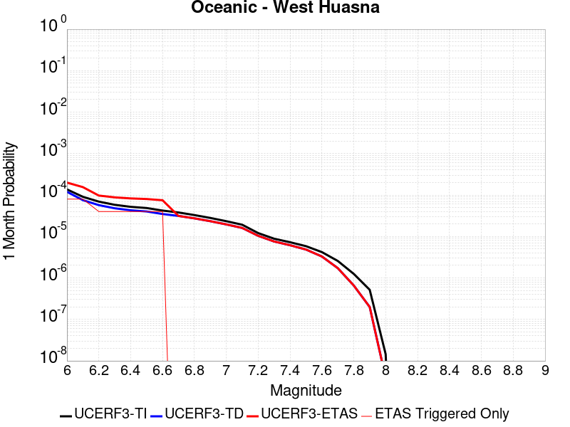 | 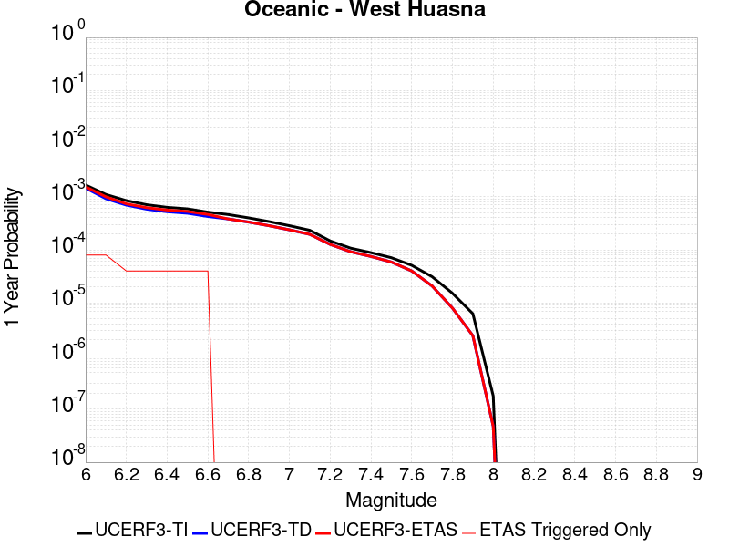 |

| Magnitude | 1 wk TI Prob | 1 wk TD Prob | 1 wk ETAS Prob | 1 wk ETAS/TD Gain | 1 wk ETAS Triggered Only | 1 mo TI Prob | 1 mo TD Prob | 1 mo ETAS Prob | 1 mo ETAS/TD Gain | 1 mo ETAS Triggered Only | 1 yr TI Prob | 1 yr TD Prob | 1 yr ETAS Prob | 1 yr ETAS/TD Gain | 1 yr ETAS Triggered Only |
|-----|-----|-----|-----|-----|-----|-----|-----|-----|-----|-----|-----|-----|-----|-----|-----|
| 6.0 | 3.195567E-5 | 2.7935615E-5 | 6.7934496E-5 | 2.431824 | 4.0E-5 | 1.3694567E-4 | 1.1971882E-4 | 1.9970923E-4 | 1.6681525 | 8.0E-5 | 0.0016660384 | 0.0014566452 | 0.0015365286 | 1.0548407 | 8.0E-5 |
| 6.1 | 2.1156782E-5 | 1.757916E-5 | 5.7578458E-5 | 3.2753816 | 4.0E-5 | 9.066878E-5 | 7.5337135E-5 | 1.553311E-4 | 2.0618134 | 8.0E-5 | 0.0011033333 | 9.16853E-4 | 9.967797E-4 | 1.087175 | 8.0E-5 |
| 6.2 | 1.6195117E-5 | 1.333068E-5 | 1.333068E-5 | 1.0 | 0.0 | 6.9405796E-5 | 5.713025E-5 | 9.7127966E-5 | 1.7001145 | 4.0E-5 | 8.44688E-4 | 6.9534144E-4 | 7.3531363E-4 | 1.0574857 | 4.0E-5 |
| 6.3 | 1.3559345E-5 | 1.1181751E-5 | 1.1181751E-5 | 1.0 | 0.0 | 5.811018E-5 | 4.7920912E-5 | 8.7919E-5 | 1.8346686 | 4.0E-5 | 7.072618E-4 | 5.8328186E-4 | 6.2325853E-4 | 1.0685375 | 4.0E-5 |
| 6.4 | 1.2120619E-5 | 1.0003182E-5 | 1.0003182E-5 | 1.0 | 0.0 | 5.1944477E-5 | 4.2870077E-5 | 8.286836E-5 | 1.9330118 | 4.0E-5 | 6.322405E-4 | 5.218187E-4 | 5.617978E-4 | 1.076615 | 4.0E-5 |
| 6.5 | 1.13511915E-5 | 9.369492E-6 | 9.369492E-6 | 1.0 | 0.0 | 4.8647056E-5 | 4.0154348E-5 | 8.015274E-5 | 1.9961162 | 4.0E-5 | 5.9211696E-4 | 4.8876996E-4 | 5.287504E-4 | 1.0817981 | 4.0E-5 |
| 6.6 | 9.850605E-6 | 8.137099E-6 | 8.137099E-6 | 1.0 | 0.0 | 4.2216197E-5 | 3.4872817E-5 | 7.487142E-5 | 2.1469853 | 4.0E-5 | 5.1386096E-4 | 4.2449404E-4 | 4.6447705E-4 | 1.0941899 | 4.0E-5 |
| 6.7 | 8.8558645E-6 | 7.3199412E-6 | 7.3199412E-6 | 1.0 | 0.0 | 3.7953152E-5 | 3.13708E-5 | 3.13708E-5 | 1.0 | 0.0 | 4.6198163E-4 | 3.8187273E-4 | 3.8187273E-4 | 1.0 | 0.0 |
| 6.8 | 7.67136E-6 | 6.3930647E-6 | 6.3930647E-6 | 1.0 | 0.0 | 3.2876844E-5 | 2.7398562E-5 | 2.7398562E-5 | 1.0 | 0.0 | 4.0020206E-4 | 3.335266E-4 | 3.335266E-4 | 1.0 | 0.0 |
| 6.9 | 6.534529E-6 | 5.459491E-6 | 5.459491E-6 | 1.0 | 0.0 | 2.8004823E-5 | 2.339761E-5 | 2.339761E-5 | 1.0 | 0.0 | 3.4090536E-4 | 2.848288E-4 | 2.848288E-4 | 1.0 | 0.0 |
| 7.0 | 5.460525E-6 | 4.5709203E-6 | 4.5709203E-6 | 1.0 | 0.0 | 2.3402039E-5 | 1.9589512E-5 | 1.9589512E-5 | 1.0 | 0.0 | 2.8488258E-4 | 2.384763E-4 | 2.384763E-4 | 1.0 | 0.0 |
| 7.1 | 4.4825083E-6 | 3.7533373E-6 | 3.7533373E-6 | 1.0 | 0.0 | 1.9210609E-5 | 1.6085633E-5 | 1.6085633E-5 | 1.0 | 0.0 | 2.3386406E-4 | 1.9582508E-4 | 1.9582508E-4 | 1.0 | 0.0 |
| 7.2 | 2.821708E-6 | 2.4257495E-6 | 2.4257495E-6 | 1.0 | 0.0 | 1.2092979E-5 | 1.0396027E-5 | 1.0396027E-5 | 1.0 | 0.0 | 1.4722206E-4 | 1.265643E-4 | 1.265643E-4 | 1.0 | 0.0 |
| 7.3 | 2.0644757E-6 | 1.7694833E-6 | 1.7694833E-6 | 1.0 | 0.0 | 8.847723E-6 | 7.5834782E-6 | 7.5834782E-6 | 1.0 | 0.0 | 1.0771569E-4 | 9.232494E-5 | 9.232494E-5 | 1.0 | 0.0 |
| 7.4 | 1.6980367E-6 | 1.438663E-6 | 1.438663E-6 | 1.0 | 0.0 | 7.27728E-6 | 6.165684E-6 | 6.165684E-6 | 1.0 | 0.0 | 8.8597284E-5 | 7.506462E-5 | 7.506462E-5 | 1.0 | 0.0 |
| 7.5 | 1.3637683E-6 | 1.1308925E-6 | 1.1308925E-6 | 1.0 | 0.0 | 5.844708E-6 | 4.8466736E-6 | 4.8466736E-6 | 1.0 | 0.0 | 7.1156996E-5 | 5.9006652E-5 | 5.9006652E-5 | 1.0 | 0.0 |
| 7.6 | 9.802994E-7 | 7.683204E-7 | 7.683204E-7 | 1.0 | 0.0 | 4.2012766E-6 | 3.2927974E-6 | 3.2927974E-6 | 1.0 | 0.0 | 5.1149345E-5 | 4.008907E-5 | 4.008907E-5 | 1.0 | 0.0 |
| 7.7 | 5.986191E-7 | 4.0096745E-7 | 4.0096745E-7 | 1.0 | 0.0 | 2.5655079E-6 | 1.7184307E-6 | 1.7184307E-6 | 1.0 | 0.0 | 3.1234613E-5 | 2.0921694E-5 | 2.0921694E-5 | 1.0 | 0.0 |
| 7.8 | 2.9189815E-7 | 1.5325327E-7 | 1.5325327E-7 | 1.0 | 0.0 | 1.2509914E-6 | 6.567995E-7 | 6.567995E-7 | 1.0 | 0.0 | 1.5230714E-5 | 7.996505E-6 | 7.996505E-6 | 1.0 | 0.0 |
| 7.9 | 1.2057845E-7 | 4.6430397E-8 | 4.6430397E-8 | 1.0 | 0.0 | 5.1676466E-7 | 1.989874E-7 | 1.989874E-7 | 1.0 | 0.0 | 6.2915915E-6 | 2.4226688E-6 | 2.4226688E-6 | 1.0 | 0.0 |
| 8.0 | 3.3806387E-9 | 9.0955077E-10 | 9.0955077E-10 | 1.0 | 0.0 | 1.4488451E-8 | 3.898074E-9 | 3.898074E-9 | 1.0 | 0.0 | 1.7639688E-7 | 4.7459046E-8 | 4.7459046E-8 | 1.0 | 0.0 |

## Newport-Inglewood (Offshore)
*[(top)](#table-of-contents)*

| 1 Week | 1 Month | 1 Year |
|-----|-----|-----|
| 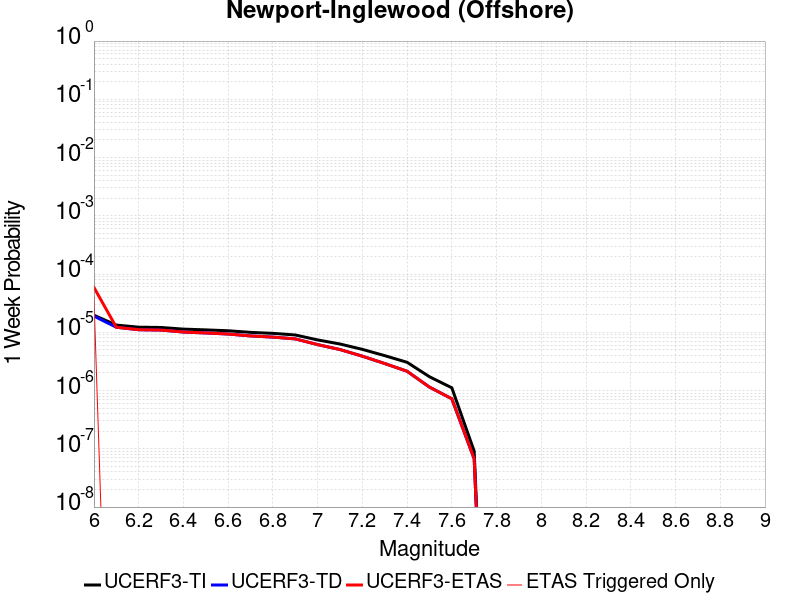 | 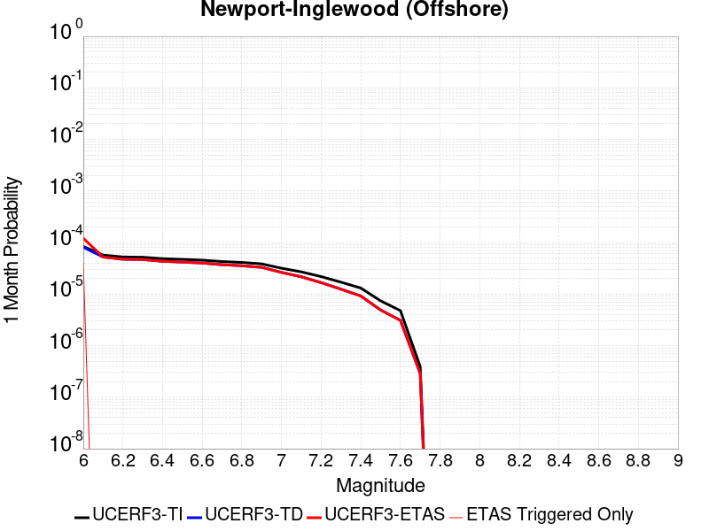 | 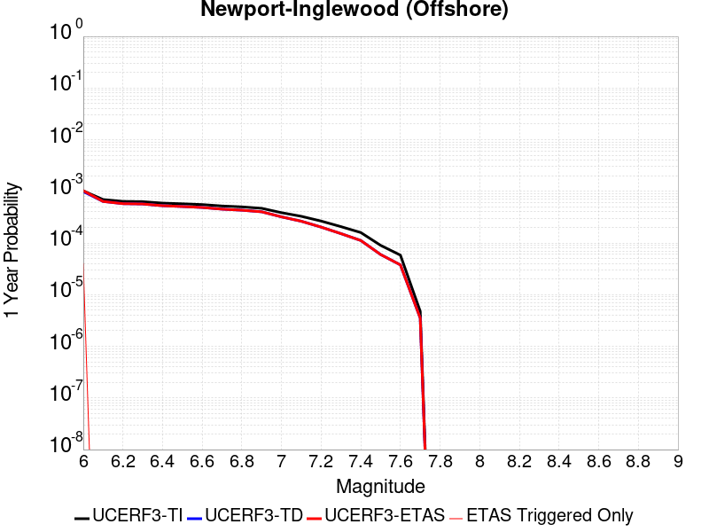 |

| Magnitude | 1 wk TI Prob | 1 wk TD Prob | 1 wk ETAS Prob | 1 wk ETAS/TD Gain | 1 wk ETAS Triggered Only | 1 mo TI Prob | 1 mo TD Prob | 1 mo ETAS Prob | 1 mo ETAS/TD Gain | 1 mo ETAS Triggered Only | 1 yr TI Prob | 1 yr TD Prob | 1 yr ETAS Prob | 1 yr ETAS/TD Gain | 1 yr ETAS Triggered Only |
|-----|-----|-----|-----|-----|-----|-----|-----|-----|-----|-----|-----|-----|-----|-----|-----|
| 6.0 | 1.9626508E-5 | 1.89705E-5 | 5.896974E-5 | 3.108497 | 4.0E-5 | 8.411089E-5 | 8.129968E-5 | 1.2129643E-4 | 1.4919668 | 4.0E-5 | 0.001023569 | 9.893867E-4 | 0.0010293472 | 1.0403891 | 4.0E-5 |
| 6.1 | 1.331886E-5 | 1.2221642E-5 | 1.2221642E-5 | 1.0 | 0.0 | 5.707958E-5 | 5.237742E-5 | 5.237742E-5 | 1.0 | 0.0 | 6.947222E-4 | 6.3751003E-4 | 6.3751003E-4 | 1.0 | 0.0 |
| 6.2 | 1.2250852E-5 | 1.1079311E-5 | 1.1079311E-5 | 1.0 | 0.0 | 5.2502597E-5 | 4.74819E-5 | 4.74819E-5 | 1.0 | 0.0 | 6.3903164E-4 | 5.779398E-4 | 5.779398E-4 | 1.0 | 0.0 |
| 6.3 | 1.2106258E-5 | 1.09221255E-5 | 1.09221255E-5 | 1.0 | 0.0 | 5.1882926E-5 | 4.6808276E-5 | 4.6808276E-5 | 1.0 | 0.0 | 6.3149154E-4 | 5.697427E-4 | 5.697427E-4 | 1.0 | 0.0 |
| 6.4 | 1.1348758E-5 | 1.0112408E-5 | 1.0112408E-5 | 1.0 | 0.0 | 4.8636626E-5 | 4.3338176E-5 | 4.3338176E-5 | 1.0 | 0.0 | 5.919901E-4 | 5.2751537E-4 | 5.2751537E-4 | 1.0 | 0.0 |
| 6.5 | 1.100837E-5 | 9.746342E-6 | 9.746342E-6 | 1.0 | 0.0 | 4.7177873E-5 | 4.1769374E-5 | 4.1769374E-5 | 1.0 | 0.0 | 5.7423924E-4 | 5.084242E-4 | 5.084242E-4 | 1.0 | 0.0 |
| 6.6 | 1.0634696E-5 | 9.348393E-6 | 9.348393E-6 | 1.0 | 0.0 | 4.557647E-5 | 4.006393E-5 | 4.006393E-5 | 1.0 | 0.0 | 5.5475225E-4 | 4.8766992E-4 | 4.8766992E-4 | 1.0 | 0.0 |
| 6.7 | 9.9780855E-6 | 8.670582E-6 | 8.670582E-6 | 1.0 | 0.0 | 4.276252E-5 | 3.7159112E-5 | 3.7159112E-5 | 1.0 | 0.0 | 5.205093E-4 | 4.5231896E-4 | 4.5231896E-4 | 1.0 | 0.0 |
| 6.8 | 9.59546E-6 | 8.275532E-6 | 8.275532E-6 | 1.0 | 0.0 | 4.1122752E-5 | 3.546609E-5 | 3.546609E-5 | 1.0 | 0.0 | 5.0055445E-4 | 4.3171475E-4 | 4.3171475E-4 | 1.0 | 0.0 |
| 6.9 | 9.000614E-6 | 7.7092545E-6 | 7.7092545E-6 | 1.0 | 0.0 | 3.857349E-5 | 3.3039247E-5 | 3.3039247E-5 | 1.0 | 0.0 | 4.6953102E-4 | 4.0217923E-4 | 4.0217923E-4 | 1.0 | 0.0 |
| 7.0 | 7.4070194E-6 | 6.1507963E-6 | 6.1507963E-6 | 1.0 | 0.0 | 3.1743984E-5 | 2.636029E-5 | 2.636029E-5 | 1.0 | 0.0 | 3.8641447E-4 | 3.2088943E-4 | 3.2088943E-4 | 1.0 | 0.0 |
| 7.1 | 6.299615E-6 | 5.0580697E-6 | 5.0580697E-6 | 1.0 | 0.0 | 2.699807E-5 | 2.1677262E-5 | 2.1677262E-5 | 1.0 | 0.0 | 3.2865192E-4 | 2.6388883E-4 | 2.6388883E-4 | 1.0 | 0.0 |
| 7.2 | 5.096653E-6 | 3.8939766E-6 | 3.8939766E-6 | 1.0 | 0.0 | 2.1842614E-5 | 1.6688366E-5 | 1.6688366E-5 | 1.0 | 0.0 | 2.6590136E-4 | 2.0316201E-4 | 2.0316201E-4 | 1.0 | 0.0 |
| 7.3 | 3.9753018E-6 | 2.9107364E-6 | 2.9107364E-6 | 1.0 | 0.0 | 1.7036897E-5 | 1.2474526E-5 | 1.2474526E-5 | 1.0 | 0.0 | 2.0740448E-4 | 1.5186684E-4 | 1.5186684E-4 | 1.0 | 0.0 |
| 7.4 | 3.0568392E-6 | 2.1455985E-6 | 2.1455985E-6 | 1.0 | 0.0 | 1.3100675E-5 | 9.195391E-6 | 9.195391E-6 | 1.0 | 0.0 | 1.5948903E-4 | 1.1194819E-4 | 1.1194819E-4 | 1.0 | 0.0 |
| 7.5 | 1.7279019E-6 | 1.1473705E-6 | 1.1473705E-6 | 1.0 | 0.0 | 7.405273E-6 | 4.9172936E-6 | 4.9172936E-6 | 1.0 | 0.0 | 9.015547E-5 | 5.986644E-5 | 5.986644E-5 | 1.0 | 0.0 |
| 7.6 | 1.1156416E-6 | 7.225413E-7 | 7.225413E-7 | 1.0 | 0.0 | 4.7813123E-6 | 3.096602E-6 | 3.096602E-6 | 1.0 | 0.0 | 5.821092E-5 | 3.77005E-5 | 3.77005E-5 | 1.0 | 0.0 |
| 7.7 | 9.117973E-8 | 6.735431E-8 | 6.735431E-8 | 1.0 | 0.0 | 3.907702E-7 | 2.8866128E-7 | 2.8866128E-7 | 1.0 | 0.0 | 4.757617E-6 | 3.5144458E-6 | 3.5144458E-6 | 1.0 | 0.0 |

## Lost Hills
*[(top)](#table-of-contents)*

| 1 Week | 1 Month | 1 Year |
|-----|-----|-----|
| 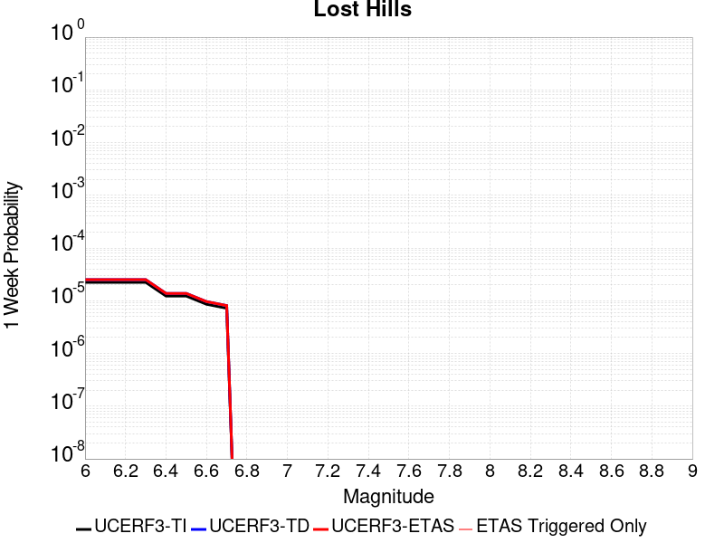 | 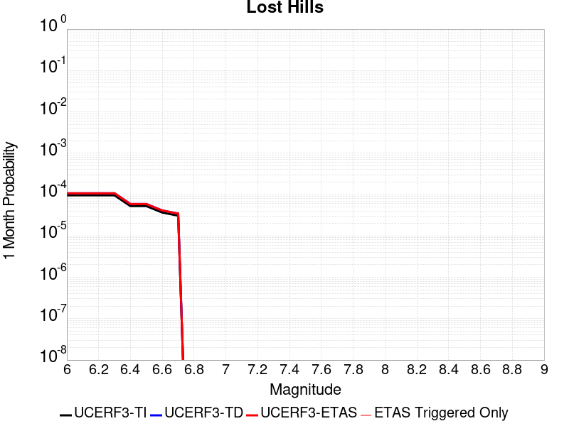 | 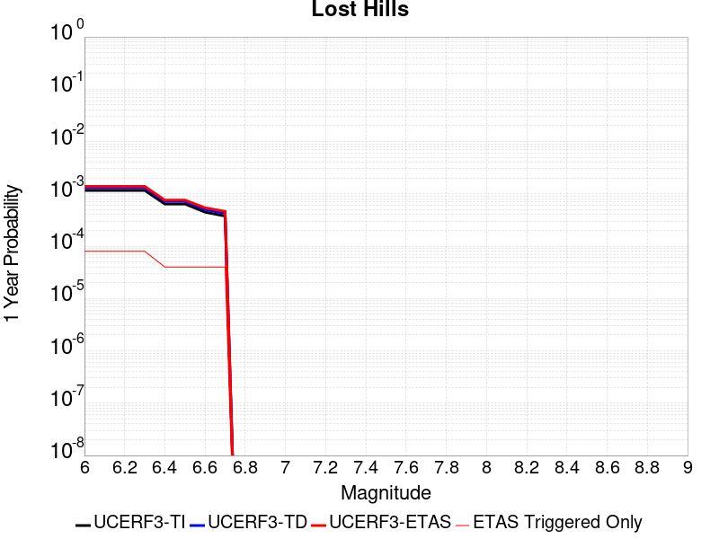 |

| Magnitude | 1 wk TI Prob | 1 wk TD Prob | 1 wk ETAS Prob | 1 wk ETAS/TD Gain | 1 wk ETAS Triggered Only | 1 mo TI Prob | 1 mo TD Prob | 1 mo ETAS Prob | 1 mo ETAS/TD Gain | 1 mo ETAS Triggered Only | 1 yr TI Prob | 1 yr TD Prob | 1 yr ETAS Prob | 1 yr ETAS/TD Gain | 1 yr ETAS Triggered Only |
|-----|-----|-----|-----|-----|-----|-----|-----|-----|-----|-----|-----|-----|-----|-----|-----|
| 6.0 | 2.233523E-5 | 2.5117144E-5 | 2.5117144E-5 | 1.0 | 0.0 | 9.571891E-5 | 1.0764141E-4 | 1.0764141E-4 | 1.0 | 0.0 | 0.0011647546 | 0.0013099145 | 0.0013898098 | 1.0609927 | 8.0E-5 |
| 6.1 | 2.233523E-5 | 2.5117144E-5 | 2.5117144E-5 | 1.0 | 0.0 | 9.571891E-5 | 1.0764141E-4 | 1.0764141E-4 | 1.0 | 0.0 | 0.0011647546 | 0.0013099145 | 0.0013898098 | 1.0609927 | 8.0E-5 |
| 6.2 | 2.233523E-5 | 2.5117144E-5 | 2.5117144E-5 | 1.0 | 0.0 | 9.571891E-5 | 1.0764141E-4 | 1.0764141E-4 | 1.0 | 0.0 | 0.0011647546 | 0.0013099145 | 0.0013898098 | 1.0609927 | 8.0E-5 |
| 6.3 | 2.233523E-5 | 2.5117144E-5 | 2.5117144E-5 | 1.0 | 0.0 | 9.571891E-5 | 1.0764141E-4 | 1.0764141E-4 | 1.0 | 0.0 | 0.0011647546 | 0.0013099145 | 0.0013898098 | 1.0609927 | 8.0E-5 |
| 6.4 | 1.2288092E-5 | 1.3786784E-5 | 1.3786784E-5 | 1.0 | 0.0 | 5.2662188E-5 | 5.9085407E-5 | 5.9085407E-5 | 1.0 | 0.0 | 6.409735E-4 | 7.192213E-4 | 7.591925E-4 | 1.0555757 | 4.0E-5 |
| 6.5 | 1.2288092E-5 | 1.3786784E-5 | 1.3786784E-5 | 1.0 | 0.0 | 5.2662188E-5 | 5.9085407E-5 | 5.9085407E-5 | 1.0 | 0.0 | 6.409735E-4 | 7.192213E-4 | 7.591925E-4 | 1.0555757 | 4.0E-5 |
| 6.6 | 8.58281E-6 | 9.637769E-6 | 9.637769E-6 | 1.0 | 0.0 | 3.6782953E-5 | 4.1304538E-5 | 4.1304538E-5 | 1.0 | 0.0 | 4.4774043E-4 | 5.0285E-4 | 5.428299E-4 | 1.0795066 | 4.0E-5 |
| 6.7 | 7.205685E-6 | 8.091661E-6 | 8.091661E-6 | 1.0 | 0.0 | 3.088114E-5 | 3.4678545E-5 | 3.4678545E-5 | 1.0 | 0.0 | 3.7591302E-4 | 4.2221128E-4 | 4.6219438E-4 | 1.0946993 | 4.0E-5 |

## La Panza 2011
*[(top)](#table-of-contents)*

| 1 Week | 1 Month | 1 Year |
|-----|-----|-----|
| 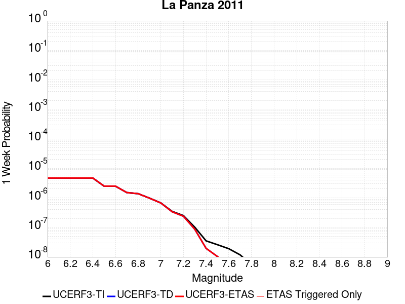 | 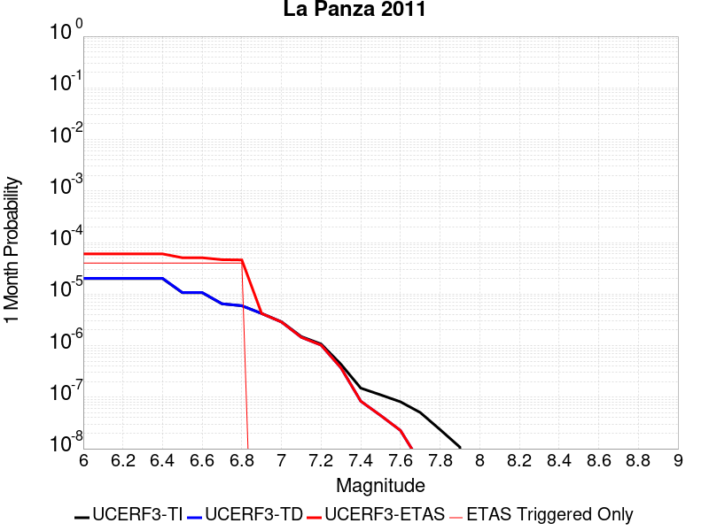 | 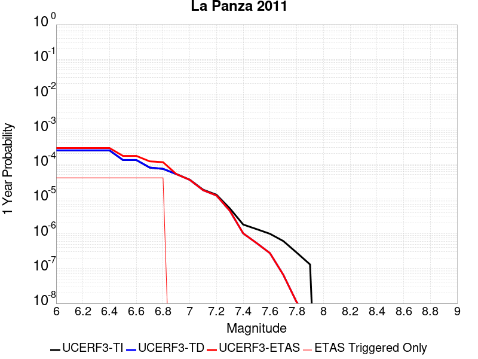 |

| Magnitude | 1 wk TI Prob | 1 wk TD Prob | 1 wk ETAS Prob | 1 wk ETAS/TD Gain | 1 wk ETAS Triggered Only | 1 mo TI Prob | 1 mo TD Prob | 1 mo ETAS Prob | 1 mo ETAS/TD Gain | 1 mo ETAS Triggered Only | 1 yr TI Prob | 1 yr TD Prob | 1 yr ETAS Prob | 1 yr ETAS/TD Gain | 1 yr ETAS Triggered Only |
|-----|-----|-----|-----|-----|-----|-----|-----|-----|-----|-----|-----|-----|-----|-----|-----|
| 6.0 | 4.6754544E-6 | 4.718128E-6 | 4.718128E-6 | 1.0 | 0.0 | 2.0037509E-5 | 2.0220401E-5 | 6.0219594E-5 | 2.9781601 | 4.0E-5 | 2.4392935E-4 | 2.4615755E-4 | 2.861477E-4 | 1.1624576 | 4.0E-5 |
| 6.1 | 4.6754544E-6 | 4.718128E-6 | 4.718128E-6 | 1.0 | 0.0 | 2.0037509E-5 | 2.0220401E-5 | 6.0219594E-5 | 2.9781601 | 4.0E-5 | 2.4392935E-4 | 2.4615755E-4 | 2.861477E-4 | 1.1624576 | 4.0E-5 |
| 6.2 | 4.6754544E-6 | 4.718128E-6 | 4.718128E-6 | 1.0 | 0.0 | 2.0037509E-5 | 2.0220401E-5 | 6.0219594E-5 | 2.9781601 | 4.0E-5 | 2.4392935E-4 | 2.4615755E-4 | 2.861477E-4 | 1.1624576 | 4.0E-5 |
| 6.3 | 4.6754544E-6 | 4.718128E-6 | 4.718128E-6 | 1.0 | 0.0 | 2.0037509E-5 | 2.0220401E-5 | 6.0219594E-5 | 2.9781601 | 4.0E-5 | 2.4392935E-4 | 2.4615755E-4 | 2.861477E-4 | 1.1624576 | 4.0E-5 |
| 6.4 | 4.6754544E-6 | 4.718128E-6 | 4.718128E-6 | 1.0 | 0.0 | 2.0037509E-5 | 2.0220401E-5 | 6.0219594E-5 | 2.9781601 | 4.0E-5 | 2.4392935E-4 | 2.4615755E-4 | 2.861477E-4 | 1.1624576 | 4.0E-5 |
| 6.5 | 2.485343E-6 | 2.5010474E-6 | 2.5010474E-6 | 1.0 | 0.0 | 1.0651426E-5 | 1.0718733E-5 | 5.0718303E-5 | 4.7317443 | 4.0E-5 | 1.296734E-4 | 1.3049315E-4 | 1.7048793E-4 | 1.3064895 | 4.0E-5 |
| 6.6 | 2.485343E-6 | 2.5010474E-6 | 2.5010474E-6 | 1.0 | 0.0 | 1.0651426E-5 | 1.0718733E-5 | 5.0718303E-5 | 4.7317443 | 4.0E-5 | 1.296734E-4 | 1.3049315E-4 | 1.7048793E-4 | 1.3064895 | 4.0E-5 |
| 6.7 | 1.5108508E-6 | 1.5150466E-6 | 1.5150466E-6 | 1.0 | 0.0 | 6.4750584E-6 | 6.493042E-6 | 4.6492783E-5 | 7.160401 | 4.0E-5 | 7.8830984E-5 | 7.905002E-5 | 1.1904686E-4 | 1.5059687 | 4.0E-5 |
| 6.8 | 1.3865837E-6 | 1.388913E-6 | 1.388913E-6 | 1.0 | 0.0 | 5.942488E-6 | 5.9524714E-6 | 4.5952234E-5 | 7.719858 | 4.0E-5 | 7.234739E-5 | 7.2469025E-5 | 1.1246613E-4 | 1.5519199 | 4.0E-5 |
| 6.9 | 9.826583E-7 | 9.800144E-7 | 9.800144E-7 | 1.0 | 0.0 | 4.2113857E-6 | 4.2000556E-6 | 4.2000556E-6 | 1.0 | 0.0 | 5.1272415E-5 | 5.113453E-5 | 5.113453E-5 | 1.0 | 0.0 |
| 7.0 | 6.7797646E-7 | 6.713938E-7 | 6.713938E-7 | 1.0 | 0.0 | 2.9056102E-6 | 2.877399E-6 | 2.877399E-6 | 1.0 | 0.0 | 3.537523E-5 | 3.50318E-5 | 3.50318E-5 | 1.0 | 0.0 |
| 7.1 | 3.4979826E-7 | 3.3909706E-7 | 3.3909706E-7 | 1.0 | 0.0 | 1.4991346E-6 | 1.4532723E-6 | 1.4532723E-6 | 1.0 | 0.0 | 1.825181E-5 | 1.7693459E-5 | 1.7693459E-5 | 1.0 | 0.0 |
| 7.2 | 2.5088332E-7 | 2.3867204E-7 | 2.3867204E-7 | 1.0 | 0.0 | 1.0752137E-6 | 1.0228798E-6 | 1.0228798E-6 | 1.0 | 0.0 | 1.3090649E-5 | 1.24535E-5 | 1.24535E-5 | 1.0 | 0.0 |
| 7.3 | 1.0159086E-7 | 8.679035E-8 | 8.679035E-8 | 1.0 | 0.0 | 4.3538932E-7 | 3.719586E-7 | 3.719586E-7 | 1.0 | 0.0 | 5.300852E-6 | 4.528587E-6 | 4.528587E-6 | 1.0 | 0.0 |
| 7.4 | 3.5006252E-8 | 1.9514188E-8 | 1.9514188E-8 | 1.0 | 0.0 | 1.5002678E-7 | 8.363222E-8 | 8.363222E-8 | 1.0 | 0.0 | 1.8265745E-6 | 1.018222E-6 | 1.018222E-6 | 1.0 | 0.0 |
| 7.5 | 2.592274E-8 | 1.03209565E-8 | 1.03209565E-8 | 1.0 | 0.0 | 1.1109746E-7 | 4.423267E-8 | 4.423267E-8 | 1.0 | 0.0 | 1.3526106E-6 | 5.385326E-7 | 5.385326E-7 | 1.0 | 0.0 |
| 7.6 | 1.9016717E-8 | 5.2971947E-9 | 5.2971947E-9 | 1.0 | 0.0 | 8.150022E-8 | 2.2702263E-8 | 2.2702263E-8 | 1.0 | 0.0 | 9.922647E-7 | 2.7640002E-7 | 2.7640002E-7 | 1.0 | 0.0 |
| 7.7 | 1.17738495E-8 | 1.2623281E-9 | 1.2623281E-9 | 1.0 | 0.0 | 5.0459356E-8 | 5.4099774E-9 | 5.4099774E-9 | 1.0 | 0.0 | 6.1434247E-7 | 6.586647E-8 | 6.586647E-8 | 1.0 | 0.0 |
| 7.8 | 5.489079E-9 | 2.0697699E-10 | 2.0697699E-10 | 1.0 | 0.0 | 2.3524624E-8 | 8.870432E-10 | 8.870432E-10 | 1.0 | 0.0 | 2.8641225E-7 | 1.0799752E-8 | 1.0799752E-8 | 1.0 | 0.0 |
| 7.9 | 2.5081048E-9 | 6.905543E-11 | 6.905543E-11 | 1.0 | 0.0 | 1.0749021E-8 | 2.959516E-10 | 2.959516E-10 | 1.0 | 0.0 | 1.3086932E-7 | 3.603212E-9 | 3.603212E-9 | 1.0 | 0.0 |

## Whittier alt 1
*[(top)](#table-of-contents)*

| 1 Week | 1 Month | 1 Year |
|-----|-----|-----|
| 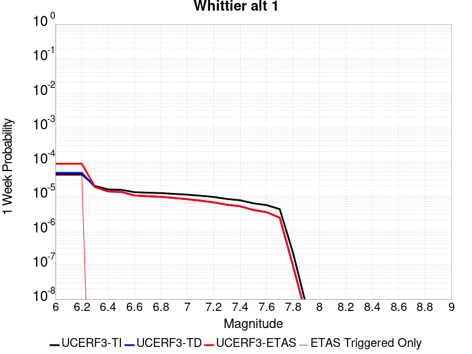 | 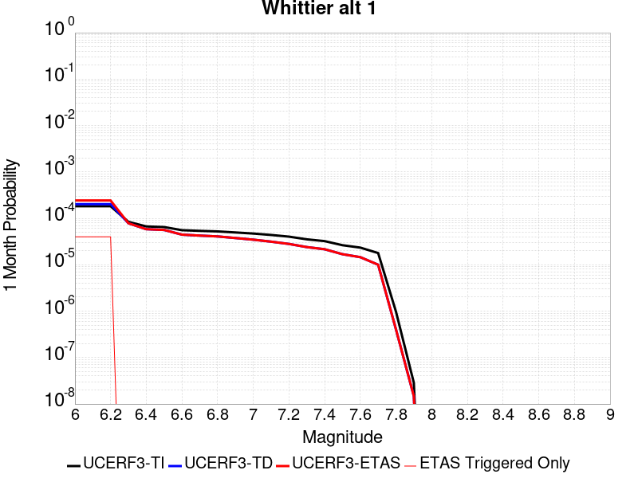 | 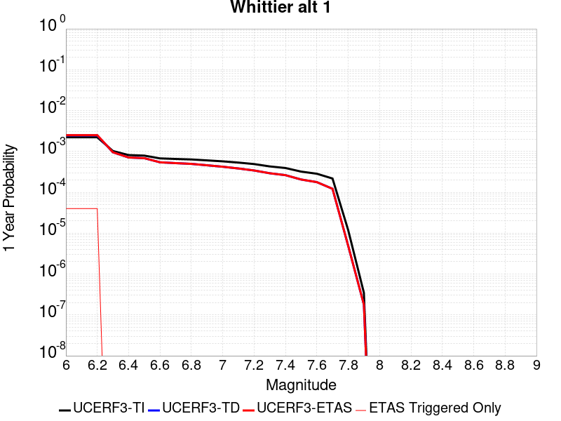 |

| Magnitude | 1 wk TI Prob | 1 wk TD Prob | 1 wk ETAS Prob | 1 wk ETAS/TD Gain | 1 wk ETAS Triggered Only | 1 mo TI Prob | 1 mo TD Prob | 1 mo ETAS Prob | 1 mo ETAS/TD Gain | 1 mo ETAS Triggered Only | 1 yr TI Prob | 1 yr TD Prob | 1 yr ETAS Prob | 1 yr ETAS/TD Gain | 1 yr ETAS Triggered Only |
|-----|-----|-----|-----|-----|-----|-----|-----|-----|-----|-----|-----|-----|-----|-----|-----|
| 6.0 | 4.2554693E-5 | 4.7282294E-5 | 8.72804E-5 | 1.8459426 | 4.0E-5 | 1.8236451E-4 | 2.0262448E-4 | 2.4261637E-4 | 1.1973695 | 4.0E-5 | 0.002218027 | 0.0024644844 | 0.0025043858 | 1.0161905 | 4.0E-5 |
| 6.1 | 4.2554693E-5 | 4.7282294E-5 | 8.72804E-5 | 1.8459426 | 4.0E-5 | 1.8236451E-4 | 2.0262448E-4 | 2.4261637E-4 | 1.1973695 | 4.0E-5 | 0.002218027 | 0.0024644844 | 0.0025043858 | 1.0161905 | 4.0E-5 |
| 6.2 | 4.2554693E-5 | 4.7282294E-5 | 8.72804E-5 | 1.8459426 | 4.0E-5 | 1.8236451E-4 | 2.0262448E-4 | 2.4261637E-4 | 1.1973695 | 4.0E-5 | 0.002218027 | 0.0024644844 | 0.0025043858 | 1.0161905 | 4.0E-5 |
| 6.3 | 1.9617712E-5 | 1.8284845E-5 | 1.8284845E-5 | 1.0 | 0.0 | 8.40732E-5 | 7.836137E-5 | 7.836137E-5 | 1.0 | 0.0 | 0.0010231105 | 9.5365115E-4 | 9.5365115E-4 | 1.0 | 0.0 |
| 6.4 | 1.5611336E-5 | 1.3617991E-5 | 1.3617991E-5 | 1.0 | 0.0 | 6.690401E-5 | 5.8361547E-5 | 5.8361547E-5 | 1.0 | 0.0 | 8.142519E-4 | 7.103262E-4 | 7.103262E-4 | 1.0 | 0.0 |
| 6.5 | 1.5150166E-5 | 1.3114483E-5 | 1.3114483E-5 | 1.0 | 0.0 | 6.492767E-5 | 5.620375E-5 | 5.620375E-5 | 1.0 | 0.0 | 7.9020765E-4 | 6.840717E-4 | 6.840717E-4 | 1.0 | 0.0 |
| 6.6 | 1.295588E-5 | 1.0391854E-5 | 1.0391854E-5 | 1.0 | 0.0 | 5.552402E-5 | 4.4535765E-5 | 4.4535765E-5 | 1.0 | 0.0 | 6.7579525E-4 | 5.4209004E-4 | 5.4209004E-4 | 1.0 | 0.0 |
| 6.7 | 1.2542085E-5 | 9.910169E-6 | 9.910169E-6 | 1.0 | 0.0 | 5.3750682E-5 | 4.2471474E-5 | 4.2471474E-5 | 1.0 | 0.0 | 6.542181E-4 | 5.1696936E-4 | 5.1696936E-4 | 1.0 | 0.0 |
| 6.8 | 1.2195878E-5 | 9.505836E-6 | 9.505836E-6 | 1.0 | 0.0 | 5.2267E-5 | 4.0738672E-5 | 4.0738672E-5 | 1.0 | 0.0 | 6.36165E-4 | 4.958823E-4 | 4.958823E-4 | 1.0 | 0.0 |
| 6.9 | 1.1580298E-5 | 8.782643E-6 | 8.782643E-6 | 1.0 | 0.0 | 4.9628903E-5 | 3.7639365E-5 | 3.7639365E-5 | 1.0 | 0.0 | 6.040644E-4 | 4.5816458E-4 | 4.5816458E-4 | 1.0 | 0.0 |
| 7.0 | 1.0964795E-5 | 8.092889E-6 | 8.092889E-6 | 1.0 | 0.0 | 4.6991136E-5 | 3.468336E-5 | 3.468336E-5 | 1.0 | 0.0 | 5.7196687E-4 | 4.221896E-4 | 4.221896E-4 | 1.0 | 0.0 |
| 7.1 | 1.0230601E-5 | 7.3345395E-6 | 7.3345395E-6 | 1.0 | 0.0 | 4.3844695E-5 | 3.143337E-5 | 3.143337E-5 | 1.0 | 0.0 | 5.336784E-4 | 3.826354E-4 | 3.826354E-4 | 1.0 | 0.0 |
| 7.2 | 9.40865E-6 | 6.5504482E-6 | 6.5504482E-6 | 1.0 | 0.0 | 4.032216E-5 | 2.8073055E-5 | 2.8073055E-5 | 1.0 | 0.0 | 4.908117E-4 | 3.4173706E-4 | 3.4173706E-4 | 1.0 | 0.0 |
| 7.3 | 8.237384E-6 | 5.6038593E-6 | 5.6038593E-6 | 1.0 | 0.0 | 3.5302593E-5 | 2.4016326E-5 | 2.4016326E-5 | 1.0 | 0.0 | 4.2972428E-4 | 2.9236058E-4 | 2.9236058E-4 | 1.0 | 0.0 |
| 7.4 | 7.5316966E-6 | 5.033336E-6 | 5.033336E-6 | 1.0 | 0.0 | 3.2278298E-5 | 2.1571266E-5 | 2.1571266E-5 | 1.0 | 0.0 | 3.9291743E-4 | 2.6259953E-4 | 2.6259953E-4 | 1.0 | 0.0 |
| 7.5 | 6.149649E-6 | 3.93817E-6 | 3.93817E-6 | 1.0 | 0.0 | 2.6355372E-5 | 1.6877766E-5 | 1.6877766E-5 | 1.0 | 0.0 | 3.208294E-4 | 2.0546833E-4 | 2.0546833E-4 | 1.0 | 0.0 |
| 7.6 | 5.457711E-6 | 3.39915E-6 | 3.39915E-6 | 1.0 | 0.0 | 2.338998E-5 | 1.45677095E-5 | 1.45677095E-5 | 1.0 | 0.0 | 2.8473578E-4 | 1.7734825E-4 | 1.7734825E-4 | 1.0 | 0.0 |
| 7.7 | 4.1676276E-6 | 2.3360851E-6 | 2.3360851E-6 | 1.0 | 0.0 | 1.7861139E-5 | 1.0011759E-5 | 1.0011759E-5 | 1.0 | 0.0 | 2.1743766E-4 | 1.2188709E-4 | 1.2188709E-4 | 1.0 | 0.0 |
| 7.8 | 2.2692414E-7 | 9.397192E-8 | 9.397192E-8 | 1.0 | 0.0 | 9.725317E-7 | 4.0273673E-7 | 4.0273673E-7 | 1.0 | 0.0 | 1.1840509E-5 | 4.903312E-6 | 4.903312E-6 | 1.0 | 0.0 |
| 7.9 | 6.676829E-9 | 3.4429164E-9 | 3.4429164E-9 | 1.0 | 0.0 | 2.861498E-8 | 1.4755356E-8 | 1.4755356E-8 | 1.0 | 0.0 | 3.4838732E-7 | 1.7964643E-7 | 1.7964643E-7 | 1.0 | 0.0 |

## Robinson Creek
*[(top)](#table-of-contents)*

| 1 Week | 1 Month | 1 Year |
|-----|-----|-----|
|  |  | 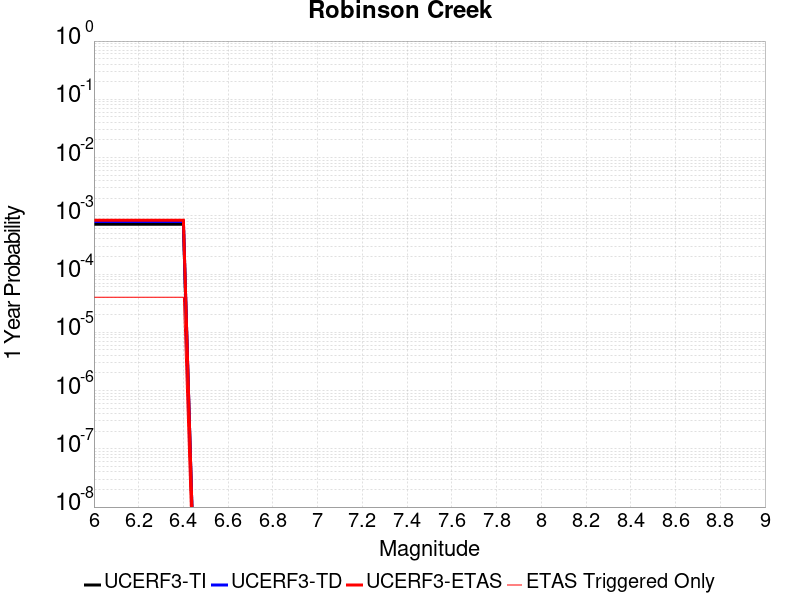 |

| Magnitude | 1 wk TI Prob | 1 wk TD Prob | 1 wk ETAS Prob | 1 wk ETAS/TD Gain | 1 wk ETAS Triggered Only | 1 mo TI Prob | 1 mo TD Prob | 1 mo ETAS Prob | 1 mo ETAS/TD Gain | 1 mo ETAS Triggered Only | 1 yr TI Prob | 1 yr TD Prob | 1 yr ETAS Prob | 1 yr ETAS/TD Gain | 1 yr ETAS Triggered Only |
|-----|-----|-----|-----|-----|-----|-----|-----|-----|-----|-----|-----|-----|-----|-----|-----|
| 6.0 | 1.3705327E-5 | 1.5290985E-5 | 1.5290985E-5 | 1.0 | 0.0 | 5.8735794E-5 | 6.55328E-5 | 6.55328E-5 | 1.0 | 0.0 | 7.1487366E-4 | 7.978618E-4 | 8.3782984E-4 | 1.050094 | 4.0E-5 |
| 6.1 | 1.3705327E-5 | 1.5290985E-5 | 1.5290985E-5 | 1.0 | 0.0 | 5.8735794E-5 | 6.55328E-5 | 6.55328E-5 | 1.0 | 0.0 | 7.1487366E-4 | 7.978618E-4 | 8.3782984E-4 | 1.050094 | 4.0E-5 |
| 6.2 | 1.3705327E-5 | 1.5290985E-5 | 1.5290985E-5 | 1.0 | 0.0 | 5.8735794E-5 | 6.55328E-5 | 6.55328E-5 | 1.0 | 0.0 | 7.1487366E-4 | 7.978618E-4 | 8.3782984E-4 | 1.050094 | 4.0E-5 |
| 6.3 | 1.3705327E-5 | 1.5290985E-5 | 1.5290985E-5 | 1.0 | 0.0 | 5.8735794E-5 | 6.55328E-5 | 6.55328E-5 | 1.0 | 0.0 | 7.1487366E-4 | 7.978618E-4 | 8.3782984E-4 | 1.050094 | 4.0E-5 |
| 6.4 | 1.3705327E-5 | 1.5290985E-5 | 1.5290985E-5 | 1.0 | 0.0 | 5.8735794E-5 | 6.55328E-5 | 6.55328E-5 | 1.0 | 0.0 | 7.1487366E-4 | 7.978618E-4 | 8.3782984E-4 | 1.050094 | 4.0E-5 |

## San Diego Trough north alt1
*[(top)](#table-of-contents)*

| 1 Week | 1 Month | 1 Year |
|-----|-----|-----|
| 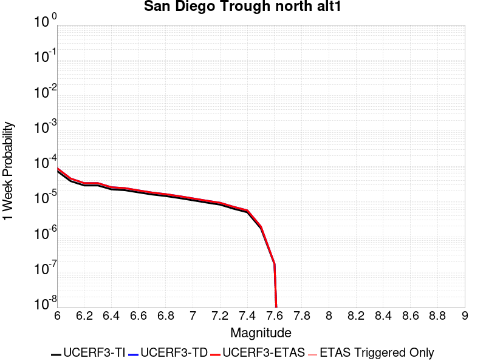 | 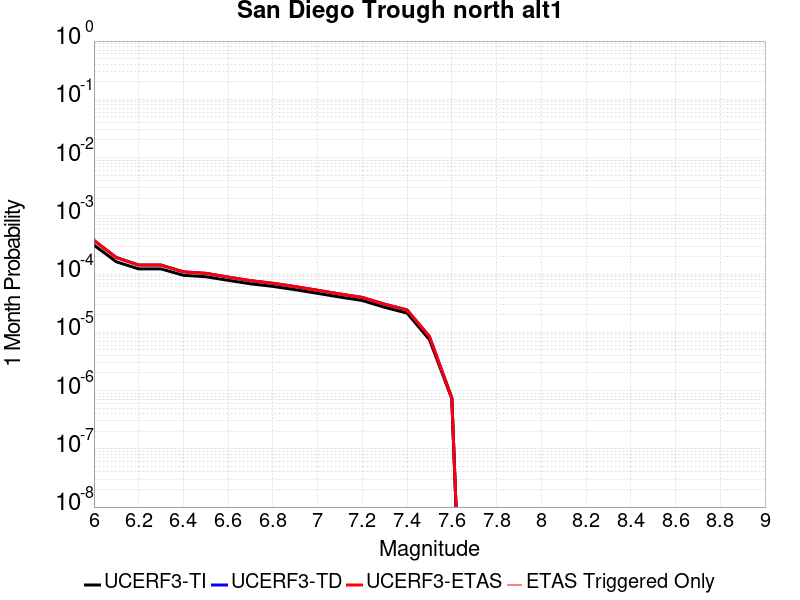 |  |

| Magnitude | 1 wk TI Prob | 1 wk TD Prob | 1 wk ETAS Prob | 1 wk ETAS/TD Gain | 1 wk ETAS Triggered Only | 1 mo TI Prob | 1 mo TD Prob | 1 mo ETAS Prob | 1 mo ETAS/TD Gain | 1 mo ETAS Triggered Only | 1 yr TI Prob | 1 yr TD Prob | 1 yr ETAS Prob | 1 yr ETAS/TD Gain | 1 yr ETAS Triggered Only |
|-----|-----|-----|-----|-----|-----|-----|-----|-----|-----|-----|-----|-----|-----|-----|-----|
| 6.0 | 7.329252E-5 | 8.827393E-5 | 8.827393E-5 | 1.0 | 0.0 | 3.14073E-4 | 3.782656E-4 | 3.782656E-4 | 1.0 | 0.0 | 0.0038171355 | 0.00459623 | 0.0046360465 | 1.0086628 | 4.0E-5 |
| 6.1 | 3.7940346E-5 | 4.4913257E-5 | 4.4913257E-5 | 1.0 | 0.0 | 1.6259136E-4 | 1.924717E-4 | 1.924717E-4 | 1.0 | 0.0 | 0.0019777524 | 0.0023408993 | 0.0023408993 | 1.0 | 0.0 |
| 6.2 | 2.8645263E-5 | 3.331533E-5 | 3.331533E-5 | 1.0 | 0.0 | 1.2275964E-4 | 1.4277229E-4 | 1.4277229E-4 | 1.0 | 0.0 | 0.0014935739 | 0.0017368881 | 0.0017368881 | 1.0 | 0.0 |
| 6.3 | 2.8645263E-5 | 3.331533E-5 | 3.331533E-5 | 1.0 | 0.0 | 1.2275964E-4 | 1.4277229E-4 | 1.4277229E-4 | 1.0 | 0.0 | 0.0014935739 | 0.0017368881 | 0.0017368881 | 1.0 | 0.0 |
| 6.4 | 2.2204576E-5 | 2.5461064E-5 | 2.5461064E-5 | 1.0 | 0.0 | 9.5159E-5 | 1.09114335E-4 | 1.09114335E-4 | 1.0 | 0.0 | 0.001157945 | 0.0013276667 | 0.0013276667 | 1.0 | 0.0 |
| 6.5 | 2.1004838E-5 | 2.403653E-5 | 2.403653E-5 | 1.0 | 0.0 | 9.0017624E-5 | 1.0300968E-4 | 1.0300968E-4 | 1.0 | 0.0 | 0.0010954136 | 0.0012534301 | 0.0012534301 | 1.0 | 0.0 |
| 6.6 | 1.820557E-5 | 2.0714517E-5 | 2.0714517E-5 | 1.0 | 0.0 | 7.802154E-5 | 8.877351E-5 | 8.877351E-5 | 1.0 | 0.0 | 9.4949827E-4 | 0.0010802869 | 0.0010802869 | 1.0 | 0.0 |
| 6.7 | 1.5884485E-5 | 1.7991773E-5 | 1.7991773E-5 | 1.0 | 0.0 | 6.807459E-5 | 7.710534E-5 | 7.710534E-5 | 1.0 | 0.0 | 8.284929E-4 | 9.383559E-4 | 9.383559E-4 | 1.0 | 0.0 |
| 6.8 | 1.4331171E-5 | 1.6208287E-5 | 1.6208287E-5 | 1.0 | 0.0 | 6.141786E-5 | 6.946225E-5 | 6.946225E-5 | 1.0 | 0.0 | 7.4750587E-4 | 8.4537675E-4 | 8.4537675E-4 | 1.0 | 0.0 |
| 6.9 | 1.2574203E-5 | 1.4212128E-5 | 1.4212128E-5 | 1.0 | 0.0 | 5.3888325E-5 | 6.0907703E-5 | 6.0907703E-5 | 1.0 | 0.0 | 6.558929E-4 | 7.413004E-4 | 7.413004E-4 | 1.0 | 0.0 |
| 7.0 | 1.0883844E-5 | 1.22946785E-5 | 1.22946785E-5 | 1.0 | 0.0 | 4.664421E-5 | 5.2690422E-5 | 5.2690422E-5 | 1.0 | 0.0 | 5.677453E-4 | 6.4131804E-4 | 6.4131804E-4 | 1.0 | 0.0 |
| 7.1 | 9.393088E-6 | 1.0611702E-5 | 1.0611702E-5 | 1.0 | 0.0 | 4.025547E-5 | 4.5477937E-5 | 4.5477937E-5 | 1.0 | 0.0 | 4.900001E-4 | 5.53554E-4 | 5.53554E-4 | 1.0 | 0.0 |
| 7.2 | 8.190791E-6 | 9.26275E-6 | 9.26275E-6 | 1.0 | 0.0 | 3.510292E-5 | 3.96969E-5 | 3.96969E-5 | 1.0 | 0.0 | 4.2729423E-4 | 4.8320327E-4 | 4.8320327E-4 | 1.0 | 0.0 |
| 7.3 | 6.268162E-6 | 7.0928886E-6 | 7.0928886E-6 | 1.0 | 0.0 | 2.6863276E-5 | 3.0397741E-5 | 3.0397741E-5 | 1.0 | 0.0 | 3.2701128E-4 | 3.7003006E-4 | 3.7003006E-4 | 1.0 | 0.0 |
| 7.4 | 4.985186E-6 | 5.645222E-6 | 5.645222E-6 | 1.0 | 0.0 | 2.1364907E-5 | 2.4193585E-5 | 2.4193585E-5 | 1.0 | 0.0 | 2.600867E-4 | 2.9451746E-4 | 2.9451746E-4 | 1.0 | 0.0 |
| 7.5 | 1.7489613E-6 | 1.9705317E-6 | 1.9705317E-6 | 1.0 | 0.0 | 7.495527E-6 | 8.44511E-6 | 8.44511E-6 | 1.0 | 0.0 | 9.125422E-5 | 1.02814585E-4 | 1.02814585E-4 | 1.0 | 0.0 |
| 7.6 | 1.6988751E-7 | 1.753573E-7 | 1.753573E-7 | 1.0 | 0.0 | 7.2808916E-7 | 7.515311E-7 | 7.515311E-7 | 1.0 | 0.0 | 8.864449E-6 | 9.149855E-6 | 9.149855E-6 | 1.0 | 0.0 |

## Superstition Hills
*[(top)](#table-of-contents)*

| 1 Week | 1 Month | 1 Year |
|-----|-----|-----|
| 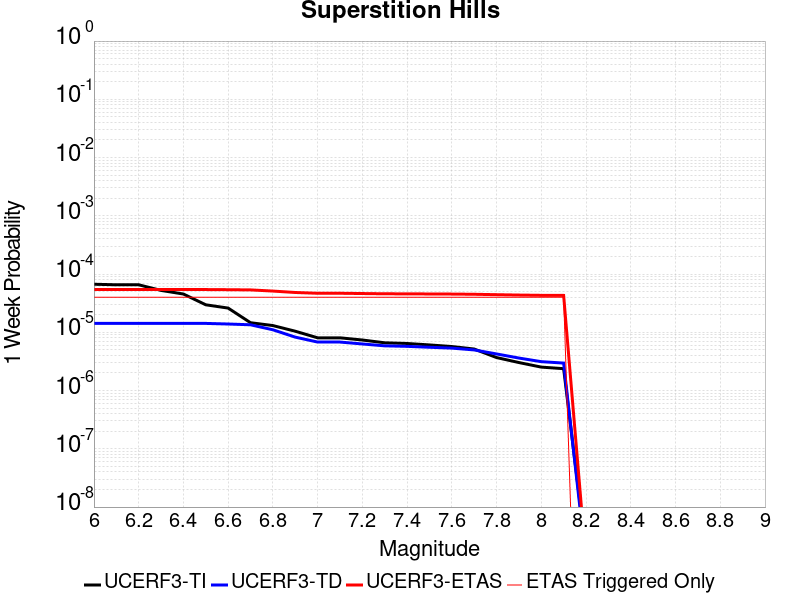 | 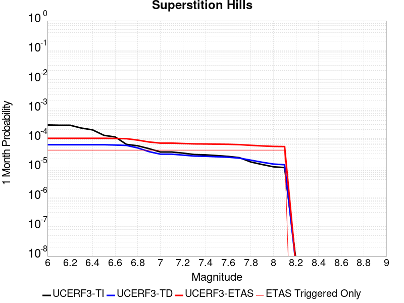 | 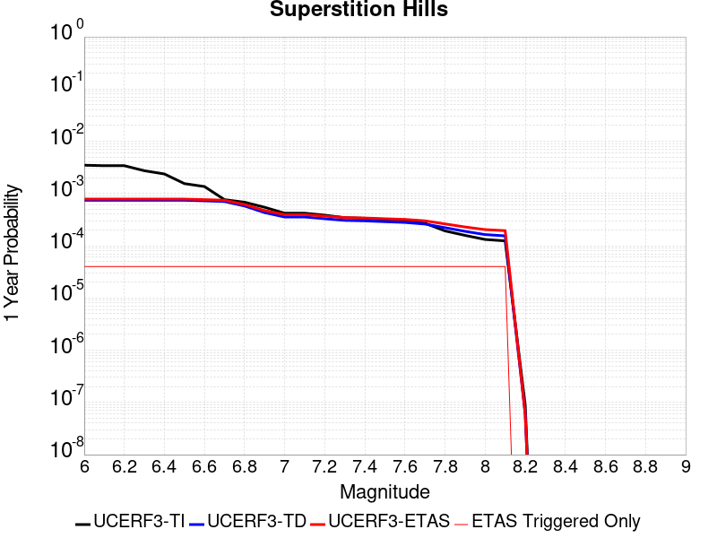 |

| Magnitude | 1 wk TI Prob | 1 wk TD Prob | 1 wk ETAS Prob | 1 wk ETAS/TD Gain | 1 wk ETAS Triggered Only | 1 mo TI Prob | 1 mo TD Prob | 1 mo ETAS Prob | 1 mo ETAS/TD Gain | 1 mo ETAS Triggered Only | 1 yr TI Prob | 1 yr TD Prob | 1 yr ETAS Prob | 1 yr ETAS/TD Gain | 1 yr ETAS Triggered Only |
|-----|-----|-----|-----|-----|-----|-----|-----|-----|-----|-----|-----|-----|-----|-----|-----|
| 6.0 | 6.6865185E-5 | 1.4218968E-5 | 5.42184E-5 | 3.8131037 | 4.0E-5 | 2.8653358E-4 | 6.09371E-5 | 1.0093467E-4 | 1.6563746 | 4.0E-5 | 0.0034829667 | 7.4167293E-4 | 7.816433E-4 | 1.0538921 | 4.0E-5 |
| 6.1 | 6.544851E-5 | 1.4218967E-5 | 5.42184E-5 | 3.8131037 | 4.0E-5 | 2.8046346E-4 | 6.09371E-5 | 1.0093467E-4 | 1.6563746 | 4.0E-5 | 0.0034092965 | 7.4167293E-4 | 7.8164326E-4 | 1.0538921 | 4.0E-5 |
| 6.2 | 6.544851E-5 | 1.4218967E-5 | 5.42184E-5 | 3.8131037 | 4.0E-5 | 2.8046346E-4 | 6.09371E-5 | 1.0093467E-4 | 1.6563746 | 4.0E-5 | 0.0034092965 | 7.4167293E-4 | 7.8164326E-4 | 1.0538921 | 4.0E-5 |
| 6.3 | 5.2402065E-5 | 1.42189665E-5 | 5.42184E-5 | 3.813104 | 4.0E-5 | 2.2456095E-4 | 6.0937098E-5 | 1.0093466E-4 | 1.6563746 | 4.0E-5 | 0.0027306017 | 7.416729E-4 | 7.816432E-4 | 1.0538921 | 4.0E-5 |
| 6.4 | 4.542238E-5 | 1.4218966E-5 | 5.42184E-5 | 3.8131042 | 4.0E-5 | 1.9465282E-4 | 6.0937095E-5 | 1.0093466E-4 | 1.6563746 | 4.0E-5 | 0.0023673223 | 7.416729E-4 | 7.816432E-4 | 1.0538921 | 4.0E-5 |
| 6.5 | 2.9672969E-5 | 1.4218965E-5 | 5.4218395E-5 | 3.8131044 | 4.0E-5 | 1.2716366E-4 | 6.0937087E-5 | 1.0093465E-4 | 1.6563747 | 4.0E-5 | 0.0015471181 | 7.4167276E-4 | 7.816431E-4 | 1.0538921 | 4.0E-5 |
| 6.6 | 2.6056105E-5 | 1.3884164E-5 | 5.388361E-5 | 3.88094 | 4.0E-5 | 1.1166424E-4 | 5.9502294E-5 | 9.949991E-5 | 1.672203 | 4.0E-5 | 0.0013586642 | 7.242158E-4 | 7.6418684E-4 | 1.0551921 | 4.0E-5 |
| 6.7 | 1.4611248E-5 | 1.3463621E-5 | 5.346308E-5 | 3.970929 | 4.0E-5 | 6.261813E-5 | 5.770005E-5 | 9.769774E-5 | 1.6932003 | 4.0E-5 | 7.6210906E-4 | 7.022877E-4 | 7.422596E-4 | 1.0569167 | 4.0E-5 |
| 6.8 | 1.30607E-5 | 1.1055474E-5 | 5.105503E-5 | 4.6180773 | 4.0E-5 | 5.597323E-5 | 4.7379788E-5 | 8.737789E-5 | 1.8442018 | 4.0E-5 | 6.8126095E-4 | 5.7670503E-4 | 6.16682E-4 | 1.0693195 | 4.0E-5 |
| 6.9 | 1.0443096E-5 | 8.264937E-6 | 4.8264606E-5 | 5.8396826 | 4.0E-5 | 4.4755358E-5 | 3.542069E-5 | 7.541927E-5 | 2.1292436 | 4.0E-5 | 5.447602E-4 | 4.311639E-4 | 4.7114666E-4 | 1.0927322 | 4.0E-5 |
| 7.0 | 8.045912E-6 | 6.8031186E-6 | 4.6802845E-5 | 6.8796163 | 4.0E-5 | 3.4482026E-5 | 2.9155903E-5 | 6.915474E-5 | 2.3718948 | 4.0E-5 | 4.197378E-4 | 3.5491635E-4 | 3.9490213E-4 | 1.1126627 | 4.0E-5 |
| 7.1 | 8.045912E-6 | 6.8031186E-6 | 4.6802845E-5 | 6.8796163 | 4.0E-5 | 3.4482026E-5 | 2.9155903E-5 | 6.915474E-5 | 2.3718948 | 4.0E-5 | 4.197378E-4 | 3.5491635E-4 | 3.9490213E-4 | 1.1126627 | 4.0E-5 |
| 7.2 | 7.375506E-6 | 6.3088987E-6 | 4.6308647E-5 | 7.340211 | 4.0E-5 | 3.1608928E-5 | 2.703786E-5 | 6.703678E-5 | 2.479367 | 4.0E-5 | 3.8477074E-4 | 3.291371E-4 | 3.6912394E-4 | 1.1214899 | 4.0E-5 |
| 7.3 | 6.6063913E-6 | 5.8603323E-6 | 4.58601E-5 | 7.8255115 | 4.0E-5 | 2.8312797E-5 | 2.5115472E-5 | 6.5114466E-5 | 2.5926037 | 4.0E-5 | 3.446538E-4 | 3.0573868E-4 | 3.4572647E-4 | 1.1307907 | 4.0E-5 |
| 7.4 | 6.4313126E-6 | 5.741554E-6 | 4.5741326E-5 | 7.966715 | 4.0E-5 | 2.7562477E-5 | 2.4606434E-5 | 6.460545E-5 | 2.6255512 | 4.0E-5 | 3.355215E-4 | 2.9954285E-4 | 3.3953087E-4 | 1.1334969 | 4.0E-5 |
| 7.5 | 6.0742927E-6 | 5.536644E-6 | 4.553642E-5 | 8.224553 | 4.0E-5 | 2.6032423E-5 | 2.3728262E-5 | 6.372731E-5 | 2.6857135 | 4.0E-5 | 3.1689866E-4 | 2.8885397E-4 | 3.2884243E-4 | 1.1384382 | 4.0E-5 |
| 7.6 | 5.6987187E-6 | 5.354077E-6 | 4.5353863E-5 | 8.470902 | 4.0E-5 | 2.4422852E-5 | 2.2945846E-5 | 6.294493E-5 | 2.7431948 | 4.0E-5 | 2.9730765E-4 | 2.7933053E-4 | 3.1931937E-4 | 1.1431595 | 4.0E-5 |
| 7.7 | 5.1658035E-6 | 4.9836003E-6 | 4.49834E-5 | 9.026285 | 4.0E-5 | 2.2138971E-5 | 2.1358117E-5 | 6.135726E-5 | 2.8727844 | 4.0E-5 | 2.6950863E-4 | 2.6000466E-4 | 2.9999425E-4 | 1.1538033 | 4.0E-5 |
| 7.8 | 3.6864697E-6 | 4.2522647E-6 | 4.4252094E-5 | 10.406713 | 4.0E-5 | 1.579906E-5 | 1.8223867E-5 | 5.8223137E-5 | 3.1948838 | 4.0E-5 | 1.9233658E-4 | 2.2185346E-4 | 2.618446E-4 | 1.1802592 | 4.0E-5 |
| 7.9 | 3.0265903E-6 | 3.6154697E-6 | 4.3615324E-5 | 12.06353 | 4.0E-5 | 1.2971037E-5 | 1.5494781E-5 | 5.549416E-5 | 3.5814745 | 4.0E-5 | 1.5791094E-4 | 1.8863307E-4 | 2.2862553E-4 | 1.2120119 | 4.0E-5 |
| 8.0 | 2.5271493E-6 | 3.1343482E-6 | 4.3134223E-5 | 13.761785 | 4.0E-5 | 1.0830595E-5 | 1.3432854E-5 | 5.3432315E-5 | 3.9777339 | 4.0E-5 | 1.3185451E-4 | 1.6353316E-4 | 2.0352661E-4 | 1.2445587 | 4.0E-5 |
| 8.1 | 2.3749135E-6 | 2.9629962E-6 | 4.2962878E-5 | 14.499808 | 4.0E-5 | 1.0178161E-5 | 1.2698496E-5 | 5.269799E-5 | 4.1499395 | 4.0E-5 | 1.2391206E-4 | 1.5459364E-4 | 1.9458747E-4 | 1.2587029 | 4.0E-5 |
| 8.2 | 1.7186406E-9 | 1.1663186E-9 | 1.1663186E-9 | 1.0 | 0.0 | 7.3656024E-9 | 4.9985083E-9 | 4.9985083E-9 | 1.0 | 0.0 | 8.9676206E-8 | 6.085684E-8 | 6.085684E-8 | 1.0 | 0.0 |

## Garlic Springs
*[(top)](#table-of-contents)*

| 1 Week | 1 Month | 1 Year |
|-----|-----|-----|
| 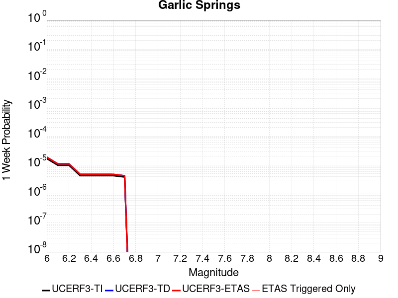 | 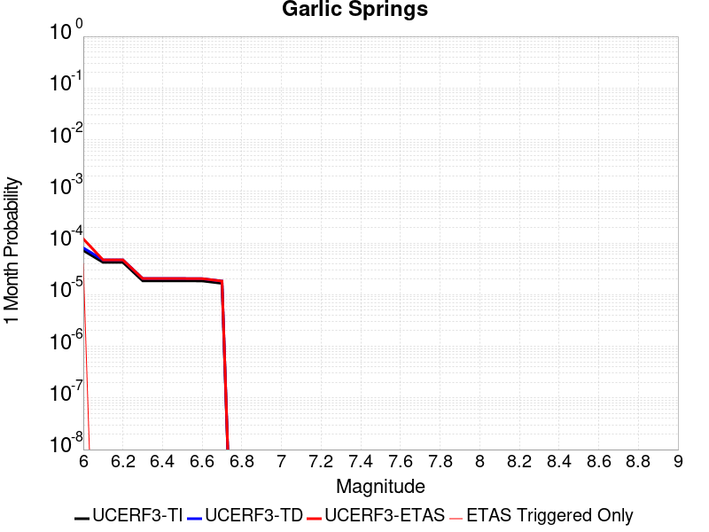 | 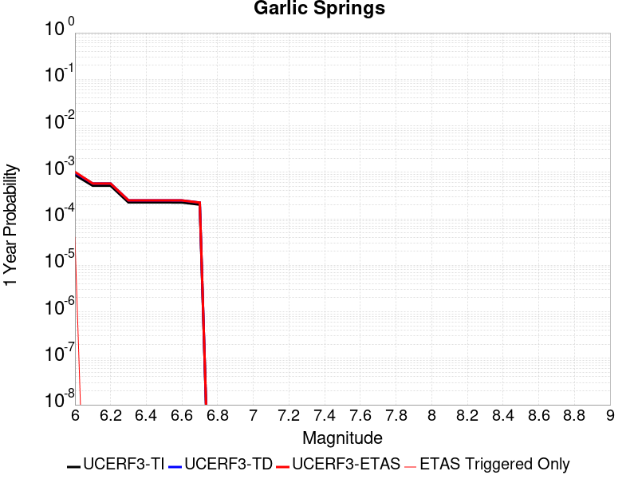 |

| Magnitude | 1 wk TI Prob | 1 wk TD Prob | 1 wk ETAS Prob | 1 wk ETAS/TD Gain | 1 wk ETAS Triggered Only | 1 mo TI Prob | 1 mo TD Prob | 1 mo ETAS Prob | 1 mo ETAS/TD Gain | 1 mo ETAS Triggered Only | 1 yr TI Prob | 1 yr TD Prob | 1 yr ETAS Prob | 1 yr ETAS/TD Gain | 1 yr ETAS Triggered Only |
|-----|-----|-----|-----|-----|-----|-----|-----|-----|-----|-----|-----|-----|-----|-----|-----|
| 6.0 | 1.6760017E-5 | 1.8784498E-5 | 1.8784498E-5 | 1.0 | 0.0 | 7.182667E-5 | 8.0503174E-5 | 1.2049995E-4 | 1.4968349 | 4.0E-5 | 8.7413884E-4 | 9.798029E-4 | 0.0010197636 | 1.0407846 | 4.0E-5 |
| 6.1 | 9.852767E-6 | 1.097782E-5 | 1.097782E-5 | 1.0 | 0.0 | 4.222546E-5 | 4.7047353E-5 | 4.7047353E-5 | 1.0 | 0.0 | 5.139737E-4 | 5.72722E-4 | 5.72722E-4 | 1.0 | 0.0 |
| 6.2 | 9.852767E-6 | 1.097782E-5 | 1.097782E-5 | 1.0 | 0.0 | 4.222546E-5 | 4.7047353E-5 | 4.7047353E-5 | 1.0 | 0.0 | 5.139737E-4 | 5.72722E-4 | 5.72722E-4 | 1.0 | 0.0 |
| 6.3 | 4.3167724E-6 | 4.7797594E-6 | 4.7797594E-6 | 1.0 | 0.0 | 1.8500323E-5 | 2.0484651E-5 | 2.0484651E-5 | 1.0 | 0.0 | 2.2521814E-4 | 2.4939515E-4 | 2.4939515E-4 | 1.0 | 0.0 |
| 6.4 | 4.3167724E-6 | 4.7797594E-6 | 4.7797594E-6 | 1.0 | 0.0 | 1.8500323E-5 | 2.0484651E-5 | 2.0484651E-5 | 1.0 | 0.0 | 2.2521814E-4 | 2.4939515E-4 | 2.4939515E-4 | 1.0 | 0.0 |
| 6.5 | 4.3167724E-6 | 4.7797594E-6 | 4.7797594E-6 | 1.0 | 0.0 | 1.8500323E-5 | 2.0484651E-5 | 2.0484651E-5 | 1.0 | 0.0 | 2.2521814E-4 | 2.4939515E-4 | 2.4939515E-4 | 1.0 | 0.0 |
| 6.6 | 4.301311E-6 | 4.7626213E-6 | 4.7626213E-6 | 1.0 | 0.0 | 1.8434059E-5 | 2.0411206E-5 | 2.0411206E-5 | 1.0 | 0.0 | 2.2441156E-4 | 2.4850114E-4 | 2.4850114E-4 | 1.0 | 0.0 |
| 6.7 | 3.8599724E-6 | 4.272602E-6 | 4.272602E-6 | 1.0 | 0.0 | 1.6542634E-5 | 1.831115E-5 | 1.831115E-5 | 1.0 | 0.0 | 2.0138794E-4 | 2.2293825E-4 | 2.2293825E-4 | 1.0 | 0.0 |

## Earthquake Valley (No  Extension)
*[(top)](#table-of-contents)*

| 1 Week | 1 Month | 1 Year |
|-----|-----|-----|
| 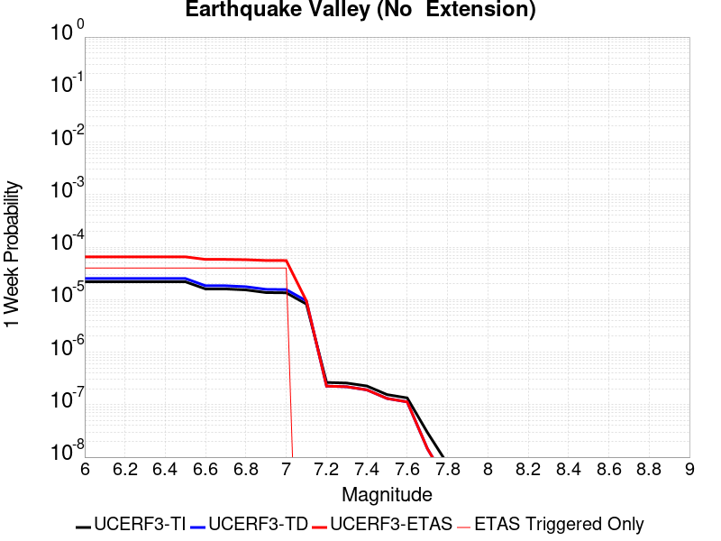 | 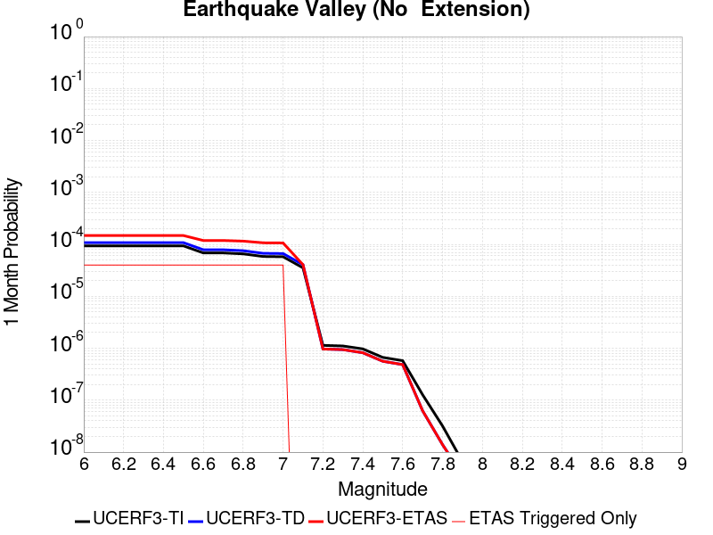 | 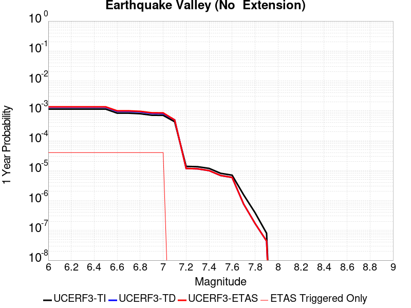 |

| Magnitude | 1 wk TI Prob | 1 wk TD Prob | 1 wk ETAS Prob | 1 wk ETAS/TD Gain | 1 wk ETAS Triggered Only | 1 mo TI Prob | 1 mo TD Prob | 1 mo ETAS Prob | 1 mo ETAS/TD Gain | 1 mo ETAS Triggered Only | 1 yr TI Prob | 1 yr TD Prob | 1 yr ETAS Prob | 1 yr ETAS/TD Gain | 1 yr ETAS Triggered Only |
|-----|-----|-----|-----|-----|-----|-----|-----|-----|-----|-----|-----|-----|-----|-----|-----|
| 6.0 | 2.1859703E-5 | 2.5211762E-5 | 6.5210756E-5 | 2.5865211 | 4.0E-5 | 9.3681076E-5 | 1.08046755E-4 | 1.4804244E-4 | 1.3701701 | 4.0E-5 | 0.0011399703 | 0.0013148207 | 0.001354768 | 1.0303824 | 4.0E-5 |
| 6.1 | 2.1859703E-5 | 2.5211762E-5 | 6.5210756E-5 | 2.5865211 | 4.0E-5 | 9.3681076E-5 | 1.08046755E-4 | 1.4804244E-4 | 1.3701701 | 4.0E-5 | 0.0011399703 | 0.0013148207 | 0.001354768 | 1.0303824 | 4.0E-5 |
| 6.2 | 2.1859703E-5 | 2.5211762E-5 | 6.5210756E-5 | 2.5865211 | 4.0E-5 | 9.3681076E-5 | 1.08046755E-4 | 1.4804244E-4 | 1.3701701 | 4.0E-5 | 0.0011399703 | 0.0013148207 | 0.001354768 | 1.0303824 | 4.0E-5 |
| 6.3 | 2.1859703E-5 | 2.5211762E-5 | 6.5210756E-5 | 2.5865211 | 4.0E-5 | 9.3681076E-5 | 1.08046755E-4 | 1.4804244E-4 | 1.3701701 | 4.0E-5 | 0.0011399703 | 0.0013148207 | 0.001354768 | 1.0303824 | 4.0E-5 |
| 6.4 | 2.1859703E-5 | 2.5211762E-5 | 6.5210756E-5 | 2.5865211 | 4.0E-5 | 9.3681076E-5 | 1.08046755E-4 | 1.4804244E-4 | 1.3701701 | 4.0E-5 | 0.0011399703 | 0.0013148207 | 0.001354768 | 1.0303824 | 4.0E-5 |
| 6.5 | 2.1859703E-5 | 2.5211762E-5 | 6.5210756E-5 | 2.5865211 | 4.0E-5 | 9.3681076E-5 | 1.08046755E-4 | 1.4804244E-4 | 1.3701701 | 4.0E-5 | 0.0011399703 | 0.0013148207 | 0.001354768 | 1.0303824 | 4.0E-5 |
| 6.6 | 1.597E-5 | 1.836593E-5 | 5.8365196E-5 | 3.1779058 | 4.0E-5 | 6.8441055E-5 | 7.870925E-5 | 1.187061E-4 | 1.5081595 | 4.0E-5 | 8.329513E-4 | 9.579512E-4 | 9.979128E-4 | 1.0417157 | 4.0E-5 |
| 6.7 | 1.597E-5 | 1.836593E-5 | 5.8365196E-5 | 3.1779058 | 4.0E-5 | 6.8441055E-5 | 7.870925E-5 | 1.187061E-4 | 1.5081595 | 4.0E-5 | 8.329513E-4 | 9.579512E-4 | 9.979128E-4 | 1.0417157 | 4.0E-5 |
| 6.8 | 1.5315149E-5 | 1.7611359E-5 | 5.7610654E-5 | 3.2712214 | 4.0E-5 | 6.5634704E-5 | 7.547555E-5 | 1.1547254E-4 | 1.5299329 | 4.0E-5 | 7.988095E-4 | 9.1861427E-4 | 9.5857756E-4 | 1.0435039 | 4.0E-5 |
| 6.9 | 1.3634728E-5 | 1.568413E-5 | 5.5683504E-5 | 3.5503085 | 4.0E-5 | 5.8433237E-5 | 6.721644E-5 | 1.07213746E-4 | 1.5950525 | 4.0E-5 | 7.1119244E-4 | 8.1813504E-4 | 8.581023E-4 | 1.0488517 | 4.0E-5 |
| 7.0 | 1.3496271E-5 | 1.5526088E-5 | 5.5525466E-5 | 3.5762691 | 4.0E-5 | 5.783988E-5 | 6.653914E-5 | 1.0653648E-4 | 1.60111 | 4.0E-5 | 7.03973E-4 | 8.098951E-4 | 8.498627E-4 | 1.0493491 | 4.0E-5 |
| 7.1 | 8.242798E-6 | 9.477744E-6 | 9.477744E-6 | 1.0 | 0.0 | 3.53258E-5 | 4.061865E-5 | 4.061865E-5 | 1.0 | 0.0 | 4.300067E-4 | 4.9448694E-4 | 4.9448694E-4 | 1.0 | 0.0 |
| 7.2 | 2.6506527E-7 | 2.2575814E-7 | 2.2575814E-7 | 1.0 | 0.0 | 1.1359936E-6 | 9.675346E-7 | 9.675346E-7 | 1.0 | 0.0 | 1.3830633E-5 | 1.17796735E-5 | 1.17796735E-5 | 1.0 | 0.0 |
| 7.3 | 2.5810488E-7 | 2.1970749E-7 | 2.1970749E-7 | 1.0 | 0.0 | 1.1061633E-6 | 9.4160316E-7 | 9.4160316E-7 | 1.0 | 0.0 | 1.3467455E-5 | 1.1463962E-5 | 1.1463962E-5 | 1.0 | 0.0 |
| 7.4 | 2.2676066E-7 | 1.9125201E-7 | 1.9125201E-7 | 1.0 | 0.0 | 9.71831E-7 | 8.1965123E-7 | 8.1965123E-7 | 1.0 | 0.0 | 1.1831979E-5 | 9.979212E-6 | 9.979212E-6 | 1.0 | 0.0 |
| 7.5 | 1.5553917E-7 | 1.3123781E-7 | 1.3123781E-7 | 1.0 | 0.0 | 6.6659624E-7 | 5.6244767E-7 | 5.6244767E-7 | 1.0 | 0.0 | 8.115779E-6 | 6.847781E-6 | 6.847781E-6 | 1.0 | 0.0 |
| 7.6 | 1.3448629E-7 | 1.1298664E-7 | 1.1298664E-7 | 1.0 | 0.0 | 5.7636964E-7 | 4.8422834E-7 | 4.8422834E-7 | 1.0 | 0.0 | 7.017278E-6 | 5.8954665E-6 | 5.8954665E-6 | 1.0 | 0.0 |
| 7.7 | 2.9719402E-8 | 1.4599668E-8 | 1.4599668E-8 | 1.0 | 0.0 | 1.2736886E-7 | 6.257E-8 | 6.257E-8 | 1.0 | 0.0 | 1.5507147E-6 | 7.617896E-7 | 7.617896E-7 | 1.0 | 0.0 |
| 7.8 | 7.4390196E-9 | 3.254093E-9 | 3.254093E-9 | 1.0 | 0.0 | 3.1881513E-8 | 1.3946113E-8 | 1.3946113E-8 | 1.0 | 0.0 | 3.8815733E-7 | 1.697939E-7 | 1.697939E-7 | 1.0 | 0.0 |
| 7.9 | 1.5373532E-9 | 8.447242E-10 | 8.447242E-10 | 1.0 | 0.0 | 6.5886567E-9 | 3.6202463E-9 | 3.6202463E-9 | 1.0 | 0.0 | 8.021689E-8 | 4.40765E-8 | 4.40765E-8 | 1.0 | 0.0 |

## Holser alt 1
*[(top)](#table-of-contents)*

| 1 Week | 1 Month | 1 Year |
|-----|-----|-----|
| 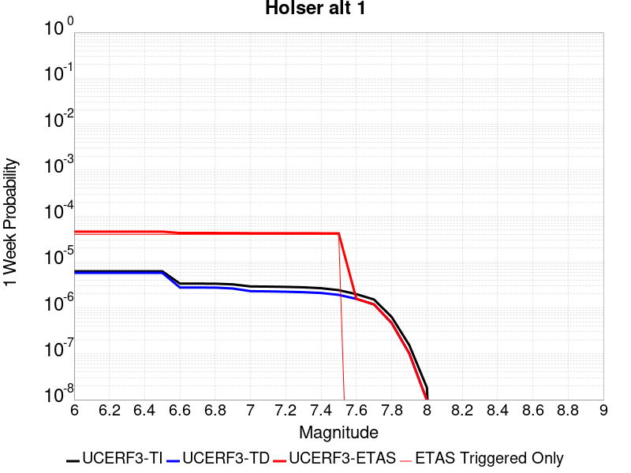 | 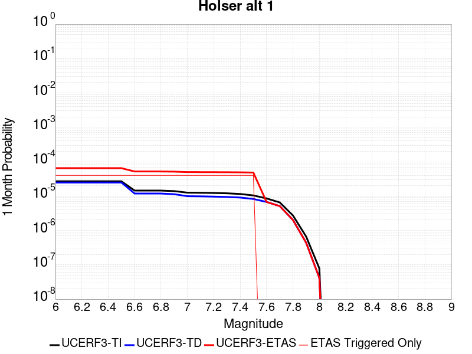 | 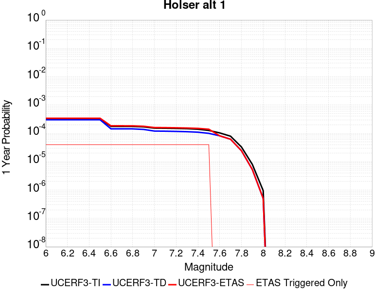 |

| Magnitude | 1 wk TI Prob | 1 wk TD Prob | 1 wk ETAS Prob | 1 wk ETAS/TD Gain | 1 wk ETAS Triggered Only | 1 mo TI Prob | 1 mo TD Prob | 1 mo ETAS Prob | 1 mo ETAS/TD Gain | 1 mo ETAS Triggered Only | 1 yr TI Prob | 1 yr TD Prob | 1 yr ETAS Prob | 1 yr ETAS/TD Gain | 1 yr ETAS Triggered Only |
|-----|-----|-----|-----|-----|-----|-----|-----|-----|-----|-----|-----|-----|-----|-----|-----|
| 6.0 | 6.2746653E-6 | 5.7915495E-6 | 4.579132E-5 | 7.9065747 | 4.0E-5 | 2.6891146E-5 | 2.4820754E-5 | 6.481976E-5 | 2.6115146 | 4.0E-5 | 3.273505E-4 | 3.0216234E-4 | 3.4215025E-4 | 1.1323391 | 4.0E-5 |
| 6.1 | 6.2746653E-6 | 5.7915495E-6 | 4.579132E-5 | 7.9065747 | 4.0E-5 | 2.6891146E-5 | 2.4820754E-5 | 6.481976E-5 | 2.6115146 | 4.0E-5 | 3.273505E-4 | 3.0216234E-4 | 3.4215025E-4 | 1.1323391 | 4.0E-5 |
| 6.2 | 6.2746653E-6 | 5.7915495E-6 | 4.579132E-5 | 7.9065747 | 4.0E-5 | 2.6891146E-5 | 2.4820754E-5 | 6.481976E-5 | 2.6115146 | 4.0E-5 | 3.273505E-4 | 3.0216234E-4 | 3.4215025E-4 | 1.1323391 | 4.0E-5 |
| 6.3 | 6.2746653E-6 | 5.7915495E-6 | 4.579132E-5 | 7.9065747 | 4.0E-5 | 2.6891146E-5 | 2.4820754E-5 | 6.481976E-5 | 2.6115146 | 4.0E-5 | 3.273505E-4 | 3.0216234E-4 | 3.4215025E-4 | 1.1323391 | 4.0E-5 |
| 6.4 | 6.2746653E-6 | 5.7915495E-6 | 4.579132E-5 | 7.9065747 | 4.0E-5 | 2.6891146E-5 | 2.4820754E-5 | 6.481976E-5 | 2.6115146 | 4.0E-5 | 3.273505E-4 | 3.0216234E-4 | 3.4215025E-4 | 1.1323391 | 4.0E-5 |
| 6.5 | 6.2746653E-6 | 5.7915495E-6 | 4.579132E-5 | 7.9065747 | 4.0E-5 | 2.6891146E-5 | 2.4820754E-5 | 6.481976E-5 | 2.6115146 | 4.0E-5 | 3.273505E-4 | 3.0216234E-4 | 3.4215025E-4 | 1.1323391 | 4.0E-5 |
| 6.6 | 3.375825E-6 | 2.7723509E-6 | 4.277224E-5 | 15.428147 | 4.0E-5 | 1.4467741E-5 | 1.18814505E-5 | 5.1880976E-5 | 4.3665524 | 4.0E-5 | 1.761305E-4 | 1.4464723E-4 | 1.8464144E-4 | 1.2764949 | 4.0E-5 |
| 6.7 | 3.375825E-6 | 2.7723509E-6 | 4.277224E-5 | 15.428147 | 4.0E-5 | 1.4467741E-5 | 1.18814505E-5 | 5.1880976E-5 | 4.3665524 | 4.0E-5 | 1.761305E-4 | 1.4464723E-4 | 1.8464144E-4 | 1.2764949 | 4.0E-5 |
| 6.8 | 3.366533E-6 | 2.7627493E-6 | 4.276264E-5 | 15.478291 | 4.0E-5 | 1.4427919E-5 | 1.1840301E-5 | 5.1839826E-5 | 4.3782525 | 4.0E-5 | 1.7564575E-4 | 1.4414631E-4 | 1.8414055E-4 | 1.2774558 | 4.0E-5 |
| 6.9 | 3.253174E-6 | 2.6449559E-6 | 4.264485E-5 | 16.123085 | 4.0E-5 | 1.39421E-5 | 1.1335477E-5 | 5.1335024E-5 | 4.528704 | 4.0E-5 | 1.6973184E-4 | 1.3800085E-4 | 1.7799533E-4 | 1.2898133 | 4.0E-5 |
| 7.0 | 2.9336593E-6 | 2.312899E-6 | 4.2312808E-5 | 18.294273 | 4.0E-5 | 1.2572766E-5 | 9.912386E-6 | 4.991199E-5 | 5.0353155 | 4.0E-5 | 1.5306266E-4 | 1.2067664E-4 | 1.6067181E-4 | 1.3314244 | 4.0E-5 |
| 7.1 | 2.9087812E-6 | 2.2887455E-6 | 4.2288655E-5 | 18.476784 | 4.0E-5 | 1.2466146E-5 | 9.808872E-6 | 4.980848E-5 | 5.077901 | 4.0E-5 | 1.5176475E-4 | 1.19416494E-4 | 1.5941172E-4 | 1.3349221 | 4.0E-5 |
| 7.2 | 2.8674524E-6 | 2.2486256E-6 | 4.2248535E-5 | 18.788603 | 4.0E-5 | 1.2289024E-5 | 9.636931E-6 | 4.9636546E-5 | 5.150659 | 4.0E-5 | 1.4960859E-4 | 1.1732335E-4 | 1.5731865E-4 | 1.3408982 | 4.0E-5 |
| 7.3 | 2.8057775E-6 | 2.196495E-6 | 4.2196407E-5 | 19.21079 | 4.0E-5 | 1.2024705E-5 | 9.413517E-6 | 4.941314E-5 | 5.2491693 | 4.0E-5 | 1.4639096E-4 | 1.1460355E-4 | 1.5459897E-4 | 1.3489894 | 4.0E-5 |
| 7.4 | 2.683666E-6 | 2.1102435E-6 | 4.2110158E-5 | 19.95512 | 4.0E-5 | 1.1501375E-5 | 9.043869E-6 | 4.904351E-5 | 5.422846 | 4.0E-5 | 1.4002025E-4 | 1.1010356E-4 | 1.5009915E-4 | 1.3632543 | 4.0E-5 |
| 7.5 | 2.434495E-6 | 1.9204347E-6 | 4.1920357E-5 | 21.828577 | 4.0E-5 | 1.0433508E-5 | 8.230409E-6 | 4.823008E-5 | 5.8599863 | 4.0E-5 | 1.2702055E-4 | 1.0020063E-4 | 1.4019663E-4 | 1.3991591 | 4.0E-5 |
| 7.6 | 1.9914562E-6 | 1.5738035E-6 | 1.5738035E-6 | 1.0 | 0.0 | 8.534785E-6 | 6.744855E-6 | 6.744855E-6 | 1.0 | 0.0 | 1.03906044E-4 | 8.2115526E-5 | 8.2115526E-5 | 1.0 | 0.0 |
| 7.7 | 1.5229501E-6 | 1.1900904E-6 | 1.1900904E-6 | 1.0 | 0.0 | 6.526913E-6 | 5.1003776E-6 | 5.1003776E-6 | 1.0 | 0.0 | 7.946226E-5 | 6.209534E-5 | 6.209534E-5 | 1.0 | 0.0 |
| 7.8 | 6.3489426E-7 | 4.6904395E-7 | 4.6904395E-7 | 1.0 | 0.0 | 2.7209726E-6 | 2.0101868E-6 | 2.0101868E-6 | 1.0 | 0.0 | 3.312734E-5 | 2.4473751E-5 | 2.4473751E-5 | 1.0 | 0.0 |
| 7.9 | 1.5459432E-7 | 1.02000165E-7 | 1.02000165E-7 | 1.0 | 0.0 | 6.6254694E-7 | 4.3714348E-7 | 4.3714348E-7 | 1.0 | 0.0 | 8.066479E-6 | 5.322209E-6 | 5.322209E-6 | 1.0 | 0.0 |
| 8.0 | 1.8307812E-8 | 9.7025685E-9 | 9.7025685E-9 | 1.0 | 0.0 | 7.846205E-8 | 4.1582435E-8 | 4.1582435E-8 | 1.0 | 0.0 | 9.55275E-7 | 5.06266E-7 | 5.06266E-7 | 1.0 | 0.0 |

## San Gabriel (Extension)
*[(top)](#table-of-contents)*

| 1 Week | 1 Month | 1 Year |
|-----|-----|-----|
| 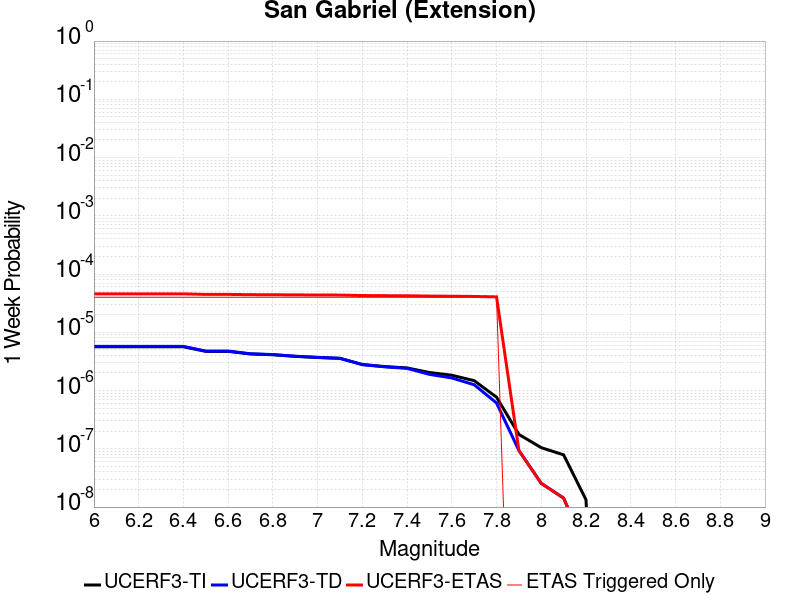 | 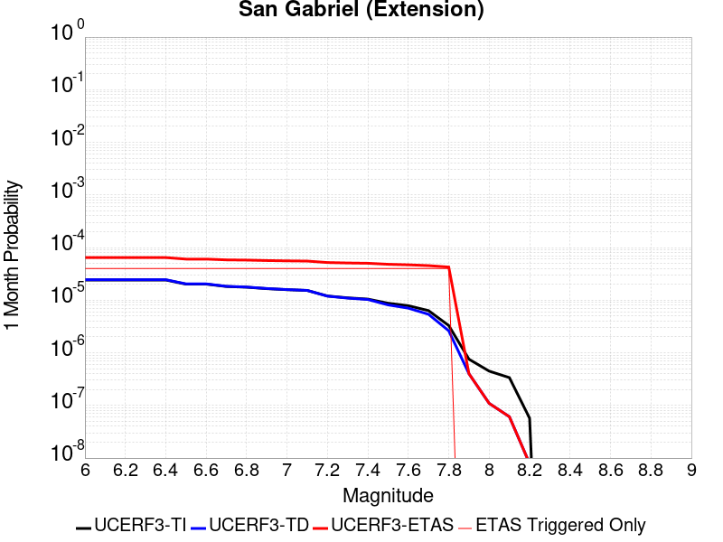 | 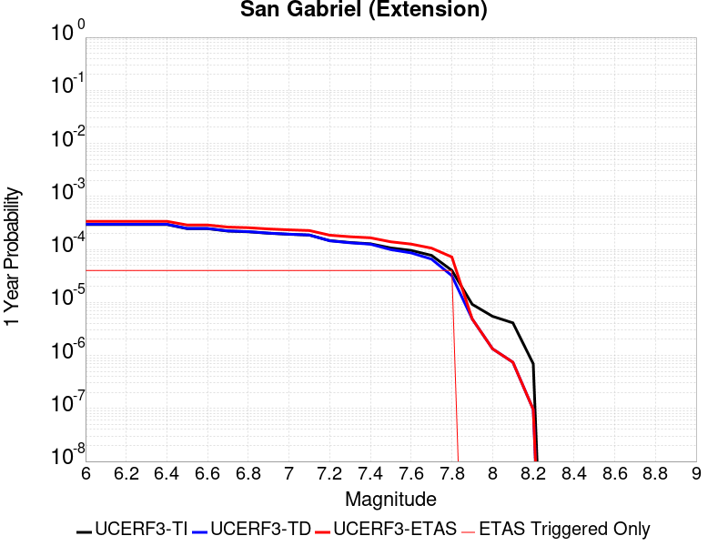 |

| Magnitude | 1 wk TI Prob | 1 wk TD Prob | 1 wk ETAS Prob | 1 wk ETAS/TD Gain | 1 wk ETAS Triggered Only | 1 mo TI Prob | 1 mo TD Prob | 1 mo ETAS Prob | 1 mo ETAS/TD Gain | 1 mo ETAS Triggered Only | 1 yr TI Prob | 1 yr TD Prob | 1 yr ETAS Prob | 1 yr ETAS/TD Gain | 1 yr ETAS Triggered Only |
|-----|-----|-----|-----|-----|-----|-----|-----|-----|-----|-----|-----|-----|-----|-----|-----|
| 6.0 | 5.6486106E-6 | 5.725012E-6 | 4.5724784E-5 | 7.986845 | 4.0E-5 | 2.4208108E-5 | 2.4535542E-5 | 6.4534564E-5 | 2.630248 | 4.0E-5 | 2.9469383E-4 | 2.9868056E-4 | 3.3866861E-4 | 1.1338824 | 4.0E-5 |
| 6.1 | 5.6486106E-6 | 5.725012E-6 | 4.5724784E-5 | 7.986845 | 4.0E-5 | 2.4208108E-5 | 2.4535542E-5 | 6.4534564E-5 | 2.630248 | 4.0E-5 | 2.9469383E-4 | 2.9868056E-4 | 3.3866861E-4 | 1.1338824 | 4.0E-5 |
| 6.2 | 5.6486106E-6 | 5.725012E-6 | 4.5724784E-5 | 7.986845 | 4.0E-5 | 2.4208108E-5 | 2.4535542E-5 | 6.4534564E-5 | 2.630248 | 4.0E-5 | 2.9469383E-4 | 2.9868056E-4 | 3.3866861E-4 | 1.1338824 | 4.0E-5 |
| 6.3 | 5.6486106E-6 | 5.725012E-6 | 4.5724784E-5 | 7.986845 | 4.0E-5 | 2.4208108E-5 | 2.4535542E-5 | 6.4534564E-5 | 2.630248 | 4.0E-5 | 2.9469383E-4 | 2.9868056E-4 | 3.3866861E-4 | 1.1338824 | 4.0E-5 |
| 6.4 | 5.6486106E-6 | 5.725012E-6 | 4.5724784E-5 | 7.986845 | 4.0E-5 | 2.4208108E-5 | 2.4535542E-5 | 6.4534564E-5 | 2.630248 | 4.0E-5 | 2.9469383E-4 | 2.9868056E-4 | 3.3866861E-4 | 1.1338824 | 4.0E-5 |
| 6.5 | 4.7134554E-6 | 4.7623403E-6 | 4.476215E-5 | 9.399192 | 4.0E-5 | 2.0200367E-5 | 2.0409876E-5 | 6.040906E-5 | 2.9597955 | 4.0E-5 | 2.459117E-4 | 2.4846275E-4 | 2.884528E-4 | 1.16095 | 4.0E-5 |
| 6.6 | 4.7134554E-6 | 4.7623403E-6 | 4.476215E-5 | 9.399192 | 4.0E-5 | 2.0200367E-5 | 2.0409876E-5 | 6.040906E-5 | 2.9597955 | 4.0E-5 | 2.459117E-4 | 2.4846275E-4 | 2.884528E-4 | 1.16095 | 4.0E-5 |
| 6.7 | 4.2468837E-6 | 4.2821102E-6 | 4.428194E-5 | 10.341148 | 4.0E-5 | 1.8200803E-5 | 1.8351777E-5 | 5.835104E-5 | 3.1795855 | 4.0E-5 | 2.2157225E-4 | 2.234107E-4 | 2.6340177E-4 | 1.1790024 | 4.0E-5 |
| 6.8 | 4.1180615E-6 | 4.149487E-6 | 4.414932E-5 | 10.639707 | 4.0E-5 | 1.7648716E-5 | 1.7783397E-5 | 5.7782687E-5 | 3.249249 | 4.0E-5 | 2.1485193E-4 | 2.1649207E-4 | 2.564834E-4 | 1.1847243 | 4.0E-5 |
| 6.9 | 3.863861E-6 | 3.887776E-6 | 4.388762E-5 | 11.288619 | 4.0E-5 | 1.65593E-5 | 1.6661794E-5 | 5.6661127E-5 | 3.400662 | 4.0E-5 | 2.0159081E-4 | 2.0283915E-4 | 2.4283103E-4 | 1.1971606 | 4.0E-5 |
| 7.0 | 3.6947372E-6 | 3.7136579E-6 | 4.371351E-5 | 11.771011 | 4.0E-5 | 1.5834492E-5 | 1.5915582E-5 | 5.5914945E-5 | 3.51322 | 4.0E-5 | 1.9276788E-4 | 1.9375567E-4 | 2.3374791E-4 | 1.2064055 | 4.0E-5 |
| 7.1 | 3.5686835E-6 | 3.5808512E-6 | 4.358071E-5 | 12.170488 | 4.0E-5 | 1.5294268E-5 | 1.5346419E-5 | 5.5345805E-5 | 3.6064315 | 4.0E-5 | 1.861918E-4 | 1.868273E-4 | 2.2681981E-4 | 1.2140615 | 4.0E-5 |
| 7.2 | 2.8023446E-6 | 2.7846274E-6 | 4.2784515E-5 | 15.364539 | 4.0E-5 | 1.2009994E-5 | 1.1934064E-5 | 5.1933584E-5 | 4.3517103 | 4.0E-5 | 1.4621185E-4 | 1.4528765E-4 | 1.8528184E-4 | 1.275276 | 4.0E-5 |
| 7.3 | 2.5843012E-6 | 2.5537256E-6 | 4.2553624E-5 | 16.663351 | 4.0E-5 | 1.1075529E-5 | 1.0944493E-5 | 5.0944054E-5 | 4.654766 | 4.0E-5 | 1.3483623E-4 | 1.3324115E-4 | 1.7323582E-4 | 1.3001676 | 4.0E-5 |
| 7.4 | 2.4464468E-6 | 2.404315E-6 | 4.240422E-5 | 17.636715 | 4.0E-5 | 1.04847295E-5 | 1.0304167E-5 | 5.0303755E-5 | 4.881885 | 4.0E-5 | 1.276441E-4 | 1.2544611E-4 | 1.6544109E-4 | 1.318822 | 4.0E-5 |
| 7.5 | 2.0420266E-6 | 1.8978003E-6 | 4.1897725E-5 | 22.076994 | 4.0E-5 | 8.751514E-6 | 8.133405E-6 | 4.813308E-5 | 5.9179497 | 4.0E-5 | 1.0654447E-4 | 9.901974E-5 | 1.3901577E-4 | 1.4039198 | 4.0E-5 |
| 7.6 | 1.8326596E-6 | 1.6461403E-6 | 4.1646075E-5 | 25.299225 | 4.0E-5 | 7.854232E-6 | 7.054868E-6 | 4.7054586E-5 | 6.6698036 | 4.0E-5 | 9.562107E-5 | 8.588966E-5 | 1.2588622E-4 | 1.4656738 | 4.0E-5 |
| 7.7 | 1.4786998E-6 | 1.2581661E-6 | 4.1258118E-5 | 32.792263 | 4.0E-5 | 6.3372695E-6 | 5.3921294E-6 | 4.5391913E-5 | 8.4181795 | 4.0E-5 | 7.715353E-5 | 6.564721E-5 | 1.0564458E-4 | 1.6092776 | 4.0E-5 |
| 7.8 | 7.6975533E-7 | 6.117986E-7 | 4.0611772E-5 | 66.38095 | 4.0E-5 | 3.2989474E-6 | 2.6219914E-6 | 4.2621887E-5 | 16.25554 | 4.0E-5 | 4.0163945E-5 | 3.192228E-5 | 7.192101E-5 | 2.2530034 | 4.0E-5 |
| 7.9 | 1.7645915E-7 | 9.348288E-8 | 9.348288E-8 | 1.0 | 0.0 | 7.562533E-7 | 4.0064086E-7 | 4.0064086E-7 | 1.0 | 0.0 | 9.207345E-6 | 4.8777915E-6 | 4.8777915E-6 | 1.0 | 0.0 |
| 8.0 | 1.0463461E-7 | 2.5519673E-8 | 2.5519673E-8 | 1.0 | 0.0 | 4.4843398E-7 | 1.0937003E-7 | 1.0937003E-7 | 1.0 | 0.0 | 5.45967E-6 | 1.3315793E-6 | 1.3315793E-6 | 1.0 | 0.0 |
| 8.1 | 7.875717E-8 | 1.4238637E-8 | 1.4238637E-8 | 1.0 | 0.0 | 3.3753068E-7 | 6.102273E-8 | 6.102273E-8 | 1.0 | 0.0 | 4.109428E-6 | 7.4295144E-7 | 7.4295144E-7 | 1.0 | 0.0 |
| 8.2 | 1.33163E-8 | 1.8272979E-9 | 1.8272979E-9 | 1.0 | 0.0 | 5.7069855E-8 | 7.831277E-9 | 7.831277E-9 | 1.0 | 0.0 | 6.9482525E-7 | 9.534579E-8 | 9.534579E-8 | 1.0 | 0.0 |

## Great Valley 07 (Orestimba)
*[(top)](#table-of-contents)*

| 1 Week | 1 Month | 1 Year |
|-----|-----|-----|
|  | 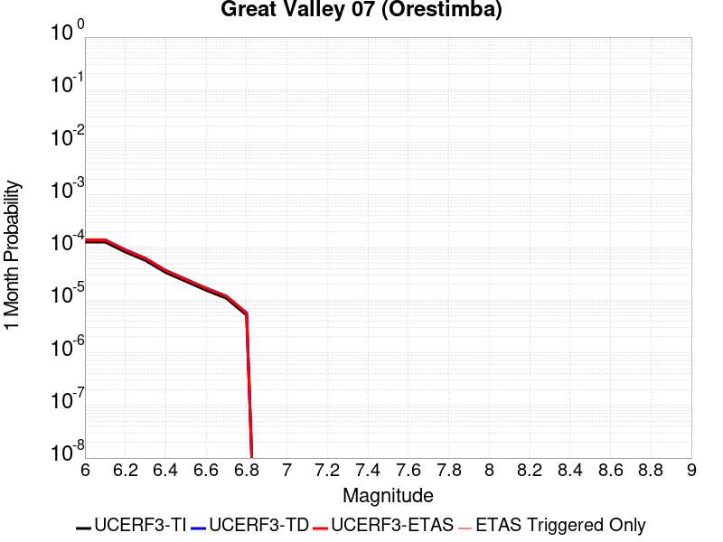 | 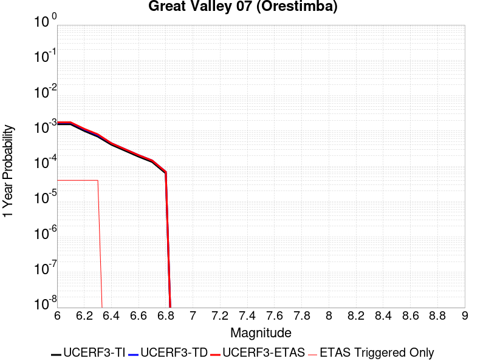 |

| Magnitude | 1 wk TI Prob | 1 wk TD Prob | 1 wk ETAS Prob | 1 wk ETAS/TD Gain | 1 wk ETAS Triggered Only | 1 mo TI Prob | 1 mo TD Prob | 1 mo ETAS Prob | 1 mo ETAS/TD Gain | 1 mo ETAS Triggered Only | 1 yr TI Prob | 1 yr TD Prob | 1 yr ETAS Prob | 1 yr ETAS/TD Gain | 1 yr ETAS Triggered Only |
|-----|-----|-----|-----|-----|-----|-----|-----|-----|-----|-----|-----|-----|-----|-----|-----|
| 6.0 | 2.9687902E-5 | 3.2768992E-5 | 3.2768992E-5 | 1.0 | 0.0 | 1.2722766E-4 | 1.4043138E-4 | 1.4043138E-4 | 1.0 | 0.0 | 0.0015478961 | 0.0017084831 | 0.0017484148 | 1.0233725 | 4.0E-5 |
| 6.1 | 2.9687902E-5 | 3.2768992E-5 | 3.2768992E-5 | 1.0 | 0.0 | 1.2722766E-4 | 1.4043138E-4 | 1.4043138E-4 | 1.0 | 0.0 | 0.0015478961 | 0.0017084831 | 0.0017484148 | 1.0233725 | 4.0E-5 |
| 6.2 | 1.9231524E-5 | 2.116636E-5 | 2.116636E-5 | 1.0 | 0.0 | 8.2418206E-5 | 9.0709946E-5 | 9.0709946E-5 | 1.0 | 0.0 | 0.0010029797 | 0.0011038572 | 0.0011438131 | 1.0361966 | 4.0E-5 |
| 6.3 | 1.324766E-5 | 1.4553378E-5 | 1.4553378E-5 | 1.0 | 0.0 | 5.6774446E-5 | 6.237018E-5 | 6.237018E-5 | 1.0 | 0.0 | 6.910097E-4 | 7.5910153E-4 | 7.990712E-4 | 1.0526539 | 4.0E-5 |
| 6.4 | 7.818645E-6 | 8.575644E-6 | 8.575644E-6 | 1.0 | 0.0 | 3.3508048E-5 | 3.675226E-5 | 3.675226E-5 | 1.0 | 0.0 | 4.078841E-4 | 4.4737026E-4 | 4.4737026E-4 | 1.0 | 0.0 |
| 6.5 | 5.3076565E-6 | 5.8196965E-6 | 5.8196965E-6 | 1.0 | 0.0 | 2.27469E-5 | 2.494133E-5 | 2.494133E-5 | 1.0 | 0.0 | 2.7690834E-4 | 3.0362047E-4 | 3.0362047E-4 | 1.0 | 0.0 |
| 6.6 | 3.6003578E-6 | 3.9497895E-6 | 3.9497895E-6 | 1.0 | 0.0 | 1.5430012E-5 | 1.6927568E-5 | 1.6927568E-5 | 1.0 | 0.0 | 1.8784421E-4 | 2.0607523E-4 | 2.0607523E-4 | 1.0 | 0.0 |
| 6.7 | 2.5361826E-6 | 2.784388E-6 | 2.784388E-6 | 1.0 | 0.0 | 1.0869308E-5 | 1.1933044E-5 | 1.1933044E-5 | 1.0 | 0.0 | 1.3232579E-4 | 1.4527644E-4 | 1.4527644E-4 | 1.0 | 0.0 |
| 6.8 | 1.2115831E-6 | 1.3318261E-6 | 1.3318261E-6 | 1.0 | 0.0 | 5.1924885E-6 | 5.7078187E-6 | 5.7078187E-6 | 1.0 | 0.0 | 6.3216714E-5 | 6.949145E-5 | 6.949145E-5 | 1.0 | 0.0 |

## Cady
*[(top)](#table-of-contents)*

| 1 Week | 1 Month | 1 Year |
|-----|-----|-----|
| 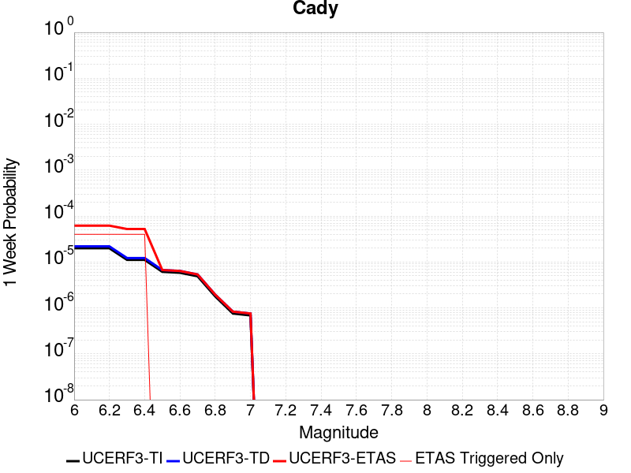 | 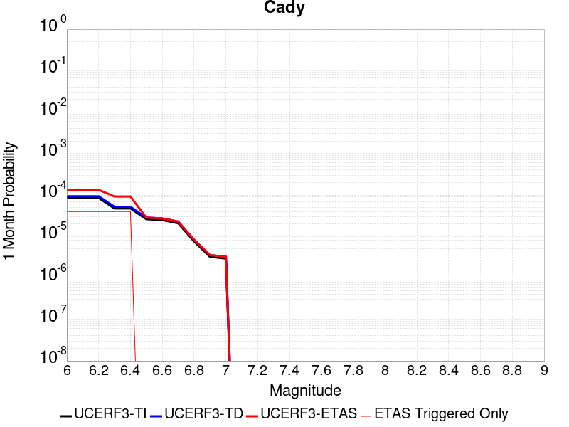 | 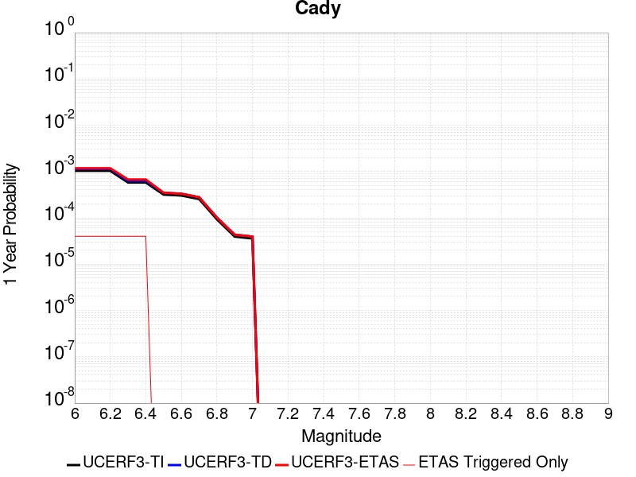 |

| Magnitude | 1 wk TI Prob | 1 wk TD Prob | 1 wk ETAS Prob | 1 wk ETAS/TD Gain | 1 wk ETAS Triggered Only | 1 mo TI Prob | 1 mo TD Prob | 1 mo ETAS Prob | 1 mo ETAS/TD Gain | 1 mo ETAS Triggered Only | 1 yr TI Prob | 1 yr TD Prob | 1 yr ETAS Prob | 1 yr ETAS/TD Gain | 1 yr ETAS Triggered Only |
|-----|-----|-----|-----|-----|-----|-----|-----|-----|-----|-----|-----|-----|-----|-----|-----|
| 6.0 | 1.9892565E-5 | 2.1866057E-5 | 6.186518E-5 | 2.8292792 | 4.0E-5 | 8.525106E-5 | 9.3708826E-5 | 1.3370508E-4 | 1.4268142 | 4.0E-5 | 0.0010374374 | 0.0011403988 | 0.0011803531 | 1.0350355 | 4.0E-5 |
| 6.1 | 1.9892565E-5 | 2.1866057E-5 | 6.186518E-5 | 2.8292792 | 4.0E-5 | 8.525106E-5 | 9.3708826E-5 | 1.3370508E-4 | 1.4268142 | 4.0E-5 | 0.0010374374 | 0.0011403988 | 0.0011803531 | 1.0350355 | 4.0E-5 |
| 6.2 | 1.9892565E-5 | 2.1866057E-5 | 6.186518E-5 | 2.8292792 | 4.0E-5 | 8.525106E-5 | 9.3708826E-5 | 1.3370508E-4 | 1.4268142 | 4.0E-5 | 0.0010374374 | 0.0011403988 | 0.0011803531 | 1.0350355 | 4.0E-5 |
| 6.3 | 1.1117327E-5 | 1.2180519E-5 | 5.2180032E-5 | 4.2838926 | 4.0E-5 | 4.764482E-5 | 5.2201358E-5 | 9.219927E-5 | 1.7662237 | 4.0E-5 | 5.7992124E-4 | 6.3539774E-4 | 6.753723E-4 | 1.0629127 | 4.0E-5 |
| 6.4 | 1.1117327E-5 | 1.2180519E-5 | 5.2180032E-5 | 4.2838926 | 4.0E-5 | 4.764482E-5 | 5.2201358E-5 | 9.219927E-5 | 1.7662237 | 4.0E-5 | 5.7992124E-4 | 6.3539774E-4 | 6.753723E-4 | 1.0629127 | 4.0E-5 |
| 6.5 | 6.103093E-6 | 6.674131E-6 | 6.674131E-6 | 1.0 | 0.0 | 2.615585E-5 | 2.8603175E-5 | 2.8603175E-5 | 1.0 | 0.0 | 3.1840094E-4 | 3.4820058E-4 | 3.4820058E-4 | 1.0 | 0.0 |
| 6.6 | 5.817237E-6 | 6.3676944E-6 | 6.3676944E-6 | 1.0 | 0.0 | 2.4930776E-5 | 2.7289903E-5 | 2.7289903E-5 | 1.0 | 0.0 | 3.034899E-4 | 3.3221635E-4 | 3.3221635E-4 | 1.0 | 0.0 |
| 6.7 | 4.8846314E-6 | 5.342259E-6 | 5.342259E-6 | 1.0 | 0.0 | 2.0933967E-5 | 2.2895263E-5 | 2.2895263E-5 | 1.0 | 0.0 | 2.5484123E-4 | 2.7872596E-4 | 2.7872596E-4 | 1.0 | 0.0 |
| 6.8 | 1.7788773E-6 | 1.9405036E-6 | 1.9405036E-6 | 1.0 | 0.0 | 7.6237375E-6 | 8.316427E-6 | 8.316427E-6 | 1.0 | 0.0 | 9.281505E-5 | 1.0124937E-4 | 1.0124937E-4 | 1.0 | 0.0 |
| 6.9 | 7.5455404E-7 | 8.2998935E-7 | 8.2998935E-7 | 1.0 | 0.0 | 3.233799E-6 | 3.5570943E-6 | 3.5570943E-6 | 1.0 | 0.0 | 3.937079E-5 | 4.33071E-5 | 4.33071E-5 | 1.0 | 0.0 |
| 7.0 | 6.8578805E-7 | 7.544366E-7 | 7.544366E-7 | 1.0 | 0.0 | 2.9390883E-6 | 3.2332975E-6 | 3.2332975E-6 | 1.0 | 0.0 | 3.578281E-5 | 3.936502E-5 | 3.936502E-5 | 1.0 | 0.0 |

## White Mountains
*[(top)](#table-of-contents)*

| 1 Week | 1 Month | 1 Year |
|-----|-----|-----|
| 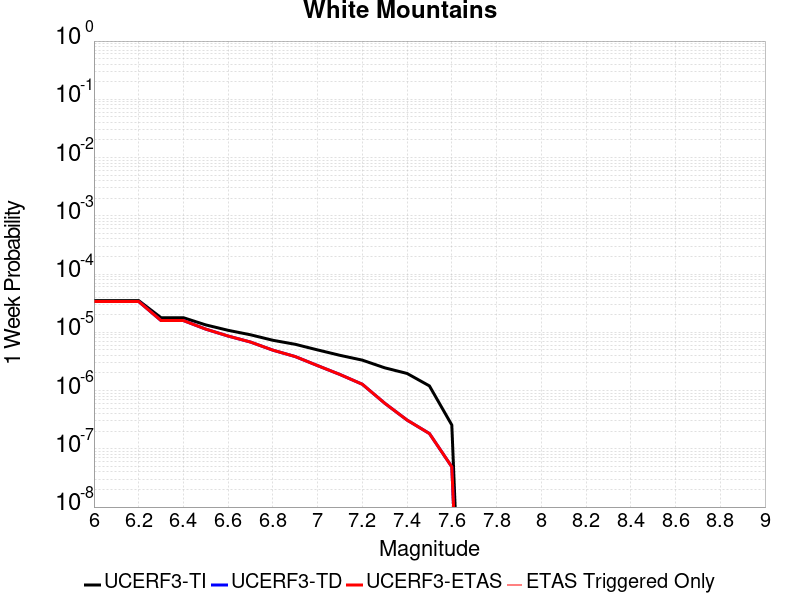 | 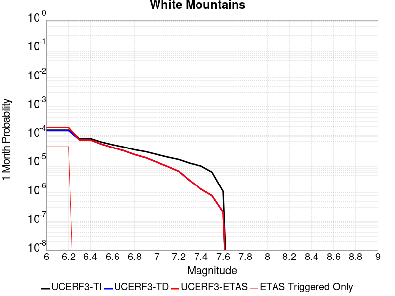 | 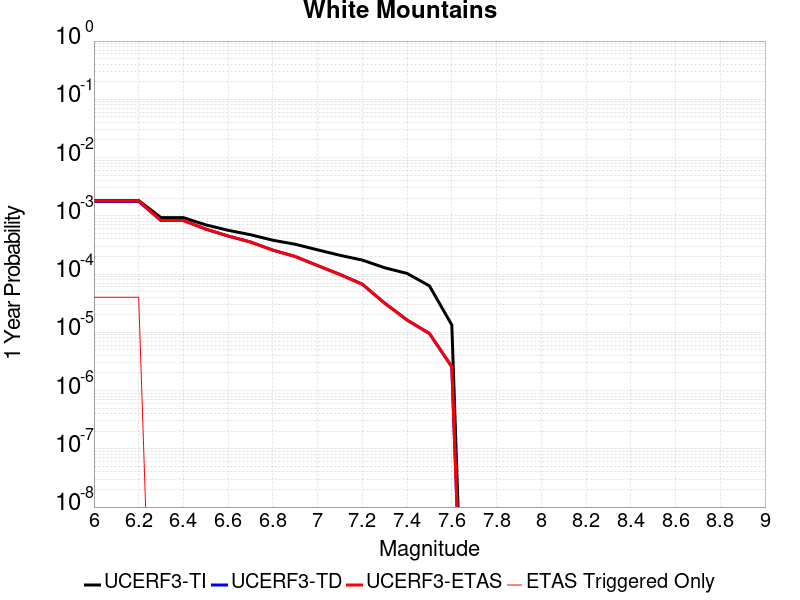 |

| Magnitude | 1 wk TI Prob | 1 wk TD Prob | 1 wk ETAS Prob | 1 wk ETAS/TD Gain | 1 wk ETAS Triggered Only | 1 mo TI Prob | 1 mo TD Prob | 1 mo ETAS Prob | 1 mo ETAS/TD Gain | 1 mo ETAS Triggered Only | 1 yr TI Prob | 1 yr TD Prob | 1 yr ETAS Prob | 1 yr ETAS/TD Gain | 1 yr ETAS Triggered Only |
|-----|-----|-----|-----|-----|-----|-----|-----|-----|-----|-----|-----|-----|-----|-----|-----|
| 6.0 | 3.503579E-5 | 3.3793967E-5 | 3.3793967E-5 | 1.0 | 0.0 | 1.5014476E-4 | 1.4482393E-4 | 1.8481814E-4 | 1.2761574 | 4.0E-5 | 0.0018264796 | 0.0017619262 | 0.0018018557 | 1.0226624 | 4.0E-5 |
| 6.1 | 3.503579E-5 | 3.3793967E-5 | 3.3793967E-5 | 1.0 | 0.0 | 1.5014476E-4 | 1.4482393E-4 | 1.8481814E-4 | 1.2761574 | 4.0E-5 | 0.0018264796 | 0.0017619262 | 0.0018018557 | 1.0226624 | 4.0E-5 |
| 6.2 | 3.503579E-5 | 3.3793967E-5 | 3.3793967E-5 | 1.0 | 0.0 | 1.5014476E-4 | 1.4482393E-4 | 1.8481814E-4 | 1.2761574 | 4.0E-5 | 0.0018264796 | 0.0017619262 | 0.0018018557 | 1.0226624 | 4.0E-5 |
| 6.3 | 1.7818425E-5 | 1.5920552E-5 | 1.5920552E-5 | 1.0 | 0.0 | 7.636245E-5 | 6.822923E-5 | 6.822923E-5 | 1.0 | 0.0 | 9.293162E-4 | 8.3038857E-4 | 8.3038857E-4 | 1.0 | 0.0 |
| 6.4 | 1.7818425E-5 | 1.5920552E-5 | 1.5920552E-5 | 1.0 | 0.0 | 7.636245E-5 | 6.822923E-5 | 6.822923E-5 | 1.0 | 0.0 | 9.293162E-4 | 8.3038857E-4 | 8.3038857E-4 | 1.0 | 0.0 |
| 6.5 | 1.3397557E-5 | 1.1339476E-5 | 1.1339476E-5 | 1.0 | 0.0 | 5.741684E-5 | 4.859689E-5 | 4.859689E-5 | 1.0 | 0.0 | 6.988258E-4 | 5.9151347E-4 | 5.9151347E-4 | 1.0 | 0.0 |
| 6.6 | 1.0818695E-5 | 8.627772E-6 | 8.627772E-6 | 1.0 | 0.0 | 4.6365014E-5 | 3.6975667E-5 | 3.6975667E-5 | 1.0 | 0.0 | 5.6434784E-4 | 4.500901E-4 | 4.500901E-4 | 1.0 | 0.0 |
| 6.7 | 9.067908E-6 | 6.804342E-6 | 6.804342E-6 | 1.0 | 0.0 | 3.8861883E-5 | 2.9161158E-5 | 2.9161158E-5 | 1.0 | 0.0 | 4.7304068E-4 | 3.5498245E-4 | 3.5498245E-4 | 1.0 | 0.0 |
| 6.8 | 7.295947E-6 | 4.937819E-6 | 4.937819E-6 | 1.0 | 0.0 | 3.126797E-5 | 2.1161917E-5 | 2.1161917E-5 | 1.0 | 0.0 | 3.8062103E-4 | 2.57617E-4 | 2.57617E-4 | 1.0 | 0.0 |
| 6.9 | 6.2243444E-6 | 3.833406E-6 | 3.833406E-6 | 1.0 | 0.0 | 2.6675489E-5 | 1.6428783E-5 | 1.6428783E-5 | 1.0 | 0.0 | 3.2472567E-4 | 2.000026E-4 | 2.000026E-4 | 1.0 | 0.0 |
| 7.0 | 4.9878413E-6 | 2.6805515E-6 | 2.6805515E-6 | 1.0 | 0.0 | 2.1376287E-5 | 1.1488029E-5 | 1.1488029E-5 | 1.0 | 0.0 | 2.602252E-4 | 1.3985804E-4 | 1.3985804E-4 | 1.0 | 0.0 |
| 7.1 | 4.0252844E-6 | 1.8866339E-6 | 1.8866339E-6 | 1.0 | 0.0 | 1.7251105E-5 | 8.08555E-6 | 8.08555E-6 | 1.0 | 0.0 | 2.1001195E-4 | 9.8437245E-5 | 9.8437245E-5 | 1.0 | 0.0 |
| 7.2 | 3.3284066E-6 | 1.2826561E-6 | 1.2826561E-6 | 1.0 | 0.0 | 1.4264522E-5 | 5.497086E-6 | 5.497086E-6 | 1.0 | 0.0 | 1.736567E-4 | 6.692507E-5 | 6.692507E-5 | 1.0 | 0.0 |
| 7.3 | 2.458226E-6 | 6.0635915E-7 | 6.0635915E-7 | 1.0 | 0.0 | 1.0535211E-5 | 2.5986797E-6 | 2.5986797E-6 | 1.0 | 0.0 | 1.2825865E-4 | 3.1638505E-5 | 3.1638505E-5 | 1.0 | 0.0 |
| 7.4 | 1.965953E-6 | 3.1145115E-7 | 3.1145115E-7 | 1.0 | 0.0 | 8.425486E-6 | 1.33479E-6 | 1.33479E-6 | 1.0 | 0.0 | 1.0257547E-4 | 1.6250948E-5 | 1.6250948E-5 | 1.0 | 0.0 |
| 7.5 | 1.2014192E-6 | 1.8282981E-7 | 1.8282981E-7 | 1.0 | 0.0 | 5.148929E-6 | 7.8355606E-7 | 7.8355606E-7 | 1.0 | 0.0 | 6.2686406E-5 | 9.5397545E-6 | 9.5397545E-6 | 1.0 | 0.0 |
| 7.6 | 2.5612175E-7 | 4.9050836E-8 | 4.9050836E-8 | 1.0 | 0.0 | 1.0976642E-6 | 2.1021786E-7 | 2.1021786E-7 | 1.0 | 0.0 | 1.3363979E-5 | 2.5594E-6 | 2.5594E-6 | 1.0 | 0.0 |

## Raymond
*[(top)](#table-of-contents)*

| 1 Week | 1 Month | 1 Year |
|-----|-----|-----|
| 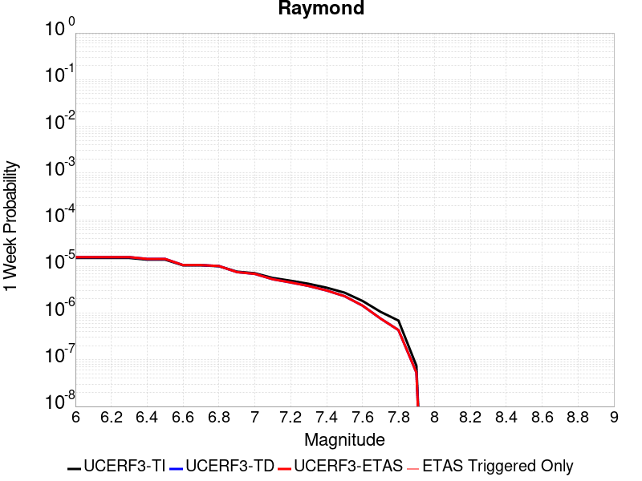 | 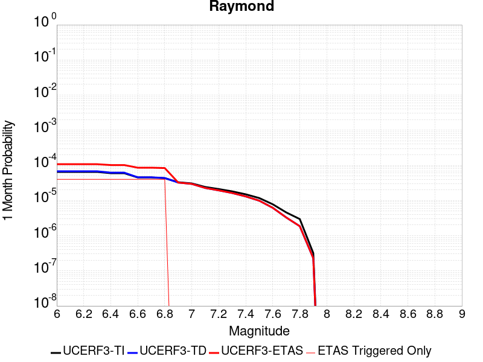 | 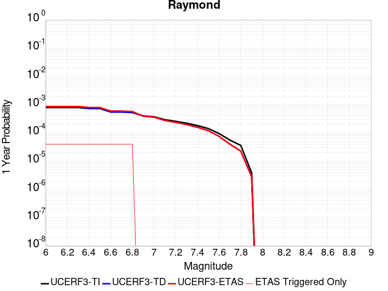 |

| Magnitude | 1 wk TI Prob | 1 wk TD Prob | 1 wk ETAS Prob | 1 wk ETAS/TD Gain | 1 wk ETAS Triggered Only | 1 mo TI Prob | 1 mo TD Prob | 1 mo ETAS Prob | 1 mo ETAS/TD Gain | 1 mo ETAS Triggered Only | 1 yr TI Prob | 1 yr TD Prob | 1 yr ETAS Prob | 1 yr ETAS/TD Gain | 1 yr ETAS Triggered Only |
|-----|-----|-----|-----|-----|-----|-----|-----|-----|-----|-----|-----|-----|-----|-----|-----|
| 6.0 | 1.5157413E-5 | 1.5816651E-5 | 1.5816651E-5 | 1.0 | 0.0 | 6.4958724E-5 | 6.778403E-5 | 1.07781314E-4 | 1.5900695 | 4.0E-5 | 7.905855E-4 | 8.249831E-4 | 8.649501E-4 | 1.0484458 | 4.0E-5 |
| 6.1 | 1.5157413E-5 | 1.5816651E-5 | 1.5816651E-5 | 1.0 | 0.0 | 6.4958724E-5 | 6.778403E-5 | 1.07781314E-4 | 1.5900695 | 4.0E-5 | 7.905855E-4 | 8.249831E-4 | 8.649501E-4 | 1.0484458 | 4.0E-5 |
| 6.2 | 1.5157413E-5 | 1.5816651E-5 | 1.5816651E-5 | 1.0 | 0.0 | 6.4958724E-5 | 6.778403E-5 | 1.07781314E-4 | 1.5900695 | 4.0E-5 | 7.905855E-4 | 8.249831E-4 | 8.649501E-4 | 1.0484458 | 4.0E-5 |
| 6.3 | 1.5157413E-5 | 1.5816651E-5 | 1.5816651E-5 | 1.0 | 0.0 | 6.4958724E-5 | 6.778403E-5 | 1.07781314E-4 | 1.5900695 | 4.0E-5 | 7.905855E-4 | 8.249831E-4 | 8.649501E-4 | 1.0484458 | 4.0E-5 |
| 6.4 | 1.3941944E-5 | 1.4460684E-5 | 1.4460684E-5 | 1.0 | 0.0 | 5.9749822E-5 | 6.197302E-5 | 1.0197054E-4 | 1.6454022 | 4.0E-5 | 7.2721124E-4 | 7.542837E-4 | 7.942535E-4 | 1.0529904 | 4.0E-5 |
| 6.5 | 1.3941944E-5 | 1.4460684E-5 | 1.4460684E-5 | 1.0 | 0.0 | 5.9749822E-5 | 6.197302E-5 | 1.0197054E-4 | 1.6454022 | 4.0E-5 | 7.2721124E-4 | 7.542837E-4 | 7.942535E-4 | 1.0529904 | 4.0E-5 |
| 6.6 | 1.0542609E-5 | 1.0675657E-5 | 1.0675657E-5 | 1.0 | 0.0 | 4.5181827E-5 | 4.5752044E-5 | 8.575021E-5 | 1.8742379 | 4.0E-5 | 5.499499E-4 | 5.568942E-4 | 5.9687195E-4 | 1.0717869 | 4.0E-5 |
| 6.7 | 1.0542609E-5 | 1.0675657E-5 | 1.0675657E-5 | 1.0 | 0.0 | 4.5181827E-5 | 4.5752044E-5 | 8.575021E-5 | 1.8742379 | 4.0E-5 | 5.499499E-4 | 5.568942E-4 | 5.9687195E-4 | 1.0717869 | 4.0E-5 |
| 6.8 | 1.0079132E-5 | 1.0181076E-5 | 1.0181076E-5 | 1.0 | 0.0 | 4.3195567E-5 | 4.363248E-5 | 8.363074E-5 | 1.9167082 | 4.0E-5 | 5.257791E-4 | 5.311013E-4 | 5.710801E-4 | 1.0752752 | 4.0E-5 |
| 6.9 | 7.721598E-6 | 7.552302E-6 | 7.552302E-6 | 1.0 | 0.0 | 3.3092143E-5 | 3.2366614E-5 | 3.2366614E-5 | 1.0 | 0.0 | 4.0282236E-4 | 3.9399348E-4 | 3.9399348E-4 | 1.0 | 0.0 |
| 7.0 | 7.137566E-6 | 6.9145035E-6 | 6.9145035E-6 | 1.0 | 0.0 | 3.058921E-5 | 2.9633255E-5 | 2.9633255E-5 | 1.0 | 0.0 | 3.7236E-4 | 3.6072623E-4 | 3.6072623E-4 | 1.0 | 0.0 |
| 7.1 | 5.654976E-6 | 5.3022604E-6 | 5.3022604E-6 | 1.0 | 0.0 | 2.4235387E-5 | 2.2723776E-5 | 2.2723776E-5 | 1.0 | 0.0 | 2.9502588E-4 | 2.7662705E-4 | 2.7662705E-4 | 1.0 | 0.0 |
| 7.2 | 4.9358455E-6 | 4.529158E-6 | 4.529158E-6 | 1.0 | 0.0 | 2.1153453E-5 | 1.9410534E-5 | 1.9410534E-5 | 1.0 | 0.0 | 2.5751285E-4 | 2.3629777E-4 | 2.3629777E-4 | 1.0 | 0.0 |
| 7.3 | 4.2368597E-6 | 3.8079293E-6 | 3.8079293E-6 | 1.0 | 0.0 | 1.8157843E-5 | 1.6319596E-5 | 1.6319596E-5 | 1.0 | 0.0 | 2.2104931E-4 | 1.9867306E-4 | 1.9867306E-4 | 1.0 | 0.0 |
| 7.4 | 3.4999923E-6 | 3.045825E-6 | 3.045825E-6 | 1.0 | 0.0 | 1.49998805E-5 | 1.3053471E-5 | 1.3053471E-5 | 1.0 | 0.0 | 1.8260824E-4 | 1.589145E-4 | 1.589145E-4 | 1.0 | 0.0 |
| 7.5 | 2.738017E-6 | 2.303755E-6 | 2.303755E-6 | 1.0 | 0.0 | 1.1734306E-5 | 9.873199E-6 | 9.873199E-6 | 1.0 | 0.0 | 1.428558E-4 | 1.20199635E-4 | 1.20199635E-4 | 1.0 | 0.0 |
| 7.6 | 1.8186392E-6 | 1.4435308E-6 | 1.4435308E-6 | 1.0 | 0.0 | 7.794145E-6 | 6.1865458E-6 | 6.1865458E-6 | 1.0 | 0.0 | 9.488958E-5 | 7.531863E-5 | 7.531863E-5 | 1.0 | 0.0 |
| 7.7 | 1.0660348E-6 | 7.653782E-7 | 7.653782E-7 | 1.0 | 0.0 | 4.5687125E-6 | 3.2801881E-6 | 3.2801881E-6 | 1.0 | 0.0 | 5.5622655E-5 | 3.9935578E-5 | 3.9935578E-5 | 1.0 | 0.0 |
| 7.8 | 6.913602E-7 | 4.3288983E-7 | 4.3288983E-7 | 1.0 | 0.0 | 2.962969E-6 | 1.855241E-6 | 1.855241E-6 | 1.0 | 0.0 | 3.607355E-5 | 2.258733E-5 | 2.258733E-5 | 1.0 | 0.0 |
| 7.9 | 7.425201E-8 | 5.330067E-8 | 5.330067E-8 | 1.0 | 0.0 | 3.1822285E-7 | 2.2843143E-7 | 2.2843143E-7 | 1.0 | 0.0 | 3.874356E-6 | 2.7811504E-6 | 2.7811504E-6 | 1.0 | 0.0 |

## Elysian Park (Upper)
*[(top)](#table-of-contents)*

| 1 Week | 1 Month | 1 Year |
|-----|-----|-----|
| 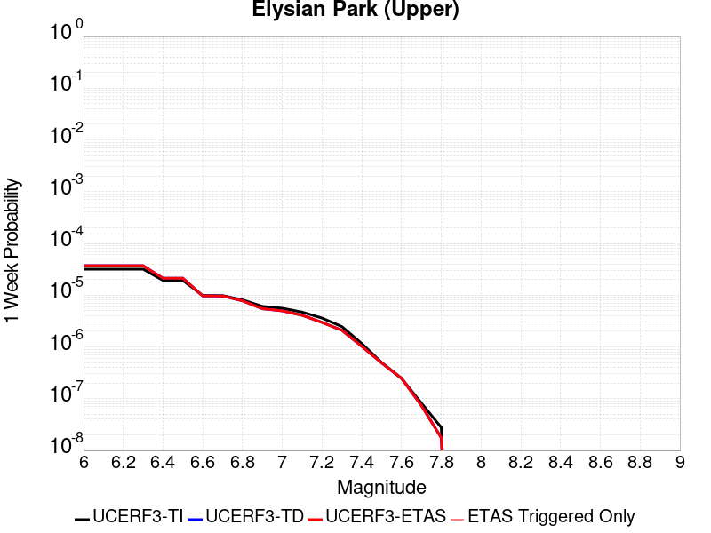 | 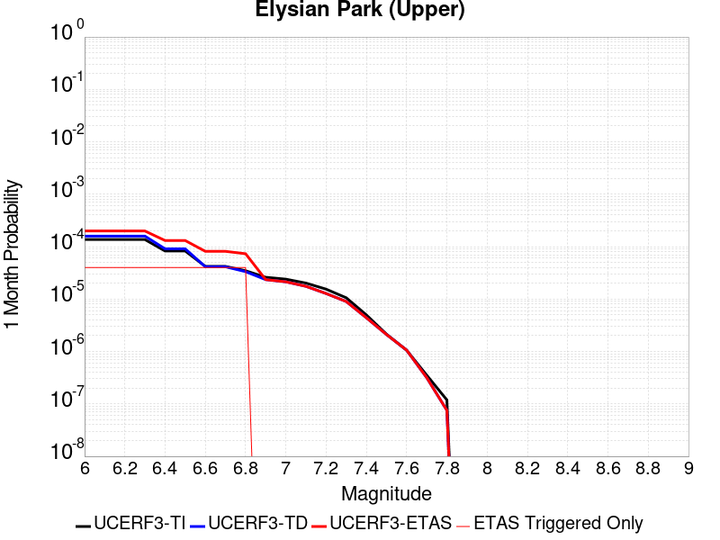 | 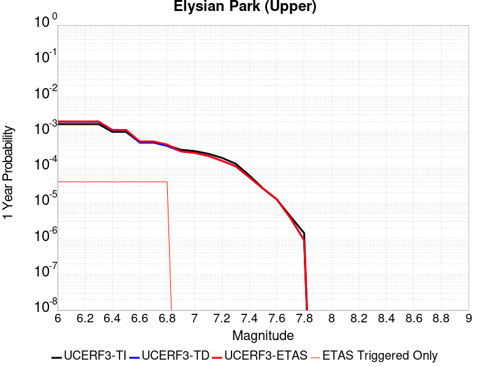 |

| Magnitude | 1 wk TI Prob | 1 wk TD Prob | 1 wk ETAS Prob | 1 wk ETAS/TD Gain | 1 wk ETAS Triggered Only | 1 mo TI Prob | 1 mo TD Prob | 1 mo ETAS Prob | 1 mo ETAS/TD Gain | 1 mo ETAS Triggered Only | 1 yr TI Prob | 1 yr TD Prob | 1 yr ETAS Prob | 1 yr ETAS/TD Gain | 1 yr ETAS Triggered Only |
|-----|-----|-----|-----|-----|-----|-----|-----|-----|-----|-----|-----|-----|-----|-----|-----|
| 6.0 | 3.1876025E-5 | 3.706077E-5 | 3.706077E-5 | 1.0 | 0.0 | 1.3660437E-4 | 1.5882494E-4 | 1.988186E-4 | 1.2518096 | 4.0E-5 | 0.0016618895 | 0.0019324546 | 0.0019723773 | 1.0206591 | 4.0E-5 |
| 6.1 | 3.1876025E-5 | 3.706077E-5 | 3.706077E-5 | 1.0 | 0.0 | 1.3660437E-4 | 1.5882494E-4 | 1.988186E-4 | 1.2518096 | 4.0E-5 | 0.0016618895 | 0.0019324546 | 0.0019723773 | 1.0206591 | 4.0E-5 |
| 6.2 | 3.1876025E-5 | 3.706077E-5 | 3.706077E-5 | 1.0 | 0.0 | 1.3660437E-4 | 1.5882494E-4 | 1.988186E-4 | 1.2518096 | 4.0E-5 | 0.0016618895 | 0.0019324546 | 0.0019723773 | 1.0206591 | 4.0E-5 |
| 6.3 | 3.1876025E-5 | 3.706077E-5 | 3.706077E-5 | 1.0 | 0.0 | 1.3660437E-4 | 1.5882494E-4 | 1.988186E-4 | 1.2518096 | 4.0E-5 | 0.0016618895 | 0.0019324546 | 0.0019723773 | 1.0206591 | 4.0E-5 |
| 6.4 | 1.9273462E-5 | 2.1214437E-5 | 2.1214437E-5 | 1.0 | 0.0 | 8.259794E-5 | 9.091683E-5 | 1.3091319E-4 | 1.4399226 | 4.0E-5 | 0.001005166 | 0.0011065218 | 0.0011464776 | 1.0361093 | 4.0E-5 |
| 6.5 | 1.9273462E-5 | 2.1214437E-5 | 2.1214437E-5 | 1.0 | 0.0 | 8.259794E-5 | 9.091683E-5 | 1.3091319E-4 | 1.4399226 | 4.0E-5 | 0.001005166 | 0.0011065218 | 0.0011464776 | 1.0361093 | 4.0E-5 |
| 6.6 | 9.813258E-6 | 9.669027E-6 | 9.669027E-6 | 1.0 | 0.0 | 4.205614E-5 | 4.1438074E-5 | 8.143642E-5 | 1.9652559 | 4.0E-5 | 5.119132E-4 | 5.04399E-4 | 5.443788E-4 | 1.0792623 | 4.0E-5 |
| 6.7 | 9.801478E-6 | 9.656595E-6 | 9.656595E-6 | 1.0 | 0.0 | 4.2005657E-5 | 4.138479E-5 | 8.1383136E-5 | 1.9664987 | 4.0E-5 | 5.112989E-4 | 5.037506E-4 | 5.4373045E-4 | 1.0793644 | 4.0E-5 |
| 6.8 | 8.102489E-6 | 7.775748E-6 | 7.775748E-6 | 1.0 | 0.0 | 3.4724493E-5 | 3.3324235E-5 | 7.33229E-5 | 2.2002876 | 4.0E-5 | 4.2268867E-4 | 4.05652E-4 | 4.456358E-4 | 1.0985667 | 4.0E-5 |
| 6.9 | 6.08275E-6 | 5.483149E-6 | 5.483149E-6 | 1.0 | 0.0 | 2.6068668E-5 | 2.3499004E-5 | 2.3499004E-5 | 1.0 | 0.0 | 3.173398E-4 | 2.8606356E-4 | 2.8606356E-4 | 1.0 | 0.0 |
| 7.0 | 5.5995934E-6 | 4.9843247E-6 | 4.9843247E-6 | 1.0 | 0.0 | 2.3998036E-5 | 2.136122E-5 | 2.136122E-5 | 1.0 | 0.0 | 2.9213692E-4 | 2.600425E-4 | 2.600425E-4 | 1.0 | 0.0 |
| 7.1 | 4.709881E-6 | 4.0886803E-6 | 4.0886803E-6 | 1.0 | 0.0 | 2.0185047E-5 | 1.75228E-5 | 1.75228E-5 | 1.0 | 0.0 | 2.4572524E-4 | 2.1331961E-4 | 2.1331961E-4 | 1.0 | 0.0 |
| 7.2 | 3.6063436E-6 | 2.978894E-6 | 2.978894E-6 | 1.0 | 0.0 | 1.5455667E-5 | 1.2766626E-5 | 1.2766626E-5 | 1.0 | 0.0 | 1.881565E-4 | 1.554227E-4 | 1.554227E-4 | 1.0 | 0.0 |
| 7.3 | 2.471135E-6 | 2.0961668E-6 | 2.0961668E-6 | 1.0 | 0.0 | 1.0590536E-5 | 8.983541E-6 | 8.983541E-6 | 1.0 | 0.0 | 1.2893214E-4 | 1.09369204E-4 | 1.09369204E-4 | 1.0 | 0.0 |
| 7.4 | 1.163943E-6 | 1.0279479E-6 | 1.0279479E-6 | 1.0 | 0.0 | 4.988318E-6 | 4.4054837E-6 | 4.4054837E-6 | 1.0 | 0.0 | 6.0731076E-5 | 5.363547E-5 | 5.363547E-5 | 1.0 | 0.0 |
| 7.5 | 4.99459E-7 | 4.9193983E-7 | 4.9193983E-7 | 1.0 | 0.0 | 2.140537E-6 | 2.108312E-6 | 2.108312E-6 | 1.0 | 0.0 | 2.6060725E-5 | 2.5668412E-5 | 2.5668412E-5 | 1.0 | 0.0 |
| 7.6 | 2.4667852E-7 | 2.4786985E-7 | 2.4786985E-7 | 1.0 | 0.0 | 1.0571932E-6 | 1.0622989E-6 | 1.0622989E-6 | 1.0 | 0.0 | 1.2871251E-5 | 1.2933417E-5 | 1.2933417E-5 | 1.0 | 0.0 |
| 7.7 | 8.2312795E-8 | 7.3911366E-8 | 7.3911366E-8 | 1.0 | 0.0 | 3.527691E-7 | 3.1676296E-7 | 3.1676296E-7 | 1.0 | 0.0 | 4.294955E-6 | 3.8565836E-6 | 3.8565836E-6 | 1.0 | 0.0 |
| 7.8 | 2.7819295E-8 | 1.7599204E-8 | 1.7599204E-8 | 1.0 | 0.0 | 1.1922555E-7 | 7.5425156E-8 | 7.5425156E-8 | 1.0 | 0.0 | 1.45157E-6 | 9.18301E-7 | 9.18301E-7 | 1.0 | 0.0 |

## Carlsbad
*[(top)](#table-of-contents)*

| 1 Week | 1 Month | 1 Year |
|-----|-----|-----|
| 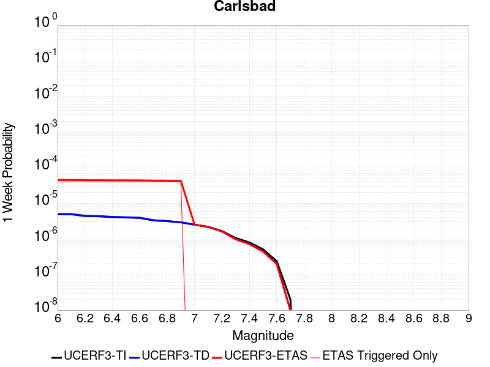 | 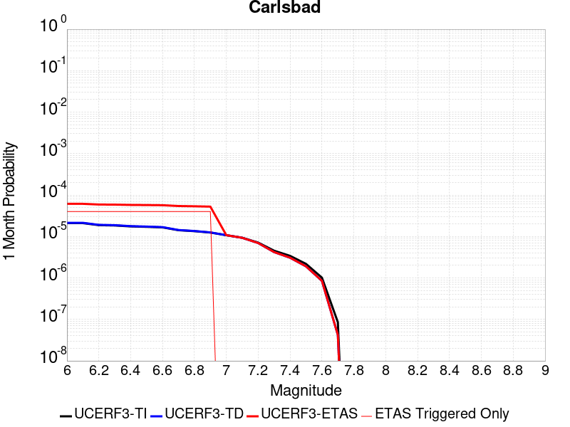 | 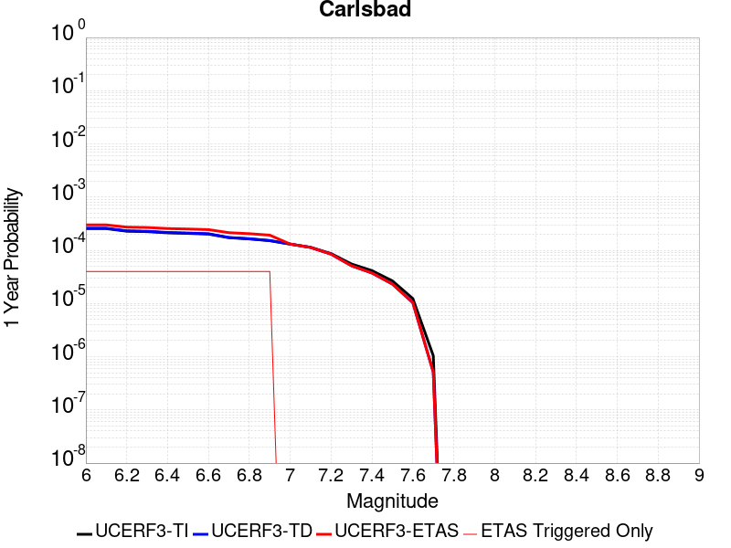 |

| Magnitude | 1 wk TI Prob | 1 wk TD Prob | 1 wk ETAS Prob | 1 wk ETAS/TD Gain | 1 wk ETAS Triggered Only | 1 mo TI Prob | 1 mo TD Prob | 1 mo ETAS Prob | 1 mo ETAS/TD Gain | 1 mo ETAS Triggered Only | 1 yr TI Prob | 1 yr TD Prob | 1 yr ETAS Prob | 1 yr ETAS/TD Gain | 1 yr ETAS Triggered Only |
|-----|-----|-----|-----|-----|-----|-----|-----|-----|-----|-----|-----|-----|-----|-----|-----|
| 6.0 | 4.9038536E-6 | 4.9881164E-6 | 4.4987915E-5 | 9.019019 | 4.0E-5 | 2.1016345E-5 | 2.137747E-5 | 6.137662E-5 | 2.871089 | 4.0E-5 | 2.5584397E-4 | 2.6024005E-4 | 3.0022964E-4 | 1.1536642 | 4.0E-5 |
| 6.1 | 4.9038536E-6 | 4.9881164E-6 | 4.4987915E-5 | 9.019019 | 4.0E-5 | 2.1016345E-5 | 2.137747E-5 | 6.137662E-5 | 2.871089 | 4.0E-5 | 2.5584397E-4 | 2.6024005E-4 | 3.0022964E-4 | 1.1536642 | 4.0E-5 |
| 6.2 | 4.3820614E-6 | 4.455592E-6 | 4.4455413E-5 | 9.977443 | 4.0E-5 | 1.8780129E-5 | 1.9095256E-5 | 5.909449E-5 | 3.094721 | 4.0E-5 | 2.2862408E-4 | 2.3246028E-4 | 2.72451E-4 | 1.1720324 | 4.0E-5 |
| 6.3 | 4.302872E-6 | 4.3738205E-6 | 4.4373646E-5 | 10.145283 | 4.0E-5 | 1.8440749E-5 | 1.8744811E-5 | 5.8744063E-5 | 3.1338837 | 4.0E-5 | 2.24493E-4 | 2.2819453E-4 | 2.681854E-4 | 1.1752491 | 4.0E-5 |
| 6.4 | 4.0835243E-6 | 4.1484477E-6 | 4.414828E-5 | 10.642121 | 4.0E-5 | 1.75007E-5 | 1.7778942E-5 | 5.777823E-5 | 3.2498126 | 4.0E-5 | 2.1305021E-4 | 2.1643746E-4 | 2.564288E-4 | 1.184771 | 4.0E-5 |
| 6.5 | 3.987806E-6 | 4.049669E-6 | 4.4049506E-5 | 10.877311 | 4.0E-5 | 1.7090486E-5 | 1.735561E-5 | 5.7354915E-5 | 3.3046901 | 4.0E-5 | 2.080568E-4 | 2.1128441E-4 | 2.5127595E-4 | 1.1892782 | 4.0E-5 |
| 6.6 | 3.8707576E-6 | 3.9282554E-6 | 4.39281E-5 | 11.182597 | 4.0E-5 | 1.6588854E-5 | 1.6835274E-5 | 5.68346E-5 | 3.3759236 | 4.0E-5 | 2.0195059E-4 | 2.0495051E-4 | 2.4494232E-4 | 1.195129 | 4.0E-5 |
| 6.7 | 3.3093434E-6 | 3.3430692E-6 | 4.3342934E-5 | 12.965013 | 4.0E-5 | 1.4182823E-5 | 1.4327362E-5 | 5.432679E-5 | 3.7918208 | 4.0E-5 | 1.7266218E-4 | 1.7442172E-4 | 2.1441474E-4 | 1.2292893 | 4.0E-5 |
| 6.8 | 3.136983E-6 | 3.1670984E-6 | 4.3166972E-5 | 13.629817 | 4.0E-5 | 1.3444143E-5 | 1.3573208E-5 | 5.3572665E-5 | 3.9469419 | 4.0E-5 | 1.6367015E-4 | 1.6524133E-4 | 2.0523473E-4 | 1.2420301 | 4.0E-5 |
| 6.9 | 2.9056644E-6 | 2.9273574E-6 | 4.292724E-5 | 14.664161 | 4.0E-5 | 1.2452788E-5 | 1.2545757E-5 | 5.2545256E-5 | 4.1882887 | 4.0E-5 | 1.5160214E-4 | 1.5273393E-4 | 1.9272784E-4 | 1.2618533 | 4.0E-5 |
| 7.0 | 2.5071035E-6 | 2.511924E-6 | 2.511924E-6 | 1.0 | 0.0 | 1.0744685E-5 | 1.0765345E-5 | 1.0765345E-5 | 1.0 | 0.0 | 1.308087E-4 | 1.3106022E-4 | 1.3106022E-4 | 1.0 | 0.0 |
| 7.1 | 2.1786877E-6 | 2.1683454E-6 | 2.1683454E-6 | 1.0 | 0.0 | 9.3372E-6 | 9.292876E-6 | 9.292876E-6 | 1.0 | 0.0 | 1.13674476E-4 | 1.1313492E-4 | 1.1313492E-4 | 1.0 | 0.0 |
| 7.2 | 1.6628418E-6 | 1.6217289E-6 | 1.6217289E-6 | 1.0 | 0.0 | 7.1264453E-6 | 6.9502485E-6 | 6.9502485E-6 | 1.0 | 0.0 | 8.676102E-5 | 8.461601E-5 | 8.461601E-5 | 1.0 | 0.0 |
| 7.3 | 1.0595926E-6 | 9.818252E-7 | 9.818252E-7 | 1.0 | 0.0 | 4.541103E-6 | 4.2078154E-6 | 4.2078154E-6 | 1.0 | 0.0 | 5.5286528E-5 | 5.122896E-5 | 5.122896E-5 | 1.0 | 0.0 |
| 7.4 | 7.956623E-7 | 7.174793E-7 | 7.174793E-7 | 1.0 | 0.0 | 3.4099767E-6 | 3.0749075E-6 | 3.0749075E-6 | 1.0 | 0.0 | 4.1515676E-5 | 3.7436363E-5 | 3.7436363E-5 | 1.0 | 0.0 |
| 7.5 | 5.1043804E-7 | 4.4488144E-7 | 4.4488144E-7 | 1.0 | 0.0 | 2.1875896E-6 | 1.9066333E-6 | 1.9066333E-6 | 1.0 | 0.0 | 2.663358E-5 | 2.321302E-5 | 2.321302E-5 | 1.0 | 0.0 |
| 7.6 | 2.3723294E-7 | 1.9897936E-7 | 1.9897936E-7 | 1.0 | 0.0 | 1.0167122E-6 | 8.5276844E-7 | 8.5276844E-7 | 1.0 | 0.0 | 1.2378401E-5 | 1.03824095E-5 | 1.03824095E-5 | 1.0 | 0.0 |
| 7.7 | 1.9992152E-8 | 9.863374E-9 | 9.863374E-9 | 1.0 | 0.0 | 8.568065E-8 | 4.22716E-8 | 4.22716E-8 | 1.0 | 0.0 | 1.0431614E-6 | 5.146568E-7 | 5.146568E-7 | 1.0 | 0.0 |

## Calaveras (Central) 2011 CFM
*[(top)](#table-of-contents)*

| 1 Week | 1 Month | 1 Year |
|-----|-----|-----|
|  |  | 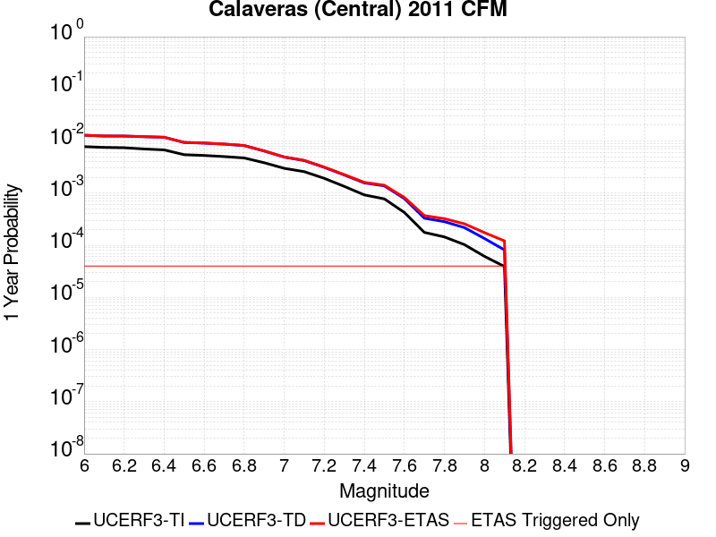 |

| Magnitude | 1 wk TI Prob | 1 wk TD Prob | 1 wk ETAS Prob | 1 wk ETAS/TD Gain | 1 wk ETAS Triggered Only | 1 mo TI Prob | 1 mo TD Prob | 1 mo ETAS Prob | 1 mo ETAS/TD Gain | 1 mo ETAS Triggered Only | 1 yr TI Prob | 1 yr TD Prob | 1 yr ETAS Prob | 1 yr ETAS/TD Gain | 1 yr ETAS Triggered Only |
|-----|-----|-----|-----|-----|-----|-----|-----|-----|-----|-----|-----|-----|-----|-----|-----|
| 6.0 | 1.5010907E-4 | 2.4887596E-4 | 2.8886602E-4 | 1.1606827 | 4.0E-5 | 6.4316596E-4 | 0.0010661384 | 0.0011060957 | 1.0374786 | 4.0E-5 | 0.0078024664 | 0.01289425 | 0.012933735 | 1.0030621 | 4.0E-5 |
| 6.1 | 1.4521465E-4 | 2.4048235E-4 | 2.8047274E-4 | 1.1662924 | 4.0E-5 | 6.222001E-4 | 0.0010301946 | 0.0010701533 | 1.0387876 | 4.0E-5 | 0.0075490056 | 0.0124630965 | 0.012502599 | 1.0031694 | 4.0E-5 |
| 6.2 | 1.429998E-4 | 2.3978335E-4 | 2.7977375E-4 | 1.1667773 | 4.0E-5 | 6.127123E-4 | 0.0010272015 | 0.0010671605 | 1.0389007 | 4.0E-5 | 0.007434286 | 0.0124271205 | 0.012466623 | 1.0031787 | 4.0E-5 |
| 6.3 | 1.3536277E-4 | 2.3306198E-4 | 2.7305266E-4 | 1.1715882 | 4.0E-5 | 5.799972E-4 | 9.984229E-4 | 0.001038383 | 1.0400232 | 4.0E-5 | 0.0070386264 | 0.012081593 | 0.01212111 | 1.0032709 | 4.0E-5 |
| 6.4 | 1.2993296E-4 | 2.2727464E-4 | 2.6726554E-4 | 1.1759585 | 4.0E-5 | 5.5673666E-4 | 9.7363896E-4 | 0.0010136 | 1.041043 | 4.0E-5 | 0.006757223 | 0.011783219 | 0.011822747 | 1.0033547 | 4.0E-5 |
| 6.5 | 1.0498927E-4 | 1.805364E-4 | 2.2052918E-4 | 1.221522 | 4.0E-5 | 4.498764E-4 | 7.734972E-4 | 8.1346626E-4 | 1.0516732 | 4.0E-5 | 0.005463498 | 0.009376575 | 0.0094162 | 1.004226 | 4.0E-5 |
| 6.6 | 1.0157505E-4 | 1.7540302E-4 | 2.1539601E-4 | 1.2280062 | 4.0E-5 | 4.35249E-4 | 7.515101E-4 | 7.9148007E-4 | 1.0531862 | 4.0E-5 | 0.0052862884 | 0.0091111865 | 0.009150822 | 1.0043502 | 4.0E-5 |
| 6.7 | 9.660386E-5 | 1.6798155E-4 | 2.0797484E-4 | 1.2380813 | 4.0E-5 | 4.1395082E-4 | 7.1972195E-4 | 7.596932E-4 | 1.055537 | 4.0E-5 | 0.0050282106 | 0.008727368 | 0.008767019 | 1.0045433 | 4.0E-5 |
| 6.8 | 9.089927E-5 | 1.570976E-4 | 1.9709131E-4 | 1.2545788 | 4.0E-5 | 3.8951015E-4 | 6.7310175E-4 | 7.130748E-4 | 1.0593864 | 4.0E-5 | 0.0047319788 | 0.008164186 | 0.008203859 | 1.0048594 | 4.0E-5 |
| 6.9 | 7.353187E-5 | 1.2353025E-4 | 1.635253E-4 | 1.3237673 | 4.0E-5 | 3.150985E-4 | 5.293085E-4 | 5.6928734E-4 | 1.0755303 | 4.0E-5 | 0.0038295772 | 0.0064254114 | 0.0064651542 | 1.0061853 | 4.0E-5 |
| 7.0 | 5.746064E-5 | 9.436792E-5 | 1.3436415E-4 | 1.4238329 | 4.0E-5 | 2.4623662E-4 | 4.0437162E-4 | 4.4435545E-4 | 1.0988789 | 4.0E-5 | 0.0029938098 | 0.0049121827 | 0.004951986 | 1.008103 | 4.0E-5 |
| 7.1 | 4.9557195E-5 | 8.095447E-5 | 1.20951234E-4 | 1.4940649 | 4.0E-5 | 2.123707E-4 | 3.4690194E-4 | 3.8688807E-4 | 1.1152663 | 4.0E-5 | 0.0025825473 | 0.004215415 | 0.0042552464 | 1.009449 | 4.0E-5 |
| 7.2 | 3.687595E-5 | 5.9887472E-5 | 9.988508E-5 | 1.6678793 | 4.0E-5 | 1.5803022E-4 | 2.566355E-4 | 2.9662525E-4 | 1.1558231 | 4.0E-5 | 0.0019223199 | 0.00312009 | 0.0031599652 | 1.0127802 | 4.0E-5 |
| 7.3 | 2.5846984E-5 | 4.2768672E-5 | 8.276696E-5 | 1.935224 | 4.0E-5 | 1.1076809E-4 | 1.8328152E-4 | 2.232742E-4 | 1.2182035 | 4.0E-5 | 0.0013477671 | 0.0022291867 | 0.0022690974 | 1.0179038 | 4.0E-5 |
| 7.4 | 1.7747854E-5 | 3.0131427E-5 | 7.013022E-5 | 2.3274777 | 4.0E-5 | 7.6060016E-5 | 1.2912831E-4 | 1.6912314E-4 | 1.3097295 | 4.0E-5 | 9.2563726E-4 | 0.0015710064 | 0.0016109435 | 1.0254214 | 4.0E-5 |
| 7.5 | 1.4883479E-5 | 2.6425658E-5 | 6.64246E-5 | 2.5136404 | 4.0E-5 | 6.378478E-5 | 1.1324792E-4 | 1.532434E-4 | 1.3531674 | 4.0E-5 | 7.76303E-4 | 0.0013779241 | 0.001417869 | 1.0289892 | 4.0E-5 |
| 7.6 | 8.166975E-6 | 1.5097764E-5 | 5.509716E-5 | 3.649359 | 4.0E-5 | 3.5000852E-5 | 6.4703105E-5 | 1.0470052E-4 | 1.6181684 | 4.0E-5 | 4.2605202E-4 | 7.8747695E-4 | 8.274455E-4 | 1.0507551 | 4.0E-5 |
| 7.7 | 3.3858064E-6 | 6.3429416E-6 | 4.6342688E-5 | 7.3061824 | 4.0E-5 | 1.4510518E-5 | 2.7183753E-5 | 6.7182664E-5 | 2.4714272 | 4.0E-5 | 1.7665124E-4 | 3.3091198E-4 | 3.7089875E-4 | 1.120838 | 4.0E-5 |
| 7.8 | 2.7721615E-6 | 5.4427956E-6 | 4.544258E-5 | 8.349125 | 4.0E-5 | 1.1880637E-5 | 2.3326058E-5 | 6.3325126E-5 | 2.7147803 | 4.0E-5 | 1.4463716E-4 | 2.839578E-4 | 3.2394644E-4 | 1.140826 | 4.0E-5 |
| 7.9 | 1.9736292E-6 | 4.185026E-6 | 4.4184857E-5 | 10.557847 | 4.0E-5 | 8.4583835E-6 | 1.7935701E-5 | 5.7934983E-5 | 3.2301488 | 4.0E-5 | 1.0297595E-4 | 2.1834532E-4 | 2.5833657E-4 | 1.183156 | 4.0E-5 |
| 8.0 | 1.1767289E-6 | 2.5885845E-6 | 4.258848E-5 | 16.452421 | 4.0E-5 | 5.0431145E-6 | 1.1093886E-5 | 5.109344E-5 | 4.6055493 | 4.0E-5 | 6.139818E-5 | 1.3505972E-4 | 1.7505432E-4 | 1.2961253 | 4.0E-5 |
| 8.1 | 7.5112825E-7 | 1.5621927E-6 | 4.156213E-5 | 26.604996 | 4.0E-5 | 3.2191172E-6 | 6.6950943E-6 | 4.6694826E-5 | 6.9744835 | 4.0E-5 | 3.9192048E-5 | 8.150975E-5 | 1.2150649E-4 | 1.4906988 | 4.0E-5 |

## Santa Ynez (West)
*[(top)](#table-of-contents)*

| 1 Week | 1 Month | 1 Year |
|-----|-----|-----|
| 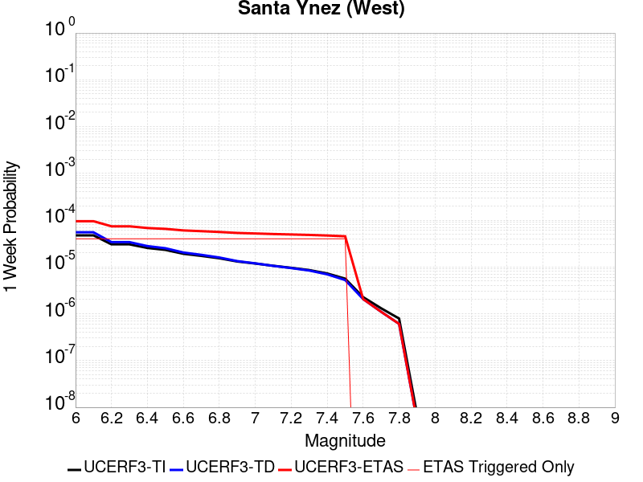 | 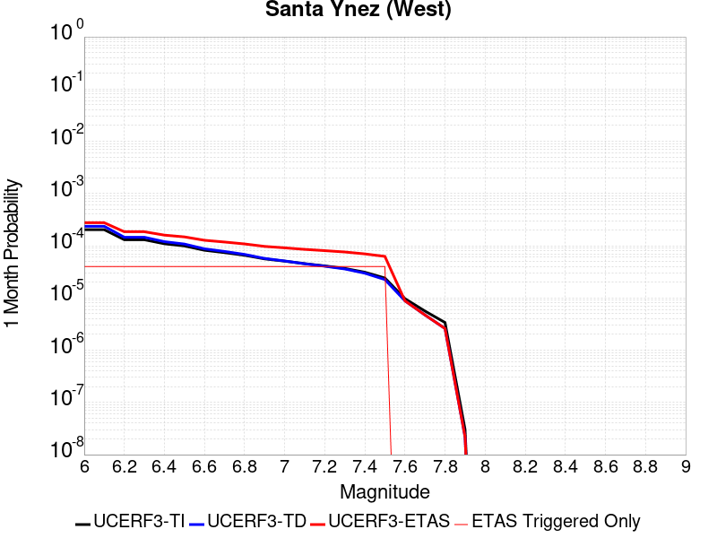 | 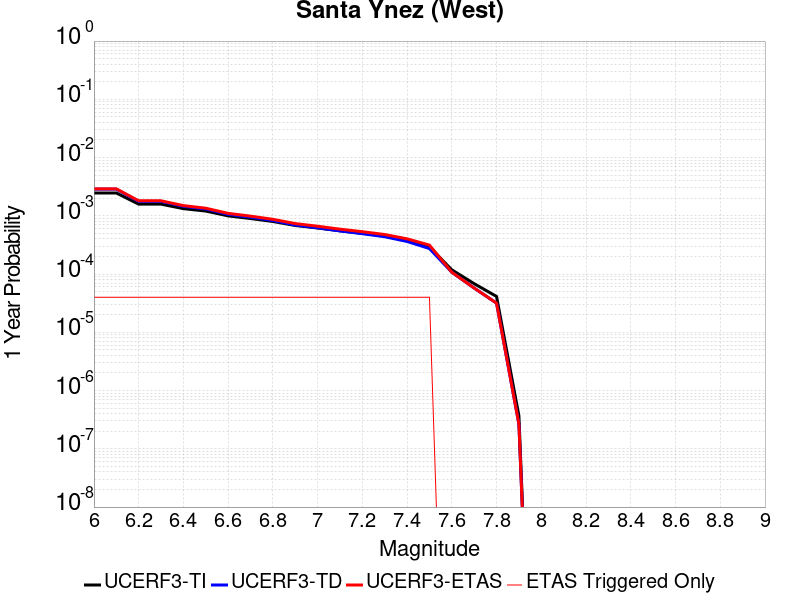 |

| Magnitude | 1 wk TI Prob | 1 wk TD Prob | 1 wk ETAS Prob | 1 wk ETAS/TD Gain | 1 wk ETAS Triggered Only | 1 mo TI Prob | 1 mo TD Prob | 1 mo ETAS Prob | 1 mo ETAS/TD Gain | 1 mo ETAS Triggered Only | 1 yr TI Prob | 1 yr TD Prob | 1 yr ETAS Prob | 1 yr ETAS/TD Gain | 1 yr ETAS Triggered Only |
|-----|-----|-----|-----|-----|-----|-----|-----|-----|-----|-----|-----|-----|-----|-----|-----|
| 6.0 | 4.7352758E-5 | 5.5006385E-5 | 9.500419E-5 | 1.7271483 | 4.0E-5 | 2.0292461E-4 | 2.3572148E-4 | 2.7571205E-4 | 1.1696517 | 4.0E-5 | 0.0024678076 | 0.0028664002 | 0.0029062855 | 1.0139148 | 4.0E-5 |
| 6.1 | 4.7352758E-5 | 5.5006385E-5 | 9.500419E-5 | 1.7271483 | 4.0E-5 | 2.0292461E-4 | 2.3572148E-4 | 2.7571205E-4 | 1.1696517 | 4.0E-5 | 0.0024678076 | 0.0028664002 | 0.0029062855 | 1.0139148 | 4.0E-5 |
| 6.2 | 3.0415853E-5 | 3.3943157E-5 | 7.3941796E-5 | 2.1784008 | 4.0E-5 | 1.3034715E-4 | 1.4546278E-4 | 1.8545696E-4 | 1.2749444 | 4.0E-5 | 0.0015858212 | 0.0017696057 | 0.001809535 | 1.0225639 | 4.0E-5 |
| 6.3 | 3.0415853E-5 | 3.3943157E-5 | 7.3941796E-5 | 2.1784008 | 4.0E-5 | 1.3034715E-4 | 1.4546278E-4 | 1.8545696E-4 | 1.2749444 | 4.0E-5 | 0.0015858212 | 0.0017696057 | 0.001809535 | 1.0225639 | 4.0E-5 |
| 6.4 | 2.5452082E-5 | 2.7926168E-5 | 6.792505E-5 | 2.4323084 | 4.0E-5 | 1.09075794E-4 | 1.196782E-4 | 1.5967341E-4 | 1.3341897 | 4.0E-5 | 0.0013271887 | 0.0014561269 | 0.0014960687 | 1.0274302 | 4.0E-5 |
| 6.5 | 2.3143784E-5 | 2.5140027E-5 | 6.513902E-5 | 2.5910482 | 4.0E-5 | 9.9183875E-5 | 1.07738604E-4 | 1.477343E-4 | 1.3712289 | 4.0E-5 | 0.0012068948 | 0.0013109427 | 0.0013508903 | 1.0304724 | 4.0E-5 |
| 6.6 | 1.9118515E-5 | 2.0363112E-5 | 6.0362298E-5 | 2.9642963 | 4.0E-5 | 8.193392E-5 | 8.72676E-5 | 1.2726411E-4 | 1.4583203 | 4.0E-5 | 9.97089E-4 | 0.0010619732 | 0.0011019306 | 1.0376258 | 4.0E-5 |
| 6.7 | 1.722807E-5 | 1.8153853E-5 | 5.8153128E-5 | 3.2033489 | 4.0E-5 | 7.3832496E-5 | 7.779994E-5 | 1.1779683E-4 | 1.5140992 | 4.0E-5 | 8.985399E-4 | 9.4680826E-4 | 9.867704E-4 | 1.0422072 | 4.0E-5 |
| 6.8 | 1.5317364E-5 | 1.5932763E-5 | 5.5932127E-5 | 3.5105102 | 4.0E-5 | 6.56442E-5 | 6.828151E-5 | 1.0827878E-4 | 1.5857701 | 4.0E-5 | 7.98925E-4 | 8.310146E-4 | 8.709813E-4 | 1.0480939 | 4.0E-5 |
| 6.9 | 1.3071226E-5 | 1.3334518E-5 | 5.3333984E-5 | 3.9996934 | 4.0E-5 | 5.6018336E-5 | 5.7146695E-5 | 9.714441E-5 | 1.699913 | 4.0E-5 | 6.8180985E-4 | 6.955412E-4 | 7.3551334E-4 | 1.0574691 | 4.0E-5 |
| 7.0 | 1.1836986E-5 | 1.1937046E-5 | 5.1936568E-5 | 4.3508725 | 4.0E-5 | 5.0728955E-5 | 5.115778E-5 | 9.115573E-5 | 1.7818547 | 4.0E-5 | 6.1745E-4 | 6.2266964E-4 | 6.626447E-4 | 1.0641996 | 4.0E-5 |
| 7.1 | 1.0597169E-5 | 1.0545887E-5 | 5.0545466E-5 | 4.792908 | 4.0E-5 | 4.541565E-5 | 4.519588E-5 | 8.519407E-5 | 1.8849964 | 4.0E-5 | 5.5279525E-4 | 5.5012206E-4 | 5.9010007E-4 | 1.0726712 | 4.0E-5 |
| 7.2 | 9.59113E-6 | 9.462545E-6 | 4.9462167E-5 | 5.227153 | 4.0E-5 | 4.11042E-5 | 4.055314E-5 | 8.0551516E-5 | 1.9863201 | 4.0E-5 | 5.0032866E-4 | 4.9362367E-4 | 5.3360395E-4 | 1.0809934 | 4.0E-5 |
| 7.3 | 8.586084E-6 | 8.382711E-6 | 4.8382375E-5 | 5.771686 | 4.0E-5 | 3.679698E-5 | 3.5925415E-5 | 7.592398E-5 | 2.1133778 | 4.0E-5 | 4.4791115E-4 | 4.3730516E-4 | 4.772877E-4 | 1.0914294 | 4.0E-5 |
| 7.4 | 7.2622997E-6 | 6.954277E-6 | 4.6954E-5 | 6.751816 | 4.0E-5 | 3.112377E-5 | 2.980371E-5 | 6.980252E-5 | 2.3420749 | 4.0E-5 | 3.78866E-4 | 3.6280073E-4 | 4.0278622E-4 | 1.1102134 | 4.0E-5 |
| 7.5 | 5.627296E-6 | 5.2534574E-6 | 4.5253248E-5 | 8.613994 | 4.0E-5 | 2.411676E-5 | 2.2514627E-5 | 6.2513725E-5 | 2.776583 | 4.0E-5 | 2.9358198E-4 | 2.740818E-4 | 3.1407084E-4 | 1.1459018 | 4.0E-5 |
| 7.6 | 2.265244E-6 | 2.061312E-6 | 2.061312E-6 | 1.0 | 0.0 | 9.708152E-6 | 8.834165E-6 | 8.834165E-6 | 1.0 | 0.0 | 1.18190335E-4 | 1.0755074E-4 | 1.0755074E-4 | 1.0 | 0.0 |
| 7.7 | 1.3099874E-6 | 1.1018567E-6 | 1.1018567E-6 | 1.0 | 0.0 | 5.61422E-6 | 4.7222347E-6 | 4.7222347E-6 | 1.0 | 0.0 | 6.8350986E-5 | 5.7491714E-5 | 5.7491714E-5 | 1.0 | 0.0 |
| 7.8 | 7.903951E-7 | 6.0723085E-7 | 6.0723085E-7 | 1.0 | 0.0 | 3.3874032E-6 | 2.6024154E-6 | 2.6024154E-6 | 1.0 | 0.0 | 4.1240855E-5 | 3.168396E-5 | 3.168396E-5 | 1.0 | 0.0 |
| 7.9 | 7.0753297E-9 | 5.090925E-9 | 5.090925E-9 | 1.0 | 0.0 | 3.032284E-8 | 2.1818249E-8 | 2.1818249E-8 | 1.0 | 0.0 | 3.6918053E-7 | 2.6563717E-7 | 2.6563717E-7 | 1.0 | 0.0 |

## Great Valley 09 (Laguna Seca)
*[(top)](#table-of-contents)*

| 1 Week | 1 Month | 1 Year |
|-----|-----|-----|
|  |  | 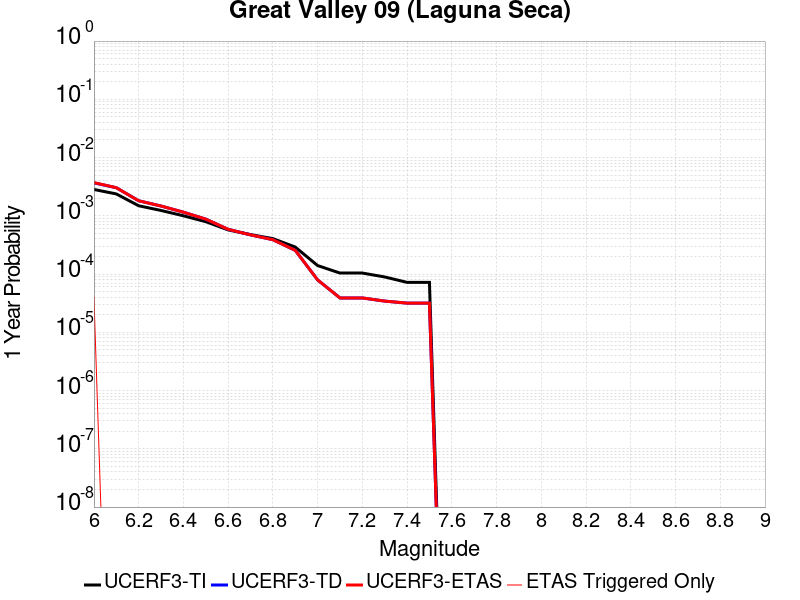 |

| Magnitude | 1 wk TI Prob | 1 wk TD Prob | 1 wk ETAS Prob | 1 wk ETAS/TD Gain | 1 wk ETAS Triggered Only | 1 mo TI Prob | 1 mo TD Prob | 1 mo ETAS Prob | 1 mo ETAS/TD Gain | 1 mo ETAS Triggered Only | 1 yr TI Prob | 1 yr TD Prob | 1 yr ETAS Prob | 1 yr ETAS/TD Gain | 1 yr ETAS Triggered Only |
|-----|-----|-----|-----|-----|-----|-----|-----|-----|-----|-----|-----|-----|-----|-----|-----|
| 6.0 | 5.4353277E-5 | 7.057439E-5 | 7.057439E-5 | 1.0 | 0.0 | 2.3292181E-4 | 3.0242838E-4 | 3.0242838E-4 | 1.0 | 0.0 | 0.0028321352 | 0.0036758543 | 0.0037157072 | 1.0108418 | 4.0E-5 |
| 6.1 | 4.5578287E-5 | 5.8279787E-5 | 5.8279787E-5 | 1.0 | 0.0 | 1.953209E-4 | 2.497478E-4 | 2.497478E-4 | 1.0 | 0.0 | 0.0023754383 | 0.0030364343 | 0.0030364343 | 1.0 | 0.0 |
| 6.2 | 2.8536782E-5 | 3.476812E-5 | 3.476812E-5 | 1.0 | 0.0 | 1.2229476E-4 | 1.4899804E-4 | 1.4899804E-4 | 1.0 | 0.0 | 0.0014879217 | 0.001812514 | 0.001812514 | 1.0 | 0.0 |
| 6.3 | 2.3698774E-5 | 2.823789E-5 | 2.823789E-5 | 1.0 | 0.0 | 1.01562226E-4 | 1.2101409E-4 | 1.2101409E-4 | 1.0 | 0.0 | 0.0012358186 | 0.0014723341 | 0.0014723341 | 1.0 | 0.0 |
| 6.4 | 1.9191197E-5 | 2.2140706E-5 | 2.2140706E-5 | 1.0 | 0.0 | 8.2245395E-5 | 9.4885436E-5 | 9.4885436E-5 | 1.0 | 0.0 | 0.0010008777 | 0.001154622 | 0.001154622 | 1.0 | 0.0 |
| 6.5 | 1.5203241E-5 | 1.6813425E-5 | 1.6813425E-5 | 1.0 | 0.0 | 6.5155116E-5 | 7.205573E-5 | 7.205573E-5 | 1.0 | 0.0 | 7.9297484E-4 | 8.769359E-4 | 8.769359E-4 | 1.0 | 0.0 |
| 6.6 | 1.0984925E-5 | 1.124901E-5 | 1.124901E-5 | 1.0 | 0.0 | 4.70774E-5 | 4.820917E-5 | 4.820917E-5 | 1.0 | 0.0 | 5.730166E-4 | 5.867925E-4 | 5.867925E-4 | 1.0 | 0.0 |
| 6.7 | 9.134616E-6 | 9.024803E-6 | 9.024803E-6 | 1.0 | 0.0 | 3.9147766E-5 | 3.8677168E-5 | 3.8677168E-5 | 1.0 | 0.0 | 4.7651984E-4 | 4.7079517E-4 | 4.7079517E-4 | 1.0 | 0.0 |
| 6.8 | 7.785589E-6 | 7.45599E-6 | 7.45599E-6 | 1.0 | 0.0 | 3.3366385E-5 | 3.1953863E-5 | 3.1953863E-5 | 1.0 | 0.0 | 4.0616E-4 | 3.8897083E-4 | 3.8897083E-4 | 1.0 | 0.0 |
| 6.9 | 5.579095E-6 | 4.901176E-6 | 4.901176E-6 | 1.0 | 0.0 | 2.3910188E-5 | 2.1004878E-5 | 2.1004878E-5 | 1.0 | 0.0 | 2.9106764E-4 | 2.5570576E-4 | 2.5570576E-4 | 1.0 | 0.0 |
| 7.0 | 2.6816688E-6 | 1.5223985E-6 | 1.5223985E-6 | 1.0 | 0.0 | 1.1492816E-5 | 6.524549E-6 | 6.524549E-6 | 1.0 | 0.0 | 1.3991605E-4 | 7.943358E-5 | 7.943358E-5 | 1.0 | 0.0 |
| 7.1 | 1.9951021E-6 | 7.458246E-7 | 7.458246E-7 | 1.0 | 0.0 | 8.55041E-6 | 3.1963873E-6 | 3.1963873E-6 | 1.0 | 0.0 | 1.0409627E-4 | 3.8915365E-5 | 3.8915365E-5 | 1.0 | 0.0 |
| 7.2 | 1.9951021E-6 | 7.458246E-7 | 7.458246E-7 | 1.0 | 0.0 | 8.55041E-6 | 3.1963873E-6 | 3.1963873E-6 | 1.0 | 0.0 | 1.0409627E-4 | 3.8915365E-5 | 3.8915365E-5 | 1.0 | 0.0 |
| 7.3 | 1.7087556E-6 | 6.5821285E-7 | 6.5821285E-7 | 1.0 | 0.0 | 7.3232177E-6 | 2.8209092E-6 | 2.8209092E-6 | 1.0 | 0.0 | 8.915652E-5 | 3.434407E-5 | 3.434407E-5 | 1.0 | 0.0 |
| 7.4 | 1.3804846E-6 | 6.076279E-7 | 6.076279E-7 | 1.0 | 0.0 | 5.916349E-6 | 2.604117E-6 | 2.604117E-6 | 1.0 | 0.0 | 7.2029165E-5 | 3.1704705E-5 | 3.1704705E-5 | 1.0 | 0.0 |
| 7.5 | 1.3804846E-6 | 6.076279E-7 | 6.076279E-7 | 1.0 | 0.0 | 5.916349E-6 | 2.604117E-6 | 2.604117E-6 | 1.0 | 0.0 | 7.2029165E-5 | 3.1704705E-5 | 3.1704705E-5 | 1.0 | 0.0 |

## Palos Verdes
*[(top)](#table-of-contents)*

| 1 Week | 1 Month | 1 Year |
|-----|-----|-----|
|  | 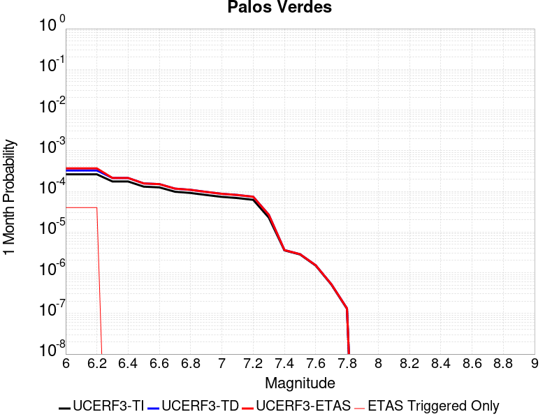 | 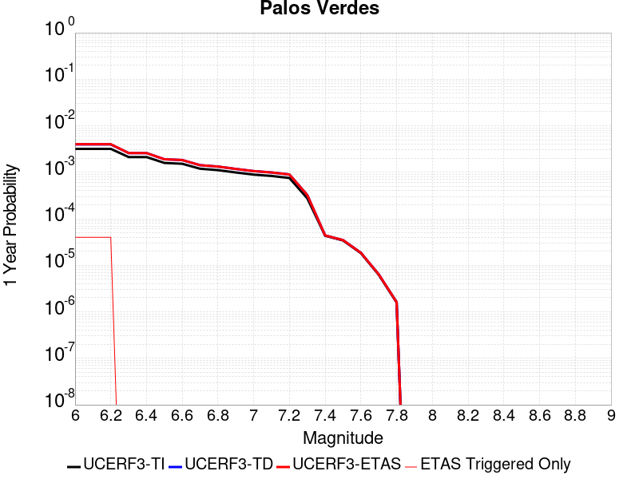 |

| Magnitude | 1 wk TI Prob | 1 wk TD Prob | 1 wk ETAS Prob | 1 wk ETAS/TD Gain | 1 wk ETAS Triggered Only | 1 mo TI Prob | 1 mo TD Prob | 1 mo ETAS Prob | 1 mo ETAS/TD Gain | 1 mo ETAS Triggered Only | 1 yr TI Prob | 1 yr TD Prob | 1 yr ETAS Prob | 1 yr ETAS/TD Gain | 1 yr ETAS Triggered Only |
|-----|-----|-----|-----|-----|-----|-----|-----|-----|-----|-----|-----|-----|-----|-----|-----|
| 6.0 | 6.126063E-5 | 7.628893E-5 | 7.628893E-5 | 1.0 | 0.0 | 2.6251914E-4 | 3.2691337E-4 | 3.669003E-4 | 1.1223166 | 4.0E-5 | 0.0031914865 | 0.0039734347 | 0.0040132757 | 1.0100268 | 4.0E-5 |
| 6.1 | 6.126063E-5 | 7.628893E-5 | 7.628893E-5 | 1.0 | 0.0 | 2.6251914E-4 | 3.2691337E-4 | 3.669003E-4 | 1.1223166 | 4.0E-5 | 0.0031914865 | 0.0039734347 | 0.0040132757 | 1.0100268 | 4.0E-5 |
| 6.2 | 6.126063E-5 | 7.628893E-5 | 7.628893E-5 | 1.0 | 0.0 | 2.6251914E-4 | 3.2691337E-4 | 3.669003E-4 | 1.1223166 | 4.0E-5 | 0.0031914865 | 0.0039734347 | 0.0040132757 | 1.0100268 | 4.0E-5 |
| 6.3 | 4.0838047E-5 | 4.9786013E-5 | 4.9786013E-5 | 1.0 | 0.0 | 1.7500846E-4 | 2.133523E-4 | 2.133523E-4 | 1.0 | 0.0 | 0.0021286458 | 0.0025946742 | 0.0025946742 | 1.0 | 0.0 |
| 6.4 | 4.0838047E-5 | 4.9786013E-5 | 4.9786013E-5 | 1.0 | 0.0 | 1.7500846E-4 | 2.133523E-4 | 2.133523E-4 | 1.0 | 0.0 | 0.0021286458 | 0.0025946742 | 0.0025946742 | 1.0 | 0.0 |
| 6.5 | 3.0512005E-5 | 3.6586363E-5 | 3.6586363E-5 | 1.0 | 0.0 | 1.3075917E-4 | 1.5678987E-4 | 1.5678987E-4 | 1.0 | 0.0 | 0.0015908304 | 0.001907361 | 0.001907361 | 1.0 | 0.0 |
| 6.6 | 2.9255087E-5 | 3.517859E-5 | 3.517859E-5 | 1.0 | 0.0 | 1.2537291E-4 | 1.5075726E-4 | 1.5075726E-4 | 1.0 | 0.0 | 0.0015253464 | 0.0018340375 | 0.0018340375 | 1.0 | 0.0 |
| 6.7 | 2.287198E-5 | 2.7266105E-5 | 2.7266105E-5 | 1.0 | 0.0 | 9.801909E-5 | 1.16850024E-4 | 1.16850024E-4 | 1.0 | 0.0 | 0.001192729 | 0.0014218123 | 0.0014218123 | 1.0 | 0.0 |
| 6.8 | 2.1325764E-5 | 2.5448615E-5 | 2.5448615E-5 | 1.0 | 0.0 | 9.139293E-5 | 1.0906144E-4 | 1.0906144E-4 | 1.0 | 0.0 | 0.001112141 | 0.0013271046 | 0.0013271046 | 1.0 | 0.0 |
| 6.9 | 1.9009392E-5 | 2.2628212E-5 | 2.2628212E-5 | 1.0 | 0.0 | 8.1466285E-5 | 9.697494E-5 | 9.697494E-5 | 1.0 | 0.0 | 9.914007E-4 | 0.0011801178 | 0.0011801178 | 1.0 | 0.0 |
| 7.0 | 1.7098473E-5 | 2.0332458E-5 | 2.0332458E-5 | 1.0 | 0.0 | 7.3277115E-5 | 8.713668E-5 | 8.713668E-5 | 1.0 | 0.0 | 8.917837E-4 | 0.0010604581 | 0.0010604581 | 1.0 | 0.0 |
| 7.1 | 1.5982785E-5 | 1.9007015E-5 | 1.9007015E-5 | 1.0 | 0.0 | 6.849585E-5 | 8.145657E-5 | 8.145657E-5 | 1.0 | 0.0 | 8.336179E-4 | 9.913674E-4 | 9.913674E-4 | 1.0 | 0.0 |
| 7.2 | 1.4468002E-5 | 1.7208347E-5 | 1.7208347E-5 | 1.0 | 0.0 | 6.200425E-5 | 7.374845E-5 | 7.374845E-5 | 1.0 | 0.0 | 7.546402E-4 | 8.9760165E-4 | 8.9760165E-4 | 1.0 | 0.0 |
| 7.3 | 5.288233E-6 | 6.207409E-6 | 6.207409E-6 | 1.0 | 0.0 | 2.2663658E-5 | 2.660311E-5 | 2.660311E-5 | 1.0 | 0.0 | 2.7589512E-4 | 3.2387965E-4 | 3.2387965E-4 | 1.0 | 0.0 |
| 7.4 | 8.279556E-7 | 8.40879E-7 | 8.40879E-7 | 1.0 | 0.0 | 3.5483763E-6 | 3.6037625E-6 | 3.6037625E-6 | 1.0 | 0.0 | 4.3200624E-5 | 4.3875E-5 | 4.3875E-5 | 1.0 | 0.0 |
| 7.5 | 6.559831E-7 | 6.667599E-7 | 6.667599E-7 | 1.0 | 0.0 | 2.8113532E-6 | 2.8575396E-6 | 2.8575396E-6 | 1.0 | 0.0 | 3.4227687E-5 | 3.4790057E-5 | 3.4790057E-5 | 1.0 | 0.0 |
| 7.6 | 3.5018968E-7 | 3.56221E-7 | 3.56221E-7 | 1.0 | 0.0 | 1.500812E-6 | 1.5266609E-6 | 1.5266609E-6 | 1.0 | 0.0 | 1.8272232E-5 | 1.8586983E-5 | 1.8586983E-5 | 1.0 | 0.0 |
| 7.7 | 1.1986104E-7 | 1.2199109E-7 | 1.2199109E-7 | 1.0 | 0.0 | 5.1369005E-7 | 5.228188E-7 | 5.228188E-7 | 1.0 | 0.0 | 6.2541585E-6 | 6.365301E-6 | 6.365301E-6 | 1.0 | 0.0 |
| 7.8 | 3.0445005E-8 | 3.1029597E-8 | 3.1029597E-8 | 1.0 | 0.0 | 1.3047858E-7 | 1.3298397E-7 | 1.3298397E-7 | 1.0 | 0.0 | 1.5885756E-6 | 1.619079E-6 | 1.619079E-6 | 1.0 | 0.0 |

## Oceanside alt1
*[(top)](#table-of-contents)*

| 1 Week | 1 Month | 1 Year |
|-----|-----|-----|
|  | 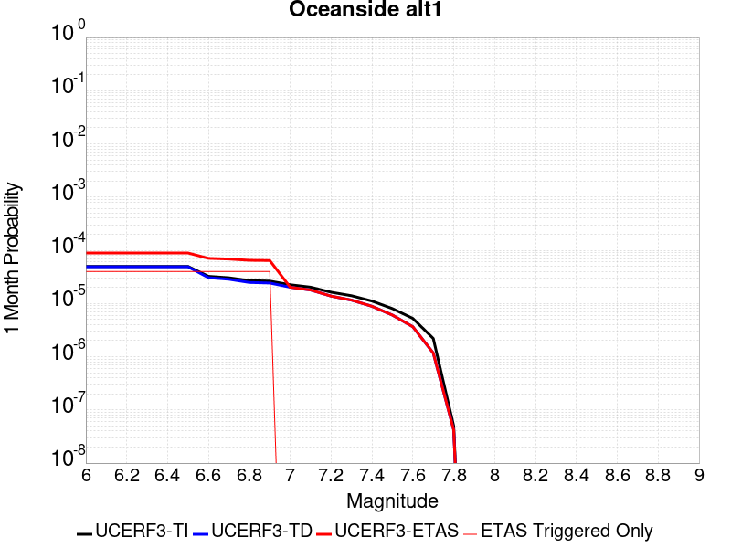 | 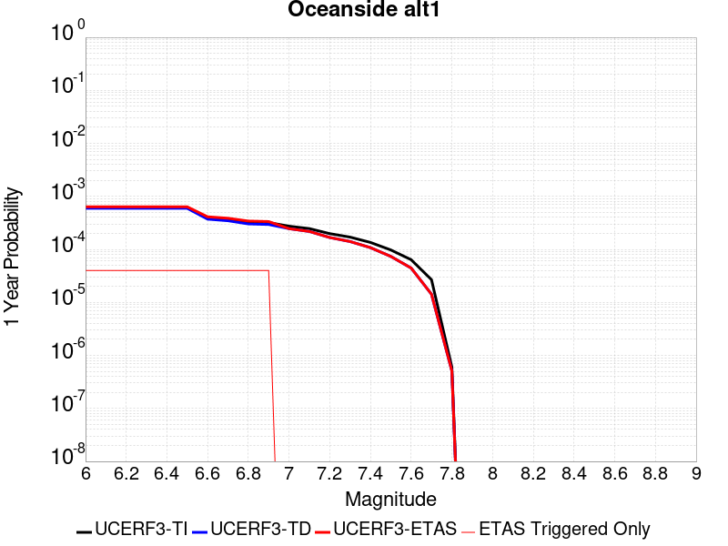 |

| Magnitude | 1 wk TI Prob | 1 wk TD Prob | 1 wk ETAS Prob | 1 wk ETAS/TD Gain | 1 wk ETAS Triggered Only | 1 mo TI Prob | 1 mo TD Prob | 1 mo ETAS Prob | 1 mo ETAS/TD Gain | 1 mo ETAS Triggered Only | 1 yr TI Prob | 1 yr TD Prob | 1 yr ETAS Prob | 1 yr ETAS/TD Gain | 1 yr ETAS Triggered Only |
|-----|-----|-----|-----|-----|-----|-----|-----|-----|-----|-----|-----|-----|-----|-----|-----|
| 6.0 | 1.1617542E-5 | 1.1425403E-5 | 5.1424944E-5 | 4.500931 | 4.0E-5 | 4.9788516E-5 | 4.8965183E-5 | 8.896322E-5 | 1.816867 | 4.0E-5 | 6.060066E-4 | 5.9600413E-4 | 6.3598034E-4 | 1.0670736 | 4.0E-5 |
| 6.1 | 1.1617542E-5 | 1.1425403E-5 | 5.1424944E-5 | 4.500931 | 4.0E-5 | 4.9788516E-5 | 4.8965183E-5 | 8.896322E-5 | 1.816867 | 4.0E-5 | 6.060066E-4 | 5.9600413E-4 | 6.3598034E-4 | 1.0670736 | 4.0E-5 |
| 6.2 | 1.1617542E-5 | 1.1425403E-5 | 5.1424944E-5 | 4.500931 | 4.0E-5 | 4.9788516E-5 | 4.8965183E-5 | 8.896322E-5 | 1.816867 | 4.0E-5 | 6.060066E-4 | 5.9600413E-4 | 6.3598034E-4 | 1.0670736 | 4.0E-5 |
| 6.3 | 1.1617542E-5 | 1.1425403E-5 | 5.1424944E-5 | 4.500931 | 4.0E-5 | 4.9788516E-5 | 4.8965183E-5 | 8.896322E-5 | 1.816867 | 4.0E-5 | 6.060066E-4 | 5.9600413E-4 | 6.3598034E-4 | 1.0670736 | 4.0E-5 |
| 6.4 | 1.1617542E-5 | 1.1425403E-5 | 5.1424944E-5 | 4.500931 | 4.0E-5 | 4.9788516E-5 | 4.8965183E-5 | 8.896322E-5 | 1.816867 | 4.0E-5 | 6.060066E-4 | 5.9600413E-4 | 6.3598034E-4 | 1.0670736 | 4.0E-5 |
| 6.5 | 1.1617542E-5 | 1.1425403E-5 | 5.1424944E-5 | 4.500931 | 4.0E-5 | 4.9788516E-5 | 4.8965183E-5 | 8.896322E-5 | 1.816867 | 4.0E-5 | 6.060066E-4 | 5.9600413E-4 | 6.3598034E-4 | 1.0670736 | 4.0E-5 |
| 6.6 | 7.561768E-6 | 7.1346853E-6 | 4.71344E-5 | 6.606374 | 4.0E-5 | 3.2407173E-5 | 3.057687E-5 | 7.057565E-5 | 2.3081384 | 4.0E-5 | 3.9448592E-4 | 3.722109E-4 | 4.12196E-4 | 1.1074259 | 4.0E-5 |
| 6.7 | 7.1042605E-6 | 6.656683E-6 | 4.6656416E-5 | 7.0089583 | 4.0E-5 | 3.0446476E-5 | 2.8528335E-5 | 6.8527195E-5 | 2.4020748 | 4.0E-5 | 3.706228E-4 | 3.4727794E-4 | 3.8726404E-4 | 1.1151415 | 4.0E-5 |
| 6.8 | 6.285554E-6 | 5.800571E-6 | 4.5800338E-5 | 7.8958325 | 4.0E-5 | 2.693781E-5 | 2.4859357E-5 | 6.485837E-5 | 2.6090121 | 4.0E-5 | 3.2791847E-4 | 3.026212E-4 | 3.426091E-4 | 1.1321385 | 4.0E-5 |
| 6.9 | 6.148883E-6 | 5.6573867E-6 | 4.565716E-5 | 8.070362 | 4.0E-5 | 2.635209E-5 | 2.424572E-5 | 6.424475E-5 | 2.6497357 | 4.0E-5 | 3.2078946E-4 | 2.9515222E-4 | 3.3514042E-4 | 1.1354833 | 4.0E-5 |
| 7.0 | 5.253857E-6 | 4.7231065E-6 | 4.7231065E-6 | 1.0 | 0.0 | 2.2516335E-5 | 2.0241729E-5 | 2.0241729E-5 | 1.0 | 0.0 | 2.7410188E-4 | 2.4641547E-4 | 2.4641547E-4 | 1.0 | 0.0 |
| 7.1 | 4.730754E-6 | 4.1791272E-6 | 4.1791272E-6 | 1.0 | 0.0 | 2.0274503E-5 | 1.7910425E-5 | 1.7910425E-5 | 1.0 | 0.0 | 2.468141E-4 | 2.1803785E-4 | 2.1803785E-4 | 1.0 | 0.0 |
| 7.2 | 3.7998386E-6 | 3.2144935E-6 | 3.2144935E-6 | 1.0 | 0.0 | 1.6284921E-5 | 1.3776328E-5 | 1.3776328E-5 | 1.0 | 0.0 | 1.9825088E-4 | 1.6771401E-4 | 1.6771401E-4 | 1.0 | 0.0 |
| 7.3 | 3.2656465E-6 | 2.6987216E-6 | 2.6987216E-6 | 1.0 | 0.0 | 1.3995553E-5 | 1.15658995E-5 | 1.15658995E-5 | 1.0 | 0.0 | 1.7038253E-4 | 1.4080583E-4 | 1.4080583E-4 | 1.0 | 0.0 |
| 7.4 | 2.593703E-6 | 2.068265E-6 | 2.068265E-6 | 1.0 | 0.0 | 1.1115822E-5 | 8.863964E-6 | 8.863964E-6 | 1.0 | 0.0 | 1.3532673E-4 | 1.079135E-4 | 1.079135E-4 | 1.0 | 0.0 |
| 7.5 | 1.8715585E-6 | 1.4139124E-6 | 1.4139124E-6 | 1.0 | 0.0 | 8.020941E-6 | 6.059611E-6 | 6.059611E-6 | 1.0 | 0.0 | 9.7650576E-5 | 7.377333E-5 | 7.377333E-5 | 1.0 | 0.0 |
| 7.6 | 1.2246786E-6 | 8.528269E-7 | 8.528269E-7 | 1.0 | 0.0 | 5.248612E-6 | 3.6549675E-6 | 3.6549675E-6 | 1.0 | 0.0 | 6.389998E-5 | 4.4498367E-5 | 4.4498367E-5 | 1.0 | 0.0 |
| 7.7 | 5.140719E-7 | 2.735437E-7 | 2.735437E-7 | 1.0 | 0.0 | 2.2031636E-6 | 1.1723297E-6 | 1.1723297E-6 | 1.0 | 0.0 | 2.6823185E-5 | 1.4273033E-5 | 1.4273033E-5 | 1.0 | 0.0 |
| 7.8 | 1.16056995E-8 | 9.78305E-9 | 9.78305E-9 | 1.0 | 0.0 | 4.9738713E-8 | 4.1927358E-8 | 4.1927358E-8 | 1.0 | 0.0 | 6.0556863E-7 | 5.1046555E-7 | 5.1046555E-7 | 1.0 | 0.0 |

## Shoreline
*[(top)](#table-of-contents)*

| 1 Week | 1 Month | 1 Year |
|-----|-----|-----|
| 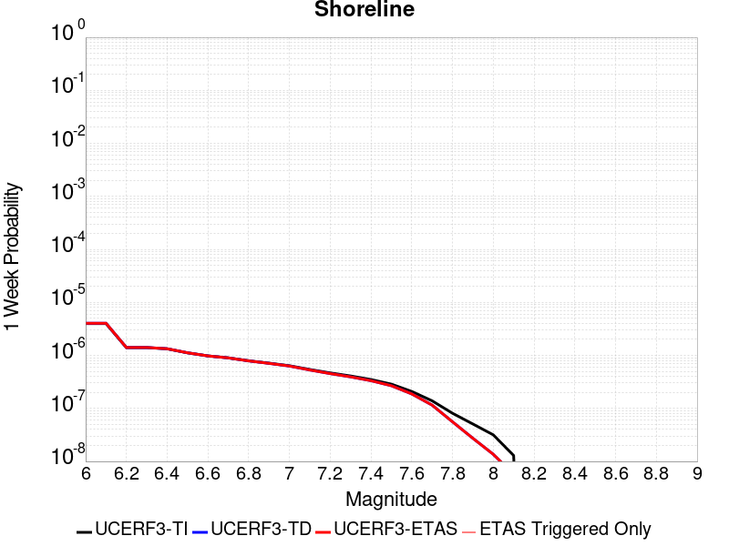 | 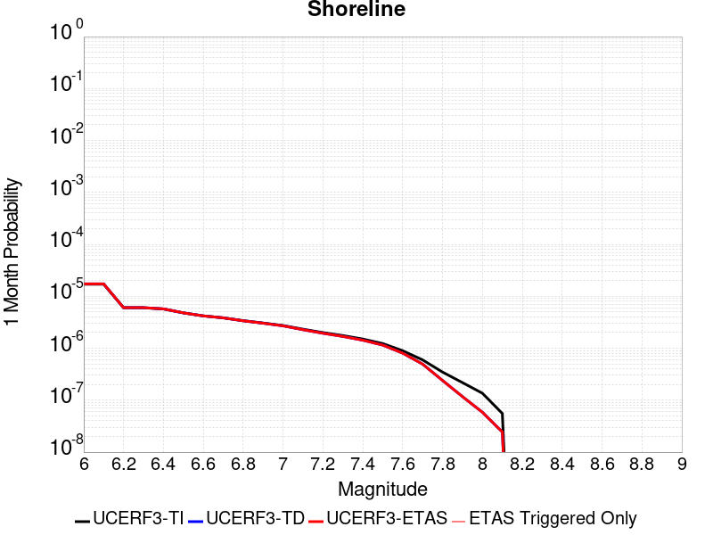 | 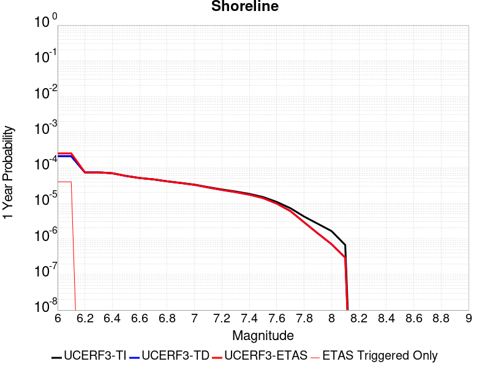 |

| Magnitude | 1 wk TI Prob | 1 wk TD Prob | 1 wk ETAS Prob | 1 wk ETAS/TD Gain | 1 wk ETAS Triggered Only | 1 mo TI Prob | 1 mo TD Prob | 1 mo ETAS Prob | 1 mo ETAS/TD Gain | 1 mo ETAS Triggered Only | 1 yr TI Prob | 1 yr TD Prob | 1 yr ETAS Prob | 1 yr ETAS/TD Gain | 1 yr ETAS Triggered Only |
|-----|-----|-----|-----|-----|-----|-----|-----|-----|-----|-----|-----|-----|-----|-----|-----|
| 6.0 | 3.9888673E-6 | 4.0483383E-6 | 4.0483383E-6 | 1.0 | 0.0 | 1.7095033E-5 | 1.7349937E-5 | 1.7349937E-5 | 1.0 | 0.0 | 2.0811215E-4 | 2.1122061E-4 | 2.5121216E-4 | 1.1893355 | 4.0E-5 |
| 6.1 | 3.9888673E-6 | 4.0483383E-6 | 4.0483383E-6 | 1.0 | 0.0 | 1.7095033E-5 | 1.7349937E-5 | 1.7349937E-5 | 1.0 | 0.0 | 2.0811215E-4 | 2.1122061E-4 | 2.5121216E-4 | 1.1893355 | 4.0E-5 |
| 6.2 | 1.4039653E-6 | 1.4103152E-6 | 1.4103152E-6 | 1.0 | 0.0 | 6.0169805E-6 | 6.0441944E-6 | 6.0441944E-6 | 1.0 | 0.0 | 7.325427E-5 | 7.3585645E-5 | 7.3585645E-5 | 1.0 | 0.0 |
| 6.3 | 1.4039653E-6 | 1.4103152E-6 | 1.4103152E-6 | 1.0 | 0.0 | 6.0169805E-6 | 6.0441944E-6 | 6.0441944E-6 | 1.0 | 0.0 | 7.325427E-5 | 7.3585645E-5 | 7.3585645E-5 | 1.0 | 0.0 |
| 6.4 | 1.3314152E-6 | 1.3363818E-6 | 1.3363818E-6 | 1.0 | 0.0 | 5.7060524E-6 | 5.7273387E-6 | 5.7273387E-6 | 1.0 | 0.0 | 6.946897E-5 | 6.972817E-5 | 6.972817E-5 | 1.0 | 0.0 |
| 6.5 | 1.1187026E-6 | 1.1205748E-6 | 1.1205748E-6 | 1.0 | 0.0 | 4.794431E-6 | 4.8024544E-6 | 4.8024544E-6 | 1.0 | 0.0 | 5.8370628E-5 | 5.846834E-5 | 5.846834E-5 | 1.0 | 0.0 |
| 6.6 | 9.793089E-7 | 9.786942E-7 | 9.786942E-7 | 1.0 | 0.0 | 4.1970316E-6 | 4.1943968E-6 | 4.1943968E-6 | 1.0 | 0.0 | 5.1097657E-5 | 5.10656E-5 | 5.10656E-5 | 1.0 | 0.0 |
| 6.7 | 8.995986E-7 | 8.97477E-7 | 8.97477E-7 | 1.0 | 0.0 | 3.8554167E-6 | 3.8463245E-6 | 3.8463245E-6 | 1.0 | 0.0 | 4.693869E-5 | 4.6828E-5 | 4.6828E-5 | 1.0 | 0.0 |
| 6.8 | 7.931612E-7 | 7.882275E-7 | 7.882275E-7 | 1.0 | 0.0 | 3.3992578E-6 | 3.3781137E-6 | 3.3781137E-6 | 1.0 | 0.0 | 4.1385178E-5 | 4.112776E-5 | 4.112776E-5 | 1.0 | 0.0 |
| 6.9 | 7.1465956E-7 | 7.079818E-7 | 7.079818E-7 | 1.0 | 0.0 | 3.062823E-6 | 3.0342042E-6 | 3.0342042E-6 | 1.0 | 0.0 | 3.7289232E-5 | 3.694081E-5 | 3.694081E-5 | 1.0 | 0.0 |
| 7.0 | 6.389046E-7 | 6.301197E-7 | 6.301197E-7 | 1.0 | 0.0 | 2.7381598E-6 | 2.7005103E-6 | 2.7005103E-6 | 1.0 | 0.0 | 3.3336586E-5 | 3.287822E-5 | 3.287822E-5 | 1.0 | 0.0 |
| 7.1 | 5.4300875E-7 | 5.312767E-7 | 5.312767E-7 | 1.0 | 0.0 | 2.3271782E-6 | 2.2768982E-6 | 2.2768982E-6 | 1.0 | 0.0 | 2.8333026E-5 | 2.7720884E-5 | 2.7720884E-5 | 1.0 | 0.0 |
| 7.2 | 4.6768855E-7 | 4.5364504E-7 | 4.5364504E-7 | 1.0 | 0.0 | 2.0043778E-6 | 1.9441916E-6 | 1.9441916E-6 | 1.0 | 0.0 | 2.4403027E-5 | 2.3670276E-5 | 2.3670276E-5 | 1.0 | 0.0 |
| 7.3 | 4.0966103E-7 | 3.9400655E-7 | 3.9400655E-7 | 1.0 | 0.0 | 1.7556889E-6 | 1.6885983E-6 | 1.6885983E-6 | 1.0 | 0.0 | 2.1375303E-5 | 2.0558491E-5 | 2.0558491E-5 | 1.0 | 0.0 |
| 7.4 | 3.5105785E-7 | 3.33784E-7 | 3.33784E-7 | 1.0 | 0.0 | 1.5045327E-6 | 1.430502E-6 | 1.430502E-6 | 1.0 | 0.0 | 1.8317533E-5 | 1.7416223E-5 | 1.7416223E-5 | 1.0 | 0.0 |
| 7.5 | 2.8737534E-7 | 2.6833848E-7 | 2.6833848E-7 | 1.0 | 0.0 | 1.2316079E-6 | 1.1500216E-6 | 1.1500216E-6 | 1.0 | 0.0 | 1.4994724E-5 | 1.4001423E-5 | 1.4001423E-5 | 1.0 | 0.0 |
| 7.6 | 2.0924051E-7 | 1.8791995E-7 | 1.8791995E-7 | 1.0 | 0.0 | 8.967448E-7 | 8.05371E-7 | 8.05371E-7 | 1.0 | 0.0 | 1.0917813E-5 | 9.805347E-6 | 9.805347E-6 | 1.0 | 0.0 |
| 7.7 | 1.392265E-7 | 1.1555568E-7 | 1.1555568E-7 | 1.0 | 0.0 | 5.9668486E-7 | 4.952385E-7 | 4.952385E-7 | 1.0 | 0.0 | 7.2646135E-6 | 6.0295124E-6 | 6.0295124E-6 | 1.0 | 0.0 |
| 7.8 | 8.1080074E-8 | 5.598125E-8 | 5.598125E-8 | 1.0 | 0.0 | 3.4748598E-7 | 2.3991961E-7 | 2.3991961E-7 | 1.0 | 0.0 | 4.2306337E-6 | 2.9210173E-6 | 2.9210173E-6 | 1.0 | 0.0 |
| 7.9 | 5.0859036E-8 | 2.7349328E-8 | 2.7349328E-8 | 1.0 | 0.0 | 2.1796728E-7 | 1.1721141E-7 | 1.1721141E-7 | 1.0 | 0.0 | 2.6537484E-6 | 1.4270479E-6 | 1.4270479E-6 | 1.0 | 0.0 |
| 8.0 | 3.1760536E-8 | 1.3658772E-8 | 1.3658772E-8 | 1.0 | 0.0 | 1.3611657E-7 | 5.8537594E-8 | 5.8537594E-8 | 1.0 | 0.0 | 1.6572179E-6 | 7.12695E-7 | 7.12695E-7 | 1.0 | 0.0 |
| 8.1 | 1.2947896E-8 | 5.6988867E-9 | 5.6988867E-9 | 1.0 | 0.0 | 5.5490982E-8 | 2.4423802E-8 | 2.4423802E-8 | 1.0 | 0.0 | 6.756025E-7 | 2.9735975E-7 | 2.9735975E-7 | 1.0 | 0.0 |

## San Gabriel
*[(top)](#table-of-contents)*

| 1 Week | 1 Month | 1 Year |
|-----|-----|-----|
| 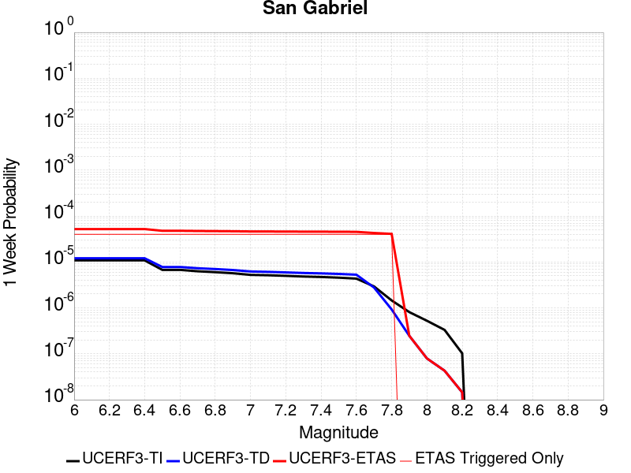 | 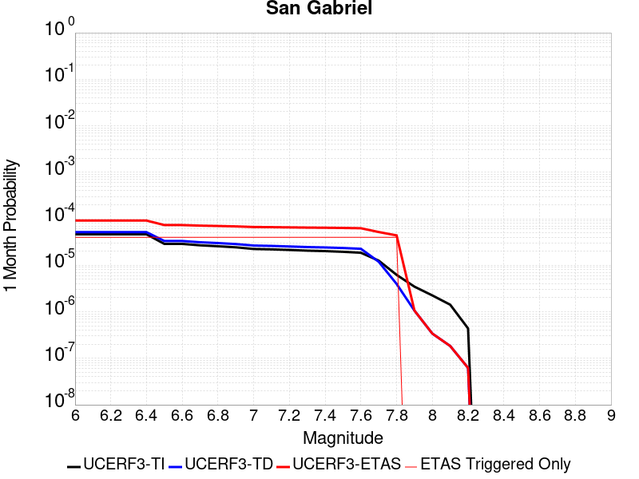 | 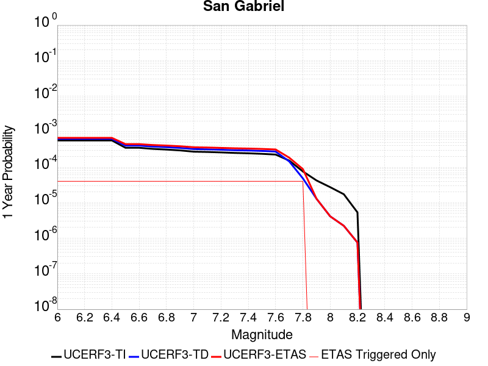 |

| Magnitude | 1 wk TI Prob | 1 wk TD Prob | 1 wk ETAS Prob | 1 wk ETAS/TD Gain | 1 wk ETAS Triggered Only | 1 mo TI Prob | 1 mo TD Prob | 1 mo ETAS Prob | 1 mo ETAS/TD Gain | 1 mo ETAS Triggered Only | 1 yr TI Prob | 1 yr TD Prob | 1 yr ETAS Prob | 1 yr ETAS/TD Gain | 1 yr ETAS Triggered Only |
|-----|-----|-----|-----|-----|-----|-----|-----|-----|-----|-----|-----|-----|-----|-----|-----|
| 6.0 | 1.083775E-5 | 1.2040094E-5 | 5.2039613E-5 | 4.322193 | 4.0E-5 | 4.6446676E-5 | 5.1599447E-5 | 9.159738E-5 | 1.7751621 | 4.0E-5 | 5.653415E-4 | 6.280535E-4 | 6.6802837E-4 | 1.0636488 | 4.0E-5 |
| 6.1 | 1.083775E-5 | 1.2040094E-5 | 5.2039613E-5 | 4.322193 | 4.0E-5 | 4.6446676E-5 | 5.1599447E-5 | 9.159738E-5 | 1.7751621 | 4.0E-5 | 5.653415E-4 | 6.280535E-4 | 6.6802837E-4 | 1.0636488 | 4.0E-5 |
| 6.2 | 1.083775E-5 | 1.2040094E-5 | 5.2039613E-5 | 4.322193 | 4.0E-5 | 4.6446676E-5 | 5.1599447E-5 | 9.159738E-5 | 1.7751621 | 4.0E-5 | 5.653415E-4 | 6.280535E-4 | 6.6802837E-4 | 1.0636488 | 4.0E-5 |
| 6.3 | 1.083775E-5 | 1.2040094E-5 | 5.2039613E-5 | 4.322193 | 4.0E-5 | 4.6446676E-5 | 5.1599447E-5 | 9.159738E-5 | 1.7751621 | 4.0E-5 | 5.653415E-4 | 6.280535E-4 | 6.6802837E-4 | 1.0636488 | 4.0E-5 |
| 6.4 | 1.083775E-5 | 1.2040094E-5 | 5.2039613E-5 | 4.322193 | 4.0E-5 | 4.6446676E-5 | 5.1599447E-5 | 9.159738E-5 | 1.7751621 | 4.0E-5 | 5.653415E-4 | 6.280535E-4 | 6.6802837E-4 | 1.0636488 | 4.0E-5 |
| 6.5 | 6.7317824E-6 | 7.771279E-6 | 4.777097E-5 | 6.147118 | 4.0E-5 | 2.8850178E-5 | 3.3305063E-5 | 7.330373E-5 | 2.2009785 | 4.0E-5 | 3.511943E-4 | 4.0541476E-4 | 4.4539853E-4 | 1.0986243 | 4.0E-5 |
| 6.6 | 6.7317824E-6 | 7.771279E-6 | 4.777097E-5 | 6.147118 | 4.0E-5 | 2.8850178E-5 | 3.3305063E-5 | 7.330373E-5 | 2.2009785 | 4.0E-5 | 3.511943E-4 | 4.0541476E-4 | 4.4539853E-4 | 1.0986243 | 4.0E-5 |
| 6.7 | 6.274881E-6 | 7.3001497E-6 | 4.7299858E-5 | 6.4792995 | 4.0E-5 | 2.6892068E-5 | 3.1285985E-5 | 7.128473E-5 | 2.2784877 | 4.0E-5 | 3.2736175E-4 | 3.808413E-4 | 4.2082605E-4 | 1.1049906 | 4.0E-5 |
| 6.8 | 5.996209E-6 | 7.01284E-6 | 4.701256E-5 | 6.7037835 | 4.0E-5 | 2.5697784E-5 | 3.0054685E-5 | 7.005349E-5 | 2.3308673 | 4.0E-5 | 3.128256E-4 | 3.6585532E-4 | 4.0584066E-4 | 1.1092929 | 4.0E-5 |
| 6.9 | 5.686331E-6 | 6.6776697E-6 | 4.6677404E-5 | 6.9900737 | 4.0E-5 | 2.4369761E-5 | 2.8618277E-5 | 6.861713E-5 | 2.3976681 | 4.0E-5 | 2.9666146E-4 | 3.4837273E-4 | 3.8835878E-4 | 1.1147796 | 4.0E-5 |
| 7.0 | 5.2329838E-6 | 6.2014137E-6 | 4.6201167E-5 | 7.4501023 | 4.0E-5 | 2.242688E-5 | 2.6577221E-5 | 6.6576154E-5 | 2.5050082 | 4.0E-5 | 2.7301308E-4 | 3.235304E-4 | 3.6351747E-4 | 1.123596 | 4.0E-5 |
| 7.1 | 5.135671E-6 | 6.091397E-6 | 4.6091154E-5 | 7.566598 | 4.0E-5 | 2.2009834E-5 | 2.6105732E-5 | 6.610469E-5 | 2.5321906 | 4.0E-5 | 2.6793676E-4 | 3.177917E-4 | 3.5777898E-4 | 1.1258286 | 4.0E-5 |
| 7.2 | 4.989062E-6 | 5.9245344E-6 | 4.59243E-5 | 7.7515454 | 4.0E-5 | 2.1381518E-5 | 2.5390618E-5 | 6.5389606E-5 | 2.575345 | 4.0E-5 | 2.6028889E-4 | 3.0908769E-4 | 3.4907533E-4 | 1.1293731 | 4.0E-5 |
| 7.3 | 4.8219395E-6 | 5.7558727E-6 | 4.575564E-5 | 7.949384 | 4.0E-5 | 2.0665291E-5 | 2.4667797E-5 | 6.466681E-5 | 2.6215074 | 4.0E-5 | 2.5157086E-4 | 3.002898E-4 | 3.402778E-4 | 1.1331646 | 4.0E-5 |
| 7.4 | 4.7118383E-6 | 5.644234E-6 | 4.5644007E-5 | 8.086838 | 4.0E-5 | 2.0193436E-5 | 2.4189356E-5 | 6.418839E-5 | 2.65358 | 4.0E-5 | 2.4582737E-4 | 2.9446636E-4 | 3.3445458E-4 | 1.1357989 | 4.0E-5 |
| 7.5 | 4.5506545E-6 | 5.4893308E-6 | 4.5489112E-5 | 8.286823 | 4.0E-5 | 1.9502659E-5 | 2.3525496E-5 | 6.352455E-5 | 2.700243 | 4.0E-5 | 2.37419E-4 | 2.8638603E-4 | 3.2637457E-4 | 1.1396316 | 4.0E-5 |
| 7.6 | 4.343636E-6 | 5.281765E-6 | 4.5281555E-5 | 8.573186 | 4.0E-5 | 1.861545E-5 | 2.2635943E-5 | 6.263504E-5 | 2.7670612 | 4.0E-5 | 2.2661954E-4 | 2.755585E-4 | 3.1554748E-4 | 1.1451198 | 4.0E-5 |
| 7.7 | 2.936235E-6 | 2.7792926E-6 | 4.2779182E-5 | 15.392112 | 4.0E-5 | 1.2583803E-5 | 1.1911199E-5 | 5.1910723E-5 | 4.358144 | 4.0E-5 | 1.5319703E-4 | 1.4500924E-4 | 1.8500343E-4 | 1.2758045 | 4.0E-5 |
| 7.8 | 1.4541639E-6 | 9.265855E-7 | 4.092655E-5 | 44.169205 | 4.0E-5 | 6.232116E-6 | 3.971075E-6 | 4.3970915E-5 | 11.0728 | 4.0E-5 | 7.587337E-5 | 4.8346767E-5 | 8.834483E-5 | 1.8273163 | 4.0E-5 |
| 7.9 | 8.098958E-7 | 2.4722956E-7 | 2.4722956E-7 | 1.0 | 0.0 | 3.4709774E-6 | 1.0595548E-6 | 1.0595548E-6 | 1.0 | 0.0 | 4.225833E-5 | 1.2900004E-5 | 1.2900004E-5 | 1.0 | 0.0 |
| 8.0 | 5.2473234E-7 | 7.932058E-8 | 7.932058E-8 | 1.0 | 0.0 | 2.248851E-6 | 3.399453E-7 | 3.399453E-7 | 1.0 | 0.0 | 2.7379416E-5 | 4.138826E-6 | 4.138826E-6 | 1.0 | 0.0 |
| 8.1 | 3.3162388E-7 | 4.289848E-8 | 4.289848E-8 | 1.0 | 0.0 | 1.4212444E-6 | 1.8385062E-7 | 1.8385062E-7 | 1.0 | 0.0 | 1.7303513E-5 | 2.238379E-6 | 2.238379E-6 | 1.0 | 0.0 |
| 8.2 | 1.0235345E-7 | 1.4487087E-8 | 1.4487087E-8 | 1.0 | 0.0 | 4.3865757E-7 | 6.2087516E-8 | 6.2087516E-8 | 1.0 | 0.0 | 5.340643E-6 | 7.559152E-7 | 7.559152E-7 | 1.0 | 0.0 |

## Great Valley 08 (Quinto)
*[(top)](#table-of-contents)*

| 1 Week | 1 Month | 1 Year |
|-----|-----|-----|
| 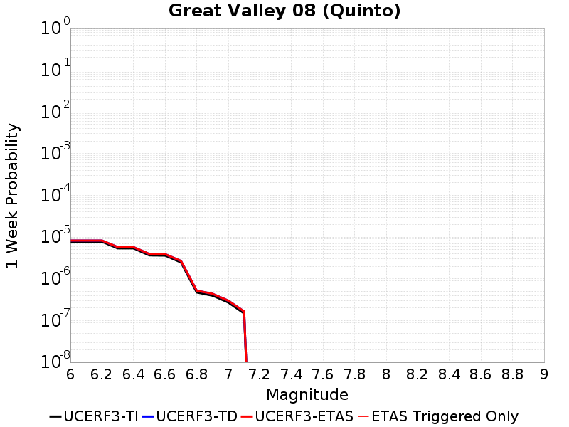 | 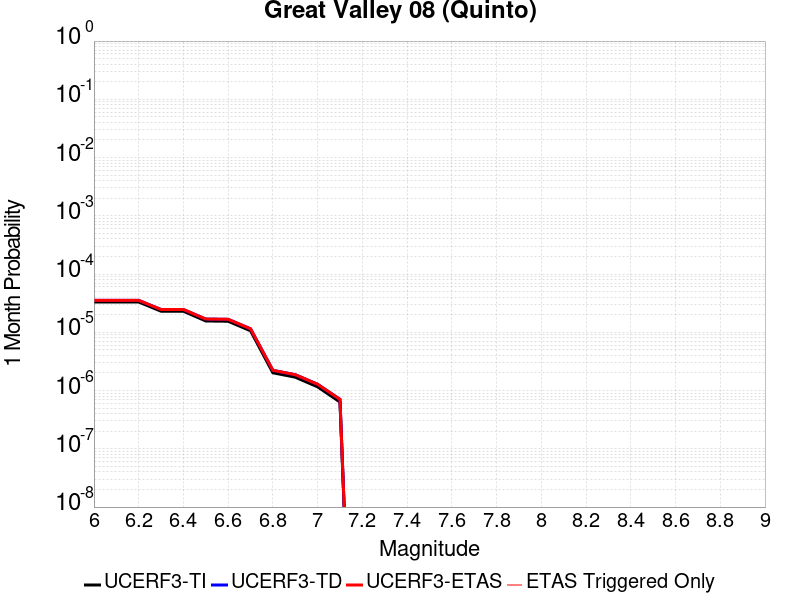 | 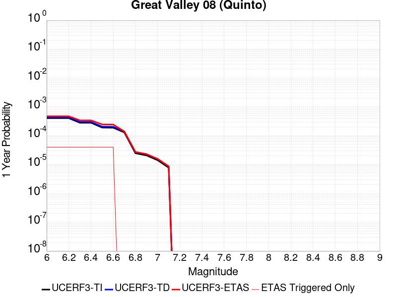 |

| Magnitude | 1 wk TI Prob | 1 wk TD Prob | 1 wk ETAS Prob | 1 wk ETAS/TD Gain | 1 wk ETAS Triggered Only | 1 mo TI Prob | 1 mo TD Prob | 1 mo ETAS Prob | 1 mo ETAS/TD Gain | 1 mo ETAS Triggered Only | 1 yr TI Prob | 1 yr TD Prob | 1 yr ETAS Prob | 1 yr ETAS/TD Gain | 1 yr ETAS Triggered Only |
|-----|-----|-----|-----|-----|-----|-----|-----|-----|-----|-----|-----|-----|-----|-----|-----|
| 6.0 | 7.737697E-6 | 8.254906E-6 | 8.254906E-6 | 1.0 | 0.0 | 3.3161137E-5 | 3.5377794E-5 | 3.5377794E-5 | 1.0 | 0.0 | 4.0366207E-4 | 4.306584E-4 | 4.7064116E-4 | 1.092841 | 4.0E-5 |
| 6.1 | 7.737697E-6 | 8.254906E-6 | 8.254906E-6 | 1.0 | 0.0 | 3.3161137E-5 | 3.5377794E-5 | 3.5377794E-5 | 1.0 | 0.0 | 4.0366207E-4 | 4.306584E-4 | 4.7064116E-4 | 1.092841 | 4.0E-5 |
| 6.2 | 7.737697E-6 | 8.254906E-6 | 8.254906E-6 | 1.0 | 0.0 | 3.3161137E-5 | 3.5377794E-5 | 3.5377794E-5 | 1.0 | 0.0 | 4.0366207E-4 | 4.306584E-4 | 4.7064116E-4 | 1.092841 | 4.0E-5 |
| 6.3 | 5.374012E-6 | 5.7519437E-6 | 5.7519437E-6 | 1.0 | 0.0 | 2.3031276E-5 | 2.4651017E-5 | 2.4651017E-5 | 1.0 | 0.0 | 2.803697E-4 | 3.0009594E-4 | 3.4008393E-4 | 1.1332507 | 4.0E-5 |
| 6.4 | 5.374012E-6 | 5.7519437E-6 | 5.7519437E-6 | 1.0 | 0.0 | 2.3031276E-5 | 2.4651017E-5 | 2.4651017E-5 | 1.0 | 0.0 | 2.803697E-4 | 3.0009594E-4 | 3.4008393E-4 | 1.1332507 | 4.0E-5 |
| 6.5 | 3.65427E-6 | 3.942375E-6 | 3.942375E-6 | 1.0 | 0.0 | 1.5661062E-5 | 1.6895821E-5 | 1.6895821E-5 | 1.0 | 0.0 | 1.9065675E-4 | 2.0569426E-4 | 2.4568604E-4 | 1.1944233 | 4.0E-5 |
| 6.6 | 3.6143538E-6 | 3.899551E-6 | 3.899551E-6 | 1.0 | 0.0 | 1.5489995E-5 | 1.6712293E-5 | 1.6712293E-5 | 1.0 | 0.0 | 1.8857437E-4 | 2.0346022E-4 | 2.4345209E-4 | 1.1965586 | 4.0E-5 |
| 6.7 | 2.4821015E-6 | 2.6864545E-6 | 2.6864545E-6 | 1.0 | 0.0 | 1.0637535E-5 | 1.1513357E-5 | 1.1513357E-5 | 1.0 | 0.0 | 1.2950429E-4 | 1.4017177E-4 | 1.4017177E-4 | 1.0 | 0.0 |
| 6.8 | 4.7110538E-7 | 5.194823E-7 | 5.194823E-7 | 1.0 | 0.0 | 2.0190216E-6 | 2.2263507E-6 | 2.2263507E-6 | 1.0 | 0.0 | 2.458131E-5 | 2.7105503E-5 | 2.7105503E-5 | 1.0 | 0.0 |
| 6.9 | 3.958685E-7 | 4.3718865E-7 | 4.3718865E-7 | 1.0 | 0.0 | 1.6965782E-6 | 1.8736644E-6 | 1.8736644E-6 | 1.0 | 0.0 | 2.0655643E-5 | 2.281164E-5 | 2.281164E-5 | 1.0 | 0.0 |
| 7.0 | 2.70294E-7 | 2.9930857E-7 | 2.9930857E-7 | 1.0 | 0.0 | 1.1584025E-6 | 1.2827504E-6 | 1.2827504E-6 | 1.0 | 0.0 | 1.4103458E-5 | 1.5617388E-5 | 1.5617388E-5 | 1.0 | 0.0 |
| 7.1 | 1.4828602E-7 | 1.6475283E-7 | 1.6475283E-7 | 1.0 | 0.0 | 6.3551136E-7 | 7.060834E-7 | 7.060834E-7 | 1.0 | 0.0 | 7.737323E-6 | 8.59654E-6 | 8.59654E-6 | 1.0 | 0.0 |

## Blue Cut
*[(top)](#table-of-contents)*

| 1 Week | 1 Month | 1 Year |
|-----|-----|-----|
| 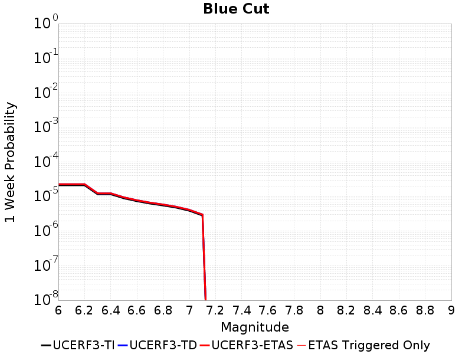 | 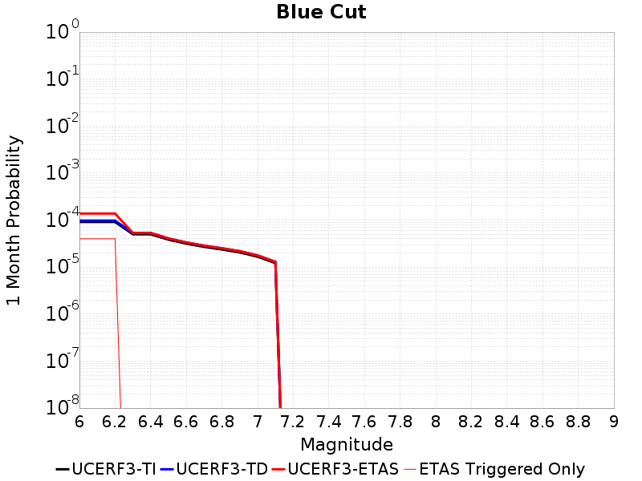 |  |

| Magnitude | 1 wk TI Prob | 1 wk TD Prob | 1 wk ETAS Prob | 1 wk ETAS/TD Gain | 1 wk ETAS Triggered Only | 1 mo TI Prob | 1 mo TD Prob | 1 mo ETAS Prob | 1 mo ETAS/TD Gain | 1 mo ETAS Triggered Only | 1 yr TI Prob | 1 yr TD Prob | 1 yr ETAS Prob | 1 yr ETAS/TD Gain | 1 yr ETAS Triggered Only |
|-----|-----|-----|-----|-----|-----|-----|-----|-----|-----|-----|-----|-----|-----|-----|-----|
| 6.0 | 2.1227985E-5 | 2.2724995E-5 | 2.2724995E-5 | 1.0 | 0.0 | 9.097391E-5 | 9.738952E-5 | 1.3738564E-4 | 1.4106818 | 4.0E-5 | 0.0011070445 | 0.0011851306 | 0.0012250833 | 1.0337116 | 4.0E-5 |
| 6.1 | 2.1227985E-5 | 2.2724995E-5 | 2.2724995E-5 | 1.0 | 0.0 | 9.097391E-5 | 9.738952E-5 | 1.3738564E-4 | 1.4106818 | 4.0E-5 | 0.0011070445 | 0.0011851306 | 0.0012250833 | 1.0337116 | 4.0E-5 |
| 6.2 | 2.1227985E-5 | 2.2724995E-5 | 2.2724995E-5 | 1.0 | 0.0 | 9.097391E-5 | 9.738952E-5 | 1.3738564E-4 | 1.4106818 | 4.0E-5 | 0.0011070445 | 0.0011851306 | 0.0012250833 | 1.0337116 | 4.0E-5 |
| 6.3 | 1.1613981E-5 | 1.23562095E-5 | 1.23562095E-5 | 1.0 | 0.0 | 4.9773254E-5 | 5.295418E-5 | 5.295418E-5 | 1.0 | 0.0 | 6.0582085E-4 | 6.445389E-4 | 6.445389E-4 | 1.0 | 0.0 |
| 6.4 | 1.1613981E-5 | 1.23562095E-5 | 1.23562095E-5 | 1.0 | 0.0 | 4.9773254E-5 | 5.295418E-5 | 5.295418E-5 | 1.0 | 0.0 | 6.0582085E-4 | 6.445389E-4 | 6.445389E-4 | 1.0 | 0.0 |
| 6.5 | 8.931326E-6 | 9.4835805E-6 | 9.4835805E-6 | 1.0 | 0.0 | 3.8276554E-5 | 4.0643336E-5 | 4.0643336E-5 | 1.0 | 0.0 | 4.6591737E-4 | 4.947294E-4 | 4.947294E-4 | 1.0 | 0.0 |
| 6.6 | 7.345353E-6 | 7.7918785E-6 | 7.7918785E-6 | 1.0 | 0.0 | 3.1479703E-5 | 3.3393382E-5 | 3.3393382E-5 | 1.0 | 0.0 | 3.83198E-4 | 4.064966E-4 | 4.064966E-4 | 1.0 | 0.0 |
| 6.7 | 6.2775666E-6 | 6.656506E-6 | 6.656506E-6 | 1.0 | 0.0 | 2.690358E-5 | 2.8527613E-5 | 2.8527613E-5 | 1.0 | 0.0 | 3.2750185E-4 | 3.4727587E-4 | 3.4727587E-4 | 1.0 | 0.0 |
| 6.8 | 5.5234095E-6 | 5.8563032E-6 | 5.8563032E-6 | 1.0 | 0.0 | 2.367154E-5 | 2.5098241E-5 | 2.5098241E-5 | 1.0 | 0.0 | 2.8816288E-4 | 3.0553553E-4 | 3.0553553E-4 | 1.0 | 0.0 |
| 6.9 | 4.7780054E-6 | 5.0664535E-6 | 5.0664535E-6 | 1.0 | 0.0 | 2.0477004E-5 | 2.1713231E-5 | 2.1713231E-5 | 1.0 | 0.0 | 2.4927902E-4 | 2.6433356E-4 | 2.6433356E-4 | 1.0 | 0.0 |
| 7.0 | 3.883171E-6 | 4.119333E-6 | 4.119333E-6 | 1.0 | 0.0 | 1.6642054E-5 | 1.7654203E-5 | 1.7654203E-5 | 1.0 | 0.0 | 2.0259817E-4 | 2.1492562E-4 | 2.1492562E-4 | 1.0 | 0.0 |
| 7.1 | 2.8358215E-6 | 3.0103415E-6 | 3.0103415E-6 | 1.0 | 0.0 | 1.2153464E-5 | 1.2901436E-5 | 1.2901436E-5 | 1.0 | 0.0 | 1.4795837E-4 | 1.5707024E-4 | 1.5707024E-4 | 1.0 | 0.0 |

## Mission (connected) 2011 CFM
*[(top)](#table-of-contents)*

| 1 Week | 1 Month | 1 Year |
|-----|-----|-----|
| 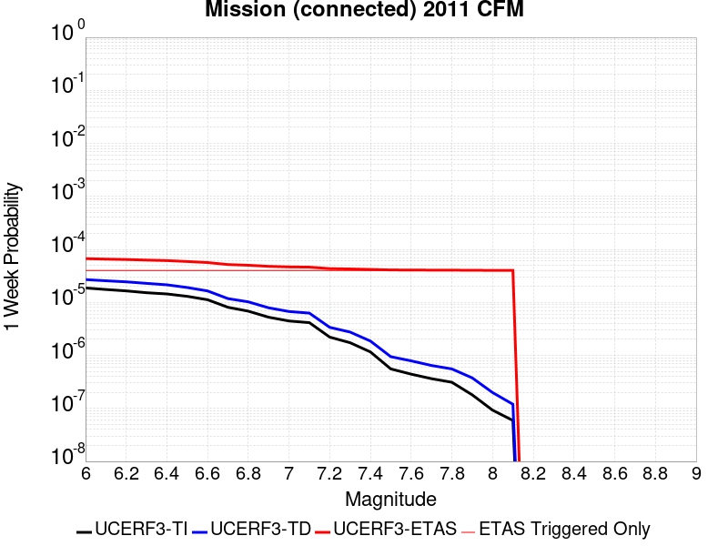 | 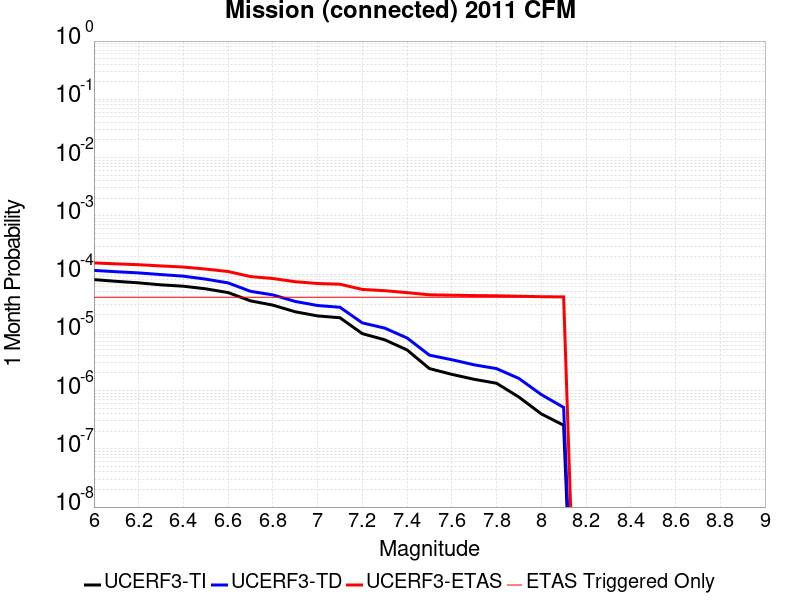 | 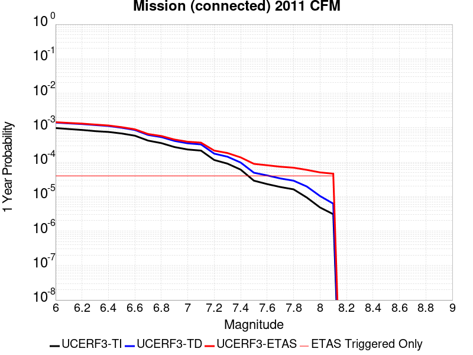 |

| Magnitude | 1 wk TI Prob | 1 wk TD Prob | 1 wk ETAS Prob | 1 wk ETAS/TD Gain | 1 wk ETAS Triggered Only | 1 mo TI Prob | 1 mo TD Prob | 1 mo ETAS Prob | 1 mo ETAS/TD Gain | 1 mo ETAS Triggered Only | 1 yr TI Prob | 1 yr TD Prob | 1 yr ETAS Prob | 1 yr ETAS/TD Gain | 1 yr ETAS Triggered Only |
|-----|-----|-----|-----|-----|-----|-----|-----|-----|-----|-----|-----|-----|-----|-----|-----|
| 6.0 | 1.8735573E-5 | 2.6950018E-5 | 6.694894E-5 | 2.484189 | 4.0E-5 | 8.029284E-5 | 1.15494695E-4 | 1.5549008E-4 | 1.3462962 | 4.0E-5 | 9.771269E-4 | 0.0014051441 | 0.0014450878 | 1.0284269 | 4.0E-5 |
| 6.1 | 1.7515964E-5 | 2.5590769E-5 | 6.5589746E-5 | 2.5630236 | 4.0E-5 | 7.506625E-5 | 1.0966985E-4 | 1.4966546E-4 | 1.364691 | 4.0E-5 | 9.135484E-4 | 0.0013343152 | 0.0013742618 | 1.029938 | 4.0E-5 |
| 6.2 | 1.6486343E-5 | 2.4434963E-5 | 6.443399E-5 | 2.6369586 | 4.0E-5 | 7.065384E-5 | 1.047168E-4 | 1.4471261E-4 | 1.3819426 | 4.0E-5 | 8.5987104E-4 | 0.0012740843 | 0.0013140333 | 1.0313551 | 4.0E-5 |
| 6.3 | 1.5229385E-5 | 2.286305E-5 | 6.2862135E-5 | 2.7495077 | 4.0E-5 | 6.526716E-5 | 9.798056E-5 | 1.3797665E-4 | 1.4082042 | 4.0E-5 | 7.9433795E-4 | 0.0011921634 | 0.0012321158 | 1.0335125 | 4.0E-5 |
| 6.4 | 1.4435828E-5 | 2.1460872E-5 | 6.1460014E-5 | 2.8638172 | 4.0E-5 | 6.186637E-5 | 9.197167E-5 | 1.3196799E-4 | 1.4348766 | 4.0E-5 | 7.529627E-4 | 0.0011190838 | 0.0011590391 | 1.0357035 | 4.0E-5 |
| 6.5 | 1.30127955E-5 | 1.9094095E-5 | 5.909333E-5 | 3.0948484 | 4.0E-5 | 5.576793E-5 | 8.1829014E-5 | 1.2182574E-4 | 1.4887842 | 4.0E-5 | 6.78763E-4 | 9.957787E-4 | 0.0010357389 | 1.0401295 | 4.0E-5 |
| 6.6 | 1.1220718E-5 | 1.644707E-5 | 5.6446414E-5 | 3.4320042 | 4.0E-5 | 4.8087906E-5 | 7.0485534E-5 | 1.1048272E-4 | 1.5674523 | 4.0E-5 | 5.8531296E-4 | 8.57823E-4 | 8.977887E-4 | 1.0465896 | 4.0E-5 |
| 6.7 | 8.086152E-6 | 1.1795562E-5 | 5.179509E-5 | 4.3910656 | 4.0E-5 | 3.4654473E-5 | 5.0551436E-5 | 9.0549416E-5 | 1.7912333 | 4.0E-5 | 4.2183654E-4 | 6.152907E-4 | 6.552661E-4 | 1.0649699 | 4.0E-5 |
| 6.8 | 6.8361655E-6 | 1.0236189E-5 | 5.023578E-5 | 4.9076643 | 4.0E-5 | 2.9297524E-5 | 4.3868647E-5 | 8.386689E-5 | 1.911773 | 4.0E-5 | 3.5663895E-4 | 5.3397054E-4 | 5.7394913E-4 | 1.0748705 | 4.0E-5 |
| 6.9 | 5.2517353E-6 | 7.903597E-6 | 4.7903282E-5 | 6.0609465 | 4.0E-5 | 2.2507242E-5 | 3.3872122E-5 | 7.387077E-5 | 2.1808722 | 4.0E-5 | 2.739912E-4 | 4.1231528E-4 | 4.522988E-4 | 1.0969732 | 4.0E-5 |
| 7.0 | 4.4602784E-6 | 6.733002E-6 | 4.6732734E-5 | 6.9408464 | 4.0E-5 | 1.911534E-5 | 2.8855404E-5 | 6.885425E-5 | 2.386182 | 4.0E-5 | 2.327044E-4 | 3.5125806E-4 | 3.9124402E-4 | 1.1138364 | 4.0E-5 |
| 7.1 | 4.1492594E-6 | 6.280018E-6 | 4.627977E-5 | 7.369368 | 4.0E-5 | 1.7782419E-5 | 2.6914087E-5 | 6.691301E-5 | 2.4861705 | 4.0E-5 | 2.1647944E-4 | 3.2762988E-4 | 3.676168E-4 | 1.122049 | 4.0E-5 |
| 7.2 | 2.213247E-6 | 3.3836286E-6 | 4.3383494E-5 | 12.8215885 | 4.0E-5 | 9.485309E-6 | 1.45011845E-5 | 5.4500604E-5 | 3.7583554 | 4.0E-5 | 1.15477524E-4 | 1.7653765E-4 | 2.1653059E-4 | 1.2265406 | 4.0E-5 |
| 7.3 | 1.7362703E-6 | 2.7571111E-6 | 4.2757E-5 | 15.507898 | 4.0E-5 | 7.4411373E-6 | 1.1816138E-5 | 5.1815663E-5 | 4.385161 | 4.0E-5 | 9.0592075E-5 | 1.43852E-4 | 1.8384625E-4 | 1.2780236 | 4.0E-5 |
| 7.4 | 1.1628409E-6 | 1.8644884E-6 | 4.1864412E-5 | 22.453568 | 4.0E-5 | 4.9835944E-6 | 7.9906395E-6 | 4.799032E-5 | 6.005817 | 4.0E-5 | 6.0673574E-5 | 9.728171E-5 | 1.3727782E-4 | 1.411137 | 4.0E-5 |
| 7.5 | 5.5610667E-7 | 9.4594736E-7 | 4.094591E-5 | 43.28561 | 4.0E-5 | 2.3833122E-6 | 4.054054E-6 | 4.4053893E-5 | 10.866628 | 4.0E-5 | 2.9016439E-5 | 4.9356993E-5 | 8.935502E-5 | 1.8103821 | 4.0E-5 |
| 7.6 | 4.4307663E-7 | 7.8953923E-7 | 4.0789506E-5 | 51.662422 | 4.0E-5 | 1.8988985E-6 | 3.383735E-6 | 4.33836E-5 | 12.821217 | 4.0E-5 | 2.3118844E-5 | 4.11962E-5 | 8.119455E-5 | 1.9709234 | 4.0E-5 |
| 7.7 | 3.639119E-7 | 6.4524573E-7 | 4.064522E-5 | 62.991844 | 4.0E-5 | 1.5596215E-6 | 2.765336E-6 | 4.2765227E-5 | 15.464748 | 4.0E-5 | 1.8988227E-5 | 3.3667446E-5 | 7.36661E-5 | 2.1880512 | 4.0E-5 |
| 7.8 | 3.1152942E-7 | 5.5556717E-7 | 4.0555544E-5 | 72.99845 | 4.0E-5 | 1.3351254E-6 | 2.381E-6 | 4.2380903E-5 | 17.799623 | 4.0E-5 | 1.6255031E-5 | 2.8988292E-5 | 6.898713E-5 | 2.3798275 | 4.0E-5 |
| 7.9 | 1.8035962E-7 | 3.7682193E-7 | 4.0376806E-5 | 107.150894 | 4.0E-5 | 7.729696E-7 | 1.6149502E-6 | 4.1614887E-5 | 25.768526 | 4.0E-5 | 9.410865E-6 | 1.9661842E-5 | 5.9661055E-5 | 3.0343575 | 4.0E-5 |
| 8.0 | 9.279334E-8 | 1.9929594E-7 | 4.0199287E-5 | 201.70651 | 4.0E-5 | 3.976857E-7 | 8.541251E-7 | 4.085409E-5 | 47.831505 | 4.0E-5 | 4.841813E-6 | 1.0398924E-5 | 5.039851E-5 | 4.846512 | 4.0E-5 |
| 8.1 | 5.9253985E-8 | 1.1984349E-7 | 4.0119838E-5 | 334.76862 | 4.0E-5 | 2.5394561E-7 | 5.1361485E-7 | 4.0513594E-5 | 78.879326 | 4.0E-5 | 3.0917836E-6 | 6.2532436E-6 | 4.6252993E-5 | 7.3966403 | 4.0E-5 |

## San Diego Trough south
*[(top)](#table-of-contents)*

| 1 Week | 1 Month | 1 Year |
|-----|-----|-----|
| 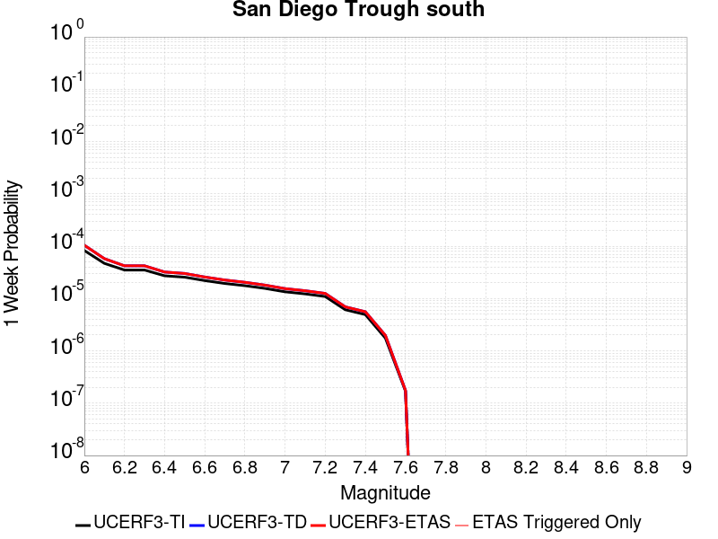 |  | 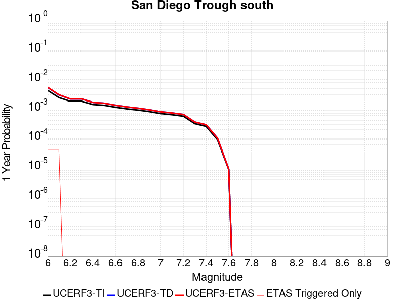 |

| Magnitude | 1 wk TI Prob | 1 wk TD Prob | 1 wk ETAS Prob | 1 wk ETAS/TD Gain | 1 wk ETAS Triggered Only | 1 mo TI Prob | 1 mo TD Prob | 1 mo ETAS Prob | 1 mo ETAS/TD Gain | 1 mo ETAS Triggered Only | 1 yr TI Prob | 1 yr TD Prob | 1 yr ETAS Prob | 1 yr ETAS/TD Gain | 1 yr ETAS Triggered Only |
|-----|-----|-----|-----|-----|-----|-----|-----|-----|-----|-----|-----|-----|-----|-----|-----|
| 6.0 | 8.279495E-5 | 1.04344595E-4 | 1.04344595E-4 | 1.0 | 0.0 | 3.5478722E-4 | 4.4711752E-4 | 4.8709963E-4 | 1.089422 | 4.0E-5 | 0.004310982 | 0.0054305126 | 0.0054702954 | 1.0073258 | 4.0E-5 |
| 6.1 | 4.6961468E-5 | 5.7774767E-5 | 5.7774767E-5 | 1.0 | 0.0 | 2.0124791E-4 | 2.4758166E-4 | 2.8757178E-4 | 1.1615229 | 4.0E-5 | 0.00244744 | 0.0030101975 | 0.003050077 | 1.0132482 | 4.0E-5 |
| 6.2 | 3.5079658E-5 | 4.2171523E-5 | 4.2171523E-5 | 1.0 | 0.0 | 1.5033272E-4 | 1.8072258E-4 | 1.8072258E-4 | 1.0 | 0.0 | 0.0018287642 | 0.0021980898 | 0.0021980898 | 1.0 | 0.0 |
| 6.3 | 3.5079658E-5 | 4.2171523E-5 | 4.2171523E-5 | 1.0 | 0.0 | 1.5033272E-4 | 1.8072258E-4 | 1.8072258E-4 | 1.0 | 0.0 | 0.0018287642 | 0.0021980898 | 0.0021980898 | 1.0 | 0.0 |
| 6.4 | 2.7196904E-5 | 3.2106836E-5 | 3.2106836E-5 | 1.0 | 0.0 | 1.16552954E-4 | 1.3759351E-4 | 1.3759351E-4 | 1.0 | 0.0 | 0.0014181085 | 0.0016739258 | 0.0016739258 | 1.0 | 0.0 |
| 6.5 | 2.5584688E-5 | 3.0119754E-5 | 3.0119754E-5 | 1.0 | 0.0 | 1.0964406E-4 | 1.2907837E-4 | 1.2907837E-4 | 1.0 | 0.0 | 0.0013340989 | 0.0015704081 | 0.0015704081 | 1.0 | 0.0 |
| 6.6 | 2.2034688E-5 | 2.5757492E-5 | 2.5757492E-5 | 1.0 | 0.0 | 9.443096E-5 | 1.1038463E-4 | 1.1038463E-4 | 1.0 | 0.0 | 0.0011490905 | 0.0013431119 | 0.0013431119 | 1.0 | 0.0 |
| 6.7 | 1.9394853E-5 | 2.2554243E-5 | 2.2554243E-5 | 1.0 | 0.0 | 8.311815E-5 | 9.665749E-5 | 9.665749E-5 | 1.0 | 0.0 | 0.0010114936 | 0.0011761748 | 0.0011761748 | 1.0 | 0.0 |
| 6.8 | 1.7615313E-5 | 2.041419E-5 | 2.041419E-5 | 1.0 | 0.0 | 7.549201E-5 | 8.7486485E-5 | 8.7486485E-5 | 1.0 | 0.0 | 9.1872766E-4 | 0.0010646317 | 0.0010646317 | 1.0 | 0.0 |
| 6.9 | 1.5621423E-5 | 1.8035567E-5 | 1.8035567E-5 | 1.0 | 0.0 | 6.6947236E-5 | 7.7293014E-5 | 7.7293014E-5 | 1.0 | 0.0 | 8.147778E-4 | 9.4063976E-4 | 9.4063976E-4 | 1.0 | 0.0 |
| 7.0 | 1.3444376E-5 | 1.5455926E-5 | 1.5455926E-5 | 1.0 | 0.0 | 5.7617483E-5 | 6.623801E-5 | 6.623801E-5 | 1.0 | 0.0 | 7.0126704E-4 | 8.061522E-4 | 8.061522E-4 | 1.0 | 0.0 |
| 7.1 | 1.2268361E-5 | 1.4080076E-5 | 1.4080076E-5 | 1.0 | 0.0 | 5.2577634E-5 | 6.03418E-5 | 6.03418E-5 | 1.0 | 0.0 | 6.399447E-4 | 7.344164E-4 | 7.344164E-4 | 1.0 | 0.0 |
| 7.2 | 1.0922655E-5 | 1.2519768E-5 | 1.2519768E-5 | 1.0 | 0.0 | 4.681054E-5 | 5.3655058E-5 | 5.3655058E-5 | 1.0 | 0.0 | 5.697693E-4 | 6.5305707E-4 | 6.5305707E-4 | 1.0 | 0.0 |
| 7.3 | 6.1106753E-6 | 6.9320863E-6 | 6.9320863E-6 | 1.0 | 0.0 | 2.6188345E-5 | 2.9708604E-5 | 2.9708604E-5 | 1.0 | 0.0 | 3.1879646E-4 | 3.6164265E-4 | 3.6164265E-4 | 1.0 | 0.0 |
| 7.4 | 4.933187E-6 | 5.5920887E-6 | 5.5920887E-6 | 1.0 | 0.0 | 2.114206E-5 | 2.3965877E-5 | 2.3965877E-5 | 1.0 | 0.0 | 2.5737417E-4 | 2.9174588E-4 | 2.9174588E-4 | 1.0 | 0.0 |
| 7.5 | 1.7489613E-6 | 1.9705317E-6 | 1.9705317E-6 | 1.0 | 0.0 | 7.495527E-6 | 8.44511E-6 | 8.44511E-6 | 1.0 | 0.0 | 9.125422E-5 | 1.02814585E-4 | 1.02814585E-4 | 1.0 | 0.0 |
| 7.6 | 1.6988751E-7 | 1.753573E-7 | 1.753573E-7 | 1.0 | 0.0 | 7.2808916E-7 | 7.515311E-7 | 7.515311E-7 | 1.0 | 0.0 | 8.864449E-6 | 9.149855E-6 | 9.149855E-6 | 1.0 | 0.0 |

## Nelson Lake
*[(top)](#table-of-contents)*

| 1 Week | 1 Month | 1 Year |
|-----|-----|-----|
| 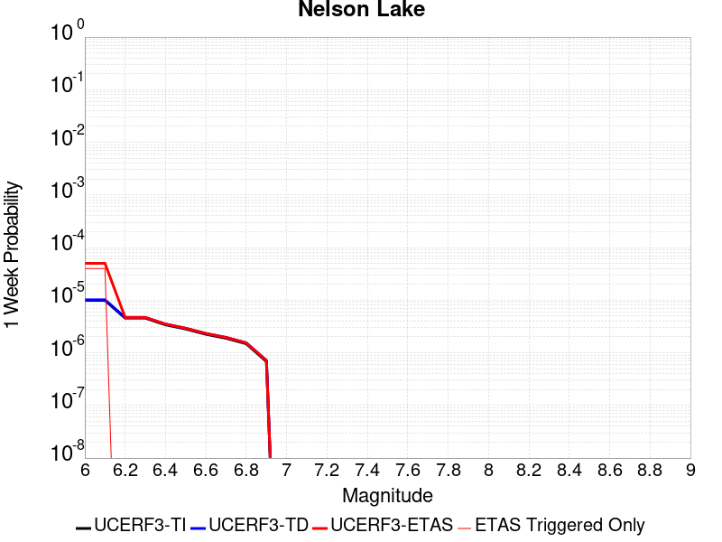 | 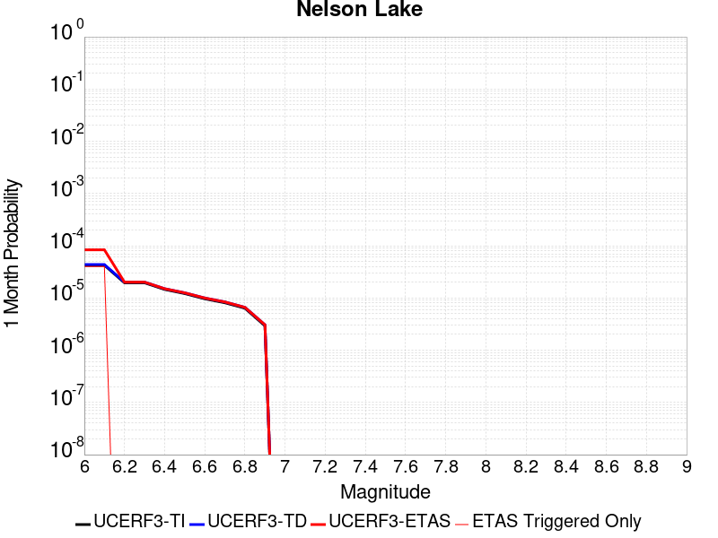 | 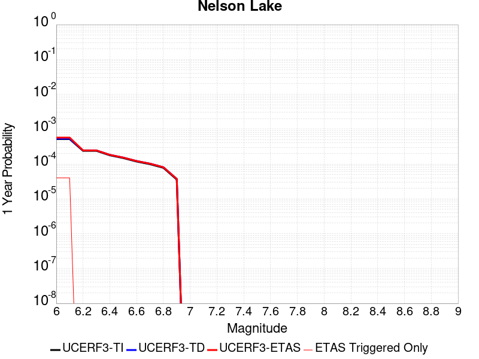 |

| Magnitude | 1 wk TI Prob | 1 wk TD Prob | 1 wk ETAS Prob | 1 wk ETAS/TD Gain | 1 wk ETAS Triggered Only | 1 mo TI Prob | 1 mo TD Prob | 1 mo ETAS Prob | 1 mo ETAS/TD Gain | 1 mo ETAS Triggered Only | 1 yr TI Prob | 1 yr TD Prob | 1 yr ETAS Prob | 1 yr ETAS/TD Gain | 1 yr ETAS Triggered Only |
|-----|-----|-----|-----|-----|-----|-----|-----|-----|-----|-----|-----|-----|-----|-----|-----|
| 6.0 | 9.913453E-6 | 1.0193228E-5 | 5.019282E-5 | 4.924134 | 4.0E-5 | 4.2485535E-5 | 4.368459E-5 | 8.368284E-5 | 1.9156147 | 4.0E-5 | 5.1713863E-4 | 5.317404E-4 | 5.7171914E-4 | 1.0751847 | 4.0E-5 |
| 6.1 | 9.913453E-6 | 1.0193228E-5 | 5.019282E-5 | 4.924134 | 4.0E-5 | 4.2485535E-5 | 4.368459E-5 | 8.368284E-5 | 1.9156147 | 4.0E-5 | 5.1713863E-4 | 5.317404E-4 | 5.7171914E-4 | 1.0751847 | 4.0E-5 |
| 6.2 | 4.5596407E-6 | 4.696791E-6 | 4.696791E-6 | 1.0 | 0.0 | 1.954117E-5 | 2.0128957E-5 | 2.0128957E-5 | 1.0 | 0.0 | 2.3788778E-4 | 2.4504375E-4 | 2.4504375E-4 | 1.0 | 0.0 |
| 6.3 | 4.5596407E-6 | 4.696791E-6 | 4.696791E-6 | 1.0 | 0.0 | 1.954117E-5 | 2.0128957E-5 | 2.0128957E-5 | 1.0 | 0.0 | 2.3788778E-4 | 2.4504375E-4 | 2.4504375E-4 | 1.0 | 0.0 |
| 6.4 | 3.4025713E-6 | 3.5102732E-6 | 3.5102732E-6 | 1.0 | 0.0 | 1.4582367E-5 | 1.5043946E-5 | 1.5043946E-5 | 1.0 | 0.0 | 1.7752586E-4 | 1.8314549E-4 | 1.8314549E-4 | 1.0 | 0.0 |
| 6.5 | 2.8352947E-6 | 2.9281807E-6 | 2.9281807E-6 | 1.0 | 0.0 | 1.2151207E-5 | 1.254929E-5 | 1.254929E-5 | 1.0 | 0.0 | 1.479309E-4 | 1.5277765E-4 | 1.5277765E-4 | 1.0 | 0.0 |
| 6.6 | 2.251518E-6 | 2.32934E-6 | 2.32934E-6 | 1.0 | 0.0 | 9.649328E-6 | 9.982851E-6 | 9.982851E-6 | 1.0 | 0.0 | 1.1747423E-4 | 1.21535064E-4 | 1.21535064E-4 | 1.0 | 0.0 |
| 6.7 | 1.8911853E-6 | 1.9593788E-6 | 1.9593788E-6 | 1.0 | 0.0 | 8.105055E-6 | 8.397314E-6 | 8.397314E-6 | 1.0 | 0.0 | 9.867457E-5 | 1.0223308E-4 | 1.0223308E-4 | 1.0 | 0.0 |
| 6.8 | 1.4874814E-6 | 1.544029E-6 | 1.544029E-6 | 1.0 | 0.0 | 6.374905E-6 | 6.617254E-6 | 6.617254E-6 | 1.0 | 0.0 | 7.76117E-5 | 8.0562604E-5 | 8.0562604E-5 | 1.0 | 0.0 |
| 6.9 | 6.835972E-7 | 7.141004E-7 | 7.141004E-7 | 1.0 | 0.0 | 2.9296991E-6 | 3.0604285E-6 | 3.0604285E-6 | 1.0 | 0.0 | 3.56685E-5 | 3.72604E-5 | 3.72604E-5 | 1.0 | 0.0 |

## Malibu Coast (Extension) alt 1
*[(top)](#table-of-contents)*

| 1 Week | 1 Month | 1 Year |
|-----|-----|-----|
| 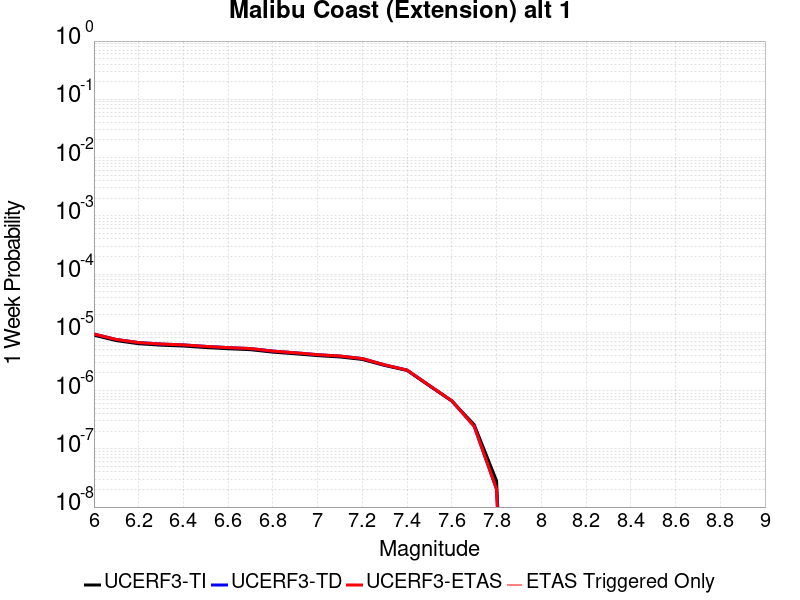 | 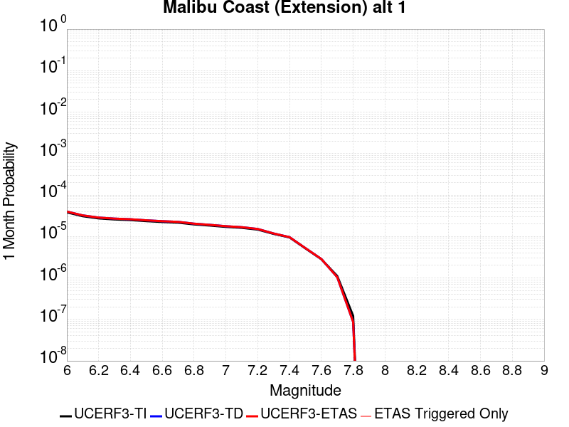 | 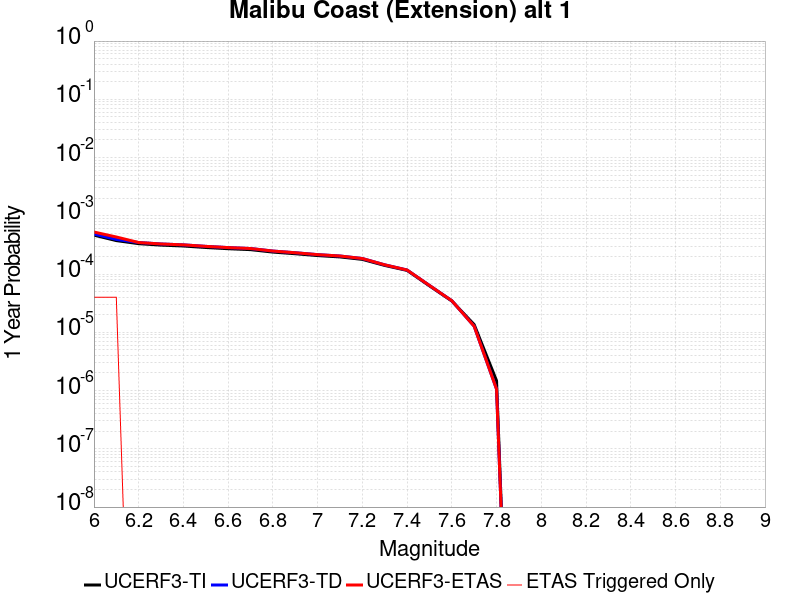 |

| Magnitude | 1 wk TI Prob | 1 wk TD Prob | 1 wk ETAS Prob | 1 wk ETAS/TD Gain | 1 wk ETAS Triggered Only | 1 mo TI Prob | 1 mo TD Prob | 1 mo ETAS Prob | 1 mo ETAS/TD Gain | 1 mo ETAS Triggered Only | 1 yr TI Prob | 1 yr TD Prob | 1 yr ETAS Prob | 1 yr ETAS/TD Gain | 1 yr ETAS Triggered Only |
|-----|-----|-----|-----|-----|-----|-----|-----|-----|-----|-----|-----|-----|-----|-----|-----|
| 6.0 | 8.930738E-6 | 9.331192E-6 | 9.331192E-6 | 1.0 | 0.0 | 3.827403E-5 | 3.999022E-5 | 3.999022E-5 | 1.0 | 0.0 | 4.6588664E-4 | 4.867739E-4 | 5.267544E-4 | 1.0821337 | 4.0E-5 |
| 6.1 | 7.199952E-6 | 7.5319726E-6 | 7.5319726E-6 | 1.0 | 0.0 | 3.0856572E-5 | 3.2279488E-5 | 3.2279488E-5 | 1.0 | 0.0 | 3.75614E-4 | 3.9293247E-4 | 4.3291677E-4 | 1.1017586 | 4.0E-5 |
| 6.2 | 6.3721413E-6 | 6.6683415E-6 | 6.6683415E-6 | 1.0 | 0.0 | 2.7308892E-5 | 2.8578295E-5 | 2.8578295E-5 | 1.0 | 0.0 | 3.3243504E-4 | 3.4788557E-4 | 3.4788557E-4 | 1.0 | 0.0 |
| 6.3 | 6.016345E-6 | 6.296652E-6 | 6.296652E-6 | 1.0 | 0.0 | 2.578408E-5 | 2.6985374E-5 | 2.6985374E-5 | 1.0 | 0.0 | 3.1387596E-4 | 3.2849773E-4 | 3.2849773E-4 | 1.0 | 0.0 |
| 6.4 | 5.8104883E-6 | 6.081004E-6 | 6.081004E-6 | 1.0 | 0.0 | 2.4901856E-5 | 2.6061185E-5 | 2.6061185E-5 | 1.0 | 0.0 | 3.031379E-4 | 3.1724907E-4 | 3.1724907E-4 | 1.0 | 0.0 |
| 6.5 | 5.476925E-6 | 5.728906E-6 | 5.728906E-6 | 1.0 | 0.0 | 2.3472323E-5 | 2.4552224E-5 | 2.4552224E-5 | 1.0 | 0.0 | 2.8573806E-4 | 2.9888263E-4 | 2.9888263E-4 | 1.0 | 0.0 |
| 6.6 | 5.222387E-6 | 5.459921E-6 | 5.459921E-6 | 1.0 | 0.0 | 2.2381464E-5 | 2.3399452E-5 | 2.3399452E-5 | 1.0 | 0.0 | 2.7246025E-4 | 2.8485138E-4 | 2.8485138E-4 | 1.0 | 0.0 |
| 6.7 | 5.0337076E-6 | 5.2604055E-6 | 5.2604055E-6 | 1.0 | 0.0 | 2.1572854E-5 | 2.2544402E-5 | 2.2544402E-5 | 1.0 | 0.0 | 2.6261783E-4 | 2.744438E-4 | 2.744438E-4 | 1.0 | 0.0 |
| 6.8 | 4.5675624E-6 | 4.759894E-6 | 4.759894E-6 | 1.0 | 0.0 | 1.9575122E-5 | 2.0399388E-5 | 2.0399388E-5 | 1.0 | 0.0 | 2.3830103E-4 | 2.4833443E-4 | 2.4833443E-4 | 1.0 | 0.0 |
| 6.9 | 4.2802412E-6 | 4.453128E-6 | 4.453128E-6 | 1.0 | 0.0 | 1.8343762E-5 | 1.9084697E-5 | 1.9084697E-5 | 1.0 | 0.0 | 2.2331243E-4 | 2.3233156E-4 | 2.3233156E-4 | 1.0 | 0.0 |
| 7.0 | 3.9794063E-6 | 4.13113E-6 | 4.13113E-6 | 1.0 | 0.0 | 1.7054486E-5 | 1.7704724E-5 | 1.7704724E-5 | 1.0 | 0.0 | 2.0761859E-4 | 2.1553382E-4 | 2.1553382E-4 | 1.0 | 0.0 |
| 7.1 | 3.7730424E-6 | 3.912203E-6 | 3.912203E-6 | 1.0 | 0.0 | 1.6170083E-5 | 1.6766477E-5 | 1.6766477E-5 | 1.0 | 0.0 | 1.9685295E-4 | 2.0411285E-4 | 2.0411285E-4 | 1.0 | 0.0 |
| 7.2 | 3.424985E-6 | 3.5422438E-6 | 3.5422438E-6 | 1.0 | 0.0 | 1.4678424E-5 | 1.5180957E-5 | 1.5180957E-5 | 1.0 | 0.0 | 1.7869516E-4 | 1.848126E-4 | 1.848126E-4 | 1.0 | 0.0 |
| 7.3 | 2.6966375E-6 | 2.7603658E-6 | 2.7603658E-6 | 1.0 | 0.0 | 1.15569665E-5 | 1.1830085E-5 | 1.1830085E-5 | 1.0 | 0.0 | 1.4069698E-4 | 1.440218E-4 | 1.440218E-4 | 1.0 | 0.0 |
| 7.4 | 2.215957E-6 | 2.2499773E-6 | 2.2499773E-6 | 1.0 | 0.0 | 9.496924E-6 | 9.642725E-6 | 9.642725E-6 | 1.0 | 0.0 | 1.1561892E-4 | 1.1739388E-4 | 1.1739388E-4 | 1.0 | 0.0 |
| 7.5 | 1.2040218E-6 | 1.2222066E-6 | 1.2222066E-6 | 1.0 | 0.0 | 5.160083E-6 | 5.238018E-6 | 5.238018E-6 | 1.0 | 0.0 | 6.2822204E-5 | 6.377102E-5 | 6.377102E-5 | 1.0 | 0.0 |
| 7.6 | 6.6157446E-7 | 6.6804853E-7 | 6.6804853E-7 | 1.0 | 0.0 | 2.835316E-6 | 2.863062E-6 | 2.863062E-6 | 1.0 | 0.0 | 3.4519428E-5 | 3.4857236E-5 | 3.4857236E-5 | 1.0 | 0.0 |
| 7.7 | 2.6012302E-7 | 2.4362907E-7 | 2.4362907E-7 | 1.0 | 0.0 | 1.1148124E-6 | 1.0441241E-6 | 1.0441241E-6 | 1.0 | 0.0 | 1.3572758E-5 | 1.2712148E-5 | 1.2712148E-5 | 1.0 | 0.0 |
| 7.8 | 2.8323132E-8 | 2.0272084E-8 | 2.0272084E-8 | 1.0 | 0.0 | 1.2138484E-7 | 8.688036E-8 | 8.688036E-8 | 1.0 | 0.0 | 1.4778595E-6 | 1.0577679E-6 | 1.0577679E-6 | 1.0 | 0.0 |

## Ventura-Pitas Point
*[(top)](#table-of-contents)*

| 1 Week | 1 Month | 1 Year |
|-----|-----|-----|
| 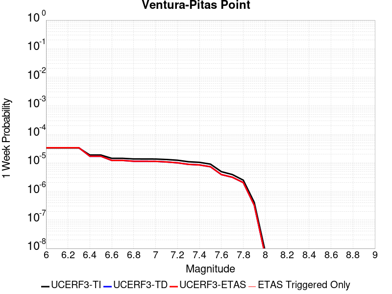 | 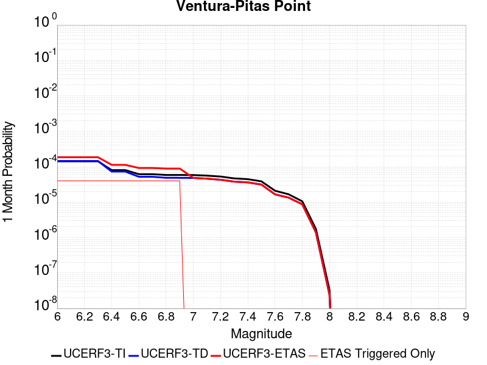 | 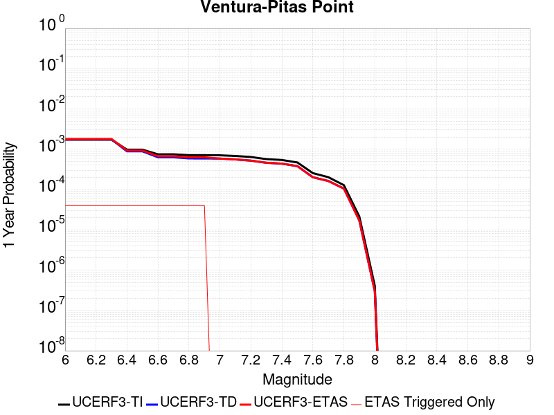 |

| Magnitude | 1 wk TI Prob | 1 wk TD Prob | 1 wk ETAS Prob | 1 wk ETAS/TD Gain | 1 wk ETAS Triggered Only | 1 mo TI Prob | 1 mo TD Prob | 1 mo ETAS Prob | 1 mo ETAS/TD Gain | 1 mo ETAS Triggered Only | 1 yr TI Prob | 1 yr TD Prob | 1 yr ETAS Prob | 1 yr ETAS/TD Gain | 1 yr ETAS Triggered Only |
|-----|-----|-----|-----|-----|-----|-----|-----|-----|-----|-----|-----|-----|-----|-----|-----|
| 6.0 | 3.3179622E-5 | 3.3762684E-5 | 3.3762684E-5 | 1.0 | 0.0 | 1.4219063E-4 | 1.4469065E-4 | 1.8468486E-4 | 1.2764119 | 4.0E-5 | 0.0017297962 | 0.0017604423 | 0.0018003719 | 1.0226816 | 4.0E-5 |
| 6.1 | 3.3179622E-5 | 3.3762684E-5 | 3.3762684E-5 | 1.0 | 0.0 | 1.4219063E-4 | 1.4469065E-4 | 1.8468486E-4 | 1.2764119 | 4.0E-5 | 0.0017297962 | 0.0017604423 | 0.0018003719 | 1.0226816 | 4.0E-5 |
| 6.2 | 3.3179622E-5 | 3.3762684E-5 | 3.3762684E-5 | 1.0 | 0.0 | 1.4219063E-4 | 1.4469065E-4 | 1.8468486E-4 | 1.2764119 | 4.0E-5 | 0.0017297962 | 0.0017604423 | 0.0018003719 | 1.0226816 | 4.0E-5 |
| 6.3 | 3.3179622E-5 | 3.3762684E-5 | 3.3762684E-5 | 1.0 | 0.0 | 1.4219063E-4 | 1.4469065E-4 | 1.8468486E-4 | 1.2764119 | 4.0E-5 | 0.0017297962 | 0.0017604423 | 0.0018003719 | 1.0226816 | 4.0E-5 |
| 6.4 | 1.8754668E-5 | 1.7038072E-5 | 1.7038072E-5 | 1.0 | 0.0 | 8.037467E-5 | 7.301839E-5 | 1.1301547E-4 | 1.5477672 | 4.0E-5 | 9.781223E-4 | 8.8865944E-4 | 9.286239E-4 | 1.0449716 | 4.0E-5 |
| 6.5 | 1.8754668E-5 | 1.7038072E-5 | 1.7038072E-5 | 1.0 | 0.0 | 8.037467E-5 | 7.301839E-5 | 1.1301547E-4 | 1.5477672 | 4.0E-5 | 9.781223E-4 | 8.8865944E-4 | 9.286239E-4 | 1.0449716 | 4.0E-5 |
| 6.6 | 1.4361558E-5 | 1.2138828E-5 | 1.2138828E-5 | 1.0 | 0.0 | 6.154808E-5 | 5.2022526E-5 | 9.202045E-5 | 1.7688577 | 4.0E-5 | 7.490902E-4 | 6.3319254E-4 | 6.731672E-4 | 1.0631319 | 4.0E-5 |
| 6.7 | 1.4361558E-5 | 1.2138828E-5 | 1.2138828E-5 | 1.0 | 0.0 | 6.154808E-5 | 5.2022526E-5 | 9.202045E-5 | 1.7688577 | 4.0E-5 | 7.490902E-4 | 6.3319254E-4 | 6.731672E-4 | 1.0631319 | 4.0E-5 |
| 6.8 | 1.3663846E-5 | 1.1360668E-5 | 1.1360668E-5 | 1.0 | 0.0 | 5.8558027E-5 | 4.868768E-5 | 8.868574E-5 | 1.8215231 | 4.0E-5 | 7.127108E-4 | 5.9261324E-4 | 6.3258957E-4 | 1.0674577 | 4.0E-5 |
| 6.9 | 1.3644157E-5 | 1.1338761E-5 | 1.1338761E-5 | 1.0 | 0.0 | 5.8473648E-5 | 4.8593796E-5 | 8.8591856E-5 | 1.8231103 | 4.0E-5 | 7.116841E-4 | 5.914708E-4 | 6.314472E-4 | 1.067588 | 4.0E-5 |
| 7.0 | 1.3568845E-5 | 1.125829E-5 | 1.125829E-5 | 1.0 | 0.0 | 5.8150898E-5 | 4.8248934E-5 | 4.8248934E-5 | 1.0 | 0.0 | 7.077572E-4 | 5.872744E-4 | 5.872744E-4 | 1.0 | 0.0 |
| 7.1 | 1.306572E-5 | 1.0734395E-5 | 1.0734395E-5 | 1.0 | 0.0 | 5.599474E-5 | 4.6003748E-5 | 4.6003748E-5 | 1.0 | 0.0 | 6.815227E-4 | 5.5995357E-4 | 5.5995357E-4 | 1.0 | 0.0 |
| 7.2 | 1.232604E-5 | 1.0006684E-5 | 1.0006684E-5 | 1.0 | 0.0 | 5.2824813E-5 | 4.288509E-5 | 4.288509E-5 | 1.0 | 0.0 | 6.429523E-4 | 5.220027E-4 | 5.220027E-4 | 1.0 | 0.0 |
| 7.3 | 1.0917261E-5 | 8.853358E-6 | 8.853358E-6 | 1.0 | 0.0 | 4.678742E-5 | 3.794242E-5 | 3.794242E-5 | 1.0 | 0.0 | 5.69488E-4 | 4.618526E-4 | 4.618526E-4 | 1.0 | 0.0 |
| 7.4 | 1.039959E-5 | 8.432823E-6 | 8.432823E-6 | 1.0 | 0.0 | 4.456891E-5 | 3.614018E-5 | 3.614018E-5 | 1.0 | 0.0 | 5.424914E-4 | 4.399194E-4 | 4.399194E-4 | 1.0 | 0.0 |
| 7.5 | 9.015877E-6 | 7.306078E-6 | 7.306078E-6 | 1.0 | 0.0 | 3.86389E-5 | 3.1311392E-5 | 3.1311392E-5 | 1.0 | 0.0 | 4.7032707E-4 | 3.8115095E-4 | 3.8115095E-4 | 1.0 | 0.0 |
| 7.6 | 4.900162E-6 | 3.87516E-6 | 3.87516E-6 | 1.0 | 0.0 | 2.1000526E-5 | 1.6607724E-5 | 1.6607724E-5 | 1.0 | 0.0 | 2.556514E-4 | 2.0218041E-4 | 2.0218041E-4 | 1.0 | 0.0 |
| 7.7 | 3.8850626E-6 | 3.1275454E-6 | 3.1275454E-6 | 1.0 | 0.0 | 1.6650163E-5 | 1.3403697E-5 | 1.3403697E-5 | 1.0 | 0.0 | 2.0269687E-4 | 1.6317789E-4 | 1.6317789E-4 | 1.0 | 0.0 |
| 7.8 | 2.4654719E-6 | 2.0304078E-6 | 2.0304078E-6 | 1.0 | 0.0 | 1.0566265E-5 | 8.701719E-6 | 8.701719E-6 | 1.0 | 0.0 | 1.2863669E-4 | 1.0593832E-4 | 1.0593832E-4 | 1.0 | 0.0 |
| 7.9 | 4.095894E-7 | 3.2773266E-7 | 3.2773266E-7 | 1.0 | 0.0 | 1.7553821E-6 | 1.4045678E-6 | 1.4045678E-6 | 1.0 | 0.0 | 2.1371567E-5 | 1.7100481E-5 | 1.7100481E-5 | 1.0 | 0.0 |
| 8.0 | 7.791402E-9 | 5.68495E-9 | 5.68495E-9 | 1.0 | 0.0 | 3.3391725E-8 | 2.4364072E-8 | 2.4364072E-8 | 1.0 | 0.0 | 4.0654416E-7 | 2.9663255E-7 | 2.9663255E-7 | 1.0 | 0.0 |

## Great Valley 05 Pittsburg - Kirby Hills alt1
*[(top)](#table-of-contents)*

| 1 Week | 1 Month | 1 Year |
|-----|-----|-----|
|  | 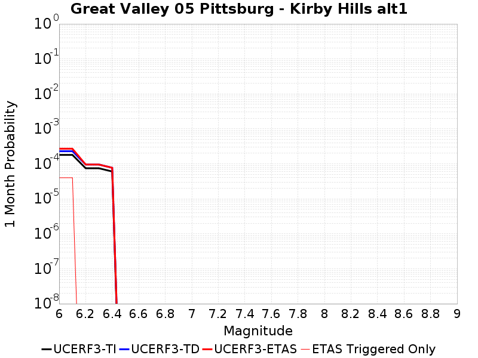 | 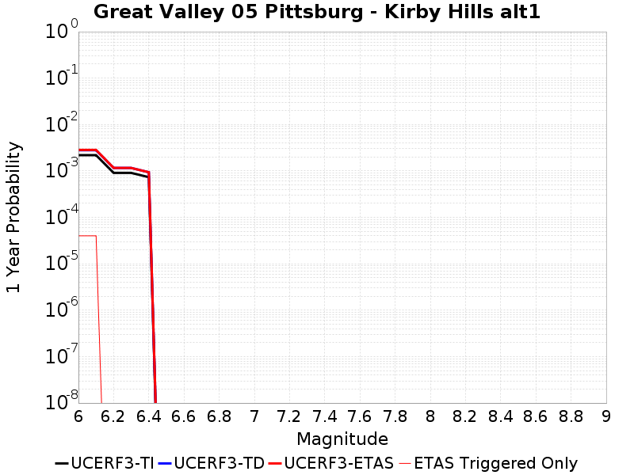 |

| Magnitude | 1 wk TI Prob | 1 wk TD Prob | 1 wk ETAS Prob | 1 wk ETAS/TD Gain | 1 wk ETAS Triggered Only | 1 mo TI Prob | 1 mo TD Prob | 1 mo ETAS Prob | 1 mo ETAS/TD Gain | 1 mo ETAS Triggered Only | 1 yr TI Prob | 1 yr TD Prob | 1 yr ETAS Prob | 1 yr ETAS/TD Gain | 1 yr ETAS Triggered Only |
|-----|-----|-----|-----|-----|-----|-----|-----|-----|-----|-----|-----|-----|-----|-----|-----|
| 6.0 | 4.187212E-5 | 5.3492065E-5 | 5.3492065E-5 | 1.0 | 0.0 | 1.794396E-4 | 2.2923728E-4 | 2.6922813E-4 | 1.1744517 | 4.0E-5 | 0.002182488 | 0.0027883553 | 0.002828244 | 1.0143054 | 4.0E-5 |
| 6.1 | 4.187212E-5 | 5.3492065E-5 | 5.3492065E-5 | 1.0 | 0.0 | 1.794396E-4 | 2.2923728E-4 | 2.6922813E-4 | 1.1744517 | 4.0E-5 | 0.002182488 | 0.0027883553 | 0.002828244 | 1.0143054 | 4.0E-5 |
| 6.2 | 1.7353306E-5 | 2.2174918E-5 | 2.2174918E-5 | 1.0 | 0.0 | 7.436919E-5 | 9.5034164E-5 | 9.5034164E-5 | 1.0 | 0.0 | 9.050688E-4 | 0.0011568196 | 0.0011568196 | 1.0 | 0.0 |
| 6.3 | 1.7353306E-5 | 2.2174918E-5 | 2.2174918E-5 | 1.0 | 0.0 | 7.436919E-5 | 9.5034164E-5 | 9.5034164E-5 | 1.0 | 0.0 | 9.050688E-4 | 0.0011568196 | 0.0011568196 | 1.0 | 0.0 |
| 6.4 | 1.4028824E-5 | 1.7917358E-5 | 1.7917358E-5 | 1.0 | 0.0 | 6.0122147E-5 | 7.678868E-5 | 7.678868E-5 | 1.0 | 0.0 | 7.3174125E-4 | 9.348871E-4 | 9.348871E-4 | 1.0 | 0.0 |

## Hayward (So) 2011 CFM
*[(top)](#table-of-contents)*

| 1 Week | 1 Month | 1 Year |
|-----|-----|-----|
| 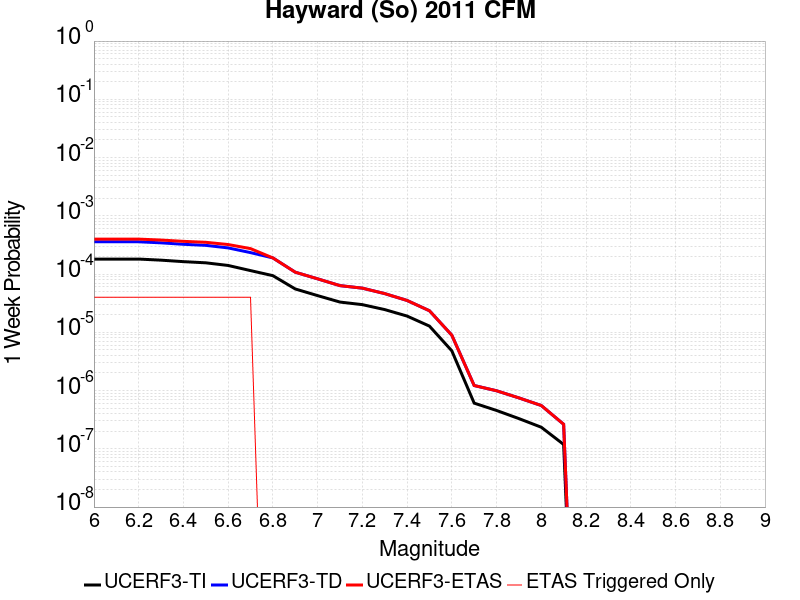 | 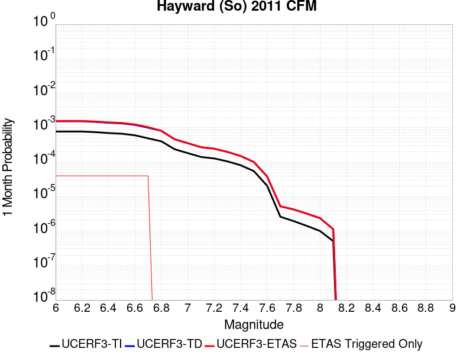 | 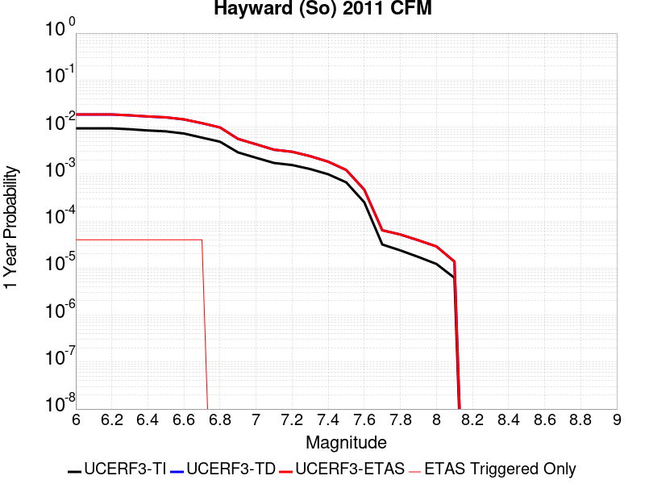 |

| Magnitude | 1 wk TI Prob | 1 wk TD Prob | 1 wk ETAS Prob | 1 wk ETAS/TD Gain | 1 wk ETAS Triggered Only | 1 mo TI Prob | 1 mo TD Prob | 1 mo ETAS Prob | 1 mo ETAS/TD Gain | 1 mo ETAS Triggered Only | 1 yr TI Prob | 1 yr TD Prob | 1 yr ETAS Prob | 1 yr ETAS/TD Gain | 1 yr ETAS Triggered Only |
|-----|-----|-----|-----|-----|-----|-----|-----|-----|-----|-----|-----|-----|-----|-----|-----|
| 6.0 | 1.8091932E-4 | 3.580821E-4 | 3.9806776E-4 | 1.1116662 | 4.0E-5 | 7.751381E-4 | 0.001533745 | 0.0015736836 | 1.02604 | 4.0E-5 | 0.00939654 | 0.018515883 | 0.018555144 | 1.0021203 | 4.0E-5 |
| 6.1 | 1.8091932E-4 | 3.580821E-4 | 3.9806776E-4 | 1.1116662 | 4.0E-5 | 7.751381E-4 | 0.001533745 | 0.0015736836 | 1.02604 | 4.0E-5 | 0.00939654 | 0.018515883 | 0.018555144 | 1.0021203 | 4.0E-5 |
| 6.2 | 1.8091932E-4 | 3.580821E-4 | 3.9806776E-4 | 1.1116662 | 4.0E-5 | 7.751381E-4 | 0.001533745 | 0.0015736836 | 1.02604 | 4.0E-5 | 0.00939654 | 0.018515883 | 0.018555144 | 1.0021203 | 4.0E-5 |
| 6.3 | 1.7322872E-4 | 3.436256E-4 | 3.8361188E-4 | 1.1163658 | 4.0E-5 | 7.4219756E-4 | 0.0014718598 | 0.0015118008 | 1.0271364 | 4.0E-5 | 0.0089988755 | 0.017774936 | 0.017814225 | 1.0022104 | 4.0E-5 |
| 6.4 | 1.6334097E-4 | 3.2441478E-4 | 3.644018E-4 | 1.123259 | 4.0E-5 | 6.998449E-4 | 0.001389617 | 0.0014295614 | 1.0287449 | 4.0E-5 | 0.008487372 | 0.016789362 | 0.016828692 | 1.0023425 | 4.0E-5 |
| 6.5 | 1.5600289E-4 | 3.1113712E-4 | 3.5112468E-4 | 1.1285207 | 4.0E-5 | 6.684125E-4 | 0.0013327717 | 0.0013727184 | 1.0299727 | 4.0E-5 | 0.008107598 | 0.016107671 | 0.016147027 | 1.0024433 | 4.0E-5 |
| 6.6 | 1.4046066E-4 | 2.8122755E-4 | 3.212163E-4 | 1.1421936 | 4.0E-5 | 6.018354E-4 | 0.001204711 | 0.0012446629 | 1.033163 | 4.0E-5 | 0.0073027555 | 0.014570225 | 0.014609642 | 1.0027053 | 4.0E-5 |
| 6.7 | 1.14696966E-4 | 2.3352736E-4 | 2.7351803E-4 | 1.1712462 | 4.0E-5 | 4.914658E-4 | 0.0010004528 | 0.0010404127 | 1.0399419 | 4.0E-5 | 0.0059671924 | 0.012113555 | 0.01215307 | 1.003262 | 4.0E-5 |
| 6.8 | 9.3874296E-5 | 1.8929E-4 | 1.8929E-4 | 1.0 | 0.0 | 4.0225635E-4 | 8.1099436E-4 | 8.1099436E-4 | 1.0 | 0.0 | 0.0048864787 | 0.009829894 | 0.009829894 | 1.0 | 0.0 |
| 6.9 | 5.551852E-5 | 1.077282E-4 | 1.077282E-4 | 1.0 | 0.0 | 2.3791482E-4 | 4.616112E-4 | 4.616112E-4 | 1.0 | 0.0 | 0.0028927654 | 0.0056057535 | 0.0056057535 | 1.0 | 0.0 |
| 7.0 | 4.2662363E-5 | 8.281727E-5 | 8.281727E-5 | 1.0 | 0.0 | 1.8282588E-4 | 3.548833E-4 | 3.548833E-4 | 1.0 | 0.0 | 0.0022236328 | 0.004312218 | 0.004312218 | 1.0 | 0.0 |
| 7.1 | 3.305886E-5 | 6.331385E-5 | 6.331385E-5 | 1.0 | 0.0 | 1.4167312E-4 | 2.7131697E-4 | 2.7131697E-4 | 1.0 | 0.0 | 0.0017235056 | 0.0032982994 | 0.0032982994 | 1.0 | 0.0 |
| 7.2 | 2.9856887E-5 | 5.7290094E-5 | 5.7290094E-5 | 1.0 | 0.0 | 1.2795182E-4 | 2.4550597E-4 | 2.4550597E-4 | 1.0 | 0.0 | 0.0015567001 | 0.0029849552 | 0.0029849552 | 1.0 | 0.0 |
| 7.3 | 2.4559737E-5 | 4.6207337E-5 | 4.6207337E-5 | 1.0 | 0.0 | 1.0525176E-4 | 1.980165E-4 | 1.980165E-4 | 1.0 | 0.0 | 0.0012806869 | 0.0024081983 | 0.0024081983 | 1.0 | 0.0 |
| 7.4 | 1.9002231E-5 | 3.521722E-5 | 3.521722E-5 | 1.0 | 0.0 | 8.143559E-5 | 1.5092228E-4 | 1.5092228E-4 | 1.0 | 0.0 | 9.910273E-4 | 0.00183594 | 0.00183594 | 1.0 | 0.0 |
| 7.5 | 1.2783333E-5 | 2.3453922E-5 | 2.3453922E-5 | 1.0 | 0.0 | 5.4784563E-5 | 1.0051297E-4 | 1.0051297E-4 | 1.0 | 0.0 | 6.667979E-4 | 0.0012230643 | 0.0012230643 | 1.0 | 0.0 |
| 7.6 | 4.8149627E-6 | 8.940782E-6 | 8.940782E-6 | 1.0 | 0.0 | 2.063539E-5 | 3.8317085E-5 | 3.8317085E-5 | 1.0 | 0.0 | 2.5120692E-4 | 4.6641188E-4 | 4.6641188E-4 | 1.0 | 0.0 |
| 7.7 | 6.0838227E-7 | 1.2205189E-6 | 1.2205189E-6 | 1.0 | 0.0 | 2.6073499E-6 | 5.2307846E-6 | 5.2307846E-6 | 1.0 | 0.0 | 3.174402E-5 | 6.368295E-5 | 6.368295E-5 | 1.0 | 0.0 |
| 7.8 | 4.5542808E-7 | 9.921866E-7 | 9.921866E-7 | 1.0 | 0.0 | 1.9518332E-6 | 4.2522215E-6 | 4.2522215E-6 | 1.0 | 0.0 | 2.376331E-5 | 5.176957E-5 | 5.176957E-5 | 1.0 | 0.0 |
| 7.9 | 3.3016747E-7 | 7.481718E-7 | 7.481718E-7 | 1.0 | 0.0 | 1.4150027E-6 | 3.2064463E-6 | 3.2064463E-6 | 1.0 | 0.0 | 1.7227521E-5 | 3.9037786E-5 | 3.9037786E-5 | 1.0 | 0.0 |
| 8.0 | 2.347038E-7 | 5.539233E-7 | 5.539233E-7 | 1.0 | 0.0 | 1.0058731E-6 | 2.3739547E-6 | 2.3739547E-6 | 1.0 | 0.0 | 1.2246436E-5 | 2.8902517E-5 | 2.8902517E-5 | 1.0 | 0.0 |
| 8.1 | 1.18822804E-7 | 2.6370554E-7 | 2.6370554E-7 | 1.0 | 0.0 | 5.092405E-7 | 1.1301661E-6 | 1.1301661E-6 | 1.0 | 0.0 | 6.1999854E-6 | 1.3759687E-5 | 1.3759687E-5 | 1.0 | 0.0 |

## Helendale-So Lockhart
*[(top)](#table-of-contents)*

| 1 Week | 1 Month | 1 Year |
|-----|-----|-----|
| 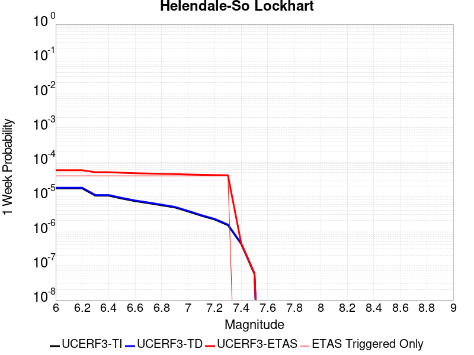 | 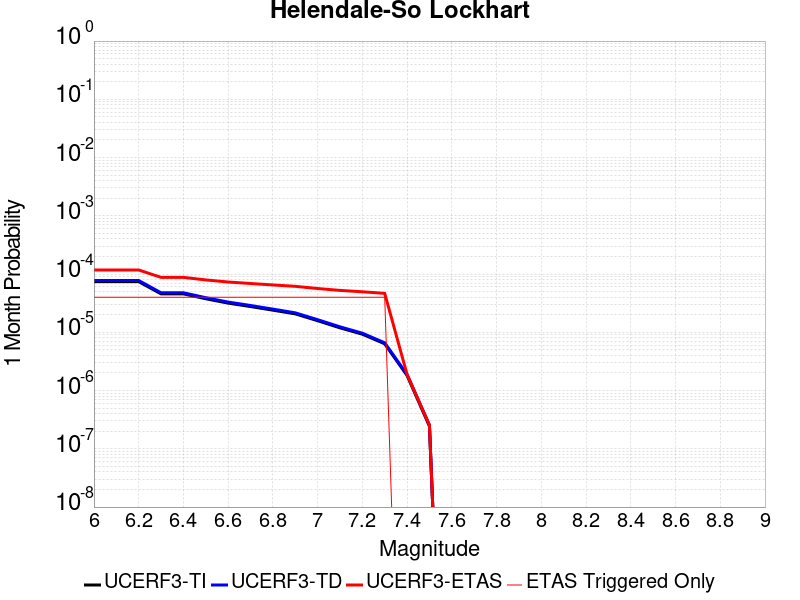 | 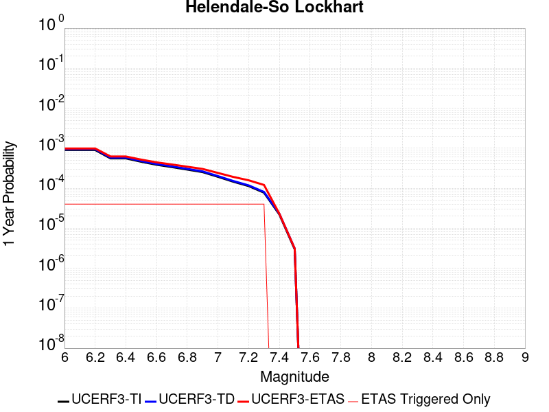 |

| Magnitude | 1 wk TI Prob | 1 wk TD Prob | 1 wk ETAS Prob | 1 wk ETAS/TD Gain | 1 wk ETAS Triggered Only | 1 mo TI Prob | 1 mo TD Prob | 1 mo ETAS Prob | 1 mo ETAS/TD Gain | 1 mo ETAS Triggered Only | 1 yr TI Prob | 1 yr TD Prob | 1 yr ETAS Prob | 1 yr ETAS/TD Gain | 1 yr ETAS Triggered Only |
|-----|-----|-----|-----|-----|-----|-----|-----|-----|-----|-----|-----|-----|-----|-----|-----|
| 6.0 | 1.7296055E-5 | 1.81066E-5 | 5.8105878E-5 | 3.209099 | 4.0E-5 | 7.412385E-5 | 7.759753E-5 | 1.1759442E-4 | 1.5154403 | 4.0E-5 | 9.0208417E-4 | 9.4436115E-4 | 9.843233E-4 | 1.0423167 | 4.0E-5 |
| 6.1 | 1.7296055E-5 | 1.81066E-5 | 5.8105878E-5 | 3.209099 | 4.0E-5 | 7.412385E-5 | 7.759753E-5 | 1.1759442E-4 | 1.5154403 | 4.0E-5 | 9.0208417E-4 | 9.4436115E-4 | 9.843233E-4 | 1.0423167 | 4.0E-5 |
| 6.2 | 1.7296055E-5 | 1.81066E-5 | 5.8105878E-5 | 3.209099 | 4.0E-5 | 7.412385E-5 | 7.759753E-5 | 1.1759442E-4 | 1.5154403 | 4.0E-5 | 9.0208417E-4 | 9.4436115E-4 | 9.843233E-4 | 1.0423167 | 4.0E-5 |
| 6.3 | 1.0669118E-5 | 1.1137076E-5 | 5.113663E-5 | 4.591567 | 4.0E-5 | 4.5723988E-5 | 4.772947E-5 | 8.772756E-5 | 1.8380166 | 4.0E-5 | 5.5654737E-4 | 5.8095413E-4 | 6.209309E-4 | 1.0688123 | 4.0E-5 |
| 6.4 | 1.0669118E-5 | 1.1137076E-5 | 5.113663E-5 | 4.591567 | 4.0E-5 | 4.5723988E-5 | 4.772947E-5 | 8.772756E-5 | 1.8380166 | 4.0E-5 | 5.5654737E-4 | 5.8095413E-4 | 6.209309E-4 | 1.0688123 | 4.0E-5 |
| 6.5 | 8.790038E-6 | 9.171543E-6 | 4.9171176E-5 | 5.361276 | 4.0E-5 | 3.767105E-5 | 3.930603E-5 | 7.930446E-5 | 2.0176156 | 4.0E-5 | 4.585485E-4 | 4.784474E-4 | 5.184282E-4 | 1.0835638 | 4.0E-5 |
| 6.6 | 7.396949E-6 | 7.716665E-6 | 4.7716356E-5 | 6.1835465 | 4.0E-5 | 3.1700827E-5 | 3.3071006E-5 | 7.3069685E-5 | 2.2094786 | 4.0E-5 | 3.858892E-4 | 4.0256613E-4 | 4.4255005E-4 | 1.0993226 | 4.0E-5 |
| 6.7 | 6.4600285E-6 | 6.739015E-6 | 4.6738747E-5 | 6.9355454 | 4.0E-5 | 2.7685543E-5 | 2.8881179E-5 | 6.888002E-5 | 2.384945 | 4.0E-5 | 3.3701936E-4 | 3.515724E-4 | 3.9155834E-4 | 1.1137346 | 4.0E-5 |
| 6.8 | 5.600104E-6 | 5.8368437E-6 | 4.583661E-5 | 7.852979 | 4.0E-5 | 2.4000226E-5 | 2.5014808E-5 | 6.501381E-5 | 2.5990129 | 4.0E-5 | 2.9216358E-4 | 3.0451332E-4 | 3.4450114E-4 | 1.1313171 | 4.0E-5 |
| 6.9 | 4.839122E-6 | 5.0402173E-6 | 4.5040015E-5 | 8.936126 | 4.0E-5 | 2.0738931E-5 | 2.1600754E-5 | 6.159989E-5 | 2.8517473 | 4.0E-5 | 2.5246723E-4 | 2.629579E-4 | 3.029474E-4 | 1.1520756 | 4.0E-5 |
| 7.0 | 3.6937633E-6 | 3.8457424E-6 | 4.384559E-5 | 11.4010725 | 4.0E-5 | 1.5830317E-5 | 1.6481652E-5 | 5.6480992E-5 | 3.4269013 | 4.0E-5 | 1.9271708E-4 | 2.0064594E-4 | 2.4063792E-4 | 1.1993161 | 4.0E-5 |
| 7.1 | 2.7858857E-6 | 2.8982486E-6 | 4.2898133E-5 | 14.801398 | 4.0E-5 | 1.1939455E-5 | 1.2421007E-5 | 5.242051E-5 | 4.2203107 | 4.0E-5 | 1.4535317E-4 | 1.5121548E-4 | 1.9120944E-4 | 1.2644832 | 4.0E-5 |
| 7.2 | 2.1672065E-6 | 2.2543188E-6 | 4.225423E-5 | 18.74368 | 4.0E-5 | 9.2879945E-6 | 9.661331E-6 | 4.9660946E-5 | 5.140176 | 4.0E-5 | 1.1307546E-4 | 1.1762055E-4 | 1.5761584E-4 | 1.3400366 | 4.0E-5 |
| 7.3 | 1.4823496E-6 | 1.5424213E-6 | 4.154236E-5 | 26.933212 | 4.0E-5 | 6.3529114E-6 | 6.610361E-6 | 4.6610097E-5 | 7.0510664 | 4.0E-5 | 7.734395E-5 | 8.047833E-5 | 1.2047511E-4 | 1.4969882 | 4.0E-5 |
| 7.4 | 4.2321457E-7 | 4.411508E-7 | 4.411508E-7 | 1.0 | 0.0 | 1.8137755E-6 | 1.8906451E-6 | 1.8906451E-6 | 1.0 | 0.0 | 2.2082493E-5 | 2.3018407E-5 | 2.3018407E-5 | 1.0 | 0.0 |
| 7.5 | 5.6942316E-8 | 5.9424394E-8 | 5.9424394E-8 | 1.0 | 0.0 | 2.440385E-7 | 2.5467594E-7 | 2.5467594E-7 | 1.0 | 0.0 | 2.9711643E-6 | 3.1006762E-6 | 3.1006762E-6 | 1.0 | 0.0 |

## Goldstone Lake
*[(top)](#table-of-contents)*

| 1 Week | 1 Month | 1 Year |
|-----|-----|-----|
| 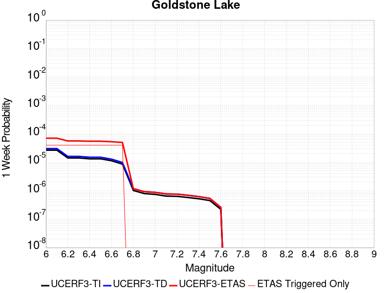 | 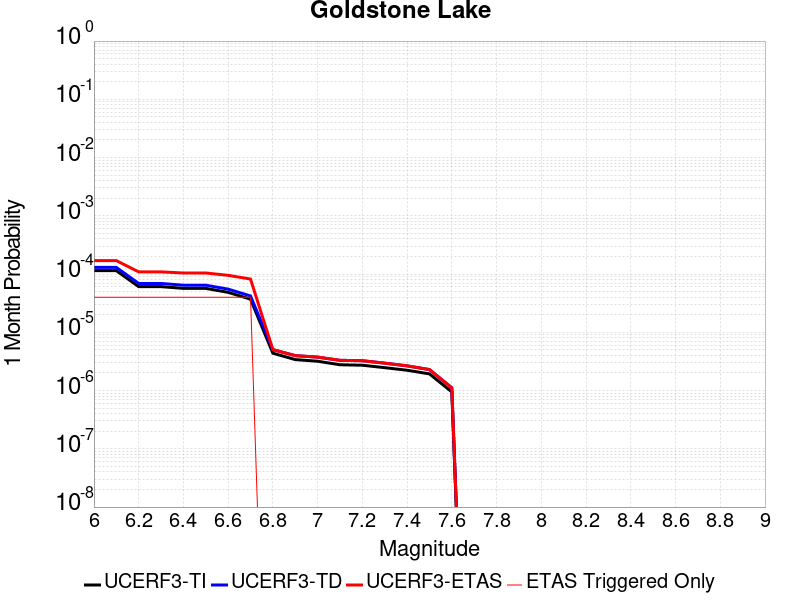 | 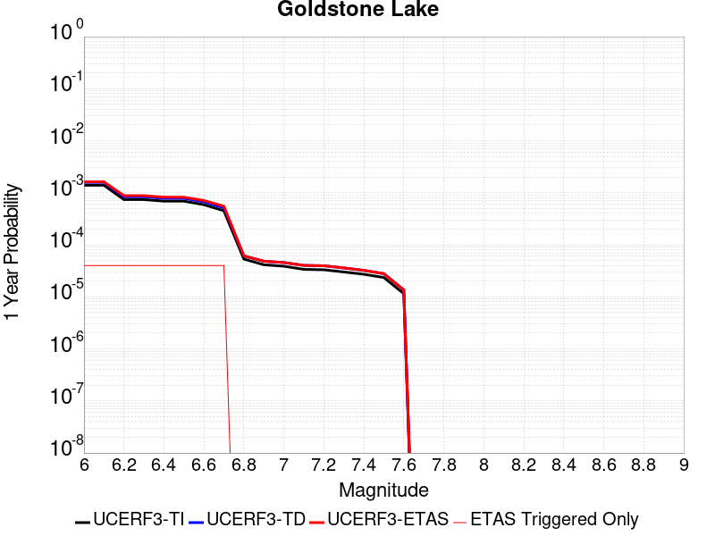 |

| Magnitude | 1 wk TI Prob | 1 wk TD Prob | 1 wk ETAS Prob | 1 wk ETAS/TD Gain | 1 wk ETAS Triggered Only | 1 mo TI Prob | 1 mo TD Prob | 1 mo ETAS Prob | 1 mo ETAS/TD Gain | 1 mo ETAS Triggered Only | 1 yr TI Prob | 1 yr TD Prob | 1 yr ETAS Prob | 1 yr ETAS/TD Gain | 1 yr ETAS Triggered Only |
|-----|-----|-----|-----|-----|-----|-----|-----|-----|-----|-----|-----|-----|-----|-----|-----|
| 6.0 | 2.671352E-5 | 3.0389869E-5 | 7.0388654E-5 | 2.316188 | 4.0E-5 | 1.1448149E-4 | 1.302369E-4 | 1.702317E-4 | 1.3070927 | 4.0E-5 | 0.001392921 | 0.0015846775 | 0.001624614 | 1.0252017 | 4.0E-5 |
| 6.1 | 2.671352E-5 | 3.0389869E-5 | 7.0388654E-5 | 2.316188 | 4.0E-5 | 1.1448149E-4 | 1.302369E-4 | 1.702317E-4 | 1.3070927 | 4.0E-5 | 0.001392921 | 0.0015846775 | 0.001624614 | 1.0252017 | 4.0E-5 |
| 6.2 | 1.4197047E-5 | 1.6103195E-5 | 5.610255E-5 | 3.4839392 | 4.0E-5 | 6.0843064E-5 | 6.901242E-5 | 1.09009656E-4 | 1.5795658 | 4.0E-5 | 7.4051257E-4 | 8.4000104E-4 | 8.799674E-4 | 1.0475789 | 4.0E-5 |
| 6.3 | 1.4197047E-5 | 1.6103195E-5 | 5.610255E-5 | 3.4839392 | 4.0E-5 | 6.0843064E-5 | 6.901242E-5 | 1.09009656E-4 | 1.5795658 | 4.0E-5 | 7.4051257E-4 | 8.4000104E-4 | 8.799674E-4 | 1.0475789 | 4.0E-5 |
| 6.4 | 1.3238931E-5 | 1.501491E-5 | 5.501431E-5 | 3.6639786 | 4.0E-5 | 5.6737044E-5 | 6.434858E-5 | 1.0434601E-4 | 1.6215744 | 4.0E-5 | 6.9055456E-4 | 7.8326045E-4 | 8.232291E-4 | 1.0510286 | 4.0E-5 |
| 6.5 | 1.3238931E-5 | 1.501491E-5 | 5.501431E-5 | 3.6639786 | 4.0E-5 | 5.6737044E-5 | 6.434858E-5 | 1.0434601E-4 | 1.6215744 | 4.0E-5 | 6.9055456E-4 | 7.8326045E-4 | 8.232291E-4 | 1.0510286 | 4.0E-5 |
| 6.6 | 1.1328278E-5 | 1.2860688E-5 | 5.2860174E-5 | 4.1102133 | 4.0E-5 | 4.8548856E-5 | 5.5116612E-5 | 9.51144E-5 | 1.7256941 | 4.0E-5 | 5.90922E-4 | 6.709339E-4 | 7.1090704E-4 | 1.0595784 | 4.0E-5 |
| 6.7 | 8.651175E-6 | 9.82873E-6 | 4.9828337E-5 | 5.0696616 | 4.0E-5 | 3.707594E-5 | 4.212296E-5 | 8.2121274E-5 | 1.9495609 | 4.0E-5 | 4.5130608E-4 | 5.1281694E-4 | 5.5279647E-4 | 1.0779605 | 4.0E-5 |
| 6.8 | 1.0215377E-6 | 1.1757171E-6 | 1.1757171E-6 | 1.0 | 0.0 | 4.378012E-6 | 5.0387785E-6 | 5.0387785E-6 | 1.0 | 0.0 | 5.3300988E-5 | 6.134552E-5 | 6.134552E-5 | 1.0 | 0.0 |
| 6.9 | 7.9360774E-7 | 9.28516E-7 | 9.28516E-7 | 1.0 | 0.0 | 3.4011714E-6 | 3.9793485E-6 | 3.9793485E-6 | 1.0 | 0.0 | 4.1408475E-5 | 4.8447564E-5 | 4.8447564E-5 | 1.0 | 0.0 |
| 7.0 | 7.4382757E-7 | 8.748952E-7 | 8.748952E-7 | 1.0 | 0.0 | 3.1878285E-6 | 3.7495458E-6 | 3.7495458E-6 | 1.0 | 0.0 | 3.8811122E-5 | 4.5649835E-5 | 4.5649835E-5 | 1.0 | 0.0 |
| 7.1 | 6.4709513E-7 | 7.712674E-7 | 7.712674E-7 | 1.0 | 0.0 | 2.773262E-6 | 3.305428E-6 | 3.305428E-6 | 1.0 | 0.0 | 3.376394E-5 | 4.0242903E-5 | 4.0242903E-5 | 1.0 | 0.0 |
| 7.2 | 6.356704E-7 | 7.589702E-7 | 7.589702E-7 | 1.0 | 0.0 | 2.7242988E-6 | 3.2527257E-6 | 3.2527257E-6 | 1.0 | 0.0 | 3.3167835E-5 | 3.9601277E-5 | 3.9601277E-5 | 1.0 | 0.0 |
| 7.3 | 5.7695723E-7 | 6.897807E-7 | 6.897807E-7 | 1.0 | 0.0 | 2.4726714E-6 | 2.9562E-6 | 2.9562E-6 | 1.0 | 0.0 | 3.0104358E-5 | 3.5991197E-5 | 3.5991197E-5 | 1.0 | 0.0 |
| 7.4 | 5.209647E-7 | 6.194571E-7 | 6.194571E-7 | 1.0 | 0.0 | 2.232704E-6 | 2.654814E-6 | 2.654814E-6 | 1.0 | 0.0 | 2.718283E-5 | 3.2321936E-5 | 3.2321936E-5 | 1.0 | 0.0 |
| 7.5 | 4.512955E-7 | 5.3497666E-7 | 5.3497666E-7 | 1.0 | 0.0 | 1.934122E-6 | 2.2927554E-6 | 2.2927554E-6 | 1.0 | 0.0 | 2.3547682E-5 | 2.7913995E-5 | 2.7913995E-5 | 1.0 | 0.0 |
| 7.6 | 2.21172E-7 | 2.6043384E-7 | 2.6043384E-7 | 1.0 | 0.0 | 9.478797E-7 | 1.1161446E-6 | 1.1161446E-6 | 1.0 | 0.0 | 1.1540374E-5 | 1.3589005E-5 | 1.3589005E-5 | 1.0 | 0.0 |

## Pine Mtn
*[(top)](#table-of-contents)*

| 1 Week | 1 Month | 1 Year |
|-----|-----|-----|
|  | 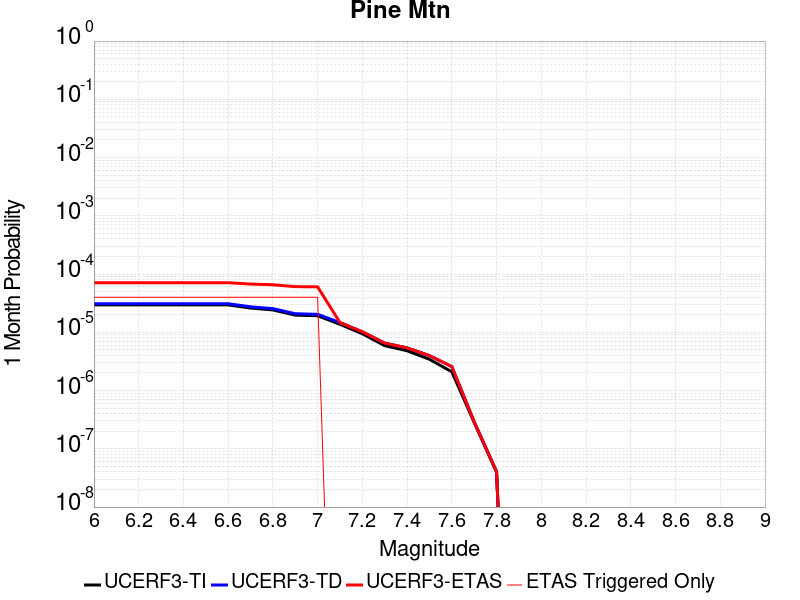 | 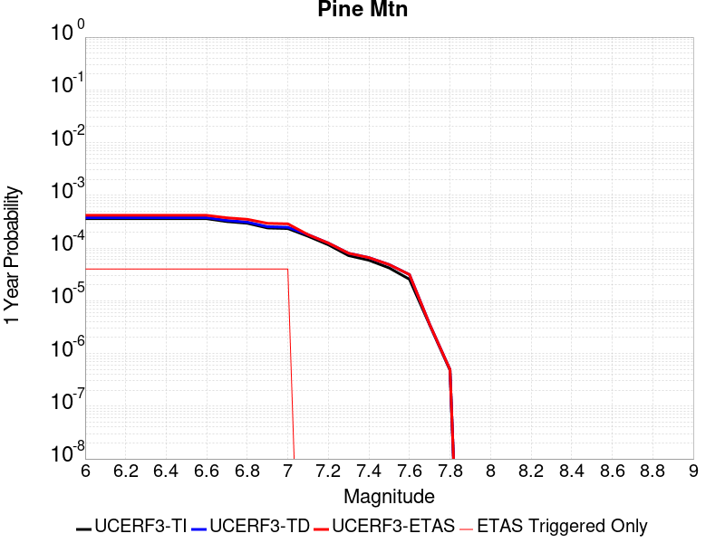 |

| Magnitude | 1 wk TI Prob | 1 wk TD Prob | 1 wk ETAS Prob | 1 wk ETAS/TD Gain | 1 wk ETAS Triggered Only | 1 mo TI Prob | 1 mo TD Prob | 1 mo ETAS Prob | 1 mo ETAS/TD Gain | 1 mo ETAS Triggered Only | 1 yr TI Prob | 1 yr TD Prob | 1 yr ETAS Prob | 1 yr ETAS/TD Gain | 1 yr ETAS Triggered Only |
|-----|-----|-----|-----|-----|-----|-----|-----|-----|-----|-----|-----|-----|-----|-----|-----|
| 6.0 | 6.894797E-6 | 7.22808E-6 | 7.22808E-6 | 1.0 | 0.0 | 2.9548795E-5 | 3.0977135E-5 | 7.09759E-5 | 2.291235 | 4.0E-5 | 3.596972E-4 | 3.7708433E-4 | 4.1706924E-4 | 1.106037 | 4.0E-5 |
| 6.1 | 6.894797E-6 | 7.22808E-6 | 7.22808E-6 | 1.0 | 0.0 | 2.9548795E-5 | 3.0977135E-5 | 7.09759E-5 | 2.291235 | 4.0E-5 | 3.596972E-4 | 3.7708433E-4 | 4.1706924E-4 | 1.106037 | 4.0E-5 |
| 6.2 | 6.894797E-6 | 7.22808E-6 | 7.22808E-6 | 1.0 | 0.0 | 2.9548795E-5 | 3.0977135E-5 | 7.09759E-5 | 2.291235 | 4.0E-5 | 3.596972E-4 | 3.7708433E-4 | 4.1706924E-4 | 1.106037 | 4.0E-5 |
| 6.3 | 6.894797E-6 | 7.22808E-6 | 7.22808E-6 | 1.0 | 0.0 | 2.9548795E-5 | 3.0977135E-5 | 7.09759E-5 | 2.291235 | 4.0E-5 | 3.596972E-4 | 3.7708433E-4 | 4.1706924E-4 | 1.106037 | 4.0E-5 |
| 6.4 | 6.894797E-6 | 7.22808E-6 | 7.22808E-6 | 1.0 | 0.0 | 2.9548795E-5 | 3.0977135E-5 | 7.09759E-5 | 2.291235 | 4.0E-5 | 3.596972E-4 | 3.7708433E-4 | 4.1706924E-4 | 1.106037 | 4.0E-5 |
| 6.5 | 6.894797E-6 | 7.22808E-6 | 7.22808E-6 | 1.0 | 0.0 | 2.9548795E-5 | 3.0977135E-5 | 7.09759E-5 | 2.291235 | 4.0E-5 | 3.596972E-4 | 3.7708433E-4 | 4.1706924E-4 | 1.106037 | 4.0E-5 |
| 6.6 | 6.894797E-6 | 7.22808E-6 | 7.22808E-6 | 1.0 | 0.0 | 2.9548795E-5 | 3.0977135E-5 | 7.09759E-5 | 2.291235 | 4.0E-5 | 3.596972E-4 | 3.7708433E-4 | 4.1706924E-4 | 1.106037 | 4.0E-5 |
| 6.7 | 6.0867933E-6 | 6.3996613E-6 | 6.3996613E-6 | 1.0 | 0.0 | 2.6085996E-5 | 2.7426844E-5 | 6.7425746E-5 | 2.4583852 | 4.0E-5 | 3.1755073E-4 | 3.3387286E-4 | 3.738595E-4 | 1.1197661 | 4.0E-5 |
| 6.8 | 5.6530425E-6 | 5.9530994E-6 | 5.9530994E-6 | 1.0 | 0.0 | 2.42271E-5 | 2.5513044E-5 | 6.5512024E-5 | 2.5677855 | 4.0E-5 | 2.94925E-4 | 3.105791E-4 | 3.5056667E-4 | 1.1287516 | 4.0E-5 |
| 6.9 | 4.6015225E-6 | 4.866214E-6 | 4.866214E-6 | 1.0 | 0.0 | 1.9720663E-5 | 2.0855045E-5 | 6.085421E-5 | 2.9179611 | 4.0E-5 | 2.4007261E-4 | 2.5388206E-4 | 2.9387188E-4 | 1.1575135 | 4.0E-5 |
| 7.0 | 4.4875965E-6 | 4.7498447E-6 | 4.7498447E-6 | 1.0 | 0.0 | 1.9232413E-5 | 2.0356327E-5 | 6.0355513E-5 | 2.964951 | 4.0E-5 | 2.3412947E-4 | 2.4781155E-4 | 2.8780164E-4 | 1.161373 | 4.0E-5 |
| 7.1 | 3.203907E-6 | 3.4316613E-6 | 3.4316613E-6 | 1.0 | 0.0 | 1.3730958E-5 | 1.4707041E-5 | 1.4707041E-5 | 1.0 | 0.0 | 1.6716159E-4 | 1.7904417E-4 | 1.7904417E-4 | 1.0 | 0.0 |
| 7.2 | 2.2060601E-6 | 2.3803232E-6 | 2.3803232E-6 | 1.0 | 0.0 | 9.4545085E-6 | 1.0201347E-5 | 1.0201347E-5 | 1.0 | 0.0 | 1.15102564E-4 | 1.2419479E-4 | 1.2419479E-4 | 1.0 | 0.0 |
| 7.3 | 1.3765207E-6 | 1.5233043E-6 | 1.5233043E-6 | 1.0 | 0.0 | 5.899361E-6 | 6.528431E-6 | 6.528431E-6 | 1.0 | 0.0 | 7.182235E-5 | 7.9480844E-5 | 7.9480844E-5 | 1.0 | 0.0 |
| 7.4 | 1.1245983E-6 | 1.2601989E-6 | 1.2601989E-6 | 1.0 | 0.0 | 4.819698E-6 | 5.400842E-6 | 5.400842E-6 | 1.0 | 0.0 | 5.8678244E-5 | 6.575335E-5 | 6.575335E-5 | 1.0 | 0.0 |
| 7.5 | 8.031682E-7 | 9.290882E-7 | 9.290882E-7 | 1.0 | 0.0 | 3.4421448E-6 | 3.9818005E-6 | 3.9818005E-6 | 1.0 | 0.0 | 4.1907308E-5 | 4.8477414E-5 | 4.8477414E-5 | 1.0 | 0.0 |
| 7.6 | 4.8953444E-7 | 6.015368E-7 | 6.015368E-7 | 1.0 | 0.0 | 2.098003E-6 | 2.5780125E-6 | 2.5780125E-6 | 1.0 | 0.0 | 2.5542888E-5 | 3.13869E-5 | 3.13869E-5 | 1.0 | 0.0 |
| 7.7 | 6.634529E-8 | 6.7893666E-8 | 6.7893666E-8 | 1.0 | 0.0 | 2.843369E-7 | 2.9097282E-7 | 2.9097282E-7 | 1.0 | 0.0 | 3.4617963E-6 | 3.542589E-6 | 3.542589E-6 | 1.0 | 0.0 |
| 7.8 | 9.235578E-9 | 9.489462E-9 | 9.489462E-9 | 1.0 | 0.0 | 3.9581046E-8 | 4.066912E-8 | 4.066912E-8 | 1.0 | 0.0 | 4.818991E-7 | 4.951465E-7 | 4.951465E-7 | 1.0 | 0.0 |

## Earthquake Valley
*[(top)](#table-of-contents)*

| 1 Week | 1 Month | 1 Year |
|-----|-----|-----|
| 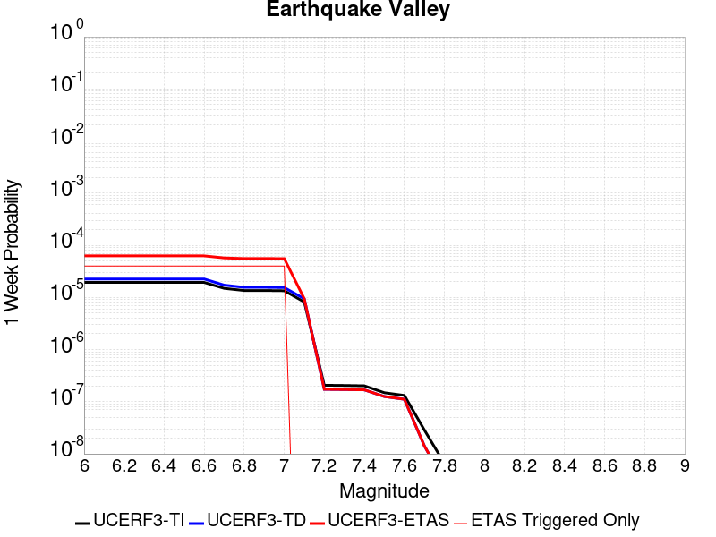 | 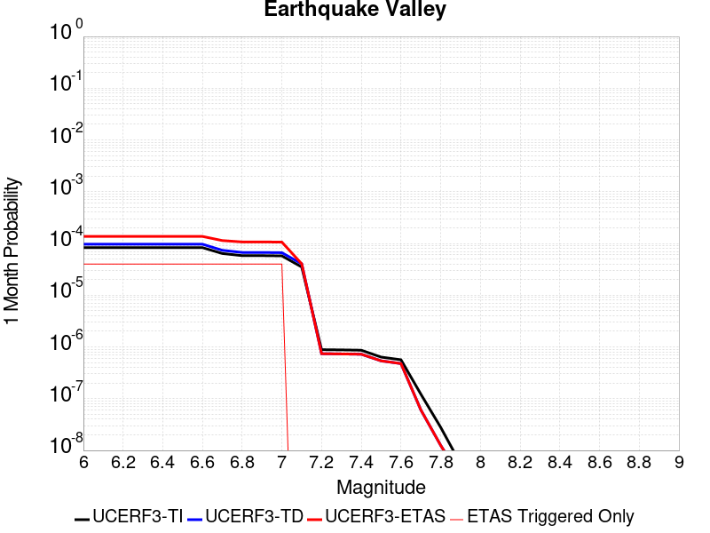 | 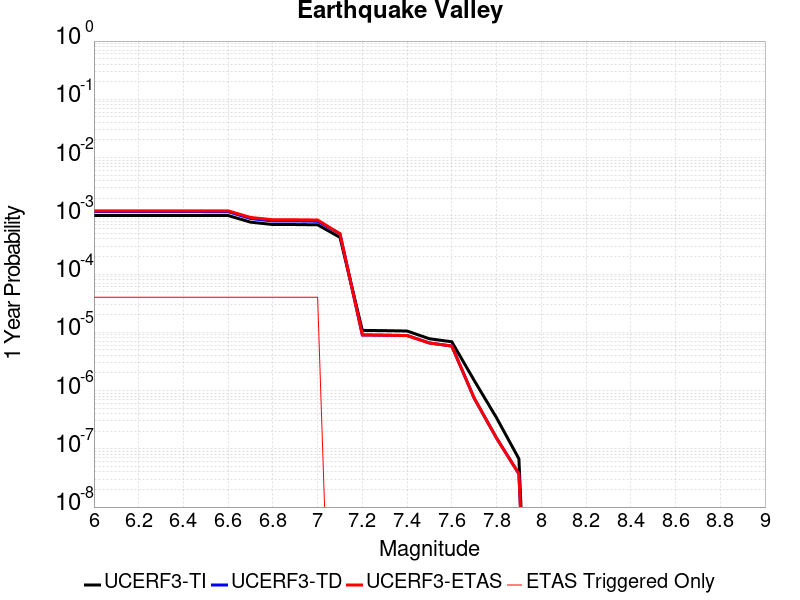 |

| Magnitude | 1 wk TI Prob | 1 wk TD Prob | 1 wk ETAS Prob | 1 wk ETAS/TD Gain | 1 wk ETAS Triggered Only | 1 mo TI Prob | 1 mo TD Prob | 1 mo ETAS Prob | 1 mo ETAS/TD Gain | 1 mo ETAS Triggered Only | 1 yr TI Prob | 1 yr TD Prob | 1 yr ETAS Prob | 1 yr ETAS/TD Gain | 1 yr ETAS Triggered Only |
|-----|-----|-----|-----|-----|-----|-----|-----|-----|-----|-----|-----|-----|-----|-----|-----|
| 6.0 | 1.9416384E-5 | 2.2596936E-5 | 6.259603E-5 | 2.7701116 | 4.0E-5 | 8.321042E-5 | 9.68411E-5 | 1.3683722E-4 | 1.4130077 | 4.0E-5 | 0.001012616 | 0.0011785226 | 0.0012184754 | 1.0339009 | 4.0E-5 |
| 6.1 | 1.9416384E-5 | 2.2596936E-5 | 6.259603E-5 | 2.7701116 | 4.0E-5 | 8.321042E-5 | 9.68411E-5 | 1.3683722E-4 | 1.4130077 | 4.0E-5 | 0.001012616 | 0.0011785226 | 0.0012184754 | 1.0339009 | 4.0E-5 |
| 6.2 | 1.9416384E-5 | 2.2596936E-5 | 6.259603E-5 | 2.7701116 | 4.0E-5 | 8.321042E-5 | 9.68411E-5 | 1.3683722E-4 | 1.4130077 | 4.0E-5 | 0.001012616 | 0.0011785226 | 0.0012184754 | 1.0339009 | 4.0E-5 |
| 6.3 | 1.9416384E-5 | 2.2596936E-5 | 6.259603E-5 | 2.7701116 | 4.0E-5 | 8.321042E-5 | 9.68411E-5 | 1.3683722E-4 | 1.4130077 | 4.0E-5 | 0.001012616 | 0.0011785226 | 0.0012184754 | 1.0339009 | 4.0E-5 |
| 6.4 | 1.9416384E-5 | 2.2596936E-5 | 6.259603E-5 | 2.7701116 | 4.0E-5 | 8.321042E-5 | 9.68411E-5 | 1.3683722E-4 | 1.4130077 | 4.0E-5 | 0.001012616 | 0.0011785226 | 0.0012184754 | 1.0339009 | 4.0E-5 |
| 6.5 | 1.9389157E-5 | 2.256551E-5 | 6.2564606E-5 | 2.7725768 | 4.0E-5 | 8.309374E-5 | 9.670642E-5 | 1.3670255E-4 | 1.413583 | 4.0E-5 | 0.0010111968 | 0.0011768846 | 0.0012168376 | 1.0339481 | 4.0E-5 |
| 6.6 | 1.9389157E-5 | 2.256551E-5 | 6.2564606E-5 | 2.7725768 | 4.0E-5 | 8.309374E-5 | 9.670642E-5 | 1.3670255E-4 | 1.413583 | 4.0E-5 | 0.0010111968 | 0.0011768846 | 0.0012168376 | 1.0339481 | 4.0E-5 |
| 6.7 | 1.4925434E-5 | 1.721746E-5 | 5.721677E-5 | 3.323183 | 4.0E-5 | 6.396457E-5 | 7.378751E-5 | 1.13784554E-4 | 1.5420572 | 4.0E-5 | 7.7849044E-4 | 8.980778E-4 | 9.3804183E-4 | 1.0444995 | 4.0E-5 |
| 6.8 | 1.3570335E-5 | 1.5625135E-5 | 5.562451E-5 | 3.559938 | 4.0E-5 | 5.8157282E-5 | 6.696361E-5 | 1.0696093E-4 | 1.5972993 | 4.0E-5 | 7.0783484E-4 | 8.150591E-4 | 8.5502653E-4 | 1.0490361 | 4.0E-5 |
| 6.9 | 1.3570335E-5 | 1.5625135E-5 | 5.562451E-5 | 3.559938 | 4.0E-5 | 5.8157282E-5 | 6.696361E-5 | 1.0696093E-4 | 1.5972993 | 4.0E-5 | 7.0783484E-4 | 8.150591E-4 | 8.5502653E-4 | 1.0490361 | 4.0E-5 |
| 7.0 | 1.3433392E-5 | 1.5468602E-5 | 5.5467983E-5 | 3.585843 | 4.0E-5 | 5.757041E-5 | 6.629279E-5 | 1.0629014E-4 | 1.6033438 | 4.0E-5 | 7.0069433E-4 | 8.06898E-4 | 8.468657E-4 | 1.0495325 | 4.0E-5 |
| 7.1 | 8.181609E-6 | 9.421978E-6 | 9.421978E-6 | 1.0 | 0.0 | 3.5063567E-5 | 4.0379655E-5 | 4.0379655E-5 | 1.0 | 0.0 | 4.268153E-4 | 4.9157854E-4 | 4.9157854E-4 | 1.0 | 0.0 |
| 7.2 | 2.0663983E-7 | 1.7276827E-7 | 1.7276827E-7 | 1.0 | 0.0 | 8.855989E-7 | 7.4043527E-7 | 7.4043527E-7 | 1.0 | 0.0 | 1.0782113E-5 | 9.014766E-6 | 9.014766E-6 | 1.0 | 0.0 |
| 7.3 | 2.0462376E-7 | 1.7092242E-7 | 1.7092242E-7 | 1.0 | 0.0 | 8.7695867E-7 | 7.325244E-7 | 7.325244E-7 | 1.0 | 0.0 | 1.0676919E-5 | 8.918452E-6 | 8.918452E-6 | 1.0 | 0.0 |
| 7.4 | 2.0171088E-7 | 1.687456E-7 | 1.687456E-7 | 1.0 | 0.0 | 8.644749E-7 | 7.231952E-7 | 7.231952E-7 | 1.0 | 0.0 | 1.0524931E-5 | 8.80487E-6 | 8.80487E-6 | 1.0 | 0.0 |
| 7.5 | 1.4847944E-7 | 1.2570331E-7 | 1.2570331E-7 | 1.0 | 0.0 | 6.363403E-7 | 5.387284E-7 | 5.387284E-7 | 1.0 | 0.0 | 7.747416E-6 | 6.559E-6 | 6.559E-6 | 1.0 | 0.0 |
| 7.6 | 1.3185847E-7 | 1.11332305E-7 | 1.11332305E-7 | 1.0 | 0.0 | 5.6510765E-7 | 4.7713837E-7 | 4.7713837E-7 | 1.0 | 0.0 | 6.8801637E-6 | 5.8091464E-6 | 5.8091464E-6 | 1.0 | 0.0 |
| 7.7 | 2.8609954E-8 | 1.4188027E-8 | 1.4188027E-8 | 1.0 | 0.0 | 1.2261408E-7 | 6.0805824E-8 | 6.0805824E-8 | 1.0 | 0.0 | 1.4928254E-6 | 7.403107E-7 | 7.403107E-7 | 1.0 | 0.0 |
| 7.8 | 6.527266E-9 | 2.9268739E-9 | 2.9268739E-9 | 1.0 | 0.0 | 2.7973995E-8 | 1.2543746E-8 | 1.2543746E-8 | 1.0 | 0.0 | 3.4058334E-7 | 1.5272009E-7 | 1.5272009E-7 | 1.0 | 0.0 |
| 7.9 | 1.2898267E-9 | 7.133548E-10 | 7.133548E-10 | 1.0 | 0.0 | 5.527829E-9 | 3.057235E-9 | 3.057235E-9 | 1.0 | 0.0 | 6.7301315E-8 | 3.7221838E-8 | 3.7221838E-8 | 1.0 | 0.0 |

## San Jacinto (Superstition Mtn)
*[(top)](#table-of-contents)*

| 1 Week | 1 Month | 1 Year |
|-----|-----|-----|
| 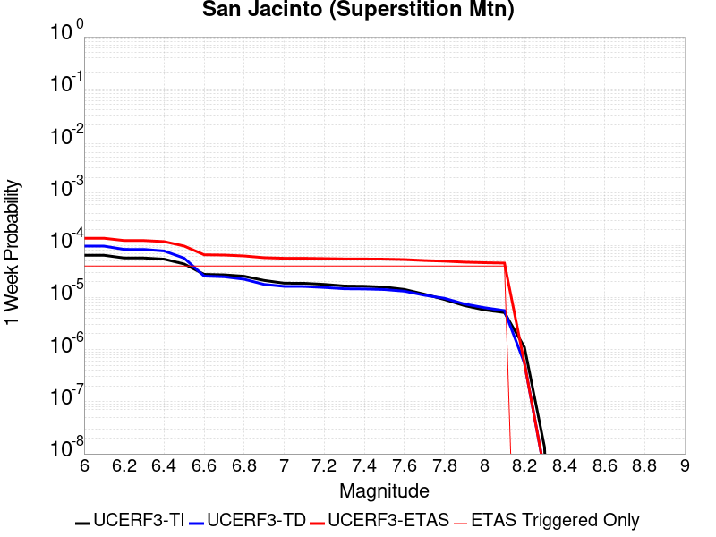 | 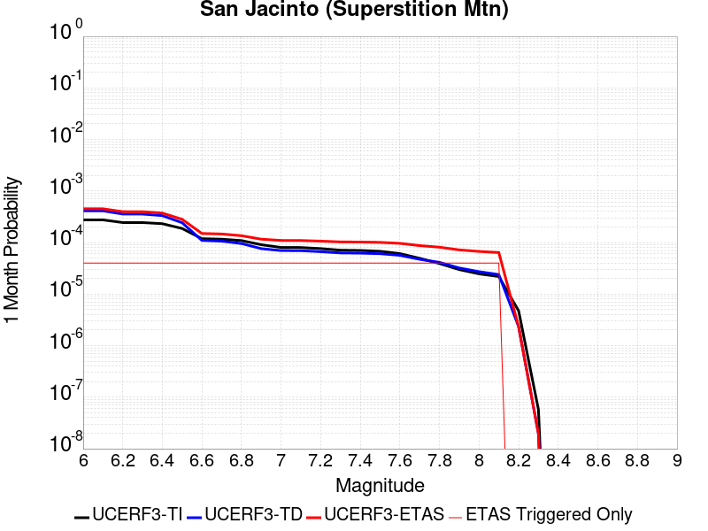 | 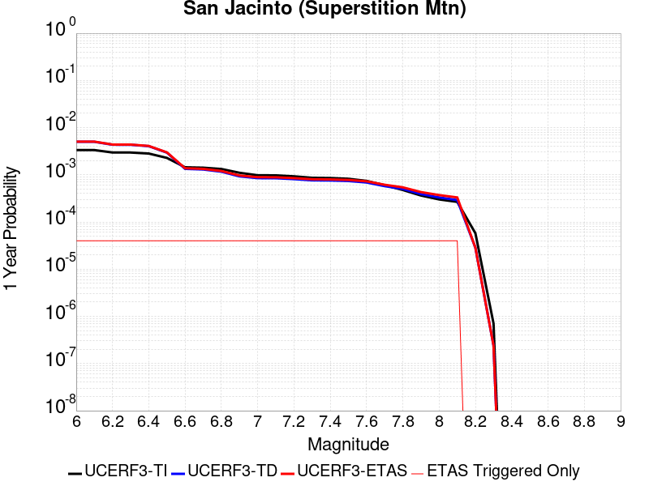 |

| Magnitude | 1 wk TI Prob | 1 wk TD Prob | 1 wk ETAS Prob | 1 wk ETAS/TD Gain | 1 wk ETAS Triggered Only | 1 mo TI Prob | 1 mo TD Prob | 1 mo ETAS Prob | 1 mo ETAS/TD Gain | 1 mo ETAS Triggered Only | 1 yr TI Prob | 1 yr TD Prob | 1 yr ETAS Prob | 1 yr ETAS/TD Gain | 1 yr ETAS Triggered Only |
|-----|-----|-----|-----|-----|-----|-----|-----|-----|-----|-----|-----|-----|-----|-----|-----|
| 6.0 | 6.4193904E-5 | 9.618683E-5 | 1.3618298E-4 | 1.4158174 | 4.0E-5 | 2.7508775E-4 | 4.1217334E-4 | 4.5215685E-4 | 1.0970066 | 4.0E-5 | 0.0033440501 | 0.005008075 | 0.0050478745 | 1.0079471 | 4.0E-5 |
| 6.1 | 6.4193904E-5 | 9.618683E-5 | 1.3618298E-4 | 1.4158174 | 4.0E-5 | 2.7508775E-4 | 4.1217334E-4 | 4.5215685E-4 | 1.0970066 | 4.0E-5 | 0.0033440501 | 0.005008075 | 0.0050478745 | 1.0079471 | 4.0E-5 |
| 6.2 | 5.7023593E-5 | 8.3323815E-5 | 1.2332048E-4 | 1.4800148 | 4.0E-5 | 2.4436394E-4 | 3.5706247E-4 | 3.970482E-4 | 1.1119852 | 4.0E-5 | 0.002971072 | 0.004340213 | 0.0043800394 | 1.0091761 | 4.0E-5 |
| 6.3 | 5.6940098E-5 | 8.316908E-5 | 1.2316575E-4 | 1.480908 | 4.0E-5 | 2.4400617E-4 | 3.5639948E-4 | 3.9638524E-4 | 1.1121936 | 4.0E-5 | 0.002966728 | 0.004332173 | 0.0043719998 | 1.0091932 | 4.0E-5 |
| 6.4 | 5.4171585E-5 | 7.765849E-5 | 1.17655385E-4 | 1.5150356 | 4.0E-5 | 2.3214328E-4 | 3.3278894E-4 | 3.7277566E-4 | 1.1201563 | 4.0E-5 | 0.0028226813 | 0.0040458273 | 0.0040856656 | 1.0098467 | 4.0E-5 |
| 6.5 | 4.375144E-5 | 5.6590954E-5 | 9.6588694E-5 | 1.7067868 | 4.0E-5 | 1.874927E-4 | 2.4251675E-4 | 2.8250704E-4 | 1.1648971 | 4.0E-5 | 0.0022803338 | 0.00294982 | 0.002989702 | 1.0135201 | 4.0E-5 |
| 6.6 | 2.772192E-5 | 2.5649655E-5 | 6.564863E-5 | 2.5594351 | 4.0E-5 | 1.1880282E-4 | 1.0992257E-4 | 1.4991818E-4 | 1.3638525 | 4.0E-5 | 0.0014454646 | 0.0013375052 | 0.0013774517 | 1.0298665 | 4.0E-5 |
| 6.7 | 2.7124124E-5 | 2.4859904E-5 | 6.485891E-5 | 2.6089766 | 4.0E-5 | 1.1624106E-4 | 1.0653821E-4 | 1.4653394E-4 | 1.3754121 | 4.0E-5 | 0.0014143161 | 0.0012963502 | 0.0013362983 | 1.0308158 | 4.0E-5 |
| 6.8 | 2.5475807E-5 | 2.2321101E-5 | 6.232021E-5 | 2.7919862 | 4.0E-5 | 1.0917746E-4 | 9.565842E-5 | 1.356546E-4 | 1.4181145 | 4.0E-5 | 0.001328425 | 0.0011640311 | 0.0012039845 | 1.0343233 | 4.0E-5 |
| 6.9 | 2.1162023E-5 | 1.7771237E-5 | 5.7770525E-5 | 3.2507882 | 4.0E-5 | 9.069123E-5 | 7.616024E-5 | 1.1615719E-4 | 1.5251684 | 4.0E-5 | 0.0011036064 | 9.268603E-4 | 9.6682325E-4 | 1.0431165 | 4.0E-5 |
| 7.0 | 1.8754288E-5 | 1.6300326E-5 | 5.6299676E-5 | 3.4538987 | 4.0E-5 | 8.037304E-5 | 6.985668E-5 | 1.0985389E-4 | 1.5725609 | 4.0E-5 | 9.781026E-4 | 8.5017574E-4 | 8.9014176E-4 | 1.0470091 | 4.0E-5 |
| 7.1 | 1.8678527E-5 | 1.6225338E-5 | 5.622469E-5 | 3.4652398 | 4.0E-5 | 8.0048376E-5 | 6.953532E-5 | 1.0953254E-4 | 1.5752072 | 4.0E-5 | 9.7415317E-4 | 8.462663E-4 | 8.862324E-4 | 1.0472264 | 4.0E-5 |
| 7.2 | 1.7804578E-5 | 1.5518503E-5 | 5.551788E-5 | 3.5775285 | 4.0E-5 | 7.6303106E-5 | 6.650618E-5 | 1.06503525E-4 | 1.6014079 | 4.0E-5 | 9.285943E-4 | 8.0941425E-4 | 8.4938185E-4 | 1.0493784 | 4.0E-5 |
| 7.3 | 1.6583685E-5 | 1.4666085E-5 | 5.46655E-5 | 3.727341 | 4.0E-5 | 7.1070994E-5 | 6.285315E-5 | 1.0285063E-4 | 1.6363641 | 4.0E-5 | 8.649459E-4 | 7.6497043E-4 | 8.0493983E-4 | 1.0522496 | 4.0E-5 |
| 7.4 | 1.6387552E-5 | 1.453072E-5 | 5.4530137E-5 | 3.7527485 | 4.0E-5 | 7.023047E-5 | 6.227304E-5 | 1.0227055E-4 | 1.6422925 | 4.0E-5 | 8.5472054E-4 | 7.579126E-4 | 7.978822E-4 | 1.0527365 | 4.0E-5 |
| 7.5 | 1.5790754E-5 | 1.4170097E-5 | 5.416953E-5 | 3.822806 | 4.0E-5 | 6.767291E-5 | 6.0727583E-5 | 1.00725156E-4 | 1.6586392 | 4.0E-5 | 8.236062E-4 | 7.391095E-4 | 7.7908E-4 | 1.0540792 | 4.0E-5 |
| 7.6 | 1.4248672E-5 | 1.31832085E-5 | 5.318268E-5 | 4.034123 | 4.0E-5 | 6.106431E-5 | 5.649825E-5 | 9.649599E-5 | 1.7079465 | 4.0E-5 | 7.432043E-4 | 6.8765087E-4 | 7.2762335E-4 | 1.0581291 | 4.0E-5 |
| 7.7 | 1.15449975E-5 | 1.1026264E-5 | 5.102582E-5 | 4.627662 | 4.0E-5 | 4.947762E-5 | 4.7254565E-5 | 8.725267E-5 | 1.846439 | 4.0E-5 | 6.022235E-4 | 5.7517324E-4 | 6.1515026E-4 | 1.0695043 | 4.0E-5 |
| 7.8 | 9.1391985E-6 | 9.632236E-6 | 4.963185E-5 | 5.1526823 | 4.0E-5 | 3.9167408E-5 | 4.128036E-5 | 8.127871E-5 | 1.9689438 | 4.0E-5 | 4.767588E-4 | 5.024731E-4 | 5.42453E-4 | 1.0795662 | 4.0E-5 |
| 7.9 | 6.973017E-6 | 7.4874865E-6 | 4.748719E-5 | 6.3422065 | 4.0E-5 | 2.9884017E-5 | 3.2088836E-5 | 7.2087554E-5 | 2.2464995 | 4.0E-5 | 3.6377716E-4 | 3.9061208E-4 | 4.3059647E-4 | 1.1023633 | 4.0E-5 |
| 8.0 | 5.7638235E-6 | 6.3564244E-6 | 4.635617E-5 | 7.292806 | 4.0E-5 | 2.4701867E-5 | 2.7241536E-5 | 6.724045E-5 | 2.4683058 | 4.0E-5 | 3.0070372E-4 | 3.3161574E-4 | 3.7160248E-4 | 1.1205815 | 4.0E-5 |
| 8.1 | 5.1124434E-6 | 5.58386E-6 | 4.5583638E-5 | 8.163464 | 4.0E-5 | 2.1910288E-5 | 2.3930612E-5 | 6.3929656E-5 | 2.6714592 | 4.0E-5 | 2.6672508E-4 | 2.9131674E-4 | 3.313051E-4 | 1.1372676 | 4.0E-5 |
| 8.2 | 1.1075938E-6 | 5.458512E-7 | 5.458512E-7 | 1.0 | 0.0 | 4.7468216E-6 | 2.3393604E-6 | 2.3393604E-6 | 1.0 | 0.0 | 5.779102E-5 | 2.8481363E-5 | 2.8481363E-5 | 1.0 | 0.0 |
| 8.3 | 1.3584393E-8 | 4.5896105E-9 | 4.5896105E-9 | 1.0 | 0.0 | 5.8218827E-8 | 1.966976E-8 | 1.966976E-8 | 1.0 | 0.0 | 7.0881396E-7 | 2.394793E-7 | 2.394793E-7 | 1.0 | 0.0 |

## McLean Lake
*[(top)](#table-of-contents)*

| 1 Week | 1 Month | 1 Year |
|-----|-----|-----|
| 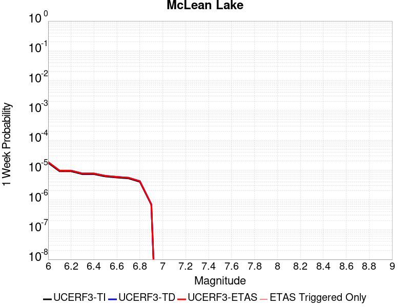 | 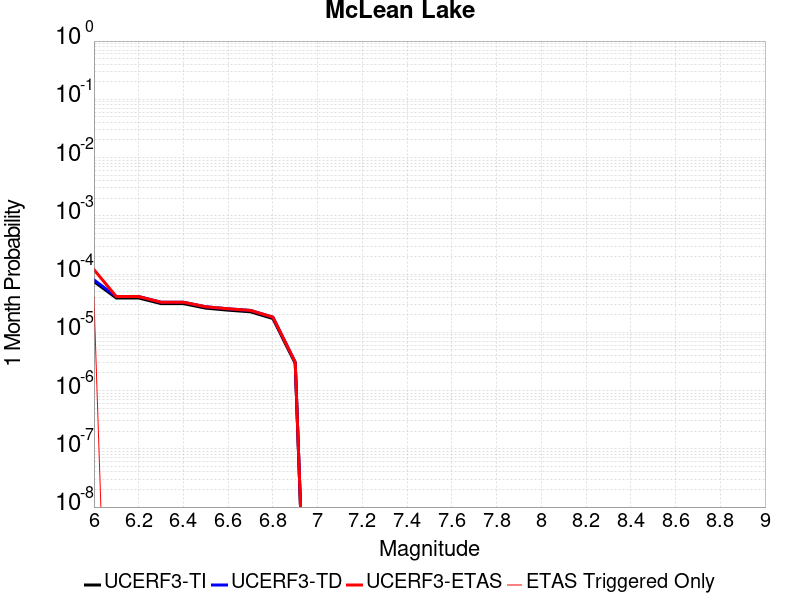 | 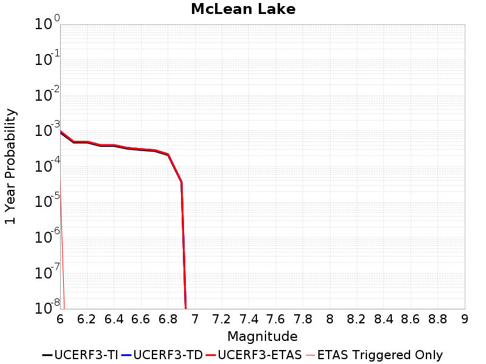 |

| Magnitude | 1 wk TI Prob | 1 wk TD Prob | 1 wk ETAS Prob | 1 wk ETAS/TD Gain | 1 wk ETAS Triggered Only | 1 mo TI Prob | 1 mo TD Prob | 1 mo ETAS Prob | 1 mo ETAS/TD Gain | 1 mo ETAS Triggered Only | 1 yr TI Prob | 1 yr TD Prob | 1 yr ETAS Prob | 1 yr ETAS/TD Gain | 1 yr ETAS Triggered Only |
|-----|-----|-----|-----|-----|-----|-----|-----|-----|-----|-----|-----|-----|-----|-----|-----|
| 6.0 | 1.7360222E-5 | 1.8505758E-5 | 1.8505758E-5 | 1.0 | 0.0 | 7.439883E-5 | 7.930826E-5 | 1.19305085E-4 | 1.5043211 | 4.0E-5 | 9.0542925E-4 | 9.651989E-4 | 0.0010051603 | 1.0414022 | 4.0E-5 |
| 6.1 | 9.062689E-6 | 9.594095E-6 | 9.594095E-6 | 1.0 | 0.0 | 3.8839516E-5 | 4.1116953E-5 | 4.1116953E-5 | 1.0 | 0.0 | 4.727685E-4 | 5.004928E-4 | 5.004928E-4 | 1.0 | 0.0 |
| 6.2 | 9.062689E-6 | 9.594095E-6 | 9.594095E-6 | 1.0 | 0.0 | 3.8839516E-5 | 4.1116953E-5 | 4.1116953E-5 | 1.0 | 0.0 | 4.727685E-4 | 5.004928E-4 | 5.004928E-4 | 1.0 | 0.0 |
| 6.3 | 7.2575485E-6 | 7.6691795E-6 | 7.6691795E-6 | 1.0 | 0.0 | 3.110341E-5 | 3.2867538E-5 | 3.2867538E-5 | 1.0 | 0.0 | 3.786182E-4 | 4.0009595E-4 | 4.0009595E-4 | 1.0 | 0.0 |
| 6.4 | 7.2575485E-6 | 7.6691795E-6 | 7.6691795E-6 | 1.0 | 0.0 | 3.110341E-5 | 3.2867538E-5 | 3.2867538E-5 | 1.0 | 0.0 | 3.786182E-4 | 4.0009595E-4 | 4.0009595E-4 | 1.0 | 0.0 |
| 6.5 | 6.06582E-6 | 6.405088E-6 | 6.405088E-6 | 1.0 | 0.0 | 2.5996113E-5 | 2.7450124E-5 | 2.7450124E-5 | 1.0 | 0.0 | 3.164567E-4 | 3.341605E-4 | 3.341605E-4 | 1.0 | 0.0 |
| 6.6 | 5.598744E-6 | 5.9113777E-6 | 5.9113777E-6 | 1.0 | 0.0 | 2.3994397E-5 | 2.5334266E-5 | 2.5334266E-5 | 1.0 | 0.0 | 2.9209262E-4 | 3.0840744E-4 | 3.0840744E-4 | 1.0 | 0.0 |
| 6.7 | 5.246996E-6 | 5.5402083E-6 | 5.5402083E-6 | 1.0 | 0.0 | 2.2486933E-5 | 2.3743569E-5 | 2.3743569E-5 | 1.0 | 0.0 | 2.73744E-4 | 2.8904597E-4 | 2.8904597E-4 | 1.0 | 0.0 |
| 6.8 | 4.02324E-6 | 4.2477054E-6 | 4.2477054E-6 | 1.0 | 0.0 | 1.7242342E-5 | 1.8204359E-5 | 1.8204359E-5 | 1.0 | 0.0 | 2.099053E-4 | 2.2162148E-4 | 2.2162148E-4 | 1.0 | 0.0 |
| 6.9 | 6.835972E-7 | 7.141004E-7 | 7.141004E-7 | 1.0 | 0.0 | 2.9296991E-6 | 3.0604285E-6 | 3.0604285E-6 | 1.0 | 0.0 | 3.56685E-5 | 3.72604E-5 | 3.72604E-5 | 1.0 | 0.0 |

## Hayward (So) extension 2011 CFM
*[(top)](#table-of-contents)*

| 1 Week | 1 Month | 1 Year |
|-----|-----|-----|
| 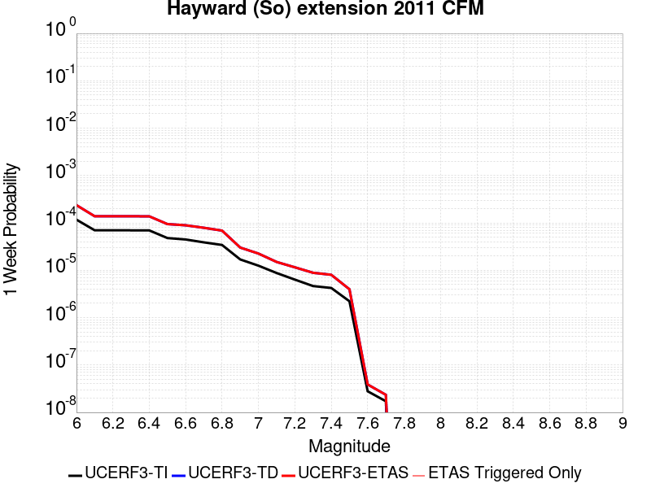 | 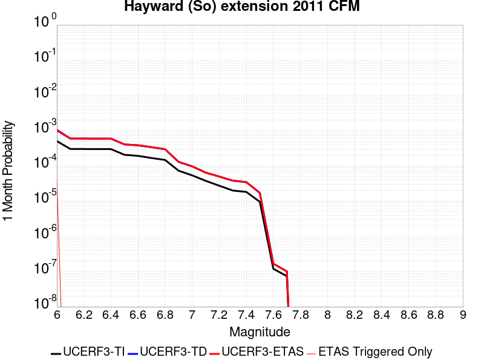 | 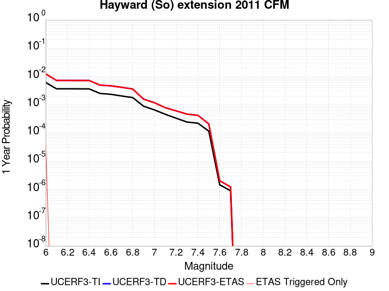 |

| Magnitude | 1 wk TI Prob | 1 wk TD Prob | 1 wk ETAS Prob | 1 wk ETAS/TD Gain | 1 wk ETAS Triggered Only | 1 mo TI Prob | 1 mo TD Prob | 1 mo ETAS Prob | 1 mo ETAS/TD Gain | 1 mo ETAS Triggered Only | 1 yr TI Prob | 1 yr TD Prob | 1 yr ETAS Prob | 1 yr ETAS/TD Gain | 1 yr ETAS Triggered Only |
|-----|-----|-----|-----|-----|-----|-----|-----|-----|-----|-----|-----|-----|-----|-----|-----|
| 6.0 | 1.1721256E-4 | 2.3707273E-4 | 2.3707273E-4 | 1.0 | 0.0 | 5.022428E-4 | 0.0010154108 | 0.0010553701 | 1.0393529 | 4.0E-5 | 0.0060976758 | 0.012268964 | 0.012308474 | 1.0032202 | 4.0E-5 |
| 6.1 | 6.99169E-5 | 1.3834794E-4 | 1.3834794E-4 | 1.0 | 0.0 | 2.9960944E-4 | 5.92756E-4 | 5.92756E-4 | 1.0 | 0.0 | 0.0036416445 | 0.0071868575 | 0.0071868575 | 1.0 | 0.0 |
| 6.2 | 6.99169E-5 | 1.3834794E-4 | 1.3834794E-4 | 1.0 | 0.0 | 2.9960944E-4 | 5.92756E-4 | 5.92756E-4 | 1.0 | 0.0 | 0.0036416445 | 0.0071868575 | 0.0071868575 | 1.0 | 0.0 |
| 6.3 | 6.970908E-5 | 1.3802912E-4 | 1.3802912E-4 | 1.0 | 0.0 | 2.9871898E-4 | 5.913906E-4 | 5.913906E-4 | 1.0 | 0.0 | 0.0036308395 | 0.007170382 | 0.007170382 | 1.0 | 0.0 |
| 6.4 | 6.9517155E-5 | 1.3769804E-4 | 1.3769804E-4 | 1.0 | 0.0 | 2.9789665E-4 | 5.8997254E-4 | 5.8997254E-4 | 1.0 | 0.0 | 0.0036208609 | 0.00715328 | 0.00715328 | 1.0 | 0.0 |
| 6.5 | 4.786248E-5 | 9.438908E-5 | 9.438908E-5 | 1.0 | 0.0 | 2.0510878E-4 | 4.0446428E-4 | 4.0446428E-4 | 1.0 | 0.0 | 0.0024943394 | 0.0049136723 | 0.0049136723 | 1.0 | 0.0 |
| 6.6 | 4.4662214E-5 | 8.9047135E-5 | 8.9047135E-5 | 1.0 | 0.0 | 1.9139545E-4 | 3.8157735E-4 | 3.8157735E-4 | 1.0 | 0.0 | 0.0023277493 | 0.004636274 | 0.004636274 | 1.0 | 0.0 |
| 6.7 | 3.884542E-5 | 7.88641E-5 | 7.88641E-5 | 1.0 | 0.0 | 1.6646975E-4 | 3.379477E-4 | 3.379477E-4 | 1.0 | 0.0 | 0.002024885 | 0.0041071977 | 0.0041071977 | 1.0 | 0.0 |
| 6.8 | 3.4221863E-5 | 6.8744615E-5 | 6.8744615E-5 | 1.0 | 0.0 | 1.4665688E-4 | 2.9458888E-4 | 2.9458888E-4 | 1.0 | 0.0 | 0.0017840851 | 0.003581144 | 0.003581144 | 1.0 | 0.0 |
| 6.9 | 1.6927712E-5 | 3.0151146E-5 | 3.0151146E-5 | 1.0 | 0.0 | 7.2545314E-5 | 1.2921312E-4 | 1.2921312E-4 | 1.0 | 0.0 | 8.828813E-4 | 0.0015720917 | 0.0015720917 | 1.0 | 0.0 |
| 7.0 | 1.2509653E-5 | 2.254093E-5 | 2.254093E-5 | 1.0 | 0.0 | 5.3611697E-5 | 9.6600656E-5 | 9.6600656E-5 | 1.0 | 0.0 | 6.525269E-4 | 0.0011755227 | 0.0011755227 | 1.0 | 0.0 |
| 7.1 | 8.751583E-6 | 1.49821035E-5 | 1.49821035E-5 | 1.0 | 0.0 | 3.750624E-5 | 6.420747E-5 | 6.420747E-5 | 1.0 | 0.0 | 4.5654282E-4 | 7.8145147E-4 | 7.8145147E-4 | 1.0 | 0.0 |
| 7.2 | 6.354379E-6 | 1.15507255E-5 | 1.15507255E-5 | 1.0 | 0.0 | 2.7232769E-5 | 4.95022E-5 | 4.95022E-5 | 1.0 | 0.0 | 3.3150852E-4 | 6.0252746E-4 | 6.0252746E-4 | 1.0 | 0.0 |
| 7.3 | 4.645554E-6 | 8.862972E-6 | 8.862972E-6 | 1.0 | 0.0 | 1.9909365E-5 | 3.7983635E-5 | 3.7983635E-5 | 1.0 | 0.0 | 2.4236954E-4 | 4.623566E-4 | 4.623566E-4 | 1.0 | 0.0 |
| 7.4 | 4.23437E-6 | 8.032991E-6 | 8.032991E-6 | 1.0 | 0.0 | 1.8147173E-5 | 3.4426674E-5 | 3.4426674E-5 | 1.0 | 0.0 | 2.2091944E-4 | 4.1906803E-4 | 4.1906803E-4 | 1.0 | 0.0 |
| 7.5 | 2.2187417E-6 | 3.9751676E-6 | 3.9751676E-6 | 1.0 | 0.0 | 9.508858E-6 | 1.7036336E-5 | 1.7036336E-5 | 1.0 | 0.0 | 1.157642E-4 | 2.074003E-4 | 2.074003E-4 | 1.0 | 0.0 |
| 7.6 | 2.7952495E-8 | 3.8914465E-8 | 3.8914465E-8 | 1.0 | 0.0 | 1.1979641E-7 | 1.6677626E-7 | 1.6677626E-7 | 1.0 | 0.0 | 1.4585203E-6 | 2.030499E-6 | 2.030499E-6 | 1.0 | 0.0 |
| 7.7 | 1.7192724E-8 | 2.3523677E-8 | 2.3523677E-8 | 1.0 | 0.0 | 7.36831E-8 | 1.00815754E-7 | 1.00815754E-7 | 1.0 | 0.0 | 8.9709135E-7 | 1.2274312E-6 | 1.2274312E-6 | 1.0 | 0.0 |

## Channel Islands Thrust
*[(top)](#table-of-contents)*

| 1 Week | 1 Month | 1 Year |
|-----|-----|-----|
|  | 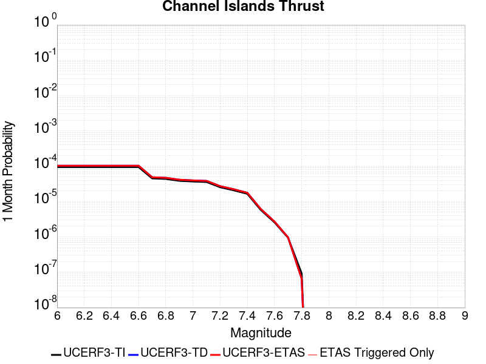 | 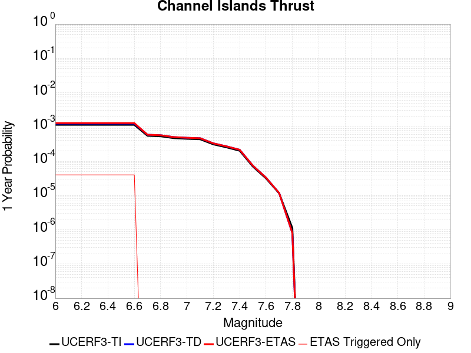 |

| Magnitude | 1 wk TI Prob | 1 wk TD Prob | 1 wk ETAS Prob | 1 wk ETAS/TD Gain | 1 wk ETAS Triggered Only | 1 mo TI Prob | 1 mo TD Prob | 1 mo ETAS Prob | 1 mo ETAS/TD Gain | 1 mo ETAS Triggered Only | 1 yr TI Prob | 1 yr TD Prob | 1 yr ETAS Prob | 1 yr ETAS/TD Gain | 1 yr ETAS Triggered Only |
|-----|-----|-----|-----|-----|-----|-----|-----|-----|-----|-----|-----|-----|-----|-----|-----|
| 6.0 | 2.2156251E-5 | 2.409921E-5 | 2.409921E-5 | 1.0 | 0.0 | 9.495191E-5 | 1.0327884E-4 | 1.0327884E-4 | 1.0 | 0.0 | 0.0011554264 | 0.0012568012 | 0.001296751 | 1.0317868 | 4.0E-5 |
| 6.1 | 2.2156251E-5 | 2.409921E-5 | 2.409921E-5 | 1.0 | 0.0 | 9.495191E-5 | 1.0327884E-4 | 1.0327884E-4 | 1.0 | 0.0 | 0.0011554264 | 0.0012568012 | 0.001296751 | 1.0317868 | 4.0E-5 |
| 6.2 | 2.2156251E-5 | 2.409921E-5 | 2.409921E-5 | 1.0 | 0.0 | 9.495191E-5 | 1.0327884E-4 | 1.0327884E-4 | 1.0 | 0.0 | 0.0011554264 | 0.0012568012 | 0.001296751 | 1.0317868 | 4.0E-5 |
| 6.3 | 2.2156251E-5 | 2.409921E-5 | 2.409921E-5 | 1.0 | 0.0 | 9.495191E-5 | 1.0327884E-4 | 1.0327884E-4 | 1.0 | 0.0 | 0.0011554264 | 0.0012568012 | 0.001296751 | 1.0317868 | 4.0E-5 |
| 6.4 | 2.2156251E-5 | 2.409921E-5 | 2.409921E-5 | 1.0 | 0.0 | 9.495191E-5 | 1.0327884E-4 | 1.0327884E-4 | 1.0 | 0.0 | 0.0011554264 | 0.0012568012 | 0.001296751 | 1.0317868 | 4.0E-5 |
| 6.5 | 2.2156251E-5 | 2.409921E-5 | 2.409921E-5 | 1.0 | 0.0 | 9.495191E-5 | 1.0327884E-4 | 1.0327884E-4 | 1.0 | 0.0 | 0.0011554264 | 0.0012568012 | 0.001296751 | 1.0317868 | 4.0E-5 |
| 6.6 | 2.2156251E-5 | 2.409921E-5 | 2.409921E-5 | 1.0 | 0.0 | 9.495191E-5 | 1.0327884E-4 | 1.0327884E-4 | 1.0 | 0.0 | 0.0011554264 | 0.0012568012 | 0.001296751 | 1.0317868 | 4.0E-5 |
| 6.7 | 1.0601296E-5 | 1.1382414E-5 | 1.1382414E-5 | 1.0 | 0.0 | 4.5433335E-5 | 4.8780894E-5 | 4.8780894E-5 | 1.0 | 0.0 | 5.5301044E-4 | 5.9375045E-4 | 5.9375045E-4 | 1.0 | 0.0 |
| 6.8 | 1.0246747E-5 | 1.0999436E-5 | 1.0999436E-5 | 1.0 | 0.0 | 4.391389E-5 | 4.7139616E-5 | 4.7139616E-5 | 1.0 | 0.0 | 5.345204E-4 | 5.7377847E-4 | 5.7377847E-4 | 1.0 | 0.0 |
| 6.9 | 9.049551E-6 | 9.702045E-6 | 9.702045E-6 | 1.0 | 0.0 | 3.878322E-5 | 4.157955E-5 | 4.157955E-5 | 1.0 | 0.0 | 4.7208337E-4 | 5.061176E-4 | 5.061176E-4 | 1.0 | 0.0 |
| 7.0 | 8.6542195E-6 | 9.276895E-6 | 9.276895E-6 | 1.0 | 0.0 | 3.7088983E-5 | 3.975754E-5 | 3.975754E-5 | 1.0 | 0.0 | 4.5146482E-4 | 4.839446E-4 | 4.839446E-4 | 1.0 | 0.0 |
| 7.1 | 8.391028E-6 | 8.99515E-6 | 8.99515E-6 | 1.0 | 0.0 | 3.5961057E-5 | 3.8550097E-5 | 3.8550097E-5 | 1.0 | 0.0 | 4.3773788E-4 | 4.6925043E-4 | 4.6925043E-4 | 1.0 | 0.0 |
| 7.2 | 5.965188E-6 | 6.3732036E-6 | 6.3732036E-6 | 1.0 | 0.0 | 2.556484E-5 | 2.7313446E-5 | 2.7313446E-5 | 1.0 | 0.0 | 3.1120746E-4 | 3.32491E-4 | 3.32491E-4 | 1.0 | 0.0 |
| 7.3 | 4.877518E-6 | 5.207231E-6 | 5.207231E-6 | 1.0 | 0.0 | 2.0903482E-5 | 2.2316515E-5 | 2.2316515E-5 | 1.0 | 0.0 | 2.5447016E-4 | 2.7167014E-4 | 2.7167014E-4 | 1.0 | 0.0 |
| 7.4 | 3.8829853E-6 | 4.1428343E-6 | 4.1428343E-6 | 1.0 | 0.0 | 1.664126E-5 | 1.7754886E-5 | 1.7754886E-5 | 1.0 | 0.0 | 2.0258849E-4 | 2.1614472E-4 | 2.1614472E-4 | 1.0 | 0.0 |
| 7.5 | 1.3489616E-6 | 1.4281075E-6 | 1.4281075E-6 | 1.0 | 0.0 | 5.7812517E-6 | 6.1204464E-6 | 6.1204464E-6 | 1.0 | 0.0 | 7.038446E-5 | 7.4513926E-5 | 7.4513926E-5 | 1.0 | 0.0 |
| 7.6 | 6.058192E-7 | 6.3551613E-7 | 6.3551613E-7 | 1.0 | 0.0 | 2.5963652E-6 | 2.7236379E-6 | 2.7236379E-6 | 1.0 | 0.0 | 3.161029E-5 | 3.3159802E-5 | 3.3159802E-5 | 1.0 | 0.0 |
| 7.7 | 2.2170494E-7 | 2.2612478E-7 | 2.2612478E-7 | 1.0 | 0.0 | 9.5016367E-7 | 9.691059E-7 | 9.691059E-7 | 1.0 | 0.0 | 1.1568181E-5 | 1.1798812E-5 | 1.1798812E-5 | 1.0 | 0.0 |
| 7.8 | 2.1613102E-8 | 1.5469915E-8 | 1.5469915E-8 | 1.0 | 0.0 | 9.262757E-8 | 6.6299634E-8 | 6.6299634E-8 | 1.0 | 0.0 | 1.1277401E-6 | 8.0719786E-7 | 8.0719786E-7 | 1.0 | 0.0 |

## Butano 2011 CFM
*[(top)](#table-of-contents)*

| 1 Week | 1 Month | 1 Year |
|-----|-----|-----|
| 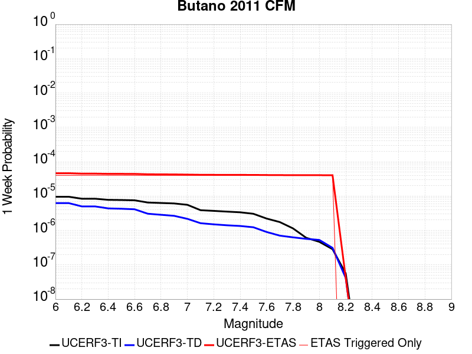 | 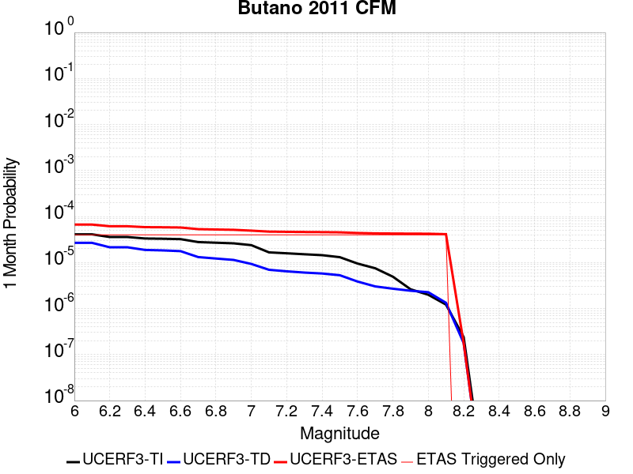 | 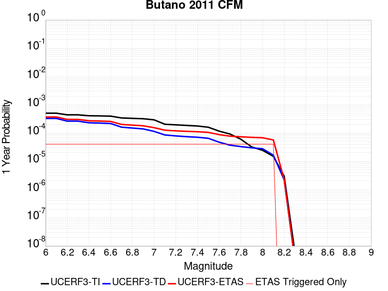 |

| Magnitude | 1 wk TI Prob | 1 wk TD Prob | 1 wk ETAS Prob | 1 wk ETAS/TD Gain | 1 wk ETAS Triggered Only | 1 mo TI Prob | 1 mo TD Prob | 1 mo ETAS Prob | 1 mo ETAS/TD Gain | 1 mo ETAS Triggered Only | 1 yr TI Prob | 1 yr TD Prob | 1 yr ETAS Prob | 1 yr ETAS/TD Gain | 1 yr ETAS Triggered Only |
|-----|-----|-----|-----|-----|-----|-----|-----|-----|-----|-----|-----|-----|-----|-----|-----|
| 6.0 | 9.561135E-6 | 6.2491204E-6 | 4.624887E-5 | 7.4008613 | 4.0E-5 | 4.097565E-5 | 2.6781681E-5 | 6.678061E-5 | 2.4935184 | 4.0E-5 | 4.9876433E-4 | 3.2602038E-4 | 3.6600733E-4 | 1.1226517 | 4.0E-5 |
| 6.1 | 9.561135E-6 | 6.2491204E-6 | 4.624887E-5 | 7.4008613 | 4.0E-5 | 4.097565E-5 | 2.6781681E-5 | 6.678061E-5 | 2.4935184 | 4.0E-5 | 4.9876433E-4 | 3.2602038E-4 | 3.6600733E-4 | 1.1226517 | 4.0E-5 |
| 6.2 | 8.364741E-6 | 5.002027E-6 | 4.5001827E-5 | 8.996718 | 4.0E-5 | 3.5848396E-5 | 2.143709E-5 | 6.1436236E-5 | 2.8658848 | 4.0E-5 | 4.3636683E-4 | 2.609669E-4 | 3.0095645E-4 | 1.1532362 | 4.0E-5 |
| 6.3 | 8.364741E-6 | 5.002027E-6 | 4.5001827E-5 | 8.996718 | 4.0E-5 | 3.5848396E-5 | 2.143709E-5 | 6.1436236E-5 | 2.8658848 | 4.0E-5 | 4.3636683E-4 | 2.609669E-4 | 3.0095645E-4 | 1.1532362 | 4.0E-5 |
| 6.4 | 7.768282E-6 | 4.379884E-6 | 4.437971E-5 | 10.132622 | 4.0E-5 | 3.329221E-5 | 1.8770805E-5 | 5.8770052E-5 | 3.1309288 | 4.0E-5 | 4.0525728E-4 | 2.2851194E-4 | 2.685028E-4 | 1.1750056 | 4.0E-5 |
| 6.5 | 7.673437E-6 | 4.2794272E-6 | 4.4279255E-5 | 10.347005 | 4.0E-5 | 3.2885746E-5 | 1.834028E-5 | 5.833955E-5 | 3.1809516 | 4.0E-5 | 4.0031038E-4 | 2.2327139E-4 | 2.6326245E-4 | 1.1791142 | 4.0E-5 |
| 6.6 | 7.5244197E-6 | 4.1243584E-6 | 4.4124194E-5 | 10.698438 | 4.0E-5 | 3.2247113E-5 | 1.767571E-5 | 5.7675003E-5 | 3.2629526 | 4.0E-5 | 3.9253788E-4 | 2.1518185E-4 | 2.5517325E-4 | 1.1858493 | 4.0E-5 |
| 6.7 | 6.4921405E-6 | 3.064174E-6 | 4.306405E-5 | 14.0540495 | 4.0E-5 | 2.7823162E-5 | 1.3132108E-5 | 5.313158E-5 | 4.0459294 | 4.0E-5 | 3.3869434E-4 | 1.5987176E-4 | 1.9986538E-4 | 1.2501606 | 4.0E-5 |
| 6.8 | 6.2890294E-6 | 2.850884E-6 | 4.285077E-5 | 15.030696 | 4.0E-5 | 2.6952705E-5 | 1.2218016E-5 | 5.221753E-5 | 4.2738137 | 4.0E-5 | 3.2809976E-4 | 1.4874428E-4 | 1.8873833E-4 | 1.2688779 | 4.0E-5 |
| 6.9 | 6.0965517E-6 | 2.657334E-6 | 4.265723E-5 | 16.052639 | 4.0E-5 | 2.6127816E-5 | 1.1388525E-5 | 5.138807E-5 | 4.512267 | 4.0E-5 | 3.1805973E-4 | 1.3864654E-4 | 1.78641E-4 | 1.2884635 | 4.0E-5 |
| 7.0 | 5.566252E-6 | 2.1744972E-6 | 4.217441E-5 | 19.395016 | 4.0E-5 | 2.3855147E-5 | 9.319241E-6 | 4.9318867E-5 | 5.2921553 | 4.0E-5 | 2.9039773E-4 | 1.1345589E-4 | 1.5345136E-4 | 1.3525199 | 4.0E-5 |
| 7.1 | 3.878588E-6 | 1.622304E-6 | 4.162224E-5 | 25.65625 | 4.0E-5 | 1.6622414E-5 | 6.9527127E-6 | 4.6952435E-5 | 6.75311 | 4.0E-5 | 2.023591E-4 | 8.4645995E-5 | 1.2464261E-4 | 1.4725163 | 4.0E-5 |
| 7.2 | 3.7038085E-6 | 1.503103E-6 | 4.1503044E-5 | 27.611576 | 4.0E-5 | 1.587337E-5 | 6.4418537E-6 | 4.6441597E-5 | 7.209353 | 4.0E-5 | 1.9324113E-4 | 7.842675E-5 | 1.1842361E-4 | 1.5099901 | 4.0E-5 |
| 7.3 | 3.5277278E-6 | 1.4109602E-6 | 4.1410905E-5 | 29.34945 | 4.0E-5 | 1.5118746E-5 | 6.0469583E-6 | 4.6046716E-5 | 7.6148562 | 4.0E-5 | 1.8405518E-4 | 7.361923E-5 | 1.1361628E-4 | 1.5432963 | 4.0E-5 |
| 7.4 | 3.3711294E-6 | 1.3478906E-6 | 4.1347837E-5 | 30.675959 | 4.0E-5 | 1.4447617E-5 | 5.776661E-6 | 4.577643E-5 | 7.924375 | 4.0E-5 | 1.7588554E-4 | 7.0328584E-5 | 1.1032577E-4 | 1.5687188 | 4.0E-5 |
| 7.5 | 3.0496426E-6 | 1.2360495E-6 | 4.1236E-5 | 33.361126 | 4.0E-5 | 1.3069831E-5 | 5.2973437E-6 | 4.5297133E-5 | 8.550914 | 4.0E-5 | 1.5911358E-4 | 6.449325E-5 | 1.04490675E-4 | 1.6201799 | 4.0E-5 |
| 7.6 | 2.2179781E-6 | 9.018709E-7 | 4.0901836E-5 | 45.352207 | 4.0E-5 | 9.505586E-6 | 3.865155E-6 | 4.3865002E-5 | 11.348833 | 4.0E-5 | 1.1572436E-4 | 4.705725E-5 | 8.705536E-5 | 1.8499885 | 4.0E-5 |
| 7.7 | 1.7519328E-6 | 7.0631194E-7 | 4.0706283E-5 | 57.632164 | 4.0E-5 | 7.508262E-6 | 3.0270476E-6 | 4.3026925E-5 | 14.214156 | 4.0E-5 | 9.140925E-5 | 3.6853682E-5 | 7.685221E-5 | 2.0853333 | 4.0E-5 |
| 7.8 | 1.1478974E-6 | 6.2948965E-7 | 4.0629464E-5 | 64.5435 | 4.0E-5 | 4.9195505E-6 | 2.69781E-6 | 4.2697702E-5 | 15.826801 | 4.0E-5 | 5.9893882E-5 | 3.2845343E-5 | 7.284403E-5 | 2.2177887 | 4.0E-5 |
| 7.9 | 6.1154634E-7 | 5.6872983E-7 | 4.0568706E-5 | 71.33212 | 4.0E-5 | 2.6209104E-6 | 2.4374115E-6 | 4.2437314E-5 | 17.410812 | 4.0E-5 | 3.1909116E-5 | 2.9675079E-5 | 6.967389E-5 | 2.3478923 | 4.0E-5 |
| 8.0 | 4.6520046E-7 | 5.2855574E-7 | 4.0528535E-5 | 76.67789 | 4.0E-5 | 1.9937147E-6 | 2.2652368E-6 | 4.2265146E-5 | 18.658157 | 4.0E-5 | 2.4273206E-5 | 2.757891E-5 | 6.757781E-5 | 2.4503436 | 4.0E-5 |
| 8.1 | 2.8425194E-7 | 3.1117247E-7 | 4.031116E-5 | 129.54604 | 4.0E-5 | 1.218222E-6 | 1.3335956E-6 | 4.1333544E-5 | 30.99406 | 4.0E-5 | 1.4831752E-5 | 1.6236405E-5 | 5.6235756E-5 | 3.4635594 | 4.0E-5 |
| 8.2 | 5.585778E-8 | 4.1445816E-8 | 4.1445816E-8 | 1.0 | 0.0 | 2.3939046E-7 | 1.7762493E-7 | 1.7762493E-7 | 1.0 | 0.0 | 2.914575E-6 | 2.1625813E-6 | 2.1625813E-6 | 1.0 | 0.0 |
| 8.3 | 1.0371215E-10 | 5.4957816E-11 | 5.4957816E-11 | 1.0 | 0.0 | 4.4448079E-10 | 2.3553404E-10 | 2.3553404E-10 | 1.0 | 0.0 | 5.4115543E-9 | 2.867626E-9 | 2.867626E-9 | 1.0 | 0.0 |

## San Luis Range - Pecho 2011 CFM
*[(top)](#table-of-contents)*

| 1 Week | 1 Month | 1 Year |
|-----|-----|-----|
| 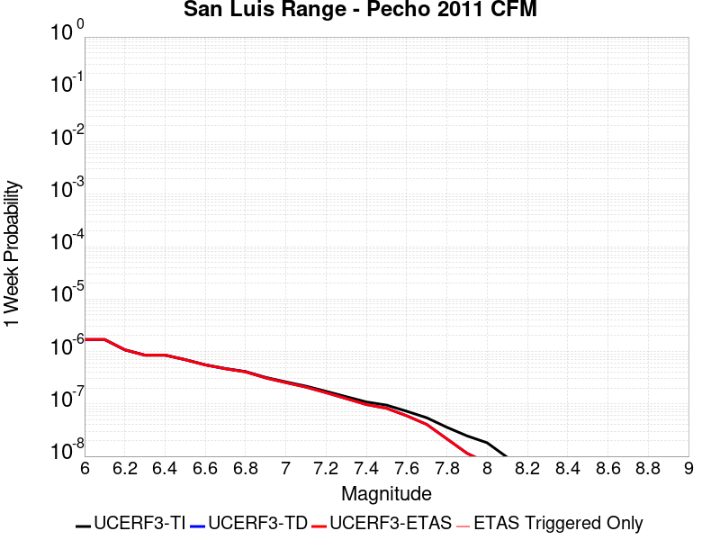 | 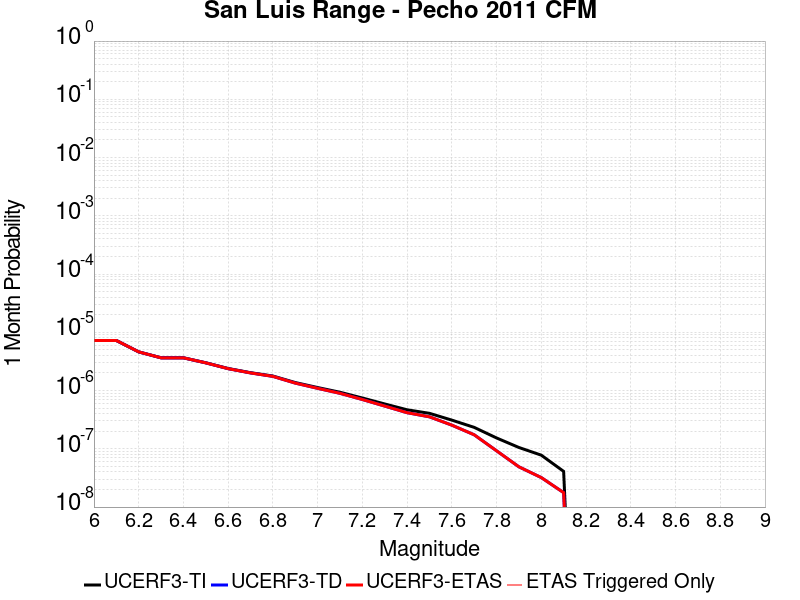 | 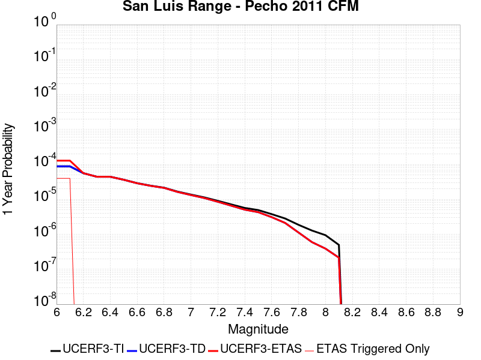 |

| Magnitude | 1 wk TI Prob | 1 wk TD Prob | 1 wk ETAS Prob | 1 wk ETAS/TD Gain | 1 wk ETAS Triggered Only | 1 mo TI Prob | 1 mo TD Prob | 1 mo ETAS Prob | 1 mo ETAS/TD Gain | 1 mo ETAS Triggered Only | 1 yr TI Prob | 1 yr TD Prob | 1 yr ETAS Prob | 1 yr ETAS/TD Gain | 1 yr ETAS Triggered Only |
|-----|-----|-----|-----|-----|-----|-----|-----|-----|-----|-----|-----|-----|-----|-----|-----|
| 6.0 | 1.687423E-6 | 1.6923262E-6 | 1.6923262E-6 | 1.0 | 0.0 | 7.231793E-6 | 7.252808E-6 | 7.252808E-6 | 1.0 | 0.0 | 8.804352E-5 | 8.82996E-5 | 1.2829607E-4 | 1.4529632 | 4.0E-5 |
| 6.1 | 1.687423E-6 | 1.6923262E-6 | 1.6923262E-6 | 1.0 | 0.0 | 7.231793E-6 | 7.252808E-6 | 7.252808E-6 | 1.0 | 0.0 | 8.804352E-5 | 8.82996E-5 | 1.2829607E-4 | 1.4529632 | 4.0E-5 |
| 6.2 | 1.0765672E-6 | 1.0771713E-6 | 1.0771713E-6 | 1.0 | 0.0 | 4.613851E-6 | 4.6164405E-6 | 4.6164405E-6 | 1.0 | 0.0 | 5.617219E-5 | 5.620378E-5 | 5.620378E-5 | 1.0 | 0.0 |
| 6.3 | 8.523104E-7 | 8.5141426E-7 | 8.5141426E-7 | 1.0 | 0.0 | 3.6527538E-6 | 3.6489134E-6 | 3.6489134E-6 | 1.0 | 0.0 | 4.447137E-5 | 4.4424647E-5 | 4.4424647E-5 | 1.0 | 0.0 |
| 6.4 | 8.523104E-7 | 8.5141426E-7 | 8.5141426E-7 | 1.0 | 0.0 | 3.6527538E-6 | 3.6489134E-6 | 3.6489134E-6 | 1.0 | 0.0 | 4.447137E-5 | 4.4424647E-5 | 4.4424647E-5 | 1.0 | 0.0 |
| 6.5 | 7.0029404E-7 | 6.977503E-7 | 6.977503E-7 | 1.0 | 0.0 | 3.0012568E-6 | 2.9903551E-6 | 2.9903551E-6 | 1.0 | 0.0 | 3.6539688E-5 | 3.6406982E-5 | 3.6406982E-5 | 1.0 | 0.0 |
| 6.6 | 5.583906E-7 | 5.543844E-7 | 5.543844E-7 | 1.0 | 0.0 | 2.3931002E-6 | 2.3759312E-6 | 2.3759312E-6 | 1.0 | 0.0 | 2.9135606E-5 | 2.8926584E-5 | 2.8926584E-5 | 1.0 | 0.0 |
| 6.7 | 4.73441E-7 | 4.6840455E-7 | 4.6840455E-7 | 1.0 | 0.0 | 2.0290313E-6 | 2.0074467E-6 | 2.0074467E-6 | 1.0 | 0.0 | 2.4703175E-5 | 2.4440393E-5 | 2.4440393E-5 | 1.0 | 0.0 |
| 6.8 | 4.1466086E-7 | 4.088749E-7 | 4.088749E-7 | 1.0 | 0.0 | 1.7771167E-6 | 1.7523198E-6 | 1.7523198E-6 | 1.0 | 0.0 | 2.1636182E-5 | 2.1334288E-5 | 2.1334288E-5 | 1.0 | 0.0 |
| 6.9 | 3.2056641E-7 | 3.1338362E-7 | 3.1338362E-7 | 1.0 | 0.0 | 1.3738553E-6 | 1.343072E-6 | 1.343072E-6 | 1.0 | 0.0 | 1.6726559E-5 | 1.635178E-5 | 1.635178E-5 | 1.0 | 0.0 |
| 7.0 | 2.6315942E-7 | 2.5498395E-7 | 2.5498395E-7 | 1.0 | 0.0 | 1.1278256E-6 | 1.0927879E-6 | 1.0927879E-6 | 1.0 | 0.0 | 1.3731191E-5 | 1.33046115E-5 | 1.33046115E-5 | 1.0 | 0.0 |
| 7.1 | 2.1832436E-7 | 2.0925725E-7 | 2.0925725E-7 | 1.0 | 0.0 | 9.356755E-7 | 8.968165E-7 | 8.968165E-7 | 1.0 | 0.0 | 1.13917895E-5 | 1.0918687E-5 | 1.0918687E-5 | 1.0 | 0.0 |
| 7.2 | 1.7393015E-7 | 1.6384654E-7 | 1.6384654E-7 | 1.0 | 0.0 | 7.454147E-7 | 7.0219926E-7 | 7.0219926E-7 | 1.0 | 0.0 | 9.075386E-6 | 8.549242E-6 | 8.549242E-6 | 1.0 | 0.0 |
| 7.3 | 1.3744894E-7 | 1.2646369E-7 | 1.2646369E-7 | 1.0 | 0.0 | 5.890667E-7 | 5.419871E-7 | 5.419871E-7 | 1.0 | 0.0 | 7.1718637E-6 | 6.5986733E-6 | 6.5986733E-6 | 1.0 | 0.0 |
| 7.4 | 1.0915278E-7 | 9.735E-8 | 9.735E-8 | 1.0 | 0.0 | 4.6779755E-7 | 4.1721418E-7 | 4.1721418E-7 | 1.0 | 0.0 | 5.6954204E-6 | 5.079571E-6 | 5.079571E-6 | 1.0 | 0.0 |
| 7.5 | 9.490291E-8 | 8.2644384E-8 | 8.2644384E-8 | 1.0 | 0.0 | 4.0672668E-7 | 3.5419015E-7 | 3.5419015E-7 | 1.0 | 0.0 | 4.9518862E-6 | 4.312257E-6 | 4.312257E-6 | 1.0 | 0.0 |
| 7.6 | 7.256678E-8 | 5.9495513E-8 | 5.9495513E-8 | 1.0 | 0.0 | 3.1100043E-7 | 2.5498073E-7 | 2.5498073E-7 | 1.0 | 0.0 | 3.7864236E-6 | 3.104386E-6 | 3.104386E-6 | 1.0 | 0.0 |
| 7.7 | 5.446273E-8 | 4.064697E-8 | 4.064697E-8 | 1.0 | 0.0 | 2.3341168E-7 | 1.7420129E-7 | 1.7420129E-7 | 1.0 | 0.0 | 2.8417835E-6 | 2.1208987E-6 | 2.1208987E-6 | 1.0 | 0.0 |
| 7.8 | 3.5850867E-8 | 2.1581982E-8 | 2.1581982E-8 | 1.0 | 0.0 | 1.5364655E-7 | 9.2494204E-8 | 9.2494204E-8 | 1.0 | 0.0 | 1.8706452E-6 | 1.1261163E-6 | 1.1261163E-6 | 1.0 | 0.0 |
| 7.9 | 2.45879E-8 | 1.145195E-8 | 1.145195E-8 | 1.0 | 0.0 | 1.0537671E-7 | 4.9079784E-8 | 4.9079784E-8 | 1.0 | 0.0 | 1.2829606E-6 | 5.975462E-7 | 5.975462E-7 | 1.0 | 0.0 |
| 8.0 | 1.8151761E-8 | 7.488128E-9 | 7.488128E-9 | 1.0 | 0.0 | 7.779326E-8 | 3.2091975E-8 | 3.2091975E-8 | 1.0 | 0.0 | 9.4713255E-7 | 3.9071972E-7 | 3.9071972E-7 | 1.0 | 0.0 |
| 8.1 | 9.559205E-9 | 4.1259636E-9 | 4.1259636E-9 | 1.0 | 0.0 | 4.096802E-8 | 1.76827E-8 | 1.76827E-8 | 1.0 | 0.0 | 4.9878554E-7 | 2.1528686E-7 | 2.1528686E-7 | 1.0 | 0.0 |

## Ortigalita (North)
*[(top)](#table-of-contents)*

| 1 Week | 1 Month | 1 Year |
|-----|-----|-----|
| 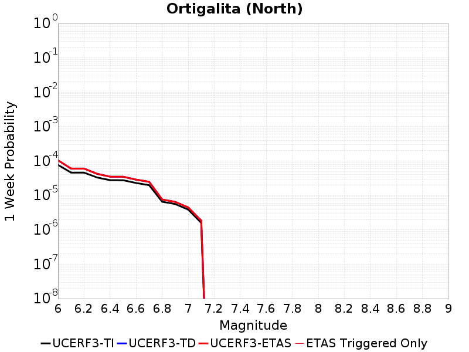 |  | 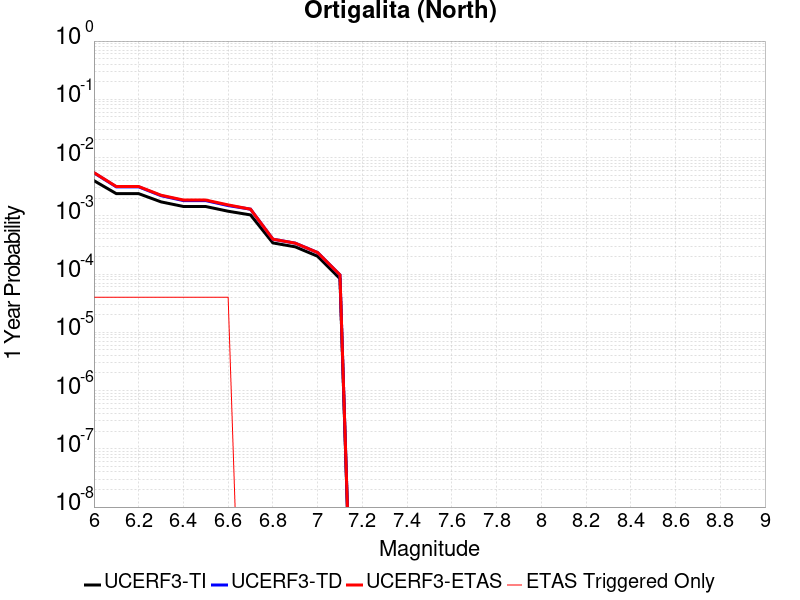 |

| Magnitude | 1 wk TI Prob | 1 wk TD Prob | 1 wk ETAS Prob | 1 wk ETAS/TD Gain | 1 wk ETAS Triggered Only | 1 mo TI Prob | 1 mo TD Prob | 1 mo ETAS Prob | 1 mo ETAS/TD Gain | 1 mo ETAS Triggered Only | 1 yr TI Prob | 1 yr TD Prob | 1 yr ETAS Prob | 1 yr ETAS/TD Gain | 1 yr ETAS Triggered Only |
|-----|-----|-----|-----|-----|-----|-----|-----|-----|-----|-----|-----|-----|-----|-----|-----|
| 6.0 | 7.711876E-5 | 1.0517288E-4 | 1.0517288E-4 | 1.0 | 0.0 | 3.3046713E-4 | 4.5066644E-4 | 4.5066644E-4 | 1.0 | 0.0 | 0.004016016 | 0.0054742103 | 0.005513991 | 1.007267 | 4.0E-5 |
| 6.1 | 4.607858E-5 | 6.030095E-5 | 6.030095E-5 | 1.0 | 0.0 | 1.9746469E-4 | 2.5840945E-4 | 2.5840945E-4 | 1.0 | 0.0 | 0.0024014818 | 0.0031419133 | 0.0031817877 | 1.0126911 | 4.0E-5 |
| 6.2 | 4.607858E-5 | 6.030095E-5 | 6.030095E-5 | 1.0 | 0.0 | 1.9746469E-4 | 2.5840945E-4 | 2.5840945E-4 | 1.0 | 0.0 | 0.0024014818 | 0.0031419133 | 0.0031817877 | 1.0126911 | 4.0E-5 |
| 6.3 | 3.327423E-5 | 4.251604E-5 | 4.251604E-5 | 1.0 | 0.0 | 1.4259605E-4 | 1.8220021E-4 | 1.8220021E-4 | 1.0 | 0.0 | 0.0017347244 | 0.0022162818 | 0.0022561932 | 1.0180082 | 4.0E-5 |
| 6.4 | 2.7732503E-5 | 3.5030593E-5 | 3.5030593E-5 | 1.0 | 0.0 | 1.1884817E-4 | 1.5012384E-4 | 1.5012384E-4 | 1.0 | 0.0 | 0.001446016 | 0.0018264599 | 0.0018663869 | 1.0218602 | 4.0E-5 |
| 6.5 | 2.7689714E-5 | 3.4980378E-5 | 3.4980378E-5 | 1.0 | 0.0 | 1.186648E-4 | 1.4990866E-4 | 1.4990866E-4 | 1.0 | 0.0 | 0.0014437864 | 0.0018238444 | 0.0018637715 | 1.0218917 | 4.0E-5 |
| 6.6 | 2.2976905E-5 | 2.8743312E-5 | 2.8743312E-5 | 1.0 | 0.0 | 9.846873E-5 | 1.2318123E-4 | 1.2318123E-4 | 1.0 | 0.0 | 0.0011981975 | 0.0014989388 | 0.0015388789 | 1.0266455 | 4.0E-5 |
| 6.7 | 1.9871539E-5 | 2.4926665E-5 | 2.4926665E-5 | 1.0 | 0.0 | 8.516096E-5 | 1.06825595E-4 | 1.06825595E-4 | 1.0 | 0.0 | 0.0010363415 | 0.001300069 | 0.001300069 | 1.0 | 0.0 |
| 6.8 | 6.5640475E-6 | 7.6095916E-6 | 7.6095916E-6 | 1.0 | 0.0 | 2.813133E-5 | 3.2612144E-5 | 3.2612144E-5 | 1.0 | 0.0 | 3.424451E-4 | 3.9698338E-4 | 3.9698338E-4 | 1.0 | 0.0 |
| 6.9 | 5.6219683E-6 | 6.5052927E-6 | 6.5052927E-6 | 1.0 | 0.0 | 2.4093928E-5 | 2.7879541E-5 | 2.7879541E-5 | 1.0 | 0.0 | 2.933041E-4 | 3.3938314E-4 | 3.3938314E-4 | 1.0 | 0.0 |
| 7.0 | 3.875591E-6 | 4.4871476E-6 | 4.4871476E-6 | 1.0 | 0.0 | 1.6609569E-5 | 1.9230503E-5 | 1.9230503E-5 | 1.0 | 0.0 | 2.0220275E-4 | 2.3410833E-4 | 2.3410833E-4 | 1.0 | 0.0 |
| 7.1 | 1.6017933E-6 | 1.8580465E-6 | 1.8580465E-6 | 1.0 | 0.0 | 6.8648105E-6 | 7.963038E-6 | 7.963038E-6 | 1.0 | 0.0 | 8.357586E-5 | 9.6946744E-5 | 9.6946744E-5 | 1.0 | 0.0 |

## Santa Rosa Island
*[(top)](#table-of-contents)*

| 1 Week | 1 Month | 1 Year |
|-----|-----|-----|
|  | 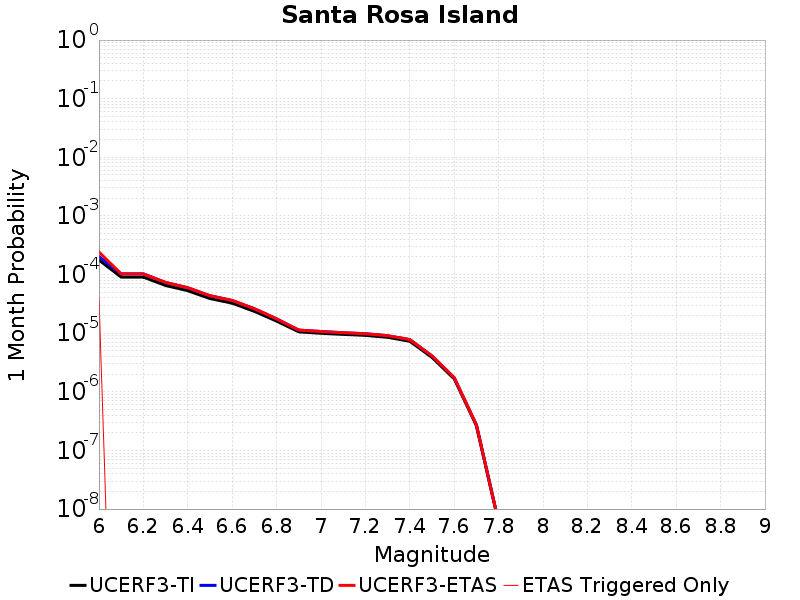 | 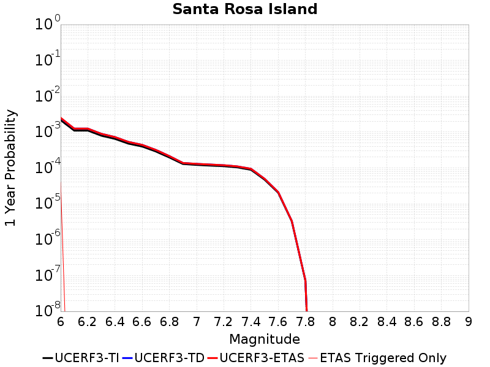 |

| Magnitude | 1 wk TI Prob | 1 wk TD Prob | 1 wk ETAS Prob | 1 wk ETAS/TD Gain | 1 wk ETAS Triggered Only | 1 mo TI Prob | 1 mo TD Prob | 1 mo ETAS Prob | 1 mo ETAS/TD Gain | 1 mo ETAS Triggered Only | 1 yr TI Prob | 1 yr TD Prob | 1 yr ETAS Prob | 1 yr ETAS/TD Gain | 1 yr ETAS Triggered Only |
|-----|-----|-----|-----|-----|-----|-----|-----|-----|-----|-----|-----|-----|-----|-----|-----|
| 6.0 | 4.1143165E-5 | 4.7114332E-5 | 8.711245E-5 | 1.8489585 | 4.0E-5 | 1.7631594E-4 | 2.0190405E-4 | 2.4189598E-4 | 1.1980739 | 4.0E-5 | 0.002144533 | 0.0024556073 | 0.0024955089 | 1.0162493 | 4.0E-5 |
| 6.1 | 2.1061249E-5 | 2.3875791E-5 | 2.3875791E-5 | 1.0 | 0.0 | 9.0259375E-5 | 1.0232097E-4 | 1.0232097E-4 | 1.0 | 0.0 | 0.0010983539 | 0.0012450748 | 0.0012450748 | 1.0 | 0.0 |
| 6.2 | 2.1061249E-5 | 2.3875791E-5 | 2.3875791E-5 | 1.0 | 0.0 | 9.0259375E-5 | 1.0232097E-4 | 1.0232097E-4 | 1.0 | 0.0 | 0.0010983539 | 0.0012450748 | 0.0012450748 | 1.0 | 0.0 |
| 6.3 | 1.5158236E-5 | 1.708178E-5 | 1.708178E-5 | 1.0 | 0.0 | 6.496225E-5 | 7.320564E-5 | 7.320564E-5 | 1.0 | 0.0 | 7.906284E-4 | 8.909262E-4 | 8.909262E-4 | 1.0 | 0.0 |
| 6.4 | 1.2341918E-5 | 1.3858705E-5 | 1.3858705E-5 | 1.0 | 0.0 | 5.2892858E-5 | 5.939314E-5 | 5.939314E-5 | 1.0 | 0.0 | 6.437803E-4 | 7.228797E-4 | 7.228797E-4 | 1.0 | 0.0 |
| 6.5 | 9.061158E-6 | 1.0121061E-5 | 1.0121061E-5 | 1.0 | 0.0 | 3.883296E-5 | 4.3375283E-5 | 4.3375283E-5 | 1.0 | 0.0 | 4.726887E-4 | 5.279714E-4 | 5.279714E-4 | 1.0 | 0.0 |
| 6.6 | 7.5461685E-6 | 8.403989E-6 | 8.403989E-6 | 1.0 | 0.0 | 3.2340322E-5 | 3.6016623E-5 | 3.6016623E-5 | 1.0 | 0.0 | 3.936723E-4 | 4.3841847E-4 | 4.3841847E-4 | 1.0 | 0.0 |
| 6.7 | 5.5023775E-6 | 6.089602E-6 | 6.089602E-6 | 1.0 | 0.0 | 2.3581404E-5 | 2.609805E-5 | 2.609805E-5 | 1.0 | 0.0 | 2.8706578E-4 | 3.177007E-4 | 3.177007E-4 | 1.0 | 0.0 |
| 6.8 | 3.7351679E-6 | 4.08445E-6 | 4.08445E-6 | 1.0 | 0.0 | 1.6007763E-5 | 1.7504683E-5 | 1.7504683E-5 | 1.0 | 0.0 | 1.948771E-4 | 2.1310116E-4 | 2.1310116E-4 | 1.0 | 0.0 |
| 6.9 | 2.456366E-6 | 2.6299053E-6 | 2.6299053E-6 | 1.0 | 0.0 | 1.0527241E-5 | 1.1270974E-5 | 1.1270974E-5 | 1.0 | 0.0 | 1.2816161E-4 | 1.372155E-4 | 1.372155E-4 | 1.0 | 0.0 |
| 7.0 | 2.3245157E-6 | 2.4833578E-6 | 2.4833578E-6 | 1.0 | 0.0 | 9.962172E-6 | 1.0642919E-5 | 1.0642919E-5 | 1.0 | 0.0 | 1.2128269E-4 | 1.2956985E-4 | 1.2956985E-4 | 1.0 | 0.0 |
| 7.1 | 2.2248344E-6 | 2.3737928E-6 | 2.3737928E-6 | 1.0 | 0.0 | 9.53497E-6 | 1.0173358E-5 | 1.0173358E-5 | 1.0 | 0.0 | 1.1608207E-4 | 1.238536E-4 | 1.238536E-4 | 1.0 | 0.0 |
| 7.2 | 2.1350402E-6 | 2.2766699E-6 | 2.2766699E-6 | 1.0 | 0.0 | 9.150141E-6 | 9.75712E-6 | 9.75712E-6 | 1.0 | 0.0 | 1.1139726E-4 | 1.1878648E-4 | 1.1878648E-4 | 1.0 | 0.0 |
| 7.3 | 1.9793572E-6 | 2.109192E-6 | 2.109192E-6 | 1.0 | 0.0 | 8.482932E-6 | 9.039363E-6 | 9.039363E-6 | 1.0 | 0.0 | 1.032748E-4 | 1.10048706E-4 | 1.10048706E-4 | 1.0 | 0.0 |
| 7.4 | 1.6951194E-6 | 1.804974E-6 | 1.804974E-6 | 1.0 | 0.0 | 7.264777E-6 | 7.73558E-6 | 7.73558E-6 | 1.0 | 0.0 | 8.844508E-5 | 9.417663E-5 | 9.417663E-5 | 1.0 | 0.0 |
| 7.5 | 8.987207E-7 | 9.5141485E-7 | 9.5141485E-7 | 1.0 | 0.0 | 3.8516546E-6 | 4.0774858E-6 | 4.0774858E-6 | 1.0 | 0.0 | 4.6892885E-5 | 4.9642273E-5 | 4.9642273E-5 | 1.0 | 0.0 |
| 7.6 | 3.8783037E-7 | 4.053593E-7 | 4.053593E-7 | 1.0 | 0.0 | 1.6621291E-6 | 1.7372529E-6 | 1.7372529E-6 | 1.0 | 0.0 | 2.0236233E-5 | 2.1150856E-5 | 2.1150856E-5 | 1.0 | 0.0 |
| 7.7 | 6.181804E-8 | 6.339846E-8 | 6.339846E-8 | 1.0 | 0.0 | 2.6493444E-7 | 2.7170765E-7 | 2.7170765E-7 | 1.0 | 0.0 | 3.225572E-6 | 3.3080355E-6 | 3.3080355E-6 | 1.0 | 0.0 |
| 7.8 | 1.3704449E-9 | 1.396505E-9 | 1.396505E-9 | 1.0 | 0.0 | 5.873335E-9 | 5.9850214E-9 | 5.9850214E-9 | 1.0 | 0.0 | 7.1507856E-8 | 7.2867635E-8 | 7.2867635E-8 | 1.0 | 0.0 |

## Hosgri
*[(top)](#table-of-contents)*

| 1 Week | 1 Month | 1 Year |
|-----|-----|-----|
|  |  |  |

| Magnitude | 1 wk TI Prob | 1 wk TD Prob | 1 wk ETAS Prob | 1 wk ETAS/TD Gain | 1 wk ETAS Triggered Only | 1 mo TI Prob | 1 mo TD Prob | 1 mo ETAS Prob | 1 mo ETAS/TD Gain | 1 mo ETAS Triggered Only | 1 yr TI Prob | 1 yr TD Prob | 1 yr ETAS Prob | 1 yr ETAS/TD Gain | 1 yr ETAS Triggered Only |
|-----|-----|-----|-----|-----|-----|-----|-----|-----|-----|-----|-----|-----|-----|-----|-----|
| 6.0 | 2.883978E-5 | 2.9139386E-5 | 2.9139386E-5 | 1.0 | 0.0 | 1.235932E-4 | 1.2487726E-4 | 1.2487726E-4 | 1.0 | 0.0 | 0.0015037085 | 0.0015193475 | 0.0015592867 | 1.0262871 | 4.0E-5 |
| 6.1 | 2.883978E-5 | 2.9139386E-5 | 2.9139386E-5 | 1.0 | 0.0 | 1.235932E-4 | 1.2487726E-4 | 1.2487726E-4 | 1.0 | 0.0 | 0.0015037085 | 0.0015193475 | 0.0015592867 | 1.0262871 | 4.0E-5 |
| 6.2 | 2.883978E-5 | 2.9139386E-5 | 2.9139386E-5 | 1.0 | 0.0 | 1.235932E-4 | 1.2487726E-4 | 1.2487726E-4 | 1.0 | 0.0 | 0.0015037085 | 0.0015193475 | 0.0015592867 | 1.0262871 | 4.0E-5 |
| 6.3 | 2.2914428E-5 | 2.265085E-5 | 2.265085E-5 | 1.0 | 0.0 | 9.8200995E-5 | 9.707148E-5 | 9.707148E-5 | 1.0 | 0.0 | 0.0011949413 | 0.0011812095 | 0.0012211623 | 1.0338236 | 4.0E-5 |
| 6.4 | 2.0195741E-5 | 1.9704607E-5 | 1.9704607E-5 | 1.0 | 0.0 | 8.65503E-5 | 8.4445586E-5 | 8.4445586E-5 | 1.0 | 0.0 | 0.0010532405 | 0.001027642 | 0.0010676009 | 1.038884 | 4.0E-5 |
| 6.5 | 1.9924333E-5 | 1.9416964E-5 | 1.9416964E-5 | 1.0 | 0.0 | 8.53872E-5 | 8.3212915E-5 | 8.3212915E-5 | 1.0 | 0.0 | 0.0010390934 | 0.0010126483 | 0.0010526078 | 1.0394604 | 4.0E-5 |
| 6.6 | 1.809694E-5 | 1.7465809E-5 | 1.7465809E-5 | 1.0 | 0.0 | 7.7556004E-5 | 7.485133E-5 | 7.485133E-5 | 1.0 | 0.0 | 9.438353E-4 | 9.1093517E-4 | 9.5089874E-4 | 1.0438709 | 4.0E-5 |
| 6.7 | 1.675989E-5 | 1.604995E-5 | 1.604995E-5 | 1.0 | 0.0 | 7.182612E-5 | 6.878369E-5 | 6.878369E-5 | 1.0 | 0.0 | 8.7413215E-4 | 8.3712075E-4 | 8.770873E-4 | 1.0477428 | 4.0E-5 |
| 6.8 | 1.5401129E-5 | 1.4620946E-5 | 1.4620946E-5 | 1.0 | 0.0 | 6.6003166E-5 | 6.2659696E-5 | 6.2659696E-5 | 1.0 | 0.0 | 8.032922E-4 | 7.6261564E-4 | 8.0258516E-4 | 1.0524111 | 4.0E-5 |
| 6.9 | 1.356559E-5 | 1.2696401E-5 | 1.2696401E-5 | 1.0 | 0.0 | 5.8136946E-5 | 5.441202E-5 | 5.441202E-5 | 1.0 | 0.0 | 7.0758746E-4 | 6.622654E-4 | 7.0223893E-4 | 1.0603588 | 4.0E-5 |
| 7.0 | 1.2030819E-5 | 1.1102045E-5 | 1.1102045E-5 | 1.0 | 0.0 | 5.155963E-5 | 4.7579328E-5 | 4.7579328E-5 | 1.0 | 0.0 | 6.275577E-4 | 5.791245E-4 | 5.791245E-4 | 1.0 | 0.0 |
| 7.1 | 1.0972698E-5 | 1.002806E-5 | 1.002806E-5 | 1.0 | 0.0 | 4.7025E-5 | 4.2976695E-5 | 4.2976695E-5 | 1.0 | 0.0 | 5.72379E-4 | 5.231157E-4 | 5.231157E-4 | 1.0 | 0.0 |
| 7.2 | 9.961926E-6 | 9.040455E-6 | 9.040455E-6 | 1.0 | 0.0 | 4.2693267E-5 | 3.8744227E-5 | 3.8744227E-5 | 1.0 | 0.0 | 5.1966653E-4 | 4.7160895E-4 | 4.7160895E-4 | 1.0 | 0.0 |
| 7.3 | 8.700929E-6 | 7.833605E-6 | 7.833605E-6 | 1.0 | 0.0 | 3.7289166E-5 | 3.357216E-5 | 3.357216E-5 | 1.0 | 0.0 | 4.53901E-4 | 4.0866443E-4 | 4.0866443E-4 | 1.0 | 0.0 |
| 7.4 | 7.866285E-6 | 7.004084E-6 | 7.004084E-6 | 1.0 | 0.0 | 3.3712215E-5 | 3.0017158E-5 | 3.0017158E-5 | 1.0 | 0.0 | 4.103689E-4 | 3.6539763E-4 | 3.6539763E-4 | 1.0 | 0.0 |
| 7.5 | 6.8381305E-6 | 5.964861E-6 | 5.964861E-6 | 1.0 | 0.0 | 2.9305946E-5 | 2.5563439E-5 | 2.5563439E-5 | 1.0 | 0.0 | 3.5674145E-4 | 3.1119044E-4 | 3.1119044E-4 | 1.0 | 0.0 |
| 7.6 | 5.503376E-6 | 4.6000837E-6 | 4.6000837E-6 | 1.0 | 0.0 | 2.3585684E-5 | 1.9714495E-5 | 1.9714495E-5 | 1.0 | 0.0 | 2.8711787E-4 | 2.3999755E-4 | 2.3999755E-4 | 1.0 | 0.0 |
| 7.7 | 3.6144982E-6 | 2.6566063E-6 | 2.6566063E-6 | 1.0 | 0.0 | 1.5490614E-5 | 1.1385406E-5 | 1.1385406E-5 | 1.0 | 0.0 | 1.8858191E-4 | 1.386085E-4 | 1.386085E-4 | 1.0 | 0.0 |
| 7.8 | 1.9853494E-6 | 1.1397797E-6 | 1.1397797E-6 | 1.0 | 0.0 | 8.508612E-6 | 4.8847605E-6 | 4.8847605E-6 | 1.0 | 0.0 | 1.0358743E-4 | 5.9470338E-5 | 5.9470338E-5 | 1.0 | 0.0 |
| 7.9 | 1.1818757E-6 | 5.323374E-7 | 5.323374E-7 | 1.0 | 0.0 | 5.0651715E-6 | 2.281444E-6 | 2.281444E-6 | 1.0 | 0.0 | 6.1666724E-5 | 2.7776226E-5 | 2.7776226E-5 | 1.0 | 0.0 |
| 8.0 | 6.962958E-7 | 2.7330222E-7 | 2.7330222E-7 | 1.0 | 0.0 | 2.9841215E-6 | 1.1712947E-6 | 1.1712947E-6 | 1.0 | 0.0 | 3.6331072E-5 | 1.4260419E-5 | 1.4260419E-5 | 1.0 | 0.0 |
| 8.1 | 1.5033264E-7 | 6.569932E-8 | 6.569932E-8 | 1.0 | 0.0 | 6.442826E-7 | 2.8156848E-7 | 2.8156848E-7 | 1.0 | 0.0 | 7.844113E-6 | 3.428091E-6 | 3.428091E-6 | 1.0 | 0.0 |

## Honey Lake 2011 CFM
*[(top)](#table-of-contents)*

| 1 Week | 1 Month | 1 Year |
|-----|-----|-----|
| 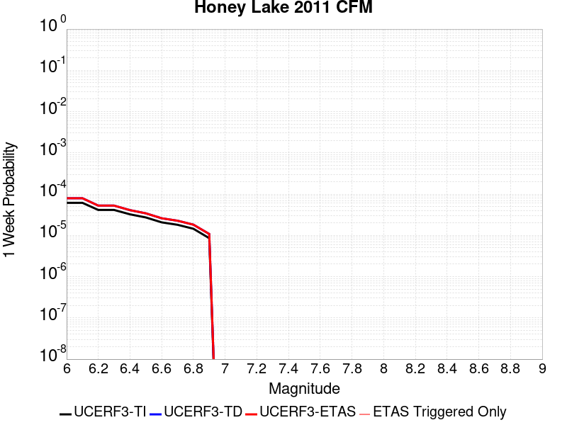 | 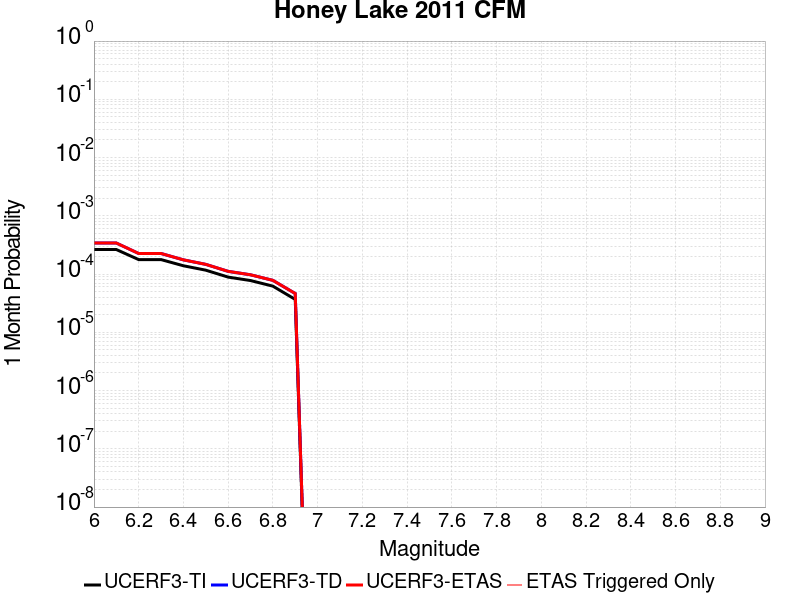 | 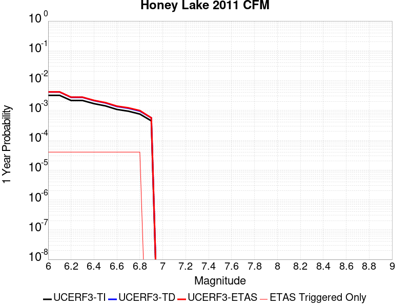 |

| Magnitude | 1 wk TI Prob | 1 wk TD Prob | 1 wk ETAS Prob | 1 wk ETAS/TD Gain | 1 wk ETAS Triggered Only | 1 mo TI Prob | 1 mo TD Prob | 1 mo ETAS Prob | 1 mo ETAS/TD Gain | 1 mo ETAS Triggered Only | 1 yr TI Prob | 1 yr TD Prob | 1 yr ETAS Prob | 1 yr ETAS/TD Gain | 1 yr ETAS Triggered Only |
|-----|-----|-----|-----|-----|-----|-----|-----|-----|-----|-----|-----|-----|-----|-----|-----|
| 6.0 | 6.155506E-5 | 7.96238E-5 | 7.96238E-5 | 1.0 | 0.0 | 2.6378073E-4 | 3.4120315E-4 | 3.4120315E-4 | 1.0 | 0.0 | 0.0032068014 | 0.004146667 | 0.0041865013 | 1.0096062 | 4.0E-5 |
| 6.1 | 6.155506E-5 | 7.96238E-5 | 7.96238E-5 | 1.0 | 0.0 | 2.6378073E-4 | 3.4120315E-4 | 3.4120315E-4 | 1.0 | 0.0 | 0.0032068014 | 0.004146667 | 0.0041865013 | 1.0096062 | 4.0E-5 |
| 6.2 | 4.1335024E-5 | 5.262445E-5 | 5.262445E-5 | 1.0 | 0.0 | 1.7713808E-4 | 2.2551461E-4 | 2.2551461E-4 | 1.0 | 0.0 | 0.0021545228 | 0.002742332 | 0.0027822223 | 1.0145462 | 4.0E-5 |
| 6.3 | 4.1335024E-5 | 5.262445E-5 | 5.262445E-5 | 1.0 | 0.0 | 1.7713808E-4 | 2.2551461E-4 | 2.2551461E-4 | 1.0 | 0.0 | 0.0021545228 | 0.002742332 | 0.0027822223 | 1.0145462 | 4.0E-5 |
| 6.4 | 3.2393702E-5 | 4.09234E-5 | 4.09234E-5 | 1.0 | 0.0 | 1.3882275E-4 | 1.7537457E-4 | 1.7537457E-4 | 1.0 | 0.0 | 0.0016888566 | 0.0021332004 | 0.002173115 | 1.0187112 | 4.0E-5 |
| 6.5 | 2.7205504E-5 | 3.4241497E-5 | 3.4241497E-5 | 1.0 | 0.0 | 1.1658981E-4 | 1.4674153E-4 | 1.4674153E-4 | 1.0 | 0.0 | 0.0014185566 | 0.0017852074 | 0.001825136 | 1.0223664 | 4.0E-5 |
| 6.6 | 2.069265E-5 | 2.5977777E-5 | 2.5977777E-5 | 1.0 | 0.0 | 8.867977E-5 | 1.11329064E-4 | 1.11329064E-4 | 1.0 | 0.0 | 0.0010791414 | 0.001354672 | 0.0013946178 | 1.0294875 | 4.0E-5 |
| 6.7 | 1.8060919E-5 | 2.267638E-5 | 2.267638E-5 | 1.0 | 0.0 | 7.7401644E-5 | 9.718133E-5 | 9.718133E-5 | 1.0 | 0.0 | 9.419576E-4 | 0.0011826215 | 0.0012225742 | 1.0337832 | 4.0E-5 |
| 6.8 | 1.4474663E-5 | 1.819706E-5 | 1.819706E-5 | 1.0 | 0.0 | 6.203279E-5 | 7.798551E-5 | 7.798551E-5 | 1.0 | 0.0 | 7.5498753E-4 | 9.491364E-4 | 9.890985E-4 | 1.0421035 | 4.0E-5 |
| 6.9 | 8.564552E-6 | 1.081188E-5 | 1.081188E-5 | 1.0 | 0.0 | 3.6704707E-5 | 4.6336183E-5 | 4.6336183E-5 | 1.0 | 0.0 | 4.4678818E-4 | 5.6406343E-4 | 5.6406343E-4 | 1.0 | 0.0 |

## Chino alt 1
*[(top)](#table-of-contents)*

| 1 Week | 1 Month | 1 Year |
|-----|-----|-----|
| 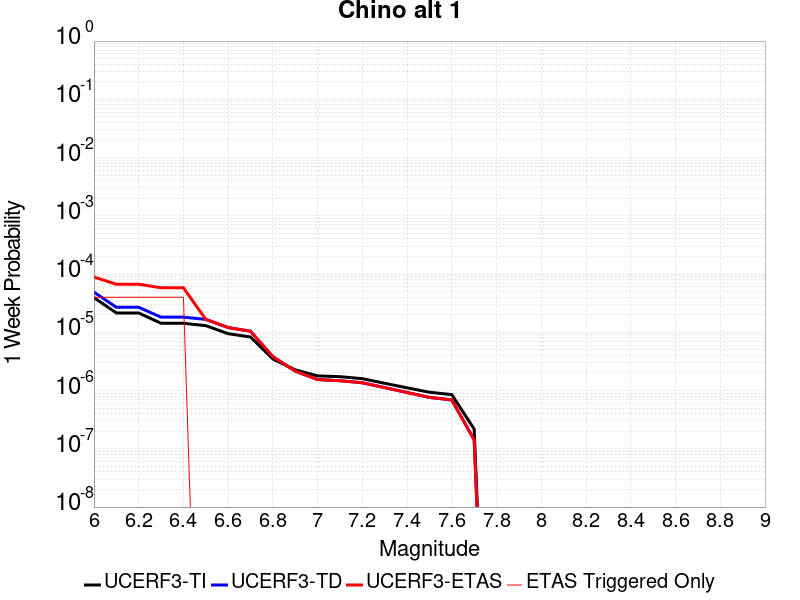 | 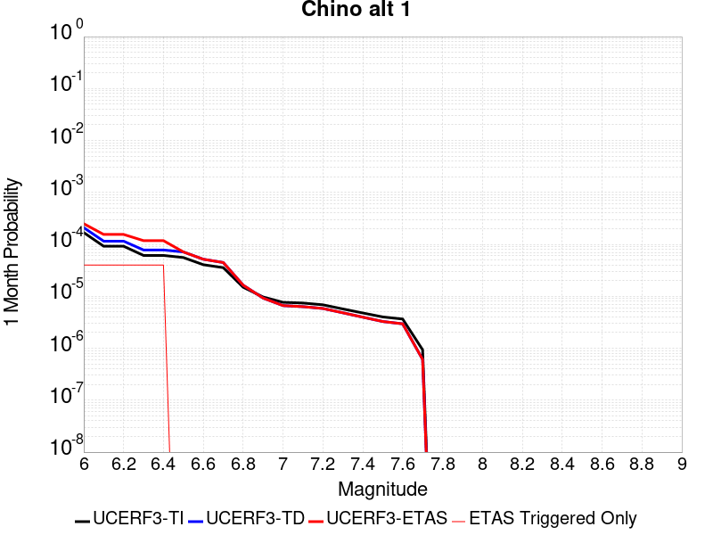 | 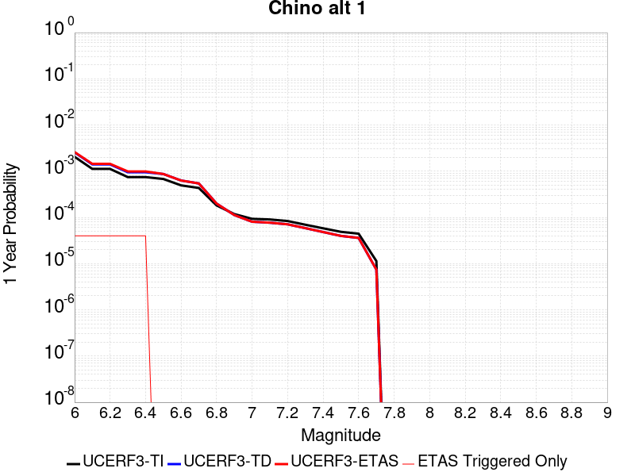 |

| Magnitude | 1 wk TI Prob | 1 wk TD Prob | 1 wk ETAS Prob | 1 wk ETAS/TD Gain | 1 wk ETAS Triggered Only | 1 mo TI Prob | 1 mo TD Prob | 1 mo ETAS Prob | 1 mo ETAS/TD Gain | 1 mo ETAS Triggered Only | 1 yr TI Prob | 1 yr TD Prob | 1 yr ETAS Prob | 1 yr ETAS/TD Gain | 1 yr ETAS Triggered Only |
|-----|-----|-----|-----|-----|-----|-----|-----|-----|-----|-----|-----|-----|-----|-----|-----|
| 6.0 | 3.939946E-5 | 4.9004397E-5 | 8.900244E-5 | 1.8162133 | 4.0E-5 | 1.6884391E-4 | 2.1000468E-4 | 2.499963E-4 | 1.190432 | 4.0E-5 | 0.0020537362 | 0.002554319 | 0.002594217 | 1.0156198 | 4.0E-5 |
| 6.1 | 2.1505624E-5 | 2.6917825E-5 | 6.691675E-5 | 2.485964 | 4.0E-5 | 9.2163704E-5 | 1.15357594E-4 | 1.5535297E-4 | 1.3467078 | 4.0E-5 | 0.0011215154 | 0.0014036838 | 0.0014436276 | 1.0284564 | 4.0E-5 |
| 6.2 | 2.1505624E-5 | 2.6917825E-5 | 6.691675E-5 | 2.485964 | 4.0E-5 | 9.2163704E-5 | 1.15357594E-4 | 1.5535297E-4 | 1.3467078 | 4.0E-5 | 0.0011215154 | 0.0014036838 | 0.0014436276 | 1.0284564 | 4.0E-5 |
| 6.3 | 1.4290785E-5 | 1.81977E-5 | 5.8196973E-5 | 3.19804 | 4.0E-5 | 6.1244784E-5 | 7.7988065E-5 | 1.1798494E-4 | 1.512859 | 4.0E-5 | 7.454001E-4 | 9.491364E-4 | 9.890985E-4 | 1.0421035 | 4.0E-5 |
| 6.4 | 1.4290785E-5 | 1.81977E-5 | 5.8196973E-5 | 3.19804 | 4.0E-5 | 6.1244784E-5 | 7.7988065E-5 | 1.1798494E-4 | 1.512859 | 4.0E-5 | 7.454001E-4 | 9.491364E-4 | 9.890985E-4 | 1.0421035 | 4.0E-5 |
| 6.5 | 1.3017944E-5 | 1.668369E-5 | 1.668369E-5 | 1.0 | 0.0 | 5.5789995E-5 | 7.149982E-5 | 7.149982E-5 | 1.0 | 0.0 | 6.790315E-4 | 8.702065E-4 | 8.702065E-4 | 1.0 | 0.0 |
| 6.6 | 9.470016E-6 | 1.2065467E-5 | 1.2065467E-5 | 1.0 | 0.0 | 4.058515E-5 | 5.170831E-5 | 5.170831E-5 | 1.0 | 0.0 | 4.940122E-4 | 6.294009E-4 | 6.294009E-4 | 1.0 | 0.0 |
| 6.7 | 8.314155E-6 | 1.0425587E-5 | 1.0425587E-5 | 1.0 | 0.0 | 3.5631605E-5 | 4.4680502E-5 | 4.4680502E-5 | 1.0 | 0.0 | 4.3372845E-4 | 5.438817E-4 | 5.438817E-4 | 1.0 | 0.0 |
| 6.8 | 3.4856364E-6 | 3.8184653E-6 | 3.8184653E-6 | 1.0 | 0.0 | 1.4938357E-5 | 1.636476E-5 | 1.636476E-5 | 1.0 | 0.0 | 1.8185932E-4 | 1.9922481E-4 | 1.9922481E-4 | 1.0 | 0.0 |
| 6.9 | 2.2645952E-6 | 2.1561063E-6 | 2.1561063E-6 | 1.0 | 0.0 | 9.705372E-6 | 9.240424E-6 | 9.240424E-6 | 1.0 | 0.0 | 1.18156495E-4 | 1.1249657E-4 | 1.1249657E-4 | 1.0 | 0.0 |
| 7.0 | 1.7864003E-6 | 1.545482E-6 | 1.545482E-6 | 1.0 | 0.0 | 7.655979E-6 | 6.623478E-6 | 6.623478E-6 | 1.0 | 0.0 | 9.3207556E-5 | 8.063792E-5 | 8.063792E-5 | 1.0 | 0.0 |
| 7.1 | 1.7315456E-6 | 1.4756972E-6 | 1.4756972E-6 | 1.0 | 0.0 | 7.420889E-6 | 6.3244015E-6 | 6.3244015E-6 | 1.0 | 0.0 | 9.034557E-5 | 7.699693E-5 | 7.699693E-5 | 1.0 | 0.0 |
| 7.2 | 1.6008337E-6 | 1.3596422E-6 | 1.3596422E-6 | 1.0 | 0.0 | 6.860698E-6 | 5.8270252E-6 | 5.8270252E-6 | 1.0 | 0.0 | 8.352579E-5 | 7.094178E-5 | 7.094178E-5 | 1.0 | 0.0 |
| 7.3 | 1.3320939E-6 | 1.1237295E-6 | 1.1237295E-6 | 1.0 | 0.0 | 5.7089615E-6 | 4.815975E-6 | 4.815975E-6 | 1.0 | 0.0 | 6.9504385E-5 | 5.8632966E-5 | 5.8632966E-5 | 1.0 | 0.0 |
| 7.4 | 1.114294E-6 | 9.2541916E-7 | 9.2541916E-7 | 1.0 | 0.0 | 4.775537E-6 | 3.9660763E-6 | 3.9660763E-6 | 1.0 | 0.0 | 5.8140613E-5 | 4.8285947E-5 | 4.8285947E-5 | 1.0 | 0.0 |
| 7.5 | 9.354081E-7 | 7.638138E-7 | 7.638138E-7 | 1.0 | 0.0 | 4.0088858E-6 | 3.2734836E-6 | 3.2734836E-6 | 1.0 | 0.0 | 4.8807087E-5 | 3.985397E-5 | 3.985397E-5 | 1.0 | 0.0 |
| 7.6 | 8.521771E-7 | 6.8946184E-7 | 6.8946184E-7 | 1.0 | 0.0 | 3.6521824E-6 | 2.9548335E-6 | 2.9548335E-6 | 1.0 | 0.0 | 4.4464414E-5 | 3.5974535E-5 | 3.5974535E-5 | 1.0 | 0.0 |
| 7.7 | 2.1803626E-7 | 1.4221726E-7 | 1.4221726E-7 | 1.0 | 0.0 | 9.344408E-7 | 6.095024E-7 | 6.095024E-7 | 1.0 | 0.0 | 1.1376757E-5 | 7.4206764E-6 | 7.4206764E-6 | 1.0 | 0.0 |

