# Parent Section Magnitude-Probability Distributions

Only fault sections with at least one triggered aftershock are plotted. Sections are sorted by total supraseismogenic trigger rate (decreasing)

## Table Of Contents

* [San Andreas (Mojave S)](#san-andreas-mojave-s)
* [San Andreas (San Bernardino N)](#san-andreas-san-bernardino-n)
* [Lenwood-Lockhart-Old Woman Springs](#lenwood-lockhart-old-woman-springs)
* [San Andreas (Mojave N)](#san-andreas-mojave-n)
* [San Andreas (San Bernardino S)](#san-andreas-san-bernardino-s)
* [San Andreas (Big Bend)](#san-andreas-big-bend)
* [Helendale-So Lockhart](#helendale-so-lockhart)
* [San Andreas (Carrizo) rev](#san-andreas-carrizo-rev)
* [Gravel Hills-Harper Lk](#gravel-hills-harper-lk)
* [San Andreas (San Gorgonio Pass-Garnet HIll)](#san-andreas-san-gorgonio-pass-garnet-hill)
* [San Andreas (Cholame) rev](#san-andreas-cholame-rev)
* [San Andreas (Coachella) rev](#san-andreas-coachella-rev)
* [San Andreas (Parkfield)](#san-andreas-parkfield)
* [Elsinore (Glen Ivy) rev](#elsinore-glen-ivy-rev)
* [Brawley (Seismic Zone) alt 1](#brawley-seismic-zone-alt-1)
* [San Andreas (Creeping Section) 2011 CFM](#san-andreas-creeping-section-2011-cfm)
* [Pleito](#pleito)
* [Imperial](#imperial)
* [Blackwater](#blackwater)
* [San Andreas (North Branch Mill Creek)](#san-andreas-north-branch-mill-creek)
* [San Jacinto (San Bernardino)](#san-jacinto-san-bernardino)
* [San Jacinto (San Jacinto Valley) rev](#san-jacinto-san-jacinto-valley-rev)
* [San Jacinto (Stepovers Combined)](#san-jacinto-stepovers-combined)
* [Coyote Canyon](#coyote-canyon)
* [Elysian Park (Upper)](#elysian-park-upper)
* [San Jacinto (Anza) rev](#san-jacinto-anza-rev)
* [Bicycle Lake](#bicycle-lake)
* [Garlock (Central)](#garlock-central)
* [Garlic Springs](#garlic-springs)
* [Coyote Lake](#coyote-lake)
* [San Jacinto (Clark) rev](#san-jacinto-clark-rev)
* [Goldstone Lake](#goldstone-lake)
* [Sierra Madre](#sierra-madre)
* [Tank Canyon](#tank-canyon)
* [Garlock (West)](#garlock-west)
* [Pinto Mtn](#pinto-mtn)
* [Ludlow](#ludlow)
* [Red Mountain](#red-mountain)
* [Chino alt 1](#chino-alt-1)
* [Whittier alt 1](#whittier-alt-1)
* [Mission Ridge-Arroyo Parida-Santa Ana](#mission-ridge-arroyo-parida-santa-ana)
* [Raymond](#raymond)
* [Calico-Hidalgo](#calico-hidalgo)
* [Santa Ynez (East)](#santa-ynez-east)
* [Garlock (East)](#garlock-east)
* [Big Pine (East)](#big-pine-east)
* [Calaveras (So) - Paicines extension 2011 CFM](#calaveras-so---paicines-extension-2011-cfm)
* [Channel Islands Thrust](#channel-islands-thrust)
* [Elsinore (Temecula) rev](#elsinore-temecula-rev)
* [Santa Monica alt 1](#santa-monica-alt-1)
* [Hollywood](#hollywood)
* [San Gorgonio Pass](#san-gorgonio-pass)
* [Cleghorn](#cleghorn)
* [Cady](#cady)
* [Santa Cruz Catalina Ridge alt1](#santa-cruz-catalina-ridge-alt1)
* [Ventura-Pitas Point](#ventura-pitas-point)
* [Palos Verdes](#palos-verdes)
* [San Clemente](#san-clemente)
* [North Frontal  (West)](#north-frontal--west)
* [Elsinore (Stepovers Combined)](#elsinore-stepovers-combined)
* [San Diego Trough north alt1](#san-diego-trough-north-alt1)
* [San Pedro Basin](#san-pedro-basin)
* [Oceanic - West Huasna](#oceanic---west-huasna)
* [Big Pine (Central)](#big-pine-central)
* [Paradise](#paradise)
* [Cucamonga](#cucamonga)
* [Great Valley 08 (Quinto)](#great-valley-08-quinto)
* [Channel Islands Western Deep Ramp](#channel-islands-western-deep-ramp)
* [Lake Isabella (Seismicity)](#lake-isabella-seismicity)
* [Calaveras (So) 2011 CFM](#calaveras-so-2011-cfm)
* [Ortigalita (North)](#ortigalita-north)
* [Pisgah-Bullion Mtn-Mesquite Lk](#pisgah-bullion-mtn-mesquite-lk)
* [Pitas Point (Lower West)](#pitas-point-lower-west)
* [Pitas Point (Lower)-Montalvo](#pitas-point-lower-montalvo)
* [Yorba Linda](#yorba-linda)
* [San Jacinto (Borrego)](#san-jacinto-borrego)
* [San Gabriel](#san-gabriel)
* [Panamint Valley](#panamint-valley)
* [Elsinore (Coyote Mountains)](#elsinore-coyote-mountains)
* [North Frontal  (East)](#north-frontal--east)
* [Death Valley (Black Mtns Frontal)](#death-valley-black-mtns-frontal)
* [Santa Rosa Island](#santa-rosa-island)
* [McLean Lake](#mclean-lake)
* [San Andreas (Peninsula) 2011 CFM](#san-andreas-peninsula-2011-cfm)
* [Puente Hills](#puente-hills)
* [Likely 2011 CFM](#likely-2011-cfm)
* [San Andreas (Santa Cruz Mts) 2011 CFM](#san-andreas-santa-cruz-mts-2011-cfm)
* [Elmore Ranch](#elmore-ranch)
* [Manix-Afton Hills](#manix-afton-hills)
* [Superstition Hills](#superstition-hills)
* [San Jacinto (Coyote Creek)](#san-jacinto-coyote-creek)
* [Newport-Inglewood alt 1](#newport-inglewood-alt-1)
* [Oak Ridge (Onshore)](#oak-ridge-onshore)
* [Sierra Madre (San Fernando)](#sierra-madre-san-fernando)
* [Santa Susana East (connector)](#santa-susana-east-connector)
* [Santa Ynez (West)](#santa-ynez-west)
* [Monte Vista - Shannon 2011 CFM](#monte-vista---shannon-2011-cfm)
* [Malibu Coast alt 1](#malibu-coast-alt-1)
* [San Jacinto (Superstition Mtn)](#san-jacinto-superstition-mtn)
* [Santa Susana alt 1](#santa-susana-alt-1)
* [Great Valley 05 Pittsburg - Kirby Hills alt1](#great-valley-05-pittsburg---kirby-hills-alt1)
* [West Tahoe](#west-tahoe)
* [San Cayetano](#san-cayetano)
* [Malibu Coast (Extension) alt 1](#malibu-coast-extension-alt-1)
* [Blue Cut](#blue-cut)
* [Butano 2011 CFM](#butano-2011-cfm)
* [Red Pass](#red-pass)
* [Owl Lake](#owl-lake)
* [Mission Creek](#mission-creek)
* [San Gabriel (Extension)](#san-gabriel-extension)
* [Coronado Bank alt1](#coronado-bank-alt1)
* [San Jacinto (Lytle Creek connector)](#san-jacinto-lytle-creek-connector)
* [Ortigalita (South)](#ortigalita-south)

## San Andreas (Mojave S)
*[(top)](#table-of-contents)*

| 1 Week | 1 Month | 1 Year |
|-----|-----|-----|
| 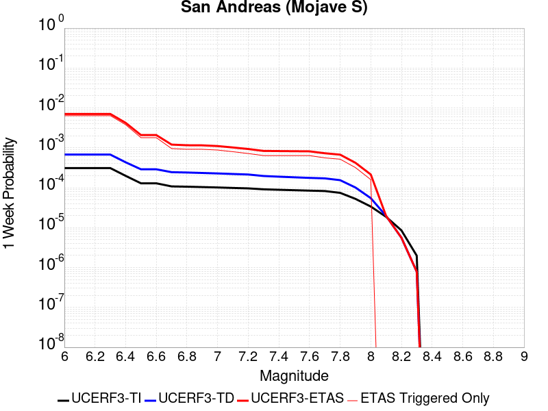 |  | 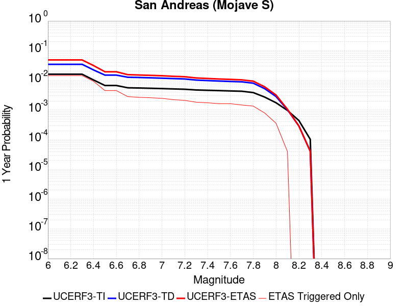 |

| Magnitude | 1 wk TI Prob | 1 wk TD Prob | 1 wk ETAS Prob | 1 wk ETAS/TD Gain | 1 wk ETAS Triggered Only | 1 mo TI Prob | 1 mo TD Prob | 1 mo ETAS Prob | 1 mo ETAS/TD Gain | 1 mo ETAS Triggered Only | 1 yr TI Prob | 1 yr TD Prob | 1 yr ETAS Prob | 1 yr ETAS/TD Gain | 1 yr ETAS Triggered Only |
|-----|-----|-----|-----|-----|-----|-----|-----|-----|-----|-----|-----|-----|-----|-----|-----|
| 6.0 | 3.1064058E-4 | 6.771211E-4 | 0.0070727877 | 10.44538 | 0.0064 | 0.0013306376 | 0.0028988488 | 0.011872759 | 4.0956807 | 0.009 | 0.016080605 | 0.034691453 | 0.04863051 | 1.4018009 | 0.01444 |
| 6.1 | 3.1064058E-4 | 6.771211E-4 | 0.0070727877 | 10.44538 | 0.0064 | 0.0013306376 | 0.0028988488 | 0.011872759 | 4.0956807 | 0.009 | 0.016080605 | 0.034691453 | 0.04863051 | 1.4018009 | 0.01444 |
| 6.2 | 3.1064058E-4 | 6.771211E-4 | 0.0070727877 | 10.44538 | 0.0064 | 0.0013306376 | 0.0028988488 | 0.011872759 | 4.0956807 | 0.009 | 0.016080605 | 0.034691453 | 0.04863051 | 1.4018009 | 0.01444 |
| 6.3 | 3.1064058E-4 | 6.771211E-4 | 0.0070727877 | 10.44538 | 0.0064 | 0.0013306376 | 0.0028988488 | 0.011872759 | 4.0956807 | 0.009 | 0.016080605 | 0.034691453 | 0.04863051 | 1.4018009 | 0.01444 |
| 6.4 | 1.9872203E-4 | 4.341842E-4 | 0.004232534 | 9.748245 | 0.0038 | 8.5138786E-4 | 0.0018594908 | 0.007528929 | 4.0489197 | 0.00568 | 0.010316478 | 0.022410452 | 0.031482484 | 1.4048125 | 0.00928 |
| 6.5 | 1.291105E-4 | 2.8979595E-4 | 0.0020892743 | 7.209467 | 0.0018 | 5.5321335E-4 | 0.0012413943 | 0.0040778685 | 3.2849102 | 0.00284 | 0.006714592 | 0.015010072 | 0.019462226 | 1.2966112 | 0.00452 |
| 6.6 | 1.291105E-4 | 2.8979595E-4 | 0.0020892743 | 7.209467 | 0.0018 | 5.5321335E-4 | 0.0012413943 | 0.0040778685 | 3.2849102 | 0.00284 | 0.006714592 | 0.015010072 | 0.019462226 | 1.2966112 | 0.00452 |
| 6.7 | 1.08001186E-4 | 2.4557297E-4 | 0.0012053372 | 4.908265 | 9.6E-4 | 4.6278012E-4 | 0.0010520316 | 0.0026903064 | 2.5572486 | 0.00164 | 0.0056198016 | 0.012733568 | 0.015537404 | 1.2201926 | 0.00284 |
| 6.8 | 1.0624356E-4 | 2.4074306E-4 | 0.0011605215 | 4.820582 | 9.2E-4 | 4.5525006E-4 | 0.0010313485 | 0.0026296983 | 2.549767 | 0.0016 | 0.0055285925 | 0.012484655 | 0.015131196 | 1.2119836 | 0.00268 |
| 6.9 | 1.0393785E-4 | 2.3443767E-4 | 0.001154222 | 4.923364 | 9.2E-4 | 4.4537184E-4 | 0.0010043464 | 0.0025627797 | 2.551689 | 0.00156 | 0.0054089287 | 0.012159616 | 0.014728 | 1.2112225 | 0.0026 |
| 7.0 | 1.0155622E-4 | 2.2812336E-4 | 0.0011079226 | 4.8566823 | 8.8E-4 | 4.3516833E-4 | 9.773056E-4 | 0.0024558592 | 2.5128877 | 0.00148 | 0.005285311 | 0.0118340105 | 0.014284662 | 1.2070855 | 0.00248 |
| 7.1 | 9.885595E-5 | 2.2099643E-4 | 0.0010208196 | 4.619168 | 8.0E-4 | 4.2359953E-4 | 9.4678416E-4 | 0.0023054965 | 2.4350815 | 0.00136 | 0.0051451353 | 0.0114663765 | 0.013680692 | 1.1931138 | 0.00224 |
| 7.2 | 9.6411415E-5 | 2.1461575E-4 | 9.3446125E-4 | 4.354113 | 7.2E-4 | 4.1312634E-4 | 9.194579E-4 | 0.002198281 | 2.3908446 | 0.00128 | 0.005018219 | 0.011137128 | 0.013233517 | 1.1882343 | 0.00212 |
| 7.3 | 9.1180635E-5 | 1.968396E-4 | 8.367136E-4 | 4.2507386 | 6.4E-4 | 3.907156E-4 | 8.4332563E-4 | 0.0019224149 | 2.2795641 | 0.00108 | 0.004746591 | 0.0102192685 | 0.012040465 | 1.178212 | 0.00184 |
| 7.4 | 8.887388E-5 | 1.8930127E-4 | 8.291801E-4 | 4.380214 | 6.4E-4 | 3.8083247E-4 | 8.11039E-4 | 0.0018501955 | 2.2812657 | 0.00104 | 0.0046267817 | 0.009829793 | 0.011572493 | 1.1772875 | 0.00176 |
| 7.5 | 8.6750515E-5 | 1.8259375E-4 | 8.2247687E-4 | 4.504409 | 6.4E-4 | 3.7173493E-4 | 7.8231003E-4 | 0.0017815277 | 2.2772655 | 0.001 | 0.004516484 | 0.009483118 | 0.011107565 | 1.1712989 | 0.00164 |
| 7.6 | 8.453092E-5 | 1.7644193E-4 | 8.16329E-4 | 4.626616 | 6.4E-4 | 3.6222505E-4 | 7.559606E-4 | 0.0017552046 | 2.3218203 | 0.001 | 0.0044011753 | 0.009165057 | 0.010790026 | 1.1773006 | 0.00164 |
| 7.7 | 8.259102E-5 | 1.716408E-4 | 7.315447E-4 | 4.262068 | 5.6E-4 | 3.539135E-4 | 7.353961E-4 | 0.001614749 | 2.195754 | 8.8E-4 | 0.004300386 | 0.008916762 | 0.010383565 | 1.1644995 | 0.00148 |
| 7.8 | 7.444844E-5 | 1.54684E-4 | 6.7460357E-4 | 4.361172 | 5.2E-4 | 3.1902574E-4 | 6.627631E-4 | 0.0014622329 | 2.2062678 | 8.0E-4 | 0.0038772223 | 0.008039338 | 0.009388404 | 1.1678082 | 0.00136 |
| 7.9 | 5.2586525E-5 | 1.0133334E-4 | 4.213009E-4 | 4.1575747 | 3.2E-4 | 2.2535135E-4 | 4.342135E-4 | 8.340398E-4 | 1.9208058 | 4.0E-4 | 0.0027402006 | 0.0052737463 | 0.0060695275 | 1.1508949 | 8.0E-4 |
| 8.0 | 3.379877E-5 | 5.4809316E-5 | 2.1480054E-4 | 3.919052 | 1.6E-4 | 1.4484383E-4 | 2.3487593E-4 | 4.3482895E-4 | 1.8513134 | 2.0E-4 | 0.0017620471 | 0.0028558664 | 0.0032148382 | 1.1256963 | 3.6E-4 |
| 8.1 | 1.8668277E-5 | 1.9660263E-5 | 1.9660263E-5 | 1.0 | 0.0 | 8.000444E-5 | 8.425555E-5 | 8.425555E-5 | 1.0 | 0.0 | 9.736188E-4 | 0.0010253292 | 0.0010652882 | 1.0389719 | 4.0E-5 |
| 8.2 | 8.541571E-6 | 5.592881E-6 | 5.592881E-6 | 1.0 | 0.0 | 3.660622E-5 | 2.396927E-5 | 2.396927E-5 | 1.0 | 0.0 | 4.455896E-4 | 2.9178688E-4 | 2.9178688E-4 | 1.0 | 0.0 |
| 8.3 | 1.983087E-6 | 7.877893E-7 | 7.877893E-7 | 1.0 | 0.0 | 8.498917E-6 | 3.3762356E-6 | 3.3762356E-6 | 1.0 | 0.0 | 1.034694E-4 | 4.110491E-5 | 4.110491E-5 | 1.0 | 0.0 |

## San Andreas (San Bernardino N)
*[(top)](#table-of-contents)*

| 1 Week | 1 Month | 1 Year |
|-----|-----|-----|
|  | 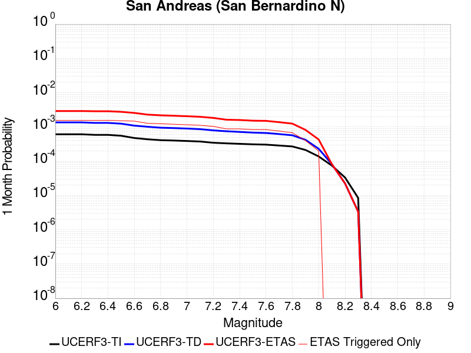 |  |

| Magnitude | 1 wk TI Prob | 1 wk TD Prob | 1 wk ETAS Prob | 1 wk ETAS/TD Gain | 1 wk ETAS Triggered Only | 1 mo TI Prob | 1 mo TD Prob | 1 mo ETAS Prob | 1 mo ETAS/TD Gain | 1 mo ETAS Triggered Only | 1 yr TI Prob | 1 yr TD Prob | 1 yr ETAS Prob | 1 yr ETAS/TD Gain | 1 yr ETAS Triggered Only |
|-----|-----|-----|-----|-----|-----|-----|-----|-----|-----|-----|-----|-----|-----|-----|-----|
| 6.0 | 1.4273766E-4 | 3.1797116E-4 | 0.001277666 | 4.018182 | 9.6E-4 | 6.115894E-4 | 0.0013620278 | 0.002919903 | 2.1437912 | 0.00156 | 0.0074207084 | 0.016458113 | 0.019172689 | 1.1649384 | 0.00276 |
| 6.1 | 1.4273766E-4 | 3.1797116E-4 | 0.001277666 | 4.018182 | 9.6E-4 | 6.115894E-4 | 0.0013620278 | 0.002919903 | 2.1437912 | 0.00156 | 0.0074207084 | 0.016458113 | 0.019172689 | 1.1649384 | 0.00276 |
| 6.2 | 1.4273766E-4 | 3.1797116E-4 | 0.001277666 | 4.018182 | 9.6E-4 | 6.115894E-4 | 0.0013620278 | 0.002919903 | 2.1437912 | 0.00156 | 0.0074207084 | 0.016458113 | 0.019172689 | 1.1649384 | 0.00276 |
| 6.3 | 1.3730655E-4 | 3.070095E-4 | 0.0012667148 | 4.125979 | 9.6E-4 | 5.883239E-4 | 0.0013150972 | 0.0028730456 | 2.184664 | 0.00156 | 0.0071393442 | 0.015895175 | 0.01857194 | 1.1684011 | 0.00272 |
| 6.4 | 1.3730655E-4 | 3.070095E-4 | 0.0012667148 | 4.125979 | 9.6E-4 | 5.883239E-4 | 0.0013150972 | 0.0028730456 | 2.184664 | 0.00156 | 0.0071393442 | 0.015895175 | 0.01857194 | 1.1684011 | 0.00272 |
| 6.5 | 1.2942807E-4 | 2.9113982E-4 | 0.001210872 | 4.159074 | 9.2E-4 | 5.545738E-4 | 0.0012471506 | 0.002765255 | 2.2172582 | 0.00152 | 0.0067310524 | 0.015079602 | 0.017719189 | 1.1750436 | 0.00268 |
| 6.6 | 1.1125901E-4 | 2.5549048E-4 | 0.0011752554 | 4.599997 | 9.2E-4 | 4.767372E-4 | 0.001094502 | 0.0025728822 | 2.350733 | 0.00148 | 0.005788839 | 0.0132447835 | 0.015849818 | 1.1966838 | 0.00264 |
| 6.7 | 1.02209575E-4 | 2.3682536E-4 | 9.5665484E-4 | 4.039495 | 7.2E-4 | 4.3796748E-4 | 0.0010145725 | 0.0022932738 | 2.2603352 | 0.00128 | 0.0053192247 | 0.012282886 | 0.0146138985 | 1.1897773 | 0.00236 |
| 6.8 | 9.610582E-5 | 2.2205901E-4 | 9.4189914E-4 | 4.2416615 | 7.2E-4 | 4.1181705E-4 | 9.5133507E-4 | 0.0021901554 | 2.3021915 | 0.00124 | 0.0050023515 | 0.011521262 | 0.0137354545 | 1.1921831 | 0.00224 |
| 6.9 | 9.3877505E-5 | 2.1660629E-4 | 9.364503E-4 | 4.323283 | 7.2E-4 | 4.0227012E-4 | 9.279831E-4 | 0.0021268695 | 2.291927 | 0.0012 | 0.0048866454 | 0.011239915 | 0.013375637 | 1.1900122 | 0.00216 |
| 7.0 | 9.1019785E-5 | 2.0986385E-4 | 8.8972115E-4 | 4.239516 | 6.8E-4 | 3.900265E-4 | 8.991071E-4 | 0.002058064 | 2.2890089 | 0.00116 | 0.0047382377 | 0.010891914 | 0.012909695 | 1.1852549 | 0.00204 |
| 7.1 | 8.771155E-5 | 2.015964E-4 | 8.4146735E-4 | 4.17402 | 6.4E-4 | 3.758525E-4 | 8.63699E-4 | 0.0019827317 | 2.295628 | 0.00112 | 0.0045664064 | 0.010465035 | 0.012364943 | 1.1815481 | 0.00192 |
| 7.2 | 8.0830236E-5 | 1.8562343E-4 | 7.455195E-4 | 4.0163007 | 5.6E-4 | 3.4636928E-4 | 7.952866E-4 | 0.0018344595 | 2.3066647 | 0.00104 | 0.0042088944 | 0.009639736 | 0.0114223845 | 1.1849271 | 0.0018 |
| 7.3 | 7.7668235E-5 | 1.7502681E-4 | 6.549428E-4 | 3.741957 | 4.8E-4 | 3.328214E-4 | 7.4989937E-4 | 0.0016292394 | 2.1726108 | 8.8E-4 | 0.0040445733 | 0.009091886 | 0.010677339 | 1.1743811 | 0.0016 |
| 7.4 | 7.520177E-5 | 1.6720418E-4 | 6.471239E-4 | 3.8702614 | 4.8E-4 | 3.2225347E-4 | 7.1639265E-4 | 0.0015957622 | 2.2274966 | 8.8E-4 | 0.0039163795 | 0.008687268 | 0.010233716 | 1.1780131 | 0.00156 |
| 7.5 | 7.274697E-5 | 1.600578E-4 | 6.3998095E-4 | 3.9984367 | 4.8E-4 | 3.1173544E-4 | 6.857817E-4 | 0.0015252057 | 2.2240396 | 8.4E-4 | 0.003788775 | 0.008317487 | 0.009745509 | 1.1716893 | 0.00144 |
| 7.6 | 7.1185845E-5 | 1.5574165E-4 | 6.356669E-4 | 4.0815473 | 4.8E-4 | 3.0504653E-4 | 6.6729356E-4 | 0.001506733 | 2.2579763 | 8.4E-4 | 0.0037076178 | 0.008094089 | 0.009522433 | 1.1764677 | 0.00144 |
| 7.7 | 6.709961E-5 | 1.4479096E-4 | 5.8472727E-4 | 4.0384235 | 4.4E-4 | 2.8753807E-4 | 6.2038517E-4 | 0.0013799137 | 2.2242854 | 7.6E-4 | 0.003495157 | 0.0075270706 | 0.008876834 | 1.1793212 | 0.00136 |
| 7.8 | 6.300812E-5 | 1.3354905E-4 | 5.334956E-4 | 3.9947543 | 4.0E-4 | 2.7000686E-4 | 5.722275E-4 | 0.0012518384 | 2.1876585 | 6.8E-4 | 0.0032823787 | 0.006944645 | 0.008176033 | 1.1773149 | 0.00124 |
| 7.9 | 4.983037E-5 | 9.844076E-5 | 4.1840927E-4 | 4.250366 | 3.2E-4 | 2.1354125E-4 | 4.2182076E-4 | 8.21652E-4 | 1.94787 | 4.0E-4 | 0.0025967648 | 0.005123585 | 0.0059194863 | 1.1553407 | 8.0E-4 |
| 8.0 | 3.2211527E-5 | 5.4014366E-5 | 2.1400572E-4 | 3.962015 | 1.6E-4 | 1.380421E-4 | 2.3146962E-4 | 4.314233E-4 | 1.8638443 | 2.0E-4 | 0.0016793669 | 0.0028145025 | 0.0031734894 | 1.1275489 | 3.6E-4 |
| 8.1 | 1.743376E-5 | 1.9157624E-5 | 1.9157624E-5 | 1.0 | 0.0 | 7.471398E-5 | 8.210152E-5 | 8.210152E-5 | 1.0 | 0.0 | 9.0926304E-4 | 9.991282E-4 | 0.0010390882 | 1.039995 | 4.0E-5 |
| 8.2 | 7.831616E-6 | 5.2765454E-6 | 5.2765454E-6 | 1.0 | 0.0 | 3.3563636E-5 | 2.261357E-5 | 2.261357E-5 | 1.0 | 0.0 | 4.0856065E-4 | 2.752855E-4 | 2.752855E-4 | 1.0 | 0.0 |
| 8.3 | 1.983087E-6 | 7.877893E-7 | 7.877893E-7 | 1.0 | 0.0 | 8.498917E-6 | 3.3762356E-6 | 3.3762356E-6 | 1.0 | 0.0 | 1.034694E-4 | 4.110491E-5 | 4.110491E-5 | 1.0 | 0.0 |

## Lenwood-Lockhart-Old Woman Springs
*[(top)](#table-of-contents)*

| 1 Week | 1 Month | 1 Year |
|-----|-----|-----|
| 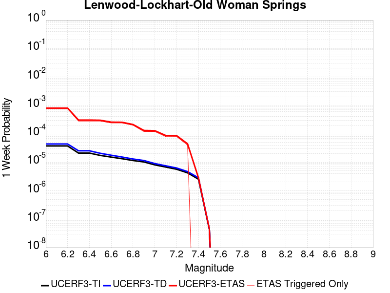 | 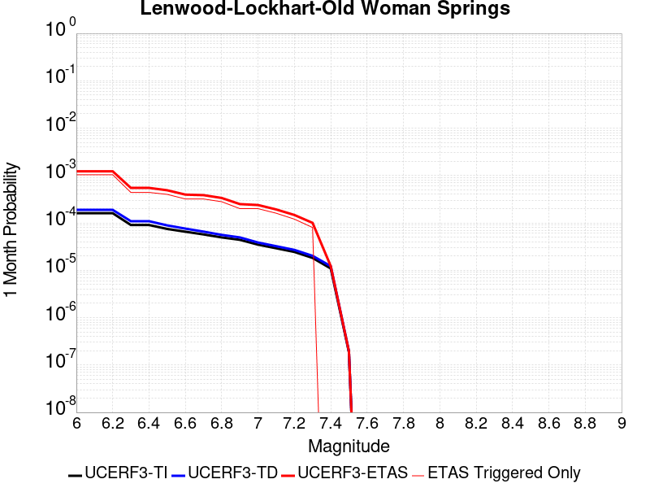 | 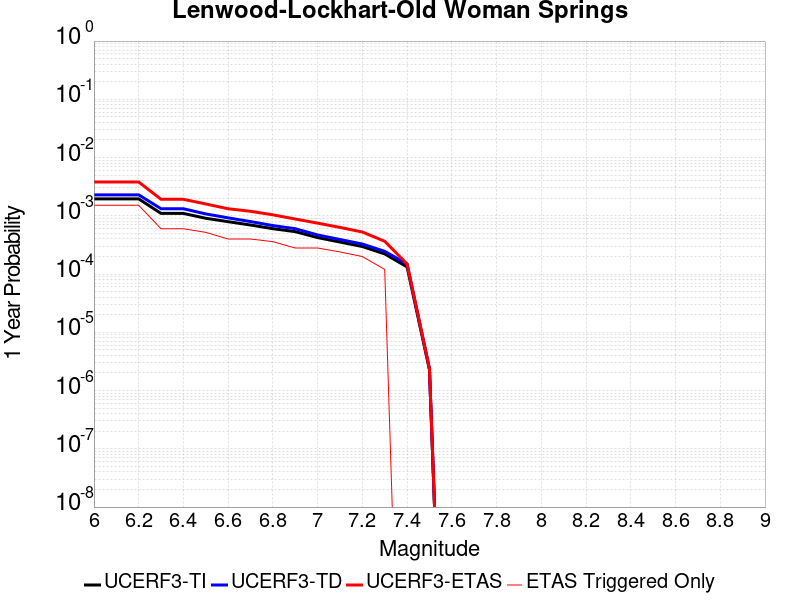 |

| Magnitude | 1 wk TI Prob | 1 wk TD Prob | 1 wk ETAS Prob | 1 wk ETAS/TD Gain | 1 wk ETAS Triggered Only | 1 mo TI Prob | 1 mo TD Prob | 1 mo ETAS Prob | 1 mo ETAS/TD Gain | 1 mo ETAS Triggered Only | 1 yr TI Prob | 1 yr TD Prob | 1 yr ETAS Prob | 1 yr ETAS/TD Gain | 1 yr ETAS Triggered Only |
|-----|-----|-----|-----|-----|-----|-----|-----|-----|-----|-----|-----|-----|-----|-----|-----|
| 6.0 | 3.744542E-5 | 4.3976295E-5 | 8.0394285E-4 | 18.281279 | 7.6E-4 | 1.604705E-4 | 1.884572E-4 | 0.0012282612 | 6.5174546 | 0.00104 | 0.0019519776 | 0.002292224 | 0.0038087398 | 1.6615914 | 0.00152 |
| 6.1 | 3.744542E-5 | 4.3976295E-5 | 8.0394285E-4 | 18.281279 | 7.6E-4 | 1.604705E-4 | 1.884572E-4 | 0.0012282612 | 6.5174546 | 0.00104 | 0.0019519776 | 0.002292224 | 0.0038087398 | 1.6615914 | 0.00152 |
| 6.2 | 3.744542E-5 | 4.3976295E-5 | 8.0394285E-4 | 18.281279 | 7.6E-4 | 1.604705E-4 | 1.884572E-4 | 0.0012282612 | 6.5174546 | 0.00104 | 0.0019519776 | 0.002292224 | 0.0038087398 | 1.6615914 | 0.00152 |
| 6.3 | 2.1079984E-5 | 2.5359855E-5 | 3.0535276E-4 | 12.040792 | 2.8E-4 | 9.0339665E-5 | 1.0868068E-4 | 5.486329E-4 | 5.0481176 | 4.4E-4 | 0.0010993304 | 0.001322404 | 0.0019216107 | 1.4531192 | 6.0E-4 |
| 6.4 | 2.1079984E-5 | 2.5359855E-5 | 3.0535276E-4 | 12.040792 | 2.8E-4 | 9.0339665E-5 | 1.0868068E-4 | 5.486329E-4 | 5.0481176 | 4.4E-4 | 0.0010993304 | 0.001322404 | 0.0019216107 | 1.4531192 | 6.0E-4 |
| 6.5 | 1.7397282E-5 | 2.0667581E-5 | 3.006618E-4 | 14.547507 | 2.8E-4 | 7.455765E-5 | 8.857241E-5 | 4.8853696E-4 | 5.515679 | 4.0E-4 | 9.073613E-4 | 0.0010778473 | 0.0015972869 | 1.4819231 | 5.2E-4 |
| 6.6 | 1.52050325E-5 | 1.768411E-5 | 2.5767987E-4 | 14.571266 | 2.4E-4 | 6.51628E-5 | 7.5786884E-5 | 3.9576265E-4 | 5.2220464 | 3.2E-4 | 7.9306826E-4 | 9.223226E-4 | 0.0013219537 | 1.4332877 | 4.0E-4 |
| 6.7 | 1.332523E-5 | 1.5268157E-5 | 2.552645E-4 | 16.71875 | 2.4E-4 | 5.7106878E-5 | 6.543335E-5 | 3.8541242E-4 | 5.890153 | 3.2E-4 | 6.950544E-4 | 7.9636567E-4 | 0.0011960472 | 1.5018818 | 4.0E-4 |
| 6.8 | 1.1525329E-5 | 1.3034469E-5 | 2.1303186E-4 | 16.34373 | 2.0E-4 | 4.9393333E-5 | 5.5860837E-5 | 3.358452E-4 | 6.012176 | 2.8E-4 | 6.011979E-4 | 6.798977E-4 | 0.001039653 | 1.5291314 | 3.6E-4 |
| 6.9 | 1.0253909E-5 | 1.1517644E-5 | 1.3151627E-4 | 11.418677 | 1.2E-4 | 4.3944583E-5 | 4.936042E-5 | 2.4935056E-4 | 5.0516295 | 2.0E-4 | 5.3489394E-4 | 6.00801E-4 | 8.806328E-4 | 1.4657645 | 2.8E-4 |
| 7.0 | 8.104563E-6 | 8.993927E-6 | 1.2899285E-4 | 14.3422165 | 1.2E-4 | 3.4733377E-5 | 3.8544847E-5 | 2.3853713E-4 | 6.188561 | 2.0E-4 | 4.2279682E-4 | 4.6918486E-4 | 7.490535E-4 | 1.5964997 | 2.8E-4 |
| 7.1 | 6.7986157E-6 | 7.518288E-6 | 8.7517685E-5 | 11.64064 | 8.0E-5 | 2.91366E-5 | 3.2220847E-5 | 1.922157E-4 | 5.965569 | 1.6E-4 | 3.5468035E-4 | 3.9222036E-4 | 6.3212623E-4 | 1.611661 | 2.4E-4 |
| 7.2 | 5.6893327E-6 | 6.2822814E-6 | 8.6281776E-5 | 13.734148 | 8.0E-5 | 2.4382627E-5 | 2.6923795E-5 | 1.4692056E-4 | 5.456904 | 1.2E-4 | 2.9681803E-4 | 3.277499E-4 | 5.2768434E-4 | 1.6100214 | 2.0E-4 |
| 7.3 | 4.253348E-6 | 4.7090152E-6 | 4.4708828E-5 | 9.494305 | 4.0E-5 | 1.8228506E-5 | 2.0181347E-5 | 1.00179735E-4 | 4.9639764 | 8.0E-5 | 2.2190946E-4 | 2.4568205E-4 | 3.6565255E-4 | 1.4883162 | 1.2E-4 |
| 7.4 | 2.5448119E-6 | 2.852325E-6 | 2.852325E-6 | 1.0 | 0.0 | 1.0906291E-5 | 1.2224203E-5 | 1.2224203E-5 | 1.0 | 0.0 | 1.3277601E-4 | 1.4882116E-4 | 1.4882116E-4 | 1.0 | 0.0 |
| 7.5 | 4.3706837E-8 | 4.5635893E-8 | 4.5635893E-8 | 1.0 | 0.0 | 1.8731501E-7 | 1.9558239E-7 | 1.9558239E-7 | 1.0 | 0.0 | 2.2805577E-6 | 2.3812136E-6 | 2.3812136E-6 | 1.0 | 0.0 |

## San Andreas (Mojave N)
*[(top)](#table-of-contents)*

| 1 Week | 1 Month | 1 Year |
|-----|-----|-----|
|  |  |  |

| Magnitude | 1 wk TI Prob | 1 wk TD Prob | 1 wk ETAS Prob | 1 wk ETAS/TD Gain | 1 wk ETAS Triggered Only | 1 mo TI Prob | 1 mo TD Prob | 1 mo ETAS Prob | 1 mo ETAS/TD Gain | 1 mo ETAS Triggered Only | 1 yr TI Prob | 1 yr TD Prob | 1 yr ETAS Prob | 1 yr ETAS/TD Gain | 1 yr ETAS Triggered Only |
|-----|-----|-----|-----|-----|-----|-----|-----|-----|-----|-----|-----|-----|-----|-----|-----|
| 6.0 | 9.877682E-5 | 1.9626696E-4 | 7.5615704E-4 | 3.8526967 | 5.6E-4 | 4.2326056E-4 | 8.4087317E-4 | 0.0017201331 | 2.0456512 | 8.8E-4 | 0.0051410277 | 0.0101897055 | 0.011654625 | 1.1437646 | 0.00148 |
| 6.1 | 9.877682E-5 | 1.9626696E-4 | 7.5615704E-4 | 3.8526967 | 5.6E-4 | 4.2326056E-4 | 8.4087317E-4 | 0.0017201331 | 2.0456512 | 8.8E-4 | 0.0051410277 | 0.0101897055 | 0.011654625 | 1.1437646 | 0.00148 |
| 6.2 | 9.877682E-5 | 1.9626696E-4 | 7.5615704E-4 | 3.8526967 | 5.6E-4 | 4.2326056E-4 | 8.4087317E-4 | 0.0017201331 | 2.0456512 | 8.8E-4 | 0.0051410277 | 0.0101897055 | 0.011654625 | 1.1437646 | 0.00148 |
| 6.3 | 9.877682E-5 | 1.9626696E-4 | 7.5615704E-4 | 3.8526967 | 5.6E-4 | 4.2326056E-4 | 8.4087317E-4 | 0.0017201331 | 2.0456512 | 8.8E-4 | 0.0051410277 | 0.0101897055 | 0.011654625 | 1.1437646 | 0.00148 |
| 6.4 | 9.877682E-5 | 1.9626696E-4 | 7.5615704E-4 | 3.8526967 | 5.6E-4 | 4.2326056E-4 | 8.4087317E-4 | 0.0017201331 | 2.0456512 | 8.8E-4 | 0.0051410277 | 0.0101897055 | 0.011654625 | 1.1437646 | 0.00148 |
| 6.5 | 9.861474E-5 | 1.9600392E-4 | 7.558942E-4 | 3.8565257 | 5.6E-4 | 4.2256617E-4 | 8.397466E-4 | 0.0017190076 | 2.0470552 | 8.8E-4 | 0.0051326132 | 0.0101761175 | 0.011641057 | 1.1439586 | 0.00148 |
| 6.6 | 9.861474E-5 | 1.9600392E-4 | 7.558942E-4 | 3.8565257 | 5.6E-4 | 4.2256617E-4 | 8.397466E-4 | 0.0017190076 | 2.0470552 | 8.8E-4 | 0.0051326132 | 0.0101761175 | 0.011641057 | 1.1439586 | 0.00148 |
| 6.7 | 9.8552715E-5 | 1.959032E-4 | 7.557935E-4 | 3.8579946 | 5.6E-4 | 4.223004E-4 | 8.393152E-4 | 0.0017185766 | 2.0475938 | 8.8E-4 | 0.0051293927 | 0.010170914 | 0.011635861 | 1.144033 | 0.00148 |
| 6.8 | 9.8464974E-5 | 1.9575418E-4 | 7.556446E-4 | 3.8601708 | 5.6E-4 | 4.219245E-4 | 8.3867693E-4 | 0.0017179389 | 2.0483918 | 8.8E-4 | 0.0051248376 | 0.010163216 | 0.011628175 | 1.1441432 | 0.00148 |
| 6.9 | 9.825824E-5 | 1.9543302E-4 | 7.5532356E-4 | 3.864872 | 5.6E-4 | 4.2103877E-4 | 8.373014E-4 | 0.0017165646 | 2.0501156 | 8.8E-4 | 0.0051141046 | 0.010146625 | 0.011611608 | 1.1443813 | 0.00148 |
| 7.0 | 9.781462E-5 | 1.9474408E-4 | 7.54635E-4 | 3.8750088 | 5.6E-4 | 4.1913814E-4 | 8.3435065E-4 | 0.0017136164 | 2.0538323 | 8.8E-4 | 0.005091073 | 0.010111034 | 0.0115760695 | 1.1448947 | 0.00148 |
| 7.1 | 9.7121134E-5 | 1.9375767E-4 | 7.5364916E-4 | 3.8896482 | 5.6E-4 | 4.1616702E-4 | 8.3012594E-4 | 0.0017093954 | 2.0592 | 8.8E-4 | 0.005055068 | 0.010060075 | 0.011525186 | 1.1456362 | 0.00148 |
| 7.2 | 9.663819E-5 | 1.93063E-4 | 7.5295486E-4 | 3.9000475 | 5.6E-4 | 4.1409794E-4 | 8.2715065E-4 | 0.0017064228 | 2.0630133 | 8.8E-4 | 0.0050299936 | 0.010024184 | 0.0114893485 | 1.146163 | 0.00148 |
| 7.3 | 9.6277574E-5 | 1.92585E-4 | 7.5247715E-4 | 3.907247 | 5.6E-4 | 4.125529E-4 | 8.251034E-4 | 0.0017043772 | 2.065653 | 8.8E-4 | 0.0050112694 | 0.009999488 | 0.011464688 | 1.1465275 | 0.00148 |
| 7.4 | 9.593308E-5 | 1.919794E-4 | 7.518719E-4 | 3.9164197 | 5.6E-4 | 4.1107697E-4 | 8.225096E-4 | 0.0016618187 | 2.0204246 | 8.4E-4 | 0.0049933824 | 0.009968198 | 0.011393843 | 1.1430194 | 0.00144 |
| 7.5 | 9.561707E-5 | 1.9143702E-4 | 7.513298E-4 | 3.924684 | 5.6E-4 | 4.0972308E-4 | 8.201866E-4 | 0.0016594976 | 2.023317 | 8.4E-4 | 0.0049769743 | 0.0099401735 | 0.01136586 | 1.1434267 | 0.00144 |
| 7.6 | 9.418194E-5 | 1.8794056E-4 | 7.478353E-4 | 3.9791055 | 5.6E-4 | 4.0357444E-4 | 8.0521114E-4 | 0.0016445348 | 2.0423646 | 8.4E-4 | 0.004902454 | 0.009759494 | 0.01118544 | 1.1461086 | 0.00144 |
| 7.7 | 8.202141E-5 | 1.6224218E-4 | 6.821578E-4 | 4.204565 | 5.2E-4 | 3.51473E-4 | 6.951384E-4 | 0.0014546101 | 2.0925474 | 7.6E-4 | 0.00427079 | 0.0084305275 | 0.009699736 | 1.1505492 | 0.00128 |
| 7.8 | 7.2859846E-5 | 1.4698919E-4 | 6.269186E-4 | 4.265066 | 4.8E-4 | 3.1221908E-4 | 6.298016E-4 | 0.0013093733 | 2.079025 | 6.8E-4 | 0.003794643 | 0.007640919 | 0.00883175 | 1.1558492 | 0.0012 |
| 7.9 | 5.3874453E-5 | 1.0174001E-4 | 4.2170746E-4 | 4.144952 | 3.2E-4 | 2.3087008E-4 | 4.3595576E-4 | 8.357814E-4 | 1.9171243 | 4.0E-4 | 0.0028072202 | 0.0052948557 | 0.00609062 | 1.15029 | 8.0E-4 |
| 8.0 | 3.468538E-5 | 5.500278E-5 | 2.1499398E-4 | 3.908784 | 1.6E-4 | 1.4864317E-4 | 2.3570491E-4 | 4.3565777E-4 | 1.8483186 | 2.0E-4 | 0.0018082283 | 0.0028659326 | 0.003224901 | 1.1252536 | 3.6E-4 |
| 8.1 | 1.9152367E-5 | 1.9757208E-5 | 1.9757208E-5 | 1.0 | 0.0 | 8.207899E-5 | 8.467101E-5 | 8.467101E-5 | 1.0 | 0.0 | 9.988535E-4 | 0.0010303827 | 0.0010703414 | 1.0387806 | 4.0E-5 |
| 8.2 | 8.643924E-6 | 5.607368E-6 | 5.607368E-6 | 1.0 | 0.0 | 3.704486E-5 | 2.4031357E-5 | 2.4031357E-5 | 1.0 | 0.0 | 4.5092785E-4 | 2.9254257E-4 | 2.9254257E-4 | 1.0 | 0.0 |
| 8.3 | 1.983087E-6 | 7.877893E-7 | 7.877893E-7 | 1.0 | 0.0 | 8.498917E-6 | 3.3762356E-6 | 3.3762356E-6 | 1.0 | 0.0 | 1.034694E-4 | 4.110491E-5 | 4.110491E-5 | 1.0 | 0.0 |

## San Andreas (San Bernardino S)
*[(top)](#table-of-contents)*

| 1 Week | 1 Month | 1 Year |
|-----|-----|-----|
| 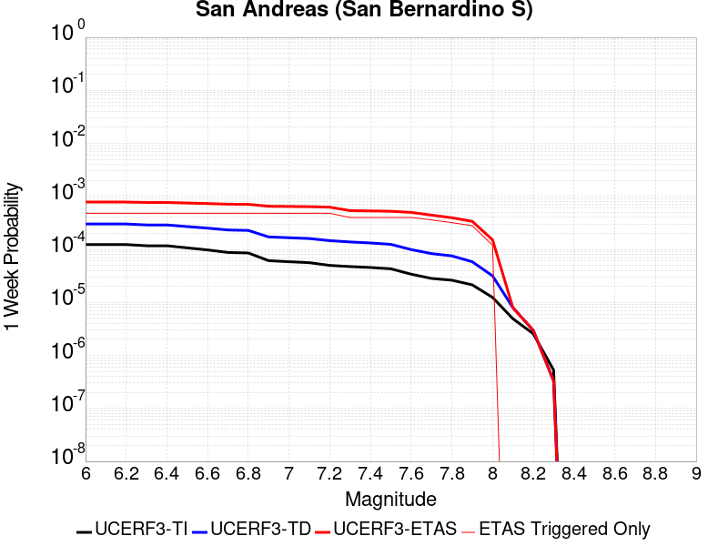 | 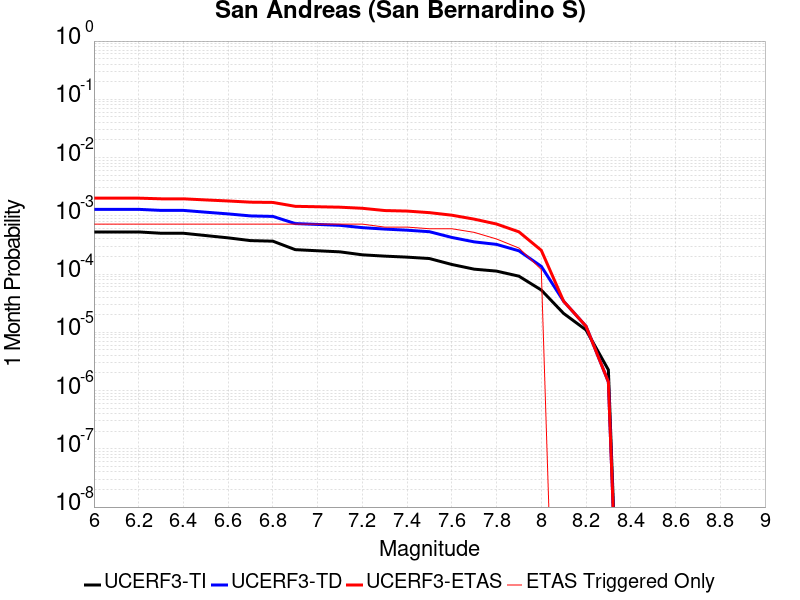 |  |

| Magnitude | 1 wk TI Prob | 1 wk TD Prob | 1 wk ETAS Prob | 1 wk ETAS/TD Gain | 1 wk ETAS Triggered Only | 1 mo TI Prob | 1 mo TD Prob | 1 mo ETAS Prob | 1 mo ETAS/TD Gain | 1 mo ETAS Triggered Only | 1 yr TI Prob | 1 yr TD Prob | 1 yr ETAS Prob | 1 yr ETAS/TD Gain | 1 yr ETAS Triggered Only |
|-----|-----|-----|-----|-----|-----|-----|-----|-----|-----|-----|-----|-----|-----|-----|-----|
| 6.0 | 1.2336002E-4 | 3.0132735E-4 | 7.811827E-4 | 2.592472 | 4.8E-4 | 5.2857865E-4 | 0.0012907899 | 0.0020098605 | 1.557078 | 7.2E-4 | 0.006416472 | 0.015607107 | 0.016827755 | 1.078211 | 0.00124 |
| 6.1 | 1.2336002E-4 | 3.0132735E-4 | 7.811827E-4 | 2.592472 | 4.8E-4 | 5.2857865E-4 | 0.0012907899 | 0.0020098605 | 1.557078 | 7.2E-4 | 0.006416472 | 0.015607107 | 0.016827755 | 1.078211 | 0.00124 |
| 6.2 | 1.2336002E-4 | 3.0132735E-4 | 7.811827E-4 | 2.592472 | 4.8E-4 | 5.2857865E-4 | 0.0012907899 | 0.0020098605 | 1.557078 | 7.2E-4 | 0.006416472 | 0.015607107 | 0.016827755 | 1.078211 | 0.00124 |
| 6.3 | 1.1712257E-4 | 2.891963E-4 | 7.690575E-4 | 2.6592922 | 4.8E-4 | 5.018573E-4 | 0.0012388497 | 0.0019579579 | 1.5804642 | 7.2E-4 | 0.006093008 | 0.014983551 | 0.016165571 | 1.0788878 | 0.0012 |
| 6.4 | 1.1712257E-4 | 2.891963E-4 | 7.690575E-4 | 2.6592922 | 4.8E-4 | 5.018573E-4 | 0.0012388497 | 0.0019579579 | 1.5804642 | 7.2E-4 | 0.006093008 | 0.014983551 | 0.016165571 | 1.0788878 | 0.0012 |
| 6.5 | 1.0689076E-4 | 2.6930252E-4 | 7.491733E-4 | 2.781902 | 4.8E-4 | 4.5802278E-4 | 0.001153668 | 0.0018728374 | 1.6233764 | 7.2E-4 | 0.0055621783 | 0.013960089 | 0.015103894 | 1.081934 | 0.00116 |
| 6.6 | 9.7648895E-5 | 2.517273E-4 | 7.3160644E-4 | 2.9063454 | 4.8E-4 | 4.1842813E-4 | 0.0010784089 | 0.0017976324 | 1.6669302 | 7.2E-4 | 0.005082469 | 0.0130549725 | 0.014160351 | 1.084671 | 0.00112 |
| 6.7 | 8.757013E-5 | 2.3241482E-4 | 7.1230327E-4 | 3.0647926 | 4.8E-4 | 3.7524657E-4 | 9.957057E-4 | 0.0017149887 | 1.7223853 | 7.2E-4 | 0.00455906 | 0.012059439 | 0.013126414 | 1.0884764 | 0.00108 |
| 6.8 | 8.562978E-5 | 2.2800392E-4 | 7.078945E-4 | 3.104747 | 4.8E-4 | 3.6693315E-4 | 9.76816E-4 | 0.0016961128 | 1.7363687 | 7.2E-4 | 0.004458263 | 0.011831971 | 0.012899192 | 1.0901982 | 0.00108 |
| 6.9 | 6.124075E-5 | 1.7172846E-4 | 6.5164606E-4 | 3.7946303 | 4.8E-4 | 2.6243398E-4 | 7.3577237E-4 | 0.0014552426 | 1.9778435 | 7.2E-4 | 0.0031904527 | 0.008921444 | 0.009991809 | 1.1199766 | 0.00108 |
| 7.0 | 5.8598747E-5 | 1.660076E-4 | 6.459279E-4 | 3.890954 | 4.8E-4 | 2.5111332E-4 | 7.1126793E-4 | 0.0014307558 | 2.0115569 | 7.2E-4 | 0.0030530186 | 0.008625501 | 0.009696185 | 1.1241301 | 0.00108 |
| 7.1 | 5.613814E-5 | 1.6018077E-4 | 6.401039E-4 | 3.9961343 | 4.8E-4 | 2.4056983E-4 | 6.863092E-4 | 0.001405815 | 2.04837 | 7.2E-4 | 0.0029250039 | 0.008323984 | 0.009394995 | 1.1286656 | 0.00108 |
| 7.2 | 4.991222E-5 | 1.4621996E-4 | 6.2614976E-4 | 4.2822456 | 4.8E-4 | 2.1389198E-4 | 6.2650687E-4 | 0.0013460558 | 2.1485093 | 7.2E-4 | 0.002601025 | 0.0076011484 | 0.00867294 | 1.1410038 | 0.00108 |
| 7.3 | 4.7410045E-5 | 1.3813804E-4 | 5.380828E-4 | 3.8952544 | 4.0E-4 | 2.0317009E-4 | 5.918862E-4 | 0.0012315074 | 2.080649 | 6.4E-4 | 0.0024707897 | 0.0071824905 | 0.008175308 | 1.1382275 | 0.001 |
| 7.4 | 4.5556746E-5 | 1.3220012E-4 | 5.3214724E-4 | 4.0253158 | 4.0E-4 | 1.952286E-4 | 5.6644925E-4 | 0.0012060867 | 2.1292052 | 6.4E-4 | 0.002374317 | 0.0068747913 | 0.007828192 | 1.1386806 | 9.6E-4 |
| 7.5 | 4.3084514E-5 | 1.2453202E-4 | 5.244822E-4 | 4.211625 | 4.0E-4 | 1.8463485E-4 | 5.335998E-4 | 0.0011332796 | 2.1238382 | 6.0E-4 | 0.0022456115 | 0.006477298 | 0.0073118573 | 1.1288437 | 8.4E-4 |
| 7.6 | 3.408608E-5 | 9.923654E-5 | 4.991968E-4 | 5.0303736 | 4.0E-4 | 1.4607502E-4 | 4.2523025E-4 | 0.0010249751 | 2.4104004 | 6.0E-4 | 0.0017770125 | 0.0051649143 | 0.006000576 | 1.1617959 | 8.4E-4 |
| 7.7 | 2.8315713E-5 | 8.3315266E-5 | 4.4328527E-4 | 5.3205767 | 3.6E-4 | 1.2134742E-4 | 3.570166E-4 | 8.7683095E-4 | 2.4559948 | 5.2E-4 | 0.0014764034 | 0.0043380233 | 0.005094726 | 1.174435 | 7.6E-4 |
| 7.8 | 2.6222975E-5 | 7.540562E-5 | 3.9538147E-4 | 5.243396 | 3.2E-4 | 1.1237934E-4 | 3.2312694E-4 | 7.2299765E-4 | 2.2375038 | 4.0E-4 | 0.0013673597 | 0.00392698 | 0.004564467 | 1.1623352 | 6.4E-4 |
| 7.9 | 2.1469694E-5 | 5.85263E-5 | 3.385099E-4 | 5.7838936 | 2.8E-4 | 9.200973E-5 | 2.508029E-4 | 5.307327E-4 | 2.1161344 | 2.8E-4 | 0.0011196428 | 0.003049253 | 0.0035277894 | 1.1569356 | 4.8E-4 |
| 8.0 | 1.2420249E-5 | 3.168168E-5 | 1.5167787E-4 | 4.787558 | 1.2E-4 | 5.322855E-5 | 1.3577157E-4 | 2.5575527E-4 | 1.8837174 | 1.2E-4 | 6.478649E-4 | 0.0016517665 | 0.0018514361 | 1.1208825 | 2.0E-4 |
| 8.1 | 4.9197724E-6 | 7.958367E-6 | 7.958367E-6 | 1.0 | 0.0 | 2.1084568E-5 | 3.410684E-5 | 3.410684E-5 | 1.0 | 0.0 | 2.566744E-4 | 4.1517182E-4 | 4.1517182E-4 | 1.0 | 0.0 |
| 8.2 | 2.5634774E-6 | 2.9684513E-6 | 2.9684513E-6 | 1.0 | 0.0 | 1.0986286E-5 | 1.2721873E-5 | 1.2721873E-5 | 1.0 | 0.0 | 1.3374983E-4 | 1.5487784E-4 | 1.5487784E-4 | 1.0 | 0.0 |
| 8.3 | 5.2850464E-7 | 3.291787E-7 | 3.291787E-7 | 1.0 | 0.0 | 2.2650179E-6 | 1.4107652E-6 | 1.4107652E-6 | 1.0 | 0.0 | 2.7576245E-5 | 1.7175944E-5 | 1.7175944E-5 | 1.0 | 0.0 |

## San Andreas (Big Bend)
*[(top)](#table-of-contents)*

| 1 Week | 1 Month | 1 Year |
|-----|-----|-----|
| 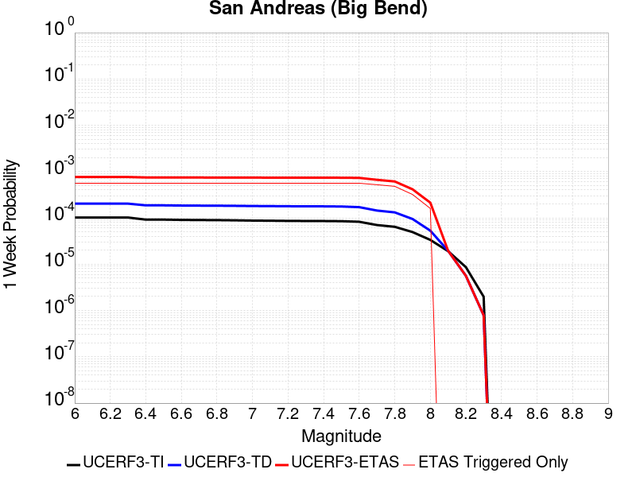 |  | 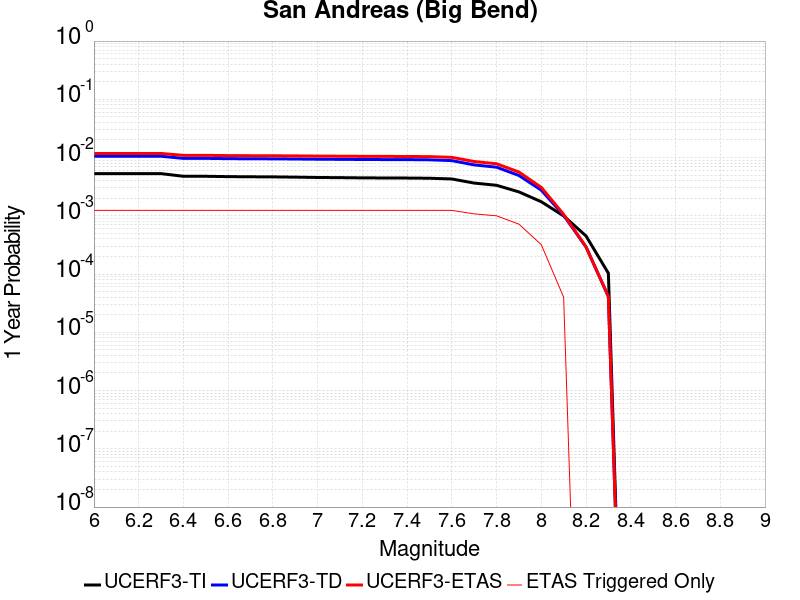 |

| Magnitude | 1 wk TI Prob | 1 wk TD Prob | 1 wk ETAS Prob | 1 wk ETAS/TD Gain | 1 wk ETAS Triggered Only | 1 mo TI Prob | 1 mo TD Prob | 1 mo ETAS Prob | 1 mo ETAS/TD Gain | 1 mo ETAS Triggered Only | 1 yr TI Prob | 1 yr TD Prob | 1 yr ETAS Prob | 1 yr ETAS/TD Gain | 1 yr ETAS Triggered Only |
|-----|-----|-----|-----|-----|-----|-----|-----|-----|-----|-----|-----|-----|-----|-----|-----|
| 6.0 | 1.0179969E-4 | 2.0293587E-4 | 7.628222E-4 | 3.7589324 | 5.6E-4 | 4.362114E-4 | 8.694363E-4 | 0.0015888104 | 1.8274027 | 7.2E-4 | 0.0052979486 | 0.0105343 | 0.011761237 | 1.1164707 | 0.00124 |
| 6.1 | 1.0179969E-4 | 2.0293587E-4 | 7.628222E-4 | 3.7589324 | 5.6E-4 | 4.362114E-4 | 8.694363E-4 | 0.0015888104 | 1.8274027 | 7.2E-4 | 0.0052979486 | 0.0105343 | 0.011761237 | 1.1164707 | 0.00124 |
| 6.2 | 1.0179969E-4 | 2.0293587E-4 | 7.628222E-4 | 3.7589324 | 5.6E-4 | 4.362114E-4 | 8.694363E-4 | 0.0015888104 | 1.8274027 | 7.2E-4 | 0.0052979486 | 0.0105343 | 0.011761237 | 1.1164707 | 0.00124 |
| 6.3 | 1.0179969E-4 | 2.0293587E-4 | 7.628222E-4 | 3.7589324 | 5.6E-4 | 4.362114E-4 | 8.694363E-4 | 0.0015888104 | 1.8274027 | 7.2E-4 | 0.0052979486 | 0.0105343 | 0.011761237 | 1.1164707 | 0.00124 |
| 6.4 | 9.1639464E-5 | 1.8646746E-4 | 7.46363E-4 | 4.002645 | 5.6E-4 | 3.9268145E-4 | 7.989017E-4 | 0.0015183266 | 1.9005172 | 7.2E-4 | 0.0047704205 | 0.0096833715 | 0.010911364 | 1.1268146 | 0.00124 |
| 6.5 | 9.1639464E-5 | 1.8646746E-4 | 7.46363E-4 | 4.002645 | 5.6E-4 | 3.9268145E-4 | 7.989017E-4 | 0.0015183266 | 1.9005172 | 7.2E-4 | 0.0047704205 | 0.0096833715 | 0.010911364 | 1.1268146 | 0.00124 |
| 6.6 | 9.042622E-5 | 1.8453281E-4 | 7.444295E-4 | 4.0341306 | 5.6E-4 | 3.8748336E-4 | 7.906154E-4 | 0.0015100462 | 1.909963 | 7.2E-4 | 0.0047074095 | 0.009583375 | 0.010811492 | 1.1281507 | 0.00124 |
| 6.7 | 8.9836685E-5 | 1.836743E-4 | 7.4357144E-4 | 4.048315 | 5.6E-4 | 3.8495753E-4 | 7.869383E-4 | 0.0015063717 | 1.9142183 | 7.2E-4 | 0.00467679 | 0.009538999 | 0.01076717 | 1.1287527 | 0.00124 |
| 6.8 | 8.9471854E-5 | 1.8314009E-4 | 7.4303756E-4 | 4.0572085 | 5.6E-4 | 3.8339442E-4 | 7.846502E-4 | 0.0015040853 | 1.9168863 | 7.2E-4 | 0.004657841 | 0.009511384 | 0.01073959 | 1.1291301 | 0.00124 |
| 6.9 | 8.858234E-5 | 1.8195626E-4 | 7.4185437E-4 | 4.0771027 | 5.6E-4 | 3.7958333E-4 | 7.795797E-4 | 0.0014990184 | 1.9228547 | 7.2E-4 | 0.004611638 | 0.009450188 | 0.010678469 | 1.1299744 | 0.00124 |
| 7.0 | 8.7433385E-5 | 1.803388E-4 | 7.402378E-4 | 4.1047063 | 5.6E-4 | 3.746607E-4 | 7.7265187E-4 | 0.0014920955 | 1.9311357 | 7.2E-4 | 0.004551957 | 0.009366569 | 0.010594955 | 1.1311457 | 0.00124 |
| 7.1 | 8.684964E-5 | 1.7945496E-4 | 7.3935447E-4 | 4.12 | 5.6E-4 | 3.7215967E-4 | 7.688662E-4 | 0.0014883126 | 1.9357238 | 7.2E-4 | 0.0045216335 | 0.009320875 | 0.010549316 | 1.1317947 | 0.00124 |
| 7.2 | 8.606521E-5 | 1.7835775E-4 | 7.382579E-4 | 4.139197 | 5.6E-4 | 3.6879873E-4 | 7.6416665E-4 | 0.0014836164 | 1.9414829 | 7.2E-4 | 0.0044808835 | 0.009264145 | 0.010492657 | 1.1326094 | 0.00124 |
| 7.3 | 8.568266E-5 | 1.7777378E-4 | 7.3767424E-4 | 4.149511 | 5.6E-4 | 3.6715972E-4 | 7.6166535E-4 | 0.001481117 | 1.9445771 | 7.2E-4 | 0.0044610105 | 0.009233951 | 0.0104625 | 1.1330471 | 0.00124 |
| 7.4 | 8.5432206E-5 | 1.7739709E-4 | 7.3729776E-4 | 4.1562 | 5.6E-4 | 3.6608664E-4 | 7.6005195E-4 | 0.0014795047 | 1.9465836 | 7.2E-4 | 0.004447999 | 0.009214474 | 0.010443048 | 1.133331 | 0.00124 |
| 7.5 | 8.4791965E-5 | 1.7608136E-4 | 7.359828E-4 | 4.179788 | 5.6E-4 | 3.633435E-4 | 7.5441634E-4 | 0.0014738732 | 1.9536601 | 7.2E-4 | 0.0044147377 | 0.009146439 | 0.010375097 | 1.134332 | 0.00124 |
| 7.6 | 8.241105E-5 | 1.7049891E-4 | 7.304034E-4 | 4.2839184 | 5.6E-4 | 3.531424E-4 | 7.3050515E-4 | 0.0014499791 | 1.9848994 | 7.2E-4 | 0.0042910352 | 0.008857722 | 0.010086739 | 1.1387508 | 0.00124 |
| 7.7 | 7.00432E-5 | 1.4393656E-4 | 6.638617E-4 | 4.6121826 | 5.2E-4 | 3.001506E-4 | 6.167252E-4 | 0.0012563305 | 2.0370994 | 6.4E-4 | 0.0036482112 | 0.0074828197 | 0.008554738 | 1.1432506 | 0.00108 |
| 7.8 | 6.415362E-5 | 1.3139434E-4 | 6.1133126E-4 | 4.6526456 | 4.8E-4 | 2.749151E-4 | 5.629971E-4 | 0.0011226818 | 1.9941165 | 5.6E-4 | 0.0033419547 | 0.0068329778 | 0.007826145 | 1.145349 | 0.001 |
| 7.9 | 4.939911E-5 | 9.463773E-5 | 4.1460744E-4 | 4.3809953 | 3.2E-4 | 2.116933E-4 | 4.0552724E-4 | 7.6538126E-4 | 1.8873732 | 3.6E-4 | 0.0025743195 | 0.0049261265 | 0.0056425794 | 1.1454395 | 7.2E-4 |
| 8.0 | 3.344983E-5 | 5.2957934E-5 | 2.1294945E-4 | 4.021106 | 1.6E-4 | 1.4334853E-4 | 2.2694284E-4 | 3.8690653E-4 | 1.7048633 | 1.6E-4 | 0.0017438711 | 0.00275953 | 0.003078647 | 1.1156418 | 3.2E-4 |
| 8.1 | 1.9104898E-5 | 1.9529352E-5 | 1.9529352E-5 | 1.0 | 0.0 | 8.1875565E-5 | 8.369455E-5 | 8.369455E-5 | 1.0 | 0.0 | 9.963791E-4 | 0.0010185054 | 0.0010584646 | 1.0392332 | 4.0E-5 |
| 8.2 | 8.643924E-6 | 5.607368E-6 | 5.607368E-6 | 1.0 | 0.0 | 3.704486E-5 | 2.4031357E-5 | 2.4031357E-5 | 1.0 | 0.0 | 4.5092785E-4 | 2.9254257E-4 | 2.9254257E-4 | 1.0 | 0.0 |
| 8.3 | 1.983087E-6 | 7.877893E-7 | 7.877893E-7 | 1.0 | 0.0 | 8.498917E-6 | 3.3762356E-6 | 3.3762356E-6 | 1.0 | 0.0 | 1.034694E-4 | 4.110491E-5 | 4.110491E-5 | 1.0 | 0.0 |

## Helendale-So Lockhart
*[(top)](#table-of-contents)*

| 1 Week | 1 Month | 1 Year |
|-----|-----|-----|
| 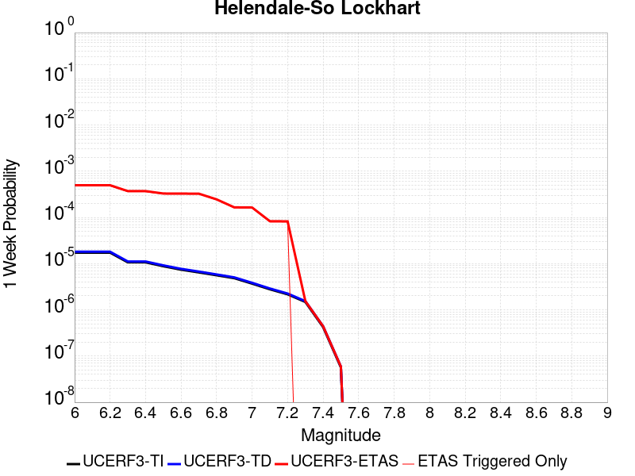 | 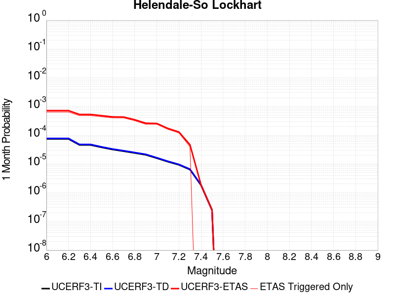 | 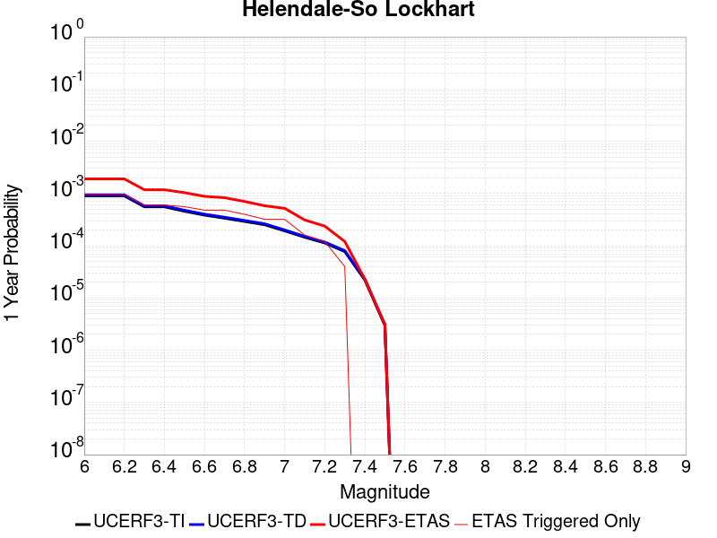 |

| Magnitude | 1 wk TI Prob | 1 wk TD Prob | 1 wk ETAS Prob | 1 wk ETAS/TD Gain | 1 wk ETAS Triggered Only | 1 mo TI Prob | 1 mo TD Prob | 1 mo ETAS Prob | 1 mo ETAS/TD Gain | 1 mo ETAS Triggered Only | 1 yr TI Prob | 1 yr TD Prob | 1 yr ETAS Prob | 1 yr ETAS/TD Gain | 1 yr ETAS Triggered Only |
|-----|-----|-----|-----|-----|-----|-----|-----|-----|-----|-----|-----|-----|-----|-----|-----|
| 6.0 | 1.7296055E-5 | 1.81066E-5 | 4.980979E-4 | 27.50919 | 4.8E-4 | 7.412385E-5 | 7.759753E-5 | 7.1754784E-4 | 9.2470455 | 6.4E-4 | 9.0208417E-4 | 9.4436115E-4 | 0.0019034545 | 2.0156002 | 9.6E-4 |
| 6.1 | 1.7296055E-5 | 1.81066E-5 | 4.980979E-4 | 27.50919 | 4.8E-4 | 7.412385E-5 | 7.759753E-5 | 7.1754784E-4 | 9.2470455 | 6.4E-4 | 9.0208417E-4 | 9.4436115E-4 | 0.0019034545 | 2.0156002 | 9.6E-4 |
| 6.2 | 1.7296055E-5 | 1.81066E-5 | 4.980979E-4 | 27.50919 | 4.8E-4 | 7.412385E-5 | 7.759753E-5 | 7.1754784E-4 | 9.2470455 | 6.4E-4 | 9.0208417E-4 | 9.4436115E-4 | 0.0019034545 | 2.0156002 | 9.6E-4 |
| 6.3 | 1.0669118E-5 | 1.1137076E-5 | 3.7113306E-4 | 33.3241 | 3.6E-4 | 4.5723988E-5 | 4.772947E-5 | 5.277066E-4 | 11.0562 | 4.8E-4 | 5.5654737E-4 | 5.8095413E-4 | 0.0011806056 | 2.0321836 | 6.0E-4 |
| 6.4 | 1.0669118E-5 | 1.1137076E-5 | 3.7113306E-4 | 33.3241 | 3.6E-4 | 4.5723988E-5 | 4.772947E-5 | 5.277066E-4 | 11.0562 | 4.8E-4 | 5.5654737E-4 | 5.8095413E-4 | 0.0011806056 | 2.0321836 | 6.0E-4 |
| 6.5 | 8.790038E-6 | 9.171543E-6 | 3.291686E-4 | 35.89021 | 3.2E-4 | 3.767105E-5 | 3.930603E-5 | 4.7928875E-4 | 12.193771 | 4.4E-4 | 4.585485E-4 | 4.784474E-4 | 0.0010381795 | 2.1698925 | 5.6E-4 |
| 6.6 | 7.396949E-6 | 7.716665E-6 | 3.277142E-4 | 42.468372 | 3.2E-4 | 3.1700827E-5 | 3.3071006E-5 | 4.3305778E-4 | 13.094787 | 4.0E-4 | 3.858892E-4 | 4.0256613E-4 | 8.823729E-4 | 2.1918707 | 4.8E-4 |
| 6.7 | 6.4600285E-6 | 6.739015E-6 | 3.2673686E-4 | 48.484364 | 3.2E-4 | 2.7685543E-5 | 2.8881179E-5 | 4.2886962E-4 | 14.84945 | 4.0E-4 | 3.3701936E-4 | 3.515724E-4 | 8.3140365E-4 | 2.364815 | 4.8E-4 |
| 6.8 | 5.600104E-6 | 5.8368437E-6 | 2.4583543E-4 | 42.117874 | 2.4E-4 | 2.4000226E-5 | 2.5014808E-5 | 3.450068E-4 | 13.792104 | 3.2E-4 | 2.9216358E-4 | 3.0451332E-4 | 7.043915E-4 | 2.3131714 | 4.0E-4 |
| 6.9 | 4.839122E-6 | 5.0402173E-6 | 1.6503941E-4 | 32.744503 | 1.6E-4 | 2.0738931E-5 | 2.1600754E-5 | 2.6159556E-4 | 12.110483 | 2.4E-4 | 2.5246723E-4 | 2.629579E-4 | 5.8287376E-4 | 2.2166047 | 3.2E-4 |
| 7.0 | 3.6937633E-6 | 3.8457424E-6 | 1.6384512E-4 | 42.60429 | 1.6E-4 | 1.5830317E-5 | 1.6481652E-5 | 2.564777E-4 | 15.561407 | 2.4E-4 | 1.9271708E-4 | 2.0064594E-4 | 5.205817E-4 | 2.5945292 | 3.2E-4 |
| 7.1 | 2.7858857E-6 | 2.8982486E-6 | 8.289802E-5 | 28.602797 | 8.0E-5 | 1.1939455E-5 | 1.2421007E-5 | 1.7241902E-4 | 13.881243 | 1.6E-4 | 1.4535317E-4 | 1.5121548E-4 | 3.1119128E-4 | 2.0579326 | 1.6E-4 |
| 7.2 | 2.1672065E-6 | 2.2543188E-6 | 8.225414E-5 | 36.48736 | 8.0E-5 | 9.2879945E-6 | 9.661331E-6 | 1.2966017E-4 | 13.420528 | 1.2E-4 | 1.1307546E-4 | 1.1762055E-4 | 2.3760644E-4 | 2.02011 | 1.2E-4 |
| 7.3 | 1.4823496E-6 | 1.5424213E-6 | 1.5424213E-6 | 1.0 | 0.0 | 6.3529114E-6 | 6.610361E-6 | 4.6610097E-5 | 7.0510664 | 4.0E-5 | 7.734395E-5 | 8.047833E-5 | 1.2047511E-4 | 1.4969882 | 4.0E-5 |
| 7.4 | 4.2321457E-7 | 4.411508E-7 | 4.411508E-7 | 1.0 | 0.0 | 1.8137755E-6 | 1.8906451E-6 | 1.8906451E-6 | 1.0 | 0.0 | 2.2082493E-5 | 2.3018407E-5 | 2.3018407E-5 | 1.0 | 0.0 |
| 7.5 | 5.6942316E-8 | 5.9424394E-8 | 5.9424394E-8 | 1.0 | 0.0 | 2.440385E-7 | 2.5467594E-7 | 2.5467594E-7 | 1.0 | 0.0 | 2.9711643E-6 | 3.1006762E-6 | 3.1006762E-6 | 1.0 | 0.0 |

## San Andreas (Carrizo) rev
*[(top)](#table-of-contents)*

| 1 Week | 1 Month | 1 Year |
|-----|-----|-----|
| 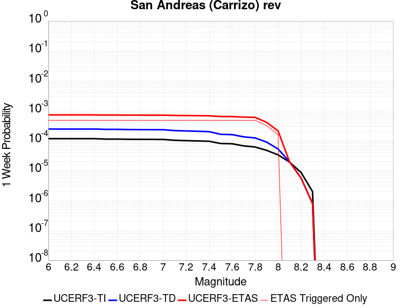 |  |  |

| Magnitude | 1 wk TI Prob | 1 wk TD Prob | 1 wk ETAS Prob | 1 wk ETAS/TD Gain | 1 wk ETAS Triggered Only | 1 mo TI Prob | 1 mo TD Prob | 1 mo ETAS Prob | 1 mo ETAS/TD Gain | 1 mo ETAS Triggered Only | 1 yr TI Prob | 1 yr TD Prob | 1 yr ETAS Prob | 1 yr ETAS/TD Gain | 1 yr ETAS Triggered Only |
|-----|-----|-----|-----|-----|-----|-----|-----|-----|-----|-----|-----|-----|-----|-----|-----|
| 6.0 | 1.1674632E-4 | 2.457212E-4 | 7.2560325E-4 | 2.9529536 | 4.8E-4 | 5.002454E-4 | 0.0010526674 | 0.0015321622 | 1.4555044 | 4.8E-4 | 0.006073493 | 0.0127414055 | 0.013689174 | 1.0743849 | 9.6E-4 |
| 6.1 | 1.1674632E-4 | 2.457212E-4 | 7.2560325E-4 | 2.9529536 | 4.8E-4 | 5.002454E-4 | 0.0010526674 | 0.0015321622 | 1.4555044 | 4.8E-4 | 0.006073493 | 0.0127414055 | 0.013689174 | 1.0743849 | 9.6E-4 |
| 6.2 | 1.1674632E-4 | 2.457212E-4 | 7.2560325E-4 | 2.9529536 | 4.8E-4 | 5.002454E-4 | 0.0010526674 | 0.0015321622 | 1.4555044 | 4.8E-4 | 0.006073493 | 0.0127414055 | 0.013689174 | 1.0743849 | 9.6E-4 |
| 6.3 | 1.1674632E-4 | 2.457212E-4 | 7.2560325E-4 | 2.9529536 | 4.8E-4 | 5.002454E-4 | 0.0010526674 | 0.0015321622 | 1.4555044 | 4.8E-4 | 0.006073493 | 0.0127414055 | 0.013689174 | 1.0743849 | 9.6E-4 |
| 6.4 | 1.1674632E-4 | 2.457212E-4 | 7.2560325E-4 | 2.9529536 | 4.8E-4 | 5.002454E-4 | 0.0010526674 | 0.0015321622 | 1.4555044 | 4.8E-4 | 0.006073493 | 0.0127414055 | 0.013689174 | 1.0743849 | 9.6E-4 |
| 6.5 | 1.13136164E-4 | 2.3891036E-4 | 7.187957E-4 | 3.0086417 | 4.8E-4 | 4.847792E-4 | 0.0010235013 | 0.00150301 | 1.4684983 | 4.8E-4 | 0.0058862255 | 0.012390388 | 0.013338493 | 1.0765194 | 9.6E-4 |
| 6.6 | 1.13136164E-4 | 2.3891036E-4 | 7.187957E-4 | 3.0086417 | 4.8E-4 | 4.847792E-4 | 0.0010235013 | 0.00150301 | 1.4684983 | 4.8E-4 | 0.0058862255 | 0.012390388 | 0.013338493 | 1.0765194 | 9.6E-4 |
| 6.7 | 1.1149675E-4 | 2.3581758E-4 | 7.157044E-4 | 3.0349915 | 4.8E-4 | 4.777557E-4 | 0.0010102568 | 0.001489772 | 1.4746467 | 4.8E-4 | 0.0058011734 | 0.012230956 | 0.013179214 | 1.0775293 | 9.6E-4 |
| 6.8 | 1.1103589E-4 | 2.3483614E-4 | 7.147234E-4 | 3.0434985 | 4.8E-4 | 4.7578133E-4 | 0.0010060539 | 0.001485571 | 1.4766316 | 4.8E-4 | 0.005777263 | 0.012180358 | 0.013128665 | 1.0778555 | 9.6E-4 |
| 6.9 | 1.1053259E-4 | 2.3375664E-4 | 7.1364443E-4 | 3.0529375 | 4.8E-4 | 4.7362508E-4 | 0.001001431 | 0.0014809504 | 1.478834 | 4.8E-4 | 0.0057511497 | 0.012124702 | 0.0130730625 | 1.0782171 | 9.6E-4 |
| 7.0 | 1.1005377E-4 | 2.3276206E-4 | 7.1265036E-4 | 3.0617118 | 4.8E-4 | 4.7157376E-4 | 9.971719E-4 | 0.0014766932 | 1.4808813 | 4.8E-4 | 0.0057263062 | 0.012073423 | 0.013021832 | 1.0785534 | 9.6E-4 |
| 7.1 | 1.0308142E-4 | 2.1781186E-4 | 6.977073E-4 | 3.2032566 | 4.8E-4 | 4.417027E-4 | 9.331465E-4 | 0.0014126986 | 1.5139086 | 4.8E-4 | 0.0053644776 | 0.011302199 | 0.012251349 | 1.0839792 | 9.6E-4 |
| 7.2 | 1.0027479E-4 | 2.1187181E-4 | 6.917701E-4 | 3.2650409 | 4.8E-4 | 4.296783E-4 | 9.077071E-4 | 0.0013872714 | 1.528325 | 4.8E-4 | 0.0052187922 | 0.01099564 | 0.011945085 | 1.0863473 | 9.6E-4 |
| 7.3 | 9.816942E-5 | 2.0659102E-4 | 6.8649184E-4 | 3.322951 | 4.8E-4 | 4.2065824E-4 | 8.850907E-4 | 0.0013646658 | 1.5418373 | 4.8E-4 | 0.005109493 | 0.010723028 | 0.011672734 | 1.0885669 | 9.6E-4 |
| 7.4 | 9.5634205E-5 | 2.0024394E-4 | 6.8014784E-4 | 3.3965964 | 4.8E-4 | 4.0979648E-4 | 8.57907E-4 | 0.0013374952 | 1.5590212 | 4.8E-4 | 0.0049778637 | 0.010395263 | 0.011345284 | 1.0913898 | 9.6E-4 |
| 7.5 | 8.052417E-5 | 1.6317047E-4 | 6.4309215E-4 | 3.9412289 | 4.8E-4 | 3.4505792E-4 | 6.9911475E-4 | 0.0011787792 | 1.6861026 | 4.8E-4 | 0.0041929903 | 0.008478587 | 0.009430448 | 1.1122664 | 9.6E-4 |
| 7.6 | 7.897024E-5 | 1.5967674E-4 | 6.396001E-4 | 4.0055933 | 4.8E-4 | 3.384E-4 | 6.8414956E-4 | 0.0011638212 | 1.701121 | 4.8E-4 | 0.0041122385 | 0.008297788 | 0.009249822 | 1.1147335 | 9.6E-4 |
| 7.7 | 6.707427E-5 | 1.3457966E-4 | 6.1451504E-4 | 4.5661807 | 4.8E-4 | 2.8742946E-4 | 5.766425E-4 | 0.0010563658 | 1.8319248 | 4.8E-4 | 0.003493839 | 0.006998057 | 0.007911619 | 1.130545 | 9.2E-4 |
| 7.8 | 6.147705E-5 | 1.2361974E-4 | 6.035604E-4 | 4.882395 | 4.8E-4 | 2.6344648E-4 | 5.2969134E-4 | 0.0010094371 | 1.9057081 | 4.8E-4 | 0.0032027436 | 0.0064299493 | 0.0073440336 | 1.1421604 | 9.2E-4 |
| 7.9 | 4.7636717E-5 | 8.998664E-5 | 4.0995784E-4 | 4.5557632 | 3.2E-4 | 2.0414138E-4 | 3.8560005E-4 | 7.054767E-4 | 1.8295554 | 3.2E-4 | 0.0024825884 | 0.004684583 | 0.0053613973 | 1.144477 | 6.8E-4 |
| 8.0 | 3.3554235E-5 | 5.2868458E-5 | 2.1286E-4 | 4.0262194 | 1.6E-4 | 1.4379594E-4 | 2.2655944E-4 | 3.8652317E-4 | 1.7060565 | 1.6E-4 | 0.0017493097 | 0.0027548738 | 0.0030739922 | 1.1158378 | 3.2E-4 |
| 8.1 | 1.9175432E-5 | 1.954181E-5 | 1.954181E-5 | 1.0 | 0.0 | 8.217783E-5 | 8.374793E-5 | 8.374793E-5 | 1.0 | 0.0 | 0.0010000558 | 0.0010191548 | 0.001059114 | 1.0392082 | 4.0E-5 |
| 8.2 | 8.643924E-6 | 5.607368E-6 | 5.607368E-6 | 1.0 | 0.0 | 3.704486E-5 | 2.4031357E-5 | 2.4031357E-5 | 1.0 | 0.0 | 4.5092785E-4 | 2.9254257E-4 | 2.9254257E-4 | 1.0 | 0.0 |
| 8.3 | 1.983087E-6 | 7.877893E-7 | 7.877893E-7 | 1.0 | 0.0 | 8.498917E-6 | 3.3762356E-6 | 3.3762356E-6 | 1.0 | 0.0 | 1.034694E-4 | 4.110491E-5 | 4.110491E-5 | 1.0 | 0.0 |

## Gravel Hills-Harper Lk
*[(top)](#table-of-contents)*

| 1 Week | 1 Month | 1 Year |
|-----|-----|-----|
| 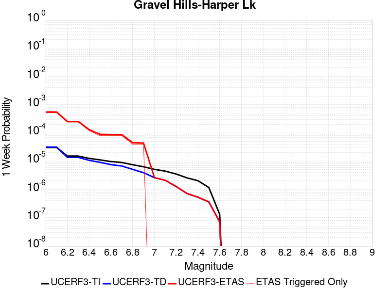 | 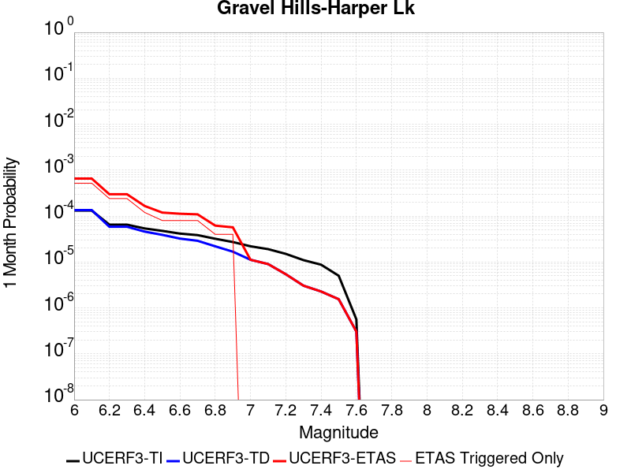 | 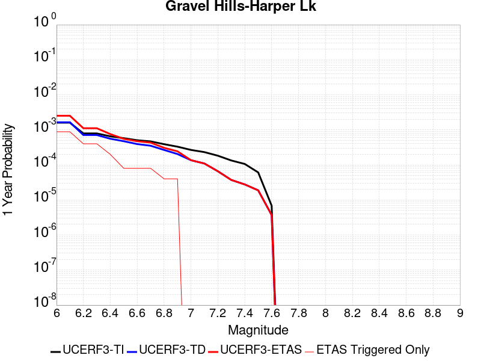 |

| Magnitude | 1 wk TI Prob | 1 wk TD Prob | 1 wk ETAS Prob | 1 wk ETAS/TD Gain | 1 wk ETAS Triggered Only | 1 mo TI Prob | 1 mo TD Prob | 1 mo ETAS Prob | 1 mo ETAS/TD Gain | 1 mo ETAS Triggered Only | 1 yr TI Prob | 1 yr TD Prob | 1 yr ETAS Prob | 1 yr ETAS/TD Gain | 1 yr ETAS Triggered Only |
|-----|-----|-----|-----|-----|-----|-----|-----|-----|-----|-----|-----|-----|-----|-----|-----|
| 6.0 | 3.0679566E-5 | 3.14785E-5 | 5.514621E-4 | 17.518692 | 5.2E-4 | 1.3147724E-4 | 1.349021E-4 | 6.5483194E-4 | 4.854127 | 5.2E-4 | 0.0015995599 | 0.001641413 | 0.0025199684 | 1.5352435 | 8.8E-4 |
| 6.1 | 3.0679566E-5 | 3.14785E-5 | 5.514621E-4 | 17.518692 | 5.2E-4 | 1.3147724E-4 | 1.349021E-4 | 6.5483194E-4 | 4.854127 | 5.2E-4 | 0.0015995599 | 0.001641413 | 0.0025199684 | 1.5352435 | 8.8E-4 |
| 6.2 | 1.514536E-5 | 1.3640053E-5 | 2.5363677E-4 | 18.595 | 2.4E-4 | 6.490707E-5 | 5.8456128E-5 | 2.984421E-4 | 5.1054034 | 2.4E-4 | 7.8995706E-4 | 7.1148283E-4 | 0.0011111982 | 1.5618061 | 4.0E-4 |
| 6.3 | 1.514536E-5 | 1.3640053E-5 | 2.5363677E-4 | 18.595 | 2.4E-4 | 6.490707E-5 | 5.8456128E-5 | 2.984421E-4 | 5.1054034 | 2.4E-4 | 7.8995706E-4 | 7.1148283E-4 | 0.0011111982 | 1.5618061 | 4.0E-4 |
| 6.4 | 1.2532521E-5 | 1.06932575E-5 | 1.3069197E-4 | 12.221905 | 1.2E-4 | 5.37097E-5 | 4.5827474E-5 | 1.6582197E-4 | 3.6183965 | 1.2E-4 | 6.537194E-4 | 5.5781245E-4 | 7.5770094E-4 | 1.3583435 | 2.0E-4 |
| 6.5 | 1.1094058E-5 | 9.086593E-6 | 8.9085865E-5 | 9.8041 | 8.0E-5 | 4.7545094E-5 | 3.8941984E-5 | 1.18938864E-4 | 3.054258 | 8.0E-5 | 5.787078E-4 | 4.7401953E-4 | 5.5398163E-4 | 1.1686894 | 8.0E-5 |
| 6.6 | 9.688328E-6 | 7.534075E-6 | 8.753347E-5 | 11.618343 | 8.0E-5 | 4.1520743E-5 | 3.228851E-5 | 1.12285925E-4 | 3.4775817 | 8.0E-5 | 5.053978E-4 | 3.9304423E-4 | 4.730128E-4 | 1.2034594 | 8.0E-5 |
| 6.7 | 8.974824E-6 | 6.7515366E-6 | 8.6750995E-5 | 12.849074 | 8.0E-5 | 3.8462964E-5 | 2.8934848E-5 | 1.0893253E-4 | 3.7647521 | 8.0E-5 | 4.6818596E-4 | 3.5222704E-4 | 4.3219887E-4 | 1.2270463 | 8.0E-5 |
| 6.8 | 7.4780046E-6 | 5.1178117E-6 | 4.5117606E-5 | 8.815801 | 4.0E-5 | 3.20482E-5 | 2.1933301E-5 | 6.193243E-5 | 2.8236709 | 4.0E-5 | 3.9011694E-4 | 2.670066E-4 | 3.0699593E-4 | 1.1497691 | 4.0E-5 |
| 6.9 | 6.3409307E-6 | 3.908781E-6 | 4.3908625E-5 | 11.233331 | 4.0E-5 | 2.7175134E-5 | 1.6751816E-5 | 5.6751145E-5 | 3.3877609 | 4.0E-5 | 3.3080703E-4 | 2.0393525E-4 | 2.4392709E-4 | 1.1961007 | 4.0E-5 |
| 7.0 | 5.1239335E-6 | 2.6067862E-6 | 2.6067862E-6 | 1.0 | 0.0 | 2.195953E-5 | 1.1171895E-5 | 1.1171895E-5 | 1.0 | 0.0 | 2.6732447E-4 | 1.3600958E-4 | 1.3600958E-4 | 1.0 | 0.0 |
| 7.1 | 4.438899E-6 | 2.099272E-6 | 2.099272E-6 | 1.0 | 0.0 | 1.9023713E-5 | 8.99685E-6 | 8.99685E-6 | 1.0 | 0.0 | 2.315891E-4 | 1.09531364E-4 | 1.09531364E-4 | 1.0 | 0.0 |
| 7.2 | 3.50367E-6 | 1.2621932E-6 | 1.2621932E-6 | 1.0 | 0.0 | 1.5015643E-5 | 5.409389E-6 | 5.409389E-6 | 1.0 | 0.0 | 1.8280011E-4 | 6.5857406E-5 | 6.5857406E-5 | 1.0 | 0.0 |
| 7.3 | 2.561638E-6 | 7.12401E-7 | 7.12401E-7 | 1.0 | 0.0 | 1.0978401E-5 | 3.0531437E-6 | 3.0531437E-6 | 1.0 | 0.0 | 1.3365384E-4 | 3.717141E-5 | 3.717141E-5 | 1.0 | 0.0 |
| 7.4 | 2.0368864E-6 | 5.3089406E-7 | 5.3089406E-7 | 1.0 | 0.0 | 8.729483E-6 | 2.275258E-6 | 2.275258E-6 | 1.0 | 0.0 | 1.06276275E-4 | 2.7700922E-5 | 2.7700922E-5 | 1.0 | 0.0 |
| 7.5 | 1.1681728E-6 | 3.605487E-7 | 3.605487E-7 | 1.0 | 0.0 | 5.0064455E-6 | 1.5452079E-6 | 1.5452079E-6 | 1.0 | 0.0 | 6.0951766E-5 | 1.8812749E-5 | 1.8812749E-5 | 1.0 | 0.0 |
| 7.6 | 1.3154387E-7 | 7.121983E-8 | 7.121983E-8 | 1.0 | 0.0 | 5.6375933E-7 | 3.0522784E-7 | 3.0522784E-7 | 1.0 | 0.0 | 6.863748E-6 | 3.7161442E-6 | 3.7161442E-6 | 1.0 | 0.0 |

## San Andreas (San Gorgonio Pass-Garnet HIll)
*[(top)](#table-of-contents)*

| 1 Week | 1 Month | 1 Year |
|-----|-----|-----|
| 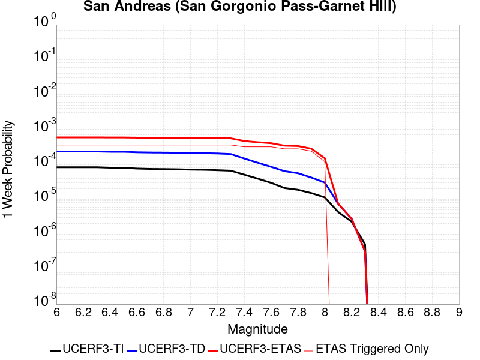 | 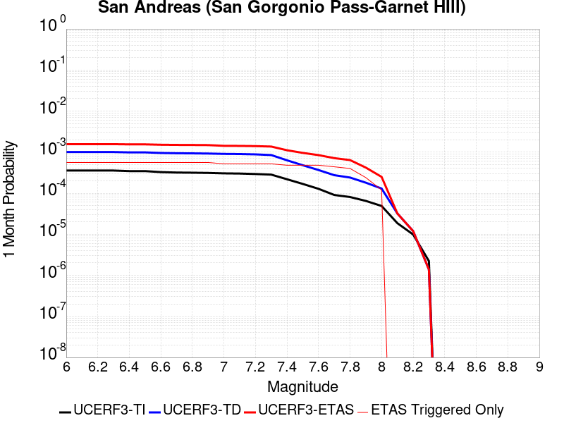 | 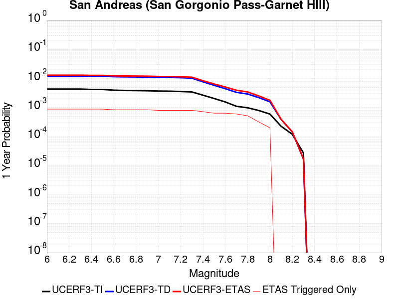 |

| Magnitude | 1 wk TI Prob | 1 wk TD Prob | 1 wk ETAS Prob | 1 wk ETAS/TD Gain | 1 wk ETAS Triggered Only | 1 mo TI Prob | 1 mo TD Prob | 1 mo ETAS Prob | 1 mo ETAS/TD Gain | 1 mo ETAS Triggered Only | 1 yr TI Prob | 1 yr TD Prob | 1 yr ETAS Prob | 1 yr ETAS/TD Gain | 1 yr ETAS Triggered Only |
|-----|-----|-----|-----|-----|-----|-----|-----|-----|-----|-----|-----|-----|-----|-----|-----|
| 6.0 | 8.31567E-5 | 2.3487274E-4 | 5.947882E-4 | 2.5323849 | 3.6E-4 | 3.5633717E-4 | 0.0010062061 | 0.0015656427 | 1.5559859 | 5.6E-4 | 0.004329778 | 0.01218165 | 0.01305093 | 1.0713598 | 8.8E-4 |
| 6.1 | 8.31567E-5 | 2.3487274E-4 | 5.947882E-4 | 2.5323849 | 3.6E-4 | 3.5633717E-4 | 0.0010062061 | 0.0015656427 | 1.5559859 | 5.6E-4 | 0.004329778 | 0.01218165 | 0.01305093 | 1.0713598 | 8.8E-4 |
| 6.2 | 8.31567E-5 | 2.3487274E-4 | 5.947882E-4 | 2.5323849 | 3.6E-4 | 3.5633717E-4 | 0.0010062061 | 0.0015656427 | 1.5559859 | 5.6E-4 | 0.004329778 | 0.01218165 | 0.01305093 | 1.0713598 | 8.8E-4 |
| 6.3 | 8.31567E-5 | 2.3487274E-4 | 5.947882E-4 | 2.5323849 | 3.6E-4 | 3.5633717E-4 | 0.0010062061 | 0.0015656427 | 1.5559859 | 5.6E-4 | 0.004329778 | 0.01218165 | 0.01305093 | 1.0713598 | 8.8E-4 |
| 6.4 | 8.059055E-5 | 2.3044254E-4 | 5.9035956E-4 | 2.5618515 | 3.6E-4 | 3.4534236E-4 | 9.872341E-4 | 0.0015466813 | 1.5666814 | 5.6E-4 | 0.0041964394 | 0.011953557 | 0.012823038 | 1.0727383 | 8.8E-4 |
| 6.5 | 8.059055E-5 | 2.3044254E-4 | 5.9035956E-4 | 2.5618515 | 3.6E-4 | 3.4534236E-4 | 9.872341E-4 | 0.0015466813 | 1.5666814 | 5.6E-4 | 0.0041964394 | 0.011953557 | 0.012823038 | 1.0727383 | 8.8E-4 |
| 6.6 | 7.619237E-5 | 2.2287853E-4 | 5.8279827E-4 | 2.6148696 | 3.6E-4 | 3.2649786E-4 | 9.548463E-4 | 0.0015143116 | 1.5859218 | 5.6E-4 | 0.0039678677 | 0.011563838 | 0.012394125 | 1.0718002 | 8.4E-4 |
| 6.7 | 7.440636E-5 | 2.1963443E-4 | 5.7955534E-4 | 2.6387274 | 3.6E-4 | 3.188454E-4 | 9.409531E-4 | 0.0015004261 | 1.5945812 | 5.6E-4 | 0.0038750346 | 0.011396466 | 0.012226893 | 1.072867 | 8.4E-4 |
| 6.8 | 7.3735864E-5 | 2.1810358E-4 | 5.7802506E-4 | 2.6502318 | 3.6E-4 | 3.1597257E-4 | 9.3439705E-4 | 0.0014938738 | 1.5987569 | 5.6E-4 | 0.0038401815 | 0.011317481 | 0.012147974 | 1.0733814 | 8.4E-4 |
| 6.9 | 7.27575E-5 | 2.1579085E-4 | 5.757132E-4 | 2.667922 | 3.6E-4 | 3.117806E-4 | 9.244924E-4 | 0.0014839746 | 1.6051779 | 5.6E-4 | 0.003789323 | 0.011198137 | 0.0120287305 | 1.0741725 | 8.4E-4 |
| 7.0 | 7.102591E-5 | 2.1162683E-4 | 5.715506E-4 | 2.7007475 | 3.6E-4 | 3.0436125E-4 | 9.066591E-4 | 0.0014261877 | 1.5730141 | 5.2E-4 | 0.003699303 | 0.010983224 | 0.0117744375 | 1.0720384 | 8.0E-4 |
| 7.1 | 7.028513E-5 | 2.0997925E-4 | 5.6990364E-4 | 2.714095 | 3.6E-4 | 3.0118722E-4 | 8.9960295E-4 | 0.0014191351 | 1.5775127 | 5.2E-4 | 0.0036607897 | 0.010898178 | 0.01168946 | 1.0726068 | 8.0E-4 |
| 7.2 | 6.8498244E-5 | 2.0605292E-4 | 5.6597876E-4 | 2.746764 | 3.6E-4 | 2.9353087E-4 | 8.827873E-4 | 0.0014023283 | 1.5885234 | 5.2E-4 | 0.003567883 | 0.010695473 | 0.011486917 | 1.073998 | 8.0E-4 |
| 7.3 | 6.622592E-5 | 1.9831101E-4 | 5.5823964E-4 | 2.8149703 | 3.6E-4 | 2.8379448E-4 | 8.496297E-4 | 0.0013691878 | 1.6115113 | 5.2E-4 | 0.0034497243 | 0.010295663 | 0.011087427 | 1.0769026 | 8.0E-4 |
| 7.4 | 5.1050705E-5 | 1.477468E-4 | 4.6769952E-4 | 3.1655474 | 3.2E-4 | 2.1877038E-4 | 6.3304784E-4 | 0.001112744 | 1.7577565 | 4.8E-4 | 0.002660276 | 0.007680315 | 0.008394785 | 1.0930262 | 7.2E-4 |
| 7.5 | 3.9302922E-5 | 1.1204231E-4 | 4.3200646E-4 | 3.855744 | 3.2E-4 | 1.6843023E-4 | 4.8009327E-4 | 9.5986284E-4 | 1.9993258 | 4.8E-4 | 0.0020487092 | 0.0058295405 | 0.0064658094 | 1.1091456 | 6.4E-4 |
| 7.6 | 2.9851626E-5 | 8.560878E-5 | 4.0558138E-4 | 4.737614 | 3.2E-4 | 1.2792926E-4 | 3.668433E-4 | 8.466672E-4 | 2.3079805 | 4.8E-4 | 0.0015564259 | 0.0044571967 | 0.005094344 | 1.142948 | 6.4E-4 |
| 7.7 | 2.1135214E-5 | 6.411543E-5 | 3.4409747E-4 | 5.366843 | 2.8E-4 | 9.0576345E-5 | 2.747515E-4 | 7.1463065E-4 | 2.601007 | 4.4E-4 | 0.0011022091 | 0.0033399744 | 0.0039379704 | 1.1790421 | 6.0E-4 |
| 7.8 | 1.883379E-5 | 5.6178174E-5 | 3.3616245E-4 | 5.983862 | 2.8E-4 | 8.0713755E-5 | 2.4074141E-4 | 6.406451E-4 | 2.6611338 | 4.0E-4 | 9.822468E-4 | 0.0029270905 | 0.0034455683 | 1.1771308 | 5.2E-4 |
| 7.9 | 1.5156185E-5 | 4.2101485E-5 | 2.8209138E-4 | 6.7002716 | 2.4E-4 | 6.495346E-5 | 1.8042246E-4 | 4.2037916E-4 | 2.3299713 | 2.4E-4 | 7.9052144E-4 | 0.0021944318 | 0.0025137297 | 1.1455036 | 3.2E-4 |
| 8.0 | 1.1405907E-5 | 3.0308918E-5 | 1.5030528E-4 | 4.9591107 | 1.2E-4 | 4.8881542E-5 | 1.298889E-4 | 2.4987332E-4 | 1.9237465 | 1.2E-4 | 5.9497025E-4 | 0.0015802513 | 0.0017799352 | 1.1263622 | 2.0E-4 |
| 8.1 | 4.3511436E-6 | 7.4929885E-6 | 7.4929885E-6 | 1.0 | 0.0 | 1.8647626E-5 | 3.2112413E-5 | 3.2112413E-5 | 1.0 | 0.0 | 2.2701119E-4 | 3.908986E-4 | 3.908986E-4 | 1.0 | 0.0 |
| 8.2 | 2.3042528E-6 | 2.7894796E-6 | 2.7894796E-6 | 1.0 | 0.0 | 9.875332E-6 | 1.1954859E-5 | 1.1954859E-5 | 1.0 | 0.0 | 1.2022553E-4 | 1.4554072E-4 | 1.4554072E-4 | 1.0 | 0.0 |
| 8.3 | 5.202968E-7 | 3.241516E-7 | 3.241516E-7 | 1.0 | 0.0 | 2.2298414E-6 | 1.3892205E-6 | 1.3892205E-6 | 1.0 | 0.0 | 2.714798E-5 | 1.6913642E-5 | 1.6913642E-5 | 1.0 | 0.0 |

## San Andreas (Cholame) rev
*[(top)](#table-of-contents)*

| 1 Week | 1 Month | 1 Year |
|-----|-----|-----|
| 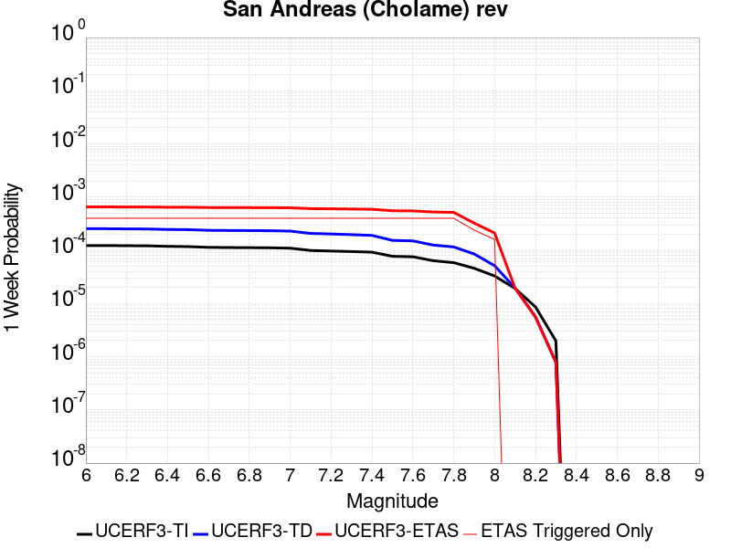 | 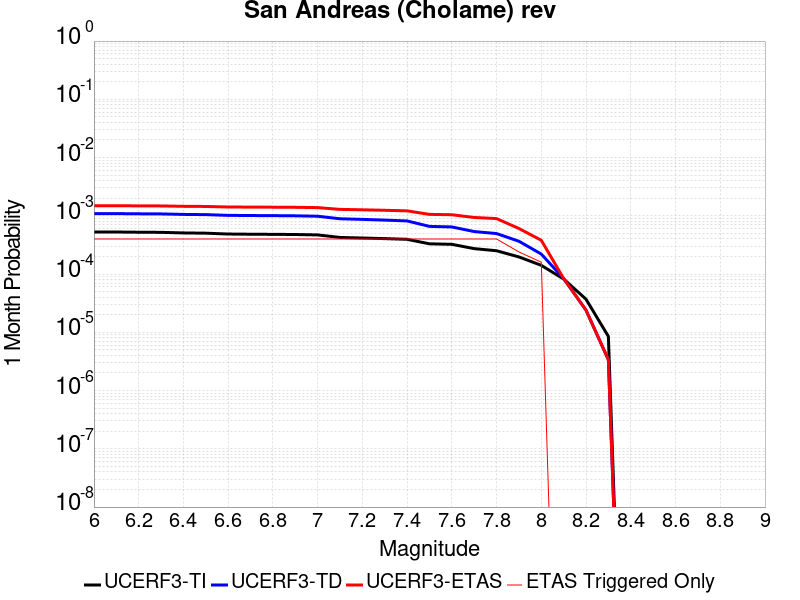 | 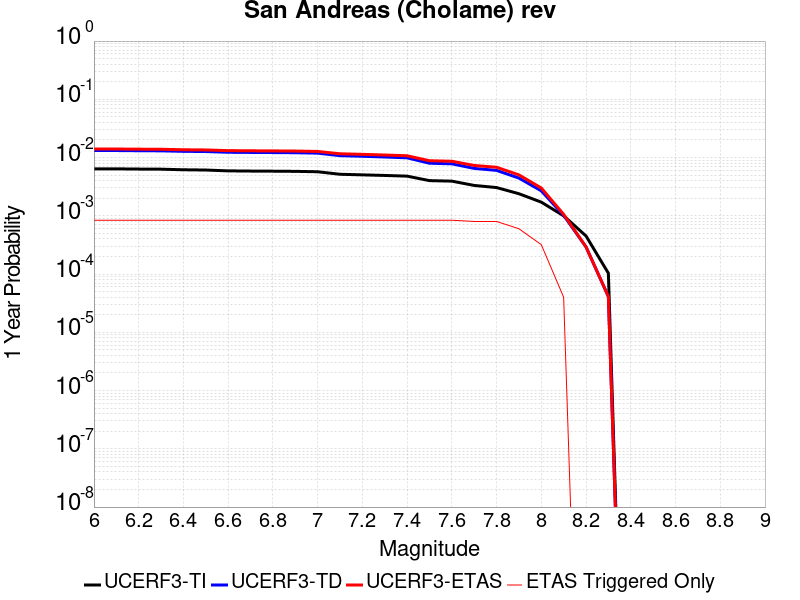 |

| Magnitude | 1 wk TI Prob | 1 wk TD Prob | 1 wk ETAS Prob | 1 wk ETAS/TD Gain | 1 wk ETAS Triggered Only | 1 mo TI Prob | 1 mo TD Prob | 1 mo ETAS Prob | 1 mo ETAS/TD Gain | 1 mo ETAS Triggered Only | 1 yr TI Prob | 1 yr TD Prob | 1 yr ETAS Prob | 1 yr ETAS/TD Gain | 1 yr ETAS Triggered Only |
|-----|-----|-----|-----|-----|-----|-----|-----|-----|-----|-----|-----|-----|-----|-----|-----|
| 6.0 | 1.2302514E-4 | 2.5456081E-4 | 6.54459E-4 | 2.5709338 | 4.0E-4 | 5.27144E-4 | 0.0010905204 | 0.0014900842 | 1.3663974 | 4.0E-4 | 0.0063991086 | 0.013196777 | 0.014025691 | 1.0628119 | 8.4E-4 |
| 6.1 | 1.2302514E-4 | 2.5456081E-4 | 6.54459E-4 | 2.5709338 | 4.0E-4 | 5.27144E-4 | 0.0010905204 | 0.0014900842 | 1.3663974 | 4.0E-4 | 0.0063991086 | 0.013196777 | 0.014025691 | 1.0628119 | 8.4E-4 |
| 6.2 | 1.2203569E-4 | 2.5272561E-4 | 6.526245E-4 | 2.5823443 | 4.0E-4 | 5.2290526E-4 | 0.0010826618 | 0.0014822287 | 1.3690598 | 4.0E-4 | 0.006347804 | 0.013102253 | 0.013931247 | 1.0632712 | 8.4E-4 |
| 6.3 | 1.2142645E-4 | 2.5158338E-4 | 6.514828E-4 | 2.58953 | 4.0E-4 | 5.202953E-4 | 0.0010777706 | 0.0014773395 | 1.3707365 | 4.0E-4 | 0.006316212 | 0.013043418 | 0.01387246 | 1.0635602 | 8.4E-4 |
| 6.4 | 1.1865206E-4 | 2.466236E-4 | 6.4652495E-4 | 2.6215048 | 4.0E-4 | 5.0840975E-4 | 0.0010565318 | 0.0014561091 | 1.3781972 | 4.0E-4 | 0.006172335 | 0.012787894 | 0.013617152 | 1.0648471 | 8.4E-4 |
| 6.5 | 1.17443946E-4 | 2.445465E-4 | 6.444487E-4 | 2.6352808 | 4.0E-4 | 5.032341E-4 | 0.0010476371 | 0.001447218 | 1.3814117 | 4.0E-4 | 0.006109677 | 0.012680864 | 0.013510212 | 1.0654016 | 8.4E-4 |
| 6.6 | 1.13579066E-4 | 2.3760591E-4 | 6.3751085E-4 | 2.6830597 | 4.0E-4 | 4.866766E-4 | 0.0010179152 | 0.001417508 | 1.39256 | 4.0E-4 | 0.0059092017 | 0.012323147 | 0.013152796 | 1.0673244 | 8.4E-4 |
| 6.7 | 1.1271412E-4 | 2.3604305E-4 | 6.359486E-4 | 2.694206 | 4.0E-4 | 4.829711E-4 | 0.0010112225 | 0.001410818 | 1.3951608 | 4.0E-4 | 0.005864331 | 0.012242582 | 0.013072298 | 1.067773 | 8.4E-4 |
| 6.8 | 1.1217975E-4 | 2.3492136E-4 | 6.3482736E-4 | 2.7022974 | 4.0E-4 | 4.8068175E-4 | 0.0010064188 | 0.0014060163 | 1.3970488 | 4.0E-4 | 0.005836608 | 0.012184754 | 0.013014519 | 1.0680987 | 8.4E-4 |
| 6.9 | 1.1146753E-4 | 2.3340227E-4 | 6.333089E-4 | 2.7133794 | 4.0E-4 | 4.7763053E-4 | 9.999136E-4 | 0.0013995136 | 1.3996346 | 4.0E-4 | 0.0057996577 | 0.012106434 | 0.012936265 | 1.0685446 | 8.4E-4 |
| 7.0 | 1.0965793E-4 | 2.2961597E-4 | 6.295241E-4 | 2.7416391 | 4.0E-4 | 4.698779E-4 | 9.836989E-4 | 0.0013833053 | 1.4062285 | 4.0E-4 | 0.005705768 | 0.011911196 | 0.01274119 | 1.0696819 | 8.4E-4 |
| 7.1 | 9.927982E-5 | 2.0771689E-4 | 6.076338E-4 | 2.925298 | 4.0E-4 | 4.2541555E-4 | 8.899126E-4 | 0.0012895566 | 1.4490824 | 4.0E-4 | 0.0051671406 | 0.010781161 | 0.011612105 | 1.0770737 | 8.4E-4 |
| 7.2 | 9.696786E-5 | 2.0274252E-4 | 6.026614E-4 | 2.9725459 | 4.0E-4 | 4.1551032E-4 | 8.686082E-4 | 0.0012682608 | 1.4601068 | 4.0E-4 | 0.00504711 | 0.010524314 | 0.011355474 | 1.0789752 | 8.4E-4 |
| 7.3 | 9.4727984E-5 | 1.9699681E-4 | 5.9691805E-4 | 3.0300896 | 4.0E-4 | 4.0591392E-4 | 8.439999E-4 | 0.0012436623 | 1.4735337 | 4.0E-4 | 0.0049308087 | 0.01022756 | 0.0110589685 | 1.0812911 | 8.4E-4 |
| 7.4 | 9.220358E-5 | 1.9066039E-4 | 5.905841E-4 | 3.0975711 | 4.0E-4 | 3.9509835E-4 | 8.16861E-4 | 0.0012165343 | 1.4892794 | 4.0E-4 | 0.004799717 | 0.009900185 | 0.010731868 | 1.0840069 | 8.4E-4 |
| 7.5 | 7.71631E-5 | 1.537305E-4 | 5.53669E-4 | 3.601556 | 4.0E-4 | 3.306571E-4 | 6.586788E-4 | 0.0010584154 | 1.6068763 | 4.0E-4 | 0.0040183207 | 0.007990002 | 0.00882329 | 1.1042914 | 8.4E-4 |
| 7.6 | 7.5634416E-5 | 1.5029922E-4 | 5.502391E-4 | 3.6609578 | 4.0E-4 | 3.241072E-4 | 6.439807E-4 | 0.0010437231 | 1.6207366 | 4.0E-4 | 0.0039388672 | 0.007812348 | 0.008645786 | 1.1066821 | 8.4E-4 |
| 7.7 | 6.3783E-5 | 1.253131E-4 | 5.2526296E-4 | 4.1916046 | 4.0E-4 | 2.7332708E-4 | 5.3694565E-4 | 9.367309E-4 | 1.7445544 | 4.0E-4 | 0.0033226798 | 0.006517746 | 0.0073125316 | 1.1219418 | 8.0E-4 |
| 7.8 | 5.863422E-5 | 1.1572884E-4 | 5.1568256E-4 | 4.455955 | 4.0E-4 | 2.512653E-4 | 4.9588655E-4 | 8.956882E-4 | 1.8062361 | 4.0E-4 | 0.003054864 | 0.006020727 | 0.006815911 | 1.1320744 | 8.0E-4 |
| 7.9 | 4.595283E-5 | 8.541111E-5 | 3.253906E-4 | 3.8096988 | 2.4E-4 | 1.9692584E-4 | 3.6599627E-4 | 6.0590846E-4 | 1.6555043 | 2.4E-4 | 0.0023949358 | 0.0044469074 | 0.005044239 | 1.1343253 | 6.0E-4 |
| 8.0 | 3.2950178E-5 | 5.1490908E-5 | 2.1148266E-4 | 4.107185 | 1.6E-4 | 1.412074E-4 | 2.2065666E-4 | 3.8062135E-4 | 1.7249484 | 1.6E-4 | 0.0017178444 | 0.002683187 | 0.0030023283 | 1.1189412 | 3.2E-4 |
| 8.1 | 1.9177472E-5 | 1.9541987E-5 | 1.9541987E-5 | 1.0 | 0.0 | 8.218658E-5 | 8.374869E-5 | 8.374869E-5 | 1.0 | 0.0 | 0.0010001622 | 0.0010191639 | 0.0010591232 | 1.0392078 | 4.0E-5 |
| 8.2 | 8.643924E-6 | 5.607368E-6 | 5.607368E-6 | 1.0 | 0.0 | 3.704486E-5 | 2.4031357E-5 | 2.4031357E-5 | 1.0 | 0.0 | 4.5092785E-4 | 2.9254257E-4 | 2.9254257E-4 | 1.0 | 0.0 |
| 8.3 | 1.983087E-6 | 7.877893E-7 | 7.877893E-7 | 1.0 | 0.0 | 8.498917E-6 | 3.3762356E-6 | 3.3762356E-6 | 1.0 | 0.0 | 1.034694E-4 | 4.110491E-5 | 4.110491E-5 | 1.0 | 0.0 |

## San Andreas (Coachella) rev
*[(top)](#table-of-contents)*

| 1 Week | 1 Month | 1 Year |
|-----|-----|-----|
| 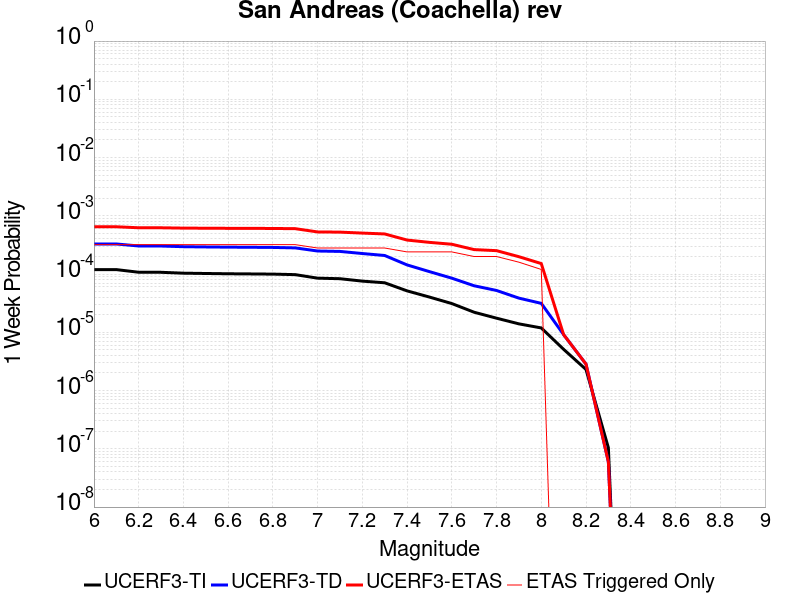 | 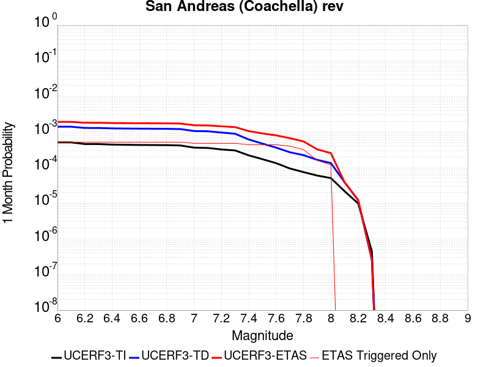 | 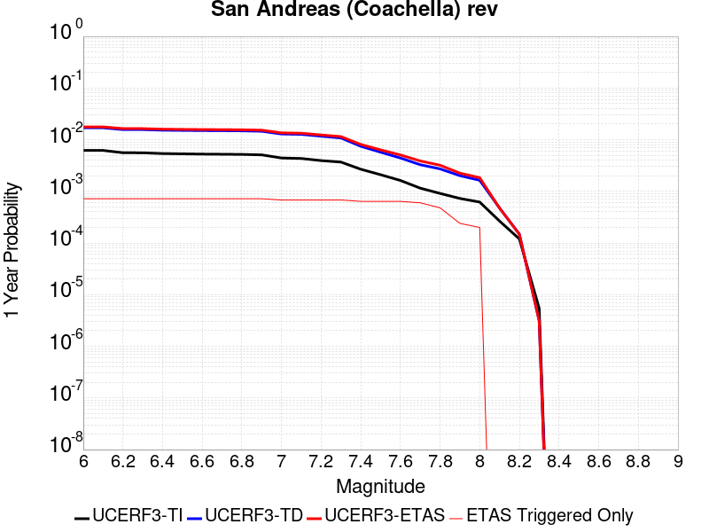 |

| Magnitude | 1 wk TI Prob | 1 wk TD Prob | 1 wk ETAS Prob | 1 wk ETAS/TD Gain | 1 wk ETAS Triggered Only | 1 mo TI Prob | 1 mo TD Prob | 1 mo ETAS Prob | 1 mo ETAS/TD Gain | 1 mo ETAS Triggered Only | 1 yr TI Prob | 1 yr TD Prob | 1 yr ETAS Prob | 1 yr ETAS/TD Gain | 1 yr ETAS Triggered Only |
|-----|-----|-----|-----|-----|-----|-----|-----|-----|-----|-----|-----|-----|-----|-----|-----|
| 6.0 | 1.1925945E-4 | 3.285021E-4 | 6.4839696E-4 | 1.9737986 | 3.2E-4 | 5.110118E-4 | 0.0014071113 | 0.0019263796 | 1.3690314 | 5.2E-4 | 0.0062038354 | 0.016998356 | 0.017706117 | 1.0416371 | 7.2E-4 |
| 6.1 | 1.1925945E-4 | 3.285021E-4 | 6.4839696E-4 | 1.9737986 | 3.2E-4 | 5.110118E-4 | 0.0014071113 | 0.0019263796 | 1.3690314 | 5.2E-4 | 0.0062038354 | 0.016998356 | 0.017706117 | 1.0416371 | 7.2E-4 |
| 6.2 | 1.07432395E-4 | 3.0350155E-4 | 6.2340446E-4 | 2.0540404 | 3.2E-4 | 4.603433E-4 | 0.0013000766 | 0.0018194005 | 1.3994565 | 5.2E-4 | 0.005590286 | 0.015714664 | 0.016423348 | 1.0450971 | 7.2E-4 |
| 6.3 | 1.0718766E-4 | 3.0295455E-4 | 6.228576E-4 | 2.055944 | 3.2E-4 | 4.592948E-4 | 0.0012977346 | 0.0018170598 | 1.4001783 | 5.2E-4 | 0.005577586 | 0.01568656 | 0.016395267 | 1.0451791 | 7.2E-4 |
| 6.4 | 1.0355944E-4 | 2.9503368E-4 | 6.1493926E-4 | 2.084302 | 3.2E-4 | 4.4375064E-4 | 0.0012638214 | 0.0017831641 | 1.4109305 | 5.2E-4 | 0.0053892885 | 0.01527953 | 0.015988529 | 1.0464019 | 7.2E-4 |
| 6.5 | 1.0227914E-4 | 2.9222743E-4 | 6.1213394E-4 | 2.0947175 | 3.2E-4 | 4.382655E-4 | 0.0012518062 | 0.0017711552 | 1.4148798 | 5.2E-4 | 0.0053228354 | 0.015135286 | 0.01584439 | 1.0468509 | 7.2E-4 |
| 6.6 | 1.0116757E-4 | 2.898844E-4 | 6.0979166E-4 | 2.1035683 | 3.2E-4 | 4.3350324E-4 | 0.0012417742 | 0.0017611284 | 1.4182357 | 5.2E-4 | 0.0052651367 | 0.015014836 | 0.015724026 | 1.0472326 | 7.2E-4 |
| 6.7 | 1.0050676E-4 | 2.8846966E-4 | 6.0837733E-4 | 2.108982 | 3.2E-4 | 4.3067214E-4 | 0.0012357167 | 0.0017550741 | 1.4202884 | 5.2E-4 | 0.005230834 | 0.0149421 | 0.015651342 | 1.047466 | 7.2E-4 |
| 6.8 | 9.976819E-5 | 2.8650457E-4 | 6.064129E-4 | 2.1165907 | 3.2E-4 | 4.2750788E-4 | 0.0012273028 | 0.0017466646 | 1.4231733 | 5.2E-4 | 0.0051924936 | 0.014841062 | 0.015550377 | 1.0477941 | 7.2E-4 |
| 6.9 | 9.77719E-5 | 2.8146335E-4 | 6.0137326E-4 | 2.1365955 | 3.2E-4 | 4.1895514E-4 | 0.0012057178 | 0.0017250908 | 1.4307584 | 5.2E-4 | 0.0050888555 | 0.014581811 | 0.015291312 | 1.0486566 | 7.2E-4 |
| 7.0 | 8.500761E-5 | 2.487273E-4 | 5.286577E-4 | 2.1254508 | 2.8E-4 | 3.6426744E-4 | 0.001065542 | 0.0015450305 | 1.449995 | 4.8E-4 | 0.0044259406 | 0.012896588 | 0.013567818 | 1.0520471 | 6.8E-4 |
| 7.1 | 8.319876E-5 | 2.4473912E-4 | 5.246706E-4 | 2.1437955 | 2.8E-4 | 3.5651738E-4 | 0.0010484635 | 0.0015279603 | 1.4573327 | 4.8E-4 | 0.004331963 | 0.012691099 | 0.013362469 | 1.0529009 | 6.8E-4 |
| 7.2 | 7.563917E-5 | 2.2518281E-4 | 5.051198E-4 | 2.243154 | 2.8E-4 | 3.2412758E-4 | 9.647154E-4 | 0.0014442523 | 1.497076 | 4.8E-4 | 0.0039391145 | 0.011682851 | 0.012354907 | 1.0575249 | 6.8E-4 |
| 7.3 | 7.082985E-5 | 2.0829777E-4 | 4.8823946E-4 | 2.3439496 | 2.8E-4 | 3.0352117E-4 | 8.9240225E-4 | 0.0013719739 | 1.537394 | 4.8E-4 | 0.0036891096 | 0.010811501 | 0.011484149 | 1.062216 | 6.8E-4 |
| 7.4 | 5.146215E-5 | 1.4354692E-4 | 3.8351247E-4 | 2.6716871 | 2.4E-4 | 2.2053342E-4 | 6.150569E-4 | 0.0010547863 | 1.7149409 | 4.4E-4 | 0.0026816884 | 0.0074627977 | 0.008098021 | 1.0851188 | 6.4E-4 |
| 7.5 | 4.0285166E-5 | 1.1011688E-4 | 3.5009044E-4 | 3.1792624 | 2.4E-4 | 1.7263928E-4 | 4.7184445E-4 | 9.1163686E-4 | 1.9320707 | 4.4E-4 | 0.002099857 | 0.0057296446 | 0.0063659777 | 1.1110598 | 6.4E-4 |
| 7.6 | 3.1168736E-5 | 8.5009575E-5 | 3.2498917E-4 | 3.8229713 | 2.4E-4 | 1.3357346E-4 | 3.6427603E-4 | 8.041157E-4 | 2.2074354 | 4.4E-4 | 0.0016250437 | 0.0044260686 | 0.0050632358 | 1.1439579 | 6.4E-4 |
| 7.7 | 2.2100989E-5 | 6.2934116E-5 | 2.6292153E-4 | 4.1777267 | 2.0E-4 | 9.4715084E-5 | 2.696898E-4 | 6.6958193E-4 | 2.4827855 | 4.0E-4 | 0.001152546 | 0.003278536 | 0.003876569 | 1.1824085 | 6.0E-4 |
| 7.8 | 1.7484861E-5 | 5.2283296E-5 | 2.5227285E-4 | 4.825114 | 2.0E-4 | 7.493296E-5 | 2.2405203E-4 | 5.4398034E-4 | 2.4279196 | 3.2E-4 | 9.1192697E-4 | 0.0027244242 | 0.0032031164 | 1.175704 | 4.8E-4 |
| 7.9 | 1.3967285E-5 | 3.862311E-5 | 1.9861694E-4 | 5.1424375 | 1.6E-4 | 5.985842E-5 | 1.6551714E-4 | 3.2549063E-4 | 1.9665073 | 1.6E-4 | 7.2853256E-4 | 0.0020133099 | 0.0022528265 | 1.1189667 | 2.4E-4 |
| 8.0 | 1.1887396E-5 | 3.1410258E-5 | 1.514065E-4 | 4.820288 | 1.2E-4 | 5.094499E-5 | 1.3460845E-4 | 2.545923E-4 | 1.8913546 | 1.2E-4 | 6.200787E-4 | 0.0016376268 | 0.0018372993 | 1.121928 | 2.0E-4 |
| 8.1 | 5.100864E-6 | 9.116648E-6 | 9.116648E-6 | 1.0 | 0.0 | 2.1860664E-5 | 3.907076E-5 | 3.907076E-5 | 1.0 | 0.0 | 2.6612106E-4 | 4.755828E-4 | 4.755828E-4 | 1.0 | 0.0 |
| 8.2 | 2.3004484E-6 | 2.842999E-6 | 2.842999E-6 | 1.0 | 0.0 | 9.859027E-6 | 1.2184225E-5 | 1.2184225E-5 | 1.0 | 0.0 | 1.2002704E-4 | 1.4833287E-4 | 1.4833287E-4 | 1.0 | 0.0 |
| 8.3 | 1.0424446E-7 | 5.965764E-8 | 5.965764E-8 | 1.0 | 0.0 | 4.4676187E-7 | 2.5567556E-7 | 2.5567556E-7 | 1.0 | 0.0 | 5.439312E-6 | 3.112846E-6 | 3.112846E-6 | 1.0 | 0.0 |

## San Andreas (Parkfield)
*[(top)](#table-of-contents)*

| 1 Week | 1 Month | 1 Year |
|-----|-----|-----|
| 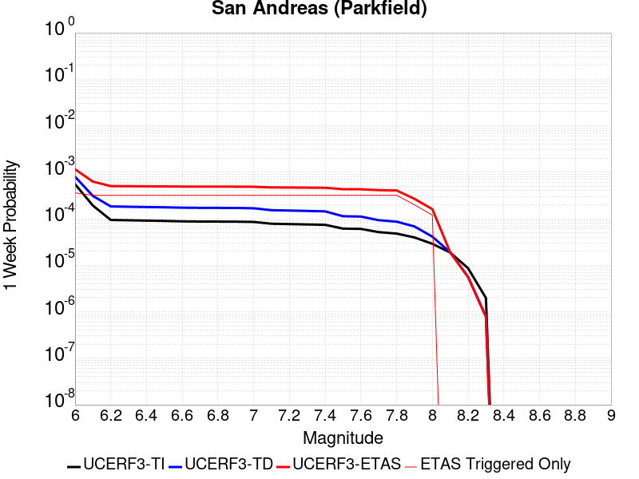 | 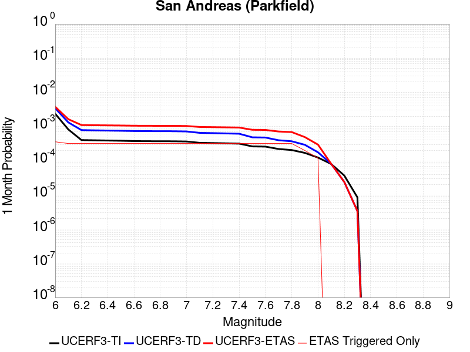 | 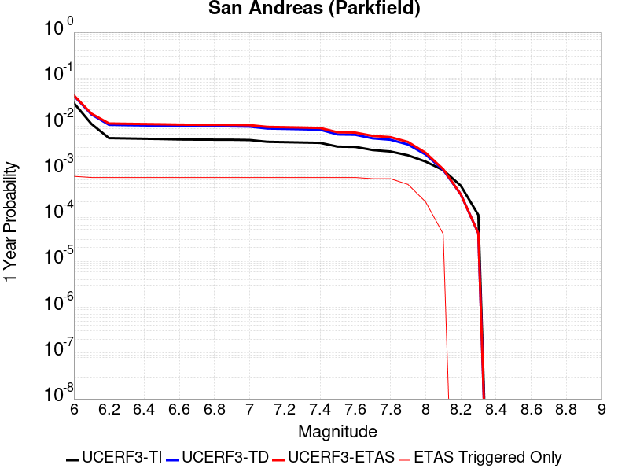 |

| Magnitude | 1 wk TI Prob | 1 wk TD Prob | 1 wk ETAS Prob | 1 wk ETAS/TD Gain | 1 wk ETAS Triggered Only | 1 mo TI Prob | 1 mo TD Prob | 1 mo ETAS Prob | 1 mo ETAS/TD Gain | 1 mo ETAS Triggered Only | 1 yr TI Prob | 1 yr TD Prob | 1 yr ETAS Prob | 1 yr ETAS/TD Gain | 1 yr ETAS Triggered Only |
|-----|-----|-----|-----|-----|-----|-----|-----|-----|-----|-----|-----|-----|-----|-----|-----|
| 6.0 | 5.556969E-4 | 8.0344157E-4 | 0.0011631523 | 1.4477124 | 3.6E-4 | 0.0023793848 | 0.003439371 | 0.0037981328 | 1.1043103 | 3.6E-4 | 0.028586963 | 0.041359875 | 0.042050097 | 1.0166882 | 7.2E-4 |
| 6.1 | 1.925858E-4 | 3.0992847E-4 | 6.298293E-4 | 2.0321763 | 3.2E-4 | 8.2510663E-4 | 0.0013276909 | 0.0016472661 | 1.2406999 | 3.2E-4 | 0.0099994885 | 0.016126512 | 0.016795546 | 1.0414866 | 6.8E-4 |
| 6.2 | 9.4306815E-5 | 1.8443585E-4 | 5.0437683E-4 | 2.7347007 | 3.2E-4 | 4.0410945E-4 | 7.902011E-4 | 0.0011099483 | 1.4046402 | 3.2E-4 | 0.0049089384 | 0.009578473 | 0.01025196 | 1.0703125 | 6.8E-4 |
| 6.3 | 9.283051E-5 | 1.8139459E-4 | 5.0133653E-4 | 2.76379 | 3.2E-4 | 3.9778434E-4 | 7.7717495E-4 | 0.0010969263 | 1.4114277 | 3.2E-4 | 0.0048322747 | 0.009421266 | 0.010094859 | 1.0714971 | 6.8E-4 |
| 6.4 | 9.138826E-5 | 1.7900368E-4 | 4.989464E-4 | 2.7873528 | 3.2E-4 | 3.916052E-4 | 7.6693424E-4 | 0.0010866888 | 1.4169257 | 3.2E-4 | 0.0047573745 | 0.009297662 | 0.00997134 | 1.0724567 | 6.8E-4 |
| 6.5 | 9.000255E-5 | 1.7657269E-4 | 4.965162E-4 | 2.8119648 | 3.2E-4 | 3.8566816E-4 | 7.565218E-4 | 0.0010762797 | 1.4226685 | 3.2E-4 | 0.0046854047 | 0.009171973 | 0.009845736 | 1.0734589 | 6.8E-4 |
| 6.6 | 8.8109264E-5 | 1.7335823E-4 | 4.9330277E-4 | 2.8455687 | 3.2E-4 | 3.7755648E-4 | 7.427535E-4 | 0.0010625158 | 1.4305093 | 3.2E-4 | 0.0045870654 | 0.009005753 | 0.0096796295 | 1.0748273 | 6.8E-4 |
| 6.7 | 8.738073E-5 | 1.7202341E-4 | 4.9196836E-4 | 2.859892 | 3.2E-4 | 3.7443507E-4 | 7.3703605E-4 | 0.0010568002 | 1.4338515 | 3.2E-4 | 0.0045492216 | 0.0089367535 | 0.009610676 | 1.0754102 | 6.8E-4 |
| 6.8 | 8.710195E-5 | 1.7147408E-4 | 4.914192E-4 | 2.8658512 | 3.2E-4 | 3.7324068E-4 | 7.346831E-4 | 0.0010544481 | 1.4352419 | 3.2E-4 | 0.0045347405 | 0.008908349 | 0.009582291 | 1.0756528 | 6.8E-4 |
| 6.9 | 8.6801556E-5 | 1.708797E-4 | 4.9082504E-4 | 2.8723423 | 3.2E-4 | 3.7195362E-4 | 7.3213724E-4 | 0.0010519029 | 1.4367565 | 3.2E-4 | 0.0045191357 | 0.008877606 | 0.009551569 | 1.0759172 | 6.8E-4 |
| 7.0 | 8.5571606E-5 | 1.6839206E-4 | 4.883382E-4 | 2.900007 | 3.2E-4 | 3.6668387E-4 | 7.214818E-4 | 0.001041251 | 1.4432116 | 3.2E-4 | 0.004455241 | 0.008748925 | 0.009422976 | 1.0770439 | 6.8E-4 |
| 7.1 | 7.82589E-5 | 1.5312967E-4 | 4.7308067E-4 | 3.0894122 | 3.2E-4 | 3.3535215E-4 | 6.561057E-4 | 9.7589573E-4 | 1.4874063 | 3.2E-4 | 0.0040752706 | 0.007959004 | 0.008633591 | 1.0847578 | 6.8E-4 |
| 7.2 | 7.690929E-5 | 1.504851E-4 | 4.7043693E-4 | 3.1261363 | 3.2E-4 | 3.2956956E-4 | 6.447775E-4 | 9.6457114E-4 | 1.4959753 | 3.2E-4 | 0.004005129 | 0.0078220805 | 0.008496761 | 1.0862534 | 6.8E-4 |
| 7.3 | 7.5543794E-5 | 1.4742615E-4 | 4.6737897E-4 | 3.1702583 | 3.2E-4 | 3.2371894E-4 | 6.3167413E-4 | 9.51472E-4 | 1.5062703 | 3.2E-4 | 0.003934157 | 0.0076636793 | 0.008338468 | 1.0880502 | 6.8E-4 |
| 7.4 | 7.4214564E-5 | 1.4441142E-4 | 4.643652E-4 | 3.2155712 | 3.2E-4 | 3.1802364E-4 | 6.1876E-4 | 9.38562E-4 | 1.5168433 | 3.2E-4 | 0.003865065 | 0.0075075435 | 0.008182438 | 1.0898956 | 6.8E-4 |
| 7.5 | 6.149578E-5 | 1.1344282E-4 | 4.334065E-4 | 3.8204844 | 3.2E-4 | 2.6352672E-4 | 4.86093E-4 | 8.0593745E-4 | 1.6579902 | 3.2E-4 | 0.0032037178 | 0.005902156 | 0.0065781423 | 1.1145321 | 6.8E-4 |
| 7.6 | 6.0643448E-5 | 1.11714806E-4 | 4.3167904E-4 | 3.8641167 | 3.2E-4 | 2.598746E-4 | 4.7869E-4 | 7.985368E-4 | 1.668171 | 3.2E-4 | 0.0031593828 | 0.0058125085 | 0.006488556 | 1.116309 | 6.8E-4 |
| 7.7 | 5.1652263E-5 | 9.3113E-5 | 4.130832E-4 | 4.4363647 | 3.2E-4 | 2.2134806E-4 | 3.9899469E-4 | 7.18867E-4 | 1.8016957 | 3.2E-4 | 0.002691582 | 0.004846951 | 0.005483849 | 1.1314018 | 6.4E-4 |
| 7.8 | 4.8090482E-5 | 8.685296E-5 | 4.0682516E-4 | 4.6840677 | 3.2E-4 | 2.060858E-4 | 3.721739E-4 | 6.920548E-4 | 1.8594931 | 3.2E-4 | 0.0025062072 | 0.0045218114 | 0.0051589175 | 1.1408962 | 6.4E-4 |
| 7.9 | 3.970278E-5 | 6.848254E-5 | 2.6846884E-4 | 3.9202523 | 2.0E-4 | 1.7014367E-4 | 2.934636E-4 | 4.934049E-4 | 1.6813155 | 2.0E-4 | 0.002069531 | 0.0035670698 | 0.0040453575 | 1.1340842 | 4.8E-4 |
| 8.0 | 2.8982335E-5 | 4.131844E-5 | 1.6131348E-4 | 3.9041524 | 1.2E-4 | 1.2420409E-4 | 1.77067E-4 | 2.9704577E-4 | 1.6775895 | 1.2E-4 | 0.0015111357 | 0.0021536606 | 0.0023532298 | 1.0926652 | 2.0E-4 |
| 8.1 | 1.8836186E-5 | 1.9031799E-5 | 1.9031799E-5 | 1.0 | 0.0 | 8.0724014E-5 | 8.1562306E-5 | 8.1562306E-5 | 1.0 | 0.0 | 9.823717E-4 | 9.925694E-4 | 0.0010325296 | 1.0402595 | 4.0E-5 |
| 8.2 | 8.643924E-6 | 5.607368E-6 | 5.607368E-6 | 1.0 | 0.0 | 3.704486E-5 | 2.4031357E-5 | 2.4031357E-5 | 1.0 | 0.0 | 4.5092785E-4 | 2.9254257E-4 | 2.9254257E-4 | 1.0 | 0.0 |
| 8.3 | 1.983087E-6 | 7.877893E-7 | 7.877893E-7 | 1.0 | 0.0 | 8.498917E-6 | 3.3762356E-6 | 3.3762356E-6 | 1.0 | 0.0 | 1.034694E-4 | 4.110491E-5 | 4.110491E-5 | 1.0 | 0.0 |

## Elsinore (Glen Ivy) rev
*[(top)](#table-of-contents)*

| 1 Week | 1 Month | 1 Year |
|-----|-----|-----|
| 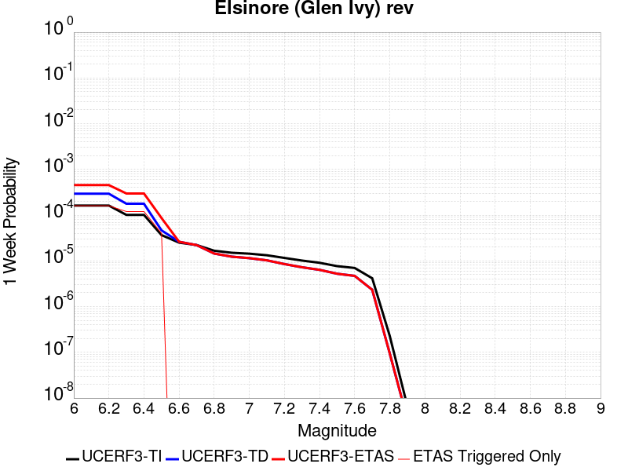 | 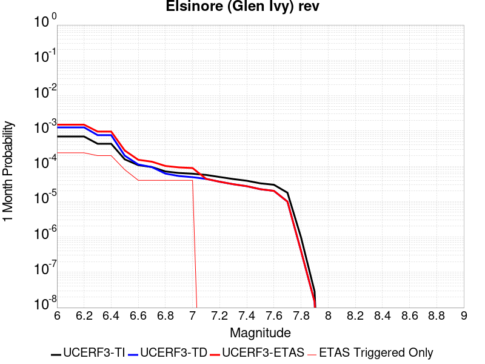 | 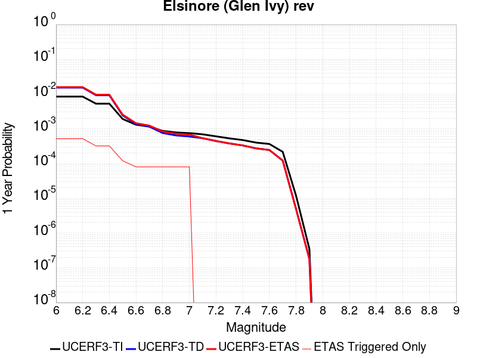 |

| Magnitude | 1 wk TI Prob | 1 wk TD Prob | 1 wk ETAS Prob | 1 wk ETAS/TD Gain | 1 wk ETAS Triggered Only | 1 mo TI Prob | 1 mo TD Prob | 1 mo ETAS Prob | 1 mo ETAS/TD Gain | 1 mo ETAS Triggered Only | 1 yr TI Prob | 1 yr TD Prob | 1 yr ETAS Prob | 1 yr ETAS/TD Gain | 1 yr ETAS Triggered Only |
|-----|-----|-----|-----|-----|-----|-----|-----|-----|-----|-----|-----|-----|-----|-----|-----|
| 6.0 | 1.6204086E-4 | 2.9420294E-4 | 4.5415587E-4 | 1.5436823 | 1.6E-4 | 6.94276E-4 | 0.0012604159 | 0.0015001134 | 1.1901734 | 2.4E-4 | 0.008420097 | 0.01525921 | 0.015771275 | 1.0335578 | 5.2E-4 |
| 6.1 | 1.6204086E-4 | 2.9420294E-4 | 4.5415587E-4 | 1.5436823 | 1.6E-4 | 6.94276E-4 | 0.0012604159 | 0.0015001134 | 1.1901734 | 2.4E-4 | 0.008420097 | 0.01525921 | 0.015771275 | 1.0335578 | 5.2E-4 |
| 6.2 | 1.6204086E-4 | 2.9420294E-4 | 4.5415587E-4 | 1.5436823 | 1.6E-4 | 6.94276E-4 | 0.0012604159 | 0.0015001134 | 1.1901734 | 2.4E-4 | 0.008420097 | 0.01525921 | 0.015771275 | 1.0335578 | 5.2E-4 |
| 6.3 | 1.0111737E-4 | 1.7740557E-4 | 2.9738428E-4 | 1.6762962 | 1.2E-4 | 4.332882E-4 | 7.6020526E-4 | 9.6005324E-4 | 1.2628869 | 2.0E-4 | 0.005262531 | 0.009237009 | 0.009554053 | 1.0343232 | 3.2E-4 |
| 6.4 | 1.0111737E-4 | 1.7740557E-4 | 2.9738428E-4 | 1.6762962 | 1.2E-4 | 4.332882E-4 | 7.6020526E-4 | 9.6005324E-4 | 1.2628869 | 2.0E-4 | 0.005262531 | 0.009237009 | 0.009554053 | 1.0343232 | 3.2E-4 |
| 6.5 | 3.6624708E-5 | 4.6445854E-5 | 8.644399E-5 | 1.8611779 | 4.0E-5 | 1.569536E-4 | 1.9904051E-4 | 2.790246E-4 | 1.4018482 | 8.0E-5 | 0.001909235 | 0.0024209863 | 0.0025406957 | 1.0494466 | 1.2E-4 |
| 6.6 | 2.5051324E-5 | 2.6190002E-5 | 2.6190002E-5 | 1.0 | 0.0 | 1.073584E-4 | 1.1223829E-4 | 1.522338E-4 | 1.3563446 | 4.0E-5 | 0.0013063047 | 0.0013656892 | 0.0014455799 | 1.0584985 | 8.0E-5 |
| 6.7 | 2.2189772E-5 | 2.2104245E-5 | 2.2104245E-5 | 1.0 | 0.0 | 9.509556E-5 | 9.472924E-5 | 1.3472546E-4 | 1.422216 | 4.0E-5 | 0.0011571734 | 0.0011527548 | 0.0012326626 | 1.069319 | 8.0E-5 |
| 6.8 | 1.6654378E-5 | 1.4455017E-5 | 1.4455017E-5 | 1.0 | 0.0 | 7.137396E-5 | 6.194863E-5 | 1.01946156E-4 | 1.6456562 | 4.0E-5 | 8.686314E-4 | 7.539688E-4 | 8.3390845E-4 | 1.1060252 | 8.0E-5 |
| 6.9 | 1.5042909E-5 | 1.2346976E-5 | 1.2346976E-5 | 1.0 | 0.0 | 6.446802E-5 | 5.291456E-5 | 9.291244E-5 | 1.7558956 | 4.0E-5 | 7.8461546E-4 | 6.4404745E-4 | 7.239959E-4 | 1.1241344 | 8.0E-5 |
| 7.0 | 1.4361385E-5 | 1.146508E-5 | 1.146508E-5 | 1.0 | 0.0 | 6.154734E-5 | 4.913515E-5 | 8.913319E-5 | 1.8140411 | 4.0E-5 | 7.490812E-4 | 5.9805915E-4 | 6.7801133E-4 | 1.1336861 | 8.0E-5 |
| 7.1 | 1.3265571E-5 | 1.0257165E-5 | 1.0257165E-5 | 1.0 | 0.0 | 5.6851208E-5 | 4.3958553E-5 | 4.3958553E-5 | 1.0 | 0.0 | 6.919436E-4 | 5.350665E-4 | 5.350665E-4 | 1.0 | 0.0 |
| 7.2 | 1.1596403E-5 | 8.515252E-6 | 8.515252E-6 | 1.0 | 0.0 | 4.9697923E-5 | 3.649344E-5 | 3.649344E-5 | 1.0 | 0.0 | 6.049042E-4 | 4.4421875E-4 | 4.4421875E-4 | 1.0 | 0.0 |
| 7.3 | 1.0150827E-5 | 7.247325E-6 | 7.247325E-6 | 1.0 | 0.0 | 4.3502816E-5 | 3.10596E-5 | 3.10596E-5 | 1.0 | 0.0 | 5.2951806E-4 | 3.780865E-4 | 3.780865E-4 | 1.0 | 0.0 |
| 7.4 | 9.080705E-6 | 6.359954E-6 | 6.359954E-6 | 1.0 | 0.0 | 3.8916725E-5 | 2.725667E-5 | 2.725667E-5 | 1.0 | 0.0 | 4.7370812E-4 | 3.3180078E-4 | 3.3180078E-4 | 1.0 | 0.0 |
| 7.5 | 7.671649E-6 | 5.231759E-6 | 5.231759E-6 | 1.0 | 0.0 | 3.287808E-5 | 2.2421638E-5 | 2.2421638E-5 | 1.0 | 0.0 | 4.0021708E-4 | 2.729505E-4 | 2.729505E-4 | 1.0 | 0.0 |
| 7.6 | 6.990086E-6 | 4.693085E-6 | 4.693085E-6 | 1.0 | 0.0 | 2.9957167E-5 | 2.0113073E-5 | 2.0113073E-5 | 1.0 | 0.0 | 3.6466747E-4 | 2.4485032E-4 | 2.4485032E-4 | 1.0 | 0.0 |
| 7.7 | 4.163505E-6 | 2.3324235E-6 | 2.3324235E-6 | 1.0 | 0.0 | 1.7843471E-5 | 9.996066E-6 | 9.996066E-6 | 1.0 | 0.0 | 2.172226E-4 | 1.2169606E-4 | 1.2169606E-4 | 1.0 | 0.0 |
| 7.8 | 2.2692414E-7 | 9.397192E-8 | 9.397192E-8 | 1.0 | 0.0 | 9.725317E-7 | 4.0273673E-7 | 4.0273673E-7 | 1.0 | 0.0 | 1.1840509E-5 | 4.903312E-6 | 4.903312E-6 | 1.0 | 0.0 |
| 7.9 | 6.676829E-9 | 3.4429164E-9 | 3.4429164E-9 | 1.0 | 0.0 | 2.861498E-8 | 1.4755356E-8 | 1.4755356E-8 | 1.0 | 0.0 | 3.4838732E-7 | 1.7964643E-7 | 1.7964643E-7 | 1.0 | 0.0 |

## Brawley (Seismic Zone) alt 1
*[(top)](#table-of-contents)*

| 1 Week | 1 Month | 1 Year |
|-----|-----|-----|
| 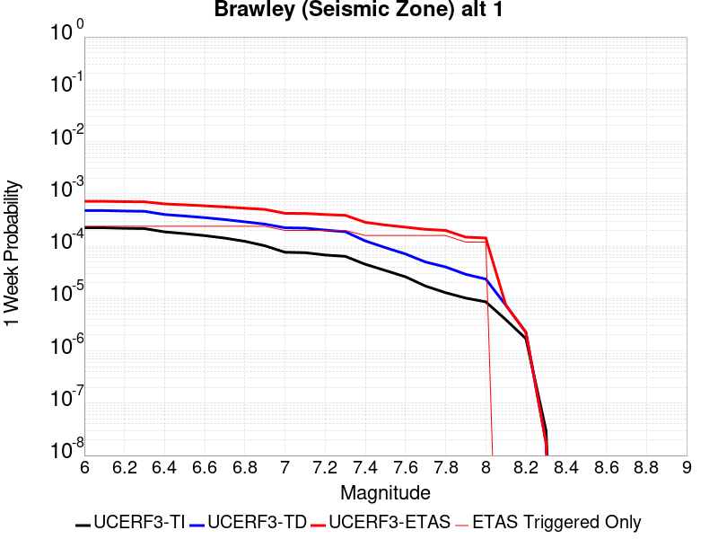 | 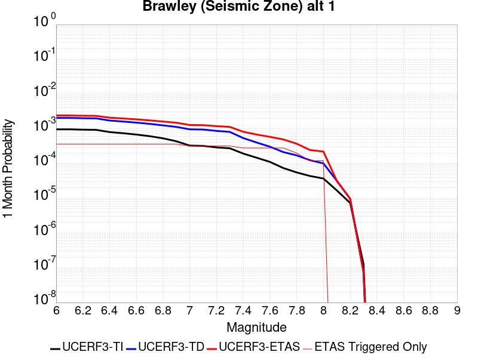 |  |

| Magnitude | 1 wk TI Prob | 1 wk TD Prob | 1 wk ETAS Prob | 1 wk ETAS/TD Gain | 1 wk ETAS Triggered Only | 1 mo TI Prob | 1 mo TD Prob | 1 mo ETAS Prob | 1 mo ETAS/TD Gain | 1 mo ETAS Triggered Only | 1 yr TI Prob | 1 yr TD Prob | 1 yr ETAS Prob | 1 yr ETAS/TD Gain | 1 yr ETAS Triggered Only |
|-----|-----|-----|-----|-----|-----|-----|-----|-----|-----|-----|-----|-----|-----|-----|-----|
| 6.0 | 2.2521618E-4 | 4.7906235E-4 | 7.189474E-4 | 1.5007386 | 2.4E-4 | 9.6485513E-4 | 0.0020515462 | 0.0024108076 | 1.1751174 | 3.6E-4 | 0.011683988 | 0.024686452 | 0.025154604 | 1.0189638 | 4.8E-4 |
| 6.1 | 2.2521618E-4 | 4.7906235E-4 | 7.189474E-4 | 1.5007386 | 2.4E-4 | 9.6485513E-4 | 0.0020515462 | 0.0024108076 | 1.1751174 | 3.6E-4 | 0.011683988 | 0.024686452 | 0.025154604 | 1.0189638 | 4.8E-4 |
| 6.2 | 2.198148E-4 | 4.6985512E-4 | 7.0974237E-4 | 1.5105557 | 2.4E-4 | 9.417233E-4 | 0.0020121478 | 0.0023714234 | 1.1785533 | 3.6E-4 | 0.011405343 | 0.024218049 | 0.024686424 | 1.0193399 | 4.8E-4 |
| 6.3 | 2.1704129E-4 | 4.6419835E-4 | 7.040869E-4 | 1.5167804 | 2.4E-4 | 9.298453E-4 | 0.0019879416 | 0.0023472258 | 1.1807319 | 3.6E-4 | 0.011262234 | 0.02393082 | 0.024399333 | 1.0195779 | 4.8E-4 |
| 6.4 | 1.876142E-4 | 4.0299946E-4 | 6.4290274E-4 | 1.5952944 | 2.4E-4 | 8.038131E-4 | 0.0017260119 | 0.0020853905 | 1.2082133 | 3.6E-4 | 0.00974259 | 0.020814236 | 0.021284245 | 1.0225811 | 4.8E-4 |
| 6.5 | 1.7390939E-4 | 3.772201E-4 | 6.1712955E-4 | 1.6359934 | 2.4E-4 | 7.45113E-4 | 0.0016156683 | 0.0019750868 | 1.222458 | 3.6E-4 | 0.009034078 | 0.019498011 | 0.019968651 | 1.0241379 | 4.8E-4 |
| 6.6 | 1.591791E-4 | 3.512329E-4 | 5.911486E-4 | 1.6830673 | 2.4E-4 | 6.8201777E-4 | 0.0015044258 | 0.0018638842 | 1.2389339 | 3.6E-4 | 0.008271996 | 0.018166747 | 0.018638028 | 1.0259418 | 4.8E-4 |
| 6.7 | 1.4268003E-4 | 3.2273377E-4 | 5.626563E-4 | 1.743407 | 2.4E-4 | 6.1134255E-4 | 0.00138242 | 0.0017419223 | 1.2600529 | 3.6E-4 | 0.007417723 | 0.016705167 | 0.017177148 | 1.0282537 | 4.8E-4 |
| 6.8 | 1.239713E-4 | 2.923154E-4 | 5.3224526E-4 | 1.820791 | 2.4E-4 | 5.3119735E-4 | 0.0012521851 | 0.0016117343 | 1.2871374 | 3.6E-4 | 0.0064481674 | 0.015140241 | 0.015612974 | 1.0312235 | 4.8E-4 |
| 6.9 | 1.0180238E-4 | 2.6387183E-4 | 5.038085E-4 | 1.9092925 | 2.4E-4 | 4.3622297E-4 | 0.0011303935 | 0.0014899865 | 1.3181132 | 3.6E-4 | 0.005298089 | 0.013676707 | 0.014150142 | 1.0346161 | 4.8E-4 |
| 7.0 | 7.6619996E-5 | 2.2495743E-4 | 4.2491243E-4 | 1.8888571 | 2.0E-4 | 3.283301E-4 | 9.6375024E-4 | 0.0012834419 | 1.3317162 | 3.2E-4 | 0.0039900932 | 0.011671247 | 0.012106111 | 1.0372595 | 4.4E-4 |
| 7.1 | 7.5127435E-5 | 2.2177385E-4 | 4.217295E-4 | 1.9016196 | 2.0E-4 | 3.2193496E-4 | 9.501164E-4 | 0.0012698123 | 1.3364809 | 3.2E-4 | 0.0039125155 | 0.011507019 | 0.011941955 | 1.0377976 | 4.4E-4 |
| 7.2 | 6.788582E-5 | 2.0301084E-4 | 4.0297024E-4 | 1.984969 | 2.0E-4 | 2.9090676E-4 | 8.697594E-4 | 0.0011894811 | 1.3675978 | 3.2E-4 | 0.0035360386 | 0.01053855 | 0.010973914 | 1.0413115 | 4.4E-4 |
| 7.3 | 6.399602E-5 | 1.8927702E-4 | 3.8923917E-4 | 2.0564523 | 2.0E-4 | 2.7423984E-4 | 8.109379E-4 | 0.0011306785 | 1.3942848 | 3.2E-4 | 0.0033337586 | 0.009829069 | 0.010264743 | 1.0443252 | 4.4E-4 |
| 7.4 | 4.506759E-5 | 1.2596935E-4 | 2.859492E-4 | 2.2699902 | 1.6E-4 | 1.9313251E-4 | 5.3975784E-4 | 8.196067E-4 | 1.5184711 | 2.8E-4 | 0.0023488526 | 0.006551927 | 0.006949306 | 1.0606507 | 4.0E-4 |
| 7.5 | 3.43289E-5 | 9.392528E-5 | 2.5391026E-4 | 2.7033217 | 1.6E-4 | 1.4711556E-4 | 4.0247513E-4 | 6.823624E-4 | 1.6954151 | 2.8E-4 | 0.0017896603 | 0.004889188 | 0.005287232 | 1.0814131 | 4.0E-4 |
| 7.6 | 2.5980507E-5 | 7.102579E-5 | 2.3101442E-4 | 3.252543 | 1.6E-4 | 1.1134028E-4 | 3.0436084E-4 | 5.8427564E-4 | 1.9196806 | 2.8E-4 | 0.001354725 | 0.0036993215 | 0.0040978417 | 1.1077279 | 4.0E-4 |
| 7.7 | 1.7292105E-5 | 4.982994E-5 | 2.0982197E-4 | 4.210761 | 1.6E-4 | 7.4106916E-5 | 2.1353943E-4 | 4.9347966E-4 | 2.3109531 | 2.8E-4 | 9.018782E-4 | 0.0025967488 | 0.0029957101 | 1.1536387 | 4.0E-4 |
| 7.8 | 1.2927471E-5 | 4.006102E-5 | 2.0005461E-4 | 4.9937477 | 1.6E-4 | 5.5402274E-5 | 1.716788E-4 | 3.7164445E-4 | 2.1647663 | 2.0E-4 | 6.743139E-4 | 0.0020881882 | 0.0024075198 | 1.1529229 | 3.2E-4 |
| 7.9 | 1.0200774E-5 | 2.9043316E-5 | 1.4903983E-4 | 5.1316395 | 1.2E-4 | 4.371687E-5 | 1.2446543E-4 | 2.444505E-4 | 1.9640032 | 1.2E-4 | 5.321229E-4 | 0.0015143143 | 0.0017140114 | 1.131873 | 2.0E-4 |
| 8.0 | 8.650396E-6 | 2.3532893E-5 | 1.4353007E-4 | 6.0991254 | 1.2E-4 | 3.70726E-5 | 1.00851365E-4 | 2.2083925E-4 | 2.18975 | 1.2E-4 | 4.5126543E-4 | 0.0012271745 | 0.0014269291 | 1.162776 | 2.0E-4 |
| 8.1 | 3.9368224E-6 | 7.4387112E-6 | 7.4387112E-6 | 1.0 | 0.0 | 1.6871985E-5 | 3.18798E-5 | 3.18798E-5 | 1.0 | 0.0 | 2.0539707E-4 | 3.880676E-4 | 3.880676E-4 | 1.0 | 0.0 |
| 8.2 | 1.7101195E-6 | 2.2599863E-6 | 2.2599863E-6 | 1.0 | 0.0 | 7.329063E-6 | 9.68562E-6 | 9.68562E-6 | 1.0 | 0.0 | 8.922769E-5 | 1.17916075E-4 | 1.17916075E-4 | 1.0 | 0.0 |
| 8.3 | 3.0346666E-8 | 1.7654946E-8 | 1.7654946E-8 | 1.0 | 0.0 | 1.3005713E-7 | 7.5664055E-8 | 7.5664055E-8 | 1.0 | 0.0 | 1.5834444E-6 | 9.2120973E-7 | 9.2120973E-7 | 1.0 | 0.0 |

## San Andreas (Creeping Section) 2011 CFM
*[(top)](#table-of-contents)*

| 1 Week | 1 Month | 1 Year |
|-----|-----|-----|
| 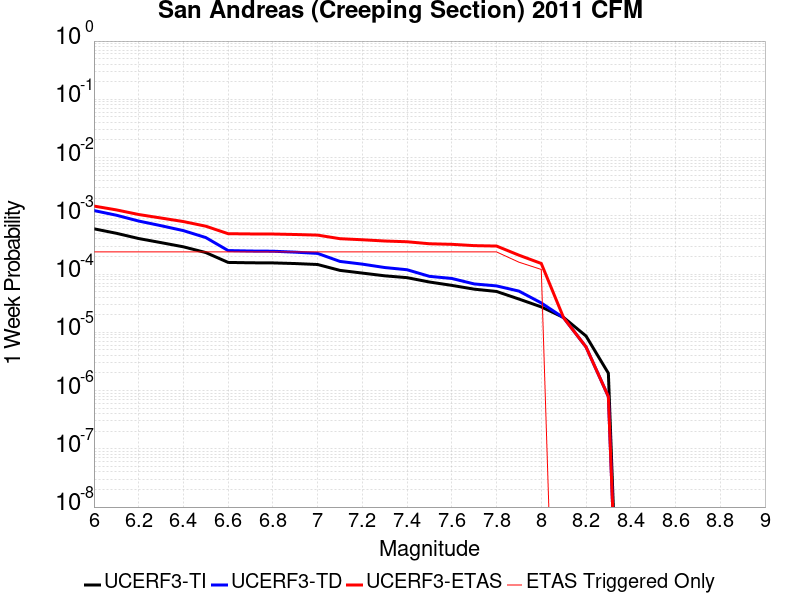 | 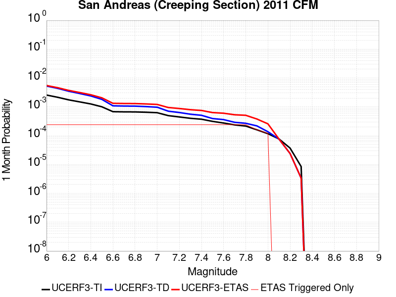 | 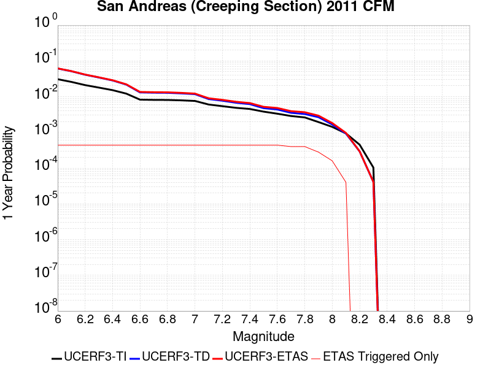 |

| Magnitude | 1 wk TI Prob | 1 wk TD Prob | 1 wk ETAS Prob | 1 wk ETAS/TD Gain | 1 wk ETAS Triggered Only | 1 mo TI Prob | 1 mo TD Prob | 1 mo ETAS Prob | 1 mo ETAS/TD Gain | 1 mo ETAS Triggered Only | 1 yr TI Prob | 1 yr TD Prob | 1 yr ETAS Prob | 1 yr ETAS/TD Gain | 1 yr ETAS Triggered Only |
|-----|-----|-----|-----|-----|-----|-----|-----|-----|-----|-----|-----|-----|-----|-----|-----|
| 6.0 | 5.986481E-4 | 0.0012305736 | 0.0014702784 | 1.194791 | 2.4E-4 | 0.0025631124 | 0.0052583744 | 0.0054971124 | 1.0454015 | 2.4E-4 | 0.030762846 | 0.06135223 | 0.061765235 | 1.0067317 | 4.4E-4 |
| 6.1 | 5.015945E-4 | 0.0010242044 | 0.0012639586 | 1.2340882 | 2.4E-4 | 0.00214792 | 0.00437824 | 0.0046171895 | 1.0545765 | 2.4E-4 | 0.025839351 | 0.051369127 | 0.051786523 | 1.0081254 | 4.4E-4 |
| 6.2 | 4.073338E-4 | 8.1310584E-4 | 0.0010529107 | 1.2949245 | 2.4E-4 | 0.0017445484 | 0.0034773606 | 0.003716526 | 1.0687779 | 2.4E-4 | 0.021034058 | 0.04105309 | 0.041475028 | 1.0102779 | 4.4E-4 |
| 6.3 | 3.464099E-4 | 6.7629415E-4 | 9.1613183E-4 | 1.3546352 | 2.4E-4 | 0.0014837692 | 0.002893196 | 0.0031325016 | 1.0827132 | 2.4E-4 | 0.017915873 | 0.034310453 | 0.034735356 | 1.012384 | 4.4E-4 |
| 6.4 | 2.935057E-4 | 5.56817E-4 | 7.9668337E-4 | 1.4307814 | 2.4E-4 | 0.0012572751 | 0.0023828198 | 0.002622248 | 1.100481 | 2.4E-4 | 0.015200248 | 0.028386578 | 0.028814089 | 1.0150603 | 4.4E-4 |
| 6.5 | 2.3409708E-4 | 4.233272E-4 | 6.632256E-4 | 1.5666974 | 2.4E-4 | 0.0010028875 | 0.0018122771 | 0.0020518422 | 1.1321901 | 2.4E-4 | 0.012141965 | 0.021710506 | 0.022140954 | 1.0198267 | 4.4E-4 |
| 6.6 | 1.5842178E-4 | 2.530843E-4 | 4.9302354E-4 | 1.9480608 | 2.4E-4 | 6.7877385E-4 | 0.0010841859 | 0.0013239257 | 1.2211243 | 2.4E-4 | 0.0082328 | 0.013118694 | 0.013552922 | 1.0330999 | 4.4E-4 |
| 6.7 | 1.5616413E-4 | 2.484441E-4 | 4.8838445E-4 | 1.9657722 | 2.4E-4 | 6.691031E-4 | 0.0010643183 | 0.001304063 | 1.2252564 | 2.4E-4 | 0.0081159435 | 0.01288029 | 0.013314623 | 1.0337207 | 4.4E-4 |
| 6.8 | 1.5538467E-4 | 2.4667758E-4 | 4.8661837E-4 | 1.97269 | 2.4E-4 | 6.6576427E-4 | 0.0010567546 | 0.001296501 | 1.2268704 | 2.4E-4 | 0.008075596 | 0.012789439 | 0.013223812 | 1.0339634 | 4.4E-4 |
| 6.9 | 1.5153569E-4 | 2.3774903E-4 | 4.7769197E-4 | 2.0092278 | 2.4E-4 | 6.49277E-4 | 0.0010185286 | 0.0012582842 | 1.235394 | 2.4E-4 | 0.007876333 | 0.012330608 | 0.012765183 | 1.0352435 | 4.4E-4 |
| 7.0 | 1.4588932E-4 | 2.26266E-4 | 4.662117E-4 | 2.0604584 | 2.4E-4 | 6.250901E-4 | 9.69353E-4 | 0.0012091204 | 1.2473478 | 2.4E-4 | 0.0075839474 | 0.011738516 | 0.012173351 | 1.0370435 | 4.4E-4 |
| 7.1 | 1.1565079E-4 | 1.648249E-4 | 4.0478536E-4 | 2.4558506 | 2.4E-4 | 4.955521E-4 | 7.0620206E-4 | 9.460326E-4 | 1.339606 | 2.4E-4 | 0.006016669 | 0.008564321 | 0.009000553 | 1.050936 | 4.4E-4 |
| 7.2 | 1.0393792E-4 | 1.4804474E-4 | 3.880092E-4 | 2.6208916 | 2.4E-4 | 4.4537216E-4 | 6.343239E-4 | 8.741717E-4 | 1.3781155 | 2.4E-4 | 0.005408933 | 0.0076957205 | 0.008132334 | 1.0567347 | 4.4E-4 |
| 7.3 | 9.332884E-5 | 1.2946628E-4 | 3.694352E-4 | 2.8535244 | 2.4E-4 | 3.999194E-4 | 5.5473816E-4 | 7.94605E-4 | 1.4323965 | 2.4E-4 | 0.0048581534 | 0.006733159 | 0.0071701966 | 1.0649083 | 4.4E-4 |
| 7.4 | 8.670252E-5 | 1.1859965E-4 | 3.5857118E-4 | 3.0233748 | 2.4E-4 | 3.715293E-4 | 5.081858E-4 | 7.4806385E-4 | 1.4720283 | 2.4E-4 | 0.004513991 | 0.006169733 | 0.0066070184 | 1.0708759 | 4.4E-4 |
| 7.5 | 7.3036405E-5 | 9.138321E-5 | 3.3136128E-4 | 3.626063 | 2.4E-4 | 3.129756E-4 | 3.9158363E-4 | 6.314897E-4 | 1.6126559 | 2.4E-4 | 0.0038038217 | 0.004757131 | 0.0051950375 | 1.0920527 | 4.4E-4 |
| 7.6 | 6.3935775E-5 | 8.4007974E-5 | 3.2398783E-4 | 3.8566315 | 2.4E-4 | 2.7398168E-4 | 3.5998458E-4 | 5.998982E-4 | 1.6664551 | 2.4E-4 | 0.0033306254 | 0.004374024 | 0.0048120995 | 1.1001539 | 4.4E-4 |
| 7.7 | 5.5050095E-5 | 6.768488E-5 | 3.0766864E-4 | 4.5456038 | 2.4E-4 | 2.3590765E-4 | 2.900458E-4 | 5.299762E-4 | 1.8272154 | 2.4E-4 | 0.0028683927 | 0.0035255942 | 0.003924184 | 1.1130561 | 4.0E-4 |
| 7.8 | 5.027131E-5 | 6.260343E-5 | 3.025884E-4 | 4.833416 | 2.4E-4 | 2.1543067E-4 | 2.6827282E-4 | 5.0820847E-4 | 1.8943716 | 2.4E-4 | 0.0026197135 | 0.0032613333 | 0.0036600288 | 1.1222492 | 4.0E-4 |
| 7.9 | 3.7271806E-5 | 5.1009967E-5 | 2.1100181E-4 | 4.136482 | 1.6E-4 | 1.5972654E-4 | 2.1859583E-4 | 3.7856086E-4 | 1.7317845 | 1.6E-4 | 0.0019429359 | 0.002658158 | 0.0029374138 | 1.105056 | 2.8E-4 |
| 8.0 | 2.7310243E-5 | 3.1948035E-5 | 1.519442E-4 | 4.7559795 | 1.2E-4 | 1.17038646E-4 | 1.3691297E-4 | 2.5689654E-4 | 1.8763492 | 1.2E-4 | 0.0014240141 | 0.0016656418 | 0.0018253752 | 1.0958991 | 1.6E-4 |
| 8.1 | 1.7940547E-5 | 1.7734084E-5 | 1.7734084E-5 | 1.0 | 0.0 | 7.688579E-5 | 7.600101E-5 | 7.600101E-5 | 1.0 | 0.0 | 9.3568244E-4 | 9.2491996E-4 | 9.6488296E-4 | 1.0432069 | 4.0E-5 |
| 8.2 | 8.643924E-6 | 5.607368E-6 | 5.607368E-6 | 1.0 | 0.0 | 3.704486E-5 | 2.4031357E-5 | 2.4031357E-5 | 1.0 | 0.0 | 4.5092785E-4 | 2.9254257E-4 | 2.9254257E-4 | 1.0 | 0.0 |
| 8.3 | 1.983087E-6 | 7.877893E-7 | 7.877893E-7 | 1.0 | 0.0 | 8.498917E-6 | 3.3762356E-6 | 3.3762356E-6 | 1.0 | 0.0 | 1.034694E-4 | 4.110491E-5 | 4.110491E-5 | 1.0 | 0.0 |

## Pleito
*[(top)](#table-of-contents)*

| 1 Week | 1 Month | 1 Year |
|-----|-----|-----|
| 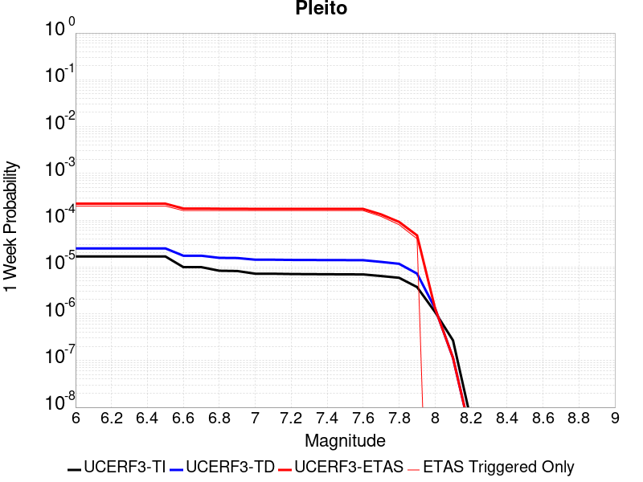 | 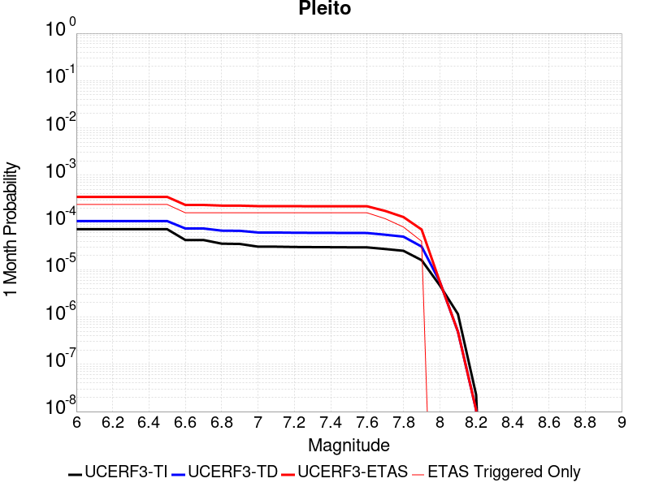 | 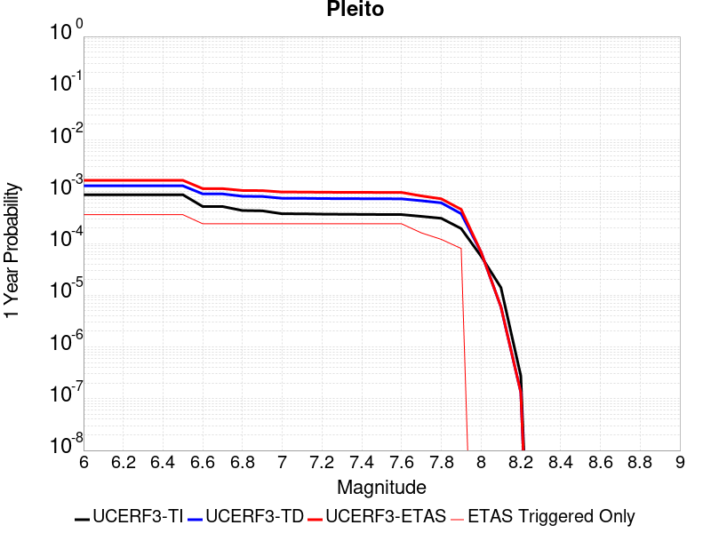 |

| Magnitude | 1 wk TI Prob | 1 wk TD Prob | 1 wk ETAS Prob | 1 wk ETAS/TD Gain | 1 wk ETAS Triggered Only | 1 mo TI Prob | 1 mo TD Prob | 1 mo ETAS Prob | 1 mo ETAS/TD Gain | 1 mo ETAS Triggered Only | 1 yr TI Prob | 1 yr TD Prob | 1 yr ETAS Prob | 1 yr ETAS/TD Gain | 1 yr ETAS Triggered Only |
|-----|-----|-----|-----|-----|-----|-----|-----|-----|-----|-----|-----|-----|-----|-----|-----|
| 6.0 | 1.6763008E-5 | 2.4935694E-5 | 2.2493071E-4 | 9.020431 | 2.0E-4 | 7.183948E-5 | 1.0686329E-4 | 3.4683765E-4 | 3.24562 | 2.4E-4 | 8.742947E-4 | 0.0013003562 | 0.0016598881 | 1.2764872 | 3.6E-4 |
| 6.1 | 1.6763008E-5 | 2.4935694E-5 | 2.2493071E-4 | 9.020431 | 2.0E-4 | 7.183948E-5 | 1.0686329E-4 | 3.4683765E-4 | 3.24562 | 2.4E-4 | 8.742947E-4 | 0.0013003562 | 0.0016598881 | 1.2764872 | 3.6E-4 |
| 6.2 | 1.6763008E-5 | 2.4935694E-5 | 2.2493071E-4 | 9.020431 | 2.0E-4 | 7.183948E-5 | 1.0686329E-4 | 3.4683765E-4 | 3.24562 | 2.4E-4 | 8.742947E-4 | 0.0013003562 | 0.0016598881 | 1.2764872 | 3.6E-4 |
| 6.3 | 1.6763008E-5 | 2.4935694E-5 | 2.2493071E-4 | 9.020431 | 2.0E-4 | 7.183948E-5 | 1.0686329E-4 | 3.4683765E-4 | 3.24562 | 2.4E-4 | 8.742947E-4 | 0.0013003562 | 0.0016598881 | 1.2764872 | 3.6E-4 |
| 6.4 | 1.6763008E-5 | 2.4935694E-5 | 2.2493071E-4 | 9.020431 | 2.0E-4 | 7.183948E-5 | 1.0686329E-4 | 3.4683765E-4 | 3.24562 | 2.4E-4 | 8.742947E-4 | 0.0013003562 | 0.0016598881 | 1.2764872 | 3.6E-4 |
| 6.5 | 1.6763008E-5 | 2.4935694E-5 | 2.2493071E-4 | 9.020431 | 2.0E-4 | 7.183948E-5 | 1.0686329E-4 | 3.4683765E-4 | 3.24562 | 2.4E-4 | 8.742947E-4 | 0.0013003562 | 0.0016598881 | 1.2764872 | 3.6E-4 |
| 6.6 | 9.910213E-6 | 1.738388E-5 | 1.773811E-4 | 10.20377 | 1.6E-4 | 4.247165E-5 | 7.450023E-5 | 2.3448831E-4 | 3.1474843 | 1.6E-4 | 5.169696E-4 | 9.066666E-4 | 0.001146449 | 1.2644659 | 2.4E-4 |
| 6.7 | 9.910213E-6 | 1.738388E-5 | 1.773811E-4 | 10.20377 | 1.6E-4 | 4.247165E-5 | 7.450023E-5 | 2.3448831E-4 | 3.1474843 | 1.6E-4 | 5.169696E-4 | 9.066666E-4 | 0.001146449 | 1.2644659 | 2.4E-4 |
| 6.8 | 8.300162E-6 | 1.564301E-5 | 1.7564051E-4 | 11.22805 | 1.6E-4 | 3.557164E-5 | 6.703976E-5 | 2.2702903E-4 | 3.3864834 | 1.6E-4 | 4.3299864E-4 | 8.159049E-4 | 0.0010557091 | 1.2939119 | 2.4E-4 |
| 6.9 | 8.183114E-6 | 1.551415E-5 | 1.7551167E-4 | 11.313006 | 1.6E-4 | 3.5070017E-5 | 6.6487526E-5 | 2.2647688E-4 | 3.4063065 | 1.6E-4 | 4.2689382E-4 | 8.0918643E-4 | 0.0010489922 | 1.2963542 | 2.4E-4 |
| 7.0 | 7.1748823E-6 | 1.4299022E-5 | 1.7429673E-4 | 12.189417 | 1.6E-4 | 3.0749135E-5 | 6.128009E-5 | 2.2127028E-4 | 3.6108024 | 1.6E-4 | 3.743064E-4 | 7.458302E-4 | 9.856512E-4 | 1.321549 | 2.4E-4 |
| 7.1 | 7.1671807E-6 | 1.4289369E-5 | 1.7428708E-4 | 12.196976 | 1.6E-4 | 3.0716128E-5 | 6.1238716E-5 | 2.2122893E-4 | 3.6125662 | 1.6E-4 | 3.7390468E-4 | 7.4532686E-4 | 9.85148E-4 | 1.3217664 | 2.4E-4 |
| 7.2 | 7.0649667E-6 | 1.4136105E-5 | 1.7413385E-4 | 12.318376 | 1.6E-4 | 3.0278077E-5 | 6.05819E-5 | 2.2057221E-4 | 3.6408927 | 1.6E-4 | 3.6857324E-4 | 7.373356E-4 | 9.771587E-4 | 1.3252563 | 2.4E-4 |
| 7.3 | 7.02082E-6 | 1.4079238E-5 | 1.7407698E-4 | 12.364092 | 1.6E-4 | 3.008888E-5 | 6.03382E-5 | 2.2032854E-4 | 3.6515598 | 1.6E-4 | 3.6627054E-4 | 7.343705E-4 | 9.741942E-4 | 1.3265705 | 2.4E-4 |
| 7.4 | 6.987146E-6 | 1.4038616E-5 | 1.7403637E-4 | 12.396975 | 1.6E-4 | 2.9944567E-5 | 6.0164115E-5 | 2.2015448E-4 | 3.6592326 | 1.6E-4 | 3.6451413E-4 | 7.3225243E-4 | 9.720767E-4 | 1.3275158 | 2.4E-4 |
| 7.5 | 6.9494554E-6 | 1.3995384E-5 | 1.7399315E-4 | 12.432181 | 1.6E-4 | 2.9783041E-5 | 5.997884E-5 | 2.1996924E-4 | 3.6674476 | 1.6E-4 | 3.625482E-4 | 7.299982E-4 | 9.6982304E-4 | 1.3285279 | 2.4E-4 |
| 7.6 | 6.92694E-6 | 1.3954241E-5 | 1.7395201E-4 | 12.465889 | 1.6E-4 | 2.9686547E-5 | 5.9802518E-5 | 2.1979296E-4 | 3.6753125 | 1.6E-4 | 3.6137376E-4 | 7.27853E-4 | 9.6767826E-4 | 1.329497 | 2.4E-4 |
| 7.7 | 6.395867E-6 | 1.2826297E-5 | 1.3282476E-4 | 10.355659 | 1.2E-4 | 2.741057E-5 | 5.496869E-5 | 1.7496209E-4 | 3.182941 | 1.2E-4 | 3.336726E-4 | 6.690386E-4 | 8.289316E-4 | 1.2389891 | 1.6E-4 |
| 7.8 | 5.8664327E-6 | 1.1680238E-5 | 9.16793E-5 | 7.849096 | 8.0E-5 | 2.5141611E-5 | 5.00572E-5 | 1.300532E-4 | 2.5980916 | 8.0E-5 | 3.060561E-4 | 6.0927623E-4 | 7.292031E-4 | 1.196835 | 1.2E-4 |
| 7.9 | 3.7167474E-6 | 7.2014245E-6 | 4.7201138E-5 | 6.5544167 | 4.0E-5 | 1.592882E-5 | 3.0862884E-5 | 7.086165E-5 | 2.2960153 | 4.0E-5 | 1.9391612E-4 | 3.75691E-4 | 4.5566092E-4 | 1.212861 | 8.0E-5 |
| 8.0 | 1.0903841E-6 | 1.3071021E-6 | 1.3071021E-6 | 1.0 | 0.0 | 4.6730665E-6 | 5.601854E-6 | 5.601854E-6 | 1.0 | 0.0 | 5.68931E-5 | 6.8200454E-5 | 6.8200454E-5 | 1.0 | 0.0 |
| 8.1 | 2.6894583E-7 | 1.13801775E-7 | 1.13801775E-7 | 1.0 | 0.0 | 1.1526245E-6 | 4.8772176E-7 | 4.8772176E-7 | 1.0 | 0.0 | 1.4033113E-5 | 5.937997E-6 | 5.937997E-6 | 1.0 | 0.0 |
| 8.2 | 5.2967013E-9 | 2.5342395E-9 | 2.5342395E-9 | 1.0 | 0.0 | 2.2700148E-8 | 1.0861028E-8 | 1.0861028E-8 | 1.0 | 0.0 | 2.7637427E-7 | 1.32233E-7 | 1.32233E-7 | 1.0 | 0.0 |

## Imperial
*[(top)](#table-of-contents)*

| 1 Week | 1 Month | 1 Year |
|-----|-----|-----|
| 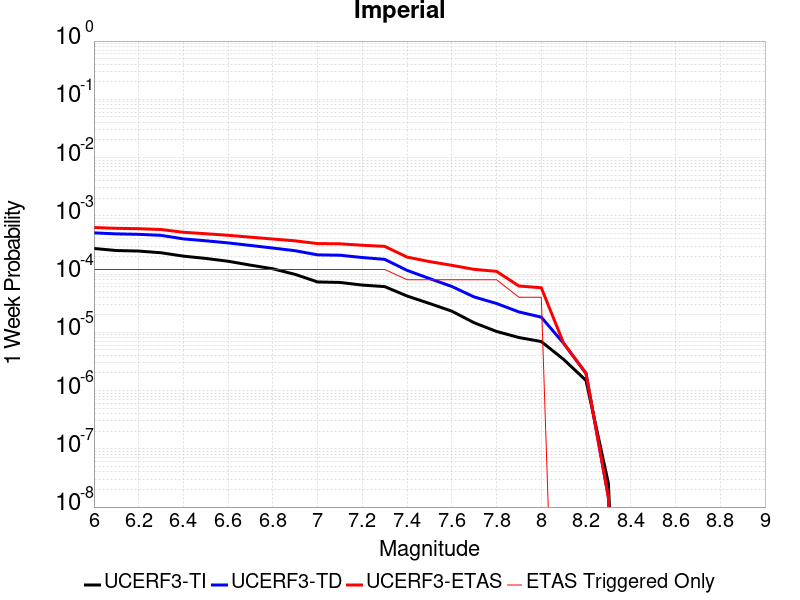 | 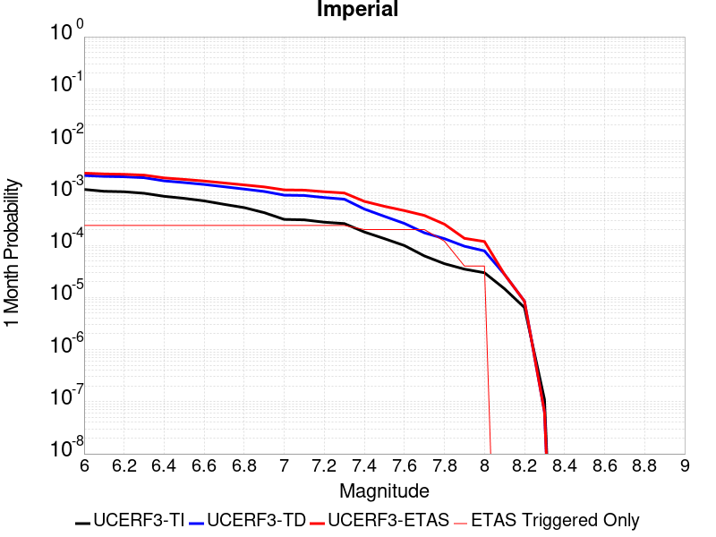 | 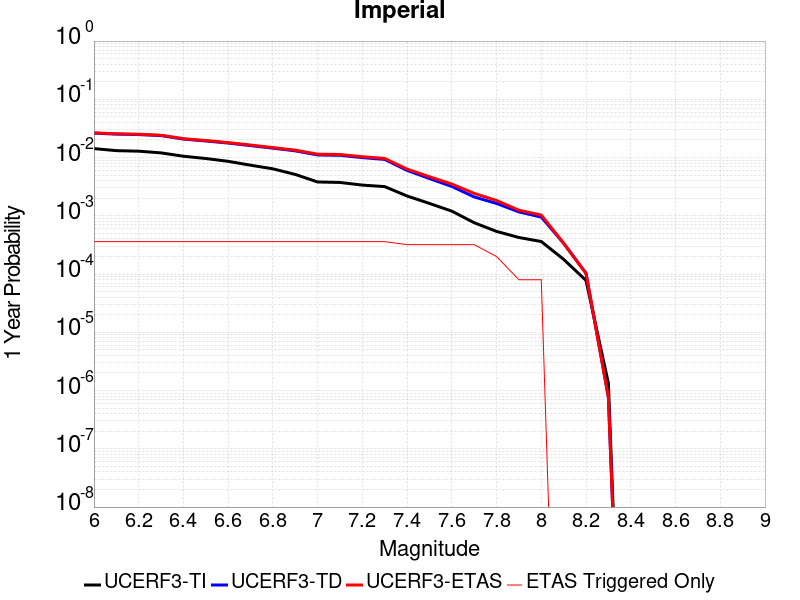 |

| Magnitude | 1 wk TI Prob | 1 wk TD Prob | 1 wk ETAS Prob | 1 wk ETAS/TD Gain | 1 wk ETAS Triggered Only | 1 mo TI Prob | 1 mo TD Prob | 1 mo ETAS Prob | 1 mo ETAS/TD Gain | 1 mo ETAS Triggered Only | 1 yr TI Prob | 1 yr TD Prob | 1 yr ETAS Prob | 1 yr ETAS/TD Gain | 1 yr ETAS Triggered Only |
|-----|-----|-----|-----|-----|-----|-----|-----|-----|-----|-----|-----|-----|-----|-----|-----|
| 6.0 | 2.7496446E-4 | 5.092747E-4 | 6.292136E-4 | 1.2355092 | 1.2E-4 | 0.0011778869 | 0.0021808199 | 0.0024202967 | 1.1098104 | 2.4E-4 | 0.0142467655 | 0.026244733 | 0.026595285 | 1.013357 | 3.6E-4 |
| 6.1 | 2.5356023E-4 | 4.8989133E-4 | 6.098326E-4 | 1.2448323 | 1.2E-4 | 0.001086234 | 0.0020978837 | 0.00233738 | 1.114161 | 2.4E-4 | 0.013144928 | 0.025256295 | 0.025607202 | 1.0138938 | 3.6E-4 |
| 6.2 | 2.4820742E-4 | 4.807923E-4 | 6.007346E-4 | 1.249468 | 1.2E-4 | 0.0010633124 | 0.0020589496 | 0.0022984555 | 1.1163243 | 2.4E-4 | 0.01286919 | 0.024793668 | 0.025144743 | 1.0141598 | 3.6E-4 |
| 6.3 | 2.3205351E-4 | 4.618754E-4 | 5.8182E-4 | 1.2596903 | 1.2E-4 | 9.94136E-4 | 0.0019780016 | 0.0022175268 | 1.1210946 | 2.4E-4 | 0.012036599 | 0.023824649 | 0.024176072 | 1.0147504 | 3.6E-4 |
| 6.4 | 2.0304754E-4 | 4.0161575E-4 | 5.2156753E-4 | 1.298673 | 1.2E-4 | 8.6991355E-4 | 0.0017200898 | 0.001959677 | 1.1392876 | 2.4E-4 | 0.010539869 | 0.020755747 | 0.021108275 | 1.0169846 | 3.6E-4 |
| 6.5 | 1.854992E-4 | 3.7255368E-4 | 4.92509E-4 | 1.3219812 | 1.2E-4 | 7.9475436E-4 | 0.0015956942 | 0.0018353112 | 1.1501647 | 2.4E-4 | 0.009633281 | 0.019265464 | 0.019618528 | 1.0183263 | 3.6E-4 |
| 6.6 | 1.6586106E-4 | 3.4277118E-4 | 4.6273004E-4 | 1.3499678 | 1.2E-4 | 7.106394E-4 | 0.0014682026 | 0.0017078503 | 1.1632252 | 2.4E-4 | 0.008617763 | 0.017735237 | 0.018088853 | 1.0199386 | 3.6E-4 |
| 6.7 | 1.4224656E-4 | 3.0978522E-4 | 4.2974803E-4 | 1.3872452 | 1.2E-4 | 6.094856E-4 | 0.0013269838 | 0.0015666652 | 1.1806213 | 2.4E-4 | 0.0073952693 | 0.01604038 | 0.016394606 | 1.0220834 | 3.6E-4 |
| 6.8 | 1.2317259E-4 | 2.7964902E-4 | 3.9961547E-4 | 1.4289893 | 1.2E-4 | 5.2777573E-4 | 0.0011979516 | 0.0014376641 | 1.200102 | 2.4E-4 | 0.0064067547 | 0.014488932 | 0.014843715 | 1.0244865 | 3.6E-4 |
| 6.9 | 9.859898E-5 | 2.5139938E-4 | 3.713692E-4 | 1.4772081 | 1.2E-4 | 4.2249862E-4 | 0.0010769854 | 0.0013167269 | 1.2226043 | 2.4E-4 | 0.0051317946 | 0.013034438 | 0.013389745 | 1.0272591 | 3.6E-4 |
| 7.0 | 7.3191884E-5 | 2.1355721E-4 | 3.3353159E-4 | 1.5617903 | 1.2E-4 | 3.136418E-4 | 9.149274E-4 | 0.0011547077 | 1.2620759 | 2.4E-4 | 0.003811904 | 0.0110830385 | 0.011439049 | 1.032122 | 3.6E-4 |
| 7.1 | 7.1760296E-5 | 2.1055574E-4 | 3.3053046E-4 | 1.5698004 | 1.2E-4 | 3.0750787E-4 | 9.020729E-4 | 0.0011418563 | 1.265814 | 2.4E-4 | 0.003737482 | 0.010928115 | 0.01128418 | 1.0325825 | 3.6E-4 |
| 7.2 | 6.46614E-5 | 1.922011E-4 | 3.1217805E-4 | 1.6242261 | 1.2E-4 | 2.7709085E-4 | 8.2346203E-4 | 0.0010632644 | 1.2912124 | 2.4E-4 | 0.0033683628 | 0.00998019 | 0.0103365965 | 1.0357114 | 3.6E-4 |
| 7.3 | 6.088115E-5 | 1.7887545E-4 | 2.9885396E-4 | 1.6707379 | 1.2E-4 | 2.6089314E-4 | 7.663867E-4 | 0.0010062028 | 1.3129178 | 2.4E-4 | 0.0031717476 | 0.009291418 | 0.009648073 | 1.0383854 | 3.6E-4 |
| 7.4 | 4.199346E-5 | 1.1570693E-4 | 1.9569768E-4 | 1.691322 | 8.0E-5 | 1.7995955E-4 | 4.957935E-4 | 6.956943E-4 | 1.4031937 | 2.0E-4 | 0.0021888057 | 0.006019749 | 0.006337823 | 1.0528383 | 3.2E-4 |
| 7.5 | 3.130448E-5 | 8.383019E-5 | 1.6382348E-4 | 1.9542301 | 8.0E-5 | 1.3415517E-4 | 3.592231E-4 | 5.591513E-4 | 1.556557 | 2.0E-4 | 0.0016321153 | 0.004364831 | 0.0046834345 | 1.0729933 | 3.2E-4 |
| 7.6 | 2.3074248E-5 | 6.126616E-5 | 1.4126126E-4 | 2.305698 | 8.0E-5 | 9.888588E-5 | 2.6254298E-4 | 4.6249045E-4 | 1.7615801 | 2.0E-4 | 0.0012032706 | 0.003191799 | 0.0035107776 | 1.099937 | 3.2E-4 |
| 7.7 | 1.45864815E-5 | 4.047476E-5 | 1.2047152E-4 | 2.9764605 | 8.0E-5 | 6.2511994E-5 | 1.7345174E-4 | 3.7341705E-4 | 2.1528585 | 2.0E-4 | 7.608177E-4 | 0.0021097353 | 0.0024290602 | 1.1513578 | 3.2E-4 |
| 7.8 | 1.0352979E-5 | 3.1258456E-5 | 1.11255955E-4 | 3.5592277 | 8.0E-5 | 4.4369157E-5 | 1.3395795E-4 | 2.5394186E-4 | 1.8956835 | 1.2E-4 | 5.400606E-4 | 0.0016297202 | 0.0018293943 | 1.1225204 | 2.0E-4 |
| 7.9 | 8.137906E-6 | 2.238844E-5 | 6.2387546E-5 | 2.7865963 | 4.0E-5 | 3.4876273E-5 | 9.594693E-5 | 1.3594309E-4 | 1.4168571 | 4.0E-5 | 4.2453592E-4 | 0.0011675289 | 0.0012474355 | 1.0684408 | 8.0E-5 |
| 8.0 | 6.93792E-6 | 1.821489E-5 | 5.8214162E-5 | 3.1959655 | 4.0E-5 | 2.9733603E-5 | 7.806149E-5 | 1.18058364E-4 | 1.5123765 | 4.0E-5 | 3.6194647E-4 | 9.49985E-4 | 0.001029909 | 1.0841318 | 8.0E-5 |
| 8.1 | 3.4286315E-6 | 6.476726E-6 | 6.476726E-6 | 1.0 | 0.0 | 1.4694053E-5 | 2.7757102E-5 | 2.7757102E-5 | 1.0 | 0.0 | 1.7888541E-4 | 3.3789044E-4 | 3.3789044E-4 | 1.0 | 0.0 |
| 8.2 | 1.4906886E-6 | 1.9734612E-6 | 1.9734612E-6 | 1.0 | 0.0 | 6.3886496E-6 | 8.457663E-6 | 8.457663E-6 | 1.0 | 0.0 | 7.7779034E-5 | 1.0296722E-4 | 1.0296722E-4 | 1.0 | 0.0 |
| 8.3 | 2.5758007E-8 | 1.4872131E-8 | 1.4872131E-8 | 1.0 | 0.0 | 1.10391454E-7 | 6.37377E-8 | 6.37377E-8 | 1.0 | 0.0 | 1.3440151E-6 | 7.760065E-7 | 7.760065E-7 | 1.0 | 0.0 |

## Blackwater
*[(top)](#table-of-contents)*

| 1 Week | 1 Month | 1 Year |
|-----|-----|-----|
| 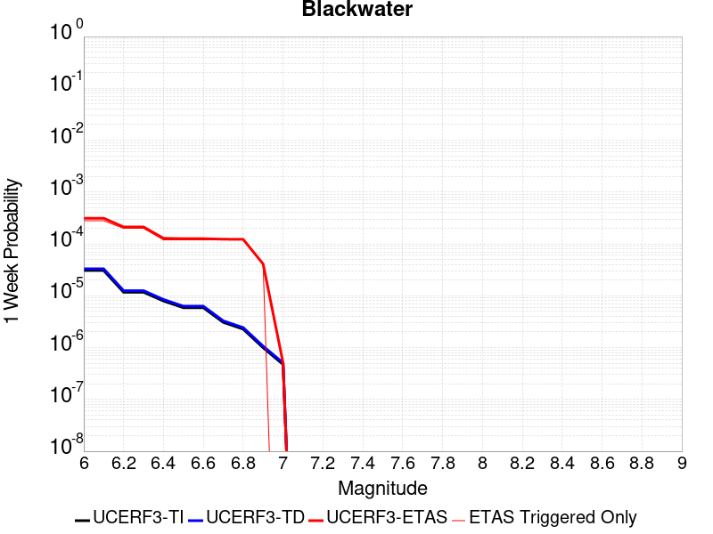 | 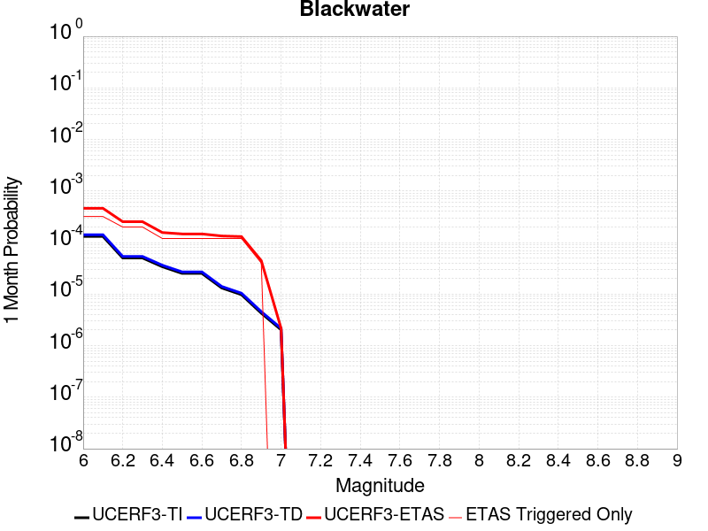 | 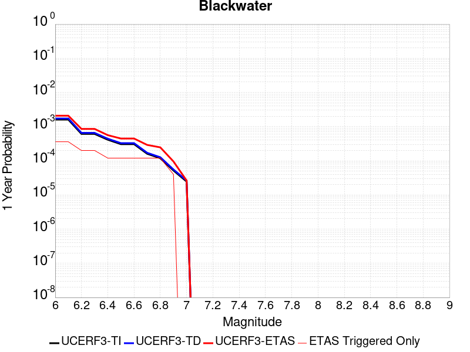 |

| Magnitude | 1 wk TI Prob | 1 wk TD Prob | 1 wk ETAS Prob | 1 wk ETAS/TD Gain | 1 wk ETAS Triggered Only | 1 mo TI Prob | 1 mo TD Prob | 1 mo ETAS Prob | 1 mo ETAS/TD Gain | 1 mo ETAS Triggered Only | 1 yr TI Prob | 1 yr TD Prob | 1 yr ETAS Prob | 1 yr ETAS/TD Gain | 1 yr ETAS Triggered Only |
|-----|-----|-----|-----|-----|-----|-----|-----|-----|-----|-----|-----|-----|-----|-----|-----|
| 6.0 | 3.0708583E-5 | 3.3104585E-5 | 3.130953E-4 | 9.457764 | 2.8E-4 | 1.3160157E-4 | 1.4186984E-4 | 4.6182444E-4 | 3.2552686 | 3.2E-4 | 0.0016010714 | 0.0017260336 | 0.0020854122 | 1.2082107 | 3.6E-4 |
| 6.1 | 3.0708583E-5 | 3.3104585E-5 | 3.130953E-4 | 9.457764 | 2.8E-4 | 1.3160157E-4 | 1.4186984E-4 | 4.6182444E-4 | 3.2552686 | 3.2E-4 | 0.0016010714 | 0.0017260336 | 0.0020854122 | 1.2082107 | 3.6E-4 |
| 6.2 | 1.1707779E-5 | 1.2548166E-5 | 2.1254565E-4 | 16.938385 | 2.0E-4 | 5.017523E-5 | 5.3776796E-5 | 2.5376605E-4 | 4.718876 | 2.0E-4 | 6.107122E-4 | 6.5454544E-4 | 8.5441454E-4 | 1.3053555 | 2.0E-4 |
| 6.3 | 1.1707779E-5 | 1.2548166E-5 | 2.1254565E-4 | 16.938385 | 2.0E-4 | 5.017523E-5 | 5.3776796E-5 | 2.5376605E-4 | 4.718876 | 2.0E-4 | 6.107122E-4 | 6.5454544E-4 | 8.5441454E-4 | 1.3053555 | 2.0E-4 |
| 6.4 | 7.929244E-6 | 8.482096E-6 | 1.2848107E-4 | 15.147327 | 1.2E-4 | 3.3982033E-5 | 3.6351354E-5 | 1.5634699E-4 | 4.300995 | 1.2E-4 | 4.136527E-4 | 4.424919E-4 | 5.624388E-4 | 1.2710714 | 1.2E-4 |
| 6.5 | 5.8832115E-6 | 6.2874497E-6 | 1.262867E-4 | 20.08552 | 1.2E-4 | 2.521352E-5 | 2.6945949E-5 | 1.4694272E-4 | 5.4532394 | 1.2E-4 | 3.0693135E-4 | 3.280201E-4 | 4.4798074E-4 | 1.3657112 | 1.2E-4 |
| 6.6 | 5.8832115E-6 | 6.2874497E-6 | 1.262867E-4 | 20.08552 | 1.2E-4 | 2.521352E-5 | 2.6945949E-5 | 1.4694272E-4 | 5.4532394 | 1.2E-4 | 3.0693135E-4 | 3.280201E-4 | 4.4798074E-4 | 1.3657112 | 1.2E-4 |
| 6.7 | 3.0715053E-6 | 3.2822265E-6 | 1.2328183E-4 | 37.56043 | 1.2E-4 | 1.3163528E-5 | 1.4066616E-5 | 1.3406493E-4 | 9.530717 | 1.2E-4 | 1.6025416E-4 | 1.7124876E-4 | 2.912282E-4 | 1.700615 | 1.2E-4 |
| 6.8 | 2.2722281E-6 | 2.4293208E-6 | 1.2242903E-4 | 50.396404 | 1.2E-4 | 9.738084E-6 | 1.0411339E-5 | 1.3041009E-4 | 12.525776 | 1.2E-4 | 1.1855473E-4 | 1.2675159E-4 | 2.4673637E-4 | 1.9466137 | 1.2E-4 |
| 6.9 | 9.952399E-7 | 1.0656032E-6 | 4.106556E-5 | 38.537384 | 4.0E-5 | 4.265307E-6 | 4.5668658E-6 | 4.4566685E-5 | 9.758702 | 4.0E-5 | 5.1928873E-5 | 5.560069E-5 | 9.5598465E-5 | 1.7193755 | 4.0E-5 |
| 7.0 | 4.7385504E-7 | 5.076783E-7 | 5.076783E-7 | 1.0 | 0.0 | 2.0308057E-6 | 2.1757642E-6 | 2.1757642E-6 | 1.0 | 0.0 | 2.4724779E-5 | 2.6489928E-5 | 2.6489928E-5 | 1.0 | 0.0 |

## San Andreas (North Branch Mill Creek)
*[(top)](#table-of-contents)*

| 1 Week | 1 Month | 1 Year |
|-----|-----|-----|
| 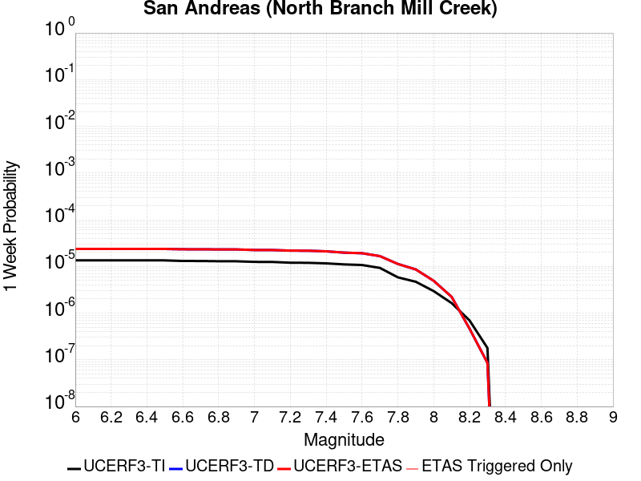 | 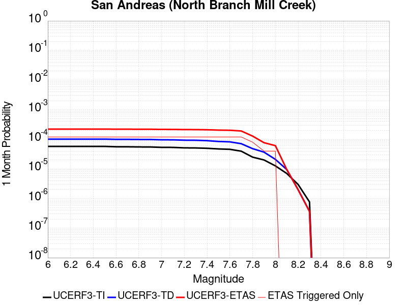 | 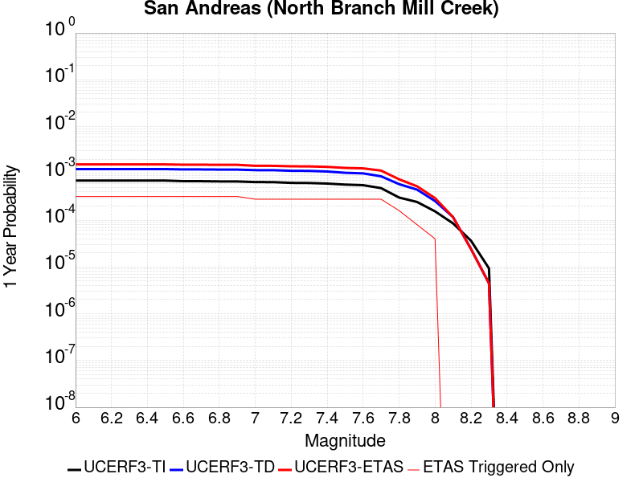 |

| Magnitude | 1 wk TI Prob | 1 wk TD Prob | 1 wk ETAS Prob | 1 wk ETAS/TD Gain | 1 wk ETAS Triggered Only | 1 mo TI Prob | 1 mo TD Prob | 1 mo ETAS Prob | 1 mo ETAS/TD Gain | 1 mo ETAS Triggered Only | 1 yr TI Prob | 1 yr TD Prob | 1 yr ETAS Prob | 1 yr ETAS/TD Gain | 1 yr ETAS Triggered Only |
|-----|-----|-----|-----|-----|-----|-----|-----|-----|-----|-----|-----|-----|-----|-----|-----|
| 6.0 | 1.3461156E-5 | 2.3679182E-5 | 2.3679182E-5 | 1.0 | 0.0 | 5.7689394E-5 | 1.0147828E-4 | 2.214661E-4 | 2.182399 | 1.2E-4 | 7.02142E-4 | 0.0012348011 | 0.001554406 | 1.258831 | 3.2E-4 |
| 6.1 | 1.3461156E-5 | 2.3679182E-5 | 2.3679182E-5 | 1.0 | 0.0 | 5.7689394E-5 | 1.0147828E-4 | 2.214661E-4 | 2.182399 | 1.2E-4 | 7.02142E-4 | 0.0012348011 | 0.001554406 | 1.258831 | 3.2E-4 |
| 6.2 | 1.3461156E-5 | 2.3679182E-5 | 2.3679182E-5 | 1.0 | 0.0 | 5.7689394E-5 | 1.0147828E-4 | 2.214661E-4 | 2.182399 | 1.2E-4 | 7.02142E-4 | 0.0012348011 | 0.001554406 | 1.258831 | 3.2E-4 |
| 6.3 | 1.3461156E-5 | 2.3679182E-5 | 2.3679182E-5 | 1.0 | 0.0 | 5.7689394E-5 | 1.0147828E-4 | 2.214661E-4 | 2.182399 | 1.2E-4 | 7.02142E-4 | 0.0012348011 | 0.001554406 | 1.258831 | 3.2E-4 |
| 6.4 | 1.3461156E-5 | 2.3679182E-5 | 2.3679182E-5 | 1.0 | 0.0 | 5.7689394E-5 | 1.0147828E-4 | 2.214661E-4 | 2.182399 | 1.2E-4 | 7.02142E-4 | 0.0012348011 | 0.001554406 | 1.258831 | 3.2E-4 |
| 6.5 | 1.3450706E-5 | 2.366814E-5 | 2.366814E-5 | 1.0 | 0.0 | 5.764461E-5 | 1.0143096E-4 | 2.2141878E-4 | 2.1829507 | 1.2E-4 | 7.0159714E-4 | 0.0012342257 | 0.0015538307 | 1.2589519 | 3.2E-4 |
| 6.6 | 1.3074523E-5 | 2.328236E-5 | 2.328236E-5 | 1.0 | 0.0 | 5.6032466E-5 | 9.9777746E-5 | 2.1976577E-4 | 2.202553 | 1.2E-4 | 6.8198174E-4 | 0.0012141204 | 0.0015337318 | 1.2632453 | 3.2E-4 |
| 6.7 | 1.3050216E-5 | 2.3257642E-5 | 2.3257642E-5 | 1.0 | 0.0 | 5.59283E-5 | 9.967182E-5 | 2.1965987E-4 | 2.2038312 | 1.2E-4 | 6.8071426E-4 | 0.0012128322 | 0.001532444 | 1.2635252 | 3.2E-4 |
| 6.8 | 1.29049395E-5 | 2.3106015E-5 | 2.3106015E-5 | 1.0 | 0.0 | 5.530571E-5 | 9.9022036E-5 | 2.1901015E-4 | 2.2117314 | 1.2E-4 | 6.73139E-4 | 0.0012049298 | 0.0015245442 | 1.2652557 | 3.2E-4 |
| 6.9 | 1.2867369E-5 | 2.306539E-5 | 2.306539E-5 | 1.0 | 0.0 | 5.51447E-5 | 9.8847944E-5 | 2.1883608E-4 | 2.2138658 | 1.2E-4 | 6.711799E-4 | 0.0012028125 | 0.0015224277 | 1.2657231 | 3.2E-4 |
| 7.0 | 1.2495996E-5 | 2.2464183E-5 | 2.2464183E-5 | 1.0 | 0.0 | 5.3553173E-5 | 9.6271535E-5 | 2.1625998E-4 | 2.2463543 | 1.2E-4 | 6.518148E-4 | 0.0011714785 | 0.0014511505 | 1.2387342 | 2.8E-4 |
| 7.1 | 1.2452067E-5 | 2.2409202E-5 | 2.2409202E-5 | 1.0 | 0.0 | 5.3364907E-5 | 9.603592E-5 | 2.1602439E-4 | 2.2494125 | 1.2E-4 | 6.4952404E-4 | 0.001168613 | 0.0014482858 | 1.2393203 | 2.8E-4 |
| 7.2 | 1.2002777E-5 | 2.1786782E-5 | 2.1786782E-5 | 1.0 | 0.0 | 5.143946E-5 | 9.3368595E-5 | 2.1335739E-4 | 2.2851086 | 1.2E-4 | 6.2609545E-4 | 0.0011361726 | 0.0014158544 | 1.2461615 | 2.8E-4 |
| 7.3 | 1.1923425E-5 | 2.1656399E-5 | 2.1656399E-5 | 1.0 | 0.0 | 5.109939E-5 | 9.280985E-5 | 2.1279871E-4 | 2.2928462 | 1.2E-4 | 6.219575E-4 | 0.0011293768 | 0.0014090607 | 1.2476443 | 2.8E-4 |
| 7.4 | 1.16105175E-5 | 2.1028349E-5 | 2.1028349E-5 | 1.0 | 0.0 | 4.975841E-5 | 9.0118396E-5 | 2.1010758E-4 | 2.3314617 | 1.2E-4 | 6.0564023E-4 | 0.0010966419 | 0.0013763348 | 1.2550449 | 2.8E-4 |
| 7.5 | 1.1037265E-5 | 1.9721652E-5 | 1.9721652E-5 | 1.0 | 0.0 | 4.7301706E-5 | 8.451864E-5 | 2.045085E-4 | 2.4196851 | 1.2E-4 | 5.757461E-4 | 0.0010285309 | 0.0013082429 | 1.271953 | 2.8E-4 |
| 7.6 | 1.0720915E-5 | 1.9161336E-5 | 1.9161336E-5 | 1.0 | 0.0 | 4.5945973E-5 | 8.211744E-5 | 2.0210759E-4 | 2.4612017 | 1.2E-4 | 5.592486E-4 | 9.993234E-4 | 0.0012790436 | 1.2799096 | 2.8E-4 |
| 7.7 | 9.276279E-6 | 1.6599204E-5 | 1.6599204E-5 | 1.0 | 0.0 | 3.9754876E-5 | 7.113752E-5 | 1.9112899E-4 | 2.6867535 | 1.2E-4 | 4.839081E-4 | 8.657568E-4 | 0.0011455144 | 1.3231364 | 2.8E-4 |
| 7.8 | 5.8346777E-6 | 1.1282931E-5 | 1.1282931E-5 | 1.0 | 0.0 | 2.5005522E-5 | 4.8354523E-5 | 1.2835066E-4 | 2.654367 | 8.0E-5 | 3.043997E-4 | 5.8855745E-4 | 7.4846327E-4 | 1.2716911 | 1.6E-4 |
| 7.9 | 4.690204E-6 | 8.6155715E-6 | 8.6155715E-6 | 1.0 | 0.0 | 2.0100719E-5 | 3.6923357E-5 | 7.692188E-5 | 2.083285 | 4.0E-5 | 2.4469878E-4 | 4.4944923E-4 | 5.294133E-4 | 1.1779156 | 8.0E-5 |
| 8.0 | 2.9570454E-6 | 4.9120426E-6 | 4.9120426E-6 | 1.0 | 0.0 | 1.267299E-5 | 2.105144E-5 | 6.10506E-5 | 2.9000673 | 4.0E-5 | 1.5428272E-4 | 2.562712E-4 | 2.9626093E-4 | 1.1560446 | 4.0E-5 |
| 8.1 | 1.6376824E-6 | 2.2310655E-6 | 2.2310655E-6 | 1.0 | 0.0 | 7.01862E-6 | 9.561673E-6 | 9.561673E-6 | 1.0 | 0.0 | 8.544835E-5 | 1.1640717E-4 | 1.1640717E-4 | 1.0 | 0.0 |
| 8.2 | 6.9631557E-7 | 4.641532E-7 | 4.641532E-7 | 1.0 | 0.0 | 2.984206E-6 | 1.9892263E-6 | 1.9892263E-6 | 1.0 | 0.0 | 3.63321E-5 | 2.4218563E-5 | 2.4218563E-5 | 1.0 | 0.0 |
| 8.3 | 1.7876137E-7 | 8.5759865E-8 | 8.5759865E-8 | 1.0 | 0.0 | 7.661199E-7 | 3.675422E-7 | 3.675422E-7 | 1.0 | 0.0 | 9.32747E-6 | 4.4748176E-6 | 4.4748176E-6 | 1.0 | 0.0 |

## San Jacinto (San Bernardino)
*[(top)](#table-of-contents)*

| 1 Week | 1 Month | 1 Year |
|-----|-----|-----|
|  | 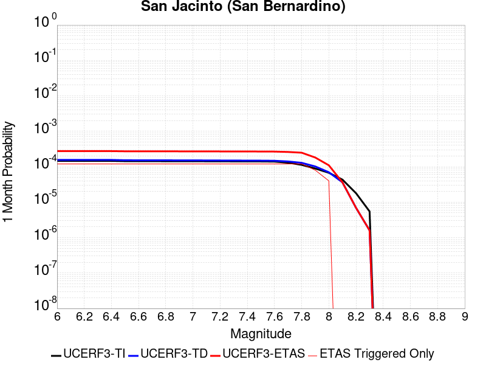 | 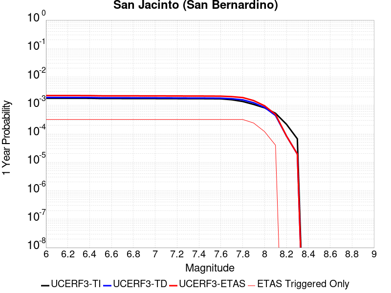 |

| Magnitude | 1 wk TI Prob | 1 wk TD Prob | 1 wk ETAS Prob | 1 wk ETAS/TD Gain | 1 wk ETAS Triggered Only | 1 mo TI Prob | 1 mo TD Prob | 1 mo ETAS Prob | 1 mo ETAS/TD Gain | 1 mo ETAS Triggered Only | 1 yr TI Prob | 1 yr TD Prob | 1 yr ETAS Prob | 1 yr ETAS/TD Gain | 1 yr ETAS Triggered Only |
|-----|-----|-----|-----|-----|-----|-----|-----|-----|-----|-----|-----|-----|-----|-----|-----|
| 6.0 | 3.409352E-5 | 3.6394562E-5 | 7.639311E-5 | 2.0990252 | 4.0E-5 | 1.461069E-4 | 1.5596737E-4 | 2.7594867E-4 | 1.7692716 | 1.2E-4 | 0.0017774 | 0.0018972505 | 0.0022166434 | 1.1683451 | 3.2E-4 |
| 6.1 | 3.409352E-5 | 3.6394562E-5 | 7.639311E-5 | 2.0990252 | 4.0E-5 | 1.461069E-4 | 1.5596737E-4 | 2.7594867E-4 | 1.7692716 | 1.2E-4 | 0.0017774 | 0.0018972505 | 0.0022166434 | 1.1683451 | 3.2E-4 |
| 6.2 | 3.409352E-5 | 3.6394562E-5 | 7.639311E-5 | 2.0990252 | 4.0E-5 | 1.461069E-4 | 1.5596737E-4 | 2.7594867E-4 | 1.7692716 | 1.2E-4 | 0.0017774 | 0.0018972505 | 0.0022166434 | 1.1683451 | 3.2E-4 |
| 6.3 | 3.409352E-5 | 3.6394562E-5 | 7.639311E-5 | 2.0990252 | 4.0E-5 | 1.461069E-4 | 1.5596737E-4 | 2.7594867E-4 | 1.7692716 | 1.2E-4 | 0.0017774 | 0.0018972505 | 0.0022166434 | 1.1683451 | 3.2E-4 |
| 6.4 | 3.400795E-5 | 3.6287136E-5 | 7.628568E-5 | 2.102279 | 4.0E-5 | 1.4574021E-4 | 1.5550703E-4 | 2.7548836E-4 | 1.7715492 | 1.2E-4 | 0.0017729428 | 0.0018916556 | 0.0022110504 | 1.168844 | 3.2E-4 |
| 6.5 | 3.341482E-5 | 3.5547153E-5 | 7.554573E-5 | 2.125226 | 4.0E-5 | 1.4319851E-4 | 1.5233604E-4 | 2.7231776E-4 | 1.7876121 | 1.2E-4 | 0.0017420477 | 0.001853115 | 0.002172522 | 1.1723622 | 3.2E-4 |
| 6.6 | 3.3364955E-5 | 3.5484314E-5 | 7.5482894E-5 | 2.1272187 | 4.0E-5 | 1.4298483E-4 | 1.5206679E-4 | 2.7204852E-4 | 1.789007 | 1.2E-4 | 0.0017394501 | 0.0018498423 | 0.0021692503 | 1.1726677 | 3.2E-4 |
| 6.7 | 3.335922E-5 | 3.547408E-5 | 7.5472664E-5 | 2.127544 | 4.0E-5 | 1.4296026E-4 | 1.5202291E-4 | 2.720047E-4 | 1.7892346 | 1.2E-4 | 0.0017391514 | 0.0018493092 | 0.0021687173 | 1.1727176 | 3.2E-4 |
| 6.8 | 3.327683E-5 | 3.5368048E-5 | 7.536663E-5 | 2.1309242 | 4.0E-5 | 1.4260718E-4 | 1.5156854E-4 | 2.7155035E-4 | 1.791601 | 1.2E-4 | 0.0017348597 | 0.0018437867 | 0.0021631967 | 1.1732359 | 3.2E-4 |
| 6.9 | 3.3235785E-5 | 3.530894E-5 | 7.530753E-5 | 2.1328175 | 4.0E-5 | 1.4243131E-4 | 1.5131527E-4 | 2.712971E-4 | 1.7929262 | 1.2E-4 | 0.0017327217 | 0.0018407081 | 0.0021601191 | 1.1735262 | 3.2E-4 |
| 7.0 | 3.3197095E-5 | 3.52488E-5 | 7.5247386E-5 | 2.1347504 | 4.0E-5 | 1.422655E-4 | 1.5105754E-4 | 2.710394E-4 | 1.7942793 | 1.2E-4 | 0.0017307063 | 0.0018375756 | 0.0021569876 | 1.1738225 | 3.2E-4 |
| 7.1 | 3.3129716E-5 | 3.5128847E-5 | 7.512744E-5 | 2.1386254 | 4.0E-5 | 1.4197677E-4 | 1.5054352E-4 | 2.7052546E-4 | 1.7969917 | 1.2E-4 | 0.0017271966 | 0.001831328 | 0.0021507419 | 1.1744165 | 3.2E-4 |
| 7.2 | 3.3034008E-5 | 3.4996167E-5 | 7.4994765E-5 | 2.1429422 | 4.0E-5 | 1.4156665E-4 | 1.4997496E-4 | 2.6995697E-4 | 1.8000135 | 1.2E-4 | 0.0017222111 | 0.0018244174 | 0.0021438336 | 1.1750785 | 3.2E-4 |
| 7.3 | 3.2956614E-5 | 3.4863686E-5 | 7.486229E-5 | 2.1472857 | 4.0E-5 | 1.4123498E-4 | 1.4940725E-4 | 2.693893E-4 | 1.8030539 | 1.2E-4 | 0.0017181796 | 0.001817517 | 0.0021369355 | 1.1757444 | 3.2E-4 |
| 7.4 | 3.2915937E-5 | 3.4785193E-5 | 7.4783806E-5 | 2.1498744 | 4.0E-5 | 1.4106068E-4 | 1.490709E-4 | 2.69053E-4 | 1.8048661 | 1.2E-4 | 0.0017160608 | 0.0018134287 | 0.0021328484 | 1.1761413 | 3.2E-4 |
| 7.5 | 3.281791E-5 | 3.4649816E-5 | 7.464843E-5 | 2.1543672 | 4.0E-5 | 1.406406E-4 | 1.4849077E-4 | 2.6847294E-4 | 1.808011 | 1.2E-4 | 0.0017109542 | 0.0018063774 | 0.0021257994 | 1.1768302 | 3.2E-4 |
| 7.6 | 3.2521442E-5 | 3.4374003E-5 | 7.437263E-5 | 2.16363 | 4.0E-5 | 1.3937015E-4 | 1.4730885E-4 | 2.6729118E-4 | 1.8144951 | 1.2E-4 | 0.0016955109 | 0.0017920113 | 0.002111438 | 1.1782503 | 3.2E-4 |
| 7.7 | 3.0287873E-5 | 3.2853422E-5 | 7.2852104E-5 | 2.2174892 | 4.0E-5 | 1.297987E-4 | 1.4079278E-4 | 2.6077588E-4 | 1.8521965 | 1.2E-4 | 0.0015791537 | 0.0017128056 | 0.0020322574 | 1.1865079 | 3.2E-4 |
| 7.8 | 2.6316151E-5 | 3.0049645E-5 | 7.0048445E-5 | 2.3310905 | 4.0E-5 | 1.1277862E-4 | 1.2877784E-4 | 2.487624E-4 | 1.9317174 | 1.2E-4 | 0.0013722149 | 0.0015667436 | 0.0018862422 | 1.2039253 | 3.2E-4 |
| 7.9 | 2.0761147E-5 | 2.3754892E-5 | 6.375394E-5 | 2.6838236 | 4.0E-5 | 8.897331E-5 | 1.0180272E-4 | 1.8179457E-4 | 1.7857536 | 8.0E-5 | 0.0010827117 | 0.0012387441 | 0.0014784469 | 1.1935046 | 2.4E-4 |
| 8.0 | 1.5738568E-5 | 1.6286816E-5 | 5.6286164E-5 | 3.455934 | 4.0E-5 | 6.744926E-5 | 6.979878E-5 | 1.0979599E-4 | 1.573036 | 4.0E-5 | 8.2088535E-4 | 8.494695E-4 | 9.6936757E-4 | 1.1411446 | 1.2E-4 |
| 8.1 | 1.0105832E-5 | 8.478705E-6 | 8.478705E-6 | 1.0 | 0.0 | 4.3309992E-5 | 3.6336805E-5 | 3.6336805E-5 | 1.0 | 0.0 | 5.2717153E-4 | 4.4231134E-4 | 4.8229363E-4 | 1.090394 | 4.0E-5 |
| 8.2 | 4.189207E-6 | 1.6207553E-6 | 1.6207553E-6 | 1.0 | 0.0 | 1.7953622E-5 | 6.9460752E-6 | 6.9460752E-6 | 1.0 | 0.0 | 2.1856341E-4 | 8.456522E-5 | 8.456522E-5 | 1.0 | 0.0 |
| 8.3 | 1.2758221E-6 | 3.728509E-7 | 3.728509E-7 | 1.0 | 0.0 | 5.4677976E-6 | 1.5979316E-6 | 1.5979316E-6 | 1.0 | 0.0 | 6.65684E-5 | 1.9454648E-5 | 1.9454648E-5 | 1.0 | 0.0 |

## San Jacinto (San Jacinto Valley) rev
*[(top)](#table-of-contents)*

| 1 Week | 1 Month | 1 Year |
|-----|-----|-----|
| 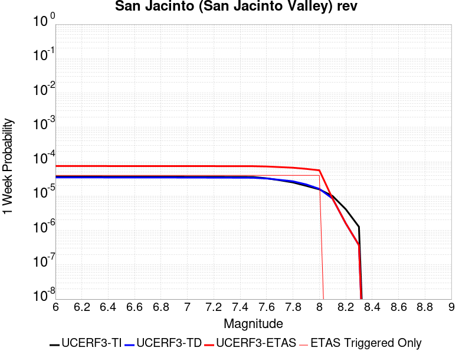 | 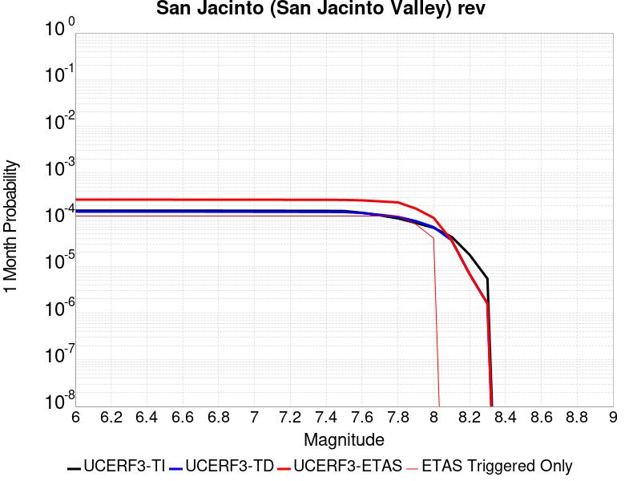 | 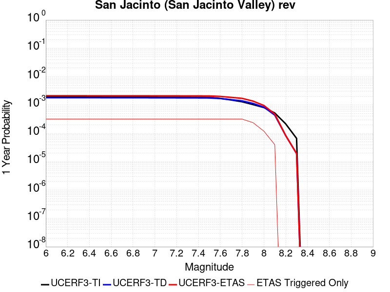 |

| Magnitude | 1 wk TI Prob | 1 wk TD Prob | 1 wk ETAS Prob | 1 wk ETAS/TD Gain | 1 wk ETAS Triggered Only | 1 mo TI Prob | 1 mo TD Prob | 1 mo ETAS Prob | 1 mo ETAS/TD Gain | 1 mo ETAS Triggered Only | 1 yr TI Prob | 1 yr TD Prob | 1 yr ETAS Prob | 1 yr ETAS/TD Gain | 1 yr ETAS Triggered Only |
|-----|-----|-----|-----|-----|-----|-----|-----|-----|-----|-----|-----|-----|-----|-----|-----|
| 6.0 | 3.652694E-5 | 3.4785007E-5 | 7.478362E-5 | 2.1498806 | 4.0E-5 | 1.5653463E-4 | 1.4907008E-4 | 2.690522E-4 | 1.8048705 | 1.2E-4 | 0.0019041431 | 0.0018134193 | 0.002132839 | 1.1761422 | 3.2E-4 |
| 6.1 | 3.652694E-5 | 3.4785007E-5 | 7.478362E-5 | 2.1498806 | 4.0E-5 | 1.5653463E-4 | 1.4907008E-4 | 2.690522E-4 | 1.8048705 | 1.2E-4 | 0.0019041431 | 0.0018134193 | 0.002132839 | 1.1761422 | 3.2E-4 |
| 6.2 | 3.652694E-5 | 3.4785007E-5 | 7.478362E-5 | 2.1498806 | 4.0E-5 | 1.5653463E-4 | 1.4907008E-4 | 2.690522E-4 | 1.8048705 | 1.2E-4 | 0.0019041431 | 0.0018134193 | 0.002132839 | 1.1761422 | 3.2E-4 |
| 6.3 | 3.652694E-5 | 3.4785007E-5 | 7.478362E-5 | 2.1498806 | 4.0E-5 | 1.5653463E-4 | 1.4907008E-4 | 2.690522E-4 | 1.8048705 | 1.2E-4 | 0.0019041431 | 0.0018134193 | 0.002132839 | 1.1761422 | 3.2E-4 |
| 6.4 | 3.646941E-5 | 3.470649E-5 | 7.47051E-5 | 2.1524823 | 4.0E-5 | 1.5628811E-4 | 1.4873363E-4 | 2.6871578E-4 | 1.8066915 | 1.2E-4 | 0.0019011468 | 0.0018093301 | 0.0021287512 | 1.1765411 | 3.2E-4 |
| 6.5 | 3.646941E-5 | 3.470649E-5 | 7.47051E-5 | 2.1524823 | 4.0E-5 | 1.5628811E-4 | 1.4873363E-4 | 2.6871578E-4 | 1.8066915 | 1.2E-4 | 0.0019011468 | 0.0018093301 | 0.0021287512 | 1.1765411 | 3.2E-4 |
| 6.6 | 3.6442503E-5 | 3.4669836E-5 | 7.4668445E-5 | 2.1537008 | 4.0E-5 | 1.561728E-4 | 1.4857655E-4 | 2.6855874E-4 | 1.8075445 | 1.2E-4 | 0.0018997455 | 0.0018074211 | 0.0021268427 | 1.1767279 | 3.2E-4 |
| 6.7 | 3.6432113E-5 | 3.4655393E-5 | 7.4654E-5 | 2.1541815 | 4.0E-5 | 1.5612828E-4 | 1.4851466E-4 | 2.6849683E-4 | 1.807881 | 1.2E-4 | 0.0018992044 | 0.0018066689 | 0.002126091 | 1.1768016 | 3.2E-4 |
| 6.8 | 3.6409598E-5 | 3.462441E-5 | 7.462302E-5 | 2.1552143 | 4.0E-5 | 1.560318E-4 | 1.4838189E-4 | 2.683641E-4 | 1.808604 | 1.2E-4 | 0.0018980318 | 0.0018050552 | 0.0021244776 | 1.1769599 | 3.2E-4 |
| 6.9 | 3.638078E-5 | 3.4584784E-5 | 7.45834E-5 | 2.156538 | 4.0E-5 | 1.5590832E-4 | 1.4821209E-4 | 2.681943E-4 | 1.8095305 | 1.2E-4 | 0.0018965311 | 0.0018029913 | 0.0021224143 | 1.1771629 | 3.2E-4 |
| 7.0 | 3.6294874E-5 | 3.446665E-5 | 7.446527E-5 | 2.160502 | 4.0E-5 | 1.5554018E-4 | 1.4770588E-4 | 2.6768816E-4 | 1.8123053 | 1.2E-4 | 0.0018920569 | 0.0017968385 | 0.0021162634 | 1.1777706 | 3.2E-4 |
| 7.1 | 3.6260717E-5 | 3.4422897E-5 | 7.442152E-5 | 2.1619773 | 4.0E-5 | 1.5539382E-4 | 1.4751837E-4 | 2.6750067E-4 | 1.813338 | 1.2E-4 | 0.001890278 | 0.0017945593 | 0.0021139851 | 1.1779968 | 3.2E-4 |
| 7.2 | 3.6210204E-5 | 3.4356966E-5 | 7.4355594E-5 | 2.1642072 | 4.0E-5 | 1.5517735E-4 | 1.4723586E-4 | 2.672182E-4 | 1.8148988 | 1.2E-4 | 0.001887647 | 0.0017911253 | 0.002110552 | 1.1783386 | 3.2E-4 |
| 7.3 | 3.6119454E-5 | 3.42449E-5 | 7.424353E-5 | 2.1680171 | 4.0E-5 | 1.5478847E-4 | 1.4675561E-4 | 2.66738E-4 | 1.8175659 | 1.2E-4 | 0.0018829206 | 0.001785288 | 0.0021047166 | 1.1789228 | 3.2E-4 |
| 7.4 | 3.607848E-5 | 3.4192242E-5 | 7.419087E-5 | 2.169816 | 4.0E-5 | 1.5461289E-4 | 1.4652996E-4 | 2.665124E-4 | 1.8188251 | 1.2E-4 | 0.0018807866 | 0.0017825452 | 0.0021019748 | 1.1791986 | 3.2E-4 |
| 7.5 | 3.5856774E-5 | 3.4000583E-5 | 7.3999225E-5 | 2.1764104 | 4.0E-5 | 1.5366284E-4 | 1.4570866E-4 | 2.6569117E-4 | 1.8234411 | 1.2E-4 | 0.0018692396 | 0.0017725622 | 0.002091995 | 1.1802096 | 3.2E-4 |
| 7.6 | 3.286655E-5 | 3.2510947E-5 | 7.250965E-5 | 2.2303147 | 4.0E-5 | 1.4084904E-4 | 1.393252E-4 | 2.593085E-4 | 1.8611742 | 1.2E-4 | 0.001713488 | 0.0016949666 | 0.0020144242 | 1.1884743 | 3.2E-4 |
| 7.7 | 2.8882527E-5 | 2.9595956E-5 | 6.9594775E-5 | 2.351496 | 4.0E-5 | 1.237764E-4 | 1.2683365E-4 | 2.4681844E-4 | 1.9460012 | 1.2E-4 | 0.0015059357 | 0.001543107 | 0.0018626133 | 1.2070538 | 3.2E-4 |
| 7.8 | 2.4950225E-5 | 2.687312E-5 | 6.6872046E-5 | 2.4884362 | 4.0E-5 | 1.0692515E-4 | 1.15165436E-4 | 2.3515162E-4 | 2.0418594 | 1.2E-4 | 0.0013010362 | 0.0014012383 | 0.0017207898 | 1.2280494 | 3.2E-4 |
| 7.9 | 1.9881603E-5 | 2.1818549E-5 | 6.181768E-5 | 2.8332624 | 4.0E-5 | 8.520408E-5 | 9.350472E-5 | 1.7349725E-4 | 1.8554918 | 8.0E-5 | 0.001036866 | 0.0011378262 | 0.0013775532 | 1.2106885 | 2.4E-4 |
| 8.0 | 1.563292E-5 | 1.618842E-5 | 5.618777E-5 | 3.4708622 | 4.0E-5 | 6.6996516E-5 | 6.93771E-5 | 1.0937433E-4 | 1.5765191 | 4.0E-5 | 8.153773E-4 | 8.4433955E-4 | 9.6423825E-4 | 1.1420029 | 1.2E-4 |
| 8.1 | 1.0045313E-5 | 8.449115E-6 | 8.449115E-6 | 1.0 | 0.0 | 4.305063E-5 | 3.6209993E-5 | 3.6209993E-5 | 1.0 | 0.0 | 5.2401534E-4 | 4.40768E-4 | 4.8075037E-4 | 1.0907106 | 4.0E-5 |
| 8.2 | 4.1554413E-6 | 1.6074547E-6 | 1.6074547E-6 | 1.0 | 0.0 | 1.7808914E-5 | 6.8890736E-6 | 6.8890736E-6 | 1.0 | 0.0 | 2.1680194E-4 | 8.387127E-5 | 8.387127E-5 | 1.0 | 0.0 |
| 8.3 | 1.2758221E-6 | 3.728509E-7 | 3.728509E-7 | 1.0 | 0.0 | 5.4677976E-6 | 1.5979316E-6 | 1.5979316E-6 | 1.0 | 0.0 | 6.65684E-5 | 1.9454648E-5 | 1.9454648E-5 | 1.0 | 0.0 |

## San Jacinto (Stepovers Combined)
*[(top)](#table-of-contents)*

| 1 Week | 1 Month | 1 Year |
|-----|-----|-----|
| 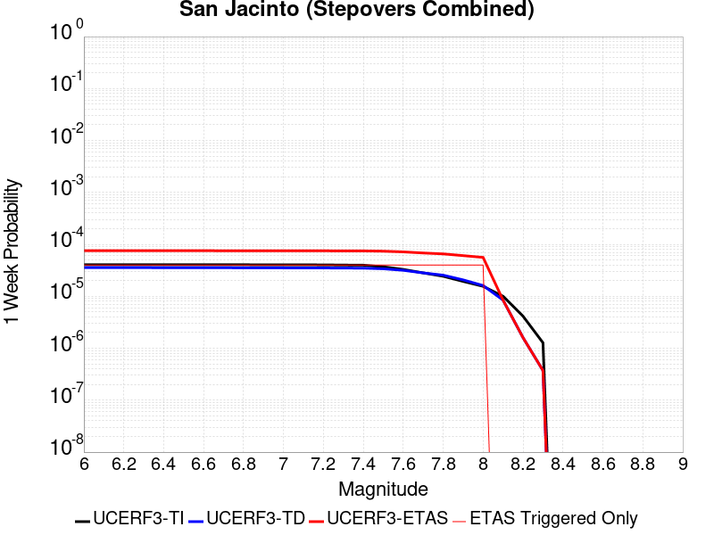 | 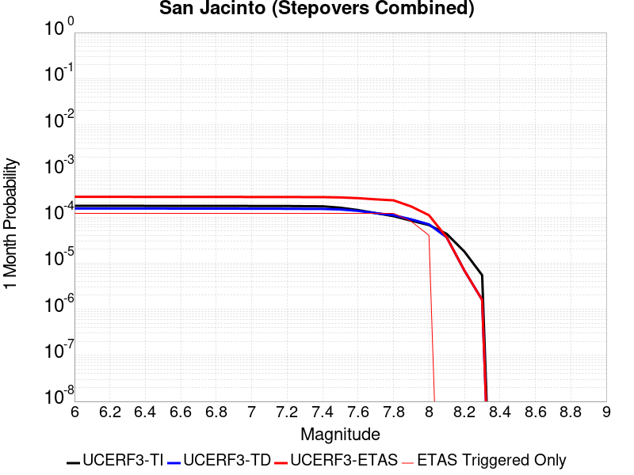 | 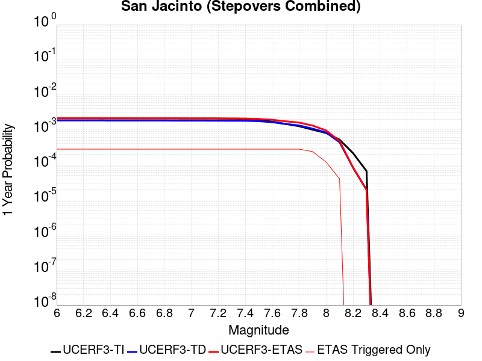 |

| Magnitude | 1 wk TI Prob | 1 wk TD Prob | 1 wk ETAS Prob | 1 wk ETAS/TD Gain | 1 wk ETAS Triggered Only | 1 mo TI Prob | 1 mo TD Prob | 1 mo ETAS Prob | 1 mo ETAS/TD Gain | 1 mo ETAS Triggered Only | 1 yr TI Prob | 1 yr TD Prob | 1 yr ETAS Prob | 1 yr ETAS/TD Gain | 1 yr ETAS Triggered Only |
|-----|-----|-----|-----|-----|-----|-----|-----|-----|-----|-----|-----|-----|-----|-----|-----|
| 6.0 | 4.0667746E-5 | 3.5654804E-5 | 7.565338E-5 | 2.1218283 | 4.0E-5 | 1.742787E-4 | 1.5279738E-4 | 2.7277903E-4 | 1.7852339 | 1.2E-4 | 0.0021197782 | 0.001858722 | 0.0021382014 | 1.1503612 | 2.8E-4 |
| 6.1 | 4.0667746E-5 | 3.5654804E-5 | 7.565338E-5 | 2.1218283 | 4.0E-5 | 1.742787E-4 | 1.5279738E-4 | 2.7277903E-4 | 1.7852339 | 1.2E-4 | 0.0021197782 | 0.001858722 | 0.0021382014 | 1.1503612 | 2.8E-4 |
| 6.2 | 4.0667746E-5 | 3.5654804E-5 | 7.565338E-5 | 2.1218283 | 4.0E-5 | 1.742787E-4 | 1.5279738E-4 | 2.7277903E-4 | 1.7852339 | 1.2E-4 | 0.0021197782 | 0.001858722 | 0.0021382014 | 1.1503612 | 2.8E-4 |
| 6.3 | 4.0667746E-5 | 3.5654804E-5 | 7.565338E-5 | 2.1218283 | 4.0E-5 | 1.742787E-4 | 1.5279738E-4 | 2.7277903E-4 | 1.7852339 | 1.2E-4 | 0.0021197782 | 0.001858722 | 0.0021382014 | 1.1503612 | 2.8E-4 |
| 6.4 | 4.0577226E-5 | 3.552656E-5 | 7.552514E-5 | 2.1258783 | 4.0E-5 | 1.738908E-4 | 1.522478E-4 | 2.7222955E-4 | 1.7880687 | 1.2E-4 | 0.0021150648 | 0.0018520436 | 0.002131525 | 1.1509043 | 2.8E-4 |
| 6.5 | 4.0577226E-5 | 3.552656E-5 | 7.552514E-5 | 2.1258783 | 4.0E-5 | 1.738908E-4 | 1.522478E-4 | 2.7222955E-4 | 1.7880687 | 1.2E-4 | 0.0021150648 | 0.0018520436 | 0.002131525 | 1.1509043 | 2.8E-4 |
| 6.6 | 4.053861E-5 | 3.5471832E-5 | 7.547041E-5 | 2.1276155 | 4.0E-5 | 1.7372532E-4 | 1.520133E-4 | 2.7199506E-4 | 1.7892847 | 1.2E-4 | 0.0021130538 | 0.0018491937 | 0.0021286758 | 1.1511374 | 2.8E-4 |
| 6.7 | 4.0516545E-5 | 3.5440866E-5 | 7.543945E-5 | 2.1286006 | 4.0E-5 | 1.7363077E-4 | 1.5188061E-4 | 2.7186237E-4 | 1.7899743 | 1.2E-4 | 0.002111905 | 0.0018475811 | 0.002127064 | 1.1512696 | 2.8E-4 |
| 6.8 | 4.049434E-5 | 3.5412282E-5 | 7.541086E-5 | 2.1295116 | 4.0E-5 | 1.7353562E-4 | 1.5175811E-4 | 2.717399E-4 | 1.7906121 | 1.2E-4 | 0.0021107488 | 0.0018460923 | 0.0021255754 | 1.1513917 | 2.8E-4 |
| 6.9 | 4.046386E-5 | 3.5374713E-5 | 7.53733E-5 | 2.1307113 | 4.0E-5 | 1.73405E-4 | 1.5159712E-4 | 2.7157893E-4 | 1.7914518 | 1.2E-4 | 0.0021091616 | 0.0018441357 | 0.0021236192 | 1.1515527 | 2.8E-4 |
| 7.0 | 4.036382E-5 | 3.5254863E-5 | 7.5253454E-5 | 2.1345553 | 4.0E-5 | 1.7297632E-4 | 1.5108353E-4 | 2.710654E-4 | 1.7941426 | 1.2E-4 | 0.0021039525 | 0.0018378934 | 0.0021173789 | 1.1520684 | 2.8E-4 |
| 7.1 | 4.0343282E-5 | 3.523326E-5 | 7.523185E-5 | 2.1352508 | 4.0E-5 | 1.7288832E-4 | 1.5099096E-4 | 2.7097284E-4 | 1.7946295 | 1.2E-4 | 0.002102883 | 0.0018367684 | 0.002116254 | 1.1521616 | 2.8E-4 |
| 7.2 | 4.0257353E-5 | 3.5137495E-5 | 7.5136086E-5 | 2.1383452 | 4.0E-5 | 1.725201E-4 | 1.5058058E-4 | 2.705625E-4 | 1.7967955 | 1.2E-4 | 0.0020984085 | 0.0018317803 | 0.0021112675 | 1.1525768 | 2.8E-4 |
| 7.3 | 3.9940667E-5 | 3.4963145E-5 | 7.496175E-5 | 2.144022 | 4.0E-5 | 1.7116306E-4 | 1.4983346E-4 | 2.6981547E-4 | 1.8007692 | 1.2E-4 | 0.0020819185 | 0.0018226993 | 0.002102189 | 1.1533383 | 2.8E-4 |
| 7.4 | 3.9721202E-5 | 3.4847715E-5 | 7.484632E-5 | 2.1478114 | 4.0E-5 | 1.7022261E-4 | 1.4933883E-4 | 2.693209E-4 | 1.8034219 | 1.2E-4 | 0.0020704903 | 0.0018166872 | 0.0020961785 | 1.1538467 | 2.8E-4 |
| 7.5 | 3.7036873E-5 | 3.3907352E-5 | 7.3906E-5 | 2.179645 | 4.0E-5 | 1.5871979E-4 | 1.4530914E-4 | 2.6529172E-4 | 1.8257055 | 1.2E-4 | 0.0019307006 | 0.0017677062 | 0.0020472114 | 1.1581174 | 2.8E-4 |
| 7.6 | 3.2940967E-5 | 3.1670912E-5 | 7.1669645E-5 | 2.2629485 | 4.0E-5 | 1.4116794E-4 | 1.3572544E-4 | 2.5570914E-4 | 1.884018 | 1.2E-4 | 0.0017173645 | 0.0016512069 | 0.0019307446 | 1.1692929 | 2.8E-4 |
| 7.7 | 2.8236149E-5 | 2.8227036E-5 | 6.8225905E-5 | 2.417041 | 4.0E-5 | 1.2100645E-4 | 1.2096741E-4 | 2.409529E-4 | 1.9918827 | 1.2E-4 | 0.0014722579 | 0.0014717843 | 0.0017513722 | 1.1899652 | 2.8E-4 |
| 7.8 | 2.4329287E-5 | 2.5537129E-5 | 6.553611E-5 | 2.5663068 | 4.0E-5 | 1.042642E-4 | 1.09440254E-4 | 2.2942713E-4 | 2.0963688 | 1.2E-4 | 0.0012686774 | 0.0013316215 | 0.0016112487 | 1.2099899 | 2.8E-4 |
| 7.9 | 1.9370926E-5 | 2.071883E-5 | 6.0718E-5 | 2.930571 | 4.0E-5 | 8.301561E-5 | 8.879197E-5 | 1.6878486E-4 | 1.9009024 | 8.0E-5 | 0.0010102465 | 0.0010805068 | 0.0013202475 | 1.2218779 | 2.4E-4 |
| 8.0 | 1.5583017E-5 | 1.6136504E-5 | 5.613586E-5 | 3.4788115 | 4.0E-5 | 6.6782646E-5 | 6.915462E-5 | 1.0915186E-4 | 1.578374 | 4.0E-5 | 8.127754E-4 | 8.4163295E-4 | 9.6153194E-4 | 1.14246 | 1.2E-4 |
| 8.1 | 1.0024873E-5 | 8.439436E-6 | 8.439436E-6 | 1.0 | 0.0 | 4.2963035E-5 | 3.6168516E-5 | 3.6168516E-5 | 1.0 | 0.0 | 5.229494E-4 | 4.4026322E-4 | 4.802456E-4 | 1.0908147 | 4.0E-5 |
| 8.2 | 4.142796E-6 | 1.6027543E-6 | 1.6027543E-6 | 1.0 | 0.0 | 1.775472E-5 | 6.8689287E-6 | 6.8689287E-6 | 1.0 | 0.0 | 2.1614227E-4 | 8.362603E-5 | 8.362603E-5 | 1.0 | 0.0 |
| 8.3 | 1.2750878E-6 | 3.725573E-7 | 3.725573E-7 | 1.0 | 0.0 | 5.4646503E-6 | 1.5966733E-6 | 1.5966733E-6 | 1.0 | 0.0 | 6.653009E-5 | 1.9439329E-5 | 1.9439329E-5 | 1.0 | 0.0 |

## Coyote Canyon
*[(top)](#table-of-contents)*

| 1 Week | 1 Month | 1 Year |
|-----|-----|-----|
| 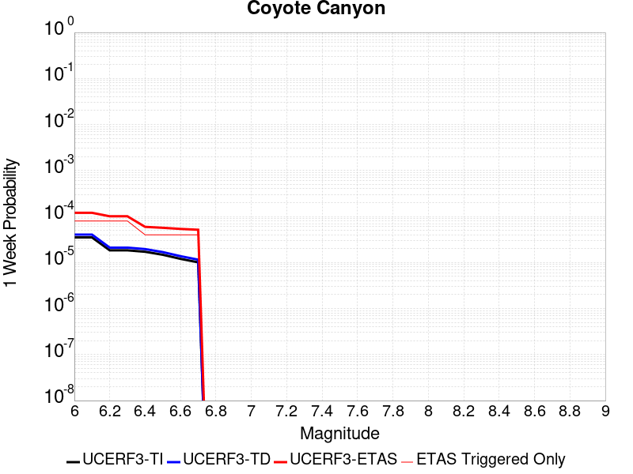 | 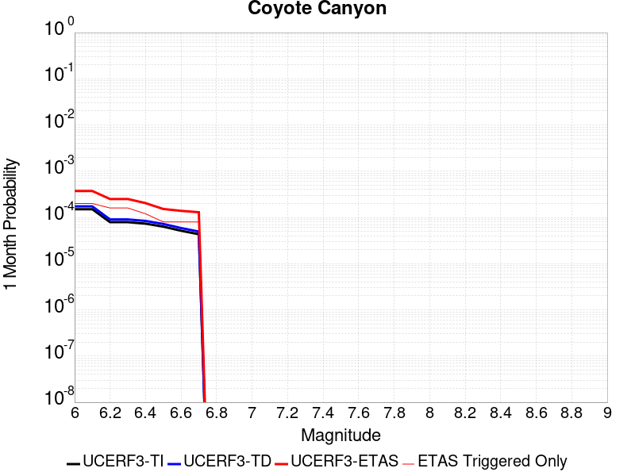 |  |

| Magnitude | 1 wk TI Prob | 1 wk TD Prob | 1 wk ETAS Prob | 1 wk ETAS/TD Gain | 1 wk ETAS Triggered Only | 1 mo TI Prob | 1 mo TD Prob | 1 mo ETAS Prob | 1 mo ETAS/TD Gain | 1 mo ETAS Triggered Only | 1 yr TI Prob | 1 yr TD Prob | 1 yr ETAS Prob | 1 yr ETAS/TD Gain | 1 yr ETAS Triggered Only |
|-----|-----|-----|-----|-----|-----|-----|-----|-----|-----|-----|-----|-----|-----|-----|-----|
| 6.0 | 3.5090034E-5 | 4.0384904E-5 | 1.2038167E-4 | 2.9808583 | 8.0E-5 | 1.503772E-4 | 1.7306813E-4 | 3.7303352E-4 | 2.1554143 | 2.0E-4 | 0.0018293047 | 0.0021053257 | 0.0023448204 | 1.1137567 | 2.4E-4 |
| 6.1 | 3.5090034E-5 | 4.0384904E-5 | 1.2038167E-4 | 2.9808583 | 8.0E-5 | 1.503772E-4 | 1.7306813E-4 | 3.7303352E-4 | 2.1554143 | 2.0E-4 | 0.0018293047 | 0.0021053257 | 0.0023448204 | 1.1137567 | 2.4E-4 |
| 6.2 | 1.841879E-5 | 2.1070035E-5 | 1.0106835E-4 | 4.7967815 | 8.0E-5 | 7.8935285E-5 | 9.02976E-5 | 2.5028316E-4 | 2.7717586 | 1.6E-4 | 9.606133E-4 | 0.0010989209 | 0.0012987012 | 1.1817967 | 2.0E-4 |
| 6.3 | 1.841879E-5 | 2.1070035E-5 | 1.0106835E-4 | 4.7967815 | 8.0E-5 | 7.8935285E-5 | 9.02976E-5 | 2.5028316E-4 | 2.7717586 | 1.6E-4 | 9.606133E-4 | 0.0010989209 | 0.0012987012 | 1.1817967 | 2.0E-4 |
| 6.4 | 1.712201E-5 | 1.957468E-5 | 5.9573897E-5 | 3.043416 | 4.0E-5 | 7.337798E-5 | 8.3889354E-5 | 2.0387929E-4 | 2.4303355 | 1.2E-4 | 8.930107E-4 | 0.0010209751 | 0.0011808117 | 1.1565529 | 1.6E-4 |
| 6.5 | 1.4744935E-5 | 1.6845073E-5 | 5.68444E-5 | 3.3745415 | 4.0E-5 | 6.3191044E-5 | 7.21917E-5 | 1.5218592E-4 | 2.1080806 | 8.0E-5 | 7.6907943E-4 | 8.7867316E-4 | 9.985677E-4 | 1.1364496 | 1.2E-4 |
| 6.6 | 1.2017839E-5 | 1.3730698E-5 | 5.373015E-5 | 3.9131403 | 4.0E-5 | 5.150401E-5 | 5.884502E-5 | 1.3884032E-4 | 2.3594232 | 8.0E-5 | 6.268809E-4 | 7.162913E-4 | 7.96234E-4 | 1.1116064 | 8.0E-5 |
| 6.7 | 1.00956095E-5 | 1.15390885E-5 | 5.1538627E-5 | 4.4664383 | 4.0E-5 | 4.326618E-5 | 4.945279E-5 | 1.2944883E-4 | 2.6176245 | 8.0E-5 | 5.266384E-4 | 6.020084E-4 | 6.8196026E-4 | 1.1328084 | 8.0E-5 |

## Elysian Park (Upper)
*[(top)](#table-of-contents)*

| 1 Week | 1 Month | 1 Year |
|-----|-----|-----|
| 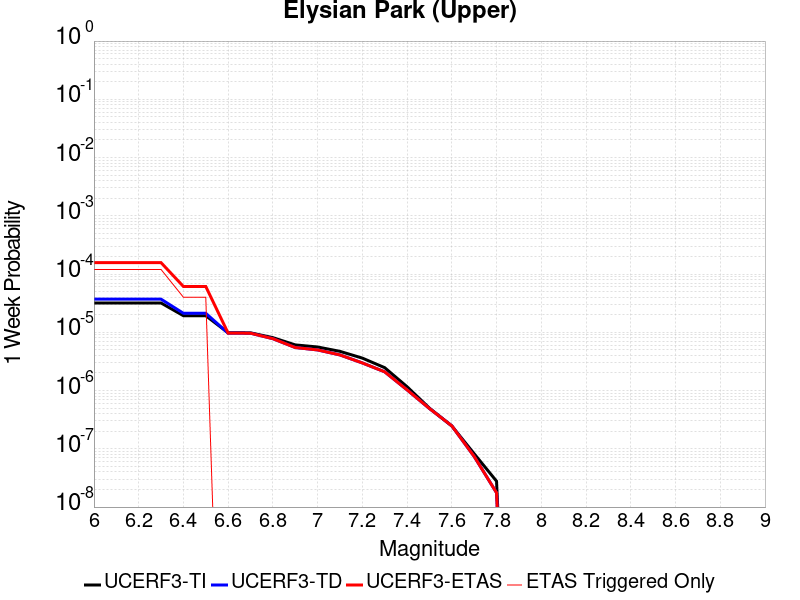 | 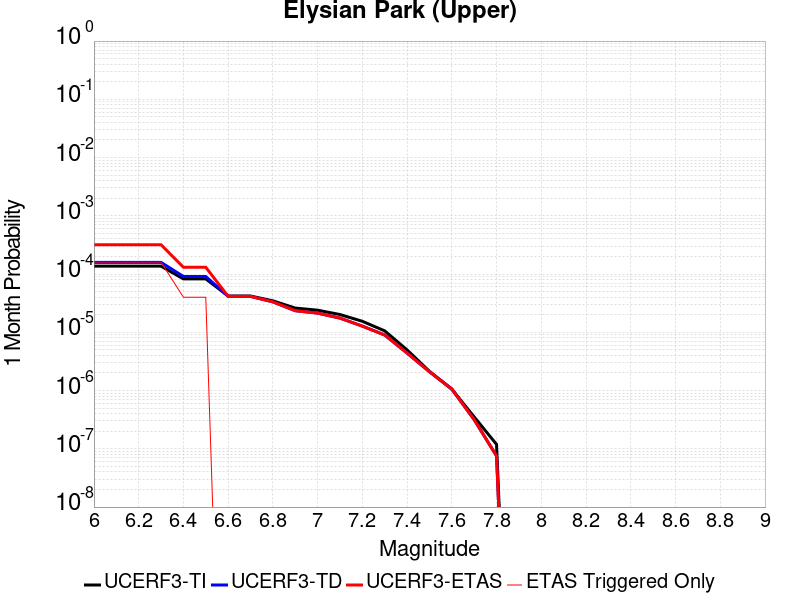 | 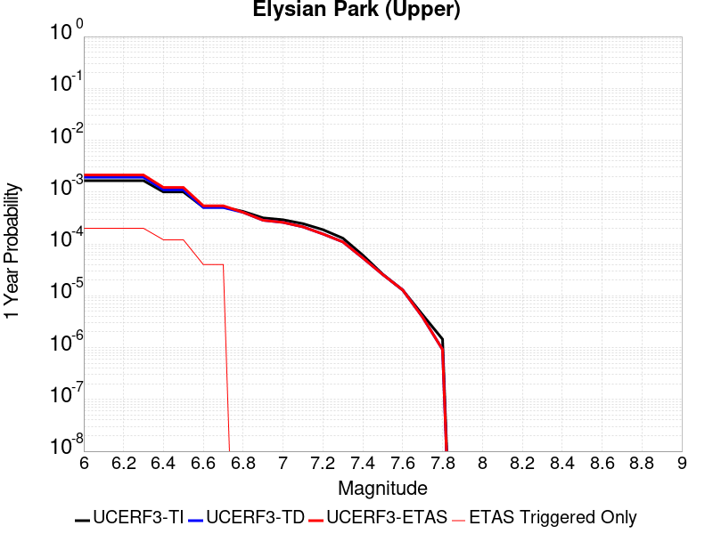 |

| Magnitude | 1 wk TI Prob | 1 wk TD Prob | 1 wk ETAS Prob | 1 wk ETAS/TD Gain | 1 wk ETAS Triggered Only | 1 mo TI Prob | 1 mo TD Prob | 1 mo ETAS Prob | 1 mo ETAS/TD Gain | 1 mo ETAS Triggered Only | 1 yr TI Prob | 1 yr TD Prob | 1 yr ETAS Prob | 1 yr ETAS/TD Gain | 1 yr ETAS Triggered Only |
|-----|-----|-----|-----|-----|-----|-----|-----|-----|-----|-----|-----|-----|-----|-----|-----|
| 6.0 | 3.1876025E-5 | 3.706077E-5 | 1.5705632E-4 | 4.237805 | 1.2E-4 | 1.3660437E-4 | 1.5882494E-4 | 3.1879955E-4 | 2.0072384 | 1.6E-4 | 0.0016618895 | 0.0019324546 | 0.0021320682 | 1.1032953 | 2.0E-4 |
| 6.1 | 3.1876025E-5 | 3.706077E-5 | 1.5705632E-4 | 4.237805 | 1.2E-4 | 1.3660437E-4 | 1.5882494E-4 | 3.1879955E-4 | 2.0072384 | 1.6E-4 | 0.0016618895 | 0.0019324546 | 0.0021320682 | 1.1032953 | 2.0E-4 |
| 6.2 | 3.1876025E-5 | 3.706077E-5 | 1.5705632E-4 | 4.237805 | 1.2E-4 | 1.3660437E-4 | 1.5882494E-4 | 3.1879955E-4 | 2.0072384 | 1.6E-4 | 0.0016618895 | 0.0019324546 | 0.0021320682 | 1.1032953 | 2.0E-4 |
| 6.3 | 3.1876025E-5 | 3.706077E-5 | 1.5705632E-4 | 4.237805 | 1.2E-4 | 1.3660437E-4 | 1.5882494E-4 | 3.1879955E-4 | 2.0072384 | 1.6E-4 | 0.0016618895 | 0.0019324546 | 0.0021320682 | 1.1032953 | 2.0E-4 |
| 6.4 | 1.9273462E-5 | 2.1214437E-5 | 6.121359E-5 | 2.8854685 | 4.0E-5 | 8.259794E-5 | 9.091683E-5 | 1.3091319E-4 | 1.4399226 | 4.0E-5 | 0.001005166 | 0.0011065218 | 0.0012263891 | 1.108328 | 1.2E-4 |
| 6.5 | 1.9273462E-5 | 2.1214437E-5 | 6.121359E-5 | 2.8854685 | 4.0E-5 | 8.259794E-5 | 9.091683E-5 | 1.3091319E-4 | 1.4399226 | 4.0E-5 | 0.001005166 | 0.0011065218 | 0.0012263891 | 1.108328 | 1.2E-4 |
| 6.6 | 9.813258E-6 | 9.669027E-6 | 9.669027E-6 | 1.0 | 0.0 | 4.205614E-5 | 4.1438074E-5 | 4.1438074E-5 | 1.0 | 0.0 | 5.119132E-4 | 5.04399E-4 | 5.443788E-4 | 1.0792623 | 4.0E-5 |
| 6.7 | 9.801478E-6 | 9.656595E-6 | 9.656595E-6 | 1.0 | 0.0 | 4.2005657E-5 | 4.138479E-5 | 4.138479E-5 | 1.0 | 0.0 | 5.112989E-4 | 5.037506E-4 | 5.4373045E-4 | 1.0793644 | 4.0E-5 |
| 6.8 | 8.102489E-6 | 7.775748E-6 | 7.775748E-6 | 1.0 | 0.0 | 3.4724493E-5 | 3.3324235E-5 | 3.3324235E-5 | 1.0 | 0.0 | 4.2268867E-4 | 4.05652E-4 | 4.05652E-4 | 1.0 | 0.0 |
| 6.9 | 6.08275E-6 | 5.483149E-6 | 5.483149E-6 | 1.0 | 0.0 | 2.6068668E-5 | 2.3499004E-5 | 2.3499004E-5 | 1.0 | 0.0 | 3.173398E-4 | 2.8606356E-4 | 2.8606356E-4 | 1.0 | 0.0 |
| 7.0 | 5.5995934E-6 | 4.9843247E-6 | 4.9843247E-6 | 1.0 | 0.0 | 2.3998036E-5 | 2.136122E-5 | 2.136122E-5 | 1.0 | 0.0 | 2.9213692E-4 | 2.600425E-4 | 2.600425E-4 | 1.0 | 0.0 |
| 7.1 | 4.709881E-6 | 4.0886803E-6 | 4.0886803E-6 | 1.0 | 0.0 | 2.0185047E-5 | 1.75228E-5 | 1.75228E-5 | 1.0 | 0.0 | 2.4572524E-4 | 2.1331961E-4 | 2.1331961E-4 | 1.0 | 0.0 |
| 7.2 | 3.6063436E-6 | 2.978894E-6 | 2.978894E-6 | 1.0 | 0.0 | 1.5455667E-5 | 1.2766626E-5 | 1.2766626E-5 | 1.0 | 0.0 | 1.881565E-4 | 1.554227E-4 | 1.554227E-4 | 1.0 | 0.0 |
| 7.3 | 2.471135E-6 | 2.0961668E-6 | 2.0961668E-6 | 1.0 | 0.0 | 1.0590536E-5 | 8.983541E-6 | 8.983541E-6 | 1.0 | 0.0 | 1.2893214E-4 | 1.09369204E-4 | 1.09369204E-4 | 1.0 | 0.0 |
| 7.4 | 1.163943E-6 | 1.0279479E-6 | 1.0279479E-6 | 1.0 | 0.0 | 4.988318E-6 | 4.4054837E-6 | 4.4054837E-6 | 1.0 | 0.0 | 6.0731076E-5 | 5.363547E-5 | 5.363547E-5 | 1.0 | 0.0 |
| 7.5 | 4.99459E-7 | 4.9193983E-7 | 4.9193983E-7 | 1.0 | 0.0 | 2.140537E-6 | 2.108312E-6 | 2.108312E-6 | 1.0 | 0.0 | 2.6060725E-5 | 2.5668412E-5 | 2.5668412E-5 | 1.0 | 0.0 |
| 7.6 | 2.4667852E-7 | 2.4786985E-7 | 2.4786985E-7 | 1.0 | 0.0 | 1.0571932E-6 | 1.0622989E-6 | 1.0622989E-6 | 1.0 | 0.0 | 1.2871251E-5 | 1.2933417E-5 | 1.2933417E-5 | 1.0 | 0.0 |
| 7.7 | 8.2312795E-8 | 7.3911366E-8 | 7.3911366E-8 | 1.0 | 0.0 | 3.527691E-7 | 3.1676296E-7 | 3.1676296E-7 | 1.0 | 0.0 | 4.294955E-6 | 3.8565836E-6 | 3.8565836E-6 | 1.0 | 0.0 |
| 7.8 | 2.7819295E-8 | 1.7599204E-8 | 1.7599204E-8 | 1.0 | 0.0 | 1.1922555E-7 | 7.5425156E-8 | 7.5425156E-8 | 1.0 | 0.0 | 1.45157E-6 | 9.18301E-7 | 9.18301E-7 | 1.0 | 0.0 |

## San Jacinto (Anza) rev
*[(top)](#table-of-contents)*

| 1 Week | 1 Month | 1 Year |
|-----|-----|-----|
| 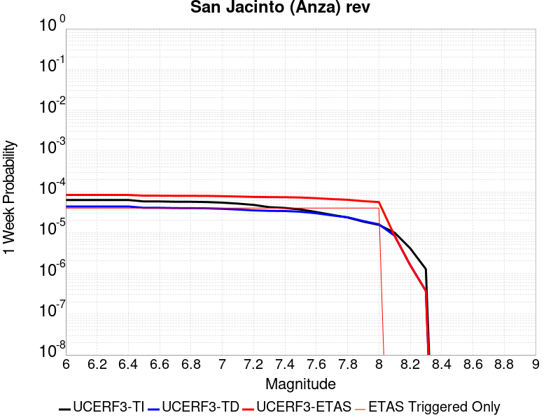 | 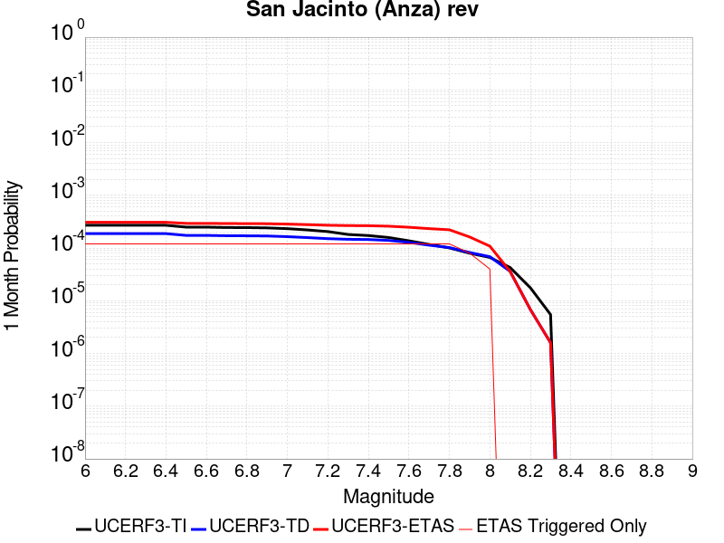 |  |

| Magnitude | 1 wk TI Prob | 1 wk TD Prob | 1 wk ETAS Prob | 1 wk ETAS/TD Gain | 1 wk ETAS Triggered Only | 1 mo TI Prob | 1 mo TD Prob | 1 mo ETAS Prob | 1 mo ETAS/TD Gain | 1 mo ETAS Triggered Only | 1 yr TI Prob | 1 yr TD Prob | 1 yr ETAS Prob | 1 yr ETAS/TD Gain | 1 yr ETAS Triggered Only |
|-----|-----|-----|-----|-----|-----|-----|-----|-----|-----|-----|-----|-----|-----|-----|-----|
| 6.0 | 6.3015636E-5 | 4.3745757E-5 | 8.374401E-5 | 1.9143344 | 4.0E-5 | 2.7003905E-4 | 1.8746841E-4 | 3.074459E-4 | 1.6399878 | 1.2E-4 | 0.0032827691 | 0.002280051 | 0.0025195035 | 1.1050208 | 2.4E-4 |
| 6.1 | 6.3015636E-5 | 4.3745757E-5 | 8.374401E-5 | 1.9143344 | 4.0E-5 | 2.7003905E-4 | 1.8746841E-4 | 3.074459E-4 | 1.6399878 | 1.2E-4 | 0.0032827691 | 0.002280051 | 0.0025195035 | 1.1050208 | 2.4E-4 |
| 6.2 | 6.3015636E-5 | 4.3745757E-5 | 8.374401E-5 | 1.9143344 | 4.0E-5 | 2.7003905E-4 | 1.8746841E-4 | 3.074459E-4 | 1.6399878 | 1.2E-4 | 0.0032827691 | 0.002280051 | 0.0025195035 | 1.1050208 | 2.4E-4 |
| 6.3 | 6.3015636E-5 | 4.3745757E-5 | 8.374401E-5 | 1.9143344 | 4.0E-5 | 2.7003905E-4 | 1.8746841E-4 | 3.074459E-4 | 1.6399878 | 1.2E-4 | 0.0032827691 | 0.002280051 | 0.0025195035 | 1.1050208 | 2.4E-4 |
| 6.4 | 6.3015636E-5 | 4.3745757E-5 | 8.374401E-5 | 1.9143344 | 4.0E-5 | 2.7003905E-4 | 1.8746841E-4 | 3.074459E-4 | 1.6399878 | 1.2E-4 | 0.0032827691 | 0.002280051 | 0.0025195035 | 1.1050208 | 2.4E-4 |
| 6.5 | 5.811017E-5 | 4.0506016E-5 | 8.05044E-5 | 1.9874676 | 4.0E-5 | 2.4901982E-4 | 1.735857E-4 | 2.9356487E-4 | 1.6911812 | 1.2E-4 | 0.0030276014 | 0.002111363 | 0.0023508563 | 1.1134306 | 2.4E-4 |
| 6.6 | 5.811017E-5 | 4.0506016E-5 | 8.05044E-5 | 1.9874676 | 4.0E-5 | 2.4901982E-4 | 1.735857E-4 | 2.9356487E-4 | 1.6911812 | 1.2E-4 | 0.0030276014 | 0.002111363 | 0.0023508563 | 1.1134306 | 2.4E-4 |
| 6.7 | 5.712442E-5 | 3.9923914E-5 | 7.992232E-5 | 2.0018656 | 4.0E-5 | 2.4479596E-4 | 1.710913E-4 | 2.9107078E-4 | 1.7012599 | 1.2E-4 | 0.0029763177 | 0.0020810522 | 0.0023205527 | 1.1150863 | 2.4E-4 |
| 6.8 | 5.6967532E-5 | 3.977942E-5 | 7.9777834E-5 | 2.005505 | 4.0E-5 | 2.4412372E-4 | 1.7047212E-4 | 2.9045166E-4 | 1.7038074 | 1.2E-4 | 0.0029681553 | 0.002073528 | 0.0023130304 | 1.1155047 | 2.4E-4 |
| 6.9 | 5.6211324E-5 | 3.9481514E-5 | 7.9479934E-5 | 2.0130923 | 4.0E-5 | 2.4088343E-4 | 1.6919555E-4 | 2.8917525E-4 | 1.7091185 | 1.2E-4 | 0.0029288116 | 0.0020580152 | 0.002297521 | 1.1163772 | 2.4E-4 |
| 7.0 | 5.4383527E-5 | 3.833281E-5 | 7.833128E-5 | 2.0434525 | 4.0E-5 | 2.3305144E-4 | 1.6427317E-4 | 2.8425344E-4 | 1.7303706 | 1.2E-4 | 0.0028337094 | 0.0019981961 | 0.0022377165 | 1.1198683 | 2.4E-4 |
| 7.1 | 5.1393665E-5 | 3.6780868E-5 | 7.67794E-5 | 2.087482 | 4.0E-5 | 2.2023996E-4 | 1.576228E-4 | 2.776039E-4 | 1.7611912 | 1.2E-4 | 0.0026781242 | 0.0019173726 | 0.0021569123 | 1.1249313 | 2.4E-4 |
| 7.2 | 4.785222E-5 | 3.5116576E-5 | 7.5115175E-5 | 2.1390233 | 4.0E-5 | 2.0506482E-4 | 1.5049095E-4 | 2.704729E-4 | 1.7972702 | 1.2E-4 | 0.0024938055 | 0.0018306911 | 0.0020702519 | 1.1308581 | 2.4E-4 |
| 7.3 | 4.2143256E-5 | 3.4199693E-5 | 7.4198324E-5 | 2.1695611 | 4.0E-5 | 1.8060145E-4 | 1.465619E-4 | 2.6654432E-4 | 1.8186467 | 1.2E-4 | 0.002196605 | 0.0017829342 | 0.0020225062 | 1.1343696 | 2.4E-4 |
| 7.4 | 4.0264713E-5 | 3.3834353E-5 | 7.3833E-5 | 2.1821904 | 4.0E-5 | 1.7255165E-4 | 1.4499633E-4 | 2.6497894E-4 | 1.8274871 | 1.2E-4 | 0.002098792 | 0.0017639044 | 0.0020034811 | 1.1358218 | 2.4E-4 |
| 7.5 | 3.694492E-5 | 3.253924E-5 | 7.2537936E-5 | 2.229245 | 4.0E-5 | 1.5832575E-4 | 1.3944645E-4 | 2.594297E-4 | 1.8604254 | 1.2E-4 | 0.0019259118 | 0.0016964416 | 0.0019360344 | 1.1412326 | 2.4E-4 |
| 7.6 | 3.200565E-5 | 2.983583E-5 | 6.9834634E-5 | 2.3406298 | 4.0E-5 | 1.3715986E-4 | 1.278616E-4 | 2.4784624E-4 | 1.9383948 | 1.2E-4 | 0.001668642 | 0.0015556056 | 0.0017952322 | 1.1540408 | 2.4E-4 |
| 7.7 | 2.731642E-5 | 2.6414782E-5 | 6.6413726E-5 | 2.5142636 | 4.0E-5 | 1.1706512E-4 | 1.13201306E-4 | 2.3318772E-4 | 2.0599384 | 1.2E-4 | 0.001424336 | 0.0013773555 | 0.001617025 | 1.1740069 | 2.4E-4 |
| 7.8 | 2.3466424E-5 | 2.3813845E-5 | 6.381289E-5 | 2.679655 | 4.0E-5 | 1.0056651E-4 | 1.0205535E-4 | 2.220431E-4 | 2.1757126 | 1.2E-4 | 0.0012237094 | 0.0012418164 | 0.0014815185 | 1.1930252 | 2.4E-4 |
| 7.9 | 1.8611925E-5 | 1.9186835E-5 | 5.9186066E-5 | 3.0847228 | 4.0E-5 | 7.9762955E-5 | 8.22267E-5 | 1.6222012E-4 | 1.97284 | 8.0E-5 | 9.7068126E-4 | 0.0010006512 | 0.0012004509 | 1.1996698 | 2.0E-4 |
| 8.0 | 1.5460775E-5 | 1.5988953E-5 | 5.5988316E-5 | 3.5016873 | 4.0E-5 | 6.6258784E-5 | 6.852229E-5 | 1.0851955E-4 | 1.5837116 | 4.0E-5 | 8.0640207E-4 | 8.339403E-4 | 9.538402E-4 | 1.1437752 | 1.2E-4 |
| 8.1 | 9.983884E-6 | 8.416394E-6 | 8.416394E-6 | 1.0 | 0.0 | 4.2787375E-5 | 3.6069763E-5 | 3.6069763E-5 | 1.0 | 0.0 | 5.2081177E-4 | 4.390614E-4 | 4.7904384E-4 | 1.0910634 | 4.0E-5 |
| 8.2 | 4.1226E-6 | 1.5944853E-6 | 1.5944853E-6 | 1.0 | 0.0 | 1.7668166E-5 | 6.8334907E-6 | 6.8334907E-6 | 1.0 | 0.0 | 2.1508869E-4 | 8.31946E-5 | 8.31946E-5 | 1.0 | 0.0 |
| 8.3 | 1.2750878E-6 | 3.725573E-7 | 3.725573E-7 | 1.0 | 0.0 | 5.4646503E-6 | 1.5966733E-6 | 1.5966733E-6 | 1.0 | 0.0 | 6.653009E-5 | 1.9439329E-5 | 1.9439329E-5 | 1.0 | 0.0 |

## Bicycle Lake
*[(top)](#table-of-contents)*

| 1 Week | 1 Month | 1 Year |
|-----|-----|-----|
| 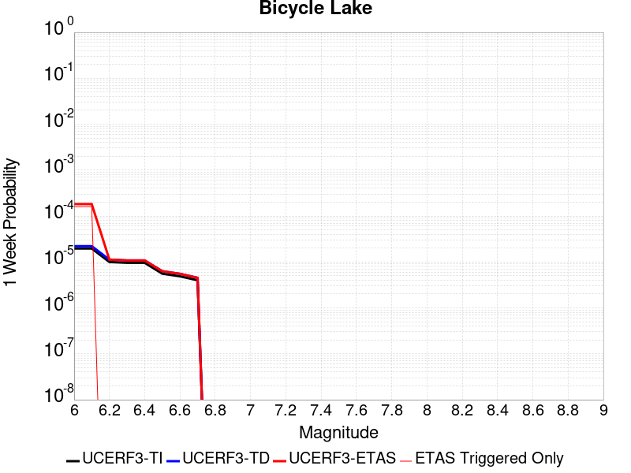 | 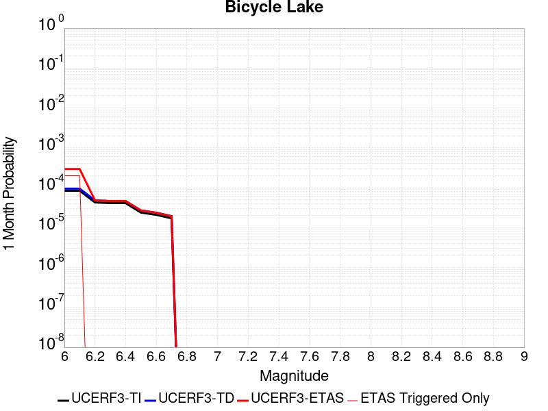 | 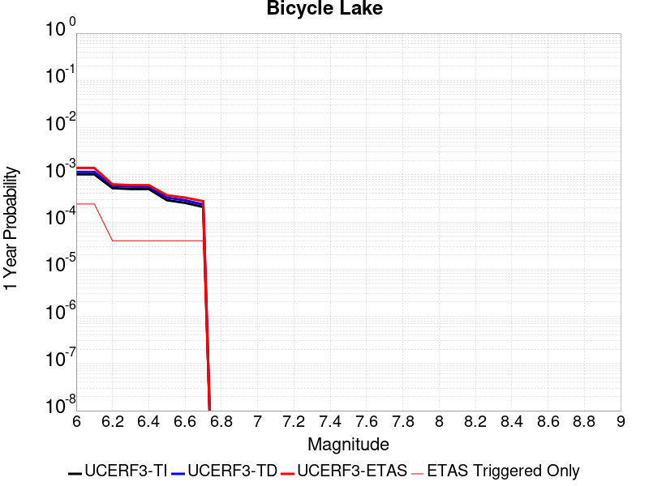 |

| Magnitude | 1 wk TI Prob | 1 wk TD Prob | 1 wk ETAS Prob | 1 wk ETAS/TD Gain | 1 wk ETAS Triggered Only | 1 mo TI Prob | 1 mo TD Prob | 1 mo ETAS Prob | 1 mo ETAS/TD Gain | 1 mo ETAS Triggered Only | 1 yr TI Prob | 1 yr TD Prob | 1 yr ETAS Prob | 1 yr ETAS/TD Gain | 1 yr ETAS Triggered Only |
|-----|-----|-----|-----|-----|-----|-----|-----|-----|-----|-----|-----|-----|-----|-----|-----|
| 6.0 | 1.9621975E-5 | 2.2106533E-5 | 1.82103E-4 | 8.237519 | 1.6E-4 | 8.4091465E-5 | 9.473961E-5 | 2.9472067E-4 | 3.1108494 | 2.0E-4 | 0.0010233327 | 0.0011529794 | 0.0013927028 | 1.2079164 | 2.4E-4 |
| 6.1 | 1.9621975E-5 | 2.2106533E-5 | 1.82103E-4 | 8.237519 | 1.6E-4 | 8.4091465E-5 | 9.473961E-5 | 2.9472067E-4 | 3.1108494 | 2.0E-4 | 0.0010233327 | 0.0011529794 | 0.0013927028 | 1.2079164 | 2.4E-4 |
| 6.2 | 9.9971285E-6 | 1.1260444E-5 | 1.1260444E-5 | 1.0 | 0.0 | 4.2844134E-5 | 4.8258447E-5 | 4.8258447E-5 | 1.0 | 0.0 | 5.2150246E-4 | 5.8744027E-4 | 6.2741677E-4 | 1.068052 | 4.0E-5 |
| 6.3 | 9.589428E-6 | 1.0802963E-5 | 1.0802963E-5 | 1.0 | 0.0 | 4.10969E-5 | 4.6297882E-5 | 4.6297882E-5 | 1.0 | 0.0 | 5.002399E-4 | 5.635828E-4 | 6.035603E-4 | 1.0709345 | 4.0E-5 |
| 6.4 | 9.589428E-6 | 1.0802963E-5 | 1.0802963E-5 | 1.0 | 0.0 | 4.10969E-5 | 4.6297882E-5 | 4.6297882E-5 | 1.0 | 0.0 | 5.002399E-4 | 5.635828E-4 | 6.035603E-4 | 1.0709345 | 4.0E-5 |
| 6.5 | 5.557707E-6 | 6.2883923E-6 | 6.2883923E-6 | 1.0 | 0.0 | 2.3818526E-5 | 2.6950127E-5 | 2.6950127E-5 | 1.0 | 0.0 | 2.8995197E-4 | 3.2809528E-4 | 3.6808217E-4 | 1.1218758 | 4.0E-5 |
| 6.6 | 4.8742945E-6 | 5.51574E-6 | 5.51574E-6 | 1.0 | 0.0 | 2.0889667E-5 | 2.3638819E-5 | 2.3638819E-5 | 1.0 | 0.0 | 2.54302E-4 | 2.8779084E-4 | 3.2777933E-4 | 1.1389499 | 4.0E-5 |
| 6.7 | 3.991108E-6 | 4.5179236E-6 | 4.5179236E-6 | 1.0 | 0.0 | 1.7104636E-5 | 1.936253E-5 | 1.936253E-5 | 1.0 | 0.0 | 2.0822904E-4 | 2.3573879E-4 | 2.7572937E-4 | 1.1696393 | 4.0E-5 |

## Garlock (Central)
*[(top)](#table-of-contents)*

| 1 Week | 1 Month | 1 Year |
|-----|-----|-----|
| 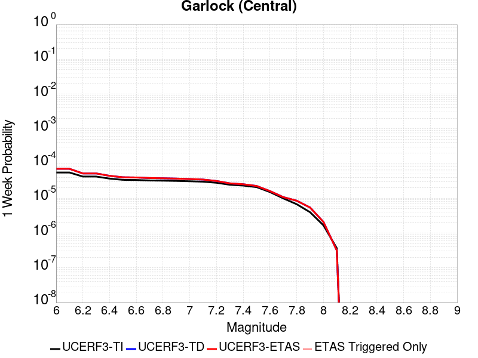 | 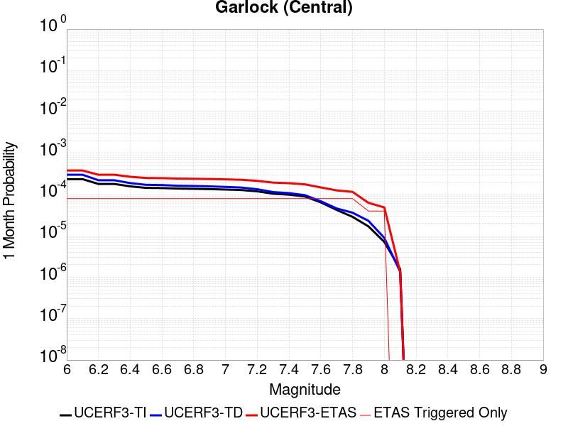 | 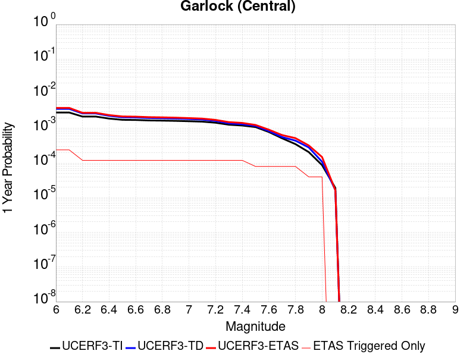 |

| Magnitude | 1 wk TI Prob | 1 wk TD Prob | 1 wk ETAS Prob | 1 wk ETAS/TD Gain | 1 wk ETAS Triggered Only | 1 mo TI Prob | 1 mo TD Prob | 1 mo ETAS Prob | 1 mo ETAS/TD Gain | 1 mo ETAS Triggered Only | 1 yr TI Prob | 1 yr TD Prob | 1 yr ETAS Prob | 1 yr ETAS/TD Gain | 1 yr ETAS Triggered Only |
|-----|-----|-----|-----|-----|-----|-----|-----|-----|-----|-----|-----|-----|-----|-----|-----|
| 6.0 | 5.5131142E-5 | 7.0410926E-5 | 7.0410926E-5 | 1.0 | 0.0 | 2.3625491E-4 | 3.0172654E-4 | 3.817024E-4 | 1.2650608 | 8.0E-5 | 0.0028726095 | 0.0036673974 | 0.0039065173 | 1.0652015 | 2.4E-4 |
| 6.1 | 5.5131142E-5 | 7.0410926E-5 | 7.0410926E-5 | 1.0 | 0.0 | 2.3625491E-4 | 3.0172654E-4 | 3.817024E-4 | 1.2650608 | 8.0E-5 | 0.0028726095 | 0.0036673974 | 0.0039065173 | 1.0652015 | 2.4E-4 |
| 6.2 | 4.216245E-5 | 5.181263E-5 | 5.181263E-5 | 1.0 | 0.0 | 1.806837E-4 | 2.220354E-4 | 3.0201764E-4 | 1.3602229 | 8.0E-5 | 0.0021976046 | 0.0026999614 | 0.0028196373 | 1.0443251 | 1.2E-4 |
| 6.3 | 4.216245E-5 | 5.181263E-5 | 5.181263E-5 | 1.0 | 0.0 | 1.806837E-4 | 2.220354E-4 | 3.0201764E-4 | 1.3602229 | 8.0E-5 | 0.0021976046 | 0.0026999614 | 0.0028196373 | 1.0443251 | 1.2E-4 |
| 6.4 | 3.6858168E-5 | 4.4255168E-5 | 4.4255168E-5 | 1.0 | 0.0 | 1.5795401E-4 | 1.8965136E-4 | 2.696362E-4 | 1.4217466 | 8.0E-5 | 0.0019213937 | 0.0023065854 | 0.0024263086 | 1.0519049 | 1.2E-4 |
| 6.5 | 3.39199E-5 | 4.0159928E-5 | 4.0159928E-5 | 1.0 | 0.0 | 1.453629E-4 | 1.7210275E-4 | 2.5208897E-4 | 1.4647586 | 8.0E-5 | 0.0017683565 | 0.0020933591 | 0.002213108 | 1.0572041 | 1.2E-4 |
| 6.6 | 3.3571985E-5 | 3.961341E-5 | 3.961341E-5 | 1.0 | 0.0 | 1.4387199E-4 | 1.6976082E-4 | 2.4974725E-4 | 1.4711713 | 8.0E-5 | 0.0017502342 | 0.0020649007 | 0.002184653 | 1.0579941 | 1.2E-4 |
| 6.7 | 3.2580007E-5 | 3.8228853E-5 | 3.8228853E-5 | 1.0 | 0.0 | 1.3962112E-4 | 1.6382778E-4 | 2.4381466E-4 | 1.4882377 | 8.0E-5 | 0.0016985617 | 0.0019927998 | 0.0021125607 | 1.0600967 | 1.2E-4 |
| 6.8 | 3.2185937E-5 | 3.7654747E-5 | 3.7654747E-5 | 1.0 | 0.0 | 1.3793244E-4 | 1.6136763E-4 | 2.4135472E-4 | 1.4956824 | 8.0E-5 | 0.0016780337 | 0.001962902 | 0.0020826664 | 1.0610139 | 1.2E-4 |
| 6.9 | 3.165394E-5 | 3.6858168E-5 | 3.6858168E-5 | 1.0 | 0.0 | 1.3565269E-4 | 1.5795414E-4 | 2.379415E-4 | 1.5063962 | 8.0E-5 | 0.0016503202 | 0.0019214168 | 0.0020411862 | 1.062334 | 1.2E-4 |
| 7.0 | 3.0903822E-5 | 3.5761113E-5 | 3.5761113E-5 | 1.0 | 0.0 | 1.3243823E-4 | 1.5325303E-4 | 2.3324077E-4 | 1.5219325 | 8.0E-5 | 0.0016112428 | 0.0018642801 | 0.0019840563 | 1.064248 | 1.2E-4 |
| 7.1 | 3.0069863E-5 | 3.4526223E-5 | 3.4526223E-5 | 1.0 | 0.0 | 1.2886449E-4 | 1.4796125E-4 | 2.2794942E-4 | 1.5406021 | 8.0E-5 | 0.0015677959 | 0.001799961 | 0.001919745 | 1.0665481 | 1.2E-4 |
| 7.2 | 2.7957109E-5 | 3.141258E-5 | 3.141258E-5 | 1.0 | 0.0 | 1.1981068E-4 | 1.346185E-4 | 2.1460773E-4 | 1.5941919 | 8.0E-5 | 0.0014577188 | 0.0016377677 | 0.0017575711 | 1.0731505 | 1.2E-4 |
| 7.3 | 2.4519275E-5 | 2.6838161E-5 | 2.6838161E-5 | 1.0 | 0.0 | 1.0507837E-4 | 1.15015704E-4 | 1.950065E-4 | 1.6954772 | 8.0E-5 | 0.0012785783 | 0.0013994314 | 0.0015192635 | 1.0856291 | 1.2E-4 |
| 7.4 | 2.3225532E-5 | 2.532011E-5 | 2.532011E-5 | 1.0 | 0.0 | 9.95342E-5 | 1.0851033E-4 | 1.8850165E-4 | 1.737177 | 8.0E-5 | 0.0012111551 | 0.001320327 | 0.0014401686 | 1.0907665 | 1.2E-4 |
| 7.5 | 2.097765E-5 | 2.2598408E-5 | 2.2598408E-5 | 1.0 | 0.0 | 8.9901114E-5 | 9.6846794E-5 | 1.7683905E-4 | 1.825967 | 8.0E-5 | 0.0010939965 | 0.0011784837 | 0.0012583894 | 1.0678039 | 8.0E-5 |
| 7.6 | 1.511254E-5 | 1.6095431E-5 | 1.6095431E-5 | 1.0 | 0.0 | 6.476642E-5 | 6.897865E-5 | 1.4897312E-4 | 2.1596992 | 8.0E-5 | 7.882459E-4 | 8.3949923E-4 | 9.194321E-4 | 1.095215 | 8.0E-5 |
| 7.7 | 9.934069E-6 | 1.0775618E-5 | 1.0775618E-5 | 1.0 | 0.0 | 4.2573887E-5 | 4.6180405E-5 | 1.261767E-4 | 2.7322567 | 8.0E-5 | 5.182138E-4 | 5.621018E-4 | 6.420568E-4 | 1.142243 | 8.0E-5 |
| 7.8 | 6.7562896E-6 | 8.50792E-6 | 8.50792E-6 | 1.0 | 0.0 | 2.8955206E-5 | 3.6462003E-5 | 1.1645909E-4 | 3.1939847 | 8.0E-5 | 3.5247262E-4 | 4.4383464E-4 | 5.237991E-4 | 1.1801673 | 8.0E-5 |
| 7.9 | 3.975453E-6 | 5.419516E-6 | 5.419516E-6 | 1.0 | 0.0 | 1.7037546E-5 | 2.3226292E-5 | 6.3225365E-5 | 2.7221463 | 4.0E-5 | 2.0741238E-4 | 2.827435E-4 | 3.227322E-4 | 1.141431 | 4.0E-5 |
| 8.0 | 1.6729537E-6 | 2.093995E-6 | 2.093995E-6 | 1.0 | 0.0 | 7.169782E-6 | 8.974233E-6 | 4.8973874E-5 | 5.4571652 | 4.0E-5 | 8.7288594E-5 | 1.09255845E-4 | 1.4925147E-4 | 1.3660731 | 4.0E-5 |
| 8.1 | 3.6733252E-7 | 3.1722044E-7 | 3.1722044E-7 | 1.0 | 0.0 | 1.5742813E-6 | 1.3595155E-6 | 1.3595155E-6 | 1.0 | 0.0 | 1.9166706E-5 | 1.6551992E-5 | 1.6551992E-5 | 1.0 | 0.0 |

## Garlic Springs
*[(top)](#table-of-contents)*

| 1 Week | 1 Month | 1 Year |
|-----|-----|-----|
| 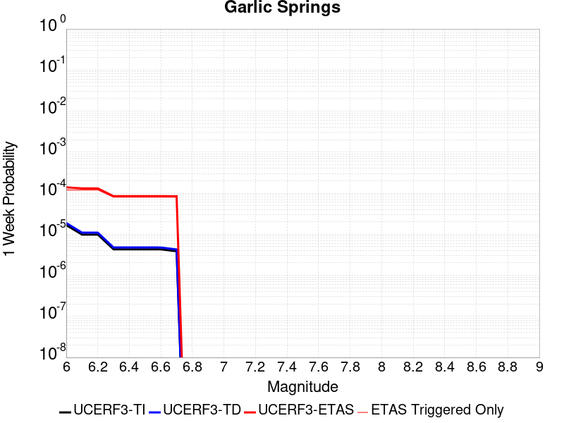 | 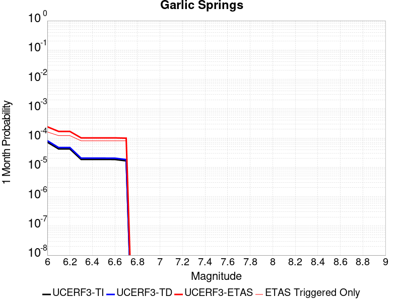 | 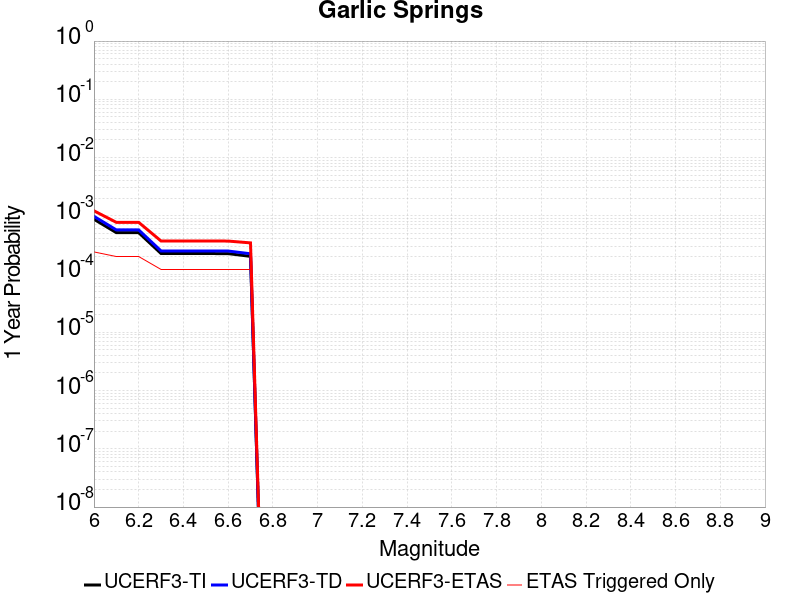 |

| Magnitude | 1 wk TI Prob | 1 wk TD Prob | 1 wk ETAS Prob | 1 wk ETAS/TD Gain | 1 wk ETAS Triggered Only | 1 mo TI Prob | 1 mo TD Prob | 1 mo ETAS Prob | 1 mo ETAS/TD Gain | 1 mo ETAS Triggered Only | 1 yr TI Prob | 1 yr TD Prob | 1 yr ETAS Prob | 1 yr ETAS/TD Gain | 1 yr ETAS Triggered Only |
|-----|-----|-----|-----|-----|-----|-----|-----|-----|-----|-----|-----|-----|-----|-----|-----|
| 6.0 | 1.6760017E-5 | 1.8784498E-5 | 1.3878224E-4 | 7.3881264 | 1.2E-4 | 7.182667E-5 | 8.0503174E-5 | 2.4049029E-4 | 2.9873393 | 1.6E-4 | 8.7413884E-4 | 9.798029E-4 | 0.0012195677 | 1.2447072 | 2.4E-4 |
| 6.1 | 9.852767E-6 | 1.097782E-5 | 1.309765E-4 | 11.931012 | 1.2E-4 | 4.222546E-5 | 4.7047353E-5 | 1.6704171E-4 | 3.5505018 | 1.2E-4 | 5.139737E-4 | 5.72722E-4 | 7.7260745E-4 | 1.3490096 | 2.0E-4 |
| 6.2 | 9.852767E-6 | 1.097782E-5 | 1.309765E-4 | 11.931012 | 1.2E-4 | 4.222546E-5 | 4.7047353E-5 | 1.6704171E-4 | 3.5505018 | 1.2E-4 | 5.139737E-4 | 5.72722E-4 | 7.7260745E-4 | 1.3490096 | 2.0E-4 |
| 6.3 | 4.3167724E-6 | 4.7797594E-6 | 8.477938E-5 | 17.737165 | 8.0E-5 | 1.8500323E-5 | 2.0484651E-5 | 1.0048301E-4 | 4.905283 | 8.0E-5 | 2.2521814E-4 | 2.4939515E-4 | 3.693652E-4 | 1.4810442 | 1.2E-4 |
| 6.4 | 4.3167724E-6 | 4.7797594E-6 | 8.477938E-5 | 17.737165 | 8.0E-5 | 1.8500323E-5 | 2.0484651E-5 | 1.0048301E-4 | 4.905283 | 8.0E-5 | 2.2521814E-4 | 2.4939515E-4 | 3.693652E-4 | 1.4810442 | 1.2E-4 |
| 6.5 | 4.3167724E-6 | 4.7797594E-6 | 8.477938E-5 | 17.737165 | 8.0E-5 | 1.8500323E-5 | 2.0484651E-5 | 1.0048301E-4 | 4.905283 | 8.0E-5 | 2.2521814E-4 | 2.4939515E-4 | 3.693652E-4 | 1.4810442 | 1.2E-4 |
| 6.6 | 4.301311E-6 | 4.7626213E-6 | 8.476224E-5 | 17.797392 | 8.0E-5 | 1.8434059E-5 | 2.0411206E-5 | 1.00409576E-4 | 4.919336 | 8.0E-5 | 2.2441156E-4 | 2.4850114E-4 | 3.6847132E-4 | 1.4827752 | 1.2E-4 |
| 6.7 | 3.8599724E-6 | 4.272602E-6 | 8.427226E-5 | 19.723875 | 8.0E-5 | 1.6542634E-5 | 1.831115E-5 | 9.830968E-5 | 5.3688426 | 8.0E-5 | 2.0138794E-4 | 2.2293825E-4 | 3.4291152E-4 | 1.5381457 | 1.2E-4 |

## Coyote Lake
*[(top)](#table-of-contents)*

| 1 Week | 1 Month | 1 Year |
|-----|-----|-----|
| 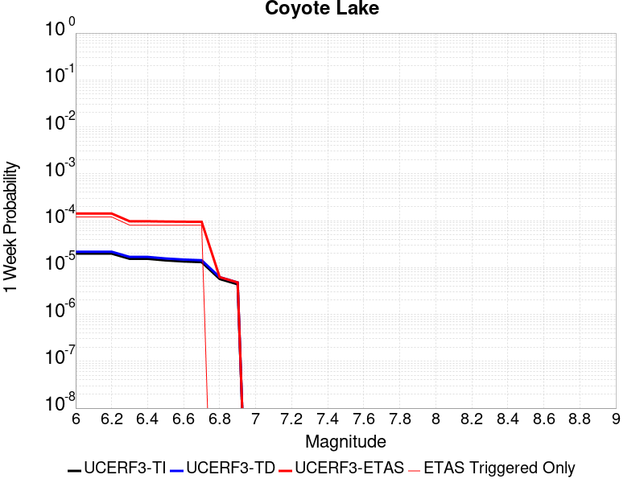 | 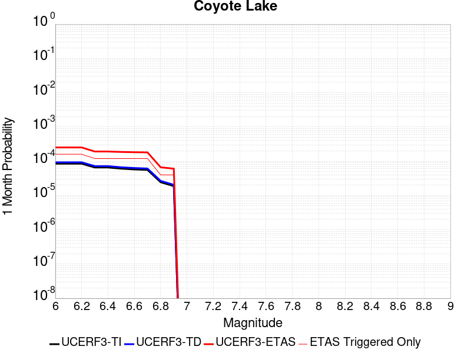 | 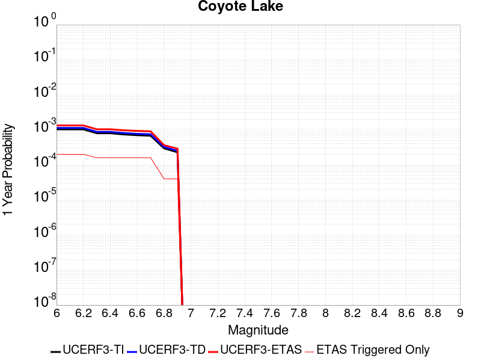 |

| Magnitude | 1 wk TI Prob | 1 wk TD Prob | 1 wk ETAS Prob | 1 wk ETAS/TD Gain | 1 wk ETAS Triggered Only | 1 mo TI Prob | 1 mo TD Prob | 1 mo ETAS Prob | 1 mo ETAS/TD Gain | 1 mo ETAS Triggered Only | 1 yr TI Prob | 1 yr TD Prob | 1 yr ETAS Prob | 1 yr ETAS/TD Gain | 1 yr ETAS Triggered Only |
|-----|-----|-----|-----|-----|-----|-----|-----|-----|-----|-----|-----|-----|-----|-----|-----|
| 6.0 | 1.980352E-5 | 2.1713819E-5 | 1.417112E-4 | 6.5263147 | 1.2E-4 | 8.486947E-5 | 9.305631E-5 | 2.5304142E-4 | 2.719229 | 1.6E-4 | 0.0010327959 | 0.0011324438 | 0.0013322174 | 1.1764092 | 2.0E-4 |
| 6.1 | 1.980352E-5 | 2.1713819E-5 | 1.417112E-4 | 6.5263147 | 1.2E-4 | 8.486947E-5 | 9.305631E-5 | 2.5304142E-4 | 2.719229 | 1.6E-4 | 0.0010327959 | 0.0011324438 | 0.0013322174 | 1.1764092 | 2.0E-4 |
| 6.2 | 1.980352E-5 | 2.1713819E-5 | 1.417112E-4 | 6.5263147 | 1.2E-4 | 8.486947E-5 | 9.305631E-5 | 2.5304142E-4 | 2.719229 | 1.6E-4 | 0.0010327959 | 0.0011324438 | 0.0013322174 | 1.1764092 | 2.0E-4 |
| 6.3 | 1.5344787E-5 | 1.6826156E-5 | 9.6824806E-5 | 5.7544227 | 8.0E-5 | 6.576172E-5 | 7.2110444E-5 | 1.921018E-4 | 2.6639938 | 1.2E-4 | 8.003548E-4 | 8.776523E-4 | 0.0010375119 | 1.1821445 | 1.6E-4 |
| 6.4 | 1.5344787E-5 | 1.6826156E-5 | 9.6824806E-5 | 5.7544227 | 8.0E-5 | 6.576172E-5 | 7.2110444E-5 | 1.921018E-4 | 2.6639938 | 1.2E-4 | 8.003548E-4 | 8.776523E-4 | 0.0010375119 | 1.1821445 | 1.6E-4 |
| 6.5 | 1.4189697E-5 | 1.5563075E-5 | 9.556183E-5 | 6.1402926 | 8.0E-5 | 6.081157E-5 | 6.6697525E-5 | 1.8668952E-4 | 2.7990472 | 1.2E-4 | 7.401293E-4 | 8.118002E-4 | 9.716703E-4 | 1.1969328 | 1.6E-4 |
| 6.6 | 1.3469301E-5 | 1.4776421E-5 | 9.477524E-5 | 6.413951 | 8.0E-5 | 5.7724297E-5 | 6.332632E-5 | 1.8331873E-4 | 2.8948267 | 1.2E-4 | 7.025667E-4 | 7.707852E-4 | 9.306619E-4 | 1.2074205 | 1.6E-4 |
| 6.7 | 1.3027966E-5 | 1.4286406E-5 | 9.4285264E-5 | 6.599649 | 8.0E-5 | 5.5832945E-5 | 6.1226354E-5 | 1.81219E-4 | 2.9598203 | 1.2E-4 | 6.7955407E-4 | 7.452357E-4 | 9.0511644E-4 | 1.2145371 | 1.6E-4 |
| 6.8 | 5.695434E-6 | 6.2263775E-6 | 6.2263775E-6 | 1.0 | 0.0 | 2.4408775E-5 | 2.668437E-5 | 6.66833E-5 | 2.4989648 | 4.0E-5 | 2.971363E-4 | 3.248638E-4 | 3.648508E-4 | 1.1230885 | 4.0E-5 |
| 6.9 | 4.385688E-6 | 4.7945646E-6 | 4.7945646E-6 | 1.0 | 0.0 | 1.879567E-5 | 2.0548134E-5 | 6.054731E-5 | 2.9466088 | 4.0E-5 | 2.2881327E-4 | 2.5017353E-4 | 2.9016353E-4 | 1.159849 | 4.0E-5 |

## San Jacinto (Clark) rev
*[(top)](#table-of-contents)*

| 1 Week | 1 Month | 1 Year |
|-----|-----|-----|
| 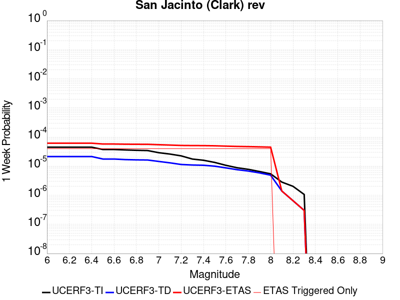 | 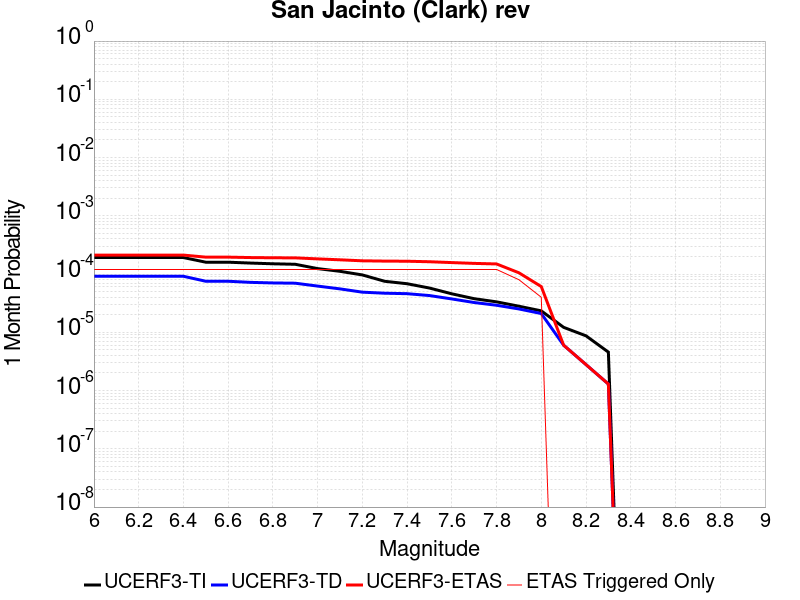 | 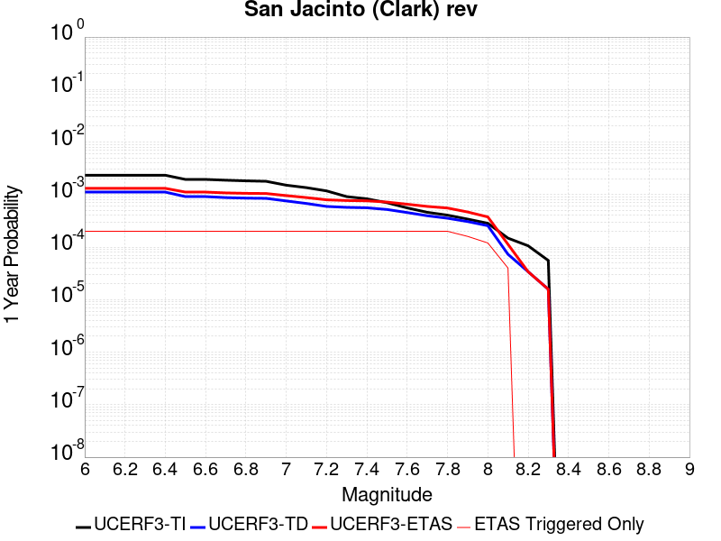 |

| Magnitude | 1 wk TI Prob | 1 wk TD Prob | 1 wk ETAS Prob | 1 wk ETAS/TD Gain | 1 wk ETAS Triggered Only | 1 mo TI Prob | 1 mo TD Prob | 1 mo ETAS Prob | 1 mo ETAS/TD Gain | 1 mo ETAS Triggered Only | 1 yr TI Prob | 1 yr TD Prob | 1 yr ETAS Prob | 1 yr ETAS/TD Gain | 1 yr ETAS Triggered Only |
|-----|-----|-----|-----|-----|-----|-----|-----|-----|-----|-----|-----|-----|-----|-----|-----|
| 6.0 | 4.482615E-5 | 2.1381953E-5 | 6.13811E-5 | 2.8706965 | 4.0E-5 | 1.9209793E-4 | 9.1633774E-5 | 2.1162277E-4 | 2.3094409 | 1.2E-4 | 0.0023362834 | 0.0011150796 | 0.0013148566 | 1.1791594 | 2.0E-4 |
| 6.1 | 4.482615E-5 | 2.1381953E-5 | 6.13811E-5 | 2.8706965 | 4.0E-5 | 1.9209793E-4 | 9.1633774E-5 | 2.1162277E-4 | 2.3094409 | 1.2E-4 | 0.0023362834 | 0.0011150796 | 0.0013148566 | 1.1791594 | 2.0E-4 |
| 6.2 | 4.482615E-5 | 2.1381953E-5 | 6.13811E-5 | 2.8706965 | 4.0E-5 | 1.9209793E-4 | 9.1633774E-5 | 2.1162277E-4 | 2.3094409 | 1.2E-4 | 0.0023362834 | 0.0011150796 | 0.0013148566 | 1.1791594 | 2.0E-4 |
| 6.3 | 4.482615E-5 | 2.1381953E-5 | 6.13811E-5 | 2.8706965 | 4.0E-5 | 1.9209793E-4 | 9.1633774E-5 | 2.1162277E-4 | 2.3094409 | 1.2E-4 | 0.0023362834 | 0.0011150796 | 0.0013148566 | 1.1791594 | 2.0E-4 |
| 6.4 | 4.482615E-5 | 2.1381953E-5 | 6.13811E-5 | 2.8706965 | 4.0E-5 | 1.9209793E-4 | 9.1633774E-5 | 2.1162277E-4 | 2.3094409 | 1.2E-4 | 0.0023362834 | 0.0011150796 | 0.0013148566 | 1.1791594 | 2.0E-4 |
| 6.5 | 3.7294863E-5 | 1.7559976E-5 | 5.7559275E-5 | 3.2778673 | 4.0E-5 | 1.5982533E-4 | 7.5254895E-5 | 1.9524587E-4 | 2.5944607 | 1.2E-4 | 0.0019441366 | 9.1584784E-4 | 0.0011156646 | 1.2181768 | 2.0E-4 |
| 6.6 | 3.7294863E-5 | 1.7559976E-5 | 5.7559275E-5 | 3.2778673 | 4.0E-5 | 1.5982533E-4 | 7.5254895E-5 | 1.9524587E-4 | 2.5944607 | 1.2E-4 | 0.0019441366 | 9.1584784E-4 | 0.0011156646 | 1.2181768 | 2.0E-4 |
| 6.7 | 3.6039248E-5 | 1.6803659E-5 | 5.6802986E-5 | 3.380394 | 4.0E-5 | 1.5444479E-4 | 7.201371E-5 | 1.9200507E-4 | 2.6662292 | 1.2E-4 | 0.0018787434 | 8.764185E-4 | 0.0010762432 | 1.2280015 | 2.0E-4 |
| 6.8 | 3.5031844E-5 | 1.6428598E-5 | 5.642794E-5 | 3.4347389 | 4.0E-5 | 1.5012783E-4 | 7.040639E-5 | 1.9039794E-4 | 2.7042706 | 1.2E-4 | 0.0018262739 | 8.568649E-4 | 0.0010566936 | 1.233209 | 2.0E-4 |
| 6.9 | 3.435112E-5 | 1.6257003E-5 | 5.625635E-5 | 3.4604383 | 4.0E-5 | 1.4721078E-4 | 6.967103E-5 | 1.8966266E-4 | 2.7222602 | 1.2E-4 | 0.0017908178 | 8.4791885E-4 | 0.0010477493 | 1.2356716 | 2.0E-4 |
| 7.0 | 2.8959772E-5 | 1.4511907E-5 | 5.4511325E-5 | 3.7563174 | 4.0E-5 | 1.241074E-4 | 6.219242E-5 | 1.8218496E-4 | 2.9293756 | 1.2E-4 | 0.0015099603 | 7.569325E-4 | 9.567811E-4 | 1.2640244 | 2.0E-4 |
| 7.1 | 2.6002877E-5 | 1.2989396E-5 | 5.2988875E-5 | 4.079395 | 4.0E-5 | 1.11436144E-4 | 5.5667664E-5 | 1.7566099E-4 | 3.15553 | 1.2E-4 | 0.0013558907 | 6.775452E-4 | 8.774097E-4 | 1.2949833 | 2.0E-4 |
| 7.2 | 2.2544838E-5 | 1.1407055E-5 | 5.1406598E-5 | 4.5065618 | 4.0E-5 | 9.661716E-5 | 4.888647E-5 | 1.6888061E-4 | 3.4545467 | 1.2E-4 | 0.001175679 | 5.950317E-4 | 7.949127E-4 | 1.3359165 | 2.0E-4 |
| 7.3 | 1.75334E-5 | 1.0946427E-5 | 5.094599E-5 | 4.6541204 | 4.0E-5 | 7.514098E-5 | 4.6912424E-5 | 1.669068E-4 | 3.5578377 | 1.2E-4 | 9.144575E-4 | 5.710105E-4 | 7.7089627E-4 | 1.3500563 | 2.0E-4 |
| 7.4 | 1.5924552E-5 | 1.0743272E-5 | 5.074284E-5 | 4.723221 | 4.0E-5 | 6.82463E-5 | 4.6041787E-5 | 1.6603626E-4 | 3.606208 | 1.2E-4 | 8.305819E-4 | 5.6041597E-4 | 7.603039E-4 | 1.3566778 | 2.0E-4 |
| 7.5 | 1.3428931E-5 | 9.976539E-6 | 4.997614E-5 | 5.0093665 | 4.0E-5 | 5.7551293E-5 | 4.2755903E-5 | 1.6275077E-4 | 3.80651 | 1.2E-4 | 7.004617E-4 | 5.2042986E-4 | 7.203258E-4 | 1.3840977 | 2.0E-4 |
| 7.6 | 1.0688787E-5 | 8.727412E-6 | 4.8727063E-5 | 5.58322 | 4.0E-5 | 4.5808283E-5 | 3.740266E-5 | 1.5739817E-4 | 4.2082076 | 1.2E-4 | 5.5757316E-4 | 4.5528274E-4 | 6.5519166E-4 | 1.4390875 | 2.0E-4 |
| 7.7 | 8.81236E-6 | 7.5768367E-6 | 4.7576534E-5 | 6.279208 | 4.0E-5 | 3.776671E-5 | 3.2471755E-5 | 1.5246785E-4 | 4.6953993 | 1.2E-4 | 4.597127E-4 | 3.952721E-4 | 5.9519307E-4 | 1.5057806 | 2.0E-4 |
| 7.8 | 7.780431E-6 | 6.7993083E-6 | 4.6799036E-5 | 6.882911 | 4.0E-5 | 3.3344273E-5 | 2.9139568E-5 | 1.4913607E-4 | 5.117992 | 1.2E-4 | 4.0589093E-4 | 3.5471667E-4 | 5.546457E-4 | 1.5636302 | 2.0E-4 |
| 7.9 | 6.5437994E-6 | 5.8761307E-6 | 4.5875895E-5 | 7.8071604 | 4.0E-5 | 2.8044553E-5 | 2.5183175E-5 | 1.0518116E-4 | 4.176644 | 8.0E-5 | 3.4138895E-4 | 3.065622E-4 | 4.6651316E-4 | 1.5217569 | 1.6E-4 |
| 8.0 | 5.4488164E-6 | 4.898215E-6 | 4.489802E-5 | 9.1662 | 4.0E-5 | 2.3351862E-5 | 2.0992184E-5 | 6.0991344E-5 | 2.9054313 | 4.0E-5 | 2.8427184E-4 | 2.5555E-4 | 3.7551933E-4 | 1.4694554 | 1.2E-4 |
| 8.1 | 2.8397242E-6 | 1.4004763E-6 | 1.4004763E-6 | 1.0 | 0.0 | 1.217019E-5 | 6.002028E-6 | 6.002028E-6 | 1.0 | 0.0 | 1.4816198E-4 | 7.307225E-5 | 1.1306933E-4 | 1.5473634 | 4.0E-5 |
| 8.2 | 2.030244E-6 | 6.5120884E-7 | 6.5120884E-7 | 1.0 | 0.0 | 8.701017E-6 | 2.790892E-6 | 2.790892E-6 | 1.0 | 0.0 | 1.05929736E-4 | 3.3978587E-5 | 3.3978587E-5 | 1.0 | 0.0 |
| 8.3 | 1.0659804E-6 | 3.019421E-7 | 3.019421E-7 | 1.0 | 0.0 | 4.568479E-6 | 1.2940369E-6 | 1.2940369E-6 | 1.0 | 0.0 | 5.5619817E-5 | 1.575479E-5 | 1.575479E-5 | 1.0 | 0.0 |

## Goldstone Lake
*[(top)](#table-of-contents)*

| 1 Week | 1 Month | 1 Year |
|-----|-----|-----|
| 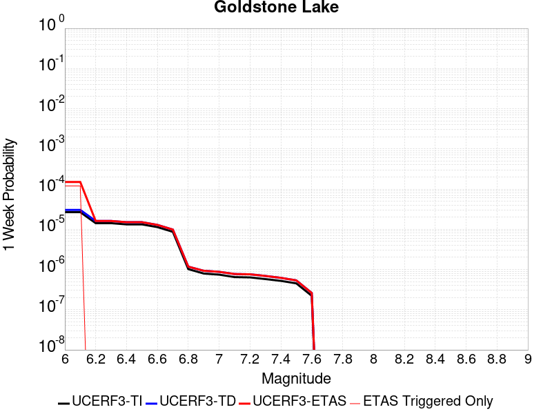 | 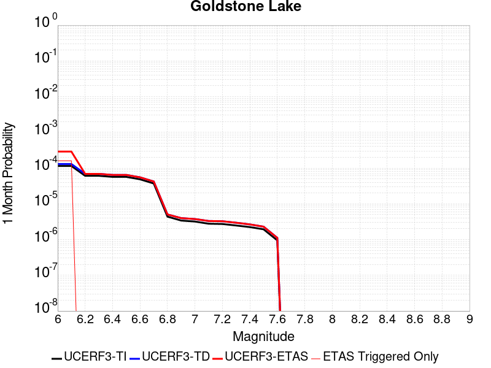 | 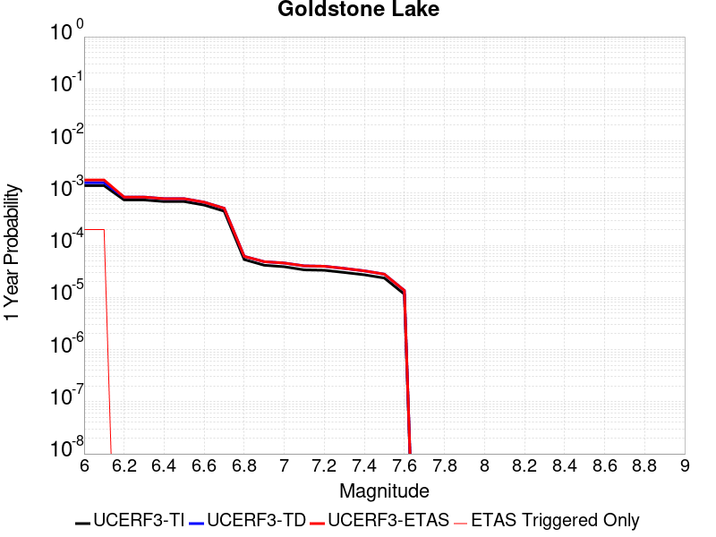 |

| Magnitude | 1 wk TI Prob | 1 wk TD Prob | 1 wk ETAS Prob | 1 wk ETAS/TD Gain | 1 wk ETAS Triggered Only | 1 mo TI Prob | 1 mo TD Prob | 1 mo ETAS Prob | 1 mo ETAS/TD Gain | 1 mo ETAS Triggered Only | 1 yr TI Prob | 1 yr TD Prob | 1 yr ETAS Prob | 1 yr ETAS/TD Gain | 1 yr ETAS Triggered Only |
|-----|-----|-----|-----|-----|-----|-----|-----|-----|-----|-----|-----|-----|-----|-----|-----|
| 6.0 | 2.671352E-5 | 3.0389869E-5 | 1.5038621E-4 | 4.9485645 | 1.2E-4 | 1.1448149E-4 | 1.302369E-4 | 2.9021606E-4 | 2.2283704 | 1.6E-4 | 0.001392921 | 0.0015846775 | 0.0017843605 | 1.1260086 | 2.0E-4 |
| 6.1 | 2.671352E-5 | 3.0389869E-5 | 1.5038621E-4 | 4.9485645 | 1.2E-4 | 1.1448149E-4 | 1.302369E-4 | 2.9021606E-4 | 2.2283704 | 1.6E-4 | 0.001392921 | 0.0015846775 | 0.0017843605 | 1.1260086 | 2.0E-4 |
| 6.2 | 1.4197047E-5 | 1.6103195E-5 | 1.6103195E-5 | 1.0 | 0.0 | 6.0843064E-5 | 6.901242E-5 | 6.901242E-5 | 1.0 | 0.0 | 7.4051257E-4 | 8.4000104E-4 | 8.4000104E-4 | 1.0 | 0.0 |
| 6.3 | 1.4197047E-5 | 1.6103195E-5 | 1.6103195E-5 | 1.0 | 0.0 | 6.0843064E-5 | 6.901242E-5 | 6.901242E-5 | 1.0 | 0.0 | 7.4051257E-4 | 8.4000104E-4 | 8.4000104E-4 | 1.0 | 0.0 |
| 6.4 | 1.3238931E-5 | 1.501491E-5 | 1.501491E-5 | 1.0 | 0.0 | 5.6737044E-5 | 6.434858E-5 | 6.434858E-5 | 1.0 | 0.0 | 6.9055456E-4 | 7.8326045E-4 | 7.8326045E-4 | 1.0 | 0.0 |
| 6.5 | 1.3238931E-5 | 1.501491E-5 | 1.501491E-5 | 1.0 | 0.0 | 5.6737044E-5 | 6.434858E-5 | 6.434858E-5 | 1.0 | 0.0 | 6.9055456E-4 | 7.8326045E-4 | 7.8326045E-4 | 1.0 | 0.0 |
| 6.6 | 1.1328278E-5 | 1.2860688E-5 | 1.2860688E-5 | 1.0 | 0.0 | 4.8548856E-5 | 5.5116612E-5 | 5.5116612E-5 | 1.0 | 0.0 | 5.90922E-4 | 6.709339E-4 | 6.709339E-4 | 1.0 | 0.0 |
| 6.7 | 8.651175E-6 | 9.82873E-6 | 9.82873E-6 | 1.0 | 0.0 | 3.707594E-5 | 4.212296E-5 | 4.212296E-5 | 1.0 | 0.0 | 4.5130608E-4 | 5.1281694E-4 | 5.1281694E-4 | 1.0 | 0.0 |
| 6.8 | 1.0215377E-6 | 1.1757171E-6 | 1.1757171E-6 | 1.0 | 0.0 | 4.378012E-6 | 5.0387785E-6 | 5.0387785E-6 | 1.0 | 0.0 | 5.3300988E-5 | 6.134552E-5 | 6.134552E-5 | 1.0 | 0.0 |
| 6.9 | 7.9360774E-7 | 9.28516E-7 | 9.28516E-7 | 1.0 | 0.0 | 3.4011714E-6 | 3.9793485E-6 | 3.9793485E-6 | 1.0 | 0.0 | 4.1408475E-5 | 4.8447564E-5 | 4.8447564E-5 | 1.0 | 0.0 |
| 7.0 | 7.4382757E-7 | 8.748952E-7 | 8.748952E-7 | 1.0 | 0.0 | 3.1878285E-6 | 3.7495458E-6 | 3.7495458E-6 | 1.0 | 0.0 | 3.8811122E-5 | 4.5649835E-5 | 4.5649835E-5 | 1.0 | 0.0 |
| 7.1 | 6.4709513E-7 | 7.712674E-7 | 7.712674E-7 | 1.0 | 0.0 | 2.773262E-6 | 3.305428E-6 | 3.305428E-6 | 1.0 | 0.0 | 3.376394E-5 | 4.0242903E-5 | 4.0242903E-5 | 1.0 | 0.0 |
| 7.2 | 6.356704E-7 | 7.589702E-7 | 7.589702E-7 | 1.0 | 0.0 | 2.7242988E-6 | 3.2527257E-6 | 3.2527257E-6 | 1.0 | 0.0 | 3.3167835E-5 | 3.9601277E-5 | 3.9601277E-5 | 1.0 | 0.0 |
| 7.3 | 5.7695723E-7 | 6.897807E-7 | 6.897807E-7 | 1.0 | 0.0 | 2.4726714E-6 | 2.9562E-6 | 2.9562E-6 | 1.0 | 0.0 | 3.0104358E-5 | 3.5991197E-5 | 3.5991197E-5 | 1.0 | 0.0 |
| 7.4 | 5.209647E-7 | 6.194571E-7 | 6.194571E-7 | 1.0 | 0.0 | 2.232704E-6 | 2.654814E-6 | 2.654814E-6 | 1.0 | 0.0 | 2.718283E-5 | 3.2321936E-5 | 3.2321936E-5 | 1.0 | 0.0 |
| 7.5 | 4.512955E-7 | 5.3497666E-7 | 5.3497666E-7 | 1.0 | 0.0 | 1.934122E-6 | 2.2927554E-6 | 2.2927554E-6 | 1.0 | 0.0 | 2.3547682E-5 | 2.7913995E-5 | 2.7913995E-5 | 1.0 | 0.0 |
| 7.6 | 2.21172E-7 | 2.6043384E-7 | 2.6043384E-7 | 1.0 | 0.0 | 9.478797E-7 | 1.1161446E-6 | 1.1161446E-6 | 1.0 | 0.0 | 1.1540374E-5 | 1.3589005E-5 | 1.3589005E-5 | 1.0 | 0.0 |

## Sierra Madre
*[(top)](#table-of-contents)*

| 1 Week | 1 Month | 1 Year |
|-----|-----|-----|
| 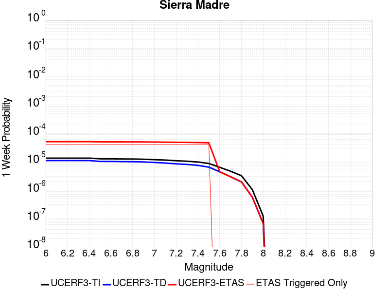 | 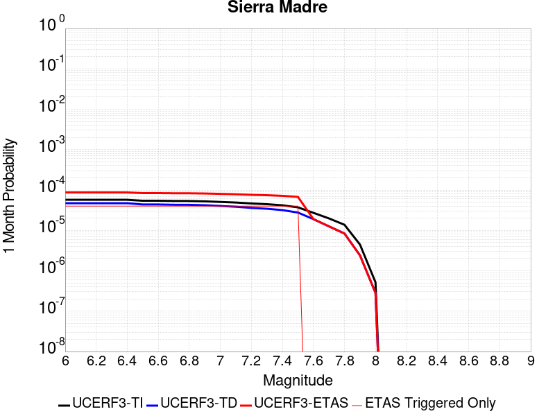 | 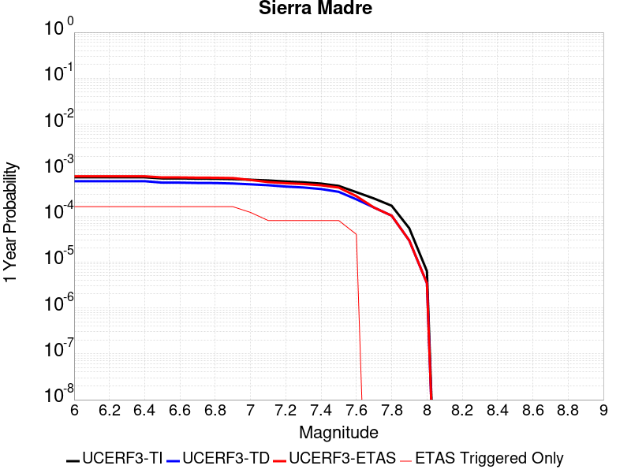 |

| Magnitude | 1 wk TI Prob | 1 wk TD Prob | 1 wk ETAS Prob | 1 wk ETAS/TD Gain | 1 wk ETAS Triggered Only | 1 mo TI Prob | 1 mo TD Prob | 1 mo ETAS Prob | 1 mo ETAS/TD Gain | 1 mo ETAS Triggered Only | 1 yr TI Prob | 1 yr TD Prob | 1 yr ETAS Prob | 1 yr ETAS/TD Gain | 1 yr ETAS Triggered Only |
|-----|-----|-----|-----|-----|-----|-----|-----|-----|-----|-----|-----|-----|-----|-----|-----|
| 6.0 | 1.3379373E-5 | 1.1009154E-5 | 5.1008716E-5 | 4.6333 | 4.0E-5 | 5.7338908E-5 | 4.7181245E-5 | 8.717936E-5 | 1.8477545 | 4.0E-5 | 6.978776E-4 | 5.7428173E-4 | 7.341899E-4 | 1.2784489 | 1.6E-4 |
| 6.1 | 1.3379373E-5 | 1.1009154E-5 | 5.1008716E-5 | 4.6333 | 4.0E-5 | 5.7338908E-5 | 4.7181245E-5 | 8.717936E-5 | 1.8477545 | 4.0E-5 | 6.978776E-4 | 5.7428173E-4 | 7.341899E-4 | 1.2784489 | 1.6E-4 |
| 6.2 | 1.3379373E-5 | 1.1009154E-5 | 5.1008716E-5 | 4.6333 | 4.0E-5 | 5.7338908E-5 | 4.7181245E-5 | 8.717936E-5 | 1.8477545 | 4.0E-5 | 6.978776E-4 | 5.7428173E-4 | 7.341899E-4 | 1.2784489 | 1.6E-4 |
| 6.3 | 1.3379373E-5 | 1.1009154E-5 | 5.1008716E-5 | 4.6333 | 4.0E-5 | 5.7338908E-5 | 4.7181245E-5 | 8.717936E-5 | 1.8477545 | 4.0E-5 | 6.978776E-4 | 5.7428173E-4 | 7.341899E-4 | 1.2784489 | 1.6E-4 |
| 6.4 | 1.3379373E-5 | 1.1009154E-5 | 5.1008716E-5 | 4.6333 | 4.0E-5 | 5.7338908E-5 | 4.7181245E-5 | 8.717936E-5 | 1.8477545 | 4.0E-5 | 6.978776E-4 | 5.7428173E-4 | 7.341899E-4 | 1.2784489 | 1.6E-4 |
| 6.5 | 1.26563245E-5 | 1.0238438E-5 | 5.0238028E-5 | 4.9068055 | 4.0E-5 | 5.4240263E-5 | 4.387829E-5 | 8.387653E-5 | 1.9115726 | 4.0E-5 | 6.601751E-4 | 5.3408835E-4 | 6.940029E-4 | 1.299416 | 1.6E-4 |
| 6.6 | 1.26563245E-5 | 1.0238438E-5 | 5.0238028E-5 | 4.9068055 | 4.0E-5 | 5.4240263E-5 | 4.387829E-5 | 8.387653E-5 | 1.9115726 | 4.0E-5 | 6.601751E-4 | 5.3408835E-4 | 6.940029E-4 | 1.299416 | 1.6E-4 |
| 6.7 | 1.2502474E-5 | 1.00745465E-5 | 5.0074144E-5 | 4.9703617 | 4.0E-5 | 5.3580934E-5 | 4.317592E-5 | 8.317419E-5 | 1.9264023 | 4.0E-5 | 6.521526E-4 | 5.255411E-4 | 6.85457E-4 | 1.3042881 | 1.6E-4 |
| 6.8 | 1.2454966E-5 | 1.0026802E-5 | 5.00264E-5 | 4.989268 | 4.0E-5 | 5.3377335E-5 | 4.2971307E-5 | 8.2969585E-5 | 1.9308137 | 4.0E-5 | 6.4967526E-4 | 5.2305113E-4 | 6.829674E-4 | 1.3057375 | 1.6E-4 |
| 6.9 | 1.2225574E-5 | 9.800568E-6 | 4.9800175E-5 | 5.0813565 | 4.0E-5 | 5.2394265E-5 | 4.200176E-5 | 8.200008E-5 | 1.952301 | 4.0E-5 | 6.3771347E-4 | 5.112525E-4 | 6.711707E-4 | 1.312797 | 1.6E-4 |
| 7.0 | 1.182946E-5 | 9.40699E-6 | 4.9406615E-5 | 5.252117 | 4.0E-5 | 5.06967E-5 | 4.0315055E-5 | 8.0313446E-5 | 1.9921452 | 4.0E-5 | 6.1705755E-4 | 4.9072626E-4 | 6.106674E-4 | 1.2444155 | 1.2E-4 |
| 7.1 | 1.14369095E-5 | 8.993793E-6 | 4.8993432E-5 | 5.4474716 | 4.0E-5 | 4.9014405E-5 | 3.8544265E-5 | 7.8542726E-5 | 2.0377278 | 4.0E-5 | 5.9658696E-4 | 4.6917636E-4 | 5.491388E-4 | 1.1704316 | 8.0E-5 |
| 7.2 | 1.0836419E-5 | 8.40696E-6 | 4.8406622E-5 | 5.7579226 | 4.0E-5 | 4.644097E-5 | 3.6029334E-5 | 7.602789E-5 | 2.1101665 | 4.0E-5 | 5.652721E-4 | 4.3856975E-4 | 5.185347E-4 | 1.1823311 | 8.0E-5 |
| 7.3 | 1.0403439E-5 | 8.028089E-6 | 4.8027767E-5 | 5.9824657 | 4.0E-5 | 4.4585406E-5 | 3.4405646E-5 | 7.440427E-5 | 2.1625597 | 4.0E-5 | 5.426921E-4 | 4.1880916E-4 | 4.987756E-4 | 1.1909378 | 8.0E-5 |
| 7.4 | 9.768864E-6 | 7.421485E-6 | 4.742119E-5 | 6.3897166 | 4.0E-5 | 4.186589E-5 | 3.1805983E-5 | 7.180471E-5 | 2.257585 | 4.0E-5 | 5.09598E-4 | 3.8716992E-4 | 4.6713895E-4 | 1.2065476 | 8.0E-5 |
| 7.5 | 8.687089E-6 | 6.4567002E-6 | 4.6456444E-5 | 7.1950746 | 4.0E-5 | 3.722985E-5 | 2.7671285E-5 | 6.7670175E-5 | 2.4455018 | 4.0E-5 | 4.5317915E-4 | 3.368467E-4 | 4.1681973E-4 | 1.2374167 | 8.0E-5 |
| 7.6 | 6.3506063E-6 | 4.436162E-6 | 4.436162E-6 | 1.0 | 0.0 | 2.72166E-5 | 1.9011986E-5 | 1.9011986E-5 | 1.0 | 0.0 | 3.3131172E-4 | 2.314466E-4 | 2.7143734E-4 | 1.172786 | 4.0E-5 |
| 7.7 | 4.62223E-6 | 2.9384053E-6 | 2.9384053E-6 | 1.0 | 0.0 | 1.9809406E-5 | 1.2593105E-5 | 1.2593105E-5 | 1.0 | 0.0 | 2.4115283E-4 | 1.5331028E-4 | 1.5331028E-4 | 1.0 | 0.0 |
| 7.8 | 3.2145008E-6 | 1.9533868E-6 | 1.9533868E-6 | 1.0 | 0.0 | 1.3776359E-5 | 8.37163E-6 | 8.37163E-6 | 1.0 | 0.0 | 1.6771426E-4 | 1.0191985E-4 | 1.0191985E-4 | 1.0 | 0.0 |
| 7.9 | 1.0391769E-6 | 5.613154E-7 | 5.613154E-7 | 1.0 | 0.0 | 4.4536077E-6 | 2.4056353E-6 | 2.4056353E-6 | 1.0 | 0.0 | 5.4221324E-5 | 2.9288221E-5 | 2.9288221E-5 | 1.0 | 0.0 |
| 8.0 | 1.210983E-7 | 6.622497E-8 | 6.622497E-8 | 1.0 | 0.0 | 5.1899264E-7 | 2.8382127E-7 | 2.8382127E-7 | 1.0 | 0.0 | 6.3187167E-6 | 3.4555185E-6 | 3.4555185E-6 | 1.0 | 0.0 |

## Tank Canyon
*[(top)](#table-of-contents)*

| 1 Week | 1 Month | 1 Year |
|-----|-----|-----|
| 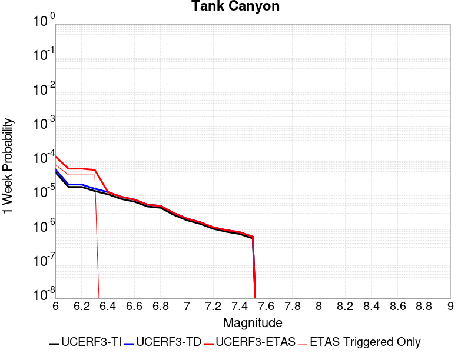 | 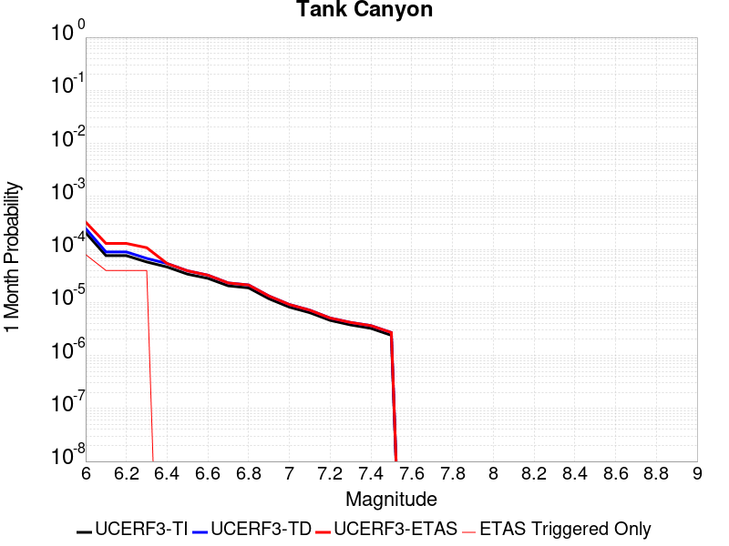 | 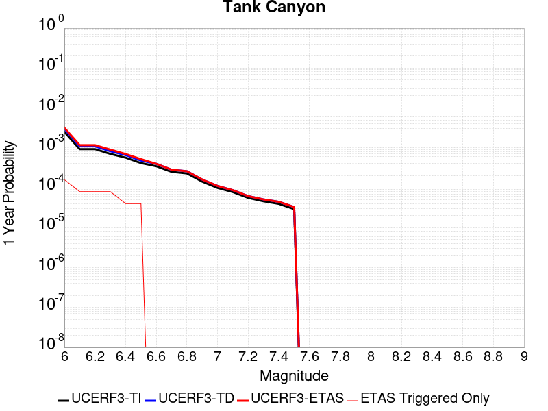 |

| Magnitude | 1 wk TI Prob | 1 wk TD Prob | 1 wk ETAS Prob | 1 wk ETAS/TD Gain | 1 wk ETAS Triggered Only | 1 mo TI Prob | 1 mo TD Prob | 1 mo ETAS Prob | 1 mo ETAS/TD Gain | 1 mo ETAS Triggered Only | 1 yr TI Prob | 1 yr TD Prob | 1 yr ETAS Prob | 1 yr ETAS/TD Gain | 1 yr ETAS Triggered Only |
|-----|-----|-----|-----|-----|-----|-----|-----|-----|-----|-----|-----|-----|-----|-----|-----|
| 6.0 | 4.8284557E-5 | 5.800436E-5 | 1.3799971E-4 | 2.3791268 | 8.0E-5 | 2.0691741E-4 | 2.485703E-4 | 3.2855038E-4 | 1.3217605 | 8.0E-5 | 0.0025163088 | 0.0030228058 | 0.003182322 | 1.052771 | 1.6E-4 |
| 6.1 | 1.7796336E-5 | 2.088598E-5 | 6.0885144E-5 | 2.9151204 | 4.0E-5 | 7.626778E-5 | 8.9508496E-5 | 1.2950492E-4 | 1.4468449 | 4.0E-5 | 9.281647E-4 | 0.0010892592 | 0.001169172 | 1.0733644 | 8.0E-5 |
| 6.2 | 1.7796336E-5 | 2.088598E-5 | 6.0885144E-5 | 2.9151204 | 4.0E-5 | 7.626778E-5 | 8.9508496E-5 | 1.2950492E-4 | 1.4468449 | 4.0E-5 | 9.281647E-4 | 0.0010892592 | 0.001169172 | 1.0733644 | 8.0E-5 |
| 6.3 | 1.3515912E-5 | 1.5768876E-5 | 5.5768243E-5 | 3.5366025 | 4.0E-5 | 5.792405E-5 | 6.757928E-5 | 1.07576576E-4 | 1.5918574 | 4.0E-5 | 7.049971E-4 | 8.224908E-4 | 9.0242503E-4 | 1.0971855 | 8.0E-5 |
| 6.4 | 1.0870146E-5 | 1.2625341E-5 | 1.2625341E-5 | 1.0 | 0.0 | 4.658551E-5 | 5.4107582E-5 | 5.4107582E-5 | 1.0 | 0.0 | 5.67031E-4 | 6.585785E-4 | 6.985521E-4 | 1.0606968 | 4.0E-5 |
| 6.5 | 7.964826E-6 | 9.201362E-6 | 9.201362E-6 | 1.0 | 0.0 | 3.4134522E-5 | 3.9433875E-5 | 3.9433875E-5 | 1.0 | 0.0 | 4.1550855E-4 | 4.800122E-4 | 5.19993E-4 | 1.0832912 | 4.0E-5 |
| 6.6 | 6.6317E-6 | 7.6165943E-6 | 7.6165943E-6 | 1.0 | 0.0 | 2.8421264E-5 | 3.264219E-5 | 3.264219E-5 | 1.0 | 0.0 | 3.4597394E-4 | 3.9735527E-4 | 3.9735527E-4 | 1.0 | 0.0 |
| 6.7 | 4.793663E-6 | 5.433774E-6 | 5.433774E-6 | 1.0 | 0.0 | 2.0544108E-5 | 2.3287419E-5 | 2.3287419E-5 | 1.0 | 0.0 | 2.500958E-4 | 2.8349183E-4 | 2.8349183E-4 | 1.0 | 0.0 |
| 6.8 | 4.382823E-6 | 4.971998E-6 | 4.971998E-6 | 1.0 | 0.0 | 1.8783392E-5 | 2.1308413E-5 | 2.1308413E-5 | 1.0 | 0.0 | 2.286638E-4 | 2.594033E-4 | 2.594033E-4 | 1.0 | 0.0 |
| 6.9 | 2.729601E-6 | 3.0754818E-6 | 3.0754818E-6 | 1.0 | 0.0 | 1.1698237E-5 | 1.3180577E-5 | 1.3180577E-5 | 1.0 | 0.0 | 1.4241673E-4 | 1.6046294E-4 | 1.6046294E-4 | 1.0 | 0.0 |
| 7.0 | 1.8987357E-6 | 2.1284195E-6 | 2.1284195E-6 | 1.0 | 0.0 | 8.137413E-6 | 9.12177E-6 | 9.12177E-6 | 1.0 | 0.0 | 9.90685E-5 | 1.11052585E-4 | 1.11052585E-4 | 1.0 | 0.0 |
| 7.1 | 1.4928986E-6 | 1.6647061E-6 | 1.6647061E-6 | 1.0 | 0.0 | 6.398121E-6 | 7.134439E-6 | 7.134439E-6 | 1.0 | 0.0 | 7.789434E-5 | 8.685892E-5 | 8.685892E-5 | 1.0 | 0.0 |
| 7.2 | 1.069082E-6 | 1.1831523E-6 | 1.1831523E-6 | 1.0 | 0.0 | 4.581772E-6 | 5.0706462E-6 | 5.0706462E-6 | 1.0 | 0.0 | 5.5781646E-5 | 6.17339E-5 | 6.17339E-5 | 1.0 | 0.0 |
| 7.3 | 8.776551E-7 | 9.772481E-7 | 9.772481E-7 | 1.0 | 0.0 | 3.7613736E-6 | 4.1882026E-6 | 4.1882026E-6 | 1.0 | 0.0 | 4.579376E-5 | 5.0990693E-5 | 5.0990693E-5 | 1.0 | 0.0 |
| 7.4 | 7.55721E-7 | 8.5113516E-7 | 8.5113516E-7 | 1.0 | 0.0 | 3.2388E-6 | 3.6477197E-6 | 3.6477197E-6 | 1.0 | 0.0 | 3.9431678E-5 | 4.44106E-5 | 4.44106E-5 | 1.0 | 0.0 |
| 7.5 | 5.587665E-7 | 6.3064164E-7 | 6.3064164E-7 | 1.0 | 0.0 | 2.3947114E-6 | 2.70275E-6 | 2.70275E-6 | 1.0 | 0.0 | 2.915522E-5 | 3.290598E-5 | 3.290598E-5 | 1.0 | 0.0 |

## Garlock (West)
*[(top)](#table-of-contents)*

| 1 Week | 1 Month | 1 Year |
|-----|-----|-----|
| 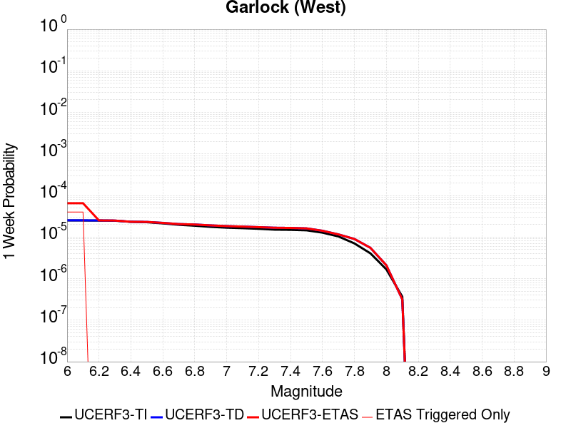 | 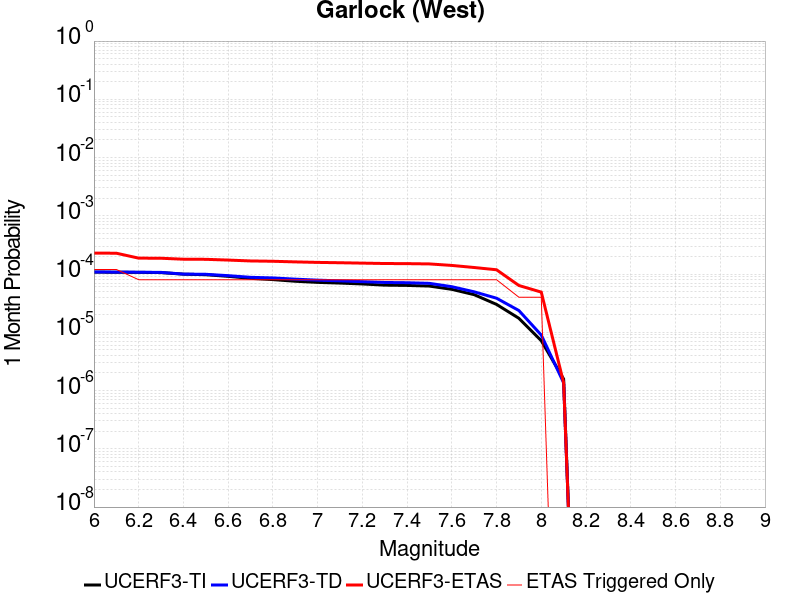 | 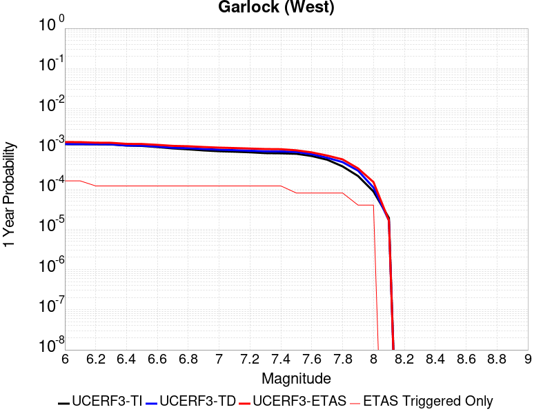 |

| Magnitude | 1 wk TI Prob | 1 wk TD Prob | 1 wk ETAS Prob | 1 wk ETAS/TD Gain | 1 wk ETAS Triggered Only | 1 mo TI Prob | 1 mo TD Prob | 1 mo ETAS Prob | 1 mo ETAS/TD Gain | 1 mo ETAS Triggered Only | 1 yr TI Prob | 1 yr TD Prob | 1 yr ETAS Prob | 1 yr ETAS/TD Gain | 1 yr ETAS Triggered Only |
|-----|-----|-----|-----|-----|-----|-----|-----|-----|-----|-----|-----|-----|-----|-----|-----|
| 6.0 | 2.5181727E-5 | 2.5328825E-5 | 6.532781E-5 | 2.5791883 | 4.0E-5 | 1.0791722E-4 | 1.0854761E-4 | 2.2853458E-4 | 2.1053855 | 1.2E-4 | 0.0013131002 | 0.0013207694 | 0.0014805581 | 1.1209815 | 1.6E-4 |
| 6.1 | 2.5077732E-5 | 2.5229843E-5 | 6.5228836E-5 | 2.5853841 | 4.0E-5 | 1.0747157E-4 | 1.0812344E-4 | 2.2811047E-4 | 2.1097226 | 1.2E-4 | 0.001307681 | 0.0013156114 | 0.0014754009 | 1.1214565 | 1.6E-4 |
| 6.2 | 2.494612E-5 | 2.5111442E-5 | 2.5111442E-5 | 1.0 | 0.0 | 1.0690756E-4 | 1.0761604E-4 | 1.8760744E-4 | 1.7433037 | 8.0E-5 | 0.0013008224 | 0.0013094412 | 0.0014292841 | 1.0915221 | 1.2E-4 |
| 6.3 | 2.4733758E-5 | 2.4930645E-5 | 2.4930645E-5 | 1.0 | 0.0 | 1.0599751E-4 | 1.0684126E-4 | 1.8683271E-4 | 1.7486944 | 8.0E-5 | 0.0012897556 | 0.0013000196 | 0.0014198635 | 1.0921863 | 1.2E-4 |
| 6.4 | 2.3237335E-5 | 2.3309083E-5 | 2.3309083E-5 | 1.0 | 0.0 | 9.958477E-5 | 9.989226E-5 | 1.7988427E-4 | 1.8007828 | 8.0E-5 | 0.0012117702 | 0.0012155125 | 0.0013353666 | 1.0986038 | 1.2E-4 |
| 6.5 | 2.2732203E-5 | 2.3122879E-5 | 2.3122879E-5 | 1.0 | 0.0 | 9.742009E-5 | 9.90943E-5 | 1.7908638E-4 | 1.8072318 | 8.0E-5 | 0.0011854442 | 0.0012058083 | 0.0013256635 | 1.0993983 | 1.2E-4 |
| 6.6 | 2.1319436E-5 | 2.1901993E-5 | 2.1901993E-5 | 1.0 | 0.0 | 9.136581E-5 | 9.386232E-5 | 1.7385482E-4 | 1.8522322 | 8.0E-5 | 0.001111811 | 0.0011421769 | 0.0012620399 | 1.1049426 | 1.2E-4 |
| 6.7 | 1.970802E-5 | 2.05206E-5 | 2.05206E-5 | 1.0 | 0.0 | 8.446021E-5 | 8.794248E-5 | 1.6793543E-4 | 1.9096056 | 8.0E-5 | 0.001027818 | 0.0010701754 | 0.001190047 | 1.1120112 | 1.2E-4 |
| 6.8 | 1.8744462E-5 | 2.0026835E-5 | 2.0026835E-5 | 1.0 | 0.0 | 8.033094E-5 | 8.5826476E-5 | 1.6581961E-4 | 1.9320333 | 8.0E-5 | 9.775903E-4 | 0.0010444381 | 0.0011643128 | 1.1147743 | 1.2E-4 |
| 6.9 | 1.7559682E-5 | 1.9078003E-5 | 1.9078003E-5 | 1.0 | 0.0 | 7.5253614E-5 | 8.1760314E-5 | 1.6175378E-4 | 1.9783897 | 8.0E-5 | 9.158276E-4 | 9.949787E-4 | 0.0011148594 | 1.1204855 | 1.2E-4 |
| 7.0 | 1.6794445E-5 | 1.8338675E-5 | 1.8338675E-5 | 1.0 | 0.0 | 7.197421E-5 | 7.8591955E-5 | 1.5858567E-4 | 2.0178359 | 8.0E-5 | 8.759337E-4 | 9.564384E-4 | 0.0010763237 | 1.1253455 | 1.2E-4 |
| 7.1 | 1.6337795E-5 | 1.7838813E-5 | 1.7838813E-5 | 1.0 | 0.0 | 7.0017246E-5 | 7.6449825E-5 | 1.5644371E-4 | 2.046358 | 8.0E-5 | 8.521265E-4 | 9.303805E-4 | 0.0010502689 | 1.1288595 | 1.2E-4 |
| 7.2 | 1.5780008E-5 | 1.7286979E-5 | 1.7286979E-5 | 1.0 | 0.0 | 6.762685E-5 | 7.408495E-5 | 1.5407903E-4 | 2.0797615 | 8.0E-5 | 8.2304585E-4 | 9.0161234E-4 | 0.0010215042 | 1.1329749 | 1.2E-4 |
| 7.3 | 1.5058865E-5 | 1.6739175E-5 | 1.6739175E-5 | 1.0 | 0.0 | 6.45364E-5 | 7.173736E-5 | 1.5173163E-4 | 2.115099 | 8.0E-5 | 7.854473E-4 | 8.730536E-4 | 9.929489E-4 | 1.1373286 | 1.2E-4 |
| 7.4 | 1.4887923E-5 | 1.6574775E-5 | 1.6574775E-5 | 1.0 | 0.0 | 6.380382E-5 | 7.1032824E-5 | 1.5102714E-4 | 2.12616 | 8.0E-5 | 7.7653467E-4 | 8.6448266E-4 | 9.84379E-4 | 1.1386913 | 1.2E-4 |
| 7.5 | 1.4509299E-5 | 1.6165865E-5 | 1.6165865E-5 | 1.0 | 0.0 | 6.218123E-5 | 6.928044E-5 | 1.492749E-4 | 2.154647 | 8.0E-5 | 7.567935E-4 | 8.4316416E-4 | 9.2309667E-4 | 1.0948007 | 8.0E-5 |
| 7.6 | 1.2756717E-5 | 1.41623805E-5 | 1.41623805E-5 | 1.0 | 0.0 | 5.4670498E-5 | 6.0694507E-5 | 1.4068965E-4 | 2.3179965 | 8.0E-5 | 6.6541E-4 | 7.3870574E-4 | 8.186467E-4 | 1.1082175 | 8.0E-5 |
| 7.7 | 1.0328985E-5 | 1.1565329E-5 | 1.1565329E-5 | 1.0 | 0.0 | 4.4266326E-5 | 4.956476E-5 | 1.295608E-4 | 2.61397 | 8.0E-5 | 5.388092E-4 | 6.032842E-4 | 6.83236E-4 | 1.1325275 | 8.0E-5 |
| 7.8 | 7.0306583E-6 | 8.9839405E-6 | 8.9839405E-6 | 1.0 | 0.0 | 3.0131043E-5 | 3.8502036E-5 | 1.1849896E-4 | 3.077732 | 8.0E-5 | 3.667837E-4 | 4.6866163E-4 | 5.4862414E-4 | 1.1706189 | 8.0E-5 |
| 7.9 | 4.060633E-6 | 5.514807E-6 | 5.514807E-6 | 1.0 | 0.0 | 1.7402595E-5 | 2.3634675E-5 | 6.363373E-5 | 2.6923885 | 4.0E-5 | 2.11856E-4 | 2.8771427E-4 | 3.2770276E-4 | 1.1389868 | 4.0E-5 |
| 8.0 | 1.6729537E-6 | 2.093995E-6 | 2.093995E-6 | 1.0 | 0.0 | 7.169782E-6 | 8.974233E-6 | 4.8973874E-5 | 5.4571652 | 4.0E-5 | 8.7288594E-5 | 1.09255845E-4 | 1.4925147E-4 | 1.3660731 | 4.0E-5 |
| 8.1 | 3.6733252E-7 | 3.1722044E-7 | 3.1722044E-7 | 1.0 | 0.0 | 1.5742813E-6 | 1.3595155E-6 | 1.3595155E-6 | 1.0 | 0.0 | 1.9166706E-5 | 1.6551992E-5 | 1.6551992E-5 | 1.0 | 0.0 |

## Pinto Mtn
*[(top)](#table-of-contents)*

| 1 Week | 1 Month | 1 Year |
|-----|-----|-----|
| 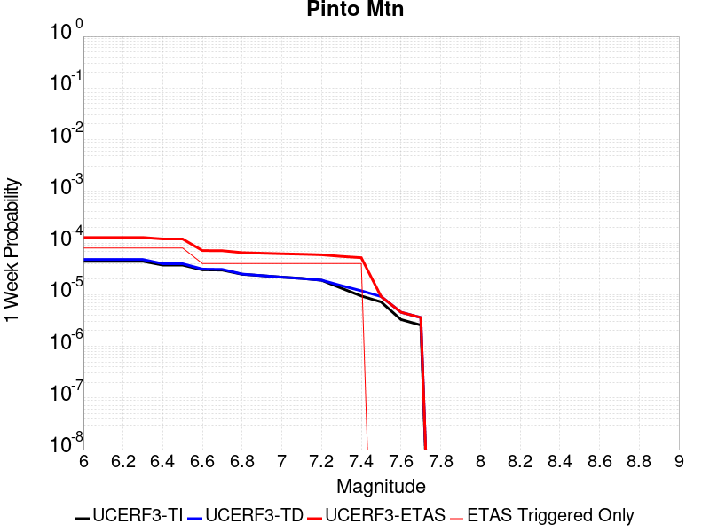 | 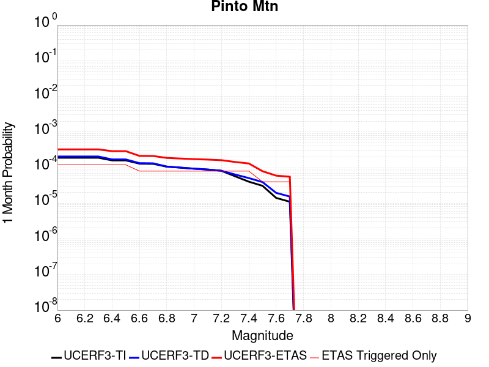 | 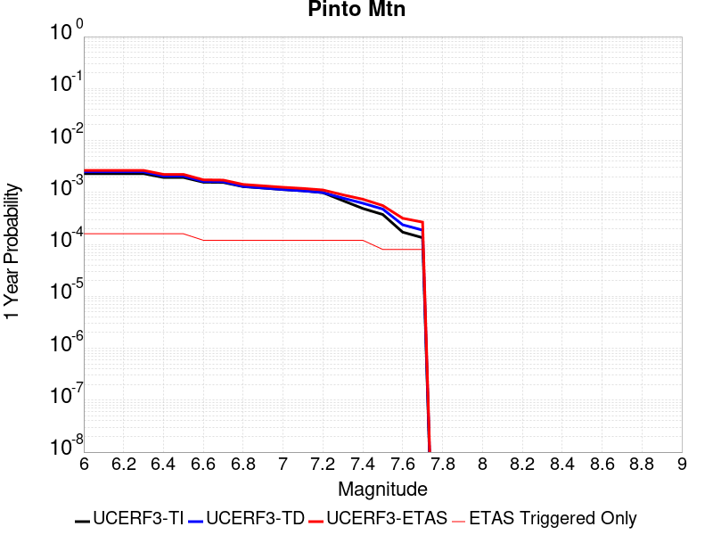 |

| Magnitude | 1 wk TI Prob | 1 wk TD Prob | 1 wk ETAS Prob | 1 wk ETAS/TD Gain | 1 wk ETAS Triggered Only | 1 mo TI Prob | 1 mo TD Prob | 1 mo ETAS Prob | 1 mo ETAS/TD Gain | 1 mo ETAS Triggered Only | 1 yr TI Prob | 1 yr TD Prob | 1 yr ETAS Prob | 1 yr ETAS/TD Gain | 1 yr ETAS Triggered Only |
|-----|-----|-----|-----|-----|-----|-----|-----|-----|-----|-----|-----|-----|-----|-----|-----|
| 6.0 | 4.4194956E-5 | 4.7895475E-5 | 1.2789165E-4 | 2.670224 | 8.0E-5 | 1.893932E-4 | 2.0525111E-4 | 3.252265E-4 | 1.5845298 | 1.2E-4 | 0.0023034236 | 0.002496232 | 0.0026558328 | 1.0639366 | 1.6E-4 |
| 6.1 | 4.4194956E-5 | 4.7895475E-5 | 1.2789165E-4 | 2.670224 | 8.0E-5 | 1.893932E-4 | 2.0525111E-4 | 3.252265E-4 | 1.5845298 | 1.2E-4 | 0.0023034236 | 0.002496232 | 0.0026558328 | 1.0639366 | 1.6E-4 |
| 6.2 | 4.4194956E-5 | 4.7895475E-5 | 1.2789165E-4 | 2.670224 | 8.0E-5 | 1.893932E-4 | 2.0525111E-4 | 3.252265E-4 | 1.5845298 | 1.2E-4 | 0.0023034236 | 0.002496232 | 0.0026558328 | 1.0639366 | 1.6E-4 |
| 6.3 | 4.4194956E-5 | 4.7895475E-5 | 1.2789165E-4 | 2.670224 | 8.0E-5 | 1.893932E-4 | 2.0525111E-4 | 3.252265E-4 | 1.5845298 | 1.2E-4 | 0.0023034236 | 0.002496232 | 0.0026558328 | 1.0639366 | 1.6E-4 |
| 6.4 | 3.729929E-5 | 3.963956E-5 | 1.1963639E-4 | 3.018106 | 8.0E-5 | 1.5984432E-4 | 1.698733E-4 | 2.898529E-4 | 1.7062888 | 1.2E-4 | 0.0019443673 | 0.0020663387 | 0.002226008 | 1.0772717 | 1.6E-4 |
| 6.5 | 3.729929E-5 | 3.963956E-5 | 1.1963639E-4 | 3.018106 | 8.0E-5 | 1.5984432E-4 | 1.698733E-4 | 2.898529E-4 | 1.7062888 | 1.2E-4 | 0.0019443673 | 0.0020663387 | 0.002226008 | 1.0772717 | 1.6E-4 |
| 6.6 | 3.0204548E-5 | 3.1236435E-5 | 7.123519E-5 | 2.2805157 | 4.0E-5 | 1.2944164E-4 | 1.3386377E-4 | 2.1385307E-4 | 1.5975425 | 8.0E-5 | 0.0015748127 | 0.0016286077 | 0.0017484123 | 1.0735626 | 1.2E-4 |
| 6.7 | 2.9857754E-5 | 3.0845655E-5 | 7.084442E-5 | 2.296739 | 4.0E-5 | 1.2795553E-4 | 1.3218916E-4 | 2.1217858E-4 | 1.6051134 | 8.0E-5 | 0.0015567453 | 0.0016082495 | 0.0017280565 | 1.0744953 | 1.2E-4 |
| 6.8 | 2.4819734E-5 | 2.5037323E-5 | 6.503632E-5 | 2.597575 | 4.0E-5 | 1.0636595E-4 | 1.0729852E-4 | 1.8728993E-4 | 1.7455034 | 8.0E-5 | 0.0012942362 | 0.0013055983 | 0.0014254416 | 1.0917919 | 1.2E-4 |
| 6.9 | 2.331124E-5 | 2.3364986E-5 | 6.336405E-5 | 2.7119234 | 4.0E-5 | 9.990149E-5 | 1.00131925E-4 | 1.8012391E-4 | 1.798866 | 8.0E-5 | 0.001215622 | 0.0012184448 | 0.0013382985 | 1.0983663 | 1.2E-4 |
| 7.0 | 2.1818534E-5 | 2.17876E-5 | 6.1786726E-5 | 2.8358667 | 4.0E-5 | 9.3504656E-5 | 9.33722E-5 | 1.7336474E-4 | 1.856706 | 8.0E-5 | 0.0011378246 | 0.0011362336 | 0.0012560972 | 1.1054921 | 1.2E-4 |
| 7.1 | 2.066081E-5 | 2.0566755E-5 | 6.0565933E-5 | 2.9448464 | 4.0E-5 | 8.854332E-5 | 8.814037E-5 | 1.6813332E-4 | 1.9075631 | 8.0E-5 | 0.0010774818 | 0.0010726003 | 0.0011924716 | 1.1117576 | 1.2E-4 |
| 7.2 | 1.8990233E-5 | 1.9079554E-5 | 5.907879E-5 | 3.096445 | 4.0E-5 | 8.138417E-5 | 8.176706E-5 | 1.6176052E-4 | 1.978309 | 8.0E-5 | 9.904018E-4 | 9.950787E-4 | 0.0011149592 | 1.1204735 | 1.2E-4 |
| 7.3 | 1.3335872E-5 | 1.4930265E-5 | 5.4929667E-5 | 3.679082 | 4.0E-5 | 5.7152483E-5 | 6.398535E-5 | 1.4398023E-4 | 2.2502062 | 8.0E-5 | 6.956093E-4 | 7.78756E-4 | 8.9866255E-4 | 1.1539719 | 1.2E-4 |
| 7.4 | 9.414066E-6 | 1.1882921E-5 | 5.1882445E-5 | 4.3661356 | 4.0E-5 | 4.0345374E-5 | 5.0925864E-5 | 1.3092179E-4 | 2.5708308 | 8.0E-5 | 4.910942E-4 | 6.198555E-4 | 7.3978107E-4 | 1.1934735 | 1.2E-4 |
| 7.5 | 7.2101157E-6 | 9.179627E-6 | 9.179627E-6 | 1.0 | 0.0 | 3.090013E-5 | 3.934071E-5 | 7.933914E-5 | 2.0167184 | 4.0E-5 | 3.7614413E-4 | 4.788757E-4 | 5.588374E-4 | 1.166978 | 8.0E-5 |
| 7.6 | 3.296375E-6 | 4.5660995E-6 | 4.5660995E-6 | 1.0 | 0.0 | 1.4127245E-5 | 1.9568859E-5 | 5.9568076E-5 | 3.044024 | 4.0E-5 | 1.7198564E-4 | 2.3822622E-4 | 3.1820717E-4 | 1.3357352 | 8.0E-5 |
| 7.7 | 2.5741092E-6 | 3.6038196E-6 | 3.6038196E-6 | 1.0 | 0.0 | 1.103185E-5 | 1.5444857E-5 | 5.5444238E-5 | 3.589819 | 4.0E-5 | 1.3430449E-4 | 1.8802624E-4 | 2.680112E-4 | 1.4253925 | 8.0E-5 |

## Ludlow
*[(top)](#table-of-contents)*

| 1 Week | 1 Month | 1 Year |
|-----|-----|-----|
| 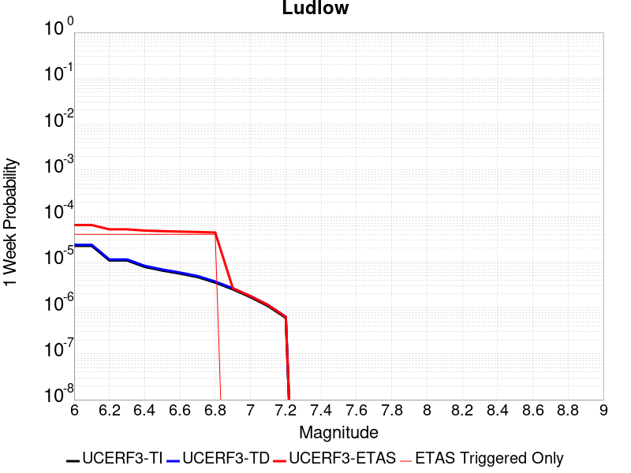 |  | 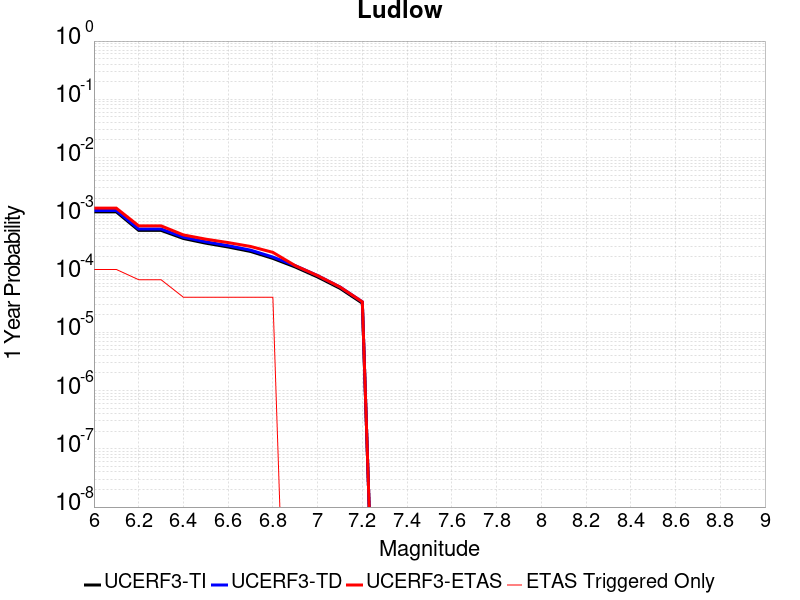 |

| Magnitude | 1 wk TI Prob | 1 wk TD Prob | 1 wk ETAS Prob | 1 wk ETAS/TD Gain | 1 wk ETAS Triggered Only | 1 mo TI Prob | 1 mo TD Prob | 1 mo ETAS Prob | 1 mo ETAS/TD Gain | 1 mo ETAS Triggered Only | 1 yr TI Prob | 1 yr TD Prob | 1 yr ETAS Prob | 1 yr ETAS/TD Gain | 1 yr ETAS Triggered Only |
|-----|-----|-----|-----|-----|-----|-----|-----|-----|-----|-----|-----|-----|-----|-----|-----|
| 6.0 | 2.2407607E-5 | 2.3661727E-5 | 6.366078E-5 | 2.6904535 | 4.0E-5 | 9.602906E-5 | 1.0140371E-4 | 1.813956E-4 | 1.7888458 | 8.0E-5 | 0.0011685267 | 0.0012339351 | 0.001353787 | 1.0971298 | 1.2E-4 |
| 6.1 | 2.2407607E-5 | 2.3661727E-5 | 6.366078E-5 | 2.6904535 | 4.0E-5 | 9.602906E-5 | 1.0140371E-4 | 1.813956E-4 | 1.7888458 | 8.0E-5 | 0.0011685267 | 0.0012339351 | 0.001353787 | 1.0971298 | 1.2E-4 |
| 6.2 | 1.0781252E-5 | 1.1367753E-5 | 5.1367297E-5 | 4.5186853 | 4.0E-5 | 4.620455E-5 | 4.8718055E-5 | 8.871611E-5 | 1.8210108 | 4.0E-5 | 5.623952E-4 | 5.929849E-4 | 6.729375E-4 | 1.1348307 | 8.0E-5 |
| 6.3 | 1.0781252E-5 | 1.1367753E-5 | 5.1367297E-5 | 4.5186853 | 4.0E-5 | 4.620455E-5 | 4.8718055E-5 | 8.871611E-5 | 1.8210108 | 4.0E-5 | 5.623952E-4 | 5.929849E-4 | 6.729375E-4 | 1.1348307 | 8.0E-5 |
| 6.4 | 7.814439E-6 | 8.239243E-6 | 4.823891E-5 | 5.8547754 | 4.0E-5 | 3.3490025E-5 | 3.5310568E-5 | 7.530916E-5 | 2.1327653 | 4.0E-5 | 4.0766477E-4 | 4.2982277E-4 | 4.6980556E-4 | 1.0930216 | 4.0E-5 |
| 6.5 | 6.4986366E-6 | 6.8521795E-6 | 4.6851907E-5 | 6.8375187 | 4.0E-5 | 2.7851002E-5 | 2.9366158E-5 | 6.9364985E-5 | 2.3620722 | 4.0E-5 | 3.390332E-4 | 3.5747525E-4 | 3.9746094E-4 | 1.1118559 | 4.0E-5 |
| 6.6 | 5.582177E-6 | 5.8870924E-6 | 4.5886856E-5 | 7.7944856 | 4.0E-5 | 2.3923398E-5 | 2.5230156E-5 | 6.522915E-5 | 2.5853643 | 4.0E-5 | 2.9122844E-4 | 3.0713456E-4 | 3.4712226E-4 | 1.1301961 | 4.0E-5 |
| 6.7 | 4.6858763E-6 | 4.9413375E-6 | 4.494114E-5 | 9.094934 | 4.0E-5 | 2.0082172E-5 | 2.1176991E-5 | 6.117614E-5 | 2.8888023 | 4.0E-5 | 2.4447302E-4 | 2.5779993E-4 | 2.977896E-4 | 1.1551191 | 4.0E-5 |
| 6.8 | 3.5584908E-6 | 3.7527102E-6 | 4.375256E-5 | 11.658923 | 4.0E-5 | 1.5250586E-5 | 1.6082948E-5 | 5.6082303E-5 | 3.4870663 | 4.0E-5 | 1.8566006E-4 | 1.957927E-4 | 2.3578487E-4 | 1.2042577 | 4.0E-5 |
| 6.9 | 2.532834E-6 | 2.6714974E-6 | 2.6714974E-6 | 1.0 | 0.0 | 1.0854958E-5 | 1.1449226E-5 | 1.1449226E-5 | 1.0 | 0.0 | 1.3215111E-4 | 1.393857E-4 | 1.393857E-4 | 1.0 | 0.0 |
| 7.0 | 1.7083285E-6 | 1.8022786E-6 | 1.8022786E-6 | 1.0 | 0.0 | 7.3213873E-6 | 7.724029E-6 | 7.724029E-6 | 1.0 | 0.0 | 8.913424E-5 | 9.4036164E-5 | 9.4036164E-5 | 1.0 | 0.0 |
| 7.1 | 1.0905424E-6 | 1.1499736E-6 | 1.1499736E-6 | 1.0 | 0.0 | 4.6737446E-6 | 4.9284495E-6 | 4.9284495E-6 | 1.0 | 0.0 | 5.6901354E-5 | 6.0002323E-5 | 6.0002323E-5 | 1.0 | 0.0 |
| 7.2 | 6.06668E-7 | 6.3884215E-7 | 6.3884215E-7 | 1.0 | 0.0 | 2.600003E-6 | 2.7378926E-6 | 2.7378926E-6 | 1.0 | 0.0 | 3.1654577E-5 | 3.3333403E-5 | 3.3333403E-5 | 1.0 | 0.0 |

## Red Mountain
*[(top)](#table-of-contents)*

| 1 Week | 1 Month | 1 Year |
|-----|-----|-----|
| 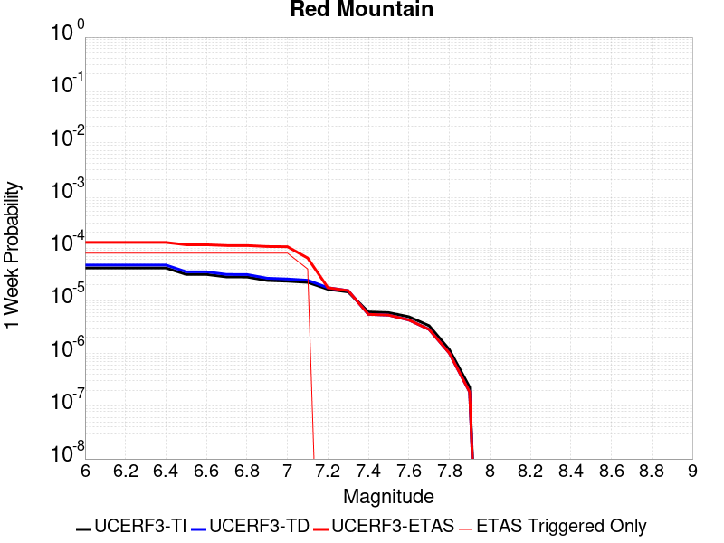 | 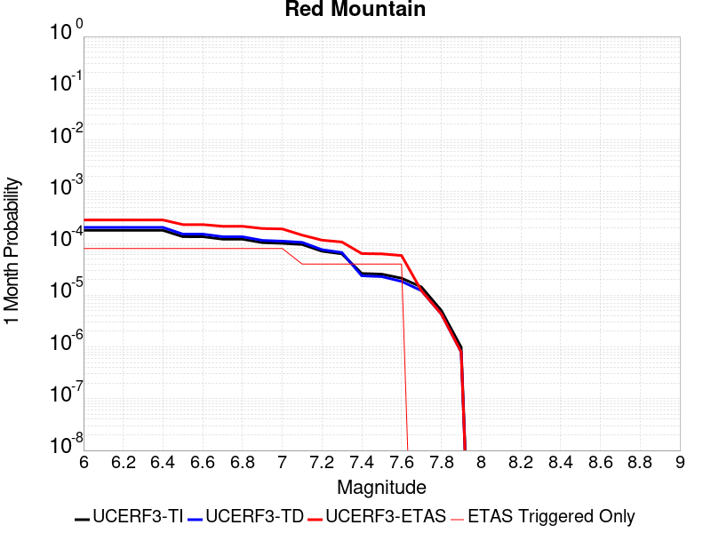 | 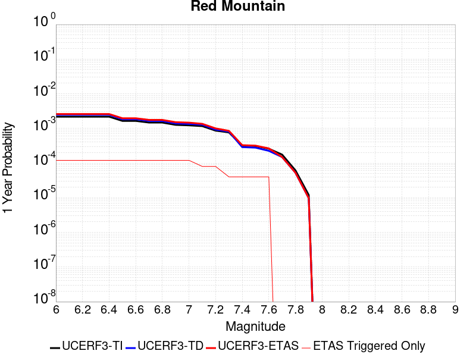 |

| Magnitude | 1 wk TI Prob | 1 wk TD Prob | 1 wk ETAS Prob | 1 wk ETAS/TD Gain | 1 wk ETAS Triggered Only | 1 mo TI Prob | 1 mo TD Prob | 1 mo ETAS Prob | 1 mo ETAS/TD Gain | 1 mo ETAS Triggered Only | 1 yr TI Prob | 1 yr TD Prob | 1 yr ETAS Prob | 1 yr ETAS/TD Gain | 1 yr ETAS Triggered Only |
|-----|-----|-----|-----|-----|-----|-----|-----|-----|-----|-----|-----|-----|-----|-----|-----|
| 6.0 | 4.1810763E-5 | 4.7617137E-5 | 1.2761333E-4 | 2.6799874 | 8.0E-5 | 1.7917668E-4 | 2.0405841E-4 | 2.840421E-4 | 1.3919647 | 8.0E-5 | 0.0021792934 | 0.002481745 | 0.0026014473 | 1.048233 | 1.2E-4 |
| 6.1 | 4.1810763E-5 | 4.7617137E-5 | 1.2761333E-4 | 2.6799874 | 8.0E-5 | 1.7917668E-4 | 2.0405841E-4 | 2.840421E-4 | 1.3919647 | 8.0E-5 | 0.0021792934 | 0.002481745 | 0.0026014473 | 1.048233 | 1.2E-4 |
| 6.2 | 4.1810763E-5 | 4.7617137E-5 | 1.2761333E-4 | 2.6799874 | 8.0E-5 | 1.7917668E-4 | 2.0405841E-4 | 2.840421E-4 | 1.3919647 | 8.0E-5 | 0.0021792934 | 0.002481745 | 0.0026014473 | 1.048233 | 1.2E-4 |
| 6.3 | 4.1810763E-5 | 4.7617137E-5 | 1.2761333E-4 | 2.6799874 | 8.0E-5 | 1.7917668E-4 | 2.0405841E-4 | 2.840421E-4 | 1.3919647 | 8.0E-5 | 0.0021792934 | 0.002481745 | 0.0026014473 | 1.048233 | 1.2E-4 |
| 6.4 | 4.1810763E-5 | 4.7617137E-5 | 1.2761333E-4 | 2.6799874 | 8.0E-5 | 1.7917668E-4 | 2.0405841E-4 | 2.840421E-4 | 1.3919647 | 8.0E-5 | 0.0021792934 | 0.002481745 | 0.0026014473 | 1.048233 | 1.2E-4 |
| 6.5 | 3.154503E-5 | 3.5378947E-5 | 1.1537612E-4 | 3.2611518 | 8.0E-5 | 1.3518598E-4 | 1.5161576E-4 | 2.3160364E-4 | 1.5275697 | 8.0E-5 | 0.0016446467 | 0.0018444513 | 0.00196423 | 1.06494 | 1.2E-4 |
| 6.6 | 3.1535834E-5 | 3.5368324E-5 | 1.15365496E-4 | 3.261831 | 8.0E-5 | 1.3514658E-4 | 1.5157025E-4 | 2.3155812E-4 | 1.5277281 | 8.0E-5 | 0.0016441676 | 0.001843898 | 0.0019636767 | 1.0649595 | 1.2E-4 |
| 6.7 | 2.8267326E-5 | 3.148608E-5 | 1.1148356E-4 | 3.5407252 | 8.0E-5 | 1.2114006E-4 | 1.3493384E-4 | 2.1492306E-4 | 1.5928031 | 8.0E-5 | 0.0014738824 | 0.0016416667 | 0.0017614698 | 1.0729765 | 1.2E-4 |
| 6.8 | 2.8212884E-5 | 3.1423937E-5 | 1.11421425E-4 | 3.54575 | 8.0E-5 | 1.20906756E-4 | 1.3466754E-4 | 2.1465677E-4 | 1.5939755 | 8.0E-5 | 0.0014710457 | 0.0016384295 | 0.0017582328 | 1.0731208 | 1.2E-4 |
| 6.9 | 2.4227871E-5 | 2.6720827E-5 | 1.0671869E-4 | 3.9938393 | 8.0E-5 | 1.03829596E-4 | 1.14513234E-4 | 1.9450407E-4 | 1.6985292 | 8.0E-5 | 0.0012633923 | 0.0013933829 | 0.0015132157 | 1.0860014 | 1.2E-4 |
| 7.0 | 2.348524E-5 | 2.58491E-5 | 1.0584703E-4 | 4.0948052 | 8.0E-5 | 1.0064714E-4 | 1.10777575E-4 | 1.9076871E-4 | 1.7220879 | 8.0E-5 | 0.0012246901 | 0.0013479582 | 0.0014677965 | 1.0889035 | 1.2E-4 |
| 7.1 | 2.2311642E-5 | 2.447537E-5 | 6.447439E-5 | 2.634256 | 4.0E-5 | 9.561782E-5 | 1.0489065E-4 | 1.4488645E-4 | 1.3813095 | 4.0E-5 | 0.0011635252 | 0.0012763705 | 0.0013562683 | 1.0625978 | 8.0E-5 |
| 7.2 | 1.6533986E-5 | 1.767884E-5 | 1.767884E-5 | 1.0 | 0.0 | 7.085802E-5 | 7.576461E-5 | 1.15761584E-4 | 1.527911 | 4.0E-5 | 8.623549E-4 | 9.221073E-4 | 0.0010020336 | 1.0866778 | 8.0E-5 |
| 7.3 | 1.4703092E-5 | 1.556691E-5 | 1.556691E-5 | 1.0 | 0.0 | 6.301173E-5 | 6.671397E-5 | 1.06711304E-4 | 1.5995346 | 4.0E-5 | 7.668978E-4 | 8.120016E-4 | 8.519691E-4 | 1.049221 | 4.0E-5 |
| 7.4 | 6.1331984E-6 | 5.530447E-6 | 5.530447E-6 | 1.0 | 0.0 | 2.6284872E-5 | 2.3701703E-5 | 6.3700754E-5 | 2.6876025 | 4.0E-5 | 3.199713E-4 | 2.8853054E-4 | 3.28519E-4 | 1.1385936 | 4.0E-5 |
| 7.5 | 5.954766E-6 | 5.3400213E-6 | 5.3400213E-6 | 1.0 | 0.0 | 2.5520176E-5 | 2.2885608E-5 | 6.288469E-5 | 2.7477834 | 4.0E-5 | 3.1066386E-4 | 2.7859717E-4 | 3.1858604E-4 | 1.1435364 | 4.0E-5 |
| 7.6 | 4.9726646E-6 | 4.316545E-6 | 4.316545E-6 | 1.0 | 0.0 | 2.1311245E-5 | 1.849935E-5 | 5.849861E-5 | 3.162198 | 4.0E-5 | 2.5943352E-4 | 2.2520665E-4 | 2.6519762E-4 | 1.1775746 | 4.0E-5 |
| 7.7 | 3.3613894E-6 | 2.8534687E-6 | 2.8534687E-6 | 1.0 | 0.0 | 1.4405875E-5 | 1.2229096E-5 | 1.2229096E-5 | 1.0 | 0.0 | 1.7537741E-4 | 1.4887934E-4 | 1.4887934E-4 | 1.0 | 0.0 |
| 7.8 | 1.1828961E-6 | 1.0125256E-6 | 1.0125256E-6 | 1.0 | 0.0 | 5.069545E-6 | 4.3393884E-6 | 4.3393884E-6 | 1.0 | 0.0 | 6.171996E-5 | 5.28308E-5 | 5.28308E-5 | 1.0 | 0.0 |
| 7.9 | 2.2967266E-7 | 1.8623352E-7 | 1.8623352E-7 | 1.0 | 0.0 | 9.843111E-7 | 7.9814345E-7 | 7.9814345E-7 | 1.0 | 0.0 | 1.19839215E-5 | 9.717356E-6 | 9.717356E-6 | 1.0 | 0.0 |

## Chino alt 1
*[(top)](#table-of-contents)*

| 1 Week | 1 Month | 1 Year |
|-----|-----|-----|
| 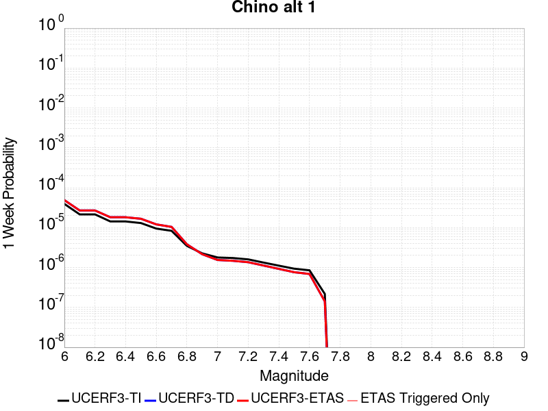 | 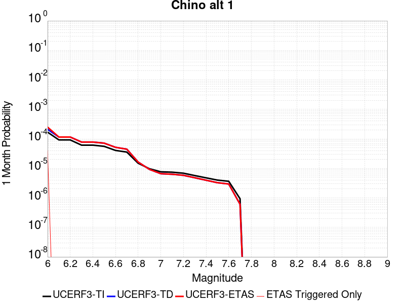 | 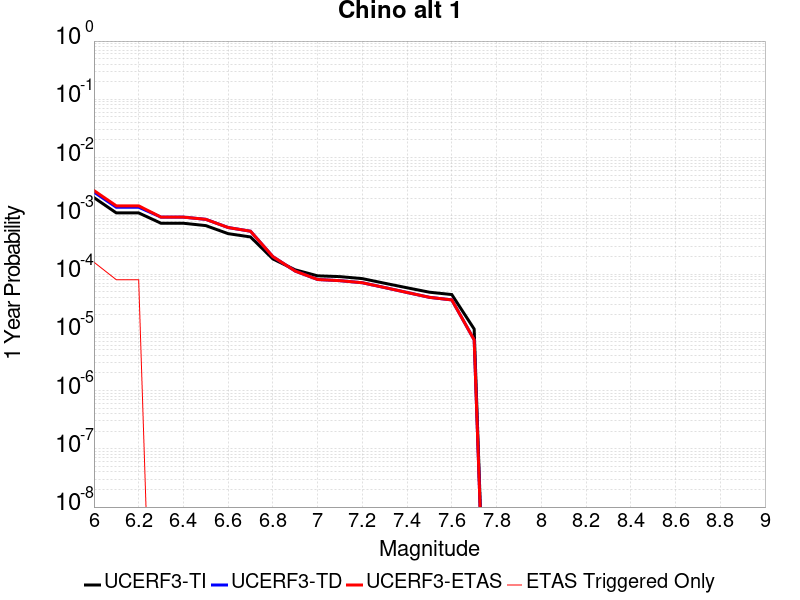 |

| Magnitude | 1 wk TI Prob | 1 wk TD Prob | 1 wk ETAS Prob | 1 wk ETAS/TD Gain | 1 wk ETAS Triggered Only | 1 mo TI Prob | 1 mo TD Prob | 1 mo ETAS Prob | 1 mo ETAS/TD Gain | 1 mo ETAS Triggered Only | 1 yr TI Prob | 1 yr TD Prob | 1 yr ETAS Prob | 1 yr ETAS/TD Gain | 1 yr ETAS Triggered Only |
|-----|-----|-----|-----|-----|-----|-----|-----|-----|-----|-----|-----|-----|-----|-----|-----|
| 6.0 | 3.939946E-5 | 4.9004397E-5 | 4.9004397E-5 | 1.0 | 0.0 | 1.6884391E-4 | 2.1000468E-4 | 2.499963E-4 | 1.190432 | 4.0E-5 | 0.0020537362 | 0.002554319 | 0.0027139105 | 1.062479 | 1.6E-4 |
| 6.1 | 2.1505624E-5 | 2.6917825E-5 | 2.6917825E-5 | 1.0 | 0.0 | 9.2163704E-5 | 1.15357594E-4 | 1.15357594E-4 | 1.0 | 0.0 | 0.0011215154 | 0.0014036838 | 0.0014835715 | 1.0569129 | 8.0E-5 |
| 6.2 | 2.1505624E-5 | 2.6917825E-5 | 2.6917825E-5 | 1.0 | 0.0 | 9.2163704E-5 | 1.15357594E-4 | 1.15357594E-4 | 1.0 | 0.0 | 0.0011215154 | 0.0014036838 | 0.0014835715 | 1.0569129 | 8.0E-5 |
| 6.3 | 1.4290785E-5 | 1.81977E-5 | 1.81977E-5 | 1.0 | 0.0 | 6.1244784E-5 | 7.7988065E-5 | 7.7988065E-5 | 1.0 | 0.0 | 7.454001E-4 | 9.491364E-4 | 9.491364E-4 | 1.0 | 0.0 |
| 6.4 | 1.4290785E-5 | 1.81977E-5 | 1.81977E-5 | 1.0 | 0.0 | 6.1244784E-5 | 7.7988065E-5 | 7.7988065E-5 | 1.0 | 0.0 | 7.454001E-4 | 9.491364E-4 | 9.491364E-4 | 1.0 | 0.0 |
| 6.5 | 1.3017944E-5 | 1.668369E-5 | 1.668369E-5 | 1.0 | 0.0 | 5.5789995E-5 | 7.149982E-5 | 7.149982E-5 | 1.0 | 0.0 | 6.790315E-4 | 8.702065E-4 | 8.702065E-4 | 1.0 | 0.0 |
| 6.6 | 9.470016E-6 | 1.2065467E-5 | 1.2065467E-5 | 1.0 | 0.0 | 4.058515E-5 | 5.170831E-5 | 5.170831E-5 | 1.0 | 0.0 | 4.940122E-4 | 6.294009E-4 | 6.294009E-4 | 1.0 | 0.0 |
| 6.7 | 8.314155E-6 | 1.0425587E-5 | 1.0425587E-5 | 1.0 | 0.0 | 3.5631605E-5 | 4.4680502E-5 | 4.4680502E-5 | 1.0 | 0.0 | 4.3372845E-4 | 5.438817E-4 | 5.438817E-4 | 1.0 | 0.0 |
| 6.8 | 3.4856364E-6 | 3.8184653E-6 | 3.8184653E-6 | 1.0 | 0.0 | 1.4938357E-5 | 1.636476E-5 | 1.636476E-5 | 1.0 | 0.0 | 1.8185932E-4 | 1.9922481E-4 | 1.9922481E-4 | 1.0 | 0.0 |
| 6.9 | 2.2645952E-6 | 2.1561063E-6 | 2.1561063E-6 | 1.0 | 0.0 | 9.705372E-6 | 9.240424E-6 | 9.240424E-6 | 1.0 | 0.0 | 1.18156495E-4 | 1.1249657E-4 | 1.1249657E-4 | 1.0 | 0.0 |
| 7.0 | 1.7864003E-6 | 1.545482E-6 | 1.545482E-6 | 1.0 | 0.0 | 7.655979E-6 | 6.623478E-6 | 6.623478E-6 | 1.0 | 0.0 | 9.3207556E-5 | 8.063792E-5 | 8.063792E-5 | 1.0 | 0.0 |
| 7.1 | 1.7315456E-6 | 1.4756972E-6 | 1.4756972E-6 | 1.0 | 0.0 | 7.420889E-6 | 6.3244015E-6 | 6.3244015E-6 | 1.0 | 0.0 | 9.034557E-5 | 7.699693E-5 | 7.699693E-5 | 1.0 | 0.0 |
| 7.2 | 1.6008337E-6 | 1.3596422E-6 | 1.3596422E-6 | 1.0 | 0.0 | 6.860698E-6 | 5.8270252E-6 | 5.8270252E-6 | 1.0 | 0.0 | 8.352579E-5 | 7.094178E-5 | 7.094178E-5 | 1.0 | 0.0 |
| 7.3 | 1.3320939E-6 | 1.1237295E-6 | 1.1237295E-6 | 1.0 | 0.0 | 5.7089615E-6 | 4.815975E-6 | 4.815975E-6 | 1.0 | 0.0 | 6.9504385E-5 | 5.8632966E-5 | 5.8632966E-5 | 1.0 | 0.0 |
| 7.4 | 1.114294E-6 | 9.2541916E-7 | 9.2541916E-7 | 1.0 | 0.0 | 4.775537E-6 | 3.9660763E-6 | 3.9660763E-6 | 1.0 | 0.0 | 5.8140613E-5 | 4.8285947E-5 | 4.8285947E-5 | 1.0 | 0.0 |
| 7.5 | 9.354081E-7 | 7.638138E-7 | 7.638138E-7 | 1.0 | 0.0 | 4.0088858E-6 | 3.2734836E-6 | 3.2734836E-6 | 1.0 | 0.0 | 4.8807087E-5 | 3.985397E-5 | 3.985397E-5 | 1.0 | 0.0 |
| 7.6 | 8.521771E-7 | 6.8946184E-7 | 6.8946184E-7 | 1.0 | 0.0 | 3.6521824E-6 | 2.9548335E-6 | 2.9548335E-6 | 1.0 | 0.0 | 4.4464414E-5 | 3.5974535E-5 | 3.5974535E-5 | 1.0 | 0.0 |
| 7.7 | 2.1803626E-7 | 1.4221726E-7 | 1.4221726E-7 | 1.0 | 0.0 | 9.344408E-7 | 6.095024E-7 | 6.095024E-7 | 1.0 | 0.0 | 1.1376757E-5 | 7.4206764E-6 | 7.4206764E-6 | 1.0 | 0.0 |

## Whittier alt 1
*[(top)](#table-of-contents)*

| 1 Week | 1 Month | 1 Year |
|-----|-----|-----|
|  | 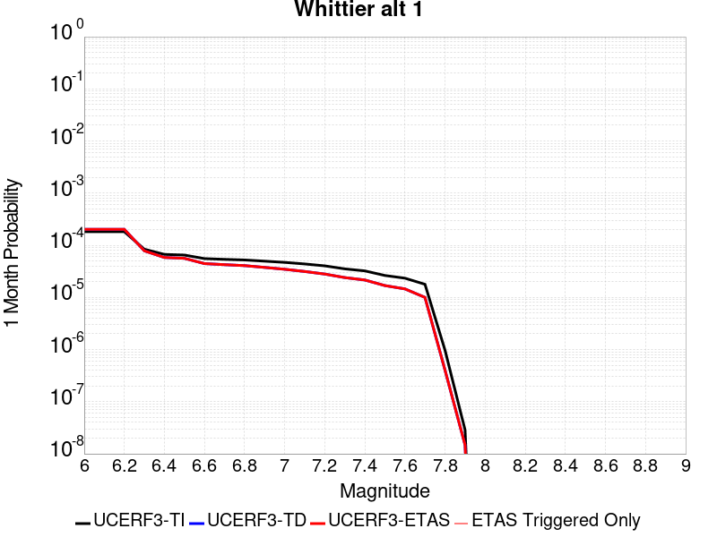 | 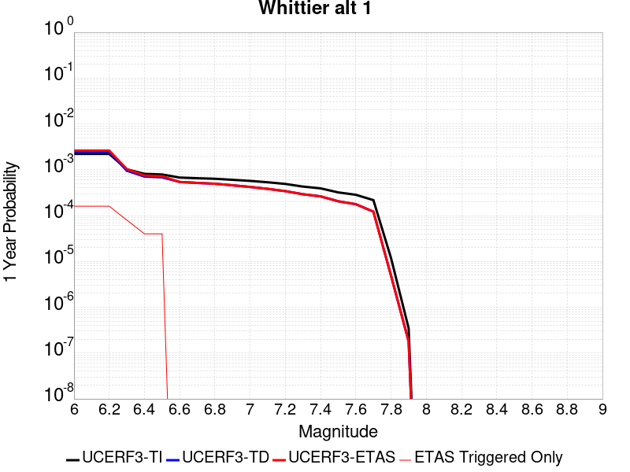 |

| Magnitude | 1 wk TI Prob | 1 wk TD Prob | 1 wk ETAS Prob | 1 wk ETAS/TD Gain | 1 wk ETAS Triggered Only | 1 mo TI Prob | 1 mo TD Prob | 1 mo ETAS Prob | 1 mo ETAS/TD Gain | 1 mo ETAS Triggered Only | 1 yr TI Prob | 1 yr TD Prob | 1 yr ETAS Prob | 1 yr ETAS/TD Gain | 1 yr ETAS Triggered Only |
|-----|-----|-----|-----|-----|-----|-----|-----|-----|-----|-----|-----|-----|-----|-----|-----|
| 6.0 | 4.2554693E-5 | 4.7282294E-5 | 4.7282294E-5 | 1.0 | 0.0 | 1.8236451E-4 | 2.0262448E-4 | 2.0262448E-4 | 1.0 | 0.0 | 0.002218027 | 0.0024644844 | 0.00262409 | 1.0647624 | 1.6E-4 |
| 6.1 | 4.2554693E-5 | 4.7282294E-5 | 4.7282294E-5 | 1.0 | 0.0 | 1.8236451E-4 | 2.0262448E-4 | 2.0262448E-4 | 1.0 | 0.0 | 0.002218027 | 0.0024644844 | 0.00262409 | 1.0647624 | 1.6E-4 |
| 6.2 | 4.2554693E-5 | 4.7282294E-5 | 4.7282294E-5 | 1.0 | 0.0 | 1.8236451E-4 | 2.0262448E-4 | 2.0262448E-4 | 1.0 | 0.0 | 0.002218027 | 0.0024644844 | 0.00262409 | 1.0647624 | 1.6E-4 |
| 6.3 | 1.9617712E-5 | 1.8284845E-5 | 1.8284845E-5 | 1.0 | 0.0 | 8.40732E-5 | 7.836137E-5 | 7.836137E-5 | 1.0 | 0.0 | 0.0010231105 | 9.5365115E-4 | 0.0010335749 | 1.0838081 | 8.0E-5 |
| 6.4 | 1.5611336E-5 | 1.3617991E-5 | 1.3617991E-5 | 1.0 | 0.0 | 6.690401E-5 | 5.8361547E-5 | 5.8361547E-5 | 1.0 | 0.0 | 8.142519E-4 | 7.103262E-4 | 7.5029774E-4 | 1.0562721 | 4.0E-5 |
| 6.5 | 1.5150166E-5 | 1.3114483E-5 | 1.3114483E-5 | 1.0 | 0.0 | 6.492767E-5 | 5.620375E-5 | 5.620375E-5 | 1.0 | 0.0 | 7.9020765E-4 | 6.840717E-4 | 7.2404434E-4 | 1.0584334 | 4.0E-5 |
| 6.6 | 1.295588E-5 | 1.0391854E-5 | 1.0391854E-5 | 1.0 | 0.0 | 5.552402E-5 | 4.4535765E-5 | 4.4535765E-5 | 1.0 | 0.0 | 6.7579525E-4 | 5.4209004E-4 | 5.4209004E-4 | 1.0 | 0.0 |
| 6.7 | 1.2542085E-5 | 9.910169E-6 | 9.910169E-6 | 1.0 | 0.0 | 5.3750682E-5 | 4.2471474E-5 | 4.2471474E-5 | 1.0 | 0.0 | 6.542181E-4 | 5.1696936E-4 | 5.1696936E-4 | 1.0 | 0.0 |
| 6.8 | 1.2195878E-5 | 9.505836E-6 | 9.505836E-6 | 1.0 | 0.0 | 5.2267E-5 | 4.0738672E-5 | 4.0738672E-5 | 1.0 | 0.0 | 6.36165E-4 | 4.958823E-4 | 4.958823E-4 | 1.0 | 0.0 |
| 6.9 | 1.1580298E-5 | 8.782643E-6 | 8.782643E-6 | 1.0 | 0.0 | 4.9628903E-5 | 3.7639365E-5 | 3.7639365E-5 | 1.0 | 0.0 | 6.040644E-4 | 4.5816458E-4 | 4.5816458E-4 | 1.0 | 0.0 |
| 7.0 | 1.0964795E-5 | 8.092889E-6 | 8.092889E-6 | 1.0 | 0.0 | 4.6991136E-5 | 3.468336E-5 | 3.468336E-5 | 1.0 | 0.0 | 5.7196687E-4 | 4.221896E-4 | 4.221896E-4 | 1.0 | 0.0 |
| 7.1 | 1.0230601E-5 | 7.3345395E-6 | 7.3345395E-6 | 1.0 | 0.0 | 4.3844695E-5 | 3.143337E-5 | 3.143337E-5 | 1.0 | 0.0 | 5.336784E-4 | 3.826354E-4 | 3.826354E-4 | 1.0 | 0.0 |
| 7.2 | 9.40865E-6 | 6.5504482E-6 | 6.5504482E-6 | 1.0 | 0.0 | 4.032216E-5 | 2.8073055E-5 | 2.8073055E-5 | 1.0 | 0.0 | 4.908117E-4 | 3.4173706E-4 | 3.4173706E-4 | 1.0 | 0.0 |
| 7.3 | 8.237384E-6 | 5.6038593E-6 | 5.6038593E-6 | 1.0 | 0.0 | 3.5302593E-5 | 2.4016326E-5 | 2.4016326E-5 | 1.0 | 0.0 | 4.2972428E-4 | 2.9236058E-4 | 2.9236058E-4 | 1.0 | 0.0 |
| 7.4 | 7.5316966E-6 | 5.033336E-6 | 5.033336E-6 | 1.0 | 0.0 | 3.2278298E-5 | 2.1571266E-5 | 2.1571266E-5 | 1.0 | 0.0 | 3.9291743E-4 | 2.6259953E-4 | 2.6259953E-4 | 1.0 | 0.0 |
| 7.5 | 6.149649E-6 | 3.93817E-6 | 3.93817E-6 | 1.0 | 0.0 | 2.6355372E-5 | 1.6877766E-5 | 1.6877766E-5 | 1.0 | 0.0 | 3.208294E-4 | 2.0546833E-4 | 2.0546833E-4 | 1.0 | 0.0 |
| 7.6 | 5.457711E-6 | 3.39915E-6 | 3.39915E-6 | 1.0 | 0.0 | 2.338998E-5 | 1.45677095E-5 | 1.45677095E-5 | 1.0 | 0.0 | 2.8473578E-4 | 1.7734825E-4 | 1.7734825E-4 | 1.0 | 0.0 |
| 7.7 | 4.1676276E-6 | 2.3360851E-6 | 2.3360851E-6 | 1.0 | 0.0 | 1.7861139E-5 | 1.0011759E-5 | 1.0011759E-5 | 1.0 | 0.0 | 2.1743766E-4 | 1.2188709E-4 | 1.2188709E-4 | 1.0 | 0.0 |
| 7.8 | 2.2692414E-7 | 9.397192E-8 | 9.397192E-8 | 1.0 | 0.0 | 9.725317E-7 | 4.0273673E-7 | 4.0273673E-7 | 1.0 | 0.0 | 1.1840509E-5 | 4.903312E-6 | 4.903312E-6 | 1.0 | 0.0 |
| 7.9 | 6.676829E-9 | 3.4429164E-9 | 3.4429164E-9 | 1.0 | 0.0 | 2.861498E-8 | 1.4755356E-8 | 1.4755356E-8 | 1.0 | 0.0 | 3.4838732E-7 | 1.7964643E-7 | 1.7964643E-7 | 1.0 | 0.0 |

## Mission Ridge-Arroyo Parida-Santa Ana
*[(top)](#table-of-contents)*

| 1 Week | 1 Month | 1 Year |
|-----|-----|-----|
| 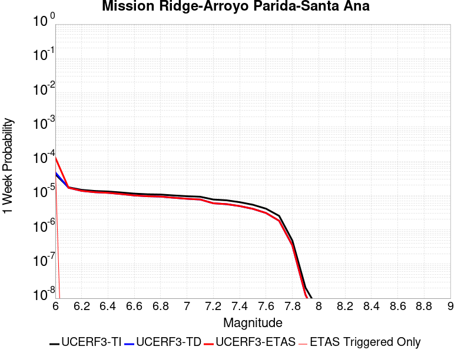 | 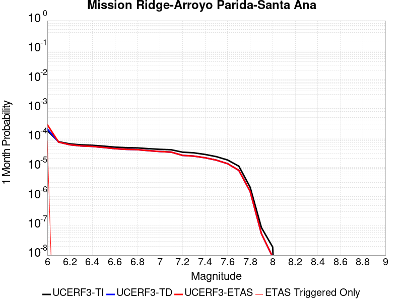 | 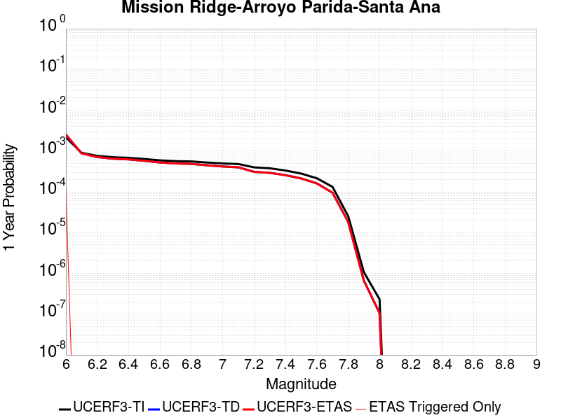 |

| Magnitude | 1 wk TI Prob | 1 wk TD Prob | 1 wk ETAS Prob | 1 wk ETAS/TD Gain | 1 wk ETAS Triggered Only | 1 mo TI Prob | 1 mo TD Prob | 1 mo ETAS Prob | 1 mo ETAS/TD Gain | 1 mo ETAS Triggered Only | 1 yr TI Prob | 1 yr TD Prob | 1 yr ETAS Prob | 1 yr ETAS/TD Gain | 1 yr ETAS Triggered Only |
|-----|-----|-----|-----|-----|-----|-----|-----|-----|-----|-----|-----|-----|-----|-----|-----|
| 6.0 | 4.169034E-5 | 4.7170066E-5 | 1.2716629E-4 | 2.695911 | 8.0E-5 | 1.7866064E-4 | 2.0214664E-4 | 2.8213047E-4 | 1.3956723 | 8.0E-5 | 0.0021730233 | 0.002459196 | 0.002578901 | 1.0486765 | 1.2E-4 |
| 6.1 | 1.73813E-5 | 1.6862212E-5 | 1.6862212E-5 | 1.0 | 0.0 | 7.4489166E-5 | 7.226469E-5 | 7.226469E-5 | 1.0 | 0.0 | 9.065282E-4 | 8.7947806E-4 | 8.7947806E-4 | 1.0 | 0.0 |
| 6.2 | 1.4622182E-5 | 1.36796E-5 | 1.36796E-5 | 1.0 | 0.0 | 6.2664985E-5 | 5.862556E-5 | 5.862556E-5 | 1.0 | 0.0 | 7.6267915E-4 | 7.1353634E-4 | 7.1353634E-4 | 1.0 | 0.0 |
| 6.3 | 1.3552434E-5 | 1.2488047E-5 | 1.2488047E-5 | 1.0 | 0.0 | 5.8080568E-5 | 5.3519125E-5 | 5.3519125E-5 | 1.0 | 0.0 | 7.069015E-4 | 6.514037E-4 | 6.514037E-4 | 1.0 | 0.0 |
| 6.4 | 1.30977305E-5 | 1.198482E-5 | 1.198482E-5 | 1.0 | 0.0 | 5.613192E-5 | 5.136252E-5 | 5.136252E-5 | 1.0 | 0.0 | 6.831918E-4 | 6.2516227E-4 | 6.2516227E-4 | 1.0 | 0.0 |
| 6.5 | 1.225205E-5 | 1.10541505E-5 | 1.10541505E-5 | 1.0 | 0.0 | 5.2507727E-5 | 4.7374084E-5 | 4.7374084E-5 | 1.0 | 0.0 | 6.3909404E-4 | 5.7662954E-4 | 5.7662954E-4 | 1.0 | 0.0 |
| 6.6 | 1.1352241E-5 | 1.0068564E-5 | 1.0068564E-5 | 1.0 | 0.0 | 4.8651553E-5 | 4.315029E-5 | 4.315029E-5 | 1.0 | 0.0 | 5.921717E-4 | 5.2523025E-4 | 5.2523025E-4 | 1.0 | 0.0 |
| 6.7 | 1.0864116E-5 | 9.521832E-6 | 9.521832E-6 | 1.0 | 0.0 | 4.6559664E-5 | 4.0807223E-5 | 4.0807223E-5 | 1.0 | 0.0 | 5.667165E-4 | 4.967167E-4 | 4.967167E-4 | 1.0 | 0.0 |
| 6.8 | 1.0666365E-5 | 9.30451E-6 | 9.30451E-6 | 1.0 | 0.0 | 4.571219E-5 | 3.987587E-5 | 3.987587E-5 | 1.0 | 0.0 | 5.564038E-4 | 4.853826E-4 | 4.853826E-4 | 1.0 | 0.0 |
| 6.9 | 1.0038665E-5 | 8.596469E-6 | 8.596469E-6 | 1.0 | 0.0 | 4.302214E-5 | 3.6841502E-5 | 3.6841502E-5 | 1.0 | 0.0 | 5.236687E-4 | 4.4845478E-4 | 4.4845478E-4 | 1.0 | 0.0 |
| 7.0 | 9.5379955E-6 | 8.029229E-6 | 8.029229E-6 | 1.0 | 0.0 | 4.0876483E-5 | 3.441054E-5 | 3.441054E-5 | 1.0 | 0.0 | 4.975576E-4 | 4.188695E-4 | 4.188695E-4 | 1.0 | 0.0 |
| 7.1 | 9.207389E-6 | 7.656349E-6 | 7.656349E-6 | 1.0 | 0.0 | 3.945964E-5 | 3.2812524E-5 | 3.2812524E-5 | 1.0 | 0.0 | 4.803152E-4 | 3.9942094E-4 | 3.9942094E-4 | 1.0 | 0.0 |
| 7.2 | 7.638091E-6 | 5.9341537E-6 | 5.9341537E-6 | 1.0 | 0.0 | 3.2734264E-5 | 2.543184E-5 | 2.543184E-5 | 1.0 | 0.0 | 3.984668E-4 | 3.0958897E-4 | 3.0958897E-4 | 1.0 | 0.0 |
| 7.3 | 7.2500147E-6 | 5.598995E-6 | 5.598995E-6 | 1.0 | 0.0 | 3.1071122E-5 | 2.3995473E-5 | 2.3995473E-5 | 1.0 | 0.0 | 3.7822526E-4 | 2.9210604E-4 | 2.9210604E-4 | 1.0 | 0.0 |
| 7.4 | 6.3899715E-6 | 4.920958E-6 | 4.920958E-6 | 1.0 | 0.0 | 2.7385306E-5 | 2.108965E-5 | 2.108965E-5 | 1.0 | 0.0 | 3.3336508E-4 | 2.5673644E-4 | 2.5673644E-4 | 1.0 | 0.0 |
| 7.5 | 5.379025E-6 | 4.0858736E-6 | 4.0858736E-6 | 1.0 | 0.0 | 2.305276E-5 | 1.751077E-5 | 1.751077E-5 | 1.0 | 0.0 | 2.806312E-4 | 2.1317287E-4 | 2.1317287E-4 | 1.0 | 0.0 |
| 7.6 | 4.1270696E-6 | 3.0896479E-6 | 3.0896479E-6 | 1.0 | 0.0 | 1.768732E-5 | 1.32412815E-5 | 1.32412815E-5 | 1.0 | 0.0 | 2.1532185E-4 | 1.6120075E-4 | 1.6120075E-4 | 1.0 | 0.0 |
| 7.7 | 2.5406805E-6 | 1.8289526E-6 | 1.8289526E-6 | 1.0 | 0.0 | 1.0888585E-5 | 7.838345E-6 | 7.838345E-6 | 1.0 | 0.0 | 1.3256045E-4 | 9.542773E-5 | 9.542773E-5 | 1.0 | 0.0 |
| 7.8 | 4.8608285E-7 | 3.511175E-7 | 3.511175E-7 | 1.0 | 0.0 | 2.0832106E-6 | 1.5047884E-6 | 1.5047884E-6 | 1.0 | 0.0 | 2.5362791E-5 | 1.8320647E-5 | 1.8320647E-5 | 1.0 | 0.0 |
| 7.9 | 2.0472514E-8 | 1.26979485E-8 | 1.26979485E-8 | 1.0 | 0.0 | 8.7739345E-8 | 5.441978E-8 | 5.441978E-8 | 1.0 | 0.0 | 1.068226E-6 | 6.625606E-7 | 6.625606E-7 | 1.0 | 0.0 |
| 8.0 | 4.443582E-9 | 2.0354007E-9 | 2.0354007E-9 | 1.0 | 0.0 | 1.9043922E-8 | 8.723146E-9 | 8.723146E-9 | 1.0 | 0.0 | 2.3185973E-7 | 1.062043E-7 | 1.062043E-7 | 1.0 | 0.0 |

## Raymond
*[(top)](#table-of-contents)*

| 1 Week | 1 Month | 1 Year |
|-----|-----|-----|
| 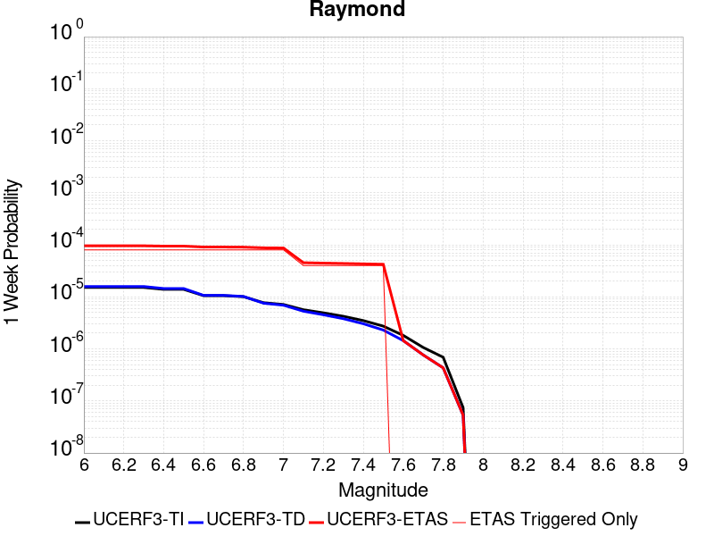 | 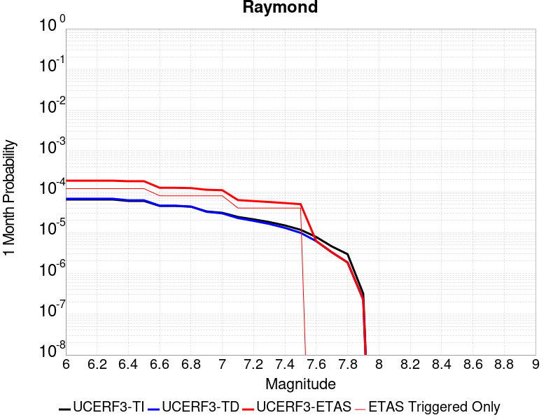 |  |

| Magnitude | 1 wk TI Prob | 1 wk TD Prob | 1 wk ETAS Prob | 1 wk ETAS/TD Gain | 1 wk ETAS Triggered Only | 1 mo TI Prob | 1 mo TD Prob | 1 mo ETAS Prob | 1 mo ETAS/TD Gain | 1 mo ETAS Triggered Only | 1 yr TI Prob | 1 yr TD Prob | 1 yr ETAS Prob | 1 yr ETAS/TD Gain | 1 yr ETAS Triggered Only |
|-----|-----|-----|-----|-----|-----|-----|-----|-----|-----|-----|-----|-----|-----|-----|-----|
| 6.0 | 1.5157413E-5 | 1.5816651E-5 | 9.581538E-5 | 6.057881 | 8.0E-5 | 6.4958724E-5 | 6.778403E-5 | 1.8777589E-4 | 2.7702086 | 1.2E-4 | 7.905855E-4 | 8.249831E-4 | 9.4488414E-4 | 1.1453375 | 1.2E-4 |
| 6.1 | 1.5157413E-5 | 1.5816651E-5 | 9.581538E-5 | 6.057881 | 8.0E-5 | 6.4958724E-5 | 6.778403E-5 | 1.8777589E-4 | 2.7702086 | 1.2E-4 | 7.905855E-4 | 8.249831E-4 | 9.4488414E-4 | 1.1453375 | 1.2E-4 |
| 6.2 | 1.5157413E-5 | 1.5816651E-5 | 9.581538E-5 | 6.057881 | 8.0E-5 | 6.4958724E-5 | 6.778403E-5 | 1.8777589E-4 | 2.7702086 | 1.2E-4 | 7.905855E-4 | 8.249831E-4 | 9.4488414E-4 | 1.1453375 | 1.2E-4 |
| 6.3 | 1.5157413E-5 | 1.5816651E-5 | 9.581538E-5 | 6.057881 | 8.0E-5 | 6.4958724E-5 | 6.778403E-5 | 1.8777589E-4 | 2.7702086 | 1.2E-4 | 7.905855E-4 | 8.249831E-4 | 9.4488414E-4 | 1.1453375 | 1.2E-4 |
| 6.4 | 1.3941944E-5 | 1.4460684E-5 | 9.445953E-5 | 6.5321617 | 8.0E-5 | 5.9749822E-5 | 6.197302E-5 | 1.8196559E-4 | 2.9362066 | 1.2E-4 | 7.2721124E-4 | 7.542837E-4 | 8.7419315E-4 | 1.1589713 | 1.2E-4 |
| 6.5 | 1.3941944E-5 | 1.4460684E-5 | 9.445953E-5 | 6.5321617 | 8.0E-5 | 5.9749822E-5 | 6.197302E-5 | 1.8196559E-4 | 2.9362066 | 1.2E-4 | 7.2721124E-4 | 7.542837E-4 | 8.7419315E-4 | 1.1589713 | 1.2E-4 |
| 6.6 | 1.0542609E-5 | 1.0675657E-5 | 9.06748E-5 | 8.493605 | 8.0E-5 | 4.5181827E-5 | 4.5752044E-5 | 1.2574838E-4 | 2.7484758 | 8.0E-5 | 5.499499E-4 | 5.568942E-4 | 6.3684967E-4 | 1.1435739 | 8.0E-5 |
| 6.7 | 1.0542609E-5 | 1.0675657E-5 | 9.06748E-5 | 8.493605 | 8.0E-5 | 4.5181827E-5 | 4.5752044E-5 | 1.2574838E-4 | 2.7484758 | 8.0E-5 | 5.499499E-4 | 5.568942E-4 | 6.3684967E-4 | 1.1435739 | 8.0E-5 |
| 6.8 | 1.0079132E-5 | 1.0181076E-5 | 9.018026E-5 | 8.857636 | 8.0E-5 | 4.3195567E-5 | 4.363248E-5 | 1.2362898E-4 | 2.8334165 | 8.0E-5 | 5.257791E-4 | 5.311013E-4 | 6.1105884E-4 | 1.1505504 | 8.0E-5 |
| 6.9 | 7.721598E-6 | 7.552302E-6 | 8.75517E-5 | 11.592716 | 8.0E-5 | 3.3092143E-5 | 3.2366614E-5 | 1.12364025E-4 | 3.4716027 | 8.0E-5 | 4.0282236E-4 | 3.9399348E-4 | 4.7396196E-4 | 1.2029691 | 8.0E-5 |
| 7.0 | 7.137566E-6 | 6.9145035E-6 | 8.691395E-5 | 12.569804 | 8.0E-5 | 3.058921E-5 | 2.9633255E-5 | 1.09630884E-4 | 3.6995897 | 8.0E-5 | 3.7236E-4 | 3.6072623E-4 | 4.4069736E-4 | 1.2216948 | 8.0E-5 |
| 7.1 | 5.654976E-6 | 5.3022604E-6 | 4.5302048E-5 | 8.543913 | 4.0E-5 | 2.4235387E-5 | 2.2723776E-5 | 6.2722866E-5 | 2.7602308 | 4.0E-5 | 2.9502588E-4 | 2.7662705E-4 | 3.16616E-4 | 1.144559 | 4.0E-5 |
| 7.2 | 4.9358455E-6 | 4.529158E-6 | 4.4528977E-5 | 9.831623 | 4.0E-5 | 2.1153453E-5 | 1.9410534E-5 | 5.940976E-5 | 3.0606966 | 4.0E-5 | 2.5751285E-4 | 2.3629777E-4 | 2.762883E-4 | 1.169238 | 4.0E-5 |
| 7.3 | 4.2368597E-6 | 3.8079293E-6 | 4.3807777E-5 | 11.504356 | 4.0E-5 | 1.8157843E-5 | 1.6319596E-5 | 5.6318942E-5 | 3.4510012 | 4.0E-5 | 2.2104931E-4 | 1.9867306E-4 | 2.3866512E-4 | 1.2012959 | 4.0E-5 |
| 7.4 | 3.4999923E-6 | 3.045825E-6 | 4.3045704E-5 | 14.13269 | 4.0E-5 | 1.49998805E-5 | 1.3053471E-5 | 5.305295E-5 | 4.064279 | 4.0E-5 | 1.8260824E-4 | 1.589145E-4 | 1.9890814E-4 | 1.2516677 | 4.0E-5 |
| 7.5 | 2.738017E-6 | 2.303755E-6 | 4.230366E-5 | 18.362917 | 4.0E-5 | 1.1734306E-5 | 9.873199E-6 | 4.9872804E-5 | 5.051332 | 4.0E-5 | 1.428558E-4 | 1.20199635E-4 | 1.6019483E-4 | 1.3327397 | 4.0E-5 |
| 7.6 | 1.8186392E-6 | 1.4435308E-6 | 1.4435308E-6 | 1.0 | 0.0 | 7.794145E-6 | 6.1865458E-6 | 6.1865458E-6 | 1.0 | 0.0 | 9.488958E-5 | 7.531863E-5 | 7.531863E-5 | 1.0 | 0.0 |
| 7.7 | 1.0660348E-6 | 7.653782E-7 | 7.653782E-7 | 1.0 | 0.0 | 4.5687125E-6 | 3.2801881E-6 | 3.2801881E-6 | 1.0 | 0.0 | 5.5622655E-5 | 3.9935578E-5 | 3.9935578E-5 | 1.0 | 0.0 |
| 7.8 | 6.913602E-7 | 4.3288983E-7 | 4.3288983E-7 | 1.0 | 0.0 | 2.962969E-6 | 1.855241E-6 | 1.855241E-6 | 1.0 | 0.0 | 3.607355E-5 | 2.258733E-5 | 2.258733E-5 | 1.0 | 0.0 |
| 7.9 | 7.425201E-8 | 5.330067E-8 | 5.330067E-8 | 1.0 | 0.0 | 3.1822285E-7 | 2.2843143E-7 | 2.2843143E-7 | 1.0 | 0.0 | 3.874356E-6 | 2.7811504E-6 | 2.7811504E-6 | 1.0 | 0.0 |

## Calico-Hidalgo
*[(top)](#table-of-contents)*

| 1 Week | 1 Month | 1 Year |
|-----|-----|-----|
| 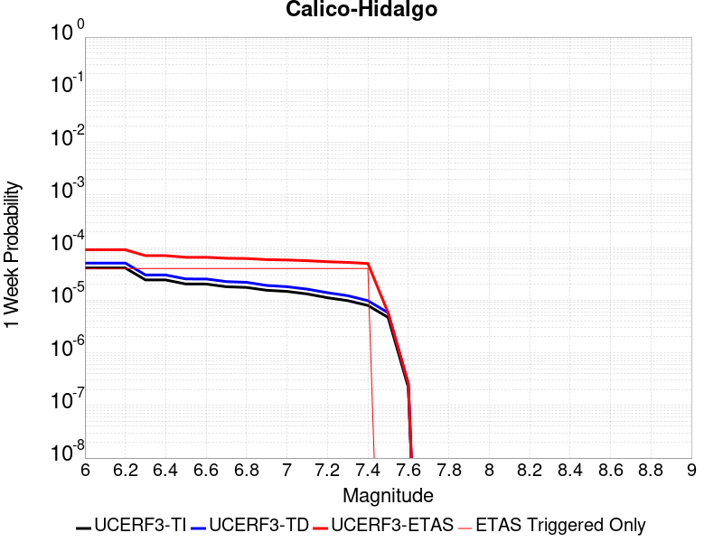 | 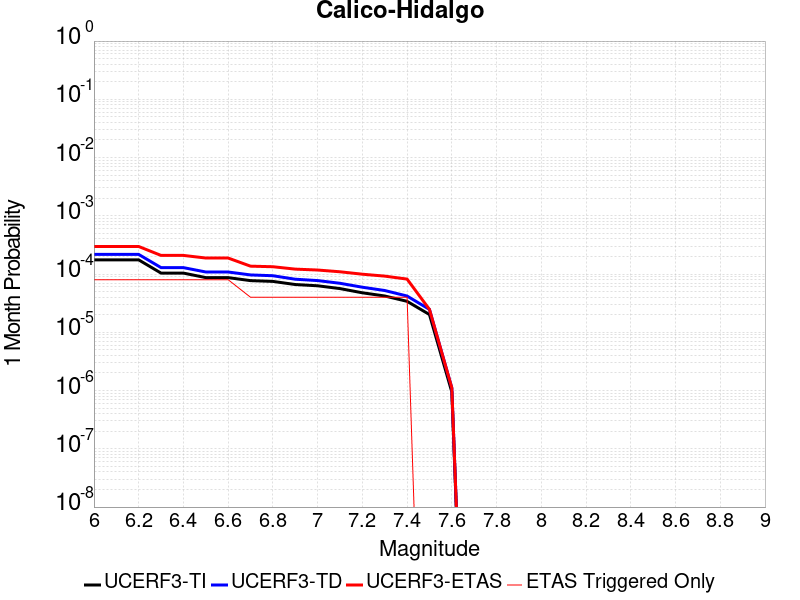 | 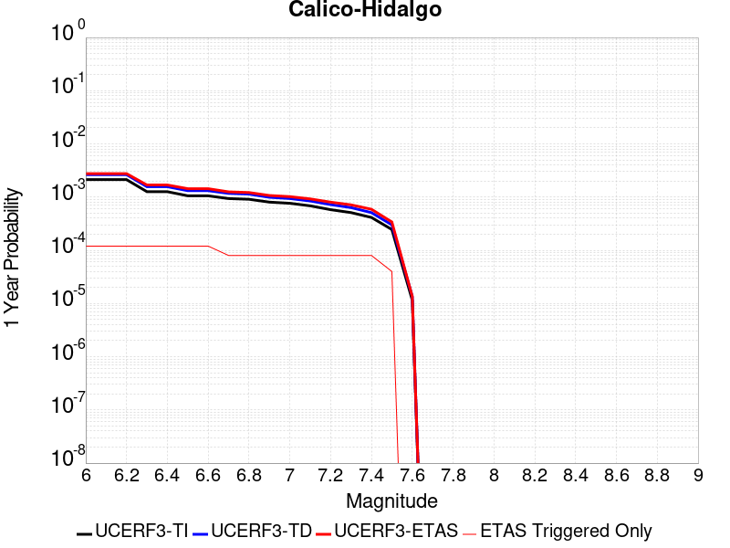 |

| Magnitude | 1 wk TI Prob | 1 wk TD Prob | 1 wk ETAS Prob | 1 wk ETAS/TD Gain | 1 wk ETAS Triggered Only | 1 mo TI Prob | 1 mo TD Prob | 1 mo ETAS Prob | 1 mo ETAS/TD Gain | 1 mo ETAS Triggered Only | 1 yr TI Prob | 1 yr TD Prob | 1 yr ETAS Prob | 1 yr ETAS/TD Gain | 1 yr ETAS Triggered Only |
|-----|-----|-----|-----|-----|-----|-----|-----|-----|-----|-----|-----|-----|-----|-----|-----|
| 6.0 | 4.0906612E-5 | 5.073094E-5 | 9.0728914E-5 | 1.7884334 | 4.0E-5 | 1.7530227E-4 | 2.174025E-4 | 2.973851E-4 | 1.3679011 | 8.0E-5 | 0.0021322158 | 0.0026440606 | 0.0027637433 | 1.0452647 | 1.2E-4 |
| 6.1 | 4.0906612E-5 | 5.073094E-5 | 9.0728914E-5 | 1.7884334 | 4.0E-5 | 1.7530227E-4 | 2.174025E-4 | 2.973851E-4 | 1.3679011 | 8.0E-5 | 0.0021322158 | 0.0026440606 | 0.0027637433 | 1.0452647 | 1.2E-4 |
| 6.2 | 4.0906612E-5 | 5.073094E-5 | 9.0728914E-5 | 1.7884334 | 4.0E-5 | 1.7530227E-4 | 2.174025E-4 | 2.973851E-4 | 1.3679011 | 8.0E-5 | 0.0021322158 | 0.0026440606 | 0.0027637433 | 1.0452647 | 1.2E-4 |
| 6.3 | 2.4242801E-5 | 3.01023E-5 | 7.0101094E-5 | 2.328762 | 4.0E-5 | 1.0389358E-4 | 1.2900366E-4 | 2.0899334E-4 | 1.6200575 | 8.0E-5 | 0.0012641704 | 0.0015695215 | 0.0016893331 | 1.0763364 | 1.2E-4 |
| 6.4 | 2.4242801E-5 | 3.01023E-5 | 7.0101094E-5 | 2.328762 | 4.0E-5 | 1.0389358E-4 | 1.2900366E-4 | 2.0899334E-4 | 1.6200575 | 8.0E-5 | 0.0012641704 | 0.0015695215 | 0.0016893331 | 1.0763364 | 1.2E-4 |
| 6.5 | 2.0286952E-5 | 2.5324422E-5 | 6.532341E-5 | 2.579463 | 4.0E-5 | 8.694118E-5 | 1.0852882E-4 | 1.8852013E-4 | 1.7370514 | 8.0E-5 | 0.0010579949 | 0.0013205545 | 0.0014403961 | 1.0907509 | 1.2E-4 |
| 6.6 | 2.0269223E-5 | 2.5305366E-5 | 6.530435E-5 | 2.5806525 | 4.0E-5 | 8.6865206E-5 | 1.0844716E-4 | 1.8843848E-4 | 1.7376065 | 8.0E-5 | 0.0010570707 | 0.0013195615 | 0.0014394032 | 1.0908192 | 1.2E-4 |
| 6.7 | 1.799852E-5 | 2.2548089E-5 | 6.254719E-5 | 2.7739463 | 4.0E-5 | 7.713423E-5 | 9.663117E-5 | 1.366273E-4 | 1.4139051 | 4.0E-5 | 9.3870464E-4 | 0.0011758641 | 0.0012557701 | 1.067955 | 8.0E-5 |
| 6.8 | 1.7458793E-5 | 2.1849313E-5 | 6.184844E-5 | 2.830681 | 4.0E-5 | 7.4821255E-5 | 9.3636634E-5 | 1.3363289E-4 | 1.4271432 | 4.0E-5 | 9.10568E-4 | 0.0011394443 | 0.0012193532 | 1.0701296 | 8.0E-5 |
| 6.9 | 1.542884E-5 | 1.9032297E-5 | 5.9031536E-5 | 3.1016505 | 4.0E-5 | 6.612192E-5 | 8.156451E-5 | 1.2156125E-4 | 1.4903693 | 4.0E-5 | 8.04737E-4 | 9.926087E-4 | 0.0010725292 | 1.0805157 | 8.0E-5 |
| 7.0 | 1.468253E-5 | 1.8036559E-5 | 5.8035836E-5 | 3.217678 | 4.0E-5 | 6.292361E-5 | 7.729732E-5 | 1.1729423E-4 | 1.5174423 | 4.0E-5 | 7.658257E-4 | 9.407016E-4 | 0.0010206263 | 1.084963 | 8.0E-5 |
| 7.1 | 1.3139281E-5 | 1.6206326E-5 | 5.6205678E-5 | 3.4681318 | 4.0E-5 | 5.6309986E-5 | 6.9453905E-5 | 1.0945113E-4 | 1.5758815 | 4.0E-5 | 6.853584E-4 | 8.4528583E-4 | 9.252182E-4 | 1.0945625 | 8.0E-5 |
| 7.2 | 1.1127404E-5 | 1.3871357E-5 | 5.38708E-5 | 3.8836002 | 4.0E-5 | 4.7688E-5 | 5.944738E-5 | 9.9445E-5 | 1.672824 | 4.0E-5 | 5.8044674E-4 | 7.2354235E-4 | 8.0348446E-4 | 1.1104871 | 8.0E-5 |
| 7.3 | 9.808154E-6 | 1.2178817E-5 | 5.217833E-5 | 4.2843513 | 4.0E-5 | 4.2034266E-5 | 5.2193944E-5 | 9.2191854E-5 | 1.7663324 | 4.0E-5 | 5.11647E-4 | 6.3528673E-4 | 7.152359E-4 | 1.1258473 | 8.0E-5 |
| 7.4 | 7.942452E-6 | 9.793949E-6 | 4.9793558E-5 | 5.084114 | 4.0E-5 | 3.4038632E-5 | 4.1973446E-5 | 8.197177E-5 | 1.9529434 | 4.0E-5 | 4.1434157E-4 | 5.1091635E-4 | 5.908755E-4 | 1.1565014 | 8.0E-5 |
| 7.5 | 4.7121216E-6 | 5.7738143E-6 | 5.7738143E-6 | 1.0 | 0.0 | 2.019465E-5 | 2.4744726E-5 | 2.4744726E-5 | 1.0 | 0.0 | 2.4584212E-4 | 3.0123306E-4 | 3.4122102E-4 | 1.1327475 | 4.0E-5 |
| 7.6 | 2.21172E-7 | 2.6043384E-7 | 2.6043384E-7 | 1.0 | 0.0 | 9.478797E-7 | 1.1161446E-6 | 1.1161446E-6 | 1.0 | 0.0 | 1.1540374E-5 | 1.3589005E-5 | 1.3589005E-5 | 1.0 | 0.0 |

## Santa Ynez (East)
*[(top)](#table-of-contents)*

| 1 Week | 1 Month | 1 Year |
|-----|-----|-----|
| 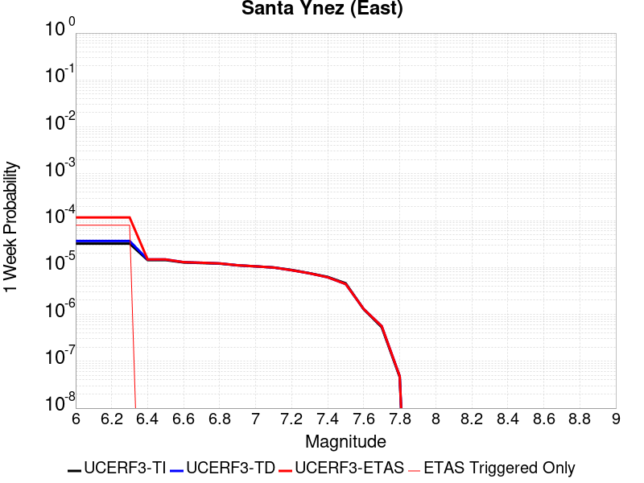 | 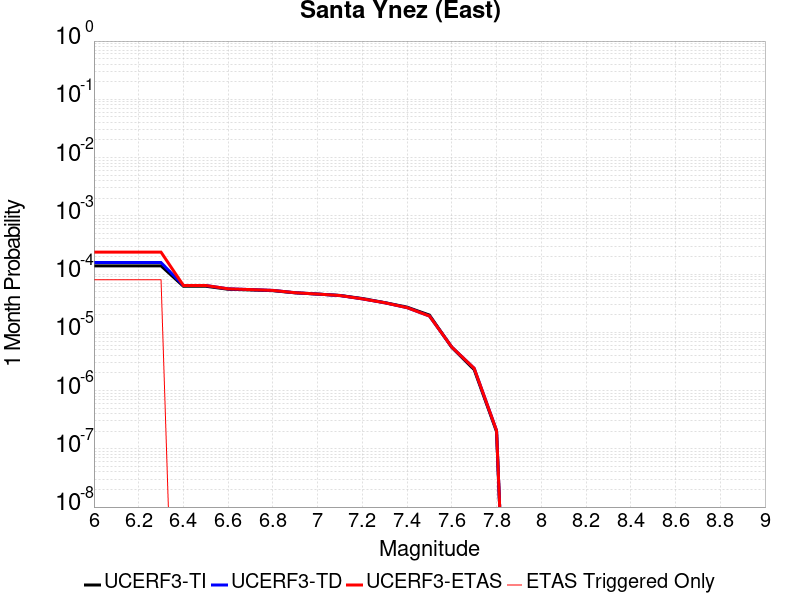 | 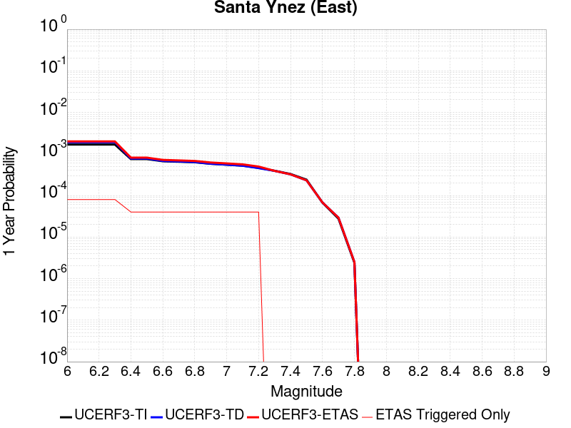 |

| Magnitude | 1 wk TI Prob | 1 wk TD Prob | 1 wk ETAS Prob | 1 wk ETAS/TD Gain | 1 wk ETAS Triggered Only | 1 mo TI Prob | 1 mo TD Prob | 1 mo ETAS Prob | 1 mo ETAS/TD Gain | 1 mo ETAS Triggered Only | 1 yr TI Prob | 1 yr TD Prob | 1 yr ETAS Prob | 1 yr ETAS/TD Gain | 1 yr ETAS Triggered Only |
|-----|-----|-----|-----|-----|-----|-----|-----|-----|-----|-----|-----|-----|-----|-----|-----|
| 6.0 | 3.2269712E-5 | 3.6773254E-5 | 1.16770316E-4 | 3.175414 | 8.0E-5 | 1.3829143E-4 | 1.5759347E-4 | 2.3758087E-4 | 1.5075552 | 8.0E-5 | 0.0016823979 | 0.0019175955 | 0.0019974422 | 1.041639 | 8.0E-5 |
| 6.1 | 3.2269712E-5 | 3.6773254E-5 | 1.16770316E-4 | 3.175414 | 8.0E-5 | 1.3829143E-4 | 1.5759347E-4 | 2.3758087E-4 | 1.5075552 | 8.0E-5 | 0.0016823979 | 0.0019175955 | 0.0019974422 | 1.041639 | 8.0E-5 |
| 6.2 | 3.2269712E-5 | 3.6773254E-5 | 1.16770316E-4 | 3.175414 | 8.0E-5 | 1.3829143E-4 | 1.5759347E-4 | 2.3758087E-4 | 1.5075552 | 8.0E-5 | 0.0016823979 | 0.0019175955 | 0.0019974422 | 1.041639 | 8.0E-5 |
| 6.3 | 3.2269712E-5 | 3.6773254E-5 | 1.16770316E-4 | 3.175414 | 8.0E-5 | 1.3829143E-4 | 1.5759347E-4 | 2.3758087E-4 | 1.5075552 | 8.0E-5 | 0.0016823979 | 0.0019175955 | 0.0019974422 | 1.041639 | 8.0E-5 |
| 6.4 | 1.4404779E-5 | 1.4855053E-5 | 1.4855053E-5 | 1.0 | 0.0 | 6.1733306E-5 | 6.366299E-5 | 6.366299E-5 | 1.0 | 0.0 | 7.513438E-4 | 7.7482633E-4 | 8.147954E-4 | 1.0515845 | 4.0E-5 |
| 6.5 | 1.4404779E-5 | 1.4855053E-5 | 1.4855053E-5 | 1.0 | 0.0 | 6.1733306E-5 | 6.366299E-5 | 6.366299E-5 | 1.0 | 0.0 | 7.513438E-4 | 7.7482633E-4 | 8.147954E-4 | 1.0515845 | 4.0E-5 |
| 6.6 | 1.280208E-5 | 1.3016704E-5 | 1.3016704E-5 | 1.0 | 0.0 | 5.4864904E-5 | 5.578469E-5 | 5.578469E-5 | 1.0 | 0.0 | 6.6777546E-4 | 6.7896873E-4 | 7.1894156E-4 | 1.0588728 | 4.0E-5 |
| 6.7 | 1.2457027E-5 | 1.2633079E-5 | 1.2633079E-5 | 1.0 | 0.0 | 5.3386164E-5 | 5.414065E-5 | 5.414065E-5 | 1.0 | 0.0 | 6.497827E-4 | 6.5896474E-4 | 6.989384E-4 | 1.0606613 | 4.0E-5 |
| 6.8 | 1.2095134E-5 | 1.2235392E-5 | 1.2235392E-5 | 1.0 | 0.0 | 5.1835254E-5 | 5.2436353E-5 | 5.2436353E-5 | 1.0 | 0.0 | 6.309115E-4 | 6.382272E-4 | 6.782017E-4 | 1.0626336 | 4.0E-5 |
| 6.9 | 1.1104036E-5 | 1.1161518E-5 | 1.1161518E-5 | 1.0 | 0.0 | 4.758786E-5 | 4.7834208E-5 | 4.7834208E-5 | 1.0 | 0.0 | 5.7922816E-4 | 5.822271E-4 | 6.222038E-4 | 1.0686617 | 4.0E-5 |
| 7.0 | 1.0577444E-5 | 1.0585669E-5 | 1.0585669E-5 | 1.0 | 0.0 | 4.5331115E-5 | 4.5366367E-5 | 4.5366367E-5 | 1.0 | 0.0 | 5.5176654E-4 | 5.5219675E-4 | 5.921747E-4 | 1.072398 | 4.0E-5 |
| 7.1 | 1.0021775E-5 | 9.9848085E-6 | 9.9848085E-6 | 1.0 | 0.0 | 4.294976E-5 | 4.279134E-5 | 4.279134E-5 | 1.0 | 0.0 | 5.2278786E-4 | 5.2086124E-4 | 5.6084036E-4 | 1.0767559 | 4.0E-5 |
| 7.2 | 8.874109E-6 | 8.752264E-6 | 8.752264E-6 | 1.0 | 0.0 | 3.8031343E-5 | 3.750917E-5 | 3.750917E-5 | 1.0 | 0.0 | 4.629332E-4 | 4.5657952E-4 | 4.965613E-4 | 1.0875679 | 4.0E-5 |
| 7.3 | 7.5504267E-6 | 7.5080898E-6 | 7.5080898E-6 | 1.0 | 0.0 | 3.235857E-5 | 3.2177137E-5 | 3.2177137E-5 | 1.0 | 0.0 | 3.9389438E-4 | 3.9168724E-4 | 3.9168724E-4 | 1.0 | 0.0 |
| 7.4 | 6.309394E-6 | 6.185729E-6 | 6.185729E-6 | 1.0 | 0.0 | 2.703998E-5 | 2.6510004E-5 | 2.6510004E-5 | 1.0 | 0.0 | 3.2916202E-4 | 3.2271244E-4 | 3.2271244E-4 | 1.0 | 0.0 |
| 7.5 | 4.6103073E-6 | 4.442555E-6 | 4.442555E-6 | 1.0 | 0.0 | 1.975831E-5 | 1.9039388E-5 | 1.9039388E-5 | 1.0 | 0.0 | 2.4053088E-4 | 2.3178058E-4 | 2.3178058E-4 | 1.0 | 0.0 |
| 7.6 | 1.2858658E-6 | 1.3010639E-6 | 1.3010639E-6 | 1.0 | 0.0 | 5.5108417E-6 | 5.5759765E-6 | 5.5759765E-6 | 1.0 | 0.0 | 6.7092435E-5 | 6.788547E-5 | 6.788547E-5 | 1.0 | 0.0 |
| 7.7 | 5.3302307E-7 | 5.61315E-7 | 5.61315E-7 | 1.0 | 0.0 | 2.2843826E-6 | 2.4056337E-6 | 2.4056337E-6 | 1.0 | 0.0 | 2.7812002E-5 | 2.9288234E-5 | 2.9288234E-5 | 1.0 | 0.0 |
| 7.8 | 4.613933E-8 | 4.803677E-8 | 4.803677E-8 | 1.0 | 0.0 | 1.9773998E-7 | 2.0587186E-7 | 2.0587186E-7 | 1.0 | 0.0 | 2.4074816E-6 | 2.5064871E-6 | 2.5064871E-6 | 1.0 | 0.0 |

## Garlock (East)
*[(top)](#table-of-contents)*

| 1 Week | 1 Month | 1 Year |
|-----|-----|-----|
| 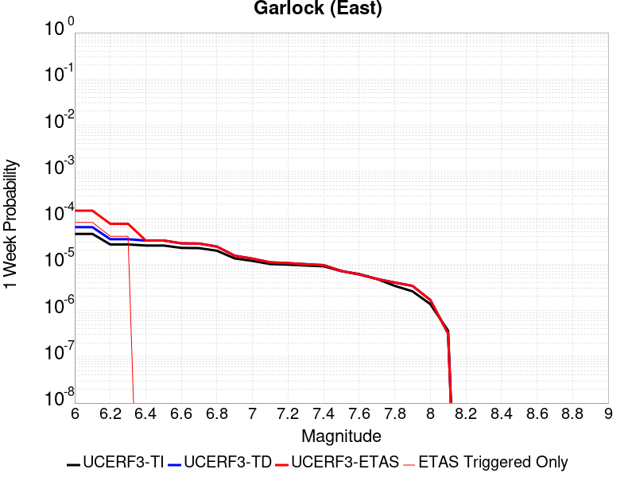 | 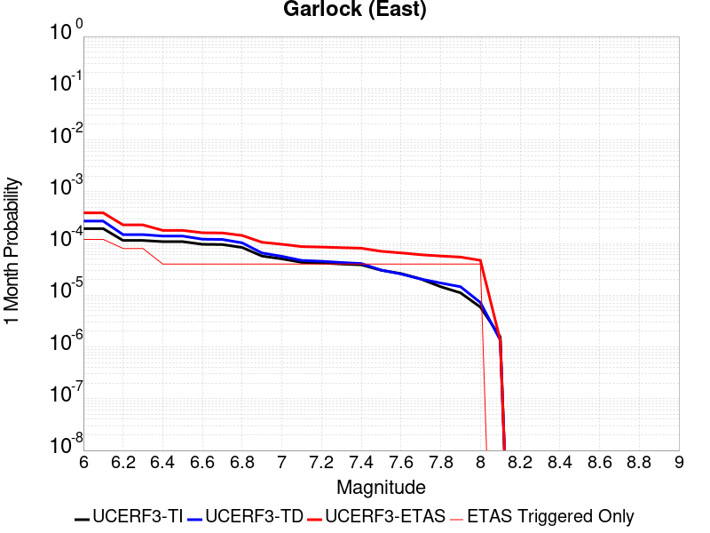 | 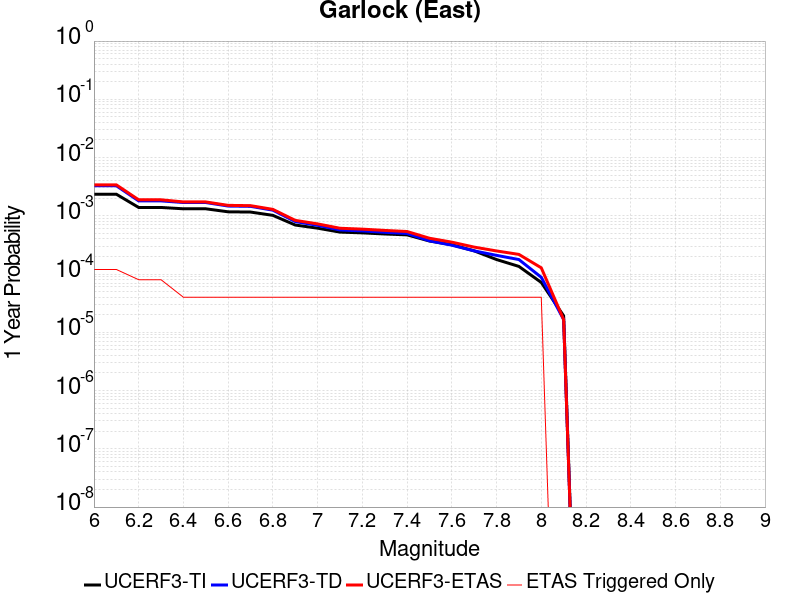 |

| Magnitude | 1 wk TI Prob | 1 wk TD Prob | 1 wk ETAS Prob | 1 wk ETAS/TD Gain | 1 wk ETAS Triggered Only | 1 mo TI Prob | 1 mo TD Prob | 1 mo ETAS Prob | 1 mo ETAS/TD Gain | 1 mo ETAS Triggered Only | 1 yr TI Prob | 1 yr TD Prob | 1 yr ETAS Prob | 1 yr ETAS/TD Gain | 1 yr ETAS Triggered Only |
|-----|-----|-----|-----|-----|-----|-----|-----|-----|-----|-----|-----|-----|-----|-----|-----|
| 6.0 | 4.5092507E-5 | 6.302061E-5 | 1.4301557E-4 | 2.2693458 | 8.0E-5 | 1.9323928E-4 | 2.700629E-4 | 3.900305E-4 | 1.4442209 | 1.2E-4 | 0.0023501497 | 0.0032835056 | 0.0034031114 | 1.0364263 | 1.2E-4 |
| 6.1 | 4.5092507E-5 | 6.302061E-5 | 1.4301557E-4 | 2.2693458 | 8.0E-5 | 1.9323928E-4 | 2.700629E-4 | 3.900305E-4 | 1.4442209 | 1.2E-4 | 0.0023501497 | 0.0032835056 | 0.0034031114 | 1.0364263 | 1.2E-4 |
| 6.2 | 2.6674514E-5 | 3.460235E-5 | 7.460097E-5 | 2.1559508 | 4.0E-5 | 1.1431433E-4 | 1.4828754E-4 | 2.2827568E-4 | 1.5394124 | 8.0E-5 | 0.0013908884 | 0.001803939 | 0.0018837947 | 1.0442674 | 8.0E-5 |
| 6.3 | 2.6674514E-5 | 3.460235E-5 | 7.460097E-5 | 2.1559508 | 4.0E-5 | 1.1431433E-4 | 1.4828754E-4 | 2.2827568E-4 | 1.5394124 | 8.0E-5 | 0.0013908884 | 0.001803939 | 0.0018837947 | 1.0442674 | 8.0E-5 |
| 6.4 | 2.5312667E-5 | 3.243003E-5 | 3.243003E-5 | 1.0 | 0.0 | 1.0847834E-4 | 1.389786E-4 | 1.7897304E-4 | 1.2877741 | 4.0E-5 | 0.0013199237 | 0.0016907807 | 0.0017307131 | 1.0236177 | 4.0E-5 |
| 6.5 | 2.5312667E-5 | 3.243003E-5 | 3.243003E-5 | 1.0 | 0.0 | 1.0847834E-4 | 1.389786E-4 | 1.7897304E-4 | 1.2877741 | 4.0E-5 | 0.0013199237 | 0.0016907807 | 0.0017307131 | 1.0236177 | 4.0E-5 |
| 6.6 | 2.246556E-5 | 2.8214976E-5 | 2.8214976E-5 | 1.0 | 0.0 | 9.627742E-5 | 1.2091586E-4 | 1.6091102E-4 | 1.3307686 | 4.0E-5 | 0.0011715472 | 0.00147118 | 0.0015111212 | 1.0271491 | 4.0E-5 |
| 6.7 | 2.2241198E-5 | 2.7884198E-5 | 2.7884198E-5 | 1.0 | 0.0 | 9.531594E-5 | 1.1949836E-4 | 1.5949359E-4 | 1.3346926 | 4.0E-5 | 0.0011598538 | 0.0014539452 | 0.001493887 | 1.0274713 | 4.0E-5 |
| 6.8 | 1.9528685E-5 | 2.3971877E-5 | 2.3971877E-5 | 1.0 | 0.0 | 8.369167E-5 | 1.0273269E-4 | 1.4272858E-4 | 1.38932 | 4.0E-5 | 0.0010184698 | 0.0012500725 | 0.0012900225 | 1.0319581 | 4.0E-5 |
| 6.9 | 1.3318621E-5 | 1.5256402E-5 | 1.5256402E-5 | 1.0 | 0.0 | 5.7078556E-5 | 6.538297E-5 | 1.0538036E-4 | 1.6117401 | 4.0E-5 | 6.9470983E-4 | 7.957527E-4 | 8.3572086E-4 | 1.0502269 | 4.0E-5 |
| 7.0 | 1.1760853E-5 | 1.3163365E-5 | 1.3163365E-5 | 1.0 | 0.0 | 5.0402683E-5 | 5.641323E-5 | 9.641097E-5 | 1.7090136 | 4.0E-5 | 6.134799E-4 | 6.8661966E-4 | 7.265922E-4 | 1.0582165 | 4.0E-5 |
| 7.1 | 1.0064758E-5 | 1.0956659E-5 | 1.0956659E-5 | 1.0 | 0.0 | 4.3133965E-5 | 4.6956284E-5 | 8.695441E-5 | 1.8518162 | 4.0E-5 | 5.2502943E-4 | 5.715463E-4 | 6.1152346E-4 | 1.0699456 | 4.0E-5 |
| 7.2 | 9.768808E-6 | 1.0552171E-5 | 1.0552171E-5 | 1.0 | 0.0 | 4.186565E-5 | 4.5222823E-5 | 8.5221014E-5 | 1.8844692 | 4.0E-5 | 5.095951E-4 | 5.504523E-4 | 5.904303E-4 | 1.0726275 | 4.0E-5 |
| 7.3 | 9.344516E-6 | 9.99686E-6 | 9.99686E-6 | 1.0 | 0.0 | 4.004731E-5 | 4.2843003E-5 | 8.284129E-5 | 1.9336014 | 4.0E-5 | 4.8746695E-4 | 5.214922E-4 | 5.6147133E-4 | 1.076663 | 4.0E-5 |
| 7.4 | 9.023491E-6 | 9.542039E-6 | 9.542039E-6 | 1.0 | 0.0 | 3.867153E-5 | 4.0893832E-5 | 8.08922E-5 | 1.9781026 | 4.0E-5 | 4.7072413E-4 | 4.9777207E-4 | 5.377521E-4 | 1.0803181 | 4.0E-5 |
| 7.5 | 7.081253E-6 | 7.1334935E-6 | 7.1334935E-6 | 1.0 | 0.0 | 3.0347876E-5 | 3.057176E-5 | 7.057054E-5 | 2.308357 | 4.0E-5 | 3.6942272E-4 | 3.7214835E-4 | 4.1213346E-4 | 1.107444 | 4.0E-5 |
| 7.6 | 6.116396E-6 | 6.0000416E-6 | 6.0000416E-6 | 1.0 | 0.0 | 2.6212863E-5 | 2.5714213E-5 | 6.571318E-5 | 2.55552 | 4.0E-5 | 3.1909486E-4 | 3.130258E-4 | 3.530133E-4 | 1.127745 | 4.0E-5 |
| 7.7 | 4.797145E-6 | 4.795929E-6 | 4.795929E-6 | 1.0 | 0.0 | 2.055903E-5 | 2.055382E-5 | 6.0552997E-5 | 2.9460702 | 4.0E-5 | 2.5027743E-4 | 2.5021416E-4 | 2.9020413E-4 | 1.1598231 | 4.0E-5 |
| 7.8 | 3.4028885E-6 | 4.0130544E-6 | 4.0130544E-6 | 1.0 | 0.0 | 1.4583726E-5 | 1.7198692E-5 | 5.7198005E-5 | 3.3257184 | 4.0E-5 | 1.775424E-4 | 2.0937403E-4 | 2.4936566E-4 | 1.1910057 | 4.0E-5 |
| 7.9 | 2.5928412E-6 | 3.4017612E-6 | 3.4017612E-6 | 1.0 | 0.0 | 1.1112129E-5 | 1.4578895E-5 | 5.457831E-5 | 3.743652 | 4.0E-5 | 1.3528178E-4 | 1.7748366E-4 | 2.1747655E-4 | 1.2253329 | 4.0E-5 |
| 8.0 | 1.3743648E-6 | 1.6867408E-6 | 1.6867408E-6 | 1.0 | 0.0 | 5.8901214E-6 | 7.2288694E-6 | 4.722858E-5 | 6.533329 | 4.0E-5 | 7.1709874E-5 | 8.800796E-5 | 1.2800444E-4 | 1.4544643 | 4.0E-5 |
| 8.1 | 3.6733252E-7 | 3.1722044E-7 | 3.1722044E-7 | 1.0 | 0.0 | 1.5742813E-6 | 1.3595155E-6 | 1.3595155E-6 | 1.0 | 0.0 | 1.9166706E-5 | 1.6551992E-5 | 1.6551992E-5 | 1.0 | 0.0 |

## Big Pine (East)
*[(top)](#table-of-contents)*

| 1 Week | 1 Month | 1 Year |
|-----|-----|-----|
| 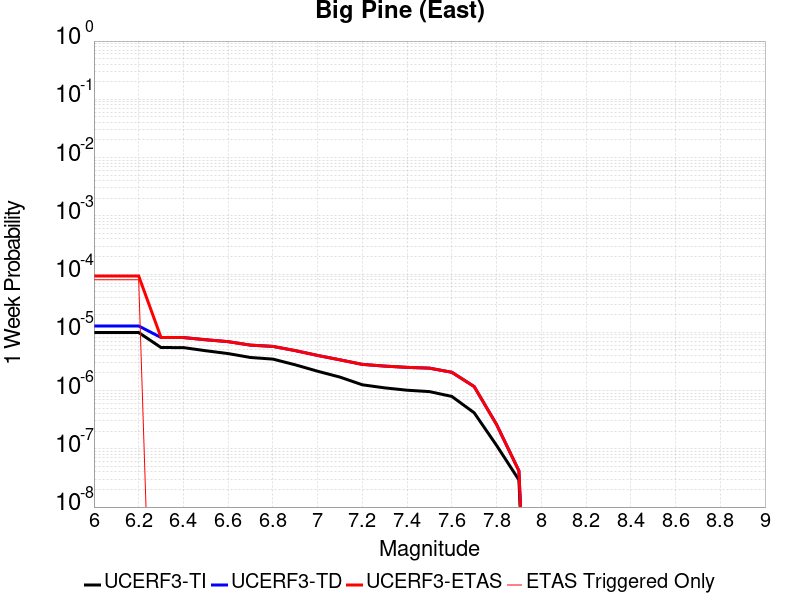 | 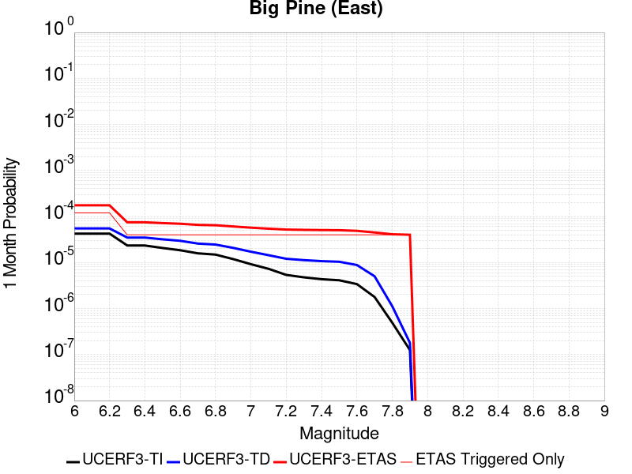 | 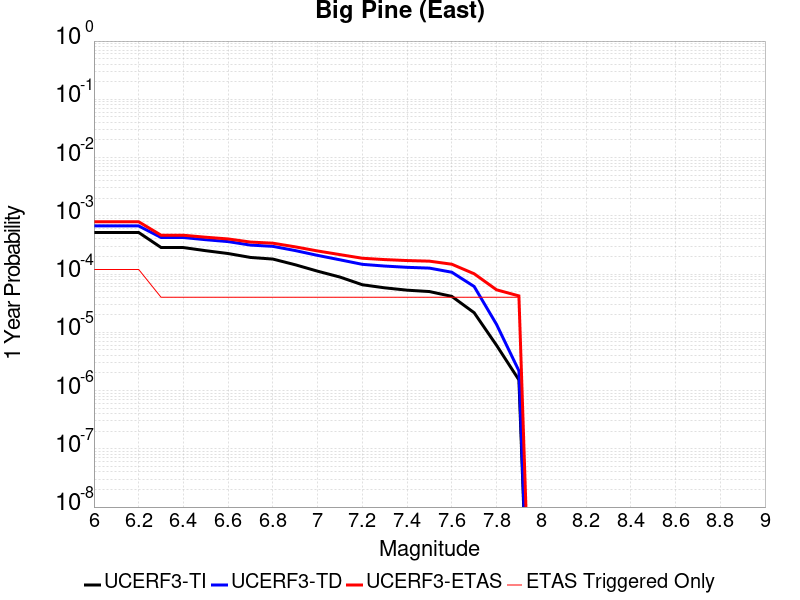 |

| Magnitude | 1 wk TI Prob | 1 wk TD Prob | 1 wk ETAS Prob | 1 wk ETAS/TD Gain | 1 wk ETAS Triggered Only | 1 mo TI Prob | 1 mo TD Prob | 1 mo ETAS Prob | 1 mo ETAS/TD Gain | 1 mo ETAS Triggered Only | 1 yr TI Prob | 1 yr TD Prob | 1 yr ETAS Prob | 1 yr ETAS/TD Gain | 1 yr ETAS Triggered Only |
|-----|-----|-----|-----|-----|-----|-----|-----|-----|-----|-----|-----|-----|-----|-----|-----|
| 6.0 | 9.916913E-6 | 1.2849277E-5 | 9.284825E-5 | 7.225951 | 8.0E-5 | 4.250036E-5 | 5.5067292E-5 | 1.7506069E-4 | 3.179032 | 1.2E-4 | 5.173191E-4 | 6.7026017E-4 | 7.901797E-4 | 1.1789149 | 1.2E-4 |
| 6.1 | 9.916913E-6 | 1.2849277E-5 | 9.284825E-5 | 7.225951 | 8.0E-5 | 4.250036E-5 | 5.5067292E-5 | 1.7506069E-4 | 3.179032 | 1.2E-4 | 5.173191E-4 | 6.7026017E-4 | 7.901797E-4 | 1.1789149 | 1.2E-4 |
| 6.2 | 9.916913E-6 | 1.2849277E-5 | 9.284825E-5 | 7.225951 | 8.0E-5 | 4.250036E-5 | 5.5067292E-5 | 1.7506069E-4 | 3.179032 | 1.2E-4 | 5.173191E-4 | 6.7026017E-4 | 7.901797E-4 | 1.1789149 | 1.2E-4 |
| 6.3 | 5.479711E-6 | 8.144284E-6 | 8.144284E-6 | 1.0 | 0.0 | 2.3484265E-5 | 3.4903627E-5 | 7.490223E-5 | 2.1459727 | 4.0E-5 | 2.858834E-4 | 4.24872E-4 | 4.6485502E-4 | 1.094106 | 4.0E-5 |
| 6.4 | 5.465009E-6 | 8.128574E-6 | 8.128574E-6 | 1.0 | 0.0 | 2.3421257E-5 | 3.48363E-5 | 7.4834905E-5 | 2.1481876 | 4.0E-5 | 2.851165E-4 | 4.2405262E-4 | 4.6403563E-4 | 1.0942879 | 4.0E-5 |
| 6.5 | 4.826767E-6 | 7.453499E-6 | 7.453499E-6 | 1.0 | 0.0 | 2.068598E-5 | 3.1943193E-5 | 7.194191E-5 | 2.252183 | 4.0E-5 | 2.518227E-4 | 3.8884176E-4 | 4.288262E-4 | 1.1028296 | 4.0E-5 |
| 6.6 | 4.3146847E-6 | 6.913335E-6 | 6.913335E-6 | 1.0 | 0.0 | 1.8491375E-5 | 2.9628256E-5 | 6.962707E-5 | 2.3500226 | 4.0E-5 | 2.2510924E-4 | 3.6066677E-4 | 4.0065235E-4 | 1.1108657 | 4.0E-5 |
| 6.7 | 3.6968106E-6 | 6.024692E-6 | 6.024692E-6 | 1.0 | 0.0 | 1.5843378E-5 | 2.5819862E-5 | 6.581883E-5 | 2.549155 | 4.0E-5 | 1.9287605E-4 | 3.1431302E-4 | 3.5430046E-4 | 1.1272217 | 4.0E-5 |
| 6.8 | 3.4671132E-6 | 5.730609E-6 | 5.730609E-6 | 1.0 | 0.0 | 1.4858972E-5 | 2.4559527E-5 | 6.4558546E-5 | 2.6286557 | 4.0E-5 | 1.8089297E-4 | 2.9897268E-4 | 3.3896073E-4 | 1.1337515 | 4.0E-5 |
| 6.9 | 2.7686972E-6 | 4.851478E-6 | 4.851478E-6 | 1.0 | 0.0 | 1.1865792E-5 | 2.0791887E-5 | 6.0791055E-5 | 2.9237874 | 4.0E-5 | 1.4445644E-4 | 2.5311258E-4 | 2.9310244E-4 | 1.1579925 | 4.0E-5 |
| 7.0 | 2.1472624E-6 | 4.008895E-6 | 4.008895E-6 | 1.0 | 0.0 | 9.20252E-6 | 1.7180868E-5 | 5.718018E-5 | 3.328131 | 4.0E-5 | 1.12034926E-4 | 2.0915753E-4 | 2.4914916E-4 | 1.1912034 | 4.0E-5 |
| 7.1 | 1.7018335E-6 | 3.3665633E-6 | 3.3665633E-6 | 1.0 | 0.0 | 7.293552E-6 | 1.4428051E-5 | 5.4427474E-5 | 3.7723372 | 4.0E-5 | 8.879537E-5 | 1.7564771E-4 | 2.156407E-4 | 1.2276886 | 4.0E-5 |
| 7.2 | 1.25603E-6 | 2.8149723E-6 | 2.8149723E-6 | 1.0 | 0.0 | 5.3829745E-6 | 1.2064112E-5 | 5.2063628E-5 | 4.315579 | 4.0E-5 | 6.553574E-5 | 1.468709E-4 | 1.8686501E-4 | 1.272308 | 4.0E-5 |
| 7.3 | 1.112297E-6 | 2.6296866E-6 | 2.6296866E-6 | 1.0 | 0.0 | 4.7669787E-6 | 1.1270038E-5 | 5.1269588E-5 | 4.549194 | 4.0E-5 | 5.803642E-5 | 1.3720429E-4 | 1.771988E-4 | 1.291496 | 4.0E-5 |
| 7.4 | 1.0137181E-6 | 2.5020183E-6 | 2.5020183E-6 | 1.0 | 0.0 | 4.3444993E-6 | 1.07228925E-5 | 5.0722465E-5 | 4.7302966 | 4.0E-5 | 5.2892992E-5 | 1.3054362E-4 | 1.7053839E-4 | 1.306371 | 4.0E-5 |
| 7.5 | 9.598608E-7 | 2.4251278E-6 | 2.4251278E-6 | 1.0 | 0.0 | 4.1136827E-6 | 1.0393365E-5 | 5.0392948E-5 | 4.8485694 | 4.0E-5 | 5.0082934E-5 | 1.2653209E-4 | 1.6652702E-4 | 1.3160853 | 4.0E-5 |
| 7.6 | 7.929459E-7 | 2.0607458E-6 | 2.0607458E-6 | 1.0 | 0.0 | 3.3983351E-6 | 8.831738E-6 | 4.8831385E-5 | 5.5290794 | 4.0E-5 | 4.1373947E-5 | 1.07521286E-4 | 1.4751698E-4 | 1.3719794 | 4.0E-5 |
| 7.7 | 4.155788E-7 | 1.1718464E-6 | 1.1718464E-6 | 1.0 | 0.0 | 1.7810507E-6 | 5.0221893E-6 | 4.502199E-5 | 8.964614 | 4.0E-5 | 2.1684076E-5 | 6.114348E-5 | 1.01141035E-4 | 1.654159 | 4.0E-5 |
| 7.8 | 1.14666925E-7 | 2.617199E-7 | 2.617199E-7 | 1.0 | 0.0 | 4.914296E-7 | 1.1216562E-6 | 4.112161E-5 | 36.66151 | 4.0E-5 | 5.9831386E-6 | 1.3656083E-5 | 5.3655538E-5 | 3.9290576 | 4.0E-5 |
| 7.9 | 2.9231824E-8 | 4.188171E-8 | 4.188171E-8 | 1.0 | 0.0 | 1.2527924E-7 | 1.7949303E-7 | 4.0179486E-5 | 223.84984 | 4.0E-5 | 1.5252737E-6 | 2.1853257E-6 | 4.218524E-5 | 19.303867 | 4.0E-5 |

## Calaveras (So) - Paicines extension 2011 CFM
*[(top)](#table-of-contents)*

| 1 Week | 1 Month | 1 Year |
|-----|-----|-----|
| 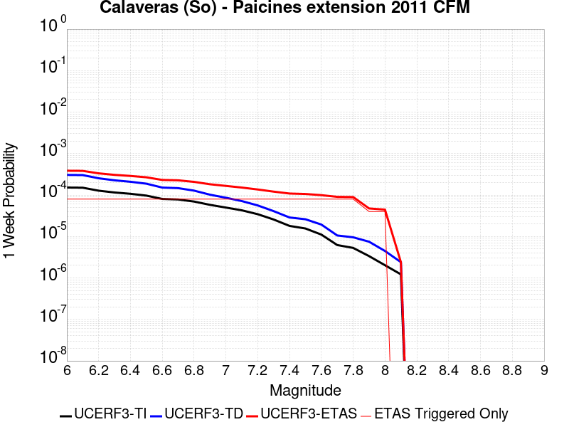 |  | 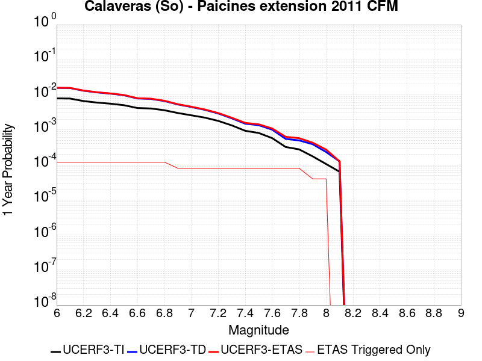 |

| Magnitude | 1 wk TI Prob | 1 wk TD Prob | 1 wk ETAS Prob | 1 wk ETAS/TD Gain | 1 wk ETAS Triggered Only | 1 mo TI Prob | 1 mo TD Prob | 1 mo ETAS Prob | 1 mo ETAS/TD Gain | 1 mo ETAS Triggered Only | 1 yr TI Prob | 1 yr TD Prob | 1 yr ETAS Prob | 1 yr ETAS/TD Gain | 1 yr ETAS Triggered Only |
|-----|-----|-----|-----|-----|-----|-----|-----|-----|-----|-----|-----|-----|-----|-----|-----|
| 6.0 | 1.5183659E-4 | 3.058916E-4 | 3.858671E-4 | 1.2614505 | 8.0E-5 | 6.5056595E-4 | 0.0013097163 | 0.0013896114 | 1.0610019 | 8.0E-5 | 0.007891912 | 0.015730867 | 0.01584898 | 1.0075083 | 1.2E-4 |
| 6.1 | 1.5024997E-4 | 3.028294E-4 | 3.8280518E-4 | 1.2640952 | 8.0E-5 | 6.437695E-4 | 0.0012966117 | 0.001376508 | 1.0616193 | 8.0E-5 | 0.0078097614 | 0.015574093 | 0.015692225 | 1.007585 | 1.2E-4 |
| 6.2 | 1.2743923E-4 | 2.5378828E-4 | 3.3376797E-4 | 1.3151433 | 8.0E-5 | 5.460538E-4 | 0.0010868111 | 0.0011667241 | 1.0735298 | 8.0E-5 | 0.0066279583 | 0.013080635 | 0.013199066 | 1.0090538 | 1.2E-4 |
| 6.3 | 1.1525114E-4 | 2.266418E-4 | 3.0662367E-4 | 1.3528999 | 8.0E-5 | 4.9383997E-4 | 9.706734E-4 | 0.0010505958 | 1.082337 | 8.0E-5 | 0.0059959386 | 0.011701727 | 0.011820324 | 1.0101349 | 1.2E-4 |
| 6.4 | 1.07200925E-4 | 2.0905094E-4 | 2.8903421E-4 | 1.3826019 | 8.0E-5 | 4.5935164E-4 | 8.953991E-4 | 9.7532745E-4 | 1.0892656 | 8.0E-5 | 0.0055782744 | 0.010806446 | 0.01092515 | 1.0109845 | 1.2E-4 |
| 6.5 | 9.69631E-5 | 1.8797735E-4 | 2.679623E-4 | 1.4255031 | 8.0E-5 | 4.1548995E-4 | 8.0519065E-4 | 8.8512624E-4 | 1.0992754 | 8.0E-5 | 0.0050468626 | 0.009727674 | 0.009846507 | 1.012216 | 1.2E-4 |
| 6.6 | 8.0552316E-5 | 1.5134095E-4 | 2.3132884E-4 | 1.5285277 | 8.0E-5 | 3.4517853E-4 | 6.4840337E-4 | 7.283515E-4 | 1.1233 | 8.0E-5 | 0.0041944524 | 0.007859206 | 0.007978263 | 1.0151488 | 1.2E-4 |
| 6.7 | 7.815757E-5 | 1.4674113E-4 | 2.267294E-4 | 1.5450977 | 8.0E-5 | 3.34918E-4 | 6.2870386E-4 | 7.0865353E-4 | 1.1271659 | 8.0E-5 | 0.004070005 | 0.00762175 | 0.007740835 | 1.0156244 | 1.2E-4 |
| 6.8 | 6.965264E-5 | 1.278175E-4 | 2.0780729E-4 | 1.6258124 | 8.0E-5 | 2.9847719E-4 | 5.476545E-4 | 6.276107E-4 | 1.1459975 | 8.0E-5 | 0.0036279052 | 0.0066440827 | 0.006763285 | 1.0179412 | 1.2E-4 |
| 6.9 | 5.8000453E-5 | 1.0197004E-4 | 1.8196189E-4 | 1.7844641 | 8.0E-5 | 2.4854968E-4 | 4.3694186E-4 | 5.169069E-4 | 1.1830107 | 8.0E-5 | 0.0030218933 | 0.005306889 | 0.0053864643 | 1.0149947 | 8.0E-5 |
| 7.0 | 4.9865852E-5 | 8.614713E-5 | 1.6614023E-4 | 1.9285638 | 8.0E-5 | 2.1369329E-4 | 3.691502E-4 | 4.4912068E-4 | 1.2166339 | 8.0E-5 | 0.0025986114 | 0.0044852314 | 0.0045648725 | 1.0177563 | 8.0E-5 |
| 7.1 | 4.283875E-5 | 7.154534E-5 | 1.5153961E-4 | 2.118092 | 8.0E-5 | 1.8358172E-4 | 3.0658717E-4 | 3.8656263E-4 | 1.2608572 | 8.0E-5 | 0.0022328163 | 0.0037263667 | 0.0038060686 | 1.0213886 | 8.0E-5 |
| 7.2 | 3.450115E-5 | 5.6180077E-5 | 1.3617559E-4 | 2.4239123 | 8.0E-5 | 1.478537E-4 | 2.4074971E-4 | 3.2073044E-4 | 1.3322153 | 8.0E-5 | 0.0017986323 | 0.0029272172 | 0.003006983 | 1.0272497 | 8.0E-5 |
| 7.3 | 2.5709045E-5 | 4.092334E-5 | 1.2092006E-4 | 2.9547946 | 8.0E-5 | 1.1017697E-4 | 1.7537405E-4 | 2.5536E-4 | 1.4560878 | 8.0E-5 | 0.0013405791 | 0.0021331052 | 0.0022129347 | 1.037424 | 8.0E-5 |
| 7.4 | 1.8003093E-5 | 2.8743207E-5 | 1.08740904E-4 | 3.7831864 | 8.0E-5 | 7.715383E-5 | 1.2317937E-4 | 2.031695E-4 | 1.6493794 | 8.0E-5 | 9.3894306E-4 | 0.0014986794 | 0.0015785595 | 1.0533004 | 8.0E-5 |
| 7.5 | 1.5595824E-5 | 2.6044754E-5 | 1.0604267E-4 | 4.0715556 | 8.0E-5 | 6.683753E-5 | 1.1161561E-4 | 1.9160668E-4 | 1.7166656 | 8.0E-5 | 8.134431E-4 | 0.0013580752 | 0.0014379666 | 1.0588269 | 8.0E-5 |
| 7.6 | 1.1110309E-5 | 1.9413746E-5 | 9.9412195E-5 | 5.1207113 | 8.0E-5 | 4.761474E-5 | 8.319912E-5 | 1.6319247E-4 | 1.9614686 | 8.0E-5 | 5.795553E-4 | 0.00101248 | 0.001092399 | 1.078934 | 8.0E-5 |
| 7.7 | 6.2140443E-6 | 1.0582229E-5 | 9.058138E-5 | 8.559764 | 8.0E-5 | 2.6631347E-5 | 4.5351622E-5 | 1.25348E-4 | 2.7639143 | 8.0E-5 | 3.241884E-4 | 5.520162E-4 | 6.3197204E-4 | 1.1448432 | 8.0E-5 |
| 7.8 | 5.305533E-6 | 9.562843E-6 | 8.9562076E-5 | 9.365633 | 8.0E-5 | 2.27378E-5 | 4.098297E-5 | 1.2097969E-4 | 2.9519503 | 8.0E-5 | 2.7679754E-4 | 4.988535E-4 | 5.788136E-4 | 1.1602877 | 8.0E-5 |
| 7.9 | 3.363505E-6 | 7.481766E-6 | 4.7481466E-5 | 6.3462915 | 4.0E-5 | 1.4414942E-5 | 3.2064316E-5 | 7.2063034E-5 | 2.2474527 | 4.0E-5 | 1.7548777E-4 | 3.9031322E-4 | 4.302976E-4 | 1.1024418 | 4.0E-5 |
| 8.0 | 2.0271132E-6 | 4.46918E-6 | 4.4469E-5 | 9.950148 | 4.0E-5 | 8.687599E-6 | 1.9153487E-5 | 5.915272E-5 | 3.0883524 | 4.0E-5 | 1.05766376E-4 | 2.3316882E-4 | 2.731595E-4 | 1.1715095 | 4.0E-5 |
| 8.1 | 1.2206116E-6 | 2.4070437E-6 | 2.4070437E-6 | 1.0 | 0.0 | 5.2311816E-6 | 1.0315861E-5 | 1.0315861E-5 | 1.0 | 0.0 | 6.3687774E-5 | 1.255884E-4 | 1.255884E-4 | 1.0 | 0.0 |

## Channel Islands Thrust
*[(top)](#table-of-contents)*

| 1 Week | 1 Month | 1 Year |
|-----|-----|-----|
|  | 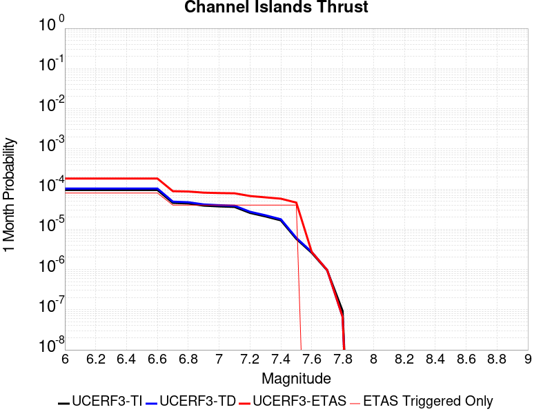 | 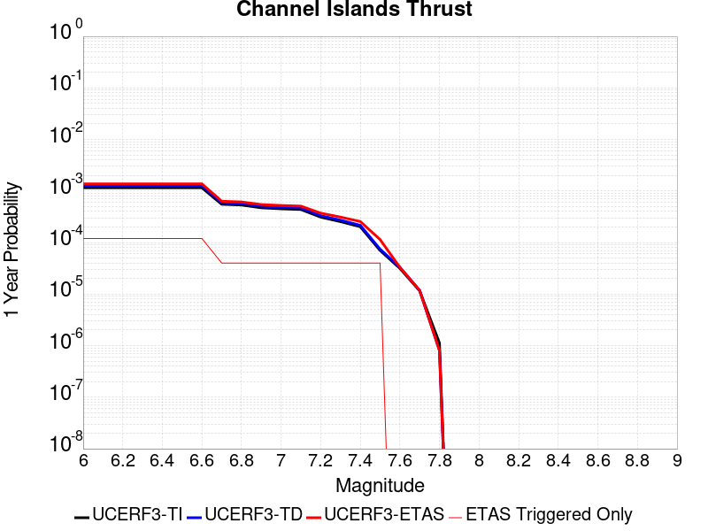 |

| Magnitude | 1 wk TI Prob | 1 wk TD Prob | 1 wk ETAS Prob | 1 wk ETAS/TD Gain | 1 wk ETAS Triggered Only | 1 mo TI Prob | 1 mo TD Prob | 1 mo ETAS Prob | 1 mo ETAS/TD Gain | 1 mo ETAS Triggered Only | 1 yr TI Prob | 1 yr TD Prob | 1 yr ETAS Prob | 1 yr ETAS/TD Gain | 1 yr ETAS Triggered Only |
|-----|-----|-----|-----|-----|-----|-----|-----|-----|-----|-----|-----|-----|-----|-----|-----|
| 6.0 | 2.2156251E-5 | 2.409921E-5 | 6.409825E-5 | 2.6597655 | 4.0E-5 | 9.495191E-5 | 1.0327884E-4 | 1.8327057E-4 | 1.7745221 | 8.0E-5 | 0.0011554264 | 0.0012568012 | 0.0013766504 | 1.0953605 | 1.2E-4 |
| 6.1 | 2.2156251E-5 | 2.409921E-5 | 6.409825E-5 | 2.6597655 | 4.0E-5 | 9.495191E-5 | 1.0327884E-4 | 1.8327057E-4 | 1.7745221 | 8.0E-5 | 0.0011554264 | 0.0012568012 | 0.0013766504 | 1.0953605 | 1.2E-4 |
| 6.2 | 2.2156251E-5 | 2.409921E-5 | 6.409825E-5 | 2.6597655 | 4.0E-5 | 9.495191E-5 | 1.0327884E-4 | 1.8327057E-4 | 1.7745221 | 8.0E-5 | 0.0011554264 | 0.0012568012 | 0.0013766504 | 1.0953605 | 1.2E-4 |
| 6.3 | 2.2156251E-5 | 2.409921E-5 | 6.409825E-5 | 2.6597655 | 4.0E-5 | 9.495191E-5 | 1.0327884E-4 | 1.8327057E-4 | 1.7745221 | 8.0E-5 | 0.0011554264 | 0.0012568012 | 0.0013766504 | 1.0953605 | 1.2E-4 |
| 6.4 | 2.2156251E-5 | 2.409921E-5 | 6.409825E-5 | 2.6597655 | 4.0E-5 | 9.495191E-5 | 1.0327884E-4 | 1.8327057E-4 | 1.7745221 | 8.0E-5 | 0.0011554264 | 0.0012568012 | 0.0013766504 | 1.0953605 | 1.2E-4 |
| 6.5 | 2.2156251E-5 | 2.409921E-5 | 6.409825E-5 | 2.6597655 | 4.0E-5 | 9.495191E-5 | 1.0327884E-4 | 1.8327057E-4 | 1.7745221 | 8.0E-5 | 0.0011554264 | 0.0012568012 | 0.0013766504 | 1.0953605 | 1.2E-4 |
| 6.6 | 2.2156251E-5 | 2.409921E-5 | 6.409825E-5 | 2.6597655 | 4.0E-5 | 9.495191E-5 | 1.0327884E-4 | 1.8327057E-4 | 1.7745221 | 8.0E-5 | 0.0011554264 | 0.0012568012 | 0.0013766504 | 1.0953605 | 1.2E-4 |
| 6.7 | 1.0601296E-5 | 1.1382414E-5 | 5.1381958E-5 | 4.514153 | 4.0E-5 | 4.5433335E-5 | 4.8780894E-5 | 8.877894E-5 | 1.8199532 | 4.0E-5 | 5.5301044E-4 | 5.9375045E-4 | 6.3372665E-4 | 1.0673283 | 4.0E-5 |
| 6.8 | 1.0246747E-5 | 1.0999436E-5 | 5.0998995E-5 | 4.63651 | 4.0E-5 | 4.391389E-5 | 4.7139616E-5 | 8.713773E-5 | 1.8485032 | 4.0E-5 | 5.345204E-4 | 5.7377847E-4 | 6.1375555E-4 | 1.0696733 | 4.0E-5 |
| 6.9 | 9.049551E-6 | 9.702045E-6 | 4.9701655E-5 | 5.1228023 | 4.0E-5 | 3.878322E-5 | 4.157955E-5 | 8.157789E-5 | 1.9619713 | 4.0E-5 | 4.7208337E-4 | 5.061176E-4 | 5.4609735E-4 | 1.078993 | 4.0E-5 |
| 7.0 | 8.6542195E-6 | 9.276895E-6 | 4.9276525E-5 | 5.3117476 | 4.0E-5 | 3.7088983E-5 | 3.975754E-5 | 7.975595E-5 | 2.0060585 | 4.0E-5 | 4.5146482E-4 | 4.839446E-4 | 5.2392524E-4 | 1.0826141 | 4.0E-5 |
| 7.1 | 8.391028E-6 | 8.99515E-6 | 4.899479E-5 | 5.4468007 | 4.0E-5 | 3.5961057E-5 | 3.8550097E-5 | 7.854855E-5 | 2.037571 | 4.0E-5 | 4.3773788E-4 | 4.6925043E-4 | 5.0923164E-4 | 1.0852023 | 4.0E-5 |
| 7.2 | 5.965188E-6 | 6.3732036E-6 | 4.637295E-5 | 7.2762384 | 4.0E-5 | 2.556484E-5 | 2.7313446E-5 | 6.731235E-5 | 2.46444 | 4.0E-5 | 3.1120746E-4 | 3.32491E-4 | 3.7247772E-4 | 1.120264 | 4.0E-5 |
| 7.3 | 4.877518E-6 | 5.207231E-6 | 4.5207024E-5 | 8.681586 | 4.0E-5 | 2.0903482E-5 | 2.2316515E-5 | 6.231562E-5 | 2.7923546 | 4.0E-5 | 2.5447016E-4 | 2.7167014E-4 | 3.1165927E-4 | 1.1471974 | 4.0E-5 |
| 7.4 | 3.8829853E-6 | 4.1428343E-6 | 4.4142667E-5 | 10.655185 | 4.0E-5 | 1.664126E-5 | 1.7754886E-5 | 5.7754176E-5 | 3.2528608 | 4.0E-5 | 2.0258849E-4 | 2.1614472E-4 | 2.5613606E-4 | 1.1850212 | 4.0E-5 |
| 7.5 | 1.3489616E-6 | 1.4281075E-6 | 4.142805E-5 | 29.009056 | 4.0E-5 | 5.7812517E-6 | 6.1204464E-6 | 4.6120203E-5 | 7.535431 | 4.0E-5 | 7.038446E-5 | 7.4513926E-5 | 1.1451095E-4 | 1.5367724 | 4.0E-5 |
| 7.6 | 6.058192E-7 | 6.3551613E-7 | 6.3551613E-7 | 1.0 | 0.0 | 2.5963652E-6 | 2.7236379E-6 | 2.7236379E-6 | 1.0 | 0.0 | 3.161029E-5 | 3.3159802E-5 | 3.3159802E-5 | 1.0 | 0.0 |
| 7.7 | 2.2170494E-7 | 2.2612478E-7 | 2.2612478E-7 | 1.0 | 0.0 | 9.5016367E-7 | 9.691059E-7 | 9.691059E-7 | 1.0 | 0.0 | 1.1568181E-5 | 1.1798812E-5 | 1.1798812E-5 | 1.0 | 0.0 |
| 7.8 | 2.1613102E-8 | 1.5469915E-8 | 1.5469915E-8 | 1.0 | 0.0 | 9.262757E-8 | 6.6299634E-8 | 6.6299634E-8 | 1.0 | 0.0 | 1.1277401E-6 | 8.0719786E-7 | 8.0719786E-7 | 1.0 | 0.0 |

## Elsinore (Temecula) rev
*[(top)](#table-of-contents)*

| 1 Week | 1 Month | 1 Year |
|-----|-----|-----|
|  | 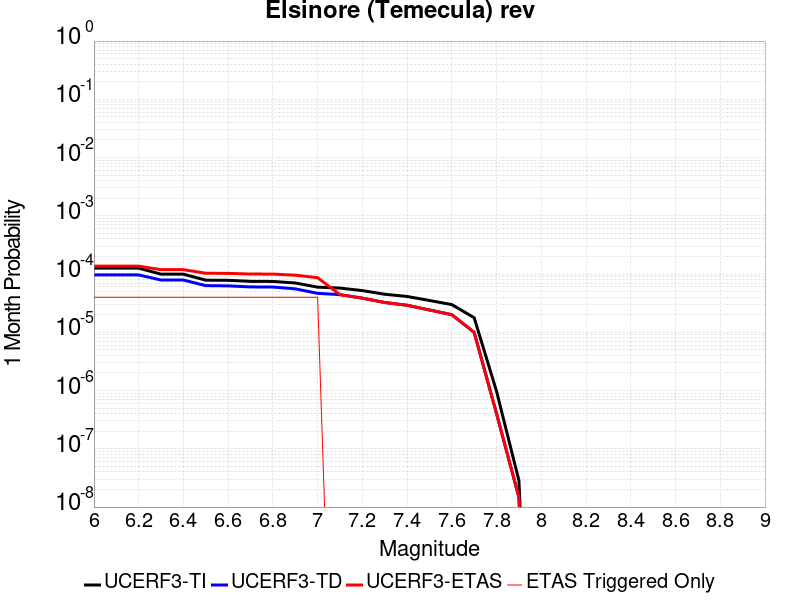 | 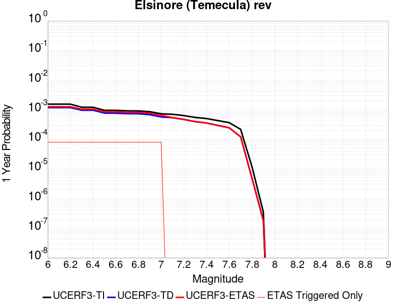 |

| Magnitude | 1 wk TI Prob | 1 wk TD Prob | 1 wk ETAS Prob | 1 wk ETAS/TD Gain | 1 wk ETAS Triggered Only | 1 mo TI Prob | 1 mo TD Prob | 1 mo ETAS Prob | 1 mo ETAS/TD Gain | 1 mo ETAS Triggered Only | 1 yr TI Prob | 1 yr TD Prob | 1 yr ETAS Prob | 1 yr ETAS/TD Gain | 1 yr ETAS Triggered Only |
|-----|-----|-----|-----|-----|-----|-----|-----|-----|-----|-----|-----|-----|-----|-----|-----|
| 6.0 | 2.9514995E-5 | 2.2552267E-5 | 2.2552267E-5 | 1.0 | 0.0 | 1.264867E-4 | 9.664911E-5 | 1.3664525E-4 | 1.4138283 | 4.0E-5 | 0.0015388876 | 0.0011760899 | 0.0012559957 | 1.067942 | 8.0E-5 |
| 6.1 | 2.9514995E-5 | 2.2552267E-5 | 2.2552267E-5 | 1.0 | 0.0 | 1.264867E-4 | 9.664911E-5 | 1.3664525E-4 | 1.4138283 | 4.0E-5 | 0.0015388876 | 0.0011760899 | 0.0012559957 | 1.067942 | 8.0E-5 |
| 6.2 | 2.9514995E-5 | 2.2552267E-5 | 2.2552267E-5 | 1.0 | 0.0 | 1.264867E-4 | 9.664911E-5 | 1.3664525E-4 | 1.4138283 | 4.0E-5 | 0.0015388876 | 0.0011760899 | 0.0012559957 | 1.067942 | 8.0E-5 |
| 6.3 | 2.3223649E-5 | 1.8430243E-5 | 1.8430243E-5 | 1.0 | 0.0 | 9.952613E-5 | 7.8984456E-5 | 1.189813E-4 | 1.5063888 | 4.0E-5 | 0.001211057 | 9.6122874E-4 | 0.0010411518 | 1.0831468 | 8.0E-5 |
| 6.4 | 2.3223649E-5 | 1.8430243E-5 | 1.8430243E-5 | 1.0 | 0.0 | 9.952613E-5 | 7.8984456E-5 | 1.189813E-4 | 1.5063888 | 4.0E-5 | 0.001211057 | 9.6122874E-4 | 0.0010411518 | 1.0831468 | 8.0E-5 |
| 6.5 | 1.8338875E-5 | 1.4766081E-5 | 1.4766081E-5 | 1.0 | 0.0 | 7.8592806E-5 | 6.328172E-5 | 1.03279184E-4 | 1.6320541 | 4.0E-5 | 9.5644733E-4 | 7.701914E-4 | 8.5012976E-4 | 1.1037903 | 8.0E-5 |
| 6.6 | 1.8223333E-5 | 1.4628549E-5 | 1.4628549E-5 | 1.0 | 0.0 | 7.809766E-5 | 6.269232E-5 | 1.0268982E-4 | 1.6379967 | 4.0E-5 | 9.504242E-4 | 7.6302054E-4 | 8.4295945E-4 | 1.1047665 | 8.0E-5 |
| 6.7 | 1.7512752E-5 | 1.4042307E-5 | 1.4042307E-5 | 1.0 | 0.0 | 7.505249E-5 | 6.0179977E-5 | 1.0017757E-4 | 1.6646329 | 4.0E-5 | 9.13381E-4 | 7.3245354E-4 | 8.1239495E-4 | 1.109142 | 8.0E-5 |
| 6.8 | 1.7417142E-5 | 1.3966197E-5 | 1.3966197E-5 | 1.0 | 0.0 | 7.4642754E-5 | 5.9853806E-5 | 9.9851415E-5 | 1.668255 | 4.0E-5 | 9.083966E-4 | 7.2848506E-4 | 8.0842676E-4 | 1.1097369 | 8.0E-5 |
| 6.9 | 1.6402591E-5 | 1.300304E-5 | 1.300304E-5 | 1.0 | 0.0 | 7.0294926E-5 | 5.572617E-5 | 9.572394E-5 | 1.7177557 | 4.0E-5 | 8.5550465E-4 | 6.782626E-4 | 7.5820833E-4 | 1.1178684 | 8.0E-5 |
| 7.0 | 1.3912486E-5 | 1.0891034E-5 | 1.0891034E-5 | 1.0 | 0.0 | 5.9623577E-5 | 4.6675043E-5 | 8.667317E-5 | 1.8569491 | 4.0E-5 | 7.2567526E-4 | 5.681232E-4 | 6.4807775E-4 | 1.1407346 | 8.0E-5 |
| 7.1 | 1.3405147E-5 | 1.0339526E-5 | 1.0339526E-5 | 1.0 | 0.0 | 5.7449364E-5 | 4.4311517E-5 | 4.4311517E-5 | 1.0 | 0.0 | 6.9922156E-4 | 5.3936173E-4 | 5.3936173E-4 | 1.0 | 0.0 |
| 7.2 | 1.21402E-5 | 9.007232E-6 | 9.007232E-6 | 1.0 | 0.0 | 5.202839E-5 | 3.860186E-5 | 3.860186E-5 | 1.0 | 0.0 | 6.332616E-4 | 4.6987808E-4 | 4.6987808E-4 | 1.0 | 0.0 |
| 7.3 | 1.05047775E-5 | 7.5805146E-6 | 7.5805146E-6 | 1.0 | 0.0 | 4.5019697E-5 | 3.2487525E-5 | 3.2487525E-5 | 1.0 | 0.0 | 5.4797693E-4 | 3.954653E-4 | 3.954653E-4 | 1.0 | 0.0 |
| 7.4 | 9.624483E-6 | 6.794608E-6 | 6.794608E-6 | 1.0 | 0.0 | 4.124713E-5 | 2.9119432E-5 | 2.9119432E-5 | 1.0 | 0.0 | 5.0206814E-4 | 3.5447278E-4 | 3.5447278E-4 | 1.0 | 0.0 |
| 7.5 | 8.215151E-6 | 5.6419153E-6 | 5.6419153E-6 | 1.0 | 0.0 | 3.5207315E-5 | 2.417942E-5 | 2.417942E-5 | 1.0 | 0.0 | 4.2856473E-4 | 2.9434595E-4 | 2.9434595E-4 | 1.0 | 0.0 |
| 7.6 | 6.975058E-6 | 4.6815794E-6 | 4.6815794E-6 | 1.0 | 0.0 | 2.9892764E-5 | 2.0063762E-5 | 2.0063762E-5 | 1.0 | 0.0 | 3.6388362E-4 | 2.442501E-4 | 2.442501E-4 | 1.0 | 0.0 |
| 7.7 | 4.159604E-6 | 2.32988E-6 | 2.32988E-6 | 1.0 | 0.0 | 1.7826753E-5 | 9.985166E-6 | 9.985166E-6 | 1.0 | 0.0 | 2.1701909E-4 | 1.2156336E-4 | 1.2156336E-4 | 1.0 | 0.0 |
| 7.8 | 2.2692414E-7 | 9.397192E-8 | 9.397192E-8 | 1.0 | 0.0 | 9.725317E-7 | 4.0273673E-7 | 4.0273673E-7 | 1.0 | 0.0 | 1.1840509E-5 | 4.903312E-6 | 4.903312E-6 | 1.0 | 0.0 |
| 7.9 | 6.676829E-9 | 3.4429164E-9 | 3.4429164E-9 | 1.0 | 0.0 | 2.861498E-8 | 1.4755356E-8 | 1.4755356E-8 | 1.0 | 0.0 | 3.4838732E-7 | 1.7964643E-7 | 1.7964643E-7 | 1.0 | 0.0 |

## Santa Monica alt 1
*[(top)](#table-of-contents)*

| 1 Week | 1 Month | 1 Year |
|-----|-----|-----|
| 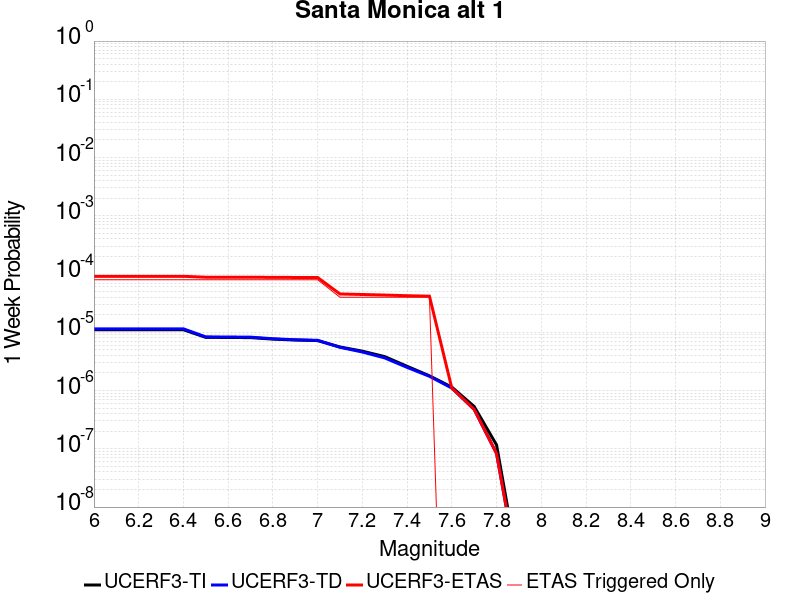 | 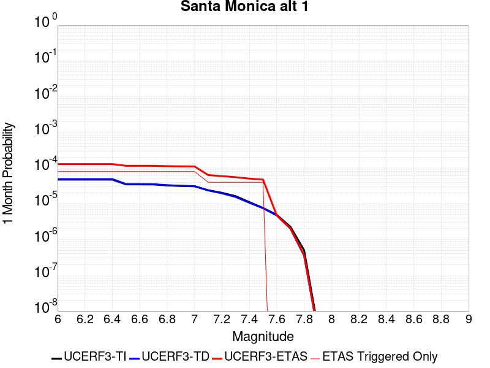 | 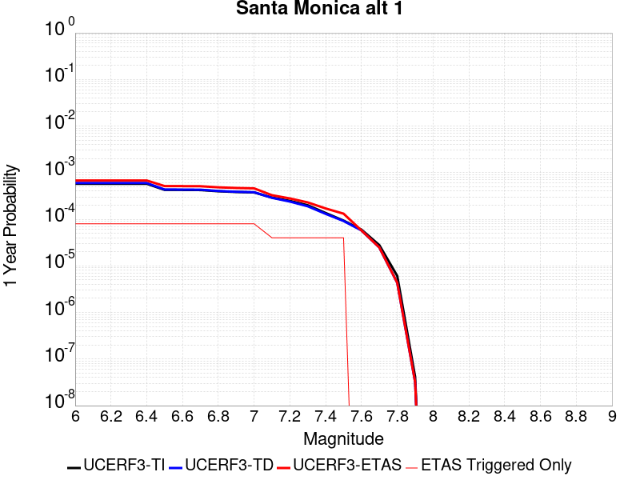 |

| Magnitude | 1 wk TI Prob | 1 wk TD Prob | 1 wk ETAS Prob | 1 wk ETAS/TD Gain | 1 wk ETAS Triggered Only | 1 mo TI Prob | 1 mo TD Prob | 1 mo ETAS Prob | 1 mo ETAS/TD Gain | 1 mo ETAS Triggered Only | 1 yr TI Prob | 1 yr TD Prob | 1 yr ETAS Prob | 1 yr ETAS/TD Gain | 1 yr ETAS Triggered Only |
|-----|-----|-----|-----|-----|-----|-----|-----|-----|-----|-----|-----|-----|-----|-----|-----|
| 6.0 | 1.1066008E-5 | 1.1483656E-5 | 9.148274E-5 | 7.966343 | 8.0E-5 | 4.742488E-5 | 4.9214817E-5 | 1.2921088E-4 | 2.6254468 | 8.0E-5 | 5.7724497E-4 | 5.990396E-4 | 6.7899167E-4 | 1.1334671 | 8.0E-5 |
| 6.1 | 1.1066008E-5 | 1.1483656E-5 | 9.148274E-5 | 7.966343 | 8.0E-5 | 4.742488E-5 | 4.9214817E-5 | 1.2921088E-4 | 2.6254468 | 8.0E-5 | 5.7724497E-4 | 5.990396E-4 | 6.7899167E-4 | 1.1334671 | 8.0E-5 |
| 6.2 | 1.1066008E-5 | 1.1483656E-5 | 9.148274E-5 | 7.966343 | 8.0E-5 | 4.742488E-5 | 4.9214817E-5 | 1.2921088E-4 | 2.6254468 | 8.0E-5 | 5.7724497E-4 | 5.990396E-4 | 6.7899167E-4 | 1.1334671 | 8.0E-5 |
| 6.3 | 1.1066008E-5 | 1.1483656E-5 | 9.148274E-5 | 7.966343 | 8.0E-5 | 4.742488E-5 | 4.9214817E-5 | 1.2921088E-4 | 2.6254468 | 8.0E-5 | 5.7724497E-4 | 5.990396E-4 | 6.7899167E-4 | 1.1334671 | 8.0E-5 |
| 6.4 | 1.1066008E-5 | 1.1483656E-5 | 9.148274E-5 | 7.966343 | 8.0E-5 | 4.742488E-5 | 4.9214817E-5 | 1.2921088E-4 | 2.6254468 | 8.0E-5 | 5.7724497E-4 | 5.990396E-4 | 6.7899167E-4 | 1.1334671 | 8.0E-5 |
| 6.5 | 8.183544E-6 | 8.337806E-6 | 8.833714E-5 | 10.5947695 | 8.0E-5 | 3.5071862E-5 | 3.5732974E-5 | 1.15730116E-4 | 3.2387483 | 8.0E-5 | 4.2691626E-4 | 4.3496373E-4 | 5.1492895E-4 | 1.1838434 | 8.0E-5 |
| 6.6 | 8.1543285E-6 | 8.306011E-6 | 8.830534E-5 | 10.631498 | 8.0E-5 | 3.4946657E-5 | 3.5596713E-5 | 1.15593866E-4 | 3.2473185 | 8.0E-5 | 4.2539247E-4 | 4.333054E-4 | 5.1327073E-4 | 1.1845473 | 8.0E-5 |
| 6.7 | 8.110878E-6 | 8.259396E-6 | 8.8258734E-5 | 10.685858 | 8.0E-5 | 3.4760444E-5 | 3.539694E-5 | 1.1539411E-4 | 3.2600024 | 8.0E-5 | 4.231262E-4 | 4.3087412E-4 | 5.108396E-4 | 1.1855891 | 8.0E-5 |
| 6.8 | 7.644036E-6 | 7.75327E-6 | 8.775265E-5 | 11.318147 | 8.0E-5 | 3.275974E-5 | 3.3227883E-5 | 1.1322523E-4 | 3.4075365 | 8.0E-5 | 3.9877684E-4 | 4.044758E-4 | 4.8444344E-4 | 1.1977068 | 8.0E-5 |
| 6.9 | 7.3698293E-6 | 7.457851E-6 | 8.745726E-5 | 11.726871 | 8.0E-5 | 3.15846E-5 | 3.1961834E-5 | 1.1195928E-4 | 3.5029051 | 8.0E-5 | 3.8447464E-4 | 3.8906725E-4 | 4.6903614E-4 | 1.20554 | 8.0E-5 |
| 7.0 | 7.209872E-6 | 7.2877206E-6 | 8.728714E-5 | 11.977289 | 8.0E-5 | 3.0899086E-5 | 3.1232725E-5 | 1.1123023E-4 | 3.561336 | 8.0E-5 | 3.7613141E-4 | 3.8019344E-4 | 4.6016302E-4 | 1.2103392 | 8.0E-5 |
| 7.1 | 5.603456E-6 | 5.525409E-6 | 4.5525187E-5 | 8.2392435 | 4.0E-5 | 2.4014591E-5 | 2.3680112E-5 | 6.367917E-5 | 2.6891413 | 4.0E-5 | 2.923384E-4 | 2.8826762E-4 | 3.2825608E-4 | 1.1387199 | 4.0E-5 |
| 7.2 | 4.7483613E-6 | 4.5923603E-6 | 4.4592176E-5 | 9.710078 | 4.0E-5 | 2.0349962E-5 | 1.9681396E-5 | 5.968061E-5 | 3.032336 | 4.0E-5 | 2.4773262E-4 | 2.3959478E-4 | 2.795852E-4 | 1.1669085 | 4.0E-5 |
| 7.3 | 3.829015E-6 | 3.635215E-6 | 4.363507E-5 | 12.003435 | 4.0E-5 | 1.6409962E-5 | 1.55794E-5 | 5.5578777E-5 | 3.567453 | 4.0E-5 | 1.9977297E-4 | 1.8966277E-4 | 2.2965518E-4 | 1.2108606 | 4.0E-5 |
| 7.4 | 2.610755E-6 | 2.5003064E-6 | 4.2500207E-5 | 16.998 | 4.0E-5 | 1.1188902E-5 | 1.0715555E-5 | 5.0715127E-5 | 4.732851 | 4.0E-5 | 1.3621636E-4 | 1.3045411E-4 | 1.704489E-4 | 1.3065813 | 4.0E-5 |
| 7.5 | 1.792146E-6 | 1.758899E-6 | 4.1758827E-5 | 23.741459 | 4.0E-5 | 7.680603E-6 | 7.5381167E-6 | 4.7537815E-5 | 6.3063254 | 4.0E-5 | 9.3507326E-5 | 9.177274E-5 | 1.3176906E-4 | 1.4358193 | 4.0E-5 |
| 7.6 | 1.1473018E-6 | 1.1032112E-6 | 1.1032112E-6 | 1.0 | 0.0 | 4.9169985E-6 | 4.728039E-6 | 4.728039E-6 | 1.0 | 0.0 | 5.986281E-5 | 5.756237E-5 | 5.756237E-5 | 1.0 | 0.0 |
| 7.7 | 5.330919E-7 | 4.7469157E-7 | 4.7469157E-7 | 1.0 | 0.0 | 2.2846775E-6 | 2.034391E-6 | 2.034391E-6 | 1.0 | 0.0 | 2.7815593E-5 | 2.476844E-5 | 2.476844E-5 | 1.0 | 0.0 |
| 7.8 | 1.1668574E-7 | 8.304975E-8 | 8.304975E-8 | 1.0 | 0.0 | 5.000816E-7 | 3.5592745E-7 | 3.5592745E-7 | 1.0 | 0.0 | 6.0884768E-6 | 4.3334085E-6 | 4.3334085E-6 | 1.0 | 0.0 |
| 7.9 | 8.007447E-10 | 6.1625505E-10 | 6.1625505E-10 | 1.0 | 0.0 | 3.4317629E-9 | 2.6410938E-9 | 2.6410938E-9 | 1.0 | 0.0 | 4.1781714E-8 | 3.2155317E-8 | 3.2155317E-8 | 1.0 | 0.0 |

## Hollywood
*[(top)](#table-of-contents)*

| 1 Week | 1 Month | 1 Year |
|-----|-----|-----|
| 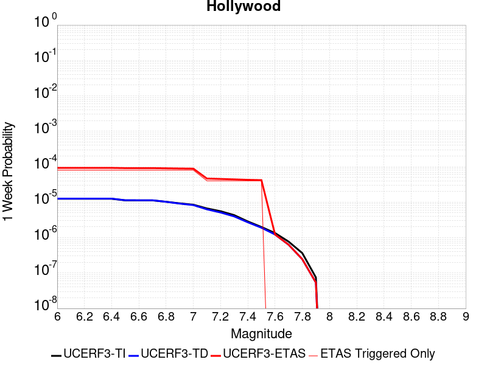 | 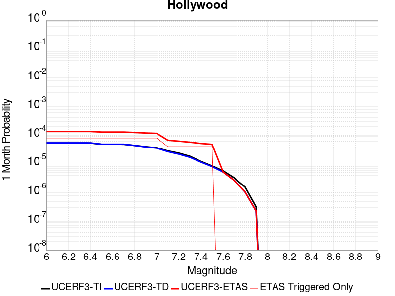 | 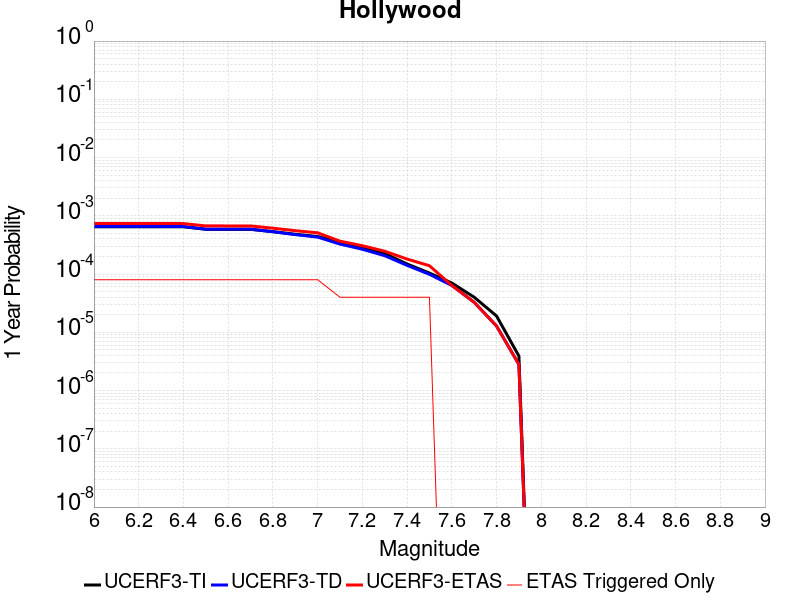 |

| Magnitude | 1 wk TI Prob | 1 wk TD Prob | 1 wk ETAS Prob | 1 wk ETAS/TD Gain | 1 wk ETAS Triggered Only | 1 mo TI Prob | 1 mo TD Prob | 1 mo ETAS Prob | 1 mo ETAS/TD Gain | 1 mo ETAS Triggered Only | 1 yr TI Prob | 1 yr TD Prob | 1 yr ETAS Prob | 1 yr ETAS/TD Gain | 1 yr ETAS Triggered Only |
|-----|-----|-----|-----|-----|-----|-----|-----|-----|-----|-----|-----|-----|-----|-----|-----|
| 6.0 | 1.24487615E-5 | 1.2597342E-5 | 9.259633E-5 | 7.3504663 | 8.0E-5 | 5.3350745E-5 | 5.398752E-5 | 1.339832E-4 | 2.481744 | 8.0E-5 | 6.4935174E-4 | 6.571044E-4 | 7.370519E-4 | 1.1216662 | 8.0E-5 |
| 6.1 | 1.24487615E-5 | 1.2597342E-5 | 9.259633E-5 | 7.3504663 | 8.0E-5 | 5.3350745E-5 | 5.398752E-5 | 1.339832E-4 | 2.481744 | 8.0E-5 | 6.4935174E-4 | 6.571044E-4 | 7.370519E-4 | 1.1216662 | 8.0E-5 |
| 6.2 | 1.24487615E-5 | 1.2597342E-5 | 9.259633E-5 | 7.3504663 | 8.0E-5 | 5.3350745E-5 | 5.398752E-5 | 1.339832E-4 | 2.481744 | 8.0E-5 | 6.4935174E-4 | 6.571044E-4 | 7.370519E-4 | 1.1216662 | 8.0E-5 |
| 6.3 | 1.24487615E-5 | 1.2597342E-5 | 9.259633E-5 | 7.3504663 | 8.0E-5 | 5.3350745E-5 | 5.398752E-5 | 1.339832E-4 | 2.481744 | 8.0E-5 | 6.4935174E-4 | 6.571044E-4 | 7.370519E-4 | 1.1216662 | 8.0E-5 |
| 6.4 | 1.2431024E-5 | 1.2577949E-5 | 9.257694E-5 | 7.360257 | 8.0E-5 | 5.327473E-5 | 5.390441E-5 | 1.339001E-4 | 2.4840286 | 8.0E-5 | 6.4842677E-4 | 6.5609324E-4 | 7.360407E-4 | 1.121854 | 8.0E-5 |
| 6.5 | 1.1242222E-5 | 1.1321669E-5 | 9.132076E-5 | 8.066015 | 8.0E-5 | 4.8180063E-5 | 4.8520553E-5 | 1.2851667E-4 | 2.6487057 | 8.0E-5 | 5.864344E-4 | 5.905803E-4 | 6.7053305E-4 | 1.13538 | 8.0E-5 |
| 6.6 | 1.1234066E-5 | 1.1312781E-5 | 9.131188E-5 | 8.071568 | 8.0E-5 | 4.8145106E-5 | 4.848246E-5 | 1.2847858E-4 | 2.6500013 | 8.0E-5 | 5.86009E-4 | 5.901168E-4 | 6.7006954E-4 | 1.1354864 | 8.0E-5 |
| 6.7 | 1.12294E-5 | 1.1307522E-5 | 9.130662E-5 | 8.074857 | 8.0E-5 | 4.812511E-5 | 4.8459922E-5 | 1.2845604E-4 | 2.6507688 | 8.0E-5 | 5.857657E-4 | 5.898425E-4 | 6.697953E-4 | 1.1355494 | 8.0E-5 |
| 6.8 | 1.0252819E-5 | 1.0221897E-5 | 9.022108E-5 | 8.826256 | 8.0E-5 | 4.3939912E-5 | 4.3807406E-5 | 1.238039E-4 | 2.826095 | 8.0E-5 | 5.3483713E-4 | 5.3322676E-4 | 6.131841E-4 | 1.14995 | 8.0E-5 |
| 6.9 | 9.252289E-6 | 9.113353E-6 | 8.9112626E-5 | 9.778248 | 8.0E-5 | 3.9652066E-5 | 3.9056653E-5 | 1.19053526E-4 | 3.0482266 | 8.0E-5 | 4.8265693E-4 | 4.7541264E-4 | 5.553746E-4 | 1.1681949 | 8.0E-5 |
| 7.0 | 8.474604E-6 | 8.261027E-6 | 8.826036E-5 | 10.683946 | 8.0E-5 | 3.6319227E-5 | 3.540393E-5 | 1.154011E-4 | 3.2595563 | 8.0E-5 | 4.4209688E-4 | 4.3095901E-4 | 5.1092455E-4 | 1.1855525 | 8.0E-5 |
| 7.1 | 6.643643E-6 | 6.2705008E-6 | 4.627025E-5 | 7.379036 | 4.0E-5 | 2.8472443E-5 | 2.68733E-5 | 6.687223E-5 | 2.4884262 | 4.0E-5 | 3.4659685E-4 | 3.2713375E-4 | 3.6712067E-4 | 1.1222341 | 4.0E-5 |
| 7.2 | 5.549002E-6 | 5.110507E-6 | 4.5110304E-5 | 8.826972 | 4.0E-5 | 2.378122E-5 | 2.190199E-5 | 6.190111E-5 | 2.826278 | 4.0E-5 | 2.8949787E-4 | 2.6662424E-4 | 3.0661357E-4 | 1.1499839 | 4.0E-5 |
| 7.3 | 4.3059727E-6 | 3.961397E-6 | 4.3961238E-5 | 11.097407 | 4.0E-5 | 1.8454039E-5 | 1.6977307E-5 | 5.6976627E-5 | 3.3560464 | 4.0E-5 | 2.2465475E-4 | 2.066792E-4 | 2.466709E-4 | 1.1934967 | 4.0E-5 |
| 7.4 | 2.8550733E-6 | 2.7025183E-6 | 4.270241E-5 | 15.80097 | 4.0E-5 | 1.2235971E-5 | 1.15821695E-5 | 5.158171E-5 | 4.453544 | 4.0E-5 | 1.4896276E-4 | 1.4100384E-4 | 1.809982E-4 | 1.2836403 | 4.0E-5 |
| 7.5 | 1.9927045E-6 | 1.8985335E-6 | 4.1898456E-5 | 22.068853 | 4.0E-5 | 8.540134E-6 | 8.136547E-6 | 4.8136222E-5 | 5.9160504 | 4.0E-5 | 1.0397117E-4 | 9.905799E-5 | 1.3905403E-4 | 1.4037639 | 4.0E-5 |
| 7.6 | 1.345084E-6 | 1.2221985E-6 | 1.2221985E-6 | 1.0 | 0.0 | 5.764633E-6 | 5.2379833E-6 | 5.2379833E-6 | 1.0 | 0.0 | 7.018215E-5 | 6.37706E-5 | 6.37706E-5 | 1.0 | 0.0 |
| 7.7 | 7.6835164E-7 | 6.2821863E-7 | 6.2821863E-7 | 1.0 | 0.0 | 3.2929315E-6 | 2.6923628E-6 | 2.6923628E-6 | 1.0 | 0.0 | 4.00907E-5 | 3.277904E-5 | 3.277904E-5 | 1.0 | 0.0 |
| 7.8 | 3.6562128E-7 | 2.4571727E-7 | 2.4571727E-7 | 1.0 | 0.0 | 1.5669474E-6 | 1.0530736E-6 | 1.0530736E-6 | 1.0 | 0.0 | 1.9077417E-5 | 1.28210995E-5 | 1.28210995E-5 | 1.0 | 0.0 |
| 7.9 | 7.5024424E-8 | 5.389549E-8 | 5.389549E-8 | 1.0 | 0.0 | 3.215332E-7 | 2.3098066E-7 | 2.3098066E-7 | 1.0 | 0.0 | 3.91466E-6 | 2.8121872E-6 | 2.8121872E-6 | 1.0 | 0.0 |

## San Gorgonio Pass
*[(top)](#table-of-contents)*

| 1 Week | 1 Month | 1 Year |
|-----|-----|-----|
|  | 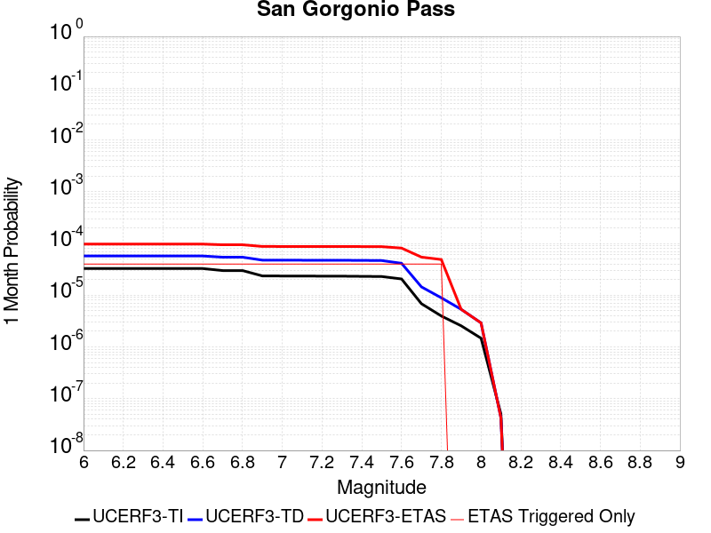 | 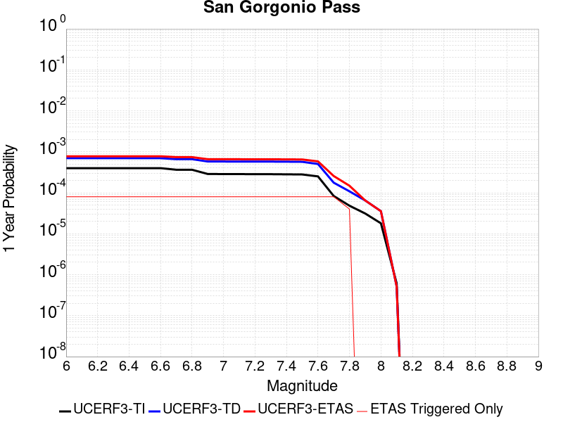 |

| Magnitude | 1 wk TI Prob | 1 wk TD Prob | 1 wk ETAS Prob | 1 wk ETAS/TD Gain | 1 wk ETAS Triggered Only | 1 mo TI Prob | 1 mo TD Prob | 1 mo ETAS Prob | 1 mo ETAS/TD Gain | 1 mo ETAS Triggered Only | 1 yr TI Prob | 1 yr TD Prob | 1 yr ETAS Prob | 1 yr ETAS/TD Gain | 1 yr ETAS Triggered Only |
|-----|-----|-----|-----|-----|-----|-----|-----|-----|-----|-----|-----|-----|-----|-----|-----|
| 6.0 | 7.644328E-6 | 1.3367909E-5 | 1.3367909E-5 | 1.0 | 0.0 | 3.2760996E-5 | 5.7289828E-5 | 9.7287535E-5 | 1.6981642 | 4.0E-5 | 3.987921E-4 | 6.9728907E-4 | 7.772333E-4 | 1.11465 | 8.0E-5 |
| 6.1 | 7.644328E-6 | 1.3367909E-5 | 1.3367909E-5 | 1.0 | 0.0 | 3.2760996E-5 | 5.7289828E-5 | 9.7287535E-5 | 1.6981642 | 4.0E-5 | 3.987921E-4 | 6.9728907E-4 | 7.772333E-4 | 1.11465 | 8.0E-5 |
| 6.2 | 7.644328E-6 | 1.3367909E-5 | 1.3367909E-5 | 1.0 | 0.0 | 3.2760996E-5 | 5.7289828E-5 | 9.7287535E-5 | 1.6981642 | 4.0E-5 | 3.987921E-4 | 6.9728907E-4 | 7.772333E-4 | 1.11465 | 8.0E-5 |
| 6.3 | 7.644328E-6 | 1.3367909E-5 | 1.3367909E-5 | 1.0 | 0.0 | 3.2760996E-5 | 5.7289828E-5 | 9.7287535E-5 | 1.6981642 | 4.0E-5 | 3.987921E-4 | 6.9728907E-4 | 7.772333E-4 | 1.11465 | 8.0E-5 |
| 6.4 | 7.644328E-6 | 1.3367909E-5 | 1.3367909E-5 | 1.0 | 0.0 | 3.2760996E-5 | 5.7289828E-5 | 9.7287535E-5 | 1.6981642 | 4.0E-5 | 3.987921E-4 | 6.9728907E-4 | 7.772333E-4 | 1.11465 | 8.0E-5 |
| 6.5 | 7.644328E-6 | 1.3367909E-5 | 1.3367909E-5 | 1.0 | 0.0 | 3.2760996E-5 | 5.7289828E-5 | 9.7287535E-5 | 1.6981642 | 4.0E-5 | 3.987921E-4 | 6.9728907E-4 | 7.772333E-4 | 1.11465 | 8.0E-5 |
| 6.6 | 7.644328E-6 | 1.3367909E-5 | 1.3367909E-5 | 1.0 | 0.0 | 3.2760996E-5 | 5.7289828E-5 | 9.7287535E-5 | 1.6981642 | 4.0E-5 | 3.987921E-4 | 6.9728907E-4 | 7.772333E-4 | 1.11465 | 8.0E-5 |
| 6.7 | 6.987586E-6 | 1.2672042E-5 | 1.2672042E-5 | 1.0 | 0.0 | 2.9946454E-5 | 5.430767E-5 | 9.43055E-5 | 1.7365042 | 4.0E-5 | 3.645371E-4 | 6.6100346E-4 | 7.409506E-4 | 1.1209481 | 8.0E-5 |
| 6.8 | 6.987586E-6 | 1.2672042E-5 | 1.2672042E-5 | 1.0 | 0.0 | 2.9946454E-5 | 5.430767E-5 | 9.43055E-5 | 1.7365042 | 4.0E-5 | 3.645371E-4 | 6.6100346E-4 | 7.409506E-4 | 1.1209481 | 8.0E-5 |
| 6.9 | 5.504702E-6 | 1.11025965E-5 | 1.11025965E-5 | 1.0 | 0.0 | 2.3591367E-5 | 4.7581718E-5 | 8.7579814E-5 | 1.840619 | 4.0E-5 | 2.8718702E-4 | 5.7915854E-4 | 6.5911224E-4 | 1.1380514 | 8.0E-5 |
| 7.0 | 5.4825764E-6 | 1.1078932E-5 | 1.1078932E-5 | 1.0 | 0.0 | 2.3496545E-5 | 4.7480302E-5 | 8.74784E-5 | 1.8424146 | 4.0E-5 | 2.8603288E-4 | 5.779245E-4 | 6.5787823E-4 | 1.1383464 | 8.0E-5 |
| 7.1 | 5.4692787E-6 | 1.1064639E-5 | 1.1064639E-5 | 1.0 | 0.0 | 2.3439556E-5 | 4.7419046E-5 | 8.741715E-5 | 1.8435029 | 4.0E-5 | 2.8533922E-4 | 5.771791E-4 | 6.571329E-4 | 1.1385251 | 8.0E-5 |
| 7.2 | 5.453661E-6 | 1.104766E-5 | 1.104766E-5 | 1.0 | 0.0 | 2.3372622E-5 | 4.7346286E-5 | 8.734439E-5 | 1.8447993 | 4.0E-5 | 2.8452452E-4 | 5.762936E-4 | 6.5624755E-4 | 1.1387382 | 8.0E-5 |
| 7.3 | 5.4422303E-6 | 1.10345745E-5 | 1.10345745E-5 | 1.0 | 0.0 | 2.3323635E-5 | 4.7290207E-5 | 8.728832E-5 | 1.8458011 | 4.0E-5 | 2.8392827E-4 | 5.7561125E-4 | 6.5556524E-4 | 1.1389027 | 8.0E-5 |
| 7.4 | 5.398595E-6 | 1.0981908E-5 | 1.0981908E-5 | 1.0 | 0.0 | 2.313663E-5 | 4.7064503E-5 | 8.706262E-5 | 1.8498574 | 4.0E-5 | 2.8165206E-4 | 5.728648E-4 | 6.5281894E-4 | 1.139569 | 8.0E-5 |
| 7.5 | 5.3578788E-6 | 1.0908337E-5 | 1.0908337E-5 | 1.0 | 0.0 | 2.2962136E-5 | 4.6749206E-5 | 8.6747335E-5 | 1.8555895 | 4.0E-5 | 2.7952815E-4 | 5.69028E-4 | 6.4898253E-4 | 1.1405106 | 8.0E-5 |
| 7.6 | 4.8091474E-6 | 9.653645E-6 | 9.653645E-6 | 1.0 | 0.0 | 2.0610469E-5 | 4.1372135E-5 | 8.137048E-5 | 1.9667943 | 4.0E-5 | 2.5090357E-4 | 5.035942E-4 | 5.835539E-4 | 1.1587781 | 8.0E-5 |
| 7.7 | 1.5991155E-6 | 3.379842E-6 | 3.379842E-6 | 1.0 | 0.0 | 6.853334E-6 | 1.4484958E-5 | 5.448438E-5 | 3.7614453 | 4.0E-5 | 8.343615E-5 | 1.7634034E-4 | 2.5632625E-4 | 1.4535881 | 8.0E-5 |
| 7.8 | 9.258398E-7 | 2.0781015E-6 | 2.0781015E-6 | 1.0 | 0.0 | 3.967879E-6 | 8.90612E-6 | 4.8905764E-5 | 5.491254 | 4.0E-5 | 4.8307855E-5 | 1.08426626E-4 | 1.4842229E-4 | 1.3688731 | 4.0E-5 |
| 7.9 | 5.975575E-7 | 1.2436711E-6 | 1.2436711E-6 | 1.0 | 0.0 | 2.5609581E-6 | 5.3300087E-6 | 5.3300087E-6 | 1.0 | 0.0 | 3.117922E-5 | 6.489093E-5 | 6.489093E-5 | 1.0 | 0.0 |
| 8.0 | 3.4413725E-7 | 6.801386E-7 | 6.801386E-7 | 1.0 | 0.0 | 1.4748731E-6 | 2.9148766E-6 | 2.9148766E-6 | 1.0 | 0.0 | 1.7956432E-5 | 3.548805E-5 | 3.548805E-5 | 1.0 | 0.0 |
| 8.1 | 1.1787731E-8 | 9.854372E-9 | 9.854372E-9 | 1.0 | 0.0 | 5.0518846E-8 | 4.2233022E-8 | 4.2233022E-8 | 1.0 | 0.0 | 6.1506677E-7 | 5.14187E-7 | 5.14187E-7 | 1.0 | 0.0 |

## Cleghorn
*[(top)](#table-of-contents)*

| 1 Week | 1 Month | 1 Year |
|-----|-----|-----|
| 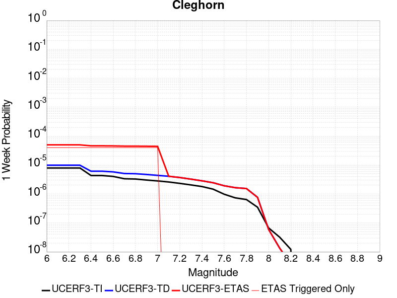 | 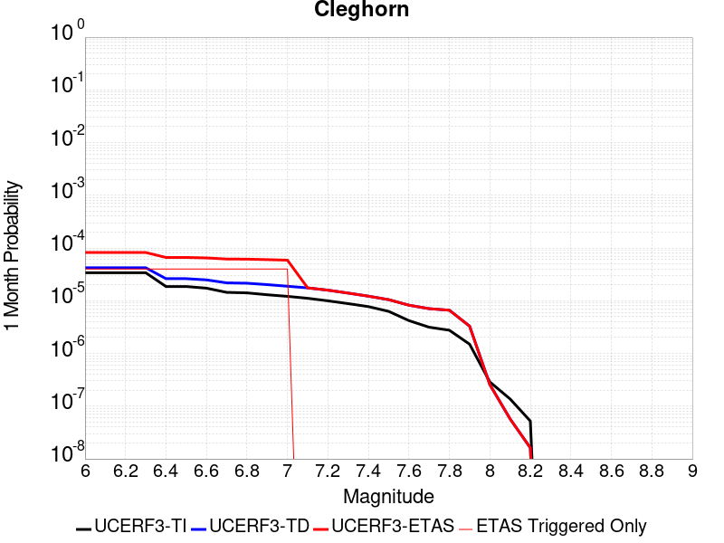 | 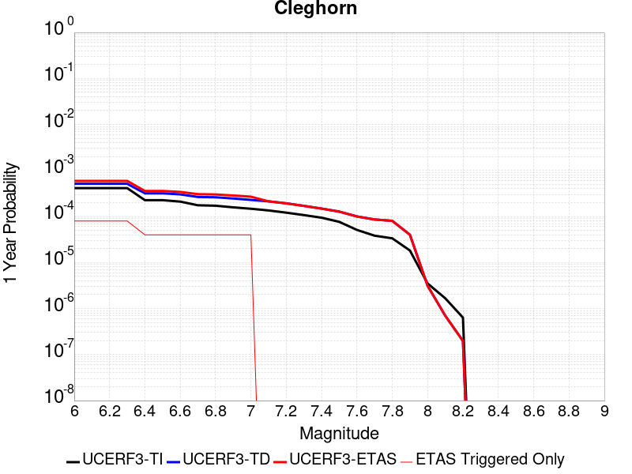 |

| Magnitude | 1 wk TI Prob | 1 wk TD Prob | 1 wk ETAS Prob | 1 wk ETAS/TD Gain | 1 wk ETAS Triggered Only | 1 mo TI Prob | 1 mo TD Prob | 1 mo ETAS Prob | 1 mo ETAS/TD Gain | 1 mo ETAS Triggered Only | 1 yr TI Prob | 1 yr TD Prob | 1 yr ETAS Prob | 1 yr ETAS/TD Gain | 1 yr ETAS Triggered Only |
|-----|-----|-----|-----|-----|-----|-----|-----|-----|-----|-----|-----|-----|-----|-----|-----|
| 6.0 | 7.9267165E-6 | 9.860011E-6 | 4.9859616E-5 | 5.0567503 | 4.0E-5 | 3.39712E-5 | 4.2256568E-5 | 8.2254875E-5 | 1.9465584 | 4.0E-5 | 4.1352084E-4 | 5.143629E-4 | 5.9432175E-4 | 1.1554523 | 8.0E-5 |
| 6.1 | 7.9267165E-6 | 9.860011E-6 | 4.9859616E-5 | 5.0567503 | 4.0E-5 | 3.39712E-5 | 4.2256568E-5 | 8.2254875E-5 | 1.9465584 | 4.0E-5 | 4.1352084E-4 | 5.143629E-4 | 5.9432175E-4 | 1.1554523 | 8.0E-5 |
| 6.2 | 7.9267165E-6 | 9.860011E-6 | 4.9859616E-5 | 5.0567503 | 4.0E-5 | 3.39712E-5 | 4.2256568E-5 | 8.2254875E-5 | 1.9465584 | 4.0E-5 | 4.1352084E-4 | 5.143629E-4 | 5.9432175E-4 | 1.1554523 | 8.0E-5 |
| 6.3 | 7.9267165E-6 | 9.860011E-6 | 4.9859616E-5 | 5.0567503 | 4.0E-5 | 3.39712E-5 | 4.2256568E-5 | 8.2254875E-5 | 1.9465584 | 4.0E-5 | 4.1352084E-4 | 5.143629E-4 | 5.9432175E-4 | 1.1554523 | 8.0E-5 |
| 6.4 | 4.3445207E-6 | 6.119313E-6 | 4.611907E-5 | 7.536641 | 4.0E-5 | 1.8619241E-5 | 2.622537E-5 | 6.622432E-5 | 2.5252006 | 4.0E-5 | 2.2666567E-4 | 3.1924812E-4 | 3.5923536E-4 | 1.1252544 | 4.0E-5 |
| 6.5 | 4.3445207E-6 | 6.119313E-6 | 4.611907E-5 | 7.536641 | 4.0E-5 | 1.8619241E-5 | 2.622537E-5 | 6.622432E-5 | 2.5252006 | 4.0E-5 | 2.2666567E-4 | 3.1924812E-4 | 3.5923536E-4 | 1.1252544 | 4.0E-5 |
| 6.6 | 4.040109E-6 | 5.8016744E-6 | 4.5801444E-5 | 7.894521 | 4.0E-5 | 1.7314638E-5 | 2.4864088E-5 | 6.4863096E-5 | 2.608706 | 4.0E-5 | 2.1078532E-4 | 3.0267914E-4 | 3.4266704E-4 | 1.1321131 | 4.0E-5 |
| 6.7 | 3.3632055E-6 | 5.095068E-6 | 4.5094865E-5 | 8.850689 | 4.0E-5 | 1.4413658E-5 | 2.1835825E-5 | 6.183495E-5 | 2.831812 | 4.0E-5 | 1.7547216E-4 | 2.6581905E-4 | 3.0580844E-4 | 1.1504383 | 4.0E-5 |
| 6.8 | 3.2902772E-6 | 5.016956E-6 | 4.5016757E-5 | 8.972921 | 4.0E-5 | 1.4101111E-5 | 2.1501066E-5 | 6.1500206E-5 | 2.860333 | 4.0E-5 | 1.716675E-4 | 2.6174434E-4 | 3.0173387E-4 | 1.1527809 | 4.0E-5 |
| 6.9 | 3.031547E-6 | 4.7183826E-6 | 4.4718196E-5 | 9.477441 | 4.0E-5 | 1.299228E-5 | 2.0221485E-5 | 6.0220675E-5 | 2.978054 | 4.0E-5 | 1.5816953E-4 | 2.4616905E-4 | 2.861592E-4 | 1.16245 | 4.0E-5 |
| 7.0 | 2.8259715E-6 | 4.3970613E-6 | 4.4396886E-5 | 10.096945 | 4.0E-5 | 1.211125E-5 | 1.8844414E-5 | 5.884366E-5 | 3.1226048 | 4.0E-5 | 1.4744449E-4 | 2.2940683E-4 | 2.6939766E-4 | 1.1743227 | 4.0E-5 |
| 7.1 | 2.5962665E-6 | 4.091863E-6 | 4.091863E-6 | 1.0 | 0.0 | 1.1126809E-5 | 1.753644E-5 | 1.753644E-5 | 1.0 | 0.0 | 1.3546048E-4 | 2.1348546E-4 | 2.1348546E-4 | 1.0 | 0.0 |
| 7.2 | 2.3247253E-6 | 3.7018629E-6 | 3.7018629E-6 | 1.0 | 0.0 | 9.96307E-6 | 1.5865031E-5 | 1.5865031E-5 | 1.0 | 0.0 | 1.21293626E-4 | 1.9313981E-4 | 1.9313981E-4 | 1.0 | 0.0 |
| 7.3 | 2.056928E-6 | 3.259398E-6 | 3.259398E-6 | 1.0 | 0.0 | 8.815376E-6 | 1.39687745E-5 | 1.39687745E-5 | 1.0 | 0.0 | 1.0732192E-4 | 1.7005672E-4 | 1.7005672E-4 | 1.0 | 0.0 |
| 7.4 | 1.8055999E-6 | 2.848641E-6 | 2.848641E-6 | 1.0 | 0.0 | 7.738263E-6 | 1.2208406E-5 | 1.2208406E-5 | 1.0 | 0.0 | 9.4209274E-5 | 1.4862734E-4 | 1.4862734E-4 | 1.0 | 0.0 |
| 7.5 | 1.4683443E-6 | 2.4473384E-6 | 2.4473384E-6 | 1.0 | 0.0 | 6.292889E-6 | 1.0488551E-5 | 1.0488551E-5 | 1.0 | 0.0 | 7.661323E-5 | 1.2769073E-4 | 1.2769073E-4 | 1.0 | 0.0 |
| 7.6 | 9.804088E-7 | 1.922553E-6 | 1.922553E-6 | 1.0 | 0.0 | 4.201745E-6 | 8.239488E-6 | 8.239488E-6 | 1.0 | 0.0 | 5.1155046E-5 | 1.003112E-4 | 1.003112E-4 | 1.0 | 0.0 |
| 7.7 | 7.3434086E-7 | 1.6504058E-6 | 1.6504058E-6 | 1.0 | 0.0 | 3.1471714E-6 | 7.0731485E-6 | 7.0731485E-6 | 1.0 | 0.0 | 3.831614E-5 | 8.611221E-5 | 8.611221E-5 | 1.0 | 0.0 |
| 7.8 | 6.434184E-7 | 1.54314E-6 | 1.54314E-6 | 1.0 | 0.0 | 2.7575045E-6 | 6.6134407E-6 | 6.6134407E-6 | 1.0 | 0.0 | 3.35721E-5 | 8.051569E-5 | 8.051569E-5 | 1.0 | 0.0 |
| 7.9 | 3.4943926E-7 | 7.6891484E-7 | 7.6891484E-7 | 1.0 | 0.0 | 1.497596E-6 | 3.295345E-6 | 3.295345E-6 | 1.0 | 0.0 | 1.8233079E-5 | 4.0120096E-5 | 4.0120096E-5 | 1.0 | 0.0 |
| 8.0 | 6.717524E-8 | 5.973961E-8 | 5.973961E-8 | 1.0 | 0.0 | 2.8789387E-7 | 2.5602688E-7 | 2.5602688E-7 | 1.0 | 0.0 | 3.505102E-6 | 3.1171228E-6 | 3.1171228E-6 | 1.0 | 0.0 |
| 8.1 | 3.1984914E-8 | 1.3392032E-8 | 1.3392032E-8 | 1.0 | 0.0 | 1.370782E-7 | 5.7394423E-8 | 5.7394423E-8 | 1.0 | 0.0 | 1.6689258E-6 | 6.987769E-7 | 6.987769E-7 | 1.0 | 0.0 |
| 8.2 | 1.21887656E-8 | 3.7836694E-9 | 3.7836694E-9 | 1.0 | 0.0 | 5.2237567E-8 | 1.6215727E-8 | 1.6215727E-8 | 1.0 | 0.0 | 6.359922E-7 | 1.9742646E-7 | 1.9742646E-7 | 1.0 | 0.0 |

## Cady
*[(top)](#table-of-contents)*

| 1 Week | 1 Month | 1 Year |
|-----|-----|-----|
| 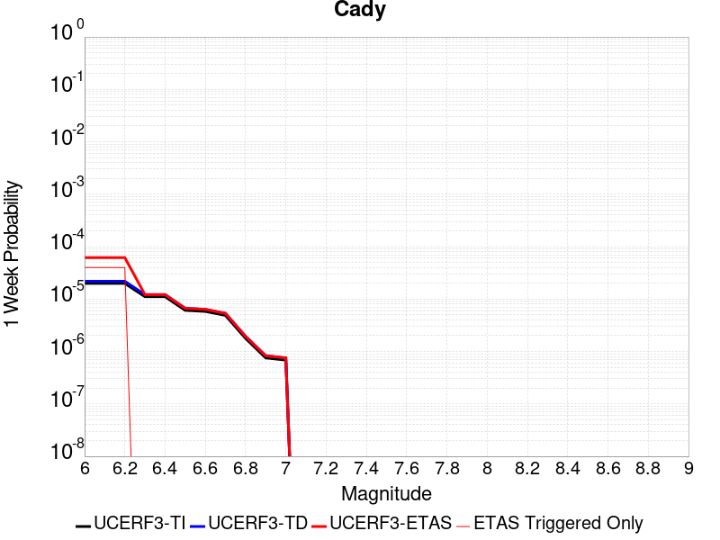 |  | 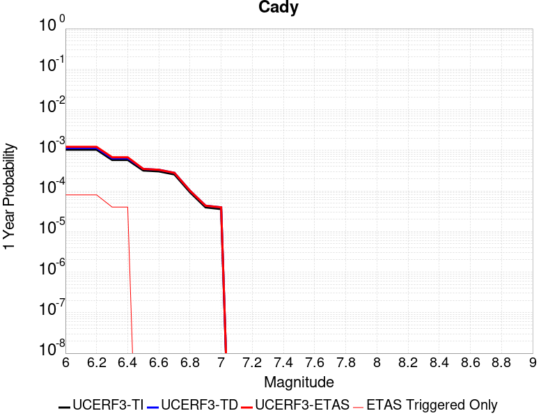 |

| Magnitude | 1 wk TI Prob | 1 wk TD Prob | 1 wk ETAS Prob | 1 wk ETAS/TD Gain | 1 wk ETAS Triggered Only | 1 mo TI Prob | 1 mo TD Prob | 1 mo ETAS Prob | 1 mo ETAS/TD Gain | 1 mo ETAS Triggered Only | 1 yr TI Prob | 1 yr TD Prob | 1 yr ETAS Prob | 1 yr ETAS/TD Gain | 1 yr ETAS Triggered Only |
|-----|-----|-----|-----|-----|-----|-----|-----|-----|-----|-----|-----|-----|-----|-----|-----|
| 6.0 | 1.9892565E-5 | 2.1866057E-5 | 6.186518E-5 | 2.8292792 | 4.0E-5 | 8.525106E-5 | 9.3708826E-5 | 1.3370508E-4 | 1.4268142 | 4.0E-5 | 0.0010374374 | 0.0011403988 | 0.0012203075 | 1.0700709 | 8.0E-5 |
| 6.1 | 1.9892565E-5 | 2.1866057E-5 | 6.186518E-5 | 2.8292792 | 4.0E-5 | 8.525106E-5 | 9.3708826E-5 | 1.3370508E-4 | 1.4268142 | 4.0E-5 | 0.0010374374 | 0.0011403988 | 0.0012203075 | 1.0700709 | 8.0E-5 |
| 6.2 | 1.9892565E-5 | 2.1866057E-5 | 6.186518E-5 | 2.8292792 | 4.0E-5 | 8.525106E-5 | 9.3708826E-5 | 1.3370508E-4 | 1.4268142 | 4.0E-5 | 0.0010374374 | 0.0011403988 | 0.0012203075 | 1.0700709 | 8.0E-5 |
| 6.3 | 1.1117327E-5 | 1.2180519E-5 | 1.2180519E-5 | 1.0 | 0.0 | 4.764482E-5 | 5.2201358E-5 | 5.2201358E-5 | 1.0 | 0.0 | 5.7992124E-4 | 6.3539774E-4 | 6.753723E-4 | 1.0629127 | 4.0E-5 |
| 6.4 | 1.1117327E-5 | 1.2180519E-5 | 1.2180519E-5 | 1.0 | 0.0 | 4.764482E-5 | 5.2201358E-5 | 5.2201358E-5 | 1.0 | 0.0 | 5.7992124E-4 | 6.3539774E-4 | 6.753723E-4 | 1.0629127 | 4.0E-5 |
| 6.5 | 6.103093E-6 | 6.674131E-6 | 6.674131E-6 | 1.0 | 0.0 | 2.615585E-5 | 2.8603175E-5 | 2.8603175E-5 | 1.0 | 0.0 | 3.1840094E-4 | 3.4820058E-4 | 3.4820058E-4 | 1.0 | 0.0 |
| 6.6 | 5.817237E-6 | 6.3676944E-6 | 6.3676944E-6 | 1.0 | 0.0 | 2.4930776E-5 | 2.7289903E-5 | 2.7289903E-5 | 1.0 | 0.0 | 3.034899E-4 | 3.3221635E-4 | 3.3221635E-4 | 1.0 | 0.0 |
| 6.7 | 4.8846314E-6 | 5.342259E-6 | 5.342259E-6 | 1.0 | 0.0 | 2.0933967E-5 | 2.2895263E-5 | 2.2895263E-5 | 1.0 | 0.0 | 2.5484123E-4 | 2.7872596E-4 | 2.7872596E-4 | 1.0 | 0.0 |
| 6.8 | 1.7788773E-6 | 1.9405036E-6 | 1.9405036E-6 | 1.0 | 0.0 | 7.6237375E-6 | 8.316427E-6 | 8.316427E-6 | 1.0 | 0.0 | 9.281505E-5 | 1.0124937E-4 | 1.0124937E-4 | 1.0 | 0.0 |
| 6.9 | 7.5455404E-7 | 8.2998935E-7 | 8.2998935E-7 | 1.0 | 0.0 | 3.233799E-6 | 3.5570943E-6 | 3.5570943E-6 | 1.0 | 0.0 | 3.937079E-5 | 4.33071E-5 | 4.33071E-5 | 1.0 | 0.0 |
| 7.0 | 6.8578805E-7 | 7.544366E-7 | 7.544366E-7 | 1.0 | 0.0 | 2.9390883E-6 | 3.2332975E-6 | 3.2332975E-6 | 1.0 | 0.0 | 3.578281E-5 | 3.936502E-5 | 3.936502E-5 | 1.0 | 0.0 |

## Santa Cruz Catalina Ridge alt1
*[(top)](#table-of-contents)*

| 1 Week | 1 Month | 1 Year |
|-----|-----|-----|
| 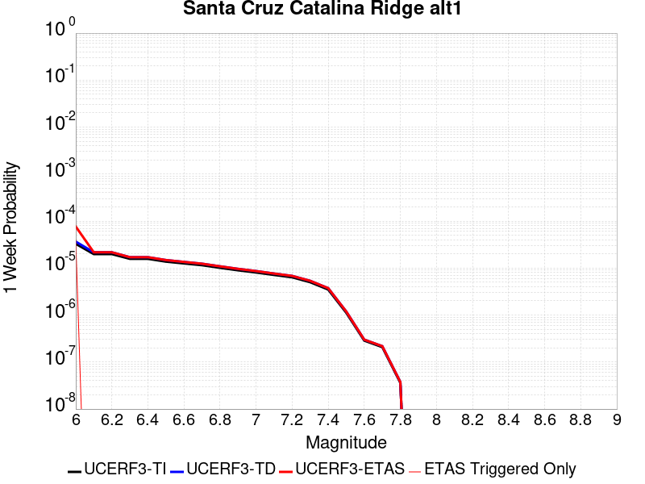 | 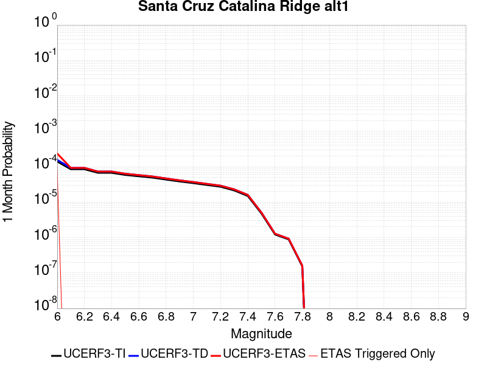 | 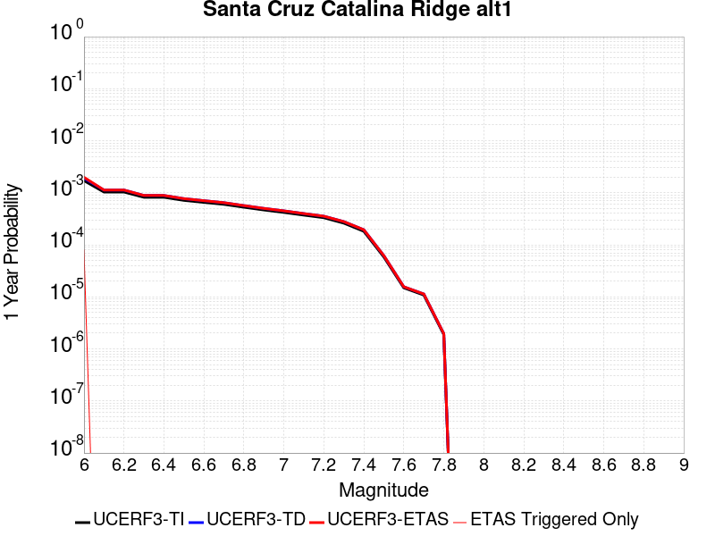 |

| Magnitude | 1 wk TI Prob | 1 wk TD Prob | 1 wk ETAS Prob | 1 wk ETAS/TD Gain | 1 wk ETAS Triggered Only | 1 mo TI Prob | 1 mo TD Prob | 1 mo ETAS Prob | 1 mo ETAS/TD Gain | 1 mo ETAS Triggered Only | 1 yr TI Prob | 1 yr TD Prob | 1 yr ETAS Prob | 1 yr ETAS/TD Gain | 1 yr ETAS Triggered Only |
|-----|-----|-----|-----|-----|-----|-----|-----|-----|-----|-----|-----|-----|-----|-----|-----|
| 6.0 | 3.2833184E-5 | 3.6572674E-5 | 7.657121E-5 | 2.0936728 | 4.0E-5 | 1.4070606E-4 | 1.5673155E-4 | 2.3671902E-4 | 1.5103469 | 8.0E-5 | 0.00171175 | 0.0019067029 | 0.0019865504 | 1.0418773 | 8.0E-5 |
| 6.1 | 1.9835548E-5 | 2.1666312E-5 | 2.1666312E-5 | 1.0 | 0.0 | 8.500672E-5 | 9.285243E-5 | 9.285243E-5 | 1.0 | 0.0 | 0.0010344655 | 0.0011299123 | 0.0011299123 | 1.0 | 0.0 |
| 6.2 | 1.9835548E-5 | 2.1666312E-5 | 2.1666312E-5 | 1.0 | 0.0 | 8.500672E-5 | 9.285243E-5 | 9.285243E-5 | 1.0 | 0.0 | 0.0010344655 | 0.0011299123 | 0.0011299123 | 1.0 | 0.0 |
| 6.3 | 1.5728183E-5 | 1.7038765E-5 | 1.7038765E-5 | 1.0 | 0.0 | 6.7404755E-5 | 7.302127E-5 | 7.302127E-5 | 1.0 | 0.0 | 8.2034385E-4 | 8.8867743E-4 | 8.8867743E-4 | 1.0 | 0.0 |
| 6.4 | 1.5728183E-5 | 1.7038765E-5 | 1.7038765E-5 | 1.0 | 0.0 | 6.7404755E-5 | 7.302127E-5 | 7.302127E-5 | 1.0 | 0.0 | 8.2034385E-4 | 8.8867743E-4 | 8.8867743E-4 | 1.0 | 0.0 |
| 6.5 | 1.3707734E-5 | 1.479851E-5 | 1.479851E-5 | 1.0 | 0.0 | 5.8746107E-5 | 6.3420666E-5 | 6.3420666E-5 | 1.0 | 0.0 | 7.1499916E-4 | 7.718766E-4 | 7.718766E-4 | 1.0 | 0.0 |
| 6.6 | 1.2539813E-5 | 1.35137725E-5 | 1.35137725E-5 | 1.0 | 0.0 | 5.3740947E-5 | 5.79149E-5 | 5.79149E-5 | 1.0 | 0.0 | 6.540996E-4 | 7.048884E-4 | 7.048884E-4 | 1.0 | 0.0 |
| 6.7 | 1.1504083E-5 | 1.2380568E-5 | 1.2380568E-5 | 1.0 | 0.0 | 4.930228E-5 | 5.3058506E-5 | 5.3058506E-5 | 1.0 | 0.0 | 6.0008996E-4 | 6.457979E-4 | 6.457979E-4 | 1.0 | 0.0 |
| 6.8 | 1.012739E-5 | 1.0879806E-5 | 1.0879806E-5 | 1.0 | 0.0 | 4.340238E-5 | 4.6626916E-5 | 4.6626916E-5 | 1.0 | 0.0 | 5.282958E-4 | 5.6753634E-4 | 5.6753634E-4 | 1.0 | 0.0 |
| 6.9 | 8.9607865E-6 | 9.611478E-6 | 9.611478E-6 | 1.0 | 0.0 | 3.8402806E-5 | 4.1191404E-5 | 4.1191404E-5 | 1.0 | 0.0 | 4.6745385E-4 | 5.01391E-4 | 5.01391E-4 | 1.0 | 0.0 |
| 7.0 | 8.046829E-6 | 8.62183E-6 | 8.62183E-6 | 1.0 | 0.0 | 3.4485955E-5 | 3.695018E-5 | 3.695018E-5 | 1.0 | 0.0 | 4.1978562E-4 | 4.497764E-4 | 4.497764E-4 | 1.0 | 0.0 |
| 7.1 | 7.136131E-6 | 7.639479E-6 | 7.639479E-6 | 1.0 | 0.0 | 3.0583058E-5 | 3.2740216E-5 | 3.2740216E-5 | 1.0 | 0.0 | 3.7228514E-4 | 3.9853994E-4 | 3.9853994E-4 | 1.0 | 0.0 |
| 7.2 | 6.362014E-6 | 6.8065674E-6 | 6.8065674E-6 | 1.0 | 0.0 | 2.726549E-5 | 2.917068E-5 | 2.917068E-5 | 1.0 | 0.0 | 3.3190678E-4 | 3.550958E-4 | 3.550958E-4 | 1.0 | 0.0 |
| 7.3 | 5.004101E-6 | 5.3529775E-6 | 5.3529775E-6 | 1.0 | 0.0 | 2.1445969E-5 | 2.2941133E-5 | 2.2941133E-5 | 1.0 | 0.0 | 2.6107338E-4 | 2.7927302E-4 | 2.7927302E-4 | 1.0 | 0.0 |
| 7.4 | 3.4901443E-6 | 3.7329312E-6 | 3.7329312E-6 | 1.0 | 0.0 | 1.4957676E-5 | 1.5998181E-5 | 1.5998181E-5 | 1.0 | 0.0 | 1.8209449E-4 | 1.9476083E-4 | 1.9476083E-4 | 1.0 | 0.0 |
| 7.5 | 1.1215045E-6 | 1.189632E-6 | 1.189632E-6 | 1.0 | 0.0 | 4.806439E-6 | 5.098413E-6 | 5.098413E-6 | 1.0 | 0.0 | 5.851682E-5 | 6.207144E-5 | 6.207144E-5 | 1.0 | 0.0 |
| 7.6 | 2.8599047E-7 | 2.99568E-7 | 2.99568E-7 | 1.0 | 0.0 | 1.2256729E-6 | 1.2838622E-6 | 1.2838622E-6 | 1.0 | 0.0 | 1.4922465E-5 | 1.563091E-5 | 1.563091E-5 | 1.0 | 0.0 |
| 7.7 | 2.0781519E-7 | 2.1747739E-7 | 2.1747739E-7 | 1.0 | 0.0 | 8.906362E-7 | 9.320456E-7 | 9.320456E-7 | 1.0 | 0.0 | 1.08434415E-5 | 1.1347597E-5 | 1.1347597E-5 | 1.0 | 0.0 |
| 7.8 | 3.614776E-8 | 3.7646288E-8 | 3.7646288E-8 | 1.0 | 0.0 | 1.5491896E-7 | 1.6134123E-7 | 1.6134123E-7 | 1.0 | 0.0 | 1.8861368E-6 | 1.9643278E-6 | 1.9643278E-6 | 1.0 | 0.0 |

## Ventura-Pitas Point
*[(top)](#table-of-contents)*

| 1 Week | 1 Month | 1 Year |
|-----|-----|-----|
| 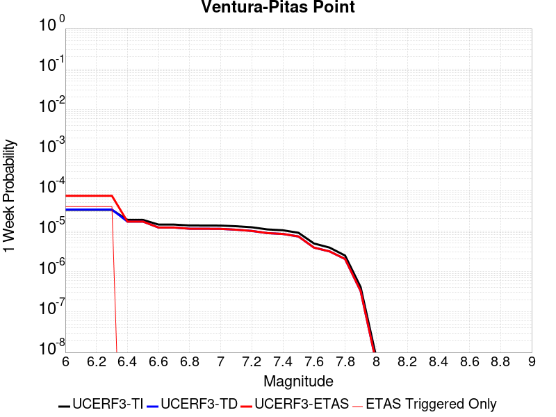 | 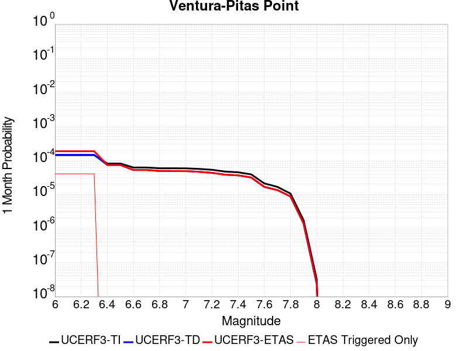 |  |

| Magnitude | 1 wk TI Prob | 1 wk TD Prob | 1 wk ETAS Prob | 1 wk ETAS/TD Gain | 1 wk ETAS Triggered Only | 1 mo TI Prob | 1 mo TD Prob | 1 mo ETAS Prob | 1 mo ETAS/TD Gain | 1 mo ETAS Triggered Only | 1 yr TI Prob | 1 yr TD Prob | 1 yr ETAS Prob | 1 yr ETAS/TD Gain | 1 yr ETAS Triggered Only |
|-----|-----|-----|-----|-----|-----|-----|-----|-----|-----|-----|-----|-----|-----|-----|-----|
| 6.0 | 3.3179622E-5 | 3.3762684E-5 | 7.376134E-5 | 2.1846998 | 4.0E-5 | 1.4219063E-4 | 1.4469065E-4 | 1.8468486E-4 | 1.2764119 | 4.0E-5 | 0.0017297962 | 0.0017604423 | 0.0018403014 | 1.0453631 | 8.0E-5 |
| 6.1 | 3.3179622E-5 | 3.3762684E-5 | 7.376134E-5 | 2.1846998 | 4.0E-5 | 1.4219063E-4 | 1.4469065E-4 | 1.8468486E-4 | 1.2764119 | 4.0E-5 | 0.0017297962 | 0.0017604423 | 0.0018403014 | 1.0453631 | 8.0E-5 |
| 6.2 | 3.3179622E-5 | 3.3762684E-5 | 7.376134E-5 | 2.1846998 | 4.0E-5 | 1.4219063E-4 | 1.4469065E-4 | 1.8468486E-4 | 1.2764119 | 4.0E-5 | 0.0017297962 | 0.0017604423 | 0.0018403014 | 1.0453631 | 8.0E-5 |
| 6.3 | 3.3179622E-5 | 3.3762684E-5 | 7.376134E-5 | 2.1846998 | 4.0E-5 | 1.4219063E-4 | 1.4469065E-4 | 1.8468486E-4 | 1.2764119 | 4.0E-5 | 0.0017297962 | 0.0017604423 | 0.0018403014 | 1.0453631 | 8.0E-5 |
| 6.4 | 1.8754668E-5 | 1.7038072E-5 | 1.7038072E-5 | 1.0 | 0.0 | 8.037467E-5 | 7.301839E-5 | 7.301839E-5 | 1.0 | 0.0 | 9.781223E-4 | 8.8865944E-4 | 9.286239E-4 | 1.0449716 | 4.0E-5 |
| 6.5 | 1.8754668E-5 | 1.7038072E-5 | 1.7038072E-5 | 1.0 | 0.0 | 8.037467E-5 | 7.301839E-5 | 7.301839E-5 | 1.0 | 0.0 | 9.781223E-4 | 8.8865944E-4 | 9.286239E-4 | 1.0449716 | 4.0E-5 |
| 6.6 | 1.4361558E-5 | 1.2138828E-5 | 1.2138828E-5 | 1.0 | 0.0 | 6.154808E-5 | 5.2022526E-5 | 5.2022526E-5 | 1.0 | 0.0 | 7.490902E-4 | 6.3319254E-4 | 6.3319254E-4 | 1.0 | 0.0 |
| 6.7 | 1.4361558E-5 | 1.2138828E-5 | 1.2138828E-5 | 1.0 | 0.0 | 6.154808E-5 | 5.2022526E-5 | 5.2022526E-5 | 1.0 | 0.0 | 7.490902E-4 | 6.3319254E-4 | 6.3319254E-4 | 1.0 | 0.0 |
| 6.8 | 1.3663846E-5 | 1.1360668E-5 | 1.1360668E-5 | 1.0 | 0.0 | 5.8558027E-5 | 4.868768E-5 | 4.868768E-5 | 1.0 | 0.0 | 7.127108E-4 | 5.9261324E-4 | 5.9261324E-4 | 1.0 | 0.0 |
| 6.9 | 1.3644157E-5 | 1.1338761E-5 | 1.1338761E-5 | 1.0 | 0.0 | 5.8473648E-5 | 4.8593796E-5 | 4.8593796E-5 | 1.0 | 0.0 | 7.116841E-4 | 5.914708E-4 | 5.914708E-4 | 1.0 | 0.0 |
| 7.0 | 1.3568845E-5 | 1.125829E-5 | 1.125829E-5 | 1.0 | 0.0 | 5.8150898E-5 | 4.8248934E-5 | 4.8248934E-5 | 1.0 | 0.0 | 7.077572E-4 | 5.872744E-4 | 5.872744E-4 | 1.0 | 0.0 |
| 7.1 | 1.306572E-5 | 1.0734395E-5 | 1.0734395E-5 | 1.0 | 0.0 | 5.599474E-5 | 4.6003748E-5 | 4.6003748E-5 | 1.0 | 0.0 | 6.815227E-4 | 5.5995357E-4 | 5.5995357E-4 | 1.0 | 0.0 |
| 7.2 | 1.232604E-5 | 1.0006684E-5 | 1.0006684E-5 | 1.0 | 0.0 | 5.2824813E-5 | 4.288509E-5 | 4.288509E-5 | 1.0 | 0.0 | 6.429523E-4 | 5.220027E-4 | 5.220027E-4 | 1.0 | 0.0 |
| 7.3 | 1.0917261E-5 | 8.853358E-6 | 8.853358E-6 | 1.0 | 0.0 | 4.678742E-5 | 3.794242E-5 | 3.794242E-5 | 1.0 | 0.0 | 5.69488E-4 | 4.618526E-4 | 4.618526E-4 | 1.0 | 0.0 |
| 7.4 | 1.039959E-5 | 8.432823E-6 | 8.432823E-6 | 1.0 | 0.0 | 4.456891E-5 | 3.614018E-5 | 3.614018E-5 | 1.0 | 0.0 | 5.424914E-4 | 4.399194E-4 | 4.399194E-4 | 1.0 | 0.0 |
| 7.5 | 9.015877E-6 | 7.306078E-6 | 7.306078E-6 | 1.0 | 0.0 | 3.86389E-5 | 3.1311392E-5 | 3.1311392E-5 | 1.0 | 0.0 | 4.7032707E-4 | 3.8115095E-4 | 3.8115095E-4 | 1.0 | 0.0 |
| 7.6 | 4.900162E-6 | 3.87516E-6 | 3.87516E-6 | 1.0 | 0.0 | 2.1000526E-5 | 1.6607724E-5 | 1.6607724E-5 | 1.0 | 0.0 | 2.556514E-4 | 2.0218041E-4 | 2.0218041E-4 | 1.0 | 0.0 |
| 7.7 | 3.8850626E-6 | 3.1275454E-6 | 3.1275454E-6 | 1.0 | 0.0 | 1.6650163E-5 | 1.3403697E-5 | 1.3403697E-5 | 1.0 | 0.0 | 2.0269687E-4 | 1.6317789E-4 | 1.6317789E-4 | 1.0 | 0.0 |
| 7.8 | 2.4654719E-6 | 2.0304078E-6 | 2.0304078E-6 | 1.0 | 0.0 | 1.0566265E-5 | 8.701719E-6 | 8.701719E-6 | 1.0 | 0.0 | 1.2863669E-4 | 1.0593832E-4 | 1.0593832E-4 | 1.0 | 0.0 |
| 7.9 | 4.095894E-7 | 3.2773266E-7 | 3.2773266E-7 | 1.0 | 0.0 | 1.7553821E-6 | 1.4045678E-6 | 1.4045678E-6 | 1.0 | 0.0 | 2.1371567E-5 | 1.7100481E-5 | 1.7100481E-5 | 1.0 | 0.0 |
| 8.0 | 7.791402E-9 | 5.68495E-9 | 5.68495E-9 | 1.0 | 0.0 | 3.3391725E-8 | 2.4364072E-8 | 2.4364072E-8 | 1.0 | 0.0 | 4.0654416E-7 | 2.9663255E-7 | 2.9663255E-7 | 1.0 | 0.0 |

## Palos Verdes
*[(top)](#table-of-contents)*

| 1 Week | 1 Month | 1 Year |
|-----|-----|-----|
| 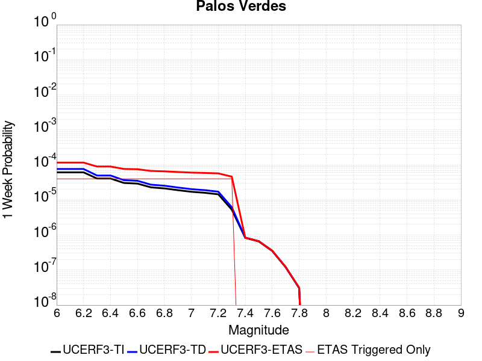 | 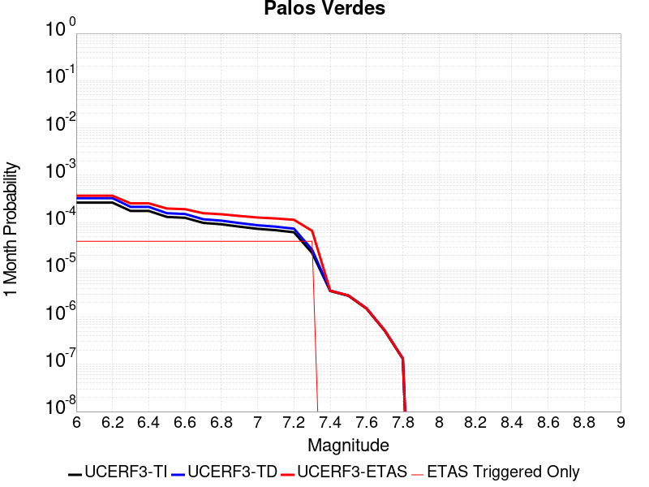 | 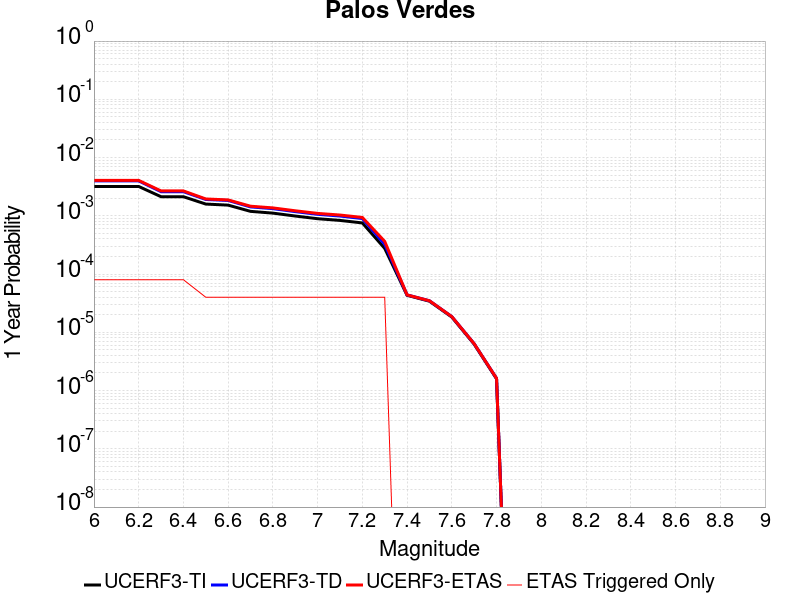 |

| Magnitude | 1 wk TI Prob | 1 wk TD Prob | 1 wk ETAS Prob | 1 wk ETAS/TD Gain | 1 wk ETAS Triggered Only | 1 mo TI Prob | 1 mo TD Prob | 1 mo ETAS Prob | 1 mo ETAS/TD Gain | 1 mo ETAS Triggered Only | 1 yr TI Prob | 1 yr TD Prob | 1 yr ETAS Prob | 1 yr ETAS/TD Gain | 1 yr ETAS Triggered Only |
|-----|-----|-----|-----|-----|-----|-----|-----|-----|-----|-----|-----|-----|-----|-----|-----|
| 6.0 | 6.126063E-5 | 7.628893E-5 | 1.1628588E-4 | 1.5242825 | 4.0E-5 | 2.6251914E-4 | 3.2691337E-4 | 3.669003E-4 | 1.1223166 | 4.0E-5 | 0.0031914865 | 0.0039734347 | 0.004053117 | 1.0200537 | 8.0E-5 |
| 6.1 | 6.126063E-5 | 7.628893E-5 | 1.1628588E-4 | 1.5242825 | 4.0E-5 | 2.6251914E-4 | 3.2691337E-4 | 3.669003E-4 | 1.1223166 | 4.0E-5 | 0.0031914865 | 0.0039734347 | 0.004053117 | 1.0200537 | 8.0E-5 |
| 6.2 | 6.126063E-5 | 7.628893E-5 | 1.1628588E-4 | 1.5242825 | 4.0E-5 | 2.6251914E-4 | 3.2691337E-4 | 3.669003E-4 | 1.1223166 | 4.0E-5 | 0.0031914865 | 0.0039734347 | 0.004053117 | 1.0200537 | 8.0E-5 |
| 6.3 | 4.0838047E-5 | 4.9786013E-5 | 8.978402E-5 | 1.8033985 | 4.0E-5 | 1.7500846E-4 | 2.133523E-4 | 2.5334375E-4 | 1.1874434 | 4.0E-5 | 0.0021286458 | 0.0025946742 | 0.0026744667 | 1.0307524 | 8.0E-5 |
| 6.4 | 4.0838047E-5 | 4.9786013E-5 | 8.978402E-5 | 1.8033985 | 4.0E-5 | 1.7500846E-4 | 2.133523E-4 | 2.5334375E-4 | 1.1874434 | 4.0E-5 | 0.0021286458 | 0.0025946742 | 0.0026744667 | 1.0307524 | 8.0E-5 |
| 6.5 | 3.0512005E-5 | 3.6586363E-5 | 7.6584896E-5 | 2.0932636 | 4.0E-5 | 1.3075917E-4 | 1.5678987E-4 | 1.967836E-4 | 1.2550786 | 4.0E-5 | 0.0015908304 | 0.001907361 | 0.0019472847 | 1.0209314 | 4.0E-5 |
| 6.6 | 2.9255087E-5 | 3.517859E-5 | 7.517718E-5 | 2.1370153 | 4.0E-5 | 1.2537291E-4 | 1.5075726E-4 | 1.9075122E-4 | 1.2652872 | 4.0E-5 | 0.0015253464 | 0.0018340375 | 0.0018739641 | 1.0217698 | 4.0E-5 |
| 6.7 | 2.287198E-5 | 2.7266105E-5 | 6.726501E-5 | 2.4669828 | 4.0E-5 | 9.801909E-5 | 1.16850024E-4 | 1.5684534E-4 | 1.3422792 | 4.0E-5 | 0.001192729 | 0.0014218123 | 0.0014617555 | 1.0280931 | 4.0E-5 |
| 6.8 | 2.1325764E-5 | 2.5448615E-5 | 6.5447595E-5 | 2.5717547 | 4.0E-5 | 9.139293E-5 | 1.0906144E-4 | 1.4905707E-4 | 1.3667257 | 4.0E-5 | 0.001112141 | 0.0013271046 | 0.0013670515 | 1.0301008 | 4.0E-5 |
| 6.9 | 1.9009392E-5 | 2.2628212E-5 | 6.262731E-5 | 2.767665 | 4.0E-5 | 8.1466285E-5 | 9.697494E-5 | 1.3697107E-4 | 1.4124377 | 4.0E-5 | 9.914007E-4 | 0.0011801178 | 0.0012200706 | 1.033855 | 4.0E-5 |
| 7.0 | 1.7098473E-5 | 2.0332458E-5 | 6.0331644E-5 | 2.9672577 | 4.0E-5 | 7.3277115E-5 | 8.713668E-5 | 1.271332E-4 | 1.4590089 | 4.0E-5 | 8.917837E-4 | 0.0010604581 | 0.0011004157 | 1.0376796 | 4.0E-5 |
| 7.1 | 1.5982785E-5 | 1.9007015E-5 | 5.9006255E-5 | 3.1044462 | 4.0E-5 | 6.849585E-5 | 8.145657E-5 | 1.2145332E-4 | 1.4910192 | 4.0E-5 | 8.336179E-4 | 9.913674E-4 | 0.0010313278 | 1.0403084 | 4.0E-5 |
| 7.2 | 1.4468002E-5 | 1.7208347E-5 | 5.720766E-5 | 3.3244133 | 4.0E-5 | 6.200425E-5 | 7.374845E-5 | 1.13745504E-4 | 1.5423442 | 4.0E-5 | 7.546402E-4 | 8.9760165E-4 | 9.3756575E-4 | 1.0445232 | 4.0E-5 |
| 7.3 | 5.288233E-6 | 6.207409E-6 | 4.6207162E-5 | 7.443872 | 4.0E-5 | 2.2663658E-5 | 2.660311E-5 | 6.660204E-5 | 2.5035436 | 4.0E-5 | 2.7589512E-4 | 3.2387965E-4 | 3.638667E-4 | 1.1234627 | 4.0E-5 |
| 7.4 | 8.279556E-7 | 8.40879E-7 | 8.40879E-7 | 1.0 | 0.0 | 3.5483763E-6 | 3.6037625E-6 | 3.6037625E-6 | 1.0 | 0.0 | 4.3200624E-5 | 4.3875E-5 | 4.3875E-5 | 1.0 | 0.0 |
| 7.5 | 6.559831E-7 | 6.667599E-7 | 6.667599E-7 | 1.0 | 0.0 | 2.8113532E-6 | 2.8575396E-6 | 2.8575396E-6 | 1.0 | 0.0 | 3.4227687E-5 | 3.4790057E-5 | 3.4790057E-5 | 1.0 | 0.0 |
| 7.6 | 3.5018968E-7 | 3.56221E-7 | 3.56221E-7 | 1.0 | 0.0 | 1.500812E-6 | 1.5266609E-6 | 1.5266609E-6 | 1.0 | 0.0 | 1.8272232E-5 | 1.8586983E-5 | 1.8586983E-5 | 1.0 | 0.0 |
| 7.7 | 1.1986104E-7 | 1.2199109E-7 | 1.2199109E-7 | 1.0 | 0.0 | 5.1369005E-7 | 5.228188E-7 | 5.228188E-7 | 1.0 | 0.0 | 6.2541585E-6 | 6.365301E-6 | 6.365301E-6 | 1.0 | 0.0 |
| 7.8 | 3.0445005E-8 | 3.1029597E-8 | 3.1029597E-8 | 1.0 | 0.0 | 1.3047858E-7 | 1.3298397E-7 | 1.3298397E-7 | 1.0 | 0.0 | 1.5885756E-6 | 1.619079E-6 | 1.619079E-6 | 1.0 | 0.0 |

## San Clemente
*[(top)](#table-of-contents)*

| 1 Week | 1 Month | 1 Year |
|-----|-----|-----|
| 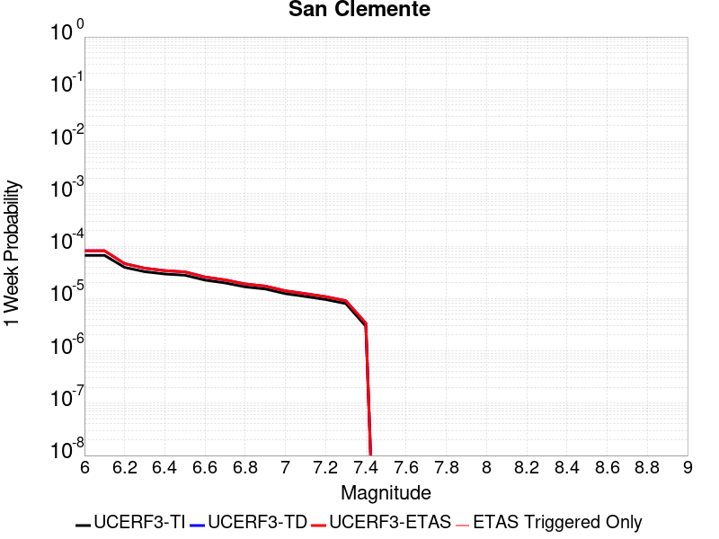 | 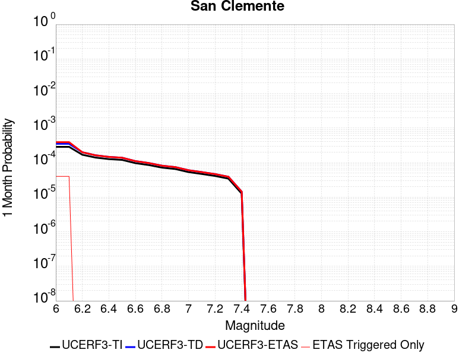 | 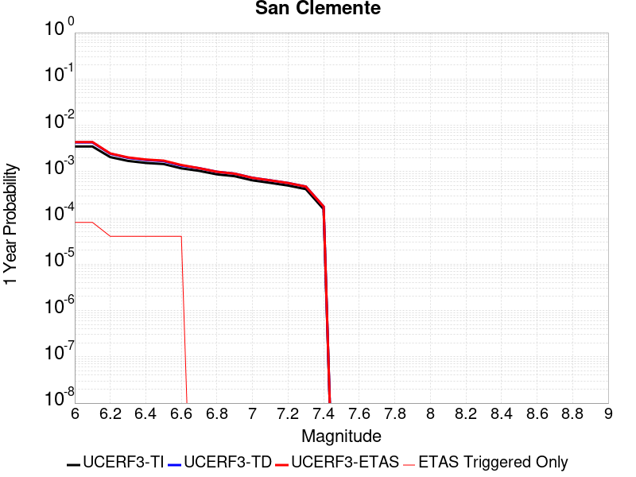 |

| Magnitude | 1 wk TI Prob | 1 wk TD Prob | 1 wk ETAS Prob | 1 wk ETAS/TD Gain | 1 wk ETAS Triggered Only | 1 mo TI Prob | 1 mo TD Prob | 1 mo ETAS Prob | 1 mo ETAS/TD Gain | 1 mo ETAS Triggered Only | 1 yr TI Prob | 1 yr TD Prob | 1 yr ETAS Prob | 1 yr ETAS/TD Gain | 1 yr ETAS Triggered Only |
|-----|-----|-----|-----|-----|-----|-----|-----|-----|-----|-----|-----|-----|-----|-----|-----|
| 6.0 | 6.681379E-5 | 8.169954E-5 | 8.169954E-5 | 1.0 | 0.0 | 2.8631336E-4 | 3.5009714E-4 | 3.9008312E-4 | 1.1142141 | 4.0E-5 | 0.003480294 | 0.0042546024 | 0.0043342616 | 1.0187231 | 8.0E-5 |
| 6.1 | 6.681379E-5 | 8.169954E-5 | 8.169954E-5 | 1.0 | 0.0 | 2.8631336E-4 | 3.5009714E-4 | 3.9008312E-4 | 1.1142141 | 4.0E-5 | 0.003480294 | 0.0042546024 | 0.0043342616 | 1.0187231 | 8.0E-5 |
| 6.2 | 3.9400576E-5 | 4.6480833E-5 | 4.6480833E-5 | 1.0 | 0.0 | 1.6884868E-4 | 1.9918867E-4 | 1.9918867E-4 | 1.0 | 0.0 | 0.0020537945 | 0.0024224774 | 0.0024623806 | 1.016472 | 4.0E-5 |
| 6.3 | 3.2590255E-5 | 3.7950318E-5 | 3.7950318E-5 | 1.0 | 0.0 | 1.3966505E-4 | 1.6263424E-4 | 1.6263424E-4 | 1.0 | 0.0 | 0.0016990956 | 0.0019783042 | 0.0020182251 | 1.0201794 | 4.0E-5 |
| 6.4 | 2.9454652E-5 | 3.4116085E-5 | 3.4116085E-5 | 1.0 | 0.0 | 1.2622811E-4 | 1.4620375E-4 | 1.4620375E-4 | 1.0 | 0.0 | 0.0015357438 | 0.0017786036 | 0.0018185325 | 1.0224496 | 4.0E-5 |
| 6.5 | 2.790836E-5 | 3.2264543E-5 | 3.2264543E-5 | 1.0 | 0.0 | 1.1960178E-4 | 1.3826945E-4 | 1.3826945E-4 | 1.0 | 0.0 | 0.001455179 | 0.0016821561 | 0.0017220889 | 1.023739 | 4.0E-5 |
| 6.6 | 2.2492153E-5 | 2.5775438E-5 | 2.5775438E-5 | 1.0 | 0.0 | 9.639138E-5 | 1.1046157E-4 | 1.1046157E-4 | 1.0 | 0.0 | 0.0011729331 | 0.0013440547 | 0.0013840009 | 1.0297207 | 4.0E-5 |
| 6.7 | 1.9862755E-5 | 2.267729E-5 | 2.267729E-5 | 1.0 | 0.0 | 8.512331E-5 | 9.718483E-5 | 9.718483E-5 | 1.0 | 0.0 | 0.0010358836 | 0.0011825943 | 0.0011825943 | 1.0 | 0.0 |
| 6.8 | 1.6697575E-5 | 1.8986502E-5 | 1.8986502E-5 | 1.0 | 0.0 | 7.155907E-5 | 8.136824E-5 | 8.136824E-5 | 1.0 | 0.0 | 8.7088346E-4 | 9.902174E-4 | 9.902174E-4 | 1.0 | 0.0 |
| 6.9 | 1.5218415E-5 | 1.7277294E-5 | 1.7277294E-5 | 1.0 | 0.0 | 6.522015E-5 | 7.40435E-5 | 7.40435E-5 | 1.0 | 0.0 | 7.93766E-4 | 9.011156E-4 | 9.011156E-4 | 1.0 | 0.0 |
| 7.0 | 1.2392958E-5 | 1.4039313E-5 | 1.4039313E-5 | 1.0 | 0.0 | 5.3111595E-5 | 6.0167138E-5 | 6.0167138E-5 | 1.0 | 0.0 | 6.4644177E-4 | 7.322963E-4 | 7.322963E-4 | 1.0 | 0.0 |
| 7.1 | 1.0934128E-5 | 1.2380668E-5 | 1.2380668E-5 | 1.0 | 0.0 | 4.6859706E-5 | 5.3058968E-5 | 5.3058968E-5 | 1.0 | 0.0 | 5.7036756E-4 | 6.4580876E-4 | 6.4580876E-4 | 1.0 | 0.0 |
| 7.2 | 9.5798805E-6 | 1.0849791E-5 | 1.0849791E-5 | 1.0 | 0.0 | 4.1055984E-5 | 4.6498317E-5 | 4.6498317E-5 | 1.0 | 0.0 | 4.9974193E-4 | 5.659771E-4 | 5.659771E-4 | 1.0 | 0.0 |
| 7.3 | 8.0167365E-6 | 9.088018E-6 | 9.088018E-6 | 1.0 | 0.0 | 3.4356988E-5 | 3.8948103E-5 | 3.8948103E-5 | 1.0 | 0.0 | 4.1821605E-4 | 4.7409706E-4 | 4.7409706E-4 | 1.0 | 0.0 |
| 7.4 | 2.9581017E-6 | 3.3639371E-6 | 3.3639371E-6 | 1.0 | 0.0 | 1.2677518E-5 | 1.44168225E-5 | 1.44168225E-5 | 1.0 | 0.0 | 1.5433785E-4 | 1.7551573E-4 | 1.7551573E-4 | 1.0 | 0.0 |

## North Frontal  (West)
*[(top)](#table-of-contents)*

| 1 Week | 1 Month | 1 Year |
|-----|-----|-----|
| 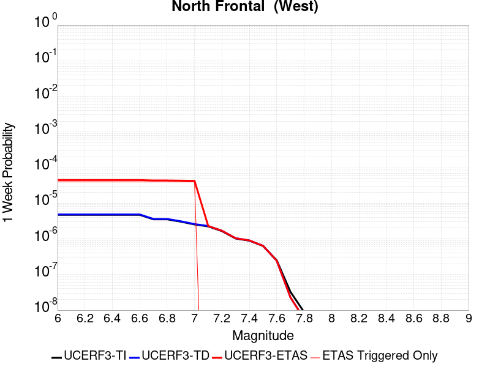 | 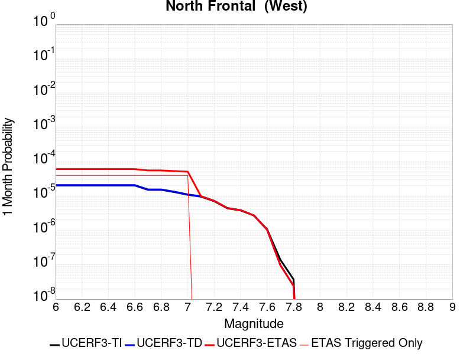 | 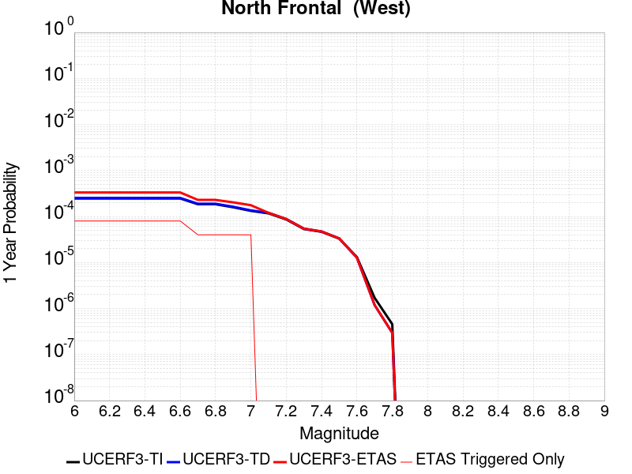 |

| Magnitude | 1 wk TI Prob | 1 wk TD Prob | 1 wk ETAS Prob | 1 wk ETAS/TD Gain | 1 wk ETAS Triggered Only | 1 mo TI Prob | 1 mo TD Prob | 1 mo ETAS Prob | 1 mo ETAS/TD Gain | 1 mo ETAS Triggered Only | 1 yr TI Prob | 1 yr TD Prob | 1 yr ETAS Prob | 1 yr ETAS/TD Gain | 1 yr ETAS Triggered Only |
|-----|-----|-----|-----|-----|-----|-----|-----|-----|-----|-----|-----|-----|-----|-----|-----|
| 6.0 | 4.7316266E-6 | 4.8531524E-6 | 4.4852957E-5 | 9.242025 | 4.0E-5 | 2.0278241E-5 | 2.0799067E-5 | 6.0798233E-5 | 2.9231231 | 4.0E-5 | 2.4685962E-4 | 2.5320068E-4 | 3.3318042E-4 | 1.3158749 | 8.0E-5 |
| 6.1 | 4.7316266E-6 | 4.8531524E-6 | 4.4852957E-5 | 9.242025 | 4.0E-5 | 2.0278241E-5 | 2.0799067E-5 | 6.0798233E-5 | 2.9231231 | 4.0E-5 | 2.4685962E-4 | 2.5320068E-4 | 3.3318042E-4 | 1.3158749 | 8.0E-5 |
| 6.2 | 4.7316266E-6 | 4.8531524E-6 | 4.4852957E-5 | 9.242025 | 4.0E-5 | 2.0278241E-5 | 2.0799067E-5 | 6.0798233E-5 | 2.9231231 | 4.0E-5 | 2.4685962E-4 | 2.5320068E-4 | 3.3318042E-4 | 1.3158749 | 8.0E-5 |
| 6.3 | 4.7316266E-6 | 4.8531524E-6 | 4.4852957E-5 | 9.242025 | 4.0E-5 | 2.0278241E-5 | 2.0799067E-5 | 6.0798233E-5 | 2.9231231 | 4.0E-5 | 2.4685962E-4 | 2.5320068E-4 | 3.3318042E-4 | 1.3158749 | 8.0E-5 |
| 6.4 | 4.7316266E-6 | 4.8531524E-6 | 4.4852957E-5 | 9.242025 | 4.0E-5 | 2.0278241E-5 | 2.0799067E-5 | 6.0798233E-5 | 2.9231231 | 4.0E-5 | 2.4685962E-4 | 2.5320068E-4 | 3.3318042E-4 | 1.3158749 | 8.0E-5 |
| 6.5 | 4.7316266E-6 | 4.8531524E-6 | 4.4852957E-5 | 9.242025 | 4.0E-5 | 2.0278241E-5 | 2.0799067E-5 | 6.0798233E-5 | 2.9231231 | 4.0E-5 | 2.4685962E-4 | 2.5320068E-4 | 3.3318042E-4 | 1.3158749 | 8.0E-5 |
| 6.6 | 4.7316266E-6 | 4.8531524E-6 | 4.4852957E-5 | 9.242025 | 4.0E-5 | 2.0278241E-5 | 2.0799067E-5 | 6.0798233E-5 | 2.9231231 | 4.0E-5 | 2.4685962E-4 | 2.5320068E-4 | 3.3318042E-4 | 1.3158749 | 8.0E-5 |
| 6.7 | 3.5382777E-6 | 3.631267E-6 | 4.363112E-5 | 12.015399 | 4.0E-5 | 1.516396E-5 | 1.5562484E-5 | 5.556186E-5 | 3.5702438 | 4.0E-5 | 1.8460557E-4 | 1.8945755E-4 | 2.2944997E-4 | 1.2110891 | 4.0E-5 |
| 6.8 | 3.5382777E-6 | 3.631267E-6 | 4.363112E-5 | 12.015399 | 4.0E-5 | 1.516396E-5 | 1.5562484E-5 | 5.556186E-5 | 3.5702438 | 4.0E-5 | 1.8460557E-4 | 1.8945755E-4 | 2.2944997E-4 | 1.2110891 | 4.0E-5 |
| 6.9 | 3.0428037E-6 | 3.1230975E-6 | 4.312297E-5 | 13.807757 | 4.0E-5 | 1.30405215E-5 | 1.3384639E-5 | 5.3384105E-5 | 3.9884605 | 4.0E-5 | 1.5875678E-4 | 1.6294647E-4 | 2.0293996E-4 | 1.2454394 | 4.0E-5 |
| 7.0 | 2.538778E-6 | 2.6063833E-6 | 4.260628E-5 | 16.346897 | 4.0E-5 | 1.0880432E-5 | 1.1170169E-5 | 5.116972E-5 | 4.5809264 | 4.0E-5 | 1.324612E-4 | 1.359888E-4 | 1.7598335E-4 | 1.2941018 | 4.0E-5 |
| 7.1 | 2.2418935E-6 | 2.3014725E-6 | 2.3014725E-6 | 1.0 | 0.0 | 9.60808E-6 | 9.863419E-6 | 9.863419E-6 | 1.0 | 0.0 | 1.1697209E-4 | 1.2008095E-4 | 1.2008095E-4 | 1.0 | 0.0 |
| 7.2 | 1.6526745E-6 | 1.692682E-6 | 1.692682E-6 | 1.0 | 0.0 | 7.082872E-6 | 7.2543326E-6 | 7.2543326E-6 | 1.0 | 0.0 | 8.623055E-5 | 8.831818E-5 | 8.831818E-5 | 1.0 | 0.0 |
| 7.3 | 1.0246019E-6 | 1.0443523E-6 | 1.0443523E-6 | 1.0 | 0.0 | 4.391144E-6 | 4.4757885E-6 | 4.4757885E-6 | 1.0 | 0.0 | 5.3460866E-5 | 5.449148E-5 | 5.449148E-5 | 1.0 | 0.0 |
| 7.4 | 8.9045164E-7 | 9.057666E-7 | 9.057666E-7 | 1.0 | 0.0 | 3.8162157E-6 | 3.881852E-6 | 3.881852E-6 | 1.0 | 0.0 | 4.646144E-5 | 4.7260633E-5 | 4.7260633E-5 | 1.0 | 0.0 |
| 7.5 | 6.3357E-7 | 6.4035106E-7 | 6.4035106E-7 | 1.0 | 0.0 | 2.7152971E-6 | 2.744359E-6 | 2.744359E-6 | 1.0 | 0.0 | 3.305824E-5 | 3.3412125E-5 | 3.3412125E-5 | 1.0 | 0.0 |
| 7.6 | 2.5087024E-7 | 2.4364294E-7 | 2.4364294E-7 | 1.0 | 0.0 | 1.0751578E-6 | 1.0441837E-6 | 1.0441837E-6 | 1.0 | 0.0 | 1.3089967E-5 | 1.2712884E-5 | 1.2712884E-5 | 1.0 | 0.0 |
| 7.7 | 3.282987E-8 | 2.287823E-8 | 2.287823E-8 | 1.0 | 0.0 | 1.4069944E-7 | 9.8049554E-8 | 9.8049554E-8 | 1.0 | 0.0 | 1.7130144E-6 | 1.1937527E-6 | 1.1937527E-6 | 1.0 | 0.0 |
| 7.8 | 8.77499E-9 | 5.6832317E-9 | 5.6832317E-9 | 1.0 | 0.0 | 3.7607098E-8 | 2.4356707E-8 | 2.4356707E-8 | 1.0 | 0.0 | 4.578663E-7 | 2.9654288E-7 | 2.9654288E-7 | 1.0 | 0.0 |

## Elsinore (Stepovers Combined)
*[(top)](#table-of-contents)*

| 1 Week | 1 Month | 1 Year |
|-----|-----|-----|
|  | 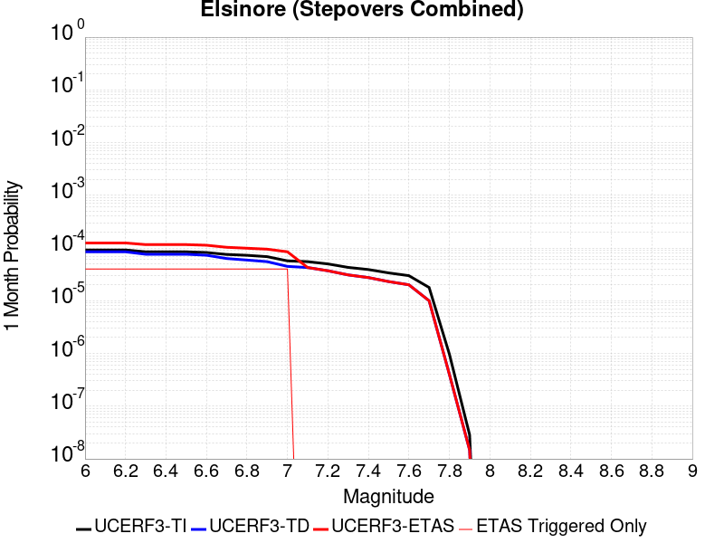 | 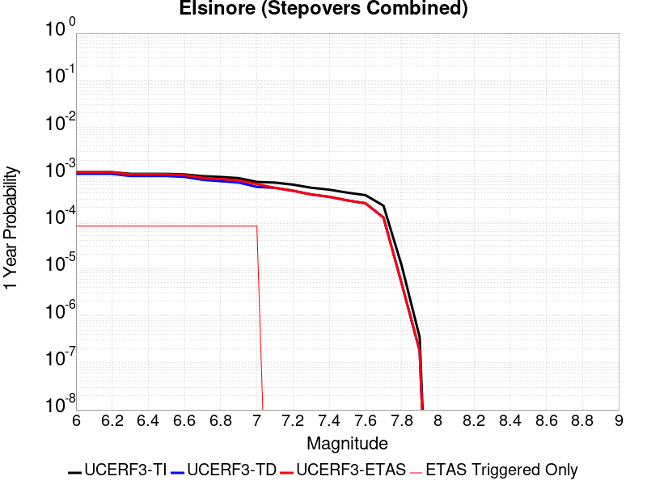 |

| Magnitude | 1 wk TI Prob | 1 wk TD Prob | 1 wk ETAS Prob | 1 wk ETAS/TD Gain | 1 wk ETAS Triggered Only | 1 mo TI Prob | 1 mo TD Prob | 1 mo ETAS Prob | 1 mo ETAS/TD Gain | 1 mo ETAS Triggered Only | 1 yr TI Prob | 1 yr TD Prob | 1 yr ETAS Prob | 1 yr ETAS/TD Gain | 1 yr ETAS Triggered Only |
|-----|-----|-----|-----|-----|-----|-----|-----|-----|-----|-----|-----|-----|-----|-----|-----|
| 6.0 | 2.144392E-5 | 1.9780842E-5 | 1.9780842E-5 | 1.0 | 0.0 | 9.189928E-5 | 8.477241E-5 | 1.2476901E-4 | 1.4718117 | 4.0E-5 | 0.0011182994 | 0.0010316346 | 0.0011115521 | 1.0774668 | 8.0E-5 |
| 6.1 | 2.144392E-5 | 1.9780842E-5 | 1.9780842E-5 | 1.0 | 0.0 | 9.189928E-5 | 8.477241E-5 | 1.2476901E-4 | 1.4718117 | 4.0E-5 | 0.0011182994 | 0.0010316346 | 0.0011115521 | 1.0774668 | 8.0E-5 |
| 6.2 | 2.144392E-5 | 1.9780842E-5 | 1.9780842E-5 | 1.0 | 0.0 | 9.189928E-5 | 8.477241E-5 | 1.2476901E-4 | 1.4718117 | 4.0E-5 | 0.0011182994 | 0.0010316346 | 0.0011115521 | 1.0774668 | 8.0E-5 |
| 6.3 | 1.9751555E-5 | 1.7760778E-5 | 1.7760778E-5 | 1.0 | 0.0 | 8.4646774E-5 | 7.6115495E-5 | 1.1611245E-4 | 1.5254772 | 4.0E-5 | 0.0010300872 | 9.263265E-4 | 0.0010062524 | 1.0862826 | 8.0E-5 |
| 6.4 | 1.9751555E-5 | 1.7760778E-5 | 1.7760778E-5 | 1.0 | 0.0 | 8.4646774E-5 | 7.6115495E-5 | 1.1611245E-4 | 1.5254772 | 4.0E-5 | 0.0010300872 | 9.263265E-4 | 0.0010062524 | 1.0862826 | 8.0E-5 |
| 6.5 | 1.9751555E-5 | 1.7760778E-5 | 1.7760778E-5 | 1.0 | 0.0 | 8.4646774E-5 | 7.6115495E-5 | 1.1611245E-4 | 1.5254772 | 4.0E-5 | 0.0010300872 | 9.263265E-4 | 0.0010062524 | 1.0862826 | 8.0E-5 |
| 6.6 | 1.9188685E-5 | 1.702196E-5 | 1.702196E-5 | 1.0 | 0.0 | 8.2234634E-5 | 7.2949304E-5 | 1.12946385E-4 | 1.548286 | 4.0E-5 | 0.0010007467 | 8.878121E-4 | 9.6774107E-4 | 1.0900291 | 8.0E-5 |
| 6.7 | 1.7608272E-5 | 1.4748722E-5 | 1.4748722E-5 | 1.0 | 0.0 | 7.546184E-5 | 6.3207335E-5 | 1.032048E-4 | 1.632798 | 4.0E-5 | 9.183606E-4 | 7.6928735E-4 | 8.492258E-4 | 1.1039124 | 8.0E-5 |
| 6.8 | 1.697165E-5 | 1.3798299E-5 | 1.3798299E-5 | 1.0 | 0.0 | 7.273361E-5 | 5.9134276E-5 | 9.913191E-5 | 1.6763867 | 4.0E-5 | 8.8517193E-4 | 7.197307E-4 | 7.996731E-4 | 1.1110727 | 8.0E-5 |
| 6.9 | 1.600365E-5 | 1.2861078E-5 | 1.2861078E-5 | 1.0 | 0.0 | 6.858527E-5 | 5.5117787E-5 | 9.511558E-5 | 1.7256786 | 4.0E-5 | 8.347058E-4 | 6.7086023E-4 | 7.5080653E-4 | 1.1191698 | 8.0E-5 |
| 7.0 | 1.3314581E-5 | 1.0460029E-5 | 1.0460029E-5 | 1.0 | 0.0 | 5.7061243E-5 | 4.4827942E-5 | 8.482615E-5 | 1.8922607 | 4.0E-5 | 6.944992E-4 | 5.456462E-4 | 6.2560255E-4 | 1.1465352 | 8.0E-5 |
| 7.1 | 1.2865345E-5 | 9.949274E-6 | 9.949274E-6 | 1.0 | 0.0 | 5.5136024E-5 | 4.263906E-5 | 4.263906E-5 | 1.0 | 0.0 | 6.710743E-4 | 5.190095E-4 | 5.190095E-4 | 1.0 | 0.0 |
| 7.2 | 1.1650051E-5 | 8.643983E-6 | 8.643983E-6 | 1.0 | 0.0 | 4.9927836E-5 | 3.7045123E-5 | 3.7045123E-5 | 1.0 | 0.0 | 6.0770183E-4 | 4.5093283E-4 | 4.5093283E-4 | 1.0 | 0.0 |
| 7.3 | 1.0008533E-5 | 7.209463E-6 | 7.209463E-6 | 1.0 | 0.0 | 4.2893007E-5 | 3.089734E-5 | 3.089734E-5 | 1.0 | 0.0 | 5.220972E-4 | 3.7611165E-4 | 3.7611165E-4 | 1.0 | 0.0 |
| 7.4 | 9.116759E-6 | 6.4174783E-6 | 6.4174783E-6 | 1.0 | 0.0 | 3.907124E-5 | 2.7503196E-5 | 2.7503196E-5 | 1.0 | 0.0 | 4.7558855E-4 | 3.3480133E-4 | 3.3480133E-4 | 1.0 | 0.0 |
| 7.5 | 7.870524E-6 | 5.388742E-6 | 5.388742E-6 | 1.0 | 0.0 | 3.3730383E-5 | 2.309441E-5 | 2.309441E-5 | 1.0 | 0.0 | 4.1059E-4 | 2.8113945E-4 | 2.8113945E-4 | 1.0 | 0.0 |
| 7.6 | 6.9774537E-6 | 4.683142E-6 | 4.683142E-6 | 1.0 | 0.0 | 2.990303E-5 | 2.0070462E-5 | 2.0070462E-5 | 1.0 | 0.0 | 3.640086E-4 | 2.4433163E-4 | 2.4433163E-4 | 1.0 | 0.0 |
| 7.7 | 4.1616954E-6 | 2.3312286E-6 | 2.3312286E-6 | 1.0 | 0.0 | 1.7835715E-5 | 9.990946E-6 | 9.990946E-6 | 1.0 | 0.0 | 2.171282E-4 | 1.21633726E-4 | 1.21633726E-4 | 1.0 | 0.0 |
| 7.8 | 2.2692414E-7 | 9.397192E-8 | 9.397192E-8 | 1.0 | 0.0 | 9.725317E-7 | 4.0273673E-7 | 4.0273673E-7 | 1.0 | 0.0 | 1.1840509E-5 | 4.903312E-6 | 4.903312E-6 | 1.0 | 0.0 |
| 7.9 | 6.676829E-9 | 3.4429164E-9 | 3.4429164E-9 | 1.0 | 0.0 | 2.861498E-8 | 1.4755356E-8 | 1.4755356E-8 | 1.0 | 0.0 | 3.4838732E-7 | 1.7964643E-7 | 1.7964643E-7 | 1.0 | 0.0 |

## San Diego Trough north alt1
*[(top)](#table-of-contents)*

| 1 Week | 1 Month | 1 Year |
|-----|-----|-----|
|  |  | 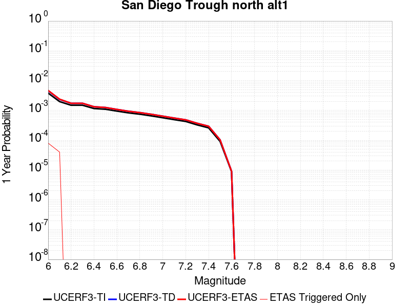 |

| Magnitude | 1 wk TI Prob | 1 wk TD Prob | 1 wk ETAS Prob | 1 wk ETAS/TD Gain | 1 wk ETAS Triggered Only | 1 mo TI Prob | 1 mo TD Prob | 1 mo ETAS Prob | 1 mo ETAS/TD Gain | 1 mo ETAS Triggered Only | 1 yr TI Prob | 1 yr TD Prob | 1 yr ETAS Prob | 1 yr ETAS/TD Gain | 1 yr ETAS Triggered Only |
|-----|-----|-----|-----|-----|-----|-----|-----|-----|-----|-----|-----|-----|-----|-----|-----|
| 6.0 | 7.329252E-5 | 8.827393E-5 | 1.282704E-4 | 1.453095 | 4.0E-5 | 3.14073E-4 | 3.782656E-4 | 4.1825048E-4 | 1.1057059 | 4.0E-5 | 0.0038171355 | 0.00459623 | 0.0046758624 | 1.0173255 | 8.0E-5 |
| 6.1 | 3.7940346E-5 | 4.4913257E-5 | 4.4913257E-5 | 1.0 | 0.0 | 1.6259136E-4 | 1.924717E-4 | 1.924717E-4 | 1.0 | 0.0 | 0.0019777524 | 0.0023408993 | 0.0023808058 | 1.0170474 | 4.0E-5 |
| 6.2 | 2.8645263E-5 | 3.331533E-5 | 3.331533E-5 | 1.0 | 0.0 | 1.2275964E-4 | 1.4277229E-4 | 1.4277229E-4 | 1.0 | 0.0 | 0.0014935739 | 0.0017368881 | 0.0017368881 | 1.0 | 0.0 |
| 6.3 | 2.8645263E-5 | 3.331533E-5 | 3.331533E-5 | 1.0 | 0.0 | 1.2275964E-4 | 1.4277229E-4 | 1.4277229E-4 | 1.0 | 0.0 | 0.0014935739 | 0.0017368881 | 0.0017368881 | 1.0 | 0.0 |
| 6.4 | 2.2204576E-5 | 2.5461064E-5 | 2.5461064E-5 | 1.0 | 0.0 | 9.5159E-5 | 1.09114335E-4 | 1.09114335E-4 | 1.0 | 0.0 | 0.001157945 | 0.0013276667 | 0.0013276667 | 1.0 | 0.0 |
| 6.5 | 2.1004838E-5 | 2.403653E-5 | 2.403653E-5 | 1.0 | 0.0 | 9.0017624E-5 | 1.0300968E-4 | 1.0300968E-4 | 1.0 | 0.0 | 0.0010954136 | 0.0012534301 | 0.0012534301 | 1.0 | 0.0 |
| 6.6 | 1.820557E-5 | 2.0714517E-5 | 2.0714517E-5 | 1.0 | 0.0 | 7.802154E-5 | 8.877351E-5 | 8.877351E-5 | 1.0 | 0.0 | 9.4949827E-4 | 0.0010802869 | 0.0010802869 | 1.0 | 0.0 |
| 6.7 | 1.5884485E-5 | 1.7991773E-5 | 1.7991773E-5 | 1.0 | 0.0 | 6.807459E-5 | 7.710534E-5 | 7.710534E-5 | 1.0 | 0.0 | 8.284929E-4 | 9.383559E-4 | 9.383559E-4 | 1.0 | 0.0 |
| 6.8 | 1.4331171E-5 | 1.6208287E-5 | 1.6208287E-5 | 1.0 | 0.0 | 6.141786E-5 | 6.946225E-5 | 6.946225E-5 | 1.0 | 0.0 | 7.4750587E-4 | 8.4537675E-4 | 8.4537675E-4 | 1.0 | 0.0 |
| 6.9 | 1.2574203E-5 | 1.4212128E-5 | 1.4212128E-5 | 1.0 | 0.0 | 5.3888325E-5 | 6.0907703E-5 | 6.0907703E-5 | 1.0 | 0.0 | 6.558929E-4 | 7.413004E-4 | 7.413004E-4 | 1.0 | 0.0 |
| 7.0 | 1.0883844E-5 | 1.22946785E-5 | 1.22946785E-5 | 1.0 | 0.0 | 4.664421E-5 | 5.2690422E-5 | 5.2690422E-5 | 1.0 | 0.0 | 5.677453E-4 | 6.4131804E-4 | 6.4131804E-4 | 1.0 | 0.0 |
| 7.1 | 9.393088E-6 | 1.0611702E-5 | 1.0611702E-5 | 1.0 | 0.0 | 4.025547E-5 | 4.5477937E-5 | 4.5477937E-5 | 1.0 | 0.0 | 4.900001E-4 | 5.53554E-4 | 5.53554E-4 | 1.0 | 0.0 |
| 7.2 | 8.190791E-6 | 9.26275E-6 | 9.26275E-6 | 1.0 | 0.0 | 3.510292E-5 | 3.96969E-5 | 3.96969E-5 | 1.0 | 0.0 | 4.2729423E-4 | 4.8320327E-4 | 4.8320327E-4 | 1.0 | 0.0 |
| 7.3 | 6.268162E-6 | 7.0928886E-6 | 7.0928886E-6 | 1.0 | 0.0 | 2.6863276E-5 | 3.0397741E-5 | 3.0397741E-5 | 1.0 | 0.0 | 3.2701128E-4 | 3.7003006E-4 | 3.7003006E-4 | 1.0 | 0.0 |
| 7.4 | 4.985186E-6 | 5.645222E-6 | 5.645222E-6 | 1.0 | 0.0 | 2.1364907E-5 | 2.4193585E-5 | 2.4193585E-5 | 1.0 | 0.0 | 2.600867E-4 | 2.9451746E-4 | 2.9451746E-4 | 1.0 | 0.0 |
| 7.5 | 1.7489613E-6 | 1.9705317E-6 | 1.9705317E-6 | 1.0 | 0.0 | 7.495527E-6 | 8.44511E-6 | 8.44511E-6 | 1.0 | 0.0 | 9.125422E-5 | 1.02814585E-4 | 1.02814585E-4 | 1.0 | 0.0 |
| 7.6 | 1.6988751E-7 | 1.753573E-7 | 1.753573E-7 | 1.0 | 0.0 | 7.2808916E-7 | 7.515311E-7 | 7.515311E-7 | 1.0 | 0.0 | 8.864449E-6 | 9.149855E-6 | 9.149855E-6 | 1.0 | 0.0 |

## San Pedro Basin
*[(top)](#table-of-contents)*

| 1 Week | 1 Month | 1 Year |
|-----|-----|-----|
| 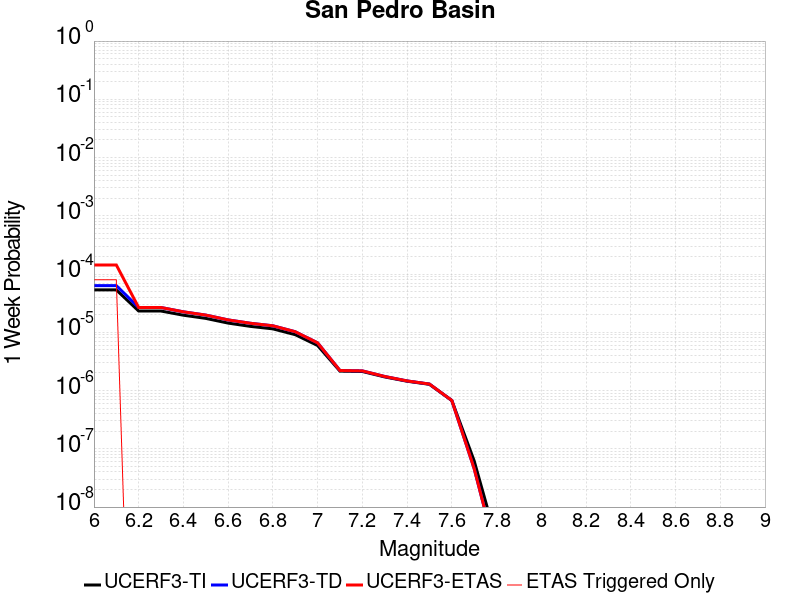 | 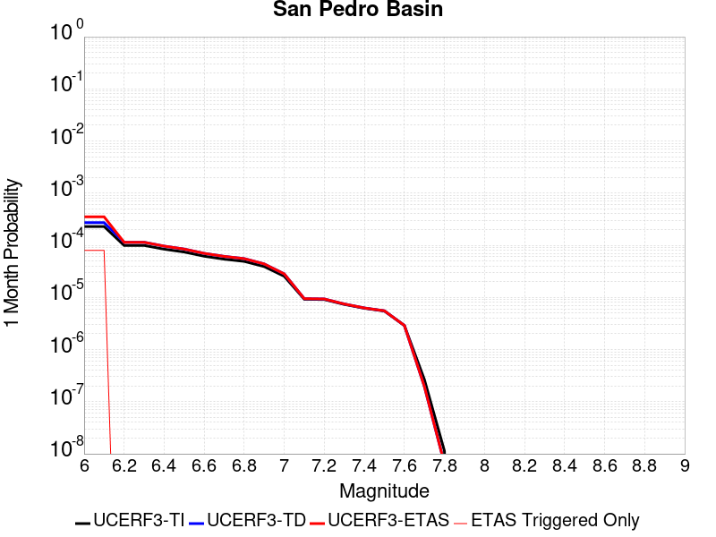 | 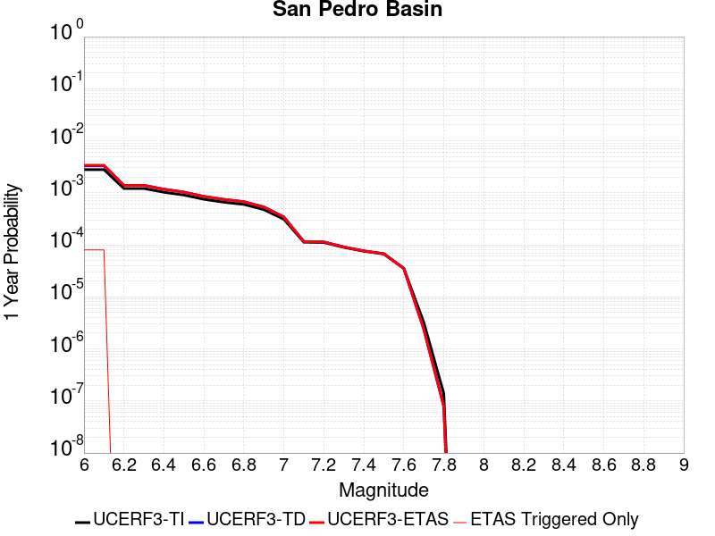 |

| Magnitude | 1 wk TI Prob | 1 wk TD Prob | 1 wk ETAS Prob | 1 wk ETAS/TD Gain | 1 wk ETAS Triggered Only | 1 mo TI Prob | 1 mo TD Prob | 1 mo ETAS Prob | 1 mo ETAS/TD Gain | 1 mo ETAS Triggered Only | 1 yr TI Prob | 1 yr TD Prob | 1 yr ETAS Prob | 1 yr ETAS/TD Gain | 1 yr ETAS Triggered Only |
|-----|-----|-----|-----|-----|-----|-----|-----|-----|-----|-----|-----|-----|-----|-----|-----|
| 6.0 | 5.3449043E-5 | 6.34106E-5 | 1.4340553E-4 | 2.2615385 | 8.0E-5 | 2.2904722E-4 | 2.7173443E-4 | 3.517127E-4 | 1.2943251 | 8.0E-5 | 0.0027850836 | 0.003303951 | 0.0033836865 | 1.0241334 | 8.0E-5 |
| 6.1 | 5.3449043E-5 | 6.34106E-5 | 1.4340553E-4 | 2.2615385 | 8.0E-5 | 2.2904722E-4 | 2.7173443E-4 | 3.517127E-4 | 1.2943251 | 8.0E-5 | 0.0027850836 | 0.003303951 | 0.0033836865 | 1.0241334 | 8.0E-5 |
| 6.2 | 2.3189454E-5 | 2.6656566E-5 | 2.6656566E-5 | 1.0 | 0.0 | 9.9379584E-5 | 1.1423769E-4 | 1.1423769E-4 | 1.0 | 0.0 | 0.0012092749 | 0.0013900036 | 0.0013900036 | 1.0 | 0.0 |
| 6.3 | 2.3189454E-5 | 2.6656566E-5 | 2.6656566E-5 | 1.0 | 0.0 | 9.9379584E-5 | 1.1423769E-4 | 1.1423769E-4 | 1.0 | 0.0 | 0.0012092749 | 0.0013900036 | 0.0013900036 | 1.0 | 0.0 |
| 6.4 | 1.966056E-5 | 2.2474544E-5 | 2.2474544E-5 | 1.0 | 0.0 | 8.425682E-5 | 9.6316144E-5 | 9.6316144E-5 | 1.0 | 0.0 | 0.001025344 | 0.0011720584 | 0.0011720584 | 1.0 | 0.0 |
| 6.5 | 1.7342953E-5 | 1.975468E-5 | 1.975468E-5 | 1.0 | 0.0 | 7.4324824E-5 | 8.466037E-5 | 8.466037E-5 | 1.0 | 0.0 | 9.04529E-4 | 0.0010302897 | 0.0010302897 | 1.0 | 0.0 |
| 6.6 | 1.439804E-5 | 1.6330361E-5 | 1.6330361E-5 | 1.0 | 0.0 | 6.170443E-5 | 6.998557E-5 | 6.998557E-5 | 1.0 | 0.0 | 7.509924E-4 | 8.517733E-4 | 8.517733E-4 | 1.0 | 0.0 |
| 6.7 | 1.2634884E-5 | 1.4291868E-5 | 1.4291868E-5 | 1.0 | 0.0 | 5.414838E-5 | 6.124959E-5 | 6.124959E-5 | 1.0 | 0.0 | 6.590571E-4 | 7.454892E-4 | 7.454892E-4 | 1.0 | 0.0 |
| 6.8 | 1.146091E-5 | 1.2939066E-5 | 1.2939066E-5 | 1.0 | 0.0 | 4.911726E-5 | 5.5452132E-5 | 5.5452132E-5 | 1.0 | 0.0 | 5.9783855E-4 | 6.7495037E-4 | 6.7495037E-4 | 1.0 | 0.0 |
| 6.9 | 9.109035E-6 | 1.0239538E-5 | 1.0239538E-5 | 1.0 | 0.0 | 3.9038136E-5 | 4.3883152E-5 | 4.3883152E-5 | 1.0 | 0.0 | 4.7518566E-4 | 5.3417444E-4 | 5.3417444E-4 | 1.0 | 0.0 |
| 7.0 | 5.9351028E-6 | 6.586627E-6 | 6.586627E-6 | 1.0 | 0.0 | 2.5435906E-5 | 2.822823E-5 | 2.822823E-5 | 1.0 | 0.0 | 3.0963816E-4 | 3.4364813E-4 | 3.4364813E-4 | 1.0 | 0.0 |
| 7.1 | 2.1557585E-6 | 2.2099746E-6 | 2.2099746E-6 | 1.0 | 0.0 | 9.238933E-6 | 9.471286E-6 | 9.471286E-6 | 1.0 | 0.0 | 1.1247819E-4 | 1.1530696E-4 | 1.1530696E-4 | 1.0 | 0.0 |
| 7.2 | 2.1251979E-6 | 2.178317E-6 | 2.178317E-6 | 1.0 | 0.0 | 9.107958E-6 | 9.335612E-6 | 9.335612E-6 | 1.0 | 0.0 | 1.1088375E-4 | 1.136553E-4 | 1.136553E-4 | 1.0 | 0.0 |
| 7.3 | 1.7145798E-6 | 1.7445271E-6 | 1.7445271E-6 | 1.0 | 0.0 | 7.3481783E-6 | 7.4765244E-6 | 7.4765244E-6 | 1.0 | 0.0 | 8.94604E-5 | 9.102297E-5 | 9.102297E-5 | 1.0 | 0.0 |
| 7.4 | 1.4467993E-6 | 1.4643826E-6 | 1.4643826E-6 | 1.0 | 0.0 | 6.200554E-6 | 6.275911E-6 | 6.275911E-6 | 1.0 | 0.0 | 7.548913E-5 | 7.640661E-5 | 7.640661E-5 | 1.0 | 0.0 |
| 7.5 | 1.2803735E-6 | 1.2933225E-6 | 1.2933225E-6 | 1.0 | 0.0 | 5.487303E-6 | 5.5427995E-6 | 5.5427995E-6 | 1.0 | 0.0 | 6.680587E-5 | 6.748157E-5 | 6.748157E-5 | 1.0 | 0.0 |
| 7.6 | 6.755009E-7 | 6.7703843E-7 | 6.7703843E-7 | 1.0 | 0.0 | 2.8950008E-6 | 2.9015905E-6 | 2.9015905E-6 | 1.0 | 0.0 | 3.5246063E-5 | 3.532635E-5 | 3.532635E-5 | 1.0 | 0.0 |
| 7.7 | 6.211885E-8 | 4.5709044E-8 | 4.5709044E-8 | 1.0 | 0.0 | 2.6622362E-7 | 1.9589588E-7 | 1.9589588E-7 | 1.0 | 0.0 | 3.2412677E-6 | 2.38503E-6 | 2.38503E-6 | 1.0 | 0.0 |
| 7.8 | 2.6580573E-9 | 1.515122E-9 | 1.515122E-9 | 1.0 | 0.0 | 1.1391674E-8 | 6.49338E-9 | 6.49338E-9 | 1.0 | 0.0 | 1.3869362E-7 | 7.90569E-8 | 7.90569E-8 | 1.0 | 0.0 |

## Oceanic - West Huasna
*[(top)](#table-of-contents)*

| 1 Week | 1 Month | 1 Year |
|-----|-----|-----|
| 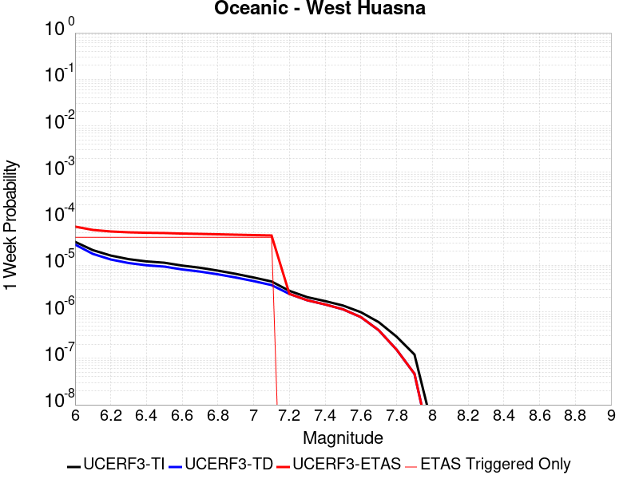 | 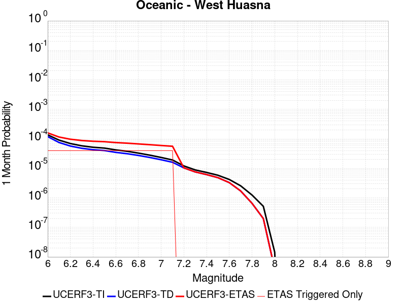 | 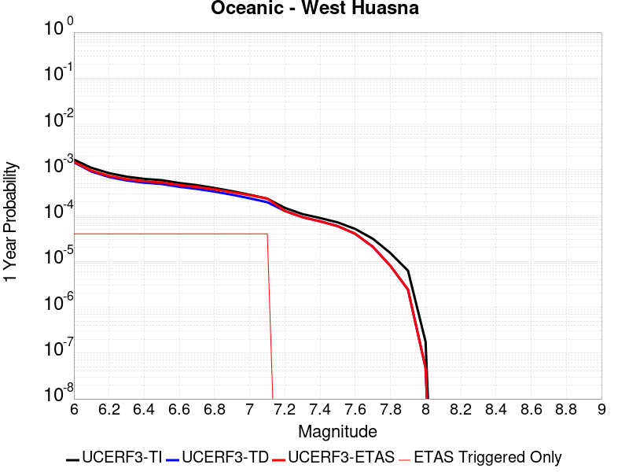 |

| Magnitude | 1 wk TI Prob | 1 wk TD Prob | 1 wk ETAS Prob | 1 wk ETAS/TD Gain | 1 wk ETAS Triggered Only | 1 mo TI Prob | 1 mo TD Prob | 1 mo ETAS Prob | 1 mo ETAS/TD Gain | 1 mo ETAS Triggered Only | 1 yr TI Prob | 1 yr TD Prob | 1 yr ETAS Prob | 1 yr ETAS/TD Gain | 1 yr ETAS Triggered Only |
|-----|-----|-----|-----|-----|-----|-----|-----|-----|-----|-----|-----|-----|-----|-----|-----|
| 6.0 | 3.195567E-5 | 2.7935615E-5 | 6.7934496E-5 | 2.431824 | 4.0E-5 | 1.3694567E-4 | 1.1971882E-4 | 1.5971402E-4 | 1.3340763 | 4.0E-5 | 0.0016660384 | 0.0014566452 | 0.001496587 | 1.0274204 | 4.0E-5 |
| 6.1 | 2.1156782E-5 | 1.757916E-5 | 5.7578458E-5 | 3.2753816 | 4.0E-5 | 9.066878E-5 | 7.5337135E-5 | 1.1533412E-4 | 1.5309067 | 4.0E-5 | 0.0011033333 | 9.16853E-4 | 9.568163E-4 | 1.0435874 | 4.0E-5 |
| 6.2 | 1.6195117E-5 | 1.333068E-5 | 5.3330146E-5 | 4.000557 | 4.0E-5 | 6.9405796E-5 | 5.713025E-5 | 9.7127966E-5 | 1.7001145 | 4.0E-5 | 8.44688E-4 | 6.9534144E-4 | 7.3531363E-4 | 1.0574857 | 4.0E-5 |
| 6.3 | 1.3559345E-5 | 1.1181751E-5 | 5.11813E-5 | 4.5772176 | 4.0E-5 | 5.811018E-5 | 4.7920912E-5 | 8.7919E-5 | 1.8346686 | 4.0E-5 | 7.072618E-4 | 5.8328186E-4 | 6.2325853E-4 | 1.0685375 | 4.0E-5 |
| 6.4 | 1.2120619E-5 | 1.0003182E-5 | 5.000278E-5 | 4.9986877 | 4.0E-5 | 5.1944477E-5 | 4.2870077E-5 | 8.286836E-5 | 1.9330118 | 4.0E-5 | 6.322405E-4 | 5.218187E-4 | 5.617978E-4 | 1.076615 | 4.0E-5 |
| 6.5 | 1.13511915E-5 | 9.369492E-6 | 4.9369115E-5 | 5.269135 | 4.0E-5 | 4.8647056E-5 | 4.0154348E-5 | 8.015274E-5 | 1.9961162 | 4.0E-5 | 5.9211696E-4 | 4.8876996E-4 | 5.287504E-4 | 1.0817981 | 4.0E-5 |
| 6.6 | 9.850605E-6 | 8.137099E-6 | 4.813677E-5 | 5.915717 | 4.0E-5 | 4.2216197E-5 | 3.4872817E-5 | 7.487142E-5 | 2.1469853 | 4.0E-5 | 5.1386096E-4 | 4.2449404E-4 | 4.6447705E-4 | 1.0941899 | 4.0E-5 |
| 6.7 | 8.8558645E-6 | 7.3199412E-6 | 4.731965E-5 | 6.4644847 | 4.0E-5 | 3.7953152E-5 | 3.13708E-5 | 7.136955E-5 | 2.275031 | 4.0E-5 | 4.6198163E-4 | 3.8187273E-4 | 4.2185746E-4 | 1.1047069 | 4.0E-5 |
| 6.8 | 7.67136E-6 | 6.3930647E-6 | 4.6392808E-5 | 7.25674 | 4.0E-5 | 3.2876844E-5 | 2.7398562E-5 | 6.7397465E-5 | 2.4598906 | 4.0E-5 | 4.0020206E-4 | 3.335266E-4 | 3.7351326E-4 | 1.1198905 | 4.0E-5 |
| 6.9 | 6.534529E-6 | 5.459491E-6 | 4.5459274E-5 | 8.326651 | 4.0E-5 | 2.8004823E-5 | 2.339761E-5 | 6.339667E-5 | 2.7095363 | 4.0E-5 | 3.4090536E-4 | 2.848288E-4 | 3.248174E-4 | 1.1403953 | 4.0E-5 |
| 7.0 | 5.460525E-6 | 4.5709203E-6 | 4.4570737E-5 | 9.750934 | 4.0E-5 | 2.3402039E-5 | 1.9589512E-5 | 5.958873E-5 | 3.041869 | 4.0E-5 | 2.8488258E-4 | 2.384763E-4 | 2.7846676E-4 | 1.1676916 | 4.0E-5 |
| 7.1 | 4.4825083E-6 | 3.7533373E-6 | 4.3753185E-5 | 11.657143 | 4.0E-5 | 1.9210609E-5 | 1.6085633E-5 | 5.6084988E-5 | 3.4866512 | 4.0E-5 | 2.3386406E-4 | 1.9582508E-4 | 2.3581724E-4 | 1.204224 | 4.0E-5 |
| 7.2 | 2.821708E-6 | 2.4257495E-6 | 2.4257495E-6 | 1.0 | 0.0 | 1.2092979E-5 | 1.0396027E-5 | 1.0396027E-5 | 1.0 | 0.0 | 1.4722206E-4 | 1.265643E-4 | 1.265643E-4 | 1.0 | 0.0 |
| 7.3 | 2.0644757E-6 | 1.7694833E-6 | 1.7694833E-6 | 1.0 | 0.0 | 8.847723E-6 | 7.5834782E-6 | 7.5834782E-6 | 1.0 | 0.0 | 1.0771569E-4 | 9.232494E-5 | 9.232494E-5 | 1.0 | 0.0 |
| 7.4 | 1.6980367E-6 | 1.438663E-6 | 1.438663E-6 | 1.0 | 0.0 | 7.27728E-6 | 6.165684E-6 | 6.165684E-6 | 1.0 | 0.0 | 8.8597284E-5 | 7.506462E-5 | 7.506462E-5 | 1.0 | 0.0 |
| 7.5 | 1.3637683E-6 | 1.1308925E-6 | 1.1308925E-6 | 1.0 | 0.0 | 5.844708E-6 | 4.8466736E-6 | 4.8466736E-6 | 1.0 | 0.0 | 7.1156996E-5 | 5.9006652E-5 | 5.9006652E-5 | 1.0 | 0.0 |
| 7.6 | 9.802994E-7 | 7.683204E-7 | 7.683204E-7 | 1.0 | 0.0 | 4.2012766E-6 | 3.2927974E-6 | 3.2927974E-6 | 1.0 | 0.0 | 5.1149345E-5 | 4.008907E-5 | 4.008907E-5 | 1.0 | 0.0 |
| 7.7 | 5.986191E-7 | 4.0096745E-7 | 4.0096745E-7 | 1.0 | 0.0 | 2.5655079E-6 | 1.7184307E-6 | 1.7184307E-6 | 1.0 | 0.0 | 3.1234613E-5 | 2.0921694E-5 | 2.0921694E-5 | 1.0 | 0.0 |
| 7.8 | 2.9189815E-7 | 1.5325327E-7 | 1.5325327E-7 | 1.0 | 0.0 | 1.2509914E-6 | 6.567995E-7 | 6.567995E-7 | 1.0 | 0.0 | 1.5230714E-5 | 7.996505E-6 | 7.996505E-6 | 1.0 | 0.0 |
| 7.9 | 1.2057845E-7 | 4.6430397E-8 | 4.6430397E-8 | 1.0 | 0.0 | 5.1676466E-7 | 1.989874E-7 | 1.989874E-7 | 1.0 | 0.0 | 6.2915915E-6 | 2.4226688E-6 | 2.4226688E-6 | 1.0 | 0.0 |
| 8.0 | 3.3806387E-9 | 9.0955077E-10 | 9.0955077E-10 | 1.0 | 0.0 | 1.4488451E-8 | 3.898074E-9 | 3.898074E-9 | 1.0 | 0.0 | 1.7639688E-7 | 4.7459046E-8 | 4.7459046E-8 | 1.0 | 0.0 |

## Big Pine (Central)
*[(top)](#table-of-contents)*

| 1 Week | 1 Month | 1 Year |
|-----|-----|-----|
| 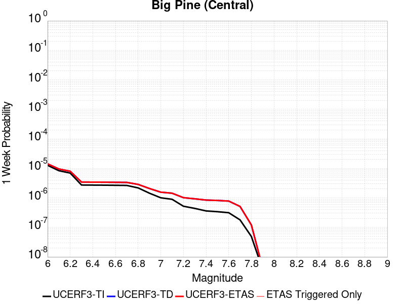 | 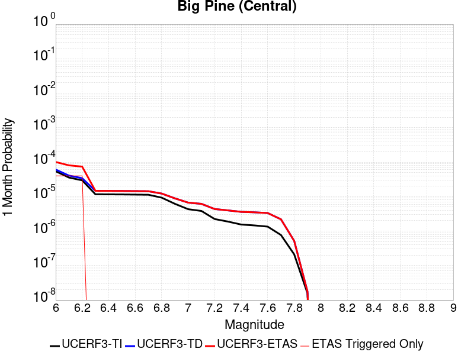 | 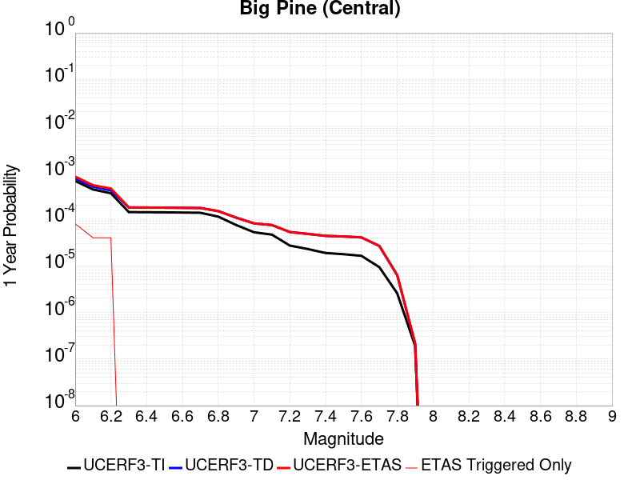 |

| Magnitude | 1 wk TI Prob | 1 wk TD Prob | 1 wk ETAS Prob | 1 wk ETAS/TD Gain | 1 wk ETAS Triggered Only | 1 mo TI Prob | 1 mo TD Prob | 1 mo ETAS Prob | 1 mo ETAS/TD Gain | 1 mo ETAS Triggered Only | 1 yr TI Prob | 1 yr TD Prob | 1 yr ETAS Prob | 1 yr ETAS/TD Gain | 1 yr ETAS Triggered Only |
|-----|-----|-----|-----|-----|-----|-----|-----|-----|-----|-----|-----|-----|-----|-----|-----|
| 6.0 | 1.2706755E-5 | 1.4262975E-5 | 1.4262975E-5 | 1.0 | 0.0 | 5.4456385E-5 | 6.1125815E-5 | 1.0112337E-4 | 1.654348 | 4.0E-5 | 6.628048E-4 | 7.4398925E-4 | 8.2392973E-4 | 1.1074485 | 8.0E-5 |
| 6.1 | 8.342579E-6 | 9.521826E-6 | 9.521826E-6 | 1.0 | 0.0 | 3.5753423E-5 | 4.080731E-5 | 8.080568E-5 | 1.9801766 | 4.0E-5 | 4.3521097E-4 | 4.967375E-4 | 5.367176E-4 | 1.0804855 | 4.0E-5 |
| 6.2 | 6.923899E-6 | 7.977751E-6 | 7.977751E-6 | 1.0 | 0.0 | 2.9673516E-5 | 3.419002E-5 | 7.4188654E-5 | 2.169892 | 4.0E-5 | 3.6121515E-4 | 4.1620323E-4 | 4.561866E-4 | 1.096067 | 4.0E-5 |
| 6.3 | 2.728396E-6 | 3.4336192E-6 | 3.4336192E-6 | 1.0 | 0.0 | 1.1693074E-5 | 1.4715432E-5 | 1.4715432E-5 | 1.0 | 0.0 | 1.4235388E-4 | 1.7914653E-4 | 1.7914653E-4 | 1.0 | 0.0 |
| 6.4 | 2.7136944E-6 | 3.4179088E-6 | 3.4179088E-6 | 1.0 | 0.0 | 1.1630066E-5 | 1.4648103E-5 | 1.4648103E-5 | 1.0 | 0.0 | 1.4158686E-4 | 1.7832694E-4 | 1.7832694E-4 | 1.0 | 0.0 |
| 6.5 | 2.6971882E-6 | 3.4002499E-6 | 3.4002499E-6 | 1.0 | 0.0 | 1.1559327E-5 | 1.45724225E-5 | 1.45724225E-5 | 1.0 | 0.0 | 1.4072572E-4 | 1.7740567E-4 | 1.7740567E-4 | 1.0 | 0.0 |
| 6.6 | 2.669092E-6 | 3.3702636E-6 | 3.3702636E-6 | 1.0 | 0.0 | 1.1438916E-5 | 1.4443911E-5 | 1.4443911E-5 | 1.0 | 0.0 | 1.3925991E-4 | 1.758413E-4 | 1.758413E-4 | 1.0 | 0.0 |
| 6.7 | 2.6408059E-6 | 3.340283E-6 | 3.340283E-6 | 1.0 | 0.0 | 1.1317691E-5 | 1.4315425E-5 | 1.4315425E-5 | 1.0 | 0.0 | 1.3778417E-4 | 1.7427723E-4 | 1.7427723E-4 | 1.0 | 0.0 |
| 6.8 | 2.1786943E-6 | 2.8636898E-6 | 2.8636898E-6 | 1.0 | 0.0 | 9.337228E-6 | 1.22729025E-5 | 1.22729025E-5 | 1.0 | 0.0 | 1.1367482E-4 | 1.4941308E-4 | 1.4941308E-4 | 1.0 | 0.0 |
| 6.9 | 1.4411696E-6 | 2.0773482E-6 | 2.0773482E-6 | 1.0 | 0.0 | 6.1764263E-6 | 8.902892E-6 | 8.902892E-6 | 1.0 | 0.0 | 7.51954E-5 | 1.0838759E-4 | 1.0838759E-4 | 1.0 | 0.0 |
| 7.0 | 1.0073411E-6 | 1.5621584E-6 | 1.5621584E-6 | 1.0 | 0.0 | 4.317169E-6 | 6.6949483E-6 | 6.6949483E-6 | 1.0 | 0.0 | 5.2560266E-5 | 8.15081E-5 | 8.15081E-5 | 1.0 | 0.0 |
| 7.1 | 8.947104E-7 | 1.4380338E-6 | 1.4380338E-6 | 1.0 | 0.0 | 3.834468E-6 | 6.162988E-6 | 6.162988E-6 | 1.0 | 0.0 | 4.6683643E-5 | 7.5031945E-5 | 7.5031945E-5 | 1.0 | 0.0 |
| 7.2 | 5.215166E-7 | 1.0184339E-6 | 1.0184339E-6 | 1.0 | 0.0 | 2.2350691E-6 | 4.3647096E-6 | 4.3647096E-6 | 1.0 | 0.0 | 2.7211627E-5 | 5.3139087E-5 | 5.3139087E-5 | 1.0 | 0.0 |
| 7.3 | 4.4024807E-7 | 9.2900996E-7 | 9.2900996E-7 | 1.0 | 0.0 | 1.8867761E-6 | 3.9814654E-6 | 3.9814654E-6 | 1.0 | 0.0 | 2.2971257E-5 | 4.8473306E-5 | 4.8473306E-5 | 1.0 | 0.0 |
| 7.4 | 3.6130905E-7 | 8.4268595E-7 | 8.4268595E-7 | 1.0 | 0.0 | 1.5484665E-6 | 3.6115064E-6 | 3.6115064E-6 | 1.0 | 0.0 | 1.8852415E-5 | 4.396924E-5 | 4.396924E-5 | 1.0 | 0.0 |
| 7.5 | 3.408184E-7 | 8.175001E-7 | 8.175001E-7 | 1.0 | 0.0 | 1.4606494E-6 | 3.5035673E-6 | 3.5035673E-6 | 1.0 | 0.0 | 1.7783263E-5 | 4.2655138E-5 | 4.2655138E-5 | 1.0 | 0.0 |
| 7.6 | 3.1428627E-7 | 7.7960885E-7 | 7.7960885E-7 | 1.0 | 0.0 | 1.3469405E-6 | 3.3411768E-6 | 3.3411768E-6 | 1.0 | 0.0 | 1.6398877E-5 | 4.0678107E-5 | 4.0678107E-5 | 1.0 | 0.0 |
| 7.7 | 1.7972785E-7 | 5.127105E-7 | 5.127105E-7 | 1.0 | 0.0 | 7.70262E-7 | 2.1973292E-6 | 2.1973292E-6 | 1.0 | 0.0 | 9.377899E-6 | 2.6752165E-5 | 2.6752165E-5 | 1.0 | 0.0 |
| 7.8 | 4.9230927E-8 | 1.2097215E-7 | 1.2097215E-7 | 1.0 | 0.0 | 2.1098968E-7 | 5.1845194E-7 | 5.1845194E-7 | 1.0 | 0.0 | 2.5687964E-6 | 6.312136E-6 | 6.312136E-6 | 1.0 | 0.0 |
| 7.9 | 3.6805972E-9 | 4.1519E-9 | 4.1519E-9 | 1.0 | 0.0 | 1.5773987E-8 | 1.7793857E-8 | 1.7793857E-8 | 1.0 | 0.0 | 1.9204828E-7 | 2.166402E-7 | 2.166402E-7 | 1.0 | 0.0 |

## Paradise
*[(top)](#table-of-contents)*

| 1 Week | 1 Month | 1 Year |
|-----|-----|-----|
| 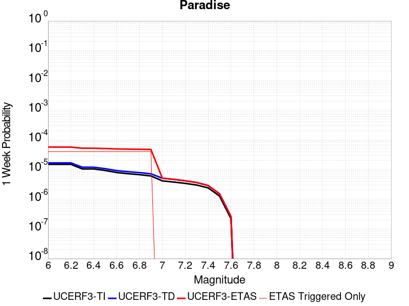 |  | 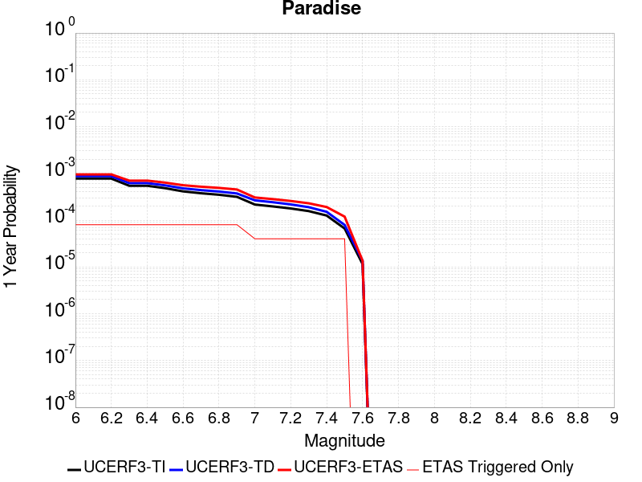 |

| Magnitude | 1 wk TI Prob | 1 wk TD Prob | 1 wk ETAS Prob | 1 wk ETAS/TD Gain | 1 wk ETAS Triggered Only | 1 mo TI Prob | 1 mo TD Prob | 1 mo ETAS Prob | 1 mo ETAS/TD Gain | 1 mo ETAS Triggered Only | 1 yr TI Prob | 1 yr TD Prob | 1 yr ETAS Prob | 1 yr ETAS/TD Gain | 1 yr ETAS Triggered Only |
|-----|-----|-----|-----|-----|-----|-----|-----|-----|-----|-----|-----|-----|-----|-----|-----|
| 6.0 | 1.4851273E-5 | 1.6699274E-5 | 5.6698605E-5 | 3.3952737 | 4.0E-5 | 6.364676E-5 | 7.156649E-5 | 1.1156362E-4 | 1.5588808 | 4.0E-5 | 7.7462377E-4 | 8.7099726E-4 | 9.5092756E-4 | 1.0917687 | 8.0E-5 |
| 6.1 | 1.4851273E-5 | 1.6699274E-5 | 5.6698605E-5 | 3.3952737 | 4.0E-5 | 6.364676E-5 | 7.156649E-5 | 1.1156362E-4 | 1.5588808 | 4.0E-5 | 7.7462377E-4 | 8.7099726E-4 | 9.5092756E-4 | 1.0917687 | 8.0E-5 |
| 6.2 | 1.4851273E-5 | 1.6699274E-5 | 5.6698605E-5 | 3.3952737 | 4.0E-5 | 6.364676E-5 | 7.156649E-5 | 1.1156362E-4 | 1.5588808 | 4.0E-5 | 7.7462377E-4 | 8.7099726E-4 | 9.5092756E-4 | 1.0917687 | 8.0E-5 |
| 6.3 | 1.0426831E-5 | 1.1891795E-5 | 5.189132E-5 | 4.3636236 | 4.0E-5 | 4.4685654E-5 | 5.0963874E-5 | 9.096183E-5 | 1.7848297 | 4.0E-5 | 5.43912E-4 | 6.2031444E-4 | 7.002648E-4 | 1.1288868 | 8.0E-5 |
| 6.4 | 1.0426831E-5 | 1.1891795E-5 | 5.189132E-5 | 4.3636236 | 4.0E-5 | 4.4685654E-5 | 5.0963874E-5 | 9.096183E-5 | 1.7848297 | 4.0E-5 | 5.43912E-4 | 6.2031444E-4 | 7.002648E-4 | 1.1288868 | 8.0E-5 |
| 6.5 | 9.25027E-6 | 1.0622797E-5 | 5.0622373E-5 | 4.7654467 | 4.0E-5 | 3.964341E-5 | 4.5525507E-5 | 8.552369E-5 | 1.8785883 | 4.0E-5 | 4.8255164E-4 | 5.54137E-4 | 6.3409266E-4 | 1.1442887 | 8.0E-5 |
| 6.6 | 7.904275E-6 | 9.16194E-6 | 4.9161576E-5 | 5.3658476 | 4.0E-5 | 3.3875025E-5 | 3.926489E-5 | 7.926332E-5 | 2.0186818 | 4.0E-5 | 4.1235037E-4 | 4.779491E-4 | 5.579109E-4 | 1.1673019 | 8.0E-5 |
| 6.7 | 7.2061953E-6 | 8.409465E-6 | 4.840913E-5 | 5.756505 | 4.0E-5 | 3.088333E-5 | 3.6040088E-5 | 7.603865E-5 | 2.1098351 | 4.0E-5 | 3.7593965E-4 | 4.387034E-4 | 5.186683E-4 | 1.1822755 | 8.0E-5 |
| 6.8 | 6.6948724E-6 | 7.844242E-6 | 4.784393E-5 | 6.099242 | 4.0E-5 | 2.8691995E-5 | 3.3617765E-5 | 7.361642E-5 | 2.1898072 | 4.0E-5 | 3.4926904E-4 | 4.09223E-4 | 4.891903E-4 | 1.1954124 | 8.0E-5 |
| 6.9 | 6.0421025E-6 | 7.132518E-6 | 4.713223E-5 | 6.6080775 | 4.0E-5 | 2.5894467E-5 | 3.0567597E-5 | 7.056637E-5 | 2.3085353 | 4.0E-5 | 3.1521954E-4 | 3.7210033E-4 | 4.5207056E-4 | 1.2149158 | 8.0E-5 |
| 7.0 | 4.134091E-6 | 5.081757E-6 | 5.081757E-6 | 1.0 | 0.0 | 1.7717413E-5 | 2.1778787E-5 | 2.1778787E-5 | 1.0 | 0.0 | 2.1568815E-4 | 2.65126E-4 | 3.051154E-4 | 1.1508317 | 4.0E-5 |
| 7.1 | 3.7674888E-6 | 4.6332075E-6 | 4.6332075E-6 | 1.0 | 0.0 | 1.6146281E-5 | 1.9856461E-5 | 1.9856461E-5 | 1.0 | 0.0 | 1.9656324E-4 | 2.4172712E-4 | 2.8171745E-4 | 1.1654358 | 4.0E-5 |
| 7.2 | 3.4065345E-6 | 4.1579556E-6 | 4.1579556E-6 | 1.0 | 0.0 | 1.4599351E-5 | 1.7819697E-5 | 1.7819697E-5 | 1.0 | 0.0 | 1.777326E-4 | 2.1693471E-4 | 2.5692603E-4 | 1.1843473 | 4.0E-5 |
| 7.3 | 2.9934936E-6 | 3.630208E-6 | 3.630208E-6 | 1.0 | 0.0 | 1.2829195E-5 | 1.5557951E-5 | 1.5557951E-5 | 1.0 | 0.0 | 1.5618425E-4 | 1.8940306E-4 | 2.2939547E-4 | 1.2111498 | 4.0E-5 |
| 7.4 | 2.4049796E-6 | 2.8895333E-6 | 2.8895333E-6 | 1.0 | 0.0 | 1.0307015E-5 | 1.23836635E-5 | 1.23836635E-5 | 1.0 | 0.0 | 1.2548068E-4 | 1.5076212E-4 | 1.9075608E-4 | 1.2652787 | 4.0E-5 |
| 7.5 | 1.2710091E-6 | 1.5137343E-6 | 1.5137343E-6 | 1.0 | 0.0 | 5.44717E-6 | 6.487424E-6 | 6.487424E-6 | 1.0 | 0.0 | 6.631728E-5 | 7.8982775E-5 | 1.1897961E-4 | 1.5063995 | 4.0E-5 |
| 7.6 | 2.21172E-7 | 2.6043384E-7 | 2.6043384E-7 | 1.0 | 0.0 | 9.478797E-7 | 1.1161446E-6 | 1.1161446E-6 | 1.0 | 0.0 | 1.1540374E-5 | 1.3589005E-5 | 1.3589005E-5 | 1.0 | 0.0 |

## Cucamonga
*[(top)](#table-of-contents)*

| 1 Week | 1 Month | 1 Year |
|-----|-----|-----|
| 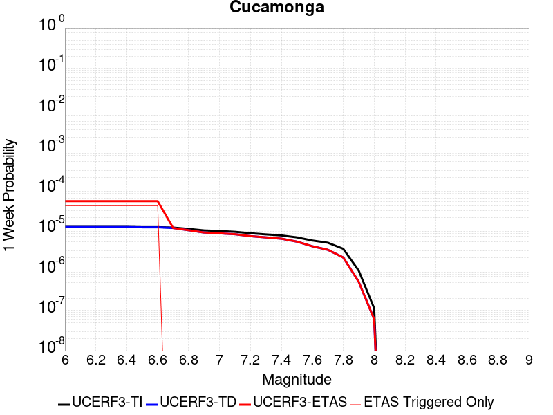 |  | 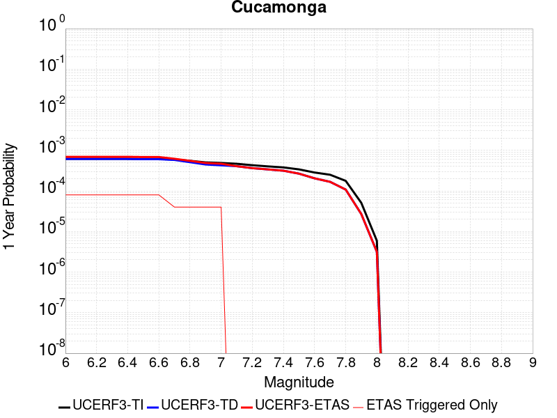 |

| Magnitude | 1 wk TI Prob | 1 wk TD Prob | 1 wk ETAS Prob | 1 wk ETAS/TD Gain | 1 wk ETAS Triggered Only | 1 mo TI Prob | 1 mo TD Prob | 1 mo ETAS Prob | 1 mo ETAS/TD Gain | 1 mo ETAS Triggered Only | 1 yr TI Prob | 1 yr TD Prob | 1 yr ETAS Prob | 1 yr ETAS/TD Gain | 1 yr ETAS Triggered Only |
|-----|-----|-----|-----|-----|-----|-----|-----|-----|-----|-----|-----|-----|-----|-----|-----|
| 6.0 | 1.1848348E-5 | 1.175498E-5 | 5.175451E-5 | 4.402773 | 4.0E-5 | 5.0777642E-5 | 5.037753E-5 | 9.037551E-5 | 1.7939649 | 4.0E-5 | 6.180424E-4 | 6.131765E-4 | 6.9312745E-4 | 1.1303881 | 8.0E-5 |
| 6.1 | 1.1848348E-5 | 1.175498E-5 | 5.175451E-5 | 4.402773 | 4.0E-5 | 5.0777642E-5 | 5.037753E-5 | 9.037551E-5 | 1.7939649 | 4.0E-5 | 6.180424E-4 | 6.131765E-4 | 6.9312745E-4 | 1.1303881 | 8.0E-5 |
| 6.2 | 1.1848348E-5 | 1.175498E-5 | 5.175451E-5 | 4.402773 | 4.0E-5 | 5.0777642E-5 | 5.037753E-5 | 9.037551E-5 | 1.7939649 | 4.0E-5 | 6.180424E-4 | 6.131765E-4 | 6.9312745E-4 | 1.1303881 | 8.0E-5 |
| 6.3 | 1.1848348E-5 | 1.175498E-5 | 5.175451E-5 | 4.402773 | 4.0E-5 | 5.0777642E-5 | 5.037753E-5 | 9.037551E-5 | 1.7939649 | 4.0E-5 | 6.180424E-4 | 6.131765E-4 | 6.9312745E-4 | 1.1303881 | 8.0E-5 |
| 6.4 | 1.1848348E-5 | 1.175498E-5 | 5.175451E-5 | 4.402773 | 4.0E-5 | 5.0777642E-5 | 5.037753E-5 | 9.037551E-5 | 1.7939649 | 4.0E-5 | 6.180424E-4 | 6.131765E-4 | 6.9312745E-4 | 1.1303881 | 8.0E-5 |
| 6.5 | 1.16988695E-5 | 1.1593969E-5 | 5.1593506E-5 | 4.4500294 | 4.0E-5 | 5.013705E-5 | 4.9687507E-5 | 8.968552E-5 | 1.8049914 | 4.0E-5 | 6.102476E-4 | 6.0478016E-4 | 6.847318E-4 | 1.1321995 | 8.0E-5 |
| 6.6 | 1.16988695E-5 | 1.1593969E-5 | 5.1593506E-5 | 4.4500294 | 4.0E-5 | 5.013705E-5 | 4.9687507E-5 | 8.968552E-5 | 1.8049914 | 4.0E-5 | 6.102476E-4 | 6.0478016E-4 | 6.847318E-4 | 1.1321995 | 8.0E-5 |
| 6.7 | 1.1397107E-5 | 1.1132429E-5 | 1.1132429E-5 | 1.0 | 0.0 | 4.884383E-5 | 4.7709553E-5 | 4.7709553E-5 | 1.0 | 0.0 | 5.9451134E-4 | 5.8071146E-4 | 6.2068825E-4 | 1.068841 | 4.0E-5 |
| 6.8 | 1.058387E-5 | 9.800426E-6 | 9.800426E-6 | 1.0 | 0.0 | 4.5358654E-5 | 4.2001153E-5 | 4.2001153E-5 | 1.0 | 0.0 | 5.521017E-4 | 5.1124516E-4 | 5.5122474E-4 | 1.0782003 | 4.0E-5 |
| 6.9 | 9.690046E-6 | 8.593562E-6 | 8.593562E-6 | 1.0 | 0.0 | 4.1528107E-5 | 3.6829035E-5 | 3.6829035E-5 | 1.0 | 0.0 | 5.054874E-4 | 4.4830164E-4 | 4.882837E-4 | 1.0891856 | 4.0E-5 |
| 7.0 | 9.381461E-6 | 8.200822E-6 | 8.200822E-6 | 1.0 | 0.0 | 4.020564E-5 | 3.5145906E-5 | 3.5145906E-5 | 1.0 | 0.0 | 4.893937E-4 | 4.2781778E-4 | 4.6780065E-4 | 1.0934577 | 4.0E-5 |
| 7.1 | 8.946492E-6 | 7.795345E-6 | 7.795345E-6 | 1.0 | 0.0 | 3.8341543E-5 | 3.3408196E-5 | 3.3408196E-5 | 1.0 | 0.0 | 4.667083E-4 | 4.0666916E-4 | 4.0666916E-4 | 1.0 | 0.0 |
| 7.2 | 8.251016E-6 | 6.987864E-6 | 6.987864E-6 | 1.0 | 0.0 | 3.5361016E-5 | 2.9947647E-5 | 2.9947647E-5 | 1.0 | 0.0 | 4.3043532E-4 | 3.6455182E-4 | 3.6455182E-4 | 1.0 | 0.0 |
| 7.3 | 7.717881E-6 | 6.4985484E-6 | 6.4985484E-6 | 1.0 | 0.0 | 3.3076216E-5 | 2.7850625E-5 | 2.7850625E-5 | 1.0 | 0.0 | 4.026285E-4 | 3.3902883E-4 | 3.3902883E-4 | 1.0 | 0.0 |
| 7.4 | 7.275623E-6 | 6.0437287E-6 | 6.0437287E-6 | 1.0 | 0.0 | 3.118087E-5 | 2.5901438E-5 | 2.5901438E-5 | 1.0 | 0.0 | 3.7956095E-4 | 3.1530458E-4 | 3.1530458E-4 | 1.0 | 0.0 |
| 7.5 | 6.5109502E-6 | 5.11101E-6 | 5.11101E-6 | 1.0 | 0.0 | 2.7903774E-5 | 2.1904145E-5 | 2.1904145E-5 | 1.0 | 0.0 | 3.3967546E-4 | 2.666505E-4 | 2.666505E-4 | 1.0 | 0.0 |
| 7.6 | 5.4495326E-6 | 3.9178576E-6 | 3.9178576E-6 | 1.0 | 0.0 | 2.335493E-5 | 1.6790711E-5 | 1.6790711E-5 | 1.0 | 0.0 | 2.8430918E-4 | 2.044078E-4 | 2.044078E-4 | 1.0 | 0.0 |
| 7.7 | 4.7997164E-6 | 3.208653E-6 | 3.208653E-6 | 1.0 | 0.0 | 2.057005E-5 | 1.3751297E-5 | 1.3751297E-5 | 1.0 | 0.0 | 2.504116E-4 | 1.6740922E-4 | 1.6740922E-4 | 1.0 | 0.0 |
| 7.8 | 3.3941733E-6 | 2.0686311E-6 | 2.0686311E-6 | 1.0 | 0.0 | 1.4546376E-5 | 8.865532E-6 | 8.865532E-6 | 1.0 | 0.0 | 1.7708774E-4 | 1.0793252E-4 | 1.0793252E-4 | 1.0 | 0.0 |
| 7.9 | 9.750552E-7 | 5.1662437E-7 | 5.1662437E-7 | 1.0 | 0.0 | 4.178801E-6 | 2.2141026E-6 | 2.2141026E-6 | 1.0 | 0.0 | 5.0875715E-5 | 2.695637E-5 | 2.695637E-5 | 1.0 | 0.0 |
| 8.0 | 1.133857E-7 | 6.0622384E-8 | 6.0622384E-8 | 1.0 | 0.0 | 4.8593864E-7 | 2.5981018E-7 | 2.5981018E-7 | 1.0 | 0.0 | 5.9162867E-6 | 3.1631846E-6 | 3.1631846E-6 | 1.0 | 0.0 |

## Great Valley 08 (Quinto)
*[(top)](#table-of-contents)*

| 1 Week | 1 Month | 1 Year |
|-----|-----|-----|
| 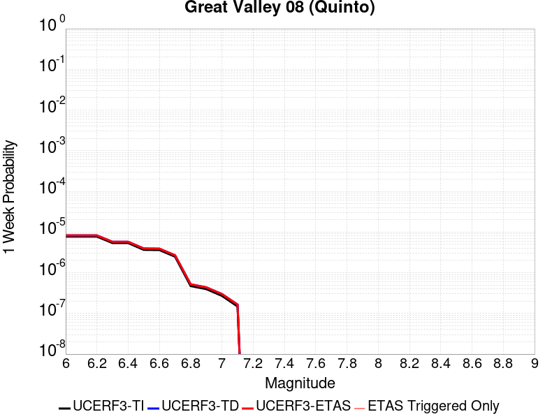 | 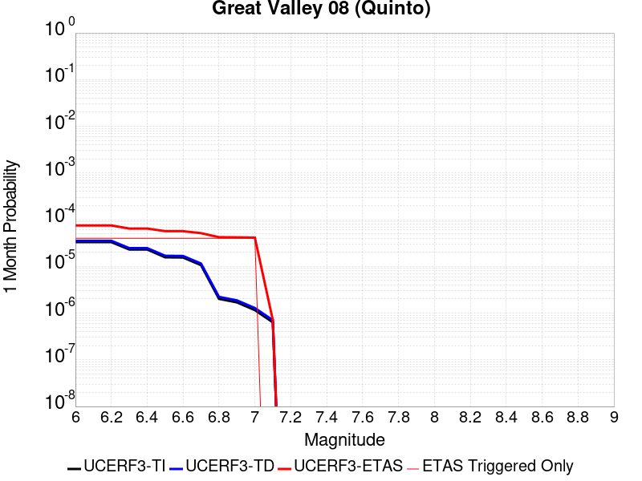 |  |

| Magnitude | 1 wk TI Prob | 1 wk TD Prob | 1 wk ETAS Prob | 1 wk ETAS/TD Gain | 1 wk ETAS Triggered Only | 1 mo TI Prob | 1 mo TD Prob | 1 mo ETAS Prob | 1 mo ETAS/TD Gain | 1 mo ETAS Triggered Only | 1 yr TI Prob | 1 yr TD Prob | 1 yr ETAS Prob | 1 yr ETAS/TD Gain | 1 yr ETAS Triggered Only |
|-----|-----|-----|-----|-----|-----|-----|-----|-----|-----|-----|-----|-----|-----|-----|-----|
| 6.0 | 7.737697E-6 | 8.254906E-6 | 8.254906E-6 | 1.0 | 0.0 | 3.3161137E-5 | 3.5377794E-5 | 7.537638E-5 | 2.1306126 | 4.0E-5 | 4.0366207E-4 | 4.306584E-4 | 4.7064116E-4 | 1.092841 | 4.0E-5 |
| 6.1 | 7.737697E-6 | 8.254906E-6 | 8.254906E-6 | 1.0 | 0.0 | 3.3161137E-5 | 3.5377794E-5 | 7.537638E-5 | 2.1306126 | 4.0E-5 | 4.0366207E-4 | 4.306584E-4 | 4.7064116E-4 | 1.092841 | 4.0E-5 |
| 6.2 | 7.737697E-6 | 8.254906E-6 | 8.254906E-6 | 1.0 | 0.0 | 3.3161137E-5 | 3.5377794E-5 | 7.537638E-5 | 2.1306126 | 4.0E-5 | 4.0366207E-4 | 4.306584E-4 | 4.7064116E-4 | 1.092841 | 4.0E-5 |
| 6.3 | 5.374012E-6 | 5.7519437E-6 | 5.7519437E-6 | 1.0 | 0.0 | 2.3031276E-5 | 2.4651017E-5 | 6.4650034E-5 | 2.622611 | 4.0E-5 | 2.803697E-4 | 3.0009594E-4 | 3.4008393E-4 | 1.1332507 | 4.0E-5 |
| 6.4 | 5.374012E-6 | 5.7519437E-6 | 5.7519437E-6 | 1.0 | 0.0 | 2.3031276E-5 | 2.4651017E-5 | 6.4650034E-5 | 2.622611 | 4.0E-5 | 2.803697E-4 | 3.0009594E-4 | 3.4008393E-4 | 1.1332507 | 4.0E-5 |
| 6.5 | 3.65427E-6 | 3.942375E-6 | 3.942375E-6 | 1.0 | 0.0 | 1.5661062E-5 | 1.6895821E-5 | 5.6895147E-5 | 3.3674092 | 4.0E-5 | 1.9065675E-4 | 2.0569426E-4 | 2.4568604E-4 | 1.1944233 | 4.0E-5 |
| 6.6 | 3.6143538E-6 | 3.899551E-6 | 3.899551E-6 | 1.0 | 0.0 | 1.5489995E-5 | 1.6712293E-5 | 5.6711626E-5 | 3.3934078 | 4.0E-5 | 1.8857437E-4 | 2.0346022E-4 | 2.4345209E-4 | 1.1965586 | 4.0E-5 |
| 6.7 | 2.4821015E-6 | 2.6864545E-6 | 2.6864545E-6 | 1.0 | 0.0 | 1.0637535E-5 | 1.1513357E-5 | 5.1512896E-5 | 4.4741855 | 4.0E-5 | 1.2950429E-4 | 1.4017177E-4 | 1.8016616E-4 | 1.2853242 | 4.0E-5 |
| 6.8 | 4.7110538E-7 | 5.194823E-7 | 5.194823E-7 | 1.0 | 0.0 | 2.0190216E-6 | 2.2263507E-6 | 4.222626E-5 | 18.966581 | 4.0E-5 | 2.458131E-5 | 2.7105503E-5 | 6.710442E-5 | 2.475675 | 4.0E-5 |
| 6.9 | 3.958685E-7 | 4.3718865E-7 | 4.3718865E-7 | 1.0 | 0.0 | 1.6965782E-6 | 1.8736644E-6 | 4.187359E-5 | 22.348501 | 4.0E-5 | 2.0655643E-5 | 2.281164E-5 | 6.281073E-5 | 2.7534506 | 4.0E-5 |
| 7.0 | 2.70294E-7 | 2.9930857E-7 | 2.9930857E-7 | 1.0 | 0.0 | 1.1584025E-6 | 1.2827504E-6 | 4.12827E-5 | 32.182953 | 4.0E-5 | 1.4103458E-5 | 1.5617388E-5 | 5.5616765E-5 | 3.5612078 | 4.0E-5 |
| 7.1 | 1.4828602E-7 | 1.6475283E-7 | 1.6475283E-7 | 1.0 | 0.0 | 6.3551136E-7 | 7.060834E-7 | 7.060834E-7 | 1.0 | 0.0 | 7.737323E-6 | 8.59654E-6 | 8.59654E-6 | 1.0 | 0.0 |

## Channel Islands Western Deep Ramp
*[(top)](#table-of-contents)*

| 1 Week | 1 Month | 1 Year |
|-----|-----|-----|
| 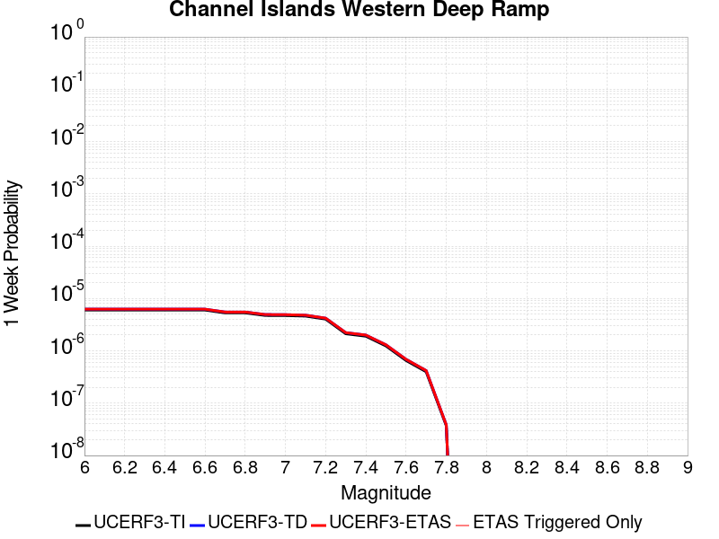 | 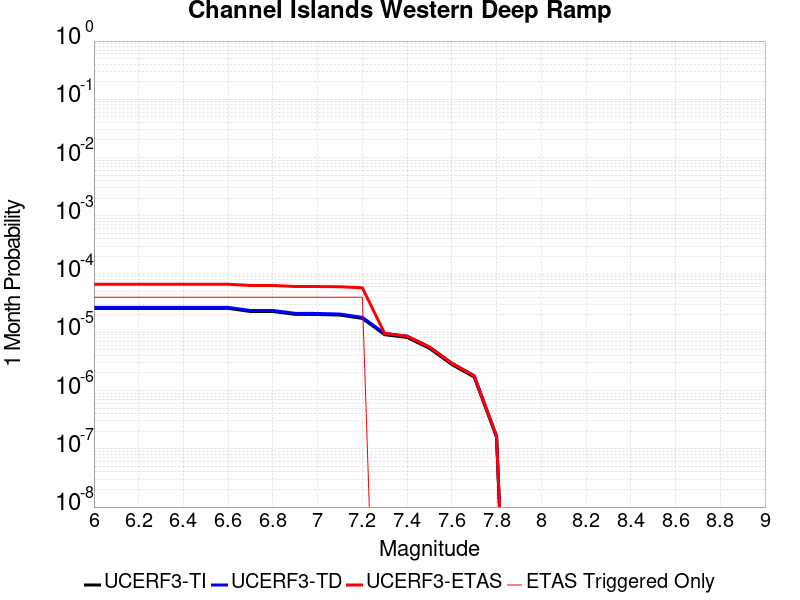 | 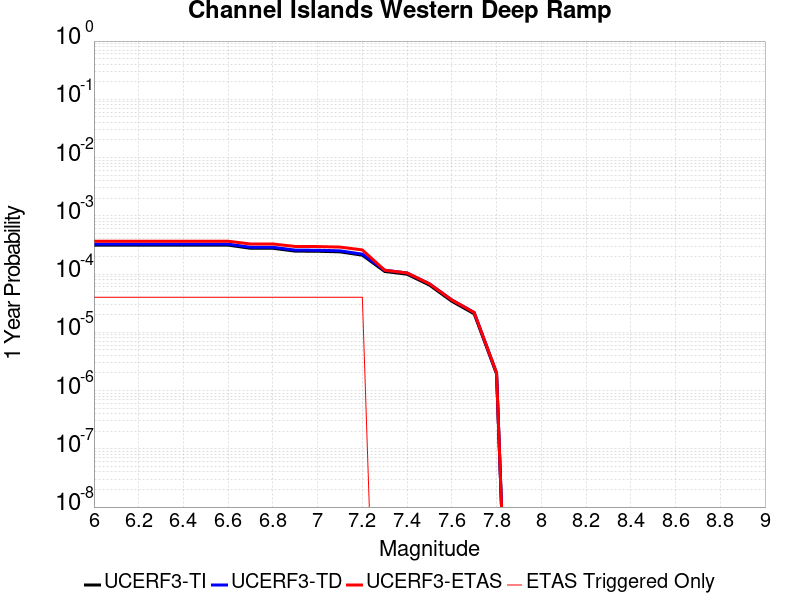 |

| Magnitude | 1 wk TI Prob | 1 wk TD Prob | 1 wk ETAS Prob | 1 wk ETAS/TD Gain | 1 wk ETAS Triggered Only | 1 mo TI Prob | 1 mo TD Prob | 1 mo ETAS Prob | 1 mo ETAS/TD Gain | 1 mo ETAS Triggered Only | 1 yr TI Prob | 1 yr TD Prob | 1 yr ETAS Prob | 1 yr ETAS/TD Gain | 1 yr ETAS Triggered Only |
|-----|-----|-----|-----|-----|-----|-----|-----|-----|-----|-----|-----|-----|-----|-----|-----|
| 6.0 | 6.0213506E-6 | 6.2556924E-6 | 6.2556924E-6 | 1.0 | 0.0 | 2.5805533E-5 | 2.6809861E-5 | 6.680879E-5 | 2.4919484 | 4.0E-5 | 3.1413708E-4 | 3.2636564E-4 | 3.663526E-4 | 1.1225219 | 4.0E-5 |
| 6.1 | 6.0213506E-6 | 6.2556924E-6 | 6.2556924E-6 | 1.0 | 0.0 | 2.5805533E-5 | 2.6809861E-5 | 6.680879E-5 | 2.4919484 | 4.0E-5 | 3.1413708E-4 | 3.2636564E-4 | 3.663526E-4 | 1.1225219 | 4.0E-5 |
| 6.2 | 6.0213506E-6 | 6.2556924E-6 | 6.2556924E-6 | 1.0 | 0.0 | 2.5805533E-5 | 2.6809861E-5 | 6.680879E-5 | 2.4919484 | 4.0E-5 | 3.1413708E-4 | 3.2636564E-4 | 3.663526E-4 | 1.1225219 | 4.0E-5 |
| 6.3 | 6.0213506E-6 | 6.2556924E-6 | 6.2556924E-6 | 1.0 | 0.0 | 2.5805533E-5 | 2.6809861E-5 | 6.680879E-5 | 2.4919484 | 4.0E-5 | 3.1413708E-4 | 3.2636564E-4 | 3.663526E-4 | 1.1225219 | 4.0E-5 |
| 6.4 | 6.0213506E-6 | 6.2556924E-6 | 6.2556924E-6 | 1.0 | 0.0 | 2.5805533E-5 | 2.6809861E-5 | 6.680879E-5 | 2.4919484 | 4.0E-5 | 3.1413708E-4 | 3.2636564E-4 | 3.663526E-4 | 1.1225219 | 4.0E-5 |
| 6.5 | 6.0213506E-6 | 6.2556924E-6 | 6.2556924E-6 | 1.0 | 0.0 | 2.5805533E-5 | 2.6809861E-5 | 6.680879E-5 | 2.4919484 | 4.0E-5 | 3.1413708E-4 | 3.2636564E-4 | 3.663526E-4 | 1.1225219 | 4.0E-5 |
| 6.6 | 6.0213506E-6 | 6.2556924E-6 | 6.2556924E-6 | 1.0 | 0.0 | 2.5805533E-5 | 2.6809861E-5 | 6.680879E-5 | 2.4919484 | 4.0E-5 | 3.1413708E-4 | 3.2636564E-4 | 3.663526E-4 | 1.1225219 | 4.0E-5 |
| 6.7 | 5.313309E-6 | 5.5259893E-6 | 5.5259893E-6 | 1.0 | 0.0 | 2.2771126E-5 | 2.368262E-5 | 6.368167E-5 | 2.6889625 | 4.0E-5 | 2.772032E-4 | 2.8830185E-4 | 3.282903E-4 | 1.1387035 | 4.0E-5 |
| 6.8 | 5.313309E-6 | 5.5259893E-6 | 5.5259893E-6 | 1.0 | 0.0 | 2.2771126E-5 | 2.368262E-5 | 6.368167E-5 | 2.6889625 | 4.0E-5 | 2.772032E-4 | 2.8830185E-4 | 3.282903E-4 | 1.1387035 | 4.0E-5 |
| 6.9 | 4.744377E-6 | 4.9401206E-6 | 4.9401206E-6 | 1.0 | 0.0 | 2.0332885E-5 | 2.1171794E-5 | 6.117095E-5 | 2.8892663 | 4.0E-5 | 2.4752476E-4 | 2.5773983E-4 | 2.9772954E-4 | 1.1551553 | 4.0E-5 |
| 7.0 | 4.722209E-6 | 4.9171604E-6 | 4.9171604E-6 | 1.0 | 0.0 | 2.0237881E-5 | 2.1073394E-5 | 6.1072555E-5 | 2.898088 | 4.0E-5 | 2.4636835E-4 | 2.5654212E-4 | 2.9653186E-4 | 1.1558799 | 4.0E-5 |
| 7.1 | 4.611174E-6 | 4.802082E-6 | 4.802082E-6 | 1.0 | 0.0 | 1.9762025E-5 | 2.058021E-5 | 6.0579387E-5 | 2.9435747 | 4.0E-5 | 2.4057609E-4 | 2.50539E-4 | 2.9052896E-4 | 1.1596158 | 4.0E-5 |
| 7.2 | 4.043994E-6 | 4.212621E-6 | 4.212621E-6 | 1.0 | 0.0 | 1.7331287E-5 | 1.8053986E-5 | 5.8053265E-5 | 3.215537 | 4.0E-5 | 2.10988E-4 | 2.197887E-4 | 2.597799E-4 | 1.181953 | 4.0E-5 |
| 7.3 | 2.1233036E-6 | 2.2301667E-6 | 2.2301667E-6 | 1.0 | 0.0 | 9.099841E-6 | 9.557823E-6 | 9.557823E-6 | 1.0 | 0.0 | 1.1078493E-4 | 1.1636034E-4 | 1.1636034E-4 | 1.0 | 0.0 |
| 7.4 | 1.9051884E-6 | 2.0018406E-6 | 2.0018406E-6 | 1.0 | 0.0 | 8.165067E-6 | 8.579289E-6 | 8.579289E-6 | 1.0 | 0.0 | 9.940516E-5 | 1.04447885E-4 | 1.04447885E-4 | 1.0 | 0.0 |
| 7.5 | 1.2408497E-6 | 1.3041087E-6 | 1.3041087E-6 | 1.0 | 0.0 | 5.317916E-6 | 5.5890255E-6 | 5.5890255E-6 | 1.0 | 0.0 | 6.4743705E-5 | 6.804428E-5 | 6.804428E-5 | 1.0 | 0.0 |
| 7.6 | 6.5440025E-7 | 6.887942E-7 | 6.887942E-7 | 1.0 | 0.0 | 2.8045695E-6 | 2.951972E-6 | 2.951972E-6 | 1.0 | 0.0 | 3.4145098E-5 | 3.593968E-5 | 3.593968E-5 | 1.0 | 0.0 |
| 7.7 | 3.985963E-7 | 4.1938182E-7 | 4.1938182E-7 | 1.0 | 0.0 | 1.7082689E-6 | 1.7973495E-6 | 1.7973495E-6 | 1.0 | 0.0 | 2.0797976E-5 | 2.1882523E-5 | 2.1882523E-5 | 1.0 | 0.0 |
| 7.8 | 3.706329E-8 | 3.859719E-8 | 3.859719E-8 | 1.0 | 0.0 | 1.5884267E-7 | 1.6541652E-7 | 1.6541652E-7 | 1.0 | 0.0 | 1.9339077E-6 | 2.0139444E-6 | 2.0139444E-6 | 1.0 | 0.0 |

## Lake Isabella (Seismicity)
*[(top)](#table-of-contents)*

| 1 Week | 1 Month | 1 Year |
|-----|-----|-----|
| 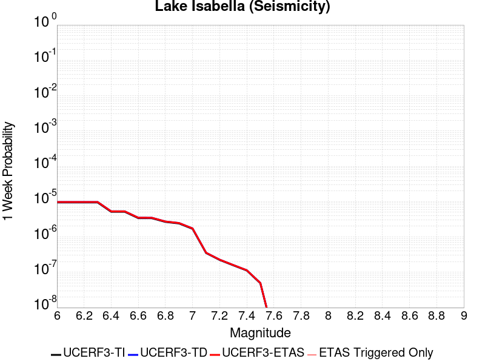 | 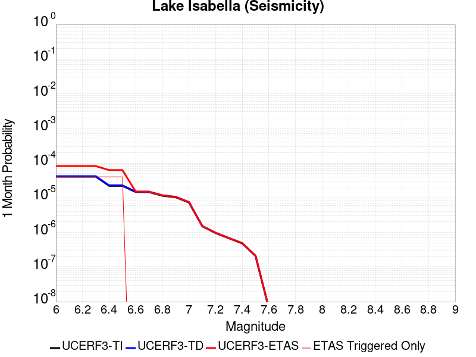 | 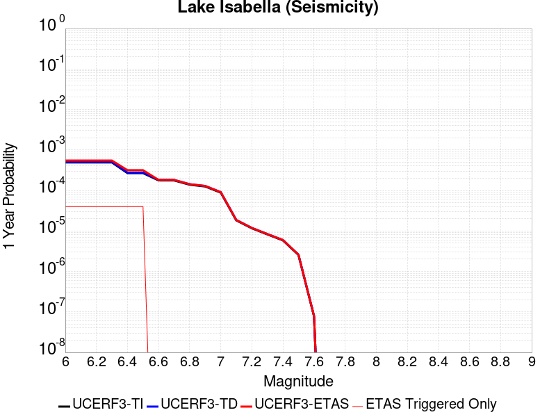 |

| Magnitude | 1 wk TI Prob | 1 wk TD Prob | 1 wk ETAS Prob | 1 wk ETAS/TD Gain | 1 wk ETAS Triggered Only | 1 mo TI Prob | 1 mo TD Prob | 1 mo ETAS Prob | 1 mo ETAS/TD Gain | 1 mo ETAS Triggered Only | 1 yr TI Prob | 1 yr TD Prob | 1 yr ETAS Prob | 1 yr ETAS/TD Gain | 1 yr ETAS Triggered Only |
|-----|-----|-----|-----|-----|-----|-----|-----|-----|-----|-----|-----|-----|-----|-----|-----|
| 6.0 | 9.431637E-6 | 9.742737E-6 | 9.742737E-6 | 1.0 | 0.0 | 4.0420677E-5 | 4.1753996E-5 | 8.1752325E-5 | 1.9579521 | 4.0E-5 | 4.920106E-4 | 5.082494E-4 | 5.48229E-4 | 1.0786616 | 4.0E-5 |
| 6.1 | 9.431637E-6 | 9.742737E-6 | 9.742737E-6 | 1.0 | 0.0 | 4.0420677E-5 | 4.1753996E-5 | 8.1752325E-5 | 1.9579521 | 4.0E-5 | 4.920106E-4 | 5.082494E-4 | 5.48229E-4 | 1.0786616 | 4.0E-5 |
| 6.2 | 9.431637E-6 | 9.742737E-6 | 9.742737E-6 | 1.0 | 0.0 | 4.0420677E-5 | 4.1753996E-5 | 8.1752325E-5 | 1.9579521 | 4.0E-5 | 4.920106E-4 | 5.082494E-4 | 5.48229E-4 | 1.0786616 | 4.0E-5 |
| 6.3 | 9.431637E-6 | 9.742737E-6 | 9.742737E-6 | 1.0 | 0.0 | 4.0420677E-5 | 4.1753996E-5 | 8.1752325E-5 | 1.9579521 | 4.0E-5 | 4.920106E-4 | 5.082494E-4 | 5.48229E-4 | 1.0786616 | 4.0E-5 |
| 6.4 | 5.144063E-6 | 5.300621E-6 | 5.300621E-6 | 1.0 | 0.0 | 2.2045799E-5 | 2.271677E-5 | 6.271586E-5 | 2.7607737 | 4.0E-5 | 2.6837454E-4 | 2.7654503E-4 | 3.1653396E-4 | 1.144602 | 4.0E-5 |
| 6.5 | 5.144063E-6 | 5.300621E-6 | 5.300621E-6 | 1.0 | 0.0 | 2.2045799E-5 | 2.271677E-5 | 6.271586E-5 | 2.7607737 | 4.0E-5 | 2.6837454E-4 | 2.7654503E-4 | 3.1653396E-4 | 1.144602 | 4.0E-5 |
| 6.6 | 3.4009804E-6 | 3.4991274E-6 | 3.4991274E-6 | 1.0 | 0.0 | 1.4575549E-5 | 1.49961825E-5 | 1.49961825E-5 | 1.0 | 0.0 | 1.7744285E-4 | 1.8256484E-4 | 1.8256484E-4 | 1.0 | 0.0 |
| 6.7 | 3.3880428E-6 | 3.4859934E-6 | 3.4859934E-6 | 1.0 | 0.0 | 1.4520103E-5 | 1.4939895E-5 | 1.4939895E-5 | 1.0 | 0.0 | 1.767679E-4 | 1.8187964E-4 | 1.8187964E-4 | 1.0 | 0.0 |
| 6.8 | 2.6582E-6 | 2.7339636E-6 | 2.7339636E-6 | 1.0 | 0.0 | 1.1392236E-5 | 1.1716941E-5 | 1.1716941E-5 | 1.0 | 0.0 | 1.3869164E-4 | 1.4264577E-4 | 1.4264577E-4 | 1.0 | 0.0 |
| 6.9 | 2.406011E-6 | 2.474567E-6 | 2.474567E-6 | 1.0 | 0.0 | 1.0311434E-5 | 1.0605252E-5 | 1.0605252E-5 | 1.0 | 0.0 | 1.2553448E-4 | 1.2911261E-4 | 1.2911261E-4 | 1.0 | 0.0 |
| 7.0 | 1.6953097E-6 | 1.7431032E-6 | 1.7431032E-6 | 1.0 | 0.0 | 7.265593E-6 | 7.470427E-6 | 7.470427E-6 | 1.0 | 0.0 | 8.8455E-5 | 9.09497E-5 | 9.09497E-5 | 1.0 | 0.0 |
| 7.1 | 3.5013824E-7 | 3.5717247E-7 | 3.5717247E-7 | 1.0 | 0.0 | 1.5005916E-6 | 1.5307382E-6 | 1.5307382E-6 | 1.0 | 0.0 | 1.826955E-5 | 1.8636581E-5 | 1.8636581E-5 | 1.0 | 0.0 |
| 7.2 | 2.2321095E-7 | 2.2752057E-7 | 2.2752057E-7 | 1.0 | 0.0 | 9.56618E-7 | 9.750878E-7 | 9.750878E-7 | 1.0 | 0.0 | 1.1646762E-5 | 1.1871631E-5 | 1.1871631E-5 | 1.0 | 0.0 |
| 7.3 | 1.5760406E-7 | 1.606196E-7 | 1.606196E-7 | 1.0 | 0.0 | 6.7544585E-7 | 6.8836954E-7 | 6.8836954E-7 | 1.0 | 0.0 | 8.223522E-6 | 8.380867E-6 | 8.380867E-6 | 1.0 | 0.0 |
| 7.4 | 1.1216497E-7 | 1.1432449E-7 | 1.1432449E-7 | 1.0 | 0.0 | 4.8070694E-7 | 4.89962E-7 | 4.89962E-7 | 1.0 | 0.0 | 5.852591E-6 | 5.965272E-6 | 5.965272E-6 | 1.0 | 0.0 |
| 7.5 | 4.885185E-8 | 4.979097E-8 | 4.979097E-8 | 1.0 | 0.0 | 2.0936506E-7 | 2.1338985E-7 | 2.1338985E-7 | 1.0 | 0.0 | 2.5490165E-6 | 2.5980185E-6 | 2.5980185E-6 | 1.0 | 0.0 |
| 7.6 | 1.504641E-9 | 1.531884E-9 | 1.531884E-9 | 1.0 | 0.0 | 6.4484613E-9 | 6.565217E-9 | 6.565217E-9 | 1.0 | 0.0 | 7.851001E-8 | 7.993152E-8 | 7.993152E-8 | 1.0 | 0.0 |

## Calaveras (So) 2011 CFM
*[(top)](#table-of-contents)*

| 1 Week | 1 Month | 1 Year |
|-----|-----|-----|
| 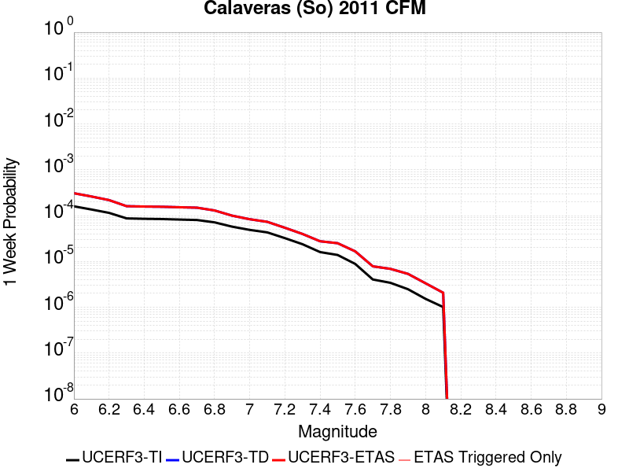 | 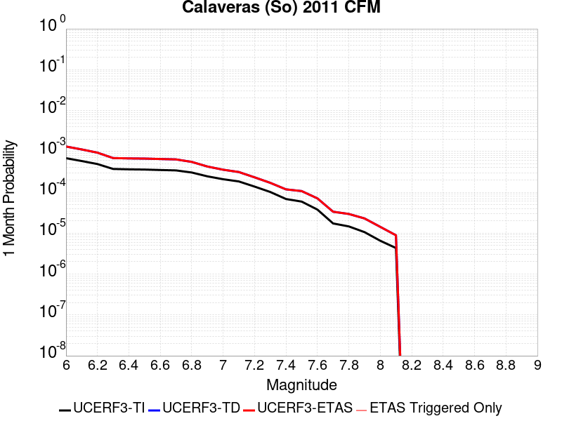 | 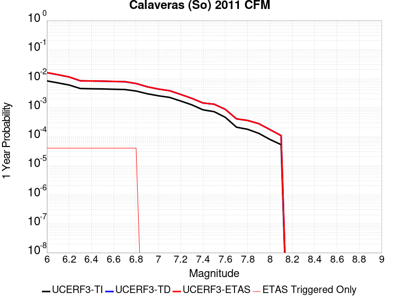 |

| Magnitude | 1 wk TI Prob | 1 wk TD Prob | 1 wk ETAS Prob | 1 wk ETAS/TD Gain | 1 wk ETAS Triggered Only | 1 mo TI Prob | 1 mo TD Prob | 1 mo ETAS Prob | 1 mo ETAS/TD Gain | 1 mo ETAS Triggered Only | 1 yr TI Prob | 1 yr TD Prob | 1 yr ETAS Prob | 1 yr ETAS/TD Gain | 1 yr ETAS Triggered Only |
|-----|-----|-----|-----|-----|-----|-----|-----|-----|-----|-----|-----|-----|-----|-----|-----|
| 6.0 | 1.5950744E-4 | 3.0790493E-4 | 3.0790493E-4 | 1.0 | 0.0 | 6.834242E-4 | 0.0013187632 | 0.0013187632 | 1.0 | 0.0 | 0.00828899 | 0.015898287 | 0.01593765 | 1.002476 | 4.0E-5 |
| 6.1 | 1.3584697E-4 | 2.6108976E-4 | 2.6108976E-4 | 1.0 | 0.0 | 5.8207137E-4 | 0.0011183338 | 0.0011183338 | 1.0 | 0.0 | 0.007063716 | 0.013499089 | 0.013538549 | 1.0029231 | 4.0E-5 |
| 6.2 | 1.14676266E-4 | 2.1784513E-4 | 2.1784513E-4 | 1.0 | 0.0 | 4.9137714E-4 | 9.3321304E-4 | 9.3321304E-4 | 1.0 | 0.0 | 0.0059661185 | 0.011280941 | 0.011320489 | 1.0035058 | 4.0E-5 |
| 6.3 | 8.691518E-5 | 1.6052955E-4 | 1.6052955E-4 | 1.0 | 0.0 | 3.7244044E-4 | 6.8776263E-4 | 6.8776263E-4 | 1.0 | 0.0 | 0.004525038 | 0.008334652 | 0.0083743185 | 1.0047592 | 4.0E-5 |
| 6.4 | 8.50982E-5 | 1.5758992E-4 | 1.5758992E-4 | 1.0 | 0.0 | 3.646556E-4 | 6.7517074E-4 | 6.7517074E-4 | 1.0 | 0.0 | 0.0044306475 | 0.008182503 | 0.008222176 | 1.0048485 | 4.0E-5 |
| 6.5 | 8.4062965E-5 | 1.5583218E-4 | 1.5583218E-4 | 1.0 | 0.0 | 3.602201E-4 | 6.6764234E-4 | 6.6764234E-4 | 1.0 | 0.0 | 0.004376863 | 0.008091622 | 0.008131298 | 1.0049034 | 4.0E-5 |
| 6.6 | 8.194716E-5 | 1.521856E-4 | 1.521856E-4 | 1.0 | 0.0 | 3.5115483E-4 | 6.5202266E-4 | 6.5202266E-4 | 1.0 | 0.0 | 0.0042669317 | 0.007903222 | 0.007942907 | 1.0050212 | 4.0E-5 |
| 6.7 | 8.012326E-5 | 1.4886065E-4 | 1.4886065E-4 | 1.0 | 0.0 | 3.433402E-4 | 6.377831E-4 | 6.377831E-4 | 1.0 | 0.0 | 0.004172157 | 0.0077315248 | 0.0077712154 | 1.0051336 | 4.0E-5 |
| 6.8 | 7.119773E-5 | 1.2941338E-4 | 1.2941338E-4 | 1.0 | 0.0 | 3.0509746E-4 | 5.54491E-4 | 5.54491E-4 | 1.0 | 0.0 | 0.0037082357 | 0.0067267935 | 0.0067665246 | 1.0059063 | 4.0E-5 |
| 6.9 | 5.7343088E-5 | 9.972352E-5 | 9.972352E-5 | 1.0 | 0.0 | 2.4573295E-4 | 4.2731693E-4 | 4.2731693E-4 | 1.0 | 0.0 | 0.0029876942 | 0.005190248 | 0.005190248 | 1.0 | 0.0 |
| 7.0 | 4.8746577E-5 | 8.3315186E-5 | 8.3315186E-5 | 1.0 | 0.0 | 2.0889717E-4 | 3.5701657E-4 | 3.5701657E-4 | 1.0 | 0.0 | 0.0025403565 | 0.0043380805 | 0.0043380805 | 1.0 | 0.0 |
| 7.1 | 4.2998014E-5 | 7.307419E-5 | 7.307419E-5 | 1.0 | 0.0 | 1.8426418E-4 | 3.1313783E-4 | 3.1313783E-4 | 1.0 | 0.0 | 0.002241108 | 0.0038058492 | 0.0038058492 | 1.0 | 0.0 |
| 7.2 | 3.221292E-5 | 5.426544E-5 | 5.426544E-5 | 1.0 | 0.0 | 1.3804805E-4 | 2.325456E-4 | 2.325456E-4 | 1.0 | 0.0 | 0.0016794393 | 0.0028275952 | 0.0028275952 | 1.0 | 0.0 |
| 7.3 | 2.3756531E-5 | 3.976839E-5 | 3.976839E-5 | 1.0 | 0.0 | 1.0180973E-4 | 1.7042493E-4 | 1.7042493E-4 | 1.0 | 0.0 | 0.0012388286 | 0.0020729662 | 0.0020729662 | 1.0 | 0.0 |
| 7.4 | 1.5997684E-5 | 2.7537306E-5 | 2.7537306E-5 | 1.0 | 0.0 | 6.8559704E-5 | 1.18011696E-4 | 1.18011696E-4 | 1.0 | 0.0 | 8.343947E-4 | 0.001435848 | 0.001435848 | 1.0 | 0.0 |
| 7.5 | 1.3814293E-5 | 2.4971192E-5 | 2.4971192E-5 | 1.0 | 0.0 | 5.9202768E-5 | 1.0701502E-4 | 1.0701502E-4 | 1.0 | 0.0 | 7.205553E-4 | 0.0013021316 | 0.0013021316 | 1.0 | 0.0 |
| 7.6 | 8.817309E-6 | 1.6584063E-5 | 1.6584063E-5 | 1.0 | 0.0 | 3.7787922E-5 | 7.107262E-5 | 7.107262E-5 | 1.0 | 0.0 | 4.5997082E-4 | 8.6496706E-4 | 8.6496706E-4 | 1.0 | 0.0 |
| 7.7 | 4.0352206E-6 | 7.815648E-6 | 7.815648E-6 | 1.0 | 0.0 | 1.7293689E-5 | 3.3495206E-5 | 3.3495206E-5 | 1.0 | 0.0 | 2.1053031E-4 | 4.077279E-4 | 4.077279E-4 | 1.0 | 0.0 |
| 7.8 | 3.413169E-6 | 6.882057E-6 | 6.882057E-6 | 1.0 | 0.0 | 1.4627784E-5 | 2.9494196E-5 | 2.9494196E-5 | 1.0 | 0.0 | 1.7807873E-4 | 3.5903274E-4 | 3.5903274E-4 | 1.0 | 0.0 |
| 7.9 | 2.4740732E-6 | 5.3497497E-6 | 5.3497497E-6 | 1.0 | 0.0 | 1.06031275E-5 | 2.29273E-5 | 2.29273E-5 | 1.0 | 0.0 | 1.2908543E-4 | 2.7910416E-4 | 2.7910416E-4 | 1.0 | 0.0 |
| 8.0 | 1.5231818E-6 | 3.3315503E-6 | 3.3315503E-6 | 1.0 | 0.0 | 6.527906E-6 | 1.42779945E-5 | 1.42779945E-5 | 1.0 | 0.0 | 7.9474354E-5 | 1.7382075E-4 | 1.7382075E-4 | 1.0 | 0.0 |
| 8.1 | 1.0104524E-6 | 2.0730229E-6 | 2.0730229E-6 | 1.0 | 0.0 | 4.330503E-6 | 8.8843535E-6 | 8.8843535E-6 | 1.0 | 0.0 | 5.2722597E-5 | 1.08161665E-4 | 1.08161665E-4 | 1.0 | 0.0 |

## Ortigalita (North)
*[(top)](#table-of-contents)*

| 1 Week | 1 Month | 1 Year |
|-----|-----|-----|
|  | 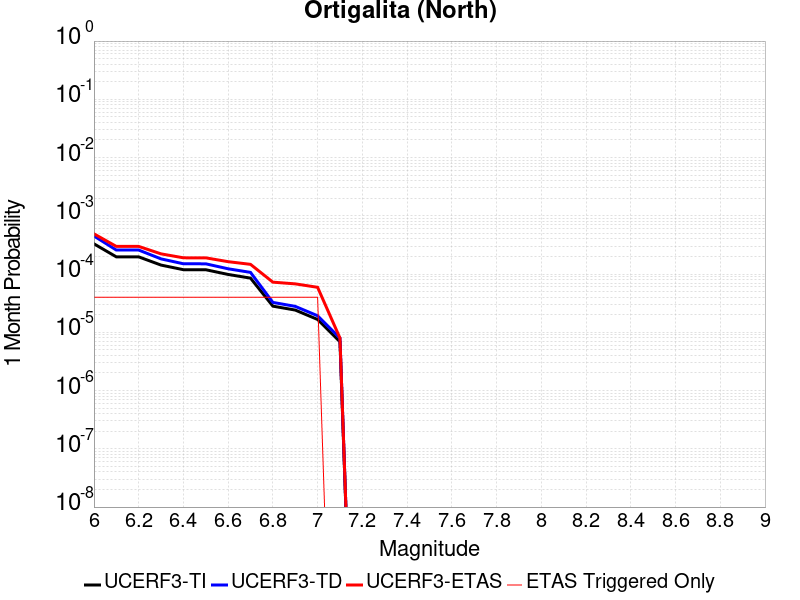 | 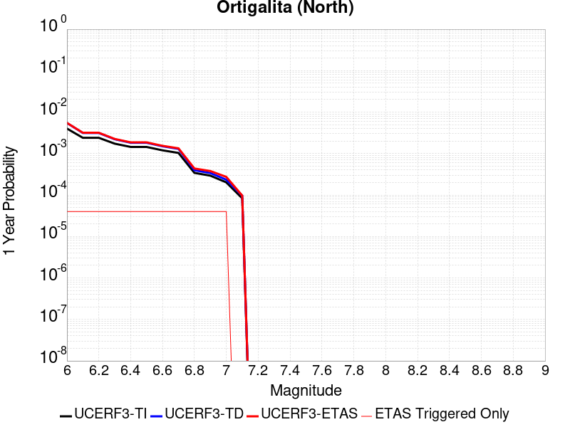 |

| Magnitude | 1 wk TI Prob | 1 wk TD Prob | 1 wk ETAS Prob | 1 wk ETAS/TD Gain | 1 wk ETAS Triggered Only | 1 mo TI Prob | 1 mo TD Prob | 1 mo ETAS Prob | 1 mo ETAS/TD Gain | 1 mo ETAS Triggered Only | 1 yr TI Prob | 1 yr TD Prob | 1 yr ETAS Prob | 1 yr ETAS/TD Gain | 1 yr ETAS Triggered Only |
|-----|-----|-----|-----|-----|-----|-----|-----|-----|-----|-----|-----|-----|-----|-----|-----|
| 6.0 | 7.711876E-5 | 1.0517288E-4 | 1.0517288E-4 | 1.0 | 0.0 | 3.3046713E-4 | 4.5066644E-4 | 4.9064844E-4 | 1.0887175 | 4.0E-5 | 0.004016016 | 0.0054742103 | 0.005513991 | 1.007267 | 4.0E-5 |
| 6.1 | 4.607858E-5 | 6.030095E-5 | 6.030095E-5 | 1.0 | 0.0 | 1.9746469E-4 | 2.5840945E-4 | 2.983991E-4 | 1.1547531 | 4.0E-5 | 0.0024014818 | 0.0031419133 | 0.0031817877 | 1.0126911 | 4.0E-5 |
| 6.2 | 4.607858E-5 | 6.030095E-5 | 6.030095E-5 | 1.0 | 0.0 | 1.9746469E-4 | 2.5840945E-4 | 2.983991E-4 | 1.1547531 | 4.0E-5 | 0.0024014818 | 0.0031419133 | 0.0031817877 | 1.0126911 | 4.0E-5 |
| 6.3 | 3.327423E-5 | 4.251604E-5 | 4.251604E-5 | 1.0 | 0.0 | 1.4259605E-4 | 1.8220021E-4 | 2.2219293E-4 | 1.2194988 | 4.0E-5 | 0.0017347244 | 0.0022162818 | 0.0022561932 | 1.0180082 | 4.0E-5 |
| 6.4 | 2.7732503E-5 | 3.5030593E-5 | 3.5030593E-5 | 1.0 | 0.0 | 1.1884817E-4 | 1.5012384E-4 | 1.9011785E-4 | 1.2664067 | 4.0E-5 | 0.001446016 | 0.0018264599 | 0.0018663869 | 1.0218602 | 4.0E-5 |
| 6.5 | 2.7689714E-5 | 3.4980378E-5 | 3.4980378E-5 | 1.0 | 0.0 | 1.186648E-4 | 1.4990866E-4 | 1.8990267E-4 | 1.2667892 | 4.0E-5 | 0.0014437864 | 0.0018238444 | 0.0018637715 | 1.0218917 | 4.0E-5 |
| 6.6 | 2.2976905E-5 | 2.8743312E-5 | 2.8743312E-5 | 1.0 | 0.0 | 9.846873E-5 | 1.2318123E-4 | 1.6317632E-4 | 1.3246847 | 4.0E-5 | 0.0011981975 | 0.0014989388 | 0.0015388789 | 1.0266455 | 4.0E-5 |
| 6.7 | 1.9871539E-5 | 2.4926665E-5 | 2.4926665E-5 | 1.0 | 0.0 | 8.516096E-5 | 1.06825595E-4 | 1.4682132E-4 | 1.374402 | 4.0E-5 | 0.0010363415 | 0.001300069 | 0.0013400171 | 1.0307276 | 4.0E-5 |
| 6.8 | 6.5640475E-6 | 7.6095916E-6 | 7.6095916E-6 | 1.0 | 0.0 | 2.813133E-5 | 3.2612144E-5 | 7.261084E-5 | 2.226497 | 4.0E-5 | 3.424451E-4 | 3.9698338E-4 | 4.369675E-4 | 1.1007199 | 4.0E-5 |
| 6.9 | 5.6219683E-6 | 6.5052927E-6 | 6.5052927E-6 | 1.0 | 0.0 | 2.4093928E-5 | 2.7879541E-5 | 6.787843E-5 | 2.4347038 | 4.0E-5 | 2.933041E-4 | 3.3938314E-4 | 3.7936957E-4 | 1.1178209 | 4.0E-5 |
| 7.0 | 3.875591E-6 | 4.4871476E-6 | 4.4871476E-6 | 1.0 | 0.0 | 1.6609569E-5 | 1.9230503E-5 | 5.9229733E-5 | 3.0799887 | 4.0E-5 | 2.0220275E-4 | 2.3410833E-4 | 2.7409897E-4 | 1.1708211 | 4.0E-5 |
| 7.1 | 1.6017933E-6 | 1.8580465E-6 | 1.8580465E-6 | 1.0 | 0.0 | 6.8648105E-6 | 7.963038E-6 | 7.963038E-6 | 1.0 | 0.0 | 8.357586E-5 | 9.6946744E-5 | 9.6946744E-5 | 1.0 | 0.0 |

## Pisgah-Bullion Mtn-Mesquite Lk
*[(top)](#table-of-contents)*

| 1 Week | 1 Month | 1 Year |
|-----|-----|-----|
| 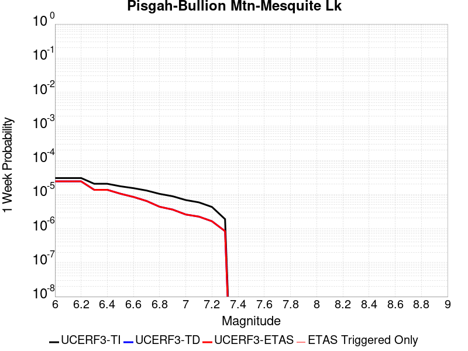 | 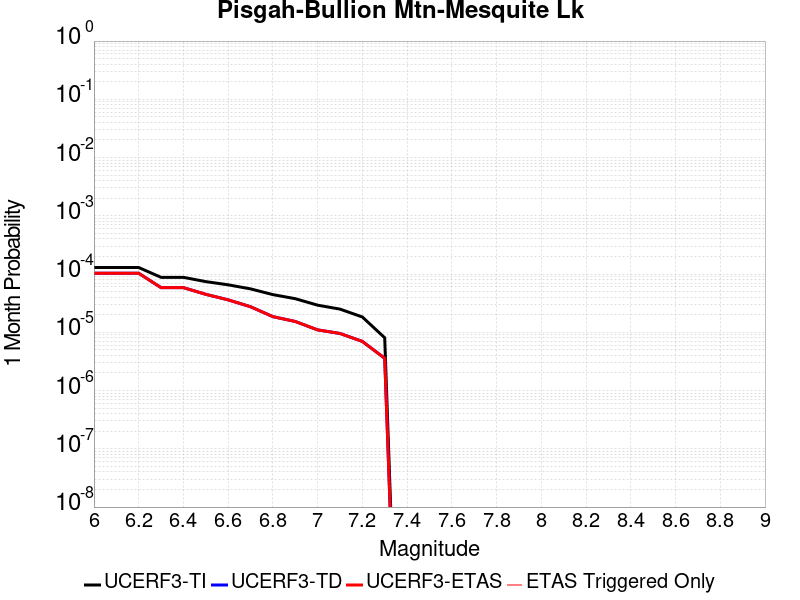 | 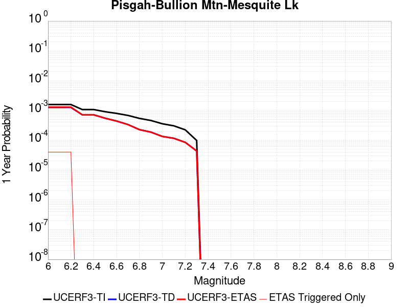 |

| Magnitude | 1 wk TI Prob | 1 wk TD Prob | 1 wk ETAS Prob | 1 wk ETAS/TD Gain | 1 wk ETAS Triggered Only | 1 mo TI Prob | 1 mo TD Prob | 1 mo ETAS Prob | 1 mo ETAS/TD Gain | 1 mo ETAS Triggered Only | 1 yr TI Prob | 1 yr TD Prob | 1 yr ETAS Prob | 1 yr ETAS/TD Gain | 1 yr ETAS Triggered Only |
|-----|-----|-----|-----|-----|-----|-----|-----|-----|-----|-----|-----|-----|-----|-----|-----|
| 6.0 | 3.0240792E-5 | 2.410175E-5 | 2.410175E-5 | 1.0 | 0.0 | 1.2959696E-4 | 1.0328969E-4 | 1.0328969E-4 | 1.0 | 0.0 | 0.0015767008 | 0.0012569273 | 0.001296877 | 1.0317836 | 4.0E-5 |
| 6.1 | 3.0240792E-5 | 2.410175E-5 | 2.410175E-5 | 1.0 | 0.0 | 1.2959696E-4 | 1.0328969E-4 | 1.0328969E-4 | 1.0 | 0.0 | 0.0015767008 | 0.0012569273 | 0.001296877 | 1.0317836 | 4.0E-5 |
| 6.2 | 3.0240792E-5 | 2.410175E-5 | 2.410175E-5 | 1.0 | 0.0 | 1.2959696E-4 | 1.0328969E-4 | 1.0328969E-4 | 1.0 | 0.0 | 0.0015767008 | 0.0012569273 | 0.001296877 | 1.0317836 | 4.0E-5 |
| 6.3 | 2.0498217E-5 | 1.3643435E-5 | 1.3643435E-5 | 1.0 | 0.0 | 8.784654E-5 | 5.8470643E-5 | 5.8470643E-5 | 1.0 | 0.0 | 0.0010690069 | 7.116638E-4 | 7.116638E-4 | 1.0 | 0.0 |
| 6.4 | 2.0498217E-5 | 1.3643435E-5 | 1.3643435E-5 | 1.0 | 0.0 | 8.784654E-5 | 5.8470643E-5 | 5.8470643E-5 | 1.0 | 0.0 | 0.0010690069 | 7.116638E-4 | 7.116638E-4 | 1.0 | 0.0 |
| 6.5 | 1.7316182E-5 | 1.0481163E-5 | 1.0481163E-5 | 1.0 | 0.0 | 7.42101E-5 | 4.4918554E-5 | 4.4918554E-5 | 1.0 | 0.0 | 9.0313336E-4 | 5.4675614E-4 | 5.4675614E-4 | 1.0 | 0.0 |
| 6.6 | 1.5251077E-5 | 8.417571E-6 | 8.417571E-6 | 1.0 | 0.0 | 6.536012E-5 | 3.6074845E-5 | 3.6074845E-5 | 1.0 | 0.0 | 7.9546886E-4 | 4.3913E-4 | 4.3913E-4 | 1.0 | 0.0 |
| 6.7 | 1.2997425E-5 | 6.414017E-6 | 6.414017E-6 | 1.0 | 0.0 | 5.570206E-5 | 2.748838E-5 | 2.748838E-5 | 1.0 | 0.0 | 6.7796157E-4 | 3.3462432E-4 | 3.3462432E-4 | 1.0 | 0.0 |
| 6.8 | 1.035386E-5 | 4.3350883E-6 | 4.3350883E-6 | 1.0 | 0.0 | 4.437293E-5 | 1.8578823E-5 | 1.8578823E-5 | 1.0 | 0.0 | 5.401065E-4 | 2.2617457E-4 | 2.2617457E-4 | 1.0 | 0.0 |
| 6.9 | 8.816252E-6 | 3.5822954E-6 | 3.5822954E-6 | 1.0 | 0.0 | 3.778339E-5 | 1.5352609E-5 | 1.5352609E-5 | 1.0 | 0.0 | 4.5991567E-4 | 1.8690256E-4 | 1.8690256E-4 | 1.0 | 0.0 |
| 7.0 | 6.8232207E-6 | 2.5689233E-6 | 2.5689233E-6 | 1.0 | 0.0 | 2.9242048E-5 | 1.1009627E-5 | 1.1009627E-5 | 1.0 | 0.0 | 3.5596377E-4 | 1.3403427E-4 | 1.3403427E-4 | 1.0 | 0.0 |
| 7.1 | 5.837013E-6 | 2.2286247E-6 | 2.2286247E-6 | 1.0 | 0.0 | 2.501553E-5 | 9.551215E-6 | 9.551215E-6 | 1.0 | 0.0 | 3.045215E-4 | 1.16280135E-4 | 1.16280135E-4 | 1.0 | 0.0 |
| 7.2 | 4.278052E-6 | 1.6285954E-6 | 1.6285954E-6 | 1.0 | 0.0 | 1.833438E-5 | 6.9796774E-6 | 6.9796774E-6 | 1.0 | 0.0 | 2.231982E-4 | 8.49745E-5 | 8.49745E-5 | 1.0 | 0.0 |
| 7.3 | 1.8803692E-6 | 8.3521843E-7 | 8.3521843E-7 | 1.0 | 0.0 | 8.0587E-6 | 3.5795035E-6 | 3.5795035E-6 | 1.0 | 0.0 | 9.811026E-5 | 4.357973E-5 | 4.357973E-5 | 1.0 | 0.0 |

## Pitas Point (Lower West)
*[(top)](#table-of-contents)*

| 1 Week | 1 Month | 1 Year |
|-----|-----|-----|
| 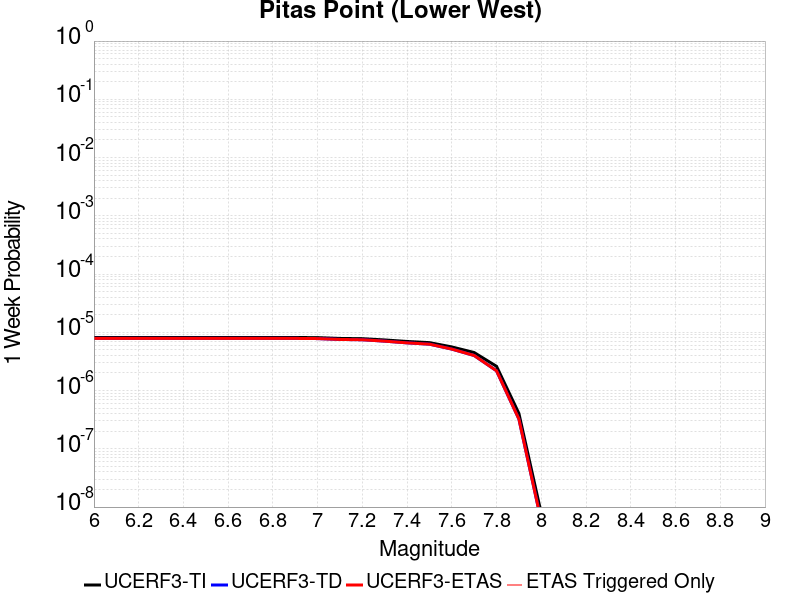 | 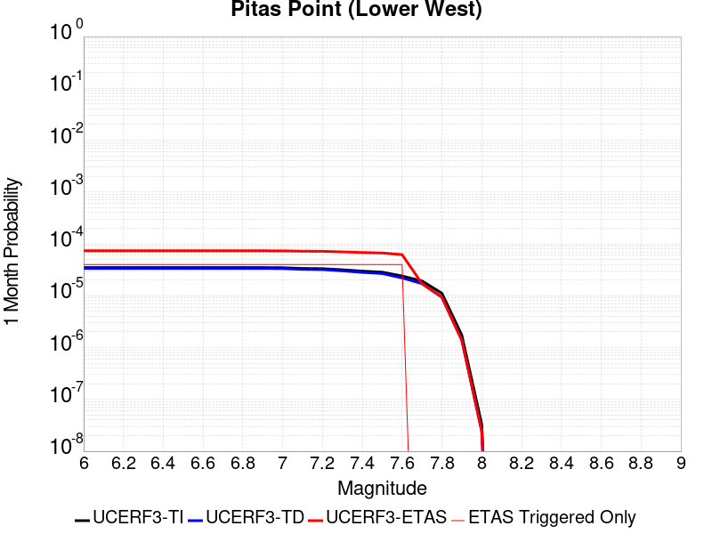 |  |

| Magnitude | 1 wk TI Prob | 1 wk TD Prob | 1 wk ETAS Prob | 1 wk ETAS/TD Gain | 1 wk ETAS Triggered Only | 1 mo TI Prob | 1 mo TD Prob | 1 mo ETAS Prob | 1 mo ETAS/TD Gain | 1 mo ETAS Triggered Only | 1 yr TI Prob | 1 yr TD Prob | 1 yr ETAS Prob | 1 yr ETAS/TD Gain | 1 yr ETAS Triggered Only |
|-----|-----|-----|-----|-----|-----|-----|-----|-----|-----|-----|-----|-----|-----|-----|-----|
| 6.0 | 8.151497E-6 | 7.857616E-6 | 7.857616E-6 | 1.0 | 0.0 | 3.493452E-5 | 3.3675067E-5 | 7.367372E-5 | 2.1877825 | 4.0E-5 | 4.252448E-4 | 4.0991756E-4 | 4.4990116E-4 | 1.0975406 | 4.0E-5 |
| 6.1 | 8.151497E-6 | 7.857616E-6 | 7.857616E-6 | 1.0 | 0.0 | 3.493452E-5 | 3.3675067E-5 | 7.367372E-5 | 2.1877825 | 4.0E-5 | 4.252448E-4 | 4.0991756E-4 | 4.4990116E-4 | 1.0975406 | 4.0E-5 |
| 6.2 | 8.151497E-6 | 7.857616E-6 | 7.857616E-6 | 1.0 | 0.0 | 3.493452E-5 | 3.3675067E-5 | 7.367372E-5 | 2.1877825 | 4.0E-5 | 4.252448E-4 | 4.0991756E-4 | 4.4990116E-4 | 1.0975406 | 4.0E-5 |
| 6.3 | 8.151497E-6 | 7.857616E-6 | 7.857616E-6 | 1.0 | 0.0 | 3.493452E-5 | 3.3675067E-5 | 7.367372E-5 | 2.1877825 | 4.0E-5 | 4.252448E-4 | 4.0991756E-4 | 4.4990116E-4 | 1.0975406 | 4.0E-5 |
| 6.4 | 8.151497E-6 | 7.857616E-6 | 7.857616E-6 | 1.0 | 0.0 | 3.493452E-5 | 3.3675067E-5 | 7.367372E-5 | 2.1877825 | 4.0E-5 | 4.252448E-4 | 4.0991756E-4 | 4.4990116E-4 | 1.0975406 | 4.0E-5 |
| 6.5 | 8.151497E-6 | 7.857616E-6 | 7.857616E-6 | 1.0 | 0.0 | 3.493452E-5 | 3.3675067E-5 | 7.367372E-5 | 2.1877825 | 4.0E-5 | 4.252448E-4 | 4.0991756E-4 | 4.4990116E-4 | 1.0975406 | 4.0E-5 |
| 6.6 | 8.151497E-6 | 7.857616E-6 | 7.857616E-6 | 1.0 | 0.0 | 3.493452E-5 | 3.3675067E-5 | 7.367372E-5 | 2.1877825 | 4.0E-5 | 4.252448E-4 | 4.0991756E-4 | 4.4990116E-4 | 1.0975406 | 4.0E-5 |
| 6.7 | 8.151497E-6 | 7.857616E-6 | 7.857616E-6 | 1.0 | 0.0 | 3.493452E-5 | 3.3675067E-5 | 7.367372E-5 | 2.1877825 | 4.0E-5 | 4.252448E-4 | 4.0991756E-4 | 4.4990116E-4 | 1.0975406 | 4.0E-5 |
| 6.8 | 8.151497E-6 | 7.857616E-6 | 7.857616E-6 | 1.0 | 0.0 | 3.493452E-5 | 3.3675067E-5 | 7.367372E-5 | 2.1877825 | 4.0E-5 | 4.252448E-4 | 4.0991756E-4 | 4.4990116E-4 | 1.0975406 | 4.0E-5 |
| 6.9 | 8.151497E-6 | 7.857616E-6 | 7.857616E-6 | 1.0 | 0.0 | 3.493452E-5 | 3.3675067E-5 | 7.367372E-5 | 2.1877825 | 4.0E-5 | 4.252448E-4 | 4.0991756E-4 | 4.4990116E-4 | 1.0975406 | 4.0E-5 |
| 7.0 | 8.103535E-6 | 7.807036E-6 | 7.807036E-6 | 1.0 | 0.0 | 3.4728975E-5 | 3.3458302E-5 | 7.345696E-5 | 2.195478 | 4.0E-5 | 4.2274324E-4 | 4.0727944E-4 | 4.4726316E-4 | 1.0981727 | 4.0E-5 |
| 7.1 | 7.853298E-6 | 7.542677E-6 | 7.542677E-6 | 1.0 | 0.0 | 3.3656554E-5 | 3.2325363E-5 | 7.232407E-5 | 2.2373784 | 4.0E-5 | 4.096915E-4 | 3.9349092E-4 | 4.334752E-4 | 1.1016142 | 4.0E-5 |
| 7.2 | 7.771102E-6 | 7.454939E-6 | 7.454939E-6 | 1.0 | 0.0 | 3.33043E-5 | 3.1949352E-5 | 7.1948074E-5 | 2.2519417 | 4.0E-5 | 4.0540437E-4 | 3.8891463E-4 | 4.2889907E-4 | 1.1028104 | 4.0E-5 |
| 7.3 | 7.3945344E-6 | 7.050944E-6 | 7.050944E-6 | 1.0 | 0.0 | 3.1690477E-5 | 3.0217985E-5 | 7.0216774E-5 | 2.323675 | 4.0E-5 | 3.8576324E-4 | 3.678425E-4 | 4.0782779E-4 | 1.1087022 | 4.0E-5 |
| 7.4 | 6.964645E-6 | 6.5916875E-6 | 6.5916875E-6 | 1.0 | 0.0 | 2.9848137E-5 | 2.8249786E-5 | 6.824866E-5 | 2.4159 | 4.0E-5 | 3.6334046E-4 | 3.4388734E-4 | 3.838736E-4 | 1.1162772 | 4.0E-5 |
| 7.5 | 6.6525035E-6 | 6.2606523E-6 | 6.2606523E-6 | 1.0 | 0.0 | 2.851042E-5 | 2.6831094E-5 | 6.683002E-5 | 2.4907677 | 4.0E-5 | 3.4705905E-4 | 3.266201E-4 | 3.66607E-4 | 1.1224264 | 4.0E-5 |
| 7.6 | 5.613338E-6 | 5.15261E-6 | 5.15261E-6 | 1.0 | 0.0 | 2.405694E-5 | 2.208243E-5 | 6.208155E-5 | 2.8113549 | 4.0E-5 | 2.928539E-4 | 2.688207E-4 | 3.0880995E-4 | 1.148758 | 4.0E-5 |
| 7.7 | 4.494704E-6 | 3.997876E-6 | 3.997876E-6 | 1.0 | 0.0 | 1.9262876E-5 | 1.7133641E-5 | 1.7133641E-5 | 1.0 | 0.0 | 2.3450027E-4 | 2.0858237E-4 | 2.0858237E-4 | 1.0 | 0.0 |
| 7.8 | 2.6075882E-6 | 2.1841993E-6 | 2.1841993E-6 | 1.0 | 0.0 | 1.117533E-5 | 9.360821E-6 | 9.360821E-6 | 1.0 | 0.0 | 1.3605114E-4 | 1.1396208E-4 | 1.1396208E-4 | 1.0 | 0.0 |
| 7.9 | 4.045984E-7 | 3.2431933E-7 | 3.2431933E-7 | 1.0 | 0.0 | 1.733992E-6 | 1.3899393E-6 | 1.3899393E-6 | 1.0 | 0.0 | 2.1111147E-5 | 1.6922382E-5 | 1.6922382E-5 | 1.0 | 0.0 |
| 8.0 | 7.791402E-9 | 5.68495E-9 | 5.68495E-9 | 1.0 | 0.0 | 3.3391725E-8 | 2.4364072E-8 | 2.4364072E-8 | 1.0 | 0.0 | 4.0654416E-7 | 2.9663255E-7 | 2.9663255E-7 | 1.0 | 0.0 |

## Pitas Point (Lower)-Montalvo
*[(top)](#table-of-contents)*

| 1 Week | 1 Month | 1 Year |
|-----|-----|-----|
| 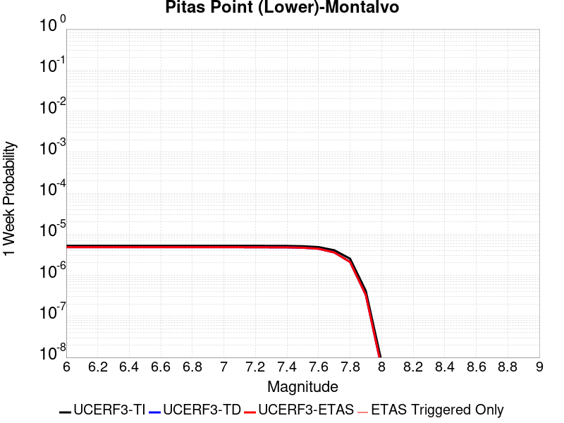 | 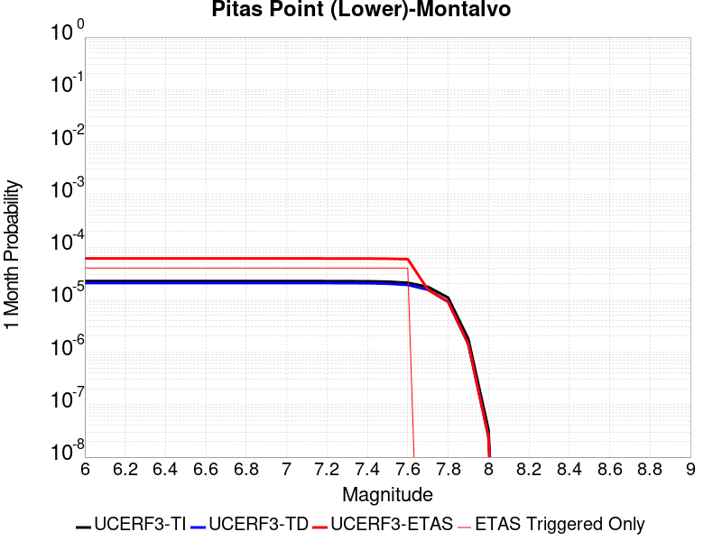 | 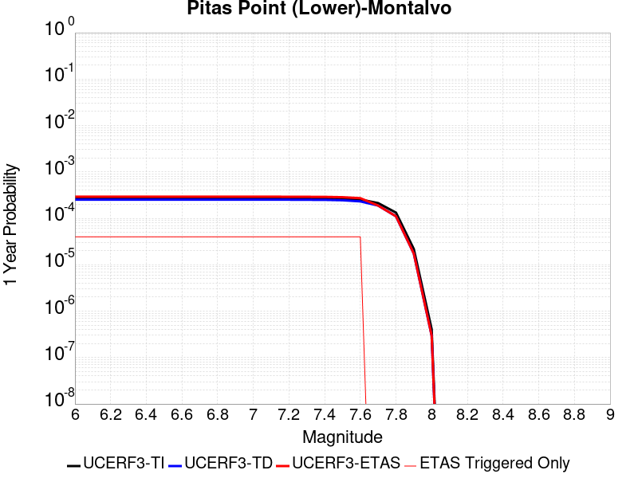 |

| Magnitude | 1 wk TI Prob | 1 wk TD Prob | 1 wk ETAS Prob | 1 wk ETAS/TD Gain | 1 wk ETAS Triggered Only | 1 mo TI Prob | 1 mo TD Prob | 1 mo ETAS Prob | 1 mo ETAS/TD Gain | 1 mo ETAS Triggered Only | 1 yr TI Prob | 1 yr TD Prob | 1 yr ETAS Prob | 1 yr ETAS/TD Gain | 1 yr ETAS Triggered Only |
|-----|-----|-----|-----|-----|-----|-----|-----|-----|-----|-----|-----|-----|-----|-----|-----|
| 6.0 | 5.2543637E-6 | 4.8389793E-6 | 4.8389793E-6 | 1.0 | 0.0 | 2.2518509E-5 | 2.073832E-5 | 6.073749E-5 | 2.9287565 | 4.0E-5 | 2.7412834E-4 | 2.524601E-4 | 2.9245001E-4 | 1.1584009 | 4.0E-5 |
| 6.1 | 5.2543637E-6 | 4.8389793E-6 | 4.8389793E-6 | 1.0 | 0.0 | 2.2518509E-5 | 2.073832E-5 | 6.073749E-5 | 2.9287565 | 4.0E-5 | 2.7412834E-4 | 2.524601E-4 | 2.9245001E-4 | 1.1584009 | 4.0E-5 |
| 6.2 | 5.2543637E-6 | 4.8389793E-6 | 4.8389793E-6 | 1.0 | 0.0 | 2.2518509E-5 | 2.073832E-5 | 6.073749E-5 | 2.9287565 | 4.0E-5 | 2.7412834E-4 | 2.524601E-4 | 2.9245001E-4 | 1.1584009 | 4.0E-5 |
| 6.3 | 5.2543637E-6 | 4.8389793E-6 | 4.8389793E-6 | 1.0 | 0.0 | 2.2518509E-5 | 2.073832E-5 | 6.073749E-5 | 2.9287565 | 4.0E-5 | 2.7412834E-4 | 2.524601E-4 | 2.9245001E-4 | 1.1584009 | 4.0E-5 |
| 6.4 | 5.2543637E-6 | 4.8389793E-6 | 4.8389793E-6 | 1.0 | 0.0 | 2.2518509E-5 | 2.073832E-5 | 6.073749E-5 | 2.9287565 | 4.0E-5 | 2.7412834E-4 | 2.524601E-4 | 2.9245001E-4 | 1.1584009 | 4.0E-5 |
| 6.5 | 5.2543637E-6 | 4.8389793E-6 | 4.8389793E-6 | 1.0 | 0.0 | 2.2518509E-5 | 2.073832E-5 | 6.073749E-5 | 2.9287565 | 4.0E-5 | 2.7412834E-4 | 2.524601E-4 | 2.9245001E-4 | 1.1584009 | 4.0E-5 |
| 6.6 | 5.2543637E-6 | 4.8389793E-6 | 4.8389793E-6 | 1.0 | 0.0 | 2.2518509E-5 | 2.073832E-5 | 6.073749E-5 | 2.9287565 | 4.0E-5 | 2.7412834E-4 | 2.524601E-4 | 2.9245001E-4 | 1.1584009 | 4.0E-5 |
| 6.7 | 5.2543637E-6 | 4.8389793E-6 | 4.8389793E-6 | 1.0 | 0.0 | 2.2518509E-5 | 2.073832E-5 | 6.073749E-5 | 2.9287565 | 4.0E-5 | 2.7412834E-4 | 2.524601E-4 | 2.9245001E-4 | 1.1584009 | 4.0E-5 |
| 6.8 | 5.2543637E-6 | 4.8389793E-6 | 4.8389793E-6 | 1.0 | 0.0 | 2.2518509E-5 | 2.073832E-5 | 6.073749E-5 | 2.9287565 | 4.0E-5 | 2.7412834E-4 | 2.524601E-4 | 2.9245001E-4 | 1.1584009 | 4.0E-5 |
| 6.9 | 5.2543637E-6 | 4.8389793E-6 | 4.8389793E-6 | 1.0 | 0.0 | 2.2518509E-5 | 2.073832E-5 | 6.073749E-5 | 2.9287565 | 4.0E-5 | 2.7412834E-4 | 2.524601E-4 | 2.9245001E-4 | 1.1584009 | 4.0E-5 |
| 7.0 | 5.2543637E-6 | 4.8389793E-6 | 4.8389793E-6 | 1.0 | 0.0 | 2.2518509E-5 | 2.073832E-5 | 6.073749E-5 | 2.9287565 | 4.0E-5 | 2.7412834E-4 | 2.524601E-4 | 2.9245001E-4 | 1.1584009 | 4.0E-5 |
| 7.1 | 5.2543637E-6 | 4.8389793E-6 | 4.8389793E-6 | 1.0 | 0.0 | 2.2518509E-5 | 2.073832E-5 | 6.073749E-5 | 2.9287565 | 4.0E-5 | 2.7412834E-4 | 2.524601E-4 | 2.9245001E-4 | 1.1584009 | 4.0E-5 |
| 7.2 | 5.2458695E-6 | 4.830132E-6 | 4.830132E-6 | 1.0 | 0.0 | 2.2482105E-5 | 2.0700403E-5 | 6.0699575E-5 | 2.9322896 | 4.0E-5 | 2.7368523E-4 | 2.5199857E-4 | 2.919885E-4 | 1.158691 | 4.0E-5 |
| 7.3 | 5.22665E-6 | 4.8100464E-6 | 4.8100464E-6 | 1.0 | 0.0 | 2.2399736E-5 | 2.0614323E-5 | 6.06135E-5 | 2.9403584 | 4.0E-5 | 2.7268266E-4 | 2.5095078E-4 | 2.9094075E-4 | 1.1593539 | 4.0E-5 |
| 7.4 | 5.210642E-6 | 4.793256E-6 | 4.793256E-6 | 1.0 | 0.0 | 2.233113E-5 | 2.0542366E-5 | 6.0541544E-5 | 2.9471555 | 4.0E-5 | 2.718476E-4 | 2.500749E-4 | 2.900649E-4 | 1.1599121 | 4.0E-5 |
| 7.5 | 5.1226016E-6 | 4.701128E-6 | 4.701128E-6 | 1.0 | 0.0 | 2.1953823E-5 | 2.0147538E-5 | 6.0146733E-5 | 2.9853144 | 4.0E-5 | 2.67255E-4 | 2.4526895E-4 | 2.8525916E-4 | 1.1630462 | 4.0E-5 |
| 7.6 | 4.8796987E-6 | 4.445983E-6 | 4.445983E-6 | 1.0 | 0.0 | 2.0912828E-5 | 1.9054076E-5 | 5.9053313E-5 | 3.0992484 | 4.0E-5 | 2.5458392E-4 | 2.3195898E-4 | 2.719497E-4 | 1.1724043 | 4.0E-5 |
| 7.7 | 4.0834398E-6 | 3.6099952E-6 | 3.6099952E-6 | 1.0 | 0.0 | 1.7500339E-5 | 1.5471318E-5 | 1.5471318E-5 | 1.0 | 0.0 | 2.1304579E-4 | 1.8834724E-4 | 1.8834724E-4 | 1.0 | 0.0 |
| 7.8 | 2.5445438E-6 | 2.1217793E-6 | 2.1217793E-6 | 1.0 | 0.0 | 1.0905142E-5 | 9.093308E-6 | 9.093308E-6 | 1.0 | 0.0 | 1.3276201E-4 | 1.1070545E-4 | 1.1070545E-4 | 1.0 | 0.0 |
| 7.9 | 4.1677114E-7 | 3.330247E-7 | 3.330247E-7 | 1.0 | 0.0 | 1.7861609E-6 | 1.4272479E-6 | 1.4272479E-6 | 1.0 | 0.0 | 2.1746291E-5 | 1.7376608E-5 | 1.7376608E-5 | 1.0 | 0.0 |
| 8.0 | 7.791402E-9 | 5.68495E-9 | 5.68495E-9 | 1.0 | 0.0 | 3.3391725E-8 | 2.4364072E-8 | 2.4364072E-8 | 1.0 | 0.0 | 4.0654416E-7 | 2.9663255E-7 | 2.9663255E-7 | 1.0 | 0.0 |

## Yorba Linda
*[(top)](#table-of-contents)*

| 1 Week | 1 Month | 1 Year |
|-----|-----|-----|
| 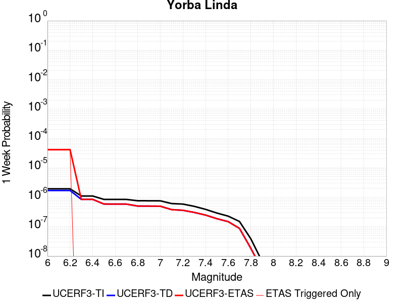 | 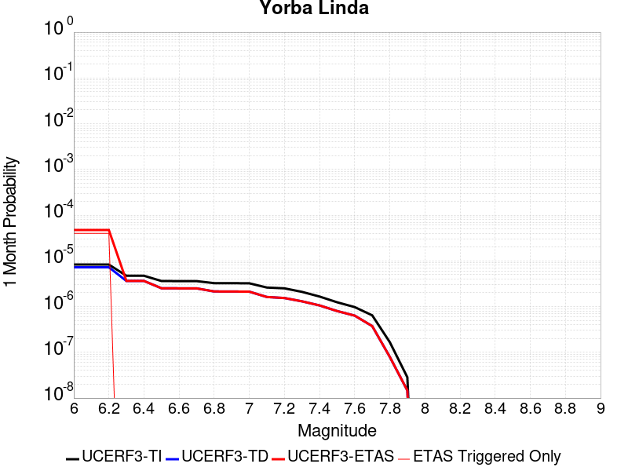 |  |

| Magnitude | 1 wk TI Prob | 1 wk TD Prob | 1 wk ETAS Prob | 1 wk ETAS/TD Gain | 1 wk ETAS Triggered Only | 1 mo TI Prob | 1 mo TD Prob | 1 mo ETAS Prob | 1 mo ETAS/TD Gain | 1 mo ETAS Triggered Only | 1 yr TI Prob | 1 yr TD Prob | 1 yr ETAS Prob | 1 yr ETAS/TD Gain | 1 yr ETAS Triggered Only |
|-----|-----|-----|-----|-----|-----|-----|-----|-----|-----|-----|-----|-----|-----|-----|-----|
| 6.0 | 1.9346849E-6 | 1.6912301E-6 | 4.169116E-5 | 24.651384 | 4.0E-5 | 8.29148E-6 | 7.248114E-6 | 4.7247824E-5 | 6.518637 | 4.0E-5 | 1.009441E-4 | 8.824316E-5 | 1.2823963E-4 | 1.4532529 | 4.0E-5 |
| 6.1 | 1.9346849E-6 | 1.6912301E-6 | 4.169116E-5 | 24.651384 | 4.0E-5 | 8.29148E-6 | 7.248114E-6 | 4.7247824E-5 | 6.518637 | 4.0E-5 | 1.009441E-4 | 8.824316E-5 | 1.2823963E-4 | 1.4532529 | 4.0E-5 |
| 6.2 | 1.9346849E-6 | 1.6912301E-6 | 4.169116E-5 | 24.651384 | 4.0E-5 | 8.29148E-6 | 7.248114E-6 | 4.7247824E-5 | 6.518637 | 4.0E-5 | 1.009441E-4 | 8.824316E-5 | 1.2823963E-4 | 1.4532529 | 4.0E-5 |
| 6.3 | 1.1028608E-6 | 8.484677E-7 | 8.484677E-7 | 1.0 | 0.0 | 4.7265376E-6 | 3.6362856E-6 | 3.6362856E-6 | 1.0 | 0.0 | 5.754407E-5 | 4.4270942E-5 | 4.4270942E-5 | 1.0 | 0.0 |
| 6.4 | 1.1028608E-6 | 8.484677E-7 | 8.484677E-7 | 1.0 | 0.0 | 4.7265376E-6 | 3.6362856E-6 | 3.6362856E-6 | 1.0 | 0.0 | 5.754407E-5 | 4.4270942E-5 | 4.4270942E-5 | 1.0 | 0.0 |
| 6.5 | 8.4451364E-7 | 5.8718234E-7 | 5.8718234E-7 | 1.0 | 0.0 | 3.619339E-6 | 2.5164934E-6 | 2.5164934E-6 | 1.0 | 0.0 | 4.406456E-5 | 3.0637897E-5 | 3.0637897E-5 | 1.0 | 0.0 |
| 6.6 | 8.422957E-7 | 5.847355E-7 | 5.847355E-7 | 1.0 | 0.0 | 3.6098338E-6 | 2.5060071E-6 | 2.5060071E-6 | 1.0 | 0.0 | 4.3948843E-5 | 3.0510231E-5 | 3.0510231E-5 | 1.0 | 0.0 |
| 6.7 | 8.4119705E-7 | 5.8351964E-7 | 5.8351964E-7 | 1.0 | 0.0 | 3.6051254E-6 | 2.500796E-6 | 2.500796E-6 | 1.0 | 0.0 | 4.3891516E-5 | 3.0446789E-5 | 3.0446789E-5 | 1.0 | 0.0 |
| 6.8 | 7.5919155E-7 | 4.9976495E-7 | 4.9976495E-7 | 1.0 | 0.0 | 3.253674E-6 | 2.1418482E-6 | 2.1418482E-6 | 1.0 | 0.0 | 3.961276E-5 | 2.6076706E-5 | 2.6076706E-5 | 1.0 | 0.0 |
| 6.9 | 7.5804564E-7 | 4.983832E-7 | 4.983832E-7 | 1.0 | 0.0 | 3.248763E-6 | 2.1359263E-6 | 2.1359263E-6 | 1.0 | 0.0 | 3.955297E-5 | 2.6004609E-5 | 2.6004609E-5 | 1.0 | 0.0 |
| 7.0 | 7.539293E-7 | 4.945963E-7 | 4.945963E-7 | 1.0 | 0.0 | 3.2311218E-6 | 2.1196968E-6 | 2.1196968E-6 | 1.0 | 0.0 | 3.9338196E-5 | 2.5807021E-5 | 2.5807021E-5 | 1.0 | 0.0 |
| 7.1 | 6.0900885E-7 | 3.7841195E-7 | 3.7841195E-7 | 1.0 | 0.0 | 2.6100352E-6 | 1.6217646E-6 | 1.6217646E-6 | 1.0 | 0.0 | 3.1776715E-5 | 1.9744808E-5 | 1.9744808E-5 | 1.0 | 0.0 |
| 7.2 | 5.849925E-7 | 3.5902556E-7 | 3.5902556E-7 | 1.0 | 0.0 | 2.5071083E-6 | 1.5386801E-6 | 1.5386801E-6 | 1.0 | 0.0 | 3.0523614E-5 | 1.8733272E-5 | 1.8733272E-5 | 1.0 | 0.0 |
| 7.3 | 4.89808E-7 | 3.039921E-7 | 3.039921E-7 | 1.0 | 0.0 | 2.0991754E-6 | 1.3028226E-6 | 1.3028226E-6 | 1.0 | 0.0 | 2.5557161E-5 | 1.5861753E-5 | 1.5861753E-5 | 1.0 | 0.0 |
| 7.4 | 3.8700415E-7 | 2.473851E-7 | 2.473851E-7 | 1.0 | 0.0 | 1.6585881E-6 | 1.0602214E-6 | 1.0602214E-6 | 1.0 | 0.0 | 2.0193123E-5 | 1.290812E-5 | 1.290812E-5 | 1.0 | 0.0 |
| 7.5 | 2.900565E-7 | 1.864814E-7 | 1.864814E-7 | 1.0 | 0.0 | 1.2430987E-6 | 7.992058E-7 | 7.992058E-7 | 1.0 | 0.0 | 1.5134622E-5 | 9.730287E-6 | 9.730287E-6 | 1.0 | 0.0 |
| 7.6 | 2.2770318E-7 | 1.4822248E-7 | 1.4822248E-7 | 1.0 | 0.0 | 9.758704E-7 | 6.352391E-7 | 6.352391E-7 | 1.0 | 0.0 | 1.1881158E-5 | 7.734009E-6 | 7.734009E-6 | 1.0 | 0.0 |
| 7.7 | 1.5017194E-7 | 8.740258E-8 | 8.740258E-8 | 1.0 | 0.0 | 6.4359386E-7 | 3.7458244E-7 | 3.7458244E-7 | 1.0 | 0.0 | 7.835727E-6 | 4.560532E-6 | 4.560532E-6 | 1.0 | 0.0 |
| 7.8 | 3.895753E-8 | 1.8552376E-8 | 1.8552376E-8 | 1.0 | 0.0 | 1.6696083E-7 | 7.951018E-8 | 7.951018E-8 | 1.0 | 0.0 | 2.0327461E-6 | 9.68036E-7 | 9.68036E-7 | 1.0 | 0.0 |
| 7.9 | 6.648505E-9 | 3.4214822E-9 | 3.4214822E-9 | 1.0 | 0.0 | 2.8493591E-8 | 1.4663494E-8 | 1.4663494E-8 | 1.0 | 0.0 | 3.4690942E-7 | 1.7852803E-7 | 1.7852803E-7 | 1.0 | 0.0 |

## San Jacinto (Borrego)
*[(top)](#table-of-contents)*

| 1 Week | 1 Month | 1 Year |
|-----|-----|-----|
| 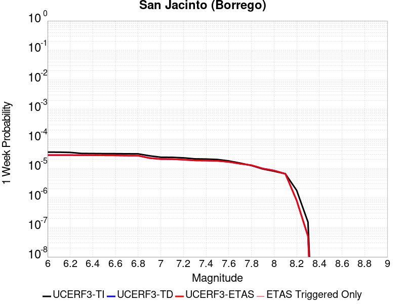 |  | 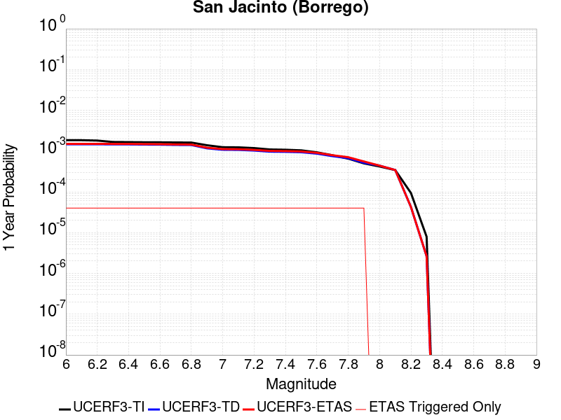 |

| Magnitude | 1 wk TI Prob | 1 wk TD Prob | 1 wk ETAS Prob | 1 wk ETAS/TD Gain | 1 wk ETAS Triggered Only | 1 mo TI Prob | 1 mo TD Prob | 1 mo ETAS Prob | 1 mo ETAS/TD Gain | 1 mo ETAS Triggered Only | 1 yr TI Prob | 1 yr TD Prob | 1 yr ETAS Prob | 1 yr ETAS/TD Gain | 1 yr ETAS Triggered Only |
|-----|-----|-----|-----|-----|-----|-----|-----|-----|-----|-----|-----|-----|-----|-----|-----|
| 6.0 | 3.543992E-5 | 2.8126837E-5 | 2.8126837E-5 | 1.0 | 0.0 | 1.5187653E-4 | 1.2053809E-4 | 1.2053809E-4 | 1.0 | 0.0 | 0.0018475284 | 0.0014665757 | 0.001506517 | 1.0272344 | 4.0E-5 |
| 6.1 | 3.542281E-5 | 2.8126837E-5 | 2.8126837E-5 | 1.0 | 0.0 | 1.5180321E-4 | 1.2053809E-4 | 1.2053809E-4 | 1.0 | 0.0 | 0.0018466372 | 0.0014665757 | 0.001506517 | 1.0272344 | 4.0E-5 |
| 6.2 | 3.4688688E-5 | 2.8126837E-5 | 2.8126837E-5 | 1.0 | 0.0 | 1.4865733E-4 | 1.2053808E-4 | 1.2053808E-4 | 1.0 | 0.0 | 0.0018084005 | 0.0014665755 | 0.001506517 | 1.0272344 | 4.0E-5 |
| 6.3 | 3.2087122E-5 | 2.7972088E-5 | 2.7972088E-5 | 1.0 | 0.0 | 1.3750899E-4 | 1.1987494E-4 | 1.1987494E-4 | 1.0 | 0.0 | 0.0016728862 | 0.0014585126 | 0.0014984543 | 1.0273852 | 4.0E-5 |
| 6.4 | 3.1828724E-5 | 2.793903E-5 | 2.793903E-5 | 1.0 | 0.0 | 1.364017E-4 | 1.1973327E-4 | 1.1973327E-4 | 1.0 | 0.0 | 0.0016594254 | 0.00145679 | 0.0014967318 | 1.0274177 | 4.0E-5 |
| 6.5 | 3.1563577E-5 | 2.7678178E-5 | 2.7678178E-5 | 1.0 | 0.0 | 1.3526545E-4 | 1.1861543E-4 | 1.1861543E-4 | 1.0 | 0.0 | 0.0016456128 | 0.0014431985 | 0.0014831407 | 1.0276762 | 4.0E-5 |
| 6.6 | 3.1467625E-5 | 2.75222E-5 | 2.75222E-5 | 1.0 | 0.0 | 1.3485427E-4 | 1.1794702E-4 | 1.1794702E-4 | 1.0 | 0.0 | 0.0016406142 | 0.0014350713 | 0.0014750139 | 1.0278332 | 4.0E-5 |
| 6.7 | 3.1223695E-5 | 2.7139871E-5 | 2.7139871E-5 | 1.0 | 0.0 | 1.3380898E-4 | 1.1630862E-4 | 1.1630862E-4 | 1.0 | 0.0 | 0.0016279068 | 0.0014151498 | 0.0014550932 | 1.0282255 | 4.0E-5 |
| 6.8 | 3.1015585E-5 | 2.69605E-5 | 2.69605E-5 | 1.0 | 0.0 | 1.3291716E-4 | 1.1553995E-4 | 1.1553995E-4 | 1.0 | 0.0 | 0.001617065 | 0.0014058034 | 0.0014457472 | 1.0284135 | 4.0E-5 |
| 6.9 | 2.6641965E-5 | 2.2371234E-5 | 2.2371234E-5 | 1.0 | 0.0 | 1.1417485E-4 | 9.587322E-5 | 9.587322E-5 | 1.0 | 0.0 | 0.0013891924 | 0.0011666353 | 0.0012065887 | 1.0342467 | 4.0E-5 |
| 7.0 | 2.3854353E-5 | 2.0659534E-5 | 2.0659534E-5 | 1.0 | 0.0 | 1.02228936E-4 | 8.853787E-5 | 8.853787E-5 | 1.0 | 0.0 | 0.0012439266 | 0.0010774181 | 0.001117375 | 1.0370858 | 4.0E-5 |
| 7.1 | 2.3672901E-5 | 2.0495838E-5 | 2.0495838E-5 | 1.0 | 0.0 | 1.0145135E-4 | 8.7836364E-5 | 8.7836364E-5 | 1.0 | 0.0 | 0.0012344702 | 0.0010688857 | 0.0011088429 | 1.0373821 | 4.0E-5 |
| 7.2 | 2.2717244E-5 | 1.972176E-5 | 1.972176E-5 | 1.0 | 0.0 | 9.735599E-5 | 8.45191E-5 | 8.45191E-5 | 1.0 | 0.0 | 0.0011846646 | 0.0010285367 | 0.0010684956 | 1.0388502 | 4.0E-5 |
| 7.3 | 2.1016205E-5 | 1.8560979E-5 | 1.8560979E-5 | 1.0 | 0.0 | 9.006634E-5 | 7.954463E-5 | 7.954463E-5 | 1.0 | 0.0 | 0.001096006 | 9.6802774E-4 | 0.001007989 | 1.0412811 | 4.0E-5 |
| 7.4 | 2.0683625E-5 | 1.8363E-5 | 1.8363E-5 | 1.0 | 0.0 | 8.86411E-5 | 7.869621E-5 | 7.869621E-5 | 1.0 | 0.0 | 0.001078671 | 9.577073E-4 | 9.97669E-4 | 1.0417265 | 4.0E-5 |
| 7.5 | 1.9993966E-5 | 1.7956301E-5 | 1.7956301E-5 | 1.0 | 0.0 | 8.568561E-5 | 7.695332E-5 | 7.695332E-5 | 1.0 | 0.0 | 0.001042723 | 9.36506E-4 | 9.7646855E-4 | 1.0426719 | 4.0E-5 |
| 7.6 | 1.788966E-5 | 1.6602748E-5 | 1.6602748E-5 | 1.0 | 0.0 | 7.666772E-5 | 7.11527E-5 | 7.11527E-5 | 1.0 | 0.0 | 9.3302975E-4 | 8.6594163E-4 | 9.05907E-4 | 1.0461525 | 4.0E-5 |
| 7.7 | 1.5125781E-5 | 1.4399063E-5 | 1.4399063E-5 | 1.0 | 0.0 | 6.4823165E-5 | 6.1708815E-5 | 6.1708815E-5 | 1.0 | 0.0 | 7.889362E-4 | 7.5104664E-4 | 7.910166E-4 | 1.053219 | 4.0E-5 |
| 7.8 | 1.250089E-5 | 1.2786345E-5 | 1.2786345E-5 | 1.0 | 0.0 | 5.3574146E-5 | 5.4797474E-5 | 5.4797474E-5 | 1.0 | 0.0 | 6.5207E-4 | 6.6695566E-4 | 7.0692896E-4 | 1.059934 | 4.0E-5 |
| 7.9 | 9.561E-6 | 9.893191E-6 | 9.893191E-6 | 1.0 | 0.0 | 4.0975072E-5 | 4.2398708E-5 | 4.2398708E-5 | 1.0 | 0.0 | 4.987573E-4 | 5.1608257E-4 | 5.560619E-4 | 1.077467 | 4.0E-5 |
| 8.0 | 8.01699E-6 | 8.4200565E-6 | 8.4200565E-6 | 1.0 | 0.0 | 3.4358076E-5 | 3.608546E-5 | 3.608546E-5 | 1.0 | 0.0 | 4.1822926E-4 | 4.3925247E-4 | 4.3925247E-4 | 1.0 | 0.0 |
| 8.1 | 6.541947E-6 | 6.5665754E-6 | 6.5665754E-6 | 1.0 | 0.0 | 2.8036617E-5 | 2.8142165E-5 | 2.8142165E-5 | 1.0 | 0.0 | 3.4129233E-4 | 3.4257752E-4 | 3.4257752E-4 | 1.0 | 0.0 |
| 8.2 | 1.7968189E-6 | 8.160789E-7 | 8.160789E-7 | 1.0 | 0.0 | 7.70063E-6 | 3.4974764E-6 | 3.4974764E-6 | 1.0 | 0.0 | 9.3751136E-5 | 4.2580967E-5 | 4.2580967E-5 | 1.0 | 0.0 |
| 8.3 | 1.5167889E-7 | 5.032685E-8 | 5.032685E-8 | 1.0 | 0.0 | 6.500522E-7 | 2.1568648E-7 | 2.1568648E-7 | 1.0 | 0.0 | 7.9143565E-6 | 2.6259802E-6 | 2.6259802E-6 | 1.0 | 0.0 |

## San Gabriel
*[(top)](#table-of-contents)*

| 1 Week | 1 Month | 1 Year |
|-----|-----|-----|
| 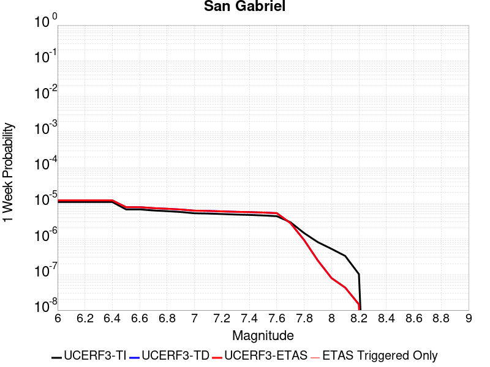 | 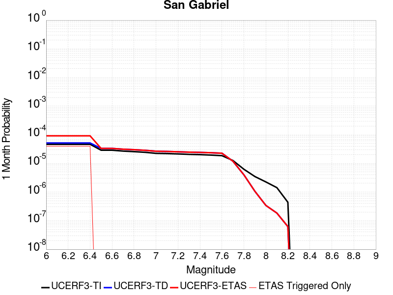 | 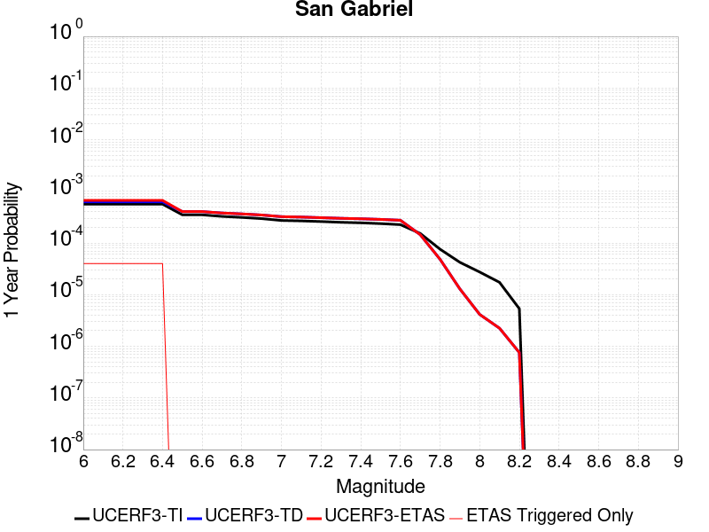 |

| Magnitude | 1 wk TI Prob | 1 wk TD Prob | 1 wk ETAS Prob | 1 wk ETAS/TD Gain | 1 wk ETAS Triggered Only | 1 mo TI Prob | 1 mo TD Prob | 1 mo ETAS Prob | 1 mo ETAS/TD Gain | 1 mo ETAS Triggered Only | 1 yr TI Prob | 1 yr TD Prob | 1 yr ETAS Prob | 1 yr ETAS/TD Gain | 1 yr ETAS Triggered Only |
|-----|-----|-----|-----|-----|-----|-----|-----|-----|-----|-----|-----|-----|-----|-----|-----|
| 6.0 | 1.083775E-5 | 1.2040094E-5 | 1.2040094E-5 | 1.0 | 0.0 | 4.6446676E-5 | 5.1599447E-5 | 9.159738E-5 | 1.7751621 | 4.0E-5 | 5.653415E-4 | 6.280535E-4 | 6.6802837E-4 | 1.0636488 | 4.0E-5 |
| 6.1 | 1.083775E-5 | 1.2040094E-5 | 1.2040094E-5 | 1.0 | 0.0 | 4.6446676E-5 | 5.1599447E-5 | 9.159738E-5 | 1.7751621 | 4.0E-5 | 5.653415E-4 | 6.280535E-4 | 6.6802837E-4 | 1.0636488 | 4.0E-5 |
| 6.2 | 1.083775E-5 | 1.2040094E-5 | 1.2040094E-5 | 1.0 | 0.0 | 4.6446676E-5 | 5.1599447E-5 | 9.159738E-5 | 1.7751621 | 4.0E-5 | 5.653415E-4 | 6.280535E-4 | 6.6802837E-4 | 1.0636488 | 4.0E-5 |
| 6.3 | 1.083775E-5 | 1.2040094E-5 | 1.2040094E-5 | 1.0 | 0.0 | 4.6446676E-5 | 5.1599447E-5 | 9.159738E-5 | 1.7751621 | 4.0E-5 | 5.653415E-4 | 6.280535E-4 | 6.6802837E-4 | 1.0636488 | 4.0E-5 |
| 6.4 | 1.083775E-5 | 1.2040094E-5 | 1.2040094E-5 | 1.0 | 0.0 | 4.6446676E-5 | 5.1599447E-5 | 9.159738E-5 | 1.7751621 | 4.0E-5 | 5.653415E-4 | 6.280535E-4 | 6.6802837E-4 | 1.0636488 | 4.0E-5 |
| 6.5 | 6.7317824E-6 | 7.771279E-6 | 7.771279E-6 | 1.0 | 0.0 | 2.8850178E-5 | 3.3305063E-5 | 3.3305063E-5 | 1.0 | 0.0 | 3.511943E-4 | 4.0541476E-4 | 4.0541476E-4 | 1.0 | 0.0 |
| 6.6 | 6.7317824E-6 | 7.771279E-6 | 7.771279E-6 | 1.0 | 0.0 | 2.8850178E-5 | 3.3305063E-5 | 3.3305063E-5 | 1.0 | 0.0 | 3.511943E-4 | 4.0541476E-4 | 4.0541476E-4 | 1.0 | 0.0 |
| 6.7 | 6.274881E-6 | 7.3001497E-6 | 7.3001497E-6 | 1.0 | 0.0 | 2.6892068E-5 | 3.1285985E-5 | 3.1285985E-5 | 1.0 | 0.0 | 3.2736175E-4 | 3.808413E-4 | 3.808413E-4 | 1.0 | 0.0 |
| 6.8 | 5.996209E-6 | 7.01284E-6 | 7.01284E-6 | 1.0 | 0.0 | 2.5697784E-5 | 3.0054685E-5 | 3.0054685E-5 | 1.0 | 0.0 | 3.128256E-4 | 3.6585532E-4 | 3.6585532E-4 | 1.0 | 0.0 |
| 6.9 | 5.686331E-6 | 6.6776697E-6 | 6.6776697E-6 | 1.0 | 0.0 | 2.4369761E-5 | 2.8618277E-5 | 2.8618277E-5 | 1.0 | 0.0 | 2.9666146E-4 | 3.4837273E-4 | 3.4837273E-4 | 1.0 | 0.0 |
| 7.0 | 5.2329838E-6 | 6.2014137E-6 | 6.2014137E-6 | 1.0 | 0.0 | 2.242688E-5 | 2.6577221E-5 | 2.6577221E-5 | 1.0 | 0.0 | 2.7301308E-4 | 3.235304E-4 | 3.235304E-4 | 1.0 | 0.0 |
| 7.1 | 5.135671E-6 | 6.091397E-6 | 6.091397E-6 | 1.0 | 0.0 | 2.2009834E-5 | 2.6105732E-5 | 2.6105732E-5 | 1.0 | 0.0 | 2.6793676E-4 | 3.177917E-4 | 3.177917E-4 | 1.0 | 0.0 |
| 7.2 | 4.989062E-6 | 5.9245344E-6 | 5.9245344E-6 | 1.0 | 0.0 | 2.1381518E-5 | 2.5390618E-5 | 2.5390618E-5 | 1.0 | 0.0 | 2.6028889E-4 | 3.0908769E-4 | 3.0908769E-4 | 1.0 | 0.0 |
| 7.3 | 4.8219395E-6 | 5.7558727E-6 | 5.7558727E-6 | 1.0 | 0.0 | 2.0665291E-5 | 2.4667797E-5 | 2.4667797E-5 | 1.0 | 0.0 | 2.5157086E-4 | 3.002898E-4 | 3.002898E-4 | 1.0 | 0.0 |
| 7.4 | 4.7118383E-6 | 5.644234E-6 | 5.644234E-6 | 1.0 | 0.0 | 2.0193436E-5 | 2.4189356E-5 | 2.4189356E-5 | 1.0 | 0.0 | 2.4582737E-4 | 2.9446636E-4 | 2.9446636E-4 | 1.0 | 0.0 |
| 7.5 | 4.5506545E-6 | 5.4893308E-6 | 5.4893308E-6 | 1.0 | 0.0 | 1.9502659E-5 | 2.3525496E-5 | 2.3525496E-5 | 1.0 | 0.0 | 2.37419E-4 | 2.8638603E-4 | 2.8638603E-4 | 1.0 | 0.0 |
| 7.6 | 4.343636E-6 | 5.281765E-6 | 5.281765E-6 | 1.0 | 0.0 | 1.861545E-5 | 2.2635943E-5 | 2.2635943E-5 | 1.0 | 0.0 | 2.2661954E-4 | 2.755585E-4 | 2.755585E-4 | 1.0 | 0.0 |
| 7.7 | 2.936235E-6 | 2.7792926E-6 | 2.7792926E-6 | 1.0 | 0.0 | 1.2583803E-5 | 1.1911199E-5 | 1.1911199E-5 | 1.0 | 0.0 | 1.5319703E-4 | 1.4500924E-4 | 1.4500924E-4 | 1.0 | 0.0 |
| 7.8 | 1.4541639E-6 | 9.265855E-7 | 9.265855E-7 | 1.0 | 0.0 | 6.232116E-6 | 3.971075E-6 | 3.971075E-6 | 1.0 | 0.0 | 7.587337E-5 | 4.8346767E-5 | 4.8346767E-5 | 1.0 | 0.0 |
| 7.9 | 8.098958E-7 | 2.4722956E-7 | 2.4722956E-7 | 1.0 | 0.0 | 3.4709774E-6 | 1.0595548E-6 | 1.0595548E-6 | 1.0 | 0.0 | 4.225833E-5 | 1.2900004E-5 | 1.2900004E-5 | 1.0 | 0.0 |
| 8.0 | 5.2473234E-7 | 7.932058E-8 | 7.932058E-8 | 1.0 | 0.0 | 2.248851E-6 | 3.399453E-7 | 3.399453E-7 | 1.0 | 0.0 | 2.7379416E-5 | 4.138826E-6 | 4.138826E-6 | 1.0 | 0.0 |
| 8.1 | 3.3162388E-7 | 4.289848E-8 | 4.289848E-8 | 1.0 | 0.0 | 1.4212444E-6 | 1.8385062E-7 | 1.8385062E-7 | 1.0 | 0.0 | 1.7303513E-5 | 2.238379E-6 | 2.238379E-6 | 1.0 | 0.0 |
| 8.2 | 1.0235345E-7 | 1.4487087E-8 | 1.4487087E-8 | 1.0 | 0.0 | 4.3865757E-7 | 6.2087516E-8 | 6.2087516E-8 | 1.0 | 0.0 | 5.340643E-6 | 7.559152E-7 | 7.559152E-7 | 1.0 | 0.0 |

## Panamint Valley
*[(top)](#table-of-contents)*

| 1 Week | 1 Month | 1 Year |
|-----|-----|-----|
|  | 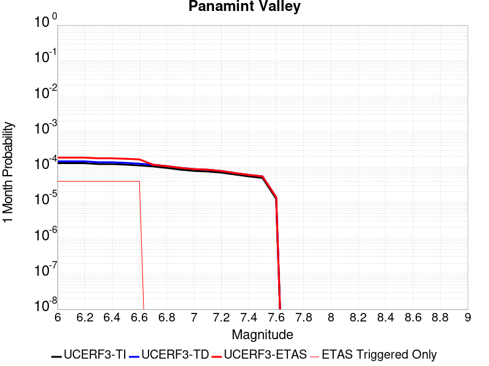 | 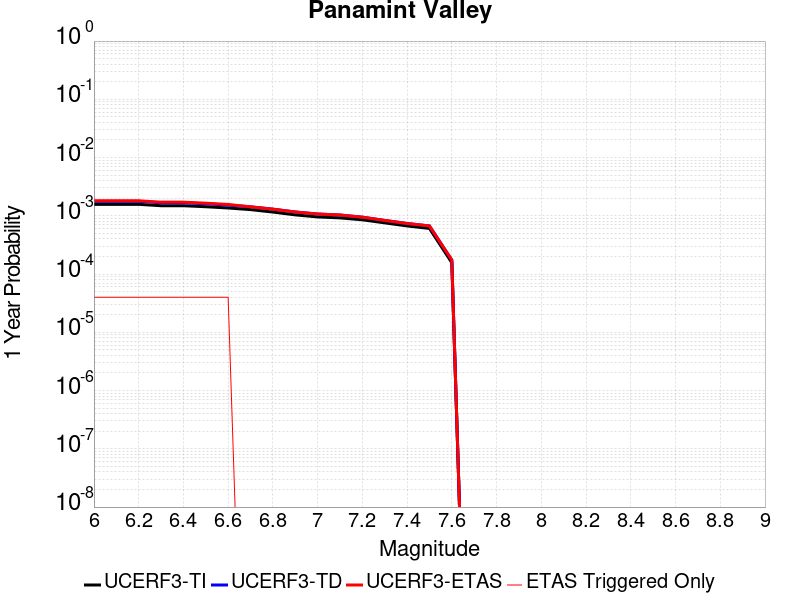 |

| Magnitude | 1 wk TI Prob | 1 wk TD Prob | 1 wk ETAS Prob | 1 wk ETAS/TD Gain | 1 wk ETAS Triggered Only | 1 mo TI Prob | 1 mo TD Prob | 1 mo ETAS Prob | 1 mo ETAS/TD Gain | 1 mo ETAS Triggered Only | 1 yr TI Prob | 1 yr TD Prob | 1 yr ETAS Prob | 1 yr ETAS/TD Gain | 1 yr ETAS Triggered Only |
|-----|-----|-----|-----|-----|-----|-----|-----|-----|-----|-----|-----|-----|-----|-----|-----|
| 6.0 | 3.0211835E-5 | 3.4006032E-5 | 7.4004674E-5 | 2.1762218 | 4.0E-5 | 1.2947287E-4 | 1.4573216E-4 | 1.8572634E-4 | 1.2744361 | 4.0E-5 | 0.0015751923 | 0.0017728747 | 0.0018128038 | 1.0225222 | 4.0E-5 |
| 6.1 | 3.0211835E-5 | 3.4006032E-5 | 7.4004674E-5 | 2.1762218 | 4.0E-5 | 1.2947287E-4 | 1.4573216E-4 | 1.8572634E-4 | 1.2744361 | 4.0E-5 | 0.0015751923 | 0.0017728747 | 0.0018128038 | 1.0225222 | 4.0E-5 |
| 6.2 | 3.0211835E-5 | 3.4006032E-5 | 7.4004674E-5 | 2.1762218 | 4.0E-5 | 1.2947287E-4 | 1.4573216E-4 | 1.8572634E-4 | 1.2744361 | 4.0E-5 | 0.0015751923 | 0.0017728747 | 0.0018128038 | 1.0225222 | 4.0E-5 |
| 6.3 | 2.8573924E-5 | 3.212314E-5 | 7.212185E-5 | 2.2451684 | 4.0E-5 | 1.2245393E-4 | 1.3766348E-4 | 1.7765797E-4 | 1.2905236 | 4.0E-5 | 0.001489857 | 0.0016747921 | 0.0017147252 | 1.0238435 | 4.0E-5 |
| 6.4 | 2.8573924E-5 | 3.212314E-5 | 7.212185E-5 | 2.2451684 | 4.0E-5 | 1.2245393E-4 | 1.3766348E-4 | 1.7765797E-4 | 1.2905236 | 4.0E-5 | 0.001489857 | 0.0016747921 | 0.0017147252 | 1.0238435 | 4.0E-5 |
| 6.5 | 2.7468774E-5 | 3.0848154E-5 | 7.084692E-5 | 2.296634 | 4.0E-5 | 1.1771801E-4 | 1.3219983E-4 | 1.7219454E-4 | 1.3025322 | 4.0E-5 | 0.0014322745 | 0.001608372 | 0.0016483077 | 1.0248299 | 4.0E-5 |
| 6.6 | 2.6135967E-5 | 2.9271281E-5 | 6.9270114E-5 | 2.366487 | 4.0E-5 | 1.1200648E-4 | 1.2544247E-4 | 1.6543745E-4 | 1.3188313 | 4.0E-5 | 0.0013628257 | 0.0015262186 | 0.0015661576 | 1.0261686 | 4.0E-5 |
| 6.7 | 2.4498746E-5 | 2.7359867E-5 | 2.7359867E-5 | 1.0 | 0.0 | 1.04990395E-4 | 1.17251446E-4 | 1.17251446E-4 | 1.0 | 0.0 | 0.0012775084 | 0.0014266267 | 0.0014266267 | 1.0 | 0.0 |
| 6.8 | 2.2244329E-5 | 2.4952975E-5 | 2.4952975E-5 | 1.0 | 0.0 | 9.532935E-5 | 1.06937056E-4 | 1.06937056E-4 | 1.0 | 0.0 | 0.0011600169 | 0.0013012029 | 0.0013012029 | 1.0 | 0.0 |
| 6.9 | 1.9902658E-5 | 2.2306494E-5 | 2.2306494E-5 | 1.0 | 0.0 | 8.529431E-5 | 9.559586E-5 | 9.559586E-5 | 1.0 | 0.0 | 0.0010379635 | 0.0011632767 | 0.0011632767 | 1.0 | 0.0 |
| 7.0 | 1.8353881E-5 | 2.0581738E-5 | 2.0581738E-5 | 1.0 | 0.0 | 7.865712E-5 | 8.8204564E-5 | 8.8204564E-5 | 1.0 | 0.0 | 9.5722964E-4 | 0.0010733792 | 0.0010733792 | 1.0 | 0.0 |
| 7.1 | 1.7667631E-5 | 1.9787058E-5 | 1.9787058E-5 | 1.0 | 0.0 | 7.571623E-5 | 8.4799016E-5 | 8.4799016E-5 | 1.0 | 0.0 | 9.2145515E-4 | 0.0010319566 | 0.0010319566 | 1.0 | 0.0 |
| 7.2 | 1.6381597E-5 | 1.8171384E-5 | 1.8171384E-5 | 1.0 | 0.0 | 7.020495E-5 | 7.787513E-5 | 7.787513E-5 | 1.0 | 0.0 | 8.544101E-4 | 9.477346E-4 | 9.477346E-4 | 1.0 | 0.0 |
| 7.3 | 1.4520491E-5 | 1.5977024E-5 | 1.5977024E-5 | 1.0 | 0.0 | 6.222919E-5 | 6.847125E-5 | 6.847125E-5 | 1.0 | 0.0 | 7.57377E-4 | 8.3333487E-4 | 8.3333487E-4 | 1.0 | 0.0 |
| 7.4 | 1.2852287E-5 | 1.4154711E-5 | 1.4154711E-5 | 1.0 | 0.0 | 5.5080065E-5 | 6.0661725E-5 | 6.0661725E-5 | 1.0 | 0.0 | 6.7039346E-4 | 7.3832204E-4 | 7.3832204E-4 | 1.0 | 0.0 |
| 7.5 | 1.1637851E-5 | 1.2845683E-5 | 1.2845683E-5 | 1.0 | 0.0 | 4.987555E-5 | 5.5051856E-5 | 5.5051856E-5 | 1.0 | 0.0 | 6.070656E-4 | 6.700659E-4 | 6.700659E-4 | 1.0 | 0.0 |
| 7.6 | 3.0068115E-6 | 3.3365502E-6 | 3.3365502E-6 | 1.0 | 0.0 | 1.2886271E-5 | 1.4299464E-5 | 1.4299464E-5 | 1.0 | 0.0 | 1.5687906E-4 | 1.7408936E-4 | 1.7408936E-4 | 1.0 | 0.0 |

## Elsinore (Coyote Mountains)
*[(top)](#table-of-contents)*

| 1 Week | 1 Month | 1 Year |
|-----|-----|-----|
|  |  | 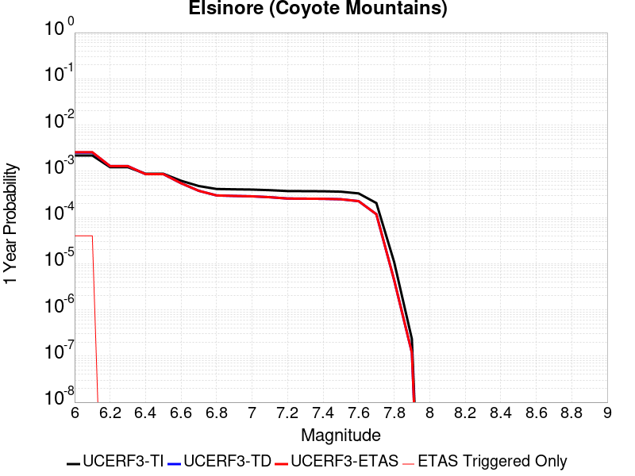 |

| Magnitude | 1 wk TI Prob | 1 wk TD Prob | 1 wk ETAS Prob | 1 wk ETAS/TD Gain | 1 wk ETAS Triggered Only | 1 mo TI Prob | 1 mo TD Prob | 1 mo ETAS Prob | 1 mo ETAS/TD Gain | 1 mo ETAS Triggered Only | 1 yr TI Prob | 1 yr TD Prob | 1 yr ETAS Prob | 1 yr ETAS/TD Gain | 1 yr ETAS Triggered Only |
|-----|-----|-----|-----|-----|-----|-----|-----|-----|-----|-----|-----|-----|-----|-----|-----|
| 6.0 | 4.20513E-5 | 4.8674003E-5 | 4.8674003E-5 | 1.0 | 0.0 | 1.8020741E-4 | 2.0858928E-4 | 2.0858928E-4 | 1.0 | 0.0 | 0.0021918174 | 0.0025371274 | 0.002577026 | 1.0157259 | 4.0E-5 |
| 6.1 | 4.20513E-5 | 4.8674003E-5 | 4.8674003E-5 | 1.0 | 0.0 | 1.8020741E-4 | 2.0858928E-4 | 2.0858928E-4 | 1.0 | 0.0 | 0.0021918174 | 0.0025371274 | 0.002577026 | 1.0157259 | 4.0E-5 |
| 6.2 | 2.3413893E-5 | 2.4715584E-5 | 2.4715584E-5 | 1.0 | 0.0 | 1.0034139E-4 | 1.0592001E-4 | 1.0592001E-4 | 1.0 | 0.0 | 0.0012209718 | 0.0012889015 | 0.0012889015 | 1.0 | 0.0 |
| 6.3 | 2.3413893E-5 | 2.4715584E-5 | 2.4715584E-5 | 1.0 | 0.0 | 1.0034139E-4 | 1.0592001E-4 | 1.0592001E-4 | 1.0 | 0.0 | 0.0012209718 | 0.0012889015 | 0.0012889015 | 1.0 | 0.0 |
| 6.4 | 1.6894814E-5 | 1.6581593E-5 | 1.6581593E-5 | 1.0 | 0.0 | 7.240433E-5 | 7.1062255E-5 | 7.1062255E-5 | 1.0 | 0.0 | 8.811662E-4 | 8.648771E-4 | 8.648771E-4 | 1.0 | 0.0 |
| 6.5 | 1.6894814E-5 | 1.6581593E-5 | 1.6581593E-5 | 1.0 | 0.0 | 7.240433E-5 | 7.1062255E-5 | 7.1062255E-5 | 1.0 | 0.0 | 8.811662E-4 | 8.648771E-4 | 8.648771E-4 | 1.0 | 0.0 |
| 6.6 | 1.1910969E-5 | 1.05396075E-5 | 1.05396075E-5 | 1.0 | 0.0 | 5.1046012E-5 | 4.516904E-5 | 4.516904E-5 | 1.0 | 0.0 | 6.21308E-4 | 5.4980756E-4 | 5.4980756E-4 | 1.0 | 0.0 |
| 6.7 | 9.1486E-6 | 7.2094103E-6 | 7.2094103E-6 | 1.0 | 0.0 | 3.9207694E-5 | 3.089713E-5 | 3.089713E-5 | 1.0 | 0.0 | 4.7724912E-4 | 3.7611142E-4 | 3.7611142E-4 | 1.0 | 0.0 |
| 6.8 | 7.90441E-6 | 5.7346547E-6 | 5.7346547E-6 | 1.0 | 0.0 | 3.3875604E-5 | 2.4576866E-5 | 2.4576866E-5 | 1.0 | 0.0 | 4.1235742E-4 | 2.9918354E-4 | 2.9918354E-4 | 1.0 | 0.0 |
| 6.9 | 7.77015E-6 | 5.5885653E-6 | 5.5885653E-6 | 1.0 | 0.0 | 3.3300217E-5 | 2.395078E-5 | 2.395078E-5 | 1.0 | 0.0 | 4.0535472E-4 | 2.9156302E-4 | 2.9156302E-4 | 1.0 | 0.0 |
| 7.0 | 7.675798E-6 | 5.4853913E-6 | 5.4853913E-6 | 1.0 | 0.0 | 3.289586E-5 | 2.3508615E-5 | 2.3508615E-5 | 1.0 | 0.0 | 4.004335E-4 | 2.8618105E-4 | 2.8618105E-4 | 1.0 | 0.0 |
| 7.1 | 7.447814E-6 | 5.2442124E-6 | 5.2442124E-6 | 1.0 | 0.0 | 3.191881E-5 | 2.247501E-5 | 2.247501E-5 | 1.0 | 0.0 | 3.8854225E-4 | 2.7360013E-4 | 2.7360013E-4 | 1.0 | 0.0 |
| 7.2 | 7.128185E-6 | 4.9108385E-6 | 4.9108385E-6 | 1.0 | 0.0 | 3.0549007E-5 | 2.1046288E-5 | 2.1046288E-5 | 1.0 | 0.0 | 3.7187067E-4 | 2.562096E-4 | 2.562096E-4 | 1.0 | 0.0 |
| 7.3 | 7.0913875E-6 | 4.879504E-6 | 4.879504E-6 | 1.0 | 0.0 | 3.0391306E-5 | 2.0911999E-5 | 2.0911999E-5 | 1.0 | 0.0 | 3.6995133E-4 | 2.5457505E-4 | 2.5457505E-4 | 1.0 | 0.0 |
| 7.4 | 7.051521E-6 | 4.8433476E-6 | 4.8433476E-6 | 1.0 | 0.0 | 3.0220453E-5 | 2.0757045E-5 | 2.0757045E-5 | 1.0 | 0.0 | 3.6787192E-4 | 2.5268891E-4 | 2.5268891E-4 | 1.0 | 0.0 |
| 7.5 | 6.910666E-6 | 4.7387675E-6 | 4.7387675E-6 | 1.0 | 0.0 | 2.9616802E-5 | 2.0308851E-5 | 2.0308851E-5 | 1.0 | 0.0 | 3.605249E-4 | 2.472334E-4 | 2.472334E-4 | 1.0 | 0.0 |
| 7.6 | 6.341753E-6 | 4.3115992E-6 | 4.3115992E-6 | 1.0 | 0.0 | 2.7178658E-5 | 1.8478158E-5 | 1.8478158E-5 | 1.0 | 0.0 | 3.3084993E-4 | 2.2494953E-4 | 2.2494953E-4 | 1.0 | 0.0 |
| 7.7 | 3.9205916E-6 | 2.2466259E-6 | 2.2466259E-6 | 1.0 | 0.0 | 1.6802427E-5 | 9.628365E-6 | 9.628365E-6 | 1.0 | 0.0 | 2.0455034E-4 | 1.1721978E-4 | 1.1721978E-4 | 1.0 | 0.0 |
| 7.8 | 2.0846227E-7 | 8.497208E-8 | 8.497208E-8 | 1.0 | 0.0 | 8.9340944E-7 | 3.6416603E-7 | 3.6416603E-7 | 1.0 | 0.0 | 1.0877206E-5 | 4.4337157E-6 | 4.4337157E-6 | 1.0 | 0.0 |
| 7.9 | 4.4969806E-9 | 2.2712179E-9 | 2.2712179E-9 | 1.0 | 0.0 | 1.9272775E-8 | 9.733791E-9 | 9.733791E-9 | 1.0 | 0.0 | 2.3464601E-7 | 1.1850889E-7 | 1.1850889E-7 | 1.0 | 0.0 |

## North Frontal  (East)
*[(top)](#table-of-contents)*

| 1 Week | 1 Month | 1 Year |
|-----|-----|-----|
|  |  | 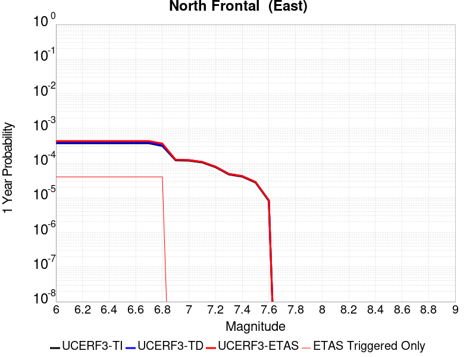 |

| Magnitude | 1 wk TI Prob | 1 wk TD Prob | 1 wk ETAS Prob | 1 wk ETAS/TD Gain | 1 wk ETAS Triggered Only | 1 mo TI Prob | 1 mo TD Prob | 1 mo ETAS Prob | 1 mo ETAS/TD Gain | 1 mo ETAS Triggered Only | 1 yr TI Prob | 1 yr TD Prob | 1 yr ETAS Prob | 1 yr ETAS/TD Gain | 1 yr ETAS Triggered Only |
|-----|-----|-----|-----|-----|-----|-----|-----|-----|-----|-----|-----|-----|-----|-----|-----|
| 6.0 | 7.135738E-6 | 7.4783907E-6 | 4.747809E-5 | 6.3487043 | 4.0E-5 | 3.0581377E-5 | 3.2049964E-5 | 7.204868E-5 | 2.2480114 | 4.0E-5 | 3.7226462E-4 | 3.9015838E-4 | 4.301428E-4 | 1.1024824 | 4.0E-5 |
| 6.1 | 7.135738E-6 | 7.4783907E-6 | 4.747809E-5 | 6.3487043 | 4.0E-5 | 3.0581377E-5 | 3.2049964E-5 | 7.204868E-5 | 2.2480114 | 4.0E-5 | 3.7226462E-4 | 3.9015838E-4 | 4.301428E-4 | 1.1024824 | 4.0E-5 |
| 6.2 | 7.135738E-6 | 7.4783907E-6 | 4.747809E-5 | 6.3487043 | 4.0E-5 | 3.0581377E-5 | 3.2049964E-5 | 7.204868E-5 | 2.2480114 | 4.0E-5 | 3.7226462E-4 | 3.9015838E-4 | 4.301428E-4 | 1.1024824 | 4.0E-5 |
| 6.3 | 7.135738E-6 | 7.4783907E-6 | 4.747809E-5 | 6.3487043 | 4.0E-5 | 3.0581377E-5 | 3.2049964E-5 | 7.204868E-5 | 2.2480114 | 4.0E-5 | 3.7226462E-4 | 3.9015838E-4 | 4.301428E-4 | 1.1024824 | 4.0E-5 |
| 6.4 | 7.135738E-6 | 7.4783907E-6 | 4.747809E-5 | 6.3487043 | 4.0E-5 | 3.0581377E-5 | 3.2049964E-5 | 7.204868E-5 | 2.2480114 | 4.0E-5 | 3.7226462E-4 | 3.9015838E-4 | 4.301428E-4 | 1.1024824 | 4.0E-5 |
| 6.5 | 7.135738E-6 | 7.4783907E-6 | 4.747809E-5 | 6.3487043 | 4.0E-5 | 3.0581377E-5 | 3.2049964E-5 | 7.204868E-5 | 2.2480114 | 4.0E-5 | 3.7226462E-4 | 3.9015838E-4 | 4.301428E-4 | 1.1024824 | 4.0E-5 |
| 6.6 | 7.135738E-6 | 7.4783907E-6 | 4.747809E-5 | 6.3487043 | 4.0E-5 | 3.0581377E-5 | 3.2049964E-5 | 7.204868E-5 | 2.2480114 | 4.0E-5 | 3.7226462E-4 | 3.9015838E-4 | 4.301428E-4 | 1.1024824 | 4.0E-5 |
| 6.7 | 7.135738E-6 | 7.4783907E-6 | 4.747809E-5 | 6.3487043 | 4.0E-5 | 3.0581377E-5 | 3.2049964E-5 | 7.204868E-5 | 2.2480114 | 4.0E-5 | 3.7226462E-4 | 3.9015838E-4 | 4.301428E-4 | 1.1024824 | 4.0E-5 |
| 6.8 | 5.959142E-6 | 6.2376685E-6 | 4.623742E-5 | 7.4126124 | 4.0E-5 | 2.553893E-5 | 2.6732692E-5 | 6.673163E-5 | 2.4962552 | 4.0E-5 | 3.108921E-4 | 3.2544002E-4 | 3.65427E-4 | 1.1228706 | 4.0E-5 |
| 6.9 | 2.2946929E-6 | 2.3827697E-6 | 2.3827697E-6 | 1.0 | 0.0 | 9.834361E-6 | 1.0211833E-5 | 1.0211833E-5 | 1.0 | 0.0 | 1.1972676E-4 | 1.2432244E-4 | 1.2432244E-4 | 1.0 | 0.0 |
| 7.0 | 2.2468673E-6 | 2.3324542E-6 | 2.3324542E-6 | 1.0 | 0.0 | 9.629396E-6 | 9.996196E-6 | 9.996196E-6 | 1.0 | 0.0 | 1.1723159E-4 | 1.2169736E-4 | 1.2169736E-4 | 1.0 | 0.0 |
| 7.1 | 1.9921076E-6 | 2.064858E-6 | 2.064858E-6 | 1.0 | 0.0 | 8.537577E-6 | 8.849364E-6 | 8.849364E-6 | 1.0 | 0.0 | 1.0394004E-4 | 1.07736116E-4 | 1.07736116E-4 | 1.0 | 0.0 |
| 7.2 | 1.4524545E-6 | 1.5046977E-6 | 1.5046977E-6 | 1.0 | 0.0 | 6.2247905E-6 | 6.44869E-6 | 6.44869E-6 | 1.0 | 0.0 | 7.5784184E-5 | 7.851022E-5 | 7.851022E-5 | 1.0 | 0.0 |
| 7.3 | 8.9802575E-7 | 9.309882E-7 | 9.309882E-7 | 1.0 | 0.0 | 3.848676E-6 | 3.989944E-6 | 3.989944E-6 | 1.0 | 0.0 | 4.685662E-5 | 4.8576603E-5 | 4.8576603E-5 | 1.0 | 0.0 |
| 7.4 | 7.776139E-7 | 8.061474E-7 | 8.061474E-7 | 1.0 | 0.0 | 3.3326266E-6 | 3.4549134E-6 | 3.4549134E-6 | 1.0 | 0.0 | 4.0573974E-5 | 4.2062868E-5 | 4.2062868E-5 | 1.0 | 0.0 |
| 7.5 | 5.244417E-7 | 5.4419115E-7 | 5.4419115E-7 | 1.0 | 0.0 | 2.2476054E-6 | 2.332246E-6 | 2.332246E-6 | 1.0 | 0.0 | 2.7364253E-5 | 2.8394792E-5 | 2.8394792E-5 | 1.0 | 0.0 |
| 7.6 | 1.5489647E-7 | 1.6091616E-7 | 1.6091616E-7 | 1.0 | 0.0 | 6.6384183E-7 | 6.896406E-7 | 6.896406E-7 | 1.0 | 0.0 | 8.082245E-6 | 8.396362E-6 | 8.396362E-6 | 1.0 | 0.0 |

## Death Valley (Black Mtns Frontal)
*[(top)](#table-of-contents)*

| 1 Week | 1 Month | 1 Year |
|-----|-----|-----|
| 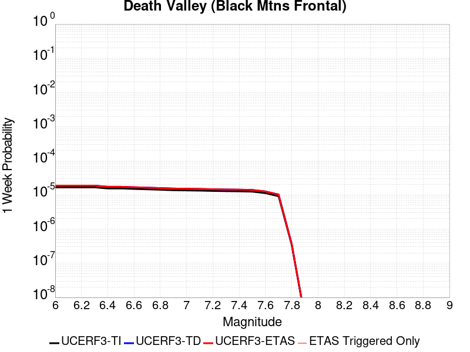 | 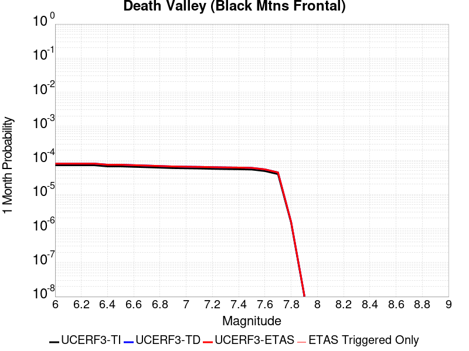 | 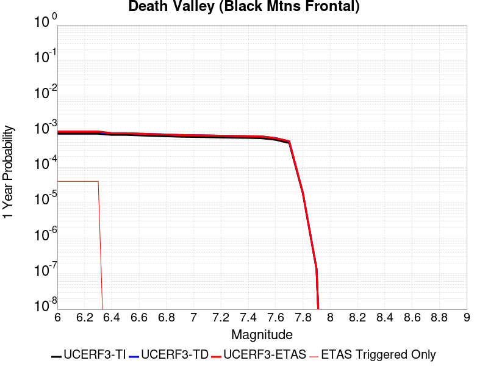 |

| Magnitude | 1 wk TI Prob | 1 wk TD Prob | 1 wk ETAS Prob | 1 wk ETAS/TD Gain | 1 wk ETAS Triggered Only | 1 mo TI Prob | 1 mo TD Prob | 1 mo ETAS Prob | 1 mo ETAS/TD Gain | 1 mo ETAS Triggered Only | 1 yr TI Prob | 1 yr TD Prob | 1 yr ETAS Prob | 1 yr ETAS/TD Gain | 1 yr ETAS Triggered Only |
|-----|-----|-----|-----|-----|-----|-----|-----|-----|-----|-----|-----|-----|-----|-----|-----|
| 6.0 | 1.6707214E-5 | 1.8677725E-5 | 1.8677725E-5 | 1.0 | 0.0 | 7.160038E-5 | 8.0044985E-5 | 8.0044985E-5 | 1.0 | 0.0 | 8.71386E-4 | 9.741196E-4 | 0.0010140806 | 1.0410228 | 4.0E-5 |
| 6.1 | 1.6707214E-5 | 1.8677725E-5 | 1.8677725E-5 | 1.0 | 0.0 | 7.160038E-5 | 8.0044985E-5 | 8.0044985E-5 | 1.0 | 0.0 | 8.71386E-4 | 9.741196E-4 | 0.0010140806 | 1.0410228 | 4.0E-5 |
| 6.2 | 1.6707214E-5 | 1.8677725E-5 | 1.8677725E-5 | 1.0 | 0.0 | 7.160038E-5 | 8.0044985E-5 | 8.0044985E-5 | 1.0 | 0.0 | 8.71386E-4 | 9.741196E-4 | 0.0010140806 | 1.0410228 | 4.0E-5 |
| 6.3 | 1.6707214E-5 | 1.8677725E-5 | 1.8677725E-5 | 1.0 | 0.0 | 7.160038E-5 | 8.0044985E-5 | 8.0044985E-5 | 1.0 | 0.0 | 8.71386E-4 | 9.741196E-4 | 0.0010140806 | 1.0410228 | 4.0E-5 |
| 6.4 | 1.5515609E-5 | 1.7345139E-5 | 1.7345139E-5 | 1.0 | 0.0 | 6.649377E-5 | 7.4334224E-5 | 7.4334224E-5 | 1.0 | 0.0 | 8.0926094E-4 | 9.046495E-4 | 9.046495E-4 | 1.0 | 0.0 |
| 6.5 | 1.5515609E-5 | 1.7345139E-5 | 1.7345139E-5 | 1.0 | 0.0 | 6.649377E-5 | 7.4334224E-5 | 7.4334224E-5 | 1.0 | 0.0 | 8.0926094E-4 | 9.046495E-4 | 9.046495E-4 | 1.0 | 0.0 |
| 6.6 | 1.5041828E-5 | 1.681586E-5 | 1.681586E-5 | 1.0 | 0.0 | 6.4463384E-5 | 7.206602E-5 | 7.206602E-5 | 1.0 | 0.0 | 7.8455906E-4 | 8.7705645E-4 | 8.7705645E-4 | 1.0 | 0.0 |
| 6.7 | 1.4634985E-5 | 1.6362557E-5 | 1.6362557E-5 | 1.0 | 0.0 | 6.271985E-5 | 7.0123395E-5 | 7.0123395E-5 | 1.0 | 0.0 | 7.6334673E-4 | 8.5342367E-4 | 8.5342367E-4 | 1.0 | 0.0 |
| 6.8 | 1.4209158E-5 | 1.5888407E-5 | 1.5888407E-5 | 1.0 | 0.0 | 6.089497E-5 | 6.809142E-5 | 6.809142E-5 | 1.0 | 0.0 | 7.4114406E-4 | 8.287034E-4 | 8.287034E-4 | 1.0 | 0.0 |
| 6.9 | 1.3780098E-5 | 1.541077E-5 | 1.541077E-5 | 1.0 | 0.0 | 5.9056227E-5 | 6.6044515E-5 | 6.6044515E-5 | 1.0 | 0.0 | 7.1877235E-4 | 8.0380077E-4 | 8.0380077E-4 | 1.0 | 0.0 |
| 7.0 | 1.3585064E-5 | 1.5194251E-5 | 1.5194251E-5 | 1.0 | 0.0 | 5.8220405E-5 | 6.511663E-5 | 6.511663E-5 | 1.0 | 0.0 | 7.086029E-4 | 7.9251203E-4 | 7.9251203E-4 | 1.0 | 0.0 |
| 7.1 | 1.3398601E-5 | 1.4987359E-5 | 1.4987359E-5 | 1.0 | 0.0 | 5.742131E-5 | 6.4229986E-5 | 6.4229986E-5 | 1.0 | 0.0 | 6.9888023E-4 | 7.81725E-4 | 7.81725E-4 | 1.0 | 0.0 |
| 7.2 | 1.3126312E-5 | 1.4685469E-5 | 1.4685469E-5 | 1.0 | 0.0 | 5.6254412E-5 | 6.293624E-5 | 6.293624E-5 | 1.0 | 0.0 | 6.846822E-4 | 7.6598476E-4 | 7.6598476E-4 | 1.0 | 0.0 |
| 7.3 | 1.2922429E-5 | 1.4459614E-5 | 1.4459614E-5 | 1.0 | 0.0 | 5.5380664E-5 | 6.1968334E-5 | 6.1968334E-5 | 1.0 | 0.0 | 6.74051E-4 | 7.5420877E-4 | 7.5420877E-4 | 1.0 | 0.0 |
| 7.4 | 1.2768878E-5 | 1.4289535E-5 | 1.4289535E-5 | 1.0 | 0.0 | 5.4722615E-5 | 6.123946E-5 | 6.123946E-5 | 1.0 | 0.0 | 6.660441E-4 | 7.453408E-4 | 7.453408E-4 | 1.0 | 0.0 |
| 7.5 | 1.2521929E-5 | 1.4017685E-5 | 1.4017685E-5 | 1.0 | 0.0 | 5.366431E-5 | 6.0074442E-5 | 6.0074442E-5 | 1.0 | 0.0 | 6.531671E-4 | 7.3116634E-4 | 7.3116634E-4 | 1.0 | 0.0 |
| 7.6 | 1.1301089E-5 | 1.2653275E-5 | 1.2653275E-5 | 1.0 | 0.0 | 4.8432343E-5 | 5.4227225E-5 | 5.4227225E-5 | 1.0 | 0.0 | 5.895042E-4 | 6.600218E-4 | 6.600218E-4 | 1.0 | 0.0 |
| 7.7 | 9.189108E-6 | 1.0287522E-5 | 1.0287522E-5 | 1.0 | 0.0 | 3.93813E-5 | 4.4088665E-5 | 4.4088665E-5 | 1.0 | 0.0 | 4.7936183E-4 | 5.3665234E-4 | 5.3665234E-4 | 1.0 | 0.0 |
| 7.8 | 3.4586725E-7 | 3.6489428E-7 | 3.6489428E-7 | 1.0 | 0.0 | 1.4822873E-6 | 1.5638317E-6 | 1.5638317E-6 | 1.0 | 0.0 | 1.80467E-5 | 1.903949E-5 | 1.903949E-5 | 1.0 | 0.0 |
| 7.9 | 2.5591178E-9 | 2.6700626E-9 | 2.6700626E-9 | 1.0 | 0.0 | 1.0967647E-8 | 1.1443126E-8 | 1.1443126E-8 | 1.0 | 0.0 | 1.335311E-7 | 1.3932005E-7 | 1.3932005E-7 | 1.0 | 0.0 |

## Santa Rosa Island
*[(top)](#table-of-contents)*

| 1 Week | 1 Month | 1 Year |
|-----|-----|-----|
| 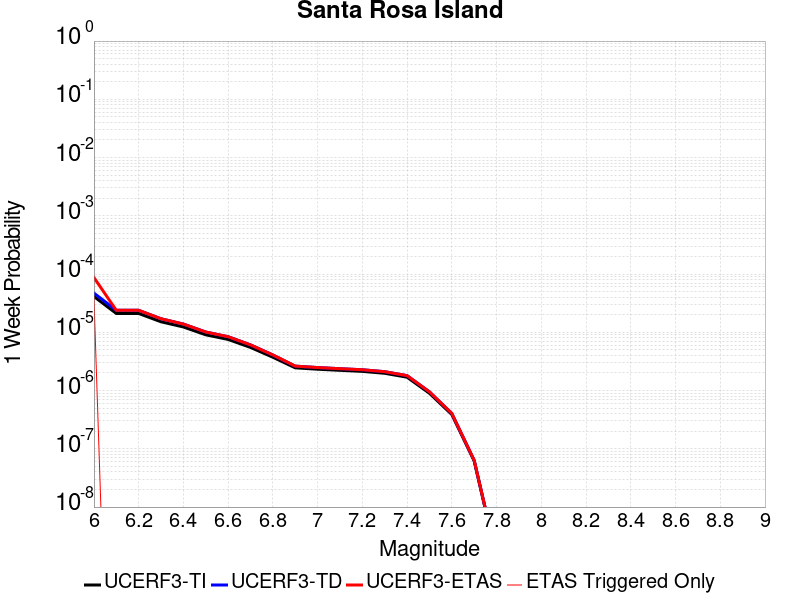 | 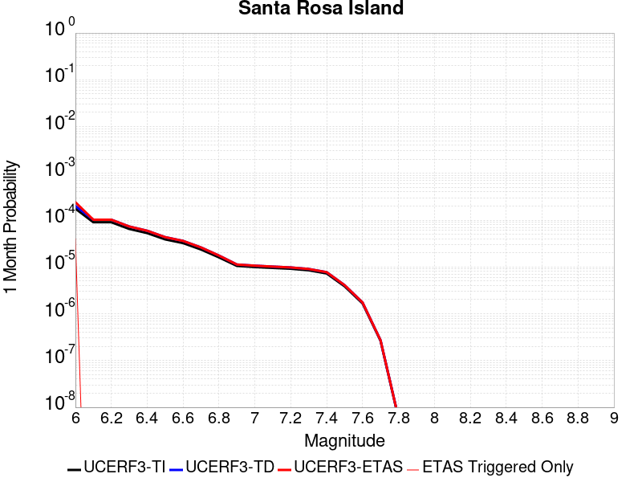 | 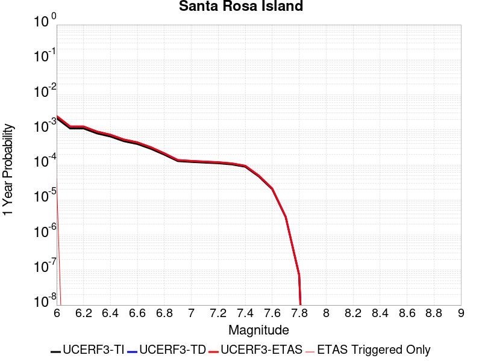 |

| Magnitude | 1 wk TI Prob | 1 wk TD Prob | 1 wk ETAS Prob | 1 wk ETAS/TD Gain | 1 wk ETAS Triggered Only | 1 mo TI Prob | 1 mo TD Prob | 1 mo ETAS Prob | 1 mo ETAS/TD Gain | 1 mo ETAS Triggered Only | 1 yr TI Prob | 1 yr TD Prob | 1 yr ETAS Prob | 1 yr ETAS/TD Gain | 1 yr ETAS Triggered Only |
|-----|-----|-----|-----|-----|-----|-----|-----|-----|-----|-----|-----|-----|-----|-----|-----|
| 6.0 | 4.1143165E-5 | 4.7114332E-5 | 8.711245E-5 | 1.8489585 | 4.0E-5 | 1.7631594E-4 | 2.0190405E-4 | 2.4189598E-4 | 1.1980739 | 4.0E-5 | 0.002144533 | 0.0024556073 | 0.0024955089 | 1.0162493 | 4.0E-5 |
| 6.1 | 2.1061249E-5 | 2.3875791E-5 | 2.3875791E-5 | 1.0 | 0.0 | 9.0259375E-5 | 1.0232097E-4 | 1.0232097E-4 | 1.0 | 0.0 | 0.0010983539 | 0.0012450748 | 0.0012450748 | 1.0 | 0.0 |
| 6.2 | 2.1061249E-5 | 2.3875791E-5 | 2.3875791E-5 | 1.0 | 0.0 | 9.0259375E-5 | 1.0232097E-4 | 1.0232097E-4 | 1.0 | 0.0 | 0.0010983539 | 0.0012450748 | 0.0012450748 | 1.0 | 0.0 |
| 6.3 | 1.5158236E-5 | 1.708178E-5 | 1.708178E-5 | 1.0 | 0.0 | 6.496225E-5 | 7.320564E-5 | 7.320564E-5 | 1.0 | 0.0 | 7.906284E-4 | 8.909262E-4 | 8.909262E-4 | 1.0 | 0.0 |
| 6.4 | 1.2341918E-5 | 1.3858705E-5 | 1.3858705E-5 | 1.0 | 0.0 | 5.2892858E-5 | 5.939314E-5 | 5.939314E-5 | 1.0 | 0.0 | 6.437803E-4 | 7.228797E-4 | 7.228797E-4 | 1.0 | 0.0 |
| 6.5 | 9.061158E-6 | 1.0121061E-5 | 1.0121061E-5 | 1.0 | 0.0 | 3.883296E-5 | 4.3375283E-5 | 4.3375283E-5 | 1.0 | 0.0 | 4.726887E-4 | 5.279714E-4 | 5.279714E-4 | 1.0 | 0.0 |
| 6.6 | 7.5461685E-6 | 8.403989E-6 | 8.403989E-6 | 1.0 | 0.0 | 3.2340322E-5 | 3.6016623E-5 | 3.6016623E-5 | 1.0 | 0.0 | 3.936723E-4 | 4.3841847E-4 | 4.3841847E-4 | 1.0 | 0.0 |
| 6.7 | 5.5023775E-6 | 6.089602E-6 | 6.089602E-6 | 1.0 | 0.0 | 2.3581404E-5 | 2.609805E-5 | 2.609805E-5 | 1.0 | 0.0 | 2.8706578E-4 | 3.177007E-4 | 3.177007E-4 | 1.0 | 0.0 |
| 6.8 | 3.7351679E-6 | 4.08445E-6 | 4.08445E-6 | 1.0 | 0.0 | 1.6007763E-5 | 1.7504683E-5 | 1.7504683E-5 | 1.0 | 0.0 | 1.948771E-4 | 2.1310116E-4 | 2.1310116E-4 | 1.0 | 0.0 |
| 6.9 | 2.456366E-6 | 2.6299053E-6 | 2.6299053E-6 | 1.0 | 0.0 | 1.0527241E-5 | 1.1270974E-5 | 1.1270974E-5 | 1.0 | 0.0 | 1.2816161E-4 | 1.372155E-4 | 1.372155E-4 | 1.0 | 0.0 |
| 7.0 | 2.3245157E-6 | 2.4833578E-6 | 2.4833578E-6 | 1.0 | 0.0 | 9.962172E-6 | 1.0642919E-5 | 1.0642919E-5 | 1.0 | 0.0 | 1.2128269E-4 | 1.2956985E-4 | 1.2956985E-4 | 1.0 | 0.0 |
| 7.1 | 2.2248344E-6 | 2.3737928E-6 | 2.3737928E-6 | 1.0 | 0.0 | 9.53497E-6 | 1.0173358E-5 | 1.0173358E-5 | 1.0 | 0.0 | 1.1608207E-4 | 1.238536E-4 | 1.238536E-4 | 1.0 | 0.0 |
| 7.2 | 2.1350402E-6 | 2.2766699E-6 | 2.2766699E-6 | 1.0 | 0.0 | 9.150141E-6 | 9.75712E-6 | 9.75712E-6 | 1.0 | 0.0 | 1.1139726E-4 | 1.1878648E-4 | 1.1878648E-4 | 1.0 | 0.0 |
| 7.3 | 1.9793572E-6 | 2.109192E-6 | 2.109192E-6 | 1.0 | 0.0 | 8.482932E-6 | 9.039363E-6 | 9.039363E-6 | 1.0 | 0.0 | 1.032748E-4 | 1.10048706E-4 | 1.10048706E-4 | 1.0 | 0.0 |
| 7.4 | 1.6951194E-6 | 1.804974E-6 | 1.804974E-6 | 1.0 | 0.0 | 7.264777E-6 | 7.73558E-6 | 7.73558E-6 | 1.0 | 0.0 | 8.844508E-5 | 9.417663E-5 | 9.417663E-5 | 1.0 | 0.0 |
| 7.5 | 8.987207E-7 | 9.5141485E-7 | 9.5141485E-7 | 1.0 | 0.0 | 3.8516546E-6 | 4.0774858E-6 | 4.0774858E-6 | 1.0 | 0.0 | 4.6892885E-5 | 4.9642273E-5 | 4.9642273E-5 | 1.0 | 0.0 |
| 7.6 | 3.8783037E-7 | 4.053593E-7 | 4.053593E-7 | 1.0 | 0.0 | 1.6621291E-6 | 1.7372529E-6 | 1.7372529E-6 | 1.0 | 0.0 | 2.0236233E-5 | 2.1150856E-5 | 2.1150856E-5 | 1.0 | 0.0 |
| 7.7 | 6.181804E-8 | 6.339846E-8 | 6.339846E-8 | 1.0 | 0.0 | 2.6493444E-7 | 2.7170765E-7 | 2.7170765E-7 | 1.0 | 0.0 | 3.225572E-6 | 3.3080355E-6 | 3.3080355E-6 | 1.0 | 0.0 |
| 7.8 | 1.3704449E-9 | 1.396505E-9 | 1.396505E-9 | 1.0 | 0.0 | 5.873335E-9 | 5.9850214E-9 | 5.9850214E-9 | 1.0 | 0.0 | 7.1507856E-8 | 7.2867635E-8 | 7.2867635E-8 | 1.0 | 0.0 |

## McLean Lake
*[(top)](#table-of-contents)*

| 1 Week | 1 Month | 1 Year |
|-----|-----|-----|
|  | 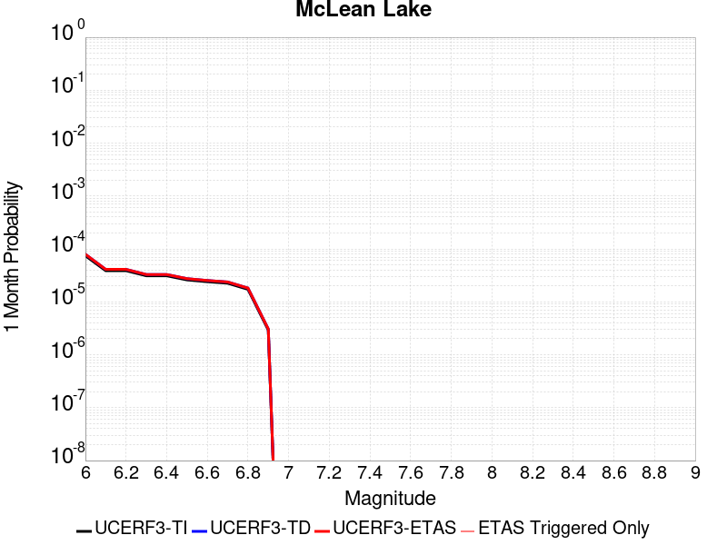 | 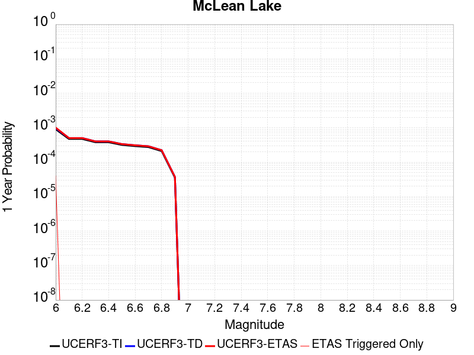 |

| Magnitude | 1 wk TI Prob | 1 wk TD Prob | 1 wk ETAS Prob | 1 wk ETAS/TD Gain | 1 wk ETAS Triggered Only | 1 mo TI Prob | 1 mo TD Prob | 1 mo ETAS Prob | 1 mo ETAS/TD Gain | 1 mo ETAS Triggered Only | 1 yr TI Prob | 1 yr TD Prob | 1 yr ETAS Prob | 1 yr ETAS/TD Gain | 1 yr ETAS Triggered Only |
|-----|-----|-----|-----|-----|-----|-----|-----|-----|-----|-----|-----|-----|-----|-----|-----|
| 6.0 | 1.7360222E-5 | 1.8505758E-5 | 1.8505758E-5 | 1.0 | 0.0 | 7.439883E-5 | 7.930826E-5 | 7.930826E-5 | 1.0 | 0.0 | 9.0542925E-4 | 9.651989E-4 | 0.0010051603 | 1.0414022 | 4.0E-5 |
| 6.1 | 9.062689E-6 | 9.594095E-6 | 9.594095E-6 | 1.0 | 0.0 | 3.8839516E-5 | 4.1116953E-5 | 4.1116953E-5 | 1.0 | 0.0 | 4.727685E-4 | 5.004928E-4 | 5.004928E-4 | 1.0 | 0.0 |
| 6.2 | 9.062689E-6 | 9.594095E-6 | 9.594095E-6 | 1.0 | 0.0 | 3.8839516E-5 | 4.1116953E-5 | 4.1116953E-5 | 1.0 | 0.0 | 4.727685E-4 | 5.004928E-4 | 5.004928E-4 | 1.0 | 0.0 |
| 6.3 | 7.2575485E-6 | 7.6691795E-6 | 7.6691795E-6 | 1.0 | 0.0 | 3.110341E-5 | 3.2867538E-5 | 3.2867538E-5 | 1.0 | 0.0 | 3.786182E-4 | 4.0009595E-4 | 4.0009595E-4 | 1.0 | 0.0 |
| 6.4 | 7.2575485E-6 | 7.6691795E-6 | 7.6691795E-6 | 1.0 | 0.0 | 3.110341E-5 | 3.2867538E-5 | 3.2867538E-5 | 1.0 | 0.0 | 3.786182E-4 | 4.0009595E-4 | 4.0009595E-4 | 1.0 | 0.0 |
| 6.5 | 6.06582E-6 | 6.405088E-6 | 6.405088E-6 | 1.0 | 0.0 | 2.5996113E-5 | 2.7450124E-5 | 2.7450124E-5 | 1.0 | 0.0 | 3.164567E-4 | 3.341605E-4 | 3.341605E-4 | 1.0 | 0.0 |
| 6.6 | 5.598744E-6 | 5.9113777E-6 | 5.9113777E-6 | 1.0 | 0.0 | 2.3994397E-5 | 2.5334266E-5 | 2.5334266E-5 | 1.0 | 0.0 | 2.9209262E-4 | 3.0840744E-4 | 3.0840744E-4 | 1.0 | 0.0 |
| 6.7 | 5.246996E-6 | 5.5402083E-6 | 5.5402083E-6 | 1.0 | 0.0 | 2.2486933E-5 | 2.3743569E-5 | 2.3743569E-5 | 1.0 | 0.0 | 2.73744E-4 | 2.8904597E-4 | 2.8904597E-4 | 1.0 | 0.0 |
| 6.8 | 4.02324E-6 | 4.2477054E-6 | 4.2477054E-6 | 1.0 | 0.0 | 1.7242342E-5 | 1.8204359E-5 | 1.8204359E-5 | 1.0 | 0.0 | 2.099053E-4 | 2.2162148E-4 | 2.2162148E-4 | 1.0 | 0.0 |
| 6.9 | 6.835972E-7 | 7.141004E-7 | 7.141004E-7 | 1.0 | 0.0 | 2.9296991E-6 | 3.0604285E-6 | 3.0604285E-6 | 1.0 | 0.0 | 3.56685E-5 | 3.72604E-5 | 3.72604E-5 | 1.0 | 0.0 |

## San Andreas (Peninsula) 2011 CFM
*[(top)](#table-of-contents)*

| 1 Week | 1 Month | 1 Year |
|-----|-----|-----|
| 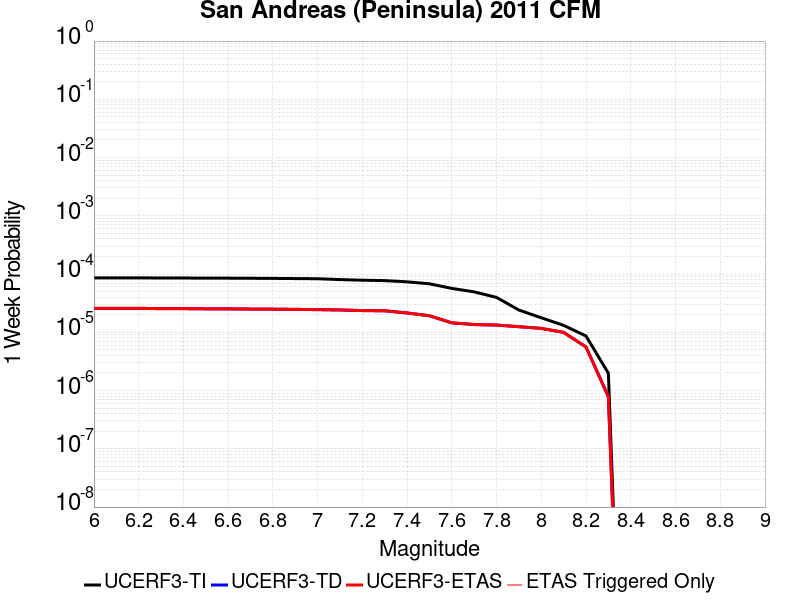 | 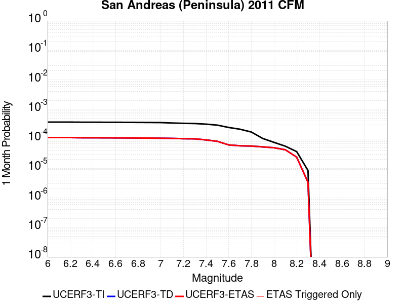 | 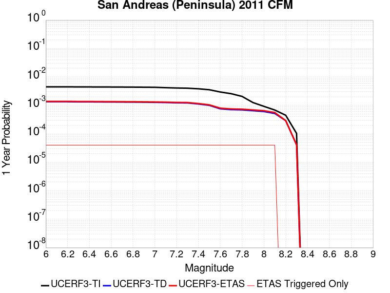 |

| Magnitude | 1 wk TI Prob | 1 wk TD Prob | 1 wk ETAS Prob | 1 wk ETAS/TD Gain | 1 wk ETAS Triggered Only | 1 mo TI Prob | 1 mo TD Prob | 1 mo ETAS Prob | 1 mo ETAS/TD Gain | 1 mo ETAS Triggered Only | 1 yr TI Prob | 1 yr TD Prob | 1 yr ETAS Prob | 1 yr ETAS/TD Gain | 1 yr ETAS Triggered Only |
|-----|-----|-----|-----|-----|-----|-----|-----|-----|-----|-----|-----|-----|-----|-----|-----|
| 6.0 | 8.6200685E-5 | 2.5801015E-5 | 2.5801015E-5 | 1.0 | 0.0 | 3.6937918E-4 | 1.105711E-4 | 1.105711E-4 | 1.0 | 0.0 | 0.0044879215 | 0.0013453735 | 0.0013853196 | 1.0296916 | 4.0E-5 |
| 6.1 | 8.6200685E-5 | 2.5801015E-5 | 2.5801015E-5 | 1.0 | 0.0 | 3.6937918E-4 | 1.105711E-4 | 1.105711E-4 | 1.0 | 0.0 | 0.0044879215 | 0.0013453735 | 0.0013853196 | 1.0296916 | 4.0E-5 |
| 6.2 | 8.6200685E-5 | 2.5801015E-5 | 2.5801015E-5 | 1.0 | 0.0 | 3.6937918E-4 | 1.105711E-4 | 1.105711E-4 | 1.0 | 0.0 | 0.0044879215 | 0.0013453735 | 0.0013853196 | 1.0296916 | 4.0E-5 |
| 6.3 | 8.551163E-5 | 2.54887E-5 | 2.54887E-5 | 1.0 | 0.0 | 3.6642692E-4 | 1.0923272E-4 | 1.0923272E-4 | 1.0 | 0.0 | 0.004452125 | 0.0013290987 | 0.0013690456 | 1.0300555 | 4.0E-5 |
| 6.4 | 8.551163E-5 | 2.54887E-5 | 2.54887E-5 | 1.0 | 0.0 | 3.6642692E-4 | 1.0923272E-4 | 1.0923272E-4 | 1.0 | 0.0 | 0.004452125 | 0.0013290987 | 0.0013690456 | 1.0300555 | 4.0E-5 |
| 6.5 | 8.511146E-5 | 2.5307645E-5 | 2.5307645E-5 | 1.0 | 0.0 | 3.647124E-4 | 1.08456836E-4 | 1.08456836E-4 | 1.0 | 0.0 | 0.004431336 | 0.0013196638 | 0.001359611 | 1.0302707 | 4.0E-5 |
| 6.6 | 8.4985084E-5 | 2.5237454E-5 | 2.5237454E-5 | 1.0 | 0.0 | 3.6417096E-4 | 1.0815604E-4 | 1.0815604E-4 | 1.0 | 0.0 | 0.0044247704 | 0.0013160061 | 0.0013559534 | 1.030355 | 4.0E-5 |
| 6.7 | 8.462618E-5 | 2.5063902E-5 | 2.5063902E-5 | 1.0 | 0.0 | 3.6263323E-4 | 1.07412314E-4 | 1.07412314E-4 | 1.0 | 0.0 | 0.004406125 | 0.0013069621 | 0.0013469098 | 1.0305654 | 4.0E-5 |
| 6.8 | 8.42337E-5 | 2.495804E-5 | 2.495804E-5 | 1.0 | 0.0 | 3.6095164E-4 | 1.0695866E-4 | 1.0695866E-4 | 1.0 | 0.0 | 0.004385734 | 0.0013014454 | 0.0013413933 | 1.0306951 | 4.0E-5 |
| 6.9 | 8.365989E-5 | 2.476054E-5 | 2.476054E-5 | 1.0 | 0.0 | 3.5849313E-4 | 1.061123E-4 | 1.061123E-4 | 1.0 | 0.0 | 0.004355922 | 0.0012911533 | 0.0013311015 | 1.03094 | 4.0E-5 |
| 7.0 | 8.30936E-5 | 2.4519966E-5 | 2.4519966E-5 | 1.0 | 0.0 | 3.560668E-4 | 1.05081344E-4 | 1.05081344E-4 | 1.0 | 0.0 | 0.004326499 | 0.0012786163 | 0.0013185651 | 1.0312438 | 4.0E-5 |
| 7.1 | 8.041264E-5 | 2.4201698E-5 | 2.4201698E-5 | 1.0 | 0.0 | 3.4458007E-4 | 1.03717444E-4 | 1.03717444E-4 | 1.0 | 0.0 | 0.0041871946 | 0.0012620301 | 0.0013019796 | 1.031655 | 4.0E-5 |
| 7.2 | 7.8427016E-5 | 2.361941E-5 | 2.361941E-5 | 1.0 | 0.0 | 3.3607247E-4 | 1.0122212E-4 | 1.0122212E-4 | 1.0 | 0.0 | 0.004084008 | 0.0012316842 | 0.001271635 | 1.0324359 | 4.0E-5 |
| 7.3 | 7.721087E-5 | 2.3402055E-5 | 2.3402055E-5 | 1.0 | 0.0 | 3.3086175E-4 | 1.0029068E-4 | 1.0029068E-4 | 1.0 | 0.0 | 0.004020803 | 0.0012203567 | 0.0012603079 | 1.0327373 | 4.0E-5 |
| 7.4 | 7.3536525E-5 | 2.1486432E-5 | 2.1486432E-5 | 1.0 | 0.0 | 3.1511846E-4 | 9.2081464E-5 | 9.2081464E-5 | 1.0 | 0.0 | 0.0038298194 | 0.0011205166 | 0.0011604718 | 1.0356578 | 4.0E-5 |
| 7.5 | 6.806207E-5 | 1.9247474E-5 | 1.9247474E-5 | 1.0 | 0.0 | 2.9166197E-4 | 8.248657E-5 | 8.248657E-5 | 1.0 | 0.0 | 0.0035452035 | 0.0010038124 | 0.0010437722 | 1.039808 | 4.0E-5 |
| 7.6 | 5.6731416E-5 | 1.45483245E-5 | 1.45483245E-5 | 1.0 | 0.0 | 2.43112E-4 | 6.2348474E-5 | 6.2348474E-5 | 1.0 | 0.0 | 0.0029558712 | 7.588284E-4 | 7.987981E-4 | 1.0526729 | 4.0E-5 |
| 7.7 | 4.946994E-5 | 1.3589812E-5 | 1.3589812E-5 | 1.0 | 0.0 | 2.1199681E-4 | 5.8240752E-5 | 5.8240752E-5 | 1.0 | 0.0 | 0.002578006 | 7.088506E-4 | 7.4882223E-4 | 1.0563893 | 4.0E-5 |
| 7.8 | 3.9718198E-5 | 1.3313264E-5 | 1.3313264E-5 | 1.0 | 0.0 | 1.7020974E-4 | 5.7055597E-5 | 5.7055597E-5 | 1.0 | 0.0 | 0.0020703338 | 6.9443067E-4 | 7.3440286E-4 | 1.0575612 | 4.0E-5 |
| 7.9 | 2.4115114E-5 | 1.2479283E-5 | 1.2479283E-5 | 1.0 | 0.0 | 1.0334639E-4 | 5.3481544E-5 | 5.3481544E-5 | 1.0 | 0.0 | 0.001257516 | 6.5094343E-4 | 6.9091737E-4 | 1.0614092 | 4.0E-5 |
| 8.0 | 1.7756569E-5 | 1.1674584E-5 | 1.1674584E-5 | 1.0 | 0.0 | 7.6097356E-5 | 5.0032973E-5 | 5.0032973E-5 | 1.0 | 0.0 | 9.260915E-4 | 6.0898135E-4 | 6.48957E-4 | 1.0656434 | 4.0E-5 |
| 8.1 | 1.3159258E-5 | 9.968845E-6 | 9.968845E-6 | 1.0 | 0.0 | 5.6395602E-5 | 4.272292E-5 | 4.272292E-5 | 1.0 | 0.0 | 6.864001E-4 | 5.2002753E-4 | 5.6000677E-4 | 1.076879 | 4.0E-5 |
| 8.2 | 8.635426E-6 | 5.5992937E-6 | 5.5992937E-6 | 1.0 | 0.0 | 3.700844E-5 | 2.3996754E-5 | 2.3996754E-5 | 1.0 | 0.0 | 4.5048463E-4 | 2.9212137E-4 | 2.9212137E-4 | 1.0 | 0.0 |
| 8.3 | 1.983087E-6 | 7.877893E-7 | 7.877893E-7 | 1.0 | 0.0 | 8.498917E-6 | 3.3762356E-6 | 3.3762356E-6 | 1.0 | 0.0 | 1.034694E-4 | 4.110491E-5 | 4.110491E-5 | 1.0 | 0.0 |

## Puente Hills
*[(top)](#table-of-contents)*

| 1 Week | 1 Month | 1 Year |
|-----|-----|-----|
|  | 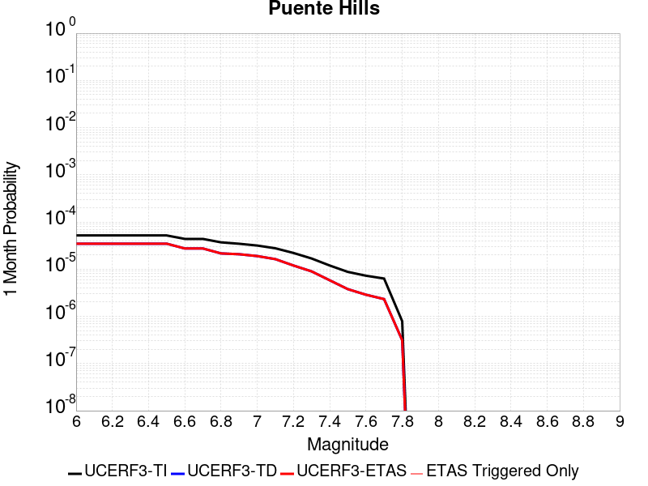 |  |

| Magnitude | 1 wk TI Prob | 1 wk TD Prob | 1 wk ETAS Prob | 1 wk ETAS/TD Gain | 1 wk ETAS Triggered Only | 1 mo TI Prob | 1 mo TD Prob | 1 mo ETAS Prob | 1 mo ETAS/TD Gain | 1 mo ETAS Triggered Only | 1 yr TI Prob | 1 yr TD Prob | 1 yr ETAS Prob | 1 yr ETAS/TD Gain | 1 yr ETAS Triggered Only |
|-----|-----|-----|-----|-----|-----|-----|-----|-----|-----|-----|-----|-----|-----|-----|-----|
| 6.0 | 1.2101656E-5 | 8.102921E-6 | 8.102921E-6 | 1.0 | 0.0 | 5.1863204E-5 | 3.4726374E-5 | 3.4726374E-5 | 1.0 | 0.0 | 6.312516E-4 | 4.2271722E-4 | 4.6270032E-4 | 1.0945859 | 4.0E-5 |
| 6.1 | 1.2101656E-5 | 8.102921E-6 | 8.102921E-6 | 1.0 | 0.0 | 5.1863204E-5 | 3.4726374E-5 | 3.4726374E-5 | 1.0 | 0.0 | 6.312516E-4 | 4.2271722E-4 | 4.6270032E-4 | 1.0945859 | 4.0E-5 |
| 6.2 | 1.2101656E-5 | 8.102921E-6 | 8.102921E-6 | 1.0 | 0.0 | 5.1863204E-5 | 3.4726374E-5 | 3.4726374E-5 | 1.0 | 0.0 | 6.312516E-4 | 4.2271722E-4 | 4.6270032E-4 | 1.0945859 | 4.0E-5 |
| 6.3 | 1.2101656E-5 | 8.102921E-6 | 8.102921E-6 | 1.0 | 0.0 | 5.1863204E-5 | 3.4726374E-5 | 3.4726374E-5 | 1.0 | 0.0 | 6.312516E-4 | 4.2271722E-4 | 4.6270032E-4 | 1.0945859 | 4.0E-5 |
| 6.4 | 1.2101656E-5 | 8.102921E-6 | 8.102921E-6 | 1.0 | 0.0 | 5.1863204E-5 | 3.4726374E-5 | 3.4726374E-5 | 1.0 | 0.0 | 6.312516E-4 | 4.2271722E-4 | 4.6270032E-4 | 1.0945859 | 4.0E-5 |
| 6.5 | 1.2101656E-5 | 8.102921E-6 | 8.102921E-6 | 1.0 | 0.0 | 5.1863204E-5 | 3.4726374E-5 | 3.4726374E-5 | 1.0 | 0.0 | 6.312516E-4 | 4.2271722E-4 | 4.6270032E-4 | 1.0945859 | 4.0E-5 |
| 6.6 | 1.0222488E-5 | 6.4029887E-6 | 6.4029887E-6 | 1.0 | 0.0 | 4.3809923E-5 | 2.7441105E-5 | 2.7441105E-5 | 1.0 | 0.0 | 5.332553E-4 | 3.340467E-4 | 3.7403332E-4 | 1.1197038 | 4.0E-5 |
| 6.7 | 1.0222488E-5 | 6.4029887E-6 | 6.4029887E-6 | 1.0 | 0.0 | 4.3809923E-5 | 2.7441105E-5 | 2.7441105E-5 | 1.0 | 0.0 | 5.332553E-4 | 3.340467E-4 | 3.7403332E-4 | 1.1197038 | 4.0E-5 |
| 6.8 | 8.6367845E-6 | 5.0316426E-6 | 5.0316426E-6 | 1.0 | 0.0 | 3.7014266E-5 | 2.1564007E-5 | 2.1564007E-5 | 1.0 | 0.0 | 4.505555E-4 | 2.625107E-4 | 2.625107E-4 | 1.0 | 0.0 |
| 6.9 | 8.066481E-6 | 4.839465E-6 | 4.839465E-6 | 1.0 | 0.0 | 3.4570177E-5 | 2.0740401E-5 | 2.0740401E-5 | 1.0 | 0.0 | 4.2081063E-4 | 2.5248565E-4 | 2.5248565E-4 | 1.0 | 0.0 |
| 7.0 | 7.393828E-6 | 4.4204735E-6 | 4.4204735E-6 | 1.0 | 0.0 | 3.168745E-5 | 1.8944751E-5 | 1.8944751E-5 | 1.0 | 0.0 | 3.857264E-4 | 2.3062839E-4 | 2.3062839E-4 | 1.0 | 0.0 |
| 7.1 | 6.4660953E-6 | 3.8071098E-6 | 3.8071098E-6 | 1.0 | 0.0 | 2.7711543E-5 | 1.6316086E-5 | 1.6316086E-5 | 1.0 | 0.0 | 3.373358E-4 | 1.9863059E-4 | 1.9863059E-4 | 1.0 | 0.0 |
| 7.2 | 5.143232E-6 | 2.7886363E-6 | 2.7886363E-6 | 1.0 | 0.0 | 2.2042237E-5 | 1.1951244E-5 | 1.1951244E-5 | 1.0 | 0.0 | 2.6833118E-4 | 1.4549677E-4 | 1.4549677E-4 | 1.0 | 0.0 |
| 7.3 | 3.928255E-6 | 2.0932014E-6 | 2.0932014E-6 | 1.0 | 0.0 | 1.683527E-5 | 8.970832E-6 | 8.970832E-6 | 1.0 | 0.0 | 2.0495013E-4 | 1.09214474E-4 | 1.09214474E-4 | 1.0 | 0.0 |
| 7.4 | 2.7894434E-6 | 1.3562544E-6 | 1.3562544E-6 | 1.0 | 0.0 | 1.1954703E-5 | 5.812506E-6 | 5.812506E-6 | 1.0 | 0.0 | 1.4553878E-4 | 7.076501E-5 | 7.076501E-5 | 1.0 | 0.0 |
| 7.5 | 2.041735E-6 | 8.799269E-7 | 8.799269E-7 | 1.0 | 0.0 | 8.750263E-6 | 3.77111E-6 | 3.77111E-6 | 1.0 | 0.0 | 1.06529245E-4 | 4.591233E-5 | 4.591233E-5 | 1.0 | 0.0 |
| 7.6 | 1.6959062E-6 | 6.708452E-7 | 6.708452E-7 | 1.0 | 0.0 | 7.268149E-6 | 2.875048E-6 | 2.875048E-6 | 1.0 | 0.0 | 8.848612E-5 | 3.5003177E-5 | 3.5003177E-5 | 1.0 | 0.0 |
| 7.7 | 1.4767965E-6 | 5.416132E-7 | 5.416132E-7 | 1.0 | 0.0 | 6.3291122E-6 | 2.3211976E-6 | 2.3211976E-6 | 1.0 | 0.0 | 7.705422E-5 | 2.826024E-5 | 2.826024E-5 | 1.0 | 0.0 |
| 7.8 | 1.8432911E-7 | 7.2914965E-8 | 7.2914965E-8 | 1.0 | 0.0 | 7.8998164E-7 | 3.124927E-7 | 3.124927E-7 | 1.0 | 0.0 | 9.617985E-6 | 3.8045953E-6 | 3.8045953E-6 | 1.0 | 0.0 |

## Likely 2011 CFM
*[(top)](#table-of-contents)*

| 1 Week | 1 Month | 1 Year |
|-----|-----|-----|
| 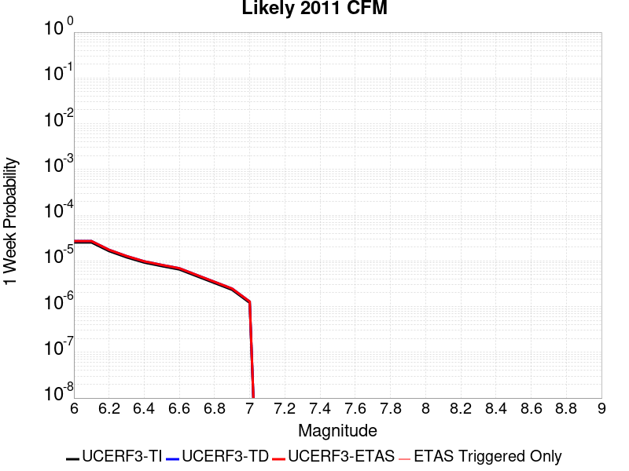 | 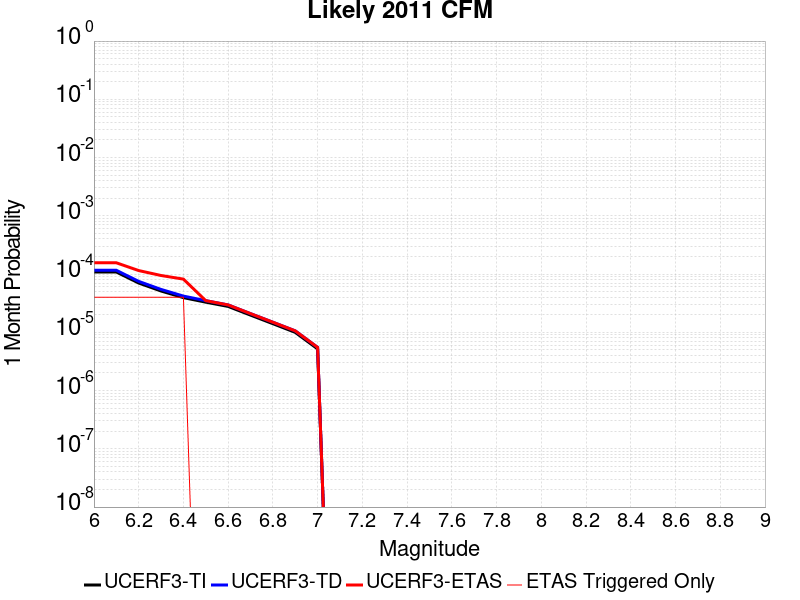 | 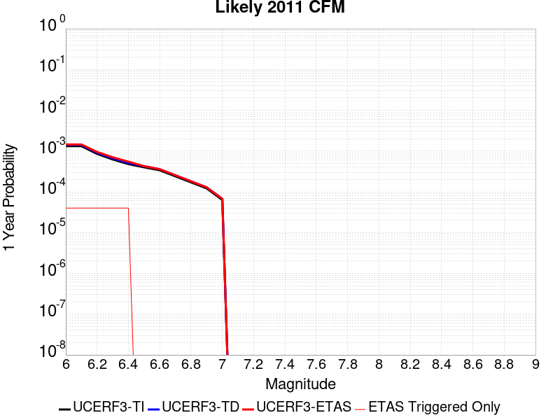 |

| Magnitude | 1 wk TI Prob | 1 wk TD Prob | 1 wk ETAS Prob | 1 wk ETAS/TD Gain | 1 wk ETAS Triggered Only | 1 mo TI Prob | 1 mo TD Prob | 1 mo ETAS Prob | 1 mo ETAS/TD Gain | 1 mo ETAS Triggered Only | 1 yr TI Prob | 1 yr TD Prob | 1 yr ETAS Prob | 1 yr ETAS/TD Gain | 1 yr ETAS Triggered Only |
|-----|-----|-----|-----|-----|-----|-----|-----|-----|-----|-----|-----|-----|-----|-----|-----|
| 6.0 | 2.5315949E-5 | 2.7111251E-5 | 2.7111251E-5 | 1.0 | 0.0 | 1.0849241E-4 | 1.1618615E-4 | 1.561815E-4 | 1.3442351 | 4.0E-5 | 0.0013200947 | 0.0014136931 | 0.0014536366 | 1.0282546 | 4.0E-5 |
| 6.1 | 2.5315949E-5 | 2.7111251E-5 | 2.7111251E-5 | 1.0 | 0.0 | 1.0849241E-4 | 1.1618615E-4 | 1.561815E-4 | 1.3442351 | 4.0E-5 | 0.0013200947 | 0.0014136931 | 0.0014536366 | 1.0282546 | 4.0E-5 |
| 6.2 | 1.6375941E-5 | 1.7469787E-5 | 1.7469787E-5 | 1.0 | 0.0 | 7.0180715E-5 | 7.486843E-5 | 1.1486544E-4 | 1.5342306 | 4.0E-5 | 8.5411523E-4 | 9.1115426E-4 | 9.5111784E-4 | 1.0438603 | 4.0E-5 |
| 6.3 | 1.1945543E-5 | 1.2715355E-5 | 1.2715355E-5 | 1.0 | 0.0 | 5.119418E-5 | 5.4493274E-5 | 9.449109E-5 | 1.7339956 | 4.0E-5 | 6.2311086E-4 | 6.6325895E-4 | 7.032324E-4 | 1.0602683 | 4.0E-5 |
| 6.4 | 9.192729E-6 | 9.770562E-6 | 9.770562E-6 | 1.0 | 0.0 | 3.939681E-5 | 4.1873183E-5 | 8.1871505E-5 | 1.9552253 | 4.0E-5 | 4.7955062E-4 | 5.0968945E-4 | 5.496691E-4 | 1.0784391 | 4.0E-5 |
| 6.5 | 7.67906E-6 | 8.154327E-6 | 8.154327E-6 | 1.0 | 0.0 | 3.2909844E-5 | 3.4946657E-5 | 3.4946657E-5 | 1.0 | 0.0 | 4.006037E-4 | 4.2539436E-4 | 4.2539436E-4 | 1.0 | 0.0 |
| 6.6 | 6.4884057E-6 | 6.8861764E-6 | 6.8861764E-6 | 1.0 | 0.0 | 2.7807157E-5 | 2.9511859E-5 | 2.9511859E-5 | 1.0 | 0.0 | 3.3849955E-4 | 3.5924907E-4 | 3.5924907E-4 | 1.0 | 0.0 |
| 6.7 | 4.6060636E-6 | 4.88504E-6 | 4.88504E-6 | 1.0 | 0.0 | 1.9740122E-5 | 2.0935724E-5 | 2.0935724E-5 | 1.0 | 0.0 | 2.403095E-4 | 2.5486347E-4 | 2.5486347E-4 | 1.0 | 0.0 |
| 6.8 | 3.2795615E-6 | 3.478084E-6 | 3.478084E-6 | 1.0 | 0.0 | 1.4055187E-5 | 1.4905992E-5 | 1.4905992E-5 | 1.0 | 0.0 | 1.7110848E-4 | 1.814659E-4 | 1.814659E-4 | 1.0 | 0.0 |
| 6.9 | 2.3289967E-6 | 2.471066E-6 | 2.471066E-6 | 1.0 | 0.0 | 9.981376E-6 | 1.0590242E-5 | 1.0590242E-5 | 1.0 | 0.0 | 1.2151648E-4 | 1.28929E-4 | 1.28929E-4 | 1.0 | 0.0 |
| 7.0 | 1.211292E-6 | 1.2866661E-6 | 1.2866661E-6 | 1.0 | 0.0 | 5.1912407E-6 | 5.514273E-6 | 5.514273E-6 | 1.0 | 0.0 | 6.320152E-5 | 6.713451E-5 | 6.713451E-5 | 1.0 | 0.0 |

## San Andreas (Santa Cruz Mts) 2011 CFM
*[(top)](#table-of-contents)*

| 1 Week | 1 Month | 1 Year |
|-----|-----|-----|
| 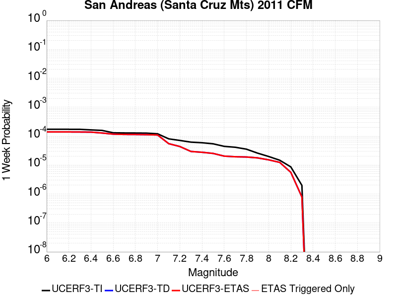 | 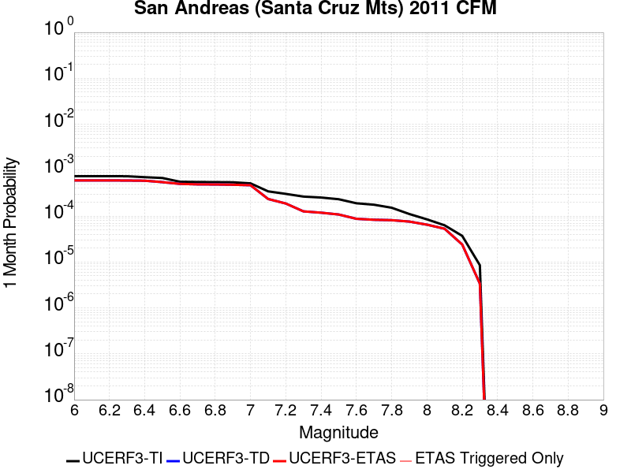 | 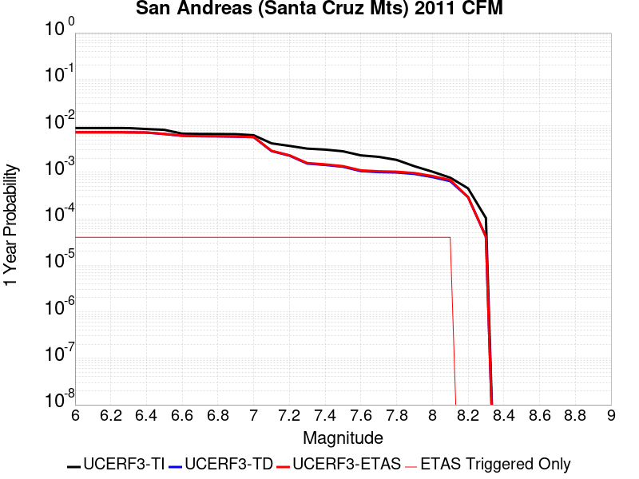 |

| Magnitude | 1 wk TI Prob | 1 wk TD Prob | 1 wk ETAS Prob | 1 wk ETAS/TD Gain | 1 wk ETAS Triggered Only | 1 mo TI Prob | 1 mo TD Prob | 1 mo ETAS Prob | 1 mo ETAS/TD Gain | 1 mo ETAS Triggered Only | 1 yr TI Prob | 1 yr TD Prob | 1 yr ETAS Prob | 1 yr ETAS/TD Gain | 1 yr ETAS Triggered Only |
|-----|-----|-----|-----|-----|-----|-----|-----|-----|-----|-----|-----|-----|-----|-----|-----|
| 6.0 | 1.7221631E-4 | 1.3941765E-4 | 1.3941765E-4 | 1.0 | 0.0 | 7.378611E-4 | 5.973695E-4 | 5.973695E-4 | 1.0 | 0.0 | 0.008946515 | 0.007249104 | 0.007288814 | 1.0054779 | 4.0E-5 |
| 6.1 | 1.7221631E-4 | 1.3941765E-4 | 1.3941765E-4 | 1.0 | 0.0 | 7.378611E-4 | 5.973695E-4 | 5.973695E-4 | 1.0 | 0.0 | 0.008946515 | 0.007249104 | 0.007288814 | 1.0054779 | 4.0E-5 |
| 6.2 | 1.7221631E-4 | 1.3941765E-4 | 1.3941765E-4 | 1.0 | 0.0 | 7.378611E-4 | 5.973695E-4 | 5.973695E-4 | 1.0 | 0.0 | 0.008946515 | 0.007249104 | 0.007288814 | 1.0054779 | 4.0E-5 |
| 6.3 | 1.716926E-4 | 1.3860887E-4 | 1.3860887E-4 | 1.0 | 0.0 | 7.3561794E-4 | 5.939049E-4 | 5.939049E-4 | 1.0 | 0.0 | 0.008919428 | 0.007207201 | 0.0072469125 | 1.00551 | 4.0E-5 |
| 6.4 | 1.6392978E-4 | 1.3733425E-4 | 1.3733425E-4 | 1.0 | 0.0 | 7.02367E-4 | 5.8844464E-4 | 5.8844464E-4 | 1.0 | 0.0 | 0.008517839 | 0.0071411594 | 0.007180874 | 1.0055614 | 4.0E-5 |
| 6.5 | 1.5742714E-4 | 1.278895E-4 | 1.278895E-4 | 1.0 | 0.0 | 6.745133E-4 | 5.479845E-4 | 5.479845E-4 | 1.0 | 0.0 | 0.00818132 | 0.00665162 | 0.006691354 | 1.0059736 | 4.0E-5 |
| 6.6 | 1.3038084E-4 | 1.1715973E-4 | 1.1715973E-4 | 1.0 | 0.0 | 5.5865536E-4 | 5.020178E-4 | 5.020178E-4 | 1.0 | 0.0 | 0.006780438 | 0.0060951724 | 0.0061349287 | 1.0065225 | 4.0E-5 |
| 6.7 | 1.2867592E-4 | 1.1441586E-4 | 1.1441586E-4 | 1.0 | 0.0 | 5.5135164E-4 | 4.902628E-4 | 4.902628E-4 | 1.0 | 0.0 | 0.0066920654 | 0.005952845 | 0.0059926067 | 1.0066795 | 4.0E-5 |
| 6.8 | 1.2801298E-4 | 1.1378967E-4 | 1.1378967E-4 | 1.0 | 0.0 | 5.485117E-4 | 4.8758014E-4 | 4.8758014E-4 | 1.0 | 0.0 | 0.0066577005 | 0.0059203724 | 0.0059601357 | 1.0067164 | 4.0E-5 |
| 6.9 | 1.269149E-4 | 1.1220608E-4 | 1.1220608E-4 | 1.0 | 0.0 | 5.4380763E-4 | 4.8079586E-4 | 4.8079586E-4 | 1.0 | 0.0 | 0.006600777 | 0.005838219 | 0.0058779856 | 1.0068114 | 4.0E-5 |
| 7.0 | 1.2030331E-4 | 1.0948385E-4 | 1.0948385E-4 | 1.0 | 0.0 | 5.154837E-4 | 4.691334E-4 | 4.691334E-4 | 1.0 | 0.0 | 0.006257969 | 0.00569698 | 0.005736752 | 1.0069813 | 4.0E-5 |
| 7.1 | 8.049617E-5 | 5.4874155E-5 | 5.4874155E-5 | 1.0 | 0.0 | 3.4493793E-4 | 2.3515396E-4 | 2.3515396E-4 | 1.0 | 0.0 | 0.0041915346 | 0.0028592765 | 0.002899162 | 1.0139495 | 4.0E-5 |
| 7.2 | 7.093979E-5 | 4.3771735E-5 | 4.3771735E-5 | 1.0 | 0.0 | 3.0399222E-4 | 1.875798E-4 | 1.875798E-4 | 1.0 | 0.0 | 0.0036948253 | 0.0022814157 | 0.0023213243 | 1.017493 | 4.0E-5 |
| 7.3 | 6.193693E-5 | 2.9517532E-5 | 2.9517532E-5 | 1.0 | 0.0 | 2.6541698E-4 | 1.2649759E-4 | 1.2649759E-4 | 1.0 | 0.0 | 0.0032266637 | 0.0015390218 | 0.0015789603 | 1.0259506 | 4.0E-5 |
| 7.4 | 5.906492E-5 | 2.7614462E-5 | 2.7614462E-5 | 1.0 | 0.0 | 2.5311083E-4 | 1.1834233E-4 | 1.1834233E-4 | 1.0 | 0.0 | 0.0030772698 | 0.0014398671 | 0.0014798095 | 1.0277404 | 4.0E-5 |
| 7.5 | 5.424296E-5 | 2.5224388E-5 | 2.5224388E-5 | 1.0 | 0.0 | 2.324491E-4 | 1.08100045E-4 | 1.08100045E-4 | 1.0 | 0.0 | 0.002826395 | 0.0013153247 | 0.0013552721 | 1.0303707 | 4.0E-5 |
| 7.6 | 4.43084E-5 | 2.0342583E-5 | 2.0342583E-5 | 1.0 | 0.0 | 1.8987931E-4 | 8.7179586E-5 | 8.7179586E-5 | 1.0 | 0.0 | 0.0023093296 | 0.0010608948 | 0.0011008524 | 1.037664 | 4.0E-5 |
| 7.7 | 4.118098E-5 | 1.9356086E-5 | 1.9356086E-5 | 1.0 | 0.0 | 1.7647797E-4 | 8.295202E-5 | 8.295202E-5 | 1.0 | 0.0 | 0.002146502 | 0.0010094732 | 0.0010494328 | 1.0395846 | 4.0E-5 |
| 7.8 | 3.5408906E-5 | 1.8973216E-5 | 1.8973216E-5 | 1.0 | 0.0 | 1.5174363E-4 | 8.131125E-5 | 8.131125E-5 | 1.0 | 0.0 | 0.0018459131 | 9.895151E-4 | 0.0010294756 | 1.0403838 | 4.0E-5 |
| 7.9 | 2.5860836E-5 | 1.7686616E-5 | 1.7686616E-5 | 1.0 | 0.0 | 1.10827445E-4 | 7.579759E-5 | 7.579759E-5 | 1.0 | 0.0 | 0.001348489 | 9.2244515E-4 | 9.624082E-4 | 1.043323 | 4.0E-5 |
| 8.0 | 1.9777332E-5 | 1.5154375E-5 | 1.5154375E-5 | 1.0 | 0.0 | 8.4757245E-5 | 6.494571E-5 | 6.494571E-5 | 1.0 | 0.0 | 0.0010314309 | 7.904273E-4 | 8.3039573E-4 | 1.0505655 | 4.0E-5 |
| 8.1 | 1.468494E-5 | 1.23638665E-5 | 1.23638665E-5 | 1.0 | 0.0 | 6.293394E-5 | 5.298692E-5 | 5.298692E-5 | 1.0 | 0.0 | 7.6595135E-4 | 6.44925E-4 | 6.848992E-4 | 1.0619828 | 4.0E-5 |
| 8.2 | 8.63836E-6 | 5.601494E-6 | 5.601494E-6 | 1.0 | 0.0 | 3.7021015E-5 | 2.4006182E-5 | 2.4006182E-5 | 1.0 | 0.0 | 4.5063766E-4 | 2.9223616E-4 | 2.9223616E-4 | 1.0 | 0.0 |
| 8.3 | 1.983087E-6 | 7.877893E-7 | 7.877893E-7 | 1.0 | 0.0 | 8.498917E-6 | 3.3762356E-6 | 3.3762356E-6 | 1.0 | 0.0 | 1.034694E-4 | 4.110491E-5 | 4.110491E-5 | 1.0 | 0.0 |

## Elmore Ranch
*[(top)](#table-of-contents)*

| 1 Week | 1 Month | 1 Year |
|-----|-----|-----|
| 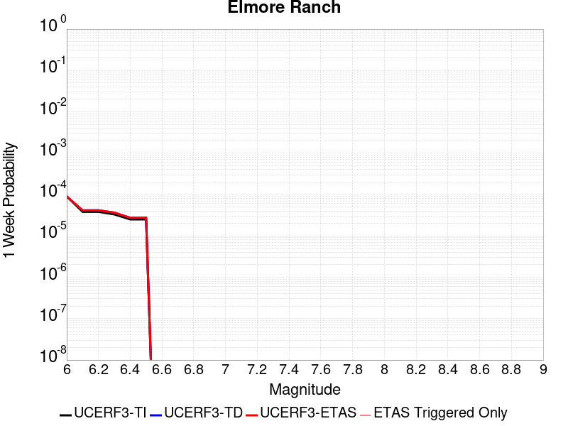 | 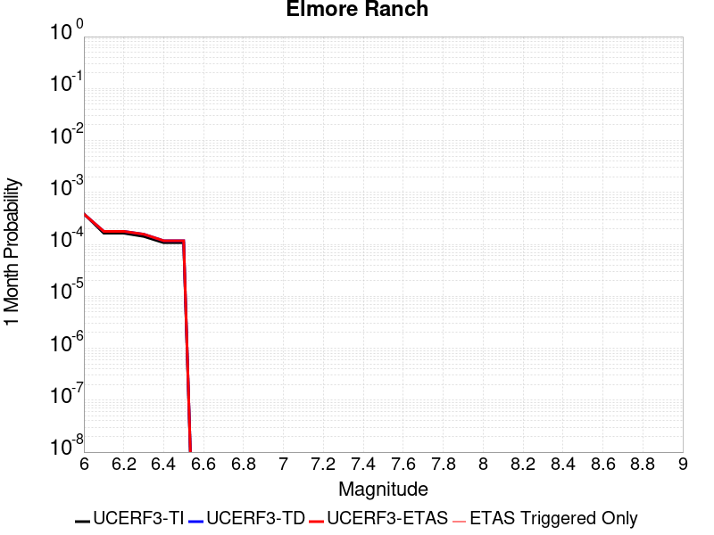 | 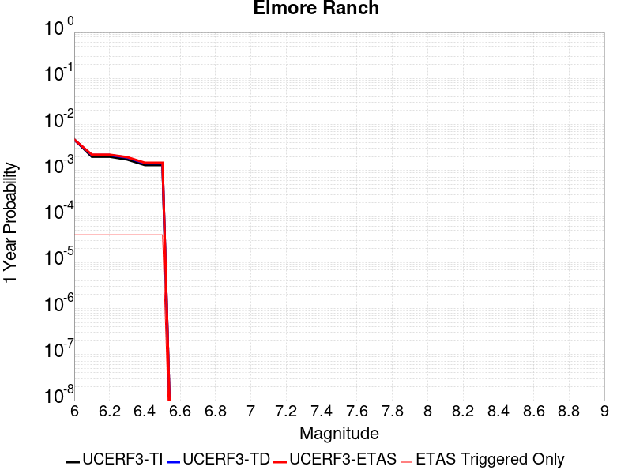 |

| Magnitude | 1 wk TI Prob | 1 wk TD Prob | 1 wk ETAS Prob | 1 wk ETAS/TD Gain | 1 wk ETAS Triggered Only | 1 mo TI Prob | 1 mo TD Prob | 1 mo ETAS Prob | 1 mo ETAS/TD Gain | 1 mo ETAS Triggered Only | 1 yr TI Prob | 1 yr TD Prob | 1 yr ETAS Prob | 1 yr ETAS/TD Gain | 1 yr ETAS Triggered Only |
|-----|-----|-----|-----|-----|-----|-----|-----|-----|-----|-----|-----|-----|-----|-----|-----|
| 6.0 | 9.102099E-5 | 8.966761E-5 | 8.966761E-5 | 1.0 | 0.0 | 3.9003167E-4 | 3.8422062E-4 | 3.8422062E-4 | 1.0 | 0.0 | 0.0047383 | 0.0046685147 | 0.0047083283 | 1.008528 | 4.0E-5 |
| 6.1 | 3.8306698E-5 | 4.1548446E-5 | 4.1548446E-5 | 1.0 | 0.0 | 1.6416123E-4 | 1.7805643E-4 | 1.7805643E-4 | 1.0 | 0.0 | 0.0019968306 | 0.0021661238 | 0.0022060373 | 1.0184262 | 4.0E-5 |
| 6.2 | 3.8306698E-5 | 4.1548446E-5 | 4.1548446E-5 | 1.0 | 0.0 | 1.6416123E-4 | 1.7805643E-4 | 1.7805643E-4 | 1.0 | 0.0 | 0.0019968306 | 0.0021661238 | 0.0022060373 | 1.0184262 | 4.0E-5 |
| 6.3 | 3.3197924E-5 | 3.6596153E-5 | 3.6596153E-5 | 1.0 | 0.0 | 1.4226905E-4 | 1.5683495E-4 | 1.5683495E-4 | 1.0 | 0.0 | 0.0017307495 | 0.001908332 | 0.0019482556 | 1.0209208 | 4.0E-5 |
| 6.4 | 2.5148964E-5 | 2.7451913E-5 | 2.7451913E-5 | 1.0 | 0.0 | 1.0777682E-4 | 1.1764941E-4 | 1.1764941E-4 | 1.0 | 0.0 | 0.0013113929 | 0.00143209 | 0.0014720327 | 1.0278912 | 4.0E-5 |
| 6.5 | 2.5148964E-5 | 2.7451913E-5 | 2.7451913E-5 | 1.0 | 0.0 | 1.0777682E-4 | 1.1764941E-4 | 1.1764941E-4 | 1.0 | 0.0 | 0.0013113929 | 0.00143209 | 0.0014720327 | 1.0278912 | 4.0E-5 |

## Manix-Afton Hills
*[(top)](#table-of-contents)*

| 1 Week | 1 Month | 1 Year |
|-----|-----|-----|
| 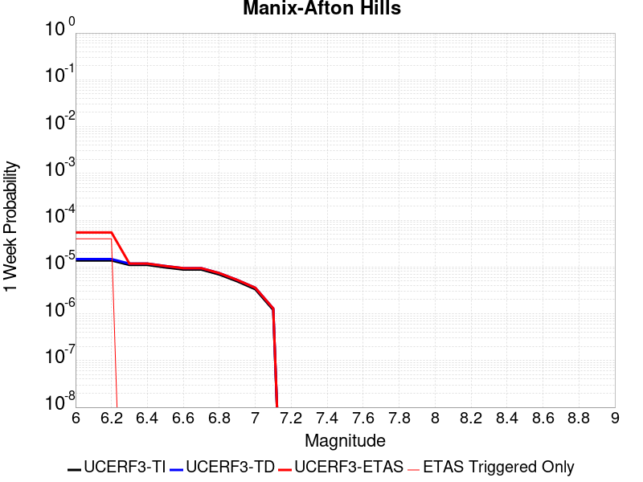 | 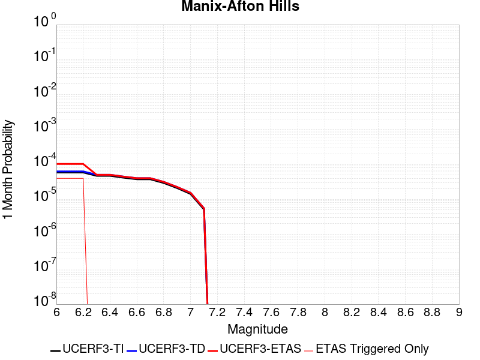 | 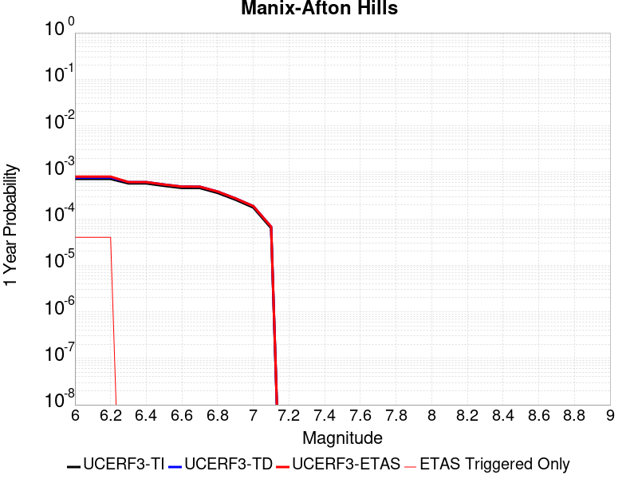 |

| Magnitude | 1 wk TI Prob | 1 wk TD Prob | 1 wk ETAS Prob | 1 wk ETAS/TD Gain | 1 wk ETAS Triggered Only | 1 mo TI Prob | 1 mo TD Prob | 1 mo ETAS Prob | 1 mo ETAS/TD Gain | 1 mo ETAS Triggered Only | 1 yr TI Prob | 1 yr TD Prob | 1 yr ETAS Prob | 1 yr ETAS/TD Gain | 1 yr ETAS Triggered Only |
|-----|-----|-----|-----|-----|-----|-----|-----|-----|-----|-----|-----|-----|-----|-----|-----|
| 6.0 | 1.3783202E-5 | 1.4714453E-5 | 5.4713866E-5 | 3.7183757 | 4.0E-5 | 5.906953E-5 | 6.3060514E-5 | 1.03057995E-4 | 1.6342714 | 4.0E-5 | 7.189342E-4 | 7.675088E-4 | 8.074781E-4 | 1.0520767 | 4.0E-5 |
| 6.1 | 1.3783202E-5 | 1.4714453E-5 | 5.4713866E-5 | 3.7183757 | 4.0E-5 | 5.906953E-5 | 6.3060514E-5 | 1.03057995E-4 | 1.6342714 | 4.0E-5 | 7.189342E-4 | 7.675088E-4 | 8.074781E-4 | 1.0520767 | 4.0E-5 |
| 6.2 | 1.3783202E-5 | 1.4714453E-5 | 5.4713866E-5 | 3.7183757 | 4.0E-5 | 5.906953E-5 | 6.3060514E-5 | 1.03057995E-4 | 1.6342714 | 4.0E-5 | 7.189342E-4 | 7.675088E-4 | 8.074781E-4 | 1.0520767 | 4.0E-5 |
| 6.3 | 1.10494875E-5 | 1.1795832E-5 | 1.1795832E-5 | 1.0 | 0.0 | 4.7354086E-5 | 5.0552644E-5 | 5.0552644E-5 | 1.0 | 0.0 | 5.763835E-4 | 6.1531505E-4 | 6.1531505E-4 | 1.0 | 0.0 |
| 6.4 | 1.10494875E-5 | 1.1795832E-5 | 1.1795832E-5 | 1.0 | 0.0 | 4.7354086E-5 | 5.0552644E-5 | 5.0552644E-5 | 1.0 | 0.0 | 5.763835E-4 | 6.1531505E-4 | 6.1531505E-4 | 1.0 | 0.0 |
| 6.5 | 9.788949E-6 | 1.0456734E-5 | 1.0456734E-5 | 1.0 | 0.0 | 4.1951964E-5 | 4.4813856E-5 | 4.4813856E-5 | 1.0 | 0.0 | 5.1064545E-4 | 5.454814E-4 | 5.454814E-4 | 1.0 | 0.0 |
| 6.6 | 8.810006E-6 | 9.41582E-6 | 9.41582E-6 | 1.0 | 0.0 | 3.775662E-5 | 4.035294E-5 | 4.035294E-5 | 1.0 | 0.0 | 4.5958988E-4 | 4.911952E-4 | 4.911952E-4 | 1.0 | 0.0 |
| 6.7 | 8.80128E-6 | 9.406297E-6 | 9.406297E-6 | 1.0 | 0.0 | 3.7719226E-5 | 4.0312127E-5 | 4.0312127E-5 | 1.0 | 0.0 | 4.591348E-4 | 4.906985E-4 | 4.906985E-4 | 1.0 | 0.0 |
| 6.8 | 6.8994877E-6 | 7.3818233E-6 | 7.3818233E-6 | 1.0 | 0.0 | 2.9568899E-5 | 3.163605E-5 | 3.163605E-5 | 1.0 | 0.0 | 3.5994186E-4 | 3.8510896E-4 | 3.8510896E-4 | 1.0 | 0.0 |
| 6.9 | 4.9328037E-6 | 5.27219E-6 | 5.27219E-6 | 1.0 | 0.0 | 2.1140417E-5 | 2.2594937E-5 | 2.2594937E-5 | 1.0 | 0.0 | 2.5735417E-4 | 2.750648E-4 | 2.750648E-4 | 1.0 | 0.0 |
| 7.0 | 3.347973E-6 | 3.5909125E-6 | 3.5909125E-6 | 1.0 | 0.0 | 1.4348378E-5 | 1.5389556E-5 | 1.5389556E-5 | 1.0 | 0.0 | 1.746775E-4 | 1.8735585E-4 | 1.8735585E-4 | 1.0 | 0.0 |
| 7.1 | 1.2073567E-6 | 1.2937948E-6 | 1.2937948E-6 | 1.0 | 0.0 | 5.1743755E-6 | 5.544832E-6 | 5.544832E-6 | 1.0 | 0.0 | 6.29962E-5 | 6.750788E-5 | 6.750788E-5 | 1.0 | 0.0 |

## Superstition Hills
*[(top)](#table-of-contents)*

| 1 Week | 1 Month | 1 Year |
|-----|-----|-----|
| 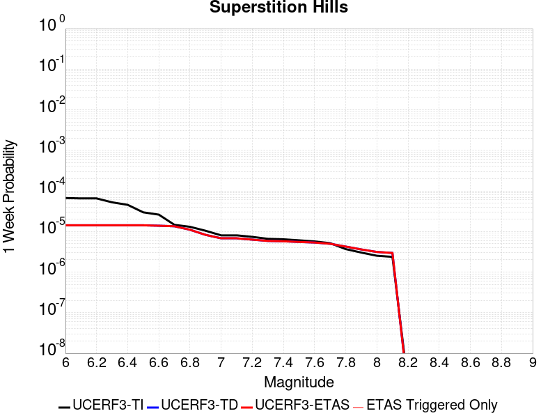 | 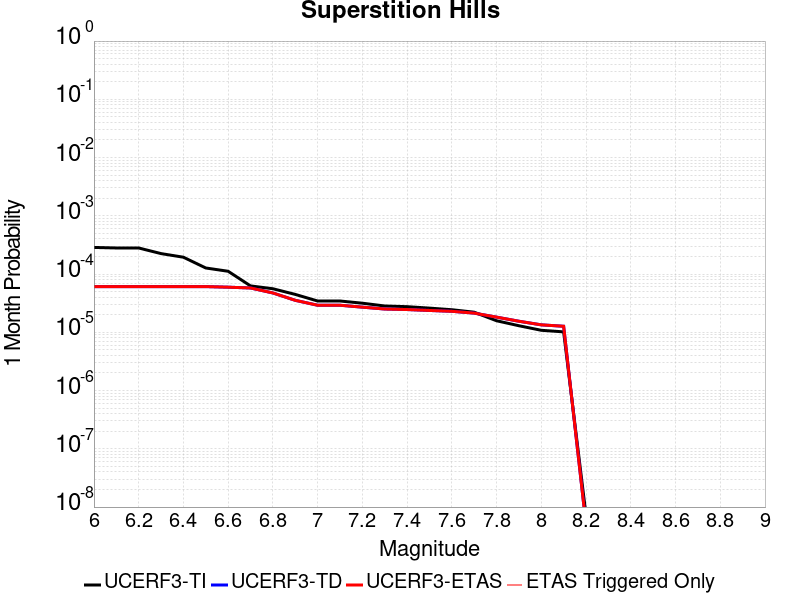 | 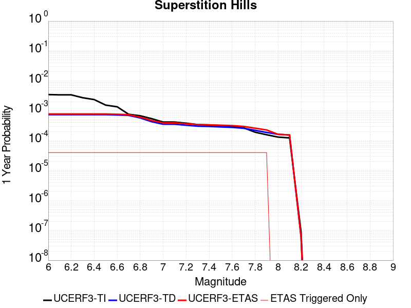 |

| Magnitude | 1 wk TI Prob | 1 wk TD Prob | 1 wk ETAS Prob | 1 wk ETAS/TD Gain | 1 wk ETAS Triggered Only | 1 mo TI Prob | 1 mo TD Prob | 1 mo ETAS Prob | 1 mo ETAS/TD Gain | 1 mo ETAS Triggered Only | 1 yr TI Prob | 1 yr TD Prob | 1 yr ETAS Prob | 1 yr ETAS/TD Gain | 1 yr ETAS Triggered Only |
|-----|-----|-----|-----|-----|-----|-----|-----|-----|-----|-----|-----|-----|-----|-----|-----|
| 6.0 | 6.6865185E-5 | 1.4218968E-5 | 1.4218968E-5 | 1.0 | 0.0 | 2.8653358E-4 | 6.09371E-5 | 6.09371E-5 | 1.0 | 0.0 | 0.0034829667 | 7.4167293E-4 | 7.816433E-4 | 1.0538921 | 4.0E-5 |
| 6.1 | 6.544851E-5 | 1.4218967E-5 | 1.4218967E-5 | 1.0 | 0.0 | 2.8046346E-4 | 6.09371E-5 | 6.09371E-5 | 1.0 | 0.0 | 0.0034092965 | 7.4167293E-4 | 7.8164326E-4 | 1.0538921 | 4.0E-5 |
| 6.2 | 6.544851E-5 | 1.4218967E-5 | 1.4218967E-5 | 1.0 | 0.0 | 2.8046346E-4 | 6.09371E-5 | 6.09371E-5 | 1.0 | 0.0 | 0.0034092965 | 7.4167293E-4 | 7.8164326E-4 | 1.0538921 | 4.0E-5 |
| 6.3 | 5.2402065E-5 | 1.42189665E-5 | 1.42189665E-5 | 1.0 | 0.0 | 2.2456095E-4 | 6.0937098E-5 | 6.0937098E-5 | 1.0 | 0.0 | 0.0027306017 | 7.416729E-4 | 7.816432E-4 | 1.0538921 | 4.0E-5 |
| 6.4 | 4.542238E-5 | 1.4218966E-5 | 1.4218966E-5 | 1.0 | 0.0 | 1.9465282E-4 | 6.0937095E-5 | 6.0937095E-5 | 1.0 | 0.0 | 0.0023673223 | 7.416729E-4 | 7.816432E-4 | 1.0538921 | 4.0E-5 |
| 6.5 | 2.9672969E-5 | 1.4218965E-5 | 1.4218965E-5 | 1.0 | 0.0 | 1.2716366E-4 | 6.0937087E-5 | 6.0937087E-5 | 1.0 | 0.0 | 0.0015471181 | 7.4167276E-4 | 7.816431E-4 | 1.0538921 | 4.0E-5 |
| 6.6 | 2.6056105E-5 | 1.3884164E-5 | 1.3884164E-5 | 1.0 | 0.0 | 1.1166424E-4 | 5.9502294E-5 | 5.9502294E-5 | 1.0 | 0.0 | 0.0013586642 | 7.242158E-4 | 7.6418684E-4 | 1.0551921 | 4.0E-5 |
| 6.7 | 1.4611248E-5 | 1.3463621E-5 | 1.3463621E-5 | 1.0 | 0.0 | 6.261813E-5 | 5.770005E-5 | 5.770005E-5 | 1.0 | 0.0 | 7.6210906E-4 | 7.022877E-4 | 7.422596E-4 | 1.0569167 | 4.0E-5 |
| 6.8 | 1.30607E-5 | 1.1055474E-5 | 1.1055474E-5 | 1.0 | 0.0 | 5.597323E-5 | 4.7379788E-5 | 4.7379788E-5 | 1.0 | 0.0 | 6.8126095E-4 | 5.7670503E-4 | 6.16682E-4 | 1.0693195 | 4.0E-5 |
| 6.9 | 1.0443096E-5 | 8.264937E-6 | 8.264937E-6 | 1.0 | 0.0 | 4.4755358E-5 | 3.542069E-5 | 3.542069E-5 | 1.0 | 0.0 | 5.447602E-4 | 4.311639E-4 | 4.7114666E-4 | 1.0927322 | 4.0E-5 |
| 7.0 | 8.045912E-6 | 6.8031186E-6 | 6.8031186E-6 | 1.0 | 0.0 | 3.4482026E-5 | 2.9155903E-5 | 2.9155903E-5 | 1.0 | 0.0 | 4.197378E-4 | 3.5491635E-4 | 3.9490213E-4 | 1.1126627 | 4.0E-5 |
| 7.1 | 8.045912E-6 | 6.8031186E-6 | 6.8031186E-6 | 1.0 | 0.0 | 3.4482026E-5 | 2.9155903E-5 | 2.9155903E-5 | 1.0 | 0.0 | 4.197378E-4 | 3.5491635E-4 | 3.9490213E-4 | 1.1126627 | 4.0E-5 |
| 7.2 | 7.375506E-6 | 6.3088987E-6 | 6.3088987E-6 | 1.0 | 0.0 | 3.1608928E-5 | 2.703786E-5 | 2.703786E-5 | 1.0 | 0.0 | 3.8477074E-4 | 3.291371E-4 | 3.6912394E-4 | 1.1214899 | 4.0E-5 |
| 7.3 | 6.6063913E-6 | 5.8603323E-6 | 5.8603323E-6 | 1.0 | 0.0 | 2.8312797E-5 | 2.5115472E-5 | 2.5115472E-5 | 1.0 | 0.0 | 3.446538E-4 | 3.0573868E-4 | 3.4572647E-4 | 1.1307907 | 4.0E-5 |
| 7.4 | 6.4313126E-6 | 5.741554E-6 | 5.741554E-6 | 1.0 | 0.0 | 2.7562477E-5 | 2.4606434E-5 | 2.4606434E-5 | 1.0 | 0.0 | 3.355215E-4 | 2.9954285E-4 | 3.3953087E-4 | 1.1334969 | 4.0E-5 |
| 7.5 | 6.0742927E-6 | 5.536644E-6 | 5.536644E-6 | 1.0 | 0.0 | 2.6032423E-5 | 2.3728262E-5 | 2.3728262E-5 | 1.0 | 0.0 | 3.1689866E-4 | 2.8885397E-4 | 3.2884243E-4 | 1.1384382 | 4.0E-5 |
| 7.6 | 5.6987187E-6 | 5.354077E-6 | 5.354077E-6 | 1.0 | 0.0 | 2.4422852E-5 | 2.2945846E-5 | 2.2945846E-5 | 1.0 | 0.0 | 2.9730765E-4 | 2.7933053E-4 | 3.1931937E-4 | 1.1431595 | 4.0E-5 |
| 7.7 | 5.1658035E-6 | 4.9836003E-6 | 4.9836003E-6 | 1.0 | 0.0 | 2.2138971E-5 | 2.1358117E-5 | 2.1358117E-5 | 1.0 | 0.0 | 2.6950863E-4 | 2.6000466E-4 | 2.9999425E-4 | 1.1538033 | 4.0E-5 |
| 7.8 | 3.6864697E-6 | 4.2522647E-6 | 4.2522647E-6 | 1.0 | 0.0 | 1.579906E-5 | 1.8223867E-5 | 1.8223867E-5 | 1.0 | 0.0 | 1.9233658E-4 | 2.2185346E-4 | 2.618446E-4 | 1.1802592 | 4.0E-5 |
| 7.9 | 3.0265903E-6 | 3.6154697E-6 | 3.6154697E-6 | 1.0 | 0.0 | 1.2971037E-5 | 1.5494781E-5 | 1.5494781E-5 | 1.0 | 0.0 | 1.5791094E-4 | 1.8863307E-4 | 2.2862553E-4 | 1.2120119 | 4.0E-5 |
| 8.0 | 2.5271493E-6 | 3.1343482E-6 | 3.1343482E-6 | 1.0 | 0.0 | 1.0830595E-5 | 1.3432854E-5 | 1.3432854E-5 | 1.0 | 0.0 | 1.3185451E-4 | 1.6353316E-4 | 1.6353316E-4 | 1.0 | 0.0 |
| 8.1 | 2.3749135E-6 | 2.9629962E-6 | 2.9629962E-6 | 1.0 | 0.0 | 1.0178161E-5 | 1.2698496E-5 | 1.2698496E-5 | 1.0 | 0.0 | 1.2391206E-4 | 1.5459364E-4 | 1.5459364E-4 | 1.0 | 0.0 |
| 8.2 | 1.7186406E-9 | 1.1663186E-9 | 1.1663186E-9 | 1.0 | 0.0 | 7.3656024E-9 | 4.9985083E-9 | 4.9985083E-9 | 1.0 | 0.0 | 8.9676206E-8 | 6.085684E-8 | 6.085684E-8 | 1.0 | 0.0 |

## San Jacinto (Coyote Creek)
*[(top)](#table-of-contents)*

| 1 Week | 1 Month | 1 Year |
|-----|-----|-----|
| 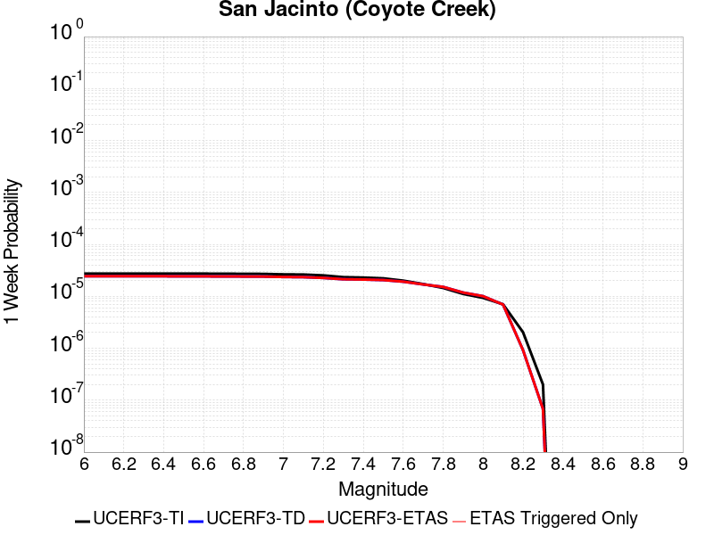 | 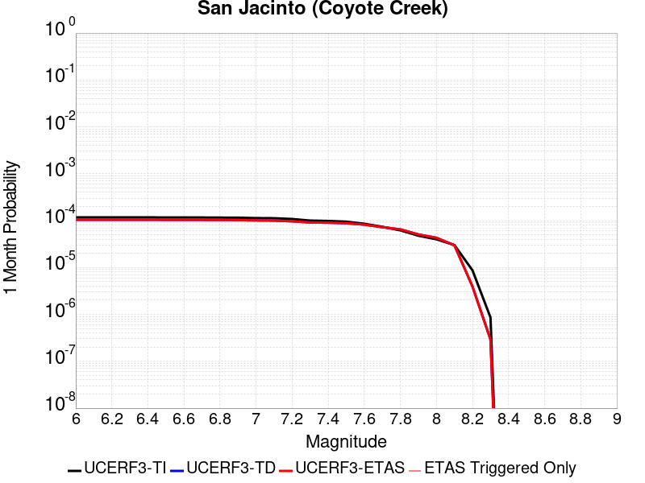 |  |

| Magnitude | 1 wk TI Prob | 1 wk TD Prob | 1 wk ETAS Prob | 1 wk ETAS/TD Gain | 1 wk ETAS Triggered Only | 1 mo TI Prob | 1 mo TD Prob | 1 mo ETAS Prob | 1 mo ETAS/TD Gain | 1 mo ETAS Triggered Only | 1 yr TI Prob | 1 yr TD Prob | 1 yr ETAS Prob | 1 yr ETAS/TD Gain | 1 yr ETAS Triggered Only |
|-----|-----|-----|-----|-----|-----|-----|-----|-----|-----|-----|-----|-----|-----|-----|-----|
| 6.0 | 2.7374346E-5 | 2.4356477E-5 | 2.4356477E-5 | 1.0 | 0.0 | 1.1731335E-4 | 1.04380735E-4 | 1.04380735E-4 | 1.0 | 0.0 | 0.0014273542 | 0.0012700972 | 0.0013100464 | 1.0314536 | 4.0E-5 |
| 6.1 | 2.7374346E-5 | 2.4356477E-5 | 2.4356477E-5 | 1.0 | 0.0 | 1.1731335E-4 | 1.04380735E-4 | 1.04380735E-4 | 1.0 | 0.0 | 0.0014273542 | 0.0012700972 | 0.0013100464 | 1.0314536 | 4.0E-5 |
| 6.2 | 2.7374346E-5 | 2.4356477E-5 | 2.4356477E-5 | 1.0 | 0.0 | 1.1731335E-4 | 1.04380735E-4 | 1.04380735E-4 | 1.0 | 0.0 | 0.0014273542 | 0.0012700972 | 0.0013100464 | 1.0314536 | 4.0E-5 |
| 6.3 | 2.7374346E-5 | 2.4356477E-5 | 2.4356477E-5 | 1.0 | 0.0 | 1.1731335E-4 | 1.04380735E-4 | 1.04380735E-4 | 1.0 | 0.0 | 0.0014273542 | 0.0012700972 | 0.0013100464 | 1.0314536 | 4.0E-5 |
| 6.4 | 2.7374346E-5 | 2.4356477E-5 | 2.4356477E-5 | 1.0 | 0.0 | 1.1731335E-4 | 1.04380735E-4 | 1.04380735E-4 | 1.0 | 0.0 | 0.0014273542 | 0.0012700972 | 0.0013100464 | 1.0314536 | 4.0E-5 |
| 6.5 | 2.7282445E-5 | 2.4242463E-5 | 2.4242463E-5 | 1.0 | 0.0 | 1.16919524E-4 | 1.0389215E-4 | 1.0389215E-4 | 1.0 | 0.0 | 0.0014225657 | 0.0012641556 | 0.001304105 | 1.0316017 | 4.0E-5 |
| 6.6 | 2.7282445E-5 | 2.4242463E-5 | 2.4242463E-5 | 1.0 | 0.0 | 1.16919524E-4 | 1.0389215E-4 | 1.0389215E-4 | 1.0 | 0.0 | 0.0014225657 | 0.0012641556 | 0.001304105 | 1.0316017 | 4.0E-5 |
| 6.7 | 2.7216198E-5 | 2.4167522E-5 | 2.4167522E-5 | 1.0 | 0.0 | 1.1663563E-4 | 1.03571E-4 | 1.03571E-4 | 1.0 | 0.0 | 0.0014191137 | 0.0012602502 | 0.0013001998 | 1.0316998 | 4.0E-5 |
| 6.8 | 2.7078617E-5 | 2.4084618E-5 | 2.4084618E-5 | 1.0 | 0.0 | 1.1604605E-4 | 1.0321572E-4 | 1.0321572E-4 | 1.0 | 0.0 | 0.001411945 | 0.0012559297 | 0.0012958795 | 1.031809 | 4.0E-5 |
| 6.9 | 2.6982952E-5 | 2.4003995E-5 | 2.4003995E-5 | 1.0 | 0.0 | 1.15636096E-4 | 1.02870225E-4 | 1.02870225E-4 | 1.0 | 0.0 | 0.0014069602 | 0.0012517282 | 0.001291678 | 1.0319158 | 4.0E-5 |
| 7.0 | 2.6449972E-5 | 2.3580524E-5 | 2.3580524E-5 | 1.0 | 0.0 | 1.1335209E-4 | 1.01055484E-4 | 1.01055484E-4 | 1.0 | 0.0 | 0.001379188 | 0.0012296587 | 0.0012696096 | 1.0324893 | 4.0E-5 |
| 7.1 | 2.6257849E-5 | 2.3406348E-5 | 2.3406348E-5 | 1.0 | 0.0 | 1.1252879E-4 | 1.0030907E-4 | 1.0030907E-4 | 1.0 | 0.0 | 0.0013691769 | 0.0012205814 | 0.0012605325 | 1.0327313 | 4.0E-5 |
| 7.2 | 2.5270041E-5 | 2.2599575E-5 | 2.2599575E-5 | 1.0 | 0.0 | 1.0829568E-4 | 9.685174E-5 | 9.685174E-5 | 1.0 | 0.0 | 0.0013177024 | 0.0011785345 | 0.0012184874 | 1.0339005 | 4.0E-5 |
| 7.3 | 2.339701E-5 | 2.1328571E-5 | 2.1328571E-5 | 1.0 | 0.0 | 1.0026905E-4 | 9.1404974E-5 | 9.1404974E-5 | 1.0 | 0.0 | 0.001220092 | 0.0011122895 | 0.001152245 | 1.0359218 | 4.0E-5 |
| 7.4 | 2.296333E-5 | 2.1058198E-5 | 2.1058198E-5 | 1.0 | 0.0 | 9.841056E-5 | 9.0246314E-5 | 9.0246314E-5 | 1.0 | 0.0 | 0.0011974899 | 0.0010981972 | 0.0011381533 | 1.0363834 | 4.0E-5 |
| 7.5 | 2.2188895E-5 | 2.0579188E-5 | 2.0579188E-5 | 1.0 | 0.0 | 9.50918E-5 | 8.819355E-5 | 8.819355E-5 | 1.0 | 0.0 | 0.0011571277 | 0.0010732296 | 0.0011131866 | 1.0372307 | 4.0E-5 |
| 7.6 | 2.0013189E-5 | 1.9158566E-5 | 1.9158566E-5 | 1.0 | 0.0 | 8.5767984E-5 | 8.210557E-5 | 8.210557E-5 | 1.0 | 0.0 | 0.001043725 | 9.991786E-4 | 0.0010391386 | 1.0399929 | 4.0E-5 |
| 7.7 | 1.7230794E-5 | 1.6934096E-5 | 1.6934096E-5 | 1.0 | 0.0 | 7.384417E-5 | 7.2572686E-5 | 7.2572686E-5 | 1.0 | 0.0 | 8.986819E-4 | 8.8321505E-4 | 9.2317973E-4 | 1.0452491 | 4.0E-5 |
| 7.8 | 1.4478809E-5 | 1.5174756E-5 | 1.5174756E-5 | 1.0 | 0.0 | 6.205057E-5 | 6.5033055E-5 | 6.5033055E-5 | 1.0 | 0.0 | 7.552038E-4 | 7.914904E-4 | 8.314588E-4 | 1.0504975 | 4.0E-5 |
| 7.9 | 1.1114467E-5 | 1.180864E-5 | 1.180864E-5 | 1.0 | 0.0 | 4.7632562E-5 | 5.060748E-5 | 5.060748E-5 | 1.0 | 0.0 | 5.797721E-4 | 6.1597244E-4 | 6.5594784E-4 | 1.064898 | 4.0E-5 |
| 8.0 | 9.327402E-6 | 1.0048055E-5 | 1.0048055E-5 | 1.0 | 0.0 | 3.9973966E-5 | 4.3062384E-5 | 4.3062384E-5 | 1.0 | 0.0 | 4.8657437E-4 | 5.24159E-4 | 5.24159E-4 | 1.0 | 0.0 |
| 8.1 | 7.0235833E-6 | 6.9387575E-6 | 6.9387575E-6 | 1.0 | 0.0 | 3.0100724E-5 | 2.9737195E-5 | 2.9737195E-5 | 1.0 | 0.0 | 3.664147E-4 | 3.6199074E-4 | 3.6199074E-4 | 1.0 | 0.0 |
| 8.2 | 2.0358202E-6 | 9.2101675E-7 | 9.2101675E-7 | 1.0 | 0.0 | 8.724915E-6 | 3.947209E-6 | 3.947209E-6 | 1.0 | 0.0 | 1.06220665E-4 | 4.805623E-5 | 4.805623E-5 | 1.0 | 0.0 |
| 8.3 | 2.0051264E-7 | 6.7996226E-8 | 6.7996226E-8 | 1.0 | 0.0 | 8.5933965E-7 | 2.9141236E-7 | 2.9141236E-7 | 1.0 | 0.0 | 1.046241E-5 | 3.5479404E-6 | 3.5479404E-6 | 1.0 | 0.0 |

## Newport-Inglewood alt 1
*[(top)](#table-of-contents)*

| 1 Week | 1 Month | 1 Year |
|-----|-----|-----|
| 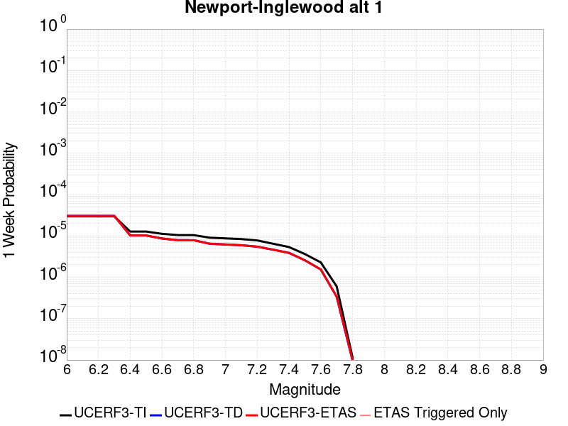 | 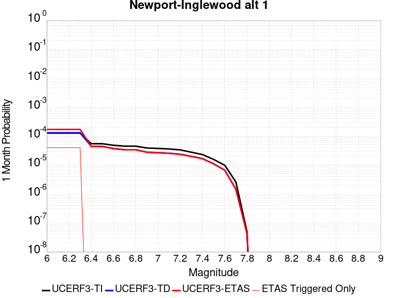 | 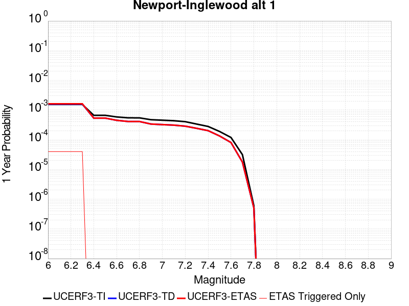 |

| Magnitude | 1 wk TI Prob | 1 wk TD Prob | 1 wk ETAS Prob | 1 wk ETAS/TD Gain | 1 wk ETAS Triggered Only | 1 mo TI Prob | 1 mo TD Prob | 1 mo ETAS Prob | 1 mo ETAS/TD Gain | 1 mo ETAS Triggered Only | 1 yr TI Prob | 1 yr TD Prob | 1 yr ETAS Prob | 1 yr ETAS/TD Gain | 1 yr ETAS Triggered Only |
|-----|-----|-----|-----|-----|-----|-----|-----|-----|-----|-----|-----|-----|-----|-----|-----|
| 6.0 | 2.9668912E-5 | 3.042145E-5 | 3.042145E-5 | 1.0 | 0.0 | 1.2714628E-4 | 1.3037387E-4 | 1.7036866E-4 | 1.30677 | 4.0E-5 | 0.0015469068 | 0.0015866318 | 0.0016265683 | 1.0251707 | 4.0E-5 |
| 6.1 | 2.9668912E-5 | 3.042145E-5 | 3.042145E-5 | 1.0 | 0.0 | 1.2714628E-4 | 1.3037387E-4 | 1.7036866E-4 | 1.30677 | 4.0E-5 | 0.0015469068 | 0.0015866318 | 0.0016265683 | 1.0251707 | 4.0E-5 |
| 6.2 | 2.9668912E-5 | 3.042145E-5 | 3.042145E-5 | 1.0 | 0.0 | 1.2714628E-4 | 1.3037387E-4 | 1.7036866E-4 | 1.30677 | 4.0E-5 | 0.0015469068 | 0.0015866318 | 0.0016265683 | 1.0251707 | 4.0E-5 |
| 6.3 | 2.9668912E-5 | 3.042145E-5 | 3.042145E-5 | 1.0 | 0.0 | 1.2714628E-4 | 1.3037387E-4 | 1.7036866E-4 | 1.30677 | 4.0E-5 | 0.0015469068 | 0.0015866318 | 0.0016265683 | 1.0251707 | 4.0E-5 |
| 6.4 | 1.275942E-5 | 1.0275527E-5 | 1.0275527E-5 | 1.0 | 0.0 | 5.4682085E-5 | 4.4037253E-5 | 4.4037253E-5 | 1.0 | 0.0 | 6.65551E-4 | 5.3602585E-4 | 5.3602585E-4 | 1.0 | 0.0 |
| 6.5 | 1.275942E-5 | 1.0275527E-5 | 1.0275527E-5 | 1.0 | 0.0 | 5.4682085E-5 | 4.4037253E-5 | 4.4037253E-5 | 1.0 | 0.0 | 6.65551E-4 | 5.3602585E-4 | 5.3602585E-4 | 1.0 | 0.0 |
| 6.6 | 1.1255358E-5 | 8.664203E-6 | 8.664203E-6 | 1.0 | 0.0 | 4.8236358E-5 | 3.7131776E-5 | 3.7131776E-5 | 1.0 | 0.0 | 5.871194E-4 | 4.5198732E-4 | 4.5198732E-4 | 1.0 | 0.0 |
| 6.7 | 1.0504745E-5 | 7.90187E-6 | 7.90187E-6 | 1.0 | 0.0 | 4.5019555E-5 | 3.3864726E-5 | 3.3864726E-5 | 1.0 | 0.0 | 5.4797524E-4 | 4.1222628E-4 | 4.1222628E-4 | 1.0 | 0.0 |
| 6.8 | 1.0476007E-5 | 7.883248E-6 | 7.883248E-6 | 1.0 | 0.0 | 4.4896402E-5 | 3.3784916E-5 | 3.3784916E-5 | 1.0 | 0.0 | 5.464766E-4 | 4.1125497E-4 | 4.1125497E-4 | 1.0 | 0.0 |
| 6.9 | 9.076797E-6 | 6.4912397E-6 | 6.4912397E-6 | 1.0 | 0.0 | 3.889998E-5 | 2.7819304E-5 | 2.7819304E-5 | 1.0 | 0.0 | 4.7350433E-4 | 3.3864772E-4 | 3.3864772E-4 | 1.0 | 0.0 |
| 7.0 | 8.73795E-6 | 6.2135855E-6 | 6.2135855E-6 | 1.0 | 0.0 | 3.7447822E-5 | 2.6629381E-5 | 2.6629381E-5 | 1.0 | 0.0 | 4.5583185E-4 | 3.2416475E-4 | 3.2416475E-4 | 1.0 | 0.0 |
| 7.1 | 8.391299E-6 | 5.957252E-6 | 5.957252E-6 | 1.0 | 0.0 | 3.5962214E-5 | 2.5530831E-5 | 2.5530831E-5 | 1.0 | 0.0 | 4.37752E-4 | 3.107938E-4 | 3.107938E-4 | 1.0 | 0.0 |
| 7.2 | 7.796882E-6 | 5.4978805E-6 | 5.4978805E-6 | 1.0 | 0.0 | 3.341478E-5 | 2.3562134E-5 | 2.3562134E-5 | 1.0 | 0.0 | 4.06749E-4 | 2.8683143E-4 | 2.8683143E-4 | 1.0 | 0.0 |
| 7.3 | 6.4738833E-6 | 4.6488503E-6 | 4.6488503E-6 | 1.0 | 0.0 | 2.774492E-5 | 1.9923493E-5 | 1.9923493E-5 | 1.0 | 0.0 | 3.3774204E-4 | 2.4254168E-4 | 2.4254168E-4 | 1.0 | 0.0 |
| 7.4 | 5.382145E-6 | 3.886563E-6 | 3.886563E-6 | 1.0 | 0.0 | 2.3066134E-5 | 1.6656593E-5 | 1.6656593E-5 | 1.0 | 0.0 | 2.8079396E-4 | 2.0277528E-4 | 2.0277528E-4 | 1.0 | 0.0 |
| 7.5 | 3.648244E-6 | 2.5743657E-6 | 2.5743657E-6 | 1.0 | 0.0 | 1.5635238E-5 | 1.103295E-5 | 1.103295E-5 | 1.0 | 0.0 | 1.9034238E-4 | 1.3431799E-4 | 1.3431799E-4 | 1.0 | 0.0 |
| 7.6 | 2.2906888E-6 | 1.5483535E-6 | 1.5483535E-6 | 1.0 | 0.0 | 9.817201E-6 | 6.635784E-6 | 6.635784E-6 | 1.0 | 0.0 | 1.1951787E-4 | 8.078774E-5 | 8.078774E-5 | 1.0 | 0.0 |
| 7.7 | 6.0479874E-7 | 3.3983838E-7 | 3.3983838E-7 | 1.0 | 0.0 | 2.5919921E-6 | 1.4564495E-6 | 1.4564495E-6 | 1.0 | 0.0 | 3.1557047E-5 | 1.7732142E-5 | 1.7732142E-5 | 1.0 | 0.0 |
| 7.8 | 1.16056995E-8 | 9.78305E-9 | 9.78305E-9 | 1.0 | 0.0 | 4.9738713E-8 | 4.1927358E-8 | 4.1927358E-8 | 1.0 | 0.0 | 6.0556863E-7 | 5.1046555E-7 | 5.1046555E-7 | 1.0 | 0.0 |

## Oak Ridge (Onshore)
*[(top)](#table-of-contents)*

| 1 Week | 1 Month | 1 Year |
|-----|-----|-----|
| 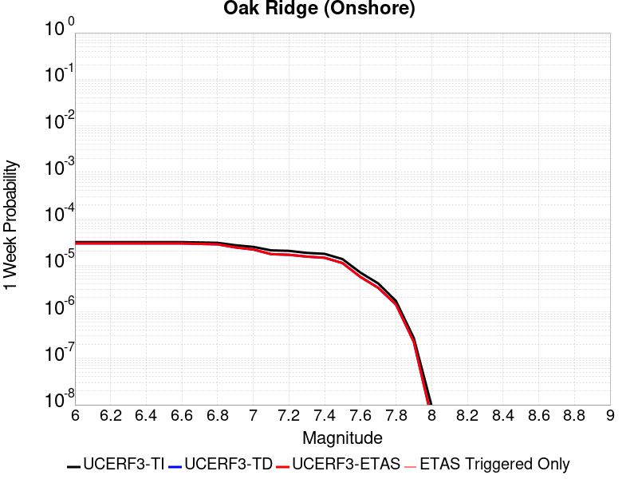 | 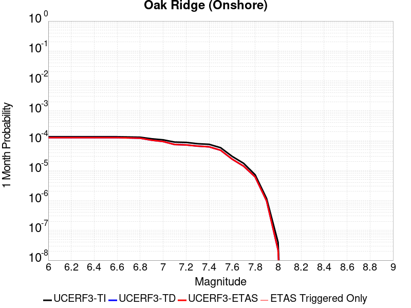 | 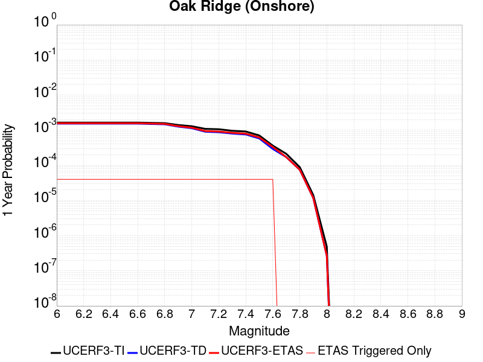 |

| Magnitude | 1 wk TI Prob | 1 wk TD Prob | 1 wk ETAS Prob | 1 wk ETAS/TD Gain | 1 wk ETAS Triggered Only | 1 mo TI Prob | 1 mo TD Prob | 1 mo ETAS Prob | 1 mo ETAS/TD Gain | 1 mo ETAS Triggered Only | 1 yr TI Prob | 1 yr TD Prob | 1 yr ETAS Prob | 1 yr ETAS/TD Gain | 1 yr ETAS Triggered Only |
|-----|-----|-----|-----|-----|-----|-----|-----|-----|-----|-----|-----|-----|-----|-----|-----|
| 6.0 | 3.155064E-5 | 2.9546469E-5 | 2.9546469E-5 | 1.0 | 0.0 | 1.3521002E-4 | 1.2662179E-4 | 1.2662179E-4 | 1.0 | 0.0 | 0.001644939 | 0.0015405683 | 0.0015805067 | 1.0259244 | 4.0E-5 |
| 6.1 | 3.155064E-5 | 2.9546469E-5 | 2.9546469E-5 | 1.0 | 0.0 | 1.3521002E-4 | 1.2662179E-4 | 1.2662179E-4 | 1.0 | 0.0 | 0.001644939 | 0.0015405683 | 0.0015805067 | 1.0259244 | 4.0E-5 |
| 6.2 | 3.155064E-5 | 2.9546469E-5 | 2.9546469E-5 | 1.0 | 0.0 | 1.3521002E-4 | 1.2662179E-4 | 1.2662179E-4 | 1.0 | 0.0 | 0.001644939 | 0.0015405683 | 0.0015805067 | 1.0259244 | 4.0E-5 |
| 6.3 | 3.155064E-5 | 2.9546469E-5 | 2.9546469E-5 | 1.0 | 0.0 | 1.3521002E-4 | 1.2662179E-4 | 1.2662179E-4 | 1.0 | 0.0 | 0.001644939 | 0.0015405683 | 0.0015805067 | 1.0259244 | 4.0E-5 |
| 6.4 | 3.155064E-5 | 2.9546469E-5 | 2.9546469E-5 | 1.0 | 0.0 | 1.3521002E-4 | 1.2662179E-4 | 1.2662179E-4 | 1.0 | 0.0 | 0.001644939 | 0.0015405683 | 0.0015805067 | 1.0259244 | 4.0E-5 |
| 6.5 | 3.155064E-5 | 2.9546469E-5 | 2.9546469E-5 | 1.0 | 0.0 | 1.3521002E-4 | 1.2662179E-4 | 1.2662179E-4 | 1.0 | 0.0 | 0.001644939 | 0.0015405683 | 0.0015805067 | 1.0259244 | 4.0E-5 |
| 6.6 | 3.155064E-5 | 2.9546469E-5 | 2.9546469E-5 | 1.0 | 0.0 | 1.3521002E-4 | 1.2662179E-4 | 1.2662179E-4 | 1.0 | 0.0 | 0.001644939 | 0.0015405683 | 0.0015805067 | 1.0259244 | 4.0E-5 |
| 6.7 | 3.098897E-5 | 2.8884271E-5 | 2.8884271E-5 | 1.0 | 0.0 | 1.328031E-4 | 1.2378408E-4 | 1.2378408E-4 | 1.0 | 0.0 | 0.0016156785 | 0.001506067 | 0.0015460066 | 1.0265193 | 4.0E-5 |
| 6.8 | 3.0449872E-5 | 2.8259132E-5 | 2.8259132E-5 | 1.0 | 0.0 | 1.3049292E-4 | 1.2110516E-4 | 1.2110516E-4 | 1.0 | 0.0 | 0.0015875935 | 0.0014734953 | 0.0015134363 | 1.0271063 | 4.0E-5 |
| 6.9 | 2.697928E-5 | 2.423737E-5 | 2.423737E-5 | 1.0 | 0.0 | 1.15620365E-4 | 1.0387043E-4 | 1.0387043E-4 | 1.0 | 0.0 | 0.0014067689 | 0.0012639104 | 0.0013038599 | 1.0316079 | 4.0E-5 |
| 7.0 | 2.4893961E-5 | 2.1878457E-5 | 2.1878457E-5 | 1.0 | 0.0 | 1.0668404E-4 | 9.376155E-5 | 9.376155E-5 | 1.0 | 0.0 | 0.0012981043 | 0.0011409668 | 0.0011809211 | 1.035018 | 4.0E-5 |
| 7.1 | 2.0945363E-5 | 1.7368691E-5 | 1.7368691E-5 | 1.0 | 0.0 | 8.976275E-5 | 7.443515E-5 | 7.443515E-5 | 1.0 | 0.0 | 0.0010923136 | 9.058759E-4 | 9.458396E-4 | 1.0441161 | 4.0E-5 |
| 7.2 | 2.0439404E-5 | 1.6823378E-5 | 1.6823378E-5 | 1.0 | 0.0 | 8.7594504E-5 | 7.209823E-5 | 7.209823E-5 | 1.0 | 0.0 | 0.0010659413 | 8.7744714E-4 | 9.1741205E-4 | 1.0455468 | 4.0E-5 |
| 7.3 | 1.8463334E-5 | 1.5393638E-5 | 1.5393638E-5 | 1.0 | 0.0 | 7.912617E-5 | 6.597109E-5 | 6.597109E-5 | 1.0 | 0.0 | 9.6293533E-4 | 8.0290646E-4 | 8.4287435E-4 | 1.049779 | 4.0E-5 |
| 7.4 | 1.763139E-5 | 1.4528081E-5 | 1.4528081E-5 | 1.0 | 0.0 | 7.556091E-5 | 6.226174E-5 | 6.226174E-5 | 1.0 | 0.0 | 9.1956573E-4 | 7.57777E-4 | 7.977467E-4 | 1.0527459 | 4.0E-5 |
| 7.5 | 1.3594944E-5 | 1.1172879E-5 | 1.1172879E-5 | 1.0 | 0.0 | 5.8262744E-5 | 4.7882902E-5 | 4.7882902E-5 | 1.0 | 0.0 | 7.0911803E-4 | 5.8282097E-4 | 6.2279764E-4 | 1.0685917 | 4.0E-5 |
| 7.6 | 6.9889534E-6 | 5.6380254E-6 | 5.6380254E-6 | 1.0 | 0.0 | 2.9952313E-5 | 2.4162744E-5 | 2.4162744E-5 | 1.0 | 0.0 | 3.646084E-4 | 2.941421E-4 | 3.3413037E-4 | 1.1359487 | 4.0E-5 |
| 7.7 | 4.0824193E-6 | 3.2840244E-6 | 3.2840244E-6 | 1.0 | 0.0 | 1.7495966E-5 | 1.4074315E-5 | 1.4074315E-5 | 1.0 | 0.0 | 2.1299256E-4 | 1.7134144E-4 | 1.7134144E-4 | 1.0 | 0.0 |
| 7.8 | 1.7023609E-6 | 1.4373388E-6 | 1.4373388E-6 | 1.0 | 0.0 | 7.295812E-6 | 6.1600094E-6 | 6.1600094E-6 | 1.0 | 0.0 | 8.882289E-5 | 7.499556E-5 | 7.499556E-5 | 1.0 | 0.0 |
| 7.9 | 2.721225E-7 | 2.2623067E-7 | 2.2623067E-7 | 1.0 | 0.0 | 1.1662388E-6 | 9.695597E-7 | 9.695597E-7 | 1.0 | 0.0 | 1.4198865E-5 | 1.1804327E-5 | 1.1804327E-5 | 1.0 | 0.0 |
| 8.0 | 9.364255E-9 | 5.1270783E-9 | 5.1270783E-9 | 1.0 | 0.0 | 4.0132523E-8 | 2.1973191E-8 | 2.1973191E-8 | 1.0 | 0.0 | 4.8861335E-7 | 2.6752357E-7 | 2.6752357E-7 | 1.0 | 0.0 |

## Sierra Madre (San Fernando)
*[(top)](#table-of-contents)*

| 1 Week | 1 Month | 1 Year |
|-----|-----|-----|
| 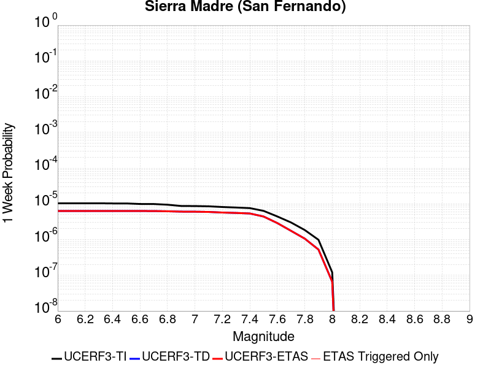 | 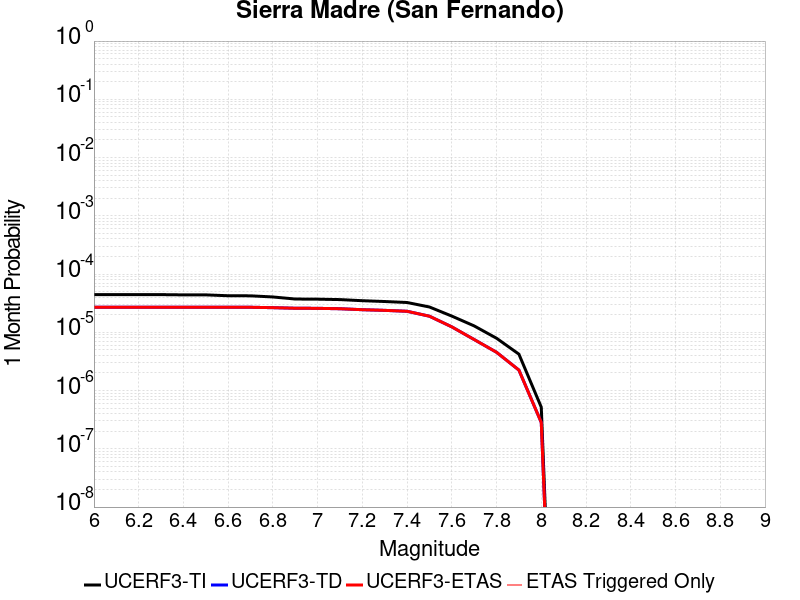 | 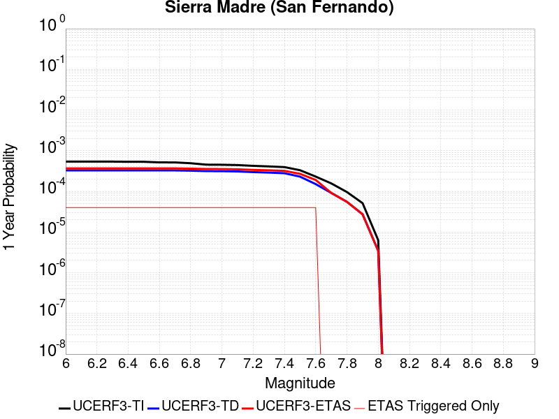 |

| Magnitude | 1 wk TI Prob | 1 wk TD Prob | 1 wk ETAS Prob | 1 wk ETAS/TD Gain | 1 wk ETAS Triggered Only | 1 mo TI Prob | 1 mo TD Prob | 1 mo ETAS Prob | 1 mo ETAS/TD Gain | 1 mo ETAS Triggered Only | 1 yr TI Prob | 1 yr TD Prob | 1 yr ETAS Prob | 1 yr ETAS/TD Gain | 1 yr ETAS Triggered Only |
|-----|-----|-----|-----|-----|-----|-----|-----|-----|-----|-----|-----|-----|-----|-----|-----|
| 6.0 | 1.0346413E-5 | 6.291033E-6 | 6.291033E-6 | 1.0 | 0.0 | 4.4341014E-5 | 2.6961297E-5 | 2.6961297E-5 | 1.0 | 0.0 | 5.3971814E-4 | 3.2820547E-4 | 3.6819233E-4 | 1.1218349 | 4.0E-5 |
| 6.1 | 1.0346413E-5 | 6.291033E-6 | 6.291033E-6 | 1.0 | 0.0 | 4.4341014E-5 | 2.6961297E-5 | 2.6961297E-5 | 1.0 | 0.0 | 5.3971814E-4 | 3.2820547E-4 | 3.6819233E-4 | 1.1218349 | 4.0E-5 |
| 6.2 | 1.0346413E-5 | 6.291033E-6 | 6.291033E-6 | 1.0 | 0.0 | 4.4341014E-5 | 2.6961297E-5 | 2.6961297E-5 | 1.0 | 0.0 | 5.3971814E-4 | 3.2820547E-4 | 3.6819233E-4 | 1.1218349 | 4.0E-5 |
| 6.3 | 1.0346413E-5 | 6.291033E-6 | 6.291033E-6 | 1.0 | 0.0 | 4.4341014E-5 | 2.6961297E-5 | 2.6961297E-5 | 1.0 | 0.0 | 5.3971814E-4 | 3.2820547E-4 | 3.6819233E-4 | 1.1218349 | 4.0E-5 |
| 6.4 | 1.0249558E-5 | 6.291033E-6 | 6.291033E-6 | 1.0 | 0.0 | 4.392594E-5 | 2.6961297E-5 | 2.6961297E-5 | 1.0 | 0.0 | 5.3466705E-4 | 3.2820547E-4 | 3.6819233E-4 | 1.1218349 | 4.0E-5 |
| 6.5 | 1.0249558E-5 | 6.291033E-6 | 6.291033E-6 | 1.0 | 0.0 | 4.392594E-5 | 2.6961297E-5 | 2.6961297E-5 | 1.0 | 0.0 | 5.3466705E-4 | 3.2820547E-4 | 3.6819233E-4 | 1.1218349 | 4.0E-5 |
| 6.6 | 9.9035515E-6 | 6.291033E-6 | 6.291033E-6 | 1.0 | 0.0 | 4.2443102E-5 | 2.6961297E-5 | 2.6961297E-5 | 1.0 | 0.0 | 5.166222E-4 | 3.2820547E-4 | 3.6819233E-4 | 1.1218349 | 4.0E-5 |
| 6.7 | 9.87217E-6 | 6.278445E-6 | 6.278445E-6 | 1.0 | 0.0 | 4.2308613E-5 | 2.6907352E-5 | 2.6907352E-5 | 1.0 | 0.0 | 5.149856E-4 | 3.2754886E-4 | 3.6753577E-4 | 1.1220791 | 4.0E-5 |
| 6.8 | 9.4359175E-6 | 6.1823307E-6 | 6.1823307E-6 | 1.0 | 0.0 | 4.043902E-5 | 2.6495441E-5 | 2.6495441E-5 | 1.0 | 0.0 | 4.9223384E-4 | 3.2253534E-4 | 3.6252243E-4 | 1.1239774 | 4.0E-5 |
| 6.9 | 8.700447E-6 | 6.0433103E-6 | 6.0433103E-6 | 1.0 | 0.0 | 3.72871E-5 | 2.5899652E-5 | 2.5899652E-5 | 1.0 | 0.0 | 4.5387587E-4 | 3.1528372E-4 | 3.552711E-4 | 1.1268299 | 4.0E-5 |
| 7.0 | 8.648878E-6 | 6.0181846E-6 | 6.0181846E-6 | 1.0 | 0.0 | 3.7066096E-5 | 2.5791971E-5 | 2.5791971E-5 | 1.0 | 0.0 | 4.5118626E-4 | 3.1397308E-4 | 3.5396052E-4 | 1.1273595 | 4.0E-5 |
| 7.1 | 8.505786E-6 | 5.92779E-6 | 5.92779E-6 | 1.0 | 0.0 | 3.645286E-5 | 2.5404574E-5 | 2.5404574E-5 | 1.0 | 0.0 | 4.437232E-4 | 3.0925786E-4 | 3.492455E-4 | 1.1293019 | 4.0E-5 |
| 7.2 | 8.139752E-6 | 5.7020216E-6 | 5.7020216E-6 | 1.0 | 0.0 | 3.4884186E-5 | 2.4437013E-5 | 2.4437013E-5 | 1.0 | 0.0 | 4.246322E-4 | 2.9748105E-4 | 3.3746916E-4 | 1.1344223 | 4.0E-5 |
| 7.3 | 7.8816E-6 | 5.555299E-6 | 5.555299E-6 | 1.0 | 0.0 | 3.3777847E-5 | 2.3808214E-5 | 2.3808214E-5 | 1.0 | 0.0 | 4.111677E-4 | 2.898275E-4 | 3.298159E-4 | 1.1379732 | 4.0E-5 |
| 7.4 | 7.5810603E-6 | 5.359496E-6 | 5.359496E-6 | 1.0 | 0.0 | 3.2489854E-5 | 2.296907E-5 | 2.296907E-5 | 1.0 | 0.0 | 3.9549218E-4 | 2.796136E-4 | 3.196024E-4 | 1.1430146 | 4.0E-5 |
| 7.5 | 6.349153E-6 | 4.4105477E-6 | 4.4105477E-6 | 1.0 | 0.0 | 2.7210372E-5 | 1.8902216E-5 | 1.8902216E-5 | 1.0 | 0.0 | 3.312359E-4 | 2.3011099E-4 | 2.701018E-4 | 1.1737891 | 4.0E-5 |
| 7.6 | 4.430576E-6 | 2.893316E-6 | 2.893316E-6 | 1.0 | 0.0 | 1.8988047E-5 | 1.2399867E-5 | 1.2399867E-5 | 1.0 | 0.0 | 2.3115493E-4 | 1.5095815E-4 | 1.9095211E-4 | 1.2649341 | 4.0E-5 |
| 7.7 | 3.005066E-6 | 1.753505E-6 | 1.753505E-6 | 1.0 | 0.0 | 1.2878791E-5 | 7.515E-6 | 7.515E-6 | 1.0 | 0.0 | 1.56788E-4 | 9.1491296E-5 | 9.1491296E-5 | 1.0 | 0.0 |
| 7.8 | 1.8459098E-6 | 1.060052E-6 | 1.060052E-6 | 1.0 | 0.0 | 7.911018E-6 | 4.543072E-6 | 4.543072E-6 | 1.0 | 0.0 | 9.631238E-5 | 5.5310502E-5 | 5.5310502E-5 | 1.0 | 0.0 |
| 7.9 | 9.839262E-7 | 5.2437485E-7 | 5.2437485E-7 | 1.0 | 0.0 | 4.2168194E-6 | 2.247319E-6 | 2.247319E-6 | 1.0 | 0.0 | 5.1338568E-5 | 2.7360767E-5 | 2.7360767E-5 | 1.0 | 0.0 |
| 8.0 | 1.210983E-7 | 6.622497E-8 | 6.622497E-8 | 1.0 | 0.0 | 5.1899264E-7 | 2.8382127E-7 | 2.8382127E-7 | 1.0 | 0.0 | 6.3187167E-6 | 3.4555185E-6 | 3.4555185E-6 | 1.0 | 0.0 |

## Santa Susana East (connector)
*[(top)](#table-of-contents)*

| 1 Week | 1 Month | 1 Year |
|-----|-----|-----|
|  |  | 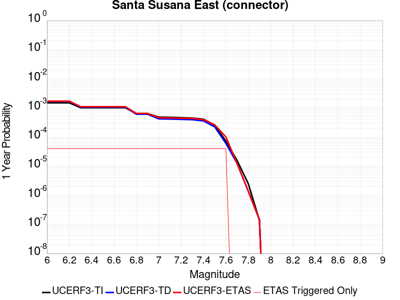 |

| Magnitude | 1 wk TI Prob | 1 wk TD Prob | 1 wk ETAS Prob | 1 wk ETAS/TD Gain | 1 wk ETAS Triggered Only | 1 mo TI Prob | 1 mo TD Prob | 1 mo ETAS Prob | 1 mo ETAS/TD Gain | 1 mo ETAS Triggered Only | 1 yr TI Prob | 1 yr TD Prob | 1 yr ETAS Prob | 1 yr ETAS/TD Gain | 1 yr ETAS Triggered Only |
|-----|-----|-----|-----|-----|-----|-----|-----|-----|-----|-----|-----|-----|-----|-----|-----|
| 6.0 | 2.858397E-5 | 3.204545E-5 | 3.204545E-5 | 1.0 | 0.0 | 1.2249697E-4 | 1.37332E-4 | 1.37332E-4 | 1.0 | 0.0 | 0.0014903803 | 0.001671004 | 0.0017109371 | 1.0238976 | 4.0E-5 |
| 6.1 | 2.858397E-5 | 3.204545E-5 | 3.204545E-5 | 1.0 | 0.0 | 1.2249697E-4 | 1.37332E-4 | 1.37332E-4 | 1.0 | 0.0 | 0.0014903803 | 0.001671004 | 0.0017109371 | 1.0238976 | 4.0E-5 |
| 6.2 | 2.858397E-5 | 3.204545E-5 | 3.204545E-5 | 1.0 | 0.0 | 1.2249697E-4 | 1.37332E-4 | 1.37332E-4 | 1.0 | 0.0 | 0.0014903803 | 0.001671004 | 0.0017109371 | 1.0238976 | 4.0E-5 |
| 6.3 | 1.943582E-5 | 2.0380405E-5 | 2.0380405E-5 | 1.0 | 0.0 | 8.329371E-5 | 8.734229E-5 | 8.734229E-5 | 1.0 | 0.0 | 0.001013629 | 0.0010629859 | 0.0011029433 | 1.0375899 | 4.0E-5 |
| 6.4 | 1.943582E-5 | 2.0380405E-5 | 2.0380405E-5 | 1.0 | 0.0 | 8.329371E-5 | 8.734229E-5 | 8.734229E-5 | 1.0 | 0.0 | 0.001013629 | 0.0010629859 | 0.0011029433 | 1.0375899 | 4.0E-5 |
| 6.5 | 1.943582E-5 | 2.0380405E-5 | 2.0380405E-5 | 1.0 | 0.0 | 8.329371E-5 | 8.734229E-5 | 8.734229E-5 | 1.0 | 0.0 | 0.001013629 | 0.0010629859 | 0.0011029433 | 1.0375899 | 4.0E-5 |
| 6.6 | 1.943582E-5 | 2.0380405E-5 | 2.0380405E-5 | 1.0 | 0.0 | 8.329371E-5 | 8.734229E-5 | 8.734229E-5 | 1.0 | 0.0 | 0.001013629 | 0.0010629859 | 0.0011029433 | 1.0375899 | 4.0E-5 |
| 6.7 | 1.9404439E-5 | 2.0367817E-5 | 2.0367817E-5 | 1.0 | 0.0 | 8.3159226E-5 | 8.728835E-5 | 8.728835E-5 | 1.0 | 0.0 | 0.0010119933 | 0.0010623297 | 0.0011022873 | 1.037613 | 4.0E-5 |
| 6.8 | 1.2217526E-5 | 1.1598732E-5 | 1.1598732E-5 | 1.0 | 0.0 | 5.2359774E-5 | 4.9708E-5 | 4.9708E-5 | 1.0 | 0.0 | 6.372938E-4 | 6.0504366E-4 | 6.4501946E-4 | 1.0660709 | 4.0E-5 |
| 6.9 | 1.2217526E-5 | 1.1598732E-5 | 1.1598732E-5 | 1.0 | 0.0 | 5.2359774E-5 | 4.9708E-5 | 4.9708E-5 | 1.0 | 0.0 | 6.372938E-4 | 6.0504366E-4 | 6.4501946E-4 | 1.0660709 | 4.0E-5 |
| 7.0 | 9.276017E-6 | 8.062312E-6 | 8.062312E-6 | 1.0 | 0.0 | 3.9753755E-5 | 3.455233E-5 | 3.455233E-5 | 1.0 | 0.0 | 4.8389446E-4 | 4.2059686E-4 | 4.6058002E-4 | 1.095063 | 4.0E-5 |
| 7.1 | 9.130355E-6 | 7.9454385E-6 | 7.9454385E-6 | 1.0 | 0.0 | 3.9129503E-5 | 3.4051456E-5 | 3.4051456E-5 | 1.0 | 0.0 | 4.7629757E-4 | 4.1450103E-4 | 4.5448446E-4 | 1.0964615 | 4.0E-5 |
| 7.2 | 8.851015E-6 | 7.744543E-6 | 7.744543E-6 | 1.0 | 0.0 | 3.7932372E-5 | 3.3190496E-5 | 3.3190496E-5 | 1.0 | 0.0 | 4.6172875E-4 | 4.0402278E-4 | 4.440066E-4 | 1.0989643 | 4.0E-5 |
| 7.3 | 8.573006E-6 | 7.553199E-6 | 7.553199E-6 | 1.0 | 0.0 | 3.6740938E-5 | 3.237047E-5 | 3.237047E-5 | 1.0 | 0.0 | 4.472291E-4 | 3.940426E-4 | 4.3402685E-4 | 1.1014719 | 4.0E-5 |
| 7.4 | 7.852282E-6 | 6.820105E-6 | 6.820105E-6 | 1.0 | 0.0 | 3.36522E-5 | 2.9228711E-5 | 2.9228711E-5 | 1.0 | 0.0 | 4.096385E-4 | 3.5580448E-4 | 3.9579027E-4 | 1.1123813 | 4.0E-5 |
| 7.5 | 4.8869324E-6 | 4.280381E-6 | 4.280381E-6 | 1.0 | 0.0 | 2.0943828E-5 | 1.834437E-5 | 1.834437E-5 | 1.0 | 0.0 | 2.5496128E-4 | 2.2332146E-4 | 2.6331254E-4 | 1.179074 | 4.0E-5 |
| 7.6 | 1.3894544E-6 | 1.1571898E-6 | 1.1571898E-6 | 1.0 | 0.0 | 5.954791E-6 | 4.959377E-6 | 4.959377E-6 | 1.0 | 0.0 | 7.249717E-5 | 6.037896E-5 | 1.0037654E-4 | 1.6624424 | 4.0E-5 |
| 7.7 | 2.9924632E-7 | 2.3744407E-7 | 2.3744407E-7 | 1.0 | 0.0 | 1.2824837E-6 | 1.0176171E-6 | 1.0176171E-6 | 1.0 | 0.0 | 1.5614127E-5 | 1.2389425E-5 | 1.2389425E-5 | 1.0 | 0.0 |
| 7.8 | 4.8188564E-8 | 2.6520485E-8 | 2.6520485E-8 | 1.0 | 0.0 | 2.065224E-7 | 1.1365921E-7 | 1.1365921E-7 | 1.0 | 0.0 | 2.5144072E-6 | 1.3838002E-6 | 1.3838002E-6 | 1.0 | 0.0 |
| 7.9 | 2.6127251E-9 | 2.7686682E-9 | 2.7686682E-9 | 1.0 | 0.0 | 1.1197393E-8 | 1.1865721E-8 | 1.1865721E-8 | 1.0 | 0.0 | 1.3632825E-7 | 1.4446515E-7 | 1.4446515E-7 | 1.0 | 0.0 |

## Santa Ynez (West)
*[(top)](#table-of-contents)*

| 1 Week | 1 Month | 1 Year |
|-----|-----|-----|
|  | 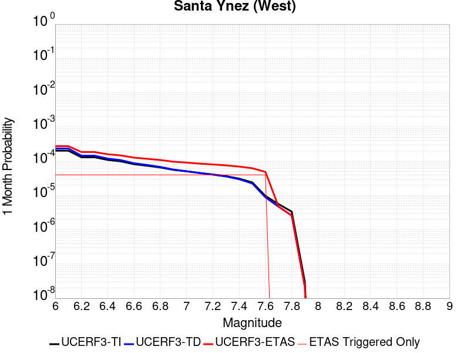 | 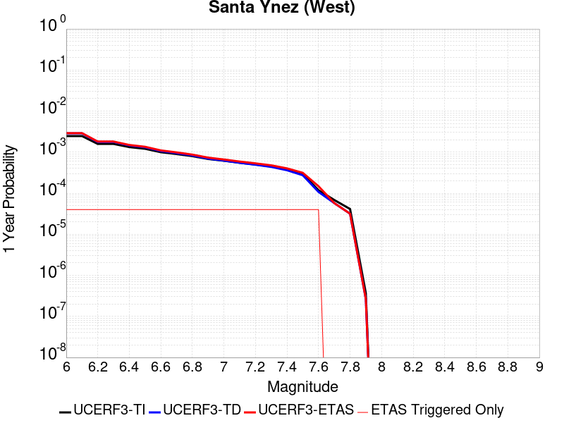 |

| Magnitude | 1 wk TI Prob | 1 wk TD Prob | 1 wk ETAS Prob | 1 wk ETAS/TD Gain | 1 wk ETAS Triggered Only | 1 mo TI Prob | 1 mo TD Prob | 1 mo ETAS Prob | 1 mo ETAS/TD Gain | 1 mo ETAS Triggered Only | 1 yr TI Prob | 1 yr TD Prob | 1 yr ETAS Prob | 1 yr ETAS/TD Gain | 1 yr ETAS Triggered Only |
|-----|-----|-----|-----|-----|-----|-----|-----|-----|-----|-----|-----|-----|-----|-----|-----|
| 6.0 | 4.7352758E-5 | 5.5006385E-5 | 5.5006385E-5 | 1.0 | 0.0 | 2.0292461E-4 | 2.3572148E-4 | 2.7571205E-4 | 1.1696517 | 4.0E-5 | 0.0024678076 | 0.0028664002 | 0.0029062855 | 1.0139148 | 4.0E-5 |
| 6.1 | 4.7352758E-5 | 5.5006385E-5 | 5.5006385E-5 | 1.0 | 0.0 | 2.0292461E-4 | 2.3572148E-4 | 2.7571205E-4 | 1.1696517 | 4.0E-5 | 0.0024678076 | 0.0028664002 | 0.0029062855 | 1.0139148 | 4.0E-5 |
| 6.2 | 3.0415853E-5 | 3.3943157E-5 | 3.3943157E-5 | 1.0 | 0.0 | 1.3034715E-4 | 1.4546278E-4 | 1.8545696E-4 | 1.2749444 | 4.0E-5 | 0.0015858212 | 0.0017696057 | 0.001809535 | 1.0225639 | 4.0E-5 |
| 6.3 | 3.0415853E-5 | 3.3943157E-5 | 3.3943157E-5 | 1.0 | 0.0 | 1.3034715E-4 | 1.4546278E-4 | 1.8545696E-4 | 1.2749444 | 4.0E-5 | 0.0015858212 | 0.0017696057 | 0.001809535 | 1.0225639 | 4.0E-5 |
| 6.4 | 2.5452082E-5 | 2.7926168E-5 | 2.7926168E-5 | 1.0 | 0.0 | 1.09075794E-4 | 1.196782E-4 | 1.5967341E-4 | 1.3341897 | 4.0E-5 | 0.0013271887 | 0.0014561269 | 0.0014960687 | 1.0274302 | 4.0E-5 |
| 6.5 | 2.3143784E-5 | 2.5140027E-5 | 2.5140027E-5 | 1.0 | 0.0 | 9.9183875E-5 | 1.07738604E-4 | 1.477343E-4 | 1.3712289 | 4.0E-5 | 0.0012068948 | 0.0013109427 | 0.0013508903 | 1.0304724 | 4.0E-5 |
| 6.6 | 1.9118515E-5 | 2.0363112E-5 | 2.0363112E-5 | 1.0 | 0.0 | 8.193392E-5 | 8.72676E-5 | 1.2726411E-4 | 1.4583203 | 4.0E-5 | 9.97089E-4 | 0.0010619732 | 0.0011019306 | 1.0376258 | 4.0E-5 |
| 6.7 | 1.722807E-5 | 1.8153853E-5 | 1.8153853E-5 | 1.0 | 0.0 | 7.3832496E-5 | 7.779994E-5 | 1.1779683E-4 | 1.5140992 | 4.0E-5 | 8.985399E-4 | 9.4680826E-4 | 9.867704E-4 | 1.0422072 | 4.0E-5 |
| 6.8 | 1.5317364E-5 | 1.5932763E-5 | 1.5932763E-5 | 1.0 | 0.0 | 6.56442E-5 | 6.828151E-5 | 1.0827878E-4 | 1.5857701 | 4.0E-5 | 7.98925E-4 | 8.310146E-4 | 8.709813E-4 | 1.0480939 | 4.0E-5 |
| 6.9 | 1.3071226E-5 | 1.3334518E-5 | 1.3334518E-5 | 1.0 | 0.0 | 5.6018336E-5 | 5.7146695E-5 | 9.714441E-5 | 1.699913 | 4.0E-5 | 6.8180985E-4 | 6.955412E-4 | 7.3551334E-4 | 1.0574691 | 4.0E-5 |
| 7.0 | 1.1836986E-5 | 1.1937046E-5 | 1.1937046E-5 | 1.0 | 0.0 | 5.0728955E-5 | 5.115778E-5 | 9.115573E-5 | 1.7818547 | 4.0E-5 | 6.1745E-4 | 6.2266964E-4 | 6.626447E-4 | 1.0641996 | 4.0E-5 |
| 7.1 | 1.0597169E-5 | 1.0545887E-5 | 1.0545887E-5 | 1.0 | 0.0 | 4.541565E-5 | 4.519588E-5 | 8.519407E-5 | 1.8849964 | 4.0E-5 | 5.5279525E-4 | 5.5012206E-4 | 5.9010007E-4 | 1.0726712 | 4.0E-5 |
| 7.2 | 9.59113E-6 | 9.462545E-6 | 9.462545E-6 | 1.0 | 0.0 | 4.11042E-5 | 4.055314E-5 | 8.0551516E-5 | 1.9863201 | 4.0E-5 | 5.0032866E-4 | 4.9362367E-4 | 5.3360395E-4 | 1.0809934 | 4.0E-5 |
| 7.3 | 8.586084E-6 | 8.382711E-6 | 8.382711E-6 | 1.0 | 0.0 | 3.679698E-5 | 3.5925415E-5 | 7.592398E-5 | 2.1133778 | 4.0E-5 | 4.4791115E-4 | 4.3730516E-4 | 4.772877E-4 | 1.0914294 | 4.0E-5 |
| 7.4 | 7.2622997E-6 | 6.954277E-6 | 6.954277E-6 | 1.0 | 0.0 | 3.112377E-5 | 2.980371E-5 | 6.980252E-5 | 2.3420749 | 4.0E-5 | 3.78866E-4 | 3.6280073E-4 | 4.0278622E-4 | 1.1102134 | 4.0E-5 |
| 7.5 | 5.627296E-6 | 5.2534574E-6 | 5.2534574E-6 | 1.0 | 0.0 | 2.411676E-5 | 2.2514627E-5 | 6.2513725E-5 | 2.776583 | 4.0E-5 | 2.9358198E-4 | 2.740818E-4 | 3.1407084E-4 | 1.1459018 | 4.0E-5 |
| 7.6 | 2.265244E-6 | 2.061312E-6 | 2.061312E-6 | 1.0 | 0.0 | 9.708152E-6 | 8.834165E-6 | 4.8833812E-5 | 5.5278354 | 4.0E-5 | 1.18190335E-4 | 1.0755074E-4 | 1.4754644E-4 | 1.3718774 | 4.0E-5 |
| 7.7 | 1.3099874E-6 | 1.1018567E-6 | 1.1018567E-6 | 1.0 | 0.0 | 5.61422E-6 | 4.7222347E-6 | 4.7222347E-6 | 1.0 | 0.0 | 6.8350986E-5 | 5.7491714E-5 | 5.7491714E-5 | 1.0 | 0.0 |
| 7.8 | 7.903951E-7 | 6.0723085E-7 | 6.0723085E-7 | 1.0 | 0.0 | 3.3874032E-6 | 2.6024154E-6 | 2.6024154E-6 | 1.0 | 0.0 | 4.1240855E-5 | 3.168396E-5 | 3.168396E-5 | 1.0 | 0.0 |
| 7.9 | 7.0753297E-9 | 5.090925E-9 | 5.090925E-9 | 1.0 | 0.0 | 3.032284E-8 | 2.1818249E-8 | 2.1818249E-8 | 1.0 | 0.0 | 3.6918053E-7 | 2.6563717E-7 | 2.6563717E-7 | 1.0 | 0.0 |

## Monte Vista - Shannon 2011 CFM
*[(top)](#table-of-contents)*

| 1 Week | 1 Month | 1 Year |
|-----|-----|-----|
|  | 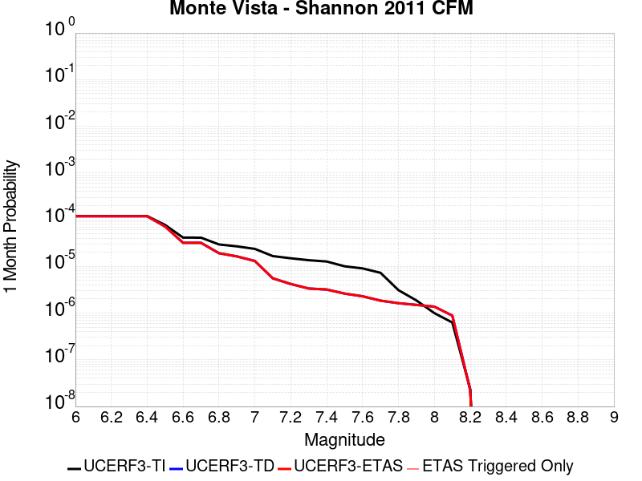 | 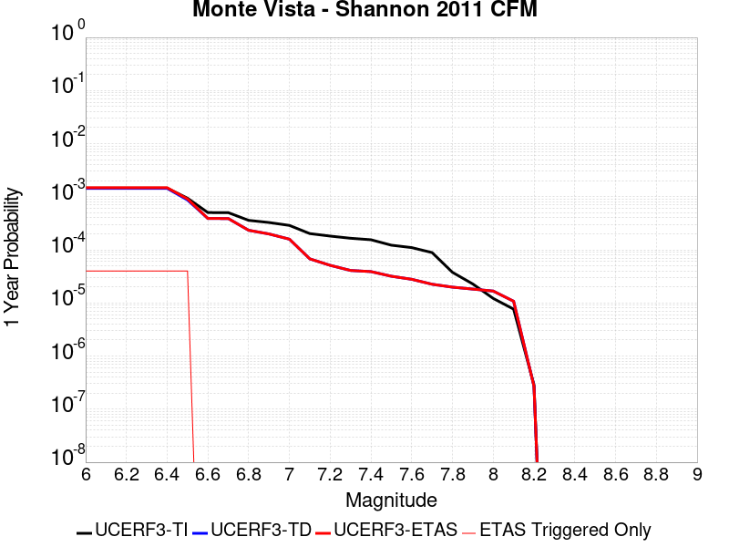 |

| Magnitude | 1 wk TI Prob | 1 wk TD Prob | 1 wk ETAS Prob | 1 wk ETAS/TD Gain | 1 wk ETAS Triggered Only | 1 mo TI Prob | 1 mo TD Prob | 1 mo ETAS Prob | 1 mo ETAS/TD Gain | 1 mo ETAS Triggered Only | 1 yr TI Prob | 1 yr TD Prob | 1 yr ETAS Prob | 1 yr ETAS/TD Gain | 1 yr ETAS Triggered Only |
|-----|-----|-----|-----|-----|-----|-----|-----|-----|-----|-----|-----|-----|-----|-----|-----|
| 6.0 | 2.7907707E-5 | 2.7607006E-5 | 2.7607006E-5 | 1.0 | 0.0 | 1.19598975E-4 | 1.1831107E-4 | 1.1831107E-4 | 1.0 | 0.0 | 0.0014551448 | 0.0014396093 | 0.0014795518 | 1.0277454 | 4.0E-5 |
| 6.1 | 2.7907707E-5 | 2.7607006E-5 | 2.7607006E-5 | 1.0 | 0.0 | 1.19598975E-4 | 1.1831107E-4 | 1.1831107E-4 | 1.0 | 0.0 | 0.0014551448 | 0.0014396093 | 0.0014795518 | 1.0277454 | 4.0E-5 |
| 6.2 | 2.7907707E-5 | 2.7607006E-5 | 2.7607006E-5 | 1.0 | 0.0 | 1.19598975E-4 | 1.1831107E-4 | 1.1831107E-4 | 1.0 | 0.0 | 0.0014551448 | 0.0014396093 | 0.0014795518 | 1.0277454 | 4.0E-5 |
| 6.3 | 2.7907707E-5 | 2.7607006E-5 | 2.7607006E-5 | 1.0 | 0.0 | 1.19598975E-4 | 1.1831107E-4 | 1.1831107E-4 | 1.0 | 0.0 | 0.0014551448 | 0.0014396093 | 0.0014795518 | 1.0277454 | 4.0E-5 |
| 6.4 | 2.7907707E-5 | 2.7607006E-5 | 2.7607006E-5 | 1.0 | 0.0 | 1.19598975E-4 | 1.1831107E-4 | 1.1831107E-4 | 1.0 | 0.0 | 0.0014551448 | 0.0014396093 | 0.0014795518 | 1.0277454 | 4.0E-5 |
| 6.5 | 1.7990213E-5 | 1.6658836E-5 | 1.6658836E-5 | 1.0 | 0.0 | 7.709863E-5 | 7.1393435E-5 | 7.1393435E-5 | 1.0 | 0.0 | 9.382716E-4 | 8.689348E-4 | 9.0890005E-4 | 1.0459933 | 4.0E-5 |
| 6.6 | 9.650407E-6 | 7.4729483E-6 | 7.4729483E-6 | 1.0 | 0.0 | 4.135823E-5 | 3.202657E-5 | 3.202657E-5 | 1.0 | 0.0 | 5.0342013E-4 | 3.8986158E-4 | 3.8986158E-4 | 1.0 | 0.0 |
| 6.7 | 9.62828E-6 | 7.4508453E-6 | 7.4508453E-6 | 1.0 | 0.0 | 4.1263404E-5 | 3.1931846E-5 | 3.1931846E-5 | 1.0 | 0.0 | 5.022661E-4 | 3.8870872E-4 | 3.8870872E-4 | 1.0 | 0.0 |
| 6.8 | 6.887523E-6 | 4.4764647E-6 | 4.4764647E-6 | 1.0 | 0.0 | 2.9517621E-5 | 1.9184721E-5 | 1.9184721E-5 | 1.0 | 0.0 | 3.5931775E-4 | 2.3355117E-4 | 2.3355117E-4 | 1.0 | 0.0 |
| 6.9 | 6.2722347E-6 | 3.81813E-6 | 3.81813E-6 | 1.0 | 0.0 | 2.6880729E-5 | 1.6363323E-5 | 1.6363323E-5 | 1.0 | 0.0 | 3.2722374E-4 | 1.9920728E-4 | 1.9920728E-4 | 1.0 | 0.0 |
| 7.0 | 5.5320347E-6 | 3.0449671E-6 | 3.0449671E-6 | 1.0 | 0.0 | 2.3708504E-5 | 1.3049805E-5 | 1.3049805E-5 | 1.0 | 0.0 | 2.8861282E-4 | 1.5887163E-4 | 1.5887163E-4 | 1.0 | 0.0 |
| 7.1 | 3.8794055E-6 | 1.2972122E-6 | 1.2972122E-6 | 1.0 | 0.0 | 1.6625918E-5 | 5.559469E-6 | 5.559469E-6 | 1.0 | 0.0 | 2.0240174E-4 | 6.768445E-5 | 6.768445E-5 | 1.0 | 0.0 |
| 7.2 | 3.4813652E-6 | 9.799196E-7 | 9.799196E-7 | 1.0 | 0.0 | 1.49200505E-5 | 4.1996486E-6 | 4.1996486E-6 | 1.0 | 0.0 | 1.8163648E-4 | 5.1129533E-5 | 5.1129533E-5 | 1.0 | 0.0 |
| 7.3 | 3.1682148E-6 | 7.841216E-7 | 7.841216E-7 | 1.0 | 0.0 | 1.3577992E-5 | 3.3605168E-6 | 3.3605168E-6 | 1.0 | 0.0 | 1.6529951E-4 | 4.0913525E-5 | 4.0913525E-5 | 1.0 | 0.0 |
| 7.4 | 2.9707667E-6 | 7.464202E-7 | 7.464202E-7 | 1.0 | 0.0 | 1.2731795E-5 | 3.1989398E-6 | 3.1989398E-6 | 1.0 | 0.0 | 1.5499859E-4 | 3.89464E-5 | 3.89464E-5 | 1.0 | 0.0 |
| 7.5 | 2.3462758E-6 | 6.1088537E-7 | 6.1088537E-7 | 1.0 | 0.0 | 1.0055429E-5 | 2.6180774E-6 | 2.6180774E-6 | 1.0 | 0.0 | 1.2241797E-4 | 3.1874628E-5 | 3.1874628E-5 | 1.0 | 0.0 |
| 7.6 | 2.112783E-6 | 5.3464873E-7 | 5.3464873E-7 | 1.0 | 0.0 | 9.054753E-6 | 2.2913496E-6 | 2.2913496E-6 | 1.0 | 0.0 | 1.1023604E-4 | 2.7896827E-5 | 2.7896827E-5 | 1.0 | 0.0 |
| 7.7 | 1.7022471E-6 | 4.3143976E-7 | 4.3143976E-7 | 1.0 | 0.0 | 7.2953244E-6 | 1.8490263E-6 | 1.8490263E-6 | 1.0 | 0.0 | 8.881695E-5 | 2.2511664E-5 | 2.2511664E-5 | 1.0 | 0.0 |
| 7.8 | 7.230914E-7 | 3.803605E-7 | 3.803605E-7 | 1.0 | 0.0 | 3.0989595E-6 | 1.6301153E-6 | 1.6301153E-6 | 1.0 | 0.0 | 3.772918E-5 | 1.9846475E-5 | 1.9846475E-5 | 1.0 | 0.0 |
| 7.9 | 4.3588446E-7 | 3.4959496E-7 | 3.4959496E-7 | 1.0 | 0.0 | 1.868075E-6 | 1.4982633E-6 | 1.4982633E-6 | 1.0 | 0.0 | 2.2743576E-5 | 1.8241204E-5 | 1.8241204E-5 | 1.0 | 0.0 |
| 8.0 | 2.3317523E-7 | 3.2087686E-7 | 3.2087686E-7 | 1.0 | 0.0 | 9.99322E-7 | 1.3751859E-6 | 1.3751859E-6 | 1.0 | 0.0 | 1.2166677E-5 | 1.674276E-5 | 1.674276E-5 | 1.0 | 0.0 |
| 8.1 | 1.4662456E-7 | 2.065131E-7 | 2.065131E-7 | 1.0 | 0.0 | 6.283908E-7 | 8.8505584E-7 | 8.8505584E-7 | 1.0 | 0.0 | 7.650631E-6 | 1.0775503E-5 | 1.0775503E-5 | 1.0 | 0.0 |
| 8.2 | 5.4931775E-9 | 5.164059E-9 | 5.164059E-9 | 1.0 | 0.0 | 2.3542189E-8 | 2.213168E-8 | 2.213168E-8 | 1.0 | 0.0 | 2.8662612E-7 | 2.6945318E-7 | 2.6945318E-7 | 1.0 | 0.0 |

## Malibu Coast alt 1
*[(top)](#table-of-contents)*

| 1 Week | 1 Month | 1 Year |
|-----|-----|-----|
| 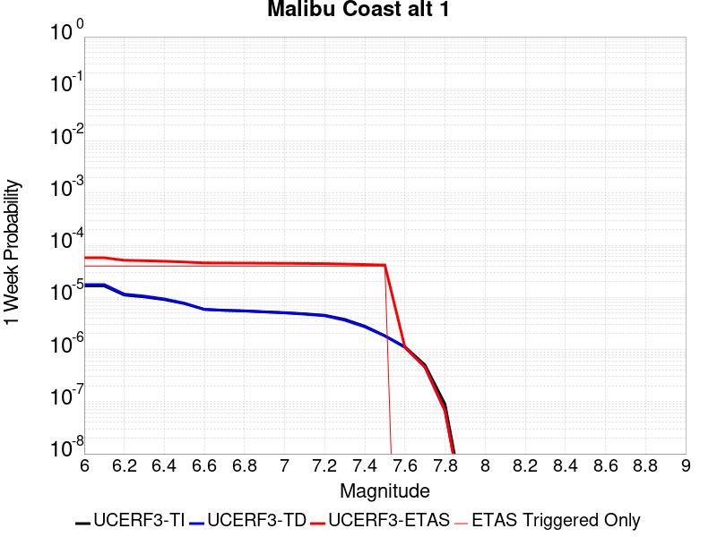 | 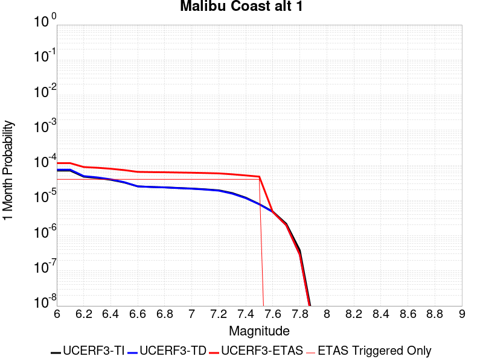 | 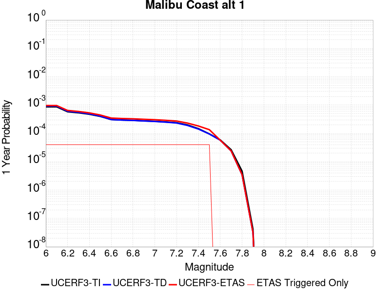 |

| Magnitude | 1 wk TI Prob | 1 wk TD Prob | 1 wk ETAS Prob | 1 wk ETAS/TD Gain | 1 wk ETAS Triggered Only | 1 mo TI Prob | 1 mo TD Prob | 1 mo ETAS Prob | 1 mo ETAS/TD Gain | 1 mo ETAS Triggered Only | 1 yr TI Prob | 1 yr TD Prob | 1 yr ETAS Prob | 1 yr ETAS/TD Gain | 1 yr ETAS Triggered Only |
|-----|-----|-----|-----|-----|-----|-----|-----|-----|-----|-----|-----|-----|-----|-----|-----|
| 6.0 | 1.6572556E-5 | 1.7603372E-5 | 5.760267E-5 | 3.2722518 | 4.0E-5 | 7.102331E-5 | 7.544095E-5 | 1.1543793E-4 | 1.530176 | 4.0E-5 | 8.6436566E-4 | 9.1812544E-4 | 9.5808867E-4 | 1.043527 | 4.0E-5 |
| 6.1 | 1.6572556E-5 | 1.7603372E-5 | 5.760267E-5 | 3.2722518 | 4.0E-5 | 7.102331E-5 | 7.544095E-5 | 1.1543793E-4 | 1.530176 | 4.0E-5 | 8.6436566E-4 | 9.1812544E-4 | 9.5808867E-4 | 1.043527 | 4.0E-5 |
| 6.2 | 1.1085717E-5 | 1.1560378E-5 | 5.1559917E-5 | 4.4600544 | 4.0E-5 | 4.750935E-5 | 4.9543556E-5 | 8.954157E-5 | 1.8073304 | 4.0E-5 | 5.782728E-4 | 6.030294E-4 | 6.4300525E-4 | 1.0662918 | 4.0E-5 |
| 6.3 | 1.0208568E-5 | 1.059514E-5 | 5.0594717E-5 | 4.7752757 | 4.0E-5 | 4.375027E-5 | 4.540697E-5 | 8.5405154E-5 | 1.880882 | 4.0E-5 | 5.325294E-4 | 5.5269257E-4 | 5.9267046E-4 | 1.072333 | 4.0E-5 |
| 6.4 | 9.0682315E-6 | 9.345133E-6 | 4.934476E-5 | 5.280263 | 4.0E-5 | 3.8863272E-5 | 4.0049967E-5 | 8.004836E-5 | 1.9987124 | 4.0E-5 | 4.730576E-4 | 4.875013E-4 | 5.274818E-4 | 1.0820111 | 4.0E-5 |
| 6.5 | 7.605796E-6 | 7.750596E-6 | 4.7750287E-5 | 6.160854 | 4.0E-5 | 3.259586E-5 | 3.3216424E-5 | 7.3215095E-5 | 2.2041836 | 4.0E-5 | 3.9678233E-4 | 4.0433623E-4 | 4.4432006E-4 | 1.0988876 | 4.0E-5 |
| 6.6 | 5.889873E-6 | 5.88098E-6 | 4.5880744E-5 | 7.8015475 | 4.0E-5 | 2.5242069E-5 | 2.5203957E-5 | 6.520295E-5 | 2.5870123 | 4.0E-5 | 3.0727885E-4 | 3.0681508E-4 | 3.468028E-4 | 1.1303316 | 4.0E-5 |
| 6.7 | 5.66586E-6 | 5.6430326E-6 | 4.5642806E-5 | 8.088347 | 4.0E-5 | 2.428203E-5 | 2.4184203E-5 | 6.418324E-5 | 2.6539323 | 4.0E-5 | 2.955936E-4 | 2.9440297E-4 | 3.343912E-4 | 1.1358281 | 4.0E-5 |
| 6.8 | 5.521556E-6 | 5.49079E-6 | 4.549057E-5 | 8.284886 | 4.0E-5 | 2.3663597E-5 | 2.3531746E-5 | 6.35308E-5 | 2.6997914 | 4.0E-5 | 2.880662E-4 | 2.864614E-4 | 3.2644995E-4 | 1.1395949 | 4.0E-5 |
| 6.9 | 5.29752E-6 | 5.2512382E-6 | 4.525103E-5 | 8.617211 | 4.0E-5 | 2.270346E-5 | 2.2505112E-5 | 6.2504216E-5 | 2.777334 | 4.0E-5 | 2.7637955E-4 | 2.739654E-4 | 3.1395443E-4 | 1.1459639 | 4.0E-5 |
| 7.0 | 5.106743E-6 | 5.0489434E-6 | 4.5048742E-5 | 8.922409 | 4.0E-5 | 2.1885859E-5 | 2.163815E-5 | 6.1637285E-5 | 2.8485467 | 4.0E-5 | 2.6642776E-4 | 2.6341272E-4 | 3.0340216E-4 | 1.1518129 | 4.0E-5 |
| 7.1 | 4.8469647E-6 | 4.771574E-6 | 4.4771383E-5 | 9.382937 | 4.0E-5 | 2.0772539E-5 | 2.0449443E-5 | 6.0448627E-5 | 2.9560034 | 4.0E-5 | 2.528763E-4 | 2.489436E-4 | 2.8893363E-4 | 1.1606389 | 4.0E-5 |
| 7.2 | 4.545514E-6 | 4.4493186E-6 | 4.444914E-5 | 9.990101 | 4.0E-5 | 1.9480629E-5 | 1.906837E-5 | 5.9067606E-5 | 3.0976748 | 4.0E-5 | 2.3715083E-4 | 2.3213273E-4 | 2.7212343E-4 | 1.1722752 | 4.0E-5 |
| 7.3 | 3.794097E-6 | 3.6528515E-6 | 4.3652704E-5 | 11.950309 | 4.0E-5 | 1.6260314E-5 | 1.5654985E-5 | 5.565436E-5 | 3.5550568 | 4.0E-5 | 1.9795135E-4 | 1.9058281E-4 | 2.3057518E-4 | 1.2098426 | 4.0E-5 |
| 7.4 | 2.808217E-6 | 2.7198025E-6 | 4.2719694E-5 | 15.70691 | 4.0E-5 | 1.203516E-5 | 1.1656245E-5 | 5.1655777E-5 | 4.4315968 | 4.0E-5 | 1.4651821E-4 | 1.4190556E-4 | 1.8189989E-4 | 1.2818376 | 4.0E-5 |
| 7.5 | 1.83809E-6 | 1.8195162E-6 | 4.1819443E-5 | 22.983826 | 4.0E-5 | 7.877505E-6 | 7.797904E-6 | 4.7797592E-5 | 6.129544 | 4.0E-5 | 9.59044E-5 | 9.4935356E-5 | 1.3493156E-4 | 1.4212993 | 4.0E-5 |
| 7.6 | 1.1292672E-6 | 1.1004113E-6 | 1.1004113E-6 | 1.0 | 0.0 | 4.839708E-6 | 4.7160397E-6 | 4.7160397E-6 | 1.0 | 0.0 | 5.8921847E-5 | 5.7416288E-5 | 5.7416288E-5 | 1.0 | 0.0 |
| 7.7 | 5.065272E-7 | 4.6105032E-7 | 4.6105032E-7 | 1.0 | 0.0 | 2.170829E-6 | 1.9759284E-6 | 1.9759284E-6 | 1.0 | 0.0 | 2.6429525E-5 | 2.4056675E-5 | 2.4056675E-5 | 1.0 | 0.0 |
| 7.8 | 8.952991E-8 | 6.7132056E-8 | 6.7132056E-8 | 1.0 | 0.0 | 3.8369956E-7 | 2.877088E-7 | 2.877088E-7 | 1.0 | 0.0 | 4.671532E-6 | 3.502849E-6 | 3.502849E-6 | 1.0 | 0.0 |
| 7.9 | 8.007447E-10 | 6.1625505E-10 | 6.1625505E-10 | 1.0 | 0.0 | 3.4317629E-9 | 2.6410938E-9 | 2.6410938E-9 | 1.0 | 0.0 | 4.1781714E-8 | 3.2155317E-8 | 3.2155317E-8 | 1.0 | 0.0 |

## San Jacinto (Superstition Mtn)
*[(top)](#table-of-contents)*

| 1 Week | 1 Month | 1 Year |
|-----|-----|-----|
| 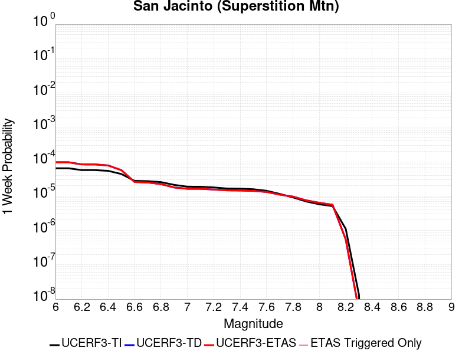 | 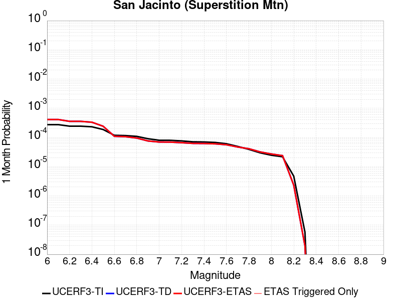 | 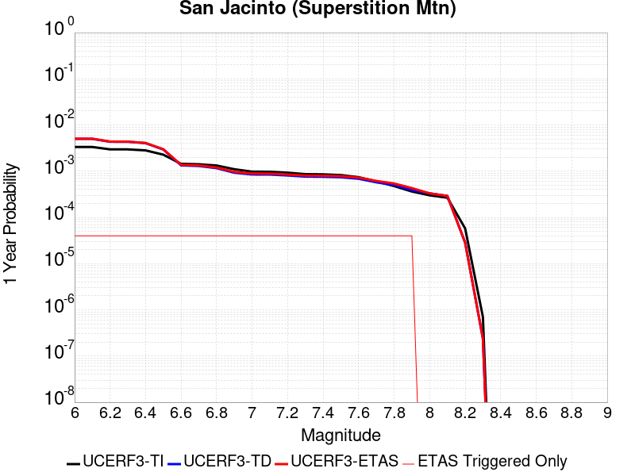 |

| Magnitude | 1 wk TI Prob | 1 wk TD Prob | 1 wk ETAS Prob | 1 wk ETAS/TD Gain | 1 wk ETAS Triggered Only | 1 mo TI Prob | 1 mo TD Prob | 1 mo ETAS Prob | 1 mo ETAS/TD Gain | 1 mo ETAS Triggered Only | 1 yr TI Prob | 1 yr TD Prob | 1 yr ETAS Prob | 1 yr ETAS/TD Gain | 1 yr ETAS Triggered Only |
|-----|-----|-----|-----|-----|-----|-----|-----|-----|-----|-----|-----|-----|-----|-----|-----|
| 6.0 | 6.4193904E-5 | 9.618683E-5 | 9.618683E-5 | 1.0 | 0.0 | 2.7508775E-4 | 4.1217334E-4 | 4.1217334E-4 | 1.0 | 0.0 | 0.0033440501 | 0.005008075 | 0.0050478745 | 1.0079471 | 4.0E-5 |
| 6.1 | 6.4193904E-5 | 9.618683E-5 | 9.618683E-5 | 1.0 | 0.0 | 2.7508775E-4 | 4.1217334E-4 | 4.1217334E-4 | 1.0 | 0.0 | 0.0033440501 | 0.005008075 | 0.0050478745 | 1.0079471 | 4.0E-5 |
| 6.2 | 5.7023593E-5 | 8.3323815E-5 | 8.3323815E-5 | 1.0 | 0.0 | 2.4436394E-4 | 3.5706247E-4 | 3.5706247E-4 | 1.0 | 0.0 | 0.002971072 | 0.004340213 | 0.0043800394 | 1.0091761 | 4.0E-5 |
| 6.3 | 5.6940098E-5 | 8.316908E-5 | 8.316908E-5 | 1.0 | 0.0 | 2.4400617E-4 | 3.5639948E-4 | 3.5639948E-4 | 1.0 | 0.0 | 0.002966728 | 0.004332173 | 0.0043719998 | 1.0091932 | 4.0E-5 |
| 6.4 | 5.4171585E-5 | 7.765849E-5 | 7.765849E-5 | 1.0 | 0.0 | 2.3214328E-4 | 3.3278894E-4 | 3.3278894E-4 | 1.0 | 0.0 | 0.0028226813 | 0.0040458273 | 0.0040856656 | 1.0098467 | 4.0E-5 |
| 6.5 | 4.375144E-5 | 5.6590954E-5 | 5.6590954E-5 | 1.0 | 0.0 | 1.874927E-4 | 2.4251675E-4 | 2.4251675E-4 | 1.0 | 0.0 | 0.0022803338 | 0.00294982 | 0.002989702 | 1.0135201 | 4.0E-5 |
| 6.6 | 2.772192E-5 | 2.5649655E-5 | 2.5649655E-5 | 1.0 | 0.0 | 1.1880282E-4 | 1.0992257E-4 | 1.0992257E-4 | 1.0 | 0.0 | 0.0014454646 | 0.0013375052 | 0.0013774517 | 1.0298665 | 4.0E-5 |
| 6.7 | 2.7124124E-5 | 2.4859904E-5 | 2.4859904E-5 | 1.0 | 0.0 | 1.1624106E-4 | 1.0653821E-4 | 1.0653821E-4 | 1.0 | 0.0 | 0.0014143161 | 0.0012963502 | 0.0013362983 | 1.0308158 | 4.0E-5 |
| 6.8 | 2.5475807E-5 | 2.2321101E-5 | 2.2321101E-5 | 1.0 | 0.0 | 1.0917746E-4 | 9.565842E-5 | 9.565842E-5 | 1.0 | 0.0 | 0.001328425 | 0.0011640311 | 0.0012039845 | 1.0343233 | 4.0E-5 |
| 6.9 | 2.1162023E-5 | 1.7771237E-5 | 1.7771237E-5 | 1.0 | 0.0 | 9.069123E-5 | 7.616024E-5 | 7.616024E-5 | 1.0 | 0.0 | 0.0011036064 | 9.268603E-4 | 9.6682325E-4 | 1.0431165 | 4.0E-5 |
| 7.0 | 1.8754288E-5 | 1.6300326E-5 | 1.6300326E-5 | 1.0 | 0.0 | 8.037304E-5 | 6.985668E-5 | 6.985668E-5 | 1.0 | 0.0 | 9.781026E-4 | 8.5017574E-4 | 8.9014176E-4 | 1.0470091 | 4.0E-5 |
| 7.1 | 1.8678527E-5 | 1.6225338E-5 | 1.6225338E-5 | 1.0 | 0.0 | 8.0048376E-5 | 6.953532E-5 | 6.953532E-5 | 1.0 | 0.0 | 9.7415317E-4 | 8.462663E-4 | 8.862324E-4 | 1.0472264 | 4.0E-5 |
| 7.2 | 1.7804578E-5 | 1.5518503E-5 | 1.5518503E-5 | 1.0 | 0.0 | 7.6303106E-5 | 6.650618E-5 | 6.650618E-5 | 1.0 | 0.0 | 9.285943E-4 | 8.0941425E-4 | 8.4938185E-4 | 1.0493784 | 4.0E-5 |
| 7.3 | 1.6583685E-5 | 1.4666085E-5 | 1.4666085E-5 | 1.0 | 0.0 | 7.1070994E-5 | 6.285315E-5 | 6.285315E-5 | 1.0 | 0.0 | 8.649459E-4 | 7.6497043E-4 | 8.0493983E-4 | 1.0522496 | 4.0E-5 |
| 7.4 | 1.6387552E-5 | 1.453072E-5 | 1.453072E-5 | 1.0 | 0.0 | 7.023047E-5 | 6.227304E-5 | 6.227304E-5 | 1.0 | 0.0 | 8.5472054E-4 | 7.579126E-4 | 7.978822E-4 | 1.0527365 | 4.0E-5 |
| 7.5 | 1.5790754E-5 | 1.4170097E-5 | 1.4170097E-5 | 1.0 | 0.0 | 6.767291E-5 | 6.0727583E-5 | 6.0727583E-5 | 1.0 | 0.0 | 8.236062E-4 | 7.391095E-4 | 7.7908E-4 | 1.0540792 | 4.0E-5 |
| 7.6 | 1.4248672E-5 | 1.31832085E-5 | 1.31832085E-5 | 1.0 | 0.0 | 6.106431E-5 | 5.649825E-5 | 5.649825E-5 | 1.0 | 0.0 | 7.432043E-4 | 6.8765087E-4 | 7.2762335E-4 | 1.0581291 | 4.0E-5 |
| 7.7 | 1.15449975E-5 | 1.1026264E-5 | 1.1026264E-5 | 1.0 | 0.0 | 4.947762E-5 | 4.7254565E-5 | 4.7254565E-5 | 1.0 | 0.0 | 6.022235E-4 | 5.7517324E-4 | 6.1515026E-4 | 1.0695043 | 4.0E-5 |
| 7.8 | 9.1391985E-6 | 9.632236E-6 | 9.632236E-6 | 1.0 | 0.0 | 3.9167408E-5 | 4.128036E-5 | 4.128036E-5 | 1.0 | 0.0 | 4.767588E-4 | 5.024731E-4 | 5.42453E-4 | 1.0795662 | 4.0E-5 |
| 7.9 | 6.973017E-6 | 7.4874865E-6 | 7.4874865E-6 | 1.0 | 0.0 | 2.9884017E-5 | 3.2088836E-5 | 3.2088836E-5 | 1.0 | 0.0 | 3.6377716E-4 | 3.9061208E-4 | 4.3059647E-4 | 1.1023633 | 4.0E-5 |
| 8.0 | 5.7638235E-6 | 6.3564244E-6 | 6.3564244E-6 | 1.0 | 0.0 | 2.4701867E-5 | 2.7241536E-5 | 2.7241536E-5 | 1.0 | 0.0 | 3.0070372E-4 | 3.3161574E-4 | 3.3161574E-4 | 1.0 | 0.0 |
| 8.1 | 5.1124434E-6 | 5.58386E-6 | 5.58386E-6 | 1.0 | 0.0 | 2.1910288E-5 | 2.3930612E-5 | 2.3930612E-5 | 1.0 | 0.0 | 2.6672508E-4 | 2.9131674E-4 | 2.9131674E-4 | 1.0 | 0.0 |
| 8.2 | 1.1075938E-6 | 5.458512E-7 | 5.458512E-7 | 1.0 | 0.0 | 4.7468216E-6 | 2.3393604E-6 | 2.3393604E-6 | 1.0 | 0.0 | 5.779102E-5 | 2.8481363E-5 | 2.8481363E-5 | 1.0 | 0.0 |
| 8.3 | 1.3584393E-8 | 4.5896105E-9 | 4.5896105E-9 | 1.0 | 0.0 | 5.8218827E-8 | 1.966976E-8 | 1.966976E-8 | 1.0 | 0.0 | 7.0881396E-7 | 2.394793E-7 | 2.394793E-7 | 1.0 | 0.0 |

## Santa Susana alt 1
*[(top)](#table-of-contents)*

| 1 Week | 1 Month | 1 Year |
|-----|-----|-----|
| 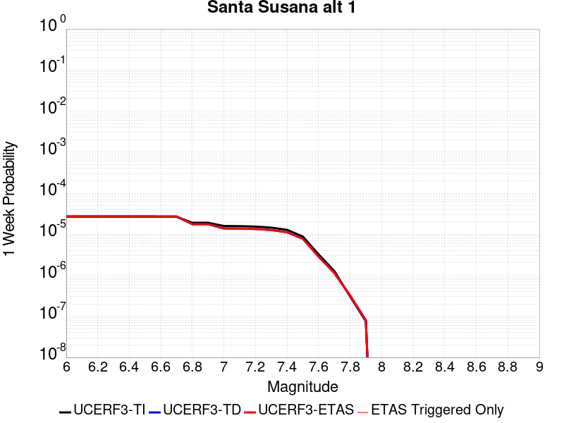 | 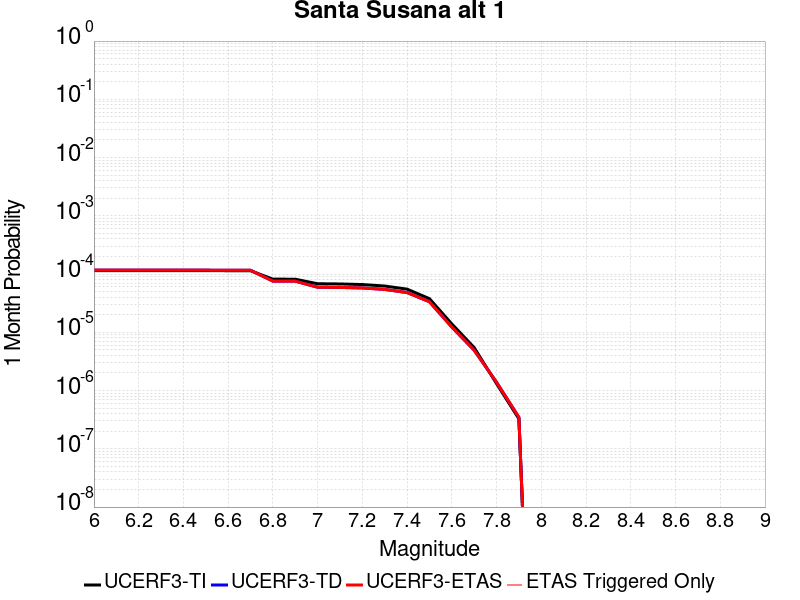 | 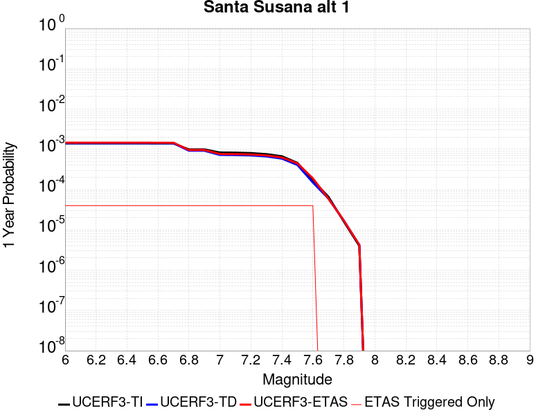 |

| Magnitude | 1 wk TI Prob | 1 wk TD Prob | 1 wk ETAS Prob | 1 wk ETAS/TD Gain | 1 wk ETAS Triggered Only | 1 mo TI Prob | 1 mo TD Prob | 1 mo ETAS Prob | 1 mo ETAS/TD Gain | 1 mo ETAS Triggered Only | 1 yr TI Prob | 1 yr TD Prob | 1 yr ETAS Prob | 1 yr ETAS/TD Gain | 1 yr ETAS Triggered Only |
|-----|-----|-----|-----|-----|-----|-----|-----|-----|-----|-----|-----|-----|-----|-----|-----|
| 6.0 | 2.674877E-5 | 2.7220398E-5 | 2.7220398E-5 | 1.0 | 0.0 | 1.1463255E-4 | 1.16654264E-4 | 1.16654264E-4 | 1.0 | 0.0 | 0.0013947578 | 0.0014194542 | 0.0014593974 | 1.0281398 | 4.0E-5 |
| 6.1 | 2.674877E-5 | 2.7220398E-5 | 2.7220398E-5 | 1.0 | 0.0 | 1.1463255E-4 | 1.16654264E-4 | 1.16654264E-4 | 1.0 | 0.0 | 0.0013947578 | 0.0014194542 | 0.0014593974 | 1.0281398 | 4.0E-5 |
| 6.2 | 2.674877E-5 | 2.7220398E-5 | 2.7220398E-5 | 1.0 | 0.0 | 1.1463255E-4 | 1.16654264E-4 | 1.16654264E-4 | 1.0 | 0.0 | 0.0013947578 | 0.0014194542 | 0.0014593974 | 1.0281398 | 4.0E-5 |
| 6.3 | 2.674877E-5 | 2.7220398E-5 | 2.7220398E-5 | 1.0 | 0.0 | 1.1463255E-4 | 1.16654264E-4 | 1.16654264E-4 | 1.0 | 0.0 | 0.0013947578 | 0.0014194542 | 0.0014593974 | 1.0281398 | 4.0E-5 |
| 6.4 | 2.674877E-5 | 2.7220398E-5 | 2.7220398E-5 | 1.0 | 0.0 | 1.1463255E-4 | 1.16654264E-4 | 1.16654264E-4 | 1.0 | 0.0 | 0.0013947578 | 0.0014194542 | 0.0014593974 | 1.0281398 | 4.0E-5 |
| 6.5 | 2.674877E-5 | 2.7220398E-5 | 2.7220398E-5 | 1.0 | 0.0 | 1.1463255E-4 | 1.16654264E-4 | 1.16654264E-4 | 1.0 | 0.0 | 0.0013947578 | 0.0014194542 | 0.0014593974 | 1.0281398 | 4.0E-5 |
| 6.6 | 2.6647976E-5 | 2.7096641E-5 | 2.7096641E-5 | 1.0 | 0.0 | 1.14200615E-4 | 1.16123934E-4 | 1.16123934E-4 | 1.0 | 0.0 | 0.0013895056 | 0.0014130058 | 0.0014529492 | 1.0282685 | 4.0E-5 |
| 6.7 | 2.6647976E-5 | 2.7096641E-5 | 2.7096641E-5 | 1.0 | 0.0 | 1.14200615E-4 | 1.16123934E-4 | 1.16123934E-4 | 1.0 | 0.0 | 0.0013895056 | 0.0014130058 | 0.0014529492 | 1.0282685 | 4.0E-5 |
| 6.8 | 1.9073179E-5 | 1.7651679E-5 | 1.7651679E-5 | 1.0 | 0.0 | 8.1739636E-5 | 7.564796E-5 | 7.564796E-5 | 1.0 | 0.0 | 9.947256E-4 | 9.2064287E-4 | 9.6060603E-4 | 1.0434079 | 4.0E-5 |
| 6.9 | 1.9041876E-5 | 1.7633802E-5 | 1.7633802E-5 | 1.0 | 0.0 | 8.160549E-5 | 7.557135E-5 | 7.557135E-5 | 1.0 | 0.0 | 9.930939E-4 | 9.197109E-4 | 9.5967413E-4 | 1.0434519 | 4.0E-5 |
| 7.0 | 1.5917482E-5 | 1.3875512E-5 | 1.3875512E-5 | 1.0 | 0.0 | 6.8215995E-5 | 5.9465154E-5 | 5.9465154E-5 | 1.0 | 0.0 | 8.302132E-4 | 7.237524E-4 | 7.6372345E-4 | 1.0552275 | 4.0E-5 |
| 7.1 | 1.577788E-5 | 1.3755467E-5 | 1.3755467E-5 | 1.0 | 0.0 | 6.761774E-5 | 5.8950696E-5 | 5.8950696E-5 | 1.0 | 0.0 | 8.2293496E-4 | 7.1749307E-4 | 7.574644E-4 | 1.0557097 | 4.0E-5 |
| 7.2 | 1.5416446E-5 | 1.34814145E-5 | 1.34814145E-5 | 1.0 | 0.0 | 6.606882E-5 | 5.7776237E-5 | 5.7776237E-5 | 1.0 | 0.0 | 8.0409093E-4 | 7.032033E-4 | 7.4317516E-4 | 1.0568426 | 4.0E-5 |
| 7.3 | 1.4534083E-5 | 1.2728859E-5 | 1.2728859E-5 | 1.0 | 0.0 | 6.228744E-5 | 5.4551136E-5 | 5.4551136E-5 | 1.0 | 0.0 | 7.580857E-4 | 6.6396216E-4 | 7.039356E-4 | 1.0602044 | 4.0E-5 |
| 7.4 | 1.2858995E-5 | 1.1239539E-5 | 1.1239539E-5 | 1.0 | 0.0 | 5.5108816E-5 | 4.816859E-5 | 4.816859E-5 | 1.0 | 0.0 | 6.7074323E-4 | 5.862987E-4 | 6.2627526E-4 | 1.0681846 | 4.0E-5 |
| 7.5 | 8.827668E-6 | 7.813652E-6 | 7.813652E-6 | 1.0 | 0.0 | 3.7832317E-5 | 3.3486664E-5 | 3.3486664E-5 | 1.0 | 0.0 | 4.605111E-4 | 4.0762633E-4 | 4.4761004E-4 | 1.0980891 | 4.0E-5 |
| 7.6 | 3.2533426E-6 | 2.872528E-6 | 2.872528E-6 | 1.0 | 0.0 | 1.3942822E-5 | 1.2310778E-5 | 1.2310778E-5 | 1.0 | 0.0 | 1.6974064E-4 | 1.498738E-4 | 1.898678E-4 | 1.2668512 | 4.0E-5 |
| 7.7 | 1.2751709E-6 | 1.1493797E-6 | 1.1493797E-6 | 1.0 | 0.0 | 5.4650063E-6 | 4.9259042E-6 | 4.9259042E-6 | 1.0 | 0.0 | 6.653442E-5 | 5.9971328E-5 | 5.9971328E-5 | 1.0 | 0.0 |
| 7.8 | 3.067544E-7 | 3.2407712E-7 | 3.2407712E-7 | 1.0 | 0.0 | 1.3146611E-6 | 1.3889013E-6 | 1.3889013E-6 | 1.0 | 0.0 | 1.600588E-5 | 1.6909753E-5 | 1.6909753E-5 | 1.0 | 0.0 |
| 7.9 | 7.622999E-8 | 8.0897195E-8 | 8.0897195E-8 | 1.0 | 0.0 | 3.2669993E-7 | 3.4670222E-7 | 3.4670222E-7 | 1.0 | 0.0 | 3.977564E-6 | 4.2210936E-6 | 4.2210936E-6 | 1.0 | 0.0 |

## Great Valley 05 Pittsburg - Kirby Hills alt1
*[(top)](#table-of-contents)*

| 1 Week | 1 Month | 1 Year |
|-----|-----|-----|
|  | 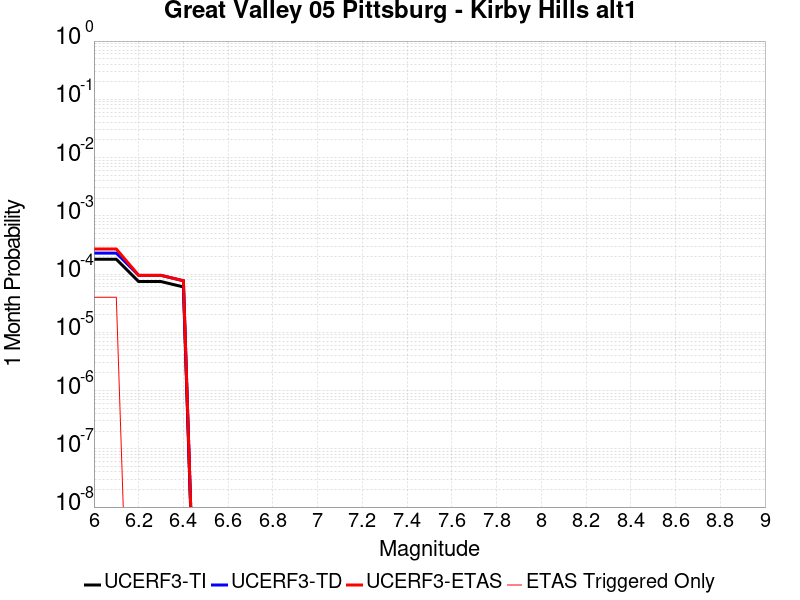 | 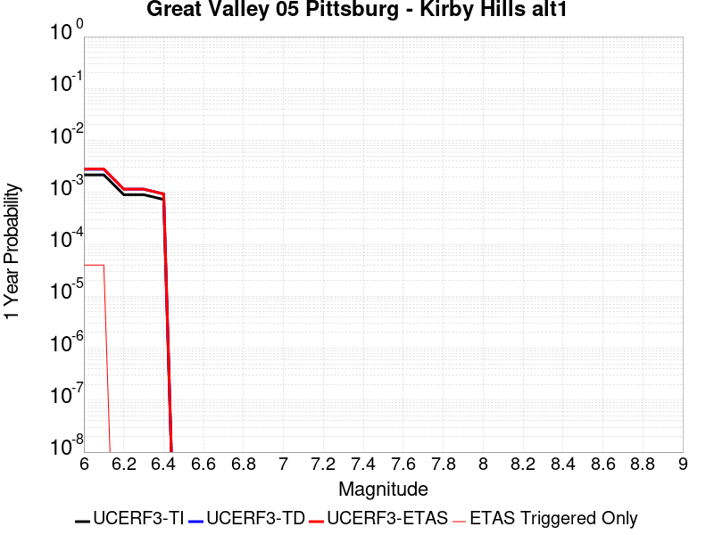 |

| Magnitude | 1 wk TI Prob | 1 wk TD Prob | 1 wk ETAS Prob | 1 wk ETAS/TD Gain | 1 wk ETAS Triggered Only | 1 mo TI Prob | 1 mo TD Prob | 1 mo ETAS Prob | 1 mo ETAS/TD Gain | 1 mo ETAS Triggered Only | 1 yr TI Prob | 1 yr TD Prob | 1 yr ETAS Prob | 1 yr ETAS/TD Gain | 1 yr ETAS Triggered Only |
|-----|-----|-----|-----|-----|-----|-----|-----|-----|-----|-----|-----|-----|-----|-----|-----|
| 6.0 | 4.187212E-5 | 5.3492065E-5 | 9.348993E-5 | 1.7477344 | 4.0E-5 | 1.794396E-4 | 2.2923728E-4 | 2.6922813E-4 | 1.1744517 | 4.0E-5 | 0.002182488 | 0.0027883553 | 0.002828244 | 1.0143054 | 4.0E-5 |
| 6.1 | 4.187212E-5 | 5.3492065E-5 | 9.348993E-5 | 1.7477344 | 4.0E-5 | 1.794396E-4 | 2.2923728E-4 | 2.6922813E-4 | 1.1744517 | 4.0E-5 | 0.002182488 | 0.0027883553 | 0.002828244 | 1.0143054 | 4.0E-5 |
| 6.2 | 1.7353306E-5 | 2.2174918E-5 | 2.2174918E-5 | 1.0 | 0.0 | 7.436919E-5 | 9.5034164E-5 | 9.5034164E-5 | 1.0 | 0.0 | 9.050688E-4 | 0.0011568196 | 0.0011568196 | 1.0 | 0.0 |
| 6.3 | 1.7353306E-5 | 2.2174918E-5 | 2.2174918E-5 | 1.0 | 0.0 | 7.436919E-5 | 9.5034164E-5 | 9.5034164E-5 | 1.0 | 0.0 | 9.050688E-4 | 0.0011568196 | 0.0011568196 | 1.0 | 0.0 |
| 6.4 | 1.4028824E-5 | 1.7917358E-5 | 1.7917358E-5 | 1.0 | 0.0 | 6.0122147E-5 | 7.678868E-5 | 7.678868E-5 | 1.0 | 0.0 | 7.3174125E-4 | 9.348871E-4 | 9.348871E-4 | 1.0 | 0.0 |

## West Tahoe
*[(top)](#table-of-contents)*

| 1 Week | 1 Month | 1 Year |
|-----|-----|-----|
| 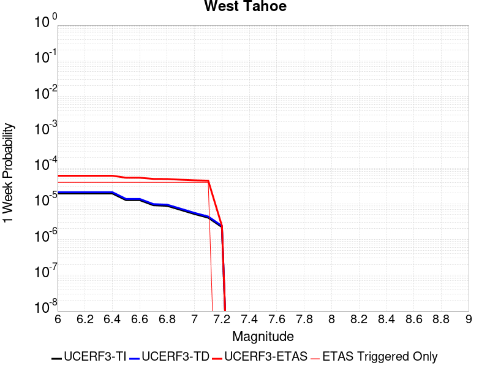 | 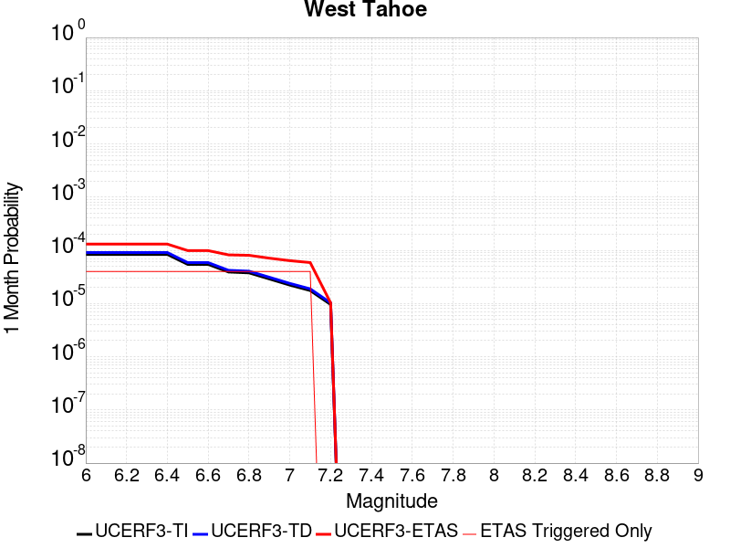 | 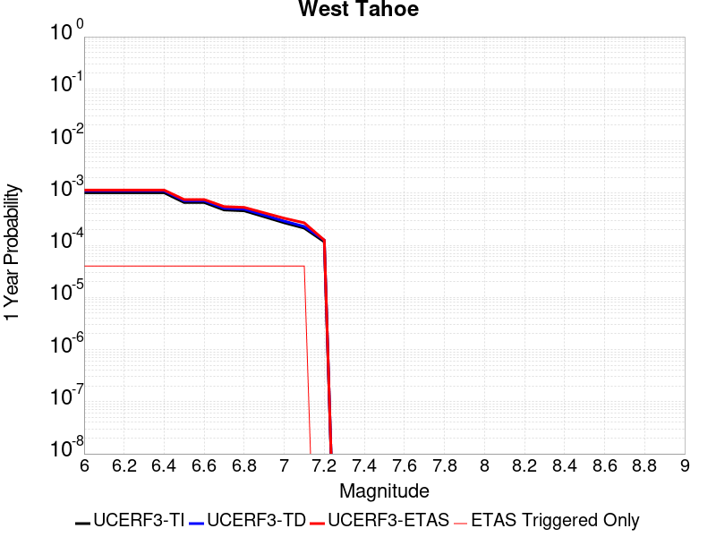 |

| Magnitude | 1 wk TI Prob | 1 wk TD Prob | 1 wk ETAS Prob | 1 wk ETAS/TD Gain | 1 wk ETAS Triggered Only | 1 mo TI Prob | 1 mo TD Prob | 1 mo ETAS Prob | 1 mo ETAS/TD Gain | 1 mo ETAS Triggered Only | 1 yr TI Prob | 1 yr TD Prob | 1 yr ETAS Prob | 1 yr ETAS/TD Gain | 1 yr ETAS Triggered Only |
|-----|-----|-----|-----|-----|-----|-----|-----|-----|-----|-----|-----|-----|-----|-----|-----|
| 6.0 | 1.952444E-5 | 2.1189282E-5 | 6.118843E-5 | 2.8877068 | 4.0E-5 | 8.367348E-5 | 9.080836E-5 | 1.3080472E-4 | 1.440448 | 4.0E-5 | 0.0010182485 | 0.0011050858 | 0.0011450415 | 1.0361563 | 4.0E-5 |
| 6.1 | 1.952444E-5 | 2.1189282E-5 | 6.118843E-5 | 2.8877068 | 4.0E-5 | 8.367348E-5 | 9.080836E-5 | 1.3080472E-4 | 1.440448 | 4.0E-5 | 0.0010182485 | 0.0011050858 | 0.0011450415 | 1.0361563 | 4.0E-5 |
| 6.2 | 1.952444E-5 | 2.1189282E-5 | 6.118843E-5 | 2.8877068 | 4.0E-5 | 8.367348E-5 | 9.080836E-5 | 1.3080472E-4 | 1.440448 | 4.0E-5 | 0.0010182485 | 0.0011050858 | 0.0011450415 | 1.0361563 | 4.0E-5 |
| 6.3 | 1.952444E-5 | 2.1189282E-5 | 6.118843E-5 | 2.8877068 | 4.0E-5 | 8.367348E-5 | 9.080836E-5 | 1.3080472E-4 | 1.440448 | 4.0E-5 | 0.0010182485 | 0.0011050858 | 0.0011450415 | 1.0361563 | 4.0E-5 |
| 6.4 | 1.952444E-5 | 2.1189282E-5 | 6.118843E-5 | 2.8877068 | 4.0E-5 | 8.367348E-5 | 9.080836E-5 | 1.3080472E-4 | 1.440448 | 4.0E-5 | 0.0010182485 | 0.0011050858 | 0.0011450415 | 1.0361563 | 4.0E-5 |
| 6.5 | 1.2685271E-5 | 1.369431E-5 | 5.3693762E-5 | 3.9208813 | 4.0E-5 | 5.4364315E-5 | 5.868867E-5 | 9.868632E-5 | 1.6815226 | 4.0E-5 | 6.616845E-4 | 7.143168E-4 | 7.542882E-4 | 1.0559576 | 4.0E-5 |
| 6.6 | 1.2685271E-5 | 1.369431E-5 | 5.3693762E-5 | 3.9208813 | 4.0E-5 | 5.4364315E-5 | 5.868867E-5 | 9.868632E-5 | 1.6815226 | 4.0E-5 | 6.616845E-4 | 7.143168E-4 | 7.542882E-4 | 1.0559576 | 4.0E-5 |
| 6.7 | 9.117886E-6 | 9.812372E-6 | 4.981198E-5 | 5.0764465 | 4.0E-5 | 3.9076072E-5 | 4.2052383E-5 | 8.2050705E-5 | 1.9511546 | 4.0E-5 | 4.756473E-4 | 5.118747E-4 | 5.518542E-4 | 1.0781041 | 4.0E-5 |
| 6.8 | 8.786828E-6 | 9.460313E-6 | 4.9459934E-5 | 5.22815 | 4.0E-5 | 3.7657293E-5 | 4.0543608E-5 | 8.0541984E-5 | 1.986552 | 4.0E-5 | 4.5838108E-4 | 4.9351365E-4 | 5.334939E-4 | 1.0810114 | 4.0E-5 |
| 6.9 | 6.7562123E-6 | 7.265659E-6 | 4.726537E-5 | 6.5053105 | 4.0E-5 | 2.8954875E-5 | 3.1138195E-5 | 7.113695E-5 | 2.284556 | 4.0E-5 | 3.5246857E-4 | 3.7904634E-4 | 4.1903116E-4 | 1.105488 | 4.0E-5 |
| 7.0 | 5.1792854E-6 | 5.5687524E-6 | 4.556853E-5 | 8.182898 | 4.0E-5 | 2.2196748E-5 | 2.3865885E-5 | 6.386493E-5 | 2.6759925 | 4.0E-5 | 2.702119E-4 | 2.9053222E-4 | 3.305206E-4 | 1.1376383 | 4.0E-5 |
| 7.1 | 4.090765E-6 | 4.39854E-6 | 4.4398363E-5 | 10.093886 | 4.0E-5 | 1.7531731E-5 | 1.885077E-5 | 5.8850015E-5 | 3.1218894 | 4.0E-5 | 2.134279E-4 | 2.2948734E-4 | 2.6947816E-4 | 1.1742616 | 4.0E-5 |
| 7.2 | 2.2356758E-6 | 2.4029755E-6 | 2.4029755E-6 | 1.0 | 0.0 | 9.581432E-6 | 1.0298436E-5 | 1.0298436E-5 | 1.0 | 0.0 | 1.1664769E-4 | 1.2537814E-4 | 1.2537814E-4 | 1.0 | 0.0 |

## San Cayetano
*[(top)](#table-of-contents)*

| 1 Week | 1 Month | 1 Year |
|-----|-----|-----|
|  | 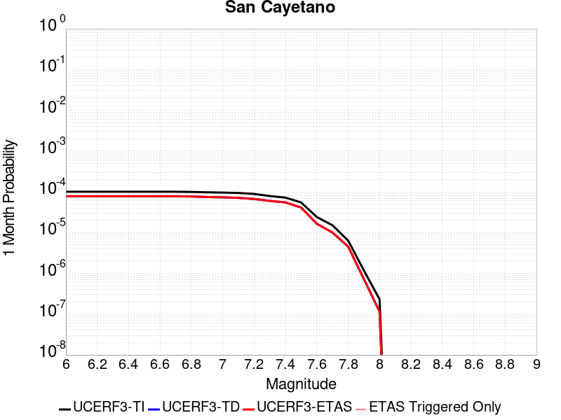 | 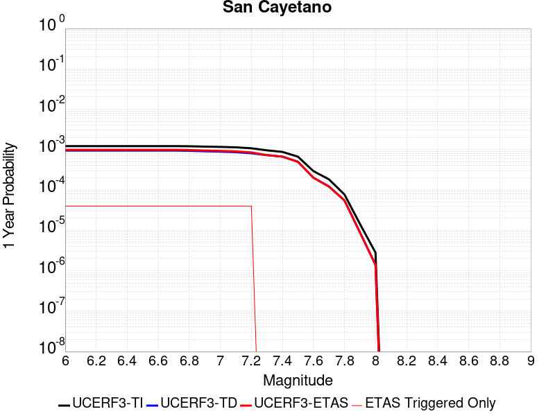 |

| Magnitude | 1 wk TI Prob | 1 wk TD Prob | 1 wk ETAS Prob | 1 wk ETAS/TD Gain | 1 wk ETAS Triggered Only | 1 mo TI Prob | 1 mo TD Prob | 1 mo ETAS Prob | 1 mo ETAS/TD Gain | 1 mo ETAS Triggered Only | 1 yr TI Prob | 1 yr TD Prob | 1 yr ETAS Prob | 1 yr ETAS/TD Gain | 1 yr ETAS Triggered Only |
|-----|-----|-----|-----|-----|-----|-----|-----|-----|-----|-----|-----|-----|-----|-----|-----|
| 6.0 | 2.3476267E-5 | 1.8191893E-5 | 1.8191893E-5 | 1.0 | 0.0 | 1.0060869E-4 | 7.796295E-5 | 7.796295E-5 | 1.0 | 0.0 | 0.0012242225 | 9.4878924E-4 | 9.887513E-4 | 1.042119 | 4.0E-5 |
| 6.1 | 2.3476267E-5 | 1.8191893E-5 | 1.8191893E-5 | 1.0 | 0.0 | 1.0060869E-4 | 7.796295E-5 | 7.796295E-5 | 1.0 | 0.0 | 0.0012242225 | 9.4878924E-4 | 9.887513E-4 | 1.042119 | 4.0E-5 |
| 6.2 | 2.3476267E-5 | 1.8191893E-5 | 1.8191893E-5 | 1.0 | 0.0 | 1.0060869E-4 | 7.796295E-5 | 7.796295E-5 | 1.0 | 0.0 | 0.0012242225 | 9.4878924E-4 | 9.887513E-4 | 1.042119 | 4.0E-5 |
| 6.3 | 2.3476267E-5 | 1.8191893E-5 | 1.8191893E-5 | 1.0 | 0.0 | 1.0060869E-4 | 7.796295E-5 | 7.796295E-5 | 1.0 | 0.0 | 0.0012242225 | 9.4878924E-4 | 9.887513E-4 | 1.042119 | 4.0E-5 |
| 6.4 | 2.3476267E-5 | 1.8191893E-5 | 1.8191893E-5 | 1.0 | 0.0 | 1.0060869E-4 | 7.796295E-5 | 7.796295E-5 | 1.0 | 0.0 | 0.0012242225 | 9.4878924E-4 | 9.887513E-4 | 1.042119 | 4.0E-5 |
| 6.5 | 2.3476267E-5 | 1.8191893E-5 | 1.8191893E-5 | 1.0 | 0.0 | 1.0060869E-4 | 7.796295E-5 | 7.796295E-5 | 1.0 | 0.0 | 0.0012242225 | 9.4878924E-4 | 9.887513E-4 | 1.042119 | 4.0E-5 |
| 6.6 | 2.3476267E-5 | 1.8191893E-5 | 1.8191893E-5 | 1.0 | 0.0 | 1.0060869E-4 | 7.796295E-5 | 7.796295E-5 | 1.0 | 0.0 | 0.0012242225 | 9.4878924E-4 | 9.887513E-4 | 1.042119 | 4.0E-5 |
| 6.7 | 2.3476267E-5 | 1.8191893E-5 | 1.8191893E-5 | 1.0 | 0.0 | 1.0060869E-4 | 7.796295E-5 | 7.796295E-5 | 1.0 | 0.0 | 0.0012242225 | 9.4878924E-4 | 9.887513E-4 | 1.042119 | 4.0E-5 |
| 6.8 | 2.3241924E-5 | 1.795945E-5 | 1.795945E-5 | 1.0 | 0.0 | 9.960445E-5 | 7.696682E-5 | 7.696682E-5 | 1.0 | 0.0 | 0.0012120095 | 9.366718E-4 | 9.766343E-4 | 1.0426644 | 4.0E-5 |
| 6.9 | 2.2761007E-5 | 1.7454628E-5 | 1.7454628E-5 | 1.0 | 0.0 | 9.7543525E-5 | 7.480342E-5 | 7.480342E-5 | 1.0 | 0.0 | 0.0011869454 | 9.1035455E-4 | 9.503181E-4 | 1.0438989 | 4.0E-5 |
| 7.0 | 2.240283E-5 | 1.7088216E-5 | 1.7088216E-5 | 1.0 | 0.0 | 9.600859E-5 | 7.323317E-5 | 7.323317E-5 | 1.0 | 0.0 | 0.0011682777 | 8.912526E-4 | 9.312169E-4 | 1.0448407 | 4.0E-5 |
| 7.1 | 2.1871154E-5 | 1.6605602E-5 | 1.6605602E-5 | 1.0 | 0.0 | 9.373015E-5 | 7.116494E-5 | 7.116494E-5 | 1.0 | 0.0 | 0.0011405671 | 8.6609216E-4 | 9.060575E-4 | 1.0461445 | 4.0E-5 |
| 7.2 | 2.0714133E-5 | 1.5581662E-5 | 1.5581662E-5 | 1.0 | 0.0 | 8.8771834E-5 | 6.6776855E-5 | 6.6776855E-5 | 1.0 | 0.0 | 0.0010802611 | 8.127082E-4 | 8.526757E-4 | 1.0491781 | 4.0E-5 |
| 7.3 | 1.8408395E-5 | 1.4011361E-5 | 1.4011361E-5 | 1.0 | 0.0 | 7.8890735E-5 | 6.004732E-5 | 6.004732E-5 | 1.0 | 0.0 | 9.600714E-4 | 7.308339E-4 | 7.308339E-4 | 1.0 | 0.0 |
| 7.4 | 1.6856795E-5 | 1.2863538E-5 | 1.2863538E-5 | 1.0 | 0.0 | 7.2241404E-5 | 5.51283E-5 | 5.51283E-5 | 1.0 | 0.0 | 8.7918417E-4 | 6.709832E-4 | 6.709832E-4 | 1.0 | 0.0 |
| 7.5 | 1.2822778E-5 | 9.588695E-6 | 9.588695E-6 | 1.0 | 0.0 | 5.495361E-5 | 4.109377E-5 | 4.109377E-5 | 1.0 | 0.0 | 6.688548E-4 | 5.002034E-4 | 5.002034E-4 | 1.0 | 0.0 |
| 7.6 | 5.6272684E-6 | 3.856865E-6 | 3.856865E-6 | 1.0 | 0.0 | 2.4116642E-5 | 1.6529317E-5 | 1.6529317E-5 | 1.0 | 0.0 | 2.9358055E-4 | 2.0122595E-4 | 2.0122595E-4 | 1.0 | 0.0 |
| 7.7 | 3.5261346E-6 | 2.3419418E-6 | 2.3419418E-6 | 1.0 | 0.0 | 1.5111918E-5 | 1.0036855E-5 | 1.0036855E-5 | 1.0 | 0.0 | 1.8397206E-4 | 1.2219194E-4 | 1.2219194E-4 | 1.0 | 0.0 |
| 7.8 | 1.4826929E-6 | 1.0569837E-6 | 1.0569837E-6 | 1.0 | 0.0 | 6.354383E-6 | 4.5299225E-6 | 4.5299225E-6 | 1.0 | 0.0 | 7.736187E-5 | 5.515043E-5 | 5.515043E-5 | 1.0 | 0.0 |
| 7.9 | 2.7568166E-7 | 1.6989308E-7 | 1.6989308E-7 | 1.0 | 0.0 | 1.1814923E-6 | 7.28113E-7 | 7.28113E-7 | 1.0 | 0.0 | 1.4384574E-5 | 8.86474E-6 | 8.86474E-6 | 1.0 | 0.0 |
| 8.0 | 5.407832E-8 | 2.6923225E-8 | 2.6923225E-8 | 1.0 | 0.0 | 2.3176422E-7 | 1.1538524E-7 | 1.1538524E-7 | 1.0 | 0.0 | 2.8217257E-6 | 1.4048145E-6 | 1.4048145E-6 | 1.0 | 0.0 |

## Malibu Coast (Extension) alt 1
*[(top)](#table-of-contents)*

| 1 Week | 1 Month | 1 Year |
|-----|-----|-----|
| 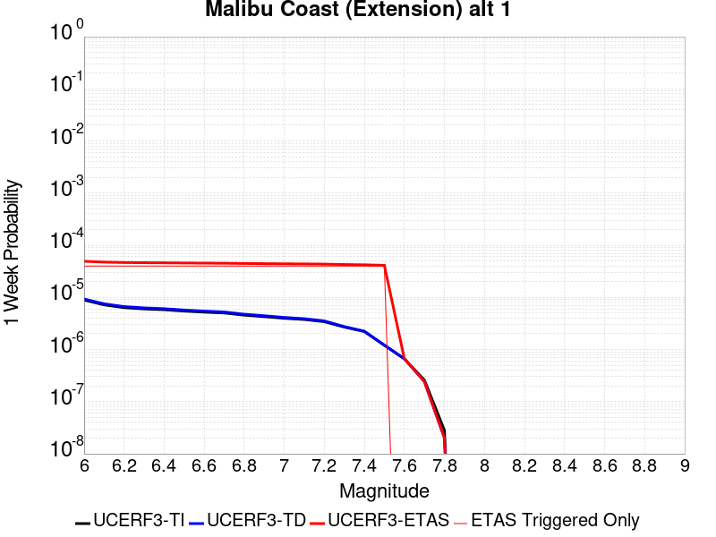 | 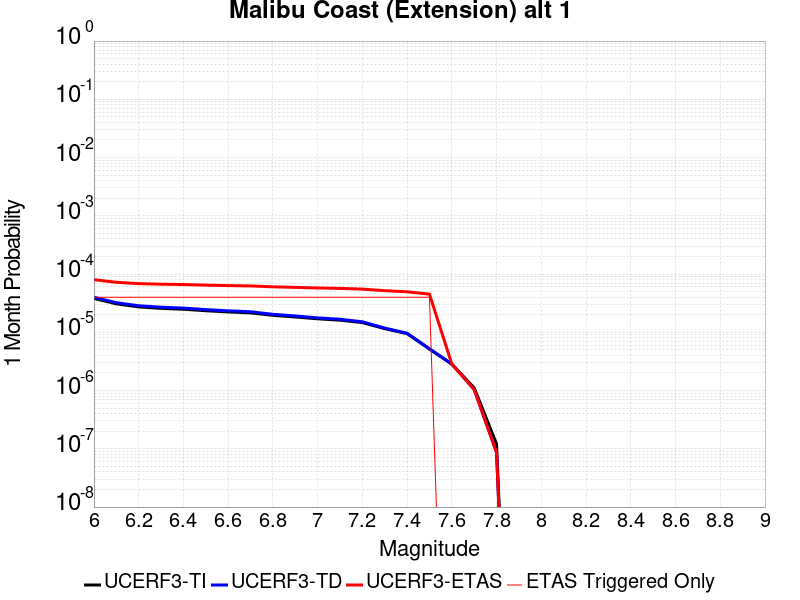 | 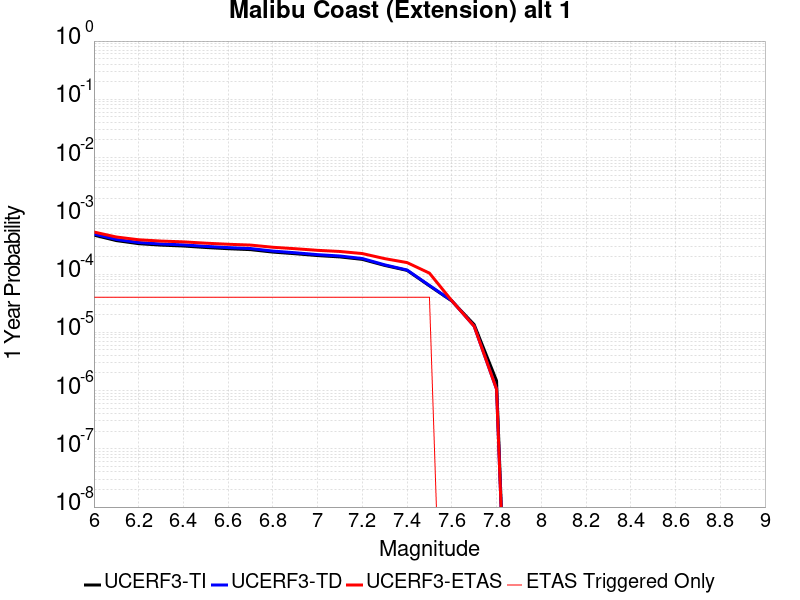 |

| Magnitude | 1 wk TI Prob | 1 wk TD Prob | 1 wk ETAS Prob | 1 wk ETAS/TD Gain | 1 wk ETAS Triggered Only | 1 mo TI Prob | 1 mo TD Prob | 1 mo ETAS Prob | 1 mo ETAS/TD Gain | 1 mo ETAS Triggered Only | 1 yr TI Prob | 1 yr TD Prob | 1 yr ETAS Prob | 1 yr ETAS/TD Gain | 1 yr ETAS Triggered Only |
|-----|-----|-----|-----|-----|-----|-----|-----|-----|-----|-----|-----|-----|-----|-----|-----|
| 6.0 | 8.930738E-6 | 9.331192E-6 | 4.9330818E-5 | 5.286658 | 4.0E-5 | 3.827403E-5 | 3.999022E-5 | 7.998862E-5 | 2.0002046 | 4.0E-5 | 4.6588664E-4 | 4.867739E-4 | 5.267544E-4 | 1.0821337 | 4.0E-5 |
| 6.1 | 7.199952E-6 | 7.5319726E-6 | 4.753167E-5 | 6.3106537 | 4.0E-5 | 3.0856572E-5 | 3.2279488E-5 | 7.22782E-5 | 2.2391372 | 4.0E-5 | 3.75614E-4 | 3.9293247E-4 | 4.3291677E-4 | 1.1017586 | 4.0E-5 |
| 6.2 | 6.3721413E-6 | 6.6683415E-6 | 4.6668076E-5 | 6.998453 | 4.0E-5 | 2.7308892E-5 | 2.8578295E-5 | 6.857715E-5 | 2.3996236 | 4.0E-5 | 3.3243504E-4 | 3.4788557E-4 | 3.8787164E-4 | 1.1149403 | 4.0E-5 |
| 6.3 | 6.016345E-6 | 6.296652E-6 | 4.62964E-5 | 7.3525424 | 4.0E-5 | 2.578408E-5 | 2.6985374E-5 | 6.698429E-5 | 2.4822445 | 4.0E-5 | 3.1387596E-4 | 3.2849773E-4 | 3.684846E-4 | 1.1217264 | 4.0E-5 |
| 6.4 | 5.8104883E-6 | 6.081004E-6 | 4.608076E-5 | 7.5778217 | 4.0E-5 | 2.4901856E-5 | 2.6061185E-5 | 6.606014E-5 | 2.5348096 | 4.0E-5 | 3.031379E-4 | 3.1724907E-4 | 3.5723636E-4 | 1.1260439 | 4.0E-5 |
| 6.5 | 5.476925E-6 | 5.728906E-6 | 4.5728677E-5 | 7.9820957 | 4.0E-5 | 2.3472323E-5 | 2.4552224E-5 | 6.455124E-5 | 2.6291401 | 4.0E-5 | 2.8573806E-4 | 2.9888263E-4 | 3.3887068E-4 | 1.1337918 | 4.0E-5 |
| 6.6 | 5.222387E-6 | 5.459921E-6 | 4.5459703E-5 | 8.326074 | 4.0E-5 | 2.2381464E-5 | 2.3399452E-5 | 6.339852E-5 | 2.7094016 | 4.0E-5 | 2.7246025E-4 | 2.8485138E-4 | 3.2484E-4 | 1.1403841 | 4.0E-5 |
| 6.7 | 5.0337076E-6 | 5.2604055E-6 | 4.5260196E-5 | 8.603936 | 4.0E-5 | 2.1572854E-5 | 2.2544402E-5 | 6.25435E-5 | 2.7742364 | 4.0E-5 | 2.6261783E-4 | 2.744438E-4 | 3.1443284E-4 | 1.1457093 | 4.0E-5 |
| 6.8 | 4.5675624E-6 | 4.759894E-6 | 4.4759705E-5 | 9.403508 | 4.0E-5 | 1.9575122E-5 | 2.0399388E-5 | 6.039857E-5 | 2.9608033 | 4.0E-5 | 2.3830103E-4 | 2.4833443E-4 | 2.883245E-4 | 1.1610332 | 4.0E-5 |
| 6.9 | 4.2802412E-6 | 4.453128E-6 | 4.445295E-5 | 9.9824095 | 4.0E-5 | 1.8343762E-5 | 1.9084697E-5 | 5.9083934E-5 | 3.0958803 | 4.0E-5 | 2.2331243E-4 | 2.3233156E-4 | 2.7232227E-4 | 1.1721277 | 4.0E-5 |
| 7.0 | 3.9794063E-6 | 4.13113E-6 | 4.4130964E-5 | 10.682541 | 4.0E-5 | 1.7054486E-5 | 1.7704724E-5 | 5.7704015E-5 | 3.2592442 | 4.0E-5 | 2.0761859E-4 | 2.1553382E-4 | 2.555252E-4 | 1.1855457 | 4.0E-5 |
| 7.1 | 3.7730424E-6 | 3.912203E-6 | 4.3912045E-5 | 11.224379 | 4.0E-5 | 1.6170083E-5 | 1.6766477E-5 | 5.6765806E-5 | 3.385673 | 4.0E-5 | 1.9685295E-4 | 2.0411285E-4 | 2.4410468E-4 | 1.19593 | 4.0E-5 |
| 7.2 | 3.424985E-6 | 3.5422438E-6 | 4.3542103E-5 | 12.292237 | 4.0E-5 | 1.4678424E-5 | 1.5180957E-5 | 5.518035E-5 | 3.63484 | 4.0E-5 | 1.7869516E-4 | 1.848126E-4 | 2.248052E-4 | 1.2163955 | 4.0E-5 |
| 7.3 | 2.6966375E-6 | 2.7603658E-6 | 4.2760254E-5 | 15.490793 | 4.0E-5 | 1.15569665E-5 | 1.1830085E-5 | 5.182961E-5 | 4.38117 | 4.0E-5 | 1.4069698E-4 | 1.440218E-4 | 1.8401604E-4 | 1.2776958 | 4.0E-5 |
| 7.4 | 2.215957E-6 | 2.2499773E-6 | 4.224989E-5 | 18.777916 | 4.0E-5 | 9.496924E-6 | 9.642725E-6 | 4.9642338E-5 | 5.148165 | 4.0E-5 | 1.1561892E-4 | 1.1739388E-4 | 1.573892E-4 | 1.3406932 | 4.0E-5 |
| 7.5 | 1.2040218E-6 | 1.2222066E-6 | 4.1222156E-5 | 33.727654 | 4.0E-5 | 5.160083E-6 | 5.238018E-6 | 4.5237808E-5 | 8.636436 | 4.0E-5 | 6.2822204E-5 | 6.377102E-5 | 1.0376847E-4 | 1.6272042 | 4.0E-5 |
| 7.6 | 6.6157446E-7 | 6.6804853E-7 | 6.6804853E-7 | 1.0 | 0.0 | 2.835316E-6 | 2.863062E-6 | 2.863062E-6 | 1.0 | 0.0 | 3.4519428E-5 | 3.4857236E-5 | 3.4857236E-5 | 1.0 | 0.0 |
| 7.7 | 2.6012302E-7 | 2.4362907E-7 | 2.4362907E-7 | 1.0 | 0.0 | 1.1148124E-6 | 1.0441241E-6 | 1.0441241E-6 | 1.0 | 0.0 | 1.3572758E-5 | 1.2712148E-5 | 1.2712148E-5 | 1.0 | 0.0 |
| 7.8 | 2.8323132E-8 | 2.0272084E-8 | 2.0272084E-8 | 1.0 | 0.0 | 1.2138484E-7 | 8.688036E-8 | 8.688036E-8 | 1.0 | 0.0 | 1.4778595E-6 | 1.0577679E-6 | 1.0577679E-6 | 1.0 | 0.0 |

## Blue Cut
*[(top)](#table-of-contents)*

| 1 Week | 1 Month | 1 Year |
|-----|-----|-----|
| 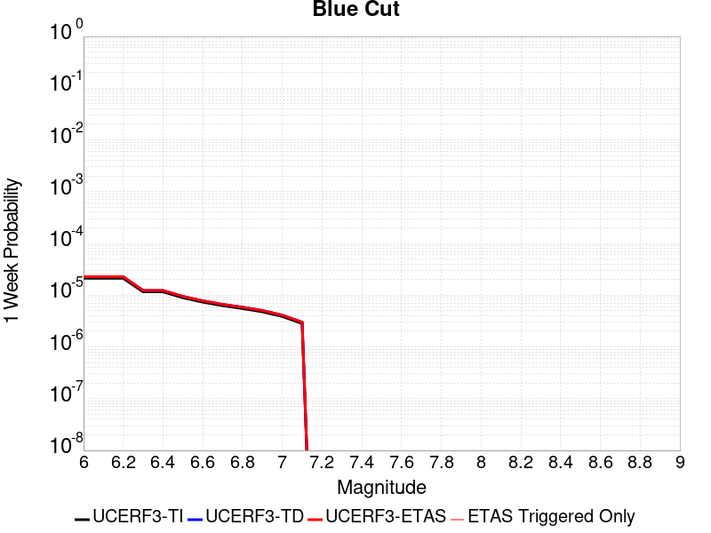 | 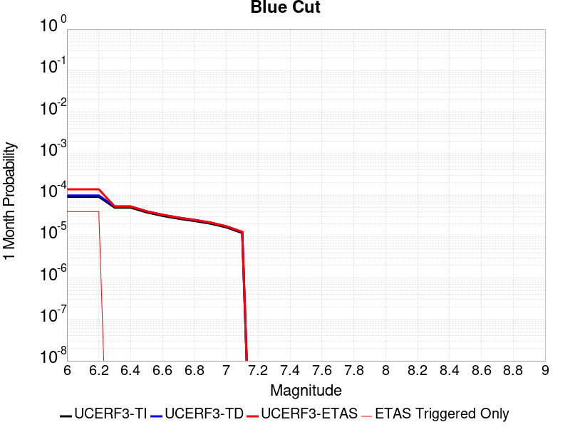 |  |

| Magnitude | 1 wk TI Prob | 1 wk TD Prob | 1 wk ETAS Prob | 1 wk ETAS/TD Gain | 1 wk ETAS Triggered Only | 1 mo TI Prob | 1 mo TD Prob | 1 mo ETAS Prob | 1 mo ETAS/TD Gain | 1 mo ETAS Triggered Only | 1 yr TI Prob | 1 yr TD Prob | 1 yr ETAS Prob | 1 yr ETAS/TD Gain | 1 yr ETAS Triggered Only |
|-----|-----|-----|-----|-----|-----|-----|-----|-----|-----|-----|-----|-----|-----|-----|-----|
| 6.0 | 2.1227985E-5 | 2.2724995E-5 | 2.2724995E-5 | 1.0 | 0.0 | 9.097391E-5 | 9.738952E-5 | 1.3738564E-4 | 1.4106818 | 4.0E-5 | 0.0011070445 | 0.0011851306 | 0.0012250833 | 1.0337116 | 4.0E-5 |
| 6.1 | 2.1227985E-5 | 2.2724995E-5 | 2.2724995E-5 | 1.0 | 0.0 | 9.097391E-5 | 9.738952E-5 | 1.3738564E-4 | 1.4106818 | 4.0E-5 | 0.0011070445 | 0.0011851306 | 0.0012250833 | 1.0337116 | 4.0E-5 |
| 6.2 | 2.1227985E-5 | 2.2724995E-5 | 2.2724995E-5 | 1.0 | 0.0 | 9.097391E-5 | 9.738952E-5 | 1.3738564E-4 | 1.4106818 | 4.0E-5 | 0.0011070445 | 0.0011851306 | 0.0012250833 | 1.0337116 | 4.0E-5 |
| 6.3 | 1.1613981E-5 | 1.23562095E-5 | 1.23562095E-5 | 1.0 | 0.0 | 4.9773254E-5 | 5.295418E-5 | 5.295418E-5 | 1.0 | 0.0 | 6.0582085E-4 | 6.445389E-4 | 6.445389E-4 | 1.0 | 0.0 |
| 6.4 | 1.1613981E-5 | 1.23562095E-5 | 1.23562095E-5 | 1.0 | 0.0 | 4.9773254E-5 | 5.295418E-5 | 5.295418E-5 | 1.0 | 0.0 | 6.0582085E-4 | 6.445389E-4 | 6.445389E-4 | 1.0 | 0.0 |
| 6.5 | 8.931326E-6 | 9.4835805E-6 | 9.4835805E-6 | 1.0 | 0.0 | 3.8276554E-5 | 4.0643336E-5 | 4.0643336E-5 | 1.0 | 0.0 | 4.6591737E-4 | 4.947294E-4 | 4.947294E-4 | 1.0 | 0.0 |
| 6.6 | 7.345353E-6 | 7.7918785E-6 | 7.7918785E-6 | 1.0 | 0.0 | 3.1479703E-5 | 3.3393382E-5 | 3.3393382E-5 | 1.0 | 0.0 | 3.83198E-4 | 4.064966E-4 | 4.064966E-4 | 1.0 | 0.0 |
| 6.7 | 6.2775666E-6 | 6.656506E-6 | 6.656506E-6 | 1.0 | 0.0 | 2.690358E-5 | 2.8527613E-5 | 2.8527613E-5 | 1.0 | 0.0 | 3.2750185E-4 | 3.4727587E-4 | 3.4727587E-4 | 1.0 | 0.0 |
| 6.8 | 5.5234095E-6 | 5.8563032E-6 | 5.8563032E-6 | 1.0 | 0.0 | 2.367154E-5 | 2.5098241E-5 | 2.5098241E-5 | 1.0 | 0.0 | 2.8816288E-4 | 3.0553553E-4 | 3.0553553E-4 | 1.0 | 0.0 |
| 6.9 | 4.7780054E-6 | 5.0664535E-6 | 5.0664535E-6 | 1.0 | 0.0 | 2.0477004E-5 | 2.1713231E-5 | 2.1713231E-5 | 1.0 | 0.0 | 2.4927902E-4 | 2.6433356E-4 | 2.6433356E-4 | 1.0 | 0.0 |
| 7.0 | 3.883171E-6 | 4.119333E-6 | 4.119333E-6 | 1.0 | 0.0 | 1.6642054E-5 | 1.7654203E-5 | 1.7654203E-5 | 1.0 | 0.0 | 2.0259817E-4 | 2.1492562E-4 | 2.1492562E-4 | 1.0 | 0.0 |
| 7.1 | 2.8358215E-6 | 3.0103415E-6 | 3.0103415E-6 | 1.0 | 0.0 | 1.2153464E-5 | 1.2901436E-5 | 1.2901436E-5 | 1.0 | 0.0 | 1.4795837E-4 | 1.5707024E-4 | 1.5707024E-4 | 1.0 | 0.0 |

## Butano 2011 CFM
*[(top)](#table-of-contents)*

| 1 Week | 1 Month | 1 Year |
|-----|-----|-----|
|  |  | 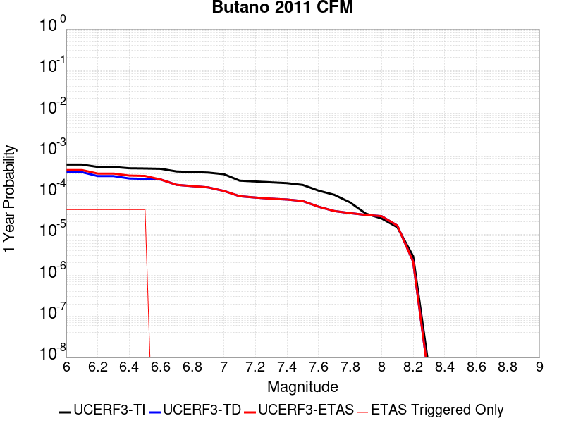 |

| Magnitude | 1 wk TI Prob | 1 wk TD Prob | 1 wk ETAS Prob | 1 wk ETAS/TD Gain | 1 wk ETAS Triggered Only | 1 mo TI Prob | 1 mo TD Prob | 1 mo ETAS Prob | 1 mo ETAS/TD Gain | 1 mo ETAS Triggered Only | 1 yr TI Prob | 1 yr TD Prob | 1 yr ETAS Prob | 1 yr ETAS/TD Gain | 1 yr ETAS Triggered Only |
|-----|-----|-----|-----|-----|-----|-----|-----|-----|-----|-----|-----|-----|-----|-----|-----|
| 6.0 | 9.561135E-6 | 6.2491204E-6 | 6.2491204E-6 | 1.0 | 0.0 | 4.097565E-5 | 2.6781681E-5 | 2.6781681E-5 | 1.0 | 0.0 | 4.9876433E-4 | 3.2602038E-4 | 3.6600733E-4 | 1.1226517 | 4.0E-5 |
| 6.1 | 9.561135E-6 | 6.2491204E-6 | 6.2491204E-6 | 1.0 | 0.0 | 4.097565E-5 | 2.6781681E-5 | 2.6781681E-5 | 1.0 | 0.0 | 4.9876433E-4 | 3.2602038E-4 | 3.6600733E-4 | 1.1226517 | 4.0E-5 |
| 6.2 | 8.364741E-6 | 5.002027E-6 | 5.002027E-6 | 1.0 | 0.0 | 3.5848396E-5 | 2.143709E-5 | 2.143709E-5 | 1.0 | 0.0 | 4.3636683E-4 | 2.609669E-4 | 3.0095645E-4 | 1.1532362 | 4.0E-5 |
| 6.3 | 8.364741E-6 | 5.002027E-6 | 5.002027E-6 | 1.0 | 0.0 | 3.5848396E-5 | 2.143709E-5 | 2.143709E-5 | 1.0 | 0.0 | 4.3636683E-4 | 2.609669E-4 | 3.0095645E-4 | 1.1532362 | 4.0E-5 |
| 6.4 | 7.768282E-6 | 4.379884E-6 | 4.379884E-6 | 1.0 | 0.0 | 3.329221E-5 | 1.8770805E-5 | 1.8770805E-5 | 1.0 | 0.0 | 4.0525728E-4 | 2.2851194E-4 | 2.685028E-4 | 1.1750056 | 4.0E-5 |
| 6.5 | 7.673437E-6 | 4.2794272E-6 | 4.2794272E-6 | 1.0 | 0.0 | 3.2885746E-5 | 1.834028E-5 | 1.834028E-5 | 1.0 | 0.0 | 4.0031038E-4 | 2.2327139E-4 | 2.6326245E-4 | 1.1791142 | 4.0E-5 |
| 6.6 | 7.5244197E-6 | 4.1243584E-6 | 4.1243584E-6 | 1.0 | 0.0 | 3.2247113E-5 | 1.767571E-5 | 1.767571E-5 | 1.0 | 0.0 | 3.9253788E-4 | 2.1518185E-4 | 2.1518185E-4 | 1.0 | 0.0 |
| 6.7 | 6.4921405E-6 | 3.064174E-6 | 3.064174E-6 | 1.0 | 0.0 | 2.7823162E-5 | 1.3132108E-5 | 1.3132108E-5 | 1.0 | 0.0 | 3.3869434E-4 | 1.5987176E-4 | 1.5987176E-4 | 1.0 | 0.0 |
| 6.8 | 6.2890294E-6 | 2.850884E-6 | 2.850884E-6 | 1.0 | 0.0 | 2.6952705E-5 | 1.2218016E-5 | 1.2218016E-5 | 1.0 | 0.0 | 3.2809976E-4 | 1.4874428E-4 | 1.4874428E-4 | 1.0 | 0.0 |
| 6.9 | 6.0965517E-6 | 2.657334E-6 | 2.657334E-6 | 1.0 | 0.0 | 2.6127816E-5 | 1.1388525E-5 | 1.1388525E-5 | 1.0 | 0.0 | 3.1805973E-4 | 1.3864654E-4 | 1.3864654E-4 | 1.0 | 0.0 |
| 7.0 | 5.566252E-6 | 2.1744972E-6 | 2.1744972E-6 | 1.0 | 0.0 | 2.3855147E-5 | 9.319241E-6 | 9.319241E-6 | 1.0 | 0.0 | 2.9039773E-4 | 1.1345589E-4 | 1.1345589E-4 | 1.0 | 0.0 |
| 7.1 | 3.878588E-6 | 1.622304E-6 | 1.622304E-6 | 1.0 | 0.0 | 1.6622414E-5 | 6.9527127E-6 | 6.9527127E-6 | 1.0 | 0.0 | 2.023591E-4 | 8.4645995E-5 | 8.4645995E-5 | 1.0 | 0.0 |
| 7.2 | 3.7038085E-6 | 1.503103E-6 | 1.503103E-6 | 1.0 | 0.0 | 1.587337E-5 | 6.4418537E-6 | 6.4418537E-6 | 1.0 | 0.0 | 1.9324113E-4 | 7.842675E-5 | 7.842675E-5 | 1.0 | 0.0 |
| 7.3 | 3.5277278E-6 | 1.4109602E-6 | 1.4109602E-6 | 1.0 | 0.0 | 1.5118746E-5 | 6.0469583E-6 | 6.0469583E-6 | 1.0 | 0.0 | 1.8405518E-4 | 7.361923E-5 | 7.361923E-5 | 1.0 | 0.0 |
| 7.4 | 3.3711294E-6 | 1.3478906E-6 | 1.3478906E-6 | 1.0 | 0.0 | 1.4447617E-5 | 5.776661E-6 | 5.776661E-6 | 1.0 | 0.0 | 1.7588554E-4 | 7.0328584E-5 | 7.0328584E-5 | 1.0 | 0.0 |
| 7.5 | 3.0496426E-6 | 1.2360495E-6 | 1.2360495E-6 | 1.0 | 0.0 | 1.3069831E-5 | 5.2973437E-6 | 5.2973437E-6 | 1.0 | 0.0 | 1.5911358E-4 | 6.449325E-5 | 6.449325E-5 | 1.0 | 0.0 |
| 7.6 | 2.2179781E-6 | 9.018709E-7 | 9.018709E-7 | 1.0 | 0.0 | 9.505586E-6 | 3.865155E-6 | 3.865155E-6 | 1.0 | 0.0 | 1.1572436E-4 | 4.705725E-5 | 4.705725E-5 | 1.0 | 0.0 |
| 7.7 | 1.7519328E-6 | 7.0631194E-7 | 7.0631194E-7 | 1.0 | 0.0 | 7.508262E-6 | 3.0270476E-6 | 3.0270476E-6 | 1.0 | 0.0 | 9.140925E-5 | 3.6853682E-5 | 3.6853682E-5 | 1.0 | 0.0 |
| 7.8 | 1.1478974E-6 | 6.2948965E-7 | 6.2948965E-7 | 1.0 | 0.0 | 4.9195505E-6 | 2.69781E-6 | 2.69781E-6 | 1.0 | 0.0 | 5.9893882E-5 | 3.2845343E-5 | 3.2845343E-5 | 1.0 | 0.0 |
| 7.9 | 6.1154634E-7 | 5.6872983E-7 | 5.6872983E-7 | 1.0 | 0.0 | 2.6209104E-6 | 2.4374115E-6 | 2.4374115E-6 | 1.0 | 0.0 | 3.1909116E-5 | 2.9675079E-5 | 2.9675079E-5 | 1.0 | 0.0 |
| 8.0 | 4.6520046E-7 | 5.2855574E-7 | 5.2855574E-7 | 1.0 | 0.0 | 1.9937147E-6 | 2.2652368E-6 | 2.2652368E-6 | 1.0 | 0.0 | 2.4273206E-5 | 2.757891E-5 | 2.757891E-5 | 1.0 | 0.0 |
| 8.1 | 2.8425194E-7 | 3.1117247E-7 | 3.1117247E-7 | 1.0 | 0.0 | 1.218222E-6 | 1.3335956E-6 | 1.3335956E-6 | 1.0 | 0.0 | 1.4831752E-5 | 1.6236405E-5 | 1.6236405E-5 | 1.0 | 0.0 |
| 8.2 | 5.585778E-8 | 4.1445816E-8 | 4.1445816E-8 | 1.0 | 0.0 | 2.3939046E-7 | 1.7762493E-7 | 1.7762493E-7 | 1.0 | 0.0 | 2.914575E-6 | 2.1625813E-6 | 2.1625813E-6 | 1.0 | 0.0 |
| 8.3 | 1.0371215E-10 | 5.4957816E-11 | 5.4957816E-11 | 1.0 | 0.0 | 4.4448079E-10 | 2.3553404E-10 | 2.3553404E-10 | 1.0 | 0.0 | 5.4115543E-9 | 2.867626E-9 | 2.867626E-9 | 1.0 | 0.0 |

## Red Pass
*[(top)](#table-of-contents)*

| 1 Week | 1 Month | 1 Year |
|-----|-----|-----|
| 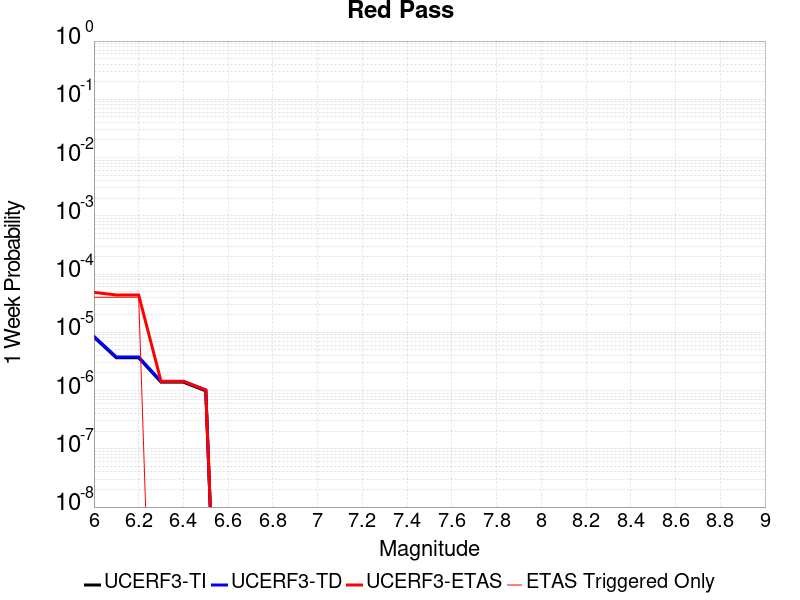 | 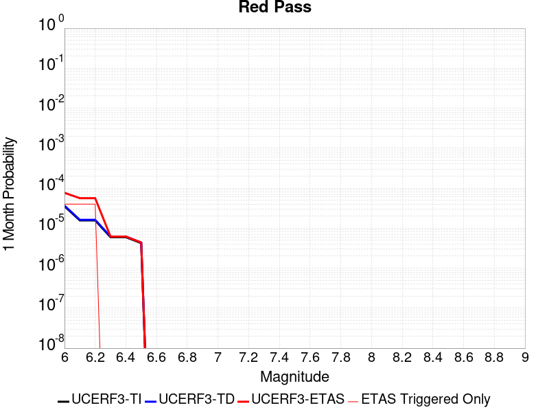 | 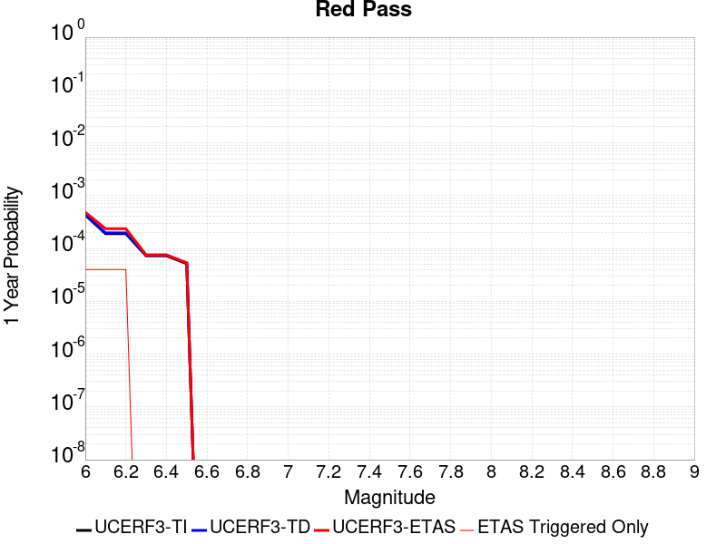 |

| Magnitude | 1 wk TI Prob | 1 wk TD Prob | 1 wk ETAS Prob | 1 wk ETAS/TD Gain | 1 wk ETAS Triggered Only | 1 mo TI Prob | 1 mo TD Prob | 1 mo ETAS Prob | 1 mo ETAS/TD Gain | 1 mo ETAS Triggered Only | 1 yr TI Prob | 1 yr TD Prob | 1 yr ETAS Prob | 1 yr ETAS/TD Gain | 1 yr ETAS Triggered Only |
|-----|-----|-----|-----|-----|-----|-----|-----|-----|-----|-----|-----|-----|-----|-----|-----|
| 6.0 | 8.258278E-6 | 8.552293E-6 | 4.8551952E-5 | 5.677068 | 4.0E-5 | 3.539214E-5 | 3.665227E-5 | 7.66508E-5 | 2.0912976 | 4.0E-5 | 4.308141E-4 | 4.461679E-4 | 4.8615006E-4 | 1.0896124 | 4.0E-5 |
| 6.1 | 3.649988E-6 | 3.7757554E-6 | 4.3775606E-5 | 11.593866 | 4.0E-5 | 1.5642712E-5 | 1.6181735E-5 | 5.618109E-5 | 3.4718828 | 4.0E-5 | 1.9043336E-4 | 1.9699958E-4 | 2.369917E-4 | 1.2030061 | 4.0E-5 |
| 6.2 | 3.649988E-6 | 3.7757554E-6 | 4.3775606E-5 | 11.593866 | 4.0E-5 | 1.5642712E-5 | 1.6181735E-5 | 5.618109E-5 | 3.4718828 | 4.0E-5 | 1.9043336E-4 | 1.9699958E-4 | 2.369917E-4 | 1.2030061 | 4.0E-5 |
| 6.3 | 1.3924937E-6 | 1.4412872E-6 | 1.4412872E-6 | 1.0 | 0.0 | 5.9678164E-6 | 6.1769383E-6 | 6.1769383E-6 | 1.0 | 0.0 | 7.265574E-5 | 7.520305E-5 | 7.520305E-5 | 1.0 | 0.0 |
| 6.4 | 1.3924937E-6 | 1.4412872E-6 | 1.4412872E-6 | 1.0 | 0.0 | 5.9678164E-6 | 6.1769383E-6 | 6.1769383E-6 | 1.0 | 0.0 | 7.265574E-5 | 7.520305E-5 | 7.520305E-5 | 1.0 | 0.0 |
| 6.5 | 9.876812E-7 | 1.0223123E-6 | 1.0223123E-6 | 1.0 | 0.0 | 4.2329125E-6 | 4.3813384E-6 | 4.3813384E-6 | 1.0 | 0.0 | 5.153449E-5 | 5.3342792E-5 | 5.3342792E-5 | 1.0 | 0.0 |

## Owl Lake
*[(top)](#table-of-contents)*

| 1 Week | 1 Month | 1 Year |
|-----|-----|-----|
| 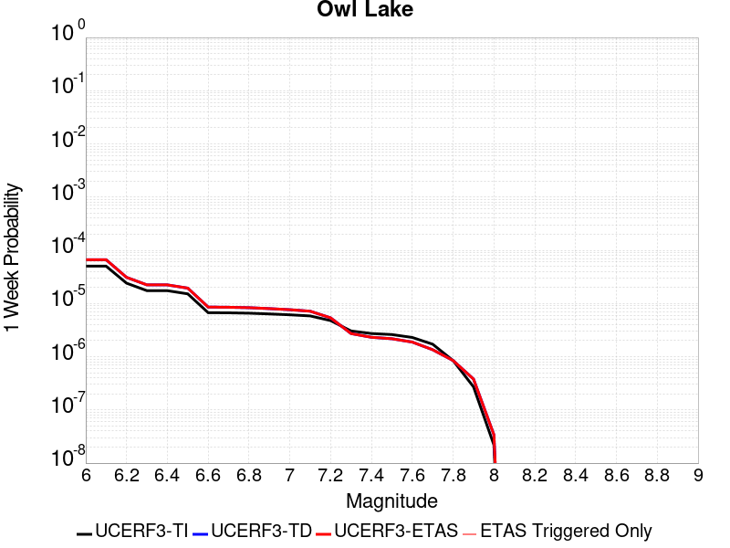 | 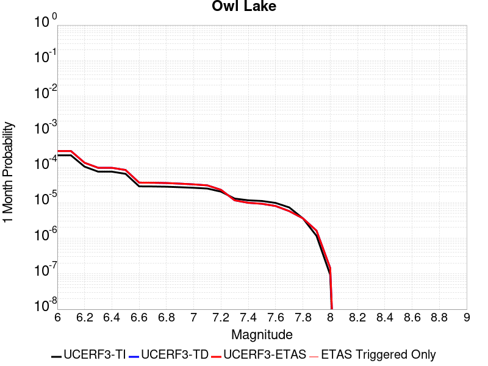 | 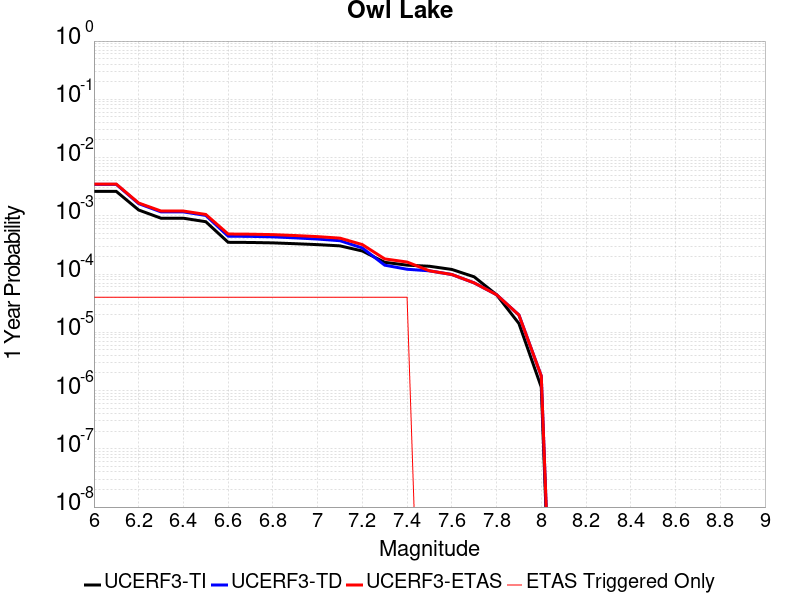 |

| Magnitude | 1 wk TI Prob | 1 wk TD Prob | 1 wk ETAS Prob | 1 wk ETAS/TD Gain | 1 wk ETAS Triggered Only | 1 mo TI Prob | 1 mo TD Prob | 1 mo ETAS Prob | 1 mo ETAS/TD Gain | 1 mo ETAS Triggered Only | 1 yr TI Prob | 1 yr TD Prob | 1 yr ETAS Prob | 1 yr ETAS/TD Gain | 1 yr ETAS Triggered Only |
|-----|-----|-----|-----|-----|-----|-----|-----|-----|-----|-----|-----|-----|-----|-----|-----|
| 6.0 | 5.0320643E-5 | 6.64403E-5 | 6.64403E-5 | 1.0 | 0.0 | 2.1564208E-4 | 2.847135E-4 | 2.847135E-4 | 1.0 | 0.0 | 0.0026222812 | 0.0034617756 | 0.0035016371 | 1.0115148 | 4.0E-5 |
| 6.1 | 5.0320643E-5 | 6.64403E-5 | 6.64403E-5 | 1.0 | 0.0 | 2.1564208E-4 | 2.847135E-4 | 2.847135E-4 | 1.0 | 0.0 | 0.0026222812 | 0.0034617756 | 0.0035016371 | 1.0115148 | 4.0E-5 |
| 6.2 | 2.4125871E-5 | 3.1022744E-5 | 3.1022744E-5 | 1.0 | 0.0 | 1.0339249E-4 | 1.3294873E-4 | 1.3294873E-4 | 1.0 | 0.0 | 0.0012580766 | 0.0016176249 | 0.0016575601 | 1.0246876 | 4.0E-5 |
| 6.3 | 1.7433485E-5 | 2.238944E-5 | 2.238944E-5 | 1.0 | 0.0 | 7.471279E-5 | 9.595211E-5 | 9.595211E-5 | 1.0 | 0.0 | 9.0924866E-4 | 0.0011677343 | 0.0012076875 | 1.0342144 | 4.0E-5 |
| 6.4 | 1.7433485E-5 | 2.238944E-5 | 2.238944E-5 | 1.0 | 0.0 | 7.471279E-5 | 9.595211E-5 | 9.595211E-5 | 1.0 | 0.0 | 9.0924866E-4 | 0.0011677343 | 0.0012076875 | 1.0342144 | 4.0E-5 |
| 6.5 | 1.5182742E-5 | 1.946037E-5 | 1.946037E-5 | 1.0 | 0.0 | 6.506727E-5 | 8.339978E-5 | 8.339978E-5 | 1.0 | 0.0 | 7.919061E-4 | 0.0010150598 | 0.0010550191 | 1.0393666 | 4.0E-5 |
| 6.6 | 6.7271576E-6 | 8.568449E-6 | 8.568449E-6 | 1.0 | 0.0 | 2.8830356E-5 | 3.6721438E-5 | 3.6721438E-5 | 1.0 | 0.0 | 3.5095305E-4 | 4.4699747E-4 | 4.8697958E-4 | 1.089446 | 4.0E-5 |
| 6.7 | 6.682835E-6 | 8.500858E-6 | 8.500858E-6 | 1.0 | 0.0 | 2.8640408E-5 | 3.643177E-5 | 3.643177E-5 | 1.0 | 0.0 | 3.4864116E-4 | 4.434722E-4 | 4.8345447E-4 | 1.0901573 | 4.0E-5 |
| 6.8 | 6.5774975E-6 | 8.347227E-6 | 8.347227E-6 | 1.0 | 0.0 | 2.8188972E-5 | 3.577337E-5 | 3.577337E-5 | 1.0 | 0.0 | 3.4314668E-4 | 4.354594E-4 | 4.7544198E-4 | 1.091817 | 4.0E-5 |
| 6.9 | 6.363419E-6 | 8.02014E-6 | 8.02014E-6 | 1.0 | 0.0 | 2.727151E-5 | 3.4371606E-5 | 3.4371606E-5 | 1.0 | 0.0 | 3.3198006E-4 | 4.1839955E-4 | 4.5838283E-4 | 1.0955623 | 4.0E-5 |
| 7.0 | 6.1342453E-6 | 7.652003E-6 | 7.652003E-6 | 1.0 | 0.0 | 2.6289357E-5 | 3.2793916E-5 | 3.2793916E-5 | 1.0 | 0.0 | 3.2002592E-4 | 3.991983E-4 | 4.3918233E-4 | 1.1001608 | 4.0E-5 |
| 7.1 | 5.842926E-6 | 7.1620548E-6 | 7.1620548E-6 | 1.0 | 0.0 | 2.504087E-5 | 3.069419E-5 | 3.069419E-5 | 1.0 | 0.0 | 3.0482994E-4 | 3.7364312E-4 | 4.1362818E-4 | 1.1070141 | 4.0E-5 |
| 7.2 | 4.77173E-6 | 5.376442E-6 | 5.376442E-6 | 1.0 | 0.0 | 2.045011E-5 | 2.3041714E-5 | 2.3041714E-5 | 1.0 | 0.0 | 2.4895166E-4 | 2.805008E-4 | 3.2048958E-4 | 1.142562 | 4.0E-5 |
| 7.3 | 3.0494948E-6 | 2.7237572E-6 | 2.7237572E-6 | 1.0 | 0.0 | 1.3069198E-5 | 1.16731935E-5 | 1.16731935E-5 | 1.0 | 0.0 | 1.5910587E-4 | 1.4211203E-4 | 1.8210635E-4 | 1.2814281 | 4.0E-5 |
| 7.4 | 2.7263884E-6 | 2.317959E-6 | 2.317959E-6 | 1.0 | 0.0 | 1.1684469E-5 | 9.934072E-6 | 9.934072E-6 | 1.0 | 0.0 | 1.4224913E-4 | 1.2094073E-4 | 1.6093589E-4 | 1.3307005 | 4.0E-5 |
| 7.5 | 2.6090431E-6 | 2.1776593E-6 | 2.1776593E-6 | 1.0 | 0.0 | 1.1181565E-5 | 9.3327935E-6 | 9.3327935E-6 | 1.0 | 0.0 | 1.3612706E-4 | 1.1362093E-4 | 1.1362093E-4 | 1.0 | 0.0 |
| 7.6 | 2.3008756E-6 | 1.8842499E-6 | 1.8842499E-6 | 1.0 | 0.0 | 9.860858E-6 | 8.075332E-6 | 8.075332E-6 | 1.0 | 0.0 | 1.20049335E-4 | 9.831281E-5 | 9.831281E-5 | 1.0 | 0.0 |
| 7.7 | 1.7184348E-6 | 1.3525299E-6 | 1.3525299E-6 | 1.0 | 0.0 | 7.3646997E-6 | 5.796544E-6 | 5.796544E-6 | 1.0 | 0.0 | 8.966153E-5 | 7.0570684E-5 | 7.0570684E-5 | 1.0 | 0.0 |
| 7.8 | 8.4612907E-7 | 8.4826485E-7 | 8.4826485E-7 | 1.0 | 0.0 | 3.6262625E-6 | 3.6354159E-6 | 3.6354159E-6 | 1.0 | 0.0 | 4.4148852E-5 | 4.4260312E-5 | 4.4260312E-5 | 1.0 | 0.0 |
| 7.9 | 2.716738E-7 | 3.8033835E-7 | 3.8033835E-7 | 1.0 | 0.0 | 1.1643157E-6 | 1.6300206E-6 | 1.6300206E-6 | 1.0 | 0.0 | 1.4175452E-5 | 1.984533E-5 | 1.984533E-5 | 1.0 | 0.0 |
| 8.0 | 2.1995428E-8 | 3.4170547E-8 | 3.4170547E-8 | 1.0 | 0.0 | 9.426611E-8 | 1.464452E-7 | 1.464452E-7 | 1.0 | 0.0 | 1.1476893E-6 | 1.7829695E-6 | 1.7829695E-6 | 1.0 | 0.0 |

## Mission Creek
*[(top)](#table-of-contents)*

| 1 Week | 1 Month | 1 Year |
|-----|-----|-----|
| 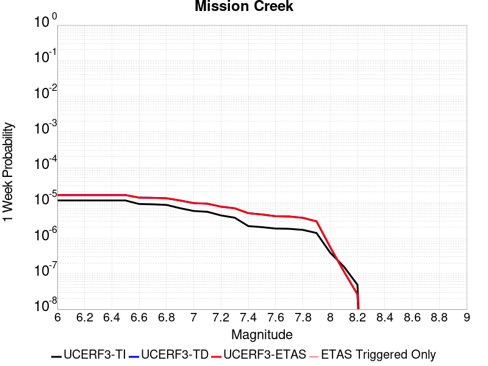 |  | 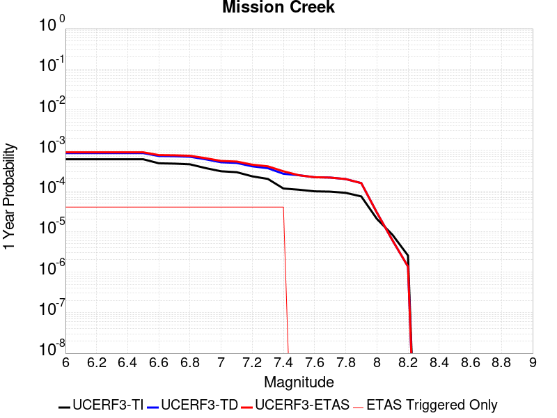 |

| Magnitude | 1 wk TI Prob | 1 wk TD Prob | 1 wk ETAS Prob | 1 wk ETAS/TD Gain | 1 wk ETAS Triggered Only | 1 mo TI Prob | 1 mo TD Prob | 1 mo ETAS Prob | 1 mo ETAS/TD Gain | 1 mo ETAS Triggered Only | 1 yr TI Prob | 1 yr TD Prob | 1 yr ETAS Prob | 1 yr ETAS/TD Gain | 1 yr ETAS Triggered Only |
|-----|-----|-----|-----|-----|-----|-----|-----|-----|-----|-----|-----|-----|-----|-----|-----|
| 6.0 | 1.1549387E-5 | 1.6382799E-5 | 1.6382799E-5 | 1.0 | 0.0 | 4.9496433E-5 | 7.02102E-5 | 1.1020739E-4 | 1.5696778 | 4.0E-5 | 6.0245243E-4 | 8.544889E-4 | 8.944547E-4 | 1.0467716 | 4.0E-5 |
| 6.1 | 1.1549387E-5 | 1.6382799E-5 | 1.6382799E-5 | 1.0 | 0.0 | 4.9496433E-5 | 7.02102E-5 | 1.1020739E-4 | 1.5696778 | 4.0E-5 | 6.0245243E-4 | 8.544889E-4 | 8.944547E-4 | 1.0467716 | 4.0E-5 |
| 6.2 | 1.1549387E-5 | 1.6382799E-5 | 1.6382799E-5 | 1.0 | 0.0 | 4.9496433E-5 | 7.02102E-5 | 1.1020739E-4 | 1.5696778 | 4.0E-5 | 6.0245243E-4 | 8.544889E-4 | 8.944547E-4 | 1.0467716 | 4.0E-5 |
| 6.3 | 1.1549387E-5 | 1.6382799E-5 | 1.6382799E-5 | 1.0 | 0.0 | 4.9496433E-5 | 7.02102E-5 | 1.1020739E-4 | 1.5696778 | 4.0E-5 | 6.0245243E-4 | 8.544889E-4 | 8.944547E-4 | 1.0467716 | 4.0E-5 |
| 6.4 | 1.1549387E-5 | 1.6382799E-5 | 1.6382799E-5 | 1.0 | 0.0 | 4.9496433E-5 | 7.02102E-5 | 1.1020739E-4 | 1.5696778 | 4.0E-5 | 6.0245243E-4 | 8.544889E-4 | 8.944547E-4 | 1.0467716 | 4.0E-5 |
| 6.5 | 1.1549387E-5 | 1.6382799E-5 | 1.6382799E-5 | 1.0 | 0.0 | 4.9496433E-5 | 7.02102E-5 | 1.1020739E-4 | 1.5696778 | 4.0E-5 | 6.0245243E-4 | 8.544889E-4 | 8.944547E-4 | 1.0467716 | 4.0E-5 |
| 6.6 | 9.202681E-6 | 1.3905611E-5 | 1.3905611E-5 | 1.0 | 0.0 | 3.9439463E-5 | 5.9594167E-5 | 9.959178E-5 | 1.6711667 | 4.0E-5 | 4.800697E-4 | 7.253265E-4 | 7.652975E-4 | 1.0551076 | 4.0E-5 |
| 6.7 | 9.019164E-6 | 1.3711242E-5 | 1.3711242E-5 | 1.0 | 0.0 | 3.8652986E-5 | 5.8761194E-5 | 9.875884E-5 | 1.6806813 | 4.0E-5 | 4.7049852E-4 | 7.151917E-4 | 7.551631E-4 | 1.055889 | 4.0E-5 |
| 6.8 | 8.673558E-6 | 1.3333226E-5 | 1.3333226E-5 | 1.0 | 0.0 | 3.717186E-5 | 5.7141195E-5 | 9.713891E-5 | 1.6999804 | 4.0E-5 | 4.524734E-4 | 6.9548085E-4 | 7.3545304E-4 | 1.0574741 | 4.0E-5 |
| 6.9 | 7.002255E-6 | 1.1536997E-5 | 1.1536997E-5 | 1.0 | 0.0 | 3.000932E-5 | 4.9443373E-5 | 8.94414E-5 | 1.8089663 | 4.0E-5 | 3.653022E-4 | 6.0181366E-4 | 6.417896E-4 | 1.0664258 | 4.0E-5 |
| 7.0 | 5.84644E-6 | 9.7312795E-6 | 9.7312795E-6 | 1.0 | 0.0 | 2.5055931E-5 | 4.1704843E-5 | 8.1703176E-5 | 1.9590813 | 4.0E-5 | 3.0501327E-4 | 5.0764275E-4 | 5.476224E-4 | 1.0787556 | 4.0E-5 |
| 7.1 | 5.54703E-6 | 9.3855515E-6 | 9.3855515E-6 | 1.0 | 0.0 | 2.377277E-5 | 4.0223196E-5 | 8.022159E-5 | 1.9944111 | 4.0E-5 | 2.8939504E-4 | 4.896118E-4 | 5.295923E-4 | 1.0816574 | 4.0E-5 |
| 7.2 | 4.384709E-6 | 7.735159E-6 | 7.735159E-6 | 1.0 | 0.0 | 1.8791474E-5 | 3.315028E-5 | 7.3148956E-5 | 2.2065864 | 4.0E-5 | 2.2876218E-4 | 4.0353357E-4 | 4.4351743E-4 | 1.0990844 | 4.0E-5 |
| 7.3 | 3.7888456E-6 | 6.967982E-6 | 6.967982E-6 | 1.0 | 0.0 | 1.623781E-5 | 2.9862456E-5 | 6.9861264E-5 | 2.3394346 | 4.0E-5 | 1.9767738E-4 | 3.635181E-4 | 4.0350357E-4 | 1.1099957 | 4.0E-5 |
| 7.4 | 2.1982462E-6 | 5.074753E-6 | 5.074753E-6 | 1.0 | 0.0 | 9.421021E-6 | 2.1748761E-5 | 6.1747895E-5 | 2.8391452 | 4.0E-5 | 1.1469489E-4 | 2.6475918E-4 | 3.047486E-4 | 1.1510407 | 4.0E-5 |
| 7.5 | 2.051923E-6 | 4.664606E-6 | 4.664606E-6 | 1.0 | 0.0 | 8.793926E-6 | 1.9991017E-5 | 1.9991017E-5 | 1.0 | 0.0 | 1.0706078E-4 | 2.4336358E-4 | 2.4336358E-4 | 1.0 | 0.0 |
| 7.6 | 1.8733427E-6 | 4.1712638E-6 | 4.1712638E-6 | 1.0 | 0.0 | 8.028587E-6 | 1.7876722E-5 | 1.7876722E-5 | 1.0 | 0.0 | 9.774366E-5 | 2.1762746E-4 | 2.1762746E-4 | 1.0 | 0.0 |
| 7.7 | 1.8411953E-6 | 4.0906184E-6 | 4.0906184E-6 | 1.0 | 0.0 | 7.890813E-6 | 1.7531105E-5 | 1.7531105E-5 | 1.0 | 0.0 | 9.606641E-5 | 2.1342038E-4 | 2.1342038E-4 | 1.0 | 0.0 |
| 7.8 | 1.7194251E-6 | 3.754731E-6 | 3.754731E-6 | 1.0 | 0.0 | 7.368944E-6 | 1.6091606E-5 | 1.6091606E-5 | 1.0 | 0.0 | 8.97132E-5 | 1.9589777E-4 | 1.9589777E-4 | 1.0 | 0.0 |
| 7.9 | 1.4035052E-6 | 2.986388E-6 | 2.986388E-6 | 1.0 | 0.0 | 6.0150082E-6 | 1.2798743E-5 | 1.2798743E-5 | 1.0 | 0.0 | 7.3230265E-5 | 1.5581361E-4 | 1.5581361E-4 | 1.0 | 0.0 |
| 8.0 | 3.9318823E-7 | 5.6164873E-7 | 5.6164873E-7 | 1.0 | 0.0 | 1.6850913E-6 | 2.4070637E-6 | 2.4070637E-6 | 1.0 | 0.0 | 2.0515794E-5 | 2.9305613E-5 | 2.9305613E-5 | 1.0 | 0.0 |
| 8.1 | 1.596793E-7 | 1.1683749E-7 | 1.1683749E-7 | 1.0 | 0.0 | 6.8433974E-7 | 5.0073197E-7 | 5.0073197E-7 | 1.0 | 0.0 | 8.331805E-6 | 6.0963953E-6 | 6.0963953E-6 | 1.0 | 0.0 |
| 8.2 | 4.9003038E-8 | 2.6213556E-8 | 2.6213556E-8 | 1.0 | 0.0 | 2.10013E-7 | 1.12343805E-7 | 1.12343805E-7 | 1.0 | 0.0 | 2.5569052E-6 | 1.367785E-6 | 1.367785E-6 | 1.0 | 0.0 |

## San Gabriel (Extension)
*[(top)](#table-of-contents)*

| 1 Week | 1 Month | 1 Year |
|-----|-----|-----|
|  | 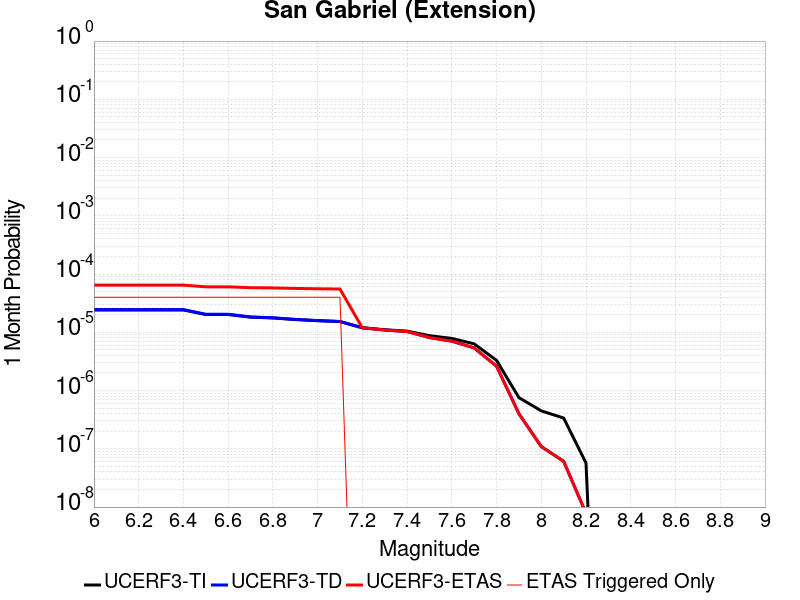 | 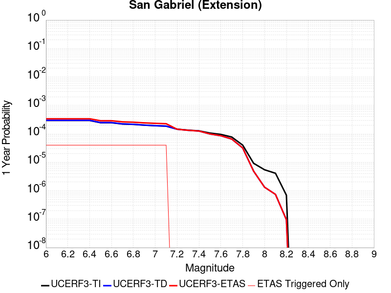 |

| Magnitude | 1 wk TI Prob | 1 wk TD Prob | 1 wk ETAS Prob | 1 wk ETAS/TD Gain | 1 wk ETAS Triggered Only | 1 mo TI Prob | 1 mo TD Prob | 1 mo ETAS Prob | 1 mo ETAS/TD Gain | 1 mo ETAS Triggered Only | 1 yr TI Prob | 1 yr TD Prob | 1 yr ETAS Prob | 1 yr ETAS/TD Gain | 1 yr ETAS Triggered Only |
|-----|-----|-----|-----|-----|-----|-----|-----|-----|-----|-----|-----|-----|-----|-----|-----|
| 6.0 | 5.6486106E-6 | 5.725012E-6 | 5.725012E-6 | 1.0 | 0.0 | 2.4208108E-5 | 2.4535542E-5 | 6.4534564E-5 | 2.630248 | 4.0E-5 | 2.9469383E-4 | 2.9868056E-4 | 3.3866861E-4 | 1.1338824 | 4.0E-5 |
| 6.1 | 5.6486106E-6 | 5.725012E-6 | 5.725012E-6 | 1.0 | 0.0 | 2.4208108E-5 | 2.4535542E-5 | 6.4534564E-5 | 2.630248 | 4.0E-5 | 2.9469383E-4 | 2.9868056E-4 | 3.3866861E-4 | 1.1338824 | 4.0E-5 |
| 6.2 | 5.6486106E-6 | 5.725012E-6 | 5.725012E-6 | 1.0 | 0.0 | 2.4208108E-5 | 2.4535542E-5 | 6.4534564E-5 | 2.630248 | 4.0E-5 | 2.9469383E-4 | 2.9868056E-4 | 3.3866861E-4 | 1.1338824 | 4.0E-5 |
| 6.3 | 5.6486106E-6 | 5.725012E-6 | 5.725012E-6 | 1.0 | 0.0 | 2.4208108E-5 | 2.4535542E-5 | 6.4534564E-5 | 2.630248 | 4.0E-5 | 2.9469383E-4 | 2.9868056E-4 | 3.3866861E-4 | 1.1338824 | 4.0E-5 |
| 6.4 | 5.6486106E-6 | 5.725012E-6 | 5.725012E-6 | 1.0 | 0.0 | 2.4208108E-5 | 2.4535542E-5 | 6.4534564E-5 | 2.630248 | 4.0E-5 | 2.9469383E-4 | 2.9868056E-4 | 3.3866861E-4 | 1.1338824 | 4.0E-5 |
| 6.5 | 4.7134554E-6 | 4.7623403E-6 | 4.7623403E-6 | 1.0 | 0.0 | 2.0200367E-5 | 2.0409876E-5 | 6.040906E-5 | 2.9597955 | 4.0E-5 | 2.459117E-4 | 2.4846275E-4 | 2.884528E-4 | 1.16095 | 4.0E-5 |
| 6.6 | 4.7134554E-6 | 4.7623403E-6 | 4.7623403E-6 | 1.0 | 0.0 | 2.0200367E-5 | 2.0409876E-5 | 6.040906E-5 | 2.9597955 | 4.0E-5 | 2.459117E-4 | 2.4846275E-4 | 2.884528E-4 | 1.16095 | 4.0E-5 |
| 6.7 | 4.2468837E-6 | 4.2821102E-6 | 4.2821102E-6 | 1.0 | 0.0 | 1.8200803E-5 | 1.8351777E-5 | 5.835104E-5 | 3.1795855 | 4.0E-5 | 2.2157225E-4 | 2.234107E-4 | 2.6340177E-4 | 1.1790024 | 4.0E-5 |
| 6.8 | 4.1180615E-6 | 4.149487E-6 | 4.149487E-6 | 1.0 | 0.0 | 1.7648716E-5 | 1.7783397E-5 | 5.7782687E-5 | 3.249249 | 4.0E-5 | 2.1485193E-4 | 2.1649207E-4 | 2.564834E-4 | 1.1847243 | 4.0E-5 |
| 6.9 | 3.863861E-6 | 3.887776E-6 | 3.887776E-6 | 1.0 | 0.0 | 1.65593E-5 | 1.6661794E-5 | 5.6661127E-5 | 3.400662 | 4.0E-5 | 2.0159081E-4 | 2.0283915E-4 | 2.4283103E-4 | 1.1971606 | 4.0E-5 |
| 7.0 | 3.6947372E-6 | 3.7136579E-6 | 3.7136579E-6 | 1.0 | 0.0 | 1.5834492E-5 | 1.5915582E-5 | 5.5914945E-5 | 3.51322 | 4.0E-5 | 1.9276788E-4 | 1.9375567E-4 | 2.3374791E-4 | 1.2064055 | 4.0E-5 |
| 7.1 | 3.5686835E-6 | 3.5808512E-6 | 3.5808512E-6 | 1.0 | 0.0 | 1.5294268E-5 | 1.5346419E-5 | 5.5345805E-5 | 3.6064315 | 4.0E-5 | 1.861918E-4 | 1.868273E-4 | 2.2681981E-4 | 1.2140615 | 4.0E-5 |
| 7.2 | 2.8023446E-6 | 2.7846274E-6 | 2.7846274E-6 | 1.0 | 0.0 | 1.2009994E-5 | 1.1934064E-5 | 1.1934064E-5 | 1.0 | 0.0 | 1.4621185E-4 | 1.4528765E-4 | 1.4528765E-4 | 1.0 | 0.0 |
| 7.3 | 2.5843012E-6 | 2.5537256E-6 | 2.5537256E-6 | 1.0 | 0.0 | 1.1075529E-5 | 1.0944493E-5 | 1.0944493E-5 | 1.0 | 0.0 | 1.3483623E-4 | 1.3324115E-4 | 1.3324115E-4 | 1.0 | 0.0 |
| 7.4 | 2.4464468E-6 | 2.404315E-6 | 2.404315E-6 | 1.0 | 0.0 | 1.04847295E-5 | 1.0304167E-5 | 1.0304167E-5 | 1.0 | 0.0 | 1.276441E-4 | 1.2544611E-4 | 1.2544611E-4 | 1.0 | 0.0 |
| 7.5 | 2.0420266E-6 | 1.8978003E-6 | 1.8978003E-6 | 1.0 | 0.0 | 8.751514E-6 | 8.133405E-6 | 8.133405E-6 | 1.0 | 0.0 | 1.0654447E-4 | 9.901974E-5 | 9.901974E-5 | 1.0 | 0.0 |
| 7.6 | 1.8326596E-6 | 1.6461403E-6 | 1.6461403E-6 | 1.0 | 0.0 | 7.854232E-6 | 7.054868E-6 | 7.054868E-6 | 1.0 | 0.0 | 9.562107E-5 | 8.588966E-5 | 8.588966E-5 | 1.0 | 0.0 |
| 7.7 | 1.4786998E-6 | 1.2581661E-6 | 1.2581661E-6 | 1.0 | 0.0 | 6.3372695E-6 | 5.3921294E-6 | 5.3921294E-6 | 1.0 | 0.0 | 7.715353E-5 | 6.564721E-5 | 6.564721E-5 | 1.0 | 0.0 |
| 7.8 | 7.6975533E-7 | 6.117986E-7 | 6.117986E-7 | 1.0 | 0.0 | 3.2989474E-6 | 2.6219914E-6 | 2.6219914E-6 | 1.0 | 0.0 | 4.0163945E-5 | 3.192228E-5 | 3.192228E-5 | 1.0 | 0.0 |
| 7.9 | 1.7645915E-7 | 9.348288E-8 | 9.348288E-8 | 1.0 | 0.0 | 7.562533E-7 | 4.0064086E-7 | 4.0064086E-7 | 1.0 | 0.0 | 9.207345E-6 | 4.8777915E-6 | 4.8777915E-6 | 1.0 | 0.0 |
| 8.0 | 1.0463461E-7 | 2.5519673E-8 | 2.5519673E-8 | 1.0 | 0.0 | 4.4843398E-7 | 1.0937003E-7 | 1.0937003E-7 | 1.0 | 0.0 | 5.45967E-6 | 1.3315793E-6 | 1.3315793E-6 | 1.0 | 0.0 |
| 8.1 | 7.875717E-8 | 1.4238637E-8 | 1.4238637E-8 | 1.0 | 0.0 | 3.3753068E-7 | 6.102273E-8 | 6.102273E-8 | 1.0 | 0.0 | 4.109428E-6 | 7.4295144E-7 | 7.4295144E-7 | 1.0 | 0.0 |
| 8.2 | 1.33163E-8 | 1.8272979E-9 | 1.8272979E-9 | 1.0 | 0.0 | 5.7069855E-8 | 7.831277E-9 | 7.831277E-9 | 1.0 | 0.0 | 6.9482525E-7 | 9.534579E-8 | 9.534579E-8 | 1.0 | 0.0 |

## Coronado Bank alt1
*[(top)](#table-of-contents)*

| 1 Week | 1 Month | 1 Year |
|-----|-----|-----|
|  | 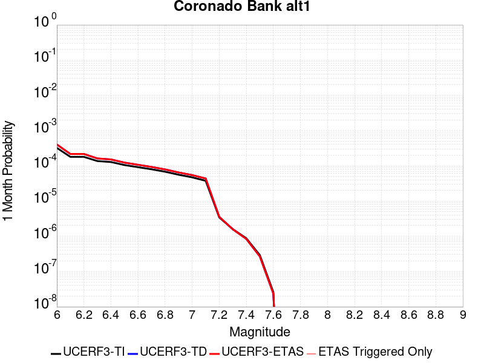 |  |

| Magnitude | 1 wk TI Prob | 1 wk TD Prob | 1 wk ETAS Prob | 1 wk ETAS/TD Gain | 1 wk ETAS Triggered Only | 1 mo TI Prob | 1 mo TD Prob | 1 mo ETAS Prob | 1 mo ETAS/TD Gain | 1 mo ETAS Triggered Only | 1 yr TI Prob | 1 yr TD Prob | 1 yr ETAS Prob | 1 yr ETAS/TD Gain | 1 yr ETAS Triggered Only |
|-----|-----|-----|-----|-----|-----|-----|-----|-----|-----|-----|-----|-----|-----|-----|-----|
| 6.0 | 7.533492E-5 | 9.4029245E-5 | 9.4029245E-5 | 1.0 | 0.0 | 3.22824E-4 | 4.0292446E-4 | 4.0292446E-4 | 1.0 | 0.0 | 0.0039233007 | 0.0048951716 | 0.0049349754 | 1.0081313 | 4.0E-5 |
| 6.1 | 4.1807285E-5 | 5.0528783E-5 | 5.0528783E-5 | 1.0 | 0.0 | 1.7916178E-4 | 2.1653448E-4 | 2.1653448E-4 | 1.0 | 0.0 | 0.0021791123 | 0.0026331986 | 0.0026331986 | 1.0 | 0.0 |
| 6.2 | 4.1807285E-5 | 5.0528783E-5 | 5.0528783E-5 | 1.0 | 0.0 | 1.7916178E-4 | 2.1653448E-4 | 2.1653448E-4 | 1.0 | 0.0 | 0.0021791123 | 0.0026331986 | 0.0026331986 | 1.0 | 0.0 |
| 6.3 | 3.1793104E-5 | 3.7735168E-5 | 3.7735168E-5 | 1.0 | 0.0 | 1.3624904E-4 | 1.6171228E-4 | 1.6171228E-4 | 1.0 | 0.0 | 0.0016575698 | 0.0019671016 | 0.0019671016 | 1.0 | 0.0 |
| 6.4 | 2.9878007E-5 | 3.535792E-5 | 3.535792E-5 | 1.0 | 0.0 | 1.2804232E-4 | 1.5152531E-4 | 1.5152531E-4 | 1.0 | 0.0 | 0.0015578003 | 0.0018432919 | 0.0018432919 | 1.0 | 0.0 |
| 6.5 | 2.4512565E-5 | 2.8781236E-5 | 2.8781236E-5 | 1.0 | 0.0 | 1.0504962E-4 | 1.2334248E-4 | 1.2334248E-4 | 1.0 | 0.0 | 0.0012782287 | 0.0015006869 | 0.0015006869 | 1.0 | 0.0 |
| 6.6 | 2.1317413E-5 | 2.4921088E-5 | 2.4921088E-5 | 1.0 | 0.0 | 9.135714E-5 | 1.0680041E-4 | 1.0680041E-4 | 1.0 | 0.0 | 0.0011117056 | 0.0012995416 | 0.0012995416 | 1.0 | 0.0 |
| 6.7 | 1.8585655E-5 | 2.1647098E-5 | 2.1647098E-5 | 1.0 | 0.0 | 7.9650374E-5 | 9.27701E-5 | 9.27701E-5 | 1.0 | 0.0 | 9.6931186E-4 | 0.0011289112 | 0.0011289112 | 1.0 | 0.0 |
| 6.8 | 1.5862879E-5 | 1.8429711E-5 | 1.8429711E-5 | 1.0 | 0.0 | 6.798199E-5 | 7.898219E-5 | 7.898219E-5 | 1.0 | 0.0 | 8.273665E-4 | 9.6120324E-4 | 9.6120324E-4 | 1.0 | 0.0 |
| 6.9 | 1.3021509E-5 | 1.5103577E-5 | 1.5103577E-5 | 1.0 | 0.0 | 5.5805274E-5 | 6.472811E-5 | 6.472811E-5 | 1.0 | 0.0 | 6.792174E-4 | 7.8779797E-4 | 7.8779797E-4 | 1.0 | 0.0 |
| 7.0 | 1.0974371E-5 | 1.272712E-5 | 1.272712E-5 | 1.0 | 0.0 | 4.7032172E-5 | 5.4543758E-5 | 5.4543758E-5 | 1.0 | 0.0 | 5.7246623E-4 | 6.638855E-4 | 6.638855E-4 | 1.0 | 0.0 |
| 7.1 | 8.766221E-6 | 1.0169476E-5 | 1.0169476E-5 | 1.0 | 0.0 | 3.7568978E-5 | 4.3582837E-5 | 4.3582837E-5 | 1.0 | 0.0 | 4.573063E-4 | 5.3050905E-4 | 5.3050905E-4 | 1.0 | 0.0 |
| 7.2 | 8.026024E-7 | 8.333763E-7 | 8.333763E-7 | 1.0 | 0.0 | 3.43972E-6 | 3.571608E-6 | 3.571608E-6 | 1.0 | 0.0 | 4.1877785E-5 | 4.348347E-5 | 4.348347E-5 | 1.0 | 0.0 |
| 7.3 | 3.7293114E-7 | 3.700848E-7 | 3.700848E-7 | 1.0 | 0.0 | 1.5982754E-6 | 1.5860767E-6 | 1.5860767E-6 | 1.0 | 0.0 | 1.9458828E-5 | 1.9310313E-5 | 1.9310313E-5 | 1.0 | 0.0 |
| 7.4 | 2.0557036E-7 | 1.9678428E-7 | 1.9678428E-7 | 1.0 | 0.0 | 8.810155E-7 | 8.4336097E-7 | 8.4336097E-7 | 1.0 | 0.0 | 1.0726311E-5 | 1.0267871E-5 | 1.0267871E-5 | 1.0 | 0.0 |
| 7.5 | 6.845446E-8 | 6.2802876E-8 | 6.2802876E-8 | 1.0 | 0.0 | 2.9337625E-7 | 2.6915515E-7 | 2.6915515E-7 | 1.0 | 0.0 | 3.5718497E-6 | 3.2769592E-6 | 3.2769592E-6 | 1.0 | 0.0 |
| 7.6 | 6.0975145E-9 | 5.5322116E-9 | 5.5322116E-9 | 1.0 | 0.0 | 2.6132206E-8 | 2.3709477E-8 | 2.3709477E-8 | 1.0 | 0.0 | 3.1815955E-7 | 2.8866285E-7 | 2.8866285E-7 | 1.0 | 0.0 |

## San Jacinto (Lytle Creek connector)
*[(top)](#table-of-contents)*

| 1 Week | 1 Month | 1 Year |
|-----|-----|-----|
| 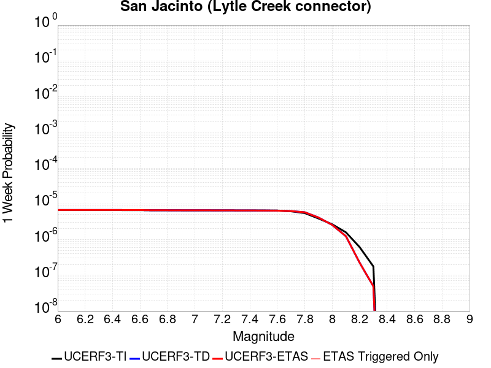 | 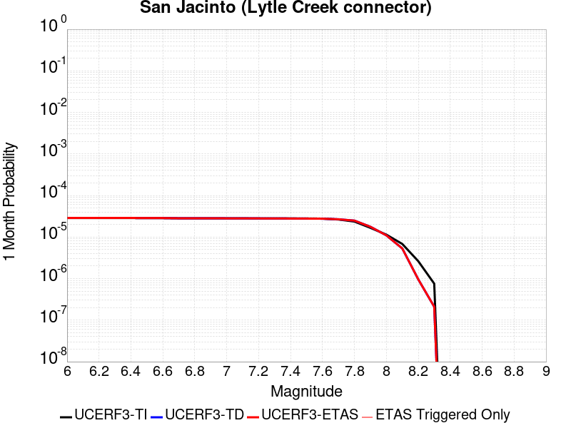 | 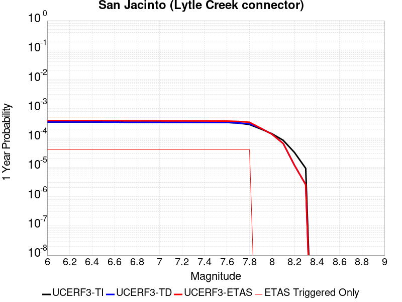 |

| Magnitude | 1 wk TI Prob | 1 wk TD Prob | 1 wk ETAS Prob | 1 wk ETAS/TD Gain | 1 wk ETAS Triggered Only | 1 mo TI Prob | 1 mo TD Prob | 1 mo ETAS Prob | 1 mo ETAS/TD Gain | 1 mo ETAS Triggered Only | 1 yr TI Prob | 1 yr TD Prob | 1 yr ETAS Prob | 1 yr ETAS/TD Gain | 1 yr ETAS Triggered Only |
|-----|-----|-----|-----|-----|-----|-----|-----|-----|-----|-----|-----|-----|-----|-----|-----|
| 6.0 | 6.693995E-6 | 6.7295123E-6 | 6.7295123E-6 | 1.0 | 0.0 | 2.8688235E-5 | 2.8840448E-5 | 2.8840448E-5 | 1.0 | 0.0 | 3.492233E-4 | 3.5107599E-4 | 3.9106194E-4 | 1.1138954 | 4.0E-5 |
| 6.1 | 6.693995E-6 | 6.7295123E-6 | 6.7295123E-6 | 1.0 | 0.0 | 2.8688235E-5 | 2.8840448E-5 | 2.8840448E-5 | 1.0 | 0.0 | 3.492233E-4 | 3.5107599E-4 | 3.9106194E-4 | 1.1138954 | 4.0E-5 |
| 6.2 | 6.693995E-6 | 6.7295123E-6 | 6.7295123E-6 | 1.0 | 0.0 | 2.8688235E-5 | 2.8840448E-5 | 2.8840448E-5 | 1.0 | 0.0 | 3.492233E-4 | 3.5107599E-4 | 3.9106194E-4 | 1.1138954 | 4.0E-5 |
| 6.3 | 6.693995E-6 | 6.7295123E-6 | 6.7295123E-6 | 1.0 | 0.0 | 2.8688235E-5 | 2.8840448E-5 | 2.8840448E-5 | 1.0 | 0.0 | 3.492233E-4 | 3.5107599E-4 | 3.9106194E-4 | 1.1138954 | 4.0E-5 |
| 6.4 | 6.693995E-6 | 6.7295123E-6 | 6.7295123E-6 | 1.0 | 0.0 | 2.8688235E-5 | 2.8840448E-5 | 2.8840448E-5 | 1.0 | 0.0 | 3.492233E-4 | 3.5107599E-4 | 3.9106194E-4 | 1.1138954 | 4.0E-5 |
| 6.5 | 6.6561875E-6 | 6.6897233E-6 | 6.6897233E-6 | 1.0 | 0.0 | 2.8526205E-5 | 2.8669929E-5 | 2.8669929E-5 | 1.0 | 0.0 | 3.472512E-4 | 3.4900056E-4 | 3.889866E-4 | 1.114573 | 4.0E-5 |
| 6.6 | 6.6561875E-6 | 6.6897233E-6 | 6.6897233E-6 | 1.0 | 0.0 | 2.8526205E-5 | 2.8669929E-5 | 2.8669929E-5 | 1.0 | 0.0 | 3.472512E-4 | 3.4900056E-4 | 3.889866E-4 | 1.114573 | 4.0E-5 |
| 6.7 | 6.5802237E-6 | 6.6088837E-6 | 6.6088837E-6 | 1.0 | 0.0 | 2.8200653E-5 | 2.832348E-5 | 2.832348E-5 | 1.0 | 0.0 | 3.4328885E-4 | 3.4478388E-4 | 3.8477007E-4 | 1.1159747 | 4.0E-5 |
| 6.8 | 6.575632E-6 | 6.6033695E-6 | 6.6033695E-6 | 1.0 | 0.0 | 2.8180975E-5 | 2.8299848E-5 | 2.8299848E-5 | 1.0 | 0.0 | 3.4304935E-4 | 3.4449625E-4 | 3.8448247E-4 | 1.1160716 | 4.0E-5 |
| 6.9 | 6.570433E-6 | 6.5947534E-6 | 6.5947534E-6 | 1.0 | 0.0 | 2.8158694E-5 | 2.8262923E-5 | 2.8262923E-5 | 1.0 | 0.0 | 3.4277816E-4 | 3.4404683E-4 | 3.8403308E-4 | 1.1162232 | 4.0E-5 |
| 7.0 | 6.5643826E-6 | 6.5848626E-6 | 6.5848626E-6 | 1.0 | 0.0 | 2.8132765E-5 | 2.8220535E-5 | 2.8220535E-5 | 1.0 | 0.0 | 3.424626E-4 | 3.435309E-4 | 3.8351718E-4 | 1.1163979 | 4.0E-5 |
| 7.1 | 6.557402E-6 | 6.5735626E-6 | 6.5735626E-6 | 1.0 | 0.0 | 2.8102848E-5 | 2.8172106E-5 | 2.8172106E-5 | 1.0 | 0.0 | 3.4209844E-4 | 3.429415E-4 | 3.8292777E-4 | 1.116598 | 4.0E-5 |
| 7.2 | 6.546394E-6 | 6.5555055E-6 | 6.5555055E-6 | 1.0 | 0.0 | 2.8055672E-5 | 2.809472E-5 | 2.809472E-5 | 1.0 | 0.0 | 3.4152428E-4 | 3.4199964E-4 | 3.8198594E-4 | 1.1169192 | 4.0E-5 |
| 7.3 | 6.5364216E-6 | 6.536247E-6 | 6.536247E-6 | 1.0 | 0.0 | 2.8012933E-5 | 2.8012188E-5 | 2.8012188E-5 | 1.0 | 0.0 | 3.4100408E-4 | 3.409951E-4 | 3.8098145E-4 | 1.1172638 | 4.0E-5 |
| 7.4 | 6.5269523E-6 | 6.517283E-6 | 6.517283E-6 | 1.0 | 0.0 | 2.7972354E-5 | 2.7930913E-5 | 2.7930913E-5 | 1.0 | 0.0 | 3.4051016E-4 | 3.4000588E-4 | 3.799923E-4 | 1.117605 | 4.0E-5 |
| 7.5 | 6.5111835E-6 | 6.4935025E-6 | 6.4935025E-6 | 1.0 | 0.0 | 2.7904773E-5 | 2.7829E-5 | 2.7829E-5 | 1.0 | 0.0 | 3.3968766E-4 | 3.3876547E-4 | 3.7875192E-4 | 1.1180358 | 4.0E-5 |
| 7.6 | 6.4768806E-6 | 6.4525266E-6 | 6.4525266E-6 | 1.0 | 0.0 | 2.7757764E-5 | 2.7653392E-5 | 2.7653392E-5 | 1.0 | 0.0 | 3.3789838E-4 | 3.3662812E-4 | 3.7661465E-4 | 1.1187855 | 4.0E-5 |
| 7.7 | 6.1655364E-6 | 6.2444665E-6 | 6.2444665E-6 | 1.0 | 0.0 | 2.642346E-5 | 2.6761725E-5 | 2.6761725E-5 | 1.0 | 0.0 | 3.2165812E-4 | 3.2577536E-4 | 3.657623E-4 | 1.122744 | 4.0E-5 |
| 7.8 | 5.5043524E-6 | 5.803494E-6 | 5.803494E-6 | 1.0 | 0.0 | 2.3589868E-5 | 2.4871879E-5 | 2.4871879E-5 | 1.0 | 0.0 | 2.871688E-4 | 3.027731E-4 | 3.42761E-4 | 1.1320721 | 4.0E-5 |
| 7.9 | 3.889249E-6 | 4.130606E-6 | 4.130606E-6 | 1.0 | 0.0 | 1.6668104E-5 | 1.7702478E-5 | 1.7702478E-5 | 1.0 | 0.0 | 2.0291525E-4 | 2.1550638E-4 | 2.1550638E-4 | 1.0 | 0.0 |
| 8.0 | 2.668535E-6 | 2.5686622E-6 | 2.5686622E-6 | 1.0 | 0.0 | 1.1436528E-5 | 1.1008506E-5 | 1.1008506E-5 | 1.0 | 0.0 | 1.3923083E-4 | 1.3402035E-4 | 1.3402035E-4 | 1.0 | 0.0 |
| 8.1 | 1.5911459E-6 | 1.2385202E-6 | 1.2385202E-6 | 1.0 | 0.0 | 6.8191785E-6 | 5.307933E-6 | 5.307933E-6 | 1.0 | 0.0 | 8.3020335E-5 | 6.462219E-5 | 6.462219E-5 | 1.0 | 0.0 |
| 8.2 | 6.1294963E-7 | 2.2397407E-7 | 2.2397407E-7 | 1.0 | 0.0 | 2.6269242E-6 | 9.598884E-7 | 9.598884E-7 | 1.0 | 0.0 | 3.1982334E-5 | 1.168658E-5 | 1.168658E-5 | 1.0 | 0.0 |
| 8.3 | 1.762871E-7 | 4.901543E-8 | 4.901543E-8 | 1.0 | 0.0 | 7.5551594E-7 | 2.1006612E-7 | 2.1006612E-7 | 1.0 | 0.0 | 9.1983675E-6 | 2.557552E-6 | 2.557552E-6 | 1.0 | 0.0 |

## Ortigalita (South)
*[(top)](#table-of-contents)*

| 1 Week | 1 Month | 1 Year |
|-----|-----|-----|
|  | 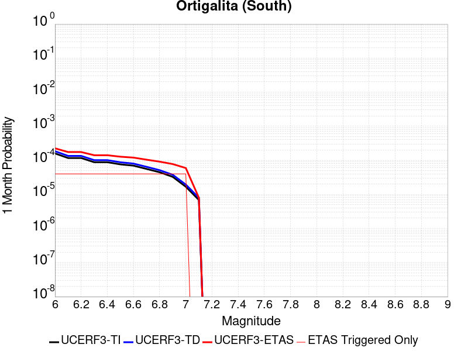 | 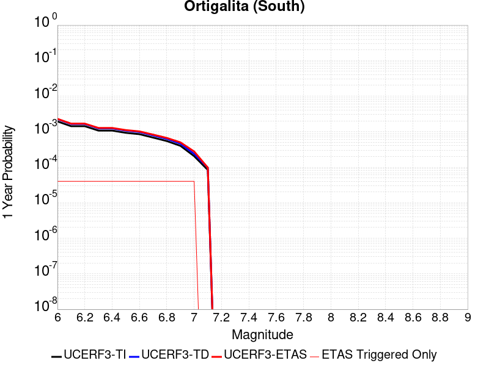 |

| Magnitude | 1 wk TI Prob | 1 wk TD Prob | 1 wk ETAS Prob | 1 wk ETAS/TD Gain | 1 wk ETAS Triggered Only | 1 mo TI Prob | 1 mo TD Prob | 1 mo ETAS Prob | 1 mo ETAS/TD Gain | 1 mo ETAS Triggered Only | 1 yr TI Prob | 1 yr TD Prob | 1 yr ETAS Prob | 1 yr ETAS/TD Gain | 1 yr ETAS Triggered Only |
|-----|-----|-----|-----|-----|-----|-----|-----|-----|-----|-----|-----|-----|-----|-----|-----|
| 6.0 | 3.72394E-5 | 4.327939E-5 | 4.327939E-5 | 1.0 | 0.0 | 1.5958765E-4 | 1.8547081E-4 | 2.2546339E-4 | 1.2156273 | 4.0E-5 | 0.0019412481 | 0.002255925 | 0.0022958347 | 1.0176911 | 4.0E-5 |
| 6.1 | 2.7299884E-5 | 3.1508487E-5 | 3.1508487E-5 | 1.0 | 0.0 | 1.16994255E-4 | 1.350297E-4 | 1.750243E-4 | 1.2961911 | 4.0E-5 | 0.0014234743 | 0.0016428027 | 0.001682737 | 1.0243087 | 4.0E-5 |
| 6.2 | 2.7299884E-5 | 3.1508487E-5 | 3.1508487E-5 | 1.0 | 0.0 | 1.16994255E-4 | 1.350297E-4 | 1.750243E-4 | 1.2961911 | 4.0E-5 | 0.0014234743 | 0.0016428027 | 0.001682737 | 1.0243087 | 4.0E-5 |
| 6.3 | 2.0546433E-5 | 2.364352E-5 | 2.364352E-5 | 1.0 | 0.0 | 8.805317E-5 | 1.01325546E-4 | 1.4132149E-4 | 1.3947272 | 4.0E-5 | 0.00107152 | 0.0012329593 | 0.00127291 | 1.0324023 | 4.0E-5 |
| 6.4 | 2.0546433E-5 | 2.364352E-5 | 2.364352E-5 | 1.0 | 0.0 | 8.805317E-5 | 1.01325546E-4 | 1.4132149E-4 | 1.3947272 | 4.0E-5 | 0.00107152 | 0.0012329593 | 0.00127291 | 1.0324023 | 4.0E-5 |
| 6.5 | 1.7779594E-5 | 2.0457412E-5 | 2.0457412E-5 | 1.0 | 0.0 | 7.619603E-5 | 8.7671746E-5 | 1.2766825E-4 | 1.4562073 | 4.0E-5 | 9.272918E-4 | 0.0010668945 | 0.0011068517 | 1.037452 | 4.0E-5 |
| 6.6 | 1.6272212E-5 | 1.8724526E-5 | 1.8724526E-5 | 1.0 | 0.0 | 6.973618E-5 | 8.024557E-5 | 1.2024236E-4 | 1.4984299 | 4.0E-5 | 8.487073E-4 | 9.765641E-4 | 0.0010165251 | 1.0409199 | 4.0E-5 |
| 6.7 | 1.3051484E-5 | 1.5046552E-5 | 1.5046552E-5 | 1.0 | 0.0 | 5.593373E-5 | 6.4483684E-5 | 1.044811E-4 | 1.6202719 | 4.0E-5 | 6.807804E-4 | 7.848155E-4 | 8.2478416E-4 | 1.0509274 | 4.0E-5 |
| 6.8 | 1.04277415E-5 | 1.1993327E-5 | 1.1993327E-5 | 1.0 | 0.0 | 4.4689557E-5 | 5.1399E-5 | 9.139695E-5 | 1.7781852 | 4.0E-5 | 5.439595E-4 | 6.256106E-4 | 6.6558557E-4 | 1.0638975 | 4.0E-5 |
| 6.9 | 7.639968E-6 | 8.796003E-6 | 8.796003E-6 | 1.0 | 0.0 | 3.274231E-5 | 3.7696645E-5 | 7.769514E-5 | 2.0610623 | 4.0E-5 | 3.9856473E-4 | 4.5886592E-4 | 4.9884757E-4 | 1.0871314 | 4.0E-5 |
| 7.0 | 3.919831E-6 | 4.5358106E-6 | 4.5358106E-6 | 1.0 | 0.0 | 1.679917E-5 | 1.9439054E-5 | 5.9438276E-5 | 3.0576732 | 4.0E-5 | 2.045107E-4 | 2.366469E-4 | 2.7663744E-4 | 1.1689882 | 4.0E-5 |
| 7.1 | 1.6017933E-6 | 1.8580465E-6 | 1.8580465E-6 | 1.0 | 0.0 | 6.8648105E-6 | 7.963038E-6 | 7.963038E-6 | 1.0 | 0.0 | 8.357586E-5 | 9.6946744E-5 | 9.6946744E-5 | 1.0 | 0.0 |

