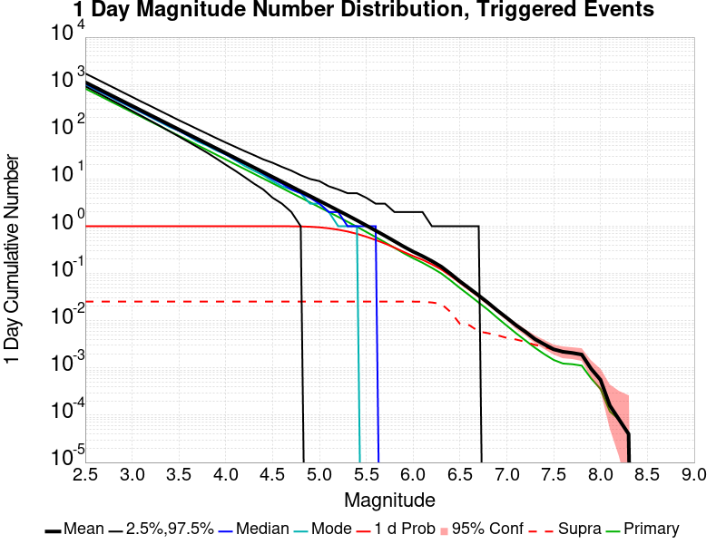
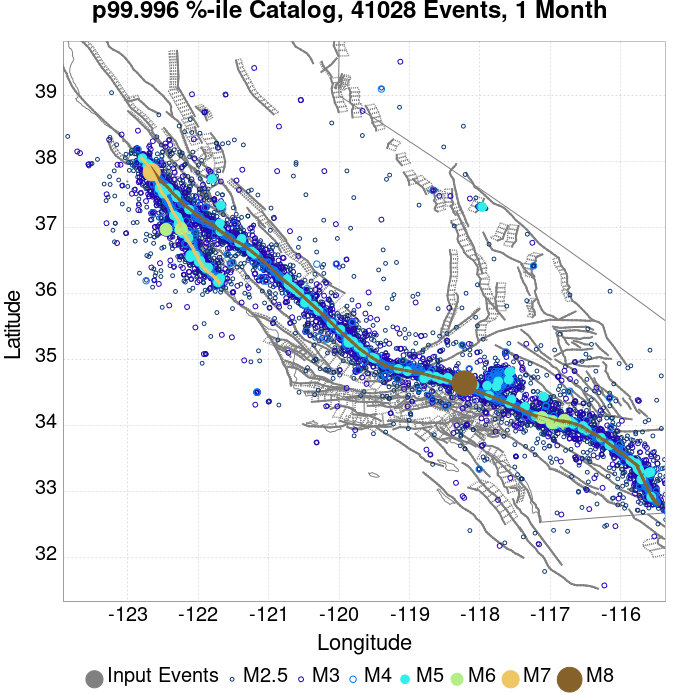

# M7AwaySAF Results

|   | M7AwaySAF |
|-----|-----|
| Num Simulations | 25000 |
| Start Time | 2020/01/01 00:00:00 UTC |
| Start Time Epoch Milliseconds | 1577836800000 |
| Duration | 1 Year |
| Includes Spontaneous? | false |
| Trigger Ruptures | *(none)* |
| Config Generated With | u3etas_config_builder.sh --start-year 2020 --num-simulations 25000 --duration-years 1 --magnitude 7 --latitude 34.695 --depth 5 --longitude -117.7 --name M7AwaySAF --hpc-site USC_HPC --nodes 36 --hours 24 --queue scec |

## Table Of Contents

* [Probabilities Summary Table](#probabilities-summary-table)
* [Magnitude Number Distribution](#magnitude-number-distribution)
  * [1 Year Magnitude Number Distribution](#1-year-magnitude-number-distribution)
  * [1 Month Magnitude Number Distribution](#1-month-magnitude-number-distribution)
  * [1 Week Magnitude Number Distribution](#1-week-magnitude-number-distribution)
  * [1 Day Magnitude Number Distribution](#1-day-magnitude-number-distribution)
  * [1 Hour Magnitude Number Distribution](#1-hour-magnitude-number-distribution)
* [Hazard Change Over Time](#hazard-change-over-time)
  * [M&ge;5.0 Hazard Change Over Time](#m50-hazard-change-over-time)
  * [M&ge;6.0 Hazard Change Over Time](#m60-hazard-change-over-time)
  * [M&ge;7.0 Hazard Change Over Time](#m70-hazard-change-over-time)
  * [M&ge;8.0 Hazard Change Over Time](#m80-hazard-change-over-time)
* [Trigger Rupture Fault Map](#trigger-rupture-fault-map)
* [Fault Distances To Triggers](#fault-distances-to-triggers)
* [Individual Simulated Catalog Maps](#individual-simulated-catalog-maps)
* [Section Participation](#section-participation)
  * [Section Participation Plots](#section-participation-plots)
  * [Supra-Seismogenic Parent Sections Table](#supra-seismogenic-parent-sections-table)
  * [M≥6.5 Parent Sections Table](#m65-parent-sections-table)
  * [M≥7 Parent Sections Table](#m7-parent-sections-table)
  * [M≥7.5 Parent Sections Table](#m75-parent-sections-table)
  * [M≥8 Parent Sections Table](#m8-parent-sections-table)
* [Fault Magnitude-Probability Distributions](#fault-magnitude-probability-distributions)
* [Gridded Nucleation](#gridded-nucleation)
* [JSON Input File](#json-input-file)

## Probabilities Summary Table
*[(top)](#table-of-contents)*

| Magnitude | 1 Hour Prob | 1 Day Prob | 1 Week Prob | 1 Month Prob | 1 Year Prob |
|-----|-----|-----|-----|-----|-----|
| **M&ge;4** | 1.000 (100.00%) | 1.000 (100.00%) | 1.000 (100.00%) | 1.000 (100.00%) | 1.000 (100.00%) |
| *95% Conf* | *[99.98% 100.00%]* | *[99.98% 100.00%]* | *[99.98% 100.00%]* | *[99.98% 100.00%]* | *[99.98% 100.00%]* |
| **M&ge;4.5** | 0.976 (97.56%) | 1.000 (100.00%) | 1.000 (100.00%) | 1.000 (100.00%) | 1.000 (100.00%) |
| *95% Conf* | *[97.36% 97.75%]* | *[99.97% 100.00%]* | *[99.98% 100.00%]* | *[99.98% 100.00%]* | *[99.98% 100.00%]* |
| **M&ge;5** | 0.692 (69.17%) | 0.947 (94.72%) | 0.983 (98.26%) | 0.992 (99.18%) | 0.998 (99.81%) |
| *95% Conf* | *[68.59% 69.74%]* | *[94.44% 95.00%]* | *[98.09% 98.42%]* | *[99.05% 99.28%]* | *[99.74% 99.86%]* |
| **M&ge;5.5** | 0.300 (30.00%) | 0.599 (59.93%) | 0.725 (72.46%) | 0.791 (79.10%) | 0.871 (87.08%) |
| *95% Conf* | *[29.43% 30.57%]* | *[59.32% 60.54%]* | *[71.90% 73.01%]* | *[78.59% 79.60%]* | *[86.66% 87.50%]* |
| **M&ge;6** | 0.098 (9.75%) | 0.234 (23.39%) | 0.317 (31.70%) | 0.376 (37.64%) | 0.469 (46.90%) |
| *95% Conf* | *[9.39% 10.13%]* | *[22.87% 23.92%]* | *[31.13% 32.29%]* | *[37.04% 38.24%]* | *[46.28% 47.52%]* |
| **M&ge;6.5** | 0.025 (2.50%) | 0.063 (6.34%) | 0.090 (9.01%) | 0.113 (11.28%) | 0.151 (15.10%) |
| *95% Conf* | *[2.31% 2.70%]* | *[6.04% 6.65%]* | *[8.66% 9.37%]* | *[10.89% 11.68%]* | *[14.66% 15.55%]* |
| **M&ge;7** | 4.80E-3 (0.48%) | 0.011 (1.11%) | 0.017 (1.72%) | 0.022 (2.19%) | 0.031 (3.06%) |
| *95% Conf* | *[0.40% 0.58%]* | *[0.99% 1.25%]* | *[1.56% 1.89%]* | *[2.02% 2.38%]* | *[2.86% 3.29%]* |
| **M&ge;7.5** | 8.80E-4 (0.09%) | 2.44E-3 (0.24%) | 3.72E-3 (0.37%) | 4.36E-3 (0.44%) | 6.60E-3 (0.66%) |
| *95% Conf* | *[0.06% 0.14%]* | *[0.19% 0.32%]* | *[0.30% 0.46%]* | *[0.36% 0.53%]* | *[0.57% 0.77%]* |
| **M&ge;8** | 2.80E-4 (0.03%) | 5.60E-4 (0.06%) | 7.60E-4 (0.08%) | 9.60E-4 (0.10%) | 1.40E-3 (0.14%) |
| *95% Conf* | *[0.01% 0.06%]* | *[0.03% 0.10%]* | *[0.05% 0.12%]* | *[0.06% 0.15%]* | *[0.10% 0.20%]* |

## Magnitude Number Distribution
*[(top)](#table-of-contents)*

### 1 Year Magnitude Number Distribution
*[(top)](#table-of-contents)*

**Legend**
* **Mean** (thick black line): mean expected number across all 25000 catalogs
* **2.5%,97.5%** (thin black lines): expected number percentiles across all 25000 catalogs
* **Median** (thin blue line): median expected number across all 25000 catalogs
* **Mode** (thin cyan line): modal expected number across all 25000 catalogs
* **1 yr Probability** (thin red line): 1 year probability calculated as the fraction of catalogs with at least 1 occurrence
* **1 yr Supraseismogenic Probability** (thin dashed red line): same as above, but only for supraseismogenic ruptures on explicitly modeled UCERF3 faults
* **95% Conf** (light red shaded region): binomial 95% confidence bounds on probability
* **Primary** (thin green line): mean expected number from primary triggered aftershocks only (no secondary, tertiary, etc...) across all 25000 catalogs


| Mag | Mean | 2.5 %ile | 97.5 %ile | Median | Mode | 1 yr Probability | 1 yr Prob 95% Conf | 1 yr Supra-Seis Prob | Primary Aftershocks Mean |
|-----|-----|-----|-----|-----|-----|-----|-----|-----|-----|
| **M&ge;2.5** | 2980.690 | 2040.000 | 6279.000 | 2532.000 | 2283.000 | 1.000 (100.00%) | [99.98% 100.00%] | 0.080 (7.96%) | 1472.994 |
| **M&ge;2.6** | 2367.626 | 1615.000 | 4985.000 | 2011.000 | 1791.000 | 1.000 (100.00%) | [99.98% 100.00%] | 0.080 (7.96%) | 1170.009 |
| **M&ge;2.7** | 1880.687 | 1281.000 | 3969.000 | 1598.000 | 1452.000 | 1.000 (100.00%) | [99.98% 100.00%] | 0.080 (7.96%) | 929.397 |
| **M&ge;2.8** | 1493.902 | 1013.000 | 3156.000 | 1270.000 | 1162.000 | 1.000 (100.00%) | [99.98% 100.00%] | 0.080 (7.96%) | 738.270 |
| **M&ge;2.9** | 1186.672 | 801.000 | 2501.000 | 1010.000 | 929.000 | 1.000 (100.00%) | [99.98% 100.00%] | 0.080 (7.96%) | 586.455 |
| **M&ge;3** | 942.488 | 631.000 | 1984.000 | 803.000 | 727.000 | 1.000 (100.00%) | [99.98% 100.00%] | 0.080 (7.96%) | 465.840 |
| **M&ge;3.1** | 748.624 | 498.000 | 1582.000 | 638.000 | 578.000 | 1.000 (100.00%) | [99.98% 100.00%] | 0.080 (7.96%) | 370.011 |
| **M&ge;3.2** | 594.538 | 392.000 | 1255.000 | 507.000 | 455.000 | 1.000 (100.00%) | [99.98% 100.00%] | 0.080 (7.96%) | 293.830 |
| **M&ge;3.3** | 472.146 | 308.000 | 995.000 | 403.000 | 357.000 | 1.000 (100.00%) | [99.98% 100.00%] | 0.080 (7.96%) | 233.369 |
| **M&ge;3.4** | 374.901 | 242.000 | 791.000 | 321.000 | 301.000 | 1.000 (100.00%) | [99.98% 100.00%] | 0.080 (7.96%) | 185.295 |
| **M&ge;3.5** | 297.748 | 189.000 | 628.000 | 255.000 | 232.000 | 1.000 (100.00%) | [99.98% 100.00%] | 0.080 (7.96%) | 147.200 |
| **M&ge;3.6** | 236.432 | 148.000 | 502.000 | 203.000 | 188.000 | 1.000 (100.00%) | [99.98% 100.00%] | 0.080 (7.96%) | 116.888 |
| **M&ge;3.7** | 187.806 | 115.000 | 401.000 | 162.000 | 150.000 | 1.000 (100.00%) | [99.98% 100.00%] | 0.080 (7.96%) | 92.894 |
| **M&ge;3.8** | 149.113 | 90.000 | 318.000 | 128.000 | 123.000 | 1.000 (100.00%) | [99.98% 100.00%] | 0.080 (7.96%) | 73.757 |
| **M&ge;3.9** | 118.415 | 69.000 | 253.000 | 102.000 | 88.000 | 1.000 (100.00%) | [99.98% 100.00%] | 0.080 (7.96%) | 58.593 |
| **M&ge;4** | 93.989 | 53.000 | 203.000 | 81.000 | 73.000 | 1.000 (100.00%) | [99.98% 100.00%] | 0.080 (7.96%) | 46.473 |
| **M&ge;4.1** | 74.546 | 41.000 | 161.000 | 65.000 | 58.000 | 1.000 (100.00%) | [99.98% 100.00%] | 0.080 (7.96%) | 36.861 |
| **M&ge;4.2** | 59.168 | 31.000 | 129.000 | 51.000 | 50.000 | 1.000 (100.00%) | [99.98% 100.00%] | 0.080 (7.96%) | 29.261 |
| **M&ge;4.3** | 46.959 | 23.000 | 102.000 | 41.000 | 36.000 | 1.000 (100.00%) | [99.98% 100.00%] | 0.080 (7.96%) | 23.229 |
| **M&ge;4.4** | 37.257 | 18.000 | 83.000 | 32.000 | 28.000 | 1.000 (100.00%) | [99.98% 100.00%] | 0.080 (7.96%) | 18.447 |
| **M&ge;4.5** | 29.562 | 13.000 | 66.000 | 26.000 | 24.000 | 1.000 (100.00%) | [99.98% 100.00%] | 0.080 (7.96%) | 14.626 |
| **M&ge;4.6** | 23.438 | 9.000 | 53.000 | 20.000 | 19.000 | 1.000 (100.00%) | [99.98% 100.00%] | 0.080 (7.96%) | 11.598 |
| **M&ge;4.7** | 18.571 | 7.000 | 43.000 | 16.000 | 13.000 | 1.000 (100.00%) | [99.98% 100.00%] | 0.080 (7.96%) | 9.194 |
| **M&ge;4.8** | 14.694 | 5.000 | 35.000 | 13.000 | 11.000 | 1.000 (100.00%) | [99.97% 100.00%] | 0.080 (7.96%) | 7.276 |
| **M&ge;4.9** | 11.659 | 3.000 | 28.000 | 10.000 | 9.000 | 1.000 (99.95%) | [99.91% 99.97%] | 0.080 (7.96%) | 5.771 |
| **M&ge;5** | 9.214 | 2.000 | 23.000 | 8.000 | 7.000 | 0.998 (99.81%) | [99.74% 99.86%] | 0.080 (7.96%) | 4.557 |
| **M&ge;5.1** | 7.290 | 1.000 | 19.000 | 6.000 | 5.000 | 0.993 (99.26%) | [99.14% 99.36%] | 0.080 (7.96%) | 3.607 |
| **M&ge;5.2** | 5.758 | 1.000 | 16.000 | 5.000 | 4.000 | 0.982 (98.16%) | [97.98% 98.32%] | 0.080 (7.96%) | 2.851 |
| **M&ge;5.3** | 4.540 | 0.000 | 13.000 | 4.000 | 3.000 | 0.960 (95.99%) | [95.74% 96.23%] | 0.080 (7.96%) | 2.249 |
| **M&ge;5.4** | 3.565 | 0.000 | 11.000 | 3.000 | 2.000 | 0.924 (92.37%) | [92.03% 92.70%] | 0.080 (7.96%) | 1.767 |
| **M&ge;5.5** | 2.789 | 0.000 | 9.000 | 2.000 | 1.000 | 0.871 (87.08%) | [86.66% 87.50%] | 0.080 (7.96%) | 1.380 |
| **M&ge;5.6** | 2.172 | 0.000 | 8.000 | 2.000 | 1.000 | 0.800 (79.96%) | [79.46% 80.46%] | 0.080 (7.96%) | 1.073 |
| **M&ge;5.7** | 1.686 | 0.000 | 6.000 | 1.000 | 1.000 | 0.718 (71.85%) | [71.29% 72.40%] | 0.080 (7.96%) | 0.832 |
| **M&ge;5.8** | 1.304 | 0.000 | 5.000 | 1.000 | 0.000 | 0.632 (63.17%) | [62.57% 63.77%] | 0.080 (7.96%) | 0.641 |
| **M&ge;5.9** | 1.006 | 0.000 | 4.000 | 1.000 | 0.000 | 0.545 (54.49%) | [53.87% 55.11%] | 0.079 (7.94%) | 0.491 |
| **M&ge;6** | 0.793 | 0.000 | 4.000 | 0.000 | 0.000 | 0.469 (46.90%) | [46.28% 47.52%] | 0.079 (7.93%) | 0.388 |
| **M&ge;6.1** | 0.638 | 0.000 | 3.000 | 0.000 | 0.000 | 0.406 (40.64%) | [40.03% 41.25%] | 0.079 (7.86%) | 0.311 |
| **M&ge;6.2** | 0.505 | 0.000 | 3.000 | 0.000 | 0.000 | 0.340 (34.00%) | [33.41% 34.59%] | 0.076 (7.56%) | 0.245 |
| **M&ge;6.3** | 0.391 | 0.000 | 2.000 | 0.000 | 0.000 | 0.276 (27.65%) | [27.10% 28.21%] | 0.071 (7.06%) | 0.188 |
| **M&ge;6.4** | 0.271 | 0.000 | 2.000 | 0.000 | 0.000 | 0.209 (20.88%) | [20.38% 21.39%] | 0.048 (4.82%) | 0.132 |
| **M&ge;6.5** | 0.185 | 0.000 | 2.000 | 0.000 | 0.000 | 0.151 (15.10%) | [14.66% 15.55%] | 0.028 (2.76%) | 0.091 |
| **M&ge;6.6** | 0.135 | 0.000 | 1.000 | 0.000 | 0.000 | 0.114 (11.42%) | [11.03% 11.83%] | 0.026 (2.57%) | 0.064 |
| **M&ge;6.7** | 0.093 | 0.000 | 1.000 | 0.000 | 0.000 | 0.082 (8.17%) | [7.84% 8.52%] | 0.018 (1.82%) | 0.044 |
| **M&ge;6.8** | 0.066 | 0.000 | 1.000 | 0.000 | 0.000 | 0.059 (5.94%) | [5.66% 6.25%] | 0.017 (1.66%) | 0.031 |
| **M&ge;6.9** | 0.047 | 0.000 | 1.000 | 0.000 | 0.000 | 0.043 (4.28%) | [4.04% 4.54%] | 0.015 (1.48%) | 0.021 |
| **M&ge;7** | 0.033 | 0.000 | 1.000 | 0.000 | 0.000 | 0.031 (3.06%) | [2.86% 3.29%] | 0.013 (1.32%) | 0.014 |
| **M&ge;7.1** | 0.023 | 0.000 | 0.000 | 0.000 | 0.000 | 0.022 (2.22%) | [2.04% 2.41%] | 0.012 (1.20%) | 9.36E-3 |
| **M&ge;7.2** | 0.017 | 0.000 | 0.000 | 0.000 | 0.000 | 0.016 (1.61%) | [1.46% 1.78%] | 0.011 (1.05%) | 6.64E-3 |
| **M&ge;7.3** | 0.012 | 0.000 | 0.000 | 0.000 | 0.000 | 0.011 (1.12%) | [0.99% 1.26%] | 8.28E-3 (0.83%) | 4.32E-3 |
| **M&ge;7.4** | 8.60E-3 | 0.000 | 0.000 | 0.000 | 0.000 | 8.36E-3 (0.84%) | [0.73% 0.96%] | 7.44E-3 (0.74%) | 2.84E-3 |
| **M&ge;7.5** | 6.84E-3 | 0.000 | 0.000 | 0.000 | 0.000 | 6.60E-3 (0.66%) | [0.57% 0.77%] | 6.44E-3 (0.64%) | 2.16E-3 |
| **M&ge;7.6** | 6.12E-3 | 0.000 | 0.000 | 0.000 | 0.000 | 6.00E-3 (0.60%) | [0.51% 0.71%] | 5.92E-3 (0.59%) | 1.80E-3 |
| **M&ge;7.7** | 5.64E-3 | 0.000 | 0.000 | 0.000 | 0.000 | 5.60E-3 (0.56%) | [0.47% 0.66%] | 5.60E-3 (0.56%) | 1.68E-3 |
| **M&ge;7.8** | 5.24E-3 | 0.000 | 0.000 | 0.000 | 0.000 | 5.20E-3 (0.52%) | [0.44% 0.62%] | 5.20E-3 (0.52%) | 1.56E-3 |
| **M&ge;7.9** | 2.60E-3 | 0.000 | 0.000 | 0.000 | 0.000 | 2.60E-3 (0.26%) | [0.20% 0.33%] | 2.60E-3 (0.26%) | 8.00E-4 |
| **M&ge;8** | 1.40E-3 | 0.000 | 0.000 | 0.000 | 0.000 | 1.40E-3 (0.14%) | [0.10% 0.20%] | 1.40E-3 (0.14%) | 4.40E-4 |
| **M&ge;8.1** | 4.00E-4 | 0.000 | 0.000 | 0.000 | 0.000 | 4.00E-4 (0.04%) | [0.02% 0.08%] | 4.00E-4 (0.04%) | 1.20E-4 |
| **M&ge;8.2** | 2.00E-4 | 0.000 | 0.000 | 0.000 | 0.000 | 2.00E-4 (0.02%) | [0.01% 0.05%] | 2.00E-4 (0.02%) | 8.00E-5 |
| **M&ge;8.3** | 4.00E-5 | 0.000 | 0.000 | 0.000 | 0.000 | 4.00E-5 (0.00%) | [0.00% 0.03%] | 4.00E-5 (0.00%) | 4.00E-5 |
| **M&ge;8.4** | 0.000 | 0.000 | 0.000 | 0.000 | 0.000 | 0.000 (0.00%) | [0.00% 0.02%] | 0.000 (0.00%) | 0.000 |
| **M&ge;8.5** | 0.000 | 0.000 | 0.000 | 0.000 | 0.000 | 0.000 (0.00%) | [0.00% 0.02%] | 0.000 (0.00%) | 0.000 |
| **M&ge;8.6** | 0.000 | 0.000 | 0.000 | 0.000 | 0.000 | 0.000 (0.00%) | [0.00% 0.02%] | 0.000 (0.00%) | 0.000 |
| **M&ge;8.7** | 0.000 | 0.000 | 0.000 | 0.000 | 0.000 | 0.000 (0.00%) | [0.00% 0.02%] | 0.000 (0.00%) | 0.000 |
| **M&ge;8.8** | 0.000 | 0.000 | 0.000 | 0.000 | 0.000 | 0.000 (0.00%) | [0.00% 0.02%] | 0.000 (0.00%) | 0.000 |
| **M&ge;8.9** | 0.000 | 0.000 | 0.000 | 0.000 | 0.000 | 0.000 (0.00%) | [0.00% 0.02%] | 0.000 (0.00%) | 0.000 |
| **M&ge;9** | 0.000 | 0.000 | 0.000 | 0.000 | 0.000 | 0.000 (0.00%) | [0.00% 0.02%] | 0.000 (0.00%) | 0.000 |

### 1 Month Magnitude Number Distribution
*[(top)](#table-of-contents)*

**Legend**
* **Mean** (thick black line): mean expected number across all 25000 catalogs
* **2.5%,97.5%** (thin black lines): expected number percentiles across all 25000 catalogs
* **Median** (thin blue line): median expected number across all 25000 catalogs
* **Mode** (thin cyan line): modal expected number across all 25000 catalogs
* **1 mo Probability** (thin red line): 1 month probability calculated as the fraction of catalogs with at least 1 occurrence
* **1 mo Supraseismogenic Probability** (thin dashed red line): same as above, but only for supraseismogenic ruptures on explicitly modeled UCERF3 faults
* **95% Conf** (light red shaded region): binomial 95% confidence bounds on probability
* **Primary** (thin green line): mean expected number from primary triggered aftershocks only (no secondary, tertiary, etc...) across all 25000 catalogs


| Mag | Mean | 2.5 %ile | 97.5 %ile | Median | Mode | 1 mo Probability | 1 mo Prob 95% Conf | 1 mo Supra-Seis Prob | Primary Aftershocks Mean |
|-----|-----|-----|-----|-----|-----|-----|-----|-----|-----|
| **M&ge;2.5** | 2103.427 | 1562.000 | 3943.000 | 1857.000 | 1731.000 | 1.000 (100.00%) | [99.98% 100.00%] | 0.054 (5.36%) | 1228.333 |
| **M&ge;2.6** | 1670.691 | 1235.000 | 3131.000 | 1475.000 | 1385.000 | 1.000 (100.00%) | [99.98% 100.00%] | 0.054 (5.36%) | 975.617 |
| **M&ge;2.7** | 1327.125 | 977.000 | 2484.000 | 1173.000 | 1115.000 | 1.000 (100.00%) | [99.98% 100.00%] | 0.054 (5.36%) | 774.983 |
| **M&ge;2.8** | 1054.175 | 772.000 | 1978.000 | 932.000 | 870.000 | 1.000 (100.00%) | [99.98% 100.00%] | 0.054 (5.36%) | 615.621 |
| **M&ge;2.9** | 837.417 | 608.000 | 1575.000 | 742.000 | 696.000 | 1.000 (100.00%) | [99.98% 100.00%] | 0.054 (5.36%) | 489.039 |
| **M&ge;3** | 665.057 | 479.000 | 1250.000 | 590.000 | 540.000 | 1.000 (100.00%) | [99.98% 100.00%] | 0.054 (5.36%) | 388.426 |
| **M&ge;3.1** | 528.238 | 377.000 | 992.000 | 469.000 | 449.000 | 1.000 (100.00%) | [99.98% 100.00%] | 0.054 (5.36%) | 308.535 |
| **M&ge;3.2** | 419.499 | 297.000 | 791.000 | 373.000 | 356.000 | 1.000 (100.00%) | [99.98% 100.00%] | 0.054 (5.36%) | 245.027 |
| **M&ge;3.3** | 333.126 | 233.000 | 630.000 | 297.000 | 291.000 | 1.000 (100.00%) | [99.98% 100.00%] | 0.054 (5.36%) | 194.576 |
| **M&ge;3.4** | 264.498 | 182.000 | 498.000 | 236.000 | 224.000 | 1.000 (100.00%) | [99.98% 100.00%] | 0.054 (5.36%) | 154.491 |
| **M&ge;3.5** | 210.080 | 142.000 | 397.000 | 188.000 | 175.000 | 1.000 (100.00%) | [99.98% 100.00%] | 0.054 (5.36%) | 122.702 |
| **M&ge;3.6** | 166.829 | 110.000 | 317.000 | 149.000 | 139.000 | 1.000 (100.00%) | [99.98% 100.00%] | 0.054 (5.36%) | 97.443 |
| **M&ge;3.7** | 132.551 | 85.000 | 253.000 | 119.000 | 109.000 | 1.000 (100.00%) | [99.98% 100.00%] | 0.054 (5.36%) | 77.449 |
| **M&ge;3.8** | 105.235 | 66.000 | 201.000 | 94.000 | 89.000 | 1.000 (100.00%) | [99.98% 100.00%] | 0.054 (5.36%) | 61.490 |
| **M&ge;3.9** | 83.567 | 51.000 | 162.000 | 75.000 | 69.000 | 1.000 (100.00%) | [99.98% 100.00%] | 0.054 (5.36%) | 48.842 |
| **M&ge;4** | 66.339 | 39.000 | 129.000 | 60.000 | 53.000 | 1.000 (100.00%) | [99.98% 100.00%] | 0.054 (5.36%) | 38.742 |
| **M&ge;4.1** | 52.607 | 29.000 | 103.000 | 47.000 | 42.000 | 1.000 (100.00%) | [99.98% 100.00%] | 0.054 (5.36%) | 30.726 |
| **M&ge;4.2** | 41.761 | 22.000 | 83.000 | 38.000 | 34.000 | 1.000 (100.00%) | [99.98% 100.00%] | 0.054 (5.36%) | 24.394 |
| **M&ge;4.3** | 33.131 | 17.000 | 66.000 | 30.000 | 28.000 | 1.000 (100.00%) | [99.98% 100.00%] | 0.054 (5.36%) | 19.364 |
| **M&ge;4.4** | 26.290 | 12.000 | 54.000 | 24.000 | 22.000 | 1.000 (100.00%) | [99.98% 100.00%] | 0.054 (5.36%) | 15.370 |
| **M&ge;4.5** | 20.846 | 9.000 | 43.000 | 19.000 | 17.000 | 1.000 (100.00%) | [99.98% 100.00%] | 0.054 (5.36%) | 12.181 |
| **M&ge;4.6** | 16.522 | 6.000 | 35.000 | 15.000 | 14.000 | 1.000 (100.00%) | [99.98% 100.00%] | 0.054 (5.36%) | 9.655 |
| **M&ge;4.7** | 13.091 | 5.000 | 29.000 | 12.000 | 11.000 | 1.000 (99.99%) | [99.97% 100.00%] | 0.054 (5.36%) | 7.653 |
| **M&ge;4.8** | 10.359 | 3.000 | 23.000 | 9.000 | 8.000 | 0.999 (99.95%) | [99.91% 99.97%] | 0.054 (5.36%) | 6.059 |
| **M&ge;4.9** | 8.229 | 2.000 | 19.000 | 7.000 | 6.000 | 0.998 (99.80%) | [99.73% 99.85%] | 0.054 (5.36%) | 4.808 |
| **M&ge;5** | 6.501 | 1.000 | 16.000 | 6.000 | 5.000 | 0.992 (99.18%) | [99.05% 99.28%] | 0.054 (5.36%) | 3.796 |
| **M&ge;5.1** | 5.148 | 1.000 | 13.000 | 4.000 | 4.000 | 0.979 (97.87%) | [97.68% 98.05%] | 0.054 (5.36%) | 3.009 |
| **M&ge;5.2** | 4.060 | 0.000 | 11.000 | 3.000 | 3.000 | 0.955 (95.47%) | [95.21% 95.72%] | 0.054 (5.36%) | 2.374 |
| **M&ge;5.3** | 3.202 | 0.000 | 9.000 | 3.000 | 2.000 | 0.917 (91.68%) | [91.33% 92.02%] | 0.054 (5.36%) | 1.872 |
| **M&ge;5.4** | 2.514 | 0.000 | 8.000 | 2.000 | 1.000 | 0.862 (86.22%) | [85.79% 86.64%] | 0.054 (5.36%) | 1.469 |
| **M&ge;5.5** | 1.966 | 0.000 | 7.000 | 2.000 | 1.000 | 0.791 (79.10%) | [78.59% 79.60%] | 0.054 (5.36%) | 1.145 |
| **M&ge;5.6** | 1.531 | 0.000 | 6.000 | 1.000 | 1.000 | 0.707 (70.65%) | [70.08% 71.22%] | 0.054 (5.36%) | 0.891 |
| **M&ge;5.7** | 1.188 | 0.000 | 5.000 | 1.000 | 0.000 | 0.621 (62.10%) | [61.49% 62.70%] | 0.054 (5.36%) | 0.690 |
| **M&ge;5.8** | 0.916 | 0.000 | 4.000 | 1.000 | 0.000 | 0.531 (53.08%) | [52.46% 53.70%] | 0.054 (5.36%) | 0.530 |
| **M&ge;5.9** | 0.705 | 0.000 | 3.000 | 0.000 | 0.000 | 0.446 (44.59%) | [43.97% 45.21%] | 0.053 (5.35%) | 0.405 |
| **M&ge;6** | 0.554 | 0.000 | 3.000 | 0.000 | 0.000 | 0.376 (37.64%) | [37.04% 38.24%] | 0.053 (5.34%) | 0.320 |
| **M&ge;6.1** | 0.448 | 0.000 | 3.000 | 0.000 | 0.000 | 0.322 (32.18%) | [31.61% 32.77%] | 0.053 (5.30%) | 0.257 |
| **M&ge;6.2** | 0.354 | 0.000 | 2.000 | 0.000 | 0.000 | 0.265 (26.52%) | [25.97% 27.07%] | 0.051 (5.12%) | 0.202 |
| **M&ge;6.3** | 0.273 | 0.000 | 2.000 | 0.000 | 0.000 | 0.212 (21.20%) | [20.69% 21.71%] | 0.048 (4.80%) | 0.155 |
| **M&ge;6.4** | 0.190 | 0.000 | 2.000 | 0.000 | 0.000 | 0.157 (15.69%) | [15.24% 16.15%] | 0.032 (3.20%) | 0.109 |
| **M&ge;6.5** | 0.131 | 0.000 | 1.000 | 0.000 | 0.000 | 0.113 (11.28%) | [10.89% 11.68%] | 0.018 (1.84%) | 0.075 |
| **M&ge;6.6** | 0.095 | 0.000 | 1.000 | 0.000 | 0.000 | 0.084 (8.39%) | [8.05% 8.74%] | 0.017 (1.71%) | 0.053 |
| **M&ge;6.7** | 0.065 | 0.000 | 1.000 | 0.000 | 0.000 | 0.060 (5.98%) | [5.69% 6.29%] | 0.012 (1.23%) | 0.037 |
| **M&ge;6.8** | 0.047 | 0.000 | 1.000 | 0.000 | 0.000 | 0.043 (4.33%) | [4.08% 4.59%] | 0.011 (1.11%) | 0.026 |
| **M&ge;6.9** | 0.032 | 0.000 | 1.000 | 0.000 | 0.000 | 0.030 (3.04%) | [2.83% 3.26%] | 0.010 (1.00%) | 0.017 |
| **M&ge;7** | 0.023 | 0.000 | 0.000 | 0.000 | 0.000 | 0.022 (2.19%) | [2.02% 2.38%] | 8.92E-3 (0.89%) | 0.012 |
| **M&ge;7.1** | 0.016 | 0.000 | 0.000 | 0.000 | 0.000 | 0.016 (1.58%) | [1.43% 1.74%] | 8.24E-3 (0.82%) | 7.96E-3 |
| **M&ge;7.2** | 0.012 | 0.000 | 0.000 | 0.000 | 0.000 | 0.012 (1.16%) | [1.03% 1.30%] | 7.32E-3 (0.73%) | 5.72E-3 |
| **M&ge;7.3** | 7.60E-3 | 0.000 | 0.000 | 0.000 | 0.000 | 7.48E-3 (0.75%) | [0.65% 0.86%] | 5.52E-3 (0.55%) | 3.64E-3 |
| **M&ge;7.4** | 5.60E-3 | 0.000 | 0.000 | 0.000 | 0.000 | 5.56E-3 (0.56%) | [0.47% 0.66%] | 4.92E-3 (0.49%) | 2.48E-3 |
| **M&ge;7.5** | 4.40E-3 | 0.000 | 0.000 | 0.000 | 0.000 | 4.36E-3 (0.44%) | [0.36% 0.53%] | 4.24E-3 (0.42%) | 1.84E-3 |
| **M&ge;7.6** | 3.92E-3 | 0.000 | 0.000 | 0.000 | 0.000 | 3.88E-3 (0.39%) | [0.32% 0.48%] | 3.84E-3 (0.38%) | 1.48E-3 |
| **M&ge;7.7** | 3.64E-3 | 0.000 | 0.000 | 0.000 | 0.000 | 3.64E-3 (0.36%) | [0.29% 0.45%] | 3.64E-3 (0.36%) | 1.40E-3 |
| **M&ge;7.8** | 3.44E-3 | 0.000 | 0.000 | 0.000 | 0.000 | 3.44E-3 (0.34%) | [0.28% 0.43%] | 3.44E-3 (0.34%) | 1.28E-3 |
| **M&ge;7.9** | 1.68E-3 | 0.000 | 0.000 | 0.000 | 0.000 | 1.68E-3 (0.17%) | [0.12% 0.23%] | 1.68E-3 (0.17%) | 6.80E-4 |
| **M&ge;8** | 9.60E-4 | 0.000 | 0.000 | 0.000 | 0.000 | 9.60E-4 (0.10%) | [0.06% 0.15%] | 9.60E-4 (0.10%) | 4.00E-4 |
| **M&ge;8.1** | 3.60E-4 | 0.000 | 0.000 | 0.000 | 0.000 | 3.60E-4 (0.04%) | [0.02% 0.07%] | 3.60E-4 (0.04%) | 1.20E-4 |
| **M&ge;8.2** | 2.00E-4 | 0.000 | 0.000 | 0.000 | 0.000 | 2.00E-4 (0.02%) | [0.01% 0.05%] | 2.00E-4 (0.02%) | 8.00E-5 |
| **M&ge;8.3** | 4.00E-5 | 0.000 | 0.000 | 0.000 | 0.000 | 4.00E-5 (0.00%) | [0.00% 0.03%] | 4.00E-5 (0.00%) | 4.00E-5 |
| **M&ge;8.4** | 0.000 | 0.000 | 0.000 | 0.000 | 0.000 | 0.000 (0.00%) | [0.00% 0.02%] | 0.000 (0.00%) | 0.000 |
| **M&ge;8.5** | 0.000 | 0.000 | 0.000 | 0.000 | 0.000 | 0.000 (0.00%) | [0.00% 0.02%] | 0.000 (0.00%) | 0.000 |
| **M&ge;8.6** | 0.000 | 0.000 | 0.000 | 0.000 | 0.000 | 0.000 (0.00%) | [0.00% 0.02%] | 0.000 (0.00%) | 0.000 |
| **M&ge;8.7** | 0.000 | 0.000 | 0.000 | 0.000 | 0.000 | 0.000 (0.00%) | [0.00% 0.02%] | 0.000 (0.00%) | 0.000 |
| **M&ge;8.8** | 0.000 | 0.000 | 0.000 | 0.000 | 0.000 | 0.000 (0.00%) | [0.00% 0.02%] | 0.000 (0.00%) | 0.000 |
| **M&ge;8.9** | 0.000 | 0.000 | 0.000 | 0.000 | 0.000 | 0.000 (0.00%) | [0.00% 0.02%] | 0.000 (0.00%) | 0.000 |
| **M&ge;9** | 0.000 | 0.000 | 0.000 | 0.000 | 0.000 | 0.000 (0.00%) | [0.00% 0.02%] | 0.000 (0.00%) | 0.000 |

### 1 Week Magnitude Number Distribution
*[(top)](#table-of-contents)*

**Legend**
* **Mean** (thick black line): mean expected number across all 25000 catalogs
* **2.5%,97.5%** (thin black lines): expected number percentiles across all 25000 catalogs
* **Median** (thin blue line): median expected number across all 25000 catalogs
* **Mode** (thin cyan line): modal expected number across all 25000 catalogs
* **1 wk Probability** (thin red line): 1 week probability calculated as the fraction of catalogs with at least 1 occurrence
* **1 wk Supraseismogenic Probability** (thin dashed red line): same as above, but only for supraseismogenic ruptures on explicitly modeled UCERF3 faults
* **95% Conf** (light red shaded region): binomial 95% confidence bounds on probability
* **Primary** (thin green line): mean expected number from primary triggered aftershocks only (no secondary, tertiary, etc...) across all 25000 catalogs


| Mag | Mean | 2.5 %ile | 97.5 %ile | Median | Mode | 1 wk Probability | 1 wk Prob 95% Conf | 1 wk Supra-Seis Prob | Primary Aftershocks Mean |
|-----|-----|-----|-----|-----|-----|-----|-----|-----|-----|
| **M&ge;2.5** | 1654.278 | 1283.000 | 2835.000 | 1491.000 | 1426.000 | 1.000 (100.00%) | [99.98% 100.00%] | 0.041 (4.10%) | 1064.741 |
| **M&ge;2.6** | 1313.927 | 1014.000 | 2257.000 | 1185.000 | 1108.000 | 1.000 (100.00%) | [99.98% 100.00%] | 0.041 (4.10%) | 845.681 |
| **M&ge;2.7** | 1043.748 | 802.000 | 1793.000 | 942.000 | 916.000 | 1.000 (100.00%) | [99.98% 100.00%] | 0.041 (4.10%) | 671.760 |
| **M&ge;2.8** | 829.065 | 633.000 | 1426.000 | 749.000 | 713.000 | 1.000 (100.00%) | [99.98% 100.00%] | 0.041 (4.10%) | 533.631 |
| **M&ge;2.9** | 658.583 | 498.000 | 1131.000 | 596.000 | 562.000 | 1.000 (100.00%) | [99.98% 100.00%] | 0.041 (4.10%) | 423.888 |
| **M&ge;3** | 523.034 | 392.000 | 901.000 | 474.000 | 464.000 | 1.000 (100.00%) | [99.98% 100.00%] | 0.041 (4.10%) | 336.662 |
| **M&ge;3.1** | 415.445 | 308.000 | 717.000 | 377.000 | 357.000 | 1.000 (100.00%) | [99.98% 100.00%] | 0.041 (4.10%) | 267.386 |
| **M&ge;3.2** | 329.925 | 242.000 | 571.000 | 300.000 | 278.000 | 1.000 (100.00%) | [99.98% 100.00%] | 0.041 (4.10%) | 212.368 |
| **M&ge;3.3** | 261.991 | 189.000 | 455.000 | 239.000 | 226.000 | 1.000 (100.00%) | [99.98% 100.00%] | 0.041 (4.10%) | 168.644 |
| **M&ge;3.4** | 208.002 | 147.000 | 361.000 | 190.000 | 183.000 | 1.000 (100.00%) | [99.98% 100.00%] | 0.041 (4.10%) | 133.881 |
| **M&ge;3.5** | 165.211 | 115.000 | 289.000 | 151.000 | 137.000 | 1.000 (100.00%) | [99.98% 100.00%] | 0.041 (4.10%) | 106.336 |
| **M&ge;3.6** | 131.201 | 89.000 | 230.000 | 120.000 | 116.000 | 1.000 (100.00%) | [99.98% 100.00%] | 0.041 (4.10%) | 84.451 |
| **M&ge;3.7** | 104.255 | 69.000 | 184.000 | 95.000 | 93.000 | 1.000 (100.00%) | [99.98% 100.00%] | 0.041 (4.10%) | 67.126 |
| **M&ge;3.8** | 82.760 | 53.000 | 147.000 | 76.000 | 75.000 | 1.000 (100.00%) | [99.98% 100.00%] | 0.041 (4.10%) | 53.301 |
| **M&ge;3.9** | 65.695 | 41.000 | 117.000 | 60.000 | 59.000 | 1.000 (100.00%) | [99.98% 100.00%] | 0.041 (4.10%) | 42.326 |
| **M&ge;4** | 52.147 | 31.000 | 94.000 | 48.000 | 44.000 | 1.000 (100.00%) | [99.98% 100.00%] | 0.041 (4.10%) | 33.572 |
| **M&ge;4.1** | 41.347 | 23.000 | 76.000 | 38.000 | 37.000 | 1.000 (100.00%) | [99.98% 100.00%] | 0.041 (4.10%) | 26.630 |
| **M&ge;4.2** | 32.831 | 18.000 | 61.000 | 30.000 | 27.000 | 1.000 (100.00%) | [99.98% 100.00%] | 0.041 (4.10%) | 21.140 |
| **M&ge;4.3** | 26.045 | 13.000 | 49.000 | 24.000 | 23.000 | 1.000 (100.00%) | [99.98% 100.00%] | 0.041 (4.10%) | 16.774 |
| **M&ge;4.4** | 20.666 | 9.000 | 40.000 | 19.000 | 17.000 | 1.000 (100.00%) | [99.98% 100.00%] | 0.041 (4.10%) | 13.316 |
| **M&ge;4.5** | 16.385 | 7.000 | 33.000 | 15.000 | 13.000 | 1.000 (100.00%) | [99.98% 100.00%] | 0.041 (4.10%) | 10.551 |
| **M&ge;4.6** | 12.982 | 5.000 | 26.000 | 12.000 | 11.000 | 1.000 (100.00%) | [99.98% 100.00%] | 0.041 (4.10%) | 8.359 |
| **M&ge;4.7** | 10.280 | 3.000 | 22.000 | 9.000 | 8.000 | 1.000 (99.98%) | [99.94% 99.99%] | 0.041 (4.10%) | 6.622 |
| **M&ge;4.8** | 8.128 | 2.000 | 18.000 | 7.000 | 7.000 | 0.998 (99.84%) | [99.78% 99.89%] | 0.041 (4.10%) | 5.240 |
| **M&ge;4.9** | 6.457 | 1.000 | 15.000 | 6.000 | 5.000 | 0.994 (99.44%) | [99.34% 99.53%] | 0.041 (4.10%) | 4.161 |
| **M&ge;5** | 5.101 | 1.000 | 12.000 | 4.000 | 4.000 | 0.983 (98.26%) | [98.09% 98.42%] | 0.041 (4.10%) | 3.284 |
| **M&ge;5.1** | 4.036 | 0.000 | 10.000 | 4.000 | 3.000 | 0.960 (95.97%) | [95.71% 96.21%] | 0.041 (4.10%) | 2.601 |
| **M&ge;5.2** | 3.184 | 0.000 | 9.000 | 3.000 | 2.000 | 0.923 (92.33%) | [91.99% 92.66%] | 0.041 (4.10%) | 2.053 |
| **M&ge;5.3** | 2.515 | 0.000 | 7.000 | 2.000 | 1.000 | 0.872 (87.19%) | [86.77% 87.60%] | 0.041 (4.10%) | 1.622 |
| **M&ge;5.4** | 1.975 | 0.000 | 6.000 | 2.000 | 1.000 | 0.806 (80.65%) | [80.15% 81.13%] | 0.041 (4.10%) | 1.273 |
| **M&ge;5.5** | 1.544 | 0.000 | 5.000 | 1.000 | 1.000 | 0.725 (72.46%) | [71.90% 73.01%] | 0.041 (4.10%) | 0.993 |
| **M&ge;5.6** | 1.202 | 0.000 | 5.000 | 1.000 | 0.000 | 0.636 (63.59%) | [62.99% 64.18%] | 0.041 (4.10%) | 0.772 |
| **M&ge;5.7** | 0.932 | 0.000 | 4.000 | 1.000 | 0.000 | 0.549 (54.94%) | [54.32% 55.55%] | 0.041 (4.10%) | 0.599 |
| **M&ge;5.8** | 0.721 | 0.000 | 3.000 | 0.000 | 0.000 | 0.461 (46.14%) | [45.52% 46.76%] | 0.041 (4.10%) | 0.461 |
| **M&ge;5.9** | 0.552 | 0.000 | 3.000 | 0.000 | 0.000 | 0.380 (38.02%) | [37.42% 38.63%] | 0.041 (4.10%) | 0.353 |
| **M&ge;6** | 0.434 | 0.000 | 2.000 | 0.000 | 0.000 | 0.317 (31.70%) | [31.13% 32.29%] | 0.041 (4.09%) | 0.278 |
| **M&ge;6.1** | 0.349 | 0.000 | 2.000 | 0.000 | 0.000 | 0.268 (26.83%) | [26.28% 27.38%] | 0.041 (4.06%) | 0.222 |
| **M&ge;6.2** | 0.275 | 0.000 | 2.000 | 0.000 | 0.000 | 0.219 (21.86%) | [21.35% 22.38%] | 0.039 (3.92%) | 0.174 |
| **M&ge;6.3** | 0.211 | 0.000 | 2.000 | 0.000 | 0.000 | 0.173 (17.34%) | [16.87% 17.82%] | 0.037 (3.67%) | 0.133 |
| **M&ge;6.4** | 0.146 | 0.000 | 1.000 | 0.000 | 0.000 | 0.126 (12.62%) | [12.22% 13.04%] | 0.024 (2.44%) | 0.093 |
| **M&ge;6.5** | 0.101 | 0.000 | 1.000 | 0.000 | 0.000 | 0.090 (9.01%) | [8.66% 9.37%] | 0.014 (1.42%) | 0.064 |
| **M&ge;6.6** | 0.072 | 0.000 | 1.000 | 0.000 | 0.000 | 0.066 (6.58%) | [6.28% 6.90%] | 0.013 (1.34%) | 0.045 |
| **M&ge;6.7** | 0.050 | 0.000 | 1.000 | 0.000 | 0.000 | 0.047 (4.67%) | [4.42% 4.94%] | 0.010 (1.00%) | 0.031 |
| **M&ge;6.8** | 0.036 | 0.000 | 1.000 | 0.000 | 0.000 | 0.034 (3.38%) | [3.16% 3.62%] | 9.08E-3 (0.91%) | 0.022 |
| **M&ge;6.9** | 0.025 | 0.000 | 0.000 | 0.000 | 0.000 | 0.024 (2.39%) | [2.21% 2.59%] | 8.32E-3 (0.83%) | 0.015 |
| **M&ge;7** | 0.018 | 0.000 | 0.000 | 0.000 | 0.000 | 0.017 (1.72%) | [1.56% 1.89%] | 7.44E-3 (0.74%) | 0.010 |
| **M&ge;7.1** | 0.013 | 0.000 | 0.000 | 0.000 | 0.000 | 0.012 (1.24%) | [1.11% 1.39%] | 6.92E-3 (0.69%) | 6.96E-3 |
| **M&ge;7.2** | 9.32E-3 | 0.000 | 0.000 | 0.000 | 0.000 | 9.04E-3 (0.90%) | [0.79% 1.03%] | 6.16E-3 (0.62%) | 4.92E-3 |
| **M&ge;7.3** | 6.20E-3 | 0.000 | 0.000 | 0.000 | 0.000 | 6.08E-3 (0.61%) | [0.52% 0.71%] | 4.80E-3 (0.48%) | 3.28E-3 |
| **M&ge;7.4** | 4.72E-3 | 0.000 | 0.000 | 0.000 | 0.000 | 4.68E-3 (0.47%) | [0.39% 0.56%] | 4.20E-3 (0.42%) | 2.36E-3 |
| **M&ge;7.5** | 3.76E-3 | 0.000 | 0.000 | 0.000 | 0.000 | 3.72E-3 (0.37%) | [0.30% 0.46%] | 3.64E-3 (0.36%) | 1.76E-3 |
| **M&ge;7.6** | 3.32E-3 | 0.000 | 0.000 | 0.000 | 0.000 | 3.28E-3 (0.33%) | [0.26% 0.41%] | 3.28E-3 (0.33%) | 1.44E-3 |
| **M&ge;7.7** | 3.12E-3 | 0.000 | 0.000 | 0.000 | 0.000 | 3.12E-3 (0.31%) | [0.25% 0.39%] | 3.12E-3 (0.31%) | 1.36E-3 |
| **M&ge;7.8** | 2.92E-3 | 0.000 | 0.000 | 0.000 | 0.000 | 2.92E-3 (0.29%) | [0.23% 0.37%] | 2.92E-3 (0.29%) | 1.24E-3 |
| **M&ge;7.9** | 1.32E-3 | 0.000 | 0.000 | 0.000 | 0.000 | 1.32E-3 (0.13%) | [0.09% 0.19%] | 1.32E-3 (0.13%) | 6.80E-4 |
| **M&ge;8** | 7.60E-4 | 0.000 | 0.000 | 0.000 | 0.000 | 7.60E-4 (0.08%) | [0.05% 0.12%] | 7.60E-4 (0.08%) | 4.00E-4 |
| **M&ge;8.1** | 2.40E-4 | 0.000 | 0.000 | 0.000 | 0.000 | 2.40E-4 (0.02%) | [0.01% 0.06%] | 2.40E-4 (0.02%) | 1.20E-4 |
| **M&ge;8.2** | 1.60E-4 | 0.000 | 0.000 | 0.000 | 0.000 | 1.60E-4 (0.02%) | [0.01% 0.04%] | 1.60E-4 (0.02%) | 8.00E-5 |
| **M&ge;8.3** | 4.00E-5 | 0.000 | 0.000 | 0.000 | 0.000 | 4.00E-5 (0.00%) | [0.00% 0.03%] | 4.00E-5 (0.00%) | 4.00E-5 |
| **M&ge;8.4** | 0.000 | 0.000 | 0.000 | 0.000 | 0.000 | 0.000 (0.00%) | [0.00% 0.02%] | 0.000 (0.00%) | 0.000 |
| **M&ge;8.5** | 0.000 | 0.000 | 0.000 | 0.000 | 0.000 | 0.000 (0.00%) | [0.00% 0.02%] | 0.000 (0.00%) | 0.000 |
| **M&ge;8.6** | 0.000 | 0.000 | 0.000 | 0.000 | 0.000 | 0.000 (0.00%) | [0.00% 0.02%] | 0.000 (0.00%) | 0.000 |
| **M&ge;8.7** | 0.000 | 0.000 | 0.000 | 0.000 | 0.000 | 0.000 (0.00%) | [0.00% 0.02%] | 0.000 (0.00%) | 0.000 |
| **M&ge;8.8** | 0.000 | 0.000 | 0.000 | 0.000 | 0.000 | 0.000 (0.00%) | [0.00% 0.02%] | 0.000 (0.00%) | 0.000 |
| **M&ge;8.9** | 0.000 | 0.000 | 0.000 | 0.000 | 0.000 | 0.000 (0.00%) | [0.00% 0.02%] | 0.000 (0.00%) | 0.000 |
| **M&ge;9** | 0.000 | 0.000 | 0.000 | 0.000 | 0.000 | 0.000 (0.00%) | [0.00% 0.02%] | 0.000 (0.00%) | 0.000 |

### 1 Day Magnitude Number Distribution
*[(top)](#table-of-contents)*

**Legend**
* **Mean** (thick black line): mean expected number across all 25000 catalogs
* **2.5%,97.5%** (thin black lines): expected number percentiles across all 25000 catalogs
* **Median** (thin blue line): median expected number across all 25000 catalogs
* **Mode** (thin cyan line): modal expected number across all 25000 catalogs
* **1 d Probability** (thin red line): 1 day probability calculated as the fraction of catalogs with at least 1 occurrence
* **1 d Supraseismogenic Probability** (thin dashed red line): same as above, but only for supraseismogenic ruptures on explicitly modeled UCERF3 faults
* **95% Conf** (light red shaded region): binomial 95% confidence bounds on probability
* **Primary** (thin green line): mean expected number from primary triggered aftershocks only (no secondary, tertiary, etc...) across all 25000 catalogs



| Mag | Mean | 2.5 %ile | 97.5 %ile | Median | Mode | 1 d Probability | 1 d Prob 95% Conf | 1 d Supra-Seis Prob | Primary Aftershocks Mean |
|-----|-----|-----|-----|-----|-----|-----|-----|-----|-----|
| **M&ge;2.5** | 1115.119 | 913.000 | 1711.000 | 1036.000 | 991.000 | 1.000 (100.00%) | [99.98% 100.00%] | 0.025 (2.54%) | 818.951 |
| **M&ge;2.6** | 885.711 | 720.000 | 1365.000 | 824.000 | 790.000 | 1.000 (100.00%) | [99.98% 100.00%] | 0.025 (2.54%) | 650.459 |
| **M&ge;2.7** | 703.554 | 567.000 | 1083.000 | 655.000 | 634.000 | 1.000 (100.00%) | [99.98% 100.00%] | 0.025 (2.54%) | 516.701 |
| **M&ge;2.8** | 558.862 | 447.000 | 863.000 | 521.000 | 503.000 | 1.000 (100.00%) | [99.98% 100.00%] | 0.025 (2.54%) | 410.466 |
| **M&ge;2.9** | 443.920 | 352.000 | 685.000 | 414.000 | 399.000 | 1.000 (100.00%) | [99.98% 100.00%] | 0.025 (2.54%) | 326.023 |
| **M&ge;3** | 352.586 | 276.000 | 545.000 | 330.000 | 320.000 | 1.000 (100.00%) | [99.98% 100.00%] | 0.025 (2.54%) | 258.957 |
| **M&ge;3.1** | 280.085 | 216.000 | 433.000 | 262.000 | 254.000 | 1.000 (100.00%) | [99.98% 100.00%] | 0.025 (2.54%) | 205.680 |
| **M&ge;3.2** | 222.439 | 169.000 | 347.000 | 208.000 | 202.000 | 1.000 (100.00%) | [99.98% 100.00%] | 0.025 (2.54%) | 163.337 |
| **M&ge;3.3** | 176.628 | 132.000 | 276.000 | 166.000 | 160.000 | 1.000 (100.00%) | [99.98% 100.00%] | 0.025 (2.54%) | 129.706 |
| **M&ge;3.4** | 140.235 | 102.000 | 220.000 | 132.000 | 126.000 | 1.000 (100.00%) | [99.98% 100.00%] | 0.025 (2.54%) | 102.964 |
| **M&ge;3.5** | 111.354 | 79.000 | 175.000 | 105.000 | 105.000 | 1.000 (100.00%) | [99.98% 100.00%] | 0.025 (2.54%) | 81.757 |
| **M&ge;3.6** | 88.451 | 61.000 | 141.000 | 83.000 | 81.000 | 1.000 (100.00%) | [99.98% 100.00%] | 0.025 (2.54%) | 64.948 |
| **M&ge;3.7** | 70.283 | 47.000 | 113.000 | 66.000 | 62.000 | 1.000 (100.00%) | [99.98% 100.00%] | 0.025 (2.54%) | 51.626 |
| **M&ge;3.8** | 55.793 | 36.000 | 91.000 | 53.000 | 51.000 | 1.000 (100.00%) | [99.98% 100.00%] | 0.025 (2.54%) | 40.995 |
| **M&ge;3.9** | 44.292 | 27.000 | 73.000 | 42.000 | 40.000 | 1.000 (100.00%) | [99.98% 100.00%] | 0.025 (2.54%) | 32.548 |
| **M&ge;4** | 35.160 | 20.000 | 59.000 | 33.000 | 33.000 | 1.000 (100.00%) | [99.98% 100.00%] | 0.025 (2.54%) | 25.812 |
| **M&ge;4.1** | 27.878 | 15.000 | 48.000 | 26.000 | 25.000 | 1.000 (100.00%) | [99.98% 100.00%] | 0.025 (2.54%) | 20.471 |
| **M&ge;4.2** | 22.132 | 11.000 | 39.000 | 21.000 | 19.000 | 1.000 (100.00%) | [99.98% 100.00%] | 0.025 (2.54%) | 16.252 |
| **M&ge;4.3** | 17.553 | 8.000 | 32.000 | 17.000 | 15.000 | 1.000 (100.00%) | [99.98% 100.00%] | 0.025 (2.54%) | 12.890 |
| **M&ge;4.4** | 13.932 | 6.000 | 26.000 | 13.000 | 12.000 | 1.000 (100.00%) | [99.98% 100.00%] | 0.025 (2.54%) | 10.237 |
| **M&ge;4.5** | 11.041 | 4.000 | 22.000 | 10.000 | 9.000 | 1.000 (100.00%) | [99.97% 100.00%] | 0.025 (2.54%) | 8.111 |
| **M&ge;4.6** | 8.749 | 3.000 | 18.000 | 8.000 | 7.000 | 0.999 (99.93%) | [99.88% 99.96%] | 0.025 (2.54%) | 6.427 |
| **M&ge;4.7** | 6.925 | 2.000 | 15.000 | 6.000 | 6.000 | 0.997 (99.73%) | [99.65% 99.79%] | 0.025 (2.54%) | 5.085 |
| **M&ge;4.8** | 5.473 | 1.000 | 12.000 | 5.000 | 5.000 | 0.990 (99.00%) | [98.86% 99.11%] | 0.025 (2.54%) | 4.023 |
| **M&ge;4.9** | 4.355 | 0.000 | 10.000 | 4.000 | 3.000 | 0.975 (97.49%) | [97.28% 97.68%] | 0.025 (2.54%) | 3.194 |
| **M&ge;5** | 3.439 | 0.000 | 9.000 | 3.000 | 3.000 | 0.947 (94.72%) | [94.44% 95.00%] | 0.025 (2.54%) | 2.520 |
| **M&ge;5.1** | 2.722 | 0.000 | 7.000 | 2.000 | 2.000 | 0.903 (90.28%) | [89.90% 90.64%] | 0.025 (2.54%) | 1.996 |
| **M&ge;5.2** | 2.149 | 0.000 | 6.000 | 2.000 | 1.000 | 0.844 (84.45%) | [83.99% 84.89%] | 0.025 (2.54%) | 1.576 |
| **M&ge;5.3** | 1.697 | 0.000 | 5.000 | 1.000 | 1.000 | 0.773 (77.26%) | [76.74% 77.78%] | 0.025 (2.54%) | 1.244 |
| **M&ge;5.4** | 1.331 | 0.000 | 5.000 | 1.000 | 1.000 | 0.690 (69.03%) | [68.45% 69.60%] | 0.025 (2.54%) | 0.975 |
| **M&ge;5.5** | 1.037 | 0.000 | 4.000 | 1.000 | 0.000 | 0.599 (59.93%) | [59.32% 60.54%] | 0.025 (2.54%) | 0.757 |
| **M&ge;5.6** | 0.806 | 0.000 | 3.000 | 1.000 | 0.000 | 0.512 (51.18%) | [50.56% 51.80%] | 0.025 (2.54%) | 0.589 |
| **M&ge;5.7** | 0.626 | 0.000 | 3.000 | 0.000 | 0.000 | 0.429 (42.92%) | [42.31% 43.54%] | 0.025 (2.54%) | 0.455 |
| **M&ge;5.8** | 0.482 | 0.000 | 2.000 | 0.000 | 0.000 | 0.353 (35.29%) | [34.70% 35.89%] | 0.025 (2.54%) | 0.350 |
| **M&ge;5.9** | 0.370 | 0.000 | 2.000 | 0.000 | 0.000 | 0.285 (28.50%) | [27.94% 29.06%] | 0.025 (2.54%) | 0.268 |
| **M&ge;6** | 0.290 | 0.000 | 2.000 | 0.000 | 0.000 | 0.234 (23.39%) | [22.87% 23.92%] | 0.025 (2.54%) | 0.210 |
| **M&ge;6.1** | 0.233 | 0.000 | 2.000 | 0.000 | 0.000 | 0.195 (19.47%) | [18.98% 19.97%] | 0.025 (2.52%) | 0.169 |
| **M&ge;6.2** | 0.183 | 0.000 | 1.000 | 0.000 | 0.000 | 0.156 (15.63%) | [15.19% 16.09%] | 0.024 (2.43%) | 0.131 |
| **M&ge;6.3** | 0.140 | 0.000 | 1.000 | 0.000 | 0.000 | 0.122 (12.22%) | [11.82% 12.63%] | 0.023 (2.27%) | 0.100 |
| **M&ge;6.4** | 0.099 | 0.000 | 1.000 | 0.000 | 0.000 | 0.089 (8.92%) | [8.57% 9.29%] | 0.015 (1.53%) | 0.071 |
| **M&ge;6.5** | 0.068 | 0.000 | 1.000 | 0.000 | 0.000 | 0.063 (6.34%) | [6.04% 6.65%] | 8.56E-3 (0.86%) | 0.049 |
| **M&ge;6.6** | 0.048 | 0.000 | 1.000 | 0.000 | 0.000 | 0.046 (4.56%) | [4.31% 4.83%] | 8.04E-3 (0.80%) | 0.035 |
| **M&ge;6.7** | 0.034 | 0.000 | 1.000 | 0.000 | 0.000 | 0.032 (3.24%) | [3.03% 3.47%] | 5.92E-3 (0.59%) | 0.024 |
| **M&ge;6.8** | 0.024 | 0.000 | 0.000 | 0.000 | 0.000 | 0.023 (2.28%) | [2.10% 2.48%] | 5.44E-3 (0.54%) | 0.017 |
| **M&ge;6.9** | 0.016 | 0.000 | 0.000 | 0.000 | 0.000 | 0.016 (1.59%) | [1.44% 1.75%] | 4.92E-3 (0.49%) | 0.011 |
| **M&ge;7** | 0.012 | 0.000 | 0.000 | 0.000 | 0.000 | 0.011 (1.11%) | [0.99% 1.25%] | 4.32E-3 (0.43%) | 7.84E-3 |
| **M&ge;7.1** | 8.00E-3 | 0.000 | 0.000 | 0.000 | 0.000 | 7.80E-3 (0.78%) | [0.68% 0.90%] | 4.00E-3 (0.40%) | 5.40E-3 |
| **M&ge;7.2** | 5.80E-3 | 0.000 | 0.000 | 0.000 | 0.000 | 5.72E-3 (0.57%) | [0.48% 0.68%] | 3.56E-3 (0.36%) | 3.80E-3 |
| **M&ge;7.3** | 4.08E-3 | 0.000 | 0.000 | 0.000 | 0.000 | 4.04E-3 (0.40%) | [0.33% 0.49%] | 3.08E-3 (0.31%) | 2.68E-3 |
| **M&ge;7.4** | 3.16E-3 | 0.000 | 0.000 | 0.000 | 0.000 | 3.12E-3 (0.31%) | [0.25% 0.39%] | 2.80E-3 (0.28%) | 1.96E-3 |
| **M&ge;7.5** | 2.48E-3 | 0.000 | 0.000 | 0.000 | 0.000 | 2.44E-3 (0.24%) | [0.19% 0.32%] | 2.40E-3 (0.24%) | 1.48E-3 |
| **M&ge;7.6** | 2.20E-3 | 0.000 | 0.000 | 0.000 | 0.000 | 2.16E-3 (0.22%) | [0.16% 0.28%] | 2.16E-3 (0.22%) | 1.24E-3 |
| **M&ge;7.7** | 2.08E-3 | 0.000 | 0.000 | 0.000 | 0.000 | 2.08E-3 (0.21%) | [0.16% 0.27%] | 2.08E-3 (0.21%) | 1.20E-3 |
| **M&ge;7.8** | 1.92E-3 | 0.000 | 0.000 | 0.000 | 0.000 | 1.92E-3 (0.19%) | [0.14% 0.26%] | 1.92E-3 (0.19%) | 1.12E-3 |
| **M&ge;7.9** | 9.60E-4 | 0.000 | 0.000 | 0.000 | 0.000 | 9.60E-4 (0.10%) | [0.06% 0.15%] | 9.60E-4 (0.10%) | 6.00E-4 |
| **M&ge;8** | 5.60E-4 | 0.000 | 0.000 | 0.000 | 0.000 | 5.60E-4 (0.06%) | [0.03% 0.10%] | 5.60E-4 (0.06%) | 3.60E-4 |
| **M&ge;8.1** | 1.60E-4 | 0.000 | 0.000 | 0.000 | 0.000 | 1.60E-4 (0.02%) | [0.01% 0.04%] | 1.60E-4 (0.02%) | 1.20E-4 |
| **M&ge;8.2** | 8.00E-5 | 0.000 | 0.000 | 0.000 | 0.000 | 8.00E-5 (0.01%) | [0.00% 0.03%] | 8.00E-5 (0.01%) | 8.00E-5 |
| **M&ge;8.3** | 4.00E-5 | 0.000 | 0.000 | 0.000 | 0.000 | 4.00E-5 (0.00%) | [0.00% 0.03%] | 4.00E-5 (0.00%) | 4.00E-5 |
| **M&ge;8.4** | 0.000 | 0.000 | 0.000 | 0.000 | 0.000 | 0.000 (0.00%) | [0.00% 0.02%] | 0.000 (0.00%) | 0.000 |
| **M&ge;8.5** | 0.000 | 0.000 | 0.000 | 0.000 | 0.000 | 0.000 (0.00%) | [0.00% 0.02%] | 0.000 (0.00%) | 0.000 |
| **M&ge;8.6** | 0.000 | 0.000 | 0.000 | 0.000 | 0.000 | 0.000 (0.00%) | [0.00% 0.02%] | 0.000 (0.00%) | 0.000 |
| **M&ge;8.7** | 0.000 | 0.000 | 0.000 | 0.000 | 0.000 | 0.000 (0.00%) | [0.00% 0.02%] | 0.000 (0.00%) | 0.000 |
| **M&ge;8.8** | 0.000 | 0.000 | 0.000 | 0.000 | 0.000 | 0.000 (0.00%) | [0.00% 0.02%] | 0.000 (0.00%) | 0.000 |
| **M&ge;8.9** | 0.000 | 0.000 | 0.000 | 0.000 | 0.000 | 0.000 (0.00%) | [0.00% 0.02%] | 0.000 (0.00%) | 0.000 |
| **M&ge;9** | 0.000 | 0.000 | 0.000 | 0.000 | 0.000 | 0.000 (0.00%) | [0.00% 0.02%] | 0.000 (0.00%) | 0.000 |

### 1 Hour Magnitude Number Distribution
*[(top)](#table-of-contents)*

**Legend**
* **Mean** (thick black line): mean expected number across all 25000 catalogs
* **2.5%,97.5%** (thin black lines): expected number percentiles across all 25000 catalogs
* **Median** (thin blue line): median expected number across all 25000 catalogs
* **Mode** (thin cyan line): modal expected number across all 25000 catalogs
* **1 hr Probability** (thin red line): 1 hour probability calculated as the fraction of catalogs with at least 1 occurrence
* **1 hr Supraseismogenic Probability** (thin dashed red line): same as above, but only for supraseismogenic ruptures on explicitly modeled UCERF3 faults
* **95% Conf** (light red shaded region): binomial 95% confidence bounds on probability
* **Primary** (thin green line): mean expected number from primary triggered aftershocks only (no secondary, tertiary, etc...) across all 25000 catalogs


| Mag | Mean | 2.5 %ile | 97.5 %ile | Median | Mode | 1 hr Probability | 1 hr Prob 95% Conf | 1 hr Supra-Seis Prob | Primary Aftershocks Mean |
|-----|-----|-----|-----|-----|-----|-----|-----|-----|-----|
| **M&ge;2.5** | 399.886 | 345.000 | 499.000 | 390.000 | 383.000 | 1.000 (100.00%) | [99.98% 100.00%] | 8.08E-3 (0.81%) | 360.346 |
| **M&ge;2.6** | 317.701 | 271.000 | 398.000 | 310.000 | 302.000 | 1.000 (100.00%) | [99.98% 100.00%] | 8.08E-3 (0.81%) | 286.295 |
| **M&ge;2.7** | 252.328 | 211.000 | 318.000 | 247.000 | 244.000 | 1.000 (100.00%) | [99.98% 100.00%] | 8.08E-3 (0.81%) | 227.394 |
| **M&ge;2.8** | 200.472 | 165.000 | 255.000 | 196.000 | 193.000 | 1.000 (100.00%) | [99.98% 100.00%] | 8.08E-3 (0.81%) | 180.656 |
| **M&ge;2.9** | 159.254 | 129.000 | 203.000 | 156.000 | 153.000 | 1.000 (100.00%) | [99.98% 100.00%] | 8.08E-3 (0.81%) | 143.527 |
| **M&ge;3** | 126.482 | 100.000 | 163.000 | 124.000 | 120.000 | 1.000 (100.00%) | [99.98% 100.00%] | 8.08E-3 (0.81%) | 114.005 |
| **M&ge;3.1** | 100.469 | 78.000 | 131.000 | 98.000 | 98.000 | 1.000 (100.00%) | [99.98% 100.00%] | 8.08E-3 (0.81%) | 90.560 |
| **M&ge;3.2** | 79.800 | 60.000 | 105.000 | 78.000 | 77.000 | 1.000 (100.00%) | [99.98% 100.00%] | 8.08E-3 (0.81%) | 71.914 |
| **M&ge;3.3** | 63.350 | 46.000 | 85.000 | 62.000 | 63.000 | 1.000 (100.00%) | [99.98% 100.00%] | 8.08E-3 (0.81%) | 57.081 |
| **M&ge;3.4** | 50.273 | 35.000 | 69.000 | 49.000 | 48.000 | 1.000 (100.00%) | [99.98% 100.00%] | 8.08E-3 (0.81%) | 45.295 |
| **M&ge;3.5** | 39.930 | 27.000 | 56.000 | 39.000 | 39.000 | 1.000 (100.00%) | [99.98% 100.00%] | 8.08E-3 (0.81%) | 35.970 |
| **M&ge;3.6** | 31.724 | 20.000 | 46.000 | 31.000 | 31.000 | 1.000 (100.00%) | [99.98% 100.00%] | 8.08E-3 (0.81%) | 28.583 |
| **M&ge;3.7** | 25.206 | 15.000 | 38.000 | 25.000 | 24.000 | 1.000 (100.00%) | [99.98% 100.00%] | 8.08E-3 (0.81%) | 22.710 |
| **M&ge;3.8** | 20.003 | 11.000 | 31.000 | 20.000 | 20.000 | 1.000 (100.00%) | [99.98% 100.00%] | 8.08E-3 (0.81%) | 18.022 |
| **M&ge;3.9** | 15.874 | 8.000 | 25.000 | 15.000 | 15.000 | 1.000 (100.00%) | [99.98% 100.00%] | 8.08E-3 (0.81%) | 14.299 |
| **M&ge;4** | 12.601 | 6.000 | 21.000 | 12.000 | 12.000 | 1.000 (100.00%) | [99.98% 100.00%] | 8.08E-3 (0.81%) | 11.346 |
| **M&ge;4.1** | 9.982 | 4.000 | 18.000 | 10.000 | 9.000 | 1.000 (100.00%) | [99.97% 100.00%] | 8.08E-3 (0.81%) | 8.990 |
| **M&ge;4.2** | 7.927 | 3.000 | 15.000 | 8.000 | 7.000 | 0.999 (99.95%) | [99.91% 99.97%] | 8.08E-3 (0.81%) | 7.143 |
| **M&ge;4.3** | 6.296 | 2.000 | 12.000 | 6.000 | 6.000 | 0.998 (99.76%) | [99.69% 99.82%] | 8.08E-3 (0.81%) | 5.670 |
| **M&ge;4.4** | 4.992 | 1.000 | 10.000 | 5.000 | 4.000 | 0.990 (99.03%) | [98.90% 99.15%] | 8.08E-3 (0.81%) | 4.495 |
| **M&ge;4.5** | 3.950 | 1.000 | 9.000 | 4.000 | 3.000 | 0.976 (97.56%) | [97.36% 97.75%] | 8.08E-3 (0.81%) | 3.555 |
| **M&ge;4.6** | 3.128 | 0.000 | 7.000 | 3.000 | 2.000 | 0.948 (94.77%) | [94.49% 95.04%] | 8.08E-3 (0.81%) | 2.817 |
| **M&ge;4.7** | 2.475 | 0.000 | 6.000 | 2.000 | 2.000 | 0.904 (90.44%) | [90.07% 90.80%] | 8.08E-3 (0.81%) | 2.229 |
| **M&ge;4.8** | 1.957 | 0.000 | 5.000 | 2.000 | 1.000 | 0.844 (84.44%) | [83.98% 84.89%] | 8.08E-3 (0.81%) | 1.762 |
| **M&ge;4.9** | 1.555 | 0.000 | 5.000 | 1.000 | 1.000 | 0.774 (77.41%) | [76.88% 77.92%] | 8.08E-3 (0.81%) | 1.399 |
| **M&ge;5** | 1.223 | 0.000 | 4.000 | 1.000 | 1.000 | 0.692 (69.17%) | [68.59% 69.74%] | 8.08E-3 (0.81%) | 1.101 |
| **M&ge;5.1** | 0.970 | 0.000 | 3.000 | 1.000 | 0.000 | 0.605 (60.48%) | [59.87% 61.09%] | 8.08E-3 (0.81%) | 0.873 |
| **M&ge;5.2** | 0.765 | 0.000 | 3.000 | 1.000 | 0.000 | 0.519 (51.90%) | [51.27% 52.52%] | 8.08E-3 (0.81%) | 0.688 |
| **M&ge;5.3** | 0.608 | 0.000 | 3.000 | 0.000 | 0.000 | 0.441 (44.14%) | [43.52% 44.76%] | 8.08E-3 (0.81%) | 0.546 |
| **M&ge;5.4** | 0.477 | 0.000 | 2.000 | 0.000 | 0.000 | 0.368 (36.82%) | [36.22% 37.42%] | 8.08E-3 (0.81%) | 0.429 |
| **M&ge;5.5** | 0.371 | 0.000 | 2.000 | 0.000 | 0.000 | 0.300 (30.00%) | [29.43% 30.57%] | 8.08E-3 (0.81%) | 0.334 |
| **M&ge;5.6** | 0.290 | 0.000 | 2.000 | 0.000 | 0.000 | 0.244 (24.38%) | [23.85% 24.92%] | 8.08E-3 (0.81%) | 0.261 |
| **M&ge;5.7** | 0.226 | 0.000 | 2.000 | 0.000 | 0.000 | 0.195 (19.50%) | [19.01% 20.00%] | 8.08E-3 (0.81%) | 0.203 |
| **M&ge;5.8** | 0.174 | 0.000 | 1.000 | 0.000 | 0.000 | 0.154 (15.44%) | [15.00% 15.90%] | 8.08E-3 (0.81%) | 0.156 |
| **M&ge;5.9** | 0.134 | 0.000 | 1.000 | 0.000 | 0.000 | 0.122 (12.16%) | [11.76% 12.57%] | 8.04E-3 (0.80%) | 0.120 |
| **M&ge;6** | 0.105 | 0.000 | 1.000 | 0.000 | 0.000 | 0.098 (9.75%) | [9.39% 10.13%] | 8.04E-3 (0.80%) | 0.094 |
| **M&ge;6.1** | 0.084 | 0.000 | 1.000 | 0.000 | 0.000 | 0.079 (7.90%) | [7.57% 8.24%] | 8.04E-3 (0.80%) | 0.075 |
| **M&ge;6.2** | 0.066 | 0.000 | 1.000 | 0.000 | 0.000 | 0.062 (6.22%) | [5.93% 6.53%] | 7.76E-3 (0.78%) | 0.058 |
| **M&ge;6.3** | 0.051 | 0.000 | 1.000 | 0.000 | 0.000 | 0.049 (4.85%) | [4.59% 5.13%] | 7.36E-3 (0.74%) | 0.045 |
| **M&ge;6.4** | 0.036 | 0.000 | 1.000 | 0.000 | 0.000 | 0.035 (3.54%) | [3.32% 3.78%] | 5.16E-3 (0.52%) | 0.032 |
| **M&ge;6.5** | 0.025 | 0.000 | 0.000 | 0.000 | 0.000 | 0.025 (2.50%) | [2.31% 2.70%] | 2.72E-3 (0.27%) | 0.022 |
| **M&ge;6.6** | 0.018 | 0.000 | 0.000 | 0.000 | 0.000 | 0.018 (1.80%) | [1.64% 1.98%] | 2.60E-3 (0.26%) | 0.016 |
| **M&ge;6.7** | 0.014 | 0.000 | 0.000 | 0.000 | 0.000 | 0.013 (1.34%) | [1.20% 1.49%] | 2.04E-3 (0.20%) | 0.012 |
| **M&ge;6.8** | 9.60E-3 | 0.000 | 0.000 | 0.000 | 0.000 | 9.48E-3 (0.95%) | [0.83% 1.08%] | 1.92E-3 (0.19%) | 8.28E-3 |
| **M&ge;6.9** | 6.68E-3 | 0.000 | 0.000 | 0.000 | 0.000 | 6.60E-3 (0.66%) | [0.57% 0.77%] | 1.76E-3 (0.18%) | 5.80E-3 |
| **M&ge;7** | 4.88E-3 | 0.000 | 0.000 | 0.000 | 0.000 | 4.80E-3 (0.48%) | [0.40% 0.58%] | 1.64E-3 (0.16%) | 4.04E-3 |
| **M&ge;7.1** | 3.44E-3 | 0.000 | 0.000 | 0.000 | 0.000 | 3.40E-3 (0.34%) | [0.27% 0.42%] | 1.52E-3 (0.15%) | 2.88E-3 |
| **M&ge;7.2** | 2.56E-3 | 0.000 | 0.000 | 0.000 | 0.000 | 2.56E-3 (0.26%) | [0.20% 0.33%] | 1.36E-3 (0.14%) | 2.12E-3 |
| **M&ge;7.3** | 1.68E-3 | 0.000 | 0.000 | 0.000 | 0.000 | 1.68E-3 (0.17%) | [0.12% 0.23%] | 1.08E-3 (0.11%) | 1.44E-3 |
| **M&ge;7.4** | 1.16E-3 | 0.000 | 0.000 | 0.000 | 0.000 | 1.16E-3 (0.12%) | [0.08% 0.17%] | 9.20E-4 (0.09%) | 1.00E-3 |
| **M&ge;7.5** | 8.80E-4 | 0.000 | 0.000 | 0.000 | 0.000 | 8.80E-4 (0.09%) | [0.06% 0.14%] | 8.40E-4 (0.08%) | 7.60E-4 |
| **M&ge;7.6** | 7.60E-4 | 0.000 | 0.000 | 0.000 | 0.000 | 7.60E-4 (0.08%) | [0.05% 0.12%] | 7.60E-4 (0.08%) | 6.40E-4 |
| **M&ge;7.7** | 7.60E-4 | 0.000 | 0.000 | 0.000 | 0.000 | 7.60E-4 (0.08%) | [0.05% 0.12%] | 7.60E-4 (0.08%) | 6.40E-4 |
| **M&ge;7.8** | 7.60E-4 | 0.000 | 0.000 | 0.000 | 0.000 | 7.60E-4 (0.08%) | [0.05% 0.12%] | 7.60E-4 (0.08%) | 6.40E-4 |
| **M&ge;7.9** | 4.40E-4 | 0.000 | 0.000 | 0.000 | 0.000 | 4.40E-4 (0.04%) | [0.02% 0.08%] | 4.40E-4 (0.04%) | 3.60E-4 |
| **M&ge;8** | 2.80E-4 | 0.000 | 0.000 | 0.000 | 0.000 | 2.80E-4 (0.03%) | [0.01% 0.06%] | 2.80E-4 (0.03%) | 2.00E-4 |
| **M&ge;8.1** | 8.00E-5 | 0.000 | 0.000 | 0.000 | 0.000 | 8.00E-5 (0.01%) | [0.00% 0.03%] | 8.00E-5 (0.01%) | 8.00E-5 |
| **M&ge;8.2** | 4.00E-5 | 0.000 | 0.000 | 0.000 | 0.000 | 4.00E-5 (0.00%) | [0.00% 0.03%] | 4.00E-5 (0.00%) | 4.00E-5 |
| **M&ge;8.3** | 4.00E-5 | 0.000 | 0.000 | 0.000 | 0.000 | 4.00E-5 (0.00%) | [0.00% 0.03%] | 4.00E-5 (0.00%) | 4.00E-5 |
| **M&ge;8.4** | 0.000 | 0.000 | 0.000 | 0.000 | 0.000 | 0.000 (0.00%) | [0.00% 0.02%] | 0.000 (0.00%) | 0.000 |
| **M&ge;8.5** | 0.000 | 0.000 | 0.000 | 0.000 | 0.000 | 0.000 (0.00%) | [0.00% 0.02%] | 0.000 (0.00%) | 0.000 |
| **M&ge;8.6** | 0.000 | 0.000 | 0.000 | 0.000 | 0.000 | 0.000 (0.00%) | [0.00% 0.02%] | 0.000 (0.00%) | 0.000 |
| **M&ge;8.7** | 0.000 | 0.000 | 0.000 | 0.000 | 0.000 | 0.000 (0.00%) | [0.00% 0.02%] | 0.000 (0.00%) | 0.000 |
| **M&ge;8.8** | 0.000 | 0.000 | 0.000 | 0.000 | 0.000 | 0.000 (0.00%) | [0.00% 0.02%] | 0.000 (0.00%) | 0.000 |
| **M&ge;8.9** | 0.000 | 0.000 | 0.000 | 0.000 | 0.000 | 0.000 (0.00%) | [0.00% 0.02%] | 0.000 (0.00%) | 0.000 |
| **M&ge;9** | 0.000 | 0.000 | 0.000 | 0.000 | 0.000 | 0.000 (0.00%) | [0.00% 0.02%] | 0.000 (0.00%) | 0.000 |


## Hazard Change Over Time
*[(top)](#table-of-contents)*

These plots show how the probability of ruptures of various magnitudes within 100km of any scenario rupture changes over time

### M&ge;5.0 Hazard Change Over Time
*[(top)](#table-of-contents)*


| Forecast Duration | UCERF3-ETAS [95% Conf] | UCERF3-ETAS Triggered Only | UCERF3-TD | UCERF3-ETAS/TD Gain | UCERF3-TI |
|-----|-----|-----|-----|-----|-----|
| 1 Hour | 0.689 [0.683 - 0.695] | 0.689 | 8.81E-5 | 7823.4 | 8.71E-5 |
| 1 Day | 0.946 [0.943 - 0.949] | 0.946 | 2.11E-3 | 448.14 | 2.09E-3 |
| 1 Week | 0.982 [0.981 - 0.984] | 0.982 | 0.015 | 66.89 | 0.015 |
| 1 Month | 0.992 [0.991 - 0.993] | 0.992 | 0.061 | 16.15 | 0.061 |
| 1 Year | 0.999 [0.999 - 0.999] | 0.998 | 0.538 | 1.86 | 0.534 |
| 10 Years | 1.000 [1.000 - 1.000] \* | \* | 1.000 | 1 \* | 1.000 |
| 30 Years | 1.000 [1.000 - 1.000] \* | \* | 1.000 | 1 \* | 1.000 |
| 100 Years | 1.000 [1.000 - 1.000] \* | \* | 1.000 | 1 \* | 1.000 |

\* *forecast duration is longer than simulation length, only ETAS ruptures from the first 1 year are included*
### M&ge;6.0 Hazard Change Over Time
*[(top)](#table-of-contents)*


| Forecast Duration | UCERF3-ETAS [95% Conf] | UCERF3-ETAS Triggered Only | UCERF3-TD | UCERF3-ETAS/TD Gain | UCERF3-TI |
|-----|-----|-----|-----|-----|-----|
| 1 Hour | 0.096 [0.093 - 0.100] | 0.096 | 1.40E-5 | 6879.92 | 1.30E-5 |
| 1 Day | 0.231 [0.226 - 0.237] | 0.231 | 3.36E-4 | 687.59 | 3.12E-4 |
| 1 Week | 0.315 [0.309 - 0.321] | 0.313 | 2.35E-3 | 133.86 | 2.18E-3 |
| 1 Month | 0.378 [0.372 - 0.384] | 0.372 | 0.010 | 37.67 | 9.32E-3 |
| 1 Year | 0.526 [0.520 - 0.531] | 0.464 | 0.116 | 4.55 | 0.108 |
| 10 Years | 0.840 [0.838 - 0.842] \* | \* | 0.702 | 1.2 \* | 0.680 |
| 30 Years | 0.984 [0.984 - 0.984] \* | \* | 0.970 | 1.01 \* | 0.967 |
| 100 Years | 1.000 [1.000 - 1.000] \* | \* | 1.000 | 1 \* | 1.000 |

\* *forecast duration is longer than simulation length, only ETAS ruptures from the first 1 year are included*
### M&ge;7.0 Hazard Change Over Time
*[(top)](#table-of-contents)*


| Forecast Duration | UCERF3-ETAS [95% Conf] | UCERF3-ETAS Triggered Only | UCERF3-TD | UCERF3-ETAS/TD Gain | UCERF3-TI |
|-----|-----|-----|-----|-----|-----|
| 1 Hour | 4.72E-3 [3.93E-3 - 5.67E-3] | 4.72E-3 | 2.64E-6 | 1789.24 | 2.41E-6 |
| 1 Day | 0.011 [9.79E-3 - 0.012] | 0.011 | 6.33E-5 | 174.01 | 5.78E-5 |
| 1 Week | 0.017 [0.016 - 0.019] | 0.017 | 4.43E-4 | 39.15 | 4.05E-4 |
| 1 Month | 0.023 [0.022 - 0.025] | 0.022 | 1.90E-3 | 12.38 | 1.73E-3 |
| 1 Year | 0.052 [0.050 - 0.054] | 0.030 | 0.023 | 2.28 | 0.021 |
| 10 Years | 0.231 [0.229 - 0.232] \* | \* | 0.207 | 1.12 \* | 0.190 |
| 30 Years | 0.514 [0.513 - 0.515] \* | \* | 0.499 | 1.03 \* | 0.469 |
| 100 Years | 0.874 [0.874 - 0.875] \* | \* | 0.871 | 1 \* | 0.879 |

\* *forecast duration is longer than simulation length, only ETAS ruptures from the first 1 year are included*
### M&ge;8.0 Hazard Change Over Time
*[(top)](#table-of-contents)*


| Forecast Duration | UCERF3-ETAS [95% Conf] | UCERF3-ETAS Triggered Only | UCERF3-TD | UCERF3-ETAS/TD Gain | UCERF3-TI |
|-----|-----|-----|-----|-----|-----|
| 1 Hour | 2.80E-4 [1.23E-4 - 6.05E-4] | 2.80E-4 | 3.28E-7 | 855.18 | 2.77E-7 |
| 1 Day | 5.68E-4 [3.27E-4 - 9.73E-4] | 5.60E-4 | 7.87E-6 | 72.18 | 6.65E-6 |
| 1 Week | 8.15E-4 [5.26E-4 - 1.27E-3] | 7.60E-4 | 5.51E-5 | 14.8 | 4.66E-5 |
| 1 Month | 1.20E-3 [8.65E-4 - 1.69E-3] | 9.60E-4 | 2.36E-4 | 5.07 | 2.00E-4 |
| 1 Year | 4.27E-3 [3.86E-3 - 4.83E-3] | 1.40E-3 | 2.87E-3 | 1.49 | 2.43E-3 |
| 10 Years | 0.031 [0.030 - 0.031] \* | \* | 0.029 | 1.05 \* | 0.024 |
| 30 Years | 0.093 [0.093 - 0.094] \* | \* | 0.092 | 1.01 \* | 0.070 |
| 100 Years | 0.281 [0.280 - 0.281] \* | \* | 0.280 | 1 \* | 0.216 |

\* *forecast duration is longer than simulation length, only ETAS ruptures from the first 1 year are included*

## Trigger Rupture Fault Map
*[(top)](#table-of-contents)*


## Fault Distances To Triggers
*[(top)](#table-of-contents)*

No fault sections within 20.0 km of any trigger rupture

## Individual Simulated Catalog Maps
*[(top)](#table-of-contents)*

These are map plots of individual catalogs from the simulations, selected as the closest catalog to each of the given percentiles in terms of total number of events.

| Duration | p0.0 %-ile | p25.0 %-ile | p50.0 %-ile | p75.0 %-ile | p90.0 %-ile | p95.0 %-ile | p97.5 %-ile | p98.0 %-ile | p99.0 %-ile | p99.996 %-ile |
|-----|-----|-----|-----|-----|-----|-----|-----|-----|-----|-----|
| **1 Week** |  |  |  |  |  |  |  |  |  |  |
| **1 Month** |  |  |  |  |  |  |  |  |  |  |
| **1 Year** |  |  |  |  |  |  |  |  |  |  |

## Section Participation
*[(top)](#table-of-contents)*

### Section Participation Plots
*[(top)](#table-of-contents)*

| Min Mag | 1 yr Triggered Ruptures (no spontaneous) | 1 yr Triggered Ruptures (primary aftershocks only) |
|-----|-----|-----|
| **All Supra. Seis.** |  |  |
| **M&ge;6.5** |  |  |
| **M&ge;7** |  |  |
| **M&ge;7.5** |  |  |
| **M&ge;8** |  |  |

### Supra-Seismogenic Parent Sections Table
*[(top)](#table-of-contents)*

*First 10 of 172 with matching ruptures shown*

| Parent Name | Triggered 1 Year Mean Count | Triggered 1 Day Prob | Triggered 1 Day 95% Conf | Triggered 1 Week Prob | Triggered 1 Week 95% Conf | Triggered 1 Month Prob | Triggered 1 Month 95% Conf | Triggered 1 Year Prob | Triggered 1 Year 95% Conf | Triggered 1 Year Primary Mean Count |
|-----|-----|-----|-----|-----|-----|-----|-----|-----|-----|-----|
| San Andreas (Mojave S) | 0.07148 | 0.018 (1.79%) | [1.63% 1.97%] | 0.029 (2.94%) | [2.74% 3.16%] | 0.039 (3.92%) | [3.68% 4.17%] | 0.057 (5.75%) | [5.46% 6.05%] | 0.0198 |
| San Andreas (San Bernardino N) | 0.01128 | 3.16E-3 (0.32%) | [0.25% 0.40%] | 5.36E-3 (0.54%) | [0.45% 0.64%] | 6.92E-3 (0.69%) | [0.59% 0.80%] | 0.011 (1.07%) | [0.95% 1.21%] | 0.00296 |
| San Andreas (Mojave N) | 0.00548 | 2.04E-3 (0.20%) | [0.15% 0.27%] | 2.92E-3 (0.29%) | [0.23% 0.37%] | 3.48E-3 (0.35%) | [0.28% 0.43%] | 5.40E-3 (0.54%) | [0.45% 0.64%] | 0.00164 |
| Lenwood-Lockhart-Old Woman Springs | 0.0052 | 1.48E-3 (0.15%) | [0.11% 0.21%] | 2.16E-3 (0.22%) | [0.16% 0.28%] | 3.04E-3 (0.30%) | [0.24% 0.38%] | 4.84E-3 (0.48%) | [0.40% 0.58%] | 0.00144 |
| Helendale-So Lockhart | 0.00504 | 1.80E-3 (0.18%) | [0.13% 0.24%] | 2.80E-3 (0.28%) | [0.22% 0.36%] | 3.32E-3 (0.33%) | [0.27% 0.41%] | 4.96E-3 (0.50%) | [0.41% 0.59%] | 0.00152 |
| San Andreas (Big Bend) | 0.005 | 1.68E-3 (0.17%) | [0.12% 0.23%] | 2.48E-3 (0.25%) | [0.19% 0.32%] | 3.00E-3 (0.30%) | [0.24% 0.38%] | 4.76E-3 (0.48%) | [0.40% 0.57%] | 0.00152 |
| San Andreas (San Bernardino S) | 0.00464 | 1.64E-3 (0.16%) | [0.12% 0.22%] | 2.56E-3 (0.26%) | [0.20% 0.33%] | 3.08E-3 (0.31%) | [0.24% 0.39%] | 4.52E-3 (0.45%) | [0.37% 0.55%] | 0.0014 |
| San Andreas (Carrizo) rev | 0.00392 | 1.40E-3 (0.14%) | [0.10% 0.20%] | 2.04E-3 (0.20%) | [0.15% 0.27%] | 2.56E-3 (0.26%) | [0.20% 0.33%] | 3.92E-3 (0.39%) | [0.32% 0.48%] | 0.00116 |
| San Andreas (Cholame) rev | 0.00368 | 1.32E-3 (0.13%) | [0.09% 0.19%] | 1.88E-3 (0.19%) | [0.14% 0.25%] | 2.36E-3 (0.24%) | [0.18% 0.31%] | 3.68E-3 (0.37%) | [0.30% 0.45%] | 0.00112 |
| San Andreas (Parkfield) | 0.00312 | 1.00E-3 (0.10%) | [0.07% 0.15%] | 1.48E-3 (0.15%) | [0.11% 0.21%] | 1.80E-3 (0.18%) | [0.13% 0.24%] | 2.84E-3 (0.28%) | [0.22% 0.36%] | 8.8E-4 |

### M≥6.5 Parent Sections Table
*[(top)](#table-of-contents)*

*First 10 of 149 with matching ruptures shown*

| Parent Name | Triggered 1 Year Mean Count | Triggered 1 Day Prob | Triggered 1 Day 95% Conf | Triggered 1 Week Prob | Triggered 1 Week 95% Conf | Triggered 1 Month Prob | Triggered 1 Month 95% Conf | Triggered 1 Year Prob | Triggered 1 Year 95% Conf | Triggered 1 Year Primary Mean Count |
|-----|-----|-----|-----|-----|-----|-----|-----|-----|-----|-----|
| San Andreas (Mojave S) | 0.01876 | 5.28E-3 (0.53%) | [0.44% 0.63%] | 9.04E-3 (0.90%) | [0.79% 1.03%] | 0.012 (1.18%) | [1.06% 1.33%] | 0.018 (1.82%) | [1.66% 1.99%] | 0.00532 |
| San Andreas (San Bernardino N) | 0.01092 | 3.00E-3 (0.30%) | [0.24% 0.38%] | 5.20E-3 (0.52%) | [0.44% 0.62%] | 6.72E-3 (0.67%) | [0.58% 0.78%] | 0.010 (1.04%) | [0.92% 1.18%] | 0.0028 |
| San Andreas (Mojave N) | 0.00548 | 2.04E-3 (0.20%) | [0.15% 0.27%] | 2.92E-3 (0.29%) | [0.23% 0.37%] | 3.48E-3 (0.35%) | [0.28% 0.43%] | 5.40E-3 (0.54%) | [0.45% 0.64%] | 0.00164 |
| San Andreas (Big Bend) | 0.0048 | 1.64E-3 (0.16%) | [0.12% 0.22%] | 2.40E-3 (0.24%) | [0.18% 0.31%] | 2.92E-3 (0.29%) | [0.23% 0.37%] | 4.60E-3 (0.46%) | [0.38% 0.55%] | 0.00152 |
| San Andreas (San Bernardino S) | 0.00432 | 1.52E-3 (0.15%) | [0.11% 0.21%] | 2.44E-3 (0.24%) | [0.19% 0.32%] | 2.92E-3 (0.29%) | [0.23% 0.37%] | 4.32E-3 (0.43%) | [0.36% 0.52%] | 0.0014 |
| San Andreas (Carrizo) rev | 0.00392 | 1.40E-3 (0.14%) | [0.10% 0.20%] | 2.04E-3 (0.20%) | [0.15% 0.27%] | 2.56E-3 (0.26%) | [0.20% 0.33%] | 3.92E-3 (0.39%) | [0.32% 0.48%] | 0.00116 |
| San Andreas (Cholame) rev | 0.00368 | 1.32E-3 (0.13%) | [0.09% 0.19%] | 1.88E-3 (0.19%) | [0.14% 0.25%] | 2.36E-3 (0.24%) | [0.18% 0.31%] | 3.68E-3 (0.37%) | [0.30% 0.45%] | 0.00112 |
| San Andreas (Parkfield) | 0.00268 | 9.60E-4 (0.10%) | [0.06% 0.15%] | 1.40E-3 (0.14%) | [0.10% 0.20%] | 1.72E-3 (0.17%) | [0.13% 0.23%] | 2.68E-3 (0.27%) | [0.21% 0.34%] | 8.4E-4 |
| Helendale-So Lockhart | 0.00252 | 1.12E-3 (0.11%) | [0.08% 0.16%] | 1.64E-3 (0.16%) | [0.12% 0.22%] | 1.92E-3 (0.19%) | [0.14% 0.26%] | 2.52E-3 (0.25%) | [0.20% 0.32%] | 7.2E-4 |
| San Andreas (San Gorgonio Pass-Garnet HIll) | 0.00228 | 9.20E-4 (0.09%) | [0.06% 0.14%] | 1.44E-3 (0.14%) | [0.10% 0.20%] | 1.56E-3 (0.16%) | [0.11% 0.22%] | 2.28E-3 (0.23%) | [0.17% 0.30%] | 8.0E-4 |

### M≥7 Parent Sections Table
*[(top)](#table-of-contents)*

*First 10 of 102 with matching ruptures shown*

| Parent Name | Triggered 1 Year Mean Count | Triggered 1 Day Prob | Triggered 1 Day 95% Conf | Triggered 1 Week Prob | Triggered 1 Week 95% Conf | Triggered 1 Month Prob | Triggered 1 Month 95% Conf | Triggered 1 Year Prob | Triggered 1 Year 95% Conf | Triggered 1 Year Primary Mean Count |
|-----|-----|-----|-----|-----|-----|-----|-----|-----|-----|-----|
| San Andreas (Mojave S) | 0.01024 | 3.20E-3 (0.32%) | [0.26% 0.40%] | 5.56E-3 (0.56%) | [0.47% 0.66%] | 6.88E-3 (0.69%) | [0.59% 0.80%] | 0.010 (1.01%) | [0.89% 1.15%] | 0.00308 |
| San Andreas (San Bernardino N) | 0.00788 | 2.36E-3 (0.24%) | [0.18% 0.31%] | 4.12E-3 (0.41%) | [0.34% 0.50%] | 5.20E-3 (0.52%) | [0.44% 0.62%] | 7.76E-3 (0.78%) | [0.67% 0.89%] | 0.0022 |
| San Andreas (Mojave N) | 0.00544 | 2.04E-3 (0.20%) | [0.15% 0.27%] | 2.92E-3 (0.29%) | [0.23% 0.37%] | 3.48E-3 (0.35%) | [0.28% 0.43%] | 5.40E-3 (0.54%) | [0.45% 0.64%] | 0.00164 |
| San Andreas (Big Bend) | 0.00464 | 1.64E-3 (0.16%) | [0.12% 0.22%] | 2.40E-3 (0.24%) | [0.18% 0.31%] | 2.92E-3 (0.29%) | [0.23% 0.37%] | 4.56E-3 (0.46%) | [0.38% 0.55%] | 0.00148 |
| San Andreas (Carrizo) rev | 0.00392 | 1.40E-3 (0.14%) | [0.10% 0.20%] | 2.04E-3 (0.20%) | [0.15% 0.27%] | 2.56E-3 (0.26%) | [0.20% 0.33%] | 3.92E-3 (0.39%) | [0.32% 0.48%] | 0.00116 |
| San Andreas (San Bernardino S) | 0.00392 | 1.40E-3 (0.14%) | [0.10% 0.20%] | 2.24E-3 (0.22%) | [0.17% 0.29%] | 2.68E-3 (0.27%) | [0.21% 0.34%] | 3.92E-3 (0.39%) | [0.32% 0.48%] | 0.00132 |
| San Andreas (Cholame) rev | 0.00368 | 1.32E-3 (0.13%) | [0.09% 0.19%] | 1.88E-3 (0.19%) | [0.14% 0.25%] | 2.36E-3 (0.24%) | [0.18% 0.31%] | 3.68E-3 (0.37%) | [0.30% 0.45%] | 0.00112 |
| San Andreas (Parkfield) | 0.00268 | 9.60E-4 (0.10%) | [0.06% 0.15%] | 1.40E-3 (0.14%) | [0.10% 0.20%] | 1.72E-3 (0.17%) | [0.13% 0.23%] | 2.68E-3 (0.27%) | [0.21% 0.34%] | 8.4E-4 |
| San Andreas (San Gorgonio Pass-Garnet HIll) | 0.00228 | 9.20E-4 (0.09%) | [0.06% 0.14%] | 1.44E-3 (0.14%) | [0.10% 0.20%] | 1.56E-3 (0.16%) | [0.11% 0.22%] | 2.28E-3 (0.23%) | [0.17% 0.30%] | 8.0E-4 |
| San Andreas (Coachella) rev | 0.0016 | 6.80E-4 (0.07%) | [0.04% 0.11%] | 1.04E-3 (0.10%) | [0.07% 0.15%] | 1.08E-3 (0.11%) | [0.07% 0.16%] | 1.60E-3 (0.16%) | [0.12% 0.22%] | 5.6E-4 |

### M≥7.5 Parent Sections Table
*[(top)](#table-of-contents)*

*First 10 of 73 with matching ruptures shown*

| Parent Name | Triggered 1 Year Mean Count | Triggered 1 Day Prob | Triggered 1 Day 95% Conf | Triggered 1 Week Prob | Triggered 1 Week 95% Conf | Triggered 1 Month Prob | Triggered 1 Month 95% Conf | Triggered 1 Year Prob | Triggered 1 Year 95% Conf | Triggered 1 Year Primary Mean Count |
|-----|-----|-----|-----|-----|-----|-----|-----|-----|-----|-----|
| San Andreas (Mojave S) | 0.00616 | 2.32E-3 (0.23%) | [0.18% 0.30%] | 3.44E-3 (0.34%) | [0.28% 0.43%] | 4.04E-3 (0.40%) | [0.33% 0.49%] | 6.16E-3 (0.62%) | [0.52% 0.72%] | 0.002 |
| San Andreas (Mojave N) | 0.00536 | 2.00E-3 (0.20%) | [0.15% 0.27%] | 2.88E-3 (0.29%) | [0.23% 0.36%] | 3.44E-3 (0.34%) | [0.28% 0.43%] | 5.36E-3 (0.54%) | [0.45% 0.64%] | 0.00164 |
| San Andreas (San Bernardino N) | 0.005 | 1.80E-3 (0.18%) | [0.13% 0.24%] | 2.76E-3 (0.28%) | [0.22% 0.35%] | 3.24E-3 (0.32%) | [0.26% 0.40%] | 5.00E-3 (0.50%) | [0.42% 0.60%] | 0.00148 |
| San Andreas (Big Bend) | 0.0046 | 1.64E-3 (0.16%) | [0.12% 0.22%] | 2.40E-3 (0.24%) | [0.18% 0.31%] | 2.92E-3 (0.29%) | [0.23% 0.37%] | 4.56E-3 (0.46%) | [0.38% 0.55%] | 0.00148 |
| San Andreas (Carrizo) rev | 0.00384 | 1.36E-3 (0.14%) | [0.10% 0.19%] | 2.00E-3 (0.20%) | [0.15% 0.27%] | 2.52E-3 (0.25%) | [0.20% 0.32%] | 3.84E-3 (0.38%) | [0.31% 0.47%] | 0.00116 |
| San Andreas (Cholame) rev | 0.0036 | 1.28E-3 (0.13%) | [0.09% 0.18%] | 1.84E-3 (0.18%) | [0.14% 0.25%] | 2.32E-3 (0.23%) | [0.18% 0.30%] | 3.60E-3 (0.36%) | [0.29% 0.44%] | 0.00112 |
| San Andreas (Parkfield) | 0.0026 | 9.20E-4 (0.09%) | [0.06% 0.14%] | 1.36E-3 (0.14%) | [0.10% 0.19%] | 1.68E-3 (0.17%) | [0.12% 0.23%] | 2.60E-3 (0.26%) | [0.20% 0.33%] | 8.4E-4 |
| San Andreas (San Bernardino S) | 0.0026 | 1.04E-3 (0.10%) | [0.07% 0.15%] | 1.48E-3 (0.15%) | [0.11% 0.21%] | 1.72E-3 (0.17%) | [0.13% 0.23%] | 2.60E-3 (0.26%) | [0.20% 0.33%] | 9.2E-4 |
| San Andreas (San Gorgonio Pass-Garnet HIll) | 0.00184 | 8.00E-4 (0.08%) | [0.05% 0.13%] | 1.20E-3 (0.12%) | [0.08% 0.17%] | 1.32E-3 (0.13%) | [0.09% 0.19%] | 1.84E-3 (0.18%) | [0.14% 0.25%] | 6.4E-4 |
| San Andreas (Creeping Section) 2011 CFM | 0.0016 | 4.40E-4 (0.04%) | [0.02% 0.08%] | 7.60E-4 (0.08%) | [0.05% 0.12%] | 1.00E-3 (0.10%) | [0.07% 0.15%] | 1.60E-3 (0.16%) | [0.12% 0.22%] | 4.8E-4 |

### M≥8 Parent Sections Table
*[(top)](#table-of-contents)*

*First 10 of 39 with matching ruptures shown*

| Parent Name | Triggered 1 Year Mean Count | Triggered 1 Day Prob | Triggered 1 Day 95% Conf | Triggered 1 Week Prob | Triggered 1 Week 95% Conf | Triggered 1 Month Prob | Triggered 1 Month 95% Conf | Triggered 1 Year Prob | Triggered 1 Year 95% Conf | Triggered 1 Year Primary Mean Count |
|-----|-----|-----|-----|-----|-----|-----|-----|-----|-----|-----|
| San Andreas (Mojave N) | 0.0014 | 5.60E-4 (0.06%) | [0.03% 0.10%] | 7.60E-4 (0.08%) | [0.05% 0.12%] | 9.60E-4 (0.10%) | [0.06% 0.15%] | 1.40E-3 (0.14%) | [0.10% 0.20%] | 4.4E-4 |
| San Andreas (Mojave S) | 0.0014 | 5.60E-4 (0.06%) | [0.03% 0.10%] | 7.60E-4 (0.08%) | [0.05% 0.12%] | 9.60E-4 (0.10%) | [0.06% 0.15%] | 1.40E-3 (0.14%) | [0.10% 0.20%] | 4.4E-4 |
| San Andreas (San Bernardino N) | 0.0014 | 5.60E-4 (0.06%) | [0.03% 0.10%] | 7.60E-4 (0.08%) | [0.05% 0.12%] | 9.60E-4 (0.10%) | [0.06% 0.15%] | 1.40E-3 (0.14%) | [0.10% 0.20%] | 4.4E-4 |
| San Andreas (Big Bend) | 0.00128 | 5.20E-4 (0.05%) | [0.03% 0.09%] | 7.20E-4 (0.07%) | [0.04% 0.12%] | 9.20E-4 (0.09%) | [0.06% 0.14%] | 1.28E-3 (0.13%) | [0.09% 0.18%] | 4.0E-4 |
| San Andreas (Carrizo) rev | 0.00128 | 5.20E-4 (0.05%) | [0.03% 0.09%] | 7.20E-4 (0.07%) | [0.04% 0.12%] | 9.20E-4 (0.09%) | [0.06% 0.14%] | 1.28E-3 (0.13%) | [0.09% 0.18%] | 4.0E-4 |
| San Andreas (Cholame) rev | 0.00128 | 5.20E-4 (0.05%) | [0.03% 0.09%] | 7.20E-4 (0.07%) | [0.04% 0.12%] | 9.20E-4 (0.09%) | [0.06% 0.14%] | 1.28E-3 (0.13%) | [0.09% 0.18%] | 4.0E-4 |
| San Andreas (Parkfield) | 0.00104 | 4.00E-4 (0.04%) | [0.02% 0.08%] | 5.60E-4 (0.06%) | [0.03% 0.10%] | 7.20E-4 (0.07%) | [0.04% 0.12%] | 1.04E-3 (0.10%) | [0.07% 0.15%] | 3.2E-4 |
| San Andreas (Coachella) rev | 7.6E-4 | 4.00E-4 (0.04%) | [0.02% 0.08%] | 4.40E-4 (0.04%) | [0.02% 0.08%] | 4.80E-4 (0.05%) | [0.03% 0.09%] | 7.60E-4 (0.08%) | [0.05% 0.12%] | 2.8E-4 |
| San Andreas (Creeping Section) 2011 CFM | 7.6E-4 | 2.40E-4 (0.02%) | [0.01% 0.06%] | 3.60E-4 (0.04%) | [0.02% 0.07%] | 5.20E-4 (0.05%) | [0.03% 0.09%] | 7.60E-4 (0.08%) | [0.05% 0.12%] | 1.6E-4 |
| San Andreas (San Bernardino S) | 7.6E-4 | 3.60E-4 (0.04%) | [0.02% 0.07%] | 4.00E-4 (0.04%) | [0.02% 0.08%] | 4.40E-4 (0.04%) | [0.02% 0.08%] | 7.60E-4 (0.08%) | [0.05% 0.12%] | 3.2E-4 |

## Fault Magnitude-Probability Distributions
*[(top)](#table-of-contents)*

The first 5 sections (sorted by trigger rate) are plotted below. All fault MPDs are available [here](plots/parent_sect_mpds/README.md)

| 1 Week | 1 Month | 1 Year |
|-----|-----|-----|
|  |  |  |
|  |  |  |
|  |  |  |
|  |  |  |
|  |  |  |

## Gridded Nucleation
*[(top)](#table-of-contents)*

| Min Mag | Triggered Ruptures (no spontaneous) | Triggered Ruptures (primary aftershocks only) |
|-----|-----|-----|
| **M&ge;2.5** |  |  |
| **M&ge;5** |  |  |
| **M&ge;6** |  |  |
| **M&ge;7** |  |  |


## JSON Input File
*[(top)](#table-of-contents)*

```
{
  "numSimulations": 25000,
  "duration": 1.0,
  "startYear": 2020,
  "includeSpontaneous": false,
  "randomSeed": 1583281204432,
  "binaryOutput": true,
  "binaryOutputFilters": [
    {
      "prefix": "results_complete",
      "descendantsOnly": false
    },
    {
      "prefix": "results_m5_preserve_chain",
      "minMag": 5.0,
      "preserveChainBelowMag": true,
      "descendantsOnly": false
    }
  ],
  "forceRecalc": false,
  "simulationName": "M7AwaySAF",
  "numRetries": 3,
  "outputDir": "${ETAS_SIM_DIR}/2020_03_03-M7AwaySAF",
  "treatTriggerCatalogAsSpontaneous": false,
  "triggerRuptures": [
    {
      "mag": 7.0,
      "latitude": 34.695,
      "longitude": -117.7,
      "depth": 5.0
    }
  ],
  "cacheDir": "${ETAS_LAUNCHER}/inputs/cache_fm3p1_ba",
  "fssFile": "${ETAS_LAUNCHER}/inputs/2013_05_10-ucerf3p3-production-10runs_COMPOUND_SOL_FM3_1_SpatSeisU3_MEAN_BRANCH_AVG_SOL.zip",
  "probModel": "FULL_TD",
  "applySubSeisForSupraNucl": true,
  "totRateScaleFactor": 1.14,
  "gridSeisCorr": true,
  "timeIndependentERF": false,
  "griddedOnly": false,
  "imposeGR": false,
  "includeIndirectTriggering": true,
  "gridSeisDiscr": 0.1,
  "catalogCompletenessModel": "RELAXED",
  "configCommand": "u3etas_config_builder.sh --start-year 2020 --num-simulations 25000 --duration-years 1 --magnitude 7 --latitude 34.695 --depth 5 --longitude -117.7 --name M7AwaySAF --hpc-site USC_HPC --nodes 36 --hours 24 --queue scec",
  "configTime": 1583281204432
}
```

