# Parent Section Magnitude-Probability Distributions

Only fault sections with at least one triggered aftershock are plotted. Sections are sorted by total supraseismogenic trigger rate (decreasing)

## Table Of Contents

* [San Andreas (Mojave S)](#san-andreas-mojave-s)
* [San Andreas (San Bernardino N)](#san-andreas-san-bernardino-n)
* [San Andreas (Mojave N)](#san-andreas-mojave-n)
* [Lenwood-Lockhart-Old Woman Springs](#lenwood-lockhart-old-woman-springs)
* [Helendale-So Lockhart](#helendale-so-lockhart)
* [San Andreas (Big Bend)](#san-andreas-big-bend)
* [San Andreas (San Bernardino S)](#san-andreas-san-bernardino-s)
* [San Andreas (Carrizo) rev](#san-andreas-carrizo-rev)
* [San Andreas (Cholame) rev](#san-andreas-cholame-rev)
* [San Andreas (Parkfield)](#san-andreas-parkfield)
* [Gravel Hills-Harper Lk](#gravel-hills-harper-lk)
* [San Andreas (San Gorgonio Pass-Garnet HIll)](#san-andreas-san-gorgonio-pass-garnet-hill)
* [San Andreas (Creeping Section) 2011 CFM](#san-andreas-creeping-section-2011-cfm)
* [Elsinore (Glen Ivy) rev](#elsinore-glen-ivy-rev)
* [San Andreas (Coachella) rev](#san-andreas-coachella-rev)
* [Brawley (Seismic Zone) alt 1](#brawley-seismic-zone-alt-1)
* [Blackwater](#blackwater)
* [Garlock (Central)](#garlock-central)
* [Pleito](#pleito)
* [San Jacinto (San Bernardino)](#san-jacinto-san-bernardino)
* [Tank Canyon](#tank-canyon)
* [Imperial](#imperial)
* [San Jacinto (San Jacinto Valley) rev](#san-jacinto-san-jacinto-valley-rev)
* [San Jacinto (Stepovers Combined)](#san-jacinto-stepovers-combined)
* [Garlock (East)](#garlock-east)
* [San Jacinto (Anza) rev](#san-jacinto-anza-rev)
* [Coyote Canyon](#coyote-canyon)
* [Cleghorn](#cleghorn)
* [Chino alt 1](#chino-alt-1)
* [Garlock (West)](#garlock-west)
* [Goldstone Lake](#goldstone-lake)
* [San Andreas (North Branch Mill Creek)](#san-andreas-north-branch-mill-creek)
* [Owl Lake](#owl-lake)
* [Bicycle Lake](#bicycle-lake)
* [San Jacinto (Clark) rev](#san-jacinto-clark-rev)
* [Whittier alt 1](#whittier-alt-1)
* [San Andreas (Santa Cruz Mts) 2011 CFM](#san-andreas-santa-cruz-mts-2011-cfm)
* [Coyote Lake](#coyote-lake)
* [Big Pine (East)](#big-pine-east)
* [San Pedro Basin](#san-pedro-basin)
* [Garlic Springs](#garlic-springs)
* [Elysian Park (Upper)](#elysian-park-upper)
* [Mission Ridge-Arroyo Parida-Santa Ana](#mission-ridge-arroyo-parida-santa-ana)
* [San Jacinto (Coyote Creek)](#san-jacinto-coyote-creek)
* [Mission Creek](#mission-creek)
* [Palos Verdes](#palos-verdes)
* [Panamint Valley](#panamint-valley)
* [San Jacinto (Superstition Mtn)](#san-jacinto-superstition-mtn)
* [San Andreas (Peninsula) 2011 CFM](#san-andreas-peninsula-2011-cfm)
* [San Jacinto (Borrego)](#san-jacinto-borrego)
* [Cady](#cady)
* [McLean Lake](#mclean-lake)
* [San Juan](#san-juan)
* [Calaveras (So) - Paicines extension 2011 CFM](#calaveras-so---paicines-extension-2011-cfm)
* [Coronado Bank alt1](#coronado-bank-alt1)
* [Manix-Afton Hills](#manix-afton-hills)
* [Cucamonga](#cucamonga)
* [San Andreas (North Coast) 2011 CFM](#san-andreas-north-coast-2011-cfm)
* [Oak Ridge (Onshore)](#oak-ridge-onshore)
* [Paradise](#paradise)
* [Santa Ynez (East)](#santa-ynez-east)
* [Nelson Lake](#nelson-lake)
* [Big Pine (Central)](#big-pine-central)
* [Blue Cut](#blue-cut)
* [Red Pass](#red-pass)
* [Ludlow](#ludlow)
* [Death Valley (So)](#death-valley-so)
* [San Diego Trough north alt1](#san-diego-trough-north-alt1)
* [Earthquake Valley (So Extension)](#earthquake-valley-so-extension)
* [Red Mountain](#red-mountain)
* [Cleghorn Pass](#cleghorn-pass)
* [Calaveras (So) 2011 CFM](#calaveras-so-2011-cfm)
* [San Jacinto (Lytle Creek connector)](#san-jacinto-lytle-creek-connector)
* [Sierra Madre](#sierra-madre)
* [Raymond](#raymond)
* [Monte Vista - Shannon 2011 CFM](#monte-vista---shannon-2011-cfm)
* [Santa Rosa Island](#santa-rosa-island)
* [Malibu Coast alt 1](#malibu-coast-alt-1)
* [Rose Canyon](#rose-canyon)
* [Pisgah-Bullion Mtn-Mesquite Lk](#pisgah-bullion-mtn-mesquite-lk)
* [Little Lake](#little-lake)
* [North Frontal  (West)](#north-frontal--west)
* [Cleghorn Lake](#cleghorn-lake)
* [San Cayetano](#san-cayetano)
* [Pinto Mtn](#pinto-mtn)
* [Hayward (So) 2011 CFM](#hayward-so-2011-cfm)
* [Calaveras (No) 2011 CFM](#calaveras-no-2011-cfm)
* [Santa Ynez (West)](#santa-ynez-west)
* [San Gorgonio Pass](#san-gorgonio-pass)
* [Camp Rock 2011](#camp-rock-2011)
* [Oceanic - West Huasna](#oceanic---west-huasna)
* [Santa Susana alt 1](#santa-susana-alt-1)
* [Lost Hills](#lost-hills)
* [Fontana (Seismicity)](#fontana-seismicity)
* [Earthquake Valley (No  Extension)](#earthquake-valley-no--extension)
* [So Sierra Nevada](#so-sierra-nevada)
* [Clamshell-Sawpit](#clamshell-sawpit)
* [La Panza 2011](#la-panza-2011)
* [San Jose](#san-jose)
* [Ventura-Pitas Point](#ventura-pitas-point)
* [Elmore Ranch](#elmore-ranch)
* [Ash Hill](#ash-hill)
* [Hollywood](#hollywood)
* [San Andreas (Offshore) 2011 CFM](#san-andreas-offshore-2011-cfm)
* [San Gregorio (South) 2011 CFM](#san-gregorio-south-2011-cfm)
* [Ortigalita (South)](#ortigalita-south)
* [Superstition Hills](#superstition-hills)
* [Redondo Canyon alt 1](#redondo-canyon-alt-1)
* [Simi-Santa Rosa](#simi-santa-rosa)
* [San Gabriel (Extension)](#san-gabriel-extension)
* [Ortigalita (North)](#ortigalita-north)
* [Newport-Inglewood (Offshore)](#newport-inglewood-offshore)
* [Emerson-Copper Mtn 2011](#emerson-copper-mtn-2011)
* [North Frontal  (East)](#north-frontal--east)
* [Santa Susana East (connector)](#santa-susana-east-connector)
* [San Gabriel](#san-gabriel)
* [San Gregorio (North) 2011 CFM](#san-gregorio-north-2011-cfm)
* [Calaveras (Central) 2011 CFM](#calaveras-central-2011-cfm)
* [Pitas Point (Lower West)](#pitas-point-lower-west)
* [Bartlett Springs 2011 CFM](#bartlett-springs-2011-cfm)
* [Calico-Hidalgo](#calico-hidalgo)
* [Santa Monica alt 1](#santa-monica-alt-1)
* [Earthquake Valley](#earthquake-valley)
* [Richfield](#richfield)
* [Mission Hills 2011](#mission-hills-2011)
* [South Klamath Lake West](#south-klamath-lake-west)
* [Green Valley 2011 CFM](#green-valley-2011-cfm)
* [Robinson Creek](#robinson-creek)
* [Great Valley 04b Gordon Valley](#great-valley-04b-gordon-valley)
* [Holser alt 1](#holser-alt-1)
* [Eaton Roughs 2011 CFM](#eaton-roughs-2011-cfm)
* [Hector Mine](#hector-mine)
* [Hunter Mountain-Saline Valley](#hunter-mountain-saline-valley)
* [Channel Islands Thrust](#channel-islands-thrust)
* [Deep Springs](#deep-springs)
* [Los Osos 2011](#los-osos-2011)
* [San Luis Range - Oceano 2011 CFM](#san-luis-range---oceano-2011-cfm)
* [Rodgers Creek - Healdsburg 2011 CFM](#rodgers-creek---healdsburg-2011-cfm)
* [Newport-Inglewood alt 1](#newport-inglewood-alt-1)
* [San Luis Range 2011 CFM](#san-luis-range-2011-cfm)
* [Hayward (So) extension 2011 CFM](#hayward-so-extension-2011-cfm)
* [Airport Lake](#airport-lake)
* [Johnson Valley (No) 2011 rev](#johnson-valley-no-2011-rev)
* [Compton](#compton)
* [Santa Ynez River](#santa-ynez-river)
* [Pine Mtn](#pine-mtn)
* [Clayton](#clayton)
* [Mount Diablo Thrust South](#mount-diablo-thrust-south)
* [Los Alamos extension](#los-alamos-extension)
* [San Clemente](#san-clemente)
* [Burnt Mtn](#burnt-mtn)
* [Pitas Point (Lower)-Montalvo](#pitas-point-lower-montalvo)
* [Baker](#baker)
* [East Huasna 2011 CFM](#east-huasna-2011-cfm)
* [Rinconada 2011 CFM](#rinconada-2011-cfm)
* [Oceanside alt1](#oceanside-alt1)
* [Sierra Madre (San Fernando)](#sierra-madre-san-fernando)
* [Hosgri](#hosgri)
* [Northridge Hills](#northridge-hills)
* [Great Valley 05 Pittsburg - Kirby Hills alt1](#great-valley-05-pittsburg---kirby-hills-alt1)
* [Mendocino](#mendocino)
* [Puente Hills](#puente-hills)
* [Hayward (No) 2011 CFM](#hayward-no-2011-cfm)
* [Santa Cruz Island](#santa-cruz-island)
* [Concord 2011 CFM](#concord-2011-cfm)
* [San Pedro Escarpment](#san-pedro-escarpment)
* [Elsinore (Stepovers Combined)](#elsinore-stepovers-combined)
* [Great Valley 09 (Laguna Seca)](#great-valley-09-laguna-seca)
* [Reliz 2011 CFM](#reliz-2011-cfm)
* [Sheephole](#sheephole)
* [South Klamath Lake East](#south-klamath-lake-east)
* [Bullion Mountains](#bullion-mountains)

## San Andreas (Mojave S)
*[(top)](#table-of-contents)*

| 1 Week | 1 Month | 1 Year |
|-----|-----|-----|
|  | 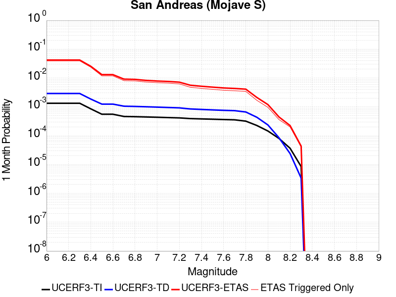 |  |

| Magnitude | 1 wk TI Prob | 1 wk TD Prob | 1 wk ETAS Prob | 1 wk ETAS/TD Gain | 1 wk ETAS Triggered Only | 1 mo TI Prob | 1 mo TD Prob | 1 mo ETAS Prob | 1 mo ETAS/TD Gain | 1 mo ETAS Triggered Only | 1 yr TI Prob | 1 yr TD Prob | 1 yr ETAS Prob | 1 yr ETAS/TD Gain | 1 yr ETAS Triggered Only |
|-----|-----|-----|-----|-----|-----|-----|-----|-----|-----|-----|-----|-----|-----|-----|-----|
| 6.0 | 3.1064058E-4 | 6.771211E-4 | 0.030057214 | 44.389713 | 0.0294 | 0.0013306376 | 0.0028988488 | 0.041985214 | 14.48341 | 0.0392 | 0.016080605 | 0.034691453 | 0.09017739 | 2.5994122 | 0.05748 |
| 6.1 | 3.1064058E-4 | 6.771211E-4 | 0.030057214 | 44.389713 | 0.0294 | 0.0013306376 | 0.0028988488 | 0.041985214 | 14.48341 | 0.0392 | 0.016080605 | 0.034691453 | 0.09017739 | 2.5994122 | 0.05748 |
| 6.2 | 3.1064058E-4 | 6.771211E-4 | 0.030057214 | 44.389713 | 0.0294 | 0.0013306376 | 0.0028988488 | 0.041985214 | 14.48341 | 0.0392 | 0.016080605 | 0.034691453 | 0.09017739 | 2.5994122 | 0.05748 |
| 6.3 | 3.1064058E-4 | 6.771211E-4 | 0.030057214 | 44.389713 | 0.0294 | 0.0013306376 | 0.0028988488 | 0.041985214 | 14.48341 | 0.0392 | 0.016080605 | 0.034691453 | 0.09017739 | 2.5994122 | 0.05748 |
| 6.4 | 1.9872203E-4 | 4.341842E-4 | 0.018026542 | 41.51819 | 0.0176 | 8.5138786E-4 | 0.0018594908 | 0.025455533 | 13.689518 | 0.02364 | 0.010316478 | 0.022410452 | 0.057134435 | 2.5494547 | 0.03552 |
| 6.5 | 1.291105E-4 | 2.8979595E-4 | 0.009327176 | 32.18532 | 0.00904 | 5.5321335E-4 | 0.0012413943 | 0.013066696 | 10.525823 | 0.01184 | 0.006714592 | 0.015010072 | 0.032897487 | 2.1916943 | 0.01816 |
| 6.6 | 1.291105E-4 | 2.8979595E-4 | 0.009327176 | 32.18532 | 0.00904 | 5.5321335E-4 | 0.0012413943 | 0.013066696 | 10.525823 | 0.01184 | 0.006714592 | 0.015010072 | 0.032897487 | 2.1916943 | 0.01816 |
| 6.7 | 1.08001186E-4 | 2.4557297E-4 | 0.0066839913 | 27.217945 | 0.00644 | 4.6278012E-4 | 0.0010520316 | 0.009123531 | 8.6722975 | 0.00808 | 0.0056198016 | 0.012733568 | 0.0248572 | 1.9521002 | 0.01228 |
| 6.8 | 1.0624356E-4 | 2.4074306E-4 | 0.006599212 | 27.411848 | 0.00636 | 4.5525006E-4 | 0.0010313485 | 0.008943181 | 8.671347 | 0.00792 | 0.0055285925 | 0.012484655 | 0.024216337 | 1.9396881 | 0.01188 |
| 6.9 | 1.0393785E-4 | 2.3443767E-4 | 0.0060730684 | 25.904833 | 0.00584 | 4.4537184E-4 | 0.0010043464 | 0.008237075 | 8.201427 | 0.00724 | 0.0054089287 | 0.012159616 | 0.022907319 | 1.8838851 | 0.01088 |
| 7.0 | 1.0155622E-4 | 2.2812336E-4 | 0.005786855 | 25.367218 | 0.00556 | 4.3516833E-4 | 9.773056E-4 | 0.007850582 | 8.032883 | 0.00688 | 0.005285311 | 0.0118340105 | 0.02183425 | 1.8450423 | 0.01012 |
| 7.1 | 9.885595E-5 | 2.2099643E-4 | 0.005619803 | 25.429384 | 0.0054 | 4.2359953E-4 | 9.4678416E-4 | 0.0075804973 | 8.006575 | 0.00664 | 0.0051451353 | 0.0114663765 | 0.02099584 | 1.8310789 | 0.00964 |
| 7.2 | 9.6411415E-5 | 2.1461575E-4 | 0.005373508 | 25.03781 | 0.00516 | 4.1312634E-4 | 9.194579E-4 | 0.0071537206 | 7.780368 | 0.00624 | 0.005018219 | 0.011137128 | 0.020076448 | 1.8026594 | 0.00904 |
| 7.3 | 9.1180635E-5 | 1.968396E-4 | 0.0042360444 | 21.520287 | 0.00404 | 3.907156E-4 | 8.4332563E-4 | 0.0055993116 | 6.63956 | 0.00476 | 0.004746591 | 0.0102192685 | 0.01734569 | 1.6973515 | 0.0072 |
| 7.4 | 8.887388E-5 | 1.8930127E-4 | 0.0038286122 | 20.224968 | 0.00364 | 3.8083247E-4 | 8.11039E-4 | 0.005167503 | 6.3714604 | 0.00436 | 0.0046267817 | 0.009829793 | 0.016483737 | 1.6769159 | 0.00672 |
| 7.5 | 8.6750515E-5 | 1.8259375E-4 | 0.0036219656 | 19.836197 | 0.00344 | 3.7173493E-4 | 7.8231003E-4 | 0.0048191496 | 6.160153 | 0.00404 | 0.004516484 | 0.009483118 | 0.015584702 | 1.6434155 | 0.00616 |
| 7.6 | 8.453092E-5 | 1.7644193E-4 | 0.0033758774 | 19.13308 | 0.0032 | 3.6222505E-4 | 7.559606E-4 | 0.004513118 | 5.970044 | 0.00376 | 0.0044011753 | 0.009165057 | 0.014911899 | 1.6270384 | 0.0058 |
| 7.7 | 8.259102E-5 | 1.716408E-4 | 0.003251112 | 18.941372 | 0.00308 | 3.539135E-4 | 7.353961E-4 | 0.0043327487 | 5.8917212 | 0.0036 | 0.004300386 | 0.008916762 | 0.014387541 | 1.6135387 | 0.00552 |
| 7.8 | 7.444844E-5 | 1.54684E-4 | 0.0030742323 | 19.874273 | 0.00292 | 3.1902574E-4 | 6.627631E-4 | 0.0041004834 | 6.1869516 | 0.00344 | 0.0038772223 | 0.008039338 | 0.013157855 | 1.636684 | 0.00516 |
| 7.9 | 5.2586525E-5 | 1.0133334E-4 | 0.0014211995 | 14.024995 | 0.00132 | 2.2535135E-4 | 4.342135E-4 | 0.002113484 | 4.8673844 | 0.00168 | 0.0027402006 | 0.0052737463 | 0.007860035 | 1.4904082 | 0.0026 |
| 8.0 | 3.379877E-5 | 5.4809316E-5 | 8.1476767E-4 | 14.865496 | 7.6E-4 | 1.4484383E-4 | 2.3487593E-4 | 0.0011946504 | 5.086304 | 9.6E-4 | 0.0017620471 | 0.0028558664 | 0.004251868 | 1.488819 | 0.0014 |
| 8.1 | 1.8668277E-5 | 1.9660263E-5 | 2.5965556E-4 | 13.207125 | 2.4E-4 | 8.000444E-5 | 8.425555E-5 | 4.442252E-4 | 5.2723556 | 3.6E-4 | 9.736188E-4 | 0.0010253292 | 0.0014249191 | 1.3897185 | 4.0E-4 |
| 8.2 | 8.541571E-6 | 5.592881E-6 | 1.6559199E-4 | 29.607635 | 1.6E-4 | 3.660622E-5 | 2.396927E-5 | 2.2396448E-4 | 9.343817 | 2.0E-4 | 4.455896E-4 | 2.9178688E-4 | 4.9172854E-4 | 1.6852318 | 2.0E-4 |
| 8.3 | 1.983087E-6 | 7.877893E-7 | 4.0787756E-5 | 51.774956 | 4.0E-5 | 8.498917E-6 | 3.3762356E-6 | 4.33761E-5 | 12.847474 | 4.0E-5 | 1.034694E-4 | 4.110491E-5 | 8.1103266E-5 | 1.9730797 | 4.0E-5 |

## San Andreas (San Bernardino N)
*[(top)](#table-of-contents)*

| 1 Week | 1 Month | 1 Year |
|-----|-----|-----|
| 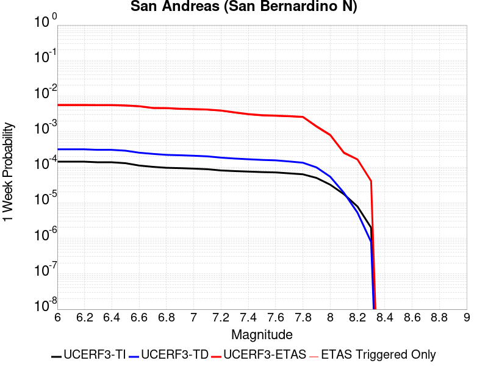 |  |  |

| Magnitude | 1 wk TI Prob | 1 wk TD Prob | 1 wk ETAS Prob | 1 wk ETAS/TD Gain | 1 wk ETAS Triggered Only | 1 mo TI Prob | 1 mo TD Prob | 1 mo ETAS Prob | 1 mo ETAS/TD Gain | 1 mo ETAS Triggered Only | 1 yr TI Prob | 1 yr TD Prob | 1 yr ETAS Prob | 1 yr ETAS/TD Gain | 1 yr ETAS Triggered Only |
|-----|-----|-----|-----|-----|-----|-----|-----|-----|-----|-----|-----|-----|-----|-----|-----|
| 6.0 | 1.4273766E-4 | 3.1797116E-4 | 0.0056762667 | 17.851515 | 0.00536 | 6.115894E-4 | 0.0013620278 | 0.008272602 | 6.07374 | 0.00692 | 0.0074207084 | 0.016458113 | 0.02696234 | 1.6382401 | 0.01068 |
| 6.1 | 1.4273766E-4 | 3.1797116E-4 | 0.0056762667 | 17.851515 | 0.00536 | 6.115894E-4 | 0.0013620278 | 0.008272602 | 6.07374 | 0.00692 | 0.0074207084 | 0.016458113 | 0.02696234 | 1.6382401 | 0.01068 |
| 6.2 | 1.4273766E-4 | 3.1797116E-4 | 0.0056762667 | 17.851515 | 0.00536 | 6.115894E-4 | 0.0013620278 | 0.008272602 | 6.07374 | 0.00692 | 0.0074207084 | 0.016458113 | 0.02696234 | 1.6382401 | 0.01068 |
| 6.3 | 1.3730655E-4 | 3.070095E-4 | 0.005625376 | 18.323133 | 0.00532 | 5.883239E-4 | 0.0013150972 | 0.00818605 | 6.2246723 | 0.00688 | 0.0071393442 | 0.015895175 | 0.02636605 | 1.6587455 | 0.01064 |
| 6.4 | 1.3730655E-4 | 3.070095E-4 | 0.005625376 | 18.323133 | 0.00532 | 5.883239E-4 | 0.0013150972 | 0.00818605 | 6.2246723 | 0.00688 | 0.0071393442 | 0.015895175 | 0.02636605 | 1.6587455 | 0.01064 |
| 6.5 | 1.2942807E-4 | 2.9113982E-4 | 0.005489626 | 18.855633 | 0.0052 | 5.545738E-4 | 0.0012471506 | 0.00795877 | 6.3815627 | 0.00672 | 0.0067310524 | 0.015079602 | 0.025322774 | 1.6792734 | 0.0104 |
| 6.6 | 1.1125901E-4 | 2.5549048E-4 | 0.005214223 | 20.40868 | 0.00496 | 4.767372E-4 | 0.001094502 | 0.0074075847 | 6.7679954 | 0.00632 | 0.005788839 | 0.0132447835 | 0.022796573 | 1.7211738 | 0.00968 |
| 6.7 | 1.02209575E-4 | 2.3682536E-4 | 0.004675774 | 19.743553 | 0.00444 | 4.3796748E-4 | 0.0010145725 | 0.006528972 | 6.4351954 | 0.00552 | 0.0053192247 | 0.012282886 | 0.02061922 | 1.678695 | 0.00844 |
| 6.8 | 9.610582E-5 | 2.2205901E-4 | 0.004621082 | 20.810154 | 0.0044 | 4.1181705E-4 | 9.5133507E-4 | 0.0064261216 | 6.754846 | 0.00548 | 0.0050023515 | 0.011521262 | 0.019784944 | 1.7172549 | 0.00836 |
| 6.9 | 9.3877505E-5 | 2.1660629E-4 | 0.0044156965 | 20.385818 | 0.0042 | 4.0227012E-4 | 9.279831E-4 | 0.0062030833 | 6.684479 | 0.00528 | 0.0048866454 | 0.011239915 | 0.019189546 | 1.7072679 | 0.00804 |
| 7.0 | 9.1019785E-5 | 2.0986385E-4 | 0.004328999 | 20.627655 | 0.00412 | 3.900265E-4 | 8.991071E-4 | 0.0060944315 | 6.778316 | 0.0052 | 0.0047382377 | 0.010891914 | 0.018567393 | 1.7046951 | 0.00776 |
| 7.1 | 8.771155E-5 | 2.015964E-4 | 0.00420079 | 20.837626 | 0.004 | 3.758525E-4 | 8.63699E-4 | 0.005899346 | 6.830326 | 0.00504 | 0.0045664064 | 0.010465035 | 0.017827176 | 1.7034988 | 0.00744 |
| 7.2 | 8.0830236E-5 | 1.8562343E-4 | 0.0039449255 | 21.252302 | 0.00376 | 3.4636928E-4 | 7.952866E-4 | 0.0054315967 | 6.8297343 | 0.00464 | 0.0042088944 | 0.009639736 | 0.016453415 | 1.7068324 | 0.00688 |
| 7.3 | 7.7668235E-5 | 1.7502681E-4 | 0.0034944457 | 19.965202 | 0.00332 | 3.328214E-4 | 7.4989937E-4 | 0.00466696 | 6.2234483 | 0.00392 | 0.0040445733 | 0.009091886 | 0.0150373345 | 1.6539291 | 0.006 |
| 7.4 | 7.520177E-5 | 1.6720418E-4 | 0.0031267093 | 18.699945 | 0.00296 | 3.2225347E-4 | 7.1639265E-4 | 0.004273842 | 5.9657817 | 0.00356 | 0.0039163795 | 0.008687268 | 0.014198967 | 1.6344571 | 0.00556 |
| 7.5 | 7.274697E-5 | 1.600578E-4 | 0.002919616 | 18.24101 | 0.00276 | 3.1173544E-4 | 6.857817E-4 | 0.0039235596 | 5.7212954 | 0.00324 | 0.003788775 | 0.008317487 | 0.0132759 | 1.5961431 | 0.005 |
| 7.6 | 7.1185845E-5 | 1.5574165E-4 | 0.0028353243 | 18.205305 | 0.00268 | 3.0504653E-4 | 6.6729356E-4 | 0.0037852116 | 5.6724834 | 0.00312 | 0.0037076178 | 0.008094089 | 0.01293459 | 1.5980291 | 0.00488 |
| 7.7 | 6.709961E-5 | 1.4479096E-4 | 0.0027444146 | 18.954323 | 0.0026 | 2.8753807E-4 | 6.2038517E-4 | 0.003618524 | 5.8327055 | 0.003 | 0.003495157 | 0.0075270706 | 0.012211543 | 1.62235 | 0.00472 |
| 7.8 | 6.300812E-5 | 1.3354905E-4 | 0.0026132178 | 19.567476 | 0.00248 | 2.7000686E-4 | 5.722275E-4 | 0.0034505795 | 6.030083 | 0.00288 | 0.0032823787 | 0.006944645 | 0.0113140885 | 1.6291817 | 0.0044 |
| 7.9 | 4.983037E-5 | 9.844076E-5 | 0.0014183108 | 14.40776 | 0.00132 | 2.1354125E-4 | 4.2182076E-4 | 0.0021011122 | 4.9810543 | 0.00168 | 0.0025967648 | 0.005123585 | 0.0077102636 | 1.5048572 | 0.0026 |
| 8.0 | 3.2211527E-5 | 5.4014366E-5 | 8.139733E-4 | 15.069571 | 7.6E-4 | 1.380421E-4 | 2.3146962E-4 | 0.0011912474 | 5.1464524 | 9.6E-4 | 0.0016793669 | 0.0028145025 | 0.004210562 | 1.4960237 | 0.0014 |
| 8.1 | 1.743376E-5 | 1.9157624E-5 | 2.5915302E-4 | 13.5274105 | 2.4E-4 | 7.471398E-5 | 8.210152E-5 | 4.4207196E-4 | 5.384455 | 3.6E-4 | 9.0926304E-4 | 9.991282E-4 | 0.0013987286 | 1.399949 | 4.0E-4 |
| 8.2 | 7.831616E-6 | 5.2765454E-6 | 1.652757E-4 | 31.32271 | 1.6E-4 | 3.3563636E-5 | 2.261357E-5 | 2.2260904E-4 | 9.844047 | 2.0E-4 | 4.0856065E-4 | 2.752855E-4 | 4.7523045E-4 | 1.7263184 | 2.0E-4 |
| 8.3 | 1.983087E-6 | 7.877893E-7 | 4.0787756E-5 | 51.774956 | 4.0E-5 | 8.498917E-6 | 3.3762356E-6 | 4.33761E-5 | 12.847474 | 4.0E-5 | 1.034694E-4 | 4.110491E-5 | 8.1103266E-5 | 1.9730797 | 4.0E-5 |

## San Andreas (Mojave N)
*[(top)](#table-of-contents)*

| 1 Week | 1 Month | 1 Year |
|-----|-----|-----|
|  |  |  |

| Magnitude | 1 wk TI Prob | 1 wk TD Prob | 1 wk ETAS Prob | 1 wk ETAS/TD Gain | 1 wk ETAS Triggered Only | 1 mo TI Prob | 1 mo TD Prob | 1 mo ETAS Prob | 1 mo ETAS/TD Gain | 1 mo ETAS Triggered Only | 1 yr TI Prob | 1 yr TD Prob | 1 yr ETAS Prob | 1 yr ETAS/TD Gain | 1 yr ETAS Triggered Only |
|-----|-----|-----|-----|-----|-----|-----|-----|-----|-----|-----|-----|-----|-----|-----|-----|
| 6.0 | 9.877682E-5 | 1.9626696E-4 | 0.0031156938 | 15.874775 | 0.00292 | 4.2326056E-4 | 8.4087317E-4 | 0.0043179467 | 5.135075 | 0.00348 | 0.0051410277 | 0.0101897055 | 0.01553468 | 1.5245466 | 0.0054 |
| 6.1 | 9.877682E-5 | 1.9626696E-4 | 0.0031156938 | 15.874775 | 0.00292 | 4.2326056E-4 | 8.4087317E-4 | 0.0043179467 | 5.135075 | 0.00348 | 0.0051410277 | 0.0101897055 | 0.01553468 | 1.5245466 | 0.0054 |
| 6.2 | 9.877682E-5 | 1.9626696E-4 | 0.0031156938 | 15.874775 | 0.00292 | 4.2326056E-4 | 8.4087317E-4 | 0.0043179467 | 5.135075 | 0.00348 | 0.0051410277 | 0.0101897055 | 0.01553468 | 1.5245466 | 0.0054 |
| 6.3 | 9.877682E-5 | 1.9626696E-4 | 0.0031156938 | 15.874775 | 0.00292 | 4.2326056E-4 | 8.4087317E-4 | 0.0043179467 | 5.135075 | 0.00348 | 0.0051410277 | 0.0101897055 | 0.01553468 | 1.5245466 | 0.0054 |
| 6.4 | 9.877682E-5 | 1.9626696E-4 | 0.0031156938 | 15.874775 | 0.00292 | 4.2326056E-4 | 8.4087317E-4 | 0.0043179467 | 5.135075 | 0.00348 | 0.0051410277 | 0.0101897055 | 0.01553468 | 1.5245466 | 0.0054 |
| 6.5 | 9.861474E-5 | 1.9600392E-4 | 0.0031154316 | 15.894741 | 0.00292 | 4.2256617E-4 | 8.397466E-4 | 0.0043168245 | 5.1406274 | 0.00348 | 0.0051326132 | 0.0101761175 | 0.015521167 | 1.5252542 | 0.0054 |
| 6.6 | 9.861474E-5 | 1.9600392E-4 | 0.0031154316 | 15.894741 | 0.00292 | 4.2256617E-4 | 8.397466E-4 | 0.0043168245 | 5.1406274 | 0.00348 | 0.0051326132 | 0.0101761175 | 0.015521167 | 1.5252542 | 0.0054 |
| 6.7 | 9.8552715E-5 | 1.959032E-4 | 0.003115331 | 15.902401 | 0.00292 | 4.223004E-4 | 8.393152E-4 | 0.004316394 | 5.1427574 | 0.00348 | 0.0051293927 | 0.010170914 | 0.0155159915 | 1.5255257 | 0.0054 |
| 6.8 | 9.8464974E-5 | 1.9575418E-4 | 0.0031151825 | 15.913748 | 0.00292 | 4.219245E-4 | 8.3867693E-4 | 0.004315758 | 5.1459126 | 0.00348 | 0.0051248376 | 0.010163216 | 0.015508335 | 1.5259279 | 0.0054 |
| 6.9 | 9.825824E-5 | 1.9543302E-4 | 0.0031148624 | 15.938261 | 0.00292 | 4.2103877E-4 | 8.373014E-4 | 0.0043143877 | 5.1527295 | 0.00348 | 0.0051141046 | 0.010146625 | 0.015491834 | 1.5267967 | 0.0054 |
| 7.0 | 9.781462E-5 | 1.9474408E-4 | 0.0031141755 | 15.991118 | 0.00292 | 4.1913814E-4 | 8.3435065E-4 | 0.004311447 | 5.167428 | 0.00348 | 0.005091073 | 0.010111034 | 0.015456434 | 1.52867 | 0.0054 |
| 7.1 | 9.7121134E-5 | 1.9375767E-4 | 0.0031131918 | 16.067451 | 0.00292 | 4.1616702E-4 | 8.3012594E-4 | 0.004307237 | 5.188655 | 0.00348 | 0.005055068 | 0.010060075 | 0.01540575 | 1.5313754 | 0.0054 |
| 7.2 | 9.663819E-5 | 1.93063E-4 | 0.0031124994 | 16.121677 | 0.00292 | 4.1409794E-4 | 8.2715065E-4 | 0.004304272 | 5.203734 | 0.00348 | 0.0050299936 | 0.010024184 | 0.015370053 | 1.5332972 | 0.0054 |
| 7.3 | 9.6277574E-5 | 1.92585E-4 | 0.0031120225 | 16.159218 | 0.00292 | 4.125529E-4 | 8.251034E-4 | 0.004302232 | 5.2141733 | 0.00348 | 0.0050112694 | 0.009999488 | 0.015345491 | 1.5346277 | 0.0054 |
| 7.4 | 9.593308E-5 | 1.919794E-4 | 0.0030714264 | 15.99873 | 0.00288 | 4.1107697E-4 | 8.225096E-4 | 0.00425968 | 5.178882 | 0.00344 | 0.0049933824 | 0.009968198 | 0.015274768 | 1.5323501 | 0.00536 |
| 7.5 | 9.561707E-5 | 1.9143702E-4 | 0.0030708858 | 16.041231 | 0.00288 | 4.0972308E-4 | 8.201866E-4 | 0.004257365 | 5.1907277 | 0.00344 | 0.0049769743 | 0.0099401735 | 0.015246894 | 1.533866 | 0.00536 |
| 7.6 | 9.418194E-5 | 1.8794056E-4 | 0.0029074294 | 15.46994 | 0.00272 | 4.0357444E-4 | 8.0521114E-4 | 0.00408257 | 5.0701857 | 0.00328 | 0.004902454 | 0.009759494 | 0.014829526 | 1.5194974 | 0.00512 |
| 7.7 | 8.202141E-5 | 1.6224218E-4 | 0.0027218268 | 16.77632 | 0.00256 | 3.51473E-4 | 6.951384E-4 | 0.0037729973 | 5.427692 | 0.00308 | 0.00427079 | 0.0084305275 | 0.013190061 | 1.5645595 | 0.0048 |
| 7.8 | 7.2859846E-5 | 1.4698919E-4 | 0.0026266247 | 17.869509 | 0.00248 | 3.1221908E-4 | 6.298016E-4 | 0.0036279121 | 5.7604046 | 0.003 | 0.003794643 | 0.007640919 | 0.012205771 | 1.5974218 | 0.0046 |
| 7.9 | 5.3874453E-5 | 1.0174001E-4 | 0.0014216057 | 13.972926 | 0.00132 | 2.3087008E-4 | 4.3595576E-4 | 0.0021152233 | 4.851922 | 0.00168 | 0.0028072202 | 0.0052948557 | 0.007881089 | 1.4884427 | 0.0026 |
| 8.0 | 3.468538E-5 | 5.500278E-5 | 8.14961E-4 | 14.816724 | 7.6E-4 | 1.4864317E-4 | 2.3570491E-4 | 0.0011954786 | 5.0719295 | 9.6E-4 | 0.0018082283 | 0.0028659326 | 0.00426192 | 1.4870971 | 0.0014 |
| 8.1 | 1.9152367E-5 | 1.9757208E-5 | 2.5975247E-4 | 13.147225 | 2.4E-4 | 8.207899E-5 | 8.467101E-5 | 4.4464052E-4 | 5.2513905 | 3.6E-4 | 9.988535E-4 | 0.0010303827 | 0.0014299705 | 1.3878053 | 4.0E-4 |
| 8.2 | 8.643924E-6 | 5.607368E-6 | 1.6560647E-4 | 29.533726 | 1.6E-4 | 3.704486E-5 | 2.4031357E-5 | 2.2402655E-4 | 9.32226 | 2.0E-4 | 4.5092785E-4 | 2.9254257E-4 | 4.924841E-4 | 1.6834612 | 2.0E-4 |
| 8.3 | 1.983087E-6 | 7.877893E-7 | 4.0787756E-5 | 51.774956 | 4.0E-5 | 8.498917E-6 | 3.3762356E-6 | 4.33761E-5 | 12.847474 | 4.0E-5 | 1.034694E-4 | 4.110491E-5 | 8.1103266E-5 | 1.9730797 | 4.0E-5 |

## Lenwood-Lockhart-Old Woman Springs
*[(top)](#table-of-contents)*

| 1 Week | 1 Month | 1 Year |
|-----|-----|-----|
|  |  |  |

| Magnitude | 1 wk TI Prob | 1 wk TD Prob | 1 wk ETAS Prob | 1 wk ETAS/TD Gain | 1 wk ETAS Triggered Only | 1 mo TI Prob | 1 mo TD Prob | 1 mo ETAS Prob | 1 mo ETAS/TD Gain | 1 mo ETAS Triggered Only | 1 yr TI Prob | 1 yr TD Prob | 1 yr ETAS Prob | 1 yr ETAS/TD Gain | 1 yr ETAS Triggered Only |
|-----|-----|-----|-----|-----|-----|-----|-----|-----|-----|-----|-----|-----|-----|-----|-----|
| 6.0 | 3.744542E-5 | 4.3976295E-5 | 0.0022038813 | 50.11521 | 0.00216 | 1.604705E-4 | 1.884572E-4 | 0.0032278842 | 17.127945 | 0.00304 | 0.0019519776 | 0.002292224 | 0.00712113 | 3.1066465 | 0.00484 |
| 6.1 | 3.744542E-5 | 4.3976295E-5 | 0.0022038813 | 50.11521 | 0.00216 | 1.604705E-4 | 1.884572E-4 | 0.0032278842 | 17.127945 | 0.00304 | 0.0019519776 | 0.002292224 | 0.00712113 | 3.1066465 | 0.00484 |
| 6.2 | 3.744542E-5 | 4.3976295E-5 | 0.0022038813 | 50.11521 | 0.00216 | 1.604705E-4 | 1.884572E-4 | 0.0032278842 | 17.127945 | 0.00304 | 0.0019519776 | 0.002292224 | 0.00712113 | 3.1066465 | 0.00484 |
| 6.3 | 2.1079984E-5 | 2.5359855E-5 | 0.0011853304 | 46.740425 | 0.00116 | 9.0339665E-5 | 1.0868068E-4 | 0.0018284938 | 16.824461 | 0.00172 | 0.0010993304 | 0.001322404 | 0.004038807 | 3.05414 | 0.00272 |
| 6.4 | 2.1079984E-5 | 2.5359855E-5 | 0.0011853304 | 46.740425 | 0.00116 | 9.0339665E-5 | 1.0868068E-4 | 0.0018284938 | 16.824461 | 0.00172 | 0.0010993304 | 0.001322404 | 0.004038807 | 3.05414 | 0.00272 |
| 6.5 | 1.7397282E-5 | 2.0667581E-5 | 0.0010206469 | 49.383953 | 0.001 | 7.455765E-5 | 8.857241E-5 | 0.0015684413 | 17.708012 | 0.00148 | 9.073613E-4 | 0.0010778473 | 0.0031955624 | 2.9647634 | 0.00212 |
| 6.6 | 1.52050325E-5 | 1.768411E-5 | 9.776672E-4 | 55.285065 | 9.6E-4 | 6.51628E-5 | 7.5786884E-5 | 0.0014356838 | 18.943697 | 0.00136 | 7.9306826E-4 | 9.223226E-4 | 0.002920478 | 3.1664386 | 0.002 |
| 6.7 | 1.332523E-5 | 1.5268157E-5 | 8.952547E-4 | 58.635418 | 8.8E-4 | 5.7106878E-5 | 6.543335E-5 | 0.0012653548 | 19.338072 | 0.0012 | 6.950544E-4 | 7.9636567E-4 | 0.0024350595 | 3.0577154 | 0.00164 |
| 6.8 | 1.1525329E-5 | 1.3034469E-5 | 7.7302457E-4 | 59.30618 | 7.6E-4 | 4.9393333E-5 | 5.5860837E-5 | 0.001055805 | 18.900629 | 0.001 | 6.011979E-4 | 6.798977E-4 | 0.0021189186 | 3.1165257 | 0.00144 |
| 6.9 | 1.0253909E-5 | 1.1517644E-5 | 7.715089E-4 | 66.984955 | 7.6E-4 | 4.3944583E-5 | 4.936042E-5 | 0.001009313 | 20.44782 | 9.6E-4 | 5.3489394E-4 | 6.00801E-4 | 0.0019999598 | 3.3288224 | 0.0014 |
| 7.0 | 8.104563E-6 | 8.993927E-6 | 6.489882E-4 | 72.158485 | 6.4E-4 | 3.4733377E-5 | 3.8544847E-5 | 7.9851557E-4 | 20.716532 | 7.6E-4 | 4.2279682E-4 | 4.6918486E-4 | 0.0016286406 | 3.471213 | 0.00116 |
| 7.1 | 6.7986157E-6 | 7.518288E-6 | 6.0751376E-4 | 80.8048 | 6.0E-4 | 2.91366E-5 | 3.2220847E-5 | 6.722002E-4 | 20.862276 | 6.4E-4 | 3.5468035E-4 | 3.9222036E-4 | 0.0013118595 | 3.3447003 | 9.2E-4 |
| 7.2 | 5.6893327E-6 | 6.2822814E-6 | 4.462795E-4 | 71.03781 | 4.4E-4 | 2.4382627E-5 | 2.6923795E-5 | 5.0691084E-4 | 18.827616 | 4.8E-4 | 2.9681803E-4 | 3.277499E-4 | 0.001007527 | 3.0740728 | 6.8E-4 |
| 7.3 | 4.253348E-6 | 4.7090152E-6 | 3.6470732E-4 | 77.448746 | 3.6E-4 | 1.8228506E-5 | 2.0181347E-5 | 3.8017408E-4 | 18.837893 | 3.6E-4 | 2.2190946E-4 | 2.4568205E-4 | 7.2556414E-4 | 2.9532647 | 4.8E-4 |
| 7.4 | 2.5448119E-6 | 2.852325E-6 | 2.4285165E-4 | 85.14164 | 2.4E-4 | 1.0906291E-5 | 1.2224203E-5 | 2.5222127E-4 | 20.632942 | 2.4E-4 | 1.3277601E-4 | 1.4882116E-4 | 4.287795E-4 | 2.881173 | 2.8E-4 |
| 7.5 | 4.3706837E-8 | 4.5635893E-8 | 4.5635893E-8 | 1.0 | 0.0 | 1.8731501E-7 | 1.9558239E-7 | 1.9558239E-7 | 1.0 | 0.0 | 2.2805577E-6 | 2.3812136E-6 | 2.3812136E-6 | 1.0 | 0.0 |

## Helendale-So Lockhart
*[(top)](#table-of-contents)*

| 1 Week | 1 Month | 1 Year |
|-----|-----|-----|
| 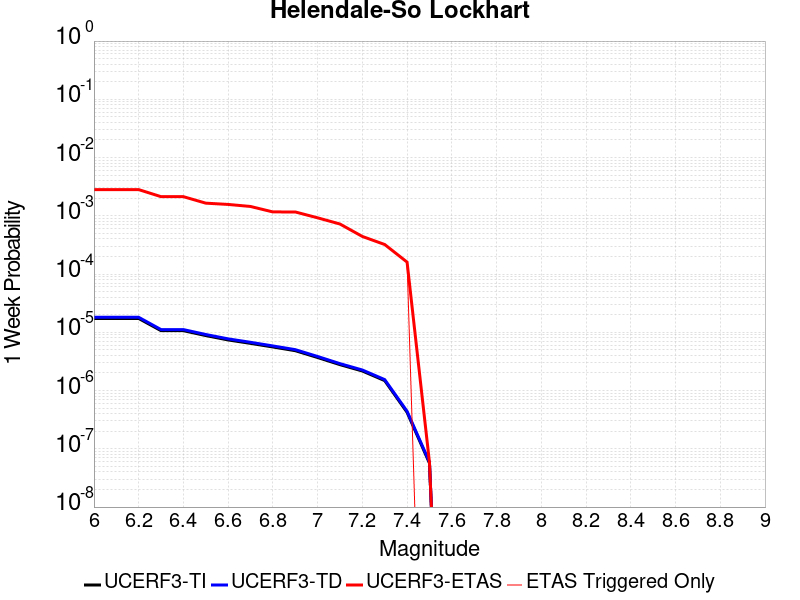 |  |  |

| Magnitude | 1 wk TI Prob | 1 wk TD Prob | 1 wk ETAS Prob | 1 wk ETAS/TD Gain | 1 wk ETAS Triggered Only | 1 mo TI Prob | 1 mo TD Prob | 1 mo ETAS Prob | 1 mo ETAS/TD Gain | 1 mo ETAS Triggered Only | 1 yr TI Prob | 1 yr TD Prob | 1 yr ETAS Prob | 1 yr ETAS/TD Gain | 1 yr ETAS Triggered Only |
|-----|-----|-----|-----|-----|-----|-----|-----|-----|-----|-----|-----|-----|-----|-----|-----|
| 6.0 | 1.7296055E-5 | 1.81066E-5 | 0.002818056 | 155.63693 | 0.0028 | 7.412385E-5 | 7.759753E-5 | 0.00339734 | 43.781548 | 0.00332 | 9.0208417E-4 | 9.4436115E-4 | 0.005899677 | 6.247268 | 0.00496 |
| 6.1 | 1.7296055E-5 | 1.81066E-5 | 0.002818056 | 155.63693 | 0.0028 | 7.412385E-5 | 7.759753E-5 | 0.00339734 | 43.781548 | 0.00332 | 9.0208417E-4 | 9.4436115E-4 | 0.005899677 | 6.247268 | 0.00496 |
| 6.2 | 1.7296055E-5 | 1.81066E-5 | 0.002818056 | 155.63693 | 0.0028 | 7.412385E-5 | 7.759753E-5 | 0.00339734 | 43.781548 | 0.00332 | 9.0208417E-4 | 9.4436115E-4 | 0.005899677 | 6.247268 | 0.00496 |
| 6.3 | 1.0669118E-5 | 1.1137076E-5 | 0.0021311135 | 191.35304 | 0.00212 | 4.5723988E-5 | 4.772947E-5 | 0.002527611 | 52.95703 | 0.00248 | 5.5654737E-4 | 5.8095413E-4 | 0.0039390023 | 6.780229 | 0.00336 |
| 6.4 | 1.0669118E-5 | 1.1137076E-5 | 0.0021311135 | 191.35304 | 0.00212 | 4.5723988E-5 | 4.772947E-5 | 0.002527611 | 52.95703 | 0.00248 | 5.5654737E-4 | 5.8095413E-4 | 0.0039390023 | 6.780229 | 0.00336 |
| 6.5 | 8.790038E-6 | 9.171543E-6 | 0.0016491564 | 179.81233 | 0.00164 | 3.767105E-5 | 3.930603E-5 | 0.0019592305 | 49.845547 | 0.00192 | 4.585485E-4 | 4.784474E-4 | 0.0029972417 | 6.264517 | 0.00252 |
| 6.6 | 7.396949E-6 | 7.716665E-6 | 0.0015677046 | 203.15831 | 0.00156 | 3.1700827E-5 | 3.3071006E-5 | 0.0018330115 | 55.426537 | 0.0018 | 3.858892E-4 | 4.0256613E-4 | 0.0026816484 | 6.6613855 | 0.00228 |
| 6.7 | 6.4600285E-6 | 6.739015E-6 | 0.0014467293 | 214.67963 | 0.00144 | 2.7685543E-5 | 2.8881179E-5 | 0.001628835 | 56.3978 | 0.0016 | 3.3701936E-4 | 3.515724E-4 | 0.0023908552 | 6.800463 | 0.00204 |
| 6.8 | 5.600104E-6 | 5.8368437E-6 | 0.0011658301 | 199.73639 | 0.00116 | 2.4000226E-5 | 2.5014808E-5 | 0.0013049828 | 52.168415 | 0.00128 | 2.9216358E-4 | 3.0451332E-4 | 0.0020239896 | 6.6466374 | 0.00172 |
| 6.9 | 4.839122E-6 | 5.0402173E-6 | 0.0011650344 | 231.14766 | 0.00116 | 2.0738931E-5 | 2.1600754E-5 | 0.0013015731 | 60.25591 | 0.00128 | 2.5246723E-4 | 2.629579E-4 | 0.0019825057 | 7.539251 | 0.00172 |
| 7.0 | 3.6937633E-6 | 3.8457424E-6 | 9.238422E-4 | 240.22466 | 9.2E-4 | 1.5830317E-5 | 1.6481652E-5 | 0.0010164651 | 61.67253 | 0.001 | 1.9271708E-4 | 2.0064594E-4 | 0.001600365 | 7.9760647 | 0.0014 |
| 7.1 | 2.7858857E-6 | 2.8982486E-6 | 7.2289613E-4 | 249.42517 | 7.2E-4 | 1.1939455E-5 | 1.2421007E-5 | 7.3241204E-4 | 58.96559 | 7.2E-4 | 1.4535317E-4 | 1.5121548E-4 | 0.0011910582 | 7.876562 | 0.00104 |
| 7.2 | 2.1672065E-6 | 2.2543188E-6 | 4.4225334E-4 | 196.18047 | 4.4E-4 | 9.2879945E-6 | 9.661331E-6 | 4.496571E-4 | 46.541935 | 4.4E-4 | 1.1307546E-4 | 1.1762055E-4 | 7.1755E-4 | 6.1005497 | 6.0E-4 |
| 7.3 | 1.4823496E-6 | 1.5424213E-6 | 3.2154194E-4 | 208.4657 | 3.2E-4 | 6.3529114E-6 | 6.610361E-6 | 3.2660825E-4 | 49.40853 | 3.2E-4 | 7.734395E-5 | 8.047833E-5 | 4.8044615E-4 | 5.969882 | 4.0E-4 |
| 7.4 | 4.2321457E-7 | 4.411508E-7 | 1.6044108E-4 | 363.68762 | 1.6E-4 | 1.8137755E-6 | 1.8906451E-6 | 1.6189035E-4 | 85.62704 | 1.6E-4 | 2.2082493E-5 | 2.3018407E-5 | 1.8301472E-4 | 7.9507985 | 1.6E-4 |
| 7.5 | 5.6942316E-8 | 5.9424394E-8 | 5.9424394E-8 | 1.0 | 0.0 | 2.440385E-7 | 2.5467594E-7 | 2.5467594E-7 | 1.0 | 0.0 | 2.9711643E-6 | 3.1006762E-6 | 3.1006762E-6 | 1.0 | 0.0 |

## San Andreas (Big Bend)
*[(top)](#table-of-contents)*

| 1 Week | 1 Month | 1 Year |
|-----|-----|-----|
|  |  |  |

| Magnitude | 1 wk TI Prob | 1 wk TD Prob | 1 wk ETAS Prob | 1 wk ETAS/TD Gain | 1 wk ETAS Triggered Only | 1 mo TI Prob | 1 mo TD Prob | 1 mo ETAS Prob | 1 mo ETAS/TD Gain | 1 mo ETAS Triggered Only | 1 yr TI Prob | 1 yr TD Prob | 1 yr ETAS Prob | 1 yr ETAS/TD Gain | 1 yr ETAS Triggered Only |
|-----|-----|-----|-----|-----|-----|-----|-----|-----|-----|-----|-----|-----|-----|-----|-----|
| 6.0 | 1.0179969E-4 | 2.0293587E-4 | 0.0026824325 | 13.218129 | 0.00248 | 4.362114E-4 | 8.694363E-4 | 0.003866828 | 4.447511 | 0.003 | 0.0052979486 | 0.0105343 | 0.015244156 | 1.4470973 | 0.00476 |
| 6.1 | 1.0179969E-4 | 2.0293587E-4 | 0.0026824325 | 13.218129 | 0.00248 | 4.362114E-4 | 8.694363E-4 | 0.003866828 | 4.447511 | 0.003 | 0.0052979486 | 0.0105343 | 0.015244156 | 1.4470973 | 0.00476 |
| 6.2 | 1.0179969E-4 | 2.0293587E-4 | 0.0026824325 | 13.218129 | 0.00248 | 4.362114E-4 | 8.694363E-4 | 0.003866828 | 4.447511 | 0.003 | 0.0052979486 | 0.0105343 | 0.015244156 | 1.4470973 | 0.00476 |
| 6.3 | 1.0179969E-4 | 2.0293587E-4 | 0.0026824325 | 13.218129 | 0.00248 | 4.362114E-4 | 8.694363E-4 | 0.003866828 | 4.447511 | 0.003 | 0.0052979486 | 0.0105343 | 0.015244156 | 1.4470973 | 0.00476 |
| 6.4 | 9.1639464E-5 | 1.8646746E-4 | 0.00258602 | 13.868478 | 0.0024 | 3.9268145E-4 | 7.989017E-4 | 0.003716569 | 4.6520977 | 0.00292 | 0.0047704205 | 0.0096833715 | 0.014238829 | 1.4704411 | 0.0046 |
| 6.5 | 9.1639464E-5 | 1.8646746E-4 | 0.00258602 | 13.868478 | 0.0024 | 3.9268145E-4 | 7.989017E-4 | 0.003716569 | 4.6520977 | 0.00292 | 0.0047704205 | 0.0096833715 | 0.014238829 | 1.4704411 | 0.0046 |
| 6.6 | 9.042622E-5 | 1.8453281E-4 | 0.00258409 | 14.003417 | 0.0024 | 3.8748336E-4 | 7.906154E-4 | 0.0037083067 | 4.6904054 | 0.00292 | 0.0047074095 | 0.009583375 | 0.014099675 | 1.471264 | 0.00456 |
| 6.7 | 8.9836685E-5 | 1.836743E-4 | 0.0025832334 | 14.064208 | 0.0024 | 3.8495753E-4 | 7.869383E-4 | 0.0037046405 | 4.707663 | 0.00292 | 0.00467679 | 0.009538999 | 0.014055501 | 1.4734776 | 0.00456 |
| 6.8 | 8.9471854E-5 | 1.8314009E-4 | 0.0025827005 | 14.102323 | 0.0024 | 3.8339442E-4 | 7.846502E-4 | 0.003702359 | 4.7184834 | 0.00292 | 0.004657841 | 0.009511384 | 0.014028013 | 1.4748654 | 0.00456 |
| 6.9 | 8.858234E-5 | 1.8195626E-4 | 0.0025815195 | 14.187584 | 0.0024 | 3.7958333E-4 | 7.795797E-4 | 0.0036973034 | 4.742688 | 0.00292 | 0.004611638 | 0.009450188 | 0.013967095 | 1.4779701 | 0.00456 |
| 7.0 | 8.7433385E-5 | 1.803388E-4 | 0.002579906 | 14.305884 | 0.0024 | 3.746607E-4 | 7.7265187E-4 | 0.0036903957 | 4.7762723 | 0.00292 | 0.004551957 | 0.009366569 | 0.013883858 | 1.4822778 | 0.00456 |
| 7.1 | 8.684964E-5 | 1.7945496E-4 | 0.0025790243 | 14.371429 | 0.0024 | 3.7215967E-4 | 7.688662E-4 | 0.003686621 | 4.79488 | 0.00292 | 0.0045216335 | 0.009320875 | 0.013838371 | 1.4846644 | 0.00456 |
| 7.2 | 8.606521E-5 | 1.7835775E-4 | 0.0025779298 | 14.453701 | 0.0024 | 3.6879873E-4 | 7.6416665E-4 | 0.0036819354 | 4.818236 | 0.00292 | 0.0044808835 | 0.009264145 | 0.0137819005 | 1.4876603 | 0.00456 |
| 7.3 | 8.568266E-5 | 1.7777378E-4 | 0.0025773472 | 14.497904 | 0.0024 | 3.6715972E-4 | 7.6166535E-4 | 0.0036794413 | 4.830785 | 0.00292 | 0.0044610105 | 0.009233951 | 0.013751844 | 1.4892699 | 0.00456 |
| 7.4 | 8.5432206E-5 | 1.7739709E-4 | 0.0025769714 | 14.52657 | 0.0024 | 3.6608664E-4 | 7.6005195E-4 | 0.0036778327 | 4.8389225 | 0.00292 | 0.004447999 | 0.009214474 | 0.013732456 | 1.4903136 | 0.00456 |
| 7.5 | 8.4791965E-5 | 1.7608136E-4 | 0.0025756587 | 14.627663 | 0.0024 | 3.633435E-4 | 7.5441634E-4 | 0.0036722135 | 4.867622 | 0.00292 | 0.0044147377 | 0.009146439 | 0.013664731 | 1.4939947 | 0.00456 |
| 7.6 | 8.241105E-5 | 1.7049891E-4 | 0.0024501102 | 14.37024 | 0.00228 | 3.531424E-4 | 7.3050515E-4 | 0.0035284597 | 4.830164 | 0.0028 | 0.0042910352 | 0.008857722 | 0.013179103 | 1.4878658 | 0.00436 |
| 7.7 | 7.00432E-5 | 1.4393656E-4 | 0.0023036257 | 16.004452 | 0.00216 | 3.001506E-4 | 6.167252E-4 | 0.0032950724 | 5.3428535 | 0.00268 | 0.0036482112 | 0.0074828197 | 0.01157199 | 1.5464746 | 0.00412 |
| 7.8 | 6.415362E-5 | 1.3139434E-4 | 0.0022111211 | 16.82813 | 0.00208 | 2.749151E-4 | 5.629971E-4 | 0.0031615333 | 5.615541 | 0.0026 | 0.0033419547 | 0.0068329778 | 0.010765919 | 1.5755824 | 0.00396 |
| 7.9 | 4.939911E-5 | 9.463773E-5 | 0.001254528 | 13.256107 | 0.00116 | 2.116933E-4 | 4.0552724E-4 | 0.0019249108 | 4.746687 | 0.00152 | 0.0025743195 | 0.0049261265 | 0.007194895 | 1.4605583 | 0.00228 |
| 8.0 | 3.344983E-5 | 5.2957934E-5 | 7.729198E-4 | 14.594976 | 7.2E-4 | 1.4334853E-4 | 2.2694284E-4 | 0.001146734 | 5.052964 | 9.2E-4 | 0.0017438711 | 0.00275953 | 0.0040359977 | 1.4625671 | 0.00128 |
| 8.1 | 1.9104898E-5 | 1.9529352E-5 | 2.5952468E-4 | 13.288954 | 2.4E-4 | 8.1875565E-5 | 8.369455E-5 | 4.436644E-4 | 5.3009953 | 3.6E-4 | 9.963791E-4 | 0.0010185054 | 0.001418098 | 1.3923323 | 4.0E-4 |
| 8.2 | 8.643924E-6 | 5.607368E-6 | 1.6560647E-4 | 29.533726 | 1.6E-4 | 3.704486E-5 | 2.4031357E-5 | 2.2402655E-4 | 9.32226 | 2.0E-4 | 4.5092785E-4 | 2.9254257E-4 | 4.924841E-4 | 1.6834612 | 2.0E-4 |
| 8.3 | 1.983087E-6 | 7.877893E-7 | 4.0787756E-5 | 51.774956 | 4.0E-5 | 8.498917E-6 | 3.3762356E-6 | 4.33761E-5 | 12.847474 | 4.0E-5 | 1.034694E-4 | 4.110491E-5 | 8.1103266E-5 | 1.9730797 | 4.0E-5 |

## San Andreas (San Bernardino S)
*[(top)](#table-of-contents)*

| 1 Week | 1 Month | 1 Year |
|-----|-----|-----|
| 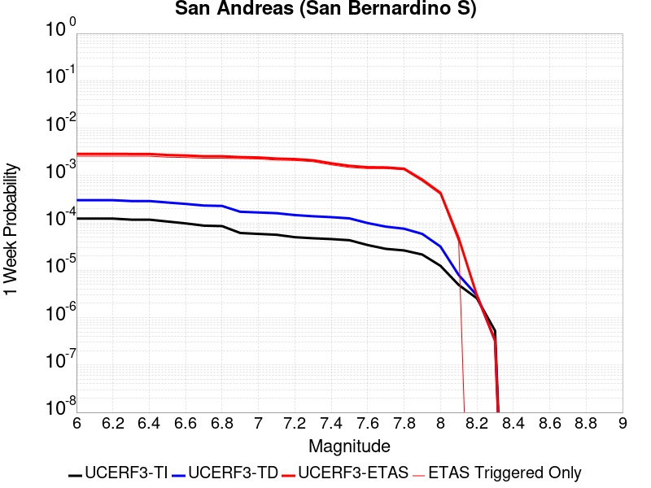 |  |  |

| Magnitude | 1 wk TI Prob | 1 wk TD Prob | 1 wk ETAS Prob | 1 wk ETAS/TD Gain | 1 wk ETAS Triggered Only | 1 mo TI Prob | 1 mo TD Prob | 1 mo ETAS Prob | 1 mo ETAS/TD Gain | 1 mo ETAS Triggered Only | 1 yr TI Prob | 1 yr TD Prob | 1 yr ETAS Prob | 1 yr ETAS/TD Gain | 1 yr ETAS Triggered Only |
|-----|-----|-----|-----|-----|-----|-----|-----|-----|-----|-----|-----|-----|-----|-----|-----|
| 6.0 | 1.2336002E-4 | 3.0132735E-4 | 0.002860556 | 9.493184 | 0.00256 | 5.2857865E-4 | 0.0012907899 | 0.004366814 | 3.3830557 | 0.00308 | 0.006416472 | 0.015607107 | 0.020056562 | 1.2850916 | 0.00452 |
| 6.1 | 1.2336002E-4 | 3.0132735E-4 | 0.002860556 | 9.493184 | 0.00256 | 5.2857865E-4 | 0.0012907899 | 0.004366814 | 3.3830557 | 0.00308 | 0.006416472 | 0.015607107 | 0.020056562 | 1.2850916 | 0.00452 |
| 6.2 | 1.2336002E-4 | 3.0132735E-4 | 0.002860556 | 9.493184 | 0.00256 | 5.2857865E-4 | 0.0012907899 | 0.004366814 | 3.3830557 | 0.00308 | 0.006416472 | 0.015607107 | 0.020056562 | 1.2850916 | 0.00452 |
| 6.3 | 1.1712257E-4 | 2.891963E-4 | 0.002848456 | 9.849559 | 0.00256 | 5.018573E-4 | 0.0012388497 | 0.004315034 | 3.4830973 | 0.00308 | 0.006093008 | 0.014983551 | 0.019435825 | 1.2971442 | 0.00452 |
| 6.4 | 1.1712257E-4 | 2.891963E-4 | 0.002848456 | 9.849559 | 0.00256 | 5.018573E-4 | 0.0012388497 | 0.004315034 | 3.4830973 | 0.00308 | 0.006093008 | 0.014983551 | 0.019435825 | 1.2971442 | 0.00452 |
| 6.5 | 1.0689076E-4 | 2.6930252E-4 | 0.0027086455 | 10.058002 | 0.00244 | 4.5802278E-4 | 0.001153668 | 0.004070299 | 3.5281374 | 0.00292 | 0.0055621783 | 0.013960089 | 0.01821978 | 1.3051336 | 0.00432 |
| 6.6 | 9.7648895E-5 | 2.517273E-4 | 0.002651123 | 10.531727 | 0.0024 | 4.1842813E-4 | 0.0010784089 | 0.003915346 | 3.6306694 | 0.00284 | 0.005082469 | 0.0130549725 | 0.017239619 | 1.3205404 | 0.00424 |
| 6.7 | 8.757013E-5 | 2.3241482E-4 | 0.0025518755 | 10.979832 | 0.00232 | 3.7524657E-4 | 9.957057E-4 | 0.0037529576 | 3.7691433 | 0.00276 | 0.00455906 | 0.012059439 | 0.01616927 | 1.340798 | 0.00416 |
| 6.8 | 8.562978E-5 | 2.2800392E-4 | 0.002547475 | 11.172943 | 0.00232 | 3.6693315E-4 | 9.76816E-4 | 0.00373412 | 3.8227463 | 0.00276 | 0.004458263 | 0.011831971 | 0.015942749 | 1.3474298 | 0.00416 |
| 6.9 | 6.124075E-5 | 1.7172846E-4 | 0.002451337 | 14.274494 | 0.00228 | 2.6243398E-4 | 7.3577237E-4 | 0.0034537711 | 4.6940756 | 0.00272 | 0.0031904527 | 0.008921444 | 0.012885759 | 1.4443579 | 0.004 |
| 7.0 | 5.8598747E-5 | 1.660076E-4 | 0.0024056358 | 14.491118 | 0.00224 | 2.5111332E-4 | 7.1126793E-4 | 0.0033893618 | 4.7652392 | 0.00268 | 0.0030530186 | 0.008625501 | 0.012511688 | 1.4505464 | 0.00392 |
| 7.1 | 5.613814E-5 | 1.6018077E-4 | 0.002279841 | 14.232926 | 0.00212 | 2.4056983E-4 | 6.863092E-4 | 0.0032445523 | 4.727537 | 0.00256 | 0.0029250039 | 0.008323984 | 0.012052686 | 1.4479468 | 0.00376 |
| 7.2 | 4.991222E-5 | 1.4621996E-4 | 0.002225916 | 15.223063 | 0.00208 | 2.1389198E-4 | 6.2650687E-4 | 0.003104953 | 4.955976 | 0.00248 | 0.002601025 | 0.0076011484 | 0.011253176 | 1.4804574 | 0.00368 |
| 7.3 | 4.7410045E-5 | 1.3813804E-4 | 0.0020978672 | 15.186746 | 0.00196 | 2.0317009E-4 | 5.918862E-4 | 0.0028305603 | 4.7822714 | 0.00224 | 0.0024707897 | 0.0071824905 | 0.01055807 | 1.4699734 | 0.0034 |
| 7.4 | 4.5556746E-5 | 1.3220012E-4 | 0.001811978 | 13.7063265 | 0.00168 | 1.952286E-4 | 5.6644925E-4 | 0.002525339 | 4.4581914 | 0.00196 | 0.002374317 | 0.0068747913 | 0.009933617 | 1.4449335 | 0.00308 |
| 7.5 | 4.3084514E-5 | 1.2453202E-4 | 0.0016043477 | 12.883014 | 0.00148 | 1.8463485E-4 | 5.335998E-4 | 0.0022526819 | 4.2216697 | 0.00172 | 0.0022456115 | 0.006477298 | 0.009060457 | 1.3988019 | 0.0026 |
| 7.6 | 3.408608E-5 | 9.923654E-5 | 0.0014990976 | 15.106307 | 0.0014 | 1.4607502E-4 | 4.2523025E-4 | 0.0020245498 | 4.7610674 | 0.0016 | 0.0017770125 | 0.0051649143 | 0.0076321056 | 1.4776828 | 0.00248 |
| 7.7 | 2.8315713E-5 | 8.3315266E-5 | 0.0014831986 | 17.802242 | 0.0014 | 1.2134742E-4 | 3.570166E-4 | 0.0019564454 | 5.4799843 | 0.0016 | 0.0014764034 | 0.0043380233 | 0.006807265 | 1.569209 | 0.00248 |
| 7.8 | 2.6222975E-5 | 7.540562E-5 | 0.0013953061 | 18.504007 | 0.00132 | 1.1237934E-4 | 3.2312694E-4 | 0.0018426358 | 5.7025137 | 0.00152 | 0.0013673597 | 0.00392698 | 0.0061183404 | 1.5580269 | 0.0022 |
| 7.9 | 2.1469694E-5 | 5.85263E-5 | 8.1848184E-4 | 13.984855 | 7.6E-4 | 9.200973E-5 | 2.508029E-4 | 0.0011705721 | 4.667299 | 9.2E-4 | 0.0011196428 | 0.003049253 | 0.004564618 | 1.4969628 | 0.00152 |
| 8.0 | 1.2420249E-5 | 3.168168E-5 | 4.31669E-4 | 13.625193 | 4.0E-4 | 5.322855E-5 | 1.3577157E-4 | 5.7571183E-4 | 4.2402973 | 4.4E-4 | 6.478649E-4 | 0.0016517665 | 0.0024105113 | 1.4593534 | 7.6E-4 |
| 8.1 | 4.9197724E-6 | 7.958367E-6 | 4.795805E-5 | 6.026117 | 4.0E-5 | 2.1084568E-5 | 3.410684E-5 | 1.14104114E-4 | 3.3454905 | 8.0E-5 | 2.566744E-4 | 4.1517182E-4 | 5.35122E-4 | 1.288917 | 1.2E-4 |
| 8.2 | 2.5634774E-6 | 2.9684513E-6 | 2.9684513E-6 | 1.0 | 0.0 | 1.0986286E-5 | 1.2721873E-5 | 1.2721873E-5 | 1.0 | 0.0 | 1.3374983E-4 | 1.5487784E-4 | 1.5487784E-4 | 1.0 | 0.0 |
| 8.3 | 5.2850464E-7 | 3.291787E-7 | 3.291787E-7 | 1.0 | 0.0 | 2.2650179E-6 | 1.4107652E-6 | 1.4107652E-6 | 1.0 | 0.0 | 2.7576245E-5 | 1.7175944E-5 | 1.7175944E-5 | 1.0 | 0.0 |

## San Andreas (Carrizo) rev
*[(top)](#table-of-contents)*

| 1 Week | 1 Month | 1 Year |
|-----|-----|-----|
| 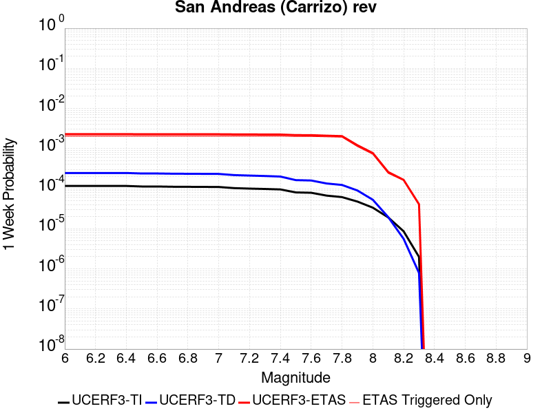 | 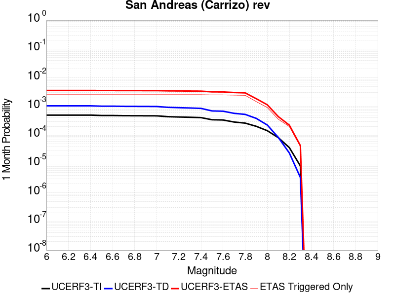 |  |

| Magnitude | 1 wk TI Prob | 1 wk TD Prob | 1 wk ETAS Prob | 1 wk ETAS/TD Gain | 1 wk ETAS Triggered Only | 1 mo TI Prob | 1 mo TD Prob | 1 mo ETAS Prob | 1 mo ETAS/TD Gain | 1 mo ETAS Triggered Only | 1 yr TI Prob | 1 yr TD Prob | 1 yr ETAS Prob | 1 yr ETAS/TD Gain | 1 yr ETAS Triggered Only |
|-----|-----|-----|-----|-----|-----|-----|-----|-----|-----|-----|-----|-----|-----|-----|-----|
| 6.0 | 1.1674632E-4 | 2.457212E-4 | 0.00228522 | 9.300053 | 0.00204 | 5.002454E-4 | 0.0010526674 | 0.0036099725 | 3.429357 | 0.00256 | 0.006073493 | 0.0127414055 | 0.016611459 | 1.3037384 | 0.00392 |
| 6.1 | 1.1674632E-4 | 2.457212E-4 | 0.00228522 | 9.300053 | 0.00204 | 5.002454E-4 | 0.0010526674 | 0.0036099725 | 3.429357 | 0.00256 | 0.006073493 | 0.0127414055 | 0.016611459 | 1.3037384 | 0.00392 |
| 6.2 | 1.1674632E-4 | 2.457212E-4 | 0.00228522 | 9.300053 | 0.00204 | 5.002454E-4 | 0.0010526674 | 0.0036099725 | 3.429357 | 0.00256 | 0.006073493 | 0.0127414055 | 0.016611459 | 1.3037384 | 0.00392 |
| 6.3 | 1.1674632E-4 | 2.457212E-4 | 0.00228522 | 9.300053 | 0.00204 | 5.002454E-4 | 0.0010526674 | 0.0036099725 | 3.429357 | 0.00256 | 0.006073493 | 0.0127414055 | 0.016611459 | 1.3037384 | 0.00392 |
| 6.4 | 1.1674632E-4 | 2.457212E-4 | 0.00228522 | 9.300053 | 0.00204 | 5.002454E-4 | 0.0010526674 | 0.0036099725 | 3.429357 | 0.00256 | 0.006073493 | 0.0127414055 | 0.016611459 | 1.3037384 | 0.00392 |
| 6.5 | 1.13136164E-4 | 2.3891036E-4 | 0.002278423 | 9.536727 | 0.00204 | 4.847792E-4 | 0.0010235013 | 0.003580881 | 3.4986582 | 0.00256 | 0.0058862255 | 0.012390388 | 0.016261818 | 1.3124542 | 0.00392 |
| 6.6 | 1.13136164E-4 | 2.3891036E-4 | 0.002278423 | 9.536727 | 0.00204 | 4.847792E-4 | 0.0010235013 | 0.003580881 | 3.4986582 | 0.00256 | 0.0058862255 | 0.012390388 | 0.016261818 | 1.3124542 | 0.00392 |
| 6.7 | 1.1149675E-4 | 2.3581758E-4 | 0.0022753365 | 9.648714 | 0.00204 | 4.777557E-4 | 0.0010102568 | 0.0035676707 | 3.531449 | 0.00256 | 0.0058011734 | 0.012230956 | 0.01610301 | 1.3165783 | 0.00392 |
| 6.8 | 1.1103589E-4 | 2.3483614E-4 | 0.002274357 | 9.684868 | 0.00204 | 4.7578133E-4 | 0.0010060539 | 0.0035634784 | 3.5420353 | 0.00256 | 0.005777263 | 0.012180358 | 0.016052611 | 1.3179096 | 0.00392 |
| 6.9 | 1.1053259E-4 | 2.3375664E-4 | 0.0022732797 | 9.724985 | 0.00204 | 4.7362508E-4 | 0.001001431 | 0.0035588674 | 3.5537817 | 0.00256 | 0.0057511497 | 0.012124702 | 0.015997173 | 1.3193868 | 0.00392 |
| 7.0 | 1.1005377E-4 | 2.3276206E-4 | 0.0022722872 | 9.762275 | 0.00204 | 4.7157376E-4 | 9.971719E-4 | 0.0035546192 | 3.5647006 | 0.00256 | 0.0057263062 | 0.012073423 | 0.015946094 | 1.3207601 | 0.00392 |
| 7.1 | 1.0308142E-4 | 2.1781186E-4 | 0.0022573676 | 10.363841 | 0.00204 | 4.417027E-4 | 9.331465E-4 | 0.0034907577 | 3.7408462 | 0.00256 | 0.0053644776 | 0.011302199 | 0.015177894 | 1.3429152 | 0.00392 |
| 7.2 | 1.0027479E-4 | 2.1187181E-4 | 0.0022514395 | 10.626423 | 0.00204 | 4.296783E-4 | 9.077071E-4 | 0.0034653833 | 3.817733 | 0.00256 | 0.0052187922 | 0.01099564 | 0.014832977 | 1.3489871 | 0.00388 |
| 7.3 | 9.816942E-5 | 2.0659102E-4 | 0.0022461696 | 10.872542 | 0.00204 | 4.2065824E-4 | 8.850907E-4 | 0.0034428248 | 3.8897989 | 0.00256 | 0.005109493 | 0.010723028 | 0.014561423 | 1.3579581 | 0.00388 |
| 7.4 | 9.5634205E-5 | 2.0024394E-4 | 0.0022398354 | 11.1855345 | 0.00204 | 4.0979648E-4 | 8.57907E-4 | 0.0034157108 | 3.9814465 | 0.00256 | 0.0049778637 | 0.010395263 | 0.01423493 | 1.3693669 | 0.00388 |
| 7.5 | 8.052417E-5 | 1.6317047E-4 | 0.0021628442 | 13.25512 | 0.002 | 3.4505792E-4 | 6.9911475E-4 | 0.003217353 | 4.6020384 | 0.00252 | 0.0041929903 | 0.008478587 | 0.012286029 | 1.4490657 | 0.00384 |
| 7.6 | 7.897024E-5 | 1.5967674E-4 | 0.0021593573 | 13.523306 | 0.002 | 3.384E-4 | 6.8414956E-4 | 0.0032024255 | 4.680885 | 0.00252 | 0.0041122385 | 0.008297788 | 0.012105924 | 1.458934 | 0.00384 |
| 7.7 | 6.707427E-5 | 1.3457966E-4 | 0.0020943158 | 15.561905 | 0.00196 | 2.8742946E-4 | 5.766425E-4 | 0.0030552126 | 5.298278 | 0.00248 | 0.003493839 | 0.006998057 | 0.010731745 | 1.533532 | 0.00376 |
| 7.8 | 6.147705E-5 | 1.2361974E-4 | 0.0020433825 | 16.52958 | 0.00192 | 2.6344648E-4 | 5.2969134E-4 | 0.0029683989 | 5.604016 | 0.00244 | 0.0032027436 | 0.0064299493 | 0.01012603 | 1.5748227 | 0.00372 |
| 7.9 | 4.7636717E-5 | 8.998664E-5 | 0.0012098858 | 13.445171 | 0.00112 | 2.0414138E-4 | 3.8560005E-4 | 0.0018650293 | 4.836694 | 0.00148 | 0.0024825884 | 0.004684583 | 0.006874277 | 1.4674256 | 0.0022 |
| 8.0 | 3.3554235E-5 | 5.2868458E-5 | 7.728304E-4 | 14.617987 | 7.2E-4 | 1.4379594E-4 | 2.2655944E-4 | 0.001146351 | 5.0598245 | 9.2E-4 | 0.0017493097 | 0.0027548738 | 0.0040313476 | 1.4633511 | 0.00128 |
| 8.1 | 1.9175432E-5 | 1.954181E-5 | 2.5953713E-4 | 13.281119 | 2.4E-4 | 8.217783E-5 | 8.374793E-5 | 4.4371778E-4 | 5.2982535 | 3.6E-4 | 0.0010000558 | 0.0010191548 | 0.0014187471 | 1.3920821 | 4.0E-4 |
| 8.2 | 8.643924E-6 | 5.607368E-6 | 1.6560647E-4 | 29.533726 | 1.6E-4 | 3.704486E-5 | 2.4031357E-5 | 2.2402655E-4 | 9.32226 | 2.0E-4 | 4.5092785E-4 | 2.9254257E-4 | 4.924841E-4 | 1.6834612 | 2.0E-4 |
| 8.3 | 1.983087E-6 | 7.877893E-7 | 4.0787756E-5 | 51.774956 | 4.0E-5 | 8.498917E-6 | 3.3762356E-6 | 4.33761E-5 | 12.847474 | 4.0E-5 | 1.034694E-4 | 4.110491E-5 | 8.1103266E-5 | 1.9730797 | 4.0E-5 |

## San Andreas (Cholame) rev
*[(top)](#table-of-contents)*

| 1 Week | 1 Month | 1 Year |
|-----|-----|-----|
|  |  |  |

| Magnitude | 1 wk TI Prob | 1 wk TD Prob | 1 wk ETAS Prob | 1 wk ETAS/TD Gain | 1 wk ETAS Triggered Only | 1 mo TI Prob | 1 mo TD Prob | 1 mo ETAS Prob | 1 mo ETAS/TD Gain | 1 mo ETAS Triggered Only | 1 yr TI Prob | 1 yr TD Prob | 1 yr ETAS Prob | 1 yr ETAS/TD Gain | 1 yr ETAS Triggered Only |
|-----|-----|-----|-----|-----|-----|-----|-----|-----|-----|-----|-----|-----|-----|-----|-----|
| 6.0 | 1.2302514E-4 | 2.5456081E-4 | 0.0021340821 | 8.3833885 | 0.00188 | 5.27144E-4 | 0.0010905204 | 0.0034479469 | 3.1617444 | 0.00236 | 0.0063991086 | 0.013196777 | 0.016828213 | 1.2751759 | 0.00368 |
| 6.1 | 1.2302514E-4 | 2.5456081E-4 | 0.0021340821 | 8.3833885 | 0.00188 | 5.27144E-4 | 0.0010905204 | 0.0034479469 | 3.1617444 | 0.00236 | 0.0063991086 | 0.013196777 | 0.016828213 | 1.2751759 | 0.00368 |
| 6.2 | 1.2203569E-4 | 2.5272561E-4 | 0.0021322505 | 8.437017 | 0.00188 | 5.2290526E-4 | 0.0010826618 | 0.0034401068 | 3.1774526 | 0.00236 | 0.006347804 | 0.013102253 | 0.016734038 | 1.2771877 | 0.00368 |
| 6.3 | 1.2142645E-4 | 2.5158338E-4 | 0.0021311105 | 8.470792 | 0.00188 | 5.202953E-4 | 0.0010777706 | 0.003435227 | 3.1873453 | 0.00236 | 0.006316212 | 0.013043418 | 0.016675418 | 1.2784547 | 0.00368 |
| 6.4 | 1.1865206E-4 | 2.466236E-4 | 0.0021261598 | 8.621073 | 0.00188 | 5.0840975E-4 | 0.0010565318 | 0.0034140383 | 3.2313638 | 0.00236 | 0.006172335 | 0.012787894 | 0.016420836 | 1.2840922 | 0.00368 |
| 6.5 | 1.17443946E-4 | 2.445465E-4 | 0.0021240867 | 8.68582 | 0.00188 | 5.032341E-4 | 0.0010476371 | 0.0034051647 | 3.2503285 | 0.00236 | 0.006109677 | 0.012680864 | 0.0163142 | 1.2865211 | 0.00368 |
| 6.6 | 1.13579066E-4 | 2.3760591E-4 | 0.0021171593 | 8.910381 | 0.00188 | 4.866766E-4 | 0.0010179152 | 0.003375513 | 3.3161042 | 0.00236 | 0.0059092017 | 0.012323147 | 0.015957799 | 1.294945 | 0.00368 |
| 6.7 | 1.1271412E-4 | 2.3604305E-4 | 0.0021155993 | 8.962769 | 0.00188 | 4.829711E-4 | 0.0010112225 | 0.003368836 | 3.331449 | 0.00236 | 0.005864331 | 0.012242582 | 0.01587753 | 1.2969102 | 0.00368 |
| 6.8 | 1.1217975E-4 | 2.3492136E-4 | 0.0021144797 | 9.000798 | 0.00188 | 4.8068175E-4 | 0.0010064188 | 0.0033640438 | 3.3425882 | 0.00236 | 0.005836608 | 0.012184754 | 0.015819915 | 1.2983367 | 0.00368 |
| 6.9 | 1.1146753E-4 | 2.3340227E-4 | 0.0021129635 | 9.052883 | 0.00188 | 4.7763053E-4 | 9.999136E-4 | 0.0033575536 | 3.357844 | 0.00236 | 0.0057996577 | 0.012106434 | 0.015741883 | 1.3002906 | 0.00368 |
| 7.0 | 1.0965793E-4 | 2.2961597E-4 | 0.0021091844 | 9.185704 | 0.00188 | 4.698779E-4 | 9.836989E-4 | 0.0033413772 | 3.3967483 | 0.00236 | 0.005705768 | 0.011911196 | 0.015547363 | 1.305273 | 0.00368 |
| 7.1 | 9.927982E-5 | 2.0771689E-4 | 0.0020873265 | 10.048901 | 0.00188 | 4.2541555E-4 | 8.899126E-4 | 0.0032478124 | 3.6495857 | 0.00236 | 0.0051671406 | 0.010781161 | 0.014381917 | 1.3339859 | 0.00364 |
| 7.2 | 9.696786E-5 | 2.0274252E-4 | 0.0020823614 | 10.270965 | 0.00188 | 4.1551032E-4 | 8.686082E-4 | 0.0032265582 | 3.7146301 | 0.00236 | 0.00504711 | 0.010524314 | 0.014126006 | 1.3422258 | 0.00364 |
| 7.3 | 9.4727984E-5 | 1.9699681E-4 | 0.0020766265 | 10.541421 | 0.00188 | 4.0591392E-4 | 8.439999E-4 | 0.003202008 | 3.7938488 | 0.00236 | 0.0049308087 | 0.01022756 | 0.013830331 | 1.3522612 | 0.00364 |
| 7.4 | 9.220358E-5 | 1.9066039E-4 | 0.002070302 | 10.858584 | 0.00188 | 3.9509835E-4 | 8.16861E-4 | 0.0031749331 | 3.8867486 | 0.00236 | 0.004799717 | 0.009900185 | 0.013504148 | 1.3640299 | 0.00364 |
| 7.5 | 7.71631E-5 | 1.537305E-4 | 0.0019934475 | 12.967157 | 0.00184 | 3.306571E-4 | 6.586788E-4 | 0.0029771507 | 4.519882 | 0.00232 | 0.0040183207 | 0.007990002 | 0.011561237 | 1.4469632 | 0.0036 |
| 7.6 | 7.5634416E-5 | 1.5029922E-4 | 0.0019900226 | 13.240405 | 0.00184 | 3.241072E-4 | 6.439807E-4 | 0.0029624866 | 4.6002727 | 0.00232 | 0.0039388672 | 0.007812348 | 0.011384224 | 1.457209 | 0.0036 |
| 7.7 | 6.3783E-5 | 1.253131E-4 | 0.0019250875 | 15.362221 | 0.0018 | 2.7332708E-4 | 5.3694565E-4 | 0.0028157213 | 5.24396 | 0.00228 | 0.0033226798 | 0.006517746 | 0.010014803 | 1.536544 | 0.00352 |
| 7.8 | 5.863422E-5 | 1.1572884E-4 | 0.0019155205 | 16.551798 | 0.0018 | 2.512653E-4 | 4.9588655E-4 | 0.002774756 | 5.5955462 | 0.00228 | 0.003054864 | 0.006020727 | 0.009519534 | 1.5811269 | 0.00352 |
| 7.9 | 4.595283E-5 | 8.541111E-5 | 0.0011653189 | 13.643645 | 0.00108 | 1.9692584E-4 | 3.6599627E-4 | 0.0017654839 | 4.8237753 | 0.0014 | 0.0023949358 | 0.0044469074 | 0.00655748 | 1.4746158 | 0.00212 |
| 8.0 | 3.2950178E-5 | 5.1490908E-5 | 7.7145384E-4 | 14.982331 | 7.2E-4 | 1.412074E-4 | 2.2065666E-4 | 0.0011404536 | 5.168453 | 9.2E-4 | 0.0017178444 | 0.002683187 | 0.0039597526 | 1.4757646 | 0.00128 |
| 8.1 | 1.9177472E-5 | 1.9541987E-5 | 2.595373E-4 | 13.281009 | 2.4E-4 | 8.218658E-5 | 8.374869E-5 | 4.4371854E-4 | 5.298215 | 3.6E-4 | 0.0010001622 | 0.0010191639 | 0.0014187563 | 1.3920785 | 4.0E-4 |
| 8.2 | 8.643924E-6 | 5.607368E-6 | 1.6560647E-4 | 29.533726 | 1.6E-4 | 3.704486E-5 | 2.4031357E-5 | 2.2402655E-4 | 9.32226 | 2.0E-4 | 4.5092785E-4 | 2.9254257E-4 | 4.924841E-4 | 1.6834612 | 2.0E-4 |
| 8.3 | 1.983087E-6 | 7.877893E-7 | 4.0787756E-5 | 51.774956 | 4.0E-5 | 8.498917E-6 | 3.3762356E-6 | 4.33761E-5 | 12.847474 | 4.0E-5 | 1.034694E-4 | 4.110491E-5 | 8.1103266E-5 | 1.9730797 | 4.0E-5 |

## San Andreas (Parkfield)
*[(top)](#table-of-contents)*

| 1 Week | 1 Month | 1 Year |
|-----|-----|-----|
|  | 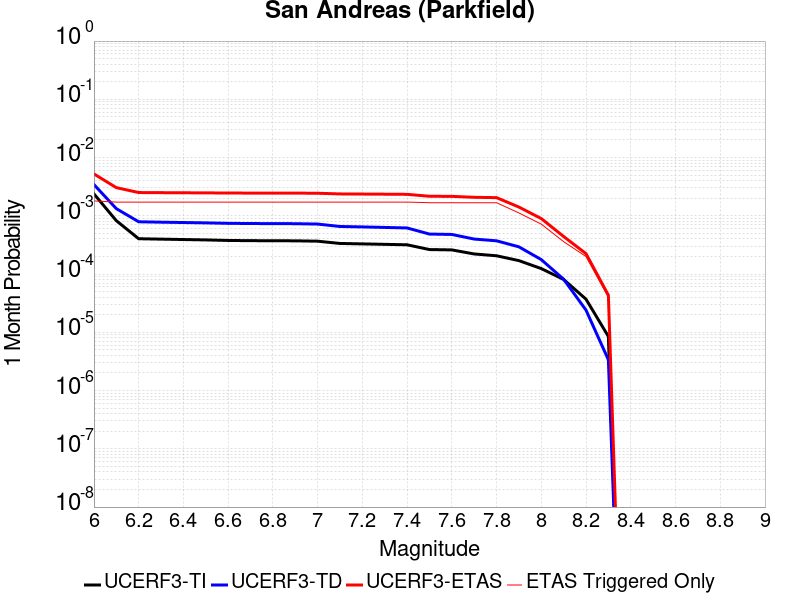 |  |

| Magnitude | 1 wk TI Prob | 1 wk TD Prob | 1 wk ETAS Prob | 1 wk ETAS/TD Gain | 1 wk ETAS Triggered Only | 1 mo TI Prob | 1 mo TD Prob | 1 mo ETAS Prob | 1 mo ETAS/TD Gain | 1 mo ETAS Triggered Only | 1 yr TI Prob | 1 yr TD Prob | 1 yr ETAS Prob | 1 yr ETAS/TD Gain | 1 yr ETAS Triggered Only |
|-----|-----|-----|-----|-----|-----|-----|-----|-----|-----|-----|-----|-----|-----|-----|-----|
| 6.0 | 5.556969E-4 | 8.0344157E-4 | 0.0022822525 | 2.8405955 | 0.00148 | 0.0023793848 | 0.003439371 | 0.0052331802 | 1.5215515 | 0.0018 | 0.028586963 | 0.041359875 | 0.044082414 | 1.0658256 | 0.00284 |
| 6.1 | 1.925858E-4 | 3.0992847E-4 | 0.0017094946 | 5.5157714 | 0.0014 | 8.2510663E-4 | 0.0013276909 | 0.0030454074 | 2.2937622 | 0.00172 | 0.0099994885 | 0.016126512 | 0.018802647 | 1.1659464 | 0.00272 |
| 6.2 | 9.4306815E-5 | 1.8443585E-4 | 0.0015841776 | 8.589315 | 0.0014 | 4.0410945E-4 | 7.902011E-4 | 0.002508842 | 3.174941 | 0.00172 | 0.0049089384 | 0.009578473 | 0.012232803 | 1.277114 | 0.00268 |
| 6.3 | 9.283051E-5 | 1.8139459E-4 | 0.0015811407 | 8.716581 | 0.0014 | 3.9778434E-4 | 7.7717495E-4 | 0.0024958383 | 3.2114239 | 0.00172 | 0.0048322747 | 0.009421266 | 0.0120760165 | 1.2817829 | 0.00268 |
| 6.4 | 9.138826E-5 | 1.7900368E-4 | 0.0015787531 | 8.819669 | 0.0014 | 3.916052E-4 | 7.6693424E-4 | 0.0024856152 | 3.2409754 | 0.00172 | 0.0047573745 | 0.009297662 | 0.011952745 | 1.2855645 | 0.00268 |
| 6.5 | 9.000255E-5 | 1.7657269E-4 | 0.0015763255 | 8.927346 | 0.0014 | 3.8566816E-4 | 7.565218E-4 | 0.0024752207 | 3.271843 | 0.00172 | 0.0046854047 | 0.009171973 | 0.0118273925 | 1.2895145 | 0.00268 |
| 6.6 | 8.8109264E-5 | 1.7335823E-4 | 0.0015731156 | 9.074363 | 0.0014 | 3.7755648E-4 | 7.427535E-4 | 0.002461476 | 3.3139877 | 0.00172 | 0.0045870654 | 0.009005753 | 0.011661618 | 1.2949076 | 0.00268 |
| 6.7 | 8.738073E-5 | 1.7202341E-4 | 0.0015717826 | 9.137027 | 0.0014 | 3.7443507E-4 | 7.3703605E-4 | 0.0024557684 | 3.3319514 | 0.00172 | 0.0045492216 | 0.0089367535 | 0.011592803 | 1.2972052 | 0.00268 |
| 6.8 | 8.710195E-5 | 1.7147408E-4 | 0.001571234 | 9.163099 | 0.0014 | 3.7324068E-4 | 7.346831E-4 | 0.0024534194 | 3.3394253 | 0.00172 | 0.0045347405 | 0.008908349 | 0.011564475 | 1.2981614 | 0.00268 |
| 6.9 | 8.6801556E-5 | 1.708797E-4 | 0.0015706405 | 9.191498 | 0.0014 | 3.7195362E-4 | 7.3213724E-4 | 0.002450878 | 3.3475664 | 0.00172 | 0.0045191357 | 0.008877606 | 0.011533814 | 1.2992032 | 0.00268 |
| 7.0 | 8.5571606E-5 | 1.6839206E-4 | 0.0015681563 | 9.312531 | 0.0014 | 3.6668387E-4 | 7.214818E-4 | 0.002440241 | 3.3822625 | 0.00172 | 0.004455241 | 0.008748925 | 0.011405478 | 1.3036433 | 0.00268 |
| 7.1 | 7.82589E-5 | 1.5312967E-4 | 0.0015529153 | 10.141178 | 0.0014 | 3.3535215E-4 | 6.561057E-4 | 0.002374977 | 3.619809 | 0.00172 | 0.0040752706 | 0.007959004 | 0.010577992 | 1.3290598 | 0.00264 |
| 7.2 | 7.690929E-5 | 1.504851E-4 | 0.0015502744 | 10.3018465 | 0.0014 | 3.2956956E-4 | 6.447775E-4 | 0.0023636685 | 3.665867 | 0.00172 | 0.004005129 | 0.0078220805 | 0.01044143 | 1.3348662 | 0.00264 |
| 7.3 | 7.5543794E-5 | 1.4742615E-4 | 0.0015472198 | 10.49488 | 0.0014 | 3.2371894E-4 | 6.3167413E-4 | 0.0023505876 | 3.721203 | 0.00172 | 0.003934157 | 0.0076636793 | 0.010283448 | 1.341842 | 0.00264 |
| 7.4 | 7.4214564E-5 | 1.4441142E-4 | 0.0015442092 | 10.693125 | 0.0014 | 3.1802364E-4 | 6.1876E-4 | 0.0023376958 | 3.778033 | 0.00172 | 0.003865065 | 0.0075075435 | 0.010127724 | 1.3490063 | 0.00264 |
| 7.5 | 6.149578E-5 | 1.1344282E-4 | 0.0014732885 | 12.98706 | 0.00136 | 2.6352672E-4 | 4.86093E-4 | 0.0021652763 | 4.4544487 | 0.00168 | 0.0032037178 | 0.005902156 | 0.00848681 | 1.437917 | 0.0026 |
| 7.6 | 6.0643448E-5 | 1.11714806E-4 | 0.0014715629 | 13.172496 | 0.00136 | 2.598746E-4 | 4.7869E-4 | 0.0021578858 | 4.5078983 | 0.00168 | 0.0031593828 | 0.0058125085 | 0.008397396 | 1.4447112 | 0.0026 |
| 7.7 | 5.1652263E-5 | 9.3113E-5 | 0.0014529864 | 15.604549 | 0.00136 | 2.2134806E-4 | 3.9899469E-4 | 0.0020783243 | 5.2089024 | 0.00168 | 0.002691582 | 0.004846951 | 0.0073945425 | 1.5256071 | 0.00256 |
| 7.8 | 4.8090482E-5 | 8.685296E-5 | 0.0014467349 | 16.65729 | 0.00136 | 2.060858E-4 | 3.721739E-4 | 0.0020515486 | 5.512339 | 0.00168 | 0.0025062072 | 0.0045218114 | 0.0070702354 | 1.5635848 | 0.00256 |
| 7.9 | 3.970278E-5 | 6.848254E-5 | 9.884195E-4 | 14.433161 | 9.2E-4 | 1.7014367E-4 | 2.934636E-4 | 0.001413135 | 4.8153667 | 0.00112 | 0.002069531 | 0.0035670698 | 0.0052012196 | 1.4581211 | 0.00164 |
| 8.0 | 2.8982335E-5 | 4.131844E-5 | 6.012953E-4 | 14.5527115 | 5.6E-4 | 1.2420409E-4 | 1.77067E-4 | 8.9693954E-4 | 5.0655375 | 7.2E-4 | 0.0015111357 | 0.0021536606 | 0.0031914208 | 1.4818587 | 0.00104 |
| 8.1 | 1.8836186E-5 | 1.9031799E-5 | 2.5902723E-4 | 13.610233 | 2.4E-4 | 8.0724014E-5 | 8.1562306E-5 | 4.4153293E-4 | 5.4134436 | 3.6E-4 | 9.823717E-4 | 9.925694E-4 | 0.0013921723 | 1.4025946 | 4.0E-4 |
| 8.2 | 8.643924E-6 | 5.607368E-6 | 1.6560647E-4 | 29.533726 | 1.6E-4 | 3.704486E-5 | 2.4031357E-5 | 2.2402655E-4 | 9.32226 | 2.0E-4 | 4.5092785E-4 | 2.9254257E-4 | 4.924841E-4 | 1.6834612 | 2.0E-4 |
| 8.3 | 1.983087E-6 | 7.877893E-7 | 4.0787756E-5 | 51.774956 | 4.0E-5 | 8.498917E-6 | 3.3762356E-6 | 4.33761E-5 | 12.847474 | 4.0E-5 | 1.034694E-4 | 4.110491E-5 | 8.1103266E-5 | 1.9730797 | 4.0E-5 |

## Gravel Hills-Harper Lk
*[(top)](#table-of-contents)*

| 1 Week | 1 Month | 1 Year |
|-----|-----|-----|
| 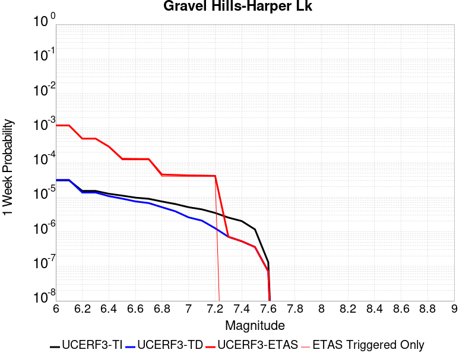 |  | 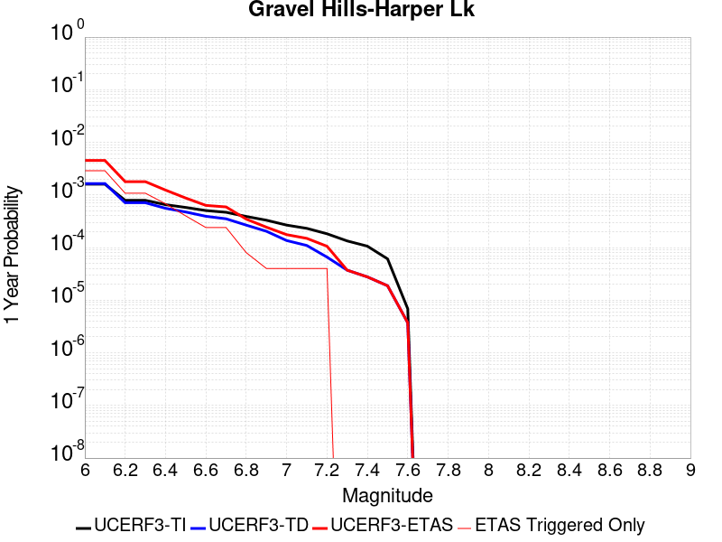 |

| Magnitude | 1 wk TI Prob | 1 wk TD Prob | 1 wk ETAS Prob | 1 wk ETAS/TD Gain | 1 wk ETAS Triggered Only | 1 mo TI Prob | 1 mo TD Prob | 1 mo ETAS Prob | 1 mo ETAS/TD Gain | 1 mo ETAS Triggered Only | 1 yr TI Prob | 1 yr TD Prob | 1 yr ETAS Prob | 1 yr ETAS/TD Gain | 1 yr ETAS Triggered Only |
|-----|-----|-----|-----|-----|-----|-----|-----|-----|-----|-----|-----|-----|-----|-----|-----|
| 6.0 | 3.0679566E-5 | 3.14785E-5 | 0.001191442 | 37.84939 | 0.00116 | 1.3147724E-4 | 1.349021E-4 | 0.0017346863 | 12.858852 | 0.0016 | 0.0015995599 | 0.001641413 | 0.004516686 | 2.751706 | 0.00288 |
| 6.1 | 3.0679566E-5 | 3.14785E-5 | 0.001191442 | 37.84939 | 0.00116 | 1.3147724E-4 | 1.349021E-4 | 0.0017346863 | 12.858852 | 0.0016 | 0.0015995599 | 0.001641413 | 0.004516686 | 2.751706 | 0.00288 |
| 6.2 | 1.514536E-5 | 1.3640053E-5 | 4.936335E-4 | 36.19 | 4.8E-4 | 6.490707E-5 | 5.8456128E-5 | 6.984187E-4 | 11.9477415 | 6.4E-4 | 7.8995706E-4 | 7.1148283E-4 | 0.0017907145 | 2.5168765 | 0.00108 |
| 6.3 | 1.514536E-5 | 1.3640053E-5 | 4.936335E-4 | 36.19 | 4.8E-4 | 6.490707E-5 | 5.8456128E-5 | 6.984187E-4 | 11.9477415 | 6.4E-4 | 7.8995706E-4 | 7.1148283E-4 | 0.0017907145 | 2.5168765 | 0.00108 |
| 6.4 | 1.2532521E-5 | 1.06932575E-5 | 2.9069025E-4 | 27.184444 | 2.8E-4 | 5.37097E-5 | 4.5827474E-5 | 4.4580913E-4 | 9.727988 | 4.0E-4 | 6.537194E-4 | 5.5781245E-4 | 0.0012374332 | 2.2183676 | 6.8E-4 |
| 6.5 | 1.1094058E-5 | 9.086593E-6 | 1.290855E-4 | 14.20615 | 1.2E-4 | 4.7545094E-5 | 3.8941984E-5 | 2.389342E-4 | 6.1356454 | 2.0E-4 | 5.787078E-4 | 4.7401953E-4 | 8.7382994E-4 | 1.8434471 | 4.0E-4 |
| 6.6 | 9.688328E-6 | 7.534075E-6 | 1.2753317E-4 | 16.927515 | 1.2E-4 | 4.1520743E-5 | 3.228851E-5 | 1.9228335E-4 | 5.9551635 | 1.6E-4 | 5.053978E-4 | 3.9304423E-4 | 6.329499E-4 | 1.6103783 | 2.4E-4 |
| 6.7 | 8.974824E-6 | 6.7515366E-6 | 1.2675073E-4 | 18.773611 | 1.2E-4 | 3.8462964E-5 | 2.8934848E-5 | 1.8893022E-4 | 6.5295043 | 1.6E-4 | 4.6818596E-4 | 3.5222704E-4 | 5.921425E-4 | 1.6811386 | 2.4E-4 |
| 6.8 | 7.4780046E-6 | 5.1178117E-6 | 4.5117606E-5 | 8.815801 | 4.0E-5 | 3.20482E-5 | 2.1933301E-5 | 6.193243E-5 | 2.8236709 | 4.0E-5 | 3.9011694E-4 | 2.670066E-4 | 3.4698524E-4 | 1.299538 | 8.0E-5 |
| 6.9 | 6.3409307E-6 | 3.908781E-6 | 4.3908625E-5 | 11.233331 | 4.0E-5 | 2.7175134E-5 | 1.6751816E-5 | 5.6751145E-5 | 3.3877609 | 4.0E-5 | 3.3080703E-4 | 2.0393525E-4 | 2.4392709E-4 | 1.1961007 | 4.0E-5 |
| 7.0 | 5.1239335E-6 | 2.6067862E-6 | 4.2606684E-5 | 16.344524 | 4.0E-5 | 2.195953E-5 | 1.1171895E-5 | 5.1171446E-5 | 4.5803733 | 4.0E-5 | 2.6732447E-4 | 1.3600958E-4 | 1.7600415E-4 | 1.2940569 | 4.0E-5 |
| 7.1 | 4.438899E-6 | 2.099272E-6 | 4.209919E-5 | 20.054184 | 4.0E-5 | 1.9023713E-5 | 8.99685E-6 | 4.899649E-5 | 5.4459605 | 4.0E-5 | 2.315891E-4 | 1.09531364E-4 | 1.4952698E-4 | 1.3651522 | 4.0E-5 |
| 7.2 | 3.50367E-6 | 1.2621932E-6 | 4.126214E-5 | 32.690826 | 4.0E-5 | 1.5015643E-5 | 5.409389E-6 | 4.540917E-5 | 8.39451 | 4.0E-5 | 1.8280011E-4 | 6.5857406E-5 | 1.0585477E-4 | 1.6073328 | 4.0E-5 |
| 7.3 | 2.561638E-6 | 7.12401E-7 | 7.12401E-7 | 1.0 | 0.0 | 1.0978401E-5 | 3.0531437E-6 | 3.0531437E-6 | 1.0 | 0.0 | 1.3365384E-4 | 3.717141E-5 | 3.717141E-5 | 1.0 | 0.0 |
| 7.4 | 2.0368864E-6 | 5.3089406E-7 | 5.3089406E-7 | 1.0 | 0.0 | 8.729483E-6 | 2.275258E-6 | 2.275258E-6 | 1.0 | 0.0 | 1.06276275E-4 | 2.7700922E-5 | 2.7700922E-5 | 1.0 | 0.0 |
| 7.5 | 1.1681728E-6 | 3.605487E-7 | 3.605487E-7 | 1.0 | 0.0 | 5.0064455E-6 | 1.5452079E-6 | 1.5452079E-6 | 1.0 | 0.0 | 6.0951766E-5 | 1.8812749E-5 | 1.8812749E-5 | 1.0 | 0.0 |
| 7.6 | 1.3154387E-7 | 7.121983E-8 | 7.121983E-8 | 1.0 | 0.0 | 5.6375933E-7 | 3.0522784E-7 | 3.0522784E-7 | 1.0 | 0.0 | 6.863748E-6 | 3.7161442E-6 | 3.7161442E-6 | 1.0 | 0.0 |

## San Andreas (San Gorgonio Pass-Garnet HIll)
*[(top)](#table-of-contents)*

| 1 Week | 1 Month | 1 Year |
|-----|-----|-----|
|  |  |  |

| Magnitude | 1 wk TI Prob | 1 wk TD Prob | 1 wk ETAS Prob | 1 wk ETAS/TD Gain | 1 wk ETAS Triggered Only | 1 mo TI Prob | 1 mo TD Prob | 1 mo ETAS Prob | 1 mo ETAS/TD Gain | 1 mo ETAS Triggered Only | 1 yr TI Prob | 1 yr TD Prob | 1 yr ETAS Prob | 1 yr ETAS/TD Gain | 1 yr ETAS Triggered Only |
|-----|-----|-----|-----|-----|-----|-----|-----|-----|-----|-----|-----|-----|-----|-----|-----|
| 6.0 | 8.31567E-5 | 2.3487274E-4 | 0.0016745345 | 7.1295395 | 0.00144 | 3.5633717E-4 | 0.0010062061 | 0.0025646365 | 2.548818 | 0.00156 | 0.004329778 | 0.01218165 | 0.014473388 | 1.1881304 | 0.00232 |
| 6.1 | 8.31567E-5 | 2.3487274E-4 | 0.0016745345 | 7.1295395 | 0.00144 | 3.5633717E-4 | 0.0010062061 | 0.0025646365 | 2.548818 | 0.00156 | 0.004329778 | 0.01218165 | 0.014473388 | 1.1881304 | 0.00232 |
| 6.2 | 8.31567E-5 | 2.3487274E-4 | 0.0016745345 | 7.1295395 | 0.00144 | 3.5633717E-4 | 0.0010062061 | 0.0025646365 | 2.548818 | 0.00156 | 0.004329778 | 0.01218165 | 0.014473388 | 1.1881304 | 0.00232 |
| 6.3 | 8.31567E-5 | 2.3487274E-4 | 0.0016745345 | 7.1295395 | 0.00144 | 3.5633717E-4 | 0.0010062061 | 0.0025646365 | 2.548818 | 0.00156 | 0.004329778 | 0.01218165 | 0.014473388 | 1.1881304 | 0.00232 |
| 6.4 | 8.059055E-5 | 2.3044254E-4 | 0.0016701107 | 7.2474065 | 0.00144 | 3.4534236E-4 | 9.872341E-4 | 0.0025456941 | 2.5786123 | 0.00156 | 0.0041964394 | 0.011953557 | 0.014206302 | 1.1884582 | 0.00228 |
| 6.5 | 8.059055E-5 | 2.3044254E-4 | 0.0016701107 | 7.2474065 | 0.00144 | 3.4534236E-4 | 9.872341E-4 | 0.0025456941 | 2.5786123 | 0.00156 | 0.0041964394 | 0.011953557 | 0.014206302 | 1.1884582 | 0.00228 |
| 6.6 | 7.619237E-5 | 2.2287853E-4 | 0.0016625576 | 7.4594784 | 0.00144 | 3.2649786E-4 | 9.548463E-4 | 0.0025133567 | 2.6322107 | 0.00156 | 0.0039678677 | 0.011563838 | 0.013817473 | 1.1948863 | 0.00228 |
| 6.7 | 7.440636E-5 | 2.1963443E-4 | 0.0016593181 | 7.554909 | 0.00144 | 3.188454E-4 | 9.409531E-4 | 0.0024994852 | 2.6563334 | 0.00156 | 0.0038750346 | 0.011396466 | 0.013650482 | 1.197782 | 0.00228 |
| 6.8 | 7.3735864E-5 | 2.1810358E-4 | 0.0016577896 | 7.6009274 | 0.00144 | 3.1597257E-4 | 9.3439705E-4 | 0.0024929394 | 2.667966 | 0.00156 | 0.0038401815 | 0.011317481 | 0.013571677 | 1.1991782 | 0.00228 |
| 6.9 | 7.27575E-5 | 2.1579085E-4 | 0.0016554801 | 7.6716886 | 0.00144 | 3.117806E-4 | 9.244924E-4 | 0.00248305 | 2.6858525 | 0.00156 | 0.003789323 | 0.011198137 | 0.013452605 | 1.2013253 | 0.00228 |
| 7.0 | 7.102591E-5 | 2.1162683E-4 | 0.0016513221 | 7.80299 | 0.00144 | 3.0436125E-4 | 9.066591E-4 | 0.0024652448 | 2.7190425 | 0.00156 | 0.003699303 | 0.010983224 | 0.013238182 | 1.2053093 | 0.00228 |
| 7.1 | 7.028513E-5 | 2.0997925E-4 | 0.0016496768 | 7.8563805 | 0.00144 | 3.0118722E-4 | 8.9960295E-4 | 0.0024581996 | 2.7325385 | 0.00156 | 0.0036607897 | 0.010898178 | 0.01315333 | 1.2069293 | 0.00228 |
| 7.2 | 6.8498244E-5 | 2.0605292E-4 | 0.0016457562 | 7.9870563 | 0.00144 | 2.9353087E-4 | 8.827873E-4 | 0.0024414102 | 2.7655702 | 0.00156 | 0.003567883 | 0.010695473 | 0.012951087 | 1.2108943 | 0.00228 |
| 7.3 | 6.622592E-5 | 1.9831101E-4 | 0.0016380254 | 8.259881 | 0.00144 | 2.8379448E-4 | 8.496297E-4 | 0.0024083043 | 2.834534 | 0.00156 | 0.0034497243 | 0.010295663 | 0.01255219 | 1.2191725 | 0.00228 |
| 7.4 | 5.1050705E-5 | 1.477468E-4 | 0.0014675518 | 9.932883 | 0.00132 | 2.1877038E-4 | 6.3304784E-4 | 0.0020721362 | 3.2732697 | 0.00144 | 0.002660276 | 0.007680315 | 0.00974434 | 1.2687422 | 0.00208 |
| 7.5 | 3.9302922E-5 | 1.1204231E-4 | 0.0013119079 | 11.70904 | 0.0012 | 1.6843023E-4 | 4.8009327E-4 | 0.0017994596 | 3.7481458 | 0.00132 | 0.0020487092 | 0.0058295405 | 0.007658814 | 1.3137938 | 0.00184 |
| 7.6 | 2.9851626E-5 | 8.560878E-5 | 0.0012055129 | 14.08165 | 0.00112 | 1.2792926E-4 | 3.668433E-4 | 0.0015664031 | 4.2699513 | 0.0012 | 0.0015564259 | 0.0044571967 | 0.00616953 | 1.3841728 | 0.00172 |
| 7.7 | 2.1135214E-5 | 6.411543E-5 | 0.0011840436 | 18.467373 | 0.00112 | 9.0576345E-5 | 2.747515E-4 | 0.0014744218 | 5.3663826 | 0.0012 | 0.0011022091 | 0.0033399744 | 0.0050542294 | 1.513254 | 0.00172 |
| 7.8 | 1.883379E-5 | 5.6178174E-5 | 0.0010961198 | 19.511488 | 0.00104 | 8.0713755E-5 | 2.4074141E-4 | 0.0013604718 | 5.6511745 | 0.00112 | 9.822468E-4 | 0.0029270905 | 0.004402758 | 1.5041416 | 0.00148 |
| 7.9 | 1.5156185E-5 | 4.2101485E-5 | 5.220813E-4 | 12.400543 | 4.8E-4 | 6.495346E-5 | 1.8042246E-4 | 7.403214E-4 | 4.1032662 | 5.6E-4 | 7.9052144E-4 | 0.0021944318 | 0.0030325886 | 1.381947 | 8.4E-4 |
| 8.0 | 1.1405907E-5 | 3.0308918E-5 | 3.90298E-4 | 12.877333 | 3.6E-4 | 4.8881542E-5 | 1.298889E-4 | 5.298369E-4 | 4.079155 | 4.0E-4 | 5.9497025E-4 | 0.0015802513 | 0.0022591767 | 1.4296314 | 6.8E-4 |
| 8.1 | 4.3511436E-6 | 7.4929885E-6 | 4.749269E-5 | 6.338284 | 4.0E-5 | 1.8647626E-5 | 3.2112413E-5 | 1.1210985E-4 | 3.4911685 | 8.0E-5 | 2.2701119E-4 | 3.908986E-4 | 5.1085174E-4 | 1.306865 | 1.2E-4 |
| 8.2 | 2.3042528E-6 | 2.7894796E-6 | 2.7894796E-6 | 1.0 | 0.0 | 9.875332E-6 | 1.1954859E-5 | 1.1954859E-5 | 1.0 | 0.0 | 1.2022553E-4 | 1.4554072E-4 | 1.4554072E-4 | 1.0 | 0.0 |
| 8.3 | 5.202968E-7 | 3.241516E-7 | 3.241516E-7 | 1.0 | 0.0 | 2.2298414E-6 | 1.3892205E-6 | 1.3892205E-6 | 1.0 | 0.0 | 2.714798E-5 | 1.6913642E-5 | 1.6913642E-5 | 1.0 | 0.0 |

## San Andreas (Creeping Section) 2011 CFM
*[(top)](#table-of-contents)*

| 1 Week | 1 Month | 1 Year |
|-----|-----|-----|
| 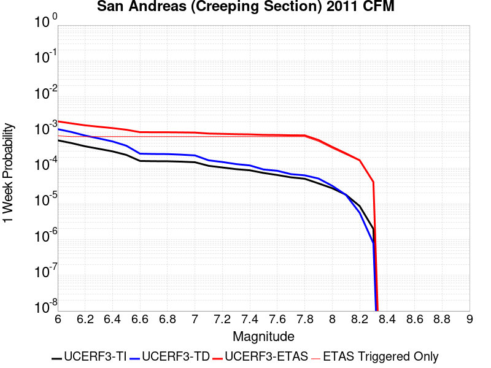 |  | 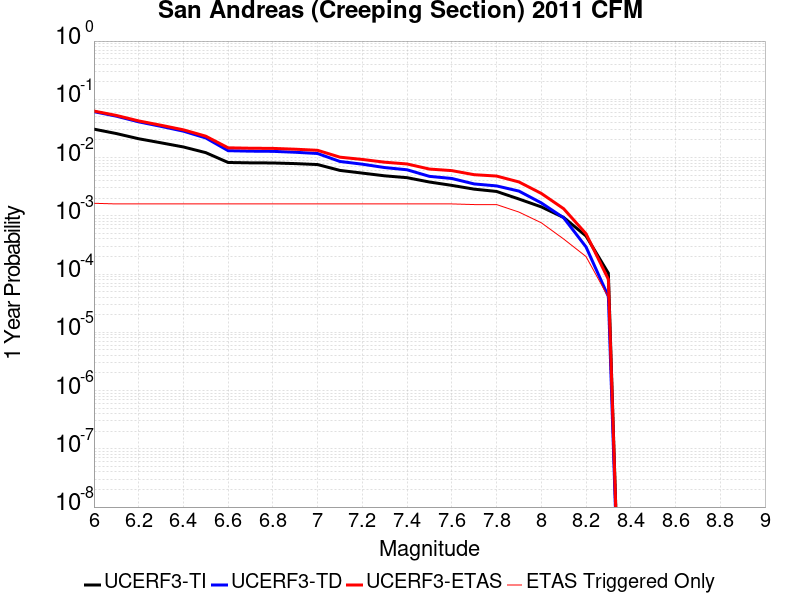 |

| Magnitude | 1 wk TI Prob | 1 wk TD Prob | 1 wk ETAS Prob | 1 wk ETAS/TD Gain | 1 wk ETAS Triggered Only | 1 mo TI Prob | 1 mo TD Prob | 1 mo ETAS Prob | 1 mo ETAS/TD Gain | 1 mo ETAS Triggered Only | 1 yr TI Prob | 1 yr TD Prob | 1 yr ETAS Prob | 1 yr ETAS/TD Gain | 1 yr ETAS Triggered Only |
|-----|-----|-----|-----|-----|-----|-----|-----|-----|-----|-----|-----|-----|-----|-----|-----|
| 6.0 | 5.986481E-4 | 0.0012305736 | 0.0020295891 | 1.6493033 | 8.0E-4 | 0.0025631124 | 0.0052583744 | 0.0062929057 | 1.1967398 | 0.00104 | 0.030762846 | 0.06135223 | 0.06289162 | 1.0250909 | 0.00164 |
| 6.1 | 5.015945E-4 | 0.0010242044 | 0.001783426 | 1.7412794 | 7.6E-4 | 0.00214792 | 0.00437824 | 0.005373862 | 1.2274023 | 0.001 | 0.025839351 | 0.051369127 | 0.052886937 | 1.0295471 | 0.0016 |
| 6.2 | 4.073338E-4 | 8.1310584E-4 | 0.0015724879 | 1.9339277 | 7.6E-4 | 0.0017445484 | 0.0034773606 | 0.004473883 | 1.2865745 | 0.001 | 0.021034058 | 0.04105309 | 0.042587407 | 1.0373739 | 0.0016 |
| 6.3 | 3.464099E-4 | 6.7629415E-4 | 0.0014357801 | 2.1230114 | 7.6E-4 | 0.0014837692 | 0.002893196 | 0.003890303 | 1.3446385 | 0.001 | 0.017915873 | 0.034310453 | 0.035855554 | 1.045033 | 0.0016 |
| 6.4 | 2.935057E-4 | 5.56817E-4 | 0.0013163938 | 2.364141 | 7.6E-4 | 0.0012572751 | 0.0023828198 | 0.003380437 | 1.4186709 | 0.001 | 0.015200248 | 0.028386578 | 0.02994116 | 1.0547646 | 0.0016 |
| 6.5 | 2.3409708E-4 | 4.233272E-4 | 0.0011830055 | 2.7945416 | 7.6E-4 | 0.0010028875 | 0.0018122771 | 0.0028104647 | 1.550792 | 0.001 | 0.012141965 | 0.021710506 | 0.023275768 | 1.0720971 | 0.0016 |
| 6.6 | 1.5842178E-4 | 2.530843E-4 | 0.0010128919 | 4.002192 | 7.6E-4 | 6.7877385E-4 | 0.0010841859 | 0.0020831018 | 1.9213511 | 0.001 | 0.0082328 | 0.013118694 | 0.0146977035 | 1.1203634 | 0.0016 |
| 6.7 | 1.5616413E-4 | 2.484441E-4 | 0.0010082553 | 4.0582786 | 7.6E-4 | 6.691031E-4 | 0.0010643183 | 0.0020632541 | 1.9385685 | 0.001 | 0.0081159435 | 0.01288029 | 0.014459682 | 1.1226208 | 0.0016 |
| 6.8 | 1.5538467E-4 | 2.4667758E-4 | 0.0010064901 | 4.080185 | 7.6E-4 | 6.6576427E-4 | 0.0010567546 | 0.0020556978 | 1.9452934 | 0.001 | 0.008075596 | 0.012789439 | 0.0143689765 | 1.1235032 | 0.0016 |
| 6.9 | 1.5153569E-4 | 2.3774903E-4 | 9.975684E-4 | 4.195888 | 7.6E-4 | 6.49277E-4 | 0.0010185286 | 0.0020175101 | 1.9808085 | 0.001 | 0.007876333 | 0.012330608 | 0.013910879 | 1.1281585 | 0.0016 |
| 7.0 | 1.4588932E-4 | 2.26266E-4 | 9.86094E-4 | 4.3581185 | 7.6E-4 | 6.250901E-4 | 9.69353E-4 | 0.0019683838 | 2.0306158 | 0.001 | 0.0075839474 | 0.011738516 | 0.0133197345 | 1.1347034 | 0.0016 |
| 7.1 | 1.1565079E-4 | 1.648249E-4 | 9.2469965E-4 | 5.6101937 | 7.6E-4 | 4.955521E-4 | 7.0620206E-4 | 0.0017054959 | 2.4150252 | 0.001 | 0.006016669 | 0.008564321 | 0.010150619 | 1.1852216 | 0.0016 |
| 7.2 | 1.0393792E-4 | 1.4804474E-4 | 9.0793223E-4 | 6.1328235 | 7.6E-4 | 4.4537216E-4 | 6.343239E-4 | 0.0016336896 | 2.5754817 | 0.001 | 0.005408933 | 0.0076957205 | 0.009283408 | 1.2063078 | 0.0016 |
| 7.3 | 9.332884E-5 | 1.2946628E-4 | 8.893679E-4 | 6.8694944 | 7.6E-4 | 3.999194E-4 | 5.5473816E-4 | 0.0015541834 | 2.8016522 | 0.001 | 0.0048581534 | 0.006733159 | 0.008322386 | 1.2360299 | 0.0016 |
| 7.4 | 8.670252E-5 | 1.1859965E-4 | 8.7850954E-4 | 7.4073534 | 7.6E-4 | 3.715293E-4 | 5.081858E-4 | 0.0015076776 | 2.9667842 | 0.001 | 0.004513991 | 0.006169733 | 0.0077598616 | 1.2577305 | 0.0016 |
| 7.5 | 7.3036405E-5 | 9.138321E-5 | 8.5131376E-4 | 9.315866 | 7.6E-4 | 3.129756E-4 | 3.9158363E-4 | 0.0013911921 | 3.552733 | 0.001 | 0.0038038217 | 0.004757131 | 0.0063495194 | 1.3347372 | 0.0016 |
| 7.6 | 6.3935775E-5 | 8.4007974E-5 | 8.4394414E-4 | 10.046 | 7.6E-4 | 2.7398168E-4 | 3.5998458E-4 | 0.0013596246 | 3.7768967 | 0.001 | 0.0033306254 | 0.004374024 | 0.0059670256 | 1.364196 | 0.0016 |
| 7.7 | 5.5050095E-5 | 6.768488E-5 | 8.276334E-4 | 12.227745 | 7.6E-4 | 2.3590765E-4 | 2.900458E-4 | 0.0012897558 | 4.446731 | 0.001 | 0.0028683927 | 0.0035255942 | 0.005080094 | 1.4409186 | 0.00156 |
| 7.8 | 5.027131E-5 | 6.260343E-5 | 8.2255586E-4 | 13.139151 | 7.6E-4 | 2.1543067E-4 | 2.6827282E-4 | 0.0012680045 | 4.7265487 | 0.001 | 0.0026197135 | 0.0032613333 | 0.0048162458 | 1.476772 | 0.00156 |
| 7.9 | 3.7271806E-5 | 5.1009967E-5 | 6.109814E-4 | 11.977687 | 5.6E-4 | 1.5972654E-4 | 2.1859583E-4 | 9.784297E-4 | 4.475976 | 7.6E-4 | 0.0019429359 | 0.002658158 | 0.0038150747 | 1.4352324 | 0.00116 |
| 8.0 | 2.7310243E-5 | 3.1948035E-5 | 3.9193654E-4 | 12.267939 | 3.6E-4 | 1.17038646E-4 | 1.3691297E-4 | 6.568418E-4 | 4.797513 | 5.2E-4 | 0.0014240141 | 0.0016656418 | 0.0024243759 | 1.4555206 | 7.6E-4 |
| 8.1 | 1.7940547E-5 | 1.7734084E-5 | 2.5772981E-4 | 14.533022 | 2.4E-4 | 7.688579E-5 | 7.600101E-5 | 4.3597363E-4 | 5.7364197 | 3.6E-4 | 9.3568244E-4 | 9.2491996E-4 | 0.00132455 | 1.4320699 | 4.0E-4 |
| 8.2 | 8.643924E-6 | 5.607368E-6 | 1.6560647E-4 | 29.533726 | 1.6E-4 | 3.704486E-5 | 2.4031357E-5 | 2.2402655E-4 | 9.32226 | 2.0E-4 | 4.5092785E-4 | 2.9254257E-4 | 4.924841E-4 | 1.6834612 | 2.0E-4 |
| 8.3 | 1.983087E-6 | 7.877893E-7 | 4.0787756E-5 | 51.774956 | 4.0E-5 | 8.498917E-6 | 3.3762356E-6 | 4.33761E-5 | 12.847474 | 4.0E-5 | 1.034694E-4 | 4.110491E-5 | 8.1103266E-5 | 1.9730797 | 4.0E-5 |

## Elsinore (Glen Ivy) rev
*[(top)](#table-of-contents)*

| 1 Week | 1 Month | 1 Year |
|-----|-----|-----|
| 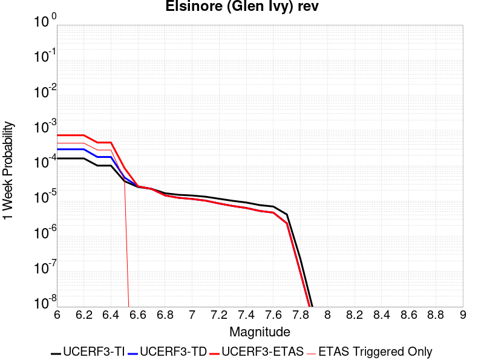 | 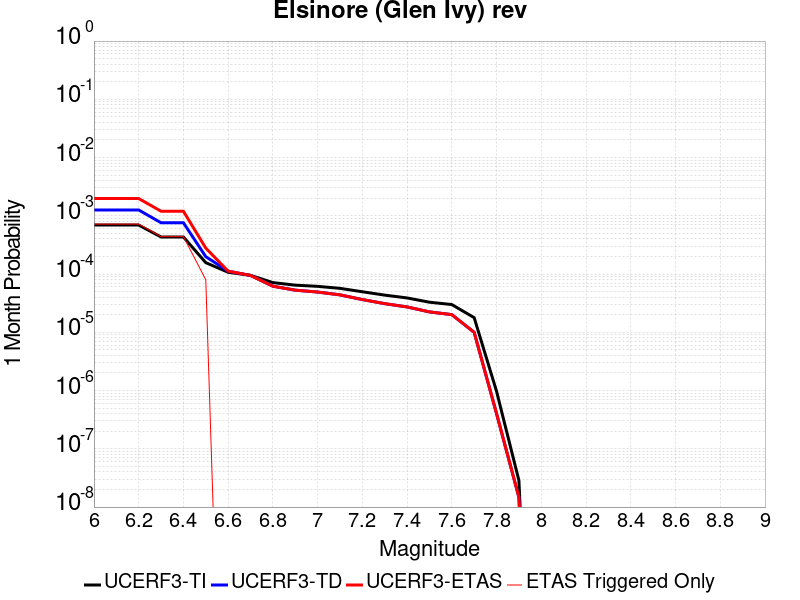 |  |

| Magnitude | 1 wk TI Prob | 1 wk TD Prob | 1 wk ETAS Prob | 1 wk ETAS/TD Gain | 1 wk ETAS Triggered Only | 1 mo TI Prob | 1 mo TD Prob | 1 mo ETAS Prob | 1 mo ETAS/TD Gain | 1 mo ETAS Triggered Only | 1 yr TI Prob | 1 yr TD Prob | 1 yr ETAS Prob | 1 yr ETAS/TD Gain | 1 yr ETAS Triggered Only |
|-----|-----|-----|-----|-----|-----|-----|-----|-----|-----|-----|-----|-----|-----|-----|-----|
| 6.0 | 1.6204086E-4 | 2.9420294E-4 | 7.3407346E-4 | 2.4951262 | 4.4E-4 | 6.94276E-4 | 0.0012604159 | 0.0019795084 | 1.57052 | 7.2E-4 | 0.008420097 | 0.01525921 | 0.016756017 | 1.098092 | 0.00152 |
| 6.1 | 1.6204086E-4 | 2.9420294E-4 | 7.3407346E-4 | 2.4951262 | 4.4E-4 | 6.94276E-4 | 0.0012604159 | 0.0019795084 | 1.57052 | 7.2E-4 | 0.008420097 | 0.01525921 | 0.016756017 | 1.098092 | 0.00152 |
| 6.2 | 1.6204086E-4 | 2.9420294E-4 | 7.3407346E-4 | 2.4951262 | 4.4E-4 | 6.94276E-4 | 0.0012604159 | 0.0019795084 | 1.57052 | 7.2E-4 | 0.008420097 | 0.01525921 | 0.016756017 | 1.098092 | 0.00152 |
| 6.3 | 1.0111737E-4 | 1.7740557E-4 | 4.573559E-4 | 2.5780244 | 2.8E-4 | 4.332882E-4 | 7.6020526E-4 | 0.0011998708 | 1.578351 | 4.4E-4 | 0.005262531 | 0.009237009 | 0.01014851 | 1.0986793 | 9.2E-4 |
| 6.4 | 1.0111737E-4 | 1.7740557E-4 | 4.573559E-4 | 2.5780244 | 2.8E-4 | 4.332882E-4 | 7.6020526E-4 | 0.0011998708 | 1.578351 | 4.4E-4 | 0.005262531 | 0.009237009 | 0.01014851 | 1.0986793 | 9.2E-4 |
| 6.5 | 3.6624708E-5 | 4.6445854E-5 | 8.644399E-5 | 1.8611779 | 4.0E-5 | 1.569536E-4 | 1.9904051E-4 | 2.790246E-4 | 1.4018482 | 8.0E-5 | 0.001909235 | 0.0024209863 | 0.0025406957 | 1.0494466 | 1.2E-4 |
| 6.6 | 2.5051324E-5 | 2.6190002E-5 | 2.6190002E-5 | 1.0 | 0.0 | 1.073584E-4 | 1.1223829E-4 | 1.1223829E-4 | 1.0 | 0.0 | 0.0013063047 | 0.0013656892 | 0.0013656892 | 1.0 | 0.0 |
| 6.7 | 2.2189772E-5 | 2.2104245E-5 | 2.2104245E-5 | 1.0 | 0.0 | 9.509556E-5 | 9.472924E-5 | 9.472924E-5 | 1.0 | 0.0 | 0.0011571734 | 0.0011527548 | 0.0011527548 | 1.0 | 0.0 |
| 6.8 | 1.6654378E-5 | 1.4455017E-5 | 1.4455017E-5 | 1.0 | 0.0 | 7.137396E-5 | 6.194863E-5 | 6.194863E-5 | 1.0 | 0.0 | 8.686314E-4 | 7.539688E-4 | 7.539688E-4 | 1.0 | 0.0 |
| 6.9 | 1.5042909E-5 | 1.2346976E-5 | 1.2346976E-5 | 1.0 | 0.0 | 6.446802E-5 | 5.291456E-5 | 5.291456E-5 | 1.0 | 0.0 | 7.8461546E-4 | 6.4404745E-4 | 6.4404745E-4 | 1.0 | 0.0 |
| 7.0 | 1.4361385E-5 | 1.146508E-5 | 1.146508E-5 | 1.0 | 0.0 | 6.154734E-5 | 4.913515E-5 | 4.913515E-5 | 1.0 | 0.0 | 7.490812E-4 | 5.9805915E-4 | 5.9805915E-4 | 1.0 | 0.0 |
| 7.1 | 1.3265571E-5 | 1.0257165E-5 | 1.0257165E-5 | 1.0 | 0.0 | 5.6851208E-5 | 4.3958553E-5 | 4.3958553E-5 | 1.0 | 0.0 | 6.919436E-4 | 5.350665E-4 | 5.350665E-4 | 1.0 | 0.0 |
| 7.2 | 1.1596403E-5 | 8.515252E-6 | 8.515252E-6 | 1.0 | 0.0 | 4.9697923E-5 | 3.649344E-5 | 3.649344E-5 | 1.0 | 0.0 | 6.049042E-4 | 4.4421875E-4 | 4.4421875E-4 | 1.0 | 0.0 |
| 7.3 | 1.0150827E-5 | 7.247325E-6 | 7.247325E-6 | 1.0 | 0.0 | 4.3502816E-5 | 3.10596E-5 | 3.10596E-5 | 1.0 | 0.0 | 5.2951806E-4 | 3.780865E-4 | 3.780865E-4 | 1.0 | 0.0 |
| 7.4 | 9.080705E-6 | 6.359954E-6 | 6.359954E-6 | 1.0 | 0.0 | 3.8916725E-5 | 2.725667E-5 | 2.725667E-5 | 1.0 | 0.0 | 4.7370812E-4 | 3.3180078E-4 | 3.3180078E-4 | 1.0 | 0.0 |
| 7.5 | 7.671649E-6 | 5.231759E-6 | 5.231759E-6 | 1.0 | 0.0 | 3.287808E-5 | 2.2421638E-5 | 2.2421638E-5 | 1.0 | 0.0 | 4.0021708E-4 | 2.729505E-4 | 2.729505E-4 | 1.0 | 0.0 |
| 7.6 | 6.990086E-6 | 4.693085E-6 | 4.693085E-6 | 1.0 | 0.0 | 2.9957167E-5 | 2.0113073E-5 | 2.0113073E-5 | 1.0 | 0.0 | 3.6466747E-4 | 2.4485032E-4 | 2.4485032E-4 | 1.0 | 0.0 |
| 7.7 | 4.163505E-6 | 2.3324235E-6 | 2.3324235E-6 | 1.0 | 0.0 | 1.7843471E-5 | 9.996066E-6 | 9.996066E-6 | 1.0 | 0.0 | 2.172226E-4 | 1.2169606E-4 | 1.2169606E-4 | 1.0 | 0.0 |
| 7.8 | 2.2692414E-7 | 9.397192E-8 | 9.397192E-8 | 1.0 | 0.0 | 9.725317E-7 | 4.0273673E-7 | 4.0273673E-7 | 1.0 | 0.0 | 1.1840509E-5 | 4.903312E-6 | 4.903312E-6 | 1.0 | 0.0 |
| 7.9 | 6.676829E-9 | 3.4429164E-9 | 3.4429164E-9 | 1.0 | 0.0 | 2.861498E-8 | 1.4755356E-8 | 1.4755356E-8 | 1.0 | 0.0 | 3.4838732E-7 | 1.7964643E-7 | 1.7964643E-7 | 1.0 | 0.0 |

## San Andreas (Coachella) rev
*[(top)](#table-of-contents)*

| 1 Week | 1 Month | 1 Year |
|-----|-----|-----|
| 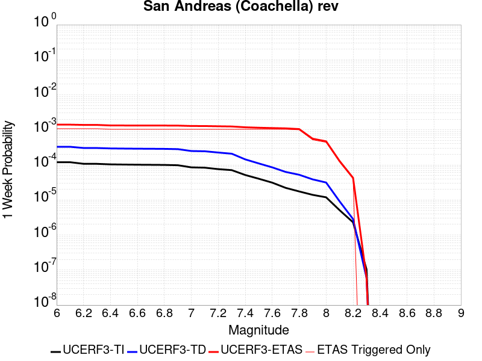 |  | 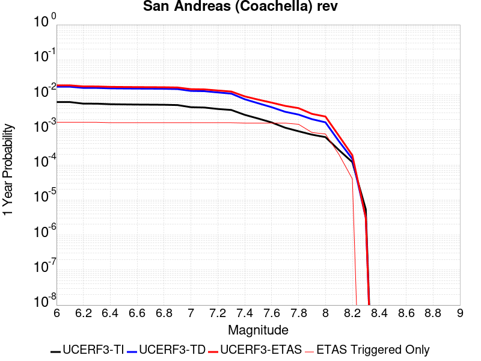 |

| Magnitude | 1 wk TI Prob | 1 wk TD Prob | 1 wk ETAS Prob | 1 wk ETAS/TD Gain | 1 wk ETAS Triggered Only | 1 mo TI Prob | 1 mo TD Prob | 1 mo ETAS Prob | 1 mo ETAS/TD Gain | 1 mo ETAS Triggered Only | 1 yr TI Prob | 1 yr TD Prob | 1 yr ETAS Prob | 1 yr ETAS/TD Gain | 1 yr ETAS Triggered Only |
|-----|-----|-----|-----|-----|-----|-----|-----|-----|-----|-----|-----|-----|-----|-----|-----|
| 6.0 | 1.1925945E-4 | 3.285021E-4 | 0.0014081473 | 4.28657 | 0.00108 | 5.110118E-4 | 0.0014071113 | 0.0025255354 | 1.794837 | 0.00112 | 0.0062038354 | 0.016998356 | 0.01861048 | 1.0948399 | 0.00164 |
| 6.1 | 1.1925945E-4 | 3.285021E-4 | 0.0014081473 | 4.28657 | 0.00108 | 5.110118E-4 | 0.0014071113 | 0.0025255354 | 1.794837 | 0.00112 | 0.0062038354 | 0.016998356 | 0.01861048 | 1.0948399 | 0.00164 |
| 6.2 | 1.07432395E-4 | 3.0350155E-4 | 0.0013831737 | 4.5573864 | 0.00108 | 4.603433E-4 | 0.0013000766 | 0.0024186205 | 1.8603678 | 0.00112 | 0.005590286 | 0.015714664 | 0.017328892 | 1.1027211 | 0.00164 |
| 6.3 | 1.0718766E-4 | 3.0295455E-4 | 0.0013826274 | 4.5638113 | 0.00108 | 4.592948E-4 | 0.0012977346 | 0.0024162813 | 1.8619224 | 0.00112 | 0.005577586 | 0.01568656 | 0.017300835 | 1.1029081 | 0.00164 |
| 6.4 | 1.0355944E-4 | 2.9503368E-4 | 0.0013347268 | 4.523981 | 0.00104 | 4.4375064E-4 | 0.0012638214 | 0.0023424565 | 1.8534712 | 0.00108 | 0.0053892885 | 0.01527953 | 0.016855082 | 1.1031153 | 0.0016 |
| 6.5 | 1.0227914E-4 | 2.9222743E-4 | 0.0013319235 | 4.557832 | 0.00104 | 4.382655E-4 | 0.0012518062 | 0.0023304543 | 1.8616734 | 0.00108 | 0.0053228354 | 0.015135286 | 0.01671107 | 1.1041132 | 0.0016 |
| 6.6 | 1.0116757E-4 | 2.898844E-4 | 0.0013295829 | 4.586597 | 0.00104 | 4.3350324E-4 | 0.0012417742 | 0.002320433 | 1.8686434 | 0.00108 | 0.0052651367 | 0.015014836 | 0.016590811 | 1.1049613 | 0.0016 |
| 6.7 | 1.0050676E-4 | 2.8846966E-4 | 0.0013281696 | 4.604192 | 0.00104 | 4.3067214E-4 | 0.0012357167 | 0.0023143822 | 1.8729067 | 0.00108 | 0.005230834 | 0.0149421 | 0.016518192 | 1.10548 | 0.0016 |
| 6.8 | 9.976819E-5 | 2.8650457E-4 | 0.0013262066 | 4.6289196 | 0.00104 | 4.2750788E-4 | 0.0012273028 | 0.0023059773 | 1.8788984 | 0.00108 | 0.0051924936 | 0.014841062 | 0.016417317 | 1.106209 | 0.0016 |
| 6.9 | 9.77719E-5 | 2.8146335E-4 | 0.0013211706 | 4.693935 | 0.00104 | 4.1895514E-4 | 0.0012057178 | 0.0022844155 | 1.894652 | 0.00108 | 0.0050888555 | 0.014581811 | 0.01615848 | 1.1081257 | 0.0016 |
| 7.0 | 8.500761E-5 | 2.487273E-4 | 0.0012884686 | 5.180246 | 0.00104 | 3.6426744E-4 | 0.001065542 | 0.0021443912 | 2.0124886 | 0.00108 | 0.0044259406 | 0.012896588 | 0.014475954 | 1.1224638 | 0.0016 |
| 7.1 | 8.319876E-5 | 2.4473912E-4 | 0.0012844846 | 5.248383 | 0.00104 | 3.5651738E-4 | 0.0010484635 | 0.0021273312 | 2.0289986 | 0.00108 | 0.004331963 | 0.012691099 | 0.014270794 | 1.1244726 | 0.0016 |
| 7.2 | 7.563917E-5 | 2.2518281E-4 | 0.0012649486 | 5.6174297 | 0.00104 | 3.2412758E-4 | 9.647154E-4 | 0.0020436735 | 2.118421 | 0.00108 | 0.0039391145 | 0.011682851 | 0.013264159 | 1.1353528 | 0.0016 |
| 7.3 | 7.082985E-5 | 2.0829777E-4 | 0.0012480811 | 5.991812 | 0.00104 | 3.0352117E-4 | 8.9240225E-4 | 0.0019714385 | 2.2091365 | 0.00108 | 0.0036891096 | 0.010811501 | 0.012394203 | 1.1463906 | 0.0016 |
| 7.4 | 5.146215E-5 | 1.4354692E-4 | 0.0011833976 | 8.2439785 | 0.00104 | 2.2053342E-4 | 6.150569E-4 | 0.0016943926 | 2.7548552 | 0.00108 | 0.0026816884 | 0.0074627977 | 0.009011156 | 1.2074769 | 0.00156 |
| 7.5 | 4.0285166E-5 | 1.1011688E-4 | 0.0011500024 | 10.44347 | 0.00104 | 1.7263928E-4 | 4.7184445E-4 | 0.0015513349 | 3.2878098 | 0.00108 | 0.002099857 | 0.0057296446 | 0.0072807064 | 1.2707082 | 0.00156 |
| 7.6 | 3.1168736E-5 | 8.5009575E-5 | 0.0011249211 | 13.232876 | 0.00104 | 1.3357346E-4 | 3.6427603E-4 | 0.0014438826 | 3.9637048 | 0.00108 | 0.0016250437 | 0.0044260686 | 0.0059791636 | 1.3508973 | 0.00156 |
| 7.7 | 2.2100989E-5 | 6.2934116E-5 | 0.0011028687 | 17.524178 | 0.00104 | 9.4715084E-5 | 2.696898E-4 | 0.0013493985 | 5.003521 | 0.00108 | 0.001152546 | 0.003278536 | 0.0048334217 | 1.4742621 | 0.00156 |
| 7.8 | 1.7484861E-5 | 5.2283296E-5 | 0.0010522311 | 20.125568 | 0.001 | 7.493296E-5 | 2.2405203E-4 | 0.001263819 | 5.640739 | 0.00104 | 9.1192697E-4 | 0.0027244242 | 0.004160501 | 1.527112 | 0.00144 |
| 7.9 | 1.3967285E-5 | 3.862311E-5 | 5.5860303E-4 | 14.462921 | 5.2E-4 | 5.985842E-5 | 1.6551714E-4 | 7.2542444E-4 | 4.382776 | 5.6E-4 | 7.2853256E-4 | 0.0020133099 | 0.0028516187 | 1.4163834 | 8.4E-4 |
| 8.0 | 1.1887396E-5 | 3.1410258E-5 | 4.7139643E-4 | 15.007723 | 4.4E-4 | 5.094499E-5 | 1.3460845E-4 | 6.1454385E-4 | 4.5654182 | 4.8E-4 | 6.200787E-4 | 0.0016376268 | 0.0023963822 | 1.4633262 | 7.6E-4 |
| 8.1 | 5.100864E-6 | 9.116648E-6 | 1.2911555E-4 | 14.162614 | 1.2E-4 | 2.1860664E-5 | 3.907076E-5 | 1.9906451E-4 | 5.094974 | 1.6E-4 | 2.6612106E-4 | 4.755828E-4 | 6.754877E-4 | 1.4203366 | 2.0E-4 |
| 8.2 | 2.3004484E-6 | 2.842999E-6 | 4.2842887E-5 | 15.06961 | 4.0E-5 | 9.859027E-6 | 1.2184225E-5 | 5.2183736E-5 | 4.2828937 | 4.0E-5 | 1.2002704E-4 | 1.4833287E-4 | 1.8832694E-4 | 1.2696238 | 4.0E-5 |
| 8.3 | 1.0424446E-7 | 5.965764E-8 | 5.965764E-8 | 1.0 | 0.0 | 4.4676187E-7 | 2.5567556E-7 | 2.5567556E-7 | 1.0 | 0.0 | 5.439312E-6 | 3.112846E-6 | 3.112846E-6 | 1.0 | 0.0 |

## Brawley (Seismic Zone) alt 1
*[(top)](#table-of-contents)*

| 1 Week | 1 Month | 1 Year |
|-----|-----|-----|
|  |  | 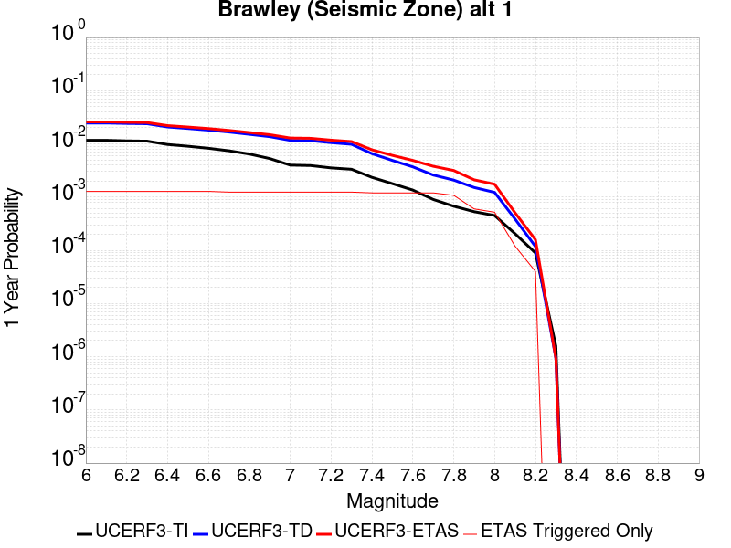 |

| Magnitude | 1 wk TI Prob | 1 wk TD Prob | 1 wk ETAS Prob | 1 wk ETAS/TD Gain | 1 wk ETAS Triggered Only | 1 mo TI Prob | 1 mo TD Prob | 1 mo ETAS Prob | 1 mo ETAS/TD Gain | 1 mo ETAS Triggered Only | 1 yr TI Prob | 1 yr TD Prob | 1 yr ETAS Prob | 1 yr ETAS/TD Gain | 1 yr ETAS Triggered Only |
|-----|-----|-----|-----|-----|-----|-----|-----|-----|-----|-----|-----|-----|-----|-----|-----|
| 6.0 | 2.2521618E-4 | 4.7906235E-4 | 0.0013186599 | 2.7525852 | 8.4E-4 | 9.6485513E-4 | 0.0020515462 | 0.0029297408 | 1.4280647 | 8.8E-4 | 0.011683988 | 0.024686452 | 0.025934855 | 1.0505702 | 0.00128 |
| 6.1 | 2.2521618E-4 | 4.7906235E-4 | 0.0013186599 | 2.7525852 | 8.4E-4 | 9.6485513E-4 | 0.0020515462 | 0.0029297408 | 1.4280647 | 8.8E-4 | 0.011683988 | 0.024686452 | 0.025934855 | 1.0505702 | 0.00128 |
| 6.2 | 2.198148E-4 | 4.6985512E-4 | 0.0013094604 | 2.786945 | 8.4E-4 | 9.417233E-4 | 0.0020121478 | 0.002890377 | 1.4364636 | 8.8E-4 | 0.011405343 | 0.024218049 | 0.02546705 | 1.0515732 | 0.00128 |
| 6.3 | 2.1704129E-4 | 4.6419835E-4 | 0.0013038084 | 2.8087313 | 8.4E-4 | 9.298453E-4 | 0.0019879416 | 0.0028661923 | 1.4417889 | 8.8E-4 | 0.011262234 | 0.02393082 | 0.025180187 | 1.0522075 | 0.00128 |
| 6.4 | 1.876142E-4 | 4.0299946E-4 | 0.0012426609 | 3.0835302 | 8.4E-4 | 8.038131E-4 | 0.0017260119 | 0.002604493 | 1.5089658 | 8.8E-4 | 0.00974259 | 0.020814236 | 0.022067595 | 1.0602164 | 0.00128 |
| 6.5 | 1.7390939E-4 | 3.772201E-4 | 0.0012169032 | 3.2259765 | 8.4E-4 | 7.45113E-4 | 0.0016156683 | 0.0024942465 | 1.5437863 | 8.8E-4 | 0.009034078 | 0.019498011 | 0.020753052 | 1.0643678 | 0.00128 |
| 6.6 | 1.591791E-4 | 3.512329E-4 | 0.0011909378 | 3.3907354 | 8.4E-4 | 6.8201777E-4 | 0.0015044258 | 0.002383102 | 1.5840608 | 8.8E-4 | 0.008271996 | 0.018166747 | 0.019423494 | 1.0691785 | 0.00128 |
| 6.7 | 1.4268003E-4 | 3.2273377E-4 | 0.0011224756 | 3.4780233 | 8.0E-4 | 6.1134255E-4 | 0.00138242 | 0.0022212588 | 1.6067901 | 8.4E-4 | 0.007417723 | 0.016705167 | 0.017924452 | 1.0729885 | 0.00124 |
| 6.8 | 1.239713E-4 | 2.923154E-4 | 0.0010920815 | 3.7359698 | 8.0E-4 | 5.3119735E-4 | 0.0012521851 | 0.0020911333 | 1.6699873 | 8.4E-4 | 0.0064481674 | 0.015140241 | 0.016361468 | 1.0806609 | 0.00124 |
| 6.9 | 1.0180238E-4 | 2.6387183E-4 | 0.0010636607 | 4.030975 | 8.0E-4 | 4.3622297E-4 | 0.0011303935 | 0.0019694439 | 1.742264 | 8.4E-4 | 0.005298089 | 0.013676707 | 0.014899747 | 1.0894251 | 0.00124 |
| 7.0 | 7.6619996E-5 | 2.2495743E-4 | 0.0010247774 | 4.5554285 | 8.0E-4 | 3.283301E-4 | 9.6375024E-4 | 0.0018029407 | 1.8707551 | 8.4E-4 | 0.0039900932 | 0.011671247 | 0.012896774 | 1.105004 | 0.00124 |
| 7.1 | 7.5127435E-5 | 2.2177385E-4 | 0.0010215965 | 4.606478 | 8.0E-4 | 3.2193496E-4 | 9.501164E-4 | 0.0017893183 | 1.8832623 | 8.4E-4 | 0.0039125155 | 0.011507019 | 0.012732751 | 1.1065203 | 0.00124 |
| 7.2 | 6.788582E-5 | 2.0301084E-4 | 0.0010028484 | 4.939876 | 8.0E-4 | 2.9090676E-4 | 8.697594E-4 | 0.0017090288 | 1.9649444 | 8.4E-4 | 0.0035360386 | 0.01053855 | 0.011765483 | 1.1164232 | 0.00124 |
| 7.3 | 6.399602E-5 | 1.8927702E-4 | 9.891256E-4 | 5.225809 | 8.0E-4 | 2.7423984E-4 | 8.109379E-4 | 0.0016502567 | 2.0349977 | 8.4E-4 | 0.0033337586 | 0.009829069 | 0.0110568805 | 1.1249164 | 0.00124 |
| 7.4 | 4.506759E-5 | 1.2596935E-4 | 9.258686E-4 | 7.349951 | 8.0E-4 | 1.9313251E-4 | 5.3975784E-4 | 0.0013793044 | 2.5554135 | 8.4E-4 | 0.0023488526 | 0.006551927 | 0.0077440646 | 1.1819522 | 0.0012 |
| 7.5 | 3.43289E-5 | 9.392528E-5 | 8.938501E-4 | 9.516609 | 8.0E-4 | 1.4711556E-4 | 4.0247513E-4 | 0.001242137 | 3.0862455 | 8.4E-4 | 0.0017896603 | 0.004889188 | 0.006083321 | 1.2442396 | 0.0012 |
| 7.6 | 2.5980507E-5 | 7.102579E-5 | 8.70969E-4 | 12.262714 | 8.0E-4 | 1.1134028E-4 | 3.0436084E-4 | 0.0011441052 | 3.7590418 | 8.4E-4 | 0.001354725 | 0.0036993215 | 0.0048948824 | 1.3231838 | 0.0012 |
| 7.7 | 1.7292105E-5 | 4.982994E-5 | 8.4979006E-4 | 17.053804 | 8.0E-4 | 7.4106916E-5 | 2.1353943E-4 | 0.00105336 | 4.9328594 | 8.4E-4 | 9.018782E-4 | 0.0025967488 | 0.0037936326 | 1.4609163 | 0.0012 |
| 7.8 | 1.2927471E-5 | 4.006102E-5 | 8.000306E-4 | 19.9703 | 7.6E-4 | 5.5402274E-5 | 1.716788E-4 | 9.7154145E-4 | 5.6590652 | 8.0E-4 | 6.743139E-4 | 0.0020881882 | 0.0031659328 | 1.5161148 | 0.00108 |
| 7.9 | 1.0200774E-5 | 2.9043316E-5 | 3.8903285E-4 | 13.394918 | 3.6E-4 | 4.371687E-5 | 1.2446543E-4 | 5.2441563E-4 | 4.213344 | 4.0E-4 | 5.321229E-4 | 0.0015143143 | 0.0021134056 | 1.3956189 | 6.0E-4 |
| 8.0 | 8.650396E-6 | 2.3532893E-5 | 3.035263E-4 | 12.89796 | 2.8E-4 | 3.70726E-5 | 1.00851365E-4 | 4.208191E-4 | 4.1726665 | 3.2E-4 | 4.5126543E-4 | 0.0012271745 | 0.0017465365 | 1.4232175 | 5.2E-4 |
| 8.1 | 3.9368224E-6 | 7.4387112E-6 | 8.7438115E-5 | 11.754472 | 8.0E-5 | 1.6871985E-5 | 3.18798E-5 | 1.5187598E-4 | 4.764019 | 1.2E-4 | 2.0539707E-4 | 3.880676E-4 | 5.0802104E-4 | 1.3091044 | 1.2E-4 |
| 8.2 | 1.7101195E-6 | 2.2599863E-6 | 4.2259897E-5 | 18.699183 | 4.0E-5 | 7.329063E-6 | 9.68562E-6 | 4.9685234E-5 | 5.1297936 | 4.0E-5 | 8.922769E-5 | 1.17916075E-4 | 1.5791136E-4 | 1.3391843 | 4.0E-5 |
| 8.3 | 3.0346666E-8 | 1.7654946E-8 | 1.7654946E-8 | 1.0 | 0.0 | 1.3005713E-7 | 7.5664055E-8 | 7.5664055E-8 | 1.0 | 0.0 | 1.5834444E-6 | 9.2120973E-7 | 9.2120973E-7 | 1.0 | 0.0 |

## Blackwater
*[(top)](#table-of-contents)*

| 1 Week | 1 Month | 1 Year |
|-----|-----|-----|
| 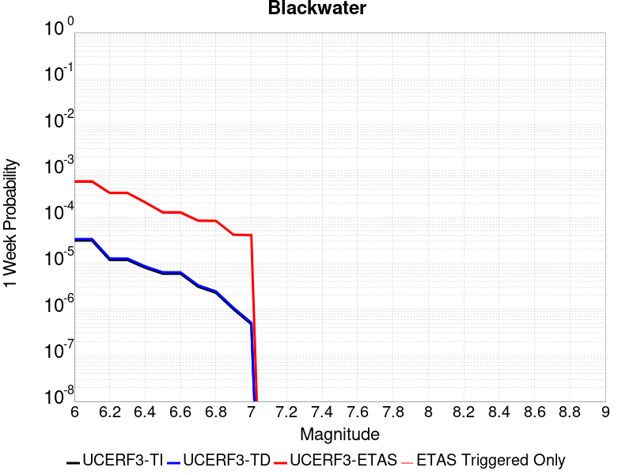 | 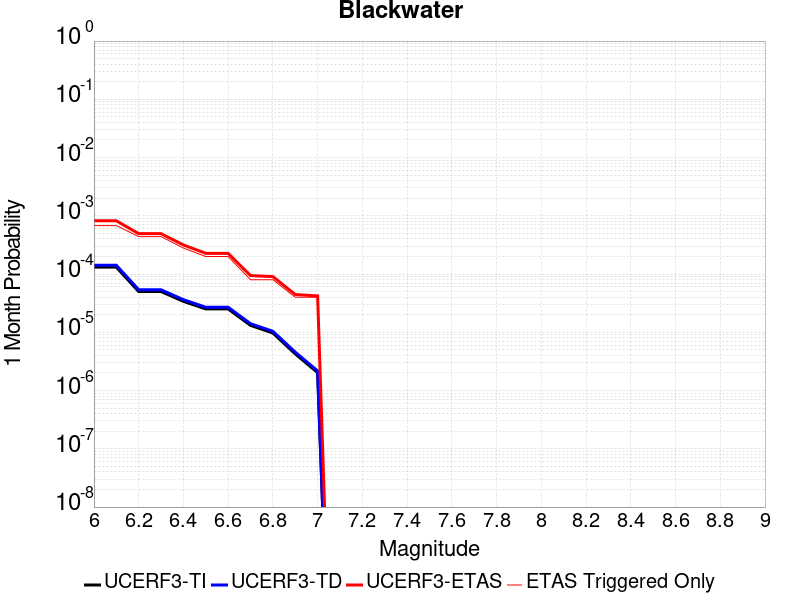 | 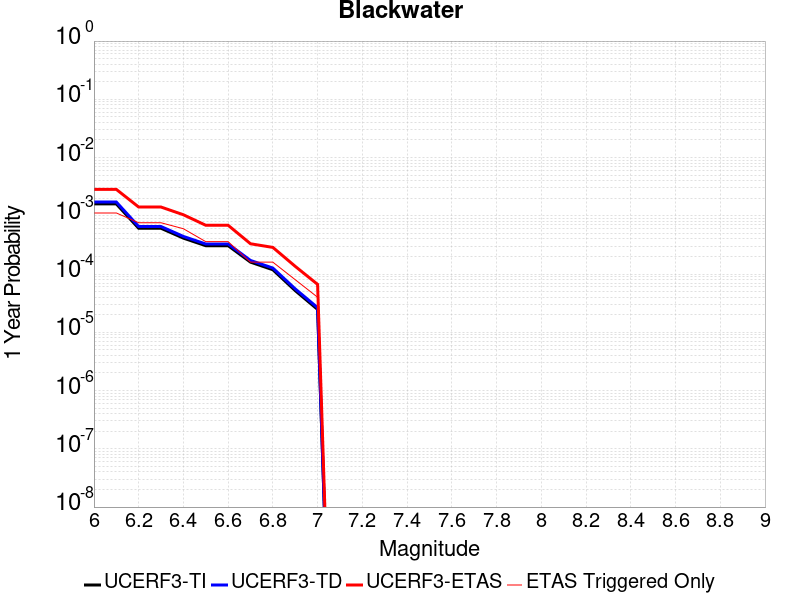 |

| Magnitude | 1 wk TI Prob | 1 wk TD Prob | 1 wk ETAS Prob | 1 wk ETAS/TD Gain | 1 wk ETAS Triggered Only | 1 mo TI Prob | 1 mo TD Prob | 1 mo ETAS Prob | 1 mo ETAS/TD Gain | 1 mo ETAS Triggered Only | 1 yr TI Prob | 1 yr TD Prob | 1 yr ETAS Prob | 1 yr ETAS/TD Gain | 1 yr ETAS Triggered Only |
|-----|-----|-----|-----|-----|-----|-----|-----|-----|-----|-----|-----|-----|-----|-----|-----|
| 6.0 | 3.0708583E-5 | 3.3104585E-5 | 5.9308606E-4 | 17.915527 | 5.6E-4 | 1.3160157E-4 | 1.4186984E-4 | 8.2177337E-4 | 5.7924457 | 6.8E-4 | 0.0016010714 | 0.0017260336 | 0.0028441004 | 1.6477666 | 0.00112 |
| 6.1 | 3.0708583E-5 | 3.3104585E-5 | 5.9308606E-4 | 17.915527 | 5.6E-4 | 1.3160157E-4 | 1.4186984E-4 | 8.2177337E-4 | 5.7924457 | 6.8E-4 | 0.0016010714 | 0.0017260336 | 0.0028441004 | 1.6477666 | 0.00112 |
| 6.2 | 1.1707779E-5 | 1.2548166E-5 | 3.3254415E-4 | 26.501417 | 3.2E-4 | 5.017523E-5 | 5.3776796E-5 | 4.937531E-4 | 9.181527 | 4.4E-4 | 6.107122E-4 | 6.5454544E-4 | 0.001414048 | 2.160351 | 7.6E-4 |
| 6.3 | 1.1707779E-5 | 1.2548166E-5 | 3.3254415E-4 | 26.501417 | 3.2E-4 | 5.017523E-5 | 5.3776796E-5 | 4.937531E-4 | 9.181527 | 4.4E-4 | 6.107122E-4 | 6.5454544E-4 | 0.001414048 | 2.160351 | 7.6E-4 |
| 6.4 | 7.929244E-6 | 8.482096E-6 | 2.084804E-4 | 24.578878 | 2.0E-4 | 3.3982033E-5 | 3.6351354E-5 | 3.1634117E-4 | 8.702322 | 2.8E-4 | 4.136527E-4 | 4.424919E-4 | 0.0010422264 | 2.355357 | 6.0E-4 |
| 6.5 | 5.8832115E-6 | 6.2874497E-6 | 1.262867E-4 | 20.08552 | 1.2E-4 | 2.521352E-5 | 2.6945949E-5 | 2.2694057E-4 | 8.422066 | 2.0E-4 | 3.0693135E-4 | 3.280201E-4 | 6.87902E-4 | 2.0971336 | 3.6E-4 |
| 6.6 | 5.8832115E-6 | 6.2874497E-6 | 1.262867E-4 | 20.08552 | 1.2E-4 | 2.521352E-5 | 2.6945949E-5 | 2.2694057E-4 | 8.422066 | 2.0E-4 | 3.0693135E-4 | 3.280201E-4 | 6.87902E-4 | 2.0971336 | 3.6E-4 |
| 6.7 | 3.0715053E-6 | 3.2822265E-6 | 8.3281964E-5 | 25.37362 | 8.0E-5 | 1.3163528E-5 | 1.4066616E-5 | 9.406549E-5 | 6.6871443 | 8.0E-5 | 1.6025416E-4 | 1.7124876E-4 | 3.3122135E-4 | 1.9341534 | 1.6E-4 |
| 6.8 | 2.2722281E-6 | 2.4293208E-6 | 8.242913E-5 | 33.930935 | 8.0E-5 | 9.738084E-6 | 1.0411339E-5 | 9.04105E-5 | 8.68385 | 8.0E-5 | 1.1855473E-4 | 1.2675159E-4 | 2.8673132E-4 | 2.2621515 | 1.6E-4 |
| 6.9 | 9.952399E-7 | 1.0656032E-6 | 4.106556E-5 | 38.537384 | 4.0E-5 | 4.265307E-6 | 4.5668658E-6 | 4.4566685E-5 | 9.758702 | 4.0E-5 | 5.1928873E-5 | 5.560069E-5 | 1.3559624E-4 | 2.438751 | 8.0E-5 |
| 7.0 | 4.7385504E-7 | 5.076783E-7 | 4.0507657E-5 | 79.790016 | 4.0E-5 | 2.0308057E-6 | 2.1757642E-6 | 4.2175678E-5 | 19.384306 | 4.0E-5 | 2.4724779E-5 | 2.6489928E-5 | 6.648887E-5 | 2.5099678 | 4.0E-5 |

## Garlock (Central)
*[(top)](#table-of-contents)*

| 1 Week | 1 Month | 1 Year |
|-----|-----|-----|
|  |  | 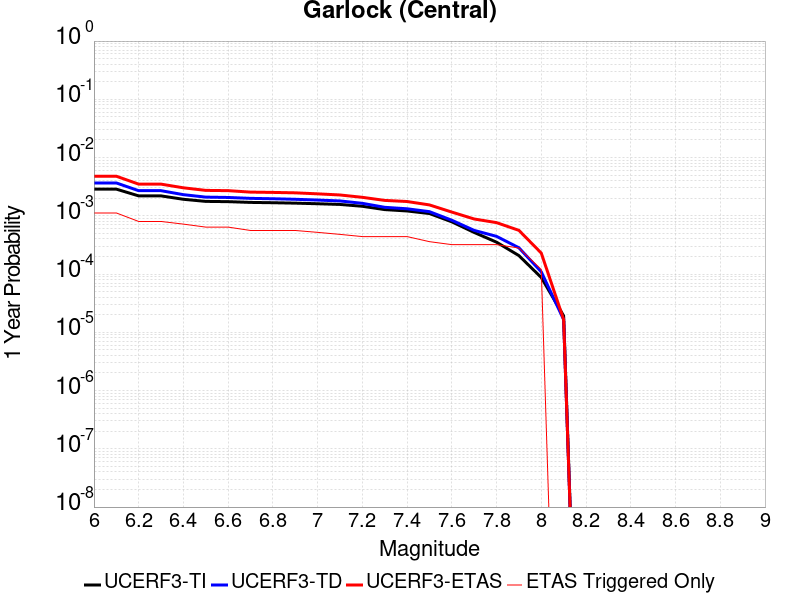 |

| Magnitude | 1 wk TI Prob | 1 wk TD Prob | 1 wk ETAS Prob | 1 wk ETAS/TD Gain | 1 wk ETAS Triggered Only | 1 mo TI Prob | 1 mo TD Prob | 1 mo ETAS Prob | 1 mo ETAS/TD Gain | 1 mo ETAS Triggered Only | 1 yr TI Prob | 1 yr TD Prob | 1 yr ETAS Prob | 1 yr ETAS/TD Gain | 1 yr ETAS Triggered Only |
|-----|-----|-----|-----|-----|-----|-----|-----|-----|-----|-----|-----|-----|-----|-----|-----|
| 6.0 | 5.5131142E-5 | 7.0410926E-5 | 7.103659E-4 | 10.088859 | 6.4E-4 | 2.3625491E-4 | 3.0172654E-4 | 0.0010215093 | 3.3855467 | 7.2E-4 | 0.0028726095 | 0.0036673974 | 0.00478329 | 1.3042737 | 0.00112 |
| 6.1 | 5.5131142E-5 | 7.0410926E-5 | 7.103659E-4 | 10.088859 | 6.4E-4 | 2.3625491E-4 | 3.0172654E-4 | 0.0010215093 | 3.3855467 | 7.2E-4 | 0.0028726095 | 0.0036673974 | 0.00478329 | 1.3042737 | 0.00112 |
| 6.2 | 4.216245E-5 | 5.181263E-5 | 5.7178567E-4 | 11.035644 | 5.2E-4 | 1.806837E-4 | 2.220354E-4 | 7.819111E-4 | 3.5215604 | 5.6E-4 | 0.0021976046 | 0.0026999614 | 0.0034978015 | 1.2955005 | 8.0E-4 |
| 6.3 | 4.216245E-5 | 5.181263E-5 | 5.7178567E-4 | 11.035644 | 5.2E-4 | 1.806837E-4 | 2.220354E-4 | 7.819111E-4 | 3.5215604 | 5.6E-4 | 0.0021976046 | 0.0026999614 | 0.0034978015 | 1.2955005 | 8.0E-4 |
| 6.4 | 3.6858168E-5 | 4.4255168E-5 | 5.242339E-4 | 11.845711 | 4.8E-4 | 1.5795401E-4 | 1.8965136E-4 | 7.095527E-4 | 3.7413533 | 5.2E-4 | 0.0019213937 | 0.0023065854 | 0.0030249248 | 1.3114297 | 7.2E-4 |
| 6.5 | 3.39199E-5 | 4.0159928E-5 | 4.4014386E-4 | 10.959777 | 4.0E-4 | 1.453629E-4 | 1.7210275E-4 | 6.12027E-4 | 3.5561724 | 4.4E-4 | 0.0017683565 | 0.0020933591 | 0.0027320194 | 1.3050888 | 6.4E-4 |
| 6.6 | 3.3571985E-5 | 3.961341E-5 | 4.3959756E-4 | 11.097191 | 4.0E-4 | 1.4387199E-4 | 1.6976082E-4 | 6.0968613E-4 | 3.5914419 | 4.4E-4 | 0.0017502342 | 0.0020649007 | 0.0027035791 | 1.3093023 | 6.4E-4 |
| 6.7 | 3.2580007E-5 | 3.8228853E-5 | 3.9821508E-4 | 10.416612 | 3.6E-4 | 1.3962112E-4 | 1.6382778E-4 | 5.237688E-4 | 3.1970696 | 3.6E-4 | 0.0016985617 | 0.0019927998 | 0.002551684 | 1.2804517 | 5.6E-4 |
| 6.8 | 3.2185937E-5 | 3.7654747E-5 | 3.9764118E-4 | 10.560187 | 3.6E-4 | 1.3793244E-4 | 1.6136763E-4 | 5.2130956E-4 | 3.2305708 | 3.6E-4 | 0.0016780337 | 0.001962902 | 0.0025218027 | 1.2847319 | 5.6E-4 |
| 6.9 | 3.165394E-5 | 3.6858168E-5 | 3.968449E-4 | 10.76681 | 3.6E-4 | 1.3565269E-4 | 1.5795414E-4 | 5.1789725E-4 | 3.2787826 | 3.6E-4 | 0.0016503202 | 0.0019214168 | 0.002480341 | 1.2908916 | 5.6E-4 |
| 7.0 | 3.0903822E-5 | 3.5761113E-5 | 3.5574968E-4 | 9.9479475 | 3.2E-4 | 1.3243823E-4 | 1.5325303E-4 | 4.7320398E-4 | 3.0877302 | 3.2E-4 | 0.0016112428 | 0.0018642801 | 0.0023833106 | 1.278408 | 5.2E-4 |
| 7.1 | 3.0069863E-5 | 3.4526223E-5 | 3.1451657E-4 | 9.109498 | 2.8E-4 | 1.2886449E-4 | 1.4796125E-4 | 4.2791982E-4 | 2.8921072 | 2.8E-4 | 0.0015677959 | 0.001799961 | 0.002279097 | 1.2661924 | 4.8E-4 |
| 7.2 | 2.7957109E-5 | 3.141258E-5 | 2.7140504E-4 | 8.640011 | 2.4E-4 | 1.1981068E-4 | 1.346185E-4 | 3.745862E-4 | 2.7825758 | 2.4E-4 | 0.0014577188 | 0.0016377677 | 0.002077047 | 1.2682184 | 4.4E-4 |
| 7.3 | 2.4519275E-5 | 2.6838161E-5 | 2.6683172E-4 | 9.94225 | 2.4E-4 | 1.0507837E-4 | 1.15015704E-4 | 3.549881E-4 | 3.0864315 | 2.4E-4 | 0.0012785783 | 0.0013994314 | 0.0018388156 | 1.3139734 | 4.4E-4 |
| 7.4 | 2.3225532E-5 | 2.532011E-5 | 2.6531404E-4 | 10.478392 | 2.4E-4 | 9.95342E-5 | 1.0851033E-4 | 3.484843E-4 | 3.2115312 | 2.4E-4 | 0.0012111551 | 0.001320327 | 0.0017597461 | 1.3328108 | 4.4E-4 |
| 7.5 | 2.097765E-5 | 2.2598408E-5 | 2.225939E-4 | 9.84998 | 2.0E-4 | 8.9901114E-5 | 9.6846794E-5 | 2.9682743E-4 | 3.0649173 | 2.0E-4 | 0.0010939965 | 0.0011784837 | 0.0015380594 | 1.3051172 | 3.6E-4 |
| 7.6 | 1.511254E-5 | 1.6095431E-5 | 1.7609286E-4 | 10.940549 | 1.6E-4 | 6.476642E-5 | 6.897865E-5 | 2.289676E-4 | 3.3193986 | 1.6E-4 | 7.882459E-4 | 8.3949923E-4 | 0.0011592306 | 1.3808596 | 3.2E-4 |
| 7.7 | 9.934069E-6 | 1.0775618E-5 | 1.707739E-4 | 15.848177 | 1.6E-4 | 4.2573887E-5 | 4.6180405E-5 | 2.0617302E-4 | 4.4645133 | 1.6E-4 | 5.182138E-4 | 5.621018E-4 | 8.819219E-4 | 1.568972 | 3.2E-4 |
| 7.8 | 6.7562896E-6 | 8.50792E-6 | 1.6850657E-4 | 19.805847 | 1.6E-4 | 2.8955206E-5 | 3.6462003E-5 | 1.9645617E-4 | 5.3879695 | 1.6E-4 | 3.5247262E-4 | 4.4383464E-4 | 7.636926E-4 | 1.7206693 | 3.2E-4 |
| 7.9 | 3.975453E-6 | 5.419516E-6 | 1.2541887E-4 | 23.142076 | 1.2E-4 | 1.7037546E-5 | 2.3226292E-5 | 1.432235E-4 | 6.1664386 | 1.2E-4 | 2.0741238E-4 | 2.827435E-4 | 5.6266435E-4 | 1.9900168 | 2.8E-4 |
| 8.0 | 1.6729537E-6 | 2.093995E-6 | 4.209391E-5 | 20.102203 | 4.0E-5 | 7.169782E-6 | 8.974233E-6 | 4.8973874E-5 | 5.4571652 | 4.0E-5 | 8.7288594E-5 | 1.09255845E-4 | 2.2924274E-4 | 2.0982194 | 1.2E-4 |
| 8.1 | 3.6733252E-7 | 3.1722044E-7 | 3.1722044E-7 | 1.0 | 0.0 | 1.5742813E-6 | 1.3595155E-6 | 1.3595155E-6 | 1.0 | 0.0 | 1.9166706E-5 | 1.6551992E-5 | 1.6551992E-5 | 1.0 | 0.0 |

## Pleito
*[(top)](#table-of-contents)*

| 1 Week | 1 Month | 1 Year |
|-----|-----|-----|
| 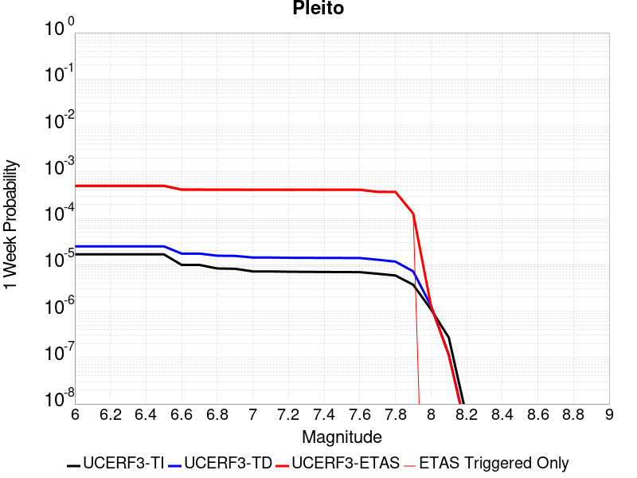 | 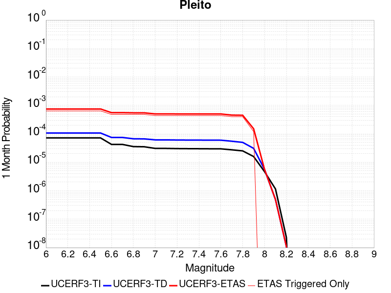 | 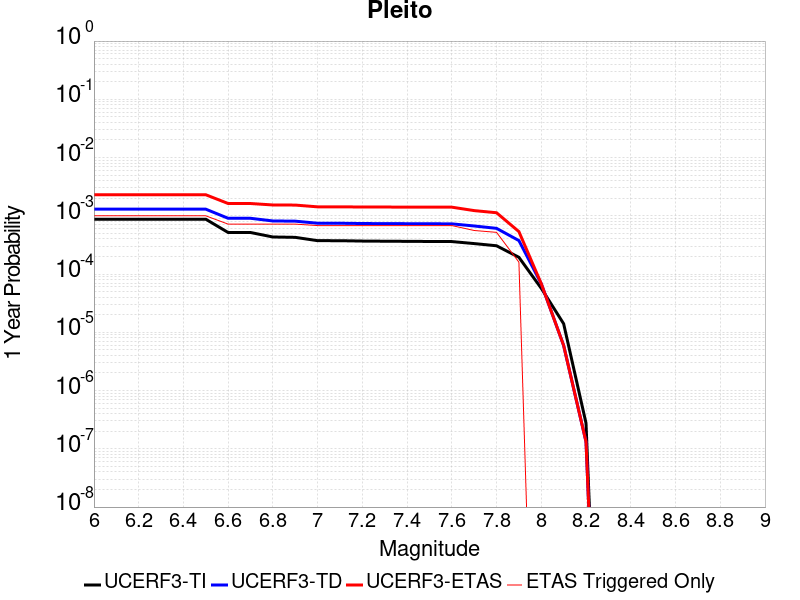 |

| Magnitude | 1 wk TI Prob | 1 wk TD Prob | 1 wk ETAS Prob | 1 wk ETAS/TD Gain | 1 wk ETAS Triggered Only | 1 mo TI Prob | 1 mo TD Prob | 1 mo ETAS Prob | 1 mo ETAS/TD Gain | 1 mo ETAS Triggered Only | 1 yr TI Prob | 1 yr TD Prob | 1 yr ETAS Prob | 1 yr ETAS/TD Gain | 1 yr ETAS Triggered Only |
|-----|-----|-----|-----|-----|-----|-----|-----|-----|-----|-----|-----|-----|-----|-----|-----|
| 6.0 | 1.6763008E-5 | 2.4935694E-5 | 5.0492375E-4 | 20.249033 | 4.8E-4 | 7.183948E-5 | 1.0686329E-4 | 7.467949E-4 | 6.98832 | 6.4E-4 | 8.742947E-4 | 0.0013003562 | 0.002299056 | 1.76802 | 0.001 |
| 6.1 | 1.6763008E-5 | 2.4935694E-5 | 5.0492375E-4 | 20.249033 | 4.8E-4 | 7.183948E-5 | 1.0686329E-4 | 7.467949E-4 | 6.98832 | 6.4E-4 | 8.742947E-4 | 0.0013003562 | 0.002299056 | 1.76802 | 0.001 |
| 6.2 | 1.6763008E-5 | 2.4935694E-5 | 5.0492375E-4 | 20.249033 | 4.8E-4 | 7.183948E-5 | 1.0686329E-4 | 7.467949E-4 | 6.98832 | 6.4E-4 | 8.742947E-4 | 0.0013003562 | 0.002299056 | 1.76802 | 0.001 |
| 6.3 | 1.6763008E-5 | 2.4935694E-5 | 5.0492375E-4 | 20.249033 | 4.8E-4 | 7.183948E-5 | 1.0686329E-4 | 7.467949E-4 | 6.98832 | 6.4E-4 | 8.742947E-4 | 0.0013003562 | 0.002299056 | 1.76802 | 0.001 |
| 6.4 | 1.6763008E-5 | 2.4935694E-5 | 5.0492375E-4 | 20.249033 | 4.8E-4 | 7.183948E-5 | 1.0686329E-4 | 7.467949E-4 | 6.98832 | 6.4E-4 | 8.742947E-4 | 0.0013003562 | 0.002299056 | 1.76802 | 0.001 |
| 6.5 | 1.6763008E-5 | 2.4935694E-5 | 5.0492375E-4 | 20.249033 | 4.8E-4 | 7.183948E-5 | 1.0686329E-4 | 7.467949E-4 | 6.98832 | 6.4E-4 | 8.742947E-4 | 0.0013003562 | 0.002299056 | 1.76802 | 0.001 |
| 6.6 | 9.910213E-6 | 1.738388E-5 | 4.1737693E-4 | 24.009424 | 4.0E-4 | 4.247165E-5 | 7.450023E-5 | 5.5446447E-4 | 7.442453 | 4.8E-4 | 5.169696E-4 | 9.066666E-4 | 0.0016260139 | 1.7933977 | 7.2E-4 |
| 6.7 | 9.910213E-6 | 1.738388E-5 | 4.1737693E-4 | 24.009424 | 4.0E-4 | 4.247165E-5 | 7.450023E-5 | 5.5446447E-4 | 7.442453 | 4.8E-4 | 5.169696E-4 | 9.066666E-4 | 0.0016260139 | 1.7933977 | 7.2E-4 |
| 6.8 | 8.300162E-6 | 1.564301E-5 | 4.1563675E-4 | 26.570126 | 4.0E-4 | 3.557164E-5 | 6.703976E-5 | 5.470076E-4 | 8.159451 | 4.8E-4 | 4.3299864E-4 | 8.159049E-4 | 0.0015353174 | 1.8817358 | 7.2E-4 |
| 6.9 | 8.183114E-6 | 1.551415E-5 | 4.1550794E-4 | 26.782516 | 4.0E-4 | 3.5070017E-5 | 6.6487526E-5 | 5.464556E-4 | 8.21892 | 4.8E-4 | 4.2689382E-4 | 8.0918643E-4 | 0.0015286038 | 1.8890626 | 7.2E-4 |
| 7.0 | 7.1748823E-6 | 1.4299022E-5 | 4.142933E-4 | 28.973541 | 4.0E-4 | 3.0749135E-5 | 6.128009E-5 | 5.012531E-4 | 8.179707 | 4.4E-4 | 3.743064E-4 | 7.458302E-4 | 0.001425323 | 1.9110557 | 6.8E-4 |
| 7.1 | 7.1671807E-6 | 1.4289369E-5 | 4.1428366E-4 | 28.99244 | 4.0E-4 | 3.0716128E-5 | 6.1238716E-5 | 5.012118E-4 | 8.184557 | 4.4E-4 | 3.7390468E-4 | 7.4532686E-4 | 0.00142482 | 1.9116714 | 6.8E-4 |
| 7.2 | 7.0649667E-6 | 1.4136105E-5 | 4.1413045E-4 | 29.295938 | 4.0E-4 | 3.0278077E-5 | 6.05819E-5 | 5.0055527E-4 | 8.262455 | 4.4E-4 | 3.6857324E-4 | 7.373356E-4 | 0.0014168342 | 1.9215596 | 6.8E-4 |
| 7.3 | 7.02082E-6 | 1.4079238E-5 | 4.140736E-4 | 29.410229 | 4.0E-4 | 3.008888E-5 | 6.03382E-5 | 5.0031167E-4 | 8.29179 | 4.4E-4 | 3.6627054E-4 | 7.343705E-4 | 0.0014138711 | 1.9252832 | 6.8E-4 |
| 7.4 | 6.987146E-6 | 1.4038616E-5 | 4.14033E-4 | 29.492435 | 4.0E-4 | 2.9944567E-5 | 6.0164115E-5 | 5.001376E-4 | 8.312889 | 4.4E-4 | 3.6451413E-4 | 7.3225243E-4 | 0.0014117545 | 1.9279615 | 6.8E-4 |
| 7.5 | 6.9494554E-6 | 1.3995384E-5 | 4.139898E-4 | 29.580452 | 4.0E-4 | 2.9783041E-5 | 5.997884E-5 | 4.9995247E-4 | 8.335481 | 4.4E-4 | 3.625482E-4 | 7.299982E-4 | 0.0014095019 | 1.9308292 | 6.8E-4 |
| 7.6 | 6.92694E-6 | 1.3954241E-5 | 4.1394867E-4 | 29.664722 | 4.0E-4 | 2.9686547E-5 | 5.9802518E-5 | 4.997762E-4 | 8.357109 | 4.4E-4 | 3.6137376E-4 | 7.27853E-4 | 0.001407358 | 1.9335747 | 6.8E-4 |
| 7.7 | 6.395867E-6 | 1.2826297E-5 | 3.7282167E-4 | 29.066977 | 3.6E-4 | 2.741057E-5 | 5.496869E-5 | 4.549467E-4 | 8.27647 | 4.0E-4 | 3.336726E-4 | 6.690386E-4 | 0.001228664 | 1.8364619 | 5.6E-4 |
| 7.8 | 5.8664327E-6 | 1.1680238E-5 | 3.7167603E-4 | 31.820932 | 3.6E-4 | 2.5141611E-5 | 5.00572E-5 | 4.500372E-4 | 8.9904585 | 4.0E-4 | 3.060561E-4 | 6.0927623E-4 | 0.0011289594 | 1.8529516 | 5.2E-4 |
| 7.9 | 3.7167474E-6 | 7.2014245E-6 | 1.2720056E-4 | 17.66325 | 1.2E-4 | 1.592882E-5 | 3.0862884E-5 | 1.5085918E-4 | 4.8880453 | 1.2E-4 | 1.9391612E-4 | 3.75691E-4 | 5.3563085E-4 | 1.4257219 | 1.6E-4 |
| 8.0 | 1.0903841E-6 | 1.3071021E-6 | 1.3071021E-6 | 1.0 | 0.0 | 4.6730665E-6 | 5.601854E-6 | 5.601854E-6 | 1.0 | 0.0 | 5.68931E-5 | 6.8200454E-5 | 6.8200454E-5 | 1.0 | 0.0 |
| 8.1 | 2.6894583E-7 | 1.13801775E-7 | 1.13801775E-7 | 1.0 | 0.0 | 1.1526245E-6 | 4.8772176E-7 | 4.8772176E-7 | 1.0 | 0.0 | 1.4033113E-5 | 5.937997E-6 | 5.937997E-6 | 1.0 | 0.0 |
| 8.2 | 5.2967013E-9 | 2.5342395E-9 | 2.5342395E-9 | 1.0 | 0.0 | 2.2700148E-8 | 1.0861028E-8 | 1.0861028E-8 | 1.0 | 0.0 | 2.7637427E-7 | 1.32233E-7 | 1.32233E-7 | 1.0 | 0.0 |

## San Jacinto (San Bernardino)
*[(top)](#table-of-contents)*

| 1 Week | 1 Month | 1 Year |
|-----|-----|-----|
| 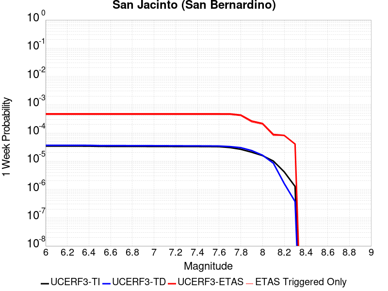 | 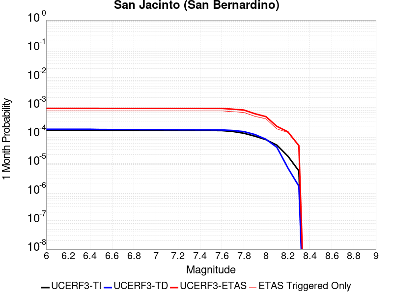 |  |

| Magnitude | 1 wk TI Prob | 1 wk TD Prob | 1 wk ETAS Prob | 1 wk ETAS/TD Gain | 1 wk ETAS Triggered Only | 1 mo TI Prob | 1 mo TD Prob | 1 mo ETAS Prob | 1 mo ETAS/TD Gain | 1 mo ETAS Triggered Only | 1 yr TI Prob | 1 yr TD Prob | 1 yr ETAS Prob | 1 yr ETAS/TD Gain | 1 yr ETAS Triggered Only |
|-----|-----|-----|-----|-----|-----|-----|-----|-----|-----|-----|-----|-----|-----|-----|-----|
| 6.0 | 3.409352E-5 | 3.6394562E-5 | 4.7637854E-4 | 13.089278 | 4.4E-4 | 1.461069E-4 | 1.5596737E-4 | 8.358613E-4 | 5.359206 | 6.8E-4 | 0.0017774 | 0.0018972505 | 0.0028953534 | 1.5260786 | 0.001 |
| 6.1 | 3.409352E-5 | 3.6394562E-5 | 4.7637854E-4 | 13.089278 | 4.4E-4 | 1.461069E-4 | 1.5596737E-4 | 8.358613E-4 | 5.359206 | 6.8E-4 | 0.0017774 | 0.0018972505 | 0.0028953534 | 1.5260786 | 0.001 |
| 6.2 | 3.409352E-5 | 3.6394562E-5 | 4.7637854E-4 | 13.089278 | 4.4E-4 | 1.461069E-4 | 1.5596737E-4 | 8.358613E-4 | 5.359206 | 6.8E-4 | 0.0017774 | 0.0018972505 | 0.0028953534 | 1.5260786 | 0.001 |
| 6.3 | 3.409352E-5 | 3.6394562E-5 | 4.7637854E-4 | 13.089278 | 4.4E-4 | 1.461069E-4 | 1.5596737E-4 | 8.358613E-4 | 5.359206 | 6.8E-4 | 0.0017774 | 0.0018972505 | 0.0028953534 | 1.5260786 | 0.001 |
| 6.4 | 3.400795E-5 | 3.6287136E-5 | 4.7627118E-4 | 13.12507 | 4.4E-4 | 1.4574021E-4 | 1.5550703E-4 | 8.354013E-4 | 5.3721128 | 6.8E-4 | 0.0017729428 | 0.0018916556 | 0.002889764 | 1.5276375 | 0.001 |
| 6.5 | 3.341482E-5 | 3.5547153E-5 | 4.755315E-4 | 13.377485 | 4.4E-4 | 1.4319851E-4 | 1.5233604E-4 | 8.322325E-4 | 5.4631352 | 6.8E-4 | 0.0017420477 | 0.001853115 | 0.002851262 | 1.5386319 | 0.001 |
| 6.6 | 3.3364955E-5 | 3.5484314E-5 | 4.754687E-4 | 13.399405 | 4.4E-4 | 1.4298483E-4 | 1.5206679E-4 | 8.319634E-4 | 5.47104 | 6.8E-4 | 0.0017394501 | 0.0018498423 | 0.0028479923 | 1.5395867 | 0.001 |
| 6.7 | 3.335922E-5 | 3.547408E-5 | 4.7545848E-4 | 13.402983 | 4.4E-4 | 1.4296026E-4 | 1.5202291E-4 | 8.3191955E-4 | 5.4723296 | 6.8E-4 | 0.0017391514 | 0.0018493092 | 0.0028474599 | 1.5397425 | 0.001 |
| 6.8 | 3.327683E-5 | 3.5368048E-5 | 4.7535248E-4 | 13.440167 | 4.4E-4 | 1.4260718E-4 | 1.5156854E-4 | 8.3146547E-4 | 5.4857388 | 6.8E-4 | 0.0017348597 | 0.0018437867 | 0.002841943 | 1.5413622 | 0.001 |
| 6.9 | 3.3235785E-5 | 3.530894E-5 | 4.752934E-4 | 13.460993 | 4.4E-4 | 1.4243131E-4 | 1.5131527E-4 | 8.312124E-4 | 5.493249 | 6.8E-4 | 0.0017327217 | 0.0018407081 | 0.0028388673 | 1.5422692 | 0.001 |
| 7.0 | 3.3197095E-5 | 3.52488E-5 | 4.7523328E-4 | 13.482255 | 4.4E-4 | 1.422655E-4 | 1.5105754E-4 | 8.309548E-4 | 5.500916 | 6.8E-4 | 0.0017307063 | 0.0018375756 | 0.002835738 | 1.5431952 | 0.001 |
| 7.1 | 3.3129716E-5 | 3.5128847E-5 | 4.751134E-4 | 13.5248785 | 4.4E-4 | 1.4197677E-4 | 1.5054352E-4 | 8.3044113E-4 | 5.5162864 | 6.8E-4 | 0.0017271966 | 0.001831328 | 0.0028294967 | 1.5450518 | 0.001 |
| 7.2 | 3.3034008E-5 | 3.4996167E-5 | 4.7498077E-4 | 13.572365 | 4.4E-4 | 1.4156665E-4 | 1.4997496E-4 | 8.2987297E-4 | 5.53341 | 6.8E-4 | 0.0017222111 | 0.0018244174 | 0.002822593 | 1.5471202 | 0.001 |
| 7.3 | 3.2956614E-5 | 3.4863686E-5 | 4.7484835E-4 | 13.620142 | 4.4E-4 | 1.4123498E-4 | 1.4940725E-4 | 8.293057E-4 | 5.5506387 | 6.8E-4 | 0.0017181796 | 0.001817517 | 0.0028156994 | 1.5492011 | 0.001 |
| 7.4 | 3.2915937E-5 | 3.4785193E-5 | 4.7476988E-4 | 13.64862 | 4.4E-4 | 1.4106068E-4 | 1.490709E-4 | 8.289695E-4 | 5.560908 | 6.8E-4 | 0.0017160608 | 0.0018134287 | 0.0028116154 | 1.5504416 | 0.001 |
| 7.5 | 3.281791E-5 | 3.4649816E-5 | 4.7463458E-4 | 13.69804 | 4.4E-4 | 1.406406E-4 | 1.4849077E-4 | 8.283898E-4 | 5.578729 | 6.8E-4 | 0.0017109542 | 0.0018063774 | 0.002804571 | 1.5525942 | 0.001 |
| 7.6 | 3.2521442E-5 | 3.4374003E-5 | 4.7435888E-4 | 13.799932 | 4.4E-4 | 1.3937015E-4 | 1.4730885E-4 | 8.272087E-4 | 5.615472 | 6.8E-4 | 0.0016955109 | 0.0017920113 | 0.0027902194 | 1.5570322 | 0.001 |
| 7.7 | 3.0287873E-5 | 3.2853422E-5 | 4.7283896E-4 | 14.392382 | 4.4E-4 | 1.297987E-4 | 1.4079278E-4 | 7.807027E-4 | 5.5450478 | 6.4E-4 | 0.0015791537 | 0.0017128056 | 0.0026711612 | 1.5595239 | 9.6E-4 |
| 7.8 | 2.6316151E-5 | 3.0049645E-5 | 4.3003762E-4 | 14.310905 | 4.0E-4 | 1.1277862E-4 | 1.2877784E-4 | 7.287006E-4 | 5.6585865 | 6.0E-4 | 0.0013722149 | 0.0015667436 | 0.0024853023 | 1.5862852 | 9.2E-4 |
| 7.9 | 2.0761147E-5 | 2.3754892E-5 | 2.6374919E-4 | 11.1029415 | 2.4E-4 | 8.897331E-5 | 1.0180272E-4 | 5.417579E-4 | 5.3216453 | 4.4E-4 | 0.0010827117 | 0.0012387441 | 0.0018779513 | 1.5160123 | 6.4E-4 |
| 8.0 | 1.5738568E-5 | 1.6286816E-5 | 2.1628356E-4 | 13.279671 | 2.0E-4 | 6.744926E-5 | 6.979878E-5 | 4.2977365E-4 | 6.1573234 | 3.6E-4 | 8.2088535E-4 | 8.494695E-4 | 0.0012890957 | 1.5175303 | 4.4E-4 |
| 8.1 | 1.0105832E-5 | 8.478705E-6 | 8.8478024E-5 | 10.435323 | 8.0E-5 | 4.3309992E-5 | 3.6336805E-5 | 1.9633099E-4 | 5.403089 | 1.6E-4 | 5.2717153E-4 | 4.4231134E-4 | 6.0224056E-4 | 1.3615762 | 1.6E-4 |
| 8.2 | 4.189207E-6 | 1.6207553E-6 | 8.162062E-5 | 50.359627 | 8.0E-5 | 1.7953622E-5 | 6.9460752E-6 | 1.2694525E-4 | 18.275822 | 1.2E-4 | 2.1856341E-4 | 8.456522E-5 | 2.0455506E-4 | 2.418903 | 1.2E-4 |
| 8.3 | 1.2758221E-6 | 3.728509E-7 | 4.0372837E-5 | 108.28144 | 4.0E-5 | 5.4677976E-6 | 1.5979316E-6 | 4.159787E-5 | 26.032322 | 4.0E-5 | 6.65684E-5 | 1.9454648E-5 | 5.945387E-5 | 3.056024 | 4.0E-5 |

## Tank Canyon
*[(top)](#table-of-contents)*

| 1 Week | 1 Month | 1 Year |
|-----|-----|-----|
| 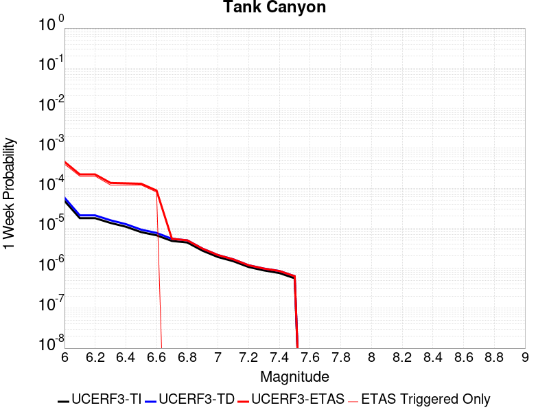 | 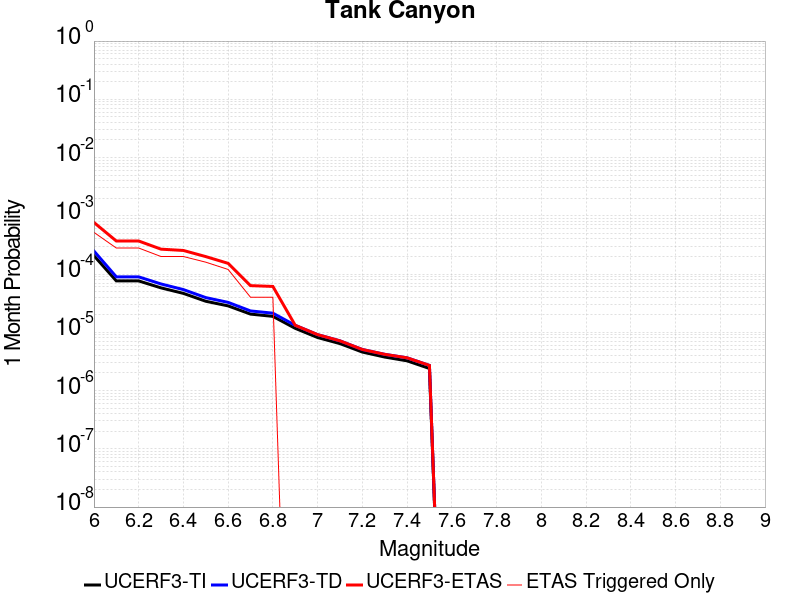 |  |

| Magnitude | 1 wk TI Prob | 1 wk TD Prob | 1 wk ETAS Prob | 1 wk ETAS/TD Gain | 1 wk ETAS Triggered Only | 1 mo TI Prob | 1 mo TD Prob | 1 mo ETAS Prob | 1 mo ETAS/TD Gain | 1 mo ETAS Triggered Only | 1 yr TI Prob | 1 yr TD Prob | 1 yr ETAS Prob | 1 yr ETAS/TD Gain | 1 yr ETAS Triggered Only |
|-----|-----|-----|-----|-----|-----|-----|-----|-----|-----|-----|-----|-----|-----|-----|-----|
| 6.0 | 4.8284557E-5 | 5.800436E-5 | 4.5798116E-4 | 7.895633 | 4.0E-4 | 2.0691741E-4 | 2.485703E-4 | 7.68441E-4 | 3.0914438 | 5.2E-4 | 0.0025163088 | 0.0030228058 | 0.0038203874 | 1.2638547 | 8.0E-4 |
| 6.1 | 1.7796336E-5 | 2.088598E-5 | 2.208818E-4 | 10.575602 | 2.0E-4 | 7.626778E-5 | 8.9508496E-5 | 3.6948343E-4 | 4.127915 | 2.8E-4 | 9.281647E-4 | 0.0010892592 | 0.0014888234 | 1.366822 | 4.0E-4 |
| 6.2 | 1.7796336E-5 | 2.088598E-5 | 2.208818E-4 | 10.575602 | 2.0E-4 | 7.626778E-5 | 8.9508496E-5 | 3.6948343E-4 | 4.127915 | 2.8E-4 | 9.281647E-4 | 0.0010892592 | 0.0014888234 | 1.366822 | 4.0E-4 |
| 6.3 | 1.3515912E-5 | 1.5768876E-5 | 1.3576698E-4 | 8.609808 | 1.2E-4 | 5.792405E-5 | 6.757928E-5 | 2.6756577E-4 | 3.959287 | 2.0E-4 | 7.049971E-4 | 8.224908E-4 | 0.0011422276 | 1.3887421 | 3.2E-4 |
| 6.4 | 1.0870146E-5 | 1.2625341E-5 | 1.3262383E-4 | 10.504574 | 1.2E-4 | 4.658551E-5 | 5.4107582E-5 | 2.5409675E-4 | 4.69614 | 2.0E-4 | 5.67031E-4 | 6.585785E-4 | 9.783678E-4 | 1.4855751 | 3.2E-4 |
| 6.5 | 7.964826E-6 | 9.201362E-6 | 1.2920026E-4 | 14.041427 | 1.2E-4 | 3.4134522E-5 | 3.9433875E-5 | 1.9942757E-4 | 5.0572653 | 1.6E-4 | 4.1550855E-4 | 4.800122E-4 | 7.19897E-4 | 1.4997473 | 2.4E-4 |
| 6.6 | 6.6317E-6 | 7.6165943E-6 | 8.761598E-5 | 11.503302 | 8.0E-5 | 2.8421264E-5 | 3.264219E-5 | 1.5263827E-4 | 4.676104 | 1.2E-4 | 3.4597394E-4 | 3.9735527E-4 | 5.972758E-4 | 1.5031279 | 2.0E-4 |
| 6.7 | 4.793663E-6 | 5.433774E-6 | 5.433774E-6 | 1.0 | 0.0 | 2.0544108E-5 | 2.3287419E-5 | 6.328649E-5 | 2.7176256 | 4.0E-5 | 2.500958E-4 | 2.8349183E-4 | 4.0345782E-4 | 1.4231726 | 1.2E-4 |
| 6.8 | 4.382823E-6 | 4.971998E-6 | 4.971998E-6 | 1.0 | 0.0 | 1.8783392E-5 | 2.1308413E-5 | 6.130756E-5 | 2.877153 | 4.0E-5 | 2.286638E-4 | 2.594033E-4 | 3.7937218E-4 | 1.4624801 | 1.2E-4 |
| 6.9 | 2.729601E-6 | 3.0754818E-6 | 3.0754818E-6 | 1.0 | 0.0 | 1.1698237E-5 | 1.3180577E-5 | 1.3180577E-5 | 1.0 | 0.0 | 1.4241673E-4 | 1.6046294E-4 | 2.0045652E-4 | 1.2492387 | 4.0E-5 |
| 7.0 | 1.8987357E-6 | 2.1284195E-6 | 2.1284195E-6 | 1.0 | 0.0 | 8.137413E-6 | 9.12177E-6 | 9.12177E-6 | 1.0 | 0.0 | 9.90685E-5 | 1.11052585E-4 | 1.11052585E-4 | 1.0 | 0.0 |
| 7.1 | 1.4928986E-6 | 1.6647061E-6 | 1.6647061E-6 | 1.0 | 0.0 | 6.398121E-6 | 7.134439E-6 | 7.134439E-6 | 1.0 | 0.0 | 7.789434E-5 | 8.685892E-5 | 8.685892E-5 | 1.0 | 0.0 |
| 7.2 | 1.069082E-6 | 1.1831523E-6 | 1.1831523E-6 | 1.0 | 0.0 | 4.581772E-6 | 5.0706462E-6 | 5.0706462E-6 | 1.0 | 0.0 | 5.5781646E-5 | 6.17339E-5 | 6.17339E-5 | 1.0 | 0.0 |
| 7.3 | 8.776551E-7 | 9.772481E-7 | 9.772481E-7 | 1.0 | 0.0 | 3.7613736E-6 | 4.1882026E-6 | 4.1882026E-6 | 1.0 | 0.0 | 4.579376E-5 | 5.0990693E-5 | 5.0990693E-5 | 1.0 | 0.0 |
| 7.4 | 7.55721E-7 | 8.5113516E-7 | 8.5113516E-7 | 1.0 | 0.0 | 3.2388E-6 | 3.6477197E-6 | 3.6477197E-6 | 1.0 | 0.0 | 3.9431678E-5 | 4.44106E-5 | 4.44106E-5 | 1.0 | 0.0 |
| 7.5 | 5.587665E-7 | 6.3064164E-7 | 6.3064164E-7 | 1.0 | 0.0 | 2.3947114E-6 | 2.70275E-6 | 2.70275E-6 | 1.0 | 0.0 | 2.915522E-5 | 3.290598E-5 | 3.290598E-5 | 1.0 | 0.0 |

## Imperial
*[(top)](#table-of-contents)*

| 1 Week | 1 Month | 1 Year |
|-----|-----|-----|
| 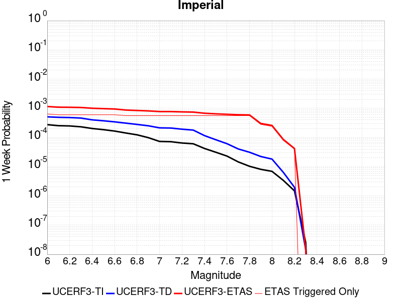 |  | 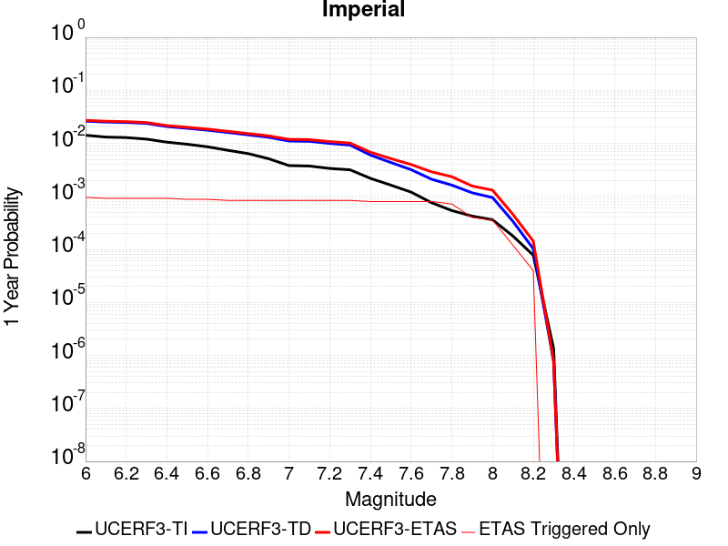 |

| Magnitude | 1 wk TI Prob | 1 wk TD Prob | 1 wk ETAS Prob | 1 wk ETAS/TD Gain | 1 wk ETAS Triggered Only | 1 mo TI Prob | 1 mo TD Prob | 1 mo ETAS Prob | 1 mo ETAS/TD Gain | 1 mo ETAS Triggered Only | 1 yr TI Prob | 1 yr TD Prob | 1 yr ETAS Prob | 1 yr ETAS/TD Gain | 1 yr ETAS Triggered Only |
|-----|-----|-----|-----|-----|-----|-----|-----|-----|-----|-----|-----|-----|-----|-----|-----|
| 6.0 | 2.7496446E-4 | 5.092747E-4 | 0.0011489488 | 2.2560492 | 6.4E-4 | 0.0011778869 | 0.0021808199 | 0.002859337 | 1.3111293 | 6.8E-4 | 0.0142467655 | 0.026244733 | 0.027179537 | 1.0356188 | 9.6E-4 |
| 6.1 | 2.5356023E-4 | 4.8989133E-4 | 0.0010895974 | 2.2241614 | 6.0E-4 | 0.001086234 | 0.0020978837 | 0.002736541 | 1.3044293 | 6.4E-4 | 0.013144928 | 0.025256295 | 0.02615306 | 1.0355066 | 9.2E-4 |
| 6.2 | 2.4820742E-4 | 4.807923E-4 | 0.0010805038 | 2.24734 | 6.0E-4 | 0.0010633124 | 0.0020589496 | 0.002697632 | 1.3101981 | 6.4E-4 | 0.01286919 | 0.024793668 | 0.025690857 | 1.0361862 | 9.2E-4 |
| 6.3 | 2.3205351E-4 | 4.618754E-4 | 0.0010615983 | 2.2984517 | 6.0E-4 | 9.94136E-4 | 0.0019780016 | 0.0026167356 | 1.3229189 | 6.4E-4 | 0.012036599 | 0.023824649 | 0.02472273 | 1.0376955 | 9.2E-4 |
| 6.4 | 2.0304754E-4 | 4.0161575E-4 | 0.0010013748 | 2.4933653 | 6.0E-4 | 8.6991355E-4 | 0.0017200898 | 0.0023589889 | 1.3714336 | 6.4E-4 | 0.010539869 | 0.020755747 | 0.021656651 | 1.043405 | 9.2E-4 |
| 6.5 | 1.854992E-4 | 3.7255368E-4 | 9.7233016E-4 | 2.6099062 | 6.0E-4 | 7.9475436E-4 | 0.0015956942 | 0.002234673 | 1.4004394 | 6.4E-4 | 0.009633281 | 0.019265464 | 0.020128509 | 1.0447975 | 8.8E-4 |
| 6.6 | 1.6586106E-4 | 3.4277118E-4 | 9.425655E-4 | 2.7498388 | 6.0E-4 | 7.106394E-4 | 0.0014682026 | 0.0021072628 | 1.4352671 | 6.4E-4 | 0.008617763 | 0.017735237 | 0.018599631 | 1.0487387 | 8.8E-4 |
| 6.7 | 1.4224656E-4 | 3.0978522E-4 | 8.6961174E-4 | 2.8071442 | 5.6E-4 | 6.094856E-4 | 0.0013269838 | 0.0019261875 | 1.4515532 | 6.0E-4 | 0.0073952693 | 0.01604038 | 0.016866906 | 1.0515279 | 8.4E-4 |
| 6.8 | 1.2317259E-4 | 2.7964902E-4 | 8.394924E-4 | 3.00195 | 5.6E-4 | 5.2777573E-4 | 0.0011979516 | 0.0017972329 | 1.500255 | 6.0E-4 | 0.0064067547 | 0.014488932 | 0.015316761 | 1.0571353 | 8.4E-4 |
| 6.9 | 9.859898E-5 | 2.5139938E-4 | 8.112586E-4 | 3.2269714 | 5.6E-4 | 4.2249862E-4 | 0.0010769854 | 0.0016763392 | 1.5565107 | 6.0E-4 | 0.0051317946 | 0.013034438 | 0.013863488 | 1.0636047 | 8.4E-4 |
| 7.0 | 7.3191884E-5 | 2.1355721E-4 | 7.734376E-4 | 3.6216881 | 5.6E-4 | 3.136418E-4 | 9.149274E-4 | 0.0015143785 | 1.6551898 | 6.0E-4 | 0.003811904 | 0.0110830385 | 0.011913729 | 1.0749515 | 8.4E-4 |
| 7.1 | 7.1760296E-5 | 2.1055574E-4 | 7.704378E-4 | 3.6590683 | 5.6E-4 | 3.0750787E-4 | 9.020729E-4 | 0.0015015316 | 1.6645348 | 6.0E-4 | 0.003737482 | 0.010928115 | 0.011758935 | 1.076026 | 8.4E-4 |
| 7.2 | 6.46614E-5 | 1.922011E-4 | 7.5209345E-4 | 3.913055 | 5.6E-4 | 2.7709085E-4 | 8.2346203E-4 | 0.001422968 | 1.728031 | 6.0E-4 | 0.0033683628 | 0.00998019 | 0.010811807 | 1.0833267 | 8.4E-4 |
| 7.3 | 6.088115E-5 | 1.7887545E-4 | 7.3877524E-4 | 4.1301103 | 5.6E-4 | 2.6089314E-4 | 7.663867E-4 | 0.0013659268 | 1.7822946 | 6.0E-4 | 0.0031717476 | 0.009291418 | 0.010123613 | 1.089566 | 8.4E-4 |
| 7.4 | 4.199346E-5 | 1.1570693E-4 | 6.756421E-4 | 5.839254 | 5.6E-4 | 1.7995955E-4 | 4.957935E-4 | 0.001095496 | 2.2095814 | 6.0E-4 | 0.0021888057 | 0.006019749 | 0.006814934 | 1.1320959 | 8.0E-4 |
| 7.5 | 3.130448E-5 | 8.383019E-5 | 6.4378325E-4 | 7.6796107 | 5.6E-4 | 1.3415517E-4 | 3.592231E-4 | 9.590076E-4 | 2.669671 | 6.0E-4 | 0.0016321153 | 0.004364831 | 0.0051613394 | 1.1824832 | 8.0E-4 |
| 7.6 | 2.3074248E-5 | 6.126616E-5 | 6.2123185E-4 | 10.139885 | 5.6E-4 | 9.888588E-5 | 2.6254298E-4 | 8.6238544E-4 | 3.2847402 | 6.0E-4 | 0.0012032706 | 0.003191799 | 0.0039892453 | 1.2498424 | 8.0E-4 |
| 7.7 | 1.45864815E-5 | 4.047476E-5 | 6.0045207E-4 | 14.835223 | 5.6E-4 | 6.2511994E-5 | 1.7345174E-4 | 7.733477E-4 | 4.4585752 | 6.0E-4 | 7.608177E-4 | 0.0021097353 | 0.0029080475 | 1.3783945 | 8.0E-4 |
| 7.8 | 1.0352979E-5 | 3.1258456E-5 | 5.9124094E-4 | 18.914593 | 5.6E-4 | 4.4369157E-5 | 1.3395795E-4 | 7.338776E-4 | 5.478418 | 6.0E-4 | 5.400606E-4 | 0.0016297202 | 0.0023485469 | 1.4410737 | 7.2E-4 |
| 7.9 | 8.137906E-6 | 2.238844E-5 | 3.0238216E-4 | 13.506174 | 2.8E-4 | 3.4876273E-5 | 9.594693E-5 | 4.1591623E-4 | 4.334857 | 3.2E-4 | 4.2453592E-4 | 0.0011675289 | 0.0015670619 | 1.342204 | 4.0E-4 |
| 8.0 | 6.93792E-6 | 1.821489E-5 | 2.5821052E-4 | 14.175793 | 2.4E-4 | 2.9733603E-5 | 7.806149E-5 | 3.5803963E-4 | 4.586636 | 2.8E-4 | 3.6194647E-4 | 9.49985E-4 | 0.001309643 | 1.3785933 | 3.6E-4 |
| 8.1 | 3.4286315E-6 | 6.476726E-6 | 8.6476204E-5 | 13.35184 | 8.0E-5 | 1.4694053E-5 | 2.7757102E-5 | 1.4775377E-4 | 5.323098 | 1.2E-4 | 1.7888541E-4 | 3.3789044E-4 | 4.5784988E-4 | 1.3550247 | 1.2E-4 |
| 8.2 | 1.4906886E-6 | 1.9734612E-6 | 4.197338E-5 | 21.268917 | 4.0E-5 | 6.3886496E-6 | 8.457663E-6 | 4.8457325E-5 | 5.7293987 | 4.0E-5 | 7.7779034E-5 | 1.0296722E-4 | 1.429631E-4 | 1.3884331 | 4.0E-5 |
| 8.3 | 2.5758007E-8 | 1.4872131E-8 | 1.4872131E-8 | 1.0 | 0.0 | 1.10391454E-7 | 6.37377E-8 | 6.37377E-8 | 1.0 | 0.0 | 1.3440151E-6 | 7.760065E-7 | 7.760065E-7 | 1.0 | 0.0 |

## San Jacinto (San Jacinto Valley) rev
*[(top)](#table-of-contents)*

| 1 Week | 1 Month | 1 Year |
|-----|-----|-----|
|  |  |  |

| Magnitude | 1 wk TI Prob | 1 wk TD Prob | 1 wk ETAS Prob | 1 wk ETAS/TD Gain | 1 wk ETAS Triggered Only | 1 mo TI Prob | 1 mo TD Prob | 1 mo ETAS Prob | 1 mo ETAS/TD Gain | 1 mo ETAS Triggered Only | 1 yr TI Prob | 1 yr TD Prob | 1 yr ETAS Prob | 1 yr ETAS/TD Gain | 1 yr ETAS Triggered Only |
|-----|-----|-----|-----|-----|-----|-----|-----|-----|-----|-----|-----|-----|-----|-----|-----|
| 6.0 | 3.652694E-5 | 3.4785007E-5 | 4.347711E-4 | 12.498808 | 4.0E-4 | 1.5653463E-4 | 1.4907008E-4 | 7.489807E-4 | 5.0243526 | 6.0E-4 | 0.0019041431 | 0.0018134193 | 0.002731751 | 1.5064089 | 9.2E-4 |
| 6.1 | 3.652694E-5 | 3.4785007E-5 | 4.347711E-4 | 12.498808 | 4.0E-4 | 1.5653463E-4 | 1.4907008E-4 | 7.489807E-4 | 5.0243526 | 6.0E-4 | 0.0019041431 | 0.0018134193 | 0.002731751 | 1.5064089 | 9.2E-4 |
| 6.2 | 3.652694E-5 | 3.4785007E-5 | 4.347711E-4 | 12.498808 | 4.0E-4 | 1.5653463E-4 | 1.4907008E-4 | 7.489807E-4 | 5.0243526 | 6.0E-4 | 0.0019041431 | 0.0018134193 | 0.002731751 | 1.5064089 | 9.2E-4 |
| 6.3 | 3.652694E-5 | 3.4785007E-5 | 4.347711E-4 | 12.498808 | 4.0E-4 | 1.5653463E-4 | 1.4907008E-4 | 7.489807E-4 | 5.0243526 | 6.0E-4 | 0.0019041431 | 0.0018134193 | 0.002731751 | 1.5064089 | 9.2E-4 |
| 6.4 | 3.646941E-5 | 3.470649E-5 | 4.346926E-4 | 12.524822 | 4.0E-4 | 1.5628811E-4 | 1.4873363E-4 | 7.486444E-4 | 5.0334573 | 6.0E-4 | 0.0019011468 | 0.0018093301 | 0.0027276655 | 1.5075555 | 9.2E-4 |
| 6.5 | 3.646941E-5 | 3.470649E-5 | 4.346926E-4 | 12.524822 | 4.0E-4 | 1.5628811E-4 | 1.4873363E-4 | 7.486444E-4 | 5.0334573 | 6.0E-4 | 0.0019011468 | 0.0018093301 | 0.0027276655 | 1.5075555 | 9.2E-4 |
| 6.6 | 3.6442503E-5 | 3.4669836E-5 | 4.3465596E-4 | 12.537007 | 4.0E-4 | 1.561728E-4 | 1.4857655E-4 | 7.484874E-4 | 5.037722 | 6.0E-4 | 0.0018997455 | 0.0018074211 | 0.0027257584 | 1.5080925 | 9.2E-4 |
| 6.7 | 3.6432113E-5 | 3.4655393E-5 | 4.3464152E-4 | 12.541816 | 4.0E-4 | 1.5612828E-4 | 1.4851466E-4 | 7.4842555E-4 | 5.039405 | 6.0E-4 | 0.0018992044 | 0.0018066689 | 0.0027250068 | 1.5083045 | 9.2E-4 |
| 6.8 | 3.6409598E-5 | 3.462441E-5 | 4.3461056E-4 | 12.552144 | 4.0E-4 | 1.560318E-4 | 1.4838189E-4 | 7.482929E-4 | 5.04302 | 6.0E-4 | 0.0018980318 | 0.0018050552 | 0.0027233947 | 1.5087597 | 9.2E-4 |
| 6.9 | 3.638078E-5 | 3.4584784E-5 | 4.3457095E-4 | 12.56538 | 4.0E-4 | 1.5590832E-4 | 1.4821209E-4 | 7.4812316E-4 | 5.0476527 | 6.0E-4 | 0.0018965311 | 0.0018029913 | 0.0027213325 | 1.5093431 | 9.2E-4 |
| 7.0 | 3.6294874E-5 | 3.446665E-5 | 4.3445287E-4 | 12.6050205 | 4.0E-4 | 1.5554018E-4 | 1.4770588E-4 | 7.476173E-4 | 5.061527 | 6.0E-4 | 0.0018920569 | 0.0017968385 | 0.0027151853 | 1.5110904 | 9.2E-4 |
| 7.1 | 3.6260717E-5 | 3.4422897E-5 | 4.3440913E-4 | 12.619773 | 4.0E-4 | 1.5539382E-4 | 1.4751837E-4 | 7.4742985E-4 | 5.06669 | 6.0E-4 | 0.001890278 | 0.0017945593 | 0.0027129082 | 1.5117407 | 9.2E-4 |
| 7.2 | 3.6210204E-5 | 3.4356966E-5 | 4.3434324E-4 | 12.642071 | 4.0E-4 | 1.5517735E-4 | 1.4723586E-4 | 7.471475E-4 | 5.0744944 | 6.0E-4 | 0.001887647 | 0.0017911253 | 0.0027094774 | 1.5127236 | 9.2E-4 |
| 7.3 | 3.6119454E-5 | 3.42449E-5 | 4.342312E-4 | 12.680172 | 4.0E-4 | 1.5478847E-4 | 1.4675561E-4 | 7.4666756E-4 | 5.0878296 | 6.0E-4 | 0.0018829206 | 0.001785288 | 0.0027036455 | 1.514403 | 9.2E-4 |
| 7.4 | 3.607848E-5 | 3.4192242E-5 | 4.3417857E-4 | 12.69816 | 4.0E-4 | 1.5461289E-4 | 1.4652996E-4 | 7.4644206E-4 | 5.0941257 | 6.0E-4 | 0.0018807866 | 0.0017825452 | 0.0027009053 | 1.515196 | 9.2E-4 |
| 7.5 | 3.5856774E-5 | 3.4000583E-5 | 4.3398698E-4 | 12.764104 | 4.0E-4 | 1.5366284E-4 | 1.4570866E-4 | 7.456212E-4 | 5.117206 | 6.0E-4 | 0.0018692396 | 0.0017725622 | 0.0026909315 | 1.5181026 | 9.2E-4 |
| 7.6 | 3.286655E-5 | 3.2510947E-5 | 4.3249794E-4 | 13.303147 | 4.0E-4 | 1.4084904E-4 | 1.393252E-4 | 7.392416E-4 | 5.3058715 | 6.0E-4 | 0.001713488 | 0.0016949666 | 0.0026134073 | 1.5418636 | 9.2E-4 |
| 7.7 | 2.8882527E-5 | 2.9595956E-5 | 4.2958412E-4 | 14.514959 | 4.0E-4 | 1.237764E-4 | 1.2683365E-4 | 6.867626E-4 | 5.414672 | 5.6E-4 | 0.0015059357 | 0.001543107 | 0.002421749 | 1.569398 | 8.8E-4 |
| 7.8 | 2.4950225E-5 | 2.687312E-5 | 3.8686345E-4 | 14.395926 | 3.6E-4 | 1.0692515E-4 | 1.15165436E-4 | 6.3510553E-4 | 5.514724 | 5.2E-4 | 0.0013010362 | 0.0014012383 | 0.0022400613 | 1.5986298 | 8.4E-4 |
| 7.9 | 1.9881603E-5 | 2.1818549E-5 | 2.6181331E-4 | 11.999575 | 2.4E-4 | 8.520408E-5 | 9.350472E-5 | 4.934673E-4 | 5.2774587 | 4.0E-4 | 0.001036866 | 0.0011378262 | 0.0017371436 | 1.5267212 | 6.0E-4 |
| 8.0 | 1.563292E-5 | 1.618842E-5 | 2.1618519E-4 | 13.354311 | 2.0E-4 | 6.6996516E-5 | 6.93771E-5 | 3.893549E-4 | 5.612153 | 3.2E-4 | 8.153773E-4 | 8.4433955E-4 | 0.0012440018 | 1.473343 | 4.0E-4 |
| 8.1 | 1.0045313E-5 | 8.449115E-6 | 8.844844E-5 | 10.468368 | 8.0E-5 | 4.305063E-5 | 3.6209993E-5 | 1.962042E-4 | 5.41851 | 1.6E-4 | 5.2401534E-4 | 4.40768E-4 | 6.006975E-4 | 1.3628428 | 1.6E-4 |
| 8.2 | 4.1554413E-6 | 1.6074547E-6 | 8.160732E-5 | 50.76804 | 8.0E-5 | 1.7808914E-5 | 6.8890736E-6 | 1.2688825E-4 | 18.418768 | 1.2E-4 | 2.1680194E-4 | 8.387127E-5 | 2.0386121E-4 | 2.430644 | 1.2E-4 |
| 8.3 | 1.2758221E-6 | 3.728509E-7 | 4.0372837E-5 | 108.28144 | 4.0E-5 | 5.4677976E-6 | 1.5979316E-6 | 4.159787E-5 | 26.032322 | 4.0E-5 | 6.65684E-5 | 1.9454648E-5 | 5.945387E-5 | 3.056024 | 4.0E-5 |

## San Jacinto (Stepovers Combined)
*[(top)](#table-of-contents)*

| 1 Week | 1 Month | 1 Year |
|-----|-----|-----|
| 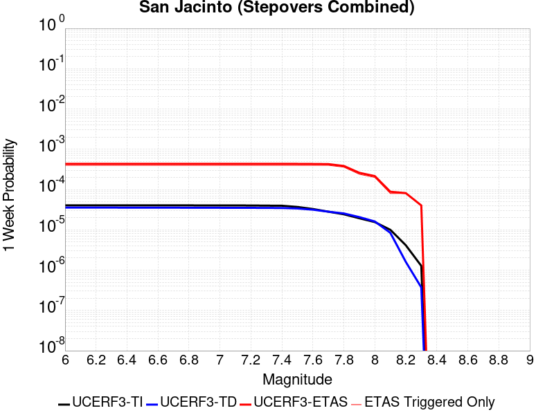 | 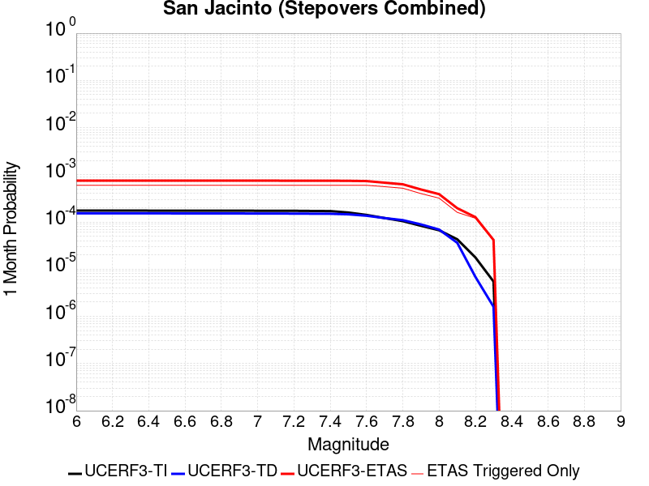 |  |

| Magnitude | 1 wk TI Prob | 1 wk TD Prob | 1 wk ETAS Prob | 1 wk ETAS/TD Gain | 1 wk ETAS Triggered Only | 1 mo TI Prob | 1 mo TD Prob | 1 mo ETAS Prob | 1 mo ETAS/TD Gain | 1 mo ETAS Triggered Only | 1 yr TI Prob | 1 yr TD Prob | 1 yr ETAS Prob | 1 yr ETAS/TD Gain | 1 yr ETAS Triggered Only |
|-----|-----|-----|-----|-----|-----|-----|-----|-----|-----|-----|-----|-----|-----|-----|-----|
| 6.0 | 4.0667746E-5 | 3.5654804E-5 | 4.3564054E-4 | 12.218284 | 4.0E-4 | 1.742787E-4 | 1.5279738E-4 | 7.527057E-4 | 4.926169 | 6.0E-4 | 0.0021197782 | 0.001858722 | 0.0027770118 | 1.4940437 | 9.2E-4 |
| 6.1 | 4.0667746E-5 | 3.5654804E-5 | 4.3564054E-4 | 12.218284 | 4.0E-4 | 1.742787E-4 | 1.5279738E-4 | 7.527057E-4 | 4.926169 | 6.0E-4 | 0.0021197782 | 0.001858722 | 0.0027770118 | 1.4940437 | 9.2E-4 |
| 6.2 | 4.0667746E-5 | 3.5654804E-5 | 4.3564054E-4 | 12.218284 | 4.0E-4 | 1.742787E-4 | 1.5279738E-4 | 7.527057E-4 | 4.926169 | 6.0E-4 | 0.0021197782 | 0.001858722 | 0.0027770118 | 1.4940437 | 9.2E-4 |
| 6.3 | 4.0667746E-5 | 3.5654804E-5 | 4.3564054E-4 | 12.218284 | 4.0E-4 | 1.742787E-4 | 1.5279738E-4 | 7.527057E-4 | 4.926169 | 6.0E-4 | 0.0021197782 | 0.001858722 | 0.0027770118 | 1.4940437 | 9.2E-4 |
| 6.4 | 4.0577226E-5 | 3.552656E-5 | 4.3551234E-4 | 12.258782 | 4.0E-4 | 1.738908E-4 | 1.522478E-4 | 7.521565E-4 | 4.9403434 | 6.0E-4 | 0.0021150648 | 0.0018520436 | 0.0027703396 | 1.4958286 | 9.2E-4 |
| 6.5 | 4.0577226E-5 | 3.552656E-5 | 4.3551234E-4 | 12.258782 | 4.0E-4 | 1.738908E-4 | 1.522478E-4 | 7.521565E-4 | 4.9403434 | 6.0E-4 | 0.0021150648 | 0.0018520436 | 0.0027703396 | 1.4958286 | 9.2E-4 |
| 6.6 | 4.053861E-5 | 3.5471832E-5 | 4.3545765E-4 | 12.276154 | 4.0E-4 | 1.7372532E-4 | 1.520133E-4 | 7.519221E-4 | 4.946423 | 6.0E-4 | 0.0021130538 | 0.0018491937 | 0.0027674923 | 1.4965942 | 9.2E-4 |
| 6.7 | 4.0516545E-5 | 3.5440866E-5 | 4.354267E-4 | 12.286006 | 4.0E-4 | 1.7363077E-4 | 1.5188061E-4 | 7.517895E-4 | 4.9498715 | 6.0E-4 | 0.002111905 | 0.0018475811 | 0.0027658814 | 1.4970284 | 9.2E-4 |
| 6.8 | 4.049434E-5 | 3.5412282E-5 | 4.353981E-4 | 12.295116 | 4.0E-4 | 1.7353562E-4 | 1.5175811E-4 | 7.516671E-4 | 4.95306 | 6.0E-4 | 0.0021107488 | 0.0018460923 | 0.0027643938 | 1.49743 | 9.2E-4 |
| 6.9 | 4.046386E-5 | 3.5374713E-5 | 4.3536056E-4 | 12.307113 | 4.0E-4 | 1.73405E-4 | 1.5159712E-4 | 7.515062E-4 | 4.9572587 | 6.0E-4 | 0.0021091616 | 0.0018441357 | 0.002762439 | 1.4979587 | 9.2E-4 |
| 7.0 | 4.036382E-5 | 3.5254863E-5 | 4.3524077E-4 | 12.345552 | 4.0E-4 | 1.7297632E-4 | 1.5108353E-4 | 7.509929E-4 | 4.970713 | 6.0E-4 | 0.0021039525 | 0.0018378934 | 0.0027562026 | 1.4996531 | 9.2E-4 |
| 7.1 | 4.0343282E-5 | 3.523326E-5 | 4.3521918E-4 | 12.352509 | 4.0E-4 | 1.7288832E-4 | 1.5099096E-4 | 7.5090036E-4 | 4.9731474 | 6.0E-4 | 0.002102883 | 0.0018367684 | 0.0027550785 | 1.4999597 | 9.2E-4 |
| 7.2 | 4.0257353E-5 | 3.5137495E-5 | 4.3512342E-4 | 12.383451 | 4.0E-4 | 1.725201E-4 | 1.5058058E-4 | 7.5049023E-4 | 4.9839773 | 6.0E-4 | 0.0020984085 | 0.0018317803 | 0.002750095 | 1.5013236 | 9.2E-4 |
| 7.3 | 3.9940667E-5 | 3.4963145E-5 | 4.3494915E-4 | 12.440219 | 4.0E-4 | 1.7116306E-4 | 1.4983346E-4 | 7.4974354E-4 | 5.003846 | 6.0E-4 | 0.0020819185 | 0.0018226993 | 0.0027410225 | 1.5038259 | 9.2E-4 |
| 7.4 | 3.9721202E-5 | 3.4847715E-5 | 4.3483378E-4 | 12.478114 | 4.0E-4 | 1.7022261E-4 | 1.4933883E-4 | 7.4924924E-4 | 5.0171094 | 6.0E-4 | 0.0020704903 | 0.0018166872 | 0.002735016 | 1.5054963 | 9.2E-4 |
| 7.5 | 3.7036873E-5 | 3.3907352E-5 | 4.338938E-4 | 12.796452 | 4.0E-4 | 1.5871979E-4 | 1.4530914E-4 | 7.45222E-4 | 5.1285276 | 6.0E-4 | 0.0019307006 | 0.0017677062 | 0.00268608 | 1.5195285 | 9.2E-4 |
| 7.6 | 3.2940967E-5 | 3.1670912E-5 | 4.3165823E-4 | 13.629486 | 4.0E-4 | 1.4116794E-4 | 1.3572544E-4 | 7.35644E-4 | 5.4200897 | 6.0E-4 | 0.0017173645 | 0.0016512069 | 0.0025696878 | 1.5562482 | 9.2E-4 |
| 7.7 | 2.8236149E-5 | 2.8227036E-5 | 4.2821575E-4 | 15.170411 | 4.0E-4 | 1.2100645E-4 | 1.2096741E-4 | 6.8089965E-4 | 5.628786 | 5.6E-4 | 0.0014722579 | 0.0014717843 | 0.0023504891 | 1.5970337 | 8.8E-4 |
| 7.8 | 2.4329287E-5 | 2.5537129E-5 | 3.8552794E-4 | 15.096761 | 3.6E-4 | 1.042642E-4 | 1.09440254E-4 | 6.293834E-4 | 5.750931 | 5.2E-4 | 0.0012686774 | 0.0013316215 | 0.002170503 | 1.6299698 | 8.4E-4 |
| 7.9 | 1.9370926E-5 | 2.071883E-5 | 2.6071386E-4 | 12.583426 | 2.4E-4 | 8.301561E-5 | 8.879197E-5 | 4.8875646E-4 | 5.5045123 | 4.0E-4 | 0.0010102465 | 0.0010805068 | 0.0016798585 | 1.554695 | 6.0E-4 |
| 8.0 | 1.5583017E-5 | 1.6136504E-5 | 2.1613328E-4 | 13.394057 | 2.0E-4 | 6.6782646E-5 | 6.915462E-5 | 3.891325E-4 | 5.6269917 | 3.2E-4 | 8.127754E-4 | 8.4163295E-4 | 0.0012412963 | 1.4748665 | 4.0E-4 |
| 8.1 | 1.0024873E-5 | 8.439436E-6 | 8.843876E-5 | 10.479226 | 8.0E-5 | 4.2963035E-5 | 3.6168516E-5 | 1.9616273E-4 | 5.4235773 | 1.6E-4 | 5.229494E-4 | 4.4026322E-4 | 6.0019275E-4 | 1.363259 | 1.6E-4 |
| 8.2 | 4.142796E-6 | 1.6027543E-6 | 8.160263E-5 | 50.913998 | 8.0E-5 | 1.775472E-5 | 6.8689287E-6 | 1.2686811E-4 | 18.469852 | 1.2E-4 | 2.1614227E-4 | 8.362603E-5 | 2.03616E-4 | 2.43484 | 1.2E-4 |
| 8.3 | 1.2750878E-6 | 3.725573E-7 | 4.0372543E-5 | 108.36599 | 4.0E-5 | 5.4646503E-6 | 1.5966733E-6 | 4.159661E-5 | 26.052048 | 4.0E-5 | 6.653009E-5 | 1.9439329E-5 | 5.943855E-5 | 3.0576444 | 4.0E-5 |

## Garlock (East)
*[(top)](#table-of-contents)*

| 1 Week | 1 Month | 1 Year |
|-----|-----|-----|
|  |  | 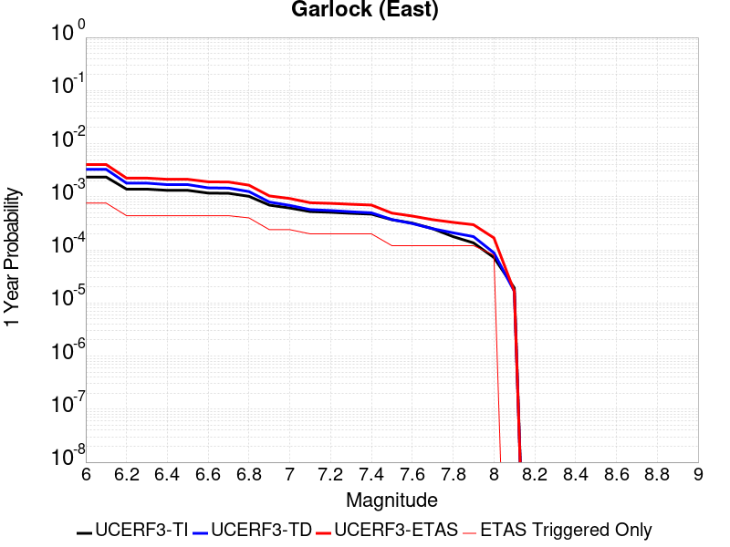 |

| Magnitude | 1 wk TI Prob | 1 wk TD Prob | 1 wk ETAS Prob | 1 wk ETAS/TD Gain | 1 wk ETAS Triggered Only | 1 mo TI Prob | 1 mo TD Prob | 1 mo ETAS Prob | 1 mo ETAS/TD Gain | 1 mo ETAS Triggered Only | 1 yr TI Prob | 1 yr TD Prob | 1 yr ETAS Prob | 1 yr ETAS/TD Gain | 1 yr ETAS Triggered Only |
|-----|-----|-----|-----|-----|-----|-----|-----|-----|-----|-----|-----|-----|-----|-----|-----|
| 6.0 | 4.5092507E-5 | 6.302061E-5 | 4.2299792E-4 | 6.7120566 | 3.6E-4 | 1.9323928E-4 | 2.700629E-4 | 6.299657E-4 | 2.3326628 | 3.6E-4 | 0.0023501497 | 0.0032835056 | 0.00404101 | 1.2306999 | 7.6E-4 |
| 6.1 | 4.5092507E-5 | 6.302061E-5 | 4.2299792E-4 | 6.7120566 | 3.6E-4 | 1.9323928E-4 | 2.700629E-4 | 6.299657E-4 | 2.3326628 | 3.6E-4 | 0.0023501497 | 0.0032835056 | 0.00404101 | 1.2306999 | 7.6E-4 |
| 6.2 | 2.6674514E-5 | 3.460235E-5 | 2.3459543E-4 | 6.779754 | 2.0E-4 | 1.1431433E-4 | 1.4828754E-4 | 3.482579E-4 | 2.348531 | 2.0E-4 | 0.0013908884 | 0.001803939 | 0.0022431454 | 1.2434707 | 4.4E-4 |
| 6.3 | 2.6674514E-5 | 3.460235E-5 | 2.3459543E-4 | 6.779754 | 2.0E-4 | 1.1431433E-4 | 1.4828754E-4 | 3.482579E-4 | 2.348531 | 2.0E-4 | 0.0013908884 | 0.001803939 | 0.0022431454 | 1.2434707 | 4.4E-4 |
| 6.4 | 2.5312667E-5 | 3.243003E-5 | 2.3242354E-4 | 7.1669235 | 2.0E-4 | 1.0847834E-4 | 1.389786E-4 | 3.389508E-4 | 2.4388704 | 2.0E-4 | 0.0013199237 | 0.0016907807 | 0.0021300367 | 1.2597948 | 4.4E-4 |
| 6.5 | 2.5312667E-5 | 3.243003E-5 | 2.3242354E-4 | 7.1669235 | 2.0E-4 | 1.0847834E-4 | 1.389786E-4 | 3.389508E-4 | 2.4388704 | 2.0E-4 | 0.0013199237 | 0.0016907807 | 0.0021300367 | 1.2597948 | 4.4E-4 |
| 6.6 | 2.246556E-5 | 2.8214976E-5 | 2.2820933E-4 | 8.088234 | 2.0E-4 | 9.627742E-5 | 1.2091586E-4 | 3.2089168E-4 | 2.6538427 | 2.0E-4 | 0.0011715472 | 0.00147118 | 0.0019105327 | 1.2986397 | 4.4E-4 |
| 6.7 | 2.2241198E-5 | 2.7884198E-5 | 2.2787863E-4 | 8.172321 | 2.0E-4 | 9.531594E-5 | 1.1949836E-4 | 3.1947446E-4 | 2.673463 | 2.0E-4 | 0.0011598538 | 0.0014539452 | 0.0018933055 | 1.3021849 | 4.4E-4 |
| 6.8 | 1.9528685E-5 | 2.3971877E-5 | 1.8396805E-4 | 7.6743274 | 1.6E-4 | 8.369167E-5 | 1.0273269E-4 | 2.6271626E-4 | 2.55728 | 1.6E-4 | 0.0010184698 | 0.0012500725 | 0.0016495725 | 1.3195814 | 4.0E-4 |
| 6.9 | 1.3318621E-5 | 1.5256402E-5 | 9.525518E-5 | 6.2436204 | 8.0E-5 | 5.7078556E-5 | 6.538297E-5 | 1.4537774E-4 | 2.2234802 | 8.0E-5 | 6.9470983E-4 | 7.957527E-4 | 0.0010355617 | 1.3013612 | 2.4E-4 |
| 7.0 | 1.1760853E-5 | 1.3163365E-5 | 9.3162314E-5 | 7.0773935 | 8.0E-5 | 5.0402683E-5 | 5.641323E-5 | 1.3640872E-4 | 2.4180272 | 8.0E-5 | 6.134799E-4 | 6.8661966E-4 | 9.264549E-4 | 1.3492985 | 2.4E-4 |
| 7.1 | 1.0064758E-5 | 1.0956659E-5 | 9.0955786E-5 | 8.301415 | 8.0E-5 | 4.3133965E-5 | 4.6956284E-5 | 1.2695252E-4 | 2.7036324 | 8.0E-5 | 5.2502943E-4 | 5.715463E-4 | 7.71432E-4 | 1.3497279 | 2.0E-4 |
| 7.2 | 9.768808E-6 | 1.0552171E-5 | 9.055133E-5 | 8.581299 | 8.0E-5 | 4.186565E-5 | 4.5222823E-5 | 1.252192E-4 | 2.7689383 | 8.0E-5 | 5.095951E-4 | 5.504523E-4 | 7.503422E-4 | 1.3631376 | 2.0E-4 |
| 7.3 | 9.344516E-6 | 9.99686E-6 | 8.999606E-5 | 9.002433 | 8.0E-5 | 4.004731E-5 | 4.2843003E-5 | 1.2283957E-4 | 2.8672028 | 8.0E-5 | 4.8746695E-4 | 5.214922E-4 | 7.213879E-4 | 1.3833148 | 2.0E-4 |
| 7.4 | 9.023491E-6 | 9.542039E-6 | 8.9541274E-5 | 9.383872 | 8.0E-5 | 3.867153E-5 | 4.0893832E-5 | 1.2089056E-4 | 2.9562051 | 8.0E-5 | 4.7072413E-4 | 4.9777207E-4 | 6.976725E-4 | 1.4015903 | 2.0E-4 |
| 7.5 | 7.081253E-6 | 7.1334935E-6 | 4.713321E-5 | 6.607311 | 4.0E-5 | 3.0347876E-5 | 3.057176E-5 | 7.057054E-5 | 2.308357 | 4.0E-5 | 3.6942272E-4 | 3.7214835E-4 | 4.921037E-4 | 1.322332 | 1.2E-4 |
| 7.6 | 6.116396E-6 | 6.0000416E-6 | 4.59998E-5 | 7.6665807 | 4.0E-5 | 2.6212863E-5 | 2.5714213E-5 | 6.571318E-5 | 2.55552 | 4.0E-5 | 3.1909486E-4 | 3.130258E-4 | 4.3298825E-4 | 1.383235 | 1.2E-4 |
| 7.7 | 4.797145E-6 | 4.795929E-6 | 4.4795735E-5 | 9.340367 | 4.0E-5 | 2.055903E-5 | 2.055382E-5 | 6.0552997E-5 | 2.9460702 | 4.0E-5 | 2.5027743E-4 | 2.5021416E-4 | 3.7018413E-4 | 1.4794692 | 1.2E-4 |
| 7.8 | 3.4028885E-6 | 4.0130544E-6 | 4.4012893E-5 | 10.96743 | 4.0E-5 | 1.4583726E-5 | 1.7198692E-5 | 5.7198005E-5 | 3.3257184 | 4.0E-5 | 1.775424E-4 | 2.0937403E-4 | 3.293489E-4 | 1.573017 | 1.2E-4 |
| 7.9 | 2.5928412E-6 | 3.4017612E-6 | 4.3401626E-5 | 12.758575 | 4.0E-5 | 1.1112129E-5 | 1.4578895E-5 | 5.457831E-5 | 3.743652 | 4.0E-5 | 1.3528178E-4 | 1.7748366E-4 | 2.9746236E-4 | 1.6759986 | 1.2E-4 |
| 8.0 | 1.3743648E-6 | 1.6867408E-6 | 4.1686675E-5 | 24.714333 | 4.0E-5 | 5.8901214E-6 | 7.2288694E-6 | 4.722858E-5 | 6.533329 | 4.0E-5 | 7.1709874E-5 | 8.800796E-5 | 1.6800092E-4 | 1.9089288 | 8.0E-5 |
| 8.1 | 3.6733252E-7 | 3.1722044E-7 | 3.1722044E-7 | 1.0 | 0.0 | 1.5742813E-6 | 1.3595155E-6 | 1.3595155E-6 | 1.0 | 0.0 | 1.9166706E-5 | 1.6551992E-5 | 1.6551992E-5 | 1.0 | 0.0 |

## San Jacinto (Anza) rev
*[(top)](#table-of-contents)*

| 1 Week | 1 Month | 1 Year |
|-----|-----|-----|
| 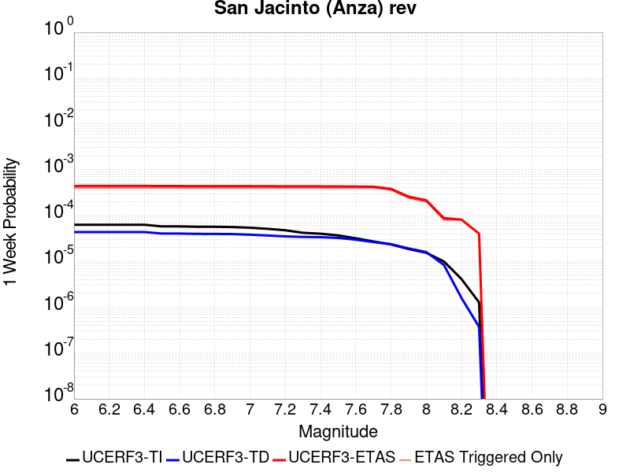 | 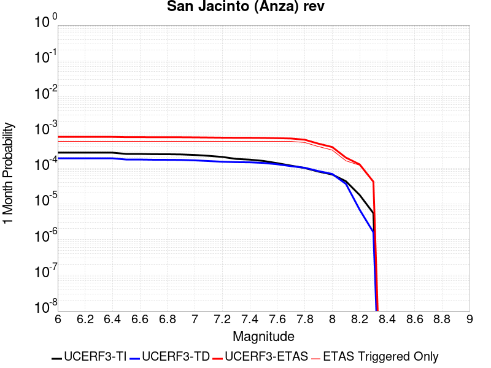 | 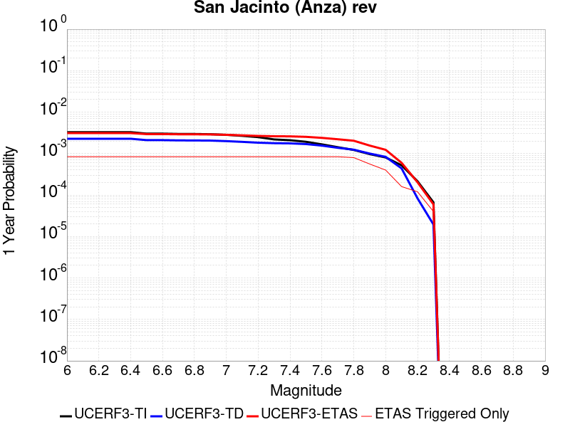 |

| Magnitude | 1 wk TI Prob | 1 wk TD Prob | 1 wk ETAS Prob | 1 wk ETAS/TD Gain | 1 wk ETAS Triggered Only | 1 mo TI Prob | 1 mo TD Prob | 1 mo ETAS Prob | 1 mo ETAS/TD Gain | 1 mo ETAS Triggered Only | 1 yr TI Prob | 1 yr TD Prob | 1 yr ETAS Prob | 1 yr ETAS/TD Gain | 1 yr ETAS Triggered Only |
|-----|-----|-----|-----|-----|-----|-----|-----|-----|-----|-----|-----|-----|-----|-----|-----|
| 6.0 | 6.3015636E-5 | 4.3745757E-5 | 4.4372826E-4 | 10.143344 | 4.0E-4 | 2.7003905E-4 | 1.8746841E-4 | 7.4736343E-4 | 3.98661 | 5.6E-4 | 0.0032827691 | 0.002280051 | 0.0031181355 | 1.3675729 | 8.4E-4 |
| 6.1 | 6.3015636E-5 | 4.3745757E-5 | 4.4372826E-4 | 10.143344 | 4.0E-4 | 2.7003905E-4 | 1.8746841E-4 | 7.4736343E-4 | 3.98661 | 5.6E-4 | 0.0032827691 | 0.002280051 | 0.0031181355 | 1.3675729 | 8.4E-4 |
| 6.2 | 6.3015636E-5 | 4.3745757E-5 | 4.4372826E-4 | 10.143344 | 4.0E-4 | 2.7003905E-4 | 1.8746841E-4 | 7.4736343E-4 | 3.98661 | 5.6E-4 | 0.0032827691 | 0.002280051 | 0.0031181355 | 1.3675729 | 8.4E-4 |
| 6.3 | 6.3015636E-5 | 4.3745757E-5 | 4.4372826E-4 | 10.143344 | 4.0E-4 | 2.7003905E-4 | 1.8746841E-4 | 7.4736343E-4 | 3.98661 | 5.6E-4 | 0.0032827691 | 0.002280051 | 0.0031181355 | 1.3675729 | 8.4E-4 |
| 6.4 | 6.3015636E-5 | 4.3745757E-5 | 4.4372826E-4 | 10.143344 | 4.0E-4 | 2.7003905E-4 | 1.8746841E-4 | 7.4736343E-4 | 3.98661 | 5.6E-4 | 0.0032827691 | 0.002280051 | 0.0031181355 | 1.3675729 | 8.4E-4 |
| 6.5 | 5.811017E-5 | 4.0506016E-5 | 4.4048982E-4 | 10.874677 | 4.0E-4 | 2.4901982E-4 | 1.735857E-4 | 7.334885E-4 | 4.2255125 | 5.6E-4 | 0.0030276014 | 0.002111363 | 0.0029495894 | 1.3970072 | 8.4E-4 |
| 6.6 | 5.811017E-5 | 4.0506016E-5 | 4.4048982E-4 | 10.874677 | 4.0E-4 | 2.4901982E-4 | 1.735857E-4 | 7.334885E-4 | 4.2255125 | 5.6E-4 | 0.0030276014 | 0.002111363 | 0.0029495894 | 1.3970072 | 8.4E-4 |
| 6.7 | 5.712442E-5 | 3.9923914E-5 | 4.3990795E-4 | 11.018658 | 4.0E-4 | 2.4479596E-4 | 1.710913E-4 | 7.309955E-4 | 4.2725463 | 5.6E-4 | 0.0029763177 | 0.0020810522 | 0.0029193042 | 1.402802 | 8.4E-4 |
| 6.8 | 5.6967532E-5 | 3.977942E-5 | 4.397635E-4 | 11.05505 | 4.0E-4 | 2.4412372E-4 | 1.7047212E-4 | 7.303767E-4 | 4.2844343 | 5.6E-4 | 0.0029681553 | 0.002073528 | 0.0029117863 | 1.4042666 | 8.4E-4 |
| 6.9 | 5.6211324E-5 | 3.9481514E-5 | 4.3946572E-4 | 11.130923 | 4.0E-4 | 2.4088343E-4 | 1.6919555E-4 | 7.291008E-4 | 4.30922 | 5.6E-4 | 0.0029288116 | 0.0020580152 | 0.0028962863 | 1.4073203 | 8.4E-4 |
| 7.0 | 5.4383527E-5 | 3.833281E-5 | 4.3831748E-4 | 11.434525 | 4.0E-4 | 2.3305144E-4 | 1.6427317E-4 | 7.241812E-4 | 4.4083962 | 5.6E-4 | 0.0028337094 | 0.0019981961 | 0.0028365175 | 1.4195392 | 8.4E-4 |
| 7.1 | 5.1393665E-5 | 3.6780868E-5 | 4.3676616E-4 | 11.874819 | 4.0E-4 | 2.2023996E-4 | 1.576228E-4 | 7.175345E-4 | 4.5522256 | 5.6E-4 | 0.0026781242 | 0.0019173726 | 0.002755762 | 1.4372596 | 8.4E-4 |
| 7.2 | 4.785222E-5 | 3.5116576E-5 | 4.3510253E-4 | 12.390232 | 4.0E-4 | 2.0506482E-4 | 1.5049095E-4 | 7.104067E-4 | 4.720594 | 5.6E-4 | 0.0024938055 | 0.0018306911 | 0.0026691533 | 1.4580032 | 8.4E-4 |
| 7.3 | 4.2143256E-5 | 3.4199693E-5 | 4.3418602E-4 | 12.695611 | 4.0E-4 | 1.8060145E-4 | 1.465619E-4 | 7.064798E-4 | 4.820351 | 5.6E-4 | 0.002196605 | 0.0017829342 | 0.0026214365 | 1.4702935 | 8.4E-4 |
| 7.4 | 4.0264713E-5 | 3.3834353E-5 | 4.3382082E-4 | 12.821903 | 4.0E-4 | 1.7255165E-4 | 1.4499633E-4 | 7.0491515E-4 | 4.8616066 | 5.6E-4 | 0.002098792 | 0.0017639044 | 0.0026024226 | 1.4753762 | 8.4E-4 |
| 7.5 | 3.694492E-5 | 3.253924E-5 | 4.3252623E-4 | 13.29245 | 4.0E-4 | 1.5832575E-4 | 1.3944645E-4 | 6.9936836E-4 | 5.0153184 | 5.6E-4 | 0.0019259118 | 0.0016964416 | 0.0025350165 | 1.4943141 | 8.4E-4 |
| 7.6 | 3.200565E-5 | 2.983583E-5 | 4.298239E-4 | 14.406299 | 4.0E-4 | 1.3715986E-4 | 1.278616E-4 | 6.8779E-4 | 5.379176 | 5.6E-4 | 0.001668642 | 0.0015556056 | 0.0023942988 | 1.5391426 | 8.4E-4 |
| 7.7 | 2.731642E-5 | 2.6414782E-5 | 4.264042E-4 | 16.142635 | 4.0E-4 | 1.1706512E-4 | 1.13201306E-4 | 6.731379E-4 | 5.9463797 | 5.6E-4 | 0.001424336 | 0.0013773555 | 0.0022161985 | 1.6090243 | 8.4E-4 |
| 7.8 | 2.3466424E-5 | 2.3813845E-5 | 3.8380528E-4 | 16.116896 | 3.6E-4 | 1.0056651E-4 | 1.0205535E-4 | 6.220023E-4 | 6.094754 | 5.2E-4 | 0.0012237094 | 0.0012418164 | 0.002040823 | 1.6434176 | 8.0E-4 |
| 7.9 | 1.8611925E-5 | 1.9186835E-5 | 2.5918224E-4 | 13.508337 | 2.4E-4 | 7.9762955E-5 | 8.22267E-5 | 4.821938E-4 | 5.8641996 | 4.0E-4 | 9.7068126E-4 | 0.0010006512 | 0.0015600907 | 1.5590756 | 5.6E-4 |
| 8.0 | 1.5460775E-5 | 1.5988953E-5 | 2.1598575E-4 | 13.508436 | 2.0E-4 | 6.6258784E-5 | 6.852229E-5 | 3.8850037E-4 | 5.669693 | 3.2E-4 | 8.0640207E-4 | 8.339403E-4 | 0.0012336067 | 1.4792507 | 4.0E-4 |
| 8.1 | 9.983884E-6 | 8.416394E-6 | 8.841572E-5 | 10.505178 | 8.0E-5 | 4.2787375E-5 | 3.6069763E-5 | 1.96064E-4 | 5.4356885 | 1.6E-4 | 5.2081177E-4 | 4.390614E-4 | 5.989912E-4 | 1.3642538 | 1.6E-4 |
| 8.2 | 4.1226E-6 | 1.5944853E-6 | 8.159436E-5 | 51.17285 | 8.0E-5 | 1.7668166E-5 | 6.8334907E-6 | 1.2683267E-4 | 18.560452 | 1.2E-4 | 2.1508869E-4 | 8.31946E-5 | 2.0318462E-4 | 2.4422812 | 1.2E-4 |
| 8.3 | 1.2750878E-6 | 3.725573E-7 | 4.0372543E-5 | 108.36599 | 4.0E-5 | 5.4646503E-6 | 1.5966733E-6 | 4.159661E-5 | 26.052048 | 4.0E-5 | 6.653009E-5 | 1.9439329E-5 | 5.943855E-5 | 3.0576444 | 4.0E-5 |

## Coyote Canyon
*[(top)](#table-of-contents)*

| 1 Week | 1 Month | 1 Year |
|-----|-----|-----|
| 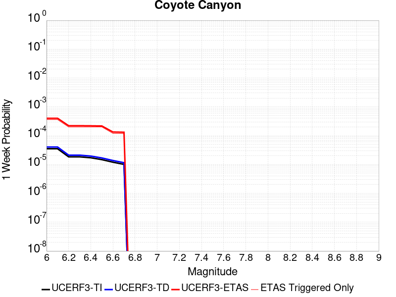 | 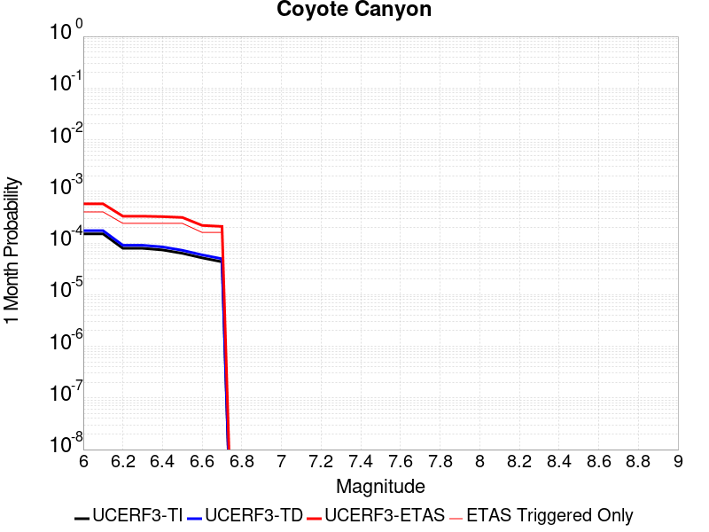 |  |

| Magnitude | 1 wk TI Prob | 1 wk TD Prob | 1 wk ETAS Prob | 1 wk ETAS/TD Gain | 1 wk ETAS Triggered Only | 1 mo TI Prob | 1 mo TD Prob | 1 mo ETAS Prob | 1 mo ETAS/TD Gain | 1 mo ETAS Triggered Only | 1 yr TI Prob | 1 yr TD Prob | 1 yr ETAS Prob | 1 yr ETAS/TD Gain | 1 yr ETAS Triggered Only |
|-----|-----|-----|-----|-----|-----|-----|-----|-----|-----|-----|-----|-----|-----|-----|-----|
| 6.0 | 3.5090034E-5 | 4.0384904E-5 | 4.0037037E-4 | 9.913862 | 3.6E-4 | 1.503772E-4 | 1.7306813E-4 | 5.729989E-4 | 3.3108284 | 4.0E-4 | 0.0018293047 | 0.0021053257 | 0.0028238099 | 1.3412699 | 7.2E-4 |
| 6.1 | 3.5090034E-5 | 4.0384904E-5 | 4.0037037E-4 | 9.913862 | 3.6E-4 | 1.503772E-4 | 1.7306813E-4 | 5.729989E-4 | 3.3108284 | 4.0E-4 | 0.0018293047 | 0.0021053257 | 0.0028238099 | 1.3412699 | 7.2E-4 |
| 6.2 | 1.841879E-5 | 2.1070035E-5 | 2.2106583E-4 | 10.491953 | 2.0E-4 | 7.8935285E-5 | 9.02976E-5 | 3.302759E-4 | 3.657638 | 2.4E-4 | 9.606133E-4 | 0.0010989209 | 0.0014984814 | 1.3635935 | 4.0E-4 |
| 6.3 | 1.841879E-5 | 2.1070035E-5 | 2.2106583E-4 | 10.491953 | 2.0E-4 | 7.8935285E-5 | 9.02976E-5 | 3.302759E-4 | 3.657638 | 2.4E-4 | 9.606133E-4 | 0.0010989209 | 0.0014984814 | 1.3635935 | 4.0E-4 |
| 6.4 | 1.712201E-5 | 1.957468E-5 | 2.1957076E-4 | 11.21708 | 2.0E-4 | 7.337798E-5 | 8.3889354E-5 | 3.2386923E-4 | 3.8606713 | 2.4E-4 | 8.930107E-4 | 0.0010209751 | 0.0014205666 | 1.3913823 | 4.0E-4 |
| 6.5 | 1.4744935E-5 | 1.6845073E-5 | 2.1684171E-4 | 12.872707 | 2.0E-4 | 6.3191044E-5 | 7.21917E-5 | 3.1217438E-4 | 4.3242416 | 2.4E-4 | 7.6907943E-4 | 8.7867316E-4 | 0.0012383568 | 1.4093486 | 3.6E-4 |
| 6.6 | 1.2017839E-5 | 1.3730698E-5 | 1.3372905E-4 | 9.739421 | 1.2E-4 | 5.150401E-5 | 5.884502E-5 | 2.188356E-4 | 3.7188466 | 1.6E-4 | 6.268809E-4 | 7.162913E-4 | 9.960907E-4 | 1.3906224 | 2.8E-4 |
| 6.7 | 1.00956095E-5 | 1.15390885E-5 | 1.315377E-4 | 11.399315 | 1.2E-4 | 4.326618E-5 | 4.945279E-5 | 2.0944487E-4 | 4.235249 | 1.6E-4 | 5.266384E-4 | 6.020084E-4 | 8.41864E-4 | 1.3984255 | 2.4E-4 |

## Cleghorn
*[(top)](#table-of-contents)*

| 1 Week | 1 Month | 1 Year |
|-----|-----|-----|
|  |  |  |

| Magnitude | 1 wk TI Prob | 1 wk TD Prob | 1 wk ETAS Prob | 1 wk ETAS/TD Gain | 1 wk ETAS Triggered Only | 1 mo TI Prob | 1 mo TD Prob | 1 mo ETAS Prob | 1 mo ETAS/TD Gain | 1 mo ETAS Triggered Only | 1 yr TI Prob | 1 yr TD Prob | 1 yr ETAS Prob | 1 yr ETAS/TD Gain | 1 yr ETAS Triggered Only |
|-----|-----|-----|-----|-----|-----|-----|-----|-----|-----|-----|-----|-----|-----|-----|-----|
| 6.0 | 7.9267165E-6 | 9.860011E-6 | 2.0985804E-4 | 21.283752 | 2.0E-4 | 3.39712E-5 | 4.2256568E-5 | 4.8223799E-4 | 11.412143 | 4.4E-4 | 4.1352084E-4 | 5.143629E-4 | 0.0013139514 | 2.554522 | 8.0E-4 |
| 6.1 | 7.9267165E-6 | 9.860011E-6 | 2.0985804E-4 | 21.283752 | 2.0E-4 | 3.39712E-5 | 4.2256568E-5 | 4.8223799E-4 | 11.412143 | 4.4E-4 | 4.1352084E-4 | 5.143629E-4 | 0.0013139514 | 2.554522 | 8.0E-4 |
| 6.2 | 7.9267165E-6 | 9.860011E-6 | 2.0985804E-4 | 21.283752 | 2.0E-4 | 3.39712E-5 | 4.2256568E-5 | 4.8223799E-4 | 11.412143 | 4.4E-4 | 4.1352084E-4 | 5.143629E-4 | 0.0013139514 | 2.554522 | 8.0E-4 |
| 6.3 | 7.9267165E-6 | 9.860011E-6 | 2.0985804E-4 | 21.283752 | 2.0E-4 | 3.39712E-5 | 4.2256568E-5 | 4.8223799E-4 | 11.412143 | 4.4E-4 | 4.1352084E-4 | 5.143629E-4 | 0.0013139514 | 2.554522 | 8.0E-4 |
| 6.4 | 4.3445207E-6 | 6.119313E-6 | 1.2611858E-4 | 20.609924 | 1.2E-4 | 1.8619241E-5 | 2.622537E-5 | 3.8621592E-4 | 14.726806 | 3.6E-4 | 2.2666567E-4 | 3.1924812E-4 | 8.390821E-4 | 2.628307 | 5.2E-4 |
| 6.5 | 4.3445207E-6 | 6.119313E-6 | 1.2611858E-4 | 20.609924 | 1.2E-4 | 1.8619241E-5 | 2.622537E-5 | 3.8621592E-4 | 14.726806 | 3.6E-4 | 2.2666567E-4 | 3.1924812E-4 | 8.390821E-4 | 2.628307 | 5.2E-4 |
| 6.6 | 4.040109E-6 | 5.8016744E-6 | 1.2580097E-4 | 21.683563 | 1.2E-4 | 1.7314638E-5 | 2.4864088E-5 | 3.4485612E-4 | 13.869648 | 3.2E-4 | 2.1078532E-4 | 3.0267914E-4 | 7.8253384E-4 | 2.5853577 | 4.8E-4 |
| 6.7 | 3.3632055E-6 | 5.095068E-6 | 8.509466E-5 | 16.701378 | 8.0E-5 | 1.4413658E-5 | 2.1835825E-5 | 2.6183057E-4 | 11.990872 | 2.4E-4 | 1.7547216E-4 | 2.6581905E-4 | 6.257234E-4 | 2.3539448 | 3.6E-4 |
| 6.8 | 3.2902772E-6 | 5.016956E-6 | 8.501655E-5 | 16.945843 | 8.0E-5 | 1.4101111E-5 | 2.1501066E-5 | 2.614959E-4 | 12.161998 | 2.4E-4 | 1.716675E-4 | 2.6174434E-4 | 6.2165014E-4 | 2.375028 | 3.6E-4 |
| 6.9 | 3.031547E-6 | 4.7183826E-6 | 8.4718005E-5 | 17.954882 | 8.0E-5 | 1.299228E-5 | 2.0221485E-5 | 2.6021662E-4 | 12.868324 | 2.4E-4 | 1.5816953E-4 | 2.4616905E-4 | 6.060804E-4 | 2.4620497 | 3.6E-4 |
| 7.0 | 2.8259715E-6 | 4.3970613E-6 | 8.439671E-5 | 19.19389 | 8.0E-5 | 1.211125E-5 | 1.8844414E-5 | 2.588399E-4 | 13.73563 | 2.4E-4 | 1.4744449E-4 | 2.2940683E-4 | 5.893242E-4 | 2.5689046 | 3.6E-4 |
| 7.1 | 2.5962665E-6 | 4.091863E-6 | 4.40917E-5 | 10.775458 | 4.0E-5 | 1.1126809E-5 | 1.753644E-5 | 1.7753363E-4 | 10.123699 | 1.6E-4 | 1.3546048E-4 | 2.1348546E-4 | 4.934257E-4 | 2.3112848 | 2.8E-4 |
| 7.2 | 2.3247253E-6 | 3.7018629E-6 | 4.3701715E-5 | 11.80533 | 4.0E-5 | 9.96307E-6 | 1.5865031E-5 | 1.7586249E-4 | 11.084913 | 1.6E-4 | 1.21293626E-4 | 1.9313981E-4 | 4.3309346E-4 | 2.242383 | 2.4E-4 |
| 7.3 | 2.056928E-6 | 3.259398E-6 | 4.3259268E-5 | 13.272164 | 4.0E-5 | 8.815376E-6 | 1.39687745E-5 | 5.3968215E-5 | 3.8634896 | 4.0E-5 | 1.0732192E-4 | 1.7005672E-4 | 2.9003632E-4 | 1.705527 | 1.2E-4 |
| 7.4 | 1.8055999E-6 | 2.848641E-6 | 2.848641E-6 | 1.0 | 0.0 | 7.738263E-6 | 1.2208406E-5 | 1.2208406E-5 | 1.0 | 0.0 | 9.4209274E-5 | 1.4862734E-4 | 1.886214E-4 | 1.2690895 | 4.0E-5 |
| 7.5 | 1.4683443E-6 | 2.4473384E-6 | 2.4473384E-6 | 1.0 | 0.0 | 6.292889E-6 | 1.0488551E-5 | 1.0488551E-5 | 1.0 | 0.0 | 7.661323E-5 | 1.2769073E-4 | 1.6768562E-4 | 1.3132169 | 4.0E-5 |
| 7.6 | 9.804088E-7 | 1.922553E-6 | 1.922553E-6 | 1.0 | 0.0 | 4.201745E-6 | 8.239488E-6 | 8.239488E-6 | 1.0 | 0.0 | 5.1155046E-5 | 1.003112E-4 | 1.003112E-4 | 1.0 | 0.0 |
| 7.7 | 7.3434086E-7 | 1.6504058E-6 | 1.6504058E-6 | 1.0 | 0.0 | 3.1471714E-6 | 7.0731485E-6 | 7.0731485E-6 | 1.0 | 0.0 | 3.831614E-5 | 8.611221E-5 | 8.611221E-5 | 1.0 | 0.0 |
| 7.8 | 6.434184E-7 | 1.54314E-6 | 1.54314E-6 | 1.0 | 0.0 | 2.7575045E-6 | 6.6134407E-6 | 6.6134407E-6 | 1.0 | 0.0 | 3.35721E-5 | 8.051569E-5 | 8.051569E-5 | 1.0 | 0.0 |
| 7.9 | 3.4943926E-7 | 7.6891484E-7 | 7.6891484E-7 | 1.0 | 0.0 | 1.497596E-6 | 3.295345E-6 | 3.295345E-6 | 1.0 | 0.0 | 1.8233079E-5 | 4.0120096E-5 | 4.0120096E-5 | 1.0 | 0.0 |
| 8.0 | 6.717524E-8 | 5.973961E-8 | 5.973961E-8 | 1.0 | 0.0 | 2.8789387E-7 | 2.5602688E-7 | 2.5602688E-7 | 1.0 | 0.0 | 3.505102E-6 | 3.1171228E-6 | 3.1171228E-6 | 1.0 | 0.0 |
| 8.1 | 3.1984914E-8 | 1.3392032E-8 | 1.3392032E-8 | 1.0 | 0.0 | 1.370782E-7 | 5.7394423E-8 | 5.7394423E-8 | 1.0 | 0.0 | 1.6689258E-6 | 6.987769E-7 | 6.987769E-7 | 1.0 | 0.0 |
| 8.2 | 1.21887656E-8 | 3.7836694E-9 | 3.7836694E-9 | 1.0 | 0.0 | 5.2237567E-8 | 1.6215727E-8 | 1.6215727E-8 | 1.0 | 0.0 | 6.359922E-7 | 1.9742646E-7 | 1.9742646E-7 | 1.0 | 0.0 |

## Chino alt 1
*[(top)](#table-of-contents)*

| 1 Week | 1 Month | 1 Year |
|-----|-----|-----|
| 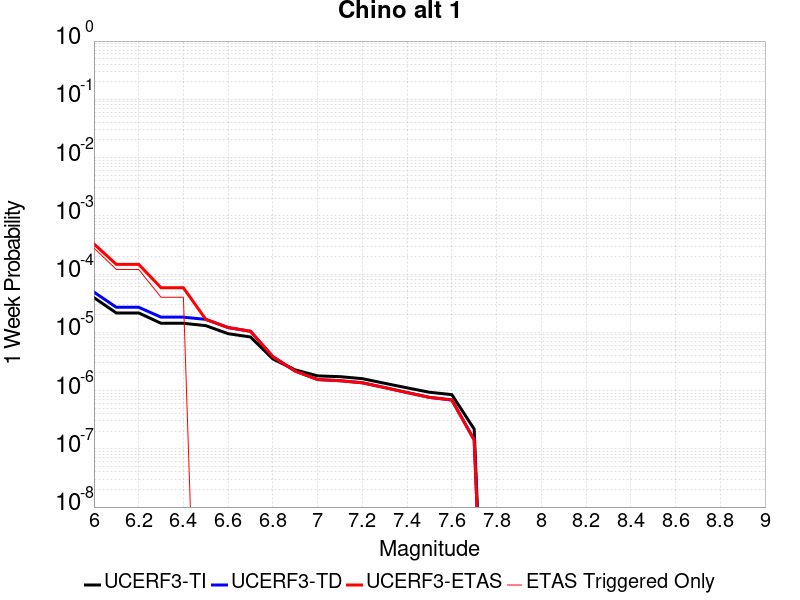 |  | 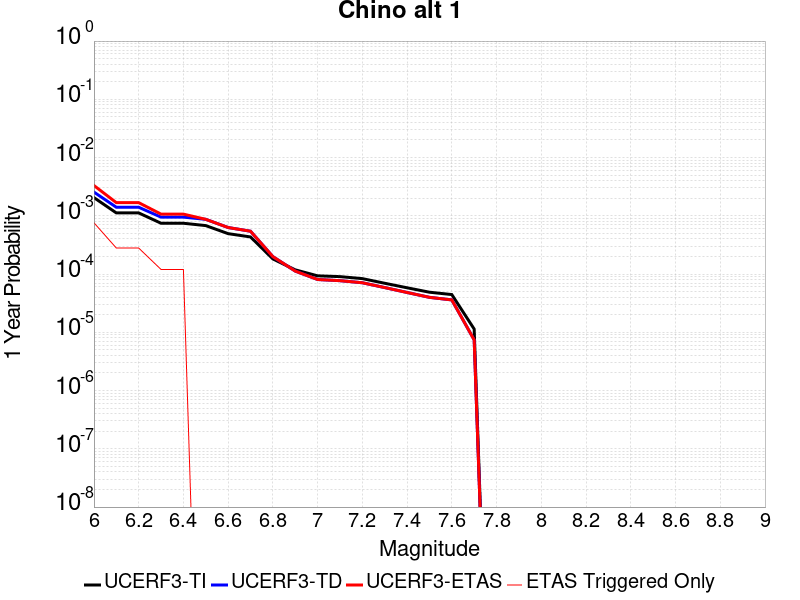 |

| Magnitude | 1 wk TI Prob | 1 wk TD Prob | 1 wk ETAS Prob | 1 wk ETAS/TD Gain | 1 wk ETAS Triggered Only | 1 mo TI Prob | 1 mo TD Prob | 1 mo ETAS Prob | 1 mo ETAS/TD Gain | 1 mo ETAS Triggered Only | 1 yr TI Prob | 1 yr TD Prob | 1 yr ETAS Prob | 1 yr ETAS/TD Gain | 1 yr ETAS Triggered Only |
|-----|-----|-----|-----|-----|-----|-----|-----|-----|-----|-----|-----|-----|-----|-----|-----|
| 6.0 | 3.939946E-5 | 4.9004397E-5 | 3.289907E-4 | 6.713493 | 2.8E-4 | 1.6884391E-4 | 2.1000468E-4 | 5.299375E-4 | 2.5234556 | 3.2E-4 | 0.0020537362 | 0.002554319 | 0.003312378 | 1.2967752 | 7.6E-4 |
| 6.1 | 2.1505624E-5 | 2.6917825E-5 | 1.469146E-4 | 5.4578924 | 1.2E-4 | 9.2163704E-5 | 1.15357594E-4 | 2.7533915E-4 | 2.3868315 | 1.6E-4 | 0.0011215154 | 0.0014036838 | 0.0016832908 | 1.1991951 | 2.8E-4 |
| 6.2 | 2.1505624E-5 | 2.6917825E-5 | 1.469146E-4 | 5.4578924 | 1.2E-4 | 9.2163704E-5 | 1.15357594E-4 | 2.7533915E-4 | 2.3868315 | 1.6E-4 | 0.0011215154 | 0.0014036838 | 0.0016832908 | 1.1991951 | 2.8E-4 |
| 6.3 | 1.4290785E-5 | 1.81977E-5 | 5.8196973E-5 | 3.19804 | 4.0E-5 | 6.1244784E-5 | 7.7988065E-5 | 1.1798494E-4 | 1.512859 | 4.0E-5 | 7.454001E-4 | 9.491364E-4 | 0.0010690226 | 1.1263107 | 1.2E-4 |
| 6.4 | 1.4290785E-5 | 1.81977E-5 | 5.8196973E-5 | 3.19804 | 4.0E-5 | 6.1244784E-5 | 7.7988065E-5 | 1.1798494E-4 | 1.512859 | 4.0E-5 | 7.454001E-4 | 9.491364E-4 | 0.0010690226 | 1.1263107 | 1.2E-4 |
| 6.5 | 1.3017944E-5 | 1.668369E-5 | 1.668369E-5 | 1.0 | 0.0 | 5.5789995E-5 | 7.149982E-5 | 7.149982E-5 | 1.0 | 0.0 | 6.790315E-4 | 8.702065E-4 | 8.702065E-4 | 1.0 | 0.0 |
| 6.6 | 9.470016E-6 | 1.2065467E-5 | 1.2065467E-5 | 1.0 | 0.0 | 4.058515E-5 | 5.170831E-5 | 5.170831E-5 | 1.0 | 0.0 | 4.940122E-4 | 6.294009E-4 | 6.294009E-4 | 1.0 | 0.0 |
| 6.7 | 8.314155E-6 | 1.0425587E-5 | 1.0425587E-5 | 1.0 | 0.0 | 3.5631605E-5 | 4.4680502E-5 | 4.4680502E-5 | 1.0 | 0.0 | 4.3372845E-4 | 5.438817E-4 | 5.438817E-4 | 1.0 | 0.0 |
| 6.8 | 3.4856364E-6 | 3.8184653E-6 | 3.8184653E-6 | 1.0 | 0.0 | 1.4938357E-5 | 1.636476E-5 | 1.636476E-5 | 1.0 | 0.0 | 1.8185932E-4 | 1.9922481E-4 | 1.9922481E-4 | 1.0 | 0.0 |
| 6.9 | 2.2645952E-6 | 2.1561063E-6 | 2.1561063E-6 | 1.0 | 0.0 | 9.705372E-6 | 9.240424E-6 | 9.240424E-6 | 1.0 | 0.0 | 1.18156495E-4 | 1.1249657E-4 | 1.1249657E-4 | 1.0 | 0.0 |
| 7.0 | 1.7864003E-6 | 1.545482E-6 | 1.545482E-6 | 1.0 | 0.0 | 7.655979E-6 | 6.623478E-6 | 6.623478E-6 | 1.0 | 0.0 | 9.3207556E-5 | 8.063792E-5 | 8.063792E-5 | 1.0 | 0.0 |
| 7.1 | 1.7315456E-6 | 1.4756972E-6 | 1.4756972E-6 | 1.0 | 0.0 | 7.420889E-6 | 6.3244015E-6 | 6.3244015E-6 | 1.0 | 0.0 | 9.034557E-5 | 7.699693E-5 | 7.699693E-5 | 1.0 | 0.0 |
| 7.2 | 1.6008337E-6 | 1.3596422E-6 | 1.3596422E-6 | 1.0 | 0.0 | 6.860698E-6 | 5.8270252E-6 | 5.8270252E-6 | 1.0 | 0.0 | 8.352579E-5 | 7.094178E-5 | 7.094178E-5 | 1.0 | 0.0 |
| 7.3 | 1.3320939E-6 | 1.1237295E-6 | 1.1237295E-6 | 1.0 | 0.0 | 5.7089615E-6 | 4.815975E-6 | 4.815975E-6 | 1.0 | 0.0 | 6.9504385E-5 | 5.8632966E-5 | 5.8632966E-5 | 1.0 | 0.0 |
| 7.4 | 1.114294E-6 | 9.2541916E-7 | 9.2541916E-7 | 1.0 | 0.0 | 4.775537E-6 | 3.9660763E-6 | 3.9660763E-6 | 1.0 | 0.0 | 5.8140613E-5 | 4.8285947E-5 | 4.8285947E-5 | 1.0 | 0.0 |
| 7.5 | 9.354081E-7 | 7.638138E-7 | 7.638138E-7 | 1.0 | 0.0 | 4.0088858E-6 | 3.2734836E-6 | 3.2734836E-6 | 1.0 | 0.0 | 4.8807087E-5 | 3.985397E-5 | 3.985397E-5 | 1.0 | 0.0 |
| 7.6 | 8.521771E-7 | 6.8946184E-7 | 6.8946184E-7 | 1.0 | 0.0 | 3.6521824E-6 | 2.9548335E-6 | 2.9548335E-6 | 1.0 | 0.0 | 4.4464414E-5 | 3.5974535E-5 | 3.5974535E-5 | 1.0 | 0.0 |
| 7.7 | 2.1803626E-7 | 1.4221726E-7 | 1.4221726E-7 | 1.0 | 0.0 | 9.344408E-7 | 6.095024E-7 | 6.095024E-7 | 1.0 | 0.0 | 1.1376757E-5 | 7.4206764E-6 | 7.4206764E-6 | 1.0 | 0.0 |

## Garlock (West)
*[(top)](#table-of-contents)*

| 1 Week | 1 Month | 1 Year |
|-----|-----|-----|
| 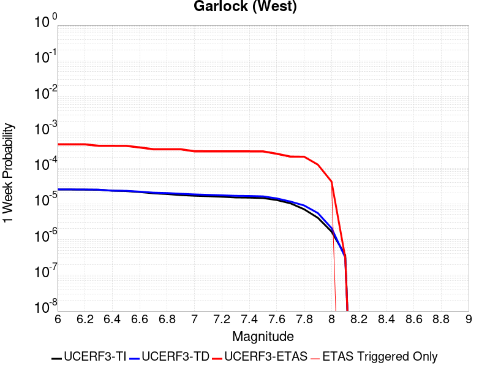 |  |  |

| Magnitude | 1 wk TI Prob | 1 wk TD Prob | 1 wk ETAS Prob | 1 wk ETAS/TD Gain | 1 wk ETAS Triggered Only | 1 mo TI Prob | 1 mo TD Prob | 1 mo ETAS Prob | 1 mo ETAS/TD Gain | 1 mo ETAS Triggered Only | 1 yr TI Prob | 1 yr TD Prob | 1 yr ETAS Prob | 1 yr ETAS/TD Gain | 1 yr ETAS Triggered Only |
|-----|-----|-----|-----|-----|-----|-----|-----|-----|-----|-----|-----|-----|-----|-----|-----|
| 6.0 | 2.5181727E-5 | 2.5328825E-5 | 4.653177E-4 | 18.371073 | 4.4E-4 | 1.0791722E-4 | 1.0854761E-4 | 5.4849987E-4 | 5.0530806 | 4.4E-4 | 0.0013131002 | 0.0013207694 | 0.0019599241 | 1.483926 | 6.4E-4 |
| 6.1 | 2.5077732E-5 | 2.5229843E-5 | 4.6521873E-4 | 18.439224 | 4.4E-4 | 1.0747157E-4 | 1.0812344E-4 | 5.480759E-4 | 5.068983 | 4.4E-4 | 0.001307681 | 0.0013156114 | 0.0019547695 | 1.4858259 | 6.4E-4 |
| 6.2 | 2.494612E-5 | 2.5111442E-5 | 4.651004E-4 | 18.521454 | 4.4E-4 | 1.0690756E-4 | 1.0761604E-4 | 5.4756866E-4 | 5.08817 | 4.4E-4 | 0.0013008224 | 0.0013094412 | 0.0019486032 | 1.488118 | 6.4E-4 |
| 6.3 | 2.4733758E-5 | 2.4930645E-5 | 4.2492067E-4 | 17.044111 | 4.0E-4 | 1.0599751E-4 | 1.0684126E-4 | 5.067985E-4 | 4.743472 | 4.0E-4 | 0.0012897556 | 0.0013000196 | 0.0018992396 | 1.4609315 | 6.0E-4 |
| 6.4 | 2.3237335E-5 | 2.3309083E-5 | 4.2329976E-4 | 18.160292 | 4.0E-4 | 9.958477E-5 | 9.989226E-5 | 4.998523E-4 | 5.0039144 | 4.0E-4 | 0.0012117702 | 0.0012155125 | 0.0018147832 | 1.493019 | 6.0E-4 |
| 6.5 | 2.2732203E-5 | 2.3122879E-5 | 4.2311364E-4 | 18.298485 | 4.0E-4 | 9.742009E-5 | 9.90943E-5 | 4.990547E-4 | 5.036159 | 4.0E-4 | 0.0011854442 | 0.0012058083 | 0.0018050848 | 1.4969915 | 6.0E-4 |
| 6.6 | 2.1319436E-5 | 2.1901993E-5 | 3.8189412E-4 | 17.4365 | 3.6E-4 | 9.136581E-5 | 9.386232E-5 | 4.538285E-4 | 4.835045 | 3.6E-4 | 0.001111811 | 0.0011421769 | 0.0016615831 | 1.454751 | 5.2E-4 |
| 6.7 | 1.970802E-5 | 2.05206E-5 | 3.4051403E-4 | 16.593765 | 3.2E-4 | 8.446021E-5 | 8.794248E-5 | 4.0791434E-4 | 4.6384225 | 3.2E-4 | 0.001027818 | 0.0010701754 | 0.0015496617 | 1.4480445 | 4.8E-4 |
| 6.8 | 1.8744462E-5 | 2.0026835E-5 | 3.4002043E-4 | 16.978241 | 3.2E-4 | 8.033094E-5 | 8.5826476E-5 | 4.0579902E-4 | 4.728133 | 3.2E-4 | 9.775903E-4 | 0.0010444381 | 0.0015239367 | 1.4590973 | 4.8E-4 |
| 6.9 | 1.7559682E-5 | 1.9078003E-5 | 3.390719E-4 | 17.772924 | 3.2E-4 | 7.5253614E-5 | 8.1760314E-5 | 4.0173414E-4 | 4.913559 | 3.2E-4 | 9.158276E-4 | 9.949787E-4 | 0.0014745011 | 1.4819424 | 4.8E-4 |
| 7.0 | 1.6794445E-5 | 1.8338675E-5 | 2.9833353E-4 | 16.268 | 2.8E-4 | 7.197421E-5 | 7.8591955E-5 | 3.5856996E-4 | 4.5624256 | 2.8E-4 | 8.759337E-4 | 9.564384E-4 | 0.0013960176 | 1.4596001 | 4.4E-4 |
| 7.1 | 1.6337795E-5 | 1.7838813E-5 | 2.9783382E-4 | 16.695831 | 2.8E-4 | 7.0017246E-5 | 7.6449825E-5 | 3.564284E-4 | 4.662253 | 2.8E-4 | 8.521265E-4 | 9.303805E-4 | 0.0013699711 | 1.4724848 | 4.4E-4 |
| 7.2 | 1.5780008E-5 | 1.7286979E-5 | 2.9728212E-4 | 17.196882 | 2.8E-4 | 6.762685E-5 | 7.408495E-5 | 3.5406422E-4 | 4.779165 | 2.8E-4 | 8.2304585E-4 | 9.0161234E-4 | 0.0013412157 | 1.4875746 | 4.4E-4 |
| 7.3 | 1.5058865E-5 | 1.6739175E-5 | 2.9673448E-4 | 17.726948 | 2.8E-4 | 6.45364E-5 | 7.173736E-5 | 3.517173E-4 | 4.902847 | 2.8E-4 | 7.854473E-4 | 8.730536E-4 | 0.0013126695 | 1.5035383 | 4.4E-4 |
| 7.4 | 1.4887923E-5 | 1.6574775E-5 | 2.9657013E-4 | 17.89286 | 2.8E-4 | 6.380382E-5 | 7.1032824E-5 | 3.5101295E-4 | 4.94156 | 2.8E-4 | 7.7653467E-4 | 8.6448266E-4 | 0.0013041024 | 1.5085349 | 4.4E-4 |
| 7.5 | 1.4509299E-5 | 1.6165865E-5 | 2.9616134E-4 | 18.320168 | 2.8E-4 | 6.218123E-5 | 6.928044E-5 | 3.4926104E-4 | 5.0412645 | 2.8E-4 | 7.567935E-4 | 8.4316416E-4 | 0.0012827931 | 1.5214038 | 4.4E-4 |
| 7.6 | 1.2756717E-5 | 1.41623805E-5 | 2.5415898E-4 | 17.946064 | 2.4E-4 | 5.4670498E-5 | 6.0694507E-5 | 3.0067994E-4 | 4.9539895 | 2.4E-4 | 6.6541E-4 | 7.3870574E-4 | 0.0011384103 | 1.5410876 | 4.0E-4 |
| 7.7 | 1.0328985E-5 | 1.1565329E-5 | 2.1156302E-4 | 18.292866 | 2.0E-4 | 4.4266326E-5 | 4.956476E-5 | 2.4955484E-4 | 5.034925 | 2.0E-4 | 5.388092E-4 | 6.032842E-4 | 9.6306705E-4 | 1.5963737 | 3.6E-4 |
| 7.8 | 7.0306583E-6 | 8.9839405E-6 | 2.0898215E-4 | 23.261745 | 2.0E-4 | 3.0131043E-5 | 3.8502036E-5 | 2.3849434E-4 | 6.19433 | 2.0E-4 | 3.667837E-4 | 4.6866163E-4 | 8.284929E-4 | 1.7677848 | 3.6E-4 |
| 7.9 | 4.060633E-6 | 5.514807E-6 | 1.2551414E-4 | 22.75948 | 1.2E-4 | 1.7402595E-5 | 2.3634675E-5 | 1.4363184E-4 | 6.077166 | 1.2E-4 | 2.11856E-4 | 2.8771427E-4 | 5.676337E-4 | 1.9729078 | 2.8E-4 |
| 8.0 | 1.6729537E-6 | 2.093995E-6 | 4.209391E-5 | 20.102203 | 4.0E-5 | 7.169782E-6 | 8.974233E-6 | 4.8973874E-5 | 5.4571652 | 4.0E-5 | 8.7288594E-5 | 1.09255845E-4 | 2.2924274E-4 | 2.0982194 | 1.2E-4 |
| 8.1 | 3.6733252E-7 | 3.1722044E-7 | 3.1722044E-7 | 1.0 | 0.0 | 1.5742813E-6 | 1.3595155E-6 | 1.3595155E-6 | 1.0 | 0.0 | 1.9166706E-5 | 1.6551992E-5 | 1.6551992E-5 | 1.0 | 0.0 |

## Goldstone Lake
*[(top)](#table-of-contents)*

| 1 Week | 1 Month | 1 Year |
|-----|-----|-----|
| 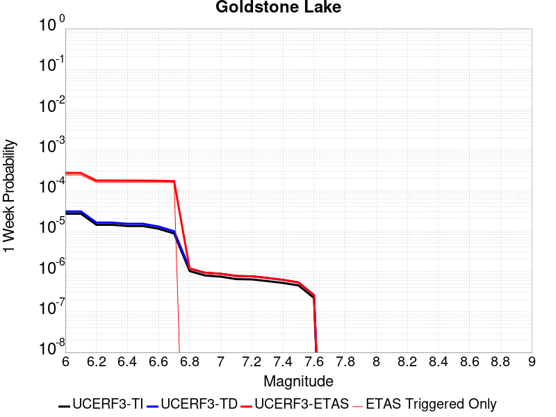 | 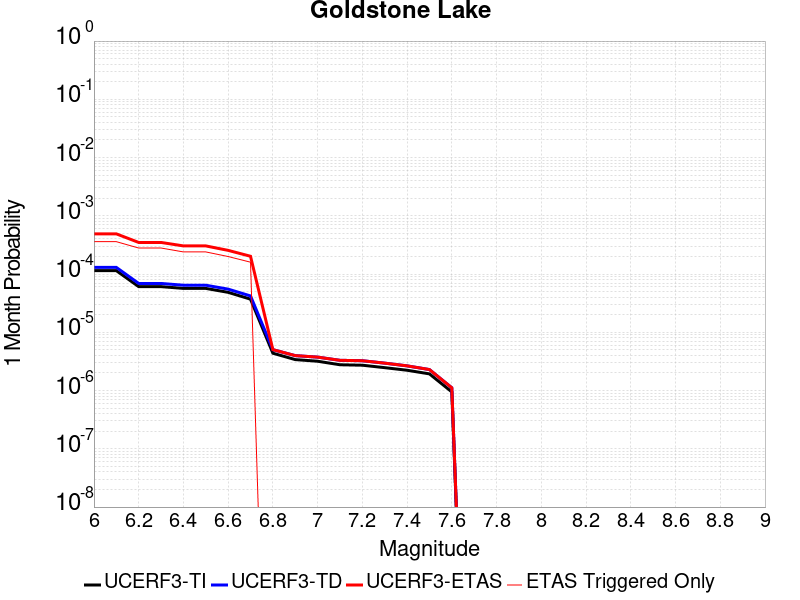 | 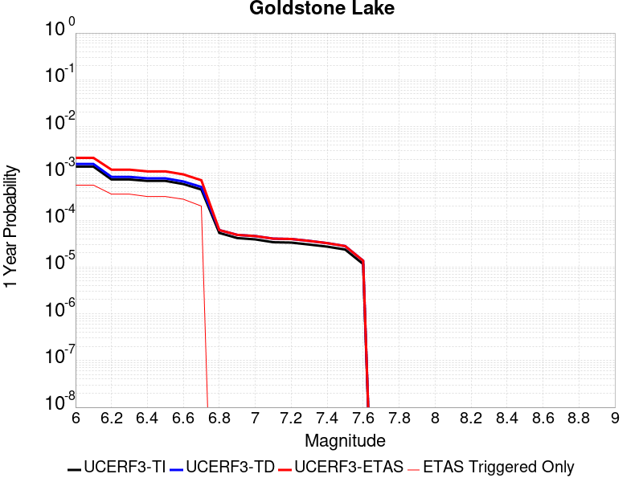 |

| Magnitude | 1 wk TI Prob | 1 wk TD Prob | 1 wk ETAS Prob | 1 wk ETAS/TD Gain | 1 wk ETAS Triggered Only | 1 mo TI Prob | 1 mo TD Prob | 1 mo ETAS Prob | 1 mo ETAS/TD Gain | 1 mo ETAS Triggered Only | 1 yr TI Prob | 1 yr TD Prob | 1 yr ETAS Prob | 1 yr ETAS/TD Gain | 1 yr ETAS Triggered Only |
|-----|-----|-----|-----|-----|-----|-----|-----|-----|-----|-----|-----|-----|-----|-----|-----|
| 6.0 | 2.671352E-5 | 3.0389869E-5 | 2.703826E-4 | 8.897129 | 2.4E-4 | 1.1448149E-4 | 1.302369E-4 | 4.9019E-4 | 3.7638335 | 3.6E-4 | 0.001392921 | 0.0015846775 | 0.00214379 | 1.3528242 | 5.6E-4 |
| 6.1 | 2.671352E-5 | 3.0389869E-5 | 2.703826E-4 | 8.897129 | 2.4E-4 | 1.1448149E-4 | 1.302369E-4 | 4.9019E-4 | 3.7638335 | 3.6E-4 | 0.001392921 | 0.0015846775 | 0.00214379 | 1.3528242 | 5.6E-4 |
| 6.2 | 1.4197047E-5 | 1.6103195E-5 | 1.7610061E-4 | 10.935757 | 1.6E-4 | 6.0843064E-5 | 6.901242E-5 | 3.4899308E-4 | 5.0569606 | 2.8E-4 | 7.4051257E-4 | 8.4000104E-4 | 0.0011996987 | 1.4282109 | 3.6E-4 |
| 6.3 | 1.4197047E-5 | 1.6103195E-5 | 1.7610061E-4 | 10.935757 | 1.6E-4 | 6.0843064E-5 | 6.901242E-5 | 3.4899308E-4 | 5.0569606 | 2.8E-4 | 7.4051257E-4 | 8.4000104E-4 | 0.0011996987 | 1.4282109 | 3.6E-4 |
| 6.4 | 1.3238931E-5 | 1.501491E-5 | 1.7501251E-4 | 11.655914 | 1.6E-4 | 5.6737044E-5 | 6.434858E-5 | 3.0433314E-4 | 4.729446 | 2.4E-4 | 6.9055456E-4 | 7.8326045E-4 | 0.0011030098 | 1.4082286 | 3.2E-4 |
| 6.5 | 1.3238931E-5 | 1.501491E-5 | 1.7501251E-4 | 11.655914 | 1.6E-4 | 5.6737044E-5 | 6.434858E-5 | 3.0433314E-4 | 4.729446 | 2.4E-4 | 6.9055456E-4 | 7.8326045E-4 | 0.0011030098 | 1.4082286 | 3.2E-4 |
| 6.6 | 1.1328278E-5 | 1.2860688E-5 | 1.7285864E-4 | 13.440854 | 1.6E-4 | 4.8548856E-5 | 5.5116612E-5 | 2.5510558E-4 | 4.62847 | 2.0E-4 | 5.90922E-4 | 6.709339E-4 | 9.5074606E-4 | 1.4170487 | 2.8E-4 |
| 6.7 | 8.651175E-6 | 9.82873E-6 | 1.6982715E-4 | 17.278646 | 1.6E-4 | 3.707594E-5 | 4.212296E-5 | 2.0211622E-4 | 4.7982435 | 1.6E-4 | 4.5130608E-4 | 5.1281694E-4 | 7.127144E-4 | 1.3898027 | 2.0E-4 |
| 6.8 | 1.0215377E-6 | 1.1757171E-6 | 1.1757171E-6 | 1.0 | 0.0 | 4.378012E-6 | 5.0387785E-6 | 5.0387785E-6 | 1.0 | 0.0 | 5.3300988E-5 | 6.134552E-5 | 6.134552E-5 | 1.0 | 0.0 |
| 6.9 | 7.9360774E-7 | 9.28516E-7 | 9.28516E-7 | 1.0 | 0.0 | 3.4011714E-6 | 3.9793485E-6 | 3.9793485E-6 | 1.0 | 0.0 | 4.1408475E-5 | 4.8447564E-5 | 4.8447564E-5 | 1.0 | 0.0 |
| 7.0 | 7.4382757E-7 | 8.748952E-7 | 8.748952E-7 | 1.0 | 0.0 | 3.1878285E-6 | 3.7495458E-6 | 3.7495458E-6 | 1.0 | 0.0 | 3.8811122E-5 | 4.5649835E-5 | 4.5649835E-5 | 1.0 | 0.0 |
| 7.1 | 6.4709513E-7 | 7.712674E-7 | 7.712674E-7 | 1.0 | 0.0 | 2.773262E-6 | 3.305428E-6 | 3.305428E-6 | 1.0 | 0.0 | 3.376394E-5 | 4.0242903E-5 | 4.0242903E-5 | 1.0 | 0.0 |
| 7.2 | 6.356704E-7 | 7.589702E-7 | 7.589702E-7 | 1.0 | 0.0 | 2.7242988E-6 | 3.2527257E-6 | 3.2527257E-6 | 1.0 | 0.0 | 3.3167835E-5 | 3.9601277E-5 | 3.9601277E-5 | 1.0 | 0.0 |
| 7.3 | 5.7695723E-7 | 6.897807E-7 | 6.897807E-7 | 1.0 | 0.0 | 2.4726714E-6 | 2.9562E-6 | 2.9562E-6 | 1.0 | 0.0 | 3.0104358E-5 | 3.5991197E-5 | 3.5991197E-5 | 1.0 | 0.0 |
| 7.4 | 5.209647E-7 | 6.194571E-7 | 6.194571E-7 | 1.0 | 0.0 | 2.232704E-6 | 2.654814E-6 | 2.654814E-6 | 1.0 | 0.0 | 2.718283E-5 | 3.2321936E-5 | 3.2321936E-5 | 1.0 | 0.0 |
| 7.5 | 4.512955E-7 | 5.3497666E-7 | 5.3497666E-7 | 1.0 | 0.0 | 1.934122E-6 | 2.2927554E-6 | 2.2927554E-6 | 1.0 | 0.0 | 2.3547682E-5 | 2.7913995E-5 | 2.7913995E-5 | 1.0 | 0.0 |
| 7.6 | 2.21172E-7 | 2.6043384E-7 | 2.6043384E-7 | 1.0 | 0.0 | 9.478797E-7 | 1.1161446E-6 | 1.1161446E-6 | 1.0 | 0.0 | 1.1540374E-5 | 1.3589005E-5 | 1.3589005E-5 | 1.0 | 0.0 |

## San Andreas (North Branch Mill Creek)
*[(top)](#table-of-contents)*

| 1 Week | 1 Month | 1 Year |
|-----|-----|-----|
|  |  | 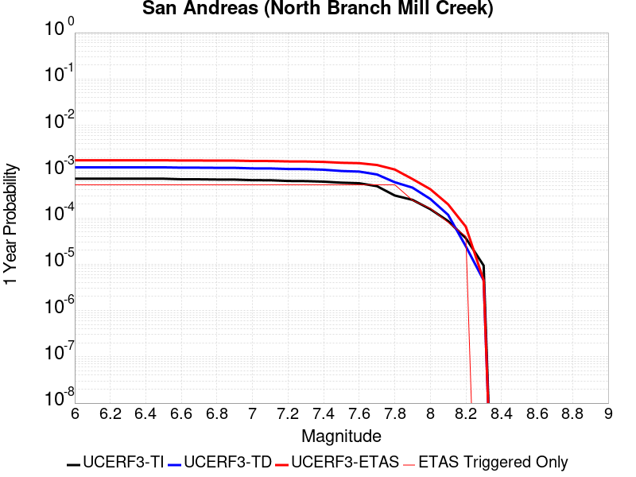 |

| Magnitude | 1 wk TI Prob | 1 wk TD Prob | 1 wk ETAS Prob | 1 wk ETAS/TD Gain | 1 wk ETAS Triggered Only | 1 mo TI Prob | 1 mo TD Prob | 1 mo ETAS Prob | 1 mo ETAS/TD Gain | 1 mo ETAS Triggered Only | 1 yr TI Prob | 1 yr TD Prob | 1 yr ETAS Prob | 1 yr ETAS/TD Gain | 1 yr ETAS Triggered Only |
|-----|-----|-----|-----|-----|-----|-----|-----|-----|-----|-----|-----|-----|-----|-----|-----|
| 6.0 | 1.3461156E-5 | 2.3679182E-5 | 3.8367065E-4 | 16.202868 | 3.6E-4 | 5.7689394E-5 | 1.0147828E-4 | 4.6144176E-4 | 4.5471973 | 3.6E-4 | 7.02142E-4 | 0.0012348011 | 0.0017541591 | 1.4206004 | 5.2E-4 |
| 6.1 | 1.3461156E-5 | 2.3679182E-5 | 3.8367065E-4 | 16.202868 | 3.6E-4 | 5.7689394E-5 | 1.0147828E-4 | 4.6144176E-4 | 4.5471973 | 3.6E-4 | 7.02142E-4 | 0.0012348011 | 0.0017541591 | 1.4206004 | 5.2E-4 |
| 6.2 | 1.3461156E-5 | 2.3679182E-5 | 3.8367065E-4 | 16.202868 | 3.6E-4 | 5.7689394E-5 | 1.0147828E-4 | 4.6144176E-4 | 4.5471973 | 3.6E-4 | 7.02142E-4 | 0.0012348011 | 0.0017541591 | 1.4206004 | 5.2E-4 |
| 6.3 | 1.3461156E-5 | 2.3679182E-5 | 3.8367065E-4 | 16.202868 | 3.6E-4 | 5.7689394E-5 | 1.0147828E-4 | 4.6144176E-4 | 4.5471973 | 3.6E-4 | 7.02142E-4 | 0.0012348011 | 0.0017541591 | 1.4206004 | 5.2E-4 |
| 6.4 | 1.3461156E-5 | 2.3679182E-5 | 3.8367065E-4 | 16.202868 | 3.6E-4 | 5.7689394E-5 | 1.0147828E-4 | 4.6144176E-4 | 4.5471973 | 3.6E-4 | 7.02142E-4 | 0.0012348011 | 0.0017541591 | 1.4206004 | 5.2E-4 |
| 6.5 | 1.3450706E-5 | 2.366814E-5 | 3.8365962E-4 | 16.20996 | 3.6E-4 | 5.764461E-5 | 1.0143096E-4 | 4.6139443E-4 | 4.548852 | 3.6E-4 | 7.0159714E-4 | 0.0012342257 | 0.0017535839 | 1.4207968 | 5.2E-4 |
| 6.6 | 1.3074523E-5 | 2.328236E-5 | 3.83274E-4 | 16.46199 | 3.6E-4 | 5.6032466E-5 | 9.9777746E-5 | 4.5974183E-4 | 4.607659 | 3.6E-4 | 6.8198174E-4 | 0.0012141204 | 0.001733489 | 1.4277736 | 5.2E-4 |
| 6.7 | 1.3050216E-5 | 2.3257642E-5 | 3.8324928E-4 | 16.478422 | 3.6E-4 | 5.59283E-5 | 9.967182E-5 | 4.5963595E-4 | 4.611493 | 3.6E-4 | 6.8071426E-4 | 0.0012128322 | 0.0017322014 | 1.4282285 | 5.2E-4 |
| 6.8 | 1.29049395E-5 | 2.3106015E-5 | 3.830977E-4 | 16.58 | 3.6E-4 | 5.530571E-5 | 9.9022036E-5 | 4.5898638E-4 | 4.6351943 | 3.6E-4 | 6.73139E-4 | 0.0012049298 | 0.0017243032 | 1.4310404 | 5.2E-4 |
| 6.9 | 1.2867369E-5 | 2.306539E-5 | 3.8305708E-4 | 16.60744 | 3.6E-4 | 5.51447E-5 | 9.8847944E-5 | 4.5881237E-4 | 4.6415973 | 3.6E-4 | 6.711799E-4 | 0.0012028125 | 0.001722187 | 1.4318001 | 5.2E-4 |
| 7.0 | 1.2495996E-5 | 2.2464183E-5 | 3.8245608E-4 | 17.02515 | 3.6E-4 | 5.3553173E-5 | 9.6271535E-5 | 4.5623688E-4 | 4.7390633 | 3.6E-4 | 6.518148E-4 | 0.0011714785 | 0.0016908695 | 1.4433635 | 5.2E-4 |
| 7.1 | 1.2452067E-5 | 2.2409202E-5 | 3.8240114E-4 | 17.06447 | 3.6E-4 | 5.3364907E-5 | 9.603592E-5 | 4.5600135E-4 | 4.7482376 | 3.6E-4 | 6.4952404E-4 | 0.001168613 | 0.0016880053 | 1.4444519 | 5.2E-4 |
| 7.2 | 1.2002777E-5 | 2.1786782E-5 | 3.8177893E-4 | 17.52342 | 3.6E-4 | 5.143946E-5 | 9.3368595E-5 | 4.5333497E-4 | 4.855326 | 3.6E-4 | 6.2609545E-4 | 0.0011361726 | 0.0016555818 | 1.457157 | 5.2E-4 |
| 7.3 | 1.1923425E-5 | 2.1656399E-5 | 3.816486E-4 | 17.622902 | 3.6E-4 | 5.109939E-5 | 9.280985E-5 | 4.5277644E-4 | 4.8785386 | 3.6E-4 | 6.219575E-4 | 0.0011293768 | 0.0016487896 | 1.4599109 | 5.2E-4 |
| 7.4 | 1.16105175E-5 | 2.1028349E-5 | 3.8102077E-4 | 18.119387 | 3.6E-4 | 4.975841E-5 | 9.0118396E-5 | 4.5008596E-4 | 4.994385 | 3.6E-4 | 6.0564023E-4 | 0.0010966419 | 0.0016160716 | 1.4736549 | 5.2E-4 |
| 7.5 | 1.1037265E-5 | 1.9721652E-5 | 3.7971456E-4 | 19.253689 | 3.6E-4 | 4.7301706E-5 | 8.451864E-5 | 4.4448822E-4 | 5.2590556 | 3.6E-4 | 5.757461E-4 | 0.0010285309 | 0.0015479961 | 1.5050555 | 5.2E-4 |
| 7.6 | 1.0720915E-5 | 1.9161336E-5 | 3.7915443E-4 | 19.787474 | 3.6E-4 | 4.5945973E-5 | 8.211744E-5 | 4.4208788E-4 | 5.383605 | 3.6E-4 | 5.592486E-4 | 9.993234E-4 | 0.0015188039 | 1.519832 | 5.2E-4 |
| 7.7 | 9.276279E-6 | 1.6599204E-5 | 3.7659323E-4 | 22.687426 | 3.6E-4 | 3.9754876E-5 | 7.113752E-5 | 4.311119E-4 | 6.060261 | 3.6E-4 | 4.839081E-4 | 8.657568E-4 | 0.0013853066 | 1.6001105 | 5.2E-4 |
| 7.8 | 5.8346777E-6 | 1.1282931E-5 | 3.7127887E-4 | 32.906242 | 3.6E-4 | 2.5005522E-5 | 4.8354523E-5 | 4.083371E-4 | 8.444652 | 3.6E-4 | 3.043997E-4 | 5.8855745E-4 | 0.0011082514 | 1.8829962 | 5.2E-4 |
| 7.9 | 4.690204E-6 | 8.6155715E-6 | 1.6861419E-4 | 19.570866 | 1.6E-4 | 2.0100719E-5 | 3.6923357E-5 | 1.9691745E-4 | 5.3331404 | 1.6E-4 | 2.4469878E-4 | 4.4944923E-4 | 6.893414E-4 | 1.5337468 | 2.4E-4 |
| 8.0 | 2.9570454E-6 | 4.9120426E-6 | 1.2491146E-4 | 25.429636 | 1.2E-4 | 1.267299E-5 | 2.105144E-5 | 1.4104892E-4 | 6.700202 | 1.2E-4 | 1.5428272E-4 | 2.562712E-4 | 4.1623018E-4 | 1.6241786 | 1.6E-4 |
| 8.1 | 1.6376824E-6 | 2.2310655E-6 | 8.223089E-5 | 36.857227 | 8.0E-5 | 7.01862E-6 | 9.561673E-6 | 8.956091E-5 | 9.366656 | 8.0E-5 | 8.544835E-5 | 1.1640717E-4 | 1.9639786E-4 | 1.6871629 | 8.0E-5 |
| 8.2 | 6.9631557E-7 | 4.641532E-7 | 4.0464136E-5 | 87.178406 | 4.0E-5 | 2.984206E-6 | 1.9892263E-6 | 4.1989148E-5 | 21.10828 | 4.0E-5 | 3.63321E-5 | 2.4218563E-5 | 6.4217595E-5 | 2.6515856 | 4.0E-5 |
| 8.3 | 1.7876137E-7 | 8.5759865E-8 | 8.5759865E-8 | 1.0 | 0.0 | 7.661199E-7 | 3.675422E-7 | 3.675422E-7 | 1.0 | 0.0 | 9.32747E-6 | 4.4748176E-6 | 4.4748176E-6 | 1.0 | 0.0 |

## Owl Lake
*[(top)](#table-of-contents)*

| 1 Week | 1 Month | 1 Year |
|-----|-----|-----|
|  |  | 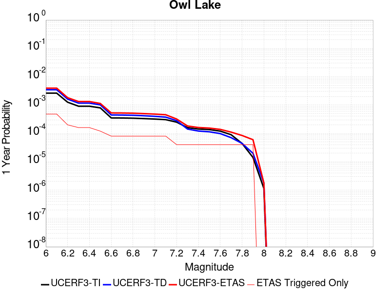 |

| Magnitude | 1 wk TI Prob | 1 wk TD Prob | 1 wk ETAS Prob | 1 wk ETAS/TD Gain | 1 wk ETAS Triggered Only | 1 mo TI Prob | 1 mo TD Prob | 1 mo ETAS Prob | 1 mo ETAS/TD Gain | 1 mo ETAS Triggered Only | 1 yr TI Prob | 1 yr TD Prob | 1 yr ETAS Prob | 1 yr ETAS/TD Gain | 1 yr ETAS Triggered Only |
|-----|-----|-----|-----|-----|-----|-----|-----|-----|-----|-----|-----|-----|-----|-----|-----|
| 6.0 | 5.0320643E-5 | 6.64403E-5 | 1.8643233E-4 | 2.8060129 | 1.2E-4 | 2.1564208E-4 | 2.847135E-4 | 4.0467933E-4 | 1.4213563 | 1.2E-4 | 0.0026222812 | 0.0034617756 | 0.003940114 | 1.1381772 | 4.8E-4 |
| 6.1 | 5.0320643E-5 | 6.64403E-5 | 1.8643233E-4 | 2.8060129 | 1.2E-4 | 2.1564208E-4 | 2.847135E-4 | 4.0467933E-4 | 1.4213563 | 1.2E-4 | 0.0026222812 | 0.0034617756 | 0.003940114 | 1.1381772 | 4.8E-4 |
| 6.2 | 2.4125871E-5 | 3.1022744E-5 | 1.11020265E-4 | 3.5786731 | 8.0E-5 | 1.0339249E-4 | 1.3294873E-4 | 2.129381E-4 | 1.6016557 | 8.0E-5 | 0.0012580766 | 0.0016176249 | 0.0018173014 | 1.1234381 | 2.0E-4 |
| 6.3 | 1.7433485E-5 | 2.238944E-5 | 1.0238765E-4 | 4.573033 | 8.0E-5 | 7.471279E-5 | 9.595211E-5 | 1.7594443E-4 | 1.8336693 | 8.0E-5 | 9.0924866E-4 | 0.0011677343 | 0.0013275475 | 1.1368575 | 1.6E-4 |
| 6.4 | 1.7433485E-5 | 2.238944E-5 | 1.0238765E-4 | 4.573033 | 8.0E-5 | 7.471279E-5 | 9.595211E-5 | 1.7594443E-4 | 1.8336693 | 8.0E-5 | 9.0924866E-4 | 0.0011677343 | 0.0013275475 | 1.1368575 | 1.6E-4 |
| 6.5 | 1.5182742E-5 | 1.946037E-5 | 5.945959E-5 | 3.0554192 | 4.0E-5 | 6.506727E-5 | 8.339978E-5 | 1.2339644E-4 | 1.4795775 | 4.0E-5 | 7.919061E-4 | 0.0010150598 | 0.001134938 | 1.1180997 | 1.2E-4 |
| 6.6 | 6.7271576E-6 | 8.568449E-6 | 4.8568105E-5 | 5.6682496 | 4.0E-5 | 2.8830356E-5 | 3.6721438E-5 | 7.671997E-5 | 2.089242 | 4.0E-5 | 3.5095305E-4 | 4.4699747E-4 | 5.269617E-4 | 1.1788919 | 8.0E-5 |
| 6.7 | 6.682835E-6 | 8.500858E-6 | 4.850052E-5 | 5.7053676 | 4.0E-5 | 2.8640408E-5 | 3.643177E-5 | 7.643031E-5 | 2.0979028 | 4.0E-5 | 3.4864116E-4 | 4.434722E-4 | 5.2343676E-4 | 1.1803147 | 8.0E-5 |
| 6.8 | 6.5774975E-6 | 8.347227E-6 | 4.8346894E-5 | 5.7919707 | 4.0E-5 | 2.8188972E-5 | 3.577337E-5 | 7.577194E-5 | 2.1181102 | 4.0E-5 | 3.4314668E-4 | 4.354594E-4 | 5.154246E-4 | 1.183634 | 8.0E-5 |
| 6.9 | 6.363419E-6 | 8.02014E-6 | 4.8019818E-5 | 5.9874043 | 4.0E-5 | 2.727151E-5 | 3.4371606E-5 | 7.437023E-5 | 2.1637113 | 4.0E-5 | 3.3198006E-4 | 4.1839955E-4 | 4.983661E-4 | 1.1911248 | 8.0E-5 |
| 7.0 | 6.1342453E-6 | 7.652003E-6 | 4.7651698E-5 | 6.2273498 | 4.0E-5 | 2.6289357E-5 | 3.2793916E-5 | 7.27926E-5 | 2.2196984 | 4.0E-5 | 3.2002592E-4 | 3.991983E-4 | 4.7916637E-4 | 1.2003217 | 8.0E-5 |
| 7.1 | 5.842926E-6 | 7.1620548E-6 | 4.7161768E-5 | 6.5849495 | 4.0E-5 | 2.504087E-5 | 3.069419E-5 | 7.0692964E-5 | 2.3031383 | 4.0E-5 | 3.0482994E-4 | 3.7364312E-4 | 4.5361323E-4 | 1.214028 | 8.0E-5 |
| 7.2 | 4.77173E-6 | 5.376442E-6 | 5.376442E-6 | 1.0 | 0.0 | 2.045011E-5 | 2.3041714E-5 | 2.3041714E-5 | 1.0 | 0.0 | 2.4895166E-4 | 2.805008E-4 | 3.2048958E-4 | 1.142562 | 4.0E-5 |
| 7.3 | 3.0494948E-6 | 2.7237572E-6 | 2.7237572E-6 | 1.0 | 0.0 | 1.3069198E-5 | 1.16731935E-5 | 1.16731935E-5 | 1.0 | 0.0 | 1.5910587E-4 | 1.4211203E-4 | 1.8210635E-4 | 1.2814281 | 4.0E-5 |
| 7.4 | 2.7263884E-6 | 2.317959E-6 | 2.317959E-6 | 1.0 | 0.0 | 1.1684469E-5 | 9.934072E-6 | 9.934072E-6 | 1.0 | 0.0 | 1.4224913E-4 | 1.2094073E-4 | 1.6093589E-4 | 1.3307005 | 4.0E-5 |
| 7.5 | 2.6090431E-6 | 2.1776593E-6 | 2.1776593E-6 | 1.0 | 0.0 | 1.1181565E-5 | 9.3327935E-6 | 9.3327935E-6 | 1.0 | 0.0 | 1.3612706E-4 | 1.1362093E-4 | 1.5361639E-4 | 1.3520079 | 4.0E-5 |
| 7.6 | 2.3008756E-6 | 1.8842499E-6 | 1.8842499E-6 | 1.0 | 0.0 | 9.860858E-6 | 8.075332E-6 | 8.075332E-6 | 1.0 | 0.0 | 1.20049335E-4 | 9.831281E-5 | 1.3830888E-4 | 1.4068246 | 4.0E-5 |
| 7.7 | 1.7184348E-6 | 1.3525299E-6 | 1.3525299E-6 | 1.0 | 0.0 | 7.3646997E-6 | 5.796544E-6 | 5.796544E-6 | 1.0 | 0.0 | 8.966153E-5 | 7.0570684E-5 | 1.1056786E-4 | 1.5667676 | 4.0E-5 |
| 7.8 | 8.4612907E-7 | 8.4826485E-7 | 8.4826485E-7 | 1.0 | 0.0 | 3.6262625E-6 | 3.6354159E-6 | 3.6354159E-6 | 1.0 | 0.0 | 4.4148852E-5 | 4.4260312E-5 | 8.425854E-5 | 1.9037042 | 4.0E-5 |
| 7.9 | 2.716738E-7 | 3.8033835E-7 | 3.8033835E-7 | 1.0 | 0.0 | 1.1643157E-6 | 1.6300206E-6 | 1.6300206E-6 | 1.0 | 0.0 | 1.4175452E-5 | 1.984533E-5 | 5.9844537E-5 | 3.0155475 | 4.0E-5 |
| 8.0 | 2.1995428E-8 | 3.4170547E-8 | 3.4170547E-8 | 1.0 | 0.0 | 9.426611E-8 | 1.464452E-7 | 1.464452E-7 | 1.0 | 0.0 | 1.1476893E-6 | 1.7829695E-6 | 1.7829695E-6 | 1.0 | 0.0 |

## Bicycle Lake
*[(top)](#table-of-contents)*

| 1 Week | 1 Month | 1 Year |
|-----|-----|-----|
|  | 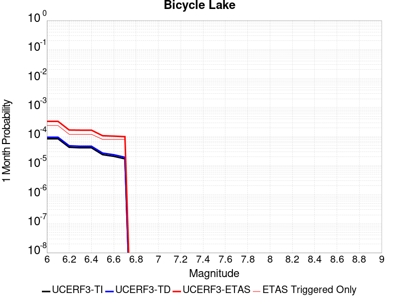 |  |

| Magnitude | 1 wk TI Prob | 1 wk TD Prob | 1 wk ETAS Prob | 1 wk ETAS/TD Gain | 1 wk ETAS Triggered Only | 1 mo TI Prob | 1 mo TD Prob | 1 mo ETAS Prob | 1 mo ETAS/TD Gain | 1 mo ETAS Triggered Only | 1 yr TI Prob | 1 yr TD Prob | 1 yr ETAS Prob | 1 yr ETAS/TD Gain | 1 yr ETAS Triggered Only |
|-----|-----|-----|-----|-----|-----|-----|-----|-----|-----|-----|-----|-----|-----|-----|-----|
| 6.0 | 1.9621975E-5 | 2.2106533E-5 | 1.82103E-4 | 8.237519 | 1.6E-4 | 8.4091465E-5 | 9.473961E-5 | 3.3471687E-4 | 3.5330193 | 2.4E-4 | 0.0010233327 | 0.0011529794 | 0.001632426 | 1.4158328 | 4.8E-4 |
| 6.1 | 1.9621975E-5 | 2.2106533E-5 | 1.82103E-4 | 8.237519 | 1.6E-4 | 8.4091465E-5 | 9.473961E-5 | 3.3471687E-4 | 3.5330193 | 2.4E-4 | 0.0010233327 | 0.0011529794 | 0.001632426 | 1.4158328 | 4.8E-4 |
| 6.2 | 9.9971285E-6 | 1.1260444E-5 | 9.125954E-5 | 8.104435 | 8.0E-5 | 4.2844134E-5 | 4.8258447E-5 | 1.6825266E-4 | 3.4864912 | 1.2E-4 | 5.2150246E-4 | 5.8744027E-4 | 7.8732276E-4 | 1.3402601 | 2.0E-4 |
| 6.3 | 9.589428E-6 | 1.0802963E-5 | 9.0802096E-5 | 8.405296 | 8.0E-5 | 4.10969E-5 | 4.6297882E-5 | 1.6629233E-4 | 3.5917914 | 1.2E-4 | 5.002399E-4 | 5.635828E-4 | 7.6347013E-4 | 1.3546724 | 2.0E-4 |
| 6.4 | 9.589428E-6 | 1.0802963E-5 | 9.0802096E-5 | 8.405296 | 8.0E-5 | 4.10969E-5 | 4.6297882E-5 | 1.6629233E-4 | 3.5917914 | 1.2E-4 | 5.002399E-4 | 5.635828E-4 | 7.6347013E-4 | 1.3546724 | 2.0E-4 |
| 6.5 | 5.557707E-6 | 6.2883923E-6 | 4.628814E-5 | 7.360886 | 4.0E-5 | 2.3818526E-5 | 2.6950127E-5 | 1.0694797E-4 | 3.9683661 | 8.0E-5 | 2.8995197E-4 | 3.2809528E-4 | 4.4805591E-4 | 1.3656274 | 1.2E-4 |
| 6.6 | 4.8742945E-6 | 5.51574E-6 | 4.551552E-5 | 8.251933 | 4.0E-5 | 2.0889667E-5 | 2.3638819E-5 | 1.0363693E-4 | 4.384184 | 8.0E-5 | 2.54302E-4 | 2.8779084E-4 | 4.077563E-4 | 1.4168495 | 1.2E-4 |
| 6.7 | 3.991108E-6 | 4.5179236E-6 | 4.4517743E-5 | 9.853585 | 4.0E-5 | 1.7104636E-5 | 1.936253E-5 | 9.936098E-5 | 5.131612 | 8.0E-5 | 2.0822904E-4 | 2.3573879E-4 | 3.557105E-4 | 1.508918 | 1.2E-4 |

## San Jacinto (Clark) rev
*[(top)](#table-of-contents)*

| 1 Week | 1 Month | 1 Year |
|-----|-----|-----|
|  | 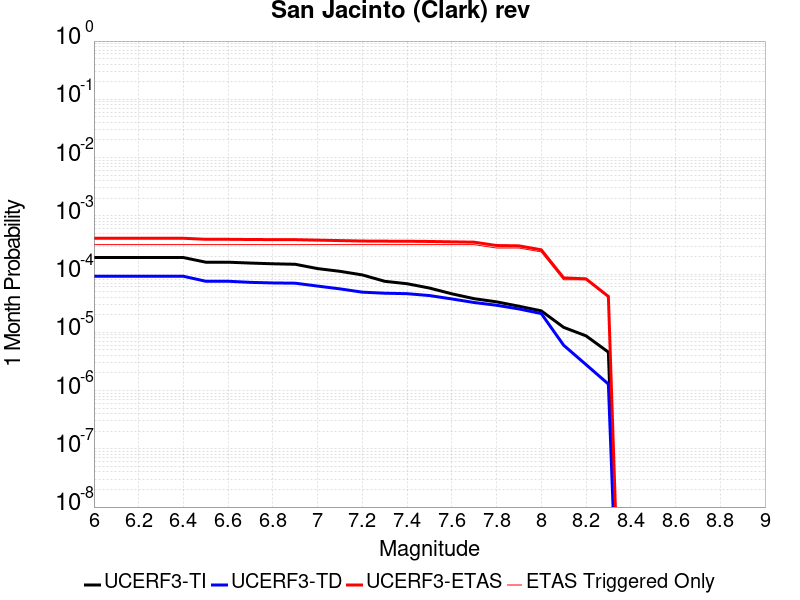 |  |

| Magnitude | 1 wk TI Prob | 1 wk TD Prob | 1 wk ETAS Prob | 1 wk ETAS/TD Gain | 1 wk ETAS Triggered Only | 1 mo TI Prob | 1 mo TD Prob | 1 mo ETAS Prob | 1 mo ETAS/TD Gain | 1 mo ETAS Triggered Only | 1 yr TI Prob | 1 yr TD Prob | 1 yr ETAS Prob | 1 yr ETAS/TD Gain | 1 yr ETAS Triggered Only |
|-----|-----|-----|-----|-----|-----|-----|-----|-----|-----|-----|-----|-----|-----|-----|-----|
| 6.0 | 4.482615E-5 | 2.1381953E-5 | 2.6137682E-4 | 12.224179 | 2.4E-4 | 1.9209793E-4 | 9.1633774E-5 | 4.1160444E-4 | 4.4918423 | 3.2E-4 | 0.0023362834 | 0.0011150796 | 0.0015545889 | 1.3941507 | 4.4E-4 |
| 6.1 | 4.482615E-5 | 2.1381953E-5 | 2.6137682E-4 | 12.224179 | 2.4E-4 | 1.9209793E-4 | 9.1633774E-5 | 4.1160444E-4 | 4.4918423 | 3.2E-4 | 0.0023362834 | 0.0011150796 | 0.0015545889 | 1.3941507 | 4.4E-4 |
| 6.2 | 4.482615E-5 | 2.1381953E-5 | 2.6137682E-4 | 12.224179 | 2.4E-4 | 1.9209793E-4 | 9.1633774E-5 | 4.1160444E-4 | 4.4918423 | 3.2E-4 | 0.0023362834 | 0.0011150796 | 0.0015545889 | 1.3941507 | 4.4E-4 |
| 6.3 | 4.482615E-5 | 2.1381953E-5 | 2.6137682E-4 | 12.224179 | 2.4E-4 | 1.9209793E-4 | 9.1633774E-5 | 4.1160444E-4 | 4.4918423 | 3.2E-4 | 0.0023362834 | 0.0011150796 | 0.0015545889 | 1.3941507 | 4.4E-4 |
| 6.4 | 4.482615E-5 | 2.1381953E-5 | 2.6137682E-4 | 12.224179 | 2.4E-4 | 1.9209793E-4 | 9.1633774E-5 | 4.1160444E-4 | 4.4918423 | 3.2E-4 | 0.0023362834 | 0.0011150796 | 0.0015545889 | 1.3941507 | 4.4E-4 |
| 6.5 | 3.7294863E-5 | 1.7559976E-5 | 2.5755577E-4 | 14.667204 | 2.4E-4 | 1.5982533E-4 | 7.5254895E-5 | 3.952308E-4 | 5.251895 | 3.2E-4 | 0.0019441366 | 9.1584784E-4 | 0.0013554448 | 1.4799892 | 4.4E-4 |
| 6.6 | 3.7294863E-5 | 1.7559976E-5 | 2.5755577E-4 | 14.667204 | 2.4E-4 | 1.5982533E-4 | 7.5254895E-5 | 3.952308E-4 | 5.251895 | 3.2E-4 | 0.0019441366 | 9.1584784E-4 | 0.0013554448 | 1.4799892 | 4.4E-4 |
| 6.7 | 3.6039248E-5 | 1.6803659E-5 | 2.5679963E-4 | 15.282365 | 2.4E-4 | 1.5444479E-4 | 7.201371E-5 | 3.9199067E-4 | 5.4432783 | 3.2E-4 | 0.0018787434 | 8.764185E-4 | 0.0013160328 | 1.5016032 | 4.4E-4 |
| 6.8 | 3.5031844E-5 | 1.6428598E-5 | 2.5642465E-4 | 15.608433 | 2.4E-4 | 1.5012783E-4 | 7.040639E-5 | 3.9038385E-4 | 5.5447216 | 3.2E-4 | 0.0018262739 | 8.568649E-4 | 0.0012964879 | 1.5130599 | 4.4E-4 |
| 6.9 | 3.435112E-5 | 1.6257003E-5 | 2.562531E-4 | 15.7626295 | 2.4E-4 | 1.4721078E-4 | 6.967103E-5 | 3.8964875E-4 | 5.592694 | 3.2E-4 | 0.0017908178 | 8.4791885E-4 | 0.0012875458 | 1.5184776 | 4.4E-4 |
| 7.0 | 2.8959772E-5 | 1.4511907E-5 | 2.5450843E-4 | 17.537905 | 2.4E-4 | 1.241074E-4 | 6.219242E-5 | 3.8217253E-4 | 6.1450014 | 3.2E-4 | 0.0015099603 | 7.569325E-4 | 0.0011965994 | 1.5808536 | 4.4E-4 |
| 7.1 | 2.6002877E-5 | 1.2989396E-5 | 2.5298627E-4 | 19.47637 | 2.4E-4 | 1.11436144E-4 | 5.5667664E-5 | 3.7564986E-4 | 6.7480803 | 3.2E-4 | 0.0013558907 | 6.775452E-4 | 0.001117247 | 1.6489632 | 4.4E-4 |
| 7.2 | 2.2544838E-5 | 1.1407055E-5 | 2.5140433E-4 | 22.03937 | 2.4E-4 | 9.661716E-5 | 4.888647E-5 | 3.6887082E-4 | 7.5454583 | 3.2E-4 | 0.001175679 | 5.950317E-4 | 0.0010347699 | 1.7390164 | 4.4E-4 |
| 7.3 | 1.75334E-5 | 1.0946427E-5 | 2.509438E-4 | 22.924723 | 2.4E-4 | 7.514098E-5 | 4.6912424E-5 | 3.668974E-4 | 7.820901 | 3.2E-4 | 9.144575E-4 | 5.710105E-4 | 0.0010107593 | 1.7701237 | 4.4E-4 |
| 7.4 | 1.5924552E-5 | 1.0743272E-5 | 2.507407E-4 | 23.339323 | 2.4E-4 | 6.82463E-5 | 4.6041787E-5 | 3.6602706E-4 | 7.9498878 | 3.2E-4 | 8.305819E-4 | 5.6041597E-4 | 0.0010001694 | 1.7846911 | 4.4E-4 |
| 7.5 | 1.3428931E-5 | 9.976539E-6 | 2.4997414E-4 | 25.056198 | 2.4E-4 | 5.7551293E-5 | 4.2755903E-5 | 3.6274223E-4 | 8.484027 | 3.2E-4 | 7.004617E-4 | 5.2042986E-4 | 9.602009E-4 | 1.8450149 | 4.4E-4 |
| 7.6 | 1.0688787E-5 | 8.727412E-6 | 2.4872532E-4 | 28.499321 | 2.4E-4 | 4.5808283E-5 | 3.740266E-5 | 3.573907E-4 | 9.555221 | 3.2E-4 | 5.5757316E-4 | 4.5528274E-4 | 8.950824E-4 | 1.9659925 | 4.4E-4 |
| 7.7 | 8.81236E-6 | 7.5768367E-6 | 2.4757502E-4 | 32.675247 | 2.4E-4 | 3.776671E-5 | 3.2471755E-5 | 3.5246136E-4 | 10.854399 | 3.2E-4 | 4.597127E-4 | 3.952721E-4 | 8.3509815E-4 | 2.1127172 | 4.4E-4 |
| 7.8 | 7.780431E-6 | 6.7993083E-6 | 2.0679795E-4 | 30.414557 | 2.0E-4 | 3.3344273E-5 | 2.9139568E-5 | 3.091314E-4 | 10.608647 | 2.8E-4 | 4.0589093E-4 | 3.5471667E-4 | 7.545748E-4 | 2.1272604 | 4.0E-4 |
| 7.9 | 6.5437994E-6 | 5.8761307E-6 | 2.0587495E-4 | 35.0358 | 2.0E-4 | 2.8044553E-5 | 2.5183175E-5 | 3.0517613E-4 | 12.118255 | 2.8E-4 | 3.4138895E-4 | 3.065622E-4 | 7.064396E-4 | 2.3043923 | 4.0E-4 |
| 8.0 | 5.4488164E-6 | 4.898215E-6 | 1.6489743E-4 | 33.6648 | 1.6E-4 | 2.3351862E-5 | 2.0992184E-5 | 2.6098714E-4 | 12.432587 | 2.4E-4 | 2.8427184E-4 | 2.5555E-4 | 5.7546824E-4 | 2.2518811 | 3.2E-4 |
| 8.1 | 2.8397242E-6 | 1.4004763E-6 | 4.140042E-5 | 29.56167 | 4.0E-5 | 1.217019E-5 | 6.002028E-6 | 8.600155E-5 | 14.328749 | 8.0E-5 | 1.4816198E-4 | 7.307225E-5 | 1.530664E-4 | 2.0947268 | 8.0E-5 |
| 8.2 | 2.030244E-6 | 6.5120884E-7 | 4.0651183E-5 | 62.424187 | 4.0E-5 | 8.701017E-6 | 2.790892E-6 | 8.279067E-5 | 29.664589 | 8.0E-5 | 1.05929736E-4 | 3.3978587E-5 | 1.1397587E-4 | 3.354344 | 8.0E-5 |
| 8.3 | 1.0659804E-6 | 3.019421E-7 | 4.030193E-5 | 133.4757 | 4.0E-5 | 4.568479E-6 | 1.2940369E-6 | 4.1293984E-5 | 31.910978 | 4.0E-5 | 5.5619817E-5 | 1.575479E-5 | 5.575416E-5 | 3.5388703 | 4.0E-5 |

## Whittier alt 1
*[(top)](#table-of-contents)*

| 1 Week | 1 Month | 1 Year |
|-----|-----|-----|
| 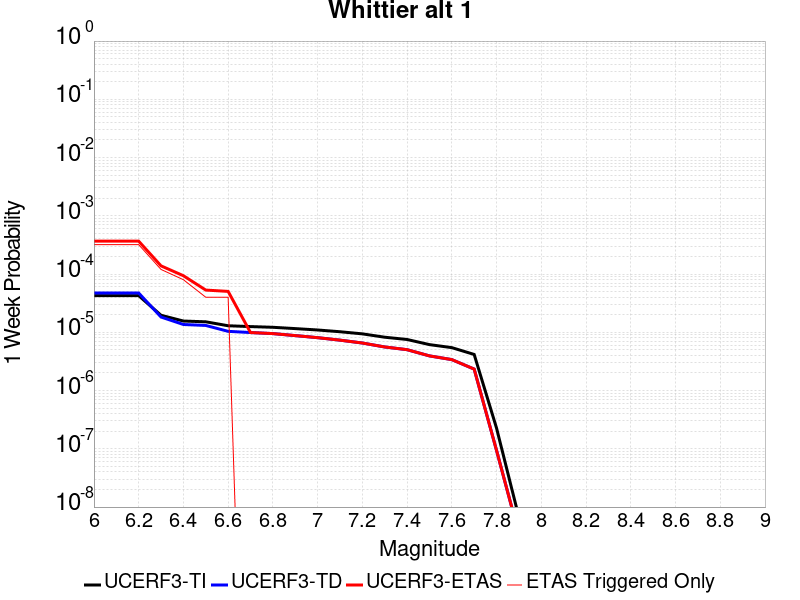 |  | 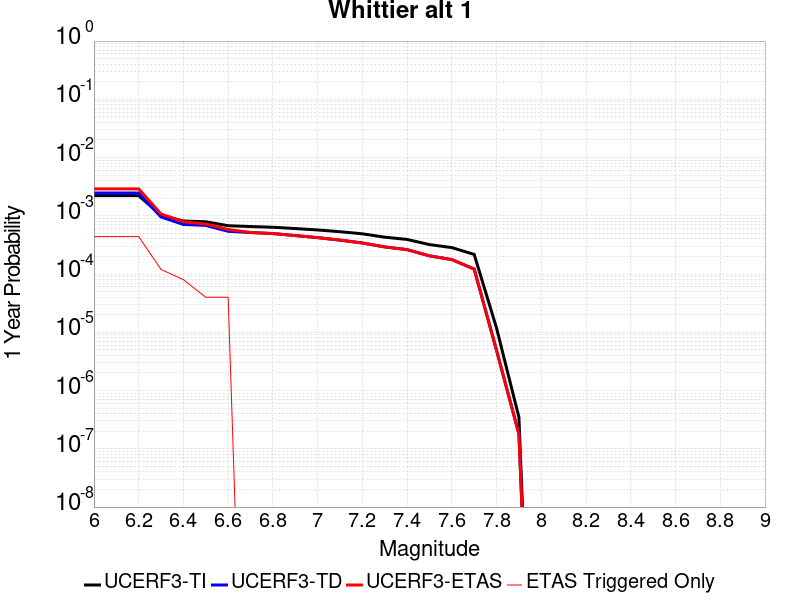 |

| Magnitude | 1 wk TI Prob | 1 wk TD Prob | 1 wk ETAS Prob | 1 wk ETAS/TD Gain | 1 wk ETAS Triggered Only | 1 mo TI Prob | 1 mo TD Prob | 1 mo ETAS Prob | 1 mo ETAS/TD Gain | 1 mo ETAS Triggered Only | 1 yr TI Prob | 1 yr TD Prob | 1 yr ETAS Prob | 1 yr ETAS/TD Gain | 1 yr ETAS Triggered Only |
|-----|-----|-----|-----|-----|-----|-----|-----|-----|-----|-----|-----|-----|-----|-----|-----|
| 6.0 | 4.2554693E-5 | 4.7282294E-5 | 3.6726717E-4 | 7.7675414 | 3.2E-4 | 1.8236451E-4 | 2.0262448E-4 | 5.6255155E-4 | 2.7763257 | 3.6E-4 | 0.002218027 | 0.0024644844 | 0.0029034 | 1.1780963 | 4.4E-4 |
| 6.1 | 4.2554693E-5 | 4.7282294E-5 | 3.6726717E-4 | 7.7675414 | 3.2E-4 | 1.8236451E-4 | 2.0262448E-4 | 5.6255155E-4 | 2.7763257 | 3.6E-4 | 0.002218027 | 0.0024644844 | 0.0029034 | 1.1780963 | 4.4E-4 |
| 6.2 | 4.2554693E-5 | 4.7282294E-5 | 3.6726717E-4 | 7.7675414 | 3.2E-4 | 1.8236451E-4 | 2.0262448E-4 | 5.6255155E-4 | 2.7763257 | 3.6E-4 | 0.002218027 | 0.0024644844 | 0.0029034 | 1.1780963 | 4.4E-4 |
| 6.3 | 1.9617712E-5 | 1.8284845E-5 | 1.3828264E-4 | 7.562692 | 1.2E-4 | 8.40732E-5 | 7.836137E-5 | 1.9835198E-4 | 2.5312467 | 1.2E-4 | 0.0010231105 | 9.5365115E-4 | 0.0010735367 | 1.1257122 | 1.2E-4 |
| 6.4 | 1.5611336E-5 | 1.3617991E-5 | 9.36169E-5 | 6.8745017 | 8.0E-5 | 6.690401E-5 | 5.8361547E-5 | 1.3835687E-4 | 2.3706856 | 8.0E-5 | 8.142519E-4 | 7.103262E-4 | 7.9026935E-4 | 1.1125443 | 8.0E-5 |
| 6.5 | 1.5150166E-5 | 1.3114483E-5 | 5.311396E-5 | 4.050023 | 4.0E-5 | 6.492767E-5 | 5.620375E-5 | 9.6201504E-5 | 1.7116563 | 4.0E-5 | 7.9020765E-4 | 6.840717E-4 | 7.2404434E-4 | 1.0584334 | 4.0E-5 |
| 6.6 | 1.295588E-5 | 1.0391854E-5 | 5.0391438E-5 | 4.8491287 | 4.0E-5 | 5.552402E-5 | 4.4535765E-5 | 8.453399E-5 | 1.8981146 | 4.0E-5 | 6.7579525E-4 | 5.4209004E-4 | 5.8206834E-4 | 1.0737485 | 4.0E-5 |
| 6.7 | 1.2542085E-5 | 9.910169E-6 | 9.910169E-6 | 1.0 | 0.0 | 5.3750682E-5 | 4.2471474E-5 | 4.2471474E-5 | 1.0 | 0.0 | 6.542181E-4 | 5.1696936E-4 | 5.1696936E-4 | 1.0 | 0.0 |
| 6.8 | 1.2195878E-5 | 9.505836E-6 | 9.505836E-6 | 1.0 | 0.0 | 5.2267E-5 | 4.0738672E-5 | 4.0738672E-5 | 1.0 | 0.0 | 6.36165E-4 | 4.958823E-4 | 4.958823E-4 | 1.0 | 0.0 |
| 6.9 | 1.1580298E-5 | 8.782643E-6 | 8.782643E-6 | 1.0 | 0.0 | 4.9628903E-5 | 3.7639365E-5 | 3.7639365E-5 | 1.0 | 0.0 | 6.040644E-4 | 4.5816458E-4 | 4.5816458E-4 | 1.0 | 0.0 |
| 7.0 | 1.0964795E-5 | 8.092889E-6 | 8.092889E-6 | 1.0 | 0.0 | 4.6991136E-5 | 3.468336E-5 | 3.468336E-5 | 1.0 | 0.0 | 5.7196687E-4 | 4.221896E-4 | 4.221896E-4 | 1.0 | 0.0 |
| 7.1 | 1.0230601E-5 | 7.3345395E-6 | 7.3345395E-6 | 1.0 | 0.0 | 4.3844695E-5 | 3.143337E-5 | 3.143337E-5 | 1.0 | 0.0 | 5.336784E-4 | 3.826354E-4 | 3.826354E-4 | 1.0 | 0.0 |
| 7.2 | 9.40865E-6 | 6.5504482E-6 | 6.5504482E-6 | 1.0 | 0.0 | 4.032216E-5 | 2.8073055E-5 | 2.8073055E-5 | 1.0 | 0.0 | 4.908117E-4 | 3.4173706E-4 | 3.4173706E-4 | 1.0 | 0.0 |
| 7.3 | 8.237384E-6 | 5.6038593E-6 | 5.6038593E-6 | 1.0 | 0.0 | 3.5302593E-5 | 2.4016326E-5 | 2.4016326E-5 | 1.0 | 0.0 | 4.2972428E-4 | 2.9236058E-4 | 2.9236058E-4 | 1.0 | 0.0 |
| 7.4 | 7.5316966E-6 | 5.033336E-6 | 5.033336E-6 | 1.0 | 0.0 | 3.2278298E-5 | 2.1571266E-5 | 2.1571266E-5 | 1.0 | 0.0 | 3.9291743E-4 | 2.6259953E-4 | 2.6259953E-4 | 1.0 | 0.0 |
| 7.5 | 6.149649E-6 | 3.93817E-6 | 3.93817E-6 | 1.0 | 0.0 | 2.6355372E-5 | 1.6877766E-5 | 1.6877766E-5 | 1.0 | 0.0 | 3.208294E-4 | 2.0546833E-4 | 2.0546833E-4 | 1.0 | 0.0 |
| 7.6 | 5.457711E-6 | 3.39915E-6 | 3.39915E-6 | 1.0 | 0.0 | 2.338998E-5 | 1.45677095E-5 | 1.45677095E-5 | 1.0 | 0.0 | 2.8473578E-4 | 1.7734825E-4 | 1.7734825E-4 | 1.0 | 0.0 |
| 7.7 | 4.1676276E-6 | 2.3360851E-6 | 2.3360851E-6 | 1.0 | 0.0 | 1.7861139E-5 | 1.0011759E-5 | 1.0011759E-5 | 1.0 | 0.0 | 2.1743766E-4 | 1.2188709E-4 | 1.2188709E-4 | 1.0 | 0.0 |
| 7.8 | 2.2692414E-7 | 9.397192E-8 | 9.397192E-8 | 1.0 | 0.0 | 9.725317E-7 | 4.0273673E-7 | 4.0273673E-7 | 1.0 | 0.0 | 1.1840509E-5 | 4.903312E-6 | 4.903312E-6 | 1.0 | 0.0 |
| 7.9 | 6.676829E-9 | 3.4429164E-9 | 3.4429164E-9 | 1.0 | 0.0 | 2.861498E-8 | 1.4755356E-8 | 1.4755356E-8 | 1.0 | 0.0 | 3.4838732E-7 | 1.7964643E-7 | 1.7964643E-7 | 1.0 | 0.0 |

## San Andreas (Santa Cruz Mts) 2011 CFM
*[(top)](#table-of-contents)*

| 1 Week | 1 Month | 1 Year |
|-----|-----|-----|
| 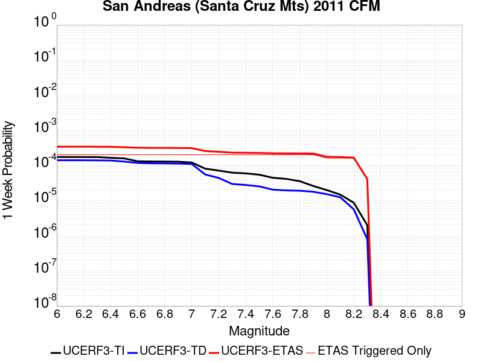 |  | 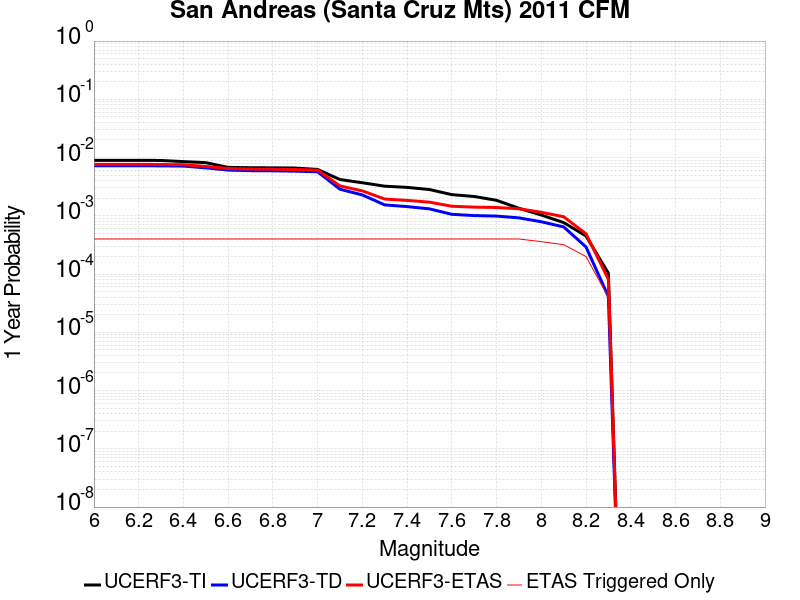 |

| Magnitude | 1 wk TI Prob | 1 wk TD Prob | 1 wk ETAS Prob | 1 wk ETAS/TD Gain | 1 wk ETAS Triggered Only | 1 mo TI Prob | 1 mo TD Prob | 1 mo ETAS Prob | 1 mo ETAS/TD Gain | 1 mo ETAS Triggered Only | 1 yr TI Prob | 1 yr TD Prob | 1 yr ETAS Prob | 1 yr ETAS/TD Gain | 1 yr ETAS Triggered Only |
|-----|-----|-----|-----|-----|-----|-----|-----|-----|-----|-----|-----|-----|-----|-----|-----|
| 6.0 | 1.7221631E-4 | 1.3941765E-4 | 3.3938978E-4 | 2.4343386 | 2.0E-4 | 7.378611E-4 | 5.973695E-4 | 9.5715444E-4 | 1.602282 | 3.6E-4 | 0.008946515 | 0.007249104 | 0.0076462044 | 1.0547793 | 4.0E-4 |
| 6.1 | 1.7221631E-4 | 1.3941765E-4 | 3.3938978E-4 | 2.4343386 | 2.0E-4 | 7.378611E-4 | 5.973695E-4 | 9.5715444E-4 | 1.602282 | 3.6E-4 | 0.008946515 | 0.007249104 | 0.0076462044 | 1.0547793 | 4.0E-4 |
| 6.2 | 1.7221631E-4 | 1.3941765E-4 | 3.3938978E-4 | 2.4343386 | 2.0E-4 | 7.378611E-4 | 5.973695E-4 | 9.5715444E-4 | 1.602282 | 3.6E-4 | 0.008946515 | 0.007249104 | 0.0076462044 | 1.0547793 | 4.0E-4 |
| 6.3 | 1.716926E-4 | 1.3860887E-4 | 3.3858116E-4 | 2.442709 | 2.0E-4 | 7.3561794E-4 | 5.939049E-4 | 9.53691E-4 | 1.6057976 | 3.6E-4 | 0.008919428 | 0.007207201 | 0.007604318 | 1.0551001 | 4.0E-4 |
| 6.4 | 1.6392978E-4 | 1.3733425E-4 | 3.373068E-4 | 2.456101 | 2.0E-4 | 7.02367E-4 | 5.8844464E-4 | 9.4823283E-4 | 1.6114223 | 3.6E-4 | 0.008517839 | 0.0071411594 | 0.0075383033 | 1.0556133 | 4.0E-4 |
| 6.5 | 1.5742714E-4 | 1.278895E-4 | 3.2786393E-4 | 2.5636501 | 2.0E-4 | 6.745133E-4 | 5.479845E-4 | 9.077872E-4 | 1.656593 | 3.6E-4 | 0.00818132 | 0.00665162 | 0.0070489594 | 1.0597358 | 4.0E-4 |
| 6.6 | 1.3038084E-4 | 1.1715973E-4 | 3.171363E-4 | 2.7068713 | 2.0E-4 | 5.5865536E-4 | 5.020178E-4 | 8.6183706E-4 | 1.7167461 | 3.6E-4 | 0.006780438 | 0.0060951724 | 0.0064927344 | 1.0652257 | 4.0E-4 |
| 6.7 | 1.2867592E-4 | 1.1441586E-4 | 3.1439296E-4 | 2.7478094 | 2.0E-4 | 5.5135164E-4 | 4.902628E-4 | 8.5008633E-4 | 1.73394 | 3.6E-4 | 0.0066920654 | 0.005952845 | 0.0063504637 | 1.0667948 | 4.0E-4 |
| 6.8 | 1.2801298E-4 | 1.1378967E-4 | 3.137669E-4 | 2.757429 | 2.0E-4 | 5.485117E-4 | 4.8758014E-4 | 8.474046E-4 | 1.7379801 | 3.6E-4 | 0.0066577005 | 0.0059203724 | 0.0063180043 | 1.0671633 | 4.0E-4 |
| 6.9 | 1.269149E-4 | 1.1220608E-4 | 3.1218363E-4 | 2.7822347 | 2.0E-4 | 5.4380763E-4 | 4.8079586E-4 | 8.4062276E-4 | 1.7483985 | 3.6E-4 | 0.006600777 | 0.005838219 | 0.006235884 | 1.068114 | 4.0E-4 |
| 7.0 | 1.2030331E-4 | 1.0948385E-4 | 3.0946196E-4 | 2.8265536 | 2.0E-4 | 5.154837E-4 | 4.691334E-4 | 8.289645E-4 | 1.7670124 | 3.6E-4 | 0.006257969 | 0.00569698 | 0.0060947007 | 1.0698127 | 4.0E-4 |
| 7.1 | 8.049617E-5 | 5.4874155E-5 | 2.5486317E-4 | 4.644503 | 2.0E-4 | 3.4493793E-4 | 2.3515396E-4 | 5.950693E-4 | 2.530552 | 3.6E-4 | 0.0041915346 | 0.0028592765 | 0.0032581328 | 1.1394955 | 4.0E-4 |
| 7.2 | 7.093979E-5 | 4.3771735E-5 | 2.4376299E-4 | 5.5689583 | 2.0E-4 | 3.0399222E-4 | 1.875798E-4 | 5.4751226E-4 | 2.9188232 | 3.6E-4 | 0.0036948253 | 0.0022814157 | 0.002680503 | 1.1749297 | 4.0E-4 |
| 7.3 | 6.193693E-5 | 2.9517532E-5 | 2.2951163E-4 | 7.775434 | 2.0E-4 | 2.6541698E-4 | 1.2649759E-4 | 4.8645205E-4 | 3.845544 | 3.6E-4 | 0.0032266637 | 0.0015390218 | 0.0019384063 | 1.2595054 | 4.0E-4 |
| 7.4 | 5.906492E-5 | 2.7614462E-5 | 2.2760894E-4 | 8.242382 | 2.0E-4 | 2.5311083E-4 | 1.1834233E-4 | 4.7829974E-4 | 4.041662 | 3.6E-4 | 0.0030772698 | 0.0014398671 | 0.0018392912 | 1.2774034 | 4.0E-4 |
| 7.5 | 5.424296E-5 | 2.5224388E-5 | 2.2521934E-4 | 8.928635 | 2.0E-4 | 2.324491E-4 | 1.08100045E-4 | 4.6806113E-4 | 4.3298883 | 3.6E-4 | 0.002826395 | 0.0013153247 | 0.0017147986 | 1.3037074 | 4.0E-4 |
| 7.6 | 4.43084E-5 | 2.0342583E-5 | 2.2033851E-4 | 10.831393 | 2.0E-4 | 1.8987931E-4 | 8.7179586E-5 | 4.471482E-4 | 5.1290474 | 3.6E-4 | 0.0023093296 | 0.0010608948 | 0.0014604705 | 1.3766402 | 4.0E-4 |
| 7.7 | 4.118098E-5 | 1.9356086E-5 | 2.1935221E-4 | 11.332467 | 2.0E-4 | 1.7647797E-4 | 8.295202E-5 | 4.4292214E-4 | 5.339498 | 3.6E-4 | 0.002146502 | 0.0010094732 | 0.0014090694 | 1.3958462 | 4.0E-4 |
| 7.8 | 3.5408906E-5 | 1.8973216E-5 | 2.1896942E-4 | 11.540976 | 2.0E-4 | 1.5174363E-4 | 8.131125E-5 | 4.4128197E-4 | 5.4270716 | 3.6E-4 | 0.0018459131 | 9.895151E-4 | 0.0013891193 | 1.4038384 | 4.0E-4 |
| 7.9 | 2.5860836E-5 | 1.7686616E-5 | 2.1768307E-4 | 12.307785 | 2.0E-4 | 1.10827445E-4 | 7.579759E-5 | 4.357703E-4 | 5.7491317 | 3.6E-4 | 0.001348489 | 9.2244515E-4 | 0.0013220762 | 1.4332302 | 4.0E-4 |
| 8.0 | 1.9777332E-5 | 1.5154375E-5 | 1.7515194E-4 | 11.557847 | 1.6E-4 | 8.4757245E-5 | 6.494571E-5 | 3.8492493E-4 | 5.9268723 | 3.2E-4 | 0.0010314309 | 7.904273E-4 | 0.0011501428 | 1.4550898 | 3.6E-4 |
| 8.1 | 1.468494E-5 | 1.23638665E-5 | 1.7236189E-4 | 13.940776 | 1.6E-4 | 6.293394E-5 | 5.298692E-5 | 3.329721E-4 | 6.284043 | 2.8E-4 | 7.6595135E-4 | 6.44925E-4 | 9.6471864E-4 | 1.4958618 | 3.2E-4 |
| 8.2 | 8.63836E-6 | 5.601494E-6 | 1.6560059E-4 | 29.563648 | 1.6E-4 | 3.7021015E-5 | 2.4006182E-5 | 2.2400139E-4 | 9.330987 | 2.0E-4 | 4.5063766E-4 | 2.9223616E-4 | 4.921777E-4 | 1.684178 | 2.0E-4 |
| 8.3 | 1.983087E-6 | 7.877893E-7 | 4.0787756E-5 | 51.774956 | 4.0E-5 | 8.498917E-6 | 3.3762356E-6 | 4.33761E-5 | 12.847474 | 4.0E-5 | 1.034694E-4 | 4.110491E-5 | 8.1103266E-5 | 1.9730797 | 4.0E-5 |

## Coyote Lake
*[(top)](#table-of-contents)*

| 1 Week | 1 Month | 1 Year |
|-----|-----|-----|
|  | 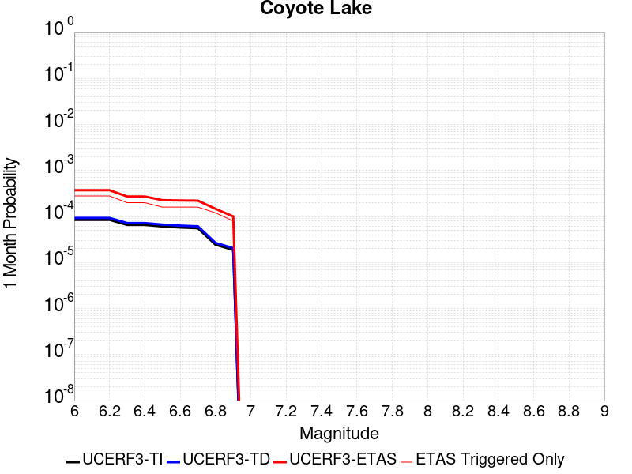 | 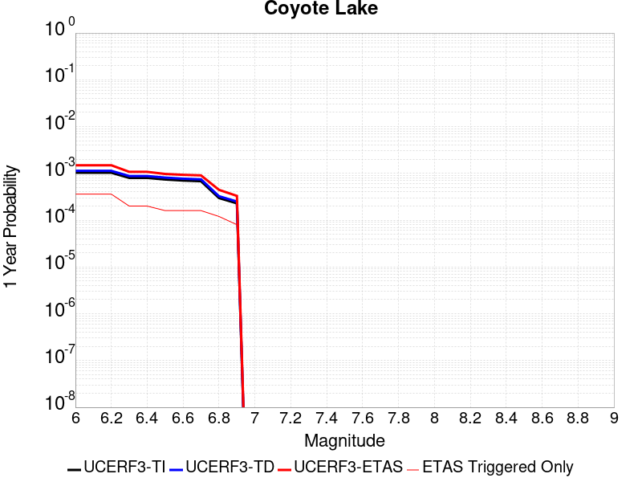 |

| Magnitude | 1 wk TI Prob | 1 wk TD Prob | 1 wk ETAS Prob | 1 wk ETAS/TD Gain | 1 wk ETAS Triggered Only | 1 mo TI Prob | 1 mo TD Prob | 1 mo ETAS Prob | 1 mo ETAS/TD Gain | 1 mo ETAS Triggered Only | 1 yr TI Prob | 1 yr TD Prob | 1 yr ETAS Prob | 1 yr ETAS/TD Gain | 1 yr ETAS Triggered Only |
|-----|-----|-----|-----|-----|-----|-----|-----|-----|-----|-----|-----|-----|-----|-----|-----|
| 6.0 | 1.980352E-5 | 2.1713819E-5 | 2.617086E-4 | 12.052629 | 2.4E-4 | 8.486947E-5 | 9.305631E-5 | 3.7303026E-4 | 4.008651 | 2.8E-4 | 0.0010327959 | 0.0011324438 | 0.0014920362 | 1.3175366 | 3.6E-4 |
| 6.1 | 1.980352E-5 | 2.1713819E-5 | 2.617086E-4 | 12.052629 | 2.4E-4 | 8.486947E-5 | 9.305631E-5 | 3.7303026E-4 | 4.008651 | 2.8E-4 | 0.0010327959 | 0.0011324438 | 0.0014920362 | 1.3175366 | 3.6E-4 |
| 6.2 | 1.980352E-5 | 2.1713819E-5 | 2.617086E-4 | 12.052629 | 2.4E-4 | 8.486947E-5 | 9.305631E-5 | 3.7303026E-4 | 4.008651 | 2.8E-4 | 0.0010327959 | 0.0011324438 | 0.0014920362 | 1.3175366 | 3.6E-4 |
| 6.3 | 1.5344787E-5 | 1.6826156E-5 | 1.7682347E-4 | 10.508845 | 1.6E-4 | 6.576172E-5 | 7.2110444E-5 | 2.7209602E-4 | 3.7733233 | 2.0E-4 | 8.003548E-4 | 8.776523E-4 | 0.0010774768 | 1.2276807 | 2.0E-4 |
| 6.4 | 1.5344787E-5 | 1.6826156E-5 | 1.7682347E-4 | 10.508845 | 1.6E-4 | 6.576172E-5 | 7.2110444E-5 | 2.7209602E-4 | 3.7733233 | 2.0E-4 | 8.003548E-4 | 8.776523E-4 | 0.0010774768 | 1.2276807 | 2.0E-4 |
| 6.5 | 1.4189697E-5 | 1.5563075E-5 | 1.355612E-4 | 8.710439 | 1.2E-4 | 6.081157E-5 | 6.6697525E-5 | 2.2668685E-4 | 3.3987296 | 1.6E-4 | 7.401293E-4 | 8.118002E-4 | 9.716703E-4 | 1.1969328 | 1.6E-4 |
| 6.6 | 1.3469301E-5 | 1.4776421E-5 | 1.3477464E-4 | 9.120927 | 1.2E-4 | 5.7724297E-5 | 6.332632E-5 | 2.233162E-4 | 3.5264356 | 1.6E-4 | 7.025667E-4 | 7.707852E-4 | 9.306619E-4 | 1.2074205 | 1.6E-4 |
| 6.7 | 1.3027966E-5 | 1.4286406E-5 | 1.342847E-4 | 9.399473 | 1.2E-4 | 5.5832945E-5 | 6.1226354E-5 | 2.2121656E-4 | 3.6130939 | 1.6E-4 | 6.7955407E-4 | 7.452357E-4 | 9.0511644E-4 | 1.2145371 | 1.6E-4 |
| 6.8 | 5.695434E-6 | 6.2263775E-6 | 1.2622563E-4 | 20.272724 | 1.2E-4 | 2.4408775E-5 | 2.668437E-5 | 1.4668117E-4 | 5.4968944 | 1.2E-4 | 2.971363E-4 | 3.248638E-4 | 4.448248E-4 | 1.3692656 | 1.2E-4 |
| 6.9 | 4.385688E-6 | 4.7945646E-6 | 8.479418E-5 | 17.685482 | 8.0E-5 | 1.879567E-5 | 2.0548134E-5 | 1.0054649E-4 | 4.8932176 | 8.0E-5 | 2.2881327E-4 | 2.5017353E-4 | 3.301535E-4 | 1.3196981 | 8.0E-5 |

## Big Pine (East)
*[(top)](#table-of-contents)*

| 1 Week | 1 Month | 1 Year |
|-----|-----|-----|
|  |  | 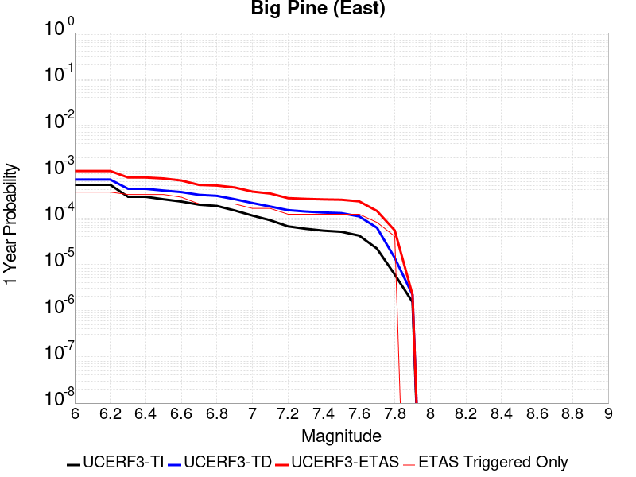 |

| Magnitude | 1 wk TI Prob | 1 wk TD Prob | 1 wk ETAS Prob | 1 wk ETAS/TD Gain | 1 wk ETAS Triggered Only | 1 mo TI Prob | 1 mo TD Prob | 1 mo ETAS Prob | 1 mo ETAS/TD Gain | 1 mo ETAS Triggered Only | 1 yr TI Prob | 1 yr TD Prob | 1 yr ETAS Prob | 1 yr ETAS/TD Gain | 1 yr ETAS Triggered Only |
|-----|-----|-----|-----|-----|-----|-----|-----|-----|-----|-----|-----|-----|-----|-----|-----|
| 6.0 | 9.916913E-6 | 1.2849277E-5 | 2.128467E-4 | 16.564878 | 2.0E-4 | 4.250036E-5 | 5.5067292E-5 | 2.9505408E-4 | 5.358064 | 2.4E-4 | 5.173191E-4 | 6.7026017E-4 | 0.0010300189 | 1.5367448 | 3.6E-4 |
| 6.1 | 9.916913E-6 | 1.2849277E-5 | 2.128467E-4 | 16.564878 | 2.0E-4 | 4.250036E-5 | 5.5067292E-5 | 2.9505408E-4 | 5.358064 | 2.4E-4 | 5.173191E-4 | 6.7026017E-4 | 0.0010300189 | 1.5367448 | 3.6E-4 |
| 6.2 | 9.916913E-6 | 1.2849277E-5 | 2.128467E-4 | 16.564878 | 2.0E-4 | 4.250036E-5 | 5.5067292E-5 | 2.9505408E-4 | 5.358064 | 2.4E-4 | 5.173191E-4 | 6.7026017E-4 | 0.0010300189 | 1.5367448 | 3.6E-4 |
| 6.3 | 5.479711E-6 | 8.144284E-6 | 2.0814265E-4 | 25.556898 | 2.0E-4 | 2.3484265E-5 | 3.4903627E-5 | 2.3489665E-4 | 6.7298636 | 2.0E-4 | 2.858834E-4 | 4.24872E-4 | 7.4473605E-4 | 1.752848 | 3.2E-4 |
| 6.4 | 5.465009E-6 | 8.128574E-6 | 2.0812695E-4 | 25.60436 | 2.0E-4 | 2.3421257E-5 | 3.48363E-5 | 2.3482933E-4 | 6.7409377 | 2.0E-4 | 2.851165E-4 | 4.2405262E-4 | 7.439169E-4 | 1.7543033 | 3.2E-4 |
| 6.5 | 4.826767E-6 | 7.453499E-6 | 2.07452E-4 | 27.832834 | 2.0E-4 | 2.068598E-5 | 3.1943193E-5 | 2.319368E-4 | 7.2609153 | 2.0E-4 | 2.518227E-4 | 3.8884176E-4 | 7.087173E-4 | 1.822637 | 3.2E-4 |
| 6.6 | 4.3146847E-6 | 6.913335E-6 | 1.6691223E-4 | 24.143518 | 1.6E-4 | 1.8491375E-5 | 2.9628256E-5 | 1.8962352E-4 | 6.40009 | 1.6E-4 | 2.2510924E-4 | 3.6066677E-4 | 6.4056576E-4 | 1.7760599 | 2.8E-4 |
| 6.7 | 3.6968106E-6 | 6.024692E-6 | 8.602421E-5 | 14.278606 | 8.0E-5 | 1.5843378E-5 | 2.5819862E-5 | 1.05817795E-4 | 4.09831 | 8.0E-5 | 1.9287605E-4 | 3.1431302E-4 | 5.1425013E-4 | 1.6361084 | 2.0E-4 |
| 6.8 | 3.4671132E-6 | 5.730609E-6 | 8.573015E-5 | 14.960043 | 8.0E-5 | 1.4858972E-5 | 2.4559527E-5 | 1.0455756E-4 | 4.2573113 | 8.0E-5 | 1.8089297E-4 | 2.9897268E-4 | 4.989129E-4 | 1.6687574 | 2.0E-4 |
| 6.9 | 2.7686972E-6 | 4.851478E-6 | 8.485109E-5 | 17.48974 | 8.0E-5 | 1.1865792E-5 | 2.0791887E-5 | 1.00790225E-4 | 4.8475747 | 8.0E-5 | 1.4445644E-4 | 2.5311258E-4 | 4.5306195E-4 | 1.7899623 | 2.0E-4 |
| 7.0 | 2.1472624E-6 | 4.008895E-6 | 8.400858E-5 | 20.955544 | 8.0E-5 | 9.20252E-6 | 1.7180868E-5 | 9.7179494E-5 | 5.656262 | 8.0E-5 | 1.12034926E-4 | 2.0915753E-4 | 3.6912406E-4 | 1.7648137 | 1.6E-4 |
| 7.1 | 1.7018335E-6 | 3.3665633E-6 | 8.336629E-5 | 24.763025 | 8.0E-5 | 7.293552E-6 | 1.4428051E-5 | 9.44269E-5 | 6.5446744 | 8.0E-5 | 8.879537E-5 | 1.7564771E-4 | 3.356196E-4 | 1.9107542 | 1.6E-4 |
| 7.2 | 1.25603E-6 | 2.8149723E-6 | 4.281486E-5 | 15.209692 | 4.0E-5 | 5.3829745E-6 | 1.2064112E-5 | 5.2063628E-5 | 4.315579 | 4.0E-5 | 6.553574E-5 | 1.468709E-4 | 2.6685325E-4 | 1.8169241 | 1.2E-4 |
| 7.3 | 1.112297E-6 | 2.6296866E-6 | 4.262958E-5 | 16.210897 | 4.0E-5 | 4.7669787E-6 | 1.1270038E-5 | 5.1269588E-5 | 4.549194 | 4.0E-5 | 5.803642E-5 | 1.3720429E-4 | 2.5718784E-4 | 1.8744882 | 1.2E-4 |
| 7.4 | 1.0137181E-6 | 2.5020183E-6 | 4.2501917E-5 | 16.987053 | 4.0E-5 | 4.3444993E-6 | 1.07228925E-5 | 5.0722465E-5 | 4.7302966 | 4.0E-5 | 5.2892992E-5 | 1.3054362E-4 | 2.5052796E-4 | 1.919113 | 1.2E-4 |
| 7.5 | 9.598608E-7 | 2.4251278E-6 | 4.2425032E-5 | 17.493937 | 4.0E-5 | 4.1136827E-6 | 1.0393365E-5 | 5.0392948E-5 | 4.8485694 | 4.0E-5 | 5.0082934E-5 | 1.2653209E-4 | 2.465169E-4 | 1.948256 | 1.2E-4 |
| 7.6 | 7.929459E-7 | 2.0607458E-6 | 4.2060663E-5 | 20.41041 | 4.0E-5 | 3.3983351E-6 | 8.831738E-6 | 4.8831385E-5 | 5.5290794 | 4.0E-5 | 4.1373947E-5 | 1.07521286E-4 | 2.2750838E-4 | 2.115938 | 1.2E-4 |
| 7.7 | 4.155788E-7 | 1.1718464E-6 | 4.11718E-5 | 35.134125 | 4.0E-5 | 1.7810507E-6 | 5.0221893E-6 | 4.502199E-5 | 8.964614 | 4.0E-5 | 2.1684076E-5 | 6.114348E-5 | 1.4113859E-4 | 2.308318 | 8.0E-5 |
| 7.8 | 1.14666925E-7 | 2.617199E-7 | 4.0261708E-5 | 153.83511 | 4.0E-5 | 4.914296E-7 | 1.1216562E-6 | 4.112161E-5 | 36.66151 | 4.0E-5 | 5.9831386E-6 | 1.3656083E-5 | 5.3655538E-5 | 3.9290576 | 4.0E-5 |
| 7.9 | 2.9231824E-8 | 4.188171E-8 | 4.188171E-8 | 1.0 | 0.0 | 1.2527924E-7 | 1.7949303E-7 | 1.7949303E-7 | 1.0 | 0.0 | 1.5252737E-6 | 2.1853257E-6 | 2.1853257E-6 | 1.0 | 0.0 |

## San Pedro Basin
*[(top)](#table-of-contents)*

| 1 Week | 1 Month | 1 Year |
|-----|-----|-----|
| 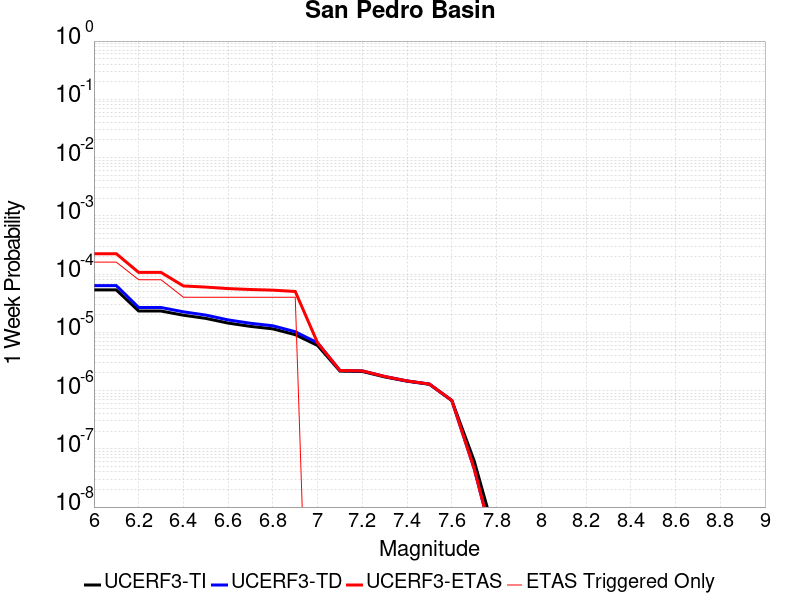 |  |  |

| Magnitude | 1 wk TI Prob | 1 wk TD Prob | 1 wk ETAS Prob | 1 wk ETAS/TD Gain | 1 wk ETAS Triggered Only | 1 mo TI Prob | 1 mo TD Prob | 1 mo ETAS Prob | 1 mo ETAS/TD Gain | 1 mo ETAS Triggered Only | 1 yr TI Prob | 1 yr TD Prob | 1 yr ETAS Prob | 1 yr ETAS/TD Gain | 1 yr ETAS Triggered Only |
|-----|-----|-----|-----|-----|-----|-----|-----|-----|-----|-----|-----|-----|-----|-----|-----|
| 6.0 | 5.3449043E-5 | 6.34106E-5 | 2.2340046E-4 | 3.5230772 | 1.6E-4 | 2.2904722E-4 | 2.7173443E-4 | 4.716801E-4 | 1.7358127 | 2.0E-4 | 0.0027850836 | 0.003303951 | 0.0036228937 | 1.0965338 | 3.2E-4 |
| 6.1 | 5.3449043E-5 | 6.34106E-5 | 2.2340046E-4 | 3.5230772 | 1.6E-4 | 2.2904722E-4 | 2.7173443E-4 | 4.716801E-4 | 1.7358127 | 2.0E-4 | 0.0027850836 | 0.003303951 | 0.0036228937 | 1.0965338 | 3.2E-4 |
| 6.2 | 2.3189454E-5 | 2.6656566E-5 | 1.06654436E-4 | 4.0010567 | 8.0E-5 | 9.9379584E-5 | 1.1423769E-4 | 1.9422855E-4 | 1.7002143 | 8.0E-5 | 0.0012092749 | 0.0013900036 | 0.0014698924 | 1.0574738 | 8.0E-5 |
| 6.3 | 2.3189454E-5 | 2.6656566E-5 | 1.06654436E-4 | 4.0010567 | 8.0E-5 | 9.9379584E-5 | 1.1423769E-4 | 1.9422855E-4 | 1.7002143 | 8.0E-5 | 0.0012092749 | 0.0013900036 | 0.0014698924 | 1.0574738 | 8.0E-5 |
| 6.4 | 1.966056E-5 | 2.2474544E-5 | 6.247364E-5 | 2.7797513 | 4.0E-5 | 8.425682E-5 | 9.6316144E-5 | 1.3631229E-4 | 1.415259 | 4.0E-5 | 0.001025344 | 0.0011720584 | 0.0012120116 | 1.034088 | 4.0E-5 |
| 6.5 | 1.7342953E-5 | 1.975468E-5 | 5.975389E-5 | 3.0247967 | 4.0E-5 | 7.4324824E-5 | 8.466037E-5 | 1.2465699E-4 | 1.4724361 | 4.0E-5 | 9.04529E-4 | 0.0010302897 | 0.0010702484 | 1.038784 | 4.0E-5 |
| 6.6 | 1.439804E-5 | 1.6330361E-5 | 5.6329707E-5 | 3.4493854 | 4.0E-5 | 6.170443E-5 | 6.998557E-5 | 1.09982764E-4 | 1.5715064 | 4.0E-5 | 7.509924E-4 | 8.517733E-4 | 8.9173927E-4 | 1.0469209 | 4.0E-5 |
| 6.7 | 1.2634884E-5 | 1.4291868E-5 | 5.4291297E-5 | 3.7987545 | 4.0E-5 | 5.414838E-5 | 6.124959E-5 | 1.0124715E-4 | 1.6530255 | 4.0E-5 | 6.590571E-4 | 7.454892E-4 | 7.8545936E-4 | 1.053616 | 4.0E-5 |
| 6.8 | 1.146091E-5 | 1.2939066E-5 | 5.293855E-5 | 4.091373 | 4.0E-5 | 4.911726E-5 | 5.5452132E-5 | 9.544991E-5 | 1.7213029 | 4.0E-5 | 5.9783855E-4 | 6.7495037E-4 | 7.149234E-4 | 1.0592237 | 4.0E-5 |
| 6.9 | 9.109035E-6 | 1.0239538E-5 | 5.0239127E-5 | 4.9063864 | 4.0E-5 | 3.9038136E-5 | 4.3883152E-5 | 8.3881394E-5 | 1.9114716 | 4.0E-5 | 4.7518566E-4 | 5.3417444E-4 | 5.7415303E-4 | 1.0748419 | 4.0E-5 |
| 7.0 | 5.9351028E-6 | 6.586627E-6 | 6.586627E-6 | 1.0 | 0.0 | 2.5435906E-5 | 2.822823E-5 | 2.822823E-5 | 1.0 | 0.0 | 3.0963816E-4 | 3.4364813E-4 | 3.4364813E-4 | 1.0 | 0.0 |
| 7.1 | 2.1557585E-6 | 2.2099746E-6 | 2.2099746E-6 | 1.0 | 0.0 | 9.238933E-6 | 9.471286E-6 | 9.471286E-6 | 1.0 | 0.0 | 1.1247819E-4 | 1.1530696E-4 | 1.1530696E-4 | 1.0 | 0.0 |
| 7.2 | 2.1251979E-6 | 2.178317E-6 | 2.178317E-6 | 1.0 | 0.0 | 9.107958E-6 | 9.335612E-6 | 9.335612E-6 | 1.0 | 0.0 | 1.1088375E-4 | 1.136553E-4 | 1.136553E-4 | 1.0 | 0.0 |
| 7.3 | 1.7145798E-6 | 1.7445271E-6 | 1.7445271E-6 | 1.0 | 0.0 | 7.3481783E-6 | 7.4765244E-6 | 7.4765244E-6 | 1.0 | 0.0 | 8.94604E-5 | 9.102297E-5 | 9.102297E-5 | 1.0 | 0.0 |
| 7.4 | 1.4467993E-6 | 1.4643826E-6 | 1.4643826E-6 | 1.0 | 0.0 | 6.200554E-6 | 6.275911E-6 | 6.275911E-6 | 1.0 | 0.0 | 7.548913E-5 | 7.640661E-5 | 7.640661E-5 | 1.0 | 0.0 |
| 7.5 | 1.2803735E-6 | 1.2933225E-6 | 1.2933225E-6 | 1.0 | 0.0 | 5.487303E-6 | 5.5427995E-6 | 5.5427995E-6 | 1.0 | 0.0 | 6.680587E-5 | 6.748157E-5 | 6.748157E-5 | 1.0 | 0.0 |
| 7.6 | 6.755009E-7 | 6.7703843E-7 | 6.7703843E-7 | 1.0 | 0.0 | 2.8950008E-6 | 2.9015905E-6 | 2.9015905E-6 | 1.0 | 0.0 | 3.5246063E-5 | 3.532635E-5 | 3.532635E-5 | 1.0 | 0.0 |
| 7.7 | 6.211885E-8 | 4.5709044E-8 | 4.5709044E-8 | 1.0 | 0.0 | 2.6622362E-7 | 1.9589588E-7 | 1.9589588E-7 | 1.0 | 0.0 | 3.2412677E-6 | 2.38503E-6 | 2.38503E-6 | 1.0 | 0.0 |
| 7.8 | 2.6580573E-9 | 1.515122E-9 | 1.515122E-9 | 1.0 | 0.0 | 1.1391674E-8 | 6.49338E-9 | 6.49338E-9 | 1.0 | 0.0 | 1.3869362E-7 | 7.90569E-8 | 7.90569E-8 | 1.0 | 0.0 |

## Garlic Springs
*[(top)](#table-of-contents)*

| 1 Week | 1 Month | 1 Year |
|-----|-----|-----|
| 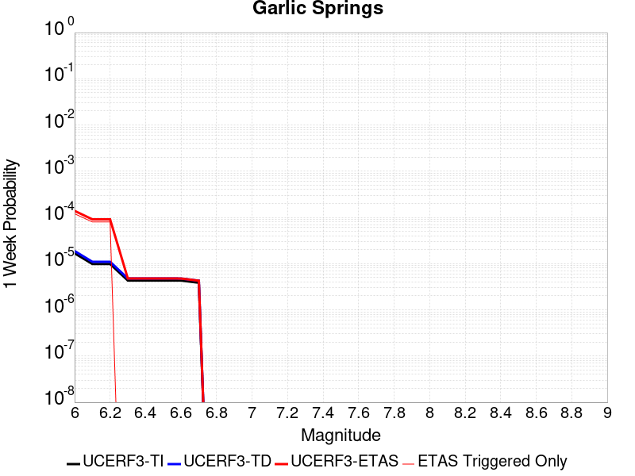 | 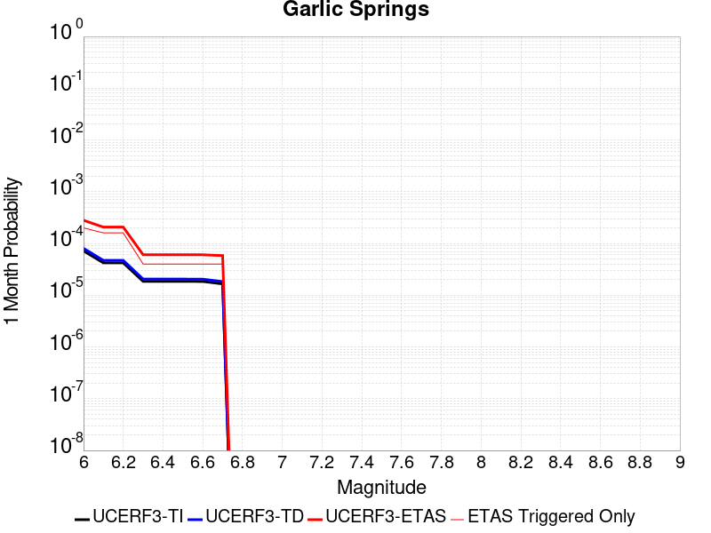 | 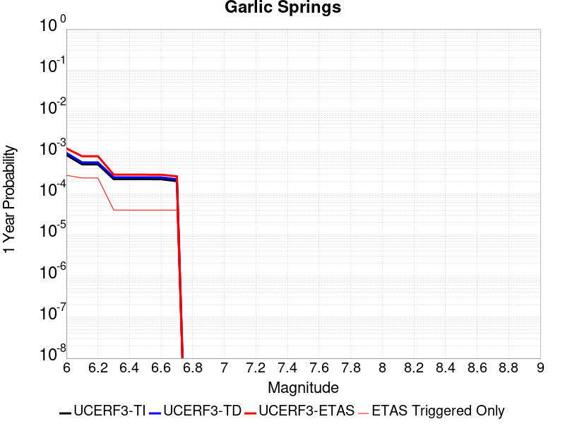 |

| Magnitude | 1 wk TI Prob | 1 wk TD Prob | 1 wk ETAS Prob | 1 wk ETAS/TD Gain | 1 wk ETAS Triggered Only | 1 mo TI Prob | 1 mo TD Prob | 1 mo ETAS Prob | 1 mo ETAS/TD Gain | 1 mo ETAS Triggered Only | 1 yr TI Prob | 1 yr TD Prob | 1 yr ETAS Prob | 1 yr ETAS/TD Gain | 1 yr ETAS Triggered Only |
|-----|-----|-----|-----|-----|-----|-----|-----|-----|-----|-----|-----|-----|-----|-----|-----|
| 6.0 | 1.6760017E-5 | 1.8784498E-5 | 1.3878224E-4 | 7.3881264 | 1.2E-4 | 7.182667E-5 | 8.0503174E-5 | 2.8048706E-4 | 3.4841743 | 2.0E-4 | 8.7413884E-4 | 9.798029E-4 | 0.0012595286 | 1.2854918 | 2.8E-4 |
| 6.1 | 9.852767E-6 | 1.097782E-5 | 9.0976944E-5 | 8.287341 | 8.0E-5 | 4.222546E-5 | 4.7047353E-5 | 2.0703982E-4 | 4.400669 | 1.6E-4 | 5.139737E-4 | 5.72722E-4 | 8.1258453E-4 | 1.4188114 | 2.4E-4 |
| 6.2 | 9.852767E-6 | 1.097782E-5 | 9.0976944E-5 | 8.287341 | 8.0E-5 | 4.222546E-5 | 4.7047353E-5 | 2.0703982E-4 | 4.400669 | 1.6E-4 | 5.139737E-4 | 5.72722E-4 | 8.1258453E-4 | 1.4188114 | 2.4E-4 |
| 6.3 | 4.3167724E-6 | 4.7797594E-6 | 4.7797594E-6 | 1.0 | 0.0 | 1.8500323E-5 | 2.0484651E-5 | 6.048383E-5 | 2.9526415 | 4.0E-5 | 2.2521814E-4 | 2.4939515E-4 | 2.8938515E-4 | 1.160348 | 4.0E-5 |
| 6.4 | 4.3167724E-6 | 4.7797594E-6 | 4.7797594E-6 | 1.0 | 0.0 | 1.8500323E-5 | 2.0484651E-5 | 6.048383E-5 | 2.9526415 | 4.0E-5 | 2.2521814E-4 | 2.4939515E-4 | 2.8938515E-4 | 1.160348 | 4.0E-5 |
| 6.5 | 4.3167724E-6 | 4.7797594E-6 | 4.7797594E-6 | 1.0 | 0.0 | 1.8500323E-5 | 2.0484651E-5 | 6.048383E-5 | 2.9526415 | 4.0E-5 | 2.2521814E-4 | 2.4939515E-4 | 2.8938515E-4 | 1.160348 | 4.0E-5 |
| 6.6 | 4.301311E-6 | 4.7626213E-6 | 4.7626213E-6 | 1.0 | 0.0 | 1.8434059E-5 | 2.0411206E-5 | 6.0410388E-5 | 2.959668 | 4.0E-5 | 2.2441156E-4 | 2.4850114E-4 | 2.884912E-4 | 1.160925 | 4.0E-5 |
| 6.7 | 3.8599724E-6 | 4.272602E-6 | 4.272602E-6 | 1.0 | 0.0 | 1.6542634E-5 | 1.831115E-5 | 5.831042E-5 | 3.1844213 | 4.0E-5 | 2.0138794E-4 | 2.2293825E-4 | 2.6292933E-4 | 1.1793818 | 4.0E-5 |

## Elysian Park (Upper)
*[(top)](#table-of-contents)*

| 1 Week | 1 Month | 1 Year |
|-----|-----|-----|
| 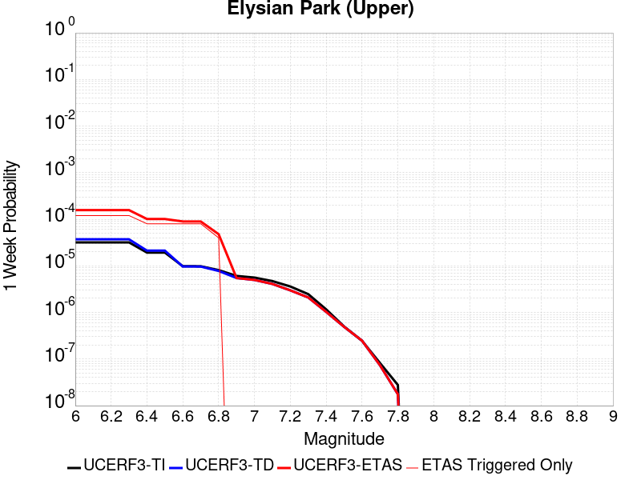 |  |  |

| Magnitude | 1 wk TI Prob | 1 wk TD Prob | 1 wk ETAS Prob | 1 wk ETAS/TD Gain | 1 wk ETAS Triggered Only | 1 mo TI Prob | 1 mo TD Prob | 1 mo ETAS Prob | 1 mo ETAS/TD Gain | 1 mo ETAS Triggered Only | 1 yr TI Prob | 1 yr TD Prob | 1 yr ETAS Prob | 1 yr ETAS/TD Gain | 1 yr ETAS Triggered Only |
|-----|-----|-----|-----|-----|-----|-----|-----|-----|-----|-----|-----|-----|-----|-----|-----|
| 6.0 | 3.1876025E-5 | 3.706077E-5 | 1.5705632E-4 | 4.237805 | 1.2E-4 | 1.3660437E-4 | 1.5882494E-4 | 3.587932E-4 | 2.259048 | 2.0E-4 | 0.0016618895 | 0.0019324546 | 0.0022518362 | 1.1652725 | 3.2E-4 |
| 6.1 | 3.1876025E-5 | 3.706077E-5 | 1.5705632E-4 | 4.237805 | 1.2E-4 | 1.3660437E-4 | 1.5882494E-4 | 3.587932E-4 | 2.259048 | 2.0E-4 | 0.0016618895 | 0.0019324546 | 0.0022518362 | 1.1652725 | 3.2E-4 |
| 6.2 | 3.1876025E-5 | 3.706077E-5 | 1.5705632E-4 | 4.237805 | 1.2E-4 | 1.3660437E-4 | 1.5882494E-4 | 3.587932E-4 | 2.259048 | 2.0E-4 | 0.0016618895 | 0.0019324546 | 0.0022518362 | 1.1652725 | 3.2E-4 |
| 6.3 | 3.1876025E-5 | 3.706077E-5 | 1.5705632E-4 | 4.237805 | 1.2E-4 | 1.3660437E-4 | 1.5882494E-4 | 3.587932E-4 | 2.259048 | 2.0E-4 | 0.0016618895 | 0.0019324546 | 0.0022518362 | 1.1652725 | 3.2E-4 |
| 6.4 | 1.9273462E-5 | 2.1214437E-5 | 1.0121274E-4 | 4.770937 | 8.0E-5 | 8.259794E-5 | 9.091683E-5 | 2.1090591E-4 | 2.3197677 | 1.2E-4 | 0.001005166 | 0.0011065218 | 0.0012663448 | 1.1444372 | 1.6E-4 |
| 6.5 | 1.9273462E-5 | 2.1214437E-5 | 1.0121274E-4 | 4.770937 | 8.0E-5 | 8.259794E-5 | 9.091683E-5 | 2.1090591E-4 | 2.3197677 | 1.2E-4 | 0.001005166 | 0.0011065218 | 0.0012663448 | 1.1444372 | 1.6E-4 |
| 6.6 | 9.813258E-6 | 9.669027E-6 | 8.9668254E-5 | 9.273762 | 8.0E-5 | 4.205614E-5 | 4.1438074E-5 | 1.2143476E-4 | 2.9305117 | 8.0E-5 | 5.119132E-4 | 5.04399E-4 | 5.8435864E-4 | 1.1585246 | 8.0E-5 |
| 6.7 | 9.801478E-6 | 9.656595E-6 | 8.965582E-5 | 9.284414 | 8.0E-5 | 4.2005657E-5 | 4.138479E-5 | 1.21381476E-4 | 2.9329975 | 8.0E-5 | 5.112989E-4 | 5.037506E-4 | 5.8371027E-4 | 1.1587287 | 8.0E-5 |
| 6.8 | 8.102489E-6 | 7.775748E-6 | 4.7775437E-5 | 6.14416 | 4.0E-5 | 3.4724493E-5 | 3.3324235E-5 | 7.33229E-5 | 2.2002876 | 4.0E-5 | 4.2268867E-4 | 4.05652E-4 | 4.456358E-4 | 1.0985667 | 4.0E-5 |
| 6.9 | 6.08275E-6 | 5.483149E-6 | 5.483149E-6 | 1.0 | 0.0 | 2.6068668E-5 | 2.3499004E-5 | 2.3499004E-5 | 1.0 | 0.0 | 3.173398E-4 | 2.8606356E-4 | 2.8606356E-4 | 1.0 | 0.0 |
| 7.0 | 5.5995934E-6 | 4.9843247E-6 | 4.9843247E-6 | 1.0 | 0.0 | 2.3998036E-5 | 2.136122E-5 | 2.136122E-5 | 1.0 | 0.0 | 2.9213692E-4 | 2.600425E-4 | 2.600425E-4 | 1.0 | 0.0 |
| 7.1 | 4.709881E-6 | 4.0886803E-6 | 4.0886803E-6 | 1.0 | 0.0 | 2.0185047E-5 | 1.75228E-5 | 1.75228E-5 | 1.0 | 0.0 | 2.4572524E-4 | 2.1331961E-4 | 2.1331961E-4 | 1.0 | 0.0 |
| 7.2 | 3.6063436E-6 | 2.978894E-6 | 2.978894E-6 | 1.0 | 0.0 | 1.5455667E-5 | 1.2766626E-5 | 1.2766626E-5 | 1.0 | 0.0 | 1.881565E-4 | 1.554227E-4 | 1.554227E-4 | 1.0 | 0.0 |
| 7.3 | 2.471135E-6 | 2.0961668E-6 | 2.0961668E-6 | 1.0 | 0.0 | 1.0590536E-5 | 8.983541E-6 | 8.983541E-6 | 1.0 | 0.0 | 1.2893214E-4 | 1.09369204E-4 | 1.09369204E-4 | 1.0 | 0.0 |
| 7.4 | 1.163943E-6 | 1.0279479E-6 | 1.0279479E-6 | 1.0 | 0.0 | 4.988318E-6 | 4.4054837E-6 | 4.4054837E-6 | 1.0 | 0.0 | 6.0731076E-5 | 5.363547E-5 | 5.363547E-5 | 1.0 | 0.0 |
| 7.5 | 4.99459E-7 | 4.9193983E-7 | 4.9193983E-7 | 1.0 | 0.0 | 2.140537E-6 | 2.108312E-6 | 2.108312E-6 | 1.0 | 0.0 | 2.6060725E-5 | 2.5668412E-5 | 2.5668412E-5 | 1.0 | 0.0 |
| 7.6 | 2.4667852E-7 | 2.4786985E-7 | 2.4786985E-7 | 1.0 | 0.0 | 1.0571932E-6 | 1.0622989E-6 | 1.0622989E-6 | 1.0 | 0.0 | 1.2871251E-5 | 1.2933417E-5 | 1.2933417E-5 | 1.0 | 0.0 |
| 7.7 | 8.2312795E-8 | 7.3911366E-8 | 7.3911366E-8 | 1.0 | 0.0 | 3.527691E-7 | 3.1676296E-7 | 3.1676296E-7 | 1.0 | 0.0 | 4.294955E-6 | 3.8565836E-6 | 3.8565836E-6 | 1.0 | 0.0 |
| 7.8 | 2.7819295E-8 | 1.7599204E-8 | 1.7599204E-8 | 1.0 | 0.0 | 1.1922555E-7 | 7.5425156E-8 | 7.5425156E-8 | 1.0 | 0.0 | 1.45157E-6 | 9.18301E-7 | 9.18301E-7 | 1.0 | 0.0 |

## Mission Ridge-Arroyo Parida-Santa Ana
*[(top)](#table-of-contents)*

| 1 Week | 1 Month | 1 Year |
|-----|-----|-----|
| 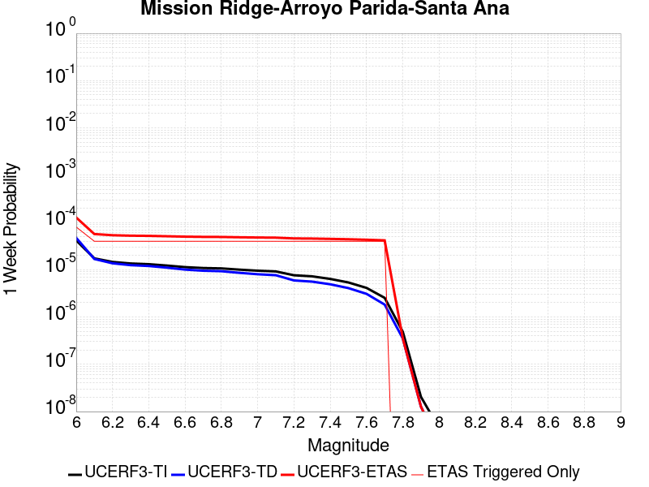 |  |  |

| Magnitude | 1 wk TI Prob | 1 wk TD Prob | 1 wk ETAS Prob | 1 wk ETAS/TD Gain | 1 wk ETAS Triggered Only | 1 mo TI Prob | 1 mo TD Prob | 1 mo ETAS Prob | 1 mo ETAS/TD Gain | 1 mo ETAS Triggered Only | 1 yr TI Prob | 1 yr TD Prob | 1 yr ETAS Prob | 1 yr ETAS/TD Gain | 1 yr ETAS Triggered Only |
|-----|-----|-----|-----|-----|-----|-----|-----|-----|-----|-----|-----|-----|-----|-----|-----|
| 6.0 | 4.169034E-5 | 4.7170066E-5 | 1.2716629E-4 | 2.695911 | 8.0E-5 | 1.7866064E-4 | 2.0214664E-4 | 2.8213047E-4 | 1.3956723 | 8.0E-5 | 0.0021730233 | 0.002459196 | 0.0026188025 | 1.064902 | 1.6E-4 |
| 6.1 | 1.73813E-5 | 1.6862212E-5 | 5.686154E-5 | 3.372128 | 4.0E-5 | 7.4489166E-5 | 7.226469E-5 | 1.122618E-4 | 1.5534807 | 4.0E-5 | 9.065282E-4 | 8.7947806E-4 | 9.594077E-4 | 1.090883 | 8.0E-5 |
| 6.2 | 1.4622182E-5 | 1.36796E-5 | 5.3679054E-5 | 3.9240222 | 4.0E-5 | 6.2664985E-5 | 5.862556E-5 | 9.862321E-5 | 1.6822562 | 4.0E-5 | 7.6267915E-4 | 7.1353634E-4 | 7.934792E-4 | 1.1120377 | 8.0E-5 |
| 6.3 | 1.3552434E-5 | 1.2488047E-5 | 5.2487547E-5 | 4.203023 | 4.0E-5 | 5.8080568E-5 | 5.3519125E-5 | 9.351698E-5 | 1.7473564 | 4.0E-5 | 7.069015E-4 | 6.514037E-4 | 7.3135155E-4 | 1.1227317 | 8.0E-5 |
| 6.4 | 1.30977305E-5 | 1.198482E-5 | 5.198434E-5 | 4.3375154 | 4.0E-5 | 5.613192E-5 | 5.136252E-5 | 9.136047E-5 | 1.778738 | 4.0E-5 | 6.831918E-4 | 6.2516227E-4 | 7.0511224E-4 | 1.1278868 | 8.0E-5 |
| 6.5 | 1.225205E-5 | 1.10541505E-5 | 5.1053707E-5 | 4.6185102 | 4.0E-5 | 5.2507727E-5 | 4.7374084E-5 | 8.737219E-5 | 1.8443035 | 4.0E-5 | 6.3909404E-4 | 5.7662954E-4 | 6.565834E-4 | 1.1386572 | 8.0E-5 |
| 6.6 | 1.1352241E-5 | 1.0068564E-5 | 5.006816E-5 | 4.972721 | 4.0E-5 | 4.8651553E-5 | 4.315029E-5 | 8.314856E-5 | 1.9269526 | 4.0E-5 | 5.921717E-4 | 5.2523025E-4 | 6.051882E-4 | 1.1522342 | 8.0E-5 |
| 6.7 | 1.0864116E-5 | 9.521832E-6 | 4.952145E-5 | 5.2008324 | 4.0E-5 | 4.6559664E-5 | 4.0807223E-5 | 8.080559E-5 | 1.9801786 | 4.0E-5 | 5.667165E-4 | 4.967167E-4 | 5.76677E-4 | 1.1609776 | 8.0E-5 |
| 6.8 | 1.0666365E-5 | 9.30451E-6 | 4.9304137E-5 | 5.2989507 | 4.0E-5 | 4.571219E-5 | 3.987587E-5 | 7.987428E-5 | 2.0030727 | 4.0E-5 | 5.564038E-4 | 4.853826E-4 | 5.6534377E-4 | 1.1647384 | 8.0E-5 |
| 6.9 | 1.0038665E-5 | 8.596469E-6 | 4.8596125E-5 | 5.653033 | 4.0E-5 | 4.302214E-5 | 3.6841502E-5 | 7.684003E-5 | 2.085692 | 4.0E-5 | 5.236687E-4 | 4.4845478E-4 | 5.284189E-4 | 1.1783103 | 8.0E-5 |
| 7.0 | 9.5379955E-6 | 8.029229E-6 | 4.802891E-5 | 5.981758 | 4.0E-5 | 4.0876483E-5 | 3.441054E-5 | 7.440916E-5 | 2.1623945 | 4.0E-5 | 4.975576E-4 | 4.188695E-4 | 4.98836E-4 | 1.1909102 | 8.0E-5 |
| 7.1 | 9.207389E-6 | 7.656349E-6 | 4.765604E-5 | 6.224382 | 4.0E-5 | 3.945964E-5 | 3.2812524E-5 | 7.281121E-5 | 2.2190068 | 4.0E-5 | 4.803152E-4 | 3.9942094E-4 | 4.7938898E-4 | 1.20021 | 8.0E-5 |
| 7.2 | 7.638091E-6 | 5.9341537E-6 | 4.5933917E-5 | 7.740601 | 4.0E-5 | 3.2734264E-5 | 2.543184E-5 | 6.5430824E-5 | 2.5727916 | 4.0E-5 | 3.984668E-4 | 3.0958897E-4 | 3.895642E-4 | 1.2583271 | 8.0E-5 |
| 7.3 | 7.2500147E-6 | 5.598995E-6 | 4.5598772E-5 | 8.144099 | 4.0E-5 | 3.1071122E-5 | 2.3995473E-5 | 6.3994514E-5 | 2.6669412 | 4.0E-5 | 3.7822526E-4 | 2.9210604E-4 | 3.7208266E-4 | 1.2737931 | 8.0E-5 |
| 7.4 | 6.3899715E-6 | 4.920958E-6 | 4.4920762E-5 | 9.128459 | 4.0E-5 | 2.7385306E-5 | 2.108965E-5 | 6.108881E-5 | 2.8966248 | 4.0E-5 | 3.3336508E-4 | 2.5673644E-4 | 3.367159E-4 | 1.3115236 | 8.0E-5 |
| 7.5 | 5.379025E-6 | 4.0858736E-6 | 4.408571E-5 | 10.789788 | 4.0E-5 | 2.305276E-5 | 1.751077E-5 | 5.751007E-5 | 3.2842684 | 4.0E-5 | 2.806312E-4 | 2.1317287E-4 | 2.931558E-4 | 1.3752023 | 8.0E-5 |
| 7.6 | 4.1270696E-6 | 3.0896479E-6 | 4.3089523E-5 | 13.946419 | 4.0E-5 | 1.768732E-5 | 1.32412815E-5 | 5.324075E-5 | 4.020816 | 4.0E-5 | 2.1532185E-4 | 1.6120075E-4 | 2.4118785E-4 | 1.4961956 | 8.0E-5 |
| 7.7 | 2.5406805E-6 | 1.8289526E-6 | 4.182888E-5 | 22.870401 | 4.0E-5 | 1.0888585E-5 | 7.838345E-6 | 4.783803E-5 | 6.1030784 | 4.0E-5 | 1.3256045E-4 | 9.542773E-5 | 1.754201E-4 | 1.8382508 | 8.0E-5 |
| 7.8 | 4.8608285E-7 | 3.511175E-7 | 3.511175E-7 | 1.0 | 0.0 | 2.0832106E-6 | 1.5047884E-6 | 1.5047884E-6 | 1.0 | 0.0 | 2.5362791E-5 | 1.8320647E-5 | 5.8319914E-5 | 3.183289 | 4.0E-5 |
| 7.9 | 2.0472514E-8 | 1.26979485E-8 | 1.26979485E-8 | 1.0 | 0.0 | 8.7739345E-8 | 5.441978E-8 | 5.441978E-8 | 1.0 | 0.0 | 1.068226E-6 | 6.625606E-7 | 6.625606E-7 | 1.0 | 0.0 |
| 8.0 | 4.443582E-9 | 2.0354007E-9 | 2.0354007E-9 | 1.0 | 0.0 | 1.9043922E-8 | 8.723146E-9 | 8.723146E-9 | 1.0 | 0.0 | 2.3185973E-7 | 1.062043E-7 | 1.062043E-7 | 1.0 | 0.0 |

## San Jacinto (Coyote Creek)
*[(top)](#table-of-contents)*

| 1 Week | 1 Month | 1 Year |
|-----|-----|-----|
|  |  | 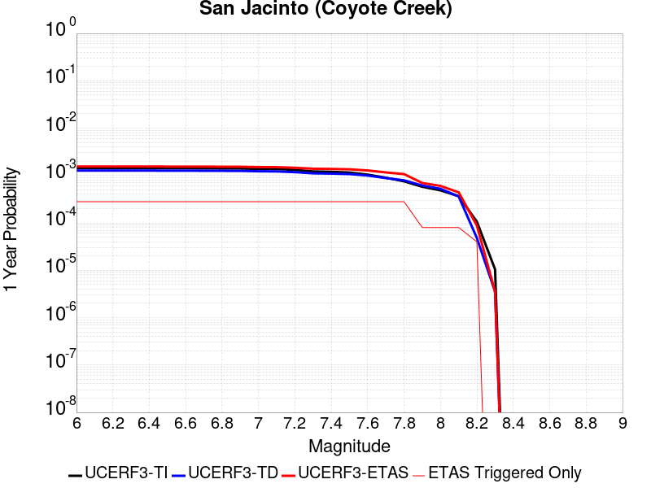 |

| Magnitude | 1 wk TI Prob | 1 wk TD Prob | 1 wk ETAS Prob | 1 wk ETAS/TD Gain | 1 wk ETAS Triggered Only | 1 mo TI Prob | 1 mo TD Prob | 1 mo ETAS Prob | 1 mo ETAS/TD Gain | 1 mo ETAS Triggered Only | 1 yr TI Prob | 1 yr TD Prob | 1 yr ETAS Prob | 1 yr ETAS/TD Gain | 1 yr ETAS Triggered Only |
|-----|-----|-----|-----|-----|-----|-----|-----|-----|-----|-----|-----|-----|-----|-----|-----|
| 6.0 | 2.7374346E-5 | 2.4356477E-5 | 1.8435258E-4 | 7.5689344 | 1.6E-4 | 1.1731335E-4 | 1.04380735E-4 | 3.0435986E-4 | 2.9158623 | 2.0E-4 | 0.0014273542 | 0.0012700972 | 0.0015497416 | 1.2201755 | 2.8E-4 |
| 6.1 | 2.7374346E-5 | 2.4356477E-5 | 1.8435258E-4 | 7.5689344 | 1.6E-4 | 1.1731335E-4 | 1.04380735E-4 | 3.0435986E-4 | 2.9158623 | 2.0E-4 | 0.0014273542 | 0.0012700972 | 0.0015497416 | 1.2201755 | 2.8E-4 |
| 6.2 | 2.7374346E-5 | 2.4356477E-5 | 1.8435258E-4 | 7.5689344 | 1.6E-4 | 1.1731335E-4 | 1.04380735E-4 | 3.0435986E-4 | 2.9158623 | 2.0E-4 | 0.0014273542 | 0.0012700972 | 0.0015497416 | 1.2201755 | 2.8E-4 |
| 6.3 | 2.7374346E-5 | 2.4356477E-5 | 1.8435258E-4 | 7.5689344 | 1.6E-4 | 1.1731335E-4 | 1.04380735E-4 | 3.0435986E-4 | 2.9158623 | 2.0E-4 | 0.0014273542 | 0.0012700972 | 0.0015497416 | 1.2201755 | 2.8E-4 |
| 6.4 | 2.7374346E-5 | 2.4356477E-5 | 1.8435258E-4 | 7.5689344 | 1.6E-4 | 1.1731335E-4 | 1.04380735E-4 | 3.0435986E-4 | 2.9158623 | 2.0E-4 | 0.0014273542 | 0.0012700972 | 0.0015497416 | 1.2201755 | 2.8E-4 |
| 6.5 | 2.7282445E-5 | 2.4242463E-5 | 1.8423858E-4 | 7.5998297 | 1.6E-4 | 1.16919524E-4 | 1.0389215E-4 | 3.0387138E-4 | 2.9248734 | 2.0E-4 | 0.0014225657 | 0.0012641556 | 0.0015438016 | 1.2212117 | 2.8E-4 |
| 6.6 | 2.7282445E-5 | 2.4242463E-5 | 1.8423858E-4 | 7.5998297 | 1.6E-4 | 1.16919524E-4 | 1.0389215E-4 | 3.0387138E-4 | 2.9248734 | 2.0E-4 | 0.0014225657 | 0.0012641556 | 0.0015438016 | 1.2212117 | 2.8E-4 |
| 6.7 | 2.7216198E-5 | 2.4167522E-5 | 1.8416365E-4 | 7.620295 | 1.6E-4 | 1.1663563E-4 | 1.03571E-4 | 3.0355027E-4 | 2.9308424 | 2.0E-4 | 0.0014191137 | 0.0012602502 | 0.0015398973 | 1.2218981 | 2.8E-4 |
| 6.8 | 2.7078617E-5 | 2.4084618E-5 | 1.8408077E-4 | 7.6430845 | 1.6E-4 | 1.1604605E-4 | 1.0321572E-4 | 3.031951E-4 | 2.9374893 | 2.0E-4 | 0.001411945 | 0.0012559297 | 0.001535578 | 1.2226624 | 2.8E-4 |
| 6.9 | 2.6982952E-5 | 2.4003995E-5 | 1.8400015E-4 | 7.6653967 | 1.6E-4 | 1.15636096E-4 | 1.02870225E-4 | 3.0284966E-4 | 2.9439971 | 2.0E-4 | 0.0014069602 | 0.0012517282 | 0.0015313777 | 1.2234107 | 2.8E-4 |
| 7.0 | 2.6449972E-5 | 2.3580524E-5 | 1.8357675E-4 | 7.785101 | 1.6E-4 | 1.1335209E-4 | 1.01055484E-4 | 3.0103527E-4 | 2.9789107 | 2.0E-4 | 0.001379188 | 0.0012296587 | 0.0015093144 | 1.2274255 | 2.8E-4 |
| 7.1 | 2.6257849E-5 | 2.3406348E-5 | 1.834026E-4 | 7.8355927 | 1.6E-4 | 1.1252879E-4 | 1.0030907E-4 | 3.0028902E-4 | 2.9936376 | 2.0E-4 | 0.0013691769 | 0.0012205814 | 0.0015002396 | 1.2291188 | 2.8E-4 |
| 7.2 | 2.5270041E-5 | 2.2599575E-5 | 1.8259596E-4 | 8.079619 | 1.6E-4 | 1.0829568E-4 | 9.685174E-5 | 2.9683238E-4 | 3.064812 | 2.0E-4 | 0.0013177024 | 0.0011785345 | 0.0014582045 | 1.2373033 | 2.8E-4 |
| 7.3 | 2.339701E-5 | 2.1328571E-5 | 1.8132516E-4 | 8.501514 | 1.6E-4 | 1.0026905E-4 | 9.1404974E-5 | 2.913867E-4 | 3.1878648 | 2.0E-4 | 0.001220092 | 0.0011122895 | 0.0013919781 | 1.251453 | 2.8E-4 |
| 7.4 | 2.296333E-5 | 2.1058198E-5 | 1.8105483E-4 | 8.597831 | 1.6E-4 | 9.841056E-5 | 9.0246314E-5 | 2.9022826E-4 | 3.215957 | 2.0E-4 | 0.0011974899 | 0.0010981972 | 0.0013778897 | 1.2546834 | 2.8E-4 |
| 7.5 | 2.2188895E-5 | 2.0579188E-5 | 1.805759E-4 | 8.774686 | 1.6E-4 | 9.50918E-5 | 8.819355E-5 | 2.881759E-4 | 3.2675397 | 2.0E-4 | 0.0011571277 | 0.0010732296 | 0.001352929 | 1.2606148 | 2.8E-4 |
| 7.6 | 2.0013189E-5 | 1.9158566E-5 | 1.791555E-4 | 9.351195 | 1.6E-4 | 8.5767984E-5 | 8.210557E-5 | 2.8208914E-4 | 3.4356883 | 2.0E-4 | 0.001043725 | 9.991786E-4 | 0.0012788989 | 1.2799501 | 2.8E-4 |
| 7.7 | 1.7230794E-5 | 1.6934096E-5 | 1.7693138E-4 | 10.448234 | 1.6E-4 | 7.384417E-5 | 7.2572686E-5 | 2.7255816E-4 | 3.755658 | 2.0E-4 | 8.986819E-4 | 8.8321505E-4 | 0.0011629678 | 1.3167436 | 2.8E-4 |
| 7.8 | 1.4478809E-5 | 1.5174756E-5 | 1.7517233E-4 | 11.543667 | 1.6E-4 | 6.205057E-5 | 6.5033055E-5 | 2.6502003E-4 | 4.075159 | 2.0E-4 | 7.552038E-4 | 7.914904E-4 | 0.0010712688 | 1.353483 | 2.8E-4 |
| 7.9 | 1.1114467E-5 | 1.180864E-5 | 5.180817E-5 | 4.3873105 | 4.0E-5 | 4.7632562E-5 | 5.060748E-5 | 1.3060342E-4 | 2.580714 | 8.0E-5 | 5.797721E-4 | 6.1597244E-4 | 6.9592317E-4 | 1.1297959 | 8.0E-5 |
| 8.0 | 9.327402E-6 | 1.0048055E-5 | 5.0047653E-5 | 4.9808297 | 4.0E-5 | 3.9973966E-5 | 4.3062384E-5 | 1.2305894E-4 | 2.8576899 | 8.0E-5 | 4.8657437E-4 | 5.24159E-4 | 6.0411706E-4 | 1.1525455 | 8.0E-5 |
| 8.1 | 7.0235833E-6 | 6.9387575E-6 | 4.693848E-5 | 6.764681 | 4.0E-5 | 3.0100724E-5 | 2.9737195E-5 | 1.09734814E-4 | 3.6901536 | 8.0E-5 | 3.664147E-4 | 3.6199074E-4 | 4.4196178E-4 | 1.2209201 | 8.0E-5 |
| 8.2 | 2.0358202E-6 | 9.2101675E-7 | 4.092098E-5 | 44.43022 | 4.0E-5 | 8.724915E-6 | 3.947209E-6 | 4.394705E-5 | 11.133703 | 4.0E-5 | 1.06220665E-4 | 4.805623E-5 | 8.805431E-5 | 1.8323182 | 4.0E-5 |
| 8.3 | 2.0051264E-7 | 6.7996226E-8 | 6.7996226E-8 | 1.0 | 0.0 | 8.5933965E-7 | 2.9141236E-7 | 2.9141236E-7 | 1.0 | 0.0 | 1.046241E-5 | 3.5479404E-6 | 3.5479404E-6 | 1.0 | 0.0 |

## Mission Creek
*[(top)](#table-of-contents)*

| 1 Week | 1 Month | 1 Year |
|-----|-----|-----|
|  | 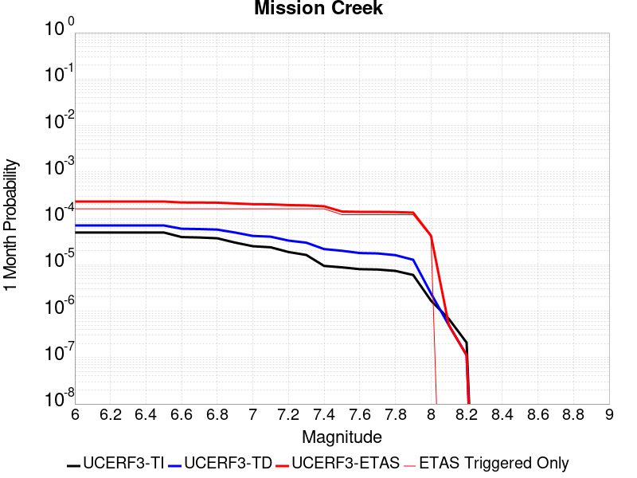 |  |

| Magnitude | 1 wk TI Prob | 1 wk TD Prob | 1 wk ETAS Prob | 1 wk ETAS/TD Gain | 1 wk ETAS Triggered Only | 1 mo TI Prob | 1 mo TD Prob | 1 mo ETAS Prob | 1 mo ETAS/TD Gain | 1 mo ETAS Triggered Only | 1 yr TI Prob | 1 yr TD Prob | 1 yr ETAS Prob | 1 yr ETAS/TD Gain | 1 yr ETAS Triggered Only |
|-----|-----|-----|-----|-----|-----|-----|-----|-----|-----|-----|-----|-----|-----|-----|-----|
| 6.0 | 1.1549387E-5 | 1.6382799E-5 | 9.638149E-5 | 5.88309 | 8.0E-5 | 4.9496433E-5 | 7.02102E-5 | 2.3019896E-4 | 3.2787113 | 1.6E-4 | 6.0245243E-4 | 8.544889E-4 | 0.0011342496 | 1.3274013 | 2.8E-4 |
| 6.1 | 1.1549387E-5 | 1.6382799E-5 | 9.638149E-5 | 5.88309 | 8.0E-5 | 4.9496433E-5 | 7.02102E-5 | 2.3019896E-4 | 3.2787113 | 1.6E-4 | 6.0245243E-4 | 8.544889E-4 | 0.0011342496 | 1.3274013 | 2.8E-4 |
| 6.2 | 1.1549387E-5 | 1.6382799E-5 | 9.638149E-5 | 5.88309 | 8.0E-5 | 4.9496433E-5 | 7.02102E-5 | 2.3019896E-4 | 3.2787113 | 1.6E-4 | 6.0245243E-4 | 8.544889E-4 | 0.0011342496 | 1.3274013 | 2.8E-4 |
| 6.3 | 1.1549387E-5 | 1.6382799E-5 | 9.638149E-5 | 5.88309 | 8.0E-5 | 4.9496433E-5 | 7.02102E-5 | 2.3019896E-4 | 3.2787113 | 1.6E-4 | 6.0245243E-4 | 8.544889E-4 | 0.0011342496 | 1.3274013 | 2.8E-4 |
| 6.4 | 1.1549387E-5 | 1.6382799E-5 | 9.638149E-5 | 5.88309 | 8.0E-5 | 4.9496433E-5 | 7.02102E-5 | 2.3019896E-4 | 3.2787113 | 1.6E-4 | 6.0245243E-4 | 8.544889E-4 | 0.0011342496 | 1.3274013 | 2.8E-4 |
| 6.5 | 1.1549387E-5 | 1.6382799E-5 | 9.638149E-5 | 5.88309 | 8.0E-5 | 4.9496433E-5 | 7.02102E-5 | 2.3019896E-4 | 3.2787113 | 1.6E-4 | 6.0245243E-4 | 8.544889E-4 | 0.0011342496 | 1.3274013 | 2.8E-4 |
| 6.6 | 9.202681E-6 | 1.3905611E-5 | 9.39045E-5 | 6.752993 | 8.0E-5 | 3.9439463E-5 | 5.9594167E-5 | 2.1958463E-4 | 3.6846664 | 1.6E-4 | 4.800697E-4 | 7.253265E-4 | 0.0010051234 | 1.385753 | 2.8E-4 |
| 6.7 | 9.019164E-6 | 1.3711242E-5 | 9.371014E-5 | 6.834548 | 8.0E-5 | 3.8652986E-5 | 5.8761194E-5 | 2.187518E-4 | 3.7227254 | 1.6E-4 | 4.7049852E-4 | 7.151917E-4 | 9.949915E-4 | 1.3912234 | 2.8E-4 |
| 6.8 | 8.673558E-6 | 1.3333226E-5 | 9.333216E-5 | 6.9999685 | 8.0E-5 | 3.717186E-5 | 5.7141195E-5 | 2.1713205E-4 | 3.7999215 | 1.6E-4 | 4.524734E-4 | 6.9548085E-4 | 9.752861E-4 | 1.4023192 | 2.8E-4 |
| 6.9 | 7.002255E-6 | 1.1536997E-5 | 9.153607E-5 | 7.9341335 | 8.0E-5 | 3.000932E-5 | 4.9443373E-5 | 2.0943546E-4 | 4.235865 | 1.6E-4 | 3.653022E-4 | 6.0181366E-4 | 8.816452E-4 | 1.4649802 | 2.8E-4 |
| 7.0 | 5.84644E-6 | 9.7312795E-6 | 8.97305E-5 | 9.220833 | 8.0E-5 | 2.5055931E-5 | 4.1704843E-5 | 2.0169817E-4 | 4.836325 | 1.6E-4 | 3.0501327E-4 | 5.0764275E-4 | 7.475209E-4 | 1.4725335 | 2.4E-4 |
| 7.1 | 5.54703E-6 | 9.3855515E-6 | 8.93848E-5 | 9.52366 | 8.0E-5 | 2.377277E-5 | 4.0223196E-5 | 2.0021676E-4 | 4.9776444 | 1.6E-4 | 2.8939504E-4 | 4.896118E-4 | 7.294943E-4 | 1.4899442 | 2.4E-4 |
| 7.2 | 4.384709E-6 | 7.735159E-6 | 8.773454E-5 | 11.342306 | 8.0E-5 | 1.8791474E-5 | 3.315028E-5 | 1.9314498E-4 | 5.8263454 | 1.6E-4 | 2.2876218E-4 | 4.0353357E-4 | 6.4343674E-4 | 1.594506 | 2.4E-4 |
| 7.3 | 3.7888456E-6 | 6.967982E-6 | 8.6967426E-5 | 12.481006 | 8.0E-5 | 1.623781E-5 | 2.9862456E-5 | 1.8985767E-4 | 6.357738 | 1.6E-4 | 1.9767738E-4 | 3.635181E-4 | 6.0343085E-4 | 1.6599747 | 2.4E-4 |
| 7.4 | 2.1982462E-6 | 5.074753E-6 | 8.5074345E-5 | 16.764235 | 8.0E-5 | 9.421021E-6 | 2.1748761E-5 | 1.8174529E-4 | 8.356581 | 1.6E-4 | 1.1469489E-4 | 2.6475918E-4 | 5.0469564E-4 | 1.9062442 | 2.4E-4 |
| 7.5 | 2.051923E-6 | 4.664606E-6 | 8.4664236E-5 | 18.15035 | 8.0E-5 | 8.793926E-6 | 1.9991017E-5 | 1.3998862E-4 | 7.0025764 | 1.2E-4 | 1.0706078E-4 | 2.4336358E-4 | 4.0332464E-4 | 1.6572925 | 1.6E-4 |
| 7.6 | 1.8733427E-6 | 4.1712638E-6 | 8.417093E-5 | 20.178759 | 8.0E-5 | 8.028587E-6 | 1.7876722E-5 | 1.3787458E-4 | 7.7125196 | 1.2E-4 | 9.774366E-5 | 2.1762746E-4 | 3.7759263E-4 | 1.7350414 | 1.6E-4 |
| 7.7 | 1.8411953E-6 | 4.0906184E-6 | 8.4090294E-5 | 20.556866 | 8.0E-5 | 7.890813E-6 | 1.7531105E-5 | 1.37529E-4 | 7.8448567 | 1.2E-4 | 9.606641E-5 | 2.1342038E-4 | 3.7338622E-4 | 1.7495341 | 1.6E-4 |
| 7.8 | 1.7194251E-6 | 3.754731E-6 | 8.375443E-5 | 22.306372 | 8.0E-5 | 7.368944E-6 | 1.6091606E-5 | 1.3608967E-4 | 8.457184 | 1.2E-4 | 8.97132E-5 | 1.9589777E-4 | 3.1587426E-4 | 1.6124444 | 1.2E-4 |
| 7.9 | 1.4035052E-6 | 2.986388E-6 | 8.2986146E-5 | 27.788134 | 8.0E-5 | 6.0150082E-6 | 1.2798743E-5 | 1.3279721E-4 | 10.3758 | 1.2E-4 | 7.3230265E-5 | 1.5581361E-4 | 2.757949E-4 | 1.7700309 | 1.2E-4 |
| 8.0 | 3.9318823E-7 | 5.6164873E-7 | 4.0561627E-5 | 72.21886 | 4.0E-5 | 1.6850913E-6 | 2.4070637E-6 | 4.2406966E-5 | 17.617718 | 4.0E-5 | 2.0515794E-5 | 2.9305613E-5 | 6.930444E-5 | 2.3648863 | 4.0E-5 |
| 8.1 | 1.596793E-7 | 1.1683749E-7 | 1.1683749E-7 | 1.0 | 0.0 | 6.8433974E-7 | 5.0073197E-7 | 5.0073197E-7 | 1.0 | 0.0 | 8.331805E-6 | 6.0963953E-6 | 6.0963953E-6 | 1.0 | 0.0 |
| 8.2 | 4.9003038E-8 | 2.6213556E-8 | 2.6213556E-8 | 1.0 | 0.0 | 2.10013E-7 | 1.12343805E-7 | 1.12343805E-7 | 1.0 | 0.0 | 2.5569052E-6 | 1.367785E-6 | 1.367785E-6 | 1.0 | 0.0 |

## Palos Verdes
*[(top)](#table-of-contents)*

| 1 Week | 1 Month | 1 Year |
|-----|-----|-----|
| 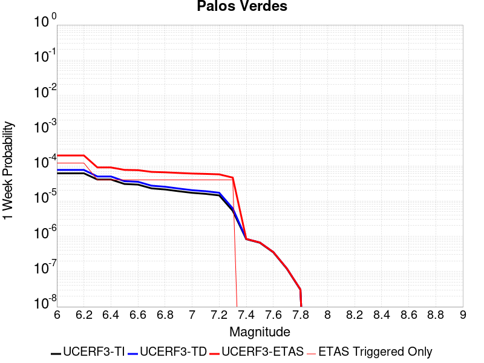 |  | 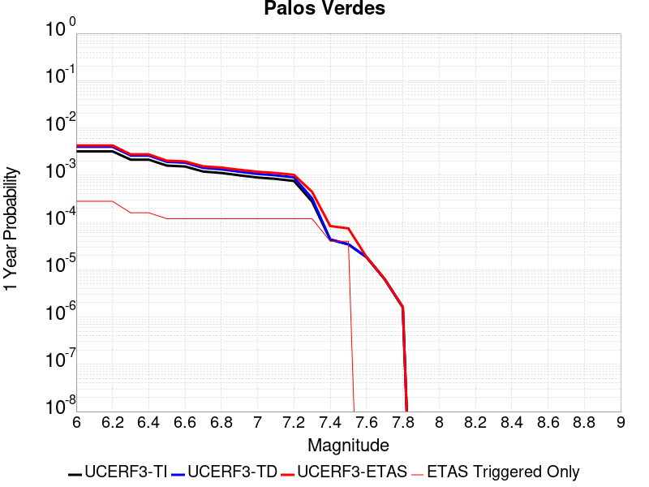 |

| Magnitude | 1 wk TI Prob | 1 wk TD Prob | 1 wk ETAS Prob | 1 wk ETAS/TD Gain | 1 wk ETAS Triggered Only | 1 mo TI Prob | 1 mo TD Prob | 1 mo ETAS Prob | 1 mo ETAS/TD Gain | 1 mo ETAS Triggered Only | 1 yr TI Prob | 1 yr TD Prob | 1 yr ETAS Prob | 1 yr ETAS/TD Gain | 1 yr ETAS Triggered Only |
|-----|-----|-----|-----|-----|-----|-----|-----|-----|-----|-----|-----|-----|-----|-----|-----|
| 6.0 | 6.126063E-5 | 7.628893E-5 | 1.9627978E-4 | 2.5728474 | 1.2E-4 | 2.6251914E-4 | 3.2691337E-4 | 4.4687412E-4 | 1.3669497 | 1.2E-4 | 0.0031914865 | 0.0039734347 | 0.004252322 | 1.070188 | 2.8E-4 |
| 6.1 | 6.126063E-5 | 7.628893E-5 | 1.9627978E-4 | 2.5728474 | 1.2E-4 | 2.6251914E-4 | 3.2691337E-4 | 4.4687412E-4 | 1.3669497 | 1.2E-4 | 0.0031914865 | 0.0039734347 | 0.004252322 | 1.070188 | 2.8E-4 |
| 6.2 | 6.126063E-5 | 7.628893E-5 | 1.9627978E-4 | 2.5728474 | 1.2E-4 | 2.6251914E-4 | 3.2691337E-4 | 4.4687412E-4 | 1.3669497 | 1.2E-4 | 0.0031914865 | 0.0039734347 | 0.004252322 | 1.070188 | 2.8E-4 |
| 6.3 | 4.0838047E-5 | 4.9786013E-5 | 8.978402E-5 | 1.8033985 | 4.0E-5 | 1.7500846E-4 | 2.133523E-4 | 2.5334375E-4 | 1.1874434 | 4.0E-5 | 0.0021286458 | 0.0025946742 | 0.0027542592 | 1.0615047 | 1.6E-4 |
| 6.4 | 4.0838047E-5 | 4.9786013E-5 | 8.978402E-5 | 1.8033985 | 4.0E-5 | 1.7500846E-4 | 2.133523E-4 | 2.5334375E-4 | 1.1874434 | 4.0E-5 | 0.0021286458 | 0.0025946742 | 0.0027542592 | 1.0615047 | 1.6E-4 |
| 6.5 | 3.0512005E-5 | 3.6586363E-5 | 7.6584896E-5 | 2.0932636 | 4.0E-5 | 1.3075917E-4 | 1.5678987E-4 | 1.967836E-4 | 1.2550786 | 4.0E-5 | 0.0015908304 | 0.001907361 | 0.002027132 | 1.0627942 | 1.2E-4 |
| 6.6 | 2.9255087E-5 | 3.517859E-5 | 7.517718E-5 | 2.1370153 | 4.0E-5 | 1.2537291E-4 | 1.5075726E-4 | 1.9075122E-4 | 1.2652872 | 4.0E-5 | 0.0015253464 | 0.0018340375 | 0.0019538174 | 1.0653094 | 1.2E-4 |
| 6.7 | 2.287198E-5 | 2.7266105E-5 | 6.726501E-5 | 2.4669828 | 4.0E-5 | 9.801909E-5 | 1.16850024E-4 | 1.5684534E-4 | 1.3422792 | 4.0E-5 | 0.001192729 | 0.0014218123 | 0.0015416418 | 1.0842793 | 1.2E-4 |
| 6.8 | 2.1325764E-5 | 2.5448615E-5 | 6.5447595E-5 | 2.5717547 | 4.0E-5 | 9.139293E-5 | 1.0906144E-4 | 1.4905707E-4 | 1.3667257 | 4.0E-5 | 0.001112141 | 0.0013271046 | 0.0014469454 | 1.0903025 | 1.2E-4 |
| 6.9 | 1.9009392E-5 | 2.2628212E-5 | 6.262731E-5 | 2.767665 | 4.0E-5 | 8.1466285E-5 | 9.697494E-5 | 1.3697107E-4 | 1.4124377 | 4.0E-5 | 9.914007E-4 | 0.0011801178 | 0.0012999763 | 1.1015648 | 1.2E-4 |
| 7.0 | 1.7098473E-5 | 2.0332458E-5 | 6.0331644E-5 | 2.9672577 | 4.0E-5 | 7.3277115E-5 | 8.713668E-5 | 1.271332E-4 | 1.4590089 | 4.0E-5 | 8.917837E-4 | 0.0010604581 | 0.0011803309 | 1.1130387 | 1.2E-4 |
| 7.1 | 1.5982785E-5 | 1.9007015E-5 | 5.9006255E-5 | 3.1044462 | 4.0E-5 | 6.849585E-5 | 8.145657E-5 | 1.2145332E-4 | 1.4910192 | 4.0E-5 | 8.336179E-4 | 9.913674E-4 | 0.0011112484 | 1.120925 | 1.2E-4 |
| 7.2 | 1.4468002E-5 | 1.7208347E-5 | 5.720766E-5 | 3.3244133 | 4.0E-5 | 6.200425E-5 | 7.374845E-5 | 1.13745504E-4 | 1.5423442 | 4.0E-5 | 7.546402E-4 | 8.9760165E-4 | 0.0010174939 | 1.1335696 | 1.2E-4 |
| 7.3 | 5.288233E-6 | 6.207409E-6 | 4.6207162E-5 | 7.443872 | 4.0E-5 | 2.2663658E-5 | 2.660311E-5 | 6.660204E-5 | 2.5035436 | 4.0E-5 | 2.7589512E-4 | 3.2387965E-4 | 4.438408E-4 | 1.370388 | 1.2E-4 |
| 7.4 | 8.279556E-7 | 8.40879E-7 | 8.40879E-7 | 1.0 | 0.0 | 3.5483763E-6 | 3.6037625E-6 | 3.6037625E-6 | 1.0 | 0.0 | 4.3200624E-5 | 4.3875E-5 | 8.3873245E-5 | 1.9116409 | 4.0E-5 |
| 7.5 | 6.559831E-7 | 6.667599E-7 | 6.667599E-7 | 1.0 | 0.0 | 2.8113532E-6 | 2.8575396E-6 | 2.8575396E-6 | 1.0 | 0.0 | 3.4227687E-5 | 3.4790057E-5 | 7.4788666E-5 | 2.1497138 | 4.0E-5 |
| 7.6 | 3.5018968E-7 | 3.56221E-7 | 3.56221E-7 | 1.0 | 0.0 | 1.500812E-6 | 1.5266609E-6 | 1.5266609E-6 | 1.0 | 0.0 | 1.8272232E-5 | 1.8586983E-5 | 1.8586983E-5 | 1.0 | 0.0 |
| 7.7 | 1.1986104E-7 | 1.2199109E-7 | 1.2199109E-7 | 1.0 | 0.0 | 5.1369005E-7 | 5.228188E-7 | 5.228188E-7 | 1.0 | 0.0 | 6.2541585E-6 | 6.365301E-6 | 6.365301E-6 | 1.0 | 0.0 |
| 7.8 | 3.0445005E-8 | 3.1029597E-8 | 3.1029597E-8 | 1.0 | 0.0 | 1.3047858E-7 | 1.3298397E-7 | 1.3298397E-7 | 1.0 | 0.0 | 1.5885756E-6 | 1.619079E-6 | 1.619079E-6 | 1.0 | 0.0 |

## Panamint Valley
*[(top)](#table-of-contents)*

| 1 Week | 1 Month | 1 Year |
|-----|-----|-----|
| 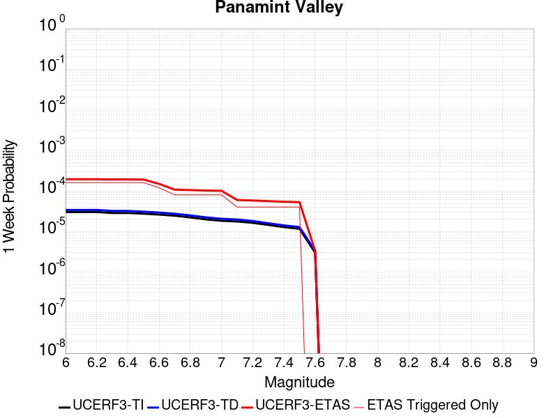 |  |  |

| Magnitude | 1 wk TI Prob | 1 wk TD Prob | 1 wk ETAS Prob | 1 wk ETAS/TD Gain | 1 wk ETAS Triggered Only | 1 mo TI Prob | 1 mo TD Prob | 1 mo ETAS Prob | 1 mo ETAS/TD Gain | 1 mo ETAS Triggered Only | 1 yr TI Prob | 1 yr TD Prob | 1 yr ETAS Prob | 1 yr ETAS/TD Gain | 1 yr ETAS Triggered Only |
|-----|-----|-----|-----|-----|-----|-----|-----|-----|-----|-----|-----|-----|-----|-----|-----|
| 6.0 | 3.0211835E-5 | 3.4006032E-5 | 1.9400059E-4 | 5.7048874 | 1.6E-4 | 1.2947287E-4 | 1.4573216E-4 | 3.45703E-4 | 2.3721807 | 2.0E-4 | 0.0015751923 | 0.0017728747 | 0.0020523784 | 1.1576556 | 2.8E-4 |
| 6.1 | 3.0211835E-5 | 3.4006032E-5 | 1.9400059E-4 | 5.7048874 | 1.6E-4 | 1.2947287E-4 | 1.4573216E-4 | 3.45703E-4 | 2.3721807 | 2.0E-4 | 0.0015751923 | 0.0017728747 | 0.0020523784 | 1.1576556 | 2.8E-4 |
| 6.2 | 3.0211835E-5 | 3.4006032E-5 | 1.9400059E-4 | 5.7048874 | 1.6E-4 | 1.2947287E-4 | 1.4573216E-4 | 3.45703E-4 | 2.3721807 | 2.0E-4 | 0.0015751923 | 0.0017728747 | 0.0020523784 | 1.1576556 | 2.8E-4 |
| 6.3 | 2.8573924E-5 | 3.212314E-5 | 1.92118E-4 | 5.9806733 | 1.6E-4 | 1.2245393E-4 | 1.3766348E-4 | 3.3763595E-4 | 2.4526181 | 2.0E-4 | 0.001489857 | 0.0016747921 | 0.0019543231 | 1.1669049 | 2.8E-4 |
| 6.4 | 2.8573924E-5 | 3.212314E-5 | 1.92118E-4 | 5.9806733 | 1.6E-4 | 1.2245393E-4 | 1.3766348E-4 | 3.3763595E-4 | 2.4526181 | 2.0E-4 | 0.001489857 | 0.0016747921 | 0.0019543231 | 1.1669049 | 2.8E-4 |
| 6.5 | 2.7468774E-5 | 3.0848154E-5 | 1.9084322E-4 | 6.1865363 | 1.6E-4 | 1.1771801E-4 | 1.3219983E-4 | 3.321734E-4 | 2.5126612 | 2.0E-4 | 0.0014322745 | 0.001608372 | 0.0018879216 | 1.173809 | 2.8E-4 |
| 6.6 | 2.6135967E-5 | 2.9271281E-5 | 1.4926777E-4 | 5.0994616 | 1.2E-4 | 1.1200648E-4 | 1.2544247E-4 | 2.854224E-4 | 2.275325 | 1.6E-4 | 0.0013628257 | 0.0015262186 | 0.0017658523 | 1.1570114 | 2.4E-4 |
| 6.7 | 2.4498746E-5 | 2.7359867E-5 | 1.0735768E-4 | 3.9239109 | 8.0E-5 | 1.04990395E-4 | 1.17251446E-4 | 2.3723737E-4 | 2.0233216 | 1.2E-4 | 0.0012775084 | 0.0014266267 | 0.0016263414 | 1.1399908 | 2.0E-4 |
| 6.8 | 2.2244329E-5 | 2.4952975E-5 | 1.0495098E-4 | 4.2059507 | 8.0E-5 | 9.532935E-5 | 1.06937056E-4 | 2.2692422E-4 | 2.1220355 | 1.2E-4 | 0.0011600169 | 0.0013012029 | 0.0015009426 | 1.1535039 | 2.0E-4 |
| 6.9 | 1.9902658E-5 | 2.2306494E-5 | 1.0230471E-4 | 4.5863194 | 8.0E-5 | 8.529431E-5 | 9.559586E-5 | 1.7558821E-4 | 1.8367763 | 8.0E-5 | 0.0010379635 | 0.0011632767 | 0.0012831371 | 1.1030369 | 1.2E-4 |
| 7.0 | 1.8353881E-5 | 2.0581738E-5 | 1.0058009E-4 | 4.8868613 | 8.0E-5 | 7.865712E-5 | 8.8204564E-5 | 1.6819751E-4 | 1.9069026 | 8.0E-5 | 9.5722964E-4 | 0.0010733792 | 0.0011532933 | 1.074451 | 8.0E-5 |
| 7.1 | 1.7667631E-5 | 1.9787058E-5 | 5.9786267E-5 | 3.0214834 | 4.0E-5 | 7.571623E-5 | 8.4799016E-5 | 1.2479562E-4 | 1.4716636 | 4.0E-5 | 9.2145515E-4 | 0.0010319566 | 0.0010719154 | 1.0387213 | 4.0E-5 |
| 7.2 | 1.6381597E-5 | 1.8171384E-5 | 5.8170655E-5 | 3.2012234 | 4.0E-5 | 7.020495E-5 | 7.787513E-5 | 1.1787201E-4 | 1.5136029 | 4.0E-5 | 8.544101E-4 | 9.477346E-4 | 9.876967E-4 | 1.0421659 | 4.0E-5 |
| 7.3 | 1.4520491E-5 | 1.5977024E-5 | 5.5976383E-5 | 3.5035553 | 4.0E-5 | 6.222919E-5 | 6.847125E-5 | 1.08468514E-4 | 1.5841467 | 4.0E-5 | 7.57377E-4 | 8.3333487E-4 | 8.733016E-4 | 1.0479599 | 4.0E-5 |
| 7.4 | 1.2852287E-5 | 1.4154711E-5 | 5.4154145E-5 | 3.8258743 | 4.0E-5 | 5.5080065E-5 | 6.0661725E-5 | 1.00659294E-4 | 1.6593543 | 4.0E-5 | 6.7039346E-4 | 7.3832204E-4 | 7.7829254E-4 | 1.0541369 | 4.0E-5 |
| 7.5 | 1.1637851E-5 | 1.2845683E-5 | 5.284517E-5 | 4.113847 | 4.0E-5 | 4.987555E-5 | 5.5051856E-5 | 9.5049654E-5 | 1.7265477 | 4.0E-5 | 6.070656E-4 | 6.700659E-4 | 7.100391E-4 | 1.0596557 | 4.0E-5 |
| 7.6 | 3.0068115E-6 | 3.3365502E-6 | 3.3365502E-6 | 1.0 | 0.0 | 1.2886271E-5 | 1.4299464E-5 | 1.4299464E-5 | 1.0 | 0.0 | 1.5687906E-4 | 1.7408936E-4 | 1.7408936E-4 | 1.0 | 0.0 |

## San Jacinto (Superstition Mtn)
*[(top)](#table-of-contents)*

| 1 Week | 1 Month | 1 Year |
|-----|-----|-----|
|  | 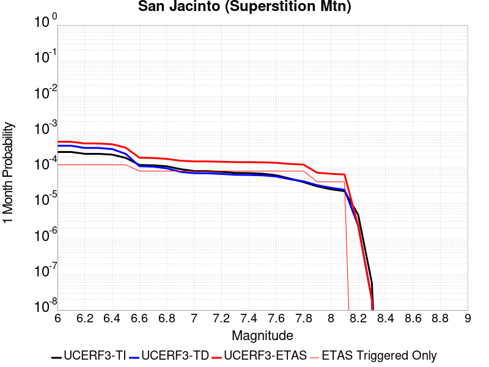 |  |

| Magnitude | 1 wk TI Prob | 1 wk TD Prob | 1 wk ETAS Prob | 1 wk ETAS/TD Gain | 1 wk ETAS Triggered Only | 1 mo TI Prob | 1 mo TD Prob | 1 mo ETAS Prob | 1 mo ETAS/TD Gain | 1 mo ETAS Triggered Only | 1 yr TI Prob | 1 yr TD Prob | 1 yr ETAS Prob | 1 yr ETAS/TD Gain | 1 yr ETAS Triggered Only |
|-----|-----|-----|-----|-----|-----|-----|-----|-----|-----|-----|-----|-----|-----|-----|-----|
| 6.0 | 6.4193904E-5 | 9.618683E-5 | 1.7617914E-4 | 1.8316348 | 8.0E-5 | 2.7508775E-4 | 4.1217334E-4 | 5.321239E-4 | 1.2910197 | 1.2E-4 | 0.0033440501 | 0.005008075 | 0.0052866726 | 1.0556297 | 2.8E-4 |
| 6.1 | 6.4193904E-5 | 9.618683E-5 | 1.7617914E-4 | 1.8316348 | 8.0E-5 | 2.7508775E-4 | 4.1217334E-4 | 5.321239E-4 | 1.2910197 | 1.2E-4 | 0.0033440501 | 0.005008075 | 0.0052866726 | 1.0556297 | 2.8E-4 |
| 6.2 | 5.7023593E-5 | 8.3323815E-5 | 1.6331715E-4 | 1.9600297 | 8.0E-5 | 2.4436394E-4 | 3.5706247E-4 | 4.770196E-4 | 1.3359556 | 1.2E-4 | 0.002971072 | 0.004340213 | 0.0046189977 | 1.064233 | 2.8E-4 |
| 6.3 | 5.6940098E-5 | 8.316908E-5 | 1.6316242E-4 | 1.961816 | 8.0E-5 | 2.4400617E-4 | 3.5639948E-4 | 4.763567E-4 | 1.3365809 | 1.2E-4 | 0.002966728 | 0.004332173 | 0.0046109604 | 1.0643526 | 2.8E-4 |
| 6.4 | 5.4171585E-5 | 7.765849E-5 | 1.5765228E-4 | 2.0300713 | 8.0E-5 | 2.3214328E-4 | 3.3278894E-4 | 4.5274902E-4 | 1.3604689 | 1.2E-4 | 0.0028226813 | 0.0040458273 | 0.0043246946 | 1.068927 | 2.8E-4 |
| 6.5 | 4.375144E-5 | 5.6590954E-5 | 1.3658643E-4 | 2.4135735 | 8.0E-5 | 1.874927E-4 | 2.4251675E-4 | 3.6248766E-4 | 1.4946911 | 1.2E-4 | 0.0022803338 | 0.00294982 | 0.003189112 | 1.0811208 | 2.4E-4 |
| 6.6 | 2.772192E-5 | 2.5649655E-5 | 6.564863E-5 | 2.5594351 | 4.0E-5 | 1.1880282E-4 | 1.0992257E-4 | 1.8991377E-4 | 1.727705 | 8.0E-5 | 0.0014454646 | 0.0013375052 | 0.0014972911 | 1.1194657 | 1.6E-4 |
| 6.7 | 2.7124124E-5 | 2.4859904E-5 | 6.485891E-5 | 2.6089766 | 4.0E-5 | 1.1624106E-4 | 1.0653821E-4 | 1.8652968E-4 | 1.7508243 | 8.0E-5 | 0.0014143161 | 0.0012963502 | 0.0014561428 | 1.1232635 | 1.6E-4 |
| 6.8 | 2.5475807E-5 | 2.2321101E-5 | 6.232021E-5 | 2.7919862 | 4.0E-5 | 1.0917746E-4 | 9.565842E-5 | 1.7565077E-4 | 1.836229 | 8.0E-5 | 0.001328425 | 0.0011640311 | 0.0013238449 | 1.1372933 | 1.6E-4 |
| 6.9 | 2.1162023E-5 | 1.7771237E-5 | 5.7770525E-5 | 3.2507882 | 4.0E-5 | 9.069123E-5 | 7.616024E-5 | 1.5615414E-4 | 2.0503368 | 8.0E-5 | 0.0011036064 | 9.268603E-4 | 0.001086712 | 1.1724658 | 1.6E-4 |
| 7.0 | 1.8754288E-5 | 1.6300326E-5 | 5.6299676E-5 | 3.4538987 | 4.0E-5 | 8.037304E-5 | 6.985668E-5 | 1.498511E-4 | 2.1451218 | 8.0E-5 | 9.781026E-4 | 8.5017574E-4 | 0.0010100397 | 1.1880363 | 1.6E-4 |
| 7.1 | 1.8678527E-5 | 1.6225338E-5 | 5.622469E-5 | 3.4652398 | 4.0E-5 | 8.0048376E-5 | 6.953532E-5 | 1.4952976E-4 | 2.1504145 | 8.0E-5 | 9.7415317E-4 | 8.462663E-4 | 0.0010061308 | 1.1889058 | 1.6E-4 |
| 7.2 | 1.7804578E-5 | 1.5518503E-5 | 5.551788E-5 | 3.5775285 | 4.0E-5 | 7.6303106E-5 | 6.650618E-5 | 1.4650087E-4 | 2.2028158 | 8.0E-5 | 9.285943E-4 | 8.0941425E-4 | 9.6928474E-4 | 1.1975138 | 1.6E-4 |
| 7.3 | 1.6583685E-5 | 1.4666085E-5 | 5.46655E-5 | 3.727341 | 4.0E-5 | 7.1070994E-5 | 6.285315E-5 | 1.4284812E-4 | 2.2727282 | 8.0E-5 | 8.649459E-4 | 7.6497043E-4 | 9.248481E-4 | 1.2089984 | 1.6E-4 |
| 7.4 | 1.6387552E-5 | 1.453072E-5 | 5.4530137E-5 | 3.7527485 | 4.0E-5 | 7.023047E-5 | 6.227304E-5 | 1.4226807E-4 | 2.284585 | 8.0E-5 | 8.5472054E-4 | 7.579126E-4 | 9.177913E-4 | 1.2109462 | 1.6E-4 |
| 7.5 | 1.5790754E-5 | 1.4170097E-5 | 5.416953E-5 | 3.822806 | 4.0E-5 | 6.767291E-5 | 6.0727583E-5 | 1.4072272E-4 | 2.3172784 | 8.0E-5 | 8.236062E-4 | 7.391095E-4 | 8.989913E-4 | 1.2163167 | 1.6E-4 |
| 7.6 | 1.4248672E-5 | 1.31832085E-5 | 5.318268E-5 | 4.034123 | 4.0E-5 | 6.106431E-5 | 5.649825E-5 | 1.3649373E-4 | 2.415893 | 8.0E-5 | 7.432043E-4 | 6.8765087E-4 | 8.4754085E-4 | 1.2325162 | 1.6E-4 |
| 7.7 | 1.15449975E-5 | 1.1026264E-5 | 5.102582E-5 | 4.627662 | 4.0E-5 | 4.947762E-5 | 4.7254565E-5 | 1.2725078E-4 | 2.692878 | 8.0E-5 | 6.022235E-4 | 5.7517324E-4 | 7.350812E-4 | 1.278017 | 1.6E-4 |
| 7.8 | 9.1391985E-6 | 9.632236E-6 | 4.963185E-5 | 5.1526823 | 4.0E-5 | 3.9167408E-5 | 4.128036E-5 | 1.2127706E-4 | 2.9378877 | 8.0E-5 | 4.767588E-4 | 5.024731E-4 | 6.623927E-4 | 1.318265 | 1.6E-4 |
| 7.9 | 6.973017E-6 | 7.4874865E-6 | 7.4874865E-6 | 1.0 | 0.0 | 2.9884017E-5 | 3.2088836E-5 | 7.2087554E-5 | 2.2464995 | 4.0E-5 | 3.6377716E-4 | 3.9061208E-4 | 4.3059647E-4 | 1.1023633 | 4.0E-5 |
| 8.0 | 5.7638235E-6 | 6.3564244E-6 | 6.3564244E-6 | 1.0 | 0.0 | 2.4701867E-5 | 2.7241536E-5 | 6.724045E-5 | 2.4683058 | 4.0E-5 | 3.0070372E-4 | 3.3161574E-4 | 3.7160248E-4 | 1.1205815 | 4.0E-5 |
| 8.1 | 5.1124434E-6 | 5.58386E-6 | 5.58386E-6 | 1.0 | 0.0 | 2.1910288E-5 | 2.3930612E-5 | 6.3929656E-5 | 2.6714592 | 4.0E-5 | 2.6672508E-4 | 2.9131674E-4 | 3.313051E-4 | 1.1372676 | 4.0E-5 |
| 8.2 | 1.1075938E-6 | 5.458512E-7 | 5.458512E-7 | 1.0 | 0.0 | 4.7468216E-6 | 2.3393604E-6 | 2.3393604E-6 | 1.0 | 0.0 | 5.779102E-5 | 2.8481363E-5 | 2.8481363E-5 | 1.0 | 0.0 |
| 8.3 | 1.3584393E-8 | 4.5896105E-9 | 4.5896105E-9 | 1.0 | 0.0 | 5.8218827E-8 | 1.966976E-8 | 1.966976E-8 | 1.0 | 0.0 | 7.0881396E-7 | 2.394793E-7 | 2.394793E-7 | 1.0 | 0.0 |

## San Andreas (Peninsula) 2011 CFM
*[(top)](#table-of-contents)*

| 1 Week | 1 Month | 1 Year |
|-----|-----|-----|
| 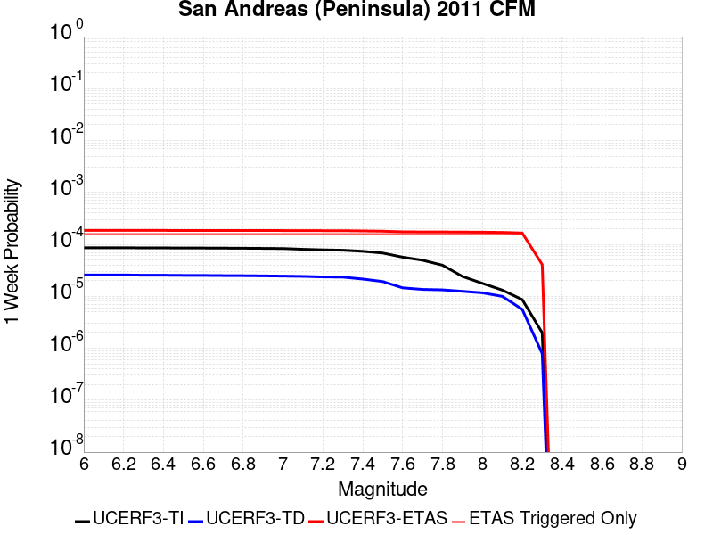 |  | 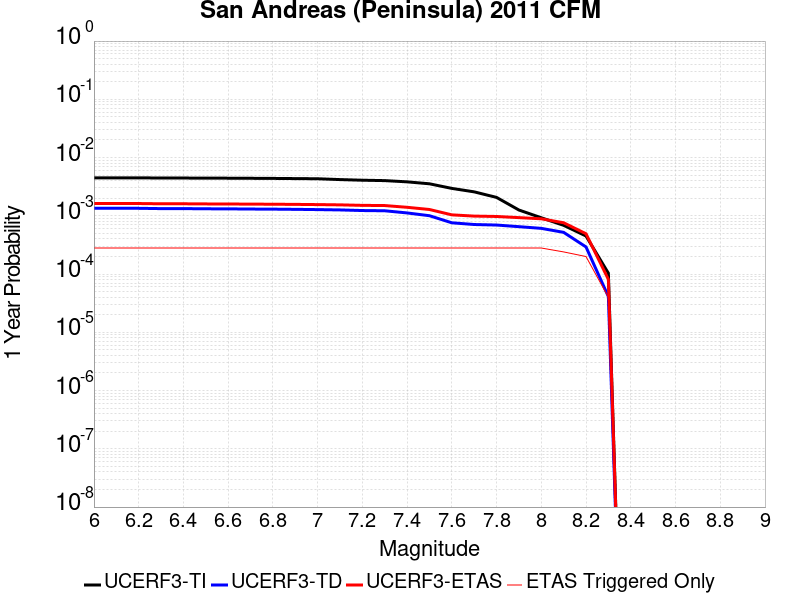 |

| Magnitude | 1 wk TI Prob | 1 wk TD Prob | 1 wk ETAS Prob | 1 wk ETAS/TD Gain | 1 wk ETAS Triggered Only | 1 mo TI Prob | 1 mo TD Prob | 1 mo ETAS Prob | 1 mo ETAS/TD Gain | 1 mo ETAS Triggered Only | 1 yr TI Prob | 1 yr TD Prob | 1 yr ETAS Prob | 1 yr ETAS/TD Gain | 1 yr ETAS Triggered Only |
|-----|-----|-----|-----|-----|-----|-----|-----|-----|-----|-----|-----|-----|-----|-----|-----|
| 6.0 | 8.6200685E-5 | 2.5801015E-5 | 1.8579689E-4 | 7.2011466 | 1.6E-4 | 3.6937918E-4 | 1.105711E-4 | 3.5054455E-4 | 3.170309 | 2.4E-4 | 0.0044879215 | 0.0013453735 | 0.0016249968 | 1.2078407 | 2.8E-4 |
| 6.1 | 8.6200685E-5 | 2.5801015E-5 | 1.8579689E-4 | 7.2011466 | 1.6E-4 | 3.6937918E-4 | 1.105711E-4 | 3.5054455E-4 | 3.170309 | 2.4E-4 | 0.0044879215 | 0.0013453735 | 0.0016249968 | 1.2078407 | 2.8E-4 |
| 6.2 | 8.6200685E-5 | 2.5801015E-5 | 1.8579689E-4 | 7.2011466 | 1.6E-4 | 3.6937918E-4 | 1.105711E-4 | 3.5054455E-4 | 3.170309 | 2.4E-4 | 0.0044879215 | 0.0013453735 | 0.0016249968 | 1.2078407 | 2.8E-4 |
| 6.3 | 8.551163E-5 | 2.54887E-5 | 1.8548462E-4 | 7.2771316 | 1.6E-4 | 3.6642692E-4 | 1.0923272E-4 | 3.492065E-4 | 3.1969037 | 2.4E-4 | 0.004452125 | 0.0013290987 | 0.0016087266 | 1.210389 | 2.8E-4 |
| 6.4 | 8.551163E-5 | 2.54887E-5 | 1.8548462E-4 | 7.2771316 | 1.6E-4 | 3.6642692E-4 | 1.0923272E-4 | 3.492065E-4 | 3.1969037 | 2.4E-4 | 0.004452125 | 0.0013290987 | 0.0016087266 | 1.210389 | 2.8E-4 |
| 6.5 | 8.511146E-5 | 2.5307645E-5 | 1.853036E-4 | 7.32204 | 1.6E-4 | 3.647124E-4 | 1.08456836E-4 | 3.484308E-4 | 3.212622 | 2.4E-4 | 0.004431336 | 0.0013196638 | 0.0015992944 | 1.2118952 | 2.8E-4 |
| 6.6 | 8.4985084E-5 | 2.5237454E-5 | 1.8523341E-4 | 7.339624 | 1.6E-4 | 3.6417096E-4 | 1.0815604E-4 | 3.481301E-4 | 3.2187762 | 2.4E-4 | 0.0044247704 | 0.0013160061 | 0.0015956375 | 1.212485 | 2.8E-4 |
| 6.7 | 8.462618E-5 | 2.5063902E-5 | 1.850599E-4 | 7.3835225 | 1.6E-4 | 3.6263323E-4 | 1.07412314E-4 | 3.4738652E-4 | 3.2341406 | 2.4E-4 | 0.004406125 | 0.0013069621 | 0.0015865961 | 1.2139573 | 2.8E-4 |
| 6.8 | 8.42337E-5 | 2.495804E-5 | 1.8495404E-4 | 7.410599 | 1.6E-4 | 3.6095164E-4 | 1.0695866E-4 | 3.46933E-4 | 3.2436175 | 2.4E-4 | 0.004385734 | 0.0013014454 | 0.0015810811 | 1.2148654 | 2.8E-4 |
| 6.9 | 8.365989E-5 | 2.476054E-5 | 1.8475657E-4 | 7.4617343 | 1.6E-4 | 3.5849313E-4 | 1.061123E-4 | 3.4608683E-4 | 3.261515 | 2.4E-4 | 0.004355922 | 0.0012911533 | 0.0015707917 | 1.2165804 | 2.8E-4 |
| 7.0 | 8.30936E-5 | 2.4519966E-5 | 1.8451604E-4 | 7.5251346 | 1.6E-4 | 3.560668E-4 | 1.05081344E-4 | 3.4505612E-4 | 3.283705 | 2.4E-4 | 0.004326499 | 0.0012786163 | 0.0015582582 | 1.2187067 | 2.8E-4 |
| 7.1 | 8.041264E-5 | 2.4201698E-5 | 1.8419782E-4 | 7.6109467 | 1.6E-4 | 3.4458007E-4 | 1.03717444E-4 | 3.4369255E-4 | 3.313739 | 2.4E-4 | 0.0041871946 | 0.0012620301 | 0.0015416767 | 1.2215848 | 2.8E-4 |
| 7.2 | 7.8427016E-5 | 2.361941E-5 | 1.8361563E-4 | 7.77393 | 1.6E-4 | 3.3607247E-4 | 1.0122212E-4 | 3.4119783E-4 | 3.3707833 | 2.4E-4 | 0.004084008 | 0.0012316842 | 0.0015113393 | 1.227051 | 2.8E-4 |
| 7.3 | 7.721087E-5 | 2.3402055E-5 | 1.8339831E-4 | 7.836846 | 1.6E-4 | 3.3086175E-4 | 1.0029068E-4 | 3.4026662E-4 | 3.392804 | 2.4E-4 | 0.004020803 | 0.0012203567 | 0.001500015 | 1.2291611 | 2.8E-4 |
| 7.4 | 7.3536525E-5 | 2.1486432E-5 | 1.8148299E-4 | 8.4464 | 1.6E-4 | 3.1511846E-4 | 9.2081464E-5 | 3.3205937E-4 | 3.6061478 | 2.4E-4 | 0.0038298194 | 0.0011205166 | 0.0014002029 | 1.2496047 | 2.8E-4 |
| 7.5 | 6.806207E-5 | 1.9247474E-5 | 1.792444E-4 | 9.312619 | 1.6E-4 | 2.9166197E-4 | 8.248657E-5 | 3.2246677E-4 | 3.9093246 | 2.4E-4 | 0.0035452035 | 0.0010038124 | 0.0012835313 | 1.2786566 | 2.8E-4 |
| 7.6 | 5.6731416E-5 | 1.45483245E-5 | 1.74546E-4 | 11.99767 | 1.6E-4 | 2.43112E-4 | 6.2348474E-5 | 3.023335E-4 | 4.8490925 | 2.4E-4 | 0.0029558712 | 7.588284E-4 | 0.0010386159 | 1.3687098 | 2.8E-4 |
| 7.7 | 4.946994E-5 | 1.3589812E-5 | 1.7358764E-4 | 12.773366 | 1.6E-4 | 2.1199681E-4 | 5.8240752E-5 | 2.9822678E-4 | 5.120586 | 2.4E-4 | 0.002578006 | 7.088506E-4 | 9.886521E-4 | 1.3947257 | 2.8E-4 |
| 7.8 | 3.9718198E-5 | 1.3313264E-5 | 1.7331113E-4 | 13.01793 | 1.6E-4 | 1.7020974E-4 | 5.7055597E-5 | 2.970419E-4 | 5.2061834 | 2.4E-4 | 0.0020703338 | 6.9443067E-4 | 9.7423623E-4 | 1.402928 | 2.8E-4 |
| 7.9 | 2.4115114E-5 | 1.2479283E-5 | 1.7247729E-4 | 13.82109 | 1.6E-4 | 1.0334639E-4 | 5.3481544E-5 | 2.934687E-4 | 5.4872894 | 2.4E-4 | 0.001257516 | 6.5094343E-4 | 9.3076116E-4 | 1.4298649 | 2.8E-4 |
| 8.0 | 1.7756569E-5 | 1.1674584E-5 | 1.7167271E-4 | 14.704824 | 1.6E-4 | 7.6097356E-5 | 5.0032973E-5 | 2.9002098E-4 | 5.7965965 | 2.4E-4 | 9.260915E-4 | 6.0898135E-4 | 8.8881084E-4 | 1.4595042 | 2.8E-4 |
| 8.1 | 1.3159258E-5 | 9.968845E-6 | 1.6996724E-4 | 17.049845 | 1.6E-4 | 5.6395602E-5 | 4.272292E-5 | 2.4271438E-4 | 5.681128 | 2.0E-4 | 6.864001E-4 | 5.2002753E-4 | 7.5990276E-4 | 1.461274 | 2.4E-4 |
| 8.2 | 8.635426E-6 | 5.5992937E-6 | 1.655984E-4 | 29.574871 | 1.6E-4 | 3.700844E-5 | 2.3996754E-5 | 2.2399196E-4 | 9.334261 | 2.0E-4 | 4.5048463E-4 | 2.9212137E-4 | 4.9206294E-4 | 1.6844469 | 2.0E-4 |
| 8.3 | 1.983087E-6 | 7.877893E-7 | 4.0787756E-5 | 51.774956 | 4.0E-5 | 8.498917E-6 | 3.3762356E-6 | 4.33761E-5 | 12.847474 | 4.0E-5 | 1.034694E-4 | 4.110491E-5 | 8.1103266E-5 | 1.9730797 | 4.0E-5 |

## San Jacinto (Borrego)
*[(top)](#table-of-contents)*

| 1 Week | 1 Month | 1 Year |
|-----|-----|-----|
|  |  |  |

| Magnitude | 1 wk TI Prob | 1 wk TD Prob | 1 wk ETAS Prob | 1 wk ETAS/TD Gain | 1 wk ETAS Triggered Only | 1 mo TI Prob | 1 mo TD Prob | 1 mo ETAS Prob | 1 mo ETAS/TD Gain | 1 mo ETAS Triggered Only | 1 yr TI Prob | 1 yr TD Prob | 1 yr ETAS Prob | 1 yr ETAS/TD Gain | 1 yr ETAS Triggered Only |
|-----|-----|-----|-----|-----|-----|-----|-----|-----|-----|-----|-----|-----|-----|-----|-----|
| 6.0 | 3.543992E-5 | 2.8126837E-5 | 1.8812234E-4 | 6.6883574 | 1.6E-4 | 1.5187653E-4 | 1.2053809E-4 | 3.20514E-4 | 2.6590266 | 2.0E-4 | 0.0018475284 | 0.0014665757 | 0.001746165 | 1.1906409 | 2.8E-4 |
| 6.1 | 3.542281E-5 | 2.8126837E-5 | 1.8812234E-4 | 6.6883574 | 1.6E-4 | 1.5180321E-4 | 1.2053809E-4 | 3.20514E-4 | 2.6590266 | 2.0E-4 | 0.0018466372 | 0.0014665757 | 0.001746165 | 1.1906409 | 2.8E-4 |
| 6.2 | 3.4688688E-5 | 2.8126837E-5 | 1.8812234E-4 | 6.6883574 | 1.6E-4 | 1.4865733E-4 | 1.2053808E-4 | 3.2051397E-4 | 2.6590266 | 2.0E-4 | 0.0018084005 | 0.0014665755 | 0.001746165 | 1.1906409 | 2.8E-4 |
| 6.3 | 3.2087122E-5 | 2.7972088E-5 | 1.8796761E-4 | 6.7198277 | 1.6E-4 | 1.3750899E-4 | 1.1987494E-4 | 3.1985095E-4 | 2.6682055 | 2.0E-4 | 0.0016728862 | 0.0014585126 | 0.0017381042 | 1.1916964 | 2.8E-4 |
| 6.4 | 3.1828724E-5 | 2.793903E-5 | 1.8793457E-4 | 6.726596 | 1.6E-4 | 1.364017E-4 | 1.1973327E-4 | 3.1970933E-4 | 2.6701796 | 2.0E-4 | 0.0016594254 | 0.00145679 | 0.0017363821 | 1.1919234 | 2.8E-4 |
| 6.5 | 3.1563577E-5 | 2.7678178E-5 | 1.8767375E-4 | 6.7805676 | 1.6E-4 | 1.3526545E-4 | 1.1861543E-4 | 3.1859172E-4 | 2.6859212 | 2.0E-4 | 0.0016456128 | 0.0014431985 | 0.0017227944 | 1.1937335 | 2.8E-4 |
| 6.6 | 3.1467625E-5 | 2.75222E-5 | 1.875178E-4 | 6.8133287 | 1.6E-4 | 1.3485427E-4 | 1.1794702E-4 | 3.1792343E-4 | 2.6954765 | 2.0E-4 | 0.0016406142 | 0.0014350713 | 0.0017146695 | 1.1948322 | 2.8E-4 |
| 6.7 | 3.1223695E-5 | 2.7139871E-5 | 1.8713553E-4 | 6.895225 | 1.6E-4 | 1.3380898E-4 | 1.1630862E-4 | 3.1628535E-4 | 2.719363 | 2.0E-4 | 0.0016279068 | 0.0014151498 | 0.0016947535 | 1.1975789 | 2.8E-4 |
| 6.8 | 3.1015585E-5 | 2.69605E-5 | 1.8695618E-4 | 6.934448 | 1.6E-4 | 1.3291716E-4 | 1.1553995E-4 | 3.1551684E-4 | 2.730803 | 2.0E-4 | 0.001617065 | 0.0014058034 | 0.0016854098 | 1.1988944 | 2.8E-4 |
| 6.9 | 2.6641965E-5 | 2.2371234E-5 | 1.8236766E-4 | 8.151881 | 1.6E-4 | 1.1417485E-4 | 9.587322E-5 | 2.9585406E-4 | 3.0858884 | 2.0E-4 | 0.0013891924 | 0.0011666353 | 0.0014463087 | 1.2397264 | 2.8E-4 |
| 7.0 | 2.3854353E-5 | 2.0659534E-5 | 1.8065622E-4 | 8.744449 | 1.6E-4 | 1.02228936E-4 | 8.853787E-5 | 2.8852015E-4 | 3.2587204 | 2.0E-4 | 0.0012439266 | 0.0010774181 | 0.0013571164 | 1.2596005 | 2.8E-4 |
| 7.1 | 2.3672901E-5 | 2.0495838E-5 | 1.8049256E-4 | 8.806303 | 1.6E-4 | 1.0145135E-4 | 8.7836364E-5 | 2.878188E-4 | 3.2767613 | 2.0E-4 | 0.0012344702 | 0.0010688857 | 0.0013485864 | 1.261675 | 2.8E-4 |
| 7.2 | 2.2717244E-5 | 1.972176E-5 | 1.797186E-4 | 9.112706 | 1.6E-4 | 9.735599E-5 | 8.45191E-5 | 2.845022E-4 | 3.366129 | 2.0E-4 | 0.0011846646 | 0.0010285367 | 0.0013082487 | 1.2719514 | 2.8E-4 |
| 7.3 | 2.1016205E-5 | 1.8560979E-5 | 1.7855801E-4 | 9.620075 | 1.6E-4 | 9.006634E-5 | 7.954463E-5 | 2.7952873E-4 | 3.5141115 | 2.0E-4 | 0.001096006 | 9.6802774E-4 | 0.0012477566 | 1.288968 | 2.8E-4 |
| 7.4 | 2.0683625E-5 | 1.8363E-5 | 1.7836006E-4 | 9.713013 | 1.6E-4 | 8.86411E-5 | 7.869621E-5 | 2.7868047E-4 | 3.5412185 | 2.0E-4 | 0.001078671 | 9.577073E-4 | 0.0012374391 | 1.2920849 | 2.8E-4 |
| 7.5 | 1.9993966E-5 | 1.7956301E-5 | 1.7795344E-4 | 9.91036 | 1.6E-4 | 8.568561E-5 | 7.695332E-5 | 2.7693794E-4 | 3.5987782 | 2.0E-4 | 0.001042723 | 9.36506E-4 | 0.0012162438 | 1.2987037 | 2.8E-4 |
| 7.6 | 1.788966E-5 | 1.6602748E-5 | 1.766001E-4 | 10.636799 | 1.6E-4 | 7.666772E-5 | 7.11527E-5 | 2.7113847E-4 | 3.810656 | 2.0E-4 | 9.3302975E-4 | 8.6594163E-4 | 0.0011456992 | 1.3230674 | 2.8E-4 |
| 7.7 | 1.5125781E-5 | 1.4399063E-5 | 1.7439676E-4 | 12.111674 | 1.6E-4 | 6.4823165E-5 | 6.1708815E-5 | 2.6169646E-4 | 4.240828 | 2.0E-4 | 7.889362E-4 | 7.5104664E-4 | 0.0010308364 | 1.3725331 | 2.8E-4 |
| 7.8 | 1.250089E-5 | 1.2786345E-5 | 1.727843E-4 | 13.513189 | 1.6E-4 | 5.3574146E-5 | 5.4797474E-5 | 2.5478652E-4 | 4.6496034 | 2.0E-4 | 6.5207E-4 | 6.6695566E-4 | 9.467689E-4 | 1.419538 | 2.8E-4 |
| 7.9 | 9.561E-6 | 9.893191E-6 | 4.9892795E-5 | 5.0431447 | 4.0E-5 | 4.0975072E-5 | 4.2398708E-5 | 1.2239531E-4 | 2.88677 | 8.0E-5 | 4.987573E-4 | 5.1608257E-4 | 5.9604127E-4 | 1.1549339 | 8.0E-5 |
| 8.0 | 8.01699E-6 | 8.4200565E-6 | 4.841972E-5 | 5.750522 | 4.0E-5 | 3.4358076E-5 | 3.608546E-5 | 1.1608257E-4 | 3.2168794 | 8.0E-5 | 4.1822926E-4 | 4.3925247E-4 | 5.1921734E-4 | 1.1820476 | 8.0E-5 |
| 8.1 | 6.541947E-6 | 6.5665754E-6 | 4.6566314E-5 | 7.0914154 | 4.0E-5 | 2.8036617E-5 | 2.8142165E-5 | 1.0813992E-4 | 3.8426294 | 8.0E-5 | 3.4129233E-4 | 3.4257752E-4 | 4.225501E-4 | 1.2334437 | 8.0E-5 |
| 8.2 | 1.7968189E-6 | 8.160789E-7 | 4.0816045E-5 | 50.014828 | 4.0E-5 | 7.70063E-6 | 3.4974764E-6 | 4.3497337E-5 | 12.436778 | 4.0E-5 | 9.3751136E-5 | 4.2580967E-5 | 8.257927E-5 | 1.9393468 | 4.0E-5 |
| 8.3 | 1.5167889E-7 | 5.032685E-8 | 5.032685E-8 | 1.0 | 0.0 | 6.500522E-7 | 2.1568648E-7 | 2.1568648E-7 | 1.0 | 0.0 | 7.9143565E-6 | 2.6259802E-6 | 2.6259802E-6 | 1.0 | 0.0 |

## Cady
*[(top)](#table-of-contents)*

| 1 Week | 1 Month | 1 Year |
|-----|-----|-----|
|  |  |  |

| Magnitude | 1 wk TI Prob | 1 wk TD Prob | 1 wk ETAS Prob | 1 wk ETAS/TD Gain | 1 wk ETAS Triggered Only | 1 mo TI Prob | 1 mo TD Prob | 1 mo ETAS Prob | 1 mo ETAS/TD Gain | 1 mo ETAS Triggered Only | 1 yr TI Prob | 1 yr TD Prob | 1 yr ETAS Prob | 1 yr ETAS/TD Gain | 1 yr ETAS Triggered Only |
|-----|-----|-----|-----|-----|-----|-----|-----|-----|-----|-----|-----|-----|-----|-----|-----|
| 6.0 | 1.9892565E-5 | 2.1866057E-5 | 1.8186256E-4 | 8.317117 | 1.6E-4 | 8.525106E-5 | 9.3708826E-5 | 2.5369384E-4 | 2.7072566 | 1.6E-4 | 0.0010374374 | 0.0011403988 | 0.0013801251 | 1.2102127 | 2.4E-4 |
| 6.1 | 1.9892565E-5 | 2.1866057E-5 | 1.8186256E-4 | 8.317117 | 1.6E-4 | 8.525106E-5 | 9.3708826E-5 | 2.5369384E-4 | 2.7072566 | 1.6E-4 | 0.0010374374 | 0.0011403988 | 0.0013801251 | 1.2102127 | 2.4E-4 |
| 6.2 | 1.9892565E-5 | 2.1866057E-5 | 1.8186256E-4 | 8.317117 | 1.6E-4 | 8.525106E-5 | 9.3708826E-5 | 2.5369384E-4 | 2.7072566 | 1.6E-4 | 0.0010374374 | 0.0011403988 | 0.0013801251 | 1.2102127 | 2.4E-4 |
| 6.3 | 1.1117327E-5 | 1.2180519E-5 | 5.2180032E-5 | 4.2838926 | 4.0E-5 | 4.764482E-5 | 5.2201358E-5 | 9.219927E-5 | 1.7662237 | 4.0E-5 | 5.7992124E-4 | 6.3539774E-4 | 7.5532147E-4 | 1.1887381 | 1.2E-4 |
| 6.4 | 1.1117327E-5 | 1.2180519E-5 | 5.2180032E-5 | 4.2838926 | 4.0E-5 | 4.764482E-5 | 5.2201358E-5 | 9.219927E-5 | 1.7662237 | 4.0E-5 | 5.7992124E-4 | 6.3539774E-4 | 7.5532147E-4 | 1.1887381 | 1.2E-4 |
| 6.5 | 6.103093E-6 | 6.674131E-6 | 4.6673864E-5 | 6.99325 | 4.0E-5 | 2.615585E-5 | 2.8603175E-5 | 6.860203E-5 | 2.3984063 | 4.0E-5 | 3.1840094E-4 | 3.4820058E-4 | 4.2817273E-4 | 1.2296727 | 8.0E-5 |
| 6.6 | 5.817237E-6 | 6.3676944E-6 | 4.636744E-5 | 7.2816687 | 4.0E-5 | 2.4930776E-5 | 2.7289903E-5 | 6.728881E-5 | 2.4657035 | 4.0E-5 | 3.034899E-4 | 3.3221635E-4 | 4.1218978E-4 | 1.240727 | 8.0E-5 |
| 6.7 | 4.8846314E-6 | 5.342259E-6 | 4.5342047E-5 | 8.487429 | 4.0E-5 | 2.0933967E-5 | 2.2895263E-5 | 6.2894345E-5 | 2.7470462 | 4.0E-5 | 2.5484123E-4 | 2.7872596E-4 | 3.5870366E-4 | 1.2869403 | 8.0E-5 |
| 6.8 | 1.7788773E-6 | 1.9405036E-6 | 1.9405036E-6 | 1.0 | 0.0 | 7.6237375E-6 | 8.316427E-6 | 8.316427E-6 | 1.0 | 0.0 | 9.281505E-5 | 1.0124937E-4 | 1.4124531E-4 | 1.3950242 | 4.0E-5 |
| 6.9 | 7.5455404E-7 | 8.2998935E-7 | 8.2998935E-7 | 1.0 | 0.0 | 3.233799E-6 | 3.5570943E-6 | 3.5570943E-6 | 1.0 | 0.0 | 3.937079E-5 | 4.33071E-5 | 4.33071E-5 | 1.0 | 0.0 |
| 7.0 | 6.8578805E-7 | 7.544366E-7 | 7.544366E-7 | 1.0 | 0.0 | 2.9390883E-6 | 3.2332975E-6 | 3.2332975E-6 | 1.0 | 0.0 | 3.578281E-5 | 3.936502E-5 | 3.936502E-5 | 1.0 | 0.0 |

## McLean Lake
*[(top)](#table-of-contents)*

| 1 Week | 1 Month | 1 Year |
|-----|-----|-----|
| 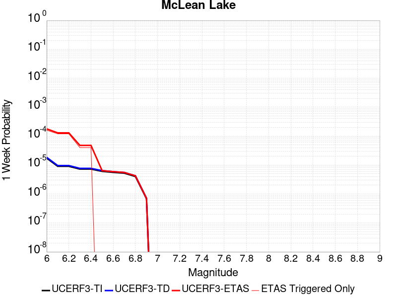 | 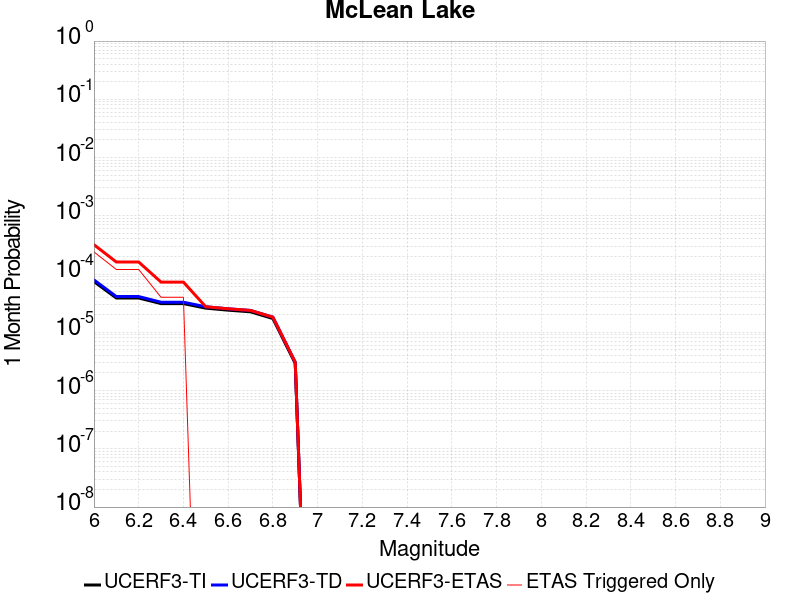 |  |

| Magnitude | 1 wk TI Prob | 1 wk TD Prob | 1 wk ETAS Prob | 1 wk ETAS/TD Gain | 1 wk ETAS Triggered Only | 1 mo TI Prob | 1 mo TD Prob | 1 mo ETAS Prob | 1 mo ETAS/TD Gain | 1 mo ETAS Triggered Only | 1 yr TI Prob | 1 yr TD Prob | 1 yr ETAS Prob | 1 yr ETAS/TD Gain | 1 yr ETAS Triggered Only |
|-----|-----|-----|-----|-----|-----|-----|-----|-----|-----|-----|-----|-----|-----|-----|-----|
| 6.0 | 1.7360222E-5 | 1.8505758E-5 | 1.785028E-4 | 9.645798 | 1.6E-4 | 7.439883E-5 | 7.930826E-5 | 3.1928922E-4 | 4.0259266 | 2.4E-4 | 9.0542925E-4 | 9.651989E-4 | 0.0012049673 | 1.2484134 | 2.4E-4 |
| 6.1 | 9.062689E-6 | 9.594095E-6 | 1.2959294E-4 | 13.507573 | 1.2E-4 | 3.8839516E-5 | 4.1116953E-5 | 1.6111202E-4 | 3.9183843 | 1.2E-4 | 4.727685E-4 | 5.004928E-4 | 6.204327E-4 | 1.2396437 | 1.2E-4 |
| 6.2 | 9.062689E-6 | 9.594095E-6 | 1.2959294E-4 | 13.507573 | 1.2E-4 | 3.8839516E-5 | 4.1116953E-5 | 1.6111202E-4 | 3.9183843 | 1.2E-4 | 4.727685E-4 | 5.004928E-4 | 6.204327E-4 | 1.2396437 | 1.2E-4 |
| 6.3 | 7.2575485E-6 | 7.6691795E-6 | 4.7668873E-5 | 6.215642 | 4.0E-5 | 3.110341E-5 | 3.2867538E-5 | 7.286622E-5 | 2.2169662 | 4.0E-5 | 3.786182E-4 | 4.0009595E-4 | 4.4007992E-4 | 1.099936 | 4.0E-5 |
| 6.4 | 7.2575485E-6 | 7.6691795E-6 | 4.7668873E-5 | 6.215642 | 4.0E-5 | 3.110341E-5 | 3.2867538E-5 | 7.286622E-5 | 2.2169662 | 4.0E-5 | 3.786182E-4 | 4.0009595E-4 | 4.4007992E-4 | 1.099936 | 4.0E-5 |
| 6.5 | 6.06582E-6 | 6.405088E-6 | 6.405088E-6 | 1.0 | 0.0 | 2.5996113E-5 | 2.7450124E-5 | 2.7450124E-5 | 1.0 | 0.0 | 3.164567E-4 | 3.341605E-4 | 3.341605E-4 | 1.0 | 0.0 |
| 6.6 | 5.598744E-6 | 5.9113777E-6 | 5.9113777E-6 | 1.0 | 0.0 | 2.3994397E-5 | 2.5334266E-5 | 2.5334266E-5 | 1.0 | 0.0 | 2.9209262E-4 | 3.0840744E-4 | 3.0840744E-4 | 1.0 | 0.0 |
| 6.7 | 5.246996E-6 | 5.5402083E-6 | 5.5402083E-6 | 1.0 | 0.0 | 2.2486933E-5 | 2.3743569E-5 | 2.3743569E-5 | 1.0 | 0.0 | 2.73744E-4 | 2.8904597E-4 | 2.8904597E-4 | 1.0 | 0.0 |
| 6.8 | 4.02324E-6 | 4.2477054E-6 | 4.2477054E-6 | 1.0 | 0.0 | 1.7242342E-5 | 1.8204359E-5 | 1.8204359E-5 | 1.0 | 0.0 | 2.099053E-4 | 2.2162148E-4 | 2.2162148E-4 | 1.0 | 0.0 |
| 6.9 | 6.835972E-7 | 7.141004E-7 | 7.141004E-7 | 1.0 | 0.0 | 2.9296991E-6 | 3.0604285E-6 | 3.0604285E-6 | 1.0 | 0.0 | 3.56685E-5 | 3.72604E-5 | 3.72604E-5 | 1.0 | 0.0 |

## San Juan
*[(top)](#table-of-contents)*

| 1 Week | 1 Month | 1 Year |
|-----|-----|-----|
| 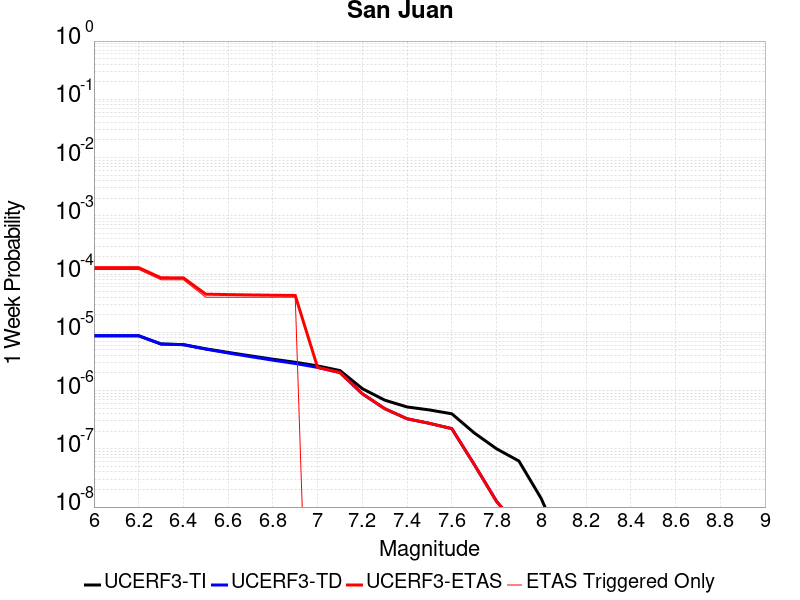 | 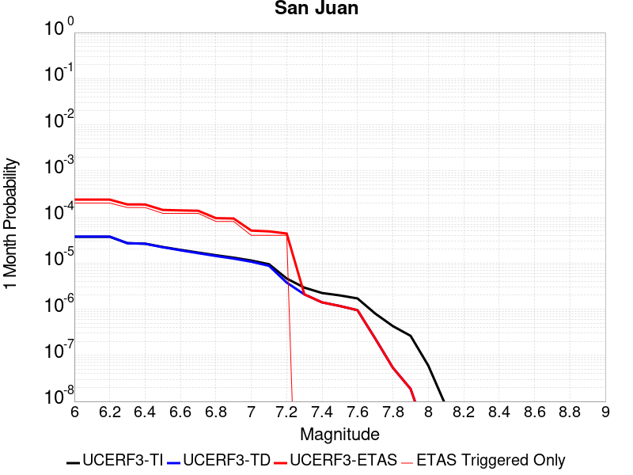 | 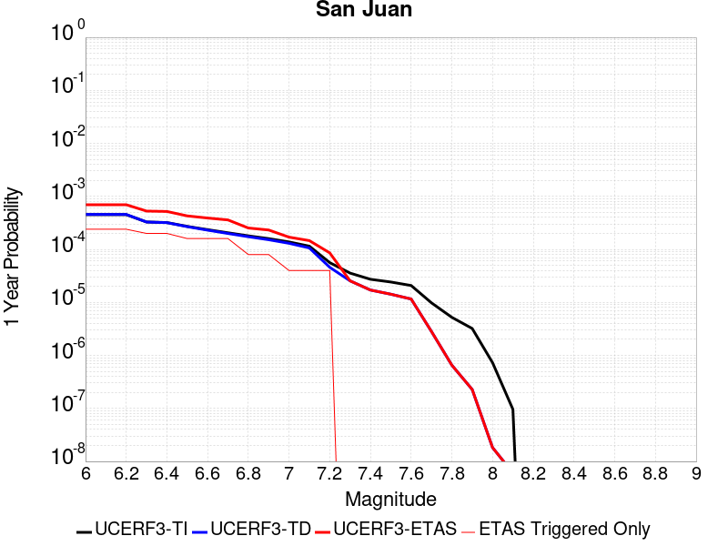 |

| Magnitude | 1 wk TI Prob | 1 wk TD Prob | 1 wk ETAS Prob | 1 wk ETAS/TD Gain | 1 wk ETAS Triggered Only | 1 mo TI Prob | 1 mo TD Prob | 1 mo ETAS Prob | 1 mo ETAS/TD Gain | 1 mo ETAS Triggered Only | 1 yr TI Prob | 1 yr TD Prob | 1 yr ETAS Prob | 1 yr ETAS/TD Gain | 1 yr ETAS Triggered Only |
|-----|-----|-----|-----|-----|-----|-----|-----|-----|-----|-----|-----|-----|-----|-----|-----|
| 6.0 | 8.682808E-6 | 8.759608E-6 | 1.2875856E-4 | 14.699123 | 1.2E-4 | 3.72115E-5 | 3.7540663E-5 | 2.3753315E-4 | 6.3273563 | 2.0E-4 | 4.5295584E-4 | 4.5696655E-4 | 6.968569E-4 | 1.5249625 | 2.4E-4 |
| 6.1 | 8.682808E-6 | 8.759608E-6 | 1.2875856E-4 | 14.699123 | 1.2E-4 | 3.72115E-5 | 3.7540663E-5 | 2.3753315E-4 | 6.3273563 | 2.0E-4 | 4.5295584E-4 | 4.5696655E-4 | 6.968569E-4 | 1.5249625 | 2.4E-4 |
| 6.2 | 8.682808E-6 | 8.759608E-6 | 1.2875856E-4 | 14.699123 | 1.2E-4 | 3.72115E-5 | 3.7540663E-5 | 2.3753315E-4 | 6.3273563 | 2.0E-4 | 4.5295584E-4 | 4.5696655E-4 | 6.968569E-4 | 1.5249625 | 2.4E-4 |
| 6.3 | 6.3054235E-6 | 6.2927156E-6 | 8.629221E-5 | 13.713033 | 8.0E-5 | 2.7022963E-5 | 2.696851E-5 | 1.869642E-4 | 6.9326854 | 1.6E-4 | 3.2895492E-4 | 3.2829354E-4 | 5.282279E-4 | 1.6090109 | 2.0E-4 |
| 6.4 | 6.1490473E-6 | 6.123244E-6 | 8.612275E-5 | 14.06489 | 8.0E-5 | 2.6352795E-5 | 2.6242218E-5 | 1.8623802E-4 | 7.0968857 | 1.6E-4 | 3.2079802E-4 | 3.1945354E-4 | 5.1938964E-4 | 1.6258692 | 2.0E-4 |
| 6.5 | 5.204848E-6 | 5.1457387E-6 | 4.5145534E-5 | 8.773382 | 4.0E-5 | 2.23063E-5 | 2.2052984E-5 | 1.4205034E-4 | 6.4413204 | 1.2E-4 | 2.7154534E-4 | 2.6846296E-4 | 4.2842E-4 | 1.5958254 | 1.6E-4 |
| 6.6 | 4.5179986E-6 | 4.421473E-6 | 4.4421296E-5 | 10.046719 | 4.0E-5 | 1.9362706E-5 | 1.8949037E-5 | 1.3894677E-4 | 7.332656 | 1.2E-4 | 2.3571544E-4 | 2.3068089E-4 | 3.9064398E-4 | 1.6934389 | 1.6E-4 |
| 6.7 | 3.9442616E-6 | 3.8256167E-6 | 4.3825465E-5 | 11.4557905 | 4.0E-5 | 1.6903869E-5 | 1.6395401E-5 | 1.3639343E-4 | 8.319006 | 1.2E-4 | 2.0578515E-4 | 1.9959638E-4 | 3.5956444E-4 | 1.8014578 | 1.6E-4 |
| 6.8 | 3.4536245E-6 | 3.3218946E-6 | 4.332176E-5 | 13.041281 | 4.0E-5 | 1.4801163E-5 | 1.4236617E-5 | 9.4235475E-5 | 6.6192327 | 8.0E-5 | 1.8018926E-4 | 1.7331763E-4 | 2.5330376E-4 | 1.4615003 | 8.0E-5 |
| 6.9 | 3.059865E-6 | 2.9173539E-6 | 4.2917236E-5 | 14.711015 | 4.0E-5 | 1.3113641E-5 | 1.2502889E-5 | 9.250189E-5 | 7.3984413 | 8.0E-5 | 1.596469E-4 | 1.5221261E-4 | 2.3220043E-4 | 1.5255007 | 8.0E-5 |
| 7.0 | 2.6504351E-6 | 2.4970402E-6 | 2.4970402E-6 | 1.0 | 0.0 | 1.1358958E-5 | 1.0701559E-5 | 5.0701132E-5 | 4.737733 | 4.0E-5 | 1.3828653E-4 | 1.3028424E-4 | 1.7027903E-4 | 1.306981 | 4.0E-5 |
| 7.1 | 2.2039317E-6 | 2.0380103E-6 | 2.0380103E-6 | 1.0 | 0.0 | 9.445387E-6 | 8.734303E-6 | 4.8733953E-5 | 5.5796037 | 4.0E-5 | 1.1499152E-4 | 1.0633549E-4 | 1.4633124E-4 | 1.376128 | 4.0E-5 |
| 7.2 | 1.0786707E-6 | 8.806433E-7 | 8.806433E-7 | 1.0 | 0.0 | 4.622866E-6 | 3.77418E-6 | 4.3774027E-5 | 11.598289 | 4.0E-5 | 5.628194E-5 | 4.5949684E-5 | 8.5947846E-5 | 1.8704774 | 4.0E-5 |
| 7.3 | 6.846433E-7 | 4.890126E-7 | 4.890126E-7 | 1.0 | 0.0 | 2.9341822E-6 | 2.0957666E-6 | 2.0957666E-6 | 1.0 | 0.0 | 3.5723086E-5 | 2.551566E-5 | 2.551566E-5 | 1.0 | 0.0 |
| 7.4 | 5.23043E-7 | 3.2786707E-7 | 3.2786707E-7 | 1.0 | 0.0 | 2.2416111E-6 | 1.4051437E-6 | 1.4051437E-6 | 1.0 | 0.0 | 2.7291273E-5 | 1.7107492E-5 | 1.7107492E-5 | 1.0 | 0.0 |
| 7.5 | 4.648444E-7 | 2.7371732E-7 | 2.7371732E-7 | 1.0 | 0.0 | 1.9921886E-6 | 1.1730737E-6 | 1.1730737E-6 | 1.0 | 0.0 | 2.4254627E-5 | 1.4282079E-5 | 1.4282079E-5 | 1.0 | 0.0 |
| 7.6 | 3.9906567E-7 | 2.219133E-7 | 2.219133E-7 | 1.0 | 0.0 | 1.7102802E-6 | 9.510566E-7 | 9.510566E-7 | 1.0 | 0.0 | 2.0822463E-5 | 1.15790535E-5 | 1.15790535E-5 | 1.0 | 0.0 |
| 7.7 | 1.8784601E-7 | 5.4077724E-8 | 5.4077724E-8 | 1.0 | 0.0 | 8.0505407E-7 | 2.3176165E-7 | 2.3176165E-7 | 1.0 | 0.0 | 9.80149E-6 | 2.8216944E-6 | 2.8216944E-6 | 1.0 | 0.0 |
| 7.8 | 1.00154914E-7 | 1.254366E-8 | 1.254366E-8 | 1.0 | 0.0 | 4.2923529E-7 | 5.3758537E-8 | 5.3758537E-8 | 1.0 | 0.0 | 5.225927E-6 | 6.5451E-7 | 6.5451E-7 | 1.0 | 0.0 |
| 7.9 | 6.171429E-8 | 4.362376E-9 | 4.362376E-9 | 1.0 | 0.0 | 2.6448978E-7 | 1.8695896E-8 | 1.8695896E-8 | 1.0 | 0.0 | 3.2201583E-6 | 2.2762252E-7 | 2.2762252E-7 | 1.0 | 0.0 |
| 8.0 | 1.3974572E-8 | 3.496773E-10 | 3.496773E-10 | 1.0 | 0.0 | 5.989102E-8 | 1.4986121E-9 | 1.4986121E-9 | 1.0 | 0.0 | 7.2917294E-7 | 1.824562E-8 | 1.824562E-8 | 1.0 | 0.0 |
| 8.1 | 1.8403477E-9 | 1.1596091E-10 | 1.1596091E-10 | 1.0 | 0.0 | 7.887204E-9 | 4.969739E-10 | 4.969739E-10 | 1.0 | 0.0 | 9.602671E-8 | 6.0506586E-9 | 6.0506586E-9 | 1.0 | 0.0 |

## Calaveras (So) - Paicines extension 2011 CFM
*[(top)](#table-of-contents)*

| 1 Week | 1 Month | 1 Year |
|-----|-----|-----|
| 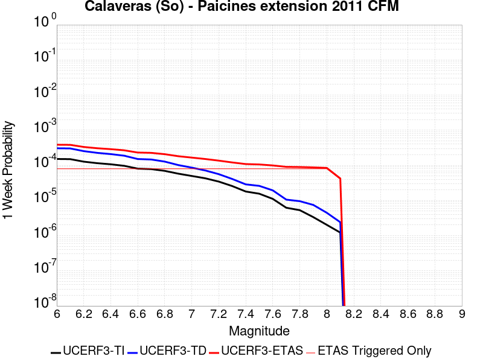 |  |  |

| Magnitude | 1 wk TI Prob | 1 wk TD Prob | 1 wk ETAS Prob | 1 wk ETAS/TD Gain | 1 wk ETAS Triggered Only | 1 mo TI Prob | 1 mo TD Prob | 1 mo ETAS Prob | 1 mo ETAS/TD Gain | 1 mo ETAS Triggered Only | 1 yr TI Prob | 1 yr TD Prob | 1 yr ETAS Prob | 1 yr ETAS/TD Gain | 1 yr ETAS Triggered Only |
|-----|-----|-----|-----|-----|-----|-----|-----|-----|-----|-----|-----|-----|-----|-----|-----|
| 6.0 | 1.5183659E-4 | 3.058916E-4 | 3.858671E-4 | 1.2614505 | 8.0E-5 | 6.5056595E-4 | 0.0013097163 | 0.0014295591 | 1.0915029 | 1.2E-4 | 0.007891912 | 0.015730867 | 0.015967092 | 1.0150167 | 2.4E-4 |
| 6.1 | 1.5024997E-4 | 3.028294E-4 | 3.8280518E-4 | 1.2640952 | 8.0E-5 | 6.437695E-4 | 0.0012966117 | 0.0014164562 | 1.0924289 | 1.2E-4 | 0.0078097614 | 0.015574093 | 0.015810356 | 1.0151702 | 2.4E-4 |
| 6.2 | 1.2743923E-4 | 2.5378828E-4 | 3.3376797E-4 | 1.3151433 | 8.0E-5 | 5.460538E-4 | 0.0010868111 | 0.0012066807 | 1.1102948 | 1.2E-4 | 0.0066279583 | 0.013080635 | 0.0133174965 | 1.0181078 | 2.4E-4 |
| 6.3 | 1.1525114E-4 | 2.266418E-4 | 3.0662367E-4 | 1.3528999 | 8.0E-5 | 4.9383997E-4 | 9.706734E-4 | 0.0010905568 | 1.1235055 | 1.2E-4 | 0.0059959386 | 0.011701727 | 0.011938919 | 1.0202698 | 2.4E-4 |
| 6.4 | 1.07200925E-4 | 2.0905094E-4 | 2.8903421E-4 | 1.3826019 | 8.0E-5 | 4.5935164E-4 | 8.953991E-4 | 0.0010152917 | 1.1338985 | 1.2E-4 | 0.0055782744 | 0.010806446 | 0.011043852 | 1.021969 | 2.4E-4 |
| 6.5 | 9.69631E-5 | 1.8797735E-4 | 2.679623E-4 | 1.4255031 | 8.0E-5 | 4.1548995E-4 | 8.0519065E-4 | 9.25094E-4 | 1.148913 | 1.2E-4 | 0.0050468626 | 0.009727674 | 0.009965339 | 1.0244318 | 2.4E-4 |
| 6.6 | 8.0552316E-5 | 1.5134095E-4 | 2.3132884E-4 | 1.5285277 | 8.0E-5 | 3.4517853E-4 | 6.4840337E-4 | 7.683256E-4 | 1.18495 | 1.2E-4 | 0.0041944524 | 0.007859206 | 0.00809732 | 1.0302974 | 2.4E-4 |
| 6.7 | 7.815757E-5 | 1.4674113E-4 | 2.267294E-4 | 1.5450977 | 8.0E-5 | 3.34918E-4 | 6.2870386E-4 | 7.486284E-4 | 1.1907489 | 1.2E-4 | 0.004070005 | 0.00762175 | 0.00785992 | 1.0312488 | 2.4E-4 |
| 6.8 | 6.965264E-5 | 1.278175E-4 | 2.0780729E-4 | 1.6258124 | 8.0E-5 | 2.9847719E-4 | 5.476545E-4 | 6.276107E-4 | 1.1459975 | 8.0E-5 | 0.0036279052 | 0.0066440827 | 0.006842754 | 1.029902 | 2.0E-4 |
| 6.9 | 5.8000453E-5 | 1.0197004E-4 | 1.8196189E-4 | 1.7844641 | 8.0E-5 | 2.4854968E-4 | 4.3694186E-4 | 5.169069E-4 | 1.1830107 | 8.0E-5 | 0.0030218933 | 0.005306889 | 0.0054660398 | 1.0299895 | 1.6E-4 |
| 7.0 | 4.9865852E-5 | 8.614713E-5 | 1.6614023E-4 | 1.9285638 | 8.0E-5 | 2.1369329E-4 | 3.691502E-4 | 4.4912068E-4 | 1.2166339 | 8.0E-5 | 0.0025986114 | 0.0044852314 | 0.0046445136 | 1.0355127 | 1.6E-4 |
| 7.1 | 4.283875E-5 | 7.154534E-5 | 1.5153961E-4 | 2.118092 | 8.0E-5 | 1.8358172E-4 | 3.0658717E-4 | 3.8656263E-4 | 1.2608572 | 8.0E-5 | 0.0022328163 | 0.0037263667 | 0.0038857704 | 1.0427773 | 1.6E-4 |
| 7.2 | 3.450115E-5 | 5.6180077E-5 | 1.3617559E-4 | 2.4239123 | 8.0E-5 | 1.478537E-4 | 2.4074971E-4 | 3.2073044E-4 | 1.3322153 | 8.0E-5 | 0.0017986323 | 0.0029272172 | 0.003086749 | 1.0544994 | 1.6E-4 |
| 7.3 | 2.5709045E-5 | 4.092334E-5 | 1.2092006E-4 | 2.9547946 | 8.0E-5 | 1.1017697E-4 | 1.7537405E-4 | 2.5536E-4 | 1.4560878 | 8.0E-5 | 0.0013405791 | 0.0021331052 | 0.002292764 | 1.074848 | 1.6E-4 |
| 7.4 | 1.8003093E-5 | 2.8743207E-5 | 1.08740904E-4 | 3.7831864 | 8.0E-5 | 7.715383E-5 | 1.2317937E-4 | 2.031695E-4 | 1.6493794 | 8.0E-5 | 9.3894306E-4 | 0.0014986794 | 0.0016584396 | 1.1066006 | 1.6E-4 |
| 7.5 | 1.5595824E-5 | 2.6044754E-5 | 1.0604267E-4 | 4.0715556 | 8.0E-5 | 6.683753E-5 | 1.1161561E-4 | 1.9160668E-4 | 1.7166656 | 8.0E-5 | 8.134431E-4 | 0.0013580752 | 0.0015178579 | 1.1176538 | 1.6E-4 |
| 7.6 | 1.1110309E-5 | 1.9413746E-5 | 9.9412195E-5 | 5.1207113 | 8.0E-5 | 4.761474E-5 | 8.319912E-5 | 1.6319247E-4 | 1.9614686 | 8.0E-5 | 5.795553E-4 | 0.00101248 | 0.001172318 | 1.1578678 | 1.6E-4 |
| 7.7 | 6.2140443E-6 | 1.0582229E-5 | 9.058138E-5 | 8.559764 | 8.0E-5 | 2.6631347E-5 | 4.5351622E-5 | 1.25348E-4 | 2.7639143 | 8.0E-5 | 3.241884E-4 | 5.520162E-4 | 7.119279E-4 | 1.2896866 | 1.6E-4 |
| 7.8 | 5.305533E-6 | 9.562843E-6 | 8.9562076E-5 | 9.365633 | 8.0E-5 | 2.27378E-5 | 4.098297E-5 | 1.2097969E-4 | 2.9519503 | 8.0E-5 | 2.7679754E-4 | 4.988535E-4 | 6.587737E-4 | 1.3205755 | 1.6E-4 |
| 7.9 | 3.363505E-6 | 7.481766E-6 | 8.748117E-5 | 11.692583 | 8.0E-5 | 1.4414942E-5 | 3.2064316E-5 | 1.1206175E-4 | 3.4949052 | 8.0E-5 | 1.7548777E-4 | 3.9031322E-4 | 5.5025076E-4 | 1.4097672 | 1.6E-4 |
| 8.0 | 2.0271132E-6 | 4.46918E-6 | 8.4468826E-5 | 18.900295 | 8.0E-5 | 8.687599E-6 | 1.9153487E-5 | 9.9151956E-5 | 5.176705 | 8.0E-5 | 1.05766376E-4 | 2.3316882E-4 | 3.9313152E-4 | 1.6860381 | 1.6E-4 |
| 8.1 | 1.2206116E-6 | 2.4070437E-6 | 4.2406948E-5 | 17.617855 | 4.0E-5 | 5.2311816E-6 | 1.0315861E-5 | 5.0315448E-5 | 4.8774843 | 4.0E-5 | 6.3687774E-5 | 1.255884E-4 | 1.6558338E-4 | 1.3184607 | 4.0E-5 |

## Coronado Bank alt1
*[(top)](#table-of-contents)*

| 1 Week | 1 Month | 1 Year |
|-----|-----|-----|
| 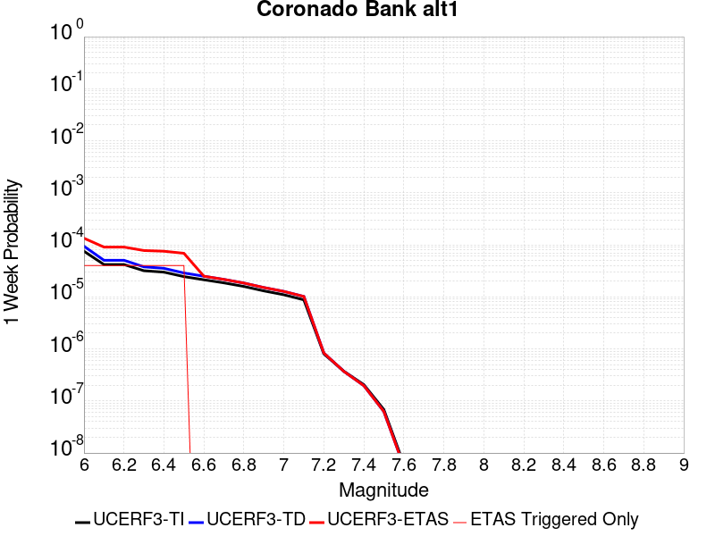 | 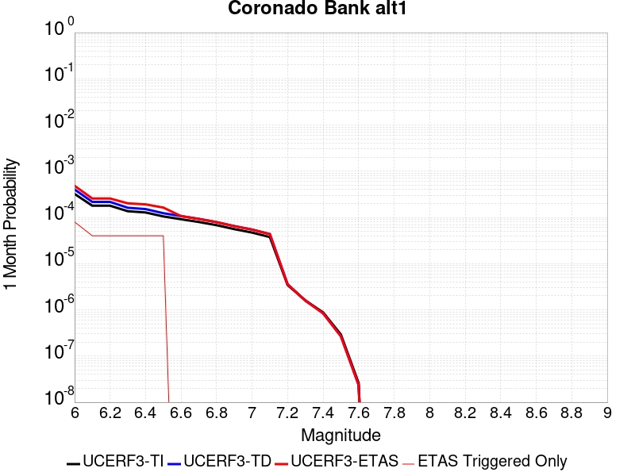 |  |

| Magnitude | 1 wk TI Prob | 1 wk TD Prob | 1 wk ETAS Prob | 1 wk ETAS/TD Gain | 1 wk ETAS Triggered Only | 1 mo TI Prob | 1 mo TD Prob | 1 mo ETAS Prob | 1 mo ETAS/TD Gain | 1 mo ETAS Triggered Only | 1 yr TI Prob | 1 yr TD Prob | 1 yr ETAS Prob | 1 yr ETAS/TD Gain | 1 yr ETAS Triggered Only |
|-----|-----|-----|-----|-----|-----|-----|-----|-----|-----|-----|-----|-----|-----|-----|-----|
| 6.0 | 7.533492E-5 | 9.4029245E-5 | 1.3402548E-4 | 1.4253596 | 4.0E-5 | 3.22824E-4 | 4.0292446E-4 | 4.8289224E-4 | 1.1984683 | 8.0E-5 | 0.0039233007 | 0.0048951716 | 0.0051339967 | 1.048788 | 2.4E-4 |
| 6.1 | 4.1807285E-5 | 5.0528783E-5 | 9.052676E-5 | 1.7915881 | 4.0E-5 | 1.7916178E-4 | 2.1653448E-4 | 2.5652582E-4 | 1.1846881 | 4.0E-5 | 0.0021791123 | 0.0026331986 | 0.0027528827 | 1.045452 | 1.2E-4 |
| 6.2 | 4.1807285E-5 | 5.0528783E-5 | 9.052676E-5 | 1.7915881 | 4.0E-5 | 1.7916178E-4 | 2.1653448E-4 | 2.5652582E-4 | 1.1846881 | 4.0E-5 | 0.0021791123 | 0.0026331986 | 0.0027528827 | 1.045452 | 1.2E-4 |
| 6.3 | 3.1793104E-5 | 3.7735168E-5 | 7.773366E-5 | 2.0599792 | 4.0E-5 | 1.3624904E-4 | 1.6171228E-4 | 2.0170581E-4 | 1.2473129 | 4.0E-5 | 0.0016575698 | 0.0019671016 | 0.0020868655 | 1.0608834 | 1.2E-4 |
| 6.4 | 2.9878007E-5 | 3.535792E-5 | 7.5356504E-5 | 2.1312482 | 4.0E-5 | 1.2804232E-4 | 1.5152531E-4 | 1.9151924E-4 | 1.2639424 | 4.0E-5 | 0.0015578003 | 0.0018432919 | 0.0019630708 | 1.0649809 | 1.2E-4 |
| 6.5 | 2.4512565E-5 | 2.8781236E-5 | 6.8780086E-5 | 2.3897543 | 4.0E-5 | 1.0504962E-4 | 1.2334248E-4 | 1.6333755E-4 | 1.3242602 | 4.0E-5 | 0.0012782287 | 0.0015006869 | 0.0015406269 | 1.0266144 | 4.0E-5 |
| 6.6 | 2.1317413E-5 | 2.4921088E-5 | 2.4921088E-5 | 1.0 | 0.0 | 9.135714E-5 | 1.0680041E-4 | 1.0680041E-4 | 1.0 | 0.0 | 0.0011117056 | 0.0012995416 | 0.0012995416 | 1.0 | 0.0 |
| 6.7 | 1.8585655E-5 | 2.1647098E-5 | 2.1647098E-5 | 1.0 | 0.0 | 7.9650374E-5 | 9.27701E-5 | 9.27701E-5 | 1.0 | 0.0 | 9.6931186E-4 | 0.0011289112 | 0.0011289112 | 1.0 | 0.0 |
| 6.8 | 1.5862879E-5 | 1.8429711E-5 | 1.8429711E-5 | 1.0 | 0.0 | 6.798199E-5 | 7.898219E-5 | 7.898219E-5 | 1.0 | 0.0 | 8.273665E-4 | 9.6120324E-4 | 9.6120324E-4 | 1.0 | 0.0 |
| 6.9 | 1.3021509E-5 | 1.5103577E-5 | 1.5103577E-5 | 1.0 | 0.0 | 5.5805274E-5 | 6.472811E-5 | 6.472811E-5 | 1.0 | 0.0 | 6.792174E-4 | 7.8779797E-4 | 7.8779797E-4 | 1.0 | 0.0 |
| 7.0 | 1.0974371E-5 | 1.272712E-5 | 1.272712E-5 | 1.0 | 0.0 | 4.7032172E-5 | 5.4543758E-5 | 5.4543758E-5 | 1.0 | 0.0 | 5.7246623E-4 | 6.638855E-4 | 6.638855E-4 | 1.0 | 0.0 |
| 7.1 | 8.766221E-6 | 1.0169476E-5 | 1.0169476E-5 | 1.0 | 0.0 | 3.7568978E-5 | 4.3582837E-5 | 4.3582837E-5 | 1.0 | 0.0 | 4.573063E-4 | 5.3050905E-4 | 5.3050905E-4 | 1.0 | 0.0 |
| 7.2 | 8.026024E-7 | 8.333763E-7 | 8.333763E-7 | 1.0 | 0.0 | 3.43972E-6 | 3.571608E-6 | 3.571608E-6 | 1.0 | 0.0 | 4.1877785E-5 | 4.348347E-5 | 4.348347E-5 | 1.0 | 0.0 |
| 7.3 | 3.7293114E-7 | 3.700848E-7 | 3.700848E-7 | 1.0 | 0.0 | 1.5982754E-6 | 1.5860767E-6 | 1.5860767E-6 | 1.0 | 0.0 | 1.9458828E-5 | 1.9310313E-5 | 1.9310313E-5 | 1.0 | 0.0 |
| 7.4 | 2.0557036E-7 | 1.9678428E-7 | 1.9678428E-7 | 1.0 | 0.0 | 8.810155E-7 | 8.4336097E-7 | 8.4336097E-7 | 1.0 | 0.0 | 1.0726311E-5 | 1.0267871E-5 | 1.0267871E-5 | 1.0 | 0.0 |
| 7.5 | 6.845446E-8 | 6.2802876E-8 | 6.2802876E-8 | 1.0 | 0.0 | 2.9337625E-7 | 2.6915515E-7 | 2.6915515E-7 | 1.0 | 0.0 | 3.5718497E-6 | 3.2769592E-6 | 3.2769592E-6 | 1.0 | 0.0 |
| 7.6 | 6.0975145E-9 | 5.5322116E-9 | 5.5322116E-9 | 1.0 | 0.0 | 2.6132206E-8 | 2.3709477E-8 | 2.3709477E-8 | 1.0 | 0.0 | 3.1815955E-7 | 2.8866285E-7 | 2.8866285E-7 | 1.0 | 0.0 |

## Manix-Afton Hills
*[(top)](#table-of-contents)*

| 1 Week | 1 Month | 1 Year |
|-----|-----|-----|
| 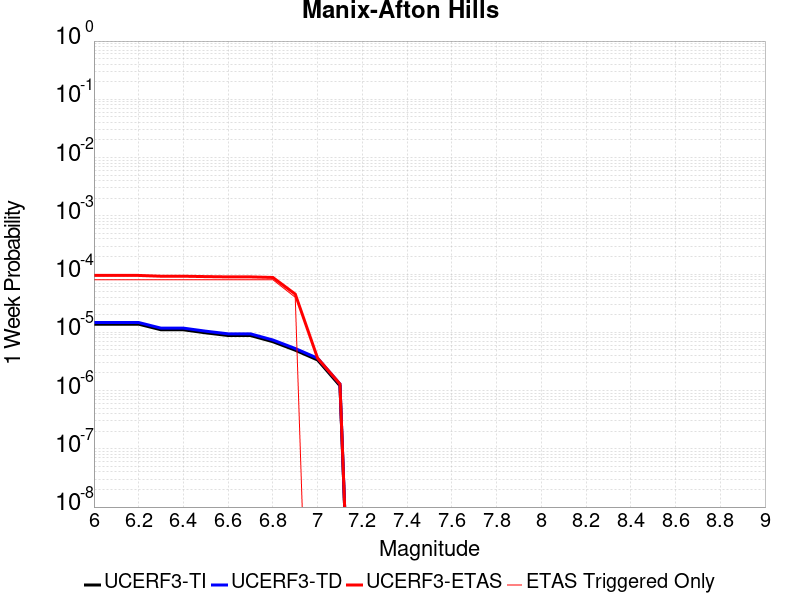 |  |  |

| Magnitude | 1 wk TI Prob | 1 wk TD Prob | 1 wk ETAS Prob | 1 wk ETAS/TD Gain | 1 wk ETAS Triggered Only | 1 mo TI Prob | 1 mo TD Prob | 1 mo ETAS Prob | 1 mo ETAS/TD Gain | 1 mo ETAS Triggered Only | 1 yr TI Prob | 1 yr TD Prob | 1 yr ETAS Prob | 1 yr ETAS/TD Gain | 1 yr ETAS Triggered Only |
|-----|-----|-----|-----|-----|-----|-----|-----|-----|-----|-----|-----|-----|-----|-----|-----|
| 6.0 | 1.3783202E-5 | 1.4714453E-5 | 9.471328E-5 | 6.4367514 | 8.0E-5 | 5.906953E-5 | 6.3060514E-5 | 2.2305043E-4 | 3.5370853 | 1.6E-4 | 7.189342E-4 | 7.675088E-4 | 0.0010073247 | 1.31246 | 2.4E-4 |
| 6.1 | 1.3783202E-5 | 1.4714453E-5 | 9.471328E-5 | 6.4367514 | 8.0E-5 | 5.906953E-5 | 6.3060514E-5 | 2.2305043E-4 | 3.5370853 | 1.6E-4 | 7.189342E-4 | 7.675088E-4 | 0.0010073247 | 1.31246 | 2.4E-4 |
| 6.2 | 1.3783202E-5 | 1.4714453E-5 | 9.471328E-5 | 6.4367514 | 8.0E-5 | 5.906953E-5 | 6.3060514E-5 | 2.2305043E-4 | 3.5370853 | 1.6E-4 | 7.189342E-4 | 7.675088E-4 | 0.0010073247 | 1.31246 | 2.4E-4 |
| 6.3 | 1.10494875E-5 | 1.1795832E-5 | 9.1794886E-5 | 7.7819767 | 8.0E-5 | 4.7354086E-5 | 5.0552644E-5 | 2.1054456E-4 | 4.1648574 | 1.6E-4 | 5.763835E-4 | 6.1531505E-4 | 8.5516734E-4 | 1.3898041 | 2.4E-4 |
| 6.4 | 1.10494875E-5 | 1.1795832E-5 | 9.1794886E-5 | 7.7819767 | 8.0E-5 | 4.7354086E-5 | 5.0552644E-5 | 2.1054456E-4 | 4.1648574 | 1.6E-4 | 5.763835E-4 | 6.1531505E-4 | 8.5516734E-4 | 1.3898041 | 2.4E-4 |
| 6.5 | 9.788949E-6 | 1.0456734E-5 | 9.04559E-5 | 8.650493 | 8.0E-5 | 4.1951964E-5 | 4.4813856E-5 | 2.0480668E-4 | 4.570164 | 1.6E-4 | 5.1064545E-4 | 5.454814E-4 | 7.853505E-4 | 1.4397383 | 2.4E-4 |
| 6.6 | 8.810006E-6 | 9.41582E-6 | 8.9415065E-5 | 9.496259 | 8.0E-5 | 3.775662E-5 | 4.035294E-5 | 1.6034809E-4 | 3.973641 | 1.2E-4 | 4.5958988E-4 | 4.911952E-4 | 6.9109694E-4 | 1.4069701 | 2.0E-4 |
| 6.7 | 8.80128E-6 | 9.406297E-6 | 8.940554E-5 | 9.504861 | 8.0E-5 | 3.7719226E-5 | 4.0312127E-5 | 1.6030729E-4 | 3.9766517 | 1.2E-4 | 4.591348E-4 | 4.906985E-4 | 6.9060037E-4 | 1.4073822 | 2.0E-4 |
| 6.8 | 6.8994877E-6 | 7.3818233E-6 | 8.738123E-5 | 11.837351 | 8.0E-5 | 2.9568899E-5 | 3.163605E-5 | 1.5163225E-4 | 4.793021 | 1.2E-4 | 3.5994186E-4 | 3.8510896E-4 | 5.850319E-4 | 1.5191336 | 2.0E-4 |
| 6.9 | 4.9328037E-6 | 5.27219E-6 | 4.527198E-5 | 8.586941 | 4.0E-5 | 2.1140417E-5 | 2.2594937E-5 | 6.259404E-5 | 2.770268 | 4.0E-5 | 2.5735417E-4 | 2.750648E-4 | 3.550428E-4 | 1.2907605 | 8.0E-5 |
| 7.0 | 3.347973E-6 | 3.5909125E-6 | 3.5909125E-6 | 1.0 | 0.0 | 1.4348378E-5 | 1.5389556E-5 | 1.5389556E-5 | 1.0 | 0.0 | 1.746775E-4 | 1.8735585E-4 | 2.2734836E-4 | 1.2134575 | 4.0E-5 |
| 7.1 | 1.2073567E-6 | 1.2937948E-6 | 1.2937948E-6 | 1.0 | 0.0 | 5.1743755E-6 | 5.544832E-6 | 5.544832E-6 | 1.0 | 0.0 | 6.29962E-5 | 6.750788E-5 | 6.750788E-5 | 1.0 | 0.0 |

## Cucamonga
*[(top)](#table-of-contents)*

| 1 Week | 1 Month | 1 Year |
|-----|-----|-----|
| 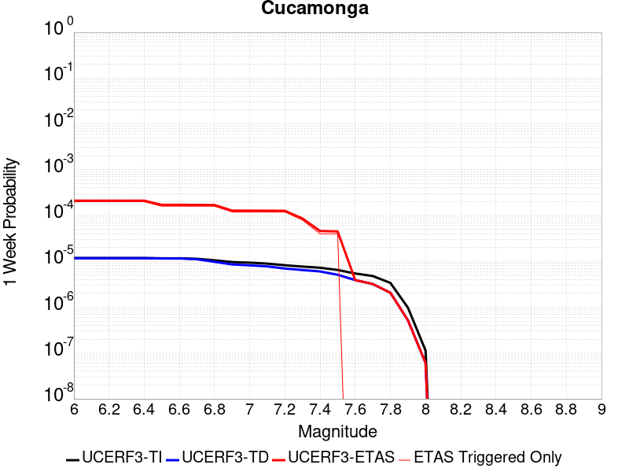 |  |  |

| Magnitude | 1 wk TI Prob | 1 wk TD Prob | 1 wk ETAS Prob | 1 wk ETAS/TD Gain | 1 wk ETAS Triggered Only | 1 mo TI Prob | 1 mo TD Prob | 1 mo ETAS Prob | 1 mo ETAS/TD Gain | 1 mo ETAS Triggered Only | 1 yr TI Prob | 1 yr TD Prob | 1 yr ETAS Prob | 1 yr ETAS/TD Gain | 1 yr ETAS Triggered Only |
|-----|-----|-----|-----|-----|-----|-----|-----|-----|-----|-----|-----|-----|-----|-----|-----|
| 6.0 | 1.1848348E-5 | 1.175498E-5 | 2.1175263E-4 | 18.013865 | 2.0E-4 | 5.0777642E-5 | 5.037753E-5 | 2.5036745E-4 | 4.969824 | 2.0E-4 | 6.180424E-4 | 6.131765E-4 | 8.5302937E-4 | 1.3911644 | 2.4E-4 |
| 6.1 | 1.1848348E-5 | 1.175498E-5 | 2.1175263E-4 | 18.013865 | 2.0E-4 | 5.0777642E-5 | 5.037753E-5 | 2.5036745E-4 | 4.969824 | 2.0E-4 | 6.180424E-4 | 6.131765E-4 | 8.5302937E-4 | 1.3911644 | 2.4E-4 |
| 6.2 | 1.1848348E-5 | 1.175498E-5 | 2.1175263E-4 | 18.013865 | 2.0E-4 | 5.0777642E-5 | 5.037753E-5 | 2.5036745E-4 | 4.969824 | 2.0E-4 | 6.180424E-4 | 6.131765E-4 | 8.5302937E-4 | 1.3911644 | 2.4E-4 |
| 6.3 | 1.1848348E-5 | 1.175498E-5 | 2.1175263E-4 | 18.013865 | 2.0E-4 | 5.0777642E-5 | 5.037753E-5 | 2.5036745E-4 | 4.969824 | 2.0E-4 | 6.180424E-4 | 6.131765E-4 | 8.5302937E-4 | 1.3911644 | 2.4E-4 |
| 6.4 | 1.1848348E-5 | 1.175498E-5 | 2.1175263E-4 | 18.013865 | 2.0E-4 | 5.0777642E-5 | 5.037753E-5 | 2.5036745E-4 | 4.969824 | 2.0E-4 | 6.180424E-4 | 6.131765E-4 | 8.5302937E-4 | 1.3911644 | 2.4E-4 |
| 6.5 | 1.16988695E-5 | 1.1593969E-5 | 1.7159211E-4 | 14.800118 | 1.6E-4 | 5.013705E-5 | 4.9687507E-5 | 2.0967955E-4 | 4.2199655 | 1.6E-4 | 6.102476E-4 | 6.0478016E-4 | 8.046592E-4 | 1.3304987 | 2.0E-4 |
| 6.6 | 1.16988695E-5 | 1.1593969E-5 | 1.7159211E-4 | 14.800118 | 1.6E-4 | 5.013705E-5 | 4.9687507E-5 | 2.0967955E-4 | 4.2199655 | 1.6E-4 | 6.102476E-4 | 6.0478016E-4 | 8.046592E-4 | 1.3304987 | 2.0E-4 |
| 6.7 | 1.1397107E-5 | 1.1132429E-5 | 1.7113065E-4 | 15.372265 | 1.6E-4 | 4.884383E-5 | 4.7709553E-5 | 2.0770192E-4 | 4.353466 | 1.6E-4 | 5.9451134E-4 | 5.8071146E-4 | 7.8059535E-4 | 1.3442051 | 2.0E-4 |
| 6.8 | 1.058387E-5 | 9.800426E-6 | 1.6979886E-4 | 17.32566 | 1.6E-4 | 4.5358654E-5 | 4.2001153E-5 | 2.0199444E-4 | 4.809259 | 1.6E-4 | 5.521017E-4 | 5.1124516E-4 | 7.1114296E-4 | 1.3910017 | 2.0E-4 |
| 6.9 | 9.690046E-6 | 8.593562E-6 | 1.2859252E-4 | 14.963822 | 1.2E-4 | 4.1528107E-5 | 3.6829035E-5 | 1.5682461E-4 | 4.2581787 | 1.2E-4 | 5.054874E-4 | 4.4830164E-4 | 6.082299E-4 | 1.3567426 | 1.6E-4 |
| 7.0 | 9.381461E-6 | 8.200822E-6 | 1.2819984E-4 | 15.63256 | 1.2E-4 | 4.020564E-5 | 3.5145906E-5 | 1.551417E-4 | 4.414218 | 1.2E-4 | 4.893937E-4 | 4.2781778E-4 | 5.877493E-4 | 1.373831 | 1.6E-4 |
| 7.1 | 8.946492E-6 | 7.795345E-6 | 1.2779441E-4 | 16.393682 | 1.2E-4 | 3.8341543E-5 | 3.3408196E-5 | 1.5340418E-4 | 4.591813 | 1.2E-4 | 4.667083E-4 | 4.0666916E-4 | 5.666041E-4 | 1.3932801 | 1.6E-4 |
| 7.2 | 8.251016E-6 | 6.987864E-6 | 1.2698703E-4 | 18.17251 | 1.2E-4 | 3.5361016E-5 | 2.9947647E-5 | 1.4994406E-4 | 5.0068727 | 1.2E-4 | 4.3043532E-4 | 3.6455182E-4 | 5.244935E-4 | 1.4387351 | 1.6E-4 |
| 7.3 | 7.717881E-6 | 6.4985484E-6 | 8.6498025E-5 | 13.310362 | 8.0E-5 | 3.3076216E-5 | 2.7850625E-5 | 1.078484E-4 | 3.872387 | 8.0E-5 | 4.026285E-4 | 3.3902883E-4 | 4.5898813E-4 | 1.3538322 | 1.2E-4 |
| 7.4 | 7.275623E-6 | 6.0437287E-6 | 4.6043486E-5 | 7.618391 | 4.0E-5 | 3.118087E-5 | 2.5901438E-5 | 6.59004E-5 | 2.5442758 | 4.0E-5 | 3.7956095E-4 | 3.1530458E-4 | 3.9527938E-4 | 1.2536429 | 8.0E-5 |
| 7.5 | 6.5109502E-6 | 5.11101E-6 | 4.5110806E-5 | 8.826201 | 4.0E-5 | 2.7903774E-5 | 2.1904145E-5 | 6.190327E-5 | 2.8260984 | 4.0E-5 | 3.3967546E-4 | 2.666505E-4 | 3.4662915E-4 | 1.2999382 | 8.0E-5 |
| 7.6 | 5.4495326E-6 | 3.9178576E-6 | 3.9178576E-6 | 1.0 | 0.0 | 2.335493E-5 | 1.6790711E-5 | 1.6790711E-5 | 1.0 | 0.0 | 2.8430918E-4 | 2.044078E-4 | 2.044078E-4 | 1.0 | 0.0 |
| 7.7 | 4.7997164E-6 | 3.208653E-6 | 3.208653E-6 | 1.0 | 0.0 | 2.057005E-5 | 1.3751297E-5 | 1.3751297E-5 | 1.0 | 0.0 | 2.504116E-4 | 1.6740922E-4 | 1.6740922E-4 | 1.0 | 0.0 |
| 7.8 | 3.3941733E-6 | 2.0686311E-6 | 2.0686311E-6 | 1.0 | 0.0 | 1.4546376E-5 | 8.865532E-6 | 8.865532E-6 | 1.0 | 0.0 | 1.7708774E-4 | 1.0793252E-4 | 1.0793252E-4 | 1.0 | 0.0 |
| 7.9 | 9.750552E-7 | 5.1662437E-7 | 5.1662437E-7 | 1.0 | 0.0 | 4.178801E-6 | 2.2141026E-6 | 2.2141026E-6 | 1.0 | 0.0 | 5.0875715E-5 | 2.695637E-5 | 2.695637E-5 | 1.0 | 0.0 |
| 8.0 | 1.133857E-7 | 6.0622384E-8 | 6.0622384E-8 | 1.0 | 0.0 | 4.8593864E-7 | 2.5981018E-7 | 2.5981018E-7 | 1.0 | 0.0 | 5.9162867E-6 | 3.1631846E-6 | 3.1631846E-6 | 1.0 | 0.0 |

## San Andreas (North Coast) 2011 CFM
*[(top)](#table-of-contents)*

| 1 Week | 1 Month | 1 Year |
|-----|-----|-----|
| 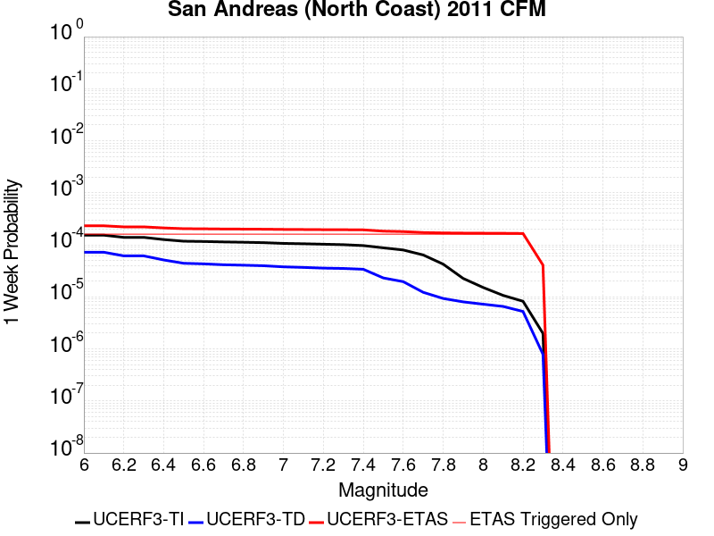 | 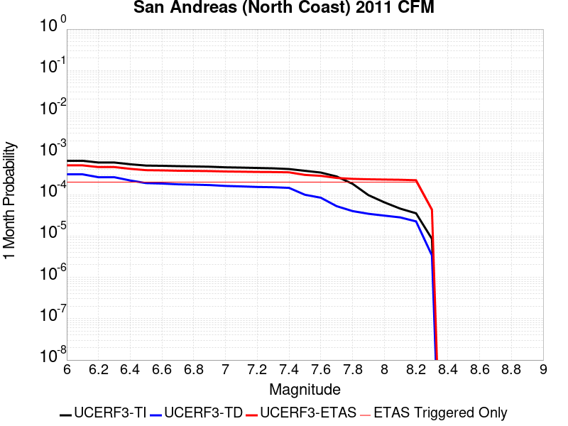 |  |

| Magnitude | 1 wk TI Prob | 1 wk TD Prob | 1 wk ETAS Prob | 1 wk ETAS/TD Gain | 1 wk ETAS Triggered Only | 1 mo TI Prob | 1 mo TD Prob | 1 mo ETAS Prob | 1 mo ETAS/TD Gain | 1 mo ETAS Triggered Only | 1 yr TI Prob | 1 yr TD Prob | 1 yr ETAS Prob | 1 yr ETAS/TD Gain | 1 yr ETAS Triggered Only |
|-----|-----|-----|-----|-----|-----|-----|-----|-----|-----|-----|-----|-----|-----|-----|-----|
| 6.0 | 1.5333705E-4 | 7.205663E-5 | 2.320451E-4 | 3.2203157 | 1.6E-4 | 6.5699324E-4 | 3.0877776E-4 | 5.0871604E-4 | 1.647515 | 2.0E-4 | 0.007969595 | 0.0037529236 | 0.003952173 | 1.0530918 | 2.0E-4 |
| 6.1 | 1.5333705E-4 | 7.205663E-5 | 2.320451E-4 | 3.2203157 | 1.6E-4 | 6.5699324E-4 | 3.0877776E-4 | 5.0871604E-4 | 1.647515 | 2.0E-4 | 0.007969595 | 0.0037529236 | 0.003952173 | 1.0530918 | 2.0E-4 |
| 6.2 | 1.3912938E-4 | 6.134417E-5 | 2.2133435E-4 | 3.6080747 | 1.6E-4 | 5.961325E-4 | 2.6287726E-4 | 4.6282468E-4 | 1.7606113 | 2.0E-4 | 0.007233787 | 0.0031958611 | 0.003395222 | 1.0623809 | 2.0E-4 |
| 6.3 | 1.3912938E-4 | 6.134417E-5 | 2.2133435E-4 | 3.6080747 | 1.6E-4 | 5.961325E-4 | 2.6287726E-4 | 4.6282468E-4 | 1.7606113 | 2.0E-4 | 0.007233787 | 0.0031958611 | 0.003395222 | 1.0623809 | 2.0E-4 |
| 6.4 | 1.2623647E-4 | 5.1188537E-5 | 2.1118035E-4 | 4.12554 | 1.6E-4 | 5.4090127E-4 | 2.193611E-4 | 4.1931722E-4 | 1.9115386 | 2.0E-4 | 0.0065656058 | 0.0026674708 | 0.0028669373 | 1.0747774 | 2.0E-4 |
| 6.5 | 1.1736096E-4 | 4.420224E-5 | 2.0419517E-4 | 4.619566 | 1.6E-4 | 5.028786E-4 | 1.894245E-4 | 3.8938664E-4 | 2.0556295 | 2.0E-4 | 0.006105373 | 0.0023038208 | 0.00250336 | 1.0866123 | 2.0E-4 |
| 6.6 | 1.1586959E-4 | 4.3091295E-5 | 2.030844E-4 | 4.712887 | 1.6E-4 | 4.964894E-4 | 1.84664E-4 | 3.8462706E-4 | 2.082848 | 2.0E-4 | 0.006028018 | 0.0022459824 | 0.0024455332 | 1.0888479 | 2.0E-4 |
| 6.7 | 1.13693764E-4 | 4.1388004E-5 | 2.0138138E-4 | 4.8656945 | 1.6E-4 | 4.87168E-4 | 1.7736519E-4 | 3.773297E-4 | 2.127417 | 2.0E-4 | 0.005915152 | 0.0021572988 | 0.0023568673 | 1.0925086 | 2.0E-4 |
| 6.8 | 1.1204889E-4 | 4.0594197E-5 | 2.005877E-4 | 4.94129 | 1.6E-4 | 4.8012115E-4 | 1.7396362E-4 | 3.7392884E-4 | 2.1494656 | 2.0E-4 | 0.005829819 | 0.002115966 | 0.002315543 | 1.0943195 | 2.0E-4 |
| 6.9 | 1.1005794E-4 | 3.9636114E-5 | 1.9962977E-4 | 5.036563 | 1.6E-4 | 4.7159163E-4 | 1.6985809E-4 | 3.6982412E-4 | 2.1772535 | 2.0E-4 | 0.0057265228 | 0.002066077 | 0.0022656636 | 1.0966018 | 2.0E-4 |
| 7.0 | 1.0647948E-4 | 3.7762937E-5 | 1.9775689E-4 | 5.236799 | 1.6E-4 | 4.562608E-4 | 1.6183121E-4 | 3.6179883E-4 | 2.2356555 | 2.0E-4 | 0.0055408357 | 0.0019685302 | 0.0021681366 | 1.1013986 | 2.0E-4 |
| 7.1 | 1.04795035E-4 | 3.6799192E-5 | 1.967933E-4 | 5.347761 | 1.6E-4 | 4.4904428E-4 | 1.5770139E-4 | 3.5766984E-4 | 2.2680197 | 2.0E-4 | 0.0054534175 | 0.0019183393 | 0.0021179556 | 1.1040568 | 2.0E-4 |
| 7.2 | 1.02724036E-4 | 3.5691766E-5 | 1.9568605E-4 | 5.4826665 | 1.6E-4 | 4.401716E-4 | 1.5295584E-4 | 3.5292524E-4 | 2.307367 | 2.0E-4 | 0.0053459285 | 0.0018606624 | 0.0020602902 | 1.1072886 | 2.0E-4 |
| 7.3 | 1.00650694E-4 | 3.5146393E-5 | 1.9514078E-4 | 5.5522275 | 1.6E-4 | 4.312888E-4 | 1.5061878E-4 | 3.5058867E-4 | 2.3276556 | 2.0E-4 | 0.005238306 | 0.001832257 | 0.0020318907 | 1.108955 | 2.0E-4 |
| 7.4 | 9.672919E-5 | 3.390746E-5 | 1.9390203E-4 | 5.7185655 | 1.6E-4 | 4.144878E-4 | 1.4530968E-4 | 3.4528063E-4 | 2.3761709 | 2.0E-4 | 0.005034718 | 0.0017677253 | 0.0019673717 | 1.1129397 | 2.0E-4 |
| 7.5 | 8.7600405E-5 | 2.3112607E-5 | 1.831089E-4 | 7.922469 | 1.6E-4 | 3.753763E-4 | 9.9050274E-5 | 2.9903048E-4 | 3.0189767 | 2.0E-4 | 0.0045606326 | 0.0012052718 | 0.0014050307 | 1.1657376 | 2.0E-4 |
| 7.6 | 7.9562284E-5 | 1.9601684E-5 | 1.7959854E-4 | 9.162404 | 1.6E-4 | 3.4093665E-4 | 8.4004525E-5 | 2.8398773E-4 | 3.3806243 | 2.0E-4 | 0.0041430052 | 0.0010222767 | 0.0012220723 | 1.1954417 | 2.0E-4 |
| 7.7 | 6.3866544E-5 | 1.223491E-5 | 1.7223295E-4 | 14.077173 | 1.6E-4 | 2.7368503E-4 | 5.2434276E-5 | 2.5242378E-4 | 4.814099 | 2.0E-4 | 0.0033270244 | 6.382006E-4 | 8.3807297E-4 | 1.313181 | 2.0E-4 |
| 7.8 | 4.2543215E-5 | 9.312552E-6 | 1.6931107E-4 | 18.180952 | 1.6E-4 | 1.8231533E-4 | 3.9910326E-5 | 2.3990235E-4 | 6.0110345 | 2.0E-4 | 0.0022174292 | 4.8579997E-4 | 6.8570283E-4 | 1.4114921 | 2.0E-4 |
| 7.9 | 2.2636612E-5 | 8.0142E-6 | 1.6801292E-4 | 20.964403 | 1.6E-4 | 9.7010445E-5 | 3.434612E-5 | 2.3433926E-4 | 6.822874 | 2.0E-4 | 0.0011804621 | 4.1808386E-4 | 6.180003E-4 | 1.4781729 | 2.0E-4 |
| 8.0 | 1.5167874E-5 | 7.230041E-6 | 1.6722888E-4 | 23.129728 | 1.6E-4 | 6.500356E-5 | 3.098552E-5 | 2.3097932E-4 | 7.4544277 | 2.0E-4 | 7.9113094E-4 | 3.7718352E-4 | 5.7710806E-4 | 1.5300459 | 2.0E-4 |
| 8.1 | 1.0681047E-5 | 6.5504837E-6 | 1.6654943E-4 | 25.425518 | 1.6E-4 | 4.5775112E-5 | 2.8073198E-5 | 2.2806758E-4 | 8.124033 | 2.0E-4 | 5.5716943E-4 | 3.4173767E-4 | 5.416693E-4 | 1.5850441 | 2.0E-4 |
| 8.2 | 8.226114E-6 | 5.240571E-6 | 1.6523973E-4 | 31.530863 | 1.6E-4 | 3.52543E-5 | 2.2459399E-5 | 2.2245491E-4 | 9.904758 | 2.0E-4 | 4.2913653E-4 | 2.7340895E-4 | 4.7335427E-4 | 1.731305 | 2.0E-4 |
| 8.3 | 1.983087E-6 | 7.877893E-7 | 4.0787756E-5 | 51.774956 | 4.0E-5 | 8.498917E-6 | 3.3762356E-6 | 4.33761E-5 | 12.847474 | 4.0E-5 | 1.034694E-4 | 4.110491E-5 | 8.1103266E-5 | 1.9730797 | 4.0E-5 |

## Oak Ridge (Onshore)
*[(top)](#table-of-contents)*

| 1 Week | 1 Month | 1 Year |
|-----|-----|-----|
|  | 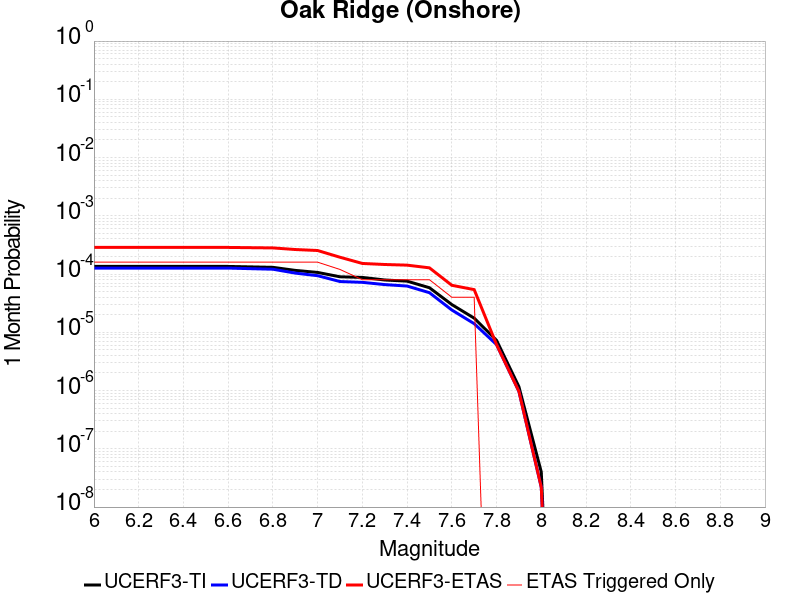 | 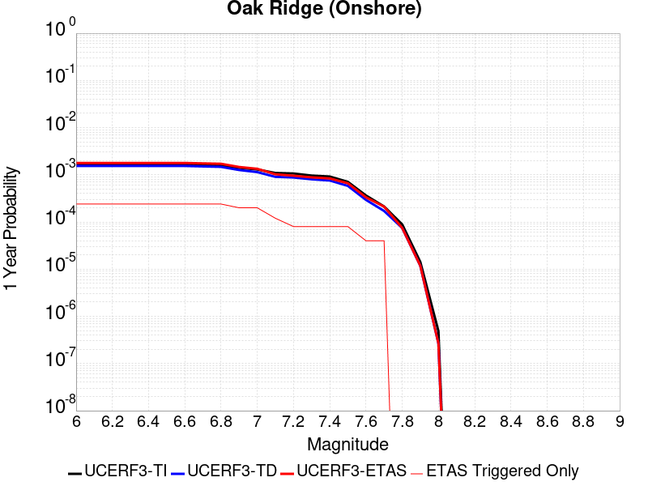 |

| Magnitude | 1 wk TI Prob | 1 wk TD Prob | 1 wk ETAS Prob | 1 wk ETAS/TD Gain | 1 wk ETAS Triggered Only | 1 mo TI Prob | 1 mo TD Prob | 1 mo ETAS Prob | 1 mo ETAS/TD Gain | 1 mo ETAS Triggered Only | 1 yr TI Prob | 1 yr TD Prob | 1 yr ETAS Prob | 1 yr ETAS/TD Gain | 1 yr ETAS Triggered Only |
|-----|-----|-----|-----|-----|-----|-----|-----|-----|-----|-----|-----|-----|-----|-----|-----|
| 6.0 | 3.155064E-5 | 2.9546469E-5 | 1.8954174E-4 | 6.4150386 | 1.6E-4 | 1.3521002E-4 | 1.2662179E-4 | 2.8660154E-4 | 2.2634456 | 1.6E-4 | 0.001644939 | 0.0015405683 | 0.0017801985 | 1.1555467 | 2.4E-4 |
| 6.1 | 3.155064E-5 | 2.9546469E-5 | 1.8954174E-4 | 6.4150386 | 1.6E-4 | 1.3521002E-4 | 1.2662179E-4 | 2.8660154E-4 | 2.2634456 | 1.6E-4 | 0.001644939 | 0.0015405683 | 0.0017801985 | 1.1555467 | 2.4E-4 |
| 6.2 | 3.155064E-5 | 2.9546469E-5 | 1.8954174E-4 | 6.4150386 | 1.6E-4 | 1.3521002E-4 | 1.2662179E-4 | 2.8660154E-4 | 2.2634456 | 1.6E-4 | 0.001644939 | 0.0015405683 | 0.0017801985 | 1.1555467 | 2.4E-4 |
| 6.3 | 3.155064E-5 | 2.9546469E-5 | 1.8954174E-4 | 6.4150386 | 1.6E-4 | 1.3521002E-4 | 1.2662179E-4 | 2.8660154E-4 | 2.2634456 | 1.6E-4 | 0.001644939 | 0.0015405683 | 0.0017801985 | 1.1555467 | 2.4E-4 |
| 6.4 | 3.155064E-5 | 2.9546469E-5 | 1.8954174E-4 | 6.4150386 | 1.6E-4 | 1.3521002E-4 | 1.2662179E-4 | 2.8660154E-4 | 2.2634456 | 1.6E-4 | 0.001644939 | 0.0015405683 | 0.0017801985 | 1.1555467 | 2.4E-4 |
| 6.5 | 3.155064E-5 | 2.9546469E-5 | 1.8954174E-4 | 6.4150386 | 1.6E-4 | 1.3521002E-4 | 1.2662179E-4 | 2.8660154E-4 | 2.2634456 | 1.6E-4 | 0.001644939 | 0.0015405683 | 0.0017801985 | 1.1555467 | 2.4E-4 |
| 6.6 | 3.155064E-5 | 2.9546469E-5 | 1.8954174E-4 | 6.4150386 | 1.6E-4 | 1.3521002E-4 | 1.2662179E-4 | 2.8660154E-4 | 2.2634456 | 1.6E-4 | 0.001644939 | 0.0015405683 | 0.0017801985 | 1.1555467 | 2.4E-4 |
| 6.7 | 3.098897E-5 | 2.8884271E-5 | 1.8887965E-4 | 6.539187 | 1.6E-4 | 1.328031E-4 | 1.2378408E-4 | 2.8376427E-4 | 2.2924135 | 1.6E-4 | 0.0016156785 | 0.001506067 | 0.0017457055 | 1.1591154 | 2.4E-4 |
| 6.8 | 3.0449872E-5 | 2.8259132E-5 | 1.882546E-4 | 6.6617265 | 1.6E-4 | 1.3049292E-4 | 1.2110516E-4 | 2.8108578E-4 | 2.3210058 | 1.6E-4 | 0.0015875935 | 0.0014734953 | 0.0017131416 | 1.1626381 | 2.4E-4 |
| 6.9 | 2.697928E-5 | 2.423737E-5 | 1.8423349E-4 | 7.6012163 | 1.6E-4 | 1.15620365E-4 | 1.0387043E-4 | 2.638538E-4 | 2.5402207 | 1.6E-4 | 0.0014067689 | 0.0012639104 | 0.0014636576 | 1.1580391 | 2.0E-4 |
| 7.0 | 2.4893961E-5 | 2.1878457E-5 | 1.8187496E-4 | 8.31297 | 1.6E-4 | 1.0668404E-4 | 9.376155E-5 | 2.5374655E-4 | 2.7062964 | 1.6E-4 | 0.0012981043 | 0.0011409668 | 0.0013407386 | 1.17509 | 2.0E-4 |
| 7.1 | 2.0945363E-5 | 1.7368691E-5 | 1.373666E-4 | 7.9088635 | 1.2E-4 | 8.976275E-5 | 7.443515E-5 | 1.9442622E-4 | 2.6120217 | 1.2E-4 | 0.0010923136 | 9.058759E-4 | 0.0010257672 | 1.1323485 | 1.2E-4 |
| 7.2 | 2.0439404E-5 | 1.6823378E-5 | 9.6822034E-5 | 5.755207 | 8.0E-5 | 8.7594504E-5 | 7.209823E-5 | 1.5209246E-4 | 2.1095173 | 8.0E-5 | 0.0010659413 | 8.7744714E-4 | 9.5737696E-4 | 1.0910935 | 8.0E-5 |
| 7.3 | 1.8463334E-5 | 1.5393638E-5 | 9.539241E-5 | 6.1968718 | 8.0E-5 | 7.912617E-5 | 6.597109E-5 | 1.4596581E-4 | 2.2125723 | 8.0E-5 | 9.6293533E-4 | 8.0290646E-4 | 8.828422E-4 | 1.099558 | 8.0E-5 |
| 7.4 | 1.763139E-5 | 1.4528081E-5 | 9.452692E-5 | 6.5064974 | 8.0E-5 | 7.556091E-5 | 6.226174E-5 | 1.4225676E-4 | 2.2848182 | 8.0E-5 | 9.1956573E-4 | 7.57777E-4 | 8.377164E-4 | 1.105492 | 8.0E-5 |
| 7.5 | 1.3594944E-5 | 1.1172879E-5 | 9.117198E-5 | 8.160115 | 8.0E-5 | 5.8262744E-5 | 4.7882902E-5 | 1.2787907E-4 | 2.6706624 | 8.0E-5 | 7.0911803E-4 | 5.8282097E-4 | 6.627743E-4 | 1.1371834 | 8.0E-5 |
| 7.6 | 6.9889534E-6 | 5.6380254E-6 | 4.56378E-5 | 8.094643 | 4.0E-5 | 2.9952313E-5 | 2.4162744E-5 | 6.416178E-5 | 2.655401 | 4.0E-5 | 3.646084E-4 | 2.941421E-4 | 3.3413037E-4 | 1.1359487 | 4.0E-5 |
| 7.7 | 4.0824193E-6 | 3.2840244E-6 | 4.3283893E-5 | 13.180138 | 4.0E-5 | 1.7495966E-5 | 1.4074315E-5 | 5.4073753E-5 | 3.8420167 | 4.0E-5 | 2.1299256E-4 | 1.7134144E-4 | 2.1133458E-4 | 1.233412 | 4.0E-5 |
| 7.8 | 1.7023609E-6 | 1.4373388E-6 | 1.4373388E-6 | 1.0 | 0.0 | 7.295812E-6 | 6.1600094E-6 | 6.1600094E-6 | 1.0 | 0.0 | 8.882289E-5 | 7.499556E-5 | 7.499556E-5 | 1.0 | 0.0 |
| 7.9 | 2.721225E-7 | 2.2623067E-7 | 2.2623067E-7 | 1.0 | 0.0 | 1.1662388E-6 | 9.695597E-7 | 9.695597E-7 | 1.0 | 0.0 | 1.4198865E-5 | 1.1804327E-5 | 1.1804327E-5 | 1.0 | 0.0 |
| 8.0 | 9.364255E-9 | 5.1270783E-9 | 5.1270783E-9 | 1.0 | 0.0 | 4.0132523E-8 | 2.1973191E-8 | 2.1973191E-8 | 1.0 | 0.0 | 4.8861335E-7 | 2.6752357E-7 | 2.6752357E-7 | 1.0 | 0.0 |

## Paradise
*[(top)](#table-of-contents)*

| 1 Week | 1 Month | 1 Year |
|-----|-----|-----|
|  |  |  |

| Magnitude | 1 wk TI Prob | 1 wk TD Prob | 1 wk ETAS Prob | 1 wk ETAS/TD Gain | 1 wk ETAS Triggered Only | 1 mo TI Prob | 1 mo TD Prob | 1 mo ETAS Prob | 1 mo ETAS/TD Gain | 1 mo ETAS Triggered Only | 1 yr TI Prob | 1 yr TD Prob | 1 yr ETAS Prob | 1 yr ETAS/TD Gain | 1 yr ETAS Triggered Only |
|-----|-----|-----|-----|-----|-----|-----|-----|-----|-----|-----|-----|-----|-----|-----|-----|
| 6.0 | 1.4851273E-5 | 1.6699274E-5 | 9.6697935E-5 | 5.7905474 | 8.0E-5 | 6.364676E-5 | 7.156649E-5 | 2.7155218E-4 | 3.7944043 | 2.0E-4 | 7.7462377E-4 | 8.7099726E-4 | 0.0011107882 | 1.2753062 | 2.4E-4 |
| 6.1 | 1.4851273E-5 | 1.6699274E-5 | 9.6697935E-5 | 5.7905474 | 8.0E-5 | 6.364676E-5 | 7.156649E-5 | 2.7155218E-4 | 3.7944043 | 2.0E-4 | 7.7462377E-4 | 8.7099726E-4 | 0.0011107882 | 1.2753062 | 2.4E-4 |
| 6.2 | 1.4851273E-5 | 1.6699274E-5 | 9.6697935E-5 | 5.7905474 | 8.0E-5 | 6.364676E-5 | 7.156649E-5 | 2.7155218E-4 | 3.7944043 | 2.0E-4 | 7.7462377E-4 | 8.7099726E-4 | 0.0011107882 | 1.2753062 | 2.4E-4 |
| 6.3 | 1.0426831E-5 | 1.1891795E-5 | 9.189084E-5 | 7.7272477 | 8.0E-5 | 4.4685654E-5 | 5.0963874E-5 | 1.7095776E-4 | 3.354489 | 1.2E-4 | 5.43912E-4 | 6.2031444E-4 | 7.802152E-4 | 1.2577738 | 1.6E-4 |
| 6.4 | 1.0426831E-5 | 1.1891795E-5 | 9.189084E-5 | 7.7272477 | 8.0E-5 | 4.4685654E-5 | 5.0963874E-5 | 1.7095776E-4 | 3.354489 | 1.2E-4 | 5.43912E-4 | 6.2031444E-4 | 7.802152E-4 | 1.2577738 | 1.6E-4 |
| 6.5 | 9.25027E-6 | 1.0622797E-5 | 9.062195E-5 | 8.530893 | 8.0E-5 | 3.964341E-5 | 4.5525507E-5 | 1.2552187E-4 | 2.7571766 | 8.0E-5 | 4.8255164E-4 | 5.54137E-4 | 6.740705E-4 | 1.2164329 | 1.2E-4 |
| 6.6 | 7.904275E-6 | 9.16194E-6 | 8.916121E-5 | 9.731695 | 8.0E-5 | 3.3875025E-5 | 3.926489E-5 | 1.1926175E-4 | 3.0373635 | 8.0E-5 | 4.1235037E-4 | 4.779491E-4 | 5.9789175E-4 | 1.2509527 | 1.2E-4 |
| 6.7 | 7.2061953E-6 | 8.409465E-6 | 8.840879E-5 | 10.51301 | 8.0E-5 | 3.088333E-5 | 3.6040088E-5 | 1.16037205E-4 | 3.2196703 | 8.0E-5 | 3.7593965E-4 | 4.387034E-4 | 5.5865076E-4 | 1.2734133 | 1.2E-4 |
| 6.8 | 6.6948724E-6 | 7.844242E-6 | 8.784361E-5 | 11.198484 | 8.0E-5 | 2.8691995E-5 | 3.3617765E-5 | 1.13615075E-4 | 3.379614 | 8.0E-5 | 3.4926904E-4 | 4.09223E-4 | 4.891903E-4 | 1.1954124 | 8.0E-5 |
| 6.9 | 6.0421025E-6 | 7.132518E-6 | 8.713195E-5 | 12.216155 | 8.0E-5 | 2.5894467E-5 | 3.0567597E-5 | 1.1056515E-4 | 3.6170707 | 8.0E-5 | 3.1521954E-4 | 3.7210033E-4 | 4.5207056E-4 | 1.2149158 | 8.0E-5 |
| 7.0 | 4.134091E-6 | 5.081757E-6 | 5.081757E-6 | 1.0 | 0.0 | 1.7717413E-5 | 2.1778787E-5 | 2.1778787E-5 | 1.0 | 0.0 | 2.1568815E-4 | 2.65126E-4 | 2.65126E-4 | 1.0 | 0.0 |
| 7.1 | 3.7674888E-6 | 4.6332075E-6 | 4.6332075E-6 | 1.0 | 0.0 | 1.6146281E-5 | 1.9856461E-5 | 1.9856461E-5 | 1.0 | 0.0 | 1.9656324E-4 | 2.4172712E-4 | 2.4172712E-4 | 1.0 | 0.0 |
| 7.2 | 3.4065345E-6 | 4.1579556E-6 | 4.1579556E-6 | 1.0 | 0.0 | 1.4599351E-5 | 1.7819697E-5 | 1.7819697E-5 | 1.0 | 0.0 | 1.777326E-4 | 2.1693471E-4 | 2.1693471E-4 | 1.0 | 0.0 |
| 7.3 | 2.9934936E-6 | 3.630208E-6 | 3.630208E-6 | 1.0 | 0.0 | 1.2829195E-5 | 1.5557951E-5 | 1.5557951E-5 | 1.0 | 0.0 | 1.5618425E-4 | 1.8940306E-4 | 1.8940306E-4 | 1.0 | 0.0 |
| 7.4 | 2.4049796E-6 | 2.8895333E-6 | 2.8895333E-6 | 1.0 | 0.0 | 1.0307015E-5 | 1.23836635E-5 | 1.23836635E-5 | 1.0 | 0.0 | 1.2548068E-4 | 1.5076212E-4 | 1.5076212E-4 | 1.0 | 0.0 |
| 7.5 | 1.2710091E-6 | 1.5137343E-6 | 1.5137343E-6 | 1.0 | 0.0 | 5.44717E-6 | 6.487424E-6 | 6.487424E-6 | 1.0 | 0.0 | 6.631728E-5 | 7.8982775E-5 | 7.8982775E-5 | 1.0 | 0.0 |
| 7.6 | 2.21172E-7 | 2.6043384E-7 | 2.6043384E-7 | 1.0 | 0.0 | 9.478797E-7 | 1.1161446E-6 | 1.1161446E-6 | 1.0 | 0.0 | 1.1540374E-5 | 1.3589005E-5 | 1.3589005E-5 | 1.0 | 0.0 |

## Santa Ynez (East)
*[(top)](#table-of-contents)*

| 1 Week | 1 Month | 1 Year |
|-----|-----|-----|
|  | 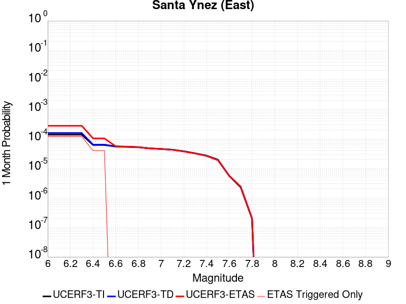 |  |

| Magnitude | 1 wk TI Prob | 1 wk TD Prob | 1 wk ETAS Prob | 1 wk ETAS/TD Gain | 1 wk ETAS Triggered Only | 1 mo TI Prob | 1 mo TD Prob | 1 mo ETAS Prob | 1 mo ETAS/TD Gain | 1 mo ETAS Triggered Only | 1 yr TI Prob | 1 yr TD Prob | 1 yr ETAS Prob | 1 yr ETAS/TD Gain | 1 yr ETAS Triggered Only |
|-----|-----|-----|-----|-----|-----|-----|-----|-----|-----|-----|-----|-----|-----|-----|-----|
| 6.0 | 3.2269712E-5 | 3.6773254E-5 | 1.16770316E-4 | 3.175414 | 8.0E-5 | 1.3829143E-4 | 1.5759347E-4 | 2.7757455E-4 | 1.7613329 | 1.2E-4 | 0.0016823979 | 0.0019175955 | 0.002117212 | 1.1040972 | 2.0E-4 |
| 6.1 | 3.2269712E-5 | 3.6773254E-5 | 1.16770316E-4 | 3.175414 | 8.0E-5 | 1.3829143E-4 | 1.5759347E-4 | 2.7757455E-4 | 1.7613329 | 1.2E-4 | 0.0016823979 | 0.0019175955 | 0.002117212 | 1.1040972 | 2.0E-4 |
| 6.2 | 3.2269712E-5 | 3.6773254E-5 | 1.16770316E-4 | 3.175414 | 8.0E-5 | 1.3829143E-4 | 1.5759347E-4 | 2.7757455E-4 | 1.7613329 | 1.2E-4 | 0.0016823979 | 0.0019175955 | 0.002117212 | 1.1040972 | 2.0E-4 |
| 6.3 | 3.2269712E-5 | 3.6773254E-5 | 1.16770316E-4 | 3.175414 | 8.0E-5 | 1.3829143E-4 | 1.5759347E-4 | 2.7757455E-4 | 1.7613329 | 1.2E-4 | 0.0016823979 | 0.0019175955 | 0.002117212 | 1.1040972 | 2.0E-4 |
| 6.4 | 1.4404779E-5 | 1.4855053E-5 | 5.485446E-5 | 3.6926463 | 4.0E-5 | 6.1733306E-5 | 6.366299E-5 | 1.03660444E-4 | 1.6282685 | 4.0E-5 | 7.513438E-4 | 7.7482633E-4 | 8.5476437E-4 | 1.103169 | 8.0E-5 |
| 6.5 | 1.4404779E-5 | 1.4855053E-5 | 5.485446E-5 | 3.6926463 | 4.0E-5 | 6.1733306E-5 | 6.366299E-5 | 1.03660444E-4 | 1.6282685 | 4.0E-5 | 7.513438E-4 | 7.7482633E-4 | 8.5476437E-4 | 1.103169 | 8.0E-5 |
| 6.6 | 1.280208E-5 | 1.3016704E-5 | 1.3016704E-5 | 1.0 | 0.0 | 5.4864904E-5 | 5.578469E-5 | 5.578469E-5 | 1.0 | 0.0 | 6.6777546E-4 | 6.7896873E-4 | 7.1894156E-4 | 1.0588728 | 4.0E-5 |
| 6.7 | 1.2457027E-5 | 1.2633079E-5 | 1.2633079E-5 | 1.0 | 0.0 | 5.3386164E-5 | 5.414065E-5 | 5.414065E-5 | 1.0 | 0.0 | 6.497827E-4 | 6.5896474E-4 | 6.989384E-4 | 1.0606613 | 4.0E-5 |
| 6.8 | 1.2095134E-5 | 1.2235392E-5 | 1.2235392E-5 | 1.0 | 0.0 | 5.1835254E-5 | 5.2436353E-5 | 5.2436353E-5 | 1.0 | 0.0 | 6.309115E-4 | 6.382272E-4 | 6.782017E-4 | 1.0626336 | 4.0E-5 |
| 6.9 | 1.1104036E-5 | 1.1161518E-5 | 1.1161518E-5 | 1.0 | 0.0 | 4.758786E-5 | 4.7834208E-5 | 4.7834208E-5 | 1.0 | 0.0 | 5.7922816E-4 | 5.822271E-4 | 6.222038E-4 | 1.0686617 | 4.0E-5 |
| 7.0 | 1.0577444E-5 | 1.0585669E-5 | 1.0585669E-5 | 1.0 | 0.0 | 4.5331115E-5 | 4.5366367E-5 | 4.5366367E-5 | 1.0 | 0.0 | 5.5176654E-4 | 5.5219675E-4 | 5.921747E-4 | 1.072398 | 4.0E-5 |
| 7.1 | 1.0021775E-5 | 9.9848085E-6 | 9.9848085E-6 | 1.0 | 0.0 | 4.294976E-5 | 4.279134E-5 | 4.279134E-5 | 1.0 | 0.0 | 5.2278786E-4 | 5.2086124E-4 | 5.6084036E-4 | 1.0767559 | 4.0E-5 |
| 7.2 | 8.874109E-6 | 8.752264E-6 | 8.752264E-6 | 1.0 | 0.0 | 3.8031343E-5 | 3.750917E-5 | 3.750917E-5 | 1.0 | 0.0 | 4.629332E-4 | 4.5657952E-4 | 4.965613E-4 | 1.0875679 | 4.0E-5 |
| 7.3 | 7.5504267E-6 | 7.5080898E-6 | 7.5080898E-6 | 1.0 | 0.0 | 3.235857E-5 | 3.2177137E-5 | 3.2177137E-5 | 1.0 | 0.0 | 3.9389438E-4 | 3.9168724E-4 | 4.3167156E-4 | 1.1020823 | 4.0E-5 |
| 7.4 | 6.309394E-6 | 6.185729E-6 | 6.185729E-6 | 1.0 | 0.0 | 2.703998E-5 | 2.6510004E-5 | 2.6510004E-5 | 1.0 | 0.0 | 3.2916202E-4 | 3.2271244E-4 | 3.6269953E-4 | 1.1239094 | 4.0E-5 |
| 7.5 | 4.6103073E-6 | 4.442555E-6 | 4.442555E-6 | 1.0 | 0.0 | 1.975831E-5 | 1.9039388E-5 | 1.9039388E-5 | 1.0 | 0.0 | 2.4053088E-4 | 2.3178058E-4 | 2.717713E-4 | 1.172537 | 4.0E-5 |
| 7.6 | 1.2858658E-6 | 1.3010639E-6 | 1.3010639E-6 | 1.0 | 0.0 | 5.5108417E-6 | 5.5759765E-6 | 5.5759765E-6 | 1.0 | 0.0 | 6.7092435E-5 | 6.788547E-5 | 1.0788275E-4 | 1.5891877 | 4.0E-5 |
| 7.7 | 5.3302307E-7 | 5.61315E-7 | 5.61315E-7 | 1.0 | 0.0 | 2.2843826E-6 | 2.4056337E-6 | 2.4056337E-6 | 1.0 | 0.0 | 2.7812002E-5 | 2.9288234E-5 | 6.928706E-5 | 2.3656962 | 4.0E-5 |
| 7.8 | 4.613933E-8 | 4.803677E-8 | 4.803677E-8 | 1.0 | 0.0 | 1.9773998E-7 | 2.0587186E-7 | 2.0587186E-7 | 1.0 | 0.0 | 2.4074816E-6 | 2.5064871E-6 | 4.2506388E-5 | 16.95855 | 4.0E-5 |

## Nelson Lake
*[(top)](#table-of-contents)*

| 1 Week | 1 Month | 1 Year |
|-----|-----|-----|
| 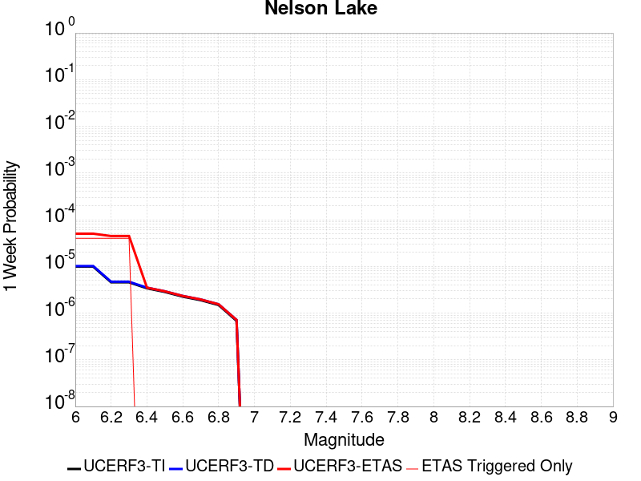 |  |  |

| Magnitude | 1 wk TI Prob | 1 wk TD Prob | 1 wk ETAS Prob | 1 wk ETAS/TD Gain | 1 wk ETAS Triggered Only | 1 mo TI Prob | 1 mo TD Prob | 1 mo ETAS Prob | 1 mo ETAS/TD Gain | 1 mo ETAS Triggered Only | 1 yr TI Prob | 1 yr TD Prob | 1 yr ETAS Prob | 1 yr ETAS/TD Gain | 1 yr ETAS Triggered Only |
|-----|-----|-----|-----|-----|-----|-----|-----|-----|-----|-----|-----|-----|-----|-----|-----|
| 6.0 | 9.913453E-6 | 1.0193228E-5 | 5.019282E-5 | 4.924134 | 4.0E-5 | 4.2485535E-5 | 4.368459E-5 | 1.236811E-4 | 2.8312294 | 8.0E-5 | 5.1713863E-4 | 5.317404E-4 | 7.716128E-4 | 1.4511081 | 2.4E-4 |
| 6.1 | 9.913453E-6 | 1.0193228E-5 | 5.019282E-5 | 4.924134 | 4.0E-5 | 4.2485535E-5 | 4.368459E-5 | 1.236811E-4 | 2.8312294 | 8.0E-5 | 5.1713863E-4 | 5.317404E-4 | 7.716128E-4 | 1.4511081 | 2.4E-4 |
| 6.2 | 4.5596407E-6 | 4.696791E-6 | 4.4696604E-5 | 9.516413 | 4.0E-5 | 1.954117E-5 | 2.0128957E-5 | 6.012815E-5 | 2.9871469 | 4.0E-5 | 2.3788778E-4 | 2.4504375E-4 | 3.2502416E-4 | 1.3263923 | 8.0E-5 |
| 6.3 | 4.5596407E-6 | 4.696791E-6 | 4.4696604E-5 | 9.516413 | 4.0E-5 | 1.954117E-5 | 2.0128957E-5 | 6.012815E-5 | 2.9871469 | 4.0E-5 | 2.3788778E-4 | 2.4504375E-4 | 3.2502416E-4 | 1.3263923 | 8.0E-5 |
| 6.4 | 3.4025713E-6 | 3.5102732E-6 | 3.5102732E-6 | 1.0 | 0.0 | 1.4582367E-5 | 1.5043946E-5 | 1.5043946E-5 | 1.0 | 0.0 | 1.7752586E-4 | 1.8314549E-4 | 2.2313817E-4 | 1.2183656 | 4.0E-5 |
| 6.5 | 2.8352947E-6 | 2.9281807E-6 | 2.9281807E-6 | 1.0 | 0.0 | 1.2151207E-5 | 1.254929E-5 | 1.254929E-5 | 1.0 | 0.0 | 1.479309E-4 | 1.5277765E-4 | 1.9277153E-4 | 1.2617784 | 4.0E-5 |
| 6.6 | 2.251518E-6 | 2.32934E-6 | 2.32934E-6 | 1.0 | 0.0 | 9.649328E-6 | 9.982851E-6 | 9.982851E-6 | 1.0 | 0.0 | 1.1747423E-4 | 1.21535064E-4 | 1.21535064E-4 | 1.0 | 0.0 |
| 6.7 | 1.8911853E-6 | 1.9593788E-6 | 1.9593788E-6 | 1.0 | 0.0 | 8.105055E-6 | 8.397314E-6 | 8.397314E-6 | 1.0 | 0.0 | 9.867457E-5 | 1.0223308E-4 | 1.0223308E-4 | 1.0 | 0.0 |
| 6.8 | 1.4874814E-6 | 1.544029E-6 | 1.544029E-6 | 1.0 | 0.0 | 6.374905E-6 | 6.617254E-6 | 6.617254E-6 | 1.0 | 0.0 | 7.76117E-5 | 8.0562604E-5 | 8.0562604E-5 | 1.0 | 0.0 |
| 6.9 | 6.835972E-7 | 7.141004E-7 | 7.141004E-7 | 1.0 | 0.0 | 2.9296991E-6 | 3.0604285E-6 | 3.0604285E-6 | 1.0 | 0.0 | 3.56685E-5 | 3.72604E-5 | 3.72604E-5 | 1.0 | 0.0 |

## Big Pine (Central)
*[(top)](#table-of-contents)*

| 1 Week | 1 Month | 1 Year |
|-----|-----|-----|
| 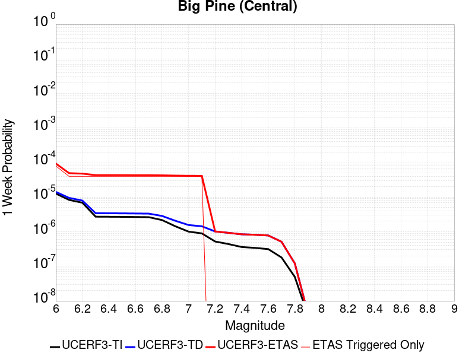 | 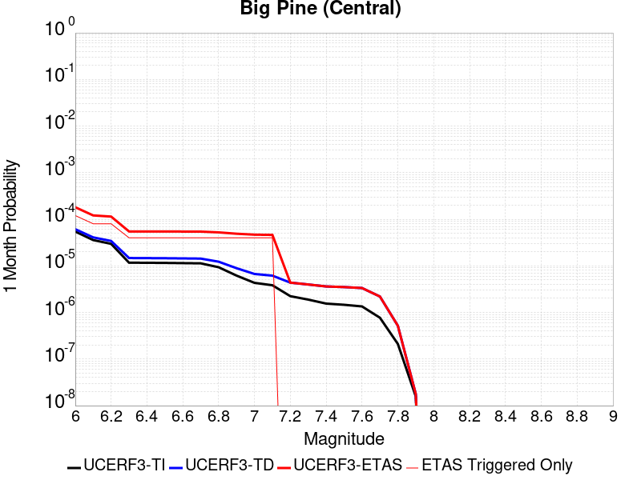 | 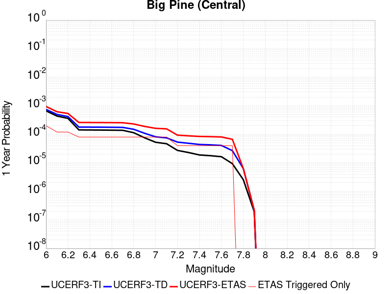 |

| Magnitude | 1 wk TI Prob | 1 wk TD Prob | 1 wk ETAS Prob | 1 wk ETAS/TD Gain | 1 wk ETAS Triggered Only | 1 mo TI Prob | 1 mo TD Prob | 1 mo ETAS Prob | 1 mo ETAS/TD Gain | 1 mo ETAS Triggered Only | 1 yr TI Prob | 1 yr TD Prob | 1 yr ETAS Prob | 1 yr ETAS/TD Gain | 1 yr ETAS Triggered Only |
|-----|-----|-----|-----|-----|-----|-----|-----|-----|-----|-----|-----|-----|-----|-----|-----|
| 6.0 | 1.2706755E-5 | 1.4262975E-5 | 9.4261835E-5 | 6.608848 | 8.0E-5 | 5.4456385E-5 | 6.1125815E-5 | 1.8111848E-4 | 2.9630442 | 1.2E-4 | 6.628048E-4 | 7.4398925E-4 | 9.438404E-4 | 1.2686211 | 2.0E-4 |
| 6.1 | 8.342579E-6 | 9.521826E-6 | 4.9521444E-5 | 5.200835 | 4.0E-5 | 3.5753423E-5 | 4.080731E-5 | 1.2080404E-4 | 2.9603531 | 8.0E-5 | 4.3521097E-4 | 4.967375E-4 | 6.1667786E-4 | 1.2414563 | 1.2E-4 |
| 6.2 | 6.923899E-6 | 7.977751E-6 | 4.797743E-5 | 6.0139046 | 4.0E-5 | 2.9673516E-5 | 3.419002E-5 | 1.14187285E-4 | 3.3397841 | 8.0E-5 | 3.6121515E-4 | 4.1620323E-4 | 5.3615327E-4 | 1.2882007 | 1.2E-4 |
| 6.3 | 2.728396E-6 | 3.4336192E-6 | 4.3433483E-5 | 12.649476 | 4.0E-5 | 1.1693074E-5 | 1.4715432E-5 | 5.4714845E-5 | 3.7181947 | 4.0E-5 | 1.4235388E-4 | 1.7914653E-4 | 2.591322E-4 | 1.4464818 | 8.0E-5 |
| 6.4 | 2.7136944E-6 | 3.4179088E-6 | 4.341777E-5 | 12.703022 | 4.0E-5 | 1.1630066E-5 | 1.4648103E-5 | 5.4647517E-5 | 3.7306888 | 4.0E-5 | 1.4158686E-4 | 1.7832694E-4 | 2.5831268E-4 | 1.4485343 | 8.0E-5 |
| 6.5 | 2.6971882E-6 | 3.4002499E-6 | 4.3400112E-5 | 12.763802 | 4.0E-5 | 1.1559327E-5 | 1.45724225E-5 | 5.457184E-5 | 3.7448707 | 4.0E-5 | 1.4072572E-4 | 1.7740567E-4 | 2.5739148E-4 | 1.4508638 | 8.0E-5 |
| 6.6 | 2.669092E-6 | 3.3702636E-6 | 4.3370128E-5 | 12.868468 | 4.0E-5 | 1.1438916E-5 | 1.4443911E-5 | 5.4443335E-5 | 3.769293 | 4.0E-5 | 1.3925991E-4 | 1.758413E-4 | 2.5582724E-4 | 1.4548757 | 8.0E-5 |
| 6.7 | 2.6408059E-6 | 3.340283E-6 | 4.334015E-5 | 12.974993 | 4.0E-5 | 1.1317691E-5 | 1.4315425E-5 | 5.4314853E-5 | 3.7941487 | 4.0E-5 | 1.3778417E-4 | 1.7427723E-4 | 2.542633E-4 | 1.4589587 | 8.0E-5 |
| 6.8 | 2.1786943E-6 | 2.8636898E-6 | 4.2863576E-5 | 14.967953 | 4.0E-5 | 9.337228E-6 | 1.22729025E-5 | 5.227241E-5 | 4.2591724 | 4.0E-5 | 1.1367482E-4 | 1.4941308E-4 | 2.2940112E-4 | 1.5353484 | 8.0E-5 |
| 6.9 | 1.4411696E-6 | 2.0773482E-6 | 4.2077267E-5 | 20.25528 | 4.0E-5 | 6.1764263E-6 | 8.902892E-6 | 4.8902537E-5 | 5.4928823 | 4.0E-5 | 7.51954E-5 | 1.0838759E-4 | 1.8837892E-4 | 1.738012 | 8.0E-5 |
| 7.0 | 1.0073411E-6 | 1.5621584E-6 | 4.1562096E-5 | 26.605558 | 4.0E-5 | 4.317169E-6 | 6.6949483E-6 | 4.669468E-5 | 6.974614 | 4.0E-5 | 5.2560266E-5 | 8.15081E-5 | 1.6150158E-4 | 1.9814175 | 8.0E-5 |
| 7.1 | 8.947104E-7 | 1.4380338E-6 | 4.1437976E-5 | 28.815718 | 4.0E-5 | 3.834468E-6 | 6.162988E-6 | 4.6162742E-5 | 7.4903183 | 4.0E-5 | 4.6683643E-5 | 7.5031945E-5 | 1.5502595E-4 | 2.0661325 | 8.0E-5 |
| 7.2 | 5.215166E-7 | 1.0184339E-6 | 1.0184339E-6 | 1.0 | 0.0 | 2.2350691E-6 | 4.3647096E-6 | 4.3647096E-6 | 1.0 | 0.0 | 2.7211627E-5 | 5.3139087E-5 | 9.3136965E-5 | 1.7527015 | 4.0E-5 |
| 7.3 | 4.4024807E-7 | 9.2900996E-7 | 9.2900996E-7 | 1.0 | 0.0 | 1.8867761E-6 | 3.9814654E-6 | 3.9814654E-6 | 1.0 | 0.0 | 2.2971257E-5 | 4.8473306E-5 | 8.8471366E-5 | 1.8251565 | 4.0E-5 |
| 7.4 | 3.6130905E-7 | 8.4268595E-7 | 8.4268595E-7 | 1.0 | 0.0 | 1.5484665E-6 | 3.6115064E-6 | 3.6115064E-6 | 1.0 | 0.0 | 1.8852415E-5 | 4.396924E-5 | 8.396748E-5 | 1.9096868 | 4.0E-5 |
| 7.5 | 3.408184E-7 | 8.175001E-7 | 8.175001E-7 | 1.0 | 0.0 | 1.4606494E-6 | 3.5035673E-6 | 3.5035673E-6 | 1.0 | 0.0 | 1.7783263E-5 | 4.2655138E-5 | 8.265343E-5 | 1.9377134 | 4.0E-5 |
| 7.6 | 3.1428627E-7 | 7.7960885E-7 | 7.7960885E-7 | 1.0 | 0.0 | 1.3469405E-6 | 3.3411768E-6 | 3.3411768E-6 | 1.0 | 0.0 | 1.6398877E-5 | 4.0678107E-5 | 8.067648E-5 | 1.98329 | 4.0E-5 |
| 7.7 | 1.7972785E-7 | 5.127105E-7 | 5.127105E-7 | 1.0 | 0.0 | 7.70262E-7 | 2.1973292E-6 | 2.1973292E-6 | 1.0 | 0.0 | 9.377899E-6 | 2.6752165E-5 | 6.67511E-5 | 2.495166 | 4.0E-5 |
| 7.8 | 4.9230927E-8 | 1.2097215E-7 | 1.2097215E-7 | 1.0 | 0.0 | 2.1098968E-7 | 5.1845194E-7 | 5.1845194E-7 | 1.0 | 0.0 | 2.5687964E-6 | 6.312136E-6 | 6.312136E-6 | 1.0 | 0.0 |
| 7.9 | 3.6805972E-9 | 4.1519E-9 | 4.1519E-9 | 1.0 | 0.0 | 1.5773987E-8 | 1.7793857E-8 | 1.7793857E-8 | 1.0 | 0.0 | 1.9204828E-7 | 2.166402E-7 | 2.166402E-7 | 1.0 | 0.0 |

## Blue Cut
*[(top)](#table-of-contents)*

| 1 Week | 1 Month | 1 Year |
|-----|-----|-----|
|  | 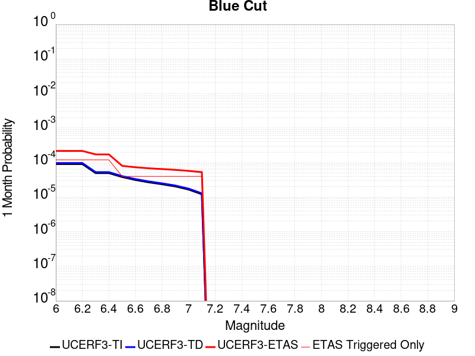 | 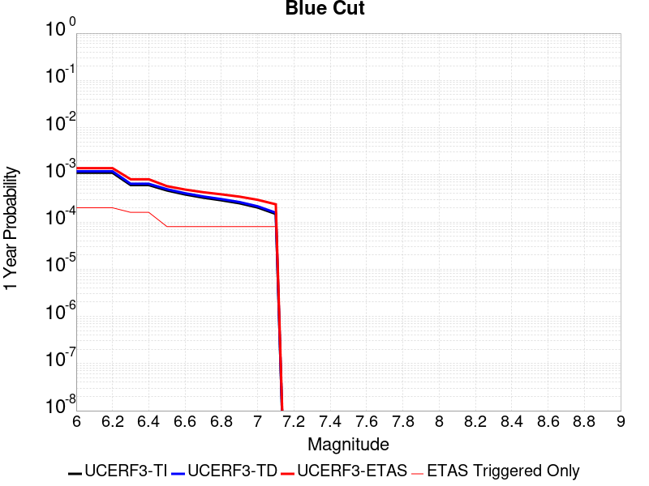 |

| Magnitude | 1 wk TI Prob | 1 wk TD Prob | 1 wk ETAS Prob | 1 wk ETAS/TD Gain | 1 wk ETAS Triggered Only | 1 mo TI Prob | 1 mo TD Prob | 1 mo ETAS Prob | 1 mo ETAS/TD Gain | 1 mo ETAS Triggered Only | 1 yr TI Prob | 1 yr TD Prob | 1 yr ETAS Prob | 1 yr ETAS/TD Gain | 1 yr ETAS Triggered Only |
|-----|-----|-----|-----|-----|-----|-----|-----|-----|-----|-----|-----|-----|-----|-----|-----|
| 6.0 | 2.1227985E-5 | 2.2724995E-5 | 1.4272227E-4 | 6.2804093 | 1.2E-4 | 9.097391E-5 | 9.738952E-5 | 2.1737783E-4 | 2.2320454 | 1.2E-4 | 0.0011070445 | 0.0011851306 | 0.0013848935 | 1.1685578 | 2.0E-4 |
| 6.1 | 2.1227985E-5 | 2.2724995E-5 | 1.4272227E-4 | 6.2804093 | 1.2E-4 | 9.097391E-5 | 9.738952E-5 | 2.1737783E-4 | 2.2320454 | 1.2E-4 | 0.0011070445 | 0.0011851306 | 0.0013848935 | 1.1685578 | 2.0E-4 |
| 6.2 | 2.1227985E-5 | 2.2724995E-5 | 1.4272227E-4 | 6.2804093 | 1.2E-4 | 9.097391E-5 | 9.738952E-5 | 2.1737783E-4 | 2.2320454 | 1.2E-4 | 0.0011070445 | 0.0011851306 | 0.0013848935 | 1.1685578 | 2.0E-4 |
| 6.3 | 1.1613981E-5 | 1.23562095E-5 | 1.3235473E-4 | 10.711596 | 1.2E-4 | 4.9773254E-5 | 5.295418E-5 | 1.7294782E-4 | 3.26599 | 1.2E-4 | 6.0582085E-4 | 6.445389E-4 | 8.0443575E-4 | 1.2480795 | 1.6E-4 |
| 6.4 | 1.1613981E-5 | 1.23562095E-5 | 1.3235473E-4 | 10.711596 | 1.2E-4 | 4.9773254E-5 | 5.295418E-5 | 1.7294782E-4 | 3.26599 | 1.2E-4 | 6.0582085E-4 | 6.445389E-4 | 8.0443575E-4 | 1.2480795 | 1.6E-4 |
| 6.5 | 8.931326E-6 | 9.4835805E-6 | 4.9483202E-5 | 5.2177763 | 4.0E-5 | 3.8276554E-5 | 4.0643336E-5 | 8.064171E-5 | 1.9841312 | 4.0E-5 | 4.6591737E-4 | 4.947294E-4 | 5.746898E-4 | 1.1616246 | 8.0E-5 |
| 6.6 | 7.345353E-6 | 7.7918785E-6 | 4.7791567E-5 | 6.13351 | 4.0E-5 | 3.1479703E-5 | 3.3393382E-5 | 7.3392046E-5 | 2.197802 | 4.0E-5 | 3.83198E-4 | 4.064966E-4 | 4.864641E-4 | 1.1967236 | 8.0E-5 |
| 6.7 | 6.2775666E-6 | 6.656506E-6 | 4.6656238E-5 | 7.0091186 | 4.0E-5 | 2.690358E-5 | 2.8527613E-5 | 6.8526475E-5 | 2.4021103 | 4.0E-5 | 3.2750185E-4 | 3.4727587E-4 | 4.2724807E-4 | 1.2302845 | 8.0E-5 |
| 6.8 | 5.5234095E-6 | 5.8563032E-6 | 4.5856068E-5 | 7.830208 | 4.0E-5 | 2.367154E-5 | 2.5098241E-5 | 6.5097236E-5 | 2.593697 | 4.0E-5 | 2.8816288E-4 | 3.0553553E-4 | 3.8551108E-4 | 1.2617553 | 8.0E-5 |
| 6.9 | 4.7780054E-6 | 5.0664535E-6 | 4.5066252E-5 | 8.895029 | 4.0E-5 | 2.0477004E-5 | 2.1713231E-5 | 6.171236E-5 | 2.8421547 | 4.0E-5 | 2.4927902E-4 | 2.6433356E-4 | 3.443124E-4 | 1.302568 | 8.0E-5 |
| 7.0 | 3.883171E-6 | 4.119333E-6 | 4.411917E-5 | 10.71027 | 4.0E-5 | 1.6642054E-5 | 1.7654203E-5 | 5.76535E-5 | 3.2657094 | 4.0E-5 | 2.0259817E-4 | 2.1492562E-4 | 2.9490842E-4 | 1.3721418 | 8.0E-5 |
| 7.1 | 2.8358215E-6 | 3.0103415E-6 | 4.3010223E-5 | 14.28749 | 4.0E-5 | 1.2153464E-5 | 1.2901436E-5 | 5.290092E-5 | 4.10039 | 4.0E-5 | 1.4795837E-4 | 1.5707024E-4 | 2.3705768E-4 | 1.5092462 | 8.0E-5 |

## Red Pass
*[(top)](#table-of-contents)*

| 1 Week | 1 Month | 1 Year |
|-----|-----|-----|
| 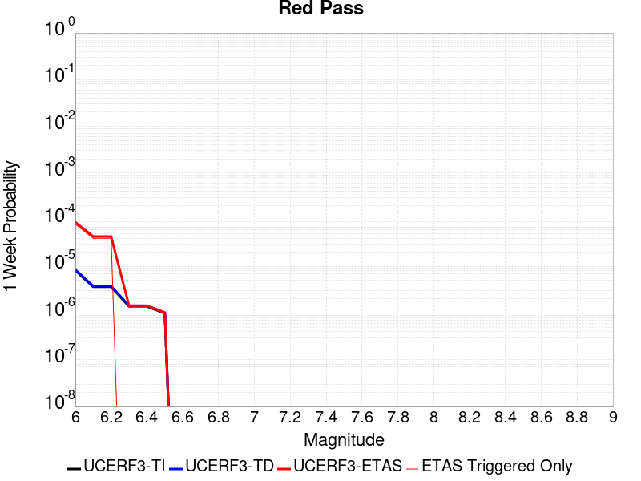 | 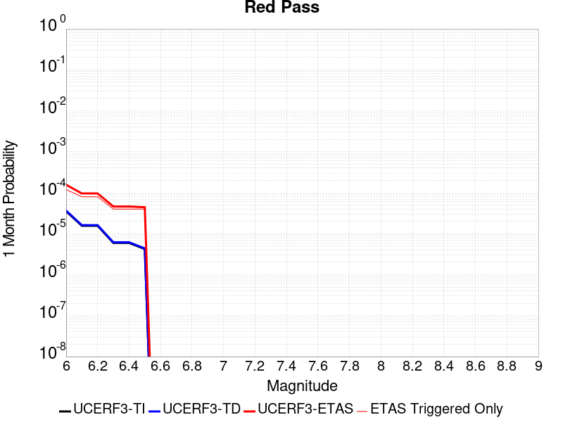 | 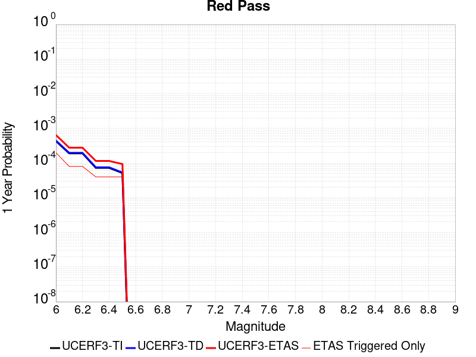 |

| Magnitude | 1 wk TI Prob | 1 wk TD Prob | 1 wk ETAS Prob | 1 wk ETAS/TD Gain | 1 wk ETAS Triggered Only | 1 mo TI Prob | 1 mo TD Prob | 1 mo ETAS Prob | 1 mo ETAS/TD Gain | 1 mo ETAS Triggered Only | 1 yr TI Prob | 1 yr TD Prob | 1 yr ETAS Prob | 1 yr ETAS/TD Gain | 1 yr ETAS Triggered Only |
|-----|-----|-----|-----|-----|-----|-----|-----|-----|-----|-----|-----|-----|-----|-----|-----|
| 6.0 | 8.258278E-6 | 8.552293E-6 | 8.8551606E-5 | 10.354136 | 8.0E-5 | 3.539214E-5 | 3.665227E-5 | 1.5664787E-4 | 4.273893 | 1.2E-4 | 4.308141E-4 | 4.461679E-4 | 6.4607867E-4 | 1.4480617 | 2.0E-4 |
| 6.1 | 3.649988E-6 | 3.7757554E-6 | 4.3775606E-5 | 11.593866 | 4.0E-5 | 1.5642712E-5 | 1.6181735E-5 | 9.618044E-5 | 5.9437656 | 8.0E-5 | 1.9043336E-4 | 1.9699958E-4 | 2.7698383E-4 | 1.4060122 | 8.0E-5 |
| 6.2 | 3.649988E-6 | 3.7757554E-6 | 4.3775606E-5 | 11.593866 | 4.0E-5 | 1.5642712E-5 | 1.6181735E-5 | 9.618044E-5 | 5.9437656 | 8.0E-5 | 1.9043336E-4 | 1.9699958E-4 | 2.7698383E-4 | 1.4060122 | 8.0E-5 |
| 6.3 | 1.3924937E-6 | 1.4412872E-6 | 1.4412872E-6 | 1.0 | 0.0 | 5.9678164E-6 | 6.1769383E-6 | 4.617669E-5 | 7.47566 | 4.0E-5 | 7.265574E-5 | 7.520305E-5 | 1.1520003E-4 | 1.5318533 | 4.0E-5 |
| 6.4 | 1.3924937E-6 | 1.4412872E-6 | 1.4412872E-6 | 1.0 | 0.0 | 5.9678164E-6 | 6.1769383E-6 | 4.617669E-5 | 7.47566 | 4.0E-5 | 7.265574E-5 | 7.520305E-5 | 1.1520003E-4 | 1.5318533 | 4.0E-5 |
| 6.5 | 9.876812E-7 | 1.0223123E-6 | 1.0223123E-6 | 1.0 | 0.0 | 4.2329125E-6 | 4.3813384E-6 | 4.4381162E-5 | 10.129591 | 4.0E-5 | 5.153449E-5 | 5.3342792E-5 | 9.334066E-5 | 1.749827 | 4.0E-5 |

## Ludlow
*[(top)](#table-of-contents)*

| 1 Week | 1 Month | 1 Year |
|-----|-----|-----|
| 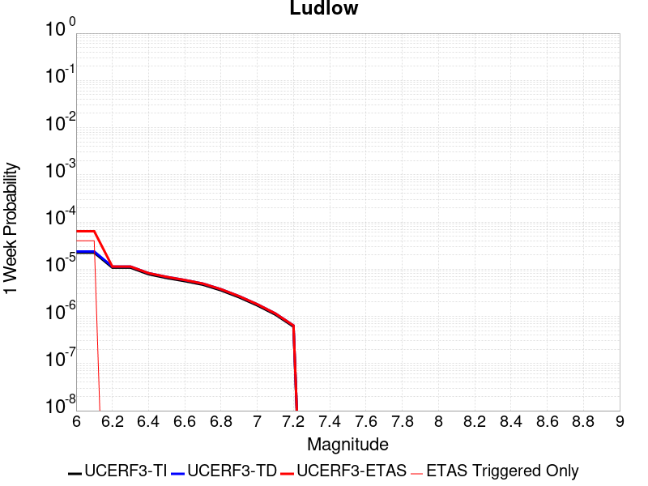 |  |  |

| Magnitude | 1 wk TI Prob | 1 wk TD Prob | 1 wk ETAS Prob | 1 wk ETAS/TD Gain | 1 wk ETAS Triggered Only | 1 mo TI Prob | 1 mo TD Prob | 1 mo ETAS Prob | 1 mo ETAS/TD Gain | 1 mo ETAS Triggered Only | 1 yr TI Prob | 1 yr TD Prob | 1 yr ETAS Prob | 1 yr ETAS/TD Gain | 1 yr ETAS Triggered Only |
|-----|-----|-----|-----|-----|-----|-----|-----|-----|-----|-----|-----|-----|-----|-----|-----|
| 6.0 | 2.2407607E-5 | 2.3661727E-5 | 6.366078E-5 | 2.6904535 | 4.0E-5 | 9.602906E-5 | 1.0140371E-4 | 1.813956E-4 | 1.7888458 | 8.0E-5 | 0.0011685267 | 0.0012339351 | 0.0014336883 | 1.1618831 | 2.0E-4 |
| 6.1 | 2.2407607E-5 | 2.3661727E-5 | 6.366078E-5 | 2.6904535 | 4.0E-5 | 9.602906E-5 | 1.0140371E-4 | 1.813956E-4 | 1.7888458 | 8.0E-5 | 0.0011685267 | 0.0012339351 | 0.0014336883 | 1.1618831 | 2.0E-4 |
| 6.2 | 1.0781252E-5 | 1.1367753E-5 | 1.1367753E-5 | 1.0 | 0.0 | 4.620455E-5 | 4.8718055E-5 | 8.871611E-5 | 1.8210108 | 4.0E-5 | 5.623952E-4 | 5.929849E-4 | 7.5289E-4 | 1.2696613 | 1.6E-4 |
| 6.3 | 1.0781252E-5 | 1.1367753E-5 | 1.1367753E-5 | 1.0 | 0.0 | 4.620455E-5 | 4.8718055E-5 | 8.871611E-5 | 1.8210108 | 4.0E-5 | 5.623952E-4 | 5.929849E-4 | 7.5289E-4 | 1.2696613 | 1.6E-4 |
| 6.4 | 7.814439E-6 | 8.239243E-6 | 8.239243E-6 | 1.0 | 0.0 | 3.3490025E-5 | 3.5310568E-5 | 7.530916E-5 | 2.1327653 | 4.0E-5 | 4.0766477E-4 | 4.2982277E-4 | 5.8975397E-4 | 1.3720864 | 1.6E-4 |
| 6.5 | 6.4986366E-6 | 6.8521795E-6 | 6.8521795E-6 | 1.0 | 0.0 | 2.7851002E-5 | 2.9366158E-5 | 2.9366158E-5 | 1.0 | 0.0 | 3.390332E-4 | 3.5747525E-4 | 4.7743233E-4 | 1.3355676 | 1.2E-4 |
| 6.6 | 5.582177E-6 | 5.8870924E-6 | 5.8870924E-6 | 1.0 | 0.0 | 2.3923398E-5 | 2.5230156E-5 | 2.5230156E-5 | 1.0 | 0.0 | 2.9122844E-4 | 3.0713456E-4 | 3.8711E-4 | 1.2603922 | 8.0E-5 |
| 6.7 | 4.6858763E-6 | 4.9413375E-6 | 4.9413375E-6 | 1.0 | 0.0 | 2.0082172E-5 | 2.1176991E-5 | 2.1176991E-5 | 1.0 | 0.0 | 2.4447302E-4 | 2.5779993E-4 | 2.977896E-4 | 1.1551191 | 4.0E-5 |
| 6.8 | 3.5584908E-6 | 3.7527102E-6 | 3.7527102E-6 | 1.0 | 0.0 | 1.5250586E-5 | 1.6082948E-5 | 1.6082948E-5 | 1.0 | 0.0 | 1.8566006E-4 | 1.957927E-4 | 2.3578487E-4 | 1.2042577 | 4.0E-5 |
| 6.9 | 2.532834E-6 | 2.6714974E-6 | 2.6714974E-6 | 1.0 | 0.0 | 1.0854958E-5 | 1.1449226E-5 | 1.1449226E-5 | 1.0 | 0.0 | 1.3215111E-4 | 1.393857E-4 | 1.7938012E-4 | 1.2869335 | 4.0E-5 |
| 7.0 | 1.7083285E-6 | 1.8022786E-6 | 1.8022786E-6 | 1.0 | 0.0 | 7.3213873E-6 | 7.724029E-6 | 7.724029E-6 | 1.0 | 0.0 | 8.913424E-5 | 9.4036164E-5 | 9.4036164E-5 | 1.0 | 0.0 |
| 7.1 | 1.0905424E-6 | 1.1499736E-6 | 1.1499736E-6 | 1.0 | 0.0 | 4.6737446E-6 | 4.9284495E-6 | 4.9284495E-6 | 1.0 | 0.0 | 5.6901354E-5 | 6.0002323E-5 | 6.0002323E-5 | 1.0 | 0.0 |
| 7.2 | 6.06668E-7 | 6.3884215E-7 | 6.3884215E-7 | 1.0 | 0.0 | 2.600003E-6 | 2.7378926E-6 | 2.7378926E-6 | 1.0 | 0.0 | 3.1654577E-5 | 3.3333403E-5 | 3.3333403E-5 | 1.0 | 0.0 |

## Death Valley (So)
*[(top)](#table-of-contents)*

| 1 Week | 1 Month | 1 Year |
|-----|-----|-----|
|  |  | 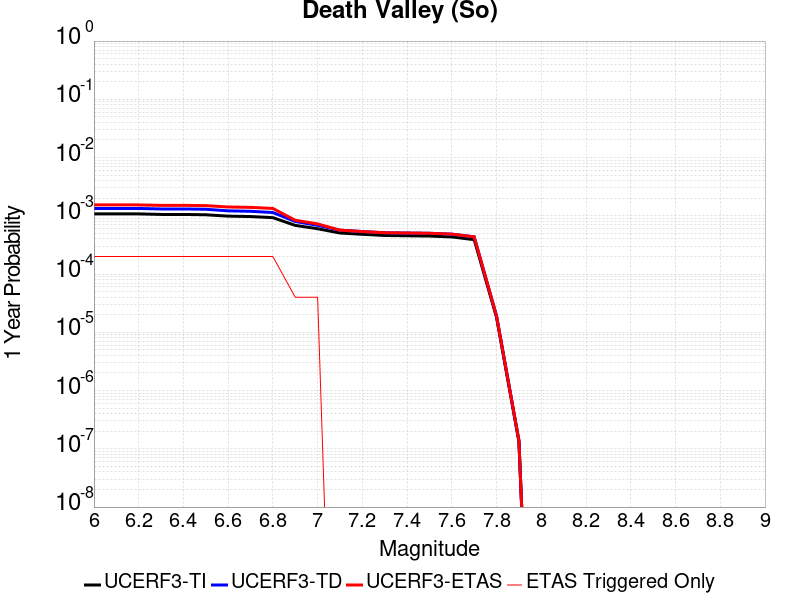 |

| Magnitude | 1 wk TI Prob | 1 wk TD Prob | 1 wk ETAS Prob | 1 wk ETAS/TD Gain | 1 wk ETAS Triggered Only | 1 mo TI Prob | 1 mo TD Prob | 1 mo ETAS Prob | 1 mo ETAS/TD Gain | 1 mo ETAS Triggered Only | 1 yr TI Prob | 1 yr TD Prob | 1 yr ETAS Prob | 1 yr ETAS/TD Gain | 1 yr ETAS Triggered Only |
|-----|-----|-----|-----|-----|-----|-----|-----|-----|-----|-----|-----|-----|-----|-----|-----|
| 6.0 | 2.0684236E-5 | 2.5651949E-5 | 1.05649895E-4 | 4.1185913 | 8.0E-5 | 8.864371E-5 | 1.0993239E-4 | 1.899236E-4 | 1.72764 | 8.0E-5 | 0.0010787029 | 0.0013376221 | 0.0015373545 | 1.149319 | 2.0E-4 |
| 6.1 | 2.0684236E-5 | 2.5651949E-5 | 1.05649895E-4 | 4.1185913 | 8.0E-5 | 8.864371E-5 | 1.0993239E-4 | 1.899236E-4 | 1.72764 | 8.0E-5 | 0.0010787029 | 0.0013376221 | 0.0015373545 | 1.149319 | 2.0E-4 |
| 6.2 | 2.0684236E-5 | 2.5651949E-5 | 1.05649895E-4 | 4.1185913 | 8.0E-5 | 8.864371E-5 | 1.0993239E-4 | 1.899236E-4 | 1.72764 | 8.0E-5 | 0.0010787029 | 0.0013376221 | 0.0015373545 | 1.149319 | 2.0E-4 |
| 6.3 | 2.0240292E-5 | 2.515182E-5 | 1.0514981E-4 | 4.1806045 | 8.0E-5 | 8.6741224E-5 | 1.0778916E-4 | 1.8778053E-4 | 1.7421097 | 8.0E-5 | 0.0010555626 | 0.0013115597 | 0.0015112974 | 1.1522902 | 2.0E-4 |
| 6.4 | 2.0240292E-5 | 2.515182E-5 | 1.0514981E-4 | 4.1806045 | 8.0E-5 | 8.6741224E-5 | 1.0778916E-4 | 1.8778053E-4 | 1.7421097 | 8.0E-5 | 0.0010555626 | 0.0013115597 | 0.0015112974 | 1.1522902 | 2.0E-4 |
| 6.5 | 1.9962767E-5 | 2.4840947E-5 | 1.0483896E-4 | 4.2204094 | 8.0E-5 | 8.55519E-5 | 1.0645695E-4 | 1.8644844E-4 | 1.7513975 | 8.0E-5 | 0.0010410968 | 0.0012953595 | 0.0014951004 | 1.1541973 | 2.0E-4 |
| 6.6 | 1.8937297E-5 | 2.3337238E-5 | 1.0333537E-4 | 4.427918 | 8.0E-5 | 8.115732E-5 | 1.00012985E-4 | 1.8000498E-4 | 1.7998161 | 8.0E-5 | 9.876423E-4 | 0.0012169925 | 0.0014167491 | 1.1641395 | 2.0E-4 |
| 6.7 | 1.8621096E-5 | 2.293739E-5 | 1.02935555E-4 | 4.487675 | 8.0E-5 | 7.980225E-5 | 9.8299475E-5 | 1.7829161E-4 | 1.8137596 | 8.0E-5 | 9.711593E-4 | 0.0011961536 | 0.0013959144 | 1.1670026 | 2.0E-4 |
| 6.8 | 1.7830353E-5 | 2.1828011E-5 | 1.0182626E-4 | 4.6649356 | 8.0E-5 | 7.641356E-5 | 9.354534E-5 | 1.7353786E-4 | 1.8551202 | 8.0E-5 | 9.29938E-4 | 0.0011383336 | 0.0013381059 | 1.1754954 | 2.0E-4 |
| 6.9 | 1.3135183E-5 | 1.5312111E-5 | 1.5312111E-5 | 1.0 | 0.0 | 5.6292425E-5 | 6.5621716E-5 | 6.5621716E-5 | 1.0 | 0.0 | 6.8514474E-4 | 7.98658E-4 | 8.3862606E-4 | 1.0500441 | 4.0E-5 |
| 7.0 | 1.1507512E-5 | 1.3160505E-5 | 1.3160505E-5 | 1.0 | 0.0 | 4.9316975E-5 | 5.6400975E-5 | 5.6400975E-5 | 1.0 | 0.0 | 6.002687E-4 | 6.8647135E-4 | 7.264439E-4 | 1.058229 | 4.0E-5 |
| 7.1 | 9.715903E-6 | 1.0869782E-5 | 1.0869782E-5 | 1.0 | 0.0 | 4.1638916E-5 | 4.6583973E-5 | 4.6583973E-5 | 1.0 | 0.0 | 5.068359E-4 | 5.6701654E-4 | 5.6701654E-4 | 1.0 | 0.0 |
| 7.2 | 9.233269E-6 | 1.02904705E-5 | 1.02904705E-5 | 1.0 | 0.0 | 3.9570554E-5 | 4.4101293E-5 | 4.4101293E-5 | 1.0 | 0.0 | 4.81665E-4 | 5.368052E-4 | 5.368052E-4 | 1.0 | 0.0 |
| 7.3 | 8.8041315E-6 | 9.811974E-6 | 9.811974E-6 | 1.0 | 0.0 | 3.7731446E-5 | 4.2050666E-5 | 4.2050666E-5 | 1.0 | 0.0 | 4.592835E-4 | 5.118508E-4 | 5.118508E-4 | 1.0 | 0.0 |
| 7.4 | 8.708749E-6 | 9.710965E-6 | 9.710965E-6 | 1.0 | 0.0 | 3.7322676E-5 | 4.1617783E-5 | 4.1617783E-5 | 1.0 | 0.0 | 4.5430884E-4 | 5.065829E-4 | 5.065829E-4 | 1.0 | 0.0 |
| 7.5 | 8.612678E-6 | 9.608584E-6 | 9.608584E-6 | 1.0 | 0.0 | 3.6910955E-5 | 4.117902E-5 | 4.117902E-5 | 1.0 | 0.0 | 4.492982E-4 | 5.0124346E-4 | 5.0124346E-4 | 1.0 | 0.0 |
| 7.6 | 8.319024E-6 | 9.287581E-6 | 9.287581E-6 | 1.0 | 0.0 | 3.5652476E-5 | 3.9803333E-5 | 3.9803333E-5 | 1.0 | 0.0 | 4.3398244E-4 | 4.8450203E-4 | 4.8450203E-4 | 1.0 | 0.0 |
| 7.7 | 7.4718328E-6 | 8.348488E-6 | 8.348488E-6 | 1.0 | 0.0 | 3.2021748E-5 | 3.577877E-5 | 3.577877E-5 | 1.0 | 0.0 | 3.8979502E-4 | 4.3552349E-4 | 4.3552349E-4 | 1.0 | 0.0 |
| 7.8 | 3.4586725E-7 | 3.6489428E-7 | 3.6489428E-7 | 1.0 | 0.0 | 1.4822873E-6 | 1.5638317E-6 | 1.5638317E-6 | 1.0 | 0.0 | 1.80467E-5 | 1.903949E-5 | 1.903949E-5 | 1.0 | 0.0 |
| 7.9 | 2.5591178E-9 | 2.6700626E-9 | 2.6700626E-9 | 1.0 | 0.0 | 1.0967647E-8 | 1.1443126E-8 | 1.1443126E-8 | 1.0 | 0.0 | 1.335311E-7 | 1.3932005E-7 | 1.3932005E-7 | 1.0 | 0.0 |

## San Diego Trough north alt1
*[(top)](#table-of-contents)*

| 1 Week | 1 Month | 1 Year |
|-----|-----|-----|
|  |  | 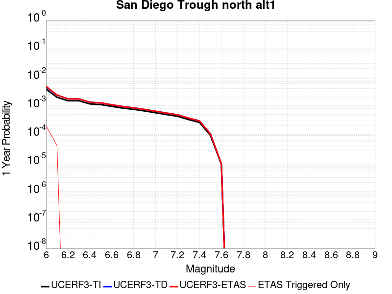 |

| Magnitude | 1 wk TI Prob | 1 wk TD Prob | 1 wk ETAS Prob | 1 wk ETAS/TD Gain | 1 wk ETAS Triggered Only | 1 mo TI Prob | 1 mo TD Prob | 1 mo ETAS Prob | 1 mo ETAS/TD Gain | 1 mo ETAS Triggered Only | 1 yr TI Prob | 1 yr TD Prob | 1 yr ETAS Prob | 1 yr ETAS/TD Gain | 1 yr ETAS Triggered Only |
|-----|-----|-----|-----|-----|-----|-----|-----|-----|-----|-----|-----|-----|-----|-----|-----|
| 6.0 | 7.329252E-5 | 8.827393E-5 | 1.6826687E-4 | 1.9061898 | 8.0E-5 | 3.14073E-4 | 3.782656E-4 | 4.982202E-4 | 1.3171175 | 1.2E-4 | 0.0038171355 | 0.00459623 | 0.004795311 | 1.043314 | 2.0E-4 |
| 6.1 | 3.7940346E-5 | 4.4913257E-5 | 4.4913257E-5 | 1.0 | 0.0 | 1.6259136E-4 | 1.924717E-4 | 2.3246401E-4 | 1.2077827 | 4.0E-5 | 0.0019777524 | 0.0023408993 | 0.0023808058 | 1.0170474 | 4.0E-5 |
| 6.2 | 2.8645263E-5 | 3.331533E-5 | 3.331533E-5 | 1.0 | 0.0 | 1.2275964E-4 | 1.4277229E-4 | 1.4277229E-4 | 1.0 | 0.0 | 0.0014935739 | 0.0017368881 | 0.0017368881 | 1.0 | 0.0 |
| 6.3 | 2.8645263E-5 | 3.331533E-5 | 3.331533E-5 | 1.0 | 0.0 | 1.2275964E-4 | 1.4277229E-4 | 1.4277229E-4 | 1.0 | 0.0 | 0.0014935739 | 0.0017368881 | 0.0017368881 | 1.0 | 0.0 |
| 6.4 | 2.2204576E-5 | 2.5461064E-5 | 2.5461064E-5 | 1.0 | 0.0 | 9.5159E-5 | 1.09114335E-4 | 1.09114335E-4 | 1.0 | 0.0 | 0.001157945 | 0.0013276667 | 0.0013276667 | 1.0 | 0.0 |
| 6.5 | 2.1004838E-5 | 2.403653E-5 | 2.403653E-5 | 1.0 | 0.0 | 9.0017624E-5 | 1.0300968E-4 | 1.0300968E-4 | 1.0 | 0.0 | 0.0010954136 | 0.0012534301 | 0.0012534301 | 1.0 | 0.0 |
| 6.6 | 1.820557E-5 | 2.0714517E-5 | 2.0714517E-5 | 1.0 | 0.0 | 7.802154E-5 | 8.877351E-5 | 8.877351E-5 | 1.0 | 0.0 | 9.4949827E-4 | 0.0010802869 | 0.0010802869 | 1.0 | 0.0 |
| 6.7 | 1.5884485E-5 | 1.7991773E-5 | 1.7991773E-5 | 1.0 | 0.0 | 6.807459E-5 | 7.710534E-5 | 7.710534E-5 | 1.0 | 0.0 | 8.284929E-4 | 9.383559E-4 | 9.383559E-4 | 1.0 | 0.0 |
| 6.8 | 1.4331171E-5 | 1.6208287E-5 | 1.6208287E-5 | 1.0 | 0.0 | 6.141786E-5 | 6.946225E-5 | 6.946225E-5 | 1.0 | 0.0 | 7.4750587E-4 | 8.4537675E-4 | 8.4537675E-4 | 1.0 | 0.0 |
| 6.9 | 1.2574203E-5 | 1.4212128E-5 | 1.4212128E-5 | 1.0 | 0.0 | 5.3888325E-5 | 6.0907703E-5 | 6.0907703E-5 | 1.0 | 0.0 | 6.558929E-4 | 7.413004E-4 | 7.413004E-4 | 1.0 | 0.0 |
| 7.0 | 1.0883844E-5 | 1.22946785E-5 | 1.22946785E-5 | 1.0 | 0.0 | 4.664421E-5 | 5.2690422E-5 | 5.2690422E-5 | 1.0 | 0.0 | 5.677453E-4 | 6.4131804E-4 | 6.4131804E-4 | 1.0 | 0.0 |
| 7.1 | 9.393088E-6 | 1.0611702E-5 | 1.0611702E-5 | 1.0 | 0.0 | 4.025547E-5 | 4.5477937E-5 | 4.5477937E-5 | 1.0 | 0.0 | 4.900001E-4 | 5.53554E-4 | 5.53554E-4 | 1.0 | 0.0 |
| 7.2 | 8.190791E-6 | 9.26275E-6 | 9.26275E-6 | 1.0 | 0.0 | 3.510292E-5 | 3.96969E-5 | 3.96969E-5 | 1.0 | 0.0 | 4.2729423E-4 | 4.8320327E-4 | 4.8320327E-4 | 1.0 | 0.0 |
| 7.3 | 6.268162E-6 | 7.0928886E-6 | 7.0928886E-6 | 1.0 | 0.0 | 2.6863276E-5 | 3.0397741E-5 | 3.0397741E-5 | 1.0 | 0.0 | 3.2701128E-4 | 3.7003006E-4 | 3.7003006E-4 | 1.0 | 0.0 |
| 7.4 | 4.985186E-6 | 5.645222E-6 | 5.645222E-6 | 1.0 | 0.0 | 2.1364907E-5 | 2.4193585E-5 | 2.4193585E-5 | 1.0 | 0.0 | 2.600867E-4 | 2.9451746E-4 | 2.9451746E-4 | 1.0 | 0.0 |
| 7.5 | 1.7489613E-6 | 1.9705317E-6 | 1.9705317E-6 | 1.0 | 0.0 | 7.495527E-6 | 8.44511E-6 | 8.44511E-6 | 1.0 | 0.0 | 9.125422E-5 | 1.02814585E-4 | 1.02814585E-4 | 1.0 | 0.0 |
| 7.6 | 1.6988751E-7 | 1.753573E-7 | 1.753573E-7 | 1.0 | 0.0 | 7.2808916E-7 | 7.515311E-7 | 7.515311E-7 | 1.0 | 0.0 | 8.864449E-6 | 9.149855E-6 | 9.149855E-6 | 1.0 | 0.0 |

## Earthquake Valley (So Extension)
*[(top)](#table-of-contents)*

| 1 Week | 1 Month | 1 Year |
|-----|-----|-----|
| 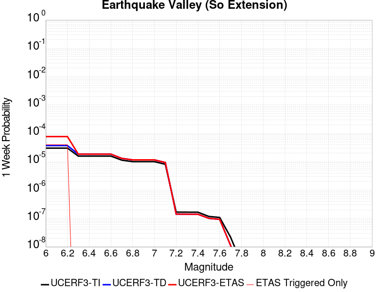 | 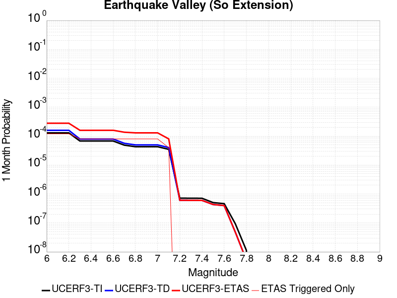 |  |

| Magnitude | 1 wk TI Prob | 1 wk TD Prob | 1 wk ETAS Prob | 1 wk ETAS/TD Gain | 1 wk ETAS Triggered Only | 1 mo TI Prob | 1 mo TD Prob | 1 mo ETAS Prob | 1 mo ETAS/TD Gain | 1 mo ETAS Triggered Only | 1 yr TI Prob | 1 yr TD Prob | 1 yr ETAS Prob | 1 yr ETAS/TD Gain | 1 yr ETAS Triggered Only |
|-----|-----|-----|-----|-----|-----|-----|-----|-----|-----|-----|-----|-----|-----|-----|-----|
| 6.0 | 3.0194888E-5 | 3.710108E-5 | 7.709959E-5 | 2.078096 | 4.0E-5 | 1.2940024E-4 | 1.5899699E-4 | 2.789779E-4 | 1.7546113 | 1.2E-4 | 0.0015743093 | 0.0019345878 | 0.002134201 | 1.1031812 | 2.0E-4 |
| 6.1 | 3.0194888E-5 | 3.710108E-5 | 7.709959E-5 | 2.078096 | 4.0E-5 | 1.2940024E-4 | 1.5899699E-4 | 2.789779E-4 | 1.7546113 | 1.2E-4 | 0.0015743093 | 0.0019345878 | 0.002134201 | 1.1031812 | 2.0E-4 |
| 6.2 | 3.0194888E-5 | 3.710108E-5 | 7.709959E-5 | 2.078096 | 4.0E-5 | 1.2940024E-4 | 1.5899699E-4 | 2.789779E-4 | 1.7546113 | 1.2E-4 | 0.0015743093 | 0.0019345878 | 0.002134201 | 1.1031812 | 2.0E-4 |
| 6.3 | 1.5795305E-5 | 1.845737E-5 | 1.845737E-5 | 1.0 | 0.0 | 6.769241E-5 | 7.910124E-5 | 1.5909491E-4 | 2.0112822 | 8.0E-5 | 8.238434E-4 | 9.627432E-4 | 0.0010426661 | 1.0830159 | 8.0E-5 |
| 6.4 | 1.5795305E-5 | 1.845737E-5 | 1.845737E-5 | 1.0 | 0.0 | 6.769241E-5 | 7.910124E-5 | 1.5909491E-4 | 2.0112822 | 8.0E-5 | 8.238434E-4 | 9.627432E-4 | 0.0010426661 | 1.0830159 | 8.0E-5 |
| 6.5 | 1.5795305E-5 | 1.845737E-5 | 1.845737E-5 | 1.0 | 0.0 | 6.769241E-5 | 7.910124E-5 | 1.5909491E-4 | 2.0112822 | 8.0E-5 | 8.238434E-4 | 9.627432E-4 | 0.0010426661 | 1.0830159 | 8.0E-5 |
| 6.6 | 1.5795305E-5 | 1.845737E-5 | 1.845737E-5 | 1.0 | 0.0 | 6.769241E-5 | 7.910124E-5 | 1.5909491E-4 | 2.0112822 | 8.0E-5 | 8.238434E-4 | 9.627432E-4 | 0.0010426661 | 1.0830159 | 8.0E-5 |
| 6.7 | 1.1363076E-5 | 1.31454935E-5 | 1.31454935E-5 | 1.0 | 0.0 | 4.8697988E-5 | 5.633704E-5 | 1.3633253E-4 | 2.4199448 | 8.0E-5 | 5.927367E-4 | 6.8576384E-4 | 7.65709E-4 | 1.1165782 | 8.0E-5 |
| 6.8 | 1.0049611E-5 | 1.1600614E-5 | 1.1600614E-5 | 1.0 | 0.0 | 4.306905E-5 | 4.9716386E-5 | 1.2971241E-4 | 2.6090474 | 8.0E-5 | 5.242395E-4 | 6.052021E-4 | 6.851537E-4 | 1.1321073 | 8.0E-5 |
| 6.9 | 1.0049611E-5 | 1.1600614E-5 | 1.1600614E-5 | 1.0 | 0.0 | 4.306905E-5 | 4.9716386E-5 | 1.2971241E-4 | 2.6090474 | 8.0E-5 | 5.242395E-4 | 6.052021E-4 | 6.851537E-4 | 1.1321073 | 8.0E-5 |
| 7.0 | 1.0049611E-5 | 1.1600614E-5 | 1.1600614E-5 | 1.0 | 0.0 | 4.306905E-5 | 4.9716386E-5 | 1.2971241E-4 | 2.6090474 | 8.0E-5 | 5.242395E-4 | 6.052021E-4 | 6.851537E-4 | 1.1321073 | 8.0E-5 |
| 7.1 | 8.140254E-6 | 9.388555E-6 | 9.388555E-6 | 1.0 | 0.0 | 3.4886336E-5 | 4.023642E-5 | 8.023481E-5 | 1.9940842 | 4.0E-5 | 4.2465836E-4 | 4.8983545E-4 | 5.2981585E-4 | 1.0816201 | 4.0E-5 |
| 7.2 | 1.673835E-7 | 1.4165126E-7 | 1.4165126E-7 | 1.0 | 0.0 | 7.173577E-7 | 6.070767E-7 | 6.070767E-7 | 1.0 | 0.0 | 8.733795E-6 | 7.3911374E-6 | 7.3911374E-6 | 1.0 | 0.0 |
| 7.3 | 1.6632116E-7 | 1.4063316E-7 | 1.4063316E-7 | 1.0 | 0.0 | 7.1280476E-7 | 6.0271344E-7 | 6.0271344E-7 | 1.0 | 0.0 | 8.678364E-6 | 7.338015E-6 | 7.338015E-6 | 1.0 | 0.0 |
| 7.4 | 1.6569169E-7 | 1.400792E-7 | 1.400792E-7 | 1.0 | 0.0 | 7.1010703E-7 | 6.0033926E-7 | 6.0033926E-7 | 1.0 | 0.0 | 8.645519E-6 | 7.3091096E-6 | 7.3091096E-6 | 1.0 | 0.0 |
| 7.5 | 1.1764555E-7 | 1.0104535E-7 | 1.0104535E-7 | 1.0 | 0.0 | 5.041951E-7 | 4.3305144E-7 | 4.3305144E-7 | 1.0 | 0.0 | 6.138558E-6 | 5.272391E-6 | 5.272391E-6 | 1.0 | 0.0 |
| 7.6 | 1.07927605E-7 | 9.268867E-8 | 9.268867E-8 | 1.0 | 0.0 | 4.6254678E-7 | 3.9723713E-7 | 3.9723713E-7 | 1.0 | 0.0 | 5.6314925E-6 | 4.8363536E-6 | 4.8363536E-6 | 1.0 | 0.0 |
| 7.7 | 2.1826905E-8 | 1.1193839E-8 | 1.1193839E-8 | 1.0 | 0.0 | 9.3543875E-8 | 4.7973597E-8 | 4.7973597E-8 | 1.0 | 0.0 | 1.1388961E-6 | 5.840784E-7 | 5.840784E-7 | 1.0 | 0.0 |
| 7.8 | 2.6169649E-9 | 1.1983311E-9 | 1.1983311E-9 | 1.0 | 0.0 | 1.1215564E-8 | 5.1357043E-9 | 5.1357043E-9 | 1.0 | 0.0 | 1.3654947E-7 | 6.25272E-8 | 6.25272E-8 | 1.0 | 0.0 |

## Red Mountain
*[(top)](#table-of-contents)*

| 1 Week | 1 Month | 1 Year |
|-----|-----|-----|
|  | 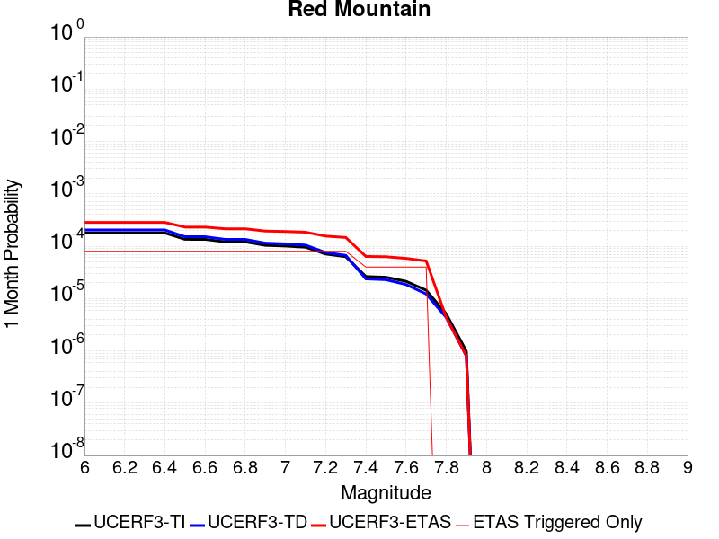 | 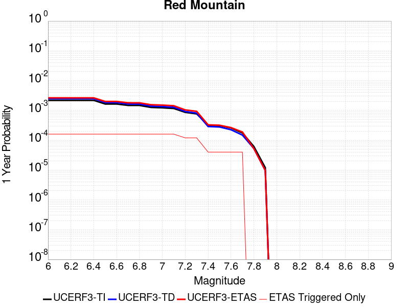 |

| Magnitude | 1 wk TI Prob | 1 wk TD Prob | 1 wk ETAS Prob | 1 wk ETAS/TD Gain | 1 wk ETAS Triggered Only | 1 mo TI Prob | 1 mo TD Prob | 1 mo ETAS Prob | 1 mo ETAS/TD Gain | 1 mo ETAS Triggered Only | 1 yr TI Prob | 1 yr TD Prob | 1 yr ETAS Prob | 1 yr ETAS/TD Gain | 1 yr ETAS Triggered Only |
|-----|-----|-----|-----|-----|-----|-----|-----|-----|-----|-----|-----|-----|-----|-----|-----|
| 6.0 | 4.1810763E-5 | 4.7617137E-5 | 1.2761333E-4 | 2.6799874 | 8.0E-5 | 1.7917668E-4 | 2.0405841E-4 | 2.840421E-4 | 1.3919647 | 8.0E-5 | 0.0021792934 | 0.002481745 | 0.002641348 | 1.0643108 | 1.6E-4 |
| 6.1 | 4.1810763E-5 | 4.7617137E-5 | 1.2761333E-4 | 2.6799874 | 8.0E-5 | 1.7917668E-4 | 2.0405841E-4 | 2.840421E-4 | 1.3919647 | 8.0E-5 | 0.0021792934 | 0.002481745 | 0.002641348 | 1.0643108 | 1.6E-4 |
| 6.2 | 4.1810763E-5 | 4.7617137E-5 | 1.2761333E-4 | 2.6799874 | 8.0E-5 | 1.7917668E-4 | 2.0405841E-4 | 2.840421E-4 | 1.3919647 | 8.0E-5 | 0.0021792934 | 0.002481745 | 0.002641348 | 1.0643108 | 1.6E-4 |
| 6.3 | 4.1810763E-5 | 4.7617137E-5 | 1.2761333E-4 | 2.6799874 | 8.0E-5 | 1.7917668E-4 | 2.0405841E-4 | 2.840421E-4 | 1.3919647 | 8.0E-5 | 0.0021792934 | 0.002481745 | 0.002641348 | 1.0643108 | 1.6E-4 |
| 6.4 | 4.1810763E-5 | 4.7617137E-5 | 1.2761333E-4 | 2.6799874 | 8.0E-5 | 1.7917668E-4 | 2.0405841E-4 | 2.840421E-4 | 1.3919647 | 8.0E-5 | 0.0021792934 | 0.002481745 | 0.002641348 | 1.0643108 | 1.6E-4 |
| 6.5 | 3.154503E-5 | 3.5378947E-5 | 1.1537612E-4 | 3.2611518 | 8.0E-5 | 1.3518598E-4 | 1.5161576E-4 | 2.3160364E-4 | 1.5275697 | 8.0E-5 | 0.0016446467 | 0.0018444513 | 0.0020041561 | 1.0865867 | 1.6E-4 |
| 6.6 | 3.1535834E-5 | 3.5368324E-5 | 1.15365496E-4 | 3.261831 | 8.0E-5 | 1.3514658E-4 | 1.5157025E-4 | 2.3155812E-4 | 1.5277281 | 8.0E-5 | 0.0016441676 | 0.001843898 | 0.002003603 | 1.0866127 | 1.6E-4 |
| 6.7 | 2.8267326E-5 | 3.148608E-5 | 1.1148356E-4 | 3.5407252 | 8.0E-5 | 1.2114006E-4 | 1.3493384E-4 | 2.1492306E-4 | 1.5928031 | 8.0E-5 | 0.0014738824 | 0.0016416667 | 0.0018014042 | 1.097302 | 1.6E-4 |
| 6.8 | 2.8212884E-5 | 3.1423937E-5 | 1.11421425E-4 | 3.54575 | 8.0E-5 | 1.20906756E-4 | 1.3466754E-4 | 2.1465677E-4 | 1.5939755 | 8.0E-5 | 0.0014710457 | 0.0016384295 | 0.0017981672 | 1.0974945 | 1.6E-4 |
| 6.9 | 2.4227871E-5 | 2.6720827E-5 | 1.0671869E-4 | 3.9938393 | 8.0E-5 | 1.03829596E-4 | 1.14513234E-4 | 1.9450407E-4 | 1.6985292 | 8.0E-5 | 0.0012633923 | 0.0013933829 | 0.00155316 | 1.1146685 | 1.6E-4 |
| 7.0 | 2.348524E-5 | 2.58491E-5 | 1.0584703E-4 | 4.0948052 | 8.0E-5 | 1.0064714E-4 | 1.10777575E-4 | 1.9076871E-4 | 1.7220879 | 8.0E-5 | 0.0012246901 | 0.0013479582 | 0.0015077426 | 1.118538 | 1.6E-4 |
| 7.1 | 2.2311642E-5 | 2.447537E-5 | 1.04473416E-4 | 4.268512 | 8.0E-5 | 9.561782E-5 | 1.0489065E-4 | 1.8488226E-4 | 1.762619 | 8.0E-5 | 0.0011635252 | 0.0012763705 | 0.0014361662 | 1.1251955 | 1.6E-4 |
| 7.2 | 1.6533986E-5 | 1.767884E-5 | 9.7677424E-5 | 5.525104 | 8.0E-5 | 7.085802E-5 | 7.576461E-5 | 1.5575855E-4 | 2.055822 | 8.0E-5 | 8.623549E-4 | 9.221073E-4 | 0.0010419966 | 1.1300167 | 1.2E-4 |
| 7.3 | 1.4703092E-5 | 1.556691E-5 | 9.5565665E-5 | 6.139026 | 8.0E-5 | 6.301173E-5 | 6.671397E-5 | 1.4670863E-4 | 2.1990693 | 8.0E-5 | 7.668978E-4 | 8.120016E-4 | 9.319041E-4 | 1.147663 | 1.2E-4 |
| 7.4 | 6.1331984E-6 | 5.530447E-6 | 4.5530225E-5 | 8.232649 | 4.0E-5 | 2.6284872E-5 | 2.3701703E-5 | 6.3700754E-5 | 2.6876025 | 4.0E-5 | 3.199713E-4 | 2.8853054E-4 | 3.28519E-4 | 1.1385936 | 4.0E-5 |
| 7.5 | 5.954766E-6 | 5.3400213E-6 | 4.5339806E-5 | 8.490567 | 4.0E-5 | 2.5520176E-5 | 2.2885608E-5 | 6.288469E-5 | 2.7477834 | 4.0E-5 | 3.1066386E-4 | 2.7859717E-4 | 3.1858604E-4 | 1.1435364 | 4.0E-5 |
| 7.6 | 4.9726646E-6 | 4.316545E-6 | 4.4316374E-5 | 10.26663 | 4.0E-5 | 2.1311245E-5 | 1.849935E-5 | 5.849861E-5 | 3.162198 | 4.0E-5 | 2.5943352E-4 | 2.2520665E-4 | 2.6519762E-4 | 1.1775746 | 4.0E-5 |
| 7.7 | 3.3613894E-6 | 2.8534687E-6 | 4.2853353E-5 | 15.017986 | 4.0E-5 | 1.4405875E-5 | 1.2229096E-5 | 5.2228606E-5 | 4.270848 | 4.0E-5 | 1.7537741E-4 | 1.4887934E-4 | 1.8887338E-4 | 1.268634 | 4.0E-5 |
| 7.8 | 1.1828961E-6 | 1.0125256E-6 | 1.0125256E-6 | 1.0 | 0.0 | 5.069545E-6 | 4.3393884E-6 | 4.3393884E-6 | 1.0 | 0.0 | 6.171996E-5 | 5.28308E-5 | 5.28308E-5 | 1.0 | 0.0 |
| 7.9 | 2.2967266E-7 | 1.8623352E-7 | 1.8623352E-7 | 1.0 | 0.0 | 9.843111E-7 | 7.9814345E-7 | 7.9814345E-7 | 1.0 | 0.0 | 1.19839215E-5 | 9.717356E-6 | 9.717356E-6 | 1.0 | 0.0 |

## Cleghorn Pass
*[(top)](#table-of-contents)*

| 1 Week | 1 Month | 1 Year |
|-----|-----|-----|
|  | 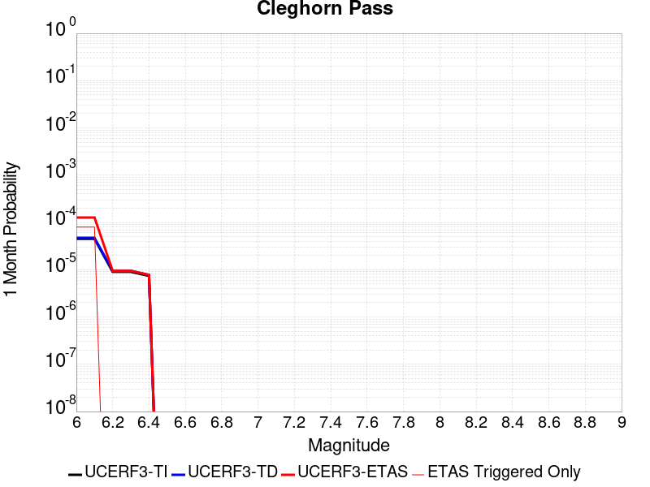 | 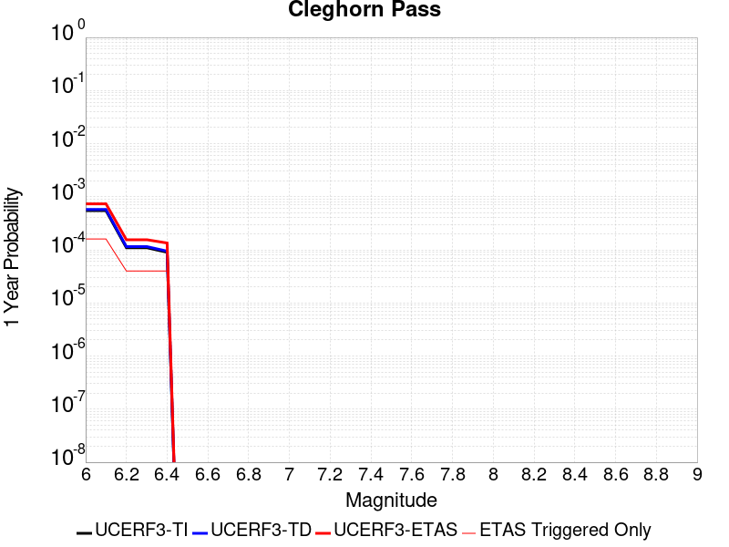 |

| Magnitude | 1 wk TI Prob | 1 wk TD Prob | 1 wk ETAS Prob | 1 wk ETAS/TD Gain | 1 wk ETAS Triggered Only | 1 mo TI Prob | 1 mo TD Prob | 1 mo ETAS Prob | 1 mo ETAS/TD Gain | 1 mo ETAS Triggered Only | 1 yr TI Prob | 1 yr TD Prob | 1 yr ETAS Prob | 1 yr ETAS/TD Gain | 1 yr ETAS Triggered Only |
|-----|-----|-----|-----|-----|-----|-----|-----|-----|-----|-----|-----|-----|-----|-----|-----|
| 6.0 | 1.0522846E-5 | 1.1042483E-5 | 5.104204E-5 | 4.6223335 | 4.0E-5 | 4.509713E-5 | 4.7324364E-5 | 1.2732059E-4 | 2.690381 | 8.0E-5 | 5.4891926E-4 | 5.7607447E-4 | 7.359823E-4 | 1.2775818 | 1.6E-4 |
| 6.1 | 1.0522846E-5 | 1.1042483E-5 | 5.104204E-5 | 4.6223335 | 4.0E-5 | 4.509713E-5 | 4.7324364E-5 | 1.2732059E-4 | 2.690381 | 8.0E-5 | 5.4891926E-4 | 5.7607447E-4 | 7.359823E-4 | 1.2775818 | 1.6E-4 |
| 6.2 | 2.1045846E-6 | 2.208571E-6 | 2.208571E-6 | 1.0 | 0.0 | 9.019617E-6 | 9.465293E-6 | 9.465293E-6 | 1.0 | 0.0 | 1.098083E-4 | 1.1523805E-4 | 1.5523344E-4 | 1.3470676 | 4.0E-5 |
| 6.3 | 2.1045846E-6 | 2.208571E-6 | 2.208571E-6 | 1.0 | 0.0 | 9.019617E-6 | 9.465293E-6 | 9.465293E-6 | 1.0 | 0.0 | 1.098083E-4 | 1.1523805E-4 | 1.5523344E-4 | 1.3470676 | 4.0E-5 |
| 6.4 | 1.7259927E-6 | 1.8111789E-6 | 1.8111789E-6 | 1.0 | 0.0 | 7.3970905E-6 | 7.762195E-6 | 7.762195E-6 | 1.0 | 0.0 | 9.005586E-5 | 9.450473E-5 | 1.3450095E-4 | 1.4232192 | 4.0E-5 |

## Calaveras (So) 2011 CFM
*[(top)](#table-of-contents)*

| 1 Week | 1 Month | 1 Year |
|-----|-----|-----|
|  |  | 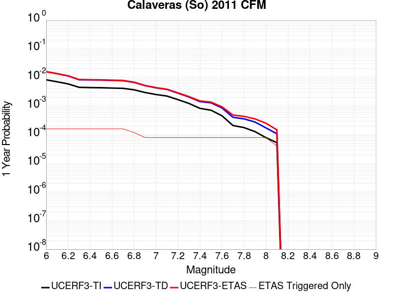 |

| Magnitude | 1 wk TI Prob | 1 wk TD Prob | 1 wk ETAS Prob | 1 wk ETAS/TD Gain | 1 wk ETAS Triggered Only | 1 mo TI Prob | 1 mo TD Prob | 1 mo ETAS Prob | 1 mo ETAS/TD Gain | 1 mo ETAS Triggered Only | 1 yr TI Prob | 1 yr TD Prob | 1 yr ETAS Prob | 1 yr ETAS/TD Gain | 1 yr ETAS Triggered Only |
|-----|-----|-----|-----|-----|-----|-----|-----|-----|-----|-----|-----|-----|-----|-----|-----|
| 6.0 | 1.5950744E-4 | 3.0790493E-4 | 3.478926E-4 | 1.1298702 | 4.0E-5 | 6.834242E-4 | 0.0013187632 | 0.0013986578 | 1.0605829 | 8.0E-5 | 0.00828899 | 0.015898287 | 0.016055744 | 1.009904 | 1.6E-4 |
| 6.1 | 1.3584697E-4 | 2.6108976E-4 | 3.010793E-4 | 1.153164 | 4.0E-5 | 5.8207137E-4 | 0.0011183338 | 0.0011982443 | 1.071455 | 8.0E-5 | 0.007063716 | 0.013499089 | 0.013656929 | 1.0116926 | 1.6E-4 |
| 6.2 | 1.14676266E-4 | 2.1784513E-4 | 2.578364E-4 | 1.1835767 | 4.0E-5 | 4.9137714E-4 | 9.3321304E-4 | 0.0010131384 | 1.0856453 | 8.0E-5 | 0.0059661185 | 0.011280941 | 0.011439136 | 1.0140232 | 1.6E-4 |
| 6.3 | 8.691518E-5 | 1.6052955E-4 | 2.0052314E-4 | 1.2491353 | 4.0E-5 | 3.7244044E-4 | 6.8776263E-4 | 7.6770765E-4 | 1.1162392 | 8.0E-5 | 0.004525038 | 0.008334652 | 0.008493318 | 1.019037 | 1.6E-4 |
| 6.4 | 8.50982E-5 | 1.5758992E-4 | 1.975836E-4 | 1.2537833 | 4.0E-5 | 3.646556E-4 | 6.7517074E-4 | 7.5511675E-4 | 1.1184086 | 8.0E-5 | 0.0044306475 | 0.008182503 | 0.008341194 | 1.0193939 | 1.6E-4 |
| 6.5 | 8.4062965E-5 | 1.5583218E-4 | 1.9582595E-4 | 1.2566464 | 4.0E-5 | 3.602201E-4 | 6.6764234E-4 | 7.475889E-4 | 1.1197447 | 8.0E-5 | 0.004376863 | 0.008091622 | 0.008250328 | 1.0196135 | 1.6E-4 |
| 6.6 | 8.194716E-5 | 1.521856E-4 | 1.9217952E-4 | 1.262797 | 4.0E-5 | 3.5115483E-4 | 6.5202266E-4 | 7.3197053E-4 | 1.1226151 | 8.0E-5 | 0.0042669317 | 0.007903222 | 0.008061958 | 1.0200849 | 1.6E-4 |
| 6.7 | 8.012326E-5 | 1.4886065E-4 | 1.888547E-4 | 1.2686677 | 4.0E-5 | 3.433402E-4 | 6.377831E-4 | 7.1773207E-4 | 1.1253545 | 8.0E-5 | 0.004172157 | 0.0077315248 | 0.007890288 | 1.0205345 | 1.6E-4 |
| 6.8 | 7.119773E-5 | 1.2941338E-4 | 1.694082E-4 | 1.3090471 | 4.0E-5 | 3.0509746E-4 | 5.54491E-4 | 5.9446885E-4 | 1.0720983 | 4.0E-5 | 0.0037082357 | 0.0067267935 | 0.0068459865 | 1.0177191 | 1.2E-4 |
| 6.9 | 5.7343088E-5 | 9.972352E-5 | 1.3971953E-4 | 1.401069 | 4.0E-5 | 2.4573295E-4 | 4.2731693E-4 | 4.6729983E-4 | 1.0935674 | 4.0E-5 | 0.0029876942 | 0.005190248 | 0.005269833 | 1.0153335 | 8.0E-5 |
| 7.0 | 4.8746577E-5 | 8.3315186E-5 | 1.2331185E-4 | 1.4800645 | 4.0E-5 | 2.0889717E-4 | 3.5701657E-4 | 3.970023E-4 | 1.1119996 | 4.0E-5 | 0.0025403565 | 0.0043380805 | 0.0044177338 | 1.0183613 | 8.0E-5 |
| 7.1 | 4.2998014E-5 | 7.307419E-5 | 1.1307127E-4 | 1.5473489 | 4.0E-5 | 1.8426418E-4 | 3.1313783E-4 | 3.5312533E-4 | 1.1276993 | 4.0E-5 | 0.002241108 | 0.0038058492 | 0.0038855448 | 1.0209403 | 8.0E-5 |
| 7.2 | 3.221292E-5 | 5.426544E-5 | 9.426327E-5 | 1.7370774 | 4.0E-5 | 1.3804805E-4 | 2.325456E-4 | 2.725363E-4 | 1.1719693 | 4.0E-5 | 0.0016794393 | 0.0028275952 | 0.0029073688 | 1.0282125 | 8.0E-5 |
| 7.3 | 2.3756531E-5 | 3.976839E-5 | 7.97668E-5 | 2.005784 | 4.0E-5 | 1.0180973E-4 | 1.7042493E-4 | 2.104181E-4 | 1.2346674 | 4.0E-5 | 0.0012388286 | 0.0020729662 | 0.0021528003 | 1.038512 | 8.0E-5 |
| 7.4 | 1.5997684E-5 | 2.7537306E-5 | 6.75362E-5 | 2.452535 | 4.0E-5 | 6.8559704E-5 | 1.18011696E-4 | 1.5800698E-4 | 1.3389094 | 4.0E-5 | 8.343947E-4 | 0.001435848 | 0.0015157331 | 1.0556362 | 8.0E-5 |
| 7.5 | 1.3814293E-5 | 2.4971192E-5 | 6.497019E-5 | 2.601806 | 4.0E-5 | 5.9202768E-5 | 1.0701502E-4 | 1.4701074E-4 | 1.3737394 | 4.0E-5 | 7.205553E-4 | 0.0013021316 | 0.0013820274 | 1.0613577 | 8.0E-5 |
| 7.6 | 8.817309E-6 | 1.6584063E-5 | 5.6583398E-5 | 3.411914 | 4.0E-5 | 3.7787922E-5 | 7.107262E-5 | 1.11069785E-4 | 1.5627646 | 4.0E-5 | 4.5997082E-4 | 8.6496706E-4 | 9.448979E-4 | 1.092409 | 8.0E-5 |
| 7.7 | 4.0352206E-6 | 7.815648E-6 | 4.7815334E-5 | 6.1178975 | 4.0E-5 | 1.7293689E-5 | 3.3495206E-5 | 7.3493866E-5 | 2.1941607 | 4.0E-5 | 2.1053031E-4 | 4.077279E-4 | 4.876953E-4 | 1.1961293 | 8.0E-5 |
| 7.8 | 3.413169E-6 | 6.882057E-6 | 4.688178E-5 | 6.8121758 | 4.0E-5 | 1.4627784E-5 | 2.9494196E-5 | 6.949302E-5 | 2.356159 | 4.0E-5 | 1.7807873E-4 | 3.5903274E-4 | 4.39004E-4 | 1.2227409 | 8.0E-5 |
| 7.9 | 2.4740732E-6 | 5.3497497E-6 | 4.5349538E-5 | 8.476945 | 4.0E-5 | 1.06031275E-5 | 2.29273E-5 | 6.292638E-5 | 2.744605 | 4.0E-5 | 1.2908543E-4 | 2.7910416E-4 | 3.5908184E-4 | 1.2865514 | 8.0E-5 |
| 8.0 | 1.5231818E-6 | 3.3315503E-6 | 4.3331416E-5 | 13.006382 | 4.0E-5 | 6.527906E-6 | 1.42779945E-5 | 5.4277425E-5 | 3.8014739 | 4.0E-5 | 7.9474354E-5 | 1.7382075E-4 | 2.5380685E-4 | 1.4601642 | 8.0E-5 |
| 8.1 | 1.0104524E-6 | 2.0730229E-6 | 4.207294E-5 | 20.295454 | 4.0E-5 | 4.330503E-6 | 8.8843535E-6 | 4.8883998E-5 | 5.5022573 | 4.0E-5 | 5.2722597E-5 | 1.08161665E-4 | 1.4815734E-4 | 1.3697767 | 4.0E-5 |

## San Jacinto (Lytle Creek connector)
*[(top)](#table-of-contents)*

| 1 Week | 1 Month | 1 Year |
|-----|-----|-----|
| 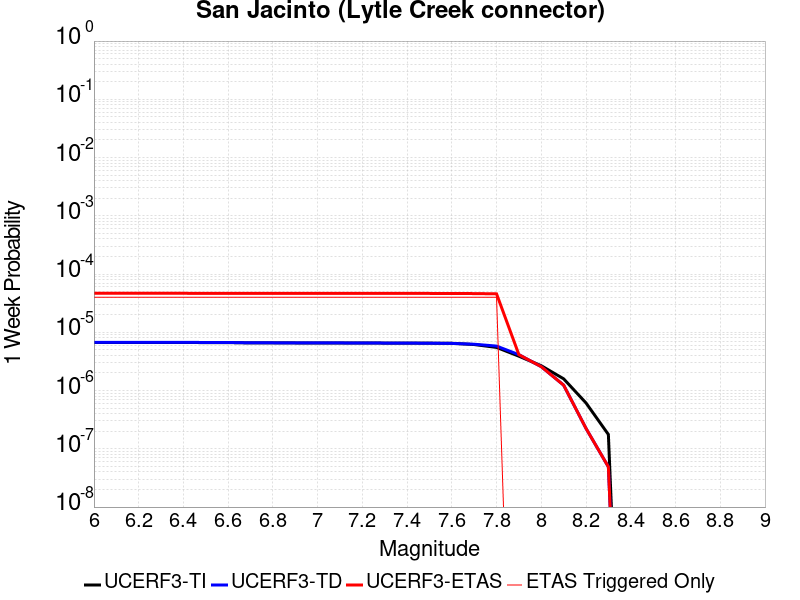 | 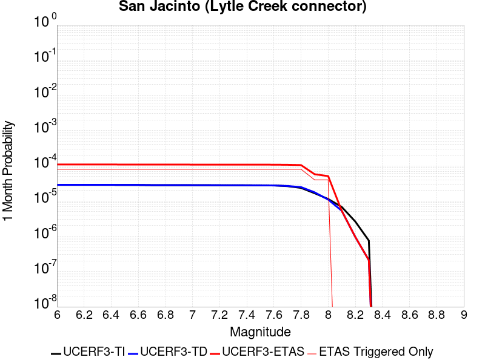 |  |

| Magnitude | 1 wk TI Prob | 1 wk TD Prob | 1 wk ETAS Prob | 1 wk ETAS/TD Gain | 1 wk ETAS Triggered Only | 1 mo TI Prob | 1 mo TD Prob | 1 mo ETAS Prob | 1 mo ETAS/TD Gain | 1 mo ETAS Triggered Only | 1 yr TI Prob | 1 yr TD Prob | 1 yr ETAS Prob | 1 yr ETAS/TD Gain | 1 yr ETAS Triggered Only |
|-----|-----|-----|-----|-----|-----|-----|-----|-----|-----|-----|-----|-----|-----|-----|-----|
| 6.0 | 6.693995E-6 | 6.7295123E-6 | 4.6729245E-5 | 6.9439273 | 4.0E-5 | 2.8688235E-5 | 2.8840448E-5 | 1.0883814E-4 | 3.773802 | 8.0E-5 | 3.492233E-4 | 3.5107599E-4 | 5.110198E-4 | 1.4555818 | 1.6E-4 |
| 6.1 | 6.693995E-6 | 6.7295123E-6 | 4.6729245E-5 | 6.9439273 | 4.0E-5 | 2.8688235E-5 | 2.8840448E-5 | 1.0883814E-4 | 3.773802 | 8.0E-5 | 3.492233E-4 | 3.5107599E-4 | 5.110198E-4 | 1.4555818 | 1.6E-4 |
| 6.2 | 6.693995E-6 | 6.7295123E-6 | 4.6729245E-5 | 6.9439273 | 4.0E-5 | 2.8688235E-5 | 2.8840448E-5 | 1.0883814E-4 | 3.773802 | 8.0E-5 | 3.492233E-4 | 3.5107599E-4 | 5.110198E-4 | 1.4555818 | 1.6E-4 |
| 6.3 | 6.693995E-6 | 6.7295123E-6 | 4.6729245E-5 | 6.9439273 | 4.0E-5 | 2.8688235E-5 | 2.8840448E-5 | 1.0883814E-4 | 3.773802 | 8.0E-5 | 3.492233E-4 | 3.5107599E-4 | 5.110198E-4 | 1.4555818 | 1.6E-4 |
| 6.4 | 6.693995E-6 | 6.7295123E-6 | 4.6729245E-5 | 6.9439273 | 4.0E-5 | 2.8688235E-5 | 2.8840448E-5 | 1.0883814E-4 | 3.773802 | 8.0E-5 | 3.492233E-4 | 3.5107599E-4 | 5.110198E-4 | 1.4555818 | 1.6E-4 |
| 6.5 | 6.6561875E-6 | 6.6897233E-6 | 4.6689456E-5 | 6.9792805 | 4.0E-5 | 2.8526205E-5 | 2.8669929E-5 | 1.08667635E-4 | 3.7903001 | 8.0E-5 | 3.472512E-4 | 3.4900056E-4 | 5.0894474E-4 | 1.458292 | 1.6E-4 |
| 6.6 | 6.6561875E-6 | 6.6897233E-6 | 4.6689456E-5 | 6.9792805 | 4.0E-5 | 2.8526205E-5 | 2.8669929E-5 | 1.08667635E-4 | 3.7903001 | 8.0E-5 | 3.472512E-4 | 3.4900056E-4 | 5.0894474E-4 | 1.458292 | 1.6E-4 |
| 6.7 | 6.5802237E-6 | 6.6088837E-6 | 4.660862E-5 | 7.0524197 | 4.0E-5 | 2.8200653E-5 | 2.832348E-5 | 1.0832121E-4 | 3.8244317 | 8.0E-5 | 3.4328885E-4 | 3.4478388E-4 | 5.047287E-4 | 1.4638988 | 1.6E-4 |
| 6.8 | 6.575632E-6 | 6.6033695E-6 | 4.6603105E-5 | 7.0574737 | 4.0E-5 | 2.8180975E-5 | 2.8299848E-5 | 1.0829759E-4 | 3.8267903 | 8.0E-5 | 3.4304935E-4 | 3.4449625E-4 | 5.0444115E-4 | 1.4642863 | 1.6E-4 |
| 6.9 | 6.570433E-6 | 6.5947534E-6 | 4.659449E-5 | 7.0653877 | 4.0E-5 | 2.8158694E-5 | 2.8262923E-5 | 1.0826066E-4 | 3.8304837 | 8.0E-5 | 3.4277816E-4 | 3.4404683E-4 | 5.039918E-4 | 1.464893 | 1.6E-4 |
| 7.0 | 6.5643826E-6 | 6.5848626E-6 | 4.65846E-5 | 7.074498 | 4.0E-5 | 2.8132765E-5 | 2.8220535E-5 | 1.0821828E-4 | 3.8347352 | 8.0E-5 | 3.424626E-4 | 3.435309E-4 | 5.0347595E-4 | 1.4655914 | 1.6E-4 |
| 7.1 | 6.557402E-6 | 6.5735626E-6 | 4.65733E-5 | 7.0849404 | 4.0E-5 | 2.8102848E-5 | 2.8172106E-5 | 1.0816985E-4 | 3.8396082 | 8.0E-5 | 3.4209844E-4 | 3.429415E-4 | 5.028866E-4 | 1.4663919 | 1.6E-4 |
| 7.2 | 6.546394E-6 | 6.5555055E-6 | 4.6555244E-5 | 7.1017013 | 4.0E-5 | 2.8055672E-5 | 2.809472E-5 | 1.0809247E-4 | 3.84743 | 8.0E-5 | 3.4152428E-4 | 3.4199964E-4 | 5.019449E-4 | 1.4676768 | 1.6E-4 |
| 7.3 | 6.5364216E-6 | 6.536247E-6 | 4.6535984E-5 | 7.11968 | 4.0E-5 | 2.8012933E-5 | 2.8012188E-5 | 1.0800995E-4 | 3.85582 | 8.0E-5 | 3.4100408E-4 | 3.409951E-4 | 5.0094054E-4 | 1.4690549 | 1.6E-4 |
| 7.4 | 6.5269523E-6 | 6.517283E-6 | 4.6517023E-5 | 7.137487 | 4.0E-5 | 2.7972354E-5 | 2.7930913E-5 | 1.0792868E-4 | 3.86413 | 8.0E-5 | 3.4051016E-4 | 3.4000588E-4 | 4.999515E-4 | 1.4704201 | 1.6E-4 |
| 7.5 | 6.5111835E-6 | 6.4935025E-6 | 4.6493242E-5 | 7.1599636 | 4.0E-5 | 2.7904773E-5 | 2.7829E-5 | 1.07826774E-4 | 3.874619 | 8.0E-5 | 3.3968766E-4 | 3.3876547E-4 | 4.987113E-4 | 1.4721432 | 1.6E-4 |
| 7.6 | 6.4768806E-6 | 6.4525266E-6 | 4.6452267E-5 | 7.199082 | 4.0E-5 | 2.7757764E-5 | 2.7653392E-5 | 1.0765118E-4 | 3.8928742 | 8.0E-5 | 3.3789838E-4 | 3.3662812E-4 | 4.9657427E-4 | 1.475142 | 1.6E-4 |
| 7.7 | 6.1655364E-6 | 6.2444665E-6 | 4.6244215E-5 | 7.4056315 | 4.0E-5 | 2.642346E-5 | 2.6761725E-5 | 1.0675958E-4 | 3.989264 | 8.0E-5 | 3.2165812E-4 | 3.2577536E-4 | 4.8572323E-4 | 1.490976 | 1.6E-4 |
| 7.8 | 5.5043524E-6 | 5.803494E-6 | 4.5803263E-5 | 7.8923597 | 4.0E-5 | 2.3589868E-5 | 2.4871879E-5 | 1.0486989E-4 | 4.216404 | 8.0E-5 | 2.871688E-4 | 3.027731E-4 | 4.6272465E-4 | 1.5282885 | 1.6E-4 |
| 7.9 | 3.889249E-6 | 4.130606E-6 | 4.130606E-6 | 1.0 | 0.0 | 1.6668104E-5 | 1.7702478E-5 | 5.7701767E-5 | 3.2595308 | 4.0E-5 | 2.0291525E-4 | 2.1550638E-4 | 2.9548915E-4 | 1.3711387 | 8.0E-5 |
| 8.0 | 2.668535E-6 | 2.5686622E-6 | 2.5686622E-6 | 1.0 | 0.0 | 1.1436528E-5 | 1.1008506E-5 | 5.1008064E-5 | 4.633514 | 4.0E-5 | 1.3923083E-4 | 1.3402035E-4 | 2.1400962E-4 | 1.5968443 | 8.0E-5 |
| 8.1 | 1.5911459E-6 | 1.2385202E-6 | 1.2385202E-6 | 1.0 | 0.0 | 6.8191785E-6 | 5.307933E-6 | 5.307933E-6 | 1.0 | 0.0 | 8.3020335E-5 | 6.462219E-5 | 6.462219E-5 | 1.0 | 0.0 |
| 8.2 | 6.1294963E-7 | 2.2397407E-7 | 2.2397407E-7 | 1.0 | 0.0 | 2.6269242E-6 | 9.598884E-7 | 9.598884E-7 | 1.0 | 0.0 | 3.1982334E-5 | 1.168658E-5 | 1.168658E-5 | 1.0 | 0.0 |
| 8.3 | 1.762871E-7 | 4.901543E-8 | 4.901543E-8 | 1.0 | 0.0 | 7.5551594E-7 | 2.1006612E-7 | 2.1006612E-7 | 1.0 | 0.0 | 9.1983675E-6 | 2.557552E-6 | 2.557552E-6 | 1.0 | 0.0 |

## Sierra Madre
*[(top)](#table-of-contents)*

| 1 Week | 1 Month | 1 Year |
|-----|-----|-----|
|  | 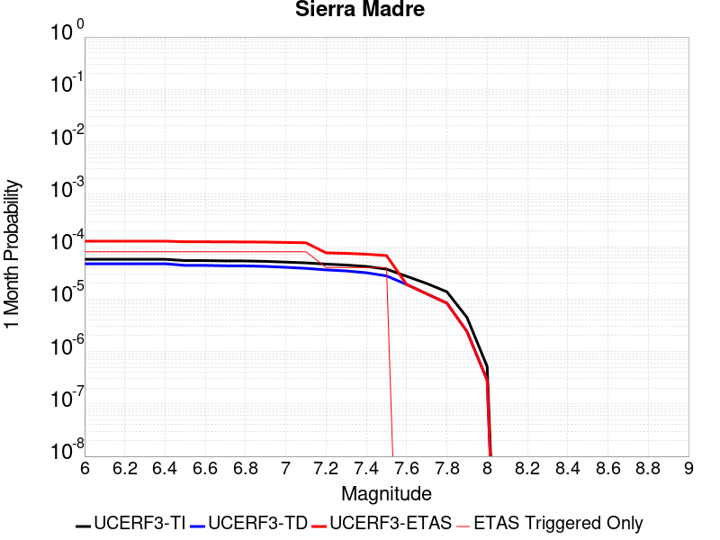 |  |

| Magnitude | 1 wk TI Prob | 1 wk TD Prob | 1 wk ETAS Prob | 1 wk ETAS/TD Gain | 1 wk ETAS Triggered Only | 1 mo TI Prob | 1 mo TD Prob | 1 mo ETAS Prob | 1 mo ETAS/TD Gain | 1 mo ETAS Triggered Only | 1 yr TI Prob | 1 yr TD Prob | 1 yr ETAS Prob | 1 yr ETAS/TD Gain | 1 yr ETAS Triggered Only |
|-----|-----|-----|-----|-----|-----|-----|-----|-----|-----|-----|-----|-----|-----|-----|-----|
| 6.0 | 1.3379373E-5 | 1.1009154E-5 | 9.1008274E-5 | 8.2666 | 8.0E-5 | 5.7338908E-5 | 4.7181245E-5 | 1.2717747E-4 | 2.695509 | 8.0E-5 | 6.978776E-4 | 5.7428173E-4 | 7.341899E-4 | 1.2784489 | 1.6E-4 |
| 6.1 | 1.3379373E-5 | 1.1009154E-5 | 9.1008274E-5 | 8.2666 | 8.0E-5 | 5.7338908E-5 | 4.7181245E-5 | 1.2717747E-4 | 2.695509 | 8.0E-5 | 6.978776E-4 | 5.7428173E-4 | 7.341899E-4 | 1.2784489 | 1.6E-4 |
| 6.2 | 1.3379373E-5 | 1.1009154E-5 | 9.1008274E-5 | 8.2666 | 8.0E-5 | 5.7338908E-5 | 4.7181245E-5 | 1.2717747E-4 | 2.695509 | 8.0E-5 | 6.978776E-4 | 5.7428173E-4 | 7.341899E-4 | 1.2784489 | 1.6E-4 |
| 6.3 | 1.3379373E-5 | 1.1009154E-5 | 9.1008274E-5 | 8.2666 | 8.0E-5 | 5.7338908E-5 | 4.7181245E-5 | 1.2717747E-4 | 2.695509 | 8.0E-5 | 6.978776E-4 | 5.7428173E-4 | 7.341899E-4 | 1.2784489 | 1.6E-4 |
| 6.4 | 1.3379373E-5 | 1.1009154E-5 | 9.1008274E-5 | 8.2666 | 8.0E-5 | 5.7338908E-5 | 4.7181245E-5 | 1.2717747E-4 | 2.695509 | 8.0E-5 | 6.978776E-4 | 5.7428173E-4 | 7.341899E-4 | 1.2784489 | 1.6E-4 |
| 6.5 | 1.26563245E-5 | 1.0238438E-5 | 9.023762E-5 | 8.813611 | 8.0E-5 | 5.4240263E-5 | 4.387829E-5 | 1.2387478E-4 | 2.8231452 | 8.0E-5 | 6.601751E-4 | 5.3408835E-4 | 6.940029E-4 | 1.299416 | 1.6E-4 |
| 6.6 | 1.26563245E-5 | 1.0238438E-5 | 9.023762E-5 | 8.813611 | 8.0E-5 | 5.4240263E-5 | 4.387829E-5 | 1.2387478E-4 | 2.8231452 | 8.0E-5 | 6.601751E-4 | 5.3408835E-4 | 6.940029E-4 | 1.299416 | 1.6E-4 |
| 6.7 | 1.2502474E-5 | 1.00745465E-5 | 9.007374E-5 | 8.940723 | 8.0E-5 | 5.3580934E-5 | 4.317592E-5 | 1.2317246E-4 | 2.8528047 | 8.0E-5 | 6.521526E-4 | 5.255411E-4 | 6.85457E-4 | 1.3042881 | 1.6E-4 |
| 6.8 | 1.2454966E-5 | 1.0026802E-5 | 9.0026E-5 | 8.978536 | 8.0E-5 | 5.3377335E-5 | 4.2971307E-5 | 1.2296787E-4 | 2.8616273 | 8.0E-5 | 6.4967526E-4 | 5.2305113E-4 | 6.829674E-4 | 1.3057375 | 1.6E-4 |
| 6.9 | 1.2225574E-5 | 9.800568E-6 | 8.979978E-5 | 9.162713 | 8.0E-5 | 5.2394265E-5 | 4.200176E-5 | 1.219984E-4 | 2.904602 | 8.0E-5 | 6.3771347E-4 | 5.112525E-4 | 6.711707E-4 | 1.312797 | 1.6E-4 |
| 7.0 | 1.182946E-5 | 9.40699E-6 | 8.940624E-5 | 9.504234 | 8.0E-5 | 5.06967E-5 | 4.0315055E-5 | 1.2031183E-4 | 2.9842904 | 8.0E-5 | 6.1705755E-4 | 4.9072626E-4 | 6.506478E-4 | 1.3258873 | 1.6E-4 |
| 7.1 | 1.14369095E-5 | 8.993793E-6 | 8.8993074E-5 | 9.894943 | 8.0E-5 | 4.9014405E-5 | 3.8544265E-5 | 1.1854118E-4 | 3.0754557 | 8.0E-5 | 5.9658696E-4 | 4.6917636E-4 | 6.291013E-4 | 1.3408631 | 1.6E-4 |
| 7.2 | 1.0836419E-5 | 8.40696E-6 | 4.8406622E-5 | 5.7579226 | 4.0E-5 | 4.644097E-5 | 3.6029334E-5 | 7.602789E-5 | 2.1101665 | 4.0E-5 | 5.652721E-4 | 4.3856975E-4 | 5.185347E-4 | 1.1823311 | 8.0E-5 |
| 7.3 | 1.0403439E-5 | 8.028089E-6 | 4.8027767E-5 | 5.9824657 | 4.0E-5 | 4.4585406E-5 | 3.4405646E-5 | 7.440427E-5 | 2.1625597 | 4.0E-5 | 5.426921E-4 | 4.1880916E-4 | 4.987756E-4 | 1.1909378 | 8.0E-5 |
| 7.4 | 9.768864E-6 | 7.421485E-6 | 4.742119E-5 | 6.3897166 | 4.0E-5 | 4.186589E-5 | 3.1805983E-5 | 7.180471E-5 | 2.257585 | 4.0E-5 | 5.09598E-4 | 3.8716992E-4 | 4.6713895E-4 | 1.2065476 | 8.0E-5 |
| 7.5 | 8.687089E-6 | 6.4567002E-6 | 4.6456444E-5 | 7.1950746 | 4.0E-5 | 3.722985E-5 | 2.7671285E-5 | 6.7670175E-5 | 2.4455018 | 4.0E-5 | 4.5317915E-4 | 3.368467E-4 | 4.1681973E-4 | 1.2374167 | 8.0E-5 |
| 7.6 | 6.3506063E-6 | 4.436162E-6 | 4.436162E-6 | 1.0 | 0.0 | 2.72166E-5 | 1.9011986E-5 | 1.9011986E-5 | 1.0 | 0.0 | 3.3131172E-4 | 2.314466E-4 | 2.314466E-4 | 1.0 | 0.0 |
| 7.7 | 4.62223E-6 | 2.9384053E-6 | 2.9384053E-6 | 1.0 | 0.0 | 1.9809406E-5 | 1.2593105E-5 | 1.2593105E-5 | 1.0 | 0.0 | 2.4115283E-4 | 1.5331028E-4 | 1.5331028E-4 | 1.0 | 0.0 |
| 7.8 | 3.2145008E-6 | 1.9533868E-6 | 1.9533868E-6 | 1.0 | 0.0 | 1.3776359E-5 | 8.37163E-6 | 8.37163E-6 | 1.0 | 0.0 | 1.6771426E-4 | 1.0191985E-4 | 1.0191985E-4 | 1.0 | 0.0 |
| 7.9 | 1.0391769E-6 | 5.613154E-7 | 5.613154E-7 | 1.0 | 0.0 | 4.4536077E-6 | 2.4056353E-6 | 2.4056353E-6 | 1.0 | 0.0 | 5.4221324E-5 | 2.9288221E-5 | 2.9288221E-5 | 1.0 | 0.0 |
| 8.0 | 1.210983E-7 | 6.622497E-8 | 6.622497E-8 | 1.0 | 0.0 | 5.1899264E-7 | 2.8382127E-7 | 2.8382127E-7 | 1.0 | 0.0 | 6.3187167E-6 | 3.4555185E-6 | 3.4555185E-6 | 1.0 | 0.0 |

## Raymond
*[(top)](#table-of-contents)*

| 1 Week | 1 Month | 1 Year |
|-----|-----|-----|
| 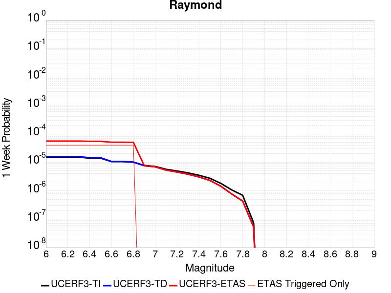 |  | 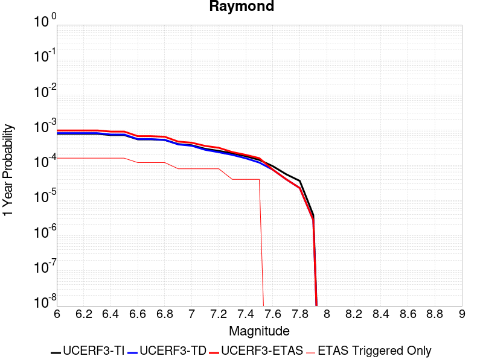 |

| Magnitude | 1 wk TI Prob | 1 wk TD Prob | 1 wk ETAS Prob | 1 wk ETAS/TD Gain | 1 wk ETAS Triggered Only | 1 mo TI Prob | 1 mo TD Prob | 1 mo ETAS Prob | 1 mo ETAS/TD Gain | 1 mo ETAS Triggered Only | 1 yr TI Prob | 1 yr TD Prob | 1 yr ETAS Prob | 1 yr ETAS/TD Gain | 1 yr ETAS Triggered Only |
|-----|-----|-----|-----|-----|-----|-----|-----|-----|-----|-----|-----|-----|-----|-----|-----|
| 6.0 | 1.5157413E-5 | 1.5816651E-5 | 5.5816017E-5 | 3.5289404 | 4.0E-5 | 6.4958724E-5 | 6.778403E-5 | 1.477786E-4 | 2.180139 | 8.0E-5 | 7.905855E-4 | 8.249831E-4 | 9.848512E-4 | 1.1937834 | 1.6E-4 |
| 6.1 | 1.5157413E-5 | 1.5816651E-5 | 5.5816017E-5 | 3.5289404 | 4.0E-5 | 6.4958724E-5 | 6.778403E-5 | 1.477786E-4 | 2.180139 | 8.0E-5 | 7.905855E-4 | 8.249831E-4 | 9.848512E-4 | 1.1937834 | 1.6E-4 |
| 6.2 | 1.5157413E-5 | 1.5816651E-5 | 5.5816017E-5 | 3.5289404 | 4.0E-5 | 6.4958724E-5 | 6.778403E-5 | 1.477786E-4 | 2.180139 | 8.0E-5 | 7.905855E-4 | 8.249831E-4 | 9.848512E-4 | 1.1937834 | 1.6E-4 |
| 6.3 | 1.5157413E-5 | 1.5816651E-5 | 5.5816017E-5 | 3.5289404 | 4.0E-5 | 6.4958724E-5 | 6.778403E-5 | 1.477786E-4 | 2.180139 | 8.0E-5 | 7.905855E-4 | 8.249831E-4 | 9.848512E-4 | 1.1937834 | 1.6E-4 |
| 6.4 | 1.3941944E-5 | 1.4460684E-5 | 5.4460106E-5 | 3.7660809 | 4.0E-5 | 5.9749822E-5 | 6.197302E-5 | 1.4196806E-4 | 2.2908044 | 8.0E-5 | 7.2721124E-4 | 7.542837E-4 | 9.1416296E-4 | 1.2119617 | 1.6E-4 |
| 6.5 | 1.3941944E-5 | 1.4460684E-5 | 5.4460106E-5 | 3.7660809 | 4.0E-5 | 5.9749822E-5 | 6.197302E-5 | 1.4196806E-4 | 2.2908044 | 8.0E-5 | 7.2721124E-4 | 7.542837E-4 | 9.1416296E-4 | 1.2119617 | 1.6E-4 |
| 6.6 | 1.0542609E-5 | 1.0675657E-5 | 5.067523E-5 | 4.7468023 | 4.0E-5 | 4.5181827E-5 | 4.5752044E-5 | 1.2574838E-4 | 2.7484758 | 8.0E-5 | 5.499499E-4 | 5.568942E-4 | 6.768274E-4 | 1.2153608 | 1.2E-4 |
| 6.7 | 1.0542609E-5 | 1.0675657E-5 | 5.067523E-5 | 4.7468023 | 4.0E-5 | 4.5181827E-5 | 4.5752044E-5 | 1.2574838E-4 | 2.7484758 | 8.0E-5 | 5.499499E-4 | 5.568942E-4 | 6.768274E-4 | 1.2153608 | 1.2E-4 |
| 6.8 | 1.0079132E-5 | 1.0181076E-5 | 5.0180668E-5 | 4.928818 | 4.0E-5 | 4.3195567E-5 | 4.363248E-5 | 1.2362898E-4 | 2.8334165 | 8.0E-5 | 5.257791E-4 | 5.311013E-4 | 6.510376E-4 | 1.2258255 | 1.2E-4 |
| 6.9 | 7.721598E-6 | 7.552302E-6 | 7.552302E-6 | 1.0 | 0.0 | 3.3092143E-5 | 3.2366614E-5 | 7.236532E-5 | 2.2358012 | 4.0E-5 | 4.0282236E-4 | 3.9399348E-4 | 4.7396196E-4 | 1.2029691 | 8.0E-5 |
| 7.0 | 7.137566E-6 | 6.9145035E-6 | 6.9145035E-6 | 1.0 | 0.0 | 3.058921E-5 | 2.9633255E-5 | 6.963207E-5 | 2.3497949 | 4.0E-5 | 3.7236E-4 | 3.6072623E-4 | 4.4069736E-4 | 1.2216948 | 8.0E-5 |
| 7.1 | 5.654976E-6 | 5.3022604E-6 | 5.3022604E-6 | 1.0 | 0.0 | 2.4235387E-5 | 2.2723776E-5 | 6.2722866E-5 | 2.7602308 | 4.0E-5 | 2.9502588E-4 | 2.7662705E-4 | 3.5660493E-4 | 1.289118 | 8.0E-5 |
| 7.2 | 4.9358455E-6 | 4.529158E-6 | 4.529158E-6 | 1.0 | 0.0 | 2.1153453E-5 | 1.9410534E-5 | 5.940976E-5 | 3.0606966 | 4.0E-5 | 2.5751285E-4 | 2.3629777E-4 | 3.1627886E-4 | 1.338476 | 8.0E-5 |
| 7.3 | 4.2368597E-6 | 3.8079293E-6 | 3.8079293E-6 | 1.0 | 0.0 | 1.8157843E-5 | 1.6319596E-5 | 1.6319596E-5 | 1.0 | 0.0 | 2.2104931E-4 | 1.9867306E-4 | 2.3866512E-4 | 1.2012959 | 4.0E-5 |
| 7.4 | 3.4999923E-6 | 3.045825E-6 | 3.045825E-6 | 1.0 | 0.0 | 1.49998805E-5 | 1.3053471E-5 | 1.3053471E-5 | 1.0 | 0.0 | 1.8260824E-4 | 1.589145E-4 | 1.9890814E-4 | 1.2516677 | 4.0E-5 |
| 7.5 | 2.738017E-6 | 2.303755E-6 | 2.303755E-6 | 1.0 | 0.0 | 1.1734306E-5 | 9.873199E-6 | 9.873199E-6 | 1.0 | 0.0 | 1.428558E-4 | 1.20199635E-4 | 1.6019483E-4 | 1.3327397 | 4.0E-5 |
| 7.6 | 1.8186392E-6 | 1.4435308E-6 | 1.4435308E-6 | 1.0 | 0.0 | 7.794145E-6 | 6.1865458E-6 | 6.1865458E-6 | 1.0 | 0.0 | 9.488958E-5 | 7.531863E-5 | 7.531863E-5 | 1.0 | 0.0 |
| 7.7 | 1.0660348E-6 | 7.653782E-7 | 7.653782E-7 | 1.0 | 0.0 | 4.5687125E-6 | 3.2801881E-6 | 3.2801881E-6 | 1.0 | 0.0 | 5.5622655E-5 | 3.9935578E-5 | 3.9935578E-5 | 1.0 | 0.0 |
| 7.8 | 6.913602E-7 | 4.3288983E-7 | 4.3288983E-7 | 1.0 | 0.0 | 2.962969E-6 | 1.855241E-6 | 1.855241E-6 | 1.0 | 0.0 | 3.607355E-5 | 2.258733E-5 | 2.258733E-5 | 1.0 | 0.0 |
| 7.9 | 7.425201E-8 | 5.330067E-8 | 5.330067E-8 | 1.0 | 0.0 | 3.1822285E-7 | 2.2843143E-7 | 2.2843143E-7 | 1.0 | 0.0 | 3.874356E-6 | 2.7811504E-6 | 2.7811504E-6 | 1.0 | 0.0 |

## Monte Vista - Shannon 2011 CFM
*[(top)](#table-of-contents)*

| 1 Week | 1 Month | 1 Year |
|-----|-----|-----|
| 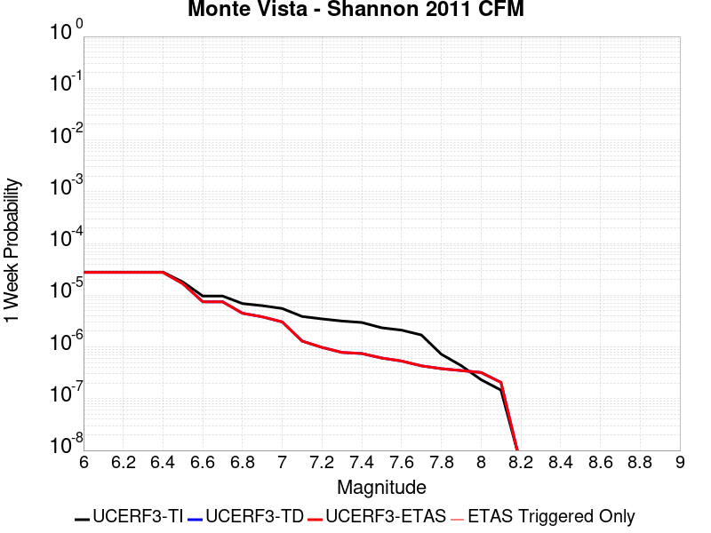 |  | 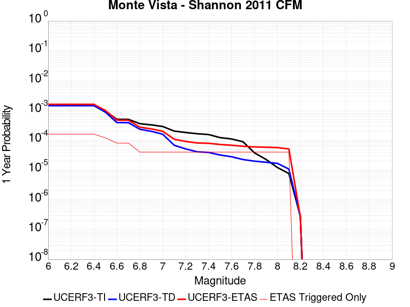 |

| Magnitude | 1 wk TI Prob | 1 wk TD Prob | 1 wk ETAS Prob | 1 wk ETAS/TD Gain | 1 wk ETAS Triggered Only | 1 mo TI Prob | 1 mo TD Prob | 1 mo ETAS Prob | 1 mo ETAS/TD Gain | 1 mo ETAS Triggered Only | 1 yr TI Prob | 1 yr TD Prob | 1 yr ETAS Prob | 1 yr ETAS/TD Gain | 1 yr ETAS Triggered Only |
|-----|-----|-----|-----|-----|-----|-----|-----|-----|-----|-----|-----|-----|-----|-----|-----|
| 6.0 | 2.7907707E-5 | 2.7607006E-5 | 2.7607006E-5 | 1.0 | 0.0 | 1.19598975E-4 | 1.1831107E-4 | 1.5830634E-4 | 1.3380518 | 4.0E-5 | 0.0014551448 | 0.0014396093 | 0.001599379 | 1.1109812 | 1.6E-4 |
| 6.1 | 2.7907707E-5 | 2.7607006E-5 | 2.7607006E-5 | 1.0 | 0.0 | 1.19598975E-4 | 1.1831107E-4 | 1.5830634E-4 | 1.3380518 | 4.0E-5 | 0.0014551448 | 0.0014396093 | 0.001599379 | 1.1109812 | 1.6E-4 |
| 6.2 | 2.7907707E-5 | 2.7607006E-5 | 2.7607006E-5 | 1.0 | 0.0 | 1.19598975E-4 | 1.1831107E-4 | 1.5830634E-4 | 1.3380518 | 4.0E-5 | 0.0014551448 | 0.0014396093 | 0.001599379 | 1.1109812 | 1.6E-4 |
| 6.3 | 2.7907707E-5 | 2.7607006E-5 | 2.7607006E-5 | 1.0 | 0.0 | 1.19598975E-4 | 1.1831107E-4 | 1.5830634E-4 | 1.3380518 | 4.0E-5 | 0.0014551448 | 0.0014396093 | 0.001599379 | 1.1109812 | 1.6E-4 |
| 6.4 | 2.7907707E-5 | 2.7607006E-5 | 2.7607006E-5 | 1.0 | 0.0 | 1.19598975E-4 | 1.1831107E-4 | 1.5830634E-4 | 1.3380518 | 4.0E-5 | 0.0014551448 | 0.0014396093 | 0.001599379 | 1.1109812 | 1.6E-4 |
| 6.5 | 1.7990213E-5 | 1.6658836E-5 | 1.6658836E-5 | 1.0 | 0.0 | 7.709863E-5 | 7.1393435E-5 | 1.11390575E-4 | 1.5602356 | 4.0E-5 | 9.382716E-4 | 8.689348E-4 | 9.888306E-4 | 1.1379801 | 1.2E-4 |
| 6.6 | 9.650407E-6 | 7.4729483E-6 | 7.4729483E-6 | 1.0 | 0.0 | 4.135823E-5 | 3.202657E-5 | 3.202657E-5 | 1.0 | 0.0 | 5.0342013E-4 | 3.8986158E-4 | 4.6983038E-4 | 1.205121 | 8.0E-5 |
| 6.7 | 9.62828E-6 | 7.4508453E-6 | 7.4508453E-6 | 1.0 | 0.0 | 4.1263404E-5 | 3.1931846E-5 | 3.1931846E-5 | 1.0 | 0.0 | 5.022661E-4 | 3.8870872E-4 | 4.6867764E-4 | 1.2057296 | 8.0E-5 |
| 6.8 | 6.887523E-6 | 4.4764647E-6 | 4.4764647E-6 | 1.0 | 0.0 | 2.9517621E-5 | 1.9184721E-5 | 1.9184721E-5 | 1.0 | 0.0 | 3.5931775E-4 | 2.3355117E-4 | 2.735418E-4 | 1.1712286 | 4.0E-5 |
| 6.9 | 6.2722347E-6 | 3.81813E-6 | 3.81813E-6 | 1.0 | 0.0 | 2.6880729E-5 | 1.6363323E-5 | 1.6363323E-5 | 1.0 | 0.0 | 3.2722374E-4 | 1.9920728E-4 | 2.3919932E-4 | 1.2007558 | 4.0E-5 |
| 7.0 | 5.5320347E-6 | 3.0449671E-6 | 3.0449671E-6 | 1.0 | 0.0 | 2.3708504E-5 | 1.3049805E-5 | 1.3049805E-5 | 1.0 | 0.0 | 2.8861282E-4 | 1.5887163E-4 | 1.9886527E-4 | 1.2517356 | 4.0E-5 |
| 7.1 | 3.8794055E-6 | 1.2972122E-6 | 1.2972122E-6 | 1.0 | 0.0 | 1.6625918E-5 | 5.559469E-6 | 5.559469E-6 | 1.0 | 0.0 | 2.0240174E-4 | 6.768445E-5 | 1.0768174E-4 | 1.5909377 | 4.0E-5 |
| 7.2 | 3.4813652E-6 | 9.799196E-7 | 9.799196E-7 | 1.0 | 0.0 | 1.49200505E-5 | 4.1996486E-6 | 4.1996486E-6 | 1.0 | 0.0 | 1.8163648E-4 | 5.1129533E-5 | 9.112749E-5 | 1.7822866 | 4.0E-5 |
| 7.3 | 3.1682148E-6 | 7.841216E-7 | 7.841216E-7 | 1.0 | 0.0 | 1.3577992E-5 | 3.3605168E-6 | 3.3605168E-6 | 1.0 | 0.0 | 1.6529951E-4 | 4.0913525E-5 | 8.091189E-5 | 1.9776318 | 4.0E-5 |
| 7.4 | 2.9707667E-6 | 7.464202E-7 | 7.464202E-7 | 1.0 | 0.0 | 1.2731795E-5 | 3.1989398E-6 | 3.1989398E-6 | 1.0 | 0.0 | 1.5499859E-4 | 3.89464E-5 | 7.894484E-5 | 2.0270126 | 4.0E-5 |
| 7.5 | 2.3462758E-6 | 6.1088537E-7 | 6.1088537E-7 | 1.0 | 0.0 | 1.0055429E-5 | 2.6180774E-6 | 2.6180774E-6 | 1.0 | 0.0 | 1.2241797E-4 | 3.1874628E-5 | 7.187336E-5 | 2.2548766 | 4.0E-5 |
| 7.6 | 2.112783E-6 | 5.3464873E-7 | 5.3464873E-7 | 1.0 | 0.0 | 9.054753E-6 | 2.2913496E-6 | 2.2913496E-6 | 1.0 | 0.0 | 1.1023604E-4 | 2.7896827E-5 | 6.789571E-5 | 2.4338148 | 4.0E-5 |
| 7.7 | 1.7022471E-6 | 4.3143976E-7 | 4.3143976E-7 | 1.0 | 0.0 | 7.2953244E-6 | 1.8490263E-6 | 1.8490263E-6 | 1.0 | 0.0 | 8.881695E-5 | 2.2511664E-5 | 6.2510764E-5 | 2.7768166 | 4.0E-5 |
| 7.8 | 7.230914E-7 | 3.803605E-7 | 3.803605E-7 | 1.0 | 0.0 | 3.0989595E-6 | 1.6301153E-6 | 1.6301153E-6 | 1.0 | 0.0 | 3.772918E-5 | 1.9846475E-5 | 5.984568E-5 | 3.0154314 | 4.0E-5 |
| 7.9 | 4.3588446E-7 | 3.4959496E-7 | 3.4959496E-7 | 1.0 | 0.0 | 1.868075E-6 | 1.4982633E-6 | 1.4982633E-6 | 1.0 | 0.0 | 2.2743576E-5 | 1.8241204E-5 | 5.8240475E-5 | 3.1927977 | 4.0E-5 |
| 8.0 | 2.3317523E-7 | 3.2087686E-7 | 3.2087686E-7 | 1.0 | 0.0 | 9.99322E-7 | 1.3751859E-6 | 1.3751859E-6 | 1.0 | 0.0 | 1.2166677E-5 | 1.674276E-5 | 5.674209E-5 | 3.3890522 | 4.0E-5 |
| 8.1 | 1.4662456E-7 | 2.065131E-7 | 2.065131E-7 | 1.0 | 0.0 | 6.283908E-7 | 8.8505584E-7 | 8.8505584E-7 | 1.0 | 0.0 | 7.650631E-6 | 1.0775503E-5 | 5.077507E-5 | 4.712084 | 4.0E-5 |
| 8.2 | 5.4931775E-9 | 5.164059E-9 | 5.164059E-9 | 1.0 | 0.0 | 2.3542189E-8 | 2.213168E-8 | 2.213168E-8 | 1.0 | 0.0 | 2.8662612E-7 | 2.6945318E-7 | 2.6945318E-7 | 1.0 | 0.0 |

## Santa Rosa Island
*[(top)](#table-of-contents)*

| 1 Week | 1 Month | 1 Year |
|-----|-----|-----|
|  |  | 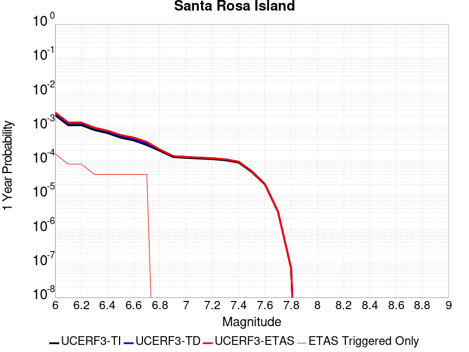 |

| Magnitude | 1 wk TI Prob | 1 wk TD Prob | 1 wk ETAS Prob | 1 wk ETAS/TD Gain | 1 wk ETAS Triggered Only | 1 mo TI Prob | 1 mo TD Prob | 1 mo ETAS Prob | 1 mo ETAS/TD Gain | 1 mo ETAS Triggered Only | 1 yr TI Prob | 1 yr TD Prob | 1 yr ETAS Prob | 1 yr ETAS/TD Gain | 1 yr ETAS Triggered Only |
|-----|-----|-----|-----|-----|-----|-----|-----|-----|-----|-----|-----|-----|-----|-----|-----|
| 6.0 | 4.1143165E-5 | 4.7114332E-5 | 1.2711056E-4 | 2.697917 | 8.0E-5 | 1.7631594E-4 | 2.0190405E-4 | 3.2187984E-4 | 1.5942217 | 1.2E-4 | 0.002144533 | 0.0024556073 | 0.0026152143 | 1.064997 | 1.6E-4 |
| 6.1 | 2.1061249E-5 | 2.3875791E-5 | 6.387484E-5 | 2.6752973 | 4.0E-5 | 9.0259375E-5 | 1.0232097E-4 | 1.8231278E-4 | 1.7817734 | 8.0E-5 | 0.0010983539 | 0.0012450748 | 0.0013249753 | 1.0641732 | 8.0E-5 |
| 6.2 | 2.1061249E-5 | 2.3875791E-5 | 6.387484E-5 | 2.6752973 | 4.0E-5 | 9.0259375E-5 | 1.0232097E-4 | 1.8231278E-4 | 1.7817734 | 8.0E-5 | 0.0010983539 | 0.0012450748 | 0.0013249753 | 1.0641732 | 8.0E-5 |
| 6.3 | 1.5158236E-5 | 1.708178E-5 | 5.7081095E-5 | 3.3416364 | 4.0E-5 | 6.496225E-5 | 7.320564E-5 | 1.1320271E-4 | 1.546366 | 4.0E-5 | 7.906284E-4 | 8.909262E-4 | 9.308906E-4 | 1.0448571 | 4.0E-5 |
| 6.4 | 1.2341918E-5 | 1.3858705E-5 | 5.385815E-5 | 3.8862326 | 4.0E-5 | 5.2892858E-5 | 5.939314E-5 | 9.939077E-5 | 1.6734384 | 4.0E-5 | 6.437803E-4 | 7.228797E-4 | 7.628508E-4 | 1.0552943 | 4.0E-5 |
| 6.5 | 9.061158E-6 | 1.0121061E-5 | 5.0120656E-5 | 4.952115 | 4.0E-5 | 3.883296E-5 | 4.3375283E-5 | 8.337355E-5 | 1.9221442 | 4.0E-5 | 4.726887E-4 | 5.279714E-4 | 5.679503E-4 | 1.0757216 | 4.0E-5 |
| 6.6 | 7.5461685E-6 | 8.403989E-6 | 4.8403654E-5 | 5.7596045 | 4.0E-5 | 3.2340322E-5 | 3.6016623E-5 | 7.601518E-5 | 2.1105583 | 4.0E-5 | 3.936723E-4 | 4.3841847E-4 | 4.7840094E-4 | 1.091197 | 4.0E-5 |
| 6.7 | 5.5023775E-6 | 6.089602E-6 | 4.6089357E-5 | 7.568534 | 4.0E-5 | 2.3581404E-5 | 2.609805E-5 | 6.6097E-5 | 2.5326414 | 4.0E-5 | 2.8706578E-4 | 3.177007E-4 | 3.57688E-4 | 1.1258646 | 4.0E-5 |
| 6.8 | 3.7351679E-6 | 4.08445E-6 | 4.08445E-6 | 1.0 | 0.0 | 1.6007763E-5 | 1.7504683E-5 | 1.7504683E-5 | 1.0 | 0.0 | 1.948771E-4 | 2.1310116E-4 | 2.1310116E-4 | 1.0 | 0.0 |
| 6.9 | 2.456366E-6 | 2.6299053E-6 | 2.6299053E-6 | 1.0 | 0.0 | 1.0527241E-5 | 1.1270974E-5 | 1.1270974E-5 | 1.0 | 0.0 | 1.2816161E-4 | 1.372155E-4 | 1.372155E-4 | 1.0 | 0.0 |
| 7.0 | 2.3245157E-6 | 2.4833578E-6 | 2.4833578E-6 | 1.0 | 0.0 | 9.962172E-6 | 1.0642919E-5 | 1.0642919E-5 | 1.0 | 0.0 | 1.2128269E-4 | 1.2956985E-4 | 1.2956985E-4 | 1.0 | 0.0 |
| 7.1 | 2.2248344E-6 | 2.3737928E-6 | 2.3737928E-6 | 1.0 | 0.0 | 9.53497E-6 | 1.0173358E-5 | 1.0173358E-5 | 1.0 | 0.0 | 1.1608207E-4 | 1.238536E-4 | 1.238536E-4 | 1.0 | 0.0 |
| 7.2 | 2.1350402E-6 | 2.2766699E-6 | 2.2766699E-6 | 1.0 | 0.0 | 9.150141E-6 | 9.75712E-6 | 9.75712E-6 | 1.0 | 0.0 | 1.1139726E-4 | 1.1878648E-4 | 1.1878648E-4 | 1.0 | 0.0 |
| 7.3 | 1.9793572E-6 | 2.109192E-6 | 2.109192E-6 | 1.0 | 0.0 | 8.482932E-6 | 9.039363E-6 | 9.039363E-6 | 1.0 | 0.0 | 1.032748E-4 | 1.10048706E-4 | 1.10048706E-4 | 1.0 | 0.0 |
| 7.4 | 1.6951194E-6 | 1.804974E-6 | 1.804974E-6 | 1.0 | 0.0 | 7.264777E-6 | 7.73558E-6 | 7.73558E-6 | 1.0 | 0.0 | 8.844508E-5 | 9.417663E-5 | 9.417663E-5 | 1.0 | 0.0 |
| 7.5 | 8.987207E-7 | 9.5141485E-7 | 9.5141485E-7 | 1.0 | 0.0 | 3.8516546E-6 | 4.0774858E-6 | 4.0774858E-6 | 1.0 | 0.0 | 4.6892885E-5 | 4.9642273E-5 | 4.9642273E-5 | 1.0 | 0.0 |
| 7.6 | 3.8783037E-7 | 4.053593E-7 | 4.053593E-7 | 1.0 | 0.0 | 1.6621291E-6 | 1.7372529E-6 | 1.7372529E-6 | 1.0 | 0.0 | 2.0236233E-5 | 2.1150856E-5 | 2.1150856E-5 | 1.0 | 0.0 |
| 7.7 | 6.181804E-8 | 6.339846E-8 | 6.339846E-8 | 1.0 | 0.0 | 2.6493444E-7 | 2.7170765E-7 | 2.7170765E-7 | 1.0 | 0.0 | 3.225572E-6 | 3.3080355E-6 | 3.3080355E-6 | 1.0 | 0.0 |
| 7.8 | 1.3704449E-9 | 1.396505E-9 | 1.396505E-9 | 1.0 | 0.0 | 5.873335E-9 | 5.9850214E-9 | 5.9850214E-9 | 1.0 | 0.0 | 7.1507856E-8 | 7.2867635E-8 | 7.2867635E-8 | 1.0 | 0.0 |

## Malibu Coast alt 1
*[(top)](#table-of-contents)*

| 1 Week | 1 Month | 1 Year |
|-----|-----|-----|
| 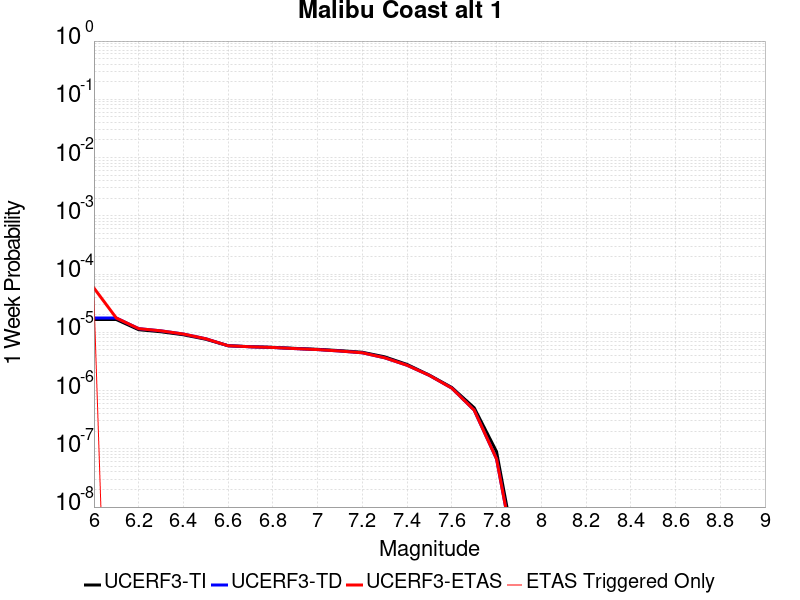 | 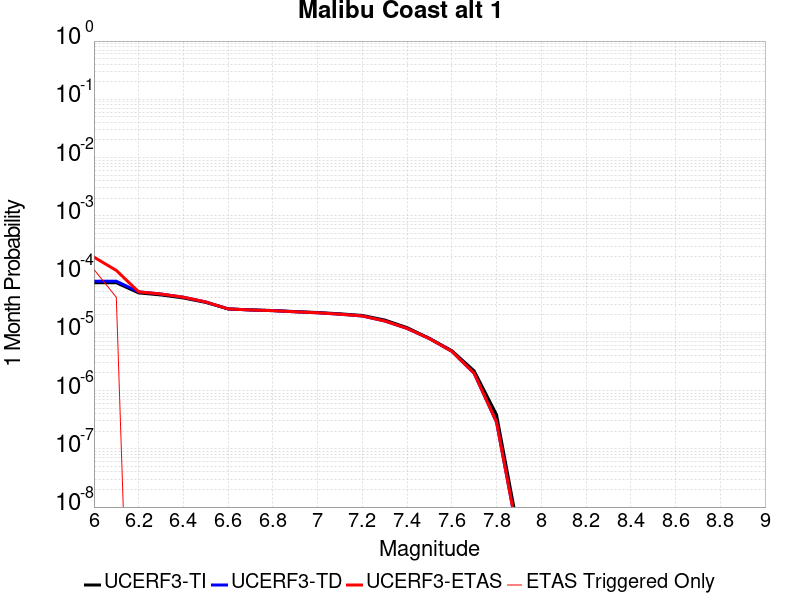 | 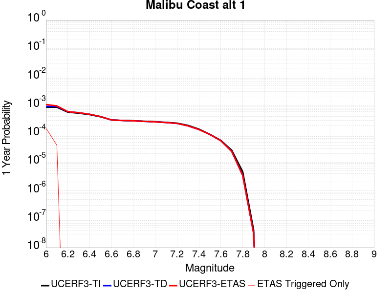 |

| Magnitude | 1 wk TI Prob | 1 wk TD Prob | 1 wk ETAS Prob | 1 wk ETAS/TD Gain | 1 wk ETAS Triggered Only | 1 mo TI Prob | 1 mo TD Prob | 1 mo ETAS Prob | 1 mo ETAS/TD Gain | 1 mo ETAS Triggered Only | 1 yr TI Prob | 1 yr TD Prob | 1 yr ETAS Prob | 1 yr ETAS/TD Gain | 1 yr ETAS Triggered Only |
|-----|-----|-----|-----|-----|-----|-----|-----|-----|-----|-----|-----|-----|-----|-----|-----|
| 6.0 | 1.6572556E-5 | 1.7603372E-5 | 5.760267E-5 | 3.2722518 | 4.0E-5 | 7.102331E-5 | 7.544095E-5 | 1.954319E-4 | 2.590528 | 1.2E-4 | 8.6436566E-4 | 9.1812544E-4 | 0.0010779785 | 1.1741081 | 1.6E-4 |
| 6.1 | 1.6572556E-5 | 1.7603372E-5 | 1.7603372E-5 | 1.0 | 0.0 | 7.102331E-5 | 7.544095E-5 | 1.1543793E-4 | 1.530176 | 4.0E-5 | 8.6436566E-4 | 9.1812544E-4 | 9.5808867E-4 | 1.043527 | 4.0E-5 |
| 6.2 | 1.1085717E-5 | 1.1560378E-5 | 1.1560378E-5 | 1.0 | 0.0 | 4.750935E-5 | 4.9543556E-5 | 4.9543556E-5 | 1.0 | 0.0 | 5.782728E-4 | 6.030294E-4 | 6.030294E-4 | 1.0 | 0.0 |
| 6.3 | 1.0208568E-5 | 1.059514E-5 | 1.059514E-5 | 1.0 | 0.0 | 4.375027E-5 | 4.540697E-5 | 4.540697E-5 | 1.0 | 0.0 | 5.325294E-4 | 5.5269257E-4 | 5.5269257E-4 | 1.0 | 0.0 |
| 6.4 | 9.0682315E-6 | 9.345133E-6 | 9.345133E-6 | 1.0 | 0.0 | 3.8863272E-5 | 4.0049967E-5 | 4.0049967E-5 | 1.0 | 0.0 | 4.730576E-4 | 4.875013E-4 | 4.875013E-4 | 1.0 | 0.0 |
| 6.5 | 7.605796E-6 | 7.750596E-6 | 7.750596E-6 | 1.0 | 0.0 | 3.259586E-5 | 3.3216424E-5 | 3.3216424E-5 | 1.0 | 0.0 | 3.9678233E-4 | 4.0433623E-4 | 4.0433623E-4 | 1.0 | 0.0 |
| 6.6 | 5.889873E-6 | 5.88098E-6 | 5.88098E-6 | 1.0 | 0.0 | 2.5242069E-5 | 2.5203957E-5 | 2.5203957E-5 | 1.0 | 0.0 | 3.0727885E-4 | 3.0681508E-4 | 3.0681508E-4 | 1.0 | 0.0 |
| 6.7 | 5.66586E-6 | 5.6430326E-6 | 5.6430326E-6 | 1.0 | 0.0 | 2.428203E-5 | 2.4184203E-5 | 2.4184203E-5 | 1.0 | 0.0 | 2.955936E-4 | 2.9440297E-4 | 2.9440297E-4 | 1.0 | 0.0 |
| 6.8 | 5.521556E-6 | 5.49079E-6 | 5.49079E-6 | 1.0 | 0.0 | 2.3663597E-5 | 2.3531746E-5 | 2.3531746E-5 | 1.0 | 0.0 | 2.880662E-4 | 2.864614E-4 | 2.864614E-4 | 1.0 | 0.0 |
| 6.9 | 5.29752E-6 | 5.2512382E-6 | 5.2512382E-6 | 1.0 | 0.0 | 2.270346E-5 | 2.2505112E-5 | 2.2505112E-5 | 1.0 | 0.0 | 2.7637955E-4 | 2.739654E-4 | 2.739654E-4 | 1.0 | 0.0 |
| 7.0 | 5.106743E-6 | 5.0489434E-6 | 5.0489434E-6 | 1.0 | 0.0 | 2.1885859E-5 | 2.163815E-5 | 2.163815E-5 | 1.0 | 0.0 | 2.6642776E-4 | 2.6341272E-4 | 2.6341272E-4 | 1.0 | 0.0 |
| 7.1 | 4.8469647E-6 | 4.771574E-6 | 4.771574E-6 | 1.0 | 0.0 | 2.0772539E-5 | 2.0449443E-5 | 2.0449443E-5 | 1.0 | 0.0 | 2.528763E-4 | 2.489436E-4 | 2.489436E-4 | 1.0 | 0.0 |
| 7.2 | 4.545514E-6 | 4.4493186E-6 | 4.4493186E-6 | 1.0 | 0.0 | 1.9480629E-5 | 1.906837E-5 | 1.906837E-5 | 1.0 | 0.0 | 2.3715083E-4 | 2.3213273E-4 | 2.3213273E-4 | 1.0 | 0.0 |
| 7.3 | 3.794097E-6 | 3.6528515E-6 | 3.6528515E-6 | 1.0 | 0.0 | 1.6260314E-5 | 1.5654985E-5 | 1.5654985E-5 | 1.0 | 0.0 | 1.9795135E-4 | 1.9058281E-4 | 1.9058281E-4 | 1.0 | 0.0 |
| 7.4 | 2.808217E-6 | 2.7198025E-6 | 2.7198025E-6 | 1.0 | 0.0 | 1.203516E-5 | 1.1656245E-5 | 1.1656245E-5 | 1.0 | 0.0 | 1.4651821E-4 | 1.4190556E-4 | 1.4190556E-4 | 1.0 | 0.0 |
| 7.5 | 1.83809E-6 | 1.8195162E-6 | 1.8195162E-6 | 1.0 | 0.0 | 7.877505E-6 | 7.797904E-6 | 7.797904E-6 | 1.0 | 0.0 | 9.59044E-5 | 9.4935356E-5 | 9.4935356E-5 | 1.0 | 0.0 |
| 7.6 | 1.1292672E-6 | 1.1004113E-6 | 1.1004113E-6 | 1.0 | 0.0 | 4.839708E-6 | 4.7160397E-6 | 4.7160397E-6 | 1.0 | 0.0 | 5.8921847E-5 | 5.7416288E-5 | 5.7416288E-5 | 1.0 | 0.0 |
| 7.7 | 5.065272E-7 | 4.6105032E-7 | 4.6105032E-7 | 1.0 | 0.0 | 2.170829E-6 | 1.9759284E-6 | 1.9759284E-6 | 1.0 | 0.0 | 2.6429525E-5 | 2.4056675E-5 | 2.4056675E-5 | 1.0 | 0.0 |
| 7.8 | 8.952991E-8 | 6.7132056E-8 | 6.7132056E-8 | 1.0 | 0.0 | 3.8369956E-7 | 2.877088E-7 | 2.877088E-7 | 1.0 | 0.0 | 4.671532E-6 | 3.502849E-6 | 3.502849E-6 | 1.0 | 0.0 |
| 7.9 | 8.007447E-10 | 6.1625505E-10 | 6.1625505E-10 | 1.0 | 0.0 | 3.4317629E-9 | 2.6410938E-9 | 2.6410938E-9 | 1.0 | 0.0 | 4.1781714E-8 | 3.2155317E-8 | 3.2155317E-8 | 1.0 | 0.0 |

## Rose Canyon
*[(top)](#table-of-contents)*

| 1 Week | 1 Month | 1 Year |
|-----|-----|-----|
| 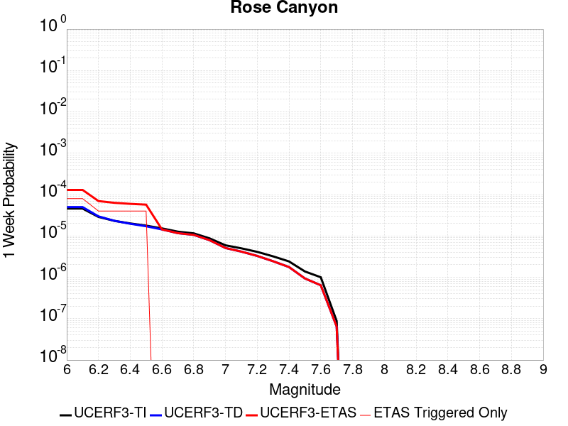 |  |  |

| Magnitude | 1 wk TI Prob | 1 wk TD Prob | 1 wk ETAS Prob | 1 wk ETAS/TD Gain | 1 wk ETAS Triggered Only | 1 mo TI Prob | 1 mo TD Prob | 1 mo ETAS Prob | 1 mo ETAS/TD Gain | 1 mo ETAS Triggered Only | 1 yr TI Prob | 1 yr TD Prob | 1 yr ETAS Prob | 1 yr ETAS/TD Gain | 1 yr ETAS Triggered Only |
|-----|-----|-----|-----|-----|-----|-----|-----|-----|-----|-----|-----|-----|-----|-----|-----|
| 6.0 | 4.5923203E-5 | 4.9824474E-5 | 1.2982049E-4 | 2.6055567 | 8.0E-5 | 1.9679888E-4 | 2.1351733E-4 | 2.9350026E-4 | 1.3745968 | 8.0E-5 | 0.0023933933 | 0.0025966738 | 0.0027562582 | 1.0614573 | 1.6E-4 |
| 6.1 | 4.5923203E-5 | 4.9824474E-5 | 1.2982049E-4 | 2.6055567 | 8.0E-5 | 1.9679888E-4 | 2.1351733E-4 | 2.9350026E-4 | 1.3745968 | 8.0E-5 | 0.0023933933 | 0.0025966738 | 0.002716362 | 1.046093 | 1.2E-4 |
| 6.2 | 2.8844734E-5 | 2.9753832E-5 | 6.975264E-5 | 2.3443246 | 4.0E-5 | 1.2361443E-4 | 1.2751039E-4 | 1.6750529E-4 | 1.3136599 | 4.0E-5 | 0.0015039665 | 0.0015513623 | 0.0016312383 | 1.0514876 | 8.0E-5 |
| 6.3 | 2.3171577E-5 | 2.3239887E-5 | 6.323896E-5 | 2.7211387 | 4.0E-5 | 9.9302975E-5 | 9.959579E-5 | 1.3959181E-4 | 1.4015834 | 4.0E-5 | 0.0012083431 | 0.0012119177 | 0.0012918208 | 1.0659311 | 8.0E-5 |
| 6.4 | 2.0066604E-5 | 1.9717654E-5 | 5.9716866E-5 | 3.028599 | 4.0E-5 | 8.599689E-5 | 8.450155E-5 | 1.2449817E-4 | 1.4733241 | 4.0E-5 | 0.0010465092 | 0.0010283309 | 0.0011082486 | 1.077716 | 8.0E-5 |
| 6.5 | 1.776989E-5 | 1.714663E-5 | 5.7145946E-5 | 3.33278 | 4.0E-5 | 7.615444E-5 | 7.3483534E-5 | 1.1348059E-4 | 1.5442996 | 4.0E-5 | 9.267859E-4 | 8.943018E-4 | 9.34266E-4 | 1.0446876 | 4.0E-5 |
| 6.6 | 1.5227364E-5 | 1.4353479E-5 | 1.4353479E-5 | 1.0 | 0.0 | 6.52585E-5 | 6.151349E-5 | 6.151349E-5 | 1.0 | 0.0 | 7.942326E-4 | 7.486746E-4 | 7.486746E-4 | 1.0 | 0.0 |
| 6.7 | 1.2703898E-5 | 1.1679114E-5 | 1.1679114E-5 | 1.0 | 0.0 | 5.4444143E-5 | 5.005241E-5 | 5.005241E-5 | 1.0 | 0.0 | 6.626558E-4 | 6.09222E-4 | 6.09222E-4 | 1.0 | 0.0 |
| 6.8 | 1.1554917E-5 | 1.061447E-5 | 1.061447E-5 | 1.0 | 0.0 | 4.9520135E-5 | 4.5489815E-5 | 4.5489815E-5 | 1.0 | 0.0 | 6.0274085E-4 | 5.537018E-4 | 5.537018E-4 | 1.0 | 0.0 |
| 6.9 | 8.732078E-6 | 7.8845E-6 | 7.8845E-6 | 1.0 | 0.0 | 3.7422655E-5 | 3.3790293E-5 | 3.3790293E-5 | 1.0 | 0.0 | 4.5552556E-4 | 4.1132208E-4 | 4.1132208E-4 | 1.0 | 0.0 |
| 7.0 | 5.9337494E-6 | 5.1091783E-6 | 5.1091783E-6 | 1.0 | 0.0 | 2.5430107E-5 | 2.1896296E-5 | 2.1896296E-5 | 1.0 | 0.0 | 3.0956755E-4 | 2.665549E-4 | 2.665549E-4 | 1.0 | 0.0 |
| 7.1 | 5.013409E-6 | 4.1786834E-6 | 4.1786834E-6 | 1.0 | 0.0 | 2.1485863E-5 | 1.790852E-5 | 1.790852E-5 | 1.0 | 0.0 | 2.6155898E-4 | 2.1801452E-4 | 2.1801452E-4 | 1.0 | 0.0 |
| 7.2 | 4.120763E-6 | 3.2832077E-6 | 3.2832077E-6 | 1.0 | 0.0 | 1.7660293E-5 | 1.4070815E-5 | 1.4070815E-5 | 1.0 | 0.0 | 2.1499286E-4 | 1.712988E-4 | 1.712988E-4 | 1.0 | 0.0 |
| 7.3 | 3.2081239E-6 | 2.441237E-6 | 2.441237E-6 | 1.0 | 0.0 | 1.374903E-5 | 1.0462402E-5 | 1.0462402E-5 | 1.0 | 0.0 | 1.6738157E-4 | 1.2737238E-4 | 1.2737238E-4 | 1.0 | 0.0 |
| 7.4 | 2.4194755E-6 | 1.7685494E-6 | 1.7685494E-6 | 1.0 | 0.0 | 1.0369139E-5 | 7.5794756E-6 | 7.5794756E-6 | 1.0 | 0.0 | 1.2623696E-4 | 9.227626E-5 | 9.227626E-5 | 1.0 | 0.0 |
| 7.5 | 1.3842889E-6 | 9.3817954E-7 | 9.3817954E-7 | 1.0 | 0.0 | 5.9326535E-6 | 4.0207633E-6 | 4.0207633E-6 | 1.0 | 0.0 | 7.222766E-5 | 4.895173E-5 | 4.895173E-5 | 1.0 | 0.0 |
| 7.6 | 1.0021575E-6 | 6.4136486E-7 | 6.4136486E-7 | 1.0 | 0.0 | 4.2949537E-6 | 2.7487038E-6 | 2.7487038E-6 | 1.0 | 0.0 | 5.2289808E-5 | 3.3464978E-5 | 3.3464978E-5 | 1.0 | 0.0 |
| 7.7 | 8.7620116E-8 | 6.450501E-8 | 6.450501E-8 | 1.0 | 0.0 | 3.7551473E-7 | 2.7645E-7 | 2.7645E-7 | 1.0 | 0.0 | 4.5718825E-6 | 3.365774E-6 | 3.365774E-6 | 1.0 | 0.0 |

## Pisgah-Bullion Mtn-Mesquite Lk
*[(top)](#table-of-contents)*

| 1 Week | 1 Month | 1 Year |
|-----|-----|-----|
| 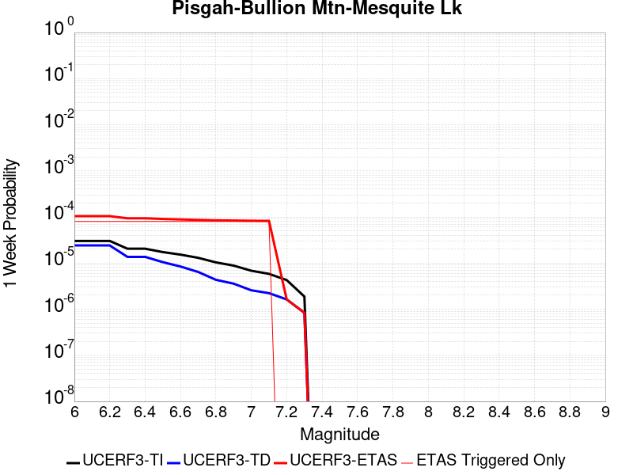 | 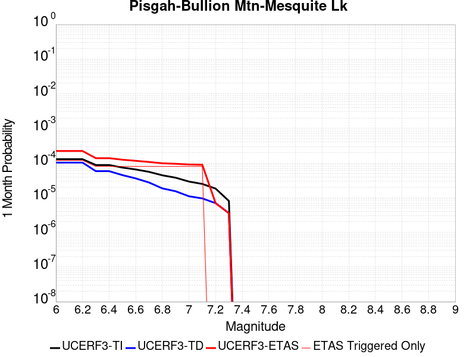 |  |

| Magnitude | 1 wk TI Prob | 1 wk TD Prob | 1 wk ETAS Prob | 1 wk ETAS/TD Gain | 1 wk ETAS Triggered Only | 1 mo TI Prob | 1 mo TD Prob | 1 mo ETAS Prob | 1 mo ETAS/TD Gain | 1 mo ETAS Triggered Only | 1 yr TI Prob | 1 yr TD Prob | 1 yr ETAS Prob | 1 yr ETAS/TD Gain | 1 yr ETAS Triggered Only |
|-----|-----|-----|-----|-----|-----|-----|-----|-----|-----|-----|-----|-----|-----|-----|-----|
| 6.0 | 3.0240792E-5 | 2.410175E-5 | 1.04099825E-4 | 4.319181 | 8.0E-5 | 1.2959696E-4 | 1.0328969E-4 | 2.232773E-4 | 2.161661 | 1.2E-4 | 0.0015767008 | 0.0012569273 | 0.0014167262 | 1.1271346 | 1.6E-4 |
| 6.1 | 3.0240792E-5 | 2.410175E-5 | 1.04099825E-4 | 4.319181 | 8.0E-5 | 1.2959696E-4 | 1.0328969E-4 | 2.232773E-4 | 2.161661 | 1.2E-4 | 0.0015767008 | 0.0012569273 | 0.0014167262 | 1.1271346 | 1.6E-4 |
| 6.2 | 3.0240792E-5 | 2.410175E-5 | 1.04099825E-4 | 4.319181 | 8.0E-5 | 1.2959696E-4 | 1.0328969E-4 | 2.232773E-4 | 2.161661 | 1.2E-4 | 0.0015767008 | 0.0012569273 | 0.0014167262 | 1.1271346 | 1.6E-4 |
| 6.3 | 2.0498217E-5 | 1.3643435E-5 | 9.3642346E-5 | 6.863546 | 8.0E-5 | 8.784654E-5 | 5.8470643E-5 | 1.3846597E-4 | 2.368128 | 8.0E-5 | 0.0010690069 | 7.116638E-4 | 7.916069E-4 | 1.1123326 | 8.0E-5 |
| 6.4 | 2.0498217E-5 | 1.3643435E-5 | 9.3642346E-5 | 6.863546 | 8.0E-5 | 8.784654E-5 | 5.8470643E-5 | 1.3846597E-4 | 2.368128 | 8.0E-5 | 0.0010690069 | 7.116638E-4 | 7.916069E-4 | 1.1123326 | 8.0E-5 |
| 6.5 | 1.7316182E-5 | 1.0481163E-5 | 9.0480324E-5 | 8.632661 | 8.0E-5 | 7.42101E-5 | 4.4918554E-5 | 1.2491496E-4 | 2.7809212 | 8.0E-5 | 9.0313336E-4 | 5.4675614E-4 | 6.267124E-4 | 1.1462375 | 8.0E-5 |
| 6.6 | 1.5251077E-5 | 8.417571E-6 | 8.84169E-5 | 10.503849 | 8.0E-5 | 6.536012E-5 | 3.6074845E-5 | 1.1607196E-4 | 3.2175317 | 8.0E-5 | 7.9546886E-4 | 4.3913E-4 | 5.190949E-4 | 1.1820984 | 8.0E-5 |
| 6.7 | 1.2997425E-5 | 6.414017E-6 | 8.641351E-5 | 13.472603 | 8.0E-5 | 5.570206E-5 | 2.748838E-5 | 1.0748618E-4 | 3.9102404 | 8.0E-5 | 6.7796157E-4 | 3.3462432E-4 | 4.1459754E-4 | 1.2389941 | 8.0E-5 |
| 6.8 | 1.035386E-5 | 4.3350883E-6 | 8.4334744E-5 | 19.453983 | 8.0E-5 | 4.437293E-5 | 1.8578823E-5 | 9.857734E-5 | 5.3058977 | 8.0E-5 | 5.401065E-4 | 2.2617457E-4 | 3.0615646E-4 | 1.3536291 | 8.0E-5 |
| 6.9 | 8.816252E-6 | 3.5822954E-6 | 8.358201E-5 | 23.331968 | 8.0E-5 | 3.778339E-5 | 1.5352609E-5 | 9.535138E-5 | 6.210761 | 8.0E-5 | 4.5991567E-4 | 1.8690256E-4 | 2.668876E-4 | 1.4279505 | 8.0E-5 |
| 7.0 | 6.8232207E-6 | 2.5689233E-6 | 8.256872E-5 | 32.141373 | 8.0E-5 | 2.9242048E-5 | 1.1009627E-5 | 9.100875E-5 | 8.266288 | 8.0E-5 | 3.5596377E-4 | 1.3403427E-4 | 2.1402354E-4 | 1.5967822 | 8.0E-5 |
| 7.1 | 5.837013E-6 | 2.2286247E-6 | 8.222845E-5 | 36.8965 | 8.0E-5 | 2.501553E-5 | 9.551215E-6 | 8.955045E-5 | 9.375817 | 8.0E-5 | 3.045215E-4 | 1.16280135E-4 | 1.9627083E-4 | 1.6879137 | 8.0E-5 |
| 7.2 | 4.278052E-6 | 1.6285954E-6 | 1.6285954E-6 | 1.0 | 0.0 | 1.833438E-5 | 6.9796774E-6 | 6.9796774E-6 | 1.0 | 0.0 | 2.231982E-4 | 8.49745E-5 | 8.49745E-5 | 1.0 | 0.0 |
| 7.3 | 1.8803692E-6 | 8.3521843E-7 | 8.3521843E-7 | 1.0 | 0.0 | 8.0587E-6 | 3.5795035E-6 | 3.5795035E-6 | 1.0 | 0.0 | 9.811026E-5 | 4.357973E-5 | 4.357973E-5 | 1.0 | 0.0 |

## Little Lake
*[(top)](#table-of-contents)*

| 1 Week | 1 Month | 1 Year |
|-----|-----|-----|
| 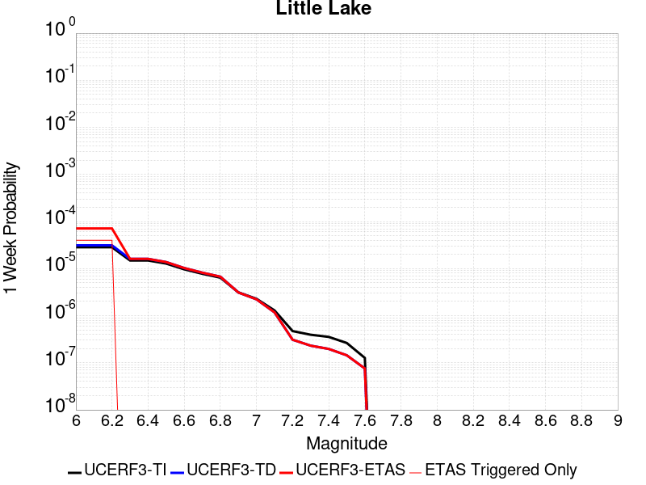 |  | 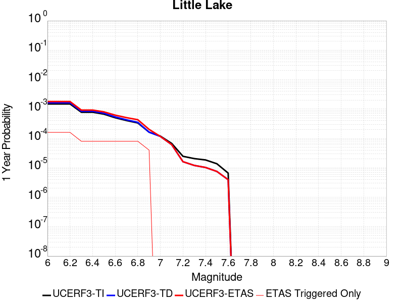 |

| Magnitude | 1 wk TI Prob | 1 wk TD Prob | 1 wk ETAS Prob | 1 wk ETAS/TD Gain | 1 wk ETAS Triggered Only | 1 mo TI Prob | 1 mo TD Prob | 1 mo ETAS Prob | 1 mo ETAS/TD Gain | 1 mo ETAS Triggered Only | 1 yr TI Prob | 1 yr TD Prob | 1 yr ETAS Prob | 1 yr ETAS/TD Gain | 1 yr ETAS Triggered Only |
|-----|-----|-----|-----|-----|-----|-----|-----|-----|-----|-----|-----|-----|-----|-----|-----|
| 6.0 | 2.8424427E-5 | 3.1216936E-5 | 7.121569E-5 | 2.2813158 | 4.0E-5 | 1.2181328E-4 | 1.3378076E-4 | 2.9375937E-4 | 2.1958265 | 1.6E-4 | 0.0014820677 | 0.0016276971 | 0.0017874367 | 1.0981383 | 1.6E-4 |
| 6.1 | 2.8424427E-5 | 3.1216936E-5 | 7.121569E-5 | 2.2813158 | 4.0E-5 | 1.2181328E-4 | 1.3378076E-4 | 2.9375937E-4 | 2.1958265 | 1.6E-4 | 0.0014820677 | 0.0016276971 | 0.0017874367 | 1.0981383 | 1.6E-4 |
| 6.2 | 2.8424427E-5 | 3.1216936E-5 | 7.121569E-5 | 2.2813158 | 4.0E-5 | 1.2181328E-4 | 1.3378076E-4 | 2.9375937E-4 | 2.1958265 | 1.6E-4 | 0.0014820677 | 0.0016276971 | 0.0017874367 | 1.0981383 | 1.6E-4 |
| 6.3 | 1.48860645E-5 | 1.6086597E-5 | 1.6086597E-5 | 1.0 | 0.0 | 6.379586E-5 | 6.894089E-5 | 1.4893537E-4 | 2.1603343 | 8.0E-5 | 7.7643775E-4 | 8.3906035E-4 | 9.1899326E-4 | 1.0952648 | 8.0E-5 |
| 6.4 | 1.48860645E-5 | 1.6086597E-5 | 1.6086597E-5 | 1.0 | 0.0 | 6.379586E-5 | 6.894089E-5 | 1.4893537E-4 | 2.1603343 | 8.0E-5 | 7.7643775E-4 | 8.3906035E-4 | 9.1899326E-4 | 1.0952648 | 8.0E-5 |
| 6.5 | 1.2797581E-5 | 1.3769917E-5 | 1.3769917E-5 | 1.0 | 0.0 | 5.4845623E-5 | 5.901274E-5 | 1.3900801E-4 | 2.3555596 | 8.0E-5 | 6.675408E-4 | 7.18269E-4 | 7.982115E-4 | 1.1112989 | 8.0E-5 |
| 6.6 | 9.661896E-6 | 1.02921085E-5 | 1.02921085E-5 | 1.0 | 0.0 | 4.1407468E-5 | 4.4108383E-5 | 1.2410486E-4 | 2.8136342 | 8.0E-5 | 5.040193E-4 | 5.369035E-4 | 6.168605E-4 | 1.1489226 | 8.0E-5 |
| 6.7 | 7.767871E-6 | 8.202026E-6 | 8.202026E-6 | 1.0 | 0.0 | 3.329045E-5 | 3.5151144E-5 | 1.1514833E-4 | 3.275806 | 8.0E-5 | 4.0523586E-4 | 4.278949E-4 | 5.078607E-4 | 1.1868818 | 8.0E-5 |
| 6.8 | 6.4235196E-6 | 6.7376404E-6 | 6.7376404E-6 | 1.0 | 0.0 | 2.752908E-5 | 2.8875354E-5 | 1.0887304E-4 | 3.7704487 | 8.0E-5 | 3.35115E-4 | 3.5151356E-4 | 4.3148545E-4 | 1.2275072 | 8.0E-5 |
| 6.9 | 3.1283696E-6 | 3.1128473E-6 | 3.1128473E-6 | 1.0 | 0.0 | 1.3407229E-5 | 1.3340715E-5 | 5.334018E-5 | 3.9983 | 4.0E-5 | 1.6322079E-4 | 1.624126E-4 | 2.0240611E-4 | 1.2462463 | 4.0E-5 |
| 7.0 | 2.290603E-6 | 2.229185E-6 | 2.229185E-6 | 1.0 | 0.0 | 9.816834E-6 | 9.553621E-6 | 9.553621E-6 | 1.0 | 0.0 | 1.19513395E-4 | 1.16310155E-4 | 1.16310155E-4 | 1.0 | 0.0 |
| 7.1 | 1.293693E-6 | 1.1779927E-6 | 1.1779927E-6 | 1.0 | 0.0 | 5.5443866E-6 | 5.048534E-6 | 5.048534E-6 | 1.0 | 0.0 | 6.750081E-5 | 6.146487E-5 | 6.146487E-5 | 1.0 | 0.0 |
| 7.2 | 4.715842E-7 | 3.093222E-7 | 3.093222E-7 | 1.0 | 0.0 | 2.0210737E-6 | 1.3256658E-6 | 1.3256658E-6 | 1.0 | 0.0 | 2.4606294E-5 | 1.6139868E-5 | 1.6139868E-5 | 1.0 | 0.0 |
| 7.3 | 3.9430947E-7 | 2.3110628E-7 | 2.3110628E-7 | 1.0 | 0.0 | 1.6898966E-6 | 9.904552E-7 | 9.904552E-7 | 1.0 | 0.0 | 2.0574296E-5 | 1.2058726E-5 | 1.2058726E-5 | 1.0 | 0.0 |
| 7.4 | 3.547123E-7 | 1.9691295E-7 | 1.9691295E-7 | 1.0 | 0.0 | 1.5201948E-6 | 8.439124E-7 | 8.439124E-7 | 1.0 | 0.0 | 1.8508214E-5 | 1.0274585E-5 | 1.0274585E-5 | 1.0 | 0.0 |
| 7.5 | 2.6354266E-7 | 1.443161E-7 | 1.443161E-7 | 1.0 | 0.0 | 1.129468E-6 | 6.1849744E-7 | 6.1849744E-7 | 1.0 | 0.0 | 1.3751187E-5 | 7.530181E-6 | 7.530181E-6 | 1.0 | 0.0 |
| 7.6 | 1.269913E-7 | 7.576127E-8 | 7.576127E-8 | 1.0 | 0.0 | 5.4424834E-7 | 3.2469111E-7 | 3.2469111E-7 | 1.0 | 0.0 | 6.6262032E-6 | 3.9531074E-6 | 3.9531074E-6 | 1.0 | 0.0 |

## North Frontal  (West)
*[(top)](#table-of-contents)*

| 1 Week | 1 Month | 1 Year |
|-----|-----|-----|
| 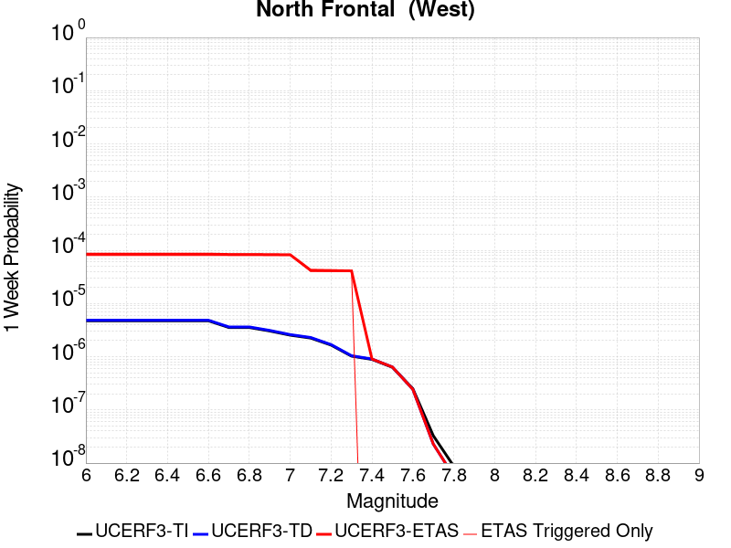 | 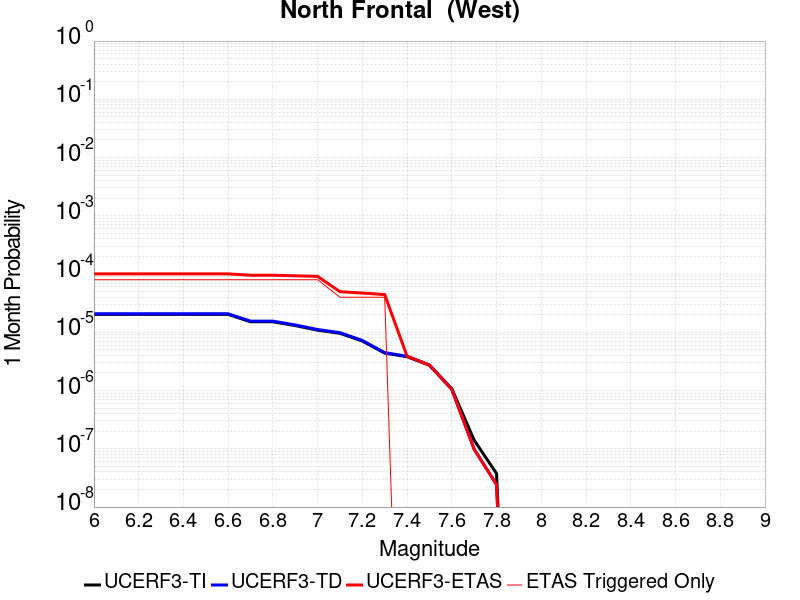 | 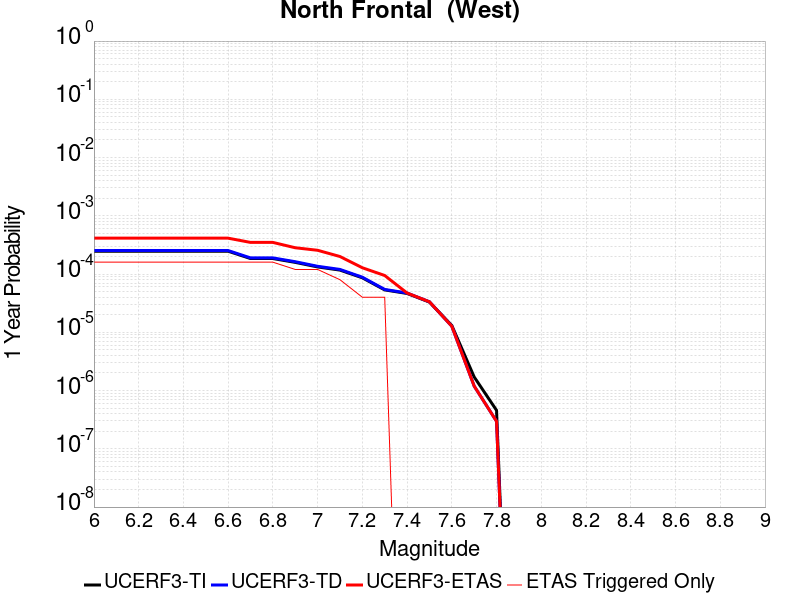 |

| Magnitude | 1 wk TI Prob | 1 wk TD Prob | 1 wk ETAS Prob | 1 wk ETAS/TD Gain | 1 wk ETAS Triggered Only | 1 mo TI Prob | 1 mo TD Prob | 1 mo ETAS Prob | 1 mo ETAS/TD Gain | 1 mo ETAS Triggered Only | 1 yr TI Prob | 1 yr TD Prob | 1 yr ETAS Prob | 1 yr ETAS/TD Gain | 1 yr ETAS Triggered Only |
|-----|-----|-----|-----|-----|-----|-----|-----|-----|-----|-----|-----|-----|-----|-----|-----|
| 6.0 | 4.7316266E-6 | 4.8531524E-6 | 8.485276E-5 | 17.48405 | 8.0E-5 | 2.0278241E-5 | 2.0799067E-5 | 1.00797406E-4 | 4.8462462 | 8.0E-5 | 2.4685962E-4 | 2.5320068E-4 | 4.1316016E-4 | 1.6317499 | 1.6E-4 |
| 6.1 | 4.7316266E-6 | 4.8531524E-6 | 8.485276E-5 | 17.48405 | 8.0E-5 | 2.0278241E-5 | 2.0799067E-5 | 1.00797406E-4 | 4.8462462 | 8.0E-5 | 2.4685962E-4 | 2.5320068E-4 | 4.1316016E-4 | 1.6317499 | 1.6E-4 |
| 6.2 | 4.7316266E-6 | 4.8531524E-6 | 8.485276E-5 | 17.48405 | 8.0E-5 | 2.0278241E-5 | 2.0799067E-5 | 1.00797406E-4 | 4.8462462 | 8.0E-5 | 2.4685962E-4 | 2.5320068E-4 | 4.1316016E-4 | 1.6317499 | 1.6E-4 |
| 6.3 | 4.7316266E-6 | 4.8531524E-6 | 8.485276E-5 | 17.48405 | 8.0E-5 | 2.0278241E-5 | 2.0799067E-5 | 1.00797406E-4 | 4.8462462 | 8.0E-5 | 2.4685962E-4 | 2.5320068E-4 | 4.1316016E-4 | 1.6317499 | 1.6E-4 |
| 6.4 | 4.7316266E-6 | 4.8531524E-6 | 8.485276E-5 | 17.48405 | 8.0E-5 | 2.0278241E-5 | 2.0799067E-5 | 1.00797406E-4 | 4.8462462 | 8.0E-5 | 2.4685962E-4 | 2.5320068E-4 | 4.1316016E-4 | 1.6317499 | 1.6E-4 |
| 6.5 | 4.7316266E-6 | 4.8531524E-6 | 8.485276E-5 | 17.48405 | 8.0E-5 | 2.0278241E-5 | 2.0799067E-5 | 1.00797406E-4 | 4.8462462 | 8.0E-5 | 2.4685962E-4 | 2.5320068E-4 | 4.1316016E-4 | 1.6317499 | 1.6E-4 |
| 6.6 | 4.7316266E-6 | 4.8531524E-6 | 8.485276E-5 | 17.48405 | 8.0E-5 | 2.0278241E-5 | 2.0799067E-5 | 1.00797406E-4 | 4.8462462 | 8.0E-5 | 2.4685962E-4 | 2.5320068E-4 | 4.1316016E-4 | 1.6317499 | 1.6E-4 |
| 6.7 | 3.5382777E-6 | 3.631267E-6 | 8.363098E-5 | 23.030798 | 8.0E-5 | 1.516396E-5 | 1.5562484E-5 | 9.556124E-5 | 6.1404877 | 8.0E-5 | 1.8460557E-4 | 1.8945755E-4 | 3.4942722E-4 | 1.8443564 | 1.6E-4 |
| 6.8 | 3.5382777E-6 | 3.631267E-6 | 8.363098E-5 | 23.030798 | 8.0E-5 | 1.516396E-5 | 1.5562484E-5 | 9.556124E-5 | 6.1404877 | 8.0E-5 | 1.8460557E-4 | 1.8945755E-4 | 3.4942722E-4 | 1.8443564 | 1.6E-4 |
| 6.9 | 3.0428037E-6 | 3.1230975E-6 | 8.3122846E-5 | 26.615515 | 8.0E-5 | 1.30405215E-5 | 1.3384639E-5 | 9.338357E-5 | 6.976921 | 8.0E-5 | 1.5875678E-4 | 1.6294647E-4 | 2.8292692E-4 | 1.7363181 | 1.2E-4 |
| 7.0 | 2.538778E-6 | 2.6063833E-6 | 8.260617E-5 | 31.693792 | 8.0E-5 | 1.0880432E-5 | 1.1170169E-5 | 9.116928E-5 | 8.161853 | 8.0E-5 | 1.324612E-4 | 1.359888E-4 | 2.559725E-4 | 1.8823056 | 1.2E-4 |
| 7.1 | 2.2418935E-6 | 2.3014725E-6 | 4.230138E-5 | 18.380136 | 4.0E-5 | 9.60808E-6 | 9.863419E-6 | 4.9863025E-5 | 5.055349 | 4.0E-5 | 1.1697209E-4 | 1.2008095E-4 | 2.0007134E-4 | 1.6661372 | 8.0E-5 |
| 7.2 | 1.6526745E-6 | 1.692682E-6 | 4.1692616E-5 | 24.631096 | 4.0E-5 | 7.082872E-6 | 7.2543326E-6 | 4.725404E-5 | 6.513906 | 4.0E-5 | 8.623055E-5 | 8.831818E-5 | 1.2831464E-4 | 1.4528679 | 4.0E-5 |
| 7.3 | 1.0246019E-6 | 1.0443523E-6 | 4.104431E-5 | 39.30121 | 4.0E-5 | 4.391144E-6 | 4.4757885E-6 | 4.4475608E-5 | 9.936933 | 4.0E-5 | 5.3460866E-5 | 5.449148E-5 | 9.44893E-5 | 1.7340196 | 4.0E-5 |
| 7.4 | 8.9045164E-7 | 9.057666E-7 | 9.057666E-7 | 1.0 | 0.0 | 3.8162157E-6 | 3.881852E-6 | 3.881852E-6 | 1.0 | 0.0 | 4.646144E-5 | 4.7260633E-5 | 4.7260633E-5 | 1.0 | 0.0 |
| 7.5 | 6.3357E-7 | 6.4035106E-7 | 6.4035106E-7 | 1.0 | 0.0 | 2.7152971E-6 | 2.744359E-6 | 2.744359E-6 | 1.0 | 0.0 | 3.305824E-5 | 3.3412125E-5 | 3.3412125E-5 | 1.0 | 0.0 |
| 7.6 | 2.5087024E-7 | 2.4364294E-7 | 2.4364294E-7 | 1.0 | 0.0 | 1.0751578E-6 | 1.0441837E-6 | 1.0441837E-6 | 1.0 | 0.0 | 1.3089967E-5 | 1.2712884E-5 | 1.2712884E-5 | 1.0 | 0.0 |
| 7.7 | 3.282987E-8 | 2.287823E-8 | 2.287823E-8 | 1.0 | 0.0 | 1.4069944E-7 | 9.8049554E-8 | 9.8049554E-8 | 1.0 | 0.0 | 1.7130144E-6 | 1.1937527E-6 | 1.1937527E-6 | 1.0 | 0.0 |
| 7.8 | 8.77499E-9 | 5.6832317E-9 | 5.6832317E-9 | 1.0 | 0.0 | 3.7607098E-8 | 2.4356707E-8 | 2.4356707E-8 | 1.0 | 0.0 | 4.578663E-7 | 2.9654288E-7 | 2.9654288E-7 | 1.0 | 0.0 |

## Cleghorn Lake
*[(top)](#table-of-contents)*

| 1 Week | 1 Month | 1 Year |
|-----|-----|-----|
|  |  |  |

| Magnitude | 1 wk TI Prob | 1 wk TD Prob | 1 wk ETAS Prob | 1 wk ETAS/TD Gain | 1 wk ETAS Triggered Only | 1 mo TI Prob | 1 mo TD Prob | 1 mo ETAS Prob | 1 mo ETAS/TD Gain | 1 mo ETAS Triggered Only | 1 yr TI Prob | 1 yr TD Prob | 1 yr ETAS Prob | 1 yr ETAS/TD Gain | 1 yr ETAS Triggered Only |
|-----|-----|-----|-----|-----|-----|-----|-----|-----|-----|-----|-----|-----|-----|-----|-----|
| 6.0 | 1.5467183E-5 | 1.6799104E-5 | 9.679776E-5 | 5.762079 | 8.0E-5 | 6.6286244E-5 | 7.199448E-5 | 1.5198873E-4 | 2.1111162 | 8.0E-5 | 8.067362E-4 | 8.7623525E-4 | 0.0010360951 | 1.1824393 | 1.6E-4 |
| 6.1 | 1.5467183E-5 | 1.6799104E-5 | 9.679776E-5 | 5.762079 | 8.0E-5 | 6.6286244E-5 | 7.199448E-5 | 1.5198873E-4 | 2.1111162 | 8.0E-5 | 8.067362E-4 | 8.7623525E-4 | 0.0010360951 | 1.1824393 | 1.6E-4 |
| 6.2 | 1.2624631E-5 | 1.3685442E-5 | 9.368435E-5 | 6.8455477 | 8.0E-5 | 5.410444E-5 | 5.865085E-5 | 1.3864615E-4 | 2.363924 | 8.0E-5 | 6.585225E-4 | 7.138889E-4 | 8.7377464E-4 | 1.2239646 | 1.6E-4 |
| 6.3 | 1.2624631E-5 | 1.3685442E-5 | 9.368435E-5 | 6.8455477 | 8.0E-5 | 5.410444E-5 | 5.865085E-5 | 1.3864615E-4 | 2.363924 | 8.0E-5 | 6.585225E-4 | 7.138889E-4 | 8.7377464E-4 | 1.2239646 | 1.6E-4 |
| 6.4 | 9.417684E-6 | 1.0172885E-5 | 5.017248E-5 | 4.931981 | 4.0E-5 | 4.036088E-5 | 4.359758E-5 | 8.3595834E-5 | 1.9174421 | 4.0E-5 | 4.912829E-4 | 5.307124E-4 | 6.506487E-4 | 1.2259911 | 1.2E-4 |
| 6.5 | 9.368219E-6 | 1.01203E-5 | 5.0119896E-5 | 4.9524117 | 4.0E-5 | 4.014889E-5 | 4.3372227E-5 | 8.337049E-5 | 1.9222091 | 4.0E-5 | 4.8870314E-4 | 5.2797E-4 | 6.479067E-4 | 1.2271656 | 1.2E-4 |
| 6.6 | 7.803798E-6 | 8.444179E-6 | 4.8443842E-5 | 5.736951 | 4.0E-5 | 3.3444423E-5 | 3.6189063E-5 | 7.6187614E-5 | 2.1052663 | 4.0E-5 | 4.0710976E-4 | 4.405527E-4 | 5.6049984E-4 | 1.2722651 | 1.2E-4 |
| 6.7 | 2.3108669E-6 | 2.4443107E-6 | 2.4443107E-6 | 1.0 | 0.0 | 9.903678E-6 | 1.0475576E-5 | 1.0475576E-5 | 1.0 | 0.0 | 1.205706E-4 | 1.2753287E-4 | 1.6752776E-4 | 1.3136046 | 4.0E-5 |
| 6.8 | 2.0882828E-6 | 2.206705E-6 | 2.206705E-6 | 1.0 | 0.0 | 8.949753E-6 | 9.457273E-6 | 9.457273E-6 | 1.0 | 0.0 | 1.08957785E-4 | 1.1513639E-4 | 1.5513178E-4 | 1.3473741 | 4.0E-5 |
| 6.9 | 1.876935E-6 | 1.9814236E-6 | 1.9814236E-6 | 1.0 | 0.0 | 8.043982E-6 | 8.491788E-6 | 8.491788E-6 | 1.0 | 0.0 | 9.7931086E-5 | 1.0338278E-4 | 1.4337865E-4 | 1.3868716 | 4.0E-5 |
| 7.0 | 1.5357559E-6 | 1.620583E-6 | 1.620583E-6 | 1.0 | 0.0 | 6.5817944E-6 | 6.945338E-6 | 6.945338E-6 | 1.0 | 0.0 | 8.01304E-5 | 8.455633E-5 | 8.455633E-5 | 1.0 | 0.0 |
| 7.1 | 1.0905424E-6 | 1.1499736E-6 | 1.1499736E-6 | 1.0 | 0.0 | 4.6737446E-6 | 4.9284495E-6 | 4.9284495E-6 | 1.0 | 0.0 | 5.6901354E-5 | 6.0002323E-5 | 6.0002323E-5 | 1.0 | 0.0 |
| 7.2 | 6.06668E-7 | 6.3884215E-7 | 6.3884215E-7 | 1.0 | 0.0 | 2.600003E-6 | 2.7378926E-6 | 2.7378926E-6 | 1.0 | 0.0 | 3.1654577E-5 | 3.3333403E-5 | 3.3333403E-5 | 1.0 | 0.0 |

## San Cayetano
*[(top)](#table-of-contents)*

| 1 Week | 1 Month | 1 Year |
|-----|-----|-----|
| 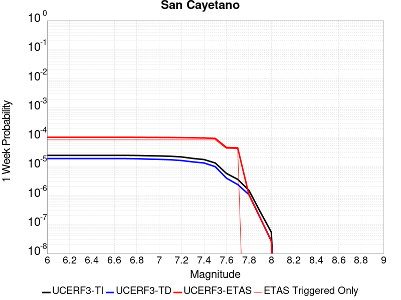 |  | 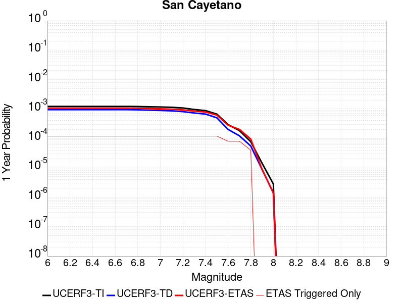 |

| Magnitude | 1 wk TI Prob | 1 wk TD Prob | 1 wk ETAS Prob | 1 wk ETAS/TD Gain | 1 wk ETAS Triggered Only | 1 mo TI Prob | 1 mo TD Prob | 1 mo ETAS Prob | 1 mo ETAS/TD Gain | 1 mo ETAS Triggered Only | 1 yr TI Prob | 1 yr TD Prob | 1 yr ETAS Prob | 1 yr ETAS/TD Gain | 1 yr ETAS Triggered Only |
|-----|-----|-----|-----|-----|-----|-----|-----|-----|-----|-----|-----|-----|-----|-----|-----|
| 6.0 | 2.3476267E-5 | 1.8191893E-5 | 9.819044E-5 | 5.397483 | 8.0E-5 | 1.0060869E-4 | 7.796295E-5 | 1.5795672E-4 | 2.0260484 | 8.0E-5 | 0.0012242225 | 9.4878924E-4 | 0.0010686754 | 1.126357 | 1.2E-4 |
| 6.1 | 2.3476267E-5 | 1.8191893E-5 | 9.819044E-5 | 5.397483 | 8.0E-5 | 1.0060869E-4 | 7.796295E-5 | 1.5795672E-4 | 2.0260484 | 8.0E-5 | 0.0012242225 | 9.4878924E-4 | 0.0010686754 | 1.126357 | 1.2E-4 |
| 6.2 | 2.3476267E-5 | 1.8191893E-5 | 9.819044E-5 | 5.397483 | 8.0E-5 | 1.0060869E-4 | 7.796295E-5 | 1.5795672E-4 | 2.0260484 | 8.0E-5 | 0.0012242225 | 9.4878924E-4 | 0.0010686754 | 1.126357 | 1.2E-4 |
| 6.3 | 2.3476267E-5 | 1.8191893E-5 | 9.819044E-5 | 5.397483 | 8.0E-5 | 1.0060869E-4 | 7.796295E-5 | 1.5795672E-4 | 2.0260484 | 8.0E-5 | 0.0012242225 | 9.4878924E-4 | 0.0010686754 | 1.126357 | 1.2E-4 |
| 6.4 | 2.3476267E-5 | 1.8191893E-5 | 9.819044E-5 | 5.397483 | 8.0E-5 | 1.0060869E-4 | 7.796295E-5 | 1.5795672E-4 | 2.0260484 | 8.0E-5 | 0.0012242225 | 9.4878924E-4 | 0.0010686754 | 1.126357 | 1.2E-4 |
| 6.5 | 2.3476267E-5 | 1.8191893E-5 | 9.819044E-5 | 5.397483 | 8.0E-5 | 1.0060869E-4 | 7.796295E-5 | 1.5795672E-4 | 2.0260484 | 8.0E-5 | 0.0012242225 | 9.4878924E-4 | 0.0010686754 | 1.126357 | 1.2E-4 |
| 6.6 | 2.3476267E-5 | 1.8191893E-5 | 9.819044E-5 | 5.397483 | 8.0E-5 | 1.0060869E-4 | 7.796295E-5 | 1.5795672E-4 | 2.0260484 | 8.0E-5 | 0.0012242225 | 9.4878924E-4 | 0.0010686754 | 1.126357 | 1.2E-4 |
| 6.7 | 2.3476267E-5 | 1.8191893E-5 | 9.819044E-5 | 5.397483 | 8.0E-5 | 1.0060869E-4 | 7.796295E-5 | 1.5795672E-4 | 2.0260484 | 8.0E-5 | 0.0012242225 | 9.4878924E-4 | 0.0010686754 | 1.126357 | 1.2E-4 |
| 6.8 | 2.3241924E-5 | 1.795945E-5 | 9.7958015E-5 | 5.4543996 | 8.0E-5 | 9.960445E-5 | 7.696682E-5 | 1.5696067E-4 | 2.0393288 | 8.0E-5 | 0.0012120095 | 9.366718E-4 | 0.0010565594 | 1.1279932 | 1.2E-4 |
| 6.9 | 2.2761007E-5 | 1.7454628E-5 | 9.745323E-5 | 5.583232 | 8.0E-5 | 9.7543525E-5 | 7.480342E-5 | 1.5479744E-4 | 2.0693898 | 8.0E-5 | 0.0011869454 | 9.1035455E-4 | 0.0010302453 | 1.1316968 | 1.2E-4 |
| 7.0 | 2.240283E-5 | 1.7088216E-5 | 9.708685E-5 | 5.681509 | 8.0E-5 | 9.600859E-5 | 7.323317E-5 | 1.5322732E-4 | 2.0923212 | 8.0E-5 | 0.0011682777 | 8.912526E-4 | 0.0010111457 | 1.134522 | 1.2E-4 |
| 7.1 | 2.1871154E-5 | 1.6605602E-5 | 9.660427E-5 | 5.817571 | 8.0E-5 | 9.373015E-5 | 7.116494E-5 | 1.5115926E-4 | 2.124069 | 8.0E-5 | 0.0011405671 | 8.6609216E-4 | 9.859882E-4 | 1.1384333 | 1.2E-4 |
| 7.2 | 2.0714133E-5 | 1.5581662E-5 | 9.558041E-5 | 6.134161 | 8.0E-5 | 8.8771834E-5 | 6.6776855E-5 | 1.4677152E-4 | 2.1979399 | 8.0E-5 | 0.0010802611 | 8.127082E-4 | 9.326107E-4 | 1.1475345 | 1.2E-4 |
| 7.3 | 1.8408395E-5 | 1.4011361E-5 | 9.401024E-5 | 6.7095723 | 8.0E-5 | 7.8890735E-5 | 6.004732E-5 | 1.4004252E-4 | 2.3322024 | 8.0E-5 | 9.600714E-4 | 7.308339E-4 | 8.5074623E-4 | 1.164076 | 1.2E-4 |
| 7.4 | 1.6856795E-5 | 1.2863538E-5 | 9.286251E-5 | 7.2190485 | 8.0E-5 | 7.2241404E-5 | 5.51283E-5 | 1.3512389E-4 | 2.4510803 | 8.0E-5 | 8.7918417E-4 | 6.709832E-4 | 7.909027E-4 | 1.178722 | 1.2E-4 |
| 7.5 | 1.2822778E-5 | 9.588695E-6 | 8.958793E-5 | 9.343078 | 8.0E-5 | 5.495361E-5 | 4.109377E-5 | 1.2109048E-4 | 2.9466872 | 8.0E-5 | 6.688548E-4 | 5.002034E-4 | 6.201434E-4 | 1.2397825 | 1.2E-4 |
| 7.6 | 5.6272684E-6 | 3.856865E-6 | 4.385671E-5 | 11.371078 | 4.0E-5 | 2.4116642E-5 | 1.6529317E-5 | 5.6528657E-5 | 3.4199026 | 4.0E-5 | 2.9358055E-4 | 2.0122595E-4 | 2.8120985E-4 | 1.397483 | 8.0E-5 |
| 7.7 | 3.5261346E-6 | 2.3419418E-6 | 4.234185E-5 | 18.079803 | 4.0E-5 | 1.5111918E-5 | 1.0036855E-5 | 5.0036455E-5 | 4.985272 | 4.0E-5 | 1.8397206E-4 | 1.2219194E-4 | 2.0218216E-4 | 1.6546277 | 8.0E-5 |
| 7.8 | 1.4826929E-6 | 1.0569837E-6 | 1.0569837E-6 | 1.0 | 0.0 | 6.354383E-6 | 4.5299225E-6 | 4.5299225E-6 | 1.0 | 0.0 | 7.736187E-5 | 5.515043E-5 | 9.514823E-5 | 1.7252489 | 4.0E-5 |
| 7.9 | 2.7568166E-7 | 1.6989308E-7 | 1.6989308E-7 | 1.0 | 0.0 | 1.1814923E-6 | 7.28113E-7 | 7.28113E-7 | 1.0 | 0.0 | 1.4384574E-5 | 8.86474E-6 | 8.86474E-6 | 1.0 | 0.0 |
| 8.0 | 5.407832E-8 | 2.6923225E-8 | 2.6923225E-8 | 1.0 | 0.0 | 2.3176422E-7 | 1.1538524E-7 | 1.1538524E-7 | 1.0 | 0.0 | 2.8217257E-6 | 1.4048145E-6 | 1.4048145E-6 | 1.0 | 0.0 |

## Pinto Mtn
*[(top)](#table-of-contents)*

| 1 Week | 1 Month | 1 Year |
|-----|-----|-----|
| 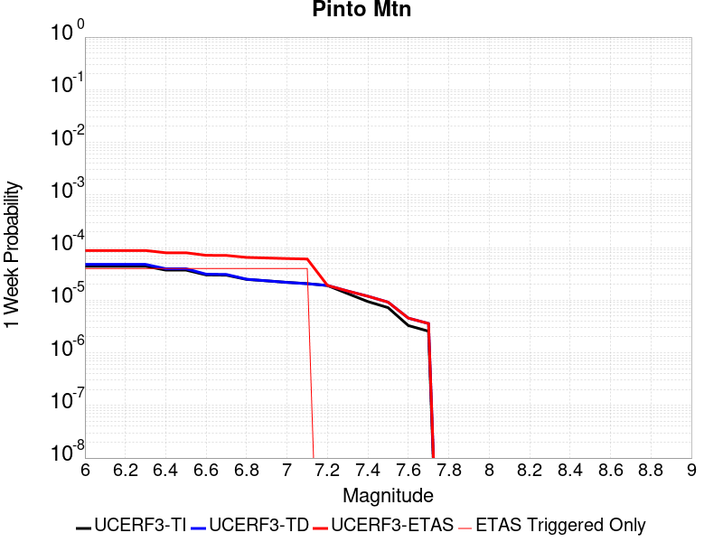 |  | 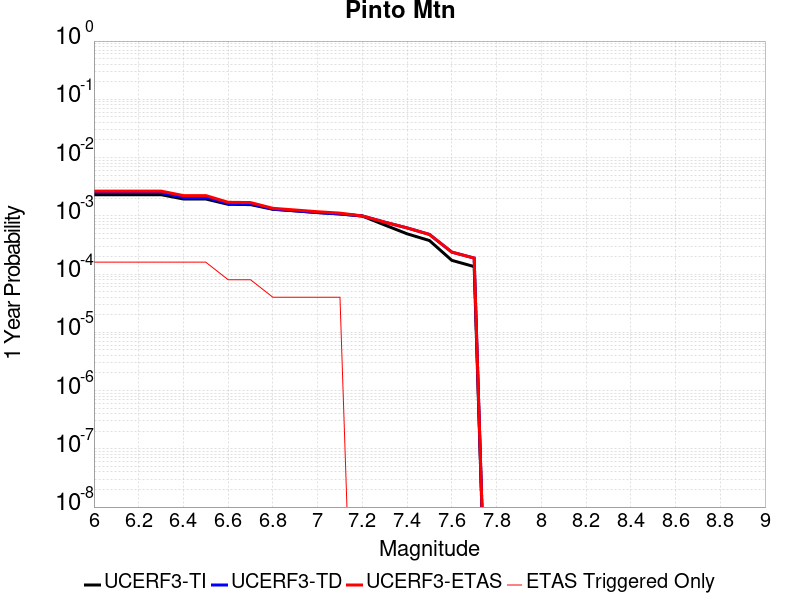 |

| Magnitude | 1 wk TI Prob | 1 wk TD Prob | 1 wk ETAS Prob | 1 wk ETAS/TD Gain | 1 wk ETAS Triggered Only | 1 mo TI Prob | 1 mo TD Prob | 1 mo ETAS Prob | 1 mo ETAS/TD Gain | 1 mo ETAS Triggered Only | 1 yr TI Prob | 1 yr TD Prob | 1 yr ETAS Prob | 1 yr ETAS/TD Gain | 1 yr ETAS Triggered Only |
|-----|-----|-----|-----|-----|-----|-----|-----|-----|-----|-----|-----|-----|-----|-----|-----|
| 6.0 | 4.4194956E-5 | 4.7895475E-5 | 8.789356E-5 | 1.835112 | 4.0E-5 | 1.893932E-4 | 2.0525111E-4 | 2.8523468E-4 | 1.3896865 | 8.0E-5 | 0.0023034236 | 0.002496232 | 0.0026558328 | 1.0639366 | 1.6E-4 |
| 6.1 | 4.4194956E-5 | 4.7895475E-5 | 8.789356E-5 | 1.835112 | 4.0E-5 | 1.893932E-4 | 2.0525111E-4 | 2.8523468E-4 | 1.3896865 | 8.0E-5 | 0.0023034236 | 0.002496232 | 0.0026558328 | 1.0639366 | 1.6E-4 |
| 6.2 | 4.4194956E-5 | 4.7895475E-5 | 8.789356E-5 | 1.835112 | 4.0E-5 | 1.893932E-4 | 2.0525111E-4 | 2.8523468E-4 | 1.3896865 | 8.0E-5 | 0.0023034236 | 0.002496232 | 0.0026558328 | 1.0639366 | 1.6E-4 |
| 6.3 | 4.4194956E-5 | 4.7895475E-5 | 8.789356E-5 | 1.835112 | 4.0E-5 | 1.893932E-4 | 2.0525111E-4 | 2.8523468E-4 | 1.3896865 | 8.0E-5 | 0.0023034236 | 0.002496232 | 0.0026558328 | 1.0639366 | 1.6E-4 |
| 6.4 | 3.729929E-5 | 3.963956E-5 | 7.9637975E-5 | 2.009053 | 4.0E-5 | 1.5984432E-4 | 1.698733E-4 | 2.498597E-4 | 1.4708593 | 8.0E-5 | 0.0019443673 | 0.0020663387 | 0.002226008 | 1.0772717 | 1.6E-4 |
| 6.5 | 3.729929E-5 | 3.963956E-5 | 7.9637975E-5 | 2.009053 | 4.0E-5 | 1.5984432E-4 | 1.698733E-4 | 2.498597E-4 | 1.4708593 | 8.0E-5 | 0.0019443673 | 0.0020663387 | 0.002226008 | 1.0772717 | 1.6E-4 |
| 6.6 | 3.0204548E-5 | 3.1236435E-5 | 7.123519E-5 | 2.2805157 | 4.0E-5 | 1.2944164E-4 | 1.3386377E-4 | 2.1385307E-4 | 1.5975425 | 8.0E-5 | 0.0015748127 | 0.0016286077 | 0.0017084774 | 1.0490417 | 8.0E-5 |
| 6.7 | 2.9857754E-5 | 3.0845655E-5 | 7.084442E-5 | 2.296739 | 4.0E-5 | 1.2795553E-4 | 1.3218916E-4 | 2.1217858E-4 | 1.6051134 | 8.0E-5 | 0.0015567453 | 0.0016082495 | 0.0016881209 | 1.0496635 | 8.0E-5 |
| 6.8 | 2.4819734E-5 | 2.5037323E-5 | 6.503632E-5 | 2.597575 | 4.0E-5 | 1.0636595E-4 | 1.0729852E-4 | 1.4729422E-4 | 1.3727517 | 4.0E-5 | 0.0012942362 | 0.0013055983 | 0.0013455461 | 1.0305973 | 4.0E-5 |
| 6.9 | 2.331124E-5 | 2.3364986E-5 | 6.336405E-5 | 2.7119234 | 4.0E-5 | 9.990149E-5 | 1.00131925E-4 | 1.4012792E-4 | 1.399433 | 4.0E-5 | 0.001215622 | 0.0012184448 | 0.0012583961 | 1.0327888 | 4.0E-5 |
| 7.0 | 2.1818534E-5 | 2.17876E-5 | 6.1786726E-5 | 2.8358667 | 4.0E-5 | 9.3504656E-5 | 9.33722E-5 | 1.3336846E-4 | 1.4283531 | 4.0E-5 | 0.0011378246 | 0.0011362336 | 0.0011761881 | 1.035164 | 4.0E-5 |
| 7.1 | 2.066081E-5 | 2.0566755E-5 | 6.0565933E-5 | 2.9448464 | 4.0E-5 | 8.854332E-5 | 8.814037E-5 | 1.2813685E-4 | 1.4537816 | 4.0E-5 | 0.0010774818 | 0.0010726003 | 0.0011125574 | 1.0372525 | 4.0E-5 |
| 7.2 | 1.8990233E-5 | 1.9079554E-5 | 1.9079554E-5 | 1.0 | 0.0 | 8.138417E-5 | 8.176706E-5 | 8.176706E-5 | 1.0 | 0.0 | 9.904018E-4 | 9.950787E-4 | 9.950787E-4 | 1.0 | 0.0 |
| 7.3 | 1.3335872E-5 | 1.4930265E-5 | 1.4930265E-5 | 1.0 | 0.0 | 5.7152483E-5 | 6.398535E-5 | 6.398535E-5 | 1.0 | 0.0 | 6.956093E-4 | 7.78756E-4 | 7.78756E-4 | 1.0 | 0.0 |
| 7.4 | 9.414066E-6 | 1.1882921E-5 | 1.1882921E-5 | 1.0 | 0.0 | 4.0345374E-5 | 5.0925864E-5 | 5.0925864E-5 | 1.0 | 0.0 | 4.910942E-4 | 6.198555E-4 | 6.198555E-4 | 1.0 | 0.0 |
| 7.5 | 7.2101157E-6 | 9.179627E-6 | 9.179627E-6 | 1.0 | 0.0 | 3.090013E-5 | 3.934071E-5 | 3.934071E-5 | 1.0 | 0.0 | 3.7614413E-4 | 4.788757E-4 | 4.788757E-4 | 1.0 | 0.0 |
| 7.6 | 3.296375E-6 | 4.5660995E-6 | 4.5660995E-6 | 1.0 | 0.0 | 1.4127245E-5 | 1.9568859E-5 | 1.9568859E-5 | 1.0 | 0.0 | 1.7198564E-4 | 2.3822622E-4 | 2.3822622E-4 | 1.0 | 0.0 |
| 7.7 | 2.5741092E-6 | 3.6038196E-6 | 3.6038196E-6 | 1.0 | 0.0 | 1.103185E-5 | 1.5444857E-5 | 1.5444857E-5 | 1.0 | 0.0 | 1.3430449E-4 | 1.8802624E-4 | 1.8802624E-4 | 1.0 | 0.0 |

## Hayward (So) 2011 CFM
*[(top)](#table-of-contents)*

| 1 Week | 1 Month | 1 Year |
|-----|-----|-----|
|  | 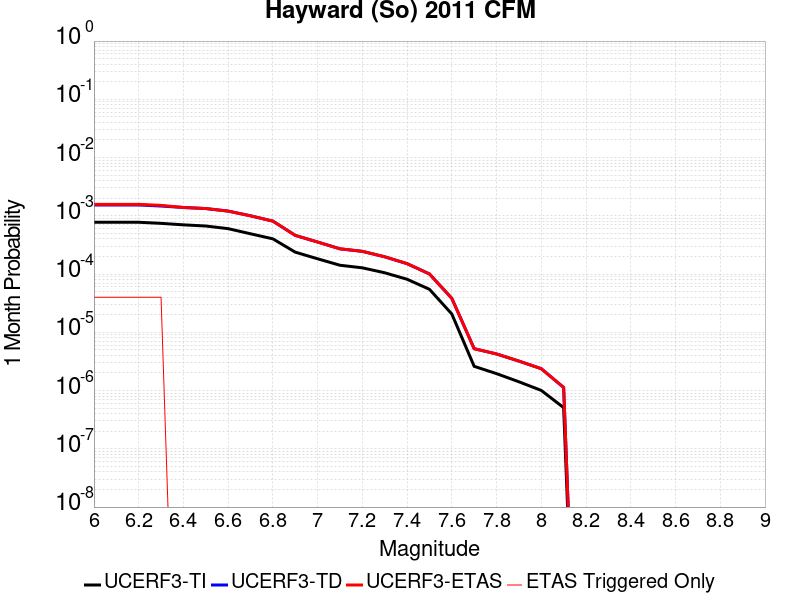 | 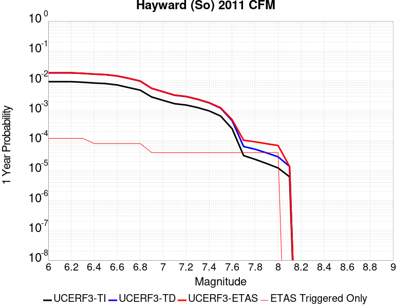 |

| Magnitude | 1 wk TI Prob | 1 wk TD Prob | 1 wk ETAS Prob | 1 wk ETAS/TD Gain | 1 wk ETAS Triggered Only | 1 mo TI Prob | 1 mo TD Prob | 1 mo ETAS Prob | 1 mo ETAS/TD Gain | 1 mo ETAS Triggered Only | 1 yr TI Prob | 1 yr TD Prob | 1 yr ETAS Prob | 1 yr ETAS/TD Gain | 1 yr ETAS Triggered Only |
|-----|-----|-----|-----|-----|-----|-----|-----|-----|-----|-----|-----|-----|-----|-----|-----|
| 6.0 | 1.8091932E-4 | 3.580821E-4 | 3.9806776E-4 | 1.1116662 | 4.0E-5 | 7.751381E-4 | 0.001533745 | 0.0015736836 | 1.02604 | 4.0E-5 | 0.00939654 | 0.018515883 | 0.018633662 | 1.0063609 | 1.2E-4 |
| 6.1 | 1.8091932E-4 | 3.580821E-4 | 3.9806776E-4 | 1.1116662 | 4.0E-5 | 7.751381E-4 | 0.001533745 | 0.0015736836 | 1.02604 | 4.0E-5 | 0.00939654 | 0.018515883 | 0.018633662 | 1.0063609 | 1.2E-4 |
| 6.2 | 1.8091932E-4 | 3.580821E-4 | 3.9806776E-4 | 1.1116662 | 4.0E-5 | 7.751381E-4 | 0.001533745 | 0.0015736836 | 1.02604 | 4.0E-5 | 0.00939654 | 0.018515883 | 0.018633662 | 1.0063609 | 1.2E-4 |
| 6.3 | 1.7322872E-4 | 3.436256E-4 | 3.8361188E-4 | 1.1163658 | 4.0E-5 | 7.4219756E-4 | 0.0014718598 | 0.0015118008 | 1.0271364 | 4.0E-5 | 0.0089988755 | 0.017774936 | 0.017892804 | 1.0066311 | 1.2E-4 |
| 6.4 | 1.6334097E-4 | 3.2441478E-4 | 3.2441478E-4 | 1.0 | 0.0 | 6.998449E-4 | 0.001389617 | 0.001389617 | 1.0 | 0.0 | 0.008487372 | 0.016789362 | 0.01686802 | 1.0046849 | 8.0E-5 |
| 6.5 | 1.5600289E-4 | 3.1113712E-4 | 3.1113712E-4 | 1.0 | 0.0 | 6.684125E-4 | 0.0013327717 | 0.0013327717 | 1.0 | 0.0 | 0.008107598 | 0.016107671 | 0.01618638 | 1.0048866 | 8.0E-5 |
| 6.6 | 1.4046066E-4 | 2.8122755E-4 | 2.8122755E-4 | 1.0 | 0.0 | 6.018354E-4 | 0.001204711 | 0.001204711 | 1.0 | 0.0 | 0.0073027555 | 0.014570225 | 0.01464906 | 1.0054107 | 8.0E-5 |
| 6.7 | 1.14696966E-4 | 2.3352736E-4 | 2.3352736E-4 | 1.0 | 0.0 | 4.914658E-4 | 0.0010004528 | 0.0010004528 | 1.0 | 0.0 | 0.0059671924 | 0.012113555 | 0.012192586 | 1.0065242 | 8.0E-5 |
| 6.8 | 9.3874296E-5 | 1.8929E-4 | 1.8929E-4 | 1.0 | 0.0 | 4.0225635E-4 | 8.1099436E-4 | 8.1099436E-4 | 1.0 | 0.0 | 0.0048864787 | 0.009829894 | 0.009909107 | 1.0080584 | 8.0E-5 |
| 6.9 | 5.551852E-5 | 1.077282E-4 | 1.077282E-4 | 1.0 | 0.0 | 2.3791482E-4 | 4.616112E-4 | 4.616112E-4 | 1.0 | 0.0 | 0.0028927654 | 0.0056057535 | 0.005645529 | 1.0070956 | 4.0E-5 |
| 7.0 | 4.2662363E-5 | 8.281727E-5 | 8.281727E-5 | 1.0 | 0.0 | 1.8282588E-4 | 3.548833E-4 | 3.548833E-4 | 1.0 | 0.0 | 0.0022236328 | 0.004312218 | 0.0043520457 | 1.009236 | 4.0E-5 |
| 7.1 | 3.305886E-5 | 6.331385E-5 | 6.331385E-5 | 1.0 | 0.0 | 1.4167312E-4 | 2.7131697E-4 | 2.7131697E-4 | 1.0 | 0.0 | 0.0017235056 | 0.0032982994 | 0.0033381674 | 1.0120875 | 4.0E-5 |
| 7.2 | 2.9856887E-5 | 5.7290094E-5 | 5.7290094E-5 | 1.0 | 0.0 | 1.2795182E-4 | 2.4550597E-4 | 2.4550597E-4 | 1.0 | 0.0 | 0.0015567001 | 0.0029849552 | 0.0030248358 | 1.0133605 | 4.0E-5 |
| 7.3 | 2.4559737E-5 | 4.6207337E-5 | 4.6207337E-5 | 1.0 | 0.0 | 1.0525176E-4 | 1.980165E-4 | 1.980165E-4 | 1.0 | 0.0 | 0.0012806869 | 0.0024081983 | 0.002448102 | 1.01657 | 4.0E-5 |
| 7.4 | 1.9002231E-5 | 3.521722E-5 | 3.521722E-5 | 1.0 | 0.0 | 8.143559E-5 | 1.5092228E-4 | 1.5092228E-4 | 1.0 | 0.0 | 9.910273E-4 | 0.00183594 | 0.0018758666 | 1.0217472 | 4.0E-5 |
| 7.5 | 1.2783333E-5 | 2.3453922E-5 | 2.3453922E-5 | 1.0 | 0.0 | 5.4784563E-5 | 1.0051297E-4 | 1.0051297E-4 | 1.0 | 0.0 | 6.667979E-4 | 0.0012230643 | 0.0012630153 | 1.0326648 | 4.0E-5 |
| 7.6 | 4.8149627E-6 | 8.940782E-6 | 8.940782E-6 | 1.0 | 0.0 | 2.063539E-5 | 3.8317085E-5 | 3.8317085E-5 | 1.0 | 0.0 | 2.5120692E-4 | 4.6641188E-4 | 5.063932E-4 | 1.0857211 | 4.0E-5 |
| 7.7 | 6.0838227E-7 | 1.2205189E-6 | 1.2205189E-6 | 1.0 | 0.0 | 2.6073499E-6 | 5.2307846E-6 | 5.2307846E-6 | 1.0 | 0.0 | 3.174402E-5 | 6.368295E-5 | 1.036804E-4 | 1.6280717 | 4.0E-5 |
| 7.8 | 4.5542808E-7 | 9.921866E-7 | 9.921866E-7 | 1.0 | 0.0 | 1.9518332E-6 | 4.2522215E-6 | 4.2522215E-6 | 1.0 | 0.0 | 2.376331E-5 | 5.176957E-5 | 9.17675E-5 | 1.7726147 | 4.0E-5 |
| 7.9 | 3.3016747E-7 | 7.481718E-7 | 7.481718E-7 | 1.0 | 0.0 | 1.4150027E-6 | 3.2064463E-6 | 3.2064463E-6 | 1.0 | 0.0 | 1.7227521E-5 | 3.9037786E-5 | 7.9036225E-5 | 2.0246081 | 4.0E-5 |
| 8.0 | 2.347038E-7 | 5.539233E-7 | 5.539233E-7 | 1.0 | 0.0 | 1.0058731E-6 | 2.3739547E-6 | 2.3739547E-6 | 1.0 | 0.0 | 1.2246436E-5 | 2.8902517E-5 | 6.890136E-5 | 2.3839226 | 4.0E-5 |
| 8.1 | 1.18822804E-7 | 2.6370554E-7 | 2.6370554E-7 | 1.0 | 0.0 | 5.092405E-7 | 1.1301661E-6 | 1.1301661E-6 | 1.0 | 0.0 | 6.1999854E-6 | 1.3759687E-5 | 1.3759687E-5 | 1.0 | 0.0 |

## Calaveras (No) 2011 CFM
*[(top)](#table-of-contents)*

| 1 Week | 1 Month | 1 Year |
|-----|-----|-----|
|  |  |  |

| Magnitude | 1 wk TI Prob | 1 wk TD Prob | 1 wk ETAS Prob | 1 wk ETAS/TD Gain | 1 wk ETAS Triggered Only | 1 mo TI Prob | 1 mo TD Prob | 1 mo ETAS Prob | 1 mo ETAS/TD Gain | 1 mo ETAS Triggered Only | 1 yr TI Prob | 1 yr TD Prob | 1 yr ETAS Prob | 1 yr ETAS/TD Gain | 1 yr ETAS Triggered Only |
|-----|-----|-----|-----|-----|-----|-----|-----|-----|-----|-----|-----|-----|-----|-----|-----|
| 6.0 | 4.8694856E-5 | 6.771384E-5 | 1.4770842E-4 | 2.1813624 | 8.0E-5 | 2.0867554E-4 | 2.9017063E-4 | 3.7014743E-4 | 1.2756199 | 8.0E-5 | 0.0025376645 | 0.0035271072 | 0.003646684 | 1.0339022 | 1.2E-4 |
| 6.1 | 4.8694856E-5 | 6.771384E-5 | 1.4770842E-4 | 2.1813624 | 8.0E-5 | 2.0867554E-4 | 2.9017063E-4 | 3.7014743E-4 | 1.2756199 | 8.0E-5 | 0.0025376645 | 0.0035271072 | 0.003646684 | 1.0339022 | 1.2E-4 |
| 6.2 | 4.7541962E-5 | 6.604287E-5 | 1.460376E-4 | 2.2112544 | 8.0E-5 | 2.0373536E-4 | 2.8301092E-4 | 3.629883E-4 | 1.2825946 | 8.0E-5 | 0.0024776561 | 0.0034402376 | 0.0035598248 | 1.0347613 | 1.2E-4 |
| 6.3 | 4.6717287E-5 | 6.487508E-5 | 1.4486989E-4 | 2.2330592 | 8.0E-5 | 2.0020158E-4 | 2.780072E-4 | 3.5798494E-4 | 1.2876823 | 8.0E-5 | 0.0024347296 | 0.0033795182 | 0.0034991126 | 1.035388 | 1.2E-4 |
| 6.4 | 4.6276386E-5 | 6.4235894E-5 | 1.4423075E-4 | 2.2453296 | 8.0E-5 | 1.983123E-4 | 2.7526857E-4 | 3.5524656E-4 | 1.2905452 | 8.0E-5 | 0.0024117786 | 0.003346286 | 0.0034658846 | 1.0357406 | 1.2E-4 |
| 6.5 | 4.5720994E-5 | 6.343563E-5 | 1.4343056E-4 | 2.261041 | 8.0E-5 | 1.9593239E-4 | 2.7183973E-4 | 3.51818E-4 | 1.294211 | 8.0E-5 | 0.002382867 | 0.0033046764 | 0.0034242799 | 1.0361922 | 1.2E-4 |
| 6.6 | 4.549134E-5 | 6.308783E-5 | 1.4308278E-4 | 2.2679935 | 8.0E-5 | 1.949483E-4 | 2.7034947E-4 | 3.503278E-4 | 1.2958333 | 8.0E-5 | 0.0023709119 | 0.0032865873 | 0.0034061929 | 1.0363921 | 1.2E-4 |
| 6.7 | 3.701047E-5 | 5.057689E-5 | 9.057487E-5 | 1.790835 | 4.0E-5 | 1.5860666E-4 | 2.1674034E-4 | 2.5673167E-4 | 1.1845126 | 4.0E-5 | 0.0019293258 | 0.002635664 | 0.0026755587 | 1.0151365 | 4.0E-5 |
| 6.8 | 3.5523568E-5 | 4.855653E-5 | 8.855459E-5 | 1.8237422 | 4.0E-5 | 1.5223498E-4 | 2.0808306E-4 | 2.4807474E-4 | 1.1921909 | 4.0E-5 | 0.0018518851 | 0.0025305112 | 0.00257041 | 1.0157671 | 4.0E-5 |
| 6.9 | 3.2946147E-5 | 4.4870914E-5 | 8.486912E-5 | 1.891406 | 4.0E-5 | 1.4119013E-4 | 1.9228998E-4 | 2.3228228E-4 | 1.2079792 | 4.0E-5 | 0.0017176344 | 0.0023386595 | 0.002378566 | 1.0170639 | 4.0E-5 |
| 7.0 | 2.7682381E-5 | 3.7224938E-5 | 7.722345E-5 | 2.0745084 | 4.0E-5 | 1.1863338E-4 | 1.5952587E-4 | 1.9951949E-4 | 1.250703 | 4.0E-5 | 0.0014434044 | 0.0019405278 | 0.0019804502 | 1.0205729 | 4.0E-5 |
| 7.1 | 2.471967E-5 | 3.3482836E-5 | 7.34815E-5 | 2.194602 | 4.0E-5 | 1.05937135E-4 | 1.4349015E-4 | 1.834844E-4 | 1.2787248 | 4.0E-5 | 0.0012890215 | 0.0017456219 | 0.0017855521 | 1.0228745 | 4.0E-5 |
| 7.2 | 1.9748062E-5 | 2.6924752E-5 | 6.6923676E-5 | 2.4855819 | 4.0E-5 | 8.463181E-5 | 1.1538683E-4 | 1.5538221E-4 | 1.34662 | 4.0E-5 | 0.0010299052 | 0.0014039531 | 0.0014438969 | 1.028451 | 4.0E-5 |
| 7.3 | 1.1603734E-5 | 1.5908003E-5 | 5.5907367E-5 | 3.5144176 | 4.0E-5 | 4.9729337E-5 | 6.817545E-5 | 1.0817273E-4 | 1.5866814 | 4.0E-5 | 6.052865E-4 | 8.2973455E-4 | 8.697014E-4 | 1.0481682 | 4.0E-5 |
| 7.4 | 4.885381E-6 | 6.075835E-6 | 4.607559E-5 | 7.5834174 | 4.0E-5 | 2.0937177E-5 | 2.6039033E-5 | 6.603799E-5 | 2.5361154 | 4.0E-5 | 2.5488032E-4 | 3.1697928E-4 | 3.569666E-4 | 1.1261512 | 4.0E-5 |
| 7.5 | 3.0571264E-6 | 4.192564E-6 | 4.4192395E-5 | 10.540661 | 4.0E-5 | 1.3101904E-5 | 1.7968008E-5 | 5.796729E-5 | 3.2261388 | 4.0E-5 | 1.5950401E-4 | 2.1873864E-4 | 2.5872988E-4 | 1.1828266 | 4.0E-5 |
| 7.6 | 1.764948E-6 | 2.8308468E-6 | 4.2830732E-5 | 15.130007 | 4.0E-5 | 7.564041E-6 | 1.2132145E-5 | 5.2131658E-5 | 4.296986 | 4.0E-5 | 9.208831E-5 | 1.4769893E-4 | 1.8769302E-4 | 1.2707812 | 4.0E-5 |
| 7.7 | 1.3173734E-6 | 2.0893792E-6 | 4.2089294E-5 | 20.144403 | 4.0E-5 | 5.645874E-6 | 8.954452E-6 | 4.8954094E-5 | 5.467012 | 4.0E-5 | 6.873634E-5 | 1.0901502E-4 | 1.4901065E-4 | 1.366882 | 4.0E-5 |
| 7.8 | 9.4429885E-7 | 1.5727009E-6 | 4.157264E-5 | 26.433914 | 4.0E-5 | 4.0469886E-6 | 6.740129E-6 | 4.673986E-5 | 6.9345646 | 4.0E-5 | 4.9270973E-5 | 8.2057995E-5 | 1.2205471E-4 | 1.4874201 | 4.0E-5 |
| 7.9 | 6.388233E-7 | 1.131493E-6 | 4.1131447E-5 | 36.351482 | 4.0E-5 | 2.7378112E-6 | 4.8492466E-6 | 4.4849054E-5 | 9.248664 | 4.0E-5 | 3.3332344E-5 | 5.903799E-5 | 9.903563E-5 | 1.6774899 | 4.0E-5 |
| 8.0 | 3.087986E-7 | 5.836853E-7 | 4.058366E-5 | 69.530045 | 4.0E-5 | 1.323422E-6 | 2.5015058E-6 | 4.2501404E-5 | 16.990328 | 4.0E-5 | 1.6112543E-5 | 3.0455412E-5 | 7.0454196E-5 | 2.3133554 | 4.0E-5 |
| 8.1 | 1.6725647E-7 | 2.7830785E-7 | 4.0278297E-5 | 144.7257 | 4.0E-5 | 7.168133E-7 | 1.1927474E-6 | 4.11927E-5 | 34.53598 | 4.0E-5 | 8.7271665E-6 | 1.4521604E-5 | 5.4521024E-5 | 3.7544765 | 4.0E-5 |

## Santa Ynez (West)
*[(top)](#table-of-contents)*

| 1 Week | 1 Month | 1 Year |
|-----|-----|-----|
|  |  | 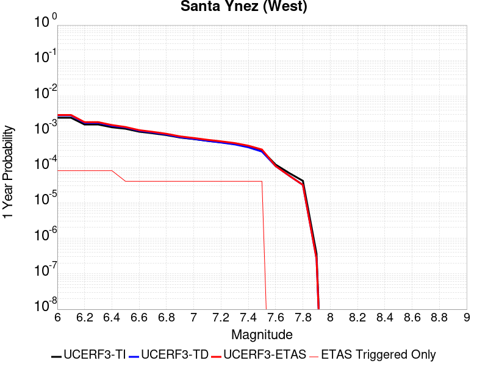 |

| Magnitude | 1 wk TI Prob | 1 wk TD Prob | 1 wk ETAS Prob | 1 wk ETAS/TD Gain | 1 wk ETAS Triggered Only | 1 mo TI Prob | 1 mo TD Prob | 1 mo ETAS Prob | 1 mo ETAS/TD Gain | 1 mo ETAS Triggered Only | 1 yr TI Prob | 1 yr TD Prob | 1 yr ETAS Prob | 1 yr ETAS/TD Gain | 1 yr ETAS Triggered Only |
|-----|-----|-----|-----|-----|-----|-----|-----|-----|-----|-----|-----|-----|-----|-----|-----|
| 6.0 | 4.7352758E-5 | 5.5006385E-5 | 9.500419E-5 | 1.7271483 | 4.0E-5 | 2.0292461E-4 | 2.3572148E-4 | 2.7571205E-4 | 1.1696517 | 4.0E-5 | 0.0024678076 | 0.0028664002 | 0.0029461707 | 1.0278295 | 8.0E-5 |
| 6.1 | 4.7352758E-5 | 5.5006385E-5 | 9.500419E-5 | 1.7271483 | 4.0E-5 | 2.0292461E-4 | 2.3572148E-4 | 2.7571205E-4 | 1.1696517 | 4.0E-5 | 0.0024678076 | 0.0028664002 | 0.0029461707 | 1.0278295 | 8.0E-5 |
| 6.2 | 3.0415853E-5 | 3.3943157E-5 | 7.3941796E-5 | 2.1784008 | 4.0E-5 | 1.3034715E-4 | 1.4546278E-4 | 1.8545696E-4 | 1.2749444 | 4.0E-5 | 0.0015858212 | 0.0017696057 | 0.0018494641 | 1.0451279 | 8.0E-5 |
| 6.3 | 3.0415853E-5 | 3.3943157E-5 | 7.3941796E-5 | 2.1784008 | 4.0E-5 | 1.3034715E-4 | 1.4546278E-4 | 1.8545696E-4 | 1.2749444 | 4.0E-5 | 0.0015858212 | 0.0017696057 | 0.0018494641 | 1.0451279 | 8.0E-5 |
| 6.4 | 2.5452082E-5 | 2.7926168E-5 | 6.792505E-5 | 2.4323084 | 4.0E-5 | 1.09075794E-4 | 1.196782E-4 | 1.5967341E-4 | 1.3341897 | 4.0E-5 | 0.0013271887 | 0.0014561269 | 0.0015360104 | 1.0548602 | 8.0E-5 |
| 6.5 | 2.3143784E-5 | 2.5140027E-5 | 2.5140027E-5 | 1.0 | 0.0 | 9.9183875E-5 | 1.07738604E-4 | 1.07738604E-4 | 1.0 | 0.0 | 0.0012068948 | 0.0013109427 | 0.0013508903 | 1.0304724 | 4.0E-5 |
| 6.6 | 1.9118515E-5 | 2.0363112E-5 | 2.0363112E-5 | 1.0 | 0.0 | 8.193392E-5 | 8.72676E-5 | 8.72676E-5 | 1.0 | 0.0 | 9.97089E-4 | 0.0010619732 | 0.0011019306 | 1.0376258 | 4.0E-5 |
| 6.7 | 1.722807E-5 | 1.8153853E-5 | 1.8153853E-5 | 1.0 | 0.0 | 7.3832496E-5 | 7.779994E-5 | 7.779994E-5 | 1.0 | 0.0 | 8.985399E-4 | 9.4680826E-4 | 9.867704E-4 | 1.0422072 | 4.0E-5 |
| 6.8 | 1.5317364E-5 | 1.5932763E-5 | 1.5932763E-5 | 1.0 | 0.0 | 6.56442E-5 | 6.828151E-5 | 6.828151E-5 | 1.0 | 0.0 | 7.98925E-4 | 8.310146E-4 | 8.709813E-4 | 1.0480939 | 4.0E-5 |
| 6.9 | 1.3071226E-5 | 1.3334518E-5 | 1.3334518E-5 | 1.0 | 0.0 | 5.6018336E-5 | 5.7146695E-5 | 5.7146695E-5 | 1.0 | 0.0 | 6.8180985E-4 | 6.955412E-4 | 7.3551334E-4 | 1.0574691 | 4.0E-5 |
| 7.0 | 1.1836986E-5 | 1.1937046E-5 | 1.1937046E-5 | 1.0 | 0.0 | 5.0728955E-5 | 5.115778E-5 | 5.115778E-5 | 1.0 | 0.0 | 6.1745E-4 | 6.2266964E-4 | 6.626447E-4 | 1.0641996 | 4.0E-5 |
| 7.1 | 1.0597169E-5 | 1.0545887E-5 | 1.0545887E-5 | 1.0 | 0.0 | 4.541565E-5 | 4.519588E-5 | 4.519588E-5 | 1.0 | 0.0 | 5.5279525E-4 | 5.5012206E-4 | 5.9010007E-4 | 1.0726712 | 4.0E-5 |
| 7.2 | 9.59113E-6 | 9.462545E-6 | 9.462545E-6 | 1.0 | 0.0 | 4.11042E-5 | 4.055314E-5 | 4.055314E-5 | 1.0 | 0.0 | 5.0032866E-4 | 4.9362367E-4 | 5.3360395E-4 | 1.0809934 | 4.0E-5 |
| 7.3 | 8.586084E-6 | 8.382711E-6 | 8.382711E-6 | 1.0 | 0.0 | 3.679698E-5 | 3.5925415E-5 | 3.5925415E-5 | 1.0 | 0.0 | 4.4791115E-4 | 4.3730516E-4 | 4.772877E-4 | 1.0914294 | 4.0E-5 |
| 7.4 | 7.2622997E-6 | 6.954277E-6 | 6.954277E-6 | 1.0 | 0.0 | 3.112377E-5 | 2.980371E-5 | 2.980371E-5 | 1.0 | 0.0 | 3.78866E-4 | 3.6280073E-4 | 4.0278622E-4 | 1.1102134 | 4.0E-5 |
| 7.5 | 5.627296E-6 | 5.2534574E-6 | 5.2534574E-6 | 1.0 | 0.0 | 2.411676E-5 | 2.2514627E-5 | 2.2514627E-5 | 1.0 | 0.0 | 2.9358198E-4 | 2.740818E-4 | 3.1407084E-4 | 1.1459018 | 4.0E-5 |
| 7.6 | 2.265244E-6 | 2.061312E-6 | 2.061312E-6 | 1.0 | 0.0 | 9.708152E-6 | 8.834165E-6 | 8.834165E-6 | 1.0 | 0.0 | 1.18190335E-4 | 1.0755074E-4 | 1.0755074E-4 | 1.0 | 0.0 |
| 7.7 | 1.3099874E-6 | 1.1018567E-6 | 1.1018567E-6 | 1.0 | 0.0 | 5.61422E-6 | 4.7222347E-6 | 4.7222347E-6 | 1.0 | 0.0 | 6.8350986E-5 | 5.7491714E-5 | 5.7491714E-5 | 1.0 | 0.0 |
| 7.8 | 7.903951E-7 | 6.0723085E-7 | 6.0723085E-7 | 1.0 | 0.0 | 3.3874032E-6 | 2.6024154E-6 | 2.6024154E-6 | 1.0 | 0.0 | 4.1240855E-5 | 3.168396E-5 | 3.168396E-5 | 1.0 | 0.0 |
| 7.9 | 7.0753297E-9 | 5.090925E-9 | 5.090925E-9 | 1.0 | 0.0 | 3.032284E-8 | 2.1818249E-8 | 2.1818249E-8 | 1.0 | 0.0 | 3.6918053E-7 | 2.6563717E-7 | 2.6563717E-7 | 1.0 | 0.0 |

## San Gorgonio Pass
*[(top)](#table-of-contents)*

| 1 Week | 1 Month | 1 Year |
|-----|-----|-----|
|  | 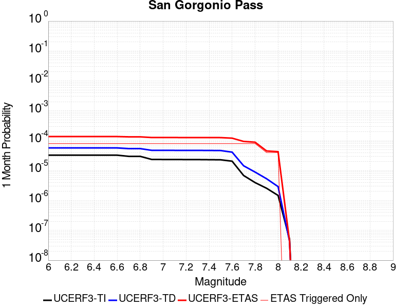 |  |

| Magnitude | 1 wk TI Prob | 1 wk TD Prob | 1 wk ETAS Prob | 1 wk ETAS/TD Gain | 1 wk ETAS Triggered Only | 1 mo TI Prob | 1 mo TD Prob | 1 mo ETAS Prob | 1 mo ETAS/TD Gain | 1 mo ETAS Triggered Only | 1 yr TI Prob | 1 yr TD Prob | 1 yr ETAS Prob | 1 yr ETAS/TD Gain | 1 yr ETAS Triggered Only |
|-----|-----|-----|-----|-----|-----|-----|-----|-----|-----|-----|-----|-----|-----|-----|-----|
| 6.0 | 7.644328E-6 | 1.3367909E-5 | 9.336684E-5 | 6.984401 | 8.0E-5 | 3.2760996E-5 | 5.7289828E-5 | 1.3728524E-4 | 2.3963284 | 8.0E-5 | 3.987921E-4 | 6.9728907E-4 | 8.1720535E-4 | 1.171975 | 1.2E-4 |
| 6.1 | 7.644328E-6 | 1.3367909E-5 | 9.336684E-5 | 6.984401 | 8.0E-5 | 3.2760996E-5 | 5.7289828E-5 | 1.3728524E-4 | 2.3963284 | 8.0E-5 | 3.987921E-4 | 6.9728907E-4 | 8.1720535E-4 | 1.171975 | 1.2E-4 |
| 6.2 | 7.644328E-6 | 1.3367909E-5 | 9.336684E-5 | 6.984401 | 8.0E-5 | 3.2760996E-5 | 5.7289828E-5 | 1.3728524E-4 | 2.3963284 | 8.0E-5 | 3.987921E-4 | 6.9728907E-4 | 8.1720535E-4 | 1.171975 | 1.2E-4 |
| 6.3 | 7.644328E-6 | 1.3367909E-5 | 9.336684E-5 | 6.984401 | 8.0E-5 | 3.2760996E-5 | 5.7289828E-5 | 1.3728524E-4 | 2.3963284 | 8.0E-5 | 3.987921E-4 | 6.9728907E-4 | 8.1720535E-4 | 1.171975 | 1.2E-4 |
| 6.4 | 7.644328E-6 | 1.3367909E-5 | 9.336684E-5 | 6.984401 | 8.0E-5 | 3.2760996E-5 | 5.7289828E-5 | 1.3728524E-4 | 2.3963284 | 8.0E-5 | 3.987921E-4 | 6.9728907E-4 | 8.1720535E-4 | 1.171975 | 1.2E-4 |
| 6.5 | 7.644328E-6 | 1.3367909E-5 | 9.336684E-5 | 6.984401 | 8.0E-5 | 3.2760996E-5 | 5.7289828E-5 | 1.3728524E-4 | 2.3963284 | 8.0E-5 | 3.987921E-4 | 6.9728907E-4 | 8.1720535E-4 | 1.171975 | 1.2E-4 |
| 6.6 | 7.644328E-6 | 1.3367909E-5 | 9.336684E-5 | 6.984401 | 8.0E-5 | 3.2760996E-5 | 5.7289828E-5 | 1.3728524E-4 | 2.3963284 | 8.0E-5 | 3.987921E-4 | 6.9728907E-4 | 8.1720535E-4 | 1.171975 | 1.2E-4 |
| 6.7 | 6.987586E-6 | 1.2672042E-5 | 9.267103E-5 | 7.31303 | 8.0E-5 | 2.9946454E-5 | 5.430767E-5 | 1.3430332E-4 | 2.4730084 | 8.0E-5 | 3.645371E-4 | 6.6100346E-4 | 7.809241E-4 | 1.1814221 | 1.2E-4 |
| 6.8 | 6.987586E-6 | 1.2672042E-5 | 9.267103E-5 | 7.31303 | 8.0E-5 | 2.9946454E-5 | 5.430767E-5 | 1.3430332E-4 | 2.4730084 | 8.0E-5 | 3.645371E-4 | 6.6100346E-4 | 7.809241E-4 | 1.1814221 | 1.2E-4 |
| 6.9 | 5.504702E-6 | 1.11025965E-5 | 9.110171E-5 | 8.205441 | 8.0E-5 | 2.3591367E-5 | 4.7581718E-5 | 1.275779E-4 | 2.681238 | 8.0E-5 | 2.8718702E-4 | 5.7915854E-4 | 6.99089E-4 | 1.2070771 | 1.2E-4 |
| 7.0 | 5.4825764E-6 | 1.1078932E-5 | 9.107804E-5 | 8.220833 | 8.0E-5 | 2.3496545E-5 | 4.7480302E-5 | 1.2747651E-4 | 2.6848292 | 8.0E-5 | 2.8603288E-4 | 5.779245E-4 | 6.978551E-4 | 1.2075197 | 1.2E-4 |
| 7.1 | 5.4692787E-6 | 1.1064639E-5 | 9.1063754E-5 | 8.230161 | 8.0E-5 | 2.3439556E-5 | 4.7419046E-5 | 1.2741526E-4 | 2.6870058 | 8.0E-5 | 2.8533922E-4 | 5.771791E-4 | 6.971098E-4 | 1.2077878 | 1.2E-4 |
| 7.2 | 5.453661E-6 | 1.104766E-5 | 9.104678E-5 | 8.241272 | 8.0E-5 | 2.3372622E-5 | 4.7346286E-5 | 1.273425E-4 | 2.6895986 | 8.0E-5 | 2.8452452E-4 | 5.762936E-4 | 6.962245E-4 | 1.2081072 | 1.2E-4 |
| 7.3 | 5.4422303E-6 | 1.10345745E-5 | 9.103369E-5 | 8.24986 | 8.0E-5 | 2.3323635E-5 | 4.7290207E-5 | 1.2728642E-4 | 2.6916022 | 8.0E-5 | 2.8392827E-4 | 5.7561125E-4 | 6.955422E-4 | 1.208354 | 1.2E-4 |
| 7.4 | 5.398595E-6 | 1.0981908E-5 | 9.098103E-5 | 8.284628 | 8.0E-5 | 2.313663E-5 | 4.7064503E-5 | 1.2706073E-4 | 2.699715 | 8.0E-5 | 2.8165206E-4 | 5.728648E-4 | 6.92796E-4 | 1.2093536 | 1.2E-4 |
| 7.5 | 5.3578788E-6 | 1.0908337E-5 | 9.0907466E-5 | 8.33376 | 8.0E-5 | 2.2962136E-5 | 4.6749206E-5 | 1.2674546E-4 | 2.711179 | 8.0E-5 | 2.7952815E-4 | 5.69028E-4 | 6.889597E-4 | 1.210766 | 1.2E-4 |
| 7.6 | 4.8091474E-6 | 9.653645E-6 | 8.965287E-5 | 9.286945 | 8.0E-5 | 2.0610469E-5 | 4.1372135E-5 | 1.2136883E-4 | 2.9335885 | 8.0E-5 | 2.5090357E-4 | 5.035942E-4 | 6.235338E-4 | 1.238167 | 1.2E-4 |
| 7.7 | 1.5991155E-6 | 3.379842E-6 | 8.337957E-5 | 24.669666 | 8.0E-5 | 6.853334E-6 | 1.4484958E-5 | 9.4483796E-5 | 6.5228906 | 8.0E-5 | 8.343615E-5 | 1.7634034E-4 | 2.963192E-4 | 1.6803823 | 1.2E-4 |
| 7.8 | 9.258398E-7 | 2.0781015E-6 | 8.207794E-5 | 39.496593 | 8.0E-5 | 3.967879E-6 | 8.90612E-6 | 8.8905406E-5 | 9.982508 | 8.0E-5 | 4.8307855E-5 | 1.08426626E-4 | 2.2841361E-4 | 2.1066191 | 1.2E-4 |
| 7.9 | 5.975575E-7 | 1.2436711E-6 | 4.124362E-5 | 33.162804 | 4.0E-5 | 2.5609581E-6 | 5.3300087E-6 | 4.5329794E-5 | 8.504639 | 4.0E-5 | 3.117922E-5 | 6.489093E-5 | 1.04888335E-4 | 1.6163789 | 4.0E-5 |
| 8.0 | 3.4413725E-7 | 6.801386E-7 | 4.0680112E-5 | 59.8115 | 4.0E-5 | 1.4748731E-6 | 2.9148766E-6 | 4.291476E-5 | 14.722668 | 4.0E-5 | 1.7956432E-5 | 3.548805E-5 | 7.548663E-5 | 2.1271 | 4.0E-5 |
| 8.1 | 1.1787731E-8 | 9.854372E-9 | 9.854372E-9 | 1.0 | 0.0 | 5.0518846E-8 | 4.2233022E-8 | 4.2233022E-8 | 1.0 | 0.0 | 6.1506677E-7 | 5.14187E-7 | 5.14187E-7 | 1.0 | 0.0 |

## Camp Rock 2011
*[(top)](#table-of-contents)*

| 1 Week | 1 Month | 1 Year |
|-----|-----|-----|
|  | 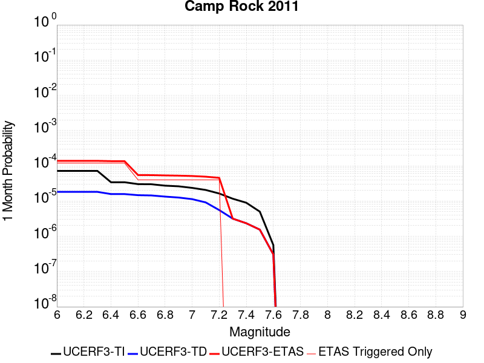 | 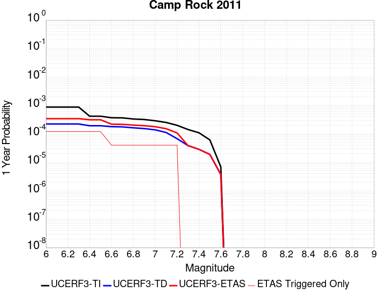 |

| Magnitude | 1 wk TI Prob | 1 wk TD Prob | 1 wk ETAS Prob | 1 wk ETAS/TD Gain | 1 wk ETAS Triggered Only | 1 mo TI Prob | 1 mo TD Prob | 1 mo ETAS Prob | 1 mo ETAS/TD Gain | 1 mo ETAS Triggered Only | 1 yr TI Prob | 1 yr TD Prob | 1 yr ETAS Prob | 1 yr ETAS/TD Gain | 1 yr ETAS Triggered Only |
|-----|-----|-----|-----|-----|-----|-----|-----|-----|-----|-----|-----|-----|-----|-----|-----|
| 6.0 | 1.6710783E-5 | 4.2516945E-6 | 1.2425118E-4 | 29.22392 | 1.2E-4 | 7.161568E-5 | 1.8221424E-5 | 1.3821924E-4 | 7.5855346 | 1.2E-4 | 8.7157206E-4 | 2.2182378E-4 | 3.4179716E-4 | 1.5408499 | 1.2E-4 |
| 6.1 | 1.6710783E-5 | 4.2516945E-6 | 1.2425118E-4 | 29.22392 | 1.2E-4 | 7.161568E-5 | 1.8221424E-5 | 1.3821924E-4 | 7.5855346 | 1.2E-4 | 8.7157206E-4 | 2.2182378E-4 | 3.4179716E-4 | 1.5408499 | 1.2E-4 |
| 6.2 | 1.6710783E-5 | 4.2516945E-6 | 1.2425118E-4 | 29.22392 | 1.2E-4 | 7.161568E-5 | 1.8221424E-5 | 1.3821924E-4 | 7.5855346 | 1.2E-4 | 8.7157206E-4 | 2.2182378E-4 | 3.4179716E-4 | 1.5408499 | 1.2E-4 |
| 6.3 | 1.6710783E-5 | 4.2516945E-6 | 1.2425118E-4 | 29.22392 | 1.2E-4 | 7.161568E-5 | 1.8221424E-5 | 1.3821924E-4 | 7.5855346 | 1.2E-4 | 8.7157206E-4 | 2.2182378E-4 | 3.4179716E-4 | 1.5408499 | 1.2E-4 |
| 6.4 | 7.982846E-6 | 3.6831455E-6 | 1.2368271E-4 | 33.580727 | 1.2E-4 | 3.421175E-5 | 1.5784815E-5 | 1.3578292E-4 | 8.602123 | 1.2E-4 | 4.1644843E-4 | 1.9216353E-4 | 3.1214047E-4 | 1.6243482 | 1.2E-4 |
| 6.5 | 7.982846E-6 | 3.6831455E-6 | 1.2368271E-4 | 33.580727 | 1.2E-4 | 3.421175E-5 | 1.5784815E-5 | 1.3578292E-4 | 8.602123 | 1.2E-4 | 4.1644843E-4 | 1.9216353E-4 | 3.1214047E-4 | 1.6243482 | 1.2E-4 |
| 6.6 | 7.048869E-6 | 3.4253683E-6 | 4.3425232E-5 | 12.677536 | 4.0E-5 | 3.0209088E-5 | 1.4680069E-5 | 5.4679484E-5 | 3.724743 | 4.0E-5 | 3.677336E-4 | 1.787155E-4 | 2.1870834E-4 | 1.2237794 | 4.0E-5 |
| 6.7 | 6.987307E-6 | 3.3633335E-6 | 4.3363198E-5 | 12.892922 | 4.0E-5 | 2.9945259E-5 | 1.4414209E-5 | 5.441363E-5 | 3.7749996 | 4.0E-5 | 3.6452254E-4 | 1.7547917E-4 | 2.1547216E-4 | 1.2279073 | 4.0E-5 |
| 6.8 | 6.3737602E-6 | 3.1189006E-6 | 4.3118776E-5 | 13.824992 | 4.0E-5 | 2.731583E-5 | 1.336665E-5 | 5.3366115E-5 | 3.9924824 | 4.0E-5 | 3.3251947E-4 | 1.627271E-4 | 2.0272059E-4 | 1.2457703 | 4.0E-5 |
| 6.9 | 6.112211E-6 | 2.9340822E-6 | 4.2933963E-5 | 14.632843 | 4.0E-5 | 2.6194928E-5 | 1.2574579E-5 | 5.2574076E-5 | 4.180981 | 4.0E-5 | 3.1887658E-4 | 1.5308503E-4 | 1.930789E-4 | 1.2612528 | 4.0E-5 |
| 7.0 | 5.5140117E-6 | 2.6428827E-6 | 4.2642776E-5 | 16.134949 | 4.0E-5 | 2.3631264E-5 | 1.1326592E-5 | 5.132614E-5 | 4.531472 | 4.0E-5 | 2.8767265E-4 | 1.3789278E-4 | 1.7788727E-4 | 1.2900405 | 4.0E-5 |
| 7.1 | 4.8151105E-6 | 2.135099E-6 | 4.2135012E-5 | 19.734453 | 4.0E-5 | 2.0636026E-5 | 9.150393E-6 | 4.915003E-5 | 5.3713565 | 4.0E-5 | 2.5121463E-4 | 1.1140057E-4 | 1.5139612E-4 | 1.3590246 | 4.0E-5 |
| 7.2 | 3.818335E-6 | 1.2943889E-6 | 4.1294337E-5 | 31.902575 | 4.0E-5 | 1.6364189E-5 | 5.5473697E-6 | 4.554715E-5 | 8.210585 | 4.0E-5 | 1.9921579E-4 | 6.7537214E-5 | 1.0753451E-4 | 1.592226 | 4.0E-5 |
| 7.3 | 2.7166698E-6 | 7.388603E-7 | 7.388603E-7 | 1.0 | 0.0 | 1.1642818E-5 | 3.1665404E-6 | 3.1665404E-6 | 1.0 | 0.0 | 1.4174209E-4 | 3.855197E-5 | 3.855197E-5 | 1.0 | 0.0 |
| 7.4 | 2.0893426E-6 | 5.4660313E-7 | 5.4660313E-7 | 1.0 | 0.0 | 8.954295E-6 | 2.3425828E-6 | 2.3425828E-6 | 1.0 | 0.0 | 1.0901308E-4 | 2.8520579E-5 | 2.8520579E-5 | 1.0 | 0.0 |
| 7.5 | 1.1681728E-6 | 3.605487E-7 | 3.605487E-7 | 1.0 | 0.0 | 5.0064455E-6 | 1.5452079E-6 | 1.5452079E-6 | 1.0 | 0.0 | 6.0951766E-5 | 1.8812749E-5 | 1.8812749E-5 | 1.0 | 0.0 |
| 7.6 | 1.3154387E-7 | 7.121983E-8 | 7.121983E-8 | 1.0 | 0.0 | 5.6375933E-7 | 3.0522784E-7 | 3.0522784E-7 | 1.0 | 0.0 | 6.863748E-6 | 3.7161442E-6 | 3.7161442E-6 | 1.0 | 0.0 |

## Oceanic - West Huasna
*[(top)](#table-of-contents)*

| 1 Week | 1 Month | 1 Year |
|-----|-----|-----|
|  |  |  |

| Magnitude | 1 wk TI Prob | 1 wk TD Prob | 1 wk ETAS Prob | 1 wk ETAS/TD Gain | 1 wk ETAS Triggered Only | 1 mo TI Prob | 1 mo TD Prob | 1 mo ETAS Prob | 1 mo ETAS/TD Gain | 1 mo ETAS Triggered Only | 1 yr TI Prob | 1 yr TD Prob | 1 yr ETAS Prob | 1 yr ETAS/TD Gain | 1 yr ETAS Triggered Only |
|-----|-----|-----|-----|-----|-----|-----|-----|-----|-----|-----|-----|-----|-----|-----|-----|
| 6.0 | 3.195567E-5 | 2.7935615E-5 | 6.7934496E-5 | 2.431824 | 4.0E-5 | 1.3694567E-4 | 1.1971882E-4 | 1.5971402E-4 | 1.3340763 | 4.0E-5 | 0.0016660384 | 0.0014566452 | 0.0015764703 | 1.0822611 | 1.2E-4 |
| 6.1 | 2.1156782E-5 | 1.757916E-5 | 5.7578458E-5 | 3.2753816 | 4.0E-5 | 9.066878E-5 | 7.5337135E-5 | 1.1533412E-4 | 1.5309067 | 4.0E-5 | 0.0011033333 | 9.16853E-4 | 0.0010367429 | 1.1307625 | 1.2E-4 |
| 6.2 | 1.6195117E-5 | 1.333068E-5 | 5.3330146E-5 | 4.000557 | 4.0E-5 | 6.9405796E-5 | 5.713025E-5 | 9.7127966E-5 | 1.7001145 | 4.0E-5 | 8.44688E-4 | 6.9534144E-4 | 8.15258E-4 | 1.1724571 | 1.2E-4 |
| 6.3 | 1.3559345E-5 | 1.1181751E-5 | 5.11813E-5 | 4.5772176 | 4.0E-5 | 5.811018E-5 | 4.7920912E-5 | 8.7919E-5 | 1.8346686 | 4.0E-5 | 7.072618E-4 | 5.8328186E-4 | 6.632352E-4 | 1.137075 | 8.0E-5 |
| 6.4 | 1.2120619E-5 | 1.0003182E-5 | 5.000278E-5 | 4.9986877 | 4.0E-5 | 5.1944477E-5 | 4.2870077E-5 | 8.286836E-5 | 1.9330118 | 4.0E-5 | 6.322405E-4 | 5.218187E-4 | 6.0177693E-4 | 1.15323 | 8.0E-5 |
| 6.5 | 1.13511915E-5 | 9.369492E-6 | 4.9369115E-5 | 5.269135 | 4.0E-5 | 4.8647056E-5 | 4.0154348E-5 | 8.015274E-5 | 1.9961162 | 4.0E-5 | 5.9211696E-4 | 4.8876996E-4 | 5.687309E-4 | 1.1635962 | 8.0E-5 |
| 6.6 | 9.850605E-6 | 8.137099E-6 | 4.813677E-5 | 5.915717 | 4.0E-5 | 4.2216197E-5 | 3.4872817E-5 | 7.487142E-5 | 2.1469853 | 4.0E-5 | 5.1386096E-4 | 4.2449404E-4 | 5.0446007E-4 | 1.1883796 | 8.0E-5 |
| 6.7 | 8.8558645E-6 | 7.3199412E-6 | 4.731965E-5 | 6.4644847 | 4.0E-5 | 3.7953152E-5 | 3.13708E-5 | 7.136955E-5 | 2.275031 | 4.0E-5 | 4.6198163E-4 | 3.8187273E-4 | 4.6184217E-4 | 1.2094139 | 8.0E-5 |
| 6.8 | 7.67136E-6 | 6.3930647E-6 | 4.6392808E-5 | 7.25674 | 4.0E-5 | 3.2876844E-5 | 2.7398562E-5 | 6.7397465E-5 | 2.4598906 | 4.0E-5 | 4.0020206E-4 | 3.335266E-4 | 4.1349992E-4 | 1.2397809 | 8.0E-5 |
| 6.9 | 6.534529E-6 | 5.459491E-6 | 4.5459274E-5 | 8.326651 | 4.0E-5 | 2.8004823E-5 | 2.339761E-5 | 6.339667E-5 | 2.7095363 | 4.0E-5 | 3.4090536E-4 | 2.848288E-4 | 3.64806E-4 | 1.2807904 | 8.0E-5 |
| 7.0 | 5.460525E-6 | 4.5709203E-6 | 4.4570737E-5 | 9.750934 | 4.0E-5 | 2.3402039E-5 | 1.9589512E-5 | 5.958873E-5 | 3.041869 | 4.0E-5 | 2.8488258E-4 | 2.384763E-4 | 2.7846676E-4 | 1.1676916 | 4.0E-5 |
| 7.1 | 4.4825083E-6 | 3.7533373E-6 | 3.7533373E-6 | 1.0 | 0.0 | 1.9210609E-5 | 1.6085633E-5 | 1.6085633E-5 | 1.0 | 0.0 | 2.3386406E-4 | 1.9582508E-4 | 1.9582508E-4 | 1.0 | 0.0 |
| 7.2 | 2.821708E-6 | 2.4257495E-6 | 2.4257495E-6 | 1.0 | 0.0 | 1.2092979E-5 | 1.0396027E-5 | 1.0396027E-5 | 1.0 | 0.0 | 1.4722206E-4 | 1.265643E-4 | 1.265643E-4 | 1.0 | 0.0 |
| 7.3 | 2.0644757E-6 | 1.7694833E-6 | 1.7694833E-6 | 1.0 | 0.0 | 8.847723E-6 | 7.5834782E-6 | 7.5834782E-6 | 1.0 | 0.0 | 1.0771569E-4 | 9.232494E-5 | 9.232494E-5 | 1.0 | 0.0 |
| 7.4 | 1.6980367E-6 | 1.438663E-6 | 1.438663E-6 | 1.0 | 0.0 | 7.27728E-6 | 6.165684E-6 | 6.165684E-6 | 1.0 | 0.0 | 8.8597284E-5 | 7.506462E-5 | 7.506462E-5 | 1.0 | 0.0 |
| 7.5 | 1.3637683E-6 | 1.1308925E-6 | 1.1308925E-6 | 1.0 | 0.0 | 5.844708E-6 | 4.8466736E-6 | 4.8466736E-6 | 1.0 | 0.0 | 7.1156996E-5 | 5.9006652E-5 | 5.9006652E-5 | 1.0 | 0.0 |
| 7.6 | 9.802994E-7 | 7.683204E-7 | 7.683204E-7 | 1.0 | 0.0 | 4.2012766E-6 | 3.2927974E-6 | 3.2927974E-6 | 1.0 | 0.0 | 5.1149345E-5 | 4.008907E-5 | 4.008907E-5 | 1.0 | 0.0 |
| 7.7 | 5.986191E-7 | 4.0096745E-7 | 4.0096745E-7 | 1.0 | 0.0 | 2.5655079E-6 | 1.7184307E-6 | 1.7184307E-6 | 1.0 | 0.0 | 3.1234613E-5 | 2.0921694E-5 | 2.0921694E-5 | 1.0 | 0.0 |
| 7.8 | 2.9189815E-7 | 1.5325327E-7 | 1.5325327E-7 | 1.0 | 0.0 | 1.2509914E-6 | 6.567995E-7 | 6.567995E-7 | 1.0 | 0.0 | 1.5230714E-5 | 7.996505E-6 | 7.996505E-6 | 1.0 | 0.0 |
| 7.9 | 1.2057845E-7 | 4.6430397E-8 | 4.6430397E-8 | 1.0 | 0.0 | 5.1676466E-7 | 1.989874E-7 | 1.989874E-7 | 1.0 | 0.0 | 6.2915915E-6 | 2.4226688E-6 | 2.4226688E-6 | 1.0 | 0.0 |
| 8.0 | 3.3806387E-9 | 9.0955077E-10 | 9.0955077E-10 | 1.0 | 0.0 | 1.4488451E-8 | 3.898074E-9 | 3.898074E-9 | 1.0 | 0.0 | 1.7639688E-7 | 4.7459046E-8 | 4.7459046E-8 | 1.0 | 0.0 |

## Santa Susana alt 1
*[(top)](#table-of-contents)*

| 1 Week | 1 Month | 1 Year |
|-----|-----|-----|
| 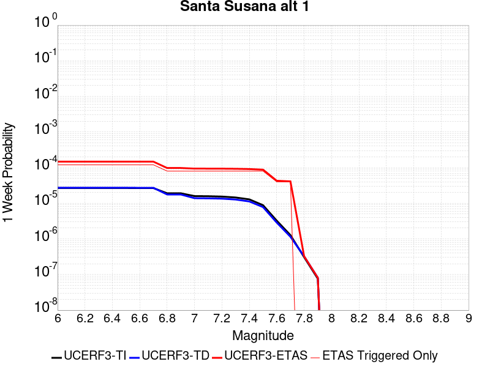 | 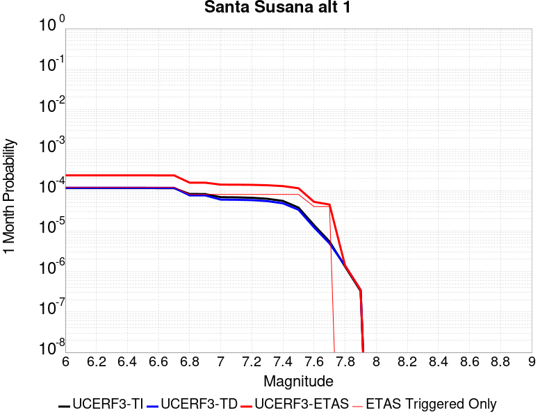 |  |

| Magnitude | 1 wk TI Prob | 1 wk TD Prob | 1 wk ETAS Prob | 1 wk ETAS/TD Gain | 1 wk ETAS Triggered Only | 1 mo TI Prob | 1 mo TD Prob | 1 mo ETAS Prob | 1 mo ETAS/TD Gain | 1 mo ETAS Triggered Only | 1 yr TI Prob | 1 yr TD Prob | 1 yr ETAS Prob | 1 yr ETAS/TD Gain | 1 yr ETAS Triggered Only |
|-----|-----|-----|-----|-----|-----|-----|-----|-----|-----|-----|-----|-----|-----|-----|-----|
| 6.0 | 2.674877E-5 | 2.7220398E-5 | 1.4721713E-4 | 5.408339 | 1.2E-4 | 1.1463255E-4 | 1.16654264E-4 | 2.3664026E-4 | 2.0285609 | 1.2E-4 | 0.0013947578 | 0.0014194542 | 0.0015392839 | 1.0844195 | 1.2E-4 |
| 6.1 | 2.674877E-5 | 2.7220398E-5 | 1.4721713E-4 | 5.408339 | 1.2E-4 | 1.1463255E-4 | 1.16654264E-4 | 2.3664026E-4 | 2.0285609 | 1.2E-4 | 0.0013947578 | 0.0014194542 | 0.0015392839 | 1.0844195 | 1.2E-4 |
| 6.2 | 2.674877E-5 | 2.7220398E-5 | 1.4721713E-4 | 5.408339 | 1.2E-4 | 1.1463255E-4 | 1.16654264E-4 | 2.3664026E-4 | 2.0285609 | 1.2E-4 | 0.0013947578 | 0.0014194542 | 0.0015392839 | 1.0844195 | 1.2E-4 |
| 6.3 | 2.674877E-5 | 2.7220398E-5 | 1.4721713E-4 | 5.408339 | 1.2E-4 | 1.1463255E-4 | 1.16654264E-4 | 2.3664026E-4 | 2.0285609 | 1.2E-4 | 0.0013947578 | 0.0014194542 | 0.0015392839 | 1.0844195 | 1.2E-4 |
| 6.4 | 2.674877E-5 | 2.7220398E-5 | 1.4721713E-4 | 5.408339 | 1.2E-4 | 1.1463255E-4 | 1.16654264E-4 | 2.3664026E-4 | 2.0285609 | 1.2E-4 | 0.0013947578 | 0.0014194542 | 0.0015392839 | 1.0844195 | 1.2E-4 |
| 6.5 | 2.674877E-5 | 2.7220398E-5 | 1.4721713E-4 | 5.408339 | 1.2E-4 | 1.1463255E-4 | 1.16654264E-4 | 2.3664026E-4 | 2.0285609 | 1.2E-4 | 0.0013947578 | 0.0014194542 | 0.0015392839 | 1.0844195 | 1.2E-4 |
| 6.6 | 2.6647976E-5 | 2.7096641E-5 | 1.470934E-4 | 5.428473 | 1.2E-4 | 1.14200615E-4 | 1.16123934E-4 | 2.3610999E-4 | 2.0332587 | 1.2E-4 | 0.0013895056 | 0.0014130058 | 0.0015328362 | 1.0848054 | 1.2E-4 |
| 6.7 | 2.6647976E-5 | 2.7096641E-5 | 1.470934E-4 | 5.428473 | 1.2E-4 | 1.14200615E-4 | 1.16123934E-4 | 2.3610999E-4 | 2.0332587 | 1.2E-4 | 0.0013895056 | 0.0014130058 | 0.0015328362 | 1.0848054 | 1.2E-4 |
| 6.8 | 1.9073179E-5 | 1.7651679E-5 | 9.765026E-5 | 5.532067 | 8.0E-5 | 8.1739636E-5 | 7.564796E-5 | 1.556419E-4 | 2.0574503 | 8.0E-5 | 9.947256E-4 | 9.2064287E-4 | 0.0010005692 | 1.0868158 | 8.0E-5 |
| 6.9 | 1.9041876E-5 | 1.7633802E-5 | 9.763239E-5 | 5.5366616 | 8.0E-5 | 8.160549E-5 | 7.557135E-5 | 1.555653E-4 | 2.0585222 | 8.0E-5 | 9.930939E-4 | 9.197109E-4 | 9.996373E-4 | 1.0869038 | 8.0E-5 |
| 7.0 | 1.5917482E-5 | 1.3875512E-5 | 9.3874405E-5 | 6.765473 | 8.0E-5 | 6.8215995E-5 | 5.9465154E-5 | 1.3946039E-4 | 2.3452458 | 8.0E-5 | 8.302132E-4 | 7.237524E-4 | 8.0369454E-4 | 1.110455 | 8.0E-5 |
| 7.1 | 1.577788E-5 | 1.3755467E-5 | 9.375437E-5 | 6.815789 | 8.0E-5 | 6.761774E-5 | 5.8950696E-5 | 1.3894598E-4 | 2.3569863 | 8.0E-5 | 8.2293496E-4 | 7.1749307E-4 | 7.9743564E-4 | 1.1114193 | 8.0E-5 |
| 7.2 | 1.5416446E-5 | 1.34814145E-5 | 9.348034E-5 | 6.9340153 | 8.0E-5 | 6.606882E-5 | 5.7776237E-5 | 1.3777161E-4 | 2.3845723 | 8.0E-5 | 8.0409093E-4 | 7.032033E-4 | 7.8314706E-4 | 1.1136851 | 8.0E-5 |
| 7.3 | 1.4534083E-5 | 1.2728859E-5 | 9.272784E-5 | 7.284851 | 8.0E-5 | 6.228744E-5 | 5.4551136E-5 | 1.3454678E-4 | 2.466434 | 8.0E-5 | 7.580857E-4 | 6.6396216E-4 | 7.4390904E-4 | 1.1204088 | 8.0E-5 |
| 7.4 | 1.2858995E-5 | 1.1239539E-5 | 9.123864E-5 | 8.117649 | 8.0E-5 | 5.5108816E-5 | 4.816859E-5 | 1.2816474E-4 | 2.6607535 | 8.0E-5 | 6.7074323E-4 | 5.862987E-4 | 6.662518E-4 | 1.1363692 | 8.0E-5 |
| 7.5 | 8.827668E-6 | 7.813652E-6 | 8.781303E-5 | 11.23841 | 8.0E-5 | 3.7832317E-5 | 3.3486664E-5 | 1.13483984E-4 | 3.3889306 | 8.0E-5 | 4.605111E-4 | 4.0762633E-4 | 4.8759373E-4 | 1.1961782 | 8.0E-5 |
| 7.6 | 3.2533426E-6 | 2.872528E-6 | 4.2872412E-5 | 14.924976 | 4.0E-5 | 1.3942822E-5 | 1.2310778E-5 | 5.2310286E-5 | 4.249145 | 4.0E-5 | 1.6974064E-4 | 1.498738E-4 | 1.898678E-4 | 1.2668512 | 4.0E-5 |
| 7.7 | 1.2751709E-6 | 1.1493797E-6 | 4.1149335E-5 | 35.80134 | 4.0E-5 | 5.4650063E-6 | 4.9259042E-6 | 4.4925706E-5 | 9.1202965 | 4.0E-5 | 6.653442E-5 | 5.9971328E-5 | 9.996893E-5 | 1.6669455 | 4.0E-5 |
| 7.8 | 3.067544E-7 | 3.2407712E-7 | 3.2407712E-7 | 1.0 | 0.0 | 1.3146611E-6 | 1.3889013E-6 | 1.3889013E-6 | 1.0 | 0.0 | 1.600588E-5 | 1.6909753E-5 | 1.6909753E-5 | 1.0 | 0.0 |
| 7.9 | 7.622999E-8 | 8.0897195E-8 | 8.0897195E-8 | 1.0 | 0.0 | 3.2669993E-7 | 3.4670222E-7 | 3.4670222E-7 | 1.0 | 0.0 | 3.977564E-6 | 4.2210936E-6 | 4.2210936E-6 | 1.0 | 0.0 |

## Lost Hills
*[(top)](#table-of-contents)*

| 1 Week | 1 Month | 1 Year |
|-----|-----|-----|
| 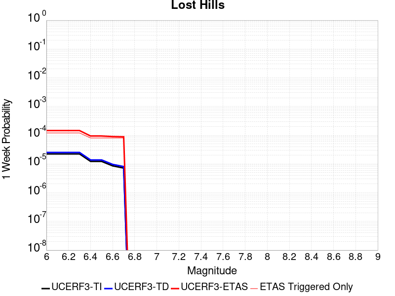 | 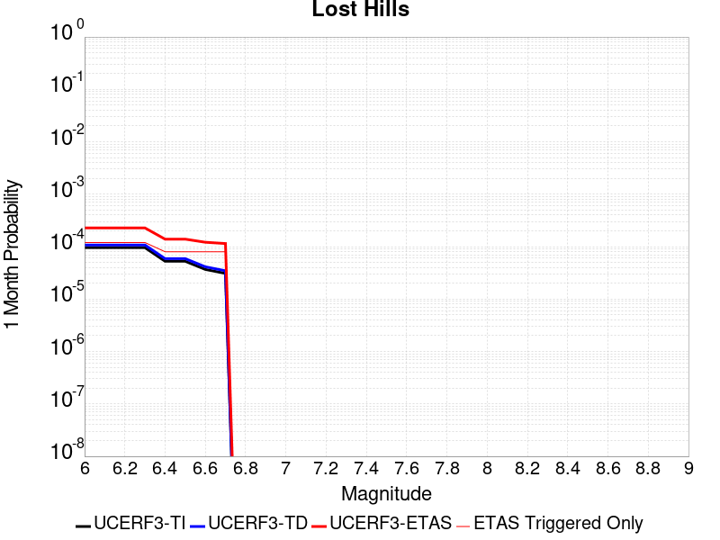 | 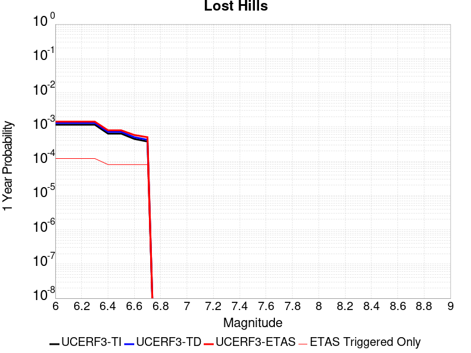 |

| Magnitude | 1 wk TI Prob | 1 wk TD Prob | 1 wk ETAS Prob | 1 wk ETAS/TD Gain | 1 wk ETAS Triggered Only | 1 mo TI Prob | 1 mo TD Prob | 1 mo ETAS Prob | 1 mo ETAS/TD Gain | 1 mo ETAS Triggered Only | 1 yr TI Prob | 1 yr TD Prob | 1 yr ETAS Prob | 1 yr ETAS/TD Gain | 1 yr ETAS Triggered Only |
|-----|-----|-----|-----|-----|-----|-----|-----|-----|-----|-----|-----|-----|-----|-----|-----|
| 6.0 | 2.233523E-5 | 2.5117144E-5 | 1.4511413E-4 | 5.7774935 | 1.2E-4 | 9.571891E-5 | 1.0764141E-4 | 2.276285E-4 | 2.1146927 | 1.2E-4 | 0.0011647546 | 0.0013099145 | 0.0014297573 | 1.0914891 | 1.2E-4 |
| 6.1 | 2.233523E-5 | 2.5117144E-5 | 1.4511413E-4 | 5.7774935 | 1.2E-4 | 9.571891E-5 | 1.0764141E-4 | 2.276285E-4 | 2.1146927 | 1.2E-4 | 0.0011647546 | 0.0013099145 | 0.0014297573 | 1.0914891 | 1.2E-4 |
| 6.2 | 2.233523E-5 | 2.5117144E-5 | 1.4511413E-4 | 5.7774935 | 1.2E-4 | 9.571891E-5 | 1.0764141E-4 | 2.276285E-4 | 2.1146927 | 1.2E-4 | 0.0011647546 | 0.0013099145 | 0.0014297573 | 1.0914891 | 1.2E-4 |
| 6.3 | 2.233523E-5 | 2.5117144E-5 | 1.4511413E-4 | 5.7774935 | 1.2E-4 | 9.571891E-5 | 1.0764141E-4 | 2.276285E-4 | 2.1146927 | 1.2E-4 | 0.0011647546 | 0.0013099145 | 0.0014297573 | 1.0914891 | 1.2E-4 |
| 6.4 | 1.2288092E-5 | 1.3786784E-5 | 9.378568E-5 | 6.8025784 | 8.0E-5 | 5.2662188E-5 | 5.9085407E-5 | 1.3908069E-4 | 2.3538923 | 8.0E-5 | 6.409735E-4 | 7.192213E-4 | 7.9916377E-4 | 1.1111515 | 8.0E-5 |
| 6.5 | 1.2288092E-5 | 1.3786784E-5 | 9.378568E-5 | 6.8025784 | 8.0E-5 | 5.2662188E-5 | 5.9085407E-5 | 1.3908069E-4 | 2.3538923 | 8.0E-5 | 6.409735E-4 | 7.192213E-4 | 7.9916377E-4 | 1.1111515 | 8.0E-5 |
| 6.6 | 8.58281E-6 | 9.637769E-6 | 8.9637E-5 | 9.300596 | 8.0E-5 | 3.6782953E-5 | 4.1304538E-5 | 1.2130124E-4 | 2.936753 | 8.0E-5 | 4.4774043E-4 | 5.0285E-4 | 5.828098E-4 | 1.1590132 | 8.0E-5 |
| 6.7 | 7.205685E-6 | 8.091661E-6 | 8.8091016E-5 | 10.886642 | 8.0E-5 | 3.088114E-5 | 3.4678545E-5 | 1.1467577E-4 | 3.3068218 | 8.0E-5 | 3.7591302E-4 | 4.2221128E-4 | 5.021775E-4 | 1.1893986 | 8.0E-5 |

## Fontana (Seismicity)
*[(top)](#table-of-contents)*

| 1 Week | 1 Month | 1 Year |
|-----|-----|-----|
| 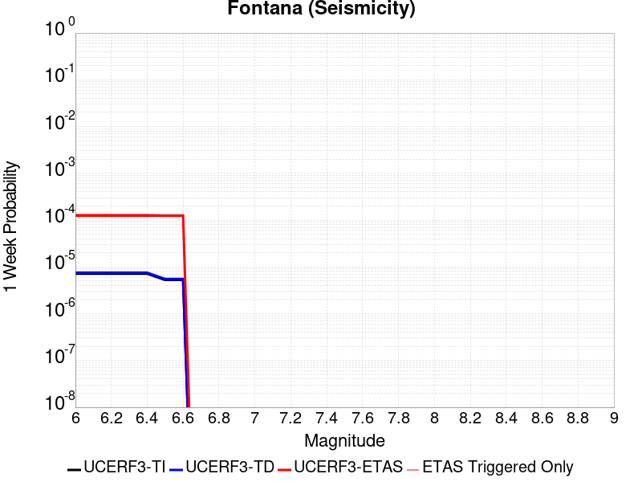 | 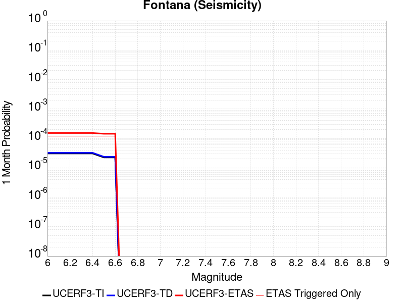 | 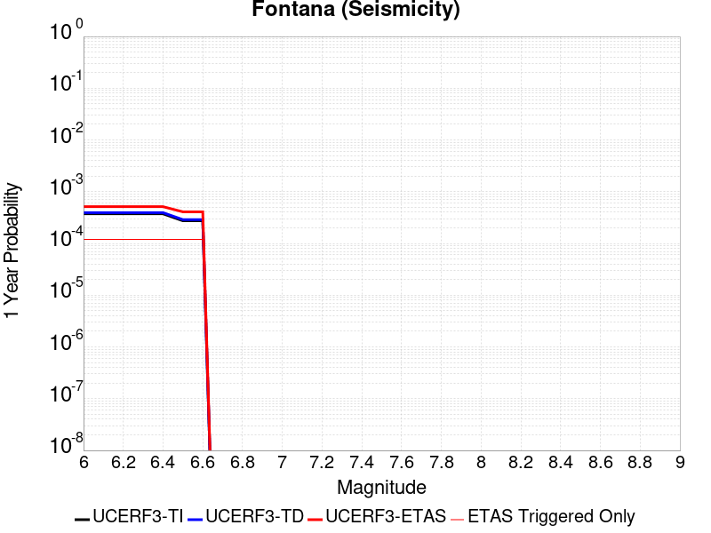 |

| Magnitude | 1 wk TI Prob | 1 wk TD Prob | 1 wk ETAS Prob | 1 wk ETAS/TD Gain | 1 wk ETAS Triggered Only | 1 mo TI Prob | 1 mo TD Prob | 1 mo ETAS Prob | 1 mo ETAS/TD Gain | 1 mo ETAS Triggered Only | 1 yr TI Prob | 1 yr TD Prob | 1 yr ETAS Prob | 1 yr ETAS/TD Gain | 1 yr ETAS Triggered Only |
|-----|-----|-----|-----|-----|-----|-----|-----|-----|-----|-----|-----|-----|-----|-----|-----|
| 6.0 | 7.1789214E-6 | 7.5533308E-6 | 1.2755243E-4 | 16.886911 | 1.2E-4 | 3.076644E-5 | 3.2371245E-5 | 1.5236736E-4 | 4.7068734 | 1.2E-4 | 3.7451705E-4 | 3.9408944E-4 | 5.1404216E-4 | 1.3043793 | 1.2E-4 |
| 6.1 | 7.1789214E-6 | 7.5533308E-6 | 1.2755243E-4 | 16.886911 | 1.2E-4 | 3.076644E-5 | 3.2371245E-5 | 1.5236736E-4 | 4.7068734 | 1.2E-4 | 3.7451705E-4 | 3.9408944E-4 | 5.1404216E-4 | 1.3043793 | 1.2E-4 |
| 6.2 | 7.1789214E-6 | 7.5533308E-6 | 1.2755243E-4 | 16.886911 | 1.2E-4 | 3.076644E-5 | 3.2371245E-5 | 1.5236736E-4 | 4.7068734 | 1.2E-4 | 3.7451705E-4 | 3.9408944E-4 | 5.1404216E-4 | 1.3043793 | 1.2E-4 |
| 6.3 | 7.1789214E-6 | 7.5533308E-6 | 1.2755243E-4 | 16.886911 | 1.2E-4 | 3.076644E-5 | 3.2371245E-5 | 1.5236736E-4 | 4.7068734 | 1.2E-4 | 3.7451705E-4 | 3.9408944E-4 | 5.1404216E-4 | 1.3043793 | 1.2E-4 |
| 6.4 | 7.1789214E-6 | 7.5533308E-6 | 1.2755243E-4 | 16.886911 | 1.2E-4 | 3.076644E-5 | 3.2371245E-5 | 1.5236736E-4 | 4.7068734 | 1.2E-4 | 3.7451705E-4 | 3.9408944E-4 | 5.1404216E-4 | 1.3043793 | 1.2E-4 |
| 6.5 | 5.2611317E-6 | 5.5336936E-6 | 1.2553303E-4 | 22.685215 | 1.2E-4 | 2.2547512E-5 | 2.3715831E-5 | 1.4371298E-4 | 6.0597916 | 1.2E-4 | 2.744814E-4 | 2.8874024E-4 | 4.087056E-4 | 1.4154785 | 1.2E-4 |
| 6.6 | 5.2611317E-6 | 5.5336936E-6 | 1.2553303E-4 | 22.685215 | 1.2E-4 | 2.2547512E-5 | 2.3715831E-5 | 1.4371298E-4 | 6.0597916 | 1.2E-4 | 2.744814E-4 | 2.8874024E-4 | 4.087056E-4 | 1.4154785 | 1.2E-4 |

## Earthquake Valley (No  Extension)
*[(top)](#table-of-contents)*

| 1 Week | 1 Month | 1 Year |
|-----|-----|-----|
| 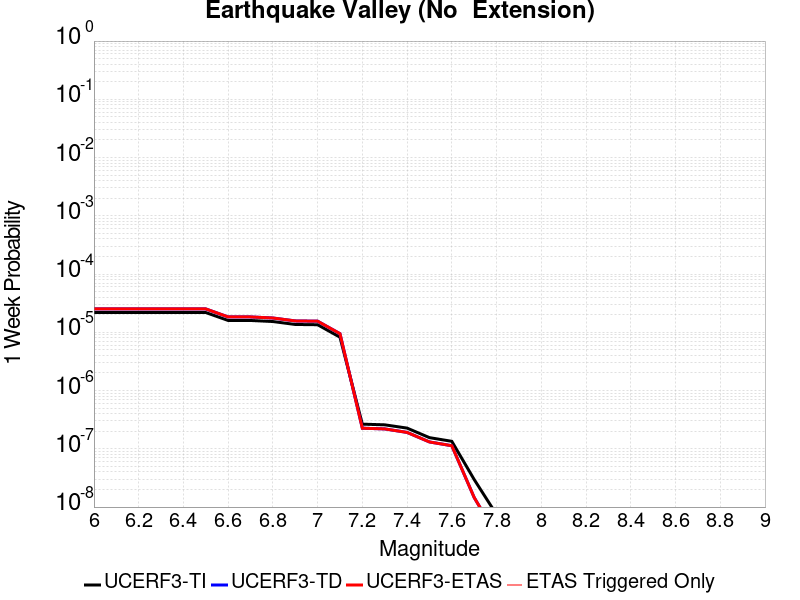 |  |  |

| Magnitude | 1 wk TI Prob | 1 wk TD Prob | 1 wk ETAS Prob | 1 wk ETAS/TD Gain | 1 wk ETAS Triggered Only | 1 mo TI Prob | 1 mo TD Prob | 1 mo ETAS Prob | 1 mo ETAS/TD Gain | 1 mo ETAS Triggered Only | 1 yr TI Prob | 1 yr TD Prob | 1 yr ETAS Prob | 1 yr ETAS/TD Gain | 1 yr ETAS Triggered Only |
|-----|-----|-----|-----|-----|-----|-----|-----|-----|-----|-----|-----|-----|-----|-----|-----|
| 6.0 | 2.1859703E-5 | 2.5211762E-5 | 2.5211762E-5 | 1.0 | 0.0 | 9.3681076E-5 | 1.08046755E-4 | 1.8803812E-4 | 1.7403402 | 8.0E-5 | 0.0011399703 | 0.0013148207 | 0.0014346628 | 1.0911472 | 1.2E-4 |
| 6.1 | 2.1859703E-5 | 2.5211762E-5 | 2.5211762E-5 | 1.0 | 0.0 | 9.3681076E-5 | 1.08046755E-4 | 1.8803812E-4 | 1.7403402 | 8.0E-5 | 0.0011399703 | 0.0013148207 | 0.0014346628 | 1.0911472 | 1.2E-4 |
| 6.2 | 2.1859703E-5 | 2.5211762E-5 | 2.5211762E-5 | 1.0 | 0.0 | 9.3681076E-5 | 1.08046755E-4 | 1.8803812E-4 | 1.7403402 | 8.0E-5 | 0.0011399703 | 0.0013148207 | 0.0014346628 | 1.0911472 | 1.2E-4 |
| 6.3 | 2.1859703E-5 | 2.5211762E-5 | 2.5211762E-5 | 1.0 | 0.0 | 9.3681076E-5 | 1.08046755E-4 | 1.8803812E-4 | 1.7403402 | 8.0E-5 | 0.0011399703 | 0.0013148207 | 0.0014346628 | 1.0911472 | 1.2E-4 |
| 6.4 | 2.1859703E-5 | 2.5211762E-5 | 2.5211762E-5 | 1.0 | 0.0 | 9.3681076E-5 | 1.08046755E-4 | 1.8803812E-4 | 1.7403402 | 8.0E-5 | 0.0011399703 | 0.0013148207 | 0.0014346628 | 1.0911472 | 1.2E-4 |
| 6.5 | 2.1859703E-5 | 2.5211762E-5 | 2.5211762E-5 | 1.0 | 0.0 | 9.3681076E-5 | 1.08046755E-4 | 1.8803812E-4 | 1.7403402 | 8.0E-5 | 0.0011399703 | 0.0013148207 | 0.0014346628 | 1.0911472 | 1.2E-4 |
| 6.6 | 1.597E-5 | 1.836593E-5 | 1.836593E-5 | 1.0 | 0.0 | 6.8441055E-5 | 7.870925E-5 | 1.5870295E-4 | 2.016319 | 8.0E-5 | 8.329513E-4 | 9.579512E-4 | 0.0010778363 | 1.1251473 | 1.2E-4 |
| 6.7 | 1.597E-5 | 1.836593E-5 | 1.836593E-5 | 1.0 | 0.0 | 6.8441055E-5 | 7.870925E-5 | 1.5870295E-4 | 2.016319 | 8.0E-5 | 8.329513E-4 | 9.579512E-4 | 0.0010778363 | 1.1251473 | 1.2E-4 |
| 6.8 | 1.5315149E-5 | 1.7611359E-5 | 1.7611359E-5 | 1.0 | 0.0 | 6.5634704E-5 | 7.547555E-5 | 1.5546952E-4 | 2.0598657 | 8.0E-5 | 7.988095E-4 | 9.1861427E-4 | 0.0010385041 | 1.1305115 | 1.2E-4 |
| 6.9 | 1.3634728E-5 | 1.568413E-5 | 1.568413E-5 | 1.0 | 0.0 | 5.8433237E-5 | 6.721644E-5 | 1.4721106E-4 | 2.190105 | 8.0E-5 | 7.1119244E-4 | 8.1813504E-4 | 8.980696E-4 | 1.0977033 | 8.0E-5 |
| 7.0 | 1.3496271E-5 | 1.5526088E-5 | 1.5526088E-5 | 1.0 | 0.0 | 5.783988E-5 | 6.653914E-5 | 1.4653381E-4 | 2.20222 | 8.0E-5 | 7.03973E-4 | 8.098951E-4 | 8.898303E-4 | 1.0986983 | 8.0E-5 |
| 7.1 | 8.242798E-6 | 9.477744E-6 | 9.477744E-6 | 1.0 | 0.0 | 3.53258E-5 | 4.061865E-5 | 8.061702E-5 | 1.9847294 | 4.0E-5 | 4.300067E-4 | 4.9448694E-4 | 5.3446717E-4 | 1.0808519 | 4.0E-5 |
| 7.2 | 2.6506527E-7 | 2.2575814E-7 | 2.2575814E-7 | 1.0 | 0.0 | 1.1359936E-6 | 9.675346E-7 | 9.675346E-7 | 1.0 | 0.0 | 1.3830633E-5 | 1.17796735E-5 | 1.17796735E-5 | 1.0 | 0.0 |
| 7.3 | 2.5810488E-7 | 2.1970749E-7 | 2.1970749E-7 | 1.0 | 0.0 | 1.1061633E-6 | 9.4160316E-7 | 9.4160316E-7 | 1.0 | 0.0 | 1.3467455E-5 | 1.1463962E-5 | 1.1463962E-5 | 1.0 | 0.0 |
| 7.4 | 2.2676066E-7 | 1.9125201E-7 | 1.9125201E-7 | 1.0 | 0.0 | 9.71831E-7 | 8.1965123E-7 | 8.1965123E-7 | 1.0 | 0.0 | 1.1831979E-5 | 9.979212E-6 | 9.979212E-6 | 1.0 | 0.0 |
| 7.5 | 1.5553917E-7 | 1.3123781E-7 | 1.3123781E-7 | 1.0 | 0.0 | 6.6659624E-7 | 5.6244767E-7 | 5.6244767E-7 | 1.0 | 0.0 | 8.115779E-6 | 6.847781E-6 | 6.847781E-6 | 1.0 | 0.0 |
| 7.6 | 1.3448629E-7 | 1.1298664E-7 | 1.1298664E-7 | 1.0 | 0.0 | 5.7636964E-7 | 4.8422834E-7 | 4.8422834E-7 | 1.0 | 0.0 | 7.017278E-6 | 5.8954665E-6 | 5.8954665E-6 | 1.0 | 0.0 |
| 7.7 | 2.9719402E-8 | 1.4599668E-8 | 1.4599668E-8 | 1.0 | 0.0 | 1.2736886E-7 | 6.257E-8 | 6.257E-8 | 1.0 | 0.0 | 1.5507147E-6 | 7.617896E-7 | 7.617896E-7 | 1.0 | 0.0 |
| 7.8 | 7.4390196E-9 | 3.254093E-9 | 3.254093E-9 | 1.0 | 0.0 | 3.1881513E-8 | 1.3946113E-8 | 1.3946113E-8 | 1.0 | 0.0 | 3.8815733E-7 | 1.697939E-7 | 1.697939E-7 | 1.0 | 0.0 |
| 7.9 | 1.5373532E-9 | 8.447242E-10 | 8.447242E-10 | 1.0 | 0.0 | 6.5886567E-9 | 3.6202463E-9 | 3.6202463E-9 | 1.0 | 0.0 | 8.021689E-8 | 4.40765E-8 | 4.40765E-8 | 1.0 | 0.0 |

## So Sierra Nevada
*[(top)](#table-of-contents)*

| 1 Week | 1 Month | 1 Year |
|-----|-----|-----|
|  | 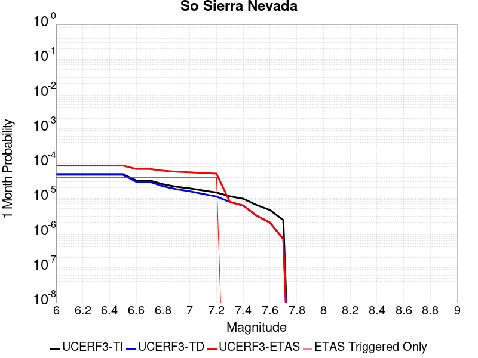 | 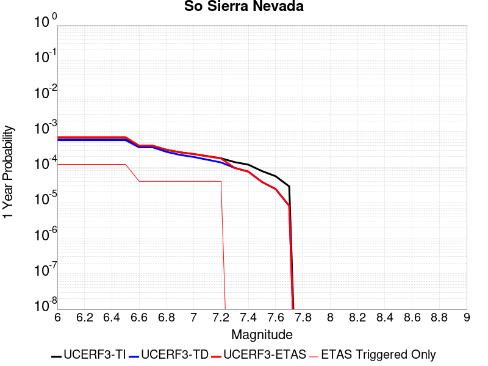 |

| Magnitude | 1 wk TI Prob | 1 wk TD Prob | 1 wk ETAS Prob | 1 wk ETAS/TD Gain | 1 wk ETAS Triggered Only | 1 mo TI Prob | 1 mo TD Prob | 1 mo ETAS Prob | 1 mo ETAS/TD Gain | 1 mo ETAS Triggered Only | 1 yr TI Prob | 1 yr TD Prob | 1 yr ETAS Prob | 1 yr ETAS/TD Gain | 1 yr ETAS Triggered Only |
|-----|-----|-----|-----|-----|-----|-----|-----|-----|-----|-----|-----|-----|-----|-----|-----|
| 6.0 | 1.15488665E-5 | 1.1081638E-5 | 5.1081195E-5 | 4.6095347 | 4.0E-5 | 4.9494203E-5 | 4.7491943E-5 | 8.749004E-5 | 1.8422081 | 4.0E-5 | 6.024253E-4 | 5.780738E-4 | 6.980044E-4 | 1.207466 | 1.2E-4 |
| 6.1 | 1.15488665E-5 | 1.1081638E-5 | 5.1081195E-5 | 4.6095347 | 4.0E-5 | 4.9494203E-5 | 4.7491943E-5 | 8.749004E-5 | 1.8422081 | 4.0E-5 | 6.024253E-4 | 5.780738E-4 | 6.980044E-4 | 1.207466 | 1.2E-4 |
| 6.2 | 1.15488665E-5 | 1.1081638E-5 | 5.1081195E-5 | 4.6095347 | 4.0E-5 | 4.9494203E-5 | 4.7491943E-5 | 8.749004E-5 | 1.8422081 | 4.0E-5 | 6.024253E-4 | 5.780738E-4 | 6.980044E-4 | 1.207466 | 1.2E-4 |
| 6.3 | 1.15488665E-5 | 1.1081638E-5 | 5.1081195E-5 | 4.6095347 | 4.0E-5 | 4.9494203E-5 | 4.7491943E-5 | 8.749004E-5 | 1.8422081 | 4.0E-5 | 6.024253E-4 | 5.780738E-4 | 6.980044E-4 | 1.207466 | 1.2E-4 |
| 6.4 | 1.15488665E-5 | 1.1081638E-5 | 5.1081195E-5 | 4.6095347 | 4.0E-5 | 4.9494203E-5 | 4.7491943E-5 | 8.749004E-5 | 1.8422081 | 4.0E-5 | 6.024253E-4 | 5.780738E-4 | 6.980044E-4 | 1.207466 | 1.2E-4 |
| 6.5 | 1.15488665E-5 | 1.1081638E-5 | 5.1081195E-5 | 4.6095347 | 4.0E-5 | 4.9494203E-5 | 4.7491943E-5 | 8.749004E-5 | 1.8422081 | 4.0E-5 | 6.024253E-4 | 5.780738E-4 | 6.980044E-4 | 1.207466 | 1.2E-4 |
| 6.6 | 7.587044E-6 | 6.9369835E-6 | 4.6936708E-5 | 6.766155 | 4.0E-5 | 3.2515498E-5 | 2.9729606E-5 | 6.972842E-5 | 2.3454201 | 4.0E-5 | 3.9580427E-4 | 3.6190078E-4 | 4.018863E-4 | 1.1104876 | 4.0E-5 |
| 6.7 | 7.587044E-6 | 6.9369835E-6 | 4.6936708E-5 | 6.766155 | 4.0E-5 | 3.2515498E-5 | 2.9729606E-5 | 6.972842E-5 | 2.3454201 | 4.0E-5 | 3.9580427E-4 | 3.6190078E-4 | 4.018863E-4 | 1.1104876 | 4.0E-5 |
| 6.8 | 5.9026956E-6 | 5.180487E-6 | 4.518028E-5 | 8.721242 | 4.0E-5 | 2.5297022E-5 | 2.2201903E-5 | 6.220101E-5 | 2.8016074 | 4.0E-5 | 3.0794772E-4 | 2.702758E-4 | 3.10265E-4 | 1.147957 | 4.0E-5 |
| 6.9 | 5.0118915E-6 | 4.2533916E-6 | 4.4253222E-5 | 10.40422 | 4.0E-5 | 2.1479358E-5 | 1.8228699E-5 | 5.8227968E-5 | 3.194302 | 4.0E-5 | 2.614798E-4 | 2.2191253E-4 | 2.6190365E-4 | 1.1802112 | 4.0E-5 |
| 7.0 | 4.4924795E-6 | 3.7148159E-6 | 4.3714666E-5 | 11.767654 | 4.0E-5 | 1.925334E-5 | 1.5920545E-5 | 5.5919907E-5 | 3.5124366 | 4.0E-5 | 2.3438422E-4 | 1.9381604E-4 | 2.3380828E-4 | 1.2063413 | 4.0E-5 |
| 7.1 | 3.9118436E-6 | 3.1127947E-6 | 4.3112672E-5 | 13.850148 | 4.0E-5 | 1.6764936E-5 | 1.3340484E-5 | 5.333995E-5 | 3.9983518 | 4.0E-5 | 2.0409399E-4 | 1.6240886E-4 | 2.0240236E-4 | 1.246252 | 4.0E-5 |
| 7.2 | 3.4200818E-6 | 2.6062064E-6 | 4.26061E-5 | 16.347939 | 4.0E-5 | 1.4657411E-5 | 1.1169411E-5 | 5.1168965E-5 | 4.5811696 | 4.0E-5 | 1.7843937E-4 | 1.359796E-4 | 1.7597416E-4 | 1.2941217 | 4.0E-5 |
| 7.3 | 2.6593618E-6 | 1.829074E-6 | 1.829074E-6 | 1.0 | 0.0 | 1.13972155E-5 | 7.838867E-6 | 7.838867E-6 | 1.0 | 0.0 | 1.3875226E-4 | 9.543431E-5 | 9.543431E-5 | 1.0 | 0.0 |
| 7.4 | 2.2577992E-6 | 1.4370321E-6 | 1.4370321E-6 | 1.0 | 0.0 | 9.676246E-6 | 6.1586957E-6 | 6.1586957E-6 | 1.0 | 0.0 | 1.1780193E-4 | 7.49798E-5 | 7.49798E-5 | 1.0 | 0.0 |
| 7.5 | 1.489319E-6 | 7.358567E-7 | 7.358567E-7 | 1.0 | 0.0 | 6.3827797E-6 | 3.1536679E-6 | 3.1536679E-6 | 1.0 | 0.0 | 7.770758E-5 | 3.8395232E-5 | 3.8395232E-5 | 1.0 | 0.0 |
| 7.6 | 1.0680322E-6 | 4.6630498E-7 | 4.6630498E-7 | 1.0 | 0.0 | 4.577273E-6 | 1.9984484E-6 | 1.9984484E-6 | 1.0 | 0.0 | 5.5726876E-5 | 2.433084E-5 | 2.433084E-5 | 1.0 | 0.0 |
| 7.7 | 5.509146E-7 | 1.5597114E-7 | 1.5597114E-7 | 1.0 | 0.0 | 2.3610605E-6 | 6.684475E-7 | 6.684475E-7 | 1.0 | 0.0 | 2.8745531E-5 | 8.13832E-6 | 8.13832E-6 | 1.0 | 0.0 |

## Clamshell-Sawpit
*[(top)](#table-of-contents)*

| 1 Week | 1 Month | 1 Year |
|-----|-----|-----|
| 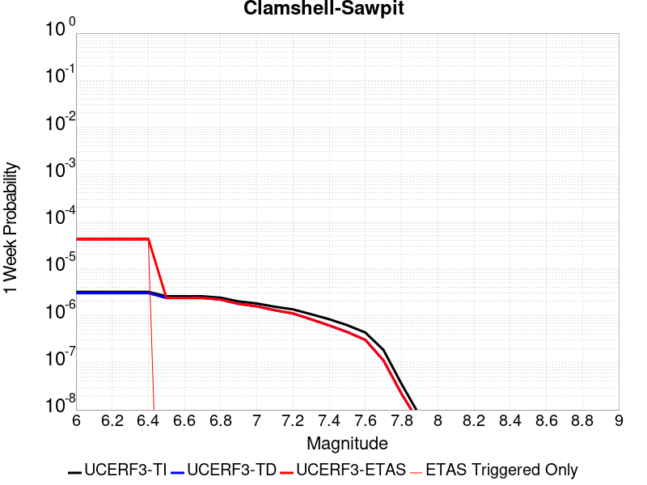 |  | 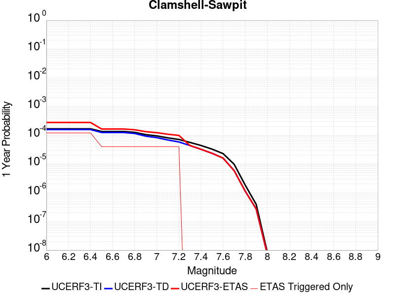 |

| Magnitude | 1 wk TI Prob | 1 wk TD Prob | 1 wk ETAS Prob | 1 wk ETAS/TD Gain | 1 wk ETAS Triggered Only | 1 mo TI Prob | 1 mo TD Prob | 1 mo ETAS Prob | 1 mo ETAS/TD Gain | 1 mo ETAS Triggered Only | 1 yr TI Prob | 1 yr TD Prob | 1 yr ETAS Prob | 1 yr ETAS/TD Gain | 1 yr ETAS Triggered Only |
|-----|-----|-----|-----|-----|-----|-----|-----|-----|-----|-----|-----|-----|-----|-----|-----|
| 6.0 | 3.202998E-6 | 3.013255E-6 | 4.3013133E-5 | 14.274641 | 4.0E-5 | 1.3727062E-5 | 1.2913892E-5 | 9.291286E-5 | 7.1947994 | 8.0E-5 | 1.6711417E-4 | 1.5721608E-4 | 2.7719722E-4 | 1.7631607 | 1.2E-4 |
| 6.1 | 3.202998E-6 | 3.013255E-6 | 4.3013133E-5 | 14.274641 | 4.0E-5 | 1.3727062E-5 | 1.2913892E-5 | 9.291286E-5 | 7.1947994 | 8.0E-5 | 1.6711417E-4 | 1.5721608E-4 | 2.7719722E-4 | 1.7631607 | 1.2E-4 |
| 6.2 | 3.202998E-6 | 3.013255E-6 | 4.3013133E-5 | 14.274641 | 4.0E-5 | 1.3727062E-5 | 1.2913892E-5 | 9.291286E-5 | 7.1947994 | 8.0E-5 | 1.6711417E-4 | 1.5721608E-4 | 2.7719722E-4 | 1.7631607 | 1.2E-4 |
| 6.3 | 3.202998E-6 | 3.013255E-6 | 4.3013133E-5 | 14.274641 | 4.0E-5 | 1.3727062E-5 | 1.2913892E-5 | 9.291286E-5 | 7.1947994 | 8.0E-5 | 1.6711417E-4 | 1.5721608E-4 | 2.7719722E-4 | 1.7631607 | 1.2E-4 |
| 6.4 | 3.202998E-6 | 3.013255E-6 | 4.3013133E-5 | 14.274641 | 4.0E-5 | 1.3727062E-5 | 1.2913892E-5 | 9.291286E-5 | 7.1947994 | 8.0E-5 | 1.6711417E-4 | 1.5721608E-4 | 2.7719722E-4 | 1.7631607 | 1.2E-4 |
| 6.5 | 2.5862723E-6 | 2.3812127E-6 | 2.3812127E-6 | 1.0 | 0.0 | 1.1083977E-5 | 1.0205159E-5 | 5.020475E-5 | 4.919546 | 4.0E-5 | 1.3493907E-4 | 1.2424104E-4 | 1.6423607E-4 | 1.3219148 | 4.0E-5 |
| 6.6 | 2.5862723E-6 | 2.3812127E-6 | 2.3812127E-6 | 1.0 | 0.0 | 1.1083977E-5 | 1.0205159E-5 | 5.020475E-5 | 4.919546 | 4.0E-5 | 1.3493907E-4 | 1.2424104E-4 | 1.6423607E-4 | 1.3219148 | 4.0E-5 |
| 6.7 | 2.5862723E-6 | 2.3812127E-6 | 2.3812127E-6 | 1.0 | 0.0 | 1.1083977E-5 | 1.0205159E-5 | 5.020475E-5 | 4.919546 | 4.0E-5 | 1.3493907E-4 | 1.2424104E-4 | 1.6423607E-4 | 1.3219148 | 4.0E-5 |
| 6.8 | 2.4098806E-6 | 2.1981452E-6 | 2.1981452E-6 | 1.0 | 0.0 | 1.0328019E-5 | 9.42059E-6 | 4.9420214E-5 | 5.2459784 | 4.0E-5 | 1.2573638E-4 | 1.14689916E-4 | 1.5468533E-4 | 1.3487265 | 4.0E-5 |
| 6.9 | 2.0073985E-6 | 1.7787798E-6 | 1.7787798E-6 | 1.0 | 0.0 | 8.603109E-6 | 7.6233205E-6 | 4.7623016E-5 | 6.2470174 | 4.0E-5 | 1.0473781E-4 | 9.281009E-5 | 1.3280638E-4 | 1.4309477 | 4.0E-5 |
| 7.0 | 1.8166766E-6 | 1.58104E-6 | 1.58104E-6 | 1.0 | 0.0 | 7.785734E-6 | 6.7758688E-6 | 4.6775596E-5 | 6.903262 | 4.0E-5 | 9.478718E-5 | 8.249318E-5 | 1.2248987E-4 | 1.4848486 | 4.0E-5 |
| 7.1 | 1.5471421E-6 | 1.3055794E-6 | 1.3055794E-6 | 1.0 | 0.0 | 6.6305925E-6 | 5.5953287E-6 | 4.5595105E-5 | 8.14878 | 4.0E-5 | 8.072447E-5 | 6.812105E-5 | 1.0811833E-4 | 1.58715 | 4.0E-5 |
| 7.2 | 1.3608037E-6 | 1.1155953E-6 | 1.1155953E-6 | 1.0 | 0.0 | 5.8320024E-6 | 4.7811145E-6 | 4.478092E-5 | 9.366211 | 4.0E-5 | 7.1002316E-5 | 5.820856E-5 | 9.820623E-5 | 1.6871442 | 4.0E-5 |
| 7.3 | 1.0749634E-6 | 8.3862324E-7 | 8.3862324E-7 | 1.0 | 0.0 | 4.6069777E-6 | 3.5940946E-6 | 3.5940946E-6 | 1.0 | 0.0 | 5.608851E-5 | 4.3757253E-5 | 4.3757253E-5 | 1.0 | 0.0 |
| 7.4 | 8.416856E-7 | 6.2015675E-7 | 6.2015675E-7 | 1.0 | 0.0 | 3.607219E-6 | 2.657812E-6 | 2.657812E-6 | 1.0 | 0.0 | 4.3917007E-5 | 3.23584E-5 | 3.23584E-5 | 1.0 | 0.0 |
| 7.5 | 6.2779594E-7 | 4.4980723E-7 | 4.4980723E-7 | 1.0 | 0.0 | 2.6905511E-6 | 1.927744E-6 | 1.927744E-6 | 1.0 | 0.0 | 3.275697E-5 | 2.347005E-5 | 2.347005E-5 | 1.0 | 0.0 |
| 7.6 | 4.3822078E-7 | 3.060434E-7 | 3.060434E-7 | 1.0 | 0.0 | 1.8780877E-6 | 1.3116139E-6 | 1.3116139E-6 | 1.0 | 0.0 | 2.2865479E-5 | 1.5968799E-5 | 1.5968799E-5 | 1.0 | 0.0 |
| 7.7 | 1.8704569E-7 | 1.12431835E-7 | 1.12431835E-7 | 1.0 | 0.0 | 8.0162414E-7 | 4.8185063E-7 | 4.8185063E-7 | 1.0 | 0.0 | 9.75973E-6 | 5.8665164E-6 | 5.8665164E-6 | 1.0 | 0.0 |
| 7.8 | 3.5378733E-8 | 2.1846251E-8 | 2.1846251E-8 | 1.0 | 0.0 | 1.5162313E-7 | 9.362678E-8 | 9.362678E-8 | 1.0 | 0.0 | 1.84601E-6 | 1.1399055E-6 | 1.1399055E-6 | 1.0 | 0.0 |
| 7.9 | 7.504945E-9 | 5.193598E-9 | 5.193598E-9 | 1.0 | 0.0 | 3.2164053E-8 | 2.2258277E-8 | 2.2258277E-8 | 1.0 | 0.0 | 3.9159727E-7 | 2.709945E-7 | 2.709945E-7 | 1.0 | 0.0 |
| 8.0 | 1.6554036E-10 | 1.4181989E-10 | 1.4181989E-10 | 1.0 | 0.0 | 7.0945894E-10 | 6.077995E-10 | 6.077995E-10 | 1.0 | 0.0 | 8.637662E-9 | 7.3999593E-9 | 7.3999593E-9 | 1.0 | 0.0 |

## La Panza 2011
*[(top)](#table-of-contents)*

| 1 Week | 1 Month | 1 Year |
|-----|-----|-----|
| 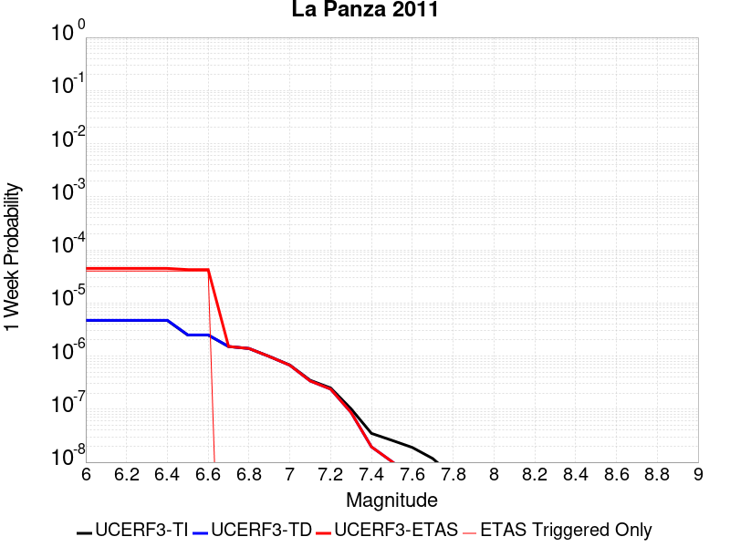 |  | 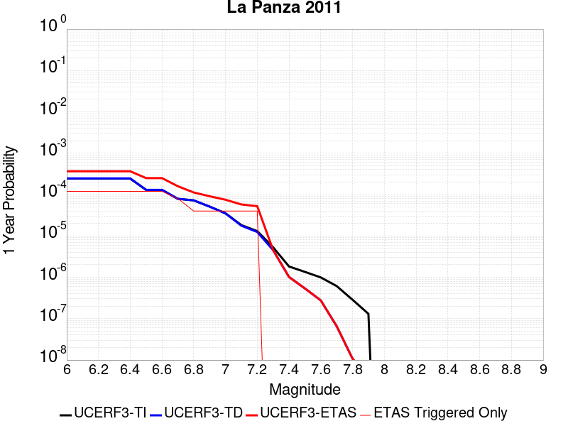 |

| Magnitude | 1 wk TI Prob | 1 wk TD Prob | 1 wk ETAS Prob | 1 wk ETAS/TD Gain | 1 wk ETAS Triggered Only | 1 mo TI Prob | 1 mo TD Prob | 1 mo ETAS Prob | 1 mo ETAS/TD Gain | 1 mo ETAS Triggered Only | 1 yr TI Prob | 1 yr TD Prob | 1 yr ETAS Prob | 1 yr ETAS/TD Gain | 1 yr ETAS Triggered Only |
|-----|-----|-----|-----|-----|-----|-----|-----|-----|-----|-----|-----|-----|-----|-----|-----|
| 6.0 | 4.6754544E-6 | 4.718128E-6 | 4.4717937E-5 | 9.4779 | 4.0E-5 | 2.0037509E-5 | 2.0220401E-5 | 1.4021798E-4 | 6.93448 | 1.2E-4 | 2.4392935E-4 | 2.4615755E-4 | 3.6612802E-4 | 1.4873726 | 1.2E-4 |
| 6.1 | 4.6754544E-6 | 4.718128E-6 | 4.4717937E-5 | 9.4779 | 4.0E-5 | 2.0037509E-5 | 2.0220401E-5 | 1.4021798E-4 | 6.93448 | 1.2E-4 | 2.4392935E-4 | 2.4615755E-4 | 3.6612802E-4 | 1.4873726 | 1.2E-4 |
| 6.2 | 4.6754544E-6 | 4.718128E-6 | 4.4717937E-5 | 9.4779 | 4.0E-5 | 2.0037509E-5 | 2.0220401E-5 | 1.4021798E-4 | 6.93448 | 1.2E-4 | 2.4392935E-4 | 2.4615755E-4 | 3.6612802E-4 | 1.4873726 | 1.2E-4 |
| 6.3 | 4.6754544E-6 | 4.718128E-6 | 4.4717937E-5 | 9.4779 | 4.0E-5 | 2.0037509E-5 | 2.0220401E-5 | 1.4021798E-4 | 6.93448 | 1.2E-4 | 2.4392935E-4 | 2.4615755E-4 | 3.6612802E-4 | 1.4873726 | 1.2E-4 |
| 6.4 | 4.6754544E-6 | 4.718128E-6 | 4.4717937E-5 | 9.4779 | 4.0E-5 | 2.0037509E-5 | 2.0220401E-5 | 1.4021798E-4 | 6.93448 | 1.2E-4 | 2.4392935E-4 | 2.4615755E-4 | 3.6612802E-4 | 1.4873726 | 1.2E-4 |
| 6.5 | 2.485343E-6 | 2.5010474E-6 | 4.2500946E-5 | 16.99326 | 4.0E-5 | 1.0651426E-5 | 1.0718733E-5 | 1.3071745E-4 | 12.195233 | 1.2E-4 | 1.296734E-4 | 1.3049315E-4 | 2.504775E-4 | 1.9194685 | 1.2E-4 |
| 6.6 | 2.485343E-6 | 2.5010474E-6 | 4.2500946E-5 | 16.99326 | 4.0E-5 | 1.0651426E-5 | 1.0718733E-5 | 1.3071745E-4 | 12.195233 | 1.2E-4 | 1.296734E-4 | 1.3049315E-4 | 2.504775E-4 | 1.9194685 | 1.2E-4 |
| 6.7 | 1.5108508E-6 | 1.5150466E-6 | 1.5150466E-6 | 1.0 | 0.0 | 6.4750584E-6 | 6.493042E-6 | 8.6492524E-5 | 13.320802 | 8.0E-5 | 7.8830984E-5 | 7.905002E-5 | 1.590437E-4 | 2.0119374 | 8.0E-5 |
| 6.8 | 1.3865837E-6 | 1.388913E-6 | 1.388913E-6 | 1.0 | 0.0 | 5.942488E-6 | 5.9524714E-6 | 4.5952234E-5 | 7.719858 | 4.0E-5 | 7.234739E-5 | 7.2469025E-5 | 1.1246613E-4 | 1.5519199 | 4.0E-5 |
| 6.9 | 9.826583E-7 | 9.800144E-7 | 9.800144E-7 | 1.0 | 0.0 | 4.2113857E-6 | 4.2000556E-6 | 4.419989E-5 | 10.5236435 | 4.0E-5 | 5.1272415E-5 | 5.113453E-5 | 9.113248E-5 | 1.7822102 | 4.0E-5 |
| 7.0 | 6.7797646E-7 | 6.713938E-7 | 6.713938E-7 | 1.0 | 0.0 | 2.9056102E-6 | 2.877399E-6 | 4.2877284E-5 | 14.901403 | 4.0E-5 | 3.537523E-5 | 3.50318E-5 | 7.50304E-5 | 2.1417797 | 4.0E-5 |
| 7.1 | 3.4979826E-7 | 3.3909706E-7 | 3.3909706E-7 | 1.0 | 0.0 | 1.4991346E-6 | 1.4532723E-6 | 4.1453215E-5 | 28.524052 | 4.0E-5 | 1.825181E-5 | 1.7693459E-5 | 5.7692752E-5 | 3.2606826 | 4.0E-5 |
| 7.2 | 2.5088332E-7 | 2.3867204E-7 | 2.3867204E-7 | 1.0 | 0.0 | 1.0752137E-6 | 1.0228798E-6 | 4.102284E-5 | 40.105236 | 4.0E-5 | 1.3090649E-5 | 1.24535E-5 | 5.2453E-5 | 4.2119083 | 4.0E-5 |
| 7.3 | 1.0159086E-7 | 8.679035E-8 | 8.679035E-8 | 1.0 | 0.0 | 4.3538932E-7 | 3.719586E-7 | 3.719586E-7 | 1.0 | 0.0 | 5.300852E-6 | 4.528587E-6 | 4.528587E-6 | 1.0 | 0.0 |
| 7.4 | 3.5006252E-8 | 1.9514188E-8 | 1.9514188E-8 | 1.0 | 0.0 | 1.5002678E-7 | 8.363222E-8 | 8.363222E-8 | 1.0 | 0.0 | 1.8265745E-6 | 1.018222E-6 | 1.018222E-6 | 1.0 | 0.0 |
| 7.5 | 2.592274E-8 | 1.03209565E-8 | 1.03209565E-8 | 1.0 | 0.0 | 1.1109746E-7 | 4.423267E-8 | 4.423267E-8 | 1.0 | 0.0 | 1.3526106E-6 | 5.385326E-7 | 5.385326E-7 | 1.0 | 0.0 |
| 7.6 | 1.9016717E-8 | 5.2971947E-9 | 5.2971947E-9 | 1.0 | 0.0 | 8.150022E-8 | 2.2702263E-8 | 2.2702263E-8 | 1.0 | 0.0 | 9.922647E-7 | 2.7640002E-7 | 2.7640002E-7 | 1.0 | 0.0 |
| 7.7 | 1.17738495E-8 | 1.2623281E-9 | 1.2623281E-9 | 1.0 | 0.0 | 5.0459356E-8 | 5.4099774E-9 | 5.4099774E-9 | 1.0 | 0.0 | 6.1434247E-7 | 6.586647E-8 | 6.586647E-8 | 1.0 | 0.0 |
| 7.8 | 5.489079E-9 | 2.0697699E-10 | 2.0697699E-10 | 1.0 | 0.0 | 2.3524624E-8 | 8.870432E-10 | 8.870432E-10 | 1.0 | 0.0 | 2.8641225E-7 | 1.0799752E-8 | 1.0799752E-8 | 1.0 | 0.0 |
| 7.9 | 2.5081048E-9 | 6.905543E-11 | 6.905543E-11 | 1.0 | 0.0 | 1.0749021E-8 | 2.959516E-10 | 2.959516E-10 | 1.0 | 0.0 | 1.3086932E-7 | 3.603212E-9 | 3.603212E-9 | 1.0 | 0.0 |

## San Jose
*[(top)](#table-of-contents)*

| 1 Week | 1 Month | 1 Year |
|-----|-----|-----|
| 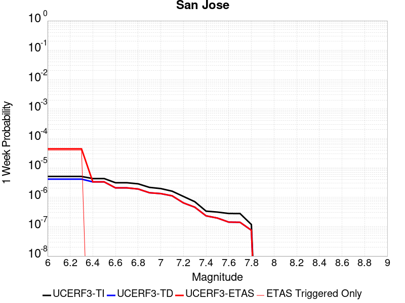 | 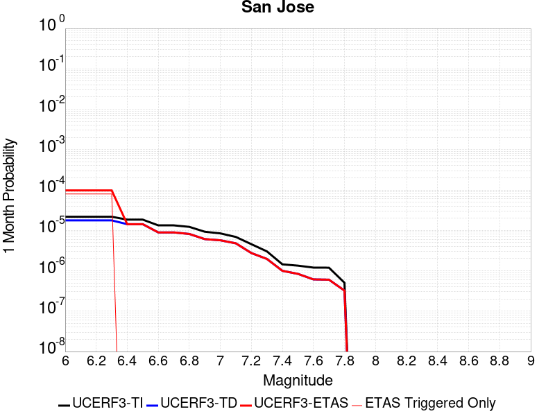 | 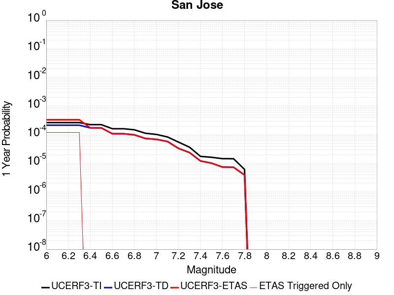 |

| Magnitude | 1 wk TI Prob | 1 wk TD Prob | 1 wk ETAS Prob | 1 wk ETAS/TD Gain | 1 wk ETAS Triggered Only | 1 mo TI Prob | 1 mo TD Prob | 1 mo ETAS Prob | 1 mo ETAS/TD Gain | 1 mo ETAS Triggered Only | 1 yr TI Prob | 1 yr TD Prob | 1 yr ETAS Prob | 1 yr ETAS/TD Gain | 1 yr ETAS Triggered Only |
|-----|-----|-----|-----|-----|-----|-----|-----|-----|-----|-----|-----|-----|-----|-----|-----|
| 6.0 | 5.0851277E-6 | 4.127646E-6 | 4.4127482E-5 | 10.690713 | 4.0E-5 | 2.1793223E-5 | 1.7689807E-5 | 9.768839E-5 | 5.5222983 | 8.0E-5 | 2.653002E-4 | 2.1535474E-4 | 3.353289E-4 | 1.5571002 | 1.2E-4 |
| 6.1 | 5.0851277E-6 | 4.127646E-6 | 4.4127482E-5 | 10.690713 | 4.0E-5 | 2.1793223E-5 | 1.7689807E-5 | 9.768839E-5 | 5.5222983 | 8.0E-5 | 2.653002E-4 | 2.1535474E-4 | 3.353289E-4 | 1.5571002 | 1.2E-4 |
| 6.2 | 5.0851277E-6 | 4.127646E-6 | 4.4127482E-5 | 10.690713 | 4.0E-5 | 2.1793223E-5 | 1.7689807E-5 | 9.768839E-5 | 5.5222983 | 8.0E-5 | 2.653002E-4 | 2.1535474E-4 | 3.353289E-4 | 1.5571002 | 1.2E-4 |
| 6.3 | 5.0851277E-6 | 4.127646E-6 | 4.4127482E-5 | 10.690713 | 4.0E-5 | 2.1793223E-5 | 1.7689807E-5 | 9.768839E-5 | 5.5222983 | 8.0E-5 | 2.653002E-4 | 2.1535474E-4 | 3.353289E-4 | 1.5571002 | 1.2E-4 |
| 6.4 | 4.3115124E-6 | 3.3256572E-6 | 3.3256572E-6 | 1.0 | 0.0 | 1.8477778E-5 | 1.42527515E-5 | 1.42527515E-5 | 1.0 | 0.0 | 2.2494372E-4 | 1.7351564E-4 | 1.7351564E-4 | 1.0 | 0.0 |
| 6.5 | 4.3115124E-6 | 3.3256572E-6 | 3.3256572E-6 | 1.0 | 0.0 | 1.8477778E-5 | 1.42527515E-5 | 1.42527515E-5 | 1.0 | 0.0 | 2.2494372E-4 | 1.7351564E-4 | 1.7351564E-4 | 1.0 | 0.0 |
| 6.6 | 3.110396E-6 | 2.081711E-6 | 2.081711E-6 | 1.0 | 0.0 | 1.33302E-5 | 8.921589E-6 | 8.921589E-6 | 1.0 | 0.0 | 1.622831E-4 | 1.0861522E-4 | 1.0861522E-4 | 1.0 | 0.0 |
| 6.7 | 3.110396E-6 | 2.081711E-6 | 2.081711E-6 | 1.0 | 0.0 | 1.33302E-5 | 8.921589E-6 | 8.921589E-6 | 1.0 | 0.0 | 1.622831E-4 | 1.0861522E-4 | 1.0861522E-4 | 1.0 | 0.0 |
| 6.8 | 2.856651E-6 | 1.9041215E-6 | 1.9041215E-6 | 1.0 | 0.0 | 1.2242733E-5 | 8.160497E-6 | 8.160497E-6 | 1.0 | 0.0 | 1.4904508E-4 | 9.934977E-5 | 9.934977E-5 | 1.0 | 0.0 |
| 6.9 | 2.1618725E-6 | 1.4202409E-6 | 1.4202409E-6 | 1.0 | 0.0 | 9.265135E-6 | 6.086733E-6 | 6.086733E-6 | 1.0 | 0.0 | 1.12797185E-4 | 7.410354E-5 | 7.410354E-5 | 1.0 | 0.0 |
| 7.0 | 1.9684312E-6 | 1.3271862E-6 | 1.3271862E-6 | 1.0 | 0.0 | 8.436106E-6 | 5.687929E-6 | 5.687929E-6 | 1.0 | 0.0 | 1.02704755E-4 | 6.924842E-5 | 6.924842E-5 | 1.0 | 0.0 |
| 7.1 | 1.6070337E-6 | 1.1169859E-6 | 1.1169859E-6 | 1.0 | 0.0 | 6.887269E-6 | 4.787074E-6 | 4.787074E-6 | 1.0 | 0.0 | 8.384928E-5 | 5.828113E-5 | 5.828113E-5 | 1.0 | 0.0 |
| 7.2 | 1.0631658E-6 | 6.414727E-7 | 6.414727E-7 | 1.0 | 0.0 | 4.556417E-6 | 2.7491658E-6 | 2.7491658E-6 | 1.0 | 0.0 | 5.5472963E-5 | 3.3470595E-5 | 3.3470595E-5 | 1.0 | 0.0 |
| 7.3 | 7.060711E-7 | 4.591335E-7 | 4.591335E-7 | 1.0 | 0.0 | 3.0260155E-6 | 1.9677136E-6 | 1.9677136E-6 | 1.0 | 0.0 | 3.6841117E-5 | 2.3956658E-5 | 2.3956658E-5 | 1.0 | 0.0 |
| 7.4 | 3.3677085E-7 | 2.3296968E-7 | 2.3296968E-7 | 1.0 | 0.0 | 1.4433028E-6 | 9.984411E-7 | 9.984411E-7 | 1.0 | 0.0 | 1.757207E-5 | 1.2155956E-5 | 1.2155956E-5 | 1.0 | 0.0 |
| 7.5 | 3.129161E-7 | 1.9583004E-7 | 1.9583004E-7 | 1.0 | 0.0 | 1.3410682E-6 | 8.3927137E-7 | 8.3927137E-7 | 1.0 | 0.0 | 1.6327383E-5 | 1.0218083E-5 | 1.0218083E-5 | 1.0 | 0.0 |
| 7.6 | 2.8008668E-7 | 1.4278207E-7 | 1.4278207E-7 | 1.0 | 0.0 | 1.2003709E-6 | 6.11923E-7 | 6.11923E-7 | 1.0 | 0.0 | 1.46144175E-5 | 7.450139E-6 | 7.450139E-6 | 1.0 | 0.0 |
| 7.7 | 2.7852005E-7 | 1.405229E-7 | 1.405229E-7 | 1.0 | 0.0 | 1.1936568E-6 | 6.0224085E-7 | 6.0224085E-7 | 1.0 | 0.0 | 1.4532674E-5 | 7.3322594E-6 | 7.3322594E-6 | 1.0 | 0.0 |
| 7.8 | 1.1810797E-7 | 7.533926E-8 | 7.533926E-8 | 1.0 | 0.0 | 5.0617695E-7 | 3.228825E-7 | 3.228825E-7 | 1.0 | 0.0 | 6.1626865E-6 | 3.9310876E-6 | 3.9310876E-6 | 1.0 | 0.0 |

## Ventura-Pitas Point
*[(top)](#table-of-contents)*

| 1 Week | 1 Month | 1 Year |
|-----|-----|-----|
|  | 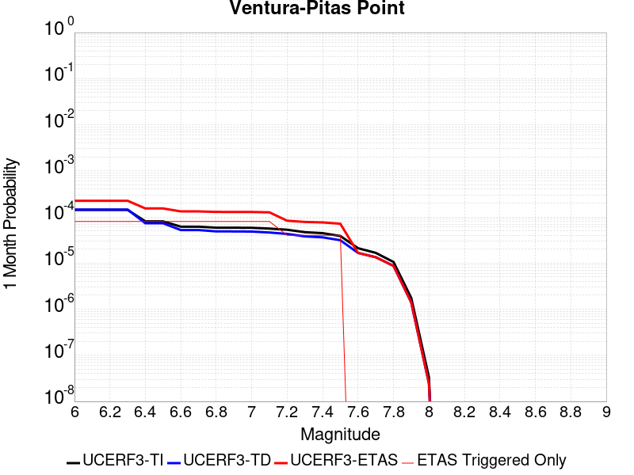 | 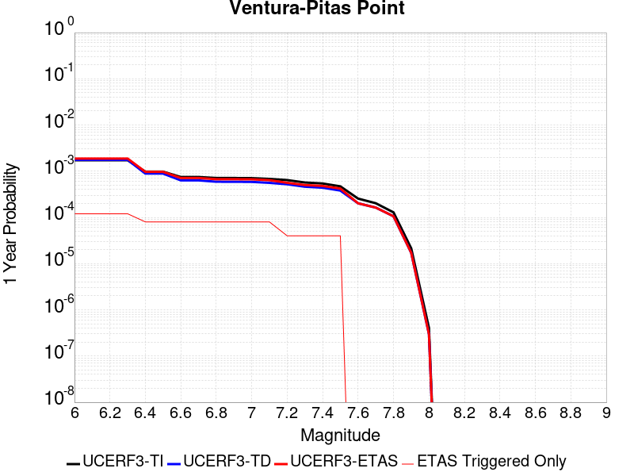 |

| Magnitude | 1 wk TI Prob | 1 wk TD Prob | 1 wk ETAS Prob | 1 wk ETAS/TD Gain | 1 wk ETAS Triggered Only | 1 mo TI Prob | 1 mo TD Prob | 1 mo ETAS Prob | 1 mo ETAS/TD Gain | 1 mo ETAS Triggered Only | 1 yr TI Prob | 1 yr TD Prob | 1 yr ETAS Prob | 1 yr ETAS/TD Gain | 1 yr ETAS Triggered Only |
|-----|-----|-----|-----|-----|-----|-----|-----|-----|-----|-----|-----|-----|-----|-----|-----|
| 6.0 | 3.3179622E-5 | 3.3762684E-5 | 1.1375998E-4 | 3.3693998 | 8.0E-5 | 1.4219063E-4 | 1.4469065E-4 | 2.2467907E-4 | 1.5528238 | 8.0E-5 | 0.0017297962 | 0.0017604423 | 0.0018802311 | 1.0680447 | 1.2E-4 |
| 6.1 | 3.3179622E-5 | 3.3762684E-5 | 1.1375998E-4 | 3.3693998 | 8.0E-5 | 1.4219063E-4 | 1.4469065E-4 | 2.2467907E-4 | 1.5528238 | 8.0E-5 | 0.0017297962 | 0.0017604423 | 0.0018802311 | 1.0680447 | 1.2E-4 |
| 6.2 | 3.3179622E-5 | 3.3762684E-5 | 1.1375998E-4 | 3.3693998 | 8.0E-5 | 1.4219063E-4 | 1.4469065E-4 | 2.2467907E-4 | 1.5528238 | 8.0E-5 | 0.0017297962 | 0.0017604423 | 0.0018802311 | 1.0680447 | 1.2E-4 |
| 6.3 | 3.3179622E-5 | 3.3762684E-5 | 1.1375998E-4 | 3.3693998 | 8.0E-5 | 1.4219063E-4 | 1.4469065E-4 | 2.2467907E-4 | 1.5528238 | 8.0E-5 | 0.0017297962 | 0.0017604423 | 0.0018802311 | 1.0680447 | 1.2E-4 |
| 6.4 | 1.8754668E-5 | 1.7038072E-5 | 9.703671E-5 | 5.695287 | 8.0E-5 | 8.037467E-5 | 7.301839E-5 | 1.5301254E-4 | 2.0955343 | 8.0E-5 | 9.781223E-4 | 8.8865944E-4 | 9.6858834E-4 | 1.0899433 | 8.0E-5 |
| 6.5 | 1.8754668E-5 | 1.7038072E-5 | 9.703671E-5 | 5.695287 | 8.0E-5 | 8.037467E-5 | 7.301839E-5 | 1.5301254E-4 | 2.0955343 | 8.0E-5 | 9.781223E-4 | 8.8865944E-4 | 9.6858834E-4 | 1.0899433 | 8.0E-5 |
| 6.6 | 1.4361558E-5 | 1.2138828E-5 | 9.213786E-5 | 7.5903416 | 8.0E-5 | 6.154808E-5 | 5.2022526E-5 | 1.3201837E-4 | 2.5377154 | 8.0E-5 | 7.490902E-4 | 6.3319254E-4 | 7.1314187E-4 | 1.1262639 | 8.0E-5 |
| 6.7 | 1.4361558E-5 | 1.2138828E-5 | 9.213786E-5 | 7.5903416 | 8.0E-5 | 6.154808E-5 | 5.2022526E-5 | 1.3201837E-4 | 2.5377154 | 8.0E-5 | 7.490902E-4 | 6.3319254E-4 | 7.1314187E-4 | 1.1262639 | 8.0E-5 |
| 6.8 | 1.3663846E-5 | 1.1360668E-5 | 9.135976E-5 | 8.041759 | 8.0E-5 | 5.8558027E-5 | 4.868768E-5 | 1.286838E-4 | 2.6430461 | 8.0E-5 | 7.127108E-4 | 5.9261324E-4 | 6.7256583E-4 | 1.1349152 | 8.0E-5 |
| 6.9 | 1.3644157E-5 | 1.1338761E-5 | 9.133785E-5 | 8.055365 | 8.0E-5 | 5.8473648E-5 | 4.8593796E-5 | 1.285899E-4 | 2.6462207 | 8.0E-5 | 7.116841E-4 | 5.914708E-4 | 6.714235E-4 | 1.1351761 | 8.0E-5 |
| 7.0 | 1.3568845E-5 | 1.125829E-5 | 9.125739E-5 | 8.105795 | 8.0E-5 | 5.8150898E-5 | 4.8248934E-5 | 1.2824507E-4 | 2.6579876 | 8.0E-5 | 7.077572E-4 | 5.872744E-4 | 6.6722743E-4 | 1.1361425 | 8.0E-5 |
| 7.1 | 1.306572E-5 | 1.0734395E-5 | 9.0733534E-5 | 8.4526 | 8.0E-5 | 5.599474E-5 | 4.6003748E-5 | 1.2600007E-4 | 2.7389088 | 8.0E-5 | 6.815227E-4 | 5.5995357E-4 | 6.399088E-4 | 1.142789 | 8.0E-5 |
| 7.2 | 1.232604E-5 | 1.0006684E-5 | 5.000628E-5 | 4.997288 | 4.0E-5 | 5.2824813E-5 | 4.288509E-5 | 8.288337E-5 | 1.932685 | 4.0E-5 | 6.429523E-4 | 5.220027E-4 | 5.619818E-4 | 1.0765879 | 4.0E-5 |
| 7.3 | 1.0917261E-5 | 8.853358E-6 | 4.8853006E-5 | 5.5180197 | 4.0E-5 | 4.678742E-5 | 3.794242E-5 | 7.79409E-5 | 2.054189 | 4.0E-5 | 5.69488E-4 | 4.618526E-4 | 5.0183415E-4 | 1.0865678 | 4.0E-5 |
| 7.4 | 1.039959E-5 | 8.432823E-6 | 4.8432485E-5 | 5.74333 | 4.0E-5 | 4.456891E-5 | 3.614018E-5 | 7.6138735E-5 | 2.1067615 | 4.0E-5 | 5.424914E-4 | 4.399194E-4 | 4.799018E-4 | 1.0908858 | 4.0E-5 |
| 7.5 | 9.015877E-6 | 7.306078E-6 | 4.7305784E-5 | 6.474854 | 4.0E-5 | 3.86389E-5 | 3.1311392E-5 | 7.131014E-5 | 2.2774503 | 4.0E-5 | 4.7032707E-4 | 3.8115095E-4 | 4.2113572E-4 | 1.1049052 | 4.0E-5 |
| 7.6 | 4.900162E-6 | 3.87516E-6 | 3.87516E-6 | 1.0 | 0.0 | 2.1000526E-5 | 1.6607724E-5 | 1.6607724E-5 | 1.0 | 0.0 | 2.556514E-4 | 2.0218041E-4 | 2.0218041E-4 | 1.0 | 0.0 |
| 7.7 | 3.8850626E-6 | 3.1275454E-6 | 3.1275454E-6 | 1.0 | 0.0 | 1.6650163E-5 | 1.3403697E-5 | 1.3403697E-5 | 1.0 | 0.0 | 2.0269687E-4 | 1.6317789E-4 | 1.6317789E-4 | 1.0 | 0.0 |
| 7.8 | 2.4654719E-6 | 2.0304078E-6 | 2.0304078E-6 | 1.0 | 0.0 | 1.0566265E-5 | 8.701719E-6 | 8.701719E-6 | 1.0 | 0.0 | 1.2863669E-4 | 1.0593832E-4 | 1.0593832E-4 | 1.0 | 0.0 |
| 7.9 | 4.095894E-7 | 3.2773266E-7 | 3.2773266E-7 | 1.0 | 0.0 | 1.7553821E-6 | 1.4045678E-6 | 1.4045678E-6 | 1.0 | 0.0 | 2.1371567E-5 | 1.7100481E-5 | 1.7100481E-5 | 1.0 | 0.0 |
| 8.0 | 7.791402E-9 | 5.68495E-9 | 5.68495E-9 | 1.0 | 0.0 | 3.3391725E-8 | 2.4364072E-8 | 2.4364072E-8 | 1.0 | 0.0 | 4.0654416E-7 | 2.9663255E-7 | 2.9663255E-7 | 1.0 | 0.0 |

## Elmore Ranch
*[(top)](#table-of-contents)*

| 1 Week | 1 Month | 1 Year |
|-----|-----|-----|
| 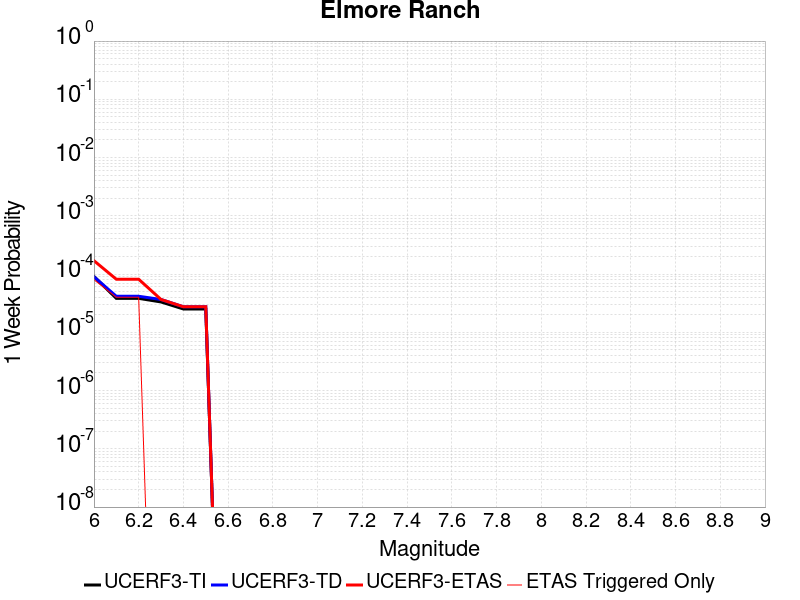 |  |  |

| Magnitude | 1 wk TI Prob | 1 wk TD Prob | 1 wk ETAS Prob | 1 wk ETAS/TD Gain | 1 wk ETAS Triggered Only | 1 mo TI Prob | 1 mo TD Prob | 1 mo ETAS Prob | 1 mo ETAS/TD Gain | 1 mo ETAS Triggered Only | 1 yr TI Prob | 1 yr TD Prob | 1 yr ETAS Prob | 1 yr ETAS/TD Gain | 1 yr ETAS Triggered Only |
|-----|-----|-----|-----|-----|-----|-----|-----|-----|-----|-----|-----|-----|-----|-----|-----|
| 6.0 | 9.102099E-5 | 8.966761E-5 | 1.6966043E-4 | 1.8921039 | 8.0E-5 | 3.9003167E-4 | 3.8422062E-4 | 4.6418988E-4 | 1.2081337 | 8.0E-5 | 0.0047383 | 0.0046685147 | 0.0047879545 | 1.0255841 | 1.2E-4 |
| 6.1 | 3.8306698E-5 | 4.1548446E-5 | 8.154679E-5 | 1.9626915 | 4.0E-5 | 1.6416123E-4 | 1.7805643E-4 | 2.180493E-4 | 1.2246078 | 4.0E-5 | 0.0019968306 | 0.0021661238 | 0.0022060373 | 1.0184262 | 4.0E-5 |
| 6.2 | 3.8306698E-5 | 4.1548446E-5 | 8.154679E-5 | 1.9626915 | 4.0E-5 | 1.6416123E-4 | 1.7805643E-4 | 2.180493E-4 | 1.2246078 | 4.0E-5 | 0.0019968306 | 0.0021661238 | 0.0022060373 | 1.0184262 | 4.0E-5 |
| 6.3 | 3.3197924E-5 | 3.6596153E-5 | 3.6596153E-5 | 1.0 | 0.0 | 1.4226905E-4 | 1.5683495E-4 | 1.5683495E-4 | 1.0 | 0.0 | 0.0017307495 | 0.001908332 | 0.001908332 | 1.0 | 0.0 |
| 6.4 | 2.5148964E-5 | 2.7451913E-5 | 2.7451913E-5 | 1.0 | 0.0 | 1.0777682E-4 | 1.1764941E-4 | 1.1764941E-4 | 1.0 | 0.0 | 0.0013113929 | 0.00143209 | 0.00143209 | 1.0 | 0.0 |
| 6.5 | 2.5148964E-5 | 2.7451913E-5 | 2.7451913E-5 | 1.0 | 0.0 | 1.0777682E-4 | 1.1764941E-4 | 1.1764941E-4 | 1.0 | 0.0 | 0.0013113929 | 0.00143209 | 0.00143209 | 1.0 | 0.0 |

## Ash Hill
*[(top)](#table-of-contents)*

| 1 Week | 1 Month | 1 Year |
|-----|-----|-----|
|  | 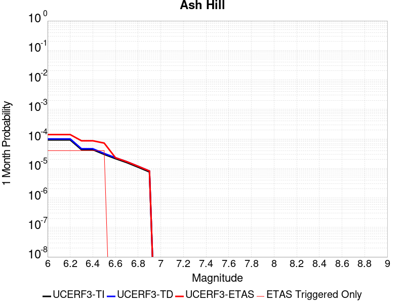 | 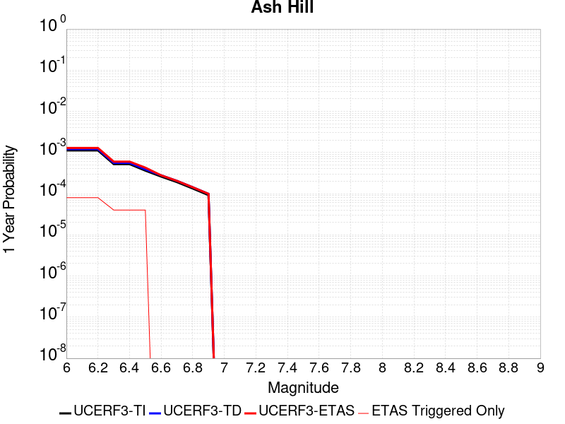 |

| Magnitude | 1 wk TI Prob | 1 wk TD Prob | 1 wk ETAS Prob | 1 wk ETAS/TD Gain | 1 wk ETAS Triggered Only | 1 mo TI Prob | 1 mo TD Prob | 1 mo ETAS Prob | 1 mo ETAS/TD Gain | 1 mo ETAS Triggered Only | 1 yr TI Prob | 1 yr TD Prob | 1 yr ETAS Prob | 1 yr ETAS/TD Gain | 1 yr ETAS Triggered Only |
|-----|-----|-----|-----|-----|-----|-----|-----|-----|-----|-----|-----|-----|-----|-----|-----|
| 6.0 | 2.1545662E-5 | 2.3200468E-5 | 6.319954E-5 | 2.7240632 | 4.0E-5 | 9.2335285E-5 | 9.9427234E-5 | 1.3942325E-4 | 1.4022642 | 4.0E-5 | 0.0011236023 | 0.0012099344 | 0.0012898376 | 1.0660393 | 8.0E-5 |
| 6.1 | 2.1545662E-5 | 2.3200468E-5 | 6.319954E-5 | 2.7240632 | 4.0E-5 | 9.2335285E-5 | 9.9427234E-5 | 1.3942325E-4 | 1.4022642 | 4.0E-5 | 0.0011236023 | 0.0012099344 | 0.0012898376 | 1.0660393 | 8.0E-5 |
| 6.2 | 2.1545662E-5 | 2.3200468E-5 | 6.319954E-5 | 2.7240632 | 4.0E-5 | 9.2335285E-5 | 9.9427234E-5 | 1.3942325E-4 | 1.4022642 | 4.0E-5 | 0.0011236023 | 0.0012099344 | 0.0012898376 | 1.0660393 | 8.0E-5 |
| 6.3 | 1.0025529E-5 | 1.0749556E-5 | 5.0749124E-5 | 4.721044 | 4.0E-5 | 4.2965847E-5 | 4.6068788E-5 | 8.6066946E-5 | 1.8682269 | 4.0E-5 | 5.229836E-4 | 5.6075637E-4 | 6.007339E-4 | 1.0712923 | 4.0E-5 |
| 6.4 | 1.0025529E-5 | 1.0749556E-5 | 5.0749124E-5 | 4.721044 | 4.0E-5 | 4.2965847E-5 | 4.6068788E-5 | 8.6066946E-5 | 1.8682269 | 4.0E-5 | 5.229836E-4 | 5.6075637E-4 | 6.007339E-4 | 1.0712923 | 4.0E-5 |
| 6.5 | 6.9617327E-6 | 7.458431E-6 | 4.7458132E-5 | 6.3630185 | 4.0E-5 | 2.9835655E-5 | 3.1964362E-5 | 7.1963084E-5 | 2.2513537 | 4.0E-5 | 3.6318856E-4 | 3.8910526E-4 | 4.290897E-4 | 1.10276 | 4.0E-5 |
| 6.6 | 4.9919777E-6 | 5.347976E-6 | 5.347976E-6 | 1.0 | 0.0 | 2.1394015E-5 | 2.2919734E-5 | 2.2919734E-5 | 1.0 | 0.0 | 2.60441E-4 | 2.7901874E-4 | 2.7901874E-4 | 1.0 | 0.0 |
| 6.7 | 3.6630722E-6 | 3.9255733E-6 | 3.9255733E-6 | 1.0 | 0.0 | 1.5698786E-5 | 1.6823811E-5 | 1.6823811E-5 | 1.0 | 0.0 | 1.9111596E-4 | 2.0481637E-4 | 2.0481637E-4 | 1.0 | 0.0 |
| 6.8 | 2.5599613E-6 | 2.7455974E-6 | 2.7455974E-6 | 1.0 | 0.0 | 1.0971216E-5 | 1.17668205E-5 | 1.17668205E-5 | 1.0 | 0.0 | 1.3356637E-4 | 1.4325658E-4 | 1.4325658E-4 | 1.0 | 0.0 |
| 6.9 | 1.7684905E-6 | 1.8973375E-6 | 1.8973375E-6 | 1.0 | 0.0 | 7.579223E-6 | 8.1314465E-6 | 8.1314465E-6 | 1.0 | 0.0 | 9.2273134E-5 | 9.900036E-5 | 9.900036E-5 | 1.0 | 0.0 |

## Hollywood
*[(top)](#table-of-contents)*

| 1 Week | 1 Month | 1 Year |
|-----|-----|-----|
|  |  | 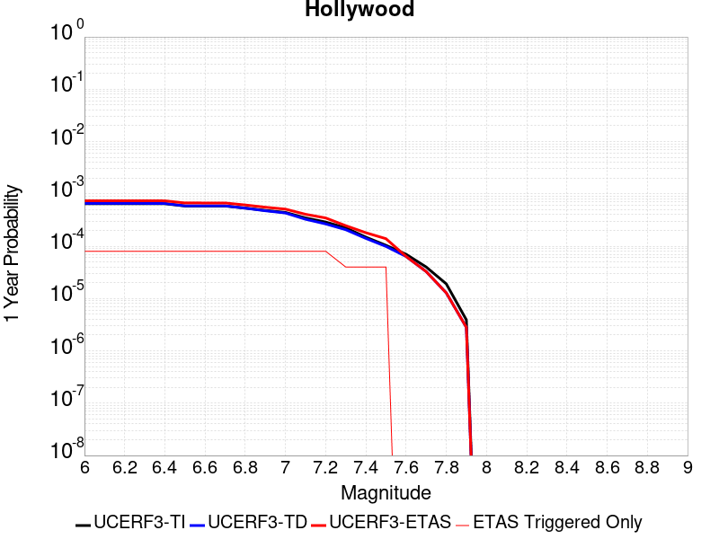 |

| Magnitude | 1 wk TI Prob | 1 wk TD Prob | 1 wk ETAS Prob | 1 wk ETAS/TD Gain | 1 wk ETAS Triggered Only | 1 mo TI Prob | 1 mo TD Prob | 1 mo ETAS Prob | 1 mo ETAS/TD Gain | 1 mo ETAS Triggered Only | 1 yr TI Prob | 1 yr TD Prob | 1 yr ETAS Prob | 1 yr ETAS/TD Gain | 1 yr ETAS Triggered Only |
|-----|-----|-----|-----|-----|-----|-----|-----|-----|-----|-----|-----|-----|-----|-----|-----|
| 6.0 | 1.24487615E-5 | 1.2597342E-5 | 1.2597342E-5 | 1.0 | 0.0 | 5.3350745E-5 | 5.398752E-5 | 9.3985356E-5 | 1.740872 | 4.0E-5 | 6.4935174E-4 | 6.571044E-4 | 7.370519E-4 | 1.1216662 | 8.0E-5 |
| 6.1 | 1.24487615E-5 | 1.2597342E-5 | 1.2597342E-5 | 1.0 | 0.0 | 5.3350745E-5 | 5.398752E-5 | 9.3985356E-5 | 1.740872 | 4.0E-5 | 6.4935174E-4 | 6.571044E-4 | 7.370519E-4 | 1.1216662 | 8.0E-5 |
| 6.2 | 1.24487615E-5 | 1.2597342E-5 | 1.2597342E-5 | 1.0 | 0.0 | 5.3350745E-5 | 5.398752E-5 | 9.3985356E-5 | 1.740872 | 4.0E-5 | 6.4935174E-4 | 6.571044E-4 | 7.370519E-4 | 1.1216662 | 8.0E-5 |
| 6.3 | 1.24487615E-5 | 1.2597342E-5 | 1.2597342E-5 | 1.0 | 0.0 | 5.3350745E-5 | 5.398752E-5 | 9.3985356E-5 | 1.740872 | 4.0E-5 | 6.4935174E-4 | 6.571044E-4 | 7.370519E-4 | 1.1216662 | 8.0E-5 |
| 6.4 | 1.2431024E-5 | 1.2577949E-5 | 1.2577949E-5 | 1.0 | 0.0 | 5.327473E-5 | 5.390441E-5 | 9.390225E-5 | 1.7420143 | 4.0E-5 | 6.4842677E-4 | 6.5609324E-4 | 7.360407E-4 | 1.121854 | 8.0E-5 |
| 6.5 | 1.1242222E-5 | 1.1321669E-5 | 1.1321669E-5 | 1.0 | 0.0 | 4.8180063E-5 | 4.8520553E-5 | 8.851861E-5 | 1.8243529 | 4.0E-5 | 5.864344E-4 | 5.905803E-4 | 6.7053305E-4 | 1.13538 | 8.0E-5 |
| 6.6 | 1.1234066E-5 | 1.1312781E-5 | 1.1312781E-5 | 1.0 | 0.0 | 4.8145106E-5 | 4.848246E-5 | 8.848052E-5 | 1.8250006 | 4.0E-5 | 5.86009E-4 | 5.901168E-4 | 6.7006954E-4 | 1.1354864 | 8.0E-5 |
| 6.7 | 1.12294E-5 | 1.1307522E-5 | 1.1307522E-5 | 1.0 | 0.0 | 4.812511E-5 | 4.8459922E-5 | 8.8457986E-5 | 1.8253844 | 4.0E-5 | 5.857657E-4 | 5.898425E-4 | 6.697953E-4 | 1.1355494 | 8.0E-5 |
| 6.8 | 1.0252819E-5 | 1.0221897E-5 | 1.0221897E-5 | 1.0 | 0.0 | 4.3939912E-5 | 4.3807406E-5 | 8.380565E-5 | 1.9130476 | 4.0E-5 | 5.3483713E-4 | 5.3322676E-4 | 6.131841E-4 | 1.14995 | 8.0E-5 |
| 6.9 | 9.252289E-6 | 9.113353E-6 | 9.113353E-6 | 1.0 | 0.0 | 3.9652066E-5 | 3.9056653E-5 | 7.905509E-5 | 2.0241134 | 4.0E-5 | 4.8265693E-4 | 4.7541264E-4 | 5.553746E-4 | 1.1681949 | 8.0E-5 |
| 7.0 | 8.474604E-6 | 8.261027E-6 | 8.261027E-6 | 1.0 | 0.0 | 3.6319227E-5 | 3.540393E-5 | 7.540251E-5 | 2.1297781 | 4.0E-5 | 4.4209688E-4 | 4.3095901E-4 | 5.1092455E-4 | 1.1855525 | 8.0E-5 |
| 7.1 | 6.643643E-6 | 6.2705008E-6 | 6.2705008E-6 | 1.0 | 0.0 | 2.8472443E-5 | 2.68733E-5 | 6.687223E-5 | 2.4884262 | 4.0E-5 | 3.4659685E-4 | 3.2713375E-4 | 4.0710758E-4 | 1.2444683 | 8.0E-5 |
| 7.2 | 5.549002E-6 | 5.110507E-6 | 5.110507E-6 | 1.0 | 0.0 | 2.378122E-5 | 2.190199E-5 | 6.190111E-5 | 2.826278 | 4.0E-5 | 2.8949787E-4 | 2.6662424E-4 | 3.466029E-4 | 1.2999678 | 8.0E-5 |
| 7.3 | 4.3059727E-6 | 3.961397E-6 | 3.961397E-6 | 1.0 | 0.0 | 1.8454039E-5 | 1.6977307E-5 | 1.6977307E-5 | 1.0 | 0.0 | 2.2465475E-4 | 2.066792E-4 | 2.466709E-4 | 1.1934967 | 4.0E-5 |
| 7.4 | 2.8550733E-6 | 2.7025183E-6 | 2.7025183E-6 | 1.0 | 0.0 | 1.2235971E-5 | 1.15821695E-5 | 1.15821695E-5 | 1.0 | 0.0 | 1.4896276E-4 | 1.4100384E-4 | 1.809982E-4 | 1.2836403 | 4.0E-5 |
| 7.5 | 1.9927045E-6 | 1.8985335E-6 | 1.8985335E-6 | 1.0 | 0.0 | 8.540134E-6 | 8.136547E-6 | 8.136547E-6 | 1.0 | 0.0 | 1.0397117E-4 | 9.905799E-5 | 1.3905403E-4 | 1.4037639 | 4.0E-5 |
| 7.6 | 1.345084E-6 | 1.2221985E-6 | 1.2221985E-6 | 1.0 | 0.0 | 5.764633E-6 | 5.2379833E-6 | 5.2379833E-6 | 1.0 | 0.0 | 7.018215E-5 | 6.37706E-5 | 6.37706E-5 | 1.0 | 0.0 |
| 7.7 | 7.6835164E-7 | 6.2821863E-7 | 6.2821863E-7 | 1.0 | 0.0 | 3.2929315E-6 | 2.6923628E-6 | 2.6923628E-6 | 1.0 | 0.0 | 4.00907E-5 | 3.277904E-5 | 3.277904E-5 | 1.0 | 0.0 |
| 7.8 | 3.6562128E-7 | 2.4571727E-7 | 2.4571727E-7 | 1.0 | 0.0 | 1.5669474E-6 | 1.0530736E-6 | 1.0530736E-6 | 1.0 | 0.0 | 1.9077417E-5 | 1.28210995E-5 | 1.28210995E-5 | 1.0 | 0.0 |
| 7.9 | 7.5024424E-8 | 5.389549E-8 | 5.389549E-8 | 1.0 | 0.0 | 3.215332E-7 | 2.3098066E-7 | 2.3098066E-7 | 1.0 | 0.0 | 3.91466E-6 | 2.8121872E-6 | 2.8121872E-6 | 1.0 | 0.0 |

## San Andreas (Offshore) 2011 CFM
*[(top)](#table-of-contents)*

| 1 Week | 1 Month | 1 Year |
|-----|-----|-----|
|  | 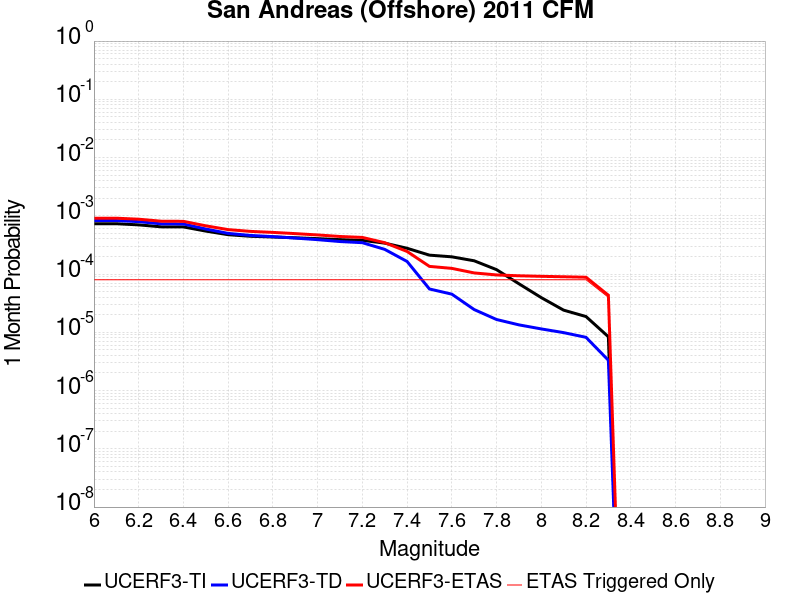 |  |

| Magnitude | 1 wk TI Prob | 1 wk TD Prob | 1 wk ETAS Prob | 1 wk ETAS/TD Gain | 1 wk ETAS Triggered Only | 1 mo TI Prob | 1 mo TD Prob | 1 mo ETAS Prob | 1 mo ETAS/TD Gain | 1 mo ETAS Triggered Only | 1 yr TI Prob | 1 yr TD Prob | 1 yr ETAS Prob | 1 yr ETAS/TD Gain | 1 yr ETAS Triggered Only |
|-----|-----|-----|-----|-----|-----|-----|-----|-----|-----|-----|-----|-----|-----|-----|-----|
| 6.0 | 1.7072787E-4 | 1.9367039E-4 | 2.736549E-4 | 1.412993 | 8.0E-5 | 7.3148566E-4 | 8.2975434E-4 | 9.09688E-4 | 1.0963341 | 8.0E-5 | 0.008869528 | 0.010055986 | 0.010135182 | 1.0078754 | 8.0E-5 |
| 6.1 | 1.7072787E-4 | 1.9367039E-4 | 2.736549E-4 | 1.412993 | 8.0E-5 | 7.3148566E-4 | 8.2975434E-4 | 9.09688E-4 | 1.0963341 | 8.0E-5 | 0.008869528 | 0.010055986 | 0.010135182 | 1.0078754 | 8.0E-5 |
| 6.2 | 1.6312556E-4 | 1.8542982E-4 | 2.6541497E-4 | 1.4313501 | 8.0E-5 | 6.989222E-4 | 7.9445954E-4 | 8.74396E-4 | 1.1006174 | 8.0E-5 | 0.008476226 | 0.009630152 | 0.0097093815 | 1.0082272 | 8.0E-5 |
| 6.3 | 1.5103363E-4 | 1.7007098E-4 | 2.5005738E-4 | 1.4703119 | 8.0E-5 | 6.471264E-4 | 7.2867423E-4 | 8.0861594E-4 | 1.1097084 | 8.0E-5 | 0.007850339 | 0.008835971 | 0.008915265 | 1.008974 | 8.0E-5 |
| 6.4 | 1.5047993E-4 | 1.6892845E-4 | 2.4891493E-4 | 1.4734933 | 8.0E-5 | 6.4475456E-4 | 7.2378037E-4 | 8.037225E-4 | 1.1104507 | 8.0E-5 | 0.007821669 | 0.008776869 | 0.008856167 | 1.0090349 | 8.0E-5 |
| 6.5 | 1.2760791E-4 | 1.3845072E-4 | 2.1843964E-4 | 1.5777429 | 8.0E-5 | 5.467764E-4 | 5.932267E-4 | 6.731793E-4 | 1.1347756 | 8.0E-5 | 0.0066367025 | 0.007198895 | 0.007278319 | 1.0110328 | 8.0E-5 |
| 6.6 | 1.1063525E-4 | 1.1654581E-4 | 1.9653648E-4 | 1.6863453 | 8.0E-5 | 4.740649E-4 | 4.993875E-4 | 5.7934754E-4 | 1.1601162 | 8.0E-5 | 0.0057564764 | 0.006063298 | 0.006142813 | 1.0131141 | 8.0E-5 |
| 6.7 | 1.0391049E-4 | 1.0739331E-4 | 1.8738472E-4 | 1.7448454 | 8.0E-5 | 4.4525467E-4 | 4.6017687E-4 | 5.4014E-4 | 1.1737663 | 8.0E-5 | 0.0054075094 | 0.0055884514 | 0.0056680045 | 1.0142353 | 8.0E-5 |
| 6.8 | 1.0096706E-4 | 1.02495374E-4 | 1.8248717E-4 | 1.7804431 | 8.0E-5 | 4.3264418E-4 | 4.391929E-4 | 5.191578E-4 | 1.1820723 | 8.0E-5 | 0.0052547283 | 0.0053342436 | 0.005413817 | 1.0149175 | 8.0E-5 |
| 6.9 | 9.800265E-5 | 9.678384E-5 | 1.767761E-4 | 1.8265042 | 8.0E-5 | 4.1994374E-4 | 4.147229E-4 | 4.946897E-4 | 1.19282 | 8.0E-5 | 0.0051008356 | 0.0050377324 | 0.0051173293 | 1.0158001 | 8.0E-5 |
| 7.0 | 9.4642375E-5 | 9.0896305E-5 | 1.7088903E-4 | 1.8800437 | 8.0E-5 | 4.0554712E-4 | 3.8949834E-4 | 4.6946717E-4 | 1.2053124 | 8.0E-5 | 0.004926363 | 0.004731996 | 0.0048116175 | 1.0168262 | 8.0E-5 |
| 7.1 | 9.0996844E-5 | 8.4394014E-5 | 1.6438727E-4 | 1.9478545 | 8.0E-5 | 3.8992817E-4 | 3.6163937E-4 | 4.4161043E-4 | 1.2211349 | 8.0E-5 | 0.004737046 | 0.00439423 | 0.004473878 | 1.0181257 | 8.0E-5 |
| 7.2 | 8.848287E-5 | 8.0648424E-5 | 1.6064197E-4 | 1.9918798 | 8.0E-5 | 3.791572E-4 | 3.455912E-4 | 4.2556354E-4 | 1.2314074 | 8.0E-5 | 0.004606472 | 0.004199612 | 0.004279276 | 1.0189694 | 8.0E-5 |
| 7.3 | 7.9280784E-5 | 6.195925E-5 | 1.4195428E-4 | 2.2910912 | 8.0E-5 | 3.3973053E-4 | 2.6551317E-4 | 3.4549195E-4 | 1.3012233 | 8.0E-5 | 0.004128377 | 0.0032279356 | 0.0033076773 | 1.0247036 | 8.0E-5 |
| 7.4 | 6.468038E-5 | 3.8398444E-5 | 1.1839537E-4 | 3.0833378 | 8.0E-5 | 2.771722E-4 | 1.645547E-4 | 2.4454153E-4 | 1.4860805 | 8.0E-5 | 0.0033693502 | 0.0020016716 | 0.0020815113 | 1.0398866 | 8.0E-5 |
| 7.5 | 4.930574E-5 | 1.29417485E-5 | 9.294071E-5 | 7.1814647 | 8.0E-5 | 2.1129321E-4 | 5.5463468E-5 | 1.3545903E-4 | 2.4423108 | 8.0E-5 | 0.0025694598 | 6.7506015E-4 | 7.550061E-4 | 1.118428 | 8.0E-5 |
| 7.6 | 4.612566E-5 | 1.0550586E-5 | 9.054974E-5 | 8.582437 | 8.0E-5 | 1.9766642E-4 | 4.5216024E-5 | 1.252124E-4 | 2.7692044 | 8.0E-5 | 0.0024039324 | 5.503674E-4 | 6.3032337E-4 | 1.1452774 | 8.0E-5 |
| 7.7 | 3.9435414E-5 | 5.7372667E-6 | 8.573681E-5 | 14.943842 | 8.0E-5 | 1.6899795E-4 | 2.4588055E-5 | 1.0458609E-4 | 4.2535324 | 8.0E-5 | 0.0020556084 | 2.9931864E-4 | 3.792947E-4 | 1.2671937 | 8.0E-5 |
| 7.8 | 2.7787428E-5 | 3.8718204E-6 | 8.387151E-5 | 21.662037 | 8.0E-5 | 1.1908354E-4 | 1.6593409E-5 | 9.6592084E-5 | 5.821111 | 8.0E-5 | 0.0014488777 | 2.0200608E-4 | 2.8198992E-4 | 1.3959477 | 8.0E-5 |
| 7.9 | 1.590671E-5 | 3.1320565E-6 | 8.31318E-5 | 26.542244 | 8.0E-5 | 6.816983E-5 | 1.34230295E-5 | 9.342196E-5 | 6.9598265 | 8.0E-5 | 8.2965166E-4 | 1.6341316E-4 | 2.4340009E-4 | 1.4894767 | 8.0E-5 |
| 8.0 | 9.193638E-6 | 2.6684493E-6 | 8.266824E-5 | 30.97988 | 8.0E-5 | 3.940071E-5 | 1.1436161E-5 | 9.143525E-5 | 7.9952745 | 8.0E-5 | 4.7959806E-4 | 1.392264E-4 | 2.1921526E-4 | 1.5745237 | 8.0E-5 |
| 8.1 | 5.601576E-6 | 2.3041878E-6 | 8.2304E-5 | 35.719315 | 8.0E-5 | 2.4006533E-5 | 9.8750525E-6 | 8.9874266E-5 | 9.101143 | 8.0E-5 | 2.9224035E-4 | 1.2022216E-4 | 2.0021254E-4 | 1.6653547 | 8.0E-5 |
| 8.2 | 4.3508785E-6 | 1.9136637E-6 | 8.191351E-5 | 42.80455 | 8.0E-5 | 1.864649E-5 | 8.20139E-6 | 8.820074E-5 | 10.754364 | 8.0E-5 | 2.2699735E-4 | 9.984738E-5 | 1.798394E-4 | 1.8011429 | 8.0E-5 |
| 8.3 | 1.9573292E-6 | 7.729172E-7 | 4.0772888E-5 | 52.751945 | 4.0E-5 | 8.388526E-6 | 3.3124982E-6 | 4.3312364E-5 | 13.0754385 | 4.0E-5 | 1.0212552E-4 | 4.0328938E-5 | 8.032732E-5 | 1.9918036 | 4.0E-5 |

## San Gregorio (South) 2011 CFM
*[(top)](#table-of-contents)*

| 1 Week | 1 Month | 1 Year |
|-----|-----|-----|
|  | 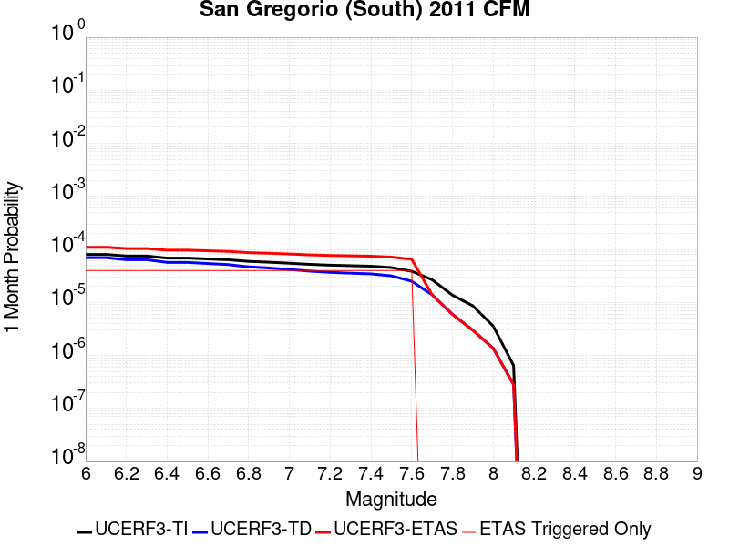 | 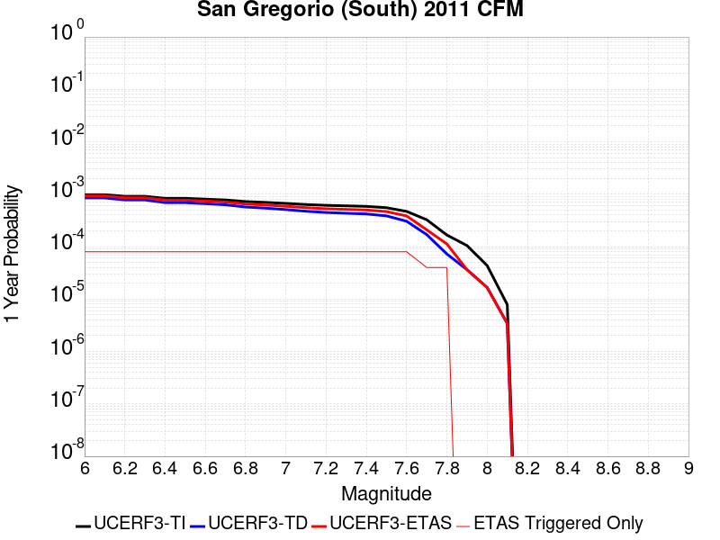 |

| Magnitude | 1 wk TI Prob | 1 wk TD Prob | 1 wk ETAS Prob | 1 wk ETAS/TD Gain | 1 wk ETAS Triggered Only | 1 mo TI Prob | 1 mo TD Prob | 1 mo ETAS Prob | 1 mo ETAS/TD Gain | 1 mo ETAS Triggered Only | 1 yr TI Prob | 1 yr TD Prob | 1 yr ETAS Prob | 1 yr ETAS/TD Gain | 1 yr ETAS Triggered Only |
|-----|-----|-----|-----|-----|-----|-----|-----|-----|-----|-----|-----|-----|-----|-----|-----|
| 6.0 | 1.8770423E-5 | 1.6297447E-5 | 5.6296794E-5 | 3.454332 | 4.0E-5 | 8.044219E-5 | 6.9844355E-5 | 1.0984156E-4 | 1.572662 | 4.0E-5 | 9.789435E-4 | 8.50027E-4 | 9.2995906E-4 | 1.0940347 | 8.0E-5 |
| 6.1 | 1.8770423E-5 | 1.6297447E-5 | 5.6296794E-5 | 3.454332 | 4.0E-5 | 8.044219E-5 | 6.9844355E-5 | 1.0984156E-4 | 1.572662 | 4.0E-5 | 9.789435E-4 | 8.50027E-4 | 9.2995906E-4 | 1.0940347 | 8.0E-5 |
| 6.2 | 1.7508692E-5 | 1.4916512E-5 | 5.4915916E-5 | 3.681552 | 4.0E-5 | 7.5035096E-5 | 6.392636E-5 | 1.03923805E-4 | 1.62568 | 4.0E-5 | 9.1316935E-4 | 7.780285E-4 | 8.5796625E-4 | 1.102744 | 8.0E-5 |
| 6.3 | 1.7508692E-5 | 1.4916512E-5 | 5.4915916E-5 | 3.681552 | 4.0E-5 | 7.5035096E-5 | 6.392636E-5 | 1.03923805E-4 | 1.62568 | 4.0E-5 | 9.1316935E-4 | 7.780285E-4 | 8.5796625E-4 | 1.102744 | 8.0E-5 |
| 6.4 | 1.6004591E-5 | 1.3265806E-5 | 5.3265274E-5 | 4.015231 | 4.0E-5 | 6.85893E-5 | 5.685222E-5 | 9.6849944E-5 | 1.7035385 | 4.0E-5 | 8.347548E-4 | 6.91957E-4 | 7.719016E-4 | 1.1155341 | 8.0E-5 |
| 6.5 | 1.6004591E-5 | 1.3265806E-5 | 5.3265274E-5 | 4.015231 | 4.0E-5 | 6.85893E-5 | 5.685222E-5 | 9.6849944E-5 | 1.7035385 | 4.0E-5 | 8.347548E-4 | 6.91957E-4 | 7.719016E-4 | 1.1155341 | 8.0E-5 |
| 6.6 | 1.5442201E-5 | 1.265024E-5 | 5.2649735E-5 | 4.1619554 | 4.0E-5 | 6.617918E-5 | 5.4214193E-5 | 9.4212024E-5 | 1.7377741 | 4.0E-5 | 8.0543366E-4 | 6.5985875E-4 | 7.39806E-4 | 1.1211581 | 8.0E-5 |
| 6.7 | 1.489921E-5 | 1.205857E-5 | 5.2058087E-5 | 4.317103 | 4.0E-5 | 6.3852196E-5 | 5.1678566E-5 | 9.16765E-5 | 1.7739753 | 4.0E-5 | 7.7712315E-4 | 6.290056E-4 | 7.089553E-4 | 1.1271049 | 8.0E-5 |
| 6.8 | 1.3876024E-5 | 1.0937155E-5 | 5.0936716E-5 | 4.6572185 | 4.0E-5 | 5.9467322E-5 | 4.687268E-5 | 8.687081E-5 | 1.8533356 | 4.0E-5 | 7.237741E-4 | 5.705258E-4 | 6.5048016E-4 | 1.1401415 | 8.0E-5 |
| 6.9 | 1.33922495E-5 | 1.040849E-5 | 5.0408074E-5 | 4.8429766 | 4.0E-5 | 5.7394092E-5 | 4.460705E-5 | 8.4605264E-5 | 1.8966792 | 4.0E-5 | 6.9854903E-4 | 5.429558E-4 | 6.2291237E-4 | 1.1472616 | 8.0E-5 |
| 7.0 | 1.2807324E-5 | 9.768245E-6 | 4.9767856E-5 | 5.0948615 | 4.0E-5 | 5.4887376E-5 | 4.1863237E-5 | 8.186156E-5 | 1.9554523 | 4.0E-5 | 6.680489E-4 | 5.0956587E-4 | 5.8952515E-4 | 1.1569164 | 8.0E-5 |
| 7.1 | 1.2191438E-5 | 9.076841E-6 | 4.9076476E-5 | 5.40678 | 4.0E-5 | 5.224797E-5 | 3.8900165E-5 | 7.889861E-5 | 2.0282333 | 4.0E-5 | 6.3593336E-4 | 4.7350666E-4 | 5.5346877E-4 | 1.1688722 | 8.0E-5 |
| 7.2 | 1.1769438E-5 | 8.596807E-6 | 4.8596463E-5 | 5.65285 | 4.0E-5 | 5.0439474E-5 | 3.684294E-5 | 7.684147E-5 | 2.0856497 | 4.0E-5 | 6.1392755E-4 | 4.4847053E-4 | 5.2843464E-4 | 1.1783041 | 8.0E-5 |
| 7.3 | 1.150374E-5 | 8.312155E-6 | 4.8311824E-5 | 5.8121896 | 4.0E-5 | 4.9300812E-5 | 3.5623038E-5 | 7.562161E-5 | 2.122829 | 4.0E-5 | 6.0007203E-4 | 4.3362423E-4 | 5.1358953E-4 | 1.1844115 | 8.0E-5 |
| 7.4 | 1.12514E-5 | 8.0577975E-6 | 4.8057474E-5 | 5.9640956 | 4.0E-5 | 4.8219394E-5 | 3.453296E-5 | 7.453158E-5 | 2.1582737 | 4.0E-5 | 5.8691297E-4 | 4.2035774E-4 | 5.003241E-4 | 1.1902341 | 8.0E-5 |
| 7.5 | 1.059696E-5 | 7.407659E-6 | 4.7407364E-5 | 6.399777 | 4.0E-5 | 4.5414752E-5 | 3.1746724E-5 | 7.174545E-5 | 2.2599325 | 4.0E-5 | 5.5278436E-4 | 3.8644785E-4 | 4.6641694E-4 | 1.2069337 | 8.0E-5 |
| 7.6 | 9.018592E-6 | 5.8502587E-6 | 4.5850025E-5 | 7.8372645 | 4.0E-5 | 3.8650534E-5 | 2.5072297E-5 | 6.507129E-5 | 2.5953465 | 4.0E-5 | 4.7046866E-4 | 3.0521248E-4 | 3.8518806E-4 | 1.2620325 | 8.0E-5 |
| 7.7 | 6.243489E-6 | 3.2503717E-6 | 3.2503717E-6 | 1.0 | 0.0 | 2.6757538E-5 | 1.393009E-5 | 1.393009E-5 | 1.0 | 0.0 | 3.257243E-4 | 1.6958566E-4 | 2.0957888E-4 | 1.235829 | 4.0E-5 |
| 7.8 | 3.1941963E-6 | 1.3877669E-6 | 1.3877669E-6 | 1.0 | 0.0 | 1.368934E-5 | 5.9475587E-6 | 5.9475587E-6 | 1.0 | 0.0 | 1.6665498E-4 | 7.240912E-5 | 1.12406226E-4 | 1.5523765 | 4.0E-5 |
| 7.9 | 2.0098398E-6 | 6.966522E-7 | 6.966522E-7 | 1.0 | 0.0 | 8.6135715E-6 | 2.9856487E-6 | 2.9856487E-6 | 1.0 | 0.0 | 1.0486518E-4 | 3.634967E-5 | 3.634967E-5 | 1.0 | 0.0 |
| 8.0 | 8.353119E-7 | 3.1857724E-7 | 3.1857724E-7 | 1.0 | 0.0 | 3.579903E-6 | 1.3653303E-6 | 1.3653303E-6 | 1.0 | 0.0 | 4.358445E-5 | 1.662277E-5 | 1.662277E-5 | 1.0 | 0.0 |
| 8.1 | 1.5033264E-7 | 6.569932E-8 | 6.569932E-8 | 1.0 | 0.0 | 6.442826E-7 | 2.8156848E-7 | 2.8156848E-7 | 1.0 | 0.0 | 7.844113E-6 | 3.428091E-6 | 3.428091E-6 | 1.0 | 0.0 |

## Ortigalita (South)
*[(top)](#table-of-contents)*

| 1 Week | 1 Month | 1 Year |
|-----|-----|-----|
|  |  |  |

| Magnitude | 1 wk TI Prob | 1 wk TD Prob | 1 wk ETAS Prob | 1 wk ETAS/TD Gain | 1 wk ETAS Triggered Only | 1 mo TI Prob | 1 mo TD Prob | 1 mo ETAS Prob | 1 mo ETAS/TD Gain | 1 mo ETAS Triggered Only | 1 yr TI Prob | 1 yr TD Prob | 1 yr ETAS Prob | 1 yr ETAS/TD Gain | 1 yr ETAS Triggered Only |
|-----|-----|-----|-----|-----|-----|-----|-----|-----|-----|-----|-----|-----|-----|-----|-----|
| 6.0 | 3.72394E-5 | 4.327939E-5 | 4.327939E-5 | 1.0 | 0.0 | 1.5958765E-4 | 1.8547081E-4 | 1.8547081E-4 | 1.0 | 0.0 | 0.0019412481 | 0.002255925 | 0.0022958347 | 1.0176911 | 4.0E-5 |
| 6.1 | 2.7299884E-5 | 3.1508487E-5 | 3.1508487E-5 | 1.0 | 0.0 | 1.16994255E-4 | 1.350297E-4 | 1.350297E-4 | 1.0 | 0.0 | 0.0014234743 | 0.0016428027 | 0.001682737 | 1.0243087 | 4.0E-5 |
| 6.2 | 2.7299884E-5 | 3.1508487E-5 | 3.1508487E-5 | 1.0 | 0.0 | 1.16994255E-4 | 1.350297E-4 | 1.350297E-4 | 1.0 | 0.0 | 0.0014234743 | 0.0016428027 | 0.001682737 | 1.0243087 | 4.0E-5 |
| 6.3 | 2.0546433E-5 | 2.364352E-5 | 2.364352E-5 | 1.0 | 0.0 | 8.805317E-5 | 1.01325546E-4 | 1.01325546E-4 | 1.0 | 0.0 | 0.00107152 | 0.0012329593 | 0.00127291 | 1.0324023 | 4.0E-5 |
| 6.4 | 2.0546433E-5 | 2.364352E-5 | 2.364352E-5 | 1.0 | 0.0 | 8.805317E-5 | 1.01325546E-4 | 1.01325546E-4 | 1.0 | 0.0 | 0.00107152 | 0.0012329593 | 0.00127291 | 1.0324023 | 4.0E-5 |
| 6.5 | 1.7779594E-5 | 2.0457412E-5 | 2.0457412E-5 | 1.0 | 0.0 | 7.619603E-5 | 8.7671746E-5 | 8.7671746E-5 | 1.0 | 0.0 | 9.272918E-4 | 0.0010668945 | 0.0011068517 | 1.037452 | 4.0E-5 |
| 6.6 | 1.6272212E-5 | 1.8724526E-5 | 1.8724526E-5 | 1.0 | 0.0 | 6.973618E-5 | 8.024557E-5 | 8.024557E-5 | 1.0 | 0.0 | 8.487073E-4 | 9.765641E-4 | 0.0010165251 | 1.0409199 | 4.0E-5 |
| 6.7 | 1.3051484E-5 | 1.5046552E-5 | 1.5046552E-5 | 1.0 | 0.0 | 5.593373E-5 | 6.4483684E-5 | 6.4483684E-5 | 1.0 | 0.0 | 6.807804E-4 | 7.848155E-4 | 8.2478416E-4 | 1.0509274 | 4.0E-5 |
| 6.8 | 1.04277415E-5 | 1.1993327E-5 | 1.1993327E-5 | 1.0 | 0.0 | 4.4689557E-5 | 5.1399E-5 | 5.1399E-5 | 1.0 | 0.0 | 5.439595E-4 | 6.256106E-4 | 6.6558557E-4 | 1.0638975 | 4.0E-5 |
| 6.9 | 7.639968E-6 | 8.796003E-6 | 8.796003E-6 | 1.0 | 0.0 | 3.274231E-5 | 3.7696645E-5 | 3.7696645E-5 | 1.0 | 0.0 | 3.9856473E-4 | 4.5886592E-4 | 4.9884757E-4 | 1.0871314 | 4.0E-5 |
| 7.0 | 3.919831E-6 | 4.5358106E-6 | 4.5358106E-6 | 1.0 | 0.0 | 1.679917E-5 | 1.9439054E-5 | 1.9439054E-5 | 1.0 | 0.0 | 2.045107E-4 | 2.366469E-4 | 2.366469E-4 | 1.0 | 0.0 |
| 7.1 | 1.6017933E-6 | 1.8580465E-6 | 1.8580465E-6 | 1.0 | 0.0 | 6.8648105E-6 | 7.963038E-6 | 7.963038E-6 | 1.0 | 0.0 | 8.357586E-5 | 9.6946744E-5 | 9.6946744E-5 | 1.0 | 0.0 |

## Superstition Hills
*[(top)](#table-of-contents)*

| 1 Week | 1 Month | 1 Year |
|-----|-----|-----|
|  |  |  |

| Magnitude | 1 wk TI Prob | 1 wk TD Prob | 1 wk ETAS Prob | 1 wk ETAS/TD Gain | 1 wk ETAS Triggered Only | 1 mo TI Prob | 1 mo TD Prob | 1 mo ETAS Prob | 1 mo ETAS/TD Gain | 1 mo ETAS Triggered Only | 1 yr TI Prob | 1 yr TD Prob | 1 yr ETAS Prob | 1 yr ETAS/TD Gain | 1 yr ETAS Triggered Only |
|-----|-----|-----|-----|-----|-----|-----|-----|-----|-----|-----|-----|-----|-----|-----|-----|
| 6.0 | 6.6865185E-5 | 1.4218968E-5 | 5.42184E-5 | 3.8131037 | 4.0E-5 | 2.8653358E-4 | 6.09371E-5 | 1.0093467E-4 | 1.6563746 | 4.0E-5 | 0.0034829667 | 7.4167293E-4 | 8.2161365E-4 | 1.1077843 | 8.0E-5 |
| 6.1 | 6.544851E-5 | 1.4218967E-5 | 5.42184E-5 | 3.8131037 | 4.0E-5 | 2.8046346E-4 | 6.09371E-5 | 1.0093467E-4 | 1.6563746 | 4.0E-5 | 0.0034092965 | 7.4167293E-4 | 8.2161365E-4 | 1.1077843 | 8.0E-5 |
| 6.2 | 6.544851E-5 | 1.4218967E-5 | 5.42184E-5 | 3.8131037 | 4.0E-5 | 2.8046346E-4 | 6.09371E-5 | 1.0093467E-4 | 1.6563746 | 4.0E-5 | 0.0034092965 | 7.4167293E-4 | 8.2161365E-4 | 1.1077843 | 8.0E-5 |
| 6.3 | 5.2402065E-5 | 1.42189665E-5 | 5.42184E-5 | 3.813104 | 4.0E-5 | 2.2456095E-4 | 6.0937098E-5 | 1.0093466E-4 | 1.6563746 | 4.0E-5 | 0.0027306017 | 7.416729E-4 | 8.2161353E-4 | 1.1077843 | 8.0E-5 |
| 6.4 | 4.542238E-5 | 1.4218966E-5 | 5.42184E-5 | 3.8131042 | 4.0E-5 | 1.9465282E-4 | 6.0937095E-5 | 1.0093466E-4 | 1.6563746 | 4.0E-5 | 0.0023673223 | 7.416729E-4 | 8.2161353E-4 | 1.1077843 | 8.0E-5 |
| 6.5 | 2.9672969E-5 | 1.4218965E-5 | 5.4218395E-5 | 3.8131044 | 4.0E-5 | 1.2716366E-4 | 6.0937087E-5 | 1.0093465E-4 | 1.6563747 | 4.0E-5 | 0.0015471181 | 7.4167276E-4 | 8.216135E-4 | 1.1077843 | 8.0E-5 |
| 6.6 | 2.6056105E-5 | 1.3884164E-5 | 5.388361E-5 | 3.88094 | 4.0E-5 | 1.1166424E-4 | 5.9502294E-5 | 9.949991E-5 | 1.672203 | 4.0E-5 | 0.0013586642 | 7.242158E-4 | 8.0415787E-4 | 1.1103843 | 8.0E-5 |
| 6.7 | 1.4611248E-5 | 1.3463621E-5 | 5.346308E-5 | 3.970929 | 4.0E-5 | 6.261813E-5 | 5.770005E-5 | 9.769774E-5 | 1.6932003 | 4.0E-5 | 7.6210906E-4 | 7.022877E-4 | 7.822315E-4 | 1.1138334 | 8.0E-5 |
| 6.8 | 1.30607E-5 | 1.1055474E-5 | 5.105503E-5 | 4.6180773 | 4.0E-5 | 5.597323E-5 | 4.7379788E-5 | 8.737789E-5 | 1.8442018 | 4.0E-5 | 6.8126095E-4 | 5.7670503E-4 | 6.566589E-4 | 1.1386391 | 8.0E-5 |
| 6.9 | 1.0443096E-5 | 8.264937E-6 | 4.8264606E-5 | 5.8396826 | 4.0E-5 | 4.4755358E-5 | 3.542069E-5 | 7.541927E-5 | 2.1292436 | 4.0E-5 | 5.447602E-4 | 4.311639E-4 | 5.1112944E-4 | 1.1854643 | 8.0E-5 |
| 7.0 | 8.045912E-6 | 6.8031186E-6 | 4.6802845E-5 | 6.8796163 | 4.0E-5 | 3.4482026E-5 | 2.9155903E-5 | 6.915474E-5 | 2.3718948 | 4.0E-5 | 4.197378E-4 | 3.5491635E-4 | 4.3488794E-4 | 1.2253252 | 8.0E-5 |
| 7.1 | 8.045912E-6 | 6.8031186E-6 | 4.6802845E-5 | 6.8796163 | 4.0E-5 | 3.4482026E-5 | 2.9155903E-5 | 6.915474E-5 | 2.3718948 | 4.0E-5 | 4.197378E-4 | 3.5491635E-4 | 4.3488794E-4 | 1.2253252 | 8.0E-5 |
| 7.2 | 7.375506E-6 | 6.3088987E-6 | 4.6308647E-5 | 7.340211 | 4.0E-5 | 3.1608928E-5 | 2.703786E-5 | 6.703678E-5 | 2.479367 | 4.0E-5 | 3.8477074E-4 | 3.291371E-4 | 4.0911077E-4 | 1.2429798 | 8.0E-5 |
| 7.3 | 6.6063913E-6 | 5.8603323E-6 | 4.58601E-5 | 7.8255115 | 4.0E-5 | 2.8312797E-5 | 2.5115472E-5 | 6.5114466E-5 | 2.5926037 | 4.0E-5 | 3.446538E-4 | 3.0573868E-4 | 3.8571423E-4 | 1.2615813 | 8.0E-5 |
| 7.4 | 6.4313126E-6 | 5.741554E-6 | 4.5741326E-5 | 7.966715 | 4.0E-5 | 2.7562477E-5 | 2.4606434E-5 | 6.460545E-5 | 2.6255512 | 4.0E-5 | 3.355215E-4 | 2.9954285E-4 | 3.795189E-4 | 1.2669936 | 8.0E-5 |
| 7.5 | 6.0742927E-6 | 5.536644E-6 | 4.553642E-5 | 8.224553 | 4.0E-5 | 2.6032423E-5 | 2.3728262E-5 | 6.372731E-5 | 2.6857135 | 4.0E-5 | 3.1689866E-4 | 2.8885397E-4 | 3.6883086E-4 | 1.2768766 | 8.0E-5 |
| 7.6 | 5.6987187E-6 | 5.354077E-6 | 4.5353863E-5 | 8.470902 | 4.0E-5 | 2.4422852E-5 | 2.2945846E-5 | 6.294493E-5 | 2.7431948 | 4.0E-5 | 2.9730765E-4 | 2.7933053E-4 | 3.593082E-4 | 1.286319 | 8.0E-5 |
| 7.7 | 5.1658035E-6 | 4.9836003E-6 | 4.49834E-5 | 9.026285 | 4.0E-5 | 2.2138971E-5 | 2.1358117E-5 | 6.135726E-5 | 2.8727844 | 4.0E-5 | 2.6950863E-4 | 2.6000466E-4 | 3.3998385E-4 | 1.3076068 | 8.0E-5 |
| 7.8 | 3.6864697E-6 | 4.2522647E-6 | 4.4252094E-5 | 10.406713 | 4.0E-5 | 1.579906E-5 | 1.8223867E-5 | 5.8223137E-5 | 3.1948838 | 4.0E-5 | 1.9233658E-4 | 2.2185346E-4 | 3.018357E-4 | 1.3605183 | 8.0E-5 |
| 7.9 | 3.0265903E-6 | 3.6154697E-6 | 3.6154697E-6 | 1.0 | 0.0 | 1.2971037E-5 | 1.5494781E-5 | 1.5494781E-5 | 1.0 | 0.0 | 1.5791094E-4 | 1.8863307E-4 | 1.8863307E-4 | 1.0 | 0.0 |
| 8.0 | 2.5271493E-6 | 3.1343482E-6 | 3.1343482E-6 | 1.0 | 0.0 | 1.0830595E-5 | 1.3432854E-5 | 1.3432854E-5 | 1.0 | 0.0 | 1.3185451E-4 | 1.6353316E-4 | 1.6353316E-4 | 1.0 | 0.0 |
| 8.1 | 2.3749135E-6 | 2.9629962E-6 | 2.9629962E-6 | 1.0 | 0.0 | 1.0178161E-5 | 1.2698496E-5 | 1.2698496E-5 | 1.0 | 0.0 | 1.2391206E-4 | 1.5459364E-4 | 1.5459364E-4 | 1.0 | 0.0 |
| 8.2 | 1.7186406E-9 | 1.1663186E-9 | 1.1663186E-9 | 1.0 | 0.0 | 7.3656024E-9 | 4.9985083E-9 | 4.9985083E-9 | 1.0 | 0.0 | 8.9676206E-8 | 6.085684E-8 | 6.085684E-8 | 1.0 | 0.0 |

## Redondo Canyon alt 1
*[(top)](#table-of-contents)*

| 1 Week | 1 Month | 1 Year |
|-----|-----|-----|
| 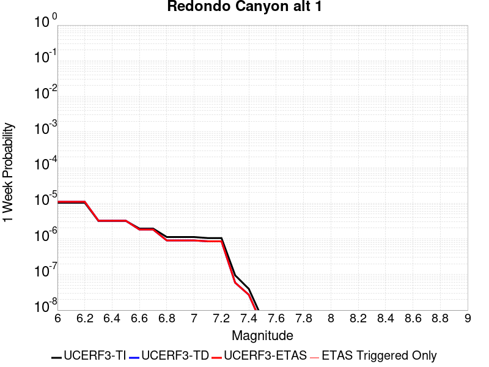 | 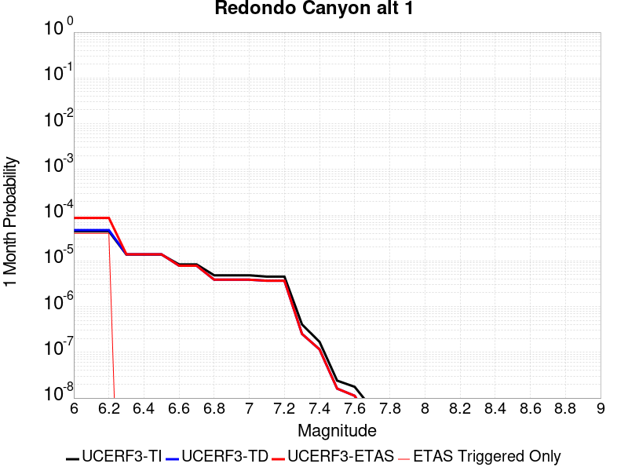 |  |

| Magnitude | 1 wk TI Prob | 1 wk TD Prob | 1 wk ETAS Prob | 1 wk ETAS/TD Gain | 1 wk ETAS Triggered Only | 1 mo TI Prob | 1 mo TD Prob | 1 mo ETAS Prob | 1 mo ETAS/TD Gain | 1 mo ETAS Triggered Only | 1 yr TI Prob | 1 yr TD Prob | 1 yr ETAS Prob | 1 yr ETAS/TD Gain | 1 yr ETAS Triggered Only |
|-----|-----|-----|-----|-----|-----|-----|-----|-----|-----|-----|-----|-----|-----|-----|-----|
| 6.0 | 1.0346246E-5 | 1.098507E-5 | 1.098507E-5 | 1.0 | 0.0 | 4.43403E-5 | 4.7078465E-5 | 8.707658E-5 | 1.8496053 | 4.0E-5 | 5.3970946E-4 | 5.731085E-4 | 6.5306266E-4 | 1.1395097 | 8.0E-5 |
| 6.1 | 1.0346246E-5 | 1.098507E-5 | 1.098507E-5 | 1.0 | 0.0 | 4.43403E-5 | 4.7078465E-5 | 8.707658E-5 | 1.8496053 | 4.0E-5 | 5.3970946E-4 | 5.731085E-4 | 6.5306266E-4 | 1.1395097 | 8.0E-5 |
| 6.2 | 1.0346246E-5 | 1.098507E-5 | 1.098507E-5 | 1.0 | 0.0 | 4.43403E-5 | 4.7078465E-5 | 8.707658E-5 | 1.8496053 | 4.0E-5 | 5.3970946E-4 | 5.731085E-4 | 6.5306266E-4 | 1.1395097 | 8.0E-5 |
| 6.3 | 3.2052794E-6 | 3.2376208E-6 | 3.2376208E-6 | 1.0 | 0.0 | 1.373684E-5 | 1.3875466E-5 | 1.3875466E-5 | 1.0 | 0.0 | 1.6723319E-4 | 1.6892469E-4 | 1.6892469E-4 | 1.0 | 0.0 |
| 6.4 | 3.2052794E-6 | 3.2376208E-6 | 3.2376208E-6 | 1.0 | 0.0 | 1.373684E-5 | 1.3875466E-5 | 1.3875466E-5 | 1.0 | 0.0 | 1.6723319E-4 | 1.6892469E-4 | 1.6892469E-4 | 1.0 | 0.0 |
| 6.5 | 3.2052794E-6 | 3.2376208E-6 | 3.2376208E-6 | 1.0 | 0.0 | 1.373684E-5 | 1.3875466E-5 | 1.3875466E-5 | 1.0 | 0.0 | 1.6723319E-4 | 1.6892469E-4 | 1.6892469E-4 | 1.0 | 0.0 |
| 6.6 | 1.948328E-6 | 1.8298009E-6 | 1.8298009E-6 | 1.0 | 0.0 | 8.349951E-6 | 7.841989E-6 | 7.841989E-6 | 1.0 | 0.0 | 1.016559E-4 | 9.547353E-5 | 9.547353E-5 | 1.0 | 0.0 |
| 6.7 | 1.948328E-6 | 1.8298009E-6 | 1.8298009E-6 | 1.0 | 0.0 | 8.349951E-6 | 7.841989E-6 | 7.841989E-6 | 1.0 | 0.0 | 1.016559E-4 | 9.547353E-5 | 9.547353E-5 | 1.0 | 0.0 |
| 6.8 | 1.1278219E-6 | 9.038387E-7 | 9.038387E-7 | 1.0 | 0.0 | 4.8335132E-6 | 3.873591E-6 | 3.873591E-6 | 1.0 | 0.0 | 5.8846435E-5 | 4.716038E-5 | 4.716038E-5 | 1.0 | 0.0 |
| 6.9 | 1.1278219E-6 | 9.038387E-7 | 9.038387E-7 | 1.0 | 0.0 | 4.8335132E-6 | 3.873591E-6 | 3.873591E-6 | 1.0 | 0.0 | 5.8846435E-5 | 4.716038E-5 | 4.716038E-5 | 1.0 | 0.0 |
| 7.0 | 1.1278219E-6 | 9.038387E-7 | 9.038387E-7 | 1.0 | 0.0 | 4.8335132E-6 | 3.873591E-6 | 3.873591E-6 | 1.0 | 0.0 | 5.8846435E-5 | 4.716038E-5 | 4.716038E-5 | 1.0 | 0.0 |
| 7.1 | 1.0545139E-6 | 8.5741493E-7 | 8.5741493E-7 | 1.0 | 0.0 | 4.5193374E-6 | 3.6746326E-6 | 3.6746326E-6 | 1.0 | 0.0 | 5.5021545E-5 | 4.4738157E-5 | 4.4738157E-5 | 1.0 | 0.0 |
| 7.2 | 1.0545139E-6 | 8.5741493E-7 | 8.5741493E-7 | 1.0 | 0.0 | 4.5193374E-6 | 3.6746326E-6 | 3.6746326E-6 | 1.0 | 0.0 | 5.5021545E-5 | 4.4738157E-5 | 4.4738157E-5 | 1.0 | 0.0 |
| 7.3 | 9.505161E-8 | 5.901462E-8 | 5.901462E-8 | 1.0 | 0.0 | 4.0736398E-7 | 2.529198E-7 | 2.529198E-7 | 1.0 | 0.0 | 4.959645E-6 | 3.0792953E-6 | 3.0792953E-6 | 1.0 | 0.0 |
| 7.4 | 3.9520785E-8 | 2.7031614E-8 | 2.7031614E-8 | 1.0 | 0.0 | 1.6937479E-7 | 1.1584977E-7 | 1.1584977E-7 | 1.0 | 0.0 | 2.062136E-6 | 1.4104704E-6 | 1.4104704E-6 | 1.0 | 0.0 |
| 7.5 | 5.6133214E-9 | 3.7584895E-9 | 3.7584895E-9 | 1.0 | 0.0 | 2.4057092E-8 | 1.6107812E-8 | 1.6107812E-8 | 1.0 | 0.0 | 2.9289507E-7 | 1.961126E-7 | 1.961126E-7 | 1.0 | 0.0 |
| 7.6 | 4.1064334E-9 | 2.6123854E-9 | 2.6123854E-9 | 1.0 | 0.0 | 1.7599E-8 | 1.1195938E-8 | 1.1195938E-8 | 1.0 | 0.0 | 2.142678E-7 | 1.3631053E-7 | 1.3631053E-7 | 1.0 | 0.0 |
| 7.7 | 1.361975E-9 | 6.3678585E-10 | 6.3678585E-10 | 1.0 | 0.0 | 5.8370353E-9 | 2.7290823E-9 | 2.7290823E-9 | 1.0 | 0.0 | 7.1065905E-8 | 3.3226573E-8 | 3.3226573E-8 | 1.0 | 0.0 |
| 7.8 | 1.361975E-9 | 6.3678585E-10 | 6.3678585E-10 | 1.0 | 0.0 | 5.8370353E-9 | 2.7290823E-9 | 2.7290823E-9 | 1.0 | 0.0 | 7.1065905E-8 | 3.3226573E-8 | 3.3226573E-8 | 1.0 | 0.0 |

## Simi-Santa Rosa
*[(top)](#table-of-contents)*

| 1 Week | 1 Month | 1 Year |
|-----|-----|-----|
|  | 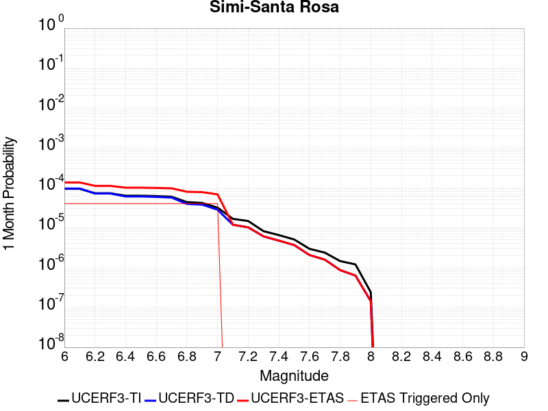 |  |

| Magnitude | 1 wk TI Prob | 1 wk TD Prob | 1 wk ETAS Prob | 1 wk ETAS/TD Gain | 1 wk ETAS Triggered Only | 1 mo TI Prob | 1 mo TD Prob | 1 mo ETAS Prob | 1 mo ETAS/TD Gain | 1 mo ETAS Triggered Only | 1 yr TI Prob | 1 yr TD Prob | 1 yr ETAS Prob | 1 yr ETAS/TD Gain | 1 yr ETAS Triggered Only |
|-----|-----|-----|-----|-----|-----|-----|-----|-----|-----|-----|-----|-----|-----|-----|-----|
| 6.0 | 2.198912E-5 | 2.2285461E-5 | 6.228457E-5 | 2.794852 | 4.0E-5 | 9.4235686E-5 | 9.550587E-5 | 1.3550205E-4 | 1.4187824 | 4.0E-5 | 0.0011467156 | 0.0011622076 | 0.0012421147 | 1.0687546 | 8.0E-5 |
| 6.1 | 2.198912E-5 | 2.2285461E-5 | 6.228457E-5 | 2.794852 | 4.0E-5 | 9.4235686E-5 | 9.550587E-5 | 1.3550205E-4 | 1.4187824 | 4.0E-5 | 0.0011467156 | 0.0011622076 | 0.0012421147 | 1.0687546 | 8.0E-5 |
| 6.2 | 1.69983E-5 | 1.6676233E-5 | 5.6675566E-5 | 3.3985834 | 4.0E-5 | 7.284782E-5 | 7.146777E-5 | 1.1146491E-4 | 1.5596528 | 4.0E-5 | 8.865613E-4 | 8.6980197E-4 | 9.497324E-4 | 1.091895 | 8.0E-5 |
| 6.3 | 1.69983E-5 | 1.6676233E-5 | 5.6675566E-5 | 3.3985834 | 4.0E-5 | 7.284782E-5 | 7.146777E-5 | 1.1146491E-4 | 1.5596528 | 4.0E-5 | 8.865613E-4 | 8.6980197E-4 | 9.497324E-4 | 1.091895 | 8.0E-5 |
| 6.4 | 1.4666188E-5 | 1.40591355E-5 | 5.4058575E-5 | 3.8450851 | 4.0E-5 | 6.285358E-5 | 6.0252187E-5 | 1.0024978E-4 | 1.6638364 | 4.0E-5 | 7.6497364E-4 | 7.333484E-4 | 8.132897E-4 | 1.1090087 | 8.0E-5 |
| 6.5 | 1.4666188E-5 | 1.40591355E-5 | 5.4058575E-5 | 3.8450851 | 4.0E-5 | 6.285358E-5 | 6.0252187E-5 | 1.0024978E-4 | 1.6638364 | 4.0E-5 | 7.6497364E-4 | 7.333484E-4 | 8.132897E-4 | 1.1090087 | 8.0E-5 |
| 6.6 | 1.4377586E-5 | 1.3736045E-5 | 5.3735497E-5 | 3.9120064 | 4.0E-5 | 6.1616774E-5 | 5.8867576E-5 | 9.8865225E-5 | 1.6794512 | 4.0E-5 | 7.4992597E-4 | 7.1650196E-4 | 7.9644466E-4 | 1.1115736 | 8.0E-5 |
| 6.7 | 1.3881404E-5 | 1.3213798E-5 | 5.321327E-5 | 4.0270987 | 4.0E-5 | 5.9490372E-5 | 5.6629477E-5 | 9.662721E-5 | 1.706306 | 4.0E-5 | 7.240546E-4 | 6.892705E-4 | 7.6921534E-4 | 1.1159848 | 8.0E-5 |
| 6.8 | 1.0176516E-5 | 9.158662E-6 | 4.9158294E-5 | 5.36741 | 4.0E-5 | 4.3612912E-5 | 3.925091E-5 | 7.924934E-5 | 2.0190446 | 4.0E-5 | 5.308578E-4 | 4.7779162E-4 | 5.5775343E-4 | 1.167357 | 8.0E-5 |
| 6.9 | 9.699797E-6 | 8.779024E-6 | 4.877867E-5 | 5.5562754 | 4.0E-5 | 4.15699E-5 | 3.7623937E-5 | 7.762243E-5 | 2.063113 | 4.0E-5 | 5.05996E-4 | 4.579916E-4 | 5.3795497E-4 | 1.1745957 | 8.0E-5 |
| 7.0 | 7.4049476E-6 | 6.5625313E-6 | 4.656227E-5 | 7.095169 | 4.0E-5 | 3.1735104E-5 | 2.8124903E-5 | 6.812378E-5 | 2.422187 | 4.0E-5 | 3.8630638E-4 | 3.4237956E-4 | 4.2235214E-4 | 1.2335788 | 8.0E-5 |
| 7.1 | 3.873439E-6 | 2.7608828E-6 | 2.7608828E-6 | 1.0 | 0.0 | 1.6600346E-5 | 1.1832302E-5 | 1.1832302E-5 | 1.0 | 0.0 | 2.0209046E-4 | 1.44049E-4 | 1.44049E-4 | 1.0 | 0.0 |
| 7.2 | 3.417706E-6 | 2.368875E-6 | 2.368875E-6 | 1.0 | 0.0 | 1.4647229E-5 | 1.0152283E-5 | 1.0152283E-5 | 1.0 | 0.0 | 1.7831543E-4 | 1.2359726E-4 | 1.2359726E-4 | 1.0 | 0.0 |
| 7.3 | 1.90225E-6 | 1.4082424E-6 | 1.4082424E-6 | 1.0 | 0.0 | 8.152474E-6 | 6.035311E-6 | 6.035311E-6 | 1.0 | 0.0 | 9.9251854E-5 | 7.347745E-5 | 7.347745E-5 | 1.0 | 0.0 |
| 7.4 | 1.5170556E-6 | 1.1032644E-6 | 1.1032644E-6 | 1.0 | 0.0 | 6.5016507E-6 | 4.7282674E-6 | 4.7282674E-6 | 1.0 | 0.0 | 7.915472E-5 | 5.7565147E-5 | 5.7565147E-5 | 1.0 | 0.0 |
| 7.5 | 1.178732E-6 | 8.5424404E-7 | 8.5424404E-7 | 1.0 | 0.0 | 5.0516987E-6 | 3.6610409E-6 | 3.6610409E-6 | 1.0 | 0.0 | 6.1502695E-5 | 4.457227E-5 | 4.457227E-5 | 1.0 | 0.0 |
| 7.6 | 6.8722386E-7 | 4.799764E-7 | 4.799764E-7 | 1.0 | 0.0 | 2.9452417E-6 | 2.05704E-6 | 2.05704E-6 | 1.0 | 0.0 | 3.5857727E-5 | 2.5044175E-5 | 2.5044175E-5 | 1.0 | 0.0 |
| 7.7 | 5.5126515E-7 | 3.679374E-7 | 3.679374E-7 | 1.0 | 0.0 | 2.3625628E-6 | 1.5768735E-6 | 1.5768735E-6 | 1.0 | 0.0 | 2.8763823E-5 | 1.9198267E-5 | 1.9198267E-5 | 1.0 | 0.0 |
| 7.8 | 3.3860243E-7 | 2.0116858E-7 | 2.0116858E-7 | 1.0 | 0.0 | 1.4511525E-6 | 8.621508E-7 | 8.621508E-7 | 1.0 | 0.0 | 1.7667637E-5 | 1.0496636E-5 | 1.0496636E-5 | 1.0 | 0.0 |
| 7.9 | 2.7955386E-7 | 1.4685692E-7 | 1.4685692E-7 | 1.0 | 0.0 | 1.1980875E-6 | 6.293866E-7 | 6.293866E-7 | 1.0 | 0.0 | 1.4586617E-5 | 7.662756E-6 | 7.662756E-6 | 1.0 | 0.0 |
| 8.0 | 5.6259015E-8 | 3.3399083E-8 | 3.3399083E-8 | 1.0 | 0.0 | 2.4111003E-7 | 1.431389E-7 | 1.431389E-7 | 1.0 | 0.0 | 2.9355108E-6 | 1.742715E-6 | 1.742715E-6 | 1.0 | 0.0 |

## San Gabriel (Extension)
*[(top)](#table-of-contents)*

| 1 Week | 1 Month | 1 Year |
|-----|-----|-----|
| 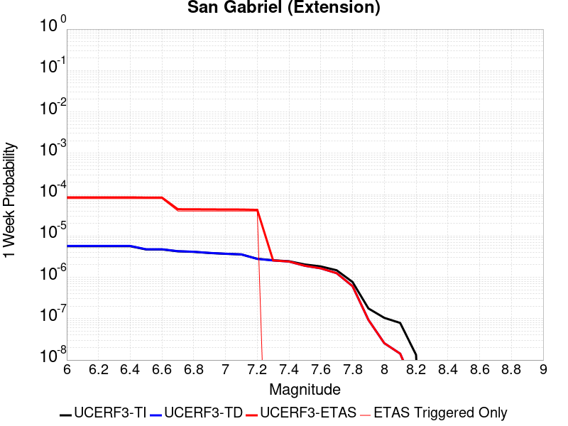 | 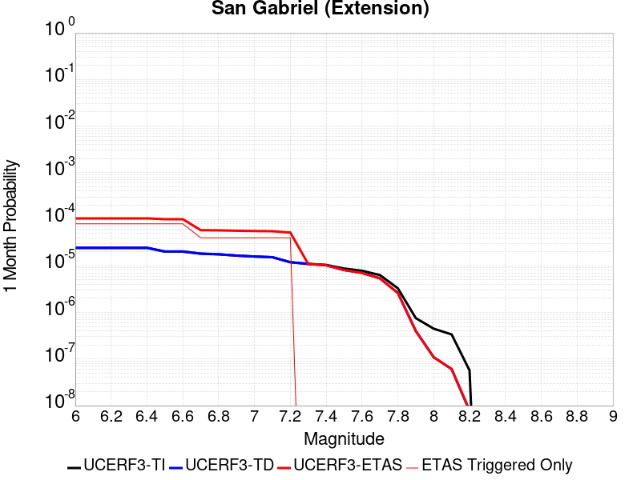 | 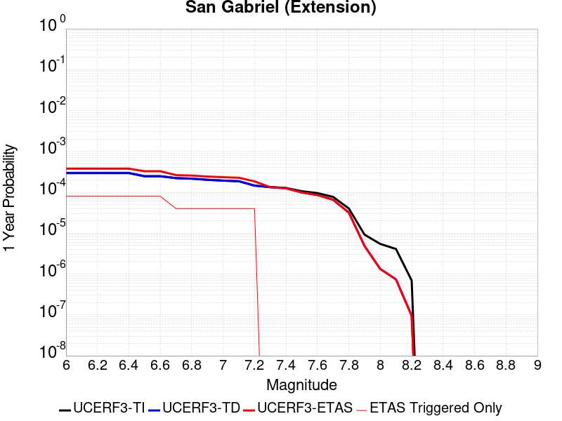 |

| Magnitude | 1 wk TI Prob | 1 wk TD Prob | 1 wk ETAS Prob | 1 wk ETAS/TD Gain | 1 wk ETAS Triggered Only | 1 mo TI Prob | 1 mo TD Prob | 1 mo ETAS Prob | 1 mo ETAS/TD Gain | 1 mo ETAS Triggered Only | 1 yr TI Prob | 1 yr TD Prob | 1 yr ETAS Prob | 1 yr ETAS/TD Gain | 1 yr ETAS Triggered Only |
|-----|-----|-----|-----|-----|-----|-----|-----|-----|-----|-----|-----|-----|-----|-----|-----|
| 6.0 | 5.6486106E-6 | 5.725012E-6 | 8.5724554E-5 | 14.97369 | 8.0E-5 | 2.4208108E-5 | 2.4535542E-5 | 1.0453358E-4 | 4.260496 | 8.0E-5 | 2.9469383E-4 | 2.9868056E-4 | 3.7865667E-4 | 1.2677647 | 8.0E-5 |
| 6.1 | 5.6486106E-6 | 5.725012E-6 | 8.5724554E-5 | 14.97369 | 8.0E-5 | 2.4208108E-5 | 2.4535542E-5 | 1.0453358E-4 | 4.260496 | 8.0E-5 | 2.9469383E-4 | 2.9868056E-4 | 3.7865667E-4 | 1.2677647 | 8.0E-5 |
| 6.2 | 5.6486106E-6 | 5.725012E-6 | 8.5724554E-5 | 14.97369 | 8.0E-5 | 2.4208108E-5 | 2.4535542E-5 | 1.0453358E-4 | 4.260496 | 8.0E-5 | 2.9469383E-4 | 2.9868056E-4 | 3.7865667E-4 | 1.2677647 | 8.0E-5 |
| 6.3 | 5.6486106E-6 | 5.725012E-6 | 8.5724554E-5 | 14.97369 | 8.0E-5 | 2.4208108E-5 | 2.4535542E-5 | 1.0453358E-4 | 4.260496 | 8.0E-5 | 2.9469383E-4 | 2.9868056E-4 | 3.7865667E-4 | 1.2677647 | 8.0E-5 |
| 6.4 | 5.6486106E-6 | 5.725012E-6 | 8.5724554E-5 | 14.97369 | 8.0E-5 | 2.4208108E-5 | 2.4535542E-5 | 1.0453358E-4 | 4.260496 | 8.0E-5 | 2.9469383E-4 | 2.9868056E-4 | 3.7865667E-4 | 1.2677647 | 8.0E-5 |
| 6.5 | 4.7134554E-6 | 4.7623403E-6 | 8.476196E-5 | 17.798384 | 8.0E-5 | 2.0200367E-5 | 2.0409876E-5 | 1.00408244E-4 | 4.919591 | 8.0E-5 | 2.459117E-4 | 2.4846275E-4 | 3.2844287E-4 | 1.3218999 | 8.0E-5 |
| 6.6 | 4.7134554E-6 | 4.7623403E-6 | 8.476196E-5 | 17.798384 | 8.0E-5 | 2.0200367E-5 | 2.0409876E-5 | 1.00408244E-4 | 4.919591 | 8.0E-5 | 2.459117E-4 | 2.4846275E-4 | 3.2844287E-4 | 1.3218999 | 8.0E-5 |
| 6.7 | 4.2468837E-6 | 4.2821102E-6 | 4.428194E-5 | 10.341148 | 4.0E-5 | 1.8200803E-5 | 1.8351777E-5 | 5.835104E-5 | 3.1795855 | 4.0E-5 | 2.2157225E-4 | 2.234107E-4 | 2.6340177E-4 | 1.1790024 | 4.0E-5 |
| 6.8 | 4.1180615E-6 | 4.149487E-6 | 4.414932E-5 | 10.639707 | 4.0E-5 | 1.7648716E-5 | 1.7783397E-5 | 5.7782687E-5 | 3.249249 | 4.0E-5 | 2.1485193E-4 | 2.1649207E-4 | 2.564834E-4 | 1.1847243 | 4.0E-5 |
| 6.9 | 3.863861E-6 | 3.887776E-6 | 4.388762E-5 | 11.288619 | 4.0E-5 | 1.65593E-5 | 1.6661794E-5 | 5.6661127E-5 | 3.400662 | 4.0E-5 | 2.0159081E-4 | 2.0283915E-4 | 2.4283103E-4 | 1.1971606 | 4.0E-5 |
| 7.0 | 3.6947372E-6 | 3.7136579E-6 | 4.371351E-5 | 11.771011 | 4.0E-5 | 1.5834492E-5 | 1.5915582E-5 | 5.5914945E-5 | 3.51322 | 4.0E-5 | 1.9276788E-4 | 1.9375567E-4 | 2.3374791E-4 | 1.2064055 | 4.0E-5 |
| 7.1 | 3.5686835E-6 | 3.5808512E-6 | 4.358071E-5 | 12.170488 | 4.0E-5 | 1.5294268E-5 | 1.5346419E-5 | 5.5345805E-5 | 3.6064315 | 4.0E-5 | 1.861918E-4 | 1.868273E-4 | 2.2681981E-4 | 1.2140615 | 4.0E-5 |
| 7.2 | 2.8023446E-6 | 2.7846274E-6 | 4.2784515E-5 | 15.364539 | 4.0E-5 | 1.2009994E-5 | 1.1934064E-5 | 5.1933584E-5 | 4.3517103 | 4.0E-5 | 1.4621185E-4 | 1.4528765E-4 | 1.8528184E-4 | 1.275276 | 4.0E-5 |
| 7.3 | 2.5843012E-6 | 2.5537256E-6 | 2.5537256E-6 | 1.0 | 0.0 | 1.1075529E-5 | 1.0944493E-5 | 1.0944493E-5 | 1.0 | 0.0 | 1.3483623E-4 | 1.3324115E-4 | 1.3324115E-4 | 1.0 | 0.0 |
| 7.4 | 2.4464468E-6 | 2.404315E-6 | 2.404315E-6 | 1.0 | 0.0 | 1.04847295E-5 | 1.0304167E-5 | 1.0304167E-5 | 1.0 | 0.0 | 1.276441E-4 | 1.2544611E-4 | 1.2544611E-4 | 1.0 | 0.0 |
| 7.5 | 2.0420266E-6 | 1.8978003E-6 | 1.8978003E-6 | 1.0 | 0.0 | 8.751514E-6 | 8.133405E-6 | 8.133405E-6 | 1.0 | 0.0 | 1.0654447E-4 | 9.901974E-5 | 9.901974E-5 | 1.0 | 0.0 |
| 7.6 | 1.8326596E-6 | 1.6461403E-6 | 1.6461403E-6 | 1.0 | 0.0 | 7.854232E-6 | 7.054868E-6 | 7.054868E-6 | 1.0 | 0.0 | 9.562107E-5 | 8.588966E-5 | 8.588966E-5 | 1.0 | 0.0 |
| 7.7 | 1.4786998E-6 | 1.2581661E-6 | 1.2581661E-6 | 1.0 | 0.0 | 6.3372695E-6 | 5.3921294E-6 | 5.3921294E-6 | 1.0 | 0.0 | 7.715353E-5 | 6.564721E-5 | 6.564721E-5 | 1.0 | 0.0 |
| 7.8 | 7.6975533E-7 | 6.117986E-7 | 6.117986E-7 | 1.0 | 0.0 | 3.2989474E-6 | 2.6219914E-6 | 2.6219914E-6 | 1.0 | 0.0 | 4.0163945E-5 | 3.192228E-5 | 3.192228E-5 | 1.0 | 0.0 |
| 7.9 | 1.7645915E-7 | 9.348288E-8 | 9.348288E-8 | 1.0 | 0.0 | 7.562533E-7 | 4.0064086E-7 | 4.0064086E-7 | 1.0 | 0.0 | 9.207345E-6 | 4.8777915E-6 | 4.8777915E-6 | 1.0 | 0.0 |
| 8.0 | 1.0463461E-7 | 2.5519673E-8 | 2.5519673E-8 | 1.0 | 0.0 | 4.4843398E-7 | 1.0937003E-7 | 1.0937003E-7 | 1.0 | 0.0 | 5.45967E-6 | 1.3315793E-6 | 1.3315793E-6 | 1.0 | 0.0 |
| 8.1 | 7.875717E-8 | 1.4238637E-8 | 1.4238637E-8 | 1.0 | 0.0 | 3.3753068E-7 | 6.102273E-8 | 6.102273E-8 | 1.0 | 0.0 | 4.109428E-6 | 7.4295144E-7 | 7.4295144E-7 | 1.0 | 0.0 |
| 8.2 | 1.33163E-8 | 1.8272979E-9 | 1.8272979E-9 | 1.0 | 0.0 | 5.7069855E-8 | 7.831277E-9 | 7.831277E-9 | 1.0 | 0.0 | 6.9482525E-7 | 9.534579E-8 | 9.534579E-8 | 1.0 | 0.0 |

## Ortigalita (North)
*[(top)](#table-of-contents)*

| 1 Week | 1 Month | 1 Year |
|-----|-----|-----|
| 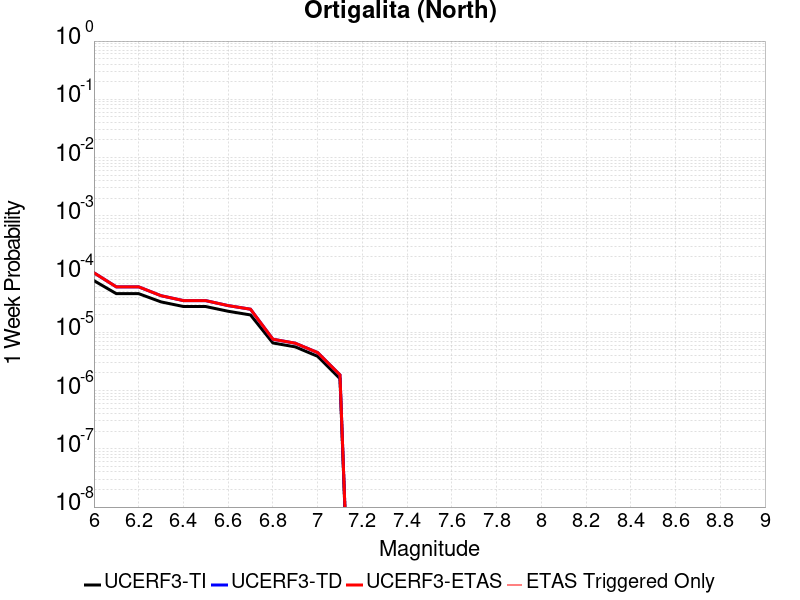 |  |  |

| Magnitude | 1 wk TI Prob | 1 wk TD Prob | 1 wk ETAS Prob | 1 wk ETAS/TD Gain | 1 wk ETAS Triggered Only | 1 mo TI Prob | 1 mo TD Prob | 1 mo ETAS Prob | 1 mo ETAS/TD Gain | 1 mo ETAS Triggered Only | 1 yr TI Prob | 1 yr TD Prob | 1 yr ETAS Prob | 1 yr ETAS/TD Gain | 1 yr ETAS Triggered Only |
|-----|-----|-----|-----|-----|-----|-----|-----|-----|-----|-----|-----|-----|-----|-----|-----|
| 6.0 | 7.711876E-5 | 1.0517288E-4 | 1.0517288E-4 | 1.0 | 0.0 | 3.3046713E-4 | 4.5066644E-4 | 4.5066644E-4 | 1.0 | 0.0 | 0.004016016 | 0.0054742103 | 0.005513991 | 1.007267 | 4.0E-5 |
| 6.1 | 4.607858E-5 | 6.030095E-5 | 6.030095E-5 | 1.0 | 0.0 | 1.9746469E-4 | 2.5840945E-4 | 2.5840945E-4 | 1.0 | 0.0 | 0.0024014818 | 0.0031419133 | 0.0031817877 | 1.0126911 | 4.0E-5 |
| 6.2 | 4.607858E-5 | 6.030095E-5 | 6.030095E-5 | 1.0 | 0.0 | 1.9746469E-4 | 2.5840945E-4 | 2.5840945E-4 | 1.0 | 0.0 | 0.0024014818 | 0.0031419133 | 0.0031817877 | 1.0126911 | 4.0E-5 |
| 6.3 | 3.327423E-5 | 4.251604E-5 | 4.251604E-5 | 1.0 | 0.0 | 1.4259605E-4 | 1.8220021E-4 | 1.8220021E-4 | 1.0 | 0.0 | 0.0017347244 | 0.0022162818 | 0.0022561932 | 1.0180082 | 4.0E-5 |
| 6.4 | 2.7732503E-5 | 3.5030593E-5 | 3.5030593E-5 | 1.0 | 0.0 | 1.1884817E-4 | 1.5012384E-4 | 1.5012384E-4 | 1.0 | 0.0 | 0.001446016 | 0.0018264599 | 0.0018663869 | 1.0218602 | 4.0E-5 |
| 6.5 | 2.7689714E-5 | 3.4980378E-5 | 3.4980378E-5 | 1.0 | 0.0 | 1.186648E-4 | 1.4990866E-4 | 1.4990866E-4 | 1.0 | 0.0 | 0.0014437864 | 0.0018238444 | 0.0018637715 | 1.0218917 | 4.0E-5 |
| 6.6 | 2.2976905E-5 | 2.8743312E-5 | 2.8743312E-5 | 1.0 | 0.0 | 9.846873E-5 | 1.2318123E-4 | 1.2318123E-4 | 1.0 | 0.0 | 0.0011981975 | 0.0014989388 | 0.0015388789 | 1.0266455 | 4.0E-5 |
| 6.7 | 1.9871539E-5 | 2.4926665E-5 | 2.4926665E-5 | 1.0 | 0.0 | 8.516096E-5 | 1.06825595E-4 | 1.06825595E-4 | 1.0 | 0.0 | 0.0010363415 | 0.001300069 | 0.0013400171 | 1.0307276 | 4.0E-5 |
| 6.8 | 6.5640475E-6 | 7.6095916E-6 | 7.6095916E-6 | 1.0 | 0.0 | 2.813133E-5 | 3.2612144E-5 | 3.2612144E-5 | 1.0 | 0.0 | 3.424451E-4 | 3.9698338E-4 | 4.369675E-4 | 1.1007199 | 4.0E-5 |
| 6.9 | 5.6219683E-6 | 6.5052927E-6 | 6.5052927E-6 | 1.0 | 0.0 | 2.4093928E-5 | 2.7879541E-5 | 2.7879541E-5 | 1.0 | 0.0 | 2.933041E-4 | 3.3938314E-4 | 3.7936957E-4 | 1.1178209 | 4.0E-5 |
| 7.0 | 3.875591E-6 | 4.4871476E-6 | 4.4871476E-6 | 1.0 | 0.0 | 1.6609569E-5 | 1.9230503E-5 | 1.9230503E-5 | 1.0 | 0.0 | 2.0220275E-4 | 2.3410833E-4 | 2.3410833E-4 | 1.0 | 0.0 |
| 7.1 | 1.6017933E-6 | 1.8580465E-6 | 1.8580465E-6 | 1.0 | 0.0 | 6.8648105E-6 | 7.963038E-6 | 7.963038E-6 | 1.0 | 0.0 | 8.357586E-5 | 9.6946744E-5 | 9.6946744E-5 | 1.0 | 0.0 |

## Newport-Inglewood (Offshore)
*[(top)](#table-of-contents)*

| 1 Week | 1 Month | 1 Year |
|-----|-----|-----|
|  | 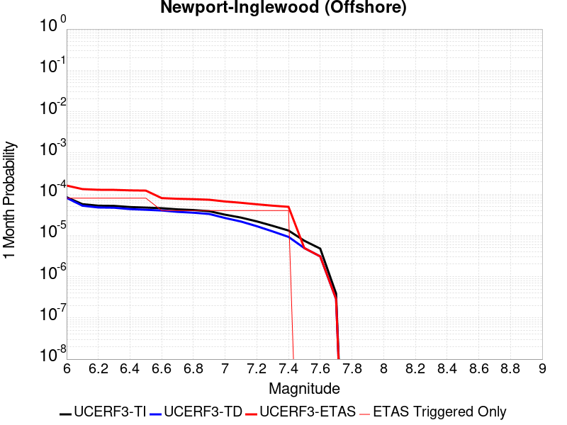 |  |

| Magnitude | 1 wk TI Prob | 1 wk TD Prob | 1 wk ETAS Prob | 1 wk ETAS/TD Gain | 1 wk ETAS Triggered Only | 1 mo TI Prob | 1 mo TD Prob | 1 mo ETAS Prob | 1 mo ETAS/TD Gain | 1 mo ETAS Triggered Only | 1 yr TI Prob | 1 yr TD Prob | 1 yr ETAS Prob | 1 yr ETAS/TD Gain | 1 yr ETAS Triggered Only |
|-----|-----|-----|-----|-----|-----|-----|-----|-----|-----|-----|-----|-----|-----|-----|-----|
| 6.0 | 1.9626508E-5 | 1.89705E-5 | 9.896898E-5 | 5.216994 | 8.0E-5 | 8.411089E-5 | 8.129968E-5 | 1.6129318E-4 | 1.9839337 | 8.0E-5 | 0.001023569 | 9.893867E-4 | 0.0010693076 | 1.0807781 | 8.0E-5 |
| 6.1 | 1.331886E-5 | 1.2221642E-5 | 9.222067E-5 | 7.5456853 | 8.0E-5 | 5.707958E-5 | 5.237742E-5 | 1.3237323E-4 | 2.5272956 | 8.0E-5 | 6.947222E-4 | 6.3751003E-4 | 7.17459E-4 | 1.1254082 | 8.0E-5 |
| 6.2 | 1.2250852E-5 | 1.1079311E-5 | 9.107842E-5 | 8.220586 | 8.0E-5 | 5.2502597E-5 | 4.74819E-5 | 1.274781E-4 | 2.6847725 | 8.0E-5 | 6.3903164E-4 | 5.779398E-4 | 6.5789354E-4 | 1.1383427 | 8.0E-5 |
| 6.3 | 1.2106258E-5 | 1.09221255E-5 | 9.0921254E-5 | 8.324501 | 8.0E-5 | 5.1882926E-5 | 4.6808276E-5 | 1.2680453E-4 | 2.7090194 | 8.0E-5 | 6.3149154E-4 | 5.697427E-4 | 6.4969715E-4 | 1.1403342 | 8.0E-5 |
| 6.4 | 1.1348758E-5 | 1.0112408E-5 | 9.01116E-5 | 8.910993 | 8.0E-5 | 4.8636626E-5 | 4.3338176E-5 | 1.2333471E-4 | 2.8458674 | 8.0E-5 | 5.919901E-4 | 5.2751537E-4 | 6.0747314E-4 | 1.1515744 | 8.0E-5 |
| 6.5 | 1.100837E-5 | 9.746342E-6 | 8.974556E-5 | 9.208128 | 8.0E-5 | 4.7177873E-5 | 4.1769374E-5 | 1.2176603E-4 | 2.915199 | 8.0E-5 | 5.7423924E-4 | 5.084242E-4 | 5.883835E-4 | 1.1572689 | 8.0E-5 |
| 6.6 | 1.0634696E-5 | 9.348393E-6 | 4.934802E-5 | 5.2787704 | 4.0E-5 | 4.557647E-5 | 4.006393E-5 | 8.0062324E-5 | 1.9983643 | 4.0E-5 | 5.5475225E-4 | 4.8766992E-4 | 5.276504E-4 | 1.0819827 | 4.0E-5 |
| 6.7 | 9.9780855E-6 | 8.670582E-6 | 4.8670234E-5 | 5.6132603 | 4.0E-5 | 4.276252E-5 | 3.7159112E-5 | 7.715762E-5 | 2.076412 | 4.0E-5 | 5.205093E-4 | 4.5231896E-4 | 4.923009E-4 | 1.0883932 | 4.0E-5 |
| 6.8 | 9.59546E-6 | 8.275532E-6 | 4.82752E-5 | 5.8334856 | 4.0E-5 | 4.1122752E-5 | 3.546609E-5 | 7.546467E-5 | 2.1277978 | 4.0E-5 | 5.0055445E-4 | 4.3171475E-4 | 4.716975E-4 | 1.0926138 | 4.0E-5 |
| 6.9 | 9.000614E-6 | 7.7092545E-6 | 4.7708945E-5 | 6.1885295 | 4.0E-5 | 3.857349E-5 | 3.3039247E-5 | 7.3037925E-5 | 2.2106414 | 4.0E-5 | 4.6953102E-4 | 4.0217923E-4 | 4.4216315E-4 | 1.0994182 | 4.0E-5 |
| 7.0 | 7.4070194E-6 | 6.1507963E-6 | 4.615055E-5 | 7.503183 | 4.0E-5 | 3.1743984E-5 | 2.636029E-5 | 6.635924E-5 | 2.5173938 | 4.0E-5 | 3.8641447E-4 | 3.2088943E-4 | 3.608766E-4 | 1.1246135 | 4.0E-5 |
| 7.1 | 6.299615E-6 | 5.0580697E-6 | 4.5057866E-5 | 8.908115 | 4.0E-5 | 2.699807E-5 | 2.1677262E-5 | 6.1676394E-5 | 2.8452115 | 4.0E-5 | 3.2865192E-4 | 2.6388883E-4 | 3.0387827E-4 | 1.151539 | 4.0E-5 |
| 7.2 | 5.096653E-6 | 3.8939766E-6 | 4.3893822E-5 | 11.272235 | 4.0E-5 | 2.1842614E-5 | 1.6688366E-5 | 5.66877E-5 | 3.3968394 | 4.0E-5 | 2.6590136E-4 | 2.0316201E-4 | 2.4315387E-4 | 1.1968472 | 4.0E-5 |
| 7.3 | 3.9753018E-6 | 2.9107364E-6 | 4.291062E-5 | 14.742187 | 4.0E-5 | 1.7036897E-5 | 1.2474526E-5 | 5.2474028E-5 | 4.206495 | 4.0E-5 | 2.0740448E-4 | 1.5186684E-4 | 1.9186076E-4 | 1.2633486 | 4.0E-5 |
| 7.4 | 3.0568392E-6 | 2.1455985E-6 | 4.214551E-5 | 19.642776 | 4.0E-5 | 1.3100675E-5 | 9.195391E-6 | 4.9195023E-5 | 5.3499656 | 4.0E-5 | 1.5948903E-4 | 1.1194819E-4 | 1.519437E-4 | 1.3572681 | 4.0E-5 |
| 7.5 | 1.7279019E-6 | 1.1473705E-6 | 1.1473705E-6 | 1.0 | 0.0 | 7.405273E-6 | 4.9172936E-6 | 4.9172936E-6 | 1.0 | 0.0 | 9.015547E-5 | 5.986644E-5 | 5.986644E-5 | 1.0 | 0.0 |
| 7.6 | 1.1156416E-6 | 7.225413E-7 | 7.225413E-7 | 1.0 | 0.0 | 4.7813123E-6 | 3.096602E-6 | 3.096602E-6 | 1.0 | 0.0 | 5.821092E-5 | 3.77005E-5 | 3.77005E-5 | 1.0 | 0.0 |
| 7.7 | 9.117973E-8 | 6.735431E-8 | 6.735431E-8 | 1.0 | 0.0 | 3.907702E-7 | 2.8866128E-7 | 2.8866128E-7 | 1.0 | 0.0 | 4.757617E-6 | 3.5144458E-6 | 3.5144458E-6 | 1.0 | 0.0 |

## Emerson-Copper Mtn 2011
*[(top)](#table-of-contents)*

| 1 Week | 1 Month | 1 Year |
|-----|-----|-----|
|  |  | 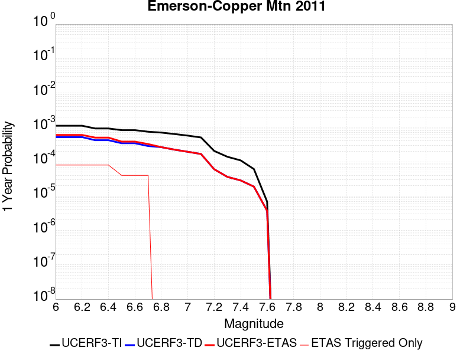 |

| Magnitude | 1 wk TI Prob | 1 wk TD Prob | 1 wk ETAS Prob | 1 wk ETAS/TD Gain | 1 wk ETAS Triggered Only | 1 mo TI Prob | 1 mo TD Prob | 1 mo ETAS Prob | 1 mo ETAS/TD Gain | 1 mo ETAS Triggered Only | 1 yr TI Prob | 1 yr TD Prob | 1 yr ETAS Prob | 1 yr ETAS/TD Gain | 1 yr ETAS Triggered Only |
|-----|-----|-----|-----|-----|-----|-----|-----|-----|-----|-----|-----|-----|-----|-----|-----|
| 6.0 | 2.1364202E-5 | 9.972109E-6 | 4.997171E-5 | 5.0111475 | 4.0E-5 | 9.1557646E-5 | 4.273696E-5 | 1.2273355E-4 | 2.8718362 | 8.0E-5 | 0.0011141442 | 5.20207E-4 | 6.001654E-4 | 1.1537049 | 8.0E-5 |
| 6.1 | 2.1364202E-5 | 9.972109E-6 | 4.997171E-5 | 5.0111475 | 4.0E-5 | 9.1557646E-5 | 4.273696E-5 | 1.2273355E-4 | 2.8718362 | 8.0E-5 | 0.0011141442 | 5.20207E-4 | 6.001654E-4 | 1.1537049 | 8.0E-5 |
| 6.2 | 2.1364202E-5 | 9.972109E-6 | 4.997171E-5 | 5.0111475 | 4.0E-5 | 9.1557646E-5 | 4.273696E-5 | 1.2273355E-4 | 2.8718362 | 8.0E-5 | 0.0011141442 | 5.20207E-4 | 6.001654E-4 | 1.1537049 | 8.0E-5 |
| 6.3 | 1.7751237E-5 | 8.092588E-6 | 4.8092264E-5 | 5.9427543 | 4.0E-5 | 7.607452E-5 | 3.4682096E-5 | 1.1467932E-4 | 3.3065858 | 8.0E-5 | 9.258136E-4 | 4.2217897E-4 | 5.021452E-4 | 1.1894131 | 8.0E-5 |
| 6.4 | 1.7751237E-5 | 8.092588E-6 | 4.8092264E-5 | 5.9427543 | 4.0E-5 | 7.607452E-5 | 3.4682096E-5 | 1.1467932E-4 | 3.3065858 | 8.0E-5 | 9.258136E-4 | 4.2217897E-4 | 5.021452E-4 | 1.1894131 | 8.0E-5 |
| 6.5 | 1.5886664E-5 | 6.606596E-6 | 6.606596E-6 | 1.0 | 0.0 | 6.808392E-5 | 2.8313701E-5 | 6.831257E-5 | 2.4127035 | 4.0E-5 | 8.286065E-4 | 3.4466948E-4 | 3.846557E-4 | 1.1160132 | 4.0E-5 |
| 6.6 | 1.5886664E-5 | 6.606596E-6 | 6.606596E-6 | 1.0 | 0.0 | 6.808392E-5 | 2.8313701E-5 | 6.831257E-5 | 2.4127035 | 4.0E-5 | 8.286065E-4 | 3.4466948E-4 | 3.846557E-4 | 1.1160132 | 4.0E-5 |
| 6.7 | 1.428471E-5 | 5.4727984E-6 | 5.4727984E-6 | 1.0 | 0.0 | 6.121875E-5 | 2.3454662E-5 | 6.345372E-5 | 2.7053778 | 4.0E-5 | 7.450834E-4 | 2.8552703E-4 | 3.255156E-4 | 1.1400518 | 4.0E-5 |
| 6.8 | 1.3490684E-5 | 5.0759477E-6 | 5.0759477E-6 | 1.0 | 0.0 | 5.7815934E-5 | 2.1753902E-5 | 2.1753902E-5 | 1.0 | 0.0 | 7.0368167E-4 | 2.6482542E-4 | 2.6482542E-4 | 1.0 | 0.0 |
| 6.9 | 1.2235421E-5 | 4.291732E-6 | 4.291732E-6 | 1.0 | 0.0 | 5.2436466E-5 | 1.8393026E-5 | 1.8393026E-5 | 1.0 | 0.0 | 6.38227E-4 | 2.2391569E-4 | 2.2391569E-4 | 1.0 | 0.0 |
| 7.0 | 1.1009851E-5 | 3.7208927E-6 | 3.7208927E-6 | 1.0 | 0.0 | 4.7184225E-5 | 1.5946604E-5 | 1.5946604E-5 | 1.0 | 0.0 | 5.743165E-4 | 1.9413605E-4 | 1.9413605E-4 | 1.0 | 0.0 |
| 7.1 | 9.726373E-6 | 3.2134747E-6 | 3.2134747E-6 | 1.0 | 0.0 | 4.168379E-5 | 1.377198E-5 | 1.377198E-5 | 1.0 | 0.0 | 5.07382E-4 | 1.6766433E-4 | 1.6766433E-4 | 1.0 | 0.0 |
| 7.2 | 3.9335127E-6 | 1.153186E-6 | 1.153186E-6 | 1.0 | 0.0 | 1.6857803E-5 | 4.942217E-6 | 4.942217E-6 | 1.0 | 0.0 | 2.0522442E-4 | 6.016989E-5 | 6.016989E-5 | 1.0 | 0.0 |
| 7.3 | 2.661632E-6 | 6.9165225E-7 | 6.9165225E-7 | 1.0 | 0.0 | 1.14069435E-5 | 2.9642206E-6 | 2.9642206E-6 | 1.0 | 0.0 | 1.3887069E-4 | 3.60888E-5 | 3.60888E-5 | 1.0 | 0.0 |
| 7.4 | 2.0893426E-6 | 5.4660313E-7 | 5.4660313E-7 | 1.0 | 0.0 | 8.954295E-6 | 2.3425828E-6 | 2.3425828E-6 | 1.0 | 0.0 | 1.0901308E-4 | 2.8520579E-5 | 2.8520579E-5 | 1.0 | 0.0 |
| 7.5 | 1.1681728E-6 | 3.605487E-7 | 3.605487E-7 | 1.0 | 0.0 | 5.0064455E-6 | 1.5452079E-6 | 1.5452079E-6 | 1.0 | 0.0 | 6.0951766E-5 | 1.8812749E-5 | 1.8812749E-5 | 1.0 | 0.0 |
| 7.6 | 1.3154387E-7 | 7.121983E-8 | 7.121983E-8 | 1.0 | 0.0 | 5.6375933E-7 | 3.0522784E-7 | 3.0522784E-7 | 1.0 | 0.0 | 6.863748E-6 | 3.7161442E-6 | 3.7161442E-6 | 1.0 | 0.0 |

## North Frontal  (East)
*[(top)](#table-of-contents)*

| 1 Week | 1 Month | 1 Year |
|-----|-----|-----|
|  |  | 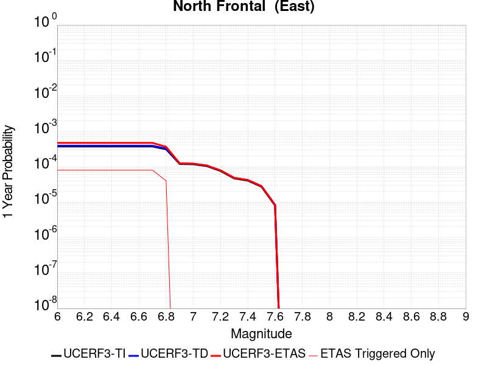 |

| Magnitude | 1 wk TI Prob | 1 wk TD Prob | 1 wk ETAS Prob | 1 wk ETAS/TD Gain | 1 wk ETAS Triggered Only | 1 mo TI Prob | 1 mo TD Prob | 1 mo ETAS Prob | 1 mo ETAS/TD Gain | 1 mo ETAS Triggered Only | 1 yr TI Prob | 1 yr TD Prob | 1 yr ETAS Prob | 1 yr ETAS/TD Gain | 1 yr ETAS Triggered Only |
|-----|-----|-----|-----|-----|-----|-----|-----|-----|-----|-----|-----|-----|-----|-----|-----|
| 6.0 | 7.135738E-6 | 7.4783907E-6 | 4.747809E-5 | 6.3487043 | 4.0E-5 | 3.0581377E-5 | 3.2049964E-5 | 7.204868E-5 | 2.2480114 | 4.0E-5 | 3.7226462E-4 | 3.9015838E-4 | 4.7012718E-4 | 1.2049649 | 8.0E-5 |
| 6.1 | 7.135738E-6 | 7.4783907E-6 | 4.747809E-5 | 6.3487043 | 4.0E-5 | 3.0581377E-5 | 3.2049964E-5 | 7.204868E-5 | 2.2480114 | 4.0E-5 | 3.7226462E-4 | 3.9015838E-4 | 4.7012718E-4 | 1.2049649 | 8.0E-5 |
| 6.2 | 7.135738E-6 | 7.4783907E-6 | 4.747809E-5 | 6.3487043 | 4.0E-5 | 3.0581377E-5 | 3.2049964E-5 | 7.204868E-5 | 2.2480114 | 4.0E-5 | 3.7226462E-4 | 3.9015838E-4 | 4.7012718E-4 | 1.2049649 | 8.0E-5 |
| 6.3 | 7.135738E-6 | 7.4783907E-6 | 4.747809E-5 | 6.3487043 | 4.0E-5 | 3.0581377E-5 | 3.2049964E-5 | 7.204868E-5 | 2.2480114 | 4.0E-5 | 3.7226462E-4 | 3.9015838E-4 | 4.7012718E-4 | 1.2049649 | 8.0E-5 |
| 6.4 | 7.135738E-6 | 7.4783907E-6 | 4.747809E-5 | 6.3487043 | 4.0E-5 | 3.0581377E-5 | 3.2049964E-5 | 7.204868E-5 | 2.2480114 | 4.0E-5 | 3.7226462E-4 | 3.9015838E-4 | 4.7012718E-4 | 1.2049649 | 8.0E-5 |
| 6.5 | 7.135738E-6 | 7.4783907E-6 | 4.747809E-5 | 6.3487043 | 4.0E-5 | 3.0581377E-5 | 3.2049964E-5 | 7.204868E-5 | 2.2480114 | 4.0E-5 | 3.7226462E-4 | 3.9015838E-4 | 4.7012718E-4 | 1.2049649 | 8.0E-5 |
| 6.6 | 7.135738E-6 | 7.4783907E-6 | 4.747809E-5 | 6.3487043 | 4.0E-5 | 3.0581377E-5 | 3.2049964E-5 | 7.204868E-5 | 2.2480114 | 4.0E-5 | 3.7226462E-4 | 3.9015838E-4 | 4.7012718E-4 | 1.2049649 | 8.0E-5 |
| 6.7 | 7.135738E-6 | 7.4783907E-6 | 4.747809E-5 | 6.3487043 | 4.0E-5 | 3.0581377E-5 | 3.2049964E-5 | 7.204868E-5 | 2.2480114 | 4.0E-5 | 3.7226462E-4 | 3.9015838E-4 | 4.7012718E-4 | 1.2049649 | 8.0E-5 |
| 6.8 | 5.959142E-6 | 6.2376685E-6 | 4.623742E-5 | 7.4126124 | 4.0E-5 | 2.553893E-5 | 2.6732692E-5 | 6.673163E-5 | 2.4962552 | 4.0E-5 | 3.108921E-4 | 3.2544002E-4 | 3.65427E-4 | 1.1228706 | 4.0E-5 |
| 6.9 | 2.2946929E-6 | 2.3827697E-6 | 2.3827697E-6 | 1.0 | 0.0 | 9.834361E-6 | 1.0211833E-5 | 1.0211833E-5 | 1.0 | 0.0 | 1.1972676E-4 | 1.2432244E-4 | 1.2432244E-4 | 1.0 | 0.0 |
| 7.0 | 2.2468673E-6 | 2.3324542E-6 | 2.3324542E-6 | 1.0 | 0.0 | 9.629396E-6 | 9.996196E-6 | 9.996196E-6 | 1.0 | 0.0 | 1.1723159E-4 | 1.2169736E-4 | 1.2169736E-4 | 1.0 | 0.0 |
| 7.1 | 1.9921076E-6 | 2.064858E-6 | 2.064858E-6 | 1.0 | 0.0 | 8.537577E-6 | 8.849364E-6 | 8.849364E-6 | 1.0 | 0.0 | 1.0394004E-4 | 1.07736116E-4 | 1.07736116E-4 | 1.0 | 0.0 |
| 7.2 | 1.4524545E-6 | 1.5046977E-6 | 1.5046977E-6 | 1.0 | 0.0 | 6.2247905E-6 | 6.44869E-6 | 6.44869E-6 | 1.0 | 0.0 | 7.5784184E-5 | 7.851022E-5 | 7.851022E-5 | 1.0 | 0.0 |
| 7.3 | 8.9802575E-7 | 9.309882E-7 | 9.309882E-7 | 1.0 | 0.0 | 3.848676E-6 | 3.989944E-6 | 3.989944E-6 | 1.0 | 0.0 | 4.685662E-5 | 4.8576603E-5 | 4.8576603E-5 | 1.0 | 0.0 |
| 7.4 | 7.776139E-7 | 8.061474E-7 | 8.061474E-7 | 1.0 | 0.0 | 3.3326266E-6 | 3.4549134E-6 | 3.4549134E-6 | 1.0 | 0.0 | 4.0573974E-5 | 4.2062868E-5 | 4.2062868E-5 | 1.0 | 0.0 |
| 7.5 | 5.244417E-7 | 5.4419115E-7 | 5.4419115E-7 | 1.0 | 0.0 | 2.2476054E-6 | 2.332246E-6 | 2.332246E-6 | 1.0 | 0.0 | 2.7364253E-5 | 2.8394792E-5 | 2.8394792E-5 | 1.0 | 0.0 |
| 7.6 | 1.5489647E-7 | 1.6091616E-7 | 1.6091616E-7 | 1.0 | 0.0 | 6.6384183E-7 | 6.896406E-7 | 6.896406E-7 | 1.0 | 0.0 | 8.082245E-6 | 8.396362E-6 | 8.396362E-6 | 1.0 | 0.0 |

## Santa Susana East (connector)
*[(top)](#table-of-contents)*

| 1 Week | 1 Month | 1 Year |
|-----|-----|-----|
| 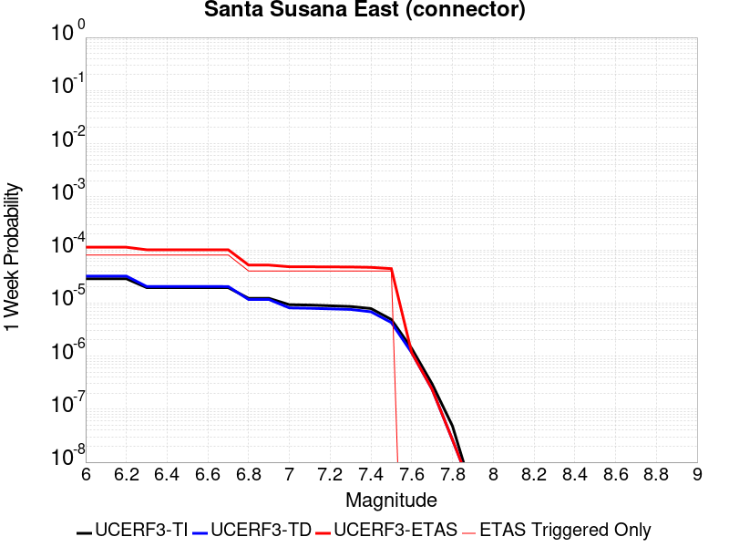 |  | 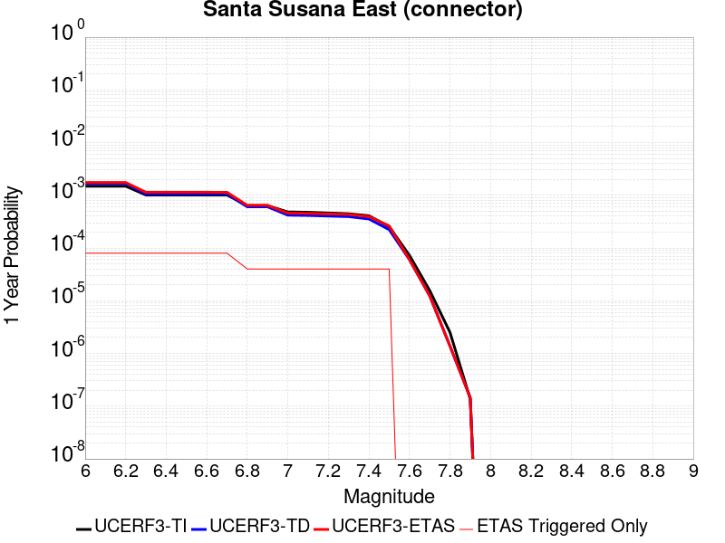 |

| Magnitude | 1 wk TI Prob | 1 wk TD Prob | 1 wk ETAS Prob | 1 wk ETAS/TD Gain | 1 wk ETAS Triggered Only | 1 mo TI Prob | 1 mo TD Prob | 1 mo ETAS Prob | 1 mo ETAS/TD Gain | 1 mo ETAS Triggered Only | 1 yr TI Prob | 1 yr TD Prob | 1 yr ETAS Prob | 1 yr ETAS/TD Gain | 1 yr ETAS Triggered Only |
|-----|-----|-----|-----|-----|-----|-----|-----|-----|-----|-----|-----|-----|-----|-----|-----|
| 6.0 | 2.858397E-5 | 3.204545E-5 | 1.12042886E-4 | 3.4963741 | 8.0E-5 | 1.2249697E-4 | 1.37332E-4 | 2.1732101E-4 | 1.5824499 | 8.0E-5 | 0.0014903803 | 0.001671004 | 0.0017508704 | 1.0477954 | 8.0E-5 |
| 6.1 | 2.858397E-5 | 3.204545E-5 | 1.12042886E-4 | 3.4963741 | 8.0E-5 | 1.2249697E-4 | 1.37332E-4 | 2.1732101E-4 | 1.5824499 | 8.0E-5 | 0.0014903803 | 0.001671004 | 0.0017508704 | 1.0477954 | 8.0E-5 |
| 6.2 | 2.858397E-5 | 3.204545E-5 | 1.12042886E-4 | 3.4963741 | 8.0E-5 | 1.2249697E-4 | 1.37332E-4 | 2.1732101E-4 | 1.5824499 | 8.0E-5 | 0.0014903803 | 0.001671004 | 0.0017508704 | 1.0477954 | 8.0E-5 |
| 6.3 | 1.943582E-5 | 2.0380405E-5 | 1.0037878E-4 | 4.925259 | 8.0E-5 | 8.329371E-5 | 8.734229E-5 | 1.6733531E-4 | 1.9158566 | 8.0E-5 | 0.001013629 | 0.0010629859 | 0.0011429008 | 1.0751797 | 8.0E-5 |
| 6.4 | 1.943582E-5 | 2.0380405E-5 | 1.0037878E-4 | 4.925259 | 8.0E-5 | 8.329371E-5 | 8.734229E-5 | 1.6733531E-4 | 1.9158566 | 8.0E-5 | 0.001013629 | 0.0010629859 | 0.0011429008 | 1.0751797 | 8.0E-5 |
| 6.5 | 1.943582E-5 | 2.0380405E-5 | 1.0037878E-4 | 4.925259 | 8.0E-5 | 8.329371E-5 | 8.734229E-5 | 1.6733531E-4 | 1.9158566 | 8.0E-5 | 0.001013629 | 0.0010629859 | 0.0011429008 | 1.0751797 | 8.0E-5 |
| 6.6 | 1.943582E-5 | 2.0380405E-5 | 1.0037878E-4 | 4.925259 | 8.0E-5 | 8.329371E-5 | 8.734229E-5 | 1.6733531E-4 | 1.9158566 | 8.0E-5 | 0.001013629 | 0.0010629859 | 0.0011429008 | 1.0751797 | 8.0E-5 |
| 6.7 | 1.9404439E-5 | 2.0367817E-5 | 1.0036619E-4 | 4.9276853 | 8.0E-5 | 8.3159226E-5 | 8.728835E-5 | 1.6728137E-4 | 1.9164226 | 8.0E-5 | 0.0010119933 | 0.0010623297 | 0.0011422448 | 1.0752262 | 8.0E-5 |
| 6.8 | 1.2217526E-5 | 1.1598732E-5 | 5.159827E-5 | 4.4486127 | 4.0E-5 | 5.2359774E-5 | 4.9708E-5 | 8.970601E-5 | 1.8046595 | 4.0E-5 | 6.372938E-4 | 6.0504366E-4 | 6.4501946E-4 | 1.0660709 | 4.0E-5 |
| 6.9 | 1.2217526E-5 | 1.1598732E-5 | 5.159827E-5 | 4.4486127 | 4.0E-5 | 5.2359774E-5 | 4.9708E-5 | 8.970601E-5 | 1.8046595 | 4.0E-5 | 6.372938E-4 | 6.0504366E-4 | 6.4501946E-4 | 1.0660709 | 4.0E-5 |
| 7.0 | 9.276017E-6 | 8.062312E-6 | 4.806199E-5 | 5.9613156 | 4.0E-5 | 3.9753755E-5 | 3.455233E-5 | 7.4550946E-5 | 2.1576245 | 4.0E-5 | 4.8389446E-4 | 4.2059686E-4 | 4.6058002E-4 | 1.095063 | 4.0E-5 |
| 7.1 | 9.130355E-6 | 7.9454385E-6 | 4.794512E-5 | 6.034295 | 4.0E-5 | 3.9129503E-5 | 3.4051456E-5 | 7.405009E-5 | 2.1746528 | 4.0E-5 | 4.7629757E-4 | 4.1450103E-4 | 4.5448446E-4 | 1.0964615 | 4.0E-5 |
| 7.2 | 8.851015E-6 | 7.744543E-6 | 4.7744234E-5 | 6.164887 | 4.0E-5 | 3.7932372E-5 | 3.3190496E-5 | 7.318917E-5 | 2.2051244 | 4.0E-5 | 4.6172875E-4 | 4.0402278E-4 | 4.440066E-4 | 1.0989643 | 4.0E-5 |
| 7.3 | 8.573006E-6 | 7.553199E-6 | 4.7552898E-5 | 6.2957296 | 4.0E-5 | 3.6740938E-5 | 3.237047E-5 | 7.236918E-5 | 2.235654 | 4.0E-5 | 4.472291E-4 | 3.940426E-4 | 4.3402685E-4 | 1.1014719 | 4.0E-5 |
| 7.4 | 7.852282E-6 | 6.820105E-6 | 4.6819834E-5 | 6.864972 | 4.0E-5 | 3.36522E-5 | 2.9228711E-5 | 6.922754E-5 | 2.3684773 | 4.0E-5 | 4.096385E-4 | 3.5580448E-4 | 3.9579027E-4 | 1.1123813 | 4.0E-5 |
| 7.5 | 4.8869324E-6 | 4.280381E-6 | 4.428021E-5 | 10.344923 | 4.0E-5 | 2.0943828E-5 | 1.834437E-5 | 5.8343634E-5 | 3.1804657 | 4.0E-5 | 2.5496128E-4 | 2.2332146E-4 | 2.6331254E-4 | 1.179074 | 4.0E-5 |
| 7.6 | 1.3894544E-6 | 1.1571898E-6 | 1.1571898E-6 | 1.0 | 0.0 | 5.954791E-6 | 4.959377E-6 | 4.959377E-6 | 1.0 | 0.0 | 7.249717E-5 | 6.037896E-5 | 6.037896E-5 | 1.0 | 0.0 |
| 7.7 | 2.9924632E-7 | 2.3744407E-7 | 2.3744407E-7 | 1.0 | 0.0 | 1.2824837E-6 | 1.0176171E-6 | 1.0176171E-6 | 1.0 | 0.0 | 1.5614127E-5 | 1.2389425E-5 | 1.2389425E-5 | 1.0 | 0.0 |
| 7.8 | 4.8188564E-8 | 2.6520485E-8 | 2.6520485E-8 | 1.0 | 0.0 | 2.065224E-7 | 1.1365921E-7 | 1.1365921E-7 | 1.0 | 0.0 | 2.5144072E-6 | 1.3838002E-6 | 1.3838002E-6 | 1.0 | 0.0 |
| 7.9 | 2.6127251E-9 | 2.7686682E-9 | 2.7686682E-9 | 1.0 | 0.0 | 1.1197393E-8 | 1.1865721E-8 | 1.1865721E-8 | 1.0 | 0.0 | 1.3632825E-7 | 1.4446515E-7 | 1.4446515E-7 | 1.0 | 0.0 |

## San Gabriel
*[(top)](#table-of-contents)*

| 1 Week | 1 Month | 1 Year |
|-----|-----|-----|
| 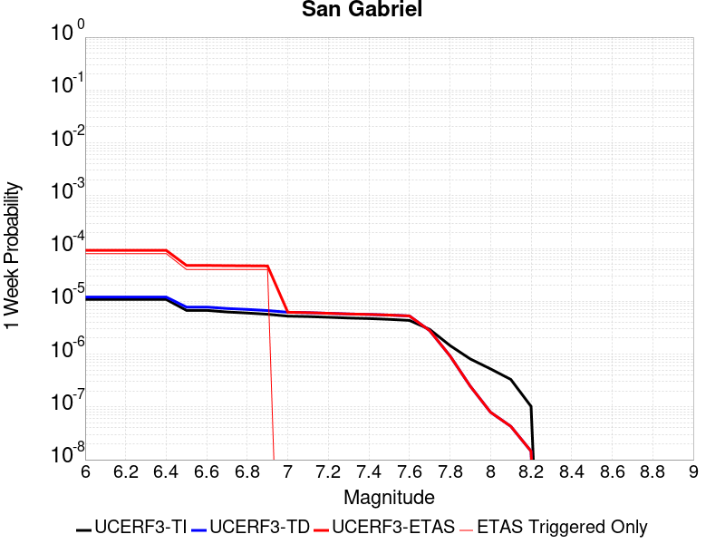 |  |  |

| Magnitude | 1 wk TI Prob | 1 wk TD Prob | 1 wk ETAS Prob | 1 wk ETAS/TD Gain | 1 wk ETAS Triggered Only | 1 mo TI Prob | 1 mo TD Prob | 1 mo ETAS Prob | 1 mo ETAS/TD Gain | 1 mo ETAS Triggered Only | 1 yr TI Prob | 1 yr TD Prob | 1 yr ETAS Prob | 1 yr ETAS/TD Gain | 1 yr ETAS Triggered Only |
|-----|-----|-----|-----|-----|-----|-----|-----|-----|-----|-----|-----|-----|-----|-----|-----|
| 6.0 | 1.083775E-5 | 1.2040094E-5 | 9.203913E-5 | 7.6443863 | 8.0E-5 | 4.6446676E-5 | 5.1599447E-5 | 1.3159531E-4 | 2.5503242 | 8.0E-5 | 5.653415E-4 | 6.280535E-4 | 7.0800324E-4 | 1.1272976 | 8.0E-5 |
| 6.1 | 1.083775E-5 | 1.2040094E-5 | 9.203913E-5 | 7.6443863 | 8.0E-5 | 4.6446676E-5 | 5.1599447E-5 | 1.3159531E-4 | 2.5503242 | 8.0E-5 | 5.653415E-4 | 6.280535E-4 | 7.0800324E-4 | 1.1272976 | 8.0E-5 |
| 6.2 | 1.083775E-5 | 1.2040094E-5 | 9.203913E-5 | 7.6443863 | 8.0E-5 | 4.6446676E-5 | 5.1599447E-5 | 1.3159531E-4 | 2.5503242 | 8.0E-5 | 5.653415E-4 | 6.280535E-4 | 7.0800324E-4 | 1.1272976 | 8.0E-5 |
| 6.3 | 1.083775E-5 | 1.2040094E-5 | 9.203913E-5 | 7.6443863 | 8.0E-5 | 4.6446676E-5 | 5.1599447E-5 | 1.3159531E-4 | 2.5503242 | 8.0E-5 | 5.653415E-4 | 6.280535E-4 | 7.0800324E-4 | 1.1272976 | 8.0E-5 |
| 6.4 | 1.083775E-5 | 1.2040094E-5 | 9.203913E-5 | 7.6443863 | 8.0E-5 | 4.6446676E-5 | 5.1599447E-5 | 1.3159531E-4 | 2.5503242 | 8.0E-5 | 5.653415E-4 | 6.280535E-4 | 7.0800324E-4 | 1.1272976 | 8.0E-5 |
| 6.5 | 6.7317824E-6 | 7.771279E-6 | 4.777097E-5 | 6.147118 | 4.0E-5 | 2.8850178E-5 | 3.3305063E-5 | 7.330373E-5 | 2.2009785 | 4.0E-5 | 3.511943E-4 | 4.0541476E-4 | 4.4539853E-4 | 1.0986243 | 4.0E-5 |
| 6.6 | 6.7317824E-6 | 7.771279E-6 | 4.777097E-5 | 6.147118 | 4.0E-5 | 2.8850178E-5 | 3.3305063E-5 | 7.330373E-5 | 2.2009785 | 4.0E-5 | 3.511943E-4 | 4.0541476E-4 | 4.4539853E-4 | 1.0986243 | 4.0E-5 |
| 6.7 | 6.274881E-6 | 7.3001497E-6 | 4.7299858E-5 | 6.4792995 | 4.0E-5 | 2.6892068E-5 | 3.1285985E-5 | 7.128473E-5 | 2.2784877 | 4.0E-5 | 3.2736175E-4 | 3.808413E-4 | 4.2082605E-4 | 1.1049906 | 4.0E-5 |
| 6.8 | 5.996209E-6 | 7.01284E-6 | 4.701256E-5 | 6.7037835 | 4.0E-5 | 2.5697784E-5 | 3.0054685E-5 | 7.005349E-5 | 2.3308673 | 4.0E-5 | 3.128256E-4 | 3.6585532E-4 | 4.0584066E-4 | 1.1092929 | 4.0E-5 |
| 6.9 | 5.686331E-6 | 6.6776697E-6 | 4.6677404E-5 | 6.9900737 | 4.0E-5 | 2.4369761E-5 | 2.8618277E-5 | 6.861713E-5 | 2.3976681 | 4.0E-5 | 2.9666146E-4 | 3.4837273E-4 | 3.8835878E-4 | 1.1147796 | 4.0E-5 |
| 7.0 | 5.2329838E-6 | 6.2014137E-6 | 6.2014137E-6 | 1.0 | 0.0 | 2.242688E-5 | 2.6577221E-5 | 2.6577221E-5 | 1.0 | 0.0 | 2.7301308E-4 | 3.235304E-4 | 3.235304E-4 | 1.0 | 0.0 |
| 7.1 | 5.135671E-6 | 6.091397E-6 | 6.091397E-6 | 1.0 | 0.0 | 2.2009834E-5 | 2.6105732E-5 | 2.6105732E-5 | 1.0 | 0.0 | 2.6793676E-4 | 3.177917E-4 | 3.177917E-4 | 1.0 | 0.0 |
| 7.2 | 4.989062E-6 | 5.9245344E-6 | 5.9245344E-6 | 1.0 | 0.0 | 2.1381518E-5 | 2.5390618E-5 | 2.5390618E-5 | 1.0 | 0.0 | 2.6028889E-4 | 3.0908769E-4 | 3.0908769E-4 | 1.0 | 0.0 |
| 7.3 | 4.8219395E-6 | 5.7558727E-6 | 5.7558727E-6 | 1.0 | 0.0 | 2.0665291E-5 | 2.4667797E-5 | 2.4667797E-5 | 1.0 | 0.0 | 2.5157086E-4 | 3.002898E-4 | 3.002898E-4 | 1.0 | 0.0 |
| 7.4 | 4.7118383E-6 | 5.644234E-6 | 5.644234E-6 | 1.0 | 0.0 | 2.0193436E-5 | 2.4189356E-5 | 2.4189356E-5 | 1.0 | 0.0 | 2.4582737E-4 | 2.9446636E-4 | 2.9446636E-4 | 1.0 | 0.0 |
| 7.5 | 4.5506545E-6 | 5.4893308E-6 | 5.4893308E-6 | 1.0 | 0.0 | 1.9502659E-5 | 2.3525496E-5 | 2.3525496E-5 | 1.0 | 0.0 | 2.37419E-4 | 2.8638603E-4 | 2.8638603E-4 | 1.0 | 0.0 |
| 7.6 | 4.343636E-6 | 5.281765E-6 | 5.281765E-6 | 1.0 | 0.0 | 1.861545E-5 | 2.2635943E-5 | 2.2635943E-5 | 1.0 | 0.0 | 2.2661954E-4 | 2.755585E-4 | 2.755585E-4 | 1.0 | 0.0 |
| 7.7 | 2.936235E-6 | 2.7792926E-6 | 2.7792926E-6 | 1.0 | 0.0 | 1.2583803E-5 | 1.1911199E-5 | 1.1911199E-5 | 1.0 | 0.0 | 1.5319703E-4 | 1.4500924E-4 | 1.4500924E-4 | 1.0 | 0.0 |
| 7.8 | 1.4541639E-6 | 9.265855E-7 | 9.265855E-7 | 1.0 | 0.0 | 6.232116E-6 | 3.971075E-6 | 3.971075E-6 | 1.0 | 0.0 | 7.587337E-5 | 4.8346767E-5 | 4.8346767E-5 | 1.0 | 0.0 |
| 7.9 | 8.098958E-7 | 2.4722956E-7 | 2.4722956E-7 | 1.0 | 0.0 | 3.4709774E-6 | 1.0595548E-6 | 1.0595548E-6 | 1.0 | 0.0 | 4.225833E-5 | 1.2900004E-5 | 1.2900004E-5 | 1.0 | 0.0 |
| 8.0 | 5.2473234E-7 | 7.932058E-8 | 7.932058E-8 | 1.0 | 0.0 | 2.248851E-6 | 3.399453E-7 | 3.399453E-7 | 1.0 | 0.0 | 2.7379416E-5 | 4.138826E-6 | 4.138826E-6 | 1.0 | 0.0 |
| 8.1 | 3.3162388E-7 | 4.289848E-8 | 4.289848E-8 | 1.0 | 0.0 | 1.4212444E-6 | 1.8385062E-7 | 1.8385062E-7 | 1.0 | 0.0 | 1.7303513E-5 | 2.238379E-6 | 2.238379E-6 | 1.0 | 0.0 |
| 8.2 | 1.0235345E-7 | 1.4487087E-8 | 1.4487087E-8 | 1.0 | 0.0 | 4.3865757E-7 | 6.2087516E-8 | 6.2087516E-8 | 1.0 | 0.0 | 5.340643E-6 | 7.559152E-7 | 7.559152E-7 | 1.0 | 0.0 |

## San Gregorio (North) 2011 CFM
*[(top)](#table-of-contents)*

| 1 Week | 1 Month | 1 Year |
|-----|-----|-----|
| 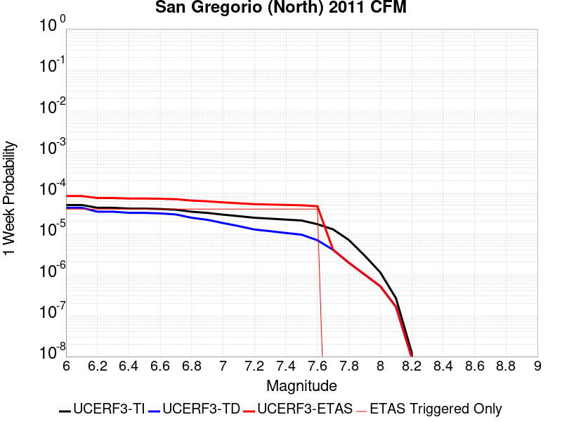 |  |  |

| Magnitude | 1 wk TI Prob | 1 wk TD Prob | 1 wk ETAS Prob | 1 wk ETAS/TD Gain | 1 wk ETAS Triggered Only | 1 mo TI Prob | 1 mo TD Prob | 1 mo ETAS Prob | 1 mo ETAS/TD Gain | 1 mo ETAS Triggered Only | 1 yr TI Prob | 1 yr TD Prob | 1 yr ETAS Prob | 1 yr ETAS/TD Gain | 1 yr ETAS Triggered Only |
|-----|-----|-----|-----|-----|-----|-----|-----|-----|-----|-----|-----|-----|-----|-----|-----|
| 6.0 | 5.0283932E-5 | 4.314244E-5 | 8.3140716E-5 | 1.9271213 | 4.0E-5 | 2.1548476E-4 | 1.8488315E-4 | 2.2487575E-4 | 1.2163129 | 4.0E-5 | 0.0026203706 | 0.0022486437 | 0.0023284638 | 1.035497 | 8.0E-5 |
| 6.1 | 5.0283932E-5 | 4.314244E-5 | 8.3140716E-5 | 1.9271213 | 4.0E-5 | 2.1548476E-4 | 1.8488315E-4 | 2.2487575E-4 | 1.2163129 | 4.0E-5 | 0.0026203706 | 0.0022486437 | 0.0023284638 | 1.035497 | 8.0E-5 |
| 6.2 | 4.2998647E-5 | 3.4518398E-5 | 7.451702E-5 | 2.1587625 | 4.0E-5 | 1.842669E-4 | 1.4792767E-4 | 1.8792176E-4 | 1.2703624 | 4.0E-5 | 0.0022411412 | 0.0017995444 | 0.0018794005 | 1.0443757 | 8.0E-5 |
| 6.3 | 4.2998647E-5 | 3.4518398E-5 | 7.451702E-5 | 2.1587625 | 4.0E-5 | 1.842669E-4 | 1.4792767E-4 | 1.8792176E-4 | 1.2703624 | 4.0E-5 | 0.0022411412 | 0.0017995444 | 0.0018794005 | 1.0443757 | 8.0E-5 |
| 6.4 | 4.1101295E-5 | 3.240154E-5 | 7.240024E-5 | 2.2344694 | 4.0E-5 | 1.7613651E-4 | 1.3885641E-4 | 1.7885087E-4 | 1.2880273 | 4.0E-5 | 0.0021423528 | 0.0016892796 | 0.0017691443 | 1.0472775 | 8.0E-5 |
| 6.5 | 4.1032585E-5 | 3.2319516E-5 | 7.2318224E-5 | 2.2376022 | 4.0E-5 | 1.7584208E-4 | 1.3850494E-4 | 1.7849941E-4 | 1.2887584 | 4.0E-5 | 0.0021387753 | 0.001685007 | 0.0017648721 | 1.0473975 | 8.0E-5 |
| 6.6 | 4.011629E-5 | 3.134029E-5 | 7.133903E-5 | 2.2762723 | 4.0E-5 | 1.7191563E-4 | 1.3430869E-4 | 1.7430332E-4 | 1.2977813 | 4.0E-5 | 0.0020910634 | 0.0016339958 | 0.001713865 | 1.0488797 | 8.0E-5 |
| 6.7 | 3.8583938E-5 | 2.952564E-5 | 6.952446E-5 | 2.3547146 | 4.0E-5 | 1.6534925E-4 | 1.265324E-4 | 1.6652734E-4 | 1.3160846 | 4.0E-5 | 0.0020112682 | 0.0015394577 | 0.0016193344 | 1.0518863 | 8.0E-5 |
| 6.8 | 3.44341E-5 | 2.451853E-5 | 6.4517546E-5 | 2.6313791 | 4.0E-5 | 1.4756636E-4 | 1.0507524E-4 | 1.4507104E-4 | 1.3806396 | 4.0E-5 | 0.0017951399 | 0.0012785508 | 0.0013584485 | 1.0624908 | 8.0E-5 |
| 6.9 | 3.221199E-5 | 2.1839987E-5 | 6.183911E-5 | 2.8314629 | 4.0E-5 | 1.3804408E-4 | 9.359664E-5 | 1.335929E-4 | 1.4273258 | 4.0E-5 | 0.0016793909 | 0.0011389516 | 0.0012188605 | 1.07016 | 8.0E-5 |
| 7.0 | 2.9186718E-5 | 1.8203937E-5 | 5.8203208E-5 | 3.1972868 | 4.0E-5 | 1.2507994E-4 | 7.8014564E-5 | 1.1801144E-4 | 1.5126848 | 4.0E-5 | 0.0015217843 | 9.494178E-4 | 0.001029342 | 1.0841821 | 8.0E-5 |
| 7.1 | 2.6840138E-5 | 1.533875E-5 | 5.5338136E-5 | 3.6077344 | 4.0E-5 | 1.1502409E-4 | 6.5735854E-5 | 1.0573323E-4 | 1.6084559 | 4.0E-5 | 0.0013995186 | 8.000421E-4 | 8.799781E-4 | 1.0999148 | 8.0E-5 |
| 7.2 | 2.453002E-5 | 1.26589775E-5 | 5.265847E-5 | 4.159773 | 4.0E-5 | 1.05124425E-4 | 5.4251635E-5 | 9.4249466E-5 | 1.737265 | 4.0E-5 | 0.0012791384 | 6.6031405E-4 | 7.402612E-4 | 1.1210744 | 8.0E-5 |
| 7.3 | 2.3330727E-5 | 1.153953E-5 | 5.1539067E-5 | 4.4663057 | 4.0E-5 | 9.9985E-5 | 4.945419E-5 | 8.945221E-5 | 1.8087894 | 4.0E-5 | 0.0012166376 | 6.0193887E-4 | 6.818907E-4 | 1.1328238 | 8.0E-5 |
| 7.4 | 2.2136466E-5 | 1.0418551E-5 | 5.0418133E-5 | 4.8392653 | 4.0E-5 | 9.486712E-5 | 4.465017E-5 | 8.464838E-5 | 1.8958132 | 4.0E-5 | 0.0011543952 | 5.4348045E-4 | 6.23437E-4 | 1.1471194 | 8.0E-5 |
| 7.5 | 2.0994974E-5 | 9.474889E-6 | 4.947451E-5 | 5.2216454 | 4.0E-5 | 8.997535E-5 | 4.0606035E-5 | 8.060441E-5 | 1.9850352 | 4.0E-5 | 0.0010948994 | 4.9426657E-4 | 5.74227E-4 | 1.161776 | 8.0E-5 |
| 7.6 | 1.7091823E-5 | 6.9318185E-6 | 4.6931542E-5 | 6.7704515 | 4.0E-5 | 7.3248615E-5 | 2.9707455E-5 | 6.9706264E-5 | 2.3464234 | 4.0E-5 | 8.9143694E-4 | 3.6162834E-4 | 4.415994E-4 | 1.2211416 | 8.0E-5 |
| 7.7 | 1.2772179E-5 | 4.048064E-6 | 4.048064E-6 | 1.0 | 0.0 | 5.473676E-5 | 1.7348731E-5 | 1.7348731E-5 | 1.0 | 0.0 | 6.6621625E-4 | 2.1120036E-4 | 2.511919E-4 | 1.1893536 | 4.0E-5 |
| 7.8 | 7.041923E-6 | 1.9584988E-6 | 1.9584988E-6 | 1.0 | 0.0 | 3.017932E-5 | 8.393539E-6 | 8.393539E-6 | 1.0 | 0.0 | 3.6737128E-4 | 1.0218655E-4 | 1.4218246E-4 | 1.3914009 | 4.0E-5 |
| 7.9 | 2.946768E-6 | 1.0139579E-6 | 1.0139579E-6 | 1.0 | 0.0 | 1.2628945E-5 | 4.345526E-6 | 4.345526E-6 | 1.0 | 0.0 | 1.5374656E-4 | 5.29055E-5 | 5.29055E-5 | 1.0 | 0.0 |
| 8.0 | 1.1433375E-6 | 5.24259E-7 | 5.24259E-7 | 1.0 | 0.0 | 4.9000087E-6 | 2.2468223E-6 | 2.2468223E-6 | 1.0 | 0.0 | 5.965597E-5 | 2.7354718E-5 | 2.7354718E-5 | 1.0 | 0.0 |
| 8.1 | 2.6675295E-7 | 1.6521801E-7 | 1.6521801E-7 | 1.0 | 0.0 | 1.1432264E-6 | 7.08077E-7 | 7.08077E-7 | 1.0 | 0.0 | 1.3918692E-5 | 8.620804E-6 | 8.620804E-6 | 1.0 | 0.0 |
| 8.2 | 1.2704569E-8 | 9.638424E-9 | 9.638424E-9 | 1.0 | 0.0 | 5.444815E-8 | 4.1307533E-8 | 4.1307533E-8 | 1.0 | 0.0 | 6.629061E-7 | 5.029191E-7 | 5.029191E-7 | 1.0 | 0.0 |

## Calaveras (Central) 2011 CFM
*[(top)](#table-of-contents)*

| 1 Week | 1 Month | 1 Year |
|-----|-----|-----|
| 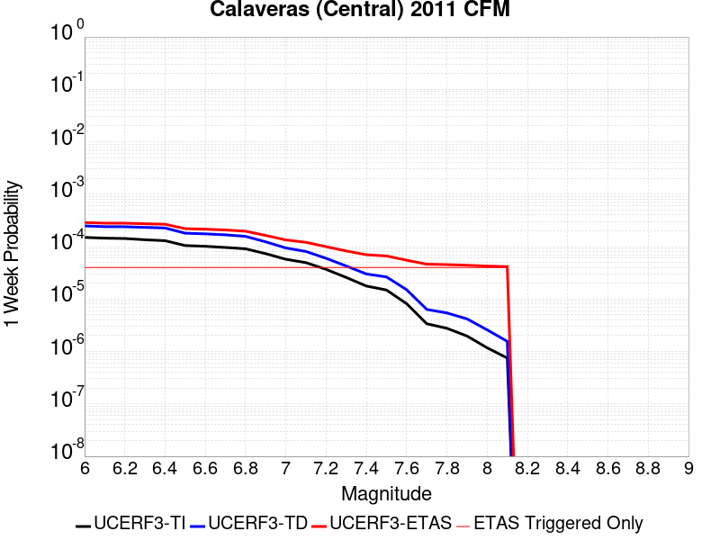 | 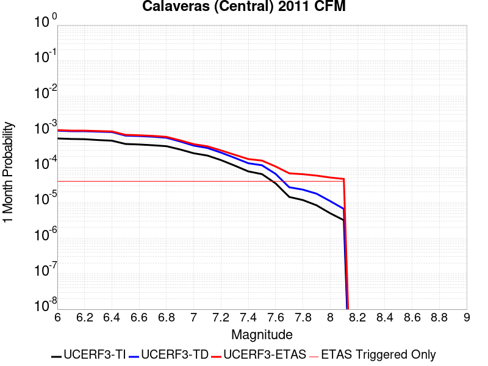 |  |

| Magnitude | 1 wk TI Prob | 1 wk TD Prob | 1 wk ETAS Prob | 1 wk ETAS/TD Gain | 1 wk ETAS Triggered Only | 1 mo TI Prob | 1 mo TD Prob | 1 mo ETAS Prob | 1 mo ETAS/TD Gain | 1 mo ETAS Triggered Only | 1 yr TI Prob | 1 yr TD Prob | 1 yr ETAS Prob | 1 yr ETAS/TD Gain | 1 yr ETAS Triggered Only |
|-----|-----|-----|-----|-----|-----|-----|-----|-----|-----|-----|-----|-----|-----|-----|-----|
| 6.0 | 1.5010907E-4 | 2.4887596E-4 | 2.8886602E-4 | 1.1606827 | 4.0E-5 | 6.4316596E-4 | 0.0010661384 | 0.0011060957 | 1.0374786 | 4.0E-5 | 0.0078024664 | 0.01289425 | 0.012973219 | 1.0061243 | 8.0E-5 |
| 6.1 | 1.4521465E-4 | 2.4048235E-4 | 2.8047274E-4 | 1.1662924 | 4.0E-5 | 6.222001E-4 | 0.0010301946 | 0.0010701533 | 1.0387876 | 4.0E-5 | 0.0075490056 | 0.0124630965 | 0.0125421 | 1.006339 | 8.0E-5 |
| 6.2 | 1.429998E-4 | 2.3978335E-4 | 2.7977375E-4 | 1.1667773 | 4.0E-5 | 6.127123E-4 | 0.0010272015 | 0.0010671605 | 1.0389007 | 4.0E-5 | 0.007434286 | 0.0124271205 | 0.012506126 | 1.0063576 | 8.0E-5 |
| 6.3 | 1.3536277E-4 | 2.3306198E-4 | 2.7305266E-4 | 1.1715882 | 4.0E-5 | 5.799972E-4 | 9.984229E-4 | 0.001038383 | 1.0400232 | 4.0E-5 | 0.0070386264 | 0.012081593 | 0.012160626 | 1.0065416 | 8.0E-5 |
| 6.4 | 1.2993296E-4 | 2.2727464E-4 | 2.6726554E-4 | 1.1759585 | 4.0E-5 | 5.5673666E-4 | 9.7363896E-4 | 0.0010136 | 1.041043 | 4.0E-5 | 0.006757223 | 0.011783219 | 0.011862276 | 1.0067093 | 8.0E-5 |
| 6.5 | 1.0498927E-4 | 1.805364E-4 | 2.2052918E-4 | 1.221522 | 4.0E-5 | 4.498764E-4 | 7.734972E-4 | 8.1346626E-4 | 1.0516732 | 4.0E-5 | 0.005463498 | 0.009376575 | 0.009455825 | 1.0084519 | 8.0E-5 |
| 6.6 | 1.0157505E-4 | 1.7540302E-4 | 2.1539601E-4 | 1.2280062 | 4.0E-5 | 4.35249E-4 | 7.515101E-4 | 7.9148007E-4 | 1.0531862 | 4.0E-5 | 0.0052862884 | 0.0091111865 | 0.009190457 | 1.0087004 | 8.0E-5 |
| 6.7 | 9.660386E-5 | 1.6798155E-4 | 2.0797484E-4 | 1.2380813 | 4.0E-5 | 4.1395082E-4 | 7.1972195E-4 | 7.596932E-4 | 1.055537 | 4.0E-5 | 0.0050282106 | 0.008727368 | 0.00880667 | 1.0090866 | 8.0E-5 |
| 6.8 | 9.089927E-5 | 1.570976E-4 | 1.9709131E-4 | 1.2545788 | 4.0E-5 | 3.8951015E-4 | 6.7310175E-4 | 7.130748E-4 | 1.0593864 | 4.0E-5 | 0.0047319788 | 0.008164186 | 0.008243533 | 1.0097189 | 8.0E-5 |
| 6.9 | 7.353187E-5 | 1.2353025E-4 | 1.635253E-4 | 1.3237673 | 4.0E-5 | 3.150985E-4 | 5.293085E-4 | 5.6928734E-4 | 1.0755303 | 4.0E-5 | 0.0038295772 | 0.0064254114 | 0.006504897 | 1.0123706 | 8.0E-5 |
| 7.0 | 5.746064E-5 | 9.436792E-5 | 1.3436415E-4 | 1.4238329 | 4.0E-5 | 2.4623662E-4 | 4.0437162E-4 | 4.4435545E-4 | 1.0988789 | 4.0E-5 | 0.0029938098 | 0.0049121827 | 0.0049917893 | 1.016206 | 8.0E-5 |
| 7.1 | 4.9557195E-5 | 8.095447E-5 | 1.20951234E-4 | 1.4940649 | 4.0E-5 | 2.123707E-4 | 3.4690194E-4 | 3.8688807E-4 | 1.1152663 | 4.0E-5 | 0.0025825473 | 0.004215415 | 0.004295078 | 1.018898 | 8.0E-5 |
| 7.2 | 3.687595E-5 | 5.9887472E-5 | 9.988508E-5 | 1.6678793 | 4.0E-5 | 1.5803022E-4 | 2.566355E-4 | 2.9662525E-4 | 1.1558231 | 4.0E-5 | 0.0019223199 | 0.00312009 | 0.0031998404 | 1.0255603 | 8.0E-5 |
| 7.3 | 2.5846984E-5 | 4.2768672E-5 | 8.276696E-5 | 1.935224 | 4.0E-5 | 1.1076809E-4 | 1.8328152E-4 | 2.232742E-4 | 1.2182035 | 4.0E-5 | 0.0013477671 | 0.0022291867 | 0.0023090083 | 1.0358075 | 8.0E-5 |
| 7.4 | 1.7747854E-5 | 3.0131427E-5 | 7.013022E-5 | 2.3274777 | 4.0E-5 | 7.6060016E-5 | 1.2912831E-4 | 1.6912314E-4 | 1.3097295 | 4.0E-5 | 9.2563726E-4 | 0.0015710064 | 0.0016508807 | 1.0508428 | 8.0E-5 |
| 7.5 | 1.4883479E-5 | 2.6425658E-5 | 6.64246E-5 | 2.5136404 | 4.0E-5 | 6.378478E-5 | 1.1324792E-4 | 1.532434E-4 | 1.3531674 | 4.0E-5 | 7.76303E-4 | 0.0013779241 | 0.0014578139 | 1.0579784 | 8.0E-5 |
| 7.6 | 8.166975E-6 | 1.5097764E-5 | 5.509716E-5 | 3.649359 | 4.0E-5 | 3.5000852E-5 | 6.4703105E-5 | 1.0470052E-4 | 1.6181684 | 4.0E-5 | 4.2605202E-4 | 7.8747695E-4 | 8.6741394E-4 | 1.1015103 | 8.0E-5 |
| 7.7 | 3.3858064E-6 | 6.3429416E-6 | 4.6342688E-5 | 7.3061824 | 4.0E-5 | 1.4510518E-5 | 2.7183753E-5 | 6.7182664E-5 | 2.4714272 | 4.0E-5 | 1.7665124E-4 | 3.3091198E-4 | 4.1088552E-4 | 1.2416761 | 8.0E-5 |
| 7.8 | 2.7721615E-6 | 5.4427956E-6 | 4.544258E-5 | 8.349125 | 4.0E-5 | 1.1880637E-5 | 2.3326058E-5 | 6.3325126E-5 | 2.7147803 | 4.0E-5 | 1.4463716E-4 | 2.839578E-4 | 3.6393508E-4 | 1.281652 | 8.0E-5 |
| 7.9 | 1.9736292E-6 | 4.185026E-6 | 4.4184857E-5 | 10.557847 | 4.0E-5 | 8.4583835E-6 | 1.7935701E-5 | 5.7934983E-5 | 3.2301488 | 4.0E-5 | 1.0297595E-4 | 2.1834532E-4 | 2.9832785E-4 | 1.3663121 | 8.0E-5 |
| 8.0 | 1.1767289E-6 | 2.5885845E-6 | 4.258848E-5 | 16.452421 | 4.0E-5 | 5.0431145E-6 | 1.1093886E-5 | 5.109344E-5 | 4.6055493 | 4.0E-5 | 6.139818E-5 | 1.3505972E-4 | 2.1504892E-4 | 1.5922506 | 8.0E-5 |
| 8.1 | 7.5112825E-7 | 1.5621927E-6 | 4.156213E-5 | 26.604996 | 4.0E-5 | 3.2191172E-6 | 6.6950943E-6 | 4.6694826E-5 | 6.9744835 | 4.0E-5 | 3.9192048E-5 | 8.150975E-5 | 1.2150649E-4 | 1.4906988 | 4.0E-5 |

## Pitas Point (Lower West)
*[(top)](#table-of-contents)*

| 1 Week | 1 Month | 1 Year |
|-----|-----|-----|
|  | 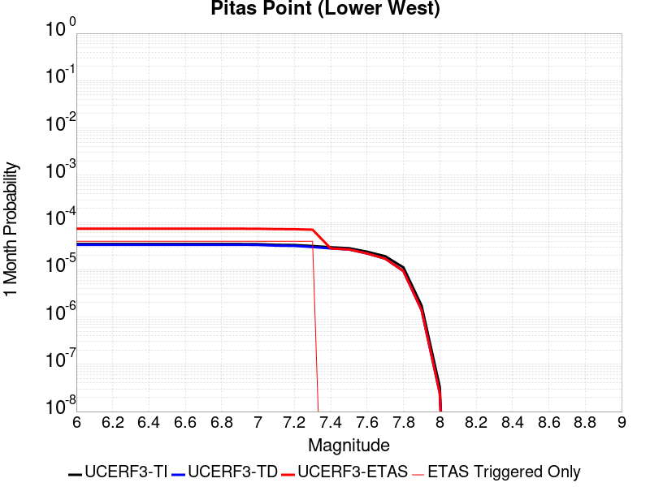 |  |

| Magnitude | 1 wk TI Prob | 1 wk TD Prob | 1 wk ETAS Prob | 1 wk ETAS/TD Gain | 1 wk ETAS Triggered Only | 1 mo TI Prob | 1 mo TD Prob | 1 mo ETAS Prob | 1 mo ETAS/TD Gain | 1 mo ETAS Triggered Only | 1 yr TI Prob | 1 yr TD Prob | 1 yr ETAS Prob | 1 yr ETAS/TD Gain | 1 yr ETAS Triggered Only |
|-----|-----|-----|-----|-----|-----|-----|-----|-----|-----|-----|-----|-----|-----|-----|-----|
| 6.0 | 8.151497E-6 | 7.857616E-6 | 4.7857302E-5 | 6.0905623 | 4.0E-5 | 3.493452E-5 | 3.3675067E-5 | 7.367372E-5 | 2.1877825 | 4.0E-5 | 4.252448E-4 | 4.0991756E-4 | 4.8988475E-4 | 1.1950812 | 8.0E-5 |
| 6.1 | 8.151497E-6 | 7.857616E-6 | 4.7857302E-5 | 6.0905623 | 4.0E-5 | 3.493452E-5 | 3.3675067E-5 | 7.367372E-5 | 2.1877825 | 4.0E-5 | 4.252448E-4 | 4.0991756E-4 | 4.8988475E-4 | 1.1950812 | 8.0E-5 |
| 6.2 | 8.151497E-6 | 7.857616E-6 | 4.7857302E-5 | 6.0905623 | 4.0E-5 | 3.493452E-5 | 3.3675067E-5 | 7.367372E-5 | 2.1877825 | 4.0E-5 | 4.252448E-4 | 4.0991756E-4 | 4.8988475E-4 | 1.1950812 | 8.0E-5 |
| 6.3 | 8.151497E-6 | 7.857616E-6 | 4.7857302E-5 | 6.0905623 | 4.0E-5 | 3.493452E-5 | 3.3675067E-5 | 7.367372E-5 | 2.1877825 | 4.0E-5 | 4.252448E-4 | 4.0991756E-4 | 4.8988475E-4 | 1.1950812 | 8.0E-5 |
| 6.4 | 8.151497E-6 | 7.857616E-6 | 4.7857302E-5 | 6.0905623 | 4.0E-5 | 3.493452E-5 | 3.3675067E-5 | 7.367372E-5 | 2.1877825 | 4.0E-5 | 4.252448E-4 | 4.0991756E-4 | 4.8988475E-4 | 1.1950812 | 8.0E-5 |
| 6.5 | 8.151497E-6 | 7.857616E-6 | 4.7857302E-5 | 6.0905623 | 4.0E-5 | 3.493452E-5 | 3.3675067E-5 | 7.367372E-5 | 2.1877825 | 4.0E-5 | 4.252448E-4 | 4.0991756E-4 | 4.8988475E-4 | 1.1950812 | 8.0E-5 |
| 6.6 | 8.151497E-6 | 7.857616E-6 | 4.7857302E-5 | 6.0905623 | 4.0E-5 | 3.493452E-5 | 3.3675067E-5 | 7.367372E-5 | 2.1877825 | 4.0E-5 | 4.252448E-4 | 4.0991756E-4 | 4.8988475E-4 | 1.1950812 | 8.0E-5 |
| 6.7 | 8.151497E-6 | 7.857616E-6 | 4.7857302E-5 | 6.0905623 | 4.0E-5 | 3.493452E-5 | 3.3675067E-5 | 7.367372E-5 | 2.1877825 | 4.0E-5 | 4.252448E-4 | 4.0991756E-4 | 4.8988475E-4 | 1.1950812 | 8.0E-5 |
| 6.8 | 8.151497E-6 | 7.857616E-6 | 4.7857302E-5 | 6.0905623 | 4.0E-5 | 3.493452E-5 | 3.3675067E-5 | 7.367372E-5 | 2.1877825 | 4.0E-5 | 4.252448E-4 | 4.0991756E-4 | 4.8988475E-4 | 1.1950812 | 8.0E-5 |
| 6.9 | 8.151497E-6 | 7.857616E-6 | 4.7857302E-5 | 6.0905623 | 4.0E-5 | 3.493452E-5 | 3.3675067E-5 | 7.367372E-5 | 2.1877825 | 4.0E-5 | 4.252448E-4 | 4.0991756E-4 | 4.8988475E-4 | 1.1950812 | 8.0E-5 |
| 7.0 | 8.103535E-6 | 7.807036E-6 | 4.7806723E-5 | 6.1235433 | 4.0E-5 | 3.4728975E-5 | 3.3458302E-5 | 7.345696E-5 | 2.195478 | 4.0E-5 | 4.2274324E-4 | 4.0727944E-4 | 4.8724684E-4 | 1.1963453 | 8.0E-5 |
| 7.1 | 7.853298E-6 | 7.542677E-6 | 4.7542377E-5 | 6.303117 | 4.0E-5 | 3.3656554E-5 | 3.2325363E-5 | 7.232407E-5 | 2.2373784 | 4.0E-5 | 4.096915E-4 | 3.9349092E-4 | 4.7345945E-4 | 1.2032284 | 8.0E-5 |
| 7.2 | 7.771102E-6 | 7.454939E-6 | 4.745464E-5 | 6.3655305 | 4.0E-5 | 3.33043E-5 | 3.1949352E-5 | 7.1948074E-5 | 2.2519417 | 4.0E-5 | 4.0540437E-4 | 3.8891463E-4 | 4.6888352E-4 | 1.2056206 | 8.0E-5 |
| 7.3 | 7.3945344E-6 | 7.050944E-6 | 4.7050664E-5 | 6.672959 | 4.0E-5 | 3.1690477E-5 | 3.0217985E-5 | 7.0216774E-5 | 2.323675 | 4.0E-5 | 3.8576324E-4 | 3.678425E-4 | 4.4781307E-4 | 1.2174044 | 8.0E-5 |
| 7.4 | 6.964645E-6 | 6.5916875E-6 | 6.5916875E-6 | 1.0 | 0.0 | 2.9848137E-5 | 2.8249786E-5 | 2.8249786E-5 | 1.0 | 0.0 | 3.6334046E-4 | 3.4388734E-4 | 3.838736E-4 | 1.1162772 | 4.0E-5 |
| 7.5 | 6.6525035E-6 | 6.2606523E-6 | 6.2606523E-6 | 1.0 | 0.0 | 2.851042E-5 | 2.6831094E-5 | 2.6831094E-5 | 1.0 | 0.0 | 3.4705905E-4 | 3.266201E-4 | 3.66607E-4 | 1.1224264 | 4.0E-5 |
| 7.6 | 5.613338E-6 | 5.15261E-6 | 5.15261E-6 | 1.0 | 0.0 | 2.405694E-5 | 2.208243E-5 | 2.208243E-5 | 1.0 | 0.0 | 2.928539E-4 | 2.688207E-4 | 3.0880995E-4 | 1.148758 | 4.0E-5 |
| 7.7 | 4.494704E-6 | 3.997876E-6 | 3.997876E-6 | 1.0 | 0.0 | 1.9262876E-5 | 1.7133641E-5 | 1.7133641E-5 | 1.0 | 0.0 | 2.3450027E-4 | 2.0858237E-4 | 2.48574E-4 | 1.1917307 | 4.0E-5 |
| 7.8 | 2.6075882E-6 | 2.1841993E-6 | 2.1841993E-6 | 1.0 | 0.0 | 1.117533E-5 | 9.360821E-6 | 9.360821E-6 | 1.0 | 0.0 | 1.3605114E-4 | 1.1396208E-4 | 1.5395752E-4 | 1.3509539 | 4.0E-5 |
| 7.9 | 4.045984E-7 | 3.2431933E-7 | 3.2431933E-7 | 1.0 | 0.0 | 1.733992E-6 | 1.3899393E-6 | 1.3899393E-6 | 1.0 | 0.0 | 2.1111147E-5 | 1.6922382E-5 | 1.6922382E-5 | 1.0 | 0.0 |
| 8.0 | 7.791402E-9 | 5.68495E-9 | 5.68495E-9 | 1.0 | 0.0 | 3.3391725E-8 | 2.4364072E-8 | 2.4364072E-8 | 1.0 | 0.0 | 4.0654416E-7 | 2.9663255E-7 | 2.9663255E-7 | 1.0 | 0.0 |

## Bartlett Springs 2011 CFM
*[(top)](#table-of-contents)*

| 1 Week | 1 Month | 1 Year |
|-----|-----|-----|
|  | 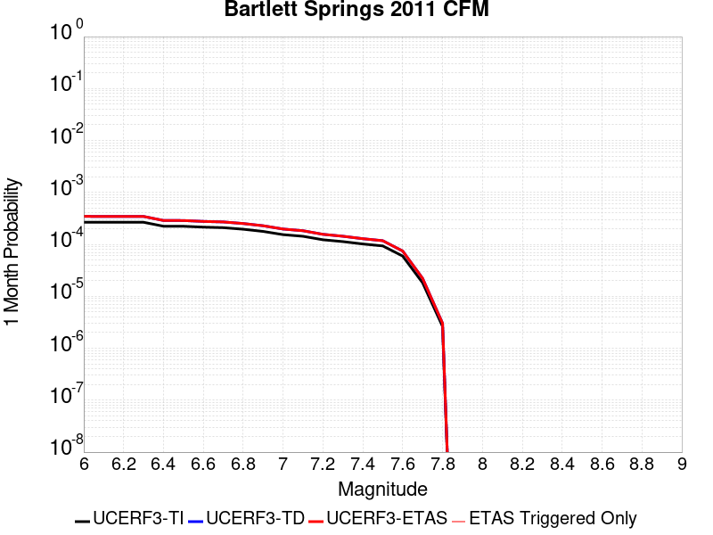 |  |

| Magnitude | 1 wk TI Prob | 1 wk TD Prob | 1 wk ETAS Prob | 1 wk ETAS/TD Gain | 1 wk ETAS Triggered Only | 1 mo TI Prob | 1 mo TD Prob | 1 mo ETAS Prob | 1 mo ETAS/TD Gain | 1 mo ETAS Triggered Only | 1 yr TI Prob | 1 yr TD Prob | 1 yr ETAS Prob | 1 yr ETAS/TD Gain | 1 yr ETAS Triggered Only |
|-----|-----|-----|-----|-----|-----|-----|-----|-----|-----|-----|-----|-----|-----|-----|-----|
| 6.0 | 6.2326144E-5 | 8.068194E-5 | 8.068194E-5 | 1.0 | 0.0 | 2.6708472E-4 | 3.4573447E-4 | 3.4573447E-4 | 1.0 | 0.0 | 0.003246908 | 0.004201287 | 0.004280951 | 1.0189618 | 8.0E-5 |
| 6.1 | 6.227657E-5 | 8.0619386E-5 | 8.0619386E-5 | 1.0 | 0.0 | 2.668723E-4 | 3.4546645E-4 | 3.4546645E-4 | 1.0 | 0.0 | 0.0032443295 | 0.0041980366 | 0.0042777006 | 1.0189766 | 8.0E-5 |
| 6.2 | 6.22452E-5 | 8.057996E-5 | 8.057996E-5 | 1.0 | 0.0 | 2.6673786E-4 | 3.452975E-4 | 3.452975E-4 | 1.0 | 0.0 | 0.0032426978 | 0.0041959877 | 0.004275652 | 1.0189859 | 8.0E-5 |
| 6.3 | 6.219006E-5 | 8.050973E-5 | 8.050973E-5 | 1.0 | 0.0 | 2.6650162E-4 | 3.4499663E-4 | 3.4499663E-4 | 1.0 | 0.0 | 0.00323983 | 0.0041923383 | 0.004272003 | 1.0190024 | 8.0E-5 |
| 6.4 | 5.2175856E-5 | 6.7315654E-5 | 6.7315654E-5 | 1.0 | 0.0 | 2.2359163E-4 | 2.8846384E-4 | 2.8846384E-4 | 1.0 | 0.0 | 0.0027188298 | 0.0035064386 | 0.0035861582 | 1.0227351 | 8.0E-5 |
| 6.5 | 5.205166E-5 | 6.715818E-5 | 6.715818E-5 | 1.0 | 0.0 | 2.2305945E-4 | 2.877891E-4 | 2.877891E-4 | 1.0 | 0.0 | 0.0027123666 | 0.0034982504 | 0.0035779704 | 1.0227885 | 8.0E-5 |
| 6.6 | 5.0085426E-5 | 6.455176E-5 | 6.455176E-5 | 1.0 | 0.0 | 2.1463417E-4 | 2.7662134E-4 | 2.7662134E-4 | 1.0 | 0.0 | 0.0026100394 | 0.0033627131 | 0.0034025786 | 1.0118551 | 4.0E-5 |
| 6.7 | 4.8930866E-5 | 6.3075066E-5 | 6.3075066E-5 | 1.0 | 0.0 | 2.0968684E-4 | 2.7029397E-4 | 2.7029397E-4 | 1.0 | 0.0 | 0.0025499484 | 0.0032859126 | 0.0033257813 | 1.0121331 | 4.0E-5 |
| 6.8 | 4.5679535E-5 | 5.8794933E-5 | 5.8794933E-5 | 1.0 | 0.0 | 1.9575475E-4 | 2.5195416E-4 | 2.5195416E-4 | 1.0 | 0.0 | 0.002380709 | 0.003063264 | 0.0031031417 | 1.013018 | 4.0E-5 |
| 6.9 | 4.1439176E-5 | 5.3267482E-5 | 5.3267482E-5 | 1.0 | 0.0 | 1.7758438E-4 | 2.2826936E-4 | 2.2826936E-4 | 1.0 | 0.0 | 0.002159946 | 0.0027756628 | 0.0028155518 | 1.0143709 | 4.0E-5 |
| 7.0 | 3.5920104E-5 | 4.60486E-5 | 4.60486E-5 | 1.0 | 0.0 | 1.5393422E-4 | 1.9733631E-4 | 1.9733631E-4 | 1.0 | 0.0 | 0.001872538 | 0.0023999382 | 0.0023999382 | 1.0 | 0.0 |
| 7.1 | 3.338812E-5 | 4.2725962E-5 | 4.2725962E-5 | 1.0 | 0.0 | 1.430841E-4 | 1.830985E-4 | 1.830985E-4 | 1.0 | 0.0 | 0.0017406568 | 0.0022269594 | 0.0022269594 | 1.0 | 0.0 |
| 7.2 | 2.8619615E-5 | 3.6431982E-5 | 3.6431982E-5 | 1.0 | 0.0 | 1.2264973E-4 | 1.5612777E-4 | 1.5612777E-4 | 1.0 | 0.0 | 0.0014922376 | 0.0018992082 | 0.0018992082 | 1.0 | 0.0 |
| 7.3 | 2.6376783E-5 | 3.3450713E-5 | 3.3450713E-5 | 1.0 | 0.0 | 1.13038455E-4 | 1.4335237E-4 | 1.4335237E-4 | 1.0 | 0.0 | 0.0013753743 | 0.0017439272 | 0.0017439272 | 1.0 | 0.0 |
| 7.4 | 2.3738676E-5 | 3.0003892E-5 | 3.0003892E-5 | 1.0 | 0.0 | 1.0173322E-4 | 1.2858181E-4 | 1.2858181E-4 | 1.0 | 0.0 | 0.0012378981 | 0.0015643674 | 0.0015643674 | 1.0 | 0.0 |
| 7.5 | 2.1789481E-5 | 2.7462149E-5 | 2.7462149E-5 | 1.0 | 0.0 | 9.338015E-5 | 1.1768966E-4 | 1.1768966E-4 | 1.0 | 0.0 | 0.0011363103 | 0.0014319377 | 0.0014319377 | 1.0 | 0.0 |
| 7.6 | 1.3895281E-5 | 1.7382852E-5 | 1.7382852E-5 | 1.0 | 0.0 | 5.9549846E-5 | 7.449583E-5 | 7.449583E-5 | 1.0 | 0.0 | 7.2477816E-4 | 9.0661214E-4 | 9.0661214E-4 | 1.0 | 0.0 |
| 7.7 | 4.245981E-6 | 5.166151E-6 | 5.166151E-6 | 1.0 | 0.0 | 1.8196934E-5 | 2.214046E-5 | 2.214046E-5 | 1.0 | 0.0 | 2.2152514E-4 | 2.6952694E-4 | 2.6952694E-4 | 1.0 | 0.0 |
| 7.8 | 6.145192E-7 | 7.055364E-7 | 7.055364E-7 | 1.0 | 0.0 | 2.633651E-6 | 3.023724E-6 | 3.023724E-6 | 1.0 | 0.0 | 3.206423E-5 | 3.681323E-5 | 3.681323E-5 | 1.0 | 0.0 |

## Calico-Hidalgo
*[(top)](#table-of-contents)*

| 1 Week | 1 Month | 1 Year |
|-----|-----|-----|
|  |  | 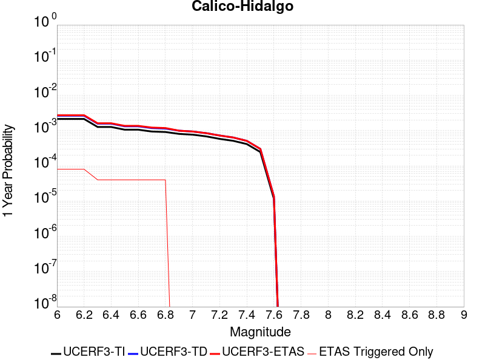 |

| Magnitude | 1 wk TI Prob | 1 wk TD Prob | 1 wk ETAS Prob | 1 wk ETAS/TD Gain | 1 wk ETAS Triggered Only | 1 mo TI Prob | 1 mo TD Prob | 1 mo ETAS Prob | 1 mo ETAS/TD Gain | 1 mo ETAS Triggered Only | 1 yr TI Prob | 1 yr TD Prob | 1 yr ETAS Prob | 1 yr ETAS/TD Gain | 1 yr ETAS Triggered Only |
|-----|-----|-----|-----|-----|-----|-----|-----|-----|-----|-----|-----|-----|-----|-----|-----|
| 6.0 | 4.0906612E-5 | 5.073094E-5 | 9.0728914E-5 | 1.7884334 | 4.0E-5 | 1.7530227E-4 | 2.174025E-4 | 2.573938E-4 | 1.1839505 | 4.0E-5 | 0.0021322158 | 0.0026440606 | 0.0027238491 | 1.0301765 | 8.0E-5 |
| 6.1 | 4.0906612E-5 | 5.073094E-5 | 9.0728914E-5 | 1.7884334 | 4.0E-5 | 1.7530227E-4 | 2.174025E-4 | 2.573938E-4 | 1.1839505 | 4.0E-5 | 0.0021322158 | 0.0026440606 | 0.0027238491 | 1.0301765 | 8.0E-5 |
| 6.2 | 4.0906612E-5 | 5.073094E-5 | 9.0728914E-5 | 1.7884334 | 4.0E-5 | 1.7530227E-4 | 2.174025E-4 | 2.573938E-4 | 1.1839505 | 4.0E-5 | 0.0021322158 | 0.0026440606 | 0.0027238491 | 1.0301765 | 8.0E-5 |
| 6.3 | 2.4242801E-5 | 3.01023E-5 | 3.01023E-5 | 1.0 | 0.0 | 1.0389358E-4 | 1.2900366E-4 | 1.2900366E-4 | 1.0 | 0.0 | 0.0012641704 | 0.0015695215 | 0.0016094587 | 1.0254455 | 4.0E-5 |
| 6.4 | 2.4242801E-5 | 3.01023E-5 | 3.01023E-5 | 1.0 | 0.0 | 1.0389358E-4 | 1.2900366E-4 | 1.2900366E-4 | 1.0 | 0.0 | 0.0012641704 | 0.0015695215 | 0.0016094587 | 1.0254455 | 4.0E-5 |
| 6.5 | 2.0286952E-5 | 2.5324422E-5 | 2.5324422E-5 | 1.0 | 0.0 | 8.694118E-5 | 1.0852882E-4 | 1.0852882E-4 | 1.0 | 0.0 | 0.0010579949 | 0.0013205545 | 0.0013605017 | 1.0302503 | 4.0E-5 |
| 6.6 | 2.0269223E-5 | 2.5305366E-5 | 2.5305366E-5 | 1.0 | 0.0 | 8.6865206E-5 | 1.0844716E-4 | 1.0844716E-4 | 1.0 | 0.0 | 0.0010570707 | 0.0013195615 | 0.0013595087 | 1.0302731 | 4.0E-5 |
| 6.7 | 1.799852E-5 | 2.2548089E-5 | 2.2548089E-5 | 1.0 | 0.0 | 7.713423E-5 | 9.663117E-5 | 9.663117E-5 | 1.0 | 0.0 | 9.3870464E-4 | 0.0011758641 | 0.0012158172 | 1.0339775 | 4.0E-5 |
| 6.8 | 1.7458793E-5 | 2.1849313E-5 | 2.1849313E-5 | 1.0 | 0.0 | 7.4821255E-5 | 9.3636634E-5 | 9.3636634E-5 | 1.0 | 0.0 | 9.10568E-4 | 0.0011394443 | 0.0011793987 | 1.0350648 | 4.0E-5 |
| 6.9 | 1.542884E-5 | 1.9032297E-5 | 1.9032297E-5 | 1.0 | 0.0 | 6.612192E-5 | 8.156451E-5 | 8.156451E-5 | 1.0 | 0.0 | 8.04737E-4 | 9.926087E-4 | 9.926087E-4 | 1.0 | 0.0 |
| 7.0 | 1.468253E-5 | 1.8036559E-5 | 1.8036559E-5 | 1.0 | 0.0 | 6.292361E-5 | 7.729732E-5 | 7.729732E-5 | 1.0 | 0.0 | 7.658257E-4 | 9.407016E-4 | 9.407016E-4 | 1.0 | 0.0 |
| 7.1 | 1.3139281E-5 | 1.6206326E-5 | 1.6206326E-5 | 1.0 | 0.0 | 5.6309986E-5 | 6.9453905E-5 | 6.9453905E-5 | 1.0 | 0.0 | 6.853584E-4 | 8.4528583E-4 | 8.4528583E-4 | 1.0 | 0.0 |
| 7.2 | 1.1127404E-5 | 1.3871357E-5 | 1.3871357E-5 | 1.0 | 0.0 | 4.7688E-5 | 5.944738E-5 | 5.944738E-5 | 1.0 | 0.0 | 5.8044674E-4 | 7.2354235E-4 | 7.2354235E-4 | 1.0 | 0.0 |
| 7.3 | 9.808154E-6 | 1.2178817E-5 | 1.2178817E-5 | 1.0 | 0.0 | 4.2034266E-5 | 5.2193944E-5 | 5.2193944E-5 | 1.0 | 0.0 | 5.11647E-4 | 6.3528673E-4 | 6.3528673E-4 | 1.0 | 0.0 |
| 7.4 | 7.942452E-6 | 9.793949E-6 | 9.793949E-6 | 1.0 | 0.0 | 3.4038632E-5 | 4.1973446E-5 | 4.1973446E-5 | 1.0 | 0.0 | 4.1434157E-4 | 5.1091635E-4 | 5.1091635E-4 | 1.0 | 0.0 |
| 7.5 | 4.7121216E-6 | 5.7738143E-6 | 5.7738143E-6 | 1.0 | 0.0 | 2.019465E-5 | 2.4744726E-5 | 2.4744726E-5 | 1.0 | 0.0 | 2.4584212E-4 | 3.0123306E-4 | 3.0123306E-4 | 1.0 | 0.0 |
| 7.6 | 2.21172E-7 | 2.6043384E-7 | 2.6043384E-7 | 1.0 | 0.0 | 9.478797E-7 | 1.1161446E-6 | 1.1161446E-6 | 1.0 | 0.0 | 1.1540374E-5 | 1.3589005E-5 | 1.3589005E-5 | 1.0 | 0.0 |

## Santa Monica alt 1
*[(top)](#table-of-contents)*

| 1 Week | 1 Month | 1 Year |
|-----|-----|-----|
|  | 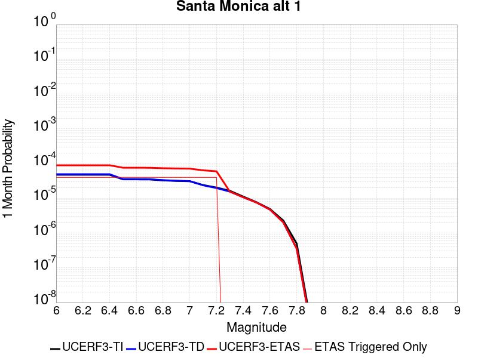 | 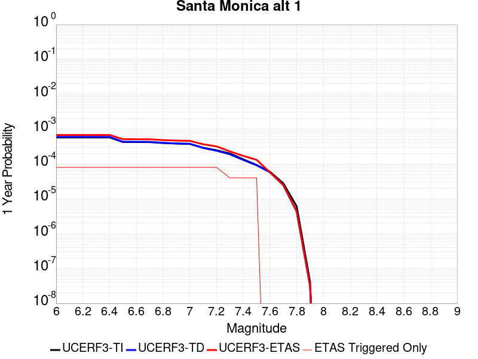 |

| Magnitude | 1 wk TI Prob | 1 wk TD Prob | 1 wk ETAS Prob | 1 wk ETAS/TD Gain | 1 wk ETAS Triggered Only | 1 mo TI Prob | 1 mo TD Prob | 1 mo ETAS Prob | 1 mo ETAS/TD Gain | 1 mo ETAS Triggered Only | 1 yr TI Prob | 1 yr TD Prob | 1 yr ETAS Prob | 1 yr ETAS/TD Gain | 1 yr ETAS Triggered Only |
|-----|-----|-----|-----|-----|-----|-----|-----|-----|-----|-----|-----|-----|-----|-----|-----|
| 6.0 | 1.1066008E-5 | 1.1483656E-5 | 1.1483656E-5 | 1.0 | 0.0 | 4.742488E-5 | 4.9214817E-5 | 8.9212845E-5 | 1.8127234 | 4.0E-5 | 5.7724497E-4 | 5.990396E-4 | 6.7899167E-4 | 1.1334671 | 8.0E-5 |
| 6.1 | 1.1066008E-5 | 1.1483656E-5 | 1.1483656E-5 | 1.0 | 0.0 | 4.742488E-5 | 4.9214817E-5 | 8.9212845E-5 | 1.8127234 | 4.0E-5 | 5.7724497E-4 | 5.990396E-4 | 6.7899167E-4 | 1.1334671 | 8.0E-5 |
| 6.2 | 1.1066008E-5 | 1.1483656E-5 | 1.1483656E-5 | 1.0 | 0.0 | 4.742488E-5 | 4.9214817E-5 | 8.9212845E-5 | 1.8127234 | 4.0E-5 | 5.7724497E-4 | 5.990396E-4 | 6.7899167E-4 | 1.1334671 | 8.0E-5 |
| 6.3 | 1.1066008E-5 | 1.1483656E-5 | 1.1483656E-5 | 1.0 | 0.0 | 4.742488E-5 | 4.9214817E-5 | 8.9212845E-5 | 1.8127234 | 4.0E-5 | 5.7724497E-4 | 5.990396E-4 | 6.7899167E-4 | 1.1334671 | 8.0E-5 |
| 6.4 | 1.1066008E-5 | 1.1483656E-5 | 1.1483656E-5 | 1.0 | 0.0 | 4.742488E-5 | 4.9214817E-5 | 8.9212845E-5 | 1.8127234 | 4.0E-5 | 5.7724497E-4 | 5.990396E-4 | 6.7899167E-4 | 1.1334671 | 8.0E-5 |
| 6.5 | 8.183544E-6 | 8.337806E-6 | 8.337806E-6 | 1.0 | 0.0 | 3.5071862E-5 | 3.5732974E-5 | 7.573154E-5 | 2.1193743 | 4.0E-5 | 4.2691626E-4 | 4.3496373E-4 | 5.1492895E-4 | 1.1838434 | 8.0E-5 |
| 6.6 | 8.1543285E-6 | 8.306011E-6 | 8.306011E-6 | 1.0 | 0.0 | 3.4946657E-5 | 3.5596713E-5 | 7.559529E-5 | 2.1236591 | 4.0E-5 | 4.2539247E-4 | 4.333054E-4 | 5.1327073E-4 | 1.1845473 | 8.0E-5 |
| 6.7 | 8.110878E-6 | 8.259396E-6 | 8.259396E-6 | 1.0 | 0.0 | 3.4760444E-5 | 3.539694E-5 | 7.5395525E-5 | 2.130001 | 4.0E-5 | 4.231262E-4 | 4.3087412E-4 | 5.108396E-4 | 1.1855891 | 8.0E-5 |
| 6.8 | 7.644036E-6 | 7.75327E-6 | 7.75327E-6 | 1.0 | 0.0 | 3.275974E-5 | 3.3227883E-5 | 7.3226554E-5 | 2.2037683 | 4.0E-5 | 3.9877684E-4 | 4.044758E-4 | 4.8444344E-4 | 1.1977068 | 8.0E-5 |
| 6.9 | 7.3698293E-6 | 7.457851E-6 | 7.457851E-6 | 1.0 | 0.0 | 3.15846E-5 | 3.1961834E-5 | 7.196056E-5 | 2.2514527 | 4.0E-5 | 3.8447464E-4 | 3.8906725E-4 | 4.6903614E-4 | 1.20554 | 8.0E-5 |
| 7.0 | 7.209872E-6 | 7.2877206E-6 | 7.2877206E-6 | 1.0 | 0.0 | 3.0899086E-5 | 3.1232725E-5 | 7.123147E-5 | 2.280668 | 4.0E-5 | 3.7613141E-4 | 3.8019344E-4 | 4.6016302E-4 | 1.2103392 | 8.0E-5 |
| 7.1 | 5.603456E-6 | 5.525409E-6 | 5.525409E-6 | 1.0 | 0.0 | 2.4014591E-5 | 2.3680112E-5 | 6.367917E-5 | 2.6891413 | 4.0E-5 | 2.923384E-4 | 2.8826762E-4 | 3.6824454E-4 | 1.27744 | 8.0E-5 |
| 7.2 | 4.7483613E-6 | 4.5923603E-6 | 4.5923603E-6 | 1.0 | 0.0 | 2.0349962E-5 | 1.9681396E-5 | 5.968061E-5 | 3.032336 | 4.0E-5 | 2.4773262E-4 | 2.3959478E-4 | 3.1957563E-4 | 1.3338171 | 8.0E-5 |
| 7.3 | 3.829015E-6 | 3.635215E-6 | 3.635215E-6 | 1.0 | 0.0 | 1.6409962E-5 | 1.55794E-5 | 1.55794E-5 | 1.0 | 0.0 | 1.9977297E-4 | 1.8966277E-4 | 2.2965518E-4 | 1.2108606 | 4.0E-5 |
| 7.4 | 2.610755E-6 | 2.5003064E-6 | 2.5003064E-6 | 1.0 | 0.0 | 1.1188902E-5 | 1.0715555E-5 | 1.0715555E-5 | 1.0 | 0.0 | 1.3621636E-4 | 1.3045411E-4 | 1.704489E-4 | 1.3065813 | 4.0E-5 |
| 7.5 | 1.792146E-6 | 1.758899E-6 | 1.758899E-6 | 1.0 | 0.0 | 7.680603E-6 | 7.5381167E-6 | 7.5381167E-6 | 1.0 | 0.0 | 9.3507326E-5 | 9.177274E-5 | 1.3176906E-4 | 1.4358193 | 4.0E-5 |
| 7.6 | 1.1473018E-6 | 1.1032112E-6 | 1.1032112E-6 | 1.0 | 0.0 | 4.9169985E-6 | 4.728039E-6 | 4.728039E-6 | 1.0 | 0.0 | 5.986281E-5 | 5.756237E-5 | 5.756237E-5 | 1.0 | 0.0 |
| 7.7 | 5.330919E-7 | 4.7469157E-7 | 4.7469157E-7 | 1.0 | 0.0 | 2.2846775E-6 | 2.034391E-6 | 2.034391E-6 | 1.0 | 0.0 | 2.7815593E-5 | 2.476844E-5 | 2.476844E-5 | 1.0 | 0.0 |
| 7.8 | 1.1668574E-7 | 8.304975E-8 | 8.304975E-8 | 1.0 | 0.0 | 5.000816E-7 | 3.5592745E-7 | 3.5592745E-7 | 1.0 | 0.0 | 6.0884768E-6 | 4.3334085E-6 | 4.3334085E-6 | 1.0 | 0.0 |
| 7.9 | 8.007447E-10 | 6.1625505E-10 | 6.1625505E-10 | 1.0 | 0.0 | 3.4317629E-9 | 2.6410938E-9 | 2.6410938E-9 | 1.0 | 0.0 | 4.1781714E-8 | 3.2155317E-8 | 3.2155317E-8 | 1.0 | 0.0 |

## Earthquake Valley
*[(top)](#table-of-contents)*

| 1 Week | 1 Month | 1 Year |
|-----|-----|-----|
|  | 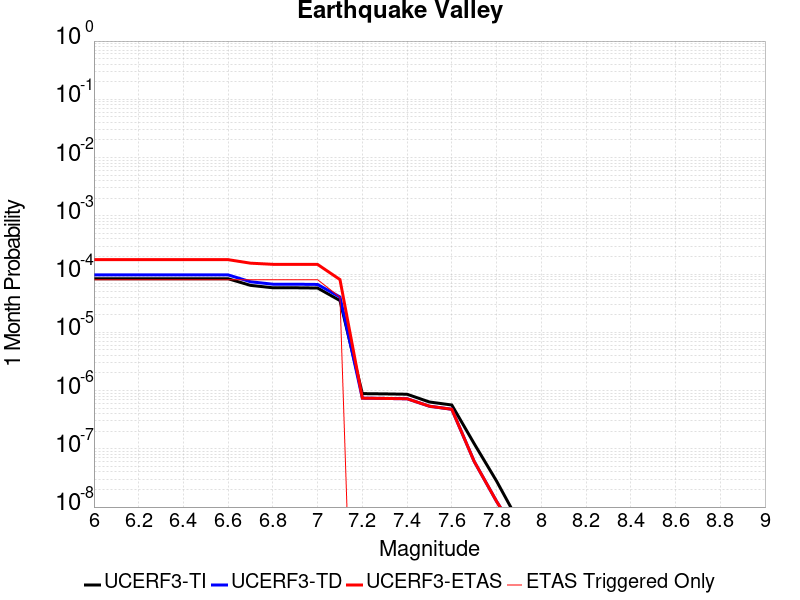 |  |

| Magnitude | 1 wk TI Prob | 1 wk TD Prob | 1 wk ETAS Prob | 1 wk ETAS/TD Gain | 1 wk ETAS Triggered Only | 1 mo TI Prob | 1 mo TD Prob | 1 mo ETAS Prob | 1 mo ETAS/TD Gain | 1 mo ETAS Triggered Only | 1 yr TI Prob | 1 yr TD Prob | 1 yr ETAS Prob | 1 yr ETAS/TD Gain | 1 yr ETAS Triggered Only |
|-----|-----|-----|-----|-----|-----|-----|-----|-----|-----|-----|-----|-----|-----|-----|-----|
| 6.0 | 1.9416384E-5 | 2.2596936E-5 | 2.2596936E-5 | 1.0 | 0.0 | 8.321042E-5 | 9.68411E-5 | 1.7683335E-4 | 1.8260156 | 8.0E-5 | 0.001012616 | 0.0011785226 | 0.0012584283 | 1.0678016 | 8.0E-5 |
| 6.1 | 1.9416384E-5 | 2.2596936E-5 | 2.2596936E-5 | 1.0 | 0.0 | 8.321042E-5 | 9.68411E-5 | 1.7683335E-4 | 1.8260156 | 8.0E-5 | 0.001012616 | 0.0011785226 | 0.0012584283 | 1.0678016 | 8.0E-5 |
| 6.2 | 1.9416384E-5 | 2.2596936E-5 | 2.2596936E-5 | 1.0 | 0.0 | 8.321042E-5 | 9.68411E-5 | 1.7683335E-4 | 1.8260156 | 8.0E-5 | 0.001012616 | 0.0011785226 | 0.0012584283 | 1.0678016 | 8.0E-5 |
| 6.3 | 1.9416384E-5 | 2.2596936E-5 | 2.2596936E-5 | 1.0 | 0.0 | 8.321042E-5 | 9.68411E-5 | 1.7683335E-4 | 1.8260156 | 8.0E-5 | 0.001012616 | 0.0011785226 | 0.0012584283 | 1.0678016 | 8.0E-5 |
| 6.4 | 1.9416384E-5 | 2.2596936E-5 | 2.2596936E-5 | 1.0 | 0.0 | 8.321042E-5 | 9.68411E-5 | 1.7683335E-4 | 1.8260156 | 8.0E-5 | 0.001012616 | 0.0011785226 | 0.0012584283 | 1.0678016 | 8.0E-5 |
| 6.5 | 1.9389157E-5 | 2.256551E-5 | 2.256551E-5 | 1.0 | 0.0 | 8.309374E-5 | 9.670642E-5 | 1.7669868E-4 | 1.8271661 | 8.0E-5 | 0.0010111968 | 0.0011768846 | 0.0012567905 | 1.0678961 | 8.0E-5 |
| 6.6 | 1.9389157E-5 | 2.256551E-5 | 2.256551E-5 | 1.0 | 0.0 | 8.309374E-5 | 9.670642E-5 | 1.7669868E-4 | 1.8271661 | 8.0E-5 | 0.0010111968 | 0.0011768846 | 0.0012567905 | 1.0678961 | 8.0E-5 |
| 6.7 | 1.4925434E-5 | 1.721746E-5 | 1.721746E-5 | 1.0 | 0.0 | 6.396457E-5 | 7.378751E-5 | 1.537816E-4 | 2.0841143 | 8.0E-5 | 7.7849044E-4 | 8.980778E-4 | 9.780059E-4 | 1.0889992 | 8.0E-5 |
| 6.8 | 1.3570335E-5 | 1.5625135E-5 | 1.5625135E-5 | 1.0 | 0.0 | 5.8157282E-5 | 6.696361E-5 | 1.4695825E-4 | 2.1945987 | 8.0E-5 | 7.0783484E-4 | 8.150591E-4 | 8.9499395E-4 | 1.0980724 | 8.0E-5 |
| 6.9 | 1.3570335E-5 | 1.5625135E-5 | 1.5625135E-5 | 1.0 | 0.0 | 5.8157282E-5 | 6.696361E-5 | 1.4695825E-4 | 2.1945987 | 8.0E-5 | 7.0783484E-4 | 8.150591E-4 | 8.9499395E-4 | 1.0980724 | 8.0E-5 |
| 7.0 | 1.3433392E-5 | 1.5468602E-5 | 1.5468602E-5 | 1.0 | 0.0 | 5.757041E-5 | 6.629279E-5 | 1.462875E-4 | 2.2066877 | 8.0E-5 | 7.0069433E-4 | 8.06898E-4 | 8.8683347E-4 | 1.0990651 | 8.0E-5 |
| 7.1 | 8.181609E-6 | 9.421978E-6 | 9.421978E-6 | 1.0 | 0.0 | 3.5063567E-5 | 4.0379655E-5 | 8.037804E-5 | 1.9905578 | 4.0E-5 | 4.268153E-4 | 4.9157854E-4 | 5.315589E-4 | 1.0813305 | 4.0E-5 |
| 7.2 | 2.0663983E-7 | 1.7276827E-7 | 1.7276827E-7 | 1.0 | 0.0 | 8.855989E-7 | 7.4043527E-7 | 7.4043527E-7 | 1.0 | 0.0 | 1.0782113E-5 | 9.014766E-6 | 9.014766E-6 | 1.0 | 0.0 |
| 7.3 | 2.0462376E-7 | 1.7092242E-7 | 1.7092242E-7 | 1.0 | 0.0 | 8.7695867E-7 | 7.325244E-7 | 7.325244E-7 | 1.0 | 0.0 | 1.0676919E-5 | 8.918452E-6 | 8.918452E-6 | 1.0 | 0.0 |
| 7.4 | 2.0171088E-7 | 1.687456E-7 | 1.687456E-7 | 1.0 | 0.0 | 8.644749E-7 | 7.231952E-7 | 7.231952E-7 | 1.0 | 0.0 | 1.0524931E-5 | 8.80487E-6 | 8.80487E-6 | 1.0 | 0.0 |
| 7.5 | 1.4847944E-7 | 1.2570331E-7 | 1.2570331E-7 | 1.0 | 0.0 | 6.363403E-7 | 5.387284E-7 | 5.387284E-7 | 1.0 | 0.0 | 7.747416E-6 | 6.559E-6 | 6.559E-6 | 1.0 | 0.0 |
| 7.6 | 1.3185847E-7 | 1.11332305E-7 | 1.11332305E-7 | 1.0 | 0.0 | 5.6510765E-7 | 4.7713837E-7 | 4.7713837E-7 | 1.0 | 0.0 | 6.8801637E-6 | 5.8091464E-6 | 5.8091464E-6 | 1.0 | 0.0 |
| 7.7 | 2.8609954E-8 | 1.4188027E-8 | 1.4188027E-8 | 1.0 | 0.0 | 1.2261408E-7 | 6.0805824E-8 | 6.0805824E-8 | 1.0 | 0.0 | 1.4928254E-6 | 7.403107E-7 | 7.403107E-7 | 1.0 | 0.0 |
| 7.8 | 6.527266E-9 | 2.9268739E-9 | 2.9268739E-9 | 1.0 | 0.0 | 2.7973995E-8 | 1.2543746E-8 | 1.2543746E-8 | 1.0 | 0.0 | 3.4058334E-7 | 1.5272009E-7 | 1.5272009E-7 | 1.0 | 0.0 |
| 7.9 | 1.2898267E-9 | 7.133548E-10 | 7.133548E-10 | 1.0 | 0.0 | 5.527829E-9 | 3.057235E-9 | 3.057235E-9 | 1.0 | 0.0 | 6.7301315E-8 | 3.7221838E-8 | 3.7221838E-8 | 1.0 | 0.0 |

## Richfield
*[(top)](#table-of-contents)*

| 1 Week | 1 Month | 1 Year |
|-----|-----|-----|
|  | 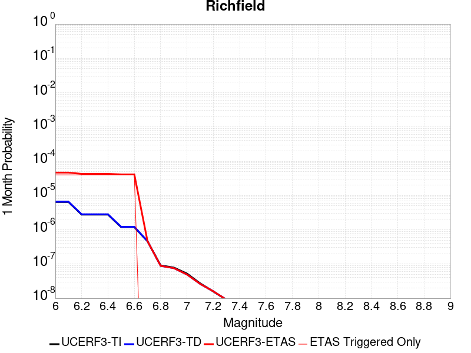 |  |

| Magnitude | 1 wk TI Prob | 1 wk TD Prob | 1 wk ETAS Prob | 1 wk ETAS/TD Gain | 1 wk ETAS Triggered Only | 1 mo TI Prob | 1 mo TD Prob | 1 mo ETAS Prob | 1 mo ETAS/TD Gain | 1 mo ETAS Triggered Only | 1 yr TI Prob | 1 yr TD Prob | 1 yr ETAS Prob | 1 yr ETAS/TD Gain | 1 yr ETAS Triggered Only |
|-----|-----|-----|-----|-----|-----|-----|-----|-----|-----|-----|-----|-----|-----|-----|-----|
| 6.0 | 1.5166896E-6 | 1.5393488E-6 | 4.1539286E-5 | 26.984974 | 4.0E-5 | 6.5000822E-6 | 6.5971985E-6 | 4.6596935E-5 | 7.0631394 | 4.0E-5 | 7.913562E-5 | 8.0319034E-5 | 1.2031582E-4 | 1.4979739 | 4.0E-5 |
| 6.1 | 1.5166896E-6 | 1.5393488E-6 | 4.1539286E-5 | 26.984974 | 4.0E-5 | 6.5000822E-6 | 6.5971985E-6 | 4.6596935E-5 | 7.0631394 | 4.0E-5 | 7.913562E-5 | 8.0319034E-5 | 1.2031582E-4 | 1.4979739 | 4.0E-5 |
| 6.2 | 6.473272E-7 | 6.5989434E-7 | 4.0659866E-5 | 61.615726 | 4.0E-5 | 2.7742565E-6 | 2.8281163E-6 | 4.2828004E-5 | 15.14365 | 4.0E-5 | 3.377605E-5 | 3.4431905E-5 | 7.443053E-5 | 2.1616733 | 4.0E-5 |
| 6.3 | 6.473272E-7 | 6.5989434E-7 | 4.0659866E-5 | 61.615726 | 4.0E-5 | 2.7742565E-6 | 2.8281163E-6 | 4.2828004E-5 | 15.14365 | 4.0E-5 | 3.377605E-5 | 3.4431905E-5 | 7.443053E-5 | 2.1616733 | 4.0E-5 |
| 6.4 | 6.473272E-7 | 6.5989434E-7 | 4.0659866E-5 | 61.615726 | 4.0E-5 | 2.7742565E-6 | 2.8281163E-6 | 4.2828004E-5 | 15.14365 | 4.0E-5 | 3.377605E-5 | 3.4431905E-5 | 7.443053E-5 | 2.1616733 | 4.0E-5 |
| 6.5 | 2.7954403E-7 | 2.8533913E-7 | 4.028533E-5 | 141.18404 | 4.0E-5 | 1.1980452E-6 | 1.2228816E-6 | 4.1222833E-5 | 33.709587 | 4.0E-5 | 1.4586103E-5 | 1.4888525E-5 | 5.488793E-5 | 3.6865928 | 4.0E-5 |
| 6.6 | 2.7954403E-7 | 2.8533913E-7 | 4.028533E-5 | 141.18404 | 4.0E-5 | 1.1980452E-6 | 1.2228816E-6 | 4.1222833E-5 | 33.709587 | 4.0E-5 | 1.4586103E-5 | 1.4888525E-5 | 5.488793E-5 | 3.6865928 | 4.0E-5 |
| 6.7 | 1.0777299E-7 | 1.0879465E-7 | 1.0879465E-7 | 1.0 | 0.0 | 4.6188418E-7 | 4.6626272E-7 | 4.6626272E-7 | 1.0 | 0.0 | 5.6234253E-6 | 5.676738E-6 | 5.676738E-6 | 1.0 | 0.0 |
| 6.8 | 2.1301874E-8 | 2.0666986E-8 | 2.0666986E-8 | 1.0 | 0.0 | 9.129375E-8 | 8.85728E-8 | 8.85728E-8 | 1.0 | 0.0 | 1.1115008E-6 | 1.0783733E-6 | 1.0783733E-6 | 1.0 | 0.0 |
| 6.9 | 1.8413502E-8 | 1.7751859E-8 | 1.7751859E-8 | 1.0 | 0.0 | 7.891501E-8 | 7.6079395E-8 | 7.6079395E-8 | 1.0 | 0.0 | 9.607899E-7 | 9.262663E-7 | 9.262663E-7 | 1.0 | 0.0 |
| 7.0 | 1.2290541E-8 | 1.1574894E-8 | 1.1574894E-8 | 1.0 | 0.0 | 5.2673748E-8 | 4.960669E-8 | 4.960669E-8 | 1.0 | 0.0 | 6.413027E-7 | 6.0396127E-7 | 6.0396127E-7 | 1.0 | 0.0 |
| 7.1 | 6.373573E-9 | 6.156072E-9 | 6.156072E-9 | 1.0 | 0.0 | 2.7315311E-8 | 2.6383166E-8 | 2.6383166E-8 | 1.0 | 0.0 | 3.3256384E-7 | 3.21215E-7 | 3.21215E-7 | 1.0 | 0.0 |
| 7.2 | 3.6989944E-9 | 3.736141E-9 | 3.736141E-9 | 1.0 | 0.0 | 1.5852834E-8 | 1.6012034E-8 | 1.6012034E-8 | 1.0 | 0.0 | 1.9300822E-7 | 1.9494651E-7 | 1.9494651E-7 | 1.0 | 0.0 |
| 7.3 | 2.097397E-9 | 2.1201276E-9 | 2.1201276E-9 | 1.0 | 0.0 | 8.9888434E-9 | 9.0862615E-9 | 9.0862615E-9 | 1.0 | 0.0 | 1.0943917E-7 | 1.1062523E-7 | 1.1062523E-7 | 1.0 | 0.0 |
| 7.4 | 5.8314464E-12 | 5.8920646E-12 | 5.8920646E-12 | 1.0 | 0.0 | 2.4991786E-11 | 2.52518E-11 | 2.52518E-11 | 1.0 | 0.0 | 3.0427527E-10 | 3.0744052E-10 | 3.0744052E-10 | 1.0 | 0.0 |

## Mission Hills 2011
*[(top)](#table-of-contents)*

| 1 Week | 1 Month | 1 Year |
|-----|-----|-----|
|  |  | 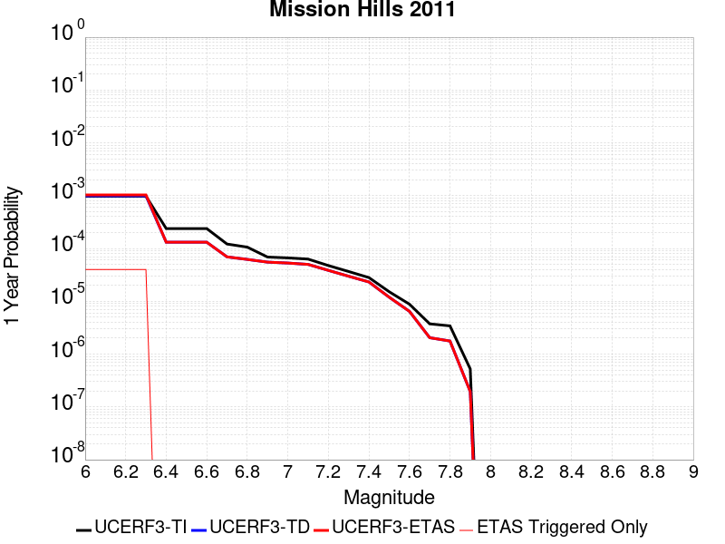 |

| Magnitude | 1 wk TI Prob | 1 wk TD Prob | 1 wk ETAS Prob | 1 wk ETAS/TD Gain | 1 wk ETAS Triggered Only | 1 mo TI Prob | 1 mo TD Prob | 1 mo ETAS Prob | 1 mo ETAS/TD Gain | 1 mo ETAS Triggered Only | 1 yr TI Prob | 1 yr TD Prob | 1 yr ETAS Prob | 1 yr ETAS/TD Gain | 1 yr ETAS Triggered Only |
|-----|-----|-----|-----|-----|-----|-----|-----|-----|-----|-----|-----|-----|-----|-----|-----|
| 6.0 | 1.8765717E-5 | 1.9065215E-5 | 5.9064452E-5 | 3.0980217 | 4.0E-5 | 8.0422025E-5 | 8.170743E-5 | 1.21704164E-4 | 1.4895115 | 4.0E-5 | 9.786983E-4 | 9.946778E-4 | 0.0010346379 | 1.040174 | 4.0E-5 |
| 6.1 | 1.8765717E-5 | 1.9065215E-5 | 5.9064452E-5 | 3.0980217 | 4.0E-5 | 8.0422025E-5 | 8.170743E-5 | 1.21704164E-4 | 1.4895115 | 4.0E-5 | 9.786983E-4 | 9.946778E-4 | 0.0010346379 | 1.040174 | 4.0E-5 |
| 6.2 | 1.8765717E-5 | 1.9065215E-5 | 5.9064452E-5 | 3.0980217 | 4.0E-5 | 8.0422025E-5 | 8.170743E-5 | 1.21704164E-4 | 1.4895115 | 4.0E-5 | 9.786983E-4 | 9.946778E-4 | 0.0010346379 | 1.040174 | 4.0E-5 |
| 6.3 | 1.8765717E-5 | 1.9065215E-5 | 5.9064452E-5 | 3.0980217 | 4.0E-5 | 8.0422025E-5 | 8.170743E-5 | 1.21704164E-4 | 1.4895115 | 4.0E-5 | 9.786983E-4 | 9.946778E-4 | 0.0010346379 | 1.040174 | 4.0E-5 |
| 6.4 | 4.566357E-6 | 2.5161664E-6 | 2.5161664E-6 | 1.0 | 0.0 | 1.9569954E-5 | 1.0783536E-5 | 1.0783536E-5 | 1.0 | 0.0 | 2.3823815E-4 | 1.3128346E-4 | 1.3128346E-4 | 1.0 | 0.0 |
| 6.5 | 4.566357E-6 | 2.5161664E-6 | 2.5161664E-6 | 1.0 | 0.0 | 1.9569954E-5 | 1.0783536E-5 | 1.0783536E-5 | 1.0 | 0.0 | 2.3823815E-4 | 1.3128346E-4 | 1.3128346E-4 | 1.0 | 0.0 |
| 6.6 | 4.566357E-6 | 2.5161664E-6 | 2.5161664E-6 | 1.0 | 0.0 | 1.9569954E-5 | 1.0783536E-5 | 1.0783536E-5 | 1.0 | 0.0 | 2.3823815E-4 | 1.3128346E-4 | 1.3128346E-4 | 1.0 | 0.0 |
| 6.7 | 2.3266773E-6 | 1.3302199E-6 | 1.3302199E-6 | 1.0 | 0.0 | 9.971435E-6 | 5.70093E-6 | 5.70093E-6 | 1.0 | 0.0 | 1.2139547E-4 | 6.940668E-5 | 6.940668E-5 | 1.0 | 0.0 |
| 6.8 | 2.032735E-6 | 1.1899541E-6 | 1.1899541E-6 | 1.0 | 0.0 | 8.711692E-6 | 5.0997937E-6 | 5.0997937E-6 | 1.0 | 0.0 | 1.06059684E-4 | 6.2088264E-5 | 6.2088264E-5 | 1.0 | 0.0 |
| 6.9 | 1.3186259E-6 | 1.056603E-6 | 1.056603E-6 | 1.0 | 0.0 | 5.6512413E-6 | 4.5282904E-6 | 4.5282904E-6 | 1.0 | 0.0 | 6.8801695E-5 | 5.5130575E-5 | 5.5130575E-5 | 1.0 | 0.0 |
| 7.0 | 1.2726016E-6 | 1.0163246E-6 | 1.0163246E-6 | 1.0 | 0.0 | 5.4539955E-6 | 4.3556697E-6 | 4.3556697E-6 | 1.0 | 0.0 | 6.6400375E-5 | 5.3029016E-5 | 5.3029016E-5 | 1.0 | 0.0 |
| 7.1 | 1.2063913E-6 | 9.574112E-7 | 9.574112E-7 | 1.0 | 0.0 | 5.170238E-6 | 4.1031844E-6 | 4.1031844E-6 | 1.0 | 0.0 | 6.294583E-5 | 4.9955153E-5 | 4.9955153E-5 | 1.0 | 0.0 |
| 7.2 | 9.105806E-7 | 7.3801147E-7 | 7.3801147E-7 | 1.0 | 0.0 | 3.9024826E-6 | 3.1629024E-6 | 3.1629024E-6 | 1.0 | 0.0 | 4.7511687E-5 | 3.8507675E-5 | 3.8507675E-5 | 1.0 | 0.0 |
| 7.3 | 7.020432E-7 | 5.713326E-7 | 5.713326E-7 | 1.0 | 0.0 | 3.0087533E-6 | 2.448566E-6 | 2.448566E-6 | 1.0 | 0.0 | 3.6630954E-5 | 2.9810897E-5 | 2.9810897E-5 | 1.0 | 0.0 |
| 7.4 | 5.3900635E-7 | 4.4511123E-7 | 4.4511123E-7 | 1.0 | 0.0 | 2.3100251E-6 | 1.9076183E-6 | 1.9076183E-6 | 1.0 | 0.0 | 2.8124194E-5 | 2.3225017E-5 | 2.3225017E-5 | 1.0 | 0.0 |
| 7.5 | 2.907075E-7 | 2.2898305E-7 | 2.2898305E-7 | 1.0 | 0.0 | 1.2458887E-6 | 9.813556E-7 | 9.813556E-7 | 1.0 | 0.0 | 1.5168589E-5 | 1.194794E-5 | 1.194794E-5 | 1.0 | 0.0 |
| 7.6 | 1.6903675E-7 | 1.2361865E-7 | 1.2361865E-7 | 1.0 | 0.0 | 7.2444305E-7 | 5.2979414E-7 | 5.2979414E-7 | 1.0 | 0.0 | 8.820059E-6 | 6.4502256E-6 | 6.4502256E-6 | 1.0 | 0.0 |
| 7.7 | 7.168073E-8 | 3.9193022E-8 | 3.9193022E-8 | 1.0 | 0.0 | 3.072031E-7 | 1.6797007E-7 | 1.6797007E-7 | 1.0 | 0.0 | 3.7401915E-6 | 2.0450339E-6 | 2.0450339E-6 | 1.0 | 0.0 |
| 7.8 | 6.564101E-8 | 3.389163E-8 | 3.389163E-8 | 1.0 | 0.0 | 2.813186E-7 | 1.4524984E-7 | 1.4524984E-7 | 1.0 | 0.0 | 3.4250486E-6 | 1.7684156E-6 | 1.7684156E-6 | 1.0 | 0.0 |
| 7.9 | 1.0029074E-8 | 3.737726E-9 | 3.737726E-9 | 1.0 | 0.0 | 4.2981743E-8 | 1.6018827E-8 | 1.6018827E-8 | 1.0 | 0.0 | 5.2330256E-7 | 1.950292E-7 | 1.950292E-7 | 1.0 | 0.0 |

## South Klamath Lake West
*[(top)](#table-of-contents)*

| 1 Week | 1 Month | 1 Year |
|-----|-----|-----|
|  | 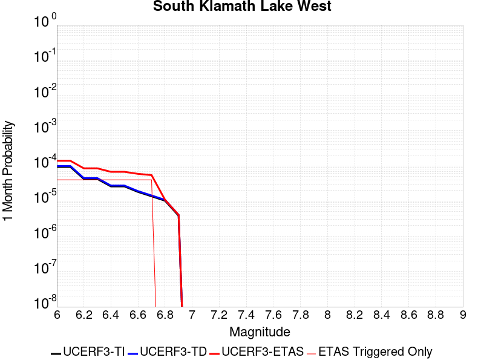 | 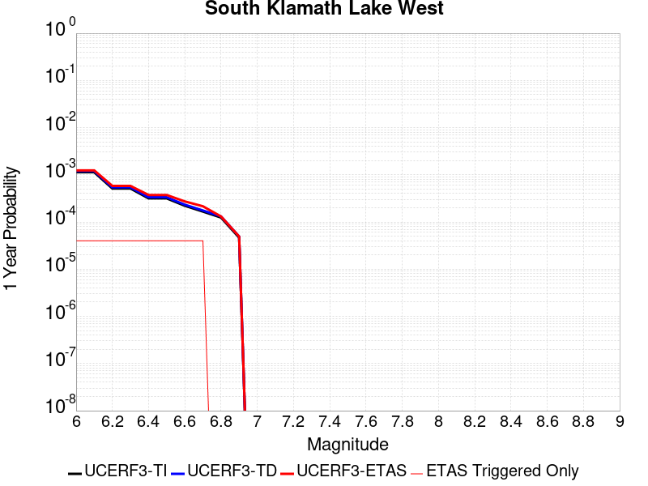 |

| Magnitude | 1 wk TI Prob | 1 wk TD Prob | 1 wk ETAS Prob | 1 wk ETAS/TD Gain | 1 wk ETAS Triggered Only | 1 mo TI Prob | 1 mo TD Prob | 1 mo ETAS Prob | 1 mo ETAS/TD Gain | 1 mo ETAS Triggered Only | 1 yr TI Prob | 1 yr TD Prob | 1 yr ETAS Prob | 1 yr ETAS/TD Gain | 1 yr ETAS Triggered Only |
|-----|-----|-----|-----|-----|-----|-----|-----|-----|-----|-----|-----|-----|-----|-----|-----|
| 6.0 | 2.174025E-5 | 2.3046705E-5 | 6.304578E-5 | 2.7355661 | 4.0E-5 | 9.3169176E-5 | 9.876822E-5 | 1.3876427E-4 | 1.4049486 | 4.0E-5 | 0.0011337444 | 0.0012019057 | 0.0012418575 | 1.0332404 | 4.0E-5 |
| 6.1 | 2.174025E-5 | 2.3046705E-5 | 6.304578E-5 | 2.7355661 | 4.0E-5 | 9.3169176E-5 | 9.876822E-5 | 1.3876427E-4 | 1.4049486 | 4.0E-5 | 0.0011337444 | 0.0012019057 | 0.0012418575 | 1.0332404 | 4.0E-5 |
| 6.2 | 9.834929E-6 | 1.0395844E-5 | 5.039543E-5 | 4.8476515 | 4.0E-5 | 4.2149015E-5 | 4.4552908E-5 | 8.4551124E-5 | 1.897769 | 4.0E-5 | 5.1304343E-4 | 5.423057E-4 | 5.82284E-4 | 1.0737191 | 4.0E-5 |
| 6.3 | 9.834929E-6 | 1.0395844E-5 | 5.039543E-5 | 4.8476515 | 4.0E-5 | 4.2149015E-5 | 4.4552908E-5 | 8.4551124E-5 | 1.897769 | 4.0E-5 | 5.1304343E-4 | 5.423057E-4 | 5.82284E-4 | 1.0737191 | 4.0E-5 |
| 6.4 | 6.066321E-6 | 6.401625E-6 | 4.640137E-5 | 7.2483735 | 4.0E-5 | 2.5998259E-5 | 2.743526E-5 | 6.7434165E-5 | 2.4579377 | 4.0E-5 | 3.1648282E-4 | 3.3397583E-4 | 3.7396248E-4 | 1.1197292 | 4.0E-5 |
| 6.5 | 6.066321E-6 | 6.401625E-6 | 4.640137E-5 | 7.2483735 | 4.0E-5 | 2.5998259E-5 | 2.743526E-5 | 6.7434165E-5 | 2.4579377 | 4.0E-5 | 3.1648282E-4 | 3.3397583E-4 | 3.7396248E-4 | 1.1197292 | 4.0E-5 |
| 6.6 | 4.2321803E-6 | 4.4621097E-6 | 4.4461933E-5 | 9.964329 | 4.0E-5 | 1.8137789E-5 | 1.9123194E-5 | 5.9122427E-5 | 3.0916607 | 4.0E-5 | 2.208052E-4 | 2.3280103E-4 | 2.7279172E-4 | 1.1717806 | 4.0E-5 |
| 6.7 | 3.186646E-6 | 3.3609258E-6 | 4.3360793E-5 | 12.901443 | 4.0E-5 | 1.3656982E-5 | 1.4403892E-5 | 5.4403317E-5 | 3.776987 | 4.0E-5 | 1.6626107E-4 | 1.7535395E-4 | 2.1534694E-4 | 1.22807 | 4.0E-5 |
| 6.8 | 2.380121E-6 | 2.5113748E-6 | 2.5113748E-6 | 1.0 | 0.0 | 1.0200479E-5 | 1.0762992E-5 | 1.0762992E-5 | 1.0 | 0.0 | 1.2418375E-4 | 1.3103202E-4 | 1.3103202E-4 | 1.0 | 0.0 |
| 6.9 | 8.928287E-7 | 9.432047E-7 | 9.432047E-7 | 1.0 | 0.0 | 3.826403E-6 | 4.042301E-6 | 4.042301E-6 | 1.0 | 0.0 | 4.658546E-5 | 4.9214123E-5 | 4.9214123E-5 | 1.0 | 0.0 |

## Green Valley 2011 CFM
*[(top)](#table-of-contents)*

| 1 Week | 1 Month | 1 Year |
|-----|-----|-----|
|  |  |  |

| Magnitude | 1 wk TI Prob | 1 wk TD Prob | 1 wk ETAS Prob | 1 wk ETAS/TD Gain | 1 wk ETAS Triggered Only | 1 mo TI Prob | 1 mo TD Prob | 1 mo ETAS Prob | 1 mo ETAS/TD Gain | 1 mo ETAS Triggered Only | 1 yr TI Prob | 1 yr TD Prob | 1 yr ETAS Prob | 1 yr ETAS/TD Gain | 1 yr ETAS Triggered Only |
|-----|-----|-----|-----|-----|-----|-----|-----|-----|-----|-----|-----|-----|-----|-----|-----|
| 6.0 | 9.9629346E-5 | 1.7323556E-4 | 1.7323556E-4 | 1.0 | 0.0 | 4.2691303E-4 | 7.4222905E-4 | 7.4222905E-4 | 1.0 | 0.0 | 0.0051852856 | 0.00899768 | 0.00903732 | 1.0044056 | 4.0E-5 |
| 6.1 | 9.88615E-5 | 1.717056E-4 | 1.717056E-4 | 1.0 | 0.0 | 4.2362334E-4 | 7.3567586E-4 | 7.3567586E-4 | 1.0 | 0.0 | 0.0051454236 | 0.008918555 | 0.008958198 | 1.0044451 | 4.0E-5 |
| 6.2 | 9.696895E-5 | 1.6809141E-4 | 1.6809141E-4 | 1.0 | 0.0 | 4.15515E-4 | 7.201954E-4 | 7.201954E-4 | 1.0 | 0.0 | 0.0050471667 | 0.008731696 | 0.008771347 | 1.004541 | 4.0E-5 |
| 6.3 | 9.275224E-5 | 1.5988309E-4 | 1.5988309E-4 | 1.0 | 0.0 | 3.9744904E-4 | 6.8503554E-4 | 6.8503554E-4 | 1.0 | 0.0 | 0.0048282105 | 0.0083069345 | 0.008346602 | 1.0047753 | 4.0E-5 |
| 6.4 | 8.391499E-5 | 1.4381955E-4 | 1.4381955E-4 | 1.0 | 0.0 | 3.595861E-4 | 6.162258E-4 | 6.162258E-4 | 1.0 | 0.0 | 0.004369175 | 0.0074755168 | 0.0075152176 | 1.0053108 | 4.0E-5 |
| 6.5 | 5.9519385E-5 | 9.945679E-5 | 9.945679E-5 | 1.0 | 0.0 | 2.5505814E-4 | 4.26173E-4 | 4.26173E-4 | 1.0 | 0.0 | 0.0031009112 | 0.0051751137 | 0.0051751137 | 1.0 | 0.0 |
| 6.6 | 4.5361558E-5 | 7.412504E-5 | 7.412504E-5 | 1.0 | 0.0 | 1.9439218E-4 | 3.176381E-4 | 3.176381E-4 | 1.0 | 0.0 | 0.0023641558 | 0.0038593581 | 0.0038593581 | 1.0 | 0.0 |
| 6.7 | 3.8808106E-5 | 6.2738756E-5 | 6.2738756E-5 | 1.0 | 0.0 | 1.6630985E-4 | 2.6885522E-4 | 2.6885522E-4 | 1.0 | 0.0 | 0.0020229418 | 0.0032676917 | 0.0032676917 | 1.0 | 0.0 |
| 6.8 | 2.2284667E-5 | 3.131545E-5 | 3.131545E-5 | 1.0 | 0.0 | 9.550222E-5 | 1.3420219E-4 | 1.3420219E-4 | 1.0 | 0.0 | 0.0011621192 | 0.0016326854 | 0.0016326854 | 1.0 | 0.0 |
| 6.9 | 1.8050168E-5 | 2.4475543E-5 | 2.4475543E-5 | 1.0 | 0.0 | 7.735557E-5 | 1.0489096E-4 | 1.0489096E-4 | 1.0 | 0.0 | 9.4139716E-4 | 0.0012763022 | 0.0012763022 | 1.0 | 0.0 |
| 7.0 | 1.4763166E-5 | 1.960556E-5 | 1.960556E-5 | 1.0 | 0.0 | 6.326917E-5 | 8.402114E-5 | 8.402114E-5 | 1.0 | 0.0 | 7.7002996E-4 | 0.0010224784 | 0.0010224784 | 1.0 | 0.0 |
| 7.1 | 1.2399713E-5 | 1.6320564E-5 | 1.6320564E-5 | 1.0 | 0.0 | 5.3140546E-5 | 6.994342E-5 | 6.994342E-5 | 1.0 | 0.0 | 6.467941E-4 | 8.5123035E-4 | 8.5123035E-4 | 1.0 | 0.0 |
| 7.2 | 1.0584195E-5 | 1.393748E-5 | 1.393748E-5 | 1.0 | 0.0 | 4.5360044E-5 | 5.9730697E-5 | 5.9730697E-5 | 1.0 | 0.0 | 5.521186E-4 | 7.269802E-4 | 7.269802E-4 | 1.0 | 0.0 |
| 7.3 | 7.998173E-6 | 1.0551989E-5 | 1.0551989E-5 | 1.0 | 0.0 | 3.4277433E-5 | 4.5222034E-5 | 4.5222034E-5 | 1.0 | 0.0 | 4.1724785E-4 | 5.504403E-4 | 5.504403E-4 | 1.0 | 0.0 |
| 7.4 | 6.7571127E-6 | 8.9402565E-6 | 8.9402565E-6 | 1.0 | 0.0 | 2.8958733E-5 | 3.8314825E-5 | 3.8314825E-5 | 1.0 | 0.0 | 3.5251552E-4 | 4.663841E-4 | 4.663841E-4 | 1.0 | 0.0 |
| 7.5 | 5.69878E-6 | 7.5226194E-6 | 7.5226194E-6 | 1.0 | 0.0 | 2.4423114E-5 | 3.2239404E-5 | 3.2239404E-5 | 1.0 | 0.0 | 2.9731085E-4 | 3.9244493E-4 | 3.9244493E-4 | 1.0 | 0.0 |
| 7.6 | 4.503664E-6 | 5.941474E-6 | 5.941474E-6 | 1.0 | 0.0 | 1.9301275E-5 | 2.5463216E-5 | 2.5463216E-5 | 1.0 | 0.0 | 2.3496768E-4 | 3.099714E-4 | 3.099714E-4 | 1.0 | 0.0 |
| 7.7 | 1.0873546E-6 | 1.4119528E-6 | 1.4119528E-6 | 1.0 | 0.0 | 4.6600826E-6 | 6.051212E-6 | 6.051212E-6 | 1.0 | 0.0 | 5.6735033E-5 | 7.367105E-5 | 7.367105E-5 | 1.0 | 0.0 |
| 7.8 | 4.9373917E-8 | 6.23124E-8 | 6.23124E-8 | 1.0 | 0.0 | 2.1160248E-7 | 2.6705314E-7 | 2.6705314E-7 | 1.0 | 0.0 | 2.5762572E-6 | 3.2513685E-6 | 3.2513685E-6 | 1.0 | 0.0 |

## Robinson Creek
*[(top)](#table-of-contents)*

| 1 Week | 1 Month | 1 Year |
|-----|-----|-----|
| 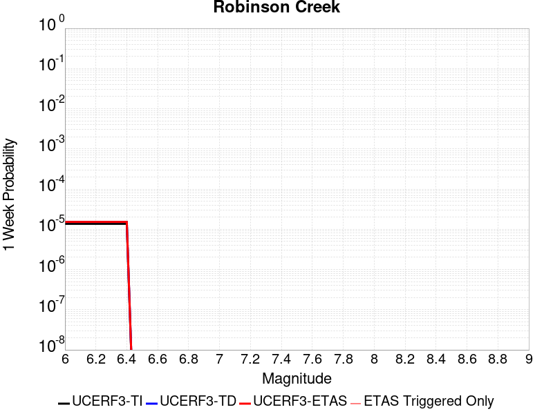 | 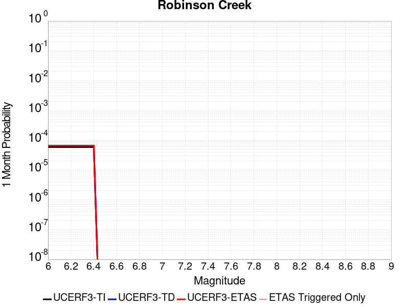 |  |

| Magnitude | 1 wk TI Prob | 1 wk TD Prob | 1 wk ETAS Prob | 1 wk ETAS/TD Gain | 1 wk ETAS Triggered Only | 1 mo TI Prob | 1 mo TD Prob | 1 mo ETAS Prob | 1 mo ETAS/TD Gain | 1 mo ETAS Triggered Only | 1 yr TI Prob | 1 yr TD Prob | 1 yr ETAS Prob | 1 yr ETAS/TD Gain | 1 yr ETAS Triggered Only |
|-----|-----|-----|-----|-----|-----|-----|-----|-----|-----|-----|-----|-----|-----|-----|-----|
| 6.0 | 1.3705327E-5 | 1.5290985E-5 | 1.5290985E-5 | 1.0 | 0.0 | 5.8735794E-5 | 6.55328E-5 | 6.55328E-5 | 1.0 | 0.0 | 7.1487366E-4 | 7.978618E-4 | 8.3782984E-4 | 1.050094 | 4.0E-5 |
| 6.1 | 1.3705327E-5 | 1.5290985E-5 | 1.5290985E-5 | 1.0 | 0.0 | 5.8735794E-5 | 6.55328E-5 | 6.55328E-5 | 1.0 | 0.0 | 7.1487366E-4 | 7.978618E-4 | 8.3782984E-4 | 1.050094 | 4.0E-5 |
| 6.2 | 1.3705327E-5 | 1.5290985E-5 | 1.5290985E-5 | 1.0 | 0.0 | 5.8735794E-5 | 6.55328E-5 | 6.55328E-5 | 1.0 | 0.0 | 7.1487366E-4 | 7.978618E-4 | 8.3782984E-4 | 1.050094 | 4.0E-5 |
| 6.3 | 1.3705327E-5 | 1.5290985E-5 | 1.5290985E-5 | 1.0 | 0.0 | 5.8735794E-5 | 6.55328E-5 | 6.55328E-5 | 1.0 | 0.0 | 7.1487366E-4 | 7.978618E-4 | 8.3782984E-4 | 1.050094 | 4.0E-5 |
| 6.4 | 1.3705327E-5 | 1.5290985E-5 | 1.5290985E-5 | 1.0 | 0.0 | 5.8735794E-5 | 6.55328E-5 | 6.55328E-5 | 1.0 | 0.0 | 7.1487366E-4 | 7.978618E-4 | 8.3782984E-4 | 1.050094 | 4.0E-5 |

## Great Valley 04b Gordon Valley
*[(top)](#table-of-contents)*

| 1 Week | 1 Month | 1 Year |
|-----|-----|-----|
|  | 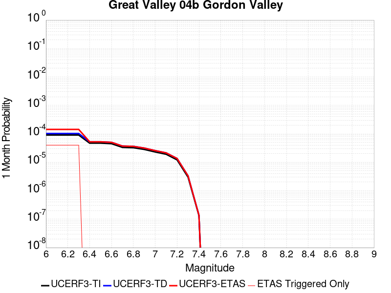 | 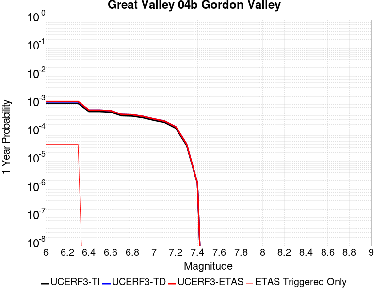 |

| Magnitude | 1 wk TI Prob | 1 wk TD Prob | 1 wk ETAS Prob | 1 wk ETAS/TD Gain | 1 wk ETAS Triggered Only | 1 mo TI Prob | 1 mo TD Prob | 1 mo ETAS Prob | 1 mo ETAS/TD Gain | 1 mo ETAS Triggered Only | 1 yr TI Prob | 1 yr TD Prob | 1 yr ETAS Prob | 1 yr ETAS/TD Gain | 1 yr ETAS Triggered Only |
|-----|-----|-----|-----|-----|-----|-----|-----|-----|-----|-----|-----|-----|-----|-----|-----|
| 6.0 | 2.1181217E-5 | 2.3992734E-5 | 6.399177E-5 | 2.6671314 | 4.0E-5 | 9.077348E-5 | 1.02822894E-4 | 1.4281878E-4 | 1.3889785 | 4.0E-5 | 0.0011046068 | 0.0012513166 | 0.0012912665 | 1.0319263 | 4.0E-5 |
| 6.1 | 2.1181217E-5 | 2.3992734E-5 | 6.399177E-5 | 2.6671314 | 4.0E-5 | 9.077348E-5 | 1.02822894E-4 | 1.4281878E-4 | 1.3889785 | 4.0E-5 | 0.0011046068 | 0.0012513166 | 0.0012912665 | 1.0319263 | 4.0E-5 |
| 6.2 | 2.1181217E-5 | 2.3992734E-5 | 6.399177E-5 | 2.6671314 | 4.0E-5 | 9.077348E-5 | 1.02822894E-4 | 1.4281878E-4 | 1.3889785 | 4.0E-5 | 0.0011046068 | 0.0012513166 | 0.0012912665 | 1.0319263 | 4.0E-5 |
| 6.3 | 2.1181217E-5 | 2.3992734E-5 | 6.399177E-5 | 2.6671314 | 4.0E-5 | 9.077348E-5 | 1.02822894E-4 | 1.4281878E-4 | 1.3889785 | 4.0E-5 | 0.0011046068 | 0.0012513166 | 0.0012912665 | 1.0319263 | 4.0E-5 |
| 6.4 | 1.0988268E-5 | 1.2259289E-5 | 1.2259289E-5 | 1.0 | 0.0 | 4.7091726E-5 | 5.2538842E-5 | 5.2538842E-5 | 1.0 | 0.0 | 5.731909E-4 | 6.3948863E-4 | 6.3948863E-4 | 1.0 | 0.0 |
| 6.5 | 1.0988268E-5 | 1.2259289E-5 | 1.2259289E-5 | 1.0 | 0.0 | 4.7091726E-5 | 5.2538842E-5 | 5.2538842E-5 | 1.0 | 0.0 | 5.731909E-4 | 6.3948863E-4 | 6.3948863E-4 | 1.0 | 0.0 |
| 6.6 | 1.0517822E-5 | 1.1728623E-5 | 1.1728623E-5 | 1.0 | 0.0 | 4.5075605E-5 | 5.0264647E-5 | 5.0264647E-5 | 1.0 | 0.0 | 5.4865726E-4 | 6.118159E-4 | 6.118159E-4 | 1.0 | 0.0 |
| 6.7 | 7.789219E-6 | 8.681002E-6 | 8.681002E-6 | 1.0 | 0.0 | 3.3381937E-5 | 3.7203798E-5 | 3.7203798E-5 | 1.0 | 0.0 | 4.063493E-4 | 4.5286724E-4 | 4.5286724E-4 | 1.0 | 0.0 |
| 6.8 | 7.5850853E-6 | 8.455669E-6 | 8.455669E-6 | 1.0 | 0.0 | 3.2507105E-5 | 3.6238103E-5 | 3.6238103E-5 | 1.0 | 0.0 | 3.957021E-4 | 4.4111474E-4 | 4.4111474E-4 | 1.0 | 0.0 |
| 6.9 | 6.604105E-6 | 7.361402E-6 | 7.361402E-6 | 1.0 | 0.0 | 2.8303E-5 | 3.1548505E-5 | 3.1548505E-5 | 1.0 | 0.0 | 3.4453452E-4 | 3.8403925E-4 | 3.8403925E-4 | 1.0 | 0.0 |
| 7.0 | 5.3701115E-6 | 5.9907584E-6 | 5.9907584E-6 | 1.0 | 0.0 | 2.301456E-5 | 2.5674442E-5 | 2.5674442E-5 | 1.0 | 0.0 | 2.8016625E-4 | 3.1254443E-4 | 3.1254443E-4 | 1.0 | 0.0 |
| 7.1 | 4.4685607E-6 | 4.98844E-6 | 4.98844E-6 | 1.0 | 0.0 | 1.9150835E-5 | 2.1378868E-5 | 2.1378868E-5 | 1.0 | 0.0 | 2.3313647E-4 | 2.602591E-4 | 2.602591E-4 | 1.0 | 0.0 |
| 7.2 | 2.833378E-6 | 3.165675E-6 | 3.165675E-6 | 1.0 | 0.0 | 1.2142991E-5 | 1.3567118E-5 | 1.3567118E-5 | 1.0 | 0.0 | 1.4783088E-4 | 1.651689E-4 | 1.651689E-4 | 1.0 | 0.0 |
| 7.3 | 7.0087293E-7 | 7.77571E-7 | 7.77571E-7 | 1.0 | 0.0 | 3.0037377E-6 | 3.3324454E-6 | 3.3324454E-6 | 1.0 | 0.0 | 3.656989E-5 | 4.0572228E-5 | 4.0572228E-5 | 1.0 | 0.0 |
| 7.4 | 3.112171E-8 | 3.2071675E-8 | 3.2071675E-8 | 1.0 | 0.0 | 1.3337875E-7 | 1.3745003E-7 | 1.3745003E-7 | 1.0 | 0.0 | 1.6238852E-6 | 1.6734529E-6 | 1.6734529E-6 | 1.0 | 0.0 |

## Holser alt 1
*[(top)](#table-of-contents)*

| 1 Week | 1 Month | 1 Year |
|-----|-----|-----|
|  | 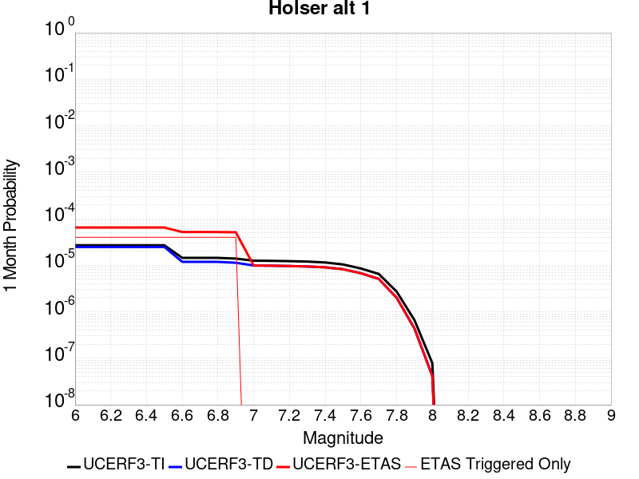 | 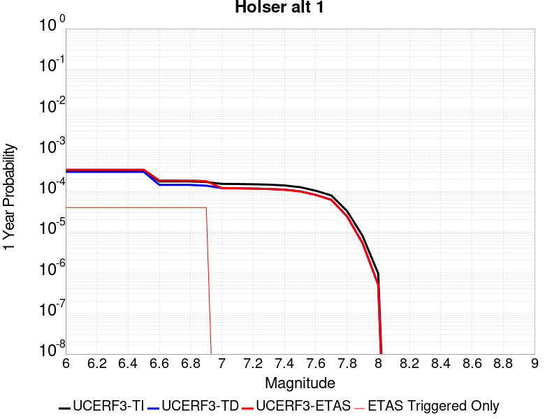 |

| Magnitude | 1 wk TI Prob | 1 wk TD Prob | 1 wk ETAS Prob | 1 wk ETAS/TD Gain | 1 wk ETAS Triggered Only | 1 mo TI Prob | 1 mo TD Prob | 1 mo ETAS Prob | 1 mo ETAS/TD Gain | 1 mo ETAS Triggered Only | 1 yr TI Prob | 1 yr TD Prob | 1 yr ETAS Prob | 1 yr ETAS/TD Gain | 1 yr ETAS Triggered Only |
|-----|-----|-----|-----|-----|-----|-----|-----|-----|-----|-----|-----|-----|-----|-----|-----|
| 6.0 | 6.2746653E-6 | 5.7915495E-6 | 4.579132E-5 | 7.9065747 | 4.0E-5 | 2.6891146E-5 | 2.4820754E-5 | 6.481976E-5 | 2.6115146 | 4.0E-5 | 3.273505E-4 | 3.0216234E-4 | 3.4215025E-4 | 1.1323391 | 4.0E-5 |
| 6.1 | 6.2746653E-6 | 5.7915495E-6 | 4.579132E-5 | 7.9065747 | 4.0E-5 | 2.6891146E-5 | 2.4820754E-5 | 6.481976E-5 | 2.6115146 | 4.0E-5 | 3.273505E-4 | 3.0216234E-4 | 3.4215025E-4 | 1.1323391 | 4.0E-5 |
| 6.2 | 6.2746653E-6 | 5.7915495E-6 | 4.579132E-5 | 7.9065747 | 4.0E-5 | 2.6891146E-5 | 2.4820754E-5 | 6.481976E-5 | 2.6115146 | 4.0E-5 | 3.273505E-4 | 3.0216234E-4 | 3.4215025E-4 | 1.1323391 | 4.0E-5 |
| 6.3 | 6.2746653E-6 | 5.7915495E-6 | 4.579132E-5 | 7.9065747 | 4.0E-5 | 2.6891146E-5 | 2.4820754E-5 | 6.481976E-5 | 2.6115146 | 4.0E-5 | 3.273505E-4 | 3.0216234E-4 | 3.4215025E-4 | 1.1323391 | 4.0E-5 |
| 6.4 | 6.2746653E-6 | 5.7915495E-6 | 4.579132E-5 | 7.9065747 | 4.0E-5 | 2.6891146E-5 | 2.4820754E-5 | 6.481976E-5 | 2.6115146 | 4.0E-5 | 3.273505E-4 | 3.0216234E-4 | 3.4215025E-4 | 1.1323391 | 4.0E-5 |
| 6.5 | 6.2746653E-6 | 5.7915495E-6 | 4.579132E-5 | 7.9065747 | 4.0E-5 | 2.6891146E-5 | 2.4820754E-5 | 6.481976E-5 | 2.6115146 | 4.0E-5 | 3.273505E-4 | 3.0216234E-4 | 3.4215025E-4 | 1.1323391 | 4.0E-5 |
| 6.6 | 3.375825E-6 | 2.7723509E-6 | 4.277224E-5 | 15.428147 | 4.0E-5 | 1.4467741E-5 | 1.18814505E-5 | 5.1880976E-5 | 4.3665524 | 4.0E-5 | 1.761305E-4 | 1.4464723E-4 | 1.8464144E-4 | 1.2764949 | 4.0E-5 |
| 6.7 | 3.375825E-6 | 2.7723509E-6 | 4.277224E-5 | 15.428147 | 4.0E-5 | 1.4467741E-5 | 1.18814505E-5 | 5.1880976E-5 | 4.3665524 | 4.0E-5 | 1.761305E-4 | 1.4464723E-4 | 1.8464144E-4 | 1.2764949 | 4.0E-5 |
| 6.8 | 3.366533E-6 | 2.7627493E-6 | 4.276264E-5 | 15.478291 | 4.0E-5 | 1.4427919E-5 | 1.1840301E-5 | 5.1839826E-5 | 4.3782525 | 4.0E-5 | 1.7564575E-4 | 1.4414631E-4 | 1.8414055E-4 | 1.2774558 | 4.0E-5 |
| 6.9 | 3.253174E-6 | 2.6449559E-6 | 4.264485E-5 | 16.123085 | 4.0E-5 | 1.39421E-5 | 1.1335477E-5 | 5.1335024E-5 | 4.528704 | 4.0E-5 | 1.6973184E-4 | 1.3800085E-4 | 1.7799533E-4 | 1.2898133 | 4.0E-5 |
| 7.0 | 2.9336593E-6 | 2.312899E-6 | 2.312899E-6 | 1.0 | 0.0 | 1.2572766E-5 | 9.912386E-6 | 9.912386E-6 | 1.0 | 0.0 | 1.5306266E-4 | 1.2067664E-4 | 1.2067664E-4 | 1.0 | 0.0 |
| 7.1 | 2.9087812E-6 | 2.2887455E-6 | 2.2887455E-6 | 1.0 | 0.0 | 1.2466146E-5 | 9.808872E-6 | 9.808872E-6 | 1.0 | 0.0 | 1.5176475E-4 | 1.19416494E-4 | 1.19416494E-4 | 1.0 | 0.0 |
| 7.2 | 2.8674524E-6 | 2.2486256E-6 | 2.2486256E-6 | 1.0 | 0.0 | 1.2289024E-5 | 9.636931E-6 | 9.636931E-6 | 1.0 | 0.0 | 1.4960859E-4 | 1.1732335E-4 | 1.1732335E-4 | 1.0 | 0.0 |
| 7.3 | 2.8057775E-6 | 2.196495E-6 | 2.196495E-6 | 1.0 | 0.0 | 1.2024705E-5 | 9.413517E-6 | 9.413517E-6 | 1.0 | 0.0 | 1.4639096E-4 | 1.1460355E-4 | 1.1460355E-4 | 1.0 | 0.0 |
| 7.4 | 2.683666E-6 | 2.1102435E-6 | 2.1102435E-6 | 1.0 | 0.0 | 1.1501375E-5 | 9.043869E-6 | 9.043869E-6 | 1.0 | 0.0 | 1.4002025E-4 | 1.1010356E-4 | 1.1010356E-4 | 1.0 | 0.0 |
| 7.5 | 2.434495E-6 | 1.9204347E-6 | 1.9204347E-6 | 1.0 | 0.0 | 1.0433508E-5 | 8.230409E-6 | 8.230409E-6 | 1.0 | 0.0 | 1.2702055E-4 | 1.0020063E-4 | 1.0020063E-4 | 1.0 | 0.0 |
| 7.6 | 1.9914562E-6 | 1.5738035E-6 | 1.5738035E-6 | 1.0 | 0.0 | 8.534785E-6 | 6.744855E-6 | 6.744855E-6 | 1.0 | 0.0 | 1.03906044E-4 | 8.2115526E-5 | 8.2115526E-5 | 1.0 | 0.0 |
| 7.7 | 1.5229501E-6 | 1.1900904E-6 | 1.1900904E-6 | 1.0 | 0.0 | 6.526913E-6 | 5.1003776E-6 | 5.1003776E-6 | 1.0 | 0.0 | 7.946226E-5 | 6.209534E-5 | 6.209534E-5 | 1.0 | 0.0 |
| 7.8 | 6.3489426E-7 | 4.6904395E-7 | 4.6904395E-7 | 1.0 | 0.0 | 2.7209726E-6 | 2.0101868E-6 | 2.0101868E-6 | 1.0 | 0.0 | 3.312734E-5 | 2.4473751E-5 | 2.4473751E-5 | 1.0 | 0.0 |
| 7.9 | 1.5459432E-7 | 1.02000165E-7 | 1.02000165E-7 | 1.0 | 0.0 | 6.6254694E-7 | 4.3714348E-7 | 4.3714348E-7 | 1.0 | 0.0 | 8.066479E-6 | 5.322209E-6 | 5.322209E-6 | 1.0 | 0.0 |
| 8.0 | 1.8307812E-8 | 9.7025685E-9 | 9.7025685E-9 | 1.0 | 0.0 | 7.846205E-8 | 4.1582435E-8 | 4.1582435E-8 | 1.0 | 0.0 | 9.55275E-7 | 5.06266E-7 | 5.06266E-7 | 1.0 | 0.0 |

## Eaton Roughs 2011 CFM
*[(top)](#table-of-contents)*

| 1 Week | 1 Month | 1 Year |
|-----|-----|-----|
| 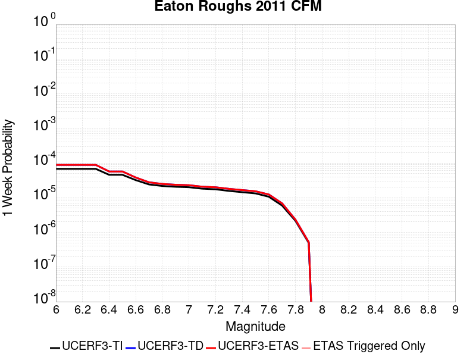 | 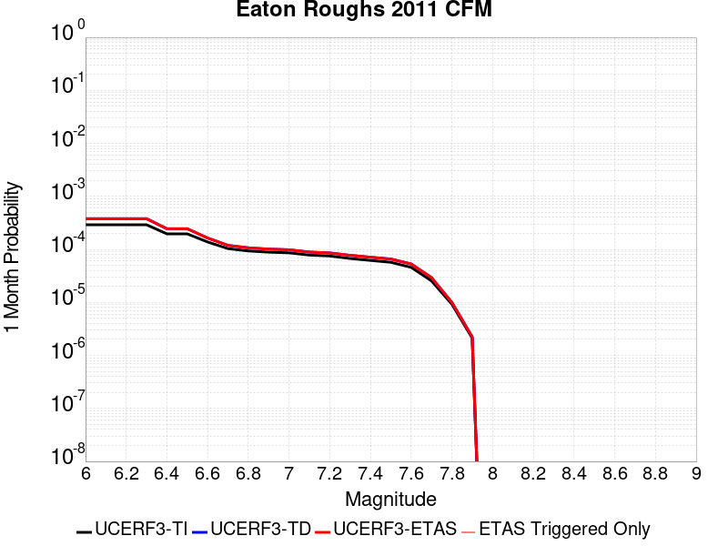 |  |

| Magnitude | 1 wk TI Prob | 1 wk TD Prob | 1 wk ETAS Prob | 1 wk ETAS/TD Gain | 1 wk ETAS Triggered Only | 1 mo TI Prob | 1 mo TD Prob | 1 mo ETAS Prob | 1 mo ETAS/TD Gain | 1 mo ETAS Triggered Only | 1 yr TI Prob | 1 yr TD Prob | 1 yr ETAS Prob | 1 yr ETAS/TD Gain | 1 yr ETAS Triggered Only |
|-----|-----|-----|-----|-----|-----|-----|-----|-----|-----|-----|-----|-----|-----|-----|-----|
| 6.0 | 6.8044945E-5 | 8.8520326E-5 | 8.8520326E-5 | 1.0 | 0.0 | 2.9158857E-4 | 3.793201E-4 | 3.793201E-4 | 1.0 | 0.0 | 0.0035443127 | 0.0046091164 | 0.004648932 | 1.0086385 | 4.0E-5 |
| 6.1 | 6.8044945E-5 | 8.8520326E-5 | 8.8520326E-5 | 1.0 | 0.0 | 2.9158857E-4 | 3.793201E-4 | 3.793201E-4 | 1.0 | 0.0 | 0.0035443127 | 0.0046091164 | 0.004648932 | 1.0086385 | 4.0E-5 |
| 6.2 | 6.8044945E-5 | 8.8520326E-5 | 8.8520326E-5 | 1.0 | 0.0 | 2.9158857E-4 | 3.793201E-4 | 3.793201E-4 | 1.0 | 0.0 | 0.0035443127 | 0.0046091164 | 0.004648932 | 1.0086385 | 4.0E-5 |
| 6.3 | 6.8044945E-5 | 8.8520326E-5 | 8.8520326E-5 | 1.0 | 0.0 | 2.9158857E-4 | 3.793201E-4 | 3.793201E-4 | 1.0 | 0.0 | 0.0035443127 | 0.0046091164 | 0.004648932 | 1.0086385 | 4.0E-5 |
| 6.4 | 4.5830013E-5 | 5.7202407E-5 | 5.7202407E-5 | 1.0 | 0.0 | 1.9639956E-4 | 2.4513318E-4 | 2.4513318E-4 | 1.0 | 0.0 | 0.0023885423 | 0.0029807994 | 0.0030206803 | 1.0133792 | 4.0E-5 |
| 6.5 | 4.5830013E-5 | 5.7202407E-5 | 5.7202407E-5 | 1.0 | 0.0 | 1.9639956E-4 | 2.4513318E-4 | 2.4513318E-4 | 1.0 | 0.0 | 0.0023885423 | 0.0029807994 | 0.0030206803 | 1.0133792 | 4.0E-5 |
| 6.6 | 3.222194E-5 | 3.828755E-5 | 3.828755E-5 | 1.0 | 0.0 | 1.3808672E-4 | 1.6407983E-4 | 1.6407983E-4 | 1.0 | 0.0 | 0.0016799092 | 0.0019959332 | 0.0019959332 | 1.0 | 0.0 |
| 6.7 | 2.4155654E-5 | 2.7800677E-5 | 2.7800677E-5 | 1.0 | 0.0 | 1.0352012E-4 | 1.19140364E-4 | 1.19140364E-4 | 1.0 | 0.0 | 0.0012596287 | 0.0014495769 | 0.0014495769 | 1.0 | 0.0 |
| 6.8 | 2.1814667E-5 | 2.495321E-5 | 2.495321E-5 | 1.0 | 0.0 | 9.348808E-5 | 1.06937965E-4 | 1.06937965E-4 | 1.0 | 0.0 | 0.001137623 | 0.0013011958 | 0.0013011958 | 1.0 | 0.0 |
| 6.9 | 2.0700467E-5 | 2.3640478E-5 | 2.3640478E-5 | 1.0 | 0.0 | 8.871327E-5 | 1.0131242E-4 | 1.0131242E-4 | 1.0 | 0.0 | 0.0010795488 | 0.0012327839 | 0.0012327839 | 1.0 | 0.0 |
| 7.0 | 2.0104066E-5 | 2.294766E-5 | 2.294766E-5 | 1.0 | 0.0 | 8.615744E-5 | 9.834343E-5 | 9.834343E-5 | 1.0 | 0.0 | 0.0010484619 | 0.0011966766 | 0.0011966766 | 1.0 | 0.0 |
| 7.1 | 1.8225232E-5 | 2.0783089E-5 | 2.0783089E-5 | 1.0 | 0.0 | 7.81058E-5 | 8.906735E-5 | 8.906735E-5 | 1.0 | 0.0 | 9.5052324E-4 | 0.001083857 | 0.001083857 | 1.0 | 0.0 |
| 7.2 | 1.7526572E-5 | 2.0003215E-5 | 2.0003215E-5 | 1.0 | 0.0 | 7.511172E-5 | 8.572525E-5 | 8.572525E-5 | 1.0 | 0.0 | 9.141015E-4 | 0.0010432067 | 0.0010432067 | 1.0 | 0.0 |
| 7.3 | 1.5727232E-5 | 1.8030574E-5 | 1.8030574E-5 | 1.0 | 0.0 | 6.740067E-5 | 7.727161E-5 | 7.727161E-5 | 1.0 | 0.0 | 8.2029426E-4 | 9.4037707E-4 | 9.4037707E-4 | 1.0 | 0.0 |
| 7.4 | 1.4457361E-5 | 1.660683E-5 | 1.660683E-5 | 1.0 | 0.0 | 6.195865E-5 | 7.117019E-5 | 7.117019E-5 | 1.0 | 0.0 | 7.540854E-4 | 8.6615345E-4 | 8.6615345E-4 | 1.0 | 0.0 |
| 7.5 | 1.33280955E-5 | 1.5353424E-5 | 1.5353424E-5 | 1.0 | 0.0 | 5.711916E-5 | 6.579873E-5 | 6.579873E-5 | 1.0 | 0.0 | 6.9520384E-4 | 8.0080604E-4 | 8.0080604E-4 | 1.0 | 0.0 |
| 7.6 | 1.0699478E-5 | 1.2394512E-5 | 1.2394512E-5 | 1.0 | 0.0 | 4.5854096E-5 | 5.311826E-5 | 5.311826E-5 | 1.0 | 0.0 | 5.581306E-4 | 6.4652343E-4 | 6.4652343E-4 | 1.0 | 0.0 |
| 7.7 | 5.9390236E-6 | 6.8566605E-6 | 6.8566605E-6 | 1.0 | 0.0 | 2.545271E-5 | 2.9385359E-5 | 2.9385359E-5 | 1.0 | 0.0 | 3.0984267E-4 | 3.5770825E-4 | 3.5770825E-4 | 1.0 | 0.0 |
| 7.8 | 2.1622036E-6 | 2.3308105E-6 | 2.3308105E-6 | 1.0 | 0.0 | 9.266554E-6 | 9.9891495E-6 | 9.9891495E-6 | 1.0 | 0.0 | 1.1281446E-4 | 1.21611185E-4 | 1.21611185E-4 | 1.0 | 0.0 |
| 7.9 | 4.9586197E-7 | 5.21985E-7 | 5.21985E-7 | 1.0 | 0.0 | 2.125121E-6 | 2.2370768E-6 | 2.2370768E-6 | 1.0 | 0.0 | 2.5873042E-5 | 2.723609E-5 | 2.723609E-5 | 1.0 | 0.0 |

## Hector Mine
*[(top)](#table-of-contents)*

| 1 Week | 1 Month | 1 Year |
|-----|-----|-----|
|  | 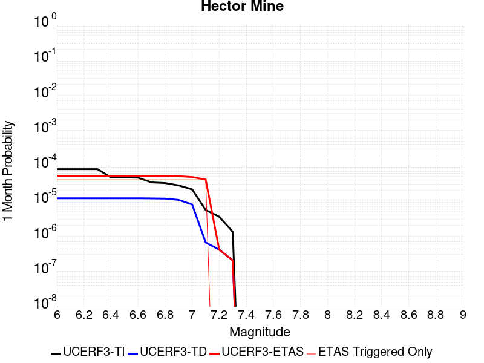 | 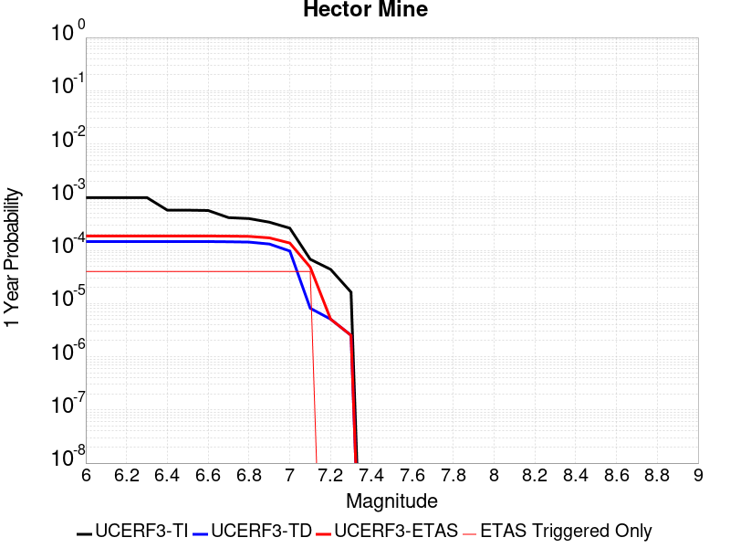 |

| Magnitude | 1 wk TI Prob | 1 wk TD Prob | 1 wk ETAS Prob | 1 wk ETAS/TD Gain | 1 wk ETAS Triggered Only | 1 mo TI Prob | 1 mo TD Prob | 1 mo ETAS Prob | 1 mo ETAS/TD Gain | 1 mo ETAS Triggered Only | 1 yr TI Prob | 1 yr TD Prob | 1 yr ETAS Prob | 1 yr ETAS/TD Gain | 1 yr ETAS Triggered Only |
|-----|-----|-----|-----|-----|-----|-----|-----|-----|-----|-----|-----|-----|-----|-----|-----|
| 6.0 | 1.8760093E-5 | 2.7979406E-6 | 4.279783E-5 | 15.296189 | 4.0E-5 | 8.039792E-5 | 1.1991141E-5 | 5.199066E-5 | 4.335756 | 4.0E-5 | 9.78405E-4 | 1.4598637E-4 | 1.8598052E-4 | 1.2739582 | 4.0E-5 |
| 6.1 | 1.8760093E-5 | 2.7979406E-6 | 4.279783E-5 | 15.296189 | 4.0E-5 | 8.039792E-5 | 1.1991141E-5 | 5.199066E-5 | 4.335756 | 4.0E-5 | 9.78405E-4 | 1.4598637E-4 | 1.8598052E-4 | 1.2739582 | 4.0E-5 |
| 6.2 | 1.8760093E-5 | 2.7979406E-6 | 4.279783E-5 | 15.296189 | 4.0E-5 | 8.039792E-5 | 1.1991141E-5 | 5.199066E-5 | 4.335756 | 4.0E-5 | 9.78405E-4 | 1.4598637E-4 | 1.8598052E-4 | 1.2739582 | 4.0E-5 |
| 6.3 | 1.8760093E-5 | 2.7979406E-6 | 4.279783E-5 | 15.296189 | 4.0E-5 | 8.039792E-5 | 1.1991141E-5 | 5.199066E-5 | 4.335756 | 4.0E-5 | 9.78405E-4 | 1.4598637E-4 | 1.8598052E-4 | 1.2739582 | 4.0E-5 |
| 6.4 | 1.0888055E-5 | 2.7979406E-6 | 4.279783E-5 | 15.296189 | 4.0E-5 | 4.666226E-5 | 1.1991141E-5 | 5.199066E-5 | 4.335756 | 4.0E-5 | 5.679649E-4 | 1.4598637E-4 | 1.8598052E-4 | 1.2739582 | 4.0E-5 |
| 6.5 | 1.0888055E-5 | 2.7979406E-6 | 4.279783E-5 | 15.296189 | 4.0E-5 | 4.666226E-5 | 1.1991141E-5 | 5.199066E-5 | 4.335756 | 4.0E-5 | 5.679649E-4 | 1.4598637E-4 | 1.8598052E-4 | 1.2739582 | 4.0E-5 |
| 6.6 | 1.0730738E-5 | 2.7979406E-6 | 4.279783E-5 | 15.296189 | 4.0E-5 | 4.5988065E-5 | 1.1991141E-5 | 5.199066E-5 | 4.335756 | 4.0E-5 | 5.5976084E-4 | 1.4598637E-4 | 1.8598052E-4 | 1.2739582 | 4.0E-5 |
| 6.7 | 7.881326E-6 | 2.772599E-6 | 4.2772488E-5 | 15.426858 | 4.0E-5 | 3.3776672E-5 | 1.1882535E-5 | 5.188206E-5 | 4.3662453 | 4.0E-5 | 4.111534E-4 | 1.4466426E-4 | 1.8465848E-4 | 1.2764623 | 4.0E-5 |
| 6.8 | 7.5683483E-6 | 2.734299E-6 | 4.273419E-5 | 15.628939 | 4.0E-5 | 3.2435375E-5 | 1.1718394E-5 | 5.1717925E-5 | 4.4133973 | 4.0E-5 | 3.9482914E-4 | 1.426661E-4 | 1.826604E-4 | 1.280335 | 4.0E-5 |
| 6.9 | 6.473048E-6 | 2.5152115E-6 | 4.2515112E-5 | 16.903194 | 4.0E-5 | 2.7741338E-5 | 1.0779456E-5 | 5.0779025E-5 | 4.7107224 | 4.0E-5 | 3.3769844E-4 | 1.3123595E-4 | 1.712307E-4 | 1.3047545 | 4.0E-5 |
| 7.0 | 4.9959954E-6 | 1.8575801E-6 | 4.1857507E-5 | 22.533354 | 4.0E-5 | 2.1411232E-5 | 7.961053E-6 | 4.7960733E-5 | 6.0244207 | 4.0E-5 | 2.6065056E-4 | 9.6925076E-5 | 1.369212E-4 | 1.4126499 | 4.0E-5 |
| 7.1 | 1.2997541E-6 | 1.5616929E-7 | 4.0156163E-5 | 257.13226 | 4.0E-5 | 5.5703626E-6 | 6.692968E-7 | 4.066927E-5 | 60.764175 | 4.0E-5 | 6.7817055E-5 | 8.148662E-6 | 4.8148337E-5 | 5.908741 | 4.0E-5 |
| 7.2 | 8.392699E-7 | 9.73697E-8 | 9.73697E-8 | 1.0 | 0.0 | 3.596866E-6 | 4.1729865E-7 | 4.1729865E-7 | 1.0 | 0.0 | 4.3790962E-5 | 5.0806016E-6 | 5.0806016E-6 | 1.0 | 0.0 |
| 7.3 | 3.13015E-7 | 4.833348E-8 | 4.833348E-8 | 1.0 | 0.0 | 1.3414921E-6 | 2.0714347E-7 | 2.0714347E-7 | 1.0 | 0.0 | 1.6332544E-5 | 2.5219697E-6 | 2.5219697E-6 | 1.0 | 0.0 |

## Hunter Mountain-Saline Valley
*[(top)](#table-of-contents)*

| 1 Week | 1 Month | 1 Year |
|-----|-----|-----|
| 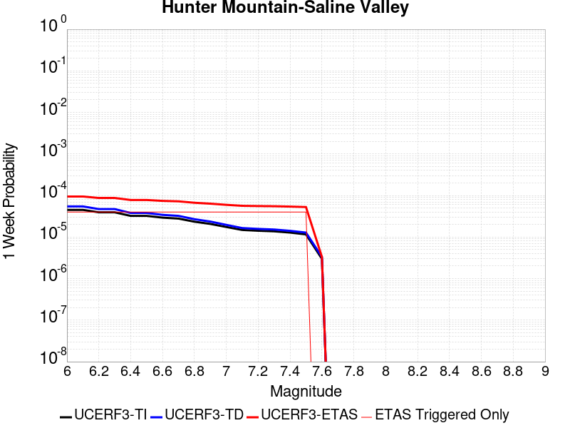 |  |  |

| Magnitude | 1 wk TI Prob | 1 wk TD Prob | 1 wk ETAS Prob | 1 wk ETAS/TD Gain | 1 wk ETAS Triggered Only | 1 mo TI Prob | 1 mo TD Prob | 1 mo ETAS Prob | 1 mo ETAS/TD Gain | 1 mo ETAS Triggered Only | 1 yr TI Prob | 1 yr TD Prob | 1 yr ETAS Prob | 1 yr ETAS/TD Gain | 1 yr ETAS Triggered Only |
|-----|-----|-----|-----|-----|-----|-----|-----|-----|-----|-----|-----|-----|-----|-----|-----|
| 6.0 | 4.5103672E-5 | 5.4612585E-5 | 9.46104E-5 | 1.732392 | 4.0E-5 | 1.9328714E-4 | 2.3403409E-4 | 2.7402473E-4 | 1.1708753 | 4.0E-5 | 0.002350731 | 0.0028458177 | 0.0028857037 | 1.0140157 | 4.0E-5 |
| 6.1 | 4.5103672E-5 | 5.4612585E-5 | 9.46104E-5 | 1.732392 | 4.0E-5 | 1.9328714E-4 | 2.3403409E-4 | 2.7402473E-4 | 1.1708753 | 4.0E-5 | 0.002350731 | 0.0028458177 | 0.0028857037 | 1.0140157 | 4.0E-5 |
| 6.2 | 3.9363465E-5 | 4.7098747E-5 | 8.7096865E-5 | 1.8492395 | 4.0E-5 | 1.6868966E-4 | 2.0183699E-4 | 2.4182891E-4 | 1.1981398 | 4.0E-5 | 0.002051862 | 0.0024547323 | 0.0024946341 | 1.016255 | 4.0E-5 |
| 6.3 | 3.9363465E-5 | 4.7098747E-5 | 8.7096865E-5 | 1.8492395 | 4.0E-5 | 1.6868966E-4 | 2.0183699E-4 | 2.4182891E-4 | 1.1981398 | 4.0E-5 | 0.002051862 | 0.0024547323 | 0.0024946341 | 1.016255 | 4.0E-5 |
| 6.4 | 3.2311684E-5 | 3.7978454E-5 | 7.797694E-5 | 2.0531888 | 4.0E-5 | 1.384713E-4 | 1.6275501E-4 | 2.027485E-4 | 1.2457281 | 4.0E-5 | 0.0016845843 | 0.00197981 | 0.0020197309 | 1.020164 | 4.0E-5 |
| 6.5 | 3.2311684E-5 | 3.7978454E-5 | 7.797694E-5 | 2.0531888 | 4.0E-5 | 1.384713E-4 | 1.6275501E-4 | 2.027485E-4 | 1.2457281 | 4.0E-5 | 0.0016845843 | 0.00197981 | 0.0020197309 | 1.020164 | 4.0E-5 |
| 6.6 | 2.9305844E-5 | 3.4206074E-5 | 7.4204705E-5 | 2.169343 | 4.0E-5 | 1.2559042E-4 | 1.4658958E-4 | 1.8658371E-4 | 1.2728307 | 4.0E-5 | 0.0015279909 | 0.001783329 | 0.0018232577 | 1.02239 | 4.0E-5 |
| 6.7 | 2.7826512E-5 | 3.2366974E-5 | 7.236568E-5 | 2.2357876 | 4.0E-5 | 1.19251024E-4 | 1.3870856E-4 | 1.7870302E-4 | 1.2883344 | 4.0E-5 | 0.0014509142 | 0.001687529 | 0.0017274615 | 1.0236633 | 4.0E-5 |
| 6.8 | 2.3389874E-5 | 2.688505E-5 | 6.688398E-5 | 2.4877756 | 4.0E-5 | 1.0023846E-4 | 1.15216826E-4 | 1.5521221E-4 | 1.3471315 | 4.0E-5 | 0.00121972 | 0.0014019096 | 0.0014418535 | 1.0284926 | 4.0E-5 |
| 6.9 | 2.069209E-5 | 2.3585886E-5 | 6.358494E-5 | 2.6958895 | 4.0E-5 | 8.867737E-5 | 1.0107866E-4 | 1.410746E-4 | 1.3956914 | 4.0E-5 | 0.0010791123 | 0.0012299741 | 0.0012699248 | 1.032481 | 4.0E-5 |
| 7.0 | 1.7462342E-5 | 1.9646477E-5 | 5.9645692E-5 | 3.0359485 | 4.0E-5 | 7.483646E-5 | 8.4196596E-5 | 1.2419323E-4 | 1.4750385 | 4.0E-5 | 9.1075303E-4 | 0.0010246342 | 0.0010645932 | 1.0389984 | 4.0E-5 |
| 7.1 | 1.4807709E-5 | 1.645249E-5 | 5.645183E-5 | 3.431203 | 4.0E-5 | 6.3460066E-5 | 7.050886E-5 | 1.1050604E-4 | 1.5672646 | 4.0E-5 | 7.723524E-4 | 8.5812376E-4 | 8.9808943E-4 | 1.0465733 | 4.0E-5 |
| 7.2 | 1.4180048E-5 | 1.5708612E-5 | 5.5707984E-5 | 3.5463338 | 4.0E-5 | 6.077022E-5 | 6.732098E-5 | 1.0731829E-4 | 1.5941284 | 4.0E-5 | 7.396263E-4 | 8.19341E-4 | 8.593082E-4 | 1.0487797 | 4.0E-5 |
| 7.3 | 1.3730402E-5 | 1.5182046E-5 | 5.5181437E-5 | 3.634651 | 4.0E-5 | 5.8843252E-5 | 6.506438E-5 | 1.0506178E-4 | 1.6147357 | 4.0E-5 | 7.161811E-4 | 7.9188705E-4 | 8.3185534E-4 | 1.0504723 | 4.0E-5 |
| 7.4 | 1.2810095E-5 | 1.4118515E-5 | 5.411795E-5 | 3.8331192 | 4.0E-5 | 5.489925E-5 | 6.050661E-5 | 1.00504185E-4 | 1.6610448 | 4.0E-5 | 6.681934E-4 | 7.3643477E-4 | 7.7640533E-4 | 1.0542758 | 4.0E-5 |
| 7.5 | 1.1595659E-5 | 1.2809488E-5 | 5.2808977E-5 | 4.1226454 | 4.0E-5 | 4.9694736E-5 | 5.4896736E-5 | 9.489454E-5 | 1.7286007 | 4.0E-5 | 6.0486543E-4 | 6.681785E-4 | 7.081518E-4 | 1.0598242 | 4.0E-5 |
| 7.6 | 2.997694E-6 | 3.3286635E-6 | 3.3286635E-6 | 1.0 | 0.0 | 1.28471975E-5 | 1.42656645E-5 | 1.42656645E-5 | 1.0 | 0.0 | 1.564034E-4 | 1.7367791E-4 | 1.7367791E-4 | 1.0 | 0.0 |

## Channel Islands Thrust
*[(top)](#table-of-contents)*

| 1 Week | 1 Month | 1 Year |
|-----|-----|-----|
|  |  |  |

| Magnitude | 1 wk TI Prob | 1 wk TD Prob | 1 wk ETAS Prob | 1 wk ETAS/TD Gain | 1 wk ETAS Triggered Only | 1 mo TI Prob | 1 mo TD Prob | 1 mo ETAS Prob | 1 mo ETAS/TD Gain | 1 mo ETAS Triggered Only | 1 yr TI Prob | 1 yr TD Prob | 1 yr ETAS Prob | 1 yr ETAS/TD Gain | 1 yr ETAS Triggered Only |
|-----|-----|-----|-----|-----|-----|-----|-----|-----|-----|-----|-----|-----|-----|-----|-----|
| 6.0 | 2.2156251E-5 | 2.409921E-5 | 2.409921E-5 | 1.0 | 0.0 | 9.495191E-5 | 1.0327884E-4 | 1.0327884E-4 | 1.0 | 0.0 | 0.0011554264 | 0.0012568012 | 0.001296751 | 1.0317868 | 4.0E-5 |
| 6.1 | 2.2156251E-5 | 2.409921E-5 | 2.409921E-5 | 1.0 | 0.0 | 9.495191E-5 | 1.0327884E-4 | 1.0327884E-4 | 1.0 | 0.0 | 0.0011554264 | 0.0012568012 | 0.001296751 | 1.0317868 | 4.0E-5 |
| 6.2 | 2.2156251E-5 | 2.409921E-5 | 2.409921E-5 | 1.0 | 0.0 | 9.495191E-5 | 1.0327884E-4 | 1.0327884E-4 | 1.0 | 0.0 | 0.0011554264 | 0.0012568012 | 0.001296751 | 1.0317868 | 4.0E-5 |
| 6.3 | 2.2156251E-5 | 2.409921E-5 | 2.409921E-5 | 1.0 | 0.0 | 9.495191E-5 | 1.0327884E-4 | 1.0327884E-4 | 1.0 | 0.0 | 0.0011554264 | 0.0012568012 | 0.001296751 | 1.0317868 | 4.0E-5 |
| 6.4 | 2.2156251E-5 | 2.409921E-5 | 2.409921E-5 | 1.0 | 0.0 | 9.495191E-5 | 1.0327884E-4 | 1.0327884E-4 | 1.0 | 0.0 | 0.0011554264 | 0.0012568012 | 0.001296751 | 1.0317868 | 4.0E-5 |
| 6.5 | 2.2156251E-5 | 2.409921E-5 | 2.409921E-5 | 1.0 | 0.0 | 9.495191E-5 | 1.0327884E-4 | 1.0327884E-4 | 1.0 | 0.0 | 0.0011554264 | 0.0012568012 | 0.001296751 | 1.0317868 | 4.0E-5 |
| 6.6 | 2.2156251E-5 | 2.409921E-5 | 2.409921E-5 | 1.0 | 0.0 | 9.495191E-5 | 1.0327884E-4 | 1.0327884E-4 | 1.0 | 0.0 | 0.0011554264 | 0.0012568012 | 0.001296751 | 1.0317868 | 4.0E-5 |
| 6.7 | 1.0601296E-5 | 1.1382414E-5 | 1.1382414E-5 | 1.0 | 0.0 | 4.5433335E-5 | 4.8780894E-5 | 4.8780894E-5 | 1.0 | 0.0 | 5.5301044E-4 | 5.9375045E-4 | 5.9375045E-4 | 1.0 | 0.0 |
| 6.8 | 1.0246747E-5 | 1.0999436E-5 | 1.0999436E-5 | 1.0 | 0.0 | 4.391389E-5 | 4.7139616E-5 | 4.7139616E-5 | 1.0 | 0.0 | 5.345204E-4 | 5.7377847E-4 | 5.7377847E-4 | 1.0 | 0.0 |
| 6.9 | 9.049551E-6 | 9.702045E-6 | 9.702045E-6 | 1.0 | 0.0 | 3.878322E-5 | 4.157955E-5 | 4.157955E-5 | 1.0 | 0.0 | 4.7208337E-4 | 5.061176E-4 | 5.061176E-4 | 1.0 | 0.0 |
| 7.0 | 8.6542195E-6 | 9.276895E-6 | 9.276895E-6 | 1.0 | 0.0 | 3.7088983E-5 | 3.975754E-5 | 3.975754E-5 | 1.0 | 0.0 | 4.5146482E-4 | 4.839446E-4 | 4.839446E-4 | 1.0 | 0.0 |
| 7.1 | 8.391028E-6 | 8.99515E-6 | 8.99515E-6 | 1.0 | 0.0 | 3.5961057E-5 | 3.8550097E-5 | 3.8550097E-5 | 1.0 | 0.0 | 4.3773788E-4 | 4.6925043E-4 | 4.6925043E-4 | 1.0 | 0.0 |
| 7.2 | 5.965188E-6 | 6.3732036E-6 | 6.3732036E-6 | 1.0 | 0.0 | 2.556484E-5 | 2.7313446E-5 | 2.7313446E-5 | 1.0 | 0.0 | 3.1120746E-4 | 3.32491E-4 | 3.32491E-4 | 1.0 | 0.0 |
| 7.3 | 4.877518E-6 | 5.207231E-6 | 5.207231E-6 | 1.0 | 0.0 | 2.0903482E-5 | 2.2316515E-5 | 2.2316515E-5 | 1.0 | 0.0 | 2.5447016E-4 | 2.7167014E-4 | 2.7167014E-4 | 1.0 | 0.0 |
| 7.4 | 3.8829853E-6 | 4.1428343E-6 | 4.1428343E-6 | 1.0 | 0.0 | 1.664126E-5 | 1.7754886E-5 | 1.7754886E-5 | 1.0 | 0.0 | 2.0258849E-4 | 2.1614472E-4 | 2.1614472E-4 | 1.0 | 0.0 |
| 7.5 | 1.3489616E-6 | 1.4281075E-6 | 1.4281075E-6 | 1.0 | 0.0 | 5.7812517E-6 | 6.1204464E-6 | 6.1204464E-6 | 1.0 | 0.0 | 7.038446E-5 | 7.4513926E-5 | 7.4513926E-5 | 1.0 | 0.0 |
| 7.6 | 6.058192E-7 | 6.3551613E-7 | 6.3551613E-7 | 1.0 | 0.0 | 2.5963652E-6 | 2.7236379E-6 | 2.7236379E-6 | 1.0 | 0.0 | 3.161029E-5 | 3.3159802E-5 | 3.3159802E-5 | 1.0 | 0.0 |
| 7.7 | 2.2170494E-7 | 2.2612478E-7 | 2.2612478E-7 | 1.0 | 0.0 | 9.5016367E-7 | 9.691059E-7 | 9.691059E-7 | 1.0 | 0.0 | 1.1568181E-5 | 1.1798812E-5 | 1.1798812E-5 | 1.0 | 0.0 |
| 7.8 | 2.1613102E-8 | 1.5469915E-8 | 1.5469915E-8 | 1.0 | 0.0 | 9.262757E-8 | 6.6299634E-8 | 6.6299634E-8 | 1.0 | 0.0 | 1.1277401E-6 | 8.0719786E-7 | 8.0719786E-7 | 1.0 | 0.0 |

## Deep Springs
*[(top)](#table-of-contents)*

| 1 Week | 1 Month | 1 Year |
|-----|-----|-----|
|  | 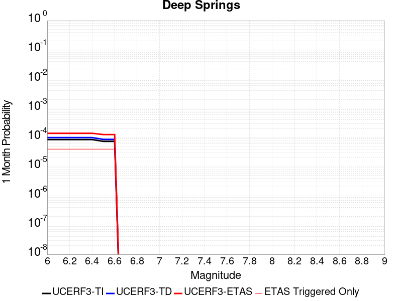 |  |

| Magnitude | 1 wk TI Prob | 1 wk TD Prob | 1 wk ETAS Prob | 1 wk ETAS/TD Gain | 1 wk ETAS Triggered Only | 1 mo TI Prob | 1 mo TD Prob | 1 mo ETAS Prob | 1 mo ETAS/TD Gain | 1 mo ETAS Triggered Only | 1 yr TI Prob | 1 yr TD Prob | 1 yr ETAS Prob | 1 yr ETAS/TD Gain | 1 yr ETAS Triggered Only |
|-----|-----|-----|-----|-----|-----|-----|-----|-----|-----|-----|-----|-----|-----|-----|-----|
| 6.0 | 1.9810619E-5 | 2.3125574E-5 | 6.312465E-5 | 2.7296467 | 4.0E-5 | 8.489989E-5 | 9.910871E-5 | 1.3910474E-4 | 1.4035572 | 4.0E-5 | 0.001033166 | 0.0012064888 | 0.0012464406 | 1.0331141 | 4.0E-5 |
| 6.1 | 1.9810619E-5 | 2.3125574E-5 | 6.312465E-5 | 2.7296467 | 4.0E-5 | 8.489989E-5 | 9.910871E-5 | 1.3910474E-4 | 1.4035572 | 4.0E-5 | 0.001033166 | 0.0012064888 | 0.0012464406 | 1.0331141 | 4.0E-5 |
| 6.2 | 1.9810619E-5 | 2.3125574E-5 | 6.312465E-5 | 2.7296467 | 4.0E-5 | 8.489989E-5 | 9.910871E-5 | 1.3910474E-4 | 1.4035572 | 4.0E-5 | 0.001033166 | 0.0012064888 | 0.0012464406 | 1.0331141 | 4.0E-5 |
| 6.3 | 1.9810619E-5 | 2.3125574E-5 | 6.312465E-5 | 2.7296467 | 4.0E-5 | 8.489989E-5 | 9.910871E-5 | 1.3910474E-4 | 1.4035572 | 4.0E-5 | 0.001033166 | 0.0012064888 | 0.0012464406 | 1.0331141 | 4.0E-5 |
| 6.4 | 1.9810619E-5 | 2.3125574E-5 | 6.312465E-5 | 2.7296467 | 4.0E-5 | 8.489989E-5 | 9.910871E-5 | 1.3910474E-4 | 1.4035572 | 4.0E-5 | 0.001033166 | 0.0012064888 | 0.0012464406 | 1.0331141 | 4.0E-5 |
| 6.5 | 1.7190405E-5 | 2.0061863E-5 | 6.0061062E-5 | 2.9937928 | 4.0E-5 | 7.367108E-5 | 8.5979416E-5 | 1.2597597E-4 | 1.4651877 | 4.0E-5 | 8.9657627E-4 | 0.0010467991 | 0.0010867573 | 1.0381718 | 4.0E-5 |
| 6.6 | 1.7190405E-5 | 2.0061863E-5 | 6.0061062E-5 | 2.9937928 | 4.0E-5 | 7.367108E-5 | 8.5979416E-5 | 1.2597597E-4 | 1.4651877 | 4.0E-5 | 8.9657627E-4 | 0.0010467991 | 0.0010867573 | 1.0381718 | 4.0E-5 |

## Los Osos 2011
*[(top)](#table-of-contents)*

| 1 Week | 1 Month | 1 Year |
|-----|-----|-----|
|  |  |  |

| Magnitude | 1 wk TI Prob | 1 wk TD Prob | 1 wk ETAS Prob | 1 wk ETAS/TD Gain | 1 wk ETAS Triggered Only | 1 mo TI Prob | 1 mo TD Prob | 1 mo ETAS Prob | 1 mo ETAS/TD Gain | 1 mo ETAS Triggered Only | 1 yr TI Prob | 1 yr TD Prob | 1 yr ETAS Prob | 1 yr ETAS/TD Gain | 1 yr ETAS Triggered Only |
|-----|-----|-----|-----|-----|-----|-----|-----|-----|-----|-----|-----|-----|-----|-----|-----|
| 6.0 | 4.8871775E-6 | 4.982002E-6 | 4.982002E-6 | 1.0 | 0.0 | 2.0944879E-5 | 2.1351278E-5 | 2.1351278E-5 | 1.0 | 0.0 | 2.5497406E-4 | 2.5992357E-4 | 2.999132E-4 | 1.1538514 | 4.0E-5 |
| 6.1 | 4.8871775E-6 | 4.982002E-6 | 4.982002E-6 | 1.0 | 0.0 | 2.0944879E-5 | 2.1351278E-5 | 2.1351278E-5 | 1.0 | 0.0 | 2.5497406E-4 | 2.5992357E-4 | 2.999132E-4 | 1.1538514 | 4.0E-5 |
| 6.2 | 4.8871775E-6 | 4.982002E-6 | 4.982002E-6 | 1.0 | 0.0 | 2.0944879E-5 | 2.1351278E-5 | 2.1351278E-5 | 1.0 | 0.0 | 2.5497406E-4 | 2.5992357E-4 | 2.999132E-4 | 1.1538514 | 4.0E-5 |
| 6.3 | 4.8871775E-6 | 4.982002E-6 | 4.982002E-6 | 1.0 | 0.0 | 2.0944879E-5 | 2.1351278E-5 | 2.1351278E-5 | 1.0 | 0.0 | 2.5497406E-4 | 2.5992357E-4 | 2.999132E-4 | 1.1538514 | 4.0E-5 |
| 6.4 | 4.8871775E-6 | 4.982002E-6 | 4.982002E-6 | 1.0 | 0.0 | 2.0944879E-5 | 2.1351278E-5 | 2.1351278E-5 | 1.0 | 0.0 | 2.5497406E-4 | 2.5992357E-4 | 2.999132E-4 | 1.1538514 | 4.0E-5 |
| 6.5 | 3.1724062E-6 | 3.2237629E-6 | 3.2237629E-6 | 1.0 | 0.0 | 1.3595956E-5 | 1.3816054E-5 | 1.3816054E-5 | 1.0 | 0.0 | 1.6551818E-4 | 1.6819761E-4 | 2.0819088E-4 | 1.2377756 | 4.0E-5 |
| 6.6 | 3.1022591E-6 | 3.1514649E-6 | 3.1514649E-6 | 1.0 | 0.0 | 1.3295328E-5 | 1.3506209E-5 | 1.3506209E-5 | 1.0 | 0.0 | 1.618586E-4 | 1.6442582E-4 | 2.0441924E-4 | 1.2432308 | 4.0E-5 |
| 6.7 | 2.611518E-6 | 2.649505E-6 | 2.649505E-6 | 1.0 | 0.0 | 1.1192172E-5 | 1.1354971E-5 | 1.1354971E-5 | 1.0 | 0.0 | 1.3625617E-4 | 1.3823806E-4 | 1.7823253E-4 | 1.2893159 | 4.0E-5 |
| 6.8 | 2.4780884E-6 | 2.5124684E-6 | 2.5124684E-6 | 1.0 | 0.0 | 1.0620336E-5 | 1.0767677E-5 | 1.0767677E-5 | 1.0 | 0.0 | 1.2929492E-4 | 1.3108863E-4 | 1.7108337E-4 | 1.3050971 | 4.0E-5 |
| 6.9 | 2.1376322E-6 | 2.1637861E-6 | 2.1637861E-6 | 1.0 | 0.0 | 9.161248E-6 | 9.273336E-6 | 9.273336E-6 | 1.0 | 0.0 | 1.1153249E-4 | 1.1289704E-4 | 1.5289252E-4 | 1.3542651 | 4.0E-5 |
| 7.0 | 1.9282882E-6 | 1.949723E-6 | 1.949723E-6 | 1.0 | 0.0 | 8.264066E-6 | 8.355928E-6 | 8.355928E-6 | 1.0 | 0.0 | 1.0061036E-4 | 1.01728685E-4 | 1.4172462E-4 | 1.3931627 | 4.0E-5 |
| 7.1 | 1.6353226E-6 | 1.650354E-6 | 1.650354E-6 | 1.0 | 0.0 | 7.0085066E-6 | 7.072926E-6 | 7.072926E-6 | 1.0 | 0.0 | 8.532523E-5 | 8.610948E-5 | 1.2610604E-4 | 1.4644849 | 4.0E-5 |
| 7.2 | 1.4446276E-6 | 1.4555621E-6 | 1.4555621E-6 | 1.0 | 0.0 | 6.191247E-6 | 6.238108E-6 | 6.238108E-6 | 1.0 | 0.0 | 7.537582E-5 | 7.594633E-5 | 1.1594329E-4 | 1.5266477 | 4.0E-5 |
| 7.3 | 1.2014582E-6 | 1.2071171E-6 | 1.2071171E-6 | 1.0 | 0.0 | 5.149096E-6 | 5.1733487E-6 | 5.1733487E-6 | 1.0 | 0.0 | 6.268844E-5 | 6.29837E-5 | 1.0298118E-4 | 1.6350449 | 4.0E-5 |
| 7.4 | 9.707733E-7 | 9.711689E-7 | 9.711689E-7 | 1.0 | 0.0 | 4.16045E-6 | 4.1621456E-6 | 4.1621456E-6 | 1.0 | 0.0 | 5.0652303E-5 | 5.067295E-5 | 9.067092E-5 | 1.7893358 | 4.0E-5 |
| 7.5 | 7.174908E-7 | 7.1166136E-7 | 7.1166136E-7 | 1.0 | 0.0 | 3.074957E-6 | 3.0499737E-6 | 3.0499737E-6 | 1.0 | 0.0 | 3.743696E-5 | 3.71328E-5 | 7.713131E-5 | 2.077175 | 4.0E-5 |
| 7.6 | 4.5535776E-7 | 4.4222375E-7 | 4.4222375E-7 | 1.0 | 0.0 | 1.9515319E-6 | 1.8952433E-6 | 1.8952433E-6 | 1.0 | 0.0 | 2.3759641E-5 | 2.3074343E-5 | 6.307342E-5 | 2.7334871 | 4.0E-5 |
| 7.7 | 2.1173553E-7 | 1.9072496E-7 | 1.9072496E-7 | 1.0 | 0.0 | 9.0743765E-7 | 8.1739245E-7 | 8.1739245E-7 | 1.0 | 0.0 | 1.1047998E-5 | 9.951707E-6 | 4.9951308E-5 | 5.0193706 | 4.0E-5 |
| 7.8 | 9.873608E-8 | 7.3777166E-8 | 7.3777166E-8 | 1.0 | 0.0 | 4.2315455E-7 | 3.1618782E-7 | 3.1618782E-7 | 1.0 | 0.0 | 5.1518946E-6 | 3.84958E-6 | 4.3849424E-5 | 11.390704 | 4.0E-5 |
| 7.9 | 5.4399106E-8 | 3.1970632E-8 | 3.1970632E-8 | 1.0 | 0.0 | 2.33139E-7 | 1.37017E-7 | 1.37017E-7 | 1.0 | 0.0 | 2.8384638E-6 | 1.6681806E-6 | 1.6681806E-6 | 1.0 | 0.0 |
| 8.0 | 1.817203E-8 | 8.4588745E-9 | 8.4588745E-9 | 1.0 | 0.0 | 7.7880124E-8 | 3.625232E-8 | 3.625232E-8 | 1.0 | 0.0 | 9.481901E-7 | 4.413719E-7 | 4.413719E-7 | 1.0 | 0.0 |

## San Luis Range - Oceano 2011 CFM
*[(top)](#table-of-contents)*

| 1 Week | 1 Month | 1 Year |
|-----|-----|-----|
|  |  | 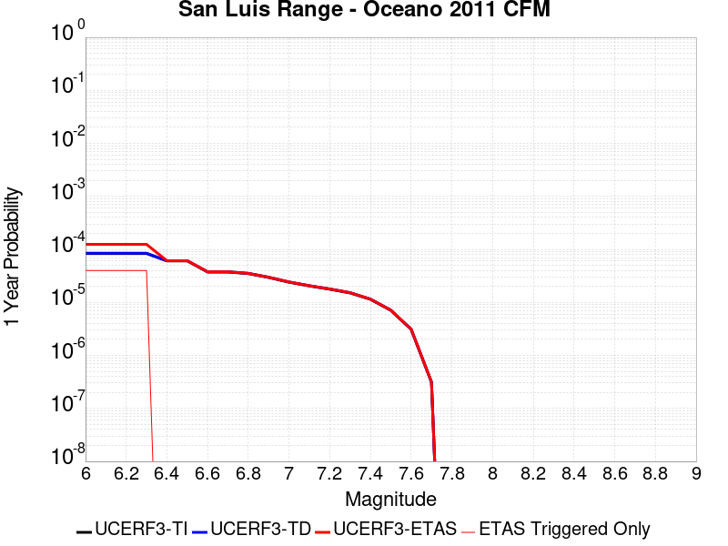 |

| Magnitude | 1 wk TI Prob | 1 wk TD Prob | 1 wk ETAS Prob | 1 wk ETAS/TD Gain | 1 wk ETAS Triggered Only | 1 mo TI Prob | 1 mo TD Prob | 1 mo ETAS Prob | 1 mo ETAS/TD Gain | 1 mo ETAS Triggered Only | 1 yr TI Prob | 1 yr TD Prob | 1 yr ETAS Prob | 1 yr ETAS/TD Gain | 1 yr ETAS Triggered Only |
|-----|-----|-----|-----|-----|-----|-----|-----|-----|-----|-----|-----|-----|-----|-----|-----|
| 6.0 | 1.6025788E-6 | 1.6201791E-6 | 1.6201791E-6 | 1.0 | 0.0 | 6.8681766E-6 | 6.9436087E-6 | 6.9436087E-6 | 1.0 | 0.0 | 8.361684E-5 | 8.4535575E-5 | 1.2453219E-4 | 1.4731336 | 4.0E-5 |
| 6.1 | 1.6025788E-6 | 1.6201791E-6 | 1.6201791E-6 | 1.0 | 0.0 | 6.8681766E-6 | 6.9436087E-6 | 6.9436087E-6 | 1.0 | 0.0 | 8.361684E-5 | 8.4535575E-5 | 1.2453219E-4 | 1.4731336 | 4.0E-5 |
| 6.2 | 1.6025788E-6 | 1.6201791E-6 | 1.6201791E-6 | 1.0 | 0.0 | 6.8681766E-6 | 6.9436087E-6 | 6.9436087E-6 | 1.0 | 0.0 | 8.361684E-5 | 8.4535575E-5 | 1.2453219E-4 | 1.4731336 | 4.0E-5 |
| 6.3 | 1.6025788E-6 | 1.6201791E-6 | 1.6201791E-6 | 1.0 | 0.0 | 6.8681766E-6 | 6.9436087E-6 | 6.9436087E-6 | 1.0 | 0.0 | 8.361684E-5 | 8.4535575E-5 | 1.2453219E-4 | 1.4731336 | 4.0E-5 |
| 6.4 | 1.1621186E-6 | 1.1750336E-6 | 1.1750336E-6 | 1.0 | 0.0 | 4.980499E-6 | 5.0358503E-6 | 5.0358503E-6 | 1.0 | 0.0 | 6.0635884E-5 | 6.131002E-5 | 6.131002E-5 | 1.0 | 0.0 |
| 6.5 | 1.1621186E-6 | 1.1750336E-6 | 1.1750336E-6 | 1.0 | 0.0 | 4.980499E-6 | 5.0358503E-6 | 5.0358503E-6 | 1.0 | 0.0 | 6.0635884E-5 | 6.131002E-5 | 6.131002E-5 | 1.0 | 0.0 |
| 6.6 | 7.164729E-7 | 7.2488666E-7 | 7.2488666E-7 | 1.0 | 0.0 | 3.0705946E-6 | 3.1066534E-6 | 3.1066534E-6 | 1.0 | 0.0 | 3.738385E-5 | 3.782287E-5 | 3.782287E-5 | 1.0 | 0.0 |
| 6.7 | 7.164729E-7 | 7.2488666E-7 | 7.2488666E-7 | 1.0 | 0.0 | 3.0705946E-6 | 3.1066534E-6 | 3.1066534E-6 | 1.0 | 0.0 | 3.738385E-5 | 3.782287E-5 | 3.782287E-5 | 1.0 | 0.0 |
| 6.8 | 6.700177E-7 | 6.777705E-7 | 6.777705E-7 | 1.0 | 0.0 | 2.8715012E-6 | 2.9047278E-6 | 2.9047278E-6 | 1.0 | 0.0 | 3.495997E-5 | 3.5364505E-5 | 3.5364505E-5 | 1.0 | 0.0 |
| 6.9 | 5.657865E-7 | 5.7220063E-7 | 5.7220063E-7 | 1.0 | 0.0 | 2.424797E-6 | 2.4522863E-6 | 2.4522863E-6 | 1.0 | 0.0 | 2.9521503E-5 | 2.9856186E-5 | 2.9856186E-5 | 1.0 | 0.0 |
| 7.0 | 4.608413E-7 | 4.6603472E-7 | 4.6603472E-7 | 1.0 | 0.0 | 1.9750328E-6 | 1.9972902E-6 | 1.9972902E-6 | 1.0 | 0.0 | 2.4045758E-5 | 2.431674E-5 | 2.431674E-5 | 1.0 | 0.0 |
| 7.1 | 3.9177846E-7 | 3.9623131E-7 | 3.9623131E-7 | 1.0 | 0.0 | 1.6790494E-6 | 1.6981331E-6 | 1.6981331E-6 | 1.0 | 0.0 | 2.0442236E-5 | 2.0674575E-5 | 2.0674575E-5 | 1.0 | 0.0 |
| 7.2 | 3.3974752E-7 | 3.436788E-7 | 3.436788E-7 | 1.0 | 0.0 | 1.45606E-6 | 1.4729083E-6 | 1.4729083E-6 | 1.0 | 0.0 | 1.7727387E-5 | 1.7932512E-5 | 1.7932512E-5 | 1.0 | 0.0 |
| 7.3 | 2.8900928E-7 | 2.9235167E-7 | 2.9235167E-7 | 1.0 | 0.0 | 1.2386106E-6 | 1.2529351E-6 | 1.2529351E-6 | 1.0 | 0.0 | 1.5079979E-5 | 1.5254379E-5 | 1.5254379E-5 | 1.0 | 0.0 |
| 7.4 | 2.1881527E-7 | 2.2140485E-7 | 2.2140485E-7 | 1.0 | 0.0 | 9.3777936E-7 | 9.488775E-7 | 9.488775E-7 | 1.0 | 0.0 | 1.14174045E-5 | 1.1552524E-5 | 1.1552524E-5 | 1.0 | 0.0 |
| 7.5 | 1.356398E-7 | 1.3719173E-7 | 1.3719173E-7 | 1.0 | 0.0 | 5.813133E-7 | 5.8796445E-7 | 5.8796445E-7 | 1.0 | 0.0 | 7.0774663E-6 | 7.1584436E-6 | 7.1584436E-6 | 1.0 | 0.0 |
| 7.6 | 5.9269272E-8 | 6.001622E-8 | 6.001622E-8 | 1.0 | 0.0 | 2.5401116E-7 | 2.5721235E-7 | 2.5721235E-7 | 1.0 | 0.0 | 3.0925814E-6 | 3.131556E-6 | 3.131556E-6 | 1.0 | 0.0 |
| 7.7 | 5.946232E-9 | 6.0372436E-9 | 6.0372436E-9 | 1.0 | 0.0 | 2.5483851E-8 | 2.58739E-8 | 2.58739E-8 | 1.0 | 0.0 | 3.1026585E-7 | 3.1501472E-7 | 3.1501472E-7 | 1.0 | 0.0 |

## Rodgers Creek - Healdsburg 2011 CFM
*[(top)](#table-of-contents)*

| 1 Week | 1 Month | 1 Year |
|-----|-----|-----|
| 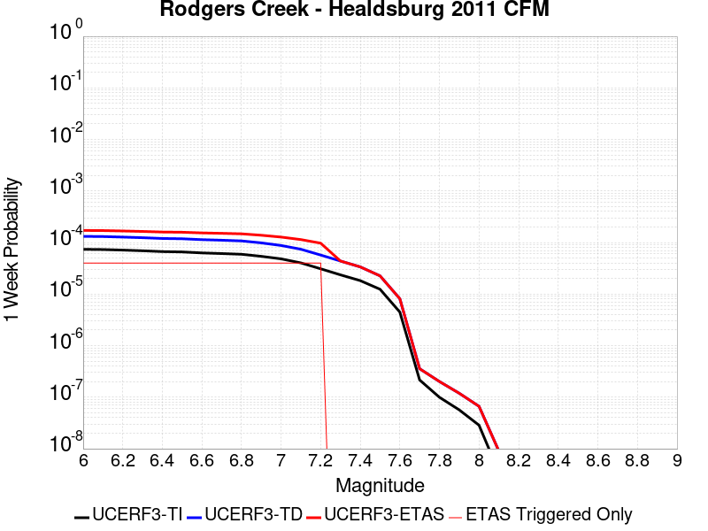 |  | 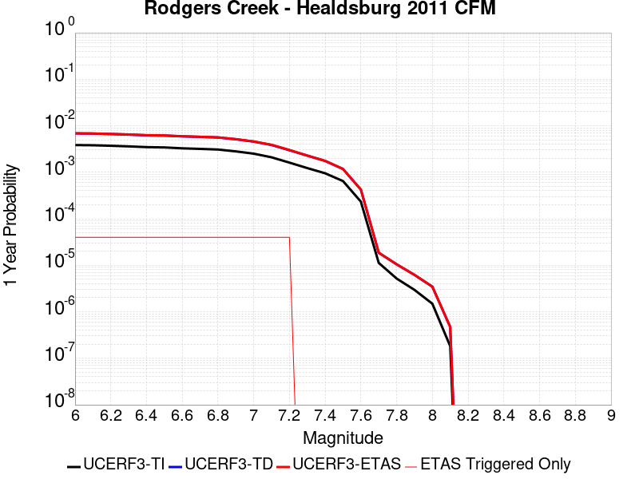 |

| Magnitude | 1 wk TI Prob | 1 wk TD Prob | 1 wk ETAS Prob | 1 wk ETAS/TD Gain | 1 wk ETAS Triggered Only | 1 mo TI Prob | 1 mo TD Prob | 1 mo ETAS Prob | 1 mo ETAS/TD Gain | 1 mo ETAS Triggered Only | 1 yr TI Prob | 1 yr TD Prob | 1 yr ETAS Prob | 1 yr ETAS/TD Gain | 1 yr ETAS Triggered Only |
|-----|-----|-----|-----|-----|-----|-----|-----|-----|-----|-----|-----|-----|-----|-----|-----|
| 6.0 | 7.390182E-5 | 1.3172402E-4 | 1.7171876E-4 | 1.3036252 | 4.0E-5 | 3.1668364E-4 | 5.644085E-4 | 6.043859E-4 | 1.0708307 | 4.0E-5 | 0.0038488081 | 0.0068499893 | 0.0068897153 | 1.0057994 | 4.0E-5 |
| 6.1 | 7.318768E-5 | 1.3070297E-4 | 1.7069775E-4 | 1.3059974 | 4.0E-5 | 3.1362378E-4 | 5.600345E-4 | 6.000121E-4 | 1.0713842 | 4.0E-5 | 0.0038116854 | 0.006797084 | 0.0068368125 | 1.0058448 | 4.0E-5 |
| 6.2 | 7.1379836E-5 | 1.276287E-4 | 1.6762358E-4 | 1.3133692 | 4.0E-5 | 3.058777E-4 | 5.468645E-4 | 5.8684265E-4 | 1.0731043 | 4.0E-5 | 0.003717703 | 0.0066377264 | 0.006677461 | 1.0059862 | 4.0E-5 |
| 6.3 | 6.9255926E-5 | 1.2416835E-4 | 1.6416339E-4 | 1.3221033 | 4.0E-5 | 2.9677735E-4 | 5.320417E-4 | 5.720204E-4 | 1.075142 | 4.0E-5 | 0.0036072785 | 0.006458419 | 0.006498161 | 1.0061535 | 4.0E-5 |
| 6.4 | 6.6757144E-5 | 1.1993147E-4 | 1.5992667E-4 | 1.3334838 | 4.0E-5 | 2.8607066E-4 | 5.1389105E-4 | 5.5387046E-4 | 1.0777975 | 4.0E-5 | 0.0034773487 | 0.0062387474 | 0.006278498 | 1.0063715 | 4.0E-5 |
| 6.5 | 6.5735134E-5 | 1.1842075E-4 | 1.58416E-4 | 1.3377386 | 4.0E-5 | 2.8169158E-4 | 5.074192E-4 | 5.473989E-4 | 1.0787903 | 4.0E-5 | 0.003424202 | 0.0061604134 | 0.006200167 | 1.006453 | 4.0E-5 |
| 6.6 | 6.289601E-5 | 1.1377107E-4 | 1.5376652E-4 | 1.3515432 | 4.0E-5 | 2.6952647E-4 | 4.8749958E-4 | 5.274801E-4 | 1.0820113 | 4.0E-5 | 0.0032765474 | 0.0059192353 | 0.0059589986 | 1.0067177 | 4.0E-5 |
| 6.7 | 6.115274E-5 | 1.10938905E-4 | 1.5093446E-4 | 1.3605188 | 4.0E-5 | 2.6205686E-4 | 4.7536616E-4 | 5.153472E-4 | 1.0841056 | 4.0E-5 | 0.0031858748 | 0.0057723043 | 0.005812073 | 1.0068897 | 4.0E-5 |
| 6.8 | 5.9232367E-5 | 1.0760933E-4 | 1.4760502E-4 | 1.371675 | 4.0E-5 | 2.538283E-4 | 4.611017E-4 | 5.0108327E-4 | 1.0867088 | 4.0E-5 | 0.0030859804 | 0.0055995397 | 0.005639316 | 1.0071034 | 4.0E-5 |
| 6.9 | 5.4030377E-5 | 9.853946E-5 | 1.3853551E-4 | 1.4058888 | 4.0E-5 | 2.315382E-4 | 4.2224393E-4 | 4.6222706E-4 | 1.094692 | 4.0E-5 | 0.0028153337 | 0.0051287687 | 0.0051685637 | 1.0077591 | 4.0E-5 |
| 7.0 | 4.8260714E-5 | 8.770168E-5 | 1.2769818E-4 | 1.4560516 | 4.0E-5 | 2.0681522E-4 | 3.758105E-4 | 4.1579545E-4 | 1.1063967 | 4.0E-5 | 0.0025150678 | 0.004565948 | 0.0046057655 | 1.0087205 | 4.0E-5 |
| 7.1 | 4.0294493E-5 | 7.416018E-5 | 1.14157214E-4 | 1.539333 | 4.0E-5 | 1.7267925E-4 | 3.1779084E-4 | 3.5777813E-4 | 1.125829 | 4.0E-5 | 0.0021003427 | 0.0038622776 | 0.003902123 | 1.0103166 | 4.0E-5 |
| 7.2 | 3.096388E-5 | 5.721074E-5 | 9.7208445E-5 | 1.6991295 | 4.0E-5 | 1.326956E-4 | 2.4516595E-4 | 2.8515616E-4 | 1.1631148 | 4.0E-5 | 0.0016143717 | 0.002980832 | 0.0030207129 | 1.0133791 | 4.0E-5 |
| 7.3 | 2.3615226E-5 | 4.3819553E-5 | 4.3819553E-5 | 1.0 | 0.0 | 1.0120418E-4 | 1.8778465E-4 | 1.8778465E-4 | 1.0 | 0.0 | 0.0012314644 | 0.0022838947 | 0.0022838947 | 1.0 | 0.0 |
| 7.4 | 1.8251132E-5 | 3.3692526E-5 | 3.3692526E-5 | 1.0 | 0.0 | 7.821679E-5 | 1.443886E-4 | 1.443886E-4 | 1.0 | 0.0 | 9.518733E-4 | 0.0017565237 | 0.0017565237 | 1.0 | 0.0 |
| 7.5 | 1.2411432E-5 | 2.257089E-5 | 2.257089E-5 | 1.0 | 0.0 | 5.3190768E-5 | 9.672883E-5 | 9.672883E-5 | 1.0 | 0.0 | 6.4740516E-4 | 0.0011770432 | 0.0011770432 | 1.0 | 0.0 |
| 7.6 | 4.4771446E-6 | 8.12494E-6 | 8.12494E-6 | 1.0 | 0.0 | 1.918762E-5 | 3.4820714E-5 | 3.4820714E-5 | 1.0 | 0.0 | 2.3358424E-4 | 4.2386097E-4 | 4.2386097E-4 | 1.0 | 0.0 |
| 7.7 | 2.157941E-7 | 3.5663737E-7 | 3.5663737E-7 | 1.0 | 0.0 | 9.248315E-7 | 1.528445E-6 | 1.528445E-6 | 1.0 | 0.0 | 1.1259765E-5 | 1.8608658E-5 | 1.8608658E-5 | 1.0 | 0.0 |
| 7.8 | 9.9623286E-8 | 2.0139036E-7 | 2.0139036E-7 | 1.0 | 0.0 | 4.269569E-7 | 8.6310126E-7 | 8.6310126E-7 | 1.0 | 0.0 | 5.1981874E-6 | 1.0508207E-5 | 1.0508207E-5 | 1.0 | 0.0 |
| 7.9 | 5.6745257E-8 | 1.1922721E-7 | 1.1922721E-7 | 1.0 | 0.0 | 2.4319394E-7 | 5.109737E-7 | 5.109737E-7 | 1.0 | 0.0 | 2.960882E-6 | 6.2210866E-6 | 6.2210866E-6 | 1.0 | 0.0 |
| 8.0 | 2.8614323E-8 | 6.658427E-8 | 6.658427E-8 | 1.0 | 0.0 | 1.2263281E-7 | 2.8536112E-7 | 2.8536112E-7 | 1.0 | 0.0 | 1.4930534E-6 | 3.4742661E-6 | 3.4742661E-6 | 1.0 | 0.0 |
| 8.1 | 3.5045191E-9 | 9.066701E-9 | 9.066701E-9 | 1.0 | 0.0 | 1.5019367E-8 | 3.8857287E-8 | 3.8857287E-8 | 1.0 | 0.0 | 1.8286079E-7 | 4.730874E-7 | 4.730874E-7 | 1.0 | 0.0 |

## Newport-Inglewood alt 1
*[(top)](#table-of-contents)*

| 1 Week | 1 Month | 1 Year |
|-----|-----|-----|
| 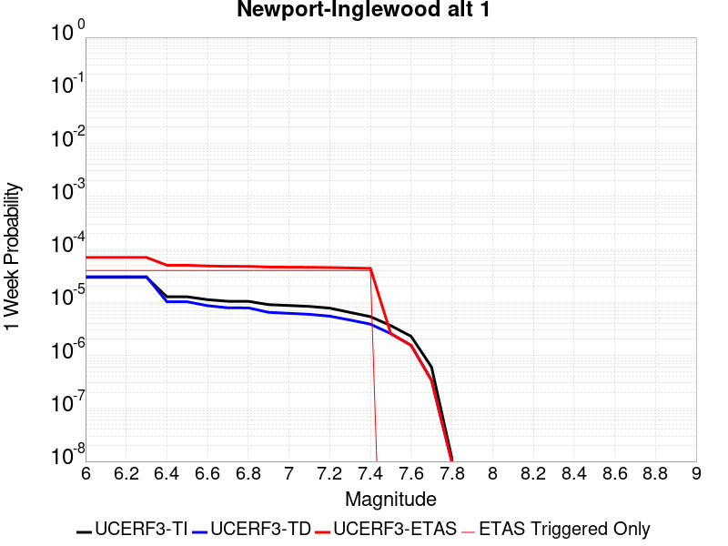 | 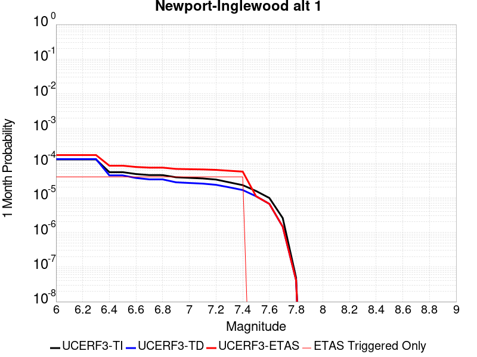 |  |

| Magnitude | 1 wk TI Prob | 1 wk TD Prob | 1 wk ETAS Prob | 1 wk ETAS/TD Gain | 1 wk ETAS Triggered Only | 1 mo TI Prob | 1 mo TD Prob | 1 mo ETAS Prob | 1 mo ETAS/TD Gain | 1 mo ETAS Triggered Only | 1 yr TI Prob | 1 yr TD Prob | 1 yr ETAS Prob | 1 yr ETAS/TD Gain | 1 yr ETAS Triggered Only |
|-----|-----|-----|-----|-----|-----|-----|-----|-----|-----|-----|-----|-----|-----|-----|-----|
| 6.0 | 2.9668912E-5 | 3.042145E-5 | 7.042023E-5 | 2.3148217 | 4.0E-5 | 1.2714628E-4 | 1.3037387E-4 | 1.7036866E-4 | 1.30677 | 4.0E-5 | 0.0015469068 | 0.0015866318 | 0.0016265683 | 1.0251707 | 4.0E-5 |
| 6.1 | 2.9668912E-5 | 3.042145E-5 | 7.042023E-5 | 2.3148217 | 4.0E-5 | 1.2714628E-4 | 1.3037387E-4 | 1.7036866E-4 | 1.30677 | 4.0E-5 | 0.0015469068 | 0.0015866318 | 0.0016265683 | 1.0251707 | 4.0E-5 |
| 6.2 | 2.9668912E-5 | 3.042145E-5 | 7.042023E-5 | 2.3148217 | 4.0E-5 | 1.2714628E-4 | 1.3037387E-4 | 1.7036866E-4 | 1.30677 | 4.0E-5 | 0.0015469068 | 0.0015866318 | 0.0016265683 | 1.0251707 | 4.0E-5 |
| 6.3 | 2.9668912E-5 | 3.042145E-5 | 7.042023E-5 | 2.3148217 | 4.0E-5 | 1.2714628E-4 | 1.3037387E-4 | 1.7036866E-4 | 1.30677 | 4.0E-5 | 0.0015469068 | 0.0015866318 | 0.0016265683 | 1.0251707 | 4.0E-5 |
| 6.4 | 1.275942E-5 | 1.0275527E-5 | 5.0275117E-5 | 4.8927045 | 4.0E-5 | 5.4682085E-5 | 4.4037253E-5 | 8.403549E-5 | 1.9082819 | 4.0E-5 | 6.65551E-4 | 5.3602585E-4 | 5.760044E-4 | 1.0745833 | 4.0E-5 |
| 6.5 | 1.275942E-5 | 1.0275527E-5 | 5.0275117E-5 | 4.8927045 | 4.0E-5 | 5.4682085E-5 | 4.4037253E-5 | 8.403549E-5 | 1.9082819 | 4.0E-5 | 6.65551E-4 | 5.3602585E-4 | 5.760044E-4 | 1.0745833 | 4.0E-5 |
| 6.6 | 1.1255358E-5 | 8.664203E-6 | 4.8663856E-5 | 5.6166573 | 4.0E-5 | 4.8236358E-5 | 3.7131776E-5 | 7.7130295E-5 | 2.0772045 | 4.0E-5 | 5.871194E-4 | 4.5198732E-4 | 4.9196923E-4 | 1.0884581 | 4.0E-5 |
| 6.7 | 1.0504745E-5 | 7.90187E-6 | 4.7901554E-5 | 6.0620527 | 4.0E-5 | 4.5019555E-5 | 3.3864726E-5 | 7.386337E-5 | 2.1811302 | 4.0E-5 | 5.4797524E-4 | 4.1222628E-4 | 4.522098E-4 | 1.096994 | 4.0E-5 |
| 6.8 | 1.0476007E-5 | 7.883248E-6 | 4.788293E-5 | 6.074011 | 4.0E-5 | 4.4896402E-5 | 3.3784916E-5 | 7.3783565E-5 | 2.1839204 | 4.0E-5 | 5.464766E-4 | 4.1125497E-4 | 4.5123853E-4 | 1.0972233 | 4.0E-5 |
| 6.9 | 9.076797E-6 | 6.4912397E-6 | 4.649098E-5 | 7.1621113 | 4.0E-5 | 3.889998E-5 | 2.7819304E-5 | 6.781819E-5 | 2.4378104 | 4.0E-5 | 4.7350433E-4 | 3.3864772E-4 | 3.7863417E-4 | 1.1180768 | 4.0E-5 |
| 7.0 | 8.73795E-6 | 6.2135855E-6 | 4.6213336E-5 | 7.437467 | 4.0E-5 | 3.7447822E-5 | 2.6629381E-5 | 6.6628316E-5 | 2.5020602 | 4.0E-5 | 4.5583185E-4 | 3.2416475E-4 | 3.6415178E-4 | 1.1233541 | 4.0E-5 |
| 7.1 | 8.391299E-6 | 5.957252E-6 | 4.5957015E-5 | 7.714465 | 4.0E-5 | 3.5962214E-5 | 2.5530831E-5 | 6.552981E-5 | 2.566693 | 4.0E-5 | 4.37752E-4 | 3.107938E-4 | 3.5078137E-4 | 1.1286627 | 4.0E-5 |
| 7.2 | 7.796882E-6 | 5.4978805E-6 | 4.549766E-5 | 8.275491 | 4.0E-5 | 3.341478E-5 | 2.3562134E-5 | 6.3561194E-5 | 2.6975992 | 4.0E-5 | 4.06749E-4 | 2.8683143E-4 | 3.2681995E-4 | 1.1394148 | 4.0E-5 |
| 7.3 | 6.4738833E-6 | 4.6488503E-6 | 4.4648663E-5 | 9.604238 | 4.0E-5 | 2.774492E-5 | 1.9923493E-5 | 5.9922695E-5 | 3.0076401 | 4.0E-5 | 3.3774204E-4 | 2.4254168E-4 | 2.8253198E-4 | 1.1648802 | 4.0E-5 |
| 7.4 | 5.382145E-6 | 3.886563E-6 | 4.3886408E-5 | 11.29183 | 4.0E-5 | 2.3066134E-5 | 1.6656593E-5 | 5.665593E-5 | 3.4014115 | 4.0E-5 | 2.8079396E-4 | 2.0277528E-4 | 2.4276717E-4 | 1.1972227 | 4.0E-5 |
| 7.5 | 3.648244E-6 | 2.5743657E-6 | 2.5743657E-6 | 1.0 | 0.0 | 1.5635238E-5 | 1.103295E-5 | 1.103295E-5 | 1.0 | 0.0 | 1.9034238E-4 | 1.3431799E-4 | 1.3431799E-4 | 1.0 | 0.0 |
| 7.6 | 2.2906888E-6 | 1.5483535E-6 | 1.5483535E-6 | 1.0 | 0.0 | 9.817201E-6 | 6.635784E-6 | 6.635784E-6 | 1.0 | 0.0 | 1.1951787E-4 | 8.078774E-5 | 8.078774E-5 | 1.0 | 0.0 |
| 7.7 | 6.0479874E-7 | 3.3983838E-7 | 3.3983838E-7 | 1.0 | 0.0 | 2.5919921E-6 | 1.4564495E-6 | 1.4564495E-6 | 1.0 | 0.0 | 3.1557047E-5 | 1.7732142E-5 | 1.7732142E-5 | 1.0 | 0.0 |
| 7.8 | 1.16056995E-8 | 9.78305E-9 | 9.78305E-9 | 1.0 | 0.0 | 4.9738713E-8 | 4.1927358E-8 | 4.1927358E-8 | 1.0 | 0.0 | 6.0556863E-7 | 5.1046555E-7 | 5.1046555E-7 | 1.0 | 0.0 |

## San Luis Range 2011 CFM
*[(top)](#table-of-contents)*

| 1 Week | 1 Month | 1 Year |
|-----|-----|-----|
| 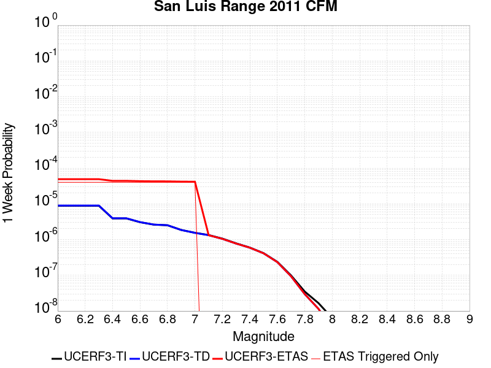 | 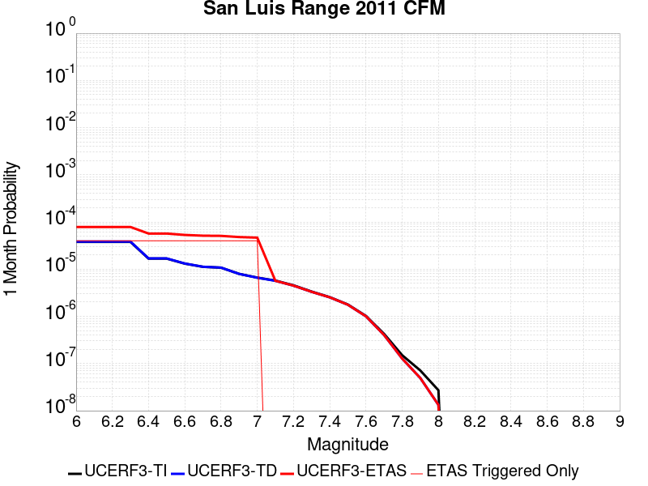 | 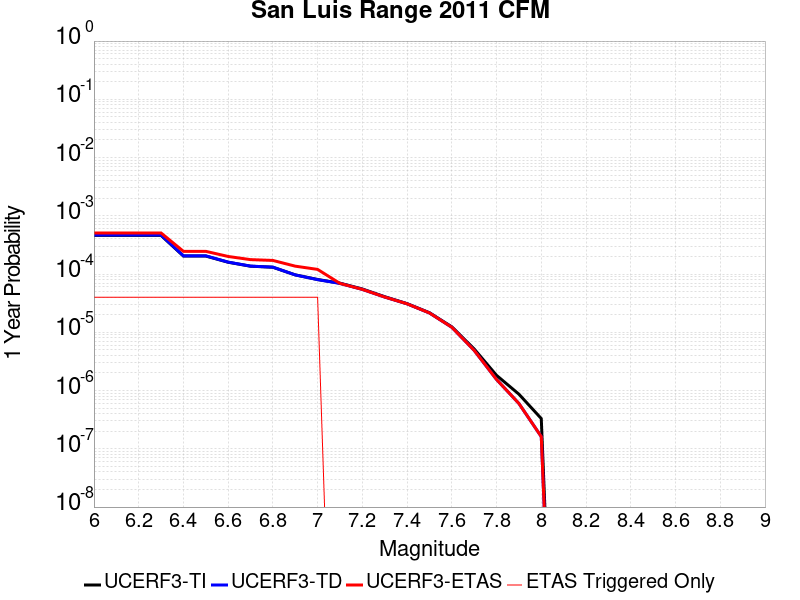 |

| Magnitude | 1 wk TI Prob | 1 wk TD Prob | 1 wk ETAS Prob | 1 wk ETAS/TD Gain | 1 wk ETAS Triggered Only | 1 mo TI Prob | 1 mo TD Prob | 1 mo ETAS Prob | 1 mo ETAS/TD Gain | 1 mo ETAS Triggered Only | 1 yr TI Prob | 1 yr TD Prob | 1 yr ETAS Prob | 1 yr ETAS/TD Gain | 1 yr ETAS Triggered Only |
|-----|-----|-----|-----|-----|-----|-----|-----|-----|-----|-----|-----|-----|-----|-----|-----|
| 6.0 | 8.8368415E-6 | 8.966062E-6 | 4.8965703E-5 | 5.461228 | 4.0E-5 | 3.787163E-5 | 3.8425456E-5 | 7.842392E-5 | 2.0409365 | 4.0E-5 | 4.609895E-4 | 4.6773738E-4 | 5.0771865E-4 | 1.0854781 | 4.0E-5 |
| 6.1 | 8.8368415E-6 | 8.966062E-6 | 4.8965703E-5 | 5.461228 | 4.0E-5 | 3.787163E-5 | 3.8425456E-5 | 7.842392E-5 | 2.0409365 | 4.0E-5 | 4.609895E-4 | 4.6773738E-4 | 5.0771865E-4 | 1.0854781 | 4.0E-5 |
| 6.2 | 8.8368415E-6 | 8.966062E-6 | 4.8965703E-5 | 5.461228 | 4.0E-5 | 3.787163E-5 | 3.8425456E-5 | 7.842392E-5 | 2.0409365 | 4.0E-5 | 4.609895E-4 | 4.6773738E-4 | 5.0771865E-4 | 1.0854781 | 4.0E-5 |
| 6.3 | 8.8368415E-6 | 8.966062E-6 | 4.8965703E-5 | 5.461228 | 4.0E-5 | 3.787163E-5 | 3.8425456E-5 | 7.842392E-5 | 2.0409365 | 4.0E-5 | 4.609895E-4 | 4.6773738E-4 | 5.0771865E-4 | 1.0854781 | 4.0E-5 |
| 6.4 | 3.9094193E-6 | 3.941476E-6 | 4.394132E-5 | 11.148443 | 4.0E-5 | 1.6754546E-5 | 1.689193E-5 | 5.6891255E-5 | 3.3679545 | 4.0E-5 | 2.039675E-4 | 2.0564014E-4 | 2.456319E-4 | 1.1944746 | 4.0E-5 |
| 6.5 | 3.9094193E-6 | 3.941476E-6 | 4.394132E-5 | 11.148443 | 4.0E-5 | 1.6754546E-5 | 1.689193E-5 | 5.6891255E-5 | 3.3679545 | 4.0E-5 | 2.039675E-4 | 2.0564014E-4 | 2.456319E-4 | 1.1944746 | 4.0E-5 |
| 6.6 | 3.0587726E-6 | 3.075609E-6 | 4.3075484E-5 | 14.005514 | 4.0E-5 | 1.3108959E-5 | 1.3181116E-5 | 5.318059E-5 | 4.0346045 | 4.0E-5 | 1.595899E-4 | 1.6046838E-4 | 2.0046196E-4 | 1.2492303 | 4.0E-5 |
| 6.7 | 2.6160574E-6 | 2.625322E-6 | 4.2625215E-5 | 16.236187 | 4.0E-5 | 1.1211626E-5 | 1.1251332E-5 | 5.125088E-5 | 4.5550947 | 4.0E-5 | 1.3649299E-4 | 1.369764E-4 | 1.7697093E-4 | 1.2919811 | 4.0E-5 |
| 6.8 | 2.5110312E-6 | 2.518328E-6 | 4.2518226E-5 | 16.883514 | 4.0E-5 | 1.0761518E-5 | 1.079279E-5 | 5.0792358E-5 | 4.7061377 | 4.0E-5 | 1.310136E-4 | 1.3139435E-4 | 1.713891E-4 | 1.3043871 | 4.0E-5 |
| 6.9 | 1.8564405E-6 | 1.8526367E-6 | 4.1852563E-5 | 22.590809 | 4.0E-5 | 7.95615E-6 | 7.939848E-6 | 4.793953E-5 | 6.03784 | 4.0E-5 | 9.686181E-5 | 9.6663374E-5 | 1.3665951E-4 | 1.4137672 | 4.0E-5 |
| 7.0 | 1.546127E-6 | 1.5370855E-6 | 4.1537023E-5 | 27.023235 | 4.0E-5 | 6.626242E-6 | 6.587493E-6 | 4.658723E-5 | 7.072073 | 4.0E-5 | 8.06715E-5 | 8.019978E-5 | 1.2019657E-4 | 1.4987144 | 4.0E-5 |
| 7.1 | 1.3368208E-6 | 1.32365E-6 | 1.32365E-6 | 1.0 | 0.0 | 5.7292195E-6 | 5.672774E-6 | 5.672774E-6 | 1.0 | 0.0 | 6.975101E-5 | 6.906383E-5 | 6.906383E-5 | 1.0 | 0.0 |
| 7.2 | 1.0623363E-6 | 1.0455358E-6 | 1.0455358E-6 | 1.0 | 0.0 | 4.5528623E-6 | 4.48086E-6 | 4.48086E-6 | 1.0 | 0.0 | 5.5429686E-5 | 5.4553104E-5 | 5.4553104E-5 | 1.0 | 0.0 |
| 7.3 | 7.831679E-7 | 7.728201E-7 | 7.728201E-7 | 1.0 | 0.0 | 3.3564295E-6 | 3.312082E-6 | 3.312082E-6 | 1.0 | 0.0 | 4.086376E-5 | 4.0323852E-5 | 4.0323852E-5 | 1.0 | 0.0 |
| 7.4 | 5.9558846E-7 | 5.9113245E-7 | 5.9113245E-7 | 1.0 | 0.0 | 2.5525194E-6 | 2.5334223E-6 | 2.5334223E-6 | 1.0 | 0.0 | 3.107648E-5 | 3.084398E-5 | 3.084398E-5 | 1.0 | 0.0 |
| 7.5 | 4.1616502E-7 | 4.120181E-7 | 4.120181E-7 | 1.0 | 0.0 | 1.7835631E-6 | 1.7657907E-6 | 1.7657907E-6 | 1.0 | 0.0 | 2.1714664E-5 | 2.149829E-5 | 2.149829E-5 | 1.0 | 0.0 |
| 7.6 | 2.3816014E-7 | 2.3380777E-7 | 2.3380777E-7 | 1.0 | 0.0 | 1.0206859E-6 | 1.0020328E-6 | 1.0020328E-6 | 1.0 | 0.0 | 1.242678E-5 | 1.2199682E-5 | 1.2199682E-5 | 1.0 | 0.0 |
| 7.7 | 9.918777E-8 | 9.389732E-8 | 9.389732E-8 | 1.0 | 0.0 | 4.2509038E-7 | 4.0241702E-7 | 4.0241702E-7 | 1.0 | 0.0 | 5.1754632E-6 | 4.899416E-6 | 4.899416E-6 | 1.0 | 0.0 |
| 7.8 | 3.4982556E-8 | 2.9710671E-8 | 2.9710671E-8 | 1.0 | 0.0 | 1.4992524E-7 | 1.2733145E-7 | 1.2733145E-7 | 1.0 | 0.0 | 1.8253382E-6 | 1.5502592E-6 | 1.5502592E-6 | 1.0 | 0.0 |
| 7.9 | 1.6624908E-8 | 1.1498279E-8 | 1.1498279E-8 | 1.0 | 0.0 | 7.12496E-8 | 4.9278338E-8 | 4.9278338E-8 | 1.0 | 0.0 | 8.6746354E-7 | 5.999636E-7 | 5.999636E-7 | 1.0 | 0.0 |
| 8.0 | 6.3352315E-9 | 3.1016265E-9 | 3.1016265E-9 | 1.0 | 0.0 | 2.715099E-8 | 1.3292685E-8 | 1.3292685E-8 | 1.0 | 0.0 | 3.3056327E-7 | 1.6183843E-7 | 1.6183843E-7 | 1.0 | 0.0 |

## Hayward (So) extension 2011 CFM
*[(top)](#table-of-contents)*

| 1 Week | 1 Month | 1 Year |
|-----|-----|-----|
|  | 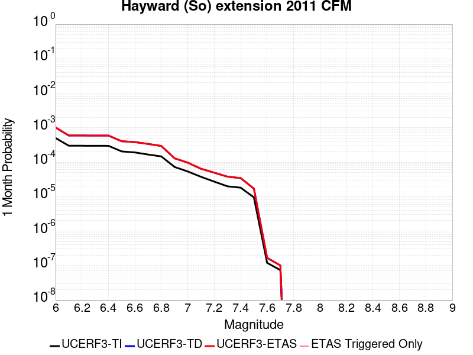 |  |

| Magnitude | 1 wk TI Prob | 1 wk TD Prob | 1 wk ETAS Prob | 1 wk ETAS/TD Gain | 1 wk ETAS Triggered Only | 1 mo TI Prob | 1 mo TD Prob | 1 mo ETAS Prob | 1 mo ETAS/TD Gain | 1 mo ETAS Triggered Only | 1 yr TI Prob | 1 yr TD Prob | 1 yr ETAS Prob | 1 yr ETAS/TD Gain | 1 yr ETAS Triggered Only |
|-----|-----|-----|-----|-----|-----|-----|-----|-----|-----|-----|-----|-----|-----|-----|-----|
| 6.0 | 1.1721256E-4 | 2.3707273E-4 | 2.3707273E-4 | 1.0 | 0.0 | 5.022428E-4 | 0.0010154108 | 0.0010154108 | 1.0 | 0.0 | 0.0060976758 | 0.012268964 | 0.012308474 | 1.0032202 | 4.0E-5 |
| 6.1 | 6.99169E-5 | 1.3834794E-4 | 1.3834794E-4 | 1.0 | 0.0 | 2.9960944E-4 | 5.92756E-4 | 5.92756E-4 | 1.0 | 0.0 | 0.0036416445 | 0.0071868575 | 0.00722657 | 1.0055257 | 4.0E-5 |
| 6.2 | 6.99169E-5 | 1.3834794E-4 | 1.3834794E-4 | 1.0 | 0.0 | 2.9960944E-4 | 5.92756E-4 | 5.92756E-4 | 1.0 | 0.0 | 0.0036416445 | 0.0071868575 | 0.00722657 | 1.0055257 | 4.0E-5 |
| 6.3 | 6.970908E-5 | 1.3802912E-4 | 1.3802912E-4 | 1.0 | 0.0 | 2.9871898E-4 | 5.913906E-4 | 5.913906E-4 | 1.0 | 0.0 | 0.0036308395 | 0.007170382 | 0.0072100954 | 1.0055385 | 4.0E-5 |
| 6.4 | 6.9517155E-5 | 1.3769804E-4 | 1.3769804E-4 | 1.0 | 0.0 | 2.9789665E-4 | 5.8997254E-4 | 5.8997254E-4 | 1.0 | 0.0 | 0.0036208609 | 0.00715328 | 0.007192994 | 1.0055518 | 4.0E-5 |
| 6.5 | 4.786248E-5 | 9.438908E-5 | 9.438908E-5 | 1.0 | 0.0 | 2.0510878E-4 | 4.0446428E-4 | 4.0446428E-4 | 1.0 | 0.0 | 0.0024943394 | 0.0049136723 | 0.0049534757 | 1.0081005 | 4.0E-5 |
| 6.6 | 4.4662214E-5 | 8.9047135E-5 | 8.9047135E-5 | 1.0 | 0.0 | 1.9139545E-4 | 3.8157735E-4 | 3.8157735E-4 | 1.0 | 0.0 | 0.0023277493 | 0.004636274 | 0.0046760887 | 1.0085876 | 4.0E-5 |
| 6.7 | 3.884542E-5 | 7.88641E-5 | 7.88641E-5 | 1.0 | 0.0 | 1.6646975E-4 | 3.379477E-4 | 3.379477E-4 | 1.0 | 0.0 | 0.002024885 | 0.0041071977 | 0.004147033 | 1.009699 | 4.0E-5 |
| 6.8 | 3.4221863E-5 | 6.8744615E-5 | 6.8744615E-5 | 1.0 | 0.0 | 1.4665688E-4 | 2.9458888E-4 | 2.9458888E-4 | 1.0 | 0.0 | 0.0017840851 | 0.003581144 | 0.0036210008 | 1.0111296 | 4.0E-5 |
| 6.9 | 1.6927712E-5 | 3.0151146E-5 | 3.0151146E-5 | 1.0 | 0.0 | 7.2545314E-5 | 1.2921312E-4 | 1.2921312E-4 | 1.0 | 0.0 | 8.828813E-4 | 0.0015720917 | 0.0015720917 | 1.0 | 0.0 |
| 7.0 | 1.2509653E-5 | 2.254093E-5 | 2.254093E-5 | 1.0 | 0.0 | 5.3611697E-5 | 9.6600656E-5 | 9.6600656E-5 | 1.0 | 0.0 | 6.525269E-4 | 0.0011755227 | 0.0011755227 | 1.0 | 0.0 |
| 7.1 | 8.751583E-6 | 1.49821035E-5 | 1.49821035E-5 | 1.0 | 0.0 | 3.750624E-5 | 6.420747E-5 | 6.420747E-5 | 1.0 | 0.0 | 4.5654282E-4 | 7.8145147E-4 | 7.8145147E-4 | 1.0 | 0.0 |
| 7.2 | 6.354379E-6 | 1.15507255E-5 | 1.15507255E-5 | 1.0 | 0.0 | 2.7232769E-5 | 4.95022E-5 | 4.95022E-5 | 1.0 | 0.0 | 3.3150852E-4 | 6.0252746E-4 | 6.0252746E-4 | 1.0 | 0.0 |
| 7.3 | 4.645554E-6 | 8.862972E-6 | 8.862972E-6 | 1.0 | 0.0 | 1.9909365E-5 | 3.7983635E-5 | 3.7983635E-5 | 1.0 | 0.0 | 2.4236954E-4 | 4.623566E-4 | 4.623566E-4 | 1.0 | 0.0 |
| 7.4 | 4.23437E-6 | 8.032991E-6 | 8.032991E-6 | 1.0 | 0.0 | 1.8147173E-5 | 3.4426674E-5 | 3.4426674E-5 | 1.0 | 0.0 | 2.2091944E-4 | 4.1906803E-4 | 4.1906803E-4 | 1.0 | 0.0 |
| 7.5 | 2.2187417E-6 | 3.9751676E-6 | 3.9751676E-6 | 1.0 | 0.0 | 9.508858E-6 | 1.7036336E-5 | 1.7036336E-5 | 1.0 | 0.0 | 1.157642E-4 | 2.074003E-4 | 2.074003E-4 | 1.0 | 0.0 |
| 7.6 | 2.7952495E-8 | 3.8914465E-8 | 3.8914465E-8 | 1.0 | 0.0 | 1.1979641E-7 | 1.6677626E-7 | 1.6677626E-7 | 1.0 | 0.0 | 1.4585203E-6 | 2.030499E-6 | 2.030499E-6 | 1.0 | 0.0 |
| 7.7 | 1.7192724E-8 | 2.3523677E-8 | 2.3523677E-8 | 1.0 | 0.0 | 7.36831E-8 | 1.00815754E-7 | 1.00815754E-7 | 1.0 | 0.0 | 8.9709135E-7 | 1.2274312E-6 | 1.2274312E-6 | 1.0 | 0.0 |

## Airport Lake
*[(top)](#table-of-contents)*

| 1 Week | 1 Month | 1 Year |
|-----|-----|-----|
|  |  |  |

| Magnitude | 1 wk TI Prob | 1 wk TD Prob | 1 wk ETAS Prob | 1 wk ETAS/TD Gain | 1 wk ETAS Triggered Only | 1 mo TI Prob | 1 mo TD Prob | 1 mo ETAS Prob | 1 mo ETAS/TD Gain | 1 mo ETAS Triggered Only | 1 yr TI Prob | 1 yr TD Prob | 1 yr ETAS Prob | 1 yr ETAS/TD Gain | 1 yr ETAS Triggered Only |
|-----|-----|-----|-----|-----|-----|-----|-----|-----|-----|-----|-----|-----|-----|-----|-----|
| 6.0 | 1.2387061E-5 | 1.3105726E-5 | 1.3105726E-5 | 1.0 | 0.0 | 5.3086325E-5 | 5.6166347E-5 | 9.61641E-5 | 1.7121302 | 4.0E-5 | 6.461343E-4 | 6.8363914E-4 | 7.236118E-4 | 1.0584704 | 4.0E-5 |
| 6.1 | 1.2387061E-5 | 1.3105726E-5 | 1.3105726E-5 | 1.0 | 0.0 | 5.3086325E-5 | 5.6166347E-5 | 9.61641E-5 | 1.7121302 | 4.0E-5 | 6.461343E-4 | 6.8363914E-4 | 7.236118E-4 | 1.0584704 | 4.0E-5 |
| 6.2 | 1.2387061E-5 | 1.3105726E-5 | 1.3105726E-5 | 1.0 | 0.0 | 5.3086325E-5 | 5.6166347E-5 | 9.61641E-5 | 1.7121302 | 4.0E-5 | 6.461343E-4 | 6.8363914E-4 | 7.236118E-4 | 1.0584704 | 4.0E-5 |
| 6.3 | 1.2387061E-5 | 1.3105726E-5 | 1.3105726E-5 | 1.0 | 0.0 | 5.3086325E-5 | 5.6166347E-5 | 9.61641E-5 | 1.7121302 | 4.0E-5 | 6.461343E-4 | 6.8363914E-4 | 7.236118E-4 | 1.0584704 | 4.0E-5 |
| 6.4 | 1.2387061E-5 | 1.3105726E-5 | 1.3105726E-5 | 1.0 | 0.0 | 5.3086325E-5 | 5.6166347E-5 | 9.61641E-5 | 1.7121302 | 4.0E-5 | 6.461343E-4 | 6.8363914E-4 | 7.236118E-4 | 1.0584704 | 4.0E-5 |
| 6.5 | 6.9922594E-6 | 7.386331E-6 | 7.386331E-6 | 1.0 | 0.0 | 2.996648E-5 | 3.1655352E-5 | 7.165409E-5 | 2.2635694 | 4.0E-5 | 3.6478083E-4 | 3.8534118E-4 | 4.2532576E-4 | 1.103764 | 4.0E-5 |
| 6.6 | 6.9922594E-6 | 7.386331E-6 | 7.386331E-6 | 1.0 | 0.0 | 2.996648E-5 | 3.1655352E-5 | 7.165409E-5 | 2.2635694 | 4.0E-5 | 3.6478083E-4 | 3.8534118E-4 | 4.2532576E-4 | 1.103764 | 4.0E-5 |
| 6.7 | 5.477277E-6 | 5.7871744E-6 | 5.7871744E-6 | 1.0 | 0.0 | 2.3473833E-5 | 2.4801962E-5 | 6.4800966E-5 | 2.6127357 | 4.0E-5 | 2.8575645E-4 | 3.0192593E-4 | 3.4191387E-4 | 1.1324428 | 4.0E-5 |
| 6.8 | 3.9950432E-6 | 4.219889E-6 | 4.219889E-6 | 1.0 | 0.0 | 1.7121502E-5 | 1.808513E-5 | 5.8084406E-5 | 3.211722 | 4.0E-5 | 2.0843433E-4 | 2.2016696E-4 | 2.6015815E-4 | 1.1816403 | 4.0E-5 |
| 6.9 | 2.95695E-6 | 3.1236189E-6 | 3.1236189E-6 | 1.0 | 0.0 | 1.2672582E-5 | 1.33868825E-5 | 5.3386346E-5 | 3.9879596 | 4.0E-5 | 1.5427776E-4 | 1.6297537E-4 | 2.0296885E-4 | 1.2453959 | 4.0E-5 |
| 7.0 | 1.456072E-6 | 1.5411159E-6 | 1.5411159E-6 | 1.0 | 0.0 | 6.2402937E-6 | 6.6047714E-6 | 6.6047714E-6 | 1.0 | 0.0 | 7.597293E-5 | 8.041113E-5 | 8.041113E-5 | 1.0 | 0.0 |
| 7.1 | 6.995192E-7 | 7.41046E-7 | 7.41046E-7 | 1.0 | 0.0 | 2.997936E-6 | 3.1759114E-6 | 3.1759114E-6 | 1.0 | 0.0 | 3.649926E-5 | 3.866672E-5 | 3.866672E-5 | 1.0 | 0.0 |

## Johnson Valley (No) 2011 rev
*[(top)](#table-of-contents)*

| 1 Week | 1 Month | 1 Year |
|-----|-----|-----|
|  |  | 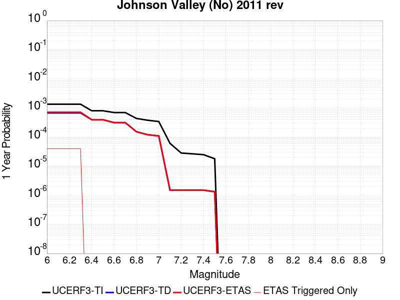 |

| Magnitude | 1 wk TI Prob | 1 wk TD Prob | 1 wk ETAS Prob | 1 wk ETAS/TD Gain | 1 wk ETAS Triggered Only | 1 mo TI Prob | 1 mo TD Prob | 1 mo ETAS Prob | 1 mo ETAS/TD Gain | 1 mo ETAS Triggered Only | 1 yr TI Prob | 1 yr TD Prob | 1 yr ETAS Prob | 1 yr ETAS/TD Gain | 1 yr ETAS Triggered Only |
|-----|-----|-----|-----|-----|-----|-----|-----|-----|-----|-----|-----|-----|-----|-----|-----|
| 6.0 | 2.577707E-5 | 1.2906532E-5 | 5.2906016E-5 | 4.099166 | 4.0E-5 | 1.1046848E-4 | 5.5312757E-5 | 9.531055E-5 | 1.7231205 | 4.0E-5 | 0.0013441239 | 6.732645E-4 | 7.1323756E-4 | 1.0593721 | 4.0E-5 |
| 6.1 | 2.577707E-5 | 1.2906532E-5 | 5.2906016E-5 | 4.099166 | 4.0E-5 | 1.1046848E-4 | 5.5312757E-5 | 9.531055E-5 | 1.7231205 | 4.0E-5 | 0.0013441239 | 6.732645E-4 | 7.1323756E-4 | 1.0593721 | 4.0E-5 |
| 6.2 | 2.577707E-5 | 1.2906532E-5 | 5.2906016E-5 | 4.099166 | 4.0E-5 | 1.1046848E-4 | 5.5312757E-5 | 9.531055E-5 | 1.7231205 | 4.0E-5 | 0.0013441239 | 6.732645E-4 | 7.1323756E-4 | 1.0593721 | 4.0E-5 |
| 6.3 | 2.577707E-5 | 1.2906532E-5 | 5.2906016E-5 | 4.099166 | 4.0E-5 | 1.1046848E-4 | 5.5312757E-5 | 9.531055E-5 | 1.7231205 | 4.0E-5 | 0.0013441239 | 6.732645E-4 | 7.1323756E-4 | 1.0593721 | 4.0E-5 |
| 6.4 | 1.5296591E-5 | 7.540394E-6 | 7.540394E-6 | 1.0 | 0.0 | 6.555518E-5 | 3.231568E-5 | 3.231568E-5 | 1.0 | 0.0 | 7.97842E-4 | 3.9339115E-4 | 3.9339115E-4 | 1.0 | 0.0 |
| 6.5 | 1.5296591E-5 | 7.540394E-6 | 7.540394E-6 | 1.0 | 0.0 | 6.555518E-5 | 3.231568E-5 | 3.231568E-5 | 1.0 | 0.0 | 7.97842E-4 | 3.9339115E-4 | 3.9339115E-4 | 1.0 | 0.0 |
| 6.6 | 1.3289383E-5 | 5.994878E-6 | 5.994878E-6 | 1.0 | 0.0 | 5.6953253E-5 | 2.5692178E-5 | 2.5692178E-5 | 1.0 | 0.0 | 6.9318525E-4 | 3.1277435E-4 | 3.1277435E-4 | 1.0 | 0.0 |
| 6.7 | 1.3289383E-5 | 5.994878E-6 | 5.994878E-6 | 1.0 | 0.0 | 5.6953253E-5 | 2.5692178E-5 | 2.5692178E-5 | 1.0 | 0.0 | 6.9318525E-4 | 3.1277435E-4 | 3.1277435E-4 | 1.0 | 0.0 |
| 6.8 | 8.330789E-6 | 2.9231828E-6 | 2.9231828E-6 | 1.0 | 0.0 | 3.570289E-5 | 1.2527898E-5 | 1.2527898E-5 | 1.0 | 0.0 | 4.34596E-4 | 1.525222E-4 | 1.525222E-4 | 1.0 | 0.0 |
| 6.9 | 7.2359003E-6 | 2.3029825E-6 | 2.3029825E-6 | 1.0 | 0.0 | 3.1010633E-5 | 9.869917E-6 | 9.869917E-6 | 1.0 | 0.0 | 3.7748902E-4 | 1.2016496E-4 | 1.2016496E-4 | 1.0 | 0.0 |
| 7.0 | 6.5149957E-6 | 2.0899704E-6 | 2.0899704E-6 | 1.0 | 0.0 | 2.792111E-5 | 8.957015E-6 | 8.957015E-6 | 1.0 | 0.0 | 3.398865E-4 | 1.0905151E-4 | 1.0905151E-4 | 1.0 | 0.0 |
| 7.1 | 1.1662233E-6 | 2.883985E-8 | 2.883985E-8 | 1.0 | 0.0 | 4.9980904E-6 | 1.2359935E-7 | 1.2359935E-7 | 1.0 | 0.0 | 6.0850052E-5 | 1.5048213E-6 | 1.5048213E-6 | 1.0 | 0.0 |
| 7.2 | 5.413881E-7 | 2.883985E-8 | 2.883985E-8 | 1.0 | 0.0 | 2.3202326E-6 | 1.2359935E-7 | 1.2359935E-7 | 1.0 | 0.0 | 2.8248465E-5 | 1.5048213E-6 | 1.5048213E-6 | 1.0 | 0.0 |
| 7.3 | 5.076821E-7 | 2.883985E-8 | 2.883985E-8 | 1.0 | 0.0 | 2.1757785E-6 | 1.2359935E-7 | 1.2359935E-7 | 1.0 | 0.0 | 2.648978E-5 | 1.5048213E-6 | 1.5048213E-6 | 1.0 | 0.0 |
| 7.4 | 4.7568687E-7 | 2.8821725E-8 | 2.8821725E-8 | 1.0 | 0.0 | 2.0386565E-6 | 1.2352167E-7 | 1.2352167E-7 | 1.0 | 0.0 | 2.482036E-5 | 1.5038755E-6 | 1.5038755E-6 | 1.0 | 0.0 |
| 7.5 | 3.435626E-7 | 2.5389689E-8 | 2.5389689E-8 | 1.0 | 0.0 | 1.4724103E-6 | 1.0881295E-7 | 1.0881295E-7 | 1.0 | 0.0 | 1.7926448E-5 | 1.3247969E-6 | 1.3247969E-6 | 1.0 | 0.0 |

## Compton
*[(top)](#table-of-contents)*

| 1 Week | 1 Month | 1 Year |
|-----|-----|-----|
|  | 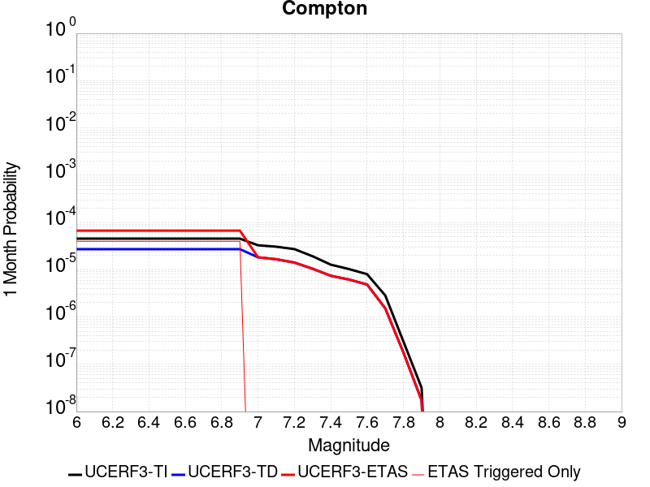 |  |

| Magnitude | 1 wk TI Prob | 1 wk TD Prob | 1 wk ETAS Prob | 1 wk ETAS/TD Gain | 1 wk ETAS Triggered Only | 1 mo TI Prob | 1 mo TD Prob | 1 mo ETAS Prob | 1 mo ETAS/TD Gain | 1 mo ETAS Triggered Only | 1 yr TI Prob | 1 yr TD Prob | 1 yr ETAS Prob | 1 yr ETAS/TD Gain | 1 yr ETAS Triggered Only |
|-----|-----|-----|-----|-----|-----|-----|-----|-----|-----|-----|-----|-----|-----|-----|-----|
| 6.0 | 1.06050875E-5 | 6.3607795E-6 | 4.6360525E-5 | 7.2884974 | 4.0E-5 | 4.5449582E-5 | 2.7260216E-5 | 6.725913E-5 | 2.4673 | 4.0E-5 | 5.5320817E-4 | 3.3184543E-4 | 3.7183217E-4 | 1.1204981 | 4.0E-5 |
| 6.1 | 1.06050875E-5 | 6.3607795E-6 | 4.6360525E-5 | 7.2884974 | 4.0E-5 | 4.5449582E-5 | 2.7260216E-5 | 6.725913E-5 | 2.4673 | 4.0E-5 | 5.5320817E-4 | 3.3184543E-4 | 3.7183217E-4 | 1.1204981 | 4.0E-5 |
| 6.2 | 1.06050875E-5 | 6.3607795E-6 | 4.6360525E-5 | 7.2884974 | 4.0E-5 | 4.5449582E-5 | 2.7260216E-5 | 6.725913E-5 | 2.4673 | 4.0E-5 | 5.5320817E-4 | 3.3184543E-4 | 3.7183217E-4 | 1.1204981 | 4.0E-5 |
| 6.3 | 1.06050875E-5 | 6.3607795E-6 | 4.6360525E-5 | 7.2884974 | 4.0E-5 | 4.5449582E-5 | 2.7260216E-5 | 6.725913E-5 | 2.4673 | 4.0E-5 | 5.5320817E-4 | 3.3184543E-4 | 3.7183217E-4 | 1.1204981 | 4.0E-5 |
| 6.4 | 1.06050875E-5 | 6.3607795E-6 | 4.6360525E-5 | 7.2884974 | 4.0E-5 | 4.5449582E-5 | 2.7260216E-5 | 6.725913E-5 | 2.4673 | 4.0E-5 | 5.5320817E-4 | 3.3184543E-4 | 3.7183217E-4 | 1.1204981 | 4.0E-5 |
| 6.5 | 1.06050875E-5 | 6.3607795E-6 | 4.6360525E-5 | 7.2884974 | 4.0E-5 | 4.5449582E-5 | 2.7260216E-5 | 6.725913E-5 | 2.4673 | 4.0E-5 | 5.5320817E-4 | 3.3184543E-4 | 3.7183217E-4 | 1.1204981 | 4.0E-5 |
| 6.6 | 1.06050875E-5 | 6.3607795E-6 | 4.6360525E-5 | 7.2884974 | 4.0E-5 | 4.5449582E-5 | 2.7260216E-5 | 6.725913E-5 | 2.4673 | 4.0E-5 | 5.5320817E-4 | 3.3184543E-4 | 3.7183217E-4 | 1.1204981 | 4.0E-5 |
| 6.7 | 1.06050875E-5 | 6.3607795E-6 | 4.6360525E-5 | 7.2884974 | 4.0E-5 | 4.5449582E-5 | 2.7260216E-5 | 6.725913E-5 | 2.4673 | 4.0E-5 | 5.5320817E-4 | 3.3184543E-4 | 3.7183217E-4 | 1.1204981 | 4.0E-5 |
| 6.8 | 1.06050875E-5 | 6.3607795E-6 | 4.6360525E-5 | 7.2884974 | 4.0E-5 | 4.5449582E-5 | 2.7260216E-5 | 6.725913E-5 | 2.4673 | 4.0E-5 | 5.5320817E-4 | 3.3184543E-4 | 3.7183217E-4 | 1.1204981 | 4.0E-5 |
| 6.9 | 1.06050875E-5 | 6.3607795E-6 | 4.6360525E-5 | 7.2884974 | 4.0E-5 | 4.5449582E-5 | 2.7260216E-5 | 6.725913E-5 | 2.4673 | 4.0E-5 | 5.5320817E-4 | 3.3184543E-4 | 3.7183217E-4 | 1.1204981 | 4.0E-5 |
| 7.0 | 7.672486E-6 | 4.273551E-6 | 4.273551E-6 | 1.0 | 0.0 | 3.288167E-5 | 1.8315093E-5 | 1.8315093E-5 | 1.0 | 0.0 | 4.0026082E-4 | 2.2296407E-4 | 2.2296407E-4 | 1.0 | 0.0 |
| 7.1 | 7.163992E-6 | 3.8851213E-6 | 3.8851213E-6 | 1.0 | 0.0 | 3.0702464E-5 | 1.6650416E-5 | 1.6650416E-5 | 1.0 | 0.0 | 3.7373835E-4 | 2.0270052E-4 | 2.0270052E-4 | 1.0 | 0.0 |
| 7.2 | 6.3689185E-6 | 3.3113977E-6 | 3.3113977E-6 | 1.0 | 0.0 | 2.729508E-5 | 1.4191629E-5 | 1.4191629E-5 | 1.0 | 0.0 | 3.322669E-4 | 1.7276981E-4 | 1.7276981E-4 | 1.0 | 0.0 |
| 7.3 | 4.4987873E-6 | 2.4489018E-6 | 2.4489018E-6 | 1.0 | 0.0 | 1.9280375E-5 | 1.0495253E-5 | 1.0495253E-5 | 1.0 | 0.0 | 2.3471327E-4 | 1.2777252E-4 | 1.2777252E-4 | 1.0 | 0.0 |
| 7.4 | 2.987296E-6 | 1.7401314E-6 | 1.7401314E-6 | 1.0 | 0.0 | 1.2802635E-5 | 7.4576856E-6 | 7.4576856E-6 | 1.0 | 0.0 | 1.5586092E-4 | 9.07936E-5 | 9.07936E-5 | 1.0 | 0.0 |
| 7.5 | 2.4111696E-6 | 1.44775E-6 | 1.44775E-6 | 1.0 | 0.0 | 1.0333543E-5 | 6.2046283E-6 | 6.2046283E-6 | 1.0 | 0.0 | 1.2580362E-4 | 7.553878E-5 | 7.553878E-5 | 1.0 | 0.0 |
| 7.6 | 1.8783096E-6 | 1.1364502E-6 | 1.1364502E-6 | 1.0 | 0.0 | 8.049874E-6 | 4.870492E-6 | 4.870492E-6 | 1.0 | 0.0 | 9.8002805E-5 | 5.9296668E-5 | 5.9296668E-5 | 1.0 | 0.0 |
| 7.7 | 6.6646817E-7 | 3.5614548E-7 | 3.5614548E-7 | 1.0 | 0.0 | 2.856289E-6 | 1.526337E-6 | 1.526337E-6 | 1.0 | 0.0 | 3.4774763E-5 | 1.8583009E-5 | 1.8583009E-5 | 1.0 | 0.0 |
| 7.8 | 7.054689E-8 | 4.1366587E-8 | 4.1366587E-8 | 1.0 | 0.0 | 3.0234378E-7 | 1.7728536E-7 | 1.7728536E-7 | 1.0 | 0.0 | 3.6810293E-6 | 2.1584472E-6 | 2.1584472E-6 | 1.0 | 0.0 |
| 7.9 | 7.420925E-9 | 4.016303E-9 | 4.016303E-9 | 1.0 | 0.0 | 3.1803964E-8 | 1.7212727E-8 | 1.7212727E-8 | 1.0 | 0.0 | 3.872132E-7 | 2.0956493E-7 | 2.0956493E-7 | 1.0 | 0.0 |

## Santa Ynez River
*[(top)](#table-of-contents)*

| 1 Week | 1 Month | 1 Year |
|-----|-----|-----|
| 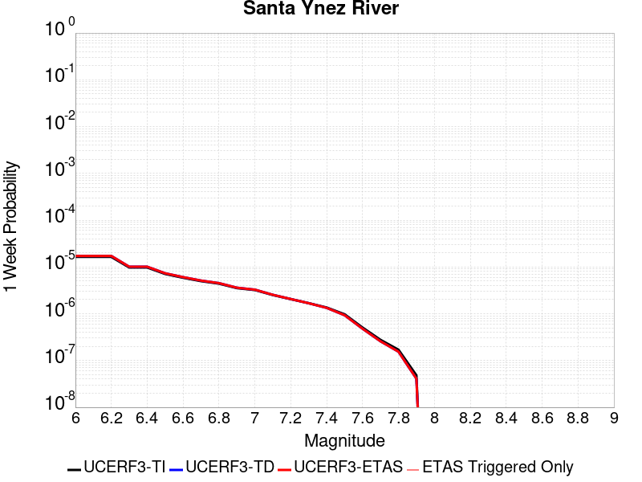 | 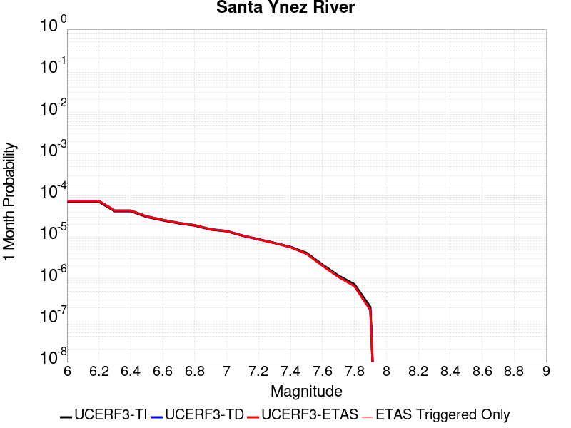 |  |

| Magnitude | 1 wk TI Prob | 1 wk TD Prob | 1 wk ETAS Prob | 1 wk ETAS/TD Gain | 1 wk ETAS Triggered Only | 1 mo TI Prob | 1 mo TD Prob | 1 mo ETAS Prob | 1 mo ETAS/TD Gain | 1 mo ETAS Triggered Only | 1 yr TI Prob | 1 yr TD Prob | 1 yr ETAS Prob | 1 yr ETAS/TD Gain | 1 yr ETAS Triggered Only |
|-----|-----|-----|-----|-----|-----|-----|-----|-----|-----|-----|-----|-----|-----|-----|-----|
| 6.0 | 1.6396456E-5 | 1.7213119E-5 | 1.7213119E-5 | 1.0 | 0.0 | 7.026863E-5 | 7.376863E-5 | 7.376863E-5 | 1.0 | 0.0 | 8.551848E-4 | 8.977985E-4 | 9.3776255E-4 | 1.0445135 | 4.0E-5 |
| 6.1 | 1.6396456E-5 | 1.7213119E-5 | 1.7213119E-5 | 1.0 | 0.0 | 7.026863E-5 | 7.376863E-5 | 7.376863E-5 | 1.0 | 0.0 | 8.551848E-4 | 8.977985E-4 | 9.3776255E-4 | 1.0445135 | 4.0E-5 |
| 6.2 | 1.6396456E-5 | 1.7213119E-5 | 1.7213119E-5 | 1.0 | 0.0 | 7.026863E-5 | 7.376863E-5 | 7.376863E-5 | 1.0 | 0.0 | 8.551848E-4 | 8.977985E-4 | 9.3776255E-4 | 1.0445135 | 4.0E-5 |
| 6.3 | 9.736976E-6 | 1.0124466E-5 | 1.0124466E-5 | 1.0 | 0.0 | 4.172923E-5 | 4.3389875E-5 | 4.3389875E-5 | 1.0 | 0.0 | 5.0793495E-4 | 5.2814867E-4 | 5.6812755E-4 | 1.0756962 | 4.0E-5 |
| 6.4 | 9.736976E-6 | 1.0124466E-5 | 1.0124466E-5 | 1.0 | 0.0 | 4.172923E-5 | 4.3389875E-5 | 4.3389875E-5 | 1.0 | 0.0 | 5.0793495E-4 | 5.2814867E-4 | 5.6812755E-4 | 1.0756962 | 4.0E-5 |
| 6.5 | 7.081964E-6 | 7.3315405E-6 | 7.3315405E-6 | 1.0 | 0.0 | 3.035092E-5 | 3.1420517E-5 | 3.1420517E-5 | 1.0 | 0.0 | 3.694598E-4 | 3.8247925E-4 | 4.2246396E-4 | 1.1045408 | 4.0E-5 |
| 6.6 | 5.873247E-6 | 6.061168E-6 | 6.061168E-6 | 1.0 | 0.0 | 2.5170815E-5 | 2.597618E-5 | 2.597618E-5 | 1.0 | 0.0 | 3.064116E-4 | 3.1621495E-4 | 3.562023E-4 | 1.1264563 | 4.0E-5 |
| 6.7 | 4.973277E-6 | 5.11717E-6 | 5.11717E-6 | 1.0 | 0.0 | 2.1313872E-5 | 2.1930548E-5 | 2.1930548E-5 | 1.0 | 0.0 | 2.5946548E-4 | 2.6697217E-4 | 3.0696148E-4 | 1.1497884 | 4.0E-5 |
| 6.8 | 4.396492E-6 | 4.5121465E-6 | 4.5121465E-6 | 1.0 | 0.0 | 1.884197E-5 | 1.9337629E-5 | 1.9337629E-5 | 1.0 | 0.0 | 2.2937685E-4 | 2.3541055E-4 | 2.7540114E-4 | 1.169876 | 4.0E-5 |
| 6.9 | 3.5255632E-6 | 3.6023648E-6 | 3.6023648E-6 | 1.0 | 0.0 | 1.5109469E-5 | 1.5438616E-5 | 1.5438616E-5 | 1.0 | 0.0 | 1.8394225E-4 | 1.879491E-4 | 2.2794158E-4 | 1.2127836 | 4.0E-5 |
| 7.0 | 3.211603E-6 | 3.274637E-6 | 3.274637E-6 | 1.0 | 0.0 | 1.376394E-5 | 1.4034084E-5 | 1.4034084E-5 | 1.0 | 0.0 | 1.6756308E-4 | 1.7085172E-4 | 2.1084488E-4 | 1.2340811 | 4.0E-5 |
| 7.1 | 2.5094619E-6 | 2.541795E-6 | 2.541795E-6 | 1.0 | 0.0 | 1.0754793E-5 | 1.0893363E-5 | 1.0893363E-5 | 1.0 | 0.0 | 1.3093173E-4 | 1.3261868E-4 | 1.7261338E-4 | 1.3015766 | 4.0E-5 |
| 7.2 | 2.0515774E-6 | 2.0627374E-6 | 2.0627374E-6 | 1.0 | 0.0 | 8.792445E-6 | 8.840273E-6 | 8.840273E-6 | 1.0 | 0.0 | 1.0704277E-4 | 1.0762505E-4 | 1.4762074E-4 | 1.3716207 | 4.0E-5 |
| 7.3 | 1.6845745E-6 | 1.678128E-6 | 1.678128E-6 | 1.0 | 0.0 | 7.219585E-6 | 7.1919576E-6 | 7.1919576E-6 | 1.0 | 0.0 | 8.78949E-5 | 8.755859E-5 | 1.2755509E-4 | 1.456797 | 4.0E-5 |
| 7.4 | 1.3600285E-6 | 1.3340028E-6 | 1.3340028E-6 | 1.0 | 0.0 | 5.82868E-6 | 5.7171424E-6 | 5.7171424E-6 | 1.0 | 0.0 | 7.096187E-5 | 6.960401E-5 | 1.0960122E-4 | 1.5746396 | 4.0E-5 |
| 7.5 | 9.735342E-7 | 9.295189E-7 | 9.295189E-7 | 1.0 | 0.0 | 4.172283E-6 | 3.9836464E-6 | 3.9836464E-6 | 1.0 | 0.0 | 5.079636E-5 | 4.849983E-5 | 8.8497894E-5 | 1.8247051 | 4.0E-5 |
| 7.6 | 5.067187E-7 | 4.779554E-7 | 4.779554E-7 | 1.0 | 0.0 | 2.1716498E-6 | 2.0483785E-6 | 2.0483785E-6 | 1.0 | 0.0 | 2.6439517E-5 | 2.493873E-5 | 6.493773E-5 | 2.603891 | 4.0E-5 |
| 7.7 | 2.769089E-7 | 2.5764106E-7 | 2.5764106E-7 | 1.0 | 0.0 | 1.1867519E-6 | 1.1041755E-6 | 1.1041755E-6 | 1.0 | 0.0 | 1.4448608E-5 | 1.3443253E-5 | 5.3442716E-5 | 3.9754303 | 4.0E-5 |
| 7.8 | 1.7044663E-7 | 1.545207E-7 | 1.545207E-7 | 1.0 | 0.0 | 7.3048534E-7 | 6.6223146E-7 | 6.6223146E-7 | 1.0 | 0.0 | 8.893623E-6 | 8.062638E-6 | 4.8062317E-5 | 5.9611154 | 4.0E-5 |
| 7.9 | 4.8344287E-8 | 4.0919776E-8 | 4.0919776E-8 | 1.0 | 0.0 | 2.0718979E-7 | 1.7537045E-7 | 1.7537045E-7 | 1.0 | 0.0 | 2.5225327E-6 | 2.1351332E-6 | 2.1351332E-6 | 1.0 | 0.0 |

## Pine Mtn
*[(top)](#table-of-contents)*

| 1 Week | 1 Month | 1 Year |
|-----|-----|-----|
| 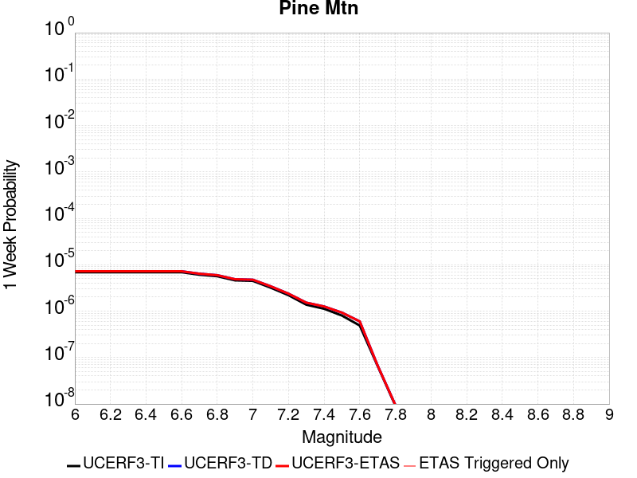 |  |  |

| Magnitude | 1 wk TI Prob | 1 wk TD Prob | 1 wk ETAS Prob | 1 wk ETAS/TD Gain | 1 wk ETAS Triggered Only | 1 mo TI Prob | 1 mo TD Prob | 1 mo ETAS Prob | 1 mo ETAS/TD Gain | 1 mo ETAS Triggered Only | 1 yr TI Prob | 1 yr TD Prob | 1 yr ETAS Prob | 1 yr ETAS/TD Gain | 1 yr ETAS Triggered Only |
|-----|-----|-----|-----|-----|-----|-----|-----|-----|-----|-----|-----|-----|-----|-----|-----|
| 6.0 | 6.894797E-6 | 7.22808E-6 | 7.22808E-6 | 1.0 | 0.0 | 2.9548795E-5 | 3.0977135E-5 | 3.0977135E-5 | 1.0 | 0.0 | 3.596972E-4 | 3.7708433E-4 | 4.1706924E-4 | 1.106037 | 4.0E-5 |
| 6.1 | 6.894797E-6 | 7.22808E-6 | 7.22808E-6 | 1.0 | 0.0 | 2.9548795E-5 | 3.0977135E-5 | 3.0977135E-5 | 1.0 | 0.0 | 3.596972E-4 | 3.7708433E-4 | 4.1706924E-4 | 1.106037 | 4.0E-5 |
| 6.2 | 6.894797E-6 | 7.22808E-6 | 7.22808E-6 | 1.0 | 0.0 | 2.9548795E-5 | 3.0977135E-5 | 3.0977135E-5 | 1.0 | 0.0 | 3.596972E-4 | 3.7708433E-4 | 4.1706924E-4 | 1.106037 | 4.0E-5 |
| 6.3 | 6.894797E-6 | 7.22808E-6 | 7.22808E-6 | 1.0 | 0.0 | 2.9548795E-5 | 3.0977135E-5 | 3.0977135E-5 | 1.0 | 0.0 | 3.596972E-4 | 3.7708433E-4 | 4.1706924E-4 | 1.106037 | 4.0E-5 |
| 6.4 | 6.894797E-6 | 7.22808E-6 | 7.22808E-6 | 1.0 | 0.0 | 2.9548795E-5 | 3.0977135E-5 | 3.0977135E-5 | 1.0 | 0.0 | 3.596972E-4 | 3.7708433E-4 | 4.1706924E-4 | 1.106037 | 4.0E-5 |
| 6.5 | 6.894797E-6 | 7.22808E-6 | 7.22808E-6 | 1.0 | 0.0 | 2.9548795E-5 | 3.0977135E-5 | 3.0977135E-5 | 1.0 | 0.0 | 3.596972E-4 | 3.7708433E-4 | 4.1706924E-4 | 1.106037 | 4.0E-5 |
| 6.6 | 6.894797E-6 | 7.22808E-6 | 7.22808E-6 | 1.0 | 0.0 | 2.9548795E-5 | 3.0977135E-5 | 3.0977135E-5 | 1.0 | 0.0 | 3.596972E-4 | 3.7708433E-4 | 4.1706924E-4 | 1.106037 | 4.0E-5 |
| 6.7 | 6.0867933E-6 | 6.3996613E-6 | 6.3996613E-6 | 1.0 | 0.0 | 2.6085996E-5 | 2.7426844E-5 | 2.7426844E-5 | 1.0 | 0.0 | 3.1755073E-4 | 3.3387286E-4 | 3.3387286E-4 | 1.0 | 0.0 |
| 6.8 | 5.6530425E-6 | 5.9530994E-6 | 5.9530994E-6 | 1.0 | 0.0 | 2.42271E-5 | 2.5513044E-5 | 2.5513044E-5 | 1.0 | 0.0 | 2.94925E-4 | 3.105791E-4 | 3.105791E-4 | 1.0 | 0.0 |
| 6.9 | 4.6015225E-6 | 4.866214E-6 | 4.866214E-6 | 1.0 | 0.0 | 1.9720663E-5 | 2.0855045E-5 | 2.0855045E-5 | 1.0 | 0.0 | 2.4007261E-4 | 2.5388206E-4 | 2.5388206E-4 | 1.0 | 0.0 |
| 7.0 | 4.4875965E-6 | 4.7498447E-6 | 4.7498447E-6 | 1.0 | 0.0 | 1.9232413E-5 | 2.0356327E-5 | 2.0356327E-5 | 1.0 | 0.0 | 2.3412947E-4 | 2.4781155E-4 | 2.4781155E-4 | 1.0 | 0.0 |
| 7.1 | 3.203907E-6 | 3.4316613E-6 | 3.4316613E-6 | 1.0 | 0.0 | 1.3730958E-5 | 1.4707041E-5 | 1.4707041E-5 | 1.0 | 0.0 | 1.6716159E-4 | 1.7904417E-4 | 1.7904417E-4 | 1.0 | 0.0 |
| 7.2 | 2.2060601E-6 | 2.3803232E-6 | 2.3803232E-6 | 1.0 | 0.0 | 9.4545085E-6 | 1.0201347E-5 | 1.0201347E-5 | 1.0 | 0.0 | 1.15102564E-4 | 1.2419479E-4 | 1.2419479E-4 | 1.0 | 0.0 |
| 7.3 | 1.3765207E-6 | 1.5233043E-6 | 1.5233043E-6 | 1.0 | 0.0 | 5.899361E-6 | 6.528431E-6 | 6.528431E-6 | 1.0 | 0.0 | 7.182235E-5 | 7.9480844E-5 | 7.9480844E-5 | 1.0 | 0.0 |
| 7.4 | 1.1245983E-6 | 1.2601989E-6 | 1.2601989E-6 | 1.0 | 0.0 | 4.819698E-6 | 5.400842E-6 | 5.400842E-6 | 1.0 | 0.0 | 5.8678244E-5 | 6.575335E-5 | 6.575335E-5 | 1.0 | 0.0 |
| 7.5 | 8.031682E-7 | 9.290882E-7 | 9.290882E-7 | 1.0 | 0.0 | 3.4421448E-6 | 3.9818005E-6 | 3.9818005E-6 | 1.0 | 0.0 | 4.1907308E-5 | 4.8477414E-5 | 4.8477414E-5 | 1.0 | 0.0 |
| 7.6 | 4.8953444E-7 | 6.015368E-7 | 6.015368E-7 | 1.0 | 0.0 | 2.098003E-6 | 2.5780125E-6 | 2.5780125E-6 | 1.0 | 0.0 | 2.5542888E-5 | 3.13869E-5 | 3.13869E-5 | 1.0 | 0.0 |
| 7.7 | 6.634529E-8 | 6.7893666E-8 | 6.7893666E-8 | 1.0 | 0.0 | 2.843369E-7 | 2.9097282E-7 | 2.9097282E-7 | 1.0 | 0.0 | 3.4617963E-6 | 3.542589E-6 | 3.542589E-6 | 1.0 | 0.0 |
| 7.8 | 9.235578E-9 | 9.489462E-9 | 9.489462E-9 | 1.0 | 0.0 | 3.9581046E-8 | 4.066912E-8 | 4.066912E-8 | 1.0 | 0.0 | 4.818991E-7 | 4.951465E-7 | 4.951465E-7 | 1.0 | 0.0 |

## Clayton
*[(top)](#table-of-contents)*

| 1 Week | 1 Month | 1 Year |
|-----|-----|-----|
|  | 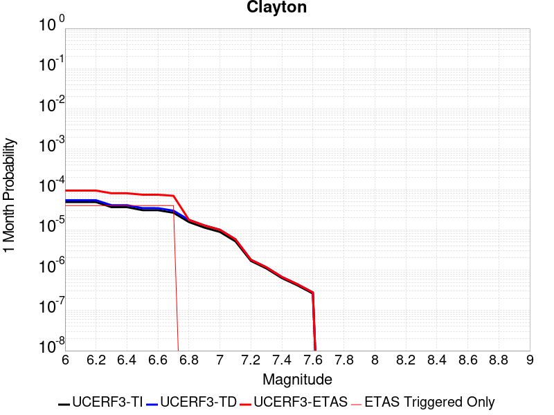 |  |

| Magnitude | 1 wk TI Prob | 1 wk TD Prob | 1 wk ETAS Prob | 1 wk ETAS/TD Gain | 1 wk ETAS Triggered Only | 1 mo TI Prob | 1 mo TD Prob | 1 mo ETAS Prob | 1 mo ETAS/TD Gain | 1 mo ETAS Triggered Only | 1 yr TI Prob | 1 yr TD Prob | 1 yr ETAS Prob | 1 yr ETAS/TD Gain | 1 yr ETAS Triggered Only |
|-----|-----|-----|-----|-----|-----|-----|-----|-----|-----|-----|-----|-----|-----|-----|-----|
| 6.0 | 1.1413061E-5 | 1.2671776E-5 | 1.2671776E-5 | 1.0 | 0.0 | 4.89122E-5 | 5.4306605E-5 | 9.4304436E-5 | 1.7365186 | 4.0E-5 | 5.953433E-4 | 6.6100457E-4 | 7.0097815E-4 | 1.0604739 | 4.0E-5 |
| 6.1 | 1.1413061E-5 | 1.2671776E-5 | 1.2671776E-5 | 1.0 | 0.0 | 4.89122E-5 | 5.4306605E-5 | 9.4304436E-5 | 1.7365186 | 4.0E-5 | 5.953433E-4 | 6.6100457E-4 | 7.0097815E-4 | 1.0604739 | 4.0E-5 |
| 6.2 | 1.1413061E-5 | 1.2671776E-5 | 1.2671776E-5 | 1.0 | 0.0 | 4.89122E-5 | 5.4306605E-5 | 9.4304436E-5 | 1.7365186 | 4.0E-5 | 5.953433E-4 | 6.6100457E-4 | 7.0097815E-4 | 1.0604739 | 4.0E-5 |
| 6.3 | 8.538689E-6 | 9.536509E-6 | 9.536509E-6 | 1.0 | 0.0 | 3.659387E-5 | 4.0870174E-5 | 8.0868536E-5 | 1.9786688 | 4.0E-5 | 4.4543925E-4 | 4.974915E-4 | 5.374716E-4 | 1.0803634 | 4.0E-5 |
| 6.4 | 8.538689E-6 | 9.536509E-6 | 9.536509E-6 | 1.0 | 0.0 | 3.659387E-5 | 4.0870174E-5 | 8.0868536E-5 | 1.9786688 | 4.0E-5 | 4.4543925E-4 | 4.974915E-4 | 5.374716E-4 | 1.0803634 | 4.0E-5 |
| 6.5 | 7.197462E-6 | 8.084302E-6 | 8.084302E-6 | 1.0 | 0.0 | 3.08459E-5 | 3.4646597E-5 | 7.464521E-5 | 2.1544745 | 4.0E-5 | 3.7548412E-4 | 4.2174887E-4 | 4.61732E-4 | 1.0948032 | 4.0E-5 |
| 6.6 | 7.1760483E-6 | 8.060309E-6 | 8.060309E-6 | 1.0 | 0.0 | 3.075413E-5 | 3.454377E-5 | 7.454239E-5 | 2.1579113 | 4.0E-5 | 3.743672E-4 | 4.2049744E-4 | 4.6048063E-4 | 1.0950854 | 4.0E-5 |
| 6.7 | 6.202582E-6 | 6.979632E-6 | 6.979632E-6 | 1.0 | 0.0 | 2.6582224E-5 | 2.991241E-5 | 6.991121E-5 | 2.3371975 | 4.0E-5 | 3.235905E-4 | 3.641304E-4 | 4.0411582E-4 | 1.1098107 | 4.0E-5 |
| 6.8 | 3.6417277E-6 | 4.1231206E-6 | 4.1231206E-6 | 1.0 | 0.0 | 1.5607311E-5 | 1.7670402E-5 | 1.7670402E-5 | 1.0 | 0.0 | 1.9000245E-4 | 2.1511667E-4 | 2.1511667E-4 | 1.0 | 0.0 |
| 6.9 | 2.6498485E-6 | 3.0008475E-6 | 3.0008475E-6 | 1.0 | 0.0 | 1.1356444E-5 | 1.2860714E-5 | 1.2860714E-5 | 1.0 | 0.0 | 1.3825593E-4 | 1.5656833E-4 | 1.5656833E-4 | 1.0 | 0.0 |
| 7.0 | 2.070442E-6 | 2.3417574E-6 | 2.3417574E-6 | 1.0 | 0.0 | 8.873292E-6 | 1.0036067E-5 | 1.0036067E-5 | 1.0 | 0.0 | 1.0802698E-4 | 1.2218255E-4 | 1.2218255E-4 | 1.0 | 0.0 |
| 7.1 | 1.2111691E-6 | 1.3594431E-6 | 1.3594431E-6 | 1.0 | 0.0 | 5.190714E-6 | 5.8261726E-6 | 5.8261726E-6 | 1.0 | 0.0 | 6.319511E-5 | 7.0931506E-5 | 7.0931506E-5 | 1.0 | 0.0 |
| 7.2 | 3.9541607E-7 | 4.2239157E-7 | 4.2239157E-7 | 1.0 | 0.0 | 1.6946392E-6 | 1.8102484E-6 | 1.8102484E-6 | 1.0 | 0.0 | 2.0632036E-5 | 2.2039552E-5 | 2.2039552E-5 | 1.0 | 0.0 |
| 7.3 | 2.5685637E-7 | 2.746583E-7 | 2.746583E-7 | 1.0 | 0.0 | 1.1008126E-6 | 1.1771066E-6 | 1.1771066E-6 | 1.0 | 0.0 | 1.3402311E-5 | 1.4331178E-5 | 1.4331178E-5 | 1.0 | 0.0 |
| 7.4 | 1.482299E-7 | 1.5812174E-7 | 1.5812174E-7 | 1.0 | 0.0 | 6.3527085E-7 | 6.776644E-7 | 6.776644E-7 | 1.0 | 0.0 | 7.734395E-6 | 8.250533E-6 | 8.250533E-6 | 1.0 | 0.0 |
| 7.5 | 9.7969505E-8 | 1.0441677E-7 | 1.0441677E-7 | 1.0 | 0.0 | 4.1986925E-7 | 4.4750035E-7 | 4.4750035E-7 | 1.0 | 0.0 | 5.111896E-6 | 5.4483035E-6 | 5.4483035E-6 | 1.0 | 0.0 |
| 7.6 | 6.125415E-8 | 6.523804E-8 | 6.523804E-8 | 1.0 | 0.0 | 2.6251774E-7 | 2.7959157E-7 | 2.7959157E-7 | 1.0 | 0.0 | 3.196149E-6 | 3.404022E-6 | 3.404022E-6 | 1.0 | 0.0 |

## Mount Diablo Thrust South
*[(top)](#table-of-contents)*

| 1 Week | 1 Month | 1 Year |
|-----|-----|-----|
|  | 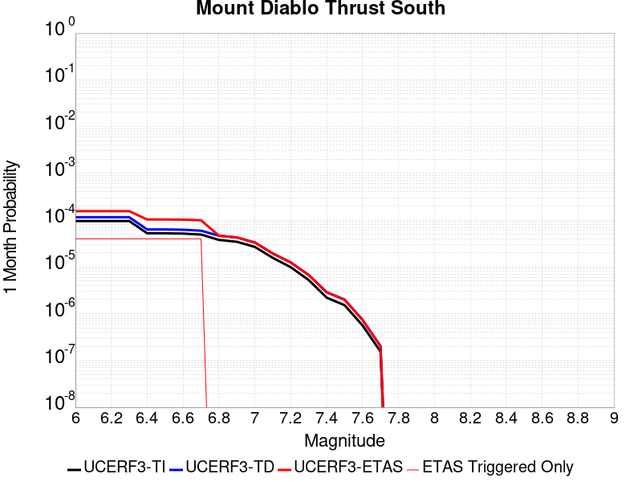 |  |

| Magnitude | 1 wk TI Prob | 1 wk TD Prob | 1 wk ETAS Prob | 1 wk ETAS/TD Gain | 1 wk ETAS Triggered Only | 1 mo TI Prob | 1 mo TD Prob | 1 mo ETAS Prob | 1 mo ETAS/TD Gain | 1 mo ETAS Triggered Only | 1 yr TI Prob | 1 yr TD Prob | 1 yr ETAS Prob | 1 yr ETAS/TD Gain | 1 yr ETAS Triggered Only |
|-----|-----|-----|-----|-----|-----|-----|-----|-----|-----|-----|-----|-----|-----|-----|-----|
| 6.0 | 2.2377444E-5 | 2.6978483E-5 | 2.6978483E-5 | 1.0 | 0.0 | 9.5899806E-5 | 1.1561807E-4 | 1.5561345E-4 | 1.3459266 | 4.0E-5 | 0.0011669548 | 0.0014069389 | 0.0014468826 | 1.0283905 | 4.0E-5 |
| 6.1 | 2.2377444E-5 | 2.6978483E-5 | 2.6978483E-5 | 1.0 | 0.0 | 9.5899806E-5 | 1.1561807E-4 | 1.5561345E-4 | 1.3459266 | 4.0E-5 | 0.0011669548 | 0.0014069389 | 0.0014468826 | 1.0283905 | 4.0E-5 |
| 6.2 | 2.2377444E-5 | 2.6978483E-5 | 2.6978483E-5 | 1.0 | 0.0 | 9.5899806E-5 | 1.1561807E-4 | 1.5561345E-4 | 1.3459266 | 4.0E-5 | 0.0011669548 | 0.0014069389 | 0.0014468826 | 1.0283905 | 4.0E-5 |
| 6.3 | 2.2377444E-5 | 2.6978483E-5 | 2.6978483E-5 | 1.0 | 0.0 | 9.5899806E-5 | 1.1561807E-4 | 1.5561345E-4 | 1.3459266 | 4.0E-5 | 0.0011669548 | 0.0014069389 | 0.0014468826 | 1.0283905 | 4.0E-5 |
| 6.4 | 1.2228463E-5 | 1.476156E-5 | 1.476156E-5 | 1.0 | 0.0 | 5.2406645E-5 | 6.326237E-5 | 1.0325984E-4 | 1.6322474 | 4.0E-5 | 6.378641E-4 | 7.6996005E-4 | 8.099292E-4 | 1.0519108 | 4.0E-5 |
| 6.5 | 1.2228463E-5 | 1.476156E-5 | 1.476156E-5 | 1.0 | 0.0 | 5.2406645E-5 | 6.326237E-5 | 1.0325984E-4 | 1.6322474 | 4.0E-5 | 6.378641E-4 | 7.6996005E-4 | 8.099292E-4 | 1.0519108 | 4.0E-5 |
| 6.6 | 1.2068118E-5 | 1.4566215E-5 | 1.4566215E-5 | 1.0 | 0.0 | 5.1719482E-5 | 6.242522E-5 | 1.0242272E-4 | 1.6407267 | 4.0E-5 | 6.2950276E-4 | 7.597748E-4 | 7.9974445E-4 | 1.0526072 | 4.0E-5 |
| 6.7 | 1.1499428E-5 | 1.3888437E-5 | 1.3888437E-5 | 1.0 | 0.0 | 4.9282335E-5 | 5.9520586E-5 | 9.9518205E-5 | 1.6719964 | 4.0E-5 | 5.9984723E-4 | 7.2443497E-4 | 7.6440594E-4 | 1.0551754 | 4.0E-5 |
| 6.8 | 8.82118E-6 | 1.0842296E-5 | 1.0842296E-5 | 1.0 | 0.0 | 3.780451E-5 | 4.646619E-5 | 4.646619E-5 | 1.0 | 0.0 | 4.601727E-4 | 5.6558463E-4 | 5.6558463E-4 | 1.0 | 0.0 |
| 6.9 | 8.047112E-6 | 9.950804E-6 | 9.950804E-6 | 1.0 | 0.0 | 3.4487166E-5 | 4.264564E-5 | 4.264564E-5 | 1.0 | 0.0 | 4.1980037E-4 | 5.1909225E-4 | 5.1909225E-4 | 1.0 | 0.0 |
| 7.0 | 6.2574763E-6 | 7.75897E-6 | 7.75897E-6 | 1.0 | 0.0 | 2.681748E-5 | 3.3252327E-5 | 3.3252327E-5 | 1.0 | 0.0 | 3.264539E-4 | 4.0477558E-4 | 4.0477558E-4 | 1.0 | 0.0 |
| 7.1 | 3.6485903E-6 | 4.5177235E-6 | 4.5177235E-6 | 1.0 | 0.0 | 1.5636722E-5 | 1.936153E-5 | 1.936153E-5 | 1.0 | 0.0 | 1.9036046E-4 | 2.3570155E-4 | 2.3570155E-4 | 1.0 | 0.0 |
| 7.2 | 2.3034274E-6 | 2.9092357E-6 | 2.9092357E-6 | 1.0 | 0.0 | 9.871795E-6 | 1.24680955E-5 | 1.24680955E-5 | 1.0 | 0.0 | 1.2018247E-4 | 1.5178873E-4 | 1.5178873E-4 | 1.0 | 0.0 |
| 7.3 | 1.224035E-6 | 1.5683729E-6 | 1.5683729E-6 | 1.0 | 0.0 | 5.245854E-6 | 6.7215815E-6 | 6.7215815E-6 | 1.0 | 0.0 | 6.38664E-5 | 8.1832295E-5 | 8.1832295E-5 | 1.0 | 0.0 |
| 7.4 | 5.1601154E-7 | 6.7249823E-7 | 6.7249823E-7 | 1.0 | 0.0 | 2.2114762E-6 | 2.882132E-6 | 2.882132E-6 | 1.0 | 0.0 | 2.6924388E-5 | 3.508941E-5 | 3.508941E-5 | 1.0 | 0.0 |
| 7.5 | 3.552894E-7 | 4.6659625E-7 | 4.6659625E-7 | 1.0 | 0.0 | 1.5226678E-6 | 1.9996967E-6 | 1.9996967E-6 | 1.0 | 0.0 | 1.8538323E-5 | 2.434605E-5 | 2.434605E-5 | 1.0 | 0.0 |
| 7.6 | 1.3124082E-7 | 1.7192943E-7 | 1.7192943E-7 | 1.0 | 0.0 | 5.6246057E-7 | 7.3684026E-7 | 7.3684026E-7 | 1.0 | 0.0 | 6.8479358E-6 | 8.971002E-6 | 8.971002E-6 | 1.0 | 0.0 |
| 7.7 | 3.6193022E-8 | 4.7339203E-8 | 4.7339203E-8 | 1.0 | 0.0 | 1.5511293E-7 | 2.0288229E-7 | 2.0288229E-7 | 1.0 | 0.0 | 1.8884983E-6 | 2.47009E-6 | 2.47009E-6 | 1.0 | 0.0 |

## Los Alamos extension
*[(top)](#table-of-contents)*

| 1 Week | 1 Month | 1 Year |
|-----|-----|-----|
|  | 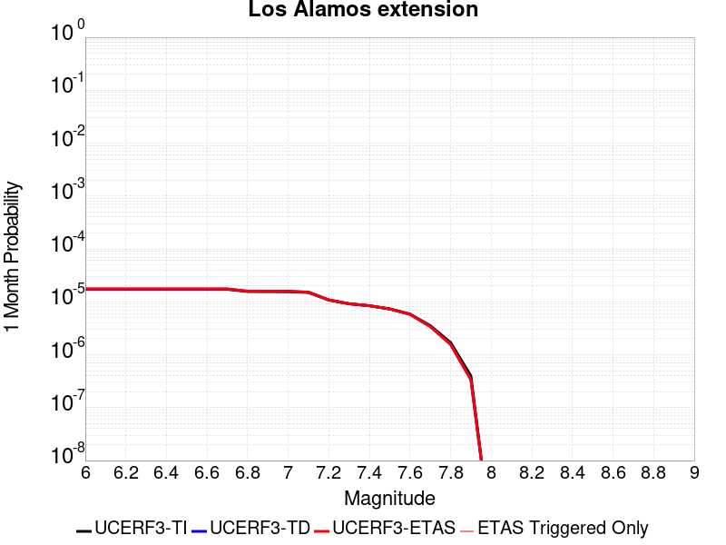 |  |

| Magnitude | 1 wk TI Prob | 1 wk TD Prob | 1 wk ETAS Prob | 1 wk ETAS/TD Gain | 1 wk ETAS Triggered Only | 1 mo TI Prob | 1 mo TD Prob | 1 mo ETAS Prob | 1 mo ETAS/TD Gain | 1 mo ETAS Triggered Only | 1 yr TI Prob | 1 yr TD Prob | 1 yr ETAS Prob | 1 yr ETAS/TD Gain | 1 yr ETAS Triggered Only |
|-----|-----|-----|-----|-----|-----|-----|-----|-----|-----|-----|-----|-----|-----|-----|-----|
| 6.0 | 4.0146506E-6 | 4.0866976E-6 | 4.0866976E-6 | 1.0 | 0.0 | 1.7205533E-5 | 1.7514307E-5 | 1.7514307E-5 | 1.0 | 0.0 | 2.0945723E-4 | 2.1321693E-4 | 2.532084E-4 | 1.1875623 | 4.0E-5 |
| 6.1 | 4.0146506E-6 | 4.0866976E-6 | 4.0866976E-6 | 1.0 | 0.0 | 1.7205533E-5 | 1.7514307E-5 | 1.7514307E-5 | 1.0 | 0.0 | 2.0945723E-4 | 2.1321693E-4 | 2.532084E-4 | 1.1875623 | 4.0E-5 |
| 6.2 | 4.0146506E-6 | 4.0866976E-6 | 4.0866976E-6 | 1.0 | 0.0 | 1.7205533E-5 | 1.7514307E-5 | 1.7514307E-5 | 1.0 | 0.0 | 2.0945723E-4 | 2.1321693E-4 | 2.532084E-4 | 1.1875623 | 4.0E-5 |
| 6.3 | 4.0146506E-6 | 4.0866976E-6 | 4.0866976E-6 | 1.0 | 0.0 | 1.7205533E-5 | 1.7514307E-5 | 1.7514307E-5 | 1.0 | 0.0 | 2.0945723E-4 | 2.1321693E-4 | 2.532084E-4 | 1.1875623 | 4.0E-5 |
| 6.4 | 4.0146506E-6 | 4.0866976E-6 | 4.0866976E-6 | 1.0 | 0.0 | 1.7205533E-5 | 1.7514307E-5 | 1.7514307E-5 | 1.0 | 0.0 | 2.0945723E-4 | 2.1321693E-4 | 2.532084E-4 | 1.1875623 | 4.0E-5 |
| 6.5 | 4.0146506E-6 | 4.0866976E-6 | 4.0866976E-6 | 1.0 | 0.0 | 1.7205533E-5 | 1.7514307E-5 | 1.7514307E-5 | 1.0 | 0.0 | 2.0945723E-4 | 2.1321693E-4 | 2.532084E-4 | 1.1875623 | 4.0E-5 |
| 6.6 | 4.0146506E-6 | 4.0866976E-6 | 4.0866976E-6 | 1.0 | 0.0 | 1.7205533E-5 | 1.7514307E-5 | 1.7514307E-5 | 1.0 | 0.0 | 2.0945723E-4 | 2.1321693E-4 | 2.532084E-4 | 1.1875623 | 4.0E-5 |
| 6.7 | 4.0146506E-6 | 4.0866976E-6 | 4.0866976E-6 | 1.0 | 0.0 | 1.7205533E-5 | 1.7514307E-5 | 1.7514307E-5 | 1.0 | 0.0 | 2.0945723E-4 | 2.1321693E-4 | 2.532084E-4 | 1.1875623 | 4.0E-5 |
| 6.8 | 3.6584688E-6 | 3.7193581E-6 | 3.7193581E-6 | 1.0 | 0.0 | 1.5679057E-5 | 1.5940013E-5 | 1.5940013E-5 | 1.0 | 0.0 | 1.9087581E-4 | 1.9405333E-4 | 2.3404555E-4 | 1.2060889 | 4.0E-5 |
| 6.9 | 3.644631E-6 | 3.7050665E-6 | 3.7050665E-6 | 1.0 | 0.0 | 1.5619753E-5 | 1.5878764E-5 | 1.5878764E-5 | 1.0 | 0.0 | 1.901539E-4 | 1.9330774E-4 | 2.3330002E-4 | 1.2068839 | 4.0E-5 |
| 7.0 | 3.6318522E-6 | 3.6918254E-6 | 3.6918254E-6 | 1.0 | 0.0 | 1.5564989E-5 | 1.5822017E-5 | 1.5822017E-5 | 1.0 | 0.0 | 1.8948725E-4 | 1.9261698E-4 | 2.3260928E-4 | 1.207626 | 4.0E-5 |
| 7.1 | 3.5001724E-6 | 3.5558812E-6 | 3.5558812E-6 | 1.0 | 0.0 | 1.5000653E-5 | 1.5239407E-5 | 1.5239407E-5 | 1.0 | 0.0 | 1.8261763E-4 | 1.855249E-4 | 2.2551748E-4 | 1.2155645 | 4.0E-5 |
| 7.2 | 2.5204702E-6 | 2.5440634E-6 | 2.5440634E-6 | 1.0 | 0.0 | 1.080197E-5 | 1.0903083E-5 | 1.0903083E-5 | 1.0 | 0.0 | 1.3150605E-4 | 1.3273701E-4 | 1.727317E-4 | 1.3013078 | 4.0E-5 |
| 7.3 | 2.1399692E-6 | 2.150455E-6 | 2.150455E-6 | 1.0 | 0.0 | 9.1712645E-6 | 9.216203E-6 | 9.216203E-6 | 1.0 | 0.0 | 1.1165442E-4 | 1.12201524E-4 | 1.5219704E-4 | 1.3564614 | 4.0E-5 |
| 7.4 | 1.9660122E-6 | 1.9705387E-6 | 1.9705387E-6 | 1.0 | 0.0 | 8.42574E-6 | 8.445139E-6 | 8.445139E-6 | 1.0 | 0.0 | 1.0257855E-4 | 1.02814745E-4 | 1.4281063E-4 | 1.3890092 | 4.0E-5 |
| 7.5 | 1.7204633E-6 | 1.7153669E-6 | 1.7153669E-6 | 1.0 | 0.0 | 7.373393E-6 | 7.351552E-6 | 7.351552E-6 | 1.0 | 0.0 | 8.976737E-5 | 8.95015E-5 | 1.2949792E-4 | 1.4468799 | 4.0E-5 |
| 7.6 | 1.3717638E-6 | 1.3538005E-6 | 1.3538005E-6 | 1.0 | 0.0 | 5.878974E-6 | 5.8019896E-6 | 5.8019896E-6 | 1.0 | 0.0 | 7.157416E-5 | 7.063696E-5 | 1.1063413E-4 | 1.5662358 | 4.0E-5 |
| 7.7 | 8.272564E-7 | 7.959012E-7 | 7.959012E-7 | 1.0 | 0.0 | 3.5453797E-6 | 3.4110005E-6 | 3.4110005E-6 | 1.0 | 0.0 | 4.3164142E-5 | 4.1528143E-5 | 8.152648E-5 | 1.9631623 | 4.0E-5 |
| 7.8 | 3.9708277E-7 | 3.672607E-7 | 3.672607E-7 | 1.0 | 0.0 | 1.7017821E-6 | 1.5739735E-6 | 1.5739735E-6 | 1.0 | 0.0 | 2.0719E-5 | 1.9162959E-5 | 5.9162194E-5 | 3.0873203 | 4.0E-5 |
| 7.9 | 9.292528E-8 | 7.890701E-8 | 7.890701E-8 | 1.0 | 0.0 | 3.9825116E-7 | 3.3817284E-7 | 3.3817284E-7 | 1.0 | 0.0 | 4.848697E-6 | 4.1172466E-6 | 4.1172466E-6 | 1.0 | 0.0 |
| 8.0 | 7.880441E-11 | 8.236567E-11 | 8.236567E-11 | 1.0 | 0.0 | 3.3773329E-10 | 3.5299597E-10 | 3.5299597E-10 | 1.0 | 0.0 | 4.1119033E-9 | 4.2977253E-9 | 4.2977253E-9 | 1.0 | 0.0 |

## San Clemente
*[(top)](#table-of-contents)*

| 1 Week | 1 Month | 1 Year |
|-----|-----|-----|
|  | 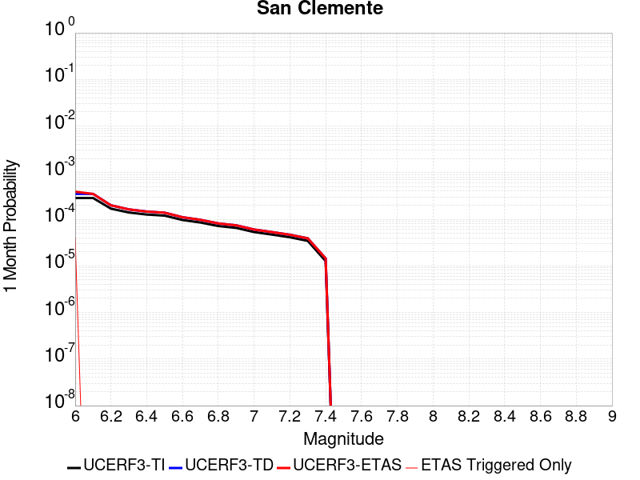 |  |

| Magnitude | 1 wk TI Prob | 1 wk TD Prob | 1 wk ETAS Prob | 1 wk ETAS/TD Gain | 1 wk ETAS Triggered Only | 1 mo TI Prob | 1 mo TD Prob | 1 mo ETAS Prob | 1 mo ETAS/TD Gain | 1 mo ETAS Triggered Only | 1 yr TI Prob | 1 yr TD Prob | 1 yr ETAS Prob | 1 yr ETAS/TD Gain | 1 yr ETAS Triggered Only |
|-----|-----|-----|-----|-----|-----|-----|-----|-----|-----|-----|-----|-----|-----|-----|-----|
| 6.0 | 6.681379E-5 | 8.169954E-5 | 8.169954E-5 | 1.0 | 0.0 | 2.8631336E-4 | 3.5009714E-4 | 3.9008312E-4 | 1.1142141 | 4.0E-5 | 0.003480294 | 0.0042546024 | 0.004294432 | 1.0093616 | 4.0E-5 |
| 6.1 | 6.681379E-5 | 8.169954E-5 | 8.169954E-5 | 1.0 | 0.0 | 2.8631336E-4 | 3.5009714E-4 | 3.5009714E-4 | 1.0 | 0.0 | 0.003480294 | 0.0042546024 | 0.0042546024 | 1.0 | 0.0 |
| 6.2 | 3.9400576E-5 | 4.6480833E-5 | 4.6480833E-5 | 1.0 | 0.0 | 1.6884868E-4 | 1.9918867E-4 | 1.9918867E-4 | 1.0 | 0.0 | 0.0020537945 | 0.0024224774 | 0.0024224774 | 1.0 | 0.0 |
| 6.3 | 3.2590255E-5 | 3.7950318E-5 | 3.7950318E-5 | 1.0 | 0.0 | 1.3966505E-4 | 1.6263424E-4 | 1.6263424E-4 | 1.0 | 0.0 | 0.0016990956 | 0.0019783042 | 0.0019783042 | 1.0 | 0.0 |
| 6.4 | 2.9454652E-5 | 3.4116085E-5 | 3.4116085E-5 | 1.0 | 0.0 | 1.2622811E-4 | 1.4620375E-4 | 1.4620375E-4 | 1.0 | 0.0 | 0.0015357438 | 0.0017786036 | 0.0017786036 | 1.0 | 0.0 |
| 6.5 | 2.790836E-5 | 3.2264543E-5 | 3.2264543E-5 | 1.0 | 0.0 | 1.1960178E-4 | 1.3826945E-4 | 1.3826945E-4 | 1.0 | 0.0 | 0.001455179 | 0.0016821561 | 0.0016821561 | 1.0 | 0.0 |
| 6.6 | 2.2492153E-5 | 2.5775438E-5 | 2.5775438E-5 | 1.0 | 0.0 | 9.639138E-5 | 1.1046157E-4 | 1.1046157E-4 | 1.0 | 0.0 | 0.0011729331 | 0.0013440547 | 0.0013440547 | 1.0 | 0.0 |
| 6.7 | 1.9862755E-5 | 2.267729E-5 | 2.267729E-5 | 1.0 | 0.0 | 8.512331E-5 | 9.718483E-5 | 9.718483E-5 | 1.0 | 0.0 | 0.0010358836 | 0.0011825943 | 0.0011825943 | 1.0 | 0.0 |
| 6.8 | 1.6697575E-5 | 1.8986502E-5 | 1.8986502E-5 | 1.0 | 0.0 | 7.155907E-5 | 8.136824E-5 | 8.136824E-5 | 1.0 | 0.0 | 8.7088346E-4 | 9.902174E-4 | 9.902174E-4 | 1.0 | 0.0 |
| 6.9 | 1.5218415E-5 | 1.7277294E-5 | 1.7277294E-5 | 1.0 | 0.0 | 6.522015E-5 | 7.40435E-5 | 7.40435E-5 | 1.0 | 0.0 | 7.93766E-4 | 9.011156E-4 | 9.011156E-4 | 1.0 | 0.0 |
| 7.0 | 1.2392958E-5 | 1.4039313E-5 | 1.4039313E-5 | 1.0 | 0.0 | 5.3111595E-5 | 6.0167138E-5 | 6.0167138E-5 | 1.0 | 0.0 | 6.4644177E-4 | 7.322963E-4 | 7.322963E-4 | 1.0 | 0.0 |
| 7.1 | 1.0934128E-5 | 1.2380668E-5 | 1.2380668E-5 | 1.0 | 0.0 | 4.6859706E-5 | 5.3058968E-5 | 5.3058968E-5 | 1.0 | 0.0 | 5.7036756E-4 | 6.4580876E-4 | 6.4580876E-4 | 1.0 | 0.0 |
| 7.2 | 9.5798805E-6 | 1.0849791E-5 | 1.0849791E-5 | 1.0 | 0.0 | 4.1055984E-5 | 4.6498317E-5 | 4.6498317E-5 | 1.0 | 0.0 | 4.9974193E-4 | 5.659771E-4 | 5.659771E-4 | 1.0 | 0.0 |
| 7.3 | 8.0167365E-6 | 9.088018E-6 | 9.088018E-6 | 1.0 | 0.0 | 3.4356988E-5 | 3.8948103E-5 | 3.8948103E-5 | 1.0 | 0.0 | 4.1821605E-4 | 4.7409706E-4 | 4.7409706E-4 | 1.0 | 0.0 |
| 7.4 | 2.9581017E-6 | 3.3639371E-6 | 3.3639371E-6 | 1.0 | 0.0 | 1.2677518E-5 | 1.44168225E-5 | 1.44168225E-5 | 1.0 | 0.0 | 1.5433785E-4 | 1.7551573E-4 | 1.7551573E-4 | 1.0 | 0.0 |

## Burnt Mtn
*[(top)](#table-of-contents)*

| 1 Week | 1 Month | 1 Year |
|-----|-----|-----|
| 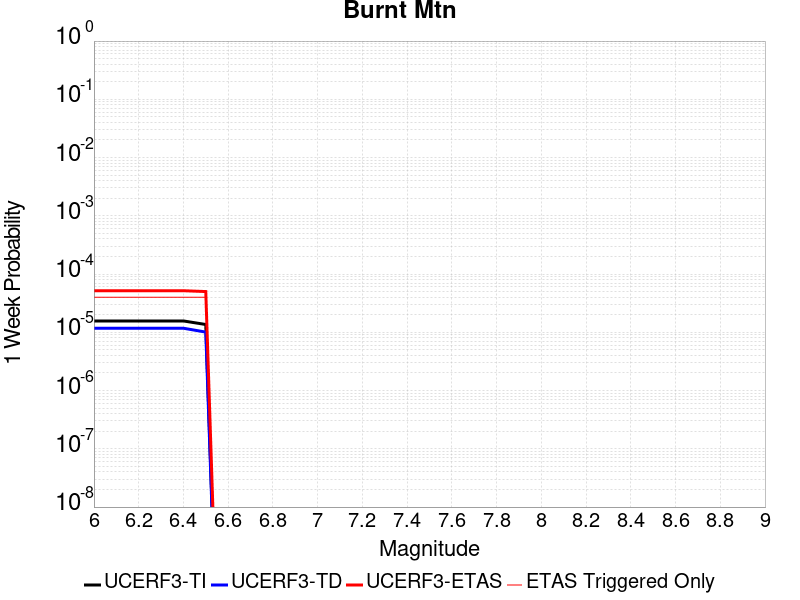 |  | 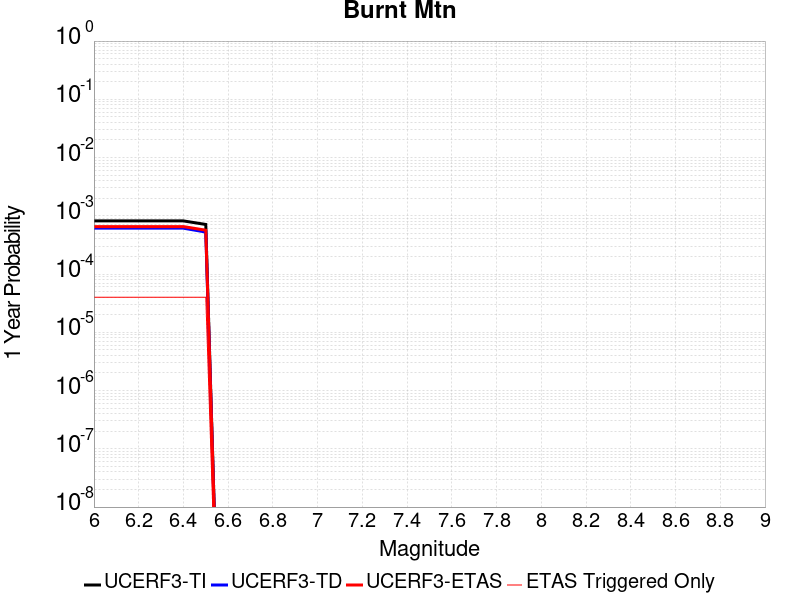 |

| Magnitude | 1 wk TI Prob | 1 wk TD Prob | 1 wk ETAS Prob | 1 wk ETAS/TD Gain | 1 wk ETAS Triggered Only | 1 mo TI Prob | 1 mo TD Prob | 1 mo ETAS Prob | 1 mo ETAS/TD Gain | 1 mo ETAS Triggered Only | 1 yr TI Prob | 1 yr TD Prob | 1 yr ETAS Prob | 1 yr ETAS/TD Gain | 1 yr ETAS Triggered Only |
|-----|-----|-----|-----|-----|-----|-----|-----|-----|-----|-----|-----|-----|-----|-----|-----|
| 6.0 | 1.5673151E-5 | 1.1754454E-5 | 5.1753985E-5 | 4.4029255 | 4.0E-5 | 6.716892E-5 | 5.0375987E-5 | 9.037397E-5 | 1.7939892 | 4.0E-5 | 8.1747473E-4 | 6.1328406E-4 | 6.532595E-4 | 1.0651827 | 4.0E-5 |
| 6.1 | 1.5673151E-5 | 1.1754454E-5 | 5.1753985E-5 | 4.4029255 | 4.0E-5 | 6.716892E-5 | 5.0375987E-5 | 9.037397E-5 | 1.7939892 | 4.0E-5 | 8.1747473E-4 | 6.1328406E-4 | 6.532595E-4 | 1.0651827 | 4.0E-5 |
| 6.2 | 1.5673151E-5 | 1.1754454E-5 | 5.1753985E-5 | 4.4029255 | 4.0E-5 | 6.716892E-5 | 5.0375987E-5 | 9.037397E-5 | 1.7939892 | 4.0E-5 | 8.1747473E-4 | 6.1328406E-4 | 6.532595E-4 | 1.0651827 | 4.0E-5 |
| 6.3 | 1.5673151E-5 | 1.1754454E-5 | 5.1753985E-5 | 4.4029255 | 4.0E-5 | 6.716892E-5 | 5.0375987E-5 | 9.037397E-5 | 1.7939892 | 4.0E-5 | 8.1747473E-4 | 6.1328406E-4 | 6.532595E-4 | 1.0651827 | 4.0E-5 |
| 6.4 | 1.5673151E-5 | 1.1754454E-5 | 5.1753985E-5 | 4.4029255 | 4.0E-5 | 6.716892E-5 | 5.0375987E-5 | 9.037397E-5 | 1.7939892 | 4.0E-5 | 8.1747473E-4 | 6.1328406E-4 | 6.532595E-4 | 1.0651827 | 4.0E-5 |
| 6.5 | 1.36191375E-5 | 1.0082854E-5 | 5.008245E-5 | 4.9670906 | 4.0E-5 | 5.8366426E-5 | 4.3212232E-5 | 8.32105E-5 | 1.9256239 | 4.0E-5 | 7.103795E-4 | 5.261089E-4 | 5.660879E-4 | 1.0759898 | 4.0E-5 |

## Pitas Point (Lower)-Montalvo
*[(top)](#table-of-contents)*

| 1 Week | 1 Month | 1 Year |
|-----|-----|-----|
|  |  |  |

| Magnitude | 1 wk TI Prob | 1 wk TD Prob | 1 wk ETAS Prob | 1 wk ETAS/TD Gain | 1 wk ETAS Triggered Only | 1 mo TI Prob | 1 mo TD Prob | 1 mo ETAS Prob | 1 mo ETAS/TD Gain | 1 mo ETAS Triggered Only | 1 yr TI Prob | 1 yr TD Prob | 1 yr ETAS Prob | 1 yr ETAS/TD Gain | 1 yr ETAS Triggered Only |
|-----|-----|-----|-----|-----|-----|-----|-----|-----|-----|-----|-----|-----|-----|-----|-----|
| 6.0 | 5.2543637E-6 | 4.8389793E-6 | 4.8389793E-6 | 1.0 | 0.0 | 2.2518509E-5 | 2.073832E-5 | 2.073832E-5 | 1.0 | 0.0 | 2.7412834E-4 | 2.524601E-4 | 2.9245001E-4 | 1.1584009 | 4.0E-5 |
| 6.1 | 5.2543637E-6 | 4.8389793E-6 | 4.8389793E-6 | 1.0 | 0.0 | 2.2518509E-5 | 2.073832E-5 | 2.073832E-5 | 1.0 | 0.0 | 2.7412834E-4 | 2.524601E-4 | 2.9245001E-4 | 1.1584009 | 4.0E-5 |
| 6.2 | 5.2543637E-6 | 4.8389793E-6 | 4.8389793E-6 | 1.0 | 0.0 | 2.2518509E-5 | 2.073832E-5 | 2.073832E-5 | 1.0 | 0.0 | 2.7412834E-4 | 2.524601E-4 | 2.9245001E-4 | 1.1584009 | 4.0E-5 |
| 6.3 | 5.2543637E-6 | 4.8389793E-6 | 4.8389793E-6 | 1.0 | 0.0 | 2.2518509E-5 | 2.073832E-5 | 2.073832E-5 | 1.0 | 0.0 | 2.7412834E-4 | 2.524601E-4 | 2.9245001E-4 | 1.1584009 | 4.0E-5 |
| 6.4 | 5.2543637E-6 | 4.8389793E-6 | 4.8389793E-6 | 1.0 | 0.0 | 2.2518509E-5 | 2.073832E-5 | 2.073832E-5 | 1.0 | 0.0 | 2.7412834E-4 | 2.524601E-4 | 2.9245001E-4 | 1.1584009 | 4.0E-5 |
| 6.5 | 5.2543637E-6 | 4.8389793E-6 | 4.8389793E-6 | 1.0 | 0.0 | 2.2518509E-5 | 2.073832E-5 | 2.073832E-5 | 1.0 | 0.0 | 2.7412834E-4 | 2.524601E-4 | 2.9245001E-4 | 1.1584009 | 4.0E-5 |
| 6.6 | 5.2543637E-6 | 4.8389793E-6 | 4.8389793E-6 | 1.0 | 0.0 | 2.2518509E-5 | 2.073832E-5 | 2.073832E-5 | 1.0 | 0.0 | 2.7412834E-4 | 2.524601E-4 | 2.9245001E-4 | 1.1584009 | 4.0E-5 |
| 6.7 | 5.2543637E-6 | 4.8389793E-6 | 4.8389793E-6 | 1.0 | 0.0 | 2.2518509E-5 | 2.073832E-5 | 2.073832E-5 | 1.0 | 0.0 | 2.7412834E-4 | 2.524601E-4 | 2.9245001E-4 | 1.1584009 | 4.0E-5 |
| 6.8 | 5.2543637E-6 | 4.8389793E-6 | 4.8389793E-6 | 1.0 | 0.0 | 2.2518509E-5 | 2.073832E-5 | 2.073832E-5 | 1.0 | 0.0 | 2.7412834E-4 | 2.524601E-4 | 2.9245001E-4 | 1.1584009 | 4.0E-5 |
| 6.9 | 5.2543637E-6 | 4.8389793E-6 | 4.8389793E-6 | 1.0 | 0.0 | 2.2518509E-5 | 2.073832E-5 | 2.073832E-5 | 1.0 | 0.0 | 2.7412834E-4 | 2.524601E-4 | 2.9245001E-4 | 1.1584009 | 4.0E-5 |
| 7.0 | 5.2543637E-6 | 4.8389793E-6 | 4.8389793E-6 | 1.0 | 0.0 | 2.2518509E-5 | 2.073832E-5 | 2.073832E-5 | 1.0 | 0.0 | 2.7412834E-4 | 2.524601E-4 | 2.9245001E-4 | 1.1584009 | 4.0E-5 |
| 7.1 | 5.2543637E-6 | 4.8389793E-6 | 4.8389793E-6 | 1.0 | 0.0 | 2.2518509E-5 | 2.073832E-5 | 2.073832E-5 | 1.0 | 0.0 | 2.7412834E-4 | 2.524601E-4 | 2.9245001E-4 | 1.1584009 | 4.0E-5 |
| 7.2 | 5.2458695E-6 | 4.830132E-6 | 4.830132E-6 | 1.0 | 0.0 | 2.2482105E-5 | 2.0700403E-5 | 2.0700403E-5 | 1.0 | 0.0 | 2.7368523E-4 | 2.5199857E-4 | 2.919885E-4 | 1.158691 | 4.0E-5 |
| 7.3 | 5.22665E-6 | 4.8100464E-6 | 4.8100464E-6 | 1.0 | 0.0 | 2.2399736E-5 | 2.0614323E-5 | 2.0614323E-5 | 1.0 | 0.0 | 2.7268266E-4 | 2.5095078E-4 | 2.9094075E-4 | 1.1593539 | 4.0E-5 |
| 7.4 | 5.210642E-6 | 4.793256E-6 | 4.793256E-6 | 1.0 | 0.0 | 2.233113E-5 | 2.0542366E-5 | 2.0542366E-5 | 1.0 | 0.0 | 2.718476E-4 | 2.500749E-4 | 2.900649E-4 | 1.1599121 | 4.0E-5 |
| 7.5 | 5.1226016E-6 | 4.701128E-6 | 4.701128E-6 | 1.0 | 0.0 | 2.1953823E-5 | 2.0147538E-5 | 2.0147538E-5 | 1.0 | 0.0 | 2.67255E-4 | 2.4526895E-4 | 2.8525916E-4 | 1.1630462 | 4.0E-5 |
| 7.6 | 4.8796987E-6 | 4.445983E-6 | 4.445983E-6 | 1.0 | 0.0 | 2.0912828E-5 | 1.9054076E-5 | 1.9054076E-5 | 1.0 | 0.0 | 2.5458392E-4 | 2.3195898E-4 | 2.719497E-4 | 1.1724043 | 4.0E-5 |
| 7.7 | 4.0834398E-6 | 3.6099952E-6 | 3.6099952E-6 | 1.0 | 0.0 | 1.7500339E-5 | 1.5471318E-5 | 1.5471318E-5 | 1.0 | 0.0 | 2.1304579E-4 | 1.8834724E-4 | 2.2833972E-4 | 1.2123337 | 4.0E-5 |
| 7.8 | 2.5445438E-6 | 2.1217793E-6 | 2.1217793E-6 | 1.0 | 0.0 | 1.0905142E-5 | 9.093308E-6 | 9.093308E-6 | 1.0 | 0.0 | 1.3276201E-4 | 1.1070545E-4 | 1.5070102E-4 | 1.3612791 | 4.0E-5 |
| 7.9 | 4.1677114E-7 | 3.330247E-7 | 3.330247E-7 | 1.0 | 0.0 | 1.7861609E-6 | 1.4272479E-6 | 1.4272479E-6 | 1.0 | 0.0 | 2.1746291E-5 | 1.7376608E-5 | 1.7376608E-5 | 1.0 | 0.0 |
| 8.0 | 7.791402E-9 | 5.68495E-9 | 5.68495E-9 | 1.0 | 0.0 | 3.3391725E-8 | 2.4364072E-8 | 2.4364072E-8 | 1.0 | 0.0 | 4.0654416E-7 | 2.9663255E-7 | 2.9663255E-7 | 1.0 | 0.0 |

## Baker
*[(top)](#table-of-contents)*

| 1 Week | 1 Month | 1 Year |
|-----|-----|-----|
|  | 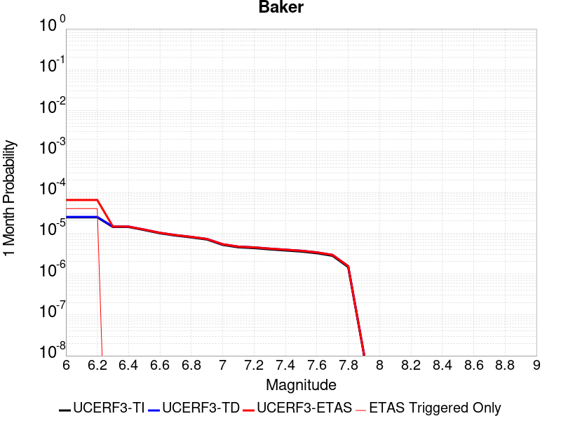 | 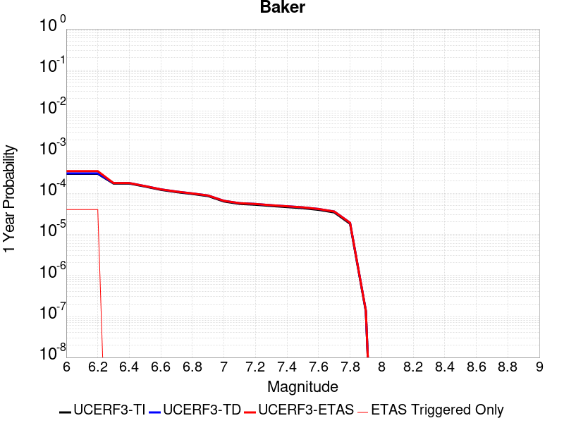 |

| Magnitude | 1 wk TI Prob | 1 wk TD Prob | 1 wk ETAS Prob | 1 wk ETAS/TD Gain | 1 wk ETAS Triggered Only | 1 mo TI Prob | 1 mo TD Prob | 1 mo ETAS Prob | 1 mo ETAS/TD Gain | 1 mo ETAS Triggered Only | 1 yr TI Prob | 1 yr TD Prob | 1 yr ETAS Prob | 1 yr ETAS/TD Gain | 1 yr ETAS Triggered Only |
|-----|-----|-----|-----|-----|-----|-----|-----|-----|-----|-----|-----|-----|-----|-----|-----|
| 6.0 | 5.695525E-6 | 5.835324E-6 | 5.835324E-6 | 1.0 | 0.0 | 2.4409164E-5 | 2.5008314E-5 | 6.500731E-5 | 2.5994282 | 4.0E-5 | 2.9714106E-4 | 3.0443768E-4 | 3.444255E-4 | 1.1313498 | 4.0E-5 |
| 6.1 | 5.695525E-6 | 5.835324E-6 | 5.835324E-6 | 1.0 | 0.0 | 2.4409164E-5 | 2.5008314E-5 | 6.500731E-5 | 2.5994282 | 4.0E-5 | 2.9714106E-4 | 3.0443768E-4 | 3.444255E-4 | 1.1313498 | 4.0E-5 |
| 6.2 | 5.695525E-6 | 5.835324E-6 | 5.835324E-6 | 1.0 | 0.0 | 2.4409164E-5 | 2.5008314E-5 | 6.500731E-5 | 2.5994282 | 4.0E-5 | 2.9714106E-4 | 3.0443768E-4 | 3.444255E-4 | 1.1313498 | 4.0E-5 |
| 6.3 | 3.2995713E-6 | 3.383962E-6 | 3.383962E-6 | 1.0 | 0.0 | 1.4140943E-5 | 1.4502616E-5 | 1.4502616E-5 | 1.0 | 0.0 | 1.7215237E-4 | 1.7655552E-4 | 1.7655552E-4 | 1.0 | 0.0 |
| 6.4 | 3.2995713E-6 | 3.383962E-6 | 3.383962E-6 | 1.0 | 0.0 | 1.4140943E-5 | 1.4502616E-5 | 1.4502616E-5 | 1.0 | 0.0 | 1.7215237E-4 | 1.7655552E-4 | 1.7655552E-4 | 1.0 | 0.0 |
| 6.5 | 2.782202E-6 | 2.8560992E-6 | 2.8560992E-6 | 1.0 | 0.0 | 1.1923668E-5 | 1.2240369E-5 | 1.2240369E-5 | 1.0 | 0.0 | 1.4516099E-4 | 1.4901663E-4 | 1.4901663E-4 | 1.0 | 0.0 |
| 6.6 | 2.3163404E-6 | 2.3811474E-6 | 2.3811474E-6 | 1.0 | 0.0 | 9.927136E-6 | 1.0204879E-5 | 1.0204879E-5 | 1.0 | 0.0 | 1.20856166E-4 | 1.2423751E-4 | 1.2423751E-4 | 1.0 | 0.0 |
| 6.7 | 2.037056E-6 | 2.0967102E-6 | 2.0967102E-6 | 1.0 | 0.0 | 8.7302105E-6 | 8.98587E-6 | 8.98587E-6 | 1.0 | 0.0 | 1.0628513E-4 | 1.09397646E-4 | 1.09397646E-4 | 1.0 | 0.0 |
| 6.8 | 1.8356744E-6 | 1.8917259E-6 | 1.8917259E-6 | 1.0 | 0.0 | 7.867153E-6 | 8.107372E-6 | 8.107372E-6 | 1.0 | 0.0 | 9.577837E-5 | 9.870293E-5 | 9.870293E-5 | 1.0 | 0.0 |
| 6.9 | 1.6310546E-6 | 1.6833917E-6 | 1.6833917E-6 | 1.0 | 0.0 | 6.9902153E-6 | 7.2145162E-6 | 7.2145162E-6 | 1.0 | 0.0 | 8.510255E-5 | 8.783331E-5 | 8.783331E-5 | 1.0 | 0.0 |
| 7.0 | 1.2058036E-6 | 1.2510266E-6 | 1.2510266E-6 | 1.0 | 0.0 | 5.1677193E-6 | 5.3615317E-6 | 5.3615317E-6 | 1.0 | 0.0 | 6.291517E-5 | 6.527472E-5 | 6.527472E-5 | 1.0 | 0.0 |
| 7.1 | 1.052382E-6 | 1.095313E-6 | 1.095313E-6 | 1.0 | 0.0 | 4.5102006E-6 | 4.6941905E-6 | 4.6941905E-6 | 1.0 | 0.0 | 5.491031E-5 | 5.715028E-5 | 5.715028E-5 | 1.0 | 0.0 |
| 7.2 | 1.0067454E-6 | 1.0489207E-6 | 1.0489207E-6 | 1.0 | 0.0 | 4.3146156E-6 | 4.4953667E-6 | 4.4953667E-6 | 1.0 | 0.0 | 5.252918E-5 | 5.472972E-5 | 5.472972E-5 | 1.0 | 0.0 |
| 7.3 | 9.3596316E-7 | 9.769177E-7 | 9.769177E-7 | 1.0 | 0.0 | 4.0112645E-6 | 4.1867834E-6 | 4.1867834E-6 | 1.0 | 0.0 | 4.8836053E-5 | 5.0972907E-5 | 5.0972907E-5 | 1.0 | 0.0 |
| 7.4 | 8.8117395E-7 | 9.209075E-7 | 9.209075E-7 | 1.0 | 0.0 | 3.7764542E-6 | 3.9467404E-6 | 3.9467404E-6 | 1.0 | 0.0 | 4.5977362E-5 | 4.805051E-5 | 4.805051E-5 | 1.0 | 0.0 |
| 7.5 | 8.292386E-7 | 8.6759593E-7 | 8.6759593E-7 | 1.0 | 0.0 | 3.5538749E-6 | 3.718263E-6 | 3.718263E-6 | 1.0 | 0.0 | 4.326757E-5 | 4.526892E-5 | 4.526892E-5 | 1.0 | 0.0 |
| 7.6 | 7.553842E-7 | 7.9157587E-7 | 7.9157587E-7 | 1.0 | 0.0 | 3.2373566E-6 | 3.3924637E-6 | 3.3924637E-6 | 1.0 | 0.0 | 3.9414106E-5 | 4.1302468E-5 | 4.1302468E-5 | 1.0 | 0.0 |
| 7.7 | 6.5285366E-7 | 6.8539566E-7 | 6.8539566E-7 | 1.0 | 0.0 | 2.797941E-6 | 2.9374069E-6 | 2.9374069E-6 | 1.0 | 0.0 | 3.40644E-5 | 3.5762347E-5 | 3.5762347E-5 | 1.0 | 0.0 |
| 7.8 | 3.4586725E-7 | 3.6489428E-7 | 3.6489428E-7 | 1.0 | 0.0 | 1.4822873E-6 | 1.5638317E-6 | 1.5638317E-6 | 1.0 | 0.0 | 1.80467E-5 | 1.903949E-5 | 1.903949E-5 | 1.0 | 0.0 |
| 7.9 | 2.5591178E-9 | 2.6700626E-9 | 2.6700626E-9 | 1.0 | 0.0 | 1.0967647E-8 | 1.1443126E-8 | 1.1443126E-8 | 1.0 | 0.0 | 1.335311E-7 | 1.3932005E-7 | 1.3932005E-7 | 1.0 | 0.0 |

## East Huasna 2011 CFM
*[(top)](#table-of-contents)*

| 1 Week | 1 Month | 1 Year |
|-----|-----|-----|
|  | 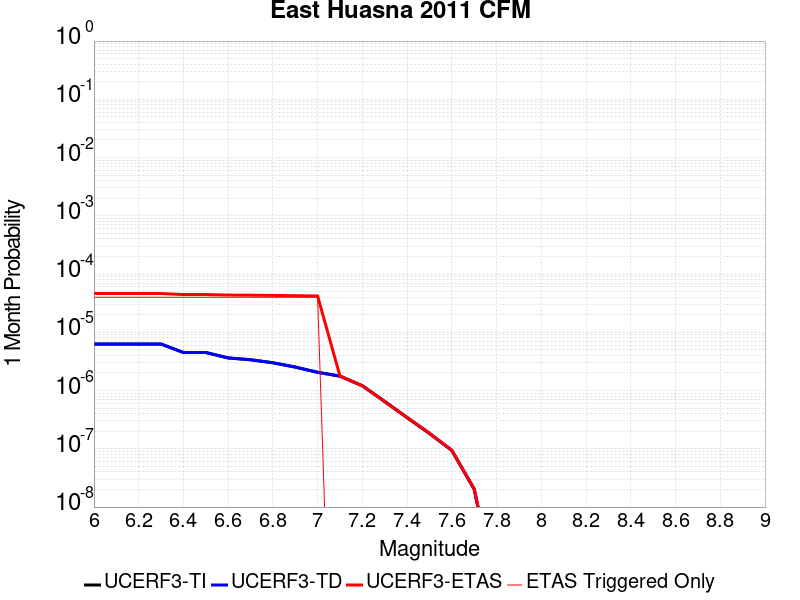 |  |

| Magnitude | 1 wk TI Prob | 1 wk TD Prob | 1 wk ETAS Prob | 1 wk ETAS/TD Gain | 1 wk ETAS Triggered Only | 1 mo TI Prob | 1 mo TD Prob | 1 mo ETAS Prob | 1 mo ETAS/TD Gain | 1 mo ETAS Triggered Only | 1 yr TI Prob | 1 yr TD Prob | 1 yr ETAS Prob | 1 yr ETAS/TD Gain | 1 yr ETAS Triggered Only |
|-----|-----|-----|-----|-----|-----|-----|-----|-----|-----|-----|-----|-----|-----|-----|-----|
| 6.0 | 1.4658423E-6 | 1.4715968E-6 | 4.147154E-5 | 28.18132 | 4.0E-5 | 6.282166E-6 | 6.3068283E-6 | 4.6306577E-5 | 7.3422923 | 4.0E-5 | 7.6482684E-5 | 7.6783E-5 | 1.1677993E-4 | 1.5209086 | 4.0E-5 |
| 6.1 | 1.4658423E-6 | 1.4715968E-6 | 4.147154E-5 | 28.18132 | 4.0E-5 | 6.282166E-6 | 6.3068283E-6 | 4.6306577E-5 | 7.3422923 | 4.0E-5 | 7.6482684E-5 | 7.6783E-5 | 1.1677993E-4 | 1.5209086 | 4.0E-5 |
| 6.2 | 1.4658423E-6 | 1.4715968E-6 | 4.147154E-5 | 28.18132 | 4.0E-5 | 6.282166E-6 | 6.3068283E-6 | 4.6306577E-5 | 7.3422923 | 4.0E-5 | 7.6482684E-5 | 7.6783E-5 | 1.1677993E-4 | 1.5209086 | 4.0E-5 |
| 6.3 | 1.4658423E-6 | 1.4715968E-6 | 4.147154E-5 | 28.18132 | 4.0E-5 | 6.282166E-6 | 6.3068283E-6 | 4.6306577E-5 | 7.3422923 | 4.0E-5 | 7.6482684E-5 | 7.6783E-5 | 1.1677993E-4 | 1.5209086 | 4.0E-5 |
| 6.4 | 1.0488257E-6 | 1.0527762E-6 | 4.1052735E-5 | 38.994743 | 4.0E-5 | 4.4949593E-6 | 4.51189E-6 | 4.451171E-5 | 9.865424 | 4.0E-5 | 5.472476E-5 | 5.4930893E-5 | 9.49287E-5 | 1.7281476 | 4.0E-5 |
| 6.5 | 1.0488257E-6 | 1.0527762E-6 | 4.1052735E-5 | 38.994743 | 4.0E-5 | 4.4949593E-6 | 4.51189E-6 | 4.451171E-5 | 9.865424 | 4.0E-5 | 5.472476E-5 | 5.4930893E-5 | 9.49287E-5 | 1.7281476 | 4.0E-5 |
| 6.6 | 8.463064E-7 | 8.493849E-7 | 4.084935E-5 | 48.09286 | 4.0E-5 | 3.6270226E-6 | 3.640216E-6 | 4.364007E-5 | 11.988318 | 4.0E-5 | 4.4158103E-5 | 4.431874E-5 | 8.431696E-5 | 1.9025128 | 4.0E-5 |
| 6.7 | 7.876149E-7 | 7.902736E-7 | 4.079024E-5 | 51.615345 | 4.0E-5 | 3.375488E-6 | 3.3868823E-6 | 4.3386746E-5 | 12.810231 | 4.0E-5 | 4.109579E-5 | 4.1234518E-5 | 8.123287E-5 | 1.970021 | 4.0E-5 |
| 6.8 | 6.9940785E-7 | 7.016767E-7 | 4.070165E-5 | 58.00627 | 4.0E-5 | 2.9974588E-6 | 3.0071824E-6 | 4.300706E-5 | 14.301448 | 4.0E-5 | 3.649345E-5 | 3.6611837E-5 | 7.661037E-5 | 2.0925028 | 4.0E-5 |
| 6.9 | 5.899658E-7 | 5.915766E-7 | 4.0591553E-5 | 68.61588 | 4.0E-5 | 2.5284223E-6 | 2.535326E-6 | 4.2535226E-5 | 16.777023 | 4.0E-5 | 3.0783107E-5 | 3.086716E-5 | 7.086593E-5 | 2.2958357 | 4.0E-5 |
| 7.0 | 4.793814E-7 | 4.803418E-7 | 4.048032E-5 | 84.274 | 4.0E-5 | 2.05449E-6 | 2.058606E-6 | 4.2058524E-5 | 20.430584 | 4.0E-5 | 2.501313E-5 | 2.5063242E-5 | 6.506224E-5 | 2.5959227 | 4.0E-5 |
| 7.1 | 4.1256908E-7 | 4.130068E-7 | 4.130068E-7 | 1.0 | 0.0 | 1.768152E-6 | 1.770028E-6 | 1.770028E-6 | 1.0 | 0.0 | 2.1527037E-5 | 2.1549879E-5 | 2.1549879E-5 | 1.0 | 0.0 |
| 7.2 | 2.822599E-7 | 2.8162322E-7 | 2.8162322E-7 | 1.0 | 0.0 | 1.2096847E-6 | 1.2069561E-6 | 1.2069561E-6 | 1.0 | 0.0 | 1.47278115E-5 | 1.4694592E-5 | 1.4694592E-5 | 1.0 | 0.0 |
| 7.3 | 1.5261652E-7 | 1.5075507E-7 | 1.5075507E-7 | 1.0 | 0.0 | 6.540707E-7 | 6.46093E-7 | 6.46093E-7 | 1.0 | 0.0 | 7.963281E-6 | 7.866154E-6 | 7.866154E-6 | 1.0 | 0.0 |
| 7.4 | 7.976414E-8 | 8.0581444E-8 | 8.0581444E-8 | 1.0 | 0.0 | 3.418463E-7 | 3.4534898E-7 | 3.4534898E-7 | 1.0 | 0.0 | 4.1619705E-6 | 4.204616E-6 | 4.204616E-6 | 1.0 | 0.0 |
| 7.5 | 4.2715055E-8 | 4.3204185E-8 | 4.3204185E-8 | 1.0 | 0.0 | 1.830645E-7 | 1.8516077E-7 | 1.8516077E-7 | 1.0 | 0.0 | 2.228808E-6 | 2.2543302E-6 | 2.2543302E-6 | 1.0 | 0.0 |
| 7.6 | 2.1807532E-8 | 2.2058332E-8 | 2.2058332E-8 | 1.0 | 0.0 | 9.346085E-8 | 9.453571E-8 | 9.453571E-8 | 1.0 | 0.0 | 1.1378852E-6 | 1.1509717E-6 | 1.1509717E-6 | 1.0 | 0.0 |
| 7.7 | 4.7196043E-9 | 4.767446E-9 | 4.767446E-9 | 1.0 | 0.0 | 2.0226874E-8 | 2.0431912E-8 | 2.0431912E-8 | 1.0 | 0.0 | 2.4626218E-7 | 2.487585E-7 | 2.487585E-7 | 1.0 | 0.0 |
| 7.8 | 7.400003E-11 | 7.4656725E-11 | 7.4656725E-11 | 1.0 | 0.0 | 3.171432E-10 | 3.1995728E-10 | 3.1995728E-10 | 1.0 | 0.0 | 3.861218E-9 | 3.89548E-9 | 3.89548E-9 | 1.0 | 0.0 |

## Rinconada 2011 CFM
*[(top)](#table-of-contents)*

| 1 Week | 1 Month | 1 Year |
|-----|-----|-----|
| 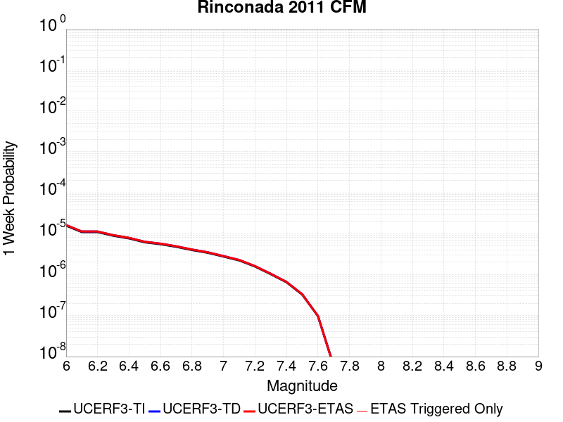 |  |  |

| Magnitude | 1 wk TI Prob | 1 wk TD Prob | 1 wk ETAS Prob | 1 wk ETAS/TD Gain | 1 wk ETAS Triggered Only | 1 mo TI Prob | 1 mo TD Prob | 1 mo ETAS Prob | 1 mo ETAS/TD Gain | 1 mo ETAS Triggered Only | 1 yr TI Prob | 1 yr TD Prob | 1 yr ETAS Prob | 1 yr ETAS/TD Gain | 1 yr ETAS Triggered Only |
|-----|-----|-----|-----|-----|-----|-----|-----|-----|-----|-----|-----|-----|-----|-----|-----|
| 6.0 | 1.5752368E-5 | 1.6276554E-5 | 1.6276554E-5 | 1.0 | 0.0 | 6.75084E-5 | 6.975481E-5 | 6.975481E-5 | 1.0 | 0.0 | 8.2160486E-4 | 8.489371E-4 | 8.889031E-4 | 1.0470778 | 4.0E-5 |
| 6.1 | 1.0966133E-5 | 1.1324287E-5 | 1.1324287E-5 | 1.0 | 0.0 | 4.6996865E-5 | 4.8531758E-5 | 4.8531758E-5 | 1.0 | 0.0 | 5.720366E-4 | 5.907147E-4 | 5.907147E-4 | 1.0 | 0.0 |
| 6.2 | 1.0966133E-5 | 1.1324287E-5 | 1.1324287E-5 | 1.0 | 0.0 | 4.6996865E-5 | 4.8531758E-5 | 4.8531758E-5 | 1.0 | 0.0 | 5.720366E-4 | 5.907147E-4 | 5.907147E-4 | 1.0 | 0.0 |
| 6.3 | 8.926149E-6 | 9.2137825E-6 | 9.2137825E-6 | 1.0 | 0.0 | 3.8254362E-5 | 3.9487044E-5 | 3.9487044E-5 | 1.0 | 0.0 | 4.6564735E-4 | 4.8064903E-4 | 4.8064903E-4 | 1.0 | 0.0 |
| 6.4 | 7.676955E-6 | 7.9210495E-6 | 7.9210495E-6 | 1.0 | 0.0 | 3.290082E-5 | 3.3946915E-5 | 3.3946915E-5 | 1.0 | 0.0 | 4.0049385E-4 | 4.132255E-4 | 4.132255E-4 | 1.0 | 0.0 |
| 6.5 | 6.1671026E-6 | 6.3596335E-6 | 6.3596335E-6 | 1.0 | 0.0 | 2.6430173E-5 | 2.7255288E-5 | 2.7255288E-5 | 1.0 | 0.0 | 3.2173982E-4 | 3.3178268E-4 | 3.3178268E-4 | 1.0 | 0.0 |
| 6.6 | 5.553456E-6 | 5.725419E-6 | 5.725419E-6 | 1.0 | 0.0 | 2.3800309E-5 | 2.4537281E-5 | 2.4537281E-5 | 1.0 | 0.0 | 2.897302E-4 | 2.987005E-4 | 2.987005E-4 | 1.0 | 0.0 |
| 6.7 | 4.787857E-6 | 4.9338255E-6 | 4.9338255E-6 | 1.0 | 0.0 | 2.0519226E-5 | 2.1144795E-5 | 2.1144795E-5 | 1.0 | 0.0 | 2.4979294E-4 | 2.5740752E-4 | 2.5740752E-4 | 1.0 | 0.0 |
| 6.8 | 3.9955166E-6 | 4.1138956E-6 | 4.1138956E-6 | 1.0 | 0.0 | 1.7123532E-5 | 1.7630862E-5 | 1.7630862E-5 | 1.0 | 0.0 | 2.0845905E-4 | 2.1463462E-4 | 2.1463462E-4 | 1.0 | 0.0 |
| 6.9 | 3.4250072E-6 | 3.5227933E-6 | 3.5227933E-6 | 1.0 | 0.0 | 1.46785205E-5 | 1.5097598E-5 | 1.5097598E-5 | 1.0 | 0.0 | 1.7869633E-4 | 1.8379778E-4 | 1.8379778E-4 | 1.0 | 0.0 |
| 7.0 | 2.7712713E-6 | 2.8469697E-6 | 2.8469697E-6 | 1.0 | 0.0 | 1.1876823E-5 | 1.2201242E-5 | 1.2201242E-5 | 1.0 | 0.0 | 1.4459073E-4 | 1.4854E-4 | 1.4854E-4 | 1.0 | 0.0 |
| 7.1 | 2.227358E-6 | 2.2859083E-6 | 2.2859083E-6 | 1.0 | 0.0 | 9.545785E-6 | 9.796713E-6 | 9.796713E-6 | 1.0 | 0.0 | 1.16213734E-4 | 1.19268465E-4 | 1.19268465E-4 | 1.0 | 0.0 |
| 7.2 | 1.581796E-6 | 1.6210437E-6 | 1.6210437E-6 | 1.0 | 0.0 | 6.779108E-6 | 6.9473112E-6 | 6.9473112E-6 | 1.0 | 0.0 | 8.253252E-5 | 8.4580235E-5 | 8.4580235E-5 | 1.0 | 0.0 |
| 7.3 | 1.0306567E-6 | 1.0547374E-6 | 1.0547374E-6 | 1.0 | 0.0 | 4.4170924E-6 | 4.520295E-6 | 4.520295E-6 | 1.0 | 0.0 | 5.3776774E-5 | 5.5033208E-5 | 5.5033208E-5 | 1.0 | 0.0 |
| 7.4 | 6.535541E-7 | 6.683316E-7 | 6.683316E-7 | 1.0 | 0.0 | 2.800943E-6 | 2.864275E-6 | 2.864275E-6 | 1.0 | 0.0 | 3.4100947E-5 | 3.487199E-5 | 3.487199E-5 | 1.0 | 0.0 |
| 7.5 | 3.2656962E-7 | 3.3319603E-7 | 3.3319603E-7 | 1.0 | 0.0 | 1.3995833E-6 | 1.4279822E-6 | 1.4279822E-6 | 1.0 | 0.0 | 1.7039794E-5 | 1.7385544E-5 | 1.7385544E-5 | 1.0 | 0.0 |
| 7.6 | 9.754343E-8 | 9.821841E-8 | 9.821841E-8 | 1.0 | 0.0 | 4.180432E-7 | 4.2093595E-7 | 4.2093595E-7 | 1.0 | 0.0 | 5.089664E-6 | 5.124883E-6 | 5.124883E-6 | 1.0 | 0.0 |
| 7.7 | 6.0001453E-9 | 5.8497065E-9 | 5.8497065E-9 | 1.0 | 0.0 | 2.5714908E-8 | 2.507017E-8 | 2.507017E-8 | 1.0 | 0.0 | 3.1307894E-7 | 3.052293E-7 | 3.052293E-7 | 1.0 | 0.0 |
| 7.8 | 7.400003E-11 | 7.4656725E-11 | 7.4656725E-11 | 1.0 | 0.0 | 3.171432E-10 | 3.1995728E-10 | 3.1995728E-10 | 1.0 | 0.0 | 3.861218E-9 | 3.89548E-9 | 3.89548E-9 | 1.0 | 0.0 |

## Oceanside alt1
*[(top)](#table-of-contents)*

| 1 Week | 1 Month | 1 Year |
|-----|-----|-----|
| 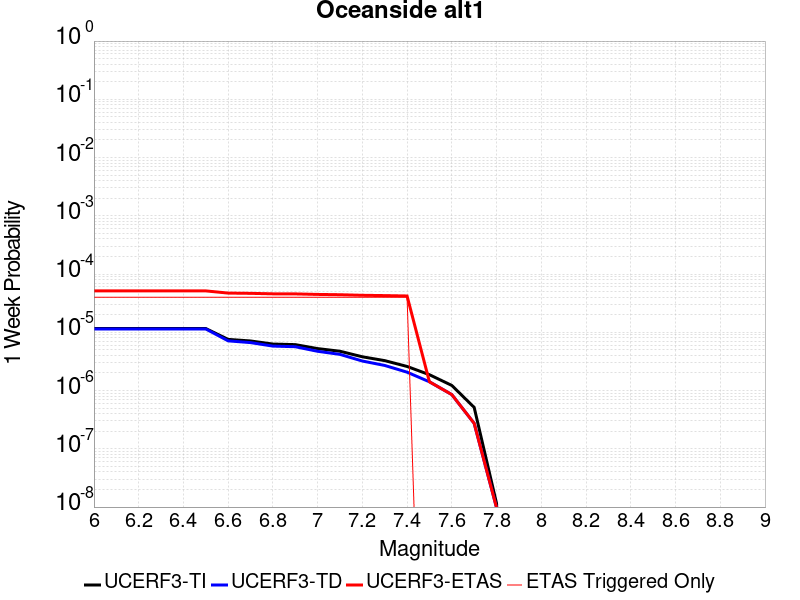 | 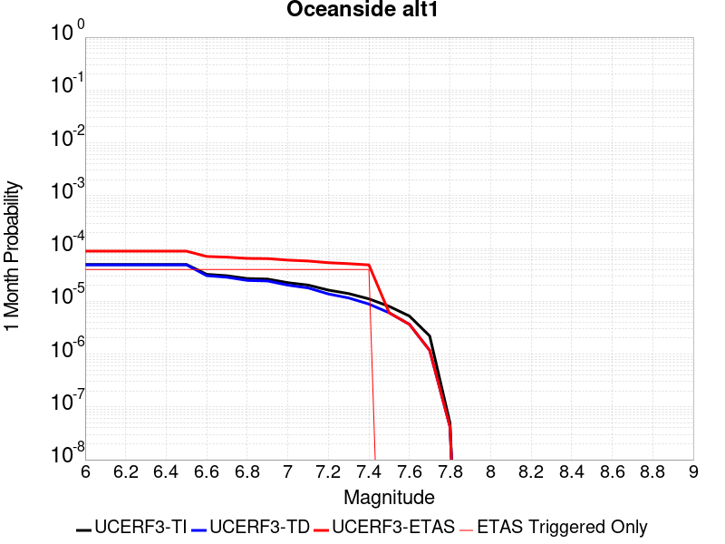 |  |

| Magnitude | 1 wk TI Prob | 1 wk TD Prob | 1 wk ETAS Prob | 1 wk ETAS/TD Gain | 1 wk ETAS Triggered Only | 1 mo TI Prob | 1 mo TD Prob | 1 mo ETAS Prob | 1 mo ETAS/TD Gain | 1 mo ETAS Triggered Only | 1 yr TI Prob | 1 yr TD Prob | 1 yr ETAS Prob | 1 yr ETAS/TD Gain | 1 yr ETAS Triggered Only |
|-----|-----|-----|-----|-----|-----|-----|-----|-----|-----|-----|-----|-----|-----|-----|-----|
| 6.0 | 1.1617542E-5 | 1.1425403E-5 | 5.1424944E-5 | 4.500931 | 4.0E-5 | 4.9788516E-5 | 4.8965183E-5 | 8.896322E-5 | 1.816867 | 4.0E-5 | 6.060066E-4 | 5.9600413E-4 | 6.3598034E-4 | 1.0670736 | 4.0E-5 |
| 6.1 | 1.1617542E-5 | 1.1425403E-5 | 5.1424944E-5 | 4.500931 | 4.0E-5 | 4.9788516E-5 | 4.8965183E-5 | 8.896322E-5 | 1.816867 | 4.0E-5 | 6.060066E-4 | 5.9600413E-4 | 6.3598034E-4 | 1.0670736 | 4.0E-5 |
| 6.2 | 1.1617542E-5 | 1.1425403E-5 | 5.1424944E-5 | 4.500931 | 4.0E-5 | 4.9788516E-5 | 4.8965183E-5 | 8.896322E-5 | 1.816867 | 4.0E-5 | 6.060066E-4 | 5.9600413E-4 | 6.3598034E-4 | 1.0670736 | 4.0E-5 |
| 6.3 | 1.1617542E-5 | 1.1425403E-5 | 5.1424944E-5 | 4.500931 | 4.0E-5 | 4.9788516E-5 | 4.8965183E-5 | 8.896322E-5 | 1.816867 | 4.0E-5 | 6.060066E-4 | 5.9600413E-4 | 6.3598034E-4 | 1.0670736 | 4.0E-5 |
| 6.4 | 1.1617542E-5 | 1.1425403E-5 | 5.1424944E-5 | 4.500931 | 4.0E-5 | 4.9788516E-5 | 4.8965183E-5 | 8.896322E-5 | 1.816867 | 4.0E-5 | 6.060066E-4 | 5.9600413E-4 | 6.3598034E-4 | 1.0670736 | 4.0E-5 |
| 6.5 | 1.1617542E-5 | 1.1425403E-5 | 5.1424944E-5 | 4.500931 | 4.0E-5 | 4.9788516E-5 | 4.8965183E-5 | 8.896322E-5 | 1.816867 | 4.0E-5 | 6.060066E-4 | 5.9600413E-4 | 6.3598034E-4 | 1.0670736 | 4.0E-5 |
| 6.6 | 7.561768E-6 | 7.1346853E-6 | 4.71344E-5 | 6.606374 | 4.0E-5 | 3.2407173E-5 | 3.057687E-5 | 7.057565E-5 | 2.3081384 | 4.0E-5 | 3.9448592E-4 | 3.722109E-4 | 4.12196E-4 | 1.1074259 | 4.0E-5 |
| 6.7 | 7.1042605E-6 | 6.656683E-6 | 4.6656416E-5 | 7.0089583 | 4.0E-5 | 3.0446476E-5 | 2.8528335E-5 | 6.8527195E-5 | 2.4020748 | 4.0E-5 | 3.706228E-4 | 3.4727794E-4 | 3.8726404E-4 | 1.1151415 | 4.0E-5 |
| 6.8 | 6.285554E-6 | 5.800571E-6 | 4.5800338E-5 | 7.8958325 | 4.0E-5 | 2.693781E-5 | 2.4859357E-5 | 6.485837E-5 | 2.6090121 | 4.0E-5 | 3.2791847E-4 | 3.026212E-4 | 3.426091E-4 | 1.1321385 | 4.0E-5 |
| 6.9 | 6.148883E-6 | 5.6573867E-6 | 4.565716E-5 | 8.070362 | 4.0E-5 | 2.635209E-5 | 2.424572E-5 | 6.424475E-5 | 2.6497357 | 4.0E-5 | 3.2078946E-4 | 2.9515222E-4 | 3.3514042E-4 | 1.1354833 | 4.0E-5 |
| 7.0 | 5.253857E-6 | 4.7231065E-6 | 4.4722918E-5 | 9.468963 | 4.0E-5 | 2.2516335E-5 | 2.0241729E-5 | 6.024092E-5 | 2.976076 | 4.0E-5 | 2.7410188E-4 | 2.4641547E-4 | 2.8640562E-4 | 1.1622875 | 4.0E-5 |
| 7.1 | 4.730754E-6 | 4.1791272E-6 | 4.417896E-5 | 10.571336 | 4.0E-5 | 2.0274503E-5 | 1.7910425E-5 | 5.7909707E-5 | 3.2332962 | 4.0E-5 | 2.468141E-4 | 2.1803785E-4 | 2.5802915E-4 | 1.1834143 | 4.0E-5 |
| 7.2 | 3.7998386E-6 | 3.2144935E-6 | 4.3214364E-5 | 13.443601 | 4.0E-5 | 1.6284921E-5 | 1.3776328E-5 | 5.3775777E-5 | 3.9034913 | 4.0E-5 | 1.9825088E-4 | 1.6771401E-4 | 2.077073E-4 | 1.2384613 | 4.0E-5 |
| 7.3 | 3.2656465E-6 | 2.6987216E-6 | 4.2698615E-5 | 15.821793 | 4.0E-5 | 1.3995553E-5 | 1.15658995E-5 | 5.1565436E-5 | 4.4584026 | 4.0E-5 | 1.7038253E-4 | 1.4080583E-4 | 1.808002E-4 | 1.2840391 | 4.0E-5 |
| 7.4 | 2.593703E-6 | 2.068265E-6 | 4.2068183E-5 | 20.33984 | 4.0E-5 | 1.1115822E-5 | 8.863964E-6 | 4.886361E-5 | 5.512614 | 4.0E-5 | 1.3532673E-4 | 1.079135E-4 | 1.4790919E-4 | 1.3706273 | 4.0E-5 |
| 7.5 | 1.8715585E-6 | 1.4139124E-6 | 1.4139124E-6 | 1.0 | 0.0 | 8.020941E-6 | 6.059611E-6 | 6.059611E-6 | 1.0 | 0.0 | 9.7650576E-5 | 7.377333E-5 | 7.377333E-5 | 1.0 | 0.0 |
| 7.6 | 1.2246786E-6 | 8.528269E-7 | 8.528269E-7 | 1.0 | 0.0 | 5.248612E-6 | 3.6549675E-6 | 3.6549675E-6 | 1.0 | 0.0 | 6.389998E-5 | 4.4498367E-5 | 4.4498367E-5 | 1.0 | 0.0 |
| 7.7 | 5.140719E-7 | 2.735437E-7 | 2.735437E-7 | 1.0 | 0.0 | 2.2031636E-6 | 1.1723297E-6 | 1.1723297E-6 | 1.0 | 0.0 | 2.6823185E-5 | 1.4273033E-5 | 1.4273033E-5 | 1.0 | 0.0 |
| 7.8 | 1.16056995E-8 | 9.78305E-9 | 9.78305E-9 | 1.0 | 0.0 | 4.9738713E-8 | 4.1927358E-8 | 4.1927358E-8 | 1.0 | 0.0 | 6.0556863E-7 | 5.1046555E-7 | 5.1046555E-7 | 1.0 | 0.0 |

## Sierra Madre (San Fernando)
*[(top)](#table-of-contents)*

| 1 Week | 1 Month | 1 Year |
|-----|-----|-----|
|  |  |  |

| Magnitude | 1 wk TI Prob | 1 wk TD Prob | 1 wk ETAS Prob | 1 wk ETAS/TD Gain | 1 wk ETAS Triggered Only | 1 mo TI Prob | 1 mo TD Prob | 1 mo ETAS Prob | 1 mo ETAS/TD Gain | 1 mo ETAS Triggered Only | 1 yr TI Prob | 1 yr TD Prob | 1 yr ETAS Prob | 1 yr ETAS/TD Gain | 1 yr ETAS Triggered Only |
|-----|-----|-----|-----|-----|-----|-----|-----|-----|-----|-----|-----|-----|-----|-----|-----|
| 6.0 | 1.0346413E-5 | 6.291033E-6 | 4.629078E-5 | 7.3582163 | 4.0E-5 | 4.4341014E-5 | 2.6961297E-5 | 6.6960216E-5 | 2.4835682 | 4.0E-5 | 5.3971814E-4 | 3.2820547E-4 | 3.6819233E-4 | 1.1218349 | 4.0E-5 |
| 6.1 | 1.0346413E-5 | 6.291033E-6 | 4.629078E-5 | 7.3582163 | 4.0E-5 | 4.4341014E-5 | 2.6961297E-5 | 6.6960216E-5 | 2.4835682 | 4.0E-5 | 5.3971814E-4 | 3.2820547E-4 | 3.6819233E-4 | 1.1218349 | 4.0E-5 |
| 6.2 | 1.0346413E-5 | 6.291033E-6 | 4.629078E-5 | 7.3582163 | 4.0E-5 | 4.4341014E-5 | 2.6961297E-5 | 6.6960216E-5 | 2.4835682 | 4.0E-5 | 5.3971814E-4 | 3.2820547E-4 | 3.6819233E-4 | 1.1218349 | 4.0E-5 |
| 6.3 | 1.0346413E-5 | 6.291033E-6 | 4.629078E-5 | 7.3582163 | 4.0E-5 | 4.4341014E-5 | 2.6961297E-5 | 6.6960216E-5 | 2.4835682 | 4.0E-5 | 5.3971814E-4 | 3.2820547E-4 | 3.6819233E-4 | 1.1218349 | 4.0E-5 |
| 6.4 | 1.0249558E-5 | 6.291033E-6 | 4.629078E-5 | 7.3582163 | 4.0E-5 | 4.392594E-5 | 2.6961297E-5 | 6.6960216E-5 | 2.4835682 | 4.0E-5 | 5.3466705E-4 | 3.2820547E-4 | 3.6819233E-4 | 1.1218349 | 4.0E-5 |
| 6.5 | 1.0249558E-5 | 6.291033E-6 | 4.629078E-5 | 7.3582163 | 4.0E-5 | 4.392594E-5 | 2.6961297E-5 | 6.6960216E-5 | 2.4835682 | 4.0E-5 | 5.3466705E-4 | 3.2820547E-4 | 3.6819233E-4 | 1.1218349 | 4.0E-5 |
| 6.6 | 9.9035515E-6 | 6.291033E-6 | 4.629078E-5 | 7.3582163 | 4.0E-5 | 4.2443102E-5 | 2.6961297E-5 | 6.6960216E-5 | 2.4835682 | 4.0E-5 | 5.166222E-4 | 3.2820547E-4 | 3.6819233E-4 | 1.1218349 | 4.0E-5 |
| 6.7 | 9.87217E-6 | 6.278445E-6 | 4.6278194E-5 | 7.370964 | 4.0E-5 | 4.2308613E-5 | 2.6907352E-5 | 6.690627E-5 | 2.4865427 | 4.0E-5 | 5.149856E-4 | 3.2754886E-4 | 3.6753577E-4 | 1.1220791 | 4.0E-5 |
| 6.8 | 9.4359175E-6 | 6.1823307E-6 | 4.6182082E-5 | 7.4700117 | 4.0E-5 | 4.043902E-5 | 2.6495441E-5 | 6.649438E-5 | 2.5096536 | 4.0E-5 | 4.9223384E-4 | 3.2253534E-4 | 3.6252243E-4 | 1.1239774 | 4.0E-5 |
| 6.9 | 8.700447E-6 | 6.0433103E-6 | 4.6043067E-5 | 7.618849 | 4.0E-5 | 3.72871E-5 | 2.5899652E-5 | 6.589862E-5 | 2.5443823 | 4.0E-5 | 4.5387587E-4 | 3.1528372E-4 | 3.552711E-4 | 1.1268299 | 4.0E-5 |
| 7.0 | 8.648878E-6 | 6.0181846E-6 | 4.6017944E-5 | 7.6464825 | 4.0E-5 | 3.7066096E-5 | 2.5791971E-5 | 6.579094E-5 | 2.5508301 | 4.0E-5 | 4.5118626E-4 | 3.1397308E-4 | 3.5396052E-4 | 1.1273595 | 4.0E-5 |
| 7.1 | 8.505786E-6 | 5.92779E-6 | 4.5927554E-5 | 7.747837 | 4.0E-5 | 3.645286E-5 | 2.5404574E-5 | 6.5403554E-5 | 2.5744796 | 4.0E-5 | 4.437232E-4 | 3.0925786E-4 | 3.492455E-4 | 1.1293019 | 4.0E-5 |
| 7.2 | 8.139752E-6 | 5.7020216E-6 | 4.5701792E-5 | 8.015016 | 4.0E-5 | 3.4884186E-5 | 2.4437013E-5 | 6.443603E-5 | 2.6368213 | 4.0E-5 | 4.246322E-4 | 2.9748105E-4 | 3.3746916E-4 | 1.1344223 | 4.0E-5 |
| 7.3 | 7.8816E-6 | 5.555299E-6 | 4.5555076E-5 | 8.200293 | 4.0E-5 | 3.3777847E-5 | 2.3808214E-5 | 6.380726E-5 | 2.6800525 | 4.0E-5 | 4.111677E-4 | 2.898275E-4 | 3.298159E-4 | 1.1379732 | 4.0E-5 |
| 7.4 | 7.5810603E-6 | 5.359496E-6 | 4.535928E-5 | 8.463348 | 4.0E-5 | 3.2489854E-5 | 2.296907E-5 | 6.296815E-5 | 2.7414322 | 4.0E-5 | 3.9549218E-4 | 2.796136E-4 | 3.196024E-4 | 1.1430146 | 4.0E-5 |
| 7.5 | 6.349153E-6 | 4.4105477E-6 | 4.441037E-5 | 10.069128 | 4.0E-5 | 2.7210372E-5 | 1.8902216E-5 | 5.890146E-5 | 3.116114 | 4.0E-5 | 3.312359E-4 | 2.3011099E-4 | 2.701018E-4 | 1.1737891 | 4.0E-5 |
| 7.6 | 4.430576E-6 | 2.893316E-6 | 2.893316E-6 | 1.0 | 0.0 | 1.8988047E-5 | 1.2399867E-5 | 1.2399867E-5 | 1.0 | 0.0 | 2.3115493E-4 | 1.5095815E-4 | 1.5095815E-4 | 1.0 | 0.0 |
| 7.7 | 3.005066E-6 | 1.753505E-6 | 1.753505E-6 | 1.0 | 0.0 | 1.2878791E-5 | 7.515E-6 | 7.515E-6 | 1.0 | 0.0 | 1.56788E-4 | 9.1491296E-5 | 9.1491296E-5 | 1.0 | 0.0 |
| 7.8 | 1.8459098E-6 | 1.060052E-6 | 1.060052E-6 | 1.0 | 0.0 | 7.911018E-6 | 4.543072E-6 | 4.543072E-6 | 1.0 | 0.0 | 9.631238E-5 | 5.5310502E-5 | 5.5310502E-5 | 1.0 | 0.0 |
| 7.9 | 9.839262E-7 | 5.2437485E-7 | 5.2437485E-7 | 1.0 | 0.0 | 4.2168194E-6 | 2.247319E-6 | 2.247319E-6 | 1.0 | 0.0 | 5.1338568E-5 | 2.7360767E-5 | 2.7360767E-5 | 1.0 | 0.0 |
| 8.0 | 1.210983E-7 | 6.622497E-8 | 6.622497E-8 | 1.0 | 0.0 | 5.1899264E-7 | 2.8382127E-7 | 2.8382127E-7 | 1.0 | 0.0 | 6.3187167E-6 | 3.4555185E-6 | 3.4555185E-6 | 1.0 | 0.0 |

## Hosgri
*[(top)](#table-of-contents)*

| 1 Week | 1 Month | 1 Year |
|-----|-----|-----|
|  |  | 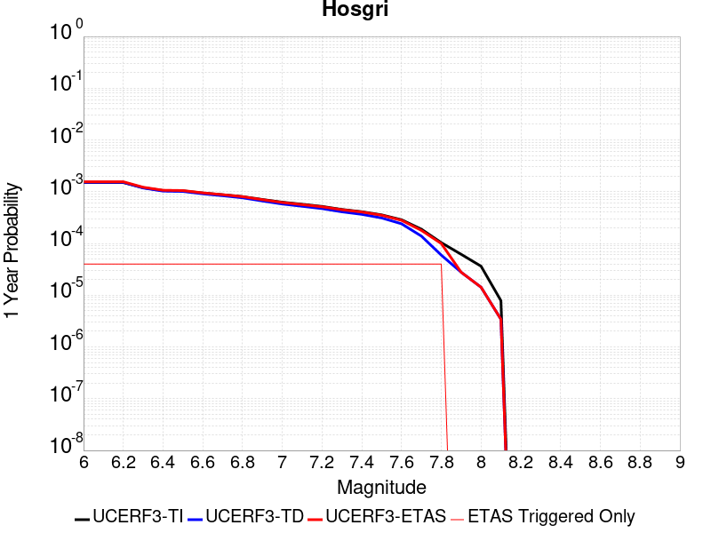 |

| Magnitude | 1 wk TI Prob | 1 wk TD Prob | 1 wk ETAS Prob | 1 wk ETAS/TD Gain | 1 wk ETAS Triggered Only | 1 mo TI Prob | 1 mo TD Prob | 1 mo ETAS Prob | 1 mo ETAS/TD Gain | 1 mo ETAS Triggered Only | 1 yr TI Prob | 1 yr TD Prob | 1 yr ETAS Prob | 1 yr ETAS/TD Gain | 1 yr ETAS Triggered Only |
|-----|-----|-----|-----|-----|-----|-----|-----|-----|-----|-----|-----|-----|-----|-----|-----|
| 6.0 | 2.883978E-5 | 2.9139386E-5 | 2.9139386E-5 | 1.0 | 0.0 | 1.235932E-4 | 1.2487726E-4 | 1.2487726E-4 | 1.0 | 0.0 | 0.0015037085 | 0.0015193475 | 0.0015592867 | 1.0262871 | 4.0E-5 |
| 6.1 | 2.883978E-5 | 2.9139386E-5 | 2.9139386E-5 | 1.0 | 0.0 | 1.235932E-4 | 1.2487726E-4 | 1.2487726E-4 | 1.0 | 0.0 | 0.0015037085 | 0.0015193475 | 0.0015592867 | 1.0262871 | 4.0E-5 |
| 6.2 | 2.883978E-5 | 2.9139386E-5 | 2.9139386E-5 | 1.0 | 0.0 | 1.235932E-4 | 1.2487726E-4 | 1.2487726E-4 | 1.0 | 0.0 | 0.0015037085 | 0.0015193475 | 0.0015592867 | 1.0262871 | 4.0E-5 |
| 6.3 | 2.2914428E-5 | 2.265085E-5 | 2.265085E-5 | 1.0 | 0.0 | 9.8200995E-5 | 9.707148E-5 | 9.707148E-5 | 1.0 | 0.0 | 0.0011949413 | 0.0011812095 | 0.0012211623 | 1.0338236 | 4.0E-5 |
| 6.4 | 2.0195741E-5 | 1.9704607E-5 | 1.9704607E-5 | 1.0 | 0.0 | 8.65503E-5 | 8.4445586E-5 | 8.4445586E-5 | 1.0 | 0.0 | 0.0010532405 | 0.001027642 | 0.0010676009 | 1.038884 | 4.0E-5 |
| 6.5 | 1.9924333E-5 | 1.9416964E-5 | 1.9416964E-5 | 1.0 | 0.0 | 8.53872E-5 | 8.3212915E-5 | 8.3212915E-5 | 1.0 | 0.0 | 0.0010390934 | 0.0010126483 | 0.0010526078 | 1.0394604 | 4.0E-5 |
| 6.6 | 1.809694E-5 | 1.7465809E-5 | 1.7465809E-5 | 1.0 | 0.0 | 7.7556004E-5 | 7.485133E-5 | 7.485133E-5 | 1.0 | 0.0 | 9.438353E-4 | 9.1093517E-4 | 9.5089874E-4 | 1.0438709 | 4.0E-5 |
| 6.7 | 1.675989E-5 | 1.604995E-5 | 1.604995E-5 | 1.0 | 0.0 | 7.182612E-5 | 6.878369E-5 | 6.878369E-5 | 1.0 | 0.0 | 8.7413215E-4 | 8.3712075E-4 | 8.770873E-4 | 1.0477428 | 4.0E-5 |
| 6.8 | 1.5401129E-5 | 1.4620946E-5 | 1.4620946E-5 | 1.0 | 0.0 | 6.6003166E-5 | 6.2659696E-5 | 6.2659696E-5 | 1.0 | 0.0 | 8.032922E-4 | 7.6261564E-4 | 8.0258516E-4 | 1.0524111 | 4.0E-5 |
| 6.9 | 1.356559E-5 | 1.2696401E-5 | 1.2696401E-5 | 1.0 | 0.0 | 5.8136946E-5 | 5.441202E-5 | 5.441202E-5 | 1.0 | 0.0 | 7.0758746E-4 | 6.622654E-4 | 7.0223893E-4 | 1.0603588 | 4.0E-5 |
| 7.0 | 1.2030819E-5 | 1.1102045E-5 | 1.1102045E-5 | 1.0 | 0.0 | 5.155963E-5 | 4.7579328E-5 | 4.7579328E-5 | 1.0 | 0.0 | 6.275577E-4 | 5.791245E-4 | 6.191013E-4 | 1.0690298 | 4.0E-5 |
| 7.1 | 1.0972698E-5 | 1.002806E-5 | 1.002806E-5 | 1.0 | 0.0 | 4.7025E-5 | 4.2976695E-5 | 4.2976695E-5 | 1.0 | 0.0 | 5.72379E-4 | 5.231157E-4 | 5.630948E-4 | 1.076425 | 4.0E-5 |
| 7.2 | 9.961926E-6 | 9.040455E-6 | 9.040455E-6 | 1.0 | 0.0 | 4.2693267E-5 | 3.8744227E-5 | 3.8744227E-5 | 1.0 | 0.0 | 5.1966653E-4 | 4.7160895E-4 | 5.115901E-4 | 1.084776 | 4.0E-5 |
| 7.3 | 8.700929E-6 | 7.833605E-6 | 7.833605E-6 | 1.0 | 0.0 | 3.7289166E-5 | 3.357216E-5 | 3.357216E-5 | 1.0 | 0.0 | 4.53901E-4 | 4.0866443E-4 | 4.486481E-4 | 1.0978398 | 4.0E-5 |
| 7.4 | 7.866285E-6 | 7.004084E-6 | 7.004084E-6 | 1.0 | 0.0 | 3.3712215E-5 | 3.0017158E-5 | 3.0017158E-5 | 1.0 | 0.0 | 4.103689E-4 | 3.6539763E-4 | 4.0538303E-4 | 1.1094298 | 4.0E-5 |
| 7.5 | 6.8381305E-6 | 5.964861E-6 | 5.964861E-6 | 1.0 | 0.0 | 2.9305946E-5 | 2.5563439E-5 | 2.5563439E-5 | 1.0 | 0.0 | 3.5674145E-4 | 3.1119044E-4 | 3.51178E-4 | 1.1284987 | 4.0E-5 |
| 7.6 | 5.503376E-6 | 4.6000837E-6 | 4.6000837E-6 | 1.0 | 0.0 | 2.3585684E-5 | 1.9714495E-5 | 1.9714495E-5 | 1.0 | 0.0 | 2.8711787E-4 | 2.3999755E-4 | 2.7998796E-4 | 1.1666284 | 4.0E-5 |
| 7.7 | 3.6144982E-6 | 2.6566063E-6 | 2.6566063E-6 | 1.0 | 0.0 | 1.5490614E-5 | 1.1385406E-5 | 1.1385406E-5 | 1.0 | 0.0 | 1.8858191E-4 | 1.386085E-4 | 1.7860296E-4 | 1.2885426 | 4.0E-5 |
| 7.8 | 1.9853494E-6 | 1.1397797E-6 | 1.1397797E-6 | 1.0 | 0.0 | 8.508612E-6 | 4.8847605E-6 | 4.8847605E-6 | 1.0 | 0.0 | 1.0358743E-4 | 5.9470338E-5 | 9.946796E-5 | 1.6725643 | 4.0E-5 |
| 7.9 | 1.1818757E-6 | 5.323374E-7 | 5.323374E-7 | 1.0 | 0.0 | 5.0651715E-6 | 2.281444E-6 | 2.281444E-6 | 1.0 | 0.0 | 6.1666724E-5 | 2.7776226E-5 | 2.7776226E-5 | 1.0 | 0.0 |
| 8.0 | 6.962958E-7 | 2.7330222E-7 | 2.7330222E-7 | 1.0 | 0.0 | 2.9841215E-6 | 1.1712947E-6 | 1.1712947E-6 | 1.0 | 0.0 | 3.6331072E-5 | 1.4260419E-5 | 1.4260419E-5 | 1.0 | 0.0 |
| 8.1 | 1.5033264E-7 | 6.569932E-8 | 6.569932E-8 | 1.0 | 0.0 | 6.442826E-7 | 2.8156848E-7 | 2.8156848E-7 | 1.0 | 0.0 | 7.844113E-6 | 3.428091E-6 | 3.428091E-6 | 1.0 | 0.0 |

## Northridge Hills
*[(top)](#table-of-contents)*

| 1 Week | 1 Month | 1 Year |
|-----|-----|-----|
|  |  |  |

| Magnitude | 1 wk TI Prob | 1 wk TD Prob | 1 wk ETAS Prob | 1 wk ETAS/TD Gain | 1 wk ETAS Triggered Only | 1 mo TI Prob | 1 mo TD Prob | 1 mo ETAS Prob | 1 mo ETAS/TD Gain | 1 mo ETAS Triggered Only | 1 yr TI Prob | 1 yr TD Prob | 1 yr ETAS Prob | 1 yr ETAS/TD Gain | 1 yr ETAS Triggered Only |
|-----|-----|-----|-----|-----|-----|-----|-----|-----|-----|-----|-----|-----|-----|-----|-----|
| 6.0 | 5.095982E-6 | 3.6174772E-6 | 4.3617332E-5 | 12.057389 | 4.0E-5 | 2.183974E-5 | 1.5503383E-5 | 5.5502762E-5 | 3.5800421 | 4.0E-5 | 2.658664E-4 | 1.8873745E-4 | 2.287299E-4 | 1.2118946 | 4.0E-5 |
| 6.1 | 5.095982E-6 | 3.6174772E-6 | 4.3617332E-5 | 12.057389 | 4.0E-5 | 2.183974E-5 | 1.5503383E-5 | 5.5502762E-5 | 3.5800421 | 4.0E-5 | 2.658664E-4 | 1.8873745E-4 | 2.287299E-4 | 1.2118946 | 4.0E-5 |
| 6.2 | 5.095982E-6 | 3.6174772E-6 | 4.3617332E-5 | 12.057389 | 4.0E-5 | 2.183974E-5 | 1.5503383E-5 | 5.5502762E-5 | 3.5800421 | 4.0E-5 | 2.658664E-4 | 1.8873745E-4 | 2.287299E-4 | 1.2118946 | 4.0E-5 |
| 6.3 | 5.095982E-6 | 3.6174772E-6 | 4.3617332E-5 | 12.057389 | 4.0E-5 | 2.183974E-5 | 1.5503383E-5 | 5.5502762E-5 | 3.5800421 | 4.0E-5 | 2.658664E-4 | 1.8873745E-4 | 2.287299E-4 | 1.2118946 | 4.0E-5 |
| 6.4 | 5.095982E-6 | 3.6174772E-6 | 4.3617332E-5 | 12.057389 | 4.0E-5 | 2.183974E-5 | 1.5503383E-5 | 5.5502762E-5 | 3.5800421 | 4.0E-5 | 2.658664E-4 | 1.8873745E-4 | 2.287299E-4 | 1.2118946 | 4.0E-5 |
| 6.5 | 5.095982E-6 | 3.6174772E-6 | 4.3617332E-5 | 12.057389 | 4.0E-5 | 2.183974E-5 | 1.5503383E-5 | 5.5502762E-5 | 3.5800421 | 4.0E-5 | 2.658664E-4 | 1.8873745E-4 | 2.287299E-4 | 1.2118946 | 4.0E-5 |
| 6.6 | 5.095982E-6 | 3.6174772E-6 | 4.3617332E-5 | 12.057389 | 4.0E-5 | 2.183974E-5 | 1.5503383E-5 | 5.5502762E-5 | 3.5800421 | 4.0E-5 | 2.658664E-4 | 1.8873745E-4 | 2.287299E-4 | 1.2118946 | 4.0E-5 |
| 6.7 | 5.095982E-6 | 3.6174772E-6 | 4.3617332E-5 | 12.057389 | 4.0E-5 | 2.183974E-5 | 1.5503383E-5 | 5.5502762E-5 | 3.5800421 | 4.0E-5 | 2.658664E-4 | 1.8873745E-4 | 2.287299E-4 | 1.2118946 | 4.0E-5 |
| 6.8 | 5.095982E-6 | 3.6174772E-6 | 4.3617332E-5 | 12.057389 | 4.0E-5 | 2.183974E-5 | 1.5503383E-5 | 5.5502762E-5 | 3.5800421 | 4.0E-5 | 2.658664E-4 | 1.8873745E-4 | 2.287299E-4 | 1.2118946 | 4.0E-5 |
| 6.9 | 5.0942654E-6 | 3.6156919E-6 | 4.3615546E-5 | 12.062849 | 4.0E-5 | 2.1832384E-5 | 1.549573E-5 | 5.549511E-5 | 3.581316 | 4.0E-5 | 2.6577685E-4 | 1.886443E-4 | 2.2863677E-4 | 1.2119993 | 4.0E-5 |
| 7.0 | 4.851143E-6 | 3.3609658E-6 | 4.3360833E-5 | 12.9013 | 4.0E-5 | 2.0790447E-5 | 1.440406E-5 | 5.4403485E-5 | 3.776955 | 4.0E-5 | 2.5309427E-4 | 1.7535535E-4 | 2.1534834E-4 | 1.2280682 | 4.0E-5 |
| 7.1 | 4.7910607E-6 | 3.2992368E-6 | 4.3299104E-5 | 13.123976 | 4.0E-5 | 2.0532956E-5 | 1.4139509E-5 | 5.4138945E-5 | 3.8289125 | 4.0E-5 | 2.4996005E-4 | 1.7213497E-4 | 2.1212808E-4 | 1.2323358 | 4.0E-5 |
| 7.2 | 4.580079E-6 | 3.108981E-6 | 4.3108856E-5 | 13.865912 | 4.0E-5 | 1.9628762E-5 | 1.3324136E-5 | 5.33236E-5 | 4.002031 | 4.0E-5 | 2.3895396E-4 | 1.6220931E-4 | 2.0220282E-4 | 1.246555 | 4.0E-5 |
| 7.3 | 4.290062E-6 | 2.8703662E-6 | 4.287025E-5 | 14.935464 | 4.0E-5 | 1.838585E-5 | 1.2301512E-5 | 5.230102E-5 | 4.2515926 | 4.0E-5 | 2.2382473E-4 | 1.4976064E-4 | 1.8975465E-4 | 1.2670529 | 4.0E-5 |
| 7.4 | 4.0259683E-6 | 2.6760083E-6 | 4.26759E-5 | 15.947597 | 4.0E-5 | 1.7254037E-5 | 1.1468556E-5 | 5.1468098E-5 | 4.487757 | 4.0E-5 | 2.1004764E-4 | 1.3962075E-4 | 1.7961518E-4 | 1.2864504 | 4.0E-5 |
| 7.5 | 3.5477108E-6 | 2.2872025E-6 | 4.2287113E-5 | 18.488573 | 4.0E-5 | 1.5204386E-5 | 9.80226E-6 | 4.9801867E-5 | 5.0806518 | 4.0E-5 | 1.8509767E-4 | 1.1933599E-4 | 1.5933122E-4 | 1.3351481 | 4.0E-5 |
| 7.6 | 2.9990608E-6 | 1.8545861E-6 | 1.8545861E-6 | 1.0 | 0.0 | 1.2853055E-5 | 7.9482015E-6 | 7.9482015E-6 | 1.0 | 0.0 | 1.564747E-4 | 9.676506E-5 | 9.676506E-5 | 1.0 | 0.0 |
| 7.7 | 2.4542855E-6 | 1.4477155E-6 | 1.4477155E-6 | 1.0 | 0.0 | 1.05183235E-5 | 6.20448E-6 | 6.20448E-6 | 1.0 | 0.0 | 1.2805307E-4 | 7.553693E-5 | 7.553693E-5 | 1.0 | 0.0 |
| 7.8 | 1.3623128E-6 | 8.026375E-7 | 8.026375E-7 | 1.0 | 0.0 | 5.8384703E-6 | 3.4398704E-6 | 3.4398704E-6 | 1.0 | 0.0 | 7.108106E-5 | 4.187962E-5 | 4.187962E-5 | 1.0 | 0.0 |
| 7.9 | 7.716622E-7 | 4.2262494E-7 | 4.2262494E-7 | 1.0 | 0.0 | 3.3071194E-6 | 1.8112485E-6 | 1.8112485E-6 | 1.0 | 0.0 | 4.0263436E-5 | 2.2051727E-5 | 2.2051727E-5 | 1.0 | 0.0 |
| 8.0 | 1.2117711E-7 | 6.630734E-8 | 6.630734E-8 | 1.0 | 0.0 | 5.1933034E-7 | 2.8417426E-7 | 2.8417426E-7 | 1.0 | 0.0 | 6.3228285E-6 | 3.4598163E-6 | 3.4598163E-6 | 1.0 | 0.0 |

## Great Valley 05 Pittsburg - Kirby Hills alt1
*[(top)](#table-of-contents)*

| 1 Week | 1 Month | 1 Year |
|-----|-----|-----|
| 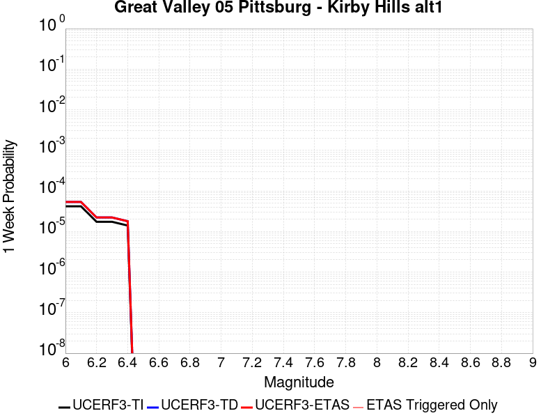 | 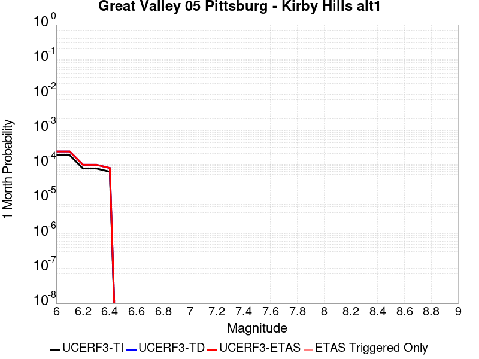 |  |

| Magnitude | 1 wk TI Prob | 1 wk TD Prob | 1 wk ETAS Prob | 1 wk ETAS/TD Gain | 1 wk ETAS Triggered Only | 1 mo TI Prob | 1 mo TD Prob | 1 mo ETAS Prob | 1 mo ETAS/TD Gain | 1 mo ETAS Triggered Only | 1 yr TI Prob | 1 yr TD Prob | 1 yr ETAS Prob | 1 yr ETAS/TD Gain | 1 yr ETAS Triggered Only |
|-----|-----|-----|-----|-----|-----|-----|-----|-----|-----|-----|-----|-----|-----|-----|-----|
| 6.0 | 4.187212E-5 | 5.3492065E-5 | 5.3492065E-5 | 1.0 | 0.0 | 1.794396E-4 | 2.2923728E-4 | 2.2923728E-4 | 1.0 | 0.0 | 0.002182488 | 0.0027883553 | 0.002828244 | 1.0143054 | 4.0E-5 |
| 6.1 | 4.187212E-5 | 5.3492065E-5 | 5.3492065E-5 | 1.0 | 0.0 | 1.794396E-4 | 2.2923728E-4 | 2.2923728E-4 | 1.0 | 0.0 | 0.002182488 | 0.0027883553 | 0.002828244 | 1.0143054 | 4.0E-5 |
| 6.2 | 1.7353306E-5 | 2.2174918E-5 | 2.2174918E-5 | 1.0 | 0.0 | 7.436919E-5 | 9.5034164E-5 | 9.5034164E-5 | 1.0 | 0.0 | 9.050688E-4 | 0.0011568196 | 0.0011568196 | 1.0 | 0.0 |
| 6.3 | 1.7353306E-5 | 2.2174918E-5 | 2.2174918E-5 | 1.0 | 0.0 | 7.436919E-5 | 9.5034164E-5 | 9.5034164E-5 | 1.0 | 0.0 | 9.050688E-4 | 0.0011568196 | 0.0011568196 | 1.0 | 0.0 |
| 6.4 | 1.4028824E-5 | 1.7917358E-5 | 1.7917358E-5 | 1.0 | 0.0 | 6.0122147E-5 | 7.678868E-5 | 7.678868E-5 | 1.0 | 0.0 | 7.3174125E-4 | 9.348871E-4 | 9.348871E-4 | 1.0 | 0.0 |

## Mendocino
*[(top)](#table-of-contents)*

| 1 Week | 1 Month | 1 Year |
|-----|-----|-----|
|  | 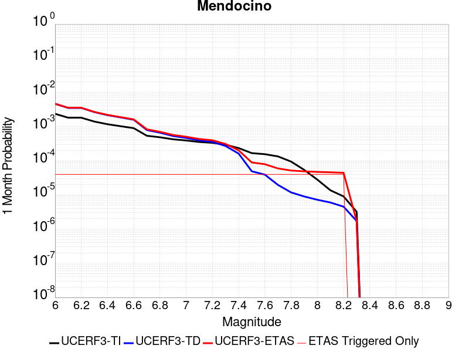 |  |

| Magnitude | 1 wk TI Prob | 1 wk TD Prob | 1 wk ETAS Prob | 1 wk ETAS/TD Gain | 1 wk ETAS Triggered Only | 1 mo TI Prob | 1 mo TD Prob | 1 mo ETAS Prob | 1 mo ETAS/TD Gain | 1 mo ETAS Triggered Only | 1 yr TI Prob | 1 yr TD Prob | 1 yr ETAS Prob | 1 yr ETAS/TD Gain | 1 yr ETAS Triggered Only |
|-----|-----|-----|-----|-----|-----|-----|-----|-----|-----|-----|-----|-----|-----|-----|-----|
| 6.0 | 5.5409013E-4 | 0.0010855013 | 0.0011254579 | 1.0368093 | 4.0E-5 | 0.0023725112 | 0.0046417383 | 0.0046815528 | 1.0085775 | 4.0E-5 | 0.028505474 | 0.054746818 | 0.05478463 | 1.0006906 | 4.0E-5 |
| 6.1 | 4.2515888E-4 | 8.241085E-4 | 8.640755E-4 | 1.0484973 | 4.0E-5 | 0.0018208373 | 0.0035253419 | 0.0035652008 | 1.0113064 | 4.0E-5 | 0.021944538 | 0.041811883 | 0.041850213 | 1.0009167 | 4.0E-5 |
| 6.2 | 4.2515888E-4 | 8.241085E-4 | 8.640755E-4 | 1.0484973 | 4.0E-5 | 0.0018208373 | 0.0035253419 | 0.0035652008 | 1.0113064 | 4.0E-5 | 0.021944538 | 0.041811883 | 0.041850213 | 1.0009167 | 4.0E-5 |
| 6.3 | 3.2773745E-4 | 6.204648E-4 | 6.6043995E-4 | 1.0644279 | 4.0E-5 | 0.0014038329 | 0.0026551047 | 0.0026949986 | 1.0150254 | 4.0E-5 | 0.016958237 | 0.031649217 | 0.031687953 | 1.0012238 | 4.0E-5 |
| 6.4 | 2.7417165E-4 | 5.0584966E-4 | 5.458294E-4 | 1.0790349 | 4.0E-5 | 0.0011744922 | 0.0021651015 | 0.002205015 | 1.0184349 | 4.0E-5 | 0.014205975 | 0.02589259 | 0.025931554 | 1.0015049 | 4.0E-5 |
| 6.5 | 2.3984899E-4 | 4.333886E-4 | 4.7337127E-4 | 1.092256 | 4.0E-5 | 0.0010275192 | 0.0018552308 | 0.0018951566 | 1.0215206 | 4.0E-5 | 0.012438473 | 0.02223386 | 0.02227297 | 1.001759 | 4.0E-5 |
| 6.6 | 2.1023539E-4 | 3.7036106E-4 | 4.1034626E-4 | 1.1079627 | 4.0E-5 | 9.0069766E-4 | 0.0015856166 | 0.0016255532 | 1.0251868 | 4.0E-5 | 0.010910975 | 0.019041684 | 0.019080922 | 1.0020607 | 4.0E-5 |
| 6.7 | 1.2592976E-4 | 1.8520498E-4 | 2.2519757E-4 | 1.2159369 | 4.0E-5 | 5.395873E-4 | 7.9342653E-4 | 8.3339476E-4 | 1.0503743 | 4.0E-5 | 0.006549705 | 0.009605632 | 0.009645248 | 1.0041242 | 4.0E-5 |
| 6.8 | 1.13663555E-4 | 1.5491348E-4 | 1.9490728E-4 | 1.2581687 | 4.0E-5 | 4.8703855E-4 | 6.637242E-4 | 7.036977E-4 | 1.060226 | 4.0E-5 | 0.0059135845 | 0.008046729 | 0.008086407 | 1.004931 | 4.0E-5 |
| 6.9 | 9.926894E-5 | 1.2384703E-4 | 1.6384207E-4 | 1.3229392 | 4.0E-5 | 4.2536893E-4 | 5.306603E-4 | 5.706391E-4 | 1.0753378 | 4.0E-5 | 0.0051665753 | 0.0064406823 | 0.006480425 | 1.0061705 | 4.0E-5 |
| 7.0 | 9.168125E-5 | 1.08657994E-4 | 1.4865365E-4 | 1.3680875 | 4.0E-5 | 3.9286047E-4 | 4.655932E-4 | 5.055746E-4 | 1.0858719 | 4.0E-5 | 0.004772591 | 0.0056534978 | 0.0056932718 | 1.0070353 | 4.0E-5 |
| 7.1 | 8.2854116E-5 | 9.183702E-5 | 1.3183335E-4 | 1.4355142 | 4.0E-5 | 3.5504074E-4 | 3.9352808E-4 | 4.3351232E-4 | 1.1016046 | 4.0E-5 | 0.004314056 | 0.004780745 | 0.004820554 | 1.0083269 | 4.0E-5 |
| 7.2 | 7.8255274E-5 | 8.3770974E-5 | 1.2376762E-4 | 1.4774524 | 4.0E-5 | 3.3533663E-4 | 3.5896988E-4 | 3.989555E-4 | 1.11139 | 4.0E-5 | 0.0040750825 | 0.0043618497 | 0.0044016754 | 1.0091305 | 4.0E-5 |
| 7.3 | 6.887904E-5 | 6.32157E-5 | 1.0321317E-4 | 1.6327143 | 4.0E-5 | 2.9516246E-4 | 2.7089682E-4 | 3.10886E-4 | 1.1476177 | 4.0E-5 | 0.0035876823 | 0.0032932796 | 0.0033331478 | 1.012106 | 4.0E-5 |
| 7.4 | 5.4898497E-5 | 3.7823393E-5 | 7.782188E-5 | 2.0575066 | 4.0E-5 | 2.3525805E-4 | 1.620905E-4 | 2.02084E-4 | 1.2467357 | 4.0E-5 | 0.0028605047 | 0.0019717228 | 0.002011644 | 1.0202469 | 4.0E-5 |
| 7.5 | 3.9103943E-5 | 1.1504898E-5 | 5.1504438E-5 | 4.47674 | 4.0E-5 | 1.6757756E-4 | 4.9305785E-5 | 8.930381E-5 | 1.8112239 | 4.0E-5 | 0.0020383475 | 6.001342E-4 | 6.401102E-4 | 1.0666118 | 4.0E-5 |
| 7.6 | 3.641042E-5 | 9.160476E-6 | 4.916011E-5 | 5.3665457 | 4.0E-5 | 1.5603533E-4 | 3.9258597E-5 | 7.925703E-5 | 2.018845 | 4.0E-5 | 0.0018980748 | 4.7787E-4 | 5.1785086E-4 | 1.0836648 | 4.0E-5 |
| 7.7 | 3.1318774E-5 | 4.5866796E-6 | 4.4586497E-5 | 9.720865 | 4.0E-5 | 1.342164E-4 | 1.965705E-5 | 5.9656264E-5 | 3.0348532 | 4.0E-5 | 0.0016328598 | 2.392985E-4 | 2.7928894E-4 | 1.1671152 | 4.0E-5 |
| 7.8 | 2.209241E-5 | 2.768099E-6 | 4.2767988E-5 | 15.450311 | 4.0E-5 | 9.467832E-5 | 1.1863227E-5 | 5.1862753E-5 | 4.3717237 | 4.0E-5 | 0.001152099 | 1.4442524E-4 | 1.8441946E-4 | 1.2769198 | 4.0E-5 |
| 7.9 | 1.2640477E-5 | 2.1053736E-6 | 4.210529E-5 | 19.998962 | 4.0E-5 | 5.4172346E-5 | 9.022999E-6 | 4.9022638E-5 | 5.433076 | 4.0E-5 | 6.593487E-4 | 1.098495E-4 | 1.498451E-4 | 1.3640946 | 4.0E-5 |
| 8.0 | 6.5548907E-6 | 1.6878063E-6 | 4.1687737E-5 | 24.699364 | 4.0E-5 | 2.8092087E-5 | 7.233435E-6 | 4.7233145E-5 | 6.529836 | 4.0E-5 | 3.4196748E-4 | 8.806354E-5 | 1.2806001E-4 | 1.4541775 | 4.0E-5 |
| 8.1 | 3.1916707E-6 | 1.401589E-6 | 4.1401534E-5 | 29.538998 | 4.0E-5 | 1.3678517E-5 | 6.0067964E-6 | 4.6006557E-5 | 7.659084 | 4.0E-5 | 1.6652321E-4 | 7.3130315E-5 | 1.1312739E-4 | 1.5469288 | 4.0E-5 |
| 8.2 | 2.1193785E-6 | 1.0614335E-6 | 4.106139E-5 | 38.684845 | 4.0E-5 | 9.083019E-6 | 4.548993E-6 | 4.454881E-5 | 9.793116 | 4.0E-5 | 1.1058014E-4 | 5.53826E-5 | 9.538038E-5 | 1.7222085 | 4.0E-5 |
| 8.3 | 7.536878E-7 | 4.0312307E-7 | 4.0312307E-7 | 1.0 | 0.0 | 3.2300866E-6 | 1.7276692E-6 | 1.7276692E-6 | 1.0 | 0.0 | 3.9325594E-5 | 2.1034182E-5 | 2.1034182E-5 | 1.0 | 0.0 |

## Puente Hills
*[(top)](#table-of-contents)*

| 1 Week | 1 Month | 1 Year |
|-----|-----|-----|
| 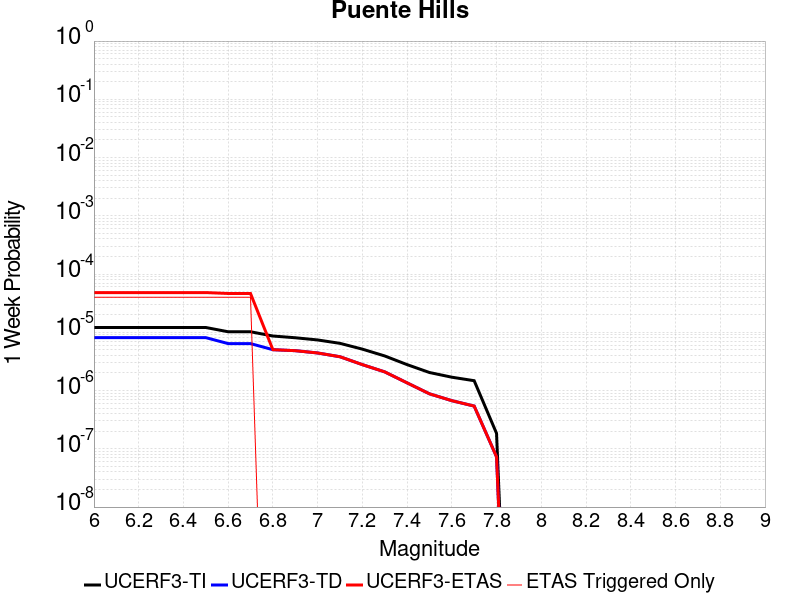 |  | 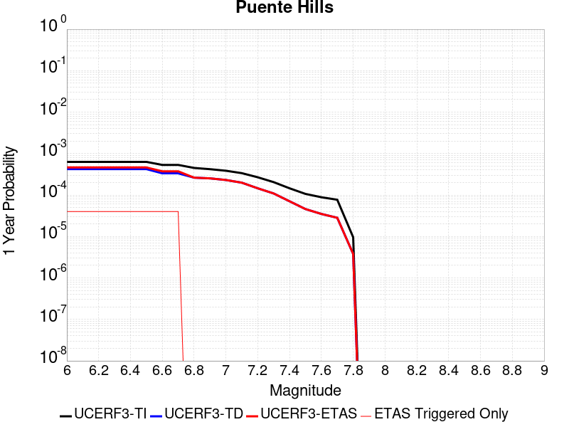 |

| Magnitude | 1 wk TI Prob | 1 wk TD Prob | 1 wk ETAS Prob | 1 wk ETAS/TD Gain | 1 wk ETAS Triggered Only | 1 mo TI Prob | 1 mo TD Prob | 1 mo ETAS Prob | 1 mo ETAS/TD Gain | 1 mo ETAS Triggered Only | 1 yr TI Prob | 1 yr TD Prob | 1 yr ETAS Prob | 1 yr ETAS/TD Gain | 1 yr ETAS Triggered Only |
|-----|-----|-----|-----|-----|-----|-----|-----|-----|-----|-----|-----|-----|-----|-----|-----|
| 6.0 | 1.2101656E-5 | 8.102921E-6 | 4.8102596E-5 | 5.9364514 | 4.0E-5 | 5.1863204E-5 | 3.4726374E-5 | 7.472499E-5 | 2.1518223 | 4.0E-5 | 6.312516E-4 | 4.2271722E-4 | 4.6270032E-4 | 1.0945859 | 4.0E-5 |
| 6.1 | 1.2101656E-5 | 8.102921E-6 | 4.8102596E-5 | 5.9364514 | 4.0E-5 | 5.1863204E-5 | 3.4726374E-5 | 7.472499E-5 | 2.1518223 | 4.0E-5 | 6.312516E-4 | 4.2271722E-4 | 4.6270032E-4 | 1.0945859 | 4.0E-5 |
| 6.2 | 1.2101656E-5 | 8.102921E-6 | 4.8102596E-5 | 5.9364514 | 4.0E-5 | 5.1863204E-5 | 3.4726374E-5 | 7.472499E-5 | 2.1518223 | 4.0E-5 | 6.312516E-4 | 4.2271722E-4 | 4.6270032E-4 | 1.0945859 | 4.0E-5 |
| 6.3 | 1.2101656E-5 | 8.102921E-6 | 4.8102596E-5 | 5.9364514 | 4.0E-5 | 5.1863204E-5 | 3.4726374E-5 | 7.472499E-5 | 2.1518223 | 4.0E-5 | 6.312516E-4 | 4.2271722E-4 | 4.6270032E-4 | 1.0945859 | 4.0E-5 |
| 6.4 | 1.2101656E-5 | 8.102921E-6 | 4.8102596E-5 | 5.9364514 | 4.0E-5 | 5.1863204E-5 | 3.4726374E-5 | 7.472499E-5 | 2.1518223 | 4.0E-5 | 6.312516E-4 | 4.2271722E-4 | 4.6270032E-4 | 1.0945859 | 4.0E-5 |
| 6.5 | 1.2101656E-5 | 8.102921E-6 | 4.8102596E-5 | 5.9364514 | 4.0E-5 | 5.1863204E-5 | 3.4726374E-5 | 7.472499E-5 | 2.1518223 | 4.0E-5 | 6.312516E-4 | 4.2271722E-4 | 4.6270032E-4 | 1.0945859 | 4.0E-5 |
| 6.6 | 1.0222488E-5 | 6.4029887E-6 | 4.6402733E-5 | 7.247043 | 4.0E-5 | 4.3809923E-5 | 2.7441105E-5 | 6.744001E-5 | 2.4576273 | 4.0E-5 | 5.332553E-4 | 3.340467E-4 | 3.7403332E-4 | 1.1197038 | 4.0E-5 |
| 6.7 | 1.0222488E-5 | 6.4029887E-6 | 4.6402733E-5 | 7.247043 | 4.0E-5 | 4.3809923E-5 | 2.7441105E-5 | 6.744001E-5 | 2.4576273 | 4.0E-5 | 5.332553E-4 | 3.340467E-4 | 3.7403332E-4 | 1.1197038 | 4.0E-5 |
| 6.8 | 8.6367845E-6 | 5.0316426E-6 | 5.0316426E-6 | 1.0 | 0.0 | 3.7014266E-5 | 2.1564007E-5 | 2.1564007E-5 | 1.0 | 0.0 | 4.505555E-4 | 2.625107E-4 | 2.625107E-4 | 1.0 | 0.0 |
| 6.9 | 8.066481E-6 | 4.839465E-6 | 4.839465E-6 | 1.0 | 0.0 | 3.4570177E-5 | 2.0740401E-5 | 2.0740401E-5 | 1.0 | 0.0 | 4.2081063E-4 | 2.5248565E-4 | 2.5248565E-4 | 1.0 | 0.0 |
| 7.0 | 7.393828E-6 | 4.4204735E-6 | 4.4204735E-6 | 1.0 | 0.0 | 3.168745E-5 | 1.8944751E-5 | 1.8944751E-5 | 1.0 | 0.0 | 3.857264E-4 | 2.3062839E-4 | 2.3062839E-4 | 1.0 | 0.0 |
| 7.1 | 6.4660953E-6 | 3.8071098E-6 | 3.8071098E-6 | 1.0 | 0.0 | 2.7711543E-5 | 1.6316086E-5 | 1.6316086E-5 | 1.0 | 0.0 | 3.373358E-4 | 1.9863059E-4 | 1.9863059E-4 | 1.0 | 0.0 |
| 7.2 | 5.143232E-6 | 2.7886363E-6 | 2.7886363E-6 | 1.0 | 0.0 | 2.2042237E-5 | 1.1951244E-5 | 1.1951244E-5 | 1.0 | 0.0 | 2.6833118E-4 | 1.4549677E-4 | 1.4549677E-4 | 1.0 | 0.0 |
| 7.3 | 3.928255E-6 | 2.0932014E-6 | 2.0932014E-6 | 1.0 | 0.0 | 1.683527E-5 | 8.970832E-6 | 8.970832E-6 | 1.0 | 0.0 | 2.0495013E-4 | 1.09214474E-4 | 1.09214474E-4 | 1.0 | 0.0 |
| 7.4 | 2.7894434E-6 | 1.3562544E-6 | 1.3562544E-6 | 1.0 | 0.0 | 1.1954703E-5 | 5.812506E-6 | 5.812506E-6 | 1.0 | 0.0 | 1.4553878E-4 | 7.076501E-5 | 7.076501E-5 | 1.0 | 0.0 |
| 7.5 | 2.041735E-6 | 8.799269E-7 | 8.799269E-7 | 1.0 | 0.0 | 8.750263E-6 | 3.77111E-6 | 3.77111E-6 | 1.0 | 0.0 | 1.06529245E-4 | 4.591233E-5 | 4.591233E-5 | 1.0 | 0.0 |
| 7.6 | 1.6959062E-6 | 6.708452E-7 | 6.708452E-7 | 1.0 | 0.0 | 7.268149E-6 | 2.875048E-6 | 2.875048E-6 | 1.0 | 0.0 | 8.848612E-5 | 3.5003177E-5 | 3.5003177E-5 | 1.0 | 0.0 |
| 7.7 | 1.4767965E-6 | 5.416132E-7 | 5.416132E-7 | 1.0 | 0.0 | 6.3291122E-6 | 2.3211976E-6 | 2.3211976E-6 | 1.0 | 0.0 | 7.705422E-5 | 2.826024E-5 | 2.826024E-5 | 1.0 | 0.0 |
| 7.8 | 1.8432911E-7 | 7.2914965E-8 | 7.2914965E-8 | 1.0 | 0.0 | 7.8998164E-7 | 3.124927E-7 | 3.124927E-7 | 1.0 | 0.0 | 9.617985E-6 | 3.8045953E-6 | 3.8045953E-6 | 1.0 | 0.0 |

## Hayward (No) 2011 CFM
*[(top)](#table-of-contents)*

| 1 Week | 1 Month | 1 Year |
|-----|-----|-----|
|  | 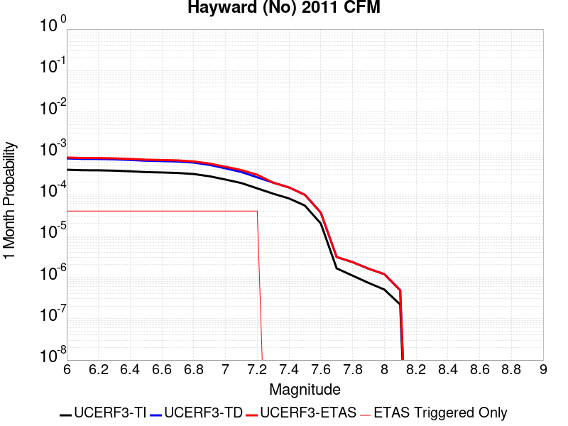 |  |

| Magnitude | 1 wk TI Prob | 1 wk TD Prob | 1 wk ETAS Prob | 1 wk ETAS/TD Gain | 1 wk ETAS Triggered Only | 1 mo TI Prob | 1 mo TD Prob | 1 mo ETAS Prob | 1 mo ETAS/TD Gain | 1 mo ETAS Triggered Only | 1 yr TI Prob | 1 yr TD Prob | 1 yr ETAS Prob | 1 yr ETAS/TD Gain | 1 yr ETAS Triggered Only |
|-----|-----|-----|-----|-----|-----|-----|-----|-----|-----|-----|-----|-----|-----|-----|-----|
| 6.0 | 9.3068506E-5 | 1.7447172E-4 | 2.1446473E-4 | 1.2292235 | 4.0E-5 | 3.9880406E-4 | 7.475203E-4 | 7.8749045E-4 | 1.0534703 | 4.0E-5 | 0.0048446343 | 0.009062957 | 0.009102595 | 1.0043736 | 4.0E-5 |
| 6.1 | 9.055486E-5 | 1.6997888E-4 | 2.0997207E-4 | 1.2352834 | 4.0E-5 | 3.880345E-4 | 7.282775E-4 | 7.6824834E-4 | 1.0548841 | 4.0E-5 | 0.0047140904 | 0.008830804 | 0.008870451 | 1.0044895 | 4.0E-5 |
| 6.2 | 9.006742E-5 | 1.691837E-4 | 2.0917693E-4 | 1.2363894 | 4.0E-5 | 3.859461E-4 | 7.248719E-4 | 7.648429E-4 | 1.0551422 | 4.0E-5 | 0.0046887742 | 0.0087897135 | 0.008829362 | 1.0045108 | 4.0E-5 |
| 6.3 | 8.8336754E-5 | 1.6597717E-4 | 2.0597053E-4 | 1.240957 | 4.0E-5 | 3.7853114E-4 | 7.111376E-4 | 7.5110915E-4 | 1.0562079 | 4.0E-5 | 0.004598882 | 0.008623887 | 0.008663542 | 1.0045983 | 4.0E-5 |
| 6.4 | 8.526157E-5 | 1.6023382E-4 | 2.0022741E-4 | 1.2495952 | 4.0E-5 | 3.6535555E-4 | 6.865364E-4 | 7.2650897E-4 | 1.0582235 | 4.0E-5 | 0.0044391346 | 0.008326706 | 0.008366372 | 1.0047638 | 4.0E-5 |
| 6.5 | 8.152396E-5 | 1.5355431E-4 | 1.9354817E-4 | 1.2604542 | 4.0E-5 | 3.493416E-4 | 6.579246E-4 | 6.978983E-4 | 1.0607573 | 4.0E-5 | 0.0042449418 | 0.007980962 | 0.008020643 | 1.004972 | 4.0E-5 |
| 6.6 | 7.987405E-5 | 1.5059515E-4 | 1.9058913E-4 | 1.2655728 | 4.0E-5 | 3.4227243E-4 | 6.4524886E-4 | 6.85223E-4 | 1.0619516 | 4.0E-5 | 0.0041592065 | 0.007827766 | 0.007867453 | 1.00507 | 4.0E-5 |
| 6.7 | 7.777665E-5 | 1.4698018E-4 | 1.869743E-4 | 1.2721056 | 4.0E-5 | 3.332859E-4 | 6.297637E-4 | 6.697385E-4 | 1.0634758 | 4.0E-5 | 0.004050208 | 0.0076405737 | 0.007680268 | 1.0051953 | 4.0E-5 |
| 6.8 | 7.3284005E-5 | 1.3845459E-4 | 1.7844906E-4 | 1.2888634 | 4.0E-5 | 3.140365E-4 | 5.932425E-4 | 6.332188E-4 | 1.067386 | 4.0E-5 | 0.0038166929 | 0.007198946 | 0.007238658 | 1.0055164 | 4.0E-5 |
| 6.9 | 6.458263E-5 | 1.217146E-4 | 1.6170973E-4 | 1.3285977 | 4.0E-5 | 2.7675333E-4 | 5.2153016E-4 | 5.6150934E-4 | 1.0766574 | 4.0E-5 | 0.0033642664 | 0.0063312454 | 0.006370992 | 1.0062779 | 4.0E-5 |
| 7.0 | 5.3853604E-5 | 1.0059871E-4 | 1.4059468E-4 | 1.3975794 | 4.0E-5 | 2.3078074E-4 | 4.3106638E-4 | 4.7104913E-4 | 1.0927532 | 4.0E-5 | 0.0028061352 | 0.0052356687 | 0.0052754595 | 1.0076 | 4.0E-5 |
| 7.1 | 4.4308683E-5 | 8.2009276E-5 | 1.22006E-4 | 1.4877096 | 4.0E-5 | 1.8988053E-4 | 3.5142121E-4 | 3.9140714E-4 | 1.1137835 | 4.0E-5 | 0.0023093442 | 0.004270201 | 0.0043100305 | 1.0093273 | 4.0E-5 |
| 7.2 | 3.295973E-5 | 6.1025905E-5 | 1.0102346E-4 | 1.6554193 | 4.0E-5 | 1.4124835E-4 | 2.615135E-4 | 3.0150305E-4 | 1.1529157 | 4.0E-5 | 0.0017183421 | 0.0031793013 | 0.0032191742 | 1.0125414 | 4.0E-5 |
| 7.3 | 2.452256E-5 | 4.5383407E-5 | 4.5383407E-5 | 1.0 | 0.0 | 1.05092455E-4 | 1.944859E-4 | 1.944859E-4 | 1.0 | 0.0 | 0.0012787496 | 0.0023653083 | 0.0023653083 | 1.0 | 0.0 |
| 7.4 | 1.8829967E-5 | 3.4763027E-5 | 3.4763027E-5 | 1.0 | 0.0 | 8.069736E-5 | 1.4897595E-4 | 1.4897595E-4 | 1.0 | 0.0 | 9.820475E-4 | 0.0018122832 | 0.0018122832 | 1.0 | 0.0 |
| 7.5 | 1.26374125E-5 | 2.303777E-5 | 2.303777E-5 | 1.0 | 0.0 | 5.4159216E-5 | 9.87296E-5 | 9.87296E-5 | 1.0 | 0.0 | 6.5918895E-4 | 0.0012013759 | 0.0012013759 | 1.0 | 0.0 |
| 7.6 | 4.666429E-6 | 8.525386E-6 | 8.525386E-6 | 1.0 | 0.0 | 1.9998828E-5 | 3.6536865E-5 | 3.6536865E-5 | 1.0 | 0.0 | 2.4345852E-4 | 4.4474675E-4 | 4.4474675E-4 | 1.0 | 0.0 |
| 7.7 | 3.8399318E-7 | 7.215518E-7 | 7.215518E-7 | 1.0 | 0.0 | 1.6456839E-6 | 3.0923613E-6 | 3.0923613E-6 | 1.0 | 0.0 | 2.003602E-5 | 3.764885E-5 | 3.764885E-5 | 1.0 | 0.0 |
| 7.8 | 2.5637698E-7 | 5.437065E-7 | 5.437065E-7 | 1.0 | 0.0 | 1.098758E-6 | 2.3301686E-6 | 2.3301686E-6 | 1.0 | 0.0 | 1.3377297E-5 | 2.8369435E-5 | 2.8369435E-5 | 1.0 | 0.0 |
| 7.9 | 1.7141245E-7 | 3.7773415E-7 | 3.7773415E-7 | 1.0 | 0.0 | 7.3462456E-7 | 1.6188596E-6 | 1.6188596E-6 | 1.0 | 0.0 | 8.944017E-6 | 1.9709438E-5 | 1.9709438E-5 | 1.0 | 0.0 |
| 8.0 | 1.1808895E-7 | 2.7848392E-7 | 2.7848392E-7 | 1.0 | 0.0 | 5.060954E-7 | 1.1935019E-6 | 1.1935019E-6 | 1.0 | 0.0 | 6.161694E-6 | 1.453079E-5 | 1.453079E-5 | 1.0 | 0.0 |
| 8.1 | 5.138535E-8 | 1.1361926E-7 | 1.1361926E-7 | 1.0 | 0.0 | 2.2022292E-7 | 4.869396E-7 | 4.869396E-7 | 1.0 | 0.0 | 2.6812106E-6 | 5.9284735E-6 | 5.9284735E-6 | 1.0 | 0.0 |

## Santa Cruz Island
*[(top)](#table-of-contents)*

| 1 Week | 1 Month | 1 Year |
|-----|-----|-----|
|  |  | 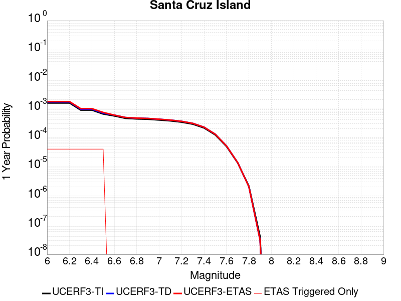 |

| Magnitude | 1 wk TI Prob | 1 wk TD Prob | 1 wk ETAS Prob | 1 wk ETAS/TD Gain | 1 wk ETAS Triggered Only | 1 mo TI Prob | 1 mo TD Prob | 1 mo ETAS Prob | 1 mo ETAS/TD Gain | 1 mo ETAS Triggered Only | 1 yr TI Prob | 1 yr TD Prob | 1 yr ETAS Prob | 1 yr ETAS/TD Gain | 1 yr ETAS Triggered Only |
|-----|-----|-----|-----|-----|-----|-----|-----|-----|-----|-----|-----|-----|-----|-----|-----|
| 6.0 | 2.9164563E-5 | 3.1608757E-5 | 3.1608757E-5 | 1.0 | 0.0 | 1.2498499E-4 | 1.3545984E-4 | 1.3545984E-4 | 1.0 | 0.0 | 0.0015206301 | 0.0016481122 | 0.0016880463 | 1.0242302 | 4.0E-5 |
| 6.1 | 2.9164563E-5 | 3.1608757E-5 | 3.1608757E-5 | 1.0 | 0.0 | 1.2498499E-4 | 1.3545984E-4 | 1.3545984E-4 | 1.0 | 0.0 | 0.0015206301 | 0.0016481122 | 0.0016880463 | 1.0242302 | 4.0E-5 |
| 6.2 | 2.9164563E-5 | 3.1608757E-5 | 3.1608757E-5 | 1.0 | 0.0 | 1.2498499E-4 | 1.3545984E-4 | 1.3545984E-4 | 1.0 | 0.0 | 0.0015206301 | 0.0016481122 | 0.0016880463 | 1.0242302 | 4.0E-5 |
| 6.3 | 1.6635553E-5 | 1.7808637E-5 | 1.7808637E-5 | 1.0 | 0.0 | 7.1293274E-5 | 7.63206E-5 | 7.63206E-5 | 1.0 | 0.0 | 8.6765E-4 | 9.288254E-4 | 9.687883E-4 | 1.0430251 | 4.0E-5 |
| 6.4 | 1.6635553E-5 | 1.7808637E-5 | 1.7808637E-5 | 1.0 | 0.0 | 7.1293274E-5 | 7.63206E-5 | 7.63206E-5 | 1.0 | 0.0 | 8.6765E-4 | 9.288254E-4 | 9.687883E-4 | 1.0430251 | 4.0E-5 |
| 6.5 | 1.2238748E-5 | 1.3045935E-5 | 1.3045935E-5 | 1.0 | 0.0 | 5.2450723E-5 | 5.590997E-5 | 5.590997E-5 | 1.0 | 0.0 | 6.3840044E-4 | 6.80495E-4 | 7.2046777E-4 | 1.0587407 | 4.0E-5 |
| 6.6 | 1.0489767E-5 | 1.11590725E-5 | 1.11590725E-5 | 1.0 | 0.0 | 4.495537E-5 | 4.782373E-5 | 4.782373E-5 | 1.0 | 0.0 | 5.4719415E-4 | 5.821006E-4 | 5.821006E-4 | 1.0 | 0.0 |
| 6.7 | 8.699222E-6 | 9.238748E-6 | 9.238748E-6 | 1.0 | 0.0 | 3.7281847E-5 | 3.9594037E-5 | 3.9594037E-5 | 1.0 | 0.0 | 4.5381195E-4 | 4.8195134E-4 | 4.8195134E-4 | 1.0 | 0.0 |
| 6.8 | 8.307732E-6 | 8.818767E-6 | 8.818767E-6 | 1.0 | 0.0 | 3.560408E-5 | 3.7794172E-5 | 3.7794172E-5 | 1.0 | 0.0 | 4.3339343E-4 | 4.600473E-4 | 4.600473E-4 | 1.0 | 0.0 |
| 6.9 | 8.073121E-6 | 8.566739E-6 | 8.566739E-6 | 1.0 | 0.0 | 3.459863E-5 | 3.6714082E-5 | 3.6714082E-5 | 1.0 | 0.0 | 4.2115687E-4 | 4.4690268E-4 | 4.4690268E-4 | 1.0 | 0.0 |
| 7.0 | 7.617019E-6 | 8.076338E-6 | 8.076338E-6 | 1.0 | 0.0 | 3.264396E-5 | 3.461242E-5 | 3.461242E-5 | 1.0 | 0.0 | 3.9736772E-4 | 4.2132512E-4 | 4.2132512E-4 | 1.0 | 0.0 |
| 7.1 | 7.1224836E-6 | 7.5473363E-6 | 7.5473363E-6 | 1.0 | 0.0 | 3.052457E-5 | 3.2345328E-5 | 3.2345328E-5 | 1.0 | 0.0 | 3.715733E-4 | 3.937336E-4 | 3.937336E-4 | 1.0 | 0.0 |
| 7.2 | 6.441115E-6 | 6.8287986E-6 | 6.8287986E-6 | 1.0 | 0.0 | 2.7604487E-5 | 2.9265953E-5 | 2.9265953E-5 | 1.0 | 0.0 | 3.360328E-4 | 3.5625495E-4 | 3.5625495E-4 | 1.0 | 0.0 |
| 7.3 | 5.494274E-6 | 5.821191E-6 | 5.821191E-6 | 1.0 | 0.0 | 2.3546674E-5 | 2.4947722E-5 | 2.4947722E-5 | 1.0 | 0.0 | 2.8664304E-4 | 3.0369638E-4 | 3.0369638E-4 | 1.0 | 0.0 |
| 7.4 | 4.0802624E-6 | 4.313113E-6 | 4.313113E-6 | 1.0 | 0.0 | 1.7486722E-5 | 1.848464E-5 | 1.848464E-5 | 1.0 | 0.0 | 2.1288003E-4 | 2.2502732E-4 | 2.2502732E-4 | 1.0 | 0.0 |
| 7.5 | 2.3584746E-6 | 2.475749E-6 | 2.475749E-6 | 1.0 | 0.0 | 1.0107709E-5 | 1.061031E-5 | 1.061031E-5 | 1.0 | 0.0 | 1.2305441E-4 | 1.2917291E-4 | 1.2917291E-4 | 1.0 | 0.0 |
| 7.6 | 9.4981914E-7 | 9.862409E-7 | 9.862409E-7 | 1.0 | 0.0 | 4.0706473E-6 | 4.2267397E-6 | 4.2267397E-6 | 1.0 | 0.0 | 4.9559E-5 | 5.1459356E-5 | 5.1459356E-5 | 1.0 | 0.0 |
| 7.7 | 2.6013532E-7 | 2.6419588E-7 | 2.6419588E-7 | 1.0 | 0.0 | 1.1148652E-6 | 1.1322676E-6 | 1.1322676E-6 | 1.0 | 0.0 | 1.3573399E-5 | 1.3785271E-5 | 1.3785271E-5 | 1.0 | 0.0 |
| 7.8 | 4.1522263E-8 | 3.9660307E-8 | 3.9660307E-8 | 1.0 | 0.0 | 1.7795254E-7 | 1.6997274E-7 | 1.6997274E-7 | 1.0 | 0.0 | 2.16657E-6 | 2.0694163E-6 | 2.0694163E-6 | 1.0 | 0.0 |
| 7.9 | 7.7242046E-10 | 5.9482086E-10 | 5.9482086E-10 | 1.0 | 0.0 | 3.3103735E-9 | 2.5492326E-9 | 2.5492326E-9 | 1.0 | 0.0 | 4.0303796E-8 | 3.1036908E-8 | 3.1036908E-8 | 1.0 | 0.0 |

## Concord 2011 CFM
*[(top)](#table-of-contents)*

| 1 Week | 1 Month | 1 Year |
|-----|-----|-----|
| 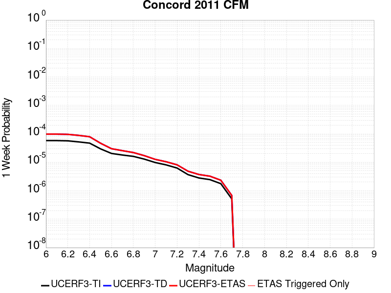 | 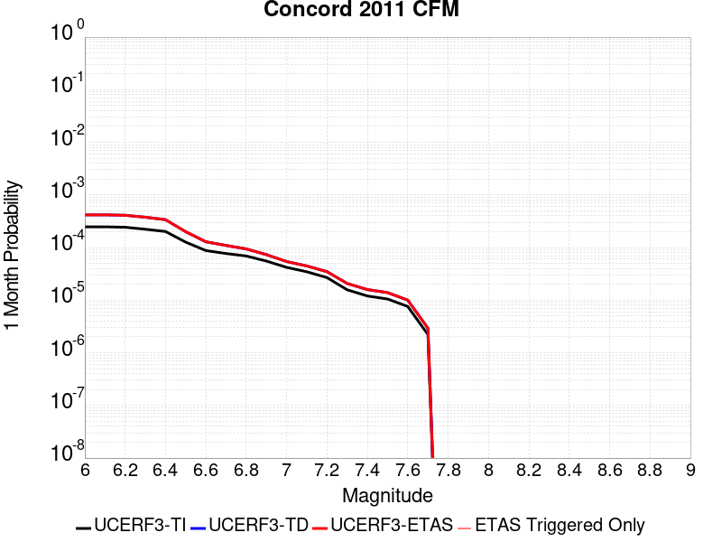 |  |

| Magnitude | 1 wk TI Prob | 1 wk TD Prob | 1 wk ETAS Prob | 1 wk ETAS/TD Gain | 1 wk ETAS Triggered Only | 1 mo TI Prob | 1 mo TD Prob | 1 mo ETAS Prob | 1 mo ETAS/TD Gain | 1 mo ETAS Triggered Only | 1 yr TI Prob | 1 yr TD Prob | 1 yr ETAS Prob | 1 yr ETAS/TD Gain | 1 yr ETAS Triggered Only |
|-----|-----|-----|-----|-----|-----|-----|-----|-----|-----|-----|-----|-----|-----|-----|-----|
| 6.0 | 5.7865112E-5 | 9.769028E-5 | 9.769028E-5 | 1.0 | 0.0 | 2.4796976E-4 | 4.1861023E-4 | 4.1861023E-4 | 1.0 | 0.0 | 0.0030148525 | 0.005085214 | 0.0051250104 | 1.007826 | 4.0E-5 |
| 6.1 | 5.7865112E-5 | 9.769028E-5 | 9.769028E-5 | 1.0 | 0.0 | 2.4796976E-4 | 4.1861023E-4 | 4.1861023E-4 | 1.0 | 0.0 | 0.0030148525 | 0.005085214 | 0.0051250104 | 1.007826 | 4.0E-5 |
| 6.2 | 5.6789337E-5 | 9.589094E-5 | 9.589094E-5 | 1.0 | 0.0 | 2.4336016E-4 | 4.1090118E-4 | 4.1090118E-4 | 1.0 | 0.0 | 0.0029588845 | 0.004991837 | 0.0050316374 | 1.0079731 | 4.0E-5 |
| 6.3 | 5.203322E-5 | 8.8125766E-5 | 8.8125766E-5 | 1.0 | 0.0 | 2.2298045E-4 | 3.776316E-4 | 3.776316E-4 | 1.0 | 0.0 | 0.0027114071 | 0.0045887567 | 0.004628573 | 1.008677 | 4.0E-5 |
| 6.4 | 4.7120942E-5 | 7.903713E-5 | 7.903713E-5 | 1.0 | 0.0 | 2.0193127E-4 | 3.3869076E-4 | 3.3869076E-4 | 1.0 | 0.0 | 0.0024557412 | 0.0041165086 | 0.004156344 | 1.0096769 | 4.0E-5 |
| 6.5 | 2.9598437E-5 | 4.673046E-5 | 4.673046E-5 | 1.0 | 0.0 | 1.2684427E-4 | 2.0025922E-4 | 2.0025922E-4 | 1.0 | 0.0 | 0.001543235 | 0.0024356402 | 0.0024356402 | 1.0 | 0.0 |
| 6.6 | 2.0443718E-5 | 3.0032927E-5 | 3.0032927E-5 | 1.0 | 0.0 | 8.7613E-5 | 1.287064E-4 | 1.287064E-4 | 1.0 | 0.0 | 0.0010661662 | 0.0015659104 | 0.0015659104 | 1.0 | 0.0 |
| 6.7 | 1.798539E-5 | 2.5605239E-5 | 2.5605239E-5 | 1.0 | 0.0 | 7.7077966E-5 | 1.09732246E-4 | 1.09732246E-4 | 1.0 | 0.0 | 9.380202E-4 | 0.0013351929 | 0.0013351929 | 1.0 | 0.0 |
| 6.8 | 1.613555E-5 | 2.1985506E-5 | 2.1985506E-5 | 1.0 | 0.0 | 6.915052E-5 | 9.4220275E-5 | 9.4220275E-5 | 1.0 | 0.0 | 8.4158237E-4 | 0.0011465421 | 0.0011465421 | 1.0 | 0.0 |
| 6.9 | 1.2916435E-5 | 1.7105944E-5 | 1.7105944E-5 | 1.0 | 0.0 | 5.5354973E-5 | 7.330916E-5 | 7.330916E-5 | 1.0 | 0.0 | 6.7373837E-4 | 8.921794E-4 | 8.921794E-4 | 1.0 | 0.0 |
| 7.0 | 9.81129E-6 | 1.2651128E-5 | 1.2651128E-5 | 1.0 | 0.0 | 4.2047708E-5 | 5.4218E-5 | 5.4218E-5 | 1.0 | 0.0 | 5.118106E-4 | 6.599059E-4 | 6.599059E-4 | 1.0 | 0.0 |
| 7.1 | 8.0889195E-6 | 1.0432988E-5 | 1.0432988E-5 | 1.0 | 0.0 | 3.4666336E-5 | 4.4712047E-5 | 4.4712047E-5 | 1.0 | 0.0 | 4.219809E-4 | 5.4423424E-4 | 5.4423424E-4 | 1.0 | 0.0 |
| 7.2 | 6.267438E-6 | 8.129014E-6 | 8.129014E-6 | 1.0 | 0.0 | 2.6860173E-5 | 3.483817E-5 | 3.483817E-5 | 1.0 | 0.0 | 3.2697353E-4 | 4.240729E-4 | 4.240729E-4 | 1.0 | 0.0 |
| 7.3 | 3.6761196E-6 | 4.8453344E-6 | 4.8453344E-6 | 1.0 | 0.0 | 1.5754704E-5 | 2.0765554E-5 | 2.0765554E-5 | 1.0 | 0.0 | 1.9179663E-4 | 2.527915E-4 | 2.527915E-4 | 1.0 | 0.0 |
| 7.4 | 2.8044356E-6 | 3.7144744E-6 | 3.7144744E-6 | 1.0 | 0.0 | 1.2018954E-5 | 1.5919079E-5 | 1.5919079E-5 | 1.0 | 0.0 | 1.4632095E-4 | 1.9379768E-4 | 1.9379768E-4 | 1.0 | 0.0 |
| 7.5 | 2.4578699E-6 | 3.2490918E-6 | 3.2490918E-6 | 1.0 | 0.0 | 1.0533685E-5 | 1.3924606E-5 | 1.3924606E-5 | 1.0 | 0.0 | 1.2824008E-4 | 1.69519E-4 | 1.69519E-4 | 1.0 | 0.0 |
| 7.6 | 1.7713267E-6 | 2.339157E-6 | 2.339157E-6 | 1.0 | 0.0 | 7.591378E-6 | 1.0024921E-5 | 1.0024921E-5 | 1.0 | 0.0 | 9.2421105E-5 | 1.2204666E-4 | 1.2204666E-4 | 1.0 | 0.0 |
| 7.7 | 5.1912366E-7 | 6.8335413E-7 | 6.8335413E-7 | 1.0 | 0.0 | 2.2248137E-6 | 2.9286573E-6 | 2.9286573E-6 | 1.0 | 0.0 | 2.708677E-5 | 3.5655834E-5 | 3.5655834E-5 | 1.0 | 0.0 |

## San Pedro Escarpment
*[(top)](#table-of-contents)*

| 1 Week | 1 Month | 1 Year |
|-----|-----|-----|
|  | 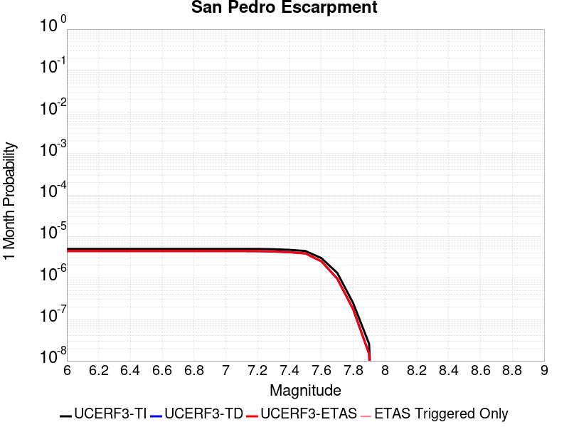 | 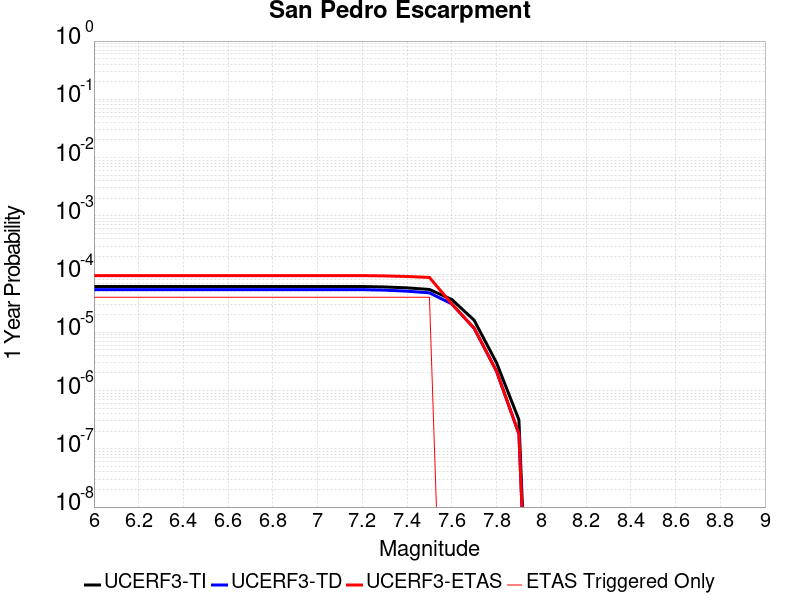 |

| Magnitude | 1 wk TI Prob | 1 wk TD Prob | 1 wk ETAS Prob | 1 wk ETAS/TD Gain | 1 wk ETAS Triggered Only | 1 mo TI Prob | 1 mo TD Prob | 1 mo ETAS Prob | 1 mo ETAS/TD Gain | 1 mo ETAS Triggered Only | 1 yr TI Prob | 1 yr TD Prob | 1 yr ETAS Prob | 1 yr ETAS/TD Gain | 1 yr ETAS Triggered Only |
|-----|-----|-----|-----|-----|-----|-----|-----|-----|-----|-----|-----|-----|-----|-----|-----|
| 6.0 | 1.1740281E-6 | 1.0381387E-6 | 1.0381387E-6 | 1.0 | 0.0 | 5.031539E-6 | 4.449159E-6 | 4.449159E-6 | 1.0 | 0.0 | 6.125726E-5 | 5.4167227E-5 | 9.416506E-5 | 1.7384139 | 4.0E-5 |
| 6.1 | 1.1740281E-6 | 1.0381387E-6 | 1.0381387E-6 | 1.0 | 0.0 | 5.031539E-6 | 4.449159E-6 | 4.449159E-6 | 1.0 | 0.0 | 6.125726E-5 | 5.4167227E-5 | 9.416506E-5 | 1.7384139 | 4.0E-5 |
| 6.2 | 1.1740281E-6 | 1.0381387E-6 | 1.0381387E-6 | 1.0 | 0.0 | 5.031539E-6 | 4.449159E-6 | 4.449159E-6 | 1.0 | 0.0 | 6.125726E-5 | 5.4167227E-5 | 9.416506E-5 | 1.7384139 | 4.0E-5 |
| 6.3 | 1.1740281E-6 | 1.0381387E-6 | 1.0381387E-6 | 1.0 | 0.0 | 5.031539E-6 | 4.449159E-6 | 4.449159E-6 | 1.0 | 0.0 | 6.125726E-5 | 5.4167227E-5 | 9.416506E-5 | 1.7384139 | 4.0E-5 |
| 6.4 | 1.1740281E-6 | 1.0381387E-6 | 1.0381387E-6 | 1.0 | 0.0 | 5.031539E-6 | 4.449159E-6 | 4.449159E-6 | 1.0 | 0.0 | 6.125726E-5 | 5.4167227E-5 | 9.416506E-5 | 1.7384139 | 4.0E-5 |
| 6.5 | 1.1740281E-6 | 1.0381387E-6 | 1.0381387E-6 | 1.0 | 0.0 | 5.031539E-6 | 4.449159E-6 | 4.449159E-6 | 1.0 | 0.0 | 6.125726E-5 | 5.4167227E-5 | 9.416506E-5 | 1.7384139 | 4.0E-5 |
| 6.6 | 1.1740281E-6 | 1.0381387E-6 | 1.0381387E-6 | 1.0 | 0.0 | 5.031539E-6 | 4.449159E-6 | 4.449159E-6 | 1.0 | 0.0 | 6.125726E-5 | 5.4167227E-5 | 9.416506E-5 | 1.7384139 | 4.0E-5 |
| 6.7 | 1.1740281E-6 | 1.0381387E-6 | 1.0381387E-6 | 1.0 | 0.0 | 5.031539E-6 | 4.449159E-6 | 4.449159E-6 | 1.0 | 0.0 | 6.125726E-5 | 5.4167227E-5 | 9.416506E-5 | 1.7384139 | 4.0E-5 |
| 6.8 | 1.1740281E-6 | 1.0381387E-6 | 1.0381387E-6 | 1.0 | 0.0 | 5.031539E-6 | 4.449159E-6 | 4.449159E-6 | 1.0 | 0.0 | 6.125726E-5 | 5.4167227E-5 | 9.416506E-5 | 1.7384139 | 4.0E-5 |
| 6.9 | 1.1740281E-6 | 1.0381387E-6 | 1.0381387E-6 | 1.0 | 0.0 | 5.031539E-6 | 4.449159E-6 | 4.449159E-6 | 1.0 | 0.0 | 6.125726E-5 | 5.4167227E-5 | 9.416506E-5 | 1.7384139 | 4.0E-5 |
| 7.0 | 1.1740281E-6 | 1.0381387E-6 | 1.0381387E-6 | 1.0 | 0.0 | 5.031539E-6 | 4.449159E-6 | 4.449159E-6 | 1.0 | 0.0 | 6.125726E-5 | 5.4167227E-5 | 9.416506E-5 | 1.7384139 | 4.0E-5 |
| 7.1 | 1.1740281E-6 | 1.0381387E-6 | 1.0381387E-6 | 1.0 | 0.0 | 5.031539E-6 | 4.449159E-6 | 4.449159E-6 | 1.0 | 0.0 | 6.125726E-5 | 5.4167227E-5 | 9.416506E-5 | 1.7384139 | 4.0E-5 |
| 7.2 | 1.1722314E-6 | 1.0363259E-6 | 1.0363259E-6 | 1.0 | 0.0 | 5.023839E-6 | 4.4413896E-6 | 4.4413896E-6 | 1.0 | 0.0 | 6.116352E-5 | 5.4072643E-5 | 9.407048E-5 | 1.7397056 | 4.0E-5 |
| 7.3 | 1.1515234E-6 | 1.0153992E-6 | 1.0153992E-6 | 1.0 | 0.0 | 4.935091E-6 | 4.3517043E-6 | 4.3517043E-6 | 1.0 | 0.0 | 6.008308E-5 | 5.2980777E-5 | 9.2978655E-5 | 1.7549509 | 4.0E-5 |
| 7.4 | 1.1103637E-6 | 9.737568E-7 | 9.737568E-7 | 1.0 | 0.0 | 4.7586927E-6 | 4.173237E-6 | 4.173237E-6 | 1.0 | 0.0 | 5.793554E-5 | 5.080804E-5 | 9.080601E-5 | 1.7872369 | 4.0E-5 |
| 7.5 | 1.0425391E-6 | 9.11996E-7 | 9.11996E-7 | 1.0 | 0.0 | 4.4680173E-6 | 3.908549E-6 | 3.908549E-6 | 1.0 | 0.0 | 5.439675E-5 | 4.7585607E-5 | 8.75837E-5 | 1.8405503 | 4.0E-5 |
| 7.6 | 7.0184194E-7 | 5.887313E-7 | 5.887313E-7 | 1.0 | 0.0 | 3.0078907E-6 | 2.5231323E-6 | 2.5231323E-6 | 1.0 | 0.0 | 3.6620455E-5 | 3.071875E-5 | 3.071875E-5 | 1.0 | 0.0 |
| 7.7 | 3.0871365E-7 | 2.2460729E-7 | 2.2460729E-7 | 1.0 | 0.0 | 1.3230577E-6 | 9.626024E-7 | 9.626024E-7 | 1.0 | 0.0 | 1.610811E-5 | 1.1719621E-5 | 1.1719621E-5 | 1.0 | 0.0 |
| 7.8 | 5.7512665E-8 | 4.106429E-8 | 4.106429E-8 | 1.0 | 0.0 | 2.464828E-7 | 1.7598981E-7 | 1.7598981E-7 | 1.0 | 0.0 | 3.0009242E-6 | 2.142674E-6 | 2.142674E-6 | 1.0 | 0.0 |
| 7.9 | 6.040053E-9 | 3.4559777E-9 | 3.4559777E-9 | 1.0 | 0.0 | 2.5885942E-8 | 1.4811333E-8 | 1.4811333E-8 | 1.0 | 0.0 | 3.151613E-7 | 1.8032796E-7 | 1.8032796E-7 | 1.0 | 0.0 |

## Elsinore (Stepovers Combined)
*[(top)](#table-of-contents)*

| 1 Week | 1 Month | 1 Year |
|-----|-----|-----|
| 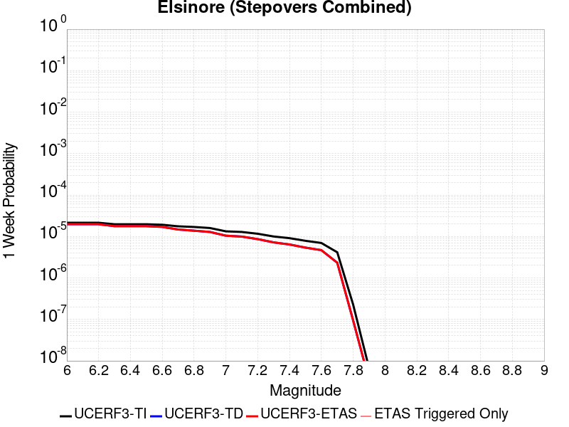 | 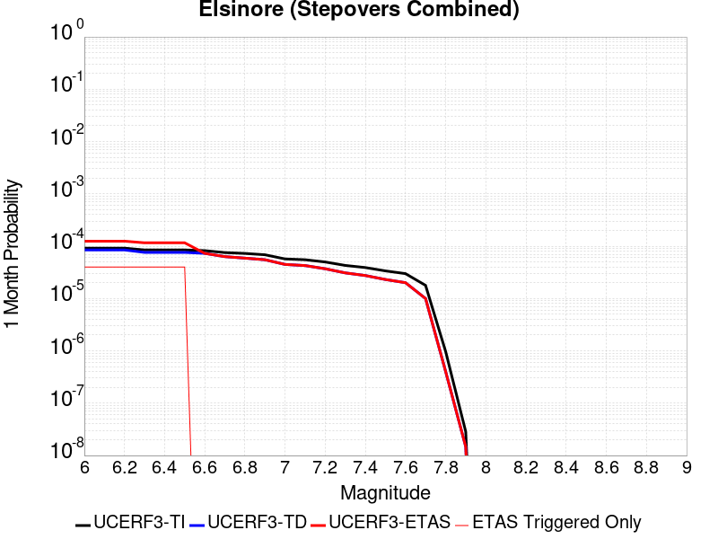 |  |

| Magnitude | 1 wk TI Prob | 1 wk TD Prob | 1 wk ETAS Prob | 1 wk ETAS/TD Gain | 1 wk ETAS Triggered Only | 1 mo TI Prob | 1 mo TD Prob | 1 mo ETAS Prob | 1 mo ETAS/TD Gain | 1 mo ETAS Triggered Only | 1 yr TI Prob | 1 yr TD Prob | 1 yr ETAS Prob | 1 yr ETAS/TD Gain | 1 yr ETAS Triggered Only |
|-----|-----|-----|-----|-----|-----|-----|-----|-----|-----|-----|-----|-----|-----|-----|-----|
| 6.0 | 2.144392E-5 | 1.9780842E-5 | 1.9780842E-5 | 1.0 | 0.0 | 9.189928E-5 | 8.477241E-5 | 1.2476901E-4 | 1.4718117 | 4.0E-5 | 0.0011182994 | 0.0010316346 | 0.0010715934 | 1.0387334 | 4.0E-5 |
| 6.1 | 2.144392E-5 | 1.9780842E-5 | 1.9780842E-5 | 1.0 | 0.0 | 9.189928E-5 | 8.477241E-5 | 1.2476901E-4 | 1.4718117 | 4.0E-5 | 0.0011182994 | 0.0010316346 | 0.0010715934 | 1.0387334 | 4.0E-5 |
| 6.2 | 2.144392E-5 | 1.9780842E-5 | 1.9780842E-5 | 1.0 | 0.0 | 9.189928E-5 | 8.477241E-5 | 1.2476901E-4 | 1.4718117 | 4.0E-5 | 0.0011182994 | 0.0010316346 | 0.0010715934 | 1.0387334 | 4.0E-5 |
| 6.3 | 1.9751555E-5 | 1.7760778E-5 | 1.7760778E-5 | 1.0 | 0.0 | 8.4646774E-5 | 7.6115495E-5 | 1.1611245E-4 | 1.5254772 | 4.0E-5 | 0.0010300872 | 9.263265E-4 | 9.6628943E-4 | 1.0431414 | 4.0E-5 |
| 6.4 | 1.9751555E-5 | 1.7760778E-5 | 1.7760778E-5 | 1.0 | 0.0 | 8.4646774E-5 | 7.6115495E-5 | 1.1611245E-4 | 1.5254772 | 4.0E-5 | 0.0010300872 | 9.263265E-4 | 9.6628943E-4 | 1.0431414 | 4.0E-5 |
| 6.5 | 1.9751555E-5 | 1.7760778E-5 | 1.7760778E-5 | 1.0 | 0.0 | 8.4646774E-5 | 7.6115495E-5 | 1.1611245E-4 | 1.5254772 | 4.0E-5 | 0.0010300872 | 9.263265E-4 | 9.6628943E-4 | 1.0431414 | 4.0E-5 |
| 6.6 | 1.9188685E-5 | 1.702196E-5 | 1.702196E-5 | 1.0 | 0.0 | 8.2234634E-5 | 7.2949304E-5 | 7.2949304E-5 | 1.0 | 0.0 | 0.0010007467 | 8.878121E-4 | 8.878121E-4 | 1.0 | 0.0 |
| 6.7 | 1.7608272E-5 | 1.4748722E-5 | 1.4748722E-5 | 1.0 | 0.0 | 7.546184E-5 | 6.3207335E-5 | 6.3207335E-5 | 1.0 | 0.0 | 9.183606E-4 | 7.6928735E-4 | 7.6928735E-4 | 1.0 | 0.0 |
| 6.8 | 1.697165E-5 | 1.3798299E-5 | 1.3798299E-5 | 1.0 | 0.0 | 7.273361E-5 | 5.9134276E-5 | 5.9134276E-5 | 1.0 | 0.0 | 8.8517193E-4 | 7.197307E-4 | 7.197307E-4 | 1.0 | 0.0 |
| 6.9 | 1.600365E-5 | 1.2861078E-5 | 1.2861078E-5 | 1.0 | 0.0 | 6.858527E-5 | 5.5117787E-5 | 5.5117787E-5 | 1.0 | 0.0 | 8.347058E-4 | 6.7086023E-4 | 6.7086023E-4 | 1.0 | 0.0 |
| 7.0 | 1.3314581E-5 | 1.0460029E-5 | 1.0460029E-5 | 1.0 | 0.0 | 5.7061243E-5 | 4.4827942E-5 | 4.4827942E-5 | 1.0 | 0.0 | 6.944992E-4 | 5.456462E-4 | 5.456462E-4 | 1.0 | 0.0 |
| 7.1 | 1.2865345E-5 | 9.949274E-6 | 9.949274E-6 | 1.0 | 0.0 | 5.5136024E-5 | 4.263906E-5 | 4.263906E-5 | 1.0 | 0.0 | 6.710743E-4 | 5.190095E-4 | 5.190095E-4 | 1.0 | 0.0 |
| 7.2 | 1.1650051E-5 | 8.643983E-6 | 8.643983E-6 | 1.0 | 0.0 | 4.9927836E-5 | 3.7045123E-5 | 3.7045123E-5 | 1.0 | 0.0 | 6.0770183E-4 | 4.5093283E-4 | 4.5093283E-4 | 1.0 | 0.0 |
| 7.3 | 1.0008533E-5 | 7.209463E-6 | 7.209463E-6 | 1.0 | 0.0 | 4.2893007E-5 | 3.089734E-5 | 3.089734E-5 | 1.0 | 0.0 | 5.220972E-4 | 3.7611165E-4 | 3.7611165E-4 | 1.0 | 0.0 |
| 7.4 | 9.116759E-6 | 6.4174783E-6 | 6.4174783E-6 | 1.0 | 0.0 | 3.907124E-5 | 2.7503196E-5 | 2.7503196E-5 | 1.0 | 0.0 | 4.7558855E-4 | 3.3480133E-4 | 3.3480133E-4 | 1.0 | 0.0 |
| 7.5 | 7.870524E-6 | 5.388742E-6 | 5.388742E-6 | 1.0 | 0.0 | 3.3730383E-5 | 2.309441E-5 | 2.309441E-5 | 1.0 | 0.0 | 4.1059E-4 | 2.8113945E-4 | 2.8113945E-4 | 1.0 | 0.0 |
| 7.6 | 6.9774537E-6 | 4.683142E-6 | 4.683142E-6 | 1.0 | 0.0 | 2.990303E-5 | 2.0070462E-5 | 2.0070462E-5 | 1.0 | 0.0 | 3.640086E-4 | 2.4433163E-4 | 2.4433163E-4 | 1.0 | 0.0 |
| 7.7 | 4.1616954E-6 | 2.3312286E-6 | 2.3312286E-6 | 1.0 | 0.0 | 1.7835715E-5 | 9.990946E-6 | 9.990946E-6 | 1.0 | 0.0 | 2.171282E-4 | 1.21633726E-4 | 1.21633726E-4 | 1.0 | 0.0 |
| 7.8 | 2.2692414E-7 | 9.397192E-8 | 9.397192E-8 | 1.0 | 0.0 | 9.725317E-7 | 4.0273673E-7 | 4.0273673E-7 | 1.0 | 0.0 | 1.1840509E-5 | 4.903312E-6 | 4.903312E-6 | 1.0 | 0.0 |
| 7.9 | 6.676829E-9 | 3.4429164E-9 | 3.4429164E-9 | 1.0 | 0.0 | 2.861498E-8 | 1.4755356E-8 | 1.4755356E-8 | 1.0 | 0.0 | 3.4838732E-7 | 1.7964643E-7 | 1.7964643E-7 | 1.0 | 0.0 |

## Great Valley 09 (Laguna Seca)
*[(top)](#table-of-contents)*

| 1 Week | 1 Month | 1 Year |
|-----|-----|-----|
| 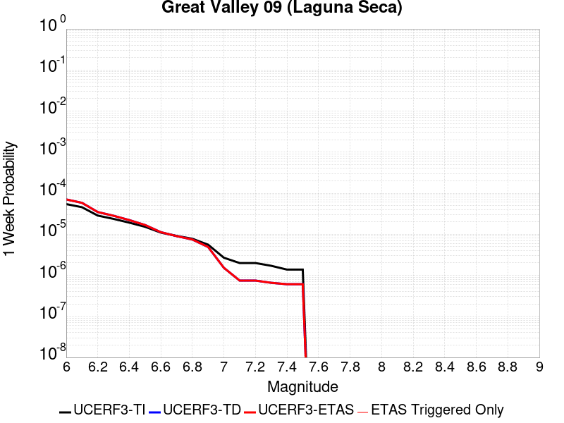 |  |  |

| Magnitude | 1 wk TI Prob | 1 wk TD Prob | 1 wk ETAS Prob | 1 wk ETAS/TD Gain | 1 wk ETAS Triggered Only | 1 mo TI Prob | 1 mo TD Prob | 1 mo ETAS Prob | 1 mo ETAS/TD Gain | 1 mo ETAS Triggered Only | 1 yr TI Prob | 1 yr TD Prob | 1 yr ETAS Prob | 1 yr ETAS/TD Gain | 1 yr ETAS Triggered Only |
|-----|-----|-----|-----|-----|-----|-----|-----|-----|-----|-----|-----|-----|-----|-----|-----|
| 6.0 | 5.4353277E-5 | 7.057439E-5 | 7.057439E-5 | 1.0 | 0.0 | 2.3292181E-4 | 3.0242838E-4 | 3.0242838E-4 | 1.0 | 0.0 | 0.0028321352 | 0.0036758543 | 0.0037157072 | 1.0108418 | 4.0E-5 |
| 6.1 | 4.5578287E-5 | 5.8279787E-5 | 5.8279787E-5 | 1.0 | 0.0 | 1.953209E-4 | 2.497478E-4 | 2.497478E-4 | 1.0 | 0.0 | 0.0023754383 | 0.0030364343 | 0.0030763128 | 1.0131333 | 4.0E-5 |
| 6.2 | 2.8536782E-5 | 3.476812E-5 | 3.476812E-5 | 1.0 | 0.0 | 1.2229476E-4 | 1.4899804E-4 | 1.4899804E-4 | 1.0 | 0.0 | 0.0014879217 | 0.001812514 | 0.001812514 | 1.0 | 0.0 |
| 6.3 | 2.3698774E-5 | 2.823789E-5 | 2.823789E-5 | 1.0 | 0.0 | 1.01562226E-4 | 1.2101409E-4 | 1.2101409E-4 | 1.0 | 0.0 | 0.0012358186 | 0.0014723341 | 0.0014723341 | 1.0 | 0.0 |
| 6.4 | 1.9191197E-5 | 2.2140706E-5 | 2.2140706E-5 | 1.0 | 0.0 | 8.2245395E-5 | 9.4885436E-5 | 9.4885436E-5 | 1.0 | 0.0 | 0.0010008777 | 0.001154622 | 0.001154622 | 1.0 | 0.0 |
| 6.5 | 1.5203241E-5 | 1.6813425E-5 | 1.6813425E-5 | 1.0 | 0.0 | 6.5155116E-5 | 7.205573E-5 | 7.205573E-5 | 1.0 | 0.0 | 7.9297484E-4 | 8.769359E-4 | 8.769359E-4 | 1.0 | 0.0 |
| 6.6 | 1.0984925E-5 | 1.124901E-5 | 1.124901E-5 | 1.0 | 0.0 | 4.70774E-5 | 4.820917E-5 | 4.820917E-5 | 1.0 | 0.0 | 5.730166E-4 | 5.867925E-4 | 5.867925E-4 | 1.0 | 0.0 |
| 6.7 | 9.134616E-6 | 9.024803E-6 | 9.024803E-6 | 1.0 | 0.0 | 3.9147766E-5 | 3.8677168E-5 | 3.8677168E-5 | 1.0 | 0.0 | 4.7651984E-4 | 4.7079517E-4 | 4.7079517E-4 | 1.0 | 0.0 |
| 6.8 | 7.785589E-6 | 7.45599E-6 | 7.45599E-6 | 1.0 | 0.0 | 3.3366385E-5 | 3.1953863E-5 | 3.1953863E-5 | 1.0 | 0.0 | 4.0616E-4 | 3.8897083E-4 | 3.8897083E-4 | 1.0 | 0.0 |
| 6.9 | 5.579095E-6 | 4.901176E-6 | 4.901176E-6 | 1.0 | 0.0 | 2.3910188E-5 | 2.1004878E-5 | 2.1004878E-5 | 1.0 | 0.0 | 2.9106764E-4 | 2.5570576E-4 | 2.5570576E-4 | 1.0 | 0.0 |
| 7.0 | 2.6816688E-6 | 1.5223985E-6 | 1.5223985E-6 | 1.0 | 0.0 | 1.1492816E-5 | 6.524549E-6 | 6.524549E-6 | 1.0 | 0.0 | 1.3991605E-4 | 7.943358E-5 | 7.943358E-5 | 1.0 | 0.0 |
| 7.1 | 1.9951021E-6 | 7.458246E-7 | 7.458246E-7 | 1.0 | 0.0 | 8.55041E-6 | 3.1963873E-6 | 3.1963873E-6 | 1.0 | 0.0 | 1.0409627E-4 | 3.8915365E-5 | 3.8915365E-5 | 1.0 | 0.0 |
| 7.2 | 1.9951021E-6 | 7.458246E-7 | 7.458246E-7 | 1.0 | 0.0 | 8.55041E-6 | 3.1963873E-6 | 3.1963873E-6 | 1.0 | 0.0 | 1.0409627E-4 | 3.8915365E-5 | 3.8915365E-5 | 1.0 | 0.0 |
| 7.3 | 1.7087556E-6 | 6.5821285E-7 | 6.5821285E-7 | 1.0 | 0.0 | 7.3232177E-6 | 2.8209092E-6 | 2.8209092E-6 | 1.0 | 0.0 | 8.915652E-5 | 3.434407E-5 | 3.434407E-5 | 1.0 | 0.0 |
| 7.4 | 1.3804846E-6 | 6.076279E-7 | 6.076279E-7 | 1.0 | 0.0 | 5.916349E-6 | 2.604117E-6 | 2.604117E-6 | 1.0 | 0.0 | 7.2029165E-5 | 3.1704705E-5 | 3.1704705E-5 | 1.0 | 0.0 |
| 7.5 | 1.3804846E-6 | 6.076279E-7 | 6.076279E-7 | 1.0 | 0.0 | 5.916349E-6 | 2.604117E-6 | 2.604117E-6 | 1.0 | 0.0 | 7.2029165E-5 | 3.1704705E-5 | 3.1704705E-5 | 1.0 | 0.0 |

## Reliz 2011 CFM
*[(top)](#table-of-contents)*

| 1 Week | 1 Month | 1 Year |
|-----|-----|-----|
|  | 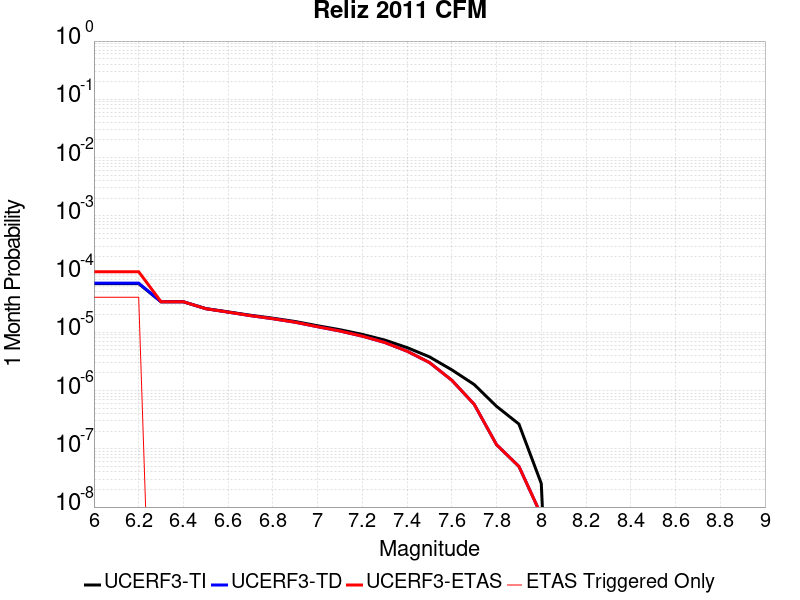 |  |

| Magnitude | 1 wk TI Prob | 1 wk TD Prob | 1 wk ETAS Prob | 1 wk ETAS/TD Gain | 1 wk ETAS Triggered Only | 1 mo TI Prob | 1 mo TD Prob | 1 mo ETAS Prob | 1 mo ETAS/TD Gain | 1 mo ETAS Triggered Only | 1 yr TI Prob | 1 yr TD Prob | 1 yr ETAS Prob | 1 yr ETAS/TD Gain | 1 yr ETAS Triggered Only |
|-----|-----|-----|-----|-----|-----|-----|-----|-----|-----|-----|-----|-----|-----|-----|-----|
| 6.0 | 1.6002472E-5 | 1.6285272E-5 | 5.628462E-5 | 3.456167 | 4.0E-5 | 6.8580215E-5 | 6.979227E-5 | 1.0978948E-4 | 1.5730894 | 4.0E-5 | 8.3464425E-4 | 8.4940944E-4 | 8.8937546E-4 | 1.0470515 | 4.0E-5 |
| 6.1 | 1.6002472E-5 | 1.6285272E-5 | 5.628462E-5 | 3.456167 | 4.0E-5 | 6.8580215E-5 | 6.979227E-5 | 1.0978948E-4 | 1.5730894 | 4.0E-5 | 8.3464425E-4 | 8.4940944E-4 | 8.8937546E-4 | 1.0470515 | 4.0E-5 |
| 6.2 | 1.6002472E-5 | 1.6285272E-5 | 5.628462E-5 | 3.456167 | 4.0E-5 | 6.8580215E-5 | 6.979227E-5 | 1.0978948E-4 | 1.5730894 | 4.0E-5 | 8.3464425E-4 | 8.4940944E-4 | 8.8937546E-4 | 1.0470515 | 4.0E-5 |
| 6.3 | 7.792404E-6 | 7.805327E-6 | 7.805327E-6 | 1.0 | 0.0 | 3.339559E-5 | 3.345098E-5 | 3.345098E-5 | 1.0 | 0.0 | 4.0651546E-4 | 4.0719032E-4 | 4.0719032E-4 | 1.0 | 0.0 |
| 6.4 | 7.792404E-6 | 7.805327E-6 | 7.805327E-6 | 1.0 | 0.0 | 3.339559E-5 | 3.345098E-5 | 3.345098E-5 | 1.0 | 0.0 | 4.0651546E-4 | 4.0719032E-4 | 4.0719032E-4 | 1.0 | 0.0 |
| 6.5 | 5.9659374E-6 | 5.930094E-6 | 5.930094E-6 | 1.0 | 0.0 | 2.5568053E-5 | 2.5414443E-5 | 2.5414443E-5 | 1.0 | 0.0 | 3.1124658E-4 | 3.0937712E-4 | 3.0937712E-4 | 1.0 | 0.0 |
| 6.6 | 5.2350692E-6 | 5.1802763E-6 | 5.1802763E-6 | 1.0 | 0.0 | 2.2435817E-5 | 2.2200995E-5 | 2.2200995E-5 | 1.0 | 0.0 | 2.7312184E-4 | 2.7026373E-4 | 2.7026373E-4 | 1.0 | 0.0 |
| 6.7 | 4.580206E-6 | 4.507348E-6 | 4.507348E-6 | 1.0 | 0.0 | 1.9629308E-5 | 1.9317062E-5 | 1.9317062E-5 | 1.0 | 0.0 | 2.389606E-4 | 2.3515993E-4 | 2.3515993E-4 | 1.0 | 0.0 |
| 6.8 | 4.0765017E-6 | 3.989416E-6 | 3.989416E-6 | 1.0 | 0.0 | 1.7470604E-5 | 1.7097385E-5 | 1.7097385E-5 | 1.0 | 0.0 | 2.1268385E-4 | 2.0814082E-4 | 2.0814082E-4 | 1.0 | 0.0 |
| 6.9 | 3.5752896E-6 | 3.4736445E-6 | 3.4736445E-6 | 1.0 | 0.0 | 1.532258E-5 | 1.4886963E-5 | 1.4886963E-5 | 1.0 | 0.0 | 1.8653645E-4 | 1.8123373E-4 | 1.8123373E-4 | 1.0 | 0.0 |
| 7.0 | 3.0259848E-6 | 2.9090154E-6 | 2.9090154E-6 | 1.0 | 0.0 | 1.2968442E-5 | 1.2467149E-5 | 1.2467149E-5 | 1.0 | 0.0 | 1.5787935E-4 | 1.5177699E-4 | 1.5177699E-4 | 1.0 | 0.0 |
| 7.1 | 2.5861116E-6 | 2.4561955E-6 | 2.4561955E-6 | 1.0 | 0.0 | 1.1083288E-5 | 1.052651E-5 | 1.052651E-5 | 1.0 | 0.0 | 1.3493067E-4 | 1.2815272E-4 | 1.2815272E-4 | 1.0 | 0.0 |
| 7.2 | 2.1482588E-6 | 2.0042157E-6 | 2.0042157E-6 | 1.0 | 0.0 | 9.20679E-6 | 8.589467E-6 | 8.589467E-6 | 1.0 | 0.0 | 1.12086906E-4 | 1.0457176E-4 | 1.0457176E-4 | 1.0 | 0.0 |
| 7.3 | 1.7194744E-6 | 1.5620558E-6 | 1.5620558E-6 | 1.0 | 0.0 | 7.3691554E-6 | 6.6945076E-6 | 6.6945076E-6 | 1.0 | 0.0 | 8.971577E-5 | 8.1502585E-5 | 8.1502585E-5 | 1.0 | 0.0 |
| 7.4 | 1.2755178E-6 | 1.1065134E-6 | 1.1065134E-6 | 1.0 | 0.0 | 5.4664933E-6 | 4.742192E-6 | 4.742192E-6 | 1.0 | 0.0 | 6.655252E-5 | 5.7734655E-5 | 5.7734655E-5 | 1.0 | 0.0 |
| 7.5 | 8.8463224E-7 | 7.066436E-7 | 7.066436E-7 | 1.0 | 0.0 | 3.7912755E-6 | 3.0284689E-6 | 3.0284689E-6 | 1.0 | 0.0 | 4.6157802E-5 | 3.6870988E-5 | 3.6870988E-5 | 1.0 | 0.0 |
| 7.6 | 5.291355E-7 | 3.5082746E-7 | 3.5082746E-7 | 1.0 | 0.0 | 2.2677216E-6 | 1.5035454E-6 | 1.5035454E-6 | 1.0 | 0.0 | 2.760916E-5 | 1.830551E-5 | 1.830551E-5 | 1.0 | 0.0 |
| 7.7 | 2.9663357E-7 | 1.356328E-7 | 1.356328E-7 | 1.0 | 0.0 | 1.2712861E-6 | 5.812833E-7 | 5.812833E-7 | 1.0 | 0.0 | 1.5477797E-5 | 7.077101E-6 | 7.077101E-6 | 1.0 | 0.0 |
| 7.8 | 1.2509386E-7 | 2.744508E-8 | 2.744508E-8 | 1.0 | 0.0 | 5.3611643E-7 | 1.1762178E-7 | 1.1762178E-7 | 1.0 | 0.0 | 6.527198E-6 | 1.4320442E-6 | 1.4320442E-6 | 1.0 | 0.0 |
| 7.9 | 6.213493E-8 | 1.16370495E-8 | 1.16370495E-8 | 1.0 | 0.0 | 2.6629255E-7 | 4.9873073E-8 | 4.9873073E-8 | 1.0 | 0.0 | 3.242107E-6 | 6.072045E-7 | 6.072045E-7 | 1.0 | 0.0 |
| 8.0 | 5.92383E-9 | 1.6953359E-9 | 1.6953359E-9 | 1.0 | 0.0 | 2.5387841E-8 | 7.2657254E-9 | 7.2657254E-9 | 1.0 | 0.0 | 3.0909692E-7 | 8.8460204E-8 | 8.8460204E-8 | 1.0 | 0.0 |

## Sheephole
*[(top)](#table-of-contents)*

| 1 Week | 1 Month | 1 Year |
|-----|-----|-----|
|  |  |  |

| Magnitude | 1 wk TI Prob | 1 wk TD Prob | 1 wk ETAS Prob | 1 wk ETAS/TD Gain | 1 wk ETAS Triggered Only | 1 mo TI Prob | 1 mo TD Prob | 1 mo ETAS Prob | 1 mo ETAS/TD Gain | 1 mo ETAS Triggered Only | 1 yr TI Prob | 1 yr TD Prob | 1 yr ETAS Prob | 1 yr ETAS/TD Gain | 1 yr ETAS Triggered Only |
|-----|-----|-----|-----|-----|-----|-----|-----|-----|-----|-----|-----|-----|-----|-----|-----|
| 6.0 | 4.5579695E-6 | 4.74191E-6 | 4.74191E-6 | 1.0 | 0.0 | 1.9534009E-5 | 2.0322344E-5 | 2.0322344E-5 | 1.0 | 0.0 | 2.3780059E-4 | 2.47402E-4 | 2.873921E-4 | 1.1616402 | 4.0E-5 |
| 6.1 | 4.5579695E-6 | 4.74191E-6 | 4.74191E-6 | 1.0 | 0.0 | 1.9534009E-5 | 2.0322344E-5 | 2.0322344E-5 | 1.0 | 0.0 | 2.3780059E-4 | 2.47402E-4 | 2.873921E-4 | 1.1616402 | 4.0E-5 |
| 6.2 | 2.6677674E-6 | 2.7878186E-6 | 2.7878186E-6 | 1.0 | 0.0 | 1.1433239E-5 | 1.1947745E-5 | 1.1947745E-5 | 1.0 | 0.0 | 1.3919079E-4 | 1.4545517E-4 | 1.8544935E-4 | 1.2749588 | 4.0E-5 |
| 6.3 | 2.6677674E-6 | 2.7878186E-6 | 2.7878186E-6 | 1.0 | 0.0 | 1.1433239E-5 | 1.1947745E-5 | 1.1947745E-5 | 1.0 | 0.0 | 1.3919079E-4 | 1.4545517E-4 | 1.8544935E-4 | 1.2749588 | 4.0E-5 |
| 6.4 | 2.2159759E-6 | 2.3232587E-6 | 2.3232587E-6 | 1.0 | 0.0 | 9.497005E-6 | 9.95679E-6 | 9.95679E-6 | 1.0 | 0.0 | 1.156199E-4 | 1.2121798E-4 | 1.2121798E-4 | 1.0 | 0.0 |
| 6.5 | 2.1986082E-6 | 2.3051364E-6 | 2.3051364E-6 | 1.0 | 0.0 | 9.4225725E-6 | 9.879123E-6 | 9.879123E-6 | 1.0 | 0.0 | 1.1471378E-4 | 1.20272496E-4 | 1.20272496E-4 | 1.0 | 0.0 |
| 6.6 | 1.5232331E-6 | 1.6021722E-6 | 1.6021722E-6 | 1.0 | 0.0 | 6.5281256E-6 | 6.8664353E-6 | 6.8664353E-6 | 1.0 | 0.0 | 7.947703E-5 | 8.3595834E-5 | 8.3595834E-5 | 1.0 | 0.0 |
| 6.7 | 1.3137362E-6 | 1.3830655E-6 | 1.3830655E-6 | 1.0 | 0.0 | 5.6302856E-6 | 5.9274107E-6 | 5.9274107E-6 | 1.0 | 0.0 | 6.854657E-5 | 7.216398E-5 | 7.216398E-5 | 1.0 | 0.0 |
| 6.8 | 1.2275751E-6 | 1.2925155E-6 | 1.2925155E-6 | 1.0 | 0.0 | 5.2610258E-6 | 5.539341E-6 | 5.539341E-6 | 1.0 | 0.0 | 6.4051106E-5 | 6.743953E-5 | 6.743953E-5 | 1.0 | 0.0 |
| 6.9 | 1.1837088E-6 | 1.2463246E-6 | 1.2463246E-6 | 1.0 | 0.0 | 5.0730278E-6 | 5.341381E-6 | 5.341381E-6 | 1.0 | 0.0 | 6.176237E-5 | 6.5029504E-5 | 6.5029504E-5 | 1.0 | 0.0 |
| 7.0 | 9.849371E-7 | 1.0368132E-6 | 1.0368132E-6 | 1.0 | 0.0 | 4.2211523E-6 | 4.4434782E-6 | 4.4434782E-6 | 1.0 | 0.0 | 5.1391315E-5 | 5.4098105E-5 | 5.4098105E-5 | 1.0 | 0.0 |
| 7.1 | 8.1643645E-7 | 8.593193E-7 | 8.593193E-7 | 1.0 | 0.0 | 3.4990085E-6 | 3.6827923E-6 | 3.6827923E-6 | 1.0 | 0.0 | 4.2599597E-5 | 4.483716E-5 | 4.483716E-5 | 1.0 | 0.0 |
| 7.2 | 5.7295756E-7 | 6.030572E-7 | 6.030572E-7 | 1.0 | 0.0 | 2.45553E-6 | 2.5845286E-6 | 2.5845286E-6 | 1.0 | 0.0 | 2.9895667E-5 | 3.146625E-5 | 3.146625E-5 | 1.0 | 0.0 |

## South Klamath Lake East
*[(top)](#table-of-contents)*

| 1 Week | 1 Month | 1 Year |
|-----|-----|-----|
|  | 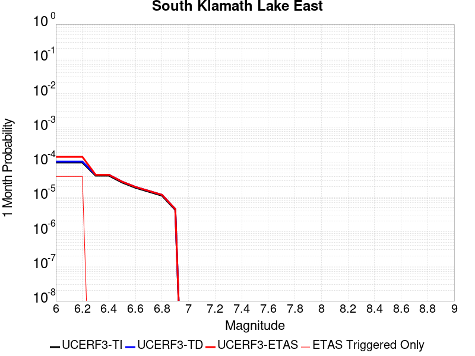 | 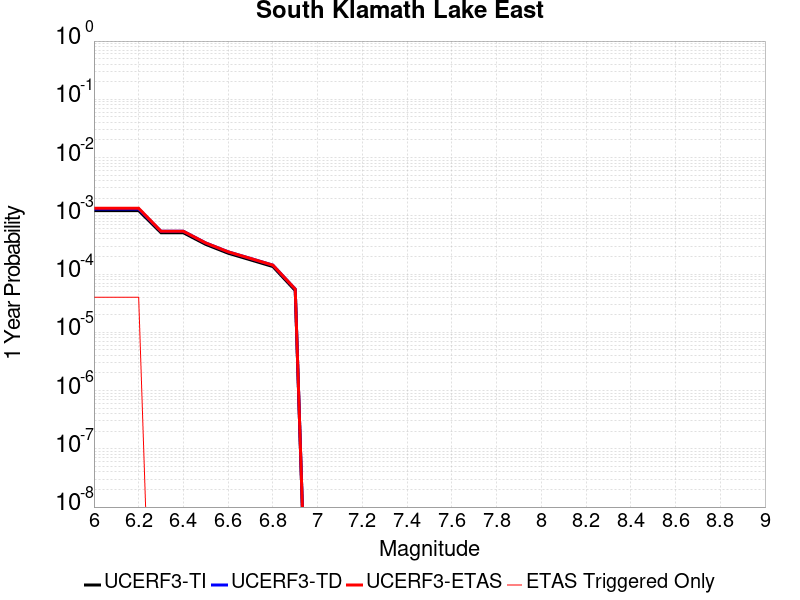 |

| Magnitude | 1 wk TI Prob | 1 wk TD Prob | 1 wk ETAS Prob | 1 wk ETAS/TD Gain | 1 wk ETAS Triggered Only | 1 mo TI Prob | 1 mo TD Prob | 1 mo ETAS Prob | 1 mo ETAS/TD Gain | 1 mo ETAS Triggered Only | 1 yr TI Prob | 1 yr TD Prob | 1 yr ETAS Prob | 1 yr ETAS/TD Gain | 1 yr ETAS Triggered Only |
|-----|-----|-----|-----|-----|-----|-----|-----|-----|-----|-----|-----|-----|-----|-----|-----|
| 6.0 | 2.3539369E-5 | 2.505275E-5 | 6.505175E-5 | 2.596591 | 4.0E-5 | 1.0087911E-4 | 1.0736498E-4 | 1.4736068E-4 | 1.3725209 | 4.0E-5 | 0.0012275111 | 0.001306468 | 0.0013464158 | 1.030577 | 4.0E-5 |
| 6.1 | 2.3539369E-5 | 2.505275E-5 | 6.505175E-5 | 2.596591 | 4.0E-5 | 1.0087911E-4 | 1.0736498E-4 | 1.4736068E-4 | 1.3725209 | 4.0E-5 | 0.0012275111 | 0.001306468 | 0.0013464158 | 1.030577 | 4.0E-5 |
| 6.2 | 2.3539369E-5 | 2.505275E-5 | 6.505175E-5 | 2.596591 | 4.0E-5 | 1.0087911E-4 | 1.0736498E-4 | 1.4736068E-4 | 1.3725209 | 4.0E-5 | 0.0012275111 | 0.001306468 | 0.0013464158 | 1.030577 | 4.0E-5 |
| 6.3 | 9.807823E-6 | 1.0398157E-5 | 1.0398157E-5 | 1.0 | 0.0 | 4.2032847E-5 | 4.4562817E-5 | 4.4562817E-5 | 1.0 | 0.0 | 5.1162974E-4 | 5.424256E-4 | 5.424256E-4 | 1.0 | 0.0 |
| 6.4 | 9.807823E-6 | 1.0398157E-5 | 1.0398157E-5 | 1.0 | 0.0 | 4.2032847E-5 | 4.4562817E-5 | 4.4562817E-5 | 1.0 | 0.0 | 5.1162974E-4 | 5.424256E-4 | 5.424256E-4 | 1.0 | 0.0 |
| 6.5 | 6.191981E-6 | 6.552127E-6 | 6.552127E-6 | 1.0 | 0.0 | 2.653679E-5 | 2.8080258E-5 | 2.8080258E-5 | 1.0 | 0.0 | 3.2303753E-4 | 3.418263E-4 | 3.418263E-4 | 1.0 | 0.0 |
| 6.6 | 4.3693776E-6 | 4.6174428E-6 | 4.6174428E-6 | 1.0 | 0.0 | 1.8725768E-5 | 1.9788897E-5 | 1.9788897E-5 | 1.0 | 0.0 | 2.2796239E-4 | 2.4090431E-4 | 2.4090431E-4 | 1.0 | 0.0 |
| 6.7 | 3.360834E-6 | 3.5519222E-6 | 3.5519222E-6 | 1.0 | 0.0 | 1.4403494E-5 | 1.5222439E-5 | 1.5222439E-5 | 1.0 | 0.0 | 1.7534842E-4 | 1.8531825E-4 | 1.8531825E-4 | 1.0 | 0.0 |
| 6.8 | 2.57873E-6 | 2.7256954E-6 | 2.7256954E-6 | 1.0 | 0.0 | 1.1051653E-5 | 1.1681503E-5 | 1.1681503E-5 | 1.0 | 0.0 | 1.3454557E-4 | 1.4221363E-4 | 1.4221363E-4 | 1.0 | 0.0 |
| 6.9 | 9.987825E-7 | 1.0568286E-6 | 1.0568286E-6 | 1.0 | 0.0 | 4.2804895E-6 | 4.5292595E-6 | 4.5292595E-6 | 1.0 | 0.0 | 5.211371E-5 | 5.514267E-5 | 5.514267E-5 | 1.0 | 0.0 |

## Bullion Mountains
*[(top)](#table-of-contents)*

| 1 Week | 1 Month | 1 Year |
|-----|-----|-----|
|  | 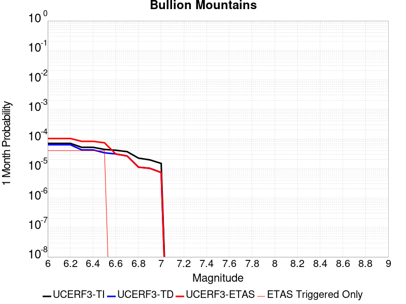 |  |

| Magnitude | 1 wk TI Prob | 1 wk TD Prob | 1 wk ETAS Prob | 1 wk ETAS/TD Gain | 1 wk ETAS Triggered Only | 1 mo TI Prob | 1 mo TD Prob | 1 mo ETAS Prob | 1 mo ETAS/TD Gain | 1 mo ETAS Triggered Only | 1 yr TI Prob | 1 yr TD Prob | 1 yr ETAS Prob | 1 yr ETAS/TD Gain | 1 yr ETAS Triggered Only |
|-----|-----|-----|-----|-----|-----|-----|-----|-----|-----|-----|-----|-----|-----|-----|-----|
| 6.0 | 1.6420427E-5 | 1.4697598E-5 | 5.469701E-5 | 3.7214932 | 4.0E-5 | 7.037136E-5 | 6.29884E-5 | 1.0298588E-4 | 1.6349976 | 4.0E-5 | 8.5643446E-4 | 7.6665235E-4 | 8.066217E-4 | 1.0521349 | 4.0E-5 |
| 6.1 | 1.6420427E-5 | 1.4697598E-5 | 5.469701E-5 | 3.7214932 | 4.0E-5 | 7.037136E-5 | 6.29884E-5 | 1.0298588E-4 | 1.6349976 | 4.0E-5 | 8.5643446E-4 | 7.6665235E-4 | 8.066217E-4 | 1.0521349 | 4.0E-5 |
| 6.2 | 1.6420427E-5 | 1.4697598E-5 | 5.469701E-5 | 3.7214932 | 4.0E-5 | 7.037136E-5 | 6.29884E-5 | 1.0298588E-4 | 1.6349976 | 4.0E-5 | 8.5643446E-4 | 7.6665235E-4 | 8.066217E-4 | 1.0521349 | 4.0E-5 |
| 6.3 | 1.2046778E-5 | 9.866135E-6 | 4.986574E-5 | 5.0542326 | 4.0E-5 | 5.1628023E-5 | 4.228288E-5 | 8.228119E-5 | 1.9459693 | 4.0E-5 | 6.283899E-4 | 5.1469565E-4 | 5.5467506E-4 | 1.0776758 | 4.0E-5 |
| 6.4 | 1.2046778E-5 | 9.866135E-6 | 4.986574E-5 | 5.0542326 | 4.0E-5 | 5.1628023E-5 | 4.228288E-5 | 8.228119E-5 | 1.9459693 | 4.0E-5 | 6.283899E-4 | 5.1469565E-4 | 5.5467506E-4 | 1.0776758 | 4.0E-5 |
| 6.5 | 1.0244343E-5 | 7.882585E-6 | 4.788227E-5 | 6.0744376 | 4.0E-5 | 4.390359E-5 | 3.3782188E-5 | 7.378084E-5 | 2.184016 | 4.0E-5 | 5.343951E-4 | 4.112412E-4 | 4.5122474E-4 | 1.0972265 | 4.0E-5 |
| 6.6 | 9.605408E-6 | 7.1803884E-6 | 7.1803884E-6 | 1.0 | 0.0 | 4.1165385E-5 | 3.0772844E-5 | 3.0772844E-5 | 1.0 | 0.0 | 5.010733E-4 | 3.7461534E-4 | 3.7461534E-4 | 1.0 | 0.0 |
| 6.7 | 8.60418E-6 | 6.1265305E-6 | 6.1265305E-6 | 1.0 | 0.0 | 3.687454E-5 | 2.6256404E-5 | 2.6256404E-5 | 1.0 | 0.0 | 4.48855E-4 | 3.1964434E-4 | 3.1964434E-4 | 1.0 | 0.0 |
| 6.8 | 5.187994E-6 | 2.5644867E-6 | 2.5644867E-6 | 1.0 | 0.0 | 2.223407E-5 | 1.0990634E-5 | 1.0990634E-5 | 1.0 | 0.0 | 2.7066618E-4 | 1.3380675E-4 | 1.3380675E-4 | 1.0 | 0.0 |
| 6.9 | 4.5302368E-6 | 2.3454688E-6 | 2.3454688E-6 | 1.0 | 0.0 | 1.9415156E-5 | 1.0051993E-5 | 1.0051993E-5 | 1.0 | 0.0 | 2.3635388E-4 | 1.2238011E-4 | 1.2238011E-4 | 1.0 | 0.0 |
| 7.0 | 3.431668E-6 | 1.6891455E-6 | 1.6891455E-6 | 1.0 | 0.0 | 1.4707065E-5 | 7.2391954E-6 | 7.2391954E-6 | 1.0 | 0.0 | 1.7904381E-4 | 8.81372E-5 | 8.81372E-5 | 1.0 | 0.0 |

