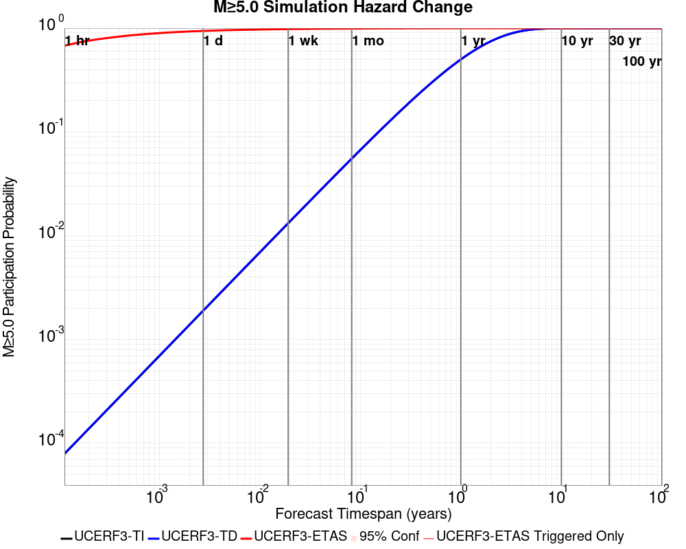
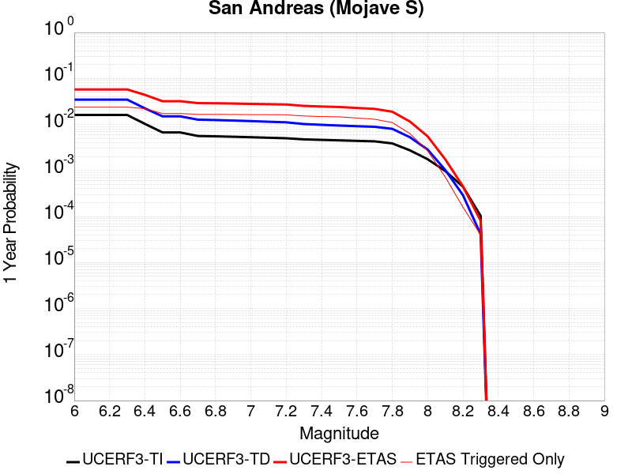
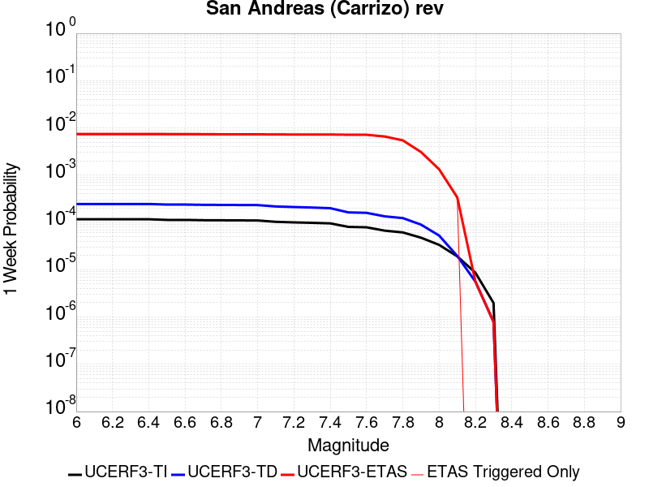
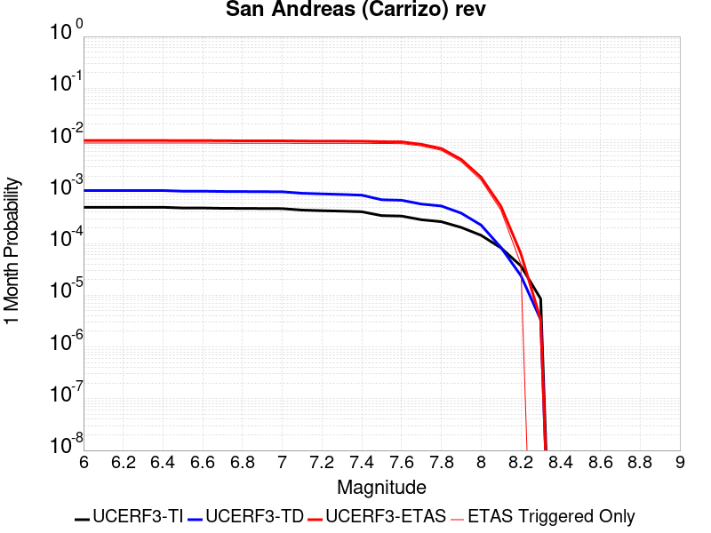
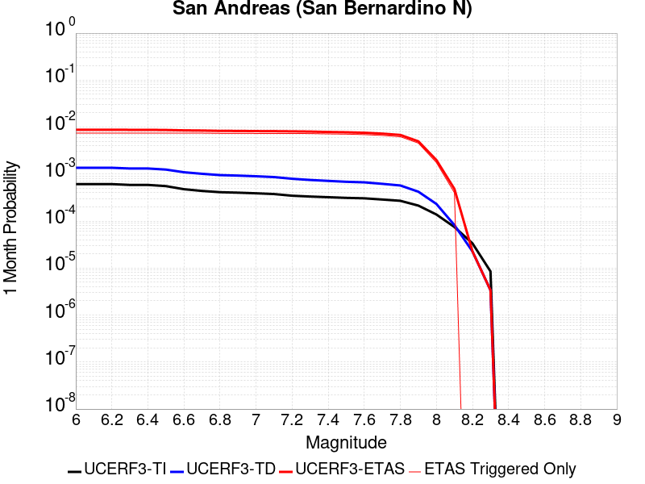

# M7OnSAF Results

|   | M7OnSAF |
|-----|-----|
| Num Simulations | 25000 |
| Start Time | 2020/01/01 00:00:00 UTC |
| Start Time Epoch Milliseconds | 1577836800000 |
| Duration | 1 Year |
| Includes Spontaneous? | false |
| Trigger Ruptures | *(none)* |
| Config Generated With | u3etas_config_builder.sh --start-year 2020 --num-simulations 25000 --duration-years 1 --magnitude 7 --latitude 34.695 --depth 5 --longitude -118.5 --name M7OnSAF --hpc-site USC_HPC --nodes 36 --hours 24 --queue scec |

## Table Of Contents

* [Probabilities Summary Table](#probabilities-summary-table)
* [Magnitude Number Distribution](#magnitude-number-distribution)
  * [1 Year Magnitude Number Distribution](#1-year-magnitude-number-distribution)
  * [1 Month Magnitude Number Distribution](#1-month-magnitude-number-distribution)
  * [1 Week Magnitude Number Distribution](#1-week-magnitude-number-distribution)
  * [1 Day Magnitude Number Distribution](#1-day-magnitude-number-distribution)
  * [1 Hour Magnitude Number Distribution](#1-hour-magnitude-number-distribution)
* [Hazard Change Over Time](#hazard-change-over-time)
  * [M&ge;5.0 Hazard Change Over Time](#m50-hazard-change-over-time)
  * [M&ge;6.0 Hazard Change Over Time](#m60-hazard-change-over-time)
  * [M&ge;7.0 Hazard Change Over Time](#m70-hazard-change-over-time)
  * [M&ge;8.0 Hazard Change Over Time](#m80-hazard-change-over-time)
* [Trigger Rupture Fault Map](#trigger-rupture-fault-map)
* [Fault Distances To Triggers](#fault-distances-to-triggers)
* [Individual Simulated Catalog Maps](#individual-simulated-catalog-maps)
* [Section Participation](#section-participation)
  * [Section Participation Plots](#section-participation-plots)
  * [Supra-Seismogenic Parent Sections Table](#supra-seismogenic-parent-sections-table)
  * [M≥6.5 Parent Sections Table](#m65-parent-sections-table)
  * [M≥7 Parent Sections Table](#m7-parent-sections-table)
  * [M≥7.5 Parent Sections Table](#m75-parent-sections-table)
  * [M≥8 Parent Sections Table](#m8-parent-sections-table)
* [Fault Magnitude-Probability Distributions](#fault-magnitude-probability-distributions)
* [Gridded Nucleation](#gridded-nucleation)
* [JSON Input File](#json-input-file)

## Probabilities Summary Table
*[(top)](#table-of-contents)*

| Magnitude | 1 Hour Prob | 1 Day Prob | 1 Week Prob | 1 Month Prob | 1 Year Prob |
|-----|-----|-----|-----|-----|-----|
| **M&ge;4** | 1.000 (100.00%) | 1.000 (100.00%) | 1.000 (100.00%) | 1.000 (100.00%) | 1.000 (100.00%) |
| *95% Conf* | *[99.98% 100.00%]* | *[99.98% 100.00%]* | *[99.98% 100.00%]* | *[99.98% 100.00%]* | *[99.98% 100.00%]* |
| **M&ge;4.5** | 0.973 (97.31%) | 1.000 (99.99%) | 1.000 (100.00%) | 1.000 (100.00%) | 1.000 (100.00%) |
| *95% Conf* | *[97.10% 97.51%]* | *[99.97% 100.00%]* | *[99.98% 100.00%]* | *[99.98% 100.00%]* | *[99.98% 100.00%]* |
| **M&ge;5** | 0.680 (67.95%) | 0.942 (94.18%) | 0.980 (97.96%) | 0.991 (99.10%) | 0.998 (99.78%) |
| *95% Conf* | *[67.37% 68.53%]* | *[93.88% 94.47%]* | *[97.78% 98.13%]* | *[98.98% 99.22%]* | *[99.71% 99.83%]* |
| **M&ge;5.5** | 0.278 (27.77%) | 0.569 (56.86%) | 0.689 (68.89%) | 0.758 (75.76%) | 0.840 (84.00%) |
| *95% Conf* | *[27.22% 28.33%]* | *[56.25% 57.48%]* | *[68.31% 69.46%]* | *[75.22% 76.29%]* | *[83.54% 84.46%]* |
| **M&ge;6** | 0.060 (6.00%) | 0.152 (15.22%) | 0.209 (20.93%) | 0.251 (25.14%) | 0.322 (32.19%) |
| *95% Conf* | *[5.71% 6.30%]* | *[14.77% 15.67%]* | *[20.43% 21.44%]* | *[24.61% 25.69%]* | *[31.61% 32.78%]* |
| **M&ge;6.5** | 6.40E-3 (0.64%) | 0.020 (2.00%) | 0.029 (2.92%) | 0.036 (3.64%) | 0.051 (5.13%) |
| *95% Conf* | *[0.55% 0.75%]* | *[1.84% 2.19%]* | *[2.72% 3.14%]* | *[3.42% 3.89%]* | *[4.86% 5.41%]* |
| **M&ge;7** | 3.12E-3 (0.31%) | 9.56E-3 (0.96%) | 0.014 (1.42%) | 0.018 (1.78%) | 0.025 (2.48%) |
| *95% Conf* | *[0.25% 0.39%]* | *[0.84% 1.09%]* | *[1.27% 1.57%]* | *[1.62% 1.95%]* | *[2.29% 2.68%]* |
| **M&ge;7.5** | 2.20E-3 (0.22%) | 6.88E-3 (0.69%) | 0.010 (1.03%) | 0.013 (1.30%) | 0.017 (1.74%) |
| *95% Conf* | *[0.17% 0.29%]* | *[0.59% 0.80%]* | *[0.91% 1.16%]* | *[1.16% 1.45%]* | *[1.58% 1.91%]* |
| **M&ge;8** | 4.00E-4 (0.04%) | 9.60E-4 (0.10%) | 1.36E-3 (0.14%) | 1.80E-3 (0.18%) | 2.68E-3 (0.27%) |
| *95% Conf* | *[0.02% 0.08%]* | *[0.06% 0.15%]* | *[0.10% 0.19%]* | *[0.13% 0.24%]* | *[0.21% 0.34%]* |

## Magnitude Number Distribution
*[(top)](#table-of-contents)*

### 1 Year Magnitude Number Distribution
*[(top)](#table-of-contents)*

**Legend**
* **Mean** (thick black line): mean expected number across all 25000 catalogs
* **2.5%,97.5%** (thin black lines): expected number percentiles across all 25000 catalogs
* **Median** (thin blue line): median expected number across all 25000 catalogs
* **Mode** (thin cyan line): modal expected number across all 25000 catalogs
* **1 yr Probability** (thin red line): 1 year probability calculated as the fraction of catalogs with at least 1 occurrence
* **1 yr Supraseismogenic Probability** (thin dashed red line): same as above, but only for supraseismogenic ruptures on explicitly modeled UCERF3 faults
* **95% Conf** (light red shaded region): binomial 95% confidence bounds on probability
* **Primary** (thin green line): mean expected number from primary triggered aftershocks only (no secondary, tertiary, etc...) across all 25000 catalogs


| Mag | Mean | 2.5 %ile | 97.5 %ile | Median | Mode | 1 yr Probability | 1 yr Prob 95% Conf | 1 yr Supra-Seis Prob | Primary Aftershocks Mean |
|-----|-----|-----|-----|-----|-----|-----|-----|-----|-----|
| **M&ge;2.5** | 2859.281 | 2023.000 | 5131.000 | 2421.000 | 2382.000 | 1.000 (100.00%) | [99.98% 100.00%] | 0.044 (4.38%) | 1472.543 |
| **M&ge;2.6** | 2271.043 | 1602.000 | 4071.000 | 1924.000 | 1755.000 | 1.000 (100.00%) | [99.98% 100.00%] | 0.044 (4.38%) | 1169.509 |
| **M&ge;2.7** | 1803.935 | 1267.000 | 3239.000 | 1529.000 | 1471.000 | 1.000 (100.00%) | [99.98% 100.00%] | 0.044 (4.38%) | 928.893 |
| **M&ge;2.8** | 1432.870 | 1004.000 | 2556.000 | 1215.000 | 1185.000 | 1.000 (100.00%) | [99.98% 100.00%] | 0.044 (4.38%) | 737.871 |
| **M&ge;2.9** | 1138.112 | 792.000 | 2035.000 | 965.000 | 916.000 | 1.000 (100.00%) | [99.98% 100.00%] | 0.044 (4.38%) | 586.105 |
| **M&ge;3** | 903.990 | 625.000 | 1609.000 | 768.000 | 710.000 | 1.000 (100.00%) | [99.98% 100.00%] | 0.044 (4.38%) | 465.549 |
| **M&ge;3.1** | 717.962 | 493.000 | 1284.000 | 610.000 | 591.000 | 1.000 (100.00%) | [99.98% 100.00%] | 0.044 (4.38%) | 369.756 |
| **M&ge;3.2** | 570.194 | 388.000 | 1023.000 | 485.000 | 466.000 | 1.000 (100.00%) | [99.98% 100.00%] | 0.044 (4.38%) | 293.665 |
| **M&ge;3.3** | 452.840 | 305.000 | 817.000 | 385.000 | 368.000 | 1.000 (100.00%) | [99.98% 100.00%] | 0.044 (4.38%) | 233.224 |
| **M&ge;3.4** | 359.600 | 239.000 | 651.000 | 306.000 | 290.000 | 1.000 (100.00%) | [99.98% 100.00%] | 0.044 (4.38%) | 185.206 |
| **M&ge;3.5** | 285.539 | 187.000 | 514.000 | 243.000 | 226.000 | 1.000 (100.00%) | [99.98% 100.00%] | 0.044 (4.38%) | 147.088 |
| **M&ge;3.6** | 226.710 | 146.000 | 411.000 | 193.000 | 183.000 | 1.000 (100.00%) | [99.98% 100.00%] | 0.044 (4.38%) | 116.772 |
| **M&ge;3.7** | 179.933 | 113.000 | 327.000 | 153.000 | 148.000 | 1.000 (100.00%) | [99.98% 100.00%] | 0.044 (4.38%) | 92.644 |
| **M&ge;3.8** | 142.812 | 88.000 | 259.000 | 122.000 | 115.000 | 1.000 (100.00%) | [99.98% 100.00%] | 0.044 (4.38%) | 73.516 |
| **M&ge;3.9** | 113.365 | 68.000 | 207.000 | 97.000 | 95.000 | 1.000 (100.00%) | [99.98% 100.00%] | 0.044 (4.38%) | 58.369 |
| **M&ge;4** | 89.915 | 52.000 | 166.000 | 77.000 | 72.000 | 1.000 (100.00%) | [99.98% 100.00%] | 0.044 (4.38%) | 46.310 |
| **M&ge;4.1** | 71.340 | 40.000 | 133.000 | 61.000 | 56.000 | 1.000 (100.00%) | [99.98% 100.00%] | 0.044 (4.38%) | 36.726 |
| **M&ge;4.2** | 56.592 | 30.000 | 105.000 | 48.000 | 48.000 | 1.000 (100.00%) | [99.98% 100.00%] | 0.044 (4.38%) | 29.128 |
| **M&ge;4.3** | 44.824 | 23.000 | 86.000 | 38.000 | 36.000 | 1.000 (100.00%) | [99.98% 100.00%] | 0.044 (4.38%) | 23.085 |
| **M&ge;4.4** | 35.527 | 17.000 | 68.000 | 30.000 | 27.000 | 1.000 (100.00%) | [99.98% 100.00%] | 0.044 (4.38%) | 18.294 |
| **M&ge;4.5** | 28.153 | 13.000 | 55.000 | 24.000 | 21.000 | 1.000 (100.00%) | [99.98% 100.00%] | 0.044 (4.38%) | 14.504 |
| **M&ge;4.6** | 22.271 | 9.000 | 45.000 | 19.000 | 18.000 | 1.000 (100.00%) | [99.98% 100.00%] | 0.044 (4.38%) | 11.482 |
| **M&ge;4.7** | 17.595 | 6.000 | 37.000 | 15.000 | 13.000 | 1.000 (100.00%) | [99.98% 100.00%] | 0.044 (4.38%) | 9.066 |
| **M&ge;4.8** | 13.898 | 4.000 | 30.000 | 12.000 | 10.000 | 1.000 (99.99%) | [99.97% 100.00%] | 0.044 (4.38%) | 7.165 |
| **M&ge;4.9** | 10.936 | 3.000 | 25.000 | 9.000 | 8.000 | 0.999 (99.94%) | [99.90% 99.97%] | 0.044 (4.38%) | 5.641 |
| **M&ge;5** | 8.622 | 2.000 | 20.000 | 7.000 | 6.000 | 0.998 (99.78%) | [99.71% 99.83%] | 0.044 (4.38%) | 4.443 |
| **M&ge;5.1** | 6.751 | 1.000 | 16.000 | 6.000 | 5.000 | 0.992 (99.18%) | [99.06% 99.29%] | 0.044 (4.38%) | 3.476 |
| **M&ge;5.2** | 5.255 | 1.000 | 14.000 | 4.000 | 3.000 | 0.977 (97.65%) | [97.45% 97.83%] | 0.044 (4.38%) | 2.703 |
| **M&ge;5.3** | 4.084 | 0.000 | 11.000 | 3.000 | 3.000 | 0.948 (94.84%) | [94.56% 95.11%] | 0.044 (4.38%) | 2.096 |
| **M&ge;5.4** | 3.160 | 0.000 | 9.000 | 2.000 | 2.000 | 0.902 (90.19%) | [89.81% 90.55%] | 0.044 (4.38%) | 1.623 |
| **M&ge;5.5** | 2.429 | 0.000 | 8.000 | 2.000 | 1.000 | 0.840 (84.00%) | [83.54% 84.46%] | 0.044 (4.38%) | 1.246 |
| **M&ge;5.6** | 1.841 | 0.000 | 7.000 | 1.000 | 1.000 | 0.756 (75.56%) | [75.03% 76.09%] | 0.044 (4.38%) | 0.941 |
| **M&ge;5.7** | 1.365 | 0.000 | 5.000 | 1.000 | 0.000 | 0.654 (65.41%) | [64.81% 66.00%] | 0.044 (4.38%) | 0.695 |
| **M&ge;5.8** | 1.003 | 0.000 | 4.000 | 1.000 | 0.000 | 0.546 (54.56%) | [53.94% 55.18%] | 0.044 (4.38%) | 0.508 |
| **M&ge;5.9** | 0.705 | 0.000 | 4.000 | 0.000 | 0.000 | 0.431 (43.11%) | [42.49% 43.72%] | 0.044 (4.36%) | 0.351 |
| **M&ge;6** | 0.475 | 0.000 | 3.000 | 0.000 | 0.000 | 0.322 (32.19%) | [31.61% 32.78%] | 0.044 (4.36%) | 0.233 |
| **M&ge;6.1** | 0.294 | 0.000 | 2.000 | 0.000 | 0.000 | 0.216 (21.64%) | [21.13% 22.15%] | 0.043 (4.25%) | 0.139 |
| **M&ge;6.2** | 0.186 | 0.000 | 2.000 | 0.000 | 0.000 | 0.143 (14.30%) | [13.87% 14.75%] | 0.041 (4.14%) | 0.085 |
| **M&ge;6.3** | 0.122 | 0.000 | 1.000 | 0.000 | 0.000 | 0.095 (9.54%) | [9.18% 9.91%] | 0.039 (3.93%) | 0.052 |
| **M&ge;6.4** | 0.084 | 0.000 | 1.000 | 0.000 | 0.000 | 0.067 (6.72%) | [6.41% 7.04%] | 0.034 (3.45%) | 0.035 |
| **M&ge;6.5** | 0.063 | 0.000 | 1.000 | 0.000 | 0.000 | 0.051 (5.13%) | [4.86% 5.41%] | 0.028 (2.78%) | 0.026 |
| **M&ge;6.6** | 0.050 | 0.000 | 1.000 | 0.000 | 0.000 | 0.043 (4.30%) | [4.06% 4.56%] | 0.027 (2.67%) | 0.022 |
| **M&ge;6.7** | 0.041 | 0.000 | 1.000 | 0.000 | 0.000 | 0.036 (3.55%) | [3.33% 3.79%] | 0.024 (2.44%) | 0.018 |
| **M&ge;6.8** | 0.034 | 0.000 | 1.000 | 0.000 | 0.000 | 0.031 (3.10%) | [2.89% 3.32%] | 0.023 (2.33%) | 0.015 |
| **M&ge;6.9** | 0.030 | 0.000 | 1.000 | 0.000 | 0.000 | 0.028 (2.78%) | [2.58% 2.99%] | 0.022 (2.24%) | 0.014 |
| **M&ge;7** | 0.026 | 0.000 | 0.000 | 0.000 | 0.000 | 0.025 (2.48%) | [2.29% 2.68%] | 0.022 (2.15%) | 0.012 |
| **M&ge;7.1** | 0.024 | 0.000 | 0.000 | 0.000 | 0.000 | 0.023 (2.26%) | [2.08% 2.45%] | 0.021 (2.05%) | 0.011 |
| **M&ge;7.2** | 0.022 | 0.000 | 0.000 | 0.000 | 0.000 | 0.021 (2.09%) | [1.92% 2.28%] | 0.020 (1.98%) | 0.011 |
| **M&ge;7.3** | 0.020 | 0.000 | 0.000 | 0.000 | 0.000 | 0.019 (1.92%) | [1.76% 2.10%] | 0.018 (1.84%) | 9.68E-3 |
| **M&ge;7.4** | 0.018 | 0.000 | 0.000 | 0.000 | 0.000 | 0.018 (1.81%) | [1.65% 1.99%] | 0.018 (1.78%) | 9.32E-3 |
| **M&ge;7.5** | 0.018 | 0.000 | 0.000 | 0.000 | 0.000 | 0.017 (1.74%) | [1.58% 1.91%] | 0.017 (1.72%) | 8.92E-3 |
| **M&ge;7.6** | 0.016 | 0.000 | 0.000 | 0.000 | 0.000 | 0.016 (1.60%) | [1.45% 1.77%] | 0.016 (1.59%) | 8.20E-3 |
| **M&ge;7.7** | 0.014 | 0.000 | 0.000 | 0.000 | 0.000 | 0.014 (1.38%) | [1.24% 1.53%] | 0.014 (1.37%) | 7.16E-3 |
| **M&ge;7.8** | 0.011 | 0.000 | 0.000 | 0.000 | 0.000 | 0.011 (1.11%) | [0.98% 1.25%] | 0.011 (1.10%) | 5.72E-3 |
| **M&ge;7.9** | 6.36E-3 | 0.000 | 0.000 | 0.000 | 0.000 | 6.36E-3 (0.64%) | [0.54% 0.74%] | 6.36E-3 (0.64%) | 3.04E-3 |
| **M&ge;8** | 2.68E-3 | 0.000 | 0.000 | 0.000 | 0.000 | 2.68E-3 (0.27%) | [0.21% 0.34%] | 2.68E-3 (0.27%) | 1.24E-3 |
| **M&ge;8.1** | 7.20E-4 | 0.000 | 0.000 | 0.000 | 0.000 | 7.20E-4 (0.07%) | [0.04% 0.12%] | 7.20E-4 (0.07%) | 4.40E-4 |
| **M&ge;8.2** | 1.60E-4 | 0.000 | 0.000 | 0.000 | 0.000 | 1.60E-4 (0.02%) | [0.01% 0.04%] | 1.60E-4 (0.02%) | 1.20E-4 |
| **M&ge;8.3** | 4.00E-5 | 0.000 | 0.000 | 0.000 | 0.000 | 4.00E-5 (0.00%) | [0.00% 0.03%] | 4.00E-5 (0.00%) | 0.000 |
| **M&ge;8.4** | 0.000 | 0.000 | 0.000 | 0.000 | 0.000 | 0.000 (0.00%) | [0.00% 0.02%] | 0.000 (0.00%) | 0.000 |
| **M&ge;8.5** | 0.000 | 0.000 | 0.000 | 0.000 | 0.000 | 0.000 (0.00%) | [0.00% 0.02%] | 0.000 (0.00%) | 0.000 |
| **M&ge;8.6** | 0.000 | 0.000 | 0.000 | 0.000 | 0.000 | 0.000 (0.00%) | [0.00% 0.02%] | 0.000 (0.00%) | 0.000 |
| **M&ge;8.7** | 0.000 | 0.000 | 0.000 | 0.000 | 0.000 | 0.000 (0.00%) | [0.00% 0.02%] | 0.000 (0.00%) | 0.000 |
| **M&ge;8.8** | 0.000 | 0.000 | 0.000 | 0.000 | 0.000 | 0.000 (0.00%) | [0.00% 0.02%] | 0.000 (0.00%) | 0.000 |
| **M&ge;8.9** | 0.000 | 0.000 | 0.000 | 0.000 | 0.000 | 0.000 (0.00%) | [0.00% 0.02%] | 0.000 (0.00%) | 0.000 |
| **M&ge;9** | 0.000 | 0.000 | 0.000 | 0.000 | 0.000 | 0.000 (0.00%) | [0.00% 0.02%] | 0.000 (0.00%) | 0.000 |

### 1 Month Magnitude Number Distribution
*[(top)](#table-of-contents)*

**Legend**
* **Mean** (thick black line): mean expected number across all 25000 catalogs
* **2.5%,97.5%** (thin black lines): expected number percentiles across all 25000 catalogs
* **Median** (thin blue line): median expected number across all 25000 catalogs
* **Mode** (thin cyan line): modal expected number across all 25000 catalogs
* **1 mo Probability** (thin red line): 1 month probability calculated as the fraction of catalogs with at least 1 occurrence
* **1 mo Supraseismogenic Probability** (thin dashed red line): same as above, but only for supraseismogenic ruptures on explicitly modeled UCERF3 faults
* **95% Conf** (light red shaded region): binomial 95% confidence bounds on probability
* **Primary** (thin green line): mean expected number from primary triggered aftershocks only (no secondary, tertiary, etc...) across all 25000 catalogs


| Mag | Mean | 2.5 %ile | 97.5 %ile | Median | Mode | 1 mo Probability | 1 mo Prob 95% Conf | 1 mo Supra-Seis Prob | Primary Aftershocks Mean |
|-----|-----|-----|-----|-----|-----|-----|-----|-----|-----|
| **M&ge;2.5** | 2047.353 | 1553.000 | 2887.000 | 1808.000 | 1750.000 | 1.000 (100.00%) | [99.98% 100.00%] | 0.032 (3.15%) | 1227.772 |
| **M&ge;2.6** | 1626.117 | 1229.000 | 2302.000 | 1436.000 | 1379.000 | 1.000 (100.00%) | [99.98% 100.00%] | 0.032 (3.15%) | 975.095 |
| **M&ge;2.7** | 1291.590 | 970.000 | 1826.000 | 1141.000 | 1090.000 | 1.000 (100.00%) | [99.98% 100.00%] | 0.032 (3.15%) | 774.463 |
| **M&ge;2.8** | 1025.932 | 768.000 | 1452.000 | 907.000 | 877.000 | 1.000 (100.00%) | [99.98% 100.00%] | 0.032 (3.15%) | 615.188 |
| **M&ge;2.9** | 814.816 | 606.000 | 1155.000 | 720.000 | 680.000 | 1.000 (100.00%) | [99.98% 100.00%] | 0.032 (3.15%) | 488.613 |
| **M&ge;3** | 647.251 | 476.000 | 921.000 | 572.000 | 559.000 | 1.000 (100.00%) | [99.98% 100.00%] | 0.032 (3.15%) | 388.098 |
| **M&ge;3.1** | 514.071 | 375.000 | 734.000 | 455.000 | 437.000 | 1.000 (100.00%) | [99.98% 100.00%] | 0.032 (3.15%) | 308.250 |
| **M&ge;3.2** | 408.324 | 294.000 | 582.000 | 362.000 | 342.000 | 1.000 (100.00%) | [99.98% 100.00%] | 0.032 (3.15%) | 244.851 |
| **M&ge;3.3** | 324.246 | 231.000 | 466.000 | 288.000 | 288.000 | 1.000 (100.00%) | [99.98% 100.00%] | 0.032 (3.15%) | 194.443 |
| **M&ge;3.4** | 257.492 | 180.000 | 372.000 | 229.000 | 217.000 | 1.000 (100.00%) | [99.98% 100.00%] | 0.032 (3.15%) | 154.410 |
| **M&ge;3.5** | 204.461 | 140.000 | 298.000 | 182.000 | 174.000 | 1.000 (100.00%) | [99.98% 100.00%] | 0.032 (3.15%) | 122.625 |
| **M&ge;3.6** | 162.340 | 109.000 | 239.000 | 144.000 | 139.000 | 1.000 (100.00%) | [99.98% 100.00%] | 0.032 (3.15%) | 97.359 |
| **M&ge;3.7** | 128.816 | 85.000 | 190.000 | 114.000 | 113.000 | 1.000 (100.00%) | [99.98% 100.00%] | 0.032 (3.15%) | 77.232 |
| **M&ge;3.8** | 102.232 | 65.000 | 153.000 | 91.000 | 87.000 | 1.000 (100.00%) | [99.98% 100.00%] | 0.032 (3.15%) | 61.293 |
| **M&ge;3.9** | 81.165 | 50.000 | 124.000 | 72.000 | 68.000 | 1.000 (100.00%) | [99.98% 100.00%] | 0.032 (3.15%) | 48.666 |
| **M&ge;4** | 64.359 | 38.000 | 100.000 | 57.000 | 54.000 | 1.000 (100.00%) | [99.98% 100.00%] | 0.032 (3.15%) | 38.603 |
| **M&ge;4.1** | 51.075 | 29.000 | 80.000 | 45.000 | 42.000 | 1.000 (100.00%) | [99.98% 100.00%] | 0.032 (3.15%) | 30.624 |
| **M&ge;4.2** | 40.511 | 22.000 | 65.000 | 36.000 | 34.000 | 1.000 (100.00%) | [99.98% 100.00%] | 0.032 (3.15%) | 24.292 |
| **M&ge;4.3** | 32.109 | 16.000 | 53.000 | 29.000 | 27.000 | 1.000 (100.00%) | [99.98% 100.00%] | 0.032 (3.15%) | 19.262 |
| **M&ge;4.4** | 25.454 | 12.000 | 43.000 | 23.000 | 22.000 | 1.000 (100.00%) | [99.98% 100.00%] | 0.032 (3.15%) | 15.267 |
| **M&ge;4.5** | 20.184 | 9.000 | 35.000 | 18.000 | 17.000 | 1.000 (100.00%) | [99.98% 100.00%] | 0.032 (3.15%) | 12.103 |
| **M&ge;4.6** | 15.970 | 6.000 | 29.000 | 14.000 | 13.000 | 1.000 (100.00%) | [99.97% 100.00%] | 0.032 (3.15%) | 9.576 |
| **M&ge;4.7** | 12.605 | 4.000 | 24.000 | 11.000 | 10.000 | 1.000 (99.99%) | [99.97% 100.00%] | 0.032 (3.15%) | 7.554 |
| **M&ge;4.8** | 9.957 | 3.000 | 20.000 | 9.000 | 8.000 | 0.999 (99.94%) | [99.90% 99.97%] | 0.032 (3.15%) | 5.971 |
| **M&ge;4.9** | 7.828 | 2.000 | 17.000 | 7.000 | 6.000 | 0.997 (99.72%) | [99.65% 99.78%] | 0.032 (3.15%) | 4.697 |
| **M&ge;5** | 6.177 | 1.000 | 14.000 | 5.000 | 5.000 | 0.991 (99.10%) | [98.98% 99.22%] | 0.032 (3.15%) | 3.706 |
| **M&ge;5.1** | 4.836 | 1.000 | 12.000 | 4.000 | 3.000 | 0.976 (97.59%) | [97.39% 97.78%] | 0.032 (3.15%) | 2.897 |
| **M&ge;5.2** | 3.761 | 0.000 | 10.000 | 3.000 | 3.000 | 0.946 (94.63%) | [94.34% 94.90%] | 0.032 (3.15%) | 2.252 |
| **M&ge;5.3** | 2.919 | 0.000 | 8.000 | 2.000 | 2.000 | 0.902 (90.16%) | [89.78% 90.53%] | 0.032 (3.15%) | 1.747 |
| **M&ge;5.4** | 2.261 | 0.000 | 7.000 | 2.000 | 1.000 | 0.836 (83.64%) | [83.17% 84.09%] | 0.032 (3.15%) | 1.351 |
| **M&ge;5.5** | 1.734 | 0.000 | 6.000 | 1.000 | 1.000 | 0.758 (75.76%) | [75.22% 76.29%] | 0.032 (3.15%) | 1.035 |
| **M&ge;5.6** | 1.312 | 0.000 | 5.000 | 1.000 | 0.000 | 0.661 (66.06%) | [65.47% 66.65%] | 0.032 (3.15%) | 0.781 |
| **M&ge;5.7** | 0.970 | 0.000 | 4.000 | 1.000 | 0.000 | 0.554 (55.40%) | [54.78% 56.02%] | 0.032 (3.15%) | 0.577 |
| **M&ge;5.8** | 0.713 | 0.000 | 3.000 | 0.000 | 0.000 | 0.451 (45.09%) | [44.47% 45.71%] | 0.032 (3.15%) | 0.422 |
| **M&ge;5.9** | 0.501 | 0.000 | 3.000 | 0.000 | 0.000 | 0.348 (34.76%) | [34.17% 35.36%] | 0.031 (3.13%) | 0.291 |
| **M&ge;6** | 0.337 | 0.000 | 2.000 | 0.000 | 0.000 | 0.251 (25.14%) | [24.61% 25.69%] | 0.031 (3.12%) | 0.193 |
| **M&ge;6.1** | 0.207 | 0.000 | 2.000 | 0.000 | 0.000 | 0.164 (16.43%) | [15.98% 16.90%] | 0.031 (3.06%) | 0.115 |
| **M&ge;6.2** | 0.130 | 0.000 | 1.000 | 0.000 | 0.000 | 0.106 (10.62%) | [10.24% 11.01%] | 0.030 (2.98%) | 0.070 |
| **M&ge;6.3** | 0.084 | 0.000 | 1.000 | 0.000 | 0.000 | 0.070 (7.00%) | [6.69% 7.32%] | 0.028 (2.84%) | 0.043 |
| **M&ge;6.4** | 0.057 | 0.000 | 1.000 | 0.000 | 0.000 | 0.048 (4.84%) | [4.57% 5.11%] | 0.025 (2.46%) | 0.029 |
| **M&ge;6.5** | 0.042 | 0.000 | 1.000 | 0.000 | 0.000 | 0.036 (3.64%) | [3.42% 3.89%] | 0.020 (1.98%) | 0.022 |
| **M&ge;6.6** | 0.034 | 0.000 | 1.000 | 0.000 | 0.000 | 0.030 (3.05%) | [2.84% 3.27%] | 0.019 (1.91%) | 0.018 |
| **M&ge;6.7** | 0.028 | 0.000 | 1.000 | 0.000 | 0.000 | 0.025 (2.51%) | [2.32% 2.71%] | 0.017 (1.75%) | 0.015 |
| **M&ge;6.8** | 0.024 | 0.000 | 0.000 | 0.000 | 0.000 | 0.022 (2.20%) | [2.02% 2.39%] | 0.017 (1.67%) | 0.013 |
| **M&ge;6.9** | 0.021 | 0.000 | 0.000 | 0.000 | 0.000 | 0.020 (1.97%) | [1.80% 2.15%] | 0.016 (1.61%) | 0.012 |
| **M&ge;7** | 0.019 | 0.000 | 0.000 | 0.000 | 0.000 | 0.018 (1.78%) | [1.62% 1.95%] | 0.016 (1.56%) | 0.010 |
| **M&ge;7.1** | 0.017 | 0.000 | 0.000 | 0.000 | 0.000 | 0.016 (1.65%) | [1.50% 1.82%] | 0.015 (1.50%) | 9.52E-3 |
| **M&ge;7.2** | 0.016 | 0.000 | 0.000 | 0.000 | 0.000 | 0.015 (1.53%) | [1.38% 1.69%] | 0.015 (1.46%) | 8.96E-3 |
| **M&ge;7.3** | 0.014 | 0.000 | 0.000 | 0.000 | 0.000 | 0.014 (1.40%) | [1.26% 1.56%] | 0.014 (1.36%) | 8.24E-3 |
| **M&ge;7.4** | 0.014 | 0.000 | 0.000 | 0.000 | 0.000 | 0.013 (1.34%) | [1.20% 1.49%] | 0.013 (1.32%) | 8.04E-3 |
| **M&ge;7.5** | 0.013 | 0.000 | 0.000 | 0.000 | 0.000 | 0.013 (1.30%) | [1.16% 1.45%] | 0.013 (1.29%) | 7.76E-3 |
| **M&ge;7.6** | 0.012 | 0.000 | 0.000 | 0.000 | 0.000 | 0.012 (1.19%) | [1.06% 1.34%] | 0.012 (1.19%) | 7.08E-3 |
| **M&ge;7.7** | 0.010 | 0.000 | 0.000 | 0.000 | 0.000 | 0.010 (1.03%) | [0.91% 1.16%] | 0.010 (1.03%) | 6.16E-3 |
| **M&ge;7.8** | 8.12E-3 | 0.000 | 0.000 | 0.000 | 0.000 | 8.12E-3 (0.81%) | [0.71% 0.93%] | 8.12E-3 (0.81%) | 4.84E-3 |
| **M&ge;7.9** | 4.68E-3 | 0.000 | 0.000 | 0.000 | 0.000 | 4.68E-3 (0.47%) | [0.39% 0.56%] | 4.68E-3 (0.47%) | 2.72E-3 |
| **M&ge;8** | 1.80E-3 | 0.000 | 0.000 | 0.000 | 0.000 | 1.80E-3 (0.18%) | [0.13% 0.24%] | 1.80E-3 (0.18%) | 1.08E-3 |
| **M&ge;8.1** | 4.40E-4 | 0.000 | 0.000 | 0.000 | 0.000 | 4.40E-4 (0.04%) | [0.02% 0.08%] | 4.40E-4 (0.04%) | 3.20E-4 |
| **M&ge;8.2** | 4.00E-5 | 0.000 | 0.000 | 0.000 | 0.000 | 4.00E-5 (0.00%) | [0.00% 0.03%] | 4.00E-5 (0.00%) | 4.00E-5 |
| **M&ge;8.3** | 0.000 | 0.000 | 0.000 | 0.000 | 0.000 | 0.000 (0.00%) | [0.00% 0.02%] | 0.000 (0.00%) | 0.000 |
| **M&ge;8.4** | 0.000 | 0.000 | 0.000 | 0.000 | 0.000 | 0.000 (0.00%) | [0.00% 0.02%] | 0.000 (0.00%) | 0.000 |
| **M&ge;8.5** | 0.000 | 0.000 | 0.000 | 0.000 | 0.000 | 0.000 (0.00%) | [0.00% 0.02%] | 0.000 (0.00%) | 0.000 |
| **M&ge;8.6** | 0.000 | 0.000 | 0.000 | 0.000 | 0.000 | 0.000 (0.00%) | [0.00% 0.02%] | 0.000 (0.00%) | 0.000 |
| **M&ge;8.7** | 0.000 | 0.000 | 0.000 | 0.000 | 0.000 | 0.000 (0.00%) | [0.00% 0.02%] | 0.000 (0.00%) | 0.000 |
| **M&ge;8.8** | 0.000 | 0.000 | 0.000 | 0.000 | 0.000 | 0.000 (0.00%) | [0.00% 0.02%] | 0.000 (0.00%) | 0.000 |
| **M&ge;8.9** | 0.000 | 0.000 | 0.000 | 0.000 | 0.000 | 0.000 (0.00%) | [0.00% 0.02%] | 0.000 (0.00%) | 0.000 |
| **M&ge;9** | 0.000 | 0.000 | 0.000 | 0.000 | 0.000 | 0.000 (0.00%) | [0.00% 0.02%] | 0.000 (0.00%) | 0.000 |

### 1 Week Magnitude Number Distribution
*[(top)](#table-of-contents)*

**Legend**
* **Mean** (thick black line): mean expected number across all 25000 catalogs
* **2.5%,97.5%** (thin black lines): expected number percentiles across all 25000 catalogs
* **Median** (thin blue line): median expected number across all 25000 catalogs
* **Mode** (thin cyan line): modal expected number across all 25000 catalogs
* **1 wk Probability** (thin red line): 1 week probability calculated as the fraction of catalogs with at least 1 occurrence
* **1 wk Supraseismogenic Probability** (thin dashed red line): same as above, but only for supraseismogenic ruptures on explicitly modeled UCERF3 faults
* **95% Conf** (light red shaded region): binomial 95% confidence bounds on probability
* **Primary** (thin green line): mean expected number from primary triggered aftershocks only (no secondary, tertiary, etc...) across all 25000 catalogs


| Mag | Mean | 2.5 %ile | 97.5 %ile | Median | Mode | 1 wk Probability | 1 wk Prob 95% Conf | 1 wk Supra-Seis Prob | Primary Aftershocks Mean |
|-----|-----|-----|-----|-----|-----|-----|-----|-----|-----|
| **M&ge;2.5** | 1619.626 | 1276.000 | 2150.000 | 1463.000 | 1436.000 | 1.000 (100.00%) | [99.98% 100.00%] | 0.025 (2.49%) | 1064.166 |
| **M&ge;2.6** | 1286.368 | 1009.000 | 1707.000 | 1163.000 | 1119.000 | 1.000 (100.00%) | [99.98% 100.00%] | 0.025 (2.49%) | 845.113 |
| **M&ge;2.7** | 1021.735 | 796.000 | 1353.000 | 925.000 | 910.000 | 1.000 (100.00%) | [99.98% 100.00%] | 0.025 (2.49%) | 671.180 |
| **M&ge;2.8** | 811.652 | 629.000 | 1076.000 | 735.000 | 718.000 | 1.000 (100.00%) | [99.98% 100.00%] | 0.025 (2.49%) | 533.171 |
| **M&ge;2.9** | 644.603 | 496.000 | 858.000 | 584.000 | 568.000 | 1.000 (100.00%) | [99.98% 100.00%] | 0.025 (2.49%) | 423.469 |
| **M&ge;3** | 512.084 | 389.000 | 683.000 | 464.000 | 437.000 | 1.000 (100.00%) | [99.98% 100.00%] | 0.025 (2.49%) | 336.380 |
| **M&ge;3.1** | 406.674 | 306.000 | 544.000 | 369.000 | 356.000 | 1.000 (100.00%) | [99.98% 100.00%] | 0.025 (2.49%) | 267.163 |
| **M&ge;3.2** | 322.980 | 240.000 | 435.000 | 293.000 | 286.000 | 1.000 (100.00%) | [99.98% 100.00%] | 0.025 (2.49%) | 212.215 |
| **M&ge;3.3** | 256.449 | 188.000 | 348.000 | 233.000 | 228.000 | 1.000 (100.00%) | [99.98% 100.00%] | 0.025 (2.49%) | 168.516 |
| **M&ge;3.4** | 203.632 | 146.000 | 278.000 | 185.000 | 183.000 | 1.000 (100.00%) | [99.98% 100.00%] | 0.025 (2.49%) | 133.817 |
| **M&ge;3.5** | 161.708 | 114.000 | 223.000 | 147.000 | 145.000 | 1.000 (100.00%) | [99.98% 100.00%] | 0.025 (2.49%) | 106.287 |
| **M&ge;3.6** | 128.370 | 88.000 | 178.000 | 117.000 | 118.000 | 1.000 (100.00%) | [99.98% 100.00%] | 0.025 (2.49%) | 84.383 |
| **M&ge;3.7** | 101.858 | 68.000 | 143.000 | 93.000 | 91.000 | 1.000 (100.00%) | [99.98% 100.00%] | 0.025 (2.49%) | 66.952 |
| **M&ge;3.8** | 80.831 | 52.000 | 115.000 | 74.000 | 72.000 | 1.000 (100.00%) | [99.98% 100.00%] | 0.025 (2.49%) | 53.136 |
| **M&ge;3.9** | 64.172 | 40.000 | 93.000 | 58.000 | 56.000 | 1.000 (100.00%) | [99.98% 100.00%] | 0.025 (2.49%) | 42.186 |
| **M&ge;4** | 50.882 | 30.000 | 76.000 | 46.000 | 44.000 | 1.000 (100.00%) | [99.98% 100.00%] | 0.025 (2.49%) | 33.459 |
| **M&ge;4.1** | 40.375 | 23.000 | 61.000 | 37.000 | 34.000 | 1.000 (100.00%) | [99.98% 100.00%] | 0.025 (2.49%) | 26.543 |
| **M&ge;4.2** | 32.023 | 17.000 | 50.000 | 29.000 | 29.000 | 1.000 (100.00%) | [99.98% 100.00%] | 0.025 (2.49%) | 21.058 |
| **M&ge;4.3** | 25.379 | 13.000 | 41.000 | 23.000 | 21.000 | 1.000 (100.00%) | [99.98% 100.00%] | 0.025 (2.49%) | 16.692 |
| **M&ge;4.4** | 20.113 | 9.000 | 34.000 | 18.000 | 17.000 | 1.000 (100.00%) | [99.98% 100.00%] | 0.025 (2.49%) | 13.230 |
| **M&ge;4.5** | 15.951 | 7.000 | 28.000 | 14.000 | 13.000 | 1.000 (100.00%) | [99.98% 100.00%] | 0.025 (2.49%) | 10.491 |
| **M&ge;4.6** | 12.616 | 5.000 | 23.000 | 11.000 | 11.000 | 1.000 (99.99%) | [99.96% 100.00%] | 0.025 (2.49%) | 8.296 |
| **M&ge;4.7** | 9.963 | 3.000 | 19.000 | 9.000 | 8.000 | 1.000 (99.98%) | [99.94% 99.99%] | 0.025 (2.49%) | 6.548 |
| **M&ge;4.8** | 7.874 | 2.000 | 16.000 | 7.000 | 6.000 | 0.998 (99.81%) | [99.74% 99.86%] | 0.025 (2.49%) | 5.178 |
| **M&ge;4.9** | 6.191 | 1.000 | 13.000 | 5.000 | 5.000 | 0.992 (99.23%) | [99.11% 99.33%] | 0.025 (2.49%) | 4.075 |
| **M&ge;5** | 4.883 | 1.000 | 11.000 | 4.000 | 4.000 | 0.980 (97.96%) | [97.78% 98.13%] | 0.025 (2.49%) | 3.216 |
| **M&ge;5.1** | 3.816 | 0.000 | 9.000 | 3.000 | 3.000 | 0.955 (95.48%) | [95.21% 95.73%] | 0.025 (2.49%) | 2.513 |
| **M&ge;5.2** | 2.968 | 0.000 | 8.000 | 2.000 | 2.000 | 0.913 (91.26%) | [90.90% 91.61%] | 0.025 (2.49%) | 1.953 |
| **M&ge;5.3** | 2.306 | 0.000 | 7.000 | 2.000 | 1.000 | 0.854 (85.42%) | [84.98% 85.86%] | 0.025 (2.49%) | 1.516 |
| **M&ge;5.4** | 1.788 | 0.000 | 6.000 | 1.000 | 1.000 | 0.777 (77.70%) | [77.18% 78.22%] | 0.025 (2.49%) | 1.174 |
| **M&ge;5.5** | 1.371 | 0.000 | 5.000 | 1.000 | 1.000 | 0.689 (68.89%) | [68.31% 69.46%] | 0.025 (2.49%) | 0.899 |
| **M&ge;5.6** | 1.035 | 0.000 | 4.000 | 1.000 | 0.000 | 0.587 (58.72%) | [58.11% 59.33%] | 0.025 (2.49%) | 0.677 |
| **M&ge;5.7** | 0.769 | 0.000 | 3.000 | 0.000 | 0.000 | 0.483 (48.31%) | [47.69% 48.93%] | 0.025 (2.49%) | 0.502 |
| **M&ge;5.8** | 0.564 | 0.000 | 3.000 | 0.000 | 0.000 | 0.386 (38.58%) | [37.97% 39.18%] | 0.025 (2.49%) | 0.367 |
| **M&ge;5.9** | 0.396 | 0.000 | 2.000 | 0.000 | 0.000 | 0.292 (29.25%) | [28.69% 29.82%] | 0.025 (2.47%) | 0.253 |
| **M&ge;6** | 0.266 | 0.000 | 2.000 | 0.000 | 0.000 | 0.209 (20.93%) | [20.43% 21.44%] | 0.025 (2.47%) | 0.168 |
| **M&ge;6.1** | 0.163 | 0.000 | 1.000 | 0.000 | 0.000 | 0.135 (13.50%) | [13.08% 13.94%] | 0.024 (2.43%) | 0.101 |
| **M&ge;6.2** | 0.102 | 0.000 | 1.000 | 0.000 | 0.000 | 0.087 (8.70%) | [8.35% 9.05%] | 0.024 (2.38%) | 0.061 |
| **M&ge;6.3** | 0.065 | 0.000 | 1.000 | 0.000 | 0.000 | 0.056 (5.64%) | [5.35% 5.93%] | 0.023 (2.27%) | 0.038 |
| **M&ge;6.4** | 0.045 | 0.000 | 1.000 | 0.000 | 0.000 | 0.039 (3.89%) | [3.65% 4.14%] | 0.020 (1.98%) | 0.025 |
| **M&ge;6.5** | 0.033 | 0.000 | 1.000 | 0.000 | 0.000 | 0.029 (2.92%) | [2.72% 3.14%] | 0.016 (1.57%) | 0.019 |
| **M&ge;6.6** | 0.027 | 0.000 | 0.000 | 0.000 | 0.000 | 0.025 (2.45%) | [2.27% 2.65%] | 0.015 (1.50%) | 0.016 |
| **M&ge;6.7** | 0.022 | 0.000 | 0.000 | 0.000 | 0.000 | 0.020 (2.00%) | [1.84% 2.19%] | 0.014 (1.37%) | 0.013 |
| **M&ge;6.8** | 0.019 | 0.000 | 0.000 | 0.000 | 0.000 | 0.017 (1.74%) | [1.58% 1.91%] | 0.013 (1.31%) | 0.011 |
| **M&ge;6.9** | 0.017 | 0.000 | 0.000 | 0.000 | 0.000 | 0.016 (1.58%) | [1.43% 1.74%] | 0.013 (1.27%) | 0.010 |
| **M&ge;7** | 0.015 | 0.000 | 0.000 | 0.000 | 0.000 | 0.014 (1.42%) | [1.27% 1.57%] | 0.012 (1.23%) | 8.96E-3 |
| **M&ge;7.1** | 0.013 | 0.000 | 0.000 | 0.000 | 0.000 | 0.013 (1.29%) | [1.16% 1.44%] | 0.012 (1.18%) | 8.20E-3 |
| **M&ge;7.2** | 0.012 | 0.000 | 0.000 | 0.000 | 0.000 | 0.012 (1.19%) | [1.06% 1.34%] | 0.011 (1.14%) | 7.72E-3 |
| **M&ge;7.3** | 0.011 | 0.000 | 0.000 | 0.000 | 0.000 | 0.011 (1.10%) | [0.98% 1.24%] | 0.011 (1.08%) | 7.08E-3 |
| **M&ge;7.4** | 0.011 | 0.000 | 0.000 | 0.000 | 0.000 | 0.011 (1.06%) | [0.94% 1.20%] | 0.011 (1.05%) | 6.88E-3 |
| **M&ge;7.5** | 0.010 | 0.000 | 0.000 | 0.000 | 0.000 | 0.010 (1.03%) | [0.91% 1.16%] | 0.010 (1.02%) | 6.64E-3 |
| **M&ge;7.6** | 9.56E-3 | 0.000 | 0.000 | 0.000 | 0.000 | 9.56E-3 (0.96%) | [0.84% 1.09%] | 9.56E-3 (0.96%) | 6.08E-3 |
| **M&ge;7.7** | 8.32E-3 | 0.000 | 0.000 | 0.000 | 0.000 | 8.32E-3 (0.83%) | [0.72% 0.95%] | 8.32E-3 (0.83%) | 5.28E-3 |
| **M&ge;7.8** | 6.60E-3 | 0.000 | 0.000 | 0.000 | 0.000 | 6.60E-3 (0.66%) | [0.57% 0.77%] | 6.60E-3 (0.66%) | 4.12E-3 |
| **M&ge;7.9** | 3.76E-3 | 0.000 | 0.000 | 0.000 | 0.000 | 3.76E-3 (0.38%) | [0.31% 0.46%] | 3.76E-3 (0.38%) | 2.28E-3 |
| **M&ge;8** | 1.36E-3 | 0.000 | 0.000 | 0.000 | 0.000 | 1.36E-3 (0.14%) | [0.10% 0.19%] | 1.36E-3 (0.14%) | 8.80E-4 |
| **M&ge;8.1** | 3.20E-4 | 0.000 | 0.000 | 0.000 | 0.000 | 3.20E-4 (0.03%) | [0.01% 0.07%] | 3.20E-4 (0.03%) | 2.40E-4 |
| **M&ge;8.2** | 0.000 | 0.000 | 0.000 | 0.000 | 0.000 | 0.000 (0.00%) | [0.00% 0.02%] | 0.000 (0.00%) | 0.000 |
| **M&ge;8.3** | 0.000 | 0.000 | 0.000 | 0.000 | 0.000 | 0.000 (0.00%) | [0.00% 0.02%] | 0.000 (0.00%) | 0.000 |
| **M&ge;8.4** | 0.000 | 0.000 | 0.000 | 0.000 | 0.000 | 0.000 (0.00%) | [0.00% 0.02%] | 0.000 (0.00%) | 0.000 |
| **M&ge;8.5** | 0.000 | 0.000 | 0.000 | 0.000 | 0.000 | 0.000 (0.00%) | [0.00% 0.02%] | 0.000 (0.00%) | 0.000 |
| **M&ge;8.6** | 0.000 | 0.000 | 0.000 | 0.000 | 0.000 | 0.000 (0.00%) | [0.00% 0.02%] | 0.000 (0.00%) | 0.000 |
| **M&ge;8.7** | 0.000 | 0.000 | 0.000 | 0.000 | 0.000 | 0.000 (0.00%) | [0.00% 0.02%] | 0.000 (0.00%) | 0.000 |
| **M&ge;8.8** | 0.000 | 0.000 | 0.000 | 0.000 | 0.000 | 0.000 (0.00%) | [0.00% 0.02%] | 0.000 (0.00%) | 0.000 |
| **M&ge;8.9** | 0.000 | 0.000 | 0.000 | 0.000 | 0.000 | 0.000 (0.00%) | [0.00% 0.02%] | 0.000 (0.00%) | 0.000 |
| **M&ge;9** | 0.000 | 0.000 | 0.000 | 0.000 | 0.000 | 0.000 (0.00%) | [0.00% 0.02%] | 0.000 (0.00%) | 0.000 |

### 1 Day Magnitude Number Distribution
*[(top)](#table-of-contents)*

**Legend**
* **Mean** (thick black line): mean expected number across all 25000 catalogs
* **2.5%,97.5%** (thin black lines): expected number percentiles across all 25000 catalogs
* **Median** (thin blue line): median expected number across all 25000 catalogs
* **Mode** (thin cyan line): modal expected number across all 25000 catalogs
* **1 d Probability** (thin red line): 1 day probability calculated as the fraction of catalogs with at least 1 occurrence
* **1 d Supraseismogenic Probability** (thin dashed red line): same as above, but only for supraseismogenic ruptures on explicitly modeled UCERF3 faults
* **95% Conf** (light red shaded region): binomial 95% confidence bounds on probability
* **Primary** (thin green line): mean expected number from primary triggered aftershocks only (no secondary, tertiary, etc...) across all 25000 catalogs


| Mag | Mean | 2.5 %ile | 97.5 %ile | Median | Mode | 1 d Probability | 1 d Prob 95% Conf | 1 d Supra-Seis Prob | Primary Aftershocks Mean |
|-----|-----|-----|-----|-----|-----|-----|-----|-----|-----|
| **M&ge;2.5** | 1097.140 | 910.000 | 1358.000 | 1026.000 | 991.000 | 1.000 (100.00%) | [99.98% 100.00%] | 0.017 (1.72%) | 818.455 |
| **M&ge;2.6** | 871.342 | 718.000 | 1078.000 | 815.000 | 801.000 | 1.000 (100.00%) | [99.98% 100.00%] | 0.017 (1.72%) | 649.979 |
| **M&ge;2.7** | 692.098 | 566.000 | 859.000 | 648.000 | 625.000 | 1.000 (100.00%) | [99.98% 100.00%] | 0.017 (1.72%) | 516.225 |
| **M&ge;2.8** | 549.789 | 445.000 | 685.000 | 515.000 | 499.000 | 1.000 (100.00%) | [99.98% 100.00%] | 0.017 (1.72%) | 410.056 |
| **M&ge;2.9** | 436.645 | 350.000 | 548.000 | 409.000 | 408.000 | 1.000 (100.00%) | [99.98% 100.00%] | 0.017 (1.72%) | 325.708 |
| **M&ge;3** | 346.854 | 274.000 | 439.000 | 325.000 | 318.000 | 1.000 (100.00%) | [99.98% 100.00%] | 0.017 (1.72%) | 258.685 |
| **M&ge;3.1** | 275.466 | 215.000 | 350.000 | 258.000 | 251.000 | 1.000 (100.00%) | [99.98% 100.00%] | 0.017 (1.72%) | 205.464 |
| **M&ge;3.2** | 218.782 | 168.000 | 280.000 | 205.000 | 203.000 | 1.000 (100.00%) | [99.98% 100.00%] | 0.017 (1.72%) | 163.208 |
| **M&ge;3.3** | 173.704 | 131.000 | 224.000 | 163.000 | 159.000 | 1.000 (100.00%) | [99.98% 100.00%] | 0.017 (1.72%) | 129.594 |
| **M&ge;3.4** | 137.919 | 102.000 | 180.000 | 130.000 | 131.000 | 1.000 (100.00%) | [99.98% 100.00%] | 0.017 (1.72%) | 102.902 |
| **M&ge;3.5** | 109.545 | 79.000 | 146.000 | 103.000 | 103.000 | 1.000 (100.00%) | [99.98% 100.00%] | 0.017 (1.72%) | 81.727 |
| **M&ge;3.6** | 86.952 | 60.000 | 117.000 | 82.000 | 80.000 | 1.000 (100.00%) | [99.98% 100.00%] | 0.017 (1.72%) | 64.884 |
| **M&ge;3.7** | 69.003 | 47.000 | 94.000 | 65.000 | 64.000 | 1.000 (100.00%) | [99.98% 100.00%] | 0.017 (1.72%) | 51.483 |
| **M&ge;3.8** | 54.764 | 36.000 | 77.000 | 51.000 | 49.000 | 1.000 (100.00%) | [99.98% 100.00%] | 0.017 (1.72%) | 40.882 |
| **M&ge;3.9** | 43.470 | 27.000 | 63.000 | 41.000 | 39.000 | 1.000 (100.00%) | [99.98% 100.00%] | 0.017 (1.72%) | 32.453 |
| **M&ge;4** | 34.460 | 20.000 | 51.000 | 32.000 | 31.000 | 1.000 (100.00%) | [99.98% 100.00%] | 0.017 (1.72%) | 25.739 |
| **M&ge;4.1** | 27.347 | 15.000 | 42.000 | 26.000 | 25.000 | 1.000 (100.00%) | [99.98% 100.00%] | 0.017 (1.72%) | 20.416 |
| **M&ge;4.2** | 21.692 | 11.000 | 34.000 | 20.000 | 20.000 | 1.000 (100.00%) | [99.98% 100.00%] | 0.017 (1.72%) | 16.194 |
| **M&ge;4.3** | 17.193 | 8.000 | 28.000 | 16.000 | 15.000 | 1.000 (100.00%) | [99.98% 100.00%] | 0.017 (1.72%) | 12.838 |
| **M&ge;4.4** | 13.625 | 6.000 | 23.000 | 13.000 | 11.000 | 1.000 (100.00%) | [99.97% 100.00%] | 0.017 (1.72%) | 10.174 |
| **M&ge;4.5** | 10.812 | 4.000 | 19.000 | 10.000 | 10.000 | 1.000 (99.99%) | [99.97% 100.00%] | 0.017 (1.72%) | 8.072 |
| **M&ge;4.6** | 8.545 | 3.000 | 16.000 | 8.000 | 7.000 | 0.999 (99.93%) | [99.88% 99.96%] | 0.017 (1.72%) | 6.376 |
| **M&ge;4.7** | 6.745 | 2.000 | 14.000 | 6.000 | 6.000 | 0.997 (99.66%) | [99.57% 99.72%] | 0.017 (1.72%) | 5.034 |
| **M&ge;4.8** | 5.335 | 1.000 | 11.000 | 5.000 | 4.000 | 0.988 (98.85%) | [98.71% 98.97%] | 0.017 (1.72%) | 3.984 |
| **M&ge;4.9** | 4.197 | 0.000 | 10.000 | 4.000 | 3.000 | 0.971 (97.09%) | [96.87% 97.30%] | 0.017 (1.72%) | 3.138 |
| **M&ge;5** | 3.314 | 0.000 | 8.000 | 3.000 | 2.000 | 0.942 (94.18%) | [93.88% 94.47%] | 0.017 (1.72%) | 2.477 |
| **M&ge;5.1** | 2.591 | 0.000 | 7.000 | 2.000 | 2.000 | 0.895 (89.49%) | [89.10% 89.87%] | 0.017 (1.72%) | 1.936 |
| **M&ge;5.2** | 2.017 | 0.000 | 6.000 | 2.000 | 1.000 | 0.829 (82.90%) | [82.43% 83.36%] | 0.017 (1.72%) | 1.505 |
| **M&ge;5.3** | 1.566 | 0.000 | 5.000 | 1.000 | 1.000 | 0.749 (74.88%) | [74.34% 75.42%] | 0.017 (1.72%) | 1.165 |
| **M&ge;5.4** | 1.214 | 0.000 | 4.000 | 1.000 | 0.000 | 0.661 (66.05%) | [65.46% 66.64%] | 0.017 (1.72%) | 0.901 |
| **M&ge;5.5** | 0.932 | 0.000 | 4.000 | 1.000 | 0.000 | 0.569 (56.86%) | [56.25% 57.48%] | 0.017 (1.72%) | 0.692 |
| **M&ge;5.6** | 0.703 | 0.000 | 3.000 | 0.000 | 0.000 | 0.471 (47.13%) | [46.51% 47.75%] | 0.017 (1.72%) | 0.521 |
| **M&ge;5.7** | 0.521 | 0.000 | 2.000 | 0.000 | 0.000 | 0.377 (37.70%) | [37.10% 38.30%] | 0.017 (1.72%) | 0.385 |
| **M&ge;5.8** | 0.383 | 0.000 | 2.000 | 0.000 | 0.000 | 0.294 (29.43%) | [28.87% 30.00%] | 0.017 (1.72%) | 0.282 |
| **M&ge;5.9** | 0.267 | 0.000 | 2.000 | 0.000 | 0.000 | 0.217 (21.74%) | [21.23% 22.26%] | 0.017 (1.71%) | 0.195 |
| **M&ge;6** | 0.178 | 0.000 | 1.000 | 0.000 | 0.000 | 0.152 (15.22%) | [14.77% 15.67%] | 0.017 (1.71%) | 0.129 |
| **M&ge;6.1** | 0.108 | 0.000 | 1.000 | 0.000 | 0.000 | 0.096 (9.61%) | [9.25% 9.98%] | 0.017 (1.68%) | 0.077 |
| **M&ge;6.2** | 0.067 | 0.000 | 1.000 | 0.000 | 0.000 | 0.061 (6.11%) | [5.82% 6.42%] | 0.016 (1.65%) | 0.047 |
| **M&ge;6.3** | 0.042 | 0.000 | 1.000 | 0.000 | 0.000 | 0.039 (3.91%) | [3.67% 4.16%] | 0.016 (1.58%) | 0.029 |
| **M&ge;6.4** | 0.029 | 0.000 | 1.000 | 0.000 | 0.000 | 0.027 (2.67%) | [2.48% 2.88%] | 0.014 (1.37%) | 0.019 |
| **M&ge;6.5** | 0.021 | 0.000 | 0.000 | 0.000 | 0.000 | 0.020 (2.00%) | [1.84% 2.19%] | 0.011 (1.07%) | 0.014 |
| **M&ge;6.6** | 0.018 | 0.000 | 0.000 | 0.000 | 0.000 | 0.017 (1.67%) | [1.51% 1.84%] | 0.010 (1.03%) | 0.012 |
| **M&ge;6.7** | 0.014 | 0.000 | 0.000 | 0.000 | 0.000 | 0.014 (1.37%) | [1.23% 1.52%] | 9.32E-3 (0.93%) | 0.010 |
| **M&ge;6.8** | 0.012 | 0.000 | 0.000 | 0.000 | 0.000 | 0.012 (1.20%) | [1.07% 1.35%] | 8.96E-3 (0.90%) | 8.80E-3 |
| **M&ge;6.9** | 0.011 | 0.000 | 0.000 | 0.000 | 0.000 | 0.011 (1.08%) | [0.95% 1.21%] | 8.64E-3 (0.86%) | 7.92E-3 |
| **M&ge;7** | 9.60E-3 | 0.000 | 0.000 | 0.000 | 0.000 | 9.56E-3 (0.96%) | [0.84% 1.09%] | 8.28E-3 (0.83%) | 6.88E-3 |
| **M&ge;7.1** | 8.72E-3 | 0.000 | 0.000 | 0.000 | 0.000 | 8.68E-3 (0.87%) | [0.76% 0.99%] | 7.88E-3 (0.79%) | 6.20E-3 |
| **M&ge;7.2** | 8.00E-3 | 0.000 | 0.000 | 0.000 | 0.000 | 7.96E-3 (0.80%) | [0.69% 0.92%] | 7.64E-3 (0.76%) | 5.88E-3 |
| **M&ge;7.3** | 7.32E-3 | 0.000 | 0.000 | 0.000 | 0.000 | 7.28E-3 (0.73%) | [0.63% 0.84%] | 7.12E-3 (0.71%) | 5.36E-3 |
| **M&ge;7.4** | 7.08E-3 | 0.000 | 0.000 | 0.000 | 0.000 | 7.04E-3 (0.70%) | [0.61% 0.82%] | 7.04E-3 (0.70%) | 5.20E-3 |
| **M&ge;7.5** | 6.88E-3 | 0.000 | 0.000 | 0.000 | 0.000 | 6.88E-3 (0.69%) | [0.59% 0.80%] | 6.88E-3 (0.69%) | 5.08E-3 |
| **M&ge;7.6** | 6.36E-3 | 0.000 | 0.000 | 0.000 | 0.000 | 6.36E-3 (0.64%) | [0.54% 0.74%] | 6.36E-3 (0.64%) | 4.68E-3 |
| **M&ge;7.7** | 5.48E-3 | 0.000 | 0.000 | 0.000 | 0.000 | 5.48E-3 (0.55%) | [0.46% 0.65%] | 5.48E-3 (0.55%) | 4.04E-3 |
| **M&ge;7.8** | 4.20E-3 | 0.000 | 0.000 | 0.000 | 0.000 | 4.20E-3 (0.42%) | [0.35% 0.51%] | 4.20E-3 (0.42%) | 3.16E-3 |
| **M&ge;7.9** | 2.40E-3 | 0.000 | 0.000 | 0.000 | 0.000 | 2.40E-3 (0.24%) | [0.18% 0.31%] | 2.40E-3 (0.24%) | 1.80E-3 |
| **M&ge;8** | 9.60E-4 | 0.000 | 0.000 | 0.000 | 0.000 | 9.60E-4 (0.10%) | [0.06% 0.15%] | 9.60E-4 (0.10%) | 7.60E-4 |
| **M&ge;8.1** | 2.40E-4 | 0.000 | 0.000 | 0.000 | 0.000 | 2.40E-4 (0.02%) | [0.01% 0.06%] | 2.40E-4 (0.02%) | 2.00E-4 |
| **M&ge;8.2** | 0.000 | 0.000 | 0.000 | 0.000 | 0.000 | 0.000 (0.00%) | [0.00% 0.02%] | 0.000 (0.00%) | 0.000 |
| **M&ge;8.3** | 0.000 | 0.000 | 0.000 | 0.000 | 0.000 | 0.000 (0.00%) | [0.00% 0.02%] | 0.000 (0.00%) | 0.000 |
| **M&ge;8.4** | 0.000 | 0.000 | 0.000 | 0.000 | 0.000 | 0.000 (0.00%) | [0.00% 0.02%] | 0.000 (0.00%) | 0.000 |
| **M&ge;8.5** | 0.000 | 0.000 | 0.000 | 0.000 | 0.000 | 0.000 (0.00%) | [0.00% 0.02%] | 0.000 (0.00%) | 0.000 |
| **M&ge;8.6** | 0.000 | 0.000 | 0.000 | 0.000 | 0.000 | 0.000 (0.00%) | [0.00% 0.02%] | 0.000 (0.00%) | 0.000 |
| **M&ge;8.7** | 0.000 | 0.000 | 0.000 | 0.000 | 0.000 | 0.000 (0.00%) | [0.00% 0.02%] | 0.000 (0.00%) | 0.000 |
| **M&ge;8.8** | 0.000 | 0.000 | 0.000 | 0.000 | 0.000 | 0.000 (0.00%) | [0.00% 0.02%] | 0.000 (0.00%) | 0.000 |
| **M&ge;8.9** | 0.000 | 0.000 | 0.000 | 0.000 | 0.000 | 0.000 (0.00%) | [0.00% 0.02%] | 0.000 (0.00%) | 0.000 |
| **M&ge;9** | 0.000 | 0.000 | 0.000 | 0.000 | 0.000 | 0.000 (0.00%) | [0.00% 0.02%] | 0.000 (0.00%) | 0.000 |

### 1 Hour Magnitude Number Distribution
*[(top)](#table-of-contents)*

**Legend**
* **Mean** (thick black line): mean expected number across all 25000 catalogs
* **2.5%,97.5%** (thin black lines): expected number percentiles across all 25000 catalogs
* **Median** (thin blue line): median expected number across all 25000 catalogs
* **Mode** (thin cyan line): modal expected number across all 25000 catalogs
* **1 hr Probability** (thin red line): 1 hour probability calculated as the fraction of catalogs with at least 1 occurrence
* **1 hr Supraseismogenic Probability** (thin dashed red line): same as above, but only for supraseismogenic ruptures on explicitly modeled UCERF3 faults
* **95% Conf** (light red shaded region): binomial 95% confidence bounds on probability
* **Primary** (thin green line): mean expected number from primary triggered aftershocks only (no secondary, tertiary, etc...) across all 25000 catalogs


| Mag | Mean | 2.5 %ile | 97.5 %ile | Median | Mode | 1 hr Probability | 1 hr Prob 95% Conf | 1 hr Supra-Seis Prob | Primary Aftershocks Mean |
|-----|-----|-----|-----|-----|-----|-----|-----|-----|-----|
| **M&ge;2.5** | 396.462 | 344.000 | 455.000 | 389.000 | 381.000 | 1.000 (100.00%) | [99.98% 100.00%] | 5.76E-3 (0.58%) | 360.039 |
| **M&ge;2.6** | 314.899 | 270.000 | 364.000 | 309.000 | 308.000 | 1.000 (100.00%) | [99.98% 100.00%] | 5.76E-3 (0.58%) | 285.953 |
| **M&ge;2.7** | 250.081 | 211.000 | 292.000 | 245.000 | 245.000 | 1.000 (100.00%) | [99.98% 100.00%] | 5.76E-3 (0.58%) | 227.077 |
| **M&ge;2.8** | 198.641 | 165.000 | 235.000 | 195.000 | 194.000 | 1.000 (100.00%) | [99.98% 100.00%] | 5.76E-3 (0.58%) | 180.367 |
| **M&ge;2.9** | 157.804 | 128.000 | 189.000 | 155.000 | 152.000 | 1.000 (100.00%) | [99.98% 100.00%] | 5.76E-3 (0.58%) | 143.275 |
| **M&ge;3** | 125.335 | 100.000 | 153.000 | 123.000 | 122.000 | 1.000 (100.00%) | [99.98% 100.00%] | 5.76E-3 (0.58%) | 113.801 |
| **M&ge;3.1** | 99.546 | 77.000 | 123.000 | 98.000 | 98.000 | 1.000 (100.00%) | [99.98% 100.00%] | 5.76E-3 (0.58%) | 90.389 |
| **M&ge;3.2** | 79.037 | 60.000 | 100.000 | 78.000 | 76.000 | 1.000 (100.00%) | [99.98% 100.00%] | 5.76E-3 (0.58%) | 71.782 |
| **M&ge;3.3** | 62.730 | 46.000 | 81.000 | 62.000 | 61.000 | 1.000 (100.00%) | [99.98% 100.00%] | 5.76E-3 (0.58%) | 56.974 |
| **M&ge;3.4** | 49.809 | 35.000 | 66.000 | 49.000 | 50.000 | 1.000 (100.00%) | [99.98% 100.00%] | 5.76E-3 (0.58%) | 45.235 |
| **M&ge;3.5** | 39.562 | 27.000 | 54.000 | 39.000 | 37.000 | 1.000 (100.00%) | [99.98% 100.00%] | 5.76E-3 (0.58%) | 35.930 |
| **M&ge;3.6** | 31.393 | 20.000 | 44.000 | 31.000 | 30.000 | 1.000 (100.00%) | [99.98% 100.00%] | 5.76E-3 (0.58%) | 28.505 |
| **M&ge;3.7** | 24.912 | 15.000 | 36.000 | 24.000 | 24.000 | 1.000 (100.00%) | [99.98% 100.00%] | 5.76E-3 (0.58%) | 22.624 |
| **M&ge;3.8** | 19.763 | 11.000 | 30.000 | 19.000 | 18.000 | 1.000 (100.00%) | [99.98% 100.00%] | 5.76E-3 (0.58%) | 17.955 |
| **M&ge;3.9** | 15.676 | 8.000 | 25.000 | 15.000 | 14.000 | 1.000 (100.00%) | [99.98% 100.00%] | 5.76E-3 (0.58%) | 14.244 |
| **M&ge;4** | 12.416 | 6.000 | 20.000 | 12.000 | 12.000 | 1.000 (100.00%) | [99.98% 100.00%] | 5.76E-3 (0.58%) | 11.283 |
| **M&ge;4.1** | 9.856 | 4.000 | 17.000 | 9.000 | 9.000 | 1.000 (99.98%) | [99.94% 99.99%] | 5.76E-3 (0.58%) | 8.954 |
| **M&ge;4.2** | 7.822 | 3.000 | 14.000 | 8.000 | 7.000 | 0.999 (99.89%) | [99.84% 99.92%] | 5.76E-3 (0.58%) | 7.104 |
| **M&ge;4.3** | 6.196 | 2.000 | 12.000 | 6.000 | 6.000 | 0.997 (99.67%) | [99.59% 99.74%] | 5.76E-3 (0.58%) | 5.628 |
| **M&ge;4.4** | 4.912 | 1.000 | 10.000 | 5.000 | 5.000 | 0.988 (98.84%) | [98.70% 98.97%] | 5.76E-3 (0.58%) | 4.462 |
| **M&ge;4.5** | 3.895 | 0.000 | 9.000 | 4.000 | 3.000 | 0.973 (97.31%) | [97.10% 97.51%] | 5.76E-3 (0.58%) | 3.538 |
| **M&ge;4.6** | 3.072 | 0.000 | 7.000 | 3.000 | 2.000 | 0.943 (94.35%) | [94.05% 94.63%] | 5.76E-3 (0.58%) | 2.790 |
| **M&ge;4.7** | 2.431 | 0.000 | 6.000 | 2.000 | 2.000 | 0.897 (89.73%) | [89.35% 90.10%] | 5.76E-3 (0.58%) | 2.207 |
| **M&ge;4.8** | 1.922 | 0.000 | 5.000 | 2.000 | 1.000 | 0.835 (83.54%) | [83.08% 84.00%] | 5.76E-3 (0.58%) | 1.745 |
| **M&ge;4.9** | 1.514 | 0.000 | 5.000 | 1.000 | 1.000 | 0.760 (76.05%) | [75.51% 76.58%] | 5.76E-3 (0.58%) | 1.376 |
| **M&ge;5** | 1.195 | 0.000 | 4.000 | 1.000 | 1.000 | 0.680 (67.95%) | [67.37% 68.53%] | 5.76E-3 (0.58%) | 1.086 |
| **M&ge;5.1** | 0.934 | 0.000 | 3.000 | 1.000 | 0.000 | 0.589 (58.88%) | [58.26% 59.49%] | 5.76E-3 (0.58%) | 0.849 |
| **M&ge;5.2** | 0.728 | 0.000 | 3.000 | 1.000 | 0.000 | 0.501 (50.10%) | [49.47% 50.72%] | 5.76E-3 (0.58%) | 0.661 |
| **M&ge;5.3** | 0.570 | 0.000 | 2.000 | 0.000 | 0.000 | 0.421 (42.13%) | [41.52% 42.74%] | 5.76E-3 (0.58%) | 0.517 |
| **M&ge;5.4** | 0.439 | 0.000 | 2.000 | 0.000 | 0.000 | 0.345 (34.50%) | [33.91% 35.09%] | 5.76E-3 (0.58%) | 0.398 |
| **M&ge;5.5** | 0.338 | 0.000 | 2.000 | 0.000 | 0.000 | 0.278 (27.77%) | [27.22% 28.33%] | 5.76E-3 (0.58%) | 0.306 |
| **M&ge;5.6** | 0.253 | 0.000 | 2.000 | 0.000 | 0.000 | 0.217 (21.73%) | [21.22% 22.25%] | 5.76E-3 (0.58%) | 0.229 |
| **M&ge;5.7** | 0.187 | 0.000 | 1.000 | 0.000 | 0.000 | 0.165 (16.53%) | [16.07% 17.00%] | 5.76E-3 (0.58%) | 0.168 |
| **M&ge;5.8** | 0.138 | 0.000 | 1.000 | 0.000 | 0.000 | 0.125 (12.48%) | [12.07% 12.89%] | 5.76E-3 (0.58%) | 0.124 |
| **M&ge;5.9** | 0.095 | 0.000 | 1.000 | 0.000 | 0.000 | 0.088 (8.82%) | [8.47% 9.18%] | 5.64E-3 (0.56%) | 0.085 |
| **M&ge;6** | 0.063 | 0.000 | 1.000 | 0.000 | 0.000 | 0.060 (6.00%) | [5.71% 6.30%] | 5.60E-3 (0.56%) | 0.057 |
| **M&ge;6.1** | 0.037 | 0.000 | 1.000 | 0.000 | 0.000 | 0.036 (3.60%) | [3.37% 3.84%] | 5.60E-3 (0.56%) | 0.034 |
| **M&ge;6.2** | 0.023 | 0.000 | 0.000 | 0.000 | 0.000 | 0.023 (2.26%) | [2.08% 2.45%] | 5.52E-3 (0.55%) | 0.021 |
| **M&ge;6.3** | 0.014 | 0.000 | 0.000 | 0.000 | 0.000 | 0.014 (1.38%) | [1.24% 1.54%] | 5.28E-3 (0.53%) | 0.013 |
| **M&ge;6.4** | 9.20E-3 | 0.000 | 0.000 | 0.000 | 0.000 | 8.96E-3 (0.90%) | [0.78% 1.02%] | 4.64E-3 (0.46%) | 8.16E-3 |
| **M&ge;6.5** | 6.64E-3 | 0.000 | 0.000 | 0.000 | 0.000 | 6.40E-3 (0.64%) | [0.55% 0.75%] | 3.40E-3 (0.34%) | 5.84E-3 |
| **M&ge;6.6** | 5.44E-3 | 0.000 | 0.000 | 0.000 | 0.000 | 5.32E-3 (0.53%) | [0.45% 0.63%] | 3.20E-3 (0.32%) | 4.84E-3 |
| **M&ge;6.7** | 4.64E-3 | 0.000 | 0.000 | 0.000 | 0.000 | 4.56E-3 (0.46%) | [0.38% 0.55%] | 3.04E-3 (0.30%) | 4.20E-3 |
| **M&ge;6.8** | 4.08E-3 | 0.000 | 0.000 | 0.000 | 0.000 | 4.04E-3 (0.40%) | [0.33% 0.49%] | 2.88E-3 (0.29%) | 3.68E-3 |
| **M&ge;6.9** | 3.60E-3 | 0.000 | 0.000 | 0.000 | 0.000 | 3.60E-3 (0.36%) | [0.29% 0.44%] | 2.80E-3 (0.28%) | 3.28E-3 |
| **M&ge;7** | 3.12E-3 | 0.000 | 0.000 | 0.000 | 0.000 | 3.12E-3 (0.31%) | [0.25% 0.39%] | 2.64E-3 (0.26%) | 2.84E-3 |
| **M&ge;7.1** | 2.88E-3 | 0.000 | 0.000 | 0.000 | 0.000 | 2.88E-3 (0.29%) | [0.23% 0.36%] | 2.56E-3 (0.26%) | 2.60E-3 |
| **M&ge;7.2** | 2.76E-3 | 0.000 | 0.000 | 0.000 | 0.000 | 2.76E-3 (0.28%) | [0.22% 0.35%] | 2.56E-3 (0.26%) | 2.48E-3 |
| **M&ge;7.3** | 2.36E-3 | 0.000 | 0.000 | 0.000 | 0.000 | 2.36E-3 (0.24%) | [0.18% 0.31%] | 2.32E-3 (0.23%) | 2.08E-3 |
| **M&ge;7.4** | 2.28E-3 | 0.000 | 0.000 | 0.000 | 0.000 | 2.28E-3 (0.23%) | [0.17% 0.30%] | 2.28E-3 (0.23%) | 2.00E-3 |
| **M&ge;7.5** | 2.20E-3 | 0.000 | 0.000 | 0.000 | 0.000 | 2.20E-3 (0.22%) | [0.17% 0.29%] | 2.20E-3 (0.22%) | 1.96E-3 |
| **M&ge;7.6** | 2.04E-3 | 0.000 | 0.000 | 0.000 | 0.000 | 2.04E-3 (0.20%) | [0.15% 0.27%] | 2.04E-3 (0.20%) | 1.80E-3 |
| **M&ge;7.7** | 1.72E-3 | 0.000 | 0.000 | 0.000 | 0.000 | 1.72E-3 (0.17%) | [0.13% 0.23%] | 1.72E-3 (0.17%) | 1.60E-3 |
| **M&ge;7.8** | 1.44E-3 | 0.000 | 0.000 | 0.000 | 0.000 | 1.44E-3 (0.14%) | [0.10% 0.20%] | 1.44E-3 (0.14%) | 1.40E-3 |
| **M&ge;7.9** | 9.60E-4 | 0.000 | 0.000 | 0.000 | 0.000 | 9.60E-4 (0.10%) | [0.06% 0.15%] | 9.60E-4 (0.10%) | 9.20E-4 |
| **M&ge;8** | 4.00E-4 | 0.000 | 0.000 | 0.000 | 0.000 | 4.00E-4 (0.04%) | [0.02% 0.08%] | 4.00E-4 (0.04%) | 4.00E-4 |
| **M&ge;8.1** | 8.00E-5 | 0.000 | 0.000 | 0.000 | 0.000 | 8.00E-5 (0.01%) | [0.00% 0.03%] | 8.00E-5 (0.01%) | 8.00E-5 |
| **M&ge;8.2** | 0.000 | 0.000 | 0.000 | 0.000 | 0.000 | 0.000 (0.00%) | [0.00% 0.02%] | 0.000 (0.00%) | 0.000 |
| **M&ge;8.3** | 0.000 | 0.000 | 0.000 | 0.000 | 0.000 | 0.000 (0.00%) | [0.00% 0.02%] | 0.000 (0.00%) | 0.000 |
| **M&ge;8.4** | 0.000 | 0.000 | 0.000 | 0.000 | 0.000 | 0.000 (0.00%) | [0.00% 0.02%] | 0.000 (0.00%) | 0.000 |
| **M&ge;8.5** | 0.000 | 0.000 | 0.000 | 0.000 | 0.000 | 0.000 (0.00%) | [0.00% 0.02%] | 0.000 (0.00%) | 0.000 |
| **M&ge;8.6** | 0.000 | 0.000 | 0.000 | 0.000 | 0.000 | 0.000 (0.00%) | [0.00% 0.02%] | 0.000 (0.00%) | 0.000 |
| **M&ge;8.7** | 0.000 | 0.000 | 0.000 | 0.000 | 0.000 | 0.000 (0.00%) | [0.00% 0.02%] | 0.000 (0.00%) | 0.000 |
| **M&ge;8.8** | 0.000 | 0.000 | 0.000 | 0.000 | 0.000 | 0.000 (0.00%) | [0.00% 0.02%] | 0.000 (0.00%) | 0.000 |
| **M&ge;8.9** | 0.000 | 0.000 | 0.000 | 0.000 | 0.000 | 0.000 (0.00%) | [0.00% 0.02%] | 0.000 (0.00%) | 0.000 |
| **M&ge;9** | 0.000 | 0.000 | 0.000 | 0.000 | 0.000 | 0.000 (0.00%) | [0.00% 0.02%] | 0.000 (0.00%) | 0.000 |


## Hazard Change Over Time
*[(top)](#table-of-contents)*

These plots show how the probability of ruptures of various magnitudes within 100km of any scenario rupture changes over time

### M&ge;5.0 Hazard Change Over Time
*[(top)](#table-of-contents)*



| Forecast Duration | UCERF3-ETAS [95% Conf] | UCERF3-ETAS Triggered Only | UCERF3-TD | UCERF3-ETAS/TD Gain | UCERF3-TI |
|-----|-----|-----|-----|-----|-----|
| 1 Hour | 0.677 [0.671 - 0.683] | 0.677 | 7.94E-5 | 8527.09 | 7.88E-5 |
| 1 Day | 0.941 [0.938 - 0.944] | 0.941 | 1.90E-3 | 494.26 | 1.89E-3 |
| 1 Week | 0.979 [0.978 - 0.981] | 0.979 | 0.013 | 73.94 | 0.013 |
| 1 Month | 0.991 [0.990 - 0.992] | 0.991 | 0.056 | 17.85 | 0.055 |
| 1 Year | 0.999 [0.998 - 0.999] | 0.998 | 0.501 | 1.99 | 0.499 |
| 10 Years | 1.000 [1.000 - 1.000] \* | \* | 0.999 | 1 \* | 0.999 |
| 30 Years | 1.000 [1.000 - 1.000] \* | \* | 1.000 | 1 \* | 1.000 |
| 100 Years | 1.000 [1.000 - 1.000] \* | \* | 1.000 | 1 \* | 1.000 |

\* *forecast duration is longer than simulation length, only ETAS ruptures from the first 1 year are included*
### M&ge;6.0 Hazard Change Over Time
*[(top)](#table-of-contents)*


| Forecast Duration | UCERF3-ETAS [95% Conf] | UCERF3-ETAS Triggered Only | UCERF3-TD | UCERF3-ETAS/TD Gain | UCERF3-TI |
|-----|-----|-----|-----|-----|-----|
| 1 Hour | 0.059 [0.056 - 0.062] | 0.059 | 1.22E-5 | 4864.38 | 1.16E-5 |
| 1 Day | 0.150 [0.145 - 0.154] | 0.149 | 2.92E-4 | 512.94 | 2.79E-4 |
| 1 Week | 0.207 [0.202 - 0.212] | 0.205 | 2.04E-3 | 101.23 | 1.95E-3 |
| 1 Month | 0.253 [0.248 - 0.258] | 0.246 | 8.72E-3 | 29.01 | 8.34E-3 |
| 1 Year | 0.384 [0.379 - 0.390] | 0.315 | 0.101 | 3.8 | 0.097 |
| 10 Years | 0.761 [0.759 - 0.763] \* | \* | 0.650 | 1.17 \* | 0.639 |
| 30 Years | 0.968 [0.967 - 0.968] \* | \* | 0.953 | 1.02 \* | 0.953 |
| 100 Years | 1.000 [1.000 - 1.000] \* | \* | 1.000 | 1 \* | 1.000 |

\* *forecast duration is longer than simulation length, only ETAS ruptures from the first 1 year are included*
### M&ge;7.0 Hazard Change Over Time
*[(top)](#table-of-contents)*


| Forecast Duration | UCERF3-ETAS [95% Conf] | UCERF3-ETAS Triggered Only | UCERF3-TD | UCERF3-ETAS/TD Gain | UCERF3-TI |
|-----|-----|-----|-----|-----|-----|
| 1 Hour | 3.04E-3 [2.41E-3 - 3.83E-3] | 3.04E-3 | 2.78E-6 | 1094.27 | 2.57E-6 |
| 1 Day | 9.39E-3 [8.25E-3 - 0.011] | 9.32E-3 | 6.67E-5 | 140.65 | 6.17E-5 |
| 1 Week | 0.014 [0.013 - 0.016] | 0.014 | 4.67E-4 | 30.71 | 4.32E-4 |
| 1 Month | 0.019 [0.018 - 0.021] | 0.017 | 2.00E-3 | 9.7 | 1.85E-3 |
| 1 Year | 0.048 [0.046 - 0.050] | 0.024 | 0.024 | 1.98 | 0.022 |
| 10 Years | 0.236 [0.234 - 0.237] \* | \* | 0.217 | 1.09 \* | 0.202 |
| 30 Years | 0.528 [0.527 - 0.529] \* | \* | 0.516 | 1.02 \* | 0.491 |
| 100 Years | 0.883 [0.883 - 0.883] \* | \* | 0.880 | 1 \* | 0.895 |

\* *forecast duration is longer than simulation length, only ETAS ruptures from the first 1 year are included*
### M&ge;8.0 Hazard Change Over Time
*[(top)](#table-of-contents)*


| Forecast Duration | UCERF3-ETAS [95% Conf] | UCERF3-ETAS Triggered Only | UCERF3-TD | UCERF3-ETAS/TD Gain | UCERF3-TI |
|-----|-----|-----|-----|-----|-----|
| 1 Hour | 4.00E-4 [2.04E-4 - 7.62E-4] | 4.00E-4 | 3.29E-7 | 1217.97 | 2.77E-7 |
| 1 Day | 9.68E-4 [6.37E-4 - 1.46E-3] | 9.60E-4 | 7.89E-6 | 122.7 | 6.66E-6 |
| 1 Week | 1.42E-3 [1.01E-3 - 1.98E-3] | 1.36E-3 | 5.52E-5 | 25.63 | 4.66E-5 |
| 1 Month | 2.04E-3 [1.56E-3 - 2.67E-3] | 1.80E-3 | 2.37E-4 | 8.61 | 2.00E-4 |
| 1 Year | 5.55E-3 [4.96E-3 - 6.29E-3] | 2.68E-3 | 2.88E-3 | 1.93 | 2.43E-3 |
| 10 Years | 0.032 [0.031 - 0.033] \* | \* | 0.029 | 1.09 \* | 0.024 |
| 30 Years | 0.095 [0.094 - 0.096] \* | \* | 0.092 | 1.03 \* | 0.070 |
| 100 Years | 0.285 [0.284 - 0.285] \* | \* | 0.283 | 1.01 \* | 0.216 |

\* *forecast duration is longer than simulation length, only ETAS ruptures from the first 1 year are included*

## Trigger Rupture Fault Map
*[(top)](#table-of-contents)*


## Fault Distances To Triggers
*[(top)](#table-of-contents)*

| Section Name | Strike, Dip, Rake | Hypocenter In Polygon? | Surface In Polygon? | Minimum Distance (km) | Minimum Poly Distance (km) |
|-----|-----|-----|-----|-----|-----|
| San Andreas (Mojave S) | 115, 90, 180 | true | true | 0.323 | 0.000 |
| San Andreas (Mojave N) | 109, 90, 180 | false | false | 0.948 | 0.895 |
| San Gabriel | 313, 61, 161 | false | false | 18.037 | 15.250 |

## Individual Simulated Catalog Maps
*[(top)](#table-of-contents)*

These are map plots of individual catalogs from the simulations, selected as the closest catalog to each of the given percentiles in terms of total number of events.

| Duration | p0.0 %-ile | p25.0 %-ile | p50.0 %-ile | p75.0 %-ile | p90.0 %-ile | p95.0 %-ile | p97.5 %-ile | p98.0 %-ile | p99.0 %-ile | p99.996 %-ile |
|-----|-----|-----|-----|-----|-----|-----|-----|-----|-----|-----|
| **1 Week** |  |  |  |  |  |  |  |  |  |  |
| **1 Month** |  |  |  |  |  |  |  |  |  |  |
| **1 Year** |  |  |  |  |  |  |  |  |  |  |

## Section Participation
*[(top)](#table-of-contents)*

### Section Participation Plots
*[(top)](#table-of-contents)*

| Min Mag | 1 yr Triggered Ruptures (no spontaneous) | 1 yr Triggered Ruptures (primary aftershocks only) |
|-----|-----|-----|
| **All Supra. Seis.** |  |  |
| **M&ge;6.5** |  |  |
| **M&ge;7** |  |  |
| **M&ge;7.5** |  |  |
| **M&ge;8** |  |  |

### Supra-Seismogenic Parent Sections Table
*[(top)](#table-of-contents)*

*First 10 of 177 with matching ruptures shown*

| Parent Name | Triggered 1 Year Mean Count | Triggered 1 Day Prob | Triggered 1 Day 95% Conf | Triggered 1 Week Prob | Triggered 1 Week 95% Conf | Triggered 1 Month Prob | Triggered 1 Month 95% Conf | Triggered 1 Year Prob | Triggered 1 Year 95% Conf | Triggered 1 Year Primary Mean Count |
|-----|-----|-----|-----|-----|-----|-----|-----|-----|-----|-----|
| San Andreas (Mojave S) | 0.0254 | 9.36E-3 (0.94%) | [0.82% 1.07%] | 0.014 (1.41%) | [1.27% 1.57%] | 0.017 (1.71%) | [1.56% 1.88%] | 0.024 (2.38%) | [2.20% 2.58%] | 0.01168 |
| San Andreas (Mojave N) | 0.01808 | 7.08E-3 (0.71%) | [0.61% 0.82%] | 0.011 (1.07%) | [0.95% 1.21%] | 0.013 (1.31%) | [1.18% 1.46%] | 0.018 (1.80%) | [1.64% 1.97%] | 0.00924 |
| San Andreas (Big Bend) | 0.0156 | 5.76E-3 (0.58%) | [0.49% 0.68%] | 8.80E-3 (0.88%) | [0.77% 1.01%] | 0.011 (1.09%) | [0.96% 1.23%] | 0.015 (1.51%) | [1.36% 1.67%] | 0.00748 |
| San Andreas (Carrizo) rev | 0.012 | 4.76E-3 (0.48%) | [0.40% 0.57%] | 7.16E-3 (0.72%) | [0.62% 0.83%] | 8.72E-3 (0.87%) | [0.76% 1.00%] | 0.012 (1.19%) | [1.06% 1.34%] | 0.00612 |
| San Andreas (San Bernardino N) | 0.01112 | 3.80E-3 (0.38%) | [0.31% 0.47%] | 6.08E-3 (0.61%) | [0.52% 0.71%] | 7.44E-3 (0.74%) | [0.64% 0.86%] | 0.011 (1.05%) | [0.93% 1.19%] | 0.00516 |
| San Andreas (Cholame) rev | 0.01044 | 4.08E-3 (0.41%) | [0.33% 0.50%] | 6.20E-3 (0.62%) | [0.53% 0.73%] | 7.60E-3 (0.76%) | [0.66% 0.88%] | 0.010 (1.04%) | [0.92% 1.18%] | 0.00536 |
| San Andreas (Parkfield) | 0.0068 | 2.40E-3 (0.24%) | [0.18% 0.31%] | 3.52E-3 (0.35%) | [0.28% 0.44%] | 4.36E-3 (0.44%) | [0.36% 0.53%] | 6.36E-3 (0.64%) | [0.54% 0.74%] | 0.00332 |
| San Andreas (San Bernardino S) | 0.00568 | 2.04E-3 (0.20%) | [0.15% 0.27%] | 3.28E-3 (0.33%) | [0.26% 0.41%] | 4.04E-3 (0.40%) | [0.33% 0.49%] | 5.64E-3 (0.56%) | [0.48% 0.67%] | 0.00264 |
| San Andreas (Creeping Section) 2011 CFM | 0.00436 | 1.44E-3 (0.14%) | [0.10% 0.20%] | 2.20E-3 (0.22%) | [0.17% 0.29%] | 2.64E-3 (0.26%) | [0.21% 0.34%] | 3.84E-3 (0.38%) | [0.31% 0.47%] | 0.00204 |
| Garlock (West) | 0.00432 | 1.60E-3 (0.16%) | [0.12% 0.22%] | 2.28E-3 (0.23%) | [0.17% 0.30%] | 3.12E-3 (0.31%) | [0.25% 0.39%] | 4.32E-3 (0.43%) | [0.36% 0.52%] | 0.00176 |

### M≥6.5 Parent Sections Table
*[(top)](#table-of-contents)*

*First 10 of 153 with matching ruptures shown*

| Parent Name | Triggered 1 Year Mean Count | Triggered 1 Day Prob | Triggered 1 Day 95% Conf | Triggered 1 Week Prob | Triggered 1 Week 95% Conf | Triggered 1 Month Prob | Triggered 1 Month 95% Conf | Triggered 1 Year Prob | Triggered 1 Year 95% Conf | Triggered 1 Year Primary Mean Count |
|-----|-----|-----|-----|-----|-----|-----|-----|-----|-----|-----|
| San Andreas (Mojave N) | 0.01784 | 6.92E-3 (0.69%) | [0.59% 0.80%] | 0.010 (1.05%) | [0.93% 1.18%] | 0.013 (1.29%) | [1.16% 1.44%] | 0.018 (1.77%) | [1.61% 1.95%] | 0.00908 |
| San Andreas (Mojave S) | 0.01752 | 6.64E-3 (0.66%) | [0.57% 0.77%] | 0.010 (1.02%) | [0.90% 1.15%] | 0.013 (1.26%) | [1.13% 1.41%] | 0.017 (1.73%) | [1.57% 1.90%] | 0.00872 |
| San Andreas (Big Bend) | 0.01464 | 5.64E-3 (0.56%) | [0.48% 0.67%] | 8.60E-3 (0.86%) | [0.75% 0.98%] | 0.011 (1.05%) | [0.93% 1.19%] | 0.014 (1.44%) | [1.30% 1.60%] | 0.00732 |
| San Andreas (Carrizo) rev | 0.01196 | 4.76E-3 (0.48%) | [0.40% 0.57%] | 7.16E-3 (0.72%) | [0.62% 0.83%] | 8.72E-3 (0.87%) | [0.76% 1.00%] | 0.012 (1.19%) | [1.06% 1.34%] | 0.00612 |
| San Andreas (San Bernardino N) | 0.01092 | 3.80E-3 (0.38%) | [0.31% 0.47%] | 6.08E-3 (0.61%) | [0.52% 0.71%] | 7.44E-3 (0.74%) | [0.64% 0.86%] | 0.010 (1.05%) | [0.93% 1.18%] | 0.00512 |
| San Andreas (Cholame) rev | 0.01044 | 4.08E-3 (0.41%) | [0.33% 0.50%] | 6.20E-3 (0.62%) | [0.53% 0.73%] | 7.60E-3 (0.76%) | [0.66% 0.88%] | 0.010 (1.04%) | [0.92% 1.18%] | 0.00536 |
| San Andreas (Parkfield) | 0.00604 | 2.36E-3 (0.24%) | [0.18% 0.31%] | 3.44E-3 (0.34%) | [0.28% 0.43%] | 4.28E-3 (0.43%) | [0.35% 0.52%] | 6.00E-3 (0.60%) | [0.51% 0.71%] | 0.00328 |
| San Andreas (San Bernardino S) | 0.00552 | 2.04E-3 (0.20%) | [0.15% 0.27%] | 3.28E-3 (0.33%) | [0.26% 0.41%] | 3.96E-3 (0.40%) | [0.32% 0.48%] | 5.52E-3 (0.55%) | [0.47% 0.65%] | 0.00264 |
| Garlock (West) | 0.004 | 1.48E-3 (0.15%) | [0.11% 0.21%] | 2.16E-3 (0.22%) | [0.16% 0.28%] | 2.92E-3 (0.29%) | [0.23% 0.37%] | 4.00E-3 (0.40%) | [0.33% 0.49%] | 0.00168 |
| San Andreas (Creeping Section) 2011 CFM | 0.00388 | 1.44E-3 (0.14%) | [0.10% 0.20%] | 2.20E-3 (0.22%) | [0.17% 0.29%] | 2.64E-3 (0.26%) | [0.21% 0.34%] | 3.80E-3 (0.38%) | [0.31% 0.47%] | 0.00204 |

### M≥7 Parent Sections Table
*[(top)](#table-of-contents)*

*First 10 of 115 with matching ruptures shown*

| Parent Name | Triggered 1 Year Mean Count | Triggered 1 Day Prob | Triggered 1 Day 95% Conf | Triggered 1 Week Prob | Triggered 1 Week 95% Conf | Triggered 1 Month Prob | Triggered 1 Month 95% Conf | Triggered 1 Year Prob | Triggered 1 Year 95% Conf | Triggered 1 Year Primary Mean Count |
|-----|-----|-----|-----|-----|-----|-----|-----|-----|-----|-----|
| San Andreas (Mojave N) | 0.01744 | 6.76E-3 (0.68%) | [0.58% 0.79%] | 0.010 (1.02%) | [0.90% 1.16%] | 0.013 (1.27%) | [1.13% 1.42%] | 0.017 (1.74%) | [1.58% 1.91%] | 0.00884 |
| San Andreas (Mojave S) | 0.01644 | 6.28E-3 (0.63%) | [0.54% 0.74%] | 9.64E-3 (0.96%) | [0.85% 1.10%] | 0.012 (1.20%) | [1.07% 1.34%] | 0.016 (1.64%) | [1.48% 1.80%] | 0.00836 |
| San Andreas (Big Bend) | 0.01416 | 5.48E-3 (0.55%) | [0.46% 0.65%] | 8.40E-3 (0.84%) | [0.73% 0.96%] | 0.010 (1.03%) | [0.91% 1.17%] | 0.014 (1.41%) | [1.27% 1.56%] | 0.0072 |
| San Andreas (Carrizo) rev | 0.01188 | 4.68E-3 (0.47%) | [0.39% 0.56%] | 7.08E-3 (0.71%) | [0.61% 0.82%] | 8.64E-3 (0.86%) | [0.75% 0.99%] | 0.012 (1.18%) | [1.06% 1.33%] | 0.00608 |
| San Andreas (Cholame) rev | 0.0104 | 4.04E-3 (0.40%) | [0.33% 0.49%] | 6.16E-3 (0.62%) | [0.52% 0.72%] | 7.56E-3 (0.76%) | [0.65% 0.87%] | 0.010 (1.04%) | [0.92% 1.17%] | 0.00536 |
| San Andreas (San Bernardino N) | 0.01036 | 3.72E-3 (0.37%) | [0.30% 0.46%] | 5.96E-3 (0.60%) | [0.51% 0.70%] | 7.32E-3 (0.73%) | [0.63% 0.85%] | 0.010 (1.02%) | [0.90% 1.16%] | 0.00504 |
| San Andreas (Parkfield) | 0.00604 | 2.36E-3 (0.24%) | [0.18% 0.31%] | 3.44E-3 (0.34%) | [0.28% 0.43%] | 4.28E-3 (0.43%) | [0.35% 0.52%] | 6.00E-3 (0.60%) | [0.51% 0.71%] | 0.00328 |
| San Andreas (San Bernardino S) | 0.00516 | 2.00E-3 (0.20%) | [0.15% 0.27%] | 3.04E-3 (0.30%) | [0.24% 0.38%] | 3.64E-3 (0.36%) | [0.29% 0.45%] | 5.16E-3 (0.52%) | [0.43% 0.61%] | 0.00264 |
| San Andreas (Creeping Section) 2011 CFM | 0.00384 | 1.44E-3 (0.14%) | [0.10% 0.20%] | 2.20E-3 (0.22%) | [0.17% 0.29%] | 2.64E-3 (0.26%) | [0.21% 0.34%] | 3.80E-3 (0.38%) | [0.31% 0.47%] | 0.00204 |
| San Andreas (San Gorgonio Pass-Garnet HIll) | 0.00316 | 1.00E-3 (0.10%) | [0.07% 0.15%] | 1.48E-3 (0.15%) | [0.11% 0.21%] | 2.00E-3 (0.20%) | [0.15% 0.27%] | 3.12E-3 (0.31%) | [0.25% 0.39%] | 0.00152 |

### M≥7.5 Parent Sections Table
*[(top)](#table-of-contents)*

*First 10 of 85 with matching ruptures shown*

| Parent Name | Triggered 1 Year Mean Count | Triggered 1 Day Prob | Triggered 1 Day 95% Conf | Triggered 1 Week Prob | Triggered 1 Week 95% Conf | Triggered 1 Month Prob | Triggered 1 Month 95% Conf | Triggered 1 Year Prob | Triggered 1 Year 95% Conf | Triggered 1 Year Primary Mean Count |
|-----|-----|-----|-----|-----|-----|-----|-----|-----|-----|-----|
| San Andreas (Mojave N) | 0.01628 | 6.48E-3 (0.65%) | [0.55% 0.76%] | 9.76E-3 (0.98%) | [0.86% 1.11%] | 0.012 (1.21%) | [1.08% 1.36%] | 0.016 (1.63%) | [1.48% 1.79%] | 0.00836 |
| San Andreas (Mojave S) | 0.01468 | 5.88E-3 (0.59%) | [0.50% 0.69%] | 8.96E-3 (0.90%) | [0.78% 1.02%] | 0.011 (1.10%) | [0.97% 1.23%] | 0.015 (1.46%) | [1.32% 1.62%] | 0.00776 |
| San Andreas (Big Bend) | 0.01352 | 5.32E-3 (0.53%) | [0.45% 0.63%] | 8.08E-3 (0.81%) | [0.70% 0.93%] | 9.96E-3 (1.00%) | [0.88% 1.13%] | 0.014 (1.35%) | [1.21% 1.50%] | 0.00696 |
| San Andreas (Carrizo) rev | 0.01164 | 4.64E-3 (0.46%) | [0.39% 0.56%] | 7.00E-3 (0.70%) | [0.60% 0.81%] | 8.56E-3 (0.86%) | [0.75% 0.98%] | 0.012 (1.16%) | [1.04% 1.31%] | 0.00596 |
| San Andreas (Cholame) rev | 0.01028 | 4.04E-3 (0.40%) | [0.33% 0.49%] | 6.16E-3 (0.62%) | [0.52% 0.72%] | 7.56E-3 (0.76%) | [0.65% 0.87%] | 0.010 (1.03%) | [0.91% 1.16%] | 0.00532 |
| San Andreas (San Bernardino N) | 0.00984 | 3.68E-3 (0.37%) | [0.30% 0.45%] | 5.76E-3 (0.58%) | [0.49% 0.68%] | 7.08E-3 (0.71%) | [0.61% 0.82%] | 9.84E-3 (0.98%) | [0.87% 1.12%] | 0.00488 |
| San Andreas (Parkfield) | 0.00592 | 2.36E-3 (0.24%) | [0.18% 0.31%] | 3.44E-3 (0.34%) | [0.28% 0.43%] | 4.28E-3 (0.43%) | [0.35% 0.52%] | 5.92E-3 (0.59%) | [0.50% 0.70%] | 0.00324 |
| San Andreas (San Bernardino S) | 0.00488 | 1.96E-3 (0.20%) | [0.15% 0.26%] | 2.84E-3 (0.28%) | [0.22% 0.36%] | 3.44E-3 (0.34%) | [0.28% 0.43%] | 4.88E-3 (0.49%) | [0.41% 0.58%] | 0.00256 |
| San Andreas (Creeping Section) 2011 CFM | 0.0038 | 1.44E-3 (0.14%) | [0.10% 0.20%] | 2.20E-3 (0.22%) | [0.17% 0.29%] | 2.64E-3 (0.26%) | [0.21% 0.34%] | 3.80E-3 (0.38%) | [0.31% 0.47%] | 0.00204 |
| San Andreas (San Gorgonio Pass-Garnet HIll) | 0.00312 | 9.60E-4 (0.10%) | [0.06% 0.15%] | 1.44E-3 (0.14%) | [0.10% 0.20%] | 1.96E-3 (0.20%) | [0.15% 0.26%] | 3.08E-3 (0.31%) | [0.24% 0.39%] | 0.00148 |

### M≥8 Parent Sections Table
*[(top)](#table-of-contents)*

*First 10 of 40 with matching ruptures shown*

| Parent Name | Triggered 1 Year Mean Count | Triggered 1 Day Prob | Triggered 1 Day 95% Conf | Triggered 1 Week Prob | Triggered 1 Week 95% Conf | Triggered 1 Month Prob | Triggered 1 Month 95% Conf | Triggered 1 Year Prob | Triggered 1 Year 95% Conf | Triggered 1 Year Primary Mean Count |
|-----|-----|-----|-----|-----|-----|-----|-----|-----|-----|-----|
| San Andreas (Mojave N) | 0.00268 | 9.60E-4 (0.10%) | [0.06% 0.15%] | 1.36E-3 (0.14%) | [0.10% 0.19%] | 1.80E-3 (0.18%) | [0.13% 0.24%] | 2.68E-3 (0.27%) | [0.21% 0.34%] | 0.00124 |
| San Andreas (Mojave S) | 0.00268 | 9.60E-4 (0.10%) | [0.06% 0.15%] | 1.36E-3 (0.14%) | [0.10% 0.19%] | 1.80E-3 (0.18%) | [0.13% 0.24%] | 2.68E-3 (0.27%) | [0.21% 0.34%] | 0.00124 |
| San Andreas (San Bernardino N) | 0.00264 | 9.60E-4 (0.10%) | [0.06% 0.15%] | 1.36E-3 (0.14%) | [0.10% 0.19%] | 1.76E-3 (0.18%) | [0.13% 0.24%] | 2.64E-3 (0.26%) | [0.21% 0.34%] | 0.0012 |
| San Andreas (Big Bend) | 0.00252 | 8.80E-4 (0.09%) | [0.06% 0.14%] | 1.28E-3 (0.13%) | [0.09% 0.18%] | 1.68E-3 (0.17%) | [0.12% 0.23%] | 2.52E-3 (0.25%) | [0.20% 0.32%] | 0.00116 |
| San Andreas (Carrizo) rev | 0.00252 | 8.80E-4 (0.09%) | [0.06% 0.14%] | 1.28E-3 (0.13%) | [0.09% 0.18%] | 1.68E-3 (0.17%) | [0.12% 0.23%] | 2.52E-3 (0.25%) | [0.20% 0.32%] | 0.00116 |
| San Andreas (Cholame) rev | 0.00236 | 8.40E-4 (0.08%) | [0.05% 0.13%] | 1.20E-3 (0.12%) | [0.08% 0.17%] | 1.56E-3 (0.16%) | [0.11% 0.22%] | 2.36E-3 (0.24%) | [0.18% 0.31%] | 0.00112 |
| San Andreas (Parkfield) | 0.0018 | 6.80E-4 (0.07%) | [0.04% 0.11%] | 8.40E-4 (0.08%) | [0.05% 0.13%] | 1.12E-3 (0.11%) | [0.08% 0.16%] | 1.80E-3 (0.18%) | [0.13% 0.24%] | 8.8E-4 |
| San Andreas (Coachella) rev | 0.0016 | 5.20E-4 (0.05%) | [0.03% 0.09%] | 8.40E-4 (0.08%) | [0.05% 0.13%] | 1.00E-3 (0.10%) | [0.07% 0.15%] | 1.60E-3 (0.16%) | [0.12% 0.22%] | 8.0E-4 |
| San Andreas (San Bernardino S) | 0.00152 | 6.40E-4 (0.06%) | [0.04% 0.11%] | 8.80E-4 (0.09%) | [0.06% 0.14%] | 9.60E-4 (0.10%) | [0.06% 0.15%] | 1.52E-3 (0.15%) | [0.11% 0.21%] | 8.0E-4 |
| San Andreas (Creeping Section) 2011 CFM | 0.00136 | 5.60E-4 (0.06%) | [0.03% 0.10%] | 6.80E-4 (0.07%) | [0.04% 0.11%] | 8.40E-4 (0.08%) | [0.05% 0.13%] | 1.36E-3 (0.14%) | [0.10% 0.19%] | 7.2E-4 |

## Fault Magnitude-Probability Distributions
*[(top)](#table-of-contents)*

The first 5 sections (sorted by trigger rate) are plotted below. All fault MPDs are available [here](plots/parent_sect_mpds/README.md)

| 1 Week | 1 Month | 1 Year |
|-----|-----|-----|
|  |  |  |
|  |  |  |
|  |  |  |
|  |  |  |
|  |  |  |

## Gridded Nucleation
*[(top)](#table-of-contents)*

| Min Mag | Triggered Ruptures (no spontaneous) | Triggered Ruptures (primary aftershocks only) |
|-----|-----|-----|
| **M&ge;2.5** |  |  |
| **M&ge;5** |  |  |
| **M&ge;6** |  |  |
| **M&ge;7** |  |  |


## JSON Input File
*[(top)](#table-of-contents)*

```
{
  "numSimulations": 25000,
  "duration": 1.0,
  "startYear": 2020,
  "includeSpontaneous": false,
  "randomSeed": 1583281199679,
  "binaryOutput": true,
  "binaryOutputFilters": [
    {
      "prefix": "results_complete",
      "descendantsOnly": false
    },
    {
      "prefix": "results_m5_preserve_chain",
      "minMag": 5.0,
      "preserveChainBelowMag": true,
      "descendantsOnly": false
    }
  ],
  "forceRecalc": false,
  "simulationName": "M7OnSAF",
  "numRetries": 3,
  "outputDir": "${ETAS_SIM_DIR}/2020_03_03-M7OnSAF",
  "treatTriggerCatalogAsSpontaneous": false,
  "triggerRuptures": [
    {
      "mag": 7.0,
      "latitude": 34.695,
      "longitude": -118.50000000000001,
      "depth": 5.0
    }
  ],
  "cacheDir": "${ETAS_LAUNCHER}/inputs/cache_fm3p1_ba",
  "fssFile": "${ETAS_LAUNCHER}/inputs/2013_05_10-ucerf3p3-production-10runs_COMPOUND_SOL_FM3_1_SpatSeisU3_MEAN_BRANCH_AVG_SOL.zip",
  "probModel": "FULL_TD",
  "applySubSeisForSupraNucl": true,
  "totRateScaleFactor": 1.14,
  "gridSeisCorr": true,
  "timeIndependentERF": false,
  "griddedOnly": false,
  "imposeGR": false,
  "includeIndirectTriggering": true,
  "gridSeisDiscr": 0.1,
  "catalogCompletenessModel": "RELAXED",
  "configCommand": "u3etas_config_builder.sh --start-year 2020 --num-simulations 25000 --duration-years 1 --magnitude 7 --latitude 34.695 --depth 5 --longitude -118.5 --name M7OnSAF --hpc-site USC_HPC --nodes 36 --hours 24 --queue scec",
  "configTime": 1583281199679
}
```

