# Parent Section Magnitude-Probability Distributions

Only fault sections with at least one triggered aftershock are plotted. Sections are sorted by total supraseismogenic trigger rate (decreasing)

## Table Of Contents

* [San Andreas (Mojave S)](#san-andreas-mojave-s)
* [San Andreas (Mojave N)](#san-andreas-mojave-n)
* [San Andreas (Big Bend)](#san-andreas-big-bend)
* [San Andreas (Carrizo) rev](#san-andreas-carrizo-rev)
* [San Andreas (San Bernardino N)](#san-andreas-san-bernardino-n)
* [San Andreas (Cholame) rev](#san-andreas-cholame-rev)
* [San Andreas (Parkfield)](#san-andreas-parkfield)
* [San Andreas (San Bernardino S)](#san-andreas-san-bernardino-s)
* [San Andreas (Creeping Section) 2011 CFM](#san-andreas-creeping-section-2011-cfm)
* [Garlock (West)](#garlock-west)
* [San Andreas (San Gorgonio Pass-Garnet HIll)](#san-andreas-san-gorgonio-pass-garnet-hill)
* [Pleito](#pleito)
* [Santa Ynez (East)](#santa-ynez-east)
* [Garlock (Central)](#garlock-central)
* [San Andreas (Coachella) rev](#san-andreas-coachella-rev)
* [Owl Lake](#owl-lake)
* [Brawley (Seismic Zone) alt 1](#brawley-seismic-zone-alt-1)
* [San Jacinto (San Bernardino)](#san-jacinto-san-bernardino)
* [San Gabriel](#san-gabriel)
* [Garlock (East)](#garlock-east)
* [Big Pine (East)](#big-pine-east)
* [Imperial](#imperial)
* [San Jacinto (San Jacinto Valley) rev](#san-jacinto-san-jacinto-valley-rev)
* [San Jacinto (Stepovers Combined)](#san-jacinto-stepovers-combined)
* [Elsinore (Glen Ivy) rev](#elsinore-glen-ivy-rev)
* [San Jacinto (Anza) rev](#san-jacinto-anza-rev)
* [San Andreas (North Branch Mill Creek)](#san-andreas-north-branch-mill-creek)
* [Big Pine (Central)](#big-pine-central)
* [Mission Ridge-Arroyo Parida-Santa Ana](#mission-ridge-arroyo-parida-santa-ana)
* [San Andreas (Santa Cruz Mts) 2011 CFM](#san-andreas-santa-cruz-mts-2011-cfm)
* [Santa Ynez (West)](#santa-ynez-west)
* [Red Mountain](#red-mountain)
* [Ventura-Pitas Point](#ventura-pitas-point)
* [Santa Susana East (connector)](#santa-susana-east-connector)
* [Tank Canyon](#tank-canyon)
* [Calaveras (So) - Paicines extension 2011 CFM](#calaveras-so---paicines-extension-2011-cfm)
* [Santa Susana alt 1](#santa-susana-alt-1)
* [San Jacinto (Coyote Creek)](#san-jacinto-coyote-creek)
* [Pine Mtn](#pine-mtn)
* [Lenwood-Lockhart-Old Woman Springs](#lenwood-lockhart-old-woman-springs)
* [So Sierra Nevada](#so-sierra-nevada)
* [San Juan](#san-juan)
* [Elysian Park (Upper)](#elysian-park-upper)
* [Oak Ridge (Onshore)](#oak-ridge-onshore)
* [San Andreas (Peninsula) 2011 CFM](#san-andreas-peninsula-2011-cfm)
* [San Cayetano](#san-cayetano)
* [Mission Creek](#mission-creek)
* [Santa Cruz Island](#santa-cruz-island)
* [Palos Verdes](#palos-verdes)
* [San Jacinto (Borrego)](#san-jacinto-borrego)
* [Whittier alt 1](#whittier-alt-1)
* [Channel Islands Thrust](#channel-islands-thrust)
* [Santa Cruz Catalina Ridge alt1](#santa-cruz-catalina-ridge-alt1)
* [Del Valle](#del-valle)
* [San Pedro Basin](#san-pedro-basin)
* [Lost Hills](#lost-hills)
* [Calaveras (So) 2011 CFM](#calaveras-so-2011-cfm)
* [San Andreas (North Coast) 2011 CFM](#san-andreas-north-coast-2011-cfm)
* [Panamint Valley](#panamint-valley)
* [Gravel Hills-Harper Lk](#gravel-hills-harper-lk)
* [San Luis Range 2011 CFM](#san-luis-range-2011-cfm)
* [San Jacinto (Superstition Mtn)](#san-jacinto-superstition-mtn)
* [Oceanic - West Huasna](#oceanic---west-huasna)
* [Coyote Canyon](#coyote-canyon)
* [Sierra Madre](#sierra-madre)
* [Santa Ynez River](#santa-ynez-river)
* [Chino alt 1](#chino-alt-1)
* [Goldstone Lake](#goldstone-lake)
* [Sierra Madre (San Fernando)](#sierra-madre-san-fernando)
* [San Jacinto (Lytle Creek connector)](#san-jacinto-lytle-creek-connector)
* [McLean Lake](#mclean-lake)
* [Monte Vista - Shannon 2011 CFM](#monte-vista---shannon-2011-cfm)
* [San Diego Trough north alt1](#san-diego-trough-north-alt1)
* [Simi-Santa Rosa](#simi-santa-rosa)
* [San Jacinto (Clark) rev](#san-jacinto-clark-rev)
* [Cleghorn](#cleghorn)
* [Elmore Ranch](#elmore-ranch)
* [San Gorgonio Pass](#san-gorgonio-pass)
* [Blackwater](#blackwater)
* [San Clemente](#san-clemente)
* [Cucamonga](#cucamonga)
* [Bicycle Lake](#bicycle-lake)
* [Santa Rosa Island](#santa-rosa-island)
* [San Gabriel (Extension)](#san-gabriel-extension)
* [Pitas Point (Lower West)](#pitas-point-lower-west)
* [San Gregorio (North) 2011 CFM](#san-gregorio-north-2011-cfm)
* [Sisar](#sisar)
* [Garlic Springs](#garlic-springs)
* [Newport-Inglewood alt 1](#newport-inglewood-alt-1)
* [Coyote Lake](#coyote-lake)
* [Helendale-So Lockhart](#helendale-so-lockhart)
* [Superstition Hills](#superstition-hills)
* [La Panza 2011](#la-panza-2011)
* [Clamshell-Sawpit](#clamshell-sawpit)
* [Rinconada 2011 CFM](#rinconada-2011-cfm)
* [Morales (East)](#morales-east)
* [Channel Islands Western Deep Ramp](#channel-islands-western-deep-ramp)
* [Coronado Bank alt1](#coronado-bank-alt1)
* [Malibu Coast alt 1](#malibu-coast-alt-1)
* [Raymond](#raymond)
* [Holser alt 1](#holser-alt-1)
* [Hunter Mountain-Saline Valley](#hunter-mountain-saline-valley)
* [Los Alamos extension](#los-alamos-extension)
* [Nelson Lake](#nelson-lake)
* [Hollywood](#hollywood)
* [Reliz 2011 CFM](#reliz-2011-cfm)
* [Northridge](#northridge)
* [Santa Monica alt 1](#santa-monica-alt-1)
* [Baker](#baker)
* [Earthquake Valley (No  Extension)](#earthquake-valley-no--extension)
* [Rose Canyon](#rose-canyon)
* [Hunting Creek - Berryessa 2011 CFM](#hunting-creek---berryessa-2011-cfm)
* [Morales (West)](#morales-west)
* [Redondo Canyon alt 1](#redondo-canyon-alt-1)
* [Ash Hill](#ash-hill)
* [Cleghorn Lake](#cleghorn-lake)
* [Calaveras (Central) 2011 CFM](#calaveras-central-2011-cfm)
* [King Range 2011 CFM](#king-range-2011-cfm)
* [Northridge Hills](#northridge-hills)
* [Ludlow](#ludlow)
* [Elysian Park (Lower CFM)](#elysian-park-lower-cfm)
* [East Huasna 2011 CFM](#east-huasna-2011-cfm)
* [Ortigalita (North)](#ortigalita-north)
* [San Andreas (Offshore) 2011 CFM](#san-andreas-offshore-2011-cfm)
* [Elsinore (Temecula) rev](#elsinore-temecula-rev)
* [Big Pine (West)](#big-pine-west)
* [Sargent 2011 CFM](#sargent-2011-cfm)
* [Puente Hills](#puente-hills)
* [Hayward (So) 2011 CFM](#hayward-so-2011-cfm)
* [Little Lake](#little-lake)
* [Hayward (No) 2011 CFM](#hayward-no-2011-cfm)
* [Dry Mountain](#dry-mountain)
* [Mendocino](#mendocino)
* [San Vicente](#san-vicente)
* [Elsinore (Julian)](#elsinore-julian)
* [Honey Lake 2011 CFM](#honey-lake-2011-cfm)
* [White Mountains](#white-mountains)
* [Blue Cut](#blue-cut)
* [North Frontal  (West)](#north-frontal--west)
* [Pinto Mtn](#pinto-mtn)
* [Butano 2011 CFM](#butano-2011-cfm)
* [Red Pass](#red-pass)
* [Oceanside alt1](#oceanside-alt1)
* [Death Valley (So)](#death-valley-so)
* [Camp Rock 2011](#camp-rock-2011)
* [Sheephole](#sheephole)
* [Earthquake Valley (So Extension)](#earthquake-valley-so-extension)
* [Ozena](#ozena)
* [Verdugo](#verdugo)
* [Elsinore (Coyote Mountains)](#elsinore-coyote-mountains)
* [Point Reyes 2011 CFM](#point-reyes-2011-cfm)
* [Likely 2011 CFM](#likely-2011-cfm)
* [Anaheim](#anaheim)
* [Cady](#cady)
* [Great Valley 08 (Quinto)](#great-valley-08-quinto)
* [San Gregorio (South) 2011 CFM](#san-gregorio-south-2011-cfm)
* [Mount Diablo Thrust South](#mount-diablo-thrust-south)
* [Hunting Creek - Bartlett Springs connector 2011](#hunting-creek---bartlett-springs-connector-2011)
* [Elsinore (Stepovers Combined)](#elsinore-stepovers-combined)
* [Green Valley 2011 CFM](#green-valley-2011-cfm)
* [Airport Lake](#airport-lake)
* [Pittville 2011 CFM](#pittville-2011-cfm)
* [Pilarcitos 2011 CFM](#pilarcitos-2011-cfm)
* [San Jose](#san-jose)
* [Hat Creek-McArthur-Mayfield](#hat-creek-mcarthur-mayfield)
* [Compton](#compton)
* [South Cuyama](#south-cuyama)
* [Death Valley (Fish Lake Valley)](#death-valley-fish-lake-valley)
* [Concord 2011 CFM](#concord-2011-cfm)
* [Cleghorn Pass](#cleghorn-pass)
* [Richfield](#richfield)
* [Los Alamos 2011 CFM](#los-alamos-2011-cfm)
* [Earthquake Valley](#earthquake-valley)
* [Pitas Point (Lower)-Montalvo](#pitas-point-lower-montalvo)
* [San Luis Range - Oceano 2011 CFM](#san-luis-range---oceano-2011-cfm)
* [Fontana (Seismicity)](#fontana-seismicity)
* [Mission Hills 2011](#mission-hills-2011)

## San Andreas (Mojave S)
*[(top)](#table-of-contents)*

| 1 Week | 1 Month | 1 Year |
|-----|-----|-----|
|  |  |  |

| Magnitude | 1 wk TI Prob | 1 wk TD Prob | 1 wk ETAS Prob | 1 wk ETAS/TD Gain | 1 wk ETAS Triggered Only | 1 mo TI Prob | 1 mo TD Prob | 1 mo ETAS Prob | 1 mo ETAS/TD Gain | 1 mo ETAS Triggered Only | 1 yr TI Prob | 1 yr TD Prob | 1 yr ETAS Prob | 1 yr ETAS/TD Gain | 1 yr ETAS Triggered Only |
|-----|-----|-----|-----|-----|-----|-----|-----|-----|-----|-----|-----|-----|-----|-----|-----|
| 6.0 | 3.1064058E-4 | 6.771211E-4 | 0.01478756 | 21.83887 | 0.01412 | 0.0013306376 | 0.0028988488 | 0.019969221 | 6.888673 | 0.01712 | 0.016080605 | 0.034691453 | 0.057665795 | 1.6622479 | 0.0238 |
| 6.1 | 3.1064058E-4 | 6.771211E-4 | 0.01478756 | 21.83887 | 0.01412 | 0.0013306376 | 0.0028988488 | 0.019969221 | 6.888673 | 0.01712 | 0.016080605 | 0.034691453 | 0.057665795 | 1.6622479 | 0.0238 |
| 6.2 | 3.1064058E-4 | 6.771211E-4 | 0.01478756 | 21.83887 | 0.01412 | 0.0013306376 | 0.0028988488 | 0.019969221 | 6.888673 | 0.01712 | 0.016080605 | 0.034691453 | 0.057665795 | 1.6622479 | 0.0238 |
| 6.3 | 3.1064058E-4 | 6.771211E-4 | 0.01478756 | 21.83887 | 0.01412 | 0.0013306376 | 0.0028988488 | 0.019969221 | 6.888673 | 0.01712 | 0.016080605 | 0.034691453 | 0.057665795 | 1.6622479 | 0.0238 |
| 6.4 | 1.9872203E-4 | 4.341842E-4 | 0.01342854 | 30.928207 | 0.013 | 8.5138786E-4 | 0.0018594908 | 0.017590186 | 9.459679 | 0.01576 | 0.010316478 | 0.022410452 | 0.044034734 | 1.9649194 | 0.02212 |
| 6.5 | 1.291105E-4 | 2.8979595E-4 | 0.01048684 | 36.186977 | 0.0102 | 5.5321335E-4 | 0.0012413943 | 0.013865703 | 11.169459 | 0.01264 | 0.006714592 | 0.015010072 | 0.032030698 | 2.1339471 | 0.01728 |
| 6.6 | 1.291105E-4 | 2.8979595E-4 | 0.01048684 | 36.186977 | 0.0102 | 5.5321335E-4 | 0.0012413943 | 0.013865703 | 11.169459 | 0.01264 | 0.006714592 | 0.015010072 | 0.032030698 | 2.1339471 | 0.01728 |
| 6.7 | 1.08001186E-4 | 2.4557297E-4 | 0.0100031765 | 40.734028 | 0.00976 | 4.6278012E-4 | 0.0010520316 | 0.013199239 | 12.546428 | 0.01216 | 0.0056198016 | 0.012733568 | 0.02912219 | 2.287041 | 0.0166 |
| 6.8 | 1.0624356E-4 | 2.4074306E-4 | 0.009998393 | 41.531387 | 0.00976 | 4.5525006E-4 | 0.0010313485 | 0.013178808 | 12.778229 | 0.01216 | 0.0055285925 | 0.012484655 | 0.02887741 | 2.3130322 | 0.0166 |
| 6.9 | 1.0393785E-4 | 2.3443767E-4 | 0.00999215 | 42.621773 | 0.00976 | 4.4537184E-4 | 0.0010043464 | 0.013152134 | 13.095216 | 0.01216 | 0.0054089287 | 0.012159616 | 0.028478738 | 2.3420756 | 0.01652 |
| 7.0 | 1.0155622E-4 | 2.2812336E-4 | 0.009865924 | 43.2482 | 0.00964 | 4.3516833E-4 | 9.773056E-4 | 0.012965578 | 13.266657 | 0.012 | 0.005285311 | 0.0118340105 | 0.028000407 | 2.366096 | 0.01636 |
| 7.1 | 9.885595E-5 | 2.2099643E-4 | 0.009858866 | 44.610973 | 0.00964 | 4.2359953E-4 | 9.4678416E-4 | 0.01289546 | 13.6202755 | 0.01196 | 0.0051451353 | 0.0114663765 | 0.027599245 | 2.406972 | 0.01632 |
| 7.2 | 9.6411415E-5 | 2.1461575E-4 | 0.009812555 | 45.721508 | 0.0096 | 4.1312634E-4 | 9.194579E-4 | 0.012828498 | 13.952241 | 0.01192 | 0.005018219 | 0.011137128 | 0.027156707 | 2.438394 | 0.0162 |
| 7.3 | 9.1180635E-5 | 1.968396E-4 | 0.009395028 | 47.729366 | 0.0092 | 3.907156E-4 | 8.4332563E-4 | 0.012113813 | 14.364337 | 0.01128 | 0.004746591 | 0.0102192685 | 0.025343118 | 2.4799347 | 0.01528 |
| 7.4 | 8.887388E-5 | 1.8930127E-4 | 0.00922759 | 48.745525 | 0.00904 | 3.8083247E-4 | 8.11039E-4 | 0.011882053 | 14.650409 | 0.01108 | 0.0046267817 | 0.009829793 | 0.02452392 | 2.494856 | 0.01484 |
| 7.5 | 8.6750515E-5 | 1.8259375E-4 | 0.009140958 | 50.06172 | 0.00896 | 3.7173493E-4 | 7.8231003E-4 | 0.011733736 | 14.998831 | 0.01096 | 0.004516484 | 0.009483118 | 0.023984285 | 2.5291562 | 0.01464 |
| 7.6 | 8.453092E-5 | 1.7644193E-4 | 0.008614953 | 48.825996 | 0.00844 | 3.6222505E-4 | 7.559606E-4 | 0.011028189 | 14.588312 | 0.01028 | 0.0044011753 | 0.009165057 | 0.02283858 | 2.491919 | 0.0138 |
| 7.7 | 8.259102E-5 | 1.716408E-4 | 0.007970302 | 46.43594 | 0.0078 | 3.539135E-4 | 7.353961E-4 | 0.010368307 | 14.098942 | 0.00964 | 0.004300386 | 0.008916762 | 0.021800844 | 2.4449284 | 0.013 |
| 7.8 | 7.444844E-5 | 1.54684E-4 | 0.0067136693 | 43.402477 | 0.00656 | 3.1902574E-4 | 6.627631E-4 | 0.008737408 | 13.183305 | 0.00808 | 0.0038772223 | 0.008039338 | 0.018950906 | 2.357272 | 0.011 |
| 7.9 | 5.2586525E-5 | 1.0133334E-4 | 0.0038209565 | 37.706802 | 0.00372 | 2.2535135E-4 | 4.342135E-4 | 0.005072199 | 11.681348 | 0.00464 | 0.0027402006 | 0.0052737463 | 0.011560416 | 2.192069 | 0.00632 |
| 8.0 | 3.379877E-5 | 5.4809316E-5 | 0.0014147348 | 25.81194 | 0.00136 | 1.4484383E-4 | 2.3487593E-4 | 0.0020344532 | 8.66182 | 0.0018 | 0.0017620471 | 0.0028558664 | 0.0055282125 | 1.9357393 | 0.00268 |
| 8.1 | 1.8668277E-5 | 1.9660263E-5 | 3.3965398E-4 | 17.276167 | 3.2E-4 | 8.000444E-5 | 8.425555E-5 | 5.242185E-4 | 6.221768 | 4.4E-4 | 9.736188E-4 | 0.0010253292 | 0.001744591 | 1.7014935 | 7.2E-4 |
| 8.2 | 8.541571E-6 | 5.592881E-6 | 5.592881E-6 | 1.0 | 0.0 | 3.660622E-5 | 2.396927E-5 | 6.396831E-5 | 2.6687634 | 4.0E-5 | 4.455896E-4 | 2.9178688E-4 | 4.517402E-4 | 1.5481855 | 1.6E-4 |
| 8.3 | 1.983087E-6 | 7.877893E-7 | 7.877893E-7 | 1.0 | 0.0 | 8.498917E-6 | 3.3762356E-6 | 3.3762356E-6 | 1.0 | 0.0 | 1.034694E-4 | 4.110491E-5 | 8.1103266E-5 | 1.9730797 | 4.0E-5 |

## San Andreas (Mojave N)
*[(top)](#table-of-contents)*

| 1 Week | 1 Month | 1 Year |
|-----|-----|-----|
|  |  |  |

| Magnitude | 1 wk TI Prob | 1 wk TD Prob | 1 wk ETAS Prob | 1 wk ETAS/TD Gain | 1 wk ETAS Triggered Only | 1 mo TI Prob | 1 mo TD Prob | 1 mo ETAS Prob | 1 mo ETAS/TD Gain | 1 mo ETAS Triggered Only | 1 yr TI Prob | 1 yr TD Prob | 1 yr ETAS Prob | 1 yr ETAS/TD Gain | 1 yr ETAS Triggered Only |
|-----|-----|-----|-----|-----|-----|-----|-----|-----|-----|-----|-----|-----|-----|-----|-----|
| 6.0 | 9.877682E-5 | 1.9626696E-4 | 0.010874171 | 55.405 | 0.01068 | 4.2326056E-4 | 8.4087317E-4 | 0.013949841 | 16.589708 | 0.01312 | 0.0051410277 | 0.0101897055 | 0.027966699 | 2.7446032 | 0.01796 |
| 6.1 | 9.877682E-5 | 1.9626696E-4 | 0.010874171 | 55.405 | 0.01068 | 4.2326056E-4 | 8.4087317E-4 | 0.013949841 | 16.589708 | 0.01312 | 0.0051410277 | 0.0101897055 | 0.027966699 | 2.7446032 | 0.01796 |
| 6.2 | 9.877682E-5 | 1.9626696E-4 | 0.010874171 | 55.405 | 0.01068 | 4.2326056E-4 | 8.4087317E-4 | 0.013949841 | 16.589708 | 0.01312 | 0.0051410277 | 0.0101897055 | 0.027966699 | 2.7446032 | 0.01796 |
| 6.3 | 9.877682E-5 | 1.9626696E-4 | 0.010874171 | 55.405 | 0.01068 | 4.2326056E-4 | 8.4087317E-4 | 0.013949841 | 16.589708 | 0.01312 | 0.0051410277 | 0.0101897055 | 0.027966699 | 2.7446032 | 0.01796 |
| 6.4 | 9.877682E-5 | 1.9626696E-4 | 0.010874171 | 55.405 | 0.01068 | 4.2326056E-4 | 8.4087317E-4 | 0.013949841 | 16.589708 | 0.01312 | 0.0051410277 | 0.0101897055 | 0.027966699 | 2.7446032 | 0.01796 |
| 6.5 | 9.861474E-5 | 1.9600392E-4 | 0.0106739495 | 54.457836 | 0.01048 | 4.2256617E-4 | 8.397466E-4 | 0.013748897 | 16.372673 | 0.01292 | 0.0051326132 | 0.0101761175 | 0.027715797 | 2.723612 | 0.01772 |
| 6.6 | 9.861474E-5 | 1.9600392E-4 | 0.0106739495 | 54.457836 | 0.01048 | 4.2256617E-4 | 8.397466E-4 | 0.013748897 | 16.372673 | 0.01292 | 0.0051326132 | 0.0101761175 | 0.027715797 | 2.723612 | 0.01772 |
| 6.7 | 9.8552715E-5 | 1.959032E-4 | 0.010593866 | 54.07704 | 0.0104 | 4.223004E-4 | 8.393152E-4 | 0.013708505 | 16.332964 | 0.01288 | 0.0051293927 | 0.010170914 | 0.027671093 | 2.7206101 | 0.01768 |
| 6.8 | 9.8464974E-5 | 1.9575418E-4 | 0.010593718 | 54.117455 | 0.0104 | 4.219245E-4 | 8.3867693E-4 | 0.013707874 | 16.344643 | 0.01288 | 0.0051248376 | 0.010163216 | 0.027623937 | 2.718031 | 0.01764 |
| 6.9 | 9.825824E-5 | 1.9543302E-4 | 0.0105934 | 54.204765 | 0.0104 | 4.2103877E-4 | 8.373014E-4 | 0.013706517 | 16.369871 | 0.01288 | 0.0051141046 | 0.010146625 | 0.027568044 | 2.7169669 | 0.0176 |
| 7.0 | 9.781462E-5 | 1.9474408E-4 | 0.01043275 | 53.57159 | 0.01024 | 4.1913814E-4 | 8.3435065E-4 | 0.013503771 | 16.184767 | 0.01268 | 0.005091073 | 0.010111034 | 0.027295507 | 2.6995761 | 0.01736 |
| 7.1 | 9.7121134E-5 | 1.9375767E-4 | 0.010271804 | 53.013664 | 0.01008 | 4.1616702E-4 | 8.3012594E-4 | 0.013339733 | 16.069529 | 0.01252 | 0.005055068 | 0.010060075 | 0.02692865 | 2.6767845 | 0.01704 |
| 7.2 | 9.663819E-5 | 1.93063E-4 | 0.010071156 | 52.165127 | 0.00988 | 4.1409794E-4 | 8.2715065E-4 | 0.013136961 | 15.882185 | 0.01232 | 0.0050299936 | 0.010024184 | 0.02657658 | 2.651246 | 0.01672 |
| 7.3 | 9.6277574E-5 | 1.92585E-4 | 0.0100706825 | 52.292145 | 0.00988 | 4.125529E-4 | 8.251034E-4 | 0.013094971 | 15.870704 | 0.01228 | 0.0050112694 | 0.009999488 | 0.026512695 | 2.6514056 | 0.01668 |
| 7.4 | 9.593308E-5 | 1.919794E-4 | 0.01003009 | 52.24566 | 0.00984 | 4.1107697E-4 | 8.225096E-4 | 0.013012475 | 15.820454 | 0.0122 | 0.0049933824 | 0.009968198 | 0.026283922 | 2.6367776 | 0.01648 |
| 7.5 | 9.561707E-5 | 1.9143702E-4 | 0.009949569 | 51.973064 | 0.00976 | 4.0972308E-4 | 8.201866E-4 | 0.012930246 | 15.765005 | 0.01212 | 0.0049769743 | 0.0099401735 | 0.026058348 | 2.6215184 | 0.01628 |
| 7.6 | 9.418194E-5 | 1.8794056E-4 | 0.009466196 | 50.36803 | 0.00928 | 4.0357444E-4 | 8.0521114E-4 | 0.012275968 | 15.24565 | 0.01148 | 0.004902454 | 0.009759494 | 0.025048807 | 2.5666091 | 0.01544 |
| 7.7 | 8.202141E-5 | 1.6224218E-4 | 0.008400905 | 51.78003 | 0.00824 | 3.51473E-4 | 6.951384E-4 | 0.010848076 | 15.605634 | 0.01016 | 0.00427079 | 0.0084305275 | 0.021915872 | 2.599585 | 0.0136 |
| 7.8 | 7.2859846E-5 | 1.4698919E-4 | 0.006706025 | 45.622574 | 0.00656 | 3.1221908E-4 | 6.298016E-4 | 0.008664738 | 13.757885 | 0.00804 | 0.003794643 | 0.007640919 | 0.018517174 | 2.4234223 | 0.01096 |
| 7.9 | 5.3874453E-5 | 1.0174001E-4 | 0.0038213616 | 37.560066 | 0.00372 | 2.3087008E-4 | 4.3595576E-4 | 0.005073933 | 11.638641 | 0.00464 | 0.0028072202 | 0.0052948557 | 0.011581392 | 2.1872914 | 0.00632 |
| 8.0 | 3.468538E-5 | 5.500278E-5 | 0.001414928 | 25.724663 | 0.00136 | 1.4864317E-4 | 2.3570491E-4 | 0.0020352807 | 8.634868 | 0.0018 | 0.0018082283 | 0.0028659326 | 0.005538252 | 1.9324431 | 0.00268 |
| 8.1 | 1.9152367E-5 | 1.9757208E-5 | 3.397509E-4 | 17.1963 | 3.2E-4 | 8.207899E-5 | 8.467101E-5 | 5.2463374E-4 | 6.196144 | 4.4E-4 | 9.988535E-4 | 0.0010303827 | 0.0017496408 | 1.6980495 | 7.2E-4 |
| 8.2 | 8.643924E-6 | 5.607368E-6 | 5.607368E-6 | 1.0 | 0.0 | 3.704486E-5 | 2.4031357E-5 | 6.403039E-5 | 2.664452 | 4.0E-5 | 4.5092785E-4 | 2.9254257E-4 | 4.5249576E-4 | 1.5467689 | 1.6E-4 |
| 8.3 | 1.983087E-6 | 7.877893E-7 | 7.877893E-7 | 1.0 | 0.0 | 8.498917E-6 | 3.3762356E-6 | 3.3762356E-6 | 1.0 | 0.0 | 1.034694E-4 | 4.110491E-5 | 8.1103266E-5 | 1.9730797 | 4.0E-5 |

## San Andreas (Big Bend)
*[(top)](#table-of-contents)*

| 1 Week | 1 Month | 1 Year |
|-----|-----|-----|
| 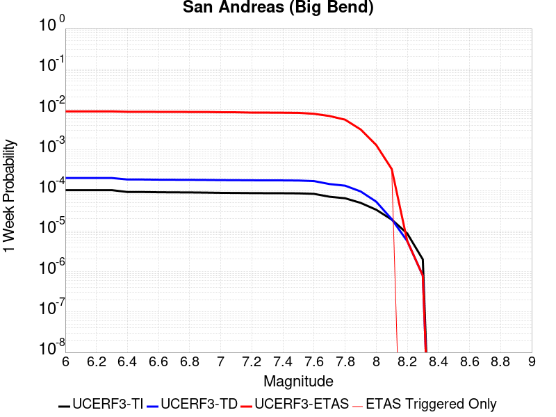 | 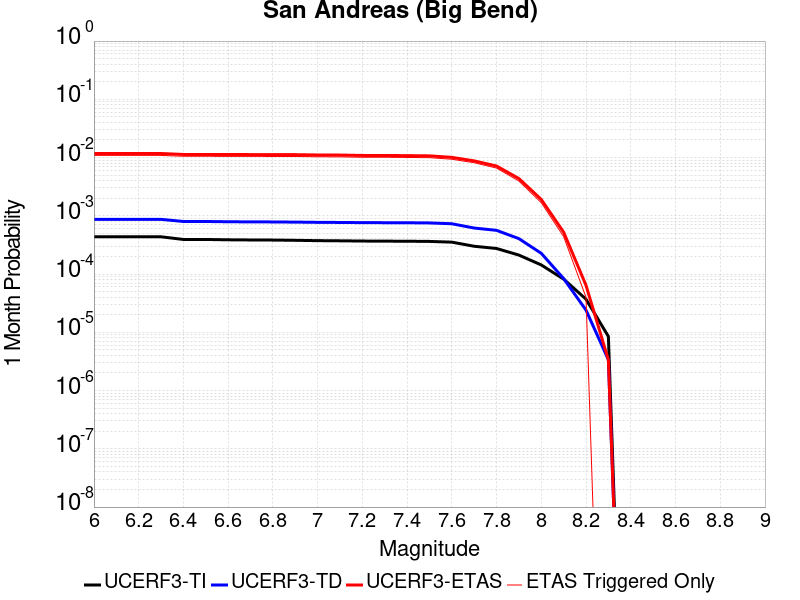 |  |

| Magnitude | 1 wk TI Prob | 1 wk TD Prob | 1 wk ETAS Prob | 1 wk ETAS/TD Gain | 1 wk ETAS Triggered Only | 1 mo TI Prob | 1 mo TD Prob | 1 mo ETAS Prob | 1 mo ETAS/TD Gain | 1 mo ETAS Triggered Only | 1 yr TI Prob | 1 yr TD Prob | 1 yr ETAS Prob | 1 yr ETAS/TD Gain | 1 yr ETAS Triggered Only |
|-----|-----|-----|-----|-----|-----|-----|-----|-----|-----|-----|-----|-----|-----|-----|-----|
| 6.0 | 1.0179969E-4 | 2.0293587E-4 | 0.00900115 | 44.354652 | 0.0088 | 4.362114E-4 | 8.694363E-4 | 0.011739977 | 13.5029745 | 0.01088 | 0.0052979486 | 0.0105343 | 0.025455443 | 2.4164343 | 0.01508 |
| 6.1 | 1.0179969E-4 | 2.0293587E-4 | 0.00900115 | 44.354652 | 0.0088 | 4.362114E-4 | 8.694363E-4 | 0.011739977 | 13.5029745 | 0.01088 | 0.0052979486 | 0.0105343 | 0.025455443 | 2.4164343 | 0.01508 |
| 6.2 | 1.0179969E-4 | 2.0293587E-4 | 0.00900115 | 44.354652 | 0.0088 | 4.362114E-4 | 8.694363E-4 | 0.011739977 | 13.5029745 | 0.01088 | 0.0052979486 | 0.0105343 | 0.025455443 | 2.4164343 | 0.01508 |
| 6.3 | 1.0179969E-4 | 2.0293587E-4 | 0.00900115 | 44.354652 | 0.0088 | 4.362114E-4 | 8.694363E-4 | 0.011739977 | 13.5029745 | 0.01088 | 0.0052979486 | 0.0105343 | 0.025455443 | 2.4164343 | 0.01508 |
| 6.4 | 9.1639464E-5 | 1.8646746E-4 | 0.008784864 | 47.112045 | 0.0086 | 3.9268145E-4 | 7.989017E-4 | 0.011310497 | 14.1575575 | 0.01052 | 0.0047704205 | 0.0096833715 | 0.02394393 | 2.4726853 | 0.0144 |
| 6.5 | 9.1639464E-5 | 1.8646746E-4 | 0.008784864 | 47.112045 | 0.0086 | 3.9268145E-4 | 7.989017E-4 | 0.011310497 | 14.1575575 | 0.01052 | 0.0047704205 | 0.0096833715 | 0.02394393 | 2.4726853 | 0.0144 |
| 6.6 | 9.042622E-5 | 1.8453281E-4 | 0.008742954 | 47.378857 | 0.00856 | 3.8748336E-4 | 7.906154E-4 | 0.011262329 | 14.245017 | 0.01048 | 0.0047074095 | 0.009583375 | 0.023766141 | 2.4799342 | 0.01432 |
| 6.7 | 8.9836685E-5 | 1.836743E-4 | 0.008742102 | 47.595673 | 0.00856 | 3.8495753E-4 | 7.869383E-4 | 0.011258692 | 14.306955 | 0.01048 | 0.00467679 | 0.009538999 | 0.0237224 | 2.4868858 | 0.01432 |
| 6.8 | 8.9471854E-5 | 1.8314009E-4 | 0.00870158 | 47.513245 | 0.00852 | 3.8339442E-4 | 7.846502E-4 | 0.011216459 | 14.294852 | 0.01044 | 0.004657841 | 0.009511384 | 0.023615941 | 2.4829133 | 0.01424 |
| 6.9 | 8.858234E-5 | 1.8195626E-4 | 0.008700406 | 47.81592 | 0.00852 | 3.7958333E-4 | 7.795797E-4 | 0.011211441 | 14.3813925 | 0.01044 | 0.004611638 | 0.009450188 | 0.023555618 | 2.4926083 | 0.01424 |
| 7.0 | 8.7433385E-5 | 1.803388E-4 | 0.008578824 | 47.570595 | 0.0084 | 3.746607E-4 | 7.7265187E-4 | 0.011084678 | 14.346278 | 0.01032 | 0.004551957 | 0.009366569 | 0.023314688 | 2.4891384 | 0.01408 |
| 7.1 | 8.684964E-5 | 1.7945496E-4 | 0.008537955 | 47.577145 | 0.00836 | 3.7215967E-4 | 7.688662E-4 | 0.011040962 | 14.360057 | 0.01028 | 0.0045216335 | 0.009320875 | 0.023150755 | 2.4837534 | 0.01396 |
| 7.2 | 8.606521E-5 | 1.7835775E-4 | 0.008376895 | 46.966812 | 0.0082 | 3.6879873E-4 | 7.6416665E-4 | 0.010876433 | 14.233065 | 0.01012 | 0.0044808835 | 0.009264145 | 0.02289667 | 2.4715362 | 0.01376 |
| 7.3 | 8.568266E-5 | 1.7777378E-4 | 0.008376316 | 47.11784 | 0.0082 | 3.6715972E-4 | 7.6166535E-4 | 0.010873958 | 14.276555 | 0.01012 | 0.0044610105 | 0.009233951 | 0.022866892 | 2.476393 | 0.01376 |
| 7.4 | 8.5432206E-5 | 1.7739709E-4 | 0.00833595 | 46.990337 | 0.00816 | 3.6608664E-4 | 7.6005195E-4 | 0.010792421 | 14.199584 | 0.01004 | 0.004447999 | 0.009214474 | 0.022689156 | 2.462339 | 0.0136 |
| 7.5 | 8.4791965E-5 | 1.7608136E-4 | 0.008254658 | 46.8798 | 0.00808 | 3.633435E-4 | 7.5441634E-4 | 0.0107069025 | 14.192299 | 0.00996 | 0.0044147377 | 0.009146439 | 0.022542778 | 2.4646509 | 0.01352 |
| 7.6 | 8.241105E-5 | 1.7049891E-4 | 0.007849189 | 46.0366 | 0.00768 | 3.531424E-4 | 7.3050515E-4 | 0.010083668 | 13.803692 | 0.00936 | 0.0042910352 | 0.008857722 | 0.02158399 | 2.4367425 | 0.01284 |
| 7.7 | 7.00432E-5 | 1.4393656E-4 | 0.0069029634 | 47.958374 | 0.00676 | 3.001506E-4 | 6.167252E-4 | 0.008771692 | 14.223017 | 0.00816 | 0.0036482112 | 0.0074828197 | 0.01855931 | 2.4802563 | 0.01116 |
| 7.8 | 6.415362E-5 | 1.3139434E-4 | 0.005610674 | 42.701035 | 0.00548 | 2.749151E-4 | 5.629971E-4 | 0.0071592815 | 12.716373 | 0.0066 | 0.0033419547 | 0.0068329778 | 0.015970115 | 2.3372116 | 0.0092 |
| 7.9 | 4.939911E-5 | 9.463773E-5 | 0.0032143425 | 33.964703 | 0.00312 | 2.116933E-4 | 4.0552724E-4 | 0.0043639215 | 10.761106 | 0.00396 | 0.0025743195 | 0.0049261265 | 0.010339328 | 2.098876 | 0.00544 |
| 8.0 | 3.344983E-5 | 5.2957934E-5 | 0.0013328901 | 25.168848 | 0.00128 | 1.4334853E-4 | 2.2694284E-4 | 0.0019065615 | 8.401065 | 0.00168 | 0.0017438711 | 0.00275953 | 0.005272576 | 1.910679 | 0.00252 |
| 8.1 | 1.9104898E-5 | 1.9529352E-5 | 3.395231E-4 | 17.385271 | 3.2E-4 | 8.1875565E-5 | 8.369455E-5 | 5.236577E-4 | 6.2567725 | 4.4E-4 | 9.963791E-4 | 0.0010185054 | 0.0017377721 | 1.7061982 | 7.2E-4 |
| 8.2 | 8.643924E-6 | 5.607368E-6 | 5.607368E-6 | 1.0 | 0.0 | 3.704486E-5 | 2.4031357E-5 | 6.403039E-5 | 2.664452 | 4.0E-5 | 4.5092785E-4 | 2.9254257E-4 | 4.5249576E-4 | 1.5467689 | 1.6E-4 |
| 8.3 | 1.983087E-6 | 7.877893E-7 | 7.877893E-7 | 1.0 | 0.0 | 8.498917E-6 | 3.3762356E-6 | 3.3762356E-6 | 1.0 | 0.0 | 1.034694E-4 | 4.110491E-5 | 8.1103266E-5 | 1.9730797 | 4.0E-5 |

## San Andreas (Carrizo) rev
*[(top)](#table-of-contents)*

| 1 Week | 1 Month | 1 Year |
|-----|-----|-----|
|  |  | 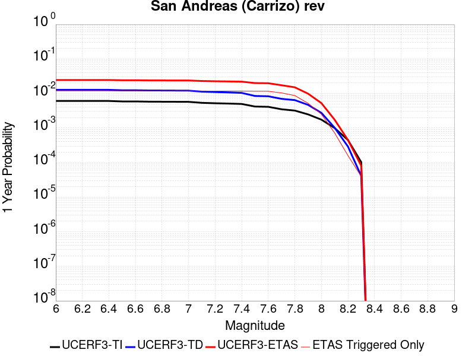 |

| Magnitude | 1 wk TI Prob | 1 wk TD Prob | 1 wk ETAS Prob | 1 wk ETAS/TD Gain | 1 wk ETAS Triggered Only | 1 mo TI Prob | 1 mo TD Prob | 1 mo ETAS Prob | 1 mo ETAS/TD Gain | 1 mo ETAS Triggered Only | 1 yr TI Prob | 1 yr TD Prob | 1 yr ETAS Prob | 1 yr ETAS/TD Gain | 1 yr ETAS Triggered Only |
|-----|-----|-----|-----|-----|-----|-----|-----|-----|-----|-----|-----|-----|-----|-----|-----|
| 6.0 | 1.1674632E-4 | 2.457212E-4 | 0.007403962 | 30.131557 | 0.00716 | 5.002454E-4 | 0.0010526674 | 0.009763489 | 9.274998 | 0.00872 | 0.006073493 | 0.0127414055 | 0.024509529 | 1.9236126 | 0.01192 |
| 6.1 | 1.1674632E-4 | 2.457212E-4 | 0.007403962 | 30.131557 | 0.00716 | 5.002454E-4 | 0.0010526674 | 0.009763489 | 9.274998 | 0.00872 | 0.006073493 | 0.0127414055 | 0.024509529 | 1.9236126 | 0.01192 |
| 6.2 | 1.1674632E-4 | 2.457212E-4 | 0.007403962 | 30.131557 | 0.00716 | 5.002454E-4 | 0.0010526674 | 0.009763489 | 9.274998 | 0.00872 | 0.006073493 | 0.0127414055 | 0.024509529 | 1.9236126 | 0.01192 |
| 6.3 | 1.1674632E-4 | 2.457212E-4 | 0.007403962 | 30.131557 | 0.00716 | 5.002454E-4 | 0.0010526674 | 0.009763489 | 9.274998 | 0.00872 | 0.006073493 | 0.0127414055 | 0.024509529 | 1.9236126 | 0.01192 |
| 6.4 | 1.1674632E-4 | 2.457212E-4 | 0.007403962 | 30.131557 | 0.00716 | 5.002454E-4 | 0.0010526674 | 0.009763489 | 9.274998 | 0.00872 | 0.006073493 | 0.0127414055 | 0.024509529 | 1.9236126 | 0.01192 |
| 6.5 | 1.13136164E-4 | 2.3891036E-4 | 0.0073972 | 30.962238 | 0.00716 | 4.847792E-4 | 0.0010235013 | 0.009734577 | 9.511054 | 0.00872 | 0.0058862255 | 0.012390388 | 0.024162695 | 1.950116 | 0.01192 |
| 6.6 | 1.13136164E-4 | 2.3891036E-4 | 0.0073972 | 30.962238 | 0.00716 | 4.847792E-4 | 0.0010235013 | 0.009734577 | 9.511054 | 0.00872 | 0.0058862255 | 0.012390388 | 0.024162695 | 1.950116 | 0.01192 |
| 6.7 | 1.1149675E-4 | 2.3581758E-4 | 0.0073541384 | 31.185709 | 0.00712 | 4.777557E-4 | 0.0010102568 | 0.009681487 | 9.583194 | 0.00868 | 0.0058011734 | 0.012230956 | 0.023965651 | 1.9594259 | 0.01188 |
| 6.8 | 1.1103589E-4 | 2.3483614E-4 | 0.0073131737 | 31.141602 | 0.00708 | 4.7578133E-4 | 0.0010060539 | 0.009637361 | 9.579369 | 0.00864 | 0.005777263 | 0.012180358 | 0.023876142 | 1.9602168 | 0.01184 |
| 6.9 | 1.1053259E-4 | 2.3375664E-4 | 0.007312102 | 31.28083 | 0.00708 | 4.7362508E-4 | 0.001001431 | 0.009632778 | 9.619014 | 0.00864 | 0.0057511497 | 0.012124702 | 0.023821145 | 1.9646788 | 0.01184 |
| 7.0 | 1.1005377E-4 | 2.3276206E-4 | 0.007311114 | 31.410248 | 0.00708 | 4.7157376E-4 | 9.971719E-4 | 0.009628557 | 9.655865 | 0.00864 | 0.0057263062 | 0.012073423 | 0.023770474 | 1.9688264 | 0.01184 |
| 7.1 | 1.0308142E-4 | 2.1781186E-4 | 0.0072562783 | 33.31443 | 0.00704 | 4.417027E-4 | 9.331465E-4 | 0.009525121 | 10.20753 | 0.0086 | 0.0053644776 | 0.011302199 | 0.022968834 | 2.0322447 | 0.0118 |
| 7.2 | 1.0027479E-4 | 2.1187181E-4 | 0.0072503802 | 34.220596 | 0.00704 | 4.296783E-4 | 9.077071E-4 | 0.009499901 | 10.465822 | 0.0086 | 0.0052187922 | 0.01099564 | 0.02258677 | 2.054157 | 0.01172 |
| 7.3 | 9.816942E-5 | 2.0659102E-4 | 0.0072451364 | 35.06995 | 0.00704 | 4.2065824E-4 | 8.850907E-4 | 0.009477478 | 10.707918 | 0.0086 | 0.005109493 | 0.010723028 | 0.022317354 | 2.081255 | 0.01172 |
| 7.4 | 9.5634205E-5 | 2.0024394E-4 | 0.007238834 | 36.150078 | 0.00704 | 4.0979648E-4 | 8.57907E-4 | 0.009450529 | 11.015797 | 0.0086 | 0.0049778637 | 0.010395263 | 0.021993432 | 2.1157165 | 0.01172 |
| 7.5 | 8.052417E-5 | 1.6317047E-4 | 0.0071620285 | 43.89292 | 0.007 | 3.4505792E-4 | 6.9911475E-4 | 0.00925313 | 13.2354965 | 0.00856 | 0.0041929903 | 0.008478587 | 0.020019896 | 2.3612304 | 0.01164 |
| 7.6 | 7.897024E-5 | 1.5967674E-4 | 0.007158559 | 44.83157 | 0.007 | 3.384E-4 | 6.8414956E-4 | 0.009198321 | 13.444897 | 0.00852 | 0.0041122385 | 0.008297788 | 0.019801533 | 2.386363 | 0.0116 |
| 7.7 | 6.707427E-5 | 1.3457966E-4 | 0.006573713 | 48.846256 | 0.00644 | 2.8742946E-4 | 5.766425E-4 | 0.008252214 | 14.310797 | 0.00768 | 0.003493839 | 0.006998057 | 0.017325277 | 2.4757268 | 0.0104 |
| 7.8 | 6.147705E-5 | 1.2361974E-4 | 0.005442962 | 44.029877 | 0.00532 | 2.6344648E-4 | 5.2969134E-4 | 0.0068463436 | 12.925157 | 0.00632 | 0.0032027436 | 0.0064299493 | 0.01509388 | 2.3474338 | 0.00872 |
| 7.9 | 4.7636717E-5 | 8.998664E-5 | 0.0030897167 | 34.33528 | 0.003 | 2.0414138E-4 | 3.8560005E-4 | 0.0042241192 | 10.954664 | 0.00384 | 0.0024825884 | 0.004684583 | 0.009860223 | 2.104824 | 0.0052 |
| 8.0 | 3.3554235E-5 | 5.2868458E-5 | 0.0013328008 | 25.209753 | 0.00128 | 1.4379594E-4 | 2.2655944E-4 | 0.0019061788 | 8.413593 | 0.00168 | 0.0017493097 | 0.0027548738 | 0.0052679316 | 1.9122225 | 0.00252 |
| 8.1 | 1.9175432E-5 | 1.954181E-5 | 3.3953556E-4 | 17.374826 | 3.2E-4 | 8.217783E-5 | 8.374793E-5 | 5.237111E-4 | 6.2534213 | 4.4E-4 | 0.0010000558 | 0.0010191548 | 0.0017384209 | 1.7057478 | 7.2E-4 |
| 8.2 | 8.643924E-6 | 5.607368E-6 | 5.607368E-6 | 1.0 | 0.0 | 3.704486E-5 | 2.4031357E-5 | 6.403039E-5 | 2.664452 | 4.0E-5 | 4.5092785E-4 | 2.9254257E-4 | 4.5249576E-4 | 1.5467689 | 1.6E-4 |
| 8.3 | 1.983087E-6 | 7.877893E-7 | 7.877893E-7 | 1.0 | 0.0 | 8.498917E-6 | 3.3762356E-6 | 3.3762356E-6 | 1.0 | 0.0 | 1.034694E-4 | 4.110491E-5 | 8.1103266E-5 | 1.9730797 | 4.0E-5 |

## San Andreas (San Bernardino N)
*[(top)](#table-of-contents)*

| 1 Week | 1 Month | 1 Year |
|-----|-----|-----|
| 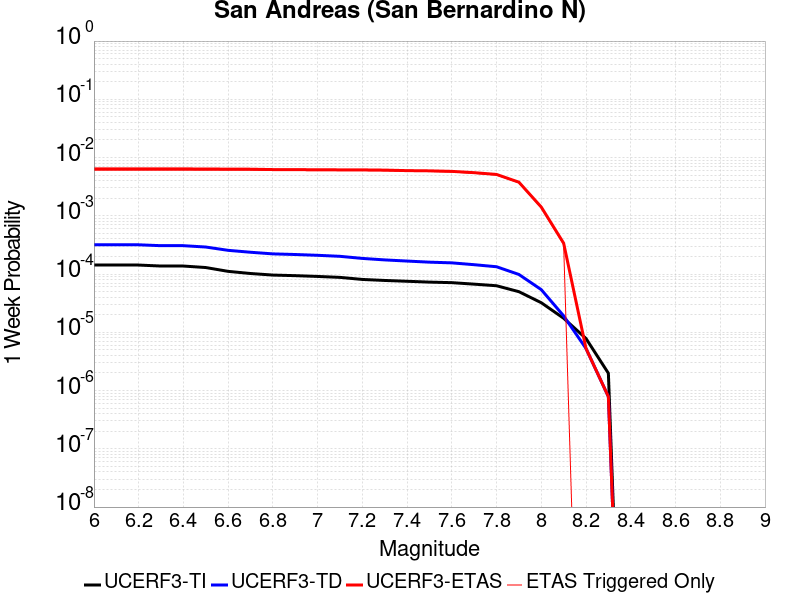 |  |  |

| Magnitude | 1 wk TI Prob | 1 wk TD Prob | 1 wk ETAS Prob | 1 wk ETAS/TD Gain | 1 wk ETAS Triggered Only | 1 mo TI Prob | 1 mo TD Prob | 1 mo ETAS Prob | 1 mo ETAS/TD Gain | 1 mo ETAS Triggered Only | 1 yr TI Prob | 1 yr TD Prob | 1 yr ETAS Prob | 1 yr ETAS/TD Gain | 1 yr ETAS Triggered Only |
|-----|-----|-----|-----|-----|-----|-----|-----|-----|-----|-----|-----|-----|-----|-----|-----|
| 6.0 | 1.4273766E-4 | 3.1797116E-4 | 0.006396038 | 20.115152 | 0.00608 | 6.115894E-4 | 0.0013620278 | 0.008791895 | 6.4550037 | 0.00744 | 0.0074207084 | 0.016458113 | 0.026804974 | 1.6286784 | 0.01052 |
| 6.1 | 1.4273766E-4 | 3.1797116E-4 | 0.006396038 | 20.115152 | 0.00608 | 6.115894E-4 | 0.0013620278 | 0.008791895 | 6.4550037 | 0.00744 | 0.0074207084 | 0.016458113 | 0.026804974 | 1.6286784 | 0.01052 |
| 6.2 | 1.4273766E-4 | 3.1797116E-4 | 0.006396038 | 20.115152 | 0.00608 | 6.115894E-4 | 0.0013620278 | 0.008791895 | 6.4550037 | 0.00744 | 0.0074207084 | 0.016458113 | 0.026804974 | 1.6286784 | 0.01052 |
| 6.3 | 1.3730655E-4 | 3.070095E-4 | 0.006385143 | 20.797867 | 0.00608 | 5.883239E-4 | 0.0013150972 | 0.008745313 | 6.649936 | 0.00744 | 0.0071393442 | 0.015895175 | 0.026247956 | 1.651316 | 0.01052 |
| 6.4 | 1.3730655E-4 | 3.070095E-4 | 0.006385143 | 20.797867 | 0.00608 | 5.883239E-4 | 0.0013150972 | 0.008745313 | 6.649936 | 0.00744 | 0.0071393442 | 0.015895175 | 0.026247956 | 1.651316 | 0.01052 |
| 6.5 | 1.2942807E-4 | 2.9113982E-4 | 0.0063693696 | 21.877356 | 0.00608 | 5.545738E-4 | 0.0012471506 | 0.008677872 | 6.9581585 | 0.00744 | 0.0067310524 | 0.015079602 | 0.025401568 | 1.6844985 | 0.01048 |
| 6.6 | 1.1125901E-4 | 2.5549048E-4 | 0.006333937 | 24.791285 | 0.00608 | 4.767372E-4 | 0.001094502 | 0.008526359 | 7.7901716 | 0.00744 | 0.005788839 | 0.0132447835 | 0.023585979 | 1.780775 | 0.01048 |
| 6.7 | 1.02209575E-4 | 2.3682536E-4 | 0.0063153855 | 26.666847 | 0.00608 | 4.3796748E-4 | 0.0010145725 | 0.008447024 | 8.325699 | 0.00744 | 0.0053192247 | 0.012282886 | 0.022594653 | 1.8395231 | 0.01044 |
| 6.8 | 9.610582E-5 | 2.2205901E-4 | 0.0062207268 | 28.013845 | 0.006 | 4.1181705E-4 | 9.5133507E-4 | 0.008304333 | 8.729136 | 0.00736 | 0.0050023515 | 0.011521262 | 0.021722363 | 1.8854152 | 0.01032 |
| 6.9 | 9.3877505E-5 | 2.1660629E-4 | 0.0062153065 | 28.694027 | 0.006 | 4.0227012E-4 | 9.279831E-4 | 0.008281153 | 8.92382 | 0.00736 | 0.0048866454 | 0.011239915 | 0.021404369 | 1.9043176 | 0.01028 |
| 7.0 | 9.1019785E-5 | 2.0986385E-4 | 0.006168613 | 29.393404 | 0.00596 | 3.900265E-4 | 8.991071E-4 | 0.008212525 | 9.13409 | 0.00732 | 0.0047382377 | 0.010891914 | 0.02102038 | 1.929907 | 0.01024 |
| 7.1 | 8.771155E-5 | 2.015964E-4 | 0.0061603948 | 30.558062 | 0.00596 | 3.758525E-4 | 8.63699E-4 | 0.008177376 | 9.4678545 | 0.00732 | 0.0045664064 | 0.010465035 | 0.020597873 | 1.9682565 | 0.01024 |
| 7.2 | 8.0830236E-5 | 1.8562343E-4 | 0.006144517 | 33.102055 | 0.00596 | 3.4636928E-4 | 7.952866E-4 | 0.008109465 | 10.196909 | 0.00732 | 0.0042088944 | 0.009639736 | 0.019781025 | 2.0520296 | 0.01024 |
| 7.3 | 7.7668235E-5 | 1.7502681E-4 | 0.0060939905 | 34.81747 | 0.00592 | 3.328214E-4 | 7.4989937E-4 | 0.00802444 | 10.700689 | 0.00728 | 0.0040445733 | 0.009091886 | 0.019159513 | 2.10732 | 0.01016 |
| 7.4 | 7.520177E-5 | 1.6720418E-4 | 0.0059662345 | 35.682327 | 0.0058 | 3.2225347E-4 | 7.1639265E-4 | 0.007871264 | 10.987359 | 0.00716 | 0.0039163795 | 0.008687268 | 0.018521091 | 2.131981 | 0.00992 |
| 7.5 | 7.274697E-5 | 1.600578E-4 | 0.0059191356 | 36.98124 | 0.00576 | 3.1173544E-4 | 6.857817E-4 | 0.007760926 | 11.316905 | 0.00708 | 0.003788775 | 0.008317487 | 0.018075643 | 2.1732097 | 0.00984 |
| 7.6 | 7.1185845E-5 | 1.5574165E-4 | 0.005794863 | 37.20818 | 0.00564 | 3.0504653E-4 | 6.6729356E-4 | 0.0075826757 | 11.363329 | 0.00692 | 0.0037076178 | 0.008094089 | 0.017656062 | 2.1813526 | 0.00964 |
| 7.7 | 6.709961E-5 | 1.4479096E-4 | 0.005504015 | 38.013527 | 0.00536 | 2.8753807E-4 | 6.2038517E-4 | 0.0072562657 | 11.696388 | 0.00664 | 0.003495157 | 0.0075270706 | 0.01669752 | 2.2183292 | 0.00924 |
| 7.8 | 6.300812E-5 | 1.3354905E-4 | 0.0051328815 | 38.43443 | 0.005 | 2.7000686E-4 | 5.722275E-4 | 0.0068086567 | 11.898513 | 0.00624 | 0.0032823787 | 0.006944645 | 0.015564365 | 2.2412038 | 0.00868 |
| 7.9 | 4.983037E-5 | 9.844076E-5 | 0.0037780786 | 38.37921 | 0.00368 | 2.1354125E-4 | 4.2182076E-4 | 0.0049798973 | 11.805718 | 0.00456 | 0.0025967648 | 0.005123585 | 0.011331614 | 2.2116573 | 0.00624 |
| 8.0 | 3.2211527E-5 | 5.4014366E-5 | 0.0014139409 | 26.177126 | 0.00136 | 1.380421E-4 | 2.3146962E-4 | 0.0019910622 | 8.60183 | 0.00176 | 0.0016793669 | 0.0028145025 | 0.005447072 | 1.9353588 | 0.00264 |
| 8.1 | 1.743376E-5 | 1.9157624E-5 | 3.391515E-4 | 17.703215 | 3.2E-4 | 7.471398E-5 | 8.210152E-5 | 4.820687E-4 | 5.8716173 | 4.0E-4 | 9.0926304E-4 | 9.991282E-4 | 0.0016784489 | 1.6799133 | 6.8E-4 |
| 8.2 | 7.831616E-6 | 5.2765454E-6 | 5.2765454E-6 | 1.0 | 0.0 | 3.3563636E-5 | 2.261357E-5 | 2.261357E-5 | 1.0 | 0.0 | 4.0856065E-4 | 2.752855E-4 | 3.952525E-4 | 1.435791 | 1.2E-4 |
| 8.3 | 1.983087E-6 | 7.877893E-7 | 7.877893E-7 | 1.0 | 0.0 | 8.498917E-6 | 3.3762356E-6 | 3.3762356E-6 | 1.0 | 0.0 | 1.034694E-4 | 4.110491E-5 | 8.1103266E-5 | 1.9730797 | 4.0E-5 |

## San Andreas (Cholame) rev
*[(top)](#table-of-contents)*

| 1 Week | 1 Month | 1 Year |
|-----|-----|-----|
| 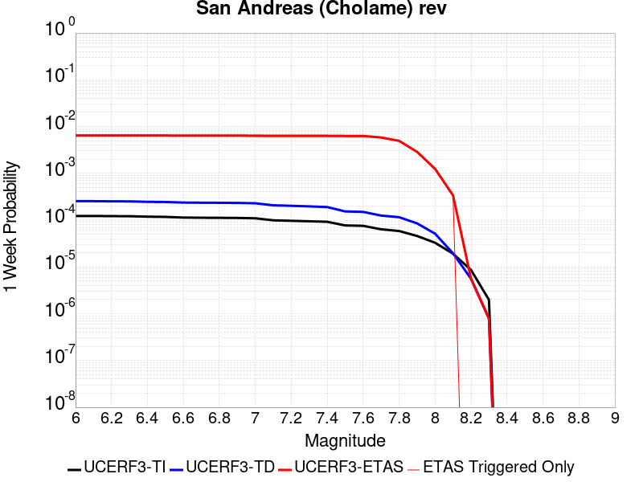 | 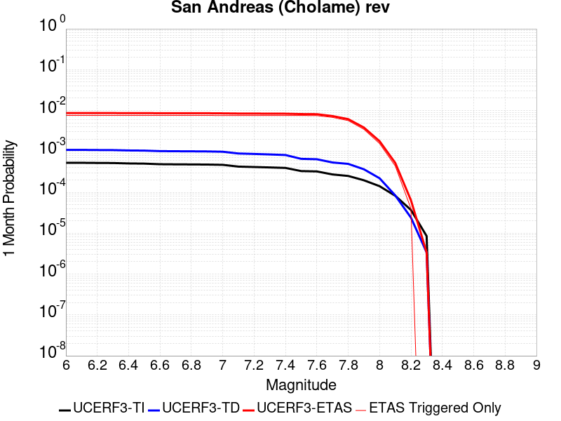 | 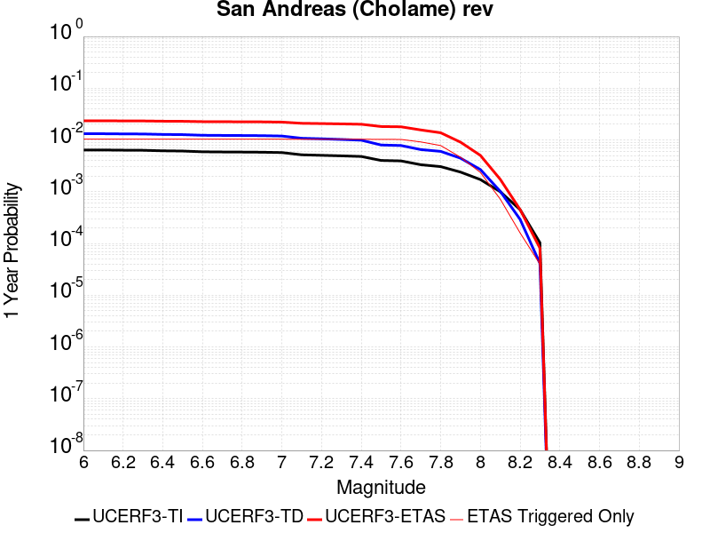 |

| Magnitude | 1 wk TI Prob | 1 wk TD Prob | 1 wk ETAS Prob | 1 wk ETAS/TD Gain | 1 wk ETAS Triggered Only | 1 mo TI Prob | 1 mo TD Prob | 1 mo ETAS Prob | 1 mo ETAS/TD Gain | 1 mo ETAS Triggered Only | 1 yr TI Prob | 1 yr TD Prob | 1 yr ETAS Prob | 1 yr ETAS/TD Gain | 1 yr ETAS Triggered Only |
|-----|-----|-----|-----|-----|-----|-----|-----|-----|-----|-----|-----|-----|-----|-----|-----|
| 6.0 | 1.2302514E-4 | 2.5456081E-4 | 0.0064529823 | 25.349474 | 0.0062 | 5.27144E-4 | 0.0010905204 | 0.008682232 | 7.9615498 | 0.0076 | 0.0063991086 | 0.013196777 | 0.02345953 | 1.7776712 | 0.0104 |
| 6.1 | 1.2302514E-4 | 2.5456081E-4 | 0.0064529823 | 25.349474 | 0.0062 | 5.27144E-4 | 0.0010905204 | 0.008682232 | 7.9615498 | 0.0076 | 0.0063991086 | 0.013196777 | 0.02345953 | 1.7776712 | 0.0104 |
| 6.2 | 1.2203569E-4 | 2.5272561E-4 | 0.006451159 | 25.526335 | 0.0062 | 5.2290526E-4 | 0.0010826618 | 0.008674433 | 8.0121355 | 0.0076 | 0.006347804 | 0.013102253 | 0.02336599 | 1.7833565 | 0.0104 |
| 6.3 | 1.2142645E-4 | 2.5158338E-4 | 0.0064500235 | 25.637716 | 0.0062 | 5.202953E-4 | 0.0010777706 | 0.008669579 | 8.043993 | 0.0076 | 0.006316212 | 0.013043418 | 0.023307765 | 1.7869371 | 0.0104 |
| 6.4 | 1.1865206E-4 | 2.466236E-4 | 0.0064450945 | 26.133324 | 0.0062 | 5.0840975E-4 | 0.0010565318 | 0.008648502 | 8.185747 | 0.0076 | 0.006172335 | 0.012787894 | 0.0230549 | 1.8028692 | 0.0104 |
| 6.5 | 1.17443946E-4 | 2.445465E-4 | 0.00644303 | 26.346851 | 0.0062 | 5.032341E-4 | 0.0010476371 | 0.008639675 | 8.24682 | 0.0076 | 0.006109677 | 0.012680864 | 0.022948982 | 1.8097334 | 0.0104 |
| 6.6 | 1.13579066E-4 | 2.3760591E-4 | 0.006436133 | 27.087427 | 0.0062 | 4.866766E-4 | 0.0010179152 | 0.008610179 | 8.458641 | 0.0076 | 0.0059092017 | 0.012323147 | 0.022594986 | 1.8335402 | 0.0104 |
| 6.7 | 1.1271412E-4 | 2.3604305E-4 | 0.0064345794 | 27.260195 | 0.0062 | 4.829711E-4 | 0.0010112225 | 0.008603537 | 8.508056 | 0.0076 | 0.005864331 | 0.012242582 | 0.02251526 | 1.839094 | 0.0104 |
| 6.8 | 1.1217975E-4 | 2.3492136E-4 | 0.006433465 | 27.38561 | 0.0062 | 4.8068175E-4 | 0.0010064188 | 0.00859877 | 8.543928 | 0.0076 | 0.005836608 | 0.012184754 | 0.022458032 | 1.8431257 | 0.0104 |
| 6.9 | 1.1146753E-4 | 2.3340227E-4 | 0.0064319554 | 27.55738 | 0.0062 | 4.7763053E-4 | 9.999136E-4 | 0.008592314 | 8.593058 | 0.0076 | 0.0057996577 | 0.012106434 | 0.022380527 | 1.8486474 | 0.0104 |
| 7.0 | 1.0965793E-4 | 2.2961597E-4 | 0.0063882014 | 27.821243 | 0.00616 | 4.698779E-4 | 9.836989E-4 | 0.008536262 | 8.677719 | 0.00756 | 0.005705768 | 0.011911196 | 0.022147795 | 1.8594099 | 0.01036 |
| 7.1 | 9.927982E-5 | 2.0771689E-4 | 0.0063664373 | 30.649588 | 0.00616 | 4.2541555E-4 | 8.899126E-4 | 0.008443185 | 9.487657 | 0.00756 | 0.0051671406 | 0.010781161 | 0.020989899 | 1.9469053 | 0.01032 |
| 7.2 | 9.696786E-5 | 2.0274252E-4 | 0.006361494 | 31.377205 | 0.00616 | 4.1551032E-4 | 8.686082E-4 | 0.008422041 | 9.696019 | 0.00756 | 0.00504711 | 0.010524314 | 0.020735703 | 1.9702665 | 0.01032 |
| 7.3 | 9.4727984E-5 | 1.9699681E-4 | 0.0063557834 | 32.263382 | 0.00616 | 4.0591392E-4 | 8.439999E-4 | 0.008397619 | 9.949787 | 0.00756 | 0.0049308087 | 0.01022756 | 0.02044201 | 1.9987184 | 0.01032 |
| 7.4 | 9.220358E-5 | 1.9066039E-4 | 0.006349486 | 33.302597 | 0.00616 | 3.9509835E-4 | 8.16861E-4 | 0.008370685 | 10.24738 | 0.00756 | 0.004799717 | 0.009900185 | 0.020118015 | 2.0320847 | 0.01032 |
| 7.5 | 7.71631E-5 | 1.537305E-4 | 0.0063127833 | 41.06396 | 0.00616 | 3.306571E-4 | 6.586788E-4 | 0.008213699 | 12.469961 | 0.00756 | 0.0040183207 | 0.007990002 | 0.018187864 | 2.276328 | 0.01028 |
| 7.6 | 7.5634416E-5 | 1.5029922E-4 | 0.0063093733 | 41.97875 | 0.00616 | 3.241072E-4 | 6.439807E-4 | 0.008159138 | 12.669848 | 0.00752 | 0.0039388672 | 0.007812348 | 0.01797235 | 2.3005054 | 0.01024 |
| 7.7 | 6.3783E-5 | 1.253131E-4 | 0.0058445963 | 46.639946 | 0.00572 | 2.7332708E-4 | 5.3694565E-4 | 0.0073332945 | 13.657424 | 0.0068 | 0.0033226798 | 0.006517746 | 0.015618043 | 2.3962338 | 0.00916 |
| 7.8 | 5.863422E-5 | 1.1572884E-4 | 0.004955169 | 42.81706 | 0.00484 | 2.512653E-4 | 4.9588655E-4 | 0.00617307 | 12.448553 | 0.00568 | 0.003054864 | 0.006020727 | 0.013773765 | 2.2877245 | 0.0078 |
| 7.9 | 4.595283E-5 | 8.541111E-5 | 0.002885172 | 33.77982 | 0.0028 | 1.9692584E-4 | 3.6599627E-4 | 0.0038447226 | 10.504813 | 0.00348 | 0.0023949358 | 0.0044469074 | 0.009066273 | 2.038782 | 0.00464 |
| 8.0 | 3.2950178E-5 | 5.1490908E-5 | 0.0012514291 | 24.303885 | 0.0012 | 1.412074E-4 | 2.2065666E-4 | 0.0017803124 | 8.068247 | 0.00156 | 0.0017178444 | 0.002683187 | 0.0050368547 | 1.8771911 | 0.00236 |
| 8.1 | 1.9177472E-5 | 1.9541987E-5 | 3.3953573E-4 | 17.37468 | 3.2E-4 | 8.218658E-5 | 8.374869E-5 | 5.2371185E-4 | 6.253374 | 4.4E-4 | 0.0010001622 | 0.0010191639 | 0.0017384301 | 1.7057414 | 7.2E-4 |
| 8.2 | 8.643924E-6 | 5.607368E-6 | 5.607368E-6 | 1.0 | 0.0 | 3.704486E-5 | 2.4031357E-5 | 6.403039E-5 | 2.664452 | 4.0E-5 | 4.5092785E-4 | 2.9254257E-4 | 4.5249576E-4 | 1.5467689 | 1.6E-4 |
| 8.3 | 1.983087E-6 | 7.877893E-7 | 7.877893E-7 | 1.0 | 0.0 | 8.498917E-6 | 3.3762356E-6 | 3.3762356E-6 | 1.0 | 0.0 | 1.034694E-4 | 4.110491E-5 | 8.1103266E-5 | 1.9730797 | 4.0E-5 |

## San Andreas (Parkfield)
*[(top)](#table-of-contents)*

| 1 Week | 1 Month | 1 Year |
|-----|-----|-----|
| 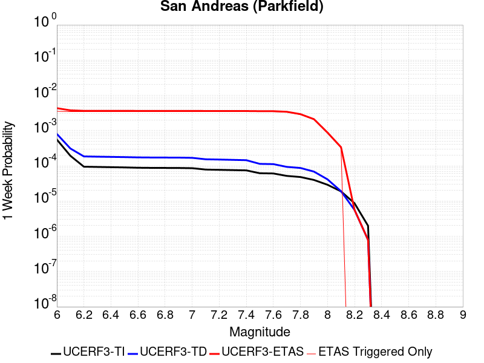 | 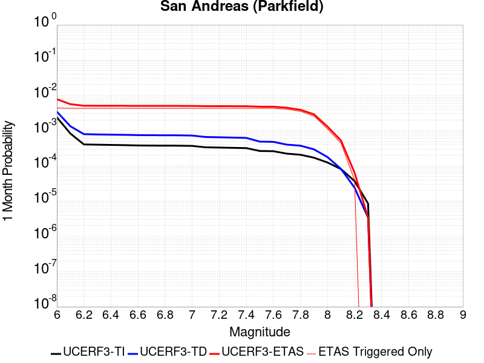 | 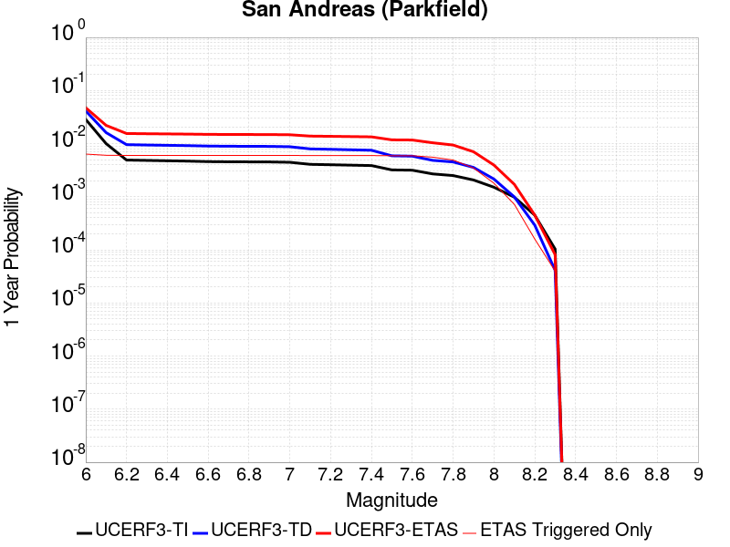 |

| Magnitude | 1 wk TI Prob | 1 wk TD Prob | 1 wk ETAS Prob | 1 wk ETAS/TD Gain | 1 wk ETAS Triggered Only | 1 mo TI Prob | 1 mo TD Prob | 1 mo ETAS Prob | 1 mo ETAS/TD Gain | 1 mo ETAS Triggered Only | 1 yr TI Prob | 1 yr TD Prob | 1 yr ETAS Prob | 1 yr ETAS/TD Gain | 1 yr ETAS Triggered Only |
|-----|-----|-----|-----|-----|-----|-----|-----|-----|-----|-----|-----|-----|-----|-----|-----|
| 6.0 | 5.556969E-4 | 8.0344157E-4 | 0.0043206136 | 5.3776326 | 0.00352 | 0.0023793848 | 0.003439371 | 0.0077843755 | 2.2633138 | 0.00436 | 0.028586963 | 0.041359875 | 0.047456827 | 1.1474122 | 0.00636 |
| 6.1 | 1.925858E-4 | 3.0992847E-4 | 0.0037488623 | 12.095895 | 0.00344 | 8.2510663E-4 | 0.0013276909 | 0.005602008 | 4.219362 | 0.00428 | 0.0099994885 | 0.016126512 | 0.022069108 | 1.3684986 | 0.00604 |
| 6.2 | 9.4306815E-5 | 1.8443585E-4 | 0.0036238013 | 19.648031 | 0.00344 | 4.0410945E-4 | 7.902011E-4 | 0.005066819 | 6.4120626 | 0.00428 | 0.0049089384 | 0.009578473 | 0.015521002 | 1.6204046 | 0.006 |
| 6.3 | 9.283051E-5 | 1.8139459E-4 | 0.0036207705 | 19.960743 | 0.00344 | 3.9778434E-4 | 7.7717495E-4 | 0.0050538485 | 6.5028453 | 0.00428 | 0.0048322747 | 0.009421266 | 0.015364738 | 1.6308571 | 0.006 |
| 6.4 | 9.138826E-5 | 1.7900368E-4 | 0.003618388 | 20.214043 | 0.00344 | 3.916052E-4 | 7.6693424E-4 | 0.005043652 | 6.5763807 | 0.00428 | 0.0047573745 | 0.009297662 | 0.015241876 | 1.6393235 | 0.006 |
| 6.5 | 9.000255E-5 | 1.7657269E-4 | 0.0036159654 | 20.47862 | 0.00344 | 3.8566816E-4 | 7.565218E-4 | 0.005033284 | 6.6531906 | 0.00428 | 0.0046854047 | 0.009171973 | 0.015116941 | 1.6481668 | 0.006 |
| 6.6 | 8.8109264E-5 | 1.7335823E-4 | 0.0036127619 | 20.839863 | 0.00344 | 3.7755648E-4 | 7.427535E-4 | 0.0050195744 | 6.7580624 | 0.00428 | 0.0045870654 | 0.009005753 | 0.014951719 | 1.6602408 | 0.006 |
| 6.7 | 8.738073E-5 | 1.7202341E-4 | 0.0036114317 | 20.993837 | 0.00344 | 3.7443507E-4 | 7.3703605E-4 | 0.0050138817 | 6.802763 | 0.00428 | 0.0045492216 | 0.0089367535 | 0.014883133 | 1.6653848 | 0.006 |
| 6.8 | 8.710195E-5 | 1.7147408E-4 | 0.0036108843 | 21.057901 | 0.00344 | 3.7324068E-4 | 7.346831E-4 | 0.0050115385 | 6.821361 | 0.00428 | 0.0045347405 | 0.008908349 | 0.014854899 | 1.6675255 | 0.006 |
| 6.9 | 8.6801556E-5 | 1.708797E-4 | 0.003610292 | 21.127682 | 0.00344 | 3.7195362E-4 | 7.3213724E-4 | 0.0050090034 | 6.8416185 | 0.00428 | 0.0045191357 | 0.008877606 | 0.01482434 | 1.6698579 | 0.006 |
| 7.0 | 8.5571606E-5 | 1.6839206E-4 | 0.0036078128 | 21.425076 | 0.00344 | 3.6668387E-4 | 7.214818E-4 | 0.004998394 | 6.927955 | 0.00428 | 0.004455241 | 0.008748925 | 0.014696431 | 1.6797985 | 0.006 |
| 7.1 | 7.82589E-5 | 1.5312967E-4 | 0.003592603 | 23.461182 | 0.00344 | 3.3535215E-4 | 6.561057E-4 | 0.0049332976 | 7.519059 | 0.00428 | 0.0040752706 | 0.007959004 | 0.013871567 | 1.7428775 | 0.00596 |
| 7.2 | 7.690929E-5 | 1.504851E-4 | 0.0035899675 | 23.855967 | 0.00344 | 3.2956956E-4 | 6.447775E-4 | 0.004922018 | 7.633669 | 0.00428 | 0.004005129 | 0.0078220805 | 0.013735461 | 1.7559856 | 0.00596 |
| 7.3 | 7.5543794E-5 | 1.4742615E-4 | 0.003586919 | 24.330275 | 0.00344 | 3.2371894E-4 | 6.3167413E-4 | 0.0049089706 | 7.7713656 | 0.00428 | 0.003934157 | 0.0076636793 | 0.013578004 | 1.7717344 | 0.00596 |
| 7.4 | 7.4214564E-5 | 1.4441142E-4 | 0.0035839146 | 24.81739 | 0.00344 | 3.1802364E-4 | 6.1876E-4 | 0.004896112 | 7.91278 | 0.00428 | 0.003865065 | 0.0075075435 | 0.013422798 | 1.7879082 | 0.00596 |
| 7.5 | 6.149578E-5 | 1.1344282E-4 | 0.0035530527 | 31.320208 | 0.00344 | 2.6352672E-4 | 4.86093E-4 | 0.0047640125 | 9.800619 | 0.00428 | 0.0032037178 | 0.005902156 | 0.011787215 | 1.9971033 | 0.00592 |
| 7.6 | 6.0643448E-5 | 1.11714806E-4 | 0.0035513304 | 31.789255 | 0.00344 | 2.598746E-4 | 4.7869E-4 | 0.004756641 | 9.936789 | 0.00428 | 0.0031593828 | 0.0058125085 | 0.011698099 | 2.012573 | 0.00592 |
| 7.7 | 5.1652263E-5 | 9.3113E-5 | 0.0034128039 | 36.652283 | 0.00332 | 2.2134806E-4 | 3.9899469E-4 | 0.004437383 | 11.1214075 | 0.00404 | 0.002691582 | 0.004846951 | 0.010380002 | 2.141553 | 0.00556 |
| 7.8 | 4.8090482E-5 | 8.685296E-5 | 0.0029266062 | 33.696102 | 0.00284 | 2.060858E-4 | 3.721739E-4 | 0.0038908639 | 10.454425 | 0.00352 | 0.0025062072 | 0.0045218114 | 0.009419564 | 2.0831397 | 0.00492 |
| 7.9 | 3.970278E-5 | 6.848254E-5 | 0.002108343 | 30.786573 | 0.00204 | 1.7014367E-4 | 2.934636E-4 | 0.0028927005 | 9.857101 | 0.0026 | 0.002069531 | 0.0035670698 | 0.0070346566 | 1.9721106 | 0.00348 |
| 8.0 | 2.8982335E-5 | 4.131844E-5 | 8.812837E-4 | 21.329067 | 8.4E-4 | 1.2420409E-4 | 1.77067E-4 | 0.0012968687 | 7.324169 | 0.00112 | 0.0015111357 | 0.0021536606 | 0.003949784 | 1.8339863 | 0.0018 |
| 8.1 | 1.8836186E-5 | 1.9031799E-5 | 3.3902572E-4 | 17.813644 | 3.2E-4 | 8.0724014E-5 | 8.1562306E-5 | 5.2152644E-4 | 6.394209 | 4.4E-4 | 9.823717E-4 | 9.925694E-4 | 0.0017118547 | 1.7246702 | 7.2E-4 |
| 8.2 | 8.643924E-6 | 5.607368E-6 | 5.607368E-6 | 1.0 | 0.0 | 3.704486E-5 | 2.4031357E-5 | 6.403039E-5 | 2.664452 | 4.0E-5 | 4.5092785E-4 | 2.9254257E-4 | 4.5249576E-4 | 1.5467689 | 1.6E-4 |
| 8.3 | 1.983087E-6 | 7.877893E-7 | 7.877893E-7 | 1.0 | 0.0 | 8.498917E-6 | 3.3762356E-6 | 3.3762356E-6 | 1.0 | 0.0 | 1.034694E-4 | 4.110491E-5 | 8.1103266E-5 | 1.9730797 | 4.0E-5 |

## San Andreas (San Bernardino S)
*[(top)](#table-of-contents)*

| 1 Week | 1 Month | 1 Year |
|-----|-----|-----|
| 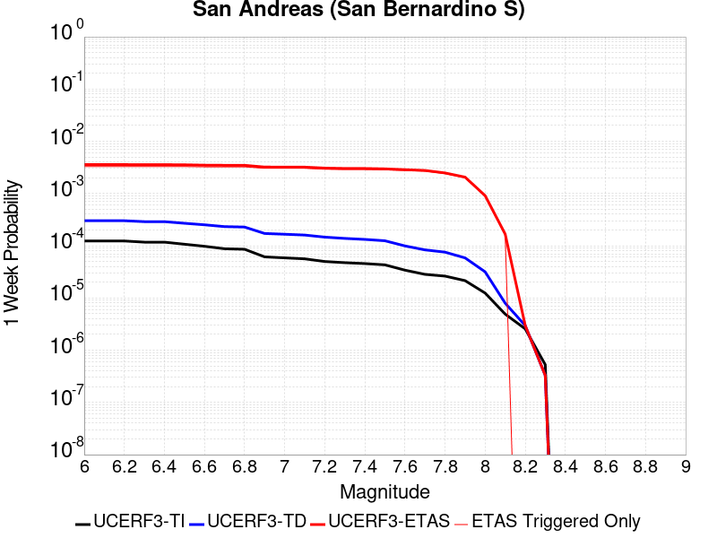 | 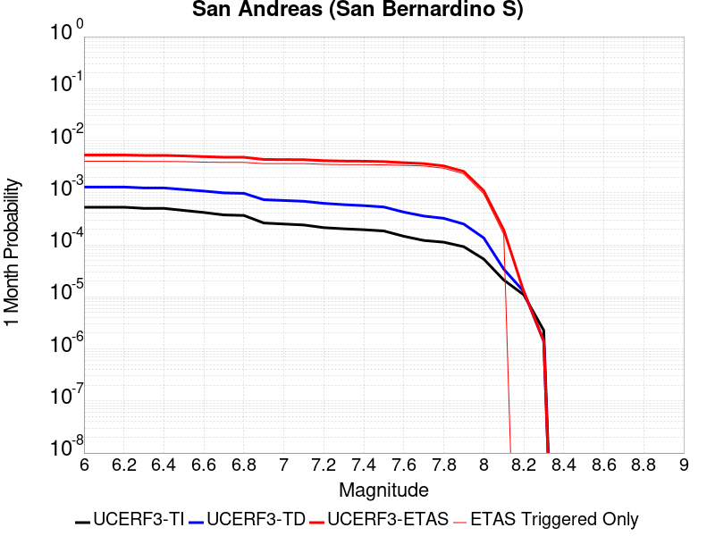 | 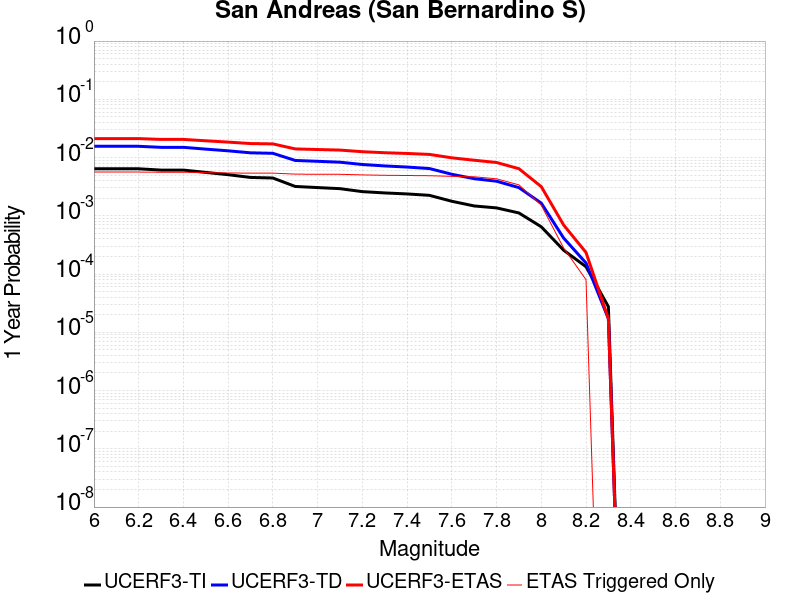 |

| Magnitude | 1 wk TI Prob | 1 wk TD Prob | 1 wk ETAS Prob | 1 wk ETAS/TD Gain | 1 wk ETAS Triggered Only | 1 mo TI Prob | 1 mo TD Prob | 1 mo ETAS Prob | 1 mo ETAS/TD Gain | 1 mo ETAS Triggered Only | 1 yr TI Prob | 1 yr TD Prob | 1 yr ETAS Prob | 1 yr ETAS/TD Gain | 1 yr ETAS Triggered Only |
|-----|-----|-----|-----|-----|-----|-----|-----|-----|-----|-----|-----|-----|-----|-----|-----|
| 6.0 | 1.2336002E-4 | 3.0132735E-4 | 0.003580339 | 11.881892 | 0.00328 | 5.2857865E-4 | 0.0012907899 | 0.0053255754 | 4.1258264 | 0.00404 | 0.006416472 | 0.015607107 | 0.021159083 | 1.3557339 | 0.00564 |
| 6.1 | 1.2336002E-4 | 3.0132735E-4 | 0.003580339 | 11.881892 | 0.00328 | 5.2857865E-4 | 0.0012907899 | 0.0053255754 | 4.1258264 | 0.00404 | 0.006416472 | 0.015607107 | 0.021159083 | 1.3557339 | 0.00564 |
| 6.2 | 1.2336002E-4 | 3.0132735E-4 | 0.003580339 | 11.881892 | 0.00328 | 5.2857865E-4 | 0.0012907899 | 0.0053255754 | 4.1258264 | 0.00404 | 0.006416472 | 0.015607107 | 0.021159083 | 1.3557339 | 0.00564 |
| 6.3 | 1.1712257E-4 | 2.891963E-4 | 0.0035682477 | 12.338497 | 0.00328 | 5.018573E-4 | 0.0012388497 | 0.0052338946 | 4.2248015 | 0.004 | 0.006093008 | 0.014983551 | 0.020499643 | 1.3681432 | 0.0056 |
| 6.4 | 1.1712257E-4 | 2.891963E-4 | 0.0035682477 | 12.338497 | 0.00328 | 5.018573E-4 | 0.0012388497 | 0.0052338946 | 4.2248015 | 0.004 | 0.006093008 | 0.014983551 | 0.020499643 | 1.3681432 | 0.0056 |
| 6.5 | 1.0689076E-4 | 2.6930252E-4 | 0.003548419 | 13.1763315 | 0.00328 | 4.5802278E-4 | 0.001153668 | 0.0051090997 | 4.42857 | 0.00396 | 0.0055621783 | 0.013960089 | 0.01940303 | 1.3898929 | 0.00552 |
| 6.6 | 9.7648895E-5 | 2.517273E-4 | 0.0034909118 | 13.867831 | 0.00324 | 4.1842813E-4 | 0.0010784089 | 0.004954225 | 4.594013 | 0.00388 | 0.005082469 | 0.0130549725 | 0.018423954 | 1.4112594 | 0.00544 |
| 6.7 | 8.757013E-5 | 2.3241482E-4 | 0.0034716618 | 14.937351 | 0.00324 | 3.7524657E-4 | 9.957057E-4 | 0.004831882 | 4.852721 | 0.00384 | 0.00455906 | 0.012059439 | 0.017394317 | 1.442382 | 0.0054 |
| 6.8 | 8.562978E-5 | 2.2800392E-4 | 0.0034672653 | 15.207042 | 0.00324 | 3.6693315E-4 | 9.76816E-4 | 0.0048130653 | 4.9272995 | 0.00384 | 0.004458263 | 0.011831971 | 0.017168079 | 1.4509906 | 0.0054 |
| 6.9 | 6.124075E-5 | 1.7172846E-4 | 0.0032112063 | 18.699326 | 0.00304 | 2.6243398E-4 | 7.3577237E-4 | 0.004373094 | 5.9435425 | 0.00364 | 0.0031904527 | 0.008921444 | 0.014075053 | 1.5776653 | 0.0052 |
| 7.0 | 5.8598747E-5 | 1.660076E-4 | 0.0032055029 | 19.309376 | 0.00304 | 2.5111332E-4 | 7.1126793E-4 | 0.004348679 | 6.1139812 | 0.00364 | 0.0030530186 | 0.008625501 | 0.013740993 | 1.5930662 | 0.00516 |
| 7.1 | 5.613814E-5 | 1.6018077E-4 | 0.0031996937 | 19.975517 | 0.00304 | 2.4056983E-4 | 6.863092E-4 | 0.0043238113 | 6.3000917 | 0.00364 | 0.0029250039 | 0.008323984 | 0.013441033 | 1.6147355 | 0.00516 |
| 7.2 | 4.991222E-5 | 1.4621996E-4 | 0.003065793 | 20.966993 | 0.00292 | 2.1389198E-4 | 6.2650687E-4 | 0.0041443016 | 6.614934 | 0.00352 | 0.002601025 | 0.0076011484 | 0.012602839 | 1.6580178 | 0.00504 |
| 7.3 | 4.7410045E-5 | 1.3813804E-4 | 0.00301774 | 21.84583 | 0.00288 | 2.0317009E-4 | 5.918862E-4 | 0.0040698266 | 6.876029 | 0.00348 | 0.0024707897 | 0.0071824905 | 0.012106866 | 1.6856083 | 0.00496 |
| 7.4 | 4.5556746E-5 | 1.3220012E-4 | 0.0030118194 | 22.782274 | 0.00288 | 1.952286E-4 | 5.6644925E-4 | 0.004044478 | 7.1400537 | 0.00348 | 0.002374317 | 0.0068747913 | 0.011760968 | 1.7107381 | 0.00492 |
| 7.5 | 4.3084514E-5 | 1.2453202E-4 | 0.0029641783 | 23.80254 | 0.00284 | 1.8463485E-4 | 5.335998E-4 | 0.0039717644 | 7.4433393 | 0.00344 | 0.0022456115 | 0.006477298 | 0.011325689 | 1.7485205 | 0.00488 |
| 7.6 | 3.408608E-5 | 9.923654E-5 | 0.0028589626 | 28.809576 | 0.00276 | 1.4607502E-4 | 4.2523025E-4 | 0.0037838016 | 8.898242 | 0.00336 | 0.0017770125 | 0.0051649143 | 0.00990033 | 1.9168428 | 0.00476 |
| 7.7 | 2.8315713E-5 | 8.3315266E-5 | 0.002763092 | 33.164295 | 0.00268 | 1.2134742E-4 | 3.570166E-4 | 0.0036358456 | 10.183968 | 0.00328 | 0.0014764034 | 0.0043380233 | 0.008997722 | 2.0741525 | 0.00468 |
| 7.8 | 2.6222975E-5 | 7.540562E-5 | 0.0024752247 | 32.825466 | 0.0024 | 1.1237934E-4 | 3.2312694E-4 | 0.0032821705 | 10.157527 | 0.00296 | 0.0013673597 | 0.00392698 | 0.008230016 | 2.095762 | 0.00432 |
| 7.9 | 2.1469694E-5 | 5.85263E-5 | 0.0020584092 | 35.17067 | 0.002 | 9.200973E-5 | 2.508029E-4 | 0.002570221 | 10.247972 | 0.00232 | 0.0011196428 | 0.003049253 | 0.0064388853 | 2.111627 | 0.0034 |
| 8.0 | 1.2420249E-5 | 3.168168E-5 | 9.116538E-4 | 28.775425 | 8.8E-4 | 5.322855E-5 | 1.3577157E-4 | 0.0010956412 | 8.069739 | 9.6E-4 | 6.478649E-4 | 0.0016517665 | 0.0031692558 | 1.9187069 | 0.00152 |
| 8.1 | 4.9197724E-6 | 7.958367E-6 | 1.679571E-4 | 21.104467 | 1.6E-4 | 2.1084568E-5 | 3.410684E-5 | 1.9410139E-4 | 5.690981 | 1.6E-4 | 2.566744E-4 | 4.1517182E-4 | 6.950556E-4 | 1.6741396 | 2.8E-4 |
| 8.2 | 2.5634774E-6 | 2.9684513E-6 | 2.9684513E-6 | 1.0 | 0.0 | 1.0986286E-5 | 1.2721873E-5 | 1.2721873E-5 | 1.0 | 0.0 | 1.3374983E-4 | 1.5487784E-4 | 2.3486545E-4 | 1.5164561 | 8.0E-5 |
| 8.3 | 5.2850464E-7 | 3.291787E-7 | 3.291787E-7 | 1.0 | 0.0 | 2.2650179E-6 | 1.4107652E-6 | 1.4107652E-6 | 1.0 | 0.0 | 2.7576245E-5 | 1.7175944E-5 | 1.7175944E-5 | 1.0 | 0.0 |

## San Andreas (Creeping Section) 2011 CFM
*[(top)](#table-of-contents)*

| 1 Week | 1 Month | 1 Year |
|-----|-----|-----|
| 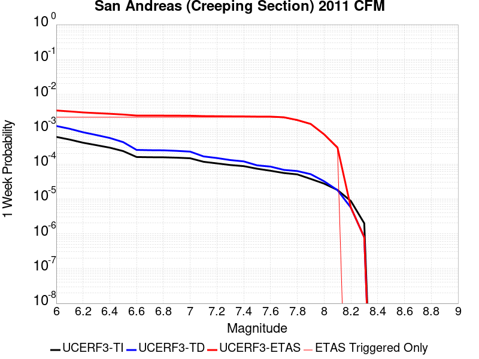 | 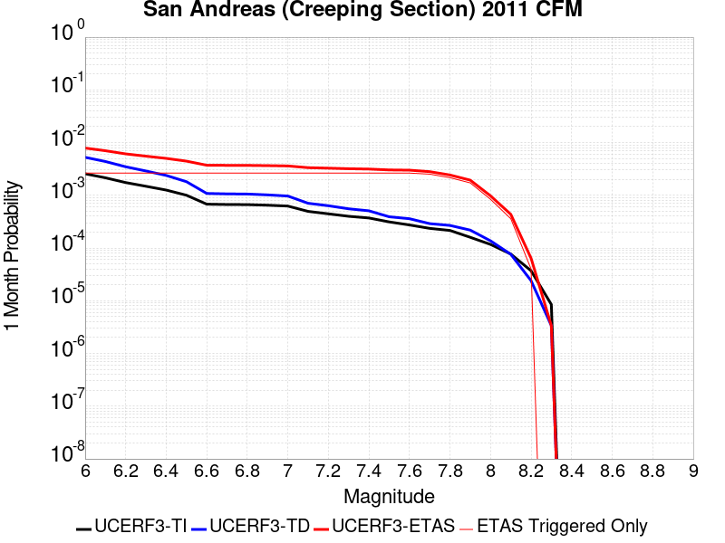 | 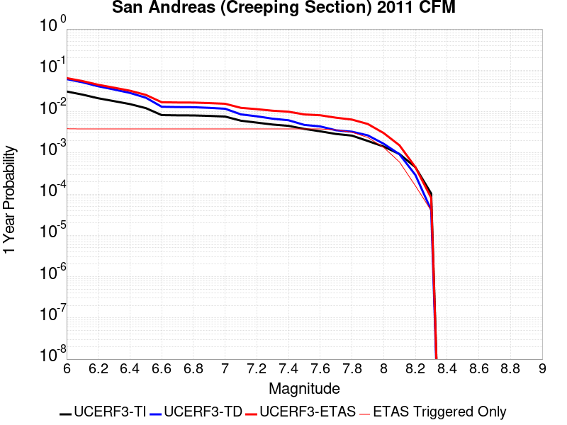 |

| Magnitude | 1 wk TI Prob | 1 wk TD Prob | 1 wk ETAS Prob | 1 wk ETAS/TD Gain | 1 wk ETAS Triggered Only | 1 mo TI Prob | 1 mo TD Prob | 1 mo ETAS Prob | 1 mo ETAS/TD Gain | 1 mo ETAS Triggered Only | 1 yr TI Prob | 1 yr TD Prob | 1 yr ETAS Prob | 1 yr ETAS/TD Gain | 1 yr ETAS Triggered Only |
|-----|-----|-----|-----|-----|-----|-----|-----|-----|-----|-----|-----|-----|-----|-----|-----|
| 6.0 | 5.986481E-4 | 0.0012305736 | 0.0034278664 | 2.785584 | 0.0022 | 0.0025631124 | 0.0052583744 | 0.007884492 | 1.4994164 | 0.00264 | 0.030762846 | 0.06135223 | 0.06495664 | 1.0587494 | 0.00384 |
| 6.1 | 5.015945E-4 | 0.0010242044 | 0.0032219512 | 3.1458087 | 0.0022 | 0.00214792 | 0.00437824 | 0.0070066815 | 1.600342 | 0.00264 | 0.025839351 | 0.051369127 | 0.054973923 | 1.0701743 | 0.0038 |
| 6.2 | 4.073338E-4 | 8.1310584E-4 | 0.003011317 | 3.7034748 | 0.0022 | 0.0017445484 | 0.0034773606 | 0.0061081806 | 1.7565565 | 0.00264 | 0.021034058 | 0.04105309 | 0.044697087 | 1.0887631 | 0.0038 |
| 6.3 | 3.464099E-4 | 6.7629415E-4 | 0.0028748063 | 4.2508225 | 0.0022 | 0.0014837692 | 0.002893196 | 0.005525558 | 1.9098457 | 0.00264 | 0.017915873 | 0.034310453 | 0.037980072 | 1.1069534 | 0.0038 |
| 6.4 | 2.935057E-4 | 5.56817E-4 | 0.0027555919 | 4.948829 | 0.0022 | 0.0012572751 | 0.0023828198 | 0.005016529 | 2.1052911 | 0.00264 | 0.015200248 | 0.028386578 | 0.03207871 | 1.130066 | 0.0038 |
| 6.5 | 2.3409708E-4 | 4.233272E-4 | 0.002622396 | 6.1947255 | 0.0022 | 0.0010028875 | 0.0018122771 | 0.004447493 | 2.4540908 | 0.00264 | 0.012141965 | 0.021710506 | 0.025428006 | 1.1712304 | 0.0038 |
| 6.6 | 1.5842178E-4 | 2.530843E-4 | 0.0024525274 | 9.690557 | 0.0022 | 6.7877385E-4 | 0.0010841859 | 0.0037213236 | 3.4323666 | 0.00264 | 0.0082328 | 0.013118694 | 0.016868843 | 1.2858629 | 0.0038 |
| 6.7 | 1.5616413E-4 | 2.484441E-4 | 0.0024478976 | 9.852911 | 0.0022 | 6.691031E-4 | 0.0010643183 | 0.0037015085 | 3.4778206 | 0.00264 | 0.0081159435 | 0.01288029 | 0.016631346 | 1.2912244 | 0.0038 |
| 6.8 | 1.5538467E-4 | 2.4667758E-4 | 0.0024461348 | 9.916325 | 0.0022 | 6.6576427E-4 | 0.0010567546 | 0.0036939648 | 3.4955747 | 0.00264 | 0.008075596 | 0.012789439 | 0.01654084 | 1.2933202 | 0.0038 |
| 6.9 | 1.5153569E-4 | 2.3774903E-4 | 0.002437226 | 10.251255 | 0.0022 | 6.49277E-4 | 0.0010185286 | 0.0036558397 | 3.5893342 | 0.00264 | 0.007876333 | 0.012330608 | 0.016083753 | 1.3043762 | 0.0038 |
| 7.0 | 1.4588932E-4 | 2.26266E-4 | 0.0024257682 | 10.720869 | 0.0022 | 6.250901E-4 | 9.69353E-4 | 0.003606794 | 3.720826 | 0.00264 | 0.0075839474 | 0.011738516 | 0.01549391 | 1.3199207 | 0.0038 |
| 7.1 | 1.1565079E-4 | 1.648249E-4 | 0.0023644622 | 14.345298 | 0.0022 | 4.955521E-4 | 7.0620206E-4 | 0.0033443377 | 4.7356668 | 0.00264 | 0.006016669 | 0.008564321 | 0.012331777 | 1.4399012 | 0.0038 |
| 7.2 | 1.0393792E-4 | 1.4804474E-4 | 0.002347719 | 15.858173 | 0.0022 | 4.4537216E-4 | 6.343239E-4 | 0.0032726494 | 5.1592712 | 0.00264 | 0.005408933 | 0.0076957205 | 0.011466477 | 1.4899809 | 0.0038 |
| 7.3 | 9.332884E-5 | 1.2946628E-4 | 0.0023291814 | 17.990643 | 0.0022 | 3.999194E-4 | 5.5473816E-4 | 0.0031932737 | 5.756362 | 0.00264 | 0.0048581534 | 0.006733159 | 0.010507573 | 1.5605711 | 0.0038 |
| 7.4 | 8.670252E-5 | 1.1859965E-4 | 0.0023183387 | 19.547602 | 0.0022 | 3.715293E-4 | 5.081858E-4 | 0.0031468442 | 6.1923103 | 0.00264 | 0.004513991 | 0.006169733 | 0.009946289 | 1.6121099 | 0.0038 |
| 7.5 | 7.3036405E-5 | 9.138321E-5 | 0.002291182 | 25.072245 | 0.0022 | 3.129756E-4 | 3.9158363E-4 | 0.0030305497 | 7.739215 | 0.00264 | 0.0038038217 | 0.004757131 | 0.008539054 | 1.7950008 | 0.0038 |
| 7.6 | 6.3935775E-5 | 8.4007974E-5 | 0.0022838232 | 27.18579 | 0.0022 | 2.7398168E-4 | 3.5998458E-4 | 0.0029990342 | 8.331007 | 0.00264 | 0.0033306254 | 0.004374024 | 0.008157402 | 1.8649653 | 0.0038 |
| 7.7 | 5.5050095E-5 | 6.768488E-5 | 0.0021875415 | 32.3195 | 0.00212 | 2.3590765E-4 | 2.900458E-4 | 0.002809315 | 9.685762 | 0.00252 | 0.0028683927 | 0.0035255942 | 0.007112902 | 2.0175045 | 0.0036 |
| 7.8 | 5.027131E-5 | 6.260343E-5 | 0.0018224933 | 29.111715 | 0.00176 | 2.1543067E-4 | 2.6827282E-4 | 0.0024276935 | 9.049345 | 0.00216 | 0.0026197135 | 0.0032613333 | 0.0064110276 | 1.9657688 | 0.00316 |
| 7.9 | 3.7271806E-5 | 5.1009967E-5 | 0.0014109405 | 27.660097 | 0.00136 | 1.5972654E-4 | 2.1859583E-4 | 0.0019382199 | 8.866683 | 0.00172 | 0.0019429359 | 0.002658158 | 0.005011885 | 1.8854728 | 0.00236 |
| 8.0 | 2.7310243E-5 | 3.1948035E-5 | 7.119263E-4 | 22.283884 | 6.8E-4 | 1.17038646E-4 | 1.3691297E-4 | 9.76798E-4 | 7.134444 | 8.4E-4 | 0.0014240141 | 0.0016656418 | 0.0030233765 | 1.815142 | 0.00136 |
| 8.1 | 1.7940547E-5 | 1.7734084E-5 | 2.9772913E-4 | 16.788525 | 2.8E-4 | 7.688579E-5 | 7.600101E-5 | 4.3597363E-4 | 5.7364197 | 3.6E-4 | 9.3568244E-4 | 9.2491996E-4 | 0.001524365 | 1.6481048 | 6.0E-4 |
| 8.2 | 8.643924E-6 | 5.607368E-6 | 5.607368E-6 | 1.0 | 0.0 | 3.704486E-5 | 2.4031357E-5 | 6.403039E-5 | 2.664452 | 4.0E-5 | 4.5092785E-4 | 2.9254257E-4 | 4.5249576E-4 | 1.5467689 | 1.6E-4 |
| 8.3 | 1.983087E-6 | 7.877893E-7 | 7.877893E-7 | 1.0 | 0.0 | 8.498917E-6 | 3.3762356E-6 | 3.3762356E-6 | 1.0 | 0.0 | 1.034694E-4 | 4.110491E-5 | 8.1103266E-5 | 1.9730797 | 4.0E-5 |

## Garlock (West)
*[(top)](#table-of-contents)*

| 1 Week | 1 Month | 1 Year |
|-----|-----|-----|
| 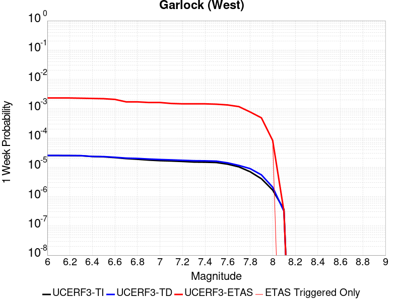 | 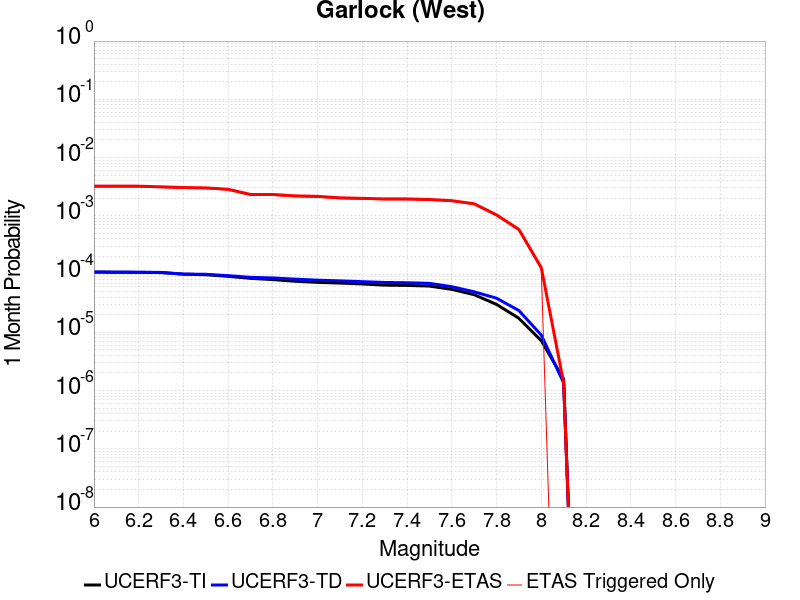 | 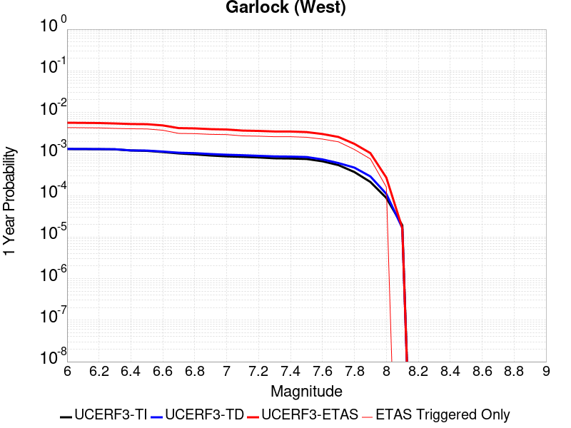 |

| Magnitude | 1 wk TI Prob | 1 wk TD Prob | 1 wk ETAS Prob | 1 wk ETAS/TD Gain | 1 wk ETAS Triggered Only | 1 mo TI Prob | 1 mo TD Prob | 1 mo ETAS Prob | 1 mo ETAS/TD Gain | 1 mo ETAS Triggered Only | 1 yr TI Prob | 1 yr TD Prob | 1 yr ETAS Prob | 1 yr ETAS/TD Gain | 1 yr ETAS Triggered Only |
|-----|-----|-----|-----|-----|-----|-----|-----|-----|-----|-----|-----|-----|-----|-----|-----|
| 6.0 | 2.5181727E-5 | 2.5328825E-5 | 0.002305271 | 91.01374 | 0.00228 | 1.0791722E-4 | 1.0854761E-4 | 0.003228209 | 29.740026 | 0.00312 | 0.0013131002 | 0.0013207694 | 0.0056350636 | 4.2665005 | 0.00432 |
| 6.1 | 2.5077732E-5 | 2.5229843E-5 | 0.0023051724 | 91.36689 | 0.00228 | 1.0747157E-4 | 1.0812344E-4 | 0.0032277862 | 29.852787 | 0.00312 | 0.001307681 | 0.0013156114 | 0.0055899806 | 4.2489605 | 0.00428 |
| 6.2 | 2.494612E-5 | 2.5111442E-5 | 0.002305054 | 91.79299 | 0.00228 | 1.0690756E-4 | 1.0761604E-4 | 0.0032272802 | 29.98884 | 0.00312 | 0.0013008224 | 0.0013094412 | 0.005543889 | 4.2337823 | 0.00424 |
| 6.3 | 2.4733758E-5 | 2.4930645E-5 | 0.0022648748 | 90.84702 | 0.00224 | 1.0599751E-4 | 1.0684126E-4 | 0.0031465164 | 29.450386 | 0.00304 | 0.0012897556 | 0.0013000196 | 0.0054146633 | 4.165063 | 0.00412 |
| 6.4 | 2.3237335E-5 | 2.3309083E-5 | 0.002223258 | 95.38161 | 0.0022 | 9.958477E-5 | 9.989226E-5 | 0.0030595965 | 30.628965 | 0.00296 | 0.0012117702 | 0.0012155125 | 0.005250602 | 4.3196607 | 0.00404 |
| 6.5 | 2.2732203E-5 | 2.3122879E-5 | 0.002183073 | 94.41181 | 0.00216 | 9.742009E-5 | 9.90943E-5 | 0.003018805 | 30.46396 | 0.00292 | 0.0011854442 | 0.0012058083 | 0.005200985 | 4.3132772 | 0.004 |
| 6.6 | 2.1319436E-5 | 2.1901993E-5 | 0.0020618574 | 94.14017 | 0.00204 | 9.136581E-5 | 9.386232E-5 | 0.0028536033 | 30.402012 | 0.00276 | 0.001111811 | 0.0011421769 | 0.004857928 | 4.253218 | 0.00372 |
| 6.7 | 1.970802E-5 | 2.05206E-5 | 0.0017004862 | 82.86727 | 0.00168 | 8.446021E-5 | 8.794248E-5 | 0.0023277455 | 26.468956 | 0.00224 | 0.001027818 | 0.0010701754 | 0.0041868365 | 3.9122899 | 0.00312 |
| 6.8 | 1.8744462E-5 | 2.0026835E-5 | 0.0016999932 | 84.885765 | 0.00168 | 8.033094E-5 | 8.5826476E-5 | 0.0023256342 | 27.096931 | 0.00224 | 9.775903E-4 | 0.0010444381 | 0.004121221 | 3.945874 | 0.00308 |
| 6.9 | 1.7559682E-5 | 1.9078003E-5 | 0.0016190475 | 84.86462 | 0.0016 | 7.5253614E-5 | 8.1760314E-5 | 0.002201587 | 26.92733 | 0.00212 | 9.158276E-4 | 9.949787E-4 | 0.003952034 | 3.971978 | 0.00296 |
| 7.0 | 1.6794445E-5 | 1.8338675E-5 | 0.0016183093 | 88.24571 | 0.0016 | 7.197421E-5 | 7.8591955E-5 | 0.0021584285 | 27.463732 | 0.00208 | 8.759337E-4 | 9.564384E-4 | 0.0038736456 | 4.050073 | 0.00292 |
| 7.1 | 1.6337795E-5 | 1.7838813E-5 | 0.0014978125 | 83.963684 | 0.00148 | 7.0017246E-5 | 7.6449825E-5 | 0.0020363 | 26.63577 | 0.00196 | 8.521265E-4 | 9.303805E-4 | 0.00364785 | 3.9208152 | 0.00272 |
| 7.2 | 1.5780008E-5 | 1.7286979E-5 | 0.0014572621 | 84.298256 | 0.00144 | 6.762685E-5 | 7.408495E-5 | 0.0019939428 | 26.914274 | 0.00192 | 8.2304585E-4 | 9.0161234E-4 | 0.003579196 | 3.9697726 | 0.00268 |
| 7.3 | 1.5058865E-5 | 1.6739175E-5 | 0.001456715 | 87.0243 | 0.00144 | 6.45364E-5 | 7.173736E-5 | 0.0019516025 | 27.204826 | 0.00188 | 7.854473E-4 | 8.730536E-4 | 0.0034707836 | 3.9754531 | 0.0026 |
| 7.4 | 1.4887923E-5 | 1.6574775E-5 | 0.0014565509 | 87.87757 | 0.00144 | 6.380382E-5 | 7.1032824E-5 | 0.0019508993 | 27.464758 | 0.00188 | 7.7653467E-4 | 8.6448266E-4 | 0.003462235 | 4.004979 | 0.0026 |
| 7.5 | 1.4509299E-5 | 1.6165865E-5 | 0.0014161433 | 87.60084 | 0.0014 | 6.218123E-5 | 6.928044E-5 | 0.001909153 | 27.556883 | 0.00184 | 7.567935E-4 | 8.4316416E-4 | 0.0033610393 | 3.9862218 | 0.00252 |
| 7.6 | 1.2756717E-5 | 1.41623805E-5 | 0.0013341437 | 94.203354 | 0.00132 | 5.4670498E-5 | 6.0694507E-5 | 0.0018205877 | 29.995922 | 0.00176 | 6.6541E-4 | 7.3870574E-4 | 0.0030170216 | 4.0841994 | 0.00228 |
| 7.7 | 1.0328985E-5 | 1.1565329E-5 | 0.0011715519 | 101.29862 | 0.00116 | 4.4266326E-5 | 4.956476E-5 | 0.0016094875 | 32.472416 | 0.00156 | 5.388092E-4 | 6.032842E-4 | 0.0025621017 | 4.246923 | 0.00196 |
| 7.8 | 7.0306583E-6 | 8.9839405E-6 | 7.689771E-4 | 85.594635 | 7.6E-4 | 3.0131043E-5 | 3.8502036E-5 | 0.0010384636 | 26.971653 | 0.001 | 3.667837E-4 | 4.6866163E-4 | 0.0017480617 | 3.7299016 | 0.00128 |
| 7.9 | 4.060633E-6 | 5.514807E-6 | 4.8551217E-4 | 88.03792 | 4.8E-4 | 1.7402595E-5 | 2.3634675E-5 | 5.8362144E-4 | 24.693441 | 5.6E-4 | 2.11856E-4 | 2.8771427E-4 | 0.0010474956 | 3.6407497 | 7.6E-4 |
| 8.0 | 1.6729537E-6 | 2.093995E-6 | 8.209383E-5 | 39.204407 | 8.0E-5 | 7.169782E-6 | 8.974233E-6 | 1.2897316E-4 | 14.371496 | 1.2E-4 | 8.7288594E-5 | 1.09255845E-4 | 2.6923837E-4 | 2.4642925 | 1.6E-4 |
| 8.1 | 3.6733252E-7 | 3.1722044E-7 | 3.1722044E-7 | 1.0 | 0.0 | 1.5742813E-6 | 1.3595155E-6 | 1.3595155E-6 | 1.0 | 0.0 | 1.9166706E-5 | 1.6551992E-5 | 1.6551992E-5 | 1.0 | 0.0 |

## San Andreas (San Gorgonio Pass-Garnet HIll)
*[(top)](#table-of-contents)*

| 1 Week | 1 Month | 1 Year |
|-----|-----|-----|
| 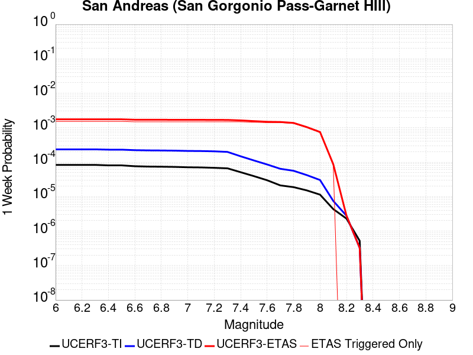 | 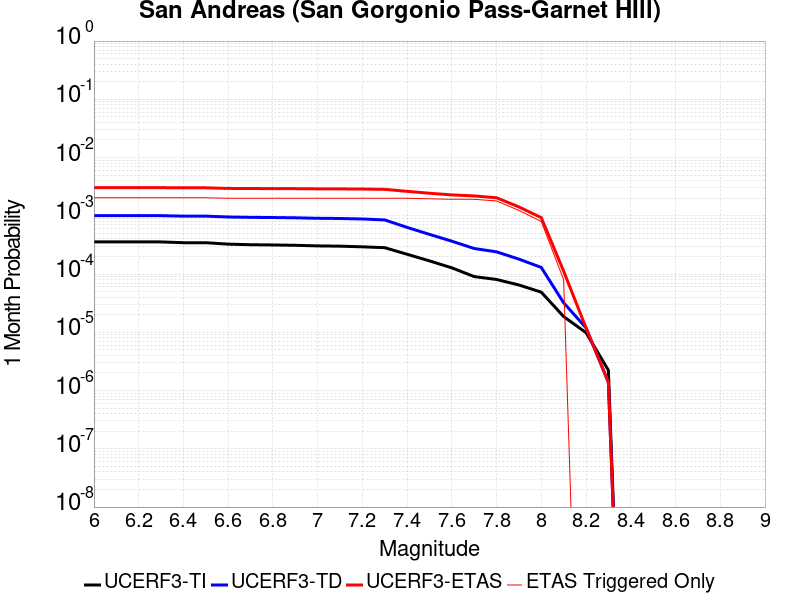 |  |

| Magnitude | 1 wk TI Prob | 1 wk TD Prob | 1 wk ETAS Prob | 1 wk ETAS/TD Gain | 1 wk ETAS Triggered Only | 1 mo TI Prob | 1 mo TD Prob | 1 mo ETAS Prob | 1 mo ETAS/TD Gain | 1 mo ETAS Triggered Only | 1 yr TI Prob | 1 yr TD Prob | 1 yr ETAS Prob | 1 yr ETAS/TD Gain | 1 yr ETAS Triggered Only |
|-----|-----|-----|-----|-----|-----|-----|-----|-----|-----|-----|-----|-----|-----|-----|-----|
| 6.0 | 8.31567E-5 | 2.3487274E-4 | 0.0017545157 | 7.4700694 | 0.00152 | 3.5633717E-4 | 0.0010062061 | 0.0030441536 | 3.0253775 | 0.00204 | 0.004329778 | 0.01218165 | 0.015342669 | 1.2594903 | 0.0032 |
| 6.1 | 8.31567E-5 | 2.3487274E-4 | 0.0017545157 | 7.4700694 | 0.00152 | 3.5633717E-4 | 0.0010062061 | 0.0030441536 | 3.0253775 | 0.00204 | 0.004329778 | 0.01218165 | 0.015342669 | 1.2594903 | 0.0032 |
| 6.2 | 8.31567E-5 | 2.3487274E-4 | 0.0017545157 | 7.4700694 | 0.00152 | 3.5633717E-4 | 0.0010062061 | 0.0030441536 | 3.0253775 | 0.00204 | 0.004329778 | 0.01218165 | 0.015342669 | 1.2594903 | 0.0032 |
| 6.3 | 8.31567E-5 | 2.3487274E-4 | 0.0017545157 | 7.4700694 | 0.00152 | 3.5633717E-4 | 0.0010062061 | 0.0030441536 | 3.0253775 | 0.00204 | 0.004329778 | 0.01218165 | 0.015342669 | 1.2594903 | 0.0032 |
| 6.4 | 8.059055E-5 | 2.3044254E-4 | 0.0017500923 | 7.5944843 | 0.00152 | 3.4534236E-4 | 9.872341E-4 | 0.0030252202 | 3.0643392 | 0.00204 | 0.0041964394 | 0.011953557 | 0.015115305 | 1.2645028 | 0.0032 |
| 6.5 | 8.059055E-5 | 2.3044254E-4 | 0.0017500923 | 7.5944843 | 0.00152 | 3.4534236E-4 | 9.872341E-4 | 0.0030252202 | 3.0643392 | 0.00204 | 0.0041964394 | 0.011953557 | 0.015115305 | 1.2645028 | 0.0032 |
| 6.6 | 7.619237E-5 | 2.2287853E-4 | 0.0017025487 | 7.6389084 | 0.00148 | 3.2649786E-4 | 9.548463E-4 | 0.0029529366 | 3.092578 | 0.002 | 0.0039678677 | 0.011563838 | 0.014687297 | 1.2701057 | 0.00316 |
| 6.7 | 7.440636E-5 | 2.1963443E-4 | 0.0016993093 | 7.73699 | 0.00148 | 3.188454E-4 | 9.409531E-4 | 0.0029390713 | 3.1235044 | 0.002 | 0.0038750346 | 0.011396466 | 0.014520453 | 1.2741189 | 0.00316 |
| 6.8 | 7.3735864E-5 | 2.1810358E-4 | 0.0016977808 | 7.7842865 | 0.00148 | 3.1597257E-4 | 9.3439705E-4 | 0.0029325283 | 3.1384177 | 0.002 | 0.0038401815 | 0.011317481 | 0.014441717 | 1.276054 | 0.00316 |
| 6.9 | 7.27575E-5 | 2.1579085E-4 | 0.0016954715 | 7.857013 | 0.00148 | 3.117806E-4 | 9.244924E-4 | 0.0029226434 | 3.1613493 | 0.002 | 0.003789323 | 0.011198137 | 0.014283199 | 1.2754978 | 0.00312 |
| 7.0 | 7.102591E-5 | 2.1162683E-4 | 0.0016913136 | 7.991962 | 0.00148 | 3.0436125E-4 | 9.066591E-4 | 0.0029048459 | 3.2039006 | 0.002 | 0.003699303 | 0.010983224 | 0.0140689565 | 1.2809496 | 0.00312 |
| 7.1 | 7.028513E-5 | 2.0997925E-4 | 0.0016896685 | 8.046836 | 0.00148 | 3.0118722E-4 | 8.9960295E-4 | 0.0028978037 | 3.221203 | 0.002 | 0.0036607897 | 0.010898178 | 0.013984176 | 1.2831664 | 0.00312 |
| 7.2 | 6.8498244E-5 | 2.0605292E-4 | 0.001685748 | 8.181141 | 0.00148 | 2.9353087E-4 | 8.827873E-4 | 0.0028810217 | 3.2635515 | 0.002 | 0.003567883 | 0.010695473 | 0.013782104 | 1.2885922 | 0.00312 |
| 7.3 | 6.622592E-5 | 1.9831101E-4 | 0.0016780176 | 8.461545 | 0.00148 | 2.8379448E-4 | 8.496297E-4 | 0.0028479304 | 3.3519666 | 0.002 | 0.0034497243 | 0.010295663 | 0.013383541 | 1.2999202 | 0.00312 |
| 7.4 | 5.1050705E-5 | 1.477468E-4 | 0.0016275281 | 11.015656 | 0.00148 | 2.1877038E-4 | 6.3304784E-4 | 0.0026317819 | 4.157319 | 0.002 | 0.002660276 | 0.007680315 | 0.010776352 | 1.4031134 | 0.00312 |
| 7.5 | 3.9302922E-5 | 1.1204231E-4 | 0.001551881 | 13.850848 | 0.00144 | 1.6843023E-4 | 4.8009327E-4 | 0.0024391522 | 5.08058 | 0.00196 | 0.0020487092 | 0.0058295405 | 0.008891585 | 1.5252635 | 0.00308 |
| 7.6 | 2.9851626E-5 | 8.560878E-5 | 0.001485489 | 17.352062 | 0.0014 | 1.2792926E-4 | 3.668433E-4 | 0.002286139 | 6.231922 | 0.00192 | 0.0015564259 | 0.0044571967 | 0.0074438252 | 1.6700689 | 0.003 |
| 7.7 | 2.1135214E-5 | 6.411543E-5 | 0.0014640257 | 22.834215 | 0.0014 | 9.0576345E-5 | 2.747515E-4 | 0.002194224 | 7.9862123 | 0.00192 | 0.0011022091 | 0.0033399744 | 0.0063299546 | 1.8952105 | 0.003 |
| 7.8 | 1.883379E-5 | 5.6178174E-5 | 0.0013761041 | 24.495348 | 0.00132 | 8.0713755E-5 | 2.4074141E-4 | 0.002040308 | 8.475102 | 0.0018 | 9.822468E-4 | 0.0029270905 | 0.0057587773 | 1.9674067 | 0.00284 |
| 7.9 | 1.5156185E-5 | 4.2101485E-5 | 0.0010420594 | 24.751131 | 0.001 | 6.495346E-5 | 1.8042246E-4 | 0.0014201987 | 7.8715186 | 0.00124 | 7.9052144E-4 | 0.0021944318 | 0.0043097795 | 1.9639615 | 0.00212 |
| 8.0 | 1.1405907E-5 | 3.0308918E-5 | 7.502871E-4 | 24.754665 | 7.2E-4 | 4.8881542E-5 | 1.298889E-4 | 9.2978496E-4 | 7.15831 | 8.0E-4 | 5.9497025E-4 | 0.0015802513 | 0.0028981653 | 1.8339902 | 0.00132 |
| 8.1 | 4.3511436E-6 | 7.4929885E-6 | 8.7492386E-5 | 11.676568 | 8.0E-5 | 1.8647626E-5 | 3.2112413E-5 | 1.1210985E-4 | 3.4911685 | 8.0E-5 | 2.2701119E-4 | 3.908986E-4 | 5.9082045E-4 | 1.5114416 | 2.0E-4 |
| 8.2 | 2.3042528E-6 | 2.7894796E-6 | 2.7894796E-6 | 1.0 | 0.0 | 9.875332E-6 | 1.1954859E-5 | 1.1954859E-5 | 1.0 | 0.0 | 1.2022553E-4 | 1.4554072E-4 | 2.2552907E-4 | 1.5495943 | 8.0E-5 |
| 8.3 | 5.202968E-7 | 3.241516E-7 | 3.241516E-7 | 1.0 | 0.0 | 2.2298414E-6 | 1.3892205E-6 | 1.3892205E-6 | 1.0 | 0.0 | 2.714798E-5 | 1.6913642E-5 | 1.6913642E-5 | 1.0 | 0.0 |

## Pleito
*[(top)](#table-of-contents)*

| 1 Week | 1 Month | 1 Year |
|-----|-----|-----|
| 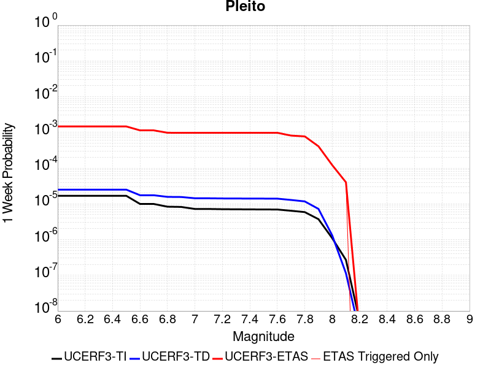 | 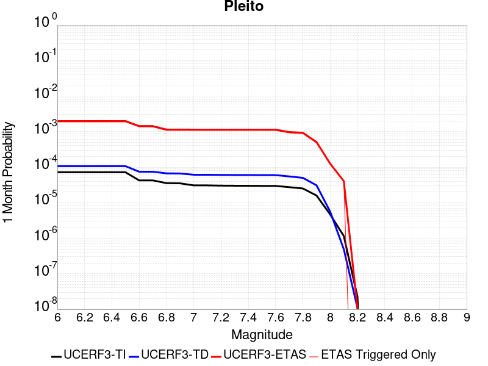 | 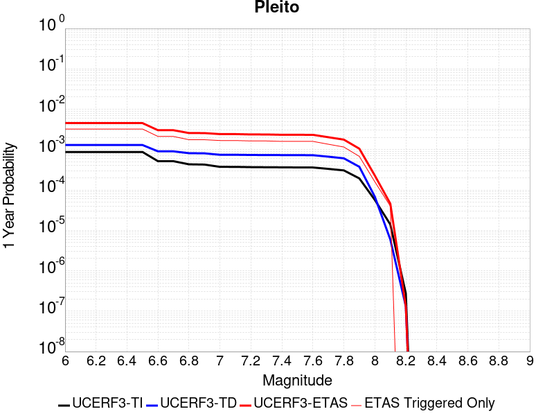 |

| Magnitude | 1 wk TI Prob | 1 wk TD Prob | 1 wk ETAS Prob | 1 wk ETAS/TD Gain | 1 wk ETAS Triggered Only | 1 mo TI Prob | 1 mo TD Prob | 1 mo ETAS Prob | 1 mo ETAS/TD Gain | 1 mo ETAS Triggered Only | 1 yr TI Prob | 1 yr TD Prob | 1 yr ETAS Prob | 1 yr ETAS/TD Gain | 1 yr ETAS Triggered Only |
|-----|-----|-----|-----|-----|-----|-----|-----|-----|-----|-----|-----|-----|-----|-----|-----|
| 6.0 | 1.6763008E-5 | 2.4935694E-5 | 0.0014648997 | 58.7471 | 0.00144 | 7.183948E-5 | 1.0686329E-4 | 0.0019866624 | 18.59069 | 0.00188 | 8.742947E-4 | 0.0013003562 | 0.004536143 | 3.488385 | 0.00324 |
| 6.1 | 1.6763008E-5 | 2.4935694E-5 | 0.0014648997 | 58.7471 | 0.00144 | 7.183948E-5 | 1.0686329E-4 | 0.0019866624 | 18.59069 | 0.00188 | 8.742947E-4 | 0.0013003562 | 0.004536143 | 3.488385 | 0.00324 |
| 6.2 | 1.6763008E-5 | 2.4935694E-5 | 0.0014648997 | 58.7471 | 0.00144 | 7.183948E-5 | 1.0686329E-4 | 0.0019866624 | 18.59069 | 0.00188 | 8.742947E-4 | 0.0013003562 | 0.004536143 | 3.488385 | 0.00324 |
| 6.3 | 1.6763008E-5 | 2.4935694E-5 | 0.0014648997 | 58.7471 | 0.00144 | 7.183948E-5 | 1.0686329E-4 | 0.0019866624 | 18.59069 | 0.00188 | 8.742947E-4 | 0.0013003562 | 0.004536143 | 3.488385 | 0.00324 |
| 6.4 | 1.6763008E-5 | 2.4935694E-5 | 0.0014648997 | 58.7471 | 0.00144 | 7.183948E-5 | 1.0686329E-4 | 0.0019866624 | 18.59069 | 0.00188 | 8.742947E-4 | 0.0013003562 | 0.004536143 | 3.488385 | 0.00324 |
| 6.5 | 1.6763008E-5 | 2.4935694E-5 | 0.0014648997 | 58.7471 | 0.00144 | 7.183948E-5 | 1.0686329E-4 | 0.0019866624 | 18.59069 | 0.00188 | 8.742947E-4 | 0.0013003562 | 0.004536143 | 3.488385 | 0.00324 |
| 6.6 | 9.910213E-6 | 1.738388E-5 | 0.0011373644 | 65.426384 | 0.00112 | 4.247165E-5 | 7.450023E-5 | 0.0014343989 | 19.253616 | 0.00136 | 5.169696E-4 | 9.066666E-4 | 0.0030247446 | 3.3361154 | 0.00212 |
| 6.7 | 9.910213E-6 | 1.738388E-5 | 0.0011373644 | 65.426384 | 0.00112 | 4.247165E-5 | 7.450023E-5 | 0.0014343989 | 19.253616 | 0.00136 | 5.169696E-4 | 9.066666E-4 | 0.0030247446 | 3.3361154 | 0.00212 |
| 6.8 | 8.300162E-6 | 1.564301E-5 | 9.75628E-4 | 62.3683 | 9.6E-4 | 3.557164E-5 | 6.703976E-5 | 0.0011469674 | 17.108763 | 0.00108 | 4.3299864E-4 | 8.159049E-4 | 0.002574469 | 3.1553543 | 0.00176 |
| 6.9 | 8.183114E-6 | 1.551415E-5 | 9.754993E-4 | 62.878036 | 9.6E-4 | 3.5070017E-5 | 6.6487526E-5 | 0.0011464157 | 17.242569 | 0.00108 | 4.2689382E-4 | 8.0918643E-4 | 0.0025677623 | 3.1732643 | 0.00176 |
| 7.0 | 7.1748823E-6 | 1.4299022E-5 | 9.742853E-4 | 68.1365 | 9.6E-4 | 3.0749135E-5 | 6.128009E-5 | 0.0011412139 | 18.622917 | 0.00108 | 3.743064E-4 | 7.458302E-4 | 0.0024245773 | 3.2508435 | 0.00168 |
| 7.1 | 7.1671807E-6 | 1.4289369E-5 | 9.7427564E-4 | 68.181854 | 9.6E-4 | 3.0716128E-5 | 6.1238716E-5 | 0.0011411726 | 18.63482 | 0.00108 | 3.7390468E-4 | 7.4532686E-4 | 0.0024240748 | 3.2523646 | 0.00168 |
| 7.2 | 7.0649667E-6 | 1.4136105E-5 | 9.7412255E-4 | 68.91025 | 9.6E-4 | 3.0278077E-5 | 6.05819E-5 | 0.0011405165 | 18.826027 | 0.00108 | 3.6857324E-4 | 7.373356E-4 | 0.0023761264 | 3.2225847 | 0.00164 |
| 7.3 | 7.02082E-6 | 1.4079238E-5 | 9.7406574E-4 | 69.18455 | 9.6E-4 | 3.008888E-5 | 6.03382E-5 | 0.0011402731 | 18.89803 | 0.00108 | 3.6627054E-4 | 7.343705E-4 | 0.0023731661 | 3.2315652 | 0.00164 |
| 7.4 | 6.987146E-6 | 1.4038616E-5 | 9.740251E-4 | 69.38184 | 9.6E-4 | 2.9944567E-5 | 6.0164115E-5 | 0.0011400991 | 18.94982 | 0.00108 | 3.6451413E-4 | 7.3225243E-4 | 0.0023310808 | 3.1834388 | 0.0016 |
| 7.5 | 6.9494554E-6 | 1.3995384E-5 | 9.739819E-4 | 69.59309 | 9.6E-4 | 2.9783041E-5 | 5.997884E-5 | 0.001139914 | 19.00527 | 0.00108 | 3.625482E-4 | 7.299982E-4 | 0.0023288303 | 3.1901863 | 0.0016 |
| 7.6 | 6.92694E-6 | 1.3954241E-5 | 9.739408E-4 | 69.795334 | 9.6E-4 | 2.9686547E-5 | 5.9802518E-5 | 0.0011397379 | 19.05836 | 0.00108 | 3.6137376E-4 | 7.27853E-4 | 0.0023266885 | 3.1966462 | 0.0016 |
| 7.7 | 6.395867E-6 | 1.2826297E-5 | 8.12816E-4 | 63.37106 | 8.0E-4 | 2.741057E-5 | 5.496869E-5 | 9.7491813E-4 | 17.73588 | 9.2E-4 | 3.336726E-4 | 6.690386E-4 | 0.0020281288 | 3.0314076 | 0.00136 |
| 7.8 | 5.8664327E-6 | 1.1680238E-5 | 7.7167136E-4 | 66.066414 | 7.6E-4 | 2.5141611E-5 | 5.00572E-5 | 9.3001314E-4 | 18.579008 | 8.8E-4 | 3.060561E-4 | 6.0927623E-4 | 0.0017685695 | 2.9027383 | 0.00116 |
| 7.9 | 3.7167474E-6 | 7.2014245E-6 | 4.0719853E-4 | 56.544167 | 4.0E-4 | 1.592882E-5 | 3.0862884E-5 | 5.1084807E-4 | 16.552181 | 4.8E-4 | 1.9391612E-4 | 3.75691E-4 | 0.0010554355 | 2.809318 | 6.8E-4 |
| 8.0 | 1.0903841E-6 | 1.3071021E-6 | 1.2130695E-4 | 92.80602 | 1.2E-4 | 4.6730665E-6 | 5.601854E-6 | 1.2560117E-4 | 22.421358 | 1.2E-4 | 5.68931E-5 | 6.8200454E-5 | 2.2818954E-4 | 3.3458655 | 1.6E-4 |
| 8.1 | 2.6894583E-7 | 1.13801775E-7 | 4.01138E-5 | 352.48834 | 4.0E-5 | 1.1526245E-6 | 4.8772176E-7 | 4.0487703E-5 | 83.01393 | 4.0E-5 | 1.4033113E-5 | 5.937997E-6 | 4.593776E-5 | 7.7362385 | 4.0E-5 |
| 8.2 | 5.2967013E-9 | 2.5342395E-9 | 2.5342395E-9 | 1.0 | 0.0 | 2.2700148E-8 | 1.0861028E-8 | 1.0861028E-8 | 1.0 | 0.0 | 2.7637427E-7 | 1.32233E-7 | 1.32233E-7 | 1.0 | 0.0 |

## Santa Ynez (East)
*[(top)](#table-of-contents)*

| 1 Week | 1 Month | 1 Year |
|-----|-----|-----|
| 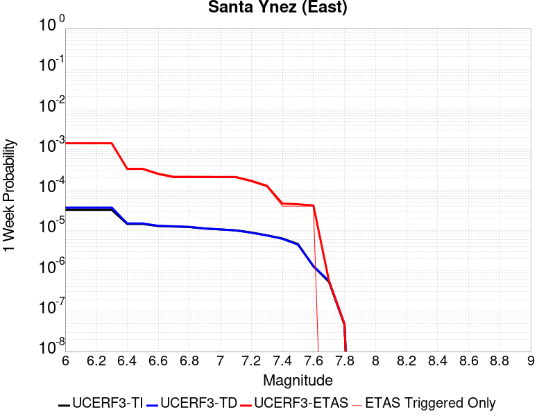 | 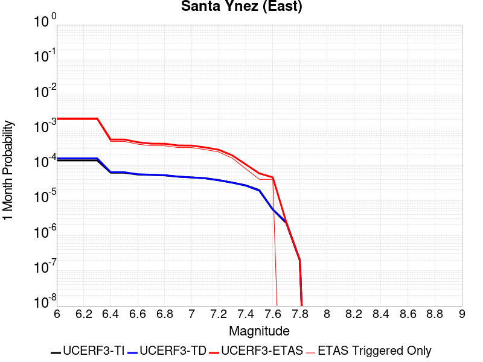 | 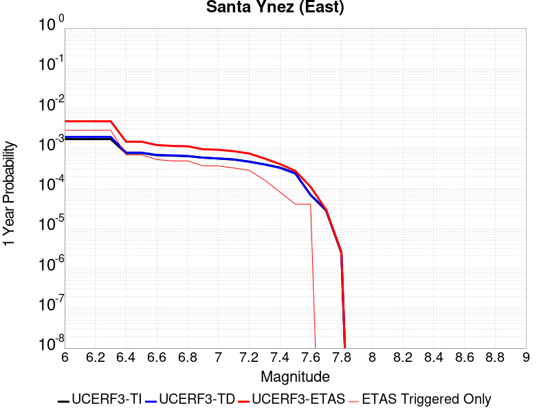 |

| Magnitude | 1 wk TI Prob | 1 wk TD Prob | 1 wk ETAS Prob | 1 wk ETAS/TD Gain | 1 wk ETAS Triggered Only | 1 mo TI Prob | 1 mo TD Prob | 1 mo ETAS Prob | 1 mo ETAS/TD Gain | 1 mo ETAS Triggered Only | 1 yr TI Prob | 1 yr TD Prob | 1 yr ETAS Prob | 1 yr ETAS/TD Gain | 1 yr ETAS Triggered Only |
|-----|-----|-----|-----|-----|-----|-----|-----|-----|-----|-----|-----|-----|-----|-----|-----|
| 6.0 | 3.2269712E-5 | 3.6773254E-5 | 0.0014367218 | 39.069748 | 0.0014 | 1.3829143E-4 | 1.5759347E-4 | 0.0021572784 | 13.688881 | 0.002 | 0.0016823979 | 0.0019175955 | 0.0047122263 | 2.457362 | 0.0028 |
| 6.1 | 3.2269712E-5 | 3.6773254E-5 | 0.0014367218 | 39.069748 | 0.0014 | 1.3829143E-4 | 1.5759347E-4 | 0.0021572784 | 13.688881 | 0.002 | 0.0016823979 | 0.0019175955 | 0.0047122263 | 2.457362 | 0.0028 |
| 6.2 | 3.2269712E-5 | 3.6773254E-5 | 0.0014367218 | 39.069748 | 0.0014 | 1.3829143E-4 | 1.5759347E-4 | 0.0021572784 | 13.688881 | 0.002 | 0.0016823979 | 0.0019175955 | 0.0047122263 | 2.457362 | 0.0028 |
| 6.3 | 3.2269712E-5 | 3.6773254E-5 | 0.0014367218 | 39.069748 | 0.0014 | 1.3829143E-4 | 1.5759347E-4 | 0.0021572784 | 13.688881 | 0.002 | 0.0016823979 | 0.0019175955 | 0.0047122263 | 2.457362 | 0.0028 |
| 6.4 | 1.4404779E-5 | 1.4855053E-5 | 3.348503E-4 | 22.54117 | 3.2E-4 | 6.1733306E-5 | 6.366299E-5 | 5.436324E-4 | 8.539223 | 4.8E-4 | 7.513438E-4 | 7.7482633E-4 | 0.0014542994 | 1.876936 | 6.8E-4 |
| 6.5 | 1.4404779E-5 | 1.4855053E-5 | 3.348503E-4 | 22.54117 | 3.2E-4 | 6.1733306E-5 | 6.366299E-5 | 5.436324E-4 | 8.539223 | 4.8E-4 | 7.513438E-4 | 7.7482633E-4 | 0.0014542994 | 1.876936 | 6.8E-4 |
| 6.6 | 1.280208E-5 | 1.3016704E-5 | 2.5301357E-4 | 19.437609 | 2.4E-4 | 5.4864904E-5 | 5.578469E-5 | 4.5576238E-4 | 8.170026 | 4.0E-4 | 6.6777546E-4 | 6.7896873E-4 | 0.0011986156 | 1.7653474 | 5.2E-4 |
| 6.7 | 1.2457027E-5 | 1.2633079E-5 | 2.1263055E-4 | 16.831253 | 2.0E-4 | 5.3386164E-5 | 5.414065E-5 | 4.1412117E-4 | 7.6489873 | 3.6E-4 | 6.497827E-4 | 6.5896474E-4 | 0.0011386485 | 1.7279353 | 4.8E-4 |
| 6.8 | 1.2095134E-5 | 1.2235392E-5 | 2.1223295E-4 | 17.345821 | 2.0E-4 | 5.1835254E-5 | 5.2436353E-5 | 4.124175E-4 | 7.865106 | 3.6E-4 | 6.309115E-4 | 6.382272E-4 | 0.0011179209 | 1.7516032 | 4.8E-4 |
| 6.9 | 1.1104036E-5 | 1.1161518E-5 | 2.1115929E-4 | 18.91851 | 2.0E-4 | 4.758786E-5 | 4.7834208E-5 | 3.678189E-4 | 7.689453 | 3.2E-4 | 5.7922816E-4 | 5.822271E-4 | 9.420175E-4 | 1.6179554 | 3.6E-4 |
| 7.0 | 1.0577444E-5 | 1.0585669E-5 | 2.1058354E-4 | 19.893269 | 2.0E-4 | 4.5331115E-5 | 4.5366367E-5 | 3.6535185E-4 | 8.053364 | 3.2E-4 | 5.5176654E-4 | 5.5219675E-4 | 9.11998E-4 | 1.6515815 | 3.6E-4 |
| 7.1 | 1.0021775E-5 | 9.9848085E-6 | 2.0998281E-4 | 21.03023 | 2.0E-4 | 4.294976E-5 | 4.279134E-5 | 3.2277935E-4 | 7.5431 | 2.8E-4 | 5.2278786E-4 | 5.2086124E-4 | 8.406945E-4 | 1.6140472 | 3.2E-4 |
| 7.2 | 8.874109E-6 | 8.752264E-6 | 1.6875086E-4 | 19.280825 | 1.6E-4 | 3.8031343E-5 | 3.750917E-5 | 2.7750016E-4 | 7.3981953 | 2.4E-4 | 4.629332E-4 | 4.5657952E-4 | 7.364517E-4 | 1.6129757 | 2.8E-4 |
| 7.3 | 7.5504267E-6 | 7.5080898E-6 | 1.2750718E-4 | 16.982641 | 1.2E-4 | 3.235857E-5 | 3.2177137E-5 | 1.9217198E-4 | 5.972315 | 1.6E-4 | 3.9389438E-4 | 3.9168724E-4 | 5.516246E-4 | 1.4083292 | 1.6E-4 |
| 7.4 | 6.309394E-6 | 6.185729E-6 | 4.6185483E-5 | 7.466457 | 4.0E-5 | 2.703998E-5 | 2.6510004E-5 | 1.0650788E-4 | 4.0176487 | 8.0E-5 | 3.2916202E-4 | 3.2271244E-4 | 4.0268662E-4 | 1.2478187 | 8.0E-5 |
| 7.5 | 4.6103073E-6 | 4.442555E-6 | 4.444238E-5 | 10.003787 | 4.0E-5 | 1.975831E-5 | 1.9039388E-5 | 5.9038626E-5 | 3.100868 | 4.0E-5 | 2.4053088E-4 | 2.3178058E-4 | 2.717713E-4 | 1.172537 | 4.0E-5 |
| 7.6 | 1.2858658E-6 | 1.3010639E-6 | 4.1301013E-5 | 31.744032 | 4.0E-5 | 5.5108417E-6 | 5.5759765E-6 | 4.5575754E-5 | 8.173592 | 4.0E-5 | 6.7092435E-5 | 6.788547E-5 | 1.0788275E-4 | 1.5891877 | 4.0E-5 |
| 7.7 | 5.3302307E-7 | 5.61315E-7 | 5.61315E-7 | 1.0 | 0.0 | 2.2843826E-6 | 2.4056337E-6 | 2.4056337E-6 | 1.0 | 0.0 | 2.7812002E-5 | 2.9288234E-5 | 2.9288234E-5 | 1.0 | 0.0 |
| 7.8 | 4.613933E-8 | 4.803677E-8 | 4.803677E-8 | 1.0 | 0.0 | 1.9773998E-7 | 2.0587186E-7 | 2.0587186E-7 | 1.0 | 0.0 | 2.4074816E-6 | 2.5064871E-6 | 2.5064871E-6 | 1.0 | 0.0 |

## Garlock (Central)
*[(top)](#table-of-contents)*

| 1 Week | 1 Month | 1 Year |
|-----|-----|-----|
| 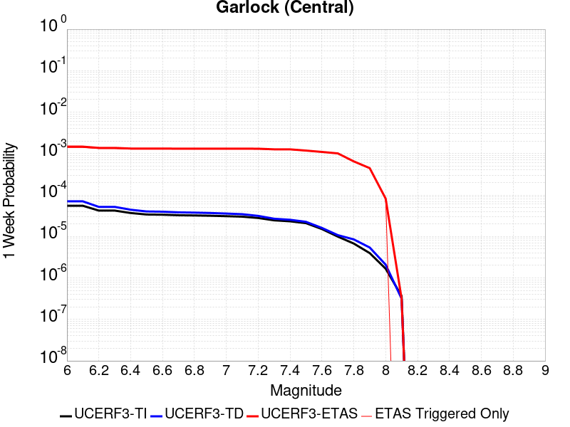 | 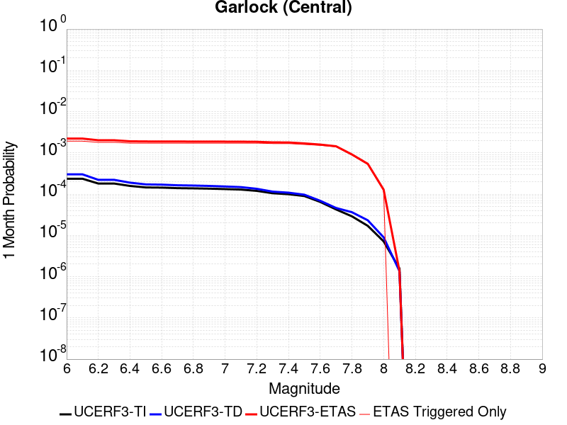 |  |

| Magnitude | 1 wk TI Prob | 1 wk TD Prob | 1 wk ETAS Prob | 1 wk ETAS/TD Gain | 1 wk ETAS Triggered Only | 1 mo TI Prob | 1 mo TD Prob | 1 mo ETAS Prob | 1 mo ETAS/TD Gain | 1 mo ETAS Triggered Only | 1 yr TI Prob | 1 yr TD Prob | 1 yr ETAS Prob | 1 yr ETAS/TD Gain | 1 yr ETAS Triggered Only |
|-----|-----|-----|-----|-----|-----|-----|-----|-----|-----|-----|-----|-----|-----|-----|-----|
| 6.0 | 5.5131142E-5 | 7.0410926E-5 | 0.0014703124 | 20.881878 | 0.0014 | 2.3625491E-4 | 3.0172654E-4 | 0.0022211473 | 7.361458 | 0.00192 | 0.0028726095 | 0.0036673974 | 0.0064571286 | 1.7606843 | 0.0028 |
| 6.1 | 5.5131142E-5 | 7.0410926E-5 | 0.0014703124 | 20.881878 | 0.0014 | 2.3625491E-4 | 3.0172654E-4 | 0.0022211473 | 7.361458 | 0.00192 | 0.0028726095 | 0.0036673974 | 0.0064571286 | 1.7606843 | 0.0028 |
| 6.2 | 4.216245E-5 | 5.181263E-5 | 0.0013717442 | 26.475094 | 0.00132 | 1.806837E-4 | 2.220354E-4 | 0.0020216356 | 9.105016 | 0.0018 | 0.0021976046 | 0.0026999614 | 0.0052530495 | 1.9456017 | 0.00256 |
| 6.3 | 4.216245E-5 | 5.181263E-5 | 0.0013717442 | 26.475094 | 0.00132 | 1.806837E-4 | 2.220354E-4 | 0.0020216356 | 9.105016 | 0.0018 | 0.0021976046 | 0.0026999614 | 0.0052530495 | 1.9456017 | 0.00256 |
| 6.4 | 3.6858168E-5 | 4.4255168E-5 | 0.0013241986 | 29.921896 | 0.00128 | 1.5795401E-4 | 1.8965136E-4 | 0.0019093251 | 10.0675535 | 0.00172 | 0.0019213937 | 0.0023065854 | 0.0047010495 | 2.038099 | 0.0024 |
| 6.5 | 3.39199E-5 | 4.0159928E-5 | 0.0013201085 | 32.87129 | 0.00128 | 1.453629E-4 | 1.7210275E-4 | 0.0018918067 | 10.992311 | 0.00172 | 0.0017683565 | 0.0020933591 | 0.004488335 | 2.1440828 | 0.0024 |
| 6.6 | 3.3571985E-5 | 3.961341E-5 | 0.0013195627 | 33.311012 | 0.00128 | 1.4387199E-4 | 1.6976082E-4 | 0.0018894689 | 11.130181 | 0.00172 | 0.0017502342 | 0.0020649007 | 0.004459945 | 2.1598835 | 0.0024 |
| 6.7 | 3.2580007E-5 | 3.8228853E-5 | 0.0013181799 | 34.481285 | 0.00128 | 1.3962112E-4 | 1.6382778E-4 | 0.001883546 | 11.49711 | 0.00172 | 0.0016985617 | 0.0019927998 | 0.004388017 | 2.2019358 | 0.0024 |
| 6.8 | 3.2185937E-5 | 3.7654747E-5 | 0.0013176065 | 34.99178 | 0.00128 | 1.3793244E-4 | 1.6136763E-4 | 0.0018810901 | 11.657171 | 0.00172 | 0.0016780337 | 0.001962902 | 0.004358191 | 2.2202795 | 0.0024 |
| 6.9 | 3.165394E-5 | 3.6858168E-5 | 0.001316811 | 35.726437 | 0.00128 | 1.3565269E-4 | 1.5795414E-4 | 0.0018776824 | 11.887517 | 0.00172 | 0.0016503202 | 0.0019214168 | 0.0043168054 | 2.2466784 | 0.0024 |
| 7.0 | 3.0903822E-5 | 3.5761113E-5 | 0.0013157154 | 36.79179 | 0.00128 | 1.3243823E-4 | 1.5325303E-4 | 0.0018729895 | 12.221549 | 0.00172 | 0.0016112428 | 0.0018642801 | 0.0042198803 | 2.263544 | 0.00236 |
| 7.1 | 3.0069863E-5 | 3.4526223E-5 | 0.0013144821 | 38.07199 | 0.00128 | 1.2886449E-4 | 1.4796125E-4 | 0.0018677068 | 12.622945 | 0.00172 | 0.0015677959 | 0.001799961 | 0.004155713 | 2.3087795 | 0.00236 |
| 7.2 | 2.7957109E-5 | 3.141258E-5 | 0.0013113724 | 41.746727 | 0.00128 | 1.1981068E-4 | 1.346185E-4 | 0.001854387 | 13.775126 | 0.00172 | 0.0014577188 | 0.0016377677 | 0.0039939024 | 2.4386258 | 0.00236 |
| 7.3 | 2.4519275E-5 | 2.6838161E-5 | 0.0012668049 | 47.201626 | 0.00124 | 1.0507837E-4 | 1.15015704E-4 | 0.0017948225 | 15.605021 | 0.00168 | 0.0012785783 | 0.0013994314 | 0.0036762408 | 2.6269531 | 0.00228 |
| 7.4 | 2.3225532E-5 | 2.532011E-5 | 0.0012652887 | 49.97169 | 0.00124 | 9.95342E-5 | 1.0851033E-4 | 0.001788328 | 16.480717 | 0.00168 | 0.0012111551 | 0.001320327 | 0.0035973168 | 2.7245648 | 0.00228 |
| 7.5 | 2.097765E-5 | 2.2598408E-5 | 0.0011825722 | 52.329887 | 0.00116 | 8.9901114E-5 | 9.6846794E-5 | 0.0016966918 | 17.519339 | 0.0016 | 0.0010939965 | 0.0011784837 | 0.0033359383 | 2.8307037 | 0.00216 |
| 7.6 | 1.511254E-5 | 1.6095431E-5 | 0.0010960781 | 68.0987 | 0.00108 | 6.476642E-5 | 6.897865E-5 | 0.0015888738 | 23.034286 | 0.00152 | 7.882459E-4 | 8.3949923E-4 | 0.0028378202 | 3.3803725 | 0.002 |
| 7.7 | 9.934069E-6 | 1.0775618E-5 | 0.0010107649 | 93.8011 | 0.001 | 4.2573887E-5 | 4.6180405E-5 | 0.0014461158 | 31.31449 | 0.0014 | 5.182138E-4 | 5.621018E-4 | 0.0023211124 | 4.129346 | 0.00176 |
| 7.8 | 6.7562896E-6 | 8.50792E-6 | 6.485025E-4 | 76.22339 | 6.4E-4 | 2.8955206E-5 | 3.6462003E-5 | 9.164299E-4 | 25.133833 | 8.8E-4 | 3.5247262E-4 | 4.4383464E-4 | 0.0016033198 | 3.612426 | 0.00116 |
| 7.9 | 3.975453E-6 | 5.419516E-6 | 4.4541713E-4 | 82.187614 | 4.4E-4 | 1.7037546E-5 | 2.3226292E-5 | 5.432142E-4 | 23.387901 | 5.2E-4 | 2.0741238E-4 | 2.827435E-4 | 0.00100254 | 3.5457575 | 7.2E-4 |
| 8.0 | 1.6729537E-6 | 2.093995E-6 | 8.209383E-5 | 39.204407 | 8.0E-5 | 7.169782E-6 | 8.974233E-6 | 1.2897316E-4 | 14.371496 | 1.2E-4 | 8.7288594E-5 | 1.09255845E-4 | 2.6923837E-4 | 2.4642925 | 1.6E-4 |
| 8.1 | 3.6733252E-7 | 3.1722044E-7 | 3.1722044E-7 | 1.0 | 0.0 | 1.5742813E-6 | 1.3595155E-6 | 1.3595155E-6 | 1.0 | 0.0 | 1.9166706E-5 | 1.6551992E-5 | 1.6551992E-5 | 1.0 | 0.0 |

## San Andreas (Coachella) rev
*[(top)](#table-of-contents)*

| 1 Week | 1 Month | 1 Year |
|-----|-----|-----|
| 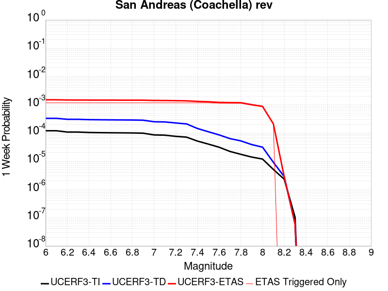 | 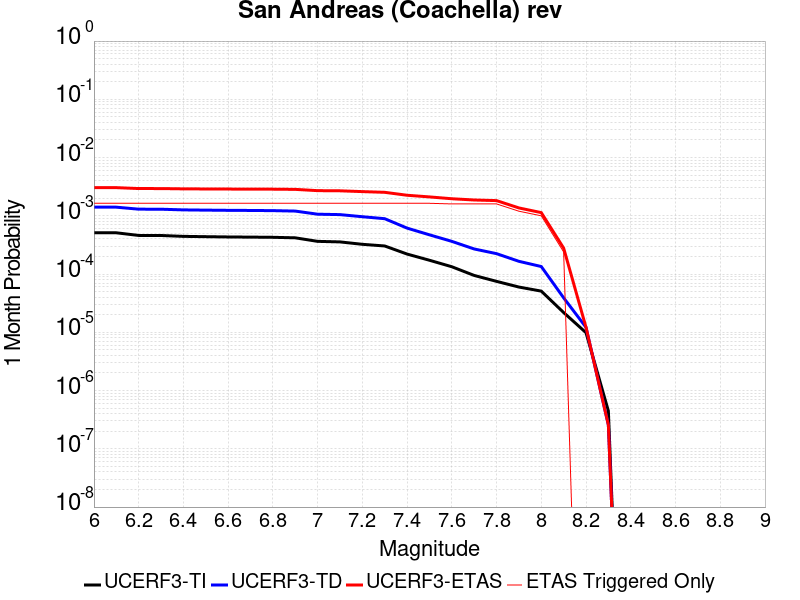 | 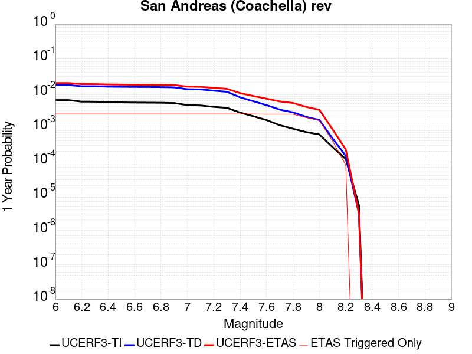 |

| Magnitude | 1 wk TI Prob | 1 wk TD Prob | 1 wk ETAS Prob | 1 wk ETAS/TD Gain | 1 wk ETAS Triggered Only | 1 mo TI Prob | 1 mo TD Prob | 1 mo ETAS Prob | 1 mo ETAS/TD Gain | 1 mo ETAS Triggered Only | 1 yr TI Prob | 1 yr TD Prob | 1 yr ETAS Prob | 1 yr ETAS/TD Gain | 1 yr ETAS Triggered Only |
|-----|-----|-----|-----|-----|-----|-----|-----|-----|-----|-----|-----|-----|-----|-----|-----|
| 6.0 | 1.1925945E-4 | 3.285021E-4 | 0.001488121 | 4.5300198 | 0.00116 | 5.110118E-4 | 0.0014071113 | 0.0030448036 | 2.1638684 | 0.00164 | 0.0062038354 | 0.016998356 | 0.01939688 | 1.1411033 | 0.00244 |
| 6.1 | 1.1925945E-4 | 3.285021E-4 | 0.001488121 | 4.5300198 | 0.00116 | 5.110118E-4 | 0.0014071113 | 0.0030448036 | 2.1638684 | 0.00164 | 0.0062038354 | 0.016998356 | 0.01939688 | 1.1411033 | 0.00244 |
| 6.2 | 1.07432395E-4 | 3.0350155E-4 | 0.0014631494 | 4.820896 | 0.00116 | 4.603433E-4 | 0.0013000766 | 0.0029379444 | 2.2598243 | 0.00164 | 0.005590286 | 0.015714664 | 0.01811632 | 1.152829 | 0.00244 |
| 6.3 | 1.0718766E-4 | 3.0295455E-4 | 0.0014626031 | 4.8277974 | 0.00116 | 4.592948E-4 | 0.0012977346 | 0.0029356063 | 2.2621007 | 0.00164 | 0.005577586 | 0.01568656 | 0.018088287 | 1.1531072 | 0.00244 |
| 6.4 | 1.0355944E-4 | 2.9503368E-4 | 0.0014546914 | 4.9305944 | 0.00116 | 4.4375064E-4 | 0.0012638214 | 0.0029017488 | 2.2960117 | 0.00164 | 0.0053892885 | 0.01527953 | 0.017682247 | 1.1572508 | 0.00244 |
| 6.5 | 1.0227914E-4 | 2.9222743E-4 | 0.0014518885 | 4.968351 | 0.00116 | 4.382655E-4 | 0.0012518062 | 0.002889753 | 2.308467 | 0.00164 | 0.0053228354 | 0.015135286 | 0.017538356 | 1.1587727 | 0.00244 |
| 6.6 | 1.0116757E-4 | 2.898844E-4 | 0.0014495482 | 5.0004354 | 0.00116 | 4.3350324E-4 | 0.0012417742 | 0.0028797376 | 2.319051 | 0.00164 | 0.0052651367 | 0.015014836 | 0.0174182 | 1.1600659 | 0.00244 |
| 6.7 | 1.0050676E-4 | 2.8846966E-4 | 0.001448135 | 5.02006 | 0.00116 | 4.3067214E-4 | 0.0012357167 | 0.00287369 | 2.325525 | 0.00164 | 0.005230834 | 0.0149421 | 0.01734564 | 1.160857 | 0.00244 |
| 6.8 | 9.976819E-5 | 2.8650457E-4 | 0.0014461722 | 5.0476413 | 0.00116 | 4.2750788E-4 | 0.0012273028 | 0.00286529 | 2.3346236 | 0.00164 | 0.0051924936 | 0.014841062 | 0.01724485 | 1.1619687 | 0.00244 |
| 6.9 | 9.77719E-5 | 2.8146335E-4 | 0.0014411368 | 5.120158 | 0.00116 | 4.1895514E-4 | 0.0012057178 | 0.0028437404 | 2.3585458 | 0.00164 | 0.0050888555 | 0.014581811 | 0.01698623 | 1.1648917 | 0.00244 |
| 7.0 | 8.500761E-5 | 2.487273E-4 | 0.0014084388 | 5.662582 | 0.00116 | 3.6426744E-4 | 0.001065542 | 0.0027037945 | 2.537483 | 0.00164 | 0.0044259406 | 0.012896588 | 0.0153051205 | 1.1867573 | 0.00244 |
| 7.1 | 8.319876E-5 | 2.4473912E-4 | 0.0014044552 | 5.7385807 | 0.00116 | 3.5651738E-4 | 0.0010484635 | 0.002686744 | 2.5625536 | 0.00164 | 0.004331963 | 0.012691099 | 0.015100134 | 1.1898208 | 0.00244 |
| 7.2 | 7.563917E-5 | 2.2518281E-4 | 0.0013849216 | 6.15021 | 0.00116 | 3.2412758E-4 | 9.647154E-4 | 0.0026031332 | 2.6983433 | 0.00164 | 0.0039391145 | 0.011682851 | 0.014094345 | 1.2064131 | 0.00244 |
| 7.3 | 7.082985E-5 | 2.0829777E-4 | 0.0013680562 | 6.5677905 | 0.00116 | 3.0352117E-4 | 8.9240225E-4 | 0.0025309387 | 2.8360963 | 0.00164 | 0.0036891096 | 0.010811501 | 0.0132251205 | 1.2232456 | 0.00244 |
| 7.4 | 5.146215E-5 | 1.4354692E-4 | 0.0013033804 | 9.079822 | 0.00116 | 2.2053342E-4 | 6.150569E-4 | 0.0022540481 | 3.66478 | 0.00164 | 0.0026816884 | 0.0074627977 | 0.009884588 | 1.3245151 | 0.00244 |
| 7.5 | 4.0285166E-5 | 1.1011688E-4 | 0.0012699892 | 11.533101 | 0.00116 | 1.7263928E-4 | 4.7184445E-4 | 0.0021110706 | 4.4740815 | 0.00164 | 0.002099857 | 0.0057296446 | 0.008155664 | 1.4234154 | 0.00244 |
| 7.6 | 3.1168736E-5 | 8.5009575E-5 | 0.0012049144 | 14.173866 | 0.00112 | 1.3357346E-4 | 3.6427603E-4 | 0.0019636932 | 5.3906736 | 0.0016 | 0.0016250437 | 0.0044260686 | 0.006815446 | 1.539842 | 0.0024 |
| 7.7 | 2.2100989E-5 | 6.2934116E-5 | 0.0011828636 | 18.795269 | 0.00112 | 9.4715084E-5 | 2.696898E-4 | 0.0018692582 | 6.9311423 | 0.0016 | 0.001152546 | 0.003278536 | 0.0056706676 | 1.729634 | 0.0024 |
| 7.8 | 1.7484861E-5 | 5.2283296E-5 | 0.0011722248 | 22.420637 | 0.00112 | 7.493296E-5 | 2.2405203E-4 | 0.0018236935 | 8.139598 | 0.0016 | 9.1192697E-4 | 0.0027244242 | 0.0051178853 | 1.8785201 | 0.0024 |
| 7.9 | 1.3967285E-5 | 3.862311E-5 | 9.985861E-4 | 25.854624 | 9.6E-4 | 5.985842E-5 | 1.6551714E-4 | 0.0013653185 | 8.248805 | 0.0012 | 7.2853256E-4 | 0.0020133099 | 0.003929444 | 1.9517336 | 0.00192 |
| 8.0 | 1.1887396E-5 | 3.1410258E-5 | 8.713839E-4 | 27.742018 | 8.4E-4 | 5.094499E-5 | 1.3460845E-4 | 0.0011344738 | 8.427955 | 0.001 | 6.200787E-4 | 0.0016376268 | 0.0032350067 | 1.9754236 | 0.0016 |
| 8.1 | 5.100864E-6 | 9.116648E-6 | 2.0911482E-4 | 22.93769 | 2.0E-4 | 2.1860664E-5 | 3.907076E-5 | 2.7906138E-4 | 7.142461 | 2.4E-4 | 2.6612106E-4 | 4.755828E-4 | 8.753926E-4 | 1.8406733 | 4.0E-4 |
| 8.2 | 2.3004484E-6 | 2.842999E-6 | 2.842999E-6 | 1.0 | 0.0 | 9.859027E-6 | 1.2184225E-5 | 1.2184225E-5 | 1.0 | 0.0 | 1.2002704E-4 | 1.4833287E-4 | 2.28321E-4 | 1.5392475 | 8.0E-5 |
| 8.3 | 1.0424446E-7 | 5.965764E-8 | 5.965764E-8 | 1.0 | 0.0 | 4.4676187E-7 | 2.5567556E-7 | 2.5567556E-7 | 1.0 | 0.0 | 5.439312E-6 | 3.112846E-6 | 3.112846E-6 | 1.0 | 0.0 |

## Owl Lake
*[(top)](#table-of-contents)*

| 1 Week | 1 Month | 1 Year |
|-----|-----|-----|
| 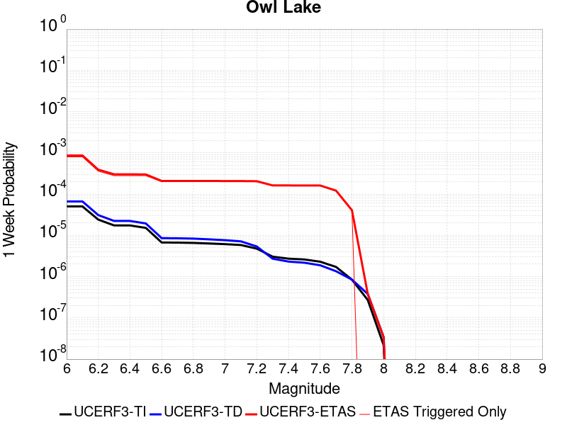 | 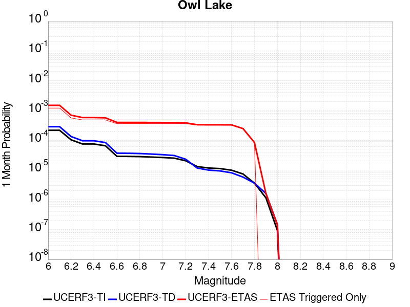 | 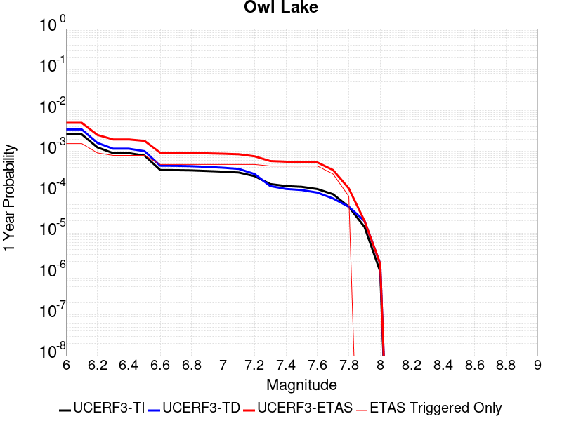 |

| Magnitude | 1 wk TI Prob | 1 wk TD Prob | 1 wk ETAS Prob | 1 wk ETAS/TD Gain | 1 wk ETAS Triggered Only | 1 mo TI Prob | 1 mo TD Prob | 1 mo ETAS Prob | 1 mo ETAS/TD Gain | 1 mo ETAS Triggered Only | 1 yr TI Prob | 1 yr TD Prob | 1 yr ETAS Prob | 1 yr ETAS/TD Gain | 1 yr ETAS Triggered Only |
|-----|-----|-----|-----|-----|-----|-----|-----|-----|-----|-----|-----|-----|-----|-----|-----|
| 6.0 | 5.0320643E-5 | 6.64403E-5 | 8.6638716E-4 | 13.040086 | 8.0E-4 | 2.1564208E-4 | 2.847135E-4 | 0.0014843718 | 5.2135634 | 0.0012 | 0.0026222812 | 0.0034617756 | 0.0050163753 | 1.4490758 | 0.00156 |
| 6.1 | 5.0320643E-5 | 6.64403E-5 | 8.6638716E-4 | 13.040086 | 8.0E-4 | 2.1564208E-4 | 2.847135E-4 | 0.0014843718 | 5.2135634 | 0.0012 | 0.0026222812 | 0.0034617756 | 0.0050163753 | 1.4490758 | 0.00156 |
| 6.2 | 2.4125871E-5 | 3.1022744E-5 | 3.9101156E-4 | 12.604029 | 3.6E-4 | 1.0339249E-4 | 1.3294873E-4 | 6.928743E-4 | 5.21159 | 5.6E-4 | 0.0012580766 | 0.0016176249 | 0.0025361367 | 1.5678151 | 9.2E-4 |
| 6.3 | 1.7433485E-5 | 2.238944E-5 | 3.0238318E-4 | 13.505615 | 2.8E-4 | 7.471279E-5 | 9.595211E-5 | 5.759061E-4 | 6.0020156 | 4.8E-4 | 9.0924866E-4 | 0.0011677343 | 0.0019668 | 1.6842873 | 8.0E-4 |
| 6.4 | 1.7433485E-5 | 2.238944E-5 | 3.0238318E-4 | 13.505615 | 2.8E-4 | 7.471279E-5 | 9.595211E-5 | 5.759061E-4 | 6.0020156 | 4.8E-4 | 9.0924866E-4 | 0.0011677343 | 0.0019668 | 1.6842873 | 8.0E-4 |
| 6.5 | 1.5182742E-5 | 1.946037E-5 | 2.9945493E-4 | 15.387936 | 2.8E-4 | 6.506727E-5 | 8.339978E-5 | 5.6335976E-4 | 6.754931 | 4.8E-4 | 7.919061E-4 | 0.0010150598 | 0.0018142477 | 1.787331 | 8.0E-4 |
| 6.6 | 6.7271576E-6 | 8.568449E-6 | 2.0856674E-4 | 24.34125 | 2.0E-4 | 2.8830356E-5 | 3.6721438E-5 | 3.9670823E-4 | 10.803178 | 3.6E-4 | 3.5095305E-4 | 4.4699747E-4 | 9.267829E-4 | 2.0733516 | 4.8E-4 |
| 6.7 | 6.682835E-6 | 8.500858E-6 | 2.0849916E-4 | 24.526836 | 2.0E-4 | 2.8640408E-5 | 3.643177E-5 | 3.9641865E-4 | 10.8811245 | 3.6E-4 | 3.4864116E-4 | 4.434722E-4 | 9.2325936E-4 | 2.0818877 | 4.8E-4 |
| 6.8 | 6.5774975E-6 | 8.347227E-6 | 2.0834556E-4 | 24.959854 | 2.0E-4 | 2.8188972E-5 | 3.577337E-5 | 3.957605E-4 | 11.062991 | 3.6E-4 | 3.4314668E-4 | 4.354594E-4 | 9.152504E-4 | 2.1018043 | 4.8E-4 |
| 6.9 | 6.363419E-6 | 8.02014E-6 | 2.0801854E-4 | 25.937021 | 2.0E-4 | 2.727151E-5 | 3.4371606E-5 | 3.9435923E-4 | 11.473402 | 3.6E-4 | 3.3198006E-4 | 4.1839955E-4 | 8.981987E-4 | 2.1467488 | 4.8E-4 |
| 7.0 | 6.1342453E-6 | 7.652003E-6 | 2.0765048E-4 | 27.136747 | 2.0E-4 | 2.6289357E-5 | 3.2793916E-5 | 3.9278212E-4 | 11.977285 | 3.6E-4 | 3.2002592E-4 | 3.991983E-4 | 8.790067E-4 | 2.2019298 | 4.8E-4 |
| 7.1 | 5.842926E-6 | 7.1620548E-6 | 2.0716063E-4 | 28.924747 | 2.0E-4 | 2.504087E-5 | 3.069419E-5 | 3.9068313E-4 | 12.728244 | 3.6E-4 | 3.0482994E-4 | 3.7364312E-4 | 8.534638E-4 | 2.2841682 | 4.8E-4 |
| 7.2 | 4.77173E-6 | 5.376442E-6 | 2.0537537E-4 | 38.199123 | 2.0E-4 | 2.045011E-5 | 2.3041714E-5 | 3.8303342E-4 | 16.623478 | 3.6E-4 | 2.4895166E-4 | 2.805008E-4 | 7.6036615E-4 | 2.710745 | 4.8E-4 |
| 7.3 | 3.0494948E-6 | 2.7237572E-6 | 1.6272331E-4 | 59.74223 | 1.6E-4 | 1.3069198E-5 | 1.16731935E-5 | 3.3166946E-4 | 28.412914 | 3.2E-4 | 1.5910587E-4 | 1.4211203E-4 | 5.820495E-4 | 4.095709 | 4.4E-4 |
| 7.4 | 2.7263884E-6 | 2.317959E-6 | 1.6231759E-4 | 70.026085 | 1.6E-4 | 1.1684469E-5 | 9.934072E-6 | 3.299309E-4 | 33.212048 | 3.2E-4 | 1.4224913E-4 | 1.2094073E-4 | 5.608875E-4 | 4.637706 | 4.4E-4 |
| 7.5 | 2.6090431E-6 | 2.1776593E-6 | 1.6217731E-4 | 74.47322 | 1.6E-4 | 1.1181565E-5 | 9.3327935E-6 | 3.293298E-4 | 35.287376 | 3.2E-4 | 1.3612706E-4 | 1.1362093E-4 | 5.535709E-4 | 4.872086 | 4.4E-4 |
| 7.6 | 2.3008756E-6 | 1.8842499E-6 | 1.6188395E-4 | 85.91427 | 1.6E-4 | 9.860858E-6 | 8.075332E-6 | 3.2807275E-4 | 40.626534 | 3.2E-4 | 1.20049335E-4 | 9.831281E-5 | 5.382696E-4 | 5.4750705 | 4.4E-4 |
| 7.7 | 1.7184348E-6 | 1.3525299E-6 | 1.21352365E-4 | 89.7225 | 1.2E-4 | 7.3646997E-6 | 5.796544E-6 | 2.4579515E-4 | 42.40374 | 2.4E-4 | 8.966153E-5 | 7.0570684E-5 | 3.5055092E-4 | 4.9673734 | 2.8E-4 |
| 7.8 | 8.4612907E-7 | 8.4826485E-7 | 4.084823E-5 | 48.155045 | 4.0E-5 | 3.6262625E-6 | 3.6354159E-6 | 8.3635125E-5 | 23.005655 | 8.0E-5 | 4.4148852E-5 | 4.4260312E-5 | 1.2425677E-4 | 2.8074083 | 8.0E-5 |
| 7.9 | 2.716738E-7 | 3.8033835E-7 | 3.8033835E-7 | 1.0 | 0.0 | 1.1643157E-6 | 1.6300206E-6 | 1.6300206E-6 | 1.0 | 0.0 | 1.4175452E-5 | 1.984533E-5 | 1.984533E-5 | 1.0 | 0.0 |
| 8.0 | 2.1995428E-8 | 3.4170547E-8 | 3.4170547E-8 | 1.0 | 0.0 | 9.426611E-8 | 1.464452E-7 | 1.464452E-7 | 1.0 | 0.0 | 1.1476893E-6 | 1.7829695E-6 | 1.7829695E-6 | 1.0 | 0.0 |

## Brawley (Seismic Zone) alt 1
*[(top)](#table-of-contents)*

| 1 Week | 1 Month | 1 Year |
|-----|-----|-----|
| 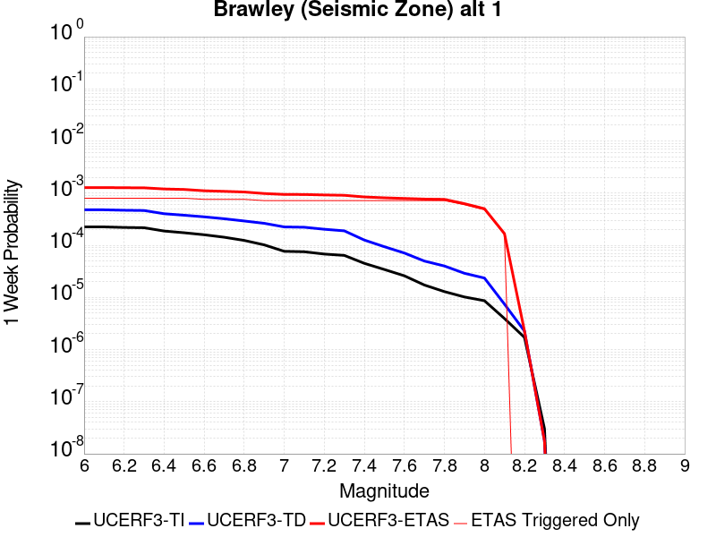 | 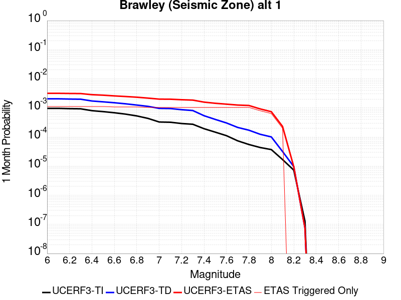 | 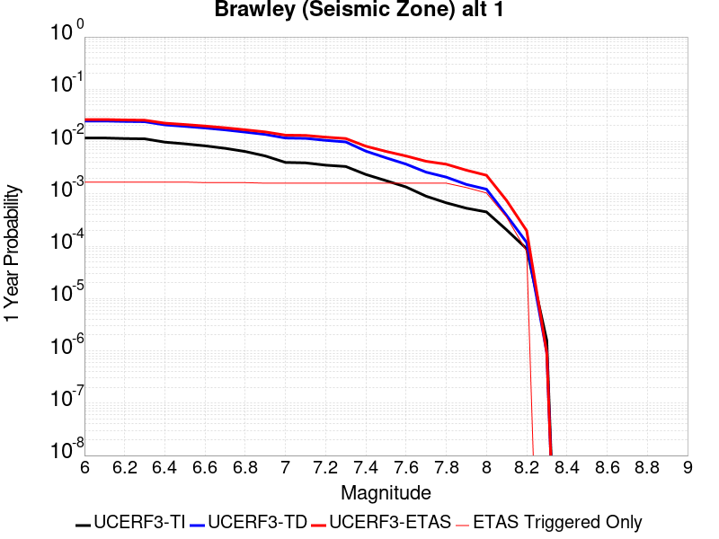 |

| Magnitude | 1 wk TI Prob | 1 wk TD Prob | 1 wk ETAS Prob | 1 wk ETAS/TD Gain | 1 wk ETAS Triggered Only | 1 mo TI Prob | 1 mo TD Prob | 1 mo ETAS Prob | 1 mo ETAS/TD Gain | 1 mo ETAS Triggered Only | 1 yr TI Prob | 1 yr TD Prob | 1 yr ETAS Prob | 1 yr ETAS/TD Gain | 1 yr ETAS Triggered Only |
|-----|-----|-----|-----|-----|-----|-----|-----|-----|-----|-----|-----|-----|-----|-----|-----|
| 6.0 | 2.2521618E-4 | 4.7906235E-4 | 0.0012786791 | 2.669129 | 8.0E-4 | 9.6485513E-4 | 0.0020515462 | 0.0031692486 | 1.5448097 | 0.00112 | 0.011683988 | 0.024686452 | 0.02632498 | 1.0663735 | 0.00168 |
| 6.1 | 2.2521618E-4 | 4.7906235E-4 | 0.0012786791 | 2.669129 | 8.0E-4 | 9.6485513E-4 | 0.0020515462 | 0.0031692486 | 1.5448097 | 0.00112 | 0.011683988 | 0.024686452 | 0.02632498 | 1.0663735 | 0.00168 |
| 6.2 | 2.198148E-4 | 4.6985512E-4 | 0.0012694793 | 2.7018526 | 8.0E-4 | 9.417233E-4 | 0.0020121478 | 0.0031298941 | 1.5554992 | 0.00112 | 0.011405343 | 0.024218049 | 0.025857363 | 1.0676898 | 0.00168 |
| 6.3 | 2.1704129E-4 | 4.6419835E-4 | 0.001263827 | 2.7226012 | 8.0E-4 | 9.298453E-4 | 0.0019879416 | 0.0031057152 | 1.5622768 | 0.00112 | 0.011262234 | 0.02393082 | 0.025570616 | 1.0685223 | 0.00168 |
| 6.4 | 1.876142E-4 | 4.0299946E-4 | 0.001202677 | 2.9843144 | 8.0E-4 | 8.038131E-4 | 0.0017260119 | 0.0028440787 | 1.6477747 | 0.00112 | 0.00974259 | 0.020814236 | 0.022459269 | 1.079034 | 0.00168 |
| 6.5 | 1.7390939E-4 | 3.772201E-4 | 0.0011769184 | 3.1199777 | 8.0E-4 | 7.45113E-4 | 0.0016156683 | 0.0027338588 | 1.6920916 | 0.00112 | 0.009034078 | 0.019498011 | 0.021145254 | 1.0844827 | 0.00168 |
| 6.6 | 1.591791E-4 | 3.512329E-4 | 0.001110966 | 3.1630464 | 7.6E-4 | 6.8201777E-4 | 0.0015044258 | 0.002582801 | 1.7168019 | 0.00108 | 0.008271996 | 0.018166747 | 0.019776953 | 1.0886348 | 0.00164 |
| 6.7 | 1.4268003E-4 | 3.2273377E-4 | 0.0010824885 | 3.3541222 | 7.6E-4 | 6.1134255E-4 | 0.00138242 | 0.002460927 | 1.7801588 | 0.00108 | 0.007417723 | 0.016705167 | 0.01831777 | 1.0965332 | 0.00164 |
| 6.8 | 1.239713E-4 | 2.923154E-4 | 0.0010520932 | 3.5991714 | 7.6E-4 | 5.3119735E-4 | 0.0012521851 | 0.0023308326 | 1.8614123 | 0.00108 | 0.0064481674 | 0.015140241 | 0.016755411 | 1.1066806 | 0.00164 |
| 6.9 | 1.0180238E-4 | 2.6387183E-4 | 9.836819E-4 | 3.7278774 | 7.2E-4 | 4.3622297E-4 | 0.0011303935 | 0.002169218 | 1.9189936 | 0.00104 | 0.005298089 | 0.013676707 | 0.0152548235 | 1.1153872 | 0.0016 |
| 7.0 | 7.6619996E-5 | 2.2495743E-4 | 9.4479544E-4 | 4.1998854 | 7.2E-4 | 3.283301E-4 | 9.6375024E-4 | 0.002002748 | 2.0780778 | 0.00104 | 0.0039900932 | 0.011671247 | 0.013252573 | 1.135489 | 0.0016 |
| 7.1 | 7.5127435E-5 | 2.2177385E-4 | 9.4161415E-4 | 4.2458305 | 7.2E-4 | 3.2193496E-4 | 9.501164E-4 | 0.0019891283 | 2.0935628 | 0.00104 | 0.0039125155 | 0.011507019 | 0.013088608 | 1.1374456 | 0.0016 |
| 7.2 | 6.788582E-5 | 2.0301084E-4 | 9.2286465E-4 | 4.545889 | 7.2E-4 | 2.9090676E-4 | 8.697594E-4 | 0.0019088548 | 2.194693 | 0.00104 | 0.0035360386 | 0.01053855 | 0.012121689 | 1.1502235 | 0.0016 |
| 7.3 | 6.399602E-5 | 1.8927702E-4 | 9.0914074E-4 | 4.8032284 | 7.2E-4 | 2.7423984E-4 | 8.109379E-4 | 0.0018500945 | 2.2814257 | 0.00104 | 0.0033337586 | 0.009829069 | 0.011413341 | 1.1611825 | 0.0016 |
| 7.4 | 4.506759E-5 | 1.2596935E-4 | 8.458787E-4 | 6.714956 | 7.2E-4 | 1.9313251E-4 | 5.3975784E-4 | 0.0015791965 | 2.92575 | 0.00104 | 0.0023488526 | 0.006551927 | 0.008141444 | 1.242603 | 0.0016 |
| 7.5 | 3.43289E-5 | 9.392528E-5 | 8.1385765E-4 | 8.6649475 | 7.2E-4 | 1.4711556E-4 | 4.0247513E-4 | 0.0014420565 | 3.5829706 | 0.00104 | 0.0017896603 | 0.004889188 | 0.006481365 | 1.3256527 | 0.0016 |
| 7.6 | 2.5980507E-5 | 7.102579E-5 | 7.9097465E-4 | 11.136443 | 7.2E-4 | 1.1134028E-4 | 3.0436084E-4 | 0.0013440443 | 4.4159565 | 0.00104 | 0.001354725 | 0.0036993215 | 0.005293403 | 1.4309118 | 0.0016 |
| 7.7 | 1.7292105E-5 | 4.982994E-5 | 7.6979405E-4 | 15.448424 | 7.2E-4 | 7.4106916E-5 | 2.1353943E-4 | 0.0012533173 | 5.8692546 | 0.00104 | 9.018782E-4 | 0.0025967488 | 0.004192594 | 1.6145551 | 0.0016 |
| 7.8 | 1.2927471E-5 | 4.006102E-5 | 7.6003216E-4 | 18.971865 | 7.2E-4 | 5.5402274E-5 | 1.716788E-4 | 0.0012115003 | 7.0567846 | 0.00104 | 6.743139E-4 | 0.0020881882 | 0.003684847 | 1.7646145 | 0.0016 |
| 7.9 | 1.0200774E-5 | 2.9043316E-5 | 6.290259E-4 | 21.658197 | 6.0E-4 | 4.371687E-5 | 1.2446543E-4 | 9.243658E-4 | 7.4266877 | 8.0E-4 | 5.321229E-4 | 0.0015143143 | 0.0028323154 | 1.8703617 | 0.00132 |
| 8.0 | 8.650396E-6 | 2.3532893E-5 | 5.035216E-4 | 21.396502 | 4.8E-4 | 3.70726E-5 | 1.00851365E-4 | 7.4078684E-4 | 7.3453326 | 6.4E-4 | 4.5126543E-4 | 0.0012271745 | 0.0022658983 | 1.8464352 | 0.00104 |
| 8.1 | 3.9368224E-6 | 7.4387112E-6 | 1.6743752E-4 | 22.508944 | 1.6E-4 | 1.6871985E-5 | 3.18798E-5 | 2.3187342E-4 | 7.273365 | 2.0E-4 | 2.0539707E-4 | 3.880676E-4 | 7.479279E-4 | 1.9273134 | 3.6E-4 |
| 8.2 | 1.7101195E-6 | 2.2599863E-6 | 2.2599863E-6 | 1.0 | 0.0 | 7.329063E-6 | 9.68562E-6 | 9.68562E-6 | 1.0 | 0.0 | 8.922769E-5 | 1.17916075E-4 | 1.9790664E-4 | 1.6783687 | 8.0E-5 |
| 8.3 | 3.0346666E-8 | 1.7654946E-8 | 1.7654946E-8 | 1.0 | 0.0 | 1.3005713E-7 | 7.5664055E-8 | 7.5664055E-8 | 1.0 | 0.0 | 1.5834444E-6 | 9.2120973E-7 | 9.2120973E-7 | 1.0 | 0.0 |

## San Jacinto (San Bernardino)
*[(top)](#table-of-contents)*

| 1 Week | 1 Month | 1 Year |
|-----|-----|-----|
| 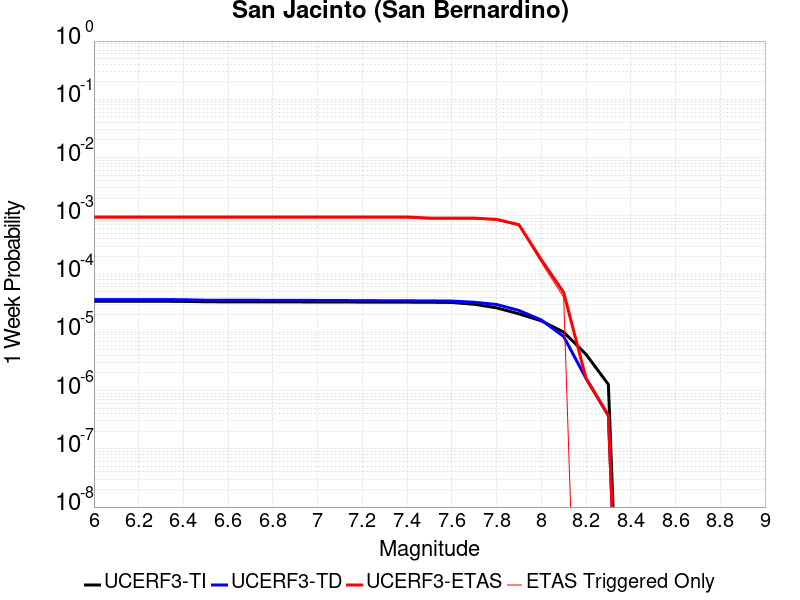 | 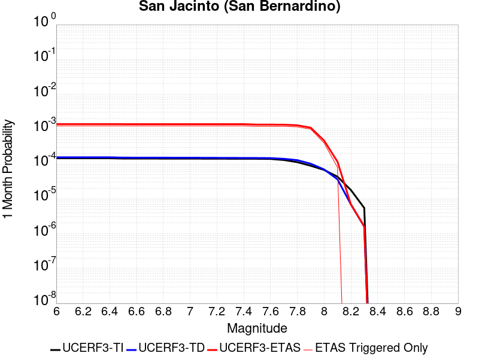 |  |

| Magnitude | 1 wk TI Prob | 1 wk TD Prob | 1 wk ETAS Prob | 1 wk ETAS/TD Gain | 1 wk ETAS Triggered Only | 1 mo TI Prob | 1 mo TD Prob | 1 mo ETAS Prob | 1 mo ETAS/TD Gain | 1 mo ETAS Triggered Only | 1 yr TI Prob | 1 yr TD Prob | 1 yr ETAS Prob | 1 yr ETAS/TD Gain | 1 yr ETAS Triggered Only |
|-----|-----|-----|-----|-----|-----|-----|-----|-----|-----|-----|-----|-----|-----|-----|-----|
| 6.0 | 3.409352E-5 | 3.6394562E-5 | 9.5636107E-4 | 26.277582 | 9.2E-4 | 1.461069E-4 | 1.5596737E-4 | 0.001395774 | 8.949141 | 0.00124 | 0.0017774 | 0.0018972505 | 0.003534139 | 1.8627688 | 0.00164 |
| 6.1 | 3.409352E-5 | 3.6394562E-5 | 9.5636107E-4 | 26.277582 | 9.2E-4 | 1.461069E-4 | 1.5596737E-4 | 0.001395774 | 8.949141 | 0.00124 | 0.0017774 | 0.0018972505 | 0.003534139 | 1.8627688 | 0.00164 |
| 6.2 | 3.409352E-5 | 3.6394562E-5 | 9.5636107E-4 | 26.277582 | 9.2E-4 | 1.461069E-4 | 1.5596737E-4 | 0.001395774 | 8.949141 | 0.00124 | 0.0017774 | 0.0018972505 | 0.003534139 | 1.8627688 | 0.00164 |
| 6.3 | 3.409352E-5 | 3.6394562E-5 | 9.5636107E-4 | 26.277582 | 9.2E-4 | 1.461069E-4 | 1.5596737E-4 | 0.001395774 | 8.949141 | 0.00124 | 0.0017774 | 0.0018972505 | 0.003534139 | 1.8627688 | 0.00164 |
| 6.4 | 3.400795E-5 | 3.6287136E-5 | 9.5625373E-4 | 26.352419 | 9.2E-4 | 1.4574021E-4 | 1.5550703E-4 | 0.0013953142 | 8.972676 | 0.00124 | 0.0017729428 | 0.0018916556 | 0.0035285533 | 1.8653255 | 0.00164 |
| 6.5 | 3.341482E-5 | 3.5547153E-5 | 9.5551444E-4 | 26.880198 | 9.2E-4 | 1.4319851E-4 | 1.5233604E-4 | 0.0013921472 | 9.138659 | 0.00124 | 0.0017420477 | 0.001853115 | 0.003490076 | 1.8833563 | 0.00164 |
| 6.6 | 3.3364955E-5 | 3.5484314E-5 | 9.554517E-4 | 26.926027 | 9.2E-4 | 1.4298483E-4 | 1.5206679E-4 | 0.0013918782 | 9.153072 | 0.00124 | 0.0017394501 | 0.0018498423 | 0.0034868086 | 1.884922 | 0.00164 |
| 6.7 | 3.335922E-5 | 3.547408E-5 | 9.5544144E-4 | 26.933508 | 9.2E-4 | 1.4296026E-4 | 1.5202291E-4 | 0.0013918345 | 9.155425 | 0.00124 | 0.0017391514 | 0.0018493092 | 0.0034862764 | 1.8851776 | 0.00164 |
| 6.8 | 3.327683E-5 | 3.5368048E-5 | 9.553355E-4 | 27.01126 | 9.2E-4 | 1.4260718E-4 | 1.5156854E-4 | 0.0013913806 | 9.179876 | 0.00124 | 0.0017348597 | 0.0018437867 | 0.0034807627 | 1.8878338 | 0.00164 |
| 6.9 | 3.3235785E-5 | 3.530894E-5 | 9.552765E-4 | 27.054804 | 9.2E-4 | 1.4243131E-4 | 1.5131527E-4 | 0.0013911276 | 9.193571 | 0.00124 | 0.0017327217 | 0.0018407081 | 0.0034776893 | 1.8893214 | 0.00164 |
| 7.0 | 3.3197095E-5 | 3.52488E-5 | 9.5521635E-4 | 27.09926 | 9.2E-4 | 1.422655E-4 | 1.5105754E-4 | 0.0013908702 | 9.207553 | 0.00124 | 0.0017307063 | 0.0018375756 | 0.003474562 | 1.8908403 | 0.00164 |
| 7.1 | 3.3129716E-5 | 3.5128847E-5 | 9.550965E-4 | 27.188383 | 9.2E-4 | 1.4197677E-4 | 1.5054352E-4 | 0.0013903568 | 9.23558 | 0.00124 | 0.0017271966 | 0.001831328 | 0.0034683247 | 1.893885 | 0.00164 |
| 7.2 | 3.3034008E-5 | 3.4996167E-5 | 9.5496397E-4 | 27.287672 | 9.2E-4 | 1.4156665E-4 | 1.4997496E-4 | 0.001389789 | 9.266807 | 0.00124 | 0.0017222111 | 0.0018244174 | 0.0034614254 | 1.8972771 | 0.00164 |
| 7.3 | 3.2956614E-5 | 3.4863686E-5 | 9.548316E-4 | 27.38757 | 9.2E-4 | 1.4123498E-4 | 1.4940725E-4 | 0.001389222 | 9.2982235 | 0.00124 | 0.0017181796 | 0.001817517 | 0.0034545362 | 1.90069 | 0.00164 |
| 7.4 | 3.2915937E-5 | 3.4785193E-5 | 9.547532E-4 | 27.447115 | 9.2E-4 | 1.4106068E-4 | 1.490709E-4 | 0.001388886 | 9.31695 | 0.00124 | 0.0017160608 | 0.0018134287 | 0.0034504547 | 1.9027241 | 0.00164 |
| 7.5 | 3.281791E-5 | 3.4649816E-5 | 9.146193E-4 | 26.39608 | 8.8E-4 | 1.406406E-4 | 1.4849077E-4 | 0.0013483126 | 9.080111 | 0.0012 | 0.0017109542 | 0.0018063774 | 0.0034034871 | 1.8841506 | 0.0016 |
| 7.6 | 3.2521442E-5 | 3.4374003E-5 | 9.1434375E-4 | 26.599863 | 8.8E-4 | 1.3937015E-4 | 1.4730885E-4 | 0.001347132 | 9.14495 | 0.0012 | 0.0016955109 | 0.0017920113 | 0.003389144 | 1.8912516 | 0.0016 |
| 7.7 | 3.0287873E-5 | 3.2853422E-5 | 9.1282453E-4 | 27.784763 | 8.8E-4 | 1.297987E-4 | 1.4079278E-4 | 0.0013406238 | 9.521964 | 0.0012 | 0.0015791537 | 0.0017128056 | 0.0032701336 | 1.9092264 | 0.00156 |
| 7.8 | 2.6316151E-5 | 3.0049645E-5 | 8.700244E-4 | 28.952902 | 8.4E-4 | 1.1277862E-4 | 1.2877784E-4 | 0.0012886284 | 10.006601 | 0.00116 | 0.0013722149 | 0.0015667436 | 0.0030843623 | 1.9686451 | 0.00152 |
| 7.9 | 2.0761147E-5 | 2.3754892E-5 | 7.037387E-4 | 29.625002 | 6.8E-4 | 8.897331E-5 | 1.0180272E-4 | 0.0011017009 | 10.82192 | 0.001 | 0.0010827117 | 0.0012387441 | 0.0025970596 | 2.0965261 | 0.00136 |
| 8.0 | 1.5738568E-5 | 1.6286816E-5 | 1.7628421E-4 | 10.823736 | 1.6E-4 | 6.744926E-5 | 6.979878E-5 | 4.6977086E-4 | 6.730359 | 4.0E-4 | 8.2088535E-4 | 8.494695E-4 | 0.0014489598 | 1.7057232 | 6.0E-4 |
| 8.1 | 1.0105832E-5 | 8.478705E-6 | 4.8478367E-5 | 5.7176614 | 4.0E-5 | 4.3309992E-5 | 3.6336805E-5 | 1.163339E-4 | 3.2015445 | 8.0E-5 | 5.2717153E-4 | 4.4231134E-4 | 6.0224056E-4 | 1.3615762 | 1.6E-4 |
| 8.2 | 4.189207E-6 | 1.6207553E-6 | 1.6207553E-6 | 1.0 | 0.0 | 1.7953622E-5 | 6.9460752E-6 | 6.9460752E-6 | 1.0 | 0.0 | 2.1856341E-4 | 8.456522E-5 | 1.2456183E-4 | 1.4729677 | 4.0E-5 |
| 8.3 | 1.2758221E-6 | 3.728509E-7 | 3.728509E-7 | 1.0 | 0.0 | 5.4677976E-6 | 1.5979316E-6 | 1.5979316E-6 | 1.0 | 0.0 | 6.65684E-5 | 1.9454648E-5 | 5.945387E-5 | 3.056024 | 4.0E-5 |

## San Gabriel
*[(top)](#table-of-contents)*

| 1 Week | 1 Month | 1 Year |
|-----|-----|-----|
| 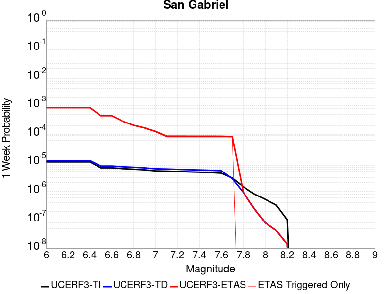 | 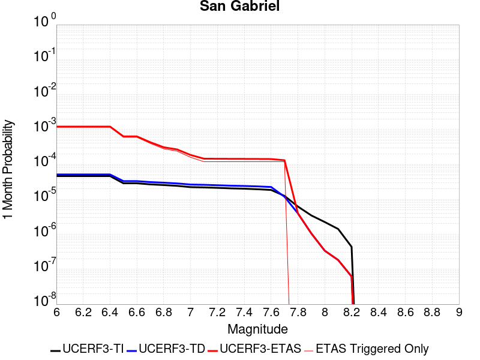 | 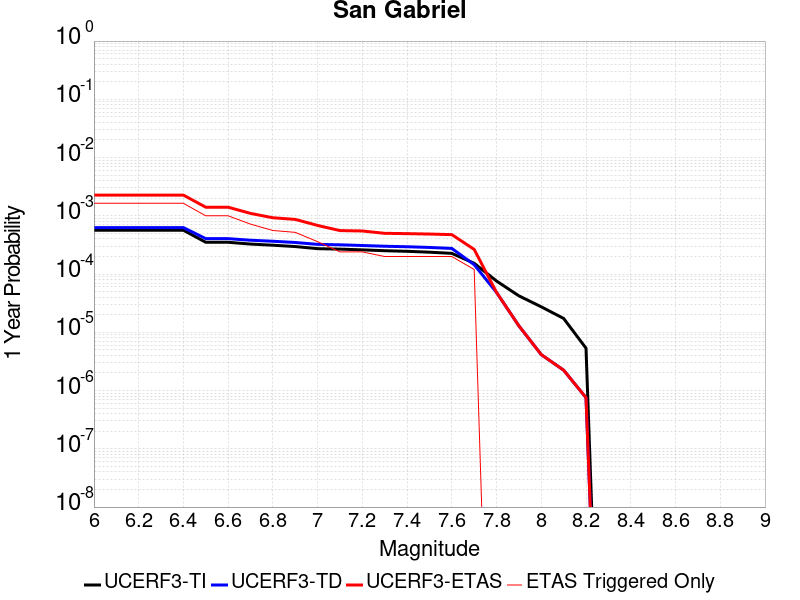 |

| Magnitude | 1 wk TI Prob | 1 wk TD Prob | 1 wk ETAS Prob | 1 wk ETAS/TD Gain | 1 wk ETAS Triggered Only | 1 mo TI Prob | 1 mo TD Prob | 1 mo ETAS Prob | 1 mo ETAS/TD Gain | 1 mo ETAS Triggered Only | 1 yr TI Prob | 1 yr TD Prob | 1 yr ETAS Prob | 1 yr ETAS/TD Gain | 1 yr ETAS Triggered Only |
|-----|-----|-----|-----|-----|-----|-----|-----|-----|-----|-----|-----|-----|-----|-----|-----|
| 6.0 | 1.083775E-5 | 1.2040094E-5 | 8.5203E-4 | 70.76606 | 8.4E-4 | 4.6446676E-5 | 5.1599447E-5 | 0.0012115396 | 23.479702 | 0.00116 | 5.653415E-4 | 6.280535E-4 | 0.0022670235 | 3.6096025 | 0.00164 |
| 6.1 | 1.083775E-5 | 1.2040094E-5 | 8.5203E-4 | 70.76606 | 8.4E-4 | 4.6446676E-5 | 5.1599447E-5 | 0.0012115396 | 23.479702 | 0.00116 | 5.653415E-4 | 6.280535E-4 | 0.0022670235 | 3.6096025 | 0.00164 |
| 6.2 | 1.083775E-5 | 1.2040094E-5 | 8.5203E-4 | 70.76606 | 8.4E-4 | 4.6446676E-5 | 5.1599447E-5 | 0.0012115396 | 23.479702 | 0.00116 | 5.653415E-4 | 6.280535E-4 | 0.0022670235 | 3.6096025 | 0.00164 |
| 6.3 | 1.083775E-5 | 1.2040094E-5 | 8.5203E-4 | 70.76606 | 8.4E-4 | 4.6446676E-5 | 5.1599447E-5 | 0.0012115396 | 23.479702 | 0.00116 | 5.653415E-4 | 6.280535E-4 | 0.0022670235 | 3.6096025 | 0.00164 |
| 6.4 | 1.083775E-5 | 1.2040094E-5 | 8.5203E-4 | 70.76606 | 8.4E-4 | 4.6446676E-5 | 5.1599447E-5 | 0.0012115396 | 23.479702 | 0.00116 | 5.653415E-4 | 6.280535E-4 | 0.0022670235 | 3.6096025 | 0.00164 |
| 6.5 | 6.7317824E-6 | 7.771279E-6 | 4.4776787E-4 | 57.618298 | 4.4E-4 | 2.8850178E-5 | 3.3305063E-5 | 6.332851E-4 | 19.014679 | 6.0E-4 | 3.511943E-4 | 4.0541476E-4 | 0.0014050093 | 3.4656098 | 0.001 |
| 6.6 | 6.7317824E-6 | 7.771279E-6 | 4.4776787E-4 | 57.618298 | 4.4E-4 | 2.8850178E-5 | 3.3305063E-5 | 6.332851E-4 | 19.014679 | 6.0E-4 | 3.511943E-4 | 4.0541476E-4 | 0.0014050093 | 3.4656098 | 0.001 |
| 6.7 | 6.274881E-6 | 7.3001497E-6 | 2.872981E-4 | 39.3551 | 2.8E-4 | 2.6892068E-5 | 3.1285985E-5 | 4.3127348E-4 | 13.784877 | 4.0E-4 | 3.2736175E-4 | 3.808413E-4 | 0.001100567 | 2.8898313 | 7.2E-4 |
| 6.8 | 5.996209E-6 | 7.01284E-6 | 2.0701144E-4 | 29.518917 | 2.0E-4 | 2.5697784E-5 | 3.0054685E-5 | 3.1004628E-4 | 10.316071 | 2.8E-4 | 3.128256E-4 | 3.6585532E-4 | 9.256504E-4 | 2.5300999 | 5.6E-4 |
| 6.9 | 5.686331E-6 | 6.6776697E-6 | 1.666766E-4 | 24.960295 | 1.6E-4 | 2.4369761E-5 | 2.8618277E-5 | 2.6861142E-4 | 9.386009 | 2.4E-4 | 2.9666146E-4 | 3.4837273E-4 | 8.681916E-4 | 2.492134 | 5.2E-4 |
| 7.0 | 5.2329838E-6 | 6.2014137E-6 | 1.2620067E-4 | 20.350306 | 1.2E-4 | 2.242688E-5 | 2.6577221E-5 | 1.8657297E-4 | 7.020033 | 1.6E-4 | 2.7301308E-4 | 3.235304E-4 | 6.8341393E-4 | 2.1123638 | 3.6E-4 |
| 7.1 | 5.135671E-6 | 6.091397E-6 | 8.609091E-5 | 14.133196 | 8.0E-5 | 2.2009834E-5 | 2.6105732E-5 | 1.461026E-4 | 5.596572 | 1.2E-4 | 2.6793676E-4 | 3.177917E-4 | 5.577154E-4 | 1.7549716 | 2.4E-4 |
| 7.2 | 4.989062E-6 | 5.9245344E-6 | 8.592406E-5 | 14.503091 | 8.0E-5 | 2.1381518E-5 | 2.5390618E-5 | 1.4538757E-4 | 5.726035 | 1.2E-4 | 2.6028889E-4 | 3.0908769E-4 | 5.490135E-4 | 1.7762387 | 2.4E-4 |
| 7.3 | 4.8219395E-6 | 5.7558727E-6 | 8.575541E-5 | 14.898768 | 8.0E-5 | 2.0665291E-5 | 2.4667797E-5 | 1.4466484E-4 | 5.864522 | 1.2E-4 | 2.5157086E-4 | 3.002898E-4 | 5.002297E-4 | 1.6658233 | 2.0E-4 |
| 7.4 | 4.7118383E-6 | 5.644234E-6 | 8.5643784E-5 | 15.1736765 | 8.0E-5 | 2.0193436E-5 | 2.4189356E-5 | 1.4418646E-4 | 5.9607396 | 1.2E-4 | 2.4582737E-4 | 2.9446636E-4 | 4.944075E-4 | 1.6789948 | 2.0E-4 |
| 7.5 | 4.5506545E-6 | 5.4893308E-6 | 8.548889E-5 | 15.573646 | 8.0E-5 | 1.9502659E-5 | 2.3525496E-5 | 1.4352267E-4 | 6.100729 | 1.2E-4 | 2.37419E-4 | 2.8638603E-4 | 4.8632873E-4 | 1.6981581 | 2.0E-4 |
| 7.6 | 4.343636E-6 | 5.281765E-6 | 8.528134E-5 | 16.146372 | 8.0E-5 | 1.861545E-5 | 2.2635943E-5 | 1.4263323E-4 | 6.301183 | 1.2E-4 | 2.2661954E-4 | 2.755585E-4 | 4.755034E-4 | 1.7255987 | 2.0E-4 |
| 7.7 | 2.936235E-6 | 2.7792926E-6 | 8.277907E-5 | 29.784224 | 8.0E-5 | 1.2583803E-5 | 1.1911199E-5 | 1.3190976E-4 | 11.074432 | 1.2E-4 | 1.5319703E-4 | 1.4500924E-4 | 2.6499183E-4 | 1.8274134 | 1.2E-4 |
| 7.8 | 1.4541639E-6 | 9.265855E-7 | 9.265855E-7 | 1.0 | 0.0 | 6.232116E-6 | 3.971075E-6 | 3.971075E-6 | 1.0 | 0.0 | 7.587337E-5 | 4.8346767E-5 | 4.8346767E-5 | 1.0 | 0.0 |
| 7.9 | 8.098958E-7 | 2.4722956E-7 | 2.4722956E-7 | 1.0 | 0.0 | 3.4709774E-6 | 1.0595548E-6 | 1.0595548E-6 | 1.0 | 0.0 | 4.225833E-5 | 1.2900004E-5 | 1.2900004E-5 | 1.0 | 0.0 |
| 8.0 | 5.2473234E-7 | 7.932058E-8 | 7.932058E-8 | 1.0 | 0.0 | 2.248851E-6 | 3.399453E-7 | 3.399453E-7 | 1.0 | 0.0 | 2.7379416E-5 | 4.138826E-6 | 4.138826E-6 | 1.0 | 0.0 |
| 8.1 | 3.3162388E-7 | 4.289848E-8 | 4.289848E-8 | 1.0 | 0.0 | 1.4212444E-6 | 1.8385062E-7 | 1.8385062E-7 | 1.0 | 0.0 | 1.7303513E-5 | 2.238379E-6 | 2.238379E-6 | 1.0 | 0.0 |
| 8.2 | 1.0235345E-7 | 1.4487087E-8 | 1.4487087E-8 | 1.0 | 0.0 | 4.3865757E-7 | 6.2087516E-8 | 6.2087516E-8 | 1.0 | 0.0 | 5.340643E-6 | 7.559152E-7 | 7.559152E-7 | 1.0 | 0.0 |

## Garlock (East)
*[(top)](#table-of-contents)*

| 1 Week | 1 Month | 1 Year |
|-----|-----|-----|
| 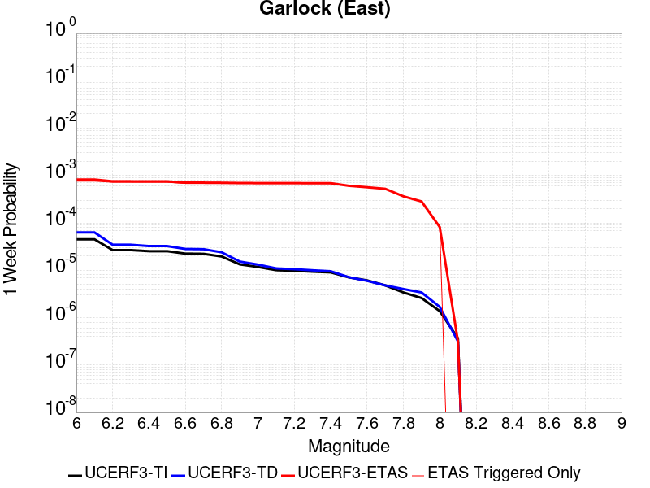 | 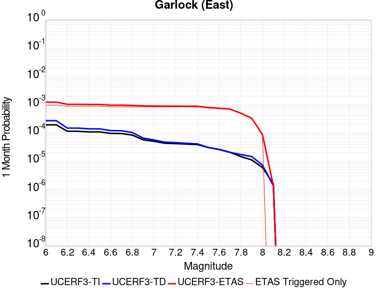 |  |

| Magnitude | 1 wk TI Prob | 1 wk TD Prob | 1 wk ETAS Prob | 1 wk ETAS/TD Gain | 1 wk ETAS Triggered Only | 1 mo TI Prob | 1 mo TD Prob | 1 mo ETAS Prob | 1 mo ETAS/TD Gain | 1 mo ETAS Triggered Only | 1 yr TI Prob | 1 yr TD Prob | 1 yr ETAS Prob | 1 yr ETAS/TD Gain | 1 yr ETAS Triggered Only |
|-----|-----|-----|-----|-----|-----|-----|-----|-----|-----|-----|-----|-----|-----|-----|-----|
| 6.0 | 4.5092507E-5 | 6.302061E-5 | 8.2297274E-4 | 13.058785 | 7.6E-4 | 1.9323928E-4 | 2.700629E-4 | 0.0012298037 | 4.553767 | 9.6E-4 | 0.0023501497 | 0.0032835056 | 0.0045194337 | 1.3764051 | 0.00124 |
| 6.1 | 4.5092507E-5 | 6.302061E-5 | 8.2297274E-4 | 13.058785 | 7.6E-4 | 1.9323928E-4 | 2.700629E-4 | 0.0012298037 | 4.553767 | 9.6E-4 | 0.0023501497 | 0.0032835056 | 0.0045194337 | 1.3764051 | 0.00124 |
| 6.2 | 2.6674514E-5 | 3.460235E-5 | 7.5457746E-4 | 21.807116 | 7.2E-4 | 1.1431433E-4 | 1.4828754E-4 | 0.0010281571 | 6.933536 | 8.8E-4 | 0.0013908884 | 0.001803939 | 0.0028819907 | 1.5976099 | 0.00108 |
| 6.3 | 2.6674514E-5 | 3.460235E-5 | 7.5457746E-4 | 21.807116 | 7.2E-4 | 1.1431433E-4 | 1.4828754E-4 | 0.0010281571 | 6.933536 | 8.8E-4 | 0.0013908884 | 0.001803939 | 0.0028819907 | 1.5976099 | 0.00108 |
| 6.4 | 2.5312667E-5 | 3.243003E-5 | 7.5240666E-4 | 23.200926 | 7.2E-4 | 1.0847834E-4 | 1.389786E-4 | 0.0010188563 | 7.33103 | 8.8E-4 | 0.0013199237 | 0.0016907807 | 0.0027689547 | 1.6376781 | 0.00108 |
| 6.5 | 2.5312667E-5 | 3.243003E-5 | 7.5240666E-4 | 23.200926 | 7.2E-4 | 1.0847834E-4 | 1.389786E-4 | 0.0010188563 | 7.33103 | 8.8E-4 | 0.0013199237 | 0.0016907807 | 0.0027689547 | 1.6376781 | 0.00108 |
| 6.6 | 2.246556E-5 | 2.8214976E-5 | 7.081958E-4 | 25.099997 | 6.8E-4 | 9.627742E-5 | 1.2091586E-4 | 9.608143E-4 | 7.94614 | 8.4E-4 | 0.0011715472 | 0.00147118 | 0.00250965 | 1.7058755 | 0.00104 |
| 6.7 | 2.2241198E-5 | 2.7884198E-5 | 7.078652E-4 | 25.385893 | 6.8E-4 | 9.531594E-5 | 1.1949836E-4 | 9.59398E-4 | 8.028545 | 8.4E-4 | 0.0011598538 | 0.0014539452 | 0.0024924332 | 1.7142552 | 0.00104 |
| 6.8 | 1.9528685E-5 | 2.3971877E-5 | 7.039556E-4 | 29.365892 | 6.8E-4 | 8.369167E-5 | 1.0273269E-4 | 9.426464E-4 | 9.17572 | 8.4E-4 | 0.0010184698 | 0.0012500725 | 0.0022887725 | 1.8309118 | 0.00104 |
| 6.9 | 1.3318621E-5 | 1.5256402E-5 | 6.9524604E-4 | 45.570774 | 6.8E-4 | 5.7078556E-5 | 6.538297E-5 | 9.05328E-4 | 13.846542 | 8.4E-4 | 6.9470983E-4 | 7.957527E-4 | 0.0018349251 | 2.3058987 | 0.00104 |
| 7.0 | 1.1760853E-5 | 1.3163365E-5 | 6.931544E-4 | 52.657845 | 6.8E-4 | 5.0402683E-5 | 5.641323E-5 | 8.9636585E-4 | 15.889284 | 8.4E-4 | 6.134799E-4 | 6.8661966E-4 | 0.0017259056 | 2.5136268 | 0.00104 |
| 7.1 | 1.0064758E-5 | 1.0956659E-5 | 6.909492E-4 | 63.062035 | 6.8E-4 | 4.3133965E-5 | 4.6956284E-5 | 8.869168E-4 | 18.88814 | 8.4E-4 | 5.2502943E-4 | 5.715463E-4 | 0.001610952 | 2.818585 | 0.00104 |
| 7.2 | 9.768808E-6 | 1.0552171E-5 | 6.90545E-4 | 65.44104 | 6.8E-4 | 4.186565E-5 | 4.5222823E-5 | 8.8518485E-4 | 19.57385 | 8.4E-4 | 5.095951E-4 | 5.504523E-4 | 0.0015898799 | 2.8883152 | 0.00104 |
| 7.3 | 9.344516E-6 | 9.99686E-6 | 6.8999006E-4 | 69.020676 | 6.8E-4 | 4.004731E-5 | 4.2843003E-5 | 8.82807E-4 | 20.605629 | 8.4E-4 | 4.8746695E-4 | 5.214922E-4 | 0.0015609498 | 2.9932373 | 0.00104 |
| 7.4 | 9.023491E-6 | 9.542039E-6 | 6.895356E-4 | 72.26291 | 6.8E-4 | 3.867153E-5 | 4.0893832E-5 | 8.808595E-4 | 21.540154 | 8.4E-4 | 4.7072413E-4 | 4.9777207E-4 | 0.0015372543 | 3.0882697 | 0.00104 |
| 7.5 | 7.081253E-6 | 7.1334935E-6 | 6.071292E-4 | 85.109665 | 6.0E-4 | 3.0347876E-5 | 3.057176E-5 | 7.905485E-4 | 25.858784 | 7.6E-4 | 3.6942272E-4 | 3.7214835E-4 | 0.001331791 | 3.5786564 | 9.6E-4 |
| 7.6 | 6.116396E-6 | 6.0000416E-6 | 5.659967E-4 | 94.33212 | 5.6E-4 | 2.6212863E-5 | 2.5714213E-5 | 7.456957E-4 | 28.999361 | 7.2E-4 | 3.1909486E-4 | 3.130258E-4 | 0.0012327378 | 3.9381347 | 9.2E-4 |
| 7.7 | 4.797145E-6 | 4.795929E-6 | 5.2479346E-4 | 109.424774 | 5.2E-4 | 2.055903E-5 | 2.055382E-5 | 7.0053985E-4 | 34.083195 | 6.8E-4 | 2.5027743E-4 | 2.5021416E-4 | 0.001090004 | 4.356284 | 8.4E-4 |
| 7.8 | 3.4028885E-6 | 4.0130544E-6 | 3.6401162E-4 | 90.70687 | 3.6E-4 | 1.4583726E-5 | 1.7198692E-5 | 4.9719046E-4 | 28.908619 | 4.8E-4 | 1.775424E-4 | 2.0937403E-4 | 8.4924005E-4 | 4.056091 | 6.4E-4 |
| 7.9 | 2.5928412E-6 | 3.4017612E-6 | 2.8340082E-4 | 83.31003 | 2.8E-4 | 1.1112129E-5 | 1.4578895E-5 | 3.3457423E-4 | 22.949217 | 3.2E-4 | 1.3528178E-4 | 1.7748366E-4 | 6.573985E-4 | 3.7039943 | 4.8E-4 |
| 8.0 | 1.3743648E-6 | 1.6867408E-6 | 8.168661E-5 | 48.428665 | 8.0E-5 | 5.8901214E-6 | 7.2288694E-6 | 8.722829E-5 | 12.066658 | 8.0E-5 | 7.1709874E-5 | 8.800796E-5 | 2.079974E-4 | 2.363393 | 1.2E-4 |
| 8.1 | 3.6733252E-7 | 3.1722044E-7 | 3.1722044E-7 | 1.0 | 0.0 | 1.5742813E-6 | 1.3595155E-6 | 1.3595155E-6 | 1.0 | 0.0 | 1.9166706E-5 | 1.6551992E-5 | 1.6551992E-5 | 1.0 | 0.0 |

## Big Pine (East)
*[(top)](#table-of-contents)*

| 1 Week | 1 Month | 1 Year |
|-----|-----|-----|
| 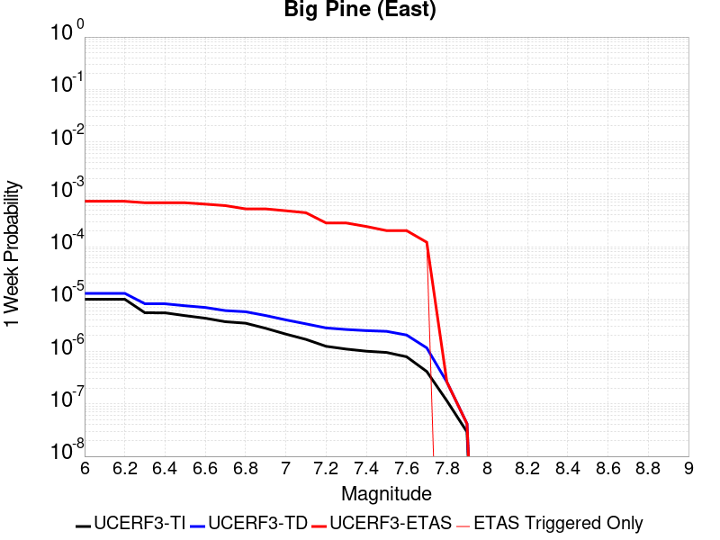 | 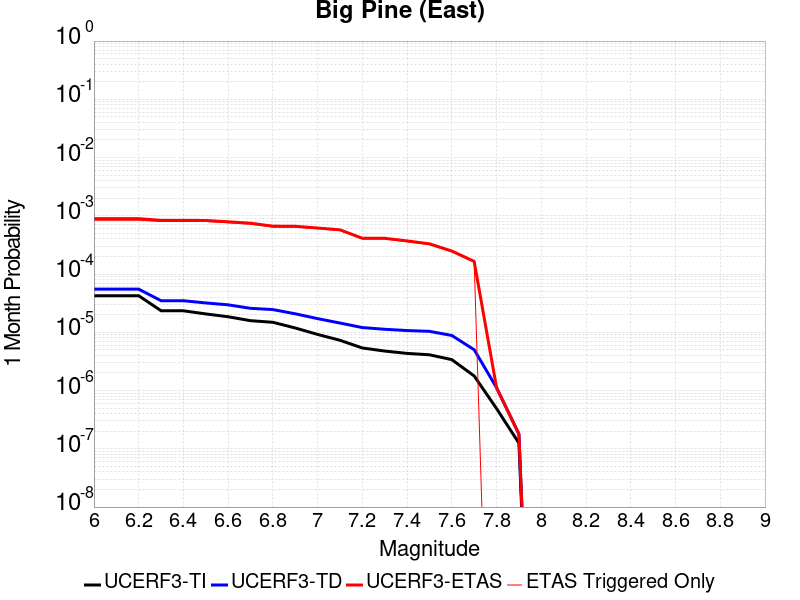 | 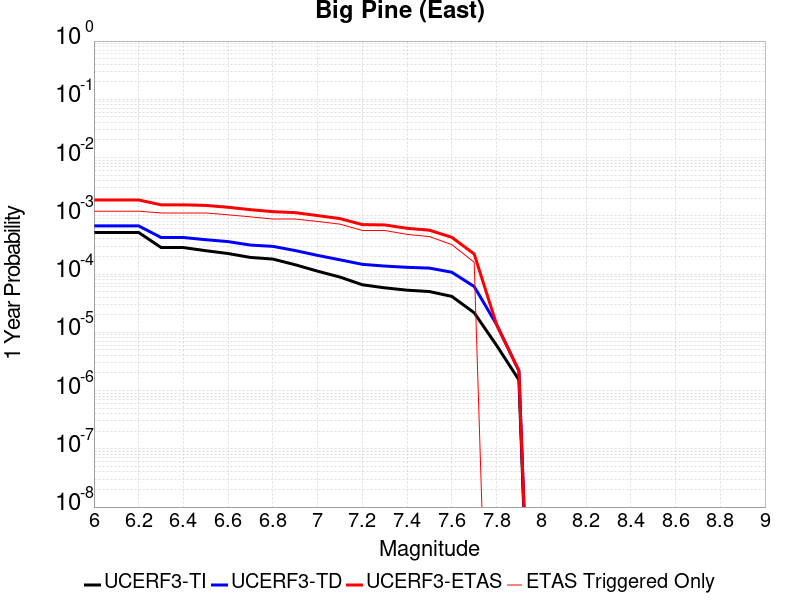 |

| Magnitude | 1 wk TI Prob | 1 wk TD Prob | 1 wk ETAS Prob | 1 wk ETAS/TD Gain | 1 wk ETAS Triggered Only | 1 mo TI Prob | 1 mo TD Prob | 1 mo ETAS Prob | 1 mo ETAS/TD Gain | 1 mo ETAS Triggered Only | 1 yr TI Prob | 1 yr TD Prob | 1 yr ETAS Prob | 1 yr ETAS/TD Gain | 1 yr ETAS Triggered Only |
|-----|-----|-----|-----|-----|-----|-----|-----|-----|-----|-----|-----|-----|-----|-----|-----|
| 6.0 | 9.916913E-6 | 1.2849277E-5 | 7.3284004E-4 | 57.03356 | 7.2E-4 | 4.250036E-5 | 5.5067292E-5 | 8.95021E-4 | 16.253223 | 8.4E-4 | 5.173191E-4 | 6.7026017E-4 | 0.0018694558 | 2.7891495 | 0.0012 |
| 6.1 | 9.916913E-6 | 1.2849277E-5 | 7.3284004E-4 | 57.03356 | 7.2E-4 | 4.250036E-5 | 5.5067292E-5 | 8.95021E-4 | 16.253223 | 8.4E-4 | 5.173191E-4 | 6.7026017E-4 | 0.0018694558 | 2.7891495 | 0.0012 |
| 6.2 | 9.916913E-6 | 1.2849277E-5 | 7.3284004E-4 | 57.03356 | 7.2E-4 | 4.250036E-5 | 5.5067292E-5 | 8.95021E-4 | 16.253223 | 8.4E-4 | 5.173191E-4 | 6.7026017E-4 | 0.0018694558 | 2.7891495 | 0.0012 |
| 6.3 | 5.479711E-6 | 8.144284E-6 | 6.8813877E-4 | 84.493454 | 6.8E-4 | 2.3484265E-5 | 3.4903627E-5 | 8.348757E-4 | 23.919455 | 8.0E-4 | 2.858834E-4 | 4.24872E-4 | 0.0015443962 | 3.634968 | 0.00112 |
| 6.4 | 5.465009E-6 | 8.128574E-6 | 6.8812305E-4 | 84.65482 | 6.8E-4 | 2.3421257E-5 | 3.48363E-5 | 8.3480845E-4 | 23.96375 | 8.0E-4 | 2.851165E-4 | 4.2405262E-4 | 0.0015435776 | 3.6400616 | 0.00112 |
| 6.5 | 4.826767E-6 | 7.453499E-6 | 6.874484E-4 | 92.231636 | 6.8E-4 | 2.068598E-5 | 3.1943193E-5 | 8.319176E-4 | 26.043661 | 8.0E-4 | 2.518227E-4 | 3.8884176E-4 | 0.0015084062 | 3.879229 | 0.00112 |
| 6.6 | 4.3146847E-6 | 6.913335E-6 | 6.469089E-4 | 93.57407 | 6.4E-4 | 1.8491375E-5 | 2.9628256E-5 | 7.896057E-4 | 26.650429 | 7.6E-4 | 2.2510924E-4 | 3.6066677E-4 | 0.0014002917 | 3.882508 | 0.00104 |
| 6.7 | 3.6968106E-6 | 6.024692E-6 | 6.060211E-4 | 100.589554 | 6.0E-4 | 1.5843378E-5 | 2.5819862E-5 | 7.4580126E-4 | 28.884789 | 7.2E-4 | 1.9287605E-4 | 3.1431302E-4 | 0.0012740113 | 4.05332 | 9.6E-4 |
| 6.8 | 3.4671132E-6 | 5.730609E-6 | 5.2572764E-4 | 91.74028 | 5.2E-4 | 1.4858972E-5 | 2.4559527E-5 | 6.645438E-4 | 27.058493 | 6.4E-4 | 1.8089297E-4 | 2.9897268E-4 | 0.0011787096 | 3.9425328 | 8.8E-4 |
| 6.9 | 2.7686972E-6 | 4.851478E-6 | 5.2484893E-4 | 108.18331 | 5.2E-4 | 1.1865792E-5 | 2.0791887E-5 | 6.607786E-4 | 31.780598 | 6.4E-4 | 1.4445644E-4 | 2.5311258E-4 | 0.0011328899 | 4.475834 | 8.8E-4 |
| 7.0 | 2.1472624E-6 | 4.008895E-6 | 4.8400697E-4 | 120.73326 | 4.8E-4 | 9.20252E-6 | 1.7180868E-5 | 6.1717053E-4 | 35.921967 | 6.0E-4 | 1.12034926E-4 | 2.0915753E-4 | 0.0010089902 | 4.824068 | 8.0E-4 |
| 7.1 | 1.7018335E-6 | 3.3665633E-6 | 4.4336508E-4 | 131.69664 | 4.4E-4 | 7.293552E-6 | 1.4428051E-5 | 5.7442E-4 | 39.81272 | 5.6E-4 | 8.879537E-5 | 1.7564771E-4 | 8.9552125E-4 | 5.098394 | 7.2E-4 |
| 7.2 | 1.25603E-6 | 2.8149723E-6 | 2.8281417E-4 | 100.46784 | 2.8E-4 | 5.3829745E-6 | 1.2064112E-5 | 4.1205928E-4 | 34.155792 | 4.0E-4 | 6.553574E-5 | 1.468709E-4 | 7.067886E-4 | 4.8123126 | 5.6E-4 |
| 7.3 | 1.112297E-6 | 2.6296866E-6 | 2.8262896E-4 | 107.47629 | 2.8E-4 | 4.7669787E-6 | 1.1270038E-5 | 4.1126553E-4 | 36.49194 | 4.0E-4 | 5.803642E-5 | 1.3720429E-4 | 6.971275E-4 | 5.080945 | 5.6E-4 |
| 7.4 | 1.0137181E-6 | 2.5020183E-6 | 2.4250142E-4 | 96.922325 | 2.4E-4 | 4.3444993E-6 | 1.07228925E-5 | 3.7071903E-4 | 34.57267 | 3.6E-4 | 5.2892992E-5 | 1.3054362E-4 | 6.1048096E-4 | 4.676452 | 4.8E-4 |
| 7.5 | 9.598608E-7 | 2.4251278E-6 | 2.0242465E-4 | 83.46968 | 2.0E-4 | 4.1136827E-6 | 1.0393365E-5 | 3.3039003E-4 | 31.788553 | 3.2E-4 | 5.0082934E-5 | 1.2653209E-4 | 5.6647643E-4 | 4.4769387 | 4.4E-4 |
| 7.6 | 7.929459E-7 | 2.0607458E-6 | 2.0206033E-4 | 98.05205 | 2.0E-4 | 3.3983351E-6 | 8.831738E-6 | 2.4882963E-4 | 28.174479 | 2.4E-4 | 4.1373947E-5 | 1.07521286E-4 | 4.2748687E-4 | 3.9758348 | 3.2E-4 |
| 7.7 | 4.155788E-7 | 1.1718464E-6 | 1.211717E-4 | 103.40238 | 1.2E-4 | 1.7810507E-6 | 5.0221893E-6 | 1.6502138E-4 | 32.858456 | 1.6E-4 | 2.1684076E-5 | 6.114348E-5 | 2.211337E-4 | 3.6166356 | 1.6E-4 |
| 7.8 | 1.14666925E-7 | 2.617199E-7 | 2.617199E-7 | 1.0 | 0.0 | 4.914296E-7 | 1.1216562E-6 | 1.1216562E-6 | 1.0 | 0.0 | 5.9831386E-6 | 1.3656083E-5 | 1.3656083E-5 | 1.0 | 0.0 |
| 7.9 | 2.9231824E-8 | 4.188171E-8 | 4.188171E-8 | 1.0 | 0.0 | 1.2527924E-7 | 1.7949303E-7 | 1.7949303E-7 | 1.0 | 0.0 | 1.5252737E-6 | 2.1853257E-6 | 2.1853257E-6 | 1.0 | 0.0 |

## Imperial
*[(top)](#table-of-contents)*

| 1 Week | 1 Month | 1 Year |
|-----|-----|-----|
| 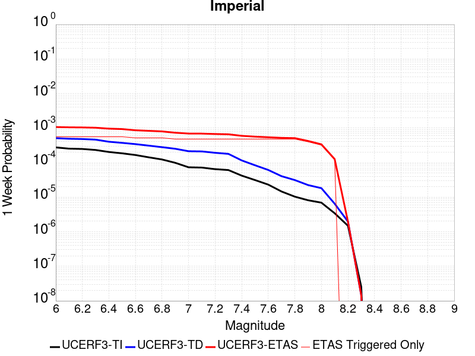 | 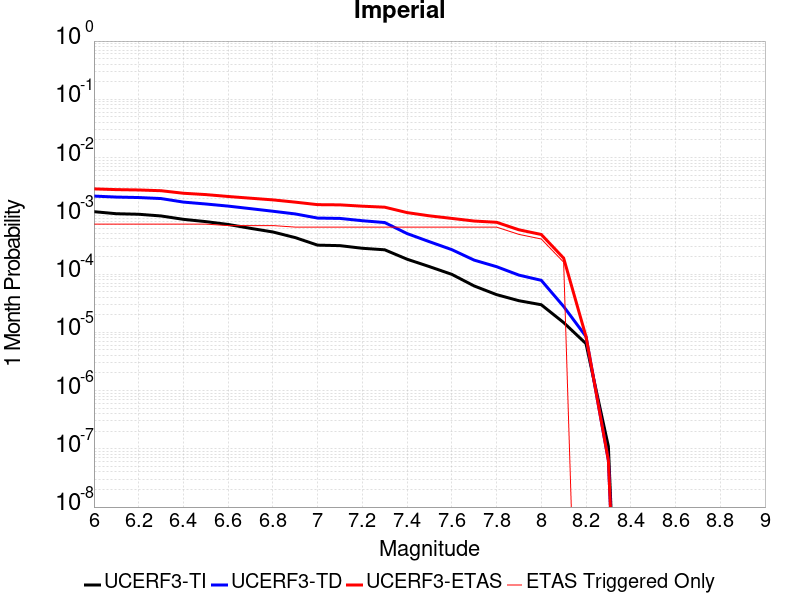 | 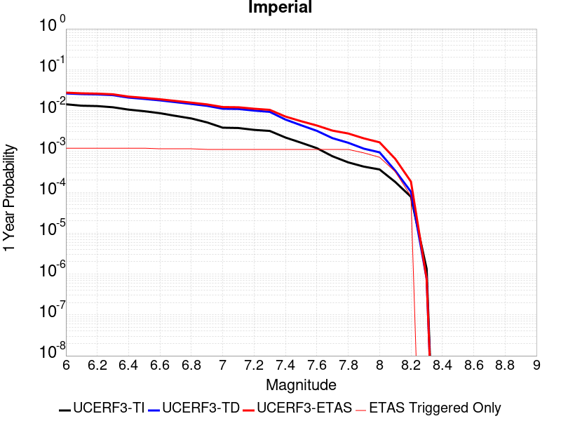 |

| Magnitude | 1 wk TI Prob | 1 wk TD Prob | 1 wk ETAS Prob | 1 wk ETAS/TD Gain | 1 wk ETAS Triggered Only | 1 mo TI Prob | 1 mo TD Prob | 1 mo ETAS Prob | 1 mo ETAS/TD Gain | 1 mo ETAS Triggered Only | 1 yr TI Prob | 1 yr TD Prob | 1 yr ETAS Prob | 1 yr ETAS/TD Gain | 1 yr ETAS Triggered Only |
|-----|-----|-----|-----|-----|-----|-----|-----|-----|-----|-----|-----|-----|-----|-----|-----|
| 6.0 | 2.7496446E-4 | 5.092747E-4 | 0.0010689895 | 2.099043 | 5.6E-4 | 0.0011778869 | 0.0021808199 | 0.0028992498 | 1.329431 | 7.2E-4 | 0.0142467655 | 0.026244733 | 0.02741324 | 1.0445235 | 0.0012 |
| 6.1 | 2.5356023E-4 | 4.8989133E-4 | 0.001049617 | 2.1425507 | 5.6E-4 | 0.001086234 | 0.0020978837 | 0.0028163732 | 1.342483 | 7.2E-4 | 0.013144928 | 0.025256295 | 0.026425987 | 1.0463129 | 0.0012 |
| 6.2 | 2.4820742E-4 | 4.807923E-4 | 0.001040523 | 2.164184 | 5.6E-4 | 0.0010633124 | 0.0020589496 | 0.002777467 | 1.3489729 | 7.2E-4 | 0.01286919 | 0.024793668 | 0.025963916 | 1.0471995 | 0.0012 |
| 6.3 | 2.3205351E-4 | 4.618754E-4 | 0.0010216167 | 2.2118883 | 5.6E-4 | 9.94136E-4 | 0.0019780016 | 0.0026965772 | 1.3632838 | 7.2E-4 | 0.012036599 | 0.023824649 | 0.024996059 | 1.049168 | 0.0012 |
| 6.4 | 2.0304754E-4 | 4.0161575E-4 | 9.6139085E-4 | 2.3938076 | 5.6E-4 | 8.6991355E-4 | 0.0017200898 | 0.0024388514 | 1.4178628 | 7.2E-4 | 0.010539869 | 0.020755747 | 0.02193084 | 1.0566154 | 0.0012 |
| 6.5 | 1.854992E-4 | 3.7255368E-4 | 9.3234505E-4 | 2.502579 | 5.6E-4 | 7.9475436E-4 | 0.0015956942 | 0.0023145452 | 1.4504943 | 7.2E-4 | 0.009633281 | 0.019265464 | 0.020442344 | 1.0610876 | 0.0012 |
| 6.6 | 1.6586106E-4 | 3.4277118E-4 | 8.6259295E-4 | 2.5165272 | 5.2E-4 | 7.106394E-4 | 0.0014682026 | 0.0021472042 | 1.4624714 | 6.8E-4 | 0.008617763 | 0.017735237 | 0.018874666 | 1.0642465 | 0.00116 |
| 6.7 | 1.4224656E-4 | 3.0978522E-4 | 8.296241E-4 | 2.6780624 | 5.2E-4 | 6.094856E-4 | 0.0013269838 | 0.0020060814 | 1.5117604 | 6.8E-4 | 0.0073952693 | 0.01604038 | 0.017181773 | 1.0711575 | 0.00116 |
| 6.8 | 1.2317259E-4 | 2.7964902E-4 | 7.995036E-4 | 2.8589537 | 5.2E-4 | 5.2777573E-4 | 0.0011979516 | 0.001877137 | 1.5669556 | 6.8E-4 | 0.0064067547 | 0.014488932 | 0.015632125 | 1.0789012 | 0.00116 |
| 6.9 | 9.859898E-5 | 2.5139938E-4 | 7.3127873E-4 | 2.9088326 | 4.8E-4 | 4.2249862E-4 | 0.0010769854 | 0.0017162961 | 1.5936114 | 6.4E-4 | 0.0051317946 | 0.013034438 | 0.0141398385 | 1.0848062 | 0.00112 |
| 7.0 | 7.3191884E-5 | 2.1355721E-4 | 6.934547E-4 | 3.2471611 | 4.8E-4 | 3.136418E-4 | 9.149274E-4 | 0.0015543419 | 1.6988691 | 6.4E-4 | 0.003811904 | 0.0110830385 | 0.012190625 | 1.0999353 | 0.00112 |
| 7.1 | 7.1760296E-5 | 2.1055574E-4 | 6.904547E-4 | 3.2792015 | 4.8E-4 | 3.0750787E-4 | 9.020729E-4 | 0.0015414956 | 1.708837 | 6.4E-4 | 0.003737482 | 0.010928115 | 0.012035875 | 1.101368 | 0.00112 |
| 7.2 | 6.46614E-5 | 1.922011E-4 | 6.7210884E-4 | 3.4969041 | 4.8E-4 | 2.7709085E-4 | 8.2346203E-4 | 0.001462935 | 1.7765665 | 6.4E-4 | 0.0033683628 | 0.00998019 | 0.011089012 | 1.1111023 | 0.00112 |
| 7.3 | 6.088115E-5 | 1.7887545E-4 | 6.587896E-4 | 3.6829515 | 4.8E-4 | 2.6089314E-4 | 7.663867E-4 | 0.0014058962 | 1.8344476 | 6.4E-4 | 0.0031717476 | 0.009291418 | 0.010401011 | 1.1194214 | 0.00112 |
| 7.4 | 4.199346E-5 | 1.1570693E-4 | 5.956514E-4 | 5.147932 | 4.8E-4 | 1.7995955E-4 | 4.957935E-4 | 0.0011354762 | 2.29022 | 6.4E-4 | 0.0021888057 | 0.006019749 | 0.0071330075 | 1.1849343 | 0.00112 |
| 7.5 | 3.130448E-5 | 8.383019E-5 | 5.6379E-4 | 6.7253804 | 4.8E-4 | 1.3415517E-4 | 3.592231E-4 | 9.989932E-4 | 2.7809825 | 6.4E-4 | 0.0016321153 | 0.004364831 | 0.0054799425 | 1.2554764 | 0.00112 |
| 7.6 | 2.3074248E-5 | 6.126616E-5 | 5.412368E-4 | 8.8341875 | 4.8E-4 | 9.888588E-5 | 2.6254298E-4 | 9.023749E-4 | 3.4370563 | 6.4E-4 | 0.0012032706 | 0.003191799 | 0.004308224 | 1.3497792 | 0.00112 |
| 7.7 | 1.45864815E-5 | 4.047476E-5 | 5.204553E-4 | 12.858763 | 4.8E-4 | 6.2511994E-5 | 1.7345174E-4 | 8.1334077E-4 | 4.689147 | 6.4E-4 | 7.608177E-4 | 0.0021097353 | 0.0032273722 | 1.5297523 | 0.00112 |
| 7.8 | 1.0352979E-5 | 3.1258456E-5 | 5.112435E-4 | 16.355366 | 4.8E-4 | 4.4369157E-5 | 1.3395795E-4 | 7.738722E-4 | 5.776979 | 6.4E-4 | 5.400606E-4 | 0.0016297202 | 0.002747895 | 1.6861145 | 0.00112 |
| 7.9 | 8.137906E-6 | 2.238844E-5 | 4.223795E-4 | 18.865963 | 4.0E-4 | 3.4876273E-5 | 9.594693E-5 | 5.759009E-4 | 6.0022855 | 4.8E-4 | 4.2453592E-4 | 0.0011675289 | 0.0020864548 | 1.7870691 | 9.2E-4 |
| 8.0 | 6.93792E-6 | 1.821489E-5 | 3.3820907E-4 | 18.567724 | 3.2E-4 | 2.9733603E-5 | 7.806149E-5 | 4.7803027E-4 | 6.123766 | 4.0E-4 | 3.6194647E-4 | 9.49985E-4 | 0.001669301 | 1.7571868 | 7.2E-4 |
| 8.1 | 3.4286315E-6 | 6.476726E-6 | 1.2647595E-4 | 19.52776 | 1.2E-4 | 1.4694053E-5 | 2.7757102E-5 | 1.8775267E-4 | 6.7641306 | 1.6E-4 | 1.7888541E-4 | 3.3789044E-4 | 6.577823E-4 | 1.9467325 | 3.2E-4 |
| 8.2 | 1.4906886E-6 | 1.9734612E-6 | 1.9734612E-6 | 1.0 | 0.0 | 6.3886496E-6 | 8.457663E-6 | 8.457663E-6 | 1.0 | 0.0 | 7.7779034E-5 | 1.0296722E-4 | 1.8295899E-4 | 1.7768663 | 8.0E-5 |
| 8.3 | 2.5758007E-8 | 1.4872131E-8 | 1.4872131E-8 | 1.0 | 0.0 | 1.10391454E-7 | 6.37377E-8 | 6.37377E-8 | 1.0 | 0.0 | 1.3440151E-6 | 7.760065E-7 | 7.760065E-7 | 1.0 | 0.0 |

## San Jacinto (San Jacinto Valley) rev
*[(top)](#table-of-contents)*

| 1 Week | 1 Month | 1 Year |
|-----|-----|-----|
| 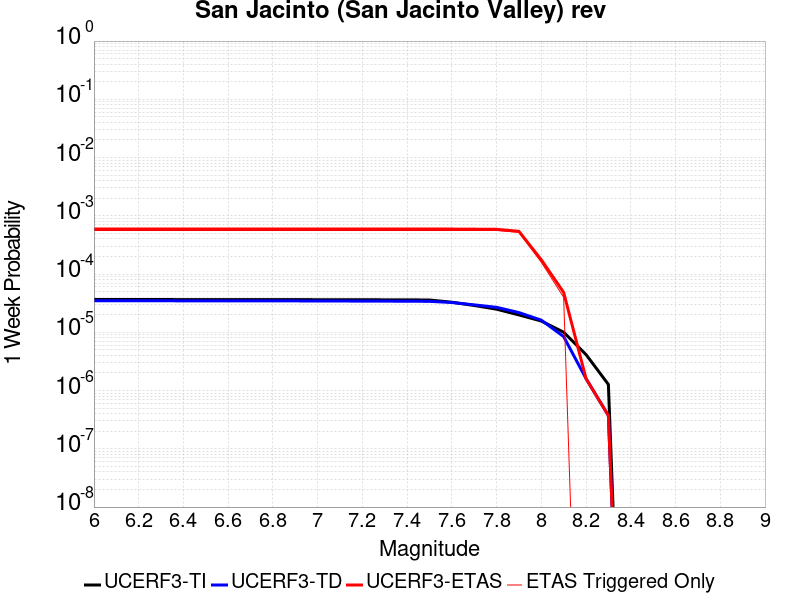 | 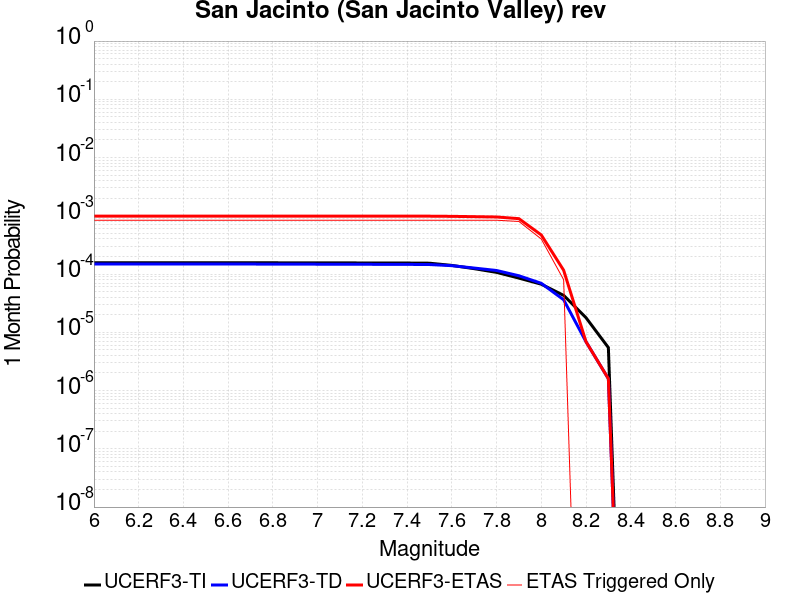 | 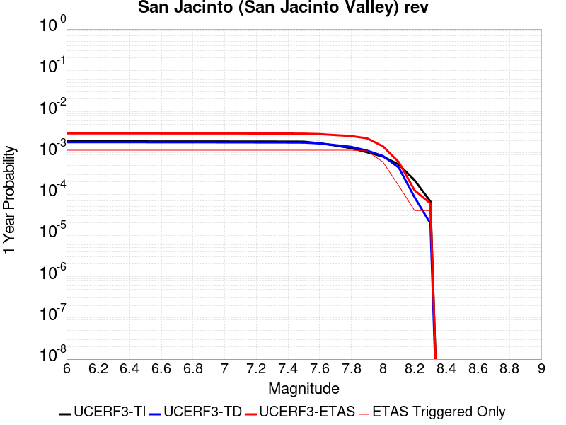 |

| Magnitude | 1 wk TI Prob | 1 wk TD Prob | 1 wk ETAS Prob | 1 wk ETAS/TD Gain | 1 wk ETAS Triggered Only | 1 mo TI Prob | 1 mo TD Prob | 1 mo ETAS Prob | 1 mo ETAS/TD Gain | 1 mo ETAS Triggered Only | 1 yr TI Prob | 1 yr TD Prob | 1 yr ETAS Prob | 1 yr ETAS/TD Gain | 1 yr ETAS Triggered Only |
|-----|-----|-----|-----|-----|-----|-----|-----|-----|-----|-----|-----|-----|-----|-----|-----|
| 6.0 | 3.652694E-5 | 3.4785007E-5 | 5.9476553E-4 | 17.09833 | 5.6E-4 | 1.5653463E-4 | 1.4907008E-4 | 9.889449E-4 | 6.6340933 | 8.4E-4 | 0.0019041431 | 0.0018134193 | 0.0029713158 | 1.6385156 | 0.00116 |
| 6.1 | 3.652694E-5 | 3.4785007E-5 | 5.9476553E-4 | 17.09833 | 5.6E-4 | 1.5653463E-4 | 1.4907008E-4 | 9.889449E-4 | 6.6340933 | 8.4E-4 | 0.0019041431 | 0.0018134193 | 0.0029713158 | 1.6385156 | 0.00116 |
| 6.2 | 3.652694E-5 | 3.4785007E-5 | 5.9476553E-4 | 17.09833 | 5.6E-4 | 1.5653463E-4 | 1.4907008E-4 | 9.889449E-4 | 6.6340933 | 8.4E-4 | 0.0019041431 | 0.0018134193 | 0.0029713158 | 1.6385156 | 0.00116 |
| 6.3 | 3.652694E-5 | 3.4785007E-5 | 5.9476553E-4 | 17.09833 | 5.6E-4 | 1.5653463E-4 | 1.4907008E-4 | 9.889449E-4 | 6.6340933 | 8.4E-4 | 0.0019041431 | 0.0018134193 | 0.0029713158 | 1.6385156 | 0.00116 |
| 6.4 | 3.646941E-5 | 3.470649E-5 | 5.9468707E-4 | 17.13475 | 5.6E-4 | 1.5628811E-4 | 1.4873363E-4 | 9.886087E-4 | 6.6468406 | 8.4E-4 | 0.0019011468 | 0.0018093301 | 0.0029672312 | 1.6399612 | 0.00116 |
| 6.5 | 3.646941E-5 | 3.470649E-5 | 5.9468707E-4 | 17.13475 | 5.6E-4 | 1.5628811E-4 | 1.4873363E-4 | 9.886087E-4 | 6.6468406 | 8.4E-4 | 0.0019011468 | 0.0018093301 | 0.0029672312 | 1.6399612 | 0.00116 |
| 6.6 | 3.6442503E-5 | 3.4669836E-5 | 5.946504E-4 | 17.15181 | 5.6E-4 | 1.561728E-4 | 1.4857655E-4 | 9.884518E-4 | 6.652811 | 8.4E-4 | 0.0018997455 | 0.0018074211 | 0.0029653246 | 1.6406384 | 0.00116 |
| 6.7 | 3.6432113E-5 | 3.4655393E-5 | 5.9463596E-4 | 17.15854 | 5.6E-4 | 1.5612828E-4 | 1.4851466E-4 | 9.8839E-4 | 6.655167 | 8.4E-4 | 0.0018992044 | 0.0018066689 | 0.0029645732 | 1.6409056 | 0.00116 |
| 6.8 | 3.6409598E-5 | 3.462441E-5 | 5.94605E-4 | 17.173 | 5.6E-4 | 1.560318E-4 | 1.4838189E-4 | 9.882572E-4 | 6.660228 | 8.4E-4 | 0.0018980318 | 0.0018050552 | 0.0029629613 | 1.6414796 | 0.00116 |
| 6.9 | 3.638078E-5 | 3.4584784E-5 | 5.945654E-4 | 17.191532 | 5.6E-4 | 1.5590832E-4 | 1.4821209E-4 | 9.880876E-4 | 6.6667137 | 8.4E-4 | 0.0018965311 | 0.0018029913 | 0.0029608998 | 1.6422153 | 0.00116 |
| 7.0 | 3.6294874E-5 | 3.446665E-5 | 5.9444737E-4 | 17.247028 | 5.6E-4 | 1.5554018E-4 | 1.4770588E-4 | 9.875818E-4 | 6.6861377 | 8.4E-4 | 0.0018920569 | 0.0017968385 | 0.002954754 | 1.6444184 | 0.00116 |
| 7.1 | 3.6260717E-5 | 3.4422897E-5 | 5.944036E-4 | 17.267681 | 5.6E-4 | 1.5539382E-4 | 1.4751837E-4 | 9.873945E-4 | 6.693366 | 8.4E-4 | 0.001890278 | 0.0017945593 | 0.0029524777 | 1.6452383 | 0.00116 |
| 7.2 | 3.6210204E-5 | 3.4356966E-5 | 5.943377E-4 | 17.298899 | 5.6E-4 | 1.5517735E-4 | 1.4723586E-4 | 9.871122E-4 | 6.7042923 | 8.4E-4 | 0.001887647 | 0.0017911253 | 0.0029490476 | 1.6464776 | 0.00116 |
| 7.3 | 3.6119454E-5 | 3.42449E-5 | 5.942257E-4 | 17.35224 | 5.6E-4 | 1.5478847E-4 | 1.4675561E-4 | 9.866323E-4 | 6.7229614 | 8.4E-4 | 0.0018829206 | 0.001785288 | 0.002943217 | 1.6485951 | 0.00116 |
| 7.4 | 3.607848E-5 | 3.4192242E-5 | 5.941731E-4 | 17.377424 | 5.6E-4 | 1.5461289E-4 | 1.4652996E-4 | 9.864069E-4 | 6.7317758 | 8.4E-4 | 0.0018807866 | 0.0017825452 | 0.0029404773 | 1.6495949 | 0.00116 |
| 7.5 | 3.5856774E-5 | 3.4000583E-5 | 5.9398153E-4 | 17.469746 | 5.6E-4 | 1.5366284E-4 | 1.4570866E-4 | 9.855863E-4 | 6.764088 | 8.4E-4 | 0.0018692396 | 0.0017725622 | 0.0029305061 | 1.6532599 | 0.00116 |
| 7.6 | 3.286655E-5 | 3.2510947E-5 | 5.9249275E-4 | 18.224407 | 5.6E-4 | 1.4084904E-4 | 1.393252E-4 | 9.792082E-4 | 7.0282197 | 8.4E-4 | 0.001713488 | 0.0016949666 | 0.0028530005 | 1.6832193 | 0.00116 |
| 7.7 | 2.8882527E-5 | 2.9595956E-5 | 5.895794E-4 | 19.920944 | 5.6E-4 | 1.237764E-4 | 1.2683365E-4 | 9.667271E-4 | 7.622008 | 8.4E-4 | 0.0015059357 | 0.001543107 | 0.002701317 | 1.75057 | 0.00116 |
| 7.8 | 2.4950225E-5 | 2.687312E-5 | 5.868581E-4 | 21.838108 | 5.6E-4 | 1.0692515E-4 | 1.15165436E-4 | 9.550687E-4 | 8.2930155 | 8.4E-4 | 0.0013010362 | 0.0014012383 | 0.0025596127 | 1.8266792 | 0.00116 |
| 7.9 | 1.9881603E-5 | 2.1818549E-5 | 5.418072E-4 | 24.832413 | 5.2E-4 | 8.520408E-5 | 9.350472E-5 | 8.934299E-4 | 9.554917 | 8.0E-4 | 0.001036866 | 0.0011378262 | 0.002256552 | 1.9832131 | 0.00112 |
| 8.0 | 1.563292E-5 | 1.618842E-5 | 1.7618583E-4 | 10.883449 | 1.6E-4 | 6.6996516E-5 | 6.93771E-5 | 4.6934935E-4 | 6.7651916 | 4.0E-4 | 8.153773E-4 | 8.4433955E-4 | 0.001443833 | 1.7100146 | 6.0E-4 |
| 8.1 | 1.0045313E-5 | 8.449115E-6 | 4.8448775E-5 | 5.734184 | 4.0E-5 | 4.305063E-5 | 3.6209993E-5 | 1.1620709E-4 | 3.209255 | 8.0E-5 | 5.2401534E-4 | 4.40768E-4 | 6.006975E-4 | 1.3628428 | 1.6E-4 |
| 8.2 | 4.1554413E-6 | 1.6074547E-6 | 1.6074547E-6 | 1.0 | 0.0 | 1.7808914E-5 | 6.8890736E-6 | 6.8890736E-6 | 1.0 | 0.0 | 2.1680194E-4 | 8.387127E-5 | 1.2386791E-4 | 1.4768814 | 4.0E-5 |
| 8.3 | 1.2758221E-6 | 3.728509E-7 | 3.728509E-7 | 1.0 | 0.0 | 5.4677976E-6 | 1.5979316E-6 | 1.5979316E-6 | 1.0 | 0.0 | 6.65684E-5 | 1.9454648E-5 | 5.945387E-5 | 3.056024 | 4.0E-5 |

## San Jacinto (Stepovers Combined)
*[(top)](#table-of-contents)*

| 1 Week | 1 Month | 1 Year |
|-----|-----|-----|
| 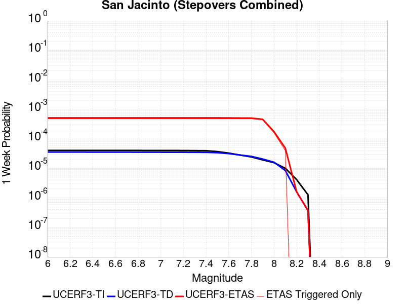 | 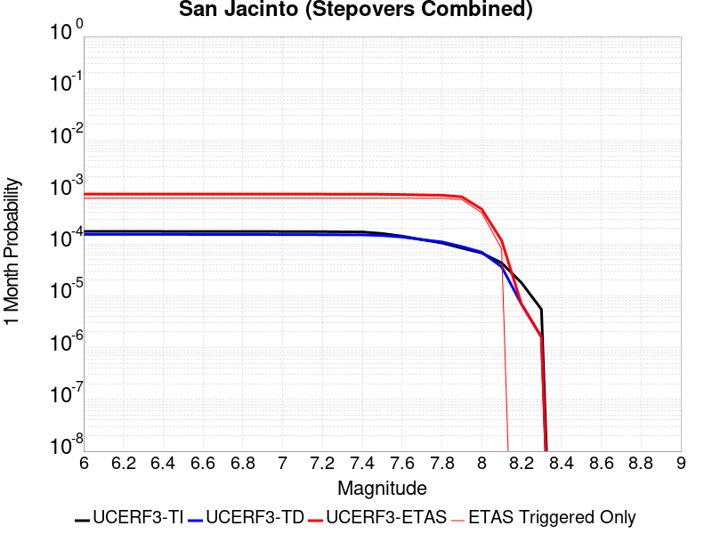 | 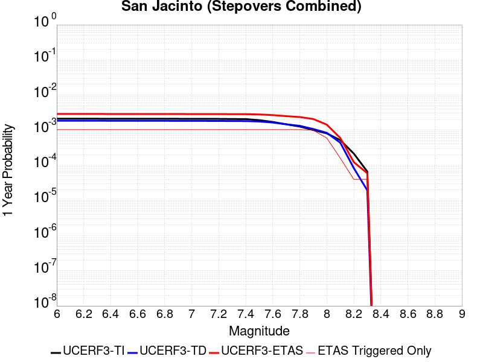 |

| Magnitude | 1 wk TI Prob | 1 wk TD Prob | 1 wk ETAS Prob | 1 wk ETAS/TD Gain | 1 wk ETAS Triggered Only | 1 mo TI Prob | 1 mo TD Prob | 1 mo ETAS Prob | 1 mo ETAS/TD Gain | 1 mo ETAS Triggered Only | 1 yr TI Prob | 1 yr TD Prob | 1 yr ETAS Prob | 1 yr ETAS/TD Gain | 1 yr ETAS Triggered Only |
|-----|-----|-----|-----|-----|-----|-----|-----|-----|-----|-----|-----|-----|-----|-----|-----|
| 6.0 | 4.0667746E-5 | 3.5654804E-5 | 5.156377E-4 | 14.461941 | 4.8E-4 | 1.742787E-4 | 1.5279738E-4 | 9.126812E-4 | 5.9731474 | 7.6E-4 | 0.0021197782 | 0.001858722 | 0.0028967888 | 1.5584842 | 0.00104 |
| 6.1 | 4.0667746E-5 | 3.5654804E-5 | 5.156377E-4 | 14.461941 | 4.8E-4 | 1.742787E-4 | 1.5279738E-4 | 9.126812E-4 | 5.9731474 | 7.6E-4 | 0.0021197782 | 0.001858722 | 0.0028967888 | 1.5584842 | 0.00104 |
| 6.2 | 4.0667746E-5 | 3.5654804E-5 | 5.156377E-4 | 14.461941 | 4.8E-4 | 1.742787E-4 | 1.5279738E-4 | 9.126812E-4 | 5.9731474 | 7.6E-4 | 0.0021197782 | 0.001858722 | 0.0028967888 | 1.5584842 | 0.00104 |
| 6.3 | 4.0667746E-5 | 3.5654804E-5 | 5.156377E-4 | 14.461941 | 4.8E-4 | 1.742787E-4 | 1.5279738E-4 | 9.126812E-4 | 5.9731474 | 7.6E-4 | 0.0021197782 | 0.001858722 | 0.0028967888 | 1.5584842 | 0.00104 |
| 6.4 | 4.0577226E-5 | 3.552656E-5 | 5.155095E-4 | 14.510539 | 4.8E-4 | 1.738908E-4 | 1.522478E-4 | 9.121321E-4 | 5.9911017 | 7.6E-4 | 0.0021150648 | 0.0018520436 | 0.0028901175 | 1.5605019 | 0.00104 |
| 6.5 | 4.0577226E-5 | 3.552656E-5 | 5.155095E-4 | 14.510539 | 4.8E-4 | 1.738908E-4 | 1.522478E-4 | 9.121321E-4 | 5.9911017 | 7.6E-4 | 0.0021150648 | 0.0018520436 | 0.0028901175 | 1.5605019 | 0.00104 |
| 6.6 | 4.053861E-5 | 3.5471832E-5 | 5.154548E-4 | 14.531384 | 4.8E-4 | 1.7372532E-4 | 1.520133E-4 | 9.1189775E-4 | 5.9988027 | 7.6E-4 | 0.0021130538 | 0.0018491937 | 0.0028872704 | 1.5613673 | 0.00104 |
| 6.7 | 4.0516545E-5 | 3.5440866E-5 | 5.1542383E-4 | 14.543207 | 4.8E-4 | 1.7363077E-4 | 1.5188061E-4 | 9.1176515E-4 | 6.0031705 | 7.6E-4 | 0.002111905 | 0.0018475811 | 0.0028856597 | 1.5618582 | 0.00104 |
| 6.8 | 4.049434E-5 | 3.5412282E-5 | 5.153953E-4 | 14.55414 | 4.8E-4 | 1.7353562E-4 | 1.5175811E-4 | 9.116428E-4 | 6.00721 | 7.6E-4 | 0.0021107488 | 0.0018460923 | 0.0028841724 | 1.5623121 | 0.00104 |
| 6.9 | 4.046386E-5 | 3.5374713E-5 | 5.153577E-4 | 14.568535 | 4.8E-4 | 1.73405E-4 | 1.5159712E-4 | 9.114819E-4 | 6.012528 | 7.6E-4 | 0.0021091616 | 0.0018441357 | 0.0028822178 | 1.5629098 | 0.00104 |
| 7.0 | 4.036382E-5 | 3.5254863E-5 | 5.152379E-4 | 14.614663 | 4.8E-4 | 1.7297632E-4 | 1.5108353E-4 | 9.109687E-4 | 6.0295696 | 7.6E-4 | 0.0021039525 | 0.0018378934 | 0.002875982 | 1.5648253 | 0.00104 |
| 7.1 | 4.0343282E-5 | 3.523326E-5 | 5.152163E-4 | 14.623011 | 4.8E-4 | 1.7288832E-4 | 1.5099096E-4 | 9.108762E-4 | 6.032654 | 7.6E-4 | 0.002102883 | 0.0018367684 | 0.0028748582 | 1.5651718 | 0.00104 |
| 7.2 | 4.0257353E-5 | 3.5137495E-5 | 5.151206E-4 | 14.660142 | 4.8E-4 | 1.725201E-4 | 1.5058058E-4 | 9.1046613E-4 | 6.0463715 | 7.6E-4 | 0.0020984085 | 0.0018317803 | 0.0028698752 | 1.5667137 | 0.00104 |
| 7.3 | 3.9940667E-5 | 3.4963145E-5 | 5.1494635E-4 | 14.728263 | 4.8E-4 | 1.7116306E-4 | 1.4983346E-4 | 9.0971956E-4 | 6.0715384 | 7.6E-4 | 0.0020819185 | 0.0018226993 | 0.0028608036 | 1.5695423 | 0.00104 |
| 7.4 | 3.9721202E-5 | 3.4847715E-5 | 5.14831E-4 | 14.773737 | 4.8E-4 | 1.7022261E-4 | 1.4933883E-4 | 9.092253E-4 | 6.088339 | 7.6E-4 | 0.0020704903 | 0.0018166872 | 0.0028547978 | 1.5714306 | 0.00104 |
| 7.5 | 3.7036873E-5 | 3.3907352E-5 | 5.1389105E-4 | 15.155742 | 4.8E-4 | 1.5871979E-4 | 1.4530914E-4 | 9.051987E-4 | 6.2294683 | 7.6E-4 | 0.0019307006 | 0.0017677062 | 0.002805868 | 1.587293 | 0.00104 |
| 7.6 | 3.2940967E-5 | 3.1670912E-5 | 5.116557E-4 | 16.155382 | 4.8E-4 | 1.4116794E-4 | 1.3572544E-4 | 8.956223E-4 | 6.59878 | 7.6E-4 | 0.0017173645 | 0.0016512069 | 0.0026894896 | 1.6288023 | 0.00104 |
| 7.7 | 2.8236149E-5 | 2.8227036E-5 | 5.082135E-4 | 18.004494 | 4.8E-4 | 1.2100645E-4 | 1.2096741E-4 | 8.8087545E-4 | 7.281924 | 7.6E-4 | 0.0014722579 | 0.0014717843 | 0.0025102536 | 1.7055852 | 0.00104 |
| 7.8 | 2.4329287E-5 | 2.5537129E-5 | 5.0552486E-4 | 19.795681 | 4.8E-4 | 1.042642E-4 | 1.09440254E-4 | 8.693571E-4 | 7.9436684 | 7.6E-4 | 0.0012686774 | 0.0013316215 | 0.0023702367 | 1.7799627 | 0.00104 |
| 7.9 | 1.9370926E-5 | 2.071883E-5 | 4.607097E-4 | 22.23628 | 4.4E-4 | 8.301561E-5 | 8.879197E-5 | 8.0872804E-4 | 9.108122 | 7.2E-4 | 0.0010102465 | 0.0010805068 | 0.0020794263 | 1.9244916 | 0.001 |
| 8.0 | 1.5583017E-5 | 1.6136504E-5 | 1.7613392E-4 | 10.915246 | 1.6E-4 | 6.6782646E-5 | 6.915462E-5 | 4.6912697E-4 | 6.78374 | 4.0E-4 | 8.127754E-4 | 8.4163295E-4 | 0.001441128 | 1.7122998 | 6.0E-4 |
| 8.1 | 1.0024873E-5 | 8.439436E-6 | 4.84391E-5 | 5.739613 | 4.0E-5 | 4.2963035E-5 | 3.6168516E-5 | 1.1616562E-4 | 3.2117887 | 8.0E-5 | 5.229494E-4 | 4.4026322E-4 | 6.0019275E-4 | 1.363259 | 1.6E-4 |
| 8.2 | 4.142796E-6 | 1.6027543E-6 | 1.6027543E-6 | 1.0 | 0.0 | 1.775472E-5 | 6.8689287E-6 | 6.8689287E-6 | 1.0 | 0.0 | 2.1614227E-4 | 8.362603E-5 | 1.2362268E-4 | 1.47828 | 4.0E-5 |
| 8.3 | 1.2750878E-6 | 3.725573E-7 | 3.725573E-7 | 1.0 | 0.0 | 5.4646503E-6 | 1.5966733E-6 | 1.5966733E-6 | 1.0 | 0.0 | 6.653009E-5 | 1.9439329E-5 | 5.943855E-5 | 3.0576444 | 4.0E-5 |

## Elsinore (Glen Ivy) rev
*[(top)](#table-of-contents)*

| 1 Week | 1 Month | 1 Year |
|-----|-----|-----|
| 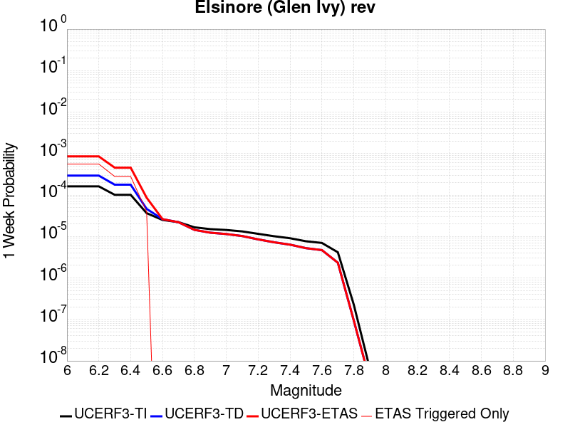 | 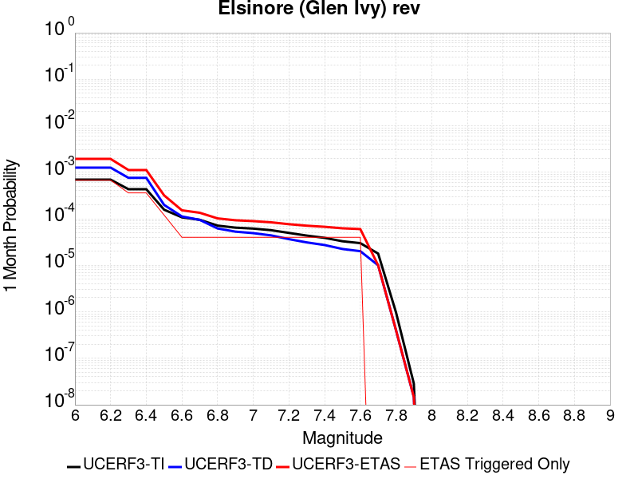 | 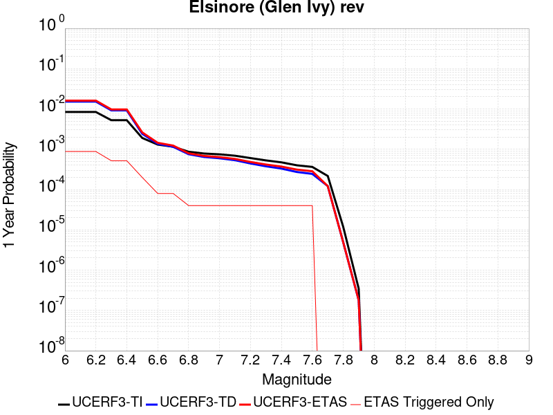 |

| Magnitude | 1 wk TI Prob | 1 wk TD Prob | 1 wk ETAS Prob | 1 wk ETAS/TD Gain | 1 wk ETAS Triggered Only | 1 mo TI Prob | 1 mo TD Prob | 1 mo ETAS Prob | 1 mo ETAS/TD Gain | 1 mo ETAS Triggered Only | 1 yr TI Prob | 1 yr TD Prob | 1 yr ETAS Prob | 1 yr ETAS/TD Gain | 1 yr ETAS Triggered Only |
|-----|-----|-----|-----|-----|-----|-----|-----|-----|-----|-----|-----|-----|-----|-----|-----|
| 6.0 | 1.6204086E-4 | 2.9420294E-4 | 8.5403817E-4 | 2.902888 | 5.6E-4 | 6.94276E-4 | 0.0012604159 | 0.0019395588 | 1.5388244 | 6.8E-4 | 0.008420097 | 0.01525921 | 0.016125781 | 1.0567901 | 8.8E-4 |
| 6.1 | 1.6204086E-4 | 2.9420294E-4 | 8.5403817E-4 | 2.902888 | 5.6E-4 | 6.94276E-4 | 0.0012604159 | 0.0019395588 | 1.5388244 | 6.8E-4 | 0.008420097 | 0.01525921 | 0.016125781 | 1.0567901 | 8.8E-4 |
| 6.2 | 1.6204086E-4 | 2.9420294E-4 | 8.5403817E-4 | 2.902888 | 5.6E-4 | 6.94276E-4 | 0.0012604159 | 0.0019395588 | 1.5388244 | 6.8E-4 | 0.008420097 | 0.01525921 | 0.016125781 | 1.0567901 | 8.8E-4 |
| 6.3 | 1.0111737E-4 | 1.7740557E-4 | 4.573559E-4 | 2.5780244 | 2.8E-4 | 4.332882E-4 | 7.6020526E-4 | 0.0011199316 | 1.4731963 | 3.6E-4 | 0.005262531 | 0.009237009 | 0.009752206 | 1.0557753 | 5.2E-4 |
| 6.4 | 1.0111737E-4 | 1.7740557E-4 | 4.573559E-4 | 2.5780244 | 2.8E-4 | 4.332882E-4 | 7.6020526E-4 | 0.0011199316 | 1.4731963 | 3.6E-4 | 0.005262531 | 0.009237009 | 0.009752206 | 1.0557753 | 5.2E-4 |
| 6.5 | 3.6624708E-5 | 4.6445854E-5 | 8.644399E-5 | 1.8611779 | 4.0E-5 | 1.569536E-4 | 1.9904051E-4 | 3.1901663E-4 | 1.6027724 | 1.2E-4 | 0.001909235 | 0.0024209863 | 0.002620502 | 1.0824109 | 2.0E-4 |
| 6.6 | 2.5051324E-5 | 2.6190002E-5 | 2.6190002E-5 | 1.0 | 0.0 | 1.073584E-4 | 1.1223829E-4 | 1.522338E-4 | 1.3563446 | 4.0E-5 | 0.0013063047 | 0.0013656892 | 0.0014455799 | 1.0584985 | 8.0E-5 |
| 6.7 | 2.2189772E-5 | 2.2104245E-5 | 2.2104245E-5 | 1.0 | 0.0 | 9.509556E-5 | 9.472924E-5 | 1.3472546E-4 | 1.422216 | 4.0E-5 | 0.0011571734 | 0.0011527548 | 0.0012326626 | 1.069319 | 8.0E-5 |
| 6.8 | 1.6654378E-5 | 1.4455017E-5 | 1.4455017E-5 | 1.0 | 0.0 | 7.137396E-5 | 6.194863E-5 | 1.01946156E-4 | 1.6456562 | 4.0E-5 | 8.686314E-4 | 7.539688E-4 | 7.939386E-4 | 1.0530126 | 4.0E-5 |
| 6.9 | 1.5042909E-5 | 1.2346976E-5 | 1.2346976E-5 | 1.0 | 0.0 | 6.446802E-5 | 5.291456E-5 | 9.291244E-5 | 1.7558956 | 4.0E-5 | 7.8461546E-4 | 6.4404745E-4 | 6.840217E-4 | 1.0620673 | 4.0E-5 |
| 7.0 | 1.4361385E-5 | 1.146508E-5 | 1.146508E-5 | 1.0 | 0.0 | 6.154734E-5 | 4.913515E-5 | 8.913319E-5 | 1.8140411 | 4.0E-5 | 7.490812E-4 | 5.9805915E-4 | 6.3803524E-4 | 1.066843 | 4.0E-5 |
| 7.1 | 1.3265571E-5 | 1.0257165E-5 | 1.0257165E-5 | 1.0 | 0.0 | 5.6851208E-5 | 4.3958553E-5 | 8.3956795E-5 | 1.909908 | 4.0E-5 | 6.919436E-4 | 5.350665E-4 | 5.7504507E-4 | 1.074717 | 4.0E-5 |
| 7.2 | 1.1596403E-5 | 8.515252E-6 | 8.515252E-6 | 1.0 | 0.0 | 4.9697923E-5 | 3.649344E-5 | 7.649198E-5 | 2.0960474 | 4.0E-5 | 6.049042E-4 | 4.4421875E-4 | 4.8420098E-4 | 1.0900058 | 4.0E-5 |
| 7.3 | 1.0150827E-5 | 7.247325E-6 | 7.247325E-6 | 1.0 | 0.0 | 4.3502816E-5 | 3.10596E-5 | 7.105836E-5 | 2.2878065 | 4.0E-5 | 5.2951806E-4 | 3.780865E-4 | 4.1807137E-4 | 1.1057559 | 4.0E-5 |
| 7.4 | 9.080705E-6 | 6.359954E-6 | 6.359954E-6 | 1.0 | 0.0 | 3.8916725E-5 | 2.725667E-5 | 6.7255576E-5 | 2.4674907 | 4.0E-5 | 4.7370812E-4 | 3.3180078E-4 | 3.7178752E-4 | 1.1205143 | 4.0E-5 |
| 7.5 | 7.671649E-6 | 5.231759E-6 | 5.231759E-6 | 1.0 | 0.0 | 3.287808E-5 | 2.2421638E-5 | 6.242074E-5 | 2.783951 | 4.0E-5 | 4.0021708E-4 | 2.729505E-4 | 3.129396E-4 | 1.1465067 | 4.0E-5 |
| 7.6 | 6.990086E-6 | 4.693085E-6 | 4.693085E-6 | 1.0 | 0.0 | 2.9957167E-5 | 2.0113073E-5 | 6.011227E-5 | 2.9887161 | 4.0E-5 | 3.6466747E-4 | 2.4485032E-4 | 2.8484053E-4 | 1.1633251 | 4.0E-5 |
| 7.7 | 4.163505E-6 | 2.3324235E-6 | 2.3324235E-6 | 1.0 | 0.0 | 1.7843471E-5 | 9.996066E-6 | 9.996066E-6 | 1.0 | 0.0 | 2.172226E-4 | 1.2169606E-4 | 1.2169606E-4 | 1.0 | 0.0 |
| 7.8 | 2.2692414E-7 | 9.397192E-8 | 9.397192E-8 | 1.0 | 0.0 | 9.725317E-7 | 4.0273673E-7 | 4.0273673E-7 | 1.0 | 0.0 | 1.1840509E-5 | 4.903312E-6 | 4.903312E-6 | 1.0 | 0.0 |
| 7.9 | 6.676829E-9 | 3.4429164E-9 | 3.4429164E-9 | 1.0 | 0.0 | 2.861498E-8 | 1.4755356E-8 | 1.4755356E-8 | 1.0 | 0.0 | 3.4838732E-7 | 1.7964643E-7 | 1.7964643E-7 | 1.0 | 0.0 |

## San Jacinto (Anza) rev
*[(top)](#table-of-contents)*

| 1 Week | 1 Month | 1 Year |
|-----|-----|-----|
| 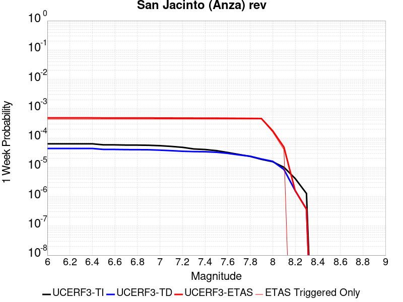 | 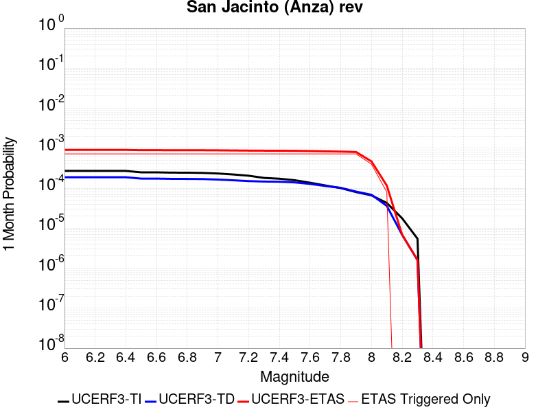 |  |

| Magnitude | 1 wk TI Prob | 1 wk TD Prob | 1 wk ETAS Prob | 1 wk ETAS/TD Gain | 1 wk ETAS Triggered Only | 1 mo TI Prob | 1 mo TD Prob | 1 mo ETAS Prob | 1 mo ETAS/TD Gain | 1 mo ETAS Triggered Only | 1 yr TI Prob | 1 yr TD Prob | 1 yr ETAS Prob | 1 yr ETAS/TD Gain | 1 yr ETAS Triggered Only |
|-----|-----|-----|-----|-----|-----|-----|-----|-----|-----|-----|-----|-----|-----|-----|-----|
| 6.0 | 6.3015636E-5 | 4.3745757E-5 | 4.837265E-4 | 11.057678 | 4.4E-4 | 2.7003905E-4 | 1.8746841E-4 | 9.0733345E-4 | 4.839927 | 7.2E-4 | 0.0032827691 | 0.002280051 | 0.0032777707 | 1.4375867 | 0.001 |
| 6.1 | 6.3015636E-5 | 4.3745757E-5 | 4.837265E-4 | 11.057678 | 4.4E-4 | 2.7003905E-4 | 1.8746841E-4 | 9.0733345E-4 | 4.839927 | 7.2E-4 | 0.0032827691 | 0.002280051 | 0.0032777707 | 1.4375867 | 0.001 |
| 6.2 | 6.3015636E-5 | 4.3745757E-5 | 4.837265E-4 | 11.057678 | 4.4E-4 | 2.7003905E-4 | 1.8746841E-4 | 9.0733345E-4 | 4.839927 | 7.2E-4 | 0.0032827691 | 0.002280051 | 0.0032777707 | 1.4375867 | 0.001 |
| 6.3 | 6.3015636E-5 | 4.3745757E-5 | 4.837265E-4 | 11.057678 | 4.4E-4 | 2.7003905E-4 | 1.8746841E-4 | 9.0733345E-4 | 4.839927 | 7.2E-4 | 0.0032827691 | 0.002280051 | 0.0032777707 | 1.4375867 | 0.001 |
| 6.4 | 6.3015636E-5 | 4.3745757E-5 | 4.837265E-4 | 11.057678 | 4.4E-4 | 2.7003905E-4 | 1.8746841E-4 | 9.0733345E-4 | 4.839927 | 7.2E-4 | 0.0032827691 | 0.002280051 | 0.0032777707 | 1.4375867 | 0.001 |
| 6.5 | 5.811017E-5 | 4.0506016E-5 | 4.804882E-4 | 11.862144 | 4.4E-4 | 2.4901982E-4 | 1.735857E-4 | 8.934607E-4 | 5.1470876 | 7.2E-4 | 0.0030276014 | 0.002111363 | 0.0031092516 | 1.4726276 | 0.001 |
| 6.6 | 5.811017E-5 | 4.0506016E-5 | 4.804882E-4 | 11.862144 | 4.4E-4 | 2.4901982E-4 | 1.735857E-4 | 8.934607E-4 | 5.1470876 | 7.2E-4 | 0.0030276014 | 0.002111363 | 0.0031092516 | 1.4726276 | 0.001 |
| 6.7 | 5.712442E-5 | 3.9923914E-5 | 4.7990636E-4 | 12.020523 | 4.4E-4 | 2.4479596E-4 | 1.710913E-4 | 8.9096813E-4 | 5.207559 | 7.2E-4 | 0.0029763177 | 0.0020810522 | 0.003078971 | 1.4795262 | 0.001 |
| 6.8 | 5.6967532E-5 | 3.977942E-5 | 4.7976192E-4 | 12.060555 | 4.4E-4 | 2.4412372E-4 | 1.7047212E-4 | 8.903494E-4 | 5.222844 | 7.2E-4 | 0.0029681553 | 0.002073528 | 0.0030714546 | 1.4812698 | 0.001 |
| 6.9 | 5.6211324E-5 | 3.9481514E-5 | 4.7946413E-4 | 12.144016 | 4.4E-4 | 2.4088343E-4 | 1.6919555E-4 | 8.890737E-4 | 5.254711 | 7.2E-4 | 0.0029288116 | 0.0020580152 | 0.0030559571 | 1.4849051 | 0.001 |
| 7.0 | 5.4383527E-5 | 3.833281E-5 | 4.7831595E-4 | 12.477977 | 4.4E-4 | 2.3305144E-4 | 1.6427317E-4 | 8.8415487E-4 | 5.3822236 | 7.2E-4 | 0.0028337094 | 0.0019981961 | 0.002996198 | 1.4994514 | 0.001 |
| 7.1 | 5.1393665E-5 | 3.6780868E-5 | 4.767647E-4 | 12.962301 | 4.4E-4 | 2.2023996E-4 | 1.576228E-4 | 8.775093E-4 | 5.5671473 | 7.2E-4 | 0.0026781242 | 0.0019173726 | 0.0029154553 | 1.520547 | 0.001 |
| 7.2 | 4.785222E-5 | 3.5116576E-5 | 4.7510111E-4 | 13.529256 | 4.4E-4 | 2.0506482E-4 | 1.5049095E-4 | 8.703826E-4 | 5.783621 | 7.2E-4 | 0.0024938055 | 0.0018306911 | 0.0028288604 | 1.5452418 | 0.001 |
| 7.3 | 4.2143256E-5 | 3.4199693E-5 | 4.7418464E-4 | 13.865172 | 4.4E-4 | 1.8060145E-4 | 1.465619E-4 | 8.6645636E-4 | 5.91188 | 7.2E-4 | 0.002196605 | 0.0017829342 | 0.0027811513 | 1.5598732 | 0.001 |
| 7.4 | 4.0264713E-5 | 3.3834353E-5 | 4.7381947E-4 | 14.004094 | 4.4E-4 | 1.7255165E-4 | 1.4499633E-4 | 8.648919E-4 | 5.964923 | 7.2E-4 | 0.002098792 | 0.0017639044 | 0.0027621405 | 1.5659242 | 0.001 |
| 7.5 | 3.694492E-5 | 3.253924E-5 | 4.7252493E-4 | 14.521695 | 4.4E-4 | 1.5832575E-4 | 1.3944645E-4 | 8.5934607E-4 | 6.1625524 | 7.2E-4 | 0.0019259118 | 0.0016964416 | 0.002694745 | 1.5884691 | 0.001 |
| 7.6 | 3.200565E-5 | 2.983583E-5 | 4.698227E-4 | 15.746929 | 4.4E-4 | 1.3715986E-4 | 1.278616E-4 | 8.4776955E-4 | 6.630369 | 7.2E-4 | 0.001668642 | 0.0015556056 | 0.00255405 | 1.6418365 | 0.001 |
| 7.7 | 2.731642E-5 | 2.6414782E-5 | 4.6640317E-4 | 17.6569 | 4.4E-4 | 1.1706512E-4 | 1.13201306E-4 | 8.331198E-4 | 7.359631 | 7.2E-4 | 0.001424336 | 0.0013773555 | 0.0023759783 | 1.725029 | 0.001 |
| 7.8 | 2.3466424E-5 | 2.3813845E-5 | 4.6380336E-4 | 19.476206 | 4.4E-4 | 1.0056651E-4 | 1.0205535E-4 | 8.2198187E-4 | 8.0542755 | 7.2E-4 | 0.0012237094 | 0.0012418164 | 0.0022405747 | 1.8042719 | 0.001 |
| 7.9 | 1.8611925E-5 | 1.9186835E-5 | 4.5917838E-4 | 23.931952 | 4.4E-4 | 7.9762955E-5 | 8.22267E-5 | 8.021675E-4 | 9.755559 | 7.2E-4 | 9.7068126E-4 | 0.0010006512 | 0.0019996504 | 1.9983493 | 0.001 |
| 8.0 | 1.5460775E-5 | 1.5988953E-5 | 1.759864E-4 | 11.006749 | 1.6E-4 | 6.6258784E-5 | 6.852229E-5 | 4.684949E-4 | 6.8371167 | 4.0E-4 | 8.0640207E-4 | 8.339403E-4 | 0.0014334399 | 1.718876 | 6.0E-4 |
| 8.1 | 9.983884E-6 | 8.416394E-6 | 4.8416056E-5 | 5.752589 | 4.0E-5 | 4.2787375E-5 | 3.6069763E-5 | 1.16066876E-4 | 3.2178442 | 8.0E-5 | 5.2081177E-4 | 4.390614E-4 | 5.989912E-4 | 1.3642538 | 1.6E-4 |
| 8.2 | 4.1226E-6 | 1.5944853E-6 | 1.5944853E-6 | 1.0 | 0.0 | 1.7668166E-5 | 6.8334907E-6 | 6.8334907E-6 | 1.0 | 0.0 | 2.1508869E-4 | 8.31946E-5 | 1.2319128E-4 | 1.4807605 | 4.0E-5 |
| 8.3 | 1.2750878E-6 | 3.725573E-7 | 3.725573E-7 | 1.0 | 0.0 | 5.4646503E-6 | 1.5966733E-6 | 1.5966733E-6 | 1.0 | 0.0 | 6.653009E-5 | 1.9439329E-5 | 5.943855E-5 | 3.0576444 | 4.0E-5 |

## San Andreas (North Branch Mill Creek)
*[(top)](#table-of-contents)*

| 1 Week | 1 Month | 1 Year |
|-----|-----|-----|
| 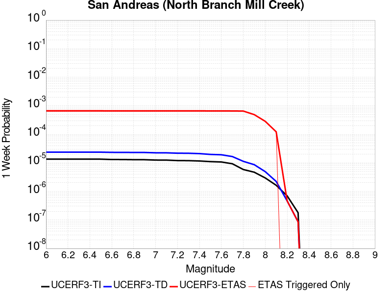 | 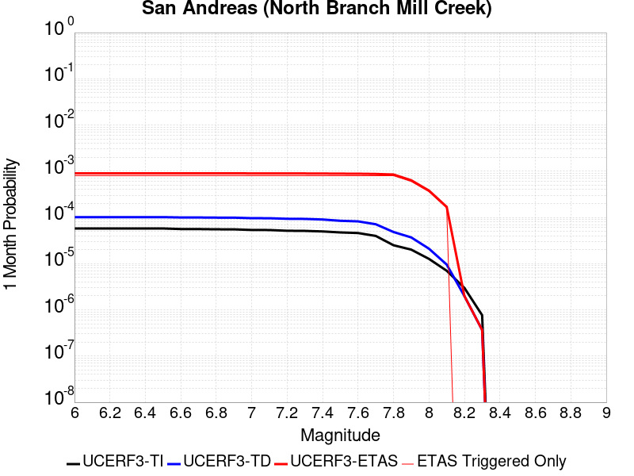 | 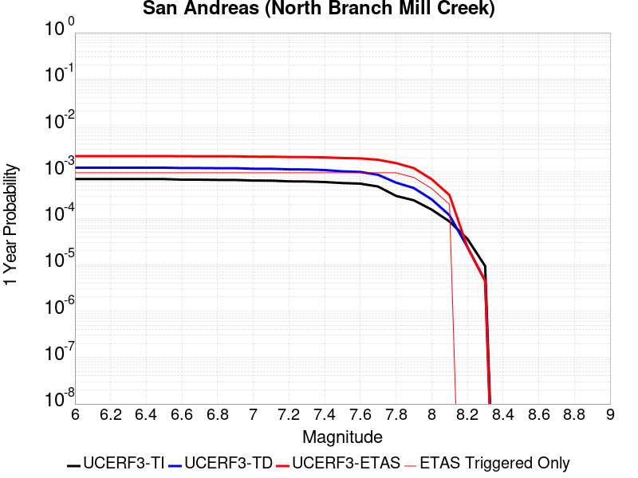 |

| Magnitude | 1 wk TI Prob | 1 wk TD Prob | 1 wk ETAS Prob | 1 wk ETAS/TD Gain | 1 wk ETAS Triggered Only | 1 mo TI Prob | 1 mo TD Prob | 1 mo ETAS Prob | 1 mo ETAS/TD Gain | 1 mo ETAS Triggered Only | 1 yr TI Prob | 1 yr TD Prob | 1 yr ETAS Prob | 1 yr ETAS/TD Gain | 1 yr ETAS Triggered Only |
|-----|-----|-----|-----|-----|-----|-----|-----|-----|-----|-----|-----|-----|-----|-----|-----|
| 6.0 | 1.3461156E-5 | 2.3679182E-5 | 6.63664E-4 | 28.02732 | 6.4E-4 | 5.7689394E-5 | 1.0147828E-4 | 9.013971E-4 | 8.88266 | 8.0E-4 | 7.02142E-4 | 0.0012348011 | 0.0021936158 | 1.7764931 | 9.6E-4 |
| 6.1 | 1.3461156E-5 | 2.3679182E-5 | 6.63664E-4 | 28.02732 | 6.4E-4 | 5.7689394E-5 | 1.0147828E-4 | 9.013971E-4 | 8.88266 | 8.0E-4 | 7.02142E-4 | 0.0012348011 | 0.0021936158 | 1.7764931 | 9.6E-4 |
| 6.2 | 1.3461156E-5 | 2.3679182E-5 | 6.63664E-4 | 28.02732 | 6.4E-4 | 5.7689394E-5 | 1.0147828E-4 | 9.013971E-4 | 8.88266 | 8.0E-4 | 7.02142E-4 | 0.0012348011 | 0.0021936158 | 1.7764931 | 9.6E-4 |
| 6.3 | 1.3461156E-5 | 2.3679182E-5 | 6.63664E-4 | 28.02732 | 6.4E-4 | 5.7689394E-5 | 1.0147828E-4 | 9.013971E-4 | 8.88266 | 8.0E-4 | 7.02142E-4 | 0.0012348011 | 0.0021936158 | 1.7764931 | 9.6E-4 |
| 6.4 | 1.3461156E-5 | 2.3679182E-5 | 6.63664E-4 | 28.02732 | 6.4E-4 | 5.7689394E-5 | 1.0147828E-4 | 9.013971E-4 | 8.88266 | 8.0E-4 | 7.02142E-4 | 0.0012348011 | 0.0021936158 | 1.7764931 | 9.6E-4 |
| 6.5 | 1.3450706E-5 | 2.366814E-5 | 6.63653E-4 | 28.03993 | 6.4E-4 | 5.764461E-5 | 1.0143096E-4 | 9.013498E-4 | 8.886338 | 8.0E-4 | 7.0159714E-4 | 0.0012342257 | 0.002193041 | 1.7768556 | 9.6E-4 |
| 6.6 | 1.3074523E-5 | 2.328236E-5 | 6.6326745E-4 | 28.487982 | 6.4E-4 | 5.6032466E-5 | 9.9777746E-5 | 8.9969794E-4 | 9.01702 | 8.0E-4 | 6.8198174E-4 | 0.0012141204 | 0.0021729548 | 1.7897359 | 9.6E-4 |
| 6.7 | 1.3050216E-5 | 2.3257642E-5 | 6.6324277E-4 | 28.517197 | 6.4E-4 | 5.59283E-5 | 9.967182E-5 | 8.9959207E-4 | 9.02554 | 8.0E-4 | 6.8071426E-4 | 0.0012128322 | 0.0021716678 | 1.7905757 | 9.6E-4 |
| 6.8 | 1.29049395E-5 | 2.3106015E-5 | 6.6309125E-4 | 28.697777 | 6.4E-4 | 5.530571E-5 | 9.9022036E-5 | 8.989428E-4 | 9.07821 | 8.0E-4 | 6.73139E-4 | 0.0012049298 | 0.002163773 | 1.795767 | 9.6E-4 |
| 6.9 | 1.2867369E-5 | 2.306539E-5 | 6.630506E-4 | 28.746561 | 6.4E-4 | 5.51447E-5 | 9.8847944E-5 | 8.987689E-4 | 9.092439 | 8.0E-4 | 6.711799E-4 | 0.0012028125 | 0.002161658 | 1.7971693 | 9.6E-4 |
| 7.0 | 1.2495996E-5 | 2.2464183E-5 | 6.624498E-4 | 29.489157 | 6.4E-4 | 5.3553173E-5 | 9.6271535E-5 | 8.9619454E-4 | 9.309029 | 8.0E-4 | 6.518148E-4 | 0.0011714785 | 0.002130354 | 1.8185172 | 9.6E-4 |
| 7.1 | 1.2452067E-5 | 2.2409202E-5 | 6.6239486E-4 | 29.559057 | 6.4E-4 | 5.3364907E-5 | 9.603592E-5 | 8.959591E-4 | 9.329417 | 8.0E-4 | 6.4952404E-4 | 0.001168613 | 0.0021274912 | 1.8205267 | 9.6E-4 |
| 7.2 | 1.2002777E-5 | 2.1786782E-5 | 6.6177285E-4 | 30.37497 | 6.4E-4 | 5.143946E-5 | 9.3368595E-5 | 8.932939E-4 | 9.567391 | 8.0E-4 | 6.2609545E-4 | 0.0011361726 | 0.0020950818 | 1.8439821 | 9.6E-4 |
| 7.3 | 1.1923425E-5 | 2.1656399E-5 | 6.616425E-4 | 30.551826 | 6.4E-4 | 5.109939E-5 | 9.280985E-5 | 8.927356E-4 | 9.618975 | 8.0E-4 | 6.219575E-4 | 0.0011293768 | 0.0020882927 | 1.8490663 | 9.6E-4 |
| 7.4 | 1.16105175E-5 | 2.1028349E-5 | 6.6101487E-4 | 31.434465 | 6.4E-4 | 4.975841E-5 | 9.0118396E-5 | 8.900463E-4 | 9.8764105 | 8.0E-4 | 6.0564023E-4 | 0.0010966419 | 0.002055589 | 1.8744397 | 9.6E-4 |
| 7.5 | 1.1037265E-5 | 1.9721652E-5 | 6.5970904E-4 | 33.451004 | 6.4E-4 | 4.7301706E-5 | 8.451864E-5 | 8.8445103E-4 | 10.464568 | 8.0E-4 | 5.757461E-4 | 0.0010285309 | 0.0019875434 | 1.9324101 | 9.6E-4 |
| 7.6 | 1.0720915E-5 | 1.9161336E-5 | 6.591491E-4 | 34.399952 | 6.4E-4 | 4.5945973E-5 | 8.211744E-5 | 8.8205177E-4 | 10.741344 | 8.0E-4 | 5.592486E-4 | 9.993234E-4 | 0.0019583642 | 1.9596899 | 9.6E-4 |
| 7.7 | 9.276279E-6 | 1.6599204E-5 | 6.565886E-4 | 39.555424 | 6.4E-4 | 3.9754876E-5 | 7.113752E-5 | 8.710806E-4 | 12.245024 | 8.0E-4 | 4.839081E-4 | 8.657568E-4 | 0.0018249257 | 2.1078963 | 9.6E-4 |
| 7.8 | 5.8346777E-6 | 1.1282931E-5 | 6.5127574E-4 | 57.72221 | 6.4E-4 | 2.5005522E-5 | 4.8354523E-5 | 8.4831583E-4 | 17.54367 | 8.0E-4 | 3.043997E-4 | 5.8855745E-4 | 0.0015479925 | 2.6301467 | 9.6E-4 |
| 7.9 | 4.690204E-6 | 8.6155715E-6 | 4.8861146E-4 | 56.712597 | 4.8E-4 | 2.0100719E-5 | 3.6923357E-5 | 6.369012E-4 | 17.249277 | 6.0E-4 | 2.4469878E-4 | 4.4944923E-4 | 0.0012091077 | 2.6901984 | 7.6E-4 |
| 8.0 | 2.9570454E-6 | 4.9120426E-6 | 2.8491067E-4 | 58.002483 | 2.8E-4 | 1.267299E-5 | 2.105144E-5 | 3.8104385E-4 | 18.100607 | 3.6E-4 | 1.5428272E-4 | 2.562712E-4 | 6.9615844E-4 | 2.7164912 | 4.4E-4 |
| 8.1 | 1.6376824E-6 | 2.2310655E-6 | 1.2223079E-4 | 54.785843 | 1.2E-4 | 7.01862E-6 | 9.561673E-6 | 1.6956014E-4 | 17.733313 | 1.6E-4 | 8.544835E-5 | 1.1640717E-4 | 3.163839E-4 | 2.7179072 | 2.0E-4 |
| 8.2 | 6.9631557E-7 | 4.641532E-7 | 4.641532E-7 | 1.0 | 0.0 | 2.984206E-6 | 1.9892263E-6 | 1.9892263E-6 | 1.0 | 0.0 | 3.63321E-5 | 2.4218563E-5 | 2.4218563E-5 | 1.0 | 0.0 |
| 8.3 | 1.7876137E-7 | 8.5759865E-8 | 8.5759865E-8 | 1.0 | 0.0 | 7.661199E-7 | 3.675422E-7 | 3.675422E-7 | 1.0 | 0.0 | 9.32747E-6 | 4.4748176E-6 | 4.4748176E-6 | 1.0 | 0.0 |

## Big Pine (Central)
*[(top)](#table-of-contents)*

| 1 Week | 1 Month | 1 Year |
|-----|-----|-----|
| 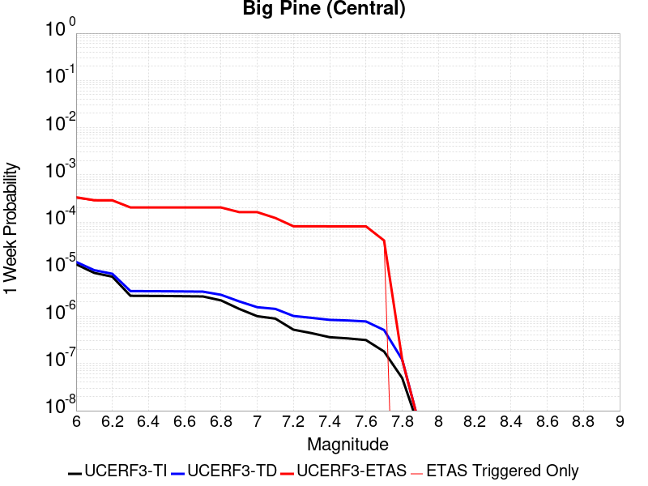 | 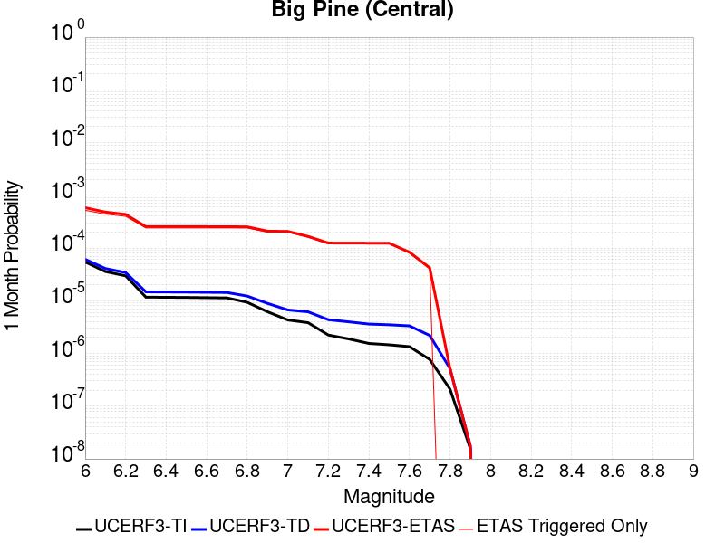 | 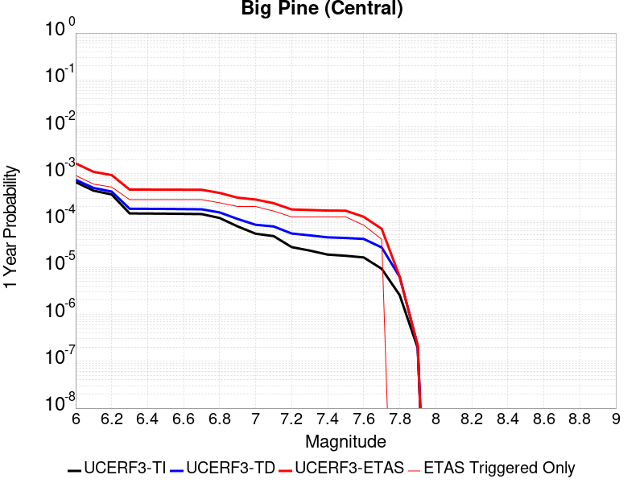 |

| Magnitude | 1 wk TI Prob | 1 wk TD Prob | 1 wk ETAS Prob | 1 wk ETAS/TD Gain | 1 wk ETAS Triggered Only | 1 mo TI Prob | 1 mo TD Prob | 1 mo ETAS Prob | 1 mo ETAS/TD Gain | 1 mo ETAS Triggered Only | 1 yr TI Prob | 1 yr TD Prob | 1 yr ETAS Prob | 1 yr ETAS/TD Gain | 1 yr ETAS Triggered Only |
|-----|-----|-----|-----|-----|-----|-----|-----|-----|-----|-----|-----|-----|-----|-----|-----|
| 6.0 | 1.2706755E-5 | 1.4262975E-5 | 3.3425842E-4 | 23.435392 | 3.2E-4 | 5.4456385E-5 | 6.1125815E-5 | 5.81094E-4 | 9.506524 | 5.2E-4 | 6.628048E-4 | 7.4398925E-4 | 0.0016633047 | 2.235657 | 9.2E-4 |
| 6.1 | 8.342579E-6 | 9.521826E-6 | 2.8951917E-4 | 30.405846 | 2.8E-4 | 3.5753423E-5 | 4.080731E-5 | 4.8078934E-4 | 11.781942 | 4.4E-4 | 4.3521097E-4 | 4.967375E-4 | 0.0010964394 | 2.2072816 | 6.0E-4 |
| 6.2 | 6.923899E-6 | 7.977751E-6 | 2.879755E-4 | 36.097332 | 2.8E-4 | 2.9673516E-5 | 3.419002E-5 | 4.3417636E-4 | 12.69892 | 4.0E-4 | 3.6121515E-4 | 4.1620323E-4 | 9.359868E-4 | 2.2488697 | 5.2E-4 |
| 6.3 | 2.728396E-6 | 3.4336192E-6 | 2.0343294E-4 | 59.24738 | 2.0E-4 | 1.1693074E-5 | 1.4715432E-5 | 2.547119E-4 | 17.309168 | 2.4E-4 | 1.4235388E-4 | 1.7914653E-4 | 4.5909637E-4 | 2.5626862 | 2.8E-4 |
| 6.4 | 2.7136944E-6 | 3.4179088E-6 | 2.0341722E-4 | 59.51511 | 2.0E-4 | 1.1630066E-5 | 1.4648103E-5 | 2.5464458E-4 | 17.384134 | 2.4E-4 | 1.4158686E-4 | 1.7832694E-4 | 4.58277E-4 | 2.5698698 | 2.8E-4 |
| 6.5 | 2.6971882E-6 | 3.4002499E-6 | 2.0339957E-4 | 59.819008 | 2.0E-4 | 1.1559327E-5 | 1.45724225E-5 | 2.5456893E-4 | 17.469225 | 2.4E-4 | 1.4072572E-4 | 1.7740567E-4 | 4.57356E-4 | 2.5780234 | 2.8E-4 |
| 6.6 | 2.669092E-6 | 3.3702636E-6 | 2.033696E-4 | 60.342342 | 2.0E-4 | 1.1438916E-5 | 1.4443911E-5 | 2.5444044E-4 | 17.615759 | 2.4E-4 | 1.3925991E-4 | 1.758413E-4 | 4.5579206E-4 | 2.5920649 | 2.8E-4 |
| 6.7 | 2.6408059E-6 | 3.340283E-6 | 2.0333962E-4 | 60.874966 | 2.0E-4 | 1.1317691E-5 | 1.4315425E-5 | 2.5431198E-4 | 17.764893 | 2.4E-4 | 1.3778417E-4 | 1.7427723E-4 | 4.5422843E-4 | 2.6063557 | 2.8E-4 |
| 6.8 | 2.1786943E-6 | 2.8636898E-6 | 2.0286311E-4 | 70.83977 | 2.0E-4 | 9.337228E-6 | 1.22729025E-5 | 2.5226997E-4 | 20.555037 | 2.4E-4 | 1.1367482E-4 | 1.4941308E-4 | 3.893772E-4 | 2.606045 | 2.4E-4 |
| 6.9 | 1.4411696E-6 | 2.0773482E-6 | 1.6207702E-4 | 78.02112 | 1.6E-4 | 6.1764263E-6 | 8.902892E-6 | 2.0890111E-4 | 23.46441 | 2.0E-4 | 7.51954E-5 | 1.0838759E-4 | 3.083659E-4 | 2.8450298 | 2.0E-4 |
| 7.0 | 1.0073411E-6 | 1.5621584E-6 | 1.6156191E-4 | 103.42223 | 1.6E-4 | 4.317169E-6 | 6.6949483E-6 | 2.0669361E-4 | 30.87307 | 2.0E-4 | 5.2560266E-5 | 8.15081E-5 | 2.814918E-4 | 3.453544 | 2.0E-4 |
| 7.1 | 8.947104E-7 | 1.4380338E-6 | 1.21437864E-4 | 84.44716 | 1.2E-4 | 3.834468E-6 | 6.162988E-6 | 1.66162E-4 | 26.961273 | 1.6E-4 | 4.6683643E-5 | 7.5031945E-5 | 2.3501994E-4 | 3.132265 | 1.6E-4 |
| 7.2 | 5.215166E-7 | 1.0184339E-6 | 8.1018356E-5 | 79.5519 | 8.0E-5 | 2.2350691E-6 | 4.3647096E-6 | 1.2436419E-4 | 28.493118 | 1.2E-4 | 2.7211627E-5 | 5.3139087E-5 | 1.731327E-4 | 3.2581048 | 1.2E-4 |
| 7.3 | 4.4024807E-7 | 9.2900996E-7 | 8.0928934E-5 | 87.1131 | 8.0E-5 | 1.8867761E-6 | 3.9814654E-6 | 1.23981E-4 | 31.139536 | 1.2E-4 | 2.2971257E-5 | 4.8473306E-5 | 1.684675E-4 | 3.4754694 | 1.2E-4 |
| 7.4 | 3.6130905E-7 | 8.4268595E-7 | 8.084262E-5 | 95.934456 | 8.0E-5 | 1.5484665E-6 | 3.6115064E-6 | 1.2361107E-4 | 34.227013 | 1.2E-4 | 1.8852415E-5 | 4.396924E-5 | 1.6396397E-4 | 3.7290604 | 1.2E-4 |
| 7.5 | 3.408184E-7 | 8.175001E-7 | 8.081744E-5 | 98.85924 | 8.0E-5 | 1.4606494E-6 | 3.5035673E-6 | 1.2350315E-4 | 35.250683 | 1.2E-4 | 1.7783263E-5 | 4.2655138E-5 | 1.6265002E-4 | 3.8131402 | 1.2E-4 |
| 7.6 | 3.1428627E-7 | 7.7960885E-7 | 8.0779544E-5 | 103.61548 | 8.0E-5 | 1.3469405E-6 | 3.3411768E-6 | 8.334091E-5 | 24.94358 | 8.0E-5 | 1.6398877E-5 | 4.0678107E-5 | 1.2067485E-4 | 2.96658 | 8.0E-5 |
| 7.7 | 1.7972785E-7 | 5.127105E-7 | 4.051269E-5 | 79.016685 | 4.0E-5 | 7.70262E-7 | 2.1973292E-6 | 4.219724E-5 | 19.203878 | 4.0E-5 | 9.377899E-6 | 2.6752165E-5 | 6.67511E-5 | 2.495166 | 4.0E-5 |
| 7.8 | 4.9230927E-8 | 1.2097215E-7 | 1.2097215E-7 | 1.0 | 0.0 | 2.1098968E-7 | 5.1845194E-7 | 5.1845194E-7 | 1.0 | 0.0 | 2.5687964E-6 | 6.312136E-6 | 6.312136E-6 | 1.0 | 0.0 |
| 7.9 | 3.6805972E-9 | 4.1519E-9 | 4.1519E-9 | 1.0 | 0.0 | 1.5773987E-8 | 1.7793857E-8 | 1.7793857E-8 | 1.0 | 0.0 | 1.9204828E-7 | 2.166402E-7 | 2.166402E-7 | 1.0 | 0.0 |

## Mission Ridge-Arroyo Parida-Santa Ana
*[(top)](#table-of-contents)*

| 1 Week | 1 Month | 1 Year |
|-----|-----|-----|
| 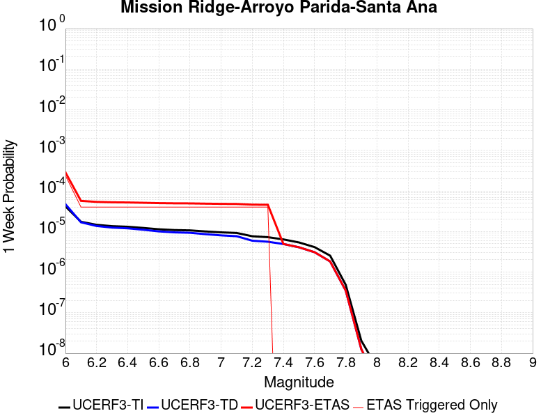 | 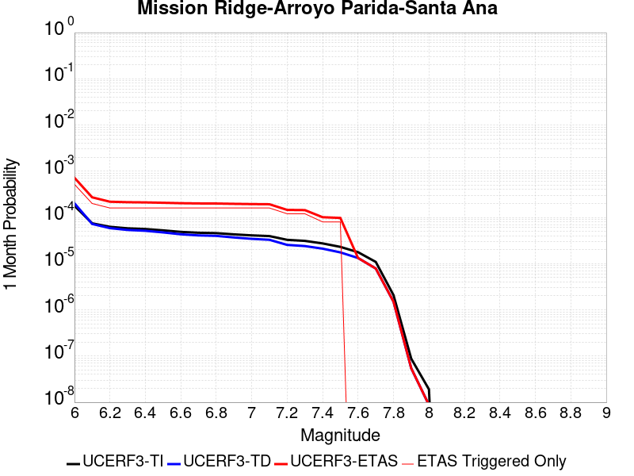 | 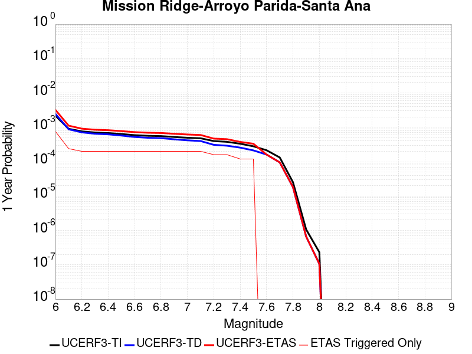 |

| Magnitude | 1 wk TI Prob | 1 wk TD Prob | 1 wk ETAS Prob | 1 wk ETAS/TD Gain | 1 wk ETAS Triggered Only | 1 mo TI Prob | 1 mo TD Prob | 1 mo ETAS Prob | 1 mo ETAS/TD Gain | 1 mo ETAS Triggered Only | 1 yr TI Prob | 1 yr TD Prob | 1 yr ETAS Prob | 1 yr ETAS/TD Gain | 1 yr ETAS Triggered Only |
|-----|-----|-----|-----|-----|-----|-----|-----|-----|-----|-----|-----|-----|-----|-----|-----|
| 6.0 | 4.169034E-5 | 4.7170066E-5 | 2.8715873E-4 | 6.0877323 | 2.4E-4 | 1.7866064E-4 | 2.0214664E-4 | 7.220415E-4 | 3.57187 | 5.2E-4 | 0.0021730233 | 0.002459196 | 0.003217327 | 1.308284 | 7.6E-4 |
| 6.1 | 1.73813E-5 | 1.6862212E-5 | 5.686154E-5 | 3.372128 | 4.0E-5 | 7.4489166E-5 | 7.226469E-5 | 2.7225024E-4 | 3.7674036 | 2.0E-4 | 9.065282E-4 | 8.7947806E-4 | 0.001119267 | 1.2726492 | 2.4E-4 |
| 6.2 | 1.4622182E-5 | 1.36796E-5 | 5.3679054E-5 | 3.9240222 | 4.0E-5 | 6.2664985E-5 | 5.862556E-5 | 2.1861617E-4 | 3.7290251 | 1.6E-4 | 7.6267915E-4 | 7.1353634E-4 | 9.133936E-4 | 1.280094 | 2.0E-4 |
| 6.3 | 1.3552434E-5 | 1.2488047E-5 | 5.2487547E-5 | 4.203023 | 4.0E-5 | 5.8080568E-5 | 5.3519125E-5 | 2.1351056E-4 | 3.9894257 | 1.6E-4 | 7.069015E-4 | 6.514037E-4 | 8.512734E-4 | 1.3068293 | 2.0E-4 |
| 6.4 | 1.30977305E-5 | 1.198482E-5 | 5.198434E-5 | 4.3375154 | 4.0E-5 | 5.613192E-5 | 5.136252E-5 | 2.113543E-4 | 4.114952 | 1.6E-4 | 6.831918E-4 | 6.2516227E-4 | 8.2503725E-4 | 1.3197169 | 2.0E-4 |
| 6.5 | 1.225205E-5 | 1.10541505E-5 | 5.1053707E-5 | 4.6185102 | 4.0E-5 | 5.2507727E-5 | 4.7374084E-5 | 2.0736651E-4 | 4.377214 | 1.6E-4 | 6.3909404E-4 | 5.7662954E-4 | 7.7651424E-4 | 1.3466431 | 2.0E-4 |
| 6.6 | 1.1352241E-5 | 1.0068564E-5 | 5.006816E-5 | 4.972721 | 4.0E-5 | 4.8651553E-5 | 4.315029E-5 | 2.0314338E-4 | 4.7078104 | 1.6E-4 | 5.921717E-4 | 5.2523025E-4 | 7.251252E-4 | 1.3805854 | 2.0E-4 |
| 6.7 | 1.0864116E-5 | 9.521832E-6 | 4.952145E-5 | 5.2008324 | 4.0E-5 | 4.6559664E-5 | 4.0807223E-5 | 2.008007E-4 | 4.9207144 | 1.6E-4 | 5.667165E-4 | 4.967167E-4 | 6.9661735E-4 | 1.402444 | 2.0E-4 |
| 6.8 | 1.0666365E-5 | 9.30451E-6 | 4.9304137E-5 | 5.2989507 | 4.0E-5 | 4.571219E-5 | 3.987587E-5 | 1.998695E-4 | 5.0122914 | 1.6E-4 | 5.564038E-4 | 4.853826E-4 | 6.8528554E-4 | 1.411846 | 2.0E-4 |
| 6.9 | 1.0038665E-5 | 8.596469E-6 | 4.8596125E-5 | 5.653033 | 4.0E-5 | 4.302214E-5 | 3.6841502E-5 | 1.9683561E-4 | 5.342768 | 1.6E-4 | 5.236687E-4 | 4.4845478E-4 | 6.483651E-4 | 1.4457759 | 2.0E-4 |
| 7.0 | 9.5379955E-6 | 8.029229E-6 | 4.802891E-5 | 5.981758 | 4.0E-5 | 4.0876483E-5 | 3.441054E-5 | 1.9440503E-4 | 5.649578 | 1.6E-4 | 4.975576E-4 | 4.188695E-4 | 6.1878574E-4 | 1.4772757 | 2.0E-4 |
| 7.1 | 9.207389E-6 | 7.656349E-6 | 4.765604E-5 | 6.224382 | 4.0E-5 | 3.945964E-5 | 3.2812524E-5 | 1.9280727E-4 | 5.876027 | 1.6E-4 | 4.803152E-4 | 3.9942094E-4 | 5.9934106E-4 | 1.5005249 | 2.0E-4 |
| 7.2 | 7.638091E-6 | 5.9341537E-6 | 4.5933917E-5 | 7.740601 | 4.0E-5 | 3.2734264E-5 | 2.543184E-5 | 1.4542878E-4 | 5.7183747 | 1.2E-4 | 3.984668E-4 | 3.0958897E-4 | 4.6953943E-4 | 1.5166543 | 1.6E-4 |
| 7.3 | 7.2500147E-6 | 5.598995E-6 | 4.5598772E-5 | 8.144099 | 4.0E-5 | 3.1071122E-5 | 2.3995473E-5 | 1.439926E-4 | 6.000823 | 1.2E-4 | 3.7822526E-4 | 2.9210604E-4 | 4.520593E-4 | 1.5475863 | 1.6E-4 |
| 7.4 | 6.3899715E-6 | 4.920958E-6 | 4.920958E-6 | 1.0 | 0.0 | 2.7385306E-5 | 2.108965E-5 | 1.01087964E-4 | 4.7932496 | 8.0E-5 | 3.3336508E-4 | 2.5673644E-4 | 3.7670563E-4 | 1.4672854 | 1.2E-4 |
| 7.5 | 5.379025E-6 | 4.0858736E-6 | 4.0858736E-6 | 1.0 | 0.0 | 2.305276E-5 | 1.751077E-5 | 9.750937E-5 | 5.5685368 | 8.0E-5 | 2.806312E-4 | 2.1317287E-4 | 3.331473E-4 | 1.5628034 | 1.2E-4 |
| 7.6 | 4.1270696E-6 | 3.0896479E-6 | 3.0896479E-6 | 1.0 | 0.0 | 1.768732E-5 | 1.32412815E-5 | 1.32412815E-5 | 1.0 | 0.0 | 2.1532185E-4 | 1.6120075E-4 | 1.6120075E-4 | 1.0 | 0.0 |
| 7.7 | 2.5406805E-6 | 1.8289526E-6 | 1.8289526E-6 | 1.0 | 0.0 | 1.0888585E-5 | 7.838345E-6 | 7.838345E-6 | 1.0 | 0.0 | 1.3256045E-4 | 9.542773E-5 | 9.542773E-5 | 1.0 | 0.0 |
| 7.8 | 4.8608285E-7 | 3.511175E-7 | 3.511175E-7 | 1.0 | 0.0 | 2.0832106E-6 | 1.5047884E-6 | 1.5047884E-6 | 1.0 | 0.0 | 2.5362791E-5 | 1.8320647E-5 | 1.8320647E-5 | 1.0 | 0.0 |
| 7.9 | 2.0472514E-8 | 1.26979485E-8 | 1.26979485E-8 | 1.0 | 0.0 | 8.7739345E-8 | 5.441978E-8 | 5.441978E-8 | 1.0 | 0.0 | 1.068226E-6 | 6.625606E-7 | 6.625606E-7 | 1.0 | 0.0 |
| 8.0 | 4.443582E-9 | 2.0354007E-9 | 2.0354007E-9 | 1.0 | 0.0 | 1.9043922E-8 | 8.723146E-9 | 8.723146E-9 | 1.0 | 0.0 | 2.3185973E-7 | 1.062043E-7 | 1.062043E-7 | 1.0 | 0.0 |

## San Andreas (Santa Cruz Mts) 2011 CFM
*[(top)](#table-of-contents)*

| 1 Week | 1 Month | 1 Year |
|-----|-----|-----|
| 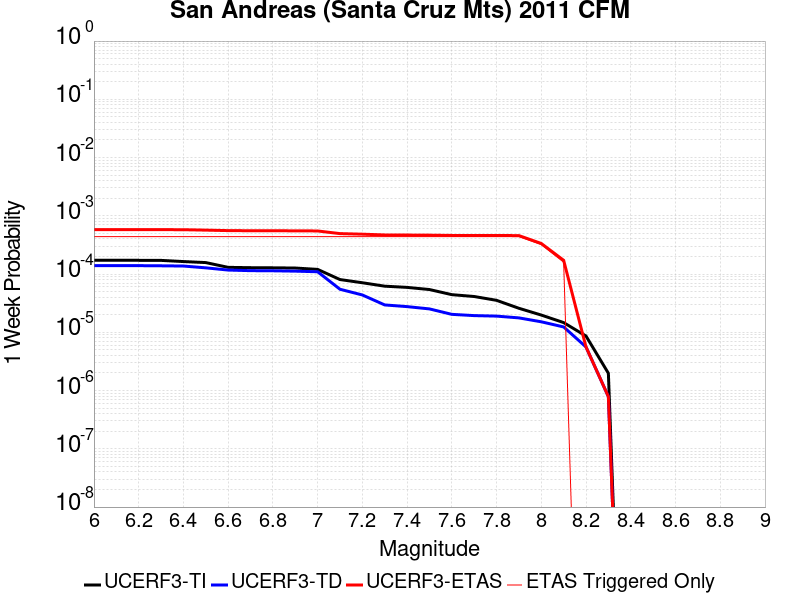 | 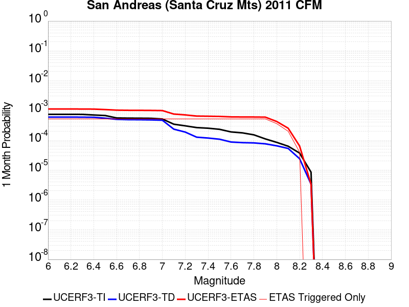 | 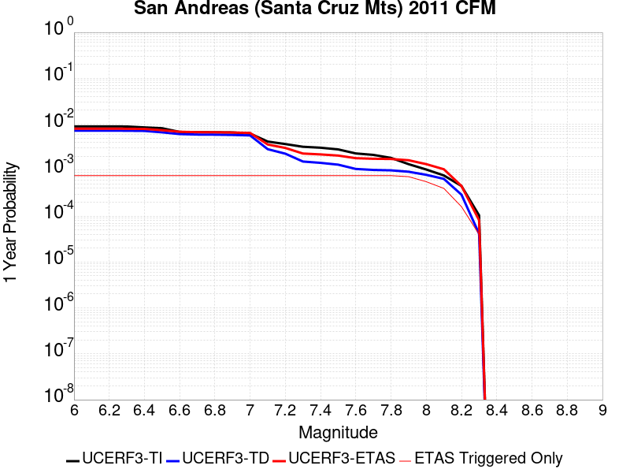 |

| Magnitude | 1 wk TI Prob | 1 wk TD Prob | 1 wk ETAS Prob | 1 wk ETAS/TD Gain | 1 wk ETAS Triggered Only | 1 mo TI Prob | 1 mo TD Prob | 1 mo ETAS Prob | 1 mo ETAS/TD Gain | 1 mo ETAS Triggered Only | 1 yr TI Prob | 1 yr TD Prob | 1 yr ETAS Prob | 1 yr ETAS/TD Gain | 1 yr ETAS Triggered Only |
|-----|-----|-----|-----|-----|-----|-----|-----|-----|-----|-----|-----|-----|-----|-----|-----|
| 6.0 | 1.7221631E-4 | 1.3941765E-4 | 5.7935633E-4 | 4.1555448 | 4.4E-4 | 7.378611E-4 | 5.973695E-4 | 0.0011170589 | 1.869963 | 5.2E-4 | 0.008946515 | 0.007249104 | 0.008003594 | 1.1040806 | 7.6E-4 |
| 6.1 | 1.7221631E-4 | 1.3941765E-4 | 5.7935633E-4 | 4.1555448 | 4.4E-4 | 7.378611E-4 | 5.973695E-4 | 0.0011170589 | 1.869963 | 5.2E-4 | 0.008946515 | 0.007249104 | 0.008003594 | 1.1040806 | 7.6E-4 |
| 6.2 | 1.7221631E-4 | 1.3941765E-4 | 5.7935633E-4 | 4.1555448 | 4.4E-4 | 7.378611E-4 | 5.973695E-4 | 0.0011170589 | 1.869963 | 5.2E-4 | 0.008946515 | 0.007249104 | 0.008003594 | 1.1040806 | 7.6E-4 |
| 6.3 | 1.716926E-4 | 1.3860887E-4 | 5.785479E-4 | 4.1739597 | 4.4E-4 | 7.3561794E-4 | 5.939049E-4 | 0.001113596 | 1.8750411 | 5.2E-4 | 0.008919428 | 0.007207201 | 0.007961724 | 1.1046901 | 7.6E-4 |
| 6.4 | 1.6392978E-4 | 1.3733425E-4 | 5.7727384E-4 | 4.203422 | 4.4E-4 | 7.02367E-4 | 5.8844464E-4 | 0.0011081387 | 1.8831655 | 5.2E-4 | 0.008517839 | 0.0071411594 | 0.007895732 | 1.1056653 | 7.6E-4 |
| 6.5 | 1.5742714E-4 | 1.278895E-4 | 5.6783325E-4 | 4.44003 | 4.4E-4 | 6.745133E-4 | 5.479845E-4 | 0.0010676995 | 1.948412 | 5.2E-4 | 0.00818132 | 0.00665162 | 0.007406565 | 1.1134979 | 7.6E-4 |
| 6.6 | 1.3038084E-4 | 1.1715973E-4 | 5.571082E-4 | 4.7551165 | 4.4E-4 | 5.5865536E-4 | 5.020178E-4 | 0.0010217568 | 2.0352998 | 5.2E-4 | 0.006780438 | 0.0060951724 | 0.00685054 | 1.1239289 | 7.6E-4 |
| 6.7 | 1.2867592E-4 | 1.1441586E-4 | 5.543655E-4 | 4.845181 | 4.4E-4 | 5.5135164E-4 | 4.902628E-4 | 0.0010100079 | 2.0601356 | 5.2E-4 | 0.0066920654 | 0.005952845 | 0.0067083207 | 1.1269101 | 7.6E-4 |
| 6.8 | 1.2801298E-4 | 1.1378967E-4 | 5.537396E-4 | 4.8663435 | 4.4E-4 | 5.485117E-4 | 4.8758014E-4 | 0.0010073266 | 2.0659714 | 5.2E-4 | 0.0066577005 | 0.0059203724 | 0.006675873 | 1.1276103 | 7.6E-4 |
| 6.9 | 1.269149E-4 | 1.1220608E-4 | 5.521567E-4 | 4.920916 | 4.4E-4 | 5.4380763E-4 | 4.8079586E-4 | 0.0010005458 | 2.08102 | 5.2E-4 | 0.006600777 | 0.005838219 | 0.006593782 | 1.1294167 | 7.6E-4 |
| 7.0 | 1.2030331E-4 | 1.0948385E-4 | 5.494357E-4 | 5.018418 | 4.4E-4 | 5.154837E-4 | 4.691334E-4 | 9.888895E-4 | 2.1079068 | 5.2E-4 | 0.006257969 | 0.00569698 | 0.00645265 | 1.132644 | 7.6E-4 |
| 7.1 | 8.049617E-5 | 5.4874155E-5 | 4.9485E-4 | 9.017906 | 4.4E-4 | 3.4493793E-4 | 2.3515396E-4 | 7.5503165E-4 | 3.2107973 | 5.2E-4 | 0.0041915346 | 0.0028592765 | 0.0036171034 | 1.2650415 | 7.6E-4 |
| 7.2 | 7.093979E-5 | 4.3771735E-5 | 4.837525E-4 | 11.051708 | 4.4E-4 | 3.0399222E-4 | 1.875798E-4 | 7.074823E-4 | 3.7716336 | 5.2E-4 | 0.0036948253 | 0.0022814157 | 0.0030396818 | 1.3323665 | 7.6E-4 |
| 7.3 | 6.193693E-5 | 2.9517532E-5 | 4.6950454E-4 | 15.905955 | 4.4E-4 | 2.6541698E-4 | 1.2649759E-4 | 6.464318E-4 | 5.1102304 | 5.2E-4 | 0.0032266637 | 0.0015390218 | 0.0022978522 | 1.4930601 | 7.6E-4 |
| 7.4 | 5.906492E-5 | 2.7614462E-5 | 4.676023E-4 | 16.933239 | 4.4E-4 | 2.5311083E-4 | 1.1834233E-4 | 6.382808E-4 | 5.393512 | 5.2E-4 | 0.0030772698 | 0.0014398671 | 0.0021987727 | 1.5270665 | 7.6E-4 |
| 7.5 | 5.424296E-5 | 2.5224388E-5 | 4.652133E-4 | 18.442995 | 4.4E-4 | 2.324491E-4 | 1.08100045E-4 | 6.2804384E-4 | 5.809839 | 5.2E-4 | 0.002826395 | 0.0013153247 | 0.002074325 | 1.5770441 | 7.6E-4 |
| 7.6 | 4.43084E-5 | 2.0342583E-5 | 4.6033363E-4 | 22.629066 | 4.4E-4 | 1.8987931E-4 | 8.7179586E-5 | 6.0713425E-4 | 6.9641795 | 5.2E-4 | 0.0023093296 | 0.0010608948 | 0.0018200886 | 1.7156163 | 7.6E-4 |
| 7.7 | 4.118098E-5 | 1.9356086E-5 | 4.5934756E-4 | 23.731428 | 4.4E-4 | 1.7647797E-4 | 8.295202E-5 | 6.029089E-4 | 7.2681637 | 5.2E-4 | 0.002146502 | 0.0010094732 | 0.001768706 | 1.752108 | 7.6E-4 |
| 7.8 | 3.5408906E-5 | 1.8973216E-5 | 4.5896487E-4 | 24.190145 | 4.4E-4 | 1.5174363E-4 | 8.131125E-5 | 6.0126896E-4 | 7.394659 | 5.2E-4 | 0.0018459131 | 9.895151E-4 | 0.0017487631 | 1.767293 | 7.6E-4 |
| 7.9 | 2.5860836E-5 | 1.7686616E-5 | 4.5767883E-4 | 25.877127 | 4.4E-4 | 1.10827445E-4 | 7.579759E-5 | 5.9575815E-4 | 7.859857 | 5.2E-4 | 0.001348489 | 9.2244515E-4 | 0.001641781 | 1.7798142 | 7.2E-4 |
| 8.0 | 1.9777332E-5 | 1.5154375E-5 | 3.3514953E-4 | 22.115694 | 3.2E-4 | 8.4757245E-5 | 6.494571E-5 | 4.2492233E-4 | 6.5427313 | 3.6E-4 | 0.0010314309 | 7.904273E-4 | 0.0013499847 | 1.7079176 | 5.6E-4 |
| 8.1 | 1.468494E-5 | 1.23638665E-5 | 1.7236189E-4 | 13.940776 | 1.6E-4 | 6.293394E-5 | 5.298692E-5 | 2.5297632E-4 | 4.7743163 | 2.0E-4 | 7.6595135E-4 | 6.44925E-4 | 0.0010446671 | 1.6198272 | 4.0E-4 |
| 8.2 | 8.63836E-6 | 5.601494E-6 | 5.601494E-6 | 1.0 | 0.0 | 3.7021015E-5 | 2.4006182E-5 | 6.4005224E-5 | 2.6661975 | 4.0E-5 | 4.5063766E-4 | 2.9223616E-4 | 4.5218942E-4 | 1.5473424 | 1.6E-4 |
| 8.3 | 1.983087E-6 | 7.877893E-7 | 7.877893E-7 | 1.0 | 0.0 | 8.498917E-6 | 3.3762356E-6 | 3.3762356E-6 | 1.0 | 0.0 | 1.034694E-4 | 4.110491E-5 | 8.1103266E-5 | 1.9730797 | 4.0E-5 |

## Santa Ynez (West)
*[(top)](#table-of-contents)*

| 1 Week | 1 Month | 1 Year |
|-----|-----|-----|
| 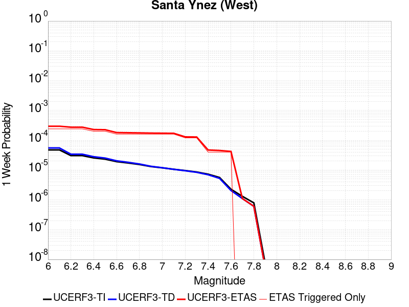 | 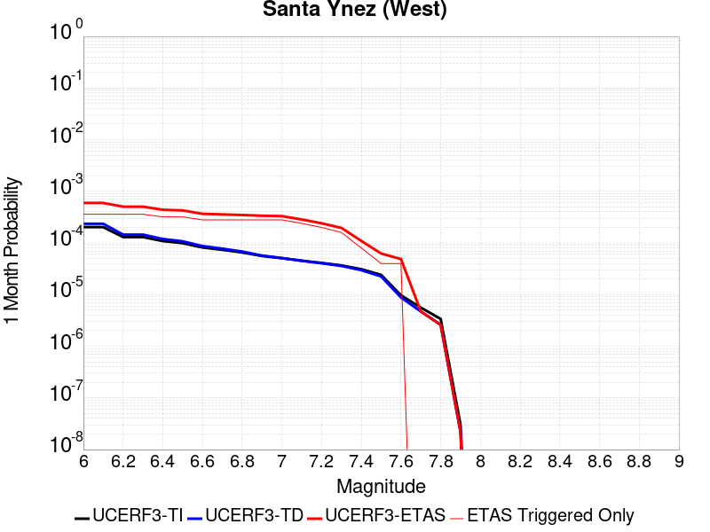 | 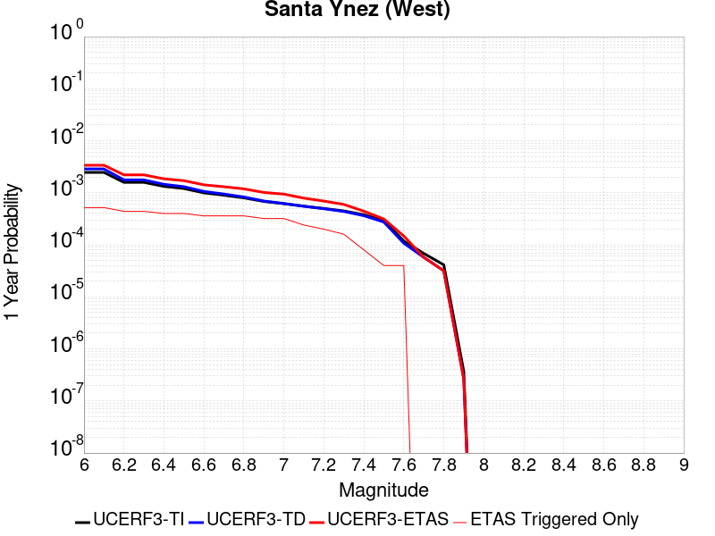 |

| Magnitude | 1 wk TI Prob | 1 wk TD Prob | 1 wk ETAS Prob | 1 wk ETAS/TD Gain | 1 wk ETAS Triggered Only | 1 mo TI Prob | 1 mo TD Prob | 1 mo ETAS Prob | 1 mo ETAS/TD Gain | 1 mo ETAS Triggered Only | 1 yr TI Prob | 1 yr TD Prob | 1 yr ETAS Prob | 1 yr ETAS/TD Gain | 1 yr ETAS Triggered Only |
|-----|-----|-----|-----|-----|-----|-----|-----|-----|-----|-----|-----|-----|-----|-----|-----|
| 6.0 | 4.7352758E-5 | 5.5006385E-5 | 2.949932E-4 | 5.36289 | 2.4E-4 | 2.0292461E-4 | 2.3572148E-4 | 5.956366E-4 | 2.526866 | 3.6E-4 | 0.0024678076 | 0.0028664002 | 0.0033849096 | 1.1808922 | 5.2E-4 |
| 6.1 | 4.7352758E-5 | 5.5006385E-5 | 2.949932E-4 | 5.36289 | 2.4E-4 | 2.0292461E-4 | 2.3572148E-4 | 5.956366E-4 | 2.526866 | 3.6E-4 | 0.0024678076 | 0.0028664002 | 0.0033849096 | 1.1808922 | 5.2E-4 |
| 6.2 | 3.0415853E-5 | 3.3943157E-5 | 2.73935E-4 | 8.070405 | 2.4E-4 | 1.3034715E-4 | 1.4546278E-4 | 5.054104E-4 | 3.4745 | 3.6E-4 | 0.0015858212 | 0.0017696057 | 0.002208827 | 1.2482029 | 4.4E-4 |
| 6.3 | 3.0415853E-5 | 3.3943157E-5 | 2.73935E-4 | 8.070405 | 2.4E-4 | 1.3034715E-4 | 1.4546278E-4 | 5.054104E-4 | 3.4745 | 3.6E-4 | 0.0015858212 | 0.0017696057 | 0.002208827 | 1.2482029 | 4.4E-4 |
| 6.4 | 2.5452082E-5 | 2.7926168E-5 | 2.2792058E-4 | 8.161542 | 2.0E-4 | 1.09075794E-4 | 1.196782E-4 | 4.396399E-4 | 3.673517 | 3.2E-4 | 0.0013271887 | 0.0014561269 | 0.0018555445 | 1.2743013 | 4.0E-4 |
| 6.5 | 2.3143784E-5 | 2.5140027E-5 | 2.25135E-4 | 8.955241 | 2.0E-4 | 9.9183875E-5 | 1.07738604E-4 | 4.2770413E-4 | 3.9698317 | 3.2E-4 | 0.0012068948 | 0.0013109427 | 0.0017104184 | 1.304724 | 4.0E-4 |
| 6.6 | 1.9118515E-5 | 2.0363112E-5 | 1.8035986E-4 | 8.857185 | 1.6E-4 | 8.193392E-5 | 8.72676E-5 | 3.6724316E-4 | 4.208242 | 2.8E-4 | 9.97089E-4 | 0.0010619732 | 0.0014215908 | 1.3386316 | 3.6E-4 |
| 6.7 | 1.722807E-5 | 1.8153853E-5 | 1.7815095E-4 | 9.8133955 | 1.6E-4 | 7.3832496E-5 | 7.779994E-5 | 3.5777816E-4 | 4.5986943 | 2.8E-4 | 8.985399E-4 | 9.4680826E-4 | 0.0013064673 | 1.3798648 | 3.6E-4 |
| 6.8 | 1.5317364E-5 | 1.5932763E-5 | 1.7593021E-4 | 11.042041 | 1.6E-4 | 6.56442E-5 | 6.828151E-5 | 3.482624E-4 | 5.100391 | 2.8E-4 | 7.98925E-4 | 8.310146E-4 | 0.0011907154 | 1.4328454 | 3.6E-4 |
| 6.9 | 1.3071226E-5 | 1.3334518E-5 | 1.7333239E-4 | 12.998774 | 1.6E-4 | 5.6018336E-5 | 5.7146695E-5 | 3.3713068E-4 | 5.8993907 | 2.8E-4 | 6.8180985E-4 | 6.955412E-4 | 0.0010153186 | 1.4597534 | 3.2E-4 |
| 7.0 | 1.1836986E-5 | 1.1937046E-5 | 1.7193514E-4 | 14.403491 | 1.6E-4 | 5.0728955E-5 | 5.115778E-5 | 3.3114344E-4 | 6.472984 | 2.8E-4 | 6.1745E-4 | 6.2266964E-4 | 9.424704E-4 | 1.5135962 | 3.2E-4 |
| 7.1 | 1.0597169E-5 | 1.0545887E-5 | 1.705442E-4 | 16.171633 | 1.6E-4 | 4.541565E-5 | 4.519588E-5 | 2.8518503E-4 | 6.3099785 | 2.4E-4 | 5.5279525E-4 | 5.5012206E-4 | 7.8999E-4 | 1.4360268 | 2.4E-4 |
| 7.2 | 9.59113E-6 | 9.462545E-6 | 1.294614E-4 | 13.6814575 | 1.2E-4 | 4.11042E-5 | 4.055314E-5 | 2.4054504E-4 | 5.9316006 | 2.0E-4 | 5.0032866E-4 | 4.9362367E-4 | 6.9352495E-4 | 1.404967 | 2.0E-4 |
| 7.3 | 8.586084E-6 | 8.382711E-6 | 1.2838171E-4 | 15.315059 | 1.2E-4 | 3.679698E-5 | 3.5925415E-5 | 1.9591967E-4 | 5.4535117 | 1.6E-4 | 4.4791115E-4 | 4.3730516E-4 | 5.972352E-4 | 1.3657172 | 1.6E-4 |
| 7.4 | 7.2622997E-6 | 6.954277E-6 | 4.6954E-5 | 6.751816 | 4.0E-5 | 3.112377E-5 | 2.980371E-5 | 1.0980132E-4 | 3.6841495 | 8.0E-5 | 3.78866E-4 | 3.6280073E-4 | 4.427717E-4 | 1.2204267 | 8.0E-5 |
| 7.5 | 5.627296E-6 | 5.2534574E-6 | 4.5253248E-5 | 8.613994 | 4.0E-5 | 2.411676E-5 | 2.2514627E-5 | 6.2513725E-5 | 2.776583 | 4.0E-5 | 2.9358198E-4 | 2.740818E-4 | 3.1407084E-4 | 1.1459018 | 4.0E-5 |
| 7.6 | 2.265244E-6 | 2.061312E-6 | 4.206123E-5 | 20.405077 | 4.0E-5 | 9.708152E-6 | 8.834165E-6 | 4.8833812E-5 | 5.5278354 | 4.0E-5 | 1.18190335E-4 | 1.0755074E-4 | 1.4754644E-4 | 1.3718774 | 4.0E-5 |
| 7.7 | 1.3099874E-6 | 1.1018567E-6 | 1.1018567E-6 | 1.0 | 0.0 | 5.61422E-6 | 4.7222347E-6 | 4.7222347E-6 | 1.0 | 0.0 | 6.8350986E-5 | 5.7491714E-5 | 5.7491714E-5 | 1.0 | 0.0 |
| 7.8 | 7.903951E-7 | 6.0723085E-7 | 6.0723085E-7 | 1.0 | 0.0 | 3.3874032E-6 | 2.6024154E-6 | 2.6024154E-6 | 1.0 | 0.0 | 4.1240855E-5 | 3.168396E-5 | 3.168396E-5 | 1.0 | 0.0 |
| 7.9 | 7.0753297E-9 | 5.090925E-9 | 5.090925E-9 | 1.0 | 0.0 | 3.032284E-8 | 2.1818249E-8 | 2.1818249E-8 | 1.0 | 0.0 | 3.6918053E-7 | 2.6563717E-7 | 2.6563717E-7 | 1.0 | 0.0 |

## Red Mountain
*[(top)](#table-of-contents)*

| 1 Week | 1 Month | 1 Year |
|-----|-----|-----|
| 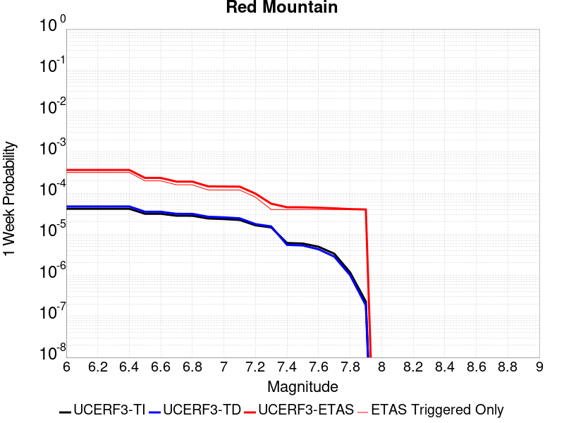 | 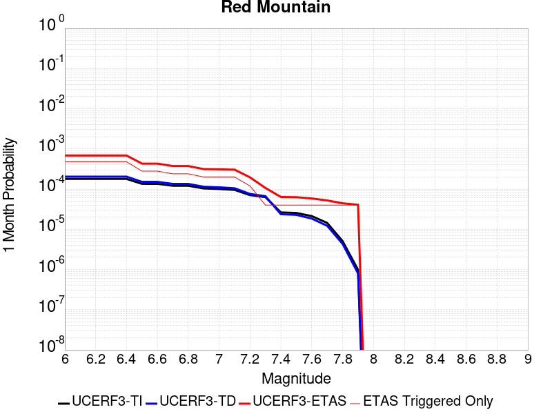 | 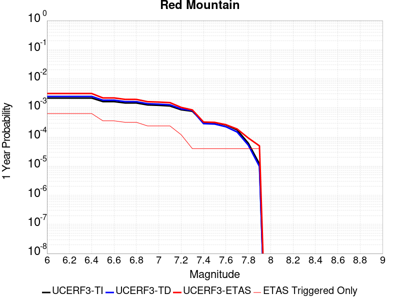 |

| Magnitude | 1 wk TI Prob | 1 wk TD Prob | 1 wk ETAS Prob | 1 wk ETAS/TD Gain | 1 wk ETAS Triggered Only | 1 mo TI Prob | 1 mo TD Prob | 1 mo ETAS Prob | 1 mo ETAS/TD Gain | 1 mo ETAS Triggered Only | 1 yr TI Prob | 1 yr TD Prob | 1 yr ETAS Prob | 1 yr ETAS/TD Gain | 1 yr ETAS Triggered Only |
|-----|-----|-----|-----|-----|-----|-----|-----|-----|-----|-----|-----|-----|-----|-----|-----|
| 6.0 | 4.1810763E-5 | 4.7617137E-5 | 3.676019E-4 | 7.7199497 | 3.2E-4 | 1.7917668E-4 | 2.0405841E-4 | 6.8396045E-4 | 3.3517878 | 4.8E-4 | 0.0021792934 | 0.002481745 | 0.0031201567 | 1.257243 | 6.4E-4 |
| 6.1 | 4.1810763E-5 | 4.7617137E-5 | 3.676019E-4 | 7.7199497 | 3.2E-4 | 1.7917668E-4 | 2.0405841E-4 | 6.8396045E-4 | 3.3517878 | 4.8E-4 | 0.0021792934 | 0.002481745 | 0.0031201567 | 1.257243 | 6.4E-4 |
| 6.2 | 4.1810763E-5 | 4.7617137E-5 | 3.676019E-4 | 7.7199497 | 3.2E-4 | 1.7917668E-4 | 2.0405841E-4 | 6.8396045E-4 | 3.3517878 | 4.8E-4 | 0.0021792934 | 0.002481745 | 0.0031201567 | 1.257243 | 6.4E-4 |
| 6.3 | 4.1810763E-5 | 4.7617137E-5 | 3.676019E-4 | 7.7199497 | 3.2E-4 | 1.7917668E-4 | 2.0405841E-4 | 6.8396045E-4 | 3.3517878 | 4.8E-4 | 0.0021792934 | 0.002481745 | 0.0031201567 | 1.257243 | 6.4E-4 |
| 6.4 | 4.1810763E-5 | 4.7617137E-5 | 3.676019E-4 | 7.7199497 | 3.2E-4 | 1.7917668E-4 | 2.0405841E-4 | 6.8396045E-4 | 3.3517878 | 4.8E-4 | 0.0021792934 | 0.002481745 | 0.0031201567 | 1.257243 | 6.4E-4 |
| 6.5 | 3.154503E-5 | 3.5378947E-5 | 2.3537187E-4 | 6.6528797 | 2.0E-4 | 1.3518598E-4 | 1.5161576E-4 | 4.315733E-4 | 2.8464937 | 2.8E-4 | 0.0016446467 | 0.0018444513 | 0.0022037872 | 1.19482 | 3.6E-4 |
| 6.6 | 3.1535834E-5 | 3.5368324E-5 | 2.3536125E-4 | 6.6545777 | 2.0E-4 | 1.3514658E-4 | 1.5157025E-4 | 4.315278E-4 | 2.8470483 | 2.8E-4 | 0.0016441676 | 0.001843898 | 0.0022032342 | 1.1948786 | 3.6E-4 |
| 6.7 | 2.8267326E-5 | 3.148608E-5 | 1.9148104E-4 | 6.0814505 | 1.6E-4 | 1.2114006E-4 | 1.3493384E-4 | 3.7490146E-4 | 2.7784092 | 2.4E-4 | 0.0014738824 | 0.0016416667 | 0.0019611414 | 1.1946038 | 3.2E-4 |
| 6.8 | 2.8212884E-5 | 3.1423937E-5 | 1.914189E-4 | 6.0915 | 1.6E-4 | 1.20906756E-4 | 1.3466754E-4 | 3.7463522E-4 | 2.7819266 | 2.4E-4 | 0.0014710457 | 0.0016384295 | 0.001957905 | 1.194989 | 3.2E-4 |
| 6.9 | 2.4227871E-5 | 2.6720827E-5 | 1.4671762E-4 | 5.490759 | 1.2E-4 | 1.03829596E-4 | 1.14513234E-4 | 3.1449032E-4 | 2.746323 | 2.0E-4 | 0.0012633923 | 0.0013933829 | 0.0016330485 | 1.1720027 | 2.4E-4 |
| 7.0 | 2.348524E-5 | 2.58491E-5 | 1.45846E-4 | 5.642208 | 1.2E-4 | 1.0064714E-4 | 1.10777575E-4 | 3.1075542E-4 | 2.8052194 | 2.0E-4 | 0.0012246901 | 0.0013479582 | 0.0015876348 | 1.1778071 | 2.4E-4 |
| 7.1 | 2.2311642E-5 | 2.447537E-5 | 1.4447243E-4 | 5.902768 | 1.2E-4 | 9.561782E-5 | 1.0489065E-4 | 3.0486967E-4 | 2.9065475 | 2.0E-4 | 0.0011635252 | 0.0012763705 | 0.0015160642 | 1.1877931 | 2.4E-4 |
| 7.2 | 1.6533986E-5 | 1.767884E-5 | 9.7677424E-5 | 5.525104 | 8.0E-5 | 7.085802E-5 | 7.576461E-5 | 1.9575552E-4 | 2.5837328 | 1.2E-4 | 8.623549E-4 | 9.221073E-4 | 0.0010419966 | 1.1300167 | 1.2E-4 |
| 7.3 | 1.4703092E-5 | 1.556691E-5 | 5.556629E-5 | 3.569513 | 4.0E-5 | 6.301173E-5 | 6.671397E-5 | 1.06711304E-4 | 1.5995346 | 4.0E-5 | 7.668978E-4 | 8.120016E-4 | 8.519691E-4 | 1.049221 | 4.0E-5 |
| 7.4 | 6.1331984E-6 | 5.530447E-6 | 4.5530225E-5 | 8.232649 | 4.0E-5 | 2.6284872E-5 | 2.3701703E-5 | 6.3700754E-5 | 2.6876025 | 4.0E-5 | 3.199713E-4 | 2.8853054E-4 | 3.28519E-4 | 1.1385936 | 4.0E-5 |
| 7.5 | 5.954766E-6 | 5.3400213E-6 | 4.5339806E-5 | 8.490567 | 4.0E-5 | 2.5520176E-5 | 2.2885608E-5 | 6.288469E-5 | 2.7477834 | 4.0E-5 | 3.1066386E-4 | 2.7859717E-4 | 3.1858604E-4 | 1.1435364 | 4.0E-5 |
| 7.6 | 4.9726646E-6 | 4.316545E-6 | 4.4316374E-5 | 10.26663 | 4.0E-5 | 2.1311245E-5 | 1.849935E-5 | 5.849861E-5 | 3.162198 | 4.0E-5 | 2.5943352E-4 | 2.2520665E-4 | 2.6519762E-4 | 1.1775746 | 4.0E-5 |
| 7.7 | 3.3613894E-6 | 2.8534687E-6 | 4.2853353E-5 | 15.017986 | 4.0E-5 | 1.4405875E-5 | 1.2229096E-5 | 5.2228606E-5 | 4.270848 | 4.0E-5 | 1.7537741E-4 | 1.4887934E-4 | 1.8887338E-4 | 1.268634 | 4.0E-5 |
| 7.8 | 1.1828961E-6 | 1.0125256E-6 | 4.1012485E-5 | 40.505135 | 4.0E-5 | 5.069545E-6 | 4.3393884E-6 | 4.4339216E-5 | 10.21785 | 4.0E-5 | 6.171996E-5 | 5.28308E-5 | 9.282869E-5 | 1.7570941 | 4.0E-5 |
| 7.9 | 2.2967266E-7 | 1.8623352E-7 | 4.0186227E-5 | 215.78406 | 4.0E-5 | 9.843111E-7 | 7.9814345E-7 | 4.0798113E-5 | 51.116264 | 4.0E-5 | 1.19839215E-5 | 9.717356E-6 | 4.9716968E-5 | 5.116306 | 4.0E-5 |

## Ventura-Pitas Point
*[(top)](#table-of-contents)*

| 1 Week | 1 Month | 1 Year |
|-----|-----|-----|
| 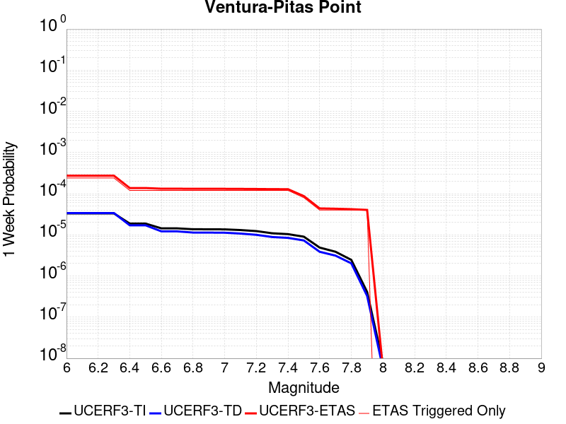 | 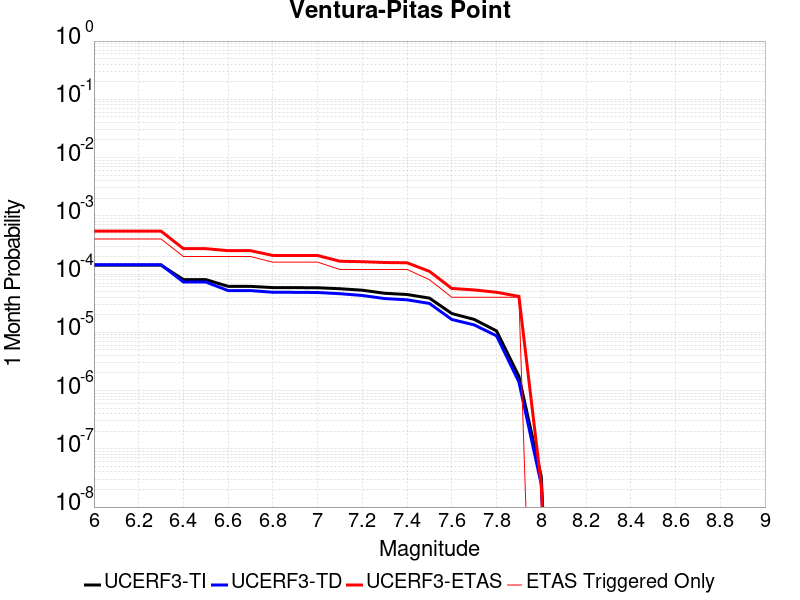 | 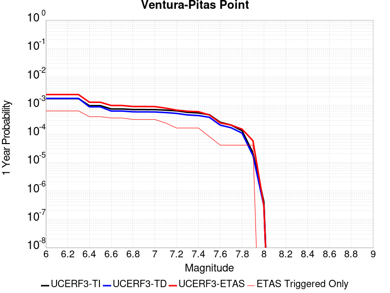 |

| Magnitude | 1 wk TI Prob | 1 wk TD Prob | 1 wk ETAS Prob | 1 wk ETAS/TD Gain | 1 wk ETAS Triggered Only | 1 mo TI Prob | 1 mo TD Prob | 1 mo ETAS Prob | 1 mo ETAS/TD Gain | 1 mo ETAS Triggered Only | 1 yr TI Prob | 1 yr TD Prob | 1 yr ETAS Prob | 1 yr ETAS/TD Gain | 1 yr ETAS Triggered Only |
|-----|-----|-----|-----|-----|-----|-----|-----|-----|-----|-----|-----|-----|-----|-----|-----|
| 6.0 | 3.3179622E-5 | 3.3762684E-5 | 2.737546E-4 | 8.108199 | 2.4E-4 | 1.4219063E-4 | 1.4469065E-4 | 5.446328E-4 | 3.7641187 | 4.0E-4 | 0.0017297962 | 0.0017604423 | 0.0023993156 | 1.362905 | 6.4E-4 |
| 6.1 | 3.3179622E-5 | 3.3762684E-5 | 2.737546E-4 | 8.108199 | 2.4E-4 | 1.4219063E-4 | 1.4469065E-4 | 5.446328E-4 | 3.7641187 | 4.0E-4 | 0.0017297962 | 0.0017604423 | 0.0023993156 | 1.362905 | 6.4E-4 |
| 6.2 | 3.3179622E-5 | 3.3762684E-5 | 2.737546E-4 | 8.108199 | 2.4E-4 | 1.4219063E-4 | 1.4469065E-4 | 5.446328E-4 | 3.7641187 | 4.0E-4 | 0.0017297962 | 0.0017604423 | 0.0023993156 | 1.362905 | 6.4E-4 |
| 6.3 | 3.3179622E-5 | 3.3762684E-5 | 2.737546E-4 | 8.108199 | 2.4E-4 | 1.4219063E-4 | 1.4469065E-4 | 5.446328E-4 | 3.7641187 | 4.0E-4 | 0.0017297962 | 0.0017604423 | 0.0023993156 | 1.362905 | 6.4E-4 |
| 6.4 | 1.8754668E-5 | 1.7038072E-5 | 1.3703603E-4 | 8.042931 | 1.2E-4 | 8.037467E-5 | 7.301839E-5 | 2.730038E-4 | 3.738836 | 2.0E-4 | 9.781223E-4 | 8.8865944E-4 | 0.001288304 | 1.4497162 | 4.0E-4 |
| 6.5 | 1.8754668E-5 | 1.7038072E-5 | 1.3703603E-4 | 8.042931 | 1.2E-4 | 8.037467E-5 | 7.301839E-5 | 2.730038E-4 | 3.738836 | 2.0E-4 | 9.781223E-4 | 8.8865944E-4 | 0.001288304 | 1.4497162 | 4.0E-4 |
| 6.6 | 1.4361558E-5 | 1.2138828E-5 | 1.3213737E-4 | 10.885512 | 1.2E-4 | 6.154808E-5 | 5.2022526E-5 | 2.5201213E-4 | 4.8442883 | 2.0E-4 | 7.490902E-4 | 6.3319254E-4 | 9.929646E-4 | 1.5681875 | 3.6E-4 |
| 6.7 | 1.4361558E-5 | 1.2138828E-5 | 1.3213737E-4 | 10.885512 | 1.2E-4 | 6.154808E-5 | 5.2022526E-5 | 2.5201213E-4 | 4.8442883 | 2.0E-4 | 7.490902E-4 | 6.3319254E-4 | 9.929646E-4 | 1.5681875 | 3.6E-4 |
| 6.8 | 1.3663846E-5 | 1.1360668E-5 | 1.3135931E-4 | 11.562638 | 1.2E-4 | 5.8558027E-5 | 4.868768E-5 | 2.0867989E-4 | 4.2860923 | 1.6E-4 | 7.127108E-4 | 5.9261324E-4 | 9.1242365E-4 | 1.5396612 | 3.2E-4 |
| 6.9 | 1.3644157E-5 | 1.1338761E-5 | 1.313374E-4 | 11.583047 | 1.2E-4 | 5.8473648E-5 | 4.8593796E-5 | 2.0858602E-4 | 4.2924414 | 1.6E-4 | 7.116841E-4 | 5.914708E-4 | 9.1128156E-4 | 1.5407041 | 3.2E-4 |
| 7.0 | 1.3568845E-5 | 1.125829E-5 | 1.3125694E-4 | 11.658691 | 1.2E-4 | 5.8150898E-5 | 4.8248934E-5 | 2.0824121E-4 | 4.315975 | 1.6E-4 | 7.077572E-4 | 5.872744E-4 | 9.070865E-4 | 1.5445701 | 3.2E-4 |
| 7.1 | 1.306572E-5 | 1.0734395E-5 | 1.3073311E-4 | 12.178899 | 1.2E-4 | 5.599474E-5 | 4.6003748E-5 | 1.6599822E-4 | 3.6083632 | 1.2E-4 | 6.815227E-4 | 5.5995357E-4 | 7.998192E-4 | 1.428367 | 2.4E-4 |
| 7.2 | 1.232604E-5 | 1.0006684E-5 | 1.3000549E-4 | 12.991865 | 1.2E-4 | 5.2824813E-5 | 4.288509E-5 | 1.6287995E-4 | 3.7980552 | 1.2E-4 | 6.429523E-4 | 5.220027E-4 | 6.8191916E-4 | 1.3063518 | 1.6E-4 |
| 7.3 | 1.0917261E-5 | 8.853358E-6 | 1.2885229E-4 | 14.554059 | 1.2E-4 | 4.678742E-5 | 3.794242E-5 | 1.5793787E-4 | 4.162567 | 1.2E-4 | 5.69488E-4 | 4.618526E-4 | 6.217787E-4 | 1.3462708 | 1.6E-4 |
| 7.4 | 1.039959E-5 | 8.432823E-6 | 1.2843181E-4 | 15.22999 | 1.2E-4 | 4.456891E-5 | 3.614018E-5 | 1.5613584E-4 | 4.3202844 | 1.2E-4 | 5.424914E-4 | 4.399194E-4 | 5.99849E-4 | 1.363543 | 1.6E-4 |
| 7.5 | 9.015877E-6 | 7.306078E-6 | 8.7305496E-5 | 11.949708 | 8.0E-5 | 3.86389E-5 | 3.1311392E-5 | 1.1130889E-4 | 3.5549004 | 8.0E-5 | 4.7032707E-4 | 3.8115095E-4 | 4.6112045E-4 | 1.2098106 | 8.0E-5 |
| 7.6 | 4.900162E-6 | 3.87516E-6 | 4.3875007E-5 | 11.322114 | 4.0E-5 | 2.1000526E-5 | 1.6607724E-5 | 5.660706E-5 | 3.4084778 | 4.0E-5 | 2.556514E-4 | 2.0218041E-4 | 2.4217232E-4 | 1.1978031 | 4.0E-5 |
| 7.7 | 3.8850626E-6 | 3.1275454E-6 | 4.312742E-5 | 13.789542 | 4.0E-5 | 1.6650163E-5 | 1.3403697E-5 | 5.340316E-5 | 3.9842112 | 4.0E-5 | 2.0269687E-4 | 1.6317789E-4 | 2.0317137E-4 | 1.2450912 | 4.0E-5 |
| 7.8 | 2.4654719E-6 | 2.0304078E-6 | 4.2030326E-5 | 20.700436 | 4.0E-5 | 1.0566265E-5 | 8.701719E-6 | 4.870137E-5 | 5.596753 | 4.0E-5 | 1.2863669E-4 | 1.0593832E-4 | 1.4593409E-4 | 1.3775382 | 4.0E-5 |
| 7.9 | 4.095894E-7 | 3.2773266E-7 | 4.032772E-5 | 123.05066 | 4.0E-5 | 1.7553821E-6 | 1.4045678E-6 | 4.140451E-5 | 29.478472 | 4.0E-5 | 2.1371567E-5 | 1.7100481E-5 | 5.7099798E-5 | 3.3390753 | 4.0E-5 |
| 8.0 | 7.791402E-9 | 5.68495E-9 | 5.68495E-9 | 1.0 | 0.0 | 3.3391725E-8 | 2.4364072E-8 | 2.4364072E-8 | 1.0 | 0.0 | 4.0654416E-7 | 2.9663255E-7 | 2.9663255E-7 | 1.0 | 0.0 |

## Santa Susana East (connector)
*[(top)](#table-of-contents)*

| 1 Week | 1 Month | 1 Year |
|-----|-----|-----|
| 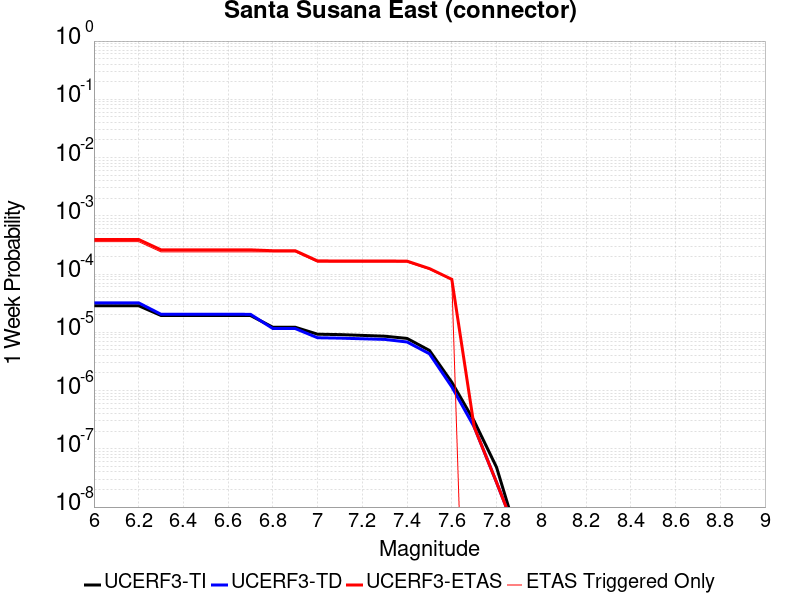 | 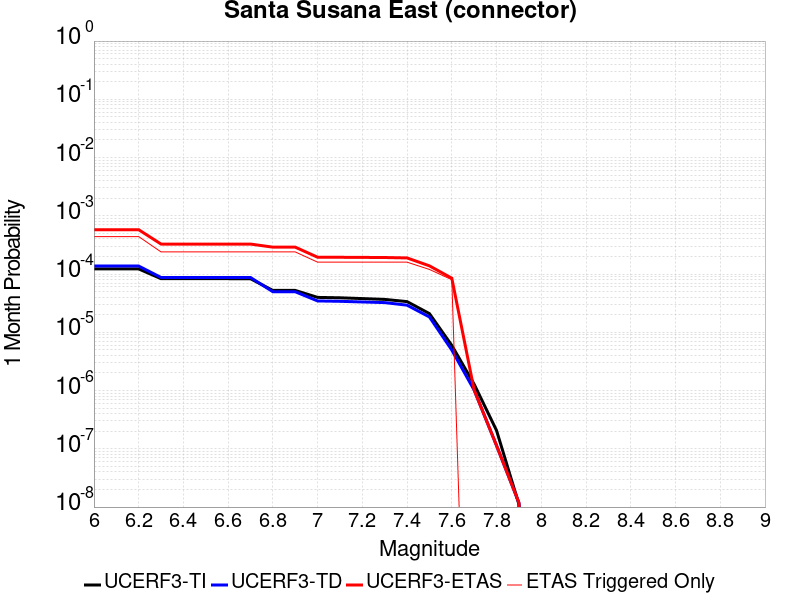 | 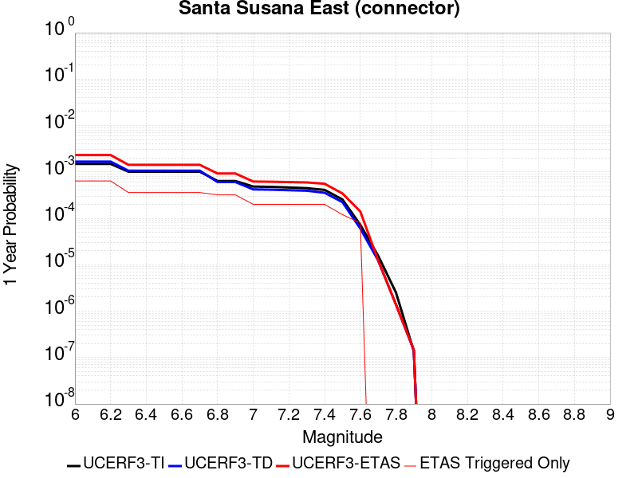 |

| Magnitude | 1 wk TI Prob | 1 wk TD Prob | 1 wk ETAS Prob | 1 wk ETAS/TD Gain | 1 wk ETAS Triggered Only | 1 mo TI Prob | 1 mo TD Prob | 1 mo ETAS Prob | 1 mo ETAS/TD Gain | 1 mo ETAS Triggered Only | 1 yr TI Prob | 1 yr TD Prob | 1 yr ETAS Prob | 1 yr ETAS/TD Gain | 1 yr ETAS Triggered Only |
|-----|-----|-----|-----|-----|-----|-----|-----|-----|-----|-----|-----|-----|-----|-----|-----|
| 6.0 | 2.858397E-5 | 3.204545E-5 | 3.9203392E-4 | 12.233684 | 3.6E-4 | 1.2249697E-4 | 1.37332E-4 | 5.7727157E-4 | 4.2034745 | 4.4E-4 | 0.0014903803 | 0.001671004 | 0.0023099345 | 1.3823633 | 6.4E-4 |
| 6.1 | 2.858397E-5 | 3.204545E-5 | 3.9203392E-4 | 12.233684 | 3.6E-4 | 1.2249697E-4 | 1.37332E-4 | 5.7727157E-4 | 4.2034745 | 4.4E-4 | 0.0014903803 | 0.001671004 | 0.0023099345 | 1.3823633 | 6.4E-4 |
| 6.2 | 2.858397E-5 | 3.204545E-5 | 3.9203392E-4 | 12.233684 | 3.6E-4 | 1.2249697E-4 | 1.37332E-4 | 5.7727157E-4 | 4.2034745 | 4.4E-4 | 0.0014903803 | 0.001671004 | 0.0023099345 | 1.3823633 | 6.4E-4 |
| 6.3 | 1.943582E-5 | 2.0380405E-5 | 2.603755E-4 | 12.775778 | 2.4E-4 | 8.329371E-5 | 8.734229E-5 | 3.2732132E-4 | 3.7475698 | 2.4E-4 | 0.001013629 | 0.0010629859 | 0.0014226033 | 1.3383087 | 3.6E-4 |
| 6.4 | 1.943582E-5 | 2.0380405E-5 | 2.603755E-4 | 12.775778 | 2.4E-4 | 8.329371E-5 | 8.734229E-5 | 3.2732132E-4 | 3.7475698 | 2.4E-4 | 0.001013629 | 0.0010629859 | 0.0014226033 | 1.3383087 | 3.6E-4 |
| 6.5 | 1.943582E-5 | 2.0380405E-5 | 2.603755E-4 | 12.775778 | 2.4E-4 | 8.329371E-5 | 8.734229E-5 | 3.2732132E-4 | 3.7475698 | 2.4E-4 | 0.001013629 | 0.0010629859 | 0.0014226033 | 1.3383087 | 3.6E-4 |
| 6.6 | 1.943582E-5 | 2.0380405E-5 | 2.603755E-4 | 12.775778 | 2.4E-4 | 8.329371E-5 | 8.734229E-5 | 3.2732132E-4 | 3.7475698 | 2.4E-4 | 0.001013629 | 0.0010629859 | 0.0014226033 | 1.3383087 | 3.6E-4 |
| 6.7 | 1.9404439E-5 | 2.0367817E-5 | 2.6036293E-4 | 12.783055 | 2.4E-4 | 8.3159226E-5 | 8.728835E-5 | 3.272674E-4 | 3.7492678 | 2.4E-4 | 0.0010119933 | 0.0010623297 | 0.0014219474 | 1.3385178 | 3.6E-4 |
| 6.8 | 1.2217526E-5 | 1.1598732E-5 | 2.5159595E-4 | 21.691677 | 2.4E-4 | 5.2359774E-5 | 4.9708E-5 | 2.8969607E-4 | 5.8279567 | 2.4E-4 | 6.372938E-4 | 6.0504366E-4 | 9.2485006E-4 | 1.5285674 | 3.2E-4 |
| 6.9 | 1.2217526E-5 | 1.1598732E-5 | 2.5159595E-4 | 21.691677 | 2.4E-4 | 5.2359774E-5 | 4.9708E-5 | 2.8969607E-4 | 5.8279567 | 2.4E-4 | 6.372938E-4 | 6.0504366E-4 | 9.2485006E-4 | 1.5285674 | 3.2E-4 |
| 7.0 | 9.276017E-6 | 8.062312E-6 | 1.6806103E-4 | 20.845263 | 1.6E-4 | 3.9753755E-5 | 3.455233E-5 | 1.945468E-4 | 5.6304975 | 1.6E-4 | 4.8389446E-4 | 4.2059686E-4 | 6.2051276E-4 | 1.4753147 | 2.0E-4 |
| 7.1 | 9.130355E-6 | 7.9454385E-6 | 1.6794416E-4 | 21.13718 | 1.6E-4 | 3.9129503E-5 | 3.4051456E-5 | 1.94046E-4 | 5.6986113 | 1.6E-4 | 4.7629757E-4 | 4.1450103E-4 | 6.144181E-4 | 1.4823078 | 2.0E-4 |
| 7.2 | 8.851015E-6 | 7.744543E-6 | 1.677433E-4 | 21.659548 | 1.6E-4 | 3.7932372E-5 | 3.3190496E-5 | 1.9318519E-4 | 5.820497 | 1.6E-4 | 4.6172875E-4 | 4.0402278E-4 | 6.0394197E-4 | 1.4948215 | 2.0E-4 |
| 7.3 | 8.573006E-6 | 7.553199E-6 | 1.6755199E-4 | 22.182919 | 1.6E-4 | 3.6740938E-5 | 3.237047E-5 | 1.9236529E-4 | 5.9426165 | 1.6E-4 | 4.472291E-4 | 3.940426E-4 | 5.939638E-4 | 1.5073593 | 2.0E-4 |
| 7.4 | 7.852282E-6 | 6.820105E-6 | 1.6681901E-4 | 24.459888 | 1.6E-4 | 3.36522E-5 | 2.9228711E-5 | 1.8922404E-4 | 6.4739094 | 1.6E-4 | 4.096385E-4 | 3.5580448E-4 | 5.5573334E-4 | 1.5619065 | 2.0E-4 |
| 7.5 | 4.8869324E-6 | 4.280381E-6 | 1.2427986E-4 | 29.03477 | 1.2E-4 | 2.0943828E-5 | 1.834437E-5 | 1.3834216E-4 | 7.5413966 | 1.2E-4 | 2.5496128E-4 | 2.2332146E-4 | 3.4329467E-4 | 1.537222 | 1.2E-4 |
| 7.6 | 1.3894544E-6 | 1.1571898E-6 | 8.11571E-5 | 70.13292 | 8.0E-5 | 5.954791E-6 | 4.959377E-6 | 8.495898E-5 | 17.13098 | 8.0E-5 | 7.249717E-5 | 6.037896E-5 | 1.4037413E-4 | 2.324885 | 8.0E-5 |
| 7.7 | 2.9924632E-7 | 2.3744407E-7 | 2.3744407E-7 | 1.0 | 0.0 | 1.2824837E-6 | 1.0176171E-6 | 1.0176171E-6 | 1.0 | 0.0 | 1.5614127E-5 | 1.2389425E-5 | 1.2389425E-5 | 1.0 | 0.0 |
| 7.8 | 4.8188564E-8 | 2.6520485E-8 | 2.6520485E-8 | 1.0 | 0.0 | 2.065224E-7 | 1.1365921E-7 | 1.1365921E-7 | 1.0 | 0.0 | 2.5144072E-6 | 1.3838002E-6 | 1.3838002E-6 | 1.0 | 0.0 |
| 7.9 | 2.6127251E-9 | 2.7686682E-9 | 2.7686682E-9 | 1.0 | 0.0 | 1.1197393E-8 | 1.1865721E-8 | 1.1865721E-8 | 1.0 | 0.0 | 1.3632825E-7 | 1.4446515E-7 | 1.4446515E-7 | 1.0 | 0.0 |

## Tank Canyon
*[(top)](#table-of-contents)*

| 1 Week | 1 Month | 1 Year |
|-----|-----|-----|
| 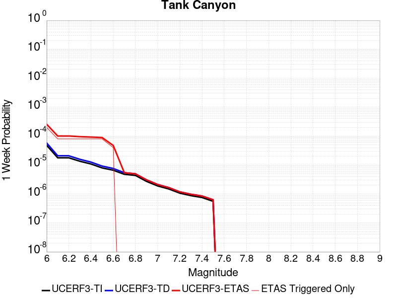 | 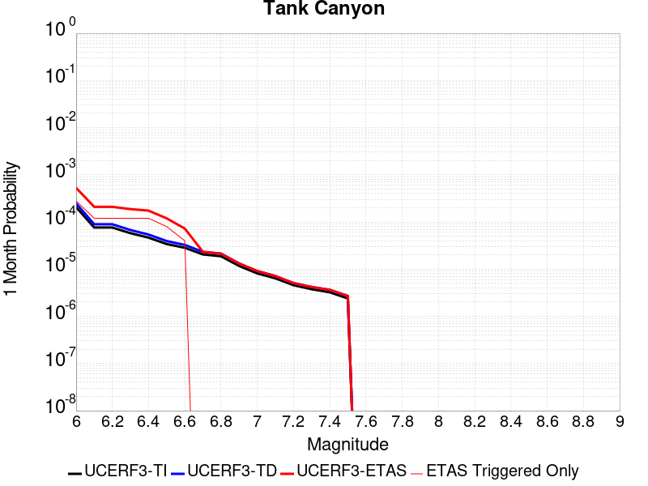 | 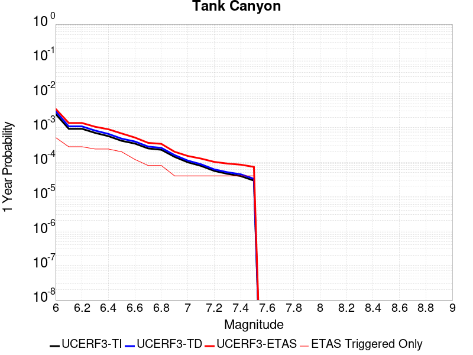 |

| Magnitude | 1 wk TI Prob | 1 wk TD Prob | 1 wk ETAS Prob | 1 wk ETAS/TD Gain | 1 wk ETAS Triggered Only | 1 mo TI Prob | 1 mo TD Prob | 1 mo ETAS Prob | 1 mo ETAS/TD Gain | 1 mo ETAS Triggered Only | 1 yr TI Prob | 1 yr TD Prob | 1 yr ETAS Prob | 1 yr ETAS/TD Gain | 1 yr ETAS Triggered Only |
|-----|-----|-----|-----|-----|-----|-----|-----|-----|-----|-----|-----|-----|-----|-----|-----|
| 6.0 | 4.8284557E-5 | 5.800436E-5 | 2.5799277E-4 | 4.447817 | 2.0E-4 | 2.0691741E-4 | 2.485703E-4 | 5.2850065E-4 | 2.126162 | 2.8E-4 | 0.0025163088 | 0.0030228058 | 0.003541234 | 1.1715056 | 5.2E-4 |
| 6.1 | 1.7796336E-5 | 2.088598E-5 | 1.0088431E-4 | 4.8302407 | 8.0E-5 | 7.626778E-5 | 8.9508496E-5 | 2.0949775E-4 | 2.340535 | 1.2E-4 | 9.281647E-4 | 0.0010892592 | 0.0013689542 | 1.2567755 | 2.8E-4 |
| 6.2 | 1.7796336E-5 | 2.088598E-5 | 1.0088431E-4 | 4.8302407 | 8.0E-5 | 7.626778E-5 | 8.9508496E-5 | 2.0949775E-4 | 2.340535 | 1.2E-4 | 9.281647E-4 | 0.0010892592 | 0.0013689542 | 1.2567755 | 2.8E-4 |
| 6.3 | 1.3515912E-5 | 1.5768876E-5 | 9.576762E-5 | 6.073205 | 8.0E-5 | 5.792405E-5 | 6.757928E-5 | 1.8757118E-4 | 2.7755723 | 1.2E-4 | 7.049971E-4 | 8.224908E-4 | 0.0010622934 | 1.2915566 | 2.4E-4 |
| 6.4 | 1.0870146E-5 | 1.2625341E-5 | 9.262433E-5 | 7.3363824 | 8.0E-5 | 4.658551E-5 | 5.4107582E-5 | 1.741011E-4 | 3.2176838 | 1.2E-4 | 5.67031E-4 | 6.585785E-4 | 8.984204E-4 | 1.3641813 | 2.4E-4 |
| 6.5 | 7.964826E-6 | 9.201362E-6 | 8.920063E-5 | 9.694284 | 8.0E-5 | 3.4134522E-5 | 3.9433875E-5 | 1.1943072E-4 | 3.0286326 | 8.0E-5 | 4.1550855E-4 | 4.800122E-4 | 6.799162E-4 | 1.4164561 | 2.0E-4 |
| 6.6 | 6.6317E-6 | 7.6165943E-6 | 4.761629E-5 | 6.251651 | 4.0E-5 | 2.8421264E-5 | 3.264219E-5 | 7.264088E-5 | 2.225368 | 4.0E-5 | 3.4597394E-4 | 3.9735527E-4 | 5.173076E-4 | 1.3018768 | 1.2E-4 |
| 6.7 | 4.793663E-6 | 5.433774E-6 | 5.433774E-6 | 1.0 | 0.0 | 2.0544108E-5 | 2.3287419E-5 | 2.3287419E-5 | 1.0 | 0.0 | 2.500958E-4 | 2.8349183E-4 | 3.6346915E-4 | 1.2821151 | 8.0E-5 |
| 6.8 | 4.382823E-6 | 4.971998E-6 | 4.971998E-6 | 1.0 | 0.0 | 1.8783392E-5 | 2.1308413E-5 | 2.1308413E-5 | 1.0 | 0.0 | 2.286638E-4 | 2.594033E-4 | 3.3938256E-4 | 1.30832 | 8.0E-5 |
| 6.9 | 2.729601E-6 | 3.0754818E-6 | 3.0754818E-6 | 1.0 | 0.0 | 1.1698237E-5 | 1.3180577E-5 | 1.3180577E-5 | 1.0 | 0.0 | 1.4241673E-4 | 1.6046294E-4 | 2.0045652E-4 | 1.2492387 | 4.0E-5 |
| 7.0 | 1.8987357E-6 | 2.1284195E-6 | 2.1284195E-6 | 1.0 | 0.0 | 8.137413E-6 | 9.12177E-6 | 9.12177E-6 | 1.0 | 0.0 | 9.90685E-5 | 1.11052585E-4 | 1.5104814E-4 | 1.3601497 | 4.0E-5 |
| 7.1 | 1.4928986E-6 | 1.6647061E-6 | 1.6647061E-6 | 1.0 | 0.0 | 6.398121E-6 | 7.134439E-6 | 7.134439E-6 | 1.0 | 0.0 | 7.789434E-5 | 8.685892E-5 | 1.2685545E-4 | 1.4604769 | 4.0E-5 |
| 7.2 | 1.069082E-6 | 1.1831523E-6 | 1.1831523E-6 | 1.0 | 0.0 | 4.581772E-6 | 5.0706462E-6 | 5.0706462E-6 | 1.0 | 0.0 | 5.5781646E-5 | 6.17339E-5 | 1.01731435E-4 | 1.6479023 | 4.0E-5 |
| 7.3 | 8.776551E-7 | 9.772481E-7 | 9.772481E-7 | 1.0 | 0.0 | 3.7613736E-6 | 4.1882026E-6 | 4.1882026E-6 | 1.0 | 0.0 | 4.579376E-5 | 5.0990693E-5 | 9.098865E-5 | 1.7844169 | 4.0E-5 |
| 7.4 | 7.55721E-7 | 8.5113516E-7 | 8.5113516E-7 | 1.0 | 0.0 | 3.2388E-6 | 3.6477197E-6 | 3.6477197E-6 | 1.0 | 0.0 | 3.9431678E-5 | 4.44106E-5 | 8.440883E-5 | 1.9006459 | 4.0E-5 |
| 7.5 | 5.587665E-7 | 6.3064164E-7 | 6.3064164E-7 | 1.0 | 0.0 | 2.3947114E-6 | 2.70275E-6 | 2.70275E-6 | 1.0 | 0.0 | 2.915522E-5 | 3.290598E-5 | 7.2904666E-5 | 2.2155445 | 4.0E-5 |

## Calaveras (So) - Paicines extension 2011 CFM
*[(top)](#table-of-contents)*

| 1 Week | 1 Month | 1 Year |
|-----|-----|-----|
| 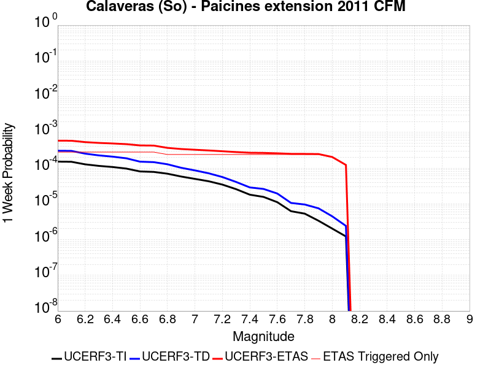 | 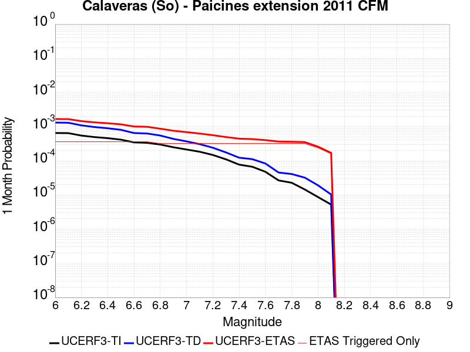 | 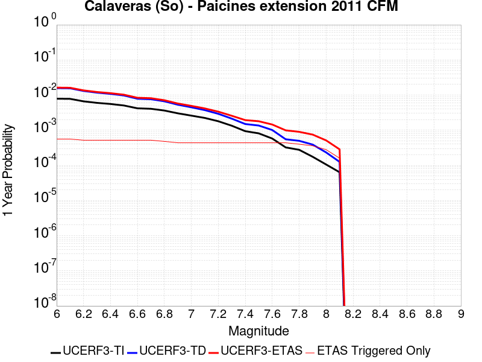 |

| Magnitude | 1 wk TI Prob | 1 wk TD Prob | 1 wk ETAS Prob | 1 wk ETAS/TD Gain | 1 wk ETAS Triggered Only | 1 mo TI Prob | 1 mo TD Prob | 1 mo ETAS Prob | 1 mo ETAS/TD Gain | 1 mo ETAS Triggered Only | 1 yr TI Prob | 1 yr TD Prob | 1 yr ETAS Prob | 1 yr ETAS/TD Gain | 1 yr ETAS Triggered Only |
|-----|-----|-----|-----|-----|-----|-----|-----|-----|-----|-----|-----|-----|-----|-----|-----|
| 6.0 | 1.5183659E-4 | 3.058916E-4 | 5.858059E-4 | 1.915077 | 2.8E-4 | 6.5056595E-4 | 0.0013097163 | 0.0016692447 | 1.2745087 | 3.6E-4 | 0.007891912 | 0.015730867 | 0.016282057 | 1.0350388 | 5.6E-4 |
| 6.1 | 1.5024997E-4 | 3.028294E-4 | 5.827446E-4 | 1.924333 | 2.8E-4 | 6.437695E-4 | 0.0012966117 | 0.001656145 | 1.2772868 | 3.6E-4 | 0.0078097614 | 0.015574093 | 0.016125372 | 1.0353972 | 5.6E-4 |
| 6.2 | 1.2743923E-4 | 2.5378828E-4 | 5.337172E-4 | 2.1030018 | 2.8E-4 | 5.460538E-4 | 0.0010868111 | 0.0014464199 | 1.3308843 | 3.6E-4 | 0.0066279583 | 0.013080635 | 0.013593834 | 1.0392334 | 5.2E-4 |
| 6.3 | 1.1525114E-4 | 2.266418E-4 | 5.0657836E-4 | 2.2351496 | 2.8E-4 | 4.9383997E-4 | 9.706734E-4 | 0.001330324 | 1.3705165 | 3.6E-4 | 0.0059959386 | 0.011701727 | 0.012215642 | 1.0439179 | 5.2E-4 |
| 6.4 | 1.07200925E-4 | 2.0905094E-4 | 4.889924E-4 | 2.3391066 | 2.8E-4 | 4.5935164E-4 | 8.953991E-4 | 0.0012550767 | 1.4016954 | 3.6E-4 | 0.0055782744 | 0.010806446 | 0.011320827 | 1.0475994 | 5.2E-4 |
| 6.5 | 9.69631E-5 | 1.8797735E-4 | 4.6792472E-4 | 2.4892612 | 2.8E-4 | 4.1548995E-4 | 8.0519065E-4 | 0.0011649007 | 1.4467391 | 3.6E-4 | 0.0050468626 | 0.009727674 | 0.010242615 | 1.0529357 | 5.2E-4 |
| 6.6 | 8.0552316E-5 | 1.5134095E-4 | 4.3129857E-4 | 2.849847 | 2.8E-4 | 3.4517853E-4 | 6.4840337E-4 | 0.00100817 | 1.55485 | 3.6E-4 | 0.0041944524 | 0.007859206 | 0.008375119 | 1.0656445 | 5.2E-4 |
| 6.7 | 7.815757E-5 | 1.4674113E-4 | 4.2670005E-4 | 2.907842 | 2.8E-4 | 3.34918E-4 | 6.2870386E-4 | 9.884775E-4 | 1.5722467 | 3.6E-4 | 0.004070005 | 0.00762175 | 0.008137787 | 1.0677058 | 5.2E-4 |
| 6.8 | 6.965264E-5 | 1.278175E-4 | 3.6778682E-4 | 2.877437 | 2.4E-4 | 2.9847719E-4 | 5.476545E-4 | 8.6747925E-4 | 1.58399 | 3.2E-4 | 0.0036279052 | 0.0066440827 | 0.0071208933 | 1.0717647 | 4.8E-4 |
| 6.9 | 5.8000453E-5 | 1.0197004E-4 | 3.4194556E-4 | 3.3533924 | 2.4E-4 | 2.4854968E-4 | 4.3694186E-4 | 7.5680204E-4 | 1.7320429 | 3.2E-4 | 0.0030218933 | 0.005306889 | 0.005744554 | 1.0824711 | 4.4E-4 |
| 7.0 | 4.9865852E-5 | 8.614713E-5 | 3.2612644E-4 | 3.7856917 | 2.4E-4 | 2.1369329E-4 | 3.691502E-4 | 6.890321E-4 | 1.8665358 | 3.2E-4 | 0.0025986114 | 0.0044852314 | 0.004923258 | 1.0976597 | 4.4E-4 |
| 7.1 | 4.283875E-5 | 7.154534E-5 | 3.1152816E-4 | 4.354276 | 2.4E-4 | 1.8358172E-4 | 3.0658717E-4 | 6.2648905E-4 | 2.043429 | 3.2E-4 | 0.0022328163 | 0.0037263667 | 0.0041647274 | 1.1176375 | 4.4E-4 |
| 7.2 | 3.450115E-5 | 5.6180077E-5 | 2.961666E-4 | 5.271737 | 2.4E-4 | 1.478537E-4 | 2.4074971E-4 | 5.6067266E-4 | 2.3288612 | 3.2E-4 | 0.0017986323 | 0.0029272172 | 0.0033659292 | 1.1498734 | 4.4E-4 |
| 7.3 | 2.5709045E-5 | 4.092334E-5 | 2.8091352E-4 | 6.864384 | 2.4E-4 | 1.1017697E-4 | 1.7537405E-4 | 4.953179E-4 | 2.8243513 | 3.2E-4 | 0.0013405791 | 0.0021331052 | 0.0025721667 | 1.205832 | 4.4E-4 |
| 7.4 | 1.8003093E-5 | 2.8743207E-5 | 2.687363E-4 | 9.349559 | 2.4E-4 | 7.715383E-5 | 1.2317937E-4 | 4.4313996E-4 | 3.5975177 | 3.2E-4 | 9.3894306E-4 | 0.0014986794 | 0.00193802 | 1.2931519 | 4.4E-4 |
| 7.5 | 1.5595824E-5 | 2.6044754E-5 | 2.660385E-4 | 10.214667 | 2.4E-4 | 6.683753E-5 | 1.1161561E-4 | 4.315799E-4 | 3.8666625 | 3.2E-4 | 8.134431E-4 | 0.0013580752 | 0.0017974777 | 1.323548 | 4.4E-4 |
| 7.6 | 1.1110309E-5 | 1.9413746E-5 | 2.5940908E-4 | 13.362134 | 2.4E-4 | 4.761474E-5 | 8.319912E-5 | 4.031725E-4 | 4.8458743 | 3.2E-4 | 5.795553E-4 | 0.00101248 | 0.0014520345 | 1.4341365 | 4.4E-4 |
| 7.7 | 6.2140443E-6 | 1.0582229E-5 | 2.505797E-4 | 23.679293 | 2.4E-4 | 2.6631347E-5 | 4.5351622E-5 | 3.653371E-4 | 8.055657 | 3.2E-4 | 3.241884E-4 | 5.520162E-4 | 9.917733E-4 | 1.796638 | 4.4E-4 |
| 7.8 | 5.305533E-6 | 9.562843E-6 | 2.4956054E-4 | 26.096899 | 2.4E-4 | 2.27378E-5 | 4.098297E-5 | 3.6096986E-4 | 8.807801 | 3.2E-4 | 2.7679754E-4 | 4.988535E-4 | 8.98654E-4 | 1.8014386 | 4.0E-4 |
| 7.9 | 3.363505E-6 | 7.481766E-6 | 2.4747997E-4 | 33.077747 | 2.4E-4 | 1.4414942E-5 | 3.2064316E-5 | 3.5205405E-4 | 10.979621 | 3.2E-4 | 1.7548777E-4 | 3.9031322E-4 | 7.501727E-4 | 1.9219762 | 3.6E-4 |
| 8.0 | 2.0271132E-6 | 4.46918E-6 | 2.0446829E-4 | 45.75074 | 2.0E-4 | 8.687599E-6 | 1.9153487E-5 | 2.591489E-4 | 13.530115 | 2.4E-4 | 1.05766376E-4 | 2.3316882E-4 | 5.1310356E-4 | 2.2005668 | 2.8E-4 |
| 8.1 | 1.2206116E-6 | 2.4070437E-6 | 1.2240675E-4 | 50.853565 | 1.2E-4 | 5.2311816E-6 | 1.0315861E-5 | 1.703142E-4 | 16.509937 | 1.6E-4 | 6.3687774E-5 | 1.255884E-4 | 2.855683E-4 | 2.273843 | 1.6E-4 |

## Santa Susana alt 1
*[(top)](#table-of-contents)*

| 1 Week | 1 Month | 1 Year |
|-----|-----|-----|
| 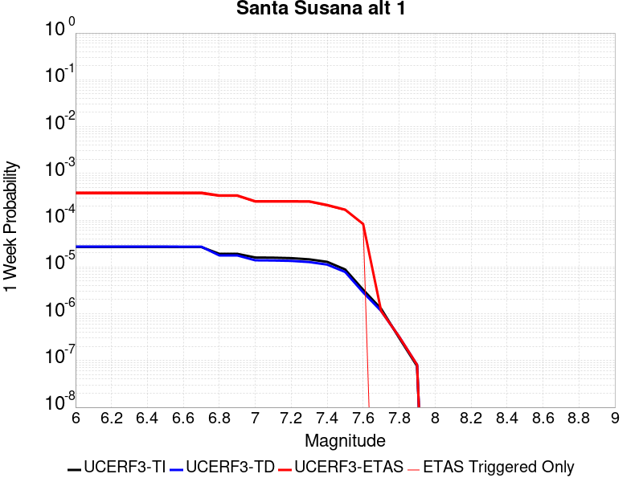 |  | 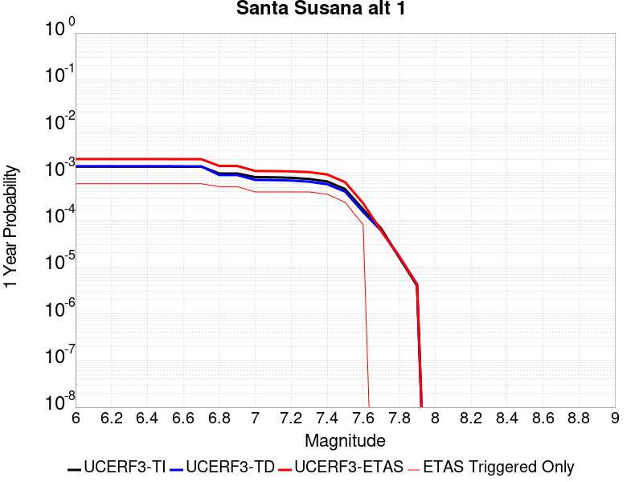 |

| Magnitude | 1 wk TI Prob | 1 wk TD Prob | 1 wk ETAS Prob | 1 wk ETAS/TD Gain | 1 wk ETAS Triggered Only | 1 mo TI Prob | 1 mo TD Prob | 1 mo ETAS Prob | 1 mo ETAS/TD Gain | 1 mo ETAS Triggered Only | 1 yr TI Prob | 1 yr TD Prob | 1 yr ETAS Prob | 1 yr ETAS/TD Gain | 1 yr ETAS Triggered Only |
|-----|-----|-----|-----|-----|-----|-----|-----|-----|-----|-----|-----|-----|-----|-----|-----|
| 6.0 | 2.674877E-5 | 2.7220398E-5 | 3.872106E-4 | 14.225017 | 3.6E-4 | 1.1463255E-4 | 1.16654264E-4 | 5.5660296E-4 | 4.7713895 | 4.4E-4 | 0.0013947578 | 0.0014194542 | 0.0020186026 | 1.4220977 | 6.0E-4 |
| 6.1 | 2.674877E-5 | 2.7220398E-5 | 3.872106E-4 | 14.225017 | 3.6E-4 | 1.1463255E-4 | 1.16654264E-4 | 5.5660296E-4 | 4.7713895 | 4.4E-4 | 0.0013947578 | 0.0014194542 | 0.0020186026 | 1.4220977 | 6.0E-4 |
| 6.2 | 2.674877E-5 | 2.7220398E-5 | 3.872106E-4 | 14.225017 | 3.6E-4 | 1.1463255E-4 | 1.16654264E-4 | 5.5660296E-4 | 4.7713895 | 4.4E-4 | 0.0013947578 | 0.0014194542 | 0.0020186026 | 1.4220977 | 6.0E-4 |
| 6.3 | 2.674877E-5 | 2.7220398E-5 | 3.872106E-4 | 14.225017 | 3.6E-4 | 1.1463255E-4 | 1.16654264E-4 | 5.5660296E-4 | 4.7713895 | 4.4E-4 | 0.0013947578 | 0.0014194542 | 0.0020186026 | 1.4220977 | 6.0E-4 |
| 6.4 | 2.674877E-5 | 2.7220398E-5 | 3.872106E-4 | 14.225017 | 3.6E-4 | 1.1463255E-4 | 1.16654264E-4 | 5.5660296E-4 | 4.7713895 | 4.4E-4 | 0.0013947578 | 0.0014194542 | 0.0020186026 | 1.4220977 | 6.0E-4 |
| 6.5 | 2.674877E-5 | 2.7220398E-5 | 3.872106E-4 | 14.225017 | 3.6E-4 | 1.1463255E-4 | 1.16654264E-4 | 5.5660296E-4 | 4.7713895 | 4.4E-4 | 0.0013947578 | 0.0014194542 | 0.0020186026 | 1.4220977 | 6.0E-4 |
| 6.6 | 2.6647976E-5 | 2.7096641E-5 | 3.8708688E-4 | 14.285419 | 3.6E-4 | 1.14200615E-4 | 1.16123934E-4 | 5.5607286E-4 | 4.788615 | 4.4E-4 | 0.0013895056 | 0.0014130058 | 0.002012158 | 1.4240267 | 6.0E-4 |
| 6.7 | 2.6647976E-5 | 2.7096641E-5 | 3.8708688E-4 | 14.285419 | 3.6E-4 | 1.14200615E-4 | 1.16123934E-4 | 5.5607286E-4 | 4.788615 | 4.4E-4 | 0.0013895056 | 0.0014130058 | 0.002012158 | 1.4240267 | 6.0E-4 |
| 6.8 | 1.9073179E-5 | 1.7651679E-5 | 3.3764602E-4 | 19.128267 | 3.2E-4 | 8.1739636E-5 | 7.564796E-5 | 4.756177E-4 | 6.287251 | 4.0E-4 | 9.947256E-4 | 9.2064287E-4 | 0.0014401642 | 1.5643027 | 5.2E-4 |
| 6.9 | 1.9041876E-5 | 1.7633802E-5 | 3.3762815E-4 | 19.146646 | 3.2E-4 | 8.160549E-5 | 7.557135E-5 | 4.755411E-4 | 6.2926116 | 4.0E-4 | 9.930939E-4 | 9.197109E-4 | 0.0014392327 | 1.564875 | 5.2E-4 |
| 7.0 | 1.5917482E-5 | 1.3875512E-5 | 2.538722E-4 | 18.29642 | 2.4E-4 | 6.8215995E-5 | 5.9465154E-5 | 3.7944614E-4 | 6.380983 | 3.2E-4 | 8.302132E-4 | 7.237524E-4 | 0.0011234629 | 1.5522752 | 4.0E-4 |
| 7.1 | 1.577788E-5 | 1.3755467E-5 | 2.5375217E-4 | 18.447369 | 2.4E-4 | 6.761774E-5 | 5.8950696E-5 | 3.7893184E-4 | 6.4279447 | 3.2E-4 | 8.2293496E-4 | 7.1749307E-4 | 0.0011172061 | 1.5570967 | 4.0E-4 |
| 7.2 | 1.5416446E-5 | 1.34814145E-5 | 2.5347818E-4 | 18.802046 | 2.4E-4 | 6.606882E-5 | 5.7776237E-5 | 3.7775774E-4 | 6.538289 | 3.2E-4 | 8.0409093E-4 | 7.032033E-4 | 0.001102922 | 1.5684255 | 4.0E-4 |
| 7.3 | 1.4534083E-5 | 1.2728859E-5 | 2.5272582E-4 | 19.854553 | 2.4E-4 | 6.228744E-5 | 5.4551136E-5 | 3.7453367E-4 | 6.8657355 | 3.2E-4 | 7.580857E-4 | 6.6396216E-4 | 0.0010636966 | 1.602044 | 4.0E-4 |
| 7.4 | 1.2858995E-5 | 1.1239539E-5 | 2.1123729E-4 | 18.794123 | 2.0E-4 | 5.5108816E-5 | 4.816859E-5 | 3.281551E-4 | 6.812637 | 2.8E-4 | 6.7074323E-4 | 5.862987E-4 | 9.4608765E-4 | 1.6136615 | 3.6E-4 |
| 7.5 | 8.827668E-6 | 7.813652E-6 | 1.678124E-4 | 21.47682 | 1.6E-4 | 3.7832317E-5 | 3.3486664E-5 | 2.7347862E-4 | 8.166792 | 2.4E-4 | 4.605111E-4 | 4.0762633E-4 | 6.475285E-4 | 1.5885345 | 2.4E-4 |
| 7.6 | 3.2533426E-6 | 2.872528E-6 | 8.28723E-5 | 28.849953 | 8.0E-5 | 1.3942822E-5 | 1.2310778E-5 | 9.230979E-5 | 7.4982905 | 8.0E-5 | 1.6974064E-4 | 1.498738E-4 | 2.298618E-4 | 1.5337025 | 8.0E-5 |
| 7.7 | 1.2751709E-6 | 1.1493797E-6 | 1.1493797E-6 | 1.0 | 0.0 | 5.4650063E-6 | 4.9259042E-6 | 4.9259042E-6 | 1.0 | 0.0 | 6.653442E-5 | 5.9971328E-5 | 5.9971328E-5 | 1.0 | 0.0 |
| 7.8 | 3.067544E-7 | 3.2407712E-7 | 3.2407712E-7 | 1.0 | 0.0 | 1.3146611E-6 | 1.3889013E-6 | 1.3889013E-6 | 1.0 | 0.0 | 1.600588E-5 | 1.6909753E-5 | 1.6909753E-5 | 1.0 | 0.0 |
| 7.9 | 7.622999E-8 | 8.0897195E-8 | 8.0897195E-8 | 1.0 | 0.0 | 3.2669993E-7 | 3.4670222E-7 | 3.4670222E-7 | 1.0 | 0.0 | 3.977564E-6 | 4.2210936E-6 | 4.2210936E-6 | 1.0 | 0.0 |

## San Jacinto (Coyote Creek)
*[(top)](#table-of-contents)*

| 1 Week | 1 Month | 1 Year |
|-----|-----|-----|
| 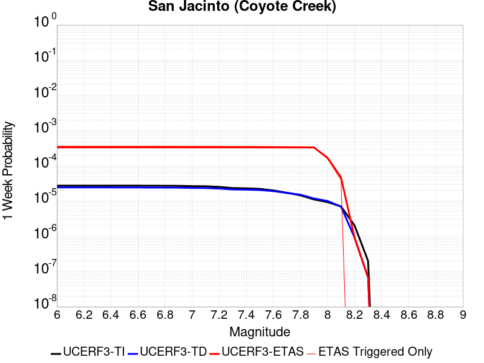 | 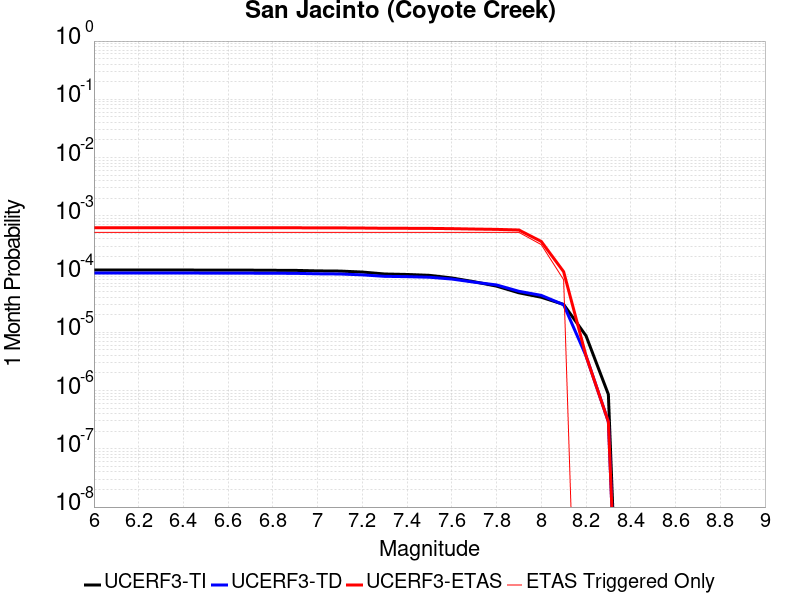 | 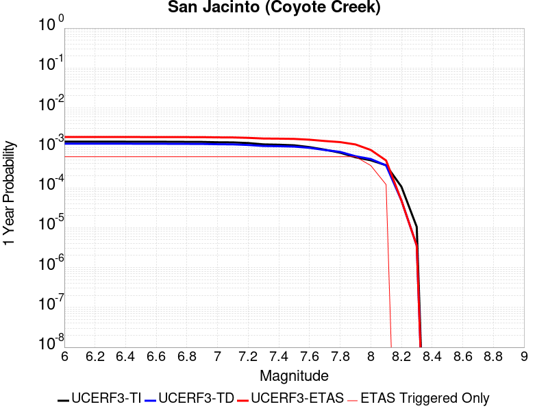 |

| Magnitude | 1 wk TI Prob | 1 wk TD Prob | 1 wk ETAS Prob | 1 wk ETAS/TD Gain | 1 wk ETAS Triggered Only | 1 mo TI Prob | 1 mo TD Prob | 1 mo ETAS Prob | 1 mo ETAS/TD Gain | 1 mo ETAS Triggered Only | 1 yr TI Prob | 1 yr TD Prob | 1 yr ETAS Prob | 1 yr ETAS/TD Gain | 1 yr ETAS Triggered Only |
|-----|-----|-----|-----|-----|-----|-----|-----|-----|-----|-----|-----|-----|-----|-----|-----|
| 6.0 | 2.7374346E-5 | 2.4356477E-5 | 3.443487E-4 | 14.137869 | 3.2E-4 | 1.1731335E-4 | 1.04380735E-4 | 6.2432647E-4 | 5.981242 | 5.2E-4 | 0.0014273542 | 0.0012700972 | 0.0018693352 | 1.4718047 | 6.0E-4 |
| 6.1 | 2.7374346E-5 | 2.4356477E-5 | 3.443487E-4 | 14.137869 | 3.2E-4 | 1.1731335E-4 | 1.04380735E-4 | 6.2432647E-4 | 5.981242 | 5.2E-4 | 0.0014273542 | 0.0012700972 | 0.0018693352 | 1.4718047 | 6.0E-4 |
| 6.2 | 2.7374346E-5 | 2.4356477E-5 | 3.443487E-4 | 14.137869 | 3.2E-4 | 1.1731335E-4 | 1.04380735E-4 | 6.2432647E-4 | 5.981242 | 5.2E-4 | 0.0014273542 | 0.0012700972 | 0.0018693352 | 1.4718047 | 6.0E-4 |
| 6.3 | 2.7374346E-5 | 2.4356477E-5 | 3.443487E-4 | 14.137869 | 3.2E-4 | 1.1731335E-4 | 1.04380735E-4 | 6.2432647E-4 | 5.981242 | 5.2E-4 | 0.0014273542 | 0.0012700972 | 0.0018693352 | 1.4718047 | 6.0E-4 |
| 6.4 | 2.7374346E-5 | 2.4356477E-5 | 3.443487E-4 | 14.137869 | 3.2E-4 | 1.1731335E-4 | 1.04380735E-4 | 6.2432647E-4 | 5.981242 | 5.2E-4 | 0.0014273542 | 0.0012700972 | 0.0018693352 | 1.4718047 | 6.0E-4 |
| 6.5 | 2.7282445E-5 | 2.4242463E-5 | 3.442347E-4 | 14.199659 | 3.2E-4 | 1.16919524E-4 | 1.0389215E-4 | 6.238381E-4 | 6.0046706 | 5.2E-4 | 0.0014225657 | 0.0012641556 | 0.0018633971 | 1.4740251 | 6.0E-4 |
| 6.6 | 2.7282445E-5 | 2.4242463E-5 | 3.442347E-4 | 14.199659 | 3.2E-4 | 1.16919524E-4 | 1.0389215E-4 | 6.238381E-4 | 6.0046706 | 5.2E-4 | 0.0014225657 | 0.0012641556 | 0.0018633971 | 1.4740251 | 6.0E-4 |
| 6.7 | 2.7216198E-5 | 2.4167522E-5 | 3.4415978E-4 | 14.24059 | 3.2E-4 | 1.1663563E-4 | 1.03571E-4 | 6.2351715E-4 | 6.0201902 | 5.2E-4 | 0.0014191137 | 0.0012602502 | 0.001859494 | 1.4754959 | 6.0E-4 |
| 6.8 | 2.7078617E-5 | 2.4084618E-5 | 3.4407692E-4 | 14.286169 | 3.2E-4 | 1.1604605E-4 | 1.0321572E-4 | 6.23162E-4 | 6.0374722 | 5.2E-4 | 0.001411945 | 0.0012559297 | 0.0018551761 | 1.4771338 | 6.0E-4 |
| 6.9 | 2.6982952E-5 | 2.4003995E-5 | 3.439963E-4 | 14.330793 | 3.2E-4 | 1.15636096E-4 | 1.02870225E-4 | 6.2281673E-4 | 6.0543923 | 5.2E-4 | 0.0014069602 | 0.0012517282 | 0.0018509771 | 1.4787374 | 6.0E-4 |
| 7.0 | 2.6449972E-5 | 2.3580524E-5 | 3.43573E-4 | 14.570202 | 3.2E-4 | 1.1335209E-4 | 1.01055484E-4 | 6.210029E-4 | 6.145168 | 5.2E-4 | 0.001379188 | 0.0012296587 | 0.0018289209 | 1.4873402 | 6.0E-4 |
| 7.1 | 2.6257849E-5 | 2.3406348E-5 | 3.4339886E-4 | 14.6711855 | 3.2E-4 | 1.1252879E-4 | 1.0030907E-4 | 6.2025693E-4 | 6.1834574 | 5.2E-4 | 0.0013691769 | 0.0012205814 | 0.001819849 | 1.4909691 | 6.0E-4 |
| 7.2 | 2.5270041E-5 | 2.2599575E-5 | 3.4259234E-4 | 15.159238 | 3.2E-4 | 1.0829568E-4 | 9.685174E-5 | 6.168014E-4 | 6.368511 | 5.2E-4 | 0.0013177024 | 0.0011785345 | 0.0017778274 | 1.5085069 | 6.0E-4 |
| 7.3 | 2.339701E-5 | 2.1328571E-5 | 3.4132175E-4 | 16.003029 | 3.2E-4 | 1.0026905E-4 | 9.1404974E-5 | 6.1135745E-4 | 6.6884484 | 5.2E-4 | 0.001220092 | 0.0011122895 | 0.0017116221 | 1.5388279 | 6.0E-4 |
| 7.4 | 2.296333E-5 | 2.1058198E-5 | 3.4105146E-4 | 16.195662 | 3.2E-4 | 9.841056E-5 | 9.0246314E-5 | 6.101994E-4 | 6.761488 | 5.2E-4 | 0.0011974899 | 0.0010981972 | 0.0016975382 | 1.54575 | 6.0E-4 |
| 7.5 | 2.2188895E-5 | 2.0579188E-5 | 3.405726E-4 | 16.549372 | 3.2E-4 | 9.50918E-5 | 8.819355E-5 | 6.081477E-4 | 6.895603 | 5.2E-4 | 0.0011571277 | 0.0010732296 | 0.0016725856 | 1.5584602 | 6.0E-4 |
| 7.6 | 2.0013189E-5 | 1.9158566E-5 | 3.3915244E-4 | 17.70239 | 3.2E-4 | 8.5767984E-5 | 8.210557E-5 | 6.0206285E-4 | 7.33279 | 5.2E-4 | 0.001043725 | 9.991786E-4 | 0.0015985791 | 1.5998932 | 6.0E-4 |
| 7.7 | 1.7230794E-5 | 1.6934096E-5 | 3.3692867E-4 | 19.896467 | 3.2E-4 | 7.384417E-5 | 7.2572686E-5 | 5.9253495E-4 | 8.16471 | 5.2E-4 | 8.986819E-4 | 8.8321505E-4 | 0.0014826851 | 1.6787362 | 6.0E-4 |
| 7.8 | 1.4478809E-5 | 1.5174756E-5 | 3.351699E-4 | 22.087334 | 3.2E-4 | 6.205057E-5 | 6.5033055E-5 | 5.849992E-4 | 8.995414 | 5.2E-4 | 7.552038E-4 | 7.914904E-4 | 0.0013910156 | 1.7574635 | 6.0E-4 |
| 7.9 | 1.1114467E-5 | 1.180864E-5 | 3.3180485E-4 | 28.098482 | 3.2E-4 | 4.7632562E-5 | 5.060748E-5 | 5.705812E-4 | 11.274641 | 5.2E-4 | 5.797721E-4 | 6.1597244E-4 | 0.0012156029 | 1.9734695 | 6.0E-4 |
| 8.0 | 9.327402E-6 | 1.0048055E-5 | 1.7004645E-4 | 16.923319 | 1.6E-4 | 3.9973966E-5 | 4.3062384E-5 | 3.630486E-4 | 8.430759 | 3.2E-4 | 4.8657437E-4 | 5.24159E-4 | 8.839703E-4 | 1.6864545 | 3.6E-4 |
| 8.1 | 7.0235833E-6 | 6.9387575E-6 | 4.693848E-5 | 6.764681 | 4.0E-5 | 3.0100724E-5 | 2.9737195E-5 | 1.09734814E-4 | 3.6901536 | 8.0E-5 | 3.664147E-4 | 3.6199074E-4 | 4.819473E-4 | 1.3313802 | 1.2E-4 |
| 8.2 | 2.0358202E-6 | 9.2101675E-7 | 9.2101675E-7 | 1.0 | 0.0 | 8.724915E-6 | 3.947209E-6 | 3.947209E-6 | 1.0 | 0.0 | 1.06220665E-4 | 4.805623E-5 | 4.805623E-5 | 1.0 | 0.0 |
| 8.3 | 2.0051264E-7 | 6.7996226E-8 | 6.7996226E-8 | 1.0 | 0.0 | 8.5933965E-7 | 2.9141236E-7 | 2.9141236E-7 | 1.0 | 0.0 | 1.046241E-5 | 3.5479404E-6 | 3.5479404E-6 | 1.0 | 0.0 |

## Pine Mtn
*[(top)](#table-of-contents)*

| 1 Week | 1 Month | 1 Year |
|-----|-----|-----|
| 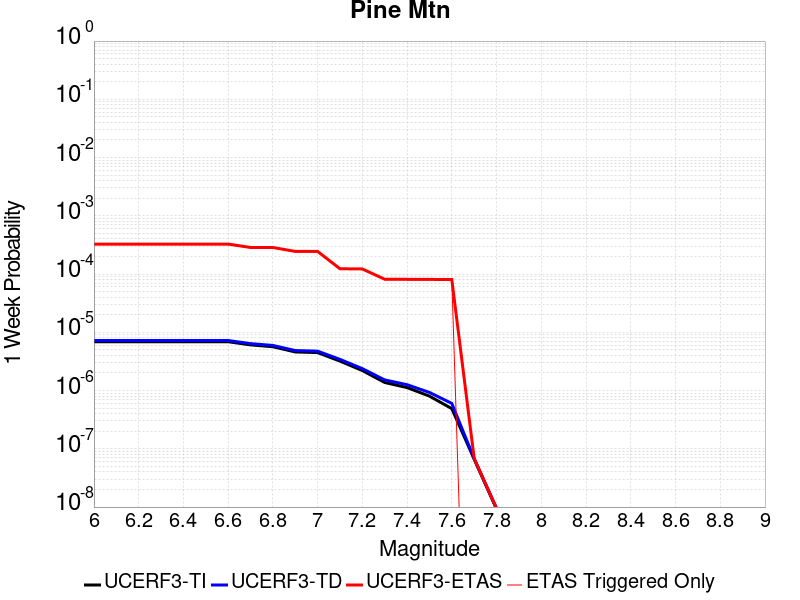 | 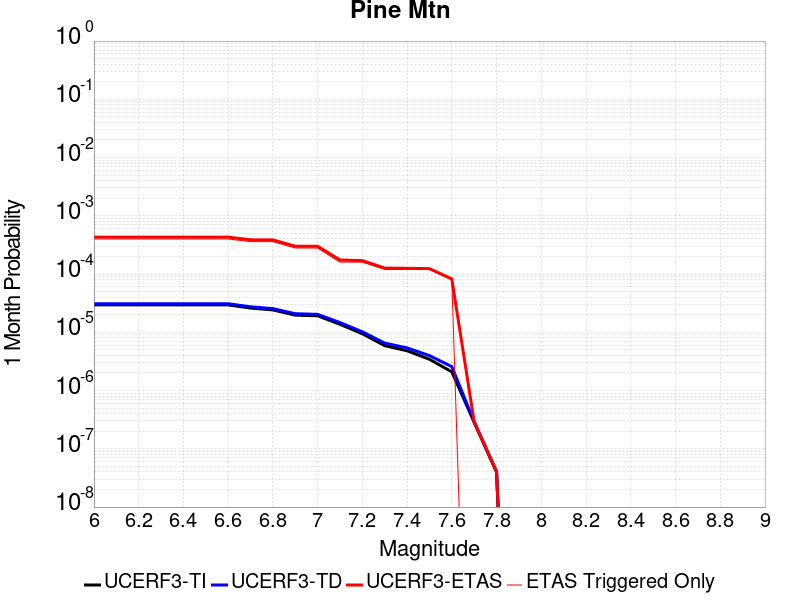 | 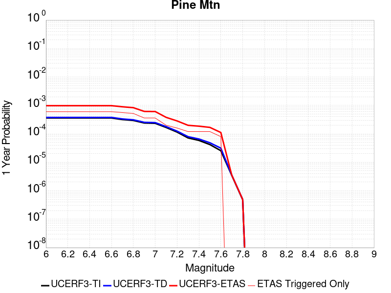 |

| Magnitude | 1 wk TI Prob | 1 wk TD Prob | 1 wk ETAS Prob | 1 wk ETAS/TD Gain | 1 wk ETAS Triggered Only | 1 mo TI Prob | 1 mo TD Prob | 1 mo ETAS Prob | 1 mo ETAS/TD Gain | 1 mo ETAS Triggered Only | 1 yr TI Prob | 1 yr TD Prob | 1 yr ETAS Prob | 1 yr ETAS/TD Gain | 1 yr ETAS Triggered Only |
|-----|-----|-----|-----|-----|-----|-----|-----|-----|-----|-----|-----|-----|-----|-----|-----|
| 6.0 | 6.894797E-6 | 7.22808E-6 | 3.2722577E-4 | 45.271465 | 3.2E-4 | 2.9548795E-5 | 3.0977135E-5 | 4.3096475E-4 | 13.91235 | 4.0E-4 | 3.596972E-4 | 3.7708433E-4 | 9.768581E-4 | 2.590556 | 6.0E-4 |
| 6.1 | 6.894797E-6 | 7.22808E-6 | 3.2722577E-4 | 45.271465 | 3.2E-4 | 2.9548795E-5 | 3.0977135E-5 | 4.3096475E-4 | 13.91235 | 4.0E-4 | 3.596972E-4 | 3.7708433E-4 | 9.768581E-4 | 2.590556 | 6.0E-4 |
| 6.2 | 6.894797E-6 | 7.22808E-6 | 3.2722577E-4 | 45.271465 | 3.2E-4 | 2.9548795E-5 | 3.0977135E-5 | 4.3096475E-4 | 13.91235 | 4.0E-4 | 3.596972E-4 | 3.7708433E-4 | 9.768581E-4 | 2.590556 | 6.0E-4 |
| 6.3 | 6.894797E-6 | 7.22808E-6 | 3.2722577E-4 | 45.271465 | 3.2E-4 | 2.9548795E-5 | 3.0977135E-5 | 4.3096475E-4 | 13.91235 | 4.0E-4 | 3.596972E-4 | 3.7708433E-4 | 9.768581E-4 | 2.590556 | 6.0E-4 |
| 6.4 | 6.894797E-6 | 7.22808E-6 | 3.2722577E-4 | 45.271465 | 3.2E-4 | 2.9548795E-5 | 3.0977135E-5 | 4.3096475E-4 | 13.91235 | 4.0E-4 | 3.596972E-4 | 3.7708433E-4 | 9.768581E-4 | 2.590556 | 6.0E-4 |
| 6.5 | 6.894797E-6 | 7.22808E-6 | 3.2722577E-4 | 45.271465 | 3.2E-4 | 2.9548795E-5 | 3.0977135E-5 | 4.3096475E-4 | 13.91235 | 4.0E-4 | 3.596972E-4 | 3.7708433E-4 | 9.768581E-4 | 2.590556 | 6.0E-4 |
| 6.6 | 6.894797E-6 | 7.22808E-6 | 3.2722577E-4 | 45.271465 | 3.2E-4 | 2.9548795E-5 | 3.0977135E-5 | 4.3096475E-4 | 13.91235 | 4.0E-4 | 3.596972E-4 | 3.7708433E-4 | 9.768581E-4 | 2.590556 | 6.0E-4 |
| 6.7 | 6.0867933E-6 | 6.3996613E-6 | 2.8639787E-4 | 44.752033 | 2.8E-4 | 2.6085996E-5 | 2.7426844E-5 | 3.8741698E-4 | 14.125466 | 3.6E-4 | 3.1755073E-4 | 3.3387286E-4 | 8.936859E-4 | 2.6767251 | 5.6E-4 |
| 6.8 | 5.6530425E-6 | 5.9530994E-6 | 2.8595142E-4 | 48.034046 | 2.8E-4 | 2.42271E-5 | 2.5513044E-5 | 3.8550387E-4 | 15.110069 | 3.6E-4 | 2.94925E-4 | 3.105791E-4 | 8.304176E-4 | 2.6737716 | 5.2E-4 |
| 6.9 | 4.6015225E-6 | 4.866214E-6 | 2.4486505E-4 | 50.319412 | 2.4E-4 | 1.9720663E-5 | 2.0855045E-5 | 3.008492E-4 | 14.425728 | 2.8E-4 | 2.4007261E-4 | 2.5388206E-4 | 6.1379065E-4 | 2.4176214 | 3.6E-4 |
| 7.0 | 4.4875965E-6 | 4.7498447E-6 | 2.447487E-4 | 51.52773 | 2.4E-4 | 1.9232413E-5 | 2.0356327E-5 | 3.0035063E-4 | 14.754658 | 2.8E-4 | 2.3412947E-4 | 2.4781155E-4 | 6.077223E-4 | 2.4523568 | 3.6E-4 |
| 7.1 | 3.203907E-6 | 3.4316613E-6 | 1.2343125E-4 | 35.968365 | 1.2E-4 | 1.3730958E-5 | 1.4707041E-5 | 1.7470469E-4 | 11.878983 | 1.6E-4 | 1.6716159E-4 | 1.7904417E-4 | 3.790084E-4 | 2.1168427 | 2.0E-4 |
| 7.2 | 2.2060601E-6 | 2.3803232E-6 | 1.2238004E-4 | 51.413204 | 1.2E-4 | 9.4545085E-6 | 1.0201347E-5 | 1.7019971E-4 | 16.684042 | 1.6E-4 | 1.15102564E-4 | 1.2419479E-4 | 2.8417492E-4 | 2.2881389 | 1.6E-4 |
| 7.3 | 1.3765207E-6 | 1.5233043E-6 | 8.152318E-5 | 53.517334 | 8.0E-5 | 5.899361E-6 | 6.528431E-6 | 1.2652765E-4 | 19.38102 | 1.2E-4 | 7.182235E-5 | 7.9480844E-5 | 1.9947131E-4 | 2.509678 | 1.2E-4 |
| 7.4 | 1.1245983E-6 | 1.2601989E-6 | 8.12601E-5 | 64.48196 | 8.0E-5 | 4.819698E-6 | 5.400842E-6 | 1.254002E-4 | 23.218637 | 1.2E-4 | 5.8678244E-5 | 6.575335E-5 | 1.8574546E-4 | 2.824882 | 1.2E-4 |
| 7.5 | 8.031682E-7 | 9.290882E-7 | 8.0929014E-5 | 87.10585 | 8.0E-5 | 3.4421448E-6 | 3.9818005E-6 | 1.2398133E-4 | 31.137 | 1.2E-4 | 4.1907308E-5 | 4.8477414E-5 | 1.684716E-4 | 3.4752595 | 1.2E-4 |
| 7.6 | 4.8953444E-7 | 6.015368E-7 | 8.060149E-5 | 133.99263 | 8.0E-5 | 2.098003E-6 | 2.5780125E-6 | 8.2577804E-5 | 32.031578 | 8.0E-5 | 2.5542888E-5 | 3.13869E-5 | 1.1138439E-4 | 3.5487542 | 8.0E-5 |
| 7.7 | 6.634529E-8 | 6.7893666E-8 | 6.7893666E-8 | 1.0 | 0.0 | 2.843369E-7 | 2.9097282E-7 | 2.9097282E-7 | 1.0 | 0.0 | 3.4617963E-6 | 3.542589E-6 | 3.542589E-6 | 1.0 | 0.0 |
| 7.8 | 9.235578E-9 | 9.489462E-9 | 9.489462E-9 | 1.0 | 0.0 | 3.9581046E-8 | 4.066912E-8 | 4.066912E-8 | 1.0 | 0.0 | 4.818991E-7 | 4.951465E-7 | 4.951465E-7 | 1.0 | 0.0 |

## Lenwood-Lockhart-Old Woman Springs
*[(top)](#table-of-contents)*

| 1 Week | 1 Month | 1 Year |
|-----|-----|-----|
|  | 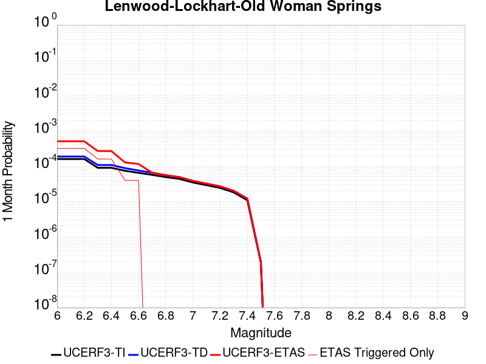 | 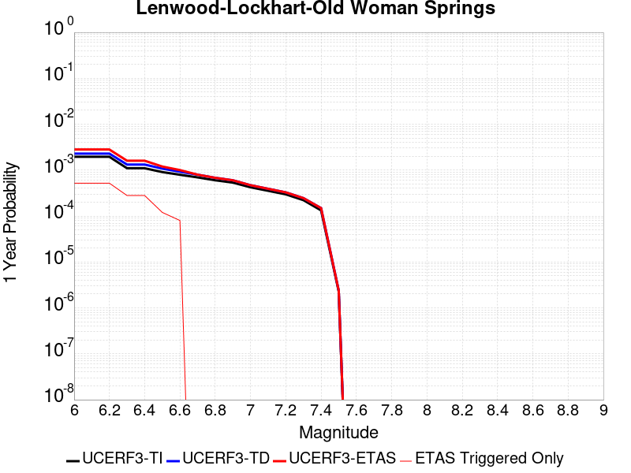 |

| Magnitude | 1 wk TI Prob | 1 wk TD Prob | 1 wk ETAS Prob | 1 wk ETAS/TD Gain | 1 wk ETAS Triggered Only | 1 mo TI Prob | 1 mo TD Prob | 1 mo ETAS Prob | 1 mo ETAS/TD Gain | 1 mo ETAS Triggered Only | 1 yr TI Prob | 1 yr TD Prob | 1 yr ETAS Prob | 1 yr ETAS/TD Gain | 1 yr ETAS Triggered Only |
|-----|-----|-----|-----|-----|-----|-----|-----|-----|-----|-----|-----|-----|-----|-----|-----|
| 6.0 | 3.744542E-5 | 4.3976295E-5 | 2.8396575E-4 | 6.457246 | 2.4E-4 | 1.604705E-4 | 1.884572E-4 | 5.083969E-4 | 2.6976783 | 3.2E-4 | 0.0019519776 | 0.002292224 | 0.002811032 | 1.2263339 | 5.2E-4 |
| 6.1 | 3.744542E-5 | 4.3976295E-5 | 2.8396575E-4 | 6.457246 | 2.4E-4 | 1.604705E-4 | 1.884572E-4 | 5.083969E-4 | 2.6976783 | 3.2E-4 | 0.0019519776 | 0.002292224 | 0.002811032 | 1.2263339 | 5.2E-4 |
| 6.2 | 3.744542E-5 | 4.3976295E-5 | 2.8396575E-4 | 6.457246 | 2.4E-4 | 1.604705E-4 | 1.884572E-4 | 5.083969E-4 | 2.6976783 | 3.2E-4 | 0.0019519776 | 0.002292224 | 0.002811032 | 1.2263339 | 5.2E-4 |
| 6.3 | 2.1079984E-5 | 2.5359855E-5 | 1.0535782E-4 | 4.154512 | 8.0E-5 | 9.0339665E-5 | 1.0868068E-4 | 2.6866328E-4 | 2.4720428 | 1.6E-4 | 0.0010993304 | 0.001322404 | 0.0016020339 | 1.2114556 | 2.8E-4 |
| 6.4 | 2.1079984E-5 | 2.5359855E-5 | 1.0535782E-4 | 4.154512 | 8.0E-5 | 9.0339665E-5 | 1.0868068E-4 | 2.6866328E-4 | 2.4720428 | 1.6E-4 | 0.0010993304 | 0.001322404 | 0.0016020339 | 1.2114556 | 2.8E-4 |
| 6.5 | 1.7397282E-5 | 2.0667581E-5 | 6.0666756E-5 | 2.9353583 | 4.0E-5 | 7.455765E-5 | 8.857241E-5 | 1.2856886E-4 | 1.4515679 | 4.0E-5 | 9.073613E-4 | 0.0010778473 | 0.001197718 | 1.111213 | 1.2E-4 |
| 6.6 | 1.52050325E-5 | 1.768411E-5 | 5.7683403E-5 | 3.2618775 | 4.0E-5 | 6.51628E-5 | 7.5786884E-5 | 1.15783856E-4 | 1.5277559 | 4.0E-5 | 7.9306826E-4 | 9.223226E-4 | 0.0010022488 | 1.0866575 | 8.0E-5 |
| 6.7 | 1.332523E-5 | 1.5268157E-5 | 1.5268157E-5 | 1.0 | 0.0 | 5.7106878E-5 | 6.543335E-5 | 6.543335E-5 | 1.0 | 0.0 | 6.950544E-4 | 7.9636567E-4 | 7.9636567E-4 | 1.0 | 0.0 |
| 6.8 | 1.1525329E-5 | 1.3034469E-5 | 1.3034469E-5 | 1.0 | 0.0 | 4.9393333E-5 | 5.5860837E-5 | 5.5860837E-5 | 1.0 | 0.0 | 6.011979E-4 | 6.798977E-4 | 6.798977E-4 | 1.0 | 0.0 |
| 6.9 | 1.0253909E-5 | 1.1517644E-5 | 1.1517644E-5 | 1.0 | 0.0 | 4.3944583E-5 | 4.936042E-5 | 4.936042E-5 | 1.0 | 0.0 | 5.3489394E-4 | 6.00801E-4 | 6.00801E-4 | 1.0 | 0.0 |
| 7.0 | 8.104563E-6 | 8.993927E-6 | 8.993927E-6 | 1.0 | 0.0 | 3.4733377E-5 | 3.8544847E-5 | 3.8544847E-5 | 1.0 | 0.0 | 4.2279682E-4 | 4.6918486E-4 | 4.6918486E-4 | 1.0 | 0.0 |
| 7.1 | 6.7986157E-6 | 7.518288E-6 | 7.518288E-6 | 1.0 | 0.0 | 2.91366E-5 | 3.2220847E-5 | 3.2220847E-5 | 1.0 | 0.0 | 3.5468035E-4 | 3.9222036E-4 | 3.9222036E-4 | 1.0 | 0.0 |
| 7.2 | 5.6893327E-6 | 6.2822814E-6 | 6.2822814E-6 | 1.0 | 0.0 | 2.4382627E-5 | 2.6923795E-5 | 2.6923795E-5 | 1.0 | 0.0 | 2.9681803E-4 | 3.277499E-4 | 3.277499E-4 | 1.0 | 0.0 |
| 7.3 | 4.253348E-6 | 4.7090152E-6 | 4.7090152E-6 | 1.0 | 0.0 | 1.8228506E-5 | 2.0181347E-5 | 2.0181347E-5 | 1.0 | 0.0 | 2.2190946E-4 | 2.4568205E-4 | 2.4568205E-4 | 1.0 | 0.0 |
| 7.4 | 2.5448119E-6 | 2.852325E-6 | 2.852325E-6 | 1.0 | 0.0 | 1.0906291E-5 | 1.2224203E-5 | 1.2224203E-5 | 1.0 | 0.0 | 1.3277601E-4 | 1.4882116E-4 | 1.4882116E-4 | 1.0 | 0.0 |
| 7.5 | 4.3706837E-8 | 4.5635893E-8 | 4.5635893E-8 | 1.0 | 0.0 | 1.8731501E-7 | 1.9558239E-7 | 1.9558239E-7 | 1.0 | 0.0 | 2.2805577E-6 | 2.3812136E-6 | 2.3812136E-6 | 1.0 | 0.0 |

## So Sierra Nevada
*[(top)](#table-of-contents)*

| 1 Week | 1 Month | 1 Year |
|-----|-----|-----|
| 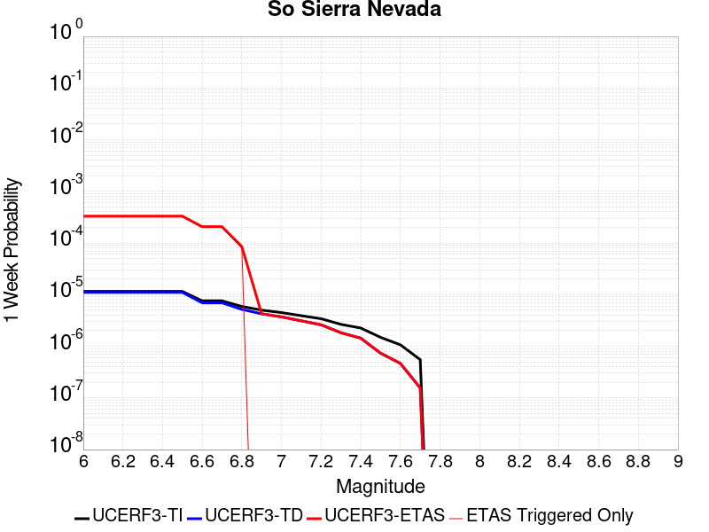 | 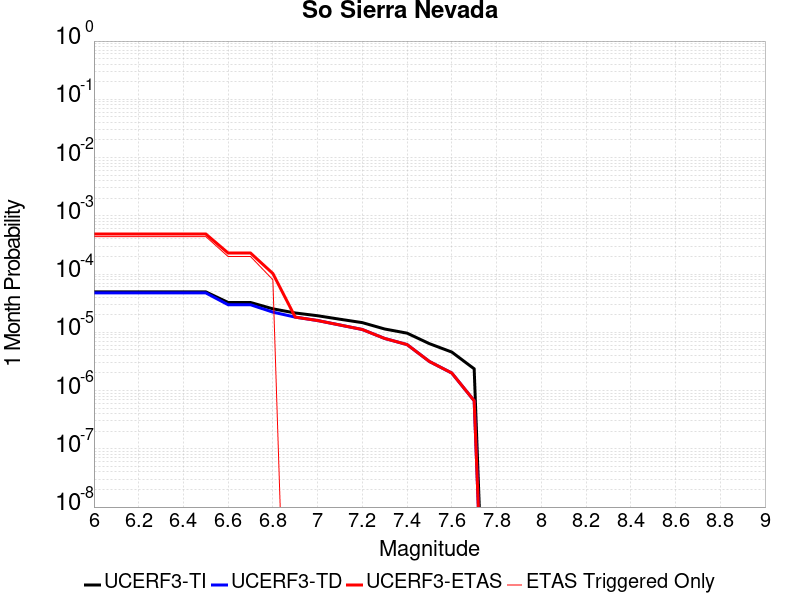 | 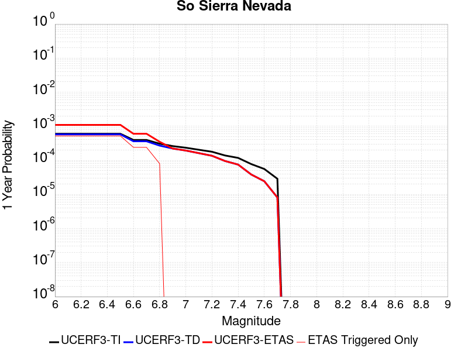 |

| Magnitude | 1 wk TI Prob | 1 wk TD Prob | 1 wk ETAS Prob | 1 wk ETAS/TD Gain | 1 wk ETAS Triggered Only | 1 mo TI Prob | 1 mo TD Prob | 1 mo ETAS Prob | 1 mo ETAS/TD Gain | 1 mo ETAS Triggered Only | 1 yr TI Prob | 1 yr TD Prob | 1 yr ETAS Prob | 1 yr ETAS/TD Gain | 1 yr ETAS Triggered Only |
|-----|-----|-----|-----|-----|-----|-----|-----|-----|-----|-----|-----|-----|-----|-----|-----|
| 6.0 | 1.15488665E-5 | 1.1081638E-5 | 3.310781E-4 | 29.876276 | 3.2E-4 | 4.9494203E-5 | 4.7491943E-5 | 4.8747106E-4 | 10.26429 | 4.4E-4 | 6.024253E-4 | 5.780738E-4 | 0.0010977732 | 1.8990191 | 5.2E-4 |
| 6.1 | 1.15488665E-5 | 1.1081638E-5 | 3.310781E-4 | 29.876276 | 3.2E-4 | 4.9494203E-5 | 4.7491943E-5 | 4.8747106E-4 | 10.26429 | 4.4E-4 | 6.024253E-4 | 5.780738E-4 | 0.0010977732 | 1.8990191 | 5.2E-4 |
| 6.2 | 1.15488665E-5 | 1.1081638E-5 | 3.310781E-4 | 29.876276 | 3.2E-4 | 4.9494203E-5 | 4.7491943E-5 | 4.8747106E-4 | 10.26429 | 4.4E-4 | 6.024253E-4 | 5.780738E-4 | 0.0010977732 | 1.8990191 | 5.2E-4 |
| 6.3 | 1.15488665E-5 | 1.1081638E-5 | 3.310781E-4 | 29.876276 | 3.2E-4 | 4.9494203E-5 | 4.7491943E-5 | 4.8747106E-4 | 10.26429 | 4.4E-4 | 6.024253E-4 | 5.780738E-4 | 0.0010977732 | 1.8990191 | 5.2E-4 |
| 6.4 | 1.15488665E-5 | 1.1081638E-5 | 3.310781E-4 | 29.876276 | 3.2E-4 | 4.9494203E-5 | 4.7491943E-5 | 4.8747106E-4 | 10.26429 | 4.4E-4 | 6.024253E-4 | 5.780738E-4 | 0.0010977732 | 1.8990191 | 5.2E-4 |
| 6.5 | 1.15488665E-5 | 1.1081638E-5 | 3.310781E-4 | 29.876276 | 3.2E-4 | 4.9494203E-5 | 4.7491943E-5 | 4.8747106E-4 | 10.26429 | 4.4E-4 | 6.024253E-4 | 5.780738E-4 | 0.0010977732 | 1.8990191 | 5.2E-4 |
| 6.6 | 7.587044E-6 | 6.9369835E-6 | 2.069356E-4 | 29.830774 | 2.0E-4 | 3.2515498E-5 | 2.9729606E-5 | 2.2972366E-4 | 7.7271004 | 2.0E-4 | 3.9580427E-4 | 3.6190078E-4 | 6.018139E-4 | 1.6629252 | 2.4E-4 |
| 6.7 | 7.587044E-6 | 6.9369835E-6 | 2.069356E-4 | 29.830774 | 2.0E-4 | 3.2515498E-5 | 2.9729606E-5 | 2.2972366E-4 | 7.7271004 | 2.0E-4 | 3.9580427E-4 | 3.6190078E-4 | 6.018139E-4 | 1.6629252 | 2.4E-4 |
| 6.8 | 5.9026956E-6 | 5.180487E-6 | 8.518007E-5 | 16.442484 | 8.0E-5 | 2.5297022E-5 | 2.2201903E-5 | 1.0220013E-4 | 4.6032147 | 8.0E-5 | 3.0794772E-4 | 2.702758E-4 | 3.5025418E-4 | 1.2959139 | 8.0E-5 |
| 6.9 | 5.0118915E-6 | 4.2533916E-6 | 4.2533916E-6 | 1.0 | 0.0 | 2.1479358E-5 | 1.8228699E-5 | 1.8228699E-5 | 1.0 | 0.0 | 2.614798E-4 | 2.2191253E-4 | 2.2191253E-4 | 1.0 | 0.0 |
| 7.0 | 4.4924795E-6 | 3.7148159E-6 | 3.7148159E-6 | 1.0 | 0.0 | 1.925334E-5 | 1.5920545E-5 | 1.5920545E-5 | 1.0 | 0.0 | 2.3438422E-4 | 1.9381604E-4 | 1.9381604E-4 | 1.0 | 0.0 |
| 7.1 | 3.9118436E-6 | 3.1127947E-6 | 3.1127947E-6 | 1.0 | 0.0 | 1.6764936E-5 | 1.3340484E-5 | 1.3340484E-5 | 1.0 | 0.0 | 2.0409399E-4 | 1.6240886E-4 | 1.6240886E-4 | 1.0 | 0.0 |
| 7.2 | 3.4200818E-6 | 2.6062064E-6 | 2.6062064E-6 | 1.0 | 0.0 | 1.4657411E-5 | 1.1169411E-5 | 1.1169411E-5 | 1.0 | 0.0 | 1.7843937E-4 | 1.359796E-4 | 1.359796E-4 | 1.0 | 0.0 |
| 7.3 | 2.6593618E-6 | 1.829074E-6 | 1.829074E-6 | 1.0 | 0.0 | 1.13972155E-5 | 7.838867E-6 | 7.838867E-6 | 1.0 | 0.0 | 1.3875226E-4 | 9.543431E-5 | 9.543431E-5 | 1.0 | 0.0 |
| 7.4 | 2.2577992E-6 | 1.4370321E-6 | 1.4370321E-6 | 1.0 | 0.0 | 9.676246E-6 | 6.1586957E-6 | 6.1586957E-6 | 1.0 | 0.0 | 1.1780193E-4 | 7.49798E-5 | 7.49798E-5 | 1.0 | 0.0 |
| 7.5 | 1.489319E-6 | 7.358567E-7 | 7.358567E-7 | 1.0 | 0.0 | 6.3827797E-6 | 3.1536679E-6 | 3.1536679E-6 | 1.0 | 0.0 | 7.770758E-5 | 3.8395232E-5 | 3.8395232E-5 | 1.0 | 0.0 |
| 7.6 | 1.0680322E-6 | 4.6630498E-7 | 4.6630498E-7 | 1.0 | 0.0 | 4.577273E-6 | 1.9984484E-6 | 1.9984484E-6 | 1.0 | 0.0 | 5.5726876E-5 | 2.433084E-5 | 2.433084E-5 | 1.0 | 0.0 |
| 7.7 | 5.509146E-7 | 1.5597114E-7 | 1.5597114E-7 | 1.0 | 0.0 | 2.3610605E-6 | 6.684475E-7 | 6.684475E-7 | 1.0 | 0.0 | 2.8745531E-5 | 8.13832E-6 | 8.13832E-6 | 1.0 | 0.0 |

## San Juan
*[(top)](#table-of-contents)*

| 1 Week | 1 Month | 1 Year |
|-----|-----|-----|
| 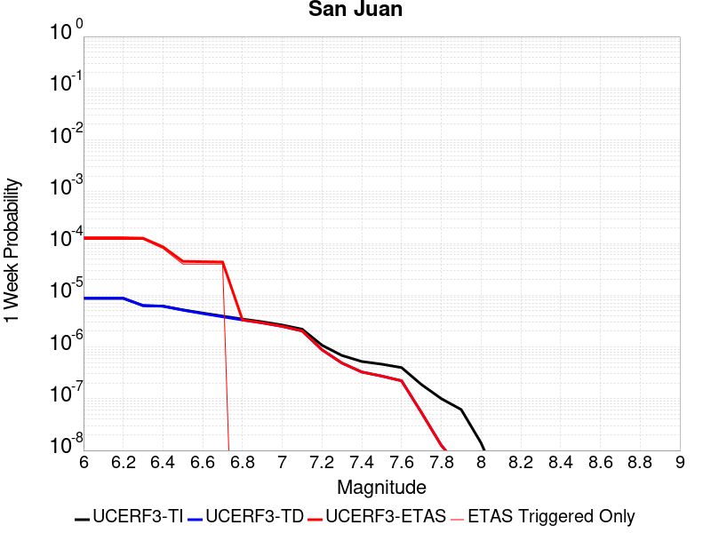 | 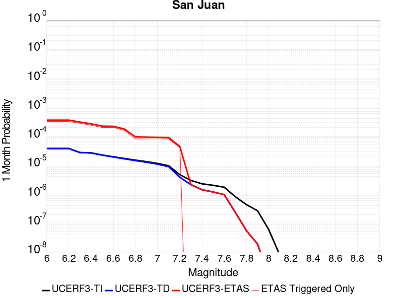 | 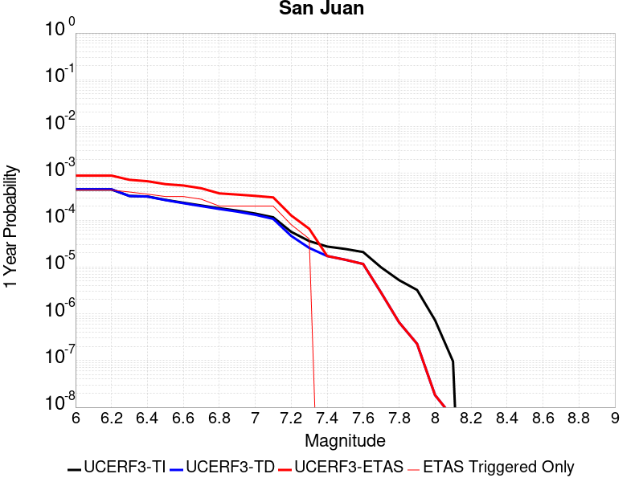 |

| Magnitude | 1 wk TI Prob | 1 wk TD Prob | 1 wk ETAS Prob | 1 wk ETAS/TD Gain | 1 wk ETAS Triggered Only | 1 mo TI Prob | 1 mo TD Prob | 1 mo ETAS Prob | 1 mo ETAS/TD Gain | 1 mo ETAS Triggered Only | 1 yr TI Prob | 1 yr TD Prob | 1 yr ETAS Prob | 1 yr ETAS/TD Gain | 1 yr ETAS Triggered Only |
|-----|-----|-----|-----|-----|-----|-----|-----|-----|-----|-----|-----|-----|-----|-----|-----|
| 6.0 | 8.682808E-6 | 8.759608E-6 | 1.2875856E-4 | 14.699123 | 1.2E-4 | 3.72115E-5 | 3.7540663E-5 | 3.5752865E-4 | 9.52377 | 3.2E-4 | 4.5295584E-4 | 4.5696655E-4 | 8.967655E-4 | 1.9624313 | 4.4E-4 |
| 6.1 | 8.682808E-6 | 8.759608E-6 | 1.2875856E-4 | 14.699123 | 1.2E-4 | 3.72115E-5 | 3.7540663E-5 | 3.5752865E-4 | 9.52377 | 3.2E-4 | 4.5295584E-4 | 4.5696655E-4 | 8.967655E-4 | 1.9624313 | 4.4E-4 |
| 6.2 | 8.682808E-6 | 8.759608E-6 | 1.2875856E-4 | 14.699123 | 1.2E-4 | 3.72115E-5 | 3.7540663E-5 | 3.5752865E-4 | 9.52377 | 3.2E-4 | 4.5295584E-4 | 4.5696655E-4 | 8.967655E-4 | 1.9624313 | 4.4E-4 |
| 6.3 | 6.3054235E-6 | 6.2927156E-6 | 1.2629195E-4 | 20.06955 | 1.2E-4 | 2.7022963E-5 | 2.696851E-5 | 3.0696095E-4 | 11.382199 | 2.8E-4 | 3.2895492E-4 | 3.2829354E-4 | 7.2816224E-4 | 2.2180219 | 4.0E-4 |
| 6.4 | 6.1490473E-6 | 6.123244E-6 | 8.612275E-5 | 14.06489 | 8.0E-5 | 2.6352795E-5 | 2.6242218E-5 | 2.6623593E-4 | 10.1453285 | 2.4E-4 | 3.2079802E-4 | 3.1945354E-4 | 6.793385E-4 | 2.1265645 | 3.6E-4 |
| 6.5 | 5.204848E-6 | 5.1457387E-6 | 4.5145534E-5 | 8.773382 | 4.0E-5 | 2.23063E-5 | 2.2052984E-5 | 2.2204858E-4 | 10.068868 | 2.0E-4 | 2.7154534E-4 | 2.6846296E-4 | 5.8837706E-4 | 2.1916509 | 3.2E-4 |
| 6.6 | 4.5179986E-6 | 4.421473E-6 | 4.4421296E-5 | 10.046719 | 4.0E-5 | 1.9362706E-5 | 1.8949037E-5 | 2.1894525E-4 | 11.554426 | 2.0E-4 | 2.3571544E-4 | 2.3068089E-4 | 5.5060704E-4 | 2.3868778 | 3.2E-4 |
| 6.7 | 3.9442616E-6 | 3.8256167E-6 | 4.3825465E-5 | 11.4557905 | 4.0E-5 | 1.6903869E-5 | 1.6395401E-5 | 1.7639277E-4 | 10.758675 | 1.6E-4 | 2.0578515E-4 | 1.9959638E-4 | 4.795405E-4 | 2.402551 | 2.8E-4 |
| 6.8 | 3.4536245E-6 | 3.3218946E-6 | 3.3218946E-6 | 1.0 | 0.0 | 1.4801163E-5 | 1.4236617E-5 | 9.4235475E-5 | 6.6192327 | 8.0E-5 | 1.8018926E-4 | 1.7331763E-4 | 3.7328296E-4 | 2.1537507 | 2.0E-4 |
| 6.9 | 3.059865E-6 | 2.9173539E-6 | 2.9173539E-6 | 1.0 | 0.0 | 1.3113641E-5 | 1.2502889E-5 | 9.250189E-5 | 7.3984413 | 8.0E-5 | 1.596469E-4 | 1.5221261E-4 | 3.5218216E-4 | 2.3137517 | 2.0E-4 |
| 7.0 | 2.6504351E-6 | 2.4970402E-6 | 2.4970402E-6 | 1.0 | 0.0 | 1.1358958E-5 | 1.0701559E-5 | 9.0700705E-5 | 8.475466 | 8.0E-5 | 1.3828653E-4 | 1.3028424E-4 | 3.302582E-4 | 2.534905 | 2.0E-4 |
| 7.1 | 2.2039317E-6 | 2.0380103E-6 | 2.0380103E-6 | 1.0 | 0.0 | 9.445387E-6 | 8.734303E-6 | 8.873361E-5 | 10.159207 | 8.0E-5 | 1.1499152E-4 | 1.0633549E-4 | 3.063142E-4 | 2.8806396 | 2.0E-4 |
| 7.2 | 1.0786707E-6 | 8.806433E-7 | 8.806433E-7 | 1.0 | 0.0 | 4.622866E-6 | 3.77418E-6 | 4.3774027E-5 | 11.598289 | 4.0E-5 | 5.628194E-5 | 4.5949684E-5 | 1.2594601E-4 | 2.7409549 | 8.0E-5 |
| 7.3 | 6.846433E-7 | 4.890126E-7 | 4.890126E-7 | 1.0 | 0.0 | 2.9341822E-6 | 2.0957666E-6 | 2.0957666E-6 | 1.0 | 0.0 | 3.5723086E-5 | 2.551566E-5 | 6.5514636E-5 | 2.5676248 | 4.0E-5 |
| 7.4 | 5.23043E-7 | 3.2786707E-7 | 3.2786707E-7 | 1.0 | 0.0 | 2.2416111E-6 | 1.4051437E-6 | 1.4051437E-6 | 1.0 | 0.0 | 2.7291273E-5 | 1.7107492E-5 | 1.7107492E-5 | 1.0 | 0.0 |
| 7.5 | 4.648444E-7 | 2.7371732E-7 | 2.7371732E-7 | 1.0 | 0.0 | 1.9921886E-6 | 1.1730737E-6 | 1.1730737E-6 | 1.0 | 0.0 | 2.4254627E-5 | 1.4282079E-5 | 1.4282079E-5 | 1.0 | 0.0 |
| 7.6 | 3.9906567E-7 | 2.219133E-7 | 2.219133E-7 | 1.0 | 0.0 | 1.7102802E-6 | 9.510566E-7 | 9.510566E-7 | 1.0 | 0.0 | 2.0822463E-5 | 1.15790535E-5 | 1.15790535E-5 | 1.0 | 0.0 |
| 7.7 | 1.8784601E-7 | 5.4077724E-8 | 5.4077724E-8 | 1.0 | 0.0 | 8.0505407E-7 | 2.3176165E-7 | 2.3176165E-7 | 1.0 | 0.0 | 9.80149E-6 | 2.8216944E-6 | 2.8216944E-6 | 1.0 | 0.0 |
| 7.8 | 1.00154914E-7 | 1.254366E-8 | 1.254366E-8 | 1.0 | 0.0 | 4.2923529E-7 | 5.3758537E-8 | 5.3758537E-8 | 1.0 | 0.0 | 5.225927E-6 | 6.5451E-7 | 6.5451E-7 | 1.0 | 0.0 |
| 7.9 | 6.171429E-8 | 4.362376E-9 | 4.362376E-9 | 1.0 | 0.0 | 2.6448978E-7 | 1.8695896E-8 | 1.8695896E-8 | 1.0 | 0.0 | 3.2201583E-6 | 2.2762252E-7 | 2.2762252E-7 | 1.0 | 0.0 |
| 8.0 | 1.3974572E-8 | 3.496773E-10 | 3.496773E-10 | 1.0 | 0.0 | 5.989102E-8 | 1.4986121E-9 | 1.4986121E-9 | 1.0 | 0.0 | 7.2917294E-7 | 1.824562E-8 | 1.824562E-8 | 1.0 | 0.0 |
| 8.1 | 1.8403477E-9 | 1.1596091E-10 | 1.1596091E-10 | 1.0 | 0.0 | 7.887204E-9 | 4.969739E-10 | 4.969739E-10 | 1.0 | 0.0 | 9.602671E-8 | 6.0506586E-9 | 6.0506586E-9 | 1.0 | 0.0 |

## Elysian Park (Upper)
*[(top)](#table-of-contents)*

| 1 Week | 1 Month | 1 Year |
|-----|-----|-----|
| 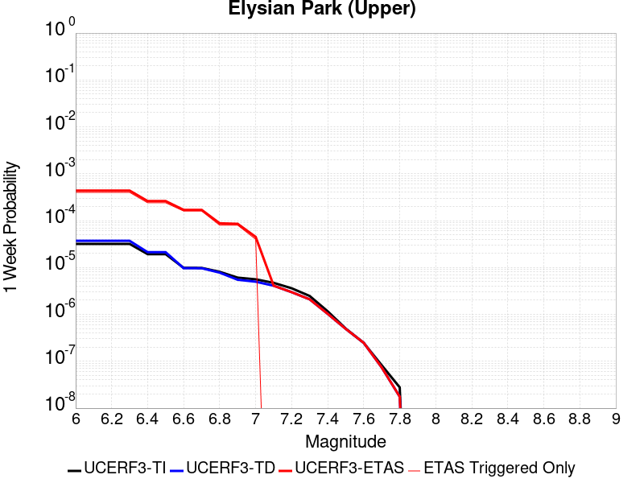 | 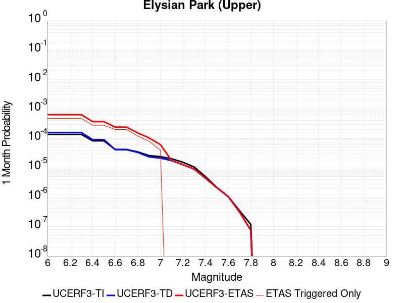 | 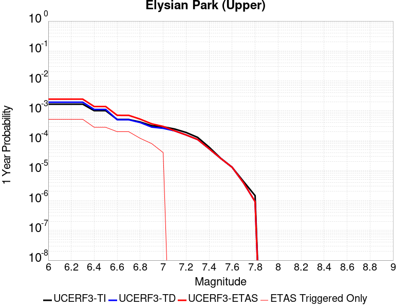 |

| Magnitude | 1 wk TI Prob | 1 wk TD Prob | 1 wk ETAS Prob | 1 wk ETAS/TD Gain | 1 wk ETAS Triggered Only | 1 mo TI Prob | 1 mo TD Prob | 1 mo ETAS Prob | 1 mo ETAS/TD Gain | 1 mo ETAS Triggered Only | 1 yr TI Prob | 1 yr TD Prob | 1 yr ETAS Prob | 1 yr ETAS/TD Gain | 1 yr ETAS Triggered Only |
|-----|-----|-----|-----|-----|-----|-----|-----|-----|-----|-----|-----|-----|-----|-----|-----|
| 6.0 | 3.1876025E-5 | 3.706077E-5 | 4.3704594E-4 | 11.792684 | 4.0E-4 | 1.3660437E-4 | 1.5882494E-4 | 6.387487E-4 | 4.021715 | 4.8E-4 | 0.0016618895 | 0.0019324546 | 0.0024514499 | 1.2685678 | 5.2E-4 |
| 6.1 | 3.1876025E-5 | 3.706077E-5 | 4.3704594E-4 | 11.792684 | 4.0E-4 | 1.3660437E-4 | 1.5882494E-4 | 6.387487E-4 | 4.021715 | 4.8E-4 | 0.0016618895 | 0.0019324546 | 0.0024514499 | 1.2685678 | 5.2E-4 |
| 6.2 | 3.1876025E-5 | 3.706077E-5 | 4.3704594E-4 | 11.792684 | 4.0E-4 | 1.3660437E-4 | 1.5882494E-4 | 6.387487E-4 | 4.021715 | 4.8E-4 | 0.0016618895 | 0.0019324546 | 0.0024514499 | 1.2685678 | 5.2E-4 |
| 6.3 | 3.1876025E-5 | 3.706077E-5 | 4.3704594E-4 | 11.792684 | 4.0E-4 | 1.3660437E-4 | 1.5882494E-4 | 6.387487E-4 | 4.021715 | 4.8E-4 | 0.0016618895 | 0.0019324546 | 0.0024514499 | 1.2685678 | 5.2E-4 |
| 6.4 | 1.9273462E-5 | 2.1214437E-5 | 2.6120935E-4 | 12.312811 | 2.4E-4 | 8.259794E-5 | 9.091683E-5 | 3.7089136E-4 | 4.0794578 | 2.8E-4 | 0.001005166 | 0.0011065218 | 0.0013862121 | 1.2527652 | 2.8E-4 |
| 6.5 | 1.9273462E-5 | 2.1214437E-5 | 2.6120935E-4 | 12.312811 | 2.4E-4 | 8.259794E-5 | 9.091683E-5 | 3.7089136E-4 | 4.0794578 | 2.8E-4 | 0.001005166 | 0.0011065218 | 0.0013862121 | 1.2527652 | 2.8E-4 |
| 6.6 | 9.813258E-6 | 9.669027E-6 | 1.6966747E-4 | 17.547523 | 1.6E-4 | 4.205614E-5 | 4.1438074E-5 | 2.4142978E-4 | 5.826279 | 2.0E-4 | 5.119132E-4 | 5.04399E-4 | 7.0429815E-4 | 1.3963115 | 2.0E-4 |
| 6.7 | 9.801478E-6 | 9.656595E-6 | 1.6965505E-4 | 17.568829 | 1.6E-4 | 4.2005657E-5 | 4.138479E-5 | 2.4137652E-4 | 5.8324933 | 2.0E-4 | 5.112989E-4 | 5.037506E-4 | 7.036498E-4 | 1.3968219 | 2.0E-4 |
| 6.8 | 8.102489E-6 | 7.775748E-6 | 8.777512E-5 | 11.28832 | 8.0E-5 | 3.4724493E-5 | 3.3324235E-5 | 1.5332023E-4 | 4.600863 | 1.2E-4 | 4.2268867E-4 | 4.05652E-4 | 5.2560336E-4 | 1.2957001 | 1.2E-4 |
| 6.9 | 6.08275E-6 | 5.483149E-6 | 8.548271E-5 | 15.5900755 | 8.0E-5 | 2.6068668E-5 | 2.3499004E-5 | 1.0349712E-4 | 4.40432 | 8.0E-5 | 3.173398E-4 | 2.8606356E-4 | 3.6604068E-4 | 1.2795781 | 8.0E-5 |
| 7.0 | 5.5995934E-6 | 4.9843247E-6 | 4.4984125E-5 | 9.02512 | 4.0E-5 | 2.3998036E-5 | 2.136122E-5 | 6.136036E-5 | 2.8725123 | 4.0E-5 | 2.9213692E-4 | 2.600425E-4 | 3.000321E-4 | 1.153781 | 4.0E-5 |
| 7.1 | 4.709881E-6 | 4.0886803E-6 | 4.0886803E-6 | 1.0 | 0.0 | 2.0185047E-5 | 1.75228E-5 | 1.75228E-5 | 1.0 | 0.0 | 2.4572524E-4 | 2.1331961E-4 | 2.1331961E-4 | 1.0 | 0.0 |
| 7.2 | 3.6063436E-6 | 2.978894E-6 | 2.978894E-6 | 1.0 | 0.0 | 1.5455667E-5 | 1.2766626E-5 | 1.2766626E-5 | 1.0 | 0.0 | 1.881565E-4 | 1.554227E-4 | 1.554227E-4 | 1.0 | 0.0 |
| 7.3 | 2.471135E-6 | 2.0961668E-6 | 2.0961668E-6 | 1.0 | 0.0 | 1.0590536E-5 | 8.983541E-6 | 8.983541E-6 | 1.0 | 0.0 | 1.2893214E-4 | 1.09369204E-4 | 1.09369204E-4 | 1.0 | 0.0 |
| 7.4 | 1.163943E-6 | 1.0279479E-6 | 1.0279479E-6 | 1.0 | 0.0 | 4.988318E-6 | 4.4054837E-6 | 4.4054837E-6 | 1.0 | 0.0 | 6.0731076E-5 | 5.363547E-5 | 5.363547E-5 | 1.0 | 0.0 |
| 7.5 | 4.99459E-7 | 4.9193983E-7 | 4.9193983E-7 | 1.0 | 0.0 | 2.140537E-6 | 2.108312E-6 | 2.108312E-6 | 1.0 | 0.0 | 2.6060725E-5 | 2.5668412E-5 | 2.5668412E-5 | 1.0 | 0.0 |
| 7.6 | 2.4667852E-7 | 2.4786985E-7 | 2.4786985E-7 | 1.0 | 0.0 | 1.0571932E-6 | 1.0622989E-6 | 1.0622989E-6 | 1.0 | 0.0 | 1.2871251E-5 | 1.2933417E-5 | 1.2933417E-5 | 1.0 | 0.0 |
| 7.7 | 8.2312795E-8 | 7.3911366E-8 | 7.3911366E-8 | 1.0 | 0.0 | 3.527691E-7 | 3.1676296E-7 | 3.1676296E-7 | 1.0 | 0.0 | 4.294955E-6 | 3.8565836E-6 | 3.8565836E-6 | 1.0 | 0.0 |
| 7.8 | 2.7819295E-8 | 1.7599204E-8 | 1.7599204E-8 | 1.0 | 0.0 | 1.1922555E-7 | 7.5425156E-8 | 7.5425156E-8 | 1.0 | 0.0 | 1.45157E-6 | 9.18301E-7 | 9.18301E-7 | 1.0 | 0.0 |

## Oak Ridge (Onshore)
*[(top)](#table-of-contents)*

| 1 Week | 1 Month | 1 Year |
|-----|-----|-----|
| 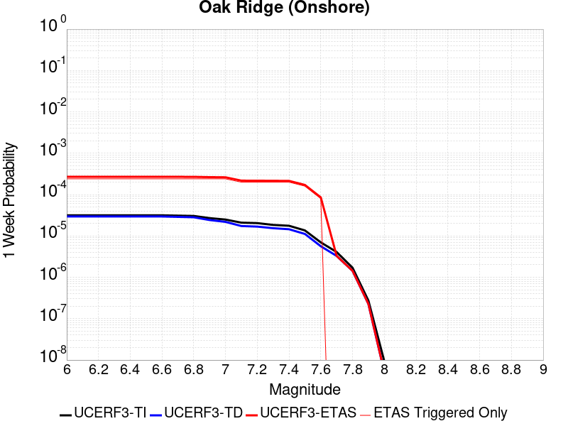 | 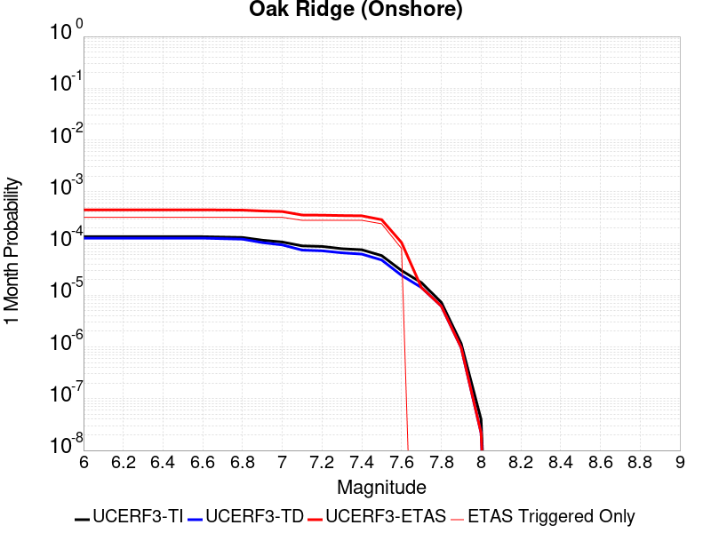 | 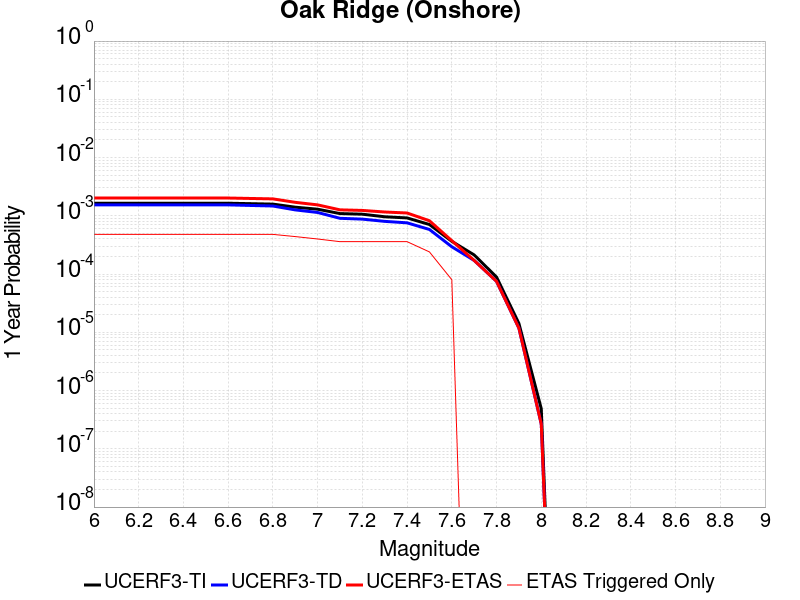 |

| Magnitude | 1 wk TI Prob | 1 wk TD Prob | 1 wk ETAS Prob | 1 wk ETAS/TD Gain | 1 wk ETAS Triggered Only | 1 mo TI Prob | 1 mo TD Prob | 1 mo ETAS Prob | 1 mo ETAS/TD Gain | 1 mo ETAS Triggered Only | 1 yr TI Prob | 1 yr TD Prob | 1 yr ETAS Prob | 1 yr ETAS/TD Gain | 1 yr ETAS Triggered Only |
|-----|-----|-----|-----|-----|-----|-----|-----|-----|-----|-----|-----|-----|-----|-----|-----|
| 6.0 | 3.155064E-5 | 2.9546469E-5 | 2.695394E-4 | 9.122558 | 2.4E-4 | 1.3521002E-4 | 1.2662179E-4 | 4.4658128E-4 | 3.526891 | 3.2E-4 | 0.001644939 | 0.0015405683 | 0.002019829 | 1.3110933 | 4.8E-4 |
| 6.1 | 3.155064E-5 | 2.9546469E-5 | 2.695394E-4 | 9.122558 | 2.4E-4 | 1.3521002E-4 | 1.2662179E-4 | 4.4658128E-4 | 3.526891 | 3.2E-4 | 0.001644939 | 0.0015405683 | 0.002019829 | 1.3110933 | 4.8E-4 |
| 6.2 | 3.155064E-5 | 2.9546469E-5 | 2.695394E-4 | 9.122558 | 2.4E-4 | 1.3521002E-4 | 1.2662179E-4 | 4.4658128E-4 | 3.526891 | 3.2E-4 | 0.001644939 | 0.0015405683 | 0.002019829 | 1.3110933 | 4.8E-4 |
| 6.3 | 3.155064E-5 | 2.9546469E-5 | 2.695394E-4 | 9.122558 | 2.4E-4 | 1.3521002E-4 | 1.2662179E-4 | 4.4658128E-4 | 3.526891 | 3.2E-4 | 0.001644939 | 0.0015405683 | 0.002019829 | 1.3110933 | 4.8E-4 |
| 6.4 | 3.155064E-5 | 2.9546469E-5 | 2.695394E-4 | 9.122558 | 2.4E-4 | 1.3521002E-4 | 1.2662179E-4 | 4.4658128E-4 | 3.526891 | 3.2E-4 | 0.001644939 | 0.0015405683 | 0.002019829 | 1.3110933 | 4.8E-4 |
| 6.5 | 3.155064E-5 | 2.9546469E-5 | 2.695394E-4 | 9.122558 | 2.4E-4 | 1.3521002E-4 | 1.2662179E-4 | 4.4658128E-4 | 3.526891 | 3.2E-4 | 0.001644939 | 0.0015405683 | 0.002019829 | 1.3110933 | 4.8E-4 |
| 6.6 | 3.155064E-5 | 2.9546469E-5 | 2.695394E-4 | 9.122558 | 2.4E-4 | 1.3521002E-4 | 1.2662179E-4 | 4.4658128E-4 | 3.526891 | 3.2E-4 | 0.001644939 | 0.0015405683 | 0.002019829 | 1.3110933 | 4.8E-4 |
| 6.7 | 3.098897E-5 | 2.8884271E-5 | 2.6887734E-4 | 9.308781 | 2.4E-4 | 1.328031E-4 | 1.2378408E-4 | 4.4374447E-4 | 3.5848267 | 3.2E-4 | 0.0016156785 | 0.001506067 | 0.001985344 | 1.318231 | 4.8E-4 |
| 6.8 | 3.0449872E-5 | 2.8259132E-5 | 2.6825236E-4 | 9.49259 | 2.4E-4 | 1.3049292E-4 | 1.2110516E-4 | 4.410664E-4 | 3.642012 | 3.2E-4 | 0.0015875935 | 0.0014734953 | 0.001952788 | 1.325276 | 4.8E-4 |
| 6.9 | 2.697928E-5 | 2.423737E-5 | 2.6423155E-4 | 10.901824 | 2.4E-4 | 1.15620365E-4 | 1.0387043E-4 | 4.238372E-4 | 4.0804415 | 3.2E-4 | 0.0014067689 | 0.0012639104 | 0.0017033543 | 1.3476859 | 4.4E-4 |
| 7.0 | 2.4893961E-5 | 2.1878457E-5 | 2.618732E-4 | 11.969455 | 2.4E-4 | 1.0668404E-4 | 9.376155E-5 | 4.1373156E-4 | 4.412593 | 3.2E-4 | 0.0012981043 | 0.0011409668 | 0.0015405103 | 1.3501799 | 4.0E-4 |
| 7.1 | 2.0945363E-5 | 1.7368691E-5 | 2.1736522E-4 | 12.514773 | 2.0E-4 | 8.976275E-5 | 7.443515E-5 | 3.544143E-4 | 4.761384 | 2.8E-4 | 0.0010923136 | 9.058759E-4 | 0.0012655498 | 1.3970455 | 3.6E-4 |
| 7.2 | 2.0439404E-5 | 1.6823378E-5 | 2.1682002E-4 | 12.888019 | 2.0E-4 | 8.7594504E-5 | 7.209823E-5 | 3.5207803E-4 | 4.8833103 | 2.8E-4 | 0.0010659413 | 8.7744714E-4 | 0.0012371313 | 1.4099212 | 3.6E-4 |
| 7.3 | 1.8463334E-5 | 1.5393638E-5 | 2.1539057E-4 | 13.99218 | 2.0E-4 | 7.912617E-5 | 6.597109E-5 | 3.4595263E-4 | 5.2440033 | 2.8E-4 | 9.6293533E-4 | 8.0290646E-4 | 0.0011626174 | 1.448011 | 3.6E-4 |
| 7.4 | 1.763139E-5 | 1.4528081E-5 | 2.1452518E-4 | 14.766243 | 2.0E-4 | 7.556091E-5 | 6.226174E-5 | 3.422443E-4 | 5.496864 | 2.8E-4 | 9.1956573E-4 | 7.57777E-4 | 0.0011175042 | 1.4747138 | 3.6E-4 |
| 7.5 | 1.3594944E-5 | 1.1172879E-5 | 1.711711E-4 | 15.320231 | 1.6E-4 | 5.8262744E-5 | 4.7882902E-5 | 2.878714E-4 | 6.011987 | 2.4E-4 | 7.0911803E-4 | 5.8282097E-4 | 8.2268106E-4 | 1.4115503 | 2.4E-4 |
| 7.6 | 6.9889534E-6 | 5.6380254E-6 | 8.563758E-5 | 15.189285 | 8.0E-5 | 2.9952313E-5 | 2.4162744E-5 | 1.0416081E-4 | 4.310802 | 8.0E-5 | 3.646084E-4 | 2.941421E-4 | 3.741186E-4 | 1.2718973 | 8.0E-5 |
| 7.7 | 4.0824193E-6 | 3.2840244E-6 | 3.2840244E-6 | 1.0 | 0.0 | 1.7495966E-5 | 1.4074315E-5 | 1.4074315E-5 | 1.0 | 0.0 | 2.1299256E-4 | 1.7134144E-4 | 1.7134144E-4 | 1.0 | 0.0 |
| 7.8 | 1.7023609E-6 | 1.4373388E-6 | 1.4373388E-6 | 1.0 | 0.0 | 7.295812E-6 | 6.1600094E-6 | 6.1600094E-6 | 1.0 | 0.0 | 8.882289E-5 | 7.499556E-5 | 7.499556E-5 | 1.0 | 0.0 |
| 7.9 | 2.721225E-7 | 2.2623067E-7 | 2.2623067E-7 | 1.0 | 0.0 | 1.1662388E-6 | 9.695597E-7 | 9.695597E-7 | 1.0 | 0.0 | 1.4198865E-5 | 1.1804327E-5 | 1.1804327E-5 | 1.0 | 0.0 |
| 8.0 | 9.364255E-9 | 5.1270783E-9 | 5.1270783E-9 | 1.0 | 0.0 | 4.0132523E-8 | 2.1973191E-8 | 2.1973191E-8 | 1.0 | 0.0 | 4.8861335E-7 | 2.6752357E-7 | 2.6752357E-7 | 1.0 | 0.0 |

## San Andreas (Peninsula) 2011 CFM
*[(top)](#table-of-contents)*

| 1 Week | 1 Month | 1 Year |
|-----|-----|-----|
| 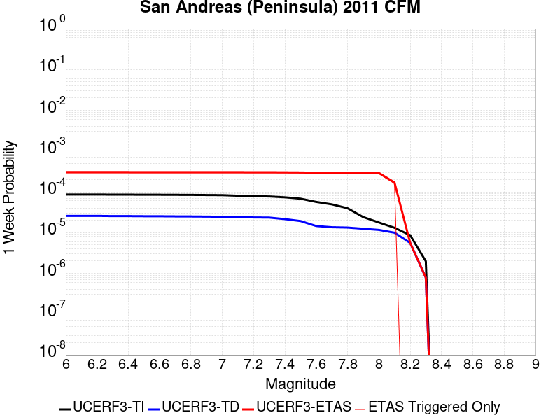 | 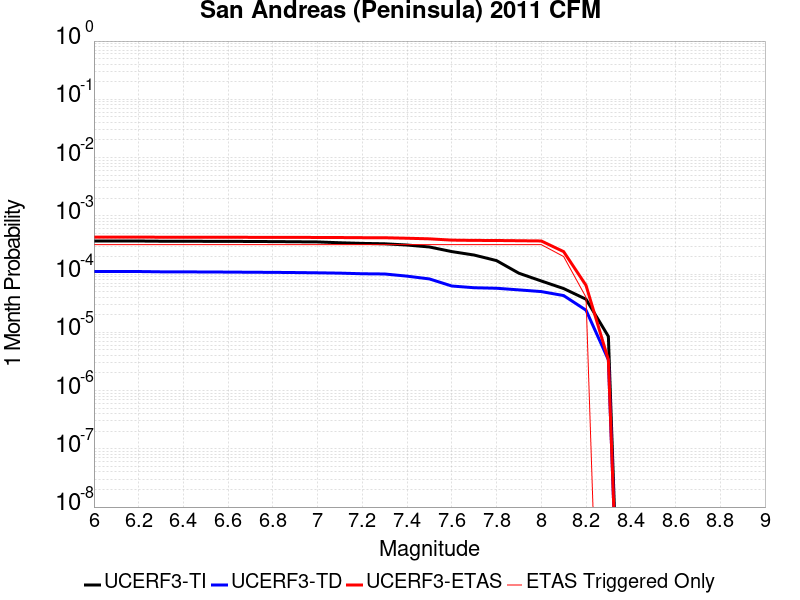 | 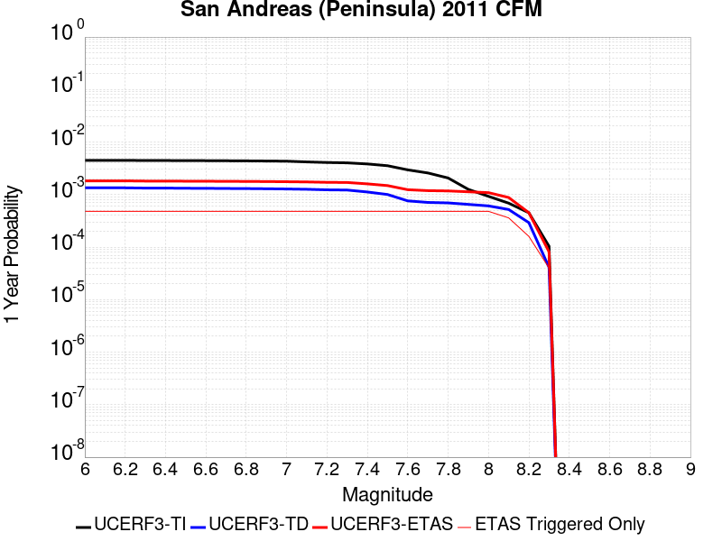 |

| Magnitude | 1 wk TI Prob | 1 wk TD Prob | 1 wk ETAS Prob | 1 wk ETAS/TD Gain | 1 wk ETAS Triggered Only | 1 mo TI Prob | 1 mo TD Prob | 1 mo ETAS Prob | 1 mo ETAS/TD Gain | 1 mo ETAS Triggered Only | 1 yr TI Prob | 1 yr TD Prob | 1 yr ETAS Prob | 1 yr ETAS/TD Gain | 1 yr ETAS Triggered Only |
|-----|-----|-----|-----|-----|-----|-----|-----|-----|-----|-----|-----|-----|-----|-----|-----|
| 6.0 | 8.6200685E-5 | 2.5801015E-5 | 3.057938E-4 | 11.852007 | 2.8E-4 | 3.6937918E-4 | 1.105711E-4 | 4.3053573E-4 | 3.8937454 | 3.2E-4 | 0.0044879215 | 0.0013453735 | 0.0018247277 | 1.3562982 | 4.8E-4 |
| 6.1 | 8.6200685E-5 | 2.5801015E-5 | 3.057938E-4 | 11.852007 | 2.8E-4 | 3.6937918E-4 | 1.105711E-4 | 4.3053573E-4 | 3.8937454 | 3.2E-4 | 0.0044879215 | 0.0013453735 | 0.0018247277 | 1.3562982 | 4.8E-4 |
| 6.2 | 8.6200685E-5 | 2.5801015E-5 | 3.057938E-4 | 11.852007 | 2.8E-4 | 3.6937918E-4 | 1.105711E-4 | 4.3053573E-4 | 3.8937454 | 3.2E-4 | 0.0044879215 | 0.0013453735 | 0.0018247277 | 1.3562982 | 4.8E-4 |
| 6.3 | 8.551163E-5 | 2.54887E-5 | 3.0548158E-4 | 11.98498 | 2.8E-4 | 3.6642692E-4 | 1.0923272E-4 | 4.2919777E-4 | 3.9292052 | 3.2E-4 | 0.004452125 | 0.0013290987 | 0.0018084608 | 1.360667 | 4.8E-4 |
| 6.4 | 8.551163E-5 | 2.54887E-5 | 3.0548158E-4 | 11.98498 | 2.8E-4 | 3.6642692E-4 | 1.0923272E-4 | 4.2919777E-4 | 3.9292052 | 3.2E-4 | 0.004452125 | 0.0013290987 | 0.0018084608 | 1.360667 | 4.8E-4 |
| 6.5 | 8.511146E-5 | 2.5307645E-5 | 3.0530055E-4 | 12.06357 | 2.8E-4 | 3.647124E-4 | 1.08456836E-4 | 4.2842212E-4 | 3.9501624 | 3.2E-4 | 0.004431336 | 0.0013196638 | 0.0017990303 | 1.363249 | 4.8E-4 |
| 6.6 | 8.4985084E-5 | 2.5237454E-5 | 3.0523038E-4 | 12.094341 | 2.8E-4 | 3.6417096E-4 | 1.0815604E-4 | 4.2812142E-4 | 3.9583683 | 3.2E-4 | 0.0044247704 | 0.0013160061 | 0.0017953743 | 1.36426 | 4.8E-4 |
| 6.7 | 8.462618E-5 | 2.5063902E-5 | 3.050569E-4 | 12.1711645 | 2.8E-4 | 3.6263323E-4 | 1.07412314E-4 | 4.2737793E-4 | 3.9788542 | 3.2E-4 | 0.004406125 | 0.0013069621 | 0.0017863347 | 1.3667839 | 4.8E-4 |
| 6.8 | 8.42337E-5 | 2.495804E-5 | 3.0495104E-4 | 12.218549 | 2.8E-4 | 3.6095164E-4 | 1.0695866E-4 | 4.2692444E-4 | 3.9914901 | 3.2E-4 | 0.004385734 | 0.0013014454 | 0.0017808208 | 1.3683407 | 4.8E-4 |
| 6.9 | 8.365989E-5 | 2.476054E-5 | 3.047536E-4 | 12.308035 | 2.8E-4 | 3.5849313E-4 | 1.061123E-4 | 4.2607833E-4 | 4.015353 | 3.2E-4 | 0.004355922 | 0.0012911533 | 0.0017705335 | 1.3712807 | 4.8E-4 |
| 7.0 | 8.30936E-5 | 2.4519966E-5 | 3.045131E-4 | 12.418985 | 2.8E-4 | 3.560668E-4 | 1.05081344E-4 | 4.250477E-4 | 4.04494 | 3.2E-4 | 0.004326499 | 0.0012786163 | 0.0017580024 | 1.3749259 | 4.8E-4 |
| 7.1 | 8.041264E-5 | 2.4201698E-5 | 3.0419492E-4 | 12.569157 | 2.8E-4 | 3.4458007E-4 | 1.03717444E-4 | 4.2368425E-4 | 4.0849853 | 3.2E-4 | 0.0041871946 | 0.0012620301 | 0.0017414243 | 1.3798596 | 4.8E-4 |
| 7.2 | 7.8427016E-5 | 2.361941E-5 | 3.036128E-4 | 12.854377 | 2.8E-4 | 3.3607247E-4 | 1.0122212E-4 | 4.2118973E-4 | 4.161044 | 3.2E-4 | 0.004084008 | 0.0012316842 | 0.001711093 | 1.3892303 | 4.8E-4 |
| 7.3 | 7.721087E-5 | 2.3402055E-5 | 3.033955E-4 | 12.96448 | 2.8E-4 | 3.3086175E-4 | 1.0029068E-4 | 4.2025858E-4 | 4.1904054 | 3.2E-4 | 0.004020803 | 0.0012203567 | 0.0016997709 | 1.3928477 | 4.8E-4 |
| 7.4 | 7.3536525E-5 | 2.1486432E-5 | 3.014804E-4 | 14.031199 | 2.8E-4 | 3.1511846E-4 | 9.2081464E-5 | 4.12052E-4 | 4.4748635 | 3.2E-4 | 0.0038298194 | 0.0011205166 | 0.0015999788 | 1.4278939 | 4.8E-4 |
| 7.5 | 6.806207E-5 | 1.9247474E-5 | 2.992421E-4 | 15.547084 | 2.8E-4 | 2.9166197E-4 | 8.248657E-5 | 4.0246017E-4 | 4.8790994 | 3.2E-4 | 0.0035452035 | 0.0010038124 | 0.0014833306 | 1.477697 | 4.8E-4 |
| 7.6 | 5.6731416E-5 | 1.45483245E-5 | 2.9454424E-4 | 20.245922 | 2.8E-4 | 2.43112E-4 | 6.2348474E-5 | 3.8232852E-4 | 6.132123 | 3.2E-4 | 0.0029558712 | 7.588284E-4 | 0.0012384643 | 1.632074 | 4.8E-4 |
| 7.7 | 4.946994E-5 | 1.3589812E-5 | 2.93586E-4 | 21.60339 | 2.8E-4 | 2.1199681E-4 | 5.8240752E-5 | 3.7822212E-4 | 6.494115 | 3.2E-4 | 0.002578006 | 7.088506E-4 | 0.0011885103 | 1.6766726 | 4.8E-4 |
| 7.8 | 3.9718198E-5 | 1.3313264E-5 | 2.9330954E-4 | 22.031378 | 2.8E-4 | 1.7020974E-4 | 5.7055597E-5 | 3.7703733E-4 | 6.6082444 | 3.2E-4 | 0.0020703338 | 6.9443067E-4 | 0.0011740973 | 1.6907337 | 4.8E-4 |
| 7.9 | 2.4115114E-5 | 1.2479283E-5 | 2.924758E-4 | 23.436907 | 2.8E-4 | 1.0334639E-4 | 5.3481544E-5 | 3.7346443E-4 | 6.9830523 | 3.2E-4 | 0.001257516 | 6.5094343E-4 | 0.001130631 | 1.7369113 | 4.8E-4 |
| 8.0 | 1.7756569E-5 | 1.1674584E-5 | 2.916713E-4 | 24.983442 | 2.8E-4 | 7.6097356E-5 | 5.0032973E-5 | 3.7001696E-4 | 7.395462 | 3.2E-4 | 9.260915E-4 | 6.0898135E-4 | 0.0010886891 | 1.7877215 | 4.8E-4 |
| 8.1 | 1.3159258E-5 | 9.968845E-6 | 1.6996724E-4 | 17.049845 | 1.6E-4 | 5.6395602E-5 | 4.272292E-5 | 2.4271438E-4 | 5.681128 | 2.0E-4 | 6.864001E-4 | 5.2002753E-4 | 8.7984034E-4 | 1.691911 | 3.6E-4 |
| 8.2 | 8.635426E-6 | 5.5992937E-6 | 5.5992937E-6 | 1.0 | 0.0 | 3.700844E-5 | 2.3996754E-5 | 6.3995794E-5 | 2.6668522 | 4.0E-5 | 4.5048463E-4 | 2.9212137E-4 | 4.5207466E-4 | 1.5475575 | 1.6E-4 |
| 8.3 | 1.983087E-6 | 7.877893E-7 | 7.877893E-7 | 1.0 | 0.0 | 8.498917E-6 | 3.3762356E-6 | 3.3762356E-6 | 1.0 | 0.0 | 1.034694E-4 | 4.110491E-5 | 8.1103266E-5 | 1.9730797 | 4.0E-5 |

## San Cayetano
*[(top)](#table-of-contents)*

| 1 Week | 1 Month | 1 Year |
|-----|-----|-----|
| 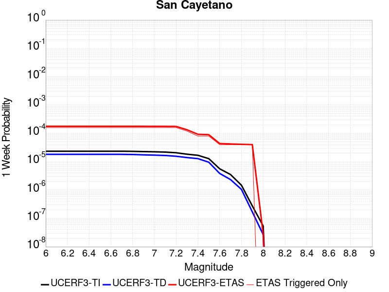 | 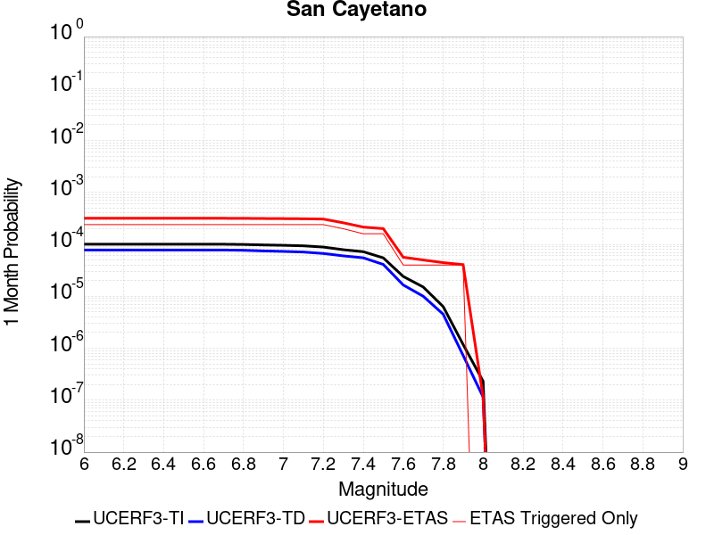 | 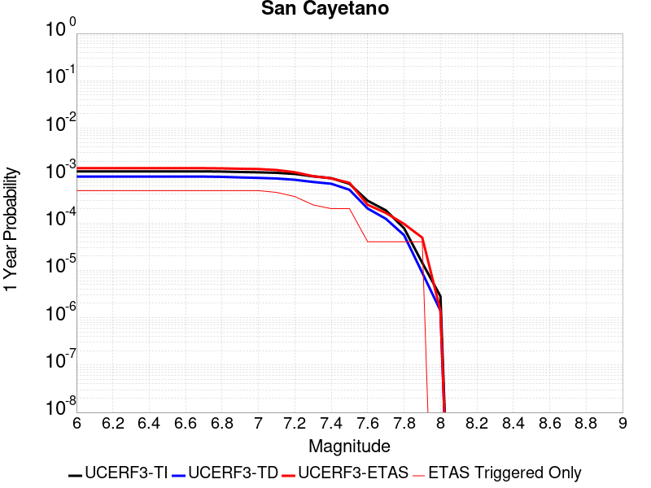 |

| Magnitude | 1 wk TI Prob | 1 wk TD Prob | 1 wk ETAS Prob | 1 wk ETAS/TD Gain | 1 wk ETAS Triggered Only | 1 mo TI Prob | 1 mo TD Prob | 1 mo ETAS Prob | 1 mo ETAS/TD Gain | 1 mo ETAS Triggered Only | 1 yr TI Prob | 1 yr TD Prob | 1 yr ETAS Prob | 1 yr ETAS/TD Gain | 1 yr ETAS Triggered Only |
|-----|-----|-----|-----|-----|-----|-----|-----|-----|-----|-----|-----|-----|-----|-----|-----|
| 6.0 | 2.3476267E-5 | 1.8191893E-5 | 1.7818899E-4 | 9.794966 | 1.6E-4 | 1.0060869E-4 | 7.796295E-5 | 3.1794424E-4 | 4.0781455 | 2.4E-4 | 0.0012242225 | 9.4878924E-4 | 0.0014283338 | 1.505428 | 4.8E-4 |
| 6.1 | 2.3476267E-5 | 1.8191893E-5 | 1.7818899E-4 | 9.794966 | 1.6E-4 | 1.0060869E-4 | 7.796295E-5 | 3.1794424E-4 | 4.0781455 | 2.4E-4 | 0.0012242225 | 9.4878924E-4 | 0.0014283338 | 1.505428 | 4.8E-4 |
| 6.2 | 2.3476267E-5 | 1.8191893E-5 | 1.7818899E-4 | 9.794966 | 1.6E-4 | 1.0060869E-4 | 7.796295E-5 | 3.1794424E-4 | 4.0781455 | 2.4E-4 | 0.0012242225 | 9.4878924E-4 | 0.0014283338 | 1.505428 | 4.8E-4 |
| 6.3 | 2.3476267E-5 | 1.8191893E-5 | 1.7818899E-4 | 9.794966 | 1.6E-4 | 1.0060869E-4 | 7.796295E-5 | 3.1794424E-4 | 4.0781455 | 2.4E-4 | 0.0012242225 | 9.4878924E-4 | 0.0014283338 | 1.505428 | 4.8E-4 |
| 6.4 | 2.3476267E-5 | 1.8191893E-5 | 1.7818899E-4 | 9.794966 | 1.6E-4 | 1.0060869E-4 | 7.796295E-5 | 3.1794424E-4 | 4.0781455 | 2.4E-4 | 0.0012242225 | 9.4878924E-4 | 0.0014283338 | 1.505428 | 4.8E-4 |
| 6.5 | 2.3476267E-5 | 1.8191893E-5 | 1.7818899E-4 | 9.794966 | 1.6E-4 | 1.0060869E-4 | 7.796295E-5 | 3.1794424E-4 | 4.0781455 | 2.4E-4 | 0.0012242225 | 9.4878924E-4 | 0.0014283338 | 1.505428 | 4.8E-4 |
| 6.6 | 2.3476267E-5 | 1.8191893E-5 | 1.7818899E-4 | 9.794966 | 1.6E-4 | 1.0060869E-4 | 7.796295E-5 | 3.1794424E-4 | 4.0781455 | 2.4E-4 | 0.0012242225 | 9.4878924E-4 | 0.0014283338 | 1.505428 | 4.8E-4 |
| 6.7 | 2.3476267E-5 | 1.8191893E-5 | 1.7818899E-4 | 9.794966 | 1.6E-4 | 1.0060869E-4 | 7.796295E-5 | 3.1794424E-4 | 4.0781455 | 2.4E-4 | 0.0012242225 | 9.4878924E-4 | 0.0014283338 | 1.505428 | 4.8E-4 |
| 6.8 | 2.3241924E-5 | 1.795945E-5 | 1.7795658E-4 | 9.908799 | 1.6E-4 | 9.960445E-5 | 7.696682E-5 | 3.1694834E-4 | 4.1179867 | 2.4E-4 | 0.0012120095 | 9.366718E-4 | 0.0014162222 | 1.5119727 | 4.8E-4 |
| 6.9 | 2.2761007E-5 | 1.7454628E-5 | 1.7745183E-4 | 10.166464 | 1.6E-4 | 9.7543525E-5 | 7.480342E-5 | 3.1478546E-4 | 4.2081695 | 2.4E-4 | 0.0011869454 | 9.1035455E-4 | 0.0013899176 | 1.526787 | 4.8E-4 |
| 7.0 | 2.240283E-5 | 1.7088216E-5 | 1.7708549E-4 | 10.363018 | 1.6E-4 | 9.600859E-5 | 7.323317E-5 | 3.132156E-4 | 4.276963 | 2.4E-4 | 0.0011682777 | 8.912526E-4 | 0.0013708248 | 1.5380878 | 4.8E-4 |
| 7.1 | 2.1871154E-5 | 1.6605602E-5 | 1.7660295E-4 | 10.635142 | 1.6E-4 | 9.373015E-5 | 7.116494E-5 | 3.1114786E-4 | 4.372207 | 2.4E-4 | 0.0011405671 | 8.6609216E-4 | 0.0013057111 | 1.5075891 | 4.4E-4 |
| 7.2 | 2.0714133E-5 | 1.5581662E-5 | 1.7557917E-4 | 11.268322 | 1.6E-4 | 8.8771834E-5 | 6.6776855E-5 | 3.0676083E-4 | 4.5938196 | 2.4E-4 | 0.0010802611 | 8.127082E-4 | 0.0011724157 | 1.4426033 | 3.6E-4 |
| 7.3 | 1.8408395E-5 | 1.4011361E-5 | 1.3400968E-4 | 9.564359 | 1.2E-4 | 7.8890735E-5 | 6.004732E-5 | 2.600353E-4 | 4.3305063 | 2.0E-4 | 9.600714E-4 | 7.308339E-4 | 9.7065856E-4 | 1.328152 | 2.4E-4 |
| 7.4 | 1.6856795E-5 | 1.2863538E-5 | 9.286251E-5 | 7.2190485 | 8.0E-5 | 7.2241404E-5 | 5.51283E-5 | 2.1511948E-4 | 3.9021604 | 1.6E-4 | 8.7918417E-4 | 6.709832E-4 | 8.7084906E-4 | 1.29787 | 2.0E-4 |
| 7.5 | 1.2822778E-5 | 9.588695E-6 | 8.958793E-5 | 9.343078 | 8.0E-5 | 5.495361E-5 | 4.109377E-5 | 2.010872E-4 | 4.8933744 | 1.6E-4 | 6.688548E-4 | 5.002034E-4 | 7.0010335E-4 | 1.3996373 | 2.0E-4 |
| 7.6 | 5.6272684E-6 | 3.856865E-6 | 4.385671E-5 | 11.371078 | 4.0E-5 | 2.4116642E-5 | 1.6529317E-5 | 5.6528657E-5 | 3.4199026 | 4.0E-5 | 2.9358055E-4 | 2.0122595E-4 | 2.412179E-4 | 1.1987416 | 4.0E-5 |
| 7.7 | 3.5261346E-6 | 2.3419418E-6 | 4.234185E-5 | 18.079803 | 4.0E-5 | 1.5111918E-5 | 1.0036855E-5 | 5.0036455E-5 | 4.985272 | 4.0E-5 | 1.8397206E-4 | 1.2219194E-4 | 1.6218705E-4 | 1.3273139 | 4.0E-5 |
| 7.8 | 1.4826929E-6 | 1.0569837E-6 | 4.105694E-5 | 38.843494 | 4.0E-5 | 6.354383E-6 | 4.5299225E-6 | 4.452974E-5 | 9.830133 | 4.0E-5 | 7.736187E-5 | 5.515043E-5 | 9.514823E-5 | 1.7252489 | 4.0E-5 |
| 7.9 | 2.7568166E-7 | 1.6989308E-7 | 4.0169885E-5 | 236.44215 | 4.0E-5 | 1.1814923E-6 | 7.28113E-7 | 4.0728082E-5 | 55.93649 | 4.0E-5 | 1.4384574E-5 | 8.86474E-6 | 4.8864385E-5 | 5.5122185 | 4.0E-5 |
| 8.0 | 5.407832E-8 | 2.6923225E-8 | 2.6923225E-8 | 1.0 | 0.0 | 2.3176422E-7 | 1.1538524E-7 | 1.1538524E-7 | 1.0 | 0.0 | 2.8217257E-6 | 1.4048145E-6 | 1.4048145E-6 | 1.0 | 0.0 |

## Mission Creek
*[(top)](#table-of-contents)*

| 1 Week | 1 Month | 1 Year |
|-----|-----|-----|
| 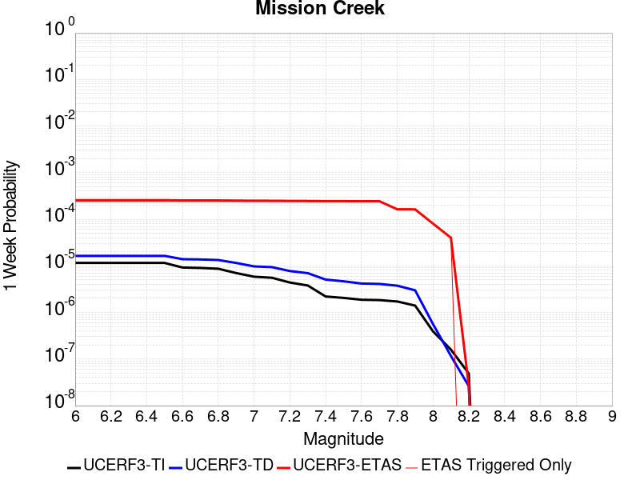 | 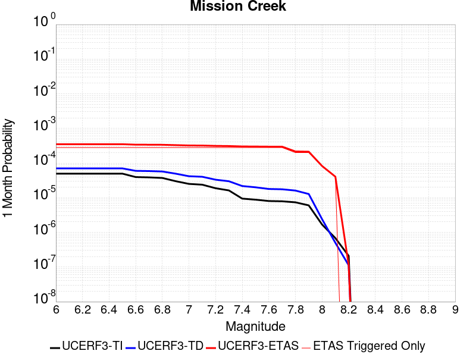 | 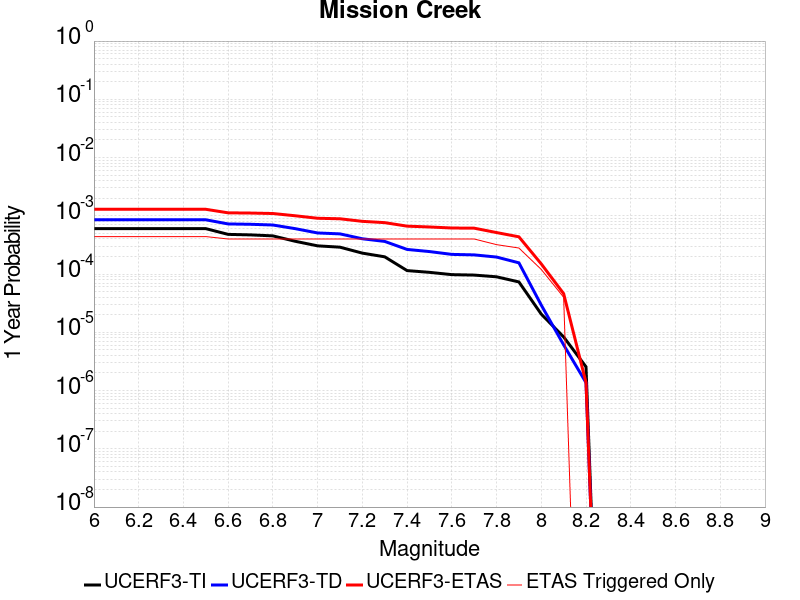 |

| Magnitude | 1 wk TI Prob | 1 wk TD Prob | 1 wk ETAS Prob | 1 wk ETAS/TD Gain | 1 wk ETAS Triggered Only | 1 mo TI Prob | 1 mo TD Prob | 1 mo ETAS Prob | 1 mo ETAS/TD Gain | 1 mo ETAS Triggered Only | 1 yr TI Prob | 1 yr TD Prob | 1 yr ETAS Prob | 1 yr ETAS/TD Gain | 1 yr ETAS Triggered Only |
|-----|-----|-----|-----|-----|-----|-----|-----|-----|-----|-----|-----|-----|-----|-----|-----|
| 6.0 | 1.1549387E-5 | 1.6382799E-5 | 2.5637887E-4 | 15.649271 | 2.4E-4 | 4.9496433E-5 | 7.02102E-5 | 3.5019053E-4 | 4.987745 | 2.8E-4 | 6.0245243E-4 | 8.544889E-4 | 0.0012941129 | 1.5144877 | 4.4E-4 |
| 6.1 | 1.1549387E-5 | 1.6382799E-5 | 2.5637887E-4 | 15.649271 | 2.4E-4 | 4.9496433E-5 | 7.02102E-5 | 3.5019053E-4 | 4.987745 | 2.8E-4 | 6.0245243E-4 | 8.544889E-4 | 0.0012941129 | 1.5144877 | 4.4E-4 |
| 6.2 | 1.1549387E-5 | 1.6382799E-5 | 2.5637887E-4 | 15.649271 | 2.4E-4 | 4.9496433E-5 | 7.02102E-5 | 3.5019053E-4 | 4.987745 | 2.8E-4 | 6.0245243E-4 | 8.544889E-4 | 0.0012941129 | 1.5144877 | 4.4E-4 |
| 6.3 | 1.1549387E-5 | 1.6382799E-5 | 2.5637887E-4 | 15.649271 | 2.4E-4 | 4.9496433E-5 | 7.02102E-5 | 3.5019053E-4 | 4.987745 | 2.8E-4 | 6.0245243E-4 | 8.544889E-4 | 0.0012941129 | 1.5144877 | 4.4E-4 |
| 6.4 | 1.1549387E-5 | 1.6382799E-5 | 2.5637887E-4 | 15.649271 | 2.4E-4 | 4.9496433E-5 | 7.02102E-5 | 3.5019053E-4 | 4.987745 | 2.8E-4 | 6.0245243E-4 | 8.544889E-4 | 0.0012941129 | 1.5144877 | 4.4E-4 |
| 6.5 | 1.1549387E-5 | 1.6382799E-5 | 2.5637887E-4 | 15.649271 | 2.4E-4 | 4.9496433E-5 | 7.02102E-5 | 3.5019053E-4 | 4.987745 | 2.8E-4 | 6.0245243E-4 | 8.544889E-4 | 0.0012941129 | 1.5144877 | 4.4E-4 |
| 6.6 | 9.202681E-6 | 1.3905611E-5 | 2.5390228E-4 | 18.25898 | 2.4E-4 | 3.9439463E-5 | 5.9594167E-5 | 3.3957747E-4 | 5.6981664 | 2.8E-4 | 4.800697E-4 | 7.253265E-4 | 0.0011250364 | 1.5510758 | 4.0E-4 |
| 6.7 | 9.019164E-6 | 1.3711242E-5 | 2.5370796E-4 | 18.503645 | 2.4E-4 | 3.8652986E-5 | 5.8761194E-5 | 3.3874475E-4 | 5.7647696 | 2.8E-4 | 4.7049852E-4 | 7.151917E-4 | 0.0011149057 | 1.5588906 | 4.0E-4 |
| 6.8 | 8.673558E-6 | 1.3333226E-5 | 2.5333E-4 | 18.999905 | 2.4E-4 | 3.717186E-5 | 5.7141195E-5 | 3.3712518E-4 | 5.899863 | 2.8E-4 | 4.524734E-4 | 6.9548085E-4 | 0.0010952026 | 1.5747416 | 4.0E-4 |
| 6.9 | 7.002255E-6 | 1.1536997E-5 | 2.5153422E-4 | 21.8024 | 2.4E-4 | 3.000932E-5 | 4.9443373E-5 | 3.2942952E-4 | 6.662764 | 2.8E-4 | 3.653022E-4 | 6.0181366E-4 | 0.0010015729 | 1.6642575 | 4.0E-4 |
| 7.0 | 5.84644E-6 | 9.7312795E-6 | 2.4972894E-4 | 25.662498 | 2.4E-4 | 2.5055931E-5 | 4.1704843E-5 | 3.2169317E-4 | 7.7135687 | 2.8E-4 | 3.0501327E-4 | 5.0764275E-4 | 9.074397E-4 | 1.7875557 | 4.0E-4 |
| 7.1 | 5.54703E-6 | 9.3855515E-6 | 2.493833E-4 | 26.57098 | 2.4E-4 | 2.377277E-5 | 4.0223196E-5 | 3.2021193E-4 | 7.9608774 | 2.8E-4 | 2.8939504E-4 | 4.896118E-4 | 8.8941597E-4 | 1.8165737 | 4.0E-4 |
| 7.2 | 4.384709E-6 | 7.735159E-6 | 2.477333E-4 | 32.02692 | 2.4E-4 | 1.8791474E-5 | 3.315028E-5 | 3.13141E-4 | 9.446104 | 2.8E-4 | 2.2876218E-4 | 4.0353357E-4 | 8.033722E-4 | 1.9908434 | 4.0E-4 |
| 7.3 | 3.7888456E-6 | 6.967982E-6 | 2.4696632E-4 | 35.443016 | 2.4E-4 | 1.623781E-5 | 2.9862456E-5 | 3.098541E-4 | 10.376041 | 2.8E-4 | 1.9767738E-4 | 3.635181E-4 | 7.633727E-4 | 2.0999577 | 4.0E-4 |
| 7.4 | 2.1982462E-6 | 5.074753E-6 | 2.4507355E-4 | 48.2927 | 2.4E-4 | 9.421021E-6 | 2.1748761E-5 | 3.0174266E-4 | 13.874017 | 2.8E-4 | 1.1469489E-4 | 2.6475918E-4 | 6.6465326E-4 | 2.510407 | 4.0E-4 |
| 7.5 | 2.051923E-6 | 4.664606E-6 | 2.4466348E-4 | 52.45105 | 2.4E-4 | 8.793926E-6 | 1.9991017E-5 | 2.9998543E-4 | 15.006011 | 2.8E-4 | 1.0706078E-4 | 2.4336358E-4 | 6.4326625E-4 | 2.6432314 | 4.0E-4 |
| 7.6 | 1.8733427E-6 | 4.1712638E-6 | 2.4417025E-4 | 58.536278 | 2.4E-4 | 8.028587E-6 | 1.7876722E-5 | 2.978717E-4 | 16.662546 | 2.8E-4 | 9.774366E-5 | 2.1762746E-4 | 6.175404E-4 | 2.8376033 | 4.0E-4 |
| 7.7 | 1.8411953E-6 | 4.0906184E-6 | 2.4408964E-4 | 59.670593 | 2.4E-4 | 7.890813E-6 | 1.7531105E-5 | 2.975262E-4 | 16.971333 | 2.8E-4 | 9.606641E-5 | 2.1342038E-4 | 6.13335E-4 | 2.8738353 | 4.0E-4 |
| 7.8 | 1.7194251E-6 | 3.754731E-6 | 1.6375413E-4 | 43.612743 | 1.6E-4 | 7.368944E-6 | 1.6091606E-5 | 2.1608839E-4 | 13.42864 | 2.0E-4 | 8.97132E-5 | 1.9589777E-4 | 5.1583507E-4 | 2.6331851 | 3.2E-4 |
| 7.9 | 1.4035052E-6 | 2.986388E-6 | 1.629859E-4 | 54.576267 | 1.6E-4 | 6.0150082E-6 | 1.2798743E-5 | 2.1279618E-4 | 16.626333 | 2.0E-4 | 7.3230265E-5 | 1.5581361E-4 | 4.3577E-4 | 2.7967389 | 2.8E-4 |
| 8.0 | 3.9318823E-7 | 5.6164873E-7 | 8.056161E-5 | 143.43771 | 8.0E-5 | 1.6850913E-6 | 2.4070637E-6 | 8.240687E-5 | 34.235435 | 8.0E-5 | 2.0515794E-5 | 2.9305613E-5 | 1.493021E-4 | 5.094659 | 1.2E-4 |
| 8.1 | 1.596793E-7 | 1.1683749E-7 | 4.0116833E-5 | 343.35583 | 4.0E-5 | 6.8433974E-7 | 5.0073197E-7 | 4.0500712E-5 | 80.88301 | 4.0E-5 | 8.331805E-6 | 6.0963953E-6 | 4.6096153E-5 | 7.5612144 | 4.0E-5 |
| 8.2 | 4.9003038E-8 | 2.6213556E-8 | 2.6213556E-8 | 1.0 | 0.0 | 2.10013E-7 | 1.12343805E-7 | 1.12343805E-7 | 1.0 | 0.0 | 2.5569052E-6 | 1.367785E-6 | 1.367785E-6 | 1.0 | 0.0 |

## Santa Cruz Island
*[(top)](#table-of-contents)*

| 1 Week | 1 Month | 1 Year |
|-----|-----|-----|
| 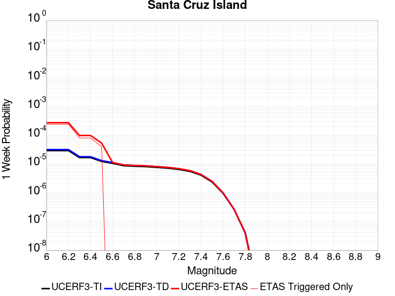 | 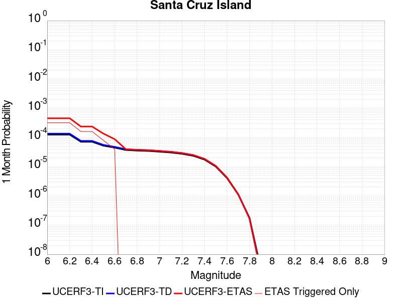 | 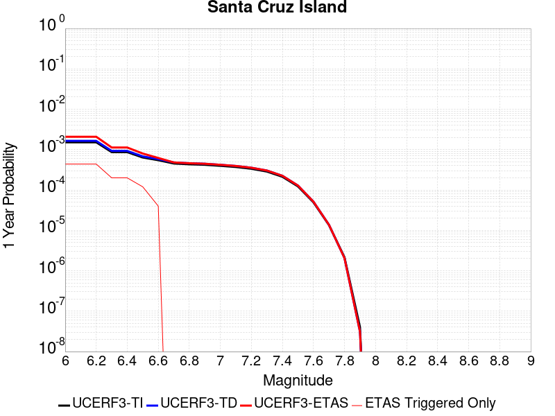 |

| Magnitude | 1 wk TI Prob | 1 wk TD Prob | 1 wk ETAS Prob | 1 wk ETAS/TD Gain | 1 wk ETAS Triggered Only | 1 mo TI Prob | 1 mo TD Prob | 1 mo ETAS Prob | 1 mo ETAS/TD Gain | 1 mo ETAS Triggered Only | 1 yr TI Prob | 1 yr TD Prob | 1 yr ETAS Prob | 1 yr ETAS/TD Gain | 1 yr ETAS Triggered Only |
|-----|-----|-----|-----|-----|-----|-----|-----|-----|-----|-----|-----|-----|-----|-----|-----|
| 6.0 | 2.9164563E-5 | 3.1608757E-5 | 2.7160117E-4 | 8.592592 | 2.4E-4 | 1.2498499E-4 | 1.3545984E-4 | 4.5541648E-4 | 3.3620038 | 3.2E-4 | 0.0015206301 | 0.0016481122 | 0.002087387 | 1.2665321 | 4.4E-4 |
| 6.1 | 2.9164563E-5 | 3.1608757E-5 | 2.7160117E-4 | 8.592592 | 2.4E-4 | 1.2498499E-4 | 1.3545984E-4 | 4.5541648E-4 | 3.3620038 | 3.2E-4 | 0.0015206301 | 0.0016481122 | 0.002087387 | 1.2665321 | 4.4E-4 |
| 6.2 | 2.9164563E-5 | 3.1608757E-5 | 2.7160117E-4 | 8.592592 | 2.4E-4 | 1.2498499E-4 | 1.3545984E-4 | 4.5541648E-4 | 3.3620038 | 3.2E-4 | 0.0015206301 | 0.0016481122 | 0.002087387 | 1.2665321 | 4.4E-4 |
| 6.3 | 1.6635553E-5 | 1.7808637E-5 | 9.780721E-5 | 5.492122 | 8.0E-5 | 7.1293274E-5 | 7.63206E-5 | 2.3630839E-4 | 3.0962596 | 1.6E-4 | 8.6765E-4 | 9.288254E-4 | 0.0011286397 | 1.2151257 | 2.0E-4 |
| 6.4 | 1.6635553E-5 | 1.7808637E-5 | 9.780721E-5 | 5.492122 | 8.0E-5 | 7.1293274E-5 | 7.63206E-5 | 2.3630839E-4 | 3.0962596 | 1.6E-4 | 8.6765E-4 | 9.288254E-4 | 0.0011286397 | 1.2151257 | 2.0E-4 |
| 6.5 | 1.2238748E-5 | 1.3045935E-5 | 5.3045413E-5 | 4.066049 | 4.0E-5 | 5.2450723E-5 | 5.590997E-5 | 1.359055E-4 | 2.4307919 | 8.0E-5 | 6.3840044E-4 | 6.80495E-4 | 8.0041337E-4 | 1.1762222 | 1.2E-4 |
| 6.6 | 1.0489767E-5 | 1.11590725E-5 | 1.11590725E-5 | 1.0 | 0.0 | 4.495537E-5 | 4.782373E-5 | 8.782182E-5 | 1.8363649 | 4.0E-5 | 5.4719415E-4 | 5.821006E-4 | 6.220773E-4 | 1.0686766 | 4.0E-5 |
| 6.7 | 8.699222E-6 | 9.238748E-6 | 9.238748E-6 | 1.0 | 0.0 | 3.7281847E-5 | 3.9594037E-5 | 3.9594037E-5 | 1.0 | 0.0 | 4.5381195E-4 | 4.8195134E-4 | 4.8195134E-4 | 1.0 | 0.0 |
| 6.8 | 8.307732E-6 | 8.818767E-6 | 8.818767E-6 | 1.0 | 0.0 | 3.560408E-5 | 3.7794172E-5 | 3.7794172E-5 | 1.0 | 0.0 | 4.3339343E-4 | 4.600473E-4 | 4.600473E-4 | 1.0 | 0.0 |
| 6.9 | 8.073121E-6 | 8.566739E-6 | 8.566739E-6 | 1.0 | 0.0 | 3.459863E-5 | 3.6714082E-5 | 3.6714082E-5 | 1.0 | 0.0 | 4.2115687E-4 | 4.4690268E-4 | 4.4690268E-4 | 1.0 | 0.0 |
| 7.0 | 7.617019E-6 | 8.076338E-6 | 8.076338E-6 | 1.0 | 0.0 | 3.264396E-5 | 3.461242E-5 | 3.461242E-5 | 1.0 | 0.0 | 3.9736772E-4 | 4.2132512E-4 | 4.2132512E-4 | 1.0 | 0.0 |
| 7.1 | 7.1224836E-6 | 7.5473363E-6 | 7.5473363E-6 | 1.0 | 0.0 | 3.052457E-5 | 3.2345328E-5 | 3.2345328E-5 | 1.0 | 0.0 | 3.715733E-4 | 3.937336E-4 | 3.937336E-4 | 1.0 | 0.0 |
| 7.2 | 6.441115E-6 | 6.8287986E-6 | 6.8287986E-6 | 1.0 | 0.0 | 2.7604487E-5 | 2.9265953E-5 | 2.9265953E-5 | 1.0 | 0.0 | 3.360328E-4 | 3.5625495E-4 | 3.5625495E-4 | 1.0 | 0.0 |
| 7.3 | 5.494274E-6 | 5.821191E-6 | 5.821191E-6 | 1.0 | 0.0 | 2.3546674E-5 | 2.4947722E-5 | 2.4947722E-5 | 1.0 | 0.0 | 2.8664304E-4 | 3.0369638E-4 | 3.0369638E-4 | 1.0 | 0.0 |
| 7.4 | 4.0802624E-6 | 4.313113E-6 | 4.313113E-6 | 1.0 | 0.0 | 1.7486722E-5 | 1.848464E-5 | 1.848464E-5 | 1.0 | 0.0 | 2.1288003E-4 | 2.2502732E-4 | 2.2502732E-4 | 1.0 | 0.0 |
| 7.5 | 2.3584746E-6 | 2.475749E-6 | 2.475749E-6 | 1.0 | 0.0 | 1.0107709E-5 | 1.061031E-5 | 1.061031E-5 | 1.0 | 0.0 | 1.2305441E-4 | 1.2917291E-4 | 1.2917291E-4 | 1.0 | 0.0 |
| 7.6 | 9.4981914E-7 | 9.862409E-7 | 9.862409E-7 | 1.0 | 0.0 | 4.0706473E-6 | 4.2267397E-6 | 4.2267397E-6 | 1.0 | 0.0 | 4.9559E-5 | 5.1459356E-5 | 5.1459356E-5 | 1.0 | 0.0 |
| 7.7 | 2.6013532E-7 | 2.6419588E-7 | 2.6419588E-7 | 1.0 | 0.0 | 1.1148652E-6 | 1.1322676E-6 | 1.1322676E-6 | 1.0 | 0.0 | 1.3573399E-5 | 1.3785271E-5 | 1.3785271E-5 | 1.0 | 0.0 |
| 7.8 | 4.1522263E-8 | 3.9660307E-8 | 3.9660307E-8 | 1.0 | 0.0 | 1.7795254E-7 | 1.6997274E-7 | 1.6997274E-7 | 1.0 | 0.0 | 2.16657E-6 | 2.0694163E-6 | 2.0694163E-6 | 1.0 | 0.0 |
| 7.9 | 7.7242046E-10 | 5.9482086E-10 | 5.9482086E-10 | 1.0 | 0.0 | 3.3103735E-9 | 2.5492326E-9 | 2.5492326E-9 | 1.0 | 0.0 | 4.0303796E-8 | 3.1036908E-8 | 3.1036908E-8 | 1.0 | 0.0 |

## Palos Verdes
*[(top)](#table-of-contents)*

| 1 Week | 1 Month | 1 Year |
|-----|-----|-----|
| 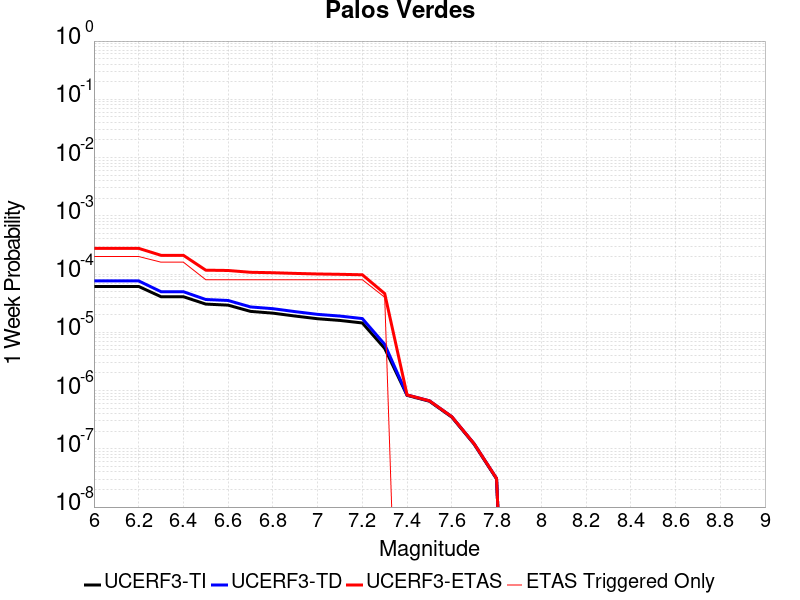 | 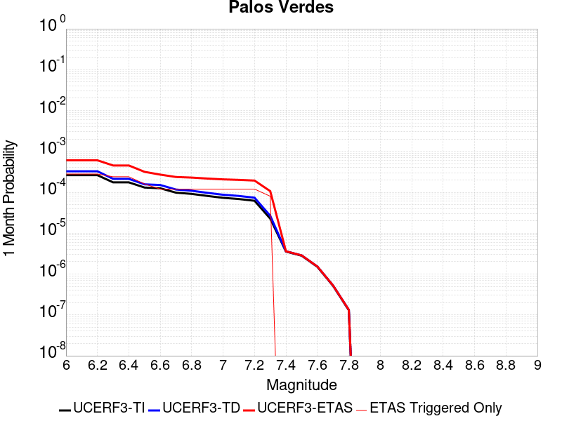 | 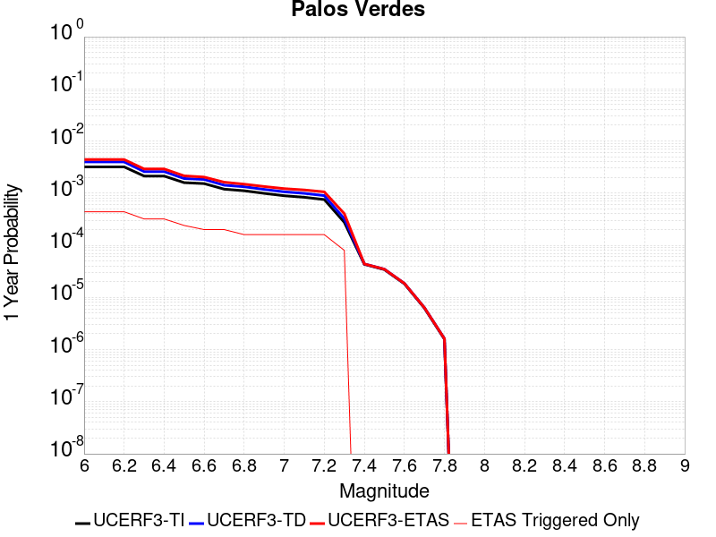 |

| Magnitude | 1 wk TI Prob | 1 wk TD Prob | 1 wk ETAS Prob | 1 wk ETAS/TD Gain | 1 wk ETAS Triggered Only | 1 mo TI Prob | 1 mo TD Prob | 1 mo ETAS Prob | 1 mo ETAS/TD Gain | 1 mo ETAS Triggered Only | 1 yr TI Prob | 1 yr TD Prob | 1 yr ETAS Prob | 1 yr ETAS/TD Gain | 1 yr ETAS Triggered Only |
|-----|-----|-----|-----|-----|-----|-----|-----|-----|-----|-----|-----|-----|-----|-----|-----|
| 6.0 | 6.126063E-5 | 7.628893E-5 | 2.7627367E-4 | 3.6214123 | 2.0E-4 | 2.6251914E-4 | 3.2691337E-4 | 6.0682185E-4 | 1.8562161 | 2.8E-4 | 0.0031914865 | 0.0039734347 | 0.004411686 | 1.1102954 | 4.4E-4 |
| 6.1 | 6.126063E-5 | 7.628893E-5 | 2.7627367E-4 | 3.6214123 | 2.0E-4 | 2.6251914E-4 | 3.2691337E-4 | 6.0682185E-4 | 1.8562161 | 2.8E-4 | 0.0031914865 | 0.0039734347 | 0.004411686 | 1.1102954 | 4.4E-4 |
| 6.2 | 6.126063E-5 | 7.628893E-5 | 2.7627367E-4 | 3.6214123 | 2.0E-4 | 2.6251914E-4 | 3.2691337E-4 | 6.0682185E-4 | 1.8562161 | 2.8E-4 | 0.0031914865 | 0.0039734347 | 0.004411686 | 1.1102954 | 4.4E-4 |
| 6.3 | 4.0838047E-5 | 4.9786013E-5 | 2.0977805E-4 | 4.213594 | 1.6E-4 | 1.7500846E-4 | 2.133523E-4 | 4.533011E-4 | 2.12466 | 2.4E-4 | 0.0021286458 | 0.0025946742 | 0.002913844 | 1.1230096 | 3.2E-4 |
| 6.4 | 4.0838047E-5 | 4.9786013E-5 | 2.0977805E-4 | 4.213594 | 1.6E-4 | 1.7500846E-4 | 2.133523E-4 | 4.533011E-4 | 2.12466 | 2.4E-4 | 0.0021286458 | 0.0025946742 | 0.002913844 | 1.1230096 | 3.2E-4 |
| 6.5 | 3.0512005E-5 | 3.6586363E-5 | 1.1658343E-4 | 3.186527 | 8.0E-5 | 1.3075917E-4 | 1.5678987E-4 | 3.1676478E-4 | 2.020314 | 1.6E-4 | 0.0015908304 | 0.001907361 | 0.0021469032 | 1.1255883 | 2.4E-4 |
| 6.6 | 2.9255087E-5 | 3.517859E-5 | 1.15175775E-4 | 3.2740304 | 8.0E-5 | 1.2537291E-4 | 1.5075726E-4 | 2.7073917E-4 | 1.7958616 | 1.2E-4 | 0.0015253464 | 0.0018340375 | 0.0020336707 | 1.108849 | 2.0E-4 |
| 6.7 | 2.287198E-5 | 2.7266105E-5 | 1.0726392E-4 | 3.9339657 | 8.0E-5 | 9.801909E-5 | 1.16850024E-4 | 2.36836E-4 | 2.0268373 | 1.2E-4 | 0.001192729 | 0.0014218123 | 0.0016215281 | 1.1404655 | 2.0E-4 |
| 6.8 | 2.1325764E-5 | 2.5448615E-5 | 1.05446576E-4 | 4.1435094 | 8.0E-5 | 9.139293E-5 | 1.0906144E-4 | 2.2904835E-4 | 2.1001773 | 1.2E-4 | 0.001112141 | 0.0013271046 | 0.0014868922 | 1.1204032 | 1.6E-4 |
| 6.9 | 1.9009392E-5 | 2.2628212E-5 | 1.026264E-4 | 4.53533 | 8.0E-5 | 8.1466285E-5 | 9.697494E-5 | 2.1696331E-4 | 2.237313 | 1.2E-4 | 9.914007E-4 | 0.0011801178 | 0.0013399291 | 1.1354197 | 1.6E-4 |
| 7.0 | 1.7098473E-5 | 2.0332458E-5 | 1.00330835E-4 | 4.9345155 | 8.0E-5 | 7.3277115E-5 | 8.713668E-5 | 2.0712623E-4 | 2.3770268 | 1.2E-4 | 8.917837E-4 | 0.0010604581 | 0.0012202885 | 1.1507182 | 1.6E-4 |
| 7.1 | 1.5982785E-5 | 1.9007015E-5 | 9.90055E-5 | 5.2088923 | 8.0E-5 | 6.849585E-5 | 8.145657E-5 | 2.014468E-4 | 2.4730575 | 1.2E-4 | 8.336179E-4 | 9.913674E-4 | 0.0011512088 | 1.1612332 | 1.6E-4 |
| 7.2 | 1.4468002E-5 | 1.7208347E-5 | 9.720697E-5 | 5.6488266 | 8.0E-5 | 6.200425E-5 | 7.374845E-5 | 1.937396E-4 | 2.6270328 | 1.2E-4 | 7.546402E-4 | 8.9760165E-4 | 0.001057458 | 1.1780928 | 1.6E-4 |
| 7.3 | 5.288233E-6 | 6.207409E-6 | 4.6207162E-5 | 7.443872 | 4.0E-5 | 2.2663658E-5 | 2.660311E-5 | 1.0660098E-4 | 4.007087 | 8.0E-5 | 2.7589512E-4 | 3.2387965E-4 | 4.0385374E-4 | 1.2469254 | 8.0E-5 |
| 7.4 | 8.279556E-7 | 8.40879E-7 | 8.40879E-7 | 1.0 | 0.0 | 3.5483763E-6 | 3.6037625E-6 | 3.6037625E-6 | 1.0 | 0.0 | 4.3200624E-5 | 4.3875E-5 | 4.3875E-5 | 1.0 | 0.0 |
| 7.5 | 6.559831E-7 | 6.667599E-7 | 6.667599E-7 | 1.0 | 0.0 | 2.8113532E-6 | 2.8575396E-6 | 2.8575396E-6 | 1.0 | 0.0 | 3.4227687E-5 | 3.4790057E-5 | 3.4790057E-5 | 1.0 | 0.0 |
| 7.6 | 3.5018968E-7 | 3.56221E-7 | 3.56221E-7 | 1.0 | 0.0 | 1.500812E-6 | 1.5266609E-6 | 1.5266609E-6 | 1.0 | 0.0 | 1.8272232E-5 | 1.8586983E-5 | 1.8586983E-5 | 1.0 | 0.0 |
| 7.7 | 1.1986104E-7 | 1.2199109E-7 | 1.2199109E-7 | 1.0 | 0.0 | 5.1369005E-7 | 5.228188E-7 | 5.228188E-7 | 1.0 | 0.0 | 6.2541585E-6 | 6.365301E-6 | 6.365301E-6 | 1.0 | 0.0 |
| 7.8 | 3.0445005E-8 | 3.1029597E-8 | 3.1029597E-8 | 1.0 | 0.0 | 1.3047858E-7 | 1.3298397E-7 | 1.3298397E-7 | 1.0 | 0.0 | 1.5885756E-6 | 1.619079E-6 | 1.619079E-6 | 1.0 | 0.0 |

## San Jacinto (Borrego)
*[(top)](#table-of-contents)*

| 1 Week | 1 Month | 1 Year |
|-----|-----|-----|
| 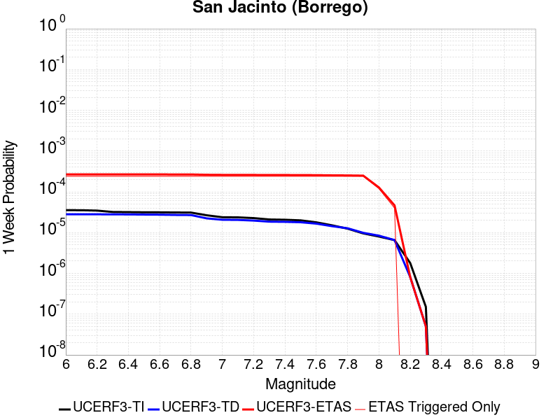 | 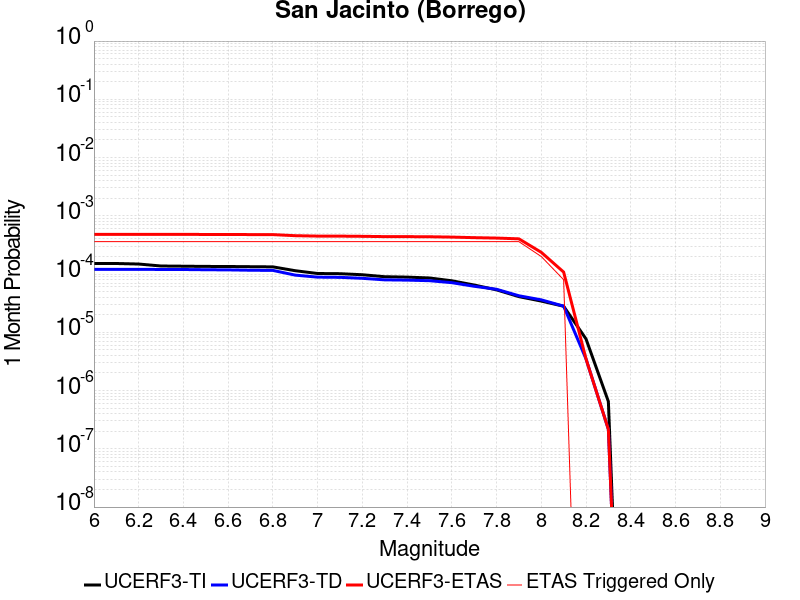 | 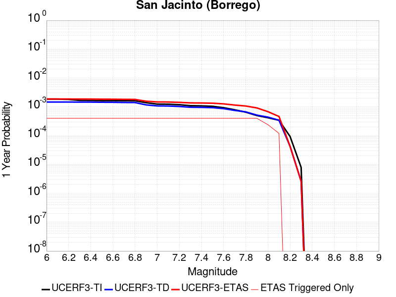 |

| Magnitude | 1 wk TI Prob | 1 wk TD Prob | 1 wk ETAS Prob | 1 wk ETAS/TD Gain | 1 wk ETAS Triggered Only | 1 mo TI Prob | 1 mo TD Prob | 1 mo ETAS Prob | 1 mo ETAS/TD Gain | 1 mo ETAS Triggered Only | 1 yr TI Prob | 1 yr TD Prob | 1 yr ETAS Prob | 1 yr ETAS/TD Gain | 1 yr ETAS Triggered Only |
|-----|-----|-----|-----|-----|-----|-----|-----|-----|-----|-----|-----|-----|-----|-----|-----|
| 6.0 | 3.543992E-5 | 2.8126837E-5 | 2.681201E-4 | 9.532536 | 2.4E-4 | 1.5187653E-4 | 1.2053809E-4 | 4.804947E-4 | 3.9862478 | 3.6E-4 | 0.0018475284 | 0.0014665757 | 0.001865989 | 1.2723442 | 4.0E-4 |
| 6.1 | 3.542281E-5 | 2.8126837E-5 | 2.681201E-4 | 9.532536 | 2.4E-4 | 1.5180321E-4 | 1.2053809E-4 | 4.804947E-4 | 3.9862478 | 3.6E-4 | 0.0018466372 | 0.0014665757 | 0.001865989 | 1.2723442 | 4.0E-4 |
| 6.2 | 3.4688688E-5 | 2.8126837E-5 | 2.681201E-4 | 9.5325365 | 2.4E-4 | 1.4865733E-4 | 1.2053808E-4 | 4.804947E-4 | 3.9862478 | 3.6E-4 | 0.0018084005 | 0.0014665755 | 0.001865989 | 1.2723442 | 4.0E-4 |
| 6.3 | 3.2087122E-5 | 2.7972088E-5 | 2.6796537E-4 | 9.5797415 | 2.4E-4 | 1.3750899E-4 | 1.1987494E-4 | 4.798318E-4 | 4.00277 | 3.6E-4 | 0.0016728862 | 0.0014585126 | 0.0018579292 | 1.273852 | 4.0E-4 |
| 6.4 | 3.1828724E-5 | 2.793903E-5 | 2.6793234E-4 | 9.589894 | 2.4E-4 | 1.364017E-4 | 1.1973327E-4 | 4.7969018E-4 | 4.0063233 | 3.6E-4 | 0.0016594254 | 0.00145679 | 0.0018562074 | 1.2741762 | 4.0E-4 |
| 6.5 | 3.1563577E-5 | 2.7678178E-5 | 2.6767154E-4 | 9.670852 | 2.4E-4 | 1.3526545E-4 | 1.1861543E-4 | 4.7857274E-4 | 4.034658 | 3.6E-4 | 0.0016456128 | 0.0014431985 | 0.0018426212 | 1.2767621 | 4.0E-4 |
| 6.6 | 3.1467625E-5 | 2.75222E-5 | 2.675156E-4 | 9.719994 | 2.4E-4 | 1.3485427E-4 | 1.1794702E-4 | 4.7790457E-4 | 4.051858 | 3.6E-4 | 0.0016406142 | 0.0014350713 | 0.0018344973 | 1.2783318 | 4.0E-4 |
| 6.7 | 3.1223695E-5 | 2.7139871E-5 | 2.6713335E-4 | 9.842838 | 2.4E-4 | 1.3380898E-4 | 1.1630862E-4 | 4.7626675E-4 | 4.0948534 | 3.6E-4 | 0.0016279068 | 0.0014151498 | 0.0018145838 | 1.2822555 | 4.0E-4 |
| 6.8 | 3.1015585E-5 | 2.69605E-5 | 2.6695404E-4 | 9.901671 | 2.4E-4 | 1.3291716E-4 | 1.1553995E-4 | 4.7549835E-4 | 4.115445 | 3.6E-4 | 0.001617065 | 0.0014058034 | 0.0018052411 | 1.2841349 | 4.0E-4 |
| 6.9 | 2.6641965E-5 | 2.2371234E-5 | 2.6236588E-4 | 11.727822 | 2.4E-4 | 1.1417485E-4 | 9.587322E-5 | 4.5583872E-4 | 4.754599 | 3.6E-4 | 0.0013891924 | 0.0011666353 | 0.0015661687 | 1.3424664 | 4.0E-4 |
| 7.0 | 2.3854353E-5 | 2.0659534E-5 | 2.6065457E-4 | 12.6166725 | 2.4E-4 | 1.02228936E-4 | 8.853787E-5 | 4.48506E-4 | 5.0656967 | 3.6E-4 | 0.0012439266 | 0.0010774181 | 0.0014769871 | 1.370858 | 4.0E-4 |
| 7.1 | 2.3672901E-5 | 2.0495838E-5 | 2.6049092E-4 | 12.709455 | 2.4E-4 | 1.0145135E-4 | 8.7836364E-5 | 4.4780475E-4 | 5.0981703 | 3.6E-4 | 0.0012344702 | 0.0010688857 | 0.0014684581 | 1.3738215 | 4.0E-4 |
| 7.2 | 2.2717244E-5 | 1.972176E-5 | 2.5971702E-4 | 13.169059 | 2.4E-4 | 9.735599E-5 | 8.45191E-5 | 4.444887E-4 | 5.2590322 | 3.6E-4 | 0.0011846646 | 0.0010285367 | 0.0014281253 | 1.388502 | 4.0E-4 |
| 7.3 | 2.1016205E-5 | 1.8560979E-5 | 2.585565E-4 | 13.930113 | 2.4E-4 | 9.006634E-5 | 7.954463E-5 | 4.39516E-4 | 5.525401 | 3.6E-4 | 0.001096006 | 9.6802774E-4 | 0.0013676406 | 1.4128113 | 4.0E-4 |
| 7.4 | 2.0683625E-5 | 1.8363E-5 | 2.583586E-4 | 14.069519 | 2.4E-4 | 8.86411E-5 | 7.869621E-5 | 4.386679E-4 | 5.574193 | 3.6E-4 | 0.001078671 | 9.577073E-4 | 0.0013573242 | 1.4172641 | 4.0E-4 |
| 7.5 | 1.9993966E-5 | 1.7956301E-5 | 2.57952E-4 | 14.365541 | 2.4E-4 | 8.568561E-5 | 7.695332E-5 | 4.3692562E-4 | 5.6778007 | 3.6E-4 | 0.001042723 | 9.36506E-4 | 0.0013361314 | 1.4267195 | 4.0E-4 |
| 7.6 | 1.788966E-5 | 1.6602748E-5 | 2.5659875E-4 | 15.455199 | 2.4E-4 | 7.666772E-5 | 7.11527E-5 | 4.311271E-4 | 6.0591807 | 3.6E-4 | 9.3302975E-4 | 8.6594163E-4 | 0.0012655952 | 1.4615248 | 4.0E-4 |
| 7.7 | 1.5125781E-5 | 1.4399063E-5 | 2.543956E-4 | 17.667511 | 2.4E-4 | 6.4823165E-5 | 6.1708815E-5 | 4.216866E-4 | 6.833491 | 3.6E-4 | 7.889362E-4 | 7.5104664E-4 | 0.0011507462 | 1.5321901 | 4.0E-4 |
| 7.8 | 1.250089E-5 | 1.2786345E-5 | 2.5278327E-4 | 19.769785 | 2.4E-4 | 5.3574146E-5 | 5.4797474E-5 | 4.1477775E-4 | 7.569286 | 3.6E-4 | 6.5207E-4 | 6.6695566E-4 | 0.0010666889 | 1.5993401 | 4.0E-4 |
| 7.9 | 9.561E-6 | 9.893191E-6 | 2.498908E-4 | 25.258867 | 2.4E-4 | 4.0975072E-5 | 4.2398708E-5 | 4.0238345E-4 | 9.490465 | 3.6E-4 | 4.987573E-4 | 5.1608257E-4 | 9.158761E-4 | 1.7746698 | 4.0E-4 |
| 8.0 | 8.01699E-6 | 8.4200565E-6 | 1.2841905E-4 | 15.251566 | 1.2E-4 | 3.4358076E-5 | 3.608546E-5 | 2.3607824E-4 | 6.5421987 | 2.0E-4 | 4.1822926E-4 | 4.3925247E-4 | 6.79147E-4 | 1.5461428 | 2.4E-4 |
| 8.1 | 6.541947E-6 | 6.5665754E-6 | 4.6566314E-5 | 7.0914154 | 4.0E-5 | 2.8036617E-5 | 2.8142165E-5 | 1.0813992E-4 | 3.8426294 | 8.0E-5 | 3.4129233E-4 | 3.4257752E-4 | 4.625364E-4 | 1.3501657 | 1.2E-4 |
| 8.2 | 1.7968189E-6 | 8.160789E-7 | 8.160789E-7 | 1.0 | 0.0 | 7.70063E-6 | 3.4974764E-6 | 3.4974764E-6 | 1.0 | 0.0 | 9.3751136E-5 | 4.2580967E-5 | 4.2580967E-5 | 1.0 | 0.0 |
| 8.3 | 1.5167889E-7 | 5.032685E-8 | 5.032685E-8 | 1.0 | 0.0 | 6.500522E-7 | 2.1568648E-7 | 2.1568648E-7 | 1.0 | 0.0 | 7.9143565E-6 | 2.6259802E-6 | 2.6259802E-6 | 1.0 | 0.0 |

## Whittier alt 1
*[(top)](#table-of-contents)*

| 1 Week | 1 Month | 1 Year |
|-----|-----|-----|
| 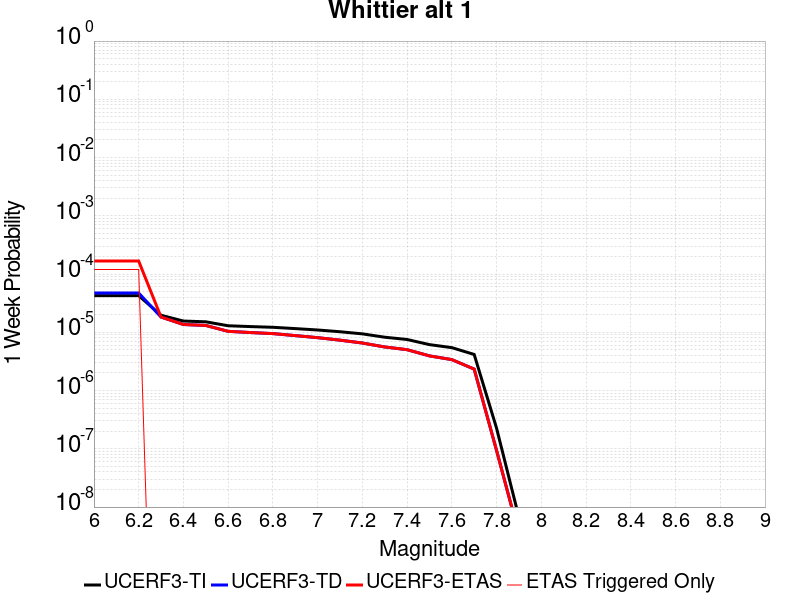 | 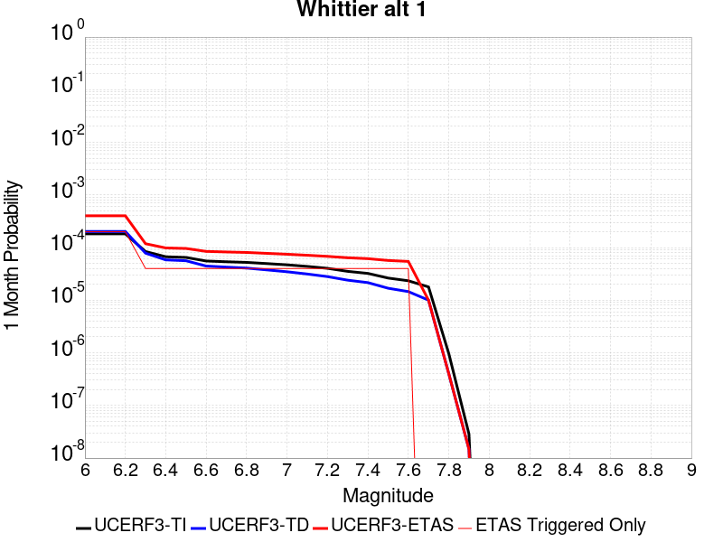 | 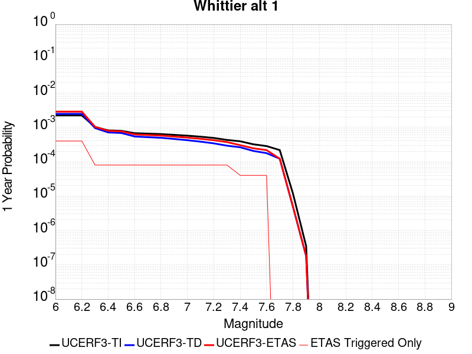 |

| Magnitude | 1 wk TI Prob | 1 wk TD Prob | 1 wk ETAS Prob | 1 wk ETAS/TD Gain | 1 wk ETAS Triggered Only | 1 mo TI Prob | 1 mo TD Prob | 1 mo ETAS Prob | 1 mo ETAS/TD Gain | 1 mo ETAS Triggered Only | 1 yr TI Prob | 1 yr TD Prob | 1 yr ETAS Prob | 1 yr ETAS/TD Gain | 1 yr ETAS Triggered Only |
|-----|-----|-----|-----|-----|-----|-----|-----|-----|-----|-----|-----|-----|-----|-----|-----|
| 6.0 | 4.2554693E-5 | 4.7282294E-5 | 1.6727662E-4 | 3.537828 | 1.2E-4 | 1.8236451E-4 | 2.0262448E-4 | 4.0258394E-4 | 1.9868475 | 2.0E-4 | 0.002218027 | 0.0024644844 | 0.0028634986 | 1.1619058 | 4.0E-4 |
| 6.1 | 4.2554693E-5 | 4.7282294E-5 | 1.6727662E-4 | 3.537828 | 1.2E-4 | 1.8236451E-4 | 2.0262448E-4 | 4.0258394E-4 | 1.9868475 | 2.0E-4 | 0.002218027 | 0.0024644844 | 0.0028634986 | 1.1619058 | 4.0E-4 |
| 6.2 | 4.2554693E-5 | 4.7282294E-5 | 1.6727662E-4 | 3.537828 | 1.2E-4 | 1.8236451E-4 | 2.0262448E-4 | 4.0258394E-4 | 1.9868475 | 2.0E-4 | 0.002218027 | 0.0024644844 | 0.0028634986 | 1.1619058 | 4.0E-4 |
| 6.3 | 1.9617712E-5 | 1.8284845E-5 | 1.8284845E-5 | 1.0 | 0.0 | 8.40732E-5 | 7.836137E-5 | 1.1835824E-4 | 1.5104156 | 4.0E-5 | 0.0010231105 | 9.5365115E-4 | 0.0010335749 | 1.0838081 | 8.0E-5 |
| 6.4 | 1.5611336E-5 | 1.3617991E-5 | 1.3617991E-5 | 1.0 | 0.0 | 6.690401E-5 | 5.8361547E-5 | 9.835921E-5 | 1.6853428 | 4.0E-5 | 8.142519E-4 | 7.103262E-4 | 7.9026935E-4 | 1.1125443 | 8.0E-5 |
| 6.5 | 1.5150166E-5 | 1.3114483E-5 | 1.3114483E-5 | 1.0 | 0.0 | 6.492767E-5 | 5.620375E-5 | 9.6201504E-5 | 1.7116563 | 4.0E-5 | 7.9020765E-4 | 6.840717E-4 | 7.64017E-4 | 1.1168668 | 8.0E-5 |
| 6.6 | 1.295588E-5 | 1.0391854E-5 | 1.0391854E-5 | 1.0 | 0.0 | 5.552402E-5 | 4.4535765E-5 | 8.453399E-5 | 1.8981146 | 4.0E-5 | 6.7579525E-4 | 5.4209004E-4 | 6.2204665E-4 | 1.1474969 | 8.0E-5 |
| 6.7 | 1.2542085E-5 | 9.910169E-6 | 9.910169E-6 | 1.0 | 0.0 | 5.3750682E-5 | 4.2471474E-5 | 8.246977E-5 | 1.9417686 | 4.0E-5 | 6.542181E-4 | 5.1696936E-4 | 5.96928E-4 | 1.1546681 | 8.0E-5 |
| 6.8 | 1.2195878E-5 | 9.505836E-6 | 9.505836E-6 | 1.0 | 0.0 | 5.2267E-5 | 4.0738672E-5 | 8.0737045E-5 | 1.9818281 | 4.0E-5 | 6.36165E-4 | 4.958823E-4 | 5.758426E-4 | 1.1612486 | 8.0E-5 |
| 6.9 | 1.1580298E-5 | 8.782643E-6 | 8.782643E-6 | 1.0 | 0.0 | 4.9628903E-5 | 3.7639365E-5 | 7.763786E-5 | 2.0626771 | 4.0E-5 | 6.040644E-4 | 4.5816458E-4 | 5.381279E-4 | 1.1745298 | 8.0E-5 |
| 7.0 | 1.0964795E-5 | 8.092889E-6 | 8.092889E-6 | 1.0 | 0.0 | 4.6991136E-5 | 3.468336E-5 | 7.468197E-5 | 2.153251 | 4.0E-5 | 5.7196687E-4 | 4.221896E-4 | 5.021558E-4 | 1.1894083 | 8.0E-5 |
| 7.1 | 1.0230601E-5 | 7.3345395E-6 | 7.3345395E-6 | 1.0 | 0.0 | 4.3844695E-5 | 3.143337E-5 | 7.1432114E-5 | 2.272493 | 4.0E-5 | 5.336784E-4 | 3.826354E-4 | 4.6260477E-4 | 1.2089963 | 8.0E-5 |
| 7.2 | 9.40865E-6 | 6.5504482E-6 | 6.5504482E-6 | 1.0 | 0.0 | 4.032216E-5 | 2.8073055E-5 | 6.807193E-5 | 2.424814 | 4.0E-5 | 4.908117E-4 | 3.4173706E-4 | 4.217097E-4 | 1.2340181 | 8.0E-5 |
| 7.3 | 8.237384E-6 | 5.6038593E-6 | 5.6038593E-6 | 1.0 | 0.0 | 3.5302593E-5 | 2.4016326E-5 | 6.401537E-5 | 2.6654937 | 4.0E-5 | 4.2972428E-4 | 2.9236058E-4 | 3.7233718E-4 | 1.2735547 | 8.0E-5 |
| 7.4 | 7.5316966E-6 | 5.033336E-6 | 5.033336E-6 | 1.0 | 0.0 | 3.2278298E-5 | 2.1571266E-5 | 6.1570405E-5 | 2.8542786 | 4.0E-5 | 3.9291743E-4 | 2.6259953E-4 | 3.0258903E-4 | 1.1522832 | 4.0E-5 |
| 7.5 | 6.149649E-6 | 3.93817E-6 | 3.93817E-6 | 1.0 | 0.0 | 2.6355372E-5 | 1.6877766E-5 | 5.6877092E-5 | 3.369942 | 4.0E-5 | 3.208294E-4 | 2.0546833E-4 | 2.454601E-4 | 1.1946372 | 4.0E-5 |
| 7.6 | 5.457711E-6 | 3.39915E-6 | 3.39915E-6 | 1.0 | 0.0 | 2.338998E-5 | 1.45677095E-5 | 5.456713E-5 | 3.745759 | 4.0E-5 | 2.8473578E-4 | 1.7734825E-4 | 2.1734115E-4 | 1.225505 | 4.0E-5 |
| 7.7 | 4.1676276E-6 | 2.3360851E-6 | 2.3360851E-6 | 1.0 | 0.0 | 1.7861139E-5 | 1.0011759E-5 | 1.0011759E-5 | 1.0 | 0.0 | 2.1743766E-4 | 1.2188709E-4 | 1.2188709E-4 | 1.0 | 0.0 |
| 7.8 | 2.2692414E-7 | 9.397192E-8 | 9.397192E-8 | 1.0 | 0.0 | 9.725317E-7 | 4.0273673E-7 | 4.0273673E-7 | 1.0 | 0.0 | 1.1840509E-5 | 4.903312E-6 | 4.903312E-6 | 1.0 | 0.0 |
| 7.9 | 6.676829E-9 | 3.4429164E-9 | 3.4429164E-9 | 1.0 | 0.0 | 2.861498E-8 | 1.4755356E-8 | 1.4755356E-8 | 1.0 | 0.0 | 3.4838732E-7 | 1.7964643E-7 | 1.7964643E-7 | 1.0 | 0.0 |

## Channel Islands Thrust
*[(top)](#table-of-contents)*

| 1 Week | 1 Month | 1 Year |
|-----|-----|-----|
| 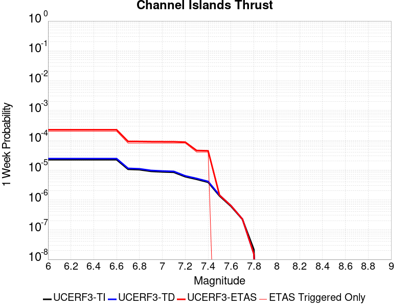 | 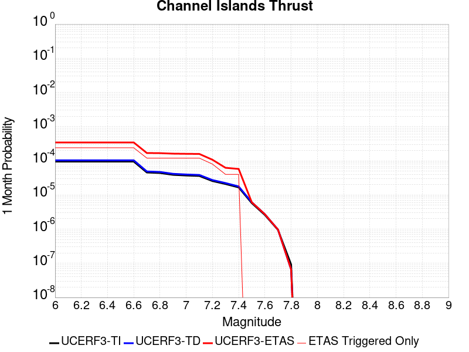 | 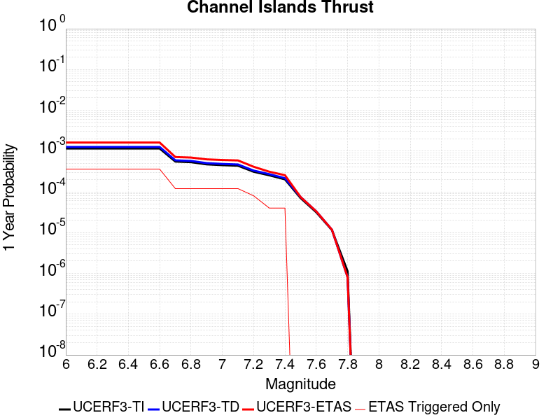 |

| Magnitude | 1 wk TI Prob | 1 wk TD Prob | 1 wk ETAS Prob | 1 wk ETAS/TD Gain | 1 wk ETAS Triggered Only | 1 mo TI Prob | 1 mo TD Prob | 1 mo ETAS Prob | 1 mo ETAS/TD Gain | 1 mo ETAS Triggered Only | 1 yr TI Prob | 1 yr TD Prob | 1 yr ETAS Prob | 1 yr ETAS/TD Gain | 1 yr ETAS Triggered Only |
|-----|-----|-----|-----|-----|-----|-----|-----|-----|-----|-----|-----|-----|-----|-----|-----|
| 6.0 | 2.2156251E-5 | 2.409921E-5 | 2.2409439E-4 | 9.298827 | 2.0E-4 | 9.495191E-5 | 1.0327884E-4 | 3.4325407E-4 | 3.323566 | 2.4E-4 | 0.0011554264 | 0.0012568012 | 0.0016163487 | 1.2860814 | 3.6E-4 |
| 6.1 | 2.2156251E-5 | 2.409921E-5 | 2.2409439E-4 | 9.298827 | 2.0E-4 | 9.495191E-5 | 1.0327884E-4 | 3.4325407E-4 | 3.323566 | 2.4E-4 | 0.0011554264 | 0.0012568012 | 0.0016163487 | 1.2860814 | 3.6E-4 |
| 6.2 | 2.2156251E-5 | 2.409921E-5 | 2.2409439E-4 | 9.298827 | 2.0E-4 | 9.495191E-5 | 1.0327884E-4 | 3.4325407E-4 | 3.323566 | 2.4E-4 | 0.0011554264 | 0.0012568012 | 0.0016163487 | 1.2860814 | 3.6E-4 |
| 6.3 | 2.2156251E-5 | 2.409921E-5 | 2.2409439E-4 | 9.298827 | 2.0E-4 | 9.495191E-5 | 1.0327884E-4 | 3.4325407E-4 | 3.323566 | 2.4E-4 | 0.0011554264 | 0.0012568012 | 0.0016163487 | 1.2860814 | 3.6E-4 |
| 6.4 | 2.2156251E-5 | 2.409921E-5 | 2.2409439E-4 | 9.298827 | 2.0E-4 | 9.495191E-5 | 1.0327884E-4 | 3.4325407E-4 | 3.323566 | 2.4E-4 | 0.0011554264 | 0.0012568012 | 0.0016163487 | 1.2860814 | 3.6E-4 |
| 6.5 | 2.2156251E-5 | 2.409921E-5 | 2.2409439E-4 | 9.298827 | 2.0E-4 | 9.495191E-5 | 1.0327884E-4 | 3.4325407E-4 | 3.323566 | 2.4E-4 | 0.0011554264 | 0.0012568012 | 0.0016163487 | 1.2860814 | 3.6E-4 |
| 6.6 | 2.2156251E-5 | 2.409921E-5 | 2.2409439E-4 | 9.298827 | 2.0E-4 | 9.495191E-5 | 1.0327884E-4 | 3.4325407E-4 | 3.323566 | 2.4E-4 | 0.0011554264 | 0.0012568012 | 0.0016163487 | 1.2860814 | 3.6E-4 |
| 6.7 | 1.0601296E-5 | 1.1382414E-5 | 9.13815E-5 | 8.028306 | 8.0E-5 | 4.5433335E-5 | 4.8780894E-5 | 1.6877503E-4 | 3.4598596 | 1.2E-4 | 5.5301044E-4 | 5.9375045E-4 | 7.136792E-4 | 1.2019851 | 1.2E-4 |
| 6.8 | 1.0246747E-5 | 1.0999436E-5 | 9.0998554E-5 | 8.27302 | 8.0E-5 | 4.391389E-5 | 4.7139616E-5 | 1.6713396E-4 | 3.5455096 | 1.2E-4 | 5.345204E-4 | 5.7377847E-4 | 6.9370965E-4 | 1.2090199 | 1.2E-4 |
| 6.9 | 9.049551E-6 | 9.702045E-6 | 8.9701265E-5 | 9.2456045 | 8.0E-5 | 3.878322E-5 | 4.157955E-5 | 1.6157456E-4 | 3.8859138 | 1.2E-4 | 4.7208337E-4 | 5.061176E-4 | 6.2605686E-4 | 1.236979 | 1.2E-4 |
| 7.0 | 8.6542195E-6 | 9.276895E-6 | 8.927615E-5 | 9.623495 | 8.0E-5 | 3.7088983E-5 | 3.975754E-5 | 1.5975277E-4 | 4.0181756 | 1.2E-4 | 4.5146482E-4 | 4.839446E-4 | 6.0388655E-4 | 1.2478423 | 1.2E-4 |
| 7.1 | 8.391028E-6 | 8.99515E-6 | 8.899443E-5 | 9.893601 | 8.0E-5 | 3.5961057E-5 | 3.8550097E-5 | 1.5854547E-4 | 4.112713 | 1.2E-4 | 4.3773788E-4 | 4.6925043E-4 | 5.891941E-4 | 1.255607 | 1.2E-4 |
| 7.2 | 5.965188E-6 | 6.3732036E-6 | 8.63727E-5 | 13.552477 | 8.0E-5 | 2.556484E-5 | 2.7313446E-5 | 1.0731126E-4 | 3.9288802 | 8.0E-5 | 3.1120746E-4 | 3.32491E-4 | 4.124644E-4 | 1.240528 | 8.0E-5 |
| 7.3 | 4.877518E-6 | 5.207231E-6 | 4.5207024E-5 | 8.681586 | 4.0E-5 | 2.0903482E-5 | 2.2316515E-5 | 6.231562E-5 | 2.7923546 | 4.0E-5 | 2.5447016E-4 | 2.7167014E-4 | 3.1165927E-4 | 1.1471974 | 4.0E-5 |
| 7.4 | 3.8829853E-6 | 4.1428343E-6 | 4.4142667E-5 | 10.655185 | 4.0E-5 | 1.664126E-5 | 1.7754886E-5 | 5.7754176E-5 | 3.2528608 | 4.0E-5 | 2.0258849E-4 | 2.1614472E-4 | 2.5613606E-4 | 1.1850212 | 4.0E-5 |
| 7.5 | 1.3489616E-6 | 1.4281075E-6 | 1.4281075E-6 | 1.0 | 0.0 | 5.7812517E-6 | 6.1204464E-6 | 6.1204464E-6 | 1.0 | 0.0 | 7.038446E-5 | 7.4513926E-5 | 7.4513926E-5 | 1.0 | 0.0 |
| 7.6 | 6.058192E-7 | 6.3551613E-7 | 6.3551613E-7 | 1.0 | 0.0 | 2.5963652E-6 | 2.7236379E-6 | 2.7236379E-6 | 1.0 | 0.0 | 3.161029E-5 | 3.3159802E-5 | 3.3159802E-5 | 1.0 | 0.0 |
| 7.7 | 2.2170494E-7 | 2.2612478E-7 | 2.2612478E-7 | 1.0 | 0.0 | 9.5016367E-7 | 9.691059E-7 | 9.691059E-7 | 1.0 | 0.0 | 1.1568181E-5 | 1.1798812E-5 | 1.1798812E-5 | 1.0 | 0.0 |
| 7.8 | 2.1613102E-8 | 1.5469915E-8 | 1.5469915E-8 | 1.0 | 0.0 | 9.262757E-8 | 6.6299634E-8 | 6.6299634E-8 | 1.0 | 0.0 | 1.1277401E-6 | 8.0719786E-7 | 8.0719786E-7 | 1.0 | 0.0 |

## Santa Cruz Catalina Ridge alt1
*[(top)](#table-of-contents)*

| 1 Week | 1 Month | 1 Year |
|-----|-----|-----|
| 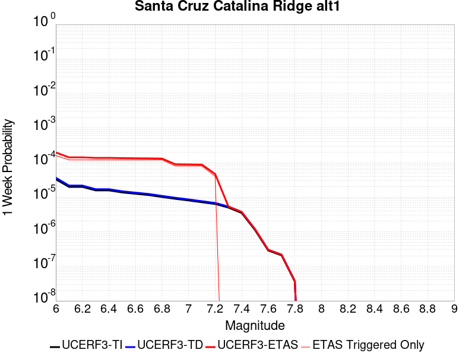 | 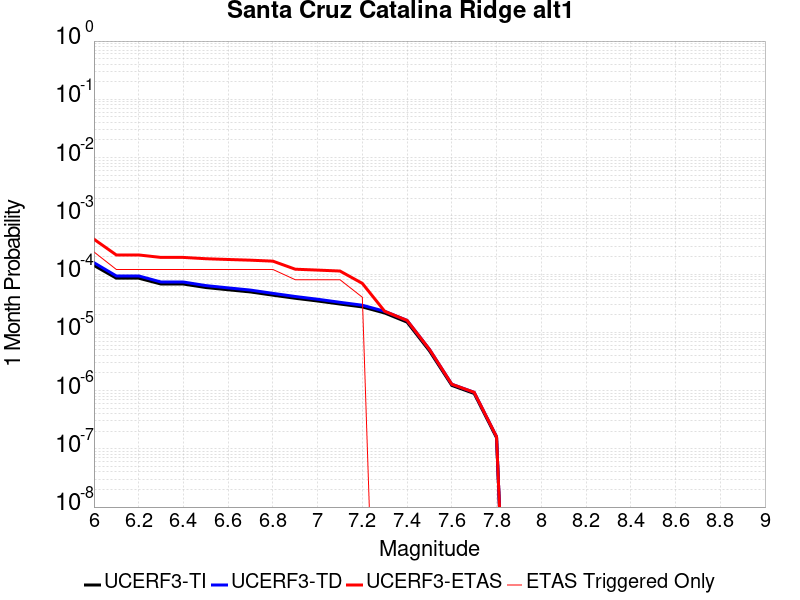 | 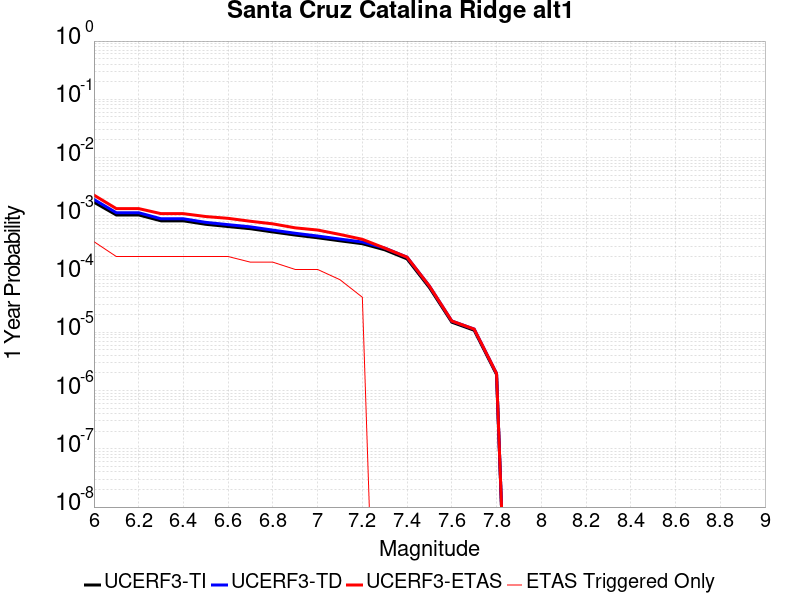 |

| Magnitude | 1 wk TI Prob | 1 wk TD Prob | 1 wk ETAS Prob | 1 wk ETAS/TD Gain | 1 wk ETAS Triggered Only | 1 mo TI Prob | 1 mo TD Prob | 1 mo ETAS Prob | 1 mo ETAS/TD Gain | 1 mo ETAS Triggered Only | 1 yr TI Prob | 1 yr TD Prob | 1 yr ETAS Prob | 1 yr ETAS/TD Gain | 1 yr ETAS Triggered Only |
|-----|-----|-----|-----|-----|-----|-----|-----|-----|-----|-----|-----|-----|-----|-----|-----|
| 6.0 | 3.2833184E-5 | 3.6572674E-5 | 1.9656682E-4 | 5.374691 | 1.6E-4 | 1.4070606E-4 | 1.5673155E-4 | 3.9669394E-4 | 2.5310407 | 2.4E-4 | 0.00171175 | 0.0019067029 | 0.0022660166 | 1.1884476 | 3.6E-4 |
| 6.1 | 1.9835548E-5 | 2.1666312E-5 | 1.4166371E-4 | 6.538432 | 1.2E-4 | 8.500672E-5 | 9.285243E-5 | 2.1284129E-4 | 2.2922533 | 1.2E-4 | 0.0010344655 | 0.0011299123 | 0.0013296864 | 1.1768049 | 2.0E-4 |
| 6.2 | 1.9835548E-5 | 2.1666312E-5 | 1.4166371E-4 | 6.538432 | 1.2E-4 | 8.500672E-5 | 9.285243E-5 | 2.1284129E-4 | 2.2922533 | 1.2E-4 | 0.0010344655 | 0.0011299123 | 0.0013296864 | 1.1768049 | 2.0E-4 |
| 6.3 | 1.5728183E-5 | 1.7038765E-5 | 1.3703672E-4 | 8.042644 | 1.2E-4 | 6.7404755E-5 | 7.302127E-5 | 1.930125E-4 | 2.6432369 | 1.2E-4 | 8.2034385E-4 | 8.8867743E-4 | 0.0010884997 | 1.2248535 | 2.0E-4 |
| 6.4 | 1.5728183E-5 | 1.7038765E-5 | 1.3703672E-4 | 8.042644 | 1.2E-4 | 6.7404755E-5 | 7.302127E-5 | 1.930125E-4 | 2.6432369 | 1.2E-4 | 8.2034385E-4 | 8.8867743E-4 | 0.0010884997 | 1.2248535 | 2.0E-4 |
| 6.5 | 1.3707734E-5 | 1.479851E-5 | 1.3479673E-4 | 9.108804 | 1.2E-4 | 5.8746107E-5 | 6.3420666E-5 | 1.8341305E-4 | 2.8920078 | 1.2E-4 | 7.1499916E-4 | 7.718766E-4 | 9.717222E-4 | 1.2589087 | 2.0E-4 |
| 6.6 | 1.2539813E-5 | 1.35137725E-5 | 1.3351215E-4 | 9.87971 | 1.2E-4 | 5.3740947E-5 | 5.79149E-5 | 1.7790795E-4 | 3.0718858 | 1.2E-4 | 6.540996E-4 | 7.048884E-4 | 9.0474746E-4 | 1.2835329 | 2.0E-4 |
| 6.7 | 1.1504083E-5 | 1.2380568E-5 | 1.3237908E-4 | 10.69249 | 1.2E-4 | 4.930228E-5 | 5.3058506E-5 | 1.7305213E-4 | 3.2615345 | 1.2E-4 | 6.0008996E-4 | 6.457979E-4 | 8.0569455E-4 | 1.2475955 | 1.6E-4 |
| 6.8 | 1.012739E-5 | 1.0879806E-5 | 1.308785E-4 | 12.029489 | 1.2E-4 | 4.340238E-5 | 4.6626916E-5 | 1.6662132E-4 | 3.5735009 | 1.2E-4 | 5.282958E-4 | 5.6753634E-4 | 7.274455E-4 | 1.2817602 | 1.6E-4 |
| 6.9 | 8.9607865E-6 | 9.611478E-6 | 8.961071E-5 | 9.323301 | 8.0E-5 | 3.8402806E-5 | 4.1191404E-5 | 1.2118811E-4 | 2.9420726 | 8.0E-5 | 4.6745385E-4 | 5.01391E-4 | 6.2133087E-4 | 1.2392142 | 1.2E-4 |
| 7.0 | 8.046829E-6 | 8.62183E-6 | 8.862114E-5 | 10.278693 | 8.0E-5 | 3.4485955E-5 | 3.695018E-5 | 1.1694722E-4 | 3.1649973 | 8.0E-5 | 4.1978562E-4 | 4.497764E-4 | 5.6972244E-4 | 1.2666793 | 1.2E-4 |
| 7.1 | 7.136131E-6 | 7.639479E-6 | 8.7638866E-5 | 11.471839 | 8.0E-5 | 3.0583058E-5 | 3.2740216E-5 | 1.12737594E-4 | 3.443398 | 8.0E-5 | 3.7228514E-4 | 3.9853994E-4 | 4.7850804E-4 | 1.2006527 | 8.0E-5 |
| 7.2 | 6.362014E-6 | 6.8065674E-6 | 4.6806294E-5 | 6.876637 | 4.0E-5 | 2.726549E-5 | 2.917068E-5 | 6.916952E-5 | 2.3711998 | 4.0E-5 | 3.3190678E-4 | 3.550958E-4 | 3.9508162E-4 | 1.1126057 | 4.0E-5 |
| 7.3 | 5.004101E-6 | 5.3529775E-6 | 5.3529775E-6 | 1.0 | 0.0 | 2.1445969E-5 | 2.2941133E-5 | 2.2941133E-5 | 1.0 | 0.0 | 2.6107338E-4 | 2.7927302E-4 | 2.7927302E-4 | 1.0 | 0.0 |
| 7.4 | 3.4901443E-6 | 3.7329312E-6 | 3.7329312E-6 | 1.0 | 0.0 | 1.4957676E-5 | 1.5998181E-5 | 1.5998181E-5 | 1.0 | 0.0 | 1.8209449E-4 | 1.9476083E-4 | 1.9476083E-4 | 1.0 | 0.0 |
| 7.5 | 1.1215045E-6 | 1.189632E-6 | 1.189632E-6 | 1.0 | 0.0 | 4.806439E-6 | 5.098413E-6 | 5.098413E-6 | 1.0 | 0.0 | 5.851682E-5 | 6.207144E-5 | 6.207144E-5 | 1.0 | 0.0 |
| 7.6 | 2.8599047E-7 | 2.99568E-7 | 2.99568E-7 | 1.0 | 0.0 | 1.2256729E-6 | 1.2838622E-6 | 1.2838622E-6 | 1.0 | 0.0 | 1.4922465E-5 | 1.563091E-5 | 1.563091E-5 | 1.0 | 0.0 |
| 7.7 | 2.0781519E-7 | 2.1747739E-7 | 2.1747739E-7 | 1.0 | 0.0 | 8.906362E-7 | 9.320456E-7 | 9.320456E-7 | 1.0 | 0.0 | 1.08434415E-5 | 1.1347597E-5 | 1.1347597E-5 | 1.0 | 0.0 |
| 7.8 | 3.614776E-8 | 3.7646288E-8 | 3.7646288E-8 | 1.0 | 0.0 | 1.5491896E-7 | 1.6134123E-7 | 1.6134123E-7 | 1.0 | 0.0 | 1.8861368E-6 | 1.9643278E-6 | 1.9643278E-6 | 1.0 | 0.0 |

## Del Valle
*[(top)](#table-of-contents)*

| 1 Week | 1 Month | 1 Year |
|-----|-----|-----|
| 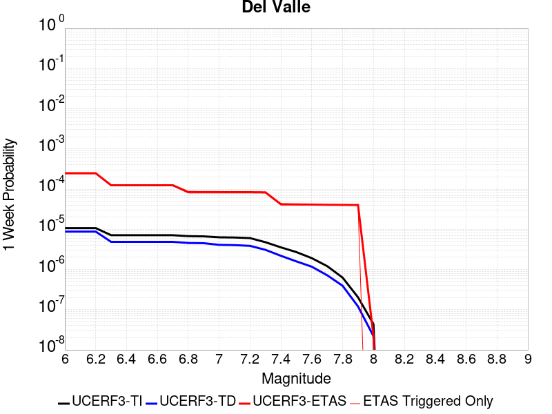 | 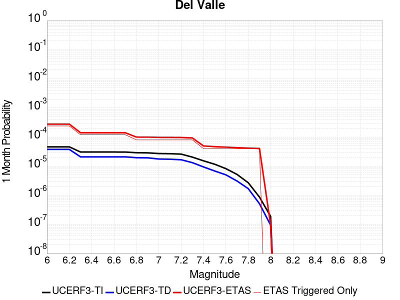 | 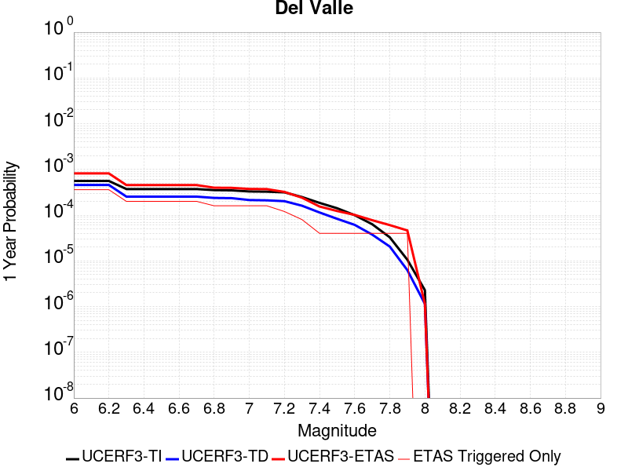 |

| Magnitude | 1 wk TI Prob | 1 wk TD Prob | 1 wk ETAS Prob | 1 wk ETAS/TD Gain | 1 wk ETAS Triggered Only | 1 mo TI Prob | 1 mo TD Prob | 1 mo ETAS Prob | 1 mo ETAS/TD Gain | 1 mo ETAS Triggered Only | 1 yr TI Prob | 1 yr TD Prob | 1 yr ETAS Prob | 1 yr ETAS/TD Gain | 1 yr ETAS Triggered Only |
|-----|-----|-----|-----|-----|-----|-----|-----|-----|-----|-----|-----|-----|-----|-----|-----|
| 6.0 | 1.0716125E-5 | 8.772687E-6 | 2.4877058E-4 | 28.3574 | 2.4E-4 | 4.592544E-5 | 3.7596797E-5 | 2.7758777E-4 | 7.3832827 | 2.4E-4 | 5.589988E-4 | 4.5766463E-4 | 8.174999E-4 | 1.7862422 | 3.6E-4 |
| 6.1 | 1.0716125E-5 | 8.772687E-6 | 2.4877058E-4 | 28.3574 | 2.4E-4 | 4.592544E-5 | 3.7596797E-5 | 2.7758777E-4 | 7.3832827 | 2.4E-4 | 5.589988E-4 | 4.5766463E-4 | 8.174999E-4 | 1.7862422 | 3.6E-4 |
| 6.2 | 1.0716125E-5 | 8.772687E-6 | 2.4877058E-4 | 28.3574 | 2.4E-4 | 4.592544E-5 | 3.7596797E-5 | 2.7758777E-4 | 7.3832827 | 2.4E-4 | 5.589988E-4 | 4.5766463E-4 | 8.174999E-4 | 1.7862422 | 3.6E-4 |
| 6.3 | 7.1293784E-6 | 4.8694646E-6 | 1.2486888E-4 | 25.643246 | 1.2E-4 | 3.055412E-5 | 2.086897E-5 | 1.4086647E-4 | 6.7500434 | 1.2E-4 | 3.7193293E-4 | 2.5405083E-4 | 4.5400002E-4 | 1.787044 | 2.0E-4 |
| 6.4 | 7.1293784E-6 | 4.8694646E-6 | 1.2486888E-4 | 25.643246 | 1.2E-4 | 3.055412E-5 | 2.086897E-5 | 1.4086647E-4 | 6.7500434 | 1.2E-4 | 3.7193293E-4 | 2.5405083E-4 | 4.5400002E-4 | 1.787044 | 2.0E-4 |
| 6.5 | 7.1293784E-6 | 4.8694646E-6 | 1.2486888E-4 | 25.643246 | 1.2E-4 | 3.055412E-5 | 2.086897E-5 | 1.4086647E-4 | 6.7500434 | 1.2E-4 | 3.7193293E-4 | 2.5405083E-4 | 4.5400002E-4 | 1.787044 | 2.0E-4 |
| 6.6 | 7.1293784E-6 | 4.8694646E-6 | 1.2486888E-4 | 25.643246 | 1.2E-4 | 3.055412E-5 | 2.086897E-5 | 1.4086647E-4 | 6.7500434 | 1.2E-4 | 3.7193293E-4 | 2.5405083E-4 | 4.5400002E-4 | 1.787044 | 2.0E-4 |
| 6.7 | 7.12272E-6 | 4.8668385E-6 | 1.2486626E-4 | 25.656544 | 1.2E-4 | 3.0525585E-5 | 2.0857717E-5 | 1.4085522E-4 | 6.753146 | 1.2E-4 | 3.7158563E-4 | 2.5391387E-4 | 4.5386306E-4 | 1.7874687 | 2.0E-4 |
| 6.8 | 6.7558703E-6 | 4.5628863E-6 | 8.456252E-5 | 18.53268 | 8.0E-5 | 2.895341E-5 | 1.9555086E-5 | 9.955352E-5 | 5.0909276 | 8.0E-5 | 3.5245073E-4 | 2.3805778E-4 | 3.9801968E-4 | 1.6719457 | 1.6E-4 |
| 6.9 | 6.6700386E-6 | 4.505956E-6 | 8.45056E-5 | 18.7542 | 8.0E-5 | 2.8585566E-5 | 1.9311101E-5 | 9.930955E-5 | 5.142615 | 8.0E-5 | 3.479737E-4 | 2.3508791E-4 | 3.950503E-4 | 1.6804365 | 1.6E-4 |
| 7.0 | 6.3181424E-6 | 4.1019052E-6 | 8.410158E-5 | 20.503052 | 8.0E-5 | 2.7077473E-5 | 1.7579478E-5 | 9.757807E-5 | 5.5506806 | 8.0E-5 | 3.2961834E-4 | 2.1400955E-4 | 3.7397532E-4 | 1.7474701 | 1.6E-4 |
| 7.1 | 6.248759E-6 | 4.0370523E-6 | 8.403673E-5 | 20.816359 | 8.0E-5 | 2.678012E-5 | 1.730154E-5 | 9.730016E-5 | 5.623786 | 8.0E-5 | 3.2599916E-4 | 2.1062631E-4 | 3.705926E-4 | 1.7594792 | 1.6E-4 |
| 7.2 | 6.0411944E-6 | 3.8729154E-6 | 8.3872605E-5 | 21.656193 | 8.0E-5 | 2.5890577E-5 | 1.6598106E-5 | 9.659678E-5 | 5.819747 | 8.0E-5 | 3.1517216E-4 | 2.0206362E-4 | 3.2203936E-4 | 1.5937524 | 1.2E-4 |
| 7.3 | 4.7691183E-6 | 3.0804517E-6 | 8.30802E-5 | 26.970137 | 8.0E-5 | 2.0438918E-5 | 1.320187E-5 | 9.320081E-5 | 7.0596676 | 8.0E-5 | 2.488154E-4 | 1.6072113E-4 | 2.4070828E-4 | 1.4976766 | 8.0E-5 |
| 7.4 | 3.5524722E-6 | 2.1908843E-6 | 4.2190797E-5 | 19.25743 | 4.0E-5 | 1.5224792E-5 | 9.3894705E-6 | 4.9389095E-5 | 5.2600513 | 4.0E-5 | 1.8534607E-4 | 1.1431089E-4 | 1.5430631E-4 | 1.349883 | 4.0E-5 |
| 7.5 | 2.7133442E-6 | 1.5928251E-6 | 4.159276E-5 | 26.112574 | 4.0E-5 | 1.1628566E-5 | 6.8263753E-6 | 4.6826102E-5 | 6.859585 | 4.0E-5 | 1.415686E-4 | 8.310797E-5 | 1.2310465E-4 | 1.4812616 | 4.0E-5 |
| 7.6 | 1.915338E-6 | 1.1747013E-6 | 4.1174655E-5 | 35.05117 | 4.0E-5 | 8.208566E-6 | 5.0344247E-6 | 4.5034223E-5 | 8.945257 | 4.0E-5 | 9.993471E-5 | 6.1292405E-5 | 1.0128995E-4 | 1.6525694 | 4.0E-5 |
| 7.7 | 1.2120448E-6 | 7.1858256E-7 | 4.0718554E-5 | 56.6651 | 4.0E-5 | 5.194467E-6 | 3.079636E-6 | 4.307951E-5 | 13.988508 | 4.0E-5 | 6.3240805E-5 | 3.7493926E-5 | 7.749243E-5 | 2.0667994 | 4.0E-5 |
| 7.8 | 6.272381E-7 | 3.935408E-7 | 4.0393526E-5 | 102.641266 | 4.0E-5 | 2.6881603E-6 | 1.6866023E-6 | 4.1686533E-5 | 24.71628 | 4.0E-5 | 3.272786E-5 | 2.0534191E-5 | 6.053337E-5 | 2.9479306 | 4.0E-5 |
| 7.9 | 2.0292627E-7 | 1.2014611E-7 | 4.012014E-5 | 333.92792 | 4.0E-5 | 8.6968373E-7 | 5.149118E-7 | 4.051489E-5 | 78.68317 | 4.0E-5 | 1.0588348E-5 | 6.2690333E-6 | 4.6268782E-5 | 7.380529 | 4.0E-5 |
| 8.0 | 4.374492E-8 | 2.1928285E-8 | 2.1928285E-8 | 1.0 | 0.0 | 1.8747821E-7 | 9.397836E-8 | 9.397836E-8 | 1.0 | 0.0 | 2.2825448E-6 | 1.144186E-6 | 1.144186E-6 | 1.0 | 0.0 |

## San Pedro Basin
*[(top)](#table-of-contents)*

| 1 Week | 1 Month | 1 Year |
|-----|-----|-----|
| 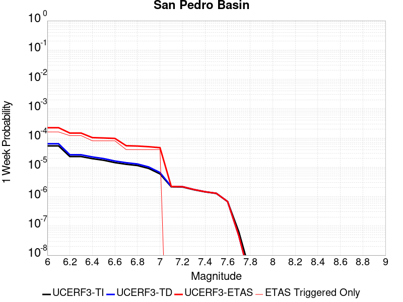 |  | 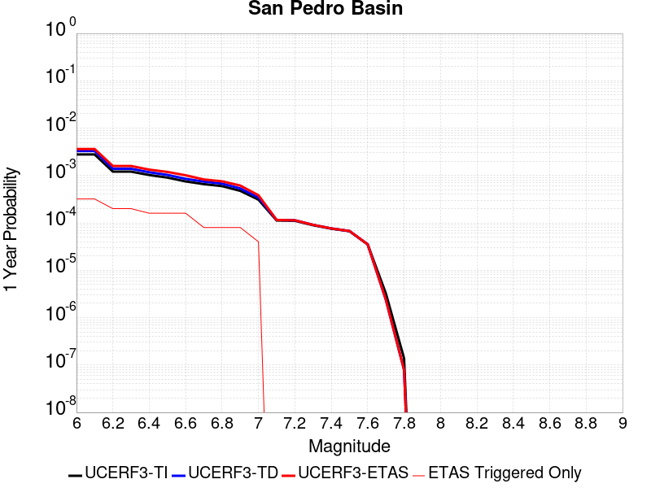 |

| Magnitude | 1 wk TI Prob | 1 wk TD Prob | 1 wk ETAS Prob | 1 wk ETAS/TD Gain | 1 wk ETAS Triggered Only | 1 mo TI Prob | 1 mo TD Prob | 1 mo ETAS Prob | 1 mo ETAS/TD Gain | 1 mo ETAS Triggered Only | 1 yr TI Prob | 1 yr TD Prob | 1 yr ETAS Prob | 1 yr ETAS/TD Gain | 1 yr ETAS Triggered Only |
|-----|-----|-----|-----|-----|-----|-----|-----|-----|-----|-----|-----|-----|-----|-----|-----|
| 6.0 | 5.3449043E-5 | 6.34106E-5 | 2.2340046E-4 | 3.5230772 | 1.6E-4 | 2.2904722E-4 | 2.7173443E-4 | 4.716801E-4 | 1.7358127 | 2.0E-4 | 0.0027850836 | 0.003303951 | 0.0036228937 | 1.0965338 | 3.2E-4 |
| 6.1 | 5.3449043E-5 | 6.34106E-5 | 2.2340046E-4 | 3.5230772 | 1.6E-4 | 2.2904722E-4 | 2.7173443E-4 | 4.716801E-4 | 1.7358127 | 2.0E-4 | 0.0027850836 | 0.003303951 | 0.0036228937 | 1.0965338 | 3.2E-4 |
| 6.2 | 2.3189454E-5 | 2.6656566E-5 | 1.4665337E-4 | 5.501585 | 1.2E-4 | 9.9379584E-5 | 1.1423769E-4 | 2.3422397E-4 | 2.0503213 | 1.2E-4 | 0.0012092749 | 0.0013900036 | 0.0015897256 | 1.1436845 | 2.0E-4 |
| 6.3 | 2.3189454E-5 | 2.6656566E-5 | 1.4665337E-4 | 5.501585 | 1.2E-4 | 9.9379584E-5 | 1.1423769E-4 | 2.3422397E-4 | 2.0503213 | 1.2E-4 | 0.0012092749 | 0.0013900036 | 0.0015897256 | 1.1436845 | 2.0E-4 |
| 6.4 | 1.966056E-5 | 2.2474544E-5 | 1.02472746E-4 | 4.5595026 | 8.0E-5 | 8.425682E-5 | 9.6316144E-5 | 1.7630844E-4 | 1.830518 | 8.0E-5 | 0.001025344 | 0.0011720584 | 0.0013318709 | 1.136352 | 1.6E-4 |
| 6.5 | 1.7342953E-5 | 1.975468E-5 | 9.97531E-5 | 5.0495934 | 8.0E-5 | 7.4324824E-5 | 8.466037E-5 | 1.646536E-4 | 1.9448721 | 8.0E-5 | 9.04529E-4 | 0.0010302897 | 0.0011901248 | 1.1551361 | 1.6E-4 |
| 6.6 | 1.439804E-5 | 1.6330361E-5 | 9.632905E-5 | 5.898771 | 8.0E-5 | 6.170443E-5 | 6.998557E-5 | 1.4997997E-4 | 2.1430128 | 8.0E-5 | 7.509924E-4 | 8.517733E-4 | 0.001011637 | 1.1876835 | 1.6E-4 |
| 6.7 | 1.2634884E-5 | 1.4291868E-5 | 5.4291297E-5 | 3.7987545 | 4.0E-5 | 5.414838E-5 | 6.124959E-5 | 1.0124715E-4 | 1.6530255 | 4.0E-5 | 6.590571E-4 | 7.454892E-4 | 8.254295E-4 | 1.1072321 | 8.0E-5 |
| 6.8 | 1.146091E-5 | 1.2939066E-5 | 5.293855E-5 | 4.091373 | 4.0E-5 | 4.911726E-5 | 5.5452132E-5 | 9.544991E-5 | 1.7213029 | 4.0E-5 | 5.9783855E-4 | 6.7495037E-4 | 7.548964E-4 | 1.1184472 | 8.0E-5 |
| 6.9 | 9.109035E-6 | 1.0239538E-5 | 5.0239127E-5 | 4.9063864 | 4.0E-5 | 3.9038136E-5 | 4.3883152E-5 | 8.3881394E-5 | 1.9114716 | 4.0E-5 | 4.7518566E-4 | 5.3417444E-4 | 6.141317E-4 | 1.1496838 | 8.0E-5 |
| 7.0 | 5.9351028E-6 | 6.586627E-6 | 4.6586363E-5 | 7.0728707 | 4.0E-5 | 2.5435906E-5 | 2.822823E-5 | 6.82271E-5 | 2.4169812 | 4.0E-5 | 3.0963816E-4 | 3.4364813E-4 | 3.836344E-4 | 1.1163582 | 4.0E-5 |
| 7.1 | 2.1557585E-6 | 2.2099746E-6 | 2.2099746E-6 | 1.0 | 0.0 | 9.238933E-6 | 9.471286E-6 | 9.471286E-6 | 1.0 | 0.0 | 1.1247819E-4 | 1.1530696E-4 | 1.1530696E-4 | 1.0 | 0.0 |
| 7.2 | 2.1251979E-6 | 2.178317E-6 | 2.178317E-6 | 1.0 | 0.0 | 9.107958E-6 | 9.335612E-6 | 9.335612E-6 | 1.0 | 0.0 | 1.1088375E-4 | 1.136553E-4 | 1.136553E-4 | 1.0 | 0.0 |
| 7.3 | 1.7145798E-6 | 1.7445271E-6 | 1.7445271E-6 | 1.0 | 0.0 | 7.3481783E-6 | 7.4765244E-6 | 7.4765244E-6 | 1.0 | 0.0 | 8.94604E-5 | 9.102297E-5 | 9.102297E-5 | 1.0 | 0.0 |
| 7.4 | 1.4467993E-6 | 1.4643826E-6 | 1.4643826E-6 | 1.0 | 0.0 | 6.200554E-6 | 6.275911E-6 | 6.275911E-6 | 1.0 | 0.0 | 7.548913E-5 | 7.640661E-5 | 7.640661E-5 | 1.0 | 0.0 |
| 7.5 | 1.2803735E-6 | 1.2933225E-6 | 1.2933225E-6 | 1.0 | 0.0 | 5.487303E-6 | 5.5427995E-6 | 5.5427995E-6 | 1.0 | 0.0 | 6.680587E-5 | 6.748157E-5 | 6.748157E-5 | 1.0 | 0.0 |
| 7.6 | 6.755009E-7 | 6.7703843E-7 | 6.7703843E-7 | 1.0 | 0.0 | 2.8950008E-6 | 2.9015905E-6 | 2.9015905E-6 | 1.0 | 0.0 | 3.5246063E-5 | 3.532635E-5 | 3.532635E-5 | 1.0 | 0.0 |
| 7.7 | 6.211885E-8 | 4.5709044E-8 | 4.5709044E-8 | 1.0 | 0.0 | 2.6622362E-7 | 1.9589588E-7 | 1.9589588E-7 | 1.0 | 0.0 | 3.2412677E-6 | 2.38503E-6 | 2.38503E-6 | 1.0 | 0.0 |
| 7.8 | 2.6580573E-9 | 1.515122E-9 | 1.515122E-9 | 1.0 | 0.0 | 1.1391674E-8 | 6.49338E-9 | 6.49338E-9 | 1.0 | 0.0 | 1.3869362E-7 | 7.90569E-8 | 7.90569E-8 | 1.0 | 0.0 |

## Lost Hills
*[(top)](#table-of-contents)*

| 1 Week | 1 Month | 1 Year |
|-----|-----|-----|
| 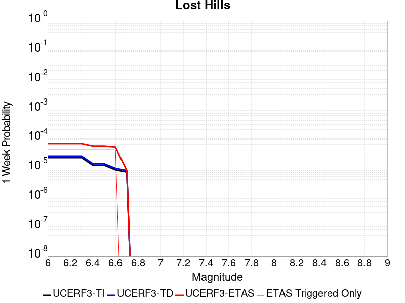 | 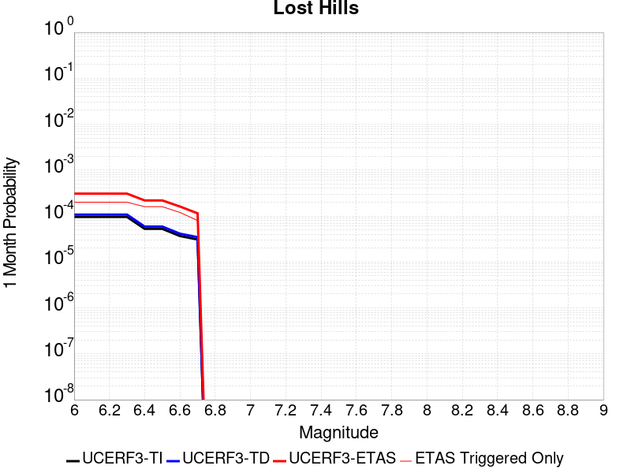 |  |

| Magnitude | 1 wk TI Prob | 1 wk TD Prob | 1 wk ETAS Prob | 1 wk ETAS/TD Gain | 1 wk ETAS Triggered Only | 1 mo TI Prob | 1 mo TD Prob | 1 mo ETAS Prob | 1 mo ETAS/TD Gain | 1 mo ETAS Triggered Only | 1 yr TI Prob | 1 yr TD Prob | 1 yr ETAS Prob | 1 yr ETAS/TD Gain | 1 yr ETAS Triggered Only |
|-----|-----|-----|-----|-----|-----|-----|-----|-----|-----|-----|-----|-----|-----|-----|-----|
| 6.0 | 2.233523E-5 | 2.5117144E-5 | 6.511614E-5 | 2.5924978 | 4.0E-5 | 9.571891E-5 | 1.0764141E-4 | 3.076199E-4 | 2.857821 | 2.0E-4 | 0.0011647546 | 0.0013099145 | 0.0016294954 | 1.2439708 | 3.2E-4 |
| 6.1 | 2.233523E-5 | 2.5117144E-5 | 6.511614E-5 | 2.5924978 | 4.0E-5 | 9.571891E-5 | 1.0764141E-4 | 3.076199E-4 | 2.857821 | 2.0E-4 | 0.0011647546 | 0.0013099145 | 0.0016294954 | 1.2439708 | 3.2E-4 |
| 6.2 | 2.233523E-5 | 2.5117144E-5 | 6.511614E-5 | 2.5924978 | 4.0E-5 | 9.571891E-5 | 1.0764141E-4 | 3.076199E-4 | 2.857821 | 2.0E-4 | 0.0011647546 | 0.0013099145 | 0.0016294954 | 1.2439708 | 3.2E-4 |
| 6.3 | 2.233523E-5 | 2.5117144E-5 | 6.511614E-5 | 2.5924978 | 4.0E-5 | 9.571891E-5 | 1.0764141E-4 | 3.076199E-4 | 2.857821 | 2.0E-4 | 0.0011647546 | 0.0013099145 | 0.0016294954 | 1.2439708 | 3.2E-4 |
| 6.4 | 1.2288092E-5 | 1.3786784E-5 | 5.3786232E-5 | 3.9012892 | 4.0E-5 | 5.2662188E-5 | 5.9085407E-5 | 2.1907596E-4 | 3.7077844 | 1.6E-4 | 6.409735E-4 | 7.192213E-4 | 9.9902E-4 | 1.38903 | 2.8E-4 |
| 6.5 | 1.2288092E-5 | 1.3786784E-5 | 5.3786232E-5 | 3.9012892 | 4.0E-5 | 5.2662188E-5 | 5.9085407E-5 | 2.1907596E-4 | 3.7077844 | 1.6E-4 | 6.409735E-4 | 7.192213E-4 | 9.9902E-4 | 1.38903 | 2.8E-4 |
| 6.6 | 8.58281E-6 | 9.637769E-6 | 4.9637383E-5 | 5.150298 | 4.0E-5 | 3.6782953E-5 | 4.1304538E-5 | 1.6129958E-4 | 3.9051297 | 1.2E-4 | 4.4774043E-4 | 5.0285E-4 | 7.4272935E-4 | 1.4770395 | 2.4E-4 |
| 6.7 | 7.205685E-6 | 8.091661E-6 | 8.091661E-6 | 1.0 | 0.0 | 3.088114E-5 | 3.4678545E-5 | 1.1467577E-4 | 3.3068218 | 8.0E-5 | 3.7591302E-4 | 4.2221128E-4 | 5.821437E-4 | 1.3787972 | 1.6E-4 |

## Calaveras (So) 2011 CFM
*[(top)](#table-of-contents)*

| 1 Week | 1 Month | 1 Year |
|-----|-----|-----|
| 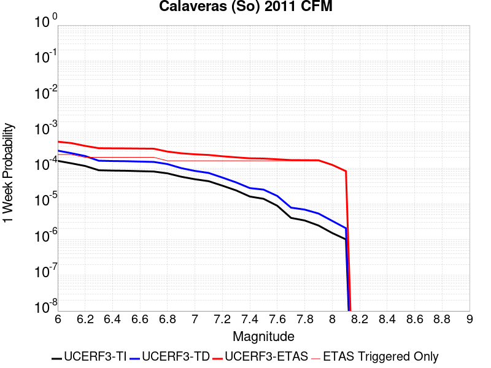 | 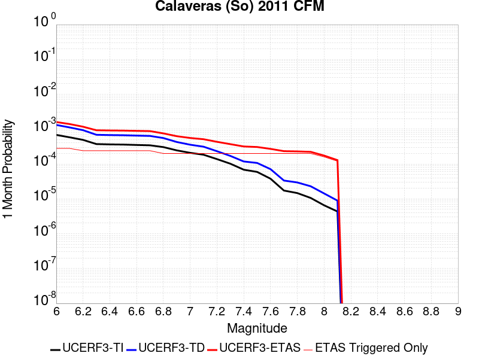 | 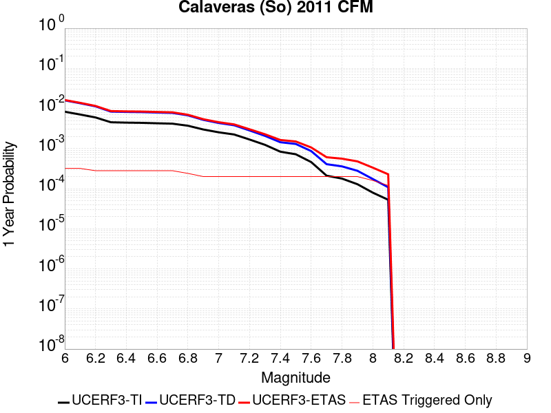 |

| Magnitude | 1 wk TI Prob | 1 wk TD Prob | 1 wk ETAS Prob | 1 wk ETAS/TD Gain | 1 wk ETAS Triggered Only | 1 mo TI Prob | 1 mo TD Prob | 1 mo ETAS Prob | 1 mo ETAS/TD Gain | 1 mo ETAS Triggered Only | 1 yr TI Prob | 1 yr TD Prob | 1 yr ETAS Prob | 1 yr ETAS/TD Gain | 1 yr ETAS Triggered Only |
|-----|-----|-----|-----|-----|-----|-----|-----|-----|-----|-----|-----|-----|-----|-----|-----|
| 6.0 | 1.5950744E-4 | 3.0790493E-4 | 5.4783106E-4 | 1.7792213 | 2.4E-4 | 6.834242E-4 | 0.0013187632 | 0.001598394 | 1.2120402 | 2.8E-4 | 0.00828899 | 0.015898287 | 0.0162132 | 1.0198079 | 3.2E-4 |
| 6.1 | 1.3584697E-4 | 2.6108976E-4 | 5.010271E-4 | 1.9189842 | 2.4E-4 | 5.8207137E-4 | 0.0011183338 | 0.0013980207 | 1.2500925 | 2.8E-4 | 0.007063716 | 0.013499089 | 0.013814769 | 1.0233853 | 3.2E-4 |
| 6.2 | 1.14676266E-4 | 2.1784513E-4 | 4.1780155E-4 | 1.9178834 | 2.0E-4 | 4.9137714E-4 | 9.3321304E-4 | 0.0011729891 | 1.256936 | 2.4E-4 | 0.0059661185 | 0.011280941 | 0.011557782 | 1.0245407 | 2.8E-4 |
| 6.3 | 8.691518E-5 | 1.6052955E-4 | 3.6049745E-4 | 2.2456765 | 2.0E-4 | 3.7244044E-4 | 6.8776263E-4 | 9.275976E-4 | 1.3487176 | 2.4E-4 | 0.004525038 | 0.008334652 | 0.008612318 | 1.0333147 | 2.8E-4 |
| 6.4 | 8.50982E-5 | 1.5758992E-4 | 3.575584E-4 | 2.2689168 | 2.0E-4 | 3.646556E-4 | 6.7517074E-4 | 9.150087E-4 | 1.3552257 | 2.4E-4 | 0.0044306475 | 0.008182503 | 0.0084602125 | 1.0339394 | 2.8E-4 |
| 6.5 | 8.4062965E-5 | 1.5583218E-4 | 3.5580102E-4 | 2.283232 | 2.0E-4 | 3.602201E-4 | 6.6764234E-4 | 9.074821E-4 | 1.3592339 | 2.4E-4 | 0.004376863 | 0.008091622 | 0.008369356 | 1.0343237 | 2.8E-4 |
| 6.6 | 8.194716E-5 | 1.521856E-4 | 3.5215516E-4 | 2.3139849 | 2.0E-4 | 3.5115483E-4 | 6.5202266E-4 | 8.918662E-4 | 1.3678453 | 2.4E-4 | 0.0042669317 | 0.007903222 | 0.008181009 | 1.0351486 | 2.8E-4 |
| 6.7 | 8.012326E-5 | 1.4886065E-4 | 3.488309E-4 | 2.3433385 | 2.0E-4 | 3.433402E-4 | 6.377831E-4 | 8.7762997E-4 | 1.3760635 | 2.4E-4 | 0.004172157 | 0.0077315248 | 0.00800936 | 1.0359354 | 2.8E-4 |
| 6.8 | 7.119773E-5 | 1.2941338E-4 | 2.893927E-4 | 2.2361882 | 1.6E-4 | 3.0509746E-4 | 5.54491E-4 | 7.5438013E-4 | 1.3604912 | 2.0E-4 | 0.0037082357 | 0.0067267935 | 0.006965179 | 1.0354382 | 2.4E-4 |
| 6.9 | 5.7343088E-5 | 9.972352E-5 | 2.5970757E-4 | 2.604276 | 1.6E-4 | 2.4573295E-4 | 4.2731693E-4 | 6.272315E-4 | 1.4678367 | 2.0E-4 | 0.0029876942 | 0.005190248 | 0.0053892103 | 1.0383338 | 2.0E-4 |
| 7.0 | 4.8746577E-5 | 8.3315186E-5 | 2.4330185E-4 | 2.9202583 | 1.6E-4 | 2.0889717E-4 | 3.5701657E-4 | 5.5694516E-4 | 1.559998 | 2.0E-4 | 0.0025403565 | 0.0043380805 | 0.004537213 | 1.0459033 | 2.0E-4 |
| 7.1 | 4.2998014E-5 | 7.307419E-5 | 2.330625E-4 | 3.1893957 | 1.6E-4 | 1.8426418E-4 | 3.1313783E-4 | 5.130752E-4 | 1.6384964 | 2.0E-4 | 0.002241108 | 0.0038058492 | 0.004005088 | 1.0523506 | 2.0E-4 |
| 7.2 | 3.221292E-5 | 5.426544E-5 | 2.1425675E-4 | 3.9483097 | 1.6E-4 | 1.3804805E-4 | 2.325456E-4 | 4.324991E-4 | 1.8598464 | 2.0E-4 | 0.0016794393 | 0.0028275952 | 0.0030270296 | 1.0705315 | 2.0E-4 |
| 7.3 | 2.3756531E-5 | 3.976839E-5 | 1.9976203E-4 | 5.0231357 | 1.6E-4 | 1.0180973E-4 | 1.7042493E-4 | 3.7039083E-4 | 2.1733372 | 2.0E-4 | 0.0012388286 | 0.0020729662 | 0.0022725516 | 1.0962801 | 2.0E-4 |
| 7.4 | 1.5997684E-5 | 2.7537306E-5 | 1.875329E-4 | 6.8101397 | 1.6E-4 | 6.8559704E-5 | 1.18011696E-4 | 3.179881E-4 | 2.6945472 | 2.0E-4 | 8.343947E-4 | 0.001435848 | 0.0016355608 | 1.1390905 | 2.0E-4 |
| 7.5 | 1.3814293E-5 | 2.4971192E-5 | 1.849672E-4 | 7.407223 | 1.6E-4 | 5.9202768E-5 | 1.0701502E-4 | 3.069936E-4 | 2.8686967 | 2.0E-4 | 7.205553E-4 | 0.0013021316 | 0.001501871 | 1.1533943 | 2.0E-4 |
| 7.6 | 8.817309E-6 | 1.6584063E-5 | 1.7658141E-4 | 10.647656 | 1.6E-4 | 3.7787922E-5 | 7.107262E-5 | 2.710584E-4 | 3.813823 | 2.0E-4 | 4.5997082E-4 | 8.6496706E-4 | 0.001064794 | 1.2310227 | 2.0E-4 |
| 7.7 | 4.0352206E-6 | 7.815648E-6 | 1.678144E-4 | 21.47159 | 1.6E-4 | 1.7293689E-5 | 3.3495206E-5 | 2.334885E-4 | 6.9708037 | 2.0E-4 | 2.1053031E-4 | 4.077279E-4 | 6.0764636E-4 | 1.4903232 | 2.0E-4 |
| 7.8 | 3.413169E-6 | 6.882057E-6 | 1.6688096E-4 | 24.248703 | 1.6E-4 | 1.4627784E-5 | 2.9494196E-5 | 2.294883E-4 | 7.780795 | 2.0E-4 | 1.7807873E-4 | 3.5903274E-4 | 5.5896095E-4 | 1.5568522 | 2.0E-4 |
| 7.9 | 2.4740732E-6 | 5.3497497E-6 | 1.6534889E-4 | 30.90778 | 1.6E-4 | 1.06031275E-5 | 2.29273E-5 | 2.2292271E-4 | 9.723026 | 2.0E-4 | 1.2908543E-4 | 2.7910416E-4 | 4.7904835E-4 | 1.7163783 | 2.0E-4 |
| 8.0 | 1.5231818E-6 | 3.3315503E-6 | 1.2333115E-4 | 37.019146 | 1.2E-4 | 6.527906E-6 | 1.42779945E-5 | 1.7427572E-4 | 12.205895 | 1.6E-4 | 7.9474354E-5 | 1.7382075E-4 | 3.3379294E-4 | 1.9203285 | 1.6E-4 |
| 8.1 | 1.0104524E-6 | 2.0730229E-6 | 8.207286E-5 | 39.590908 | 8.0E-5 | 4.330503E-6 | 8.8843535E-6 | 1.2888329E-4 | 14.506772 | 1.2E-4 | 5.2722597E-5 | 1.08161665E-4 | 2.2814868E-4 | 2.1093304 | 1.2E-4 |

## San Andreas (North Coast) 2011 CFM
*[(top)](#table-of-contents)*

| 1 Week | 1 Month | 1 Year |
|-----|-----|-----|
| 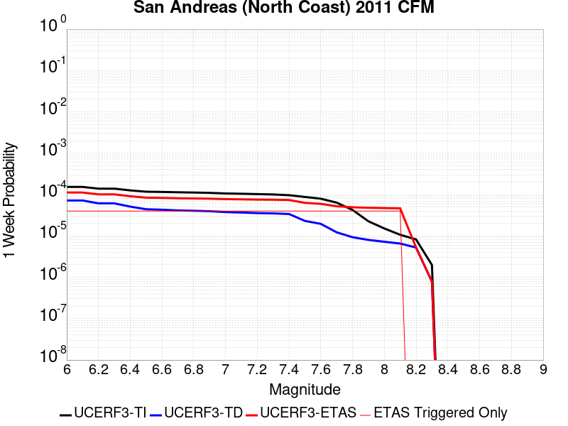 | 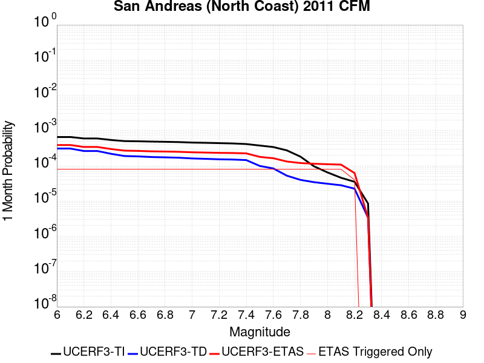 | 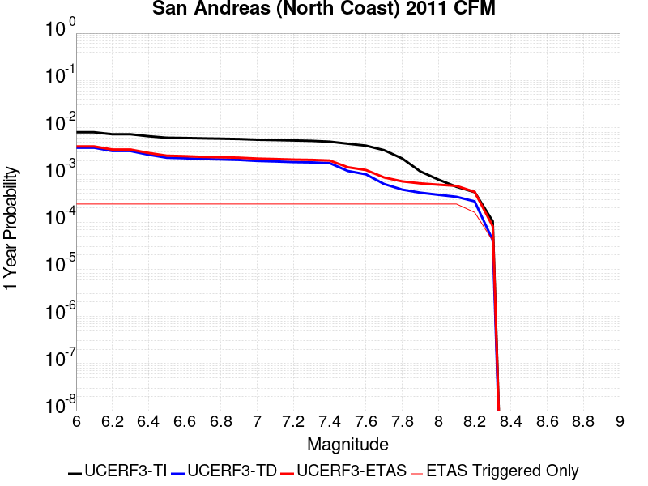 |

| Magnitude | 1 wk TI Prob | 1 wk TD Prob | 1 wk ETAS Prob | 1 wk ETAS/TD Gain | 1 wk ETAS Triggered Only | 1 mo TI Prob | 1 mo TD Prob | 1 mo ETAS Prob | 1 mo ETAS/TD Gain | 1 mo ETAS Triggered Only | 1 yr TI Prob | 1 yr TD Prob | 1 yr ETAS Prob | 1 yr ETAS/TD Gain | 1 yr ETAS Triggered Only |
|-----|-----|-----|-----|-----|-----|-----|-----|-----|-----|-----|-----|-----|-----|-----|-----|
| 6.0 | 1.5333705E-4 | 7.205663E-5 | 1.1205375E-4 | 1.555079 | 4.0E-5 | 6.5699324E-4 | 3.0877776E-4 | 3.8875308E-4 | 1.259006 | 8.0E-5 | 0.007969595 | 0.0037529236 | 0.003992023 | 1.0637101 | 2.4E-4 |
| 6.1 | 1.5333705E-4 | 7.205663E-5 | 1.1205375E-4 | 1.555079 | 4.0E-5 | 6.5699324E-4 | 3.0877776E-4 | 3.8875308E-4 | 1.259006 | 8.0E-5 | 0.007969595 | 0.0037529236 | 0.003992023 | 1.0637101 | 2.4E-4 |
| 6.2 | 1.3912938E-4 | 6.134417E-5 | 1.0134172E-4 | 1.6520187 | 4.0E-5 | 5.961325E-4 | 2.6287726E-4 | 3.4285622E-4 | 1.3042445 | 8.0E-5 | 0.007233787 | 0.0031958611 | 0.0034350941 | 1.0748571 | 2.4E-4 |
| 6.3 | 1.3912938E-4 | 6.134417E-5 | 1.0134172E-4 | 1.6520187 | 4.0E-5 | 5.961325E-4 | 2.6287726E-4 | 3.4285622E-4 | 1.3042445 | 8.0E-5 | 0.007233787 | 0.0031958611 | 0.0034350941 | 1.0748571 | 2.4E-4 |
| 6.4 | 1.2623647E-4 | 5.1188537E-5 | 9.118649E-5 | 1.781385 | 4.0E-5 | 5.4090127E-4 | 2.193611E-4 | 2.9934355E-4 | 1.3646154 | 8.0E-5 | 0.0065656058 | 0.0026674708 | 0.0029068307 | 1.0897329 | 2.4E-4 |
| 6.5 | 1.1736096E-4 | 4.420224E-5 | 8.4200474E-5 | 1.9048915 | 4.0E-5 | 5.028786E-4 | 1.894245E-4 | 2.6940936E-4 | 1.4222518 | 8.0E-5 | 0.006105373 | 0.0023038208 | 0.0025432678 | 1.1039348 | 2.4E-4 |
| 6.6 | 1.1586959E-4 | 4.3091295E-5 | 8.308957E-5 | 1.9282217 | 4.0E-5 | 4.964894E-4 | 1.84664E-4 | 2.6464922E-4 | 1.4331392 | 8.0E-5 | 0.006028018 | 0.0022459824 | 0.0024854434 | 1.1066175 | 2.4E-4 |
| 6.7 | 1.13693764E-4 | 4.1388004E-5 | 8.1386344E-5 | 1.9664236 | 4.0E-5 | 4.87168E-4 | 1.7736519E-4 | 2.57351E-4 | 1.4509668 | 8.0E-5 | 0.005915152 | 0.0021572988 | 0.002396781 | 1.1110102 | 2.4E-4 |
| 6.8 | 1.1204889E-4 | 4.0594197E-5 | 8.0592574E-5 | 1.9853225 | 4.0E-5 | 4.8012115E-4 | 1.7396362E-4 | 2.5394972E-4 | 1.4597863 | 8.0E-5 | 0.005829819 | 0.002115966 | 0.0023554582 | 1.1131834 | 2.4E-4 |
| 6.9 | 1.1005794E-4 | 3.9636114E-5 | 7.963453E-5 | 2.0091407 | 4.0E-5 | 4.7159163E-4 | 1.6985809E-4 | 2.4984448E-4 | 1.4709014 | 8.0E-5 | 0.0057265228 | 0.002066077 | 0.002305581 | 1.1159222 | 2.4E-4 |
| 7.0 | 1.0647948E-4 | 3.7762937E-5 | 7.7761426E-5 | 2.0591996 | 4.0E-5 | 4.562608E-4 | 1.6183121E-4 | 2.4181826E-4 | 1.4942622 | 8.0E-5 | 0.0055408357 | 0.0019685302 | 0.0022080578 | 1.1216784 | 2.4E-4 |
| 7.1 | 1.04795035E-4 | 3.6799192E-5 | 7.679772E-5 | 2.0869403 | 4.0E-5 | 4.4904428E-4 | 1.5770139E-4 | 2.3768877E-4 | 1.5072079 | 8.0E-5 | 0.0054534175 | 0.0019183393 | 0.0021578788 | 1.1248682 | 2.4E-4 |
| 7.2 | 1.02724036E-4 | 3.5691766E-5 | 7.569034E-5 | 2.1206665 | 4.0E-5 | 4.401716E-4 | 1.5295584E-4 | 2.329436E-4 | 1.5229468 | 8.0E-5 | 0.0053459285 | 0.0018606624 | 0.0021002158 | 1.1287463 | 2.4E-4 |
| 7.3 | 1.00650694E-4 | 3.5146393E-5 | 7.5144984E-5 | 2.1380568 | 4.0E-5 | 4.312888E-4 | 1.5061878E-4 | 2.3060675E-4 | 1.5310622 | 8.0E-5 | 0.005238306 | 0.001832257 | 0.0020718172 | 1.130746 | 2.4E-4 |
| 7.4 | 9.672919E-5 | 3.390746E-5 | 7.390611E-5 | 2.1796415 | 4.0E-5 | 4.144878E-4 | 1.4530968E-4 | 2.2529806E-4 | 1.5504683 | 8.0E-5 | 0.005034718 | 0.0017677253 | 0.002007301 | 1.1355277 | 2.4E-4 |
| 7.5 | 8.7600405E-5 | 2.3112607E-5 | 6.3111685E-5 | 2.7306173 | 4.0E-5 | 3.753763E-4 | 9.9050274E-5 | 1.7904236E-4 | 1.8075906 | 8.0E-5 | 0.0045606326 | 0.0012052718 | 0.0014449825 | 1.1988852 | 2.4E-4 |
| 7.6 | 7.9562284E-5 | 1.9601684E-5 | 5.96009E-5 | 3.040601 | 4.0E-5 | 3.4093665E-4 | 8.4004525E-5 | 1.639978E-4 | 1.9522496 | 8.0E-5 | 0.0041430052 | 0.0010222767 | 0.0012620314 | 1.2345301 | 2.4E-4 |
| 7.7 | 6.3866544E-5 | 1.223491E-5 | 5.223442E-5 | 4.2692933 | 4.0E-5 | 2.7368503E-4 | 5.2434276E-5 | 1.3243008E-4 | 2.5256395 | 8.0E-5 | 0.0033270244 | 6.382006E-4 | 8.7804743E-4 | 1.3758173 | 2.4E-4 |
| 7.8 | 4.2543215E-5 | 9.312552E-6 | 4.931218E-5 | 5.295238 | 4.0E-5 | 1.8231533E-4 | 3.9910326E-5 | 1.19907134E-4 | 3.0044138 | 8.0E-5 | 0.0022174292 | 4.8579997E-4 | 7.256834E-4 | 1.4937905 | 2.4E-4 |
| 7.9 | 2.2636612E-5 | 8.0142E-6 | 4.801388E-5 | 5.991101 | 4.0E-5 | 9.7010445E-5 | 3.434612E-5 | 1.1434337E-4 | 3.3291497 | 8.0E-5 | 0.0011804621 | 4.1808386E-4 | 6.5798353E-4 | 1.5738075 | 2.4E-4 |
| 8.0 | 1.5167874E-5 | 7.230041E-6 | 4.722975E-5 | 6.532432 | 4.0E-5 | 6.500356E-5 | 3.098552E-5 | 1.1098304E-4 | 3.5817711 | 8.0E-5 | 7.9113094E-4 | 3.7718352E-4 | 6.17093E-4 | 1.636055 | 2.4E-4 |
| 8.1 | 1.0681047E-5 | 6.5504837E-6 | 4.655022E-5 | 7.1063795 | 4.0E-5 | 4.5775112E-5 | 2.8073198E-5 | 1.08070955E-4 | 3.849613 | 8.0E-5 | 5.5716943E-4 | 3.4173767E-4 | 5.8165565E-4 | 1.7020531 | 2.4E-4 |
| 8.2 | 8.226114E-6 | 5.240571E-6 | 5.240571E-6 | 1.0 | 0.0 | 3.52543E-5 | 2.2459399E-5 | 6.24585E-5 | 2.7809517 | 4.0E-5 | 4.2913653E-4 | 2.7340895E-4 | 4.333652E-4 | 1.585044 | 1.6E-4 |
| 8.3 | 1.983087E-6 | 7.877893E-7 | 7.877893E-7 | 1.0 | 0.0 | 8.498917E-6 | 3.3762356E-6 | 3.3762356E-6 | 1.0 | 0.0 | 1.034694E-4 | 4.110491E-5 | 8.1103266E-5 | 1.9730797 | 4.0E-5 |

## Panamint Valley
*[(top)](#table-of-contents)*

| 1 Week | 1 Month | 1 Year |
|-----|-----|-----|
| 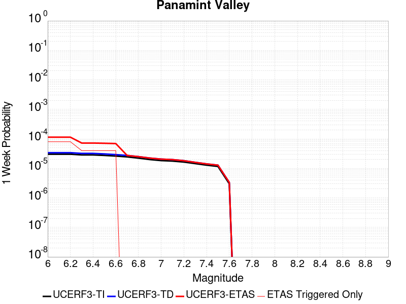 | 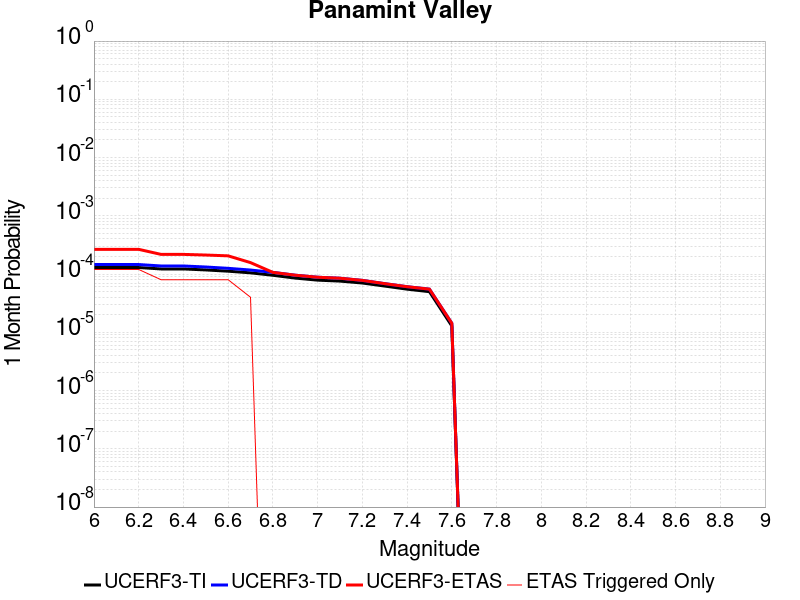 | 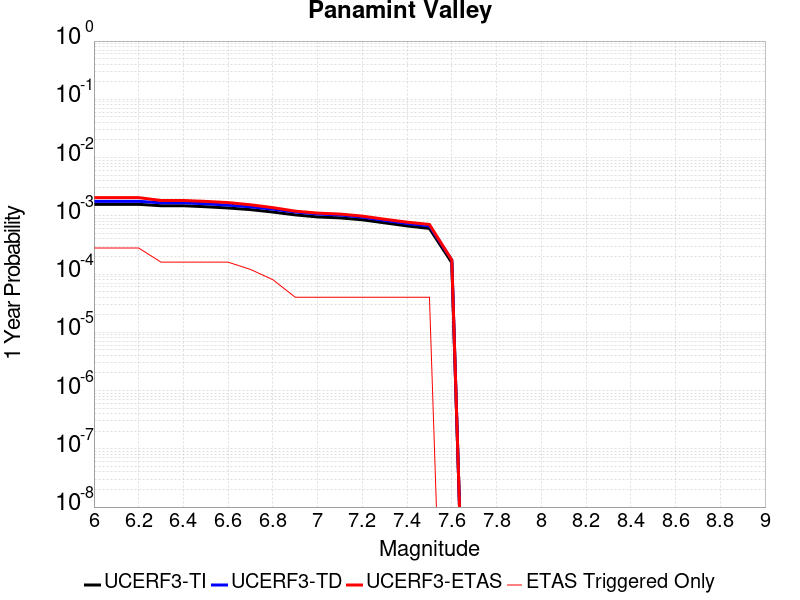 |

| Magnitude | 1 wk TI Prob | 1 wk TD Prob | 1 wk ETAS Prob | 1 wk ETAS/TD Gain | 1 wk ETAS Triggered Only | 1 mo TI Prob | 1 mo TD Prob | 1 mo ETAS Prob | 1 mo ETAS/TD Gain | 1 mo ETAS Triggered Only | 1 yr TI Prob | 1 yr TD Prob | 1 yr ETAS Prob | 1 yr ETAS/TD Gain | 1 yr ETAS Triggered Only |
|-----|-----|-----|-----|-----|-----|-----|-----|-----|-----|-----|-----|-----|-----|-----|-----|
| 6.0 | 3.0211835E-5 | 3.4006032E-5 | 1.1400331E-4 | 3.3524437 | 8.0E-5 | 1.2947287E-4 | 1.4573216E-4 | 2.6571468E-4 | 1.8233083 | 1.2E-4 | 0.0015751923 | 0.0017728747 | 0.0020523784 | 1.1576556 | 2.8E-4 |
| 6.1 | 3.0211835E-5 | 3.4006032E-5 | 1.1400331E-4 | 3.3524437 | 8.0E-5 | 1.2947287E-4 | 1.4573216E-4 | 2.6571468E-4 | 1.8233083 | 1.2E-4 | 0.0015751923 | 0.0017728747 | 0.0020523784 | 1.1576556 | 2.8E-4 |
| 6.2 | 3.0211835E-5 | 3.4006032E-5 | 1.1400331E-4 | 3.3524437 | 8.0E-5 | 1.2947287E-4 | 1.4573216E-4 | 2.6571468E-4 | 1.8233083 | 1.2E-4 | 0.0015751923 | 0.0017728747 | 0.0020523784 | 1.1576556 | 2.8E-4 |
| 6.3 | 2.8573924E-5 | 3.212314E-5 | 7.212185E-5 | 2.2451684 | 4.0E-5 | 1.2245393E-4 | 1.3766348E-4 | 2.1765247E-4 | 1.5810473 | 8.0E-5 | 0.001489857 | 0.0016747921 | 0.0018345242 | 1.0953742 | 1.6E-4 |
| 6.4 | 2.8573924E-5 | 3.212314E-5 | 7.212185E-5 | 2.2451684 | 4.0E-5 | 1.2245393E-4 | 1.3766348E-4 | 2.1765247E-4 | 1.5810473 | 8.0E-5 | 0.001489857 | 0.0016747921 | 0.0018345242 | 1.0953742 | 1.6E-4 |
| 6.5 | 2.7468774E-5 | 3.0848154E-5 | 7.084692E-5 | 2.296634 | 4.0E-5 | 1.1771801E-4 | 1.3219983E-4 | 2.1218925E-4 | 1.6050645 | 8.0E-5 | 0.0014322745 | 0.001608372 | 0.0017681146 | 1.0993195 | 1.6E-4 |
| 6.6 | 2.6135967E-5 | 2.9271281E-5 | 6.9270114E-5 | 2.366487 | 4.0E-5 | 1.1200648E-4 | 1.2544247E-4 | 2.0543243E-4 | 1.6376625 | 8.0E-5 | 0.0013628257 | 0.0015262186 | 0.0016859744 | 1.1046742 | 1.6E-4 |
| 6.7 | 2.4498746E-5 | 2.7359867E-5 | 2.7359867E-5 | 1.0 | 0.0 | 1.04990395E-4 | 1.17251446E-4 | 1.5724676E-4 | 1.3411071 | 4.0E-5 | 0.0012775084 | 0.0014266267 | 0.0015464554 | 1.0839945 | 1.2E-4 |
| 6.8 | 2.2244329E-5 | 2.4952975E-5 | 2.4952975E-5 | 1.0 | 0.0 | 9.532935E-5 | 1.06937056E-4 | 1.06937056E-4 | 1.0 | 0.0 | 0.0011600169 | 0.0013012029 | 0.0013810989 | 1.0614016 | 8.0E-5 |
| 6.9 | 1.9902658E-5 | 2.2306494E-5 | 2.2306494E-5 | 1.0 | 0.0 | 8.529431E-5 | 9.559586E-5 | 9.559586E-5 | 1.0 | 0.0 | 0.0010379635 | 0.0011632767 | 0.0012032302 | 1.0343456 | 4.0E-5 |
| 7.0 | 1.8353881E-5 | 2.0581738E-5 | 2.0581738E-5 | 1.0 | 0.0 | 7.865712E-5 | 8.8204564E-5 | 8.8204564E-5 | 1.0 | 0.0 | 9.5722964E-4 | 0.0010733792 | 0.0011133363 | 1.0372255 | 4.0E-5 |
| 7.1 | 1.7667631E-5 | 1.9787058E-5 | 1.9787058E-5 | 1.0 | 0.0 | 7.571623E-5 | 8.4799016E-5 | 8.4799016E-5 | 1.0 | 0.0 | 9.2145515E-4 | 0.0010319566 | 0.0010719154 | 1.0387213 | 4.0E-5 |
| 7.2 | 1.6381597E-5 | 1.8171384E-5 | 1.8171384E-5 | 1.0 | 0.0 | 7.020495E-5 | 7.787513E-5 | 7.787513E-5 | 1.0 | 0.0 | 8.544101E-4 | 9.477346E-4 | 9.876967E-4 | 1.0421659 | 4.0E-5 |
| 7.3 | 1.4520491E-5 | 1.5977024E-5 | 1.5977024E-5 | 1.0 | 0.0 | 6.222919E-5 | 6.847125E-5 | 6.847125E-5 | 1.0 | 0.0 | 7.57377E-4 | 8.3333487E-4 | 8.733016E-4 | 1.0479599 | 4.0E-5 |
| 7.4 | 1.2852287E-5 | 1.4154711E-5 | 1.4154711E-5 | 1.0 | 0.0 | 5.5080065E-5 | 6.0661725E-5 | 6.0661725E-5 | 1.0 | 0.0 | 6.7039346E-4 | 7.3832204E-4 | 7.7829254E-4 | 1.0541369 | 4.0E-5 |
| 7.5 | 1.1637851E-5 | 1.2845683E-5 | 1.2845683E-5 | 1.0 | 0.0 | 4.987555E-5 | 5.5051856E-5 | 5.5051856E-5 | 1.0 | 0.0 | 6.070656E-4 | 6.700659E-4 | 7.100391E-4 | 1.0596557 | 4.0E-5 |
| 7.6 | 3.0068115E-6 | 3.3365502E-6 | 3.3365502E-6 | 1.0 | 0.0 | 1.2886271E-5 | 1.4299464E-5 | 1.4299464E-5 | 1.0 | 0.0 | 1.5687906E-4 | 1.7408936E-4 | 1.7408936E-4 | 1.0 | 0.0 |

## Gravel Hills-Harper Lk
*[(top)](#table-of-contents)*

| 1 Week | 1 Month | 1 Year |
|-----|-----|-----|
| 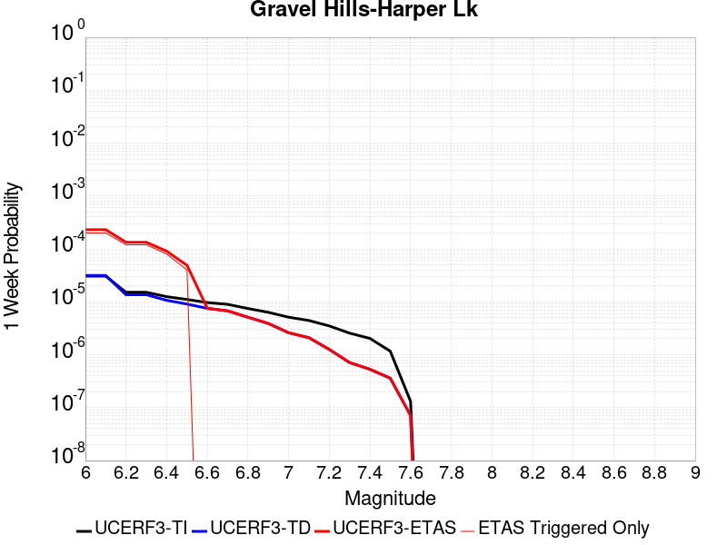 | 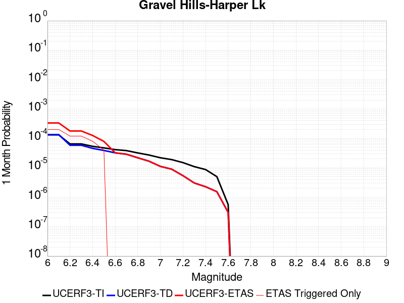 |  |

| Magnitude | 1 wk TI Prob | 1 wk TD Prob | 1 wk ETAS Prob | 1 wk ETAS/TD Gain | 1 wk ETAS Triggered Only | 1 mo TI Prob | 1 mo TD Prob | 1 mo ETAS Prob | 1 mo ETAS/TD Gain | 1 mo ETAS Triggered Only | 1 yr TI Prob | 1 yr TD Prob | 1 yr ETAS Prob | 1 yr ETAS/TD Gain | 1 yr ETAS Triggered Only |
|-----|-----|-----|-----|-----|-----|-----|-----|-----|-----|-----|-----|-----|-----|-----|-----|
| 6.0 | 3.0679566E-5 | 3.14785E-5 | 2.3147221E-4 | 7.353343 | 2.0E-4 | 1.3147724E-4 | 1.349021E-4 | 3.3487513E-4 | 2.4823565 | 2.0E-4 | 0.0015995599 | 0.001641413 | 0.0019209534 | 1.1703048 | 2.8E-4 |
| 6.1 | 3.0679566E-5 | 3.14785E-5 | 2.3147221E-4 | 7.353343 | 2.0E-4 | 1.3147724E-4 | 1.349021E-4 | 3.3487513E-4 | 2.4823565 | 2.0E-4 | 0.0015995599 | 0.001641413 | 0.0019209534 | 1.1703048 | 2.8E-4 |
| 6.2 | 1.514536E-5 | 1.3640053E-5 | 1.3363842E-4 | 9.7975 | 1.2E-4 | 6.490707E-5 | 5.8456128E-5 | 1.7844912E-4 | 3.0527017 | 1.2E-4 | 7.8995706E-4 | 7.1148283E-4 | 8.71369E-4 | 1.2247225 | 1.6E-4 |
| 6.3 | 1.514536E-5 | 1.3640053E-5 | 1.3363842E-4 | 9.7975 | 1.2E-4 | 6.490707E-5 | 5.8456128E-5 | 1.7844912E-4 | 3.0527017 | 1.2E-4 | 7.8995706E-4 | 7.1148283E-4 | 8.71369E-4 | 1.2247225 | 1.6E-4 |
| 6.4 | 1.2532521E-5 | 1.06932575E-5 | 9.06924E-5 | 8.48127 | 8.0E-5 | 5.37097E-5 | 4.5827474E-5 | 1.258238E-4 | 2.7455978 | 8.0E-5 | 6.537194E-4 | 5.5781245E-4 | 6.7774556E-4 | 1.2150061 | 1.2E-4 |
| 6.5 | 1.1094058E-5 | 9.086593E-6 | 4.908623E-5 | 5.40205 | 4.0E-5 | 4.7545094E-5 | 3.8941984E-5 | 7.894042E-5 | 2.0271292 | 4.0E-5 | 5.787078E-4 | 4.7401953E-4 | 5.5398163E-4 | 1.1686894 | 8.0E-5 |
| 6.6 | 9.688328E-6 | 7.534075E-6 | 7.534075E-6 | 1.0 | 0.0 | 4.1520743E-5 | 3.228851E-5 | 3.228851E-5 | 1.0 | 0.0 | 5.053978E-4 | 3.9304423E-4 | 4.330285E-4 | 1.1017298 | 4.0E-5 |
| 6.7 | 8.974824E-6 | 6.7515366E-6 | 6.7515366E-6 | 1.0 | 0.0 | 3.8462964E-5 | 2.8934848E-5 | 2.8934848E-5 | 1.0 | 0.0 | 4.6818596E-4 | 3.5222704E-4 | 3.9221297E-4 | 1.1135231 | 4.0E-5 |
| 6.8 | 7.4780046E-6 | 5.1178117E-6 | 5.1178117E-6 | 1.0 | 0.0 | 3.20482E-5 | 2.1933301E-5 | 2.1933301E-5 | 1.0 | 0.0 | 3.9011694E-4 | 2.670066E-4 | 3.0699593E-4 | 1.1497691 | 4.0E-5 |
| 6.9 | 6.3409307E-6 | 3.908781E-6 | 3.908781E-6 | 1.0 | 0.0 | 2.7175134E-5 | 1.6751816E-5 | 1.6751816E-5 | 1.0 | 0.0 | 3.3080703E-4 | 2.0393525E-4 | 2.4392709E-4 | 1.1961007 | 4.0E-5 |
| 7.0 | 5.1239335E-6 | 2.6067862E-6 | 2.6067862E-6 | 1.0 | 0.0 | 2.195953E-5 | 1.1171895E-5 | 1.1171895E-5 | 1.0 | 0.0 | 2.6732447E-4 | 1.3600958E-4 | 1.7600415E-4 | 1.2940569 | 4.0E-5 |
| 7.1 | 4.438899E-6 | 2.099272E-6 | 2.099272E-6 | 1.0 | 0.0 | 1.9023713E-5 | 8.99685E-6 | 8.99685E-6 | 1.0 | 0.0 | 2.315891E-4 | 1.09531364E-4 | 1.09531364E-4 | 1.0 | 0.0 |
| 7.2 | 3.50367E-6 | 1.2621932E-6 | 1.2621932E-6 | 1.0 | 0.0 | 1.5015643E-5 | 5.409389E-6 | 5.409389E-6 | 1.0 | 0.0 | 1.8280011E-4 | 6.5857406E-5 | 6.5857406E-5 | 1.0 | 0.0 |
| 7.3 | 2.561638E-6 | 7.12401E-7 | 7.12401E-7 | 1.0 | 0.0 | 1.0978401E-5 | 3.0531437E-6 | 3.0531437E-6 | 1.0 | 0.0 | 1.3365384E-4 | 3.717141E-5 | 3.717141E-5 | 1.0 | 0.0 |
| 7.4 | 2.0368864E-6 | 5.3089406E-7 | 5.3089406E-7 | 1.0 | 0.0 | 8.729483E-6 | 2.275258E-6 | 2.275258E-6 | 1.0 | 0.0 | 1.06276275E-4 | 2.7700922E-5 | 2.7700922E-5 | 1.0 | 0.0 |
| 7.5 | 1.1681728E-6 | 3.605487E-7 | 3.605487E-7 | 1.0 | 0.0 | 5.0064455E-6 | 1.5452079E-6 | 1.5452079E-6 | 1.0 | 0.0 | 6.0951766E-5 | 1.8812749E-5 | 1.8812749E-5 | 1.0 | 0.0 |
| 7.6 | 1.3154387E-7 | 7.121983E-8 | 7.121983E-8 | 1.0 | 0.0 | 5.6375933E-7 | 3.0522784E-7 | 3.0522784E-7 | 1.0 | 0.0 | 6.863748E-6 | 3.7161442E-6 | 3.7161442E-6 | 1.0 | 0.0 |

## San Luis Range 2011 CFM
*[(top)](#table-of-contents)*

| 1 Week | 1 Month | 1 Year |
|-----|-----|-----|
| 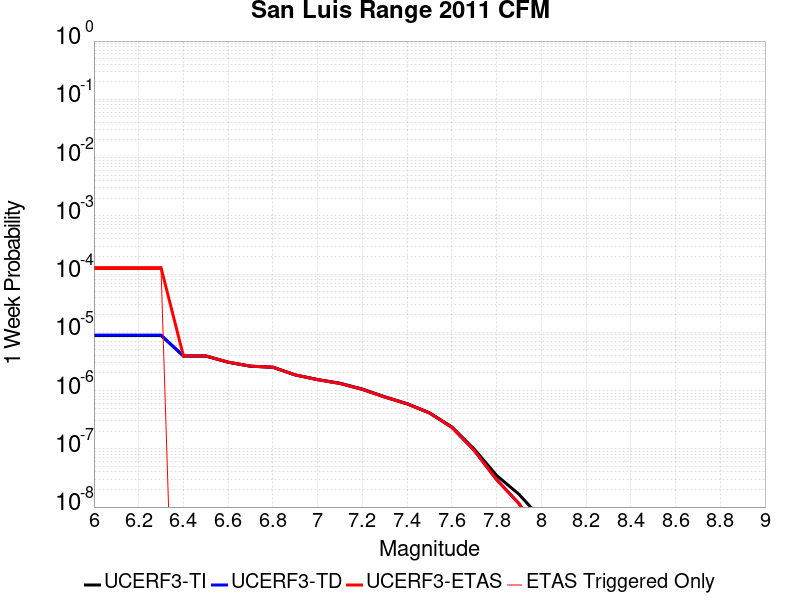 | 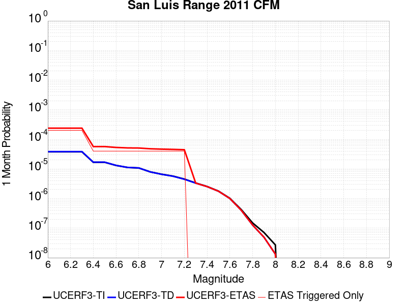 | 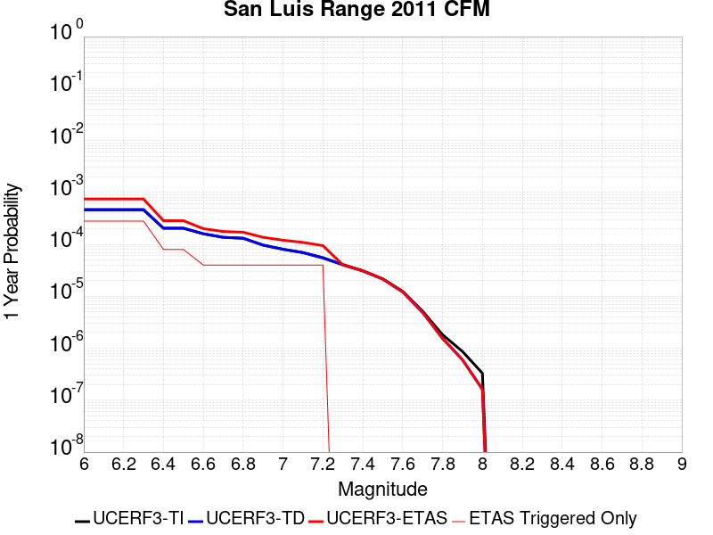 |

| Magnitude | 1 wk TI Prob | 1 wk TD Prob | 1 wk ETAS Prob | 1 wk ETAS/TD Gain | 1 wk ETAS Triggered Only | 1 mo TI Prob | 1 mo TD Prob | 1 mo ETAS Prob | 1 mo ETAS/TD Gain | 1 mo ETAS Triggered Only | 1 yr TI Prob | 1 yr TD Prob | 1 yr ETAS Prob | 1 yr ETAS/TD Gain | 1 yr ETAS Triggered Only |
|-----|-----|-----|-----|-----|-----|-----|-----|-----|-----|-----|-----|-----|-----|-----|-----|
| 6.0 | 8.8368415E-6 | 8.966062E-6 | 1.2896498E-4 | 14.383683 | 1.2E-4 | 3.787163E-5 | 3.8425456E-5 | 2.3841776E-4 | 6.204683 | 2.0E-4 | 4.609895E-4 | 4.6773738E-4 | 7.4760645E-4 | 1.5983465 | 2.8E-4 |
| 6.1 | 8.8368415E-6 | 8.966062E-6 | 1.2896498E-4 | 14.383683 | 1.2E-4 | 3.787163E-5 | 3.8425456E-5 | 2.3841776E-4 | 6.204683 | 2.0E-4 | 4.609895E-4 | 4.6773738E-4 | 7.4760645E-4 | 1.5983465 | 2.8E-4 |
| 6.2 | 8.8368415E-6 | 8.966062E-6 | 1.2896498E-4 | 14.383683 | 1.2E-4 | 3.787163E-5 | 3.8425456E-5 | 2.3841776E-4 | 6.204683 | 2.0E-4 | 4.609895E-4 | 4.6773738E-4 | 7.4760645E-4 | 1.5983465 | 2.8E-4 |
| 6.3 | 8.8368415E-6 | 8.966062E-6 | 1.2896498E-4 | 14.383683 | 1.2E-4 | 3.787163E-5 | 3.8425456E-5 | 2.3841776E-4 | 6.204683 | 2.0E-4 | 4.609895E-4 | 4.6773738E-4 | 7.4760645E-4 | 1.5983465 | 2.8E-4 |
| 6.4 | 3.9094193E-6 | 3.941476E-6 | 3.941476E-6 | 1.0 | 0.0 | 1.6754546E-5 | 1.689193E-5 | 5.6891255E-5 | 3.3679545 | 4.0E-5 | 2.039675E-4 | 2.0564014E-4 | 2.8562368E-4 | 1.3889492 | 8.0E-5 |
| 6.5 | 3.9094193E-6 | 3.941476E-6 | 3.941476E-6 | 1.0 | 0.0 | 1.6754546E-5 | 1.689193E-5 | 5.6891255E-5 | 3.3679545 | 4.0E-5 | 2.039675E-4 | 2.0564014E-4 | 2.8562368E-4 | 1.3889492 | 8.0E-5 |
| 6.6 | 3.0587726E-6 | 3.075609E-6 | 3.075609E-6 | 1.0 | 0.0 | 1.3108959E-5 | 1.3181116E-5 | 5.318059E-5 | 4.0346045 | 4.0E-5 | 1.595899E-4 | 1.6046838E-4 | 2.0046196E-4 | 1.2492303 | 4.0E-5 |
| 6.7 | 2.6160574E-6 | 2.625322E-6 | 2.625322E-6 | 1.0 | 0.0 | 1.1211626E-5 | 1.1251332E-5 | 5.125088E-5 | 4.5550947 | 4.0E-5 | 1.3649299E-4 | 1.369764E-4 | 1.7697093E-4 | 1.2919811 | 4.0E-5 |
| 6.8 | 2.5110312E-6 | 2.518328E-6 | 2.518328E-6 | 1.0 | 0.0 | 1.0761518E-5 | 1.079279E-5 | 5.0792358E-5 | 4.7061377 | 4.0E-5 | 1.310136E-4 | 1.3139435E-4 | 1.713891E-4 | 1.3043871 | 4.0E-5 |
| 6.9 | 1.8564405E-6 | 1.8526367E-6 | 1.8526367E-6 | 1.0 | 0.0 | 7.95615E-6 | 7.939848E-6 | 4.793953E-5 | 6.03784 | 4.0E-5 | 9.686181E-5 | 9.6663374E-5 | 1.3665951E-4 | 1.4137672 | 4.0E-5 |
| 7.0 | 1.546127E-6 | 1.5370855E-6 | 1.5370855E-6 | 1.0 | 0.0 | 6.626242E-6 | 6.587493E-6 | 4.658723E-5 | 7.072073 | 4.0E-5 | 8.06715E-5 | 8.019978E-5 | 1.2019657E-4 | 1.4987144 | 4.0E-5 |
| 7.1 | 1.3368208E-6 | 1.32365E-6 | 1.32365E-6 | 1.0 | 0.0 | 5.7292195E-6 | 5.672774E-6 | 4.5672547E-5 | 8.051184 | 4.0E-5 | 6.975101E-5 | 6.906383E-5 | 1.09061075E-4 | 1.5791343 | 4.0E-5 |
| 7.2 | 1.0623363E-6 | 1.0455358E-6 | 1.0455358E-6 | 1.0 | 0.0 | 4.5528623E-6 | 4.48086E-6 | 4.448068E-5 | 9.926818 | 4.0E-5 | 5.5429686E-5 | 5.4553104E-5 | 9.4550924E-5 | 1.7331905 | 4.0E-5 |
| 7.3 | 7.831679E-7 | 7.728201E-7 | 7.728201E-7 | 1.0 | 0.0 | 3.3564295E-6 | 3.312082E-6 | 3.312082E-6 | 1.0 | 0.0 | 4.086376E-5 | 4.0323852E-5 | 4.0323852E-5 | 1.0 | 0.0 |
| 7.4 | 5.9558846E-7 | 5.9113245E-7 | 5.9113245E-7 | 1.0 | 0.0 | 2.5525194E-6 | 2.5334223E-6 | 2.5334223E-6 | 1.0 | 0.0 | 3.107648E-5 | 3.084398E-5 | 3.084398E-5 | 1.0 | 0.0 |
| 7.5 | 4.1616502E-7 | 4.120181E-7 | 4.120181E-7 | 1.0 | 0.0 | 1.7835631E-6 | 1.7657907E-6 | 1.7657907E-6 | 1.0 | 0.0 | 2.1714664E-5 | 2.149829E-5 | 2.149829E-5 | 1.0 | 0.0 |
| 7.6 | 2.3816014E-7 | 2.3380777E-7 | 2.3380777E-7 | 1.0 | 0.0 | 1.0206859E-6 | 1.0020328E-6 | 1.0020328E-6 | 1.0 | 0.0 | 1.242678E-5 | 1.2199682E-5 | 1.2199682E-5 | 1.0 | 0.0 |
| 7.7 | 9.918777E-8 | 9.389732E-8 | 9.389732E-8 | 1.0 | 0.0 | 4.2509038E-7 | 4.0241702E-7 | 4.0241702E-7 | 1.0 | 0.0 | 5.1754632E-6 | 4.899416E-6 | 4.899416E-6 | 1.0 | 0.0 |
| 7.8 | 3.4982556E-8 | 2.9710671E-8 | 2.9710671E-8 | 1.0 | 0.0 | 1.4992524E-7 | 1.2733145E-7 | 1.2733145E-7 | 1.0 | 0.0 | 1.8253382E-6 | 1.5502592E-6 | 1.5502592E-6 | 1.0 | 0.0 |
| 7.9 | 1.6624908E-8 | 1.1498279E-8 | 1.1498279E-8 | 1.0 | 0.0 | 7.12496E-8 | 4.9278338E-8 | 4.9278338E-8 | 1.0 | 0.0 | 8.6746354E-7 | 5.999636E-7 | 5.999636E-7 | 1.0 | 0.0 |
| 8.0 | 6.3352315E-9 | 3.1016265E-9 | 3.1016265E-9 | 1.0 | 0.0 | 2.715099E-8 | 1.3292685E-8 | 1.3292685E-8 | 1.0 | 0.0 | 3.3056327E-7 | 1.6183843E-7 | 1.6183843E-7 | 1.0 | 0.0 |

## San Jacinto (Superstition Mtn)
*[(top)](#table-of-contents)*

| 1 Week | 1 Month | 1 Year |
|-----|-----|-----|
| 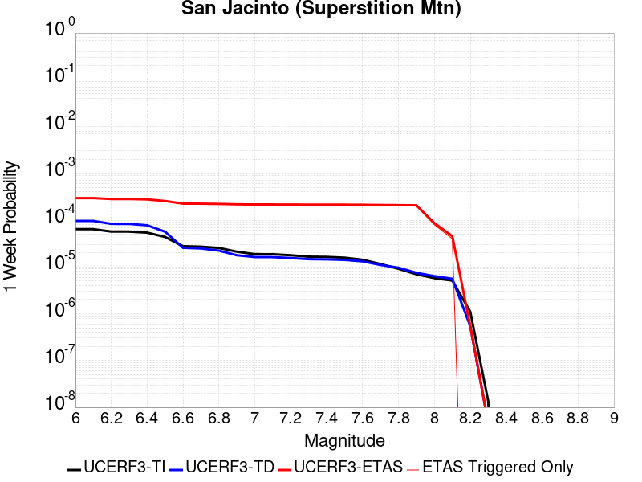 | 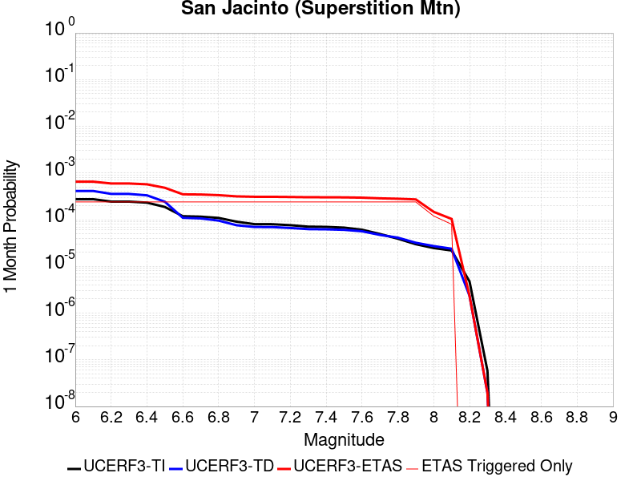 | 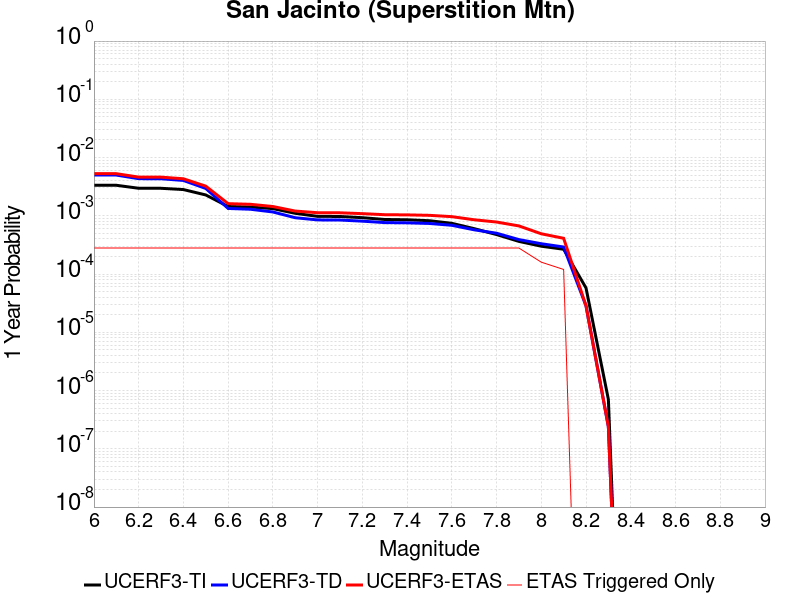 |

| Magnitude | 1 wk TI Prob | 1 wk TD Prob | 1 wk ETAS Prob | 1 wk ETAS/TD Gain | 1 wk ETAS Triggered Only | 1 mo TI Prob | 1 mo TD Prob | 1 mo ETAS Prob | 1 mo ETAS/TD Gain | 1 mo ETAS Triggered Only | 1 yr TI Prob | 1 yr TD Prob | 1 yr ETAS Prob | 1 yr ETAS/TD Gain | 1 yr ETAS Triggered Only |
|-----|-----|-----|-----|-----|-----|-----|-----|-----|-----|-----|-----|-----|-----|-----|-----|
| 6.0 | 6.4193904E-5 | 9.618683E-5 | 2.961676E-4 | 3.0790868 | 2.0E-4 | 2.7508775E-4 | 4.1217334E-4 | 6.520744E-4 | 1.5820392 | 2.4E-4 | 0.0033440501 | 0.005008075 | 0.0052866726 | 1.0556297 | 2.8E-4 |
| 6.1 | 6.4193904E-5 | 9.618683E-5 | 2.961676E-4 | 3.0790868 | 2.0E-4 | 2.7508775E-4 | 4.1217334E-4 | 6.520744E-4 | 1.5820392 | 2.4E-4 | 0.0033440501 | 0.005008075 | 0.0052866726 | 1.0556297 | 2.8E-4 |
| 6.2 | 5.7023593E-5 | 8.3323815E-5 | 2.8330716E-4 | 3.4000742 | 2.0E-4 | 2.4436394E-4 | 3.5706247E-4 | 5.969768E-4 | 1.6719114 | 2.4E-4 | 0.002971072 | 0.004340213 | 0.0046189977 | 1.064233 | 2.8E-4 |
| 6.3 | 5.6940098E-5 | 8.316908E-5 | 2.8315245E-4 | 3.40454 | 2.0E-4 | 2.4400617E-4 | 3.5639948E-4 | 5.9631397E-4 | 1.6731616 | 2.4E-4 | 0.002966728 | 0.004332173 | 0.0046109604 | 1.0643526 | 2.8E-4 |
| 6.4 | 5.4171585E-5 | 7.765849E-5 | 2.7764295E-4 | 3.5751784 | 2.0E-4 | 2.3214328E-4 | 3.3278894E-4 | 5.727091E-4 | 1.7209377 | 2.4E-4 | 0.0028226813 | 0.0040458273 | 0.0043246946 | 1.068927 | 2.8E-4 |
| 6.5 | 4.375144E-5 | 5.6590954E-5 | 2.5657963E-4 | 4.5339336 | 2.0E-4 | 1.874927E-4 | 2.4251675E-4 | 4.8245856E-4 | 1.9893824 | 2.4E-4 | 0.0022803338 | 0.00294982 | 0.003228994 | 1.0946411 | 2.8E-4 |
| 6.6 | 2.772192E-5 | 2.5649655E-5 | 2.2564453E-4 | 8.797175 | 2.0E-4 | 1.1880282E-4 | 1.0992257E-4 | 3.498962E-4 | 3.183115 | 2.4E-4 | 0.0014454646 | 0.0013375052 | 0.0016171307 | 1.209065 | 2.8E-4 |
| 6.7 | 2.7124124E-5 | 2.4859904E-5 | 2.2485493E-4 | 9.044883 | 2.0E-4 | 1.1624106E-4 | 1.0653821E-4 | 3.4651265E-4 | 3.2524729 | 2.4E-4 | 0.0014143161 | 0.0012963502 | 0.0015759872 | 1.215711 | 2.8E-4 |
| 6.8 | 2.5475807E-5 | 2.2321101E-5 | 2.2231664E-4 | 9.959931 | 2.0E-4 | 1.0917746E-4 | 9.565842E-5 | 3.3563547E-4 | 3.508687 | 2.4E-4 | 0.001328425 | 0.0011640311 | 0.0014437052 | 1.2402633 | 2.8E-4 |
| 6.9 | 2.1162023E-5 | 1.7771237E-5 | 2.1776768E-4 | 12.253941 | 2.0E-4 | 9.069123E-5 | 7.616024E-5 | 3.1614196E-4 | 4.1510105 | 2.4E-4 | 0.0011036064 | 9.268603E-4 | 0.0012066008 | 1.3018152 | 2.8E-4 |
| 7.0 | 1.8754288E-5 | 1.6300326E-5 | 2.1629706E-4 | 13.269493 | 2.0E-4 | 8.037304E-5 | 6.985668E-5 | 3.0983993E-4 | 4.435365 | 2.4E-4 | 9.781026E-4 | 8.5017574E-4 | 0.0011299377 | 1.3290637 | 2.8E-4 |
| 7.1 | 1.8678527E-5 | 1.6225338E-5 | 2.1622209E-4 | 13.3262 | 2.0E-4 | 8.0048376E-5 | 6.953532E-5 | 3.0951863E-4 | 4.451243 | 2.4E-4 | 9.7415317E-4 | 8.462663E-4 | 0.0011260293 | 1.3305851 | 2.8E-4 |
| 7.2 | 1.7804578E-5 | 1.5518503E-5 | 2.1551539E-4 | 13.887642 | 2.0E-4 | 7.6303106E-5 | 6.650618E-5 | 3.0649023E-4 | 4.608447 | 2.4E-4 | 9.285943E-4 | 8.0941425E-4 | 0.0010891876 | 1.3456491 | 2.8E-4 |
| 7.3 | 1.6583685E-5 | 1.4666085E-5 | 2.1466315E-4 | 14.636704 | 2.0E-4 | 7.1070994E-5 | 6.285315E-5 | 3.0283807E-4 | 4.8181844 | 2.4E-4 | 8.649459E-4 | 7.6497043E-4 | 0.0010447563 | 1.3657472 | 2.8E-4 |
| 7.4 | 1.6387552E-5 | 1.453072E-5 | 2.1452781E-4 | 14.763742 | 2.0E-4 | 7.023047E-5 | 6.227304E-5 | 3.022581E-4 | 4.8537555 | 2.4E-4 | 8.5472054E-4 | 7.579126E-4 | 0.0010377003 | 1.3691558 | 2.8E-4 |
| 7.5 | 1.5790754E-5 | 1.4170097E-5 | 2.1416726E-4 | 15.11403 | 2.0E-4 | 6.767291E-5 | 6.0727583E-5 | 3.00713E-4 | 4.9518356 | 2.4E-4 | 8.236062E-4 | 7.391095E-4 | 0.0010189026 | 1.3785542 | 2.8E-4 |
| 7.6 | 1.4248672E-5 | 1.31832085E-5 | 2.1318057E-4 | 16.170614 | 2.0E-4 | 6.106431E-5 | 5.649825E-5 | 2.9648468E-4 | 5.247679 | 2.4E-4 | 7.432043E-4 | 6.8765087E-4 | 9.674583E-4 | 1.4069034 | 2.8E-4 |
| 7.7 | 1.15449975E-5 | 1.1026264E-5 | 2.1102406E-4 | 19.13831 | 2.0E-4 | 4.947762E-5 | 4.7254565E-5 | 2.8724322E-4 | 6.0786343 | 2.4E-4 | 6.022235E-4 | 5.7517324E-4 | 8.550122E-4 | 1.4865298 | 2.8E-4 |
| 7.8 | 9.1391985E-6 | 9.632236E-6 | 2.096303E-4 | 21.76341 | 2.0E-4 | 3.9167408E-5 | 4.128036E-5 | 2.8127045E-4 | 6.8136625 | 2.4E-4 | 4.767588E-4 | 5.024731E-4 | 7.823324E-4 | 1.5569638 | 2.8E-4 |
| 7.9 | 6.973017E-6 | 7.4874865E-6 | 2.07486E-4 | 27.711033 | 2.0E-4 | 2.9884017E-5 | 3.2088836E-5 | 2.7208115E-4 | 8.478996 | 2.4E-4 | 3.6377716E-4 | 3.9061208E-4 | 6.705027E-4 | 1.7165437 | 2.8E-4 |
| 8.0 | 5.7638235E-6 | 6.3564244E-6 | 8.635592E-5 | 13.585612 | 8.0E-5 | 2.4701867E-5 | 2.7241536E-5 | 1.4723827E-4 | 5.4049177 | 1.2E-4 | 3.0070372E-4 | 3.3161574E-4 | 4.915627E-4 | 1.4823261 | 1.6E-4 |
| 8.1 | 5.1124434E-6 | 5.58386E-6 | 4.5583638E-5 | 8.163464 | 4.0E-5 | 2.1910288E-5 | 2.3930612E-5 | 1.03928694E-4 | 4.3429184 | 8.0E-5 | 2.6672508E-4 | 2.9131674E-4 | 4.112818E-4 | 1.4118028 | 1.2E-4 |
| 8.2 | 1.1075938E-6 | 5.458512E-7 | 5.458512E-7 | 1.0 | 0.0 | 4.7468216E-6 | 2.3393604E-6 | 2.3393604E-6 | 1.0 | 0.0 | 5.779102E-5 | 2.8481363E-5 | 2.8481363E-5 | 1.0 | 0.0 |
| 8.3 | 1.3584393E-8 | 4.5896105E-9 | 4.5896105E-9 | 1.0 | 0.0 | 5.8218827E-8 | 1.966976E-8 | 1.966976E-8 | 1.0 | 0.0 | 7.0881396E-7 | 2.394793E-7 | 2.394793E-7 | 1.0 | 0.0 |

## Oceanic - West Huasna
*[(top)](#table-of-contents)*

| 1 Week | 1 Month | 1 Year |
|-----|-----|-----|
| 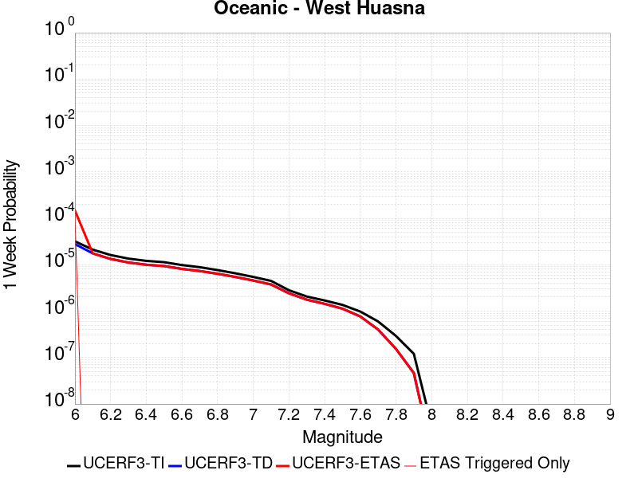 | 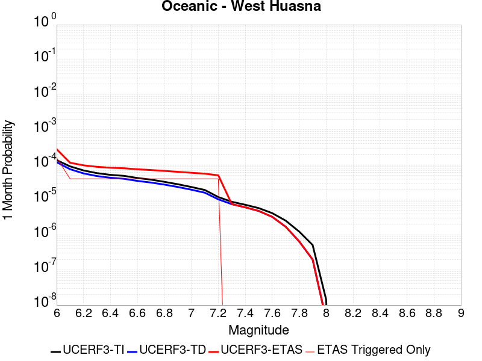 |  |

| Magnitude | 1 wk TI Prob | 1 wk TD Prob | 1 wk ETAS Prob | 1 wk ETAS/TD Gain | 1 wk ETAS Triggered Only | 1 mo TI Prob | 1 mo TD Prob | 1 mo ETAS Prob | 1 mo ETAS/TD Gain | 1 mo ETAS Triggered Only | 1 yr TI Prob | 1 yr TD Prob | 1 yr ETAS Prob | 1 yr ETAS/TD Gain | 1 yr ETAS Triggered Only |
|-----|-----|-----|-----|-----|-----|-----|-----|-----|-----|-----|-----|-----|-----|-----|-----|
| 6.0 | 3.195567E-5 | 2.7935615E-5 | 1.4793227E-4 | 5.2954717 | 1.2E-4 | 1.3694567E-4 | 1.1971882E-4 | 2.7969966E-4 | 2.336305 | 1.6E-4 | 0.0016660384 | 0.0014566452 | 0.0017362373 | 1.1919426 | 2.8E-4 |
| 6.1 | 2.1156782E-5 | 1.757916E-5 | 1.757916E-5 | 1.0 | 0.0 | 9.066878E-5 | 7.5337135E-5 | 1.1533412E-4 | 1.5309067 | 4.0E-5 | 0.0011033333 | 9.16853E-4 | 9.967797E-4 | 1.087175 | 8.0E-5 |
| 6.2 | 1.6195117E-5 | 1.333068E-5 | 1.333068E-5 | 1.0 | 0.0 | 6.9405796E-5 | 5.713025E-5 | 9.7127966E-5 | 1.7001145 | 4.0E-5 | 8.44688E-4 | 6.9534144E-4 | 7.752858E-4 | 1.1149714 | 8.0E-5 |
| 6.3 | 1.3559345E-5 | 1.1181751E-5 | 1.1181751E-5 | 1.0 | 0.0 | 5.811018E-5 | 4.7920912E-5 | 8.7919E-5 | 1.8346686 | 4.0E-5 | 7.072618E-4 | 5.8328186E-4 | 6.632352E-4 | 1.137075 | 8.0E-5 |
| 6.4 | 1.2120619E-5 | 1.0003182E-5 | 1.0003182E-5 | 1.0 | 0.0 | 5.1944477E-5 | 4.2870077E-5 | 8.286836E-5 | 1.9330118 | 4.0E-5 | 6.322405E-4 | 5.218187E-4 | 6.0177693E-4 | 1.15323 | 8.0E-5 |
| 6.5 | 1.13511915E-5 | 9.369492E-6 | 9.369492E-6 | 1.0 | 0.0 | 4.8647056E-5 | 4.0154348E-5 | 8.015274E-5 | 1.9961162 | 4.0E-5 | 5.9211696E-4 | 4.8876996E-4 | 5.687309E-4 | 1.1635962 | 8.0E-5 |
| 6.6 | 9.850605E-6 | 8.137099E-6 | 8.137099E-6 | 1.0 | 0.0 | 4.2216197E-5 | 3.4872817E-5 | 7.487142E-5 | 2.1469853 | 4.0E-5 | 5.1386096E-4 | 4.2449404E-4 | 4.6447705E-4 | 1.0941899 | 4.0E-5 |
| 6.7 | 8.8558645E-6 | 7.3199412E-6 | 7.3199412E-6 | 1.0 | 0.0 | 3.7953152E-5 | 3.13708E-5 | 7.136955E-5 | 2.275031 | 4.0E-5 | 4.6198163E-4 | 3.8187273E-4 | 4.2185746E-4 | 1.1047069 | 4.0E-5 |
| 6.8 | 7.67136E-6 | 6.3930647E-6 | 6.3930647E-6 | 1.0 | 0.0 | 3.2876844E-5 | 2.7398562E-5 | 6.7397465E-5 | 2.4598906 | 4.0E-5 | 4.0020206E-4 | 3.335266E-4 | 3.7351326E-4 | 1.1198905 | 4.0E-5 |
| 6.9 | 6.534529E-6 | 5.459491E-6 | 5.459491E-6 | 1.0 | 0.0 | 2.8004823E-5 | 2.339761E-5 | 6.339667E-5 | 2.7095363 | 4.0E-5 | 3.4090536E-4 | 2.848288E-4 | 3.248174E-4 | 1.1403953 | 4.0E-5 |
| 7.0 | 5.460525E-6 | 4.5709203E-6 | 4.5709203E-6 | 1.0 | 0.0 | 2.3402039E-5 | 1.9589512E-5 | 5.958873E-5 | 3.041869 | 4.0E-5 | 2.8488258E-4 | 2.384763E-4 | 2.7846676E-4 | 1.1676916 | 4.0E-5 |
| 7.1 | 4.4825083E-6 | 3.7533373E-6 | 3.7533373E-6 | 1.0 | 0.0 | 1.9210609E-5 | 1.6085633E-5 | 5.6084988E-5 | 3.4866512 | 4.0E-5 | 2.3386406E-4 | 1.9582508E-4 | 2.3581724E-4 | 1.204224 | 4.0E-5 |
| 7.2 | 2.821708E-6 | 2.4257495E-6 | 2.4257495E-6 | 1.0 | 0.0 | 1.2092979E-5 | 1.0396027E-5 | 5.039561E-5 | 4.8475833 | 4.0E-5 | 1.4722206E-4 | 1.265643E-4 | 1.6655923E-4 | 1.3160049 | 4.0E-5 |
| 7.3 | 2.0644757E-6 | 1.7694833E-6 | 1.7694833E-6 | 1.0 | 0.0 | 8.847723E-6 | 7.5834782E-6 | 7.5834782E-6 | 1.0 | 0.0 | 1.0771569E-4 | 9.232494E-5 | 9.232494E-5 | 1.0 | 0.0 |
| 7.4 | 1.6980367E-6 | 1.438663E-6 | 1.438663E-6 | 1.0 | 0.0 | 7.27728E-6 | 6.165684E-6 | 6.165684E-6 | 1.0 | 0.0 | 8.8597284E-5 | 7.506462E-5 | 7.506462E-5 | 1.0 | 0.0 |
| 7.5 | 1.3637683E-6 | 1.1308925E-6 | 1.1308925E-6 | 1.0 | 0.0 | 5.844708E-6 | 4.8466736E-6 | 4.8466736E-6 | 1.0 | 0.0 | 7.1156996E-5 | 5.9006652E-5 | 5.9006652E-5 | 1.0 | 0.0 |
| 7.6 | 9.802994E-7 | 7.683204E-7 | 7.683204E-7 | 1.0 | 0.0 | 4.2012766E-6 | 3.2927974E-6 | 3.2927974E-6 | 1.0 | 0.0 | 5.1149345E-5 | 4.008907E-5 | 4.008907E-5 | 1.0 | 0.0 |
| 7.7 | 5.986191E-7 | 4.0096745E-7 | 4.0096745E-7 | 1.0 | 0.0 | 2.5655079E-6 | 1.7184307E-6 | 1.7184307E-6 | 1.0 | 0.0 | 3.1234613E-5 | 2.0921694E-5 | 2.0921694E-5 | 1.0 | 0.0 |
| 7.8 | 2.9189815E-7 | 1.5325327E-7 | 1.5325327E-7 | 1.0 | 0.0 | 1.2509914E-6 | 6.567995E-7 | 6.567995E-7 | 1.0 | 0.0 | 1.5230714E-5 | 7.996505E-6 | 7.996505E-6 | 1.0 | 0.0 |
| 7.9 | 1.2057845E-7 | 4.6430397E-8 | 4.6430397E-8 | 1.0 | 0.0 | 5.1676466E-7 | 1.989874E-7 | 1.989874E-7 | 1.0 | 0.0 | 6.2915915E-6 | 2.4226688E-6 | 2.4226688E-6 | 1.0 | 0.0 |
| 8.0 | 3.3806387E-9 | 9.0955077E-10 | 9.0955077E-10 | 1.0 | 0.0 | 1.4488451E-8 | 3.898074E-9 | 3.898074E-9 | 1.0 | 0.0 | 1.7639688E-7 | 4.7459046E-8 | 4.7459046E-8 | 1.0 | 0.0 |

## Coyote Canyon
*[(top)](#table-of-contents)*

| 1 Week | 1 Month | 1 Year |
|-----|-----|-----|
|  | 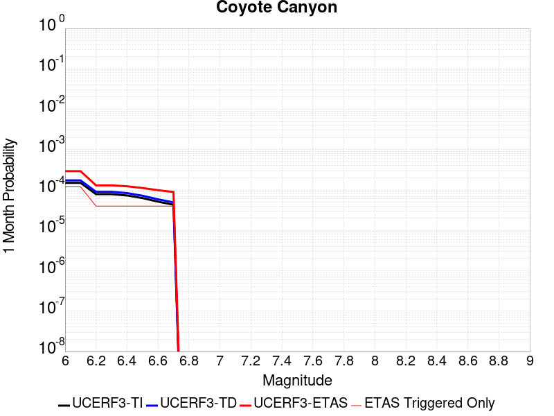 | 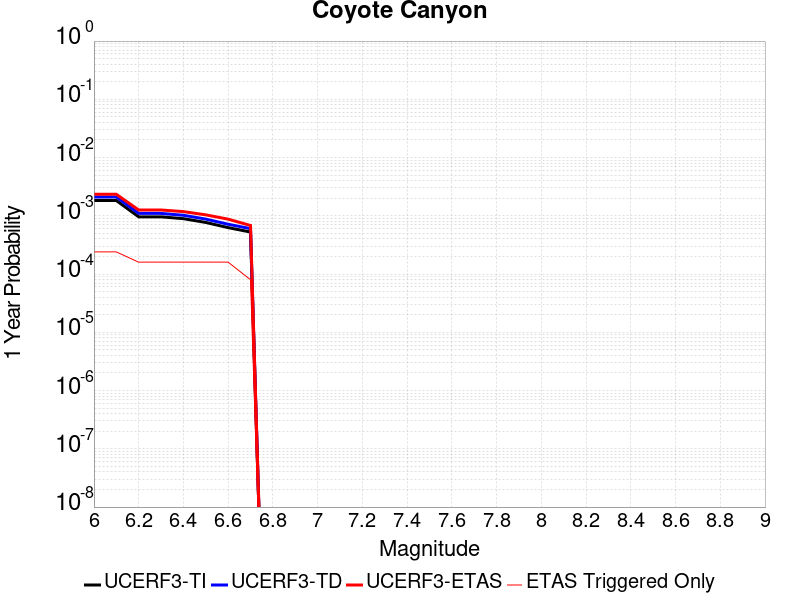 |

| Magnitude | 1 wk TI Prob | 1 wk TD Prob | 1 wk ETAS Prob | 1 wk ETAS/TD Gain | 1 wk ETAS Triggered Only | 1 mo TI Prob | 1 mo TD Prob | 1 mo ETAS Prob | 1 mo ETAS/TD Gain | 1 mo ETAS Triggered Only | 1 yr TI Prob | 1 yr TD Prob | 1 yr ETAS Prob | 1 yr ETAS/TD Gain | 1 yr ETAS Triggered Only |
|-----|-----|-----|-----|-----|-----|-----|-----|-----|-----|-----|-----|-----|-----|-----|-----|
| 6.0 | 3.5090034E-5 | 4.0384904E-5 | 1.2038167E-4 | 2.9808583 | 8.0E-5 | 1.503772E-4 | 1.7306813E-4 | 2.9304737E-4 | 1.6932485 | 1.2E-4 | 0.0018293047 | 0.0021053257 | 0.0023448204 | 1.1137567 | 2.4E-4 |
| 6.1 | 3.5090034E-5 | 4.0384904E-5 | 1.2038167E-4 | 2.9808583 | 8.0E-5 | 1.503772E-4 | 1.7306813E-4 | 2.9304737E-4 | 1.6932485 | 1.2E-4 | 0.0018293047 | 0.0021053257 | 0.0023448204 | 1.1137567 | 2.4E-4 |
| 6.2 | 1.841879E-5 | 2.1070035E-5 | 6.106919E-5 | 2.8983908 | 4.0E-5 | 7.8935285E-5 | 9.02976E-5 | 1.3029399E-4 | 1.4429396 | 4.0E-5 | 9.606133E-4 | 0.0010989209 | 0.0012587451 | 1.1454374 | 1.6E-4 |
| 6.3 | 1.841879E-5 | 2.1070035E-5 | 6.106919E-5 | 2.8983908 | 4.0E-5 | 7.8935285E-5 | 9.02976E-5 | 1.3029399E-4 | 1.4429396 | 4.0E-5 | 9.606133E-4 | 0.0010989209 | 0.0012587451 | 1.1454374 | 1.6E-4 |
| 6.4 | 1.712201E-5 | 1.957468E-5 | 5.9573897E-5 | 3.043416 | 4.0E-5 | 7.337798E-5 | 8.3889354E-5 | 1.23886E-4 | 1.4767785 | 4.0E-5 | 8.930107E-4 | 0.0010209751 | 0.0011808117 | 1.1565529 | 1.6E-4 |
| 6.5 | 1.4744935E-5 | 1.6845073E-5 | 5.68444E-5 | 3.3745415 | 4.0E-5 | 6.3191044E-5 | 7.21917E-5 | 1.1218882E-4 | 1.5540403 | 4.0E-5 | 7.6907943E-4 | 8.7867316E-4 | 0.0010385326 | 1.1819327 | 1.6E-4 |
| 6.6 | 1.2017839E-5 | 1.3730698E-5 | 5.373015E-5 | 3.9131403 | 4.0E-5 | 5.150401E-5 | 5.884502E-5 | 9.884267E-5 | 1.6797116 | 4.0E-5 | 6.268809E-4 | 7.162913E-4 | 8.761767E-4 | 1.2232128 | 1.6E-4 |
| 6.7 | 1.00956095E-5 | 1.15390885E-5 | 5.1538627E-5 | 4.4664383 | 4.0E-5 | 4.326618E-5 | 4.945279E-5 | 8.945081E-5 | 1.8088123 | 4.0E-5 | 5.266384E-4 | 6.020084E-4 | 6.8196026E-4 | 1.1328084 | 8.0E-5 |

## Sierra Madre
*[(top)](#table-of-contents)*

| 1 Week | 1 Month | 1 Year |
|-----|-----|-----|
| 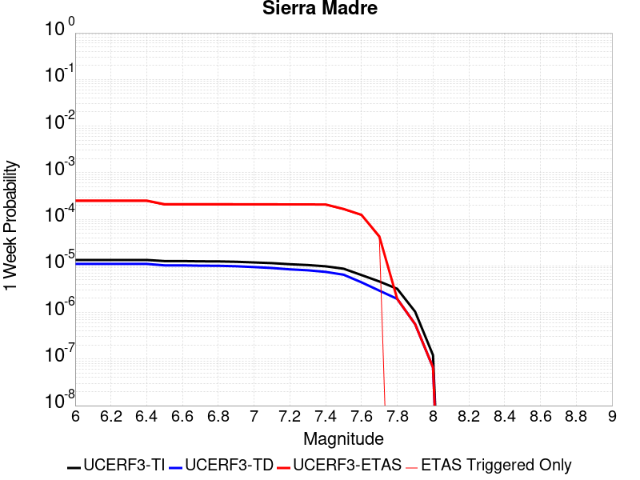 | 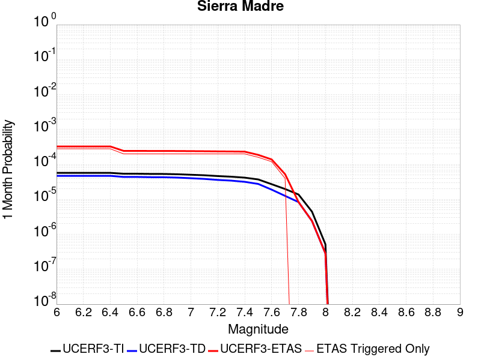 | 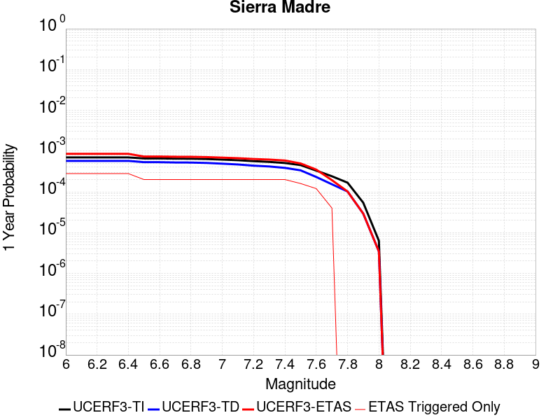 |

| Magnitude | 1 wk TI Prob | 1 wk TD Prob | 1 wk ETAS Prob | 1 wk ETAS/TD Gain | 1 wk ETAS Triggered Only | 1 mo TI Prob | 1 mo TD Prob | 1 mo ETAS Prob | 1 mo ETAS/TD Gain | 1 mo ETAS Triggered Only | 1 yr TI Prob | 1 yr TD Prob | 1 yr ETAS Prob | 1 yr ETAS/TD Gain | 1 yr ETAS Triggered Only |
|-----|-----|-----|-----|-----|-----|-----|-----|-----|-----|-----|-----|-----|-----|-----|-----|
| 6.0 | 1.3379373E-5 | 1.1009154E-5 | 2.510065E-4 | 22.799799 | 2.4E-4 | 5.7338908E-5 | 4.7181245E-5 | 3.2716803E-4 | 6.9342813 | 2.8E-4 | 6.978776E-4 | 5.7428173E-4 | 8.5412094E-4 | 1.4872856 | 2.8E-4 |
| 6.1 | 1.3379373E-5 | 1.1009154E-5 | 2.510065E-4 | 22.799799 | 2.4E-4 | 5.7338908E-5 | 4.7181245E-5 | 3.2716803E-4 | 6.9342813 | 2.8E-4 | 6.978776E-4 | 5.7428173E-4 | 8.5412094E-4 | 1.4872856 | 2.8E-4 |
| 6.2 | 1.3379373E-5 | 1.1009154E-5 | 2.510065E-4 | 22.799799 | 2.4E-4 | 5.7338908E-5 | 4.7181245E-5 | 3.2716803E-4 | 6.9342813 | 2.8E-4 | 6.978776E-4 | 5.7428173E-4 | 8.5412094E-4 | 1.4872856 | 2.8E-4 |
| 6.3 | 1.3379373E-5 | 1.1009154E-5 | 2.510065E-4 | 22.799799 | 2.4E-4 | 5.7338908E-5 | 4.7181245E-5 | 3.2716803E-4 | 6.9342813 | 2.8E-4 | 6.978776E-4 | 5.7428173E-4 | 8.5412094E-4 | 1.4872856 | 2.8E-4 |
| 6.4 | 1.3379373E-5 | 1.1009154E-5 | 2.510065E-4 | 22.799799 | 2.4E-4 | 5.7338908E-5 | 4.7181245E-5 | 3.2716803E-4 | 6.9342813 | 2.8E-4 | 6.978776E-4 | 5.7428173E-4 | 8.5412094E-4 | 1.4872856 | 2.8E-4 |
| 6.5 | 1.26563245E-5 | 1.0238438E-5 | 2.102364E-4 | 20.534029 | 2.0E-4 | 5.4240263E-5 | 4.387829E-5 | 2.4386951E-4 | 5.5578628 | 2.0E-4 | 6.601751E-4 | 5.3408835E-4 | 7.339815E-4 | 1.3742698 | 2.0E-4 |
| 6.6 | 1.26563245E-5 | 1.0238438E-5 | 2.102364E-4 | 20.534029 | 2.0E-4 | 5.4240263E-5 | 4.387829E-5 | 2.4386951E-4 | 5.5578628 | 2.0E-4 | 6.601751E-4 | 5.3408835E-4 | 7.339815E-4 | 1.3742698 | 2.0E-4 |
| 6.7 | 1.2502474E-5 | 1.00745465E-5 | 2.1007253E-4 | 20.85181 | 2.0E-4 | 5.3580934E-5 | 4.317592E-5 | 2.4316729E-4 | 5.6320114 | 2.0E-4 | 6.521526E-4 | 5.255411E-4 | 7.25436E-4 | 1.3803601 | 2.0E-4 |
| 6.8 | 1.2454966E-5 | 1.0026802E-5 | 2.100248E-4 | 20.946339 | 2.0E-4 | 5.3377335E-5 | 4.2971307E-5 | 2.429627E-4 | 5.6540685 | 2.0E-4 | 6.4967526E-4 | 5.2305113E-4 | 7.2294654E-4 | 1.3821718 | 2.0E-4 |
| 6.9 | 1.2225574E-5 | 9.800568E-6 | 2.097986E-4 | 21.406782 | 2.0E-4 | 5.2394265E-5 | 4.200176E-5 | 2.4199336E-4 | 5.761505 | 2.0E-4 | 6.3771347E-4 | 5.112525E-4 | 7.1115023E-4 | 1.3909961 | 2.0E-4 |
| 7.0 | 1.182946E-5 | 9.40699E-6 | 2.0940512E-4 | 22.260584 | 2.0E-4 | 5.06967E-5 | 4.0315055E-5 | 2.40307E-4 | 5.960726 | 2.0E-4 | 6.1705755E-4 | 4.9072626E-4 | 6.9062813E-4 | 1.4073591 | 2.0E-4 |
| 7.1 | 1.14369095E-5 | 8.993793E-6 | 2.08992E-4 | 23.237358 | 2.0E-4 | 4.9014405E-5 | 3.8544265E-5 | 2.3853655E-4 | 6.188639 | 2.0E-4 | 5.9658696E-4 | 4.6917636E-4 | 6.690825E-4 | 1.4260789 | 2.0E-4 |
| 7.2 | 1.0836419E-5 | 8.40696E-6 | 2.0840528E-4 | 24.789614 | 2.0E-4 | 4.644097E-5 | 3.6029334E-5 | 2.3602213E-4 | 6.5508323 | 2.0E-4 | 5.652721E-4 | 4.3856975E-4 | 6.3848204E-4 | 1.4558278 | 2.0E-4 |
| 7.3 | 1.0403439E-5 | 8.028089E-6 | 2.0802648E-4 | 25.912329 | 2.0E-4 | 4.4585406E-5 | 3.4405646E-5 | 2.3439877E-4 | 6.812799 | 2.0E-4 | 5.426921E-4 | 4.1880916E-4 | 6.187254E-4 | 1.4773445 | 2.0E-4 |
| 7.4 | 9.768864E-6 | 7.421485E-6 | 2.0742E-4 | 27.948584 | 2.0E-4 | 4.186589E-5 | 3.1805983E-5 | 2.3179963E-4 | 7.2879252 | 2.0E-4 | 5.09598E-4 | 3.8716992E-4 | 5.870925E-4 | 1.5163691 | 2.0E-4 |
| 7.5 | 8.687089E-6 | 6.4567002E-6 | 1.6645566E-4 | 25.780298 | 1.6E-4 | 3.722985E-5 | 2.7671285E-5 | 1.8766685E-4 | 6.782007 | 1.6E-4 | 4.5317915E-4 | 3.368467E-4 | 4.967928E-4 | 1.4748336 | 1.6E-4 |
| 7.6 | 6.3506063E-6 | 4.436162E-6 | 1.2443562E-4 | 28.05029 | 1.2E-4 | 2.72166E-5 | 1.9011986E-5 | 1.390097E-4 | 7.311688 | 1.2E-4 | 3.3131172E-4 | 2.314466E-4 | 3.5141883E-4 | 1.5183581 | 1.2E-4 |
| 7.7 | 4.62223E-6 | 2.9384053E-6 | 4.293829E-5 | 14.612786 | 4.0E-5 | 1.9809406E-5 | 1.2593105E-5 | 5.25926E-5 | 4.1763015 | 4.0E-5 | 2.4115283E-4 | 1.5331028E-4 | 1.9330415E-4 | 1.2608688 | 4.0E-5 |
| 7.8 | 3.2145008E-6 | 1.9533868E-6 | 1.9533868E-6 | 1.0 | 0.0 | 1.3776359E-5 | 8.37163E-6 | 8.37163E-6 | 1.0 | 0.0 | 1.6771426E-4 | 1.0191985E-4 | 1.0191985E-4 | 1.0 | 0.0 |
| 7.9 | 1.0391769E-6 | 5.613154E-7 | 5.613154E-7 | 1.0 | 0.0 | 4.4536077E-6 | 2.4056353E-6 | 2.4056353E-6 | 1.0 | 0.0 | 5.4221324E-5 | 2.9288221E-5 | 2.9288221E-5 | 1.0 | 0.0 |
| 8.0 | 1.210983E-7 | 6.622497E-8 | 6.622497E-8 | 1.0 | 0.0 | 5.1899264E-7 | 2.8382127E-7 | 2.8382127E-7 | 1.0 | 0.0 | 6.3187167E-6 | 3.4555185E-6 | 3.4555185E-6 | 1.0 | 0.0 |

## Santa Ynez River
*[(top)](#table-of-contents)*

| 1 Week | 1 Month | 1 Year |
|-----|-----|-----|
|  | 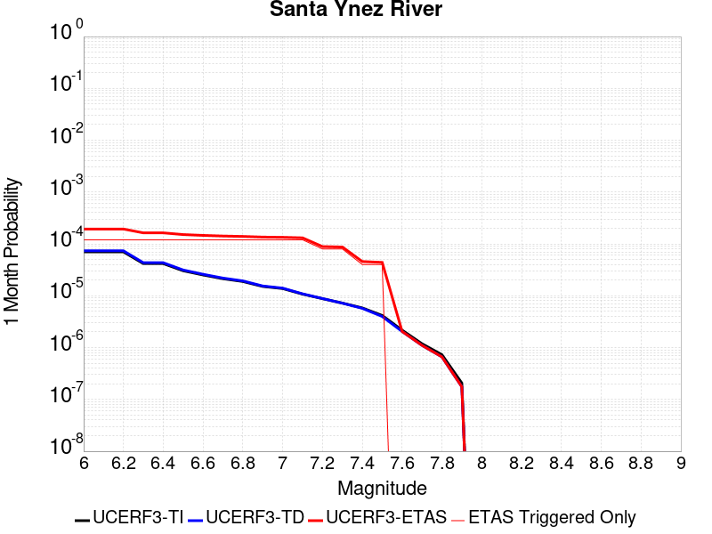 | 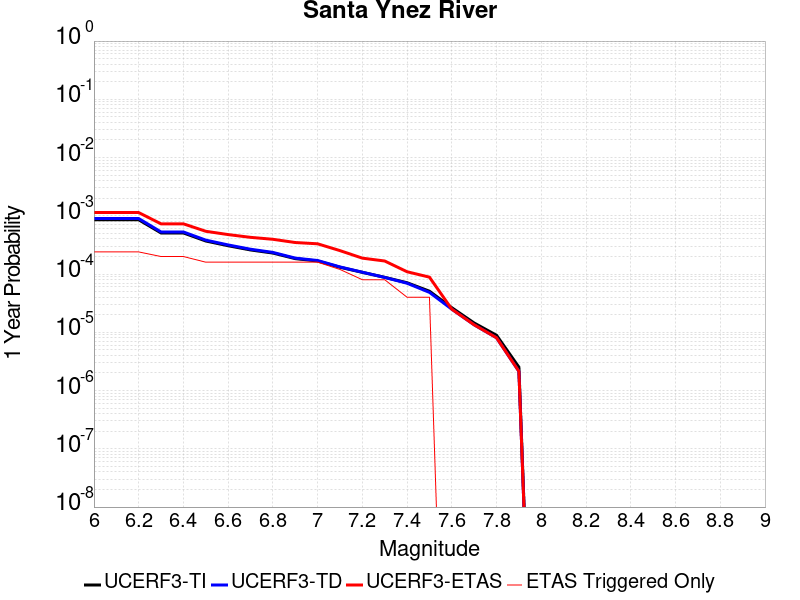 |

| Magnitude | 1 wk TI Prob | 1 wk TD Prob | 1 wk ETAS Prob | 1 wk ETAS/TD Gain | 1 wk ETAS Triggered Only | 1 mo TI Prob | 1 mo TD Prob | 1 mo ETAS Prob | 1 mo ETAS/TD Gain | 1 mo ETAS Triggered Only | 1 yr TI Prob | 1 yr TD Prob | 1 yr ETAS Prob | 1 yr ETAS/TD Gain | 1 yr ETAS Triggered Only |
|-----|-----|-----|-----|-----|-----|-----|-----|-----|-----|-----|-----|-----|-----|-----|-----|
| 6.0 | 1.6396456E-5 | 1.7213119E-5 | 9.721174E-5 | 5.6475377 | 8.0E-5 | 7.026863E-5 | 7.376863E-5 | 1.9375977E-4 | 2.6265879 | 1.2E-4 | 8.551848E-4 | 8.977985E-4 | 0.001137583 | 1.2670805 | 2.4E-4 |
| 6.1 | 1.6396456E-5 | 1.7213119E-5 | 9.721174E-5 | 5.6475377 | 8.0E-5 | 7.026863E-5 | 7.376863E-5 | 1.9375977E-4 | 2.6265879 | 1.2E-4 | 8.551848E-4 | 8.977985E-4 | 0.001137583 | 1.2670805 | 2.4E-4 |
| 6.2 | 1.6396456E-5 | 1.7213119E-5 | 9.721174E-5 | 5.6475377 | 8.0E-5 | 7.026863E-5 | 7.376863E-5 | 1.9375977E-4 | 2.6265879 | 1.2E-4 | 8.551848E-4 | 8.977985E-4 | 0.001137583 | 1.2670805 | 2.4E-4 |
| 6.3 | 9.736976E-6 | 1.0124466E-5 | 9.0123656E-5 | 8.901571 | 8.0E-5 | 4.172923E-5 | 4.3389875E-5 | 1.6338467E-4 | 3.7655022 | 1.2E-4 | 5.0793495E-4 | 5.2814867E-4 | 7.28043E-4 | 1.3784813 | 2.0E-4 |
| 6.4 | 9.736976E-6 | 1.0124466E-5 | 9.0123656E-5 | 8.901571 | 8.0E-5 | 4.172923E-5 | 4.3389875E-5 | 1.6338467E-4 | 3.7655022 | 1.2E-4 | 5.0793495E-4 | 5.2814867E-4 | 7.28043E-4 | 1.3784813 | 2.0E-4 |
| 6.5 | 7.081964E-6 | 7.3315405E-6 | 8.7330955E-5 | 11.911678 | 8.0E-5 | 3.035092E-5 | 3.1420517E-5 | 1.5141675E-4 | 4.8190403 | 1.2E-4 | 3.694598E-4 | 3.8247925E-4 | 5.4241804E-4 | 1.4181633 | 1.6E-4 |
| 6.6 | 5.873247E-6 | 6.061168E-6 | 8.606068E-5 | 14.198696 | 8.0E-5 | 2.5170815E-5 | 2.597618E-5 | 1.4597307E-4 | 5.619497 | 1.2E-4 | 3.064116E-4 | 3.1621495E-4 | 4.7616436E-4 | 1.5058249 | 1.6E-4 |
| 6.7 | 4.973277E-6 | 5.11717E-6 | 8.511676E-5 | 16.633562 | 8.0E-5 | 2.1313872E-5 | 2.1930548E-5 | 1.4192791E-4 | 6.4716997 | 1.2E-4 | 2.5946548E-4 | 2.6697217E-4 | 4.2692944E-4 | 1.5991534 | 1.6E-4 |
| 6.8 | 4.396492E-6 | 4.5121465E-6 | 8.451178E-5 | 18.729841 | 8.0E-5 | 1.884197E-5 | 1.9337629E-5 | 1.3933532E-4 | 7.2053976 | 1.2E-4 | 2.2937685E-4 | 2.3541055E-4 | 3.953729E-4 | 1.6795037 | 1.6E-4 |
| 6.9 | 3.5255632E-6 | 3.6023648E-6 | 8.360208E-5 | 23.207554 | 8.0E-5 | 1.5109469E-5 | 1.5438616E-5 | 1.3543677E-4 | 8.772597 | 1.2E-4 | 1.8394225E-4 | 1.879491E-4 | 3.4791903E-4 | 1.8511343 | 1.6E-4 |
| 7.0 | 3.211603E-6 | 3.274637E-6 | 8.3274375E-5 | 25.430109 | 8.0E-5 | 1.376394E-5 | 1.4034084E-5 | 1.340324E-4 | 9.550491 | 1.2E-4 | 1.6756308E-4 | 1.7085172E-4 | 3.3082438E-4 | 1.9363246 | 1.6E-4 |
| 7.1 | 2.5094619E-6 | 2.541795E-6 | 8.254159E-5 | 32.47374 | 8.0E-5 | 1.0754793E-5 | 1.0893363E-5 | 1.3089206E-4 | 12.015762 | 1.2E-4 | 1.3093173E-4 | 1.3261868E-4 | 2.5260277E-4 | 1.90473 | 1.2E-4 |
| 7.2 | 2.0515774E-6 | 2.0627374E-6 | 4.2062657E-5 | 20.391668 | 4.0E-5 | 8.792445E-6 | 8.840273E-6 | 8.8839566E-5 | 10.049415 | 8.0E-5 | 1.0704277E-4 | 1.0762505E-4 | 1.8761645E-4 | 1.7432413 | 8.0E-5 |
| 7.3 | 1.6845745E-6 | 1.678128E-6 | 4.167806E-5 | 24.836044 | 4.0E-5 | 7.219585E-6 | 7.1919576E-6 | 8.719138E-5 | 12.123456 | 8.0E-5 | 8.78949E-5 | 8.755859E-5 | 1.6755158E-4 | 1.9135939 | 8.0E-5 |
| 7.4 | 1.3600285E-6 | 1.3340028E-6 | 1.3340028E-6 | 1.0 | 0.0 | 5.82868E-6 | 5.7171424E-6 | 4.5716915E-5 | 7.9964623 | 4.0E-5 | 7.096187E-5 | 6.960401E-5 | 1.0960122E-4 | 1.5746396 | 4.0E-5 |
| 7.5 | 9.735342E-7 | 9.295189E-7 | 9.295189E-7 | 1.0 | 0.0 | 4.172283E-6 | 3.9836464E-6 | 4.3983488E-5 | 11.041012 | 4.0E-5 | 5.079636E-5 | 4.849983E-5 | 8.8497894E-5 | 1.8247051 | 4.0E-5 |
| 7.6 | 5.067187E-7 | 4.779554E-7 | 4.779554E-7 | 1.0 | 0.0 | 2.1716498E-6 | 2.0483785E-6 | 2.0483785E-6 | 1.0 | 0.0 | 2.6439517E-5 | 2.493873E-5 | 2.493873E-5 | 1.0 | 0.0 |
| 7.7 | 2.769089E-7 | 2.5764106E-7 | 2.5764106E-7 | 1.0 | 0.0 | 1.1867519E-6 | 1.1041755E-6 | 1.1041755E-6 | 1.0 | 0.0 | 1.4448608E-5 | 1.3443253E-5 | 1.3443253E-5 | 1.0 | 0.0 |
| 7.8 | 1.7044663E-7 | 1.545207E-7 | 1.545207E-7 | 1.0 | 0.0 | 7.3048534E-7 | 6.6223146E-7 | 6.6223146E-7 | 1.0 | 0.0 | 8.893623E-6 | 8.062638E-6 | 8.062638E-6 | 1.0 | 0.0 |
| 7.9 | 4.8344287E-8 | 4.0919776E-8 | 4.0919776E-8 | 1.0 | 0.0 | 2.0718979E-7 | 1.7537045E-7 | 1.7537045E-7 | 1.0 | 0.0 | 2.5225327E-6 | 2.1351332E-6 | 2.1351332E-6 | 1.0 | 0.0 |

## Chino alt 1
*[(top)](#table-of-contents)*

| 1 Week | 1 Month | 1 Year |
|-----|-----|-----|
| 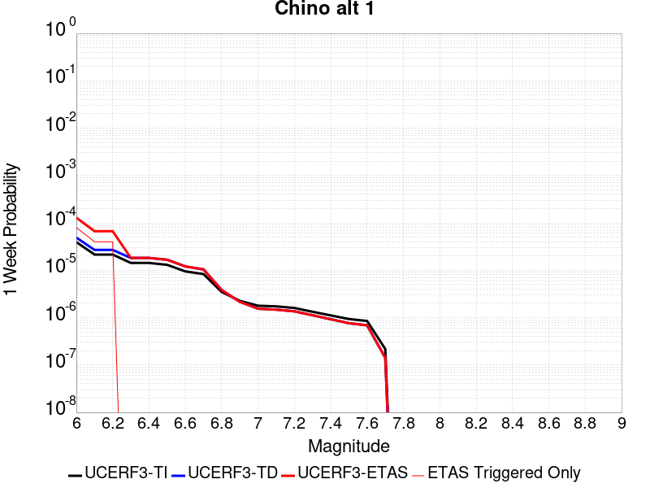 | 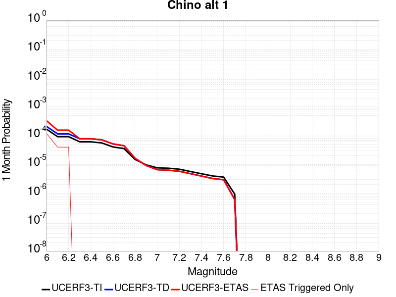 |  |

| Magnitude | 1 wk TI Prob | 1 wk TD Prob | 1 wk ETAS Prob | 1 wk ETAS/TD Gain | 1 wk ETAS Triggered Only | 1 mo TI Prob | 1 mo TD Prob | 1 mo ETAS Prob | 1 mo ETAS/TD Gain | 1 mo ETAS Triggered Only | 1 yr TI Prob | 1 yr TD Prob | 1 yr ETAS Prob | 1 yr ETAS/TD Gain | 1 yr ETAS Triggered Only |
|-----|-----|-----|-----|-----|-----|-----|-----|-----|-----|-----|-----|-----|-----|-----|-----|
| 6.0 | 3.939946E-5 | 4.9004397E-5 | 1.2900047E-4 | 2.6324265 | 8.0E-5 | 1.6884391E-4 | 2.1000468E-4 | 3.299795E-4 | 1.5712959 | 1.2E-4 | 0.0020537362 | 0.002554319 | 0.0028336039 | 1.1093383 | 2.8E-4 |
| 6.1 | 2.1505624E-5 | 2.6917825E-5 | 6.691675E-5 | 2.485964 | 4.0E-5 | 9.2163704E-5 | 1.15357594E-4 | 1.5535297E-4 | 1.3467078 | 4.0E-5 | 0.0011215154 | 0.0014036838 | 0.0015634593 | 1.1138258 | 1.6E-4 |
| 6.2 | 2.1505624E-5 | 2.6917825E-5 | 6.691675E-5 | 2.485964 | 4.0E-5 | 9.2163704E-5 | 1.15357594E-4 | 1.5535297E-4 | 1.3467078 | 4.0E-5 | 0.0011215154 | 0.0014036838 | 0.0015634593 | 1.1138258 | 1.6E-4 |
| 6.3 | 1.4290785E-5 | 1.81977E-5 | 1.81977E-5 | 1.0 | 0.0 | 6.1244784E-5 | 7.7988065E-5 | 7.7988065E-5 | 1.0 | 0.0 | 7.454001E-4 | 9.491364E-4 | 9.890985E-4 | 1.0421035 | 4.0E-5 |
| 6.4 | 1.4290785E-5 | 1.81977E-5 | 1.81977E-5 | 1.0 | 0.0 | 6.1244784E-5 | 7.7988065E-5 | 7.7988065E-5 | 1.0 | 0.0 | 7.454001E-4 | 9.491364E-4 | 9.890985E-4 | 1.0421035 | 4.0E-5 |
| 6.5 | 1.3017944E-5 | 1.668369E-5 | 1.668369E-5 | 1.0 | 0.0 | 5.5789995E-5 | 7.149982E-5 | 7.149982E-5 | 1.0 | 0.0 | 6.790315E-4 | 8.702065E-4 | 9.1017166E-4 | 1.0459261 | 4.0E-5 |
| 6.6 | 9.470016E-6 | 1.2065467E-5 | 1.2065467E-5 | 1.0 | 0.0 | 4.058515E-5 | 5.170831E-5 | 5.170831E-5 | 1.0 | 0.0 | 4.940122E-4 | 6.294009E-4 | 6.693757E-4 | 1.0635124 | 4.0E-5 |
| 6.7 | 8.314155E-6 | 1.0425587E-5 | 1.0425587E-5 | 1.0 | 0.0 | 3.5631605E-5 | 4.4680502E-5 | 4.4680502E-5 | 1.0 | 0.0 | 4.3372845E-4 | 5.438817E-4 | 5.838599E-4 | 1.0735054 | 4.0E-5 |
| 6.8 | 3.4856364E-6 | 3.8184653E-6 | 3.8184653E-6 | 1.0 | 0.0 | 1.4938357E-5 | 1.636476E-5 | 1.636476E-5 | 1.0 | 0.0 | 1.8185932E-4 | 1.9922481E-4 | 1.9922481E-4 | 1.0 | 0.0 |
| 6.9 | 2.2645952E-6 | 2.1561063E-6 | 2.1561063E-6 | 1.0 | 0.0 | 9.705372E-6 | 9.240424E-6 | 9.240424E-6 | 1.0 | 0.0 | 1.18156495E-4 | 1.1249657E-4 | 1.1249657E-4 | 1.0 | 0.0 |
| 7.0 | 1.7864003E-6 | 1.545482E-6 | 1.545482E-6 | 1.0 | 0.0 | 7.655979E-6 | 6.623478E-6 | 6.623478E-6 | 1.0 | 0.0 | 9.3207556E-5 | 8.063792E-5 | 8.063792E-5 | 1.0 | 0.0 |
| 7.1 | 1.7315456E-6 | 1.4756972E-6 | 1.4756972E-6 | 1.0 | 0.0 | 7.420889E-6 | 6.3244015E-6 | 6.3244015E-6 | 1.0 | 0.0 | 9.034557E-5 | 7.699693E-5 | 7.699693E-5 | 1.0 | 0.0 |
| 7.2 | 1.6008337E-6 | 1.3596422E-6 | 1.3596422E-6 | 1.0 | 0.0 | 6.860698E-6 | 5.8270252E-6 | 5.8270252E-6 | 1.0 | 0.0 | 8.352579E-5 | 7.094178E-5 | 7.094178E-5 | 1.0 | 0.0 |
| 7.3 | 1.3320939E-6 | 1.1237295E-6 | 1.1237295E-6 | 1.0 | 0.0 | 5.7089615E-6 | 4.815975E-6 | 4.815975E-6 | 1.0 | 0.0 | 6.9504385E-5 | 5.8632966E-5 | 5.8632966E-5 | 1.0 | 0.0 |
| 7.4 | 1.114294E-6 | 9.2541916E-7 | 9.2541916E-7 | 1.0 | 0.0 | 4.775537E-6 | 3.9660763E-6 | 3.9660763E-6 | 1.0 | 0.0 | 5.8140613E-5 | 4.8285947E-5 | 4.8285947E-5 | 1.0 | 0.0 |
| 7.5 | 9.354081E-7 | 7.638138E-7 | 7.638138E-7 | 1.0 | 0.0 | 4.0088858E-6 | 3.2734836E-6 | 3.2734836E-6 | 1.0 | 0.0 | 4.8807087E-5 | 3.985397E-5 | 3.985397E-5 | 1.0 | 0.0 |
| 7.6 | 8.521771E-7 | 6.8946184E-7 | 6.8946184E-7 | 1.0 | 0.0 | 3.6521824E-6 | 2.9548335E-6 | 2.9548335E-6 | 1.0 | 0.0 | 4.4464414E-5 | 3.5974535E-5 | 3.5974535E-5 | 1.0 | 0.0 |
| 7.7 | 2.1803626E-7 | 1.4221726E-7 | 1.4221726E-7 | 1.0 | 0.0 | 9.344408E-7 | 6.095024E-7 | 6.095024E-7 | 1.0 | 0.0 | 1.1376757E-5 | 7.4206764E-6 | 7.4206764E-6 | 1.0 | 0.0 |

## Goldstone Lake
*[(top)](#table-of-contents)*

| 1 Week | 1 Month | 1 Year |
|-----|-----|-----|
| 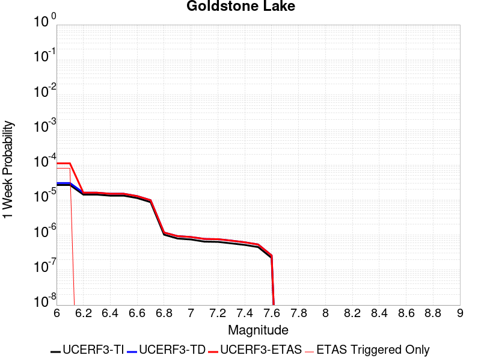 | 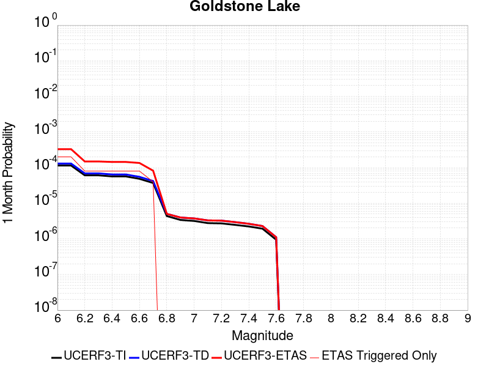 | 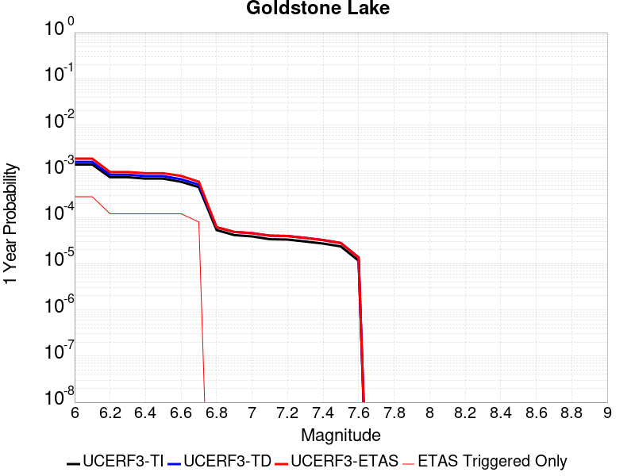 |

| Magnitude | 1 wk TI Prob | 1 wk TD Prob | 1 wk ETAS Prob | 1 wk ETAS/TD Gain | 1 wk ETAS Triggered Only | 1 mo TI Prob | 1 mo TD Prob | 1 mo ETAS Prob | 1 mo ETAS/TD Gain | 1 mo ETAS Triggered Only | 1 yr TI Prob | 1 yr TD Prob | 1 yr ETAS Prob | 1 yr ETAS/TD Gain | 1 yr ETAS Triggered Only |
|-----|-----|-----|-----|-----|-----|-----|-----|-----|-----|-----|-----|-----|-----|-----|-----|
| 6.0 | 2.671352E-5 | 3.0389869E-5 | 1.1038744E-4 | 3.6323762 | 8.0E-5 | 1.1448149E-4 | 1.302369E-4 | 3.3021084E-4 | 2.535463 | 2.0E-4 | 0.001392921 | 0.0015846775 | 0.0018642338 | 1.1764121 | 2.8E-4 |
| 6.1 | 2.671352E-5 | 3.0389869E-5 | 1.1038744E-4 | 3.6323762 | 8.0E-5 | 1.1448149E-4 | 1.302369E-4 | 3.3021084E-4 | 2.535463 | 2.0E-4 | 0.001392921 | 0.0015846775 | 0.0018642338 | 1.1764121 | 2.8E-4 |
| 6.2 | 1.4197047E-5 | 1.6103195E-5 | 1.6103195E-5 | 1.0 | 0.0 | 6.0843064E-5 | 6.901242E-5 | 1.490069E-4 | 2.1591315 | 8.0E-5 | 7.4051257E-4 | 8.4000104E-4 | 9.599002E-4 | 1.1427369 | 1.2E-4 |
| 6.3 | 1.4197047E-5 | 1.6103195E-5 | 1.6103195E-5 | 1.0 | 0.0 | 6.0843064E-5 | 6.901242E-5 | 1.490069E-4 | 2.1591315 | 8.0E-5 | 7.4051257E-4 | 8.4000104E-4 | 9.599002E-4 | 1.1427369 | 1.2E-4 |
| 6.4 | 1.3238931E-5 | 1.501491E-5 | 1.501491E-5 | 1.0 | 0.0 | 5.6737044E-5 | 6.434858E-5 | 1.4434343E-4 | 2.2431488 | 8.0E-5 | 6.9055456E-4 | 7.8326045E-4 | 9.031664E-4 | 1.1530857 | 1.2E-4 |
| 6.5 | 1.3238931E-5 | 1.501491E-5 | 1.501491E-5 | 1.0 | 0.0 | 5.6737044E-5 | 6.434858E-5 | 1.4434343E-4 | 2.2431488 | 8.0E-5 | 6.9055456E-4 | 7.8326045E-4 | 9.031664E-4 | 1.1530857 | 1.2E-4 |
| 6.6 | 1.1328278E-5 | 1.2860688E-5 | 1.2860688E-5 | 1.0 | 0.0 | 4.8548856E-5 | 5.5116612E-5 | 1.351122E-4 | 2.4513881 | 8.0E-5 | 5.90922E-4 | 6.709339E-4 | 7.908534E-4 | 1.1787351 | 1.2E-4 |
| 6.7 | 8.651175E-6 | 9.82873E-6 | 9.82873E-6 | 1.0 | 0.0 | 3.707594E-5 | 4.212296E-5 | 8.2121274E-5 | 1.9495609 | 4.0E-5 | 4.5130608E-4 | 5.1281694E-4 | 5.9277593E-4 | 1.1559211 | 8.0E-5 |
| 6.8 | 1.0215377E-6 | 1.1757171E-6 | 1.1757171E-6 | 1.0 | 0.0 | 4.378012E-6 | 5.0387785E-6 | 5.0387785E-6 | 1.0 | 0.0 | 5.3300988E-5 | 6.134552E-5 | 6.134552E-5 | 1.0 | 0.0 |
| 6.9 | 7.9360774E-7 | 9.28516E-7 | 9.28516E-7 | 1.0 | 0.0 | 3.4011714E-6 | 3.9793485E-6 | 3.9793485E-6 | 1.0 | 0.0 | 4.1408475E-5 | 4.8447564E-5 | 4.8447564E-5 | 1.0 | 0.0 |
| 7.0 | 7.4382757E-7 | 8.748952E-7 | 8.748952E-7 | 1.0 | 0.0 | 3.1878285E-6 | 3.7495458E-6 | 3.7495458E-6 | 1.0 | 0.0 | 3.8811122E-5 | 4.5649835E-5 | 4.5649835E-5 | 1.0 | 0.0 |
| 7.1 | 6.4709513E-7 | 7.712674E-7 | 7.712674E-7 | 1.0 | 0.0 | 2.773262E-6 | 3.305428E-6 | 3.305428E-6 | 1.0 | 0.0 | 3.376394E-5 | 4.0242903E-5 | 4.0242903E-5 | 1.0 | 0.0 |
| 7.2 | 6.356704E-7 | 7.589702E-7 | 7.589702E-7 | 1.0 | 0.0 | 2.7242988E-6 | 3.2527257E-6 | 3.2527257E-6 | 1.0 | 0.0 | 3.3167835E-5 | 3.9601277E-5 | 3.9601277E-5 | 1.0 | 0.0 |
| 7.3 | 5.7695723E-7 | 6.897807E-7 | 6.897807E-7 | 1.0 | 0.0 | 2.4726714E-6 | 2.9562E-6 | 2.9562E-6 | 1.0 | 0.0 | 3.0104358E-5 | 3.5991197E-5 | 3.5991197E-5 | 1.0 | 0.0 |
| 7.4 | 5.209647E-7 | 6.194571E-7 | 6.194571E-7 | 1.0 | 0.0 | 2.232704E-6 | 2.654814E-6 | 2.654814E-6 | 1.0 | 0.0 | 2.718283E-5 | 3.2321936E-5 | 3.2321936E-5 | 1.0 | 0.0 |
| 7.5 | 4.512955E-7 | 5.3497666E-7 | 5.3497666E-7 | 1.0 | 0.0 | 1.934122E-6 | 2.2927554E-6 | 2.2927554E-6 | 1.0 | 0.0 | 2.3547682E-5 | 2.7913995E-5 | 2.7913995E-5 | 1.0 | 0.0 |
| 7.6 | 2.21172E-7 | 2.6043384E-7 | 2.6043384E-7 | 1.0 | 0.0 | 9.478797E-7 | 1.1161446E-6 | 1.1161446E-6 | 1.0 | 0.0 | 1.1540374E-5 | 1.3589005E-5 | 1.3589005E-5 | 1.0 | 0.0 |

## Sierra Madre (San Fernando)
*[(top)](#table-of-contents)*

| 1 Week | 1 Month | 1 Year |
|-----|-----|-----|
| 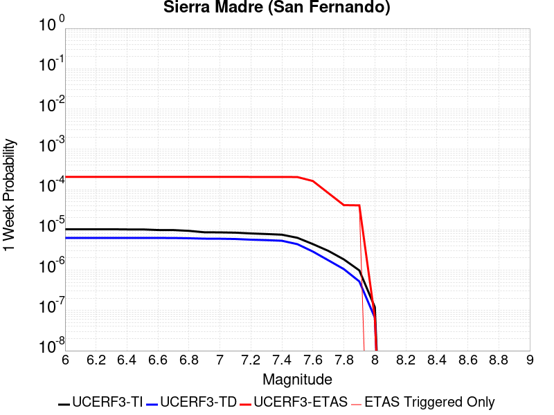 | 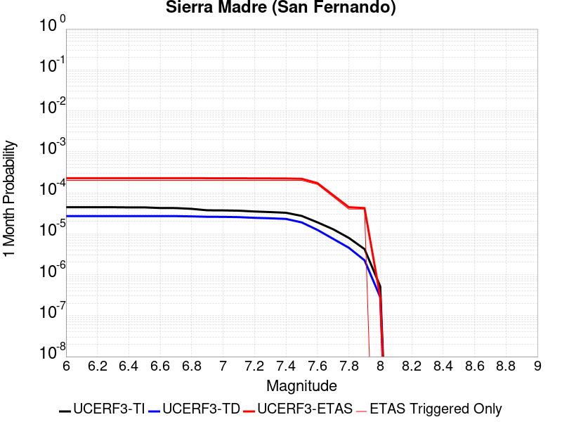 | 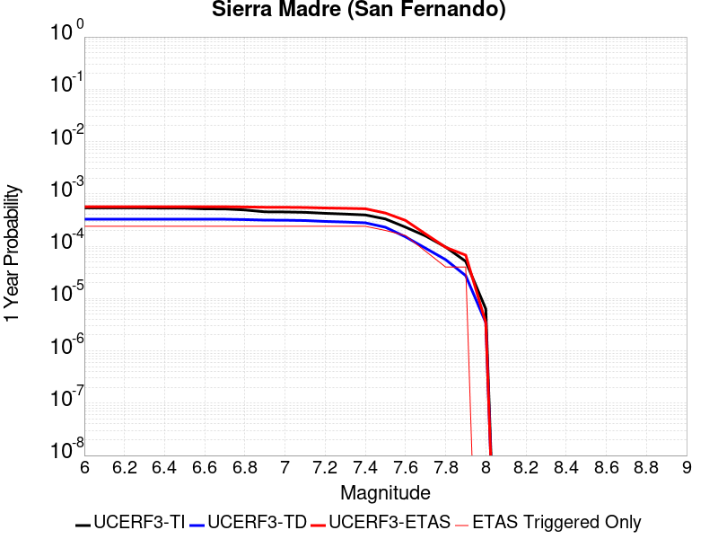 |

| Magnitude | 1 wk TI Prob | 1 wk TD Prob | 1 wk ETAS Prob | 1 wk ETAS/TD Gain | 1 wk ETAS Triggered Only | 1 mo TI Prob | 1 mo TD Prob | 1 mo ETAS Prob | 1 mo ETAS/TD Gain | 1 mo ETAS Triggered Only | 1 yr TI Prob | 1 yr TD Prob | 1 yr ETAS Prob | 1 yr ETAS/TD Gain | 1 yr ETAS Triggered Only |
|-----|-----|-----|-----|-----|-----|-----|-----|-----|-----|-----|-----|-----|-----|-----|-----|
| 6.0 | 1.0346413E-5 | 6.291033E-6 | 2.0628977E-4 | 32.79108 | 2.0E-4 | 4.4341014E-5 | 2.6961297E-5 | 2.269559E-4 | 8.417841 | 2.0E-4 | 5.3971814E-4 | 3.2820547E-4 | 5.681267E-4 | 1.7310092 | 2.4E-4 |
| 6.1 | 1.0346413E-5 | 6.291033E-6 | 2.0628977E-4 | 32.79108 | 2.0E-4 | 4.4341014E-5 | 2.6961297E-5 | 2.269559E-4 | 8.417841 | 2.0E-4 | 5.3971814E-4 | 3.2820547E-4 | 5.681267E-4 | 1.7310092 | 2.4E-4 |
| 6.2 | 1.0346413E-5 | 6.291033E-6 | 2.0628977E-4 | 32.79108 | 2.0E-4 | 4.4341014E-5 | 2.6961297E-5 | 2.269559E-4 | 8.417841 | 2.0E-4 | 5.3971814E-4 | 3.2820547E-4 | 5.681267E-4 | 1.7310092 | 2.4E-4 |
| 6.3 | 1.0346413E-5 | 6.291033E-6 | 2.0628977E-4 | 32.79108 | 2.0E-4 | 4.4341014E-5 | 2.6961297E-5 | 2.269559E-4 | 8.417841 | 2.0E-4 | 5.3971814E-4 | 3.2820547E-4 | 5.681267E-4 | 1.7310092 | 2.4E-4 |
| 6.4 | 1.0249558E-5 | 6.291033E-6 | 2.0628977E-4 | 32.79108 | 2.0E-4 | 4.392594E-5 | 2.6961297E-5 | 2.269559E-4 | 8.417841 | 2.0E-4 | 5.3466705E-4 | 3.2820547E-4 | 5.681267E-4 | 1.7310092 | 2.4E-4 |
| 6.5 | 1.0249558E-5 | 6.291033E-6 | 2.0628977E-4 | 32.79108 | 2.0E-4 | 4.392594E-5 | 2.6961297E-5 | 2.269559E-4 | 8.417841 | 2.0E-4 | 5.3466705E-4 | 3.2820547E-4 | 5.681267E-4 | 1.7310092 | 2.4E-4 |
| 6.6 | 9.9035515E-6 | 6.291033E-6 | 2.0628977E-4 | 32.79108 | 2.0E-4 | 4.2443102E-5 | 2.6961297E-5 | 2.269559E-4 | 8.417841 | 2.0E-4 | 5.166222E-4 | 3.2820547E-4 | 5.681267E-4 | 1.7310092 | 2.4E-4 |
| 6.7 | 9.87217E-6 | 6.278445E-6 | 2.062772E-4 | 32.85482 | 2.0E-4 | 4.2308613E-5 | 2.6907352E-5 | 2.2690198E-4 | 8.432713 | 2.0E-4 | 5.149856E-4 | 3.2754886E-4 | 5.6747027E-4 | 1.732475 | 2.4E-4 |
| 6.8 | 9.4359175E-6 | 6.1823307E-6 | 2.061811E-4 | 33.35006 | 2.0E-4 | 4.043902E-5 | 2.6495441E-5 | 2.2649014E-4 | 8.548268 | 2.0E-4 | 4.9223384E-4 | 3.2253534E-4 | 5.6245795E-4 | 1.7438645 | 2.4E-4 |
| 6.9 | 8.700447E-6 | 6.0433103E-6 | 2.060421E-4 | 34.094242 | 2.0E-4 | 3.72871E-5 | 2.5899652E-5 | 2.2589447E-4 | 8.721911 | 2.0E-4 | 4.5387587E-4 | 3.1528372E-4 | 5.55208E-4 | 1.7609792 | 2.4E-4 |
| 7.0 | 8.648878E-6 | 6.0181846E-6 | 2.0601698E-4 | 34.232414 | 2.0E-4 | 3.7066096E-5 | 2.5791971E-5 | 2.2578682E-4 | 8.754151 | 2.0E-4 | 4.5118626E-4 | 3.1397308E-4 | 5.538977E-4 | 1.7641567 | 2.4E-4 |
| 7.1 | 8.505786E-6 | 5.92779E-6 | 2.0592661E-4 | 34.739185 | 2.0E-4 | 3.645286E-5 | 2.5404574E-5 | 2.2539949E-4 | 8.872398 | 2.0E-4 | 4.437232E-4 | 3.0925786E-4 | 5.4918363E-4 | 1.7758114 | 2.4E-4 |
| 7.2 | 8.139752E-6 | 5.7020216E-6 | 2.0570088E-4 | 36.07508 | 2.0E-4 | 3.4884186E-5 | 2.4437013E-5 | 2.2443212E-4 | 9.184107 | 2.0E-4 | 4.246322E-4 | 2.9748105E-4 | 5.374097E-4 | 1.806534 | 2.4E-4 |
| 7.3 | 7.8816E-6 | 5.555299E-6 | 2.0555418E-4 | 37.00146 | 2.0E-4 | 3.3777847E-5 | 2.3808214E-5 | 2.2380345E-4 | 9.400263 | 2.0E-4 | 4.111677E-4 | 2.898275E-4 | 5.2975793E-4 | 1.8278388 | 2.4E-4 |
| 7.4 | 7.5810603E-6 | 5.359496E-6 | 2.0535842E-4 | 38.316742 | 2.0E-4 | 3.2489854E-5 | 2.296907E-5 | 2.2296447E-4 | 9.707161 | 2.0E-4 | 3.9549218E-4 | 2.796136E-4 | 5.195465E-4 | 1.8580873 | 2.4E-4 |
| 7.5 | 6.349153E-6 | 4.4105477E-6 | 2.0440966E-4 | 46.34564 | 2.0E-4 | 2.7210372E-5 | 1.8902216E-5 | 2.1889844E-4 | 11.58057 | 2.0E-4 | 3.312359E-4 | 2.3011099E-4 | 4.3006497E-4 | 1.8689457 | 2.0E-4 |
| 7.6 | 4.430576E-6 | 2.893316E-6 | 1.6289286E-4 | 56.299713 | 1.6E-4 | 1.8988047E-5 | 1.2399867E-5 | 1.7239788E-4 | 13.903204 | 1.6E-4 | 2.3115493E-4 | 1.5095815E-4 | 3.10934E-4 | 2.0597365 | 1.6E-4 |
| 7.7 | 3.005066E-6 | 1.753505E-6 | 8.1753366E-5 | 46.62283 | 8.0E-5 | 1.2878791E-5 | 7.515E-6 | 8.7514396E-5 | 11.645296 | 8.0E-5 | 1.56788E-4 | 9.1491296E-5 | 1.7148397E-4 | 1.8743201 | 8.0E-5 |
| 7.8 | 1.8459098E-6 | 1.060052E-6 | 4.1060008E-5 | 38.73396 | 4.0E-5 | 7.911018E-6 | 4.543072E-6 | 4.454289E-5 | 9.804575 | 4.0E-5 | 9.631238E-5 | 5.5310502E-5 | 9.5308285E-5 | 1.72315 | 4.0E-5 |
| 7.9 | 9.839262E-7 | 5.2437485E-7 | 4.0524355E-5 | 77.281265 | 4.0E-5 | 4.2168194E-6 | 2.247319E-6 | 4.224723E-5 | 18.798946 | 4.0E-5 | 5.1338568E-5 | 2.7360767E-5 | 6.735967E-5 | 2.4619074 | 4.0E-5 |
| 8.0 | 1.210983E-7 | 6.622497E-8 | 6.622497E-8 | 1.0 | 0.0 | 5.1899264E-7 | 2.8382127E-7 | 2.8382127E-7 | 1.0 | 0.0 | 6.3187167E-6 | 3.4555185E-6 | 3.4555185E-6 | 1.0 | 0.0 |

## San Jacinto (Lytle Creek connector)
*[(top)](#table-of-contents)*

| 1 Week | 1 Month | 1 Year |
|-----|-----|-----|
| 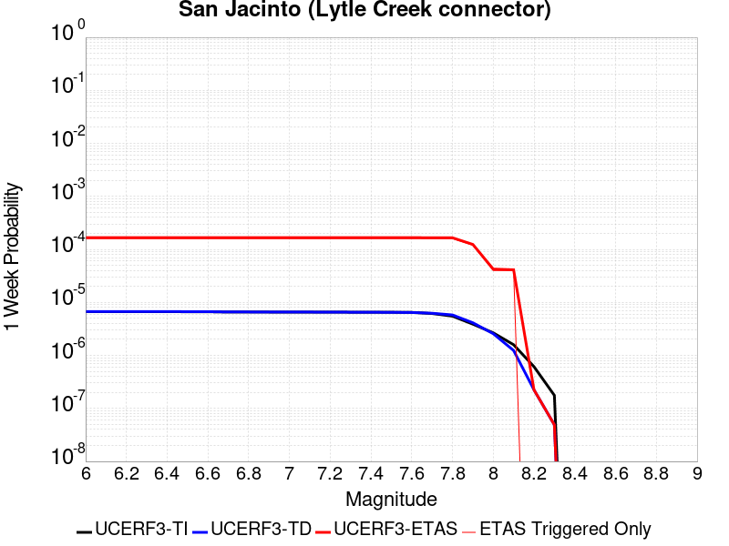 | 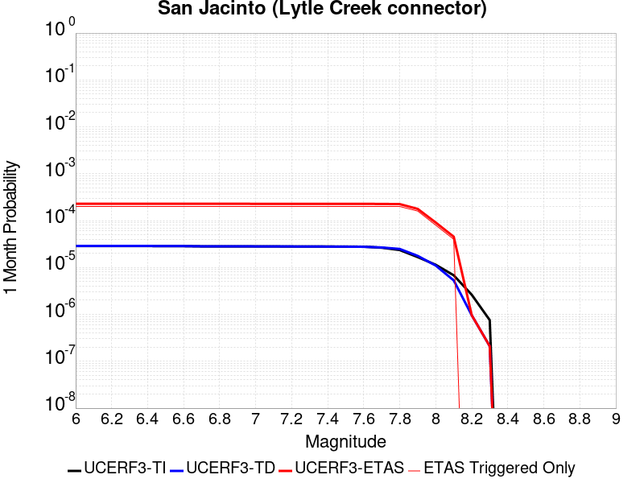 | 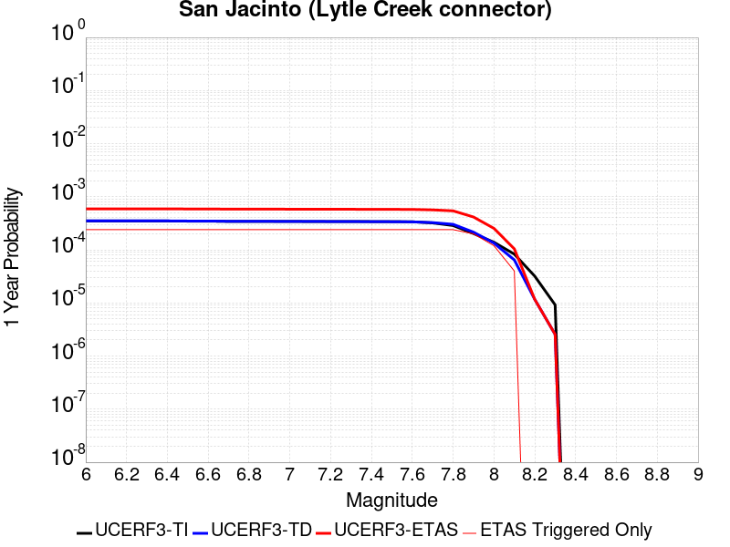 |

| Magnitude | 1 wk TI Prob | 1 wk TD Prob | 1 wk ETAS Prob | 1 wk ETAS/TD Gain | 1 wk ETAS Triggered Only | 1 mo TI Prob | 1 mo TD Prob | 1 mo ETAS Prob | 1 mo ETAS/TD Gain | 1 mo ETAS Triggered Only | 1 yr TI Prob | 1 yr TD Prob | 1 yr ETAS Prob | 1 yr ETAS/TD Gain | 1 yr ETAS Triggered Only |
|-----|-----|-----|-----|-----|-----|-----|-----|-----|-----|-----|-----|-----|-----|-----|-----|
| 6.0 | 6.693995E-6 | 6.7295123E-6 | 1.6672844E-4 | 24.77571 | 1.6E-4 | 2.8688235E-5 | 2.8840448E-5 | 2.2883469E-4 | 7.934505 | 2.0E-4 | 3.492233E-4 | 3.5107599E-4 | 5.909917E-4 | 1.6833727 | 2.4E-4 |
| 6.1 | 6.693995E-6 | 6.7295123E-6 | 1.6672844E-4 | 24.77571 | 1.6E-4 | 2.8688235E-5 | 2.8840448E-5 | 2.2883469E-4 | 7.934505 | 2.0E-4 | 3.492233E-4 | 3.5107599E-4 | 5.909917E-4 | 1.6833727 | 2.4E-4 |
| 6.2 | 6.693995E-6 | 6.7295123E-6 | 1.6672844E-4 | 24.77571 | 1.6E-4 | 2.8688235E-5 | 2.8840448E-5 | 2.2883469E-4 | 7.934505 | 2.0E-4 | 3.492233E-4 | 3.5107599E-4 | 5.909917E-4 | 1.6833727 | 2.4E-4 |
| 6.3 | 6.693995E-6 | 6.7295123E-6 | 1.6672844E-4 | 24.77571 | 1.6E-4 | 2.8688235E-5 | 2.8840448E-5 | 2.2883469E-4 | 7.934505 | 2.0E-4 | 3.492233E-4 | 3.5107599E-4 | 5.909917E-4 | 1.6833727 | 2.4E-4 |
| 6.4 | 6.693995E-6 | 6.7295123E-6 | 1.6672844E-4 | 24.77571 | 1.6E-4 | 2.8688235E-5 | 2.8840448E-5 | 2.2883469E-4 | 7.934505 | 2.0E-4 | 3.492233E-4 | 3.5107599E-4 | 5.909917E-4 | 1.6833727 | 2.4E-4 |
| 6.5 | 6.6561875E-6 | 6.6897233E-6 | 1.6668865E-4 | 24.917122 | 1.6E-4 | 2.8526205E-5 | 2.8669929E-5 | 2.286642E-4 | 7.9757504 | 2.0E-4 | 3.472512E-4 | 3.4900056E-4 | 5.8891677E-4 | 1.687438 | 2.4E-4 |
| 6.6 | 6.6561875E-6 | 6.6897233E-6 | 1.6668865E-4 | 24.917122 | 1.6E-4 | 2.8526205E-5 | 2.8669929E-5 | 2.286642E-4 | 7.9757504 | 2.0E-4 | 3.472512E-4 | 3.4900056E-4 | 5.8891677E-4 | 1.687438 | 2.4E-4 |
| 6.7 | 6.5802237E-6 | 6.6088837E-6 | 1.6660783E-4 | 25.209679 | 1.6E-4 | 2.8200653E-5 | 2.832348E-5 | 2.2831782E-4 | 8.061079 | 2.0E-4 | 3.4328885E-4 | 3.4478388E-4 | 5.8470113E-4 | 1.6958482 | 2.4E-4 |
| 6.8 | 6.575632E-6 | 6.6033695E-6 | 1.6660232E-4 | 25.229895 | 1.6E-4 | 2.8180975E-5 | 2.8299848E-5 | 2.2829419E-4 | 8.066976 | 2.0E-4 | 3.4304935E-4 | 3.4449625E-4 | 5.844136E-4 | 1.6964294 | 2.4E-4 |
| 6.9 | 6.570433E-6 | 6.5947534E-6 | 1.665937E-4 | 25.26155 | 1.6E-4 | 2.8158694E-5 | 2.8262923E-5 | 2.2825727E-4 | 8.076209 | 2.0E-4 | 3.4277816E-4 | 3.4404683E-4 | 5.839643E-4 | 1.6973394 | 2.4E-4 |
| 7.0 | 6.5643826E-6 | 6.5848626E-6 | 1.665838E-4 | 25.297993 | 1.6E-4 | 2.8132765E-5 | 2.8220535E-5 | 2.2821489E-4 | 8.086838 | 2.0E-4 | 3.424626E-4 | 3.435309E-4 | 5.8344845E-4 | 1.698387 | 2.4E-4 |
| 7.1 | 6.557402E-6 | 6.5735626E-6 | 1.6657251E-4 | 25.339762 | 1.6E-4 | 2.8102848E-5 | 2.8172106E-5 | 2.2816648E-4 | 8.099021 | 2.0E-4 | 3.4209844E-4 | 3.429415E-4 | 5.828592E-4 | 1.6995878 | 2.4E-4 |
| 7.2 | 6.546394E-6 | 6.5555055E-6 | 1.6655446E-4 | 25.406805 | 1.6E-4 | 2.8055672E-5 | 2.809472E-5 | 2.280891E-4 | 8.118575 | 2.0E-4 | 3.4152428E-4 | 3.4199964E-4 | 5.819175E-4 | 1.7015152 | 2.4E-4 |
| 7.3 | 6.5364216E-6 | 6.536247E-6 | 1.665352E-4 | 25.47872 | 1.6E-4 | 2.8012933E-5 | 2.8012188E-5 | 2.2800658E-4 | 8.139549 | 2.0E-4 | 3.4100408E-4 | 3.409951E-4 | 5.809132E-4 | 1.7035825 | 2.4E-4 |
| 7.4 | 6.5269523E-6 | 6.517283E-6 | 1.6651624E-4 | 25.549948 | 1.6E-4 | 2.7972354E-5 | 2.7930913E-5 | 2.2792532E-4 | 8.160325 | 2.0E-4 | 3.4051016E-4 | 3.4000588E-4 | 5.7992426E-4 | 1.7056302 | 2.4E-4 |
| 7.5 | 6.5111835E-6 | 6.4935025E-6 | 1.6649246E-4 | 25.639854 | 1.6E-4 | 2.7904773E-5 | 2.7829E-5 | 2.2782343E-4 | 8.186547 | 2.0E-4 | 3.3968766E-4 | 3.3876547E-4 | 5.7868415E-4 | 1.7082148 | 2.4E-4 |
| 7.6 | 6.4768806E-6 | 6.4525266E-6 | 1.664515E-4 | 25.796328 | 1.6E-4 | 2.7757764E-5 | 2.7653392E-5 | 2.2764786E-4 | 8.232185 | 2.0E-4 | 3.3789838E-4 | 3.3662812E-4 | 5.7654735E-4 | 1.7127129 | 2.4E-4 |
| 7.7 | 6.1655364E-6 | 6.2444665E-6 | 1.6624347E-4 | 26.622526 | 1.6E-4 | 2.642346E-5 | 2.6761725E-5 | 2.2675637E-4 | 8.47316 | 2.0E-4 | 3.2165812E-4 | 3.2577536E-4 | 5.6569715E-4 | 1.736464 | 2.4E-4 |
| 7.8 | 5.5043524E-6 | 5.803494E-6 | 1.6580257E-4 | 28.569439 | 1.6E-4 | 2.3589868E-5 | 2.4871879E-5 | 2.248669E-4 | 9.04101 | 2.0E-4 | 2.871688E-4 | 3.027731E-4 | 5.4270047E-4 | 1.7924328 | 2.4E-4 |
| 7.9 | 3.889249E-6 | 4.130606E-6 | 1.241301E-4 | 30.051308 | 1.2E-4 | 1.6668104E-5 | 1.7702478E-5 | 1.7769965E-4 | 10.038123 | 1.6E-4 | 2.0291525E-4 | 2.1550638E-4 | 4.154633E-4 | 1.9278468 | 2.0E-4 |
| 8.0 | 2.668535E-6 | 2.5686622E-6 | 4.256856E-5 | 16.57227 | 4.0E-5 | 1.1436528E-5 | 1.1008506E-5 | 9.100763E-5 | 8.267028 | 8.0E-5 | 1.3923083E-4 | 1.3402035E-4 | 2.5400426E-4 | 1.8952664 | 1.2E-4 |
| 8.1 | 1.5911459E-6 | 1.2385202E-6 | 4.1238472E-5 | 33.296566 | 4.0E-5 | 6.8191785E-6 | 5.307933E-6 | 4.530772E-5 | 8.53585 | 4.0E-5 | 8.3020335E-5 | 6.462219E-5 | 1.04619605E-4 | 1.6189424 | 4.0E-5 |
| 8.2 | 6.1294963E-7 | 2.2397407E-7 | 2.2397407E-7 | 1.0 | 0.0 | 2.6269242E-6 | 9.598884E-7 | 9.598884E-7 | 1.0 | 0.0 | 3.1982334E-5 | 1.168658E-5 | 1.168658E-5 | 1.0 | 0.0 |
| 8.3 | 1.762871E-7 | 4.901543E-8 | 4.901543E-8 | 1.0 | 0.0 | 7.5551594E-7 | 2.1006612E-7 | 2.1006612E-7 | 1.0 | 0.0 | 9.1983675E-6 | 2.557552E-6 | 2.557552E-6 | 1.0 | 0.0 |

## McLean Lake
*[(top)](#table-of-contents)*

| 1 Week | 1 Month | 1 Year |
|-----|-----|-----|
|  | 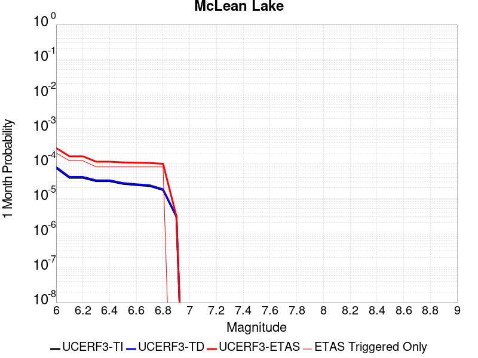 | 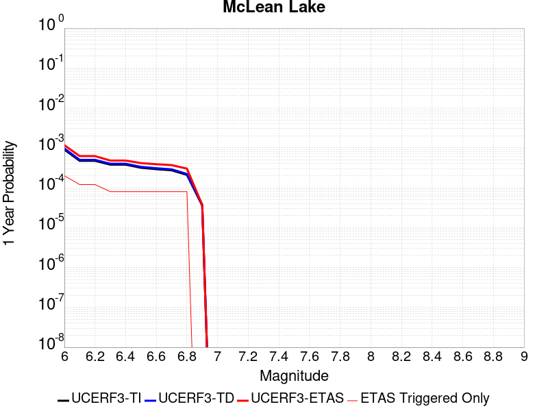 |

| Magnitude | 1 wk TI Prob | 1 wk TD Prob | 1 wk ETAS Prob | 1 wk ETAS/TD Gain | 1 wk ETAS Triggered Only | 1 mo TI Prob | 1 mo TD Prob | 1 mo ETAS Prob | 1 mo ETAS/TD Gain | 1 mo ETAS Triggered Only | 1 yr TI Prob | 1 yr TD Prob | 1 yr ETAS Prob | 1 yr ETAS/TD Gain | 1 yr ETAS Triggered Only |
|-----|-----|-----|-----|-----|-----|-----|-----|-----|-----|-----|-----|-----|-----|-----|-----|
| 6.0 | 1.7360222E-5 | 1.8505758E-5 | 1.8505758E-5 | 1.0 | 0.0 | 7.439883E-5 | 7.930826E-5 | 2.792924E-4 | 3.5216055 | 2.0E-4 | 9.0542925E-4 | 9.651989E-4 | 0.0011650058 | 1.2070112 | 2.0E-4 |
| 6.1 | 9.062689E-6 | 9.594095E-6 | 9.594095E-6 | 1.0 | 0.0 | 3.8839516E-5 | 4.1116953E-5 | 1.6111202E-4 | 3.9183843 | 1.2E-4 | 4.727685E-4 | 5.004928E-4 | 6.204327E-4 | 1.2396437 | 1.2E-4 |
| 6.2 | 9.062689E-6 | 9.594095E-6 | 9.594095E-6 | 1.0 | 0.0 | 3.8839516E-5 | 4.1116953E-5 | 1.6111202E-4 | 3.9183843 | 1.2E-4 | 4.727685E-4 | 5.004928E-4 | 6.204327E-4 | 1.2396437 | 1.2E-4 |
| 6.3 | 7.2575485E-6 | 7.6691795E-6 | 7.6691795E-6 | 1.0 | 0.0 | 3.110341E-5 | 3.2867538E-5 | 1.1286491E-4 | 3.4339325 | 8.0E-5 | 3.786182E-4 | 4.0009595E-4 | 4.8006393E-4 | 1.199872 | 8.0E-5 |
| 6.4 | 7.2575485E-6 | 7.6691795E-6 | 7.6691795E-6 | 1.0 | 0.0 | 3.110341E-5 | 3.2867538E-5 | 1.1286491E-4 | 3.4339325 | 8.0E-5 | 3.786182E-4 | 4.0009595E-4 | 4.8006393E-4 | 1.199872 | 8.0E-5 |
| 6.5 | 6.06582E-6 | 6.405088E-6 | 6.405088E-6 | 1.0 | 0.0 | 2.5996113E-5 | 2.7450124E-5 | 1.0744793E-4 | 3.9142966 | 8.0E-5 | 3.164567E-4 | 3.341605E-4 | 4.1413377E-4 | 1.2393259 | 8.0E-5 |
| 6.6 | 5.598744E-6 | 5.9113777E-6 | 5.9113777E-6 | 1.0 | 0.0 | 2.3994397E-5 | 2.5334266E-5 | 1.0533224E-4 | 4.1576986 | 8.0E-5 | 2.9209262E-4 | 3.0840744E-4 | 3.8838276E-4 | 1.2593172 | 8.0E-5 |
| 6.7 | 5.246996E-6 | 5.5402083E-6 | 5.5402083E-6 | 1.0 | 0.0 | 2.2486933E-5 | 2.3743569E-5 | 1.0374167E-4 | 4.369253 | 8.0E-5 | 2.73744E-4 | 2.8904597E-4 | 3.6902283E-4 | 1.2766926 | 8.0E-5 |
| 6.8 | 4.02324E-6 | 4.2477054E-6 | 4.2477054E-6 | 1.0 | 0.0 | 1.7242342E-5 | 1.8204359E-5 | 9.82029E-5 | 5.394472 | 8.0E-5 | 2.099053E-4 | 2.2162148E-4 | 3.0160375E-4 | 1.3608959 | 8.0E-5 |
| 6.9 | 6.835972E-7 | 7.141004E-7 | 7.141004E-7 | 1.0 | 0.0 | 2.9296991E-6 | 3.0604285E-6 | 3.0604285E-6 | 1.0 | 0.0 | 3.56685E-5 | 3.72604E-5 | 3.72604E-5 | 1.0 | 0.0 |

## Monte Vista - Shannon 2011 CFM
*[(top)](#table-of-contents)*

| 1 Week | 1 Month | 1 Year |
|-----|-----|-----|
| 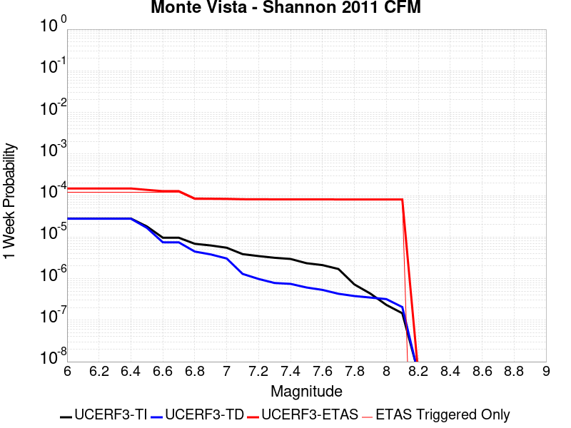 | 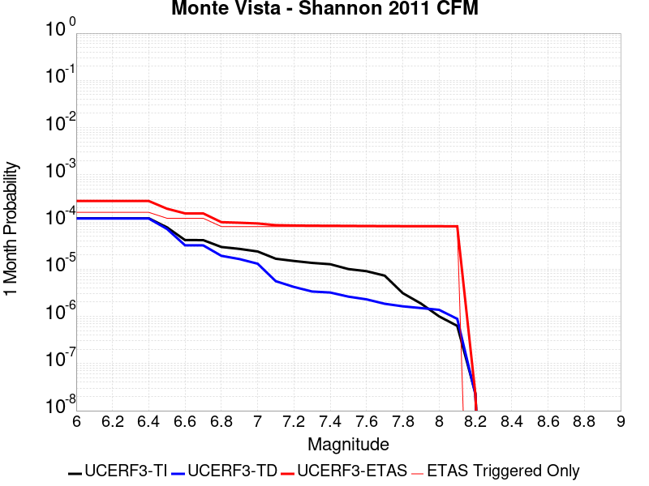 | 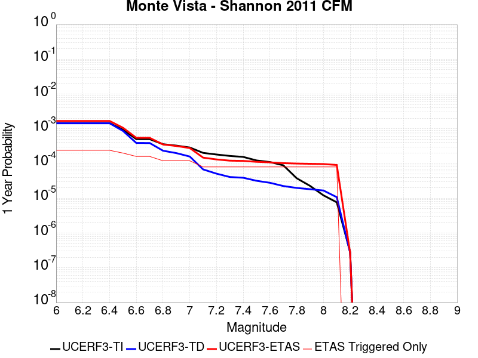 |

| Magnitude | 1 wk TI Prob | 1 wk TD Prob | 1 wk ETAS Prob | 1 wk ETAS/TD Gain | 1 wk ETAS Triggered Only | 1 mo TI Prob | 1 mo TD Prob | 1 mo ETAS Prob | 1 mo ETAS/TD Gain | 1 mo ETAS Triggered Only | 1 yr TI Prob | 1 yr TD Prob | 1 yr ETAS Prob | 1 yr ETAS/TD Gain | 1 yr ETAS Triggered Only |
|-----|-----|-----|-----|-----|-----|-----|-----|-----|-----|-----|-----|-----|-----|-----|-----|
| 6.0 | 2.7907707E-5 | 2.7607006E-5 | 1.476037E-4 | 5.3466024 | 1.2E-4 | 1.19598975E-4 | 1.1831107E-4 | 2.7829214E-4 | 2.352207 | 1.6E-4 | 0.0014551448 | 0.0014396093 | 0.0016792639 | 1.1664718 | 2.4E-4 |
| 6.1 | 2.7907707E-5 | 2.7607006E-5 | 1.476037E-4 | 5.3466024 | 1.2E-4 | 1.19598975E-4 | 1.1831107E-4 | 2.7829214E-4 | 2.352207 | 1.6E-4 | 0.0014551448 | 0.0014396093 | 0.0016792639 | 1.1664718 | 2.4E-4 |
| 6.2 | 2.7907707E-5 | 2.7607006E-5 | 1.476037E-4 | 5.3466024 | 1.2E-4 | 1.19598975E-4 | 1.1831107E-4 | 2.7829214E-4 | 2.352207 | 1.6E-4 | 0.0014551448 | 0.0014396093 | 0.0016792639 | 1.1664718 | 2.4E-4 |
| 6.3 | 2.7907707E-5 | 2.7607006E-5 | 1.476037E-4 | 5.3466024 | 1.2E-4 | 1.19598975E-4 | 1.1831107E-4 | 2.7829214E-4 | 2.352207 | 1.6E-4 | 0.0014551448 | 0.0014396093 | 0.0016792639 | 1.1664718 | 2.4E-4 |
| 6.4 | 2.7907707E-5 | 2.7607006E-5 | 1.476037E-4 | 5.3466024 | 1.2E-4 | 1.19598975E-4 | 1.1831107E-4 | 2.7829214E-4 | 2.352207 | 1.6E-4 | 0.0014551448 | 0.0014396093 | 0.0016792639 | 1.1664718 | 2.4E-4 |
| 6.5 | 1.7990213E-5 | 1.6658836E-5 | 1.3665683E-4 | 8.203264 | 1.2E-4 | 7.709863E-5 | 7.1393435E-5 | 1.9138487E-4 | 2.680707 | 1.2E-4 | 9.382716E-4 | 8.689348E-4 | 0.001068761 | 1.2299669 | 2.0E-4 |
| 6.6 | 9.650407E-6 | 7.4729483E-6 | 1.2747206E-4 | 17.057798 | 1.2E-4 | 4.135823E-5 | 3.202657E-5 | 1.5202272E-4 | 4.7467685 | 1.2E-4 | 5.0342013E-4 | 3.8986158E-4 | 5.497992E-4 | 1.4102421 | 1.6E-4 |
| 6.7 | 9.62828E-6 | 7.4508453E-6 | 1.2744995E-4 | 17.105434 | 1.2E-4 | 4.1263404E-5 | 3.1931846E-5 | 1.5192802E-4 | 4.7578835 | 1.2E-4 | 5.022661E-4 | 3.8870872E-4 | 5.4864655E-4 | 1.4114592 | 1.6E-4 |
| 6.8 | 6.887523E-6 | 4.4764647E-6 | 8.447611E-5 | 18.871166 | 8.0E-5 | 2.9517621E-5 | 1.9184721E-5 | 9.9183184E-5 | 5.169905 | 8.0E-5 | 3.5931775E-4 | 2.3355117E-4 | 3.5352312E-4 | 1.5136861 | 1.2E-4 |
| 6.9 | 6.2722347E-6 | 3.81813E-6 | 8.3817824E-5 | 21.952585 | 8.0E-5 | 2.6880729E-5 | 1.6363323E-5 | 9.636201E-5 | 5.888902 | 8.0E-5 | 3.2722374E-4 | 1.9920728E-4 | 3.1918337E-4 | 1.6022676 | 1.2E-4 |
| 7.0 | 5.5320347E-6 | 3.0449671E-6 | 8.3044724E-5 | 27.272781 | 8.0E-5 | 2.3708504E-5 | 1.3049805E-5 | 9.304876E-5 | 7.13028 | 8.0E-5 | 2.8861282E-4 | 1.5887163E-4 | 2.7885256E-4 | 1.7552068 | 1.2E-4 |
| 7.1 | 3.8794055E-6 | 1.2972122E-6 | 8.129711E-5 | 62.67063 | 8.0E-5 | 1.6625918E-5 | 5.559469E-6 | 8.5559026E-5 | 15.389783 | 8.0E-5 | 2.0240174E-4 | 6.768445E-5 | 1.4767903E-4 | 2.1818755 | 8.0E-5 |
| 7.2 | 3.4813652E-6 | 9.799196E-7 | 8.0979844E-5 | 82.63927 | 8.0E-5 | 1.49200505E-5 | 4.1996486E-6 | 8.419931E-5 | 20.049131 | 8.0E-5 | 1.8163648E-4 | 5.1129533E-5 | 1.3112545E-4 | 2.5645733 | 8.0E-5 |
| 7.3 | 3.1682148E-6 | 7.841216E-7 | 8.078406E-5 | 103.02492 | 8.0E-5 | 1.3577992E-5 | 3.3605168E-6 | 8.3360246E-5 | 24.805782 | 8.0E-5 | 1.6529951E-4 | 4.0913525E-5 | 1.20910256E-4 | 2.9552636 | 8.0E-5 |
| 7.4 | 2.9707667E-6 | 7.464202E-7 | 8.074636E-5 | 108.178154 | 8.0E-5 | 1.2731795E-5 | 3.1989398E-6 | 8.319868E-5 | 26.008205 | 8.0E-5 | 1.5499859E-4 | 3.89464E-5 | 1.1894328E-4 | 3.0540252 | 8.0E-5 |
| 7.5 | 2.3462758E-6 | 6.1088537E-7 | 8.061084E-5 | 131.95738 | 8.0E-5 | 1.0055429E-5 | 2.6180774E-6 | 8.2617866E-5 | 31.556694 | 8.0E-5 | 1.2241797E-4 | 3.1874628E-5 | 1.11872076E-4 | 3.5097532 | 8.0E-5 |
| 7.6 | 2.112783E-6 | 5.3464873E-7 | 8.0534606E-5 | 150.63087 | 8.0E-5 | 9.054753E-6 | 2.2913496E-6 | 8.229117E-5 | 35.91384 | 8.0E-5 | 1.1023604E-4 | 2.7896827E-5 | 1.0789459E-4 | 3.8676298 | 8.0E-5 |
| 7.7 | 1.7022471E-6 | 4.3143976E-7 | 8.0431404E-5 | 186.42557 | 8.0E-5 | 7.2953244E-6 | 1.8490263E-6 | 8.184888E-5 | 44.265938 | 8.0E-5 | 8.881695E-5 | 2.2511664E-5 | 1.0250986E-4 | 4.553633 | 8.0E-5 |
| 7.8 | 7.230914E-7 | 3.803605E-7 | 8.038033E-5 | 211.3267 | 8.0E-5 | 3.0989595E-6 | 1.6301153E-6 | 8.162999E-5 | 50.076202 | 8.0E-5 | 3.772918E-5 | 1.9846475E-5 | 9.984489E-5 | 5.030863 | 8.0E-5 |
| 7.9 | 4.3588446E-7 | 3.4959496E-7 | 8.0349564E-5 | 229.83617 | 8.0E-5 | 1.868075E-6 | 1.4982633E-6 | 8.149815E-5 | 54.395077 | 8.0E-5 | 2.2743576E-5 | 1.8241204E-5 | 9.823975E-5 | 5.3855953 | 8.0E-5 |
| 8.0 | 2.3317523E-7 | 3.2087686E-7 | 8.032085E-5 | 250.31673 | 8.0E-5 | 9.99322E-7 | 1.3751859E-6 | 8.1375074E-5 | 59.173874 | 8.0E-5 | 1.2166677E-5 | 1.674276E-5 | 9.674142E-5 | 5.7781043 | 8.0E-5 |
| 8.1 | 1.4662456E-7 | 2.065131E-7 | 8.02065E-5 | 388.38455 | 8.0E-5 | 6.283908E-7 | 8.8505584E-7 | 8.088499E-5 | 91.389694 | 8.0E-5 | 7.650631E-6 | 1.0775503E-5 | 9.077464E-5 | 8.424168 | 8.0E-5 |
| 8.2 | 5.4931775E-9 | 5.164059E-9 | 5.164059E-9 | 1.0 | 0.0 | 2.3542189E-8 | 2.213168E-8 | 2.213168E-8 | 1.0 | 0.0 | 2.8662612E-7 | 2.6945318E-7 | 2.6945318E-7 | 1.0 | 0.0 |

## San Diego Trough north alt1
*[(top)](#table-of-contents)*

| 1 Week | 1 Month | 1 Year |
|-----|-----|-----|
| 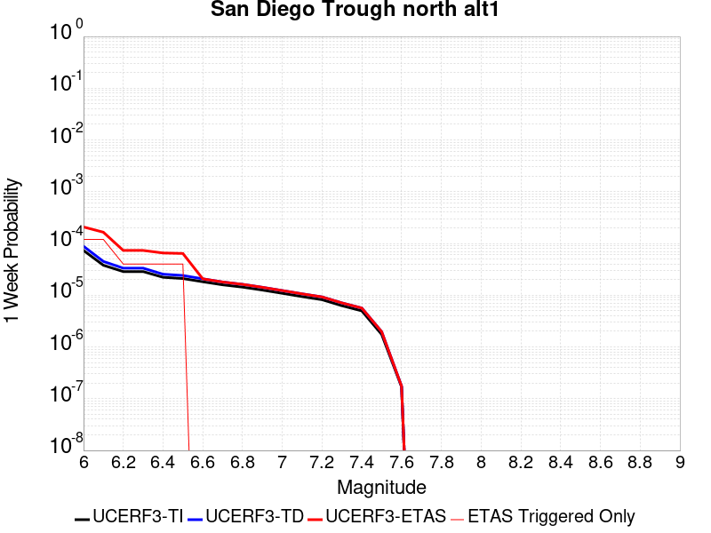 | 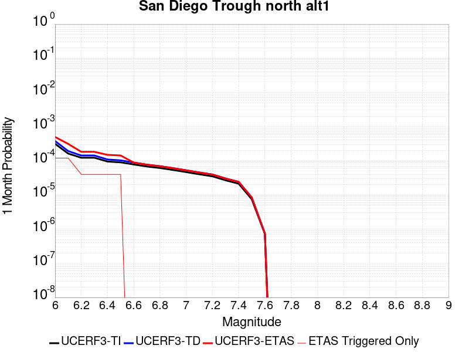 | 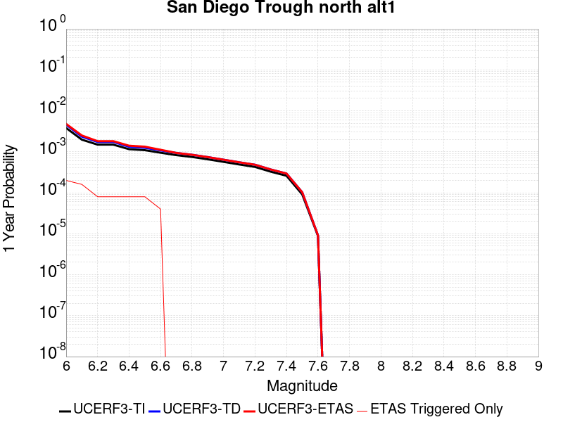 |

| Magnitude | 1 wk TI Prob | 1 wk TD Prob | 1 wk ETAS Prob | 1 wk ETAS/TD Gain | 1 wk ETAS Triggered Only | 1 mo TI Prob | 1 mo TD Prob | 1 mo ETAS Prob | 1 mo ETAS/TD Gain | 1 mo ETAS Triggered Only | 1 yr TI Prob | 1 yr TD Prob | 1 yr ETAS Prob | 1 yr ETAS/TD Gain | 1 yr ETAS Triggered Only |
|-----|-----|-----|-----|-----|-----|-----|-----|-----|-----|-----|-----|-----|-----|-----|-----|
| 6.0 | 7.329252E-5 | 8.827393E-5 | 2.0826334E-4 | 2.3592846 | 1.2E-4 | 3.14073E-4 | 3.782656E-4 | 4.982202E-4 | 1.3171175 | 1.2E-4 | 0.0038171355 | 0.00459623 | 0.004795311 | 1.043314 | 2.0E-4 |
| 6.1 | 3.7940346E-5 | 4.4913257E-5 | 1.6490786E-4 | 3.671697 | 1.2E-4 | 1.6259136E-4 | 1.924717E-4 | 3.124486E-4 | 1.6233482 | 1.2E-4 | 0.0019777524 | 0.0023408993 | 0.0025005247 | 1.0681899 | 1.6E-4 |
| 6.2 | 2.8645263E-5 | 3.331533E-5 | 7.3314E-5 | 2.2006085 | 4.0E-5 | 1.2275964E-4 | 1.4277229E-4 | 1.8276658E-4 | 1.2801265 | 4.0E-5 | 0.0014935739 | 0.0017368881 | 0.0018167491 | 1.0459794 | 8.0E-5 |
| 6.3 | 2.8645263E-5 | 3.331533E-5 | 7.3314E-5 | 2.2006085 | 4.0E-5 | 1.2275964E-4 | 1.4277229E-4 | 1.8276658E-4 | 1.2801265 | 4.0E-5 | 0.0014935739 | 0.0017368881 | 0.0018167491 | 1.0459794 | 8.0E-5 |
| 6.4 | 2.2204576E-5 | 2.5461064E-5 | 6.5460044E-5 | 2.5709863 | 4.0E-5 | 9.5159E-5 | 1.09114335E-4 | 1.4910997E-4 | 1.366548 | 4.0E-5 | 0.001157945 | 0.0013276667 | 0.0014075605 | 1.0601761 | 8.0E-5 |
| 6.5 | 2.1004838E-5 | 2.403653E-5 | 6.403557E-5 | 2.6640937 | 4.0E-5 | 9.0017624E-5 | 1.0300968E-4 | 1.4300556E-4 | 1.388273 | 4.0E-5 | 0.0010954136 | 0.0012534301 | 0.0013333298 | 1.0637449 | 8.0E-5 |
| 6.6 | 1.820557E-5 | 2.0714517E-5 | 2.0714517E-5 | 1.0 | 0.0 | 7.802154E-5 | 8.877351E-5 | 8.877351E-5 | 1.0 | 0.0 | 9.4949827E-4 | 0.0010802869 | 0.0011202437 | 1.0369872 | 4.0E-5 |
| 6.7 | 1.5884485E-5 | 1.7991773E-5 | 1.7991773E-5 | 1.0 | 0.0 | 6.807459E-5 | 7.710534E-5 | 7.710534E-5 | 1.0 | 0.0 | 8.284929E-4 | 9.383559E-4 | 9.383559E-4 | 1.0 | 0.0 |
| 6.8 | 1.4331171E-5 | 1.6208287E-5 | 1.6208287E-5 | 1.0 | 0.0 | 6.141786E-5 | 6.946225E-5 | 6.946225E-5 | 1.0 | 0.0 | 7.4750587E-4 | 8.4537675E-4 | 8.4537675E-4 | 1.0 | 0.0 |
| 6.9 | 1.2574203E-5 | 1.4212128E-5 | 1.4212128E-5 | 1.0 | 0.0 | 5.3888325E-5 | 6.0907703E-5 | 6.0907703E-5 | 1.0 | 0.0 | 6.558929E-4 | 7.413004E-4 | 7.413004E-4 | 1.0 | 0.0 |
| 7.0 | 1.0883844E-5 | 1.22946785E-5 | 1.22946785E-5 | 1.0 | 0.0 | 4.664421E-5 | 5.2690422E-5 | 5.2690422E-5 | 1.0 | 0.0 | 5.677453E-4 | 6.4131804E-4 | 6.4131804E-4 | 1.0 | 0.0 |
| 7.1 | 9.393088E-6 | 1.0611702E-5 | 1.0611702E-5 | 1.0 | 0.0 | 4.025547E-5 | 4.5477937E-5 | 4.5477937E-5 | 1.0 | 0.0 | 4.900001E-4 | 5.53554E-4 | 5.53554E-4 | 1.0 | 0.0 |
| 7.2 | 8.190791E-6 | 9.26275E-6 | 9.26275E-6 | 1.0 | 0.0 | 3.510292E-5 | 3.96969E-5 | 3.96969E-5 | 1.0 | 0.0 | 4.2729423E-4 | 4.8320327E-4 | 4.8320327E-4 | 1.0 | 0.0 |
| 7.3 | 6.268162E-6 | 7.0928886E-6 | 7.0928886E-6 | 1.0 | 0.0 | 2.6863276E-5 | 3.0397741E-5 | 3.0397741E-5 | 1.0 | 0.0 | 3.2701128E-4 | 3.7003006E-4 | 3.7003006E-4 | 1.0 | 0.0 |
| 7.4 | 4.985186E-6 | 5.645222E-6 | 5.645222E-6 | 1.0 | 0.0 | 2.1364907E-5 | 2.4193585E-5 | 2.4193585E-5 | 1.0 | 0.0 | 2.600867E-4 | 2.9451746E-4 | 2.9451746E-4 | 1.0 | 0.0 |
| 7.5 | 1.7489613E-6 | 1.9705317E-6 | 1.9705317E-6 | 1.0 | 0.0 | 7.495527E-6 | 8.44511E-6 | 8.44511E-6 | 1.0 | 0.0 | 9.125422E-5 | 1.02814585E-4 | 1.02814585E-4 | 1.0 | 0.0 |
| 7.6 | 1.6988751E-7 | 1.753573E-7 | 1.753573E-7 | 1.0 | 0.0 | 7.2808916E-7 | 7.515311E-7 | 7.515311E-7 | 1.0 | 0.0 | 8.864449E-6 | 9.149855E-6 | 9.149855E-6 | 1.0 | 0.0 |

## Simi-Santa Rosa
*[(top)](#table-of-contents)*

| 1 Week | 1 Month | 1 Year |
|-----|-----|-----|
| 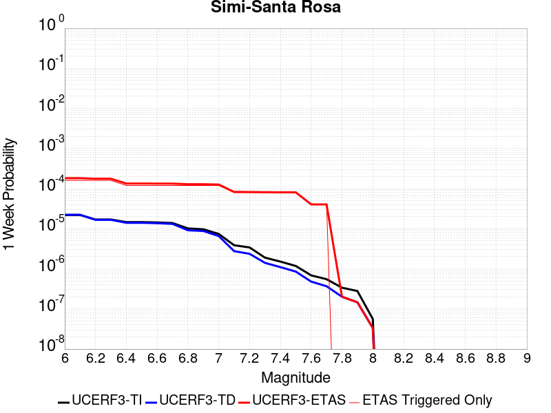 | 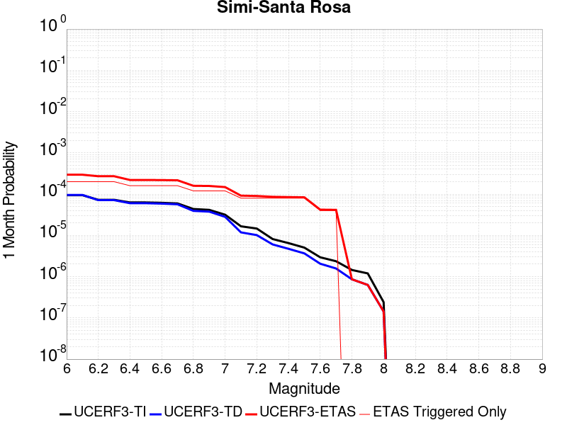 | 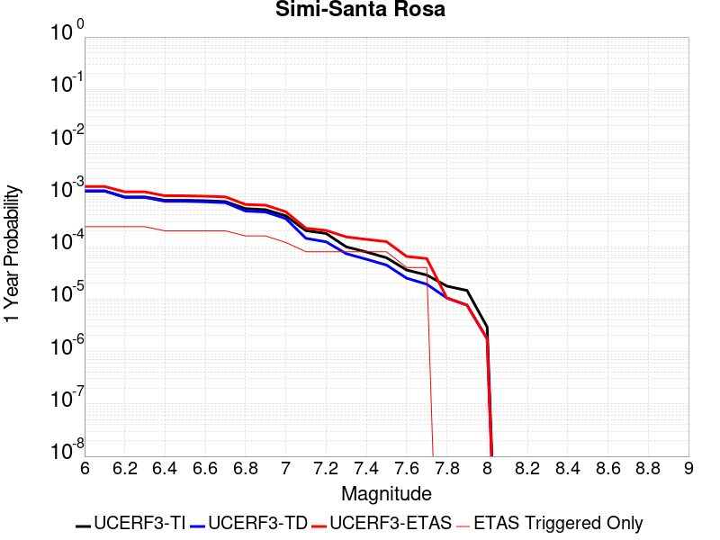 |

| Magnitude | 1 wk TI Prob | 1 wk TD Prob | 1 wk ETAS Prob | 1 wk ETAS/TD Gain | 1 wk ETAS Triggered Only | 1 mo TI Prob | 1 mo TD Prob | 1 mo ETAS Prob | 1 mo ETAS/TD Gain | 1 mo ETAS Triggered Only | 1 yr TI Prob | 1 yr TD Prob | 1 yr ETAS Prob | 1 yr ETAS/TD Gain | 1 yr ETAS Triggered Only |
|-----|-----|-----|-----|-----|-----|-----|-----|-----|-----|-----|-----|-----|-----|-----|-----|
| 6.0 | 2.198912E-5 | 2.2285461E-5 | 1.822819E-4 | 8.179408 | 1.6E-4 | 9.4235686E-5 | 9.550587E-5 | 2.9548677E-4 | 3.0939121 | 2.0E-4 | 0.0011467156 | 0.0011622076 | 0.0014019287 | 1.2062635 | 2.4E-4 |
| 6.1 | 2.198912E-5 | 2.2285461E-5 | 1.822819E-4 | 8.179408 | 1.6E-4 | 9.4235686E-5 | 9.550587E-5 | 2.9548677E-4 | 3.0939121 | 2.0E-4 | 0.0011467156 | 0.0011622076 | 0.0014019287 | 1.2062635 | 2.4E-4 |
| 6.2 | 1.69983E-5 | 1.6676233E-5 | 1.7667357E-4 | 10.594334 | 1.6E-4 | 7.284782E-5 | 7.146777E-5 | 2.714535E-4 | 3.7982643 | 2.0E-4 | 8.865613E-4 | 8.6980197E-4 | 0.0011095932 | 1.2756848 | 2.4E-4 |
| 6.3 | 1.69983E-5 | 1.6676233E-5 | 1.7667357E-4 | 10.594334 | 1.6E-4 | 7.284782E-5 | 7.146777E-5 | 2.714535E-4 | 3.7982643 | 2.0E-4 | 8.865613E-4 | 8.6980197E-4 | 0.0011095932 | 1.2756848 | 2.4E-4 |
| 6.4 | 1.4666188E-5 | 1.40591355E-5 | 1.3405745E-4 | 9.535255 | 1.2E-4 | 6.285358E-5 | 6.0252187E-5 | 2.2024255E-4 | 3.6553452 | 1.6E-4 | 7.6497364E-4 | 7.333484E-4 | 9.3320175E-4 | 1.2725216 | 2.0E-4 |
| 6.5 | 1.4666188E-5 | 1.40591355E-5 | 1.3405745E-4 | 9.535255 | 1.2E-4 | 6.285358E-5 | 6.0252187E-5 | 2.2024255E-4 | 3.6553452 | 1.6E-4 | 7.6497364E-4 | 7.333484E-4 | 9.3320175E-4 | 1.2725216 | 2.0E-4 |
| 6.6 | 1.4377586E-5 | 1.3736045E-5 | 1.337344E-4 | 9.736019 | 1.2E-4 | 6.1616774E-5 | 5.8867576E-5 | 2.1885816E-4 | 3.7178047 | 1.6E-4 | 7.4992597E-4 | 7.1650196E-4 | 9.1635867E-4 | 1.2789339 | 2.0E-4 |
| 6.7 | 1.3881404E-5 | 1.3213798E-5 | 1.3321222E-4 | 10.081296 | 1.2E-4 | 5.9490372E-5 | 5.6629477E-5 | 2.1662042E-4 | 3.8252237 | 1.6E-4 | 7.240546E-4 | 6.892705E-4 | 8.891326E-4 | 1.2899618 | 2.0E-4 |
| 6.8 | 1.0176516E-5 | 9.158662E-6 | 1.2915756E-4 | 14.102231 | 1.2E-4 | 4.3612912E-5 | 3.925091E-5 | 1.592462E-4 | 4.057134 | 1.2E-4 | 5.308578E-4 | 4.7779162E-4 | 6.3771516E-4 | 1.334714 | 1.6E-4 |
| 6.9 | 9.699797E-6 | 8.779024E-6 | 1.2877797E-4 | 14.668826 | 1.2E-4 | 4.15699E-5 | 3.7623937E-5 | 1.5761942E-4 | 4.1893387 | 1.2E-4 | 5.05996E-4 | 4.579916E-4 | 6.179183E-4 | 1.3491914 | 1.6E-4 |
| 7.0 | 7.4049476E-6 | 6.5625313E-6 | 1.2656175E-4 | 19.285507 | 1.2E-4 | 3.1735104E-5 | 2.8124903E-5 | 1.4812153E-4 | 5.2665615 | 1.2E-4 | 3.8630638E-4 | 3.4237956E-4 | 4.6233844E-4 | 1.3503683 | 1.2E-4 |
| 7.1 | 3.873439E-6 | 2.7608828E-6 | 8.2760664E-5 | 29.976158 | 8.0E-5 | 1.6600346E-5 | 1.1832302E-5 | 9.183135E-5 | 7.761072 | 8.0E-5 | 2.0209046E-4 | 1.44049E-4 | 2.2403747E-4 | 1.5552866 | 8.0E-5 |
| 7.2 | 3.417706E-6 | 2.368875E-6 | 8.2368686E-5 | 34.77123 | 8.0E-5 | 1.4647229E-5 | 1.0152283E-5 | 9.015147E-5 | 8.879921 | 8.0E-5 | 1.7831543E-4 | 1.2359726E-4 | 2.0358736E-4 | 1.6471835 | 8.0E-5 |
| 7.3 | 1.90225E-6 | 1.4082424E-6 | 8.140813E-5 | 57.808323 | 8.0E-5 | 8.152474E-6 | 6.035311E-6 | 8.603483E-5 | 14.255244 | 8.0E-5 | 9.9251854E-5 | 7.347745E-5 | 1.5347157E-4 | 2.0886893 | 8.0E-5 |
| 7.4 | 1.5170556E-6 | 1.1032644E-6 | 8.110318E-5 | 73.512 | 8.0E-5 | 6.5016507E-6 | 4.7282674E-6 | 8.4727886E-5 | 17.919437 | 8.0E-5 | 7.915472E-5 | 5.7565147E-5 | 1.3756054E-4 | 2.3896499 | 8.0E-5 |
| 7.5 | 1.178732E-6 | 8.5424404E-7 | 8.085417E-5 | 94.64997 | 8.0E-5 | 5.0516987E-6 | 3.6610409E-6 | 8.366075E-5 | 22.85163 | 8.0E-5 | 6.1502695E-5 | 4.457227E-5 | 1.245687E-4 | 2.7947578 | 8.0E-5 |
| 7.6 | 6.8722386E-7 | 4.799764E-7 | 4.0479958E-5 | 84.337395 | 4.0E-5 | 2.9452417E-6 | 2.05704E-6 | 4.205696E-5 | 20.445375 | 4.0E-5 | 3.5857727E-5 | 2.5044175E-5 | 6.5043176E-5 | 2.5971377 | 4.0E-5 |
| 7.7 | 5.5126515E-7 | 3.679374E-7 | 4.0367922E-5 | 109.71411 | 4.0E-5 | 2.3625628E-6 | 1.5768735E-6 | 4.157681E-5 | 26.36661 | 4.0E-5 | 2.8763823E-5 | 1.9198267E-5 | 5.91975E-5 | 3.0834813 | 4.0E-5 |
| 7.8 | 3.3860243E-7 | 2.0116858E-7 | 2.0116858E-7 | 1.0 | 0.0 | 1.4511525E-6 | 8.621508E-7 | 8.621508E-7 | 1.0 | 0.0 | 1.7667637E-5 | 1.0496636E-5 | 1.0496636E-5 | 1.0 | 0.0 |
| 7.9 | 2.7955386E-7 | 1.4685692E-7 | 1.4685692E-7 | 1.0 | 0.0 | 1.1980875E-6 | 6.293866E-7 | 6.293866E-7 | 1.0 | 0.0 | 1.4586617E-5 | 7.662756E-6 | 7.662756E-6 | 1.0 | 0.0 |
| 8.0 | 5.6259015E-8 | 3.3399083E-8 | 3.3399083E-8 | 1.0 | 0.0 | 2.4111003E-7 | 1.431389E-7 | 1.431389E-7 | 1.0 | 0.0 | 2.9355108E-6 | 1.742715E-6 | 1.742715E-6 | 1.0 | 0.0 |

## San Jacinto (Clark) rev
*[(top)](#table-of-contents)*

| 1 Week | 1 Month | 1 Year |
|-----|-----|-----|
| 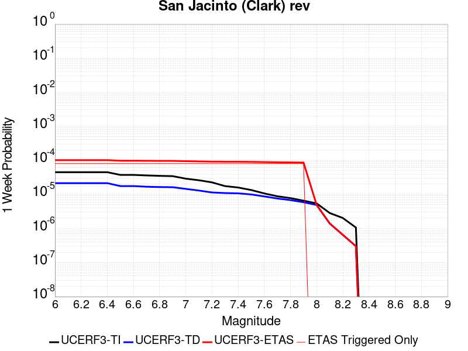 | 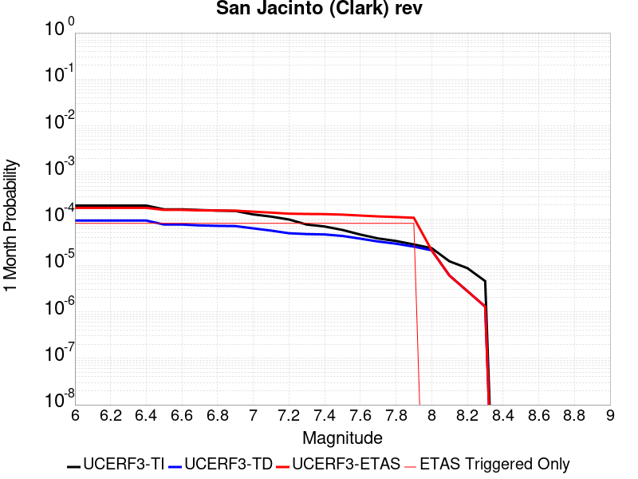 | 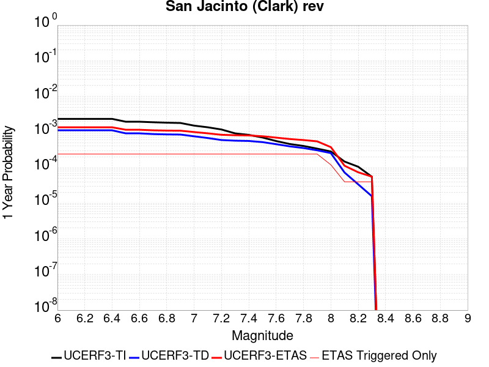 |

| Magnitude | 1 wk TI Prob | 1 wk TD Prob | 1 wk ETAS Prob | 1 wk ETAS/TD Gain | 1 wk ETAS Triggered Only | 1 mo TI Prob | 1 mo TD Prob | 1 mo ETAS Prob | 1 mo ETAS/TD Gain | 1 mo ETAS Triggered Only | 1 yr TI Prob | 1 yr TD Prob | 1 yr ETAS Prob | 1 yr ETAS/TD Gain | 1 yr ETAS Triggered Only |
|-----|-----|-----|-----|-----|-----|-----|-----|-----|-----|-----|-----|-----|-----|-----|-----|
| 6.0 | 4.482615E-5 | 2.1381953E-5 | 1.0138024E-4 | 4.741393 | 8.0E-5 | 1.9209793E-4 | 9.1633774E-5 | 1.7162644E-4 | 1.8729606 | 8.0E-5 | 0.0023362834 | 0.0011150796 | 0.001354812 | 1.2149913 | 2.4E-4 |
| 6.1 | 4.482615E-5 | 2.1381953E-5 | 1.0138024E-4 | 4.741393 | 8.0E-5 | 1.9209793E-4 | 9.1633774E-5 | 1.7162644E-4 | 1.8729606 | 8.0E-5 | 0.0023362834 | 0.0011150796 | 0.001354812 | 1.2149913 | 2.4E-4 |
| 6.2 | 4.482615E-5 | 2.1381953E-5 | 1.0138024E-4 | 4.741393 | 8.0E-5 | 1.9209793E-4 | 9.1633774E-5 | 1.7162644E-4 | 1.8729606 | 8.0E-5 | 0.0023362834 | 0.0011150796 | 0.001354812 | 1.2149913 | 2.4E-4 |
| 6.3 | 4.482615E-5 | 2.1381953E-5 | 1.0138024E-4 | 4.741393 | 8.0E-5 | 1.9209793E-4 | 9.1633774E-5 | 1.7162644E-4 | 1.8729606 | 8.0E-5 | 0.0023362834 | 0.0011150796 | 0.001354812 | 1.2149913 | 2.4E-4 |
| 6.4 | 4.482615E-5 | 2.1381953E-5 | 1.0138024E-4 | 4.741393 | 8.0E-5 | 1.9209793E-4 | 9.1633774E-5 | 1.7162644E-4 | 1.8729606 | 8.0E-5 | 0.0023362834 | 0.0011150796 | 0.001354812 | 1.2149913 | 2.4E-4 |
| 6.5 | 3.7294863E-5 | 1.7559976E-5 | 9.755857E-5 | 5.5557346 | 8.0E-5 | 1.5982533E-4 | 7.5254895E-5 | 1.5524888E-4 | 2.0629737 | 8.0E-5 | 0.0019441366 | 9.1584784E-4 | 0.001155628 | 1.2618123 | 2.4E-4 |
| 6.6 | 3.7294863E-5 | 1.7559976E-5 | 9.755857E-5 | 5.5557346 | 8.0E-5 | 1.5982533E-4 | 7.5254895E-5 | 1.5524888E-4 | 2.0629737 | 8.0E-5 | 0.0019441366 | 9.1584784E-4 | 0.001155628 | 1.2618123 | 2.4E-4 |
| 6.7 | 3.6039248E-5 | 1.6803659E-5 | 9.6802316E-5 | 5.760788 | 8.0E-5 | 1.5444479E-4 | 7.201371E-5 | 1.5200795E-4 | 2.1108196 | 8.0E-5 | 0.0018787434 | 8.764185E-4 | 0.0011162082 | 1.2736018 | 2.4E-4 |
| 6.8 | 3.5031844E-5 | 1.6428598E-5 | 9.6427284E-5 | 5.8694777 | 8.0E-5 | 1.5012783E-4 | 7.040639E-5 | 1.5040077E-4 | 2.1361804 | 8.0E-5 | 0.0018262739 | 8.568649E-4 | 0.0010966592 | 1.2798508 | 2.4E-4 |
| 6.9 | 3.435112E-5 | 1.6257003E-5 | 9.62557E-5 | 5.9208765 | 8.0E-5 | 1.4721078E-4 | 6.967103E-5 | 1.4966546E-4 | 2.1481733 | 8.0E-5 | 0.0017908178 | 8.4791885E-4 | 0.0010877154 | 1.2828059 | 2.4E-4 |
| 7.0 | 2.8959772E-5 | 1.4511907E-5 | 9.4510746E-5 | 6.5126348 | 8.0E-5 | 1.241074E-4 | 6.219242E-5 | 1.4218745E-4 | 2.2862504 | 8.0E-5 | 0.0015099603 | 7.569325E-4 | 9.967508E-4 | 1.3168292 | 2.4E-4 |
| 7.1 | 2.6002877E-5 | 1.2989396E-5 | 9.298835E-5 | 7.15879 | 8.0E-5 | 1.11436144E-4 | 5.5667664E-5 | 1.3566321E-4 | 2.43702 | 8.0E-5 | 0.0013558907 | 6.775452E-4 | 9.173826E-4 | 1.35398 | 2.4E-4 |
| 7.2 | 2.2544838E-5 | 1.1407055E-5 | 9.1406146E-5 | 8.0131235 | 8.0E-5 | 9.661716E-5 | 4.888647E-5 | 1.2888256E-4 | 2.6363645 | 8.0E-5 | 0.001175679 | 5.950317E-4 | 8.348889E-4 | 1.4030999 | 2.4E-4 |
| 7.3 | 1.75334E-5 | 1.0946427E-5 | 9.094555E-5 | 8.308241 | 8.0E-5 | 7.514098E-5 | 4.6912424E-5 | 1.2690866E-4 | 2.7052252 | 8.0E-5 | 9.144575E-4 | 5.710105E-4 | 8.1087346E-4 | 1.4200675 | 2.4E-4 |
| 7.4 | 1.5924552E-5 | 1.0743272E-5 | 9.074241E-5 | 8.446442 | 8.0E-5 | 6.82463E-5 | 4.6041787E-5 | 1.2603811E-4 | 2.737472 | 8.0E-5 | 8.305819E-4 | 5.6041597E-4 | 8.002815E-4 | 1.4280133 | 2.4E-4 |
| 7.5 | 1.3428931E-5 | 9.976539E-6 | 8.997574E-5 | 9.018733 | 8.0E-5 | 5.7551293E-5 | 4.2755903E-5 | 1.2275248E-4 | 2.8710067 | 8.0E-5 | 7.004617E-4 | 5.2042986E-4 | 7.60305E-4 | 1.4609172 | 2.4E-4 |
| 7.6 | 1.0688787E-5 | 8.727412E-6 | 8.8726716E-5 | 10.16644 | 8.0E-5 | 4.5808283E-5 | 3.740266E-5 | 1.1739967E-4 | 3.1388052 | 8.0E-5 | 5.5757316E-4 | 4.5528274E-4 | 6.9517345E-4 | 1.526905 | 2.4E-4 |
| 7.7 | 8.81236E-6 | 7.5768367E-6 | 8.757623E-5 | 11.558416 | 8.0E-5 | 3.776671E-5 | 3.2471755E-5 | 1.12469155E-4 | 3.4635997 | 8.0E-5 | 4.597127E-4 | 3.952721E-4 | 6.3517725E-4 | 1.6069367 | 2.4E-4 |
| 7.8 | 7.780431E-6 | 6.7993083E-6 | 8.679876E-5 | 12.765822 | 8.0E-5 | 3.3344273E-5 | 2.9139568E-5 | 1.0913724E-4 | 3.745328 | 8.0E-5 | 4.0589093E-4 | 3.5471667E-4 | 5.9463154E-4 | 1.6763563 | 2.4E-4 |
| 7.9 | 6.5437994E-6 | 5.8761307E-6 | 8.587566E-5 | 14.614321 | 8.0E-5 | 2.8044553E-5 | 2.5183175E-5 | 1.0518116E-4 | 4.176644 | 8.0E-5 | 3.4138895E-4 | 3.065622E-4 | 5.464886E-4 | 1.7826353 | 2.4E-4 |
| 8.0 | 5.4488164E-6 | 4.898215E-6 | 4.898215E-6 | 1.0 | 0.0 | 2.3351862E-5 | 2.0992184E-5 | 2.0992184E-5 | 1.0 | 0.0 | 2.8427184E-4 | 2.5555E-4 | 3.7551933E-4 | 1.4694554 | 1.2E-4 |
| 8.1 | 2.8397242E-6 | 1.4004763E-6 | 1.4004763E-6 | 1.0 | 0.0 | 1.217019E-5 | 6.002028E-6 | 6.002028E-6 | 1.0 | 0.0 | 1.4816198E-4 | 7.307225E-5 | 1.1306933E-4 | 1.5473634 | 4.0E-5 |
| 8.2 | 2.030244E-6 | 6.5120884E-7 | 6.5120884E-7 | 1.0 | 0.0 | 8.701017E-6 | 2.790892E-6 | 2.790892E-6 | 1.0 | 0.0 | 1.05929736E-4 | 3.3978587E-5 | 7.397723E-5 | 2.177172 | 4.0E-5 |
| 8.3 | 1.0659804E-6 | 3.019421E-7 | 3.019421E-7 | 1.0 | 0.0 | 4.568479E-6 | 1.2940369E-6 | 1.2940369E-6 | 1.0 | 0.0 | 5.5619817E-5 | 1.575479E-5 | 5.575416E-5 | 3.5388703 | 4.0E-5 |

## Cleghorn
*[(top)](#table-of-contents)*

| 1 Week | 1 Month | 1 Year |
|-----|-----|-----|
| 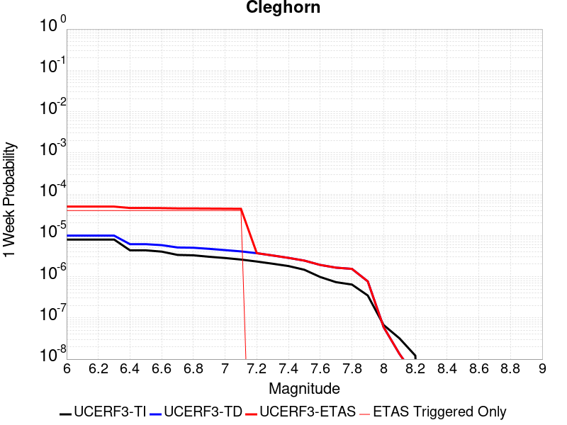 | 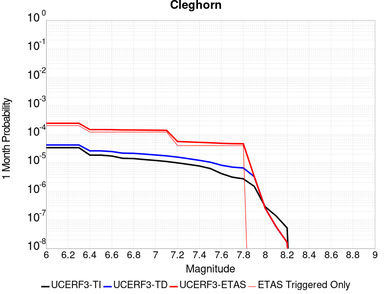 | 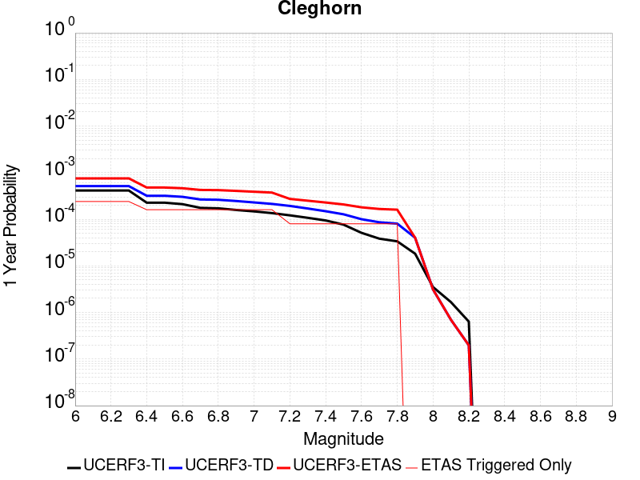 |

| Magnitude | 1 wk TI Prob | 1 wk TD Prob | 1 wk ETAS Prob | 1 wk ETAS/TD Gain | 1 wk ETAS Triggered Only | 1 mo TI Prob | 1 mo TD Prob | 1 mo ETAS Prob | 1 mo ETAS/TD Gain | 1 mo ETAS Triggered Only | 1 yr TI Prob | 1 yr TD Prob | 1 yr ETAS Prob | 1 yr ETAS/TD Gain | 1 yr ETAS Triggered Only |
|-----|-----|-----|-----|-----|-----|-----|-----|-----|-----|-----|-----|-----|-----|-----|-----|
| 6.0 | 7.9267165E-6 | 9.860011E-6 | 4.9859616E-5 | 5.0567503 | 4.0E-5 | 3.39712E-5 | 4.2256568E-5 | 2.4224812E-4 | 5.732792 | 2.0E-4 | 4.1352084E-4 | 5.143629E-4 | 7.5423945E-4 | 1.4663566 | 2.4E-4 |
| 6.1 | 7.9267165E-6 | 9.860011E-6 | 4.9859616E-5 | 5.0567503 | 4.0E-5 | 3.39712E-5 | 4.2256568E-5 | 2.4224812E-4 | 5.732792 | 2.0E-4 | 4.1352084E-4 | 5.143629E-4 | 7.5423945E-4 | 1.4663566 | 2.4E-4 |
| 6.2 | 7.9267165E-6 | 9.860011E-6 | 4.9859616E-5 | 5.0567503 | 4.0E-5 | 3.39712E-5 | 4.2256568E-5 | 2.4224812E-4 | 5.732792 | 2.0E-4 | 4.1352084E-4 | 5.143629E-4 | 7.5423945E-4 | 1.4663566 | 2.4E-4 |
| 6.3 | 7.9267165E-6 | 9.860011E-6 | 4.9859616E-5 | 5.0567503 | 4.0E-5 | 3.39712E-5 | 4.2256568E-5 | 2.4224812E-4 | 5.732792 | 2.0E-4 | 4.1352084E-4 | 5.143629E-4 | 7.5423945E-4 | 1.4663566 | 2.4E-4 |
| 6.4 | 4.3445207E-6 | 6.119313E-6 | 4.611907E-5 | 7.536641 | 4.0E-5 | 1.8619241E-5 | 2.622537E-5 | 1.4622223E-4 | 5.575602 | 1.2E-4 | 2.2666567E-4 | 3.1924812E-4 | 4.7919704E-4 | 1.5010176 | 1.6E-4 |
| 6.5 | 4.3445207E-6 | 6.119313E-6 | 4.611907E-5 | 7.536641 | 4.0E-5 | 1.8619241E-5 | 2.622537E-5 | 1.4622223E-4 | 5.575602 | 1.2E-4 | 2.2666567E-4 | 3.1924812E-4 | 4.7919704E-4 | 1.5010176 | 1.6E-4 |
| 6.6 | 4.040109E-6 | 5.8016744E-6 | 4.5801444E-5 | 7.894521 | 4.0E-5 | 1.7314638E-5 | 2.4864088E-5 | 1.448611E-4 | 5.826118 | 1.2E-4 | 2.1078532E-4 | 3.0267914E-4 | 4.626307E-4 | 1.5284525 | 1.6E-4 |
| 6.7 | 3.3632055E-6 | 5.095068E-6 | 4.5094865E-5 | 8.850689 | 4.0E-5 | 1.4413658E-5 | 2.1835825E-5 | 1.4183321E-4 | 6.495436 | 1.2E-4 | 1.7547216E-4 | 2.6581905E-4 | 4.2577652E-4 | 1.6017532 | 1.6E-4 |
| 6.8 | 3.2902772E-6 | 5.016956E-6 | 4.5016757E-5 | 8.972921 | 4.0E-5 | 1.4101111E-5 | 2.1501066E-5 | 1.4149849E-4 | 6.580999 | 1.2E-4 | 1.716675E-4 | 2.6174434E-4 | 4.2170245E-4 | 1.6111236 | 1.6E-4 |
| 6.9 | 3.031547E-6 | 4.7183826E-6 | 4.4718196E-5 | 9.477441 | 4.0E-5 | 1.299228E-5 | 2.0221485E-5 | 1.4021905E-4 | 6.934162 | 1.2E-4 | 1.5816953E-4 | 2.4616905E-4 | 4.0612966E-4 | 1.6498 | 1.6E-4 |
| 7.0 | 2.8259715E-6 | 4.3970613E-6 | 4.4396886E-5 | 10.096945 | 4.0E-5 | 1.211125E-5 | 1.8844414E-5 | 1.3884215E-4 | 7.367815 | 1.2E-4 | 1.4744449E-4 | 2.2940683E-4 | 3.893701E-4 | 1.6972909 | 1.6E-4 |
| 7.1 | 2.5962665E-6 | 4.091863E-6 | 4.40917E-5 | 10.775458 | 4.0E-5 | 1.1126809E-5 | 1.753644E-5 | 1.3753434E-4 | 7.842774 | 1.2E-4 | 1.3546048E-4 | 2.1348546E-4 | 3.734513E-4 | 1.7493056 | 1.6E-4 |
| 7.2 | 2.3247253E-6 | 3.7018629E-6 | 3.7018629E-6 | 1.0 | 0.0 | 9.96307E-6 | 1.5865031E-5 | 5.5864395E-5 | 3.5212283 | 4.0E-5 | 1.21293626E-4 | 1.9313981E-4 | 2.7312437E-4 | 1.4141277 | 8.0E-5 |
| 7.3 | 2.056928E-6 | 3.259398E-6 | 3.259398E-6 | 1.0 | 0.0 | 8.815376E-6 | 1.39687745E-5 | 5.3968215E-5 | 3.8634896 | 4.0E-5 | 1.0732192E-4 | 1.7005672E-4 | 2.5004311E-4 | 1.4703512 | 8.0E-5 |
| 7.4 | 1.8055999E-6 | 2.848641E-6 | 2.848641E-6 | 1.0 | 0.0 | 7.738263E-6 | 1.2208406E-5 | 5.2207917E-5 | 4.276391 | 4.0E-5 | 9.4209274E-5 | 1.4862734E-4 | 2.2861545E-4 | 1.5381789 | 8.0E-5 |
| 7.5 | 1.4683443E-6 | 2.4473384E-6 | 2.4473384E-6 | 1.0 | 0.0 | 6.292889E-6 | 1.0488551E-5 | 5.0488132E-5 | 4.813642 | 4.0E-5 | 7.661323E-5 | 1.2769073E-4 | 2.0768051E-4 | 1.6264338 | 8.0E-5 |
| 7.6 | 9.804088E-7 | 1.922553E-6 | 1.922553E-6 | 1.0 | 0.0 | 4.201745E-6 | 8.239488E-6 | 4.823916E-5 | 5.8546305 | 4.0E-5 | 5.1155046E-5 | 1.003112E-4 | 1.8030318E-4 | 1.7974381 | 8.0E-5 |
| 7.7 | 7.3434086E-7 | 1.6504058E-6 | 1.6504058E-6 | 1.0 | 0.0 | 3.1471714E-6 | 7.0731485E-6 | 4.7072866E-5 | 6.65515 | 4.0E-5 | 3.831614E-5 | 8.611221E-5 | 1.6610532E-4 | 1.9289404 | 8.0E-5 |
| 7.8 | 6.434184E-7 | 1.54314E-6 | 1.54314E-6 | 1.0 | 0.0 | 2.7575045E-6 | 6.6134407E-6 | 4.6613175E-5 | 7.048249 | 4.0E-5 | 3.35721E-5 | 8.051569E-5 | 1.6050925E-4 | 1.9935151 | 8.0E-5 |
| 7.9 | 3.4943926E-7 | 7.6891484E-7 | 7.6891484E-7 | 1.0 | 0.0 | 1.497596E-6 | 3.295345E-6 | 3.295345E-6 | 1.0 | 0.0 | 1.8233079E-5 | 4.0120096E-5 | 4.0120096E-5 | 1.0 | 0.0 |
| 8.0 | 6.717524E-8 | 5.973961E-8 | 5.973961E-8 | 1.0 | 0.0 | 2.8789387E-7 | 2.5602688E-7 | 2.5602688E-7 | 1.0 | 0.0 | 3.505102E-6 | 3.1171228E-6 | 3.1171228E-6 | 1.0 | 0.0 |
| 8.1 | 3.1984914E-8 | 1.3392032E-8 | 1.3392032E-8 | 1.0 | 0.0 | 1.370782E-7 | 5.7394423E-8 | 5.7394423E-8 | 1.0 | 0.0 | 1.6689258E-6 | 6.987769E-7 | 6.987769E-7 | 1.0 | 0.0 |
| 8.2 | 1.21887656E-8 | 3.7836694E-9 | 3.7836694E-9 | 1.0 | 0.0 | 5.2237567E-8 | 1.6215727E-8 | 1.6215727E-8 | 1.0 | 0.0 | 6.359922E-7 | 1.9742646E-7 | 1.9742646E-7 | 1.0 | 0.0 |

## Elmore Ranch
*[(top)](#table-of-contents)*

| 1 Week | 1 Month | 1 Year |
|-----|-----|-----|
| 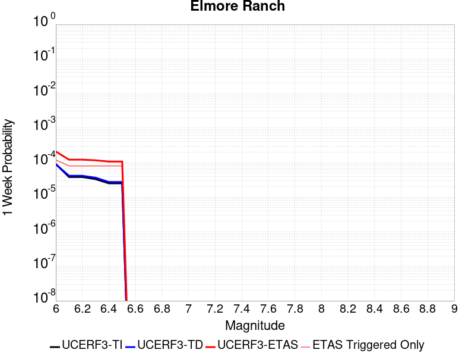 | 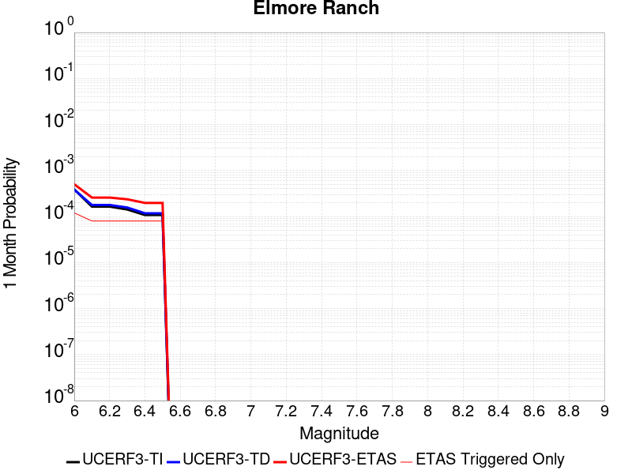 | 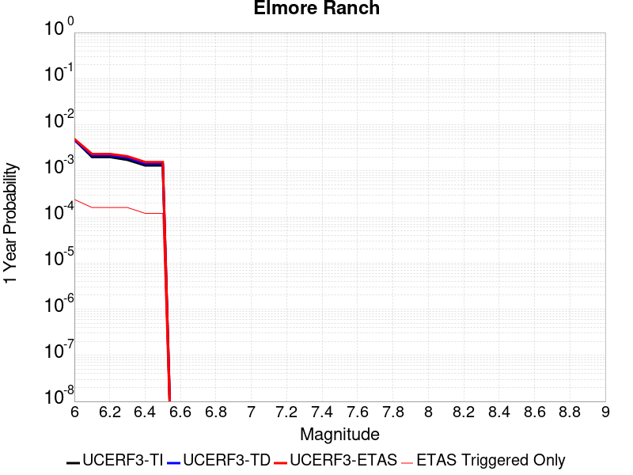 |

| Magnitude | 1 wk TI Prob | 1 wk TD Prob | 1 wk ETAS Prob | 1 wk ETAS/TD Gain | 1 wk ETAS Triggered Only | 1 mo TI Prob | 1 mo TD Prob | 1 mo ETAS Prob | 1 mo ETAS/TD Gain | 1 mo ETAS Triggered Only | 1 yr TI Prob | 1 yr TD Prob | 1 yr ETAS Prob | 1 yr ETAS/TD Gain | 1 yr ETAS Triggered Only |
|-----|-----|-----|-----|-----|-----|-----|-----|-----|-----|-----|-----|-----|-----|-----|-----|
| 6.0 | 9.102099E-5 | 8.966761E-5 | 2.0965685E-4 | 2.338156 | 1.2E-4 | 3.9003167E-4 | 3.8422062E-4 | 5.041745E-4 | 1.3122005 | 1.2E-4 | 0.0047383 | 0.0046685147 | 0.0049073943 | 1.0511682 | 2.4E-4 |
| 6.1 | 3.8306698E-5 | 4.1548446E-5 | 1.2154513E-4 | 2.925383 | 8.0E-5 | 1.6416123E-4 | 1.7805643E-4 | 2.580422E-4 | 1.4492158 | 8.0E-5 | 0.0019968306 | 0.0021661238 | 0.0023257772 | 1.0737046 | 1.6E-4 |
| 6.2 | 3.8306698E-5 | 4.1548446E-5 | 1.2154513E-4 | 2.925383 | 8.0E-5 | 1.6416123E-4 | 1.7805643E-4 | 2.580422E-4 | 1.4492158 | 8.0E-5 | 0.0019968306 | 0.0021661238 | 0.0023257772 | 1.0737046 | 1.6E-4 |
| 6.3 | 3.3197924E-5 | 3.6596153E-5 | 1.16593226E-4 | 3.1859422 | 8.0E-5 | 1.4226905E-4 | 1.5683495E-4 | 2.3682241E-4 | 1.5100104 | 8.0E-5 | 0.0017307495 | 0.001908332 | 0.0020680267 | 1.0836829 | 1.6E-4 |
| 6.4 | 2.5148964E-5 | 2.7451913E-5 | 1.0744972E-4 | 3.9141066 | 8.0E-5 | 1.0777682E-4 | 1.1764941E-4 | 1.9764001E-4 | 1.6799064 | 8.0E-5 | 0.0013113929 | 0.00143209 | 0.0015519181 | 1.0836736 | 1.2E-4 |
| 6.5 | 2.5148964E-5 | 2.7451913E-5 | 1.0744972E-4 | 3.9141066 | 8.0E-5 | 1.0777682E-4 | 1.1764941E-4 | 1.9764001E-4 | 1.6799064 | 8.0E-5 | 0.0013113929 | 0.00143209 | 0.0015519181 | 1.0836736 | 1.2E-4 |

## San Gorgonio Pass
*[(top)](#table-of-contents)*

| 1 Week | 1 Month | 1 Year |
|-----|-----|-----|
| 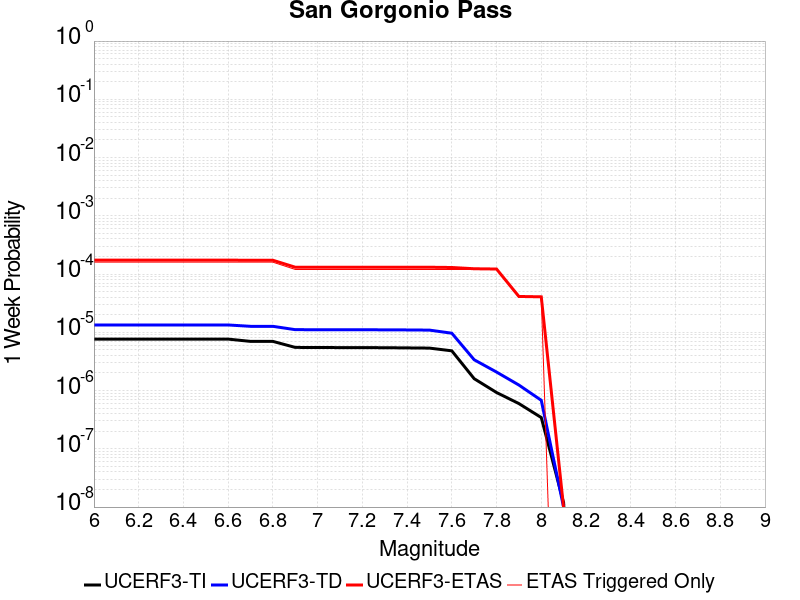 | 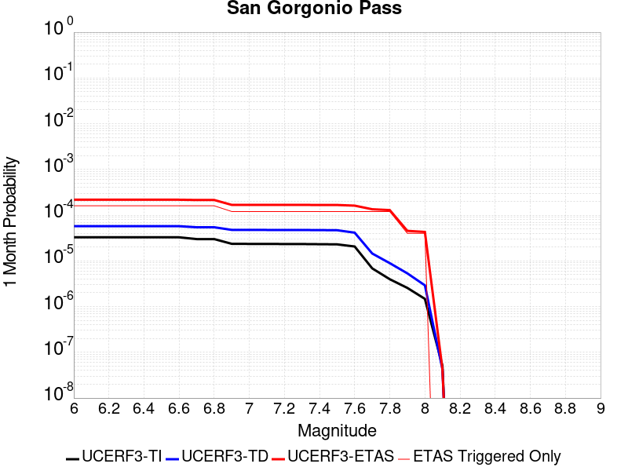 |  |

| Magnitude | 1 wk TI Prob | 1 wk TD Prob | 1 wk ETAS Prob | 1 wk ETAS/TD Gain | 1 wk ETAS Triggered Only | 1 mo TI Prob | 1 mo TD Prob | 1 mo ETAS Prob | 1 mo ETAS/TD Gain | 1 mo ETAS Triggered Only | 1 yr TI Prob | 1 yr TD Prob | 1 yr ETAS Prob | 1 yr ETAS/TD Gain | 1 yr ETAS Triggered Only |
|-----|-----|-----|-----|-----|-----|-----|-----|-----|-----|-----|-----|-----|-----|-----|-----|
| 6.0 | 7.644328E-6 | 1.3367909E-5 | 1.7336577E-4 | 12.968802 | 1.6E-4 | 3.2760996E-5 | 5.7289828E-5 | 2.1728066E-4 | 3.792657 | 1.6E-4 | 3.987921E-4 | 6.9728907E-4 | 9.371217E-4 | 1.3439502 | 2.4E-4 |
| 6.1 | 7.644328E-6 | 1.3367909E-5 | 1.7336577E-4 | 12.968802 | 1.6E-4 | 3.2760996E-5 | 5.7289828E-5 | 2.1728066E-4 | 3.792657 | 1.6E-4 | 3.987921E-4 | 6.9728907E-4 | 9.371217E-4 | 1.3439502 | 2.4E-4 |
| 6.2 | 7.644328E-6 | 1.3367909E-5 | 1.7336577E-4 | 12.968802 | 1.6E-4 | 3.2760996E-5 | 5.7289828E-5 | 2.1728066E-4 | 3.792657 | 1.6E-4 | 3.987921E-4 | 6.9728907E-4 | 9.371217E-4 | 1.3439502 | 2.4E-4 |
| 6.3 | 7.644328E-6 | 1.3367909E-5 | 1.7336577E-4 | 12.968802 | 1.6E-4 | 3.2760996E-5 | 5.7289828E-5 | 2.1728066E-4 | 3.792657 | 1.6E-4 | 3.987921E-4 | 6.9728907E-4 | 9.371217E-4 | 1.3439502 | 2.4E-4 |
| 6.4 | 7.644328E-6 | 1.3367909E-5 | 1.7336577E-4 | 12.968802 | 1.6E-4 | 3.2760996E-5 | 5.7289828E-5 | 2.1728066E-4 | 3.792657 | 1.6E-4 | 3.987921E-4 | 6.9728907E-4 | 9.371217E-4 | 1.3439502 | 2.4E-4 |
| 6.5 | 7.644328E-6 | 1.3367909E-5 | 1.7336577E-4 | 12.968802 | 1.6E-4 | 3.2760996E-5 | 5.7289828E-5 | 2.1728066E-4 | 3.792657 | 1.6E-4 | 3.987921E-4 | 6.9728907E-4 | 9.371217E-4 | 1.3439502 | 2.4E-4 |
| 6.6 | 7.644328E-6 | 1.3367909E-5 | 1.7336577E-4 | 12.968802 | 1.6E-4 | 3.2760996E-5 | 5.7289828E-5 | 2.1728066E-4 | 3.792657 | 1.6E-4 | 3.987921E-4 | 6.9728907E-4 | 9.371217E-4 | 1.3439502 | 2.4E-4 |
| 6.7 | 6.987586E-6 | 1.2672042E-5 | 1.7267001E-4 | 13.62606 | 1.6E-4 | 2.9946454E-5 | 5.430767E-5 | 2.1429898E-4 | 3.9460168 | 1.6E-4 | 3.645371E-4 | 6.6100346E-4 | 9.008448E-4 | 1.3628443 | 2.4E-4 |
| 6.8 | 6.987586E-6 | 1.2672042E-5 | 1.7267001E-4 | 13.62606 | 1.6E-4 | 2.9946454E-5 | 5.430767E-5 | 2.1429898E-4 | 3.9460168 | 1.6E-4 | 3.645371E-4 | 6.6100346E-4 | 9.008448E-4 | 1.3628443 | 2.4E-4 |
| 6.9 | 5.504702E-6 | 1.11025965E-5 | 1.3110126E-4 | 11.808162 | 1.2E-4 | 2.3591367E-5 | 4.7581718E-5 | 1.6757601E-4 | 3.521857 | 1.2E-4 | 2.8718702E-4 | 5.7915854E-4 | 7.390659E-4 | 1.2761029 | 1.6E-4 |
| 7.0 | 5.4825764E-6 | 1.1078932E-5 | 1.310776E-4 | 11.831248 | 1.2E-4 | 2.3496545E-5 | 4.7480302E-5 | 1.674746E-4 | 3.5272439 | 1.2E-4 | 2.8603288E-4 | 5.779245E-4 | 7.37832E-4 | 1.2766927 | 1.6E-4 |
| 7.1 | 5.4692787E-6 | 1.1064639E-5 | 1.3106331E-4 | 11.845241 | 1.2E-4 | 2.3439556E-5 | 4.7419046E-5 | 1.6741335E-4 | 3.5305088 | 1.2E-4 | 2.8533922E-4 | 5.771791E-4 | 7.370867E-4 | 1.2770504 | 1.6E-4 |
| 7.2 | 5.453661E-6 | 1.104766E-5 | 1.3104634E-4 | 11.861909 | 1.2E-4 | 2.3372622E-5 | 4.7346286E-5 | 1.6734061E-4 | 3.5343978 | 1.2E-4 | 2.8452452E-4 | 5.762936E-4 | 7.362014E-4 | 1.2774762 | 1.6E-4 |
| 7.3 | 5.4422303E-6 | 1.10345745E-5 | 1.3103324E-4 | 11.874789 | 1.2E-4 | 2.3323635E-5 | 4.7290207E-5 | 1.6728452E-4 | 3.5374033 | 1.2E-4 | 2.8392827E-4 | 5.7561125E-4 | 7.3551916E-4 | 1.2778053 | 1.6E-4 |
| 7.4 | 5.398595E-6 | 1.0981908E-5 | 1.309806E-4 | 11.926943 | 1.2E-4 | 2.313663E-5 | 4.7064503E-5 | 1.6705885E-4 | 3.5495722 | 1.2E-4 | 2.8165206E-4 | 5.728648E-4 | 7.327731E-4 | 1.2791381 | 1.6E-4 |
| 7.5 | 5.3578788E-6 | 1.0908337E-5 | 1.3090702E-4 | 12.000641 | 1.2E-4 | 2.2962136E-5 | 4.6749206E-5 | 1.667436E-4 | 3.5667686 | 1.2E-4 | 2.7952815E-4 | 5.69028E-4 | 7.28937E-4 | 1.2810212 | 1.6E-4 |
| 7.6 | 4.8091474E-6 | 9.653645E-6 | 1.2965249E-4 | 13.430418 | 1.2E-4 | 2.0610469E-5 | 4.1372135E-5 | 1.6136718E-4 | 3.9003828 | 1.2E-4 | 2.5090357E-4 | 5.035942E-4 | 6.635136E-4 | 1.3175561 | 1.6E-4 |
| 7.7 | 1.5991155E-6 | 3.379842E-6 | 1.2337943E-4 | 36.504498 | 1.2E-4 | 6.853334E-6 | 1.4484958E-5 | 1.3448321E-4 | 9.284336 | 1.2E-4 | 8.343615E-5 | 1.7634034E-4 | 3.3631214E-4 | 1.9071763 | 1.6E-4 |
| 7.8 | 9.258398E-7 | 2.0781015E-6 | 1.2207785E-4 | 58.744892 | 1.2E-4 | 3.967879E-6 | 8.90612E-6 | 1.2890506E-4 | 14.473762 | 1.2E-4 | 4.8307855E-5 | 1.08426626E-4 | 2.684093E-4 | 2.4754922 | 1.6E-4 |
| 7.9 | 5.975575E-7 | 1.2436711E-6 | 4.124362E-5 | 33.162804 | 4.0E-5 | 2.5609581E-6 | 5.3300087E-6 | 4.5329794E-5 | 8.504639 | 4.0E-5 | 3.117922E-5 | 6.489093E-5 | 1.4488574E-4 | 2.2327578 | 8.0E-5 |
| 8.0 | 3.4413725E-7 | 6.801386E-7 | 4.0680112E-5 | 59.8115 | 4.0E-5 | 1.4748731E-6 | 2.9148766E-6 | 4.291476E-5 | 14.722668 | 4.0E-5 | 1.7956432E-5 | 3.548805E-5 | 7.548663E-5 | 2.1271 | 4.0E-5 |
| 8.1 | 1.1787731E-8 | 9.854372E-9 | 9.854372E-9 | 1.0 | 0.0 | 5.0518846E-8 | 4.2233022E-8 | 4.2233022E-8 | 1.0 | 0.0 | 6.1506677E-7 | 5.14187E-7 | 5.14187E-7 | 1.0 | 0.0 |

## Blackwater
*[(top)](#table-of-contents)*

| 1 Week | 1 Month | 1 Year |
|-----|-----|-----|
| 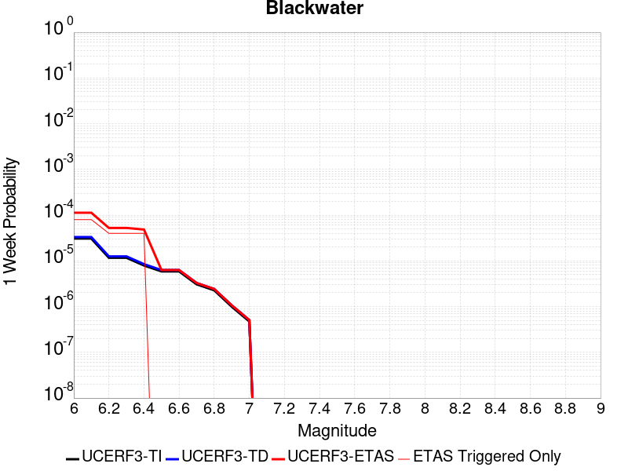 | 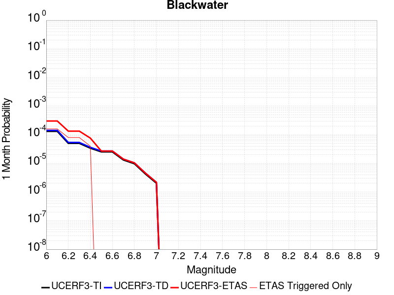 | 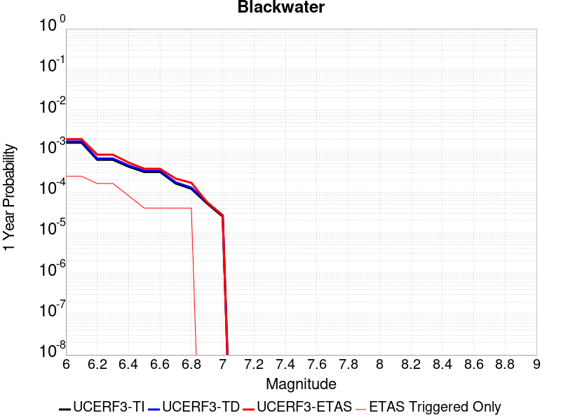 |

| Magnitude | 1 wk TI Prob | 1 wk TD Prob | 1 wk ETAS Prob | 1 wk ETAS/TD Gain | 1 wk ETAS Triggered Only | 1 mo TI Prob | 1 mo TD Prob | 1 mo ETAS Prob | 1 mo ETAS/TD Gain | 1 mo ETAS Triggered Only | 1 yr TI Prob | 1 yr TD Prob | 1 yr ETAS Prob | 1 yr ETAS/TD Gain | 1 yr ETAS Triggered Only |
|-----|-----|-----|-----|-----|-----|-----|-----|-----|-----|-----|-----|-----|-----|-----|-----|
| 6.0 | 3.0708583E-5 | 3.3104585E-5 | 1.1310194E-4 | 3.416504 | 8.0E-5 | 1.3160157E-4 | 1.4186984E-4 | 3.0184715E-4 | 2.1276343 | 1.6E-4 | 0.0016010714 | 0.0017260336 | 0.0019656194 | 1.1388072 | 2.4E-4 |
| 6.1 | 3.0708583E-5 | 3.3104585E-5 | 1.1310194E-4 | 3.416504 | 8.0E-5 | 1.3160157E-4 | 1.4186984E-4 | 3.0184715E-4 | 2.1276343 | 1.6E-4 | 0.0016010714 | 0.0017260336 | 0.0019656194 | 1.1388072 | 2.4E-4 |
| 6.2 | 1.1707779E-5 | 1.2548166E-5 | 5.2547664E-5 | 4.187677 | 4.0E-5 | 5.017523E-5 | 5.3776796E-5 | 1.337725E-4 | 2.4875505 | 8.0E-5 | 6.107122E-4 | 6.5454544E-4 | 8.144407E-4 | 1.2442845 | 1.6E-4 |
| 6.3 | 1.1707779E-5 | 1.2548166E-5 | 5.2547664E-5 | 4.187677 | 4.0E-5 | 5.017523E-5 | 5.3776796E-5 | 1.337725E-4 | 2.4875505 | 8.0E-5 | 6.107122E-4 | 6.5454544E-4 | 8.144407E-4 | 1.2442845 | 1.6E-4 |
| 6.4 | 7.929244E-6 | 8.482096E-6 | 4.8481757E-5 | 5.715776 | 4.0E-5 | 3.3982033E-5 | 3.6351354E-5 | 7.63499E-5 | 2.1003318 | 4.0E-5 | 4.136527E-4 | 4.424919E-4 | 5.224565E-4 | 1.1807142 | 8.0E-5 |
| 6.5 | 5.8832115E-6 | 6.2874497E-6 | 6.2874497E-6 | 1.0 | 0.0 | 2.521352E-5 | 2.6945949E-5 | 2.6945949E-5 | 1.0 | 0.0 | 3.0693135E-4 | 3.280201E-4 | 3.6800696E-4 | 1.1219038 | 4.0E-5 |
| 6.6 | 5.8832115E-6 | 6.2874497E-6 | 6.2874497E-6 | 1.0 | 0.0 | 2.521352E-5 | 2.6945949E-5 | 2.6945949E-5 | 1.0 | 0.0 | 3.0693135E-4 | 3.280201E-4 | 3.6800696E-4 | 1.1219038 | 4.0E-5 |
| 6.7 | 3.0715053E-6 | 3.2822265E-6 | 3.2822265E-6 | 1.0 | 0.0 | 1.3163528E-5 | 1.4066616E-5 | 1.4066616E-5 | 1.0 | 0.0 | 1.6025416E-4 | 1.7124876E-4 | 2.112419E-4 | 1.2335384 | 4.0E-5 |
| 6.8 | 2.2722281E-6 | 2.4293208E-6 | 2.4293208E-6 | 1.0 | 0.0 | 9.738084E-6 | 1.0411339E-5 | 1.0411339E-5 | 1.0 | 0.0 | 1.1855473E-4 | 1.2675159E-4 | 1.6674653E-4 | 1.3155379 | 4.0E-5 |
| 6.9 | 9.952399E-7 | 1.0656032E-6 | 1.0656032E-6 | 1.0 | 0.0 | 4.265307E-6 | 4.5668658E-6 | 4.5668658E-6 | 1.0 | 0.0 | 5.1928873E-5 | 5.560069E-5 | 5.560069E-5 | 1.0 | 0.0 |
| 7.0 | 4.7385504E-7 | 5.076783E-7 | 5.076783E-7 | 1.0 | 0.0 | 2.0308057E-6 | 2.1757642E-6 | 2.1757642E-6 | 1.0 | 0.0 | 2.4724779E-5 | 2.6489928E-5 | 2.6489928E-5 | 1.0 | 0.0 |

## San Clemente
*[(top)](#table-of-contents)*

| 1 Week | 1 Month | 1 Year |
|-----|-----|-----|
| 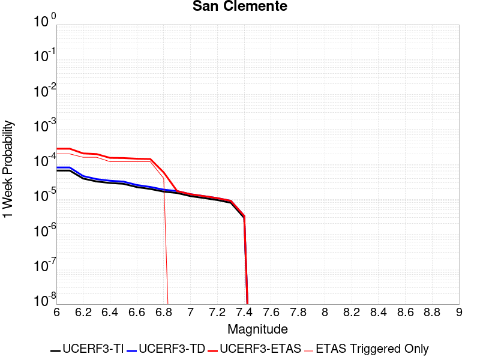 | 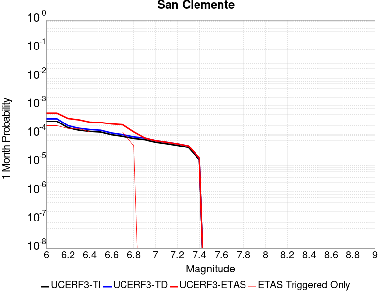 | 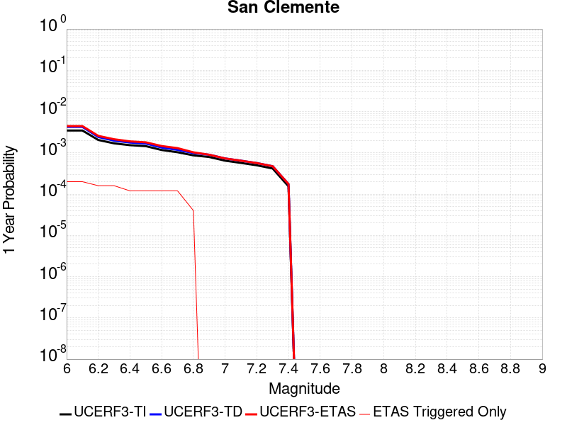 |

| Magnitude | 1 wk TI Prob | 1 wk TD Prob | 1 wk ETAS Prob | 1 wk ETAS/TD Gain | 1 wk ETAS Triggered Only | 1 mo TI Prob | 1 mo TD Prob | 1 mo ETAS Prob | 1 mo ETAS/TD Gain | 1 mo ETAS Triggered Only | 1 yr TI Prob | 1 yr TD Prob | 1 yr ETAS Prob | 1 yr ETAS/TD Gain | 1 yr ETAS Triggered Only |
|-----|-----|-----|-----|-----|-----|-----|-----|-----|-----|-----|-----|-----|-----|-----|-----|
| 6.0 | 6.681379E-5 | 8.169954E-5 | 2.816832E-4 | 3.4477942 | 2.0E-4 | 2.8631336E-4 | 3.5009714E-4 | 5.500271E-4 | 1.5710701 | 2.0E-4 | 0.003480294 | 0.0042546024 | 0.0044537513 | 1.0468079 | 2.0E-4 |
| 6.1 | 6.681379E-5 | 8.169954E-5 | 2.816832E-4 | 3.4477942 | 2.0E-4 | 2.8631336E-4 | 3.5009714E-4 | 5.500271E-4 | 1.5710701 | 2.0E-4 | 0.003480294 | 0.0042546024 | 0.0044537513 | 1.0468079 | 2.0E-4 |
| 6.2 | 3.9400576E-5 | 4.6480833E-5 | 2.064734E-4 | 4.442119 | 1.6E-4 | 1.6884868E-4 | 1.9918867E-4 | 3.591568E-4 | 1.8030986 | 1.6E-4 | 0.0020537945 | 0.0024224774 | 0.0025820897 | 1.065888 | 1.6E-4 |
| 6.3 | 3.2590255E-5 | 3.7950318E-5 | 1.9794425E-4 | 5.2158785 | 1.6E-4 | 1.3966505E-4 | 1.6263424E-4 | 3.2260822E-4 | 1.9836427 | 1.6E-4 | 0.0016990956 | 0.0019783042 | 0.0021379879 | 1.0807173 | 1.6E-4 |
| 6.4 | 2.9454652E-5 | 3.4116085E-5 | 1.5411199E-4 | 4.5172825 | 1.2E-4 | 1.2622811E-4 | 1.4620375E-4 | 2.661862E-4 | 1.8206524 | 1.2E-4 | 0.0015357438 | 0.0017786036 | 0.0018983901 | 1.0673487 | 1.2E-4 |
| 6.5 | 2.790836E-5 | 3.2264543E-5 | 1.5226068E-4 | 4.719133 | 1.2E-4 | 1.1960178E-4 | 1.3826945E-4 | 2.5825284E-4 | 1.8677508 | 1.2E-4 | 0.001455179 | 0.0016821561 | 0.0018019542 | 1.0712171 | 1.2E-4 |
| 6.6 | 2.2492153E-5 | 2.5775438E-5 | 1.4577234E-4 | 5.655475 | 1.2E-4 | 9.639138E-5 | 1.1046157E-4 | 2.3044832E-4 | 2.0862308 | 1.2E-4 | 0.0011729331 | 0.0013440547 | 0.0014638933 | 1.0891621 | 1.2E-4 |
| 6.7 | 1.9862755E-5 | 2.267729E-5 | 1.4267457E-4 | 6.2915177 | 1.2E-4 | 8.512331E-5 | 9.718483E-5 | 2.1717316E-4 | 2.2346406 | 1.2E-4 | 0.0010358836 | 0.0011825943 | 0.0013024524 | 1.1013519 | 1.2E-4 |
| 6.8 | 1.6697575E-5 | 1.8986502E-5 | 5.8985745E-5 | 3.1067197 | 4.0E-5 | 7.155907E-5 | 8.136824E-5 | 1.2136498E-4 | 1.4915524 | 4.0E-5 | 8.7088346E-4 | 9.902174E-4 | 0.0010301778 | 1.0403552 | 4.0E-5 |
| 6.9 | 1.5218415E-5 | 1.7277294E-5 | 1.7277294E-5 | 1.0 | 0.0 | 6.522015E-5 | 7.40435E-5 | 7.40435E-5 | 1.0 | 0.0 | 7.93766E-4 | 9.011156E-4 | 9.011156E-4 | 1.0 | 0.0 |
| 7.0 | 1.2392958E-5 | 1.4039313E-5 | 1.4039313E-5 | 1.0 | 0.0 | 5.3111595E-5 | 6.0167138E-5 | 6.0167138E-5 | 1.0 | 0.0 | 6.4644177E-4 | 7.322963E-4 | 7.322963E-4 | 1.0 | 0.0 |
| 7.1 | 1.0934128E-5 | 1.2380668E-5 | 1.2380668E-5 | 1.0 | 0.0 | 4.6859706E-5 | 5.3058968E-5 | 5.3058968E-5 | 1.0 | 0.0 | 5.7036756E-4 | 6.4580876E-4 | 6.4580876E-4 | 1.0 | 0.0 |
| 7.2 | 9.5798805E-6 | 1.0849791E-5 | 1.0849791E-5 | 1.0 | 0.0 | 4.1055984E-5 | 4.6498317E-5 | 4.6498317E-5 | 1.0 | 0.0 | 4.9974193E-4 | 5.659771E-4 | 5.659771E-4 | 1.0 | 0.0 |
| 7.3 | 8.0167365E-6 | 9.088018E-6 | 9.088018E-6 | 1.0 | 0.0 | 3.4356988E-5 | 3.8948103E-5 | 3.8948103E-5 | 1.0 | 0.0 | 4.1821605E-4 | 4.7409706E-4 | 4.7409706E-4 | 1.0 | 0.0 |
| 7.4 | 2.9581017E-6 | 3.3639371E-6 | 3.3639371E-6 | 1.0 | 0.0 | 1.2677518E-5 | 1.44168225E-5 | 1.44168225E-5 | 1.0 | 0.0 | 1.5433785E-4 | 1.7551573E-4 | 1.7551573E-4 | 1.0 | 0.0 |

## Cucamonga
*[(top)](#table-of-contents)*

| 1 Week | 1 Month | 1 Year |
|-----|-----|-----|
|  | 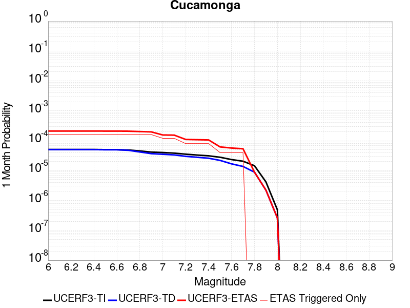 | 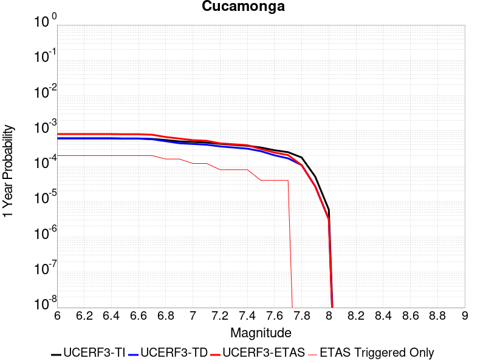 |

| Magnitude | 1 wk TI Prob | 1 wk TD Prob | 1 wk ETAS Prob | 1 wk ETAS/TD Gain | 1 wk ETAS Triggered Only | 1 mo TI Prob | 1 mo TD Prob | 1 mo ETAS Prob | 1 mo ETAS/TD Gain | 1 mo ETAS Triggered Only | 1 yr TI Prob | 1 yr TD Prob | 1 yr ETAS Prob | 1 yr ETAS/TD Gain | 1 yr ETAS Triggered Only |
|-----|-----|-----|-----|-----|-----|-----|-----|-----|-----|-----|-----|-----|-----|-----|-----|
| 6.0 | 1.1848348E-5 | 1.175498E-5 | 1.717531E-4 | 14.611093 | 1.6E-4 | 5.0777642E-5 | 5.037753E-5 | 2.1036947E-4 | 4.1758595 | 1.6E-4 | 6.180424E-4 | 6.131765E-4 | 8.1305386E-4 | 1.3259703 | 2.0E-4 |
| 6.1 | 1.1848348E-5 | 1.175498E-5 | 1.717531E-4 | 14.611093 | 1.6E-4 | 5.0777642E-5 | 5.037753E-5 | 2.1036947E-4 | 4.1758595 | 1.6E-4 | 6.180424E-4 | 6.131765E-4 | 8.1305386E-4 | 1.3259703 | 2.0E-4 |
| 6.2 | 1.1848348E-5 | 1.175498E-5 | 1.717531E-4 | 14.611093 | 1.6E-4 | 5.0777642E-5 | 5.037753E-5 | 2.1036947E-4 | 4.1758595 | 1.6E-4 | 6.180424E-4 | 6.131765E-4 | 8.1305386E-4 | 1.3259703 | 2.0E-4 |
| 6.3 | 1.1848348E-5 | 1.175498E-5 | 1.717531E-4 | 14.611093 | 1.6E-4 | 5.0777642E-5 | 5.037753E-5 | 2.1036947E-4 | 4.1758595 | 1.6E-4 | 6.180424E-4 | 6.131765E-4 | 8.1305386E-4 | 1.3259703 | 2.0E-4 |
| 6.4 | 1.1848348E-5 | 1.175498E-5 | 1.717531E-4 | 14.611093 | 1.6E-4 | 5.0777642E-5 | 5.037753E-5 | 2.1036947E-4 | 4.1758595 | 1.6E-4 | 6.180424E-4 | 6.131765E-4 | 8.1305386E-4 | 1.3259703 | 2.0E-4 |
| 6.5 | 1.16988695E-5 | 1.1593969E-5 | 1.7159211E-4 | 14.800118 | 1.6E-4 | 5.013705E-5 | 4.9687507E-5 | 2.0967955E-4 | 4.2199655 | 1.6E-4 | 6.102476E-4 | 6.0478016E-4 | 8.046592E-4 | 1.3304987 | 2.0E-4 |
| 6.6 | 1.16988695E-5 | 1.1593969E-5 | 1.7159211E-4 | 14.800118 | 1.6E-4 | 5.013705E-5 | 4.9687507E-5 | 2.0967955E-4 | 4.2199655 | 1.6E-4 | 6.102476E-4 | 6.0478016E-4 | 8.046592E-4 | 1.3304987 | 2.0E-4 |
| 6.7 | 1.1397107E-5 | 1.1132429E-5 | 1.7113065E-4 | 15.372265 | 1.6E-4 | 4.884383E-5 | 4.7709553E-5 | 2.0770192E-4 | 4.353466 | 1.6E-4 | 5.9451134E-4 | 5.8071146E-4 | 7.8059535E-4 | 1.3442051 | 2.0E-4 |
| 6.8 | 1.058387E-5 | 9.800426E-6 | 1.6979886E-4 | 17.32566 | 1.6E-4 | 4.5358654E-5 | 4.2001153E-5 | 2.0199444E-4 | 4.809259 | 1.6E-4 | 5.521017E-4 | 5.1124516E-4 | 6.711634E-4 | 1.3128014 | 1.6E-4 |
| 6.9 | 9.690046E-6 | 8.593562E-6 | 1.6859219E-4 | 19.61843 | 1.6E-4 | 4.1528107E-5 | 3.6829035E-5 | 1.9682314E-4 | 5.3442388 | 1.6E-4 | 5.054874E-4 | 4.4830164E-4 | 6.082299E-4 | 1.3567426 | 1.6E-4 |
| 7.0 | 9.381461E-6 | 8.200822E-6 | 1.2819984E-4 | 15.63256 | 1.2E-4 | 4.020564E-5 | 3.5145906E-5 | 1.551417E-4 | 4.414218 | 1.2E-4 | 4.893937E-4 | 4.2781778E-4 | 5.4776645E-4 | 1.2803732 | 1.2E-4 |
| 7.1 | 8.946492E-6 | 7.795345E-6 | 1.2779441E-4 | 16.393682 | 1.2E-4 | 3.8341543E-5 | 3.3408196E-5 | 1.5340418E-4 | 4.591813 | 1.2E-4 | 4.667083E-4 | 4.0666916E-4 | 5.2662037E-4 | 1.2949601 | 1.2E-4 |
| 7.2 | 8.251016E-6 | 6.987864E-6 | 8.6987304E-5 | 12.448339 | 8.0E-5 | 3.5361016E-5 | 2.9947647E-5 | 1.0994525E-4 | 3.6712484 | 8.0E-5 | 4.3043532E-4 | 3.6455182E-4 | 4.4452265E-4 | 1.2193675 | 8.0E-5 |
| 7.3 | 7.717881E-6 | 6.4985484E-6 | 8.6498025E-5 | 13.310362 | 8.0E-5 | 3.3076216E-5 | 2.7850625E-5 | 1.078484E-4 | 3.872387 | 8.0E-5 | 4.026285E-4 | 3.3902883E-4 | 4.190017E-4 | 1.2358881 | 8.0E-5 |
| 7.4 | 7.275623E-6 | 6.0437287E-6 | 8.604325E-5 | 14.236782 | 8.0E-5 | 3.118087E-5 | 2.5901438E-5 | 1.05899366E-4 | 4.0885515 | 8.0E-5 | 3.7956095E-4 | 3.1530458E-4 | 3.9527938E-4 | 1.2536429 | 8.0E-5 |
| 7.5 | 6.5109502E-6 | 5.11101E-6 | 4.5110806E-5 | 8.826201 | 4.0E-5 | 2.7903774E-5 | 2.1904145E-5 | 6.190327E-5 | 2.8260984 | 4.0E-5 | 3.3967546E-4 | 2.666505E-4 | 3.0663982E-4 | 1.1499691 | 4.0E-5 |
| 7.6 | 5.4495326E-6 | 3.9178576E-6 | 4.3917702E-5 | 11.209621 | 4.0E-5 | 2.335493E-5 | 1.6790711E-5 | 5.679004E-5 | 3.3822296 | 4.0E-5 | 2.8430918E-4 | 2.044078E-4 | 2.4439962E-4 | 1.1956472 | 4.0E-5 |
| 7.7 | 4.7997164E-6 | 3.208653E-6 | 4.3208525E-5 | 13.46625 | 4.0E-5 | 2.057005E-5 | 1.3751297E-5 | 5.3750748E-5 | 3.9087765 | 4.0E-5 | 2.504116E-4 | 1.6740922E-4 | 2.0740253E-4 | 1.2388954 | 4.0E-5 |
| 7.8 | 3.3941733E-6 | 2.0686311E-6 | 2.0686311E-6 | 1.0 | 0.0 | 1.4546376E-5 | 8.865532E-6 | 8.865532E-6 | 1.0 | 0.0 | 1.7708774E-4 | 1.0793252E-4 | 1.0793252E-4 | 1.0 | 0.0 |
| 7.9 | 9.750552E-7 | 5.1662437E-7 | 5.1662437E-7 | 1.0 | 0.0 | 4.178801E-6 | 2.2141026E-6 | 2.2141026E-6 | 1.0 | 0.0 | 5.0875715E-5 | 2.695637E-5 | 2.695637E-5 | 1.0 | 0.0 |
| 8.0 | 1.133857E-7 | 6.0622384E-8 | 6.0622384E-8 | 1.0 | 0.0 | 4.8593864E-7 | 2.5981018E-7 | 2.5981018E-7 | 1.0 | 0.0 | 5.9162867E-6 | 3.1631846E-6 | 3.1631846E-6 | 1.0 | 0.0 |

## Bicycle Lake
*[(top)](#table-of-contents)*

| 1 Week | 1 Month | 1 Year |
|-----|-----|-----|
| 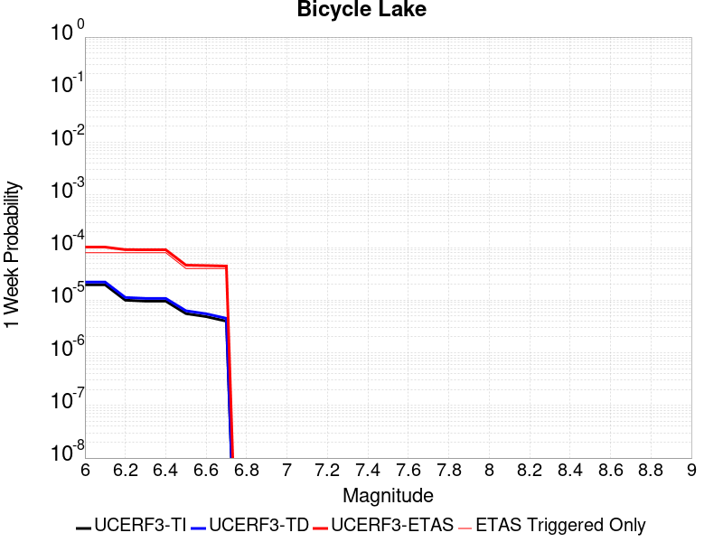 | 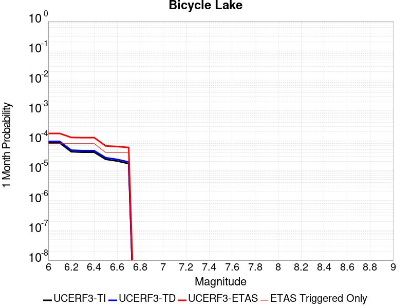 | 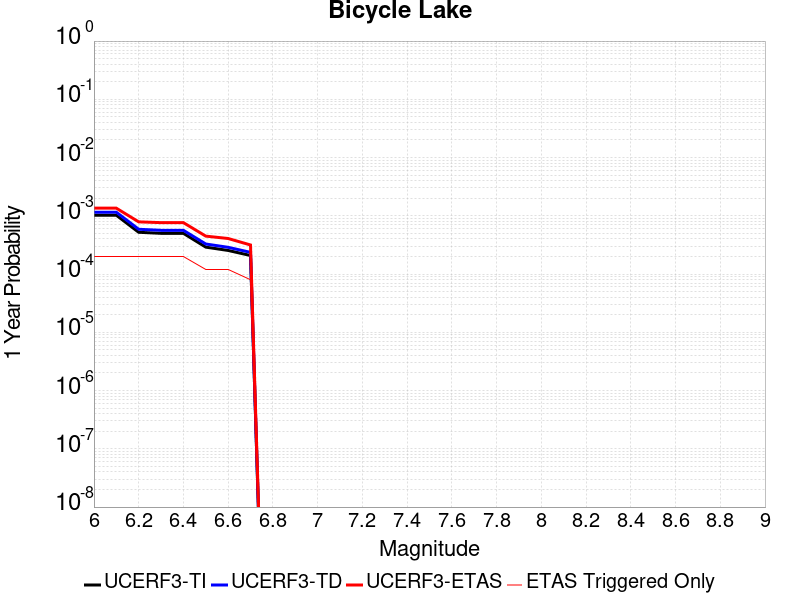 |

| Magnitude | 1 wk TI Prob | 1 wk TD Prob | 1 wk ETAS Prob | 1 wk ETAS/TD Gain | 1 wk ETAS Triggered Only | 1 mo TI Prob | 1 mo TD Prob | 1 mo ETAS Prob | 1 mo ETAS/TD Gain | 1 mo ETAS Triggered Only | 1 yr TI Prob | 1 yr TD Prob | 1 yr ETAS Prob | 1 yr ETAS/TD Gain | 1 yr ETAS Triggered Only |
|-----|-----|-----|-----|-----|-----|-----|-----|-----|-----|-----|-----|-----|-----|-----|-----|
| 6.0 | 1.9621975E-5 | 2.2106533E-5 | 1.02104765E-4 | 4.6187596 | 8.0E-5 | 8.4091465E-5 | 9.473961E-5 | 1.7473203E-4 | 1.8443398 | 8.0E-5 | 0.0010233327 | 0.0011529794 | 0.0013527488 | 1.1732637 | 2.0E-4 |
| 6.1 | 1.9621975E-5 | 2.2106533E-5 | 1.02104765E-4 | 4.6187596 | 8.0E-5 | 8.4091465E-5 | 9.473961E-5 | 1.7473203E-4 | 1.8443398 | 8.0E-5 | 0.0010233327 | 0.0011529794 | 0.0013527488 | 1.1732637 | 2.0E-4 |
| 6.2 | 9.9971285E-6 | 1.1260444E-5 | 9.125954E-5 | 8.104435 | 8.0E-5 | 4.2844134E-5 | 4.8258447E-5 | 1.2825459E-4 | 2.657661 | 8.0E-5 | 5.2150246E-4 | 5.8744027E-4 | 7.8732276E-4 | 1.3402601 | 2.0E-4 |
| 6.3 | 9.589428E-6 | 1.0802963E-5 | 9.0802096E-5 | 8.405296 | 8.0E-5 | 4.10969E-5 | 4.6297882E-5 | 1.2629418E-4 | 2.727861 | 8.0E-5 | 5.002399E-4 | 5.635828E-4 | 7.6347013E-4 | 1.3546724 | 2.0E-4 |
| 6.4 | 9.589428E-6 | 1.0802963E-5 | 9.0802096E-5 | 8.405296 | 8.0E-5 | 4.10969E-5 | 4.6297882E-5 | 1.2629418E-4 | 2.727861 | 8.0E-5 | 5.002399E-4 | 5.635828E-4 | 7.6347013E-4 | 1.3546724 | 2.0E-4 |
| 6.5 | 5.557707E-6 | 6.2883923E-6 | 4.628814E-5 | 7.360886 | 4.0E-5 | 2.3818526E-5 | 2.6950127E-5 | 6.694905E-5 | 2.484183 | 4.0E-5 | 2.8995197E-4 | 3.2809528E-4 | 4.4805591E-4 | 1.3656274 | 1.2E-4 |
| 6.6 | 4.8742945E-6 | 5.51574E-6 | 4.551552E-5 | 8.251933 | 4.0E-5 | 2.0889667E-5 | 2.3638819E-5 | 6.3637875E-5 | 2.692092 | 4.0E-5 | 2.54302E-4 | 2.8779084E-4 | 4.077563E-4 | 1.4168495 | 1.2E-4 |
| 6.7 | 3.991108E-6 | 4.5179236E-6 | 4.4517743E-5 | 9.853585 | 4.0E-5 | 1.7104636E-5 | 1.936253E-5 | 5.9361755E-5 | 3.065806 | 4.0E-5 | 2.0822904E-4 | 2.3573879E-4 | 3.1571992E-4 | 1.3392787 | 8.0E-5 |

## Santa Rosa Island
*[(top)](#table-of-contents)*

| 1 Week | 1 Month | 1 Year |
|-----|-----|-----|
| 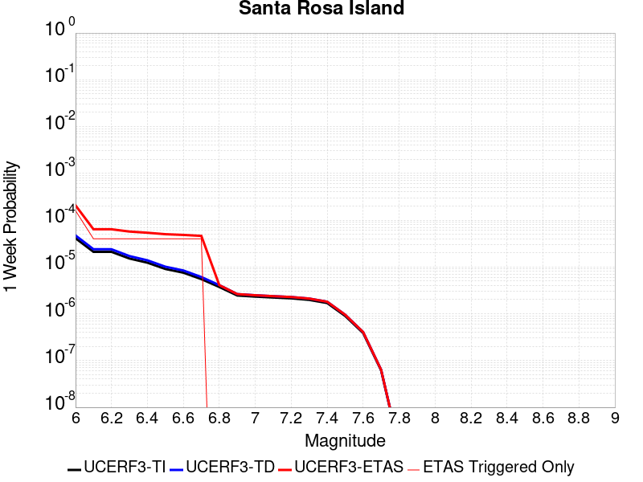 | 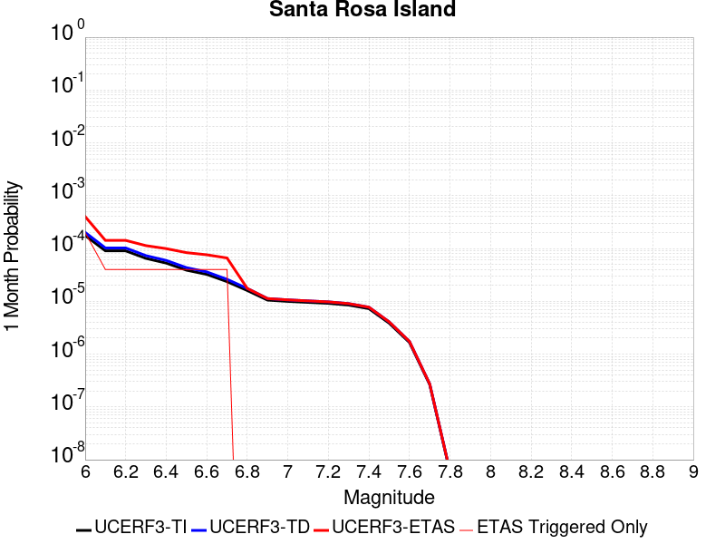 | 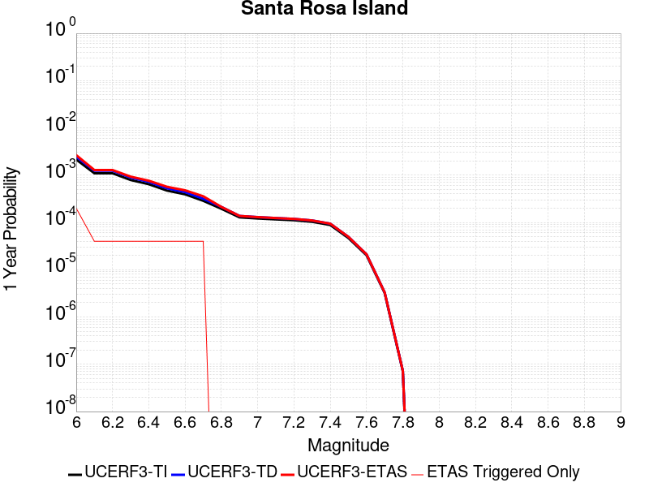 |

| Magnitude | 1 wk TI Prob | 1 wk TD Prob | 1 wk ETAS Prob | 1 wk ETAS/TD Gain | 1 wk ETAS Triggered Only | 1 mo TI Prob | 1 mo TD Prob | 1 mo ETAS Prob | 1 mo ETAS/TD Gain | 1 mo ETAS Triggered Only | 1 yr TI Prob | 1 yr TD Prob | 1 yr ETAS Prob | 1 yr ETAS/TD Gain | 1 yr ETAS Triggered Only |
|-----|-----|-----|-----|-----|-----|-----|-----|-----|-----|-----|-----|-----|-----|-----|-----|
| 6.0 | 4.1143165E-5 | 4.7114332E-5 | 2.071068E-4 | 4.395834 | 1.6E-4 | 1.7631594E-4 | 2.0190405E-4 | 4.0186368E-4 | 1.9903694 | 2.0E-4 | 0.002144533 | 0.0024556073 | 0.0026551161 | 1.0812463 | 2.0E-4 |
| 6.1 | 2.1061249E-5 | 2.3875791E-5 | 6.387484E-5 | 2.6752973 | 4.0E-5 | 9.0259375E-5 | 1.0232097E-4 | 1.4231687E-4 | 1.3908867 | 4.0E-5 | 0.0010983539 | 0.0012450748 | 0.001285025 | 1.0320866 | 4.0E-5 |
| 6.2 | 2.1061249E-5 | 2.3875791E-5 | 6.387484E-5 | 2.6752973 | 4.0E-5 | 9.0259375E-5 | 1.0232097E-4 | 1.4231687E-4 | 1.3908867 | 4.0E-5 | 0.0010983539 | 0.0012450748 | 0.001285025 | 1.0320866 | 4.0E-5 |
| 6.3 | 1.5158236E-5 | 1.708178E-5 | 5.7081095E-5 | 3.3416364 | 4.0E-5 | 6.496225E-5 | 7.320564E-5 | 1.1320271E-4 | 1.546366 | 4.0E-5 | 7.906284E-4 | 8.909262E-4 | 9.308906E-4 | 1.0448571 | 4.0E-5 |
| 6.4 | 1.2341918E-5 | 1.3858705E-5 | 5.385815E-5 | 3.8862326 | 4.0E-5 | 5.2892858E-5 | 5.939314E-5 | 9.939077E-5 | 1.6734384 | 4.0E-5 | 6.437803E-4 | 7.228797E-4 | 7.628508E-4 | 1.0552943 | 4.0E-5 |
| 6.5 | 9.061158E-6 | 1.0121061E-5 | 5.0120656E-5 | 4.952115 | 4.0E-5 | 3.883296E-5 | 4.3375283E-5 | 8.337355E-5 | 1.9221442 | 4.0E-5 | 4.726887E-4 | 5.279714E-4 | 5.679503E-4 | 1.0757216 | 4.0E-5 |
| 6.6 | 7.5461685E-6 | 8.403989E-6 | 4.8403654E-5 | 5.7596045 | 4.0E-5 | 3.2340322E-5 | 3.6016623E-5 | 7.601518E-5 | 2.1105583 | 4.0E-5 | 3.936723E-4 | 4.3841847E-4 | 4.7840094E-4 | 1.091197 | 4.0E-5 |
| 6.7 | 5.5023775E-6 | 6.089602E-6 | 4.6089357E-5 | 7.568534 | 4.0E-5 | 2.3581404E-5 | 2.609805E-5 | 6.6097E-5 | 2.5326414 | 4.0E-5 | 2.8706578E-4 | 3.177007E-4 | 3.57688E-4 | 1.1258646 | 4.0E-5 |
| 6.8 | 3.7351679E-6 | 4.08445E-6 | 4.08445E-6 | 1.0 | 0.0 | 1.6007763E-5 | 1.7504683E-5 | 1.7504683E-5 | 1.0 | 0.0 | 1.948771E-4 | 2.1310116E-4 | 2.1310116E-4 | 1.0 | 0.0 |
| 6.9 | 2.456366E-6 | 2.6299053E-6 | 2.6299053E-6 | 1.0 | 0.0 | 1.0527241E-5 | 1.1270974E-5 | 1.1270974E-5 | 1.0 | 0.0 | 1.2816161E-4 | 1.372155E-4 | 1.372155E-4 | 1.0 | 0.0 |
| 7.0 | 2.3245157E-6 | 2.4833578E-6 | 2.4833578E-6 | 1.0 | 0.0 | 9.962172E-6 | 1.0642919E-5 | 1.0642919E-5 | 1.0 | 0.0 | 1.2128269E-4 | 1.2956985E-4 | 1.2956985E-4 | 1.0 | 0.0 |
| 7.1 | 2.2248344E-6 | 2.3737928E-6 | 2.3737928E-6 | 1.0 | 0.0 | 9.53497E-6 | 1.0173358E-5 | 1.0173358E-5 | 1.0 | 0.0 | 1.1608207E-4 | 1.238536E-4 | 1.238536E-4 | 1.0 | 0.0 |
| 7.2 | 2.1350402E-6 | 2.2766699E-6 | 2.2766699E-6 | 1.0 | 0.0 | 9.150141E-6 | 9.75712E-6 | 9.75712E-6 | 1.0 | 0.0 | 1.1139726E-4 | 1.1878648E-4 | 1.1878648E-4 | 1.0 | 0.0 |
| 7.3 | 1.9793572E-6 | 2.109192E-6 | 2.109192E-6 | 1.0 | 0.0 | 8.482932E-6 | 9.039363E-6 | 9.039363E-6 | 1.0 | 0.0 | 1.032748E-4 | 1.10048706E-4 | 1.10048706E-4 | 1.0 | 0.0 |
| 7.4 | 1.6951194E-6 | 1.804974E-6 | 1.804974E-6 | 1.0 | 0.0 | 7.264777E-6 | 7.73558E-6 | 7.73558E-6 | 1.0 | 0.0 | 8.844508E-5 | 9.417663E-5 | 9.417663E-5 | 1.0 | 0.0 |
| 7.5 | 8.987207E-7 | 9.5141485E-7 | 9.5141485E-7 | 1.0 | 0.0 | 3.8516546E-6 | 4.0774858E-6 | 4.0774858E-6 | 1.0 | 0.0 | 4.6892885E-5 | 4.9642273E-5 | 4.9642273E-5 | 1.0 | 0.0 |
| 7.6 | 3.8783037E-7 | 4.053593E-7 | 4.053593E-7 | 1.0 | 0.0 | 1.6621291E-6 | 1.7372529E-6 | 1.7372529E-6 | 1.0 | 0.0 | 2.0236233E-5 | 2.1150856E-5 | 2.1150856E-5 | 1.0 | 0.0 |
| 7.7 | 6.181804E-8 | 6.339846E-8 | 6.339846E-8 | 1.0 | 0.0 | 2.6493444E-7 | 2.7170765E-7 | 2.7170765E-7 | 1.0 | 0.0 | 3.225572E-6 | 3.3080355E-6 | 3.3080355E-6 | 1.0 | 0.0 |
| 7.8 | 1.3704449E-9 | 1.396505E-9 | 1.396505E-9 | 1.0 | 0.0 | 5.873335E-9 | 5.9850214E-9 | 5.9850214E-9 | 1.0 | 0.0 | 7.1507856E-8 | 7.2867635E-8 | 7.2867635E-8 | 1.0 | 0.0 |

## San Gabriel (Extension)
*[(top)](#table-of-contents)*

| 1 Week | 1 Month | 1 Year |
|-----|-----|-----|
| 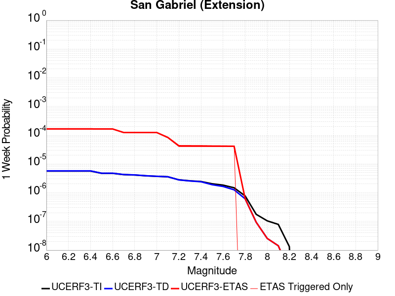 | 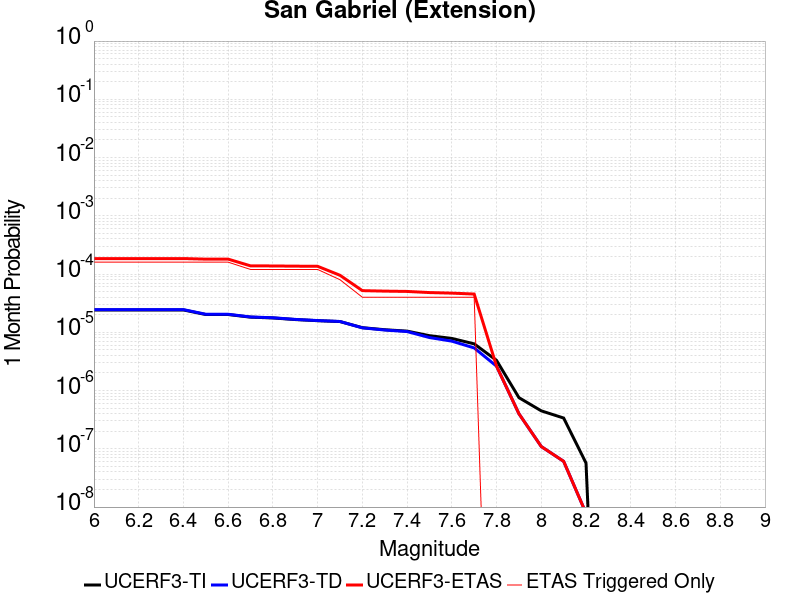 | 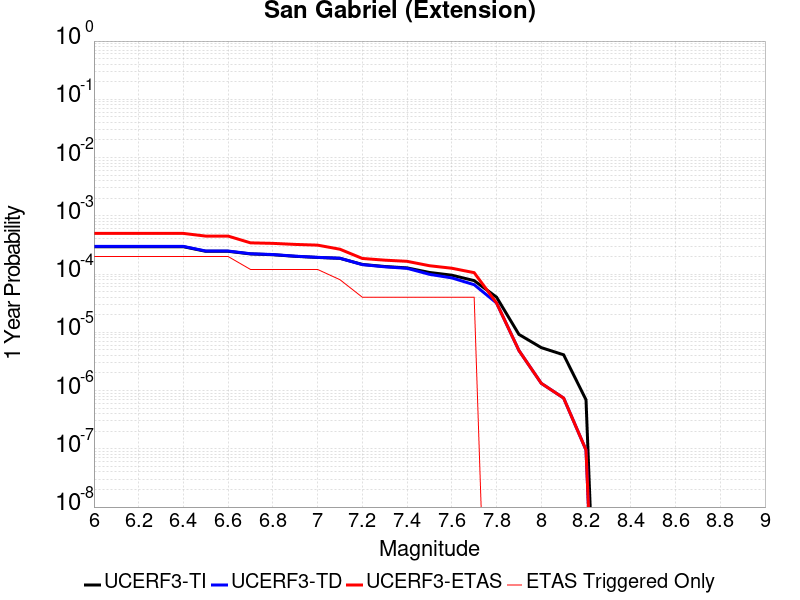 |

| Magnitude | 1 wk TI Prob | 1 wk TD Prob | 1 wk ETAS Prob | 1 wk ETAS/TD Gain | 1 wk ETAS Triggered Only | 1 mo TI Prob | 1 mo TD Prob | 1 mo ETAS Prob | 1 mo ETAS/TD Gain | 1 mo ETAS Triggered Only | 1 yr TI Prob | 1 yr TD Prob | 1 yr ETAS Prob | 1 yr ETAS/TD Gain | 1 yr ETAS Triggered Only |
|-----|-----|-----|-----|-----|-----|-----|-----|-----|-----|-----|-----|-----|-----|-----|-----|
| 6.0 | 5.6486106E-6 | 5.725012E-6 | 1.657241E-4 | 28.94738 | 1.6E-4 | 2.4208108E-5 | 2.4535542E-5 | 1.8453161E-4 | 7.520992 | 1.6E-4 | 2.9469383E-4 | 2.9868056E-4 | 4.986208E-4 | 1.6694118 | 2.0E-4 |
| 6.1 | 5.6486106E-6 | 5.725012E-6 | 1.657241E-4 | 28.94738 | 1.6E-4 | 2.4208108E-5 | 2.4535542E-5 | 1.8453161E-4 | 7.520992 | 1.6E-4 | 2.9469383E-4 | 2.9868056E-4 | 4.986208E-4 | 1.6694118 | 2.0E-4 |
| 6.2 | 5.6486106E-6 | 5.725012E-6 | 1.657241E-4 | 28.94738 | 1.6E-4 | 2.4208108E-5 | 2.4535542E-5 | 1.8453161E-4 | 7.520992 | 1.6E-4 | 2.9469383E-4 | 2.9868056E-4 | 4.986208E-4 | 1.6694118 | 2.0E-4 |
| 6.3 | 5.6486106E-6 | 5.725012E-6 | 1.657241E-4 | 28.94738 | 1.6E-4 | 2.4208108E-5 | 2.4535542E-5 | 1.8453161E-4 | 7.520992 | 1.6E-4 | 2.9469383E-4 | 2.9868056E-4 | 4.986208E-4 | 1.6694118 | 2.0E-4 |
| 6.4 | 5.6486106E-6 | 5.725012E-6 | 1.657241E-4 | 28.94738 | 1.6E-4 | 2.4208108E-5 | 2.4535542E-5 | 1.8453161E-4 | 7.520992 | 1.6E-4 | 2.9469383E-4 | 2.9868056E-4 | 4.986208E-4 | 1.6694118 | 2.0E-4 |
| 6.5 | 4.7134554E-6 | 4.7623403E-6 | 1.6476157E-4 | 34.596767 | 1.6E-4 | 2.0200367E-5 | 2.0409876E-5 | 1.8040661E-4 | 8.839182 | 1.6E-4 | 2.459117E-4 | 2.4846275E-4 | 4.4841305E-4 | 1.8047496 | 2.0E-4 |
| 6.6 | 4.7134554E-6 | 4.7623403E-6 | 1.6476157E-4 | 34.596767 | 1.6E-4 | 2.0200367E-5 | 2.0409876E-5 | 1.8040661E-4 | 8.839182 | 1.6E-4 | 2.459117E-4 | 2.4846275E-4 | 4.4841305E-4 | 1.8047496 | 2.0E-4 |
| 6.7 | 4.2468837E-6 | 4.2821102E-6 | 1.2428159E-4 | 29.023445 | 1.2E-4 | 1.8200803E-5 | 1.8351777E-5 | 1.3834957E-4 | 7.5387564 | 1.2E-4 | 2.2157225E-4 | 2.234107E-4 | 3.4338387E-4 | 1.5370073 | 1.2E-4 |
| 6.8 | 4.1180615E-6 | 4.149487E-6 | 1.24149E-4 | 29.919119 | 1.2E-4 | 1.7648716E-5 | 1.7783397E-5 | 1.3778126E-4 | 7.747747 | 1.2E-4 | 2.1485193E-4 | 2.1649207E-4 | 3.364661E-4 | 1.5541729 | 1.2E-4 |
| 6.9 | 3.863861E-6 | 3.887776E-6 | 1.2388731E-4 | 31.865856 | 1.2E-4 | 1.65593E-5 | 1.6661794E-5 | 1.366598E-4 | 8.201985 | 1.2E-4 | 2.0159081E-4 | 2.0283915E-4 | 3.228148E-4 | 1.5914818 | 1.2E-4 |
| 7.0 | 3.6947372E-6 | 3.7136579E-6 | 1.2371321E-4 | 33.313034 | 1.2E-4 | 1.5834492E-5 | 1.5915582E-5 | 1.3591367E-4 | 8.53966 | 1.2E-4 | 1.9276788E-4 | 1.9375567E-4 | 3.1373242E-4 | 1.6192167 | 1.2E-4 |
| 7.1 | 3.5686835E-6 | 3.5808512E-6 | 8.358056E-5 | 23.340977 | 8.0E-5 | 1.5294268E-5 | 1.5346419E-5 | 9.534519E-5 | 6.212863 | 8.0E-5 | 1.861918E-4 | 1.868273E-4 | 2.6681233E-4 | 1.428123 | 8.0E-5 |
| 7.2 | 2.8023446E-6 | 2.7846274E-6 | 4.2784515E-5 | 15.364539 | 4.0E-5 | 1.2009994E-5 | 1.1934064E-5 | 5.1933584E-5 | 4.3517103 | 4.0E-5 | 1.4621185E-4 | 1.4528765E-4 | 1.8528184E-4 | 1.275276 | 4.0E-5 |
| 7.3 | 2.5843012E-6 | 2.5537256E-6 | 4.2553624E-5 | 16.663351 | 4.0E-5 | 1.1075529E-5 | 1.0944493E-5 | 5.0944054E-5 | 4.654766 | 4.0E-5 | 1.3483623E-4 | 1.3324115E-4 | 1.7323582E-4 | 1.3001676 | 4.0E-5 |
| 7.4 | 2.4464468E-6 | 2.404315E-6 | 4.240422E-5 | 17.636715 | 4.0E-5 | 1.04847295E-5 | 1.0304167E-5 | 5.0303755E-5 | 4.881885 | 4.0E-5 | 1.276441E-4 | 1.2544611E-4 | 1.6544109E-4 | 1.318822 | 4.0E-5 |
| 7.5 | 2.0420266E-6 | 1.8978003E-6 | 4.1897725E-5 | 22.076994 | 4.0E-5 | 8.751514E-6 | 8.133405E-6 | 4.813308E-5 | 5.9179497 | 4.0E-5 | 1.0654447E-4 | 9.901974E-5 | 1.3901577E-4 | 1.4039198 | 4.0E-5 |
| 7.6 | 1.8326596E-6 | 1.6461403E-6 | 4.1646075E-5 | 25.299225 | 4.0E-5 | 7.854232E-6 | 7.054868E-6 | 4.7054586E-5 | 6.6698036 | 4.0E-5 | 9.562107E-5 | 8.588966E-5 | 1.2588622E-4 | 1.4656738 | 4.0E-5 |
| 7.7 | 1.4786998E-6 | 1.2581661E-6 | 4.1258118E-5 | 32.792263 | 4.0E-5 | 6.3372695E-6 | 5.3921294E-6 | 4.5391913E-5 | 8.4181795 | 4.0E-5 | 7.715353E-5 | 6.564721E-5 | 1.0564458E-4 | 1.6092776 | 4.0E-5 |
| 7.8 | 7.6975533E-7 | 6.117986E-7 | 6.117986E-7 | 1.0 | 0.0 | 3.2989474E-6 | 2.6219914E-6 | 2.6219914E-6 | 1.0 | 0.0 | 4.0163945E-5 | 3.192228E-5 | 3.192228E-5 | 1.0 | 0.0 |
| 7.9 | 1.7645915E-7 | 9.348288E-8 | 9.348288E-8 | 1.0 | 0.0 | 7.562533E-7 | 4.0064086E-7 | 4.0064086E-7 | 1.0 | 0.0 | 9.207345E-6 | 4.8777915E-6 | 4.8777915E-6 | 1.0 | 0.0 |
| 8.0 | 1.0463461E-7 | 2.5519673E-8 | 2.5519673E-8 | 1.0 | 0.0 | 4.4843398E-7 | 1.0937003E-7 | 1.0937003E-7 | 1.0 | 0.0 | 5.45967E-6 | 1.3315793E-6 | 1.3315793E-6 | 1.0 | 0.0 |
| 8.1 | 7.875717E-8 | 1.4238637E-8 | 1.4238637E-8 | 1.0 | 0.0 | 3.3753068E-7 | 6.102273E-8 | 6.102273E-8 | 1.0 | 0.0 | 4.109428E-6 | 7.4295144E-7 | 7.4295144E-7 | 1.0 | 0.0 |
| 8.2 | 1.33163E-8 | 1.8272979E-9 | 1.8272979E-9 | 1.0 | 0.0 | 5.7069855E-8 | 7.831277E-9 | 7.831277E-9 | 1.0 | 0.0 | 6.9482525E-7 | 9.534579E-8 | 9.534579E-8 | 1.0 | 0.0 |

## Pitas Point (Lower West)
*[(top)](#table-of-contents)*

| 1 Week | 1 Month | 1 Year |
|-----|-----|-----|
| 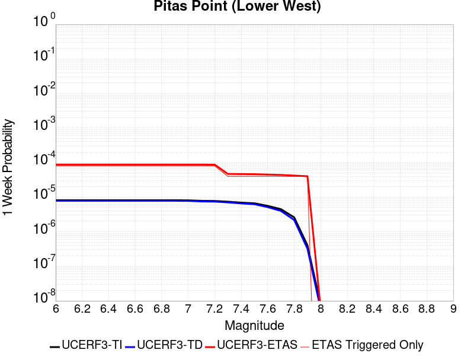 | 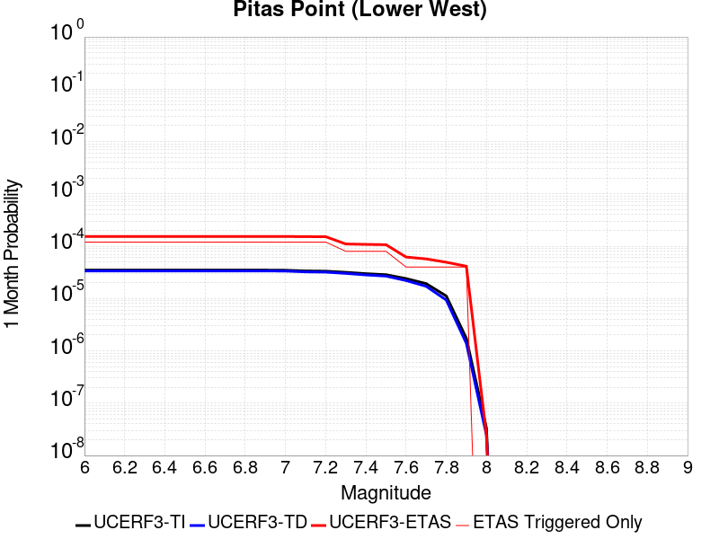 | 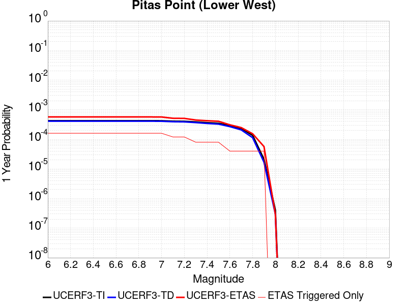 |

| Magnitude | 1 wk TI Prob | 1 wk TD Prob | 1 wk ETAS Prob | 1 wk ETAS/TD Gain | 1 wk ETAS Triggered Only | 1 mo TI Prob | 1 mo TD Prob | 1 mo ETAS Prob | 1 mo ETAS/TD Gain | 1 mo ETAS Triggered Only | 1 yr TI Prob | 1 yr TD Prob | 1 yr ETAS Prob | 1 yr ETAS/TD Gain | 1 yr ETAS Triggered Only |
|-----|-----|-----|-----|-----|-----|-----|-----|-----|-----|-----|-----|-----|-----|-----|-----|
| 6.0 | 8.151497E-6 | 7.857616E-6 | 8.7856984E-5 | 11.181125 | 8.0E-5 | 3.493452E-5 | 3.3675067E-5 | 1.5367102E-4 | 4.5633473 | 1.2E-4 | 4.252448E-4 | 4.0991756E-4 | 5.6985195E-4 | 1.3901623 | 1.6E-4 |
| 6.1 | 8.151497E-6 | 7.857616E-6 | 8.7856984E-5 | 11.181125 | 8.0E-5 | 3.493452E-5 | 3.3675067E-5 | 1.5367102E-4 | 4.5633473 | 1.2E-4 | 4.252448E-4 | 4.0991756E-4 | 5.6985195E-4 | 1.3901623 | 1.6E-4 |
| 6.2 | 8.151497E-6 | 7.857616E-6 | 8.7856984E-5 | 11.181125 | 8.0E-5 | 3.493452E-5 | 3.3675067E-5 | 1.5367102E-4 | 4.5633473 | 1.2E-4 | 4.252448E-4 | 4.0991756E-4 | 5.6985195E-4 | 1.3901623 | 1.6E-4 |
| 6.3 | 8.151497E-6 | 7.857616E-6 | 8.7856984E-5 | 11.181125 | 8.0E-5 | 3.493452E-5 | 3.3675067E-5 | 1.5367102E-4 | 4.5633473 | 1.2E-4 | 4.252448E-4 | 4.0991756E-4 | 5.6985195E-4 | 1.3901623 | 1.6E-4 |
| 6.4 | 8.151497E-6 | 7.857616E-6 | 8.7856984E-5 | 11.181125 | 8.0E-5 | 3.493452E-5 | 3.3675067E-5 | 1.5367102E-4 | 4.5633473 | 1.2E-4 | 4.252448E-4 | 4.0991756E-4 | 5.6985195E-4 | 1.3901623 | 1.6E-4 |
| 6.5 | 8.151497E-6 | 7.857616E-6 | 8.7856984E-5 | 11.181125 | 8.0E-5 | 3.493452E-5 | 3.3675067E-5 | 1.5367102E-4 | 4.5633473 | 1.2E-4 | 4.252448E-4 | 4.0991756E-4 | 5.6985195E-4 | 1.3901623 | 1.6E-4 |
| 6.6 | 8.151497E-6 | 7.857616E-6 | 8.7856984E-5 | 11.181125 | 8.0E-5 | 3.493452E-5 | 3.3675067E-5 | 1.5367102E-4 | 4.5633473 | 1.2E-4 | 4.252448E-4 | 4.0991756E-4 | 5.6985195E-4 | 1.3901623 | 1.6E-4 |
| 6.7 | 8.151497E-6 | 7.857616E-6 | 8.7856984E-5 | 11.181125 | 8.0E-5 | 3.493452E-5 | 3.3675067E-5 | 1.5367102E-4 | 4.5633473 | 1.2E-4 | 4.252448E-4 | 4.0991756E-4 | 5.6985195E-4 | 1.3901623 | 1.6E-4 |
| 6.8 | 8.151497E-6 | 7.857616E-6 | 8.7856984E-5 | 11.181125 | 8.0E-5 | 3.493452E-5 | 3.3675067E-5 | 1.5367102E-4 | 4.5633473 | 1.2E-4 | 4.252448E-4 | 4.0991756E-4 | 5.6985195E-4 | 1.3901623 | 1.6E-4 |
| 6.9 | 8.151497E-6 | 7.857616E-6 | 8.7856984E-5 | 11.181125 | 8.0E-5 | 3.493452E-5 | 3.3675067E-5 | 1.5367102E-4 | 4.5633473 | 1.2E-4 | 4.252448E-4 | 4.0991756E-4 | 5.6985195E-4 | 1.3901623 | 1.6E-4 |
| 7.0 | 8.103535E-6 | 7.807036E-6 | 8.780641E-5 | 11.247087 | 8.0E-5 | 3.4728975E-5 | 3.3458302E-5 | 1.5345428E-4 | 4.586434 | 1.2E-4 | 4.2274324E-4 | 4.0727944E-4 | 5.672143E-4 | 1.3926907 | 1.6E-4 |
| 7.1 | 7.853298E-6 | 7.542677E-6 | 8.7542074E-5 | 11.606234 | 8.0E-5 | 3.3656554E-5 | 3.2325363E-5 | 1.5232149E-4 | 4.7121353 | 1.2E-4 | 4.096915E-4 | 3.9349092E-4 | 5.134437E-4 | 1.3048426 | 1.2E-4 |
| 7.2 | 7.771102E-6 | 7.454939E-6 | 8.745434E-5 | 11.731061 | 8.0E-5 | 3.33043E-5 | 3.1949352E-5 | 1.5194551E-4 | 4.7558246 | 1.2E-4 | 4.0540437E-4 | 3.8891463E-4 | 5.0886796E-4 | 1.308431 | 1.2E-4 |
| 7.3 | 7.3945344E-6 | 7.050944E-6 | 4.7050664E-5 | 6.672959 | 4.0E-5 | 3.1690477E-5 | 3.0217985E-5 | 1.10215566E-4 | 3.6473498 | 8.0E-5 | 3.8576324E-4 | 3.678425E-4 | 4.4781307E-4 | 1.2174044 | 8.0E-5 |
| 7.4 | 6.964645E-6 | 6.5916875E-6 | 4.6591424E-5 | 7.068209 | 4.0E-5 | 2.9848137E-5 | 2.8249786E-5 | 1.0824753E-4 | 3.8318 | 8.0E-5 | 3.6334046E-4 | 3.4388734E-4 | 4.2385983E-4 | 1.2325543 | 8.0E-5 |
| 7.5 | 6.6525035E-6 | 6.2606523E-6 | 4.62604E-5 | 7.3890705 | 4.0E-5 | 2.851042E-5 | 2.6831094E-5 | 1.0682895E-4 | 3.9815352 | 8.0E-5 | 3.4705905E-4 | 3.266201E-4 | 4.0659396E-4 | 1.2448529 | 8.0E-5 |
| 7.6 | 5.613338E-6 | 5.15261E-6 | 4.5152403E-5 | 8.763016 | 4.0E-5 | 2.405694E-5 | 2.208243E-5 | 6.208155E-5 | 2.8113549 | 4.0E-5 | 2.928539E-4 | 2.688207E-4 | 3.0880995E-4 | 1.148758 | 4.0E-5 |
| 7.7 | 4.494704E-6 | 3.997876E-6 | 4.3997716E-5 | 11.005274 | 4.0E-5 | 1.9262876E-5 | 1.7133641E-5 | 5.713296E-5 | 3.3345482 | 4.0E-5 | 2.3450027E-4 | 2.0858237E-4 | 2.48574E-4 | 1.1917307 | 4.0E-5 |
| 7.8 | 2.6075882E-6 | 2.1841993E-6 | 4.218411E-5 | 19.313307 | 4.0E-5 | 1.117533E-5 | 9.360821E-6 | 4.9360446E-5 | 5.2730894 | 4.0E-5 | 1.3605114E-4 | 1.1396208E-4 | 1.5395752E-4 | 1.3509539 | 4.0E-5 |
| 7.9 | 4.045984E-7 | 3.2431933E-7 | 4.0324307E-5 | 124.33519 | 4.0E-5 | 1.733992E-6 | 1.3899393E-6 | 4.1389885E-5 | 29.778194 | 4.0E-5 | 2.1111147E-5 | 1.6922382E-5 | 5.6921705E-5 | 3.3636932 | 4.0E-5 |
| 8.0 | 7.791402E-9 | 5.68495E-9 | 5.68495E-9 | 1.0 | 0.0 | 3.3391725E-8 | 2.4364072E-8 | 2.4364072E-8 | 1.0 | 0.0 | 4.0654416E-7 | 2.9663255E-7 | 2.9663255E-7 | 1.0 | 0.0 |

## San Gregorio (North) 2011 CFM
*[(top)](#table-of-contents)*

| 1 Week | 1 Month | 1 Year |
|-----|-----|-----|
| 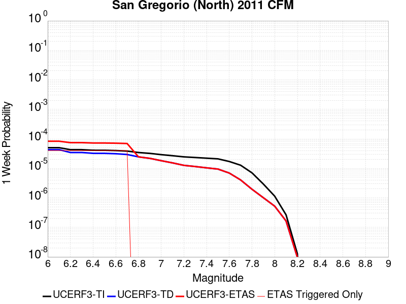 | 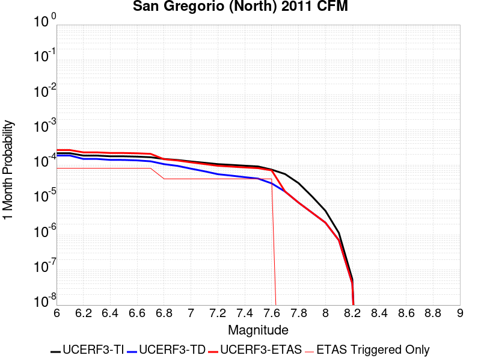 | 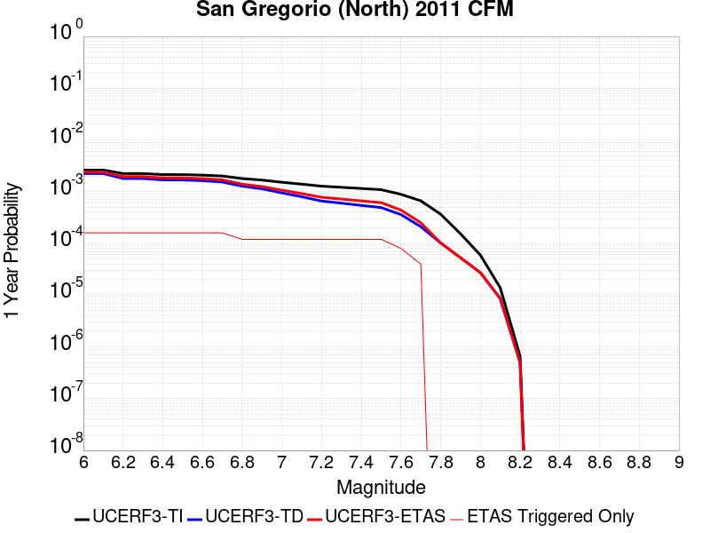 |

| Magnitude | 1 wk TI Prob | 1 wk TD Prob | 1 wk ETAS Prob | 1 wk ETAS/TD Gain | 1 wk ETAS Triggered Only | 1 mo TI Prob | 1 mo TD Prob | 1 mo ETAS Prob | 1 mo ETAS/TD Gain | 1 mo ETAS Triggered Only | 1 yr TI Prob | 1 yr TD Prob | 1 yr ETAS Prob | 1 yr ETAS/TD Gain | 1 yr ETAS Triggered Only |
|-----|-----|-----|-----|-----|-----|-----|-----|-----|-----|-----|-----|-----|-----|-----|-----|
| 6.0 | 5.0283932E-5 | 4.314244E-5 | 8.3140716E-5 | 1.9271213 | 4.0E-5 | 2.1548476E-4 | 1.8488315E-4 | 2.6486834E-4 | 1.4326258 | 8.0E-5 | 0.0026203706 | 0.0022486437 | 0.002408284 | 1.070994 | 1.6E-4 |
| 6.1 | 5.0283932E-5 | 4.314244E-5 | 8.3140716E-5 | 1.9271213 | 4.0E-5 | 2.1548476E-4 | 1.8488315E-4 | 2.6486834E-4 | 1.4326258 | 8.0E-5 | 0.0026203706 | 0.0022486437 | 0.002408284 | 1.070994 | 1.6E-4 |
| 6.2 | 4.2998647E-5 | 3.4518398E-5 | 7.451702E-5 | 2.1587625 | 4.0E-5 | 1.842669E-4 | 1.4792767E-4 | 2.2791584E-4 | 1.5407249 | 8.0E-5 | 0.0022411412 | 0.0017995444 | 0.0019592564 | 1.0887514 | 1.6E-4 |
| 6.3 | 4.2998647E-5 | 3.4518398E-5 | 7.451702E-5 | 2.1587625 | 4.0E-5 | 1.842669E-4 | 1.4792767E-4 | 2.2791584E-4 | 1.5407249 | 8.0E-5 | 0.0022411412 | 0.0017995444 | 0.0019592564 | 1.0887514 | 1.6E-4 |
| 6.4 | 4.1101295E-5 | 3.240154E-5 | 7.240024E-5 | 2.2344694 | 4.0E-5 | 1.7613651E-4 | 1.3885641E-4 | 2.188453E-4 | 1.5760547 | 8.0E-5 | 0.0021423528 | 0.0016892796 | 0.0018490092 | 1.0945549 | 1.6E-4 |
| 6.5 | 4.1032585E-5 | 3.2319516E-5 | 7.2318224E-5 | 2.2376022 | 4.0E-5 | 1.7584208E-4 | 1.3850494E-4 | 2.1849386E-4 | 1.5775167 | 8.0E-5 | 0.0021387753 | 0.001685007 | 0.0018447373 | 1.0947951 | 1.6E-4 |
| 6.6 | 4.011629E-5 | 3.134029E-5 | 7.133903E-5 | 2.2762723 | 4.0E-5 | 1.7191563E-4 | 1.3430869E-4 | 2.1429795E-4 | 1.5955627 | 8.0E-5 | 0.0020910634 | 0.0016339958 | 0.0017937343 | 1.0977595 | 1.6E-4 |
| 6.7 | 3.8583938E-5 | 2.952564E-5 | 6.952446E-5 | 2.3547146 | 4.0E-5 | 1.6534925E-4 | 1.265324E-4 | 2.0652228E-4 | 1.6321691 | 8.0E-5 | 0.0020112682 | 0.0015394577 | 0.0016992113 | 1.1037728 | 1.6E-4 |
| 6.8 | 3.44341E-5 | 2.451853E-5 | 2.451853E-5 | 1.0 | 0.0 | 1.4756636E-4 | 1.0507524E-4 | 1.4507104E-4 | 1.3806396 | 4.0E-5 | 0.0017951399 | 0.0012785508 | 0.0013983974 | 1.0937363 | 1.2E-4 |
| 6.9 | 3.221199E-5 | 2.1839987E-5 | 2.1839987E-5 | 1.0 | 0.0 | 1.3804408E-4 | 9.359664E-5 | 1.335929E-4 | 1.4273258 | 4.0E-5 | 0.0016793909 | 0.0011389516 | 0.0012588149 | 1.1052401 | 1.2E-4 |
| 7.0 | 2.9186718E-5 | 1.8203937E-5 | 1.8203937E-5 | 1.0 | 0.0 | 1.2507994E-4 | 7.8014564E-5 | 1.1801144E-4 | 1.5126848 | 4.0E-5 | 0.0015217843 | 9.494178E-4 | 0.001069304 | 1.1262733 | 1.2E-4 |
| 7.1 | 2.6840138E-5 | 1.533875E-5 | 1.533875E-5 | 1.0 | 0.0 | 1.1502409E-4 | 6.5735854E-5 | 1.0573323E-4 | 1.6084559 | 4.0E-5 | 0.0013995186 | 8.000421E-4 | 9.199461E-4 | 1.1498721 | 1.2E-4 |
| 7.2 | 2.453002E-5 | 1.26589775E-5 | 1.26589775E-5 | 1.0 | 0.0 | 1.05124425E-4 | 5.4251635E-5 | 9.4249466E-5 | 1.737265 | 4.0E-5 | 0.0012791384 | 6.6031405E-4 | 7.802348E-4 | 1.1816117 | 1.2E-4 |
| 7.3 | 2.3330727E-5 | 1.153953E-5 | 1.153953E-5 | 1.0 | 0.0 | 9.9985E-5 | 4.945419E-5 | 8.945221E-5 | 1.8087894 | 4.0E-5 | 0.0012166376 | 6.0193887E-4 | 7.218667E-4 | 1.1992358 | 1.2E-4 |
| 7.4 | 2.2136466E-5 | 1.0418551E-5 | 1.0418551E-5 | 1.0 | 0.0 | 9.486712E-5 | 4.465017E-5 | 8.464838E-5 | 1.8958132 | 4.0E-5 | 0.0011543952 | 5.4348045E-4 | 6.6341524E-4 | 1.220679 | 1.2E-4 |
| 7.5 | 2.0994974E-5 | 9.474889E-6 | 9.474889E-6 | 1.0 | 0.0 | 8.997535E-5 | 4.0606035E-5 | 8.060441E-5 | 1.9850352 | 4.0E-5 | 0.0010948994 | 4.9426657E-4 | 6.1420724E-4 | 1.242664 | 1.2E-4 |
| 7.6 | 1.7091823E-5 | 6.9318185E-6 | 6.9318185E-6 | 1.0 | 0.0 | 7.3248615E-5 | 2.9707455E-5 | 6.9706264E-5 | 2.3464234 | 4.0E-5 | 8.9143694E-4 | 3.6162834E-4 | 4.415994E-4 | 1.2211416 | 8.0E-5 |
| 7.7 | 1.2772179E-5 | 4.048064E-6 | 4.048064E-6 | 1.0 | 0.0 | 5.473676E-5 | 1.7348731E-5 | 1.7348731E-5 | 1.0 | 0.0 | 6.6621625E-4 | 2.1120036E-4 | 2.511919E-4 | 1.1893536 | 4.0E-5 |
| 7.8 | 7.041923E-6 | 1.9584988E-6 | 1.9584988E-6 | 1.0 | 0.0 | 3.017932E-5 | 8.393539E-6 | 8.393539E-6 | 1.0 | 0.0 | 3.6737128E-4 | 1.0218655E-4 | 1.0218655E-4 | 1.0 | 0.0 |
| 7.9 | 2.946768E-6 | 1.0139579E-6 | 1.0139579E-6 | 1.0 | 0.0 | 1.2628945E-5 | 4.345526E-6 | 4.345526E-6 | 1.0 | 0.0 | 1.5374656E-4 | 5.29055E-5 | 5.29055E-5 | 1.0 | 0.0 |
| 8.0 | 1.1433375E-6 | 5.24259E-7 | 5.24259E-7 | 1.0 | 0.0 | 4.9000087E-6 | 2.2468223E-6 | 2.2468223E-6 | 1.0 | 0.0 | 5.965597E-5 | 2.7354718E-5 | 2.7354718E-5 | 1.0 | 0.0 |
| 8.1 | 2.6675295E-7 | 1.6521801E-7 | 1.6521801E-7 | 1.0 | 0.0 | 1.1432264E-6 | 7.08077E-7 | 7.08077E-7 | 1.0 | 0.0 | 1.3918692E-5 | 8.620804E-6 | 8.620804E-6 | 1.0 | 0.0 |
| 8.2 | 1.2704569E-8 | 9.638424E-9 | 9.638424E-9 | 1.0 | 0.0 | 5.444815E-8 | 4.1307533E-8 | 4.1307533E-8 | 1.0 | 0.0 | 6.629061E-7 | 5.029191E-7 | 5.029191E-7 | 1.0 | 0.0 |

## Sisar
*[(top)](#table-of-contents)*

| 1 Week | 1 Month | 1 Year |
|-----|-----|-----|
| 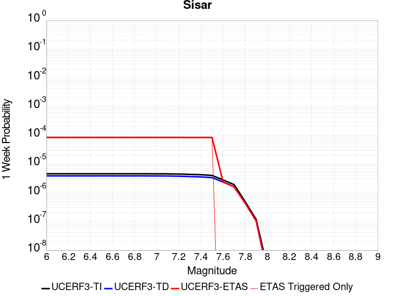 | 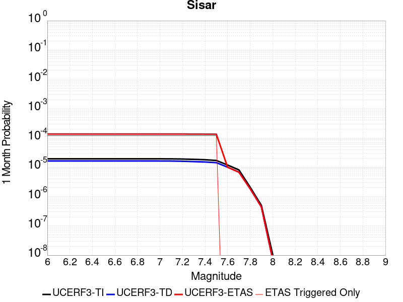 | 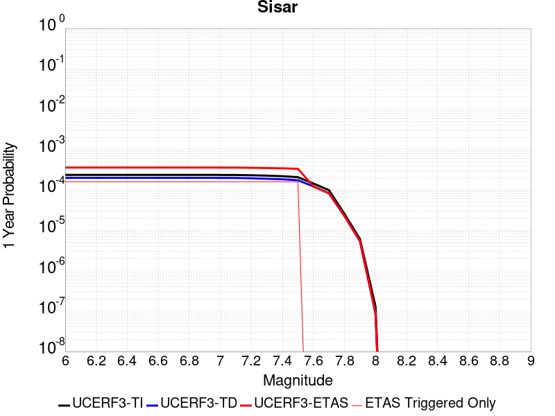 |

| Magnitude | 1 wk TI Prob | 1 wk TD Prob | 1 wk ETAS Prob | 1 wk ETAS/TD Gain | 1 wk ETAS Triggered Only | 1 mo TI Prob | 1 mo TD Prob | 1 mo ETAS Prob | 1 mo ETAS/TD Gain | 1 mo ETAS Triggered Only | 1 yr TI Prob | 1 yr TD Prob | 1 yr ETAS Prob | 1 yr ETAS/TD Gain | 1 yr ETAS Triggered Only |
|-----|-----|-----|-----|-----|-----|-----|-----|-----|-----|-----|-----|-----|-----|-----|-----|
| 6.0 | 4.544193E-6 | 3.840601E-6 | 8.384029E-5 | 21.829994 | 8.0E-5 | 1.9474966E-5 | 1.6459617E-5 | 1.3645765E-4 | 8.290451 | 1.2E-4 | 2.3708193E-4 | 2.0037773E-4 | 3.6034567E-4 | 1.798332 | 1.6E-4 |
| 6.1 | 4.544193E-6 | 3.840601E-6 | 8.384029E-5 | 21.829994 | 8.0E-5 | 1.9474966E-5 | 1.6459617E-5 | 1.3645765E-4 | 8.290451 | 1.2E-4 | 2.3708193E-4 | 2.0037773E-4 | 3.6034567E-4 | 1.798332 | 1.6E-4 |
| 6.2 | 4.544193E-6 | 3.840601E-6 | 8.384029E-5 | 21.829994 | 8.0E-5 | 1.9474966E-5 | 1.6459617E-5 | 1.3645765E-4 | 8.290451 | 1.2E-4 | 2.3708193E-4 | 2.0037773E-4 | 3.6034567E-4 | 1.798332 | 1.6E-4 |
| 6.3 | 4.544193E-6 | 3.840601E-6 | 8.384029E-5 | 21.829994 | 8.0E-5 | 1.9474966E-5 | 1.6459617E-5 | 1.3645765E-4 | 8.290451 | 1.2E-4 | 2.3708193E-4 | 2.0037773E-4 | 3.6034567E-4 | 1.798332 | 1.6E-4 |
| 6.4 | 4.544193E-6 | 3.840601E-6 | 8.384029E-5 | 21.829994 | 8.0E-5 | 1.9474966E-5 | 1.6459617E-5 | 1.3645765E-4 | 8.290451 | 1.2E-4 | 2.3708193E-4 | 2.0037773E-4 | 3.6034567E-4 | 1.798332 | 1.6E-4 |
| 6.5 | 4.544193E-6 | 3.840601E-6 | 8.384029E-5 | 21.829994 | 8.0E-5 | 1.9474966E-5 | 1.6459617E-5 | 1.3645765E-4 | 8.290451 | 1.2E-4 | 2.3708193E-4 | 2.0037773E-4 | 3.6034567E-4 | 1.798332 | 1.6E-4 |
| 6.6 | 4.544193E-6 | 3.840601E-6 | 8.384029E-5 | 21.829994 | 8.0E-5 | 1.9474966E-5 | 1.6459617E-5 | 1.3645765E-4 | 8.290451 | 1.2E-4 | 2.3708193E-4 | 2.0037773E-4 | 3.6034567E-4 | 1.798332 | 1.6E-4 |
| 6.7 | 4.544193E-6 | 3.840601E-6 | 8.384029E-5 | 21.829994 | 8.0E-5 | 1.9474966E-5 | 1.6459617E-5 | 1.3645765E-4 | 8.290451 | 1.2E-4 | 2.3708193E-4 | 2.0037773E-4 | 3.6034567E-4 | 1.798332 | 1.6E-4 |
| 6.8 | 4.544193E-6 | 3.840601E-6 | 8.384029E-5 | 21.829994 | 8.0E-5 | 1.9474966E-5 | 1.6459617E-5 | 1.3645765E-4 | 8.290451 | 1.2E-4 | 2.3708193E-4 | 2.0037773E-4 | 3.6034567E-4 | 1.798332 | 1.6E-4 |
| 6.9 | 4.542225E-6 | 3.8385624E-6 | 8.3838255E-5 | 21.841055 | 8.0E-5 | 1.9466532E-5 | 1.645088E-5 | 1.364489E-4 | 8.294322 | 1.2E-4 | 2.3697925E-4 | 2.0027139E-4 | 3.6023936E-4 | 1.7987559 | 1.6E-4 |
| 7.0 | 4.5278484E-6 | 3.823625E-6 | 8.382332E-5 | 21.922476 | 8.0E-5 | 1.940492E-5 | 1.6386863E-5 | 1.363849E-4 | 8.32282 | 1.2E-4 | 2.3622929E-4 | 1.9949212E-4 | 3.594602E-4 | 1.8018767 | 1.6E-4 |
| 7.1 | 4.5132488E-6 | 3.80841E-6 | 8.38081E-5 | 22.006062 | 8.0E-5 | 1.9342351E-5 | 1.6321657E-5 | 1.363197E-4 | 8.352075 | 1.2E-4 | 2.3546767E-4 | 1.9869838E-4 | 3.5866658E-4 | 1.8050805 | 1.6E-4 |
| 7.2 | 4.448859E-6 | 3.7408593E-6 | 8.374056E-5 | 22.385382 | 8.0E-5 | 1.9066398E-5 | 1.6032158E-5 | 1.3603023E-4 | 8.484837 | 1.2E-4 | 2.3210866E-4 | 1.9517436E-4 | 3.5514313E-4 | 1.8196198 | 1.6E-4 |
| 7.3 | 4.3424366E-6 | 3.634672E-6 | 8.363438E-5 | 23.010159 | 8.0E-5 | 1.861031E-5 | 1.5577076E-5 | 1.355752E-4 | 8.703508 | 1.2E-4 | 2.2655698E-4 | 1.8963472E-4 | 3.4960438E-4 | 1.8435674 | 1.6E-4 |
| 7.4 | 4.218641E-6 | 3.5339901E-6 | 8.3533705E-5 | 23.63722 | 8.0E-5 | 1.8079765E-5 | 1.5145586E-5 | 1.3514377E-4 | 8.92298 | 1.2E-4 | 2.2009891E-4 | 1.8438224E-4 | 3.4435274E-4 | 1.8676025 | 1.6E-4 |
| 7.5 | 3.983779E-6 | 3.3487026E-6 | 8.334844E-5 | 24.889769 | 8.0E-5 | 1.7073227E-5 | 1.4351505E-5 | 1.3434979E-4 | 9.361372 | 1.2E-4 | 2.0784672E-4 | 1.747159E-4 | 3.3468794E-4 | 1.9156125 | 1.6E-4 |
| 7.6 | 2.777393E-6 | 2.352786E-6 | 2.352786E-6 | 1.0 | 0.0 | 1.1903058E-5 | 1.008333E-5 | 1.008333E-5 | 1.0 | 0.0 | 1.449101E-4 | 1.227577E-4 | 1.227577E-4 | 1.0 | 0.0 |
| 7.7 | 1.9028433E-6 | 1.5942247E-6 | 1.5942247E-6 | 1.0 | 0.0 | 8.155017E-6 | 6.832374E-6 | 6.832374E-6 | 1.0 | 0.0 | 9.928281E-5 | 8.3181025E-5 | 8.3181025E-5 | 1.0 | 0.0 |
| 7.8 | 4.9095956E-7 | 4.359209E-7 | 4.359209E-7 | 1.0 | 0.0 | 2.1041105E-6 | 1.868231E-6 | 1.868231E-6 | 1.0 | 0.0 | 2.5617246E-5 | 2.2745477E-5 | 2.2745477E-5 | 1.0 | 0.0 |
| 7.9 | 1.16657894E-7 | 1.0337988E-7 | 1.0337988E-7 | 1.0 | 0.0 | 4.999623E-7 | 4.4305656E-7 | 4.4305656E-7 | 1.0 | 0.0 | 6.087024E-6 | 5.394201E-6 | 5.394201E-6 | 1.0 | 0.0 |
| 8.0 | 2.5100346E-9 | 1.7080607E-9 | 1.7080607E-9 | 1.0 | 0.0 | 1.0757291E-8 | 7.32026E-9 | 7.32026E-9 | 1.0 | 0.0 | 1.3097001E-7 | 8.9124164E-8 | 8.9124164E-8 | 1.0 | 0.0 |

## Garlic Springs
*[(top)](#table-of-contents)*

| 1 Week | 1 Month | 1 Year |
|-----|-----|-----|
| 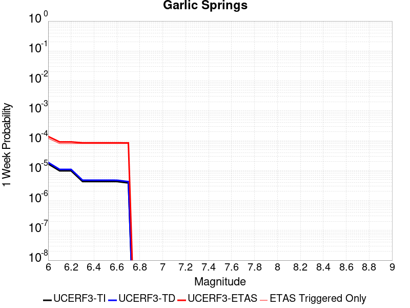 | 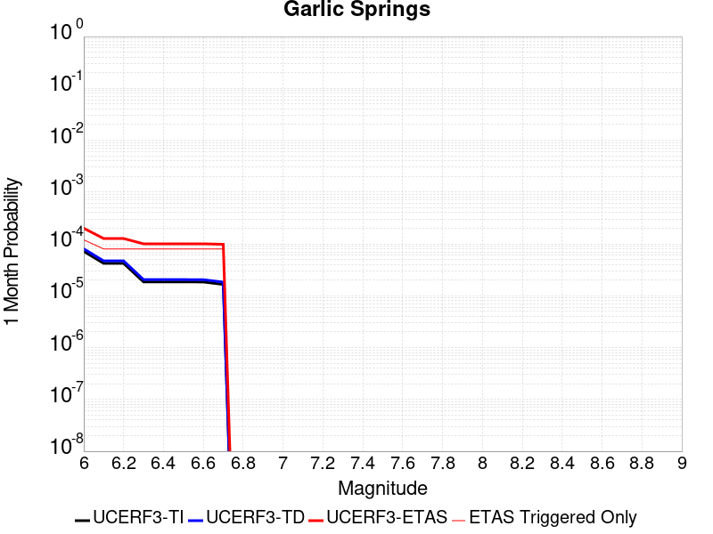 | 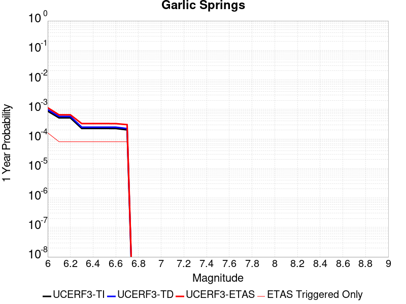 |

| Magnitude | 1 wk TI Prob | 1 wk TD Prob | 1 wk ETAS Prob | 1 wk ETAS/TD Gain | 1 wk ETAS Triggered Only | 1 mo TI Prob | 1 mo TD Prob | 1 mo ETAS Prob | 1 mo ETAS/TD Gain | 1 mo ETAS Triggered Only | 1 yr TI Prob | 1 yr TD Prob | 1 yr ETAS Prob | 1 yr ETAS/TD Gain | 1 yr ETAS Triggered Only |
|-----|-----|-----|-----|-----|-----|-----|-----|-----|-----|-----|-----|-----|-----|-----|-----|
| 6.0 | 1.6760017E-5 | 1.8784498E-5 | 1.3878224E-4 | 7.3881264 | 1.2E-4 | 7.182667E-5 | 8.0503174E-5 | 2.0049351E-4 | 2.4905045 | 1.2E-4 | 8.7413884E-4 | 9.798029E-4 | 0.0011396462 | 1.1631382 | 1.6E-4 |
| 6.1 | 9.852767E-6 | 1.097782E-5 | 9.0976944E-5 | 8.287341 | 8.0E-5 | 4.222546E-5 | 4.7047353E-5 | 1.2704359E-4 | 2.7003345 | 8.0E-5 | 5.139737E-4 | 5.72722E-4 | 6.5267616E-4 | 1.1396039 | 8.0E-5 |
| 6.2 | 9.852767E-6 | 1.097782E-5 | 9.0976944E-5 | 8.287341 | 8.0E-5 | 4.222546E-5 | 4.7047353E-5 | 1.2704359E-4 | 2.7003345 | 8.0E-5 | 5.139737E-4 | 5.72722E-4 | 6.5267616E-4 | 1.1396039 | 8.0E-5 |
| 6.3 | 4.3167724E-6 | 4.7797594E-6 | 8.477938E-5 | 17.737165 | 8.0E-5 | 1.8500323E-5 | 2.0484651E-5 | 1.0048301E-4 | 4.905283 | 8.0E-5 | 2.2521814E-4 | 2.4939515E-4 | 3.2937518E-4 | 1.3206961 | 8.0E-5 |
| 6.4 | 4.3167724E-6 | 4.7797594E-6 | 8.477938E-5 | 17.737165 | 8.0E-5 | 1.8500323E-5 | 2.0484651E-5 | 1.0048301E-4 | 4.905283 | 8.0E-5 | 2.2521814E-4 | 2.4939515E-4 | 3.2937518E-4 | 1.3206961 | 8.0E-5 |
| 6.5 | 4.3167724E-6 | 4.7797594E-6 | 8.477938E-5 | 17.737165 | 8.0E-5 | 1.8500323E-5 | 2.0484651E-5 | 1.0048301E-4 | 4.905283 | 8.0E-5 | 2.2521814E-4 | 2.4939515E-4 | 3.2937518E-4 | 1.3206961 | 8.0E-5 |
| 6.6 | 4.301311E-6 | 4.7626213E-6 | 8.476224E-5 | 17.797392 | 8.0E-5 | 1.8434059E-5 | 2.0411206E-5 | 1.00409576E-4 | 4.919336 | 8.0E-5 | 2.2441156E-4 | 2.4850114E-4 | 3.2848126E-4 | 1.3218502 | 8.0E-5 |
| 6.7 | 3.8599724E-6 | 4.272602E-6 | 8.427226E-5 | 19.723875 | 8.0E-5 | 1.6542634E-5 | 1.831115E-5 | 9.830968E-5 | 5.3688426 | 8.0E-5 | 2.0138794E-4 | 2.2293825E-4 | 3.029204E-4 | 1.3587637 | 8.0E-5 |

## Newport-Inglewood alt 1
*[(top)](#table-of-contents)*

| 1 Week | 1 Month | 1 Year |
|-----|-----|-----|
| 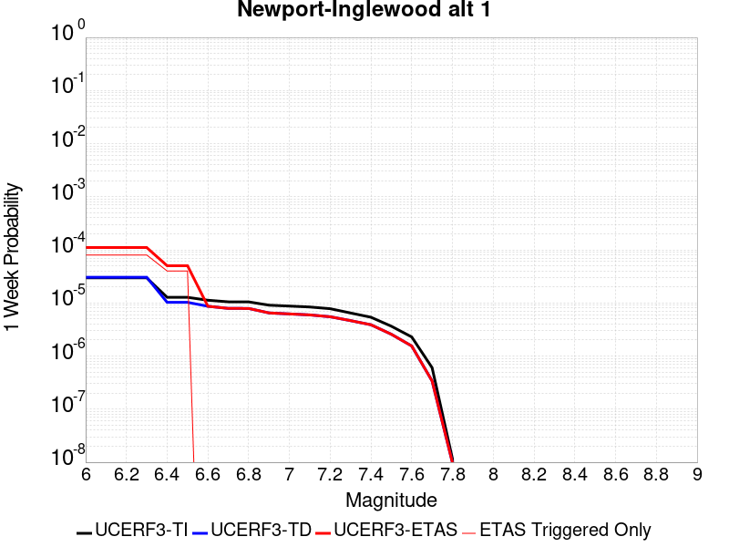 | 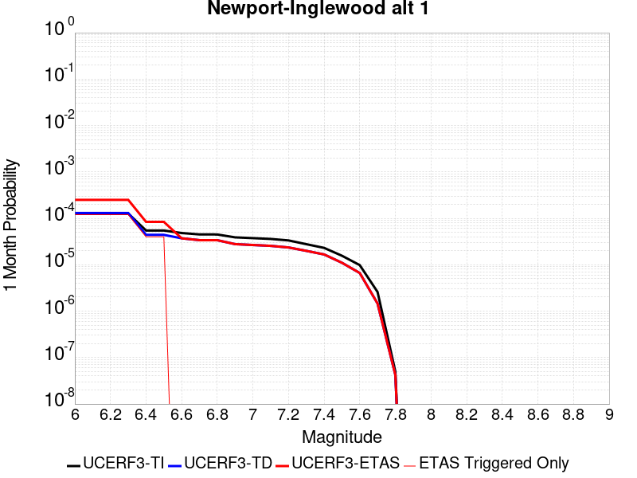 | 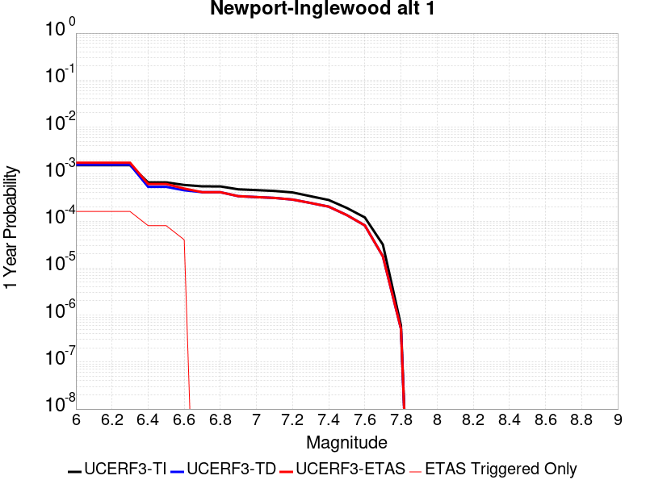 |

| Magnitude | 1 wk TI Prob | 1 wk TD Prob | 1 wk ETAS Prob | 1 wk ETAS/TD Gain | 1 wk ETAS Triggered Only | 1 mo TI Prob | 1 mo TD Prob | 1 mo ETAS Prob | 1 mo ETAS/TD Gain | 1 mo ETAS Triggered Only | 1 yr TI Prob | 1 yr TD Prob | 1 yr ETAS Prob | 1 yr ETAS/TD Gain | 1 yr ETAS Triggered Only |
|-----|-----|-----|-----|-----|-----|-----|-----|-----|-----|-----|-----|-----|-----|-----|-----|
| 6.0 | 2.9668912E-5 | 3.042145E-5 | 1.10419016E-4 | 3.6296434 | 8.0E-5 | 1.2714628E-4 | 1.3037387E-4 | 2.5035822E-4 | 1.9203098 | 1.2E-4 | 0.0015469068 | 0.0015866318 | 0.0017463779 | 1.1006825 | 1.6E-4 |
| 6.1 | 2.9668912E-5 | 3.042145E-5 | 1.10419016E-4 | 3.6296434 | 8.0E-5 | 1.2714628E-4 | 1.3037387E-4 | 2.5035822E-4 | 1.9203098 | 1.2E-4 | 0.0015469068 | 0.0015866318 | 0.0017463779 | 1.1006825 | 1.6E-4 |
| 6.2 | 2.9668912E-5 | 3.042145E-5 | 1.10419016E-4 | 3.6296434 | 8.0E-5 | 1.2714628E-4 | 1.3037387E-4 | 2.5035822E-4 | 1.9203098 | 1.2E-4 | 0.0015469068 | 0.0015866318 | 0.0017463779 | 1.1006825 | 1.6E-4 |
| 6.3 | 2.9668912E-5 | 3.042145E-5 | 1.10419016E-4 | 3.6296434 | 8.0E-5 | 1.2714628E-4 | 1.3037387E-4 | 2.5035822E-4 | 1.9203098 | 1.2E-4 | 0.0015469068 | 0.0015866318 | 0.0017463779 | 1.1006825 | 1.6E-4 |
| 6.4 | 1.275942E-5 | 1.0275527E-5 | 5.0275117E-5 | 4.8927045 | 4.0E-5 | 5.4682085E-5 | 4.4037253E-5 | 8.403549E-5 | 1.9082819 | 4.0E-5 | 6.65551E-4 | 5.3602585E-4 | 6.159829E-4 | 1.1491666 | 8.0E-5 |
| 6.5 | 1.275942E-5 | 1.0275527E-5 | 5.0275117E-5 | 4.8927045 | 4.0E-5 | 5.4682085E-5 | 4.4037253E-5 | 8.403549E-5 | 1.9082819 | 4.0E-5 | 6.65551E-4 | 5.3602585E-4 | 6.159829E-4 | 1.1491666 | 8.0E-5 |
| 6.6 | 1.1255358E-5 | 8.664203E-6 | 8.664203E-6 | 1.0 | 0.0 | 4.8236358E-5 | 3.7131776E-5 | 3.7131776E-5 | 1.0 | 0.0 | 5.871194E-4 | 4.5198732E-4 | 4.9196923E-4 | 1.0884581 | 4.0E-5 |
| 6.7 | 1.0504745E-5 | 7.90187E-6 | 7.90187E-6 | 1.0 | 0.0 | 4.5019555E-5 | 3.3864726E-5 | 3.3864726E-5 | 1.0 | 0.0 | 5.4797524E-4 | 4.1222628E-4 | 4.1222628E-4 | 1.0 | 0.0 |
| 6.8 | 1.0476007E-5 | 7.883248E-6 | 7.883248E-6 | 1.0 | 0.0 | 4.4896402E-5 | 3.3784916E-5 | 3.3784916E-5 | 1.0 | 0.0 | 5.464766E-4 | 4.1125497E-4 | 4.1125497E-4 | 1.0 | 0.0 |
| 6.9 | 9.076797E-6 | 6.4912397E-6 | 6.4912397E-6 | 1.0 | 0.0 | 3.889998E-5 | 2.7819304E-5 | 2.7819304E-5 | 1.0 | 0.0 | 4.7350433E-4 | 3.3864772E-4 | 3.3864772E-4 | 1.0 | 0.0 |
| 7.0 | 8.73795E-6 | 6.2135855E-6 | 6.2135855E-6 | 1.0 | 0.0 | 3.7447822E-5 | 2.6629381E-5 | 2.6629381E-5 | 1.0 | 0.0 | 4.5583185E-4 | 3.2416475E-4 | 3.2416475E-4 | 1.0 | 0.0 |
| 7.1 | 8.391299E-6 | 5.957252E-6 | 5.957252E-6 | 1.0 | 0.0 | 3.5962214E-5 | 2.5530831E-5 | 2.5530831E-5 | 1.0 | 0.0 | 4.37752E-4 | 3.107938E-4 | 3.107938E-4 | 1.0 | 0.0 |
| 7.2 | 7.796882E-6 | 5.4978805E-6 | 5.4978805E-6 | 1.0 | 0.0 | 3.341478E-5 | 2.3562134E-5 | 2.3562134E-5 | 1.0 | 0.0 | 4.06749E-4 | 2.8683143E-4 | 2.8683143E-4 | 1.0 | 0.0 |
| 7.3 | 6.4738833E-6 | 4.6488503E-6 | 4.6488503E-6 | 1.0 | 0.0 | 2.774492E-5 | 1.9923493E-5 | 1.9923493E-5 | 1.0 | 0.0 | 3.3774204E-4 | 2.4254168E-4 | 2.4254168E-4 | 1.0 | 0.0 |
| 7.4 | 5.382145E-6 | 3.886563E-6 | 3.886563E-6 | 1.0 | 0.0 | 2.3066134E-5 | 1.6656593E-5 | 1.6656593E-5 | 1.0 | 0.0 | 2.8079396E-4 | 2.0277528E-4 | 2.0277528E-4 | 1.0 | 0.0 |
| 7.5 | 3.648244E-6 | 2.5743657E-6 | 2.5743657E-6 | 1.0 | 0.0 | 1.5635238E-5 | 1.103295E-5 | 1.103295E-5 | 1.0 | 0.0 | 1.9034238E-4 | 1.3431799E-4 | 1.3431799E-4 | 1.0 | 0.0 |
| 7.6 | 2.2906888E-6 | 1.5483535E-6 | 1.5483535E-6 | 1.0 | 0.0 | 9.817201E-6 | 6.635784E-6 | 6.635784E-6 | 1.0 | 0.0 | 1.1951787E-4 | 8.078774E-5 | 8.078774E-5 | 1.0 | 0.0 |
| 7.7 | 6.0479874E-7 | 3.3983838E-7 | 3.3983838E-7 | 1.0 | 0.0 | 2.5919921E-6 | 1.4564495E-6 | 1.4564495E-6 | 1.0 | 0.0 | 3.1557047E-5 | 1.7732142E-5 | 1.7732142E-5 | 1.0 | 0.0 |
| 7.8 | 1.16056995E-8 | 9.78305E-9 | 9.78305E-9 | 1.0 | 0.0 | 4.9738713E-8 | 4.1927358E-8 | 4.1927358E-8 | 1.0 | 0.0 | 6.0556863E-7 | 5.1046555E-7 | 5.1046555E-7 | 1.0 | 0.0 |

## Coyote Lake
*[(top)](#table-of-contents)*

| 1 Week | 1 Month | 1 Year |
|-----|-----|-----|
| 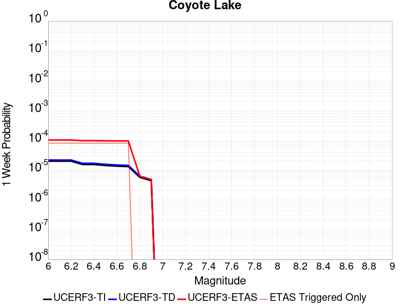 | 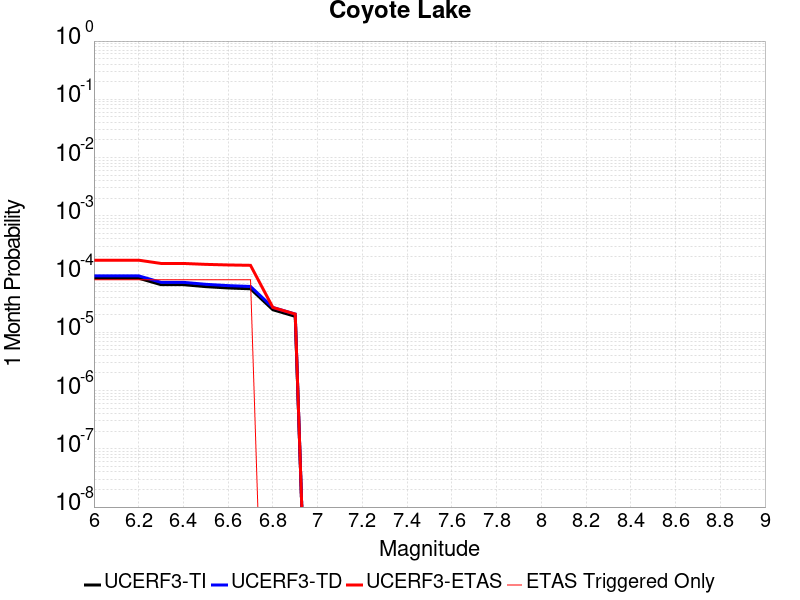 | 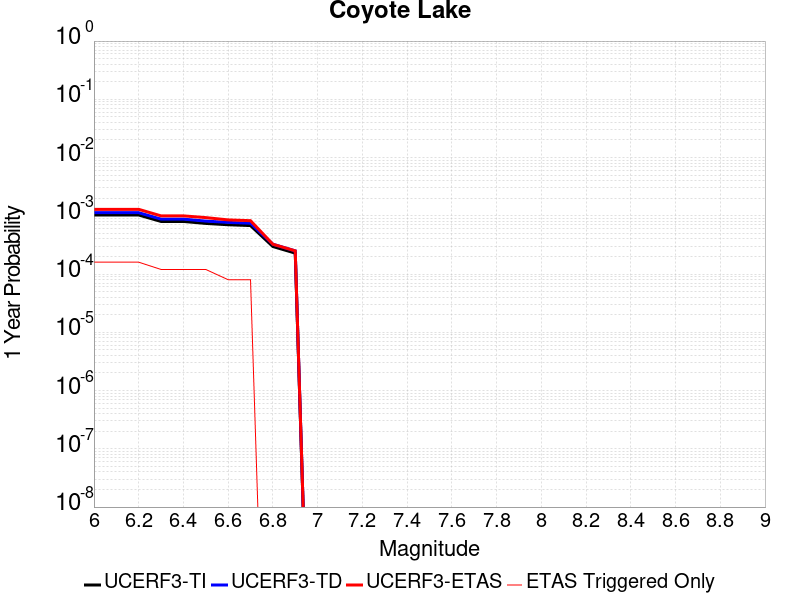 |

| Magnitude | 1 wk TI Prob | 1 wk TD Prob | 1 wk ETAS Prob | 1 wk ETAS/TD Gain | 1 wk ETAS Triggered Only | 1 mo TI Prob | 1 mo TD Prob | 1 mo ETAS Prob | 1 mo ETAS/TD Gain | 1 mo ETAS Triggered Only | 1 yr TI Prob | 1 yr TD Prob | 1 yr ETAS Prob | 1 yr ETAS/TD Gain | 1 yr ETAS Triggered Only |
|-----|-----|-----|-----|-----|-----|-----|-----|-----|-----|-----|-----|-----|-----|-----|-----|
| 6.0 | 1.980352E-5 | 2.1713819E-5 | 1.0171208E-4 | 4.68421 | 8.0E-5 | 8.486947E-5 | 9.305631E-5 | 1.7304887E-4 | 1.8596145 | 8.0E-5 | 0.0010327959 | 0.0011324438 | 0.0012922626 | 1.1411273 | 1.6E-4 |
| 6.1 | 1.980352E-5 | 2.1713819E-5 | 1.0171208E-4 | 4.68421 | 8.0E-5 | 8.486947E-5 | 9.305631E-5 | 1.7304887E-4 | 1.8596145 | 8.0E-5 | 0.0010327959 | 0.0011324438 | 0.0012922626 | 1.1411273 | 1.6E-4 |
| 6.2 | 1.980352E-5 | 2.1713819E-5 | 1.0171208E-4 | 4.68421 | 8.0E-5 | 8.486947E-5 | 9.305631E-5 | 1.7304887E-4 | 1.8596145 | 8.0E-5 | 0.0010327959 | 0.0011324438 | 0.0012922626 | 1.1411273 | 1.6E-4 |
| 6.3 | 1.5344787E-5 | 1.6826156E-5 | 9.6824806E-5 | 5.7544227 | 8.0E-5 | 6.576172E-5 | 7.2110444E-5 | 1.5210468E-4 | 2.1093292 | 8.0E-5 | 8.003548E-4 | 8.776523E-4 | 9.975471E-4 | 1.1366084 | 1.2E-4 |
| 6.4 | 1.5344787E-5 | 1.6826156E-5 | 9.6824806E-5 | 5.7544227 | 8.0E-5 | 6.576172E-5 | 7.2110444E-5 | 1.5210468E-4 | 2.1093292 | 8.0E-5 | 8.003548E-4 | 8.776523E-4 | 9.975471E-4 | 1.1366084 | 1.2E-4 |
| 6.5 | 1.4189697E-5 | 1.5563075E-5 | 9.556183E-5 | 6.1402926 | 8.0E-5 | 6.081157E-5 | 6.6697525E-5 | 1.466922E-4 | 2.199365 | 8.0E-5 | 7.401293E-4 | 8.118002E-4 | 9.317028E-4 | 1.1476996 | 1.2E-4 |
| 6.6 | 1.3469301E-5 | 1.4776421E-5 | 9.477524E-5 | 6.413951 | 8.0E-5 | 5.7724297E-5 | 6.332632E-5 | 1.4332126E-4 | 2.263218 | 8.0E-5 | 7.025667E-4 | 7.707852E-4 | 8.5072353E-4 | 1.1037103 | 8.0E-5 |
| 6.7 | 1.3027966E-5 | 1.4286406E-5 | 9.4285264E-5 | 6.599649 | 8.0E-5 | 5.5832945E-5 | 6.1226354E-5 | 1.4122146E-4 | 2.306547 | 8.0E-5 | 6.7955407E-4 | 7.452357E-4 | 8.251761E-4 | 1.1072686 | 8.0E-5 |
| 6.8 | 5.695434E-6 | 6.2263775E-6 | 6.2263775E-6 | 1.0 | 0.0 | 2.4408775E-5 | 2.668437E-5 | 2.668437E-5 | 1.0 | 0.0 | 2.971363E-4 | 3.248638E-4 | 3.248638E-4 | 1.0 | 0.0 |
| 6.9 | 4.385688E-6 | 4.7945646E-6 | 4.7945646E-6 | 1.0 | 0.0 | 1.879567E-5 | 2.0548134E-5 | 2.0548134E-5 | 1.0 | 0.0 | 2.2881327E-4 | 2.5017353E-4 | 2.5017353E-4 | 1.0 | 0.0 |

## Helendale-So Lockhart
*[(top)](#table-of-contents)*

| 1 Week | 1 Month | 1 Year |
|-----|-----|-----|
|  | 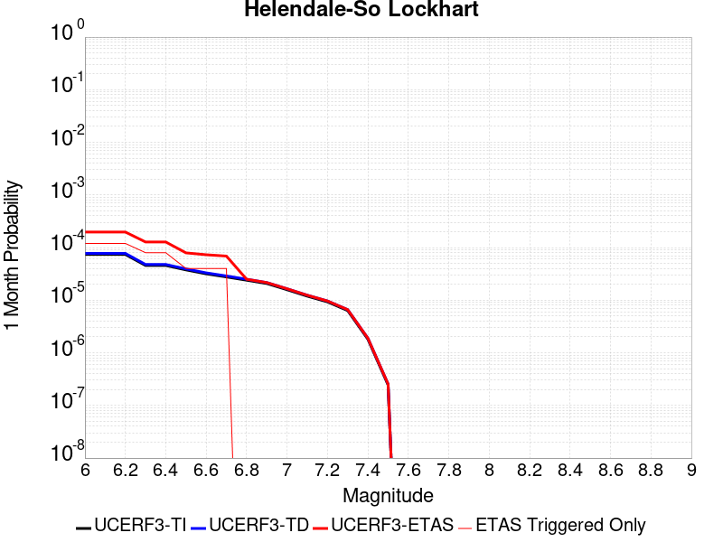 | 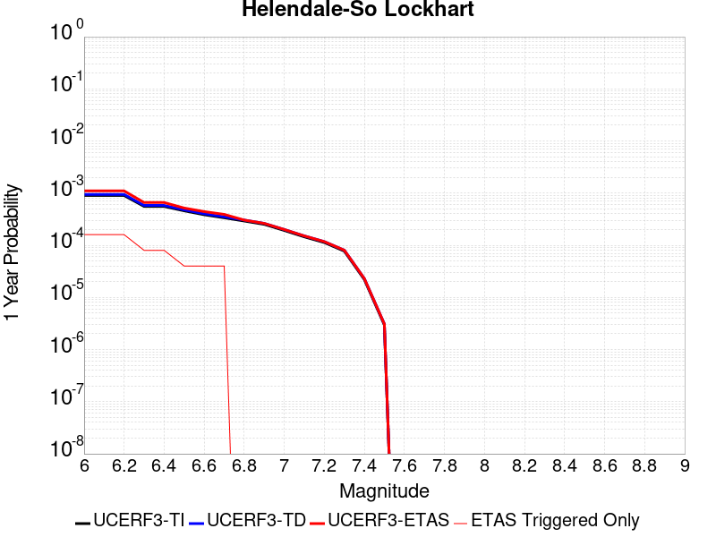 |

| Magnitude | 1 wk TI Prob | 1 wk TD Prob | 1 wk ETAS Prob | 1 wk ETAS/TD Gain | 1 wk ETAS Triggered Only | 1 mo TI Prob | 1 mo TD Prob | 1 mo ETAS Prob | 1 mo ETAS/TD Gain | 1 mo ETAS Triggered Only | 1 yr TI Prob | 1 yr TD Prob | 1 yr ETAS Prob | 1 yr ETAS/TD Gain | 1 yr ETAS Triggered Only |
|-----|-----|-----|-----|-----|-----|-----|-----|-----|-----|-----|-----|-----|-----|-----|-----|
| 6.0 | 1.7296055E-5 | 1.81066E-5 | 9.810515E-5 | 5.418198 | 8.0E-5 | 7.412385E-5 | 7.759753E-5 | 1.9758822E-4 | 2.5463212 | 1.2E-4 | 9.0208417E-4 | 9.4436115E-4 | 0.00110421 | 1.1692667 | 1.6E-4 |
| 6.1 | 1.7296055E-5 | 1.81066E-5 | 9.810515E-5 | 5.418198 | 8.0E-5 | 7.412385E-5 | 7.759753E-5 | 1.9758822E-4 | 2.5463212 | 1.2E-4 | 9.0208417E-4 | 9.4436115E-4 | 0.00110421 | 1.1692667 | 1.6E-4 |
| 6.2 | 1.7296055E-5 | 1.81066E-5 | 9.810515E-5 | 5.418198 | 8.0E-5 | 7.412385E-5 | 7.759753E-5 | 1.9758822E-4 | 2.5463212 | 1.2E-4 | 9.0208417E-4 | 9.4436115E-4 | 0.00110421 | 1.1692667 | 1.6E-4 |
| 6.3 | 1.0669118E-5 | 1.1137076E-5 | 5.113663E-5 | 4.591567 | 4.0E-5 | 4.5723988E-5 | 4.772947E-5 | 1.2772565E-4 | 2.6760333 | 8.0E-5 | 5.5654737E-4 | 5.8095413E-4 | 6.6090765E-4 | 1.1376245 | 8.0E-5 |
| 6.4 | 1.0669118E-5 | 1.1137076E-5 | 5.113663E-5 | 4.591567 | 4.0E-5 | 4.5723988E-5 | 4.772947E-5 | 1.2772565E-4 | 2.6760333 | 8.0E-5 | 5.5654737E-4 | 5.8095413E-4 | 6.6090765E-4 | 1.1376245 | 8.0E-5 |
| 6.5 | 8.790038E-6 | 9.171543E-6 | 9.171543E-6 | 1.0 | 0.0 | 3.767105E-5 | 3.930603E-5 | 7.930446E-5 | 2.0176156 | 4.0E-5 | 4.585485E-4 | 4.784474E-4 | 5.184282E-4 | 1.0835638 | 4.0E-5 |
| 6.6 | 7.396949E-6 | 7.716665E-6 | 7.716665E-6 | 1.0 | 0.0 | 3.1700827E-5 | 3.3071006E-5 | 7.3069685E-5 | 2.2094786 | 4.0E-5 | 3.858892E-4 | 4.0256613E-4 | 4.4255005E-4 | 1.0993226 | 4.0E-5 |
| 6.7 | 6.4600285E-6 | 6.739015E-6 | 6.739015E-6 | 1.0 | 0.0 | 2.7685543E-5 | 2.8881179E-5 | 6.888002E-5 | 2.384945 | 4.0E-5 | 3.3701936E-4 | 3.515724E-4 | 3.9155834E-4 | 1.1137346 | 4.0E-5 |
| 6.8 | 5.600104E-6 | 5.8368437E-6 | 5.8368437E-6 | 1.0 | 0.0 | 2.4000226E-5 | 2.5014808E-5 | 2.5014808E-5 | 1.0 | 0.0 | 2.9216358E-4 | 3.0451332E-4 | 3.0451332E-4 | 1.0 | 0.0 |
| 6.9 | 4.839122E-6 | 5.0402173E-6 | 5.0402173E-6 | 1.0 | 0.0 | 2.0738931E-5 | 2.1600754E-5 | 2.1600754E-5 | 1.0 | 0.0 | 2.5246723E-4 | 2.629579E-4 | 2.629579E-4 | 1.0 | 0.0 |
| 7.0 | 3.6937633E-6 | 3.8457424E-6 | 3.8457424E-6 | 1.0 | 0.0 | 1.5830317E-5 | 1.6481652E-5 | 1.6481652E-5 | 1.0 | 0.0 | 1.9271708E-4 | 2.0064594E-4 | 2.0064594E-4 | 1.0 | 0.0 |
| 7.1 | 2.7858857E-6 | 2.8982486E-6 | 2.8982486E-6 | 1.0 | 0.0 | 1.1939455E-5 | 1.2421007E-5 | 1.2421007E-5 | 1.0 | 0.0 | 1.4535317E-4 | 1.5121548E-4 | 1.5121548E-4 | 1.0 | 0.0 |
| 7.2 | 2.1672065E-6 | 2.2543188E-6 | 2.2543188E-6 | 1.0 | 0.0 | 9.2879945E-6 | 9.661331E-6 | 9.661331E-6 | 1.0 | 0.0 | 1.1307546E-4 | 1.1762055E-4 | 1.1762055E-4 | 1.0 | 0.0 |
| 7.3 | 1.4823496E-6 | 1.5424213E-6 | 1.5424213E-6 | 1.0 | 0.0 | 6.3529114E-6 | 6.610361E-6 | 6.610361E-6 | 1.0 | 0.0 | 7.734395E-5 | 8.047833E-5 | 8.047833E-5 | 1.0 | 0.0 |
| 7.4 | 4.2321457E-7 | 4.411508E-7 | 4.411508E-7 | 1.0 | 0.0 | 1.8137755E-6 | 1.8906451E-6 | 1.8906451E-6 | 1.0 | 0.0 | 2.2082493E-5 | 2.3018407E-5 | 2.3018407E-5 | 1.0 | 0.0 |
| 7.5 | 5.6942316E-8 | 5.9424394E-8 | 5.9424394E-8 | 1.0 | 0.0 | 2.440385E-7 | 2.5467594E-7 | 2.5467594E-7 | 1.0 | 0.0 | 2.9711643E-6 | 3.1006762E-6 | 3.1006762E-6 | 1.0 | 0.0 |

## Superstition Hills
*[(top)](#table-of-contents)*

| 1 Week | 1 Month | 1 Year |
|-----|-----|-----|
| 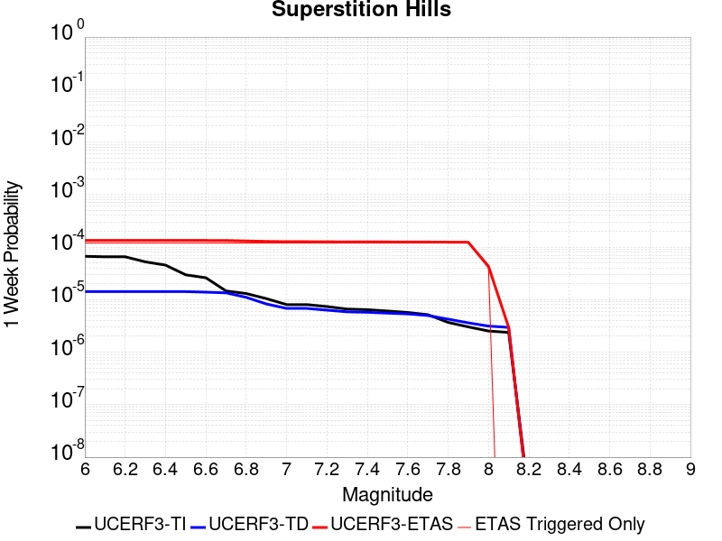 | 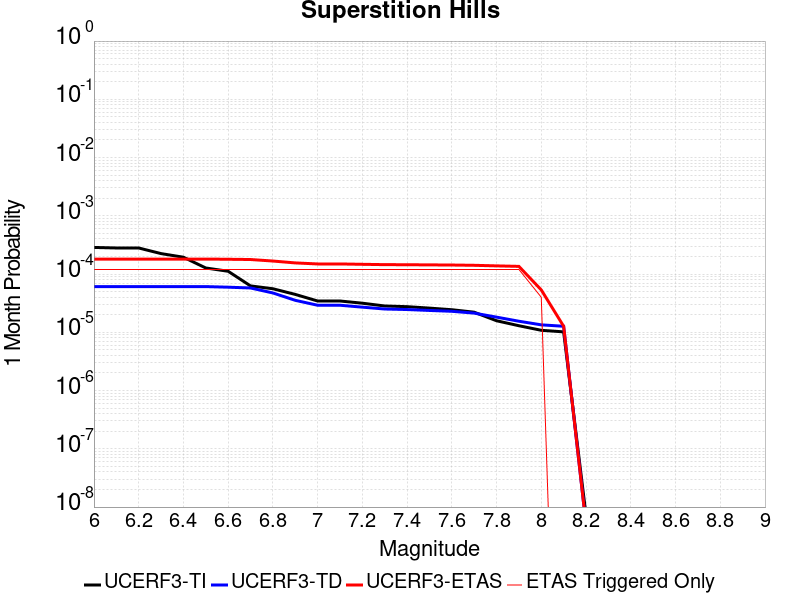 | 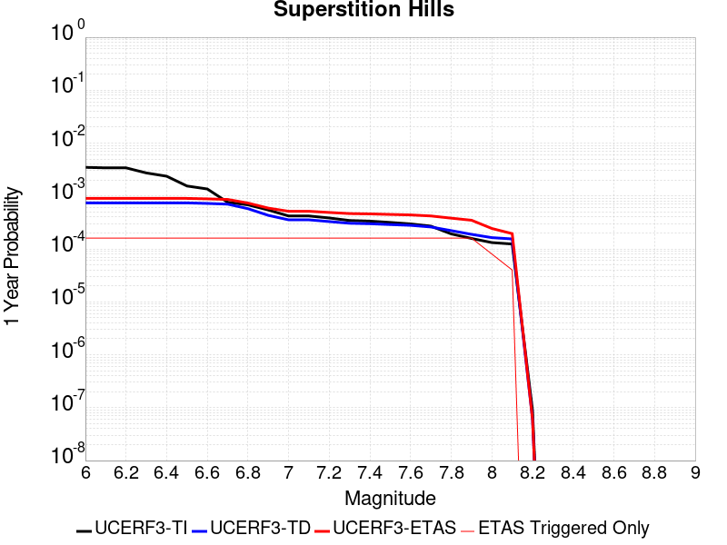 |

| Magnitude | 1 wk TI Prob | 1 wk TD Prob | 1 wk ETAS Prob | 1 wk ETAS/TD Gain | 1 wk ETAS Triggered Only | 1 mo TI Prob | 1 mo TD Prob | 1 mo ETAS Prob | 1 mo ETAS/TD Gain | 1 mo ETAS Triggered Only | 1 yr TI Prob | 1 yr TD Prob | 1 yr ETAS Prob | 1 yr ETAS/TD Gain | 1 yr ETAS Triggered Only |
|-----|-----|-----|-----|-----|-----|-----|-----|-----|-----|-----|-----|-----|-----|-----|-----|
| 6.0 | 6.6865185E-5 | 1.4218968E-5 | 1.3421726E-4 | 9.439311 | 1.2E-4 | 2.8653358E-4 | 6.09371E-5 | 1.809298E-4 | 2.9691236 | 1.2E-4 | 0.0034829667 | 7.4167293E-4 | 9.015543E-4 | 1.2155685 | 1.6E-4 |
| 6.1 | 6.544851E-5 | 1.4218967E-5 | 1.3421726E-4 | 9.439311 | 1.2E-4 | 2.8046346E-4 | 6.09371E-5 | 1.8092978E-4 | 2.9691236 | 1.2E-4 | 0.0034092965 | 7.4167293E-4 | 9.015543E-4 | 1.2155685 | 1.6E-4 |
| 6.2 | 6.544851E-5 | 1.4218967E-5 | 1.3421726E-4 | 9.439311 | 1.2E-4 | 2.8046346E-4 | 6.09371E-5 | 1.8092978E-4 | 2.9691236 | 1.2E-4 | 0.0034092965 | 7.4167293E-4 | 9.015543E-4 | 1.2155685 | 1.6E-4 |
| 6.3 | 5.2402065E-5 | 1.42189665E-5 | 1.3421726E-4 | 9.439312 | 1.2E-4 | 2.2456095E-4 | 6.0937098E-5 | 1.8092978E-4 | 2.9691238 | 1.2E-4 | 0.0027306017 | 7.416729E-4 | 9.0155425E-4 | 1.2155685 | 1.6E-4 |
| 6.4 | 4.542238E-5 | 1.4218966E-5 | 1.3421726E-4 | 9.439312 | 1.2E-4 | 1.9465282E-4 | 6.0937095E-5 | 1.8092978E-4 | 2.9691238 | 1.2E-4 | 0.0023673223 | 7.416729E-4 | 9.015542E-4 | 1.2155685 | 1.6E-4 |
| 6.5 | 2.9672969E-5 | 1.4218965E-5 | 1.3421726E-4 | 9.439313 | 1.2E-4 | 1.2716366E-4 | 6.0937087E-5 | 1.8092977E-4 | 2.969124 | 1.2E-4 | 0.0015471181 | 7.4167276E-4 | 9.015541E-4 | 1.2155685 | 1.6E-4 |
| 6.6 | 2.6056105E-5 | 1.3884164E-5 | 1.338825E-4 | 9.64282 | 1.2E-4 | 1.1166424E-4 | 5.9502294E-5 | 1.7949515E-4 | 3.016609 | 1.2E-4 | 0.0013586642 | 7.242158E-4 | 8.840999E-4 | 1.2207686 | 1.6E-4 |
| 6.7 | 1.4611248E-5 | 1.3463621E-5 | 1.33462E-4 | 9.9127865 | 1.2E-4 | 6.261813E-5 | 5.770005E-5 | 1.7769313E-4 | 3.079601 | 1.2E-4 | 7.6210906E-4 | 7.022877E-4 | 8.621753E-4 | 1.2276669 | 1.6E-4 |
| 6.8 | 1.30607E-5 | 1.1055474E-5 | 1.3105414E-4 | 11.854232 | 1.2E-4 | 5.597323E-5 | 4.7379788E-5 | 1.673741E-4 | 3.5326054 | 1.2E-4 | 6.8126095E-4 | 5.7670503E-4 | 7.3661277E-4 | 1.2772782 | 1.6E-4 |
| 6.9 | 1.0443096E-5 | 8.264937E-6 | 1.2826394E-4 | 15.519048 | 1.2E-4 | 4.4755358E-5 | 3.542069E-5 | 1.5541643E-4 | 4.3877306 | 1.2E-4 | 5.447602E-4 | 4.311639E-4 | 5.9109495E-4 | 1.3709285 | 1.6E-4 |
| 7.0 | 8.045912E-6 | 6.8031186E-6 | 1.268023E-4 | 18.63885 | 1.2E-4 | 3.4482026E-5 | 2.9155903E-5 | 1.491524E-4 | 5.1156845 | 1.2E-4 | 4.197378E-4 | 3.5491635E-4 | 5.1485957E-4 | 1.4506505 | 1.6E-4 |
| 7.1 | 8.045912E-6 | 6.8031186E-6 | 1.268023E-4 | 18.63885 | 1.2E-4 | 3.4482026E-5 | 2.9155903E-5 | 1.491524E-4 | 5.1156845 | 1.2E-4 | 4.197378E-4 | 3.5491635E-4 | 5.1485957E-4 | 1.4506505 | 1.6E-4 |
| 7.2 | 7.375506E-6 | 6.3088987E-6 | 1.2630814E-4 | 20.020634 | 1.2E-4 | 3.1608928E-5 | 2.703786E-5 | 1.4703462E-4 | 5.438101 | 1.2E-4 | 3.8477074E-4 | 3.291371E-4 | 4.8908446E-4 | 1.4859596 | 1.6E-4 |
| 7.3 | 6.6063913E-6 | 5.8603323E-6 | 1.2585963E-4 | 21.476536 | 1.2E-4 | 2.8312797E-5 | 2.5115472E-5 | 1.4511246E-4 | 5.7778115 | 1.2E-4 | 3.446538E-4 | 3.0573868E-4 | 4.6568978E-4 | 1.5231627 | 1.6E-4 |
| 7.4 | 6.4313126E-6 | 5.741554E-6 | 1.2574086E-4 | 21.900145 | 1.2E-4 | 2.7562477E-5 | 2.4606434E-5 | 1.4460349E-4 | 5.8766537 | 1.2E-4 | 3.355215E-4 | 2.9954285E-4 | 4.594949E-4 | 1.5339873 | 1.6E-4 |
| 7.5 | 6.0742927E-6 | 5.536644E-6 | 1.2553598E-4 | 22.67366 | 1.2E-4 | 2.6032423E-5 | 2.3728262E-5 | 1.4372541E-4 | 6.0571404 | 1.2E-4 | 3.1689866E-4 | 2.8885397E-4 | 4.4880775E-4 | 1.5537531 | 1.6E-4 |
| 7.6 | 5.6987187E-6 | 5.354077E-6 | 1.2535343E-4 | 23.412706 | 1.2E-4 | 2.4422852E-5 | 2.2945846E-5 | 1.429431E-4 | 6.2295847 | 1.2E-4 | 2.9730765E-4 | 2.7933053E-4 | 4.3928585E-4 | 1.572638 | 1.6E-4 |
| 7.7 | 5.1658035E-6 | 4.9836003E-6 | 1.2498301E-4 | 25.078857 | 1.2E-4 | 2.2138971E-5 | 2.1358117E-5 | 1.4135556E-4 | 6.618353 | 1.2E-4 | 2.6950863E-4 | 2.6000466E-4 | 4.1996306E-4 | 1.6152136 | 1.6E-4 |
| 7.8 | 3.6864697E-6 | 4.2522647E-6 | 1.2425176E-4 | 29.220137 | 1.2E-4 | 1.579906E-5 | 1.8223867E-5 | 1.3822169E-4 | 7.5846515 | 1.2E-4 | 1.9233658E-4 | 2.2185346E-4 | 3.8181798E-4 | 1.7210368 | 1.6E-4 |
| 7.9 | 3.0265903E-6 | 3.6154697E-6 | 1.2361504E-4 | 34.19059 | 1.2E-4 | 1.2971037E-5 | 1.5494781E-5 | 1.3549293E-4 | 8.744424 | 1.2E-4 | 1.5791094E-4 | 1.8863307E-4 | 3.486029E-4 | 1.8480476 | 1.6E-4 |
| 8.0 | 2.5271493E-6 | 3.1343482E-6 | 4.3134223E-5 | 13.761785 | 4.0E-5 | 1.0830595E-5 | 1.3432854E-5 | 5.3432315E-5 | 3.9777339 | 4.0E-5 | 1.3185451E-4 | 1.6353316E-4 | 2.4352007E-4 | 1.4891175 | 8.0E-5 |
| 8.1 | 2.3749135E-6 | 2.9629962E-6 | 2.9629962E-6 | 1.0 | 0.0 | 1.0178161E-5 | 1.2698496E-5 | 1.2698496E-5 | 1.0 | 0.0 | 1.2391206E-4 | 1.5459364E-4 | 1.9458747E-4 | 1.2587029 | 4.0E-5 |
| 8.2 | 1.7186406E-9 | 1.1663186E-9 | 1.1663186E-9 | 1.0 | 0.0 | 7.3656024E-9 | 4.9985083E-9 | 4.9985083E-9 | 1.0 | 0.0 | 8.9676206E-8 | 6.085684E-8 | 6.085684E-8 | 1.0 | 0.0 |

## La Panza 2011
*[(top)](#table-of-contents)*

| 1 Week | 1 Month | 1 Year |
|-----|-----|-----|
| 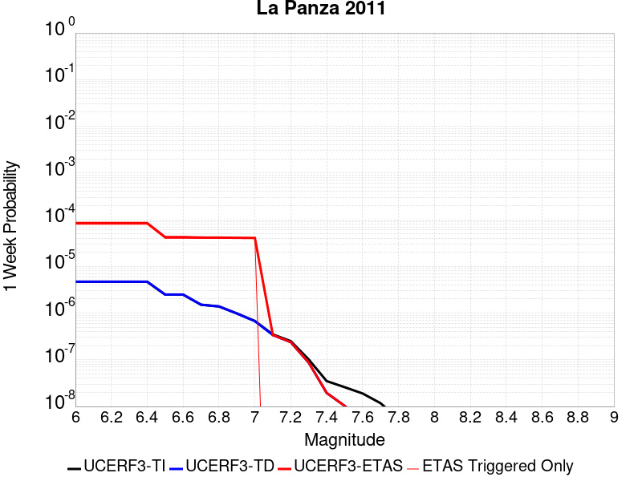 | 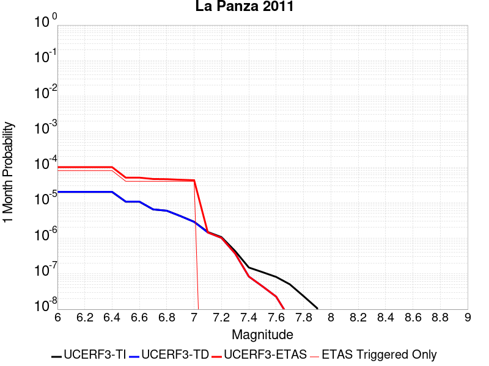 | 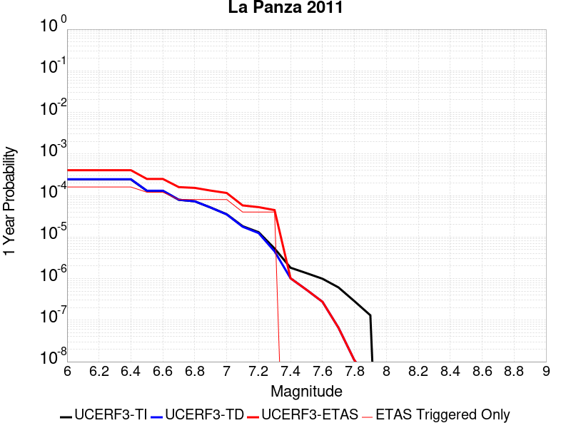 |

| Magnitude | 1 wk TI Prob | 1 wk TD Prob | 1 wk ETAS Prob | 1 wk ETAS/TD Gain | 1 wk ETAS Triggered Only | 1 mo TI Prob | 1 mo TD Prob | 1 mo ETAS Prob | 1 mo ETAS/TD Gain | 1 mo ETAS Triggered Only | 1 yr TI Prob | 1 yr TD Prob | 1 yr ETAS Prob | 1 yr ETAS/TD Gain | 1 yr ETAS Triggered Only |
|-----|-----|-----|-----|-----|-----|-----|-----|-----|-----|-----|-----|-----|-----|-----|-----|
| 6.0 | 4.6754544E-6 | 4.718128E-6 | 8.471775E-5 | 17.9558 | 8.0E-5 | 2.0037509E-5 | 2.0220401E-5 | 1.00218786E-4 | 4.9563203 | 8.0E-5 | 2.4392935E-4 | 2.4615755E-4 | 4.0611817E-4 | 1.6498302 | 1.6E-4 |
| 6.1 | 4.6754544E-6 | 4.718128E-6 | 8.471775E-5 | 17.9558 | 8.0E-5 | 2.0037509E-5 | 2.0220401E-5 | 1.00218786E-4 | 4.9563203 | 8.0E-5 | 2.4392935E-4 | 2.4615755E-4 | 4.0611817E-4 | 1.6498302 | 1.6E-4 |
| 6.2 | 4.6754544E-6 | 4.718128E-6 | 8.471775E-5 | 17.9558 | 8.0E-5 | 2.0037509E-5 | 2.0220401E-5 | 1.00218786E-4 | 4.9563203 | 8.0E-5 | 2.4392935E-4 | 2.4615755E-4 | 4.0611817E-4 | 1.6498302 | 1.6E-4 |
| 6.3 | 4.6754544E-6 | 4.718128E-6 | 8.471775E-5 | 17.9558 | 8.0E-5 | 2.0037509E-5 | 2.0220401E-5 | 1.00218786E-4 | 4.9563203 | 8.0E-5 | 2.4392935E-4 | 2.4615755E-4 | 4.0611817E-4 | 1.6498302 | 1.6E-4 |
| 6.4 | 4.6754544E-6 | 4.718128E-6 | 8.471775E-5 | 17.9558 | 8.0E-5 | 2.0037509E-5 | 2.0220401E-5 | 1.00218786E-4 | 4.9563203 | 8.0E-5 | 2.4392935E-4 | 2.4615755E-4 | 4.0611817E-4 | 1.6498302 | 1.6E-4 |
| 6.5 | 2.485343E-6 | 2.5010474E-6 | 4.2500946E-5 | 16.99326 | 4.0E-5 | 1.0651426E-5 | 1.0718733E-5 | 5.0718303E-5 | 4.7317443 | 4.0E-5 | 1.296734E-4 | 1.3049315E-4 | 2.504775E-4 | 1.9194685 | 1.2E-4 |
| 6.6 | 2.485343E-6 | 2.5010474E-6 | 4.2500946E-5 | 16.99326 | 4.0E-5 | 1.0651426E-5 | 1.0718733E-5 | 5.0718303E-5 | 4.7317443 | 4.0E-5 | 1.296734E-4 | 1.3049315E-4 | 2.504775E-4 | 1.9194685 | 1.2E-4 |
| 6.7 | 1.5108508E-6 | 1.5150466E-6 | 4.1514984E-5 | 27.401787 | 4.0E-5 | 6.4750584E-6 | 6.493042E-6 | 4.6492783E-5 | 7.160401 | 4.0E-5 | 7.8830984E-5 | 7.905002E-5 | 1.590437E-4 | 2.0119374 | 8.0E-5 |
| 6.8 | 1.3865837E-6 | 1.388913E-6 | 4.1388856E-5 | 29.799461 | 4.0E-5 | 5.942488E-6 | 5.9524714E-6 | 4.5952234E-5 | 7.719858 | 4.0E-5 | 7.234739E-5 | 7.2469025E-5 | 1.5246322E-4 | 2.1038399 | 8.0E-5 |
| 6.9 | 9.826583E-7 | 9.800144E-7 | 4.0979976E-5 | 41.815685 | 4.0E-5 | 4.2113857E-6 | 4.2000556E-6 | 4.419989E-5 | 10.5236435 | 4.0E-5 | 5.1272415E-5 | 5.113453E-5 | 1.3113044E-4 | 2.5644205 | 8.0E-5 |
| 7.0 | 6.7797646E-7 | 6.713938E-7 | 4.0671366E-5 | 60.577515 | 4.0E-5 | 2.9056102E-6 | 2.877399E-6 | 4.2877284E-5 | 14.901403 | 4.0E-5 | 3.537523E-5 | 3.50318E-5 | 1.15029E-4 | 3.2835593 | 8.0E-5 |
| 7.1 | 3.4979826E-7 | 3.3909706E-7 | 3.3909706E-7 | 1.0 | 0.0 | 1.4991346E-6 | 1.4532723E-6 | 1.4532723E-6 | 1.0 | 0.0 | 1.825181E-5 | 1.7693459E-5 | 5.7692752E-5 | 3.2606826 | 4.0E-5 |
| 7.2 | 2.5088332E-7 | 2.3867204E-7 | 2.3867204E-7 | 1.0 | 0.0 | 1.0752137E-6 | 1.0228798E-6 | 1.0228798E-6 | 1.0 | 0.0 | 1.3090649E-5 | 1.24535E-5 | 5.2453E-5 | 4.2119083 | 4.0E-5 |
| 7.3 | 1.0159086E-7 | 8.679035E-8 | 8.679035E-8 | 1.0 | 0.0 | 4.3538932E-7 | 3.719586E-7 | 3.719586E-7 | 1.0 | 0.0 | 5.300852E-6 | 4.528587E-6 | 4.4528406E-5 | 9.832737 | 4.0E-5 |
| 7.4 | 3.5006252E-8 | 1.9514188E-8 | 1.9514188E-8 | 1.0 | 0.0 | 1.5002678E-7 | 8.363222E-8 | 8.363222E-8 | 1.0 | 0.0 | 1.8265745E-6 | 1.018222E-6 | 1.018222E-6 | 1.0 | 0.0 |
| 7.5 | 2.592274E-8 | 1.03209565E-8 | 1.03209565E-8 | 1.0 | 0.0 | 1.1109746E-7 | 4.423267E-8 | 4.423267E-8 | 1.0 | 0.0 | 1.3526106E-6 | 5.385326E-7 | 5.385326E-7 | 1.0 | 0.0 |
| 7.6 | 1.9016717E-8 | 5.2971947E-9 | 5.2971947E-9 | 1.0 | 0.0 | 8.150022E-8 | 2.2702263E-8 | 2.2702263E-8 | 1.0 | 0.0 | 9.922647E-7 | 2.7640002E-7 | 2.7640002E-7 | 1.0 | 0.0 |
| 7.7 | 1.17738495E-8 | 1.2623281E-9 | 1.2623281E-9 | 1.0 | 0.0 | 5.0459356E-8 | 5.4099774E-9 | 5.4099774E-9 | 1.0 | 0.0 | 6.1434247E-7 | 6.586647E-8 | 6.586647E-8 | 1.0 | 0.0 |
| 7.8 | 5.489079E-9 | 2.0697699E-10 | 2.0697699E-10 | 1.0 | 0.0 | 2.3524624E-8 | 8.870432E-10 | 8.870432E-10 | 1.0 | 0.0 | 2.8641225E-7 | 1.0799752E-8 | 1.0799752E-8 | 1.0 | 0.0 |
| 7.9 | 2.5081048E-9 | 6.905543E-11 | 6.905543E-11 | 1.0 | 0.0 | 1.0749021E-8 | 2.959516E-10 | 2.959516E-10 | 1.0 | 0.0 | 1.3086932E-7 | 3.603212E-9 | 3.603212E-9 | 1.0 | 0.0 |

## Clamshell-Sawpit
*[(top)](#table-of-contents)*

| 1 Week | 1 Month | 1 Year |
|-----|-----|-----|
| 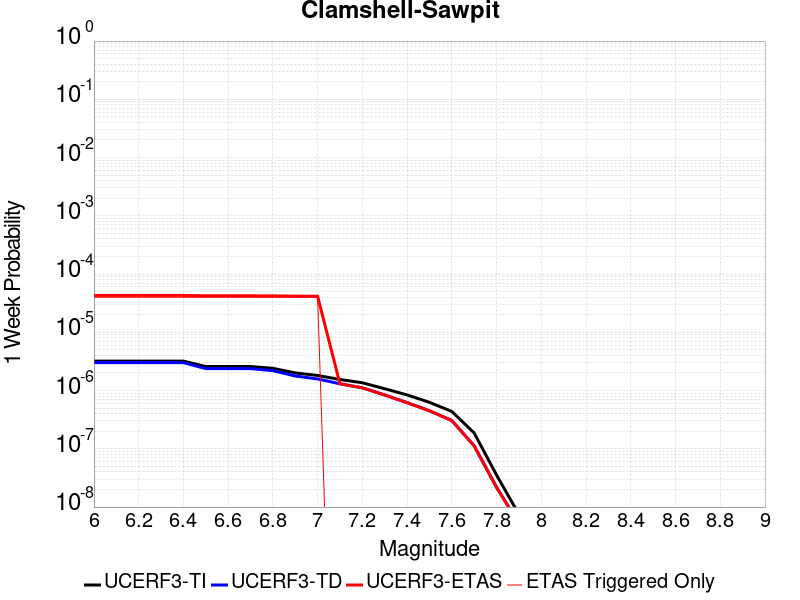 | 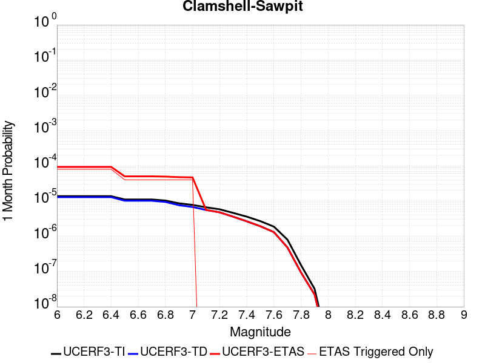 | 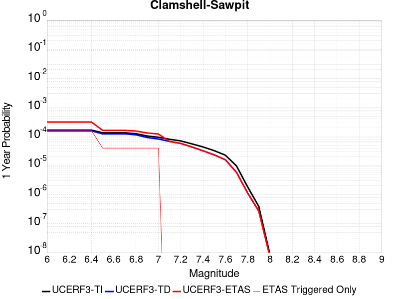 |

| Magnitude | 1 wk TI Prob | 1 wk TD Prob | 1 wk ETAS Prob | 1 wk ETAS/TD Gain | 1 wk ETAS Triggered Only | 1 mo TI Prob | 1 mo TD Prob | 1 mo ETAS Prob | 1 mo ETAS/TD Gain | 1 mo ETAS Triggered Only | 1 yr TI Prob | 1 yr TD Prob | 1 yr ETAS Prob | 1 yr ETAS/TD Gain | 1 yr ETAS Triggered Only |
|-----|-----|-----|-----|-----|-----|-----|-----|-----|-----|-----|-----|-----|-----|-----|-----|
| 6.0 | 3.202998E-6 | 3.013255E-6 | 4.3013133E-5 | 14.274641 | 4.0E-5 | 1.3727062E-5 | 1.2913892E-5 | 9.291286E-5 | 7.1947994 | 8.0E-5 | 1.6711417E-4 | 1.5721608E-4 | 3.1719095E-4 | 2.0175476 | 1.6E-4 |
| 6.1 | 3.202998E-6 | 3.013255E-6 | 4.3013133E-5 | 14.274641 | 4.0E-5 | 1.3727062E-5 | 1.2913892E-5 | 9.291286E-5 | 7.1947994 | 8.0E-5 | 1.6711417E-4 | 1.5721608E-4 | 3.1719095E-4 | 2.0175476 | 1.6E-4 |
| 6.2 | 3.202998E-6 | 3.013255E-6 | 4.3013133E-5 | 14.274641 | 4.0E-5 | 1.3727062E-5 | 1.2913892E-5 | 9.291286E-5 | 7.1947994 | 8.0E-5 | 1.6711417E-4 | 1.5721608E-4 | 3.1719095E-4 | 2.0175476 | 1.6E-4 |
| 6.3 | 3.202998E-6 | 3.013255E-6 | 4.3013133E-5 | 14.274641 | 4.0E-5 | 1.3727062E-5 | 1.2913892E-5 | 9.291286E-5 | 7.1947994 | 8.0E-5 | 1.6711417E-4 | 1.5721608E-4 | 3.1719095E-4 | 2.0175476 | 1.6E-4 |
| 6.4 | 3.202998E-6 | 3.013255E-6 | 4.3013133E-5 | 14.274641 | 4.0E-5 | 1.3727062E-5 | 1.2913892E-5 | 9.291286E-5 | 7.1947994 | 8.0E-5 | 1.6711417E-4 | 1.5721608E-4 | 3.1719095E-4 | 2.0175476 | 1.6E-4 |
| 6.5 | 2.5862723E-6 | 2.3812127E-6 | 4.2381118E-5 | 17.798122 | 4.0E-5 | 1.1083977E-5 | 1.0205159E-5 | 5.020475E-5 | 4.919546 | 4.0E-5 | 1.3493907E-4 | 1.2424104E-4 | 1.6423607E-4 | 1.3219148 | 4.0E-5 |
| 6.6 | 2.5862723E-6 | 2.3812127E-6 | 4.2381118E-5 | 17.798122 | 4.0E-5 | 1.1083977E-5 | 1.0205159E-5 | 5.020475E-5 | 4.919546 | 4.0E-5 | 1.3493907E-4 | 1.2424104E-4 | 1.6423607E-4 | 1.3219148 | 4.0E-5 |
| 6.7 | 2.5862723E-6 | 2.3812127E-6 | 4.2381118E-5 | 17.798122 | 4.0E-5 | 1.1083977E-5 | 1.0205159E-5 | 5.020475E-5 | 4.919546 | 4.0E-5 | 1.3493907E-4 | 1.2424104E-4 | 1.6423607E-4 | 1.3219148 | 4.0E-5 |
| 6.8 | 2.4098806E-6 | 2.1981452E-6 | 4.219806E-5 | 19.19712 | 4.0E-5 | 1.0328019E-5 | 9.42059E-6 | 4.9420214E-5 | 5.2459784 | 4.0E-5 | 1.2573638E-4 | 1.14689916E-4 | 1.5468533E-4 | 1.3487265 | 4.0E-5 |
| 6.9 | 2.0073985E-6 | 1.7787798E-6 | 4.177871E-5 | 23.487286 | 4.0E-5 | 8.603109E-6 | 7.6233205E-6 | 4.7623016E-5 | 6.2470174 | 4.0E-5 | 1.0473781E-4 | 9.281009E-5 | 1.3280638E-4 | 1.4309477 | 4.0E-5 |
| 7.0 | 1.8166766E-6 | 1.58104E-6 | 4.1580977E-5 | 26.299763 | 4.0E-5 | 7.785734E-6 | 6.7758688E-6 | 4.6775596E-5 | 6.903262 | 4.0E-5 | 9.478718E-5 | 8.249318E-5 | 1.2248987E-4 | 1.4848486 | 4.0E-5 |
| 7.1 | 1.5471421E-6 | 1.3055794E-6 | 1.3055794E-6 | 1.0 | 0.0 | 6.6305925E-6 | 5.5953287E-6 | 5.5953287E-6 | 1.0 | 0.0 | 8.072447E-5 | 6.812105E-5 | 6.812105E-5 | 1.0 | 0.0 |
| 7.2 | 1.3608037E-6 | 1.1155953E-6 | 1.1155953E-6 | 1.0 | 0.0 | 5.8320024E-6 | 4.7811145E-6 | 4.7811145E-6 | 1.0 | 0.0 | 7.1002316E-5 | 5.820856E-5 | 5.820856E-5 | 1.0 | 0.0 |
| 7.3 | 1.0749634E-6 | 8.3862324E-7 | 8.3862324E-7 | 1.0 | 0.0 | 4.6069777E-6 | 3.5940946E-6 | 3.5940946E-6 | 1.0 | 0.0 | 5.608851E-5 | 4.3757253E-5 | 4.3757253E-5 | 1.0 | 0.0 |
| 7.4 | 8.416856E-7 | 6.2015675E-7 | 6.2015675E-7 | 1.0 | 0.0 | 3.607219E-6 | 2.657812E-6 | 2.657812E-6 | 1.0 | 0.0 | 4.3917007E-5 | 3.23584E-5 | 3.23584E-5 | 1.0 | 0.0 |
| 7.5 | 6.2779594E-7 | 4.4980723E-7 | 4.4980723E-7 | 1.0 | 0.0 | 2.6905511E-6 | 1.927744E-6 | 1.927744E-6 | 1.0 | 0.0 | 3.275697E-5 | 2.347005E-5 | 2.347005E-5 | 1.0 | 0.0 |
| 7.6 | 4.3822078E-7 | 3.060434E-7 | 3.060434E-7 | 1.0 | 0.0 | 1.8780877E-6 | 1.3116139E-6 | 1.3116139E-6 | 1.0 | 0.0 | 2.2865479E-5 | 1.5968799E-5 | 1.5968799E-5 | 1.0 | 0.0 |
| 7.7 | 1.8704569E-7 | 1.12431835E-7 | 1.12431835E-7 | 1.0 | 0.0 | 8.0162414E-7 | 4.8185063E-7 | 4.8185063E-7 | 1.0 | 0.0 | 9.75973E-6 | 5.8665164E-6 | 5.8665164E-6 | 1.0 | 0.0 |
| 7.8 | 3.5378733E-8 | 2.1846251E-8 | 2.1846251E-8 | 1.0 | 0.0 | 1.5162313E-7 | 9.362678E-8 | 9.362678E-8 | 1.0 | 0.0 | 1.84601E-6 | 1.1399055E-6 | 1.1399055E-6 | 1.0 | 0.0 |
| 7.9 | 7.504945E-9 | 5.193598E-9 | 5.193598E-9 | 1.0 | 0.0 | 3.2164053E-8 | 2.2258277E-8 | 2.2258277E-8 | 1.0 | 0.0 | 3.9159727E-7 | 2.709945E-7 | 2.709945E-7 | 1.0 | 0.0 |
| 8.0 | 1.6554036E-10 | 1.4181989E-10 | 1.4181989E-10 | 1.0 | 0.0 | 7.0945894E-10 | 6.077995E-10 | 6.077995E-10 | 1.0 | 0.0 | 8.637662E-9 | 7.3999593E-9 | 7.3999593E-9 | 1.0 | 0.0 |

## Rinconada 2011 CFM
*[(top)](#table-of-contents)*

| 1 Week | 1 Month | 1 Year |
|-----|-----|-----|
| 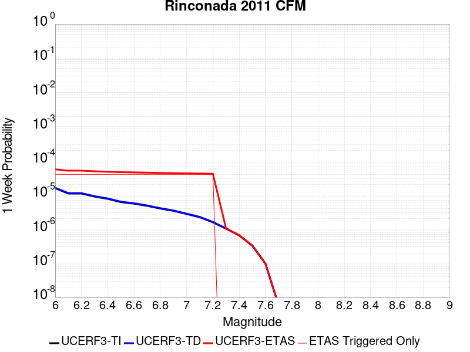 | 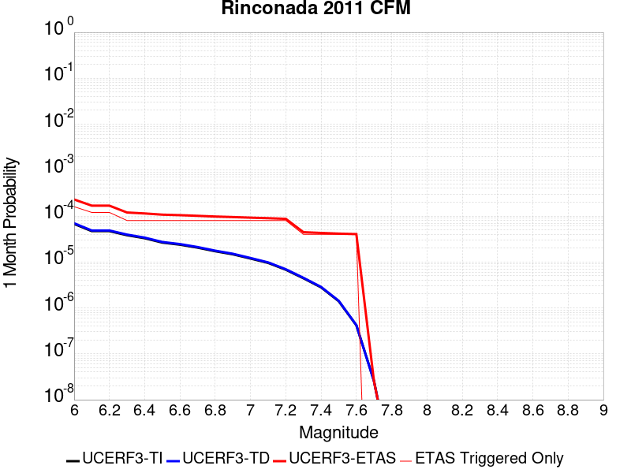 | 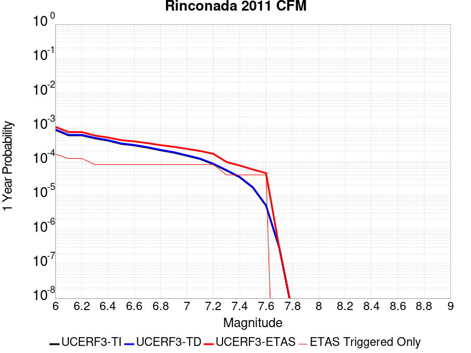 |

| Magnitude | 1 wk TI Prob | 1 wk TD Prob | 1 wk ETAS Prob | 1 wk ETAS/TD Gain | 1 wk ETAS Triggered Only | 1 mo TI Prob | 1 mo TD Prob | 1 mo ETAS Prob | 1 mo ETAS/TD Gain | 1 mo ETAS Triggered Only | 1 yr TI Prob | 1 yr TD Prob | 1 yr ETAS Prob | 1 yr ETAS/TD Gain | 1 yr ETAS Triggered Only |
|-----|-----|-----|-----|-----|-----|-----|-----|-----|-----|-----|-----|-----|-----|-----|-----|
| 6.0 | 1.5752368E-5 | 1.6276554E-5 | 5.62759E-5 | 3.4574828 | 4.0E-5 | 6.75084E-5 | 6.975481E-5 | 2.2974364E-4 | 3.2935886 | 1.6E-4 | 8.2160486E-4 | 8.489371E-4 | 0.0010088013 | 1.188311 | 1.6E-4 |
| 6.1 | 1.0966133E-5 | 1.1324287E-5 | 5.1323834E-5 | 4.5321913 | 4.0E-5 | 4.6996865E-5 | 4.8531758E-5 | 1.6852593E-4 | 3.4724877 | 1.2E-4 | 5.720366E-4 | 5.907147E-4 | 7.106438E-4 | 1.2030238 | 1.2E-4 |
| 6.2 | 1.0966133E-5 | 1.1324287E-5 | 5.1323834E-5 | 4.5321913 | 4.0E-5 | 4.6996865E-5 | 4.8531758E-5 | 1.6852593E-4 | 3.4724877 | 1.2E-4 | 5.720366E-4 | 5.907147E-4 | 7.106438E-4 | 1.2030238 | 1.2E-4 |
| 6.3 | 8.926149E-6 | 9.2137825E-6 | 4.9213413E-5 | 5.3412824 | 4.0E-5 | 3.8254362E-5 | 3.9487044E-5 | 1.19483884E-4 | 3.0259008 | 8.0E-5 | 4.6564735E-4 | 4.8064903E-4 | 5.606106E-4 | 1.1663616 | 8.0E-5 |
| 6.4 | 7.676955E-6 | 7.9210495E-6 | 4.7920734E-5 | 6.0497956 | 4.0E-5 | 3.290082E-5 | 3.3946915E-5 | 1.139442E-4 | 3.3565407 | 8.0E-5 | 4.0049385E-4 | 4.132255E-4 | 4.9319246E-4 | 1.1935189 | 8.0E-5 |
| 6.5 | 6.1671026E-6 | 6.3596335E-6 | 4.635938E-5 | 7.2896304 | 4.0E-5 | 2.6430173E-5 | 2.7255288E-5 | 1.0725311E-4 | 3.9351301 | 8.0E-5 | 3.2173982E-4 | 3.3178268E-4 | 4.1175613E-4 | 1.2410417 | 8.0E-5 |
| 6.6 | 5.553456E-6 | 5.725419E-6 | 4.572519E-5 | 7.9863477 | 4.0E-5 | 2.3800309E-5 | 2.4537281E-5 | 1.0453532E-4 | 4.260265 | 8.0E-5 | 2.897302E-4 | 2.987005E-4 | 3.786766E-4 | 1.2677468 | 8.0E-5 |
| 6.7 | 4.787857E-6 | 4.9338255E-6 | 4.493363E-5 | 9.10726 | 4.0E-5 | 2.0519226E-5 | 2.1144795E-5 | 1.011431E-4 | 4.783357 | 8.0E-5 | 2.4979294E-4 | 2.5740752E-4 | 3.373869E-4 | 1.3107113 | 8.0E-5 |
| 6.8 | 3.9955166E-6 | 4.1138956E-6 | 4.411373E-5 | 10.7231045 | 4.0E-5 | 1.7123532E-5 | 1.7630862E-5 | 9.7629454E-5 | 5.537418 | 8.0E-5 | 2.0845905E-4 | 2.1463462E-4 | 2.9461744E-4 | 1.3726465 | 8.0E-5 |
| 6.9 | 3.4250072E-6 | 3.5227933E-6 | 4.3522654E-5 | 12.354586 | 4.0E-5 | 1.46785205E-5 | 1.5097598E-5 | 9.509639E-5 | 6.298776 | 8.0E-5 | 1.7869633E-4 | 1.8379778E-4 | 2.6378306E-4 | 1.435181 | 8.0E-5 |
| 7.0 | 2.7712713E-6 | 2.8469697E-6 | 4.2846856E-5 | 15.049987 | 4.0E-5 | 1.1876823E-5 | 1.2201242E-5 | 9.2200265E-5 | 7.5566297 | 8.0E-5 | 1.4459073E-4 | 1.4854E-4 | 2.2852812E-4 | 1.5384954 | 8.0E-5 |
| 7.1 | 2.227358E-6 | 2.2859083E-6 | 4.2285817E-5 | 18.498474 | 4.0E-5 | 9.545785E-6 | 9.796713E-6 | 8.979593E-5 | 9.165924 | 8.0E-5 | 1.16213734E-4 | 1.19268465E-4 | 1.9925892E-4 | 1.6706756 | 8.0E-5 |
| 7.2 | 1.581796E-6 | 1.6210437E-6 | 4.162098E-5 | 25.67542 | 4.0E-5 | 6.779108E-6 | 6.9473112E-6 | 8.6946755E-5 | 12.515166 | 8.0E-5 | 8.253252E-5 | 8.4580235E-5 | 1.6457347E-4 | 1.9457674 | 8.0E-5 |
| 7.3 | 1.0306567E-6 | 1.0547374E-6 | 1.0547374E-6 | 1.0 | 0.0 | 4.4170924E-6 | 4.520295E-6 | 4.4520115E-5 | 9.84894 | 4.0E-5 | 5.3776774E-5 | 5.5033208E-5 | 9.5031006E-5 | 1.7267939 | 4.0E-5 |
| 7.4 | 6.535541E-7 | 6.683316E-7 | 6.683316E-7 | 1.0 | 0.0 | 2.800943E-6 | 2.864275E-6 | 4.286416E-5 | 14.965098 | 4.0E-5 | 3.4100947E-5 | 3.487199E-5 | 7.48706E-5 | 2.1470122 | 4.0E-5 |
| 7.5 | 3.2656962E-7 | 3.3319603E-7 | 3.3319603E-7 | 1.0 | 0.0 | 1.3995833E-6 | 1.4279822E-6 | 4.1427924E-5 | 29.011513 | 4.0E-5 | 1.7039794E-5 | 1.7385544E-5 | 5.738485E-5 | 3.300722 | 4.0E-5 |
| 7.6 | 9.754343E-8 | 9.821841E-8 | 9.821841E-8 | 1.0 | 0.0 | 4.180432E-7 | 4.2093595E-7 | 4.042092E-5 | 96.02629 | 4.0E-5 | 5.089664E-6 | 5.124883E-6 | 4.5124678E-5 | 8.805016 | 4.0E-5 |
| 7.7 | 6.0001453E-9 | 5.8497065E-9 | 5.8497065E-9 | 1.0 | 0.0 | 2.5714908E-8 | 2.507017E-8 | 2.507017E-8 | 1.0 | 0.0 | 3.1307894E-7 | 3.052293E-7 | 3.052293E-7 | 1.0 | 0.0 |
| 7.8 | 7.400003E-11 | 7.4656725E-11 | 7.4656725E-11 | 1.0 | 0.0 | 3.171432E-10 | 3.1995728E-10 | 3.1995728E-10 | 1.0 | 0.0 | 3.861218E-9 | 3.89548E-9 | 3.89548E-9 | 1.0 | 0.0 |

## Morales (East)
*[(top)](#table-of-contents)*

| 1 Week | 1 Month | 1 Year |
|-----|-----|-----|
|  | 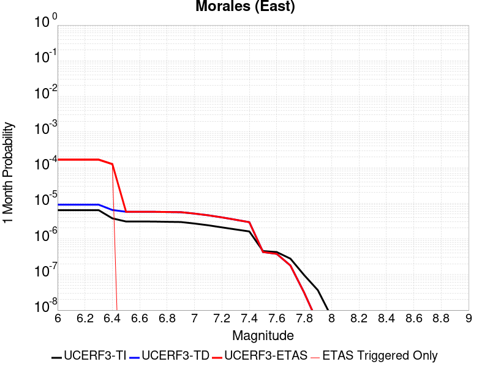 | 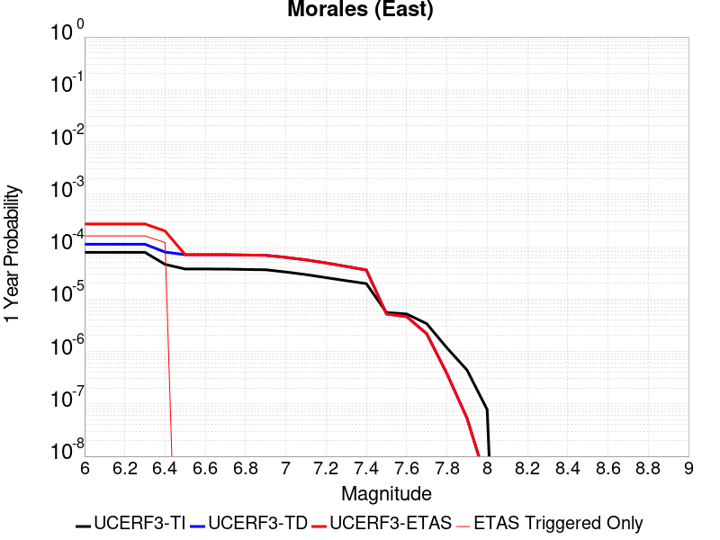 |

| Magnitude | 1 wk TI Prob | 1 wk TD Prob | 1 wk ETAS Prob | 1 wk ETAS/TD Gain | 1 wk ETAS Triggered Only | 1 mo TI Prob | 1 mo TD Prob | 1 mo ETAS Prob | 1 mo ETAS/TD Gain | 1 mo ETAS Triggered Only | 1 yr TI Prob | 1 yr TD Prob | 1 yr ETAS Prob | 1 yr ETAS/TD Gain | 1 yr ETAS Triggered Only |
|-----|-----|-----|-----|-----|-----|-----|-----|-----|-----|-----|-----|-----|-----|-----|-----|
| 6.0 | 1.4942771E-6 | 2.1324008E-6 | 1.2213214E-4 | 57.27448 | 1.2E-4 | 6.404029E-6 | 9.138832E-6 | 1.6913738E-4 | 18.507547 | 1.6E-4 | 7.7966266E-5 | 1.1126018E-4 | 2.7124237E-4 | 2.4379106 | 1.6E-4 |
| 6.1 | 1.4942771E-6 | 2.1324008E-6 | 1.2213214E-4 | 57.27448 | 1.2E-4 | 6.404029E-6 | 9.138832E-6 | 1.6913738E-4 | 18.507547 | 1.6E-4 | 7.7966266E-5 | 1.1126018E-4 | 2.7124237E-4 | 2.4379106 | 1.6E-4 |
| 6.2 | 1.4942771E-6 | 2.1324008E-6 | 1.2213214E-4 | 57.27448 | 1.2E-4 | 6.404029E-6 | 9.138832E-6 | 1.6913738E-4 | 18.507547 | 1.6E-4 | 7.7966266E-5 | 1.1126018E-4 | 2.7124237E-4 | 2.4379106 | 1.6E-4 |
| 6.3 | 1.4942771E-6 | 2.1324008E-6 | 1.2213214E-4 | 57.27448 | 1.2E-4 | 6.404029E-6 | 9.138832E-6 | 1.6913738E-4 | 18.507547 | 1.6E-4 | 7.7966266E-5 | 1.1126018E-4 | 2.7124237E-4 | 2.4379106 | 1.6E-4 |
| 6.4 | 8.798845E-7 | 1.5111716E-6 | 8.1511054E-5 | 53.938976 | 8.0E-5 | 3.7709283E-6 | 6.476434E-6 | 1.2647566E-4 | 19.528595 | 1.2E-4 | 4.5910085E-5 | 7.884784E-5 | 1.9883839E-4 | 2.5217986 | 1.2E-4 |
| 6.5 | 7.1751725E-7 | 1.3473164E-6 | 1.3473164E-6 | 1.0 | 0.0 | 3.0750705E-6 | 5.7742004E-6 | 5.7742004E-6 | 1.0 | 0.0 | 3.7438338E-5 | 7.02987E-5 | 7.02987E-5 | 1.0 | 0.0 |
| 6.6 | 7.1751725E-7 | 1.3473164E-6 | 1.3473164E-6 | 1.0 | 0.0 | 3.0750705E-6 | 5.7742004E-6 | 5.7742004E-6 | 1.0 | 0.0 | 3.7438338E-5 | 7.02987E-5 | 7.02987E-5 | 1.0 | 0.0 |
| 6.7 | 7.159057E-7 | 1.3447774E-6 | 1.3447774E-6 | 1.0 | 0.0 | 3.0681638E-6 | 5.7633197E-6 | 5.7633197E-6 | 1.0 | 0.0 | 3.7354253E-5 | 7.0166236E-5 | 7.0166236E-5 | 1.0 | 0.0 |
| 6.8 | 7.032203E-7 | 1.3262786E-6 | 1.3262786E-6 | 1.0 | 0.0 | 3.0137978E-6 | 5.684039E-6 | 5.684039E-6 | 1.0 | 0.0 | 3.669237E-5 | 6.920106E-5 | 6.920106E-5 | 1.0 | 0.0 |
| 6.9 | 6.941549E-7 | 1.3112922E-6 | 1.3112922E-6 | 1.0 | 0.0 | 2.974946E-6 | 5.6198123E-6 | 5.6198123E-6 | 1.0 | 0.0 | 3.6219368E-5 | 6.841914E-5 | 6.841914E-5 | 1.0 | 0.0 |
| 7.0 | 6.2932247E-7 | 1.1961575E-6 | 1.1961575E-6 | 1.0 | 0.0 | 2.6970936E-6 | 5.1263796E-6 | 5.1263796E-6 | 1.0 | 0.0 | 3.283662E-5 | 6.241195E-5 | 6.241195E-5 | 1.0 | 0.0 |
| 7.1 | 5.6200963E-7 | 1.0720585E-6 | 1.0720585E-6 | 1.0 | 0.0 | 2.4086105E-6 | 4.5945285E-6 | 4.5945285E-6 | 1.0 | 0.0 | 2.9324437E-5 | 5.5937E-5 | 5.5937E-5 | 1.0 | 0.0 |
| 7.2 | 4.91044E-7 | 9.361606E-7 | 9.361606E-7 | 1.0 | 0.0 | 2.1044725E-6 | 4.012111E-6 | 4.012111E-6 | 1.0 | 0.0 | 2.5621652E-5 | 4.8846392E-5 | 4.8846392E-5 | 1.0 | 0.0 |
| 7.3 | 4.2978448E-7 | 8.042327E-7 | 8.042327E-7 | 1.0 | 0.0 | 1.8419321E-6 | 3.446707E-6 | 3.446707E-6 | 1.0 | 0.0 | 2.2425293E-5 | 4.1962885E-5 | 4.1962885E-5 | 1.0 | 0.0 |
| 7.4 | 3.774317E-7 | 6.8683033E-7 | 6.8683033E-7 | 1.0 | 0.0 | 1.6175634E-6 | 2.9435555E-6 | 2.9435555E-6 | 1.0 | 0.0 | 1.9693656E-5 | 3.5837227E-5 | 3.5837227E-5 | 1.0 | 0.0 |
| 7.5 | 1.0603232E-7 | 9.971591E-8 | 9.971591E-8 | 1.0 | 0.0 | 4.5442414E-7 | 4.2735385E-7 | 4.2735385E-7 | 1.0 | 0.0 | 5.5326E-6 | 5.203021E-6 | 5.203021E-6 | 1.0 | 0.0 |
| 7.6 | 9.960384E-8 | 8.8737785E-8 | 8.8737785E-8 | 1.0 | 0.0 | 4.2687353E-7 | 3.8030473E-7 | 3.8030473E-7 | 1.0 | 0.0 | 5.197173E-6 | 4.6302002E-6 | 4.6302002E-6 | 1.0 | 0.0 |
| 7.7 | 6.499468E-8 | 4.1689184E-8 | 4.1689184E-8 | 1.0 | 0.0 | 2.785486E-7 | 1.7866792E-7 | 1.7866792E-7 | 1.0 | 0.0 | 3.3913238E-6 | 2.1752799E-6 | 2.1752799E-6 | 1.0 | 0.0 |
| 7.8 | 2.2517119E-8 | 7.2628095E-9 | 7.2628095E-9 | 1.0 | 0.0 | 9.6501935E-8 | 3.112633E-8 | 3.112633E-8 | 1.0 | 0.0 | 1.1749105E-6 | 3.7896302E-7 | 3.7896302E-7 | 1.0 | 0.0 |
| 7.9 | 8.493023E-9 | 1.026755E-9 | 1.026755E-9 | 1.0 | 0.0 | 3.639867E-8 | 4.4003796E-9 | 4.4003796E-9 | 1.0 | 0.0 | 4.4315374E-7 | 5.3574635E-8 | 5.3574635E-8 | 1.0 | 0.0 |
| 8.0 | 1.4971842E-9 | 5.856349E-11 | 5.856349E-11 | 1.0 | 0.0 | 6.4165038E-9 | 2.5098668E-10 | 2.5098668E-10 | 1.0 | 0.0 | 7.812093E-8 | 3.0557659E-9 | 3.0557659E-9 | 1.0 | 0.0 |

## Channel Islands Western Deep Ramp
*[(top)](#table-of-contents)*

| 1 Week | 1 Month | 1 Year |
|-----|-----|-----|
| 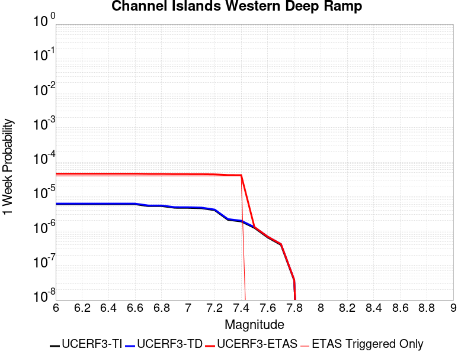 | 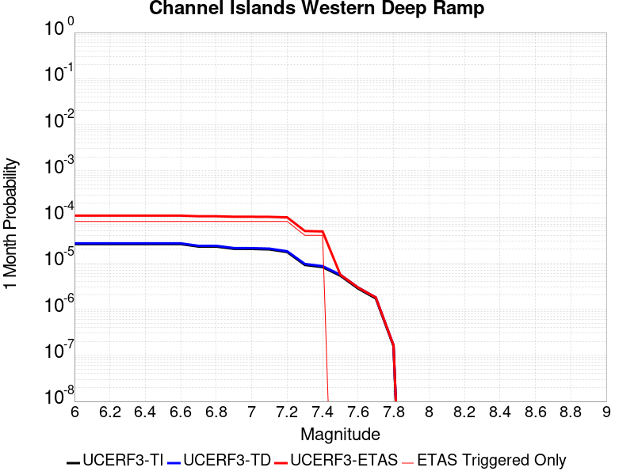 | 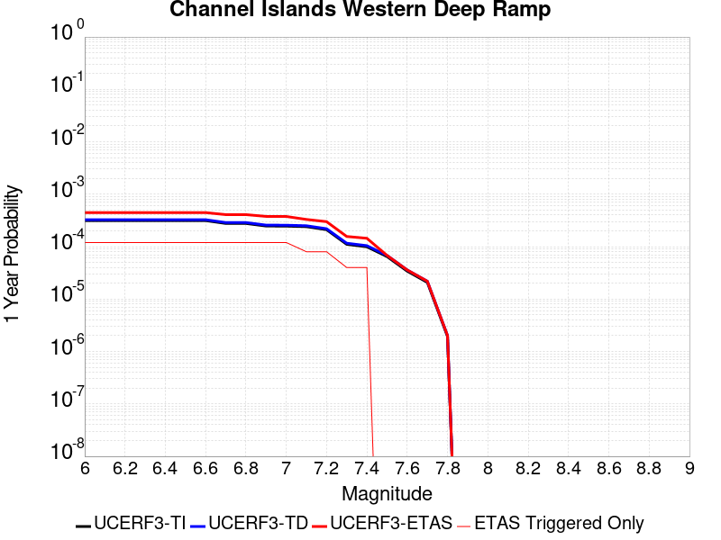 |

| Magnitude | 1 wk TI Prob | 1 wk TD Prob | 1 wk ETAS Prob | 1 wk ETAS/TD Gain | 1 wk ETAS Triggered Only | 1 mo TI Prob | 1 mo TD Prob | 1 mo ETAS Prob | 1 mo ETAS/TD Gain | 1 mo ETAS Triggered Only | 1 yr TI Prob | 1 yr TD Prob | 1 yr ETAS Prob | 1 yr ETAS/TD Gain | 1 yr ETAS Triggered Only |
|-----|-----|-----|-----|-----|-----|-----|-----|-----|-----|-----|-----|-----|-----|-----|-----|
| 6.0 | 6.0213506E-6 | 6.2556924E-6 | 4.625544E-5 | 7.394136 | 4.0E-5 | 2.5805533E-5 | 2.6809861E-5 | 1.0680772E-4 | 3.9838967 | 8.0E-5 | 3.1413708E-4 | 3.2636564E-4 | 4.4632648E-4 | 1.3675658 | 1.2E-4 |
| 6.1 | 6.0213506E-6 | 6.2556924E-6 | 4.625544E-5 | 7.394136 | 4.0E-5 | 2.5805533E-5 | 2.6809861E-5 | 1.0680772E-4 | 3.9838967 | 8.0E-5 | 3.1413708E-4 | 3.2636564E-4 | 4.4632648E-4 | 1.3675658 | 1.2E-4 |
| 6.2 | 6.0213506E-6 | 6.2556924E-6 | 4.625544E-5 | 7.394136 | 4.0E-5 | 2.5805533E-5 | 2.6809861E-5 | 1.0680772E-4 | 3.9838967 | 8.0E-5 | 3.1413708E-4 | 3.2636564E-4 | 4.4632648E-4 | 1.3675658 | 1.2E-4 |
| 6.3 | 6.0213506E-6 | 6.2556924E-6 | 4.625544E-5 | 7.394136 | 4.0E-5 | 2.5805533E-5 | 2.6809861E-5 | 1.0680772E-4 | 3.9838967 | 8.0E-5 | 3.1413708E-4 | 3.2636564E-4 | 4.4632648E-4 | 1.3675658 | 1.2E-4 |
| 6.4 | 6.0213506E-6 | 6.2556924E-6 | 4.625544E-5 | 7.394136 | 4.0E-5 | 2.5805533E-5 | 2.6809861E-5 | 1.0680772E-4 | 3.9838967 | 8.0E-5 | 3.1413708E-4 | 3.2636564E-4 | 4.4632648E-4 | 1.3675658 | 1.2E-4 |
| 6.5 | 6.0213506E-6 | 6.2556924E-6 | 4.625544E-5 | 7.394136 | 4.0E-5 | 2.5805533E-5 | 2.6809861E-5 | 1.0680772E-4 | 3.9838967 | 8.0E-5 | 3.1413708E-4 | 3.2636564E-4 | 4.4632648E-4 | 1.3675658 | 1.2E-4 |
| 6.6 | 6.0213506E-6 | 6.2556924E-6 | 4.625544E-5 | 7.394136 | 4.0E-5 | 2.5805533E-5 | 2.6809861E-5 | 1.0680772E-4 | 3.9838967 | 8.0E-5 | 3.1413708E-4 | 3.2636564E-4 | 4.4632648E-4 | 1.3675658 | 1.2E-4 |
| 6.7 | 5.313309E-6 | 5.5259893E-6 | 4.552577E-5 | 8.238482 | 4.0E-5 | 2.2771126E-5 | 2.368262E-5 | 1.0368072E-4 | 4.377925 | 8.0E-5 | 2.772032E-4 | 2.8830185E-4 | 4.0826722E-4 | 1.4161104 | 1.2E-4 |
| 6.8 | 5.313309E-6 | 5.5259893E-6 | 4.552577E-5 | 8.238482 | 4.0E-5 | 2.2771126E-5 | 2.368262E-5 | 1.0368072E-4 | 4.377925 | 8.0E-5 | 2.772032E-4 | 2.8830185E-4 | 4.0826722E-4 | 1.4161104 | 1.2E-4 |
| 6.9 | 4.744377E-6 | 4.9401206E-6 | 4.4939923E-5 | 9.096929 | 4.0E-5 | 2.0332885E-5 | 2.1171794E-5 | 1.011701E-4 | 4.7785325 | 8.0E-5 | 2.4752476E-4 | 2.5773983E-4 | 3.777089E-4 | 1.4654658 | 1.2E-4 |
| 7.0 | 4.722209E-6 | 4.9171604E-6 | 4.4916964E-5 | 9.134736 | 4.0E-5 | 2.0237881E-5 | 2.1073394E-5 | 1.0107171E-4 | 4.796176 | 8.0E-5 | 2.4636835E-4 | 2.5654212E-4 | 3.7651134E-4 | 1.4676394 | 1.2E-4 |
| 7.1 | 4.611174E-6 | 4.802082E-6 | 4.480189E-5 | 9.32968 | 4.0E-5 | 1.9762025E-5 | 2.058021E-5 | 1.0057857E-4 | 4.8871493 | 8.0E-5 | 2.4057609E-4 | 2.50539E-4 | 3.3051893E-4 | 1.3192316 | 8.0E-5 |
| 7.2 | 4.043994E-6 | 4.212621E-6 | 4.4212455E-5 | 10.495235 | 4.0E-5 | 1.7331287E-5 | 1.8053986E-5 | 9.8052544E-5 | 5.431074 | 8.0E-5 | 2.10988E-4 | 2.197887E-4 | 2.997711E-4 | 1.363906 | 8.0E-5 |
| 7.3 | 2.1233036E-6 | 2.2301667E-6 | 4.2230076E-5 | 18.935839 | 4.0E-5 | 9.099841E-6 | 9.557823E-6 | 4.9557442E-5 | 5.1850133 | 4.0E-5 | 1.1078493E-4 | 1.1636034E-4 | 1.5635569E-4 | 1.3437197 | 4.0E-5 |
| 7.4 | 1.9051884E-6 | 2.0018406E-6 | 4.200176E-5 | 20.981571 | 4.0E-5 | 8.165067E-6 | 8.579289E-6 | 4.8578946E-5 | 5.662351 | 4.0E-5 | 9.940516E-5 | 1.04447885E-4 | 1.4444371E-4 | 1.3829261 | 4.0E-5 |
| 7.5 | 1.2408497E-6 | 1.3041087E-6 | 1.3041087E-6 | 1.0 | 0.0 | 5.317916E-6 | 5.5890255E-6 | 5.5890255E-6 | 1.0 | 0.0 | 6.4743705E-5 | 6.804428E-5 | 6.804428E-5 | 1.0 | 0.0 |
| 7.6 | 6.5440025E-7 | 6.887942E-7 | 6.887942E-7 | 1.0 | 0.0 | 2.8045695E-6 | 2.951972E-6 | 2.951972E-6 | 1.0 | 0.0 | 3.4145098E-5 | 3.593968E-5 | 3.593968E-5 | 1.0 | 0.0 |
| 7.7 | 3.985963E-7 | 4.1938182E-7 | 4.1938182E-7 | 1.0 | 0.0 | 1.7082689E-6 | 1.7973495E-6 | 1.7973495E-6 | 1.0 | 0.0 | 2.0797976E-5 | 2.1882523E-5 | 2.1882523E-5 | 1.0 | 0.0 |
| 7.8 | 3.706329E-8 | 3.859719E-8 | 3.859719E-8 | 1.0 | 0.0 | 1.5884267E-7 | 1.6541652E-7 | 1.6541652E-7 | 1.0 | 0.0 | 1.9339077E-6 | 2.0139444E-6 | 2.0139444E-6 | 1.0 | 0.0 |

## Coronado Bank alt1
*[(top)](#table-of-contents)*

| 1 Week | 1 Month | 1 Year |
|-----|-----|-----|
| 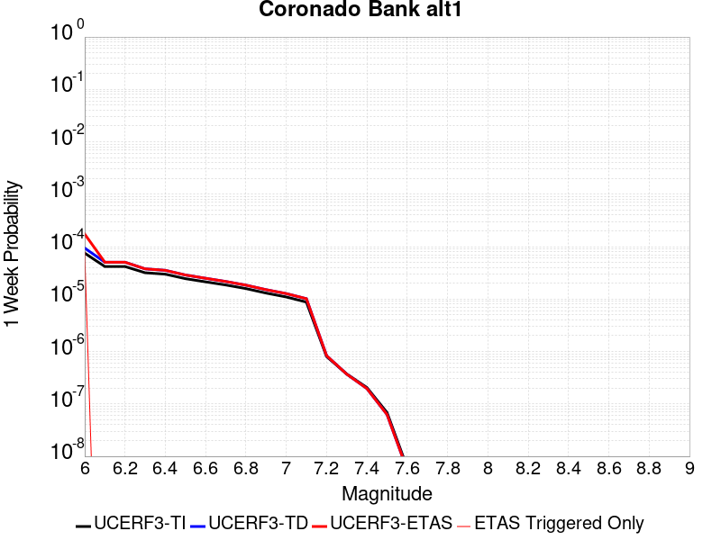 | 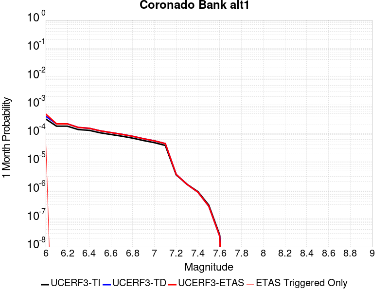 | 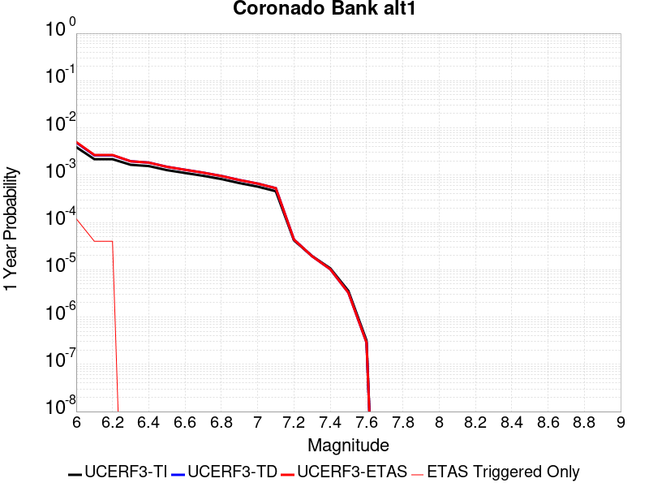 |

| Magnitude | 1 wk TI Prob | 1 wk TD Prob | 1 wk ETAS Prob | 1 wk ETAS/TD Gain | 1 wk ETAS Triggered Only | 1 mo TI Prob | 1 mo TD Prob | 1 mo ETAS Prob | 1 mo ETAS/TD Gain | 1 mo ETAS Triggered Only | 1 yr TI Prob | 1 yr TD Prob | 1 yr ETAS Prob | 1 yr ETAS/TD Gain | 1 yr ETAS Triggered Only |
|-----|-----|-----|-----|-----|-----|-----|-----|-----|-----|-----|-----|-----|-----|-----|-----|
| 6.0 | 7.533492E-5 | 9.4029245E-5 | 1.7402173E-4 | 1.8507191 | 8.0E-5 | 3.22824E-4 | 4.0292446E-4 | 4.8289224E-4 | 1.1984683 | 8.0E-5 | 0.0039233007 | 0.0048951716 | 0.005014584 | 1.0243939 | 1.2E-4 |
| 6.1 | 4.1807285E-5 | 5.0528783E-5 | 5.0528783E-5 | 1.0 | 0.0 | 1.7916178E-4 | 2.1653448E-4 | 2.1653448E-4 | 1.0 | 0.0 | 0.0021791123 | 0.0026331986 | 0.0026730935 | 1.0151507 | 4.0E-5 |
| 6.2 | 4.1807285E-5 | 5.0528783E-5 | 5.0528783E-5 | 1.0 | 0.0 | 1.7916178E-4 | 2.1653448E-4 | 2.1653448E-4 | 1.0 | 0.0 | 0.0021791123 | 0.0026331986 | 0.0026730935 | 1.0151507 | 4.0E-5 |
| 6.3 | 3.1793104E-5 | 3.7735168E-5 | 3.7735168E-5 | 1.0 | 0.0 | 1.3624904E-4 | 1.6171228E-4 | 1.6171228E-4 | 1.0 | 0.0 | 0.0016575698 | 0.0019671016 | 0.0019671016 | 1.0 | 0.0 |
| 6.4 | 2.9878007E-5 | 3.535792E-5 | 3.535792E-5 | 1.0 | 0.0 | 1.2804232E-4 | 1.5152531E-4 | 1.5152531E-4 | 1.0 | 0.0 | 0.0015578003 | 0.0018432919 | 0.0018432919 | 1.0 | 0.0 |
| 6.5 | 2.4512565E-5 | 2.8781236E-5 | 2.8781236E-5 | 1.0 | 0.0 | 1.0504962E-4 | 1.2334248E-4 | 1.2334248E-4 | 1.0 | 0.0 | 0.0012782287 | 0.0015006869 | 0.0015006869 | 1.0 | 0.0 |
| 6.6 | 2.1317413E-5 | 2.4921088E-5 | 2.4921088E-5 | 1.0 | 0.0 | 9.135714E-5 | 1.0680041E-4 | 1.0680041E-4 | 1.0 | 0.0 | 0.0011117056 | 0.0012995416 | 0.0012995416 | 1.0 | 0.0 |
| 6.7 | 1.8585655E-5 | 2.1647098E-5 | 2.1647098E-5 | 1.0 | 0.0 | 7.9650374E-5 | 9.27701E-5 | 9.27701E-5 | 1.0 | 0.0 | 9.6931186E-4 | 0.0011289112 | 0.0011289112 | 1.0 | 0.0 |
| 6.8 | 1.5862879E-5 | 1.8429711E-5 | 1.8429711E-5 | 1.0 | 0.0 | 6.798199E-5 | 7.898219E-5 | 7.898219E-5 | 1.0 | 0.0 | 8.273665E-4 | 9.6120324E-4 | 9.6120324E-4 | 1.0 | 0.0 |
| 6.9 | 1.3021509E-5 | 1.5103577E-5 | 1.5103577E-5 | 1.0 | 0.0 | 5.5805274E-5 | 6.472811E-5 | 6.472811E-5 | 1.0 | 0.0 | 6.792174E-4 | 7.8779797E-4 | 7.8779797E-4 | 1.0 | 0.0 |
| 7.0 | 1.0974371E-5 | 1.272712E-5 | 1.272712E-5 | 1.0 | 0.0 | 4.7032172E-5 | 5.4543758E-5 | 5.4543758E-5 | 1.0 | 0.0 | 5.7246623E-4 | 6.638855E-4 | 6.638855E-4 | 1.0 | 0.0 |
| 7.1 | 8.766221E-6 | 1.0169476E-5 | 1.0169476E-5 | 1.0 | 0.0 | 3.7568978E-5 | 4.3582837E-5 | 4.3582837E-5 | 1.0 | 0.0 | 4.573063E-4 | 5.3050905E-4 | 5.3050905E-4 | 1.0 | 0.0 |
| 7.2 | 8.026024E-7 | 8.333763E-7 | 8.333763E-7 | 1.0 | 0.0 | 3.43972E-6 | 3.571608E-6 | 3.571608E-6 | 1.0 | 0.0 | 4.1877785E-5 | 4.348347E-5 | 4.348347E-5 | 1.0 | 0.0 |
| 7.3 | 3.7293114E-7 | 3.700848E-7 | 3.700848E-7 | 1.0 | 0.0 | 1.5982754E-6 | 1.5860767E-6 | 1.5860767E-6 | 1.0 | 0.0 | 1.9458828E-5 | 1.9310313E-5 | 1.9310313E-5 | 1.0 | 0.0 |
| 7.4 | 2.0557036E-7 | 1.9678428E-7 | 1.9678428E-7 | 1.0 | 0.0 | 8.810155E-7 | 8.4336097E-7 | 8.4336097E-7 | 1.0 | 0.0 | 1.0726311E-5 | 1.0267871E-5 | 1.0267871E-5 | 1.0 | 0.0 |
| 7.5 | 6.845446E-8 | 6.2802876E-8 | 6.2802876E-8 | 1.0 | 0.0 | 2.9337625E-7 | 2.6915515E-7 | 2.6915515E-7 | 1.0 | 0.0 | 3.5718497E-6 | 3.2769592E-6 | 3.2769592E-6 | 1.0 | 0.0 |
| 7.6 | 6.0975145E-9 | 5.5322116E-9 | 5.5322116E-9 | 1.0 | 0.0 | 2.6132206E-8 | 2.3709477E-8 | 2.3709477E-8 | 1.0 | 0.0 | 3.1815955E-7 | 2.8866285E-7 | 2.8866285E-7 | 1.0 | 0.0 |

## Malibu Coast alt 1
*[(top)](#table-of-contents)*

| 1 Week | 1 Month | 1 Year |
|-----|-----|-----|
| 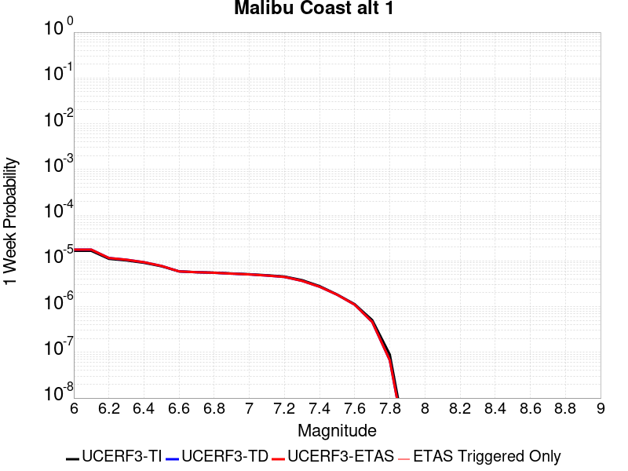 | 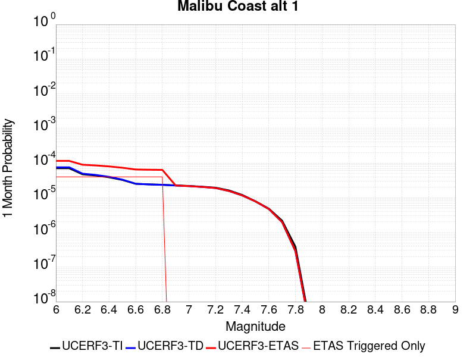 | 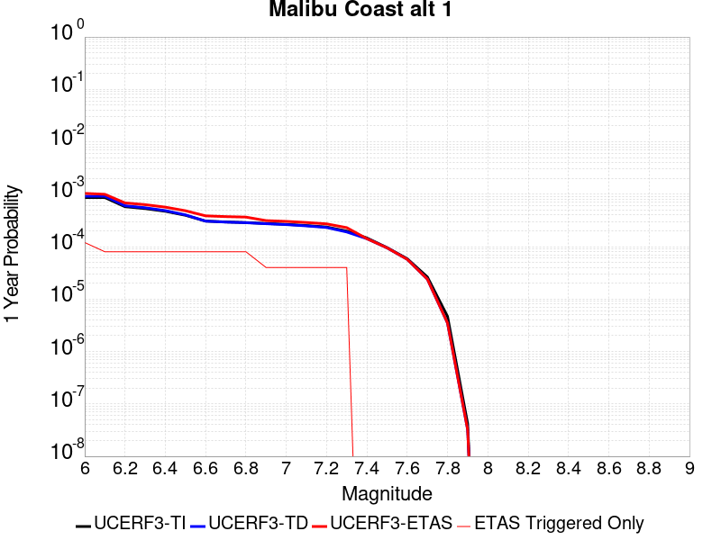 |

| Magnitude | 1 wk TI Prob | 1 wk TD Prob | 1 wk ETAS Prob | 1 wk ETAS/TD Gain | 1 wk ETAS Triggered Only | 1 mo TI Prob | 1 mo TD Prob | 1 mo ETAS Prob | 1 mo ETAS/TD Gain | 1 mo ETAS Triggered Only | 1 yr TI Prob | 1 yr TD Prob | 1 yr ETAS Prob | 1 yr ETAS/TD Gain | 1 yr ETAS Triggered Only |
|-----|-----|-----|-----|-----|-----|-----|-----|-----|-----|-----|-----|-----|-----|-----|-----|
| 6.0 | 1.6572556E-5 | 1.7603372E-5 | 1.7603372E-5 | 1.0 | 0.0 | 7.102331E-5 | 7.544095E-5 | 1.1543793E-4 | 1.530176 | 4.0E-5 | 8.6436566E-4 | 9.1812544E-4 | 0.0010380152 | 1.1305811 | 1.2E-4 |
| 6.1 | 1.6572556E-5 | 1.7603372E-5 | 1.7603372E-5 | 1.0 | 0.0 | 7.102331E-5 | 7.544095E-5 | 1.1543793E-4 | 1.530176 | 4.0E-5 | 8.6436566E-4 | 9.1812544E-4 | 9.98052E-4 | 1.087054 | 8.0E-5 |
| 6.2 | 1.1085717E-5 | 1.1560378E-5 | 1.1560378E-5 | 1.0 | 0.0 | 4.750935E-5 | 4.9543556E-5 | 8.954157E-5 | 1.8073304 | 4.0E-5 | 5.782728E-4 | 6.030294E-4 | 6.8298116E-4 | 1.1325835 | 8.0E-5 |
| 6.3 | 1.0208568E-5 | 1.059514E-5 | 1.059514E-5 | 1.0 | 0.0 | 4.375027E-5 | 4.540697E-5 | 8.5405154E-5 | 1.880882 | 4.0E-5 | 5.325294E-4 | 5.5269257E-4 | 6.3264836E-4 | 1.144666 | 8.0E-5 |
| 6.4 | 9.0682315E-6 | 9.345133E-6 | 9.345133E-6 | 1.0 | 0.0 | 3.8863272E-5 | 4.0049967E-5 | 8.004836E-5 | 1.9987124 | 4.0E-5 | 4.730576E-4 | 4.875013E-4 | 5.674623E-4 | 1.1640221 | 8.0E-5 |
| 6.5 | 7.605796E-6 | 7.750596E-6 | 7.750596E-6 | 1.0 | 0.0 | 3.259586E-5 | 3.3216424E-5 | 7.3215095E-5 | 2.2041836 | 4.0E-5 | 3.9678233E-4 | 4.0433623E-4 | 4.8430386E-4 | 1.1977751 | 8.0E-5 |
| 6.6 | 5.889873E-6 | 5.88098E-6 | 5.88098E-6 | 1.0 | 0.0 | 2.5242069E-5 | 2.5203957E-5 | 6.520295E-5 | 2.5870123 | 4.0E-5 | 3.0727885E-4 | 3.0681508E-4 | 3.8679052E-4 | 1.2606634 | 8.0E-5 |
| 6.7 | 5.66586E-6 | 5.6430326E-6 | 5.6430326E-6 | 1.0 | 0.0 | 2.428203E-5 | 2.4184203E-5 | 6.418324E-5 | 2.6539323 | 4.0E-5 | 2.955936E-4 | 2.9440297E-4 | 3.7437942E-4 | 1.2716564 | 8.0E-5 |
| 6.8 | 5.521556E-6 | 5.49079E-6 | 5.49079E-6 | 1.0 | 0.0 | 2.3663597E-5 | 2.3531746E-5 | 6.35308E-5 | 2.6997914 | 4.0E-5 | 2.880662E-4 | 2.864614E-4 | 3.664385E-4 | 1.2791897 | 8.0E-5 |
| 6.9 | 5.29752E-6 | 5.2512382E-6 | 5.2512382E-6 | 1.0 | 0.0 | 2.270346E-5 | 2.2505112E-5 | 2.2505112E-5 | 1.0 | 0.0 | 2.7637955E-4 | 2.739654E-4 | 3.1395443E-4 | 1.1459639 | 4.0E-5 |
| 7.0 | 5.106743E-6 | 5.0489434E-6 | 5.0489434E-6 | 1.0 | 0.0 | 2.1885859E-5 | 2.163815E-5 | 2.163815E-5 | 1.0 | 0.0 | 2.6642776E-4 | 2.6341272E-4 | 3.0340216E-4 | 1.1518129 | 4.0E-5 |
| 7.1 | 4.8469647E-6 | 4.771574E-6 | 4.771574E-6 | 1.0 | 0.0 | 2.0772539E-5 | 2.0449443E-5 | 2.0449443E-5 | 1.0 | 0.0 | 2.528763E-4 | 2.489436E-4 | 2.8893363E-4 | 1.1606389 | 4.0E-5 |
| 7.2 | 4.545514E-6 | 4.4493186E-6 | 4.4493186E-6 | 1.0 | 0.0 | 1.9480629E-5 | 1.906837E-5 | 1.906837E-5 | 1.0 | 0.0 | 2.3715083E-4 | 2.3213273E-4 | 2.7212343E-4 | 1.1722752 | 4.0E-5 |
| 7.3 | 3.794097E-6 | 3.6528515E-6 | 3.6528515E-6 | 1.0 | 0.0 | 1.6260314E-5 | 1.5654985E-5 | 1.5654985E-5 | 1.0 | 0.0 | 1.9795135E-4 | 1.9058281E-4 | 2.3057518E-4 | 1.2098426 | 4.0E-5 |
| 7.4 | 2.808217E-6 | 2.7198025E-6 | 2.7198025E-6 | 1.0 | 0.0 | 1.203516E-5 | 1.1656245E-5 | 1.1656245E-5 | 1.0 | 0.0 | 1.4651821E-4 | 1.4190556E-4 | 1.4190556E-4 | 1.0 | 0.0 |
| 7.5 | 1.83809E-6 | 1.8195162E-6 | 1.8195162E-6 | 1.0 | 0.0 | 7.877505E-6 | 7.797904E-6 | 7.797904E-6 | 1.0 | 0.0 | 9.59044E-5 | 9.4935356E-5 | 9.4935356E-5 | 1.0 | 0.0 |
| 7.6 | 1.1292672E-6 | 1.1004113E-6 | 1.1004113E-6 | 1.0 | 0.0 | 4.839708E-6 | 4.7160397E-6 | 4.7160397E-6 | 1.0 | 0.0 | 5.8921847E-5 | 5.7416288E-5 | 5.7416288E-5 | 1.0 | 0.0 |
| 7.7 | 5.065272E-7 | 4.6105032E-7 | 4.6105032E-7 | 1.0 | 0.0 | 2.170829E-6 | 1.9759284E-6 | 1.9759284E-6 | 1.0 | 0.0 | 2.6429525E-5 | 2.4056675E-5 | 2.4056675E-5 | 1.0 | 0.0 |
| 7.8 | 8.952991E-8 | 6.7132056E-8 | 6.7132056E-8 | 1.0 | 0.0 | 3.8369956E-7 | 2.877088E-7 | 2.877088E-7 | 1.0 | 0.0 | 4.671532E-6 | 3.502849E-6 | 3.502849E-6 | 1.0 | 0.0 |
| 7.9 | 8.007447E-10 | 6.1625505E-10 | 6.1625505E-10 | 1.0 | 0.0 | 3.4317629E-9 | 2.6410938E-9 | 2.6410938E-9 | 1.0 | 0.0 | 4.1781714E-8 | 3.2155317E-8 | 3.2155317E-8 | 1.0 | 0.0 |

## Raymond
*[(top)](#table-of-contents)*

| 1 Week | 1 Month | 1 Year |
|-----|-----|-----|
| 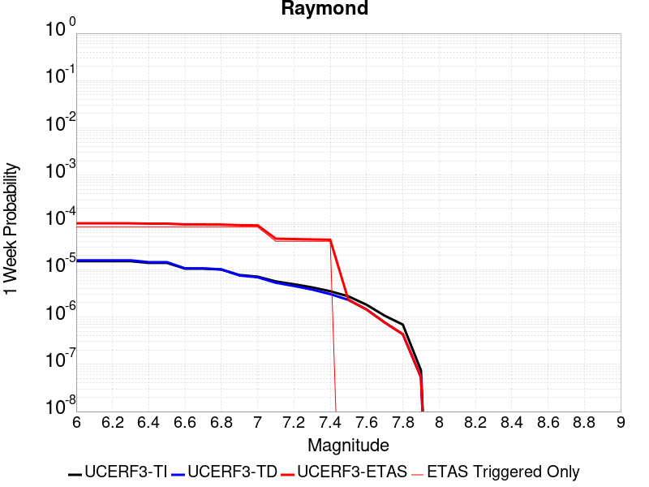 | 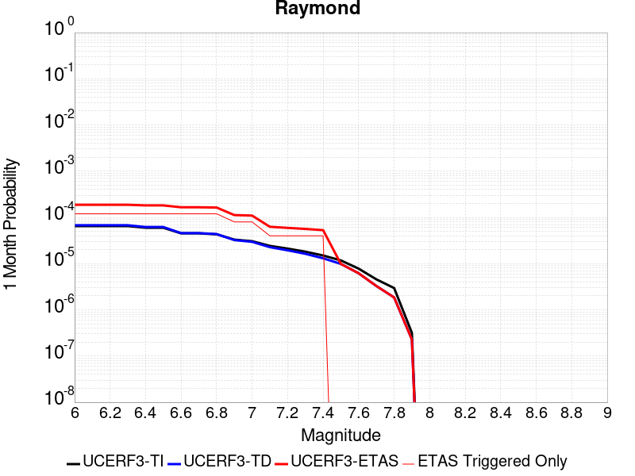 | 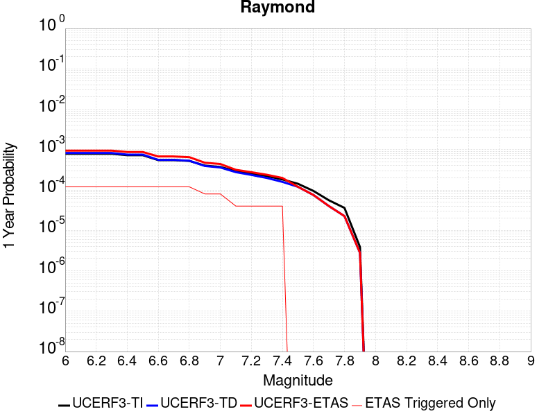 |

| Magnitude | 1 wk TI Prob | 1 wk TD Prob | 1 wk ETAS Prob | 1 wk ETAS/TD Gain | 1 wk ETAS Triggered Only | 1 mo TI Prob | 1 mo TD Prob | 1 mo ETAS Prob | 1 mo ETAS/TD Gain | 1 mo ETAS Triggered Only | 1 yr TI Prob | 1 yr TD Prob | 1 yr ETAS Prob | 1 yr ETAS/TD Gain | 1 yr ETAS Triggered Only |
|-----|-----|-----|-----|-----|-----|-----|-----|-----|-----|-----|-----|-----|-----|-----|-----|
| 6.0 | 1.5157413E-5 | 1.5816651E-5 | 9.581538E-5 | 6.057881 | 8.0E-5 | 6.4958724E-5 | 6.778403E-5 | 1.8777589E-4 | 2.7702086 | 1.2E-4 | 7.905855E-4 | 8.249831E-4 | 9.4488414E-4 | 1.1453375 | 1.2E-4 |
| 6.1 | 1.5157413E-5 | 1.5816651E-5 | 9.581538E-5 | 6.057881 | 8.0E-5 | 6.4958724E-5 | 6.778403E-5 | 1.8777589E-4 | 2.7702086 | 1.2E-4 | 7.905855E-4 | 8.249831E-4 | 9.4488414E-4 | 1.1453375 | 1.2E-4 |
| 6.2 | 1.5157413E-5 | 1.5816651E-5 | 9.581538E-5 | 6.057881 | 8.0E-5 | 6.4958724E-5 | 6.778403E-5 | 1.8777589E-4 | 2.7702086 | 1.2E-4 | 7.905855E-4 | 8.249831E-4 | 9.4488414E-4 | 1.1453375 | 1.2E-4 |
| 6.3 | 1.5157413E-5 | 1.5816651E-5 | 9.581538E-5 | 6.057881 | 8.0E-5 | 6.4958724E-5 | 6.778403E-5 | 1.8777589E-4 | 2.7702086 | 1.2E-4 | 7.905855E-4 | 8.249831E-4 | 9.4488414E-4 | 1.1453375 | 1.2E-4 |
| 6.4 | 1.3941944E-5 | 1.4460684E-5 | 9.445953E-5 | 6.5321617 | 8.0E-5 | 5.9749822E-5 | 6.197302E-5 | 1.8196559E-4 | 2.9362066 | 1.2E-4 | 7.2721124E-4 | 7.542837E-4 | 8.7419315E-4 | 1.1589713 | 1.2E-4 |
| 6.5 | 1.3941944E-5 | 1.4460684E-5 | 9.445953E-5 | 6.5321617 | 8.0E-5 | 5.9749822E-5 | 6.197302E-5 | 1.8196559E-4 | 2.9362066 | 1.2E-4 | 7.2721124E-4 | 7.542837E-4 | 8.7419315E-4 | 1.1589713 | 1.2E-4 |
| 6.6 | 1.0542609E-5 | 1.0675657E-5 | 9.06748E-5 | 8.493605 | 8.0E-5 | 4.5181827E-5 | 4.5752044E-5 | 1.6574655E-4 | 3.6227138 | 1.2E-4 | 5.499499E-4 | 5.568942E-4 | 6.768274E-4 | 1.2153608 | 1.2E-4 |
| 6.7 | 1.0542609E-5 | 1.0675657E-5 | 9.06748E-5 | 8.493605 | 8.0E-5 | 4.5181827E-5 | 4.5752044E-5 | 1.6574655E-4 | 3.6227138 | 1.2E-4 | 5.499499E-4 | 5.568942E-4 | 6.768274E-4 | 1.2153608 | 1.2E-4 |
| 6.8 | 1.0079132E-5 | 1.0181076E-5 | 9.018026E-5 | 8.857636 | 8.0E-5 | 4.3195567E-5 | 4.363248E-5 | 1.6362725E-4 | 3.7501247 | 1.2E-4 | 5.257791E-4 | 5.311013E-4 | 6.510376E-4 | 1.2258255 | 1.2E-4 |
| 6.9 | 7.721598E-6 | 7.552302E-6 | 8.75517E-5 | 11.592716 | 8.0E-5 | 3.3092143E-5 | 3.2366614E-5 | 1.12364025E-4 | 3.4716027 | 8.0E-5 | 4.0282236E-4 | 3.9399348E-4 | 4.7396196E-4 | 1.2029691 | 8.0E-5 |
| 7.0 | 7.137566E-6 | 6.9145035E-6 | 8.691395E-5 | 12.569804 | 8.0E-5 | 3.058921E-5 | 2.9633255E-5 | 1.09630884E-4 | 3.6995897 | 8.0E-5 | 3.7236E-4 | 3.6072623E-4 | 4.4069736E-4 | 1.2216948 | 8.0E-5 |
| 7.1 | 5.654976E-6 | 5.3022604E-6 | 4.5302048E-5 | 8.543913 | 4.0E-5 | 2.4235387E-5 | 2.2723776E-5 | 6.2722866E-5 | 2.7602308 | 4.0E-5 | 2.9502588E-4 | 2.7662705E-4 | 3.16616E-4 | 1.144559 | 4.0E-5 |
| 7.2 | 4.9358455E-6 | 4.529158E-6 | 4.4528977E-5 | 9.831623 | 4.0E-5 | 2.1153453E-5 | 1.9410534E-5 | 5.940976E-5 | 3.0606966 | 4.0E-5 | 2.5751285E-4 | 2.3629777E-4 | 2.762883E-4 | 1.169238 | 4.0E-5 |
| 7.3 | 4.2368597E-6 | 3.8079293E-6 | 4.3807777E-5 | 11.504356 | 4.0E-5 | 1.8157843E-5 | 1.6319596E-5 | 5.6318942E-5 | 3.4510012 | 4.0E-5 | 2.2104931E-4 | 1.9867306E-4 | 2.3866512E-4 | 1.2012959 | 4.0E-5 |
| 7.4 | 3.4999923E-6 | 3.045825E-6 | 4.3045704E-5 | 14.13269 | 4.0E-5 | 1.49998805E-5 | 1.3053471E-5 | 5.305295E-5 | 4.064279 | 4.0E-5 | 1.8260824E-4 | 1.589145E-4 | 1.9890814E-4 | 1.2516677 | 4.0E-5 |
| 7.5 | 2.738017E-6 | 2.303755E-6 | 2.303755E-6 | 1.0 | 0.0 | 1.1734306E-5 | 9.873199E-6 | 9.873199E-6 | 1.0 | 0.0 | 1.428558E-4 | 1.20199635E-4 | 1.20199635E-4 | 1.0 | 0.0 |
| 7.6 | 1.8186392E-6 | 1.4435308E-6 | 1.4435308E-6 | 1.0 | 0.0 | 7.794145E-6 | 6.1865458E-6 | 6.1865458E-6 | 1.0 | 0.0 | 9.488958E-5 | 7.531863E-5 | 7.531863E-5 | 1.0 | 0.0 |
| 7.7 | 1.0660348E-6 | 7.653782E-7 | 7.653782E-7 | 1.0 | 0.0 | 4.5687125E-6 | 3.2801881E-6 | 3.2801881E-6 | 1.0 | 0.0 | 5.5622655E-5 | 3.9935578E-5 | 3.9935578E-5 | 1.0 | 0.0 |
| 7.8 | 6.913602E-7 | 4.3288983E-7 | 4.3288983E-7 | 1.0 | 0.0 | 2.962969E-6 | 1.855241E-6 | 1.855241E-6 | 1.0 | 0.0 | 3.607355E-5 | 2.258733E-5 | 2.258733E-5 | 1.0 | 0.0 |
| 7.9 | 7.425201E-8 | 5.330067E-8 | 5.330067E-8 | 1.0 | 0.0 | 3.1822285E-7 | 2.2843143E-7 | 2.2843143E-7 | 1.0 | 0.0 | 3.874356E-6 | 2.7811504E-6 | 2.7811504E-6 | 1.0 | 0.0 |

## Holser alt 1
*[(top)](#table-of-contents)*

| 1 Week | 1 Month | 1 Year |
|-----|-----|-----|
|  |  | 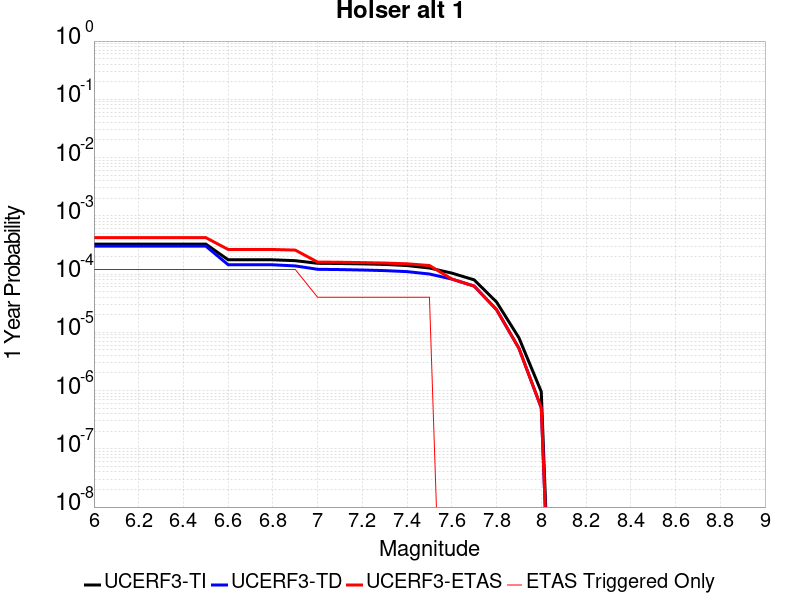 |

| Magnitude | 1 wk TI Prob | 1 wk TD Prob | 1 wk ETAS Prob | 1 wk ETAS/TD Gain | 1 wk ETAS Triggered Only | 1 mo TI Prob | 1 mo TD Prob | 1 mo ETAS Prob | 1 mo ETAS/TD Gain | 1 mo ETAS Triggered Only | 1 yr TI Prob | 1 yr TD Prob | 1 yr ETAS Prob | 1 yr ETAS/TD Gain | 1 yr ETAS Triggered Only |
|-----|-----|-----|-----|-----|-----|-----|-----|-----|-----|-----|-----|-----|-----|-----|-----|
| 6.0 | 6.2746653E-6 | 5.7915495E-6 | 4.579132E-5 | 7.9065747 | 4.0E-5 | 2.6891146E-5 | 2.4820754E-5 | 1.0481877E-4 | 4.223029 | 8.0E-5 | 3.273505E-4 | 3.0216234E-4 | 4.2212606E-4 | 1.3970175 | 1.2E-4 |
| 6.1 | 6.2746653E-6 | 5.7915495E-6 | 4.579132E-5 | 7.9065747 | 4.0E-5 | 2.6891146E-5 | 2.4820754E-5 | 1.0481877E-4 | 4.223029 | 8.0E-5 | 3.273505E-4 | 3.0216234E-4 | 4.2212606E-4 | 1.3970175 | 1.2E-4 |
| 6.2 | 6.2746653E-6 | 5.7915495E-6 | 4.579132E-5 | 7.9065747 | 4.0E-5 | 2.6891146E-5 | 2.4820754E-5 | 1.0481877E-4 | 4.223029 | 8.0E-5 | 3.273505E-4 | 3.0216234E-4 | 4.2212606E-4 | 1.3970175 | 1.2E-4 |
| 6.3 | 6.2746653E-6 | 5.7915495E-6 | 4.579132E-5 | 7.9065747 | 4.0E-5 | 2.6891146E-5 | 2.4820754E-5 | 1.0481877E-4 | 4.223029 | 8.0E-5 | 3.273505E-4 | 3.0216234E-4 | 4.2212606E-4 | 1.3970175 | 1.2E-4 |
| 6.4 | 6.2746653E-6 | 5.7915495E-6 | 4.579132E-5 | 7.9065747 | 4.0E-5 | 2.6891146E-5 | 2.4820754E-5 | 1.0481877E-4 | 4.223029 | 8.0E-5 | 3.273505E-4 | 3.0216234E-4 | 4.2212606E-4 | 1.3970175 | 1.2E-4 |
| 6.5 | 6.2746653E-6 | 5.7915495E-6 | 4.579132E-5 | 7.9065747 | 4.0E-5 | 2.6891146E-5 | 2.4820754E-5 | 1.0481877E-4 | 4.223029 | 8.0E-5 | 3.273505E-4 | 3.0216234E-4 | 4.2212606E-4 | 1.3970175 | 1.2E-4 |
| 6.6 | 3.375825E-6 | 2.7723509E-6 | 4.277224E-5 | 15.428147 | 4.0E-5 | 1.4467741E-5 | 1.18814505E-5 | 9.18805E-5 | 7.733104 | 8.0E-5 | 1.761305E-4 | 1.4464723E-4 | 2.6462987E-4 | 1.8294846 | 1.2E-4 |
| 6.7 | 3.375825E-6 | 2.7723509E-6 | 4.277224E-5 | 15.428147 | 4.0E-5 | 1.4467741E-5 | 1.18814505E-5 | 9.18805E-5 | 7.733104 | 8.0E-5 | 1.761305E-4 | 1.4464723E-4 | 2.6462987E-4 | 1.8294846 | 1.2E-4 |
| 6.8 | 3.366533E-6 | 2.7627493E-6 | 4.276264E-5 | 15.478291 | 4.0E-5 | 1.4427919E-5 | 1.1840301E-5 | 9.1839356E-5 | 7.7565045 | 8.0E-5 | 1.7564575E-4 | 1.4414631E-4 | 2.6412902E-4 | 1.8323675 | 1.2E-4 |
| 6.9 | 3.253174E-6 | 2.6449559E-6 | 4.264485E-5 | 16.123085 | 4.0E-5 | 1.39421E-5 | 1.1335477E-5 | 9.133457E-5 | 8.057408 | 8.0E-5 | 1.6973184E-4 | 1.3800085E-4 | 2.579843E-4 | 1.8694398 | 1.2E-4 |
| 7.0 | 2.9336593E-6 | 2.312899E-6 | 2.312899E-6 | 1.0 | 0.0 | 1.2572766E-5 | 9.912386E-6 | 9.912386E-6 | 1.0 | 0.0 | 1.5306266E-4 | 1.2067664E-4 | 1.6067181E-4 | 1.3314244 | 4.0E-5 |
| 7.1 | 2.9087812E-6 | 2.2887455E-6 | 2.2887455E-6 | 1.0 | 0.0 | 1.2466146E-5 | 9.808872E-6 | 9.808872E-6 | 1.0 | 0.0 | 1.5176475E-4 | 1.19416494E-4 | 1.5941172E-4 | 1.3349221 | 4.0E-5 |
| 7.2 | 2.8674524E-6 | 2.2486256E-6 | 2.2486256E-6 | 1.0 | 0.0 | 1.2289024E-5 | 9.636931E-6 | 9.636931E-6 | 1.0 | 0.0 | 1.4960859E-4 | 1.1732335E-4 | 1.5731865E-4 | 1.3408982 | 4.0E-5 |
| 7.3 | 2.8057775E-6 | 2.196495E-6 | 2.196495E-6 | 1.0 | 0.0 | 1.2024705E-5 | 9.413517E-6 | 9.413517E-6 | 1.0 | 0.0 | 1.4639096E-4 | 1.1460355E-4 | 1.5459897E-4 | 1.3489894 | 4.0E-5 |
| 7.4 | 2.683666E-6 | 2.1102435E-6 | 2.1102435E-6 | 1.0 | 0.0 | 1.1501375E-5 | 9.043869E-6 | 9.043869E-6 | 1.0 | 0.0 | 1.4002025E-4 | 1.1010356E-4 | 1.5009915E-4 | 1.3632543 | 4.0E-5 |
| 7.5 | 2.434495E-6 | 1.9204347E-6 | 1.9204347E-6 | 1.0 | 0.0 | 1.0433508E-5 | 8.230409E-6 | 8.230409E-6 | 1.0 | 0.0 | 1.2702055E-4 | 1.0020063E-4 | 1.4019663E-4 | 1.3991591 | 4.0E-5 |
| 7.6 | 1.9914562E-6 | 1.5738035E-6 | 1.5738035E-6 | 1.0 | 0.0 | 8.534785E-6 | 6.744855E-6 | 6.744855E-6 | 1.0 | 0.0 | 1.03906044E-4 | 8.2115526E-5 | 8.2115526E-5 | 1.0 | 0.0 |
| 7.7 | 1.5229501E-6 | 1.1900904E-6 | 1.1900904E-6 | 1.0 | 0.0 | 6.526913E-6 | 5.1003776E-6 | 5.1003776E-6 | 1.0 | 0.0 | 7.946226E-5 | 6.209534E-5 | 6.209534E-5 | 1.0 | 0.0 |
| 7.8 | 6.3489426E-7 | 4.6904395E-7 | 4.6904395E-7 | 1.0 | 0.0 | 2.7209726E-6 | 2.0101868E-6 | 2.0101868E-6 | 1.0 | 0.0 | 3.312734E-5 | 2.4473751E-5 | 2.4473751E-5 | 1.0 | 0.0 |
| 7.9 | 1.5459432E-7 | 1.02000165E-7 | 1.02000165E-7 | 1.0 | 0.0 | 6.6254694E-7 | 4.3714348E-7 | 4.3714348E-7 | 1.0 | 0.0 | 8.066479E-6 | 5.322209E-6 | 5.322209E-6 | 1.0 | 0.0 |
| 8.0 | 1.8307812E-8 | 9.7025685E-9 | 9.7025685E-9 | 1.0 | 0.0 | 7.846205E-8 | 4.1582435E-8 | 4.1582435E-8 | 1.0 | 0.0 | 9.55275E-7 | 5.06266E-7 | 5.06266E-7 | 1.0 | 0.0 |

## Hunter Mountain-Saline Valley
*[(top)](#table-of-contents)*

| 1 Week | 1 Month | 1 Year |
|-----|-----|-----|
| 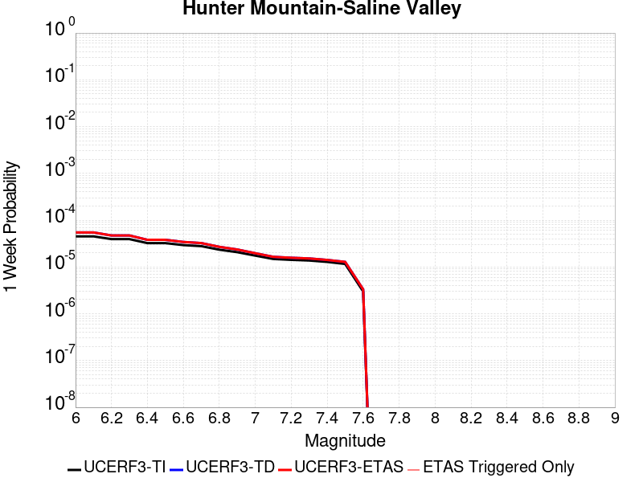 | 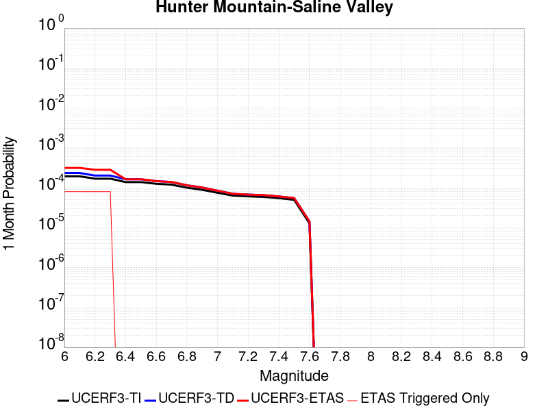 | 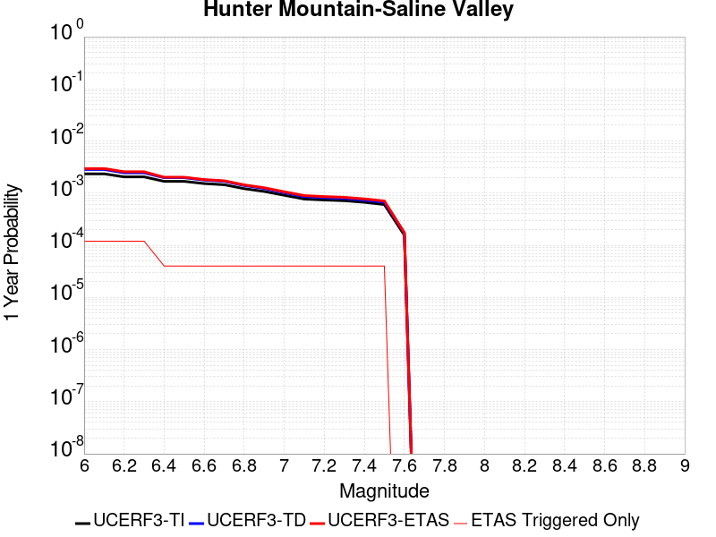 |

| Magnitude | 1 wk TI Prob | 1 wk TD Prob | 1 wk ETAS Prob | 1 wk ETAS/TD Gain | 1 wk ETAS Triggered Only | 1 mo TI Prob | 1 mo TD Prob | 1 mo ETAS Prob | 1 mo ETAS/TD Gain | 1 mo ETAS Triggered Only | 1 yr TI Prob | 1 yr TD Prob | 1 yr ETAS Prob | 1 yr ETAS/TD Gain | 1 yr ETAS Triggered Only |
|-----|-----|-----|-----|-----|-----|-----|-----|-----|-----|-----|-----|-----|-----|-----|-----|
| 6.0 | 4.5103672E-5 | 5.4612585E-5 | 5.4612585E-5 | 1.0 | 0.0 | 1.9328714E-4 | 2.3403409E-4 | 3.1401537E-4 | 1.3417505 | 8.0E-5 | 0.002350731 | 0.0028458177 | 0.0029654761 | 1.0420471 | 1.2E-4 |
| 6.1 | 4.5103672E-5 | 5.4612585E-5 | 5.4612585E-5 | 1.0 | 0.0 | 1.9328714E-4 | 2.3403409E-4 | 3.1401537E-4 | 1.3417505 | 8.0E-5 | 0.002350731 | 0.0028458177 | 0.0029654761 | 1.0420471 | 1.2E-4 |
| 6.2 | 3.9363465E-5 | 4.7098747E-5 | 4.7098747E-5 | 1.0 | 0.0 | 1.6868966E-4 | 2.0183699E-4 | 2.8182083E-4 | 1.3962795 | 8.0E-5 | 0.002051862 | 0.0024547323 | 0.0025744378 | 1.0487652 | 1.2E-4 |
| 6.3 | 3.9363465E-5 | 4.7098747E-5 | 4.7098747E-5 | 1.0 | 0.0 | 1.6868966E-4 | 2.0183699E-4 | 2.8182083E-4 | 1.3962795 | 8.0E-5 | 0.002051862 | 0.0024547323 | 0.0025744378 | 1.0487652 | 1.2E-4 |
| 6.4 | 3.2311684E-5 | 3.7978454E-5 | 3.7978454E-5 | 1.0 | 0.0 | 1.384713E-4 | 1.6275501E-4 | 1.6275501E-4 | 1.0 | 0.0 | 0.0016845843 | 0.00197981 | 0.0020197309 | 1.020164 | 4.0E-5 |
| 6.5 | 3.2311684E-5 | 3.7978454E-5 | 3.7978454E-5 | 1.0 | 0.0 | 1.384713E-4 | 1.6275501E-4 | 1.6275501E-4 | 1.0 | 0.0 | 0.0016845843 | 0.00197981 | 0.0020197309 | 1.020164 | 4.0E-5 |
| 6.6 | 2.9305844E-5 | 3.4206074E-5 | 3.4206074E-5 | 1.0 | 0.0 | 1.2559042E-4 | 1.4658958E-4 | 1.4658958E-4 | 1.0 | 0.0 | 0.0015279909 | 0.001783329 | 0.0018232577 | 1.02239 | 4.0E-5 |
| 6.7 | 2.7826512E-5 | 3.2366974E-5 | 3.2366974E-5 | 1.0 | 0.0 | 1.19251024E-4 | 1.3870856E-4 | 1.3870856E-4 | 1.0 | 0.0 | 0.0014509142 | 0.001687529 | 0.0017274615 | 1.0236633 | 4.0E-5 |
| 6.8 | 2.3389874E-5 | 2.688505E-5 | 2.688505E-5 | 1.0 | 0.0 | 1.0023846E-4 | 1.15216826E-4 | 1.15216826E-4 | 1.0 | 0.0 | 0.00121972 | 0.0014019096 | 0.0014418535 | 1.0284926 | 4.0E-5 |
| 6.9 | 2.069209E-5 | 2.3585886E-5 | 2.3585886E-5 | 1.0 | 0.0 | 8.867737E-5 | 1.0107866E-4 | 1.0107866E-4 | 1.0 | 0.0 | 0.0010791123 | 0.0012299741 | 0.0012699248 | 1.032481 | 4.0E-5 |
| 7.0 | 1.7462342E-5 | 1.9646477E-5 | 1.9646477E-5 | 1.0 | 0.0 | 7.483646E-5 | 8.4196596E-5 | 8.4196596E-5 | 1.0 | 0.0 | 9.1075303E-4 | 0.0010246342 | 0.0010645932 | 1.0389984 | 4.0E-5 |
| 7.1 | 1.4807709E-5 | 1.645249E-5 | 1.645249E-5 | 1.0 | 0.0 | 6.3460066E-5 | 7.050886E-5 | 7.050886E-5 | 1.0 | 0.0 | 7.723524E-4 | 8.5812376E-4 | 8.9808943E-4 | 1.0465733 | 4.0E-5 |
| 7.2 | 1.4180048E-5 | 1.5708612E-5 | 1.5708612E-5 | 1.0 | 0.0 | 6.077022E-5 | 6.732098E-5 | 6.732098E-5 | 1.0 | 0.0 | 7.396263E-4 | 8.19341E-4 | 8.593082E-4 | 1.0487797 | 4.0E-5 |
| 7.3 | 1.3730402E-5 | 1.5182046E-5 | 1.5182046E-5 | 1.0 | 0.0 | 5.8843252E-5 | 6.506438E-5 | 6.506438E-5 | 1.0 | 0.0 | 7.161811E-4 | 7.9188705E-4 | 8.3185534E-4 | 1.0504723 | 4.0E-5 |
| 7.4 | 1.2810095E-5 | 1.4118515E-5 | 1.4118515E-5 | 1.0 | 0.0 | 5.489925E-5 | 6.050661E-5 | 6.050661E-5 | 1.0 | 0.0 | 6.681934E-4 | 7.3643477E-4 | 7.7640533E-4 | 1.0542758 | 4.0E-5 |
| 7.5 | 1.1595659E-5 | 1.2809488E-5 | 1.2809488E-5 | 1.0 | 0.0 | 4.9694736E-5 | 5.4896736E-5 | 5.4896736E-5 | 1.0 | 0.0 | 6.0486543E-4 | 6.681785E-4 | 7.081518E-4 | 1.0598242 | 4.0E-5 |
| 7.6 | 2.997694E-6 | 3.3286635E-6 | 3.3286635E-6 | 1.0 | 0.0 | 1.28471975E-5 | 1.42656645E-5 | 1.42656645E-5 | 1.0 | 0.0 | 1.564034E-4 | 1.7367791E-4 | 1.7367791E-4 | 1.0 | 0.0 |

## Los Alamos extension
*[(top)](#table-of-contents)*

| 1 Week | 1 Month | 1 Year |
|-----|-----|-----|
| 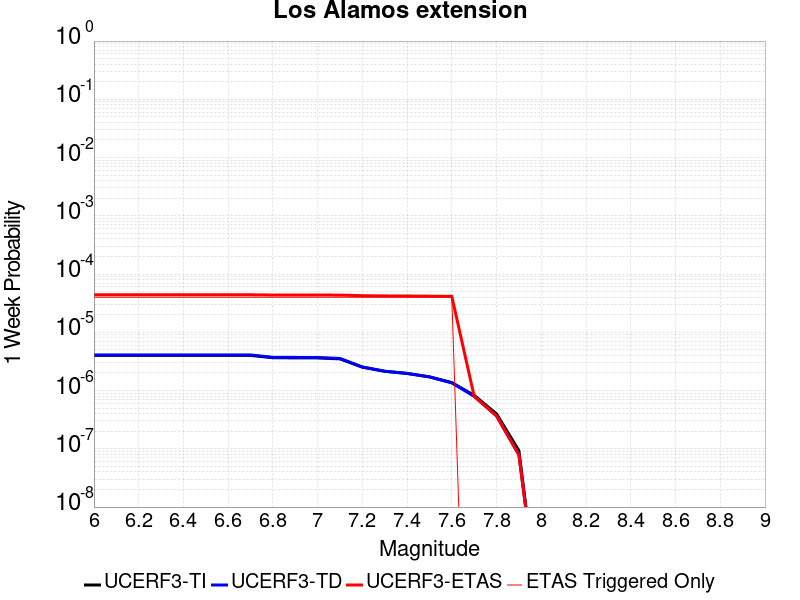 | 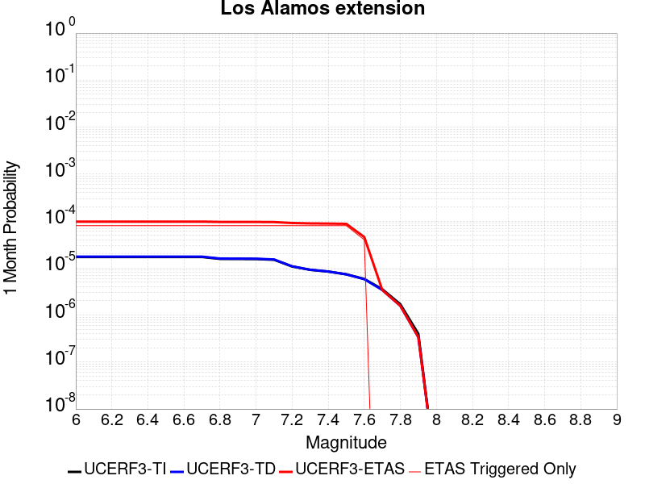 | 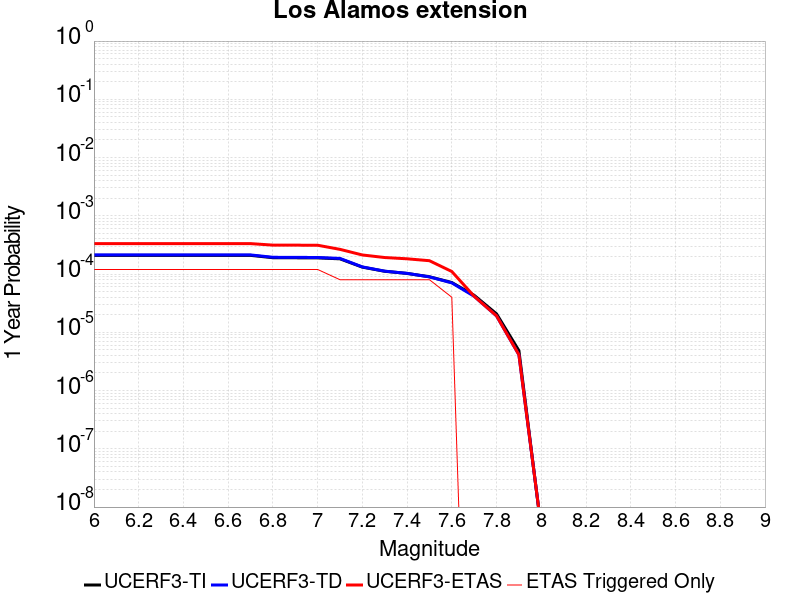 |

| Magnitude | 1 wk TI Prob | 1 wk TD Prob | 1 wk ETAS Prob | 1 wk ETAS/TD Gain | 1 wk ETAS Triggered Only | 1 mo TI Prob | 1 mo TD Prob | 1 mo ETAS Prob | 1 mo ETAS/TD Gain | 1 mo ETAS Triggered Only | 1 yr TI Prob | 1 yr TD Prob | 1 yr ETAS Prob | 1 yr ETAS/TD Gain | 1 yr ETAS Triggered Only |
|-----|-----|-----|-----|-----|-----|-----|-----|-----|-----|-----|-----|-----|-----|-----|-----|
| 6.0 | 4.0146506E-6 | 4.0866976E-6 | 4.4086533E-5 | 10.787814 | 4.0E-5 | 1.7205533E-5 | 1.7514307E-5 | 9.751291E-5 | 5.567614 | 8.0E-5 | 2.0945723E-4 | 2.1321693E-4 | 3.3319133E-4 | 1.562687 | 1.2E-4 |
| 6.1 | 4.0146506E-6 | 4.0866976E-6 | 4.4086533E-5 | 10.787814 | 4.0E-5 | 1.7205533E-5 | 1.7514307E-5 | 9.751291E-5 | 5.567614 | 8.0E-5 | 2.0945723E-4 | 2.1321693E-4 | 3.3319133E-4 | 1.562687 | 1.2E-4 |
| 6.2 | 4.0146506E-6 | 4.0866976E-6 | 4.4086533E-5 | 10.787814 | 4.0E-5 | 1.7205533E-5 | 1.7514307E-5 | 9.751291E-5 | 5.567614 | 8.0E-5 | 2.0945723E-4 | 2.1321693E-4 | 3.3319133E-4 | 1.562687 | 1.2E-4 |
| 6.3 | 4.0146506E-6 | 4.0866976E-6 | 4.4086533E-5 | 10.787814 | 4.0E-5 | 1.7205533E-5 | 1.7514307E-5 | 9.751291E-5 | 5.567614 | 8.0E-5 | 2.0945723E-4 | 2.1321693E-4 | 3.3319133E-4 | 1.562687 | 1.2E-4 |
| 6.4 | 4.0146506E-6 | 4.0866976E-6 | 4.4086533E-5 | 10.787814 | 4.0E-5 | 1.7205533E-5 | 1.7514307E-5 | 9.751291E-5 | 5.567614 | 8.0E-5 | 2.0945723E-4 | 2.1321693E-4 | 3.3319133E-4 | 1.562687 | 1.2E-4 |
| 6.5 | 4.0146506E-6 | 4.0866976E-6 | 4.4086533E-5 | 10.787814 | 4.0E-5 | 1.7205533E-5 | 1.7514307E-5 | 9.751291E-5 | 5.567614 | 8.0E-5 | 2.0945723E-4 | 2.1321693E-4 | 3.3319133E-4 | 1.562687 | 1.2E-4 |
| 6.6 | 4.0146506E-6 | 4.0866976E-6 | 4.4086533E-5 | 10.787814 | 4.0E-5 | 1.7205533E-5 | 1.7514307E-5 | 9.751291E-5 | 5.567614 | 8.0E-5 | 2.0945723E-4 | 2.1321693E-4 | 3.3319133E-4 | 1.562687 | 1.2E-4 |
| 6.7 | 4.0146506E-6 | 4.0866976E-6 | 4.4086533E-5 | 10.787814 | 4.0E-5 | 1.7205533E-5 | 1.7514307E-5 | 9.751291E-5 | 5.567614 | 8.0E-5 | 2.0945723E-4 | 2.1321693E-4 | 3.3319133E-4 | 1.562687 | 1.2E-4 |
| 6.8 | 3.6584688E-6 | 3.7193581E-6 | 4.371921E-5 | 11.754504 | 4.0E-5 | 1.5679057E-5 | 1.5940013E-5 | 9.593874E-5 | 6.0187364 | 8.0E-5 | 1.9087581E-4 | 1.9405333E-4 | 3.1403004E-4 | 1.6182667 | 1.2E-4 |
| 6.9 | 3.644631E-6 | 3.7050665E-6 | 4.3704917E-5 | 11.795988 | 4.0E-5 | 1.5619753E-5 | 1.5878764E-5 | 9.58775E-5 | 6.0380955 | 8.0E-5 | 1.901539E-4 | 1.9330774E-4 | 3.1328454E-4 | 1.6206518 | 1.2E-4 |
| 7.0 | 3.6318522E-6 | 3.6918254E-6 | 4.3691678E-5 | 11.834708 | 4.0E-5 | 1.5564989E-5 | 1.5822017E-5 | 9.582075E-5 | 6.0561647 | 8.0E-5 | 1.8948725E-4 | 1.9261698E-4 | 3.1259385E-4 | 1.6228781 | 1.2E-4 |
| 7.1 | 3.5001724E-6 | 3.5558812E-6 | 4.3555738E-5 | 12.24893 | 4.0E-5 | 1.5000653E-5 | 1.5239407E-5 | 9.523819E-5 | 6.2494683 | 8.0E-5 | 1.8261763E-4 | 1.855249E-4 | 2.6551005E-4 | 1.431129 | 8.0E-5 |
| 7.2 | 2.5204702E-6 | 2.5440634E-6 | 4.254396E-5 | 16.72284 | 4.0E-5 | 1.080197E-5 | 1.0903083E-5 | 9.090221E-5 | 8.337294 | 8.0E-5 | 1.3150605E-4 | 1.3273701E-4 | 2.1272639E-4 | 1.6026155 | 8.0E-5 |
| 7.3 | 2.1399692E-6 | 2.150455E-6 | 4.215037E-5 | 19.600676 | 4.0E-5 | 9.1712645E-6 | 9.216203E-6 | 8.9215464E-5 | 9.6802845 | 8.0E-5 | 1.1165442E-4 | 1.12201524E-4 | 1.9219254E-4 | 1.7129228 | 8.0E-5 |
| 7.4 | 1.9660122E-6 | 1.9705387E-6 | 4.197046E-5 | 21.298977 | 4.0E-5 | 8.42574E-6 | 8.445139E-6 | 8.844446E-5 | 10.472825 | 8.0E-5 | 1.0257855E-4 | 1.02814745E-4 | 1.8280653E-4 | 1.7780185 | 8.0E-5 |
| 7.5 | 1.7204633E-6 | 1.7153669E-6 | 4.17153E-5 | 24.318586 | 4.0E-5 | 7.373393E-6 | 7.351552E-6 | 8.735096E-5 | 11.881976 | 8.0E-5 | 8.976737E-5 | 8.95015E-5 | 1.6949433E-4 | 1.8937598 | 8.0E-5 |
| 7.6 | 1.3717638E-6 | 1.3538005E-6 | 4.1353745E-5 | 30.54641 | 4.0E-5 | 5.878974E-6 | 5.8019896E-6 | 4.5801757E-5 | 7.894147 | 4.0E-5 | 7.157416E-5 | 7.063696E-5 | 1.1063413E-4 | 1.5662358 | 4.0E-5 |
| 7.7 | 8.272564E-7 | 7.959012E-7 | 7.959012E-7 | 1.0 | 0.0 | 3.5453797E-6 | 3.4110005E-6 | 3.4110005E-6 | 1.0 | 0.0 | 4.3164142E-5 | 4.1528143E-5 | 4.1528143E-5 | 1.0 | 0.0 |
| 7.8 | 3.9708277E-7 | 3.672607E-7 | 3.672607E-7 | 1.0 | 0.0 | 1.7017821E-6 | 1.5739735E-6 | 1.5739735E-6 | 1.0 | 0.0 | 2.0719E-5 | 1.9162959E-5 | 1.9162959E-5 | 1.0 | 0.0 |
| 7.9 | 9.292528E-8 | 7.890701E-8 | 7.890701E-8 | 1.0 | 0.0 | 3.9825116E-7 | 3.3817284E-7 | 3.3817284E-7 | 1.0 | 0.0 | 4.848697E-6 | 4.1172466E-6 | 4.1172466E-6 | 1.0 | 0.0 |
| 8.0 | 7.880441E-11 | 8.236567E-11 | 8.236567E-11 | 1.0 | 0.0 | 3.3773329E-10 | 3.5299597E-10 | 3.5299597E-10 | 1.0 | 0.0 | 4.1119033E-9 | 4.2977253E-9 | 4.2977253E-9 | 1.0 | 0.0 |

## Nelson Lake
*[(top)](#table-of-contents)*

| 1 Week | 1 Month | 1 Year |
|-----|-----|-----|
|  | 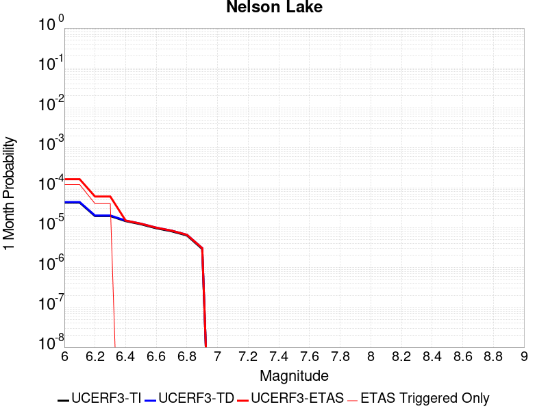 | 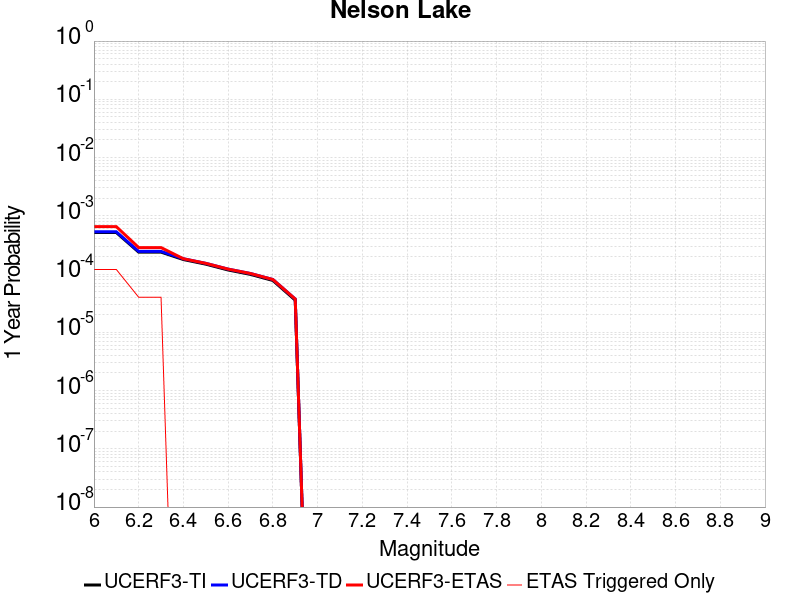 |

| Magnitude | 1 wk TI Prob | 1 wk TD Prob | 1 wk ETAS Prob | 1 wk ETAS/TD Gain | 1 wk ETAS Triggered Only | 1 mo TI Prob | 1 mo TD Prob | 1 mo ETAS Prob | 1 mo ETAS/TD Gain | 1 mo ETAS Triggered Only | 1 yr TI Prob | 1 yr TD Prob | 1 yr ETAS Prob | 1 yr ETAS/TD Gain | 1 yr ETAS Triggered Only |
|-----|-----|-----|-----|-----|-----|-----|-----|-----|-----|-----|-----|-----|-----|-----|-----|
| 6.0 | 9.913453E-6 | 1.0193228E-5 | 1.0193228E-5 | 1.0 | 0.0 | 4.2485535E-5 | 4.368459E-5 | 1.6367935E-4 | 3.746844 | 1.2E-4 | 5.1713863E-4 | 5.317404E-4 | 6.516766E-4 | 1.225554 | 1.2E-4 |
| 6.1 | 9.913453E-6 | 1.0193228E-5 | 1.0193228E-5 | 1.0 | 0.0 | 4.2485535E-5 | 4.368459E-5 | 1.6367935E-4 | 3.746844 | 1.2E-4 | 5.1713863E-4 | 5.317404E-4 | 6.516766E-4 | 1.225554 | 1.2E-4 |
| 6.2 | 4.5596407E-6 | 4.696791E-6 | 4.696791E-6 | 1.0 | 0.0 | 1.954117E-5 | 2.0128957E-5 | 6.012815E-5 | 2.9871469 | 4.0E-5 | 2.3788778E-4 | 2.4504375E-4 | 2.8503395E-4 | 1.1631962 | 4.0E-5 |
| 6.3 | 4.5596407E-6 | 4.696791E-6 | 4.696791E-6 | 1.0 | 0.0 | 1.954117E-5 | 2.0128957E-5 | 6.012815E-5 | 2.9871469 | 4.0E-5 | 2.3788778E-4 | 2.4504375E-4 | 2.8503395E-4 | 1.1631962 | 4.0E-5 |
| 6.4 | 3.4025713E-6 | 3.5102732E-6 | 3.5102732E-6 | 1.0 | 0.0 | 1.4582367E-5 | 1.5043946E-5 | 1.5043946E-5 | 1.0 | 0.0 | 1.7752586E-4 | 1.8314549E-4 | 1.8314549E-4 | 1.0 | 0.0 |
| 6.5 | 2.8352947E-6 | 2.9281807E-6 | 2.9281807E-6 | 1.0 | 0.0 | 1.2151207E-5 | 1.254929E-5 | 1.254929E-5 | 1.0 | 0.0 | 1.479309E-4 | 1.5277765E-4 | 1.5277765E-4 | 1.0 | 0.0 |
| 6.6 | 2.251518E-6 | 2.32934E-6 | 2.32934E-6 | 1.0 | 0.0 | 9.649328E-6 | 9.982851E-6 | 9.982851E-6 | 1.0 | 0.0 | 1.1747423E-4 | 1.21535064E-4 | 1.21535064E-4 | 1.0 | 0.0 |
| 6.7 | 1.8911853E-6 | 1.9593788E-6 | 1.9593788E-6 | 1.0 | 0.0 | 8.105055E-6 | 8.397314E-6 | 8.397314E-6 | 1.0 | 0.0 | 9.867457E-5 | 1.0223308E-4 | 1.0223308E-4 | 1.0 | 0.0 |
| 6.8 | 1.4874814E-6 | 1.544029E-6 | 1.544029E-6 | 1.0 | 0.0 | 6.374905E-6 | 6.617254E-6 | 6.617254E-6 | 1.0 | 0.0 | 7.76117E-5 | 8.0562604E-5 | 8.0562604E-5 | 1.0 | 0.0 |
| 6.9 | 6.835972E-7 | 7.141004E-7 | 7.141004E-7 | 1.0 | 0.0 | 2.9296991E-6 | 3.0604285E-6 | 3.0604285E-6 | 1.0 | 0.0 | 3.56685E-5 | 3.72604E-5 | 3.72604E-5 | 1.0 | 0.0 |

## Hollywood
*[(top)](#table-of-contents)*

| 1 Week | 1 Month | 1 Year |
|-----|-----|-----|
| 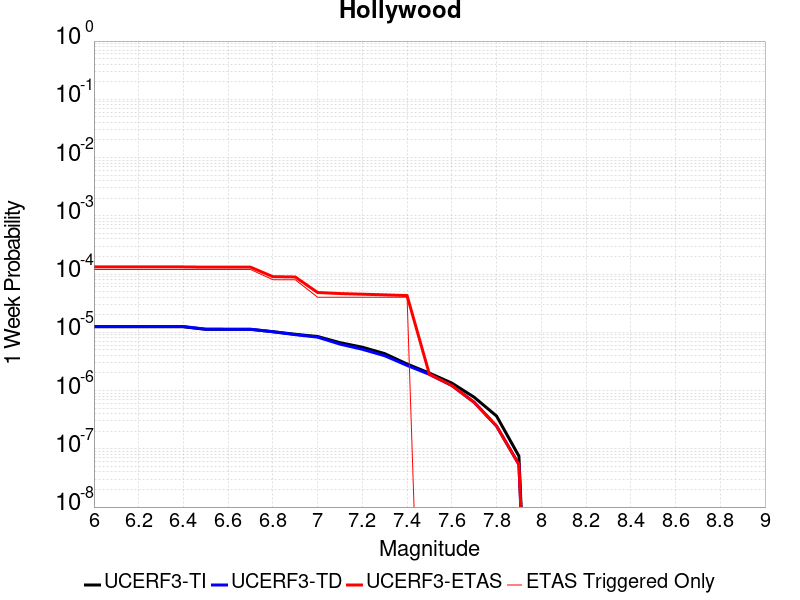 |  | 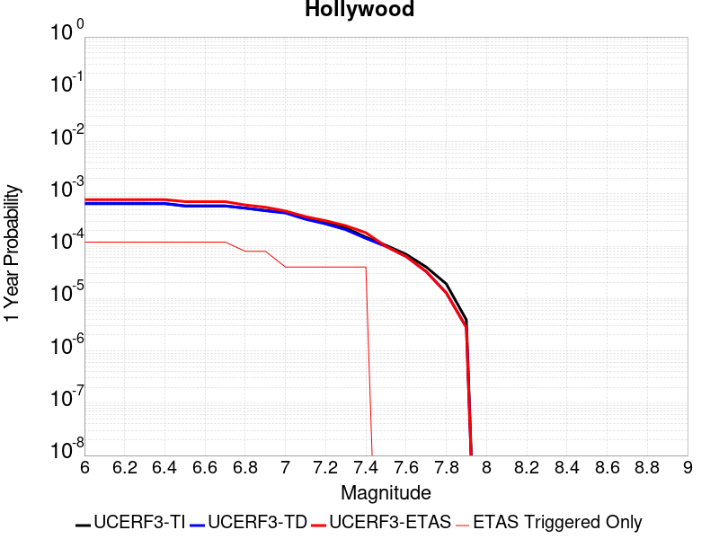 |

| Magnitude | 1 wk TI Prob | 1 wk TD Prob | 1 wk ETAS Prob | 1 wk ETAS/TD Gain | 1 wk ETAS Triggered Only | 1 mo TI Prob | 1 mo TD Prob | 1 mo ETAS Prob | 1 mo ETAS/TD Gain | 1 mo ETAS Triggered Only | 1 yr TI Prob | 1 yr TD Prob | 1 yr ETAS Prob | 1 yr ETAS/TD Gain | 1 yr ETAS Triggered Only |
|-----|-----|-----|-----|-----|-----|-----|-----|-----|-----|-----|-----|-----|-----|-----|-----|
| 6.0 | 1.24487615E-5 | 1.2597342E-5 | 1.3259583E-4 | 10.525699 | 1.2E-4 | 5.3350745E-5 | 5.398752E-5 | 1.7398104E-4 | 3.222616 | 1.2E-4 | 6.4935174E-4 | 6.571044E-4 | 7.770256E-4 | 1.1824994 | 1.2E-4 |
| 6.1 | 1.24487615E-5 | 1.2597342E-5 | 1.3259583E-4 | 10.525699 | 1.2E-4 | 5.3350745E-5 | 5.398752E-5 | 1.7398104E-4 | 3.222616 | 1.2E-4 | 6.4935174E-4 | 6.571044E-4 | 7.770256E-4 | 1.1824994 | 1.2E-4 |
| 6.2 | 1.24487615E-5 | 1.2597342E-5 | 1.3259583E-4 | 10.525699 | 1.2E-4 | 5.3350745E-5 | 5.398752E-5 | 1.7398104E-4 | 3.222616 | 1.2E-4 | 6.4935174E-4 | 6.571044E-4 | 7.770256E-4 | 1.1824994 | 1.2E-4 |
| 6.3 | 1.24487615E-5 | 1.2597342E-5 | 1.3259583E-4 | 10.525699 | 1.2E-4 | 5.3350745E-5 | 5.398752E-5 | 1.7398104E-4 | 3.222616 | 1.2E-4 | 6.4935174E-4 | 6.571044E-4 | 7.770256E-4 | 1.1824994 | 1.2E-4 |
| 6.4 | 1.2431024E-5 | 1.2577949E-5 | 1.3257645E-4 | 10.540386 | 1.2E-4 | 5.327473E-5 | 5.390441E-5 | 1.7389793E-4 | 3.226043 | 1.2E-4 | 6.4842677E-4 | 6.5609324E-4 | 7.7601447E-4 | 1.1827809 | 1.2E-4 |
| 6.5 | 1.1242222E-5 | 1.1321669E-5 | 1.3132031E-4 | 11.599024 | 1.2E-4 | 4.8180063E-5 | 4.8520553E-5 | 1.6851473E-4 | 3.4730587 | 1.2E-4 | 5.864344E-4 | 5.905803E-4 | 7.105094E-4 | 1.2030699 | 1.2E-4 |
| 6.6 | 1.1234066E-5 | 1.1312781E-5 | 1.3131142E-4 | 11.607351 | 1.2E-4 | 4.8145106E-5 | 4.848246E-5 | 1.6847665E-4 | 3.475002 | 1.2E-4 | 5.86009E-4 | 5.901168E-4 | 7.10046E-4 | 1.2032295 | 1.2E-4 |
| 6.7 | 1.12294E-5 | 1.1307522E-5 | 1.3130617E-4 | 11.612285 | 1.2E-4 | 4.812511E-5 | 4.8459922E-5 | 1.684541E-4 | 3.4761531 | 1.2E-4 | 5.857657E-4 | 5.898425E-4 | 7.0977176E-4 | 1.2033241 | 1.2E-4 |
| 6.8 | 1.0252819E-5 | 1.0221897E-5 | 9.022108E-5 | 8.826256 | 8.0E-5 | 4.3939912E-5 | 4.3807406E-5 | 1.238039E-4 | 2.826095 | 8.0E-5 | 5.3483713E-4 | 5.3322676E-4 | 6.131841E-4 | 1.14995 | 8.0E-5 |
| 6.9 | 9.252289E-6 | 9.113353E-6 | 8.9112626E-5 | 9.778248 | 8.0E-5 | 3.9652066E-5 | 3.9056653E-5 | 1.19053526E-4 | 3.0482266 | 8.0E-5 | 4.8265693E-4 | 4.7541264E-4 | 5.553746E-4 | 1.1681949 | 8.0E-5 |
| 7.0 | 8.474604E-6 | 8.261027E-6 | 4.8260696E-5 | 5.841973 | 4.0E-5 | 3.6319227E-5 | 3.540393E-5 | 7.540251E-5 | 2.1297781 | 4.0E-5 | 4.4209688E-4 | 4.3095901E-4 | 4.709418E-4 | 1.0927763 | 4.0E-5 |
| 7.1 | 6.643643E-6 | 6.2705008E-6 | 4.627025E-5 | 7.379036 | 4.0E-5 | 2.8472443E-5 | 2.68733E-5 | 6.687223E-5 | 2.4884262 | 4.0E-5 | 3.4659685E-4 | 3.2713375E-4 | 3.6712067E-4 | 1.1222341 | 4.0E-5 |
| 7.2 | 5.549002E-6 | 5.110507E-6 | 4.5110304E-5 | 8.826972 | 4.0E-5 | 2.378122E-5 | 2.190199E-5 | 6.190111E-5 | 2.826278 | 4.0E-5 | 2.8949787E-4 | 2.6662424E-4 | 3.0661357E-4 | 1.1499839 | 4.0E-5 |
| 7.3 | 4.3059727E-6 | 3.961397E-6 | 4.3961238E-5 | 11.097407 | 4.0E-5 | 1.8454039E-5 | 1.6977307E-5 | 5.6976627E-5 | 3.3560464 | 4.0E-5 | 2.2465475E-4 | 2.066792E-4 | 2.466709E-4 | 1.1934967 | 4.0E-5 |
| 7.4 | 2.8550733E-6 | 2.7025183E-6 | 4.270241E-5 | 15.80097 | 4.0E-5 | 1.2235971E-5 | 1.15821695E-5 | 5.158171E-5 | 4.453544 | 4.0E-5 | 1.4896276E-4 | 1.4100384E-4 | 1.809982E-4 | 1.2836403 | 4.0E-5 |
| 7.5 | 1.9927045E-6 | 1.8985335E-6 | 1.8985335E-6 | 1.0 | 0.0 | 8.540134E-6 | 8.136547E-6 | 8.136547E-6 | 1.0 | 0.0 | 1.0397117E-4 | 9.905799E-5 | 9.905799E-5 | 1.0 | 0.0 |
| 7.6 | 1.345084E-6 | 1.2221985E-6 | 1.2221985E-6 | 1.0 | 0.0 | 5.764633E-6 | 5.2379833E-6 | 5.2379833E-6 | 1.0 | 0.0 | 7.018215E-5 | 6.37706E-5 | 6.37706E-5 | 1.0 | 0.0 |
| 7.7 | 7.6835164E-7 | 6.2821863E-7 | 6.2821863E-7 | 1.0 | 0.0 | 3.2929315E-6 | 2.6923628E-6 | 2.6923628E-6 | 1.0 | 0.0 | 4.00907E-5 | 3.277904E-5 | 3.277904E-5 | 1.0 | 0.0 |
| 7.8 | 3.6562128E-7 | 2.4571727E-7 | 2.4571727E-7 | 1.0 | 0.0 | 1.5669474E-6 | 1.0530736E-6 | 1.0530736E-6 | 1.0 | 0.0 | 1.9077417E-5 | 1.28210995E-5 | 1.28210995E-5 | 1.0 | 0.0 |
| 7.9 | 7.5024424E-8 | 5.389549E-8 | 5.389549E-8 | 1.0 | 0.0 | 3.215332E-7 | 2.3098066E-7 | 2.3098066E-7 | 1.0 | 0.0 | 3.91466E-6 | 2.8121872E-6 | 2.8121872E-6 | 1.0 | 0.0 |

## Reliz 2011 CFM
*[(top)](#table-of-contents)*

| 1 Week | 1 Month | 1 Year |
|-----|-----|-----|
| 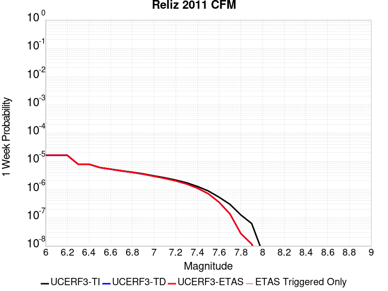 | 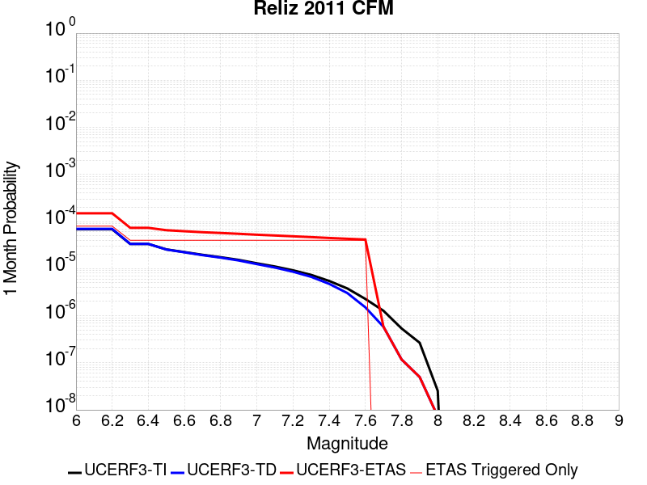 | 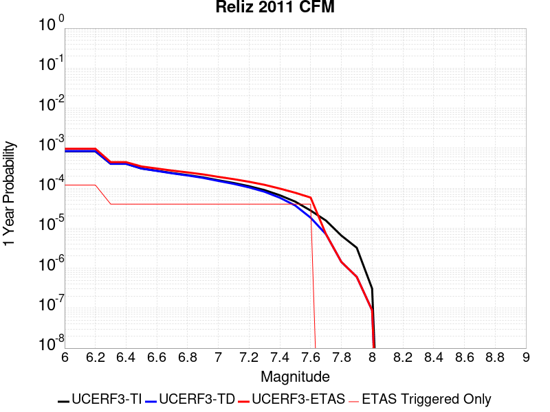 |

| Magnitude | 1 wk TI Prob | 1 wk TD Prob | 1 wk ETAS Prob | 1 wk ETAS/TD Gain | 1 wk ETAS Triggered Only | 1 mo TI Prob | 1 mo TD Prob | 1 mo ETAS Prob | 1 mo ETAS/TD Gain | 1 mo ETAS Triggered Only | 1 yr TI Prob | 1 yr TD Prob | 1 yr ETAS Prob | 1 yr ETAS/TD Gain | 1 yr ETAS Triggered Only |
|-----|-----|-----|-----|-----|-----|-----|-----|-----|-----|-----|-----|-----|-----|-----|-----|
| 6.0 | 1.6002472E-5 | 1.6285272E-5 | 1.6285272E-5 | 1.0 | 0.0 | 6.8580215E-5 | 6.979227E-5 | 1.4978669E-4 | 2.1461787 | 8.0E-5 | 8.3464425E-4 | 8.4940944E-4 | 9.6930756E-4 | 1.1411546 | 1.2E-4 |
| 6.1 | 1.6002472E-5 | 1.6285272E-5 | 1.6285272E-5 | 1.0 | 0.0 | 6.8580215E-5 | 6.979227E-5 | 1.4978669E-4 | 2.1461787 | 8.0E-5 | 8.3464425E-4 | 8.4940944E-4 | 9.6930756E-4 | 1.1411546 | 1.2E-4 |
| 6.2 | 1.6002472E-5 | 1.6285272E-5 | 1.6285272E-5 | 1.0 | 0.0 | 6.8580215E-5 | 6.979227E-5 | 1.4978669E-4 | 2.1461787 | 8.0E-5 | 8.3464425E-4 | 8.4940944E-4 | 9.6930756E-4 | 1.1411546 | 1.2E-4 |
| 6.3 | 7.792404E-6 | 7.805327E-6 | 7.805327E-6 | 1.0 | 0.0 | 3.339559E-5 | 3.345098E-5 | 7.344964E-5 | 2.1957397 | 4.0E-5 | 4.0651546E-4 | 4.0719032E-4 | 4.4717404E-4 | 1.0981941 | 4.0E-5 |
| 6.4 | 7.792404E-6 | 7.805327E-6 | 7.805327E-6 | 1.0 | 0.0 | 3.339559E-5 | 3.345098E-5 | 7.344964E-5 | 2.1957397 | 4.0E-5 | 4.0651546E-4 | 4.0719032E-4 | 4.4717404E-4 | 1.0981941 | 4.0E-5 |
| 6.5 | 5.9659374E-6 | 5.930094E-6 | 5.930094E-6 | 1.0 | 0.0 | 2.5568053E-5 | 2.5414443E-5 | 6.541343E-5 | 2.5738683 | 4.0E-5 | 3.1124658E-4 | 3.0937712E-4 | 3.4936474E-4 | 1.1292521 | 4.0E-5 |
| 6.6 | 5.2350692E-6 | 5.1802763E-6 | 5.1802763E-6 | 1.0 | 0.0 | 2.2435817E-5 | 2.2200995E-5 | 6.220011E-5 | 2.801681 | 4.0E-5 | 2.7312184E-4 | 2.7026373E-4 | 3.1025294E-4 | 1.1479635 | 4.0E-5 |
| 6.7 | 4.580206E-6 | 4.507348E-6 | 4.507348E-6 | 1.0 | 0.0 | 1.9629308E-5 | 1.9317062E-5 | 5.9316288E-5 | 3.0706682 | 4.0E-5 | 2.389606E-4 | 2.3515993E-4 | 2.7515052E-4 | 1.170057 | 4.0E-5 |
| 6.8 | 4.0765017E-6 | 3.989416E-6 | 3.989416E-6 | 1.0 | 0.0 | 1.7470604E-5 | 1.7097385E-5 | 5.7096702E-5 | 3.339499 | 4.0E-5 | 2.1268385E-4 | 2.0814082E-4 | 2.481325E-4 | 1.1921376 | 4.0E-5 |
| 6.9 | 3.5752896E-6 | 3.4736445E-6 | 3.4736445E-6 | 1.0 | 0.0 | 1.532258E-5 | 1.4886963E-5 | 5.4886368E-5 | 3.6868746 | 4.0E-5 | 1.8653645E-4 | 1.8123373E-4 | 2.2122648E-4 | 1.2206695 | 4.0E-5 |
| 7.0 | 3.0259848E-6 | 2.9090154E-6 | 2.9090154E-6 | 1.0 | 0.0 | 1.2968442E-5 | 1.2467149E-5 | 5.246665E-5 | 4.208392 | 4.0E-5 | 1.5787935E-4 | 1.5177699E-4 | 1.9177092E-4 | 1.2635046 | 4.0E-5 |
| 7.1 | 2.5861116E-6 | 2.4561955E-6 | 2.4561955E-6 | 1.0 | 0.0 | 1.1083288E-5 | 1.052651E-5 | 5.052609E-5 | 4.79989 | 4.0E-5 | 1.3493067E-4 | 1.2815272E-4 | 1.681476E-4 | 1.3120875 | 4.0E-5 |
| 7.2 | 2.1482588E-6 | 2.0042157E-6 | 2.0042157E-6 | 1.0 | 0.0 | 9.20679E-6 | 8.589467E-6 | 4.8589125E-5 | 5.656826 | 4.0E-5 | 1.12086906E-4 | 1.0457176E-4 | 1.4456757E-4 | 1.3824725 | 4.0E-5 |
| 7.3 | 1.7194744E-6 | 1.5620558E-6 | 1.5620558E-6 | 1.0 | 0.0 | 7.3691554E-6 | 6.6945076E-6 | 4.669424E-5 | 6.9750075 | 4.0E-5 | 8.971577E-5 | 8.1502585E-5 | 1.21499324E-4 | 1.490742 | 4.0E-5 |
| 7.4 | 1.2755178E-6 | 1.1065134E-6 | 1.1065134E-6 | 1.0 | 0.0 | 5.4664933E-6 | 4.742192E-6 | 4.4742003E-5 | 9.434878 | 4.0E-5 | 6.655252E-5 | 5.7734655E-5 | 9.773234E-5 | 1.6927848 | 4.0E-5 |
| 7.5 | 8.8463224E-7 | 7.066436E-7 | 7.066436E-7 | 1.0 | 0.0 | 3.7912755E-6 | 3.0284689E-6 | 4.3028347E-5 | 14.207954 | 4.0E-5 | 4.6157802E-5 | 3.6870988E-5 | 7.686951E-5 | 2.0848238 | 4.0E-5 |
| 7.6 | 5.291355E-7 | 3.5082746E-7 | 3.5082746E-7 | 1.0 | 0.0 | 2.2677216E-6 | 1.5035454E-6 | 4.1503485E-5 | 27.603746 | 4.0E-5 | 2.760916E-5 | 1.830551E-5 | 5.830478E-5 | 3.1850944 | 4.0E-5 |
| 7.7 | 2.9663357E-7 | 1.356328E-7 | 1.356328E-7 | 1.0 | 0.0 | 1.2712861E-6 | 5.812833E-7 | 5.812833E-7 | 1.0 | 0.0 | 1.5477797E-5 | 7.077101E-6 | 7.077101E-6 | 1.0 | 0.0 |
| 7.8 | 1.2509386E-7 | 2.744508E-8 | 2.744508E-8 | 1.0 | 0.0 | 5.3611643E-7 | 1.1762178E-7 | 1.1762178E-7 | 1.0 | 0.0 | 6.527198E-6 | 1.4320442E-6 | 1.4320442E-6 | 1.0 | 0.0 |
| 7.9 | 6.213493E-8 | 1.16370495E-8 | 1.16370495E-8 | 1.0 | 0.0 | 2.6629255E-7 | 4.9873073E-8 | 4.9873073E-8 | 1.0 | 0.0 | 3.242107E-6 | 6.072045E-7 | 6.072045E-7 | 1.0 | 0.0 |
| 8.0 | 5.92383E-9 | 1.6953359E-9 | 1.6953359E-9 | 1.0 | 0.0 | 2.5387841E-8 | 7.2657254E-9 | 7.2657254E-9 | 1.0 | 0.0 | 3.0909692E-7 | 8.8460204E-8 | 8.8460204E-8 | 1.0 | 0.0 |

## Northridge
*[(top)](#table-of-contents)*

| 1 Week | 1 Month | 1 Year |
|-----|-----|-----|
| 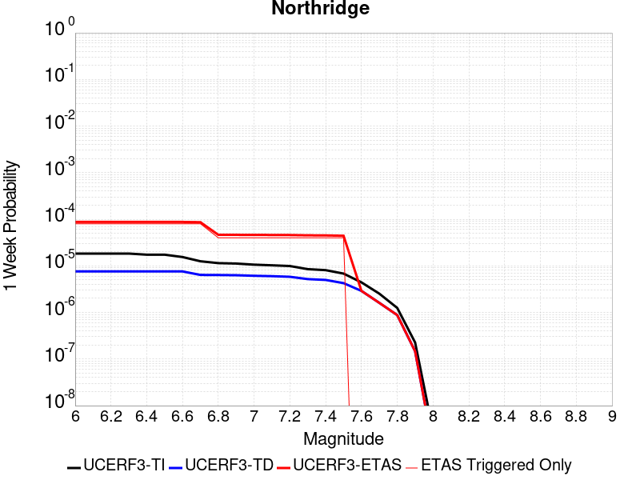 | 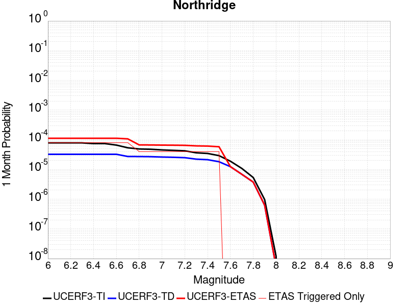 | 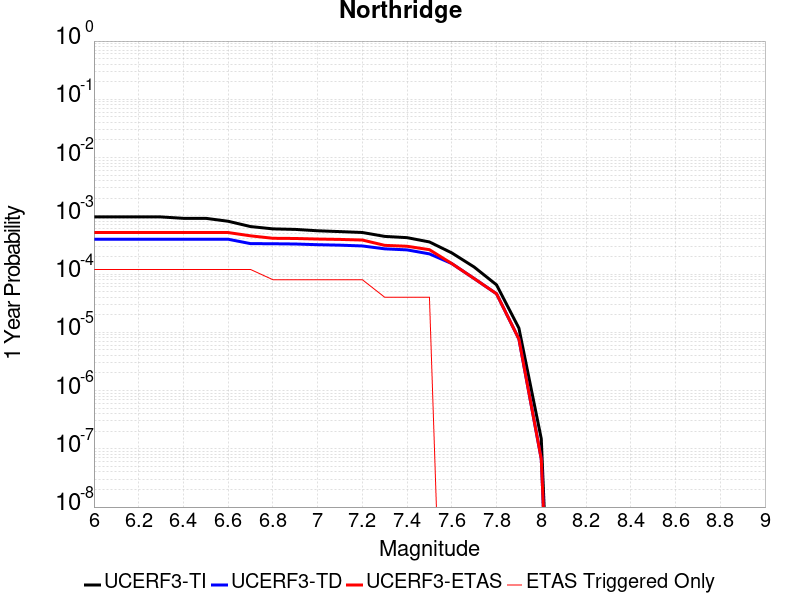 |

| Magnitude | 1 wk TI Prob | 1 wk TD Prob | 1 wk ETAS Prob | 1 wk ETAS/TD Gain | 1 wk ETAS Triggered Only | 1 mo TI Prob | 1 mo TD Prob | 1 mo ETAS Prob | 1 mo ETAS/TD Gain | 1 mo ETAS Triggered Only | 1 yr TI Prob | 1 yr TD Prob | 1 yr ETAS Prob | 1 yr ETAS/TD Gain | 1 yr ETAS Triggered Only |
|-----|-----|-----|-----|-----|-----|-----|-----|-----|-----|-----|-----|-----|-----|-----|-----|
| 6.0 | 1.8340852E-5 | 7.592269E-6 | 8.759166E-5 | 11.536955 | 8.0E-5 | 7.860128E-5 | 3.25379E-5 | 1.125353E-4 | 3.4585912 | 8.0E-5 | 9.565505E-4 | 3.9607915E-4 | 5.1603164E-4 | 1.3028498 | 1.2E-4 |
| 6.1 | 1.8340852E-5 | 7.592269E-6 | 8.759166E-5 | 11.536955 | 8.0E-5 | 7.860128E-5 | 3.25379E-5 | 1.125353E-4 | 3.4585912 | 8.0E-5 | 9.565505E-4 | 3.9607915E-4 | 5.1603164E-4 | 1.3028498 | 1.2E-4 |
| 6.2 | 1.8340852E-5 | 7.592269E-6 | 8.759166E-5 | 11.536955 | 8.0E-5 | 7.860128E-5 | 3.25379E-5 | 1.125353E-4 | 3.4585912 | 8.0E-5 | 9.565505E-4 | 3.9607915E-4 | 5.1603164E-4 | 1.3028498 | 1.2E-4 |
| 6.3 | 1.8340852E-5 | 7.592269E-6 | 8.759166E-5 | 11.536955 | 8.0E-5 | 7.860128E-5 | 3.25379E-5 | 1.125353E-4 | 3.4585912 | 8.0E-5 | 9.565505E-4 | 3.9607915E-4 | 5.1603164E-4 | 1.3028498 | 1.2E-4 |
| 6.4 | 1.7361892E-5 | 7.592269E-6 | 8.759166E-5 | 11.536955 | 8.0E-5 | 7.440598E-5 | 3.25379E-5 | 1.125353E-4 | 3.4585912 | 8.0E-5 | 9.055163E-4 | 3.9607915E-4 | 5.1603164E-4 | 1.3028498 | 1.2E-4 |
| 6.5 | 1.7361892E-5 | 7.592269E-6 | 8.759166E-5 | 11.536955 | 8.0E-5 | 7.440598E-5 | 3.25379E-5 | 1.125353E-4 | 3.4585912 | 8.0E-5 | 9.055163E-4 | 3.9607915E-4 | 5.1603164E-4 | 1.3028498 | 1.2E-4 |
| 6.6 | 1.5458201E-5 | 7.592269E-6 | 8.759166E-5 | 11.536955 | 8.0E-5 | 6.624775E-5 | 3.25379E-5 | 1.125353E-4 | 3.4585912 | 8.0E-5 | 8.0626784E-4 | 3.9607915E-4 | 5.1603164E-4 | 1.3028498 | 1.2E-4 |
| 6.7 | 1.2538368E-5 | 6.385123E-6 | 8.6384614E-5 | 13.529045 | 8.0E-5 | 5.3734755E-5 | 2.7364527E-5 | 1.07362335E-4 | 3.9234128 | 8.0E-5 | 6.5402425E-4 | 3.3311264E-4 | 4.5307266E-4 | 1.3601185 | 1.2E-4 |
| 6.8 | 1.1438097E-5 | 6.3537445E-6 | 4.635349E-5 | 7.29546 | 4.0E-5 | 4.9019498E-5 | 2.7230051E-5 | 6.722896E-5 | 2.4689252 | 4.0E-5 | 5.9664896E-4 | 3.3147587E-4 | 4.1144935E-4 | 1.2412648 | 8.0E-5 |
| 6.9 | 1.1204891E-5 | 6.2901518E-6 | 4.62899E-5 | 7.359107 | 4.0E-5 | 4.8020076E-5 | 2.6957518E-5 | 6.695644E-5 | 2.483776 | 4.0E-5 | 5.8448757E-4 | 3.2815879E-4 | 4.0813253E-4 | 1.2437044 | 8.0E-5 |
| 7.0 | 1.061046E-5 | 6.118719E-6 | 4.6118475E-5 | 7.5372763 | 4.0E-5 | 4.5472607E-5 | 2.622282E-5 | 6.622177E-5 | 2.525349 | 4.0E-5 | 5.534883E-4 | 3.192165E-4 | 3.9919096E-4 | 1.2505336 | 8.0E-5 |
| 7.1 | 1.0266979E-5 | 6.007566E-6 | 4.6007324E-5 | 7.658231 | 4.0E-5 | 4.40006E-5 | 2.574646E-5 | 6.574543E-5 | 2.5535717 | 4.0E-5 | 5.355756E-4 | 3.1341848E-4 | 3.9339342E-4 | 1.2551697 | 8.0E-5 |
| 7.2 | 9.91273E-6 | 5.8231994E-6 | 4.5822966E-5 | 7.8690357 | 4.0E-5 | 4.248244E-5 | 2.4956333E-5 | 6.495533E-5 | 2.6027596 | 4.0E-5 | 5.171009E-4 | 3.038014E-4 | 3.837771E-4 | 1.2632499 | 8.0E-5 |
| 7.3 | 8.4959265E-6 | 5.1959923E-6 | 4.5195786E-5 | 8.698201 | 4.0E-5 | 3.6410605E-5 | 2.226835E-5 | 6.2267456E-5 | 2.7962315 | 4.0E-5 | 4.4320893E-4 | 2.7108367E-4 | 3.1107283E-4 | 1.1475159 | 4.0E-5 |
| 7.4 | 8.0847185E-6 | 4.9846876E-6 | 4.498449E-5 | 9.024535 | 4.0E-5 | 3.4648332E-5 | 2.1362772E-5 | 6.136192E-5 | 2.8723762 | 4.0E-5 | 4.2176177E-4 | 2.6006094E-4 | 3.0005054E-4 | 1.1537701 | 4.0E-5 |
| 7.5 | 6.8220684E-6 | 4.2554057E-6 | 4.4255234E-5 | 10.39977 | 4.0E-5 | 2.9237108E-5 | 1.8237326E-5 | 5.8236597E-5 | 3.193264 | 4.0E-5 | 3.5590364E-4 | 2.2201701E-4 | 2.6200814E-4 | 1.1801264 | 4.0E-5 |
| 7.6 | 4.4224143E-6 | 2.9009893E-6 | 2.9009893E-6 | 1.0 | 0.0 | 1.8953066E-5 | 1.2432753E-5 | 1.2432753E-5 | 1.0 | 0.0 | 2.3072914E-4 | 1.5135837E-4 | 1.5135837E-4 | 1.0 | 0.0 |
| 7.7 | 2.5297056E-6 | 1.6051013E-6 | 1.6051013E-6 | 1.0 | 0.0 | 1.0841551E-5 | 6.8789873E-6 | 6.8789873E-6 | 1.0 | 0.0 | 1.319879E-4 | 8.37485E-5 | 8.37485E-5 | 1.0 | 0.0 |
| 7.8 | 1.2508156E-6 | 8.7828397E-7 | 8.7828397E-7 | 1.0 | 0.0 | 5.3606273E-6 | 3.7640687E-6 | 3.7640687E-6 | 1.0 | 0.0 | 6.526368E-5 | 4.5826586E-5 | 4.5826586E-5 | 1.0 | 0.0 |
| 7.9 | 2.262199E-7 | 1.4671322E-7 | 1.4671322E-7 | 1.0 | 0.0 | 9.695135E-7 | 6.287708E-7 | 6.287708E-7 | 1.0 | 0.0 | 1.1803763E-5 | 7.655259E-6 | 7.655259E-6 | 1.0 | 0.0 |
| 8.0 | 2.865362E-9 | 1.2774003E-9 | 1.2774003E-9 | 1.0 | 0.0 | 1.2280123E-8 | 5.474573E-9 | 5.474573E-9 | 1.0 | 0.0 | 1.4951048E-7 | 6.665292E-8 | 6.665292E-8 | 1.0 | 0.0 |

## Santa Monica alt 1
*[(top)](#table-of-contents)*

| 1 Week | 1 Month | 1 Year |
|-----|-----|-----|
| 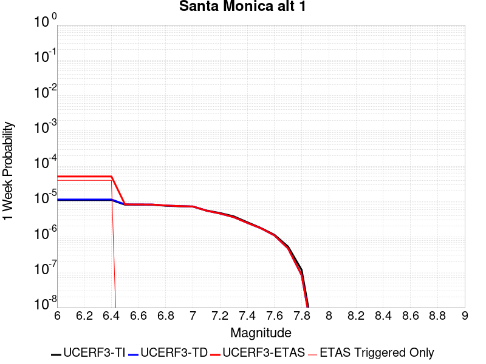 | 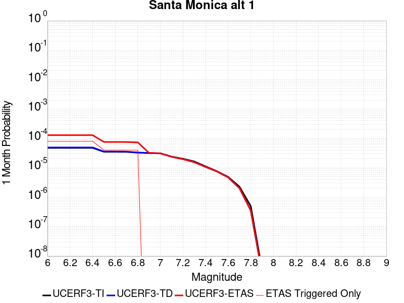 | 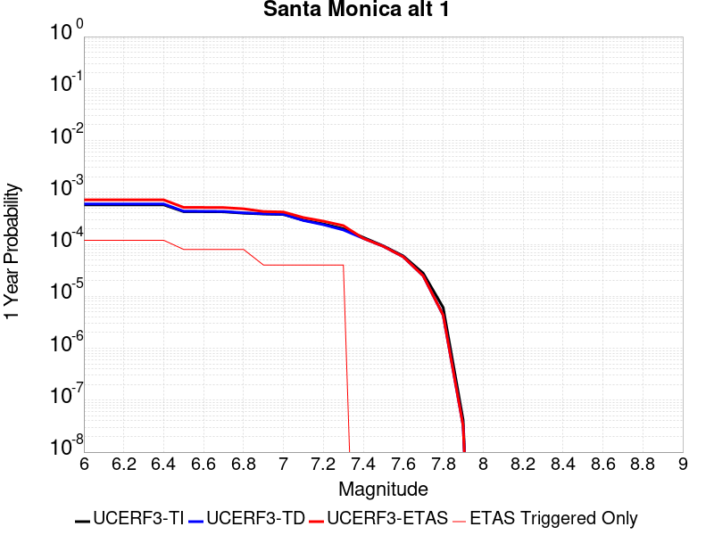 |

| Magnitude | 1 wk TI Prob | 1 wk TD Prob | 1 wk ETAS Prob | 1 wk ETAS/TD Gain | 1 wk ETAS Triggered Only | 1 mo TI Prob | 1 mo TD Prob | 1 mo ETAS Prob | 1 mo ETAS/TD Gain | 1 mo ETAS Triggered Only | 1 yr TI Prob | 1 yr TD Prob | 1 yr ETAS Prob | 1 yr ETAS/TD Gain | 1 yr ETAS Triggered Only |
|-----|-----|-----|-----|-----|-----|-----|-----|-----|-----|-----|-----|-----|-----|-----|-----|
| 6.0 | 1.1066008E-5 | 1.1483656E-5 | 5.1483195E-5 | 4.4831715 | 4.0E-5 | 4.742488E-5 | 4.9214817E-5 | 1.2921088E-4 | 2.6254468 | 8.0E-5 | 5.7724497E-4 | 5.990396E-4 | 7.189677E-4 | 1.2002007 | 1.2E-4 |
| 6.1 | 1.1066008E-5 | 1.1483656E-5 | 5.1483195E-5 | 4.4831715 | 4.0E-5 | 4.742488E-5 | 4.9214817E-5 | 1.2921088E-4 | 2.6254468 | 8.0E-5 | 5.7724497E-4 | 5.990396E-4 | 7.189677E-4 | 1.2002007 | 1.2E-4 |
| 6.2 | 1.1066008E-5 | 1.1483656E-5 | 5.1483195E-5 | 4.4831715 | 4.0E-5 | 4.742488E-5 | 4.9214817E-5 | 1.2921088E-4 | 2.6254468 | 8.0E-5 | 5.7724497E-4 | 5.990396E-4 | 7.189677E-4 | 1.2002007 | 1.2E-4 |
| 6.3 | 1.1066008E-5 | 1.1483656E-5 | 5.1483195E-5 | 4.4831715 | 4.0E-5 | 4.742488E-5 | 4.9214817E-5 | 1.2921088E-4 | 2.6254468 | 8.0E-5 | 5.7724497E-4 | 5.990396E-4 | 7.189677E-4 | 1.2002007 | 1.2E-4 |
| 6.4 | 1.1066008E-5 | 1.1483656E-5 | 5.1483195E-5 | 4.4831715 | 4.0E-5 | 4.742488E-5 | 4.9214817E-5 | 1.2921088E-4 | 2.6254468 | 8.0E-5 | 5.7724497E-4 | 5.990396E-4 | 7.189677E-4 | 1.2002007 | 1.2E-4 |
| 6.5 | 8.183544E-6 | 8.337806E-6 | 8.337806E-6 | 1.0 | 0.0 | 3.5071862E-5 | 3.5732974E-5 | 7.573154E-5 | 2.1193743 | 4.0E-5 | 4.2691626E-4 | 4.3496373E-4 | 5.1492895E-4 | 1.1838434 | 8.0E-5 |
| 6.6 | 8.1543285E-6 | 8.306011E-6 | 8.306011E-6 | 1.0 | 0.0 | 3.4946657E-5 | 3.5596713E-5 | 7.559529E-5 | 2.1236591 | 4.0E-5 | 4.2539247E-4 | 4.333054E-4 | 5.1327073E-4 | 1.1845473 | 8.0E-5 |
| 6.7 | 8.110878E-6 | 8.259396E-6 | 8.259396E-6 | 1.0 | 0.0 | 3.4760444E-5 | 3.539694E-5 | 7.5395525E-5 | 2.130001 | 4.0E-5 | 4.231262E-4 | 4.3087412E-4 | 5.108396E-4 | 1.1855891 | 8.0E-5 |
| 6.8 | 7.644036E-6 | 7.75327E-6 | 7.75327E-6 | 1.0 | 0.0 | 3.275974E-5 | 3.3227883E-5 | 7.3226554E-5 | 2.2037683 | 4.0E-5 | 3.9877684E-4 | 4.044758E-4 | 4.8444344E-4 | 1.1977068 | 8.0E-5 |
| 6.9 | 7.3698293E-6 | 7.457851E-6 | 7.457851E-6 | 1.0 | 0.0 | 3.15846E-5 | 3.1961834E-5 | 3.1961834E-5 | 1.0 | 0.0 | 3.8447464E-4 | 3.8906725E-4 | 4.290517E-4 | 1.10277 | 4.0E-5 |
| 7.0 | 7.209872E-6 | 7.2877206E-6 | 7.2877206E-6 | 1.0 | 0.0 | 3.0899086E-5 | 3.1232725E-5 | 3.1232725E-5 | 1.0 | 0.0 | 3.7613141E-4 | 3.8019344E-4 | 4.2017823E-4 | 1.1051697 | 4.0E-5 |
| 7.1 | 5.603456E-6 | 5.525409E-6 | 5.525409E-6 | 1.0 | 0.0 | 2.4014591E-5 | 2.3680112E-5 | 2.3680112E-5 | 1.0 | 0.0 | 2.923384E-4 | 2.8826762E-4 | 3.2825608E-4 | 1.1387199 | 4.0E-5 |
| 7.2 | 4.7483613E-6 | 4.5923603E-6 | 4.5923603E-6 | 1.0 | 0.0 | 2.0349962E-5 | 1.9681396E-5 | 1.9681396E-5 | 1.0 | 0.0 | 2.4773262E-4 | 2.3959478E-4 | 2.795852E-4 | 1.1669085 | 4.0E-5 |
| 7.3 | 3.829015E-6 | 3.635215E-6 | 3.635215E-6 | 1.0 | 0.0 | 1.6409962E-5 | 1.55794E-5 | 1.55794E-5 | 1.0 | 0.0 | 1.9977297E-4 | 1.8966277E-4 | 2.2965518E-4 | 1.2108606 | 4.0E-5 |
| 7.4 | 2.610755E-6 | 2.5003064E-6 | 2.5003064E-6 | 1.0 | 0.0 | 1.1188902E-5 | 1.0715555E-5 | 1.0715555E-5 | 1.0 | 0.0 | 1.3621636E-4 | 1.3045411E-4 | 1.3045411E-4 | 1.0 | 0.0 |
| 7.5 | 1.792146E-6 | 1.758899E-6 | 1.758899E-6 | 1.0 | 0.0 | 7.680603E-6 | 7.5381167E-6 | 7.5381167E-6 | 1.0 | 0.0 | 9.3507326E-5 | 9.177274E-5 | 9.177274E-5 | 1.0 | 0.0 |
| 7.6 | 1.1473018E-6 | 1.1032112E-6 | 1.1032112E-6 | 1.0 | 0.0 | 4.9169985E-6 | 4.728039E-6 | 4.728039E-6 | 1.0 | 0.0 | 5.986281E-5 | 5.756237E-5 | 5.756237E-5 | 1.0 | 0.0 |
| 7.7 | 5.330919E-7 | 4.7469157E-7 | 4.7469157E-7 | 1.0 | 0.0 | 2.2846775E-6 | 2.034391E-6 | 2.034391E-6 | 1.0 | 0.0 | 2.7815593E-5 | 2.476844E-5 | 2.476844E-5 | 1.0 | 0.0 |
| 7.8 | 1.1668574E-7 | 8.304975E-8 | 8.304975E-8 | 1.0 | 0.0 | 5.000816E-7 | 3.5592745E-7 | 3.5592745E-7 | 1.0 | 0.0 | 6.0884768E-6 | 4.3334085E-6 | 4.3334085E-6 | 1.0 | 0.0 |
| 7.9 | 8.007447E-10 | 6.1625505E-10 | 6.1625505E-10 | 1.0 | 0.0 | 3.4317629E-9 | 2.6410938E-9 | 2.6410938E-9 | 1.0 | 0.0 | 4.1781714E-8 | 3.2155317E-8 | 3.2155317E-8 | 1.0 | 0.0 |

## Baker
*[(top)](#table-of-contents)*

| 1 Week | 1 Month | 1 Year |
|-----|-----|-----|
| 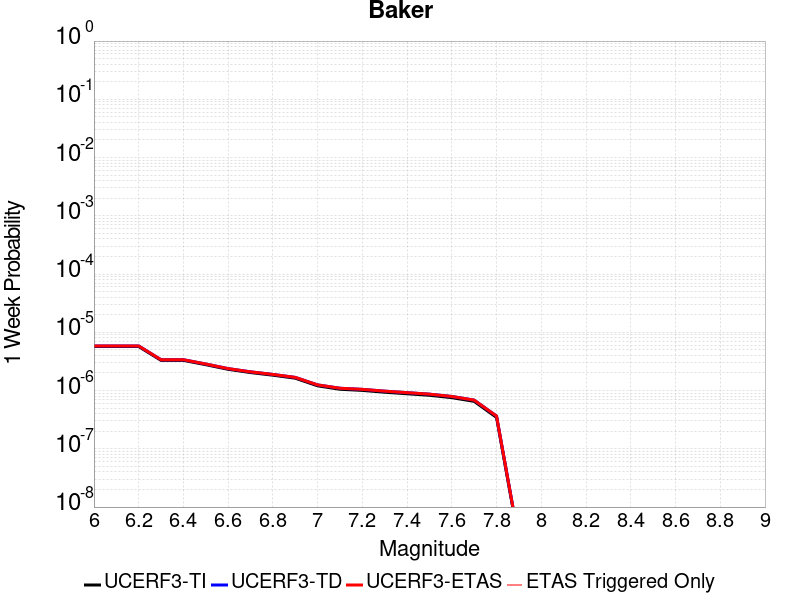 | 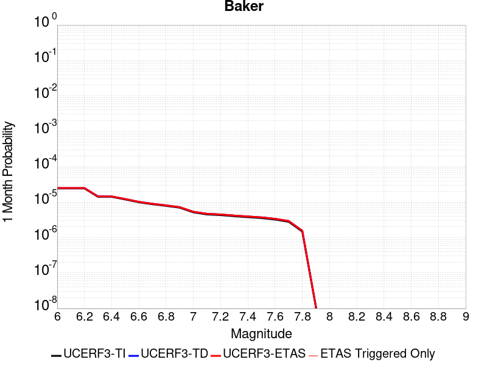 | 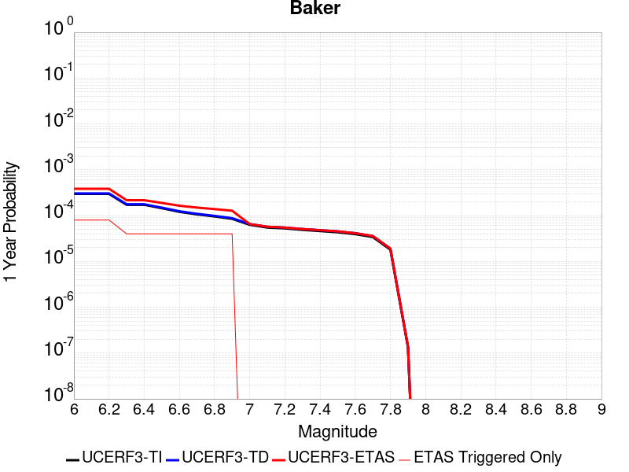 |

| Magnitude | 1 wk TI Prob | 1 wk TD Prob | 1 wk ETAS Prob | 1 wk ETAS/TD Gain | 1 wk ETAS Triggered Only | 1 mo TI Prob | 1 mo TD Prob | 1 mo ETAS Prob | 1 mo ETAS/TD Gain | 1 mo ETAS Triggered Only | 1 yr TI Prob | 1 yr TD Prob | 1 yr ETAS Prob | 1 yr ETAS/TD Gain | 1 yr ETAS Triggered Only |
|-----|-----|-----|-----|-----|-----|-----|-----|-----|-----|-----|-----|-----|-----|-----|-----|
| 6.0 | 5.695525E-6 | 5.835324E-6 | 5.835324E-6 | 1.0 | 0.0 | 2.4409164E-5 | 2.5008314E-5 | 2.5008314E-5 | 1.0 | 0.0 | 2.9714106E-4 | 3.0443768E-4 | 3.8441332E-4 | 1.2626996 | 8.0E-5 |
| 6.1 | 5.695525E-6 | 5.835324E-6 | 5.835324E-6 | 1.0 | 0.0 | 2.4409164E-5 | 2.5008314E-5 | 2.5008314E-5 | 1.0 | 0.0 | 2.9714106E-4 | 3.0443768E-4 | 3.8441332E-4 | 1.2626996 | 8.0E-5 |
| 6.2 | 5.695525E-6 | 5.835324E-6 | 5.835324E-6 | 1.0 | 0.0 | 2.4409164E-5 | 2.5008314E-5 | 2.5008314E-5 | 1.0 | 0.0 | 2.9714106E-4 | 3.0443768E-4 | 3.8441332E-4 | 1.2626996 | 8.0E-5 |
| 6.3 | 3.2995713E-6 | 3.383962E-6 | 3.383962E-6 | 1.0 | 0.0 | 1.4140943E-5 | 1.4502616E-5 | 1.4502616E-5 | 1.0 | 0.0 | 1.7215237E-4 | 1.7655552E-4 | 2.1654846E-4 | 1.2265177 | 4.0E-5 |
| 6.4 | 3.2995713E-6 | 3.383962E-6 | 3.383962E-6 | 1.0 | 0.0 | 1.4140943E-5 | 1.4502616E-5 | 1.4502616E-5 | 1.0 | 0.0 | 1.7215237E-4 | 1.7655552E-4 | 2.1654846E-4 | 1.2265177 | 4.0E-5 |
| 6.5 | 2.782202E-6 | 2.8560992E-6 | 2.8560992E-6 | 1.0 | 0.0 | 1.1923668E-5 | 1.2240369E-5 | 1.2240369E-5 | 1.0 | 0.0 | 1.4516099E-4 | 1.4901663E-4 | 1.8901068E-4 | 1.2683864 | 4.0E-5 |
| 6.6 | 2.3163404E-6 | 2.3811474E-6 | 2.3811474E-6 | 1.0 | 0.0 | 9.927136E-6 | 1.0204879E-5 | 1.0204879E-5 | 1.0 | 0.0 | 1.20856166E-4 | 1.2423751E-4 | 1.6423255E-4 | 1.321924 | 4.0E-5 |
| 6.7 | 2.037056E-6 | 2.0967102E-6 | 2.0967102E-6 | 1.0 | 0.0 | 8.7302105E-6 | 8.98587E-6 | 8.98587E-6 | 1.0 | 0.0 | 1.0628513E-4 | 1.09397646E-4 | 1.4939327E-4 | 1.3655986 | 4.0E-5 |
| 6.8 | 1.8356744E-6 | 1.8917259E-6 | 1.8917259E-6 | 1.0 | 0.0 | 7.867153E-6 | 8.107372E-6 | 8.107372E-6 | 1.0 | 0.0 | 9.577837E-5 | 9.870293E-5 | 1.3869898E-4 | 1.4052165 | 4.0E-5 |
| 6.9 | 1.6310546E-6 | 1.6833917E-6 | 1.6833917E-6 | 1.0 | 0.0 | 6.9902153E-6 | 7.2145162E-6 | 7.2145162E-6 | 1.0 | 0.0 | 8.510255E-5 | 8.783331E-5 | 1.278298E-4 | 1.455368 | 4.0E-5 |
| 7.0 | 1.2058036E-6 | 1.2510266E-6 | 1.2510266E-6 | 1.0 | 0.0 | 5.1677193E-6 | 5.3615317E-6 | 5.3615317E-6 | 1.0 | 0.0 | 6.291517E-5 | 6.527472E-5 | 6.527472E-5 | 1.0 | 0.0 |
| 7.1 | 1.052382E-6 | 1.095313E-6 | 1.095313E-6 | 1.0 | 0.0 | 4.5102006E-6 | 4.6941905E-6 | 4.6941905E-6 | 1.0 | 0.0 | 5.491031E-5 | 5.715028E-5 | 5.715028E-5 | 1.0 | 0.0 |
| 7.2 | 1.0067454E-6 | 1.0489207E-6 | 1.0489207E-6 | 1.0 | 0.0 | 4.3146156E-6 | 4.4953667E-6 | 4.4953667E-6 | 1.0 | 0.0 | 5.252918E-5 | 5.472972E-5 | 5.472972E-5 | 1.0 | 0.0 |
| 7.3 | 9.3596316E-7 | 9.769177E-7 | 9.769177E-7 | 1.0 | 0.0 | 4.0112645E-6 | 4.1867834E-6 | 4.1867834E-6 | 1.0 | 0.0 | 4.8836053E-5 | 5.0972907E-5 | 5.0972907E-5 | 1.0 | 0.0 |
| 7.4 | 8.8117395E-7 | 9.209075E-7 | 9.209075E-7 | 1.0 | 0.0 | 3.7764542E-6 | 3.9467404E-6 | 3.9467404E-6 | 1.0 | 0.0 | 4.5977362E-5 | 4.805051E-5 | 4.805051E-5 | 1.0 | 0.0 |
| 7.5 | 8.292386E-7 | 8.6759593E-7 | 8.6759593E-7 | 1.0 | 0.0 | 3.5538749E-6 | 3.718263E-6 | 3.718263E-6 | 1.0 | 0.0 | 4.326757E-5 | 4.526892E-5 | 4.526892E-5 | 1.0 | 0.0 |
| 7.6 | 7.553842E-7 | 7.9157587E-7 | 7.9157587E-7 | 1.0 | 0.0 | 3.2373566E-6 | 3.3924637E-6 | 3.3924637E-6 | 1.0 | 0.0 | 3.9414106E-5 | 4.1302468E-5 | 4.1302468E-5 | 1.0 | 0.0 |
| 7.7 | 6.5285366E-7 | 6.8539566E-7 | 6.8539566E-7 | 1.0 | 0.0 | 2.797941E-6 | 2.9374069E-6 | 2.9374069E-6 | 1.0 | 0.0 | 3.40644E-5 | 3.5762347E-5 | 3.5762347E-5 | 1.0 | 0.0 |
| 7.8 | 3.4586725E-7 | 3.6489428E-7 | 3.6489428E-7 | 1.0 | 0.0 | 1.4822873E-6 | 1.5638317E-6 | 1.5638317E-6 | 1.0 | 0.0 | 1.80467E-5 | 1.903949E-5 | 1.903949E-5 | 1.0 | 0.0 |
| 7.9 | 2.5591178E-9 | 2.6700626E-9 | 2.6700626E-9 | 1.0 | 0.0 | 1.0967647E-8 | 1.1443126E-8 | 1.1443126E-8 | 1.0 | 0.0 | 1.335311E-7 | 1.3932005E-7 | 1.3932005E-7 | 1.0 | 0.0 |

## Earthquake Valley (No  Extension)
*[(top)](#table-of-contents)*

| 1 Week | 1 Month | 1 Year |
|-----|-----|-----|
|  | 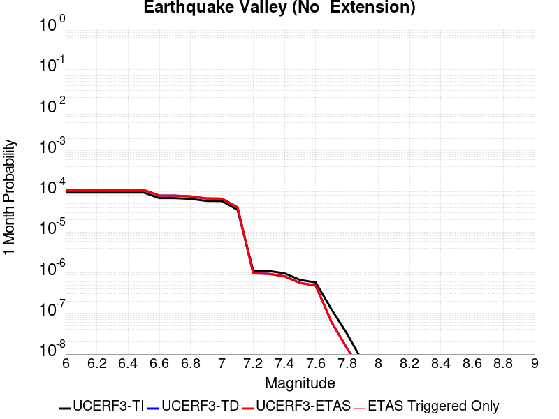 | 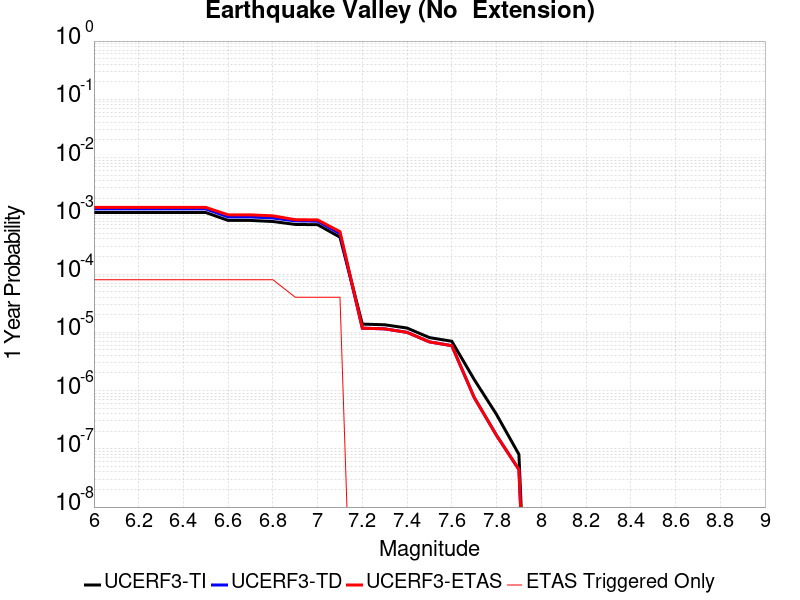 |

| Magnitude | 1 wk TI Prob | 1 wk TD Prob | 1 wk ETAS Prob | 1 wk ETAS/TD Gain | 1 wk ETAS Triggered Only | 1 mo TI Prob | 1 mo TD Prob | 1 mo ETAS Prob | 1 mo ETAS/TD Gain | 1 mo ETAS Triggered Only | 1 yr TI Prob | 1 yr TD Prob | 1 yr ETAS Prob | 1 yr ETAS/TD Gain | 1 yr ETAS Triggered Only |
|-----|-----|-----|-----|-----|-----|-----|-----|-----|-----|-----|-----|-----|-----|-----|-----|
| 6.0 | 2.1859703E-5 | 2.5211762E-5 | 2.5211762E-5 | 1.0 | 0.0 | 9.3681076E-5 | 1.08046755E-4 | 1.08046755E-4 | 1.0 | 0.0 | 0.0011399703 | 0.0013148207 | 0.0013947155 | 1.0607648 | 8.0E-5 |
| 6.1 | 2.1859703E-5 | 2.5211762E-5 | 2.5211762E-5 | 1.0 | 0.0 | 9.3681076E-5 | 1.08046755E-4 | 1.08046755E-4 | 1.0 | 0.0 | 0.0011399703 | 0.0013148207 | 0.0013947155 | 1.0607648 | 8.0E-5 |
| 6.2 | 2.1859703E-5 | 2.5211762E-5 | 2.5211762E-5 | 1.0 | 0.0 | 9.3681076E-5 | 1.08046755E-4 | 1.08046755E-4 | 1.0 | 0.0 | 0.0011399703 | 0.0013148207 | 0.0013947155 | 1.0607648 | 8.0E-5 |
| 6.3 | 2.1859703E-5 | 2.5211762E-5 | 2.5211762E-5 | 1.0 | 0.0 | 9.3681076E-5 | 1.08046755E-4 | 1.08046755E-4 | 1.0 | 0.0 | 0.0011399703 | 0.0013148207 | 0.0013947155 | 1.0607648 | 8.0E-5 |
| 6.4 | 2.1859703E-5 | 2.5211762E-5 | 2.5211762E-5 | 1.0 | 0.0 | 9.3681076E-5 | 1.08046755E-4 | 1.08046755E-4 | 1.0 | 0.0 | 0.0011399703 | 0.0013148207 | 0.0013947155 | 1.0607648 | 8.0E-5 |
| 6.5 | 2.1859703E-5 | 2.5211762E-5 | 2.5211762E-5 | 1.0 | 0.0 | 9.3681076E-5 | 1.08046755E-4 | 1.08046755E-4 | 1.0 | 0.0 | 0.0011399703 | 0.0013148207 | 0.0013947155 | 1.0607648 | 8.0E-5 |
| 6.6 | 1.597E-5 | 1.836593E-5 | 1.836593E-5 | 1.0 | 0.0 | 6.8441055E-5 | 7.870925E-5 | 7.870925E-5 | 1.0 | 0.0 | 8.329513E-4 | 9.579512E-4 | 0.0010378745 | 1.0834316 | 8.0E-5 |
| 6.7 | 1.597E-5 | 1.836593E-5 | 1.836593E-5 | 1.0 | 0.0 | 6.8441055E-5 | 7.870925E-5 | 7.870925E-5 | 1.0 | 0.0 | 8.329513E-4 | 9.579512E-4 | 0.0010378745 | 1.0834316 | 8.0E-5 |
| 6.8 | 1.5315149E-5 | 1.7611359E-5 | 1.7611359E-5 | 1.0 | 0.0 | 6.5634704E-5 | 7.547555E-5 | 7.547555E-5 | 1.0 | 0.0 | 7.988095E-4 | 9.1861427E-4 | 9.985408E-4 | 1.0870076 | 8.0E-5 |
| 6.9 | 1.3634728E-5 | 1.568413E-5 | 1.568413E-5 | 1.0 | 0.0 | 5.8433237E-5 | 6.721644E-5 | 6.721644E-5 | 1.0 | 0.0 | 7.1119244E-4 | 8.1813504E-4 | 8.581023E-4 | 1.0488517 | 4.0E-5 |
| 7.0 | 1.3496271E-5 | 1.5526088E-5 | 1.5526088E-5 | 1.0 | 0.0 | 5.783988E-5 | 6.653914E-5 | 6.653914E-5 | 1.0 | 0.0 | 7.03973E-4 | 8.098951E-4 | 8.498627E-4 | 1.0493491 | 4.0E-5 |
| 7.1 | 8.242798E-6 | 9.477744E-6 | 9.477744E-6 | 1.0 | 0.0 | 3.53258E-5 | 4.061865E-5 | 4.061865E-5 | 1.0 | 0.0 | 4.300067E-4 | 4.9448694E-4 | 5.3446717E-4 | 1.0808519 | 4.0E-5 |
| 7.2 | 2.6506527E-7 | 2.2575814E-7 | 2.2575814E-7 | 1.0 | 0.0 | 1.1359936E-6 | 9.675346E-7 | 9.675346E-7 | 1.0 | 0.0 | 1.3830633E-5 | 1.17796735E-5 | 1.17796735E-5 | 1.0 | 0.0 |
| 7.3 | 2.5810488E-7 | 2.1970749E-7 | 2.1970749E-7 | 1.0 | 0.0 | 1.1061633E-6 | 9.4160316E-7 | 9.4160316E-7 | 1.0 | 0.0 | 1.3467455E-5 | 1.1463962E-5 | 1.1463962E-5 | 1.0 | 0.0 |
| 7.4 | 2.2676066E-7 | 1.9125201E-7 | 1.9125201E-7 | 1.0 | 0.0 | 9.71831E-7 | 8.1965123E-7 | 8.1965123E-7 | 1.0 | 0.0 | 1.1831979E-5 | 9.979212E-6 | 9.979212E-6 | 1.0 | 0.0 |
| 7.5 | 1.5553917E-7 | 1.3123781E-7 | 1.3123781E-7 | 1.0 | 0.0 | 6.6659624E-7 | 5.6244767E-7 | 5.6244767E-7 | 1.0 | 0.0 | 8.115779E-6 | 6.847781E-6 | 6.847781E-6 | 1.0 | 0.0 |
| 7.6 | 1.3448629E-7 | 1.1298664E-7 | 1.1298664E-7 | 1.0 | 0.0 | 5.7636964E-7 | 4.8422834E-7 | 4.8422834E-7 | 1.0 | 0.0 | 7.017278E-6 | 5.8954665E-6 | 5.8954665E-6 | 1.0 | 0.0 |
| 7.7 | 2.9719402E-8 | 1.4599668E-8 | 1.4599668E-8 | 1.0 | 0.0 | 1.2736886E-7 | 6.257E-8 | 6.257E-8 | 1.0 | 0.0 | 1.5507147E-6 | 7.617896E-7 | 7.617896E-7 | 1.0 | 0.0 |
| 7.8 | 7.4390196E-9 | 3.254093E-9 | 3.254093E-9 | 1.0 | 0.0 | 3.1881513E-8 | 1.3946113E-8 | 1.3946113E-8 | 1.0 | 0.0 | 3.8815733E-7 | 1.697939E-7 | 1.697939E-7 | 1.0 | 0.0 |
| 7.9 | 1.5373532E-9 | 8.447242E-10 | 8.447242E-10 | 1.0 | 0.0 | 6.5886567E-9 | 3.6202463E-9 | 3.6202463E-9 | 1.0 | 0.0 | 8.021689E-8 | 4.40765E-8 | 4.40765E-8 | 1.0 | 0.0 |

## Rose Canyon
*[(top)](#table-of-contents)*

| 1 Week | 1 Month | 1 Year |
|-----|-----|-----|
| 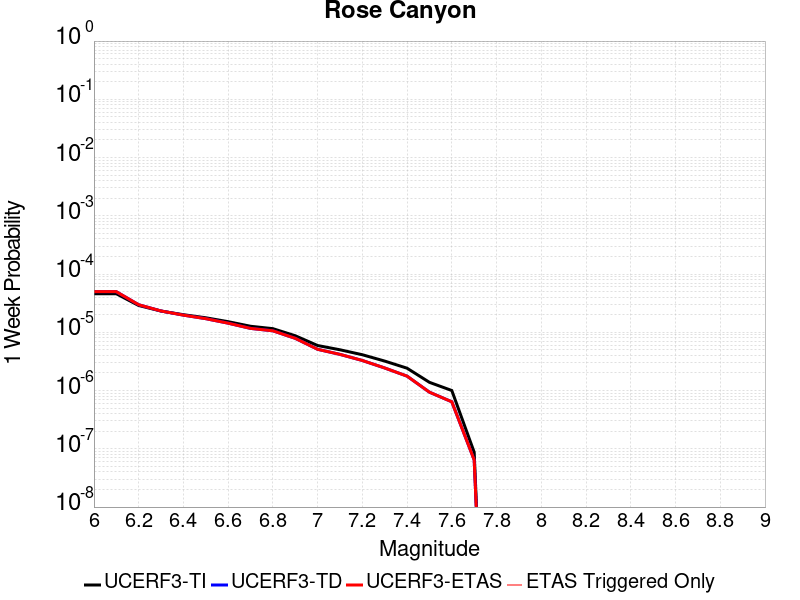 |  | 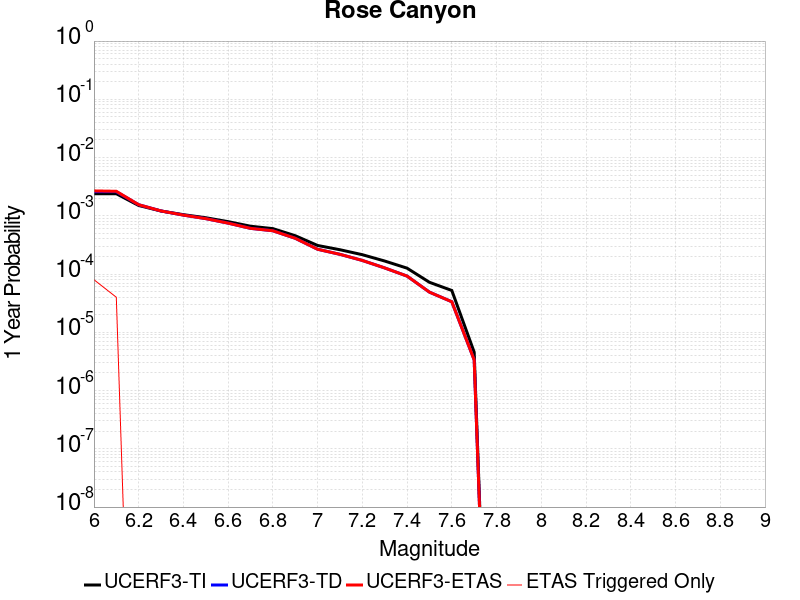 |

| Magnitude | 1 wk TI Prob | 1 wk TD Prob | 1 wk ETAS Prob | 1 wk ETAS/TD Gain | 1 wk ETAS Triggered Only | 1 mo TI Prob | 1 mo TD Prob | 1 mo ETAS Prob | 1 mo ETAS/TD Gain | 1 mo ETAS Triggered Only | 1 yr TI Prob | 1 yr TD Prob | 1 yr ETAS Prob | 1 yr ETAS/TD Gain | 1 yr ETAS Triggered Only |
|-----|-----|-----|-----|-----|-----|-----|-----|-----|-----|-----|-----|-----|-----|-----|-----|
| 6.0 | 4.5923203E-5 | 4.9824474E-5 | 4.9824474E-5 | 1.0 | 0.0 | 1.9679888E-4 | 2.1351733E-4 | 2.535088E-4 | 1.1872984 | 4.0E-5 | 0.0023933933 | 0.0025966738 | 0.002676466 | 1.0307287 | 8.0E-5 |
| 6.1 | 4.5923203E-5 | 4.9824474E-5 | 4.9824474E-5 | 1.0 | 0.0 | 1.9679888E-4 | 2.1351733E-4 | 2.1351733E-4 | 1.0 | 0.0 | 0.0023933933 | 0.0025966738 | 0.0026365698 | 1.0153643 | 4.0E-5 |
| 6.2 | 2.8844734E-5 | 2.9753832E-5 | 2.9753832E-5 | 1.0 | 0.0 | 1.2361443E-4 | 1.2751039E-4 | 1.2751039E-4 | 1.0 | 0.0 | 0.0015039665 | 0.0015513623 | 0.0015513623 | 1.0 | 0.0 |
| 6.3 | 2.3171577E-5 | 2.3239887E-5 | 2.3239887E-5 | 1.0 | 0.0 | 9.9302975E-5 | 9.959579E-5 | 9.959579E-5 | 1.0 | 0.0 | 0.0012083431 | 0.0012119177 | 0.0012119177 | 1.0 | 0.0 |
| 6.4 | 2.0066604E-5 | 1.9717654E-5 | 1.9717654E-5 | 1.0 | 0.0 | 8.599689E-5 | 8.450155E-5 | 8.450155E-5 | 1.0 | 0.0 | 0.0010465092 | 0.0010283309 | 0.0010283309 | 1.0 | 0.0 |
| 6.5 | 1.776989E-5 | 1.714663E-5 | 1.714663E-5 | 1.0 | 0.0 | 7.615444E-5 | 7.3483534E-5 | 7.3483534E-5 | 1.0 | 0.0 | 9.267859E-4 | 8.943018E-4 | 8.943018E-4 | 1.0 | 0.0 |
| 6.6 | 1.5227364E-5 | 1.4353479E-5 | 1.4353479E-5 | 1.0 | 0.0 | 6.52585E-5 | 6.151349E-5 | 6.151349E-5 | 1.0 | 0.0 | 7.942326E-4 | 7.486746E-4 | 7.486746E-4 | 1.0 | 0.0 |
| 6.7 | 1.2703898E-5 | 1.1679114E-5 | 1.1679114E-5 | 1.0 | 0.0 | 5.4444143E-5 | 5.005241E-5 | 5.005241E-5 | 1.0 | 0.0 | 6.626558E-4 | 6.09222E-4 | 6.09222E-4 | 1.0 | 0.0 |
| 6.8 | 1.1554917E-5 | 1.061447E-5 | 1.061447E-5 | 1.0 | 0.0 | 4.9520135E-5 | 4.5489815E-5 | 4.5489815E-5 | 1.0 | 0.0 | 6.0274085E-4 | 5.537018E-4 | 5.537018E-4 | 1.0 | 0.0 |
| 6.9 | 8.732078E-6 | 7.8845E-6 | 7.8845E-6 | 1.0 | 0.0 | 3.7422655E-5 | 3.3790293E-5 | 3.3790293E-5 | 1.0 | 0.0 | 4.5552556E-4 | 4.1132208E-4 | 4.1132208E-4 | 1.0 | 0.0 |
| 7.0 | 5.9337494E-6 | 5.1091783E-6 | 5.1091783E-6 | 1.0 | 0.0 | 2.5430107E-5 | 2.1896296E-5 | 2.1896296E-5 | 1.0 | 0.0 | 3.0956755E-4 | 2.665549E-4 | 2.665549E-4 | 1.0 | 0.0 |
| 7.1 | 5.013409E-6 | 4.1786834E-6 | 4.1786834E-6 | 1.0 | 0.0 | 2.1485863E-5 | 1.790852E-5 | 1.790852E-5 | 1.0 | 0.0 | 2.6155898E-4 | 2.1801452E-4 | 2.1801452E-4 | 1.0 | 0.0 |
| 7.2 | 4.120763E-6 | 3.2832077E-6 | 3.2832077E-6 | 1.0 | 0.0 | 1.7660293E-5 | 1.4070815E-5 | 1.4070815E-5 | 1.0 | 0.0 | 2.1499286E-4 | 1.712988E-4 | 1.712988E-4 | 1.0 | 0.0 |
| 7.3 | 3.2081239E-6 | 2.441237E-6 | 2.441237E-6 | 1.0 | 0.0 | 1.374903E-5 | 1.0462402E-5 | 1.0462402E-5 | 1.0 | 0.0 | 1.6738157E-4 | 1.2737238E-4 | 1.2737238E-4 | 1.0 | 0.0 |
| 7.4 | 2.4194755E-6 | 1.7685494E-6 | 1.7685494E-6 | 1.0 | 0.0 | 1.0369139E-5 | 7.5794756E-6 | 7.5794756E-6 | 1.0 | 0.0 | 1.2623696E-4 | 9.227626E-5 | 9.227626E-5 | 1.0 | 0.0 |
| 7.5 | 1.3842889E-6 | 9.3817954E-7 | 9.3817954E-7 | 1.0 | 0.0 | 5.9326535E-6 | 4.0207633E-6 | 4.0207633E-6 | 1.0 | 0.0 | 7.222766E-5 | 4.895173E-5 | 4.895173E-5 | 1.0 | 0.0 |
| 7.6 | 1.0021575E-6 | 6.4136486E-7 | 6.4136486E-7 | 1.0 | 0.0 | 4.2949537E-6 | 2.7487038E-6 | 2.7487038E-6 | 1.0 | 0.0 | 5.2289808E-5 | 3.3464978E-5 | 3.3464978E-5 | 1.0 | 0.0 |
| 7.7 | 8.7620116E-8 | 6.450501E-8 | 6.450501E-8 | 1.0 | 0.0 | 3.7551473E-7 | 2.7645E-7 | 2.7645E-7 | 1.0 | 0.0 | 4.5718825E-6 | 3.365774E-6 | 3.365774E-6 | 1.0 | 0.0 |

## Hunting Creek - Berryessa 2011 CFM
*[(top)](#table-of-contents)*

| 1 Week | 1 Month | 1 Year |
|-----|-----|-----|
| 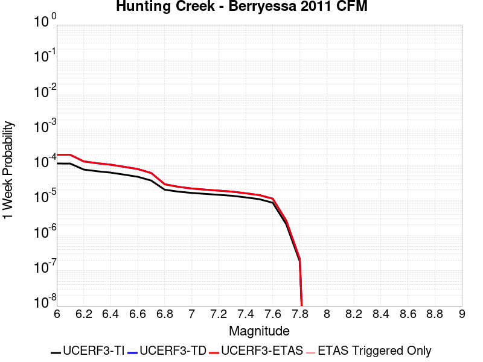 | 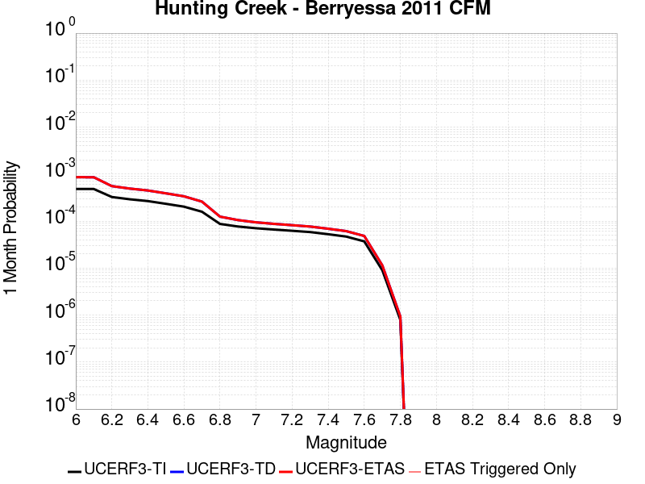 | 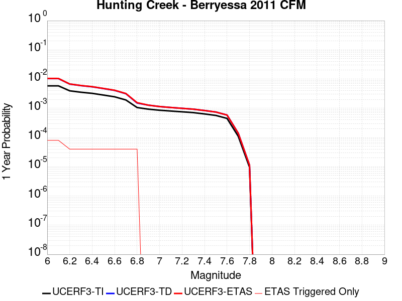 |

| Magnitude | 1 wk TI Prob | 1 wk TD Prob | 1 wk ETAS Prob | 1 wk ETAS/TD Gain | 1 wk ETAS Triggered Only | 1 mo TI Prob | 1 mo TD Prob | 1 mo ETAS Prob | 1 mo ETAS/TD Gain | 1 mo ETAS Triggered Only | 1 yr TI Prob | 1 yr TD Prob | 1 yr ETAS Prob | 1 yr ETAS/TD Gain | 1 yr ETAS Triggered Only |
|-----|-----|-----|-----|-----|-----|-----|-----|-----|-----|-----|-----|-----|-----|-----|-----|
| 6.0 | 1.1270982E-4 | 2.005265E-4 | 2.005265E-4 | 1.0 | 0.0 | 4.8295266E-4 | 8.591394E-4 | 8.591394E-4 | 1.0 | 0.0 | 0.0058641075 | 0.010399858 | 0.010479026 | 1.0076125 | 8.0E-5 |
| 6.1 | 1.1239393E-4 | 2.0000718E-4 | 2.0000718E-4 | 1.0 | 0.0 | 4.8159933E-4 | 8.569154E-4 | 8.569154E-4 | 1.0 | 0.0 | 0.0058477195 | 0.010373064 | 0.010452234 | 1.0076323 | 8.0E-5 |
| 6.2 | 7.596265E-5 | 1.2952353E-4 | 1.2952353E-4 | 1.0 | 0.0 | 3.2551357E-4 | 5.549727E-4 | 5.549727E-4 | 1.0 | 0.0 | 0.0039559277 | 0.006731092 | 0.0067708227 | 1.0059025 | 4.0E-5 |
| 6.3 | 6.78794E-5 | 1.1465258E-4 | 1.1465258E-4 | 1.0 | 0.0 | 2.9087928E-4 | 4.912645E-4 | 4.912645E-4 | 1.0 | 0.0 | 0.003535705 | 0.005961445 | 0.0060012066 | 1.0066698 | 4.0E-5 |
| 6.4 | 6.2165134E-5 | 1.0450851E-4 | 1.0450851E-4 | 1.0 | 0.0 | 2.6639478E-4 | 4.478058E-4 | 4.478058E-4 | 1.0 | 0.0 | 0.0032385332 | 0.0054356945 | 0.0054754773 | 1.0073187 | 4.0E-5 |
| 6.5 | 5.4368087E-5 | 9.083752E-5 | 9.083752E-5 | 1.0 | 0.0 | 2.3298527E-4 | 3.89235E-4 | 3.89235E-4 | 1.0 | 0.0 | 0.0028329059 | 0.0047266325 | 0.0047664433 | 1.0084227 | 4.0E-5 |
| 6.6 | 4.729947E-5 | 7.8578916E-5 | 7.8578916E-5 | 1.0 | 0.0 | 2.0269625E-4 | 3.367125E-4 | 3.367125E-4 | 1.0 | 0.0 | 0.002465034 | 0.004090322 | 0.0041301586 | 1.0097392 | 4.0E-5 |
| 6.7 | 3.6875328E-5 | 6.0531118E-5 | 6.0531118E-5 | 1.0 | 0.0 | 1.5802756E-4 | 2.5939575E-4 | 2.5939575E-4 | 1.0 | 0.0 | 0.0019222875 | 0.0031528494 | 0.0031927233 | 1.0126469 | 4.0E-5 |
| 6.8 | 2.0292036E-5 | 2.8998798E-5 | 2.8998798E-5 | 1.0 | 0.0 | 8.6962966E-5 | 1.242746E-4 | 1.242746E-4 | 1.0 | 0.0 | 0.0010582599 | 0.0015119802 | 0.0015519197 | 1.0264153 | 4.0E-5 |
| 6.9 | 1.7871042E-5 | 2.4492028E-5 | 2.4492028E-5 | 1.0 | 0.0 | 7.658793E-5 | 1.0496159E-4 | 1.0496159E-4 | 1.0 | 0.0 | 9.320591E-4 | 0.0012771577 | 0.0012771577 | 1.0 | 0.0 |
| 7.0 | 1.6415532E-5 | 2.1924703E-5 | 2.1924703E-5 | 1.0 | 0.0 | 7.035038E-5 | 9.3959636E-5 | 9.3959636E-5 | 1.0 | 0.0 | 8.561793E-4 | 0.0011433595 | 0.0011433595 | 1.0 | 0.0 |
| 7.1 | 1.5409885E-5 | 2.036394E-5 | 2.036394E-5 | 1.0 | 0.0 | 6.6040695E-5 | 8.727111E-5 | 8.727111E-5 | 1.0 | 0.0 | 8.0374884E-4 | 0.0010620106 | 0.0010620106 | 1.0 | 0.0 |
| 7.2 | 1.4497423E-5 | 1.907139E-5 | 1.907139E-5 | 1.0 | 0.0 | 6.213033E-5 | 8.173199E-5 | 8.173199E-5 | 1.0 | 0.0 | 7.5617427E-4 | 9.946357E-4 | 9.946357E-4 | 1.0 | 0.0 |
| 7.3 | 1.3615175E-5 | 1.7841985E-5 | 1.7841985E-5 | 1.0 | 0.0 | 5.8349444E-5 | 7.6463424E-5 | 7.6463424E-5 | 1.0 | 0.0 | 7.101729E-4 | 9.3054754E-4 | 9.3054754E-4 | 1.0 | 0.0 |
| 7.4 | 1.2252825E-5 | 1.6040824E-5 | 1.6040824E-5 | 1.0 | 0.0 | 5.251105E-5 | 6.8744586E-5 | 6.8744586E-5 | 1.0 | 0.0 | 6.391345E-4 | 8.3664677E-4 | 8.3664677E-4 | 1.0 | 0.0 |
| 7.5 | 1.0913301E-5 | 1.42540475E-5 | 1.42540475E-5 | 1.0 | 0.0 | 4.6770452E-5 | 6.108736E-5 | 6.108736E-5 | 1.0 | 0.0 | 5.6928146E-4 | 7.4348756E-4 | 7.4348756E-4 | 1.0 | 0.0 |
| 7.6 | 8.623192E-6 | 1.1245598E-5 | 1.1245598E-5 | 1.0 | 0.0 | 3.6956015E-5 | 4.8194543E-5 | 4.8194543E-5 | 1.0 | 0.0 | 4.4984656E-4 | 5.8661314E-4 | 5.8661314E-4 | 1.0 | 0.0 |
| 7.7 | 2.0993634E-6 | 2.66485E-6 | 2.66485E-6 | 1.0 | 0.0 | 8.997241E-6 | 1.1420736E-5 | 1.1420736E-5 | 1.0 | 0.0 | 1.09535904E-4 | 1.3903866E-4 | 1.3903866E-4 | 1.0 | 0.0 |
| 7.8 | 1.8428308E-7 | 2.173572E-7 | 2.173572E-7 | 1.0 | 0.0 | 7.897844E-7 | 9.3153056E-7 | 9.3153056E-7 | 1.0 | 0.0 | 9.615583E-6 | 1.1341329E-5 | 1.1341329E-5 | 1.0 | 0.0 |

## Morales (West)
*[(top)](#table-of-contents)*

| 1 Week | 1 Month | 1 Year |
|-----|-----|-----|
| 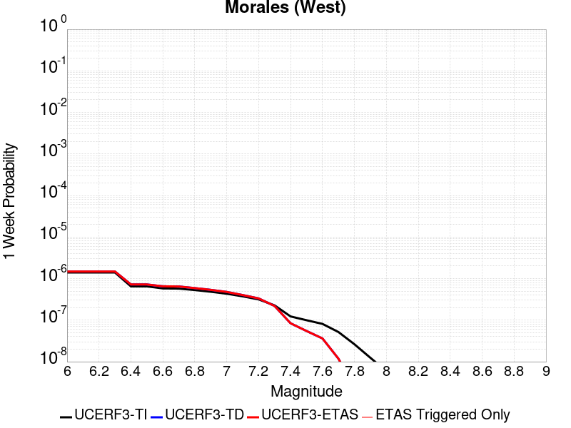 | 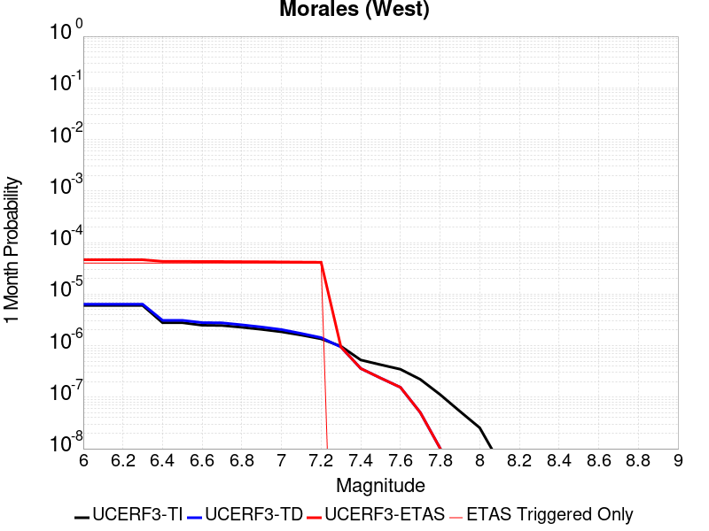 | 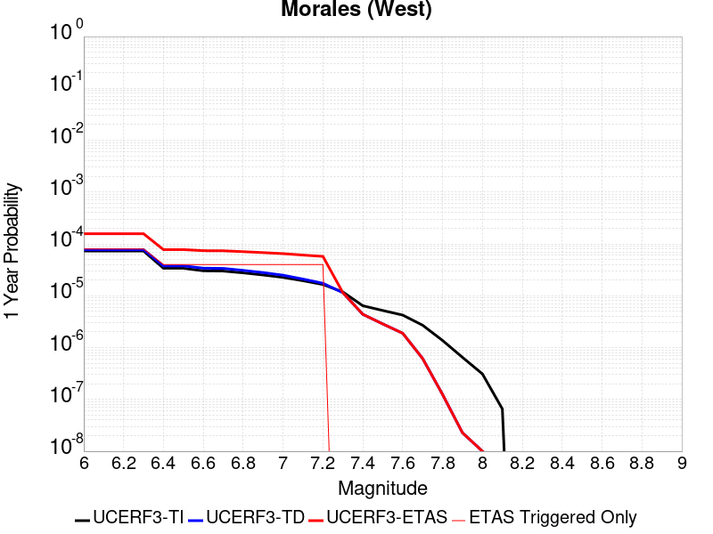 |

| Magnitude | 1 wk TI Prob | 1 wk TD Prob | 1 wk ETAS Prob | 1 wk ETAS/TD Gain | 1 wk ETAS Triggered Only | 1 mo TI Prob | 1 mo TD Prob | 1 mo ETAS Prob | 1 mo ETAS/TD Gain | 1 mo ETAS Triggered Only | 1 yr TI Prob | 1 yr TD Prob | 1 yr ETAS Prob | 1 yr ETAS/TD Gain | 1 yr ETAS Triggered Only |
|-----|-----|-----|-----|-----|-----|-----|-----|-----|-----|-----|-----|-----|-----|-----|-----|
| 6.0 | 1.4027072E-6 | 1.4812867E-6 | 1.4812867E-6 | 1.0 | 0.0 | 6.0115885E-6 | 6.3483603E-6 | 4.634811E-5 | 7.3007994 | 4.0E-5 | 7.318863E-5 | 7.7289245E-5 | 1.5728307E-4 | 2.034993 | 8.0E-5 |
| 6.1 | 1.4027072E-6 | 1.4812867E-6 | 1.4812867E-6 | 1.0 | 0.0 | 6.0115885E-6 | 6.3483603E-6 | 4.634811E-5 | 7.3007994 | 4.0E-5 | 7.318863E-5 | 7.7289245E-5 | 1.5728307E-4 | 2.034993 | 8.0E-5 |
| 6.2 | 1.4027072E-6 | 1.4812867E-6 | 1.4812867E-6 | 1.0 | 0.0 | 6.0115885E-6 | 6.3483603E-6 | 4.634811E-5 | 7.3007994 | 4.0E-5 | 7.318863E-5 | 7.7289245E-5 | 1.5728307E-4 | 2.034993 | 8.0E-5 |
| 6.3 | 1.4027072E-6 | 1.4812867E-6 | 1.4812867E-6 | 1.0 | 0.0 | 6.0115885E-6 | 6.3483603E-6 | 4.634811E-5 | 7.3007994 | 4.0E-5 | 7.318863E-5 | 7.7289245E-5 | 1.5728307E-4 | 2.034993 | 8.0E-5 |
| 6.4 | 6.504502E-7 | 7.224951E-7 | 7.224951E-7 | 1.0 | 0.0 | 2.7876408E-6 | 3.096404E-6 | 4.309628E-5 | 13.918171 | 4.0E-5 | 3.3939E-5 | 3.769808E-5 | 7.769657E-5 | 2.061022 | 4.0E-5 |
| 6.5 | 6.504502E-7 | 7.224951E-7 | 7.224951E-7 | 1.0 | 0.0 | 2.7876408E-6 | 3.096404E-6 | 4.309628E-5 | 13.918171 | 4.0E-5 | 3.3939E-5 | 3.769808E-5 | 7.769657E-5 | 2.061022 | 4.0E-5 |
| 6.6 | 5.8056526E-7 | 6.5211947E-7 | 6.5211947E-7 | 1.0 | 0.0 | 2.4881344E-6 | 2.7947947E-6 | 4.2794683E-5 | 15.312282 | 4.0E-5 | 3.0292615E-5 | 3.40261E-5 | 7.402474E-5 | 2.1755283 | 4.0E-5 |
| 6.7 | 5.741448E-7 | 6.456504E-7 | 6.456504E-7 | 1.0 | 0.0 | 2.4606184E-6 | 2.7670703E-6 | 4.276696E-5 | 15.455683 | 4.0E-5 | 2.9957617E-5 | 3.3688564E-5 | 7.368722E-5 | 2.1873064 | 4.0E-5 |
| 6.8 | 5.299428E-7 | 5.911157E-7 | 5.911157E-7 | 1.0 | 0.0 | 2.2711813E-6 | 2.5333507E-6 | 4.253325E-5 | 16.789326 | 4.0E-5 | 2.7651282E-5 | 3.084311E-5 | 7.084188E-5 | 2.296846 | 4.0E-5 |
| 6.9 | 4.82394E-7 | 5.361399E-7 | 5.361399E-7 | 1.0 | 0.0 | 2.0674013E-6 | 2.2977406E-6 | 4.2297648E-5 | 18.408365 | 4.0E-5 | 2.517032E-5 | 2.7974636E-5 | 6.797352E-5 | 2.4298267 | 4.0E-5 |
| 7.0 | 4.3264512E-7 | 4.778913E-7 | 4.778913E-7 | 1.0 | 0.0 | 1.8541921E-6 | 2.0481039E-6 | 4.204802E-5 | 20.530218 | 4.0E-5 | 2.2574555E-5 | 2.4935383E-5 | 6.4934386E-5 | 2.6041062 | 4.0E-5 |
| 7.1 | 3.7388565E-7 | 4.0181013E-7 | 4.0181013E-7 | 1.0 | 0.0 | 1.6023661E-6 | 1.7220423E-6 | 4.1721974E-5 | 24.228193 | 4.0E-5 | 1.9508632E-5 | 2.0965665E-5 | 6.0964827E-5 | 2.9078412 | 4.0E-5 |
| 7.2 | 3.1592543E-7 | 3.3369176E-7 | 3.3369176E-7 | 1.0 | 0.0 | 1.3539654E-6 | 1.4301066E-6 | 4.143005E-5 | 28.969902 | 4.0E-5 | 1.6484404E-5 | 1.7411412E-5 | 5.7410714E-5 | 3.297304 | 4.0E-5 |
| 7.3 | 2.2677783E-7 | 2.1933022E-7 | 2.1933022E-7 | 1.0 | 0.0 | 9.719047E-7 | 9.399863E-7 | 9.399863E-7 | 1.0 | 0.0 | 1.1832874E-5 | 1.1444274E-5 | 1.1444274E-5 | 1.0 | 0.0 |
| 7.4 | 1.2295531E-7 | 8.413272E-8 | 8.413272E-8 | 1.0 | 0.0 | 5.269512E-7 | 3.6056875E-7 | 3.6056875E-7 | 1.0 | 0.0 | 6.4156125E-6 | 4.389916E-6 | 4.389916E-6 | 1.0 | 0.0 |
| 7.5 | 9.9632544E-8 | 5.4874516E-8 | 5.4874516E-8 | 1.0 | 0.0 | 4.2699656E-7 | 2.3517649E-7 | 2.3517649E-7 | 1.0 | 0.0 | 5.198671E-6 | 2.8632699E-6 | 2.8632699E-6 | 1.0 | 0.0 |
| 7.6 | 8.125894E-8 | 3.627968E-8 | 3.627968E-8 | 1.0 | 0.0 | 3.4825257E-7 | 1.5548433E-7 | 1.5548433E-7 | 1.0 | 0.0 | 4.2399665E-6 | 1.8930201E-6 | 1.8930201E-6 | 1.0 | 0.0 |
| 7.7 | 5.1810765E-8 | 1.1822902E-8 | 1.1822902E-8 | 1.0 | 0.0 | 2.2204613E-7 | 5.0669584E-8 | 5.0669584E-8 | 1.0 | 0.0 | 2.7034082E-6 | 6.16902E-7 | 6.16902E-7 | 1.0 | 0.0 |
| 7.8 | 2.6315043E-8 | 2.3947506E-9 | 2.3947506E-9 | 1.0 | 0.0 | 1.1277875E-7 | 1.0263221E-8 | 1.0263221E-8 | 1.0 | 0.0 | 1.3730804E-6 | 1.2495471E-7 | 1.2495471E-7 | 1.0 | 0.0 |
| 7.9 | 1.24281545E-8 | 4.3576953E-10 | 4.3576953E-10 | 1.0 | 0.0 | 5.3263516E-8 | 1.867586E-9 | 1.867586E-9 | 1.0 | 0.0 | 6.4848314E-7 | 2.2737856E-8 | 2.2737856E-8 | 1.0 | 0.0 |
| 8.0 | 5.954214E-9 | 1.9227742E-10 | 1.9227742E-10 | 1.0 | 0.0 | 2.551806E-8 | 8.2405127E-10 | 8.2405127E-10 | 1.0 | 0.0 | 3.1068234E-7 | 1.0032821E-8 | 1.0032821E-8 | 1.0 | 0.0 |
| 8.1 | 1.2586262E-9 | 8.630574E-11 | 8.630574E-11 | 1.0 | 0.0 | 5.3941123E-9 | 3.6988335E-10 | 3.6988335E-10 | 1.0 | 0.0 | 6.567332E-8 | 4.5033253E-9 | 4.5033253E-9 | 1.0 | 0.0 |

## Redondo Canyon alt 1
*[(top)](#table-of-contents)*

| 1 Week | 1 Month | 1 Year |
|-----|-----|-----|
|  | 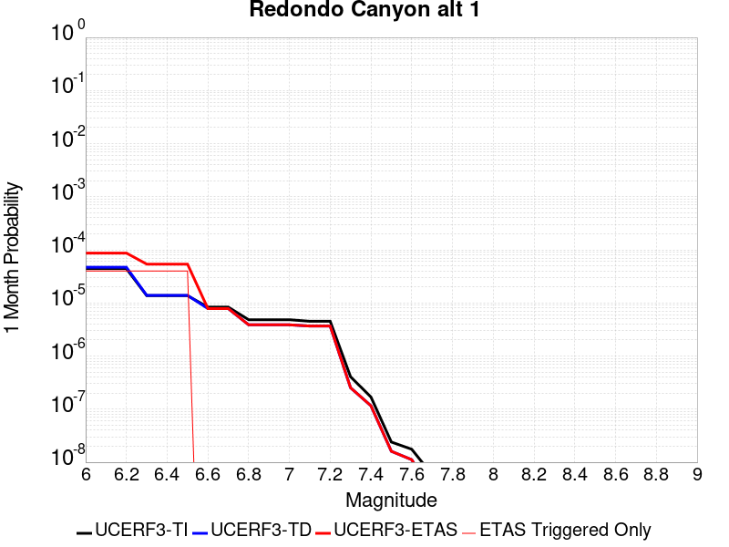 | 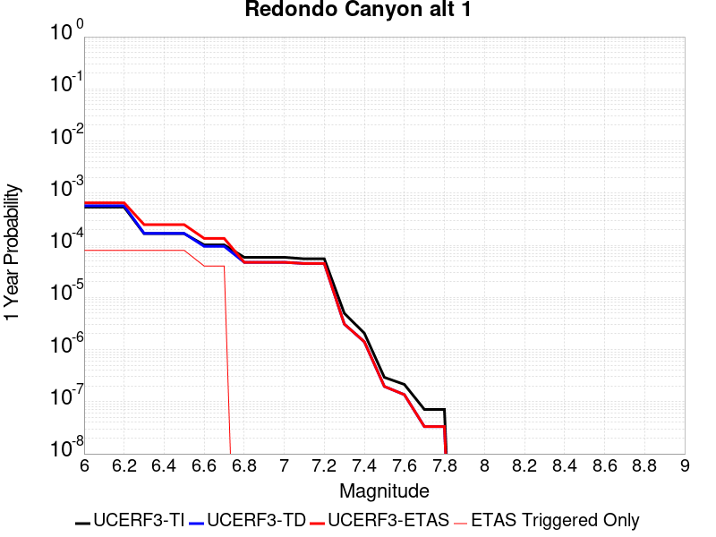 |

| Magnitude | 1 wk TI Prob | 1 wk TD Prob | 1 wk ETAS Prob | 1 wk ETAS/TD Gain | 1 wk ETAS Triggered Only | 1 mo TI Prob | 1 mo TD Prob | 1 mo ETAS Prob | 1 mo ETAS/TD Gain | 1 mo ETAS Triggered Only | 1 yr TI Prob | 1 yr TD Prob | 1 yr ETAS Prob | 1 yr ETAS/TD Gain | 1 yr ETAS Triggered Only |
|-----|-----|-----|-----|-----|-----|-----|-----|-----|-----|-----|-----|-----|-----|-----|-----|
| 6.0 | 1.0346246E-5 | 1.098507E-5 | 1.098507E-5 | 1.0 | 0.0 | 4.43403E-5 | 4.7078465E-5 | 8.707658E-5 | 1.8496053 | 4.0E-5 | 5.3970946E-4 | 5.731085E-4 | 6.5306266E-4 | 1.1395097 | 8.0E-5 |
| 6.1 | 1.0346246E-5 | 1.098507E-5 | 1.098507E-5 | 1.0 | 0.0 | 4.43403E-5 | 4.7078465E-5 | 8.707658E-5 | 1.8496053 | 4.0E-5 | 5.3970946E-4 | 5.731085E-4 | 6.5306266E-4 | 1.1395097 | 8.0E-5 |
| 6.2 | 1.0346246E-5 | 1.098507E-5 | 1.098507E-5 | 1.0 | 0.0 | 4.43403E-5 | 4.7078465E-5 | 8.707658E-5 | 1.8496053 | 4.0E-5 | 5.3970946E-4 | 5.731085E-4 | 6.5306266E-4 | 1.1395097 | 8.0E-5 |
| 6.3 | 3.2052794E-6 | 3.2376208E-6 | 3.2376208E-6 | 1.0 | 0.0 | 1.373684E-5 | 1.3875466E-5 | 5.3874912E-5 | 3.882746 | 4.0E-5 | 1.6723319E-4 | 1.6892469E-4 | 2.4891118E-4 | 1.4735038 | 8.0E-5 |
| 6.4 | 3.2052794E-6 | 3.2376208E-6 | 3.2376208E-6 | 1.0 | 0.0 | 1.373684E-5 | 1.3875466E-5 | 5.3874912E-5 | 3.882746 | 4.0E-5 | 1.6723319E-4 | 1.6892469E-4 | 2.4891118E-4 | 1.4735038 | 8.0E-5 |
| 6.5 | 3.2052794E-6 | 3.2376208E-6 | 3.2376208E-6 | 1.0 | 0.0 | 1.373684E-5 | 1.3875466E-5 | 5.3874912E-5 | 3.882746 | 4.0E-5 | 1.6723319E-4 | 1.6892469E-4 | 2.4891118E-4 | 1.4735038 | 8.0E-5 |
| 6.6 | 1.948328E-6 | 1.8298009E-6 | 1.8298009E-6 | 1.0 | 0.0 | 8.349951E-6 | 7.841989E-6 | 7.841989E-6 | 1.0 | 0.0 | 1.016559E-4 | 9.547353E-5 | 1.3546972E-4 | 1.4189243 | 4.0E-5 |
| 6.7 | 1.948328E-6 | 1.8298009E-6 | 1.8298009E-6 | 1.0 | 0.0 | 8.349951E-6 | 7.841989E-6 | 7.841989E-6 | 1.0 | 0.0 | 1.016559E-4 | 9.547353E-5 | 1.3546972E-4 | 1.4189243 | 4.0E-5 |
| 6.8 | 1.1278219E-6 | 9.038387E-7 | 9.038387E-7 | 1.0 | 0.0 | 4.8335132E-6 | 3.873591E-6 | 3.873591E-6 | 1.0 | 0.0 | 5.8846435E-5 | 4.716038E-5 | 4.716038E-5 | 1.0 | 0.0 |
| 6.9 | 1.1278219E-6 | 9.038387E-7 | 9.038387E-7 | 1.0 | 0.0 | 4.8335132E-6 | 3.873591E-6 | 3.873591E-6 | 1.0 | 0.0 | 5.8846435E-5 | 4.716038E-5 | 4.716038E-5 | 1.0 | 0.0 |
| 7.0 | 1.1278219E-6 | 9.038387E-7 | 9.038387E-7 | 1.0 | 0.0 | 4.8335132E-6 | 3.873591E-6 | 3.873591E-6 | 1.0 | 0.0 | 5.8846435E-5 | 4.716038E-5 | 4.716038E-5 | 1.0 | 0.0 |
| 7.1 | 1.0545139E-6 | 8.5741493E-7 | 8.5741493E-7 | 1.0 | 0.0 | 4.5193374E-6 | 3.6746326E-6 | 3.6746326E-6 | 1.0 | 0.0 | 5.5021545E-5 | 4.4738157E-5 | 4.4738157E-5 | 1.0 | 0.0 |
| 7.2 | 1.0545139E-6 | 8.5741493E-7 | 8.5741493E-7 | 1.0 | 0.0 | 4.5193374E-6 | 3.6746326E-6 | 3.6746326E-6 | 1.0 | 0.0 | 5.5021545E-5 | 4.4738157E-5 | 4.4738157E-5 | 1.0 | 0.0 |
| 7.3 | 9.505161E-8 | 5.901462E-8 | 5.901462E-8 | 1.0 | 0.0 | 4.0736398E-7 | 2.529198E-7 | 2.529198E-7 | 1.0 | 0.0 | 4.959645E-6 | 3.0792953E-6 | 3.0792953E-6 | 1.0 | 0.0 |
| 7.4 | 3.9520785E-8 | 2.7031614E-8 | 2.7031614E-8 | 1.0 | 0.0 | 1.6937479E-7 | 1.1584977E-7 | 1.1584977E-7 | 1.0 | 0.0 | 2.062136E-6 | 1.4104704E-6 | 1.4104704E-6 | 1.0 | 0.0 |
| 7.5 | 5.6133214E-9 | 3.7584895E-9 | 3.7584895E-9 | 1.0 | 0.0 | 2.4057092E-8 | 1.6107812E-8 | 1.6107812E-8 | 1.0 | 0.0 | 2.9289507E-7 | 1.961126E-7 | 1.961126E-7 | 1.0 | 0.0 |
| 7.6 | 4.1064334E-9 | 2.6123854E-9 | 2.6123854E-9 | 1.0 | 0.0 | 1.7599E-8 | 1.1195938E-8 | 1.1195938E-8 | 1.0 | 0.0 | 2.142678E-7 | 1.3631053E-7 | 1.3631053E-7 | 1.0 | 0.0 |
| 7.7 | 1.361975E-9 | 6.3678585E-10 | 6.3678585E-10 | 1.0 | 0.0 | 5.8370353E-9 | 2.7290823E-9 | 2.7290823E-9 | 1.0 | 0.0 | 7.1065905E-8 | 3.3226573E-8 | 3.3226573E-8 | 1.0 | 0.0 |
| 7.8 | 1.361975E-9 | 6.3678585E-10 | 6.3678585E-10 | 1.0 | 0.0 | 5.8370353E-9 | 2.7290823E-9 | 2.7290823E-9 | 1.0 | 0.0 | 7.1065905E-8 | 3.3226573E-8 | 3.3226573E-8 | 1.0 | 0.0 |

## Ash Hill
*[(top)](#table-of-contents)*

| 1 Week | 1 Month | 1 Year |
|-----|-----|-----|
| 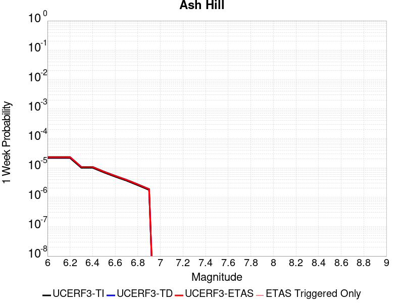 | 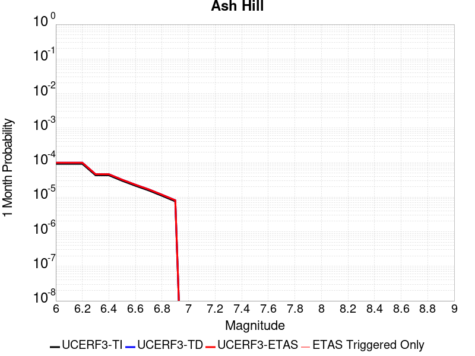 | 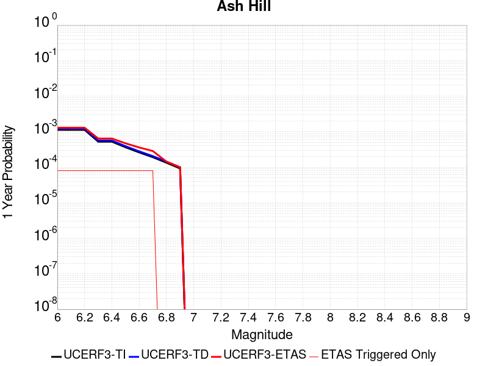 |

| Magnitude | 1 wk TI Prob | 1 wk TD Prob | 1 wk ETAS Prob | 1 wk ETAS/TD Gain | 1 wk ETAS Triggered Only | 1 mo TI Prob | 1 mo TD Prob | 1 mo ETAS Prob | 1 mo ETAS/TD Gain | 1 mo ETAS Triggered Only | 1 yr TI Prob | 1 yr TD Prob | 1 yr ETAS Prob | 1 yr ETAS/TD Gain | 1 yr ETAS Triggered Only |
|-----|-----|-----|-----|-----|-----|-----|-----|-----|-----|-----|-----|-----|-----|-----|-----|
| 6.0 | 2.1545662E-5 | 2.3200468E-5 | 2.3200468E-5 | 1.0 | 0.0 | 9.2335285E-5 | 9.9427234E-5 | 9.9427234E-5 | 1.0 | 0.0 | 0.0011236023 | 0.0012099344 | 0.0012898376 | 1.0660393 | 8.0E-5 |
| 6.1 | 2.1545662E-5 | 2.3200468E-5 | 2.3200468E-5 | 1.0 | 0.0 | 9.2335285E-5 | 9.9427234E-5 | 9.9427234E-5 | 1.0 | 0.0 | 0.0011236023 | 0.0012099344 | 0.0012898376 | 1.0660393 | 8.0E-5 |
| 6.2 | 2.1545662E-5 | 2.3200468E-5 | 2.3200468E-5 | 1.0 | 0.0 | 9.2335285E-5 | 9.9427234E-5 | 9.9427234E-5 | 1.0 | 0.0 | 0.0011236023 | 0.0012099344 | 0.0012898376 | 1.0660393 | 8.0E-5 |
| 6.3 | 1.0025529E-5 | 1.0749556E-5 | 1.0749556E-5 | 1.0 | 0.0 | 4.2965847E-5 | 4.6068788E-5 | 4.6068788E-5 | 1.0 | 0.0 | 5.229836E-4 | 5.6075637E-4 | 6.407115E-4 | 1.1425844 | 8.0E-5 |
| 6.4 | 1.0025529E-5 | 1.0749556E-5 | 1.0749556E-5 | 1.0 | 0.0 | 4.2965847E-5 | 4.6068788E-5 | 4.6068788E-5 | 1.0 | 0.0 | 5.229836E-4 | 5.6075637E-4 | 6.407115E-4 | 1.1425844 | 8.0E-5 |
| 6.5 | 6.9617327E-6 | 7.458431E-6 | 7.458431E-6 | 1.0 | 0.0 | 2.9835655E-5 | 3.1964362E-5 | 3.1964362E-5 | 1.0 | 0.0 | 3.6318856E-4 | 3.8910526E-4 | 4.6907415E-4 | 1.2055199 | 8.0E-5 |
| 6.6 | 4.9919777E-6 | 5.347976E-6 | 5.347976E-6 | 1.0 | 0.0 | 2.1394015E-5 | 2.2919734E-5 | 2.2919734E-5 | 1.0 | 0.0 | 2.60441E-4 | 2.7901874E-4 | 3.5899642E-4 | 1.2866391 | 8.0E-5 |
| 6.7 | 3.6630722E-6 | 3.9255733E-6 | 3.9255733E-6 | 1.0 | 0.0 | 1.5698786E-5 | 1.6823811E-5 | 1.6823811E-5 | 1.0 | 0.0 | 1.9111596E-4 | 2.0481637E-4 | 2.848E-4 | 1.3905138 | 8.0E-5 |
| 6.8 | 2.5599613E-6 | 2.7455974E-6 | 2.7455974E-6 | 1.0 | 0.0 | 1.0971216E-5 | 1.17668205E-5 | 1.17668205E-5 | 1.0 | 0.0 | 1.3356637E-4 | 1.4325658E-4 | 1.4325658E-4 | 1.0 | 0.0 |
| 6.9 | 1.7684905E-6 | 1.8973375E-6 | 1.8973375E-6 | 1.0 | 0.0 | 7.579223E-6 | 8.1314465E-6 | 8.1314465E-6 | 1.0 | 0.0 | 9.2273134E-5 | 9.900036E-5 | 9.900036E-5 | 1.0 | 0.0 |

## Cleghorn Lake
*[(top)](#table-of-contents)*

| 1 Week | 1 Month | 1 Year |
|-----|-----|-----|
| 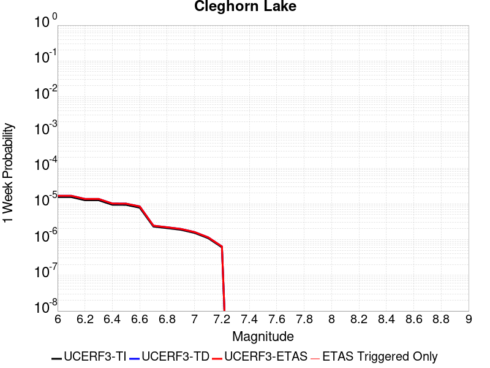 | 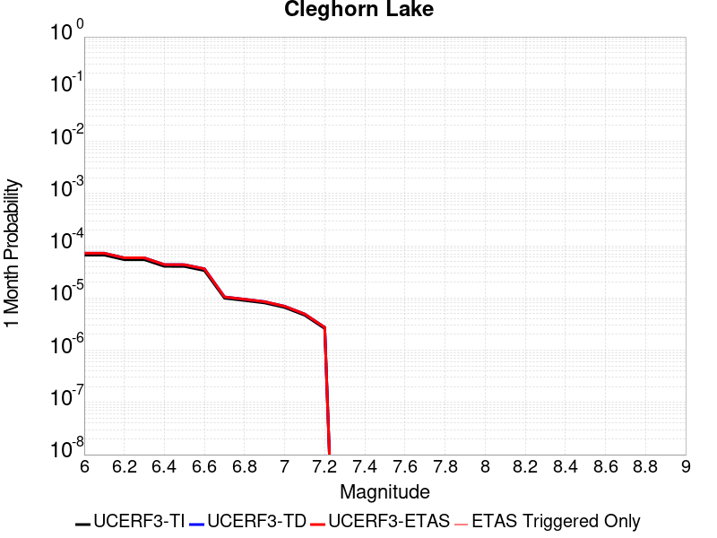 | 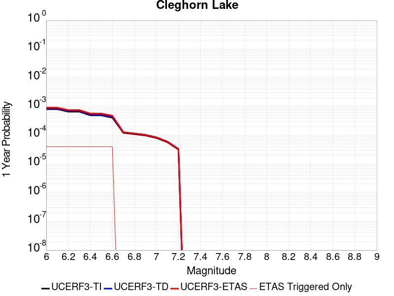 |

| Magnitude | 1 wk TI Prob | 1 wk TD Prob | 1 wk ETAS Prob | 1 wk ETAS/TD Gain | 1 wk ETAS Triggered Only | 1 mo TI Prob | 1 mo TD Prob | 1 mo ETAS Prob | 1 mo ETAS/TD Gain | 1 mo ETAS Triggered Only | 1 yr TI Prob | 1 yr TD Prob | 1 yr ETAS Prob | 1 yr ETAS/TD Gain | 1 yr ETAS Triggered Only |
|-----|-----|-----|-----|-----|-----|-----|-----|-----|-----|-----|-----|-----|-----|-----|-----|
| 6.0 | 1.5467183E-5 | 1.6799104E-5 | 1.6799104E-5 | 1.0 | 0.0 | 6.6286244E-5 | 7.199448E-5 | 7.199448E-5 | 1.0 | 0.0 | 8.067362E-4 | 8.7623525E-4 | 9.1620017E-4 | 1.0456098 | 4.0E-5 |
| 6.1 | 1.5467183E-5 | 1.6799104E-5 | 1.6799104E-5 | 1.0 | 0.0 | 6.6286244E-5 | 7.199448E-5 | 7.199448E-5 | 1.0 | 0.0 | 8.067362E-4 | 8.7623525E-4 | 9.1620017E-4 | 1.0456098 | 4.0E-5 |
| 6.2 | 1.2624631E-5 | 1.3685442E-5 | 1.3685442E-5 | 1.0 | 0.0 | 5.410444E-5 | 5.865085E-5 | 5.865085E-5 | 1.0 | 0.0 | 6.585225E-4 | 7.138889E-4 | 7.5386034E-4 | 1.0559912 | 4.0E-5 |
| 6.3 | 1.2624631E-5 | 1.3685442E-5 | 1.3685442E-5 | 1.0 | 0.0 | 5.410444E-5 | 5.865085E-5 | 5.865085E-5 | 1.0 | 0.0 | 6.585225E-4 | 7.138889E-4 | 7.5386034E-4 | 1.0559912 | 4.0E-5 |
| 6.4 | 9.417684E-6 | 1.0172885E-5 | 1.0172885E-5 | 1.0 | 0.0 | 4.036088E-5 | 4.359758E-5 | 4.359758E-5 | 1.0 | 0.0 | 4.912829E-4 | 5.307124E-4 | 5.706912E-4 | 1.0753304 | 4.0E-5 |
| 6.5 | 9.368219E-6 | 1.01203E-5 | 1.01203E-5 | 1.0 | 0.0 | 4.014889E-5 | 4.3372227E-5 | 4.3372227E-5 | 1.0 | 0.0 | 4.8870314E-4 | 5.2797E-4 | 5.679489E-4 | 1.0757219 | 4.0E-5 |
| 6.6 | 7.803798E-6 | 8.444179E-6 | 8.444179E-6 | 1.0 | 0.0 | 3.3444423E-5 | 3.6189063E-5 | 3.6189063E-5 | 1.0 | 0.0 | 4.0710976E-4 | 4.405527E-4 | 4.805351E-4 | 1.090755 | 4.0E-5 |
| 6.7 | 2.3108669E-6 | 2.4443107E-6 | 2.4443107E-6 | 1.0 | 0.0 | 9.903678E-6 | 1.0475576E-5 | 1.0475576E-5 | 1.0 | 0.0 | 1.205706E-4 | 1.2753287E-4 | 1.2753287E-4 | 1.0 | 0.0 |
| 6.8 | 2.0882828E-6 | 2.206705E-6 | 2.206705E-6 | 1.0 | 0.0 | 8.949753E-6 | 9.457273E-6 | 9.457273E-6 | 1.0 | 0.0 | 1.08957785E-4 | 1.1513639E-4 | 1.1513639E-4 | 1.0 | 0.0 |
| 6.9 | 1.876935E-6 | 1.9814236E-6 | 1.9814236E-6 | 1.0 | 0.0 | 8.043982E-6 | 8.491788E-6 | 8.491788E-6 | 1.0 | 0.0 | 9.7931086E-5 | 1.0338278E-4 | 1.0338278E-4 | 1.0 | 0.0 |
| 7.0 | 1.5357559E-6 | 1.620583E-6 | 1.620583E-6 | 1.0 | 0.0 | 6.5817944E-6 | 6.945338E-6 | 6.945338E-6 | 1.0 | 0.0 | 8.01304E-5 | 8.455633E-5 | 8.455633E-5 | 1.0 | 0.0 |
| 7.1 | 1.0905424E-6 | 1.1499736E-6 | 1.1499736E-6 | 1.0 | 0.0 | 4.6737446E-6 | 4.9284495E-6 | 4.9284495E-6 | 1.0 | 0.0 | 5.6901354E-5 | 6.0002323E-5 | 6.0002323E-5 | 1.0 | 0.0 |
| 7.2 | 6.06668E-7 | 6.3884215E-7 | 6.3884215E-7 | 1.0 | 0.0 | 2.600003E-6 | 2.7378926E-6 | 2.7378926E-6 | 1.0 | 0.0 | 3.1654577E-5 | 3.3333403E-5 | 3.3333403E-5 | 1.0 | 0.0 |

## Calaveras (Central) 2011 CFM
*[(top)](#table-of-contents)*

| 1 Week | 1 Month | 1 Year |
|-----|-----|-----|
|  |  | 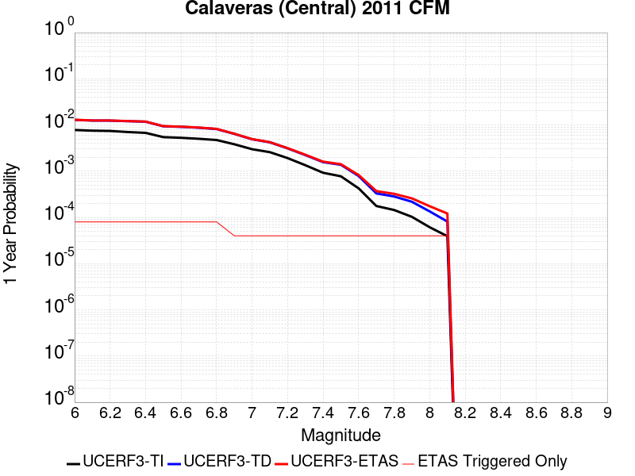 |

| Magnitude | 1 wk TI Prob | 1 wk TD Prob | 1 wk ETAS Prob | 1 wk ETAS/TD Gain | 1 wk ETAS Triggered Only | 1 mo TI Prob | 1 mo TD Prob | 1 mo ETAS Prob | 1 mo ETAS/TD Gain | 1 mo ETAS Triggered Only | 1 yr TI Prob | 1 yr TD Prob | 1 yr ETAS Prob | 1 yr ETAS/TD Gain | 1 yr ETAS Triggered Only |
|-----|-----|-----|-----|-----|-----|-----|-----|-----|-----|-----|-----|-----|-----|-----|-----|
| 6.0 | 1.5010907E-4 | 2.4887596E-4 | 2.8886602E-4 | 1.1606827 | 4.0E-5 | 6.4316596E-4 | 0.0010661384 | 0.0011060957 | 1.0374786 | 4.0E-5 | 0.0078024664 | 0.01289425 | 0.012973219 | 1.0061243 | 8.0E-5 |
| 6.1 | 1.4521465E-4 | 2.4048235E-4 | 2.8047274E-4 | 1.1662924 | 4.0E-5 | 6.222001E-4 | 0.0010301946 | 0.0010701533 | 1.0387876 | 4.0E-5 | 0.0075490056 | 0.0124630965 | 0.0125421 | 1.006339 | 8.0E-5 |
| 6.2 | 1.429998E-4 | 2.3978335E-4 | 2.7977375E-4 | 1.1667773 | 4.0E-5 | 6.127123E-4 | 0.0010272015 | 0.0010671605 | 1.0389007 | 4.0E-5 | 0.007434286 | 0.0124271205 | 0.012506126 | 1.0063576 | 8.0E-5 |
| 6.3 | 1.3536277E-4 | 2.3306198E-4 | 2.7305266E-4 | 1.1715882 | 4.0E-5 | 5.799972E-4 | 9.984229E-4 | 0.001038383 | 1.0400232 | 4.0E-5 | 0.0070386264 | 0.012081593 | 0.012160626 | 1.0065416 | 8.0E-5 |
| 6.4 | 1.2993296E-4 | 2.2727464E-4 | 2.6726554E-4 | 1.1759585 | 4.0E-5 | 5.5673666E-4 | 9.7363896E-4 | 0.0010136 | 1.041043 | 4.0E-5 | 0.006757223 | 0.011783219 | 0.011862276 | 1.0067093 | 8.0E-5 |
| 6.5 | 1.0498927E-4 | 1.805364E-4 | 2.2052918E-4 | 1.221522 | 4.0E-5 | 4.498764E-4 | 7.734972E-4 | 8.1346626E-4 | 1.0516732 | 4.0E-5 | 0.005463498 | 0.009376575 | 0.009455825 | 1.0084519 | 8.0E-5 |
| 6.6 | 1.0157505E-4 | 1.7540302E-4 | 2.1539601E-4 | 1.2280062 | 4.0E-5 | 4.35249E-4 | 7.515101E-4 | 7.9148007E-4 | 1.0531862 | 4.0E-5 | 0.0052862884 | 0.0091111865 | 0.009190457 | 1.0087004 | 8.0E-5 |
| 6.7 | 9.660386E-5 | 1.6798155E-4 | 2.0797484E-4 | 1.2380813 | 4.0E-5 | 4.1395082E-4 | 7.1972195E-4 | 7.596932E-4 | 1.055537 | 4.0E-5 | 0.0050282106 | 0.008727368 | 0.00880667 | 1.0090866 | 8.0E-5 |
| 6.8 | 9.089927E-5 | 1.570976E-4 | 1.9709131E-4 | 1.2545788 | 4.0E-5 | 3.8951015E-4 | 6.7310175E-4 | 7.130748E-4 | 1.0593864 | 4.0E-5 | 0.0047319788 | 0.008164186 | 0.008243533 | 1.0097189 | 8.0E-5 |
| 6.9 | 7.353187E-5 | 1.2353025E-4 | 1.635253E-4 | 1.3237673 | 4.0E-5 | 3.150985E-4 | 5.293085E-4 | 5.6928734E-4 | 1.0755303 | 4.0E-5 | 0.0038295772 | 0.0064254114 | 0.0064651542 | 1.0061853 | 4.0E-5 |
| 7.0 | 5.746064E-5 | 9.436792E-5 | 1.3436415E-4 | 1.4238329 | 4.0E-5 | 2.4623662E-4 | 4.0437162E-4 | 4.4435545E-4 | 1.0988789 | 4.0E-5 | 0.0029938098 | 0.0049121827 | 0.004951986 | 1.008103 | 4.0E-5 |
| 7.1 | 4.9557195E-5 | 8.095447E-5 | 1.20951234E-4 | 1.4940649 | 4.0E-5 | 2.123707E-4 | 3.4690194E-4 | 3.8688807E-4 | 1.1152663 | 4.0E-5 | 0.0025825473 | 0.004215415 | 0.0042552464 | 1.009449 | 4.0E-5 |
| 7.2 | 3.687595E-5 | 5.9887472E-5 | 9.988508E-5 | 1.6678793 | 4.0E-5 | 1.5803022E-4 | 2.566355E-4 | 2.9662525E-4 | 1.1558231 | 4.0E-5 | 0.0019223199 | 0.00312009 | 0.0031599652 | 1.0127802 | 4.0E-5 |
| 7.3 | 2.5846984E-5 | 4.2768672E-5 | 8.276696E-5 | 1.935224 | 4.0E-5 | 1.1076809E-4 | 1.8328152E-4 | 2.232742E-4 | 1.2182035 | 4.0E-5 | 0.0013477671 | 0.0022291867 | 0.0022690974 | 1.0179038 | 4.0E-5 |
| 7.4 | 1.7747854E-5 | 3.0131427E-5 | 7.013022E-5 | 2.3274777 | 4.0E-5 | 7.6060016E-5 | 1.2912831E-4 | 1.6912314E-4 | 1.3097295 | 4.0E-5 | 9.2563726E-4 | 0.0015710064 | 0.0016109435 | 1.0254214 | 4.0E-5 |
| 7.5 | 1.4883479E-5 | 2.6425658E-5 | 6.64246E-5 | 2.5136404 | 4.0E-5 | 6.378478E-5 | 1.1324792E-4 | 1.532434E-4 | 1.3531674 | 4.0E-5 | 7.76303E-4 | 0.0013779241 | 0.001417869 | 1.0289892 | 4.0E-5 |
| 7.6 | 8.166975E-6 | 1.5097764E-5 | 5.509716E-5 | 3.649359 | 4.0E-5 | 3.5000852E-5 | 6.4703105E-5 | 1.0470052E-4 | 1.6181684 | 4.0E-5 | 4.2605202E-4 | 7.8747695E-4 | 8.274455E-4 | 1.0507551 | 4.0E-5 |
| 7.7 | 3.3858064E-6 | 6.3429416E-6 | 4.6342688E-5 | 7.3061824 | 4.0E-5 | 1.4510518E-5 | 2.7183753E-5 | 6.7182664E-5 | 2.4714272 | 4.0E-5 | 1.7665124E-4 | 3.3091198E-4 | 3.7089875E-4 | 1.120838 | 4.0E-5 |
| 7.8 | 2.7721615E-6 | 5.4427956E-6 | 4.544258E-5 | 8.349125 | 4.0E-5 | 1.1880637E-5 | 2.3326058E-5 | 6.3325126E-5 | 2.7147803 | 4.0E-5 | 1.4463716E-4 | 2.839578E-4 | 3.2394644E-4 | 1.140826 | 4.0E-5 |
| 7.9 | 1.9736292E-6 | 4.185026E-6 | 4.4184857E-5 | 10.557847 | 4.0E-5 | 8.4583835E-6 | 1.7935701E-5 | 5.7934983E-5 | 3.2301488 | 4.0E-5 | 1.0297595E-4 | 2.1834532E-4 | 2.5833657E-4 | 1.183156 | 4.0E-5 |
| 8.0 | 1.1767289E-6 | 2.5885845E-6 | 4.258848E-5 | 16.452421 | 4.0E-5 | 5.0431145E-6 | 1.1093886E-5 | 5.109344E-5 | 4.6055493 | 4.0E-5 | 6.139818E-5 | 1.3505972E-4 | 1.7505432E-4 | 1.2961253 | 4.0E-5 |
| 8.1 | 7.5112825E-7 | 1.5621927E-6 | 4.156213E-5 | 26.604996 | 4.0E-5 | 3.2191172E-6 | 6.6950943E-6 | 4.6694826E-5 | 6.9744835 | 4.0E-5 | 3.9192048E-5 | 8.150975E-5 | 1.2150649E-4 | 1.4906988 | 4.0E-5 |

## King Range 2011 CFM
*[(top)](#table-of-contents)*

| 1 Week | 1 Month | 1 Year |
|-----|-----|-----|
| 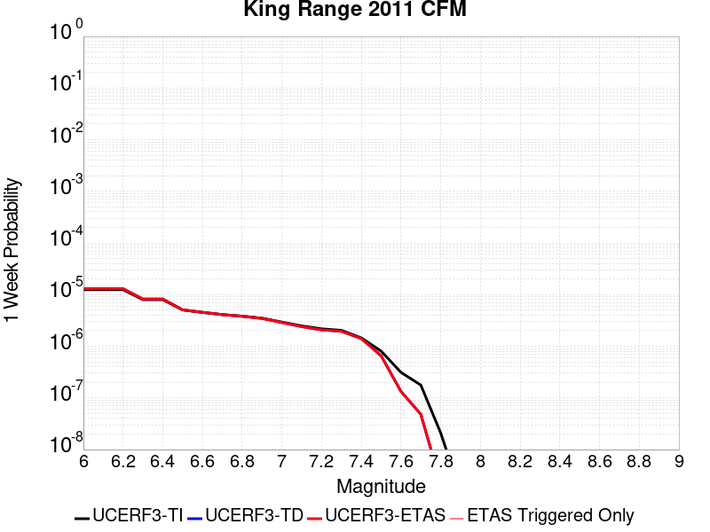 | 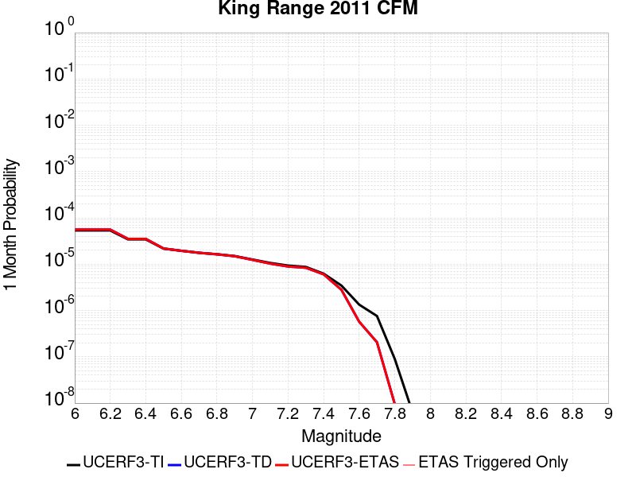 |  |

| Magnitude | 1 wk TI Prob | 1 wk TD Prob | 1 wk ETAS Prob | 1 wk ETAS/TD Gain | 1 wk ETAS Triggered Only | 1 mo TI Prob | 1 mo TD Prob | 1 mo ETAS Prob | 1 mo ETAS/TD Gain | 1 mo ETAS Triggered Only | 1 yr TI Prob | 1 yr TD Prob | 1 yr ETAS Prob | 1 yr ETAS/TD Gain | 1 yr ETAS Triggered Only |
|-----|-----|-----|-----|-----|-----|-----|-----|-----|-----|-----|-----|-----|-----|-----|-----|
| 6.0 | 1.2462566E-5 | 1.30294375E-5 | 1.30294375E-5 | 1.0 | 0.0 | 5.34099E-5 | 5.5839446E-5 | 5.5839446E-5 | 1.0 | 0.0 | 6.5007154E-4 | 6.7966816E-4 | 7.5961376E-4 | 1.1176245 | 8.0E-5 |
| 6.1 | 1.2462566E-5 | 1.30294375E-5 | 1.30294375E-5 | 1.0 | 0.0 | 5.34099E-5 | 5.5839446E-5 | 5.5839446E-5 | 1.0 | 0.0 | 6.5007154E-4 | 6.7966816E-4 | 7.5961376E-4 | 1.1176245 | 8.0E-5 |
| 6.2 | 1.2462566E-5 | 1.30294375E-5 | 1.30294375E-5 | 1.0 | 0.0 | 5.34099E-5 | 5.5839446E-5 | 5.5839446E-5 | 1.0 | 0.0 | 6.5007154E-4 | 6.7966816E-4 | 7.5961376E-4 | 1.1176245 | 8.0E-5 |
| 6.3 | 7.988484E-6 | 8.219333E-6 | 8.219333E-6 | 1.0 | 0.0 | 3.423591E-5 | 3.5225312E-5 | 3.5225312E-5 | 1.0 | 0.0 | 4.1674246E-4 | 4.287967E-4 | 4.6877956E-4 | 1.0932443 | 4.0E-5 |
| 6.4 | 7.988484E-6 | 8.219333E-6 | 8.219333E-6 | 1.0 | 0.0 | 3.423591E-5 | 3.5225312E-5 | 3.5225312E-5 | 1.0 | 0.0 | 4.1674246E-4 | 4.287967E-4 | 4.6877956E-4 | 1.0932443 | 4.0E-5 |
| 6.5 | 5.0522513E-6 | 5.0870935E-6 | 5.0870935E-6 | 1.0 | 0.0 | 2.1652326E-5 | 2.1801652E-5 | 2.1801652E-5 | 1.0 | 0.0 | 2.6358519E-4 | 2.6540374E-4 | 2.6540374E-4 | 1.0 | 0.0 |
| 6.6 | 4.53682E-6 | 4.5436723E-6 | 4.5436723E-6 | 1.0 | 0.0 | 1.944337E-5 | 1.947274E-5 | 1.947274E-5 | 1.0 | 0.0 | 2.3669732E-4 | 2.3705543E-4 | 2.3705543E-4 | 1.0 | 0.0 |
| 6.7 | 4.1144335E-6 | 4.1016274E-6 | 4.1016274E-6 | 1.0 | 0.0 | 1.7633167E-5 | 1.7578288E-5 | 1.7578288E-5 | 1.0 | 0.0 | 2.1466266E-4 | 2.1399502E-4 | 2.1399502E-4 | 1.0 | 0.0 |
| 6.8 | 3.8321214E-6 | 3.811941E-6 | 3.811941E-6 | 1.0 | 0.0 | 1.6423275E-5 | 1.633679E-5 | 1.633679E-5 | 1.0 | 0.0 | 1.9993502E-4 | 1.988826E-4 | 1.988826E-4 | 1.0 | 0.0 |
| 6.9 | 3.4999944E-6 | 3.468251E-6 | 3.468251E-6 | 1.0 | 0.0 | 1.499989E-5 | 1.486385E-5 | 1.486385E-5 | 1.0 | 0.0 | 1.8260835E-4 | 1.809526E-4 | 1.809526E-4 | 1.0 | 0.0 |
| 7.0 | 2.9470837E-6 | 2.8911106E-6 | 2.8911106E-6 | 1.0 | 0.0 | 1.26302975E-5 | 1.23904165E-5 | 1.23904165E-5 | 1.0 | 0.0 | 1.5376302E-4 | 1.5084306E-4 | 1.5084306E-4 | 1.0 | 0.0 |
| 7.1 | 2.4850247E-6 | 2.4019866E-6 | 2.4019866E-6 | 1.0 | 0.0 | 1.0650062E-5 | 1.0294189E-5 | 1.0294189E-5 | 1.0 | 0.0 | 1.296568E-4 | 1.2532469E-4 | 1.2532469E-4 | 1.0 | 0.0 |
| 7.2 | 2.1800304E-6 | 2.0800667E-6 | 2.0800667E-6 | 1.0 | 0.0 | 9.342954E-6 | 8.9145415E-6 | 8.9145415E-6 | 1.0 | 0.0 | 1.1374453E-4 | 1.08529224E-4 | 1.08529224E-4 | 1.0 | 0.0 |
| 7.3 | 2.0378504E-6 | 1.9532376E-6 | 1.9532376E-6 | 1.0 | 0.0 | 8.733615E-6 | 8.370992E-6 | 8.370992E-6 | 1.0 | 0.0 | 1.0632657E-4 | 1.0191215E-4 | 1.0191215E-4 | 1.0 | 0.0 |
| 7.4 | 1.4577047E-6 | 1.4115096E-6 | 1.4115096E-6 | 1.0 | 0.0 | 6.247291E-6 | 6.0493135E-6 | 6.0493135E-6 | 1.0 | 0.0 | 7.605811E-5 | 7.364798E-5 | 7.364798E-5 | 1.0 | 0.0 |
| 7.5 | 8.0685743E-7 | 6.5499046E-7 | 6.5499046E-7 | 1.0 | 0.0 | 3.457956E-6 | 2.8070992E-6 | 2.8070992E-6 | 1.0 | 0.0 | 4.20998E-5 | 3.4175944E-5 | 3.4175944E-5 | 1.0 | 0.0 |
| 7.6 | 3.1239435E-7 | 1.3374E-7 | 1.3374E-7 | 1.0 | 0.0 | 1.3388321E-6 | 5.7317135E-7 | 5.7317135E-7 | 1.0 | 0.0 | 1.630016E-5 | 6.978339E-6 | 6.978339E-6 | 1.0 | 0.0 |
| 7.7 | 1.7747207E-7 | 4.8214762E-8 | 4.8214762E-8 | 1.0 | 0.0 | 7.605944E-7 | 2.0663468E-7 | 2.0663468E-7 | 1.0 | 0.0 | 9.260198E-6 | 2.5157744E-6 | 2.5157744E-6 | 1.0 | 0.0 |
| 7.8 | 2.1035538E-8 | 2.2284508E-9 | 2.2284508E-9 | 1.0 | 0.0 | 9.0152305E-8 | 9.550503E-9 | 9.550503E-9 | 1.0 | 0.0 | 1.0976038E-6 | 1.16277356E-7 | 1.16277356E-7 | 1.0 | 0.0 |
| 7.9 | 1.4782963E-9 | 9.500178E-13 | 9.500178E-13 | 1.0 | 0.0 | 6.335555E-9 | 4.071854E-12 | 4.071854E-12 | 1.0 | 0.0 | 7.713538E-8 | 4.9572235E-11 | 4.9572235E-11 | 1.0 | 0.0 |

## Northridge Hills
*[(top)](#table-of-contents)*

| 1 Week | 1 Month | 1 Year |
|-----|-----|-----|
| 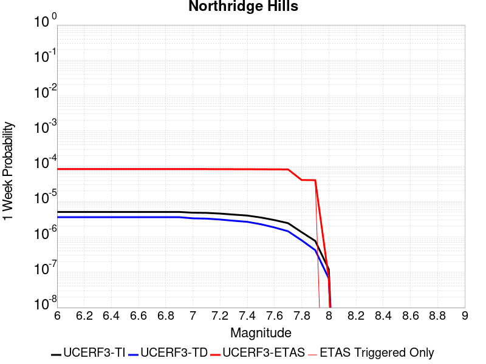 | 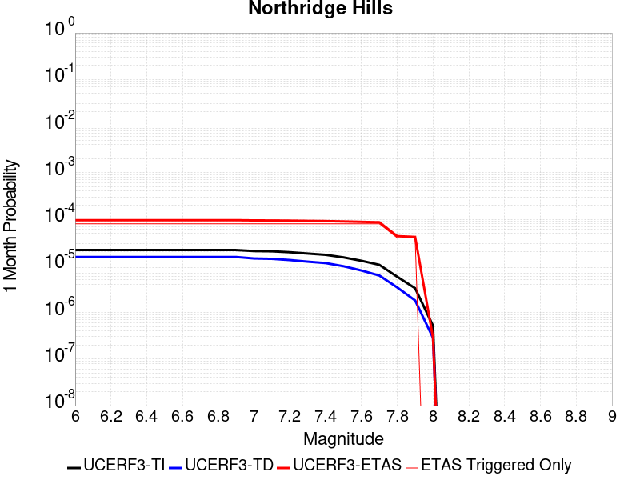 | 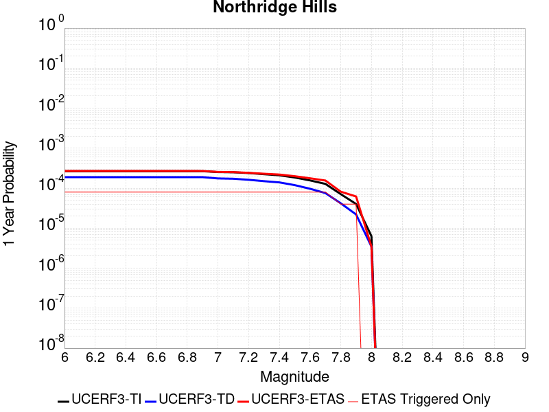 |

| Magnitude | 1 wk TI Prob | 1 wk TD Prob | 1 wk ETAS Prob | 1 wk ETAS/TD Gain | 1 wk ETAS Triggered Only | 1 mo TI Prob | 1 mo TD Prob | 1 mo ETAS Prob | 1 mo ETAS/TD Gain | 1 mo ETAS Triggered Only | 1 yr TI Prob | 1 yr TD Prob | 1 yr ETAS Prob | 1 yr ETAS/TD Gain | 1 yr ETAS Triggered Only |
|-----|-----|-----|-----|-----|-----|-----|-----|-----|-----|-----|-----|-----|-----|-----|-----|
| 6.0 | 5.095982E-6 | 3.6174772E-6 | 8.361719E-5 | 23.114779 | 8.0E-5 | 2.183974E-5 | 1.5503383E-5 | 9.550214E-5 | 6.1600842 | 8.0E-5 | 2.658664E-4 | 1.8873745E-4 | 2.6872236E-4 | 1.4237893 | 8.0E-5 |
| 6.1 | 5.095982E-6 | 3.6174772E-6 | 8.361719E-5 | 23.114779 | 8.0E-5 | 2.183974E-5 | 1.5503383E-5 | 9.550214E-5 | 6.1600842 | 8.0E-5 | 2.658664E-4 | 1.8873745E-4 | 2.6872236E-4 | 1.4237893 | 8.0E-5 |
| 6.2 | 5.095982E-6 | 3.6174772E-6 | 8.361719E-5 | 23.114779 | 8.0E-5 | 2.183974E-5 | 1.5503383E-5 | 9.550214E-5 | 6.1600842 | 8.0E-5 | 2.658664E-4 | 1.8873745E-4 | 2.6872236E-4 | 1.4237893 | 8.0E-5 |
| 6.3 | 5.095982E-6 | 3.6174772E-6 | 8.361719E-5 | 23.114779 | 8.0E-5 | 2.183974E-5 | 1.5503383E-5 | 9.550214E-5 | 6.1600842 | 8.0E-5 | 2.658664E-4 | 1.8873745E-4 | 2.6872236E-4 | 1.4237893 | 8.0E-5 |
| 6.4 | 5.095982E-6 | 3.6174772E-6 | 8.361719E-5 | 23.114779 | 8.0E-5 | 2.183974E-5 | 1.5503383E-5 | 9.550214E-5 | 6.1600842 | 8.0E-5 | 2.658664E-4 | 1.8873745E-4 | 2.6872236E-4 | 1.4237893 | 8.0E-5 |
| 6.5 | 5.095982E-6 | 3.6174772E-6 | 8.361719E-5 | 23.114779 | 8.0E-5 | 2.183974E-5 | 1.5503383E-5 | 9.550214E-5 | 6.1600842 | 8.0E-5 | 2.658664E-4 | 1.8873745E-4 | 2.6872236E-4 | 1.4237893 | 8.0E-5 |
| 6.6 | 5.095982E-6 | 3.6174772E-6 | 8.361719E-5 | 23.114779 | 8.0E-5 | 2.183974E-5 | 1.5503383E-5 | 9.550214E-5 | 6.1600842 | 8.0E-5 | 2.658664E-4 | 1.8873745E-4 | 2.6872236E-4 | 1.4237893 | 8.0E-5 |
| 6.7 | 5.095982E-6 | 3.6174772E-6 | 8.361719E-5 | 23.114779 | 8.0E-5 | 2.183974E-5 | 1.5503383E-5 | 9.550214E-5 | 6.1600842 | 8.0E-5 | 2.658664E-4 | 1.8873745E-4 | 2.6872236E-4 | 1.4237893 | 8.0E-5 |
| 6.8 | 5.095982E-6 | 3.6174772E-6 | 8.361719E-5 | 23.114779 | 8.0E-5 | 2.183974E-5 | 1.5503383E-5 | 9.550214E-5 | 6.1600842 | 8.0E-5 | 2.658664E-4 | 1.8873745E-4 | 2.6872236E-4 | 1.4237893 | 8.0E-5 |
| 6.9 | 5.0942654E-6 | 3.6156919E-6 | 8.36154E-5 | 23.125698 | 8.0E-5 | 2.1832384E-5 | 1.549573E-5 | 9.549449E-5 | 6.162632 | 8.0E-5 | 2.6577685E-4 | 1.886443E-4 | 2.6862923E-4 | 1.4239985 | 8.0E-5 |
| 7.0 | 4.851143E-6 | 3.3609658E-6 | 8.33607E-5 | 24.8026 | 8.0E-5 | 2.0790447E-5 | 1.440406E-5 | 9.440291E-5 | 6.55391 | 8.0E-5 | 2.5309427E-4 | 1.7535535E-4 | 2.5534132E-4 | 1.4561365 | 8.0E-5 |
| 7.1 | 4.7910607E-6 | 3.2992368E-6 | 8.3298975E-5 | 25.247952 | 8.0E-5 | 2.0532956E-5 | 1.4139509E-5 | 9.413838E-5 | 6.657825 | 8.0E-5 | 2.4996005E-4 | 1.7213497E-4 | 2.521212E-4 | 1.4646716 | 8.0E-5 |
| 7.2 | 4.580079E-6 | 3.108981E-6 | 8.310873E-5 | 26.731825 | 8.0E-5 | 1.9628762E-5 | 1.3324136E-5 | 9.332307E-5 | 7.0040617 | 8.0E-5 | 2.3895396E-4 | 1.6220931E-4 | 2.4219633E-4 | 1.49311 | 8.0E-5 |
| 7.3 | 4.290062E-6 | 2.8703662E-6 | 8.287014E-5 | 28.870928 | 8.0E-5 | 1.838585E-5 | 1.2301512E-5 | 9.230053E-5 | 7.5031857 | 8.0E-5 | 2.2382473E-4 | 1.4976064E-4 | 2.2974866E-4 | 1.5341058 | 8.0E-5 |
| 7.4 | 4.0259683E-6 | 2.6760083E-6 | 8.26758E-5 | 30.895193 | 8.0E-5 | 1.7254037E-5 | 1.1468556E-5 | 9.146764E-5 | 7.9755144 | 8.0E-5 | 2.1004764E-4 | 1.3962075E-4 | 2.1960959E-4 | 1.5729007 | 8.0E-5 |
| 7.5 | 3.5477108E-6 | 2.2872025E-6 | 8.228702E-5 | 35.977146 | 8.0E-5 | 1.5204386E-5 | 9.80226E-6 | 8.980148E-5 | 9.1613035 | 8.0E-5 | 1.8509767E-4 | 1.1933599E-4 | 1.9932644E-4 | 1.6702961 | 8.0E-5 |
| 7.6 | 2.9990608E-6 | 1.8545861E-6 | 8.1854436E-5 | 44.13623 | 8.0E-5 | 1.2853055E-5 | 7.9482015E-6 | 8.794756E-5 | 11.06509 | 8.0E-5 | 1.564747E-4 | 9.676506E-5 | 1.7675733E-4 | 1.8266647 | 8.0E-5 |
| 7.7 | 2.4542855E-6 | 1.4477155E-6 | 8.14476E-5 | 56.2594 | 8.0E-5 | 1.05183235E-5 | 6.20448E-6 | 8.620398E-5 | 13.893829 | 8.0E-5 | 1.2805307E-4 | 7.553693E-5 | 1.5553088E-4 | 2.0590045 | 8.0E-5 |
| 7.8 | 1.3623128E-6 | 8.026375E-7 | 4.0802606E-5 | 50.83566 | 4.0E-5 | 5.8384703E-6 | 3.4398704E-6 | 4.3439733E-5 | 12.628305 | 4.0E-5 | 7.108106E-5 | 4.187962E-5 | 8.1877944E-5 | 1.9550785 | 4.0E-5 |
| 7.9 | 7.716622E-7 | 4.2262494E-7 | 4.042261E-5 | 95.64653 | 4.0E-5 | 3.3071194E-6 | 1.8112485E-6 | 4.1811178E-5 | 23.084175 | 4.0E-5 | 4.0263436E-5 | 2.2051727E-5 | 6.205084E-5 | 2.8138769 | 4.0E-5 |
| 8.0 | 1.2117711E-7 | 6.630734E-8 | 6.630734E-8 | 1.0 | 0.0 | 5.1933034E-7 | 2.8417426E-7 | 2.8417426E-7 | 1.0 | 0.0 | 6.3228285E-6 | 3.4598163E-6 | 3.4598163E-6 | 1.0 | 0.0 |

## Ludlow
*[(top)](#table-of-contents)*

| 1 Week | 1 Month | 1 Year |
|-----|-----|-----|
|  | 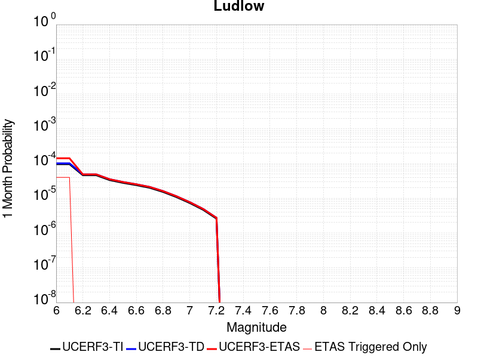 |  |

| Magnitude | 1 wk TI Prob | 1 wk TD Prob | 1 wk ETAS Prob | 1 wk ETAS/TD Gain | 1 wk ETAS Triggered Only | 1 mo TI Prob | 1 mo TD Prob | 1 mo ETAS Prob | 1 mo ETAS/TD Gain | 1 mo ETAS Triggered Only | 1 yr TI Prob | 1 yr TD Prob | 1 yr ETAS Prob | 1 yr ETAS/TD Gain | 1 yr ETAS Triggered Only |
|-----|-----|-----|-----|-----|-----|-----|-----|-----|-----|-----|-----|-----|-----|-----|-----|
| 6.0 | 2.2407607E-5 | 2.3661727E-5 | 2.3661727E-5 | 1.0 | 0.0 | 9.602906E-5 | 1.0140371E-4 | 1.4139965E-4 | 1.3944229 | 4.0E-5 | 0.0011685267 | 0.0012339351 | 0.0012738857 | 1.0323766 | 4.0E-5 |
| 6.1 | 2.2407607E-5 | 2.3661727E-5 | 2.3661727E-5 | 1.0 | 0.0 | 9.602906E-5 | 1.0140371E-4 | 1.4139965E-4 | 1.3944229 | 4.0E-5 | 0.0011685267 | 0.0012339351 | 0.0012738857 | 1.0323766 | 4.0E-5 |
| 6.2 | 1.0781252E-5 | 1.1367753E-5 | 1.1367753E-5 | 1.0 | 0.0 | 4.620455E-5 | 4.8718055E-5 | 4.8718055E-5 | 1.0 | 0.0 | 5.623952E-4 | 5.929849E-4 | 5.929849E-4 | 1.0 | 0.0 |
| 6.3 | 1.0781252E-5 | 1.1367753E-5 | 1.1367753E-5 | 1.0 | 0.0 | 4.620455E-5 | 4.8718055E-5 | 4.8718055E-5 | 1.0 | 0.0 | 5.623952E-4 | 5.929849E-4 | 5.929849E-4 | 1.0 | 0.0 |
| 6.4 | 7.814439E-6 | 8.239243E-6 | 8.239243E-6 | 1.0 | 0.0 | 3.3490025E-5 | 3.5310568E-5 | 3.5310568E-5 | 1.0 | 0.0 | 4.0766477E-4 | 4.2982277E-4 | 4.2982277E-4 | 1.0 | 0.0 |
| 6.5 | 6.4986366E-6 | 6.8521795E-6 | 6.8521795E-6 | 1.0 | 0.0 | 2.7851002E-5 | 2.9366158E-5 | 2.9366158E-5 | 1.0 | 0.0 | 3.390332E-4 | 3.5747525E-4 | 3.5747525E-4 | 1.0 | 0.0 |
| 6.6 | 5.582177E-6 | 5.8870924E-6 | 5.8870924E-6 | 1.0 | 0.0 | 2.3923398E-5 | 2.5230156E-5 | 2.5230156E-5 | 1.0 | 0.0 | 2.9122844E-4 | 3.0713456E-4 | 3.0713456E-4 | 1.0 | 0.0 |
| 6.7 | 4.6858763E-6 | 4.9413375E-6 | 4.9413375E-6 | 1.0 | 0.0 | 2.0082172E-5 | 2.1176991E-5 | 2.1176991E-5 | 1.0 | 0.0 | 2.4447302E-4 | 2.5779993E-4 | 2.5779993E-4 | 1.0 | 0.0 |
| 6.8 | 3.5584908E-6 | 3.7527102E-6 | 3.7527102E-6 | 1.0 | 0.0 | 1.5250586E-5 | 1.6082948E-5 | 1.6082948E-5 | 1.0 | 0.0 | 1.8566006E-4 | 1.957927E-4 | 1.957927E-4 | 1.0 | 0.0 |
| 6.9 | 2.532834E-6 | 2.6714974E-6 | 2.6714974E-6 | 1.0 | 0.0 | 1.0854958E-5 | 1.1449226E-5 | 1.1449226E-5 | 1.0 | 0.0 | 1.3215111E-4 | 1.393857E-4 | 1.393857E-4 | 1.0 | 0.0 |
| 7.0 | 1.7083285E-6 | 1.8022786E-6 | 1.8022786E-6 | 1.0 | 0.0 | 7.3213873E-6 | 7.724029E-6 | 7.724029E-6 | 1.0 | 0.0 | 8.913424E-5 | 9.4036164E-5 | 9.4036164E-5 | 1.0 | 0.0 |
| 7.1 | 1.0905424E-6 | 1.1499736E-6 | 1.1499736E-6 | 1.0 | 0.0 | 4.6737446E-6 | 4.9284495E-6 | 4.9284495E-6 | 1.0 | 0.0 | 5.6901354E-5 | 6.0002323E-5 | 6.0002323E-5 | 1.0 | 0.0 |
| 7.2 | 6.06668E-7 | 6.3884215E-7 | 6.3884215E-7 | 1.0 | 0.0 | 2.600003E-6 | 2.7378926E-6 | 2.7378926E-6 | 1.0 | 0.0 | 3.1654577E-5 | 3.3333403E-5 | 3.3333403E-5 | 1.0 | 0.0 |

## Elysian Park (Lower CFM)
*[(top)](#table-of-contents)*

| 1 Week | 1 Month | 1 Year |
|-----|-----|-----|
| 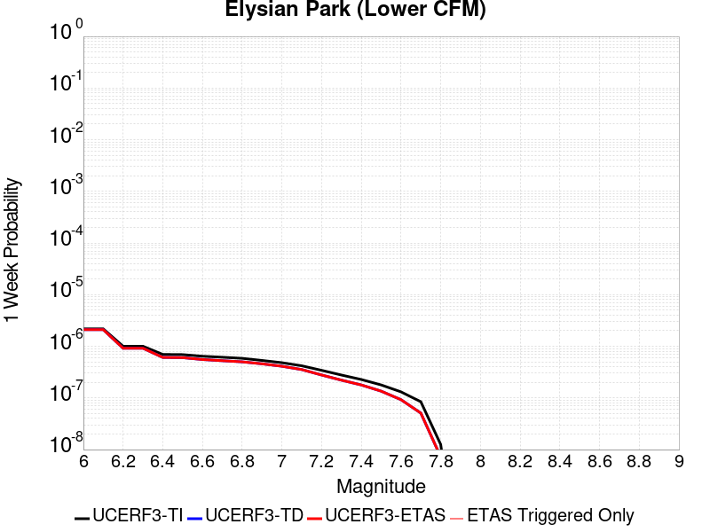 | 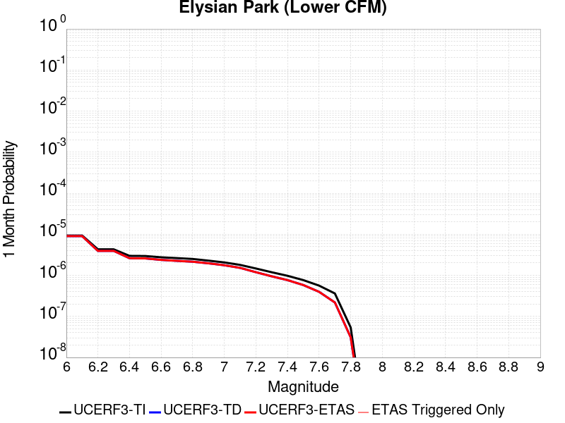 | 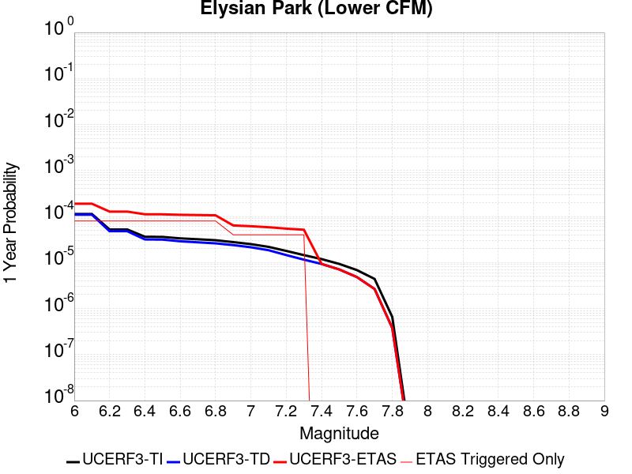 |

| Magnitude | 1 wk TI Prob | 1 wk TD Prob | 1 wk ETAS Prob | 1 wk ETAS/TD Gain | 1 wk ETAS Triggered Only | 1 mo TI Prob | 1 mo TD Prob | 1 mo ETAS Prob | 1 mo ETAS/TD Gain | 1 mo ETAS Triggered Only | 1 yr TI Prob | 1 yr TD Prob | 1 yr ETAS Prob | 1 yr ETAS/TD Gain | 1 yr ETAS Triggered Only |
|-----|-----|-----|-----|-----|-----|-----|-----|-----|-----|-----|-----|-----|-----|-----|-----|
| 6.0 | 2.1766498E-6 | 2.1040103E-6 | 2.1040103E-6 | 1.0 | 0.0 | 9.328466E-6 | 9.017164E-6 | 9.017164E-6 | 1.0 | 0.0 | 1.1356815E-4 | 1.0977989E-4 | 1.897711E-4 | 1.7286509 | 8.0E-5 |
| 6.1 | 2.1766498E-6 | 2.1040103E-6 | 2.1040103E-6 | 1.0 | 0.0 | 9.328466E-6 | 9.017164E-6 | 9.017164E-6 | 1.0 | 0.0 | 1.1356815E-4 | 1.0977989E-4 | 1.897711E-4 | 1.7286509 | 8.0E-5 |
| 6.2 | 1.0031182E-6 | 9.1880236E-7 | 9.1880236E-7 | 1.0 | 0.0 | 4.299071E-6 | 3.937719E-6 | 3.937719E-6 | 1.0 | 0.0 | 5.2339932E-5 | 4.7940775E-5 | 1.2793693E-4 | 2.6686456 | 8.0E-5 |
| 6.3 | 1.0031182E-6 | 9.1880236E-7 | 9.1880236E-7 | 1.0 | 0.0 | 4.299071E-6 | 3.937719E-6 | 3.937719E-6 | 1.0 | 0.0 | 5.2339932E-5 | 4.7940775E-5 | 1.2793693E-4 | 2.6686456 | 8.0E-5 |
| 6.4 | 6.9606244E-7 | 6.0936713E-7 | 6.0936713E-7 | 1.0 | 0.0 | 2.9831212E-6 | 2.6115708E-6 | 2.6115708E-6 | 1.0 | 0.0 | 3.6318896E-5 | 3.1795415E-5 | 1.1179287E-4 | 3.5160062 | 8.0E-5 |
| 6.5 | 6.901879E-7 | 6.034353E-7 | 6.034353E-7 | 1.0 | 0.0 | 2.9579448E-6 | 2.5861486E-6 | 2.5861486E-6 | 1.0 | 0.0 | 3.6012385E-5 | 3.1485906E-5 | 1.1148339E-4 | 3.5407393 | 8.0E-5 |
| 6.6 | 6.4198554E-7 | 5.5483224E-7 | 5.5483224E-7 | 1.0 | 0.0 | 2.7513638E-6 | 2.3778503E-6 | 2.3778503E-6 | 1.0 | 0.0 | 3.3497337E-5 | 2.8949942E-5 | 1.0894763E-4 | 3.7633107 | 8.0E-5 |
| 6.7 | 6.138733E-7 | 5.265122E-7 | 5.265122E-7 | 1.0 | 0.0 | 2.6308828E-6 | 2.256479E-6 | 2.256479E-6 | 1.0 | 0.0 | 3.203053E-5 | 2.7472286E-5 | 1.07470085E-4 | 3.9119456 | 8.0E-5 |
| 6.8 | 5.84778E-7 | 5.0046305E-7 | 5.0046305E-7 | 1.0 | 0.0 | 2.506189E-6 | 2.1448398E-6 | 2.1448398E-6 | 1.0 | 0.0 | 3.0512423E-5 | 2.6113114E-5 | 1.0611102E-4 | 4.0635147 | 8.0E-5 |
| 6.9 | 5.322785E-7 | 4.5817447E-7 | 4.5817447E-7 | 1.0 | 0.0 | 2.2811914E-6 | 1.9636034E-6 | 1.9636034E-6 | 1.0 | 0.0 | 2.7773152E-5 | 2.3906608E-5 | 6.390565E-5 | 2.6731374 | 4.0E-5 |
| 7.0 | 4.8147206E-7 | 4.114048E-7 | 4.114048E-7 | 1.0 | 0.0 | 2.06345E-6 | 1.7631621E-6 | 1.7631621E-6 | 1.0 | 0.0 | 2.5122214E-5 | 2.1466289E-5 | 6.146543E-5 | 2.8633468 | 4.0E-5 |
| 7.1 | 4.1932955E-7 | 3.5470623E-7 | 3.5470623E-7 | 1.0 | 0.0 | 1.7971255E-6 | 1.5201687E-6 | 1.5201687E-6 | 1.0 | 0.0 | 2.1879783E-5 | 1.8507895E-5 | 5.8507158E-5 | 3.1611998 | 4.0E-5 |
| 7.2 | 3.426051E-7 | 2.7822617E-7 | 2.7822617E-7 | 1.0 | 0.0 | 1.4683067E-6 | 1.1923972E-6 | 1.1923972E-6 | 1.0 | 0.0 | 1.7876488E-5 | 1.4517339E-5 | 5.451676E-5 | 3.7552857 | 4.0E-5 |
| 7.3 | 2.7771645E-7 | 2.2107093E-7 | 2.2107093E-7 | 1.0 | 0.0 | 1.1902127E-6 | 9.4744644E-7 | 9.4744644E-7 | 1.0 | 0.0 | 1.4490744E-5 | 1.15350995E-5 | 5.1534636E-5 | 4.467637 | 4.0E-5 |
| 7.4 | 2.2756493E-7 | 1.7849236E-7 | 1.7849236E-7 | 1.0 | 0.0 | 9.752779E-7 | 7.64967E-7 | 7.64967E-7 | 1.0 | 0.0 | 1.1873944E-5 | 9.313433E-6 | 9.313433E-6 | 1.0 | 0.0 |
| 7.5 | 1.7874558E-7 | 1.3550755E-7 | 1.3550755E-7 | 1.0 | 0.0 | 7.660522E-7 | 5.8074653E-7 | 5.8074653E-7 | 1.0 | 0.0 | 9.326646E-6 | 7.070566E-6 | 7.070566E-6 | 1.0 | 0.0 |
| 7.6 | 1.3124549E-7 | 9.257153E-8 | 9.257153E-8 | 1.0 | 0.0 | 5.624805E-7 | 3.967351E-7 | 3.967351E-7 | 1.0 | 0.0 | 6.8481786E-6 | 4.830239E-6 | 4.830239E-6 | 1.0 | 0.0 |
| 7.7 | 8.439993E-8 | 5.095041E-8 | 5.095041E-8 | 1.0 | 0.0 | 3.6171392E-7 | 2.1835888E-7 | 2.1835888E-7 | 1.0 | 0.0 | 4.403858E-6 | 2.6585162E-6 | 2.6585162E-6 | 1.0 | 0.0 |
| 7.8 | 1.2591407E-8 | 7.236424E-9 | 7.236424E-9 | 1.0 | 0.0 | 5.3963173E-8 | 3.1013244E-8 | 3.1013244E-8 | 1.0 | 0.0 | 6.570014E-7 | 3.7758616E-7 | 3.7758616E-7 | 1.0 | 0.0 |
| 7.9 | 2.8324232E-11 | 2.1434188E-11 | 2.1434188E-11 | 1.0 | 0.0 | 1.2138957E-10 | 9.1861185E-11 | 9.1861185E-11 | 1.0 | 0.0 | 1.4779177E-9 | 1.1184096E-9 | 1.1184096E-9 | 1.0 | 0.0 |

## East Huasna 2011 CFM
*[(top)](#table-of-contents)*

| 1 Week | 1 Month | 1 Year |
|-----|-----|-----|
| 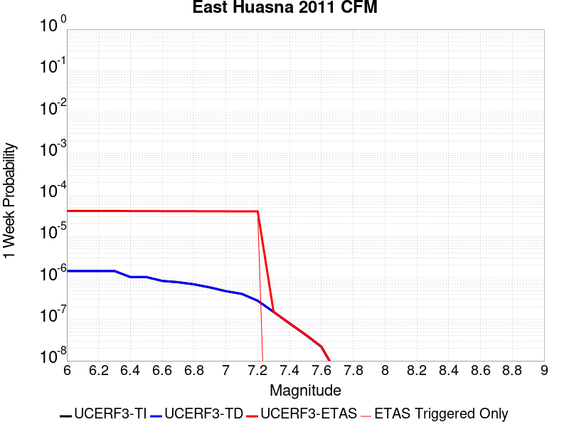 | 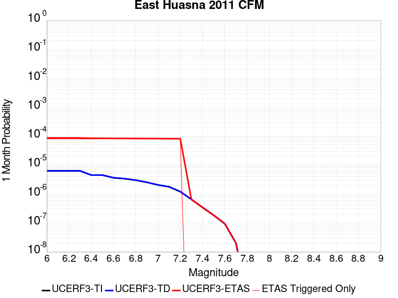 | 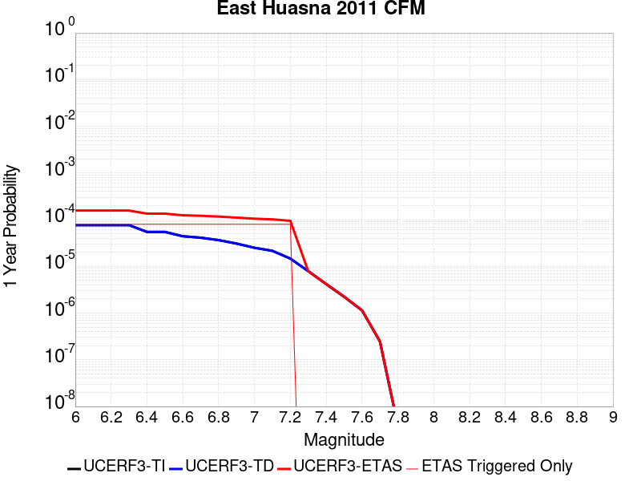 |

| Magnitude | 1 wk TI Prob | 1 wk TD Prob | 1 wk ETAS Prob | 1 wk ETAS/TD Gain | 1 wk ETAS Triggered Only | 1 mo TI Prob | 1 mo TD Prob | 1 mo ETAS Prob | 1 mo ETAS/TD Gain | 1 mo ETAS Triggered Only | 1 yr TI Prob | 1 yr TD Prob | 1 yr ETAS Prob | 1 yr ETAS/TD Gain | 1 yr ETAS Triggered Only |
|-----|-----|-----|-----|-----|-----|-----|-----|-----|-----|-----|-----|-----|-----|-----|-----|
| 6.0 | 1.4658423E-6 | 1.4715968E-6 | 4.147154E-5 | 28.18132 | 4.0E-5 | 6.282166E-6 | 6.3068283E-6 | 8.6306325E-5 | 13.684585 | 8.0E-5 | 7.6482684E-5 | 7.6783E-5 | 1.5677686E-4 | 2.0418172 | 8.0E-5 |
| 6.1 | 1.4658423E-6 | 1.4715968E-6 | 4.147154E-5 | 28.18132 | 4.0E-5 | 6.282166E-6 | 6.3068283E-6 | 8.6306325E-5 | 13.684585 | 8.0E-5 | 7.6482684E-5 | 7.6783E-5 | 1.5677686E-4 | 2.0418172 | 8.0E-5 |
| 6.2 | 1.4658423E-6 | 1.4715968E-6 | 4.147154E-5 | 28.18132 | 4.0E-5 | 6.282166E-6 | 6.3068283E-6 | 8.6306325E-5 | 13.684585 | 8.0E-5 | 7.6482684E-5 | 7.6783E-5 | 1.5677686E-4 | 2.0418172 | 8.0E-5 |
| 6.3 | 1.4658423E-6 | 1.4715968E-6 | 4.147154E-5 | 28.18132 | 4.0E-5 | 6.282166E-6 | 6.3068283E-6 | 8.6306325E-5 | 13.684585 | 8.0E-5 | 7.6482684E-5 | 7.6783E-5 | 1.5677686E-4 | 2.0418172 | 8.0E-5 |
| 6.4 | 1.0488257E-6 | 1.0527762E-6 | 4.1052735E-5 | 38.994743 | 4.0E-5 | 4.4949593E-6 | 4.51189E-6 | 8.451153E-5 | 18.730848 | 8.0E-5 | 5.472476E-5 | 5.4930893E-5 | 1.349265E-4 | 2.4562953 | 8.0E-5 |
| 6.5 | 1.0488257E-6 | 1.0527762E-6 | 4.1052735E-5 | 38.994743 | 4.0E-5 | 4.4949593E-6 | 4.51189E-6 | 8.451153E-5 | 18.730848 | 8.0E-5 | 5.472476E-5 | 5.4930893E-5 | 1.349265E-4 | 2.4562953 | 8.0E-5 |
| 6.6 | 8.463064E-7 | 8.493849E-7 | 4.084935E-5 | 48.09286 | 4.0E-5 | 3.6270226E-6 | 3.640216E-6 | 8.363993E-5 | 22.976637 | 8.0E-5 | 4.4158103E-5 | 4.431874E-5 | 1.243152E-4 | 2.8050256 | 8.0E-5 |
| 6.7 | 7.876149E-7 | 7.902736E-7 | 4.079024E-5 | 51.615345 | 4.0E-5 | 3.375488E-6 | 3.3868823E-6 | 8.3386614E-5 | 24.620462 | 8.0E-5 | 4.109579E-5 | 4.1234518E-5 | 1.2123122E-4 | 2.940042 | 8.0E-5 |
| 6.8 | 6.9940785E-7 | 7.016767E-7 | 4.070165E-5 | 58.00627 | 4.0E-5 | 2.9974588E-6 | 3.0071824E-6 | 8.300694E-5 | 27.602896 | 8.0E-5 | 3.649345E-5 | 3.6611837E-5 | 1.16608906E-4 | 3.1850057 | 8.0E-5 |
| 6.9 | 5.899658E-7 | 5.915766E-7 | 4.0591553E-5 | 68.61588 | 4.0E-5 | 2.5284223E-6 | 2.535326E-6 | 8.253512E-5 | 32.554047 | 8.0E-5 | 3.0783107E-5 | 3.086716E-5 | 1.1086469E-4 | 3.5916712 | 8.0E-5 |
| 7.0 | 4.793814E-7 | 4.803418E-7 | 4.048032E-5 | 84.274 | 4.0E-5 | 2.05449E-6 | 2.058606E-6 | 8.205844E-5 | 39.861168 | 8.0E-5 | 2.501313E-5 | 2.5063242E-5 | 1.0506123E-4 | 4.1918454 | 8.0E-5 |
| 7.1 | 4.1256908E-7 | 4.130068E-7 | 4.041299E-5 | 97.85066 | 4.0E-5 | 1.768152E-6 | 1.770028E-6 | 8.176989E-5 | 46.196945 | 8.0E-5 | 2.1527037E-5 | 2.1549879E-5 | 1.01548154E-4 | 4.712238 | 8.0E-5 |
| 7.2 | 2.822599E-7 | 2.8162322E-7 | 4.028161E-5 | 143.03369 | 4.0E-5 | 1.2096847E-6 | 1.2069561E-6 | 8.120686E-5 | 67.282364 | 8.0E-5 | 1.47278115E-5 | 1.4694592E-5 | 9.4693416E-5 | 6.4440994 | 8.0E-5 |
| 7.3 | 1.5261652E-7 | 1.5075507E-7 | 1.5075507E-7 | 1.0 | 0.0 | 6.540707E-7 | 6.46093E-7 | 6.46093E-7 | 1.0 | 0.0 | 7.963281E-6 | 7.866154E-6 | 7.866154E-6 | 1.0 | 0.0 |
| 7.4 | 7.976414E-8 | 8.0581444E-8 | 8.0581444E-8 | 1.0 | 0.0 | 3.418463E-7 | 3.4534898E-7 | 3.4534898E-7 | 1.0 | 0.0 | 4.1619705E-6 | 4.204616E-6 | 4.204616E-6 | 1.0 | 0.0 |
| 7.5 | 4.2715055E-8 | 4.3204185E-8 | 4.3204185E-8 | 1.0 | 0.0 | 1.830645E-7 | 1.8516077E-7 | 1.8516077E-7 | 1.0 | 0.0 | 2.228808E-6 | 2.2543302E-6 | 2.2543302E-6 | 1.0 | 0.0 |
| 7.6 | 2.1807532E-8 | 2.2058332E-8 | 2.2058332E-8 | 1.0 | 0.0 | 9.346085E-8 | 9.453571E-8 | 9.453571E-8 | 1.0 | 0.0 | 1.1378852E-6 | 1.1509717E-6 | 1.1509717E-6 | 1.0 | 0.0 |
| 7.7 | 4.7196043E-9 | 4.767446E-9 | 4.767446E-9 | 1.0 | 0.0 | 2.0226874E-8 | 2.0431912E-8 | 2.0431912E-8 | 1.0 | 0.0 | 2.4626218E-7 | 2.487585E-7 | 2.487585E-7 | 1.0 | 0.0 |
| 7.8 | 7.400003E-11 | 7.4656725E-11 | 7.4656725E-11 | 1.0 | 0.0 | 3.171432E-10 | 3.1995728E-10 | 3.1995728E-10 | 1.0 | 0.0 | 3.861218E-9 | 3.89548E-9 | 3.89548E-9 | 1.0 | 0.0 |

## Ortigalita (North)
*[(top)](#table-of-contents)*

| 1 Week | 1 Month | 1 Year |
|-----|-----|-----|
|  |  | 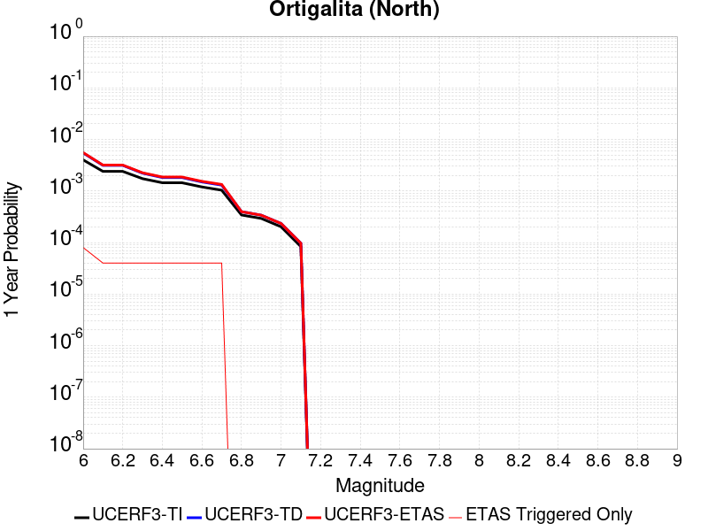 |

| Magnitude | 1 wk TI Prob | 1 wk TD Prob | 1 wk ETAS Prob | 1 wk ETAS/TD Gain | 1 wk ETAS Triggered Only | 1 mo TI Prob | 1 mo TD Prob | 1 mo ETAS Prob | 1 mo ETAS/TD Gain | 1 mo ETAS Triggered Only | 1 yr TI Prob | 1 yr TD Prob | 1 yr ETAS Prob | 1 yr ETAS/TD Gain | 1 yr ETAS Triggered Only |
|-----|-----|-----|-----|-----|-----|-----|-----|-----|-----|-----|-----|-----|-----|-----|-----|
| 6.0 | 7.711876E-5 | 1.0517288E-4 | 1.0517288E-4 | 1.0 | 0.0 | 3.3046713E-4 | 4.5066644E-4 | 4.5066644E-4 | 1.0 | 0.0 | 0.004016016 | 0.0054742103 | 0.005553772 | 1.014534 | 8.0E-5 |
| 6.1 | 4.607858E-5 | 6.030095E-5 | 6.030095E-5 | 1.0 | 0.0 | 1.9746469E-4 | 2.5840945E-4 | 2.5840945E-4 | 1.0 | 0.0 | 0.0024014818 | 0.0031419133 | 0.0031817877 | 1.0126911 | 4.0E-5 |
| 6.2 | 4.607858E-5 | 6.030095E-5 | 6.030095E-5 | 1.0 | 0.0 | 1.9746469E-4 | 2.5840945E-4 | 2.5840945E-4 | 1.0 | 0.0 | 0.0024014818 | 0.0031419133 | 0.0031817877 | 1.0126911 | 4.0E-5 |
| 6.3 | 3.327423E-5 | 4.251604E-5 | 4.251604E-5 | 1.0 | 0.0 | 1.4259605E-4 | 1.8220021E-4 | 1.8220021E-4 | 1.0 | 0.0 | 0.0017347244 | 0.0022162818 | 0.0022561932 | 1.0180082 | 4.0E-5 |
| 6.4 | 2.7732503E-5 | 3.5030593E-5 | 3.5030593E-5 | 1.0 | 0.0 | 1.1884817E-4 | 1.5012384E-4 | 1.5012384E-4 | 1.0 | 0.0 | 0.001446016 | 0.0018264599 | 0.0018663869 | 1.0218602 | 4.0E-5 |
| 6.5 | 2.7689714E-5 | 3.4980378E-5 | 3.4980378E-5 | 1.0 | 0.0 | 1.186648E-4 | 1.4990866E-4 | 1.4990866E-4 | 1.0 | 0.0 | 0.0014437864 | 0.0018238444 | 0.0018637715 | 1.0218917 | 4.0E-5 |
| 6.6 | 2.2976905E-5 | 2.8743312E-5 | 2.8743312E-5 | 1.0 | 0.0 | 9.846873E-5 | 1.2318123E-4 | 1.2318123E-4 | 1.0 | 0.0 | 0.0011981975 | 0.0014989388 | 0.0015388789 | 1.0266455 | 4.0E-5 |
| 6.7 | 1.9871539E-5 | 2.4926665E-5 | 2.4926665E-5 | 1.0 | 0.0 | 8.516096E-5 | 1.06825595E-4 | 1.06825595E-4 | 1.0 | 0.0 | 0.0010363415 | 0.001300069 | 0.0013400171 | 1.0307276 | 4.0E-5 |
| 6.8 | 6.5640475E-6 | 7.6095916E-6 | 7.6095916E-6 | 1.0 | 0.0 | 2.813133E-5 | 3.2612144E-5 | 3.2612144E-5 | 1.0 | 0.0 | 3.424451E-4 | 3.9698338E-4 | 3.9698338E-4 | 1.0 | 0.0 |
| 6.9 | 5.6219683E-6 | 6.5052927E-6 | 6.5052927E-6 | 1.0 | 0.0 | 2.4093928E-5 | 2.7879541E-5 | 2.7879541E-5 | 1.0 | 0.0 | 2.933041E-4 | 3.3938314E-4 | 3.3938314E-4 | 1.0 | 0.0 |
| 7.0 | 3.875591E-6 | 4.4871476E-6 | 4.4871476E-6 | 1.0 | 0.0 | 1.6609569E-5 | 1.9230503E-5 | 1.9230503E-5 | 1.0 | 0.0 | 2.0220275E-4 | 2.3410833E-4 | 2.3410833E-4 | 1.0 | 0.0 |
| 7.1 | 1.6017933E-6 | 1.8580465E-6 | 1.8580465E-6 | 1.0 | 0.0 | 6.8648105E-6 | 7.963038E-6 | 7.963038E-6 | 1.0 | 0.0 | 8.357586E-5 | 9.6946744E-5 | 9.6946744E-5 | 1.0 | 0.0 |

## San Andreas (Offshore) 2011 CFM
*[(top)](#table-of-contents)*

| 1 Week | 1 Month | 1 Year |
|-----|-----|-----|
| 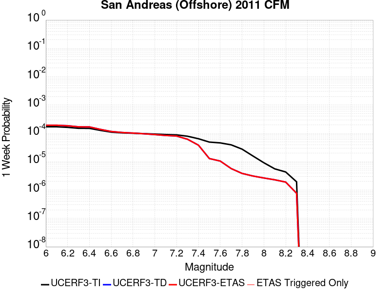 | 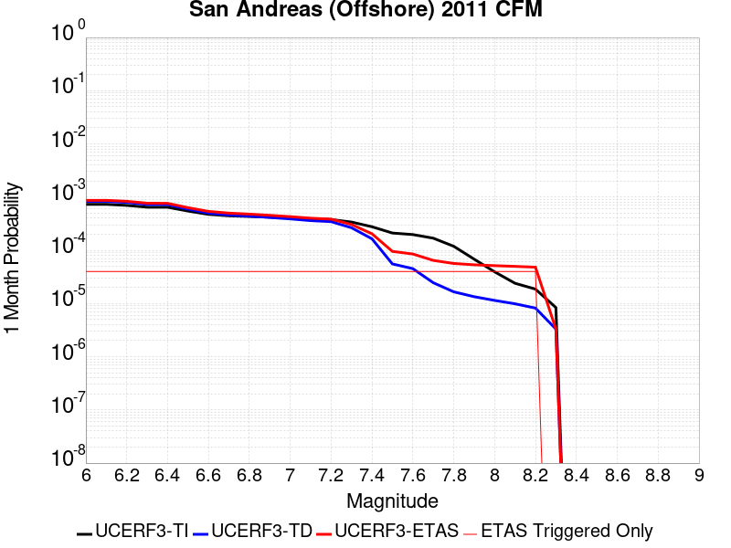 | 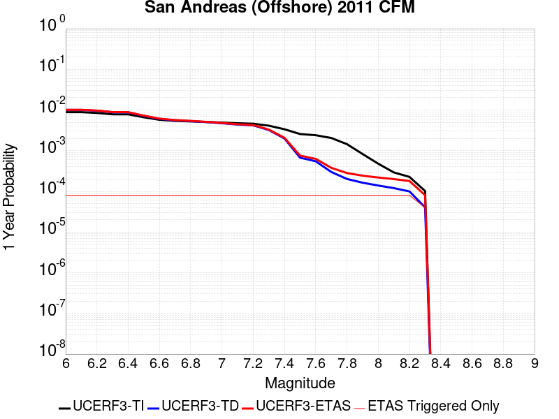 |

| Magnitude | 1 wk TI Prob | 1 wk TD Prob | 1 wk ETAS Prob | 1 wk ETAS/TD Gain | 1 wk ETAS Triggered Only | 1 mo TI Prob | 1 mo TD Prob | 1 mo ETAS Prob | 1 mo ETAS/TD Gain | 1 mo ETAS Triggered Only | 1 yr TI Prob | 1 yr TD Prob | 1 yr ETAS Prob | 1 yr ETAS/TD Gain | 1 yr ETAS Triggered Only |
|-----|-----|-----|-----|-----|-----|-----|-----|-----|-----|-----|-----|-----|-----|-----|-----|
| 6.0 | 1.7072787E-4 | 1.9367039E-4 | 1.9367039E-4 | 1.0 | 0.0 | 7.3148566E-4 | 8.2975434E-4 | 8.697212E-4 | 1.048167 | 4.0E-5 | 0.008869528 | 0.010055986 | 0.010135182 | 1.0078754 | 8.0E-5 |
| 6.1 | 1.7072787E-4 | 1.9367039E-4 | 1.9367039E-4 | 1.0 | 0.0 | 7.3148566E-4 | 8.2975434E-4 | 8.697212E-4 | 1.048167 | 4.0E-5 | 0.008869528 | 0.010055986 | 0.010135182 | 1.0078754 | 8.0E-5 |
| 6.2 | 1.6312556E-4 | 1.8542982E-4 | 1.8542982E-4 | 1.0 | 0.0 | 6.989222E-4 | 7.9445954E-4 | 8.344278E-4 | 1.0503087 | 4.0E-5 | 0.008476226 | 0.009630152 | 0.0097093815 | 1.0082272 | 8.0E-5 |
| 6.3 | 1.5103363E-4 | 1.7007098E-4 | 1.7007098E-4 | 1.0 | 0.0 | 6.471264E-4 | 7.2867423E-4 | 7.686451E-4 | 1.0548542 | 4.0E-5 | 0.007850339 | 0.008835971 | 0.008915265 | 1.008974 | 8.0E-5 |
| 6.4 | 1.5047993E-4 | 1.6892845E-4 | 1.6892845E-4 | 1.0 | 0.0 | 6.4475456E-4 | 7.2378037E-4 | 7.6375145E-4 | 1.0552254 | 4.0E-5 | 0.007821669 | 0.008776869 | 0.008856167 | 1.0090349 | 8.0E-5 |
| 6.5 | 1.2760791E-4 | 1.3845072E-4 | 1.3845072E-4 | 1.0 | 0.0 | 5.467764E-4 | 5.932267E-4 | 6.33203E-4 | 1.0673878 | 4.0E-5 | 0.0066367025 | 0.007198895 | 0.007278319 | 1.0110328 | 8.0E-5 |
| 6.6 | 1.1063525E-4 | 1.1654581E-4 | 1.1654581E-4 | 1.0 | 0.0 | 4.740649E-4 | 4.993875E-4 | 5.393675E-4 | 1.0800581 | 4.0E-5 | 0.0057564764 | 0.006063298 | 0.006142813 | 1.0131141 | 8.0E-5 |
| 6.7 | 1.0391049E-4 | 1.0739331E-4 | 1.0739331E-4 | 1.0 | 0.0 | 4.4525467E-4 | 4.6017687E-4 | 5.0015847E-4 | 1.0868831 | 4.0E-5 | 0.0054075094 | 0.0055884514 | 0.0056680045 | 1.0142353 | 8.0E-5 |
| 6.8 | 1.0096706E-4 | 1.02495374E-4 | 1.02495374E-4 | 1.0 | 0.0 | 4.3264418E-4 | 4.391929E-4 | 4.7917533E-4 | 1.0910362 | 4.0E-5 | 0.0052547283 | 0.0053342436 | 0.005413817 | 1.0149175 | 8.0E-5 |
| 6.9 | 9.800265E-5 | 9.678384E-5 | 9.678384E-5 | 1.0 | 0.0 | 4.1994374E-4 | 4.147229E-4 | 4.5470629E-4 | 1.0964099 | 4.0E-5 | 0.0051008356 | 0.0050377324 | 0.0051173293 | 1.0158001 | 8.0E-5 |
| 7.0 | 9.4642375E-5 | 9.0896305E-5 | 9.0896305E-5 | 1.0 | 0.0 | 4.0554712E-4 | 3.8949834E-4 | 4.2948275E-4 | 1.1026562 | 4.0E-5 | 0.004926363 | 0.004731996 | 0.0048116175 | 1.0168262 | 8.0E-5 |
| 7.1 | 9.0996844E-5 | 8.4394014E-5 | 8.4394014E-5 | 1.0 | 0.0 | 3.8992817E-4 | 3.6163937E-4 | 4.0162491E-4 | 1.1105675 | 4.0E-5 | 0.004737046 | 0.00439423 | 0.004473878 | 1.0181257 | 8.0E-5 |
| 7.2 | 8.848287E-5 | 8.0648424E-5 | 8.0648424E-5 | 1.0 | 0.0 | 3.791572E-4 | 3.455912E-4 | 3.8557738E-4 | 1.1157037 | 4.0E-5 | 0.004606472 | 0.004199612 | 0.004279276 | 1.0189694 | 8.0E-5 |
| 7.3 | 7.9280784E-5 | 6.195925E-5 | 6.195925E-5 | 1.0 | 0.0 | 3.3973053E-4 | 2.6551317E-4 | 3.0550256E-4 | 1.1506116 | 4.0E-5 | 0.004128377 | 0.0032279356 | 0.0033076773 | 1.0247036 | 8.0E-5 |
| 7.4 | 6.468038E-5 | 3.8398444E-5 | 3.8398444E-5 | 1.0 | 0.0 | 2.771722E-4 | 1.645547E-4 | 2.0454812E-4 | 1.2430402 | 4.0E-5 | 0.0033693502 | 0.0020016716 | 0.0020815113 | 1.0398866 | 8.0E-5 |
| 7.5 | 4.930574E-5 | 1.29417485E-5 | 1.29417485E-5 | 1.0 | 0.0 | 2.1129321E-4 | 5.5463468E-5 | 9.546125E-5 | 1.7211554 | 4.0E-5 | 0.0025694598 | 6.7506015E-4 | 7.550061E-4 | 1.118428 | 8.0E-5 |
| 7.6 | 4.612566E-5 | 1.0550586E-5 | 1.0550586E-5 | 1.0 | 0.0 | 1.9766642E-4 | 4.5216024E-5 | 8.521421E-5 | 1.8846022 | 4.0E-5 | 0.0024039324 | 5.503674E-4 | 6.3032337E-4 | 1.1452774 | 8.0E-5 |
| 7.7 | 3.9435414E-5 | 5.7372667E-6 | 5.7372667E-6 | 1.0 | 0.0 | 1.6899795E-4 | 2.4588055E-5 | 6.4587075E-5 | 2.6267662 | 4.0E-5 | 0.0020556084 | 2.9931864E-4 | 3.792947E-4 | 1.2671937 | 8.0E-5 |
| 7.8 | 2.7787428E-5 | 3.8718204E-6 | 3.8718204E-6 | 1.0 | 0.0 | 1.1908354E-4 | 1.6593409E-5 | 5.6592748E-5 | 3.4105556 | 4.0E-5 | 0.0014488777 | 2.0200608E-4 | 2.8198992E-4 | 1.3959477 | 8.0E-5 |
| 7.9 | 1.590671E-5 | 3.1320565E-6 | 3.1320565E-6 | 1.0 | 0.0 | 6.816983E-5 | 1.34230295E-5 | 5.3422493E-5 | 3.9799132 | 4.0E-5 | 8.2965166E-4 | 1.6341316E-4 | 2.4340009E-4 | 1.4894767 | 8.0E-5 |
| 8.0 | 9.193638E-6 | 2.6684493E-6 | 2.6684493E-6 | 1.0 | 0.0 | 3.940071E-5 | 1.1436161E-5 | 5.14357E-5 | 4.4976373 | 4.0E-5 | 4.7959806E-4 | 1.392264E-4 | 2.1921526E-4 | 1.5745237 | 8.0E-5 |
| 8.1 | 5.601576E-6 | 2.3041878E-6 | 2.3041878E-6 | 1.0 | 0.0 | 2.4006533E-5 | 9.8750525E-6 | 4.987466E-5 | 5.0505714 | 4.0E-5 | 2.9224035E-4 | 1.2022216E-4 | 2.0021254E-4 | 1.6653547 | 8.0E-5 |
| 8.2 | 4.3508785E-6 | 1.9136637E-6 | 1.9136637E-6 | 1.0 | 0.0 | 1.864649E-5 | 8.20139E-6 | 4.8201062E-5 | 5.877182 | 4.0E-5 | 2.2699735E-4 | 9.984738E-5 | 1.798394E-4 | 1.8011429 | 8.0E-5 |
| 8.3 | 1.9573292E-6 | 7.729172E-7 | 7.729172E-7 | 1.0 | 0.0 | 8.388526E-6 | 3.3124982E-6 | 3.3124982E-6 | 1.0 | 0.0 | 1.0212552E-4 | 4.0328938E-5 | 8.032732E-5 | 1.9918036 | 4.0E-5 |

## Elsinore (Temecula) rev
*[(top)](#table-of-contents)*

| 1 Week | 1 Month | 1 Year |
|-----|-----|-----|
| 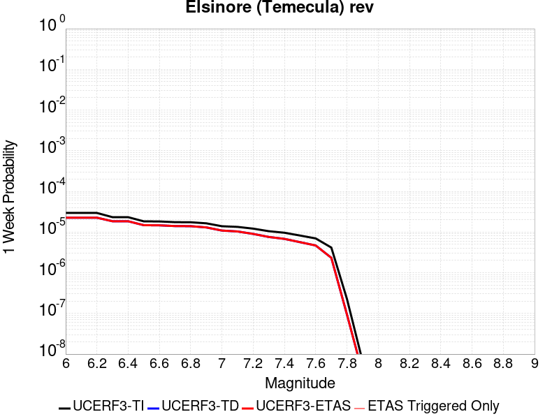 | 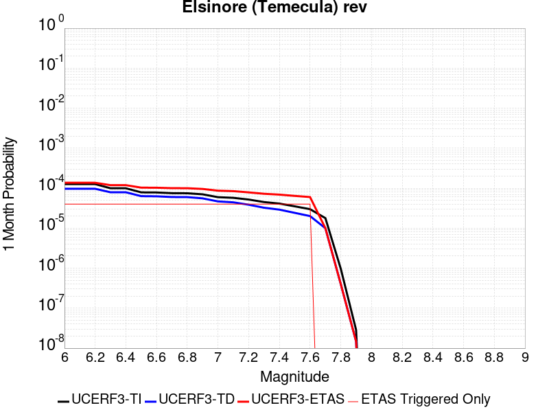 | 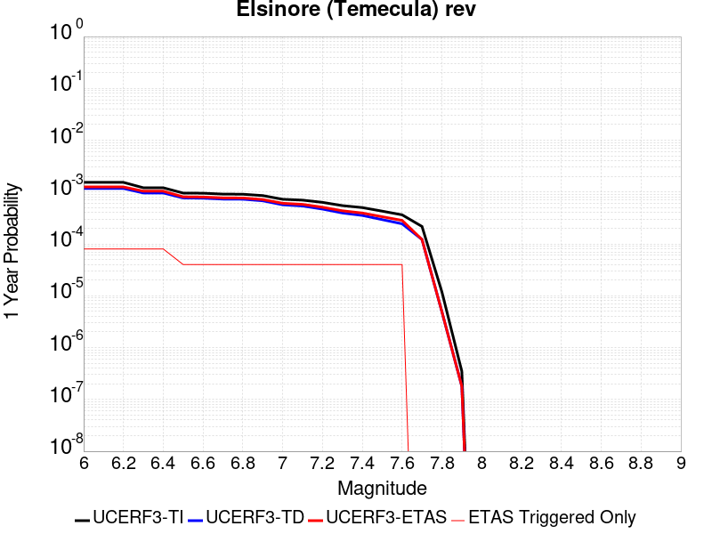 |

| Magnitude | 1 wk TI Prob | 1 wk TD Prob | 1 wk ETAS Prob | 1 wk ETAS/TD Gain | 1 wk ETAS Triggered Only | 1 mo TI Prob | 1 mo TD Prob | 1 mo ETAS Prob | 1 mo ETAS/TD Gain | 1 mo ETAS Triggered Only | 1 yr TI Prob | 1 yr TD Prob | 1 yr ETAS Prob | 1 yr ETAS/TD Gain | 1 yr ETAS Triggered Only |
|-----|-----|-----|-----|-----|-----|-----|-----|-----|-----|-----|-----|-----|-----|-----|-----|
| 6.0 | 2.9514995E-5 | 2.2552267E-5 | 2.2552267E-5 | 1.0 | 0.0 | 1.264867E-4 | 9.664911E-5 | 1.3664525E-4 | 1.4138283 | 4.0E-5 | 0.0015388876 | 0.0011760899 | 0.0012559957 | 1.067942 | 8.0E-5 |
| 6.1 | 2.9514995E-5 | 2.2552267E-5 | 2.2552267E-5 | 1.0 | 0.0 | 1.264867E-4 | 9.664911E-5 | 1.3664525E-4 | 1.4138283 | 4.0E-5 | 0.0015388876 | 0.0011760899 | 0.0012559957 | 1.067942 | 8.0E-5 |
| 6.2 | 2.9514995E-5 | 2.2552267E-5 | 2.2552267E-5 | 1.0 | 0.0 | 1.264867E-4 | 9.664911E-5 | 1.3664525E-4 | 1.4138283 | 4.0E-5 | 0.0015388876 | 0.0011760899 | 0.0012559957 | 1.067942 | 8.0E-5 |
| 6.3 | 2.3223649E-5 | 1.8430243E-5 | 1.8430243E-5 | 1.0 | 0.0 | 9.952613E-5 | 7.8984456E-5 | 1.189813E-4 | 1.5063888 | 4.0E-5 | 0.001211057 | 9.6122874E-4 | 0.0010411518 | 1.0831468 | 8.0E-5 |
| 6.4 | 2.3223649E-5 | 1.8430243E-5 | 1.8430243E-5 | 1.0 | 0.0 | 9.952613E-5 | 7.8984456E-5 | 1.189813E-4 | 1.5063888 | 4.0E-5 | 0.001211057 | 9.6122874E-4 | 0.0010411518 | 1.0831468 | 8.0E-5 |
| 6.5 | 1.8338875E-5 | 1.4766081E-5 | 1.4766081E-5 | 1.0 | 0.0 | 7.8592806E-5 | 6.328172E-5 | 1.03279184E-4 | 1.6320541 | 4.0E-5 | 9.5644733E-4 | 7.701914E-4 | 8.1016053E-4 | 1.0518951 | 4.0E-5 |
| 6.6 | 1.8223333E-5 | 1.4628549E-5 | 1.4628549E-5 | 1.0 | 0.0 | 7.809766E-5 | 6.269232E-5 | 1.0268982E-4 | 1.6379967 | 4.0E-5 | 9.504242E-4 | 7.6302054E-4 | 8.0299E-4 | 1.0523832 | 4.0E-5 |
| 6.7 | 1.7512752E-5 | 1.4042307E-5 | 1.4042307E-5 | 1.0 | 0.0 | 7.505249E-5 | 6.0179977E-5 | 1.0017757E-4 | 1.6646329 | 4.0E-5 | 9.13381E-4 | 7.3245354E-4 | 7.724242E-4 | 1.054571 | 4.0E-5 |
| 6.8 | 1.7417142E-5 | 1.3966197E-5 | 1.3966197E-5 | 1.0 | 0.0 | 7.4642754E-5 | 5.9853806E-5 | 9.9851415E-5 | 1.668255 | 4.0E-5 | 9.083966E-4 | 7.2848506E-4 | 7.684559E-4 | 1.0548685 | 4.0E-5 |
| 6.9 | 1.6402591E-5 | 1.300304E-5 | 1.300304E-5 | 1.0 | 0.0 | 7.0294926E-5 | 5.572617E-5 | 9.572394E-5 | 1.7177557 | 4.0E-5 | 8.5550465E-4 | 6.782626E-4 | 7.1823545E-4 | 1.0589342 | 4.0E-5 |
| 7.0 | 1.3912486E-5 | 1.0891034E-5 | 1.0891034E-5 | 1.0 | 0.0 | 5.9623577E-5 | 4.6675043E-5 | 8.667317E-5 | 1.8569491 | 4.0E-5 | 7.2567526E-4 | 5.681232E-4 | 6.0810044E-4 | 1.0703672 | 4.0E-5 |
| 7.1 | 1.3405147E-5 | 1.0339526E-5 | 1.0339526E-5 | 1.0 | 0.0 | 5.7449364E-5 | 4.4311517E-5 | 8.4309744E-5 | 1.9026599 | 4.0E-5 | 6.9922156E-4 | 5.3936173E-4 | 5.793402E-4 | 1.0741217 | 4.0E-5 |
| 7.2 | 1.21402E-5 | 9.007232E-6 | 9.007232E-6 | 1.0 | 0.0 | 5.202839E-5 | 3.860186E-5 | 7.8600315E-5 | 2.0361795 | 4.0E-5 | 6.332616E-4 | 4.6987808E-4 | 5.098593E-4 | 1.0850885 | 4.0E-5 |
| 7.3 | 1.05047775E-5 | 7.5805146E-6 | 7.5805146E-6 | 1.0 | 0.0 | 4.5019697E-5 | 3.2487525E-5 | 7.2486226E-5 | 2.231202 | 4.0E-5 | 5.4797693E-4 | 3.954653E-4 | 4.3544947E-4 | 1.1011066 | 4.0E-5 |
| 7.4 | 9.624483E-6 | 6.794608E-6 | 6.794608E-6 | 1.0 | 0.0 | 4.124713E-5 | 2.9119432E-5 | 6.9118265E-5 | 2.373613 | 4.0E-5 | 5.0206814E-4 | 3.5447278E-4 | 3.9445862E-4 | 1.1128037 | 4.0E-5 |
| 7.5 | 8.215151E-6 | 5.6419153E-6 | 5.6419153E-6 | 1.0 | 0.0 | 3.5207315E-5 | 2.417942E-5 | 6.417845E-5 | 2.6542594 | 4.0E-5 | 4.2856473E-4 | 2.9434595E-4 | 3.3433418E-4 | 1.1358545 | 4.0E-5 |
| 7.6 | 6.975058E-6 | 4.6815794E-6 | 4.6815794E-6 | 1.0 | 0.0 | 2.9892764E-5 | 2.0063762E-5 | 6.006296E-5 | 2.993604 | 4.0E-5 | 3.6388362E-4 | 2.442501E-4 | 2.8424035E-4 | 1.1637266 | 4.0E-5 |
| 7.7 | 4.159604E-6 | 2.32988E-6 | 2.32988E-6 | 1.0 | 0.0 | 1.7826753E-5 | 9.985166E-6 | 9.985166E-6 | 1.0 | 0.0 | 2.1701909E-4 | 1.2156336E-4 | 1.2156336E-4 | 1.0 | 0.0 |
| 7.8 | 2.2692414E-7 | 9.397192E-8 | 9.397192E-8 | 1.0 | 0.0 | 9.725317E-7 | 4.0273673E-7 | 4.0273673E-7 | 1.0 | 0.0 | 1.1840509E-5 | 4.903312E-6 | 4.903312E-6 | 1.0 | 0.0 |
| 7.9 | 6.676829E-9 | 3.4429164E-9 | 3.4429164E-9 | 1.0 | 0.0 | 2.861498E-8 | 1.4755356E-8 | 1.4755356E-8 | 1.0 | 0.0 | 3.4838732E-7 | 1.7964643E-7 | 1.7964643E-7 | 1.0 | 0.0 |

## Big Pine (West)
*[(top)](#table-of-contents)*

| 1 Week | 1 Month | 1 Year |
|-----|-----|-----|
| 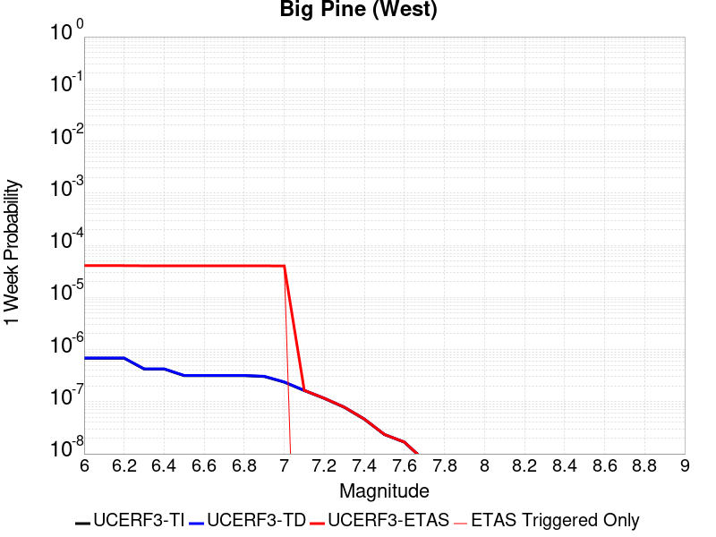 | 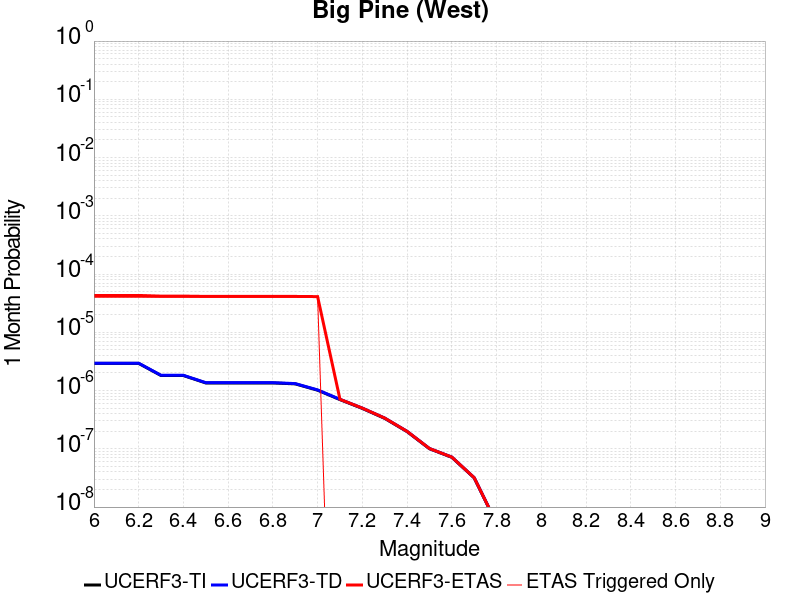 | 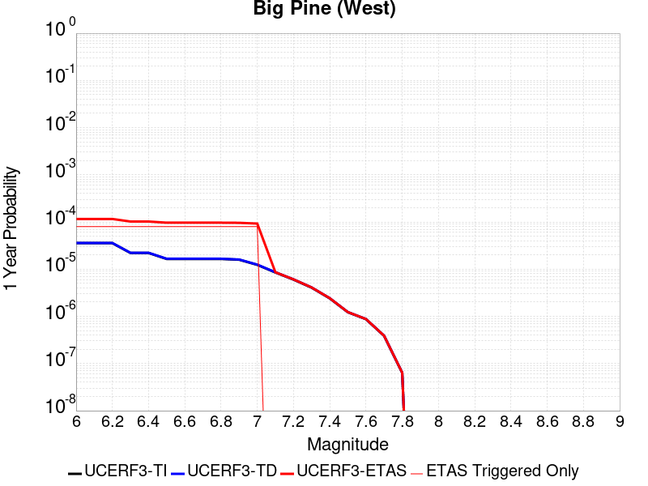 |

| Magnitude | 1 wk TI Prob | 1 wk TD Prob | 1 wk ETAS Prob | 1 wk ETAS/TD Gain | 1 wk ETAS Triggered Only | 1 mo TI Prob | 1 mo TD Prob | 1 mo ETAS Prob | 1 mo ETAS/TD Gain | 1 mo ETAS Triggered Only | 1 yr TI Prob | 1 yr TD Prob | 1 yr ETAS Prob | 1 yr ETAS/TD Gain | 1 yr ETAS Triggered Only |
|-----|-----|-----|-----|-----|-----|-----|-----|-----|-----|-----|-----|-----|-----|-----|-----|
| 6.0 | 6.8306974E-7 | 6.882005E-7 | 4.0688174E-5 | 59.122555 | 4.0E-5 | 2.9274386E-6 | 2.9494279E-6 | 4.294931E-5 | 14.561912 | 4.0E-5 | 3.564098E-5 | 3.590879E-5 | 1.1590592E-4 | 3.2277868 | 8.0E-5 |
| 6.1 | 6.8306974E-7 | 6.882005E-7 | 4.0688174E-5 | 59.122555 | 4.0E-5 | 2.9274386E-6 | 2.9494279E-6 | 4.294931E-5 | 14.561912 | 4.0E-5 | 3.564098E-5 | 3.590879E-5 | 1.1590592E-4 | 3.2277868 | 8.0E-5 |
| 6.2 | 6.8306974E-7 | 6.882005E-7 | 4.0688174E-5 | 59.122555 | 4.0E-5 | 2.9274386E-6 | 2.9494279E-6 | 4.294931E-5 | 14.561912 | 4.0E-5 | 3.564098E-5 | 3.590879E-5 | 1.1590592E-4 | 3.2277868 | 8.0E-5 |
| 6.3 | 4.227652E-7 | 4.2666937E-7 | 4.0426654E-5 | 94.74937 | 4.0E-5 | 1.8118495E-6 | 1.8285818E-6 | 4.182851E-5 | 22.874836 | 4.0E-5 | 2.2059045E-5 | 2.2262775E-5 | 1.02260994E-4 | 4.5933623 | 8.0E-5 |
| 6.4 | 4.227652E-7 | 4.2666937E-7 | 4.0426654E-5 | 94.74937 | 4.0E-5 | 1.8118495E-6 | 1.8285818E-6 | 4.182851E-5 | 22.874836 | 4.0E-5 | 2.2059045E-5 | 2.2262775E-5 | 1.02260994E-4 | 4.5933623 | 8.0E-5 |
| 6.5 | 3.1538403E-7 | 3.1885713E-7 | 4.0318846E-5 | 126.44799 | 4.0E-5 | 1.3516451E-6 | 1.3665299E-6 | 4.1366475E-5 | 30.271181 | 4.0E-5 | 1.6456155E-5 | 1.663738E-5 | 9.6636046E-5 | 5.8083696 | 8.0E-5 |
| 6.6 | 3.1538403E-7 | 3.1885713E-7 | 4.0318846E-5 | 126.44799 | 4.0E-5 | 1.3516451E-6 | 1.3665299E-6 | 4.1366475E-5 | 30.271181 | 4.0E-5 | 1.6456155E-5 | 1.663738E-5 | 9.6636046E-5 | 5.8083696 | 8.0E-5 |
| 6.7 | 3.1538403E-7 | 3.1885713E-7 | 4.0318846E-5 | 126.44799 | 4.0E-5 | 1.3516451E-6 | 1.3665299E-6 | 4.1366475E-5 | 30.271181 | 4.0E-5 | 1.6456155E-5 | 1.663738E-5 | 9.6636046E-5 | 5.8083696 | 8.0E-5 |
| 6.8 | 3.1538403E-7 | 3.1885713E-7 | 4.0318846E-5 | 126.44799 | 4.0E-5 | 1.3516451E-6 | 1.3665299E-6 | 4.1366475E-5 | 30.271181 | 4.0E-5 | 1.6456155E-5 | 1.663738E-5 | 9.6636046E-5 | 5.8083696 | 8.0E-5 |
| 6.9 | 3.0402092E-7 | 3.0740955E-7 | 4.0307397E-5 | 131.11954 | 4.0E-5 | 1.3029462E-6 | 1.3174689E-6 | 4.1317417E-5 | 31.361208 | 4.0E-5 | 1.5863254E-5 | 1.6040069E-5 | 9.6038784E-5 | 5.9874296 | 8.0E-5 |
| 7.0 | 2.3673063E-7 | 2.3945245E-7 | 4.0239443E-5 | 168.04774 | 4.0E-5 | 1.0145594E-6 | 1.0262244E-6 | 4.1026182E-5 | 39.97779 | 4.0E-5 | 1.235219E-5 | 1.2494213E-5 | 9.249321E-5 | 7.4028845 | 8.0E-5 |
| 7.1 | 1.632138E-7 | 1.6515175E-7 | 1.6515175E-7 | 1.0 | 0.0 | 6.9948754E-7 | 7.07793E-7 | 7.07793E-7 | 1.0 | 0.0 | 8.516227E-6 | 8.617348E-6 | 8.617348E-6 | 1.0 | 0.0 |
| 7.2 | 1.1523723E-7 | 1.16576224E-7 | 1.16576224E-7 | 1.0 | 0.0 | 4.9387376E-7 | 4.996123E-7 | 4.996123E-7 | 1.0 | 0.0 | 6.0128964E-6 | 6.082764E-6 | 6.082764E-6 | 1.0 | 0.0 |
| 7.3 | 7.777805E-8 | 7.862736E-8 | 7.862736E-8 | 1.0 | 0.0 | 3.3333444E-7 | 3.3697435E-7 | 3.3697435E-7 | 1.0 | 0.0 | 4.0583395E-6 | 4.1026556E-6 | 4.1026556E-6 | 1.0 | 0.0 |
| 7.4 | 4.609946E-8 | 4.652358E-8 | 4.652358E-8 | 1.0 | 0.0 | 1.975691E-7 | 1.9938676E-7 | 1.9938676E-7 | 1.0 | 0.0 | 2.4054011E-6 | 2.4275312E-6 | 2.4275312E-6 | 1.0 | 0.0 |
| 7.5 | 2.3439137E-8 | 2.360886E-8 | 2.360886E-8 | 1.0 | 0.0 | 1.00453434E-7 | 1.0118083E-7 | 1.0118083E-7 | 1.0 | 0.0 | 1.2230199E-6 | 1.2318759E-6 | 1.2318759E-6 | 1.0 | 0.0 |
| 7.6 | 1.6699769E-8 | 1.6817472E-8 | 1.6817472E-8 | 1.0 | 0.0 | 7.157044E-8 | 7.207488E-8 | 7.207488E-8 | 1.0 | 0.0 | 8.713697E-7 | 8.7751135E-7 | 8.7751135E-7 | 1.0 | 0.0 |
| 7.7 | 7.4061512E-9 | 7.454328E-9 | 7.454328E-9 | 1.0 | 0.0 | 3.1740647E-8 | 3.1947117E-8 | 3.1947117E-8 | 1.0 | 0.0 | 3.864423E-7 | 3.889561E-7 | 3.889561E-7 | 1.0 | 0.0 |
| 7.8 | 1.2189427E-9 | 1.227104E-9 | 1.227104E-9 | 1.0 | 0.0 | 5.2240403E-9 | 5.259017E-9 | 5.259017E-9 | 1.0 | 0.0 | 6.3602684E-8 | 6.4028534E-8 | 6.4028534E-8 | 1.0 | 0.0 |

## Sargent 2011 CFM
*[(top)](#table-of-contents)*

| 1 Week | 1 Month | 1 Year |
|-----|-----|-----|
| 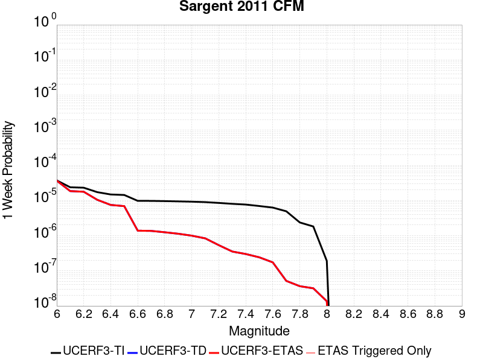 | 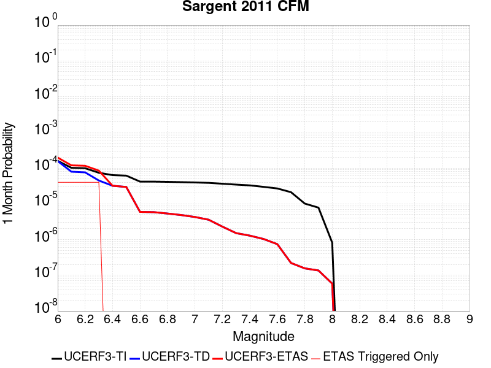 | 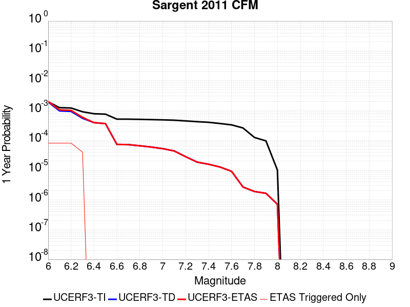 |

| Magnitude | 1 wk TI Prob | 1 wk TD Prob | 1 wk ETAS Prob | 1 wk ETAS/TD Gain | 1 wk ETAS Triggered Only | 1 mo TI Prob | 1 mo TD Prob | 1 mo ETAS Prob | 1 mo ETAS/TD Gain | 1 mo ETAS Triggered Only | 1 yr TI Prob | 1 yr TD Prob | 1 yr ETAS Prob | 1 yr ETAS/TD Gain | 1 yr ETAS Triggered Only |
|-----|-----|-----|-----|-----|-----|-----|-----|-----|-----|-----|-----|-----|-----|-----|-----|
| 6.0 | 3.7327867E-5 | 3.6695015E-5 | 3.6695015E-5 | 1.0 | 0.0 | 1.5996677E-4 | 1.5725763E-4 | 1.9725134E-4 | 1.2543197 | 4.0E-5 | 0.0019458556 | 0.0019133498 | 0.0019931968 | 1.0417315 | 8.0E-5 |
| 6.1 | 2.3771476E-5 | 1.8503431E-5 | 1.8503431E-5 | 1.0 | 0.0 | 1.01873775E-4 | 7.929848E-5 | 1.19295306E-4 | 1.5043833 | 4.0E-5 | 0.0012396075 | 9.651136E-4 | 0.0010450364 | 1.0828118 | 8.0E-5 |
| 6.2 | 2.3112721E-5 | 1.7734355E-5 | 1.7734355E-5 | 1.0 | 0.0 | 9.9050754E-5 | 7.600262E-5 | 1.1599959E-4 | 1.5262576 | 4.0E-5 | 0.0012052758 | 9.2502084E-4 | 0.0010049469 | 1.0864046 | 8.0E-5 |
| 6.3 | 1.728509E-5 | 1.0476864E-5 | 1.0476864E-5 | 1.0 | 0.0 | 7.407686E-5 | 4.4900313E-5 | 8.4898515E-5 | 1.8908224 | 4.0E-5 | 9.015125E-4 | 5.465704E-4 | 5.865485E-4 | 1.0731436 | 4.0E-5 |
| 6.4 | 1.48395575E-5 | 7.47162E-6 | 7.47162E-6 | 1.0 | 0.0 | 6.3596555E-5 | 3.202102E-5 | 3.202102E-5 | 1.0 | 0.0 | 7.7401294E-4 | 3.89824E-4 | 3.89824E-4 | 1.0 | 0.0 |
| 6.5 | 1.4358964E-5 | 6.9100724E-6 | 6.9100724E-6 | 1.0 | 0.0 | 6.1536964E-5 | 2.9614444E-5 | 2.9614444E-5 | 1.0 | 0.0 | 7.48955E-4 | 3.605339E-4 | 3.605339E-4 | 1.0 | 0.0 |
| 6.6 | 9.772591E-6 | 1.3851474E-6 | 1.3851474E-6 | 1.0 | 0.0 | 4.188186E-5 | 5.9363324E-6 | 5.9363324E-6 | 1.0 | 0.0 | 5.097923E-4 | 7.227248E-5 | 7.227248E-5 | 1.0 | 0.0 |
| 6.7 | 9.752745E-6 | 1.3638333E-6 | 1.3638333E-6 | 1.0 | 0.0 | 4.179681E-5 | 5.844987E-6 | 5.844987E-6 | 1.0 | 0.0 | 5.0875737E-4 | 7.116042E-5 | 7.116042E-5 | 1.0 | 0.0 |
| 6.8 | 9.608213E-6 | 1.2474969E-6 | 1.2474969E-6 | 1.0 | 0.0 | 4.1177405E-5 | 5.3464046E-6 | 5.3464046E-6 | 1.0 | 0.0 | 5.012196E-4 | 6.509056E-5 | 6.509056E-5 | 1.0 | 0.0 |
| 6.9 | 9.427164E-6 | 1.1318356E-6 | 1.1318356E-6 | 1.0 | 0.0 | 4.04015E-5 | 4.850715E-6 | 4.850715E-6 | 1.0 | 0.0 | 4.9177726E-4 | 5.9055874E-5 | 5.9055874E-5 | 1.0 | 0.0 |
| 7.0 | 9.247601E-6 | 9.979627E-7 | 9.979627E-7 | 1.0 | 0.0 | 3.9631974E-5 | 4.276976E-6 | 4.276976E-6 | 1.0 | 0.0 | 4.8241246E-4 | 5.207096E-5 | 5.207096E-5 | 1.0 | 0.0 |
| 7.1 | 8.995454E-6 | 8.368454E-7 | 8.368454E-7 | 1.0 | 0.0 | 3.8551374E-5 | 3.5864755E-6 | 3.5864755E-6 | 1.0 | 0.0 | 4.6926187E-4 | 4.3664477E-5 | 4.3664477E-5 | 1.0 | 0.0 |
| 7.2 | 8.520861E-6 | 5.362512E-7 | 5.362512E-7 | 1.0 | 0.0 | 3.6517464E-5 | 2.2982176E-6 | 2.2982176E-6 | 1.0 | 0.0 | 4.445094E-4 | 2.7980446E-5 | 2.7980446E-5 | 1.0 | 0.0 |
| 7.3 | 8.043592E-6 | 3.532279E-7 | 3.532279E-7 | 1.0 | 0.0 | 3.4472083E-5 | 1.513833E-6 | 1.513833E-6 | 1.0 | 0.0 | 4.196168E-4 | 1.8430763E-5 | 1.8430763E-5 | 1.0 | 0.0 |
| 7.4 | 7.662316E-6 | 2.998447E-7 | 2.998447E-7 | 1.0 | 0.0 | 3.2838085E-5 | 1.285048E-6 | 1.285048E-6 | 1.0 | 0.0 | 3.9973034E-4 | 1.5645348E-5 | 1.5645348E-5 | 1.0 | 0.0 |
| 7.5 | 6.961638E-6 | 2.4164498E-7 | 2.4164498E-7 | 1.0 | 0.0 | 2.9835252E-5 | 1.0356209E-6 | 1.0356209E-6 | 1.0 | 0.0 | 3.6318362E-4 | 1.2608612E-5 | 1.2608612E-5 | 1.0 | 0.0 |
| 7.6 | 6.282332E-6 | 1.7353508E-7 | 1.7353508E-7 | 1.0 | 0.0 | 2.6924003E-5 | 7.437216E-7 | 7.437216E-7 | 1.0 | 0.0 | 3.2775043E-4 | 9.054774E-6 | 9.054774E-6 | 1.0 | 0.0 |
| 7.7 | 4.934408E-6 | 5.159217E-8 | 5.159217E-8 | 1.0 | 0.0 | 2.114729E-5 | 2.2110929E-7 | 2.2110929E-7 | 1.0 | 0.0 | 2.5743784E-4 | 2.6920022E-6 | 2.6920022E-6 | 1.0 | 0.0 |
| 7.8 | 2.373212E-6 | 3.6451734E-8 | 3.6451734E-8 | 1.0 | 0.0 | 1.0170869E-5 | 1.5622172E-7 | 1.5622172E-7 | 1.0 | 0.0 | 1.238233E-4 | 1.9019978E-6 | 1.9019978E-6 | 1.0 | 0.0 |
| 7.9 | 1.8227792E-6 | 3.1761957E-8 | 3.1761957E-8 | 1.0 | 0.0 | 7.811887E-6 | 1.3612267E-7 | 1.3612267E-7 | 1.0 | 0.0 | 9.510558E-5 | 1.6572923E-6 | 1.6572923E-6 | 1.0 | 0.0 |
| 8.0 | 1.9095137E-7 | 1.3626745E-8 | 1.3626745E-8 | 1.0 | 0.0 | 8.1836276E-7 | 5.8400335E-8 | 5.8400335E-8 | 1.0 | 0.0 | 9.963521E-6 | 7.1102386E-7 | 7.1102386E-7 | 1.0 | 0.0 |

## Puente Hills
*[(top)](#table-of-contents)*

| 1 Week | 1 Month | 1 Year |
|-----|-----|-----|
| 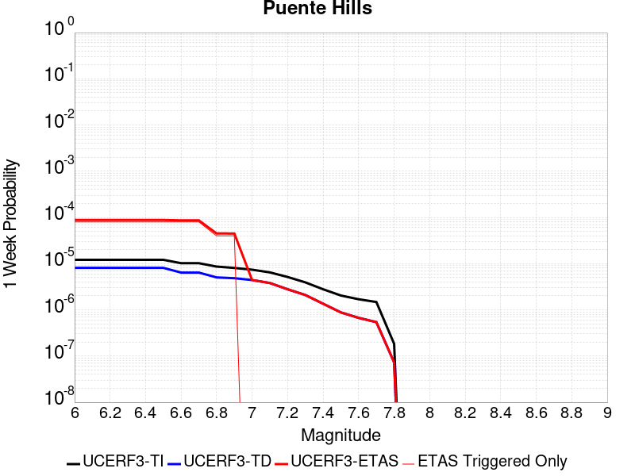 | 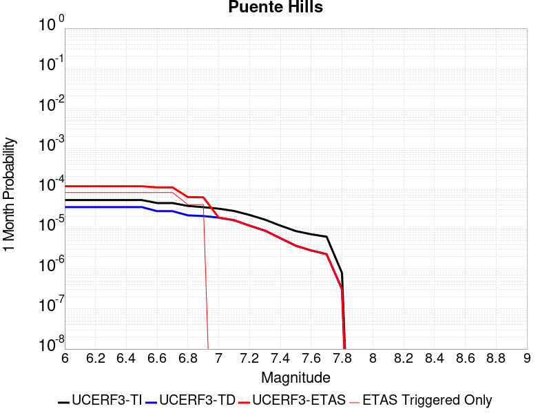 | 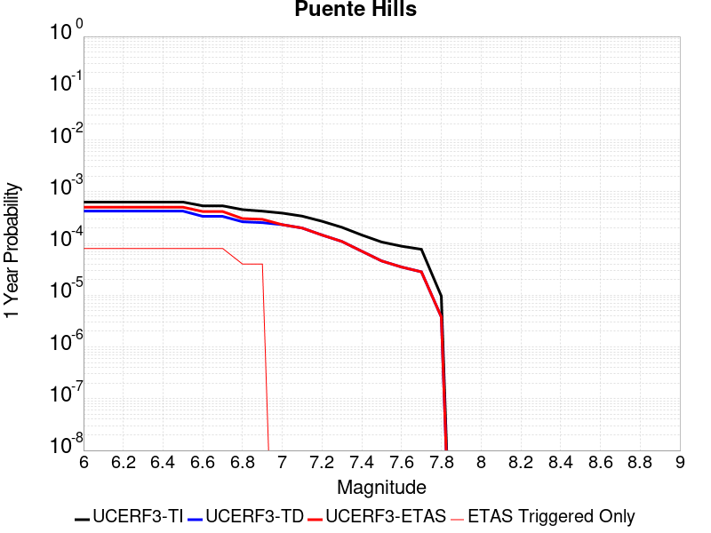 |

| Magnitude | 1 wk TI Prob | 1 wk TD Prob | 1 wk ETAS Prob | 1 wk ETAS/TD Gain | 1 wk ETAS Triggered Only | 1 mo TI Prob | 1 mo TD Prob | 1 mo ETAS Prob | 1 mo ETAS/TD Gain | 1 mo ETAS Triggered Only | 1 yr TI Prob | 1 yr TD Prob | 1 yr ETAS Prob | 1 yr ETAS/TD Gain | 1 yr ETAS Triggered Only |
|-----|-----|-----|-----|-----|-----|-----|-----|-----|-----|-----|-----|-----|-----|-----|-----|
| 6.0 | 1.2101656E-5 | 8.102921E-6 | 8.810227E-5 | 10.872903 | 8.0E-5 | 5.1863204E-5 | 3.4726374E-5 | 1.14723596E-4 | 3.3036447 | 8.0E-5 | 6.312516E-4 | 4.2271722E-4 | 5.026834E-4 | 1.1891718 | 8.0E-5 |
| 6.1 | 1.2101656E-5 | 8.102921E-6 | 8.810227E-5 | 10.872903 | 8.0E-5 | 5.1863204E-5 | 3.4726374E-5 | 1.14723596E-4 | 3.3036447 | 8.0E-5 | 6.312516E-4 | 4.2271722E-4 | 5.026834E-4 | 1.1891718 | 8.0E-5 |
| 6.2 | 1.2101656E-5 | 8.102921E-6 | 8.810227E-5 | 10.872903 | 8.0E-5 | 5.1863204E-5 | 3.4726374E-5 | 1.14723596E-4 | 3.3036447 | 8.0E-5 | 6.312516E-4 | 4.2271722E-4 | 5.026834E-4 | 1.1891718 | 8.0E-5 |
| 6.3 | 1.2101656E-5 | 8.102921E-6 | 8.810227E-5 | 10.872903 | 8.0E-5 | 5.1863204E-5 | 3.4726374E-5 | 1.14723596E-4 | 3.3036447 | 8.0E-5 | 6.312516E-4 | 4.2271722E-4 | 5.026834E-4 | 1.1891718 | 8.0E-5 |
| 6.4 | 1.2101656E-5 | 8.102921E-6 | 8.810227E-5 | 10.872903 | 8.0E-5 | 5.1863204E-5 | 3.4726374E-5 | 1.14723596E-4 | 3.3036447 | 8.0E-5 | 6.312516E-4 | 4.2271722E-4 | 5.026834E-4 | 1.1891718 | 8.0E-5 |
| 6.5 | 1.2101656E-5 | 8.102921E-6 | 8.810227E-5 | 10.872903 | 8.0E-5 | 5.1863204E-5 | 3.4726374E-5 | 1.14723596E-4 | 3.3036447 | 8.0E-5 | 6.312516E-4 | 4.2271722E-4 | 5.026834E-4 | 1.1891718 | 8.0E-5 |
| 6.6 | 1.0222488E-5 | 6.4029887E-6 | 8.640248E-5 | 13.494086 | 8.0E-5 | 4.3809923E-5 | 2.7441105E-5 | 1.0743891E-4 | 3.9152546 | 8.0E-5 | 5.332553E-4 | 3.340467E-4 | 4.1401997E-4 | 1.2394075 | 8.0E-5 |
| 6.7 | 1.0222488E-5 | 6.4029887E-6 | 8.640248E-5 | 13.494086 | 8.0E-5 | 4.3809923E-5 | 2.7441105E-5 | 1.0743891E-4 | 3.9152546 | 8.0E-5 | 5.332553E-4 | 3.340467E-4 | 4.1401997E-4 | 1.2394075 | 8.0E-5 |
| 6.8 | 8.6367845E-6 | 5.0316426E-6 | 4.503144E-5 | 8.949651 | 4.0E-5 | 3.7014266E-5 | 2.1564007E-5 | 6.156314E-5 | 2.854903 | 4.0E-5 | 4.505555E-4 | 2.625107E-4 | 3.025002E-4 | 1.1523347 | 4.0E-5 |
| 6.9 | 8.066481E-6 | 4.839465E-6 | 4.483927E-5 | 9.265337 | 4.0E-5 | 3.4570177E-5 | 2.0740401E-5 | 6.073957E-5 | 2.9285629 | 4.0E-5 | 4.2081063E-4 | 2.5248565E-4 | 2.9247557E-4 | 1.1583848 | 4.0E-5 |
| 7.0 | 7.393828E-6 | 4.4204735E-6 | 4.4204735E-6 | 1.0 | 0.0 | 3.168745E-5 | 1.8944751E-5 | 1.8944751E-5 | 1.0 | 0.0 | 3.857264E-4 | 2.3062839E-4 | 2.3062839E-4 | 1.0 | 0.0 |
| 7.1 | 6.4660953E-6 | 3.8071098E-6 | 3.8071098E-6 | 1.0 | 0.0 | 2.7711543E-5 | 1.6316086E-5 | 1.6316086E-5 | 1.0 | 0.0 | 3.373358E-4 | 1.9863059E-4 | 1.9863059E-4 | 1.0 | 0.0 |
| 7.2 | 5.143232E-6 | 2.7886363E-6 | 2.7886363E-6 | 1.0 | 0.0 | 2.2042237E-5 | 1.1951244E-5 | 1.1951244E-5 | 1.0 | 0.0 | 2.6833118E-4 | 1.4549677E-4 | 1.4549677E-4 | 1.0 | 0.0 |
| 7.3 | 3.928255E-6 | 2.0932014E-6 | 2.0932014E-6 | 1.0 | 0.0 | 1.683527E-5 | 8.970832E-6 | 8.970832E-6 | 1.0 | 0.0 | 2.0495013E-4 | 1.09214474E-4 | 1.09214474E-4 | 1.0 | 0.0 |
| 7.4 | 2.7894434E-6 | 1.3562544E-6 | 1.3562544E-6 | 1.0 | 0.0 | 1.1954703E-5 | 5.812506E-6 | 5.812506E-6 | 1.0 | 0.0 | 1.4553878E-4 | 7.076501E-5 | 7.076501E-5 | 1.0 | 0.0 |
| 7.5 | 2.041735E-6 | 8.799269E-7 | 8.799269E-7 | 1.0 | 0.0 | 8.750263E-6 | 3.77111E-6 | 3.77111E-6 | 1.0 | 0.0 | 1.06529245E-4 | 4.591233E-5 | 4.591233E-5 | 1.0 | 0.0 |
| 7.6 | 1.6959062E-6 | 6.708452E-7 | 6.708452E-7 | 1.0 | 0.0 | 7.268149E-6 | 2.875048E-6 | 2.875048E-6 | 1.0 | 0.0 | 8.848612E-5 | 3.5003177E-5 | 3.5003177E-5 | 1.0 | 0.0 |
| 7.7 | 1.4767965E-6 | 5.416132E-7 | 5.416132E-7 | 1.0 | 0.0 | 6.3291122E-6 | 2.3211976E-6 | 2.3211976E-6 | 1.0 | 0.0 | 7.705422E-5 | 2.826024E-5 | 2.826024E-5 | 1.0 | 0.0 |
| 7.8 | 1.8432911E-7 | 7.2914965E-8 | 7.2914965E-8 | 1.0 | 0.0 | 7.8998164E-7 | 3.124927E-7 | 3.124927E-7 | 1.0 | 0.0 | 9.617985E-6 | 3.8045953E-6 | 3.8045953E-6 | 1.0 | 0.0 |

## Hayward (So) 2011 CFM
*[(top)](#table-of-contents)*

| 1 Week | 1 Month | 1 Year |
|-----|-----|-----|
| 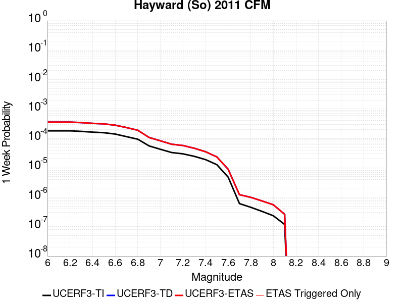 | 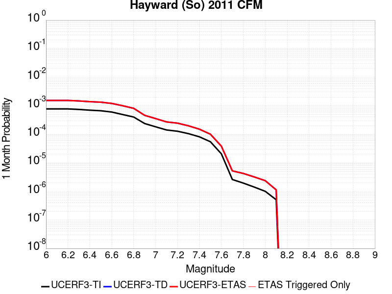 | 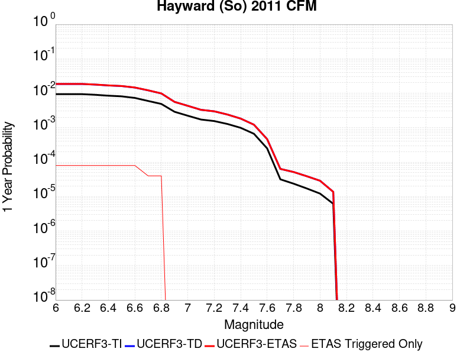 |

| Magnitude | 1 wk TI Prob | 1 wk TD Prob | 1 wk ETAS Prob | 1 wk ETAS/TD Gain | 1 wk ETAS Triggered Only | 1 mo TI Prob | 1 mo TD Prob | 1 mo ETAS Prob | 1 mo ETAS/TD Gain | 1 mo ETAS Triggered Only | 1 yr TI Prob | 1 yr TD Prob | 1 yr ETAS Prob | 1 yr ETAS/TD Gain | 1 yr ETAS Triggered Only |
|-----|-----|-----|-----|-----|-----|-----|-----|-----|-----|-----|-----|-----|-----|-----|-----|
| 6.0 | 1.8091932E-4 | 3.580821E-4 | 3.580821E-4 | 1.0 | 0.0 | 7.751381E-4 | 0.001533745 | 0.001533745 | 1.0 | 0.0 | 0.00939654 | 0.018515883 | 0.018594403 | 1.0042406 | 8.0E-5 |
| 6.1 | 1.8091932E-4 | 3.580821E-4 | 3.580821E-4 | 1.0 | 0.0 | 7.751381E-4 | 0.001533745 | 0.001533745 | 1.0 | 0.0 | 0.00939654 | 0.018515883 | 0.018594403 | 1.0042406 | 8.0E-5 |
| 6.2 | 1.8091932E-4 | 3.580821E-4 | 3.580821E-4 | 1.0 | 0.0 | 7.751381E-4 | 0.001533745 | 0.001533745 | 1.0 | 0.0 | 0.00939654 | 0.018515883 | 0.018594403 | 1.0042406 | 8.0E-5 |
| 6.3 | 1.7322872E-4 | 3.436256E-4 | 3.436256E-4 | 1.0 | 0.0 | 7.4219756E-4 | 0.0014718598 | 0.0014718598 | 1.0 | 0.0 | 0.0089988755 | 0.017774936 | 0.017853515 | 1.0044208 | 8.0E-5 |
| 6.4 | 1.6334097E-4 | 3.2441478E-4 | 3.2441478E-4 | 1.0 | 0.0 | 6.998449E-4 | 0.001389617 | 0.001389617 | 1.0 | 0.0 | 0.008487372 | 0.016789362 | 0.01686802 | 1.0046849 | 8.0E-5 |
| 6.5 | 1.5600289E-4 | 3.1113712E-4 | 3.1113712E-4 | 1.0 | 0.0 | 6.684125E-4 | 0.0013327717 | 0.0013327717 | 1.0 | 0.0 | 0.008107598 | 0.016107671 | 0.01618638 | 1.0048866 | 8.0E-5 |
| 6.6 | 1.4046066E-4 | 2.8122755E-4 | 2.8122755E-4 | 1.0 | 0.0 | 6.018354E-4 | 0.001204711 | 0.001204711 | 1.0 | 0.0 | 0.0073027555 | 0.014570225 | 0.01464906 | 1.0054107 | 8.0E-5 |
| 6.7 | 1.14696966E-4 | 2.3352736E-4 | 2.3352736E-4 | 1.0 | 0.0 | 4.914658E-4 | 0.0010004528 | 0.0010004528 | 1.0 | 0.0 | 0.0059671924 | 0.012113555 | 0.01215307 | 1.003262 | 4.0E-5 |
| 6.8 | 9.3874296E-5 | 1.8929E-4 | 1.8929E-4 | 1.0 | 0.0 | 4.0225635E-4 | 8.1099436E-4 | 8.1099436E-4 | 1.0 | 0.0 | 0.0048864787 | 0.009829894 | 0.0098695 | 1.0040293 | 4.0E-5 |
| 6.9 | 5.551852E-5 | 1.077282E-4 | 1.077282E-4 | 1.0 | 0.0 | 2.3791482E-4 | 4.616112E-4 | 4.616112E-4 | 1.0 | 0.0 | 0.0028927654 | 0.0056057535 | 0.0056057535 | 1.0 | 0.0 |
| 7.0 | 4.2662363E-5 | 8.281727E-5 | 8.281727E-5 | 1.0 | 0.0 | 1.8282588E-4 | 3.548833E-4 | 3.548833E-4 | 1.0 | 0.0 | 0.0022236328 | 0.004312218 | 0.004312218 | 1.0 | 0.0 |
| 7.1 | 3.305886E-5 | 6.331385E-5 | 6.331385E-5 | 1.0 | 0.0 | 1.4167312E-4 | 2.7131697E-4 | 2.7131697E-4 | 1.0 | 0.0 | 0.0017235056 | 0.0032982994 | 0.0032982994 | 1.0 | 0.0 |
| 7.2 | 2.9856887E-5 | 5.7290094E-5 | 5.7290094E-5 | 1.0 | 0.0 | 1.2795182E-4 | 2.4550597E-4 | 2.4550597E-4 | 1.0 | 0.0 | 0.0015567001 | 0.0029849552 | 0.0029849552 | 1.0 | 0.0 |
| 7.3 | 2.4559737E-5 | 4.6207337E-5 | 4.6207337E-5 | 1.0 | 0.0 | 1.0525176E-4 | 1.980165E-4 | 1.980165E-4 | 1.0 | 0.0 | 0.0012806869 | 0.0024081983 | 0.0024081983 | 1.0 | 0.0 |
| 7.4 | 1.9002231E-5 | 3.521722E-5 | 3.521722E-5 | 1.0 | 0.0 | 8.143559E-5 | 1.5092228E-4 | 1.5092228E-4 | 1.0 | 0.0 | 9.910273E-4 | 0.00183594 | 0.00183594 | 1.0 | 0.0 |
| 7.5 | 1.2783333E-5 | 2.3453922E-5 | 2.3453922E-5 | 1.0 | 0.0 | 5.4784563E-5 | 1.0051297E-4 | 1.0051297E-4 | 1.0 | 0.0 | 6.667979E-4 | 0.0012230643 | 0.0012230643 | 1.0 | 0.0 |
| 7.6 | 4.8149627E-6 | 8.940782E-6 | 8.940782E-6 | 1.0 | 0.0 | 2.063539E-5 | 3.8317085E-5 | 3.8317085E-5 | 1.0 | 0.0 | 2.5120692E-4 | 4.6641188E-4 | 4.6641188E-4 | 1.0 | 0.0 |
| 7.7 | 6.0838227E-7 | 1.2205189E-6 | 1.2205189E-6 | 1.0 | 0.0 | 2.6073499E-6 | 5.2307846E-6 | 5.2307846E-6 | 1.0 | 0.0 | 3.174402E-5 | 6.368295E-5 | 6.368295E-5 | 1.0 | 0.0 |
| 7.8 | 4.5542808E-7 | 9.921866E-7 | 9.921866E-7 | 1.0 | 0.0 | 1.9518332E-6 | 4.2522215E-6 | 4.2522215E-6 | 1.0 | 0.0 | 2.376331E-5 | 5.176957E-5 | 5.176957E-5 | 1.0 | 0.0 |
| 7.9 | 3.3016747E-7 | 7.481718E-7 | 7.481718E-7 | 1.0 | 0.0 | 1.4150027E-6 | 3.2064463E-6 | 3.2064463E-6 | 1.0 | 0.0 | 1.7227521E-5 | 3.9037786E-5 | 3.9037786E-5 | 1.0 | 0.0 |
| 8.0 | 2.347038E-7 | 5.539233E-7 | 5.539233E-7 | 1.0 | 0.0 | 1.0058731E-6 | 2.3739547E-6 | 2.3739547E-6 | 1.0 | 0.0 | 1.2246436E-5 | 2.8902517E-5 | 2.8902517E-5 | 1.0 | 0.0 |
| 8.1 | 1.18822804E-7 | 2.6370554E-7 | 2.6370554E-7 | 1.0 | 0.0 | 5.092405E-7 | 1.1301661E-6 | 1.1301661E-6 | 1.0 | 0.0 | 6.1999854E-6 | 1.3759687E-5 | 1.3759687E-5 | 1.0 | 0.0 |

## Little Lake
*[(top)](#table-of-contents)*

| 1 Week | 1 Month | 1 Year |
|-----|-----|-----|
| 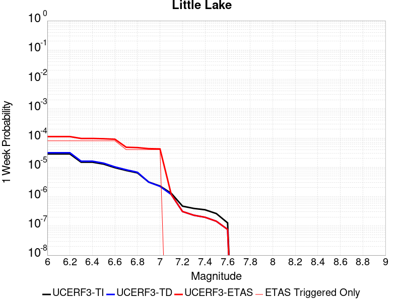 | 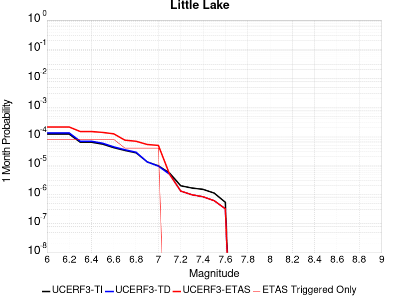 | 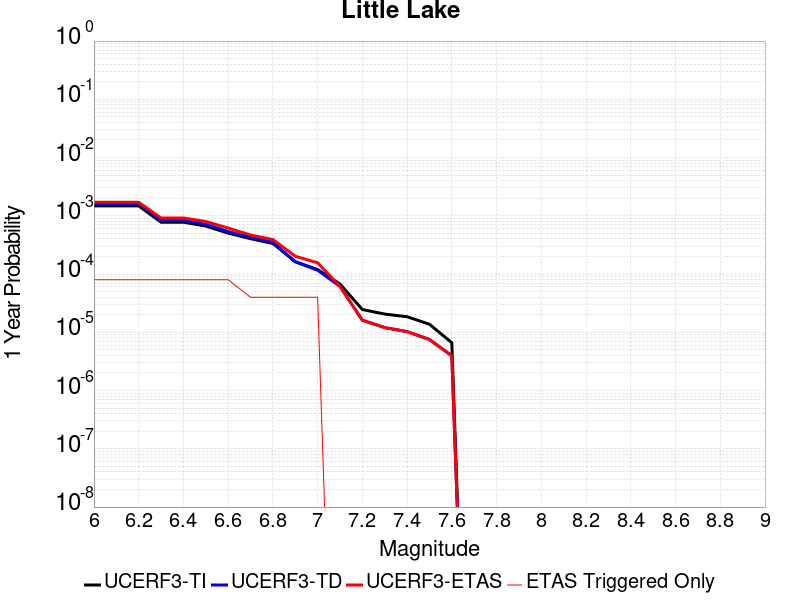 |

| Magnitude | 1 wk TI Prob | 1 wk TD Prob | 1 wk ETAS Prob | 1 wk ETAS/TD Gain | 1 wk ETAS Triggered Only | 1 mo TI Prob | 1 mo TD Prob | 1 mo ETAS Prob | 1 mo ETAS/TD Gain | 1 mo ETAS Triggered Only | 1 yr TI Prob | 1 yr TD Prob | 1 yr ETAS Prob | 1 yr ETAS/TD Gain | 1 yr ETAS Triggered Only |
|-----|-----|-----|-----|-----|-----|-----|-----|-----|-----|-----|-----|-----|-----|-----|-----|
| 6.0 | 2.8424427E-5 | 3.1216936E-5 | 1.1121444E-4 | 3.5626314 | 8.0E-5 | 1.2181328E-4 | 1.3378076E-4 | 2.1377006E-4 | 1.5979133 | 8.0E-5 | 0.0014820677 | 0.0016276971 | 0.0017075669 | 1.0490692 | 8.0E-5 |
| 6.1 | 2.8424427E-5 | 3.1216936E-5 | 1.1121444E-4 | 3.5626314 | 8.0E-5 | 1.2181328E-4 | 1.3378076E-4 | 2.1377006E-4 | 1.5979133 | 8.0E-5 | 0.0014820677 | 0.0016276971 | 0.0017075669 | 1.0490692 | 8.0E-5 |
| 6.2 | 2.8424427E-5 | 3.1216936E-5 | 1.1121444E-4 | 3.5626314 | 8.0E-5 | 1.2181328E-4 | 1.3378076E-4 | 2.1377006E-4 | 1.5979133 | 8.0E-5 | 0.0014820677 | 0.0016276971 | 0.0017075669 | 1.0490692 | 8.0E-5 |
| 6.3 | 1.48860645E-5 | 1.6086597E-5 | 9.608531E-5 | 5.9730043 | 8.0E-5 | 6.379586E-5 | 6.894089E-5 | 1.4893537E-4 | 2.1603343 | 8.0E-5 | 7.7643775E-4 | 8.3906035E-4 | 9.1899326E-4 | 1.0952648 | 8.0E-5 |
| 6.4 | 1.48860645E-5 | 1.6086597E-5 | 9.608531E-5 | 5.9730043 | 8.0E-5 | 6.379586E-5 | 6.894089E-5 | 1.4893537E-4 | 2.1603343 | 8.0E-5 | 7.7643775E-4 | 8.3906035E-4 | 9.1899326E-4 | 1.0952648 | 8.0E-5 |
| 6.5 | 1.2797581E-5 | 1.3769917E-5 | 9.376882E-5 | 6.809686 | 8.0E-5 | 5.4845623E-5 | 5.901274E-5 | 1.3900801E-4 | 2.3555596 | 8.0E-5 | 6.675408E-4 | 7.18269E-4 | 7.982115E-4 | 1.1112989 | 8.0E-5 |
| 6.6 | 9.661896E-6 | 1.02921085E-5 | 9.029129E-5 | 8.772865 | 8.0E-5 | 4.1407468E-5 | 4.4108383E-5 | 1.2410486E-4 | 2.8136342 | 8.0E-5 | 5.040193E-4 | 5.369035E-4 | 6.168605E-4 | 1.1489226 | 8.0E-5 |
| 6.7 | 7.767871E-6 | 8.202026E-6 | 4.82017E-5 | 5.8768034 | 4.0E-5 | 3.329045E-5 | 3.5151144E-5 | 7.514974E-5 | 2.137903 | 4.0E-5 | 4.0523586E-4 | 4.278949E-4 | 4.6787778E-4 | 1.0934409 | 4.0E-5 |
| 6.8 | 6.4235196E-6 | 6.7376404E-6 | 4.6737372E-5 | 6.9367566 | 4.0E-5 | 2.752908E-5 | 2.8875354E-5 | 6.88742E-5 | 2.3852243 | 4.0E-5 | 3.35115E-4 | 3.5151356E-4 | 3.9149952E-4 | 1.1137536 | 4.0E-5 |
| 6.9 | 3.1283696E-6 | 3.1128473E-6 | 4.3112723E-5 | 13.849932 | 4.0E-5 | 1.3407229E-5 | 1.3340715E-5 | 5.334018E-5 | 3.9983 | 4.0E-5 | 1.6322079E-4 | 1.624126E-4 | 2.0240611E-4 | 1.2462463 | 4.0E-5 |
| 7.0 | 2.290603E-6 | 2.229185E-6 | 4.2229094E-5 | 18.943739 | 4.0E-5 | 9.816834E-6 | 9.553621E-6 | 4.9553237E-5 | 5.1868544 | 4.0E-5 | 1.19513395E-4 | 1.16310155E-4 | 1.5630551E-4 | 1.343868 | 4.0E-5 |
| 7.1 | 1.293693E-6 | 1.1779927E-6 | 1.1779927E-6 | 1.0 | 0.0 | 5.5443866E-6 | 5.048534E-6 | 5.048534E-6 | 1.0 | 0.0 | 6.750081E-5 | 6.146487E-5 | 6.146487E-5 | 1.0 | 0.0 |
| 7.2 | 4.715842E-7 | 3.093222E-7 | 3.093222E-7 | 1.0 | 0.0 | 2.0210737E-6 | 1.3256658E-6 | 1.3256658E-6 | 1.0 | 0.0 | 2.4606294E-5 | 1.6139868E-5 | 1.6139868E-5 | 1.0 | 0.0 |
| 7.3 | 3.9430947E-7 | 2.3110628E-7 | 2.3110628E-7 | 1.0 | 0.0 | 1.6898966E-6 | 9.904552E-7 | 9.904552E-7 | 1.0 | 0.0 | 2.0574296E-5 | 1.2058726E-5 | 1.2058726E-5 | 1.0 | 0.0 |
| 7.4 | 3.547123E-7 | 1.9691295E-7 | 1.9691295E-7 | 1.0 | 0.0 | 1.5201948E-6 | 8.439124E-7 | 8.439124E-7 | 1.0 | 0.0 | 1.8508214E-5 | 1.0274585E-5 | 1.0274585E-5 | 1.0 | 0.0 |
| 7.5 | 2.6354266E-7 | 1.443161E-7 | 1.443161E-7 | 1.0 | 0.0 | 1.129468E-6 | 6.1849744E-7 | 6.1849744E-7 | 1.0 | 0.0 | 1.3751187E-5 | 7.530181E-6 | 7.530181E-6 | 1.0 | 0.0 |
| 7.6 | 1.269913E-7 | 7.576127E-8 | 7.576127E-8 | 1.0 | 0.0 | 5.4424834E-7 | 3.2469111E-7 | 3.2469111E-7 | 1.0 | 0.0 | 6.6262032E-6 | 3.9531074E-6 | 3.9531074E-6 | 1.0 | 0.0 |

## Hayward (No) 2011 CFM
*[(top)](#table-of-contents)*

| 1 Week | 1 Month | 1 Year |
|-----|-----|-----|
| 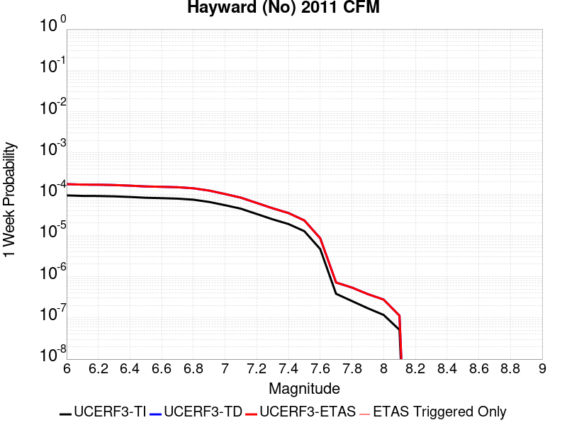 | 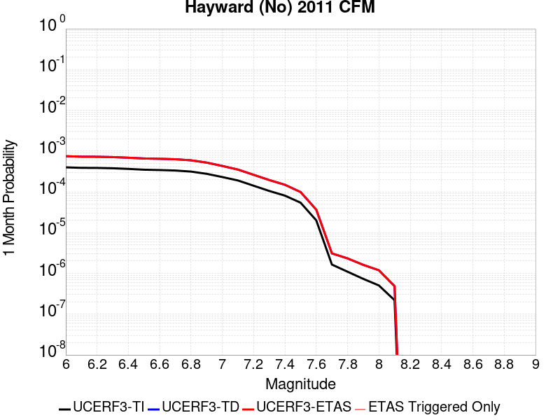 | 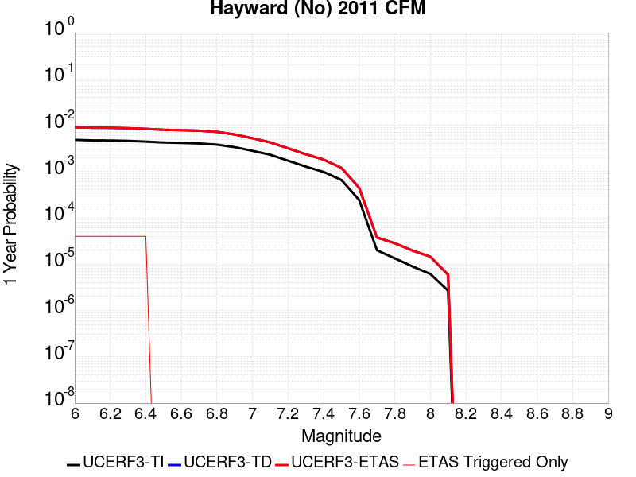 |

| Magnitude | 1 wk TI Prob | 1 wk TD Prob | 1 wk ETAS Prob | 1 wk ETAS/TD Gain | 1 wk ETAS Triggered Only | 1 mo TI Prob | 1 mo TD Prob | 1 mo ETAS Prob | 1 mo ETAS/TD Gain | 1 mo ETAS Triggered Only | 1 yr TI Prob | 1 yr TD Prob | 1 yr ETAS Prob | 1 yr ETAS/TD Gain | 1 yr ETAS Triggered Only |
|-----|-----|-----|-----|-----|-----|-----|-----|-----|-----|-----|-----|-----|-----|-----|-----|
| 6.0 | 9.3068506E-5 | 1.7447172E-4 | 1.7447172E-4 | 1.0 | 0.0 | 3.9880406E-4 | 7.475203E-4 | 7.475203E-4 | 1.0 | 0.0 | 0.0048446343 | 0.009062957 | 0.009102595 | 1.0043736 | 4.0E-5 |
| 6.1 | 9.055486E-5 | 1.6997888E-4 | 1.6997888E-4 | 1.0 | 0.0 | 3.880345E-4 | 7.282775E-4 | 7.282775E-4 | 1.0 | 0.0 | 0.0047140904 | 0.008830804 | 0.008870451 | 1.0044895 | 4.0E-5 |
| 6.2 | 9.006742E-5 | 1.691837E-4 | 1.691837E-4 | 1.0 | 0.0 | 3.859461E-4 | 7.248719E-4 | 7.248719E-4 | 1.0 | 0.0 | 0.0046887742 | 0.0087897135 | 0.008829362 | 1.0045108 | 4.0E-5 |
| 6.3 | 8.8336754E-5 | 1.6597717E-4 | 1.6597717E-4 | 1.0 | 0.0 | 3.7853114E-4 | 7.111376E-4 | 7.111376E-4 | 1.0 | 0.0 | 0.004598882 | 0.008623887 | 0.008663542 | 1.0045983 | 4.0E-5 |
| 6.4 | 8.526157E-5 | 1.6023382E-4 | 1.6023382E-4 | 1.0 | 0.0 | 3.6535555E-4 | 6.865364E-4 | 6.865364E-4 | 1.0 | 0.0 | 0.0044391346 | 0.008326706 | 0.008366372 | 1.0047638 | 4.0E-5 |
| 6.5 | 8.152396E-5 | 1.5355431E-4 | 1.5355431E-4 | 1.0 | 0.0 | 3.493416E-4 | 6.579246E-4 | 6.579246E-4 | 1.0 | 0.0 | 0.0042449418 | 0.007980962 | 0.007980962 | 1.0 | 0.0 |
| 6.6 | 7.987405E-5 | 1.5059515E-4 | 1.5059515E-4 | 1.0 | 0.0 | 3.4227243E-4 | 6.4524886E-4 | 6.4524886E-4 | 1.0 | 0.0 | 0.0041592065 | 0.007827766 | 0.007827766 | 1.0 | 0.0 |
| 6.7 | 7.777665E-5 | 1.4698018E-4 | 1.4698018E-4 | 1.0 | 0.0 | 3.332859E-4 | 6.297637E-4 | 6.297637E-4 | 1.0 | 0.0 | 0.004050208 | 0.0076405737 | 0.0076405737 | 1.0 | 0.0 |
| 6.8 | 7.3284005E-5 | 1.3845459E-4 | 1.3845459E-4 | 1.0 | 0.0 | 3.140365E-4 | 5.932425E-4 | 5.932425E-4 | 1.0 | 0.0 | 0.0038166929 | 0.007198946 | 0.007198946 | 1.0 | 0.0 |
| 6.9 | 6.458263E-5 | 1.217146E-4 | 1.217146E-4 | 1.0 | 0.0 | 2.7675333E-4 | 5.2153016E-4 | 5.2153016E-4 | 1.0 | 0.0 | 0.0033642664 | 0.0063312454 | 0.0063312454 | 1.0 | 0.0 |
| 7.0 | 5.3853604E-5 | 1.0059871E-4 | 1.0059871E-4 | 1.0 | 0.0 | 2.3078074E-4 | 4.3106638E-4 | 4.3106638E-4 | 1.0 | 0.0 | 0.0028061352 | 0.0052356687 | 0.0052356687 | 1.0 | 0.0 |
| 7.1 | 4.4308683E-5 | 8.2009276E-5 | 8.2009276E-5 | 1.0 | 0.0 | 1.8988053E-4 | 3.5142121E-4 | 3.5142121E-4 | 1.0 | 0.0 | 0.0023093442 | 0.004270201 | 0.004270201 | 1.0 | 0.0 |
| 7.2 | 3.295973E-5 | 6.1025905E-5 | 6.1025905E-5 | 1.0 | 0.0 | 1.4124835E-4 | 2.615135E-4 | 2.615135E-4 | 1.0 | 0.0 | 0.0017183421 | 0.0031793013 | 0.0031793013 | 1.0 | 0.0 |
| 7.3 | 2.452256E-5 | 4.5383407E-5 | 4.5383407E-5 | 1.0 | 0.0 | 1.05092455E-4 | 1.944859E-4 | 1.944859E-4 | 1.0 | 0.0 | 0.0012787496 | 0.0023653083 | 0.0023653083 | 1.0 | 0.0 |
| 7.4 | 1.8829967E-5 | 3.4763027E-5 | 3.4763027E-5 | 1.0 | 0.0 | 8.069736E-5 | 1.4897595E-4 | 1.4897595E-4 | 1.0 | 0.0 | 9.820475E-4 | 0.0018122832 | 0.0018122832 | 1.0 | 0.0 |
| 7.5 | 1.26374125E-5 | 2.303777E-5 | 2.303777E-5 | 1.0 | 0.0 | 5.4159216E-5 | 9.87296E-5 | 9.87296E-5 | 1.0 | 0.0 | 6.5918895E-4 | 0.0012013759 | 0.0012013759 | 1.0 | 0.0 |
| 7.6 | 4.666429E-6 | 8.525386E-6 | 8.525386E-6 | 1.0 | 0.0 | 1.9998828E-5 | 3.6536865E-5 | 3.6536865E-5 | 1.0 | 0.0 | 2.4345852E-4 | 4.4474675E-4 | 4.4474675E-4 | 1.0 | 0.0 |
| 7.7 | 3.8399318E-7 | 7.215518E-7 | 7.215518E-7 | 1.0 | 0.0 | 1.6456839E-6 | 3.0923613E-6 | 3.0923613E-6 | 1.0 | 0.0 | 2.003602E-5 | 3.764885E-5 | 3.764885E-5 | 1.0 | 0.0 |
| 7.8 | 2.5637698E-7 | 5.437065E-7 | 5.437065E-7 | 1.0 | 0.0 | 1.098758E-6 | 2.3301686E-6 | 2.3301686E-6 | 1.0 | 0.0 | 1.3377297E-5 | 2.8369435E-5 | 2.8369435E-5 | 1.0 | 0.0 |
| 7.9 | 1.7141245E-7 | 3.7773415E-7 | 3.7773415E-7 | 1.0 | 0.0 | 7.3462456E-7 | 1.6188596E-6 | 1.6188596E-6 | 1.0 | 0.0 | 8.944017E-6 | 1.9709438E-5 | 1.9709438E-5 | 1.0 | 0.0 |
| 8.0 | 1.1808895E-7 | 2.7848392E-7 | 2.7848392E-7 | 1.0 | 0.0 | 5.060954E-7 | 1.1935019E-6 | 1.1935019E-6 | 1.0 | 0.0 | 6.161694E-6 | 1.453079E-5 | 1.453079E-5 | 1.0 | 0.0 |
| 8.1 | 5.138535E-8 | 1.1361926E-7 | 1.1361926E-7 | 1.0 | 0.0 | 2.2022292E-7 | 4.869396E-7 | 4.869396E-7 | 1.0 | 0.0 | 2.6812106E-6 | 5.9284735E-6 | 5.9284735E-6 | 1.0 | 0.0 |

## Dry Mountain
*[(top)](#table-of-contents)*

| 1 Week | 1 Month | 1 Year |
|-----|-----|-----|
|  | 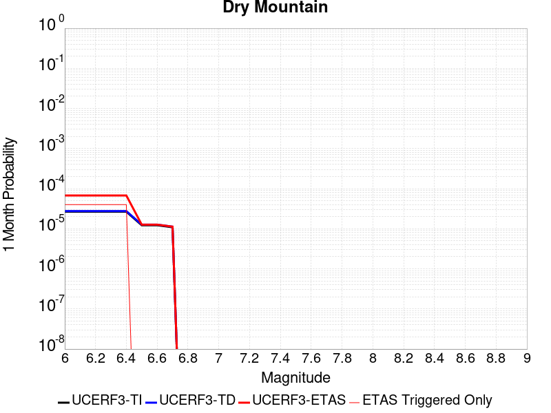 | 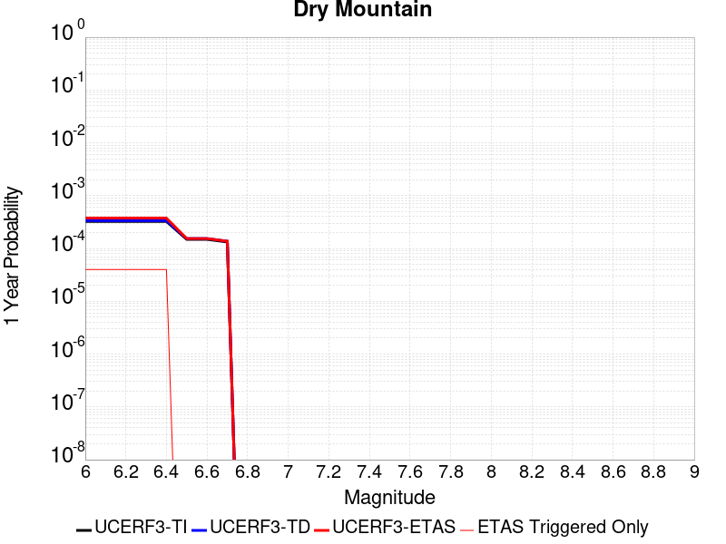 |

| Magnitude | 1 wk TI Prob | 1 wk TD Prob | 1 wk ETAS Prob | 1 wk ETAS/TD Gain | 1 wk ETAS Triggered Only | 1 mo TI Prob | 1 mo TD Prob | 1 mo ETAS Prob | 1 mo ETAS/TD Gain | 1 mo ETAS Triggered Only | 1 yr TI Prob | 1 yr TD Prob | 1 yr ETAS Prob | 1 yr ETAS/TD Gain | 1 yr ETAS Triggered Only |
|-----|-----|-----|-----|-----|-----|-----|-----|-----|-----|-----|-----|-----|-----|-----|-----|
| 6.0 | 6.222801E-6 | 6.4401406E-6 | 4.6439884E-5 | 7.2110043 | 4.0E-5 | 2.6668875E-5 | 2.7600401E-5 | 6.75993E-5 | 2.4492142 | 4.0E-5 | 3.2464517E-4 | 3.3599898E-4 | 3.7598555E-4 | 1.119008 | 4.0E-5 |
| 6.1 | 6.222801E-6 | 6.4401406E-6 | 4.6439884E-5 | 7.2110043 | 4.0E-5 | 2.6668875E-5 | 2.7600401E-5 | 6.75993E-5 | 2.4492142 | 4.0E-5 | 3.2464517E-4 | 3.3599898E-4 | 3.7598555E-4 | 1.119008 | 4.0E-5 |
| 6.2 | 6.222801E-6 | 6.4401406E-6 | 4.6439884E-5 | 7.2110043 | 4.0E-5 | 2.6668875E-5 | 2.7600401E-5 | 6.75993E-5 | 2.4492142 | 4.0E-5 | 3.2464517E-4 | 3.3599898E-4 | 3.7598555E-4 | 1.119008 | 4.0E-5 |
| 6.3 | 6.222801E-6 | 6.4401406E-6 | 4.6439884E-5 | 7.2110043 | 4.0E-5 | 2.6668875E-5 | 2.7600401E-5 | 6.75993E-5 | 2.4492142 | 4.0E-5 | 3.2464517E-4 | 3.3599898E-4 | 3.7598555E-4 | 1.119008 | 4.0E-5 |
| 6.4 | 6.222801E-6 | 6.4401406E-6 | 4.6439884E-5 | 7.2110043 | 4.0E-5 | 2.6668875E-5 | 2.7600401E-5 | 6.75993E-5 | 2.4492142 | 4.0E-5 | 3.2464517E-4 | 3.3599898E-4 | 3.7598555E-4 | 1.119008 | 4.0E-5 |
| 6.5 | 2.8528623E-6 | 2.9525168E-6 | 2.9525168E-6 | 1.0 | 0.0 | 1.22264955E-5 | 1.2653631E-5 | 1.2653631E-5 | 1.0 | 0.0 | 1.4884741E-4 | 1.5405577E-4 | 1.5405577E-4 | 1.0 | 0.0 |
| 6.6 | 2.8528623E-6 | 2.9525168E-6 | 2.9525168E-6 | 1.0 | 0.0 | 1.22264955E-5 | 1.2653631E-5 | 1.2653631E-5 | 1.0 | 0.0 | 1.4884741E-4 | 1.5405577E-4 | 1.5405577E-4 | 1.0 | 0.0 |
| 6.7 | 2.541E-6 | 2.6296677E-6 | 2.6296677E-6 | 1.0 | 0.0 | 1.0889954E-5 | 1.12700045E-5 | 1.12700045E-5 | 1.0 | 0.0 | 1.3257713E-4 | 1.3721231E-4 | 1.3721231E-4 | 1.0 | 0.0 |

## Mendocino
*[(top)](#table-of-contents)*

| 1 Week | 1 Month | 1 Year |
|-----|-----|-----|
| 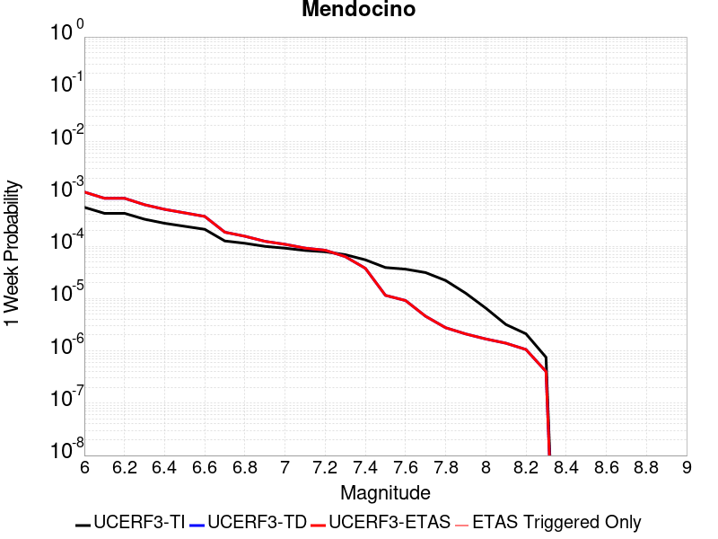 |  | 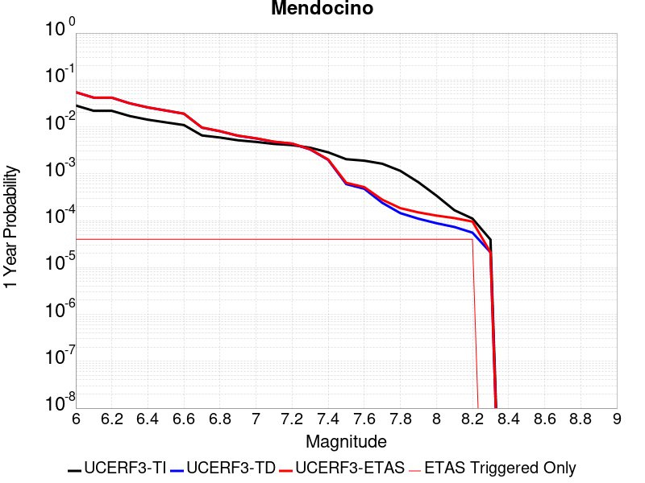 |

| Magnitude | 1 wk TI Prob | 1 wk TD Prob | 1 wk ETAS Prob | 1 wk ETAS/TD Gain | 1 wk ETAS Triggered Only | 1 mo TI Prob | 1 mo TD Prob | 1 mo ETAS Prob | 1 mo ETAS/TD Gain | 1 mo ETAS Triggered Only | 1 yr TI Prob | 1 yr TD Prob | 1 yr ETAS Prob | 1 yr ETAS/TD Gain | 1 yr ETAS Triggered Only |
|-----|-----|-----|-----|-----|-----|-----|-----|-----|-----|-----|-----|-----|-----|-----|-----|
| 6.0 | 5.5409013E-4 | 0.0010855013 | 0.0010855013 | 1.0 | 0.0 | 0.0023725112 | 0.0046417383 | 0.0046815528 | 1.0085775 | 4.0E-5 | 0.028505474 | 0.054746818 | 0.05478463 | 1.0006906 | 4.0E-5 |
| 6.1 | 4.2515888E-4 | 8.241085E-4 | 8.241085E-4 | 1.0 | 0.0 | 0.0018208373 | 0.0035253419 | 0.0035652008 | 1.0113064 | 4.0E-5 | 0.021944538 | 0.041811883 | 0.041850213 | 1.0009167 | 4.0E-5 |
| 6.2 | 4.2515888E-4 | 8.241085E-4 | 8.241085E-4 | 1.0 | 0.0 | 0.0018208373 | 0.0035253419 | 0.0035652008 | 1.0113064 | 4.0E-5 | 0.021944538 | 0.041811883 | 0.041850213 | 1.0009167 | 4.0E-5 |
| 6.3 | 3.2773745E-4 | 6.204648E-4 | 6.204648E-4 | 1.0 | 0.0 | 0.0014038329 | 0.0026551047 | 0.0026949986 | 1.0150254 | 4.0E-5 | 0.016958237 | 0.031649217 | 0.031687953 | 1.0012238 | 4.0E-5 |
| 6.4 | 2.7417165E-4 | 5.0584966E-4 | 5.0584966E-4 | 1.0 | 0.0 | 0.0011744922 | 0.0021651015 | 0.002205015 | 1.0184349 | 4.0E-5 | 0.014205975 | 0.02589259 | 0.025931554 | 1.0015049 | 4.0E-5 |
| 6.5 | 2.3984899E-4 | 4.333886E-4 | 4.333886E-4 | 1.0 | 0.0 | 0.0010275192 | 0.0018552308 | 0.0018951566 | 1.0215206 | 4.0E-5 | 0.012438473 | 0.02223386 | 0.02227297 | 1.001759 | 4.0E-5 |
| 6.6 | 2.1023539E-4 | 3.7036106E-4 | 3.7036106E-4 | 1.0 | 0.0 | 9.0069766E-4 | 0.0015856166 | 0.0016255532 | 1.0251868 | 4.0E-5 | 0.010910975 | 0.019041684 | 0.019080922 | 1.0020607 | 4.0E-5 |
| 6.7 | 1.2592976E-4 | 1.8520498E-4 | 1.8520498E-4 | 1.0 | 0.0 | 5.395873E-4 | 7.9342653E-4 | 8.3339476E-4 | 1.0503743 | 4.0E-5 | 0.006549705 | 0.009605632 | 0.009645248 | 1.0041242 | 4.0E-5 |
| 6.8 | 1.13663555E-4 | 1.5491348E-4 | 1.5491348E-4 | 1.0 | 0.0 | 4.8703855E-4 | 6.637242E-4 | 7.036977E-4 | 1.060226 | 4.0E-5 | 0.0059135845 | 0.008046729 | 0.008086407 | 1.004931 | 4.0E-5 |
| 6.9 | 9.926894E-5 | 1.2384703E-4 | 1.2384703E-4 | 1.0 | 0.0 | 4.2536893E-4 | 5.306603E-4 | 5.706391E-4 | 1.0753378 | 4.0E-5 | 0.0051665753 | 0.0064406823 | 0.006480425 | 1.0061705 | 4.0E-5 |
| 7.0 | 9.168125E-5 | 1.08657994E-4 | 1.08657994E-4 | 1.0 | 0.0 | 3.9286047E-4 | 4.655932E-4 | 5.055746E-4 | 1.0858719 | 4.0E-5 | 0.004772591 | 0.0056534978 | 0.0056932718 | 1.0070353 | 4.0E-5 |
| 7.1 | 8.2854116E-5 | 9.183702E-5 | 9.183702E-5 | 1.0 | 0.0 | 3.5504074E-4 | 3.9352808E-4 | 4.3351232E-4 | 1.1016046 | 4.0E-5 | 0.004314056 | 0.004780745 | 0.004820554 | 1.0083269 | 4.0E-5 |
| 7.2 | 7.8255274E-5 | 8.3770974E-5 | 8.3770974E-5 | 1.0 | 0.0 | 3.3533663E-4 | 3.5896988E-4 | 3.989555E-4 | 1.11139 | 4.0E-5 | 0.0040750825 | 0.0043618497 | 0.0044016754 | 1.0091305 | 4.0E-5 |
| 7.3 | 6.887904E-5 | 6.32157E-5 | 6.32157E-5 | 1.0 | 0.0 | 2.9516246E-4 | 2.7089682E-4 | 3.10886E-4 | 1.1476177 | 4.0E-5 | 0.0035876823 | 0.0032932796 | 0.0033331478 | 1.012106 | 4.0E-5 |
| 7.4 | 5.4898497E-5 | 3.7823393E-5 | 3.7823393E-5 | 1.0 | 0.0 | 2.3525805E-4 | 1.620905E-4 | 2.02084E-4 | 1.2467357 | 4.0E-5 | 0.0028605047 | 0.0019717228 | 0.002011644 | 1.0202469 | 4.0E-5 |
| 7.5 | 3.9103943E-5 | 1.1504898E-5 | 1.1504898E-5 | 1.0 | 0.0 | 1.6757756E-4 | 4.9305785E-5 | 8.930381E-5 | 1.8112239 | 4.0E-5 | 0.0020383475 | 6.001342E-4 | 6.401102E-4 | 1.0666118 | 4.0E-5 |
| 7.6 | 3.641042E-5 | 9.160476E-6 | 9.160476E-6 | 1.0 | 0.0 | 1.5603533E-4 | 3.9258597E-5 | 7.925703E-5 | 2.018845 | 4.0E-5 | 0.0018980748 | 4.7787E-4 | 5.1785086E-4 | 1.0836648 | 4.0E-5 |
| 7.7 | 3.1318774E-5 | 4.5866796E-6 | 4.5866796E-6 | 1.0 | 0.0 | 1.342164E-4 | 1.965705E-5 | 5.9656264E-5 | 3.0348532 | 4.0E-5 | 0.0016328598 | 2.392985E-4 | 2.7928894E-4 | 1.1671152 | 4.0E-5 |
| 7.8 | 2.209241E-5 | 2.768099E-6 | 2.768099E-6 | 1.0 | 0.0 | 9.467832E-5 | 1.1863227E-5 | 5.1862753E-5 | 4.3717237 | 4.0E-5 | 0.001152099 | 1.4442524E-4 | 1.8441946E-4 | 1.2769198 | 4.0E-5 |
| 7.9 | 1.2640477E-5 | 2.1053736E-6 | 2.1053736E-6 | 1.0 | 0.0 | 5.4172346E-5 | 9.022999E-6 | 4.9022638E-5 | 5.433076 | 4.0E-5 | 6.593487E-4 | 1.098495E-4 | 1.498451E-4 | 1.3640946 | 4.0E-5 |
| 8.0 | 6.5548907E-6 | 1.6878063E-6 | 1.6878063E-6 | 1.0 | 0.0 | 2.8092087E-5 | 7.233435E-6 | 4.7233145E-5 | 6.529836 | 4.0E-5 | 3.4196748E-4 | 8.806354E-5 | 1.2806001E-4 | 1.4541775 | 4.0E-5 |
| 8.1 | 3.1916707E-6 | 1.401589E-6 | 1.401589E-6 | 1.0 | 0.0 | 1.3678517E-5 | 6.0067964E-6 | 4.6006557E-5 | 7.659084 | 4.0E-5 | 1.6652321E-4 | 7.3130315E-5 | 1.1312739E-4 | 1.5469288 | 4.0E-5 |
| 8.2 | 2.1193785E-6 | 1.0614335E-6 | 1.0614335E-6 | 1.0 | 0.0 | 9.083019E-6 | 4.548993E-6 | 4.454881E-5 | 9.793116 | 4.0E-5 | 1.1058014E-4 | 5.53826E-5 | 9.538038E-5 | 1.7222085 | 4.0E-5 |
| 8.3 | 7.536878E-7 | 4.0312307E-7 | 4.0312307E-7 | 1.0 | 0.0 | 3.2300866E-6 | 1.7276692E-6 | 1.7276692E-6 | 1.0 | 0.0 | 3.9325594E-5 | 2.1034182E-5 | 2.1034182E-5 | 1.0 | 0.0 |

## San Vicente
*[(top)](#table-of-contents)*

| 1 Week | 1 Month | 1 Year |
|-----|-----|-----|
| 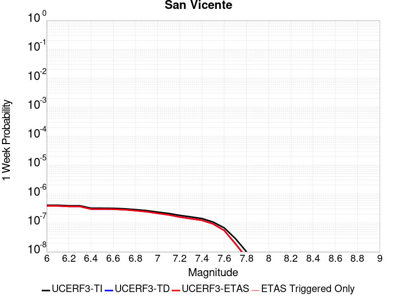 | 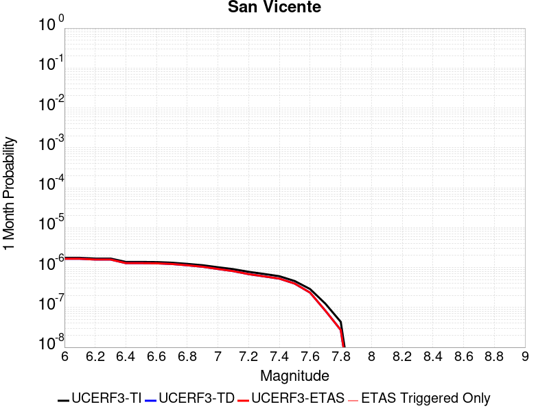 | 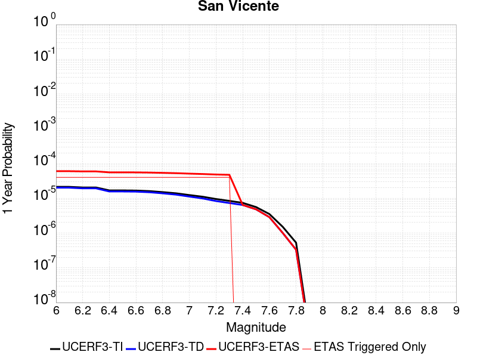 |

| Magnitude | 1 wk TI Prob | 1 wk TD Prob | 1 wk ETAS Prob | 1 wk ETAS/TD Gain | 1 wk ETAS Triggered Only | 1 mo TI Prob | 1 mo TD Prob | 1 mo ETAS Prob | 1 mo ETAS/TD Gain | 1 mo ETAS Triggered Only | 1 yr TI Prob | 1 yr TD Prob | 1 yr ETAS Prob | 1 yr ETAS/TD Gain | 1 yr ETAS Triggered Only |
|-----|-----|-----|-----|-----|-----|-----|-----|-----|-----|-----|-----|-----|-----|-----|-----|
| 6.0 | 4.0851268E-7 | 3.8670225E-7 | 3.8670225E-7 | 1.0 | 0.0 | 1.7507675E-6 | 1.6572943E-6 | 1.6572943E-6 | 1.0 | 0.0 | 2.1315385E-5 | 2.0177378E-5 | 6.017657E-5 | 2.982378 | 4.0E-5 |
| 6.1 | 4.0851268E-7 | 3.8670225E-7 | 3.8670225E-7 | 1.0 | 0.0 | 1.7507675E-6 | 1.6572943E-6 | 1.6572943E-6 | 1.0 | 0.0 | 2.1315385E-5 | 2.0177378E-5 | 6.017657E-5 | 2.982378 | 4.0E-5 |
| 6.2 | 3.9200887E-7 | 3.701473E-7 | 3.701473E-7 | 1.0 | 0.0 | 1.680037E-6 | 1.5863445E-6 | 1.5863445E-6 | 1.0 | 0.0 | 2.0454258E-5 | 1.931358E-5 | 5.9312806E-5 | 3.0710416 | 4.0E-5 |
| 6.3 | 3.9200887E-7 | 3.701473E-7 | 3.701473E-7 | 1.0 | 0.0 | 1.680037E-6 | 1.5863445E-6 | 1.5863445E-6 | 1.0 | 0.0 | 2.0454258E-5 | 1.931358E-5 | 5.9312806E-5 | 3.0710416 | 4.0E-5 |
| 6.4 | 3.2280067E-7 | 3.00646E-7 | 3.00646E-7 | 1.0 | 0.0 | 1.3834307E-6 | 1.2884822E-6 | 1.2884822E-6 | 1.0 | 0.0 | 1.684314E-5 | 1.5687157E-5 | 5.568653E-5 | 3.5498164 | 4.0E-5 |
| 6.5 | 3.2280067E-7 | 3.00646E-7 | 3.00646E-7 | 1.0 | 0.0 | 1.3834307E-6 | 1.2884822E-6 | 1.2884822E-6 | 1.0 | 0.0 | 1.684314E-5 | 1.5687157E-5 | 5.568653E-5 | 3.5498164 | 4.0E-5 |
| 6.6 | 3.1973437E-7 | 2.9756953E-7 | 2.9756953E-7 | 1.0 | 0.0 | 1.3702895E-6 | 1.2752973E-6 | 1.2752973E-6 | 1.0 | 0.0 | 1.6683147E-5 | 1.5526635E-5 | 5.5526012E-5 | 3.5761783 | 4.0E-5 |
| 6.7 | 3.0841164E-7 | 2.8616952E-7 | 2.8616952E-7 | 1.0 | 0.0 | 1.3217634E-6 | 1.2264402E-6 | 1.2264402E-6 | 1.0 | 0.0 | 1.6092352E-5 | 1.49318075E-5 | 5.493121E-5 | 3.678805 | 4.0E-5 |
| 6.8 | 2.883202E-7 | 2.6589672E-7 | 2.6589672E-7 | 1.0 | 0.0 | 1.2356575E-6 | 1.1395568E-6 | 1.1395568E-6 | 1.0 | 0.0 | 1.50440255E-5 | 1.3874016E-5 | 5.387346E-5 | 3.8830473 | 4.0E-5 |
| 6.9 | 2.66663E-7 | 2.4401993E-7 | 2.4401993E-7 | 1.0 | 0.0 | 1.1428409E-6 | 1.0457993E-6 | 1.0457993E-6 | 1.0 | 0.0 | 1.3914E-5 | 1.2732532E-5 | 5.2732023E-5 | 4.141519 | 4.0E-5 |
| 7.0 | 2.3733546E-7 | 2.1455759E-7 | 2.1455759E-7 | 1.0 | 0.0 | 1.0171515E-6 | 9.1953217E-7 | 9.1953217E-7 | 1.0 | 0.0 | 1.238375E-5 | 1.1195247E-5 | 5.11948E-5 | 4.572905 | 4.0E-5 |
| 7.1 | 2.123689E-7 | 1.8950944E-7 | 1.8950944E-7 | 1.0 | 0.0 | 9.1015215E-7 | 8.1218303E-7 | 8.1218303E-7 | 1.0 | 0.0 | 1.1081046E-5 | 9.888283E-6 | 4.9887887E-5 | 5.0451517 | 4.0E-5 |
| 7.2 | 1.8244859E-7 | 1.5953626E-7 | 1.5953626E-7 | 1.0 | 0.0 | 7.8192227E-7 | 6.8372657E-7 | 6.8372657E-7 | 1.0 | 0.0 | 9.519862E-6 | 8.324339E-6 | 4.8324007E-5 | 5.805146 | 4.0E-5 |
| 7.3 | 1.611936E-7 | 1.4009753E-7 | 1.4009753E-7 | 1.0 | 0.0 | 6.9082955E-7 | 6.0041776E-7 | 6.0041776E-7 | 1.0 | 0.0 | 8.410817E-6 | 7.310062E-6 | 4.7309768E-5 | 6.47187 | 4.0E-5 |
| 7.4 | 1.414892E-7 | 1.2294085E-7 | 1.2294085E-7 | 1.0 | 0.0 | 6.063821E-7 | 5.268892E-7 | 5.268892E-7 | 1.0 | 0.0 | 7.3826773E-6 | 6.414857E-6 | 6.414857E-6 | 1.0 | 0.0 |
| 7.5 | 1.0709291E-7 | 9.232832E-8 | 9.232832E-8 | 1.0 | 0.0 | 4.5896954E-7 | 3.9569272E-7 | 3.9569272E-7 | 1.0 | 0.0 | 5.5879395E-6 | 4.8175484E-6 | 4.8175484E-6 | 1.0 | 0.0 |
| 7.6 | 6.746737E-8 | 5.4885067E-8 | 5.4885067E-8 | 1.0 | 0.0 | 2.8914585E-7 | 2.3522169E-7 | 2.3522169E-7 | 1.0 | 0.0 | 3.5203448E-6 | 2.86382E-6 | 2.86382E-6 | 1.0 | 0.0 |
| 7.7 | 2.8940264E-8 | 1.9276698E-8 | 1.9276698E-8 | 1.0 | 0.0 | 1.240297E-7 | 8.261441E-8 | 8.261441E-8 | 1.0 | 0.0 | 1.5100605E-6 | 1.00583E-6 | 1.00583E-6 | 1.0 | 0.0 |
| 7.8 | 1.0151455E-8 | 6.3616894E-9 | 6.3616894E-9 | 1.0 | 0.0 | 4.3506233E-8 | 2.7264381E-8 | 2.7264381E-8 | 1.0 | 0.0 | 5.296883E-7 | 3.319438E-7 | 3.319438E-7 | 1.0 | 0.0 |
| 7.9 | 2.8324232E-11 | 2.1434188E-11 | 2.1434188E-11 | 1.0 | 0.0 | 1.2138957E-10 | 9.1861185E-11 | 9.1861185E-11 | 1.0 | 0.0 | 1.4779177E-9 | 1.1184096E-9 | 1.1184096E-9 | 1.0 | 0.0 |

## Elsinore (Julian)
*[(top)](#table-of-contents)*

| 1 Week | 1 Month | 1 Year |
|-----|-----|-----|
| 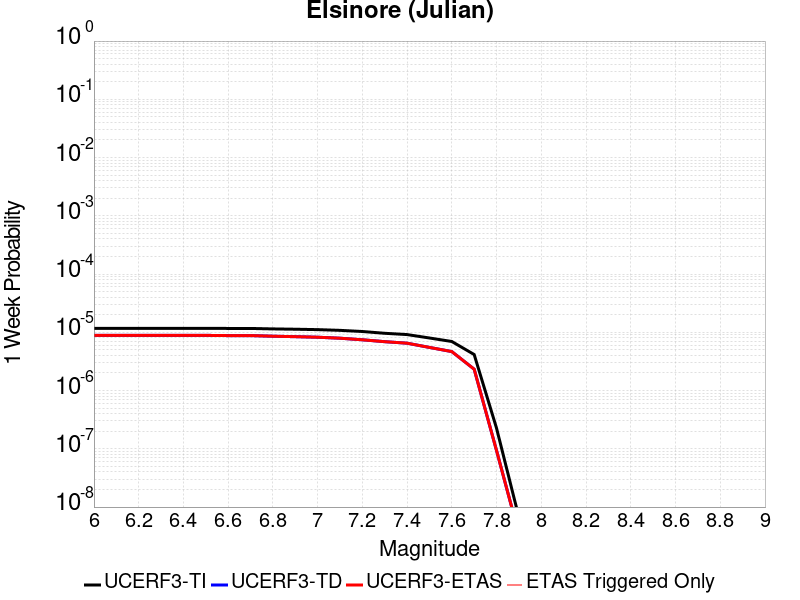 | 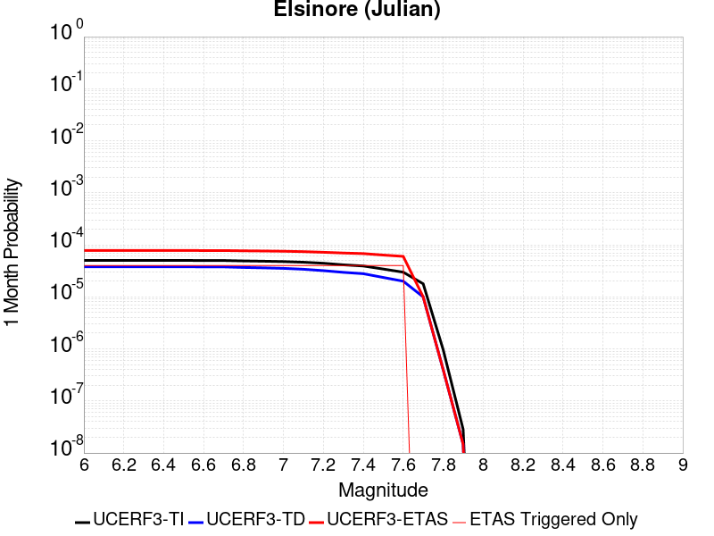 | 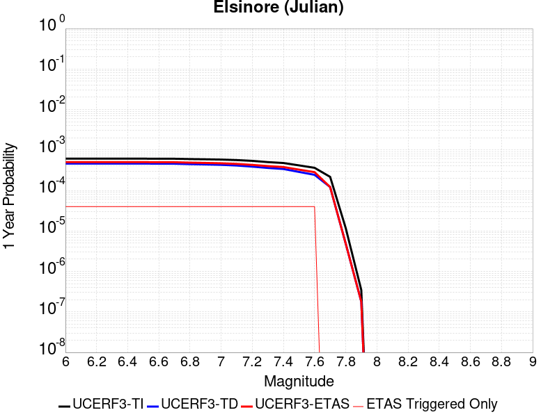 |

| Magnitude | 1 wk TI Prob | 1 wk TD Prob | 1 wk ETAS Prob | 1 wk ETAS/TD Gain | 1 wk ETAS Triggered Only | 1 mo TI Prob | 1 mo TD Prob | 1 mo ETAS Prob | 1 mo ETAS/TD Gain | 1 mo ETAS Triggered Only | 1 yr TI Prob | 1 yr TD Prob | 1 yr ETAS Prob | 1 yr ETAS/TD Gain | 1 yr ETAS Triggered Only |
|-----|-----|-----|-----|-----|-----|-----|-----|-----|-----|-----|-----|-----|-----|-----|-----|
| 6.0 | 1.1710231E-5 | 8.854705E-6 | 8.854705E-6 | 1.0 | 0.0 | 5.0185736E-5 | 3.794819E-5 | 7.794667E-5 | 2.0540287 | 4.0E-5 | 6.1084004E-4 | 4.61923E-4 | 5.019045E-4 | 1.0865545 | 4.0E-5 |
| 6.1 | 1.1710231E-5 | 8.854705E-6 | 8.854705E-6 | 1.0 | 0.0 | 5.0185736E-5 | 3.794819E-5 | 7.794667E-5 | 2.0540287 | 4.0E-5 | 6.1084004E-4 | 4.61923E-4 | 5.019045E-4 | 1.0865545 | 4.0E-5 |
| 6.2 | 1.1710231E-5 | 8.854705E-6 | 8.854705E-6 | 1.0 | 0.0 | 5.0185736E-5 | 3.794819E-5 | 7.794667E-5 | 2.0540287 | 4.0E-5 | 6.1084004E-4 | 4.61923E-4 | 5.019045E-4 | 1.0865545 | 4.0E-5 |
| 6.3 | 1.1710231E-5 | 8.854705E-6 | 8.854705E-6 | 1.0 | 0.0 | 5.0185736E-5 | 3.794819E-5 | 7.794667E-5 | 2.0540287 | 4.0E-5 | 6.1084004E-4 | 4.61923E-4 | 5.019045E-4 | 1.0865545 | 4.0E-5 |
| 6.4 | 1.1710231E-5 | 8.854705E-6 | 8.854705E-6 | 1.0 | 0.0 | 5.0185736E-5 | 3.794819E-5 | 7.794667E-5 | 2.0540287 | 4.0E-5 | 6.1084004E-4 | 4.61923E-4 | 5.019045E-4 | 1.0865545 | 4.0E-5 |
| 6.5 | 1.1710231E-5 | 8.854705E-6 | 8.854705E-6 | 1.0 | 0.0 | 5.0185736E-5 | 3.794819E-5 | 7.794667E-5 | 2.0540287 | 4.0E-5 | 6.1084004E-4 | 4.61923E-4 | 5.019045E-4 | 1.0865545 | 4.0E-5 |
| 6.6 | 1.1650619E-5 | 8.7870585E-6 | 8.7870585E-6 | 1.0 | 0.0 | 4.993027E-5 | 3.765829E-5 | 7.765678E-5 | 2.062143 | 4.0E-5 | 6.0773146E-4 | 4.583949E-4 | 4.9837655E-4 | 1.087221 | 4.0E-5 |
| 6.7 | 1.1650619E-5 | 8.7870585E-6 | 8.7870585E-6 | 1.0 | 0.0 | 4.993027E-5 | 3.765829E-5 | 7.765678E-5 | 2.062143 | 4.0E-5 | 6.0773146E-4 | 4.583949E-4 | 4.9837655E-4 | 1.087221 | 4.0E-5 |
| 6.8 | 1.1442698E-5 | 8.570147E-6 | 8.570147E-6 | 1.0 | 0.0 | 4.9039216E-5 | 3.6728692E-5 | 7.672722E-5 | 2.0890267 | 4.0E-5 | 5.968889E-4 | 4.4708175E-4 | 4.8706387E-4 | 1.0894291 | 4.0E-5 |
| 6.9 | 1.1300589E-5 | 8.417962E-6 | 8.417962E-6 | 1.0 | 0.0 | 4.8430196E-5 | 3.607649E-5 | 7.607505E-5 | 2.1087153 | 4.0E-5 | 5.894781E-4 | 4.3914438E-4 | 4.7912681E-4 | 1.0910462 | 4.0E-5 |
| 7.0 | 1.1117729E-5 | 8.235032E-6 | 8.235032E-6 | 1.0 | 0.0 | 4.764654E-5 | 3.5292524E-5 | 7.5291115E-5 | 2.1333444 | 4.0E-5 | 5.799422E-4 | 4.2960342E-4 | 4.6958623E-4 | 1.0930691 | 4.0E-5 |
| 7.1 | 1.08053955E-5 | 7.920574E-6 | 7.920574E-6 | 1.0 | 0.0 | 4.6308014E-5 | 3.3944885E-5 | 7.394353E-5 | 2.1783407 | 4.0E-5 | 5.6365423E-4 | 4.1320224E-4 | 4.5318573E-4 | 1.0967649 | 4.0E-5 |
| 7.2 | 1.032804E-5 | 7.4416844E-6 | 7.4416844E-6 | 1.0 | 0.0 | 4.4262277E-5 | 3.1892552E-5 | 7.189128E-5 | 2.2541714 | 4.0E-5 | 5.387599E-4 | 3.882242E-4 | 4.2820867E-4 | 1.1029932 | 4.0E-5 |
| 7.3 | 9.622426E-6 | 6.90583E-6 | 6.90583E-6 | 1.0 | 0.0 | 4.1238312E-5 | 2.9596087E-5 | 6.9594906E-5 | 2.35149 | 4.0E-5 | 5.019608E-4 | 3.602742E-4 | 4.002598E-4 | 1.1109866 | 4.0E-5 |
| 7.4 | 9.144434E-6 | 6.5037966E-6 | 6.5037966E-6 | 1.0 | 0.0 | 3.9189843E-5 | 2.7873124E-5 | 6.787201E-5 | 2.435034 | 4.0E-5 | 4.7703186E-4 | 3.3930384E-4 | 3.7929026E-4 | 1.1178484 | 4.0E-5 |
| 7.5 | 7.988981E-6 | 5.504552E-6 | 5.504552E-6 | 1.0 | 0.0 | 3.4238044E-5 | 2.3590732E-5 | 6.358979E-5 | 2.6955411 | 4.0E-5 | 4.1676845E-4 | 2.871806E-4 | 3.271691E-4 | 1.1392452 | 4.0E-5 |
| 7.6 | 6.9554876E-6 | 4.6680443E-6 | 4.6680443E-6 | 1.0 | 0.0 | 2.9808893E-5 | 2.0005757E-5 | 6.0004957E-5 | 2.9993844 | 4.0E-5 | 3.6286283E-4 | 2.4354404E-4 | 2.835343E-4 | 1.1642014 | 4.0E-5 |
| 7.7 | 4.1557314E-6 | 2.3275318E-6 | 2.3275318E-6 | 1.0 | 0.0 | 1.7810156E-5 | 9.975102E-6 | 9.975102E-6 | 1.0 | 0.0 | 2.1681708E-4 | 1.2144085E-4 | 1.2144085E-4 | 1.0 | 0.0 |
| 7.8 | 2.2597293E-7 | 9.34459E-8 | 9.34459E-8 | 1.0 | 0.0 | 9.684551E-7 | 4.0048238E-7 | 4.0048238E-7 | 1.0 | 0.0 | 1.1790877E-5 | 4.875865E-6 | 4.875865E-6 | 1.0 | 0.0 |
| 7.9 | 6.676829E-9 | 3.4429164E-9 | 3.4429164E-9 | 1.0 | 0.0 | 2.861498E-8 | 1.4755356E-8 | 1.4755356E-8 | 1.0 | 0.0 | 3.4838732E-7 | 1.7964643E-7 | 1.7964643E-7 | 1.0 | 0.0 |

## Honey Lake 2011 CFM
*[(top)](#table-of-contents)*

| 1 Week | 1 Month | 1 Year |
|-----|-----|-----|
|  | 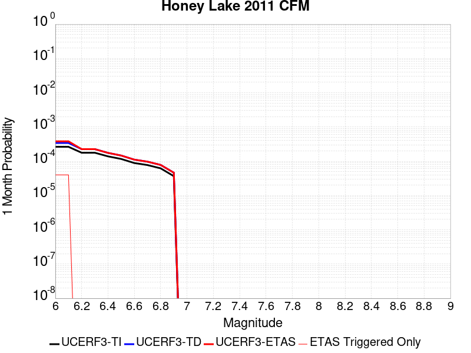 | 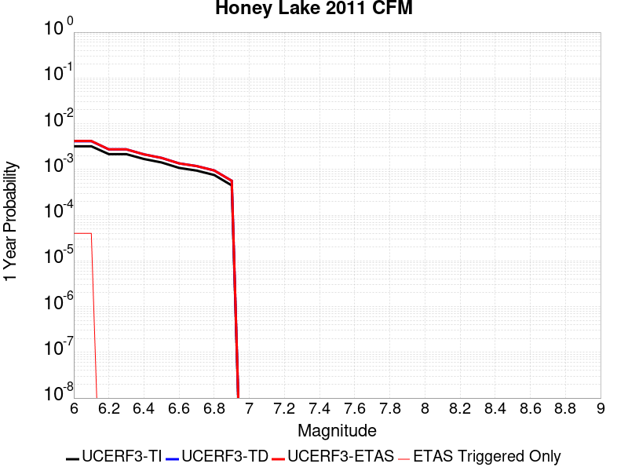 |

| Magnitude | 1 wk TI Prob | 1 wk TD Prob | 1 wk ETAS Prob | 1 wk ETAS/TD Gain | 1 wk ETAS Triggered Only | 1 mo TI Prob | 1 mo TD Prob | 1 mo ETAS Prob | 1 mo ETAS/TD Gain | 1 mo ETAS Triggered Only | 1 yr TI Prob | 1 yr TD Prob | 1 yr ETAS Prob | 1 yr ETAS/TD Gain | 1 yr ETAS Triggered Only |
|-----|-----|-----|-----|-----|-----|-----|-----|-----|-----|-----|-----|-----|-----|-----|-----|
| 6.0 | 6.155506E-5 | 7.96238E-5 | 7.96238E-5 | 1.0 | 0.0 | 2.6378073E-4 | 3.4120315E-4 | 3.811895E-4 | 1.1171923 | 4.0E-5 | 0.0032068014 | 0.004146667 | 0.0041865013 | 1.0096062 | 4.0E-5 |
| 6.1 | 6.155506E-5 | 7.96238E-5 | 7.96238E-5 | 1.0 | 0.0 | 2.6378073E-4 | 3.4120315E-4 | 3.811895E-4 | 1.1171923 | 4.0E-5 | 0.0032068014 | 0.004146667 | 0.0041865013 | 1.0096062 | 4.0E-5 |
| 6.2 | 4.1335024E-5 | 5.262445E-5 | 5.262445E-5 | 1.0 | 0.0 | 1.7713808E-4 | 2.2551461E-4 | 2.2551461E-4 | 1.0 | 0.0 | 0.0021545228 | 0.002742332 | 0.002742332 | 1.0 | 0.0 |
| 6.3 | 4.1335024E-5 | 5.262445E-5 | 5.262445E-5 | 1.0 | 0.0 | 1.7713808E-4 | 2.2551461E-4 | 2.2551461E-4 | 1.0 | 0.0 | 0.0021545228 | 0.002742332 | 0.002742332 | 1.0 | 0.0 |
| 6.4 | 3.2393702E-5 | 4.09234E-5 | 4.09234E-5 | 1.0 | 0.0 | 1.3882275E-4 | 1.7537457E-4 | 1.7537457E-4 | 1.0 | 0.0 | 0.0016888566 | 0.0021332004 | 0.0021332004 | 1.0 | 0.0 |
| 6.5 | 2.7205504E-5 | 3.4241497E-5 | 3.4241497E-5 | 1.0 | 0.0 | 1.1658981E-4 | 1.4674153E-4 | 1.4674153E-4 | 1.0 | 0.0 | 0.0014185566 | 0.0017852074 | 0.0017852074 | 1.0 | 0.0 |
| 6.6 | 2.069265E-5 | 2.5977777E-5 | 2.5977777E-5 | 1.0 | 0.0 | 8.867977E-5 | 1.11329064E-4 | 1.11329064E-4 | 1.0 | 0.0 | 0.0010791414 | 0.001354672 | 0.001354672 | 1.0 | 0.0 |
| 6.7 | 1.8060919E-5 | 2.267638E-5 | 2.267638E-5 | 1.0 | 0.0 | 7.7401644E-5 | 9.718133E-5 | 9.718133E-5 | 1.0 | 0.0 | 9.419576E-4 | 0.0011826215 | 0.0011826215 | 1.0 | 0.0 |
| 6.8 | 1.4474663E-5 | 1.819706E-5 | 1.819706E-5 | 1.0 | 0.0 | 6.203279E-5 | 7.798551E-5 | 7.798551E-5 | 1.0 | 0.0 | 7.5498753E-4 | 9.491364E-4 | 9.491364E-4 | 1.0 | 0.0 |
| 6.9 | 8.564552E-6 | 1.081188E-5 | 1.081188E-5 | 1.0 | 0.0 | 3.6704707E-5 | 4.6336183E-5 | 4.6336183E-5 | 1.0 | 0.0 | 4.4678818E-4 | 5.6406343E-4 | 5.6406343E-4 | 1.0 | 0.0 |

## White Mountains
*[(top)](#table-of-contents)*

| 1 Week | 1 Month | 1 Year |
|-----|-----|-----|
|  | 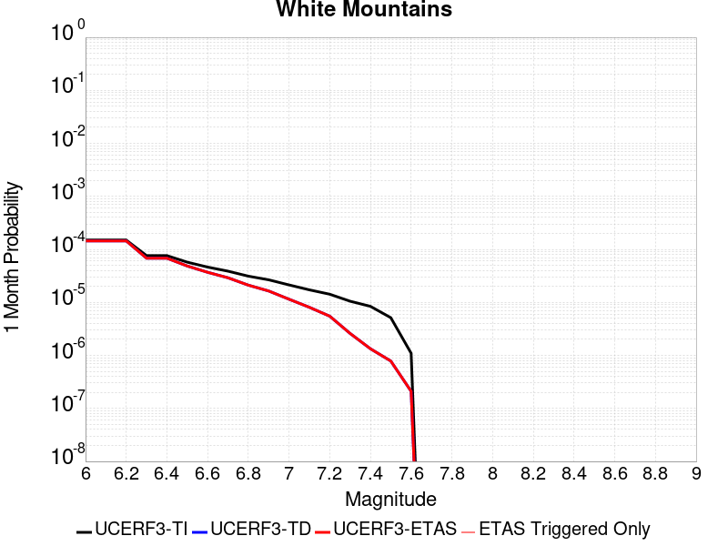 | 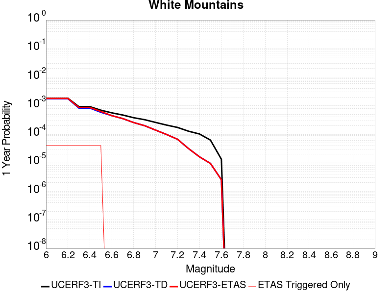 |

| Magnitude | 1 wk TI Prob | 1 wk TD Prob | 1 wk ETAS Prob | 1 wk ETAS/TD Gain | 1 wk ETAS Triggered Only | 1 mo TI Prob | 1 mo TD Prob | 1 mo ETAS Prob | 1 mo ETAS/TD Gain | 1 mo ETAS Triggered Only | 1 yr TI Prob | 1 yr TD Prob | 1 yr ETAS Prob | 1 yr ETAS/TD Gain | 1 yr ETAS Triggered Only |
|-----|-----|-----|-----|-----|-----|-----|-----|-----|-----|-----|-----|-----|-----|-----|-----|
| 6.0 | 3.503579E-5 | 3.3793967E-5 | 3.3793967E-5 | 1.0 | 0.0 | 1.5014476E-4 | 1.4482393E-4 | 1.4482393E-4 | 1.0 | 0.0 | 0.0018264796 | 0.0017619262 | 0.0018018557 | 1.0226624 | 4.0E-5 |
| 6.1 | 3.503579E-5 | 3.3793967E-5 | 3.3793967E-5 | 1.0 | 0.0 | 1.5014476E-4 | 1.4482393E-4 | 1.4482393E-4 | 1.0 | 0.0 | 0.0018264796 | 0.0017619262 | 0.0018018557 | 1.0226624 | 4.0E-5 |
| 6.2 | 3.503579E-5 | 3.3793967E-5 | 3.3793967E-5 | 1.0 | 0.0 | 1.5014476E-4 | 1.4482393E-4 | 1.4482393E-4 | 1.0 | 0.0 | 0.0018264796 | 0.0017619262 | 0.0018018557 | 1.0226624 | 4.0E-5 |
| 6.3 | 1.7818425E-5 | 1.5920552E-5 | 1.5920552E-5 | 1.0 | 0.0 | 7.636245E-5 | 6.822923E-5 | 6.822923E-5 | 1.0 | 0.0 | 9.293162E-4 | 8.3038857E-4 | 8.7035535E-4 | 1.0481303 | 4.0E-5 |
| 6.4 | 1.7818425E-5 | 1.5920552E-5 | 1.5920552E-5 | 1.0 | 0.0 | 7.636245E-5 | 6.822923E-5 | 6.822923E-5 | 1.0 | 0.0 | 9.293162E-4 | 8.3038857E-4 | 8.7035535E-4 | 1.0481303 | 4.0E-5 |
| 6.5 | 1.3397557E-5 | 1.1339476E-5 | 1.1339476E-5 | 1.0 | 0.0 | 5.741684E-5 | 4.859689E-5 | 4.859689E-5 | 1.0 | 0.0 | 6.988258E-4 | 5.9151347E-4 | 6.314898E-4 | 1.0675831 | 4.0E-5 |
| 6.6 | 1.0818695E-5 | 8.627772E-6 | 8.627772E-6 | 1.0 | 0.0 | 4.6365014E-5 | 3.6975667E-5 | 3.6975667E-5 | 1.0 | 0.0 | 5.6434784E-4 | 4.500901E-4 | 4.500901E-4 | 1.0 | 0.0 |
| 6.7 | 9.067908E-6 | 6.804342E-6 | 6.804342E-6 | 1.0 | 0.0 | 3.8861883E-5 | 2.9161158E-5 | 2.9161158E-5 | 1.0 | 0.0 | 4.7304068E-4 | 3.5498245E-4 | 3.5498245E-4 | 1.0 | 0.0 |
| 6.8 | 7.295947E-6 | 4.937819E-6 | 4.937819E-6 | 1.0 | 0.0 | 3.126797E-5 | 2.1161917E-5 | 2.1161917E-5 | 1.0 | 0.0 | 3.8062103E-4 | 2.57617E-4 | 2.57617E-4 | 1.0 | 0.0 |
| 6.9 | 6.2243444E-6 | 3.833406E-6 | 3.833406E-6 | 1.0 | 0.0 | 2.6675489E-5 | 1.6428783E-5 | 1.6428783E-5 | 1.0 | 0.0 | 3.2472567E-4 | 2.000026E-4 | 2.000026E-4 | 1.0 | 0.0 |
| 7.0 | 4.9878413E-6 | 2.6805515E-6 | 2.6805515E-6 | 1.0 | 0.0 | 2.1376287E-5 | 1.1488029E-5 | 1.1488029E-5 | 1.0 | 0.0 | 2.602252E-4 | 1.3985804E-4 | 1.3985804E-4 | 1.0 | 0.0 |
| 7.1 | 4.0252844E-6 | 1.8866339E-6 | 1.8866339E-6 | 1.0 | 0.0 | 1.7251105E-5 | 8.08555E-6 | 8.08555E-6 | 1.0 | 0.0 | 2.1001195E-4 | 9.8437245E-5 | 9.8437245E-5 | 1.0 | 0.0 |
| 7.2 | 3.3284066E-6 | 1.2826561E-6 | 1.2826561E-6 | 1.0 | 0.0 | 1.4264522E-5 | 5.497086E-6 | 5.497086E-6 | 1.0 | 0.0 | 1.736567E-4 | 6.692507E-5 | 6.692507E-5 | 1.0 | 0.0 |
| 7.3 | 2.458226E-6 | 6.0635915E-7 | 6.0635915E-7 | 1.0 | 0.0 | 1.0535211E-5 | 2.5986797E-6 | 2.5986797E-6 | 1.0 | 0.0 | 1.2825865E-4 | 3.1638505E-5 | 3.1638505E-5 | 1.0 | 0.0 |
| 7.4 | 1.965953E-6 | 3.1145115E-7 | 3.1145115E-7 | 1.0 | 0.0 | 8.425486E-6 | 1.33479E-6 | 1.33479E-6 | 1.0 | 0.0 | 1.0257547E-4 | 1.6250948E-5 | 1.6250948E-5 | 1.0 | 0.0 |
| 7.5 | 1.2014192E-6 | 1.8282981E-7 | 1.8282981E-7 | 1.0 | 0.0 | 5.148929E-6 | 7.8355606E-7 | 7.8355606E-7 | 1.0 | 0.0 | 6.2686406E-5 | 9.5397545E-6 | 9.5397545E-6 | 1.0 | 0.0 |
| 7.6 | 2.5612175E-7 | 4.9050836E-8 | 4.9050836E-8 | 1.0 | 0.0 | 1.0976642E-6 | 2.1021786E-7 | 2.1021786E-7 | 1.0 | 0.0 | 1.3363979E-5 | 2.5594E-6 | 2.5594E-6 | 1.0 | 0.0 |

## Blue Cut
*[(top)](#table-of-contents)*

| 1 Week | 1 Month | 1 Year |
|-----|-----|-----|
|  | 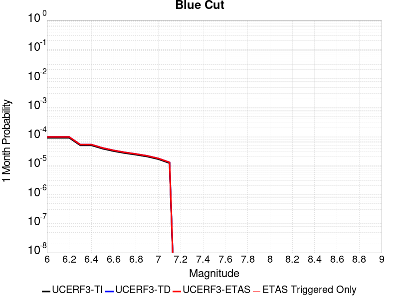 | 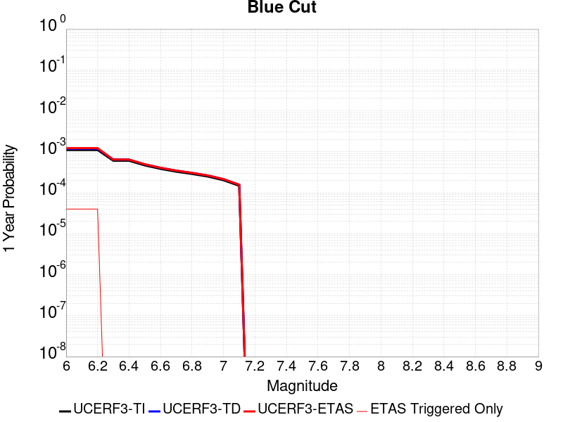 |

| Magnitude | 1 wk TI Prob | 1 wk TD Prob | 1 wk ETAS Prob | 1 wk ETAS/TD Gain | 1 wk ETAS Triggered Only | 1 mo TI Prob | 1 mo TD Prob | 1 mo ETAS Prob | 1 mo ETAS/TD Gain | 1 mo ETAS Triggered Only | 1 yr TI Prob | 1 yr TD Prob | 1 yr ETAS Prob | 1 yr ETAS/TD Gain | 1 yr ETAS Triggered Only |
|-----|-----|-----|-----|-----|-----|-----|-----|-----|-----|-----|-----|-----|-----|-----|-----|
| 6.0 | 2.1227985E-5 | 2.2724995E-5 | 2.2724995E-5 | 1.0 | 0.0 | 9.097391E-5 | 9.738952E-5 | 9.738952E-5 | 1.0 | 0.0 | 0.0011070445 | 0.0011851306 | 0.0012250833 | 1.0337116 | 4.0E-5 |
| 6.1 | 2.1227985E-5 | 2.2724995E-5 | 2.2724995E-5 | 1.0 | 0.0 | 9.097391E-5 | 9.738952E-5 | 9.738952E-5 | 1.0 | 0.0 | 0.0011070445 | 0.0011851306 | 0.0012250833 | 1.0337116 | 4.0E-5 |
| 6.2 | 2.1227985E-5 | 2.2724995E-5 | 2.2724995E-5 | 1.0 | 0.0 | 9.097391E-5 | 9.738952E-5 | 9.738952E-5 | 1.0 | 0.0 | 0.0011070445 | 0.0011851306 | 0.0012250833 | 1.0337116 | 4.0E-5 |
| 6.3 | 1.1613981E-5 | 1.23562095E-5 | 1.23562095E-5 | 1.0 | 0.0 | 4.9773254E-5 | 5.295418E-5 | 5.295418E-5 | 1.0 | 0.0 | 6.0582085E-4 | 6.445389E-4 | 6.445389E-4 | 1.0 | 0.0 |
| 6.4 | 1.1613981E-5 | 1.23562095E-5 | 1.23562095E-5 | 1.0 | 0.0 | 4.9773254E-5 | 5.295418E-5 | 5.295418E-5 | 1.0 | 0.0 | 6.0582085E-4 | 6.445389E-4 | 6.445389E-4 | 1.0 | 0.0 |
| 6.5 | 8.931326E-6 | 9.4835805E-6 | 9.4835805E-6 | 1.0 | 0.0 | 3.8276554E-5 | 4.0643336E-5 | 4.0643336E-5 | 1.0 | 0.0 | 4.6591737E-4 | 4.947294E-4 | 4.947294E-4 | 1.0 | 0.0 |
| 6.6 | 7.345353E-6 | 7.7918785E-6 | 7.7918785E-6 | 1.0 | 0.0 | 3.1479703E-5 | 3.3393382E-5 | 3.3393382E-5 | 1.0 | 0.0 | 3.83198E-4 | 4.064966E-4 | 4.064966E-4 | 1.0 | 0.0 |
| 6.7 | 6.2775666E-6 | 6.656506E-6 | 6.656506E-6 | 1.0 | 0.0 | 2.690358E-5 | 2.8527613E-5 | 2.8527613E-5 | 1.0 | 0.0 | 3.2750185E-4 | 3.4727587E-4 | 3.4727587E-4 | 1.0 | 0.0 |
| 6.8 | 5.5234095E-6 | 5.8563032E-6 | 5.8563032E-6 | 1.0 | 0.0 | 2.367154E-5 | 2.5098241E-5 | 2.5098241E-5 | 1.0 | 0.0 | 2.8816288E-4 | 3.0553553E-4 | 3.0553553E-4 | 1.0 | 0.0 |
| 6.9 | 4.7780054E-6 | 5.0664535E-6 | 5.0664535E-6 | 1.0 | 0.0 | 2.0477004E-5 | 2.1713231E-5 | 2.1713231E-5 | 1.0 | 0.0 | 2.4927902E-4 | 2.6433356E-4 | 2.6433356E-4 | 1.0 | 0.0 |
| 7.0 | 3.883171E-6 | 4.119333E-6 | 4.119333E-6 | 1.0 | 0.0 | 1.6642054E-5 | 1.7654203E-5 | 1.7654203E-5 | 1.0 | 0.0 | 2.0259817E-4 | 2.1492562E-4 | 2.1492562E-4 | 1.0 | 0.0 |
| 7.1 | 2.8358215E-6 | 3.0103415E-6 | 3.0103415E-6 | 1.0 | 0.0 | 1.2153464E-5 | 1.2901436E-5 | 1.2901436E-5 | 1.0 | 0.0 | 1.4795837E-4 | 1.5707024E-4 | 1.5707024E-4 | 1.0 | 0.0 |

## North Frontal  (West)
*[(top)](#table-of-contents)*

| 1 Week | 1 Month | 1 Year |
|-----|-----|-----|
|  | 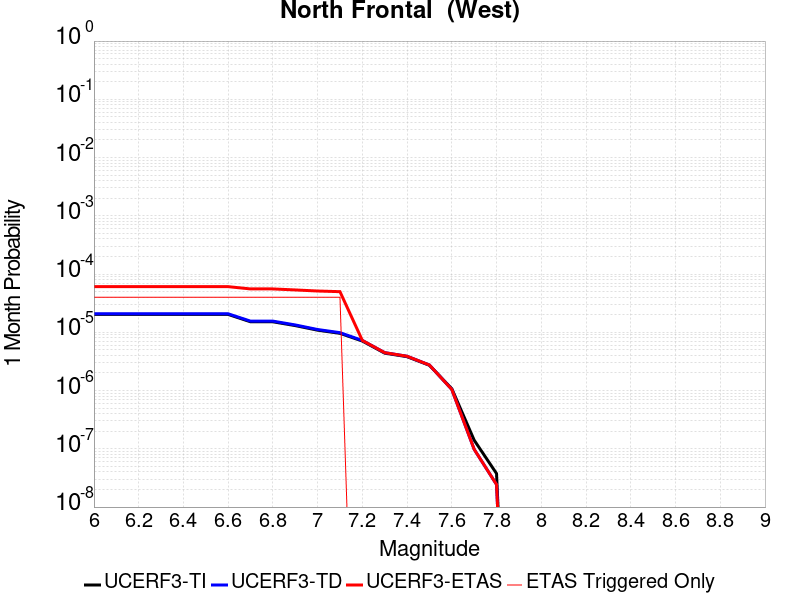 | 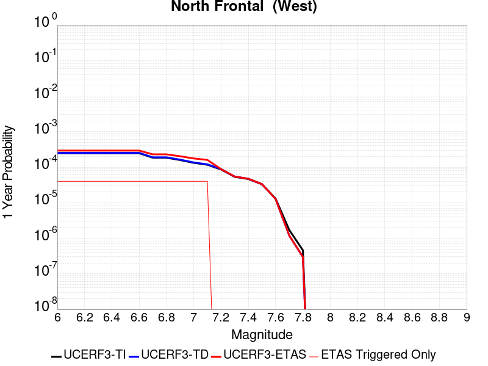 |

| Magnitude | 1 wk TI Prob | 1 wk TD Prob | 1 wk ETAS Prob | 1 wk ETAS/TD Gain | 1 wk ETAS Triggered Only | 1 mo TI Prob | 1 mo TD Prob | 1 mo ETAS Prob | 1 mo ETAS/TD Gain | 1 mo ETAS Triggered Only | 1 yr TI Prob | 1 yr TD Prob | 1 yr ETAS Prob | 1 yr ETAS/TD Gain | 1 yr ETAS Triggered Only |
|-----|-----|-----|-----|-----|-----|-----|-----|-----|-----|-----|-----|-----|-----|-----|-----|
| 6.0 | 4.7316266E-6 | 4.8531524E-6 | 4.8531524E-6 | 1.0 | 0.0 | 2.0278241E-5 | 2.0799067E-5 | 6.0798233E-5 | 2.9231231 | 4.0E-5 | 2.4685962E-4 | 2.5320068E-4 | 2.9319056E-4 | 1.1579374 | 4.0E-5 |
| 6.1 | 4.7316266E-6 | 4.8531524E-6 | 4.8531524E-6 | 1.0 | 0.0 | 2.0278241E-5 | 2.0799067E-5 | 6.0798233E-5 | 2.9231231 | 4.0E-5 | 2.4685962E-4 | 2.5320068E-4 | 2.9319056E-4 | 1.1579374 | 4.0E-5 |
| 6.2 | 4.7316266E-6 | 4.8531524E-6 | 4.8531524E-6 | 1.0 | 0.0 | 2.0278241E-5 | 2.0799067E-5 | 6.0798233E-5 | 2.9231231 | 4.0E-5 | 2.4685962E-4 | 2.5320068E-4 | 2.9319056E-4 | 1.1579374 | 4.0E-5 |
| 6.3 | 4.7316266E-6 | 4.8531524E-6 | 4.8531524E-6 | 1.0 | 0.0 | 2.0278241E-5 | 2.0799067E-5 | 6.0798233E-5 | 2.9231231 | 4.0E-5 | 2.4685962E-4 | 2.5320068E-4 | 2.9319056E-4 | 1.1579374 | 4.0E-5 |
| 6.4 | 4.7316266E-6 | 4.8531524E-6 | 4.8531524E-6 | 1.0 | 0.0 | 2.0278241E-5 | 2.0799067E-5 | 6.0798233E-5 | 2.9231231 | 4.0E-5 | 2.4685962E-4 | 2.5320068E-4 | 2.9319056E-4 | 1.1579374 | 4.0E-5 |
| 6.5 | 4.7316266E-6 | 4.8531524E-6 | 4.8531524E-6 | 1.0 | 0.0 | 2.0278241E-5 | 2.0799067E-5 | 6.0798233E-5 | 2.9231231 | 4.0E-5 | 2.4685962E-4 | 2.5320068E-4 | 2.9319056E-4 | 1.1579374 | 4.0E-5 |
| 6.6 | 4.7316266E-6 | 4.8531524E-6 | 4.8531524E-6 | 1.0 | 0.0 | 2.0278241E-5 | 2.0799067E-5 | 6.0798233E-5 | 2.9231231 | 4.0E-5 | 2.4685962E-4 | 2.5320068E-4 | 2.9319056E-4 | 1.1579374 | 4.0E-5 |
| 6.7 | 3.5382777E-6 | 3.631267E-6 | 3.631267E-6 | 1.0 | 0.0 | 1.516396E-5 | 1.5562484E-5 | 5.556186E-5 | 3.5702438 | 4.0E-5 | 1.8460557E-4 | 1.8945755E-4 | 2.2944997E-4 | 1.2110891 | 4.0E-5 |
| 6.8 | 3.5382777E-6 | 3.631267E-6 | 3.631267E-6 | 1.0 | 0.0 | 1.516396E-5 | 1.5562484E-5 | 5.556186E-5 | 3.5702438 | 4.0E-5 | 1.8460557E-4 | 1.8945755E-4 | 2.2944997E-4 | 1.2110891 | 4.0E-5 |
| 6.9 | 3.0428037E-6 | 3.1230975E-6 | 3.1230975E-6 | 1.0 | 0.0 | 1.30405215E-5 | 1.3384639E-5 | 5.3384105E-5 | 3.9884605 | 4.0E-5 | 1.5875678E-4 | 1.6294647E-4 | 2.0293996E-4 | 1.2454394 | 4.0E-5 |
| 7.0 | 2.538778E-6 | 2.6063833E-6 | 2.6063833E-6 | 1.0 | 0.0 | 1.0880432E-5 | 1.1170169E-5 | 5.116972E-5 | 4.5809264 | 4.0E-5 | 1.324612E-4 | 1.359888E-4 | 1.7598335E-4 | 1.2941018 | 4.0E-5 |
| 7.1 | 2.2418935E-6 | 2.3014725E-6 | 2.3014725E-6 | 1.0 | 0.0 | 9.60808E-6 | 9.863419E-6 | 4.9863025E-5 | 5.055349 | 4.0E-5 | 1.1697209E-4 | 1.2008095E-4 | 1.6007615E-4 | 1.3330686 | 4.0E-5 |
| 7.2 | 1.6526745E-6 | 1.692682E-6 | 1.692682E-6 | 1.0 | 0.0 | 7.082872E-6 | 7.2543326E-6 | 7.2543326E-6 | 1.0 | 0.0 | 8.623055E-5 | 8.831818E-5 | 8.831818E-5 | 1.0 | 0.0 |
| 7.3 | 1.0246019E-6 | 1.0443523E-6 | 1.0443523E-6 | 1.0 | 0.0 | 4.391144E-6 | 4.4757885E-6 | 4.4757885E-6 | 1.0 | 0.0 | 5.3460866E-5 | 5.449148E-5 | 5.449148E-5 | 1.0 | 0.0 |
| 7.4 | 8.9045164E-7 | 9.057666E-7 | 9.057666E-7 | 1.0 | 0.0 | 3.8162157E-6 | 3.881852E-6 | 3.881852E-6 | 1.0 | 0.0 | 4.646144E-5 | 4.7260633E-5 | 4.7260633E-5 | 1.0 | 0.0 |
| 7.5 | 6.3357E-7 | 6.4035106E-7 | 6.4035106E-7 | 1.0 | 0.0 | 2.7152971E-6 | 2.744359E-6 | 2.744359E-6 | 1.0 | 0.0 | 3.305824E-5 | 3.3412125E-5 | 3.3412125E-5 | 1.0 | 0.0 |
| 7.6 | 2.5087024E-7 | 2.4364294E-7 | 2.4364294E-7 | 1.0 | 0.0 | 1.0751578E-6 | 1.0441837E-6 | 1.0441837E-6 | 1.0 | 0.0 | 1.3089967E-5 | 1.2712884E-5 | 1.2712884E-5 | 1.0 | 0.0 |
| 7.7 | 3.282987E-8 | 2.287823E-8 | 2.287823E-8 | 1.0 | 0.0 | 1.4069944E-7 | 9.8049554E-8 | 9.8049554E-8 | 1.0 | 0.0 | 1.7130144E-6 | 1.1937527E-6 | 1.1937527E-6 | 1.0 | 0.0 |
| 7.8 | 8.77499E-9 | 5.6832317E-9 | 5.6832317E-9 | 1.0 | 0.0 | 3.7607098E-8 | 2.4356707E-8 | 2.4356707E-8 | 1.0 | 0.0 | 4.578663E-7 | 2.9654288E-7 | 2.9654288E-7 | 1.0 | 0.0 |

## Pinto Mtn
*[(top)](#table-of-contents)*

| 1 Week | 1 Month | 1 Year |
|-----|-----|-----|
|  | 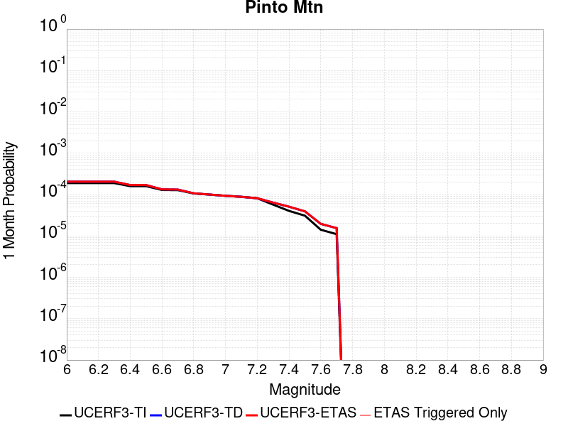 | 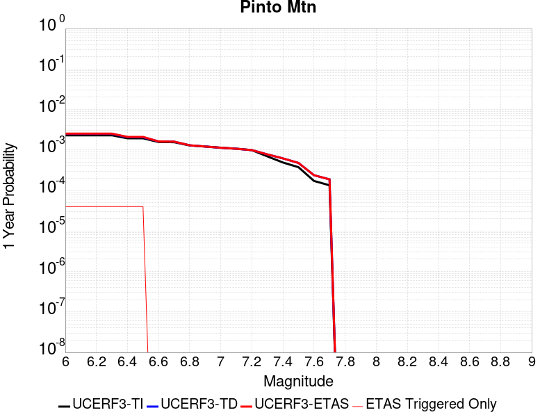 |

| Magnitude | 1 wk TI Prob | 1 wk TD Prob | 1 wk ETAS Prob | 1 wk ETAS/TD Gain | 1 wk ETAS Triggered Only | 1 mo TI Prob | 1 mo TD Prob | 1 mo ETAS Prob | 1 mo ETAS/TD Gain | 1 mo ETAS Triggered Only | 1 yr TI Prob | 1 yr TD Prob | 1 yr ETAS Prob | 1 yr ETAS/TD Gain | 1 yr ETAS Triggered Only |
|-----|-----|-----|-----|-----|-----|-----|-----|-----|-----|-----|-----|-----|-----|-----|-----|
| 6.0 | 4.4194956E-5 | 4.7895475E-5 | 4.7895475E-5 | 1.0 | 0.0 | 1.893932E-4 | 2.0525111E-4 | 2.0525111E-4 | 1.0 | 0.0 | 0.0023034236 | 0.002496232 | 0.0025361322 | 1.0159842 | 4.0E-5 |
| 6.1 | 4.4194956E-5 | 4.7895475E-5 | 4.7895475E-5 | 1.0 | 0.0 | 1.893932E-4 | 2.0525111E-4 | 2.0525111E-4 | 1.0 | 0.0 | 0.0023034236 | 0.002496232 | 0.0025361322 | 1.0159842 | 4.0E-5 |
| 6.2 | 4.4194956E-5 | 4.7895475E-5 | 4.7895475E-5 | 1.0 | 0.0 | 1.893932E-4 | 2.0525111E-4 | 2.0525111E-4 | 1.0 | 0.0 | 0.0023034236 | 0.002496232 | 0.0025361322 | 1.0159842 | 4.0E-5 |
| 6.3 | 4.4194956E-5 | 4.7895475E-5 | 4.7895475E-5 | 1.0 | 0.0 | 1.893932E-4 | 2.0525111E-4 | 2.0525111E-4 | 1.0 | 0.0 | 0.0023034236 | 0.002496232 | 0.0025361322 | 1.0159842 | 4.0E-5 |
| 6.4 | 3.729929E-5 | 3.963956E-5 | 3.963956E-5 | 1.0 | 0.0 | 1.5984432E-4 | 1.698733E-4 | 1.698733E-4 | 1.0 | 0.0 | 0.0019443673 | 0.0020663387 | 0.002106256 | 1.0193179 | 4.0E-5 |
| 6.5 | 3.729929E-5 | 3.963956E-5 | 3.963956E-5 | 1.0 | 0.0 | 1.5984432E-4 | 1.698733E-4 | 1.698733E-4 | 1.0 | 0.0 | 0.0019443673 | 0.0020663387 | 0.002106256 | 1.0193179 | 4.0E-5 |
| 6.6 | 3.0204548E-5 | 3.1236435E-5 | 3.1236435E-5 | 1.0 | 0.0 | 1.2944164E-4 | 1.3386377E-4 | 1.3386377E-4 | 1.0 | 0.0 | 0.0015748127 | 0.0016286077 | 0.0016286077 | 1.0 | 0.0 |
| 6.7 | 2.9857754E-5 | 3.0845655E-5 | 3.0845655E-5 | 1.0 | 0.0 | 1.2795553E-4 | 1.3218916E-4 | 1.3218916E-4 | 1.0 | 0.0 | 0.0015567453 | 0.0016082495 | 0.0016082495 | 1.0 | 0.0 |
| 6.8 | 2.4819734E-5 | 2.5037323E-5 | 2.5037323E-5 | 1.0 | 0.0 | 1.0636595E-4 | 1.0729852E-4 | 1.0729852E-4 | 1.0 | 0.0 | 0.0012942362 | 0.0013055983 | 0.0013055983 | 1.0 | 0.0 |
| 6.9 | 2.331124E-5 | 2.3364986E-5 | 2.3364986E-5 | 1.0 | 0.0 | 9.990149E-5 | 1.00131925E-4 | 1.00131925E-4 | 1.0 | 0.0 | 0.001215622 | 0.0012184448 | 0.0012184448 | 1.0 | 0.0 |
| 7.0 | 2.1818534E-5 | 2.17876E-5 | 2.17876E-5 | 1.0 | 0.0 | 9.3504656E-5 | 9.33722E-5 | 9.33722E-5 | 1.0 | 0.0 | 0.0011378246 | 0.0011362336 | 0.0011362336 | 1.0 | 0.0 |
| 7.1 | 2.066081E-5 | 2.0566755E-5 | 2.0566755E-5 | 1.0 | 0.0 | 8.854332E-5 | 8.814037E-5 | 8.814037E-5 | 1.0 | 0.0 | 0.0010774818 | 0.0010726003 | 0.0010726003 | 1.0 | 0.0 |
| 7.2 | 1.8990233E-5 | 1.9079554E-5 | 1.9079554E-5 | 1.0 | 0.0 | 8.138417E-5 | 8.176706E-5 | 8.176706E-5 | 1.0 | 0.0 | 9.904018E-4 | 9.950787E-4 | 9.950787E-4 | 1.0 | 0.0 |
| 7.3 | 1.3335872E-5 | 1.4930265E-5 | 1.4930265E-5 | 1.0 | 0.0 | 5.7152483E-5 | 6.398535E-5 | 6.398535E-5 | 1.0 | 0.0 | 6.956093E-4 | 7.78756E-4 | 7.78756E-4 | 1.0 | 0.0 |
| 7.4 | 9.414066E-6 | 1.1882921E-5 | 1.1882921E-5 | 1.0 | 0.0 | 4.0345374E-5 | 5.0925864E-5 | 5.0925864E-5 | 1.0 | 0.0 | 4.910942E-4 | 6.198555E-4 | 6.198555E-4 | 1.0 | 0.0 |
| 7.5 | 7.2101157E-6 | 9.179627E-6 | 9.179627E-6 | 1.0 | 0.0 | 3.090013E-5 | 3.934071E-5 | 3.934071E-5 | 1.0 | 0.0 | 3.7614413E-4 | 4.788757E-4 | 4.788757E-4 | 1.0 | 0.0 |
| 7.6 | 3.296375E-6 | 4.5660995E-6 | 4.5660995E-6 | 1.0 | 0.0 | 1.4127245E-5 | 1.9568859E-5 | 1.9568859E-5 | 1.0 | 0.0 | 1.7198564E-4 | 2.3822622E-4 | 2.3822622E-4 | 1.0 | 0.0 |
| 7.7 | 2.5741092E-6 | 3.6038196E-6 | 3.6038196E-6 | 1.0 | 0.0 | 1.103185E-5 | 1.5444857E-5 | 1.5444857E-5 | 1.0 | 0.0 | 1.3430449E-4 | 1.8802624E-4 | 1.8802624E-4 | 1.0 | 0.0 |

## Butano 2011 CFM
*[(top)](#table-of-contents)*

| 1 Week | 1 Month | 1 Year |
|-----|-----|-----|
| 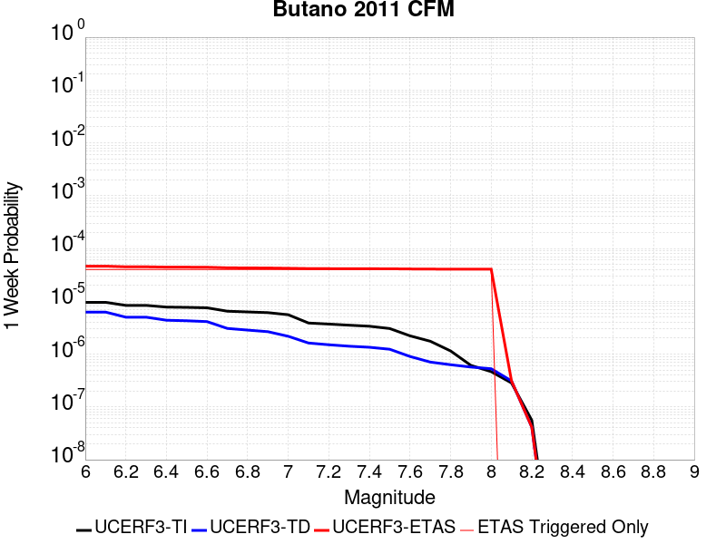 | 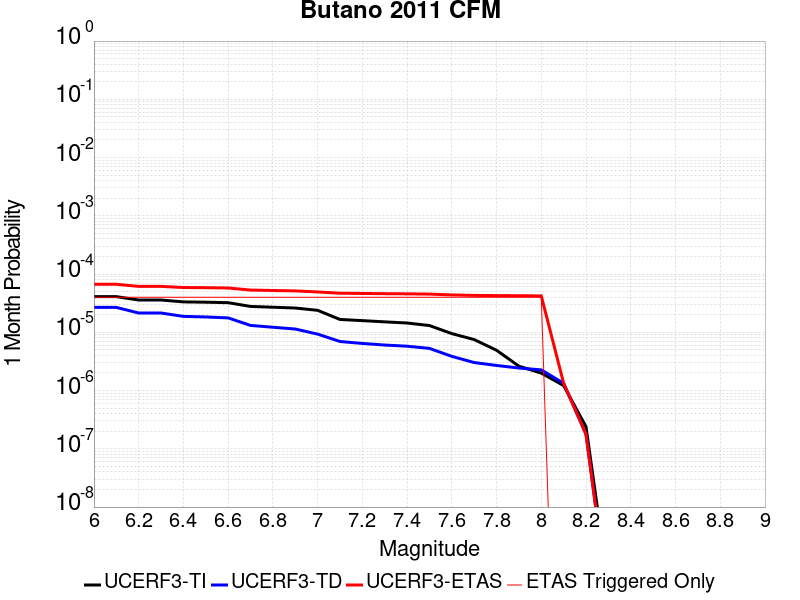 | 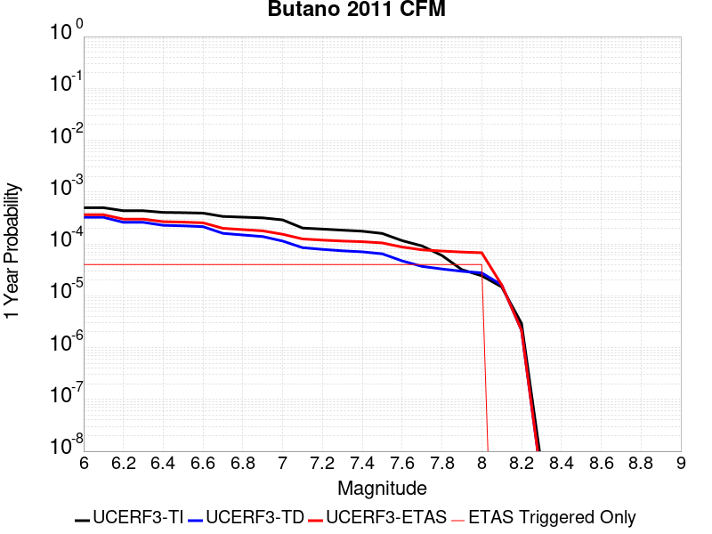 |

| Magnitude | 1 wk TI Prob | 1 wk TD Prob | 1 wk ETAS Prob | 1 wk ETAS/TD Gain | 1 wk ETAS Triggered Only | 1 mo TI Prob | 1 mo TD Prob | 1 mo ETAS Prob | 1 mo ETAS/TD Gain | 1 mo ETAS Triggered Only | 1 yr TI Prob | 1 yr TD Prob | 1 yr ETAS Prob | 1 yr ETAS/TD Gain | 1 yr ETAS Triggered Only |
|-----|-----|-----|-----|-----|-----|-----|-----|-----|-----|-----|-----|-----|-----|-----|-----|
| 6.0 | 9.561135E-6 | 6.2491204E-6 | 4.624887E-5 | 7.4008613 | 4.0E-5 | 4.097565E-5 | 2.6781681E-5 | 6.678061E-5 | 2.4935184 | 4.0E-5 | 4.9876433E-4 | 3.2602038E-4 | 3.6600733E-4 | 1.1226517 | 4.0E-5 |
| 6.1 | 9.561135E-6 | 6.2491204E-6 | 4.624887E-5 | 7.4008613 | 4.0E-5 | 4.097565E-5 | 2.6781681E-5 | 6.678061E-5 | 2.4935184 | 4.0E-5 | 4.9876433E-4 | 3.2602038E-4 | 3.6600733E-4 | 1.1226517 | 4.0E-5 |
| 6.2 | 8.364741E-6 | 5.002027E-6 | 4.5001827E-5 | 8.996718 | 4.0E-5 | 3.5848396E-5 | 2.143709E-5 | 6.1436236E-5 | 2.8658848 | 4.0E-5 | 4.3636683E-4 | 2.609669E-4 | 3.0095645E-4 | 1.1532362 | 4.0E-5 |
| 6.3 | 8.364741E-6 | 5.002027E-6 | 4.5001827E-5 | 8.996718 | 4.0E-5 | 3.5848396E-5 | 2.143709E-5 | 6.1436236E-5 | 2.8658848 | 4.0E-5 | 4.3636683E-4 | 2.609669E-4 | 3.0095645E-4 | 1.1532362 | 4.0E-5 |
| 6.4 | 7.768282E-6 | 4.379884E-6 | 4.437971E-5 | 10.132622 | 4.0E-5 | 3.329221E-5 | 1.8770805E-5 | 5.8770052E-5 | 3.1309288 | 4.0E-5 | 4.0525728E-4 | 2.2851194E-4 | 2.685028E-4 | 1.1750056 | 4.0E-5 |
| 6.5 | 7.673437E-6 | 4.2794272E-6 | 4.4279255E-5 | 10.347005 | 4.0E-5 | 3.2885746E-5 | 1.834028E-5 | 5.833955E-5 | 3.1809516 | 4.0E-5 | 4.0031038E-4 | 2.2327139E-4 | 2.6326245E-4 | 1.1791142 | 4.0E-5 |
| 6.6 | 7.5244197E-6 | 4.1243584E-6 | 4.4124194E-5 | 10.698438 | 4.0E-5 | 3.2247113E-5 | 1.767571E-5 | 5.7675003E-5 | 3.2629526 | 4.0E-5 | 3.9253788E-4 | 2.1518185E-4 | 2.5517325E-4 | 1.1858493 | 4.0E-5 |
| 6.7 | 6.4921405E-6 | 3.064174E-6 | 4.306405E-5 | 14.0540495 | 4.0E-5 | 2.7823162E-5 | 1.3132108E-5 | 5.313158E-5 | 4.0459294 | 4.0E-5 | 3.3869434E-4 | 1.5987176E-4 | 1.9986538E-4 | 1.2501606 | 4.0E-5 |
| 6.8 | 6.2890294E-6 | 2.850884E-6 | 4.285077E-5 | 15.030696 | 4.0E-5 | 2.6952705E-5 | 1.2218016E-5 | 5.221753E-5 | 4.2738137 | 4.0E-5 | 3.2809976E-4 | 1.4874428E-4 | 1.8873833E-4 | 1.2688779 | 4.0E-5 |
| 6.9 | 6.0965517E-6 | 2.657334E-6 | 4.265723E-5 | 16.052639 | 4.0E-5 | 2.6127816E-5 | 1.1388525E-5 | 5.138807E-5 | 4.512267 | 4.0E-5 | 3.1805973E-4 | 1.3864654E-4 | 1.78641E-4 | 1.2884635 | 4.0E-5 |
| 7.0 | 5.566252E-6 | 2.1744972E-6 | 4.217441E-5 | 19.395016 | 4.0E-5 | 2.3855147E-5 | 9.319241E-6 | 4.9318867E-5 | 5.2921553 | 4.0E-5 | 2.9039773E-4 | 1.1345589E-4 | 1.5345136E-4 | 1.3525199 | 4.0E-5 |
| 7.1 | 3.878588E-6 | 1.622304E-6 | 4.162224E-5 | 25.65625 | 4.0E-5 | 1.6622414E-5 | 6.9527127E-6 | 4.6952435E-5 | 6.75311 | 4.0E-5 | 2.023591E-4 | 8.4645995E-5 | 1.2464261E-4 | 1.4725163 | 4.0E-5 |
| 7.2 | 3.7038085E-6 | 1.503103E-6 | 4.1503044E-5 | 27.611576 | 4.0E-5 | 1.587337E-5 | 6.4418537E-6 | 4.6441597E-5 | 7.209353 | 4.0E-5 | 1.9324113E-4 | 7.842675E-5 | 1.1842361E-4 | 1.5099901 | 4.0E-5 |
| 7.3 | 3.5277278E-6 | 1.4109602E-6 | 4.1410905E-5 | 29.34945 | 4.0E-5 | 1.5118746E-5 | 6.0469583E-6 | 4.6046716E-5 | 7.6148562 | 4.0E-5 | 1.8405518E-4 | 7.361923E-5 | 1.1361628E-4 | 1.5432963 | 4.0E-5 |
| 7.4 | 3.3711294E-6 | 1.3478906E-6 | 4.1347837E-5 | 30.675959 | 4.0E-5 | 1.4447617E-5 | 5.776661E-6 | 4.577643E-5 | 7.924375 | 4.0E-5 | 1.7588554E-4 | 7.0328584E-5 | 1.1032577E-4 | 1.5687188 | 4.0E-5 |
| 7.5 | 3.0496426E-6 | 1.2360495E-6 | 4.1236E-5 | 33.361126 | 4.0E-5 | 1.3069831E-5 | 5.2973437E-6 | 4.5297133E-5 | 8.550914 | 4.0E-5 | 1.5911358E-4 | 6.449325E-5 | 1.04490675E-4 | 1.6201799 | 4.0E-5 |
| 7.6 | 2.2179781E-6 | 9.018709E-7 | 4.0901836E-5 | 45.352207 | 4.0E-5 | 9.505586E-6 | 3.865155E-6 | 4.3865002E-5 | 11.348833 | 4.0E-5 | 1.1572436E-4 | 4.705725E-5 | 8.705536E-5 | 1.8499885 | 4.0E-5 |
| 7.7 | 1.7519328E-6 | 7.0631194E-7 | 4.0706283E-5 | 57.632164 | 4.0E-5 | 7.508262E-6 | 3.0270476E-6 | 4.3026925E-5 | 14.214156 | 4.0E-5 | 9.140925E-5 | 3.6853682E-5 | 7.685221E-5 | 2.0853333 | 4.0E-5 |
| 7.8 | 1.1478974E-6 | 6.2948965E-7 | 4.0629464E-5 | 64.5435 | 4.0E-5 | 4.9195505E-6 | 2.69781E-6 | 4.2697702E-5 | 15.826801 | 4.0E-5 | 5.9893882E-5 | 3.2845343E-5 | 7.284403E-5 | 2.2177887 | 4.0E-5 |
| 7.9 | 6.1154634E-7 | 5.6872983E-7 | 4.0568706E-5 | 71.33212 | 4.0E-5 | 2.6209104E-6 | 2.4374115E-6 | 4.2437314E-5 | 17.410812 | 4.0E-5 | 3.1909116E-5 | 2.9675079E-5 | 6.967389E-5 | 2.3478923 | 4.0E-5 |
| 8.0 | 4.6520046E-7 | 5.2855574E-7 | 4.0528535E-5 | 76.67789 | 4.0E-5 | 1.9937147E-6 | 2.2652368E-6 | 4.2265146E-5 | 18.658157 | 4.0E-5 | 2.4273206E-5 | 2.757891E-5 | 6.757781E-5 | 2.4503436 | 4.0E-5 |
| 8.1 | 2.8425194E-7 | 3.1117247E-7 | 3.1117247E-7 | 1.0 | 0.0 | 1.218222E-6 | 1.3335956E-6 | 1.3335956E-6 | 1.0 | 0.0 | 1.4831752E-5 | 1.6236405E-5 | 1.6236405E-5 | 1.0 | 0.0 |
| 8.2 | 5.585778E-8 | 4.1445816E-8 | 4.1445816E-8 | 1.0 | 0.0 | 2.3939046E-7 | 1.7762493E-7 | 1.7762493E-7 | 1.0 | 0.0 | 2.914575E-6 | 2.1625813E-6 | 2.1625813E-6 | 1.0 | 0.0 |
| 8.3 | 1.0371215E-10 | 5.4957816E-11 | 5.4957816E-11 | 1.0 | 0.0 | 4.4448079E-10 | 2.3553404E-10 | 2.3553404E-10 | 1.0 | 0.0 | 5.4115543E-9 | 2.867626E-9 | 2.867626E-9 | 1.0 | 0.0 |

## Red Pass
*[(top)](#table-of-contents)*

| 1 Week | 1 Month | 1 Year |
|-----|-----|-----|
| 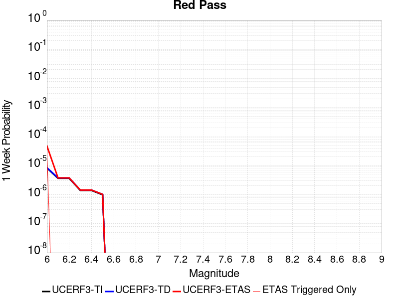 | 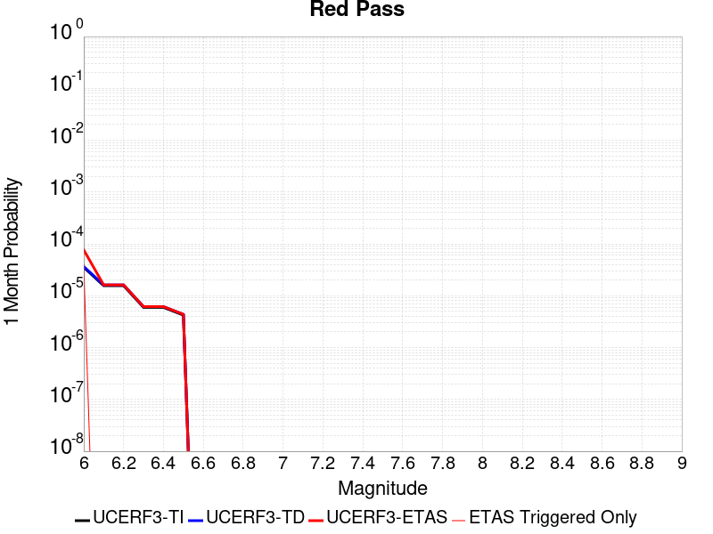 | 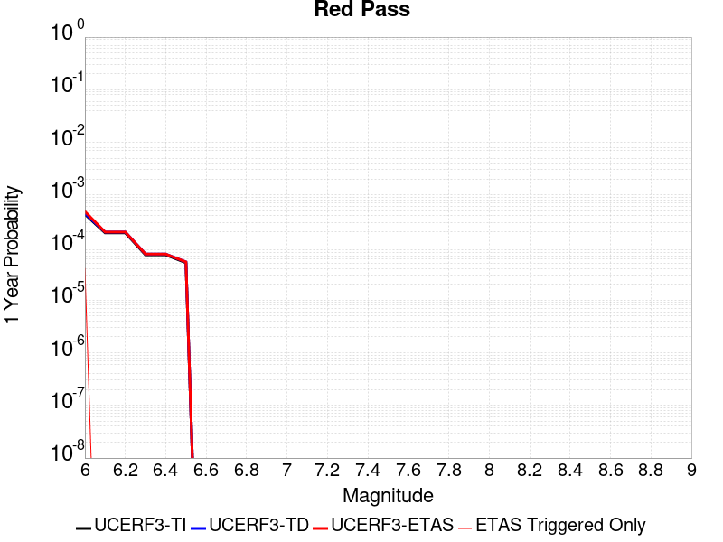 |

| Magnitude | 1 wk TI Prob | 1 wk TD Prob | 1 wk ETAS Prob | 1 wk ETAS/TD Gain | 1 wk ETAS Triggered Only | 1 mo TI Prob | 1 mo TD Prob | 1 mo ETAS Prob | 1 mo ETAS/TD Gain | 1 mo ETAS Triggered Only | 1 yr TI Prob | 1 yr TD Prob | 1 yr ETAS Prob | 1 yr ETAS/TD Gain | 1 yr ETAS Triggered Only |
|-----|-----|-----|-----|-----|-----|-----|-----|-----|-----|-----|-----|-----|-----|-----|-----|
| 6.0 | 8.258278E-6 | 8.552293E-6 | 4.8551952E-5 | 5.677068 | 4.0E-5 | 3.539214E-5 | 3.665227E-5 | 7.66508E-5 | 2.0912976 | 4.0E-5 | 4.308141E-4 | 4.461679E-4 | 4.8615006E-4 | 1.0896124 | 4.0E-5 |
| 6.1 | 3.649988E-6 | 3.7757554E-6 | 3.7757554E-6 | 1.0 | 0.0 | 1.5642712E-5 | 1.6181735E-5 | 1.6181735E-5 | 1.0 | 0.0 | 1.9043336E-4 | 1.9699958E-4 | 1.9699958E-4 | 1.0 | 0.0 |
| 6.2 | 3.649988E-6 | 3.7757554E-6 | 3.7757554E-6 | 1.0 | 0.0 | 1.5642712E-5 | 1.6181735E-5 | 1.6181735E-5 | 1.0 | 0.0 | 1.9043336E-4 | 1.9699958E-4 | 1.9699958E-4 | 1.0 | 0.0 |
| 6.3 | 1.3924937E-6 | 1.4412872E-6 | 1.4412872E-6 | 1.0 | 0.0 | 5.9678164E-6 | 6.1769383E-6 | 6.1769383E-6 | 1.0 | 0.0 | 7.265574E-5 | 7.520305E-5 | 7.520305E-5 | 1.0 | 0.0 |
| 6.4 | 1.3924937E-6 | 1.4412872E-6 | 1.4412872E-6 | 1.0 | 0.0 | 5.9678164E-6 | 6.1769383E-6 | 6.1769383E-6 | 1.0 | 0.0 | 7.265574E-5 | 7.520305E-5 | 7.520305E-5 | 1.0 | 0.0 |
| 6.5 | 9.876812E-7 | 1.0223123E-6 | 1.0223123E-6 | 1.0 | 0.0 | 4.2329125E-6 | 4.3813384E-6 | 4.3813384E-6 | 1.0 | 0.0 | 5.153449E-5 | 5.3342792E-5 | 5.3342792E-5 | 1.0 | 0.0 |

## Oceanside alt1
*[(top)](#table-of-contents)*

| 1 Week | 1 Month | 1 Year |
|-----|-----|-----|
| 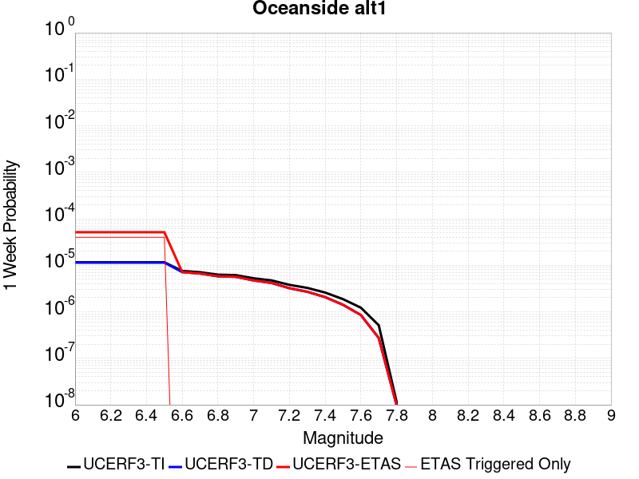 | 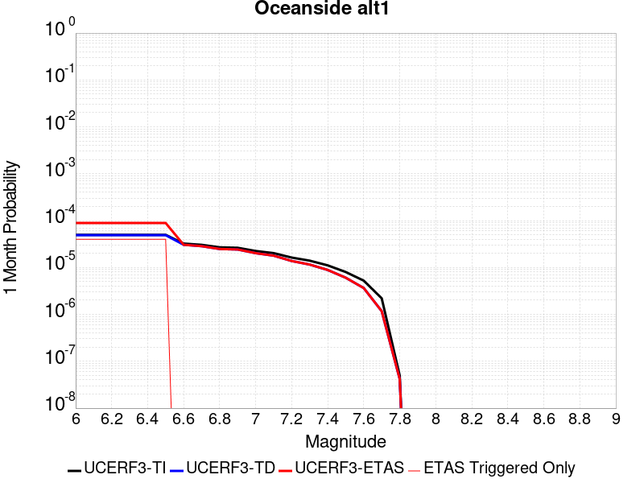 | 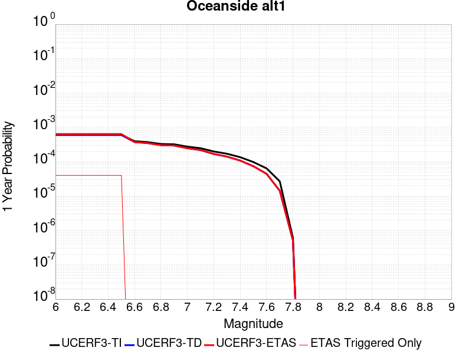 |

| Magnitude | 1 wk TI Prob | 1 wk TD Prob | 1 wk ETAS Prob | 1 wk ETAS/TD Gain | 1 wk ETAS Triggered Only | 1 mo TI Prob | 1 mo TD Prob | 1 mo ETAS Prob | 1 mo ETAS/TD Gain | 1 mo ETAS Triggered Only | 1 yr TI Prob | 1 yr TD Prob | 1 yr ETAS Prob | 1 yr ETAS/TD Gain | 1 yr ETAS Triggered Only |
|-----|-----|-----|-----|-----|-----|-----|-----|-----|-----|-----|-----|-----|-----|-----|-----|
| 6.0 | 1.1617542E-5 | 1.1425403E-5 | 5.1424944E-5 | 4.500931 | 4.0E-5 | 4.9788516E-5 | 4.8965183E-5 | 8.896322E-5 | 1.816867 | 4.0E-5 | 6.060066E-4 | 5.9600413E-4 | 6.3598034E-4 | 1.0670736 | 4.0E-5 |
| 6.1 | 1.1617542E-5 | 1.1425403E-5 | 5.1424944E-5 | 4.500931 | 4.0E-5 | 4.9788516E-5 | 4.8965183E-5 | 8.896322E-5 | 1.816867 | 4.0E-5 | 6.060066E-4 | 5.9600413E-4 | 6.3598034E-4 | 1.0670736 | 4.0E-5 |
| 6.2 | 1.1617542E-5 | 1.1425403E-5 | 5.1424944E-5 | 4.500931 | 4.0E-5 | 4.9788516E-5 | 4.8965183E-5 | 8.896322E-5 | 1.816867 | 4.0E-5 | 6.060066E-4 | 5.9600413E-4 | 6.3598034E-4 | 1.0670736 | 4.0E-5 |
| 6.3 | 1.1617542E-5 | 1.1425403E-5 | 5.1424944E-5 | 4.500931 | 4.0E-5 | 4.9788516E-5 | 4.8965183E-5 | 8.896322E-5 | 1.816867 | 4.0E-5 | 6.060066E-4 | 5.9600413E-4 | 6.3598034E-4 | 1.0670736 | 4.0E-5 |
| 6.4 | 1.1617542E-5 | 1.1425403E-5 | 5.1424944E-5 | 4.500931 | 4.0E-5 | 4.9788516E-5 | 4.8965183E-5 | 8.896322E-5 | 1.816867 | 4.0E-5 | 6.060066E-4 | 5.9600413E-4 | 6.3598034E-4 | 1.0670736 | 4.0E-5 |
| 6.5 | 1.1617542E-5 | 1.1425403E-5 | 5.1424944E-5 | 4.500931 | 4.0E-5 | 4.9788516E-5 | 4.8965183E-5 | 8.896322E-5 | 1.816867 | 4.0E-5 | 6.060066E-4 | 5.9600413E-4 | 6.3598034E-4 | 1.0670736 | 4.0E-5 |
| 6.6 | 7.561768E-6 | 7.1346853E-6 | 7.1346853E-6 | 1.0 | 0.0 | 3.2407173E-5 | 3.057687E-5 | 3.057687E-5 | 1.0 | 0.0 | 3.9448592E-4 | 3.722109E-4 | 3.722109E-4 | 1.0 | 0.0 |
| 6.7 | 7.1042605E-6 | 6.656683E-6 | 6.656683E-6 | 1.0 | 0.0 | 3.0446476E-5 | 2.8528335E-5 | 2.8528335E-5 | 1.0 | 0.0 | 3.706228E-4 | 3.4727794E-4 | 3.4727794E-4 | 1.0 | 0.0 |
| 6.8 | 6.285554E-6 | 5.800571E-6 | 5.800571E-6 | 1.0 | 0.0 | 2.693781E-5 | 2.4859357E-5 | 2.4859357E-5 | 1.0 | 0.0 | 3.2791847E-4 | 3.026212E-4 | 3.026212E-4 | 1.0 | 0.0 |
| 6.9 | 6.148883E-6 | 5.6573867E-6 | 5.6573867E-6 | 1.0 | 0.0 | 2.635209E-5 | 2.424572E-5 | 2.424572E-5 | 1.0 | 0.0 | 3.2078946E-4 | 2.9515222E-4 | 2.9515222E-4 | 1.0 | 0.0 |
| 7.0 | 5.253857E-6 | 4.7231065E-6 | 4.7231065E-6 | 1.0 | 0.0 | 2.2516335E-5 | 2.0241729E-5 | 2.0241729E-5 | 1.0 | 0.0 | 2.7410188E-4 | 2.4641547E-4 | 2.4641547E-4 | 1.0 | 0.0 |
| 7.1 | 4.730754E-6 | 4.1791272E-6 | 4.1791272E-6 | 1.0 | 0.0 | 2.0274503E-5 | 1.7910425E-5 | 1.7910425E-5 | 1.0 | 0.0 | 2.468141E-4 | 2.1803785E-4 | 2.1803785E-4 | 1.0 | 0.0 |
| 7.2 | 3.7998386E-6 | 3.2144935E-6 | 3.2144935E-6 | 1.0 | 0.0 | 1.6284921E-5 | 1.3776328E-5 | 1.3776328E-5 | 1.0 | 0.0 | 1.9825088E-4 | 1.6771401E-4 | 1.6771401E-4 | 1.0 | 0.0 |
| 7.3 | 3.2656465E-6 | 2.6987216E-6 | 2.6987216E-6 | 1.0 | 0.0 | 1.3995553E-5 | 1.15658995E-5 | 1.15658995E-5 | 1.0 | 0.0 | 1.7038253E-4 | 1.4080583E-4 | 1.4080583E-4 | 1.0 | 0.0 |
| 7.4 | 2.593703E-6 | 2.068265E-6 | 2.068265E-6 | 1.0 | 0.0 | 1.1115822E-5 | 8.863964E-6 | 8.863964E-6 | 1.0 | 0.0 | 1.3532673E-4 | 1.079135E-4 | 1.079135E-4 | 1.0 | 0.0 |
| 7.5 | 1.8715585E-6 | 1.4139124E-6 | 1.4139124E-6 | 1.0 | 0.0 | 8.020941E-6 | 6.059611E-6 | 6.059611E-6 | 1.0 | 0.0 | 9.7650576E-5 | 7.377333E-5 | 7.377333E-5 | 1.0 | 0.0 |
| 7.6 | 1.2246786E-6 | 8.528269E-7 | 8.528269E-7 | 1.0 | 0.0 | 5.248612E-6 | 3.6549675E-6 | 3.6549675E-6 | 1.0 | 0.0 | 6.389998E-5 | 4.4498367E-5 | 4.4498367E-5 | 1.0 | 0.0 |
| 7.7 | 5.140719E-7 | 2.735437E-7 | 2.735437E-7 | 1.0 | 0.0 | 2.2031636E-6 | 1.1723297E-6 | 1.1723297E-6 | 1.0 | 0.0 | 2.6823185E-5 | 1.4273033E-5 | 1.4273033E-5 | 1.0 | 0.0 |
| 7.8 | 1.16056995E-8 | 9.78305E-9 | 9.78305E-9 | 1.0 | 0.0 | 4.9738713E-8 | 4.1927358E-8 | 4.1927358E-8 | 1.0 | 0.0 | 6.0556863E-7 | 5.1046555E-7 | 5.1046555E-7 | 1.0 | 0.0 |

## Death Valley (So)
*[(top)](#table-of-contents)*

| 1 Week | 1 Month | 1 Year |
|-----|-----|-----|
|  |  | 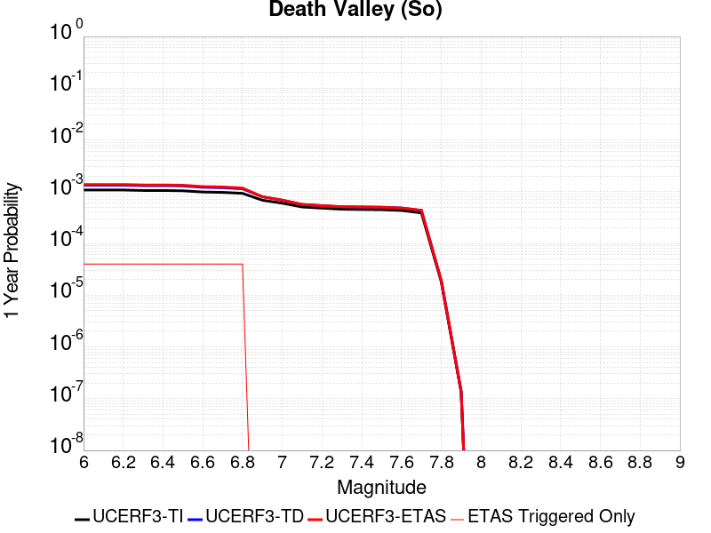 |

| Magnitude | 1 wk TI Prob | 1 wk TD Prob | 1 wk ETAS Prob | 1 wk ETAS/TD Gain | 1 wk ETAS Triggered Only | 1 mo TI Prob | 1 mo TD Prob | 1 mo ETAS Prob | 1 mo ETAS/TD Gain | 1 mo ETAS Triggered Only | 1 yr TI Prob | 1 yr TD Prob | 1 yr ETAS Prob | 1 yr ETAS/TD Gain | 1 yr ETAS Triggered Only |
|-----|-----|-----|-----|-----|-----|-----|-----|-----|-----|-----|-----|-----|-----|-----|-----|
| 6.0 | 2.0684236E-5 | 2.5651949E-5 | 2.5651949E-5 | 1.0 | 0.0 | 8.864371E-5 | 1.0993239E-4 | 1.0993239E-4 | 1.0 | 0.0 | 0.0010787029 | 0.0013376221 | 0.0013775686 | 1.0298638 | 4.0E-5 |
| 6.1 | 2.0684236E-5 | 2.5651949E-5 | 2.5651949E-5 | 1.0 | 0.0 | 8.864371E-5 | 1.0993239E-4 | 1.0993239E-4 | 1.0 | 0.0 | 0.0010787029 | 0.0013376221 | 0.0013775686 | 1.0298638 | 4.0E-5 |
| 6.2 | 2.0684236E-5 | 2.5651949E-5 | 2.5651949E-5 | 1.0 | 0.0 | 8.864371E-5 | 1.0993239E-4 | 1.0993239E-4 | 1.0 | 0.0 | 0.0010787029 | 0.0013376221 | 0.0013775686 | 1.0298638 | 4.0E-5 |
| 6.3 | 2.0240292E-5 | 2.515182E-5 | 2.515182E-5 | 1.0 | 0.0 | 8.6741224E-5 | 1.0778916E-4 | 1.0778916E-4 | 1.0 | 0.0 | 0.0010555626 | 0.0013115597 | 0.0013515073 | 1.0304581 | 4.0E-5 |
| 6.4 | 2.0240292E-5 | 2.515182E-5 | 2.515182E-5 | 1.0 | 0.0 | 8.6741224E-5 | 1.0778916E-4 | 1.0778916E-4 | 1.0 | 0.0 | 0.0010555626 | 0.0013115597 | 0.0013515073 | 1.0304581 | 4.0E-5 |
| 6.5 | 1.9962767E-5 | 2.4840947E-5 | 2.4840947E-5 | 1.0 | 0.0 | 8.55519E-5 | 1.0645695E-4 | 1.0645695E-4 | 1.0 | 0.0 | 0.0010410968 | 0.0012953595 | 0.0013353077 | 1.0308394 | 4.0E-5 |
| 6.6 | 1.8937297E-5 | 2.3337238E-5 | 2.3337238E-5 | 1.0 | 0.0 | 8.115732E-5 | 1.00012985E-4 | 1.00012985E-4 | 1.0 | 0.0 | 9.876423E-4 | 0.0012169925 | 0.0012569438 | 1.0328279 | 4.0E-5 |
| 6.7 | 1.8621096E-5 | 2.293739E-5 | 2.293739E-5 | 1.0 | 0.0 | 7.980225E-5 | 9.8299475E-5 | 9.8299475E-5 | 1.0 | 0.0 | 9.711593E-4 | 0.0011961536 | 0.0012361058 | 1.0334005 | 4.0E-5 |
| 6.8 | 1.7830353E-5 | 2.1828011E-5 | 2.1828011E-5 | 1.0 | 0.0 | 7.641356E-5 | 9.354534E-5 | 9.354534E-5 | 1.0 | 0.0 | 9.29938E-4 | 0.0011383336 | 0.001178288 | 1.035099 | 4.0E-5 |
| 6.9 | 1.3135183E-5 | 1.5312111E-5 | 1.5312111E-5 | 1.0 | 0.0 | 5.6292425E-5 | 6.5621716E-5 | 6.5621716E-5 | 1.0 | 0.0 | 6.8514474E-4 | 7.98658E-4 | 7.98658E-4 | 1.0 | 0.0 |
| 7.0 | 1.1507512E-5 | 1.3160505E-5 | 1.3160505E-5 | 1.0 | 0.0 | 4.9316975E-5 | 5.6400975E-5 | 5.6400975E-5 | 1.0 | 0.0 | 6.002687E-4 | 6.8647135E-4 | 6.8647135E-4 | 1.0 | 0.0 |
| 7.1 | 9.715903E-6 | 1.0869782E-5 | 1.0869782E-5 | 1.0 | 0.0 | 4.1638916E-5 | 4.6583973E-5 | 4.6583973E-5 | 1.0 | 0.0 | 5.068359E-4 | 5.6701654E-4 | 5.6701654E-4 | 1.0 | 0.0 |
| 7.2 | 9.233269E-6 | 1.02904705E-5 | 1.02904705E-5 | 1.0 | 0.0 | 3.9570554E-5 | 4.4101293E-5 | 4.4101293E-5 | 1.0 | 0.0 | 4.81665E-4 | 5.368052E-4 | 5.368052E-4 | 1.0 | 0.0 |
| 7.3 | 8.8041315E-6 | 9.811974E-6 | 9.811974E-6 | 1.0 | 0.0 | 3.7731446E-5 | 4.2050666E-5 | 4.2050666E-5 | 1.0 | 0.0 | 4.592835E-4 | 5.118508E-4 | 5.118508E-4 | 1.0 | 0.0 |
| 7.4 | 8.708749E-6 | 9.710965E-6 | 9.710965E-6 | 1.0 | 0.0 | 3.7322676E-5 | 4.1617783E-5 | 4.1617783E-5 | 1.0 | 0.0 | 4.5430884E-4 | 5.065829E-4 | 5.065829E-4 | 1.0 | 0.0 |
| 7.5 | 8.612678E-6 | 9.608584E-6 | 9.608584E-6 | 1.0 | 0.0 | 3.6910955E-5 | 4.117902E-5 | 4.117902E-5 | 1.0 | 0.0 | 4.492982E-4 | 5.0124346E-4 | 5.0124346E-4 | 1.0 | 0.0 |
| 7.6 | 8.319024E-6 | 9.287581E-6 | 9.287581E-6 | 1.0 | 0.0 | 3.5652476E-5 | 3.9803333E-5 | 3.9803333E-5 | 1.0 | 0.0 | 4.3398244E-4 | 4.8450203E-4 | 4.8450203E-4 | 1.0 | 0.0 |
| 7.7 | 7.4718328E-6 | 8.348488E-6 | 8.348488E-6 | 1.0 | 0.0 | 3.2021748E-5 | 3.577877E-5 | 3.577877E-5 | 1.0 | 0.0 | 3.8979502E-4 | 4.3552349E-4 | 4.3552349E-4 | 1.0 | 0.0 |
| 7.8 | 3.4586725E-7 | 3.6489428E-7 | 3.6489428E-7 | 1.0 | 0.0 | 1.4822873E-6 | 1.5638317E-6 | 1.5638317E-6 | 1.0 | 0.0 | 1.80467E-5 | 1.903949E-5 | 1.903949E-5 | 1.0 | 0.0 |
| 7.9 | 2.5591178E-9 | 2.6700626E-9 | 2.6700626E-9 | 1.0 | 0.0 | 1.0967647E-8 | 1.1443126E-8 | 1.1443126E-8 | 1.0 | 0.0 | 1.335311E-7 | 1.3932005E-7 | 1.3932005E-7 | 1.0 | 0.0 |

## Camp Rock 2011
*[(top)](#table-of-contents)*

| 1 Week | 1 Month | 1 Year |
|-----|-----|-----|
| 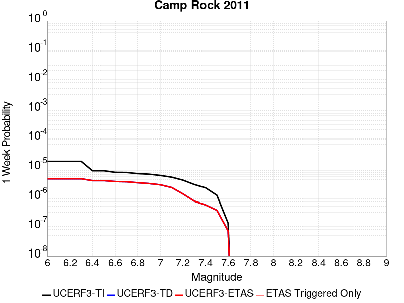 | 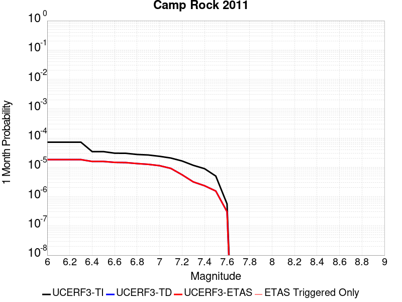 | 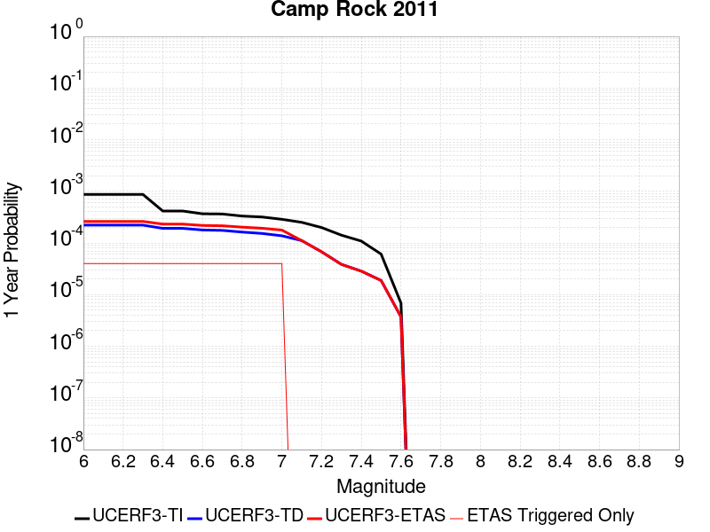 |

| Magnitude | 1 wk TI Prob | 1 wk TD Prob | 1 wk ETAS Prob | 1 wk ETAS/TD Gain | 1 wk ETAS Triggered Only | 1 mo TI Prob | 1 mo TD Prob | 1 mo ETAS Prob | 1 mo ETAS/TD Gain | 1 mo ETAS Triggered Only | 1 yr TI Prob | 1 yr TD Prob | 1 yr ETAS Prob | 1 yr ETAS/TD Gain | 1 yr ETAS Triggered Only |
|-----|-----|-----|-----|-----|-----|-----|-----|-----|-----|-----|-----|-----|-----|-----|-----|
| 6.0 | 1.6710783E-5 | 4.2516945E-6 | 4.2516945E-6 | 1.0 | 0.0 | 7.161568E-5 | 1.8221424E-5 | 1.8221424E-5 | 1.0 | 0.0 | 8.7157206E-4 | 2.2182378E-4 | 2.618149E-4 | 1.1802833 | 4.0E-5 |
| 6.1 | 1.6710783E-5 | 4.2516945E-6 | 4.2516945E-6 | 1.0 | 0.0 | 7.161568E-5 | 1.8221424E-5 | 1.8221424E-5 | 1.0 | 0.0 | 8.7157206E-4 | 2.2182378E-4 | 2.618149E-4 | 1.1802833 | 4.0E-5 |
| 6.2 | 1.6710783E-5 | 4.2516945E-6 | 4.2516945E-6 | 1.0 | 0.0 | 7.161568E-5 | 1.8221424E-5 | 1.8221424E-5 | 1.0 | 0.0 | 8.7157206E-4 | 2.2182378E-4 | 2.618149E-4 | 1.1802833 | 4.0E-5 |
| 6.3 | 1.6710783E-5 | 4.2516945E-6 | 4.2516945E-6 | 1.0 | 0.0 | 7.161568E-5 | 1.8221424E-5 | 1.8221424E-5 | 1.0 | 0.0 | 8.7157206E-4 | 2.2182378E-4 | 2.618149E-4 | 1.1802833 | 4.0E-5 |
| 6.4 | 7.982846E-6 | 3.6831455E-6 | 3.6831455E-6 | 1.0 | 0.0 | 3.421175E-5 | 1.5784815E-5 | 1.5784815E-5 | 1.0 | 0.0 | 4.1644843E-4 | 1.9216353E-4 | 2.3215584E-4 | 1.208116 | 4.0E-5 |
| 6.5 | 7.982846E-6 | 3.6831455E-6 | 3.6831455E-6 | 1.0 | 0.0 | 3.421175E-5 | 1.5784815E-5 | 1.5784815E-5 | 1.0 | 0.0 | 4.1644843E-4 | 1.9216353E-4 | 2.3215584E-4 | 1.208116 | 4.0E-5 |
| 6.6 | 7.048869E-6 | 3.4253683E-6 | 3.4253683E-6 | 1.0 | 0.0 | 3.0209088E-5 | 1.4680069E-5 | 1.4680069E-5 | 1.0 | 0.0 | 3.677336E-4 | 1.787155E-4 | 2.1870834E-4 | 1.2237794 | 4.0E-5 |
| 6.7 | 6.987307E-6 | 3.3633335E-6 | 3.3633335E-6 | 1.0 | 0.0 | 2.9945259E-5 | 1.4414209E-5 | 1.4414209E-5 | 1.0 | 0.0 | 3.6452254E-4 | 1.7547917E-4 | 2.1547216E-4 | 1.2279073 | 4.0E-5 |
| 6.8 | 6.3737602E-6 | 3.1189006E-6 | 3.1189006E-6 | 1.0 | 0.0 | 2.731583E-5 | 1.336665E-5 | 1.336665E-5 | 1.0 | 0.0 | 3.3251947E-4 | 1.627271E-4 | 2.0272059E-4 | 1.2457703 | 4.0E-5 |
| 6.9 | 6.112211E-6 | 2.9340822E-6 | 2.9340822E-6 | 1.0 | 0.0 | 2.6194928E-5 | 1.2574579E-5 | 1.2574579E-5 | 1.0 | 0.0 | 3.1887658E-4 | 1.5308503E-4 | 1.930789E-4 | 1.2612528 | 4.0E-5 |
| 7.0 | 5.5140117E-6 | 2.6428827E-6 | 2.6428827E-6 | 1.0 | 0.0 | 2.3631264E-5 | 1.1326592E-5 | 1.1326592E-5 | 1.0 | 0.0 | 2.8767265E-4 | 1.3789278E-4 | 1.7788727E-4 | 1.2900405 | 4.0E-5 |
| 7.1 | 4.8151105E-6 | 2.135099E-6 | 2.135099E-6 | 1.0 | 0.0 | 2.0636026E-5 | 9.150393E-6 | 9.150393E-6 | 1.0 | 0.0 | 2.5121463E-4 | 1.1140057E-4 | 1.1140057E-4 | 1.0 | 0.0 |
| 7.2 | 3.818335E-6 | 1.2943889E-6 | 1.2943889E-6 | 1.0 | 0.0 | 1.6364189E-5 | 5.5473697E-6 | 5.5473697E-6 | 1.0 | 0.0 | 1.9921579E-4 | 6.7537214E-5 | 6.7537214E-5 | 1.0 | 0.0 |
| 7.3 | 2.7166698E-6 | 7.388603E-7 | 7.388603E-7 | 1.0 | 0.0 | 1.1642818E-5 | 3.1665404E-6 | 3.1665404E-6 | 1.0 | 0.0 | 1.4174209E-4 | 3.855197E-5 | 3.855197E-5 | 1.0 | 0.0 |
| 7.4 | 2.0893426E-6 | 5.4660313E-7 | 5.4660313E-7 | 1.0 | 0.0 | 8.954295E-6 | 2.3425828E-6 | 2.3425828E-6 | 1.0 | 0.0 | 1.0901308E-4 | 2.8520579E-5 | 2.8520579E-5 | 1.0 | 0.0 |
| 7.5 | 1.1681728E-6 | 3.605487E-7 | 3.605487E-7 | 1.0 | 0.0 | 5.0064455E-6 | 1.5452079E-6 | 1.5452079E-6 | 1.0 | 0.0 | 6.0951766E-5 | 1.8812749E-5 | 1.8812749E-5 | 1.0 | 0.0 |
| 7.6 | 1.3154387E-7 | 7.121983E-8 | 7.121983E-8 | 1.0 | 0.0 | 5.6375933E-7 | 3.0522784E-7 | 3.0522784E-7 | 1.0 | 0.0 | 6.863748E-6 | 3.7161442E-6 | 3.7161442E-6 | 1.0 | 0.0 |

## Sheephole
*[(top)](#table-of-contents)*

| 1 Week | 1 Month | 1 Year |
|-----|-----|-----|
| 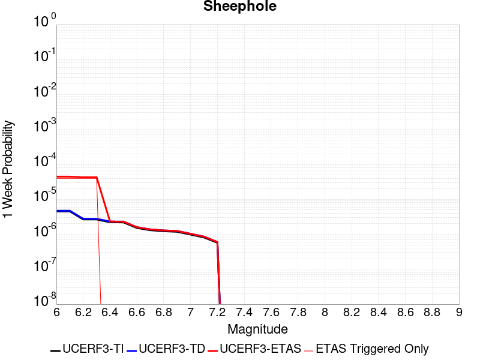 | 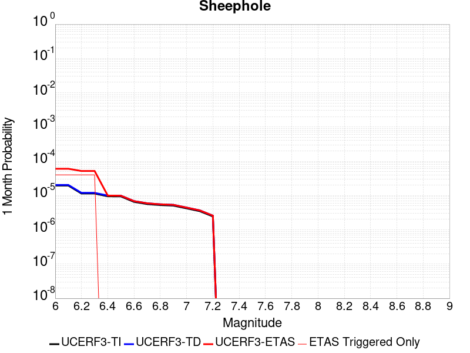 |  |

| Magnitude | 1 wk TI Prob | 1 wk TD Prob | 1 wk ETAS Prob | 1 wk ETAS/TD Gain | 1 wk ETAS Triggered Only | 1 mo TI Prob | 1 mo TD Prob | 1 mo ETAS Prob | 1 mo ETAS/TD Gain | 1 mo ETAS Triggered Only | 1 yr TI Prob | 1 yr TD Prob | 1 yr ETAS Prob | 1 yr ETAS/TD Gain | 1 yr ETAS Triggered Only |
|-----|-----|-----|-----|-----|-----|-----|-----|-----|-----|-----|-----|-----|-----|-----|-----|
| 6.0 | 4.5579695E-6 | 4.74191E-6 | 4.474172E-5 | 9.43538 | 4.0E-5 | 1.9534009E-5 | 2.0322344E-5 | 6.032153E-5 | 2.968237 | 4.0E-5 | 2.3780059E-4 | 2.47402E-4 | 2.873921E-4 | 1.1616402 | 4.0E-5 |
| 6.1 | 4.5579695E-6 | 4.74191E-6 | 4.474172E-5 | 9.43538 | 4.0E-5 | 1.9534009E-5 | 2.0322344E-5 | 6.032153E-5 | 2.968237 | 4.0E-5 | 2.3780059E-4 | 2.47402E-4 | 2.873921E-4 | 1.1616402 | 4.0E-5 |
| 6.2 | 2.6677674E-6 | 2.7878186E-6 | 4.2787706E-5 | 15.348096 | 4.0E-5 | 1.1433239E-5 | 1.1947745E-5 | 5.1947267E-5 | 4.347872 | 4.0E-5 | 1.3919079E-4 | 1.4545517E-4 | 1.8544935E-4 | 1.2749588 | 4.0E-5 |
| 6.3 | 2.6677674E-6 | 2.7878186E-6 | 4.2787706E-5 | 15.348096 | 4.0E-5 | 1.1433239E-5 | 1.1947745E-5 | 5.1947267E-5 | 4.347872 | 4.0E-5 | 1.3919079E-4 | 1.4545517E-4 | 1.8544935E-4 | 1.2749588 | 4.0E-5 |
| 6.4 | 2.2159759E-6 | 2.3232587E-6 | 2.3232587E-6 | 1.0 | 0.0 | 9.497005E-6 | 9.95679E-6 | 9.95679E-6 | 1.0 | 0.0 | 1.156199E-4 | 1.2121798E-4 | 1.2121798E-4 | 1.0 | 0.0 |
| 6.5 | 2.1986082E-6 | 2.3051364E-6 | 2.3051364E-6 | 1.0 | 0.0 | 9.4225725E-6 | 9.879123E-6 | 9.879123E-6 | 1.0 | 0.0 | 1.1471378E-4 | 1.20272496E-4 | 1.20272496E-4 | 1.0 | 0.0 |
| 6.6 | 1.5232331E-6 | 1.6021722E-6 | 1.6021722E-6 | 1.0 | 0.0 | 6.5281256E-6 | 6.8664353E-6 | 6.8664353E-6 | 1.0 | 0.0 | 7.947703E-5 | 8.3595834E-5 | 8.3595834E-5 | 1.0 | 0.0 |
| 6.7 | 1.3137362E-6 | 1.3830655E-6 | 1.3830655E-6 | 1.0 | 0.0 | 5.6302856E-6 | 5.9274107E-6 | 5.9274107E-6 | 1.0 | 0.0 | 6.854657E-5 | 7.216398E-5 | 7.216398E-5 | 1.0 | 0.0 |
| 6.8 | 1.2275751E-6 | 1.2925155E-6 | 1.2925155E-6 | 1.0 | 0.0 | 5.2610258E-6 | 5.539341E-6 | 5.539341E-6 | 1.0 | 0.0 | 6.4051106E-5 | 6.743953E-5 | 6.743953E-5 | 1.0 | 0.0 |
| 6.9 | 1.1837088E-6 | 1.2463246E-6 | 1.2463246E-6 | 1.0 | 0.0 | 5.0730278E-6 | 5.341381E-6 | 5.341381E-6 | 1.0 | 0.0 | 6.176237E-5 | 6.5029504E-5 | 6.5029504E-5 | 1.0 | 0.0 |
| 7.0 | 9.849371E-7 | 1.0368132E-6 | 1.0368132E-6 | 1.0 | 0.0 | 4.2211523E-6 | 4.4434782E-6 | 4.4434782E-6 | 1.0 | 0.0 | 5.1391315E-5 | 5.4098105E-5 | 5.4098105E-5 | 1.0 | 0.0 |
| 7.1 | 8.1643645E-7 | 8.593193E-7 | 8.593193E-7 | 1.0 | 0.0 | 3.4990085E-6 | 3.6827923E-6 | 3.6827923E-6 | 1.0 | 0.0 | 4.2599597E-5 | 4.483716E-5 | 4.483716E-5 | 1.0 | 0.0 |
| 7.2 | 5.7295756E-7 | 6.030572E-7 | 6.030572E-7 | 1.0 | 0.0 | 2.45553E-6 | 2.5845286E-6 | 2.5845286E-6 | 1.0 | 0.0 | 2.9895667E-5 | 3.146625E-5 | 3.146625E-5 | 1.0 | 0.0 |

## Earthquake Valley (So Extension)
*[(top)](#table-of-contents)*

| 1 Week | 1 Month | 1 Year |
|-----|-----|-----|
| 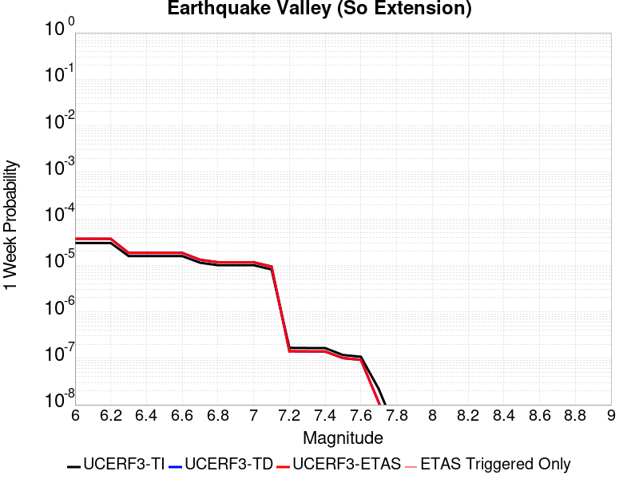 | 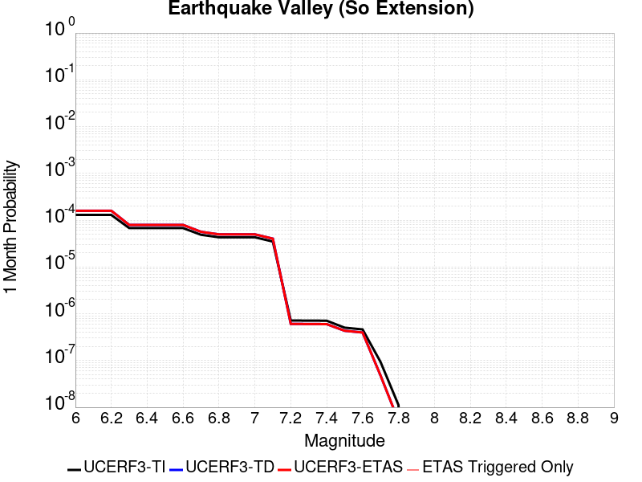 | 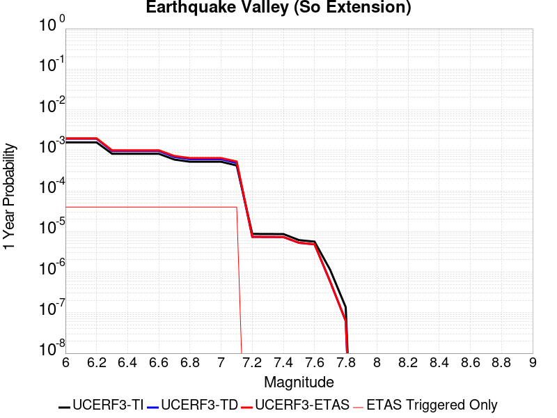 |

| Magnitude | 1 wk TI Prob | 1 wk TD Prob | 1 wk ETAS Prob | 1 wk ETAS/TD Gain | 1 wk ETAS Triggered Only | 1 mo TI Prob | 1 mo TD Prob | 1 mo ETAS Prob | 1 mo ETAS/TD Gain | 1 mo ETAS Triggered Only | 1 yr TI Prob | 1 yr TD Prob | 1 yr ETAS Prob | 1 yr ETAS/TD Gain | 1 yr ETAS Triggered Only |
|-----|-----|-----|-----|-----|-----|-----|-----|-----|-----|-----|-----|-----|-----|-----|-----|
| 6.0 | 3.0194888E-5 | 3.710108E-5 | 3.710108E-5 | 1.0 | 0.0 | 1.2940024E-4 | 1.5899699E-4 | 1.5899699E-4 | 1.0 | 0.0 | 0.0015743093 | 0.0019345878 | 0.0019745105 | 1.0206362 | 4.0E-5 |
| 6.1 | 3.0194888E-5 | 3.710108E-5 | 3.710108E-5 | 1.0 | 0.0 | 1.2940024E-4 | 1.5899699E-4 | 1.5899699E-4 | 1.0 | 0.0 | 0.0015743093 | 0.0019345878 | 0.0019745105 | 1.0206362 | 4.0E-5 |
| 6.2 | 3.0194888E-5 | 3.710108E-5 | 3.710108E-5 | 1.0 | 0.0 | 1.2940024E-4 | 1.5899699E-4 | 1.5899699E-4 | 1.0 | 0.0 | 0.0015743093 | 0.0019345878 | 0.0019745105 | 1.0206362 | 4.0E-5 |
| 6.3 | 1.5795305E-5 | 1.845737E-5 | 1.845737E-5 | 1.0 | 0.0 | 6.769241E-5 | 7.910124E-5 | 7.910124E-5 | 1.0 | 0.0 | 8.238434E-4 | 9.627432E-4 | 0.0010027047 | 1.041508 | 4.0E-5 |
| 6.4 | 1.5795305E-5 | 1.845737E-5 | 1.845737E-5 | 1.0 | 0.0 | 6.769241E-5 | 7.910124E-5 | 7.910124E-5 | 1.0 | 0.0 | 8.238434E-4 | 9.627432E-4 | 0.0010027047 | 1.041508 | 4.0E-5 |
| 6.5 | 1.5795305E-5 | 1.845737E-5 | 1.845737E-5 | 1.0 | 0.0 | 6.769241E-5 | 7.910124E-5 | 7.910124E-5 | 1.0 | 0.0 | 8.238434E-4 | 9.627432E-4 | 0.0010027047 | 1.041508 | 4.0E-5 |
| 6.6 | 1.5795305E-5 | 1.845737E-5 | 1.845737E-5 | 1.0 | 0.0 | 6.769241E-5 | 7.910124E-5 | 7.910124E-5 | 1.0 | 0.0 | 8.238434E-4 | 9.627432E-4 | 0.0010027047 | 1.041508 | 4.0E-5 |
| 6.7 | 1.1363076E-5 | 1.31454935E-5 | 1.31454935E-5 | 1.0 | 0.0 | 4.8697988E-5 | 5.633704E-5 | 5.633704E-5 | 1.0 | 0.0 | 5.927367E-4 | 6.8576384E-4 | 7.2573643E-4 | 1.0582892 | 4.0E-5 |
| 6.8 | 1.0049611E-5 | 1.1600614E-5 | 1.1600614E-5 | 1.0 | 0.0 | 4.306905E-5 | 4.9716386E-5 | 4.9716386E-5 | 1.0 | 0.0 | 5.242395E-4 | 6.052021E-4 | 6.451779E-4 | 1.0660536 | 4.0E-5 |
| 6.9 | 1.0049611E-5 | 1.1600614E-5 | 1.1600614E-5 | 1.0 | 0.0 | 4.306905E-5 | 4.9716386E-5 | 4.9716386E-5 | 1.0 | 0.0 | 5.242395E-4 | 6.052021E-4 | 6.451779E-4 | 1.0660536 | 4.0E-5 |
| 7.0 | 1.0049611E-5 | 1.1600614E-5 | 1.1600614E-5 | 1.0 | 0.0 | 4.306905E-5 | 4.9716386E-5 | 4.9716386E-5 | 1.0 | 0.0 | 5.242395E-4 | 6.052021E-4 | 6.451779E-4 | 1.0660536 | 4.0E-5 |
| 7.1 | 8.140254E-6 | 9.388555E-6 | 9.388555E-6 | 1.0 | 0.0 | 3.4886336E-5 | 4.023642E-5 | 4.023642E-5 | 1.0 | 0.0 | 4.2465836E-4 | 4.8983545E-4 | 5.2981585E-4 | 1.0816201 | 4.0E-5 |
| 7.2 | 1.673835E-7 | 1.4165126E-7 | 1.4165126E-7 | 1.0 | 0.0 | 7.173577E-7 | 6.070767E-7 | 6.070767E-7 | 1.0 | 0.0 | 8.733795E-6 | 7.3911374E-6 | 7.3911374E-6 | 1.0 | 0.0 |
| 7.3 | 1.6632116E-7 | 1.4063316E-7 | 1.4063316E-7 | 1.0 | 0.0 | 7.1280476E-7 | 6.0271344E-7 | 6.0271344E-7 | 1.0 | 0.0 | 8.678364E-6 | 7.338015E-6 | 7.338015E-6 | 1.0 | 0.0 |
| 7.4 | 1.6569169E-7 | 1.400792E-7 | 1.400792E-7 | 1.0 | 0.0 | 7.1010703E-7 | 6.0033926E-7 | 6.0033926E-7 | 1.0 | 0.0 | 8.645519E-6 | 7.3091096E-6 | 7.3091096E-6 | 1.0 | 0.0 |
| 7.5 | 1.1764555E-7 | 1.0104535E-7 | 1.0104535E-7 | 1.0 | 0.0 | 5.041951E-7 | 4.3305144E-7 | 4.3305144E-7 | 1.0 | 0.0 | 6.138558E-6 | 5.272391E-6 | 5.272391E-6 | 1.0 | 0.0 |
| 7.6 | 1.07927605E-7 | 9.268867E-8 | 9.268867E-8 | 1.0 | 0.0 | 4.6254678E-7 | 3.9723713E-7 | 3.9723713E-7 | 1.0 | 0.0 | 5.6314925E-6 | 4.8363536E-6 | 4.8363536E-6 | 1.0 | 0.0 |
| 7.7 | 2.1826905E-8 | 1.1193839E-8 | 1.1193839E-8 | 1.0 | 0.0 | 9.3543875E-8 | 4.7973597E-8 | 4.7973597E-8 | 1.0 | 0.0 | 1.1388961E-6 | 5.840784E-7 | 5.840784E-7 | 1.0 | 0.0 |
| 7.8 | 2.6169649E-9 | 1.1983311E-9 | 1.1983311E-9 | 1.0 | 0.0 | 1.1215564E-8 | 5.1357043E-9 | 5.1357043E-9 | 1.0 | 0.0 | 1.3654947E-7 | 6.25272E-8 | 6.25272E-8 | 1.0 | 0.0 |

## Ozena
*[(top)](#table-of-contents)*

| 1 Week | 1 Month | 1 Year |
|-----|-----|-----|
| 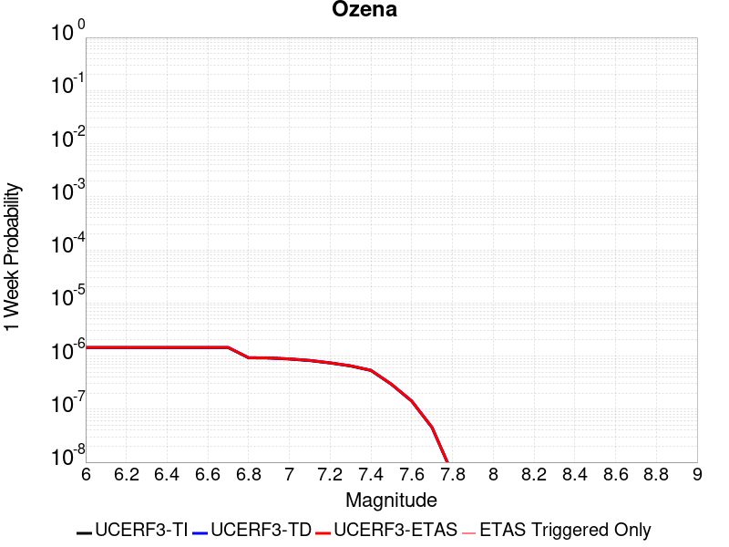 | 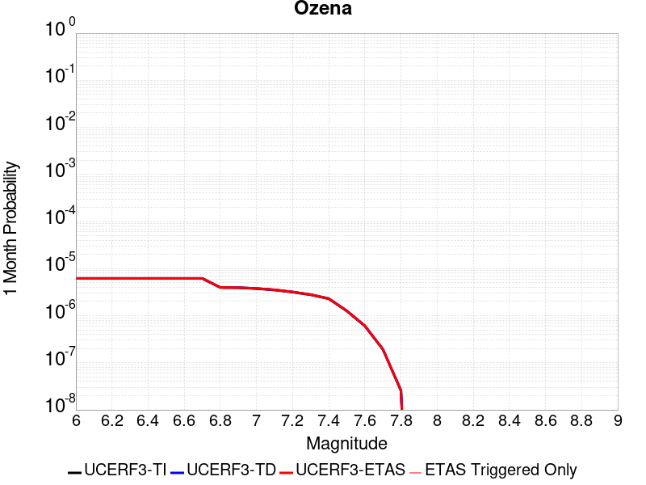 | 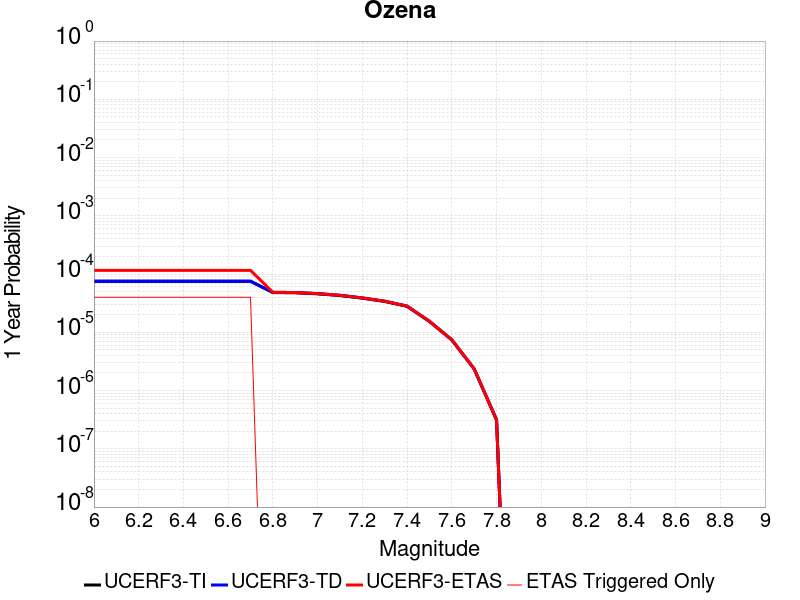 |

| Magnitude | 1 wk TI Prob | 1 wk TD Prob | 1 wk ETAS Prob | 1 wk ETAS/TD Gain | 1 wk ETAS Triggered Only | 1 mo TI Prob | 1 mo TD Prob | 1 mo ETAS Prob | 1 mo ETAS/TD Gain | 1 mo ETAS Triggered Only | 1 yr TI Prob | 1 yr TD Prob | 1 yr ETAS Prob | 1 yr ETAS/TD Gain | 1 yr ETAS Triggered Only |
|-----|-----|-----|-----|-----|-----|-----|-----|-----|-----|-----|-----|-----|-----|-----|-----|
| 6.0 | 1.4377547E-6 | 1.451425E-6 | 1.451425E-6 | 1.0 | 0.0 | 6.161791E-6 | 6.2203794E-6 | 6.2203794E-6 | 1.0 | 0.0 | 7.5017226E-5 | 7.573076E-5 | 1.1572773E-4 | 1.528147 | 4.0E-5 |
| 6.1 | 1.4377547E-6 | 1.451425E-6 | 1.451425E-6 | 1.0 | 0.0 | 6.161791E-6 | 6.2203794E-6 | 6.2203794E-6 | 1.0 | 0.0 | 7.5017226E-5 | 7.573076E-5 | 1.1572773E-4 | 1.528147 | 4.0E-5 |
| 6.2 | 1.4377547E-6 | 1.451425E-6 | 1.451425E-6 | 1.0 | 0.0 | 6.161791E-6 | 6.2203794E-6 | 6.2203794E-6 | 1.0 | 0.0 | 7.5017226E-5 | 7.573076E-5 | 1.1572773E-4 | 1.528147 | 4.0E-5 |
| 6.3 | 1.4377547E-6 | 1.451425E-6 | 1.451425E-6 | 1.0 | 0.0 | 6.161791E-6 | 6.2203794E-6 | 6.2203794E-6 | 1.0 | 0.0 | 7.5017226E-5 | 7.573076E-5 | 1.1572773E-4 | 1.528147 | 4.0E-5 |
| 6.4 | 1.4377547E-6 | 1.451425E-6 | 1.451425E-6 | 1.0 | 0.0 | 6.161791E-6 | 6.2203794E-6 | 6.2203794E-6 | 1.0 | 0.0 | 7.5017226E-5 | 7.573076E-5 | 1.1572773E-4 | 1.528147 | 4.0E-5 |
| 6.5 | 1.4377547E-6 | 1.451425E-6 | 1.451425E-6 | 1.0 | 0.0 | 6.161791E-6 | 6.2203794E-6 | 6.2203794E-6 | 1.0 | 0.0 | 7.5017226E-5 | 7.573076E-5 | 1.1572773E-4 | 1.528147 | 4.0E-5 |
| 6.6 | 1.4377547E-6 | 1.451425E-6 | 1.451425E-6 | 1.0 | 0.0 | 6.161791E-6 | 6.2203794E-6 | 6.2203794E-6 | 1.0 | 0.0 | 7.5017226E-5 | 7.573076E-5 | 1.1572773E-4 | 1.528147 | 4.0E-5 |
| 6.7 | 1.4377547E-6 | 1.451425E-6 | 1.451425E-6 | 1.0 | 0.0 | 6.161791E-6 | 6.2203794E-6 | 6.2203794E-6 | 1.0 | 0.0 | 7.5017226E-5 | 7.573076E-5 | 1.1572773E-4 | 1.528147 | 4.0E-5 |
| 6.8 | 9.223257E-7 | 9.3179466E-7 | 9.3179466E-7 | 1.0 | 0.0 | 3.9528186E-6 | 3.9934E-6 | 3.9934E-6 | 1.0 | 0.0 | 4.81245E-5 | 4.86186E-5 | 4.86186E-5 | 1.0 | 0.0 |
| 6.9 | 9.141515E-7 | 9.2356925E-7 | 9.2356925E-7 | 1.0 | 0.0 | 3.917786E-6 | 3.958148E-6 | 3.958148E-6 | 1.0 | 0.0 | 4.7698002E-5 | 4.8189428E-5 | 4.8189428E-5 | 1.0 | 0.0 |
| 7.0 | 8.767648E-7 | 8.858889E-7 | 8.858889E-7 | 1.0 | 0.0 | 3.757558E-6 | 3.7966613E-6 | 3.7966613E-6 | 1.0 | 0.0 | 4.5747307E-5 | 4.622341E-5 | 4.622341E-5 | 1.0 | 0.0 |
| 7.1 | 8.199402E-7 | 8.2856934E-7 | 8.2856934E-7 | 1.0 | 0.0 | 3.5140247E-6 | 3.5510068E-6 | 3.5510068E-6 | 1.0 | 0.0 | 4.2782412E-5 | 4.323269E-5 | 4.323269E-5 | 1.0 | 0.0 |
| 7.2 | 7.38705E-7 | 7.464527E-7 | 7.464527E-7 | 1.0 | 0.0 | 3.1658747E-6 | 3.1990792E-6 | 3.1990792E-6 | 1.0 | 0.0 | 3.8543843E-5 | 3.894813E-5 | 3.894813E-5 | 1.0 | 0.0 |
| 7.3 | 6.490017E-7 | 6.558034E-7 | 6.558034E-7 | 1.0 | 0.0 | 2.7814328E-6 | 2.8105833E-6 | 2.8105833E-6 | 1.0 | 0.0 | 3.386342E-5 | 3.421835E-5 | 3.421835E-5 | 1.0 | 0.0 |
| 7.4 | 5.346736E-7 | 5.402451E-7 | 5.402451E-7 | 1.0 | 0.0 | 2.291456E-6 | 2.3153343E-6 | 2.3153343E-6 | 1.0 | 0.0 | 2.789812E-5 | 2.818886E-5 | 2.818886E-5 | 1.0 | 0.0 |
| 7.5 | 2.939325E-7 | 2.9666992E-7 | 2.9666992E-7 | 1.0 | 0.0 | 1.25971E-6 | 1.271442E-6 | 1.271442E-6 | 1.0 | 0.0 | 1.5336862E-5 | 1.5479713E-5 | 1.5479713E-5 | 1.0 | 0.0 |
| 7.6 | 1.4151905E-7 | 1.4253611E-7 | 1.4253611E-7 | 1.0 | 0.0 | 6.065101E-7 | 6.108689E-7 | 6.108689E-7 | 1.0 | 0.0 | 7.3842357E-6 | 7.4373042E-6 | 7.4373042E-6 | 1.0 | 0.0 |
| 7.7 | 4.4957577E-8 | 4.525325E-8 | 4.525325E-8 | 1.0 | 0.0 | 1.9267533E-7 | 1.9394248E-7 | 1.9394248E-7 | 1.0 | 0.0 | 2.3458194E-6 | 2.3612472E-6 | 2.3612472E-6 | 1.0 | 0.0 |
| 7.8 | 5.9993255E-9 | 6.0414402E-9 | 6.0414402E-9 | 1.0 | 0.0 | 2.5711394E-8 | 2.5891888E-8 | 2.5891888E-8 | 1.0 | 0.0 | 3.1303617E-7 | 3.152337E-7 | 3.152337E-7 | 1.0 | 0.0 |

## Verdugo
*[(top)](#table-of-contents)*

| 1 Week | 1 Month | 1 Year |
|-----|-----|-----|
| 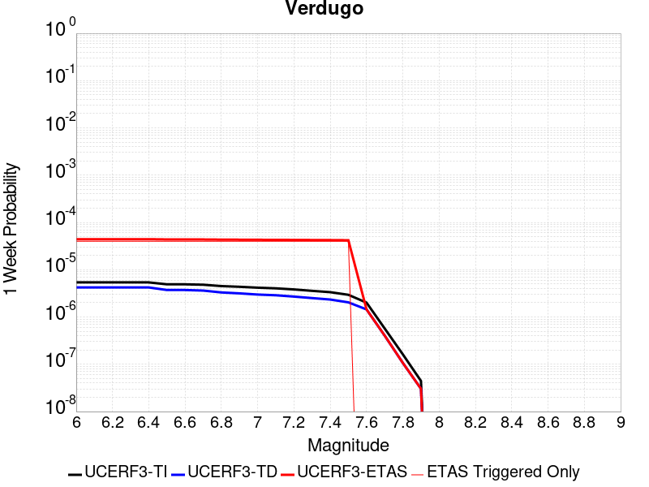 | 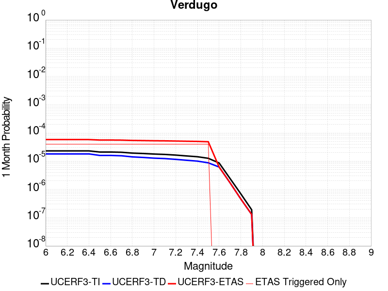 | 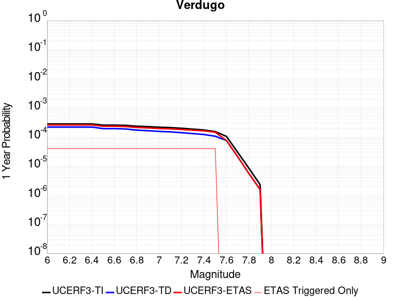 |

| Magnitude | 1 wk TI Prob | 1 wk TD Prob | 1 wk ETAS Prob | 1 wk ETAS/TD Gain | 1 wk ETAS Triggered Only | 1 mo TI Prob | 1 mo TD Prob | 1 mo ETAS Prob | 1 mo ETAS/TD Gain | 1 mo ETAS Triggered Only | 1 yr TI Prob | 1 yr TD Prob | 1 yr ETAS Prob | 1 yr ETAS/TD Gain | 1 yr ETAS Triggered Only |
|-----|-----|-----|-----|-----|-----|-----|-----|-----|-----|-----|-----|-----|-----|-----|-----|
| 6.0 | 5.392987E-6 | 4.2179777E-6 | 4.421781E-5 | 10.483177 | 4.0E-5 | 2.3112598E-5 | 1.8076926E-5 | 5.8076203E-5 | 3.2127256 | 4.0E-5 | 2.8135953E-4 | 2.200648E-4 | 2.60056E-4 | 1.1817247 | 4.0E-5 |
| 6.1 | 5.392987E-6 | 4.2179777E-6 | 4.421781E-5 | 10.483177 | 4.0E-5 | 2.3112598E-5 | 1.8076926E-5 | 5.8076203E-5 | 3.2127256 | 4.0E-5 | 2.8135953E-4 | 2.200648E-4 | 2.60056E-4 | 1.1817247 | 4.0E-5 |
| 6.2 | 5.392987E-6 | 4.2179777E-6 | 4.421781E-5 | 10.483177 | 4.0E-5 | 2.3112598E-5 | 1.8076926E-5 | 5.8076203E-5 | 3.2127256 | 4.0E-5 | 2.8135953E-4 | 2.200648E-4 | 2.60056E-4 | 1.1817247 | 4.0E-5 |
| 6.3 | 5.392987E-6 | 4.2179777E-6 | 4.421781E-5 | 10.483177 | 4.0E-5 | 2.3112598E-5 | 1.8076926E-5 | 5.8076203E-5 | 3.2127256 | 4.0E-5 | 2.8135953E-4 | 2.200648E-4 | 2.60056E-4 | 1.1817247 | 4.0E-5 |
| 6.4 | 5.392987E-6 | 4.2179777E-6 | 4.421781E-5 | 10.483177 | 4.0E-5 | 2.3112598E-5 | 1.8076926E-5 | 5.8076203E-5 | 3.2127256 | 4.0E-5 | 2.8135953E-4 | 2.200648E-4 | 2.60056E-4 | 1.1817247 | 4.0E-5 |
| 6.5 | 4.9154837E-6 | 3.7238676E-6 | 4.3723718E-5 | 11.741481 | 4.0E-5 | 2.1066187E-5 | 1.5959336E-5 | 5.59587E-5 | 3.50633 | 4.0E-5 | 2.5645064E-4 | 1.942878E-4 | 2.3428003E-4 | 1.2058401 | 4.0E-5 |
| 6.6 | 4.9154837E-6 | 3.7238676E-6 | 4.3723718E-5 | 11.741481 | 4.0E-5 | 2.1066187E-5 | 1.5959336E-5 | 5.59587E-5 | 3.50633 | 4.0E-5 | 2.5645064E-4 | 1.942878E-4 | 2.3428003E-4 | 1.2058401 | 4.0E-5 |
| 6.7 | 4.817006E-6 | 3.6220426E-6 | 4.3621898E-5 | 12.043452 | 4.0E-5 | 2.0644147E-5 | 1.5522948E-5 | 5.5522327E-5 | 3.57679 | 4.0E-5 | 2.513135E-4 | 1.889757E-4 | 2.2896814E-4 | 1.2116275 | 4.0E-5 |
| 6.8 | 4.507407E-6 | 3.3084393E-6 | 4.3308308E-5 | 13.090253 | 4.0E-5 | 1.9317316E-5 | 1.417895E-5 | 5.417838E-5 | 3.8210435 | 4.0E-5 | 2.3516294E-4 | 1.7261518E-4 | 2.1260827E-4 | 1.2316893 | 4.0E-5 |
| 6.9 | 4.3573054E-6 | 3.1623208E-6 | 4.3162196E-5 | 13.648898 | 4.0E-5 | 1.8674033E-5 | 1.3552733E-5 | 5.355219E-5 | 3.951394 | 4.0E-5 | 2.2733262E-4 | 1.6499216E-4 | 2.0498555E-4 | 1.2423958 | 4.0E-5 |
| 7.0 | 4.171527E-6 | 2.9849484E-6 | 4.298483E-5 | 14.400527 | 4.0E-5 | 1.787785E-5 | 1.2792574E-5 | 5.2792064E-5 | 4.126774 | 4.0E-5 | 2.1764109E-4 | 1.5573857E-4 | 1.9573234E-4 | 1.2568007 | 4.0E-5 |
| 7.1 | 4.0405484E-6 | 2.8835157E-6 | 4.28834E-5 | 14.871916 | 4.0E-5 | 1.731652E-5 | 1.2357866E-5 | 5.2357373E-5 | 4.236765 | 4.0E-5 | 2.1080824E-4 | 1.5044674E-4 | 1.9044073E-4 | 1.2658348 | 4.0E-5 |
| 7.2 | 3.8306007E-6 | 2.7030542E-6 | 4.2702944E-5 | 15.798036 | 4.0E-5 | 1.6416758E-5 | 1.1584467E-5 | 5.1584004E-5 | 4.4528594 | 4.0E-5 | 1.9985568E-4 | 1.4103187E-4 | 1.8102622E-4 | 1.2835839 | 4.0E-5 |
| 7.3 | 3.5750938E-6 | 2.513339E-6 | 4.251324E-5 | 16.915045 | 4.0E-5 | 1.532174E-5 | 1.0771409E-5 | 5.0770977E-5 | 4.713495 | 4.0E-5 | 1.8652623E-4 | 1.3113412E-4 | 1.7112886E-4 | 1.3049912 | 4.0E-5 |
| 7.4 | 3.3510041E-6 | 2.3419805E-6 | 4.2341886E-5 | 18.079521 | 4.0E-5 | 1.4361368E-5 | 1.0037022E-5 | 5.003662E-5 | 4.985206 | 4.0E-5 | 1.7483562E-4 | 1.2219399E-4 | 1.621891E-4 | 1.3273083 | 4.0E-5 |
| 7.5 | 2.948287E-6 | 2.040021E-6 | 4.203994E-5 | 20.607601 | 4.0E-5 | 1.2635454E-5 | 8.742919E-6 | 4.8742568E-5 | 5.5750914 | 4.0E-5 | 1.538258E-4 | 1.0643993E-4 | 1.4643568E-4 | 1.3757588 | 4.0E-5 |
| 7.6 | 2.0134323E-6 | 1.447629E-6 | 1.447629E-6 | 1.0 | 0.0 | 8.628967E-6 | 6.20411E-6 | 6.20411E-6 | 1.0 | 0.0 | 1.05052604E-4 | 7.553251E-5 | 7.553251E-5 | 1.0 | 0.0 |
| 7.7 | 5.726436E-7 | 4.0469303E-7 | 4.0469303E-7 | 1.0 | 0.0 | 2.4541846E-6 | 1.7343976E-6 | 1.7343976E-6 | 1.0 | 0.0 | 2.9879287E-5 | 2.1116113E-5 | 2.1116113E-5 | 1.0 | 0.0 |
| 7.8 | 1.6248204E-7 | 1.0699026E-7 | 1.0699026E-7 | 1.0 | 0.0 | 6.963514E-7 | 4.585296E-7 | 4.585296E-7 | 1.0 | 0.0 | 8.478045E-6 | 5.582584E-6 | 5.582584E-6 | 1.0 | 0.0 |
| 7.9 | 4.4475744E-8 | 3.0383458E-8 | 3.0383458E-8 | 1.0 | 0.0 | 1.9061031E-7 | 1.3021481E-7 | 1.3021481E-7 | 1.0 | 0.0 | 2.320678E-6 | 1.5853643E-6 | 1.5853643E-6 | 1.0 | 0.0 |

## Elsinore (Coyote Mountains)
*[(top)](#table-of-contents)*

| 1 Week | 1 Month | 1 Year |
|-----|-----|-----|
| 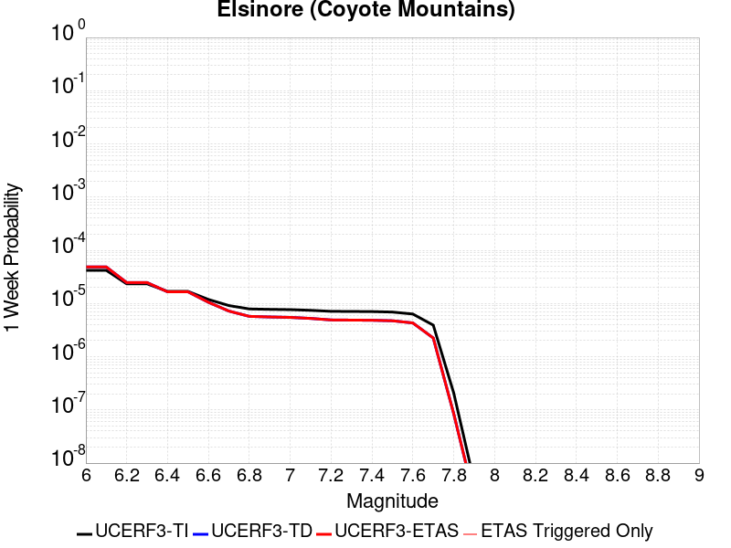 | 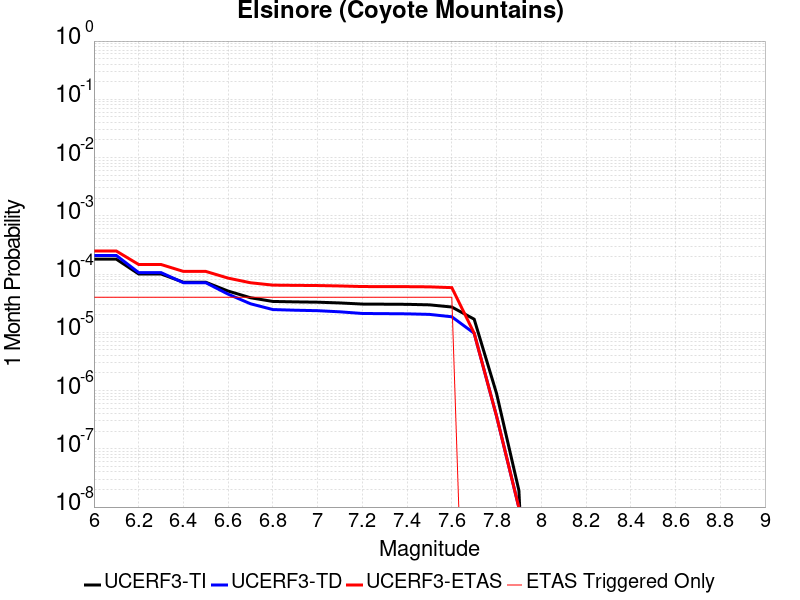 | 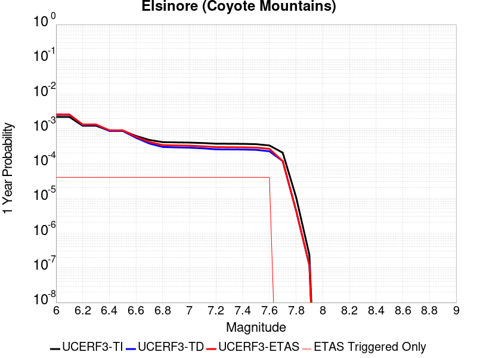 |

| Magnitude | 1 wk TI Prob | 1 wk TD Prob | 1 wk ETAS Prob | 1 wk ETAS/TD Gain | 1 wk ETAS Triggered Only | 1 mo TI Prob | 1 mo TD Prob | 1 mo ETAS Prob | 1 mo ETAS/TD Gain | 1 mo ETAS Triggered Only | 1 yr TI Prob | 1 yr TD Prob | 1 yr ETAS Prob | 1 yr ETAS/TD Gain | 1 yr ETAS Triggered Only |
|-----|-----|-----|-----|-----|-----|-----|-----|-----|-----|-----|-----|-----|-----|-----|-----|
| 6.0 | 4.20513E-5 | 4.8674003E-5 | 4.8674003E-5 | 1.0 | 0.0 | 1.8020741E-4 | 2.0858928E-4 | 2.4858094E-4 | 1.1917244 | 4.0E-5 | 0.0021918174 | 0.0025371274 | 0.002577026 | 1.0157259 | 4.0E-5 |
| 6.1 | 4.20513E-5 | 4.8674003E-5 | 4.8674003E-5 | 1.0 | 0.0 | 1.8020741E-4 | 2.0858928E-4 | 2.4858094E-4 | 1.1917244 | 4.0E-5 | 0.0021918174 | 0.0025371274 | 0.002577026 | 1.0157259 | 4.0E-5 |
| 6.2 | 2.3413893E-5 | 2.4715584E-5 | 2.4715584E-5 | 1.0 | 0.0 | 1.0034139E-4 | 1.0592001E-4 | 1.4591576E-4 | 1.3776035 | 4.0E-5 | 0.0012209718 | 0.0012889015 | 0.00132885 | 1.0309942 | 4.0E-5 |
| 6.3 | 2.3413893E-5 | 2.4715584E-5 | 2.4715584E-5 | 1.0 | 0.0 | 1.0034139E-4 | 1.0592001E-4 | 1.4591576E-4 | 1.3776035 | 4.0E-5 | 0.0012209718 | 0.0012889015 | 0.00132885 | 1.0309942 | 4.0E-5 |
| 6.4 | 1.6894814E-5 | 1.6581593E-5 | 1.6581593E-5 | 1.0 | 0.0 | 7.240433E-5 | 7.1062255E-5 | 1.1105941E-4 | 1.5628468 | 4.0E-5 | 8.811662E-4 | 8.648771E-4 | 9.048425E-4 | 1.0462093 | 4.0E-5 |
| 6.5 | 1.6894814E-5 | 1.6581593E-5 | 1.6581593E-5 | 1.0 | 0.0 | 7.240433E-5 | 7.1062255E-5 | 1.1105941E-4 | 1.5628468 | 4.0E-5 | 8.811662E-4 | 8.648771E-4 | 9.048425E-4 | 1.0462093 | 4.0E-5 |
| 6.6 | 1.1910969E-5 | 1.05396075E-5 | 1.05396075E-5 | 1.0 | 0.0 | 5.1046012E-5 | 4.516904E-5 | 8.516723E-5 | 1.8855224 | 4.0E-5 | 6.21308E-4 | 5.4980756E-4 | 5.897856E-4 | 1.0727128 | 4.0E-5 |
| 6.7 | 9.1486E-6 | 7.2094103E-6 | 7.2094103E-6 | 1.0 | 0.0 | 3.9207694E-5 | 3.089713E-5 | 7.089589E-5 | 2.2945788 | 4.0E-5 | 4.7724912E-4 | 3.7611142E-4 | 4.160964E-4 | 1.1063114 | 4.0E-5 |
| 6.8 | 7.90441E-6 | 5.7346547E-6 | 5.7346547E-6 | 1.0 | 0.0 | 3.3875604E-5 | 2.4576866E-5 | 6.4575885E-5 | 2.6275067 | 4.0E-5 | 4.1235742E-4 | 2.9918354E-4 | 3.391716E-4 | 1.1336572 | 4.0E-5 |
| 6.9 | 7.77015E-6 | 5.5885653E-6 | 5.5885653E-6 | 1.0 | 0.0 | 3.3300217E-5 | 2.395078E-5 | 6.3949825E-5 | 2.6700516 | 4.0E-5 | 4.0535472E-4 | 2.9156302E-4 | 3.3155136E-4 | 1.1371516 | 4.0E-5 |
| 7.0 | 7.675798E-6 | 5.4853913E-6 | 5.4853913E-6 | 1.0 | 0.0 | 3.289586E-5 | 2.3508615E-5 | 6.350767E-5 | 2.701464 | 4.0E-5 | 4.004335E-4 | 2.8618105E-4 | 3.2616963E-4 | 1.1397316 | 4.0E-5 |
| 7.1 | 7.447814E-6 | 5.2442124E-6 | 5.2442124E-6 | 1.0 | 0.0 | 3.191881E-5 | 2.247501E-5 | 6.247411E-5 | 2.7797146 | 4.0E-5 | 3.8854225E-4 | 2.7360013E-4 | 3.135892E-4 | 1.1461588 | 4.0E-5 |
| 7.2 | 7.128185E-6 | 4.9108385E-6 | 4.9108385E-6 | 1.0 | 0.0 | 3.0549007E-5 | 2.1046288E-5 | 6.1045444E-5 | 2.9005327 | 4.0E-5 | 3.7187067E-4 | 2.562096E-4 | 2.9619937E-4 | 1.1560822 | 4.0E-5 |
| 7.3 | 7.0913875E-6 | 4.879504E-6 | 4.879504E-6 | 1.0 | 0.0 | 3.0391306E-5 | 2.0911999E-5 | 6.0911163E-5 | 2.9127374 | 4.0E-5 | 3.6995133E-4 | 2.5457505E-4 | 2.9456484E-4 | 1.1570846 | 4.0E-5 |
| 7.4 | 7.051521E-6 | 4.8433476E-6 | 4.8433476E-6 | 1.0 | 0.0 | 3.0220453E-5 | 2.0757045E-5 | 6.0756214E-5 | 2.9270165 | 4.0E-5 | 3.6787192E-4 | 2.5268891E-4 | 2.926788E-4 | 1.1582574 | 4.0E-5 |
| 7.5 | 6.910666E-6 | 4.7387675E-6 | 4.7387675E-6 | 1.0 | 0.0 | 2.9616802E-5 | 2.0308851E-5 | 6.030804E-5 | 2.9695446 | 4.0E-5 | 3.605249E-4 | 2.472334E-4 | 2.8722352E-4 | 1.1617504 | 4.0E-5 |
| 7.6 | 6.341753E-6 | 4.3115992E-6 | 4.3115992E-6 | 1.0 | 0.0 | 2.7178658E-5 | 1.8478158E-5 | 5.847742E-5 | 3.1646779 | 4.0E-5 | 3.3084993E-4 | 2.2494953E-4 | 2.6494052E-4 | 1.1777776 | 4.0E-5 |
| 7.7 | 3.9205916E-6 | 2.2466259E-6 | 2.2466259E-6 | 1.0 | 0.0 | 1.6802427E-5 | 9.628365E-6 | 9.628365E-6 | 1.0 | 0.0 | 2.0455034E-4 | 1.1721978E-4 | 1.1721978E-4 | 1.0 | 0.0 |
| 7.8 | 2.0846227E-7 | 8.497208E-8 | 8.497208E-8 | 1.0 | 0.0 | 8.9340944E-7 | 3.6416603E-7 | 3.6416603E-7 | 1.0 | 0.0 | 1.0877206E-5 | 4.4337157E-6 | 4.4337157E-6 | 1.0 | 0.0 |
| 7.9 | 4.4969806E-9 | 2.2712179E-9 | 2.2712179E-9 | 1.0 | 0.0 | 1.9272775E-8 | 9.733791E-9 | 9.733791E-9 | 1.0 | 0.0 | 2.3464601E-7 | 1.1850889E-7 | 1.1850889E-7 | 1.0 | 0.0 |

## Point Reyes 2011 CFM
*[(top)](#table-of-contents)*

| 1 Week | 1 Month | 1 Year |
|-----|-----|-----|
| 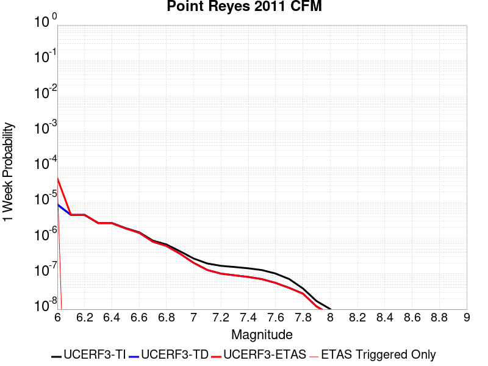 | 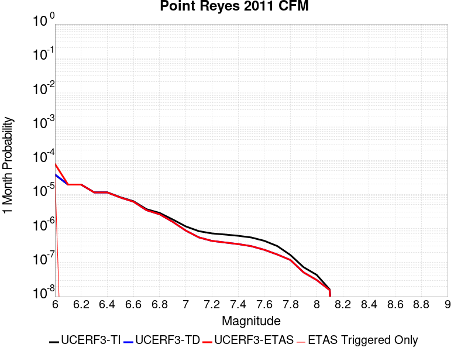 | 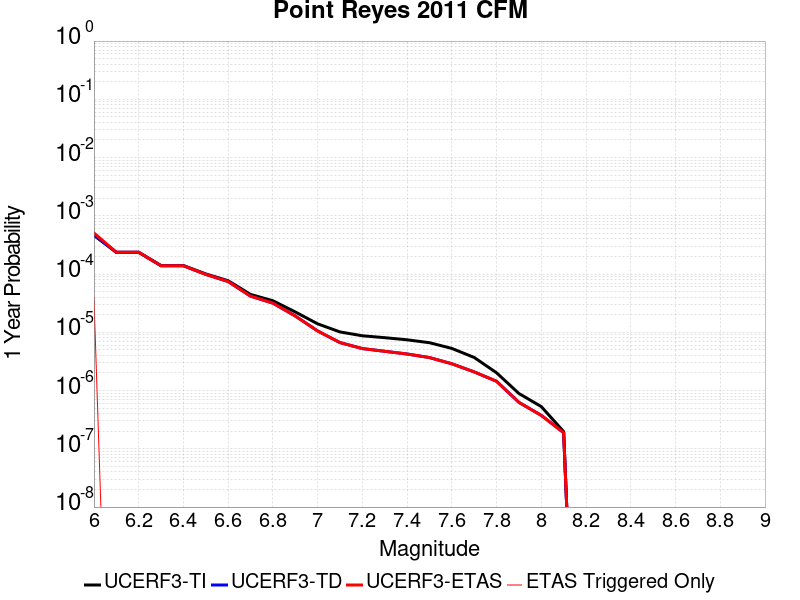 |

| Magnitude | 1 wk TI Prob | 1 wk TD Prob | 1 wk ETAS Prob | 1 wk ETAS/TD Gain | 1 wk ETAS Triggered Only | 1 mo TI Prob | 1 mo TD Prob | 1 mo ETAS Prob | 1 mo ETAS/TD Gain | 1 mo ETAS Triggered Only | 1 yr TI Prob | 1 yr TD Prob | 1 yr ETAS Prob | 1 yr ETAS/TD Gain | 1 yr ETAS Triggered Only |
|-----|-----|-----|-----|-----|-----|-----|-----|-----|-----|-----|-----|-----|-----|-----|-----|
| 6.0 | 8.8644965E-6 | 8.968144E-6 | 4.8967784E-5 | 5.4601917 | 4.0E-5 | 3.7990147E-5 | 3.8434373E-5 | 7.843284E-5 | 2.0406952 | 4.0E-5 | 4.624319E-4 | 4.6784428E-4 | 5.078256E-4 | 1.0854585 | 4.0E-5 |
| 6.1 | 4.526405E-6 | 4.5398883E-6 | 4.5398883E-6 | 1.0 | 0.0 | 1.9398734E-5 | 1.9456524E-5 | 1.9456524E-5 | 1.0 | 0.0 | 2.36154E-4 | 2.3685848E-4 | 2.3685848E-4 | 1.0 | 0.0 |
| 6.2 | 4.526405E-6 | 4.5398883E-6 | 4.5398883E-6 | 1.0 | 0.0 | 1.9398734E-5 | 1.9456524E-5 | 1.9456524E-5 | 1.0 | 0.0 | 2.36154E-4 | 2.3685848E-4 | 2.3685848E-4 | 1.0 | 0.0 |
| 6.3 | 2.6842322E-6 | 2.66122E-6 | 2.66122E-6 | 1.0 | 0.0 | 1.1503801E-5 | 1.140518E-5 | 1.140518E-5 | 1.0 | 0.0 | 1.4004979E-4 | 1.3884941E-4 | 1.3884941E-4 | 1.0 | 0.0 |
| 6.4 | 2.6842322E-6 | 2.66122E-6 | 2.66122E-6 | 1.0 | 0.0 | 1.1503801E-5 | 1.140518E-5 | 1.140518E-5 | 1.0 | 0.0 | 1.4004979E-4 | 1.3884941E-4 | 1.3884941E-4 | 1.0 | 0.0 |
| 6.5 | 1.9281833E-6 | 1.8911219E-6 | 1.8911219E-6 | 1.0 | 0.0 | 8.263617E-6 | 8.104783E-6 | 8.104783E-6 | 1.0 | 0.0 | 1.0060489E-4 | 9.867135E-5 | 9.867135E-5 | 1.0 | 0.0 |
| 6.6 | 1.4726726E-6 | 1.4274251E-6 | 1.4274251E-6 | 1.0 | 0.0 | 6.3114385E-6 | 6.117522E-6 | 6.117522E-6 | 1.0 | 0.0 | 7.683905E-5 | 7.447833E-5 | 7.447833E-5 | 1.0 | 0.0 |
| 6.7 | 8.572307E-7 | 8.011514E-7 | 8.011514E-7 | 1.0 | 0.0 | 3.6738406E-6 | 3.4335014E-6 | 3.4335014E-6 | 1.0 | 0.0 | 4.472809E-5 | 4.1802097E-5 | 4.1802097E-5 | 1.0 | 0.0 |
| 6.8 | 6.6745434E-7 | 6.081491E-7 | 6.081491E-7 | 1.0 | 0.0 | 2.8605155E-6 | 2.6063506E-6 | 2.6063506E-6 | 1.0 | 0.0 | 3.482622E-5 | 3.1731866E-5 | 3.1731866E-5 | 1.0 | 0.0 |
| 6.9 | 4.291521E-7 | 3.6576446E-7 | 3.6576446E-7 | 1.0 | 0.0 | 1.839222E-6 | 1.5675611E-6 | 1.5675611E-6 | 1.0 | 0.0 | 2.2392298E-5 | 1.9084891E-5 | 1.9084891E-5 | 1.0 | 0.0 |
| 7.0 | 2.6812808E-7 | 2.0226949E-7 | 2.0226949E-7 | 1.0 | 0.0 | 1.1491198E-6 | 8.66869E-7 | 8.66869E-7 | 1.0 | 0.0 | 1.3990444E-5 | 1.0554079E-5 | 1.0554079E-5 | 1.0 | 0.0 |
| 7.1 | 1.9451231E-7 | 1.276457E-7 | 1.276457E-7 | 1.0 | 0.0 | 8.336239E-7 | 5.4705293E-7 | 5.4705293E-7 | 1.0 | 0.0 | 1.0149324E-5 | 6.660349E-6 | 6.660349E-6 | 1.0 | 0.0 |
| 7.2 | 1.6715143E-7 | 1.0081343E-7 | 1.0081343E-7 | 1.0 | 0.0 | 7.1636305E-7 | 4.3205753E-7 | 4.3205753E-7 | 1.0 | 0.0 | 8.721685E-6 | 5.2602873E-6 | 5.2602873E-6 | 1.0 | 0.0 |
| 7.3 | 1.5503173E-7 | 9.0510405E-8 | 9.0510405E-8 | 1.0 | 0.0 | 6.644215E-7 | 3.879017E-7 | 3.879017E-7 | 1.0 | 0.0 | 8.089301E-6 | 4.7226927E-6 | 4.7226927E-6 | 1.0 | 0.0 |
| 7.4 | 1.4251614E-7 | 8.134549E-8 | 8.134549E-8 | 1.0 | 0.0 | 6.1078333E-7 | 3.4862353E-7 | 3.4862353E-7 | 1.0 | 0.0 | 7.4362615E-6 | 4.244483E-6 | 4.244483E-6 | 1.0 | 0.0 |
| 7.5 | 1.2710186E-7 | 7.065119E-8 | 7.065119E-8 | 1.0 | 0.0 | 5.447221E-7 | 3.0279082E-7 | 3.0279082E-7 | 1.0 | 0.0 | 6.6319717E-6 | 3.6864717E-6 | 3.6864717E-6 | 1.0 | 0.0 |
| 7.6 | 1.0144708E-7 | 5.5273304E-8 | 5.5273304E-8 | 1.0 | 0.0 | 4.347731E-7 | 2.3688558E-7 | 2.3688558E-7 | 1.0 | 0.0 | 5.2933497E-6 | 2.8840782E-6 | 2.8840782E-6 | 1.0 | 0.0 |
| 7.7 | 7.090527E-8 | 4.009197E-8 | 4.009197E-8 | 1.0 | 0.0 | 3.038797E-7 | 1.7182273E-7 | 1.7182273E-7 | 1.0 | 0.0 | 3.699729E-6 | 2.0919397E-6 | 2.0919397E-6 | 1.0 | 0.0 |
| 7.8 | 3.8712045E-8 | 2.7668996E-8 | 2.7668996E-8 | 1.0 | 0.0 | 1.6590876E-7 | 1.1858142E-7 | 1.1858142E-7 | 1.0 | 0.0 | 2.0199373E-6 | 1.4437278E-6 | 1.4437278E-6 | 1.0 | 0.0 |
| 7.9 | 1.7068782E-8 | 1.2021132E-8 | 1.2021132E-8 | 1.0 | 0.0 | 7.315192E-8 | 5.1519148E-8 | 5.1519148E-8 | 1.0 | 0.0 | 8.906242E-7 | 6.272454E-7 | 6.272454E-7 | 1.0 | 0.0 |
| 8.0 | 1.0172592E-8 | 7.18589E-9 | 7.18589E-9 | 1.0 | 0.0 | 4.359682E-8 | 3.0796677E-8 | 3.0796677E-8 | 1.0 | 0.0 | 5.3079117E-7 | 3.7494945E-7 | 3.7494945E-7 | 1.0 | 0.0 |
| 8.1 | 3.7861243E-9 | 3.621634E-9 | 3.621634E-9 | 1.0 | 0.0 | 1.6226247E-8 | 1.5521287E-8 | 1.5521287E-8 | 1.0 | 0.0 | 1.9755454E-7 | 1.8897165E-7 | 1.8897165E-7 | 1.0 | 0.0 |

## Likely 2011 CFM
*[(top)](#table-of-contents)*

| 1 Week | 1 Month | 1 Year |
|-----|-----|-----|
| 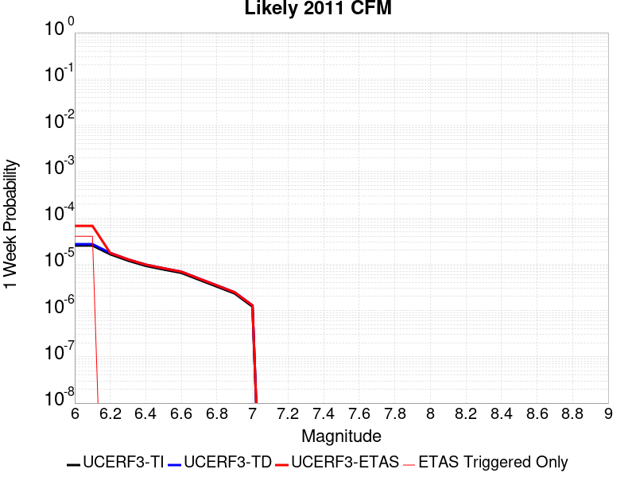 | 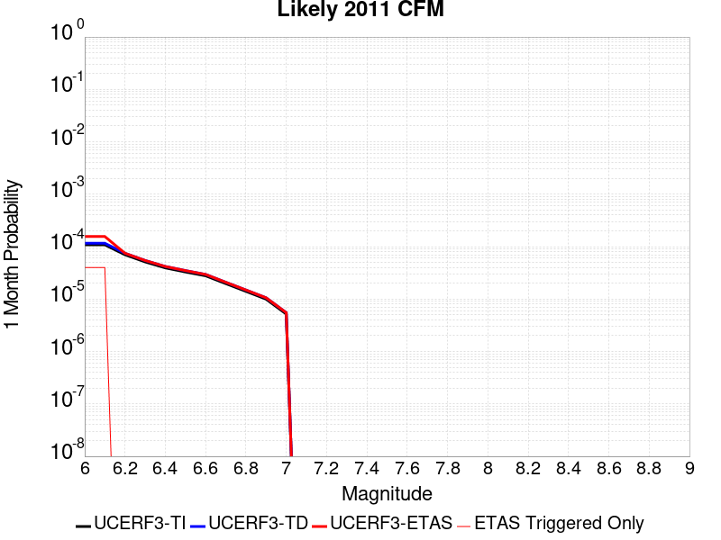 | 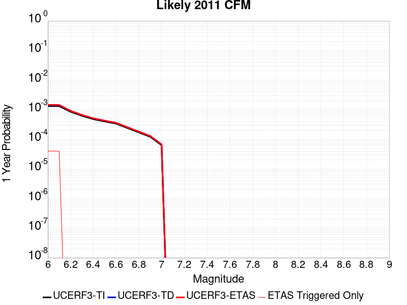 |

| Magnitude | 1 wk TI Prob | 1 wk TD Prob | 1 wk ETAS Prob | 1 wk ETAS/TD Gain | 1 wk ETAS Triggered Only | 1 mo TI Prob | 1 mo TD Prob | 1 mo ETAS Prob | 1 mo ETAS/TD Gain | 1 mo ETAS Triggered Only | 1 yr TI Prob | 1 yr TD Prob | 1 yr ETAS Prob | 1 yr ETAS/TD Gain | 1 yr ETAS Triggered Only |
|-----|-----|-----|-----|-----|-----|-----|-----|-----|-----|-----|-----|-----|-----|-----|-----|
| 6.0 | 2.5315949E-5 | 2.7111251E-5 | 6.7110166E-5 | 2.4753623 | 4.0E-5 | 1.0849241E-4 | 1.1618615E-4 | 1.561815E-4 | 1.3442351 | 4.0E-5 | 0.0013200947 | 0.0014136931 | 0.0014536366 | 1.0282546 | 4.0E-5 |
| 6.1 | 2.5315949E-5 | 2.7111251E-5 | 6.7110166E-5 | 2.4753623 | 4.0E-5 | 1.0849241E-4 | 1.1618615E-4 | 1.561815E-4 | 1.3442351 | 4.0E-5 | 0.0013200947 | 0.0014136931 | 0.0014536366 | 1.0282546 | 4.0E-5 |
| 6.2 | 1.6375941E-5 | 1.7469787E-5 | 1.7469787E-5 | 1.0 | 0.0 | 7.0180715E-5 | 7.486843E-5 | 7.486843E-5 | 1.0 | 0.0 | 8.5411523E-4 | 9.1115426E-4 | 9.1115426E-4 | 1.0 | 0.0 |
| 6.3 | 1.1945543E-5 | 1.2715355E-5 | 1.2715355E-5 | 1.0 | 0.0 | 5.119418E-5 | 5.4493274E-5 | 5.4493274E-5 | 1.0 | 0.0 | 6.2311086E-4 | 6.6325895E-4 | 6.6325895E-4 | 1.0 | 0.0 |
| 6.4 | 9.192729E-6 | 9.770562E-6 | 9.770562E-6 | 1.0 | 0.0 | 3.939681E-5 | 4.1873183E-5 | 4.1873183E-5 | 1.0 | 0.0 | 4.7955062E-4 | 5.0968945E-4 | 5.0968945E-4 | 1.0 | 0.0 |
| 6.5 | 7.67906E-6 | 8.154327E-6 | 8.154327E-6 | 1.0 | 0.0 | 3.2909844E-5 | 3.4946657E-5 | 3.4946657E-5 | 1.0 | 0.0 | 4.006037E-4 | 4.2539436E-4 | 4.2539436E-4 | 1.0 | 0.0 |
| 6.6 | 6.4884057E-6 | 6.8861764E-6 | 6.8861764E-6 | 1.0 | 0.0 | 2.7807157E-5 | 2.9511859E-5 | 2.9511859E-5 | 1.0 | 0.0 | 3.3849955E-4 | 3.5924907E-4 | 3.5924907E-4 | 1.0 | 0.0 |
| 6.7 | 4.6060636E-6 | 4.88504E-6 | 4.88504E-6 | 1.0 | 0.0 | 1.9740122E-5 | 2.0935724E-5 | 2.0935724E-5 | 1.0 | 0.0 | 2.403095E-4 | 2.5486347E-4 | 2.5486347E-4 | 1.0 | 0.0 |
| 6.8 | 3.2795615E-6 | 3.478084E-6 | 3.478084E-6 | 1.0 | 0.0 | 1.4055187E-5 | 1.4905992E-5 | 1.4905992E-5 | 1.0 | 0.0 | 1.7110848E-4 | 1.814659E-4 | 1.814659E-4 | 1.0 | 0.0 |
| 6.9 | 2.3289967E-6 | 2.471066E-6 | 2.471066E-6 | 1.0 | 0.0 | 9.981376E-6 | 1.0590242E-5 | 1.0590242E-5 | 1.0 | 0.0 | 1.2151648E-4 | 1.28929E-4 | 1.28929E-4 | 1.0 | 0.0 |
| 7.0 | 1.211292E-6 | 1.2866661E-6 | 1.2866661E-6 | 1.0 | 0.0 | 5.1912407E-6 | 5.514273E-6 | 5.514273E-6 | 1.0 | 0.0 | 6.320152E-5 | 6.713451E-5 | 6.713451E-5 | 1.0 | 0.0 |

## Anaheim
*[(top)](#table-of-contents)*

| 1 Week | 1 Month | 1 Year |
|-----|-----|-----|
| 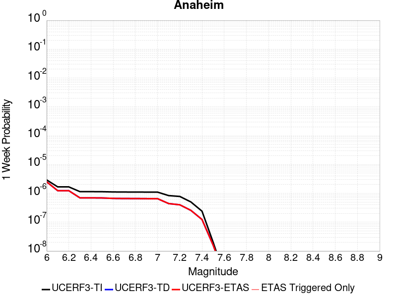 | 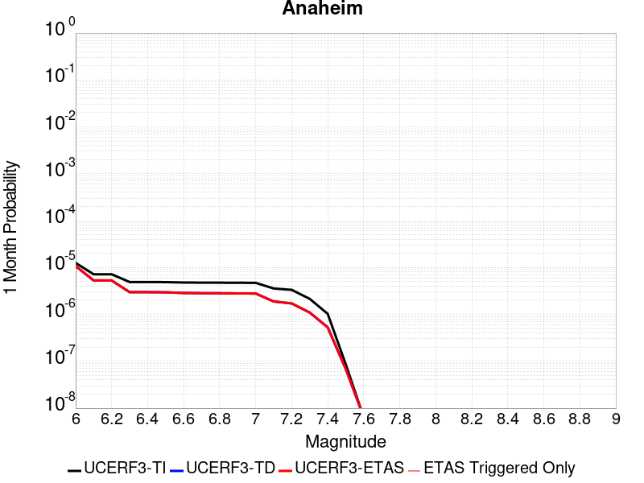 | 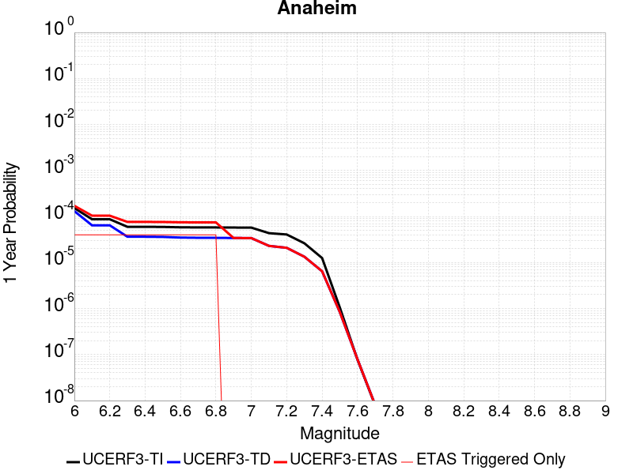 |

| Magnitude | 1 wk TI Prob | 1 wk TD Prob | 1 wk ETAS Prob | 1 wk ETAS/TD Gain | 1 wk ETAS Triggered Only | 1 mo TI Prob | 1 mo TD Prob | 1 mo ETAS Prob | 1 mo ETAS/TD Gain | 1 mo ETAS Triggered Only | 1 yr TI Prob | 1 yr TD Prob | 1 yr ETAS Prob | 1 yr ETAS/TD Gain | 1 yr ETAS Triggered Only |
|-----|-----|-----|-----|-----|-----|-----|-----|-----|-----|-----|-----|-----|-----|-----|-----|
| 6.0 | 2.9254998E-6 | 2.512686E-6 | 2.512686E-6 | 1.0 | 0.0 | 1.25377965E-5 | 1.0768623E-5 | 1.0768623E-5 | 1.0 | 0.0 | 1.5263697E-4 | 1.3110244E-4 | 1.710972E-4 | 1.3050649 | 4.0E-5 |
| 6.1 | 1.6729715E-6 | 1.2340445E-6 | 1.2340445E-6 | 1.0 | 0.0 | 7.1698582E-6 | 5.288754E-6 | 5.288754E-6 | 1.0 | 0.0 | 8.7289525E-5 | 6.438909E-5 | 1.0438652E-4 | 1.6211833 | 4.0E-5 |
| 6.2 | 1.6729715E-6 | 1.2340445E-6 | 1.2340445E-6 | 1.0 | 0.0 | 7.1698582E-6 | 5.288754E-6 | 5.288754E-6 | 1.0 | 0.0 | 8.7289525E-5 | 6.438909E-5 | 1.0438652E-4 | 1.6211833 | 4.0E-5 |
| 6.3 | 1.1444064E-6 | 6.962447E-7 | 6.962447E-7 | 1.0 | 0.0 | 4.9045893E-6 | 2.9839027E-6 | 2.9839027E-6 | 1.0 | 0.0 | 5.971174E-5 | 3.6328467E-5 | 7.6327015E-5 | 2.1010249 | 4.0E-5 |
| 6.4 | 1.1444064E-6 | 6.962447E-7 | 6.962447E-7 | 1.0 | 0.0 | 4.9045893E-6 | 2.9839027E-6 | 2.9839027E-6 | 1.0 | 0.0 | 5.971174E-5 | 3.6328467E-5 | 7.6327015E-5 | 2.1010249 | 4.0E-5 |
| 6.5 | 1.1385318E-6 | 6.9031285E-7 | 6.9031285E-7 | 1.0 | 0.0 | 4.879413E-6 | 2.9584808E-6 | 2.9584808E-6 | 1.0 | 0.0 | 5.9405233E-5 | 3.6018962E-5 | 7.6017524E-5 | 2.110486 | 4.0E-5 |
| 6.6 | 1.1165511E-6 | 6.680992E-7 | 6.680992E-7 | 1.0 | 0.0 | 4.78521E-6 | 2.8632794E-6 | 2.8632794E-6 | 1.0 | 0.0 | 5.8258374E-5 | 3.4859924E-5 | 7.485853E-5 | 2.1474094 | 4.0E-5 |
| 6.7 | 1.1098243E-6 | 6.6131844E-7 | 6.6131844E-7 | 1.0 | 0.0 | 4.7563813E-6 | 2.8342192E-6 | 2.8342192E-6 | 1.0 | 0.0 | 5.7907404E-5 | 3.4506127E-5 | 7.4504744E-5 | 2.1591744 | 4.0E-5 |
| 6.8 | 1.1077587E-6 | 6.592387E-7 | 6.592387E-7 | 1.0 | 0.0 | 4.7475287E-6 | 2.825306E-6 | 2.825306E-6 | 1.0 | 0.0 | 5.779963E-5 | 3.4397613E-5 | 7.439624E-5 | 2.1628313 | 4.0E-5 |
| 6.9 | 1.1024468E-6 | 6.538963E-7 | 6.538963E-7 | 1.0 | 0.0 | 4.7247636E-6 | 2.8024099E-6 | 2.8024099E-6 | 1.0 | 0.0 | 5.752248E-5 | 3.4118864E-5 | 3.4118864E-5 | 1.0 | 0.0 |
| 7.0 | 1.0993066E-6 | 6.5130683E-7 | 6.5130683E-7 | 1.0 | 0.0 | 4.7113053E-6 | 2.7913122E-6 | 2.7913122E-6 | 1.0 | 0.0 | 5.7358633E-5 | 3.3983753E-5 | 3.3983753E-5 | 1.0 | 0.0 |
| 7.1 | 8.334877E-7 | 4.4071706E-7 | 4.4071706E-7 | 1.0 | 0.0 | 3.5720855E-6 | 1.8887862E-6 | 1.8887862E-6 | 1.0 | 0.0 | 4.348927E-5 | 2.2995753E-5 | 2.2995753E-5 | 1.0 | 0.0 |
| 7.2 | 7.794411E-7 | 3.9997065E-7 | 3.9997065E-7 | 1.0 | 0.0 | 3.3404576E-6 | 1.7141589E-6 | 1.7141589E-6 | 1.0 | 0.0 | 4.0669314E-5 | 2.0869706E-5 | 2.0869706E-5 | 1.0 | 0.0 |
| 7.3 | 5.01704E-7 | 2.5586394E-7 | 2.5586394E-7 | 1.0 | 0.0 | 2.150158E-6 | 1.0965593E-6 | 1.0965593E-6 | 1.0 | 0.0 | 2.617786E-5 | 1.3350541E-5 | 1.3350541E-5 | 1.0 | 0.0 |
| 7.4 | 2.4008182E-7 | 1.2374025E-7 | 1.2374025E-7 | 1.0 | 0.0 | 1.0289217E-6 | 5.303153E-7 | 5.303153E-7 | 1.0 | 0.0 | 1.252705E-5 | 6.456577E-6 | 6.456577E-6 | 1.0 | 0.0 |
| 7.5 | 2.0263876E-8 | 1.612384E-8 | 1.612384E-8 | 1.0 | 0.0 | 8.684518E-8 | 6.910218E-8 | 6.910218E-8 | 1.0 | 0.0 | 1.0573395E-6 | 8.4131875E-7 | 8.4131875E-7 | 1.0 | 0.0 |
| 7.6 | 1.4871431E-9 | 1.508491E-9 | 1.508491E-9 | 1.0 | 0.0 | 6.37347E-9 | 6.464962E-9 | 6.464962E-9 | 1.0 | 0.0 | 7.7596994E-8 | 7.8710904E-8 | 7.8710904E-8 | 1.0 | 0.0 |
| 7.7 | 1.5093293E-10 | 1.5334356E-10 | 1.5334356E-10 | 1.0 | 0.0 | 6.4685546E-10 | 6.5718664E-10 | 6.5718664E-10 | 1.0 | 0.0 | 7.875465E-9 | 8.001244E-9 | 8.001244E-9 | 1.0 | 0.0 |

## Cady
*[(top)](#table-of-contents)*

| 1 Week | 1 Month | 1 Year |
|-----|-----|-----|
|  | 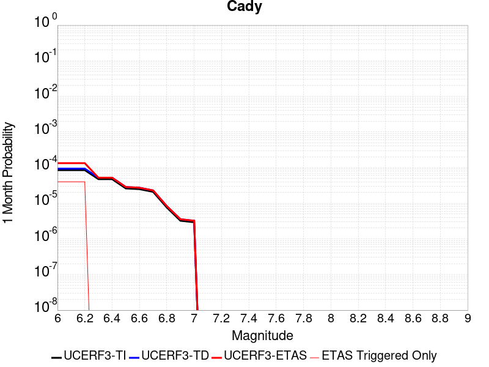 | 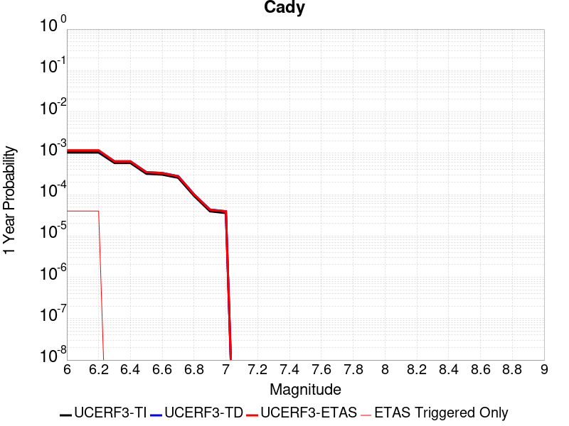 |

| Magnitude | 1 wk TI Prob | 1 wk TD Prob | 1 wk ETAS Prob | 1 wk ETAS/TD Gain | 1 wk ETAS Triggered Only | 1 mo TI Prob | 1 mo TD Prob | 1 mo ETAS Prob | 1 mo ETAS/TD Gain | 1 mo ETAS Triggered Only | 1 yr TI Prob | 1 yr TD Prob | 1 yr ETAS Prob | 1 yr ETAS/TD Gain | 1 yr ETAS Triggered Only |
|-----|-----|-----|-----|-----|-----|-----|-----|-----|-----|-----|-----|-----|-----|-----|-----|
| 6.0 | 1.9892565E-5 | 2.1866057E-5 | 2.1866057E-5 | 1.0 | 0.0 | 8.525106E-5 | 9.3708826E-5 | 1.3370508E-4 | 1.4268142 | 4.0E-5 | 0.0010374374 | 0.0011403988 | 0.0011803531 | 1.0350355 | 4.0E-5 |
| 6.1 | 1.9892565E-5 | 2.1866057E-5 | 2.1866057E-5 | 1.0 | 0.0 | 8.525106E-5 | 9.3708826E-5 | 1.3370508E-4 | 1.4268142 | 4.0E-5 | 0.0010374374 | 0.0011403988 | 0.0011803531 | 1.0350355 | 4.0E-5 |
| 6.2 | 1.9892565E-5 | 2.1866057E-5 | 2.1866057E-5 | 1.0 | 0.0 | 8.525106E-5 | 9.3708826E-5 | 1.3370508E-4 | 1.4268142 | 4.0E-5 | 0.0010374374 | 0.0011403988 | 0.0011803531 | 1.0350355 | 4.0E-5 |
| 6.3 | 1.1117327E-5 | 1.2180519E-5 | 1.2180519E-5 | 1.0 | 0.0 | 4.764482E-5 | 5.2201358E-5 | 5.2201358E-5 | 1.0 | 0.0 | 5.7992124E-4 | 6.3539774E-4 | 6.3539774E-4 | 1.0 | 0.0 |
| 6.4 | 1.1117327E-5 | 1.2180519E-5 | 1.2180519E-5 | 1.0 | 0.0 | 4.764482E-5 | 5.2201358E-5 | 5.2201358E-5 | 1.0 | 0.0 | 5.7992124E-4 | 6.3539774E-4 | 6.3539774E-4 | 1.0 | 0.0 |
| 6.5 | 6.103093E-6 | 6.674131E-6 | 6.674131E-6 | 1.0 | 0.0 | 2.615585E-5 | 2.8603175E-5 | 2.8603175E-5 | 1.0 | 0.0 | 3.1840094E-4 | 3.4820058E-4 | 3.4820058E-4 | 1.0 | 0.0 |
| 6.6 | 5.817237E-6 | 6.3676944E-6 | 6.3676944E-6 | 1.0 | 0.0 | 2.4930776E-5 | 2.7289903E-5 | 2.7289903E-5 | 1.0 | 0.0 | 3.034899E-4 | 3.3221635E-4 | 3.3221635E-4 | 1.0 | 0.0 |
| 6.7 | 4.8846314E-6 | 5.342259E-6 | 5.342259E-6 | 1.0 | 0.0 | 2.0933967E-5 | 2.2895263E-5 | 2.2895263E-5 | 1.0 | 0.0 | 2.5484123E-4 | 2.7872596E-4 | 2.7872596E-4 | 1.0 | 0.0 |
| 6.8 | 1.7788773E-6 | 1.9405036E-6 | 1.9405036E-6 | 1.0 | 0.0 | 7.6237375E-6 | 8.316427E-6 | 8.316427E-6 | 1.0 | 0.0 | 9.281505E-5 | 1.0124937E-4 | 1.0124937E-4 | 1.0 | 0.0 |
| 6.9 | 7.5455404E-7 | 8.2998935E-7 | 8.2998935E-7 | 1.0 | 0.0 | 3.233799E-6 | 3.5570943E-6 | 3.5570943E-6 | 1.0 | 0.0 | 3.937079E-5 | 4.33071E-5 | 4.33071E-5 | 1.0 | 0.0 |
| 7.0 | 6.8578805E-7 | 7.544366E-7 | 7.544366E-7 | 1.0 | 0.0 | 2.9390883E-6 | 3.2332975E-6 | 3.2332975E-6 | 1.0 | 0.0 | 3.578281E-5 | 3.936502E-5 | 3.936502E-5 | 1.0 | 0.0 |

## Great Valley 08 (Quinto)
*[(top)](#table-of-contents)*

| 1 Week | 1 Month | 1 Year |
|-----|-----|-----|
|  | 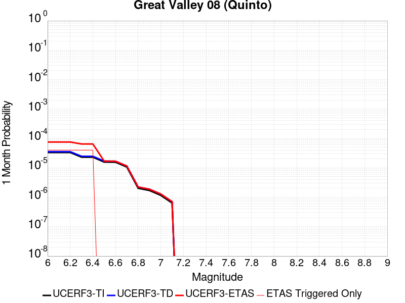 |  |

| Magnitude | 1 wk TI Prob | 1 wk TD Prob | 1 wk ETAS Prob | 1 wk ETAS/TD Gain | 1 wk ETAS Triggered Only | 1 mo TI Prob | 1 mo TD Prob | 1 mo ETAS Prob | 1 mo ETAS/TD Gain | 1 mo ETAS Triggered Only | 1 yr TI Prob | 1 yr TD Prob | 1 yr ETAS Prob | 1 yr ETAS/TD Gain | 1 yr ETAS Triggered Only |
|-----|-----|-----|-----|-----|-----|-----|-----|-----|-----|-----|-----|-----|-----|-----|-----|
| 6.0 | 7.737697E-6 | 8.254906E-6 | 8.254906E-6 | 1.0 | 0.0 | 3.3161137E-5 | 3.5377794E-5 | 7.537638E-5 | 2.1306126 | 4.0E-5 | 4.0366207E-4 | 4.306584E-4 | 4.7064116E-4 | 1.092841 | 4.0E-5 |
| 6.1 | 7.737697E-6 | 8.254906E-6 | 8.254906E-6 | 1.0 | 0.0 | 3.3161137E-5 | 3.5377794E-5 | 7.537638E-5 | 2.1306126 | 4.0E-5 | 4.0366207E-4 | 4.306584E-4 | 4.7064116E-4 | 1.092841 | 4.0E-5 |
| 6.2 | 7.737697E-6 | 8.254906E-6 | 8.254906E-6 | 1.0 | 0.0 | 3.3161137E-5 | 3.5377794E-5 | 7.537638E-5 | 2.1306126 | 4.0E-5 | 4.0366207E-4 | 4.306584E-4 | 4.7064116E-4 | 1.092841 | 4.0E-5 |
| 6.3 | 5.374012E-6 | 5.7519437E-6 | 5.7519437E-6 | 1.0 | 0.0 | 2.3031276E-5 | 2.4651017E-5 | 6.4650034E-5 | 2.622611 | 4.0E-5 | 2.803697E-4 | 3.0009594E-4 | 3.4008393E-4 | 1.1332507 | 4.0E-5 |
| 6.4 | 5.374012E-6 | 5.7519437E-6 | 5.7519437E-6 | 1.0 | 0.0 | 2.3031276E-5 | 2.4651017E-5 | 6.4650034E-5 | 2.622611 | 4.0E-5 | 2.803697E-4 | 3.0009594E-4 | 3.4008393E-4 | 1.1332507 | 4.0E-5 |
| 6.5 | 3.65427E-6 | 3.942375E-6 | 3.942375E-6 | 1.0 | 0.0 | 1.5661062E-5 | 1.6895821E-5 | 1.6895821E-5 | 1.0 | 0.0 | 1.9065675E-4 | 2.0569426E-4 | 2.0569426E-4 | 1.0 | 0.0 |
| 6.6 | 3.6143538E-6 | 3.899551E-6 | 3.899551E-6 | 1.0 | 0.0 | 1.5489995E-5 | 1.6712293E-5 | 1.6712293E-5 | 1.0 | 0.0 | 1.8857437E-4 | 2.0346022E-4 | 2.0346022E-4 | 1.0 | 0.0 |
| 6.7 | 2.4821015E-6 | 2.6864545E-6 | 2.6864545E-6 | 1.0 | 0.0 | 1.0637535E-5 | 1.1513357E-5 | 1.1513357E-5 | 1.0 | 0.0 | 1.2950429E-4 | 1.4017177E-4 | 1.4017177E-4 | 1.0 | 0.0 |
| 6.8 | 4.7110538E-7 | 5.194823E-7 | 5.194823E-7 | 1.0 | 0.0 | 2.0190216E-6 | 2.2263507E-6 | 2.2263507E-6 | 1.0 | 0.0 | 2.458131E-5 | 2.7105503E-5 | 2.7105503E-5 | 1.0 | 0.0 |
| 6.9 | 3.958685E-7 | 4.3718865E-7 | 4.3718865E-7 | 1.0 | 0.0 | 1.6965782E-6 | 1.8736644E-6 | 1.8736644E-6 | 1.0 | 0.0 | 2.0655643E-5 | 2.281164E-5 | 2.281164E-5 | 1.0 | 0.0 |
| 7.0 | 2.70294E-7 | 2.9930857E-7 | 2.9930857E-7 | 1.0 | 0.0 | 1.1584025E-6 | 1.2827504E-6 | 1.2827504E-6 | 1.0 | 0.0 | 1.4103458E-5 | 1.5617388E-5 | 1.5617388E-5 | 1.0 | 0.0 |
| 7.1 | 1.4828602E-7 | 1.6475283E-7 | 1.6475283E-7 | 1.0 | 0.0 | 6.3551136E-7 | 7.060834E-7 | 7.060834E-7 | 1.0 | 0.0 | 7.737323E-6 | 8.59654E-6 | 8.59654E-6 | 1.0 | 0.0 |

## San Gregorio (South) 2011 CFM
*[(top)](#table-of-contents)*

| 1 Week | 1 Month | 1 Year |
|-----|-----|-----|
| 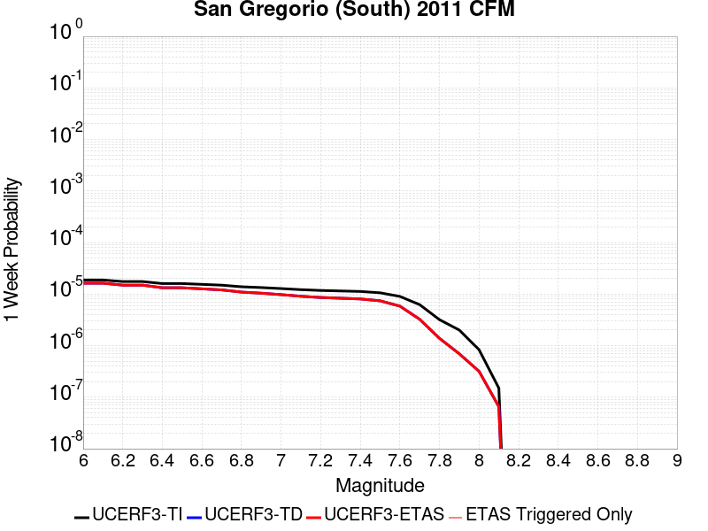 |  | 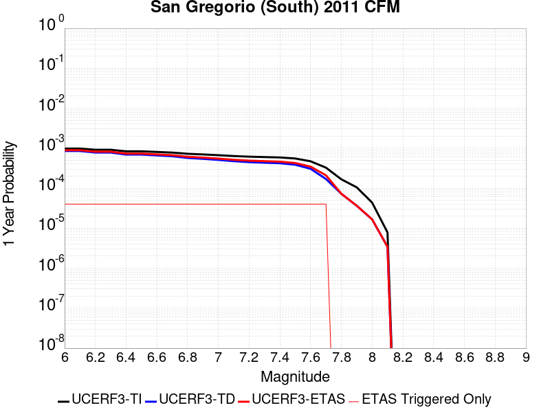 |

| Magnitude | 1 wk TI Prob | 1 wk TD Prob | 1 wk ETAS Prob | 1 wk ETAS/TD Gain | 1 wk ETAS Triggered Only | 1 mo TI Prob | 1 mo TD Prob | 1 mo ETAS Prob | 1 mo ETAS/TD Gain | 1 mo ETAS Triggered Only | 1 yr TI Prob | 1 yr TD Prob | 1 yr ETAS Prob | 1 yr ETAS/TD Gain | 1 yr ETAS Triggered Only |
|-----|-----|-----|-----|-----|-----|-----|-----|-----|-----|-----|-----|-----|-----|-----|-----|
| 6.0 | 1.8770423E-5 | 1.6297447E-5 | 1.6297447E-5 | 1.0 | 0.0 | 8.044219E-5 | 6.9844355E-5 | 6.9844355E-5 | 1.0 | 0.0 | 9.789435E-4 | 8.50027E-4 | 8.8999304E-4 | 1.0470173 | 4.0E-5 |
| 6.1 | 1.8770423E-5 | 1.6297447E-5 | 1.6297447E-5 | 1.0 | 0.0 | 8.044219E-5 | 6.9844355E-5 | 6.9844355E-5 | 1.0 | 0.0 | 9.789435E-4 | 8.50027E-4 | 8.8999304E-4 | 1.0470173 | 4.0E-5 |
| 6.2 | 1.7508692E-5 | 1.4916512E-5 | 1.4916512E-5 | 1.0 | 0.0 | 7.5035096E-5 | 6.392636E-5 | 6.392636E-5 | 1.0 | 0.0 | 9.1316935E-4 | 7.780285E-4 | 8.179974E-4 | 1.051372 | 4.0E-5 |
| 6.3 | 1.7508692E-5 | 1.4916512E-5 | 1.4916512E-5 | 1.0 | 0.0 | 7.5035096E-5 | 6.392636E-5 | 6.392636E-5 | 1.0 | 0.0 | 9.1316935E-4 | 7.780285E-4 | 8.179974E-4 | 1.051372 | 4.0E-5 |
| 6.4 | 1.6004591E-5 | 1.3265806E-5 | 1.3265806E-5 | 1.0 | 0.0 | 6.85893E-5 | 5.685222E-5 | 5.685222E-5 | 1.0 | 0.0 | 8.347548E-4 | 6.91957E-4 | 7.319293E-4 | 1.057767 | 4.0E-5 |
| 6.5 | 1.6004591E-5 | 1.3265806E-5 | 1.3265806E-5 | 1.0 | 0.0 | 6.85893E-5 | 5.685222E-5 | 5.685222E-5 | 1.0 | 0.0 | 8.347548E-4 | 6.91957E-4 | 7.319293E-4 | 1.057767 | 4.0E-5 |
| 6.6 | 1.5442201E-5 | 1.265024E-5 | 1.265024E-5 | 1.0 | 0.0 | 6.617918E-5 | 5.4214193E-5 | 5.4214193E-5 | 1.0 | 0.0 | 8.0543366E-4 | 6.5985875E-4 | 6.998324E-4 | 1.0605791 | 4.0E-5 |
| 6.7 | 1.489921E-5 | 1.205857E-5 | 1.205857E-5 | 1.0 | 0.0 | 6.3852196E-5 | 5.1678566E-5 | 5.1678566E-5 | 1.0 | 0.0 | 7.7712315E-4 | 6.290056E-4 | 6.689805E-4 | 1.0635524 | 4.0E-5 |
| 6.8 | 1.3876024E-5 | 1.0937155E-5 | 1.0937155E-5 | 1.0 | 0.0 | 5.9467322E-5 | 4.687268E-5 | 4.687268E-5 | 1.0 | 0.0 | 7.237741E-4 | 5.705258E-4 | 6.10503E-4 | 1.0700707 | 4.0E-5 |
| 6.9 | 1.33922495E-5 | 1.040849E-5 | 1.040849E-5 | 1.0 | 0.0 | 5.7394092E-5 | 4.460705E-5 | 4.460705E-5 | 1.0 | 0.0 | 6.9854903E-4 | 5.429558E-4 | 5.8293407E-4 | 1.0736308 | 4.0E-5 |
| 7.0 | 1.2807324E-5 | 9.768245E-6 | 9.768245E-6 | 1.0 | 0.0 | 5.4887376E-5 | 4.1863237E-5 | 4.1863237E-5 | 1.0 | 0.0 | 6.680489E-4 | 5.0956587E-4 | 5.495455E-4 | 1.0784582 | 4.0E-5 |
| 7.1 | 1.2191438E-5 | 9.076841E-6 | 9.076841E-6 | 1.0 | 0.0 | 5.224797E-5 | 3.8900165E-5 | 3.8900165E-5 | 1.0 | 0.0 | 6.3593336E-4 | 4.7350666E-4 | 5.134877E-4 | 1.084436 | 4.0E-5 |
| 7.2 | 1.1769438E-5 | 8.596807E-6 | 8.596807E-6 | 1.0 | 0.0 | 5.0439474E-5 | 3.684294E-5 | 3.684294E-5 | 1.0 | 0.0 | 6.1392755E-4 | 4.4847053E-4 | 4.8845256E-4 | 1.0891521 | 4.0E-5 |
| 7.3 | 1.150374E-5 | 8.312155E-6 | 8.312155E-6 | 1.0 | 0.0 | 4.9300812E-5 | 3.5623038E-5 | 3.5623038E-5 | 1.0 | 0.0 | 6.0007203E-4 | 4.3362423E-4 | 4.7360687E-4 | 1.0922058 | 4.0E-5 |
| 7.4 | 1.12514E-5 | 8.0577975E-6 | 8.0577975E-6 | 1.0 | 0.0 | 4.8219394E-5 | 3.453296E-5 | 3.453296E-5 | 1.0 | 0.0 | 5.8691297E-4 | 4.2035774E-4 | 4.6034093E-4 | 1.0951171 | 4.0E-5 |
| 7.5 | 1.059696E-5 | 7.407659E-6 | 7.407659E-6 | 1.0 | 0.0 | 4.5414752E-5 | 3.1746724E-5 | 3.1746724E-5 | 1.0 | 0.0 | 5.5278436E-4 | 3.8644785E-4 | 4.2643238E-4 | 1.1034669 | 4.0E-5 |
| 7.6 | 9.018592E-6 | 5.8502587E-6 | 5.8502587E-6 | 1.0 | 0.0 | 3.8650534E-5 | 2.5072297E-5 | 2.5072297E-5 | 1.0 | 0.0 | 4.7046866E-4 | 3.0521248E-4 | 3.4520027E-4 | 1.1310163 | 4.0E-5 |
| 7.7 | 6.243489E-6 | 3.2503717E-6 | 3.2503717E-6 | 1.0 | 0.0 | 2.6757538E-5 | 1.393009E-5 | 1.393009E-5 | 1.0 | 0.0 | 3.257243E-4 | 1.6958566E-4 | 2.0957888E-4 | 1.235829 | 4.0E-5 |
| 7.8 | 3.1941963E-6 | 1.3877669E-6 | 1.3877669E-6 | 1.0 | 0.0 | 1.368934E-5 | 5.9475587E-6 | 5.9475587E-6 | 1.0 | 0.0 | 1.6665498E-4 | 7.240912E-5 | 7.240912E-5 | 1.0 | 0.0 |
| 7.9 | 2.0098398E-6 | 6.966522E-7 | 6.966522E-7 | 1.0 | 0.0 | 8.6135715E-6 | 2.9856487E-6 | 2.9856487E-6 | 1.0 | 0.0 | 1.0486518E-4 | 3.634967E-5 | 3.634967E-5 | 1.0 | 0.0 |
| 8.0 | 8.353119E-7 | 3.1857724E-7 | 3.1857724E-7 | 1.0 | 0.0 | 3.579903E-6 | 1.3653303E-6 | 1.3653303E-6 | 1.0 | 0.0 | 4.358445E-5 | 1.662277E-5 | 1.662277E-5 | 1.0 | 0.0 |
| 8.1 | 1.5033264E-7 | 6.569932E-8 | 6.569932E-8 | 1.0 | 0.0 | 6.442826E-7 | 2.8156848E-7 | 2.8156848E-7 | 1.0 | 0.0 | 7.844113E-6 | 3.428091E-6 | 3.428091E-6 | 1.0 | 0.0 |

## Mount Diablo Thrust South
*[(top)](#table-of-contents)*

| 1 Week | 1 Month | 1 Year |
|-----|-----|-----|
| 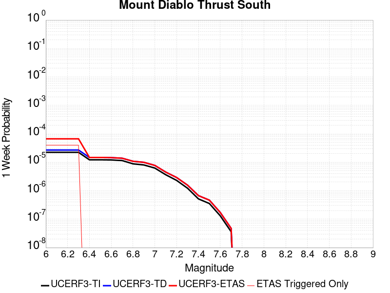 | 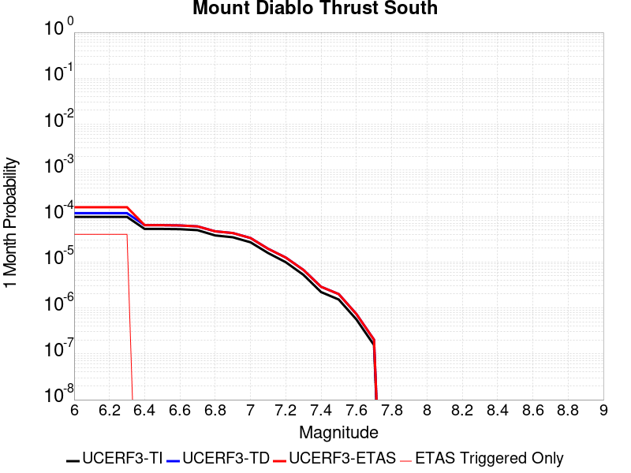 | 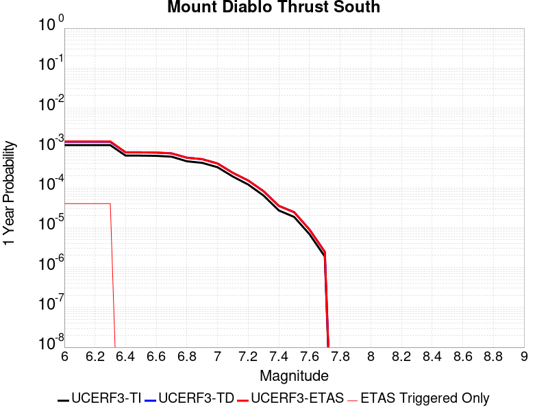 |

| Magnitude | 1 wk TI Prob | 1 wk TD Prob | 1 wk ETAS Prob | 1 wk ETAS/TD Gain | 1 wk ETAS Triggered Only | 1 mo TI Prob | 1 mo TD Prob | 1 mo ETAS Prob | 1 mo ETAS/TD Gain | 1 mo ETAS Triggered Only | 1 yr TI Prob | 1 yr TD Prob | 1 yr ETAS Prob | 1 yr ETAS/TD Gain | 1 yr ETAS Triggered Only |
|-----|-----|-----|-----|-----|-----|-----|-----|-----|-----|-----|-----|-----|-----|-----|-----|
| 6.0 | 2.2377444E-5 | 2.6978483E-5 | 6.69774E-5 | 2.482623 | 4.0E-5 | 9.5899806E-5 | 1.1561807E-4 | 1.5561345E-4 | 1.3459266 | 4.0E-5 | 0.0011669548 | 0.0014069389 | 0.0014468826 | 1.0283905 | 4.0E-5 |
| 6.1 | 2.2377444E-5 | 2.6978483E-5 | 6.69774E-5 | 2.482623 | 4.0E-5 | 9.5899806E-5 | 1.1561807E-4 | 1.5561345E-4 | 1.3459266 | 4.0E-5 | 0.0011669548 | 0.0014069389 | 0.0014468826 | 1.0283905 | 4.0E-5 |
| 6.2 | 2.2377444E-5 | 2.6978483E-5 | 6.69774E-5 | 2.482623 | 4.0E-5 | 9.5899806E-5 | 1.1561807E-4 | 1.5561345E-4 | 1.3459266 | 4.0E-5 | 0.0011669548 | 0.0014069389 | 0.0014468826 | 1.0283905 | 4.0E-5 |
| 6.3 | 2.2377444E-5 | 2.6978483E-5 | 6.69774E-5 | 2.482623 | 4.0E-5 | 9.5899806E-5 | 1.1561807E-4 | 1.5561345E-4 | 1.3459266 | 4.0E-5 | 0.0011669548 | 0.0014069389 | 0.0014468826 | 1.0283905 | 4.0E-5 |
| 6.4 | 1.2228463E-5 | 1.476156E-5 | 1.476156E-5 | 1.0 | 0.0 | 5.2406645E-5 | 6.326237E-5 | 6.326237E-5 | 1.0 | 0.0 | 6.378641E-4 | 7.6996005E-4 | 7.6996005E-4 | 1.0 | 0.0 |
| 6.5 | 1.2228463E-5 | 1.476156E-5 | 1.476156E-5 | 1.0 | 0.0 | 5.2406645E-5 | 6.326237E-5 | 6.326237E-5 | 1.0 | 0.0 | 6.378641E-4 | 7.6996005E-4 | 7.6996005E-4 | 1.0 | 0.0 |
| 6.6 | 1.2068118E-5 | 1.4566215E-5 | 1.4566215E-5 | 1.0 | 0.0 | 5.1719482E-5 | 6.242522E-5 | 6.242522E-5 | 1.0 | 0.0 | 6.2950276E-4 | 7.597748E-4 | 7.597748E-4 | 1.0 | 0.0 |
| 6.7 | 1.1499428E-5 | 1.3888437E-5 | 1.3888437E-5 | 1.0 | 0.0 | 4.9282335E-5 | 5.9520586E-5 | 5.9520586E-5 | 1.0 | 0.0 | 5.9984723E-4 | 7.2443497E-4 | 7.2443497E-4 | 1.0 | 0.0 |
| 6.8 | 8.82118E-6 | 1.0842296E-5 | 1.0842296E-5 | 1.0 | 0.0 | 3.780451E-5 | 4.646619E-5 | 4.646619E-5 | 1.0 | 0.0 | 4.601727E-4 | 5.6558463E-4 | 5.6558463E-4 | 1.0 | 0.0 |
| 6.9 | 8.047112E-6 | 9.950804E-6 | 9.950804E-6 | 1.0 | 0.0 | 3.4487166E-5 | 4.264564E-5 | 4.264564E-5 | 1.0 | 0.0 | 4.1980037E-4 | 5.1909225E-4 | 5.1909225E-4 | 1.0 | 0.0 |
| 7.0 | 6.2574763E-6 | 7.75897E-6 | 7.75897E-6 | 1.0 | 0.0 | 2.681748E-5 | 3.3252327E-5 | 3.3252327E-5 | 1.0 | 0.0 | 3.264539E-4 | 4.0477558E-4 | 4.0477558E-4 | 1.0 | 0.0 |
| 7.1 | 3.6485903E-6 | 4.5177235E-6 | 4.5177235E-6 | 1.0 | 0.0 | 1.5636722E-5 | 1.936153E-5 | 1.936153E-5 | 1.0 | 0.0 | 1.9036046E-4 | 2.3570155E-4 | 2.3570155E-4 | 1.0 | 0.0 |
| 7.2 | 2.3034274E-6 | 2.9092357E-6 | 2.9092357E-6 | 1.0 | 0.0 | 9.871795E-6 | 1.24680955E-5 | 1.24680955E-5 | 1.0 | 0.0 | 1.2018247E-4 | 1.5178873E-4 | 1.5178873E-4 | 1.0 | 0.0 |
| 7.3 | 1.224035E-6 | 1.5683729E-6 | 1.5683729E-6 | 1.0 | 0.0 | 5.245854E-6 | 6.7215815E-6 | 6.7215815E-6 | 1.0 | 0.0 | 6.38664E-5 | 8.1832295E-5 | 8.1832295E-5 | 1.0 | 0.0 |
| 7.4 | 5.1601154E-7 | 6.7249823E-7 | 6.7249823E-7 | 1.0 | 0.0 | 2.2114762E-6 | 2.882132E-6 | 2.882132E-6 | 1.0 | 0.0 | 2.6924388E-5 | 3.508941E-5 | 3.508941E-5 | 1.0 | 0.0 |
| 7.5 | 3.552894E-7 | 4.6659625E-7 | 4.6659625E-7 | 1.0 | 0.0 | 1.5226678E-6 | 1.9996967E-6 | 1.9996967E-6 | 1.0 | 0.0 | 1.8538323E-5 | 2.434605E-5 | 2.434605E-5 | 1.0 | 0.0 |
| 7.6 | 1.3124082E-7 | 1.7192943E-7 | 1.7192943E-7 | 1.0 | 0.0 | 5.6246057E-7 | 7.3684026E-7 | 7.3684026E-7 | 1.0 | 0.0 | 6.8479358E-6 | 8.971002E-6 | 8.971002E-6 | 1.0 | 0.0 |
| 7.7 | 3.6193022E-8 | 4.7339203E-8 | 4.7339203E-8 | 1.0 | 0.0 | 1.5511293E-7 | 2.0288229E-7 | 2.0288229E-7 | 1.0 | 0.0 | 1.8884983E-6 | 2.47009E-6 | 2.47009E-6 | 1.0 | 0.0 |

## Hunting Creek - Bartlett Springs connector 2011
*[(top)](#table-of-contents)*

| 1 Week | 1 Month | 1 Year |
|-----|-----|-----|
| 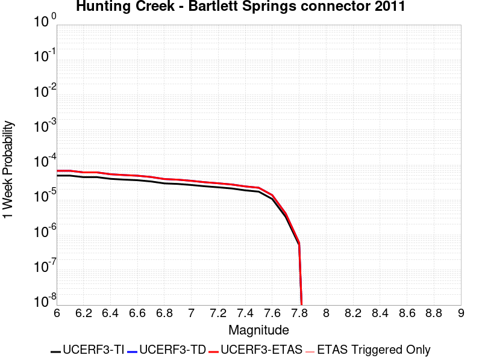 | 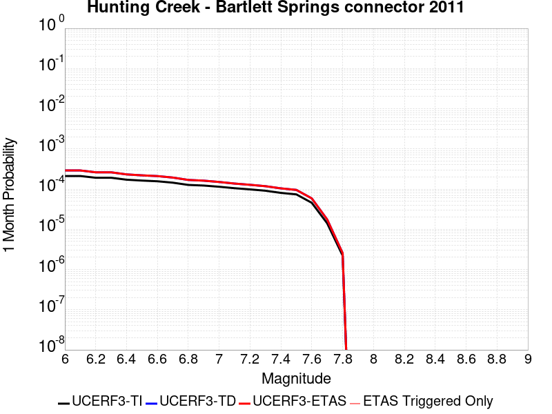 | 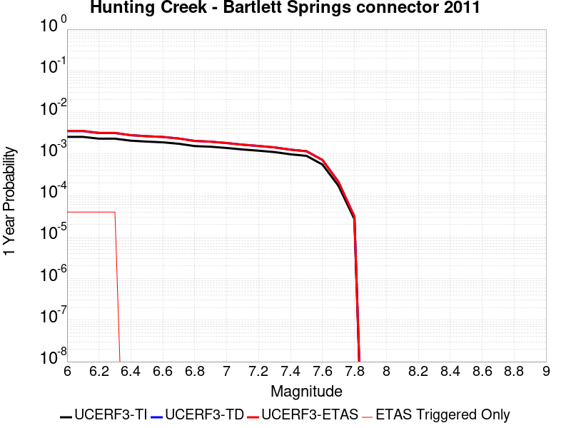 |

| Magnitude | 1 wk TI Prob | 1 wk TD Prob | 1 wk ETAS Prob | 1 wk ETAS/TD Gain | 1 wk ETAS Triggered Only | 1 mo TI Prob | 1 mo TD Prob | 1 mo ETAS Prob | 1 mo ETAS/TD Gain | 1 mo ETAS Triggered Only | 1 yr TI Prob | 1 yr TD Prob | 1 yr ETAS Prob | 1 yr ETAS/TD Gain | 1 yr ETAS Triggered Only |
|-----|-----|-----|-----|-----|-----|-----|-----|-----|-----|-----|-----|-----|-----|-----|-----|
| 6.0 | 4.940016E-5 | 6.7944384E-5 | 6.7944384E-5 | 1.0 | 0.0 | 2.1169778E-4 | 2.9115478E-4 | 2.9115478E-4 | 1.0 | 0.0 | 0.002574374 | 0.0035388924 | 0.0035787509 | 1.011263 | 4.0E-5 |
| 6.1 | 4.940016E-5 | 6.7944384E-5 | 6.7944384E-5 | 1.0 | 0.0 | 2.1169778E-4 | 2.9115478E-4 | 2.9115478E-4 | 1.0 | 0.0 | 0.002574374 | 0.0035388924 | 0.0035787509 | 1.011263 | 4.0E-5 |
| 6.2 | 4.472471E-5 | 6.106999E-5 | 6.106999E-5 | 1.0 | 0.0 | 1.9166325E-4 | 2.6170196E-4 | 2.6170196E-4 | 1.0 | 0.0 | 0.0023310026 | 0.0031814633 | 0.003221336 | 1.0125328 | 4.0E-5 |
| 6.3 | 4.472471E-5 | 6.106999E-5 | 6.106999E-5 | 1.0 | 0.0 | 1.9166325E-4 | 2.6170196E-4 | 2.6170196E-4 | 1.0 | 0.0 | 0.0023310026 | 0.0031814633 | 0.003221336 | 1.0125328 | 4.0E-5 |
| 6.4 | 4.0001003E-5 | 5.416015E-5 | 5.416015E-5 | 1.0 | 0.0 | 1.714216E-4 | 2.3209458E-4 | 2.3209458E-4 | 1.0 | 0.0 | 0.0020850603 | 0.0028220408 | 0.0028220408 | 1.0 | 0.0 |
| 6.5 | 3.8033053E-5 | 5.1318086E-5 | 5.1318086E-5 | 1.0 | 0.0 | 1.6298861E-4 | 2.1991637E-4 | 2.1991637E-4 | 1.0 | 0.0 | 0.0019825802 | 0.0026741675 | 0.0026741675 | 1.0 | 0.0 |
| 6.6 | 3.653754E-5 | 4.917842E-5 | 4.917842E-5 | 1.0 | 0.0 | 1.5658008E-4 | 2.1074786E-4 | 2.1074786E-4 | 1.0 | 0.0 | 0.0019046954 | 0.002562831 | 0.002562831 | 1.0 | 0.0 |
| 6.7 | 3.372024E-5 | 4.5184104E-5 | 4.5184104E-5 | 1.0 | 0.0 | 1.4450731E-4 | 1.9363197E-4 | 1.9363197E-4 | 1.0 | 0.0 | 0.0017579567 | 0.002354938 | 0.002354938 | 1.0 | 0.0 |
| 6.8 | 2.9650024E-5 | 3.9447765E-5 | 3.9447765E-5 | 1.0 | 0.0 | 1.2706534E-4 | 1.6905087E-4 | 1.6905087E-4 | 1.0 | 0.0 | 0.0015459227 | 0.0020562413 | 0.0020562413 | 1.0 | 0.0 |
| 6.9 | 2.860775E-5 | 3.7846614E-5 | 3.7846614E-5 | 1.0 | 0.0 | 1.2259888E-4 | 1.621897E-4 | 1.621897E-4 | 1.0 | 0.0 | 0.0014916194 | 0.0019728777 | 0.0019728777 | 1.0 | 0.0 |
| 7.0 | 2.6696067E-5 | 3.5098357E-5 | 3.5098357E-5 | 1.0 | 0.0 | 1.144067E-4 | 1.5041292E-4 | 1.5041292E-4 | 1.0 | 0.0 | 0.0013920115 | 0.0018297475 | 0.0018297475 | 1.0 | 0.0 |
| 7.1 | 2.456087E-5 | 3.204171E-5 | 3.204171E-5 | 1.0 | 0.0 | 1.0525662E-4 | 1.3731443E-4 | 1.3731443E-4 | 1.0 | 0.0 | 0.001280746 | 0.0016705302 | 0.0016705302 | 1.0 | 0.0 |
| 7.2 | 2.295761E-5 | 2.9849412E-5 | 2.9849412E-5 | 1.0 | 0.0 | 9.8386045E-5 | 1.2791983E-4 | 1.2791983E-4 | 1.0 | 0.0 | 0.0011971919 | 0.0015563206 | 0.0015563206 | 1.0 | 0.0 |
| 7.3 | 2.1256936E-5 | 2.7566693E-5 | 2.7566693E-5 | 1.0 | 0.0 | 9.109797E-5 | 1.1813767E-4 | 1.1813767E-4 | 1.0 | 0.0 | 0.0011085535 | 0.001437386 | 0.001437386 | 1.0 | 0.0 |
| 7.4 | 1.8784336E-5 | 2.4328718E-5 | 2.4328718E-5 | 1.0 | 0.0 | 8.050181E-5 | 1.0426181E-4 | 1.0426181E-4 | 1.0 | 0.0 | 9.796688E-4 | 0.0012686559 | 0.0012686559 | 1.0 | 0.0 |
| 7.5 | 1.7248298E-5 | 2.2289125E-5 | 2.2289125E-5 | 1.0 | 0.0 | 7.391918E-5 | 9.552136E-5 | 9.552136E-5 | 1.0 | 0.0 | 8.9959445E-4 | 0.0011623597 | 0.0011623597 | 1.0 | 0.0 |
| 7.6 | 1.0653709E-5 | 1.3734985E-5 | 1.3734985E-5 | 1.0 | 0.0 | 4.5657955E-5 | 5.8862912E-5 | 5.8862912E-5 | 1.0 | 0.0 | 5.557438E-4 | 7.1642303E-4 | 7.1642303E-4 | 1.0 | 0.0 |
| 7.7 | 3.286316E-6 | 4.0935997E-6 | 4.0935997E-6 | 1.0 | 0.0 | 1.4084137E-5 | 1.7543882E-5 | 1.7543882E-5 | 1.0 | 0.0 | 1.7146087E-4 | 2.1357599E-4 | 2.1357599E-4 | 1.0 | 0.0 |
| 7.8 | 5.1855085E-7 | 5.9799896E-7 | 5.9799896E-7 | 1.0 | 0.0 | 2.222359E-6 | 2.5628503E-6 | 2.5628503E-6 | 1.0 | 0.0 | 2.7056883E-5 | 3.1202264E-5 | 3.1202264E-5 | 1.0 | 0.0 |

## Elsinore (Stepovers Combined)
*[(top)](#table-of-contents)*

| 1 Week | 1 Month | 1 Year |
|-----|-----|-----|
|  | 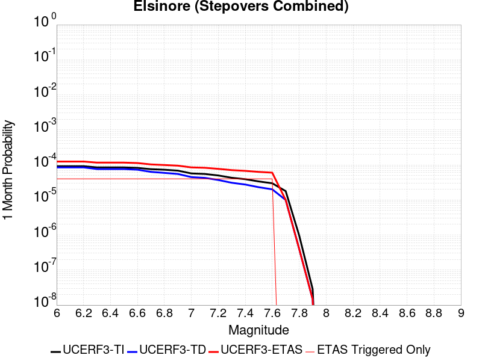 | 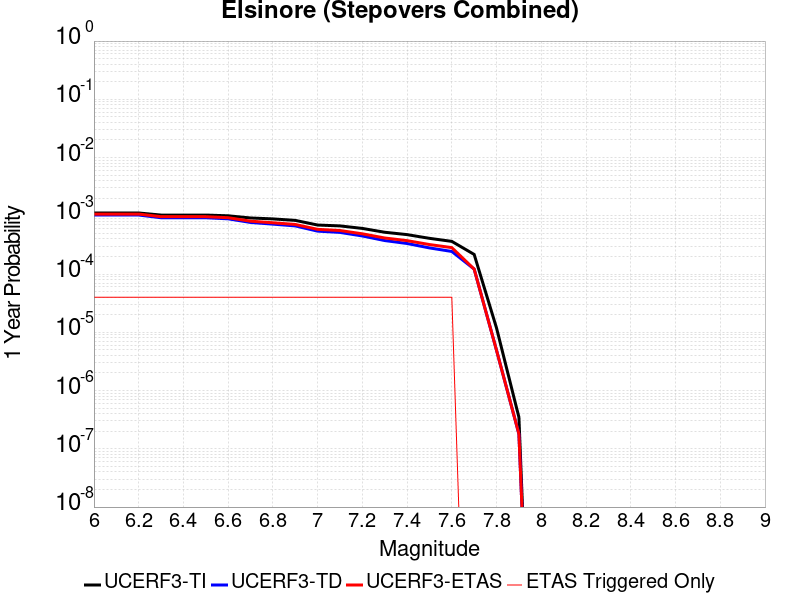 |

| Magnitude | 1 wk TI Prob | 1 wk TD Prob | 1 wk ETAS Prob | 1 wk ETAS/TD Gain | 1 wk ETAS Triggered Only | 1 mo TI Prob | 1 mo TD Prob | 1 mo ETAS Prob | 1 mo ETAS/TD Gain | 1 mo ETAS Triggered Only | 1 yr TI Prob | 1 yr TD Prob | 1 yr ETAS Prob | 1 yr ETAS/TD Gain | 1 yr ETAS Triggered Only |
|-----|-----|-----|-----|-----|-----|-----|-----|-----|-----|-----|-----|-----|-----|-----|-----|
| 6.0 | 2.144392E-5 | 1.9780842E-5 | 1.9780842E-5 | 1.0 | 0.0 | 9.189928E-5 | 8.477241E-5 | 1.2476901E-4 | 1.4718117 | 4.0E-5 | 0.0011182994 | 0.0010316346 | 0.0010715934 | 1.0387334 | 4.0E-5 |
| 6.1 | 2.144392E-5 | 1.9780842E-5 | 1.9780842E-5 | 1.0 | 0.0 | 9.189928E-5 | 8.477241E-5 | 1.2476901E-4 | 1.4718117 | 4.0E-5 | 0.0011182994 | 0.0010316346 | 0.0010715934 | 1.0387334 | 4.0E-5 |
| 6.2 | 2.144392E-5 | 1.9780842E-5 | 1.9780842E-5 | 1.0 | 0.0 | 9.189928E-5 | 8.477241E-5 | 1.2476901E-4 | 1.4718117 | 4.0E-5 | 0.0011182994 | 0.0010316346 | 0.0010715934 | 1.0387334 | 4.0E-5 |
| 6.3 | 1.9751555E-5 | 1.7760778E-5 | 1.7760778E-5 | 1.0 | 0.0 | 8.4646774E-5 | 7.6115495E-5 | 1.1611245E-4 | 1.5254772 | 4.0E-5 | 0.0010300872 | 9.263265E-4 | 9.6628943E-4 | 1.0431414 | 4.0E-5 |
| 6.4 | 1.9751555E-5 | 1.7760778E-5 | 1.7760778E-5 | 1.0 | 0.0 | 8.4646774E-5 | 7.6115495E-5 | 1.1611245E-4 | 1.5254772 | 4.0E-5 | 0.0010300872 | 9.263265E-4 | 9.6628943E-4 | 1.0431414 | 4.0E-5 |
| 6.5 | 1.9751555E-5 | 1.7760778E-5 | 1.7760778E-5 | 1.0 | 0.0 | 8.4646774E-5 | 7.6115495E-5 | 1.1611245E-4 | 1.5254772 | 4.0E-5 | 0.0010300872 | 9.263265E-4 | 9.6628943E-4 | 1.0431414 | 4.0E-5 |
| 6.6 | 1.9188685E-5 | 1.702196E-5 | 1.702196E-5 | 1.0 | 0.0 | 8.2234634E-5 | 7.2949304E-5 | 1.12946385E-4 | 1.548286 | 4.0E-5 | 0.0010007467 | 8.878121E-4 | 9.277766E-4 | 1.0450146 | 4.0E-5 |
| 6.7 | 1.7608272E-5 | 1.4748722E-5 | 1.4748722E-5 | 1.0 | 0.0 | 7.546184E-5 | 6.3207335E-5 | 1.032048E-4 | 1.632798 | 4.0E-5 | 9.183606E-4 | 7.6928735E-4 | 8.0925657E-4 | 1.0519562 | 4.0E-5 |
| 6.8 | 1.697165E-5 | 1.3798299E-5 | 1.3798299E-5 | 1.0 | 0.0 | 7.273361E-5 | 5.9134276E-5 | 9.913191E-5 | 1.6763867 | 4.0E-5 | 8.8517193E-4 | 7.197307E-4 | 7.597019E-4 | 1.0555364 | 4.0E-5 |
| 6.9 | 1.600365E-5 | 1.2861078E-5 | 1.2861078E-5 | 1.0 | 0.0 | 6.858527E-5 | 5.5117787E-5 | 9.511558E-5 | 1.7256786 | 4.0E-5 | 8.347058E-4 | 6.7086023E-4 | 7.108334E-4 | 1.059585 | 4.0E-5 |
| 7.0 | 1.3314581E-5 | 1.0460029E-5 | 1.0460029E-5 | 1.0 | 0.0 | 5.7061243E-5 | 4.4827942E-5 | 8.482615E-5 | 1.8922607 | 4.0E-5 | 6.944992E-4 | 5.456462E-4 | 5.8562437E-4 | 1.0732676 | 4.0E-5 |
| 7.1 | 1.2865345E-5 | 9.949274E-6 | 9.949274E-6 | 1.0 | 0.0 | 5.5136024E-5 | 4.263906E-5 | 8.263736E-5 | 1.938067 | 4.0E-5 | 6.710743E-4 | 5.190095E-4 | 5.589887E-4 | 1.07703 | 4.0E-5 |
| 7.2 | 1.1650051E-5 | 8.643983E-6 | 8.643983E-6 | 1.0 | 0.0 | 4.9927836E-5 | 3.7045123E-5 | 7.7043645E-5 | 2.0797243 | 4.0E-5 | 6.0770183E-4 | 4.5093283E-4 | 4.909148E-4 | 1.088665 | 4.0E-5 |
| 7.3 | 1.0008533E-5 | 7.209463E-6 | 7.209463E-6 | 1.0 | 0.0 | 4.2893007E-5 | 3.089734E-5 | 7.08961E-5 | 2.2945697 | 4.0E-5 | 5.220972E-4 | 3.7611165E-4 | 4.160966E-4 | 1.1063114 | 4.0E-5 |
| 7.4 | 9.116759E-6 | 6.4174783E-6 | 6.4174783E-6 | 1.0 | 0.0 | 3.907124E-5 | 2.7503196E-5 | 6.750209E-5 | 2.4543364 | 4.0E-5 | 4.7558855E-4 | 3.3480133E-4 | 3.7478795E-4 | 1.1194339 | 4.0E-5 |
| 7.5 | 7.870524E-6 | 5.388742E-6 | 5.388742E-6 | 1.0 | 0.0 | 3.3730383E-5 | 2.309441E-5 | 6.309349E-5 | 2.7319808 | 4.0E-5 | 4.1059E-4 | 2.8113945E-4 | 3.211282E-4 | 1.1422381 | 4.0E-5 |
| 7.6 | 6.9774537E-6 | 4.683142E-6 | 4.683142E-6 | 1.0 | 0.0 | 2.990303E-5 | 2.0070462E-5 | 6.006966E-5 | 2.9929385 | 4.0E-5 | 3.640086E-4 | 2.4433163E-4 | 2.8432187E-4 | 1.163672 | 4.0E-5 |
| 7.7 | 4.1616954E-6 | 2.3312286E-6 | 2.3312286E-6 | 1.0 | 0.0 | 1.7835715E-5 | 9.990946E-6 | 9.990946E-6 | 1.0 | 0.0 | 2.171282E-4 | 1.21633726E-4 | 1.21633726E-4 | 1.0 | 0.0 |
| 7.8 | 2.2692414E-7 | 9.397192E-8 | 9.397192E-8 | 1.0 | 0.0 | 9.725317E-7 | 4.0273673E-7 | 4.0273673E-7 | 1.0 | 0.0 | 1.1840509E-5 | 4.903312E-6 | 4.903312E-6 | 1.0 | 0.0 |
| 7.9 | 6.676829E-9 | 3.4429164E-9 | 3.4429164E-9 | 1.0 | 0.0 | 2.861498E-8 | 1.4755356E-8 | 1.4755356E-8 | 1.0 | 0.0 | 3.4838732E-7 | 1.7964643E-7 | 1.7964643E-7 | 1.0 | 0.0 |

## Green Valley 2011 CFM
*[(top)](#table-of-contents)*

| 1 Week | 1 Month | 1 Year |
|-----|-----|-----|
| 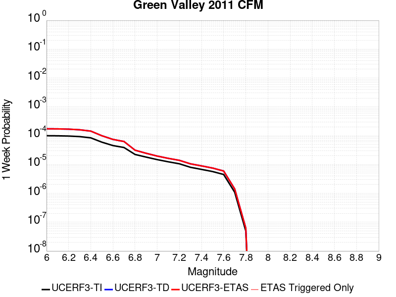 | 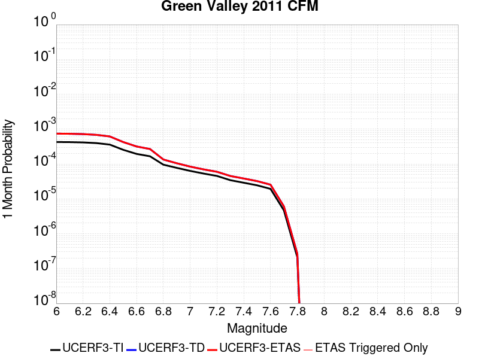 | 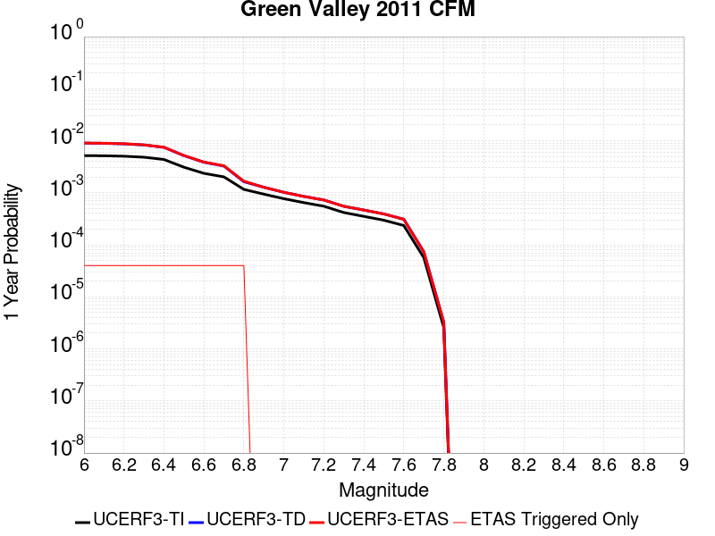 |

| Magnitude | 1 wk TI Prob | 1 wk TD Prob | 1 wk ETAS Prob | 1 wk ETAS/TD Gain | 1 wk ETAS Triggered Only | 1 mo TI Prob | 1 mo TD Prob | 1 mo ETAS Prob | 1 mo ETAS/TD Gain | 1 mo ETAS Triggered Only | 1 yr TI Prob | 1 yr TD Prob | 1 yr ETAS Prob | 1 yr ETAS/TD Gain | 1 yr ETAS Triggered Only |
|-----|-----|-----|-----|-----|-----|-----|-----|-----|-----|-----|-----|-----|-----|-----|-----|
| 6.0 | 9.9629346E-5 | 1.7323556E-4 | 1.7323556E-4 | 1.0 | 0.0 | 4.2691303E-4 | 7.4222905E-4 | 7.4222905E-4 | 1.0 | 0.0 | 0.0051852856 | 0.00899768 | 0.00903732 | 1.0044056 | 4.0E-5 |
| 6.1 | 9.88615E-5 | 1.717056E-4 | 1.717056E-4 | 1.0 | 0.0 | 4.2362334E-4 | 7.3567586E-4 | 7.3567586E-4 | 1.0 | 0.0 | 0.0051454236 | 0.008918555 | 0.008958198 | 1.0044451 | 4.0E-5 |
| 6.2 | 9.696895E-5 | 1.6809141E-4 | 1.6809141E-4 | 1.0 | 0.0 | 4.15515E-4 | 7.201954E-4 | 7.201954E-4 | 1.0 | 0.0 | 0.0050471667 | 0.008731696 | 0.008771347 | 1.004541 | 4.0E-5 |
| 6.3 | 9.275224E-5 | 1.5988309E-4 | 1.5988309E-4 | 1.0 | 0.0 | 3.9744904E-4 | 6.8503554E-4 | 6.8503554E-4 | 1.0 | 0.0 | 0.0048282105 | 0.0083069345 | 0.008346602 | 1.0047753 | 4.0E-5 |
| 6.4 | 8.391499E-5 | 1.4381955E-4 | 1.4381955E-4 | 1.0 | 0.0 | 3.595861E-4 | 6.162258E-4 | 6.162258E-4 | 1.0 | 0.0 | 0.004369175 | 0.0074755168 | 0.0075152176 | 1.0053108 | 4.0E-5 |
| 6.5 | 5.9519385E-5 | 9.945679E-5 | 9.945679E-5 | 1.0 | 0.0 | 2.5505814E-4 | 4.26173E-4 | 4.26173E-4 | 1.0 | 0.0 | 0.0031009112 | 0.0051751137 | 0.0052149068 | 1.0076894 | 4.0E-5 |
| 6.6 | 4.5361558E-5 | 7.412504E-5 | 7.412504E-5 | 1.0 | 0.0 | 1.9439218E-4 | 3.176381E-4 | 3.176381E-4 | 1.0 | 0.0 | 0.0023641558 | 0.0038593581 | 0.0038992036 | 1.0103244 | 4.0E-5 |
| 6.7 | 3.8808106E-5 | 6.2738756E-5 | 6.2738756E-5 | 1.0 | 0.0 | 1.6630985E-4 | 2.6885522E-4 | 2.6885522E-4 | 1.0 | 0.0 | 0.0020229418 | 0.0032676917 | 0.0033075612 | 1.0122011 | 4.0E-5 |
| 6.8 | 2.2284667E-5 | 3.131545E-5 | 3.131545E-5 | 1.0 | 0.0 | 9.550222E-5 | 1.3420219E-4 | 1.3420219E-4 | 1.0 | 0.0 | 0.0011621192 | 0.0016326854 | 0.0016726201 | 1.0244595 | 4.0E-5 |
| 6.9 | 1.8050168E-5 | 2.4475543E-5 | 2.4475543E-5 | 1.0 | 0.0 | 7.735557E-5 | 1.0489096E-4 | 1.0489096E-4 | 1.0 | 0.0 | 9.4139716E-4 | 0.0012763022 | 0.0012763022 | 1.0 | 0.0 |
| 7.0 | 1.4763166E-5 | 1.960556E-5 | 1.960556E-5 | 1.0 | 0.0 | 6.326917E-5 | 8.402114E-5 | 8.402114E-5 | 1.0 | 0.0 | 7.7002996E-4 | 0.0010224784 | 0.0010224784 | 1.0 | 0.0 |
| 7.1 | 1.2399713E-5 | 1.6320564E-5 | 1.6320564E-5 | 1.0 | 0.0 | 5.3140546E-5 | 6.994342E-5 | 6.994342E-5 | 1.0 | 0.0 | 6.467941E-4 | 8.5123035E-4 | 8.5123035E-4 | 1.0 | 0.0 |
| 7.2 | 1.0584195E-5 | 1.393748E-5 | 1.393748E-5 | 1.0 | 0.0 | 4.5360044E-5 | 5.9730697E-5 | 5.9730697E-5 | 1.0 | 0.0 | 5.521186E-4 | 7.269802E-4 | 7.269802E-4 | 1.0 | 0.0 |
| 7.3 | 7.998173E-6 | 1.0551989E-5 | 1.0551989E-5 | 1.0 | 0.0 | 3.4277433E-5 | 4.5222034E-5 | 4.5222034E-5 | 1.0 | 0.0 | 4.1724785E-4 | 5.504403E-4 | 5.504403E-4 | 1.0 | 0.0 |
| 7.4 | 6.7571127E-6 | 8.9402565E-6 | 8.9402565E-6 | 1.0 | 0.0 | 2.8958733E-5 | 3.8314825E-5 | 3.8314825E-5 | 1.0 | 0.0 | 3.5251552E-4 | 4.663841E-4 | 4.663841E-4 | 1.0 | 0.0 |
| 7.5 | 5.69878E-6 | 7.5226194E-6 | 7.5226194E-6 | 1.0 | 0.0 | 2.4423114E-5 | 3.2239404E-5 | 3.2239404E-5 | 1.0 | 0.0 | 2.9731085E-4 | 3.9244493E-4 | 3.9244493E-4 | 1.0 | 0.0 |
| 7.6 | 4.503664E-6 | 5.941474E-6 | 5.941474E-6 | 1.0 | 0.0 | 1.9301275E-5 | 2.5463216E-5 | 2.5463216E-5 | 1.0 | 0.0 | 2.3496768E-4 | 3.099714E-4 | 3.099714E-4 | 1.0 | 0.0 |
| 7.7 | 1.0873546E-6 | 1.4119528E-6 | 1.4119528E-6 | 1.0 | 0.0 | 4.6600826E-6 | 6.051212E-6 | 6.051212E-6 | 1.0 | 0.0 | 5.6735033E-5 | 7.367105E-5 | 7.367105E-5 | 1.0 | 0.0 |
| 7.8 | 4.9373917E-8 | 6.23124E-8 | 6.23124E-8 | 1.0 | 0.0 | 2.1160248E-7 | 2.6705314E-7 | 2.6705314E-7 | 1.0 | 0.0 | 2.5762572E-6 | 3.2513685E-6 | 3.2513685E-6 | 1.0 | 0.0 |

## Airport Lake
*[(top)](#table-of-contents)*

| 1 Week | 1 Month | 1 Year |
|-----|-----|-----|
| 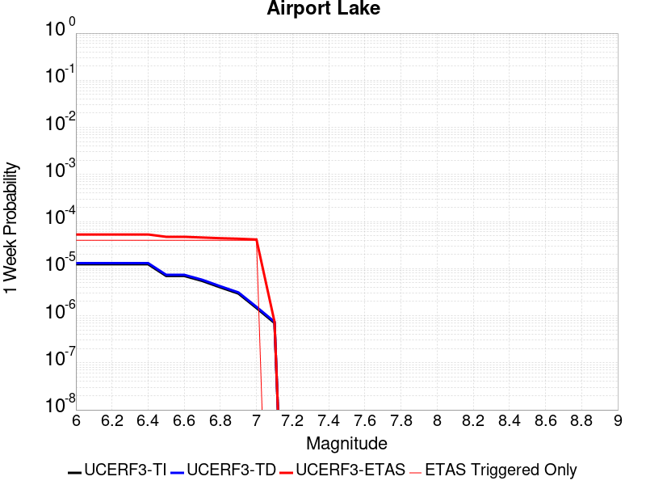 |  | 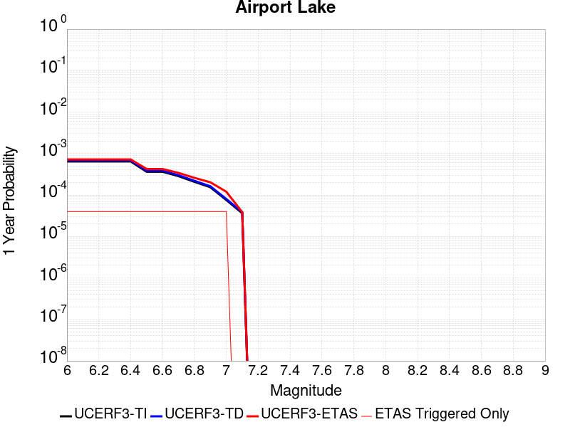 |

| Magnitude | 1 wk TI Prob | 1 wk TD Prob | 1 wk ETAS Prob | 1 wk ETAS/TD Gain | 1 wk ETAS Triggered Only | 1 mo TI Prob | 1 mo TD Prob | 1 mo ETAS Prob | 1 mo ETAS/TD Gain | 1 mo ETAS Triggered Only | 1 yr TI Prob | 1 yr TD Prob | 1 yr ETAS Prob | 1 yr ETAS/TD Gain | 1 yr ETAS Triggered Only |
|-----|-----|-----|-----|-----|-----|-----|-----|-----|-----|-----|-----|-----|-----|-----|-----|
| 6.0 | 1.2387061E-5 | 1.3105726E-5 | 5.3105203E-5 | 4.052061 | 4.0E-5 | 5.3086325E-5 | 5.6166347E-5 | 9.61641E-5 | 1.7121302 | 4.0E-5 | 6.461343E-4 | 6.8363914E-4 | 7.236118E-4 | 1.0584704 | 4.0E-5 |
| 6.1 | 1.2387061E-5 | 1.3105726E-5 | 5.3105203E-5 | 4.052061 | 4.0E-5 | 5.3086325E-5 | 5.6166347E-5 | 9.61641E-5 | 1.7121302 | 4.0E-5 | 6.461343E-4 | 6.8363914E-4 | 7.236118E-4 | 1.0584704 | 4.0E-5 |
| 6.2 | 1.2387061E-5 | 1.3105726E-5 | 5.3105203E-5 | 4.052061 | 4.0E-5 | 5.3086325E-5 | 5.6166347E-5 | 9.61641E-5 | 1.7121302 | 4.0E-5 | 6.461343E-4 | 6.8363914E-4 | 7.236118E-4 | 1.0584704 | 4.0E-5 |
| 6.3 | 1.2387061E-5 | 1.3105726E-5 | 5.3105203E-5 | 4.052061 | 4.0E-5 | 5.3086325E-5 | 5.6166347E-5 | 9.61641E-5 | 1.7121302 | 4.0E-5 | 6.461343E-4 | 6.8363914E-4 | 7.236118E-4 | 1.0584704 | 4.0E-5 |
| 6.4 | 1.2387061E-5 | 1.3105726E-5 | 5.3105203E-5 | 4.052061 | 4.0E-5 | 5.3086325E-5 | 5.6166347E-5 | 9.61641E-5 | 1.7121302 | 4.0E-5 | 6.461343E-4 | 6.8363914E-4 | 7.236118E-4 | 1.0584704 | 4.0E-5 |
| 6.5 | 6.9922594E-6 | 7.386331E-6 | 4.7386035E-5 | 6.4153686 | 4.0E-5 | 2.996648E-5 | 3.1655352E-5 | 7.165409E-5 | 2.2635694 | 4.0E-5 | 3.6478083E-4 | 3.8534118E-4 | 4.2532576E-4 | 1.103764 | 4.0E-5 |
| 6.6 | 6.9922594E-6 | 7.386331E-6 | 4.7386035E-5 | 6.4153686 | 4.0E-5 | 2.996648E-5 | 3.1655352E-5 | 7.165409E-5 | 2.2635694 | 4.0E-5 | 3.6478083E-4 | 3.8534118E-4 | 4.2532576E-4 | 1.103764 | 4.0E-5 |
| 6.7 | 5.477277E-6 | 5.7871744E-6 | 4.5786943E-5 | 7.911796 | 4.0E-5 | 2.3473833E-5 | 2.4801962E-5 | 6.4800966E-5 | 2.6127357 | 4.0E-5 | 2.8575645E-4 | 3.0192593E-4 | 3.4191387E-4 | 1.1324428 | 4.0E-5 |
| 6.8 | 3.9950432E-6 | 4.219889E-6 | 4.421972E-5 | 10.478882 | 4.0E-5 | 1.7121502E-5 | 1.808513E-5 | 5.8084406E-5 | 3.211722 | 4.0E-5 | 2.0843433E-4 | 2.2016696E-4 | 2.6015815E-4 | 1.1816403 | 4.0E-5 |
| 6.9 | 2.95695E-6 | 3.1236189E-6 | 4.3123495E-5 | 13.805619 | 4.0E-5 | 1.2672582E-5 | 1.33868825E-5 | 5.3386346E-5 | 3.9879596 | 4.0E-5 | 1.5427776E-4 | 1.6297537E-4 | 2.0296885E-4 | 1.2453959 | 4.0E-5 |
| 7.0 | 1.456072E-6 | 1.5411159E-6 | 4.1541054E-5 | 26.955177 | 4.0E-5 | 6.2402937E-6 | 6.6047714E-6 | 4.6604506E-5 | 7.0561876 | 4.0E-5 | 7.597293E-5 | 8.041113E-5 | 1.20407916E-4 | 1.4974035 | 4.0E-5 |
| 7.1 | 6.995192E-7 | 7.41046E-7 | 7.41046E-7 | 1.0 | 0.0 | 2.997936E-6 | 3.1759114E-6 | 3.1759114E-6 | 1.0 | 0.0 | 3.649926E-5 | 3.866672E-5 | 3.866672E-5 | 1.0 | 0.0 |

## Pittville 2011 CFM
*[(top)](#table-of-contents)*

| 1 Week | 1 Month | 1 Year |
|-----|-----|-----|
| 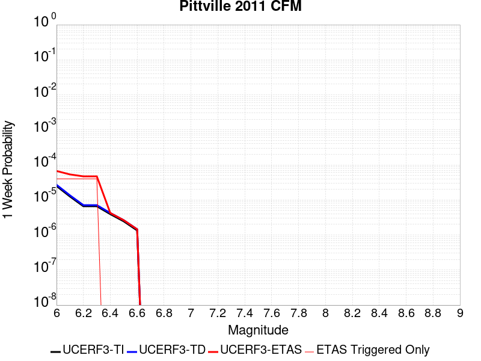 | 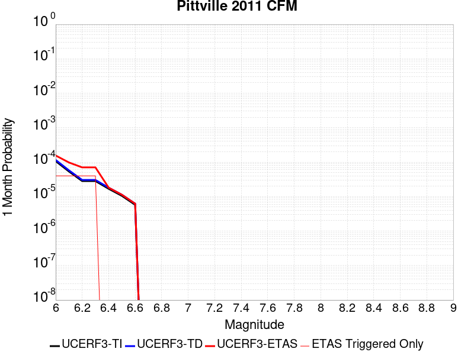 | 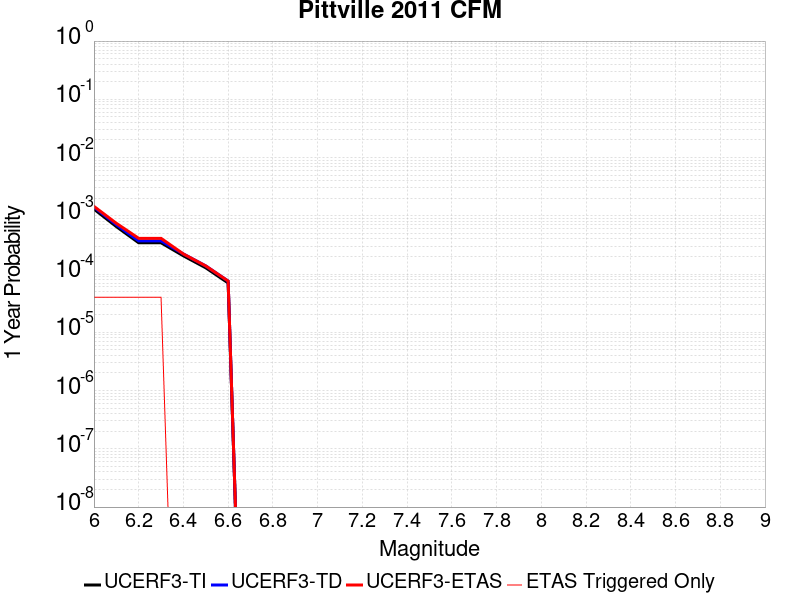 |

| Magnitude | 1 wk TI Prob | 1 wk TD Prob | 1 wk ETAS Prob | 1 wk ETAS/TD Gain | 1 wk ETAS Triggered Only | 1 mo TI Prob | 1 mo TD Prob | 1 mo ETAS Prob | 1 mo ETAS/TD Gain | 1 mo ETAS Triggered Only | 1 yr TI Prob | 1 yr TD Prob | 1 yr ETAS Prob | 1 yr ETAS/TD Gain | 1 yr ETAS Triggered Only |
|-----|-----|-----|-----|-----|-----|-----|-----|-----|-----|-----|-----|-----|-----|-----|-----|
| 6.0 | 2.5031832E-5 | 2.7064392E-5 | 6.706331E-5 | 2.4779167 | 4.0E-5 | 1.0727487E-4 | 1.1598565E-4 | 1.55981E-4 | 1.3448303 | 4.0E-5 | 0.001305289 | 0.001411308 | 0.0014512516 | 1.0283026 | 4.0E-5 |
| 6.1 | 1.2540113E-5 | 1.3516621E-5 | 5.351608E-5 | 3.9592795 | 4.0E-5 | 5.3742235E-5 | 5.7927216E-5 | 9.79249E-5 | 1.6904817 | 4.0E-5 | 6.541153E-4 | 7.050581E-4 | 7.4502995E-4 | 1.056693 | 4.0E-5 |
| 6.2 | 6.603218E-6 | 7.109028E-6 | 4.7108744E-5 | 6.6266084 | 4.0E-5 | 2.8299199E-5 | 3.0466943E-5 | 7.046572E-5 | 2.3128583 | 4.0E-5 | 3.4448825E-4 | 3.7087838E-4 | 4.1086355E-4 | 1.107812 | 4.0E-5 |
| 6.3 | 6.603218E-6 | 7.109028E-6 | 4.7108744E-5 | 6.6266084 | 4.0E-5 | 2.8299199E-5 | 3.0466943E-5 | 7.046572E-5 | 2.3128583 | 4.0E-5 | 3.4448825E-4 | 3.7087838E-4 | 4.1086355E-4 | 1.107812 | 4.0E-5 |
| 6.4 | 3.9389015E-6 | 4.2402703E-6 | 4.2402703E-6 | 1.0 | 0.0 | 1.6880897E-5 | 1.8172479E-5 | 1.8172479E-5 | 1.0 | 0.0 | 2.0550552E-4 | 2.2123057E-4 | 2.2123057E-4 | 1.0 | 0.0 |
| 6.5 | 2.4533072E-6 | 2.6419546E-6 | 2.6419546E-6 | 1.0 | 0.0 | 1.0514132E-5 | 1.1322624E-5 | 1.1322624E-5 | 1.0 | 0.0 | 1.2800204E-4 | 1.3784617E-4 | 1.3784617E-4 | 1.0 | 0.0 |
| 6.6 | 1.3482367E-6 | 1.4533757E-6 | 1.4533757E-6 | 1.0 | 0.0 | 5.778144E-6 | 6.228745E-6 | 6.228745E-6 | 1.0 | 0.0 | 7.0346636E-5 | 7.5833465E-5 | 7.5833465E-5 | 1.0 | 0.0 |

## Pilarcitos 2011 CFM
*[(top)](#table-of-contents)*

| 1 Week | 1 Month | 1 Year |
|-----|-----|-----|
| 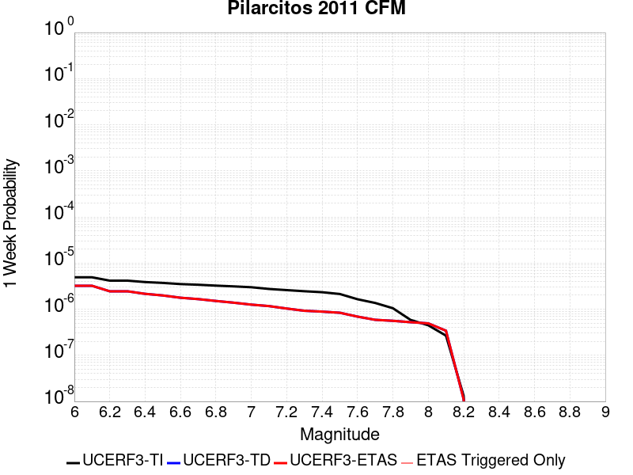 | 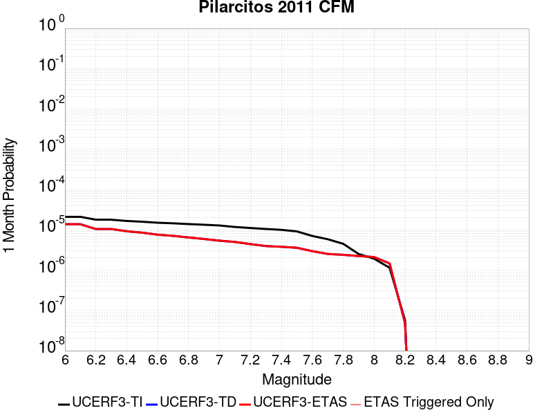 | 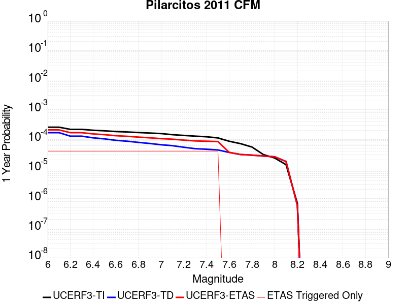 |

| Magnitude | 1 wk TI Prob | 1 wk TD Prob | 1 wk ETAS Prob | 1 wk ETAS/TD Gain | 1 wk ETAS Triggered Only | 1 mo TI Prob | 1 mo TD Prob | 1 mo ETAS Prob | 1 mo ETAS/TD Gain | 1 mo ETAS Triggered Only | 1 yr TI Prob | 1 yr TD Prob | 1 yr ETAS Prob | 1 yr ETAS/TD Gain | 1 yr ETAS Triggered Only |
|-----|-----|-----|-----|-----|-----|-----|-----|-----|-----|-----|-----|-----|-----|-----|-----|
| 6.0 | 4.9150476E-6 | 3.2173805E-6 | 3.2173805E-6 | 1.0 | 0.0 | 2.1064321E-5 | 1.3788703E-5 | 1.3788703E-5 | 1.0 | 0.0 | 2.564279E-4 | 1.6786484E-4 | 2.0785812E-4 | 1.2382469 | 4.0E-5 |
| 6.1 | 4.9150476E-6 | 3.2173805E-6 | 3.2173805E-6 | 1.0 | 0.0 | 2.1064321E-5 | 1.3788703E-5 | 1.3788703E-5 | 1.0 | 0.0 | 2.564279E-4 | 1.6786484E-4 | 2.0785812E-4 | 1.2382469 | 4.0E-5 |
| 6.2 | 4.162343E-6 | 2.4457051E-6 | 2.4457051E-6 | 1.0 | 0.0 | 1.783849E-5 | 1.0481552E-5 | 1.0481552E-5 | 1.0 | 0.0 | 2.1716199E-4 | 1.276055E-4 | 1.6760039E-4 | 1.3134261 | 4.0E-5 |
| 6.3 | 4.162343E-6 | 2.4457051E-6 | 2.4457051E-6 | 1.0 | 0.0 | 1.783849E-5 | 1.0481552E-5 | 1.0481552E-5 | 1.0 | 0.0 | 2.1716199E-4 | 1.276055E-4 | 1.6760039E-4 | 1.3134261 | 4.0E-5 |
| 6.4 | 3.8768926E-6 | 2.1530998E-6 | 2.1530998E-6 | 1.0 | 0.0 | 1.6615148E-5 | 9.227538E-6 | 9.227538E-6 | 1.0 | 0.0 | 2.0227065E-4 | 1.1233953E-4 | 1.5233504E-4 | 1.3560234 | 4.0E-5 |
| 6.5 | 3.7137002E-6 | 1.9864344E-6 | 1.9864344E-6 | 1.0 | 0.0 | 1.591576E-5 | 8.513262E-6 | 8.513262E-6 | 1.0 | 0.0 | 1.9375715E-4 | 1.0364407E-4 | 1.4363993E-4 | 1.3858962 | 4.0E-5 |
| 6.6 | 3.5048733E-6 | 1.7713638E-6 | 1.7713638E-6 | 1.0 | 0.0 | 1.5020799E-5 | 7.5915373E-6 | 7.5915373E-6 | 1.0 | 0.0 | 1.8286289E-4 | 9.242307E-5 | 1.3241937E-4 | 1.4327524 | 4.0E-5 |
| 6.7 | 3.3908584E-6 | 1.6550299E-6 | 1.6550299E-6 | 1.0 | 0.0 | 1.453217E-5 | 7.092966E-6 | 7.092966E-6 | 1.0 | 0.0 | 1.7691481E-4 | 8.635345E-5 | 1.2635E-4 | 1.4631726 | 4.0E-5 |
| 6.8 | 3.2451449E-6 | 1.5082161E-6 | 1.5082161E-6 | 1.0 | 0.0 | 1.3907689E-5 | 6.463767E-6 | 6.463767E-6 | 1.0 | 0.0 | 1.6931296E-4 | 7.8693534E-5 | 1.1869038E-4 | 1.508261 | 4.0E-5 |
| 6.9 | 3.1239128E-6 | 1.384711E-6 | 1.384711E-6 | 1.0 | 0.0 | 1.3388129E-5 | 5.9344625E-6 | 5.9344625E-6 | 1.0 | 0.0 | 1.6298829E-4 | 7.224969E-5 | 1.122468E-4 | 1.5535955 | 4.0E-5 |
| 7.0 | 2.9940109E-6 | 1.2559757E-6 | 1.2559757E-6 | 1.0 | 0.0 | 1.2831412E-5 | 5.3827416E-6 | 5.3827416E-6 | 1.0 | 0.0 | 1.5621124E-4 | 6.553291E-5 | 1.0553029E-4 | 1.6103404 | 4.0E-5 |
| 7.1 | 2.7471217E-6 | 1.167338E-6 | 1.167338E-6 | 1.0 | 0.0 | 1.1773326E-5 | 5.0028675E-6 | 5.0028675E-6 | 1.0 | 0.0 | 1.4333082E-4 | 6.0908213E-5 | 1.00905774E-4 | 1.656686 | 4.0E-5 |
| 7.2 | 2.592675E-6 | 1.0332211E-6 | 1.0332211E-6 | 1.0 | 0.0 | 1.1111417E-5 | 4.428083E-6 | 4.428083E-6 | 1.0 | 0.0 | 1.3527309E-4 | 5.3910575E-5 | 9.390842E-5 | 1.7419294 | 4.0E-5 |
| 7.3 | 2.4518663E-6 | 9.2404065E-7 | 9.2404065E-7 | 1.0 | 0.0 | 1.0507956E-5 | 3.960168E-6 | 3.960168E-6 | 1.0 | 0.0 | 1.2792686E-4 | 4.821398E-5 | 8.821205E-5 | 1.8295949 | 4.0E-5 |
| 7.4 | 2.3349535E-6 | 8.8601445E-7 | 8.8601445E-7 | 1.0 | 0.0 | 1.0006905E-5 | 3.797199E-6 | 3.797199E-6 | 1.0 | 0.0 | 1.2182725E-4 | 4.6229918E-5 | 8.622807E-5 | 1.8652005 | 4.0E-5 |
| 7.5 | 2.1358665E-6 | 8.375763E-7 | 8.375763E-7 | 1.0 | 0.0 | 9.15368E-6 | 3.5896076E-6 | 3.5896076E-6 | 1.0 | 0.0 | 1.11440364E-4 | 4.37026E-5 | 8.370085E-5 | 1.9152374 | 4.0E-5 |
| 7.6 | 1.6445446E-6 | 6.9029664E-7 | 6.9029664E-7 | 1.0 | 0.0 | 7.048029E-6 | 2.9584107E-6 | 2.9584107E-6 | 1.0 | 0.0 | 8.580638E-5 | 3.6018057E-5 | 3.6018057E-5 | 1.0 | 0.0 |
| 7.7 | 1.3650961E-6 | 5.8858836E-7 | 5.8858836E-7 | 1.0 | 0.0 | 5.850399E-6 | 2.522519E-6 | 2.522519E-6 | 1.0 | 0.0 | 7.122628E-5 | 3.071124E-5 | 3.071124E-5 | 1.0 | 0.0 |
| 7.8 | 1.0500993E-6 | 5.595509E-7 | 5.595509E-7 | 1.0 | 0.0 | 4.5004176E-6 | 2.398073E-6 | 2.398073E-6 | 1.0 | 0.0 | 5.4791206E-5 | 2.919615E-5 | 2.919615E-5 | 1.0 | 0.0 |
| 7.9 | 5.856431E-7 | 5.2268143E-7 | 5.2268143E-7 | 1.0 | 0.0 | 2.5098966E-6 | 2.2400611E-6 | 2.2400611E-6 | 1.0 | 0.0 | 3.0557563E-5 | 2.7272405E-5 | 2.7272405E-5 | 1.0 | 0.0 |
| 8.0 | 4.4768265E-7 | 4.9260325E-7 | 4.9260325E-7 | 1.0 | 0.0 | 1.9186384E-6 | 2.111155E-6 | 2.111155E-6 | 1.0 | 0.0 | 2.3359173E-5 | 2.570301E-5 | 2.570301E-5 | 1.0 | 0.0 |
| 8.1 | 2.6692538E-7 | 3.4162898E-7 | 3.4162898E-7 | 1.0 | 0.0 | 1.1439654E-6 | 1.4641233E-6 | 1.4641233E-6 | 1.0 | 0.0 | 1.392769E-5 | 1.7825556E-5 | 1.7825556E-5 | 1.0 | 0.0 |
| 8.2 | 1.3198862E-8 | 1.105228E-8 | 1.105228E-8 | 1.0 | 0.0 | 5.656655E-8 | 4.7366914E-8 | 4.7366914E-8 | 1.0 | 0.0 | 6.886975E-7 | 5.7669206E-7 | 5.7669206E-7 | 1.0 | 0.0 |

## San Jose
*[(top)](#table-of-contents)*

| 1 Week | 1 Month | 1 Year |
|-----|-----|-----|
| 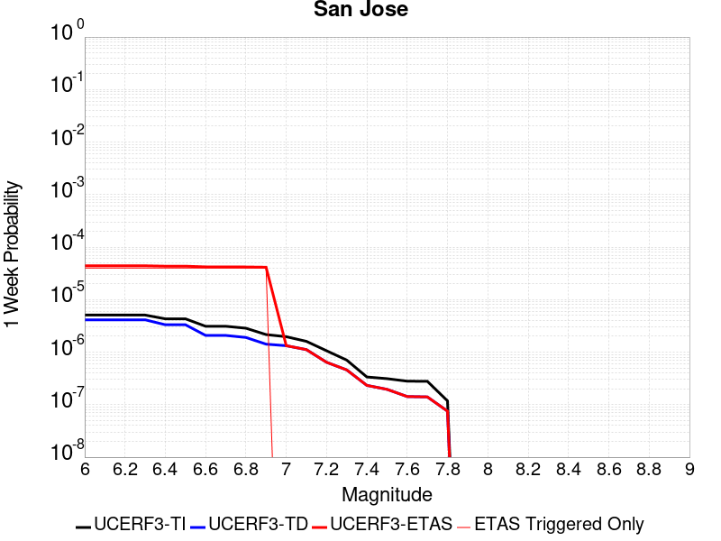 | 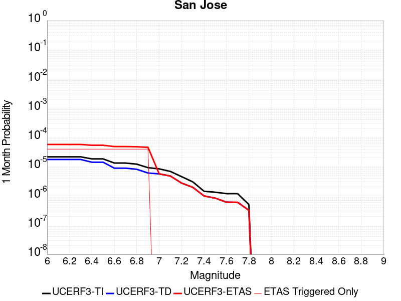 | 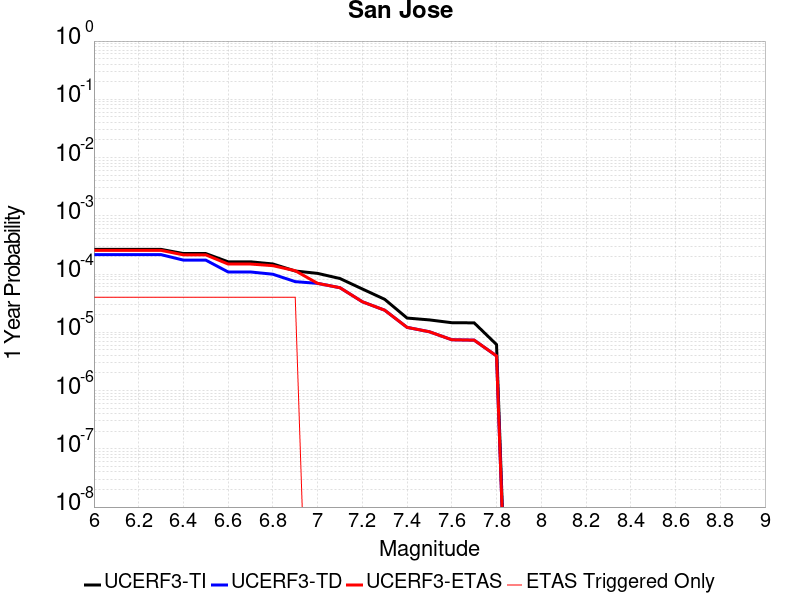 |

| Magnitude | 1 wk TI Prob | 1 wk TD Prob | 1 wk ETAS Prob | 1 wk ETAS/TD Gain | 1 wk ETAS Triggered Only | 1 mo TI Prob | 1 mo TD Prob | 1 mo ETAS Prob | 1 mo ETAS/TD Gain | 1 mo ETAS Triggered Only | 1 yr TI Prob | 1 yr TD Prob | 1 yr ETAS Prob | 1 yr ETAS/TD Gain | 1 yr ETAS Triggered Only |
|-----|-----|-----|-----|-----|-----|-----|-----|-----|-----|-----|-----|-----|-----|-----|-----|
| 6.0 | 5.0851277E-6 | 4.127646E-6 | 4.4127482E-5 | 10.690713 | 4.0E-5 | 2.1793223E-5 | 1.7689807E-5 | 5.76891E-5 | 3.2611492 | 4.0E-5 | 2.653002E-4 | 2.1535474E-4 | 2.5534612E-4 | 1.1857 | 4.0E-5 |
| 6.1 | 5.0851277E-6 | 4.127646E-6 | 4.4127482E-5 | 10.690713 | 4.0E-5 | 2.1793223E-5 | 1.7689807E-5 | 5.76891E-5 | 3.2611492 | 4.0E-5 | 2.653002E-4 | 2.1535474E-4 | 2.5534612E-4 | 1.1857 | 4.0E-5 |
| 6.2 | 5.0851277E-6 | 4.127646E-6 | 4.4127482E-5 | 10.690713 | 4.0E-5 | 2.1793223E-5 | 1.7689807E-5 | 5.76891E-5 | 3.2611492 | 4.0E-5 | 2.653002E-4 | 2.1535474E-4 | 2.5534612E-4 | 1.1857 | 4.0E-5 |
| 6.3 | 5.0851277E-6 | 4.127646E-6 | 4.4127482E-5 | 10.690713 | 4.0E-5 | 2.1793223E-5 | 1.7689807E-5 | 5.76891E-5 | 3.2611492 | 4.0E-5 | 2.653002E-4 | 2.1535474E-4 | 2.5534612E-4 | 1.1857 | 4.0E-5 |
| 6.4 | 4.3115124E-6 | 3.3256572E-6 | 4.3325523E-5 | 13.0276575 | 4.0E-5 | 1.8477778E-5 | 1.42527515E-5 | 5.425218E-5 | 3.8064356 | 4.0E-5 | 2.2494372E-4 | 1.7351564E-4 | 2.135087E-4 | 1.2304868 | 4.0E-5 |
| 6.5 | 4.3115124E-6 | 3.3256572E-6 | 4.3325523E-5 | 13.0276575 | 4.0E-5 | 1.8477778E-5 | 1.42527515E-5 | 5.425218E-5 | 3.8064356 | 4.0E-5 | 2.2494372E-4 | 1.7351564E-4 | 2.135087E-4 | 1.2304868 | 4.0E-5 |
| 6.6 | 3.110396E-6 | 2.081711E-6 | 4.208163E-5 | 20.214924 | 4.0E-5 | 1.33302E-5 | 8.921589E-6 | 4.8921233E-5 | 5.483466 | 4.0E-5 | 1.622831E-4 | 1.0861522E-4 | 1.4861087E-4 | 1.3682325 | 4.0E-5 |
| 6.7 | 3.110396E-6 | 2.081711E-6 | 4.208163E-5 | 20.214924 | 4.0E-5 | 1.33302E-5 | 8.921589E-6 | 4.8921233E-5 | 5.483466 | 4.0E-5 | 1.622831E-4 | 1.0861522E-4 | 1.4861087E-4 | 1.3682325 | 4.0E-5 |
| 6.8 | 2.856651E-6 | 1.9041215E-6 | 4.1904044E-5 | 22.007023 | 4.0E-5 | 1.2242733E-5 | 8.160497E-6 | 4.816017E-5 | 5.9016223 | 4.0E-5 | 1.4904508E-4 | 9.934977E-5 | 1.393458E-4 | 1.402578 | 4.0E-5 |
| 6.9 | 2.1618725E-6 | 1.4202409E-6 | 4.1420182E-5 | 29.164196 | 4.0E-5 | 9.265135E-6 | 6.086733E-6 | 4.608649E-5 | 7.57163 | 4.0E-5 | 1.12797185E-4 | 7.410354E-5 | 1.1410058E-4 | 1.5397453 | 4.0E-5 |
| 7.0 | 1.9684312E-6 | 1.3271862E-6 | 1.3271862E-6 | 1.0 | 0.0 | 8.436106E-6 | 5.687929E-6 | 5.687929E-6 | 1.0 | 0.0 | 1.02704755E-4 | 6.924842E-5 | 6.924842E-5 | 1.0 | 0.0 |
| 7.1 | 1.6070337E-6 | 1.1169859E-6 | 1.1169859E-6 | 1.0 | 0.0 | 6.887269E-6 | 4.787074E-6 | 4.787074E-6 | 1.0 | 0.0 | 8.384928E-5 | 5.828113E-5 | 5.828113E-5 | 1.0 | 0.0 |
| 7.2 | 1.0631658E-6 | 6.414727E-7 | 6.414727E-7 | 1.0 | 0.0 | 4.556417E-6 | 2.7491658E-6 | 2.7491658E-6 | 1.0 | 0.0 | 5.5472963E-5 | 3.3470595E-5 | 3.3470595E-5 | 1.0 | 0.0 |
| 7.3 | 7.060711E-7 | 4.591335E-7 | 4.591335E-7 | 1.0 | 0.0 | 3.0260155E-6 | 1.9677136E-6 | 1.9677136E-6 | 1.0 | 0.0 | 3.6841117E-5 | 2.3956658E-5 | 2.3956658E-5 | 1.0 | 0.0 |
| 7.4 | 3.3677085E-7 | 2.3296968E-7 | 2.3296968E-7 | 1.0 | 0.0 | 1.4433028E-6 | 9.984411E-7 | 9.984411E-7 | 1.0 | 0.0 | 1.757207E-5 | 1.2155956E-5 | 1.2155956E-5 | 1.0 | 0.0 |
| 7.5 | 3.129161E-7 | 1.9583004E-7 | 1.9583004E-7 | 1.0 | 0.0 | 1.3410682E-6 | 8.3927137E-7 | 8.3927137E-7 | 1.0 | 0.0 | 1.6327383E-5 | 1.0218083E-5 | 1.0218083E-5 | 1.0 | 0.0 |
| 7.6 | 2.8008668E-7 | 1.4278207E-7 | 1.4278207E-7 | 1.0 | 0.0 | 1.2003709E-6 | 6.11923E-7 | 6.11923E-7 | 1.0 | 0.0 | 1.46144175E-5 | 7.450139E-6 | 7.450139E-6 | 1.0 | 0.0 |
| 7.7 | 2.7852005E-7 | 1.405229E-7 | 1.405229E-7 | 1.0 | 0.0 | 1.1936568E-6 | 6.0224085E-7 | 6.0224085E-7 | 1.0 | 0.0 | 1.4532674E-5 | 7.3322594E-6 | 7.3322594E-6 | 1.0 | 0.0 |
| 7.8 | 1.1810797E-7 | 7.533926E-8 | 7.533926E-8 | 1.0 | 0.0 | 5.0617695E-7 | 3.228825E-7 | 3.228825E-7 | 1.0 | 0.0 | 6.1626865E-6 | 3.9310876E-6 | 3.9310876E-6 | 1.0 | 0.0 |

## Hat Creek-McArthur-Mayfield
*[(top)](#table-of-contents)*

| 1 Week | 1 Month | 1 Year |
|-----|-----|-----|
| 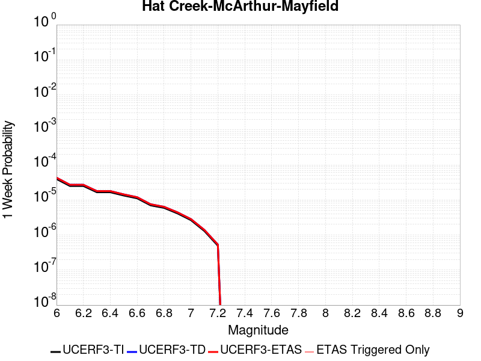 | 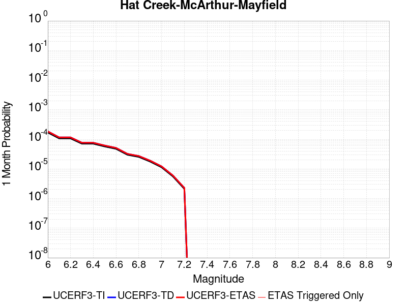 | 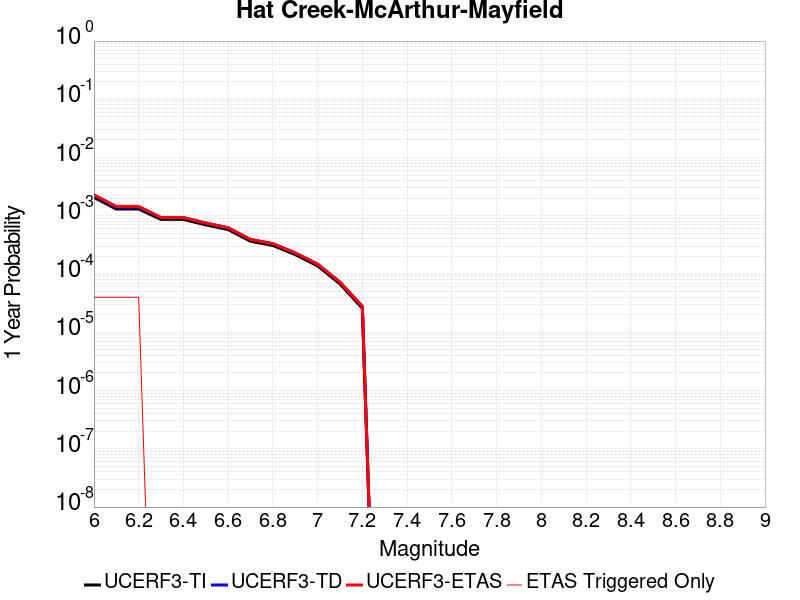 |

| Magnitude | 1 wk TI Prob | 1 wk TD Prob | 1 wk ETAS Prob | 1 wk ETAS/TD Gain | 1 wk ETAS Triggered Only | 1 mo TI Prob | 1 mo TD Prob | 1 mo ETAS Prob | 1 mo ETAS/TD Gain | 1 mo ETAS Triggered Only | 1 yr TI Prob | 1 yr TD Prob | 1 yr ETAS Prob | 1 yr ETAS/TD Gain | 1 yr ETAS Triggered Only |
|-----|-----|-----|-----|-----|-----|-----|-----|-----|-----|-----|-----|-----|-----|-----|-----|
| 6.0 | 3.967457E-5 | 4.3171214E-5 | 4.3171214E-5 | 1.0 | 0.0 | 1.7002279E-4 | 1.8500701E-4 | 1.8500701E-4 | 1.0 | 0.0 | 0.002068062 | 0.0022502479 | 0.0022901578 | 1.0177358 | 4.0E-5 |
| 6.1 | 2.5044013E-5 | 2.7078615E-5 | 2.7078615E-5 | 1.0 | 0.0 | 1.0732707E-4 | 1.1604622E-4 | 1.1604622E-4 | 1.0 | 0.0 | 0.0013059238 | 0.0014119789 | 0.0014519223 | 1.0282891 | 4.0E-5 |
| 6.2 | 2.5044013E-5 | 2.7078615E-5 | 2.7078615E-5 | 1.0 | 0.0 | 1.0732707E-4 | 1.1604622E-4 | 1.1604622E-4 | 1.0 | 0.0 | 0.0013059238 | 0.0014119789 | 0.0014519223 | 1.0282891 | 4.0E-5 |
| 6.3 | 1.6624012E-5 | 1.7895702E-5 | 1.7895702E-5 | 1.0 | 0.0 | 7.124382E-5 | 7.669366E-5 | 7.669366E-5 | 1.0 | 0.0 | 8.670483E-4 | 9.333539E-4 | 9.333539E-4 | 1.0 | 0.0 |
| 6.4 | 1.6624012E-5 | 1.7895702E-5 | 1.7895702E-5 | 1.0 | 0.0 | 7.124382E-5 | 7.669366E-5 | 7.669366E-5 | 1.0 | 0.0 | 8.670483E-4 | 9.333539E-4 | 9.333539E-4 | 1.0 | 0.0 |
| 6.5 | 1.3394842E-5 | 1.4395774E-5 | 1.4395774E-5 | 1.0 | 0.0 | 5.7405203E-5 | 6.169474E-5 | 6.169474E-5 | 1.0 | 0.0 | 6.986842E-4 | 7.508802E-4 | 7.508802E-4 | 1.0 | 0.0 |
| 6.6 | 1.1137514E-5 | 1.1957522E-5 | 1.1957522E-5 | 1.0 | 0.0 | 4.7731326E-5 | 5.1245537E-5 | 5.1245537E-5 | 1.0 | 0.0 | 5.809739E-4 | 6.2373985E-4 | 6.2373985E-4 | 1.0 | 0.0 |
| 6.7 | 7.0200663E-6 | 7.5261228E-6 | 7.5261228E-6 | 1.0 | 0.0 | 3.008565E-5 | 3.2254422E-5 | 3.2254422E-5 | 1.0 | 0.0 | 3.6623122E-4 | 3.926284E-4 | 3.926284E-4 | 1.0 | 0.0 |
| 6.8 | 5.940172E-6 | 6.3670223E-6 | 6.3670223E-6 | 1.0 | 0.0 | 2.545763E-5 | 2.728696E-5 | 2.728696E-5 | 1.0 | 0.0 | 3.0990256E-4 | 3.3216935E-4 | 3.3216935E-4 | 1.0 | 0.0 |
| 6.9 | 4.129831E-6 | 4.424614E-6 | 4.424614E-6 | 1.0 | 0.0 | 1.7699154E-5 | 1.8962497E-5 | 1.8962497E-5 | 1.0 | 0.0 | 2.154659E-4 | 2.3084473E-4 | 2.3084473E-4 | 1.0 | 0.0 |
| 7.0 | 2.6512955E-6 | 2.8380753E-6 | 2.8380753E-6 | 1.0 | 0.0 | 1.1362646E-5 | 1.2163126E-5 | 1.2163126E-5 | 1.0 | 0.0 | 1.3833142E-4 | 1.4807642E-4 | 1.4807642E-4 | 1.0 | 0.0 |
| 7.1 | 1.2992575E-6 | 1.3912645E-6 | 1.3912645E-6 | 1.0 | 0.0 | 5.568235E-6 | 5.9625495E-6 | 5.9625495E-6 | 1.0 | 0.0 | 6.779115E-5 | 7.259184E-5 | 7.259184E-5 | 1.0 | 0.0 |
| 7.2 | 4.968191E-7 | 5.3284526E-7 | 5.3284526E-7 | 1.0 | 0.0 | 2.1292228E-6 | 2.2836211E-6 | 2.2836211E-6 | 1.0 | 0.0 | 2.592298E-5 | 2.7802858E-5 | 2.7802858E-5 | 1.0 | 0.0 |

## Compton
*[(top)](#table-of-contents)*

| 1 Week | 1 Month | 1 Year |
|-----|-----|-----|
| 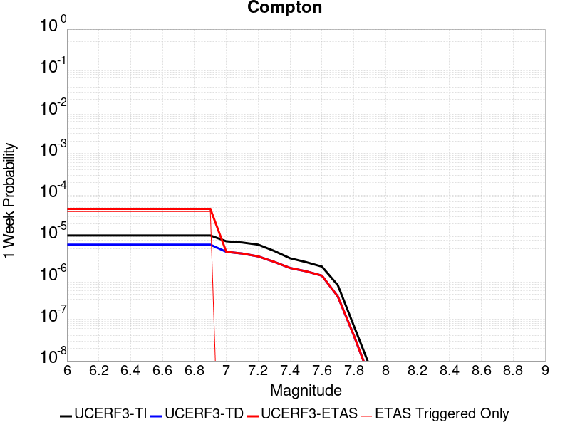 |  | 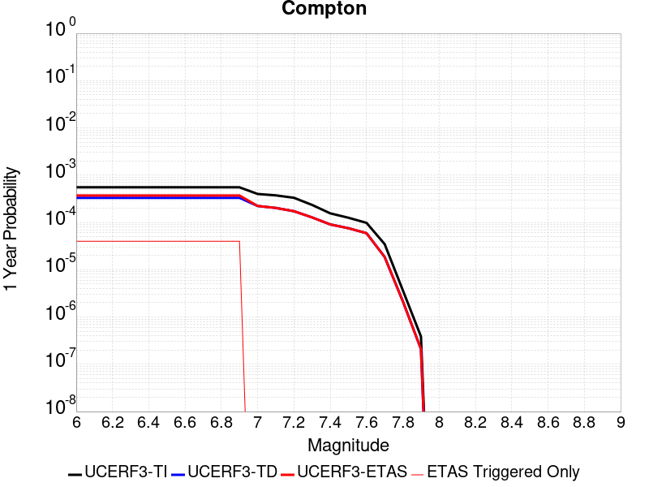 |

| Magnitude | 1 wk TI Prob | 1 wk TD Prob | 1 wk ETAS Prob | 1 wk ETAS/TD Gain | 1 wk ETAS Triggered Only | 1 mo TI Prob | 1 mo TD Prob | 1 mo ETAS Prob | 1 mo ETAS/TD Gain | 1 mo ETAS Triggered Only | 1 yr TI Prob | 1 yr TD Prob | 1 yr ETAS Prob | 1 yr ETAS/TD Gain | 1 yr ETAS Triggered Only |
|-----|-----|-----|-----|-----|-----|-----|-----|-----|-----|-----|-----|-----|-----|-----|-----|
| 6.0 | 1.06050875E-5 | 6.3607795E-6 | 4.6360525E-5 | 7.2884974 | 4.0E-5 | 4.5449582E-5 | 2.7260216E-5 | 6.725913E-5 | 2.4673 | 4.0E-5 | 5.5320817E-4 | 3.3184543E-4 | 3.7183217E-4 | 1.1204981 | 4.0E-5 |
| 6.1 | 1.06050875E-5 | 6.3607795E-6 | 4.6360525E-5 | 7.2884974 | 4.0E-5 | 4.5449582E-5 | 2.7260216E-5 | 6.725913E-5 | 2.4673 | 4.0E-5 | 5.5320817E-4 | 3.3184543E-4 | 3.7183217E-4 | 1.1204981 | 4.0E-5 |
| 6.2 | 1.06050875E-5 | 6.3607795E-6 | 4.6360525E-5 | 7.2884974 | 4.0E-5 | 4.5449582E-5 | 2.7260216E-5 | 6.725913E-5 | 2.4673 | 4.0E-5 | 5.5320817E-4 | 3.3184543E-4 | 3.7183217E-4 | 1.1204981 | 4.0E-5 |
| 6.3 | 1.06050875E-5 | 6.3607795E-6 | 4.6360525E-5 | 7.2884974 | 4.0E-5 | 4.5449582E-5 | 2.7260216E-5 | 6.725913E-5 | 2.4673 | 4.0E-5 | 5.5320817E-4 | 3.3184543E-4 | 3.7183217E-4 | 1.1204981 | 4.0E-5 |
| 6.4 | 1.06050875E-5 | 6.3607795E-6 | 4.6360525E-5 | 7.2884974 | 4.0E-5 | 4.5449582E-5 | 2.7260216E-5 | 6.725913E-5 | 2.4673 | 4.0E-5 | 5.5320817E-4 | 3.3184543E-4 | 3.7183217E-4 | 1.1204981 | 4.0E-5 |
| 6.5 | 1.06050875E-5 | 6.3607795E-6 | 4.6360525E-5 | 7.2884974 | 4.0E-5 | 4.5449582E-5 | 2.7260216E-5 | 6.725913E-5 | 2.4673 | 4.0E-5 | 5.5320817E-4 | 3.3184543E-4 | 3.7183217E-4 | 1.1204981 | 4.0E-5 |
| 6.6 | 1.06050875E-5 | 6.3607795E-6 | 4.6360525E-5 | 7.2884974 | 4.0E-5 | 4.5449582E-5 | 2.7260216E-5 | 6.725913E-5 | 2.4673 | 4.0E-5 | 5.5320817E-4 | 3.3184543E-4 | 3.7183217E-4 | 1.1204981 | 4.0E-5 |
| 6.7 | 1.06050875E-5 | 6.3607795E-6 | 4.6360525E-5 | 7.2884974 | 4.0E-5 | 4.5449582E-5 | 2.7260216E-5 | 6.725913E-5 | 2.4673 | 4.0E-5 | 5.5320817E-4 | 3.3184543E-4 | 3.7183217E-4 | 1.1204981 | 4.0E-5 |
| 6.8 | 1.06050875E-5 | 6.3607795E-6 | 4.6360525E-5 | 7.2884974 | 4.0E-5 | 4.5449582E-5 | 2.7260216E-5 | 6.725913E-5 | 2.4673 | 4.0E-5 | 5.5320817E-4 | 3.3184543E-4 | 3.7183217E-4 | 1.1204981 | 4.0E-5 |
| 6.9 | 1.06050875E-5 | 6.3607795E-6 | 4.6360525E-5 | 7.2884974 | 4.0E-5 | 4.5449582E-5 | 2.7260216E-5 | 6.725913E-5 | 2.4673 | 4.0E-5 | 5.5320817E-4 | 3.3184543E-4 | 3.7183217E-4 | 1.1204981 | 4.0E-5 |
| 7.0 | 7.672486E-6 | 4.273551E-6 | 4.273551E-6 | 1.0 | 0.0 | 3.288167E-5 | 1.8315093E-5 | 1.8315093E-5 | 1.0 | 0.0 | 4.0026082E-4 | 2.2296407E-4 | 2.2296407E-4 | 1.0 | 0.0 |
| 7.1 | 7.163992E-6 | 3.8851213E-6 | 3.8851213E-6 | 1.0 | 0.0 | 3.0702464E-5 | 1.6650416E-5 | 1.6650416E-5 | 1.0 | 0.0 | 3.7373835E-4 | 2.0270052E-4 | 2.0270052E-4 | 1.0 | 0.0 |
| 7.2 | 6.3689185E-6 | 3.3113977E-6 | 3.3113977E-6 | 1.0 | 0.0 | 2.729508E-5 | 1.4191629E-5 | 1.4191629E-5 | 1.0 | 0.0 | 3.322669E-4 | 1.7276981E-4 | 1.7276981E-4 | 1.0 | 0.0 |
| 7.3 | 4.4987873E-6 | 2.4489018E-6 | 2.4489018E-6 | 1.0 | 0.0 | 1.9280375E-5 | 1.0495253E-5 | 1.0495253E-5 | 1.0 | 0.0 | 2.3471327E-4 | 1.2777252E-4 | 1.2777252E-4 | 1.0 | 0.0 |
| 7.4 | 2.987296E-6 | 1.7401314E-6 | 1.7401314E-6 | 1.0 | 0.0 | 1.2802635E-5 | 7.4576856E-6 | 7.4576856E-6 | 1.0 | 0.0 | 1.5586092E-4 | 9.07936E-5 | 9.07936E-5 | 1.0 | 0.0 |
| 7.5 | 2.4111696E-6 | 1.44775E-6 | 1.44775E-6 | 1.0 | 0.0 | 1.0333543E-5 | 6.2046283E-6 | 6.2046283E-6 | 1.0 | 0.0 | 1.2580362E-4 | 7.553878E-5 | 7.553878E-5 | 1.0 | 0.0 |
| 7.6 | 1.8783096E-6 | 1.1364502E-6 | 1.1364502E-6 | 1.0 | 0.0 | 8.049874E-6 | 4.870492E-6 | 4.870492E-6 | 1.0 | 0.0 | 9.8002805E-5 | 5.9296668E-5 | 5.9296668E-5 | 1.0 | 0.0 |
| 7.7 | 6.6646817E-7 | 3.5614548E-7 | 3.5614548E-7 | 1.0 | 0.0 | 2.856289E-6 | 1.526337E-6 | 1.526337E-6 | 1.0 | 0.0 | 3.4774763E-5 | 1.8583009E-5 | 1.8583009E-5 | 1.0 | 0.0 |
| 7.8 | 7.054689E-8 | 4.1366587E-8 | 4.1366587E-8 | 1.0 | 0.0 | 3.0234378E-7 | 1.7728536E-7 | 1.7728536E-7 | 1.0 | 0.0 | 3.6810293E-6 | 2.1584472E-6 | 2.1584472E-6 | 1.0 | 0.0 |
| 7.9 | 7.420925E-9 | 4.016303E-9 | 4.016303E-9 | 1.0 | 0.0 | 3.1803964E-8 | 1.7212727E-8 | 1.7212727E-8 | 1.0 | 0.0 | 3.872132E-7 | 2.0956493E-7 | 2.0956493E-7 | 1.0 | 0.0 |

## South Cuyama
*[(top)](#table-of-contents)*

| 1 Week | 1 Month | 1 Year |
|-----|-----|-----|
|  | 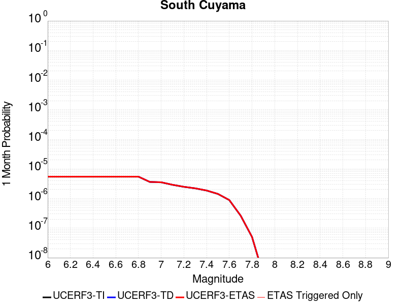 | 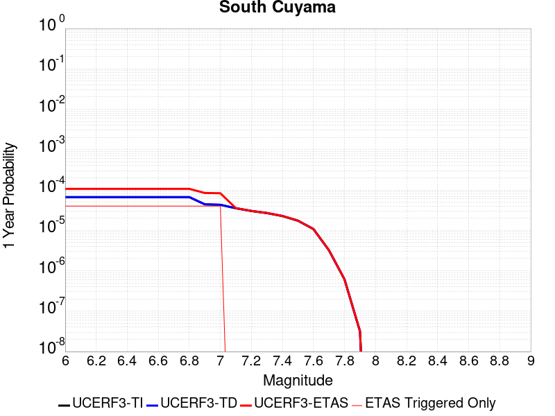 |

| Magnitude | 1 wk TI Prob | 1 wk TD Prob | 1 wk ETAS Prob | 1 wk ETAS/TD Gain | 1 wk ETAS Triggered Only | 1 mo TI Prob | 1 mo TD Prob | 1 mo ETAS Prob | 1 mo ETAS/TD Gain | 1 mo ETAS Triggered Only | 1 yr TI Prob | 1 yr TD Prob | 1 yr ETAS Prob | 1 yr ETAS/TD Gain | 1 yr ETAS Triggered Only |
|-----|-----|-----|-----|-----|-----|-----|-----|-----|-----|-----|-----|-----|-----|-----|-----|
| 6.0 | 1.2747308E-6 | 1.281894E-6 | 1.281894E-6 | 1.0 | 0.0 | 5.4631205E-6 | 5.4938205E-6 | 5.4938205E-6 | 1.0 | 0.0 | 6.6511464E-5 | 6.688528E-5 | 1.0688261E-4 | 1.5979989 | 4.0E-5 |
| 6.1 | 1.2747308E-6 | 1.281894E-6 | 1.281894E-6 | 1.0 | 0.0 | 5.4631205E-6 | 5.4938205E-6 | 5.4938205E-6 | 1.0 | 0.0 | 6.6511464E-5 | 6.688528E-5 | 1.0688261E-4 | 1.5979989 | 4.0E-5 |
| 6.2 | 1.2747308E-6 | 1.281894E-6 | 1.281894E-6 | 1.0 | 0.0 | 5.4631205E-6 | 5.4938205E-6 | 5.4938205E-6 | 1.0 | 0.0 | 6.6511464E-5 | 6.688528E-5 | 1.0688261E-4 | 1.5979989 | 4.0E-5 |
| 6.3 | 1.2747308E-6 | 1.281894E-6 | 1.281894E-6 | 1.0 | 0.0 | 5.4631205E-6 | 5.4938205E-6 | 5.4938205E-6 | 1.0 | 0.0 | 6.6511464E-5 | 6.688528E-5 | 1.0688261E-4 | 1.5979989 | 4.0E-5 |
| 6.4 | 1.2747308E-6 | 1.281894E-6 | 1.281894E-6 | 1.0 | 0.0 | 5.4631205E-6 | 5.4938205E-6 | 5.4938205E-6 | 1.0 | 0.0 | 6.6511464E-5 | 6.688528E-5 | 1.0688261E-4 | 1.5979989 | 4.0E-5 |
| 6.5 | 1.2747308E-6 | 1.281894E-6 | 1.281894E-6 | 1.0 | 0.0 | 5.4631205E-6 | 5.4938205E-6 | 5.4938205E-6 | 1.0 | 0.0 | 6.6511464E-5 | 6.688528E-5 | 1.0688261E-4 | 1.5979989 | 4.0E-5 |
| 6.6 | 1.2747308E-6 | 1.281894E-6 | 1.281894E-6 | 1.0 | 0.0 | 5.4631205E-6 | 5.4938205E-6 | 5.4938205E-6 | 1.0 | 0.0 | 6.6511464E-5 | 6.688528E-5 | 1.0688261E-4 | 1.5979989 | 4.0E-5 |
| 6.7 | 1.2747308E-6 | 1.281894E-6 | 1.281894E-6 | 1.0 | 0.0 | 5.4631205E-6 | 5.4938205E-6 | 5.4938205E-6 | 1.0 | 0.0 | 6.6511464E-5 | 6.688528E-5 | 1.0688261E-4 | 1.5979989 | 4.0E-5 |
| 6.8 | 1.2747308E-6 | 1.281894E-6 | 1.281894E-6 | 1.0 | 0.0 | 5.4631205E-6 | 5.4938205E-6 | 5.4938205E-6 | 1.0 | 0.0 | 6.6511464E-5 | 6.688528E-5 | 1.0688261E-4 | 1.5979989 | 4.0E-5 |
| 6.9 | 8.4566324E-7 | 8.5080575E-7 | 8.5080575E-7 | 1.0 | 0.0 | 3.624266E-6 | 3.6463052E-6 | 3.6463052E-6 | 1.0 | 0.0 | 4.4124543E-5 | 4.4392873E-5 | 8.43911E-5 | 1.9010055 | 4.0E-5 |
| 7.0 | 8.2277904E-7 | 8.2779906E-7 | 8.2779906E-7 | 1.0 | 0.0 | 3.526191E-6 | 3.5477055E-6 | 3.5477055E-6 | 1.0 | 0.0 | 4.293053E-5 | 4.3192467E-5 | 8.319074E-5 | 1.9260474 | 4.0E-5 |
| 7.1 | 6.7661887E-7 | 6.8092766E-7 | 6.8092766E-7 | 1.0 | 0.0 | 2.899792E-6 | 2.9182581E-6 | 2.9182581E-6 | 1.0 | 0.0 | 3.5304394E-5 | 3.5529218E-5 | 3.5529218E-5 | 1.0 | 0.0 |
| 7.2 | 5.783336E-7 | 5.82132E-7 | 5.82132E-7 | 1.0 | 0.0 | 2.4785702E-6 | 2.494849E-6 | 2.494849E-6 | 1.0 | 0.0 | 3.0176174E-5 | 3.0374365E-5 | 3.0374365E-5 | 1.0 | 0.0 |
| 7.3 | 5.136759E-7 | 5.1710543E-7 | 5.1710543E-7 | 1.0 | 0.0 | 2.2014663E-6 | 2.2161644E-6 | 2.2161644E-6 | 1.0 | 0.0 | 2.6802521E-5 | 2.698147E-5 | 2.698147E-5 | 1.0 | 0.0 |
| 7.4 | 4.3370295E-7 | 4.366637E-7 | 4.366637E-7 | 1.0 | 0.0 | 1.8587256E-6 | 1.8714145E-6 | 1.8714145E-6 | 1.0 | 0.0 | 2.2629749E-5 | 2.2784236E-5 | 2.2784236E-5 | 1.0 | 0.0 |
| 7.5 | 3.3242574E-7 | 3.3477264E-7 | 3.3477264E-7 | 1.0 | 0.0 | 1.4246809E-6 | 1.434739E-6 | 1.434739E-6 | 1.0 | 0.0 | 1.7345352E-5 | 1.746781E-5 | 1.746781E-5 | 1.0 | 0.0 |
| 7.6 | 2.0627535E-7 | 2.0779417E-7 | 2.0779417E-7 | 1.0 | 0.0 | 8.840369E-7 | 8.905461E-7 | 8.905461E-7 | 1.0 | 0.0 | 1.0763096E-5 | 1.08423465E-5 | 1.08423465E-5 | 1.0 | 0.0 |
| 7.7 | 6.15236E-8 | 6.1984615E-8 | 6.1984615E-8 | 1.0 | 0.0 | 2.6367252E-7 | 2.6564834E-7 | 2.6564834E-7 | 1.0 | 0.0 | 3.2102084E-6 | 3.2342637E-6 | 3.2342637E-6 | 1.0 | 0.0 |
| 7.8 | 1.1765573E-8 | 1.1873783E-8 | 1.1873783E-8 | 1.0 | 0.0 | 5.0423886E-8 | 5.0887643E-8 | 5.0887643E-8 | 1.0 | 0.0 | 6.1391063E-7 | 6.195569E-7 | 6.195569E-7 | 1.0 | 0.0 |
| 7.9 | 6.0381755E-10 | 6.100793E-10 | 6.100793E-10 | 1.0 | 0.0 | 2.5877895E-9 | 2.6146256E-9 | 2.6146256E-9 | 1.0 | 0.0 | 3.1506335E-8 | 3.1833068E-8 | 3.1833068E-8 | 1.0 | 0.0 |

## Death Valley (Fish Lake Valley)
*[(top)](#table-of-contents)*

| 1 Week | 1 Month | 1 Year |
|-----|-----|-----|
| 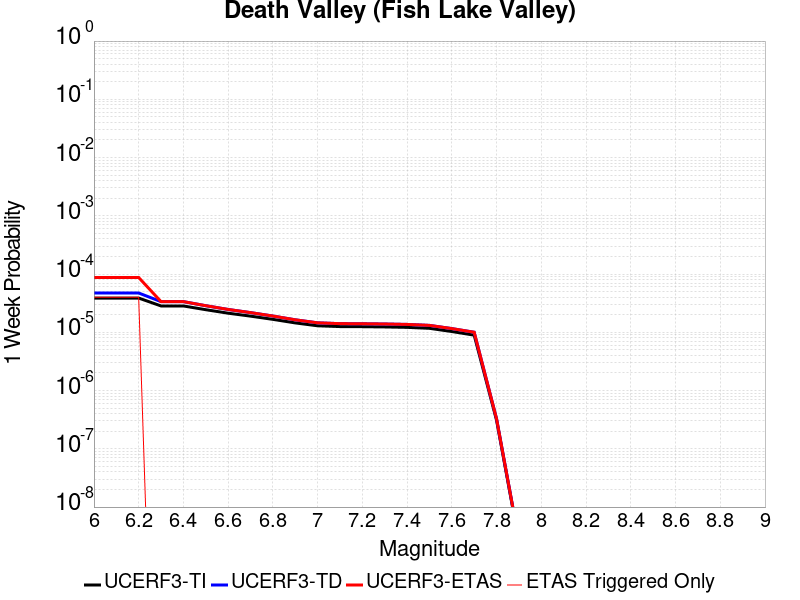 | 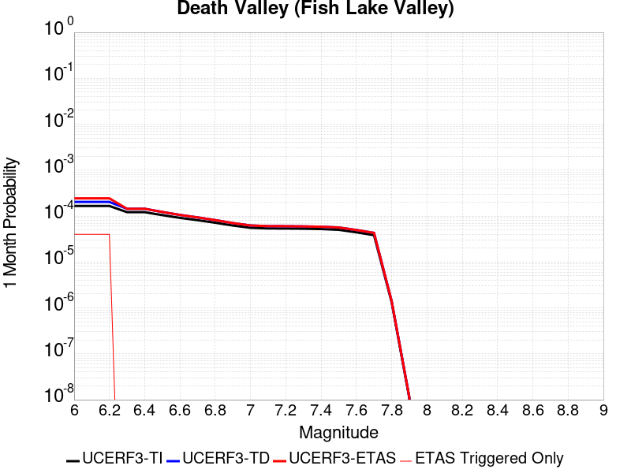 | 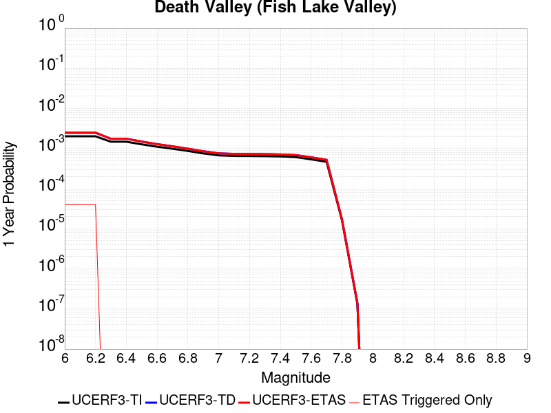 |

| Magnitude | 1 wk TI Prob | 1 wk TD Prob | 1 wk ETAS Prob | 1 wk ETAS/TD Gain | 1 wk ETAS Triggered Only | 1 mo TI Prob | 1 mo TD Prob | 1 mo ETAS Prob | 1 mo ETAS/TD Gain | 1 mo ETAS Triggered Only | 1 yr TI Prob | 1 yr TD Prob | 1 yr ETAS Prob | 1 yr ETAS/TD Gain | 1 yr ETAS Triggered Only |
|-----|-----|-----|-----|-----|-----|-----|-----|-----|-----|-----|-----|-----|-----|-----|-----|
| 6.0 | 3.872328E-5 | 4.7301484E-5 | 8.729959E-5 | 1.8455994 | 4.0E-5 | 1.6594635E-4 | 2.0270643E-4 | 2.4269831E-4 | 1.1972897 | 4.0E-5 | 0.0020185246 | 0.0024654074 | 0.0025053087 | 1.0161844 | 4.0E-5 |
| 6.1 | 3.872328E-5 | 4.7301484E-5 | 8.729959E-5 | 1.8455994 | 4.0E-5 | 1.6594635E-4 | 2.0270643E-4 | 2.4269831E-4 | 1.1972897 | 4.0E-5 | 0.0020185246 | 0.0024654074 | 0.0025053087 | 1.0161844 | 4.0E-5 |
| 6.2 | 3.872328E-5 | 4.7301484E-5 | 8.729959E-5 | 1.8455994 | 4.0E-5 | 1.6594635E-4 | 2.0270643E-4 | 2.4269831E-4 | 1.1972897 | 4.0E-5 | 0.0020185246 | 0.0024654074 | 0.0025053087 | 1.0161844 | 4.0E-5 |
| 6.3 | 2.8356371E-5 | 3.3631186E-5 | 3.3631186E-5 | 1.0 | 0.0 | 1.2152165E-4 | 1.4412597E-4 | 1.4412597E-4 | 1.0 | 0.0 | 0.0014785219 | 0.0017533908 | 0.0017533908 | 1.0 | 0.0 |
| 6.4 | 2.8356371E-5 | 3.3631186E-5 | 3.3631186E-5 | 1.0 | 0.0 | 1.2152165E-4 | 1.4412597E-4 | 1.4412597E-4 | 1.0 | 0.0 | 0.0014785219 | 0.0017533908 | 0.0017533908 | 1.0 | 0.0 |
| 6.5 | 2.4448687E-5 | 2.8624285E-5 | 2.8624285E-5 | 1.0 | 0.0 | 1.0477588E-4 | 1.2267003E-4 | 1.2267003E-4 | 1.0 | 0.0 | 0.0012748998 | 0.0014925316 | 0.0014925316 | 1.0 | 0.0 |
| 6.6 | 2.1298161E-5 | 2.467342E-5 | 2.467342E-5 | 1.0 | 0.0 | 9.127464E-5 | 1.05739135E-4 | 1.05739135E-4 | 1.0 | 0.0 | 0.0011107022 | 0.0012866468 | 0.0012866468 | 1.0 | 0.0 |
| 6.7 | 1.8959729E-5 | 2.1792128E-5 | 2.1792128E-5 | 1.0 | 0.0 | 8.125345E-5 | 9.339164E-5 | 9.339164E-5 | 1.0 | 0.0 | 9.888117E-4 | 0.0011364757 | 0.0011364757 | 1.0 | 0.0 |
| 6.8 | 1.6691629E-5 | 1.902741E-5 | 1.902741E-5 | 1.0 | 0.0 | 7.153359E-5 | 8.1543585E-5 | 8.1543585E-5 | 1.0 | 0.0 | 8.7057345E-4 | 9.923578E-4 | 9.923578E-4 | 1.0 | 0.0 |
| 6.9 | 1.450505E-5 | 1.6396794E-5 | 1.6396794E-5 | 1.0 | 0.0 | 6.216302E-5 | 7.027013E-5 | 7.027013E-5 | 1.0 | 0.0 | 7.5657194E-4 | 8.552118E-4 | 8.552118E-4 | 1.0 | 0.0 |
| 7.0 | 1.2940855E-5 | 1.4544072E-5 | 1.4544072E-5 | 1.0 | 0.0 | 5.545963E-5 | 6.233028E-5 | 6.233028E-5 | 1.0 | 0.0 | 6.750118E-4 | 7.586127E-4 | 7.586127E-4 | 1.0 | 0.0 |
| 7.1 | 1.2544658E-5 | 1.40840575E-5 | 1.40840575E-5 | 1.0 | 0.0 | 5.3761712E-5 | 6.035888E-5 | 6.035888E-5 | 1.0 | 0.0 | 6.5435225E-4 | 7.346272E-4 | 7.346272E-4 | 1.0 | 0.0 |
| 7.2 | 1.2489416E-5 | 1.4021496E-5 | 1.4021496E-5 | 1.0 | 0.0 | 5.3524967E-5 | 6.0090773E-5 | 6.0090773E-5 | 1.0 | 0.0 | 6.514716E-4 | 7.313652E-4 | 7.313652E-4 | 1.0 | 0.0 |
| 7.3 | 1.2368307E-5 | 1.3885578E-5 | 1.3885578E-5 | 1.0 | 0.0 | 5.3005948E-5 | 5.950829E-5 | 5.950829E-5 | 1.0 | 0.0 | 6.451563E-4 | 7.242782E-4 | 7.242782E-4 | 1.0 | 0.0 |
| 7.4 | 1.2161707E-5 | 1.36535355E-5 | 1.36535355E-5 | 1.0 | 0.0 | 5.212056E-5 | 5.851387E-5 | 5.851387E-5 | 1.0 | 0.0 | 6.3438306E-4 | 7.121791E-4 | 7.121791E-4 | 1.0 | 0.0 |
| 7.5 | 1.1707948E-5 | 1.3150998E-5 | 1.3150998E-5 | 1.0 | 0.0 | 5.0175953E-5 | 5.636023E-5 | 5.636023E-5 | 1.0 | 0.0 | 6.10721E-4 | 6.8597536E-4 | 6.8597536E-4 | 1.0 | 0.0 |
| 7.6 | 1.0319538E-5 | 1.1584422E-5 | 1.1584422E-5 | 1.0 | 0.0 | 4.4225842E-5 | 4.964661E-5 | 4.964661E-5 | 1.0 | 0.0 | 5.383166E-4 | 6.04285E-4 | 6.04285E-4 | 1.0 | 0.0 |
| 7.7 | 8.937764E-6 | 1.0026911E-5 | 1.0026911E-5 | 1.0 | 0.0 | 3.830414E-5 | 4.2971795E-5 | 4.2971795E-5 | 1.0 | 0.0 | 4.6625308E-4 | 5.23061E-4 | 5.23061E-4 | 1.0 | 0.0 |
| 7.8 | 3.108007E-7 | 3.2852898E-7 | 3.2852898E-7 | 1.0 | 0.0 | 1.3320023E-6 | 1.4079807E-6 | 1.4079807E-6 | 1.0 | 0.0 | 1.6217007E-5 | 1.7142032E-5 | 1.7142032E-5 | 1.0 | 0.0 |
| 7.9 | 2.5591178E-9 | 2.6700626E-9 | 2.6700626E-9 | 1.0 | 0.0 | 1.0967647E-8 | 1.1443126E-8 | 1.1443126E-8 | 1.0 | 0.0 | 1.335311E-7 | 1.3932005E-7 | 1.3932005E-7 | 1.0 | 0.0 |

## Concord 2011 CFM
*[(top)](#table-of-contents)*

| 1 Week | 1 Month | 1 Year |
|-----|-----|-----|
|  |  | 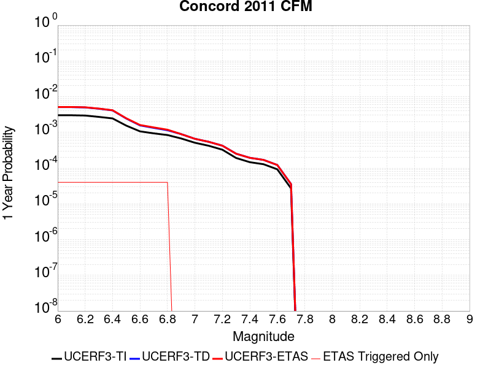 |

| Magnitude | 1 wk TI Prob | 1 wk TD Prob | 1 wk ETAS Prob | 1 wk ETAS/TD Gain | 1 wk ETAS Triggered Only | 1 mo TI Prob | 1 mo TD Prob | 1 mo ETAS Prob | 1 mo ETAS/TD Gain | 1 mo ETAS Triggered Only | 1 yr TI Prob | 1 yr TD Prob | 1 yr ETAS Prob | 1 yr ETAS/TD Gain | 1 yr ETAS Triggered Only |
|-----|-----|-----|-----|-----|-----|-----|-----|-----|-----|-----|-----|-----|-----|-----|-----|
| 6.0 | 5.7865112E-5 | 9.769028E-5 | 9.769028E-5 | 1.0 | 0.0 | 2.4796976E-4 | 4.1861023E-4 | 4.1861023E-4 | 1.0 | 0.0 | 0.0030148525 | 0.005085214 | 0.0051250104 | 1.007826 | 4.0E-5 |
| 6.1 | 5.7865112E-5 | 9.769028E-5 | 9.769028E-5 | 1.0 | 0.0 | 2.4796976E-4 | 4.1861023E-4 | 4.1861023E-4 | 1.0 | 0.0 | 0.0030148525 | 0.005085214 | 0.0051250104 | 1.007826 | 4.0E-5 |
| 6.2 | 5.6789337E-5 | 9.589094E-5 | 9.589094E-5 | 1.0 | 0.0 | 2.4336016E-4 | 4.1090118E-4 | 4.1090118E-4 | 1.0 | 0.0 | 0.0029588845 | 0.004991837 | 0.0050316374 | 1.0079731 | 4.0E-5 |
| 6.3 | 5.203322E-5 | 8.8125766E-5 | 8.8125766E-5 | 1.0 | 0.0 | 2.2298045E-4 | 3.776316E-4 | 3.776316E-4 | 1.0 | 0.0 | 0.0027114071 | 0.0045887567 | 0.004628573 | 1.008677 | 4.0E-5 |
| 6.4 | 4.7120942E-5 | 7.903713E-5 | 7.903713E-5 | 1.0 | 0.0 | 2.0193127E-4 | 3.3869076E-4 | 3.3869076E-4 | 1.0 | 0.0 | 0.0024557412 | 0.0041165086 | 0.004156344 | 1.0096769 | 4.0E-5 |
| 6.5 | 2.9598437E-5 | 4.673046E-5 | 4.673046E-5 | 1.0 | 0.0 | 1.2684427E-4 | 2.0025922E-4 | 2.0025922E-4 | 1.0 | 0.0 | 0.001543235 | 0.0024356402 | 0.002475543 | 1.0163828 | 4.0E-5 |
| 6.6 | 2.0443718E-5 | 3.0032927E-5 | 3.0032927E-5 | 1.0 | 0.0 | 8.7613E-5 | 1.287064E-4 | 1.287064E-4 | 1.0 | 0.0 | 0.0010661662 | 0.0015659104 | 0.0016058477 | 1.0255042 | 4.0E-5 |
| 6.7 | 1.798539E-5 | 2.5605239E-5 | 2.5605239E-5 | 1.0 | 0.0 | 7.7077966E-5 | 1.09732246E-4 | 1.09732246E-4 | 1.0 | 0.0 | 9.380202E-4 | 0.0013351929 | 0.0013751396 | 1.0299182 | 4.0E-5 |
| 6.8 | 1.613555E-5 | 2.1985506E-5 | 2.1985506E-5 | 1.0 | 0.0 | 6.915052E-5 | 9.4220275E-5 | 9.4220275E-5 | 1.0 | 0.0 | 8.4158237E-4 | 0.0011465421 | 0.0011864962 | 1.0348475 | 4.0E-5 |
| 6.9 | 1.2916435E-5 | 1.7105944E-5 | 1.7105944E-5 | 1.0 | 0.0 | 5.5354973E-5 | 7.330916E-5 | 7.330916E-5 | 1.0 | 0.0 | 6.7373837E-4 | 8.921794E-4 | 8.921794E-4 | 1.0 | 0.0 |
| 7.0 | 9.81129E-6 | 1.2651128E-5 | 1.2651128E-5 | 1.0 | 0.0 | 4.2047708E-5 | 5.4218E-5 | 5.4218E-5 | 1.0 | 0.0 | 5.118106E-4 | 6.599059E-4 | 6.599059E-4 | 1.0 | 0.0 |
| 7.1 | 8.0889195E-6 | 1.0432988E-5 | 1.0432988E-5 | 1.0 | 0.0 | 3.4666336E-5 | 4.4712047E-5 | 4.4712047E-5 | 1.0 | 0.0 | 4.219809E-4 | 5.4423424E-4 | 5.4423424E-4 | 1.0 | 0.0 |
| 7.2 | 6.267438E-6 | 8.129014E-6 | 8.129014E-6 | 1.0 | 0.0 | 2.6860173E-5 | 3.483817E-5 | 3.483817E-5 | 1.0 | 0.0 | 3.2697353E-4 | 4.240729E-4 | 4.240729E-4 | 1.0 | 0.0 |
| 7.3 | 3.6761196E-6 | 4.8453344E-6 | 4.8453344E-6 | 1.0 | 0.0 | 1.5754704E-5 | 2.0765554E-5 | 2.0765554E-5 | 1.0 | 0.0 | 1.9179663E-4 | 2.527915E-4 | 2.527915E-4 | 1.0 | 0.0 |
| 7.4 | 2.8044356E-6 | 3.7144744E-6 | 3.7144744E-6 | 1.0 | 0.0 | 1.2018954E-5 | 1.5919079E-5 | 1.5919079E-5 | 1.0 | 0.0 | 1.4632095E-4 | 1.9379768E-4 | 1.9379768E-4 | 1.0 | 0.0 |
| 7.5 | 2.4578699E-6 | 3.2490918E-6 | 3.2490918E-6 | 1.0 | 0.0 | 1.0533685E-5 | 1.3924606E-5 | 1.3924606E-5 | 1.0 | 0.0 | 1.2824008E-4 | 1.69519E-4 | 1.69519E-4 | 1.0 | 0.0 |
| 7.6 | 1.7713267E-6 | 2.339157E-6 | 2.339157E-6 | 1.0 | 0.0 | 7.591378E-6 | 1.0024921E-5 | 1.0024921E-5 | 1.0 | 0.0 | 9.2421105E-5 | 1.2204666E-4 | 1.2204666E-4 | 1.0 | 0.0 |
| 7.7 | 5.1912366E-7 | 6.8335413E-7 | 6.8335413E-7 | 1.0 | 0.0 | 2.2248137E-6 | 2.9286573E-6 | 2.9286573E-6 | 1.0 | 0.0 | 2.708677E-5 | 3.5655834E-5 | 3.5655834E-5 | 1.0 | 0.0 |

## Cleghorn Pass
*[(top)](#table-of-contents)*

| 1 Week | 1 Month | 1 Year |
|-----|-----|-----|
| 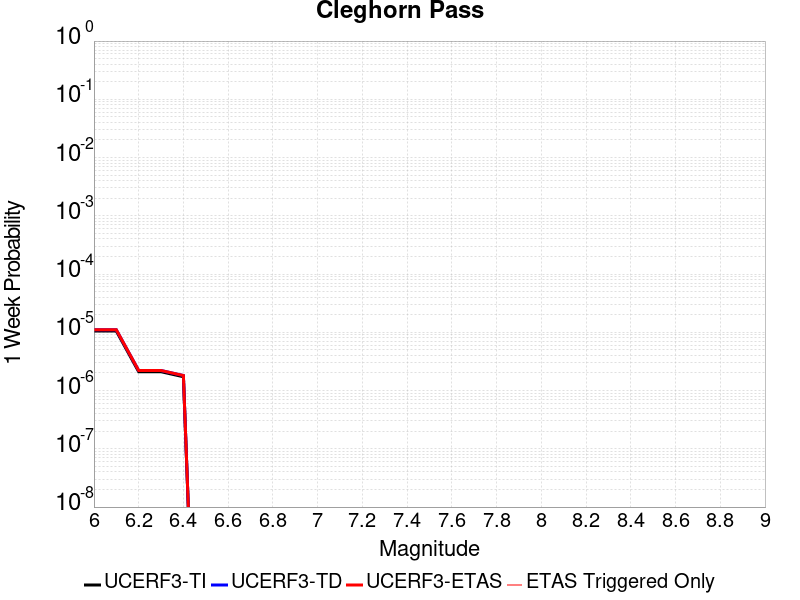 | 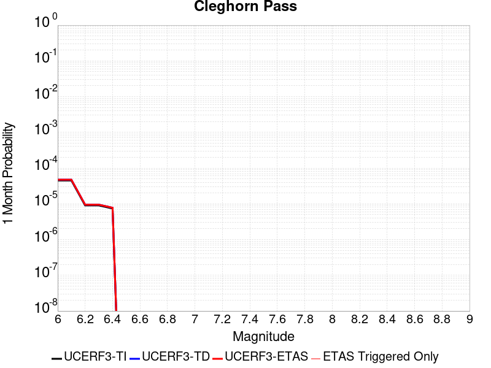 | 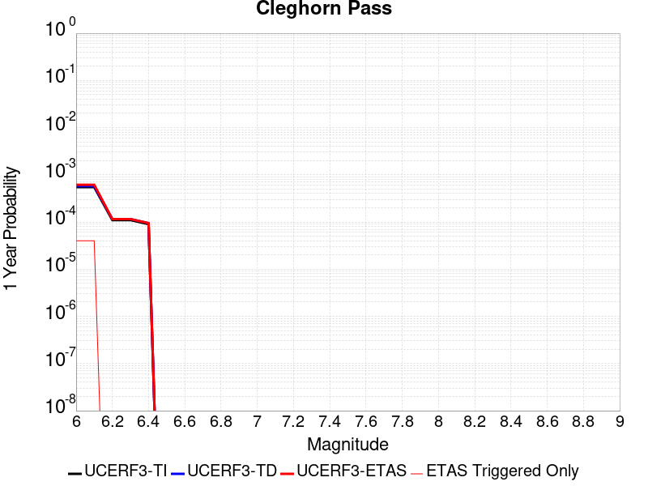 |

| Magnitude | 1 wk TI Prob | 1 wk TD Prob | 1 wk ETAS Prob | 1 wk ETAS/TD Gain | 1 wk ETAS Triggered Only | 1 mo TI Prob | 1 mo TD Prob | 1 mo ETAS Prob | 1 mo ETAS/TD Gain | 1 mo ETAS Triggered Only | 1 yr TI Prob | 1 yr TD Prob | 1 yr ETAS Prob | 1 yr ETAS/TD Gain | 1 yr ETAS Triggered Only |
|-----|-----|-----|-----|-----|-----|-----|-----|-----|-----|-----|-----|-----|-----|-----|-----|
| 6.0 | 1.0522846E-5 | 1.1042483E-5 | 1.1042483E-5 | 1.0 | 0.0 | 4.509713E-5 | 4.7324364E-5 | 4.7324364E-5 | 1.0 | 0.0 | 5.4891926E-4 | 5.7607447E-4 | 6.1605143E-4 | 1.0693954 | 4.0E-5 |
| 6.1 | 1.0522846E-5 | 1.1042483E-5 | 1.1042483E-5 | 1.0 | 0.0 | 4.509713E-5 | 4.7324364E-5 | 4.7324364E-5 | 1.0 | 0.0 | 5.4891926E-4 | 5.7607447E-4 | 6.1605143E-4 | 1.0693954 | 4.0E-5 |
| 6.2 | 2.1045846E-6 | 2.208571E-6 | 2.208571E-6 | 1.0 | 0.0 | 9.019617E-6 | 9.465293E-6 | 9.465293E-6 | 1.0 | 0.0 | 1.098083E-4 | 1.1523805E-4 | 1.1523805E-4 | 1.0 | 0.0 |
| 6.3 | 2.1045846E-6 | 2.208571E-6 | 2.208571E-6 | 1.0 | 0.0 | 9.019617E-6 | 9.465293E-6 | 9.465293E-6 | 1.0 | 0.0 | 1.098083E-4 | 1.1523805E-4 | 1.1523805E-4 | 1.0 | 0.0 |
| 6.4 | 1.7259927E-6 | 1.8111789E-6 | 1.8111789E-6 | 1.0 | 0.0 | 7.3970905E-6 | 7.762195E-6 | 7.762195E-6 | 1.0 | 0.0 | 9.005586E-5 | 9.450473E-5 | 9.450473E-5 | 1.0 | 0.0 |

## Richfield
*[(top)](#table-of-contents)*

| 1 Week | 1 Month | 1 Year |
|-----|-----|-----|
| 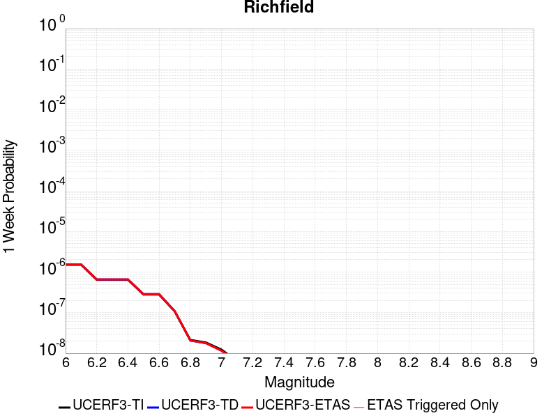 | 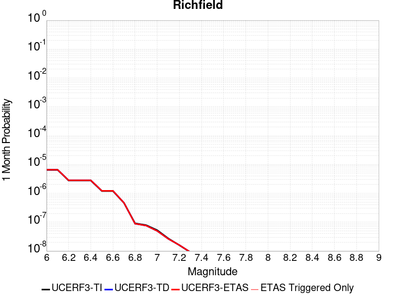 | 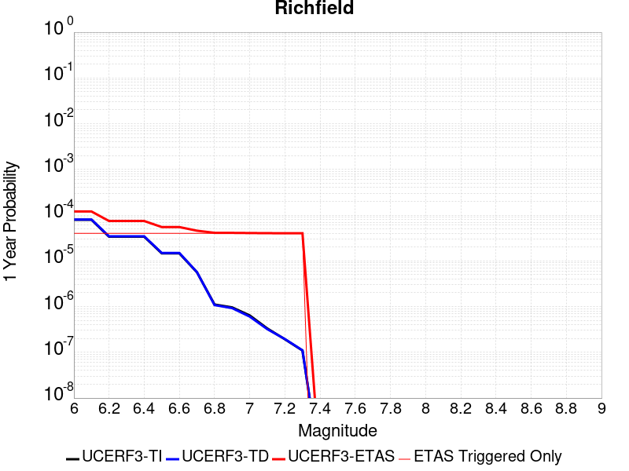 |

| Magnitude | 1 wk TI Prob | 1 wk TD Prob | 1 wk ETAS Prob | 1 wk ETAS/TD Gain | 1 wk ETAS Triggered Only | 1 mo TI Prob | 1 mo TD Prob | 1 mo ETAS Prob | 1 mo ETAS/TD Gain | 1 mo ETAS Triggered Only | 1 yr TI Prob | 1 yr TD Prob | 1 yr ETAS Prob | 1 yr ETAS/TD Gain | 1 yr ETAS Triggered Only |
|-----|-----|-----|-----|-----|-----|-----|-----|-----|-----|-----|-----|-----|-----|-----|-----|
| 6.0 | 1.5166896E-6 | 1.5393488E-6 | 1.5393488E-6 | 1.0 | 0.0 | 6.5000822E-6 | 6.5971985E-6 | 6.5971985E-6 | 1.0 | 0.0 | 7.913562E-5 | 8.0319034E-5 | 1.2031582E-4 | 1.4979739 | 4.0E-5 |
| 6.1 | 1.5166896E-6 | 1.5393488E-6 | 1.5393488E-6 | 1.0 | 0.0 | 6.5000822E-6 | 6.5971985E-6 | 6.5971985E-6 | 1.0 | 0.0 | 7.913562E-5 | 8.0319034E-5 | 1.2031582E-4 | 1.4979739 | 4.0E-5 |
| 6.2 | 6.473272E-7 | 6.5989434E-7 | 6.5989434E-7 | 1.0 | 0.0 | 2.7742565E-6 | 2.8281163E-6 | 2.8281163E-6 | 1.0 | 0.0 | 3.377605E-5 | 3.4431905E-5 | 7.443053E-5 | 2.1616733 | 4.0E-5 |
| 6.3 | 6.473272E-7 | 6.5989434E-7 | 6.5989434E-7 | 1.0 | 0.0 | 2.7742565E-6 | 2.8281163E-6 | 2.8281163E-6 | 1.0 | 0.0 | 3.377605E-5 | 3.4431905E-5 | 7.443053E-5 | 2.1616733 | 4.0E-5 |
| 6.4 | 6.473272E-7 | 6.5989434E-7 | 6.5989434E-7 | 1.0 | 0.0 | 2.7742565E-6 | 2.8281163E-6 | 2.8281163E-6 | 1.0 | 0.0 | 3.377605E-5 | 3.4431905E-5 | 7.443053E-5 | 2.1616733 | 4.0E-5 |
| 6.5 | 2.7954403E-7 | 2.8533913E-7 | 2.8533913E-7 | 1.0 | 0.0 | 1.1980452E-6 | 1.2228816E-6 | 1.2228816E-6 | 1.0 | 0.0 | 1.4586103E-5 | 1.4888525E-5 | 5.488793E-5 | 3.6865928 | 4.0E-5 |
| 6.6 | 2.7954403E-7 | 2.8533913E-7 | 2.8533913E-7 | 1.0 | 0.0 | 1.1980452E-6 | 1.2228816E-6 | 1.2228816E-6 | 1.0 | 0.0 | 1.4586103E-5 | 1.4888525E-5 | 5.488793E-5 | 3.6865928 | 4.0E-5 |
| 6.7 | 1.0777299E-7 | 1.0879465E-7 | 1.0879465E-7 | 1.0 | 0.0 | 4.6188418E-7 | 4.6626272E-7 | 4.6626272E-7 | 1.0 | 0.0 | 5.6234253E-6 | 5.676738E-6 | 4.5676512E-5 | 8.04626 | 4.0E-5 |
| 6.8 | 2.1301874E-8 | 2.0666986E-8 | 2.0666986E-8 | 1.0 | 0.0 | 9.129375E-8 | 8.85728E-8 | 8.85728E-8 | 1.0 | 0.0 | 1.1115008E-6 | 1.0783733E-6 | 4.107833E-5 | 38.092865 | 4.0E-5 |
| 6.9 | 1.8413502E-8 | 1.7751859E-8 | 1.7751859E-8 | 1.0 | 0.0 | 7.891501E-8 | 7.6079395E-8 | 7.6079395E-8 | 1.0 | 0.0 | 9.607899E-7 | 9.262663E-7 | 4.092623E-5 | 44.184086 | 4.0E-5 |
| 7.0 | 1.2290541E-8 | 1.1574894E-8 | 1.1574894E-8 | 1.0 | 0.0 | 5.2673748E-8 | 4.960669E-8 | 4.960669E-8 | 1.0 | 0.0 | 6.413027E-7 | 6.0396127E-7 | 4.0603936E-5 | 67.22937 | 4.0E-5 |
| 7.1 | 6.373573E-9 | 6.156072E-9 | 6.156072E-9 | 1.0 | 0.0 | 2.7315311E-8 | 2.6383166E-8 | 2.6383166E-8 | 1.0 | 0.0 | 3.3256384E-7 | 3.21215E-7 | 4.0321203E-5 | 125.527145 | 4.0E-5 |
| 7.2 | 3.6989944E-9 | 3.736141E-9 | 3.736141E-9 | 1.0 | 0.0 | 1.5852834E-8 | 1.6012034E-8 | 1.6012034E-8 | 1.0 | 0.0 | 1.9300822E-7 | 1.9494651E-7 | 4.019494E-5 | 206.18445 | 4.0E-5 |
| 7.3 | 2.097397E-9 | 2.1201276E-9 | 2.1201276E-9 | 1.0 | 0.0 | 8.9888434E-9 | 9.0862615E-9 | 9.0862615E-9 | 1.0 | 0.0 | 1.0943917E-7 | 1.1062523E-7 | 4.011062E-5 | 362.58112 | 4.0E-5 |
| 7.4 | 5.8314464E-12 | 5.8920646E-12 | 5.8920646E-12 | 1.0 | 0.0 | 2.4991786E-11 | 2.52518E-11 | 2.52518E-11 | 1.0 | 0.0 | 3.0427527E-10 | 3.0744052E-10 | 3.0744052E-10 | 1.0 | 0.0 |

## Los Alamos 2011 CFM
*[(top)](#table-of-contents)*

| 1 Week | 1 Month | 1 Year |
|-----|-----|-----|
| 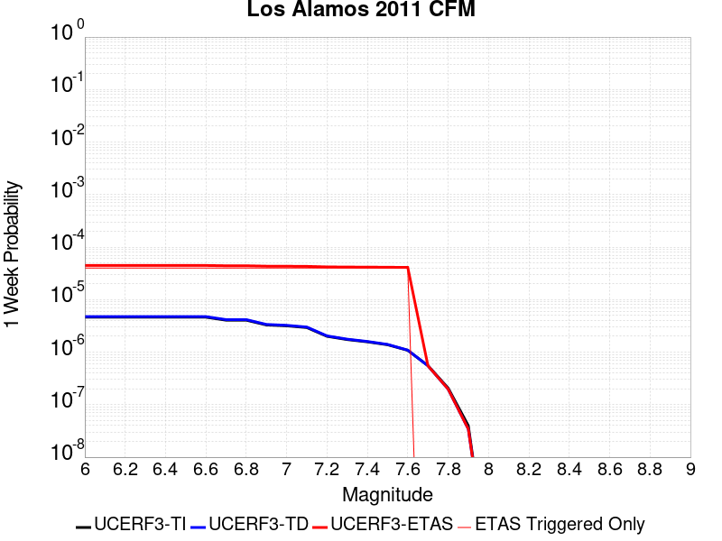 | 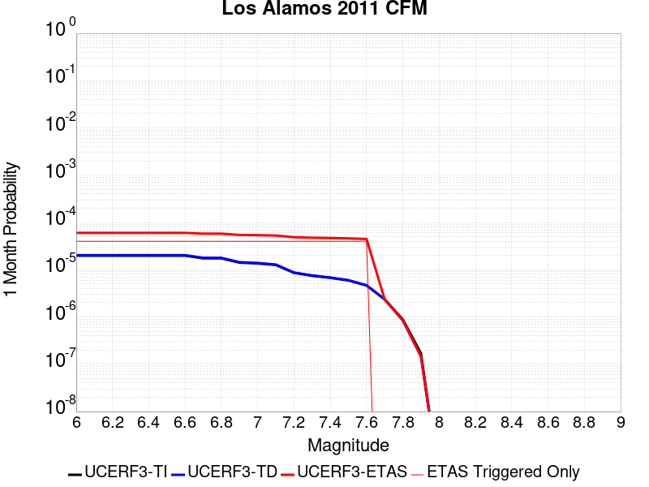 | 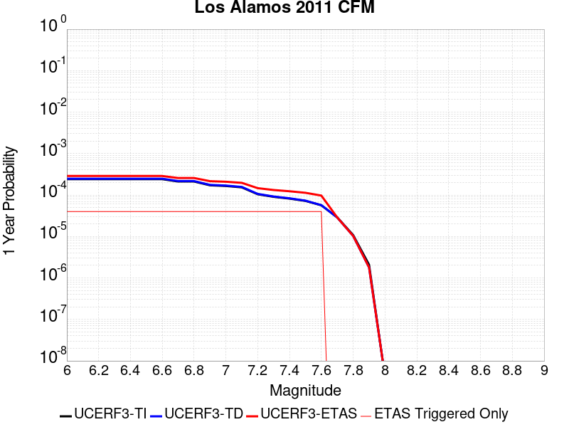 |

| Magnitude | 1 wk TI Prob | 1 wk TD Prob | 1 wk ETAS Prob | 1 wk ETAS/TD Gain | 1 wk ETAS Triggered Only | 1 mo TI Prob | 1 mo TD Prob | 1 mo ETAS Prob | 1 mo ETAS/TD Gain | 1 mo ETAS Triggered Only | 1 yr TI Prob | 1 yr TD Prob | 1 yr ETAS Prob | 1 yr ETAS/TD Gain | 1 yr ETAS Triggered Only |
|-----|-----|-----|-----|-----|-----|-----|-----|-----|-----|-----|-----|-----|-----|-----|-----|
| 6.0 | 4.6284417E-6 | 4.752295E-6 | 4.4752105E-5 | 9.416946 | 4.0E-5 | 1.9836029E-5 | 2.036683E-5 | 6.0366016E-5 | 2.9639378 | 4.0E-5 | 2.4147688E-4 | 2.479397E-4 | 2.8792978E-4 | 1.1612896 | 4.0E-5 |
| 6.1 | 4.6284417E-6 | 4.752295E-6 | 4.4752105E-5 | 9.416946 | 4.0E-5 | 1.9836029E-5 | 2.036683E-5 | 6.0366016E-5 | 2.9639378 | 4.0E-5 | 2.4147688E-4 | 2.479397E-4 | 2.8792978E-4 | 1.1612896 | 4.0E-5 |
| 6.2 | 4.6284417E-6 | 4.752295E-6 | 4.4752105E-5 | 9.416946 | 4.0E-5 | 1.9836029E-5 | 2.036683E-5 | 6.0366016E-5 | 2.9639378 | 4.0E-5 | 2.4147688E-4 | 2.479397E-4 | 2.8792978E-4 | 1.1612896 | 4.0E-5 |
| 6.3 | 4.6284417E-6 | 4.752295E-6 | 4.4752105E-5 | 9.416946 | 4.0E-5 | 1.9836029E-5 | 2.036683E-5 | 6.0366016E-5 | 2.9639378 | 4.0E-5 | 2.4147688E-4 | 2.479397E-4 | 2.8792978E-4 | 1.1612896 | 4.0E-5 |
| 6.4 | 4.6284417E-6 | 4.752295E-6 | 4.4752105E-5 | 9.416946 | 4.0E-5 | 1.9836029E-5 | 2.036683E-5 | 6.0366016E-5 | 2.9639378 | 4.0E-5 | 2.4147688E-4 | 2.479397E-4 | 2.8792978E-4 | 1.1612896 | 4.0E-5 |
| 6.5 | 4.6284417E-6 | 4.752295E-6 | 4.4752105E-5 | 9.416946 | 4.0E-5 | 1.9836029E-5 | 2.036683E-5 | 6.0366016E-5 | 2.9639378 | 4.0E-5 | 2.4147688E-4 | 2.479397E-4 | 2.8792978E-4 | 1.1612896 | 4.0E-5 |
| 6.6 | 4.6284417E-6 | 4.752295E-6 | 4.4752105E-5 | 9.416946 | 4.0E-5 | 1.9836029E-5 | 2.036683E-5 | 6.0366016E-5 | 2.9639378 | 4.0E-5 | 2.4147688E-4 | 2.479397E-4 | 2.8792978E-4 | 1.1612896 | 4.0E-5 |
| 6.7 | 4.062321E-6 | 4.166845E-6 | 4.4166678E-5 | 10.599549 | 4.0E-5 | 1.7409831E-5 | 1.7857794E-5 | 5.785708E-5 | 3.2398784 | 4.0E-5 | 2.1194408E-4 | 2.1739845E-4 | 2.5738977E-4 | 1.183954 | 4.0E-5 |
| 6.8 | 4.062321E-6 | 4.166845E-6 | 4.4166678E-5 | 10.599549 | 4.0E-5 | 1.7409831E-5 | 1.7857794E-5 | 5.785708E-5 | 3.2398784 | 4.0E-5 | 2.1194408E-4 | 2.1739845E-4 | 2.5738977E-4 | 1.183954 | 4.0E-5 |
| 6.9 | 3.2936077E-6 | 3.3733677E-6 | 4.337323E-5 | 12.857547 | 4.0E-5 | 1.4115385E-5 | 1.4457216E-5 | 5.445664E-5 | 3.7667444 | 4.0E-5 | 1.7184127E-4 | 1.7600332E-4 | 2.1599629E-4 | 1.2272284 | 4.0E-5 |
| 7.0 | 3.1687898E-6 | 3.245214E-6 | 4.3245083E-5 | 13.325804 | 4.0E-5 | 1.3580457E-5 | 1.390799E-5 | 5.3907435E-5 | 3.8760045 | 4.0E-5 | 1.6532952E-4 | 1.6931756E-4 | 2.0931079E-4 | 1.2362025 | 4.0E-5 |
| 7.1 | 2.9379228E-6 | 3.007701E-6 | 4.300758E-5 | 14.299154 | 4.0E-5 | 1.25910365E-5 | 1.2890088E-5 | 5.2889573E-5 | 4.1031194 | 4.0E-5 | 1.5328509E-4 | 1.5692643E-4 | 1.9692015E-4 | 1.2548565 | 4.0E-5 |
| 7.2 | 2.0020686E-6 | 2.0419006E-6 | 4.204182E-5 | 20.589552 | 4.0E-5 | 8.580266E-6 | 8.750973E-6 | 4.8750622E-5 | 5.57088 | 4.0E-5 | 1.0445973E-4 | 1.0653794E-4 | 1.4653368E-4 | 1.3754131 | 4.0E-5 |
| 7.3 | 1.7364243E-6 | 1.7681227E-6 | 4.1768053E-5 | 23.622824 | 4.0E-5 | 7.441797E-6 | 7.577647E-6 | 4.7577345E-5 | 6.278643 | 4.0E-5 | 9.0600115E-5 | 9.225398E-5 | 1.322503E-4 | 1.4335456 | 4.0E-5 |
| 7.4 | 1.5718434E-6 | 1.5985428E-6 | 4.159848E-5 | 26.02275 | 4.0E-5 | 6.7364545E-6 | 6.85088E-6 | 4.6850604E-5 | 6.8386264 | 4.0E-5 | 8.201325E-5 | 8.3406296E-5 | 1.2340296E-4 | 1.4795401 | 4.0E-5 |
| 7.5 | 1.3841119E-6 | 1.4044822E-6 | 4.1404426E-5 | 29.480206 | 4.0E-5 | 5.9318945E-6 | 6.019196E-6 | 4.6018955E-5 | 7.645366 | 4.0E-5 | 7.221842E-5 | 7.328128E-5 | 1.1327834E-4 | 1.545802 | 4.0E-5 |
| 7.6 | 1.0843726E-6 | 1.093606E-6 | 4.109356E-5 | 37.576202 | 4.0E-5 | 4.647303E-6 | 4.6868745E-6 | 4.4686687E-5 | 9.534431 | 4.0E-5 | 5.6579443E-5 | 5.7061232E-5 | 9.7058946E-5 | 1.7009614 | 4.0E-5 |
| 7.7 | 5.544814E-7 | 5.5027397E-7 | 5.5027397E-7 | 1.0 | 0.0 | 2.3763469E-6 | 2.358315E-6 | 2.358315E-6 | 1.0 | 0.0 | 2.8931638E-5 | 2.8712107E-5 | 2.8712107E-5 | 1.0 | 0.0 |
| 7.8 | 2.0707465E-7 | 1.9782063E-7 | 1.9782063E-7 | 1.0 | 0.0 | 8.874625E-7 | 8.478024E-7 | 8.478024E-7 | 1.0 | 0.0 | 1.08048025E-5 | 1.0321946E-5 | 1.0321946E-5 | 1.0 | 0.0 |
| 7.9 | 3.9821284E-8 | 3.433754E-8 | 3.433754E-8 | 1.0 | 0.0 | 1.7066264E-7 | 1.4716086E-7 | 1.4716086E-7 | 1.0 | 0.0 | 2.0778157E-6 | 1.7916822E-6 | 1.7916822E-6 | 1.0 | 0.0 |
| 8.0 | 7.880441E-11 | 8.236567E-11 | 8.236567E-11 | 1.0 | 0.0 | 3.3773329E-10 | 3.5299597E-10 | 3.5299597E-10 | 1.0 | 0.0 | 4.1119033E-9 | 4.2977253E-9 | 4.2977253E-9 | 1.0 | 0.0 |

## Earthquake Valley
*[(top)](#table-of-contents)*

| 1 Week | 1 Month | 1 Year |
|-----|-----|-----|
|  | 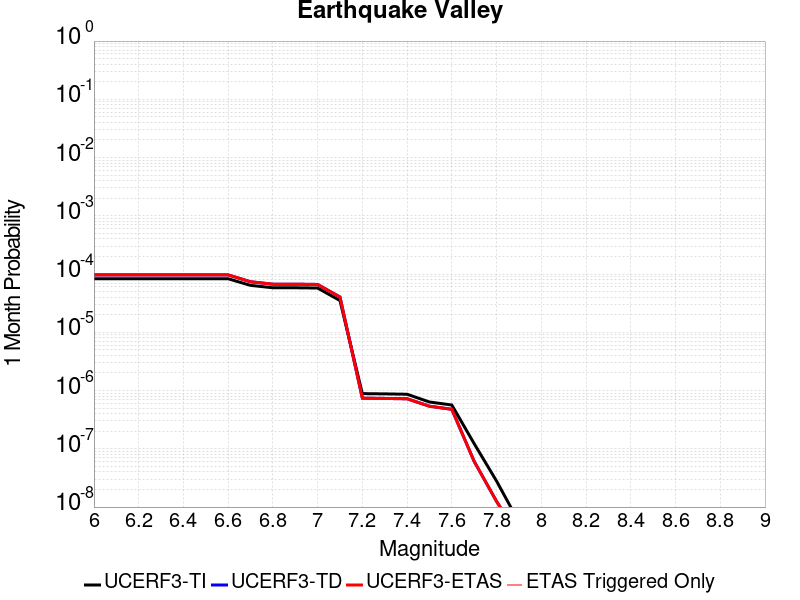 |  |

| Magnitude | 1 wk TI Prob | 1 wk TD Prob | 1 wk ETAS Prob | 1 wk ETAS/TD Gain | 1 wk ETAS Triggered Only | 1 mo TI Prob | 1 mo TD Prob | 1 mo ETAS Prob | 1 mo ETAS/TD Gain | 1 mo ETAS Triggered Only | 1 yr TI Prob | 1 yr TD Prob | 1 yr ETAS Prob | 1 yr ETAS/TD Gain | 1 yr ETAS Triggered Only |
|-----|-----|-----|-----|-----|-----|-----|-----|-----|-----|-----|-----|-----|-----|-----|-----|
| 6.0 | 1.9416384E-5 | 2.2596936E-5 | 2.2596936E-5 | 1.0 | 0.0 | 8.321042E-5 | 9.68411E-5 | 9.68411E-5 | 1.0 | 0.0 | 0.001012616 | 0.0011785226 | 0.0012184754 | 1.0339009 | 4.0E-5 |
| 6.1 | 1.9416384E-5 | 2.2596936E-5 | 2.2596936E-5 | 1.0 | 0.0 | 8.321042E-5 | 9.68411E-5 | 9.68411E-5 | 1.0 | 0.0 | 0.001012616 | 0.0011785226 | 0.0012184754 | 1.0339009 | 4.0E-5 |
| 6.2 | 1.9416384E-5 | 2.2596936E-5 | 2.2596936E-5 | 1.0 | 0.0 | 8.321042E-5 | 9.68411E-5 | 9.68411E-5 | 1.0 | 0.0 | 0.001012616 | 0.0011785226 | 0.0012184754 | 1.0339009 | 4.0E-5 |
| 6.3 | 1.9416384E-5 | 2.2596936E-5 | 2.2596936E-5 | 1.0 | 0.0 | 8.321042E-5 | 9.68411E-5 | 9.68411E-5 | 1.0 | 0.0 | 0.001012616 | 0.0011785226 | 0.0012184754 | 1.0339009 | 4.0E-5 |
| 6.4 | 1.9416384E-5 | 2.2596936E-5 | 2.2596936E-5 | 1.0 | 0.0 | 8.321042E-5 | 9.68411E-5 | 9.68411E-5 | 1.0 | 0.0 | 0.001012616 | 0.0011785226 | 0.0012184754 | 1.0339009 | 4.0E-5 |
| 6.5 | 1.9389157E-5 | 2.256551E-5 | 2.256551E-5 | 1.0 | 0.0 | 8.309374E-5 | 9.670642E-5 | 9.670642E-5 | 1.0 | 0.0 | 0.0010111968 | 0.0011768846 | 0.0012168376 | 1.0339481 | 4.0E-5 |
| 6.6 | 1.9389157E-5 | 2.256551E-5 | 2.256551E-5 | 1.0 | 0.0 | 8.309374E-5 | 9.670642E-5 | 9.670642E-5 | 1.0 | 0.0 | 0.0010111968 | 0.0011768846 | 0.0012168376 | 1.0339481 | 4.0E-5 |
| 6.7 | 1.4925434E-5 | 1.721746E-5 | 1.721746E-5 | 1.0 | 0.0 | 6.396457E-5 | 7.378751E-5 | 7.378751E-5 | 1.0 | 0.0 | 7.7849044E-4 | 8.980778E-4 | 9.3804183E-4 | 1.0444995 | 4.0E-5 |
| 6.8 | 1.3570335E-5 | 1.5625135E-5 | 1.5625135E-5 | 1.0 | 0.0 | 5.8157282E-5 | 6.696361E-5 | 6.696361E-5 | 1.0 | 0.0 | 7.0783484E-4 | 8.150591E-4 | 8.5502653E-4 | 1.0490361 | 4.0E-5 |
| 6.9 | 1.3570335E-5 | 1.5625135E-5 | 1.5625135E-5 | 1.0 | 0.0 | 5.8157282E-5 | 6.696361E-5 | 6.696361E-5 | 1.0 | 0.0 | 7.0783484E-4 | 8.150591E-4 | 8.5502653E-4 | 1.0490361 | 4.0E-5 |
| 7.0 | 1.3433392E-5 | 1.5468602E-5 | 1.5468602E-5 | 1.0 | 0.0 | 5.757041E-5 | 6.629279E-5 | 6.629279E-5 | 1.0 | 0.0 | 7.0069433E-4 | 8.06898E-4 | 8.468657E-4 | 1.0495325 | 4.0E-5 |
| 7.1 | 8.181609E-6 | 9.421978E-6 | 9.421978E-6 | 1.0 | 0.0 | 3.5063567E-5 | 4.0379655E-5 | 4.0379655E-5 | 1.0 | 0.0 | 4.268153E-4 | 4.9157854E-4 | 5.315589E-4 | 1.0813305 | 4.0E-5 |
| 7.2 | 2.0663983E-7 | 1.7276827E-7 | 1.7276827E-7 | 1.0 | 0.0 | 8.855989E-7 | 7.4043527E-7 | 7.4043527E-7 | 1.0 | 0.0 | 1.0782113E-5 | 9.014766E-6 | 9.014766E-6 | 1.0 | 0.0 |
| 7.3 | 2.0462376E-7 | 1.7092242E-7 | 1.7092242E-7 | 1.0 | 0.0 | 8.7695867E-7 | 7.325244E-7 | 7.325244E-7 | 1.0 | 0.0 | 1.0676919E-5 | 8.918452E-6 | 8.918452E-6 | 1.0 | 0.0 |
| 7.4 | 2.0171088E-7 | 1.687456E-7 | 1.687456E-7 | 1.0 | 0.0 | 8.644749E-7 | 7.231952E-7 | 7.231952E-7 | 1.0 | 0.0 | 1.0524931E-5 | 8.80487E-6 | 8.80487E-6 | 1.0 | 0.0 |
| 7.5 | 1.4847944E-7 | 1.2570331E-7 | 1.2570331E-7 | 1.0 | 0.0 | 6.363403E-7 | 5.387284E-7 | 5.387284E-7 | 1.0 | 0.0 | 7.747416E-6 | 6.559E-6 | 6.559E-6 | 1.0 | 0.0 |
| 7.6 | 1.3185847E-7 | 1.11332305E-7 | 1.11332305E-7 | 1.0 | 0.0 | 5.6510765E-7 | 4.7713837E-7 | 4.7713837E-7 | 1.0 | 0.0 | 6.8801637E-6 | 5.8091464E-6 | 5.8091464E-6 | 1.0 | 0.0 |
| 7.7 | 2.8609954E-8 | 1.4188027E-8 | 1.4188027E-8 | 1.0 | 0.0 | 1.2261408E-7 | 6.0805824E-8 | 6.0805824E-8 | 1.0 | 0.0 | 1.4928254E-6 | 7.403107E-7 | 7.403107E-7 | 1.0 | 0.0 |
| 7.8 | 6.527266E-9 | 2.9268739E-9 | 2.9268739E-9 | 1.0 | 0.0 | 2.7973995E-8 | 1.2543746E-8 | 1.2543746E-8 | 1.0 | 0.0 | 3.4058334E-7 | 1.5272009E-7 | 1.5272009E-7 | 1.0 | 0.0 |
| 7.9 | 1.2898267E-9 | 7.133548E-10 | 7.133548E-10 | 1.0 | 0.0 | 5.527829E-9 | 3.057235E-9 | 3.057235E-9 | 1.0 | 0.0 | 6.7301315E-8 | 3.7221838E-8 | 3.7221838E-8 | 1.0 | 0.0 |

## Pitas Point (Lower)-Montalvo
*[(top)](#table-of-contents)*

| 1 Week | 1 Month | 1 Year |
|-----|-----|-----|
| 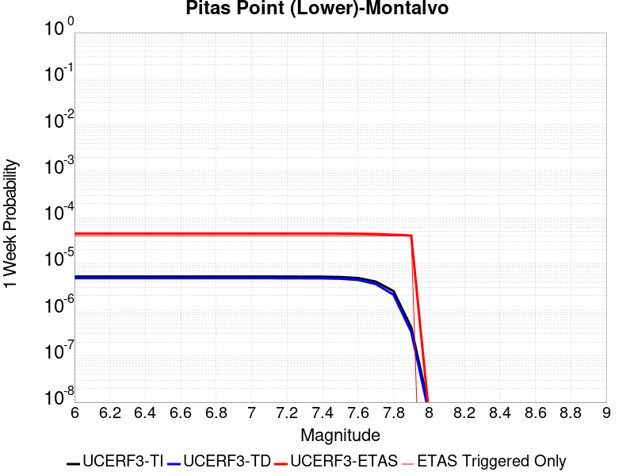 | 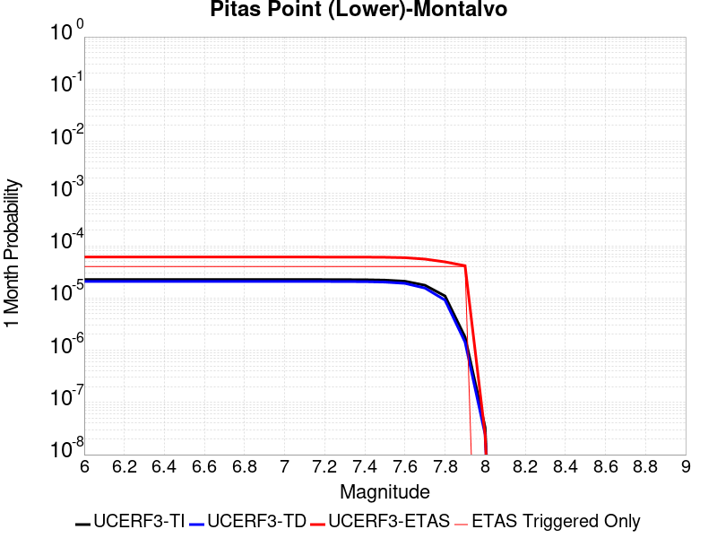 | 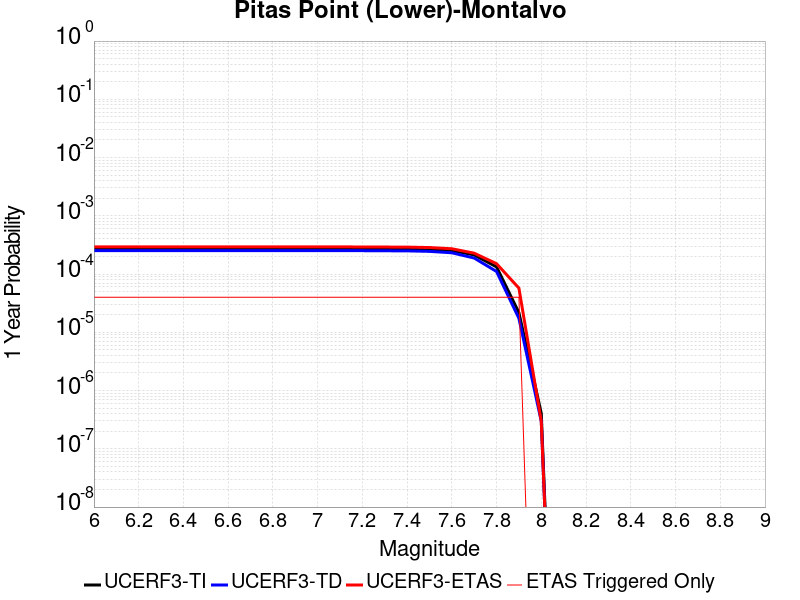 |

| Magnitude | 1 wk TI Prob | 1 wk TD Prob | 1 wk ETAS Prob | 1 wk ETAS/TD Gain | 1 wk ETAS Triggered Only | 1 mo TI Prob | 1 mo TD Prob | 1 mo ETAS Prob | 1 mo ETAS/TD Gain | 1 mo ETAS Triggered Only | 1 yr TI Prob | 1 yr TD Prob | 1 yr ETAS Prob | 1 yr ETAS/TD Gain | 1 yr ETAS Triggered Only |
|-----|-----|-----|-----|-----|-----|-----|-----|-----|-----|-----|-----|-----|-----|-----|-----|
| 6.0 | 5.2543637E-6 | 4.8389793E-6 | 4.4838787E-5 | 9.266166 | 4.0E-5 | 2.2518509E-5 | 2.073832E-5 | 6.073749E-5 | 2.9287565 | 4.0E-5 | 2.7412834E-4 | 2.524601E-4 | 2.9245001E-4 | 1.1584009 | 4.0E-5 |
| 6.1 | 5.2543637E-6 | 4.8389793E-6 | 4.4838787E-5 | 9.266166 | 4.0E-5 | 2.2518509E-5 | 2.073832E-5 | 6.073749E-5 | 2.9287565 | 4.0E-5 | 2.7412834E-4 | 2.524601E-4 | 2.9245001E-4 | 1.1584009 | 4.0E-5 |
| 6.2 | 5.2543637E-6 | 4.8389793E-6 | 4.4838787E-5 | 9.266166 | 4.0E-5 | 2.2518509E-5 | 2.073832E-5 | 6.073749E-5 | 2.9287565 | 4.0E-5 | 2.7412834E-4 | 2.524601E-4 | 2.9245001E-4 | 1.1584009 | 4.0E-5 |
| 6.3 | 5.2543637E-6 | 4.8389793E-6 | 4.4838787E-5 | 9.266166 | 4.0E-5 | 2.2518509E-5 | 2.073832E-5 | 6.073749E-5 | 2.9287565 | 4.0E-5 | 2.7412834E-4 | 2.524601E-4 | 2.9245001E-4 | 1.1584009 | 4.0E-5 |
| 6.4 | 5.2543637E-6 | 4.8389793E-6 | 4.4838787E-5 | 9.266166 | 4.0E-5 | 2.2518509E-5 | 2.073832E-5 | 6.073749E-5 | 2.9287565 | 4.0E-5 | 2.7412834E-4 | 2.524601E-4 | 2.9245001E-4 | 1.1584009 | 4.0E-5 |
| 6.5 | 5.2543637E-6 | 4.8389793E-6 | 4.4838787E-5 | 9.266166 | 4.0E-5 | 2.2518509E-5 | 2.073832E-5 | 6.073749E-5 | 2.9287565 | 4.0E-5 | 2.7412834E-4 | 2.524601E-4 | 2.9245001E-4 | 1.1584009 | 4.0E-5 |
| 6.6 | 5.2543637E-6 | 4.8389793E-6 | 4.4838787E-5 | 9.266166 | 4.0E-5 | 2.2518509E-5 | 2.073832E-5 | 6.073749E-5 | 2.9287565 | 4.0E-5 | 2.7412834E-4 | 2.524601E-4 | 2.9245001E-4 | 1.1584009 | 4.0E-5 |
| 6.7 | 5.2543637E-6 | 4.8389793E-6 | 4.4838787E-5 | 9.266166 | 4.0E-5 | 2.2518509E-5 | 2.073832E-5 | 6.073749E-5 | 2.9287565 | 4.0E-5 | 2.7412834E-4 | 2.524601E-4 | 2.9245001E-4 | 1.1584009 | 4.0E-5 |
| 6.8 | 5.2543637E-6 | 4.8389793E-6 | 4.4838787E-5 | 9.266166 | 4.0E-5 | 2.2518509E-5 | 2.073832E-5 | 6.073749E-5 | 2.9287565 | 4.0E-5 | 2.7412834E-4 | 2.524601E-4 | 2.9245001E-4 | 1.1584009 | 4.0E-5 |
| 6.9 | 5.2543637E-6 | 4.8389793E-6 | 4.4838787E-5 | 9.266166 | 4.0E-5 | 2.2518509E-5 | 2.073832E-5 | 6.073749E-5 | 2.9287565 | 4.0E-5 | 2.7412834E-4 | 2.524601E-4 | 2.9245001E-4 | 1.1584009 | 4.0E-5 |
| 7.0 | 5.2543637E-6 | 4.8389793E-6 | 4.4838787E-5 | 9.266166 | 4.0E-5 | 2.2518509E-5 | 2.073832E-5 | 6.073749E-5 | 2.9287565 | 4.0E-5 | 2.7412834E-4 | 2.524601E-4 | 2.9245001E-4 | 1.1584009 | 4.0E-5 |
| 7.1 | 5.2543637E-6 | 4.8389793E-6 | 4.4838787E-5 | 9.266166 | 4.0E-5 | 2.2518509E-5 | 2.073832E-5 | 6.073749E-5 | 2.9287565 | 4.0E-5 | 2.7412834E-4 | 2.524601E-4 | 2.9245001E-4 | 1.1584009 | 4.0E-5 |
| 7.2 | 5.2458695E-6 | 4.830132E-6 | 4.482994E-5 | 9.281307 | 4.0E-5 | 2.2482105E-5 | 2.0700403E-5 | 6.0699575E-5 | 2.9322896 | 4.0E-5 | 2.7368523E-4 | 2.5199857E-4 | 2.919885E-4 | 1.158691 | 4.0E-5 |
| 7.3 | 5.22665E-6 | 4.8100464E-6 | 4.4809854E-5 | 9.315888 | 4.0E-5 | 2.2399736E-5 | 2.0614323E-5 | 6.06135E-5 | 2.9403584 | 4.0E-5 | 2.7268266E-4 | 2.5095078E-4 | 2.9094075E-4 | 1.1593539 | 4.0E-5 |
| 7.4 | 5.210642E-6 | 4.793256E-6 | 4.4793065E-5 | 9.345018 | 4.0E-5 | 2.233113E-5 | 2.0542366E-5 | 6.0541544E-5 | 2.9471555 | 4.0E-5 | 2.718476E-4 | 2.500749E-4 | 2.900649E-4 | 1.1599121 | 4.0E-5 |
| 7.5 | 5.1226016E-6 | 4.701128E-6 | 4.470094E-5 | 9.508556 | 4.0E-5 | 2.1953823E-5 | 2.0147538E-5 | 6.0146733E-5 | 2.9853144 | 4.0E-5 | 2.67255E-4 | 2.4526895E-4 | 2.8525916E-4 | 1.1630462 | 4.0E-5 |
| 7.6 | 4.8796987E-6 | 4.445983E-6 | 4.4445806E-5 | 9.996845 | 4.0E-5 | 2.0912828E-5 | 1.9054076E-5 | 5.9053313E-5 | 3.0992484 | 4.0E-5 | 2.5458392E-4 | 2.3195898E-4 | 2.719497E-4 | 1.1724043 | 4.0E-5 |
| 7.7 | 4.0834398E-6 | 3.6099952E-6 | 4.3609853E-5 | 12.080307 | 4.0E-5 | 1.7500339E-5 | 1.5471318E-5 | 5.54707E-5 | 3.5853894 | 4.0E-5 | 2.1304579E-4 | 1.8834724E-4 | 2.2833972E-4 | 1.2123337 | 4.0E-5 |
| 7.8 | 2.5445438E-6 | 2.1217793E-6 | 4.2121694E-5 | 19.852062 | 4.0E-5 | 1.0905142E-5 | 9.093308E-6 | 4.9092945E-5 | 5.3987994 | 4.0E-5 | 1.3276201E-4 | 1.1070545E-4 | 1.5070102E-4 | 1.3612791 | 4.0E-5 |
| 7.9 | 4.1677114E-7 | 3.330247E-7 | 4.0333012E-5 | 121.111176 | 4.0E-5 | 1.7861609E-6 | 1.4272479E-6 | 4.142719E-5 | 29.025925 | 4.0E-5 | 2.1746291E-5 | 1.7376608E-5 | 5.7375913E-5 | 3.3019054 | 4.0E-5 |
| 8.0 | 7.791402E-9 | 5.68495E-9 | 5.68495E-9 | 1.0 | 0.0 | 3.3391725E-8 | 2.4364072E-8 | 2.4364072E-8 | 1.0 | 0.0 | 4.0654416E-7 | 2.9663255E-7 | 2.9663255E-7 | 1.0 | 0.0 |

## San Luis Range - Oceano 2011 CFM
*[(top)](#table-of-contents)*

| 1 Week | 1 Month | 1 Year |
|-----|-----|-----|
| 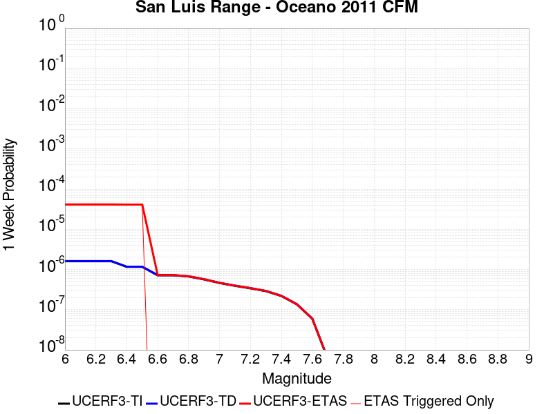 | 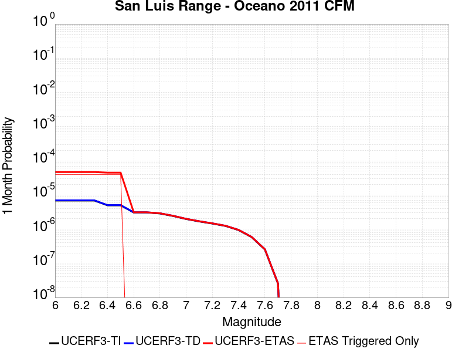 |  |

| Magnitude | 1 wk TI Prob | 1 wk TD Prob | 1 wk ETAS Prob | 1 wk ETAS/TD Gain | 1 wk ETAS Triggered Only | 1 mo TI Prob | 1 mo TD Prob | 1 mo ETAS Prob | 1 mo ETAS/TD Gain | 1 mo ETAS Triggered Only | 1 yr TI Prob | 1 yr TD Prob | 1 yr ETAS Prob | 1 yr ETAS/TD Gain | 1 yr ETAS Triggered Only |
|-----|-----|-----|-----|-----|-----|-----|-----|-----|-----|-----|-----|-----|-----|-----|-----|
| 6.0 | 1.6025788E-6 | 1.6201791E-6 | 4.1620115E-5 | 25.688587 | 4.0E-5 | 6.8681766E-6 | 6.9436087E-6 | 4.6943333E-5 | 6.7606535 | 4.0E-5 | 8.361684E-5 | 8.4535575E-5 | 1.2453219E-4 | 1.4731336 | 4.0E-5 |
| 6.1 | 1.6025788E-6 | 1.6201791E-6 | 4.1620115E-5 | 25.688587 | 4.0E-5 | 6.8681766E-6 | 6.9436087E-6 | 4.6943333E-5 | 6.7606535 | 4.0E-5 | 8.361684E-5 | 8.4535575E-5 | 1.2453219E-4 | 1.4731336 | 4.0E-5 |
| 6.2 | 1.6025788E-6 | 1.6201791E-6 | 4.1620115E-5 | 25.688587 | 4.0E-5 | 6.8681766E-6 | 6.9436087E-6 | 4.6943333E-5 | 6.7606535 | 4.0E-5 | 8.361684E-5 | 8.4535575E-5 | 1.2453219E-4 | 1.4731336 | 4.0E-5 |
| 6.3 | 1.6025788E-6 | 1.6201791E-6 | 4.1620115E-5 | 25.688587 | 4.0E-5 | 6.8681766E-6 | 6.9436087E-6 | 4.6943333E-5 | 6.7606535 | 4.0E-5 | 8.361684E-5 | 8.4535575E-5 | 1.2453219E-4 | 1.4731336 | 4.0E-5 |
| 6.4 | 1.1621186E-6 | 1.1750336E-6 | 4.1174986E-5 | 35.04154 | 4.0E-5 | 4.980499E-6 | 5.0358503E-6 | 4.503565E-5 | 8.943008 | 4.0E-5 | 6.0635884E-5 | 6.131002E-5 | 1.0130757E-4 | 1.6523819 | 4.0E-5 |
| 6.5 | 1.1621186E-6 | 1.1750336E-6 | 4.1174986E-5 | 35.04154 | 4.0E-5 | 4.980499E-6 | 5.0358503E-6 | 4.503565E-5 | 8.943008 | 4.0E-5 | 6.0635884E-5 | 6.131002E-5 | 1.0130757E-4 | 1.6523819 | 4.0E-5 |
| 6.6 | 7.164729E-7 | 7.2488666E-7 | 7.2488666E-7 | 1.0 | 0.0 | 3.0705946E-6 | 3.1066534E-6 | 3.1066534E-6 | 1.0 | 0.0 | 3.738385E-5 | 3.782287E-5 | 3.782287E-5 | 1.0 | 0.0 |
| 6.7 | 7.164729E-7 | 7.2488666E-7 | 7.2488666E-7 | 1.0 | 0.0 | 3.0705946E-6 | 3.1066534E-6 | 3.1066534E-6 | 1.0 | 0.0 | 3.738385E-5 | 3.782287E-5 | 3.782287E-5 | 1.0 | 0.0 |
| 6.8 | 6.700177E-7 | 6.777705E-7 | 6.777705E-7 | 1.0 | 0.0 | 2.8715012E-6 | 2.9047278E-6 | 2.9047278E-6 | 1.0 | 0.0 | 3.495997E-5 | 3.5364505E-5 | 3.5364505E-5 | 1.0 | 0.0 |
| 6.9 | 5.657865E-7 | 5.7220063E-7 | 5.7220063E-7 | 1.0 | 0.0 | 2.424797E-6 | 2.4522863E-6 | 2.4522863E-6 | 1.0 | 0.0 | 2.9521503E-5 | 2.9856186E-5 | 2.9856186E-5 | 1.0 | 0.0 |
| 7.0 | 4.608413E-7 | 4.6603472E-7 | 4.6603472E-7 | 1.0 | 0.0 | 1.9750328E-6 | 1.9972902E-6 | 1.9972902E-6 | 1.0 | 0.0 | 2.4045758E-5 | 2.431674E-5 | 2.431674E-5 | 1.0 | 0.0 |
| 7.1 | 3.9177846E-7 | 3.9623131E-7 | 3.9623131E-7 | 1.0 | 0.0 | 1.6790494E-6 | 1.6981331E-6 | 1.6981331E-6 | 1.0 | 0.0 | 2.0442236E-5 | 2.0674575E-5 | 2.0674575E-5 | 1.0 | 0.0 |
| 7.2 | 3.3974752E-7 | 3.436788E-7 | 3.436788E-7 | 1.0 | 0.0 | 1.45606E-6 | 1.4729083E-6 | 1.4729083E-6 | 1.0 | 0.0 | 1.7727387E-5 | 1.7932512E-5 | 1.7932512E-5 | 1.0 | 0.0 |
| 7.3 | 2.8900928E-7 | 2.9235167E-7 | 2.9235167E-7 | 1.0 | 0.0 | 1.2386106E-6 | 1.2529351E-6 | 1.2529351E-6 | 1.0 | 0.0 | 1.5079979E-5 | 1.5254379E-5 | 1.5254379E-5 | 1.0 | 0.0 |
| 7.4 | 2.1881527E-7 | 2.2140485E-7 | 2.2140485E-7 | 1.0 | 0.0 | 9.3777936E-7 | 9.488775E-7 | 9.488775E-7 | 1.0 | 0.0 | 1.14174045E-5 | 1.1552524E-5 | 1.1552524E-5 | 1.0 | 0.0 |
| 7.5 | 1.356398E-7 | 1.3719173E-7 | 1.3719173E-7 | 1.0 | 0.0 | 5.813133E-7 | 5.8796445E-7 | 5.8796445E-7 | 1.0 | 0.0 | 7.0774663E-6 | 7.1584436E-6 | 7.1584436E-6 | 1.0 | 0.0 |
| 7.6 | 5.9269272E-8 | 6.001622E-8 | 6.001622E-8 | 1.0 | 0.0 | 2.5401116E-7 | 2.5721235E-7 | 2.5721235E-7 | 1.0 | 0.0 | 3.0925814E-6 | 3.131556E-6 | 3.131556E-6 | 1.0 | 0.0 |
| 7.7 | 5.946232E-9 | 6.0372436E-9 | 6.0372436E-9 | 1.0 | 0.0 | 2.5483851E-8 | 2.58739E-8 | 2.58739E-8 | 1.0 | 0.0 | 3.1026585E-7 | 3.1501472E-7 | 3.1501472E-7 | 1.0 | 0.0 |

## Fontana (Seismicity)
*[(top)](#table-of-contents)*

| 1 Week | 1 Month | 1 Year |
|-----|-----|-----|
| 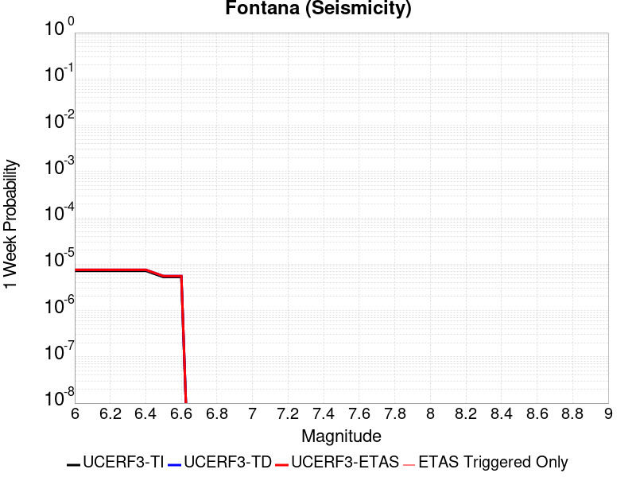 | 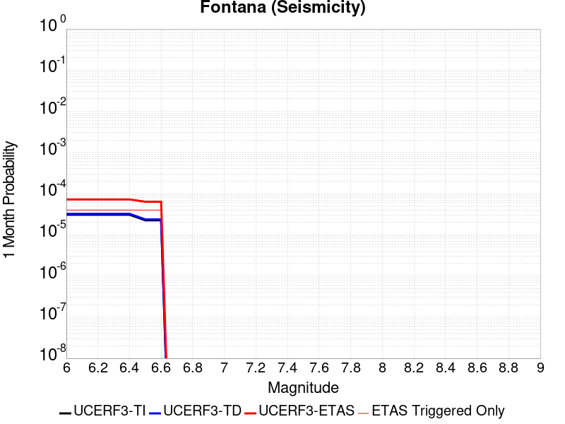 | 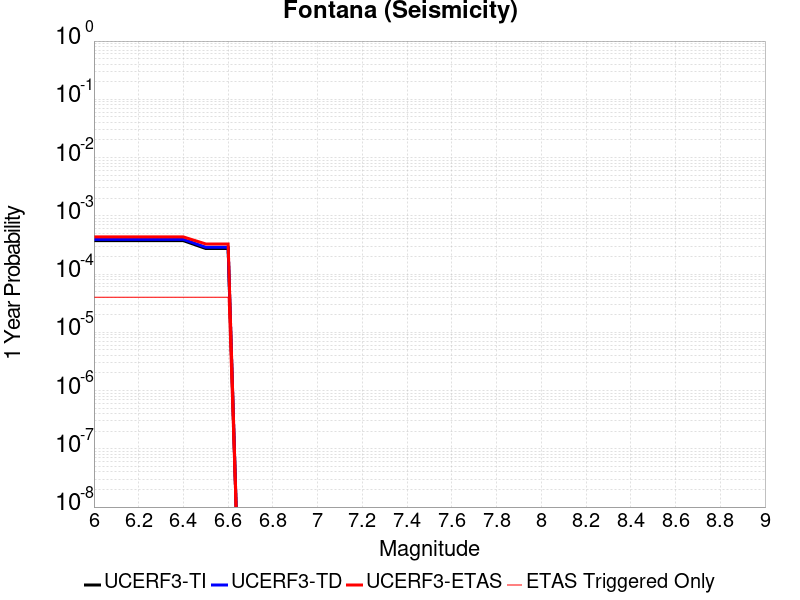 |

| Magnitude | 1 wk TI Prob | 1 wk TD Prob | 1 wk ETAS Prob | 1 wk ETAS/TD Gain | 1 wk ETAS Triggered Only | 1 mo TI Prob | 1 mo TD Prob | 1 mo ETAS Prob | 1 mo ETAS/TD Gain | 1 mo ETAS Triggered Only | 1 yr TI Prob | 1 yr TD Prob | 1 yr ETAS Prob | 1 yr ETAS/TD Gain | 1 yr ETAS Triggered Only |
|-----|-----|-----|-----|-----|-----|-----|-----|-----|-----|-----|-----|-----|-----|-----|-----|
| 6.0 | 7.1789214E-6 | 7.5533308E-6 | 7.5533308E-6 | 1.0 | 0.0 | 3.076644E-5 | 3.2371245E-5 | 7.236995E-5 | 2.2356246 | 4.0E-5 | 3.7451705E-4 | 3.9408944E-4 | 4.3407368E-4 | 1.1014597 | 4.0E-5 |
| 6.1 | 7.1789214E-6 | 7.5533308E-6 | 7.5533308E-6 | 1.0 | 0.0 | 3.076644E-5 | 3.2371245E-5 | 7.236995E-5 | 2.2356246 | 4.0E-5 | 3.7451705E-4 | 3.9408944E-4 | 4.3407368E-4 | 1.1014597 | 4.0E-5 |
| 6.2 | 7.1789214E-6 | 7.5533308E-6 | 7.5533308E-6 | 1.0 | 0.0 | 3.076644E-5 | 3.2371245E-5 | 7.236995E-5 | 2.2356246 | 4.0E-5 | 3.7451705E-4 | 3.9408944E-4 | 4.3407368E-4 | 1.1014597 | 4.0E-5 |
| 6.3 | 7.1789214E-6 | 7.5533308E-6 | 7.5533308E-6 | 1.0 | 0.0 | 3.076644E-5 | 3.2371245E-5 | 7.236995E-5 | 2.2356246 | 4.0E-5 | 3.7451705E-4 | 3.9408944E-4 | 4.3407368E-4 | 1.1014597 | 4.0E-5 |
| 6.4 | 7.1789214E-6 | 7.5533308E-6 | 7.5533308E-6 | 1.0 | 0.0 | 3.076644E-5 | 3.2371245E-5 | 7.236995E-5 | 2.2356246 | 4.0E-5 | 3.7451705E-4 | 3.9408944E-4 | 4.3407368E-4 | 1.1014597 | 4.0E-5 |
| 6.5 | 5.2611317E-6 | 5.5336936E-6 | 5.5336936E-6 | 1.0 | 0.0 | 2.2547512E-5 | 2.3715831E-5 | 6.3714884E-5 | 2.686597 | 4.0E-5 | 2.744814E-4 | 2.8874024E-4 | 3.287287E-4 | 1.1384928 | 4.0E-5 |
| 6.6 | 5.2611317E-6 | 5.5336936E-6 | 5.5336936E-6 | 1.0 | 0.0 | 2.2547512E-5 | 2.3715831E-5 | 6.3714884E-5 | 2.686597 | 4.0E-5 | 2.744814E-4 | 2.8874024E-4 | 3.287287E-4 | 1.1384928 | 4.0E-5 |

## Mission Hills 2011
*[(top)](#table-of-contents)*

| 1 Week | 1 Month | 1 Year |
|-----|-----|-----|
| 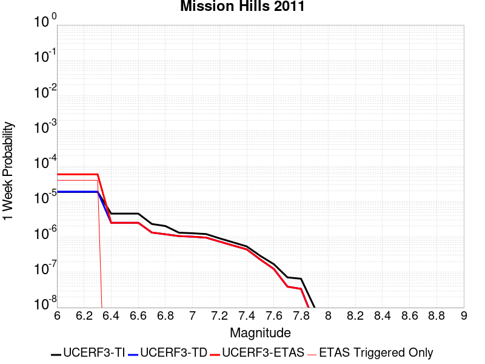 |  |  |

| Magnitude | 1 wk TI Prob | 1 wk TD Prob | 1 wk ETAS Prob | 1 wk ETAS/TD Gain | 1 wk ETAS Triggered Only | 1 mo TI Prob | 1 mo TD Prob | 1 mo ETAS Prob | 1 mo ETAS/TD Gain | 1 mo ETAS Triggered Only | 1 yr TI Prob | 1 yr TD Prob | 1 yr ETAS Prob | 1 yr ETAS/TD Gain | 1 yr ETAS Triggered Only |
|-----|-----|-----|-----|-----|-----|-----|-----|-----|-----|-----|-----|-----|-----|-----|-----|
| 6.0 | 1.8765717E-5 | 1.9065215E-5 | 5.9064452E-5 | 3.0980217 | 4.0E-5 | 8.0422025E-5 | 8.170743E-5 | 1.21704164E-4 | 1.4895115 | 4.0E-5 | 9.786983E-4 | 9.946778E-4 | 0.0010346379 | 1.040174 | 4.0E-5 |
| 6.1 | 1.8765717E-5 | 1.9065215E-5 | 5.9064452E-5 | 3.0980217 | 4.0E-5 | 8.0422025E-5 | 8.170743E-5 | 1.21704164E-4 | 1.4895115 | 4.0E-5 | 9.786983E-4 | 9.946778E-4 | 0.0010346379 | 1.040174 | 4.0E-5 |
| 6.2 | 1.8765717E-5 | 1.9065215E-5 | 5.9064452E-5 | 3.0980217 | 4.0E-5 | 8.0422025E-5 | 8.170743E-5 | 1.21704164E-4 | 1.4895115 | 4.0E-5 | 9.786983E-4 | 9.946778E-4 | 0.0010346379 | 1.040174 | 4.0E-5 |
| 6.3 | 1.8765717E-5 | 1.9065215E-5 | 5.9064452E-5 | 3.0980217 | 4.0E-5 | 8.0422025E-5 | 8.170743E-5 | 1.21704164E-4 | 1.4895115 | 4.0E-5 | 9.786983E-4 | 9.946778E-4 | 0.0010346379 | 1.040174 | 4.0E-5 |
| 6.4 | 4.566357E-6 | 2.5161664E-6 | 2.5161664E-6 | 1.0 | 0.0 | 1.9569954E-5 | 1.0783536E-5 | 1.0783536E-5 | 1.0 | 0.0 | 2.3823815E-4 | 1.3128346E-4 | 1.3128346E-4 | 1.0 | 0.0 |
| 6.5 | 4.566357E-6 | 2.5161664E-6 | 2.5161664E-6 | 1.0 | 0.0 | 1.9569954E-5 | 1.0783536E-5 | 1.0783536E-5 | 1.0 | 0.0 | 2.3823815E-4 | 1.3128346E-4 | 1.3128346E-4 | 1.0 | 0.0 |
| 6.6 | 4.566357E-6 | 2.5161664E-6 | 2.5161664E-6 | 1.0 | 0.0 | 1.9569954E-5 | 1.0783536E-5 | 1.0783536E-5 | 1.0 | 0.0 | 2.3823815E-4 | 1.3128346E-4 | 1.3128346E-4 | 1.0 | 0.0 |
| 6.7 | 2.3266773E-6 | 1.3302199E-6 | 1.3302199E-6 | 1.0 | 0.0 | 9.971435E-6 | 5.70093E-6 | 5.70093E-6 | 1.0 | 0.0 | 1.2139547E-4 | 6.940668E-5 | 6.940668E-5 | 1.0 | 0.0 |
| 6.8 | 2.032735E-6 | 1.1899541E-6 | 1.1899541E-6 | 1.0 | 0.0 | 8.711692E-6 | 5.0997937E-6 | 5.0997937E-6 | 1.0 | 0.0 | 1.06059684E-4 | 6.2088264E-5 | 6.2088264E-5 | 1.0 | 0.0 |
| 6.9 | 1.3186259E-6 | 1.056603E-6 | 1.056603E-6 | 1.0 | 0.0 | 5.6512413E-6 | 4.5282904E-6 | 4.5282904E-6 | 1.0 | 0.0 | 6.8801695E-5 | 5.5130575E-5 | 5.5130575E-5 | 1.0 | 0.0 |
| 7.0 | 1.2726016E-6 | 1.0163246E-6 | 1.0163246E-6 | 1.0 | 0.0 | 5.4539955E-6 | 4.3556697E-6 | 4.3556697E-6 | 1.0 | 0.0 | 6.6400375E-5 | 5.3029016E-5 | 5.3029016E-5 | 1.0 | 0.0 |
| 7.1 | 1.2063913E-6 | 9.574112E-7 | 9.574112E-7 | 1.0 | 0.0 | 5.170238E-6 | 4.1031844E-6 | 4.1031844E-6 | 1.0 | 0.0 | 6.294583E-5 | 4.9955153E-5 | 4.9955153E-5 | 1.0 | 0.0 |
| 7.2 | 9.105806E-7 | 7.3801147E-7 | 7.3801147E-7 | 1.0 | 0.0 | 3.9024826E-6 | 3.1629024E-6 | 3.1629024E-6 | 1.0 | 0.0 | 4.7511687E-5 | 3.8507675E-5 | 3.8507675E-5 | 1.0 | 0.0 |
| 7.3 | 7.020432E-7 | 5.713326E-7 | 5.713326E-7 | 1.0 | 0.0 | 3.0087533E-6 | 2.448566E-6 | 2.448566E-6 | 1.0 | 0.0 | 3.6630954E-5 | 2.9810897E-5 | 2.9810897E-5 | 1.0 | 0.0 |
| 7.4 | 5.3900635E-7 | 4.4511123E-7 | 4.4511123E-7 | 1.0 | 0.0 | 2.3100251E-6 | 1.9076183E-6 | 1.9076183E-6 | 1.0 | 0.0 | 2.8124194E-5 | 2.3225017E-5 | 2.3225017E-5 | 1.0 | 0.0 |
| 7.5 | 2.907075E-7 | 2.2898305E-7 | 2.2898305E-7 | 1.0 | 0.0 | 1.2458887E-6 | 9.813556E-7 | 9.813556E-7 | 1.0 | 0.0 | 1.5168589E-5 | 1.194794E-5 | 1.194794E-5 | 1.0 | 0.0 |
| 7.6 | 1.6903675E-7 | 1.2361865E-7 | 1.2361865E-7 | 1.0 | 0.0 | 7.2444305E-7 | 5.2979414E-7 | 5.2979414E-7 | 1.0 | 0.0 | 8.820059E-6 | 6.4502256E-6 | 6.4502256E-6 | 1.0 | 0.0 |
| 7.7 | 7.168073E-8 | 3.9193022E-8 | 3.9193022E-8 | 1.0 | 0.0 | 3.072031E-7 | 1.6797007E-7 | 1.6797007E-7 | 1.0 | 0.0 | 3.7401915E-6 | 2.0450339E-6 | 2.0450339E-6 | 1.0 | 0.0 |
| 7.8 | 6.564101E-8 | 3.389163E-8 | 3.389163E-8 | 1.0 | 0.0 | 2.813186E-7 | 1.4524984E-7 | 1.4524984E-7 | 1.0 | 0.0 | 3.4250486E-6 | 1.7684156E-6 | 1.7684156E-6 | 1.0 | 0.0 |
| 7.9 | 1.0029074E-8 | 3.737726E-9 | 3.737726E-9 | 1.0 | 0.0 | 4.2981743E-8 | 1.6018827E-8 | 1.6018827E-8 | 1.0 | 0.0 | 5.2330256E-7 | 1.950292E-7 | 1.950292E-7 | 1.0 | 0.0 |

