# ComCat M5.0 (nn00719663), Point Source, kCOV=1.5 Results

|   | ComCat M5.0 (nn00719663), Point Source, kCOV=1.5 |
|-----|-----|
| Num Simulations | 29000 (incomplete) |
| Start Time | 2020/03/21 01:33:36 UTC |
| Start Time Epoch Milliseconds | 1584754416370 |
| Duration | 10 Years |
| Includes Spontaneous? | false |
| Trigger Ruptures | *(none)* |
| Config Generated With | u3etas_comcat_event_config_builder.sh --event-id nn00719663 --mag-complete 3.5 --num-simulations 100000 --days-before 7 --etas-k-cov 1.5 --finite-surf-shakemap --finite-surf-shakemap-min-mag 5 --hpc-site USC_HPC --nodes 32 --hours 24 |

## Table Of Contents

* [Probabilities Summary Table](#probabilities-summary-table)
* [Magnitude Number Distribution](#magnitude-number-distribution)
  * [10 Year Magnitude Number Distribution](#10-year-magnitude-number-distribution)
  * [1 Year Magnitude Number Distribution](#1-year-magnitude-number-distribution)
  * [1 Month Magnitude Number Distribution](#1-month-magnitude-number-distribution)
  * [1 Week Magnitude Number Distribution](#1-week-magnitude-number-distribution)
  * [1 Day Magnitude Number Distribution](#1-day-magnitude-number-distribution)
  * [1 Hour Magnitude Number Distribution](#1-hour-magnitude-number-distribution)
* [Trigger Rupture Fault Map](#trigger-rupture-fault-map)
* [Fault Distances To Triggers](#fault-distances-to-triggers)
* [Individual Simulated Catalog Maps](#individual-simulated-catalog-maps)
* [ComCat Data Comparisons](#comcat-data-comparisons)
  * [ComCat Magnitude-Number Distributions](#comcat-magnitude-number-distributions)
  * [ComCat Time-Dependent Mc](#comcat-time-dependent-mc)
  * [ComCat Cumulative Number Vs Time](#comcat-cumulative-number-vs-time)
  * [ComCat Cumulative Number Simulation Percentiles](#comcat-cumulative-number-simulation-percentiles)
  * [ComCat Probability Spatial Distribution](#comcat-probability-spatial-distribution)
  * [ComCat Mean Expectation Spatial Distribution](#comcat-mean-expectation-spatial-distribution)
  * [ComCat Depth Distribution](#comcat-depth-distribution)
* [JSON Input File](#json-input-file)

## Probabilities Summary Table
*[(top)](#table-of-contents)*

| Magnitude | 1 Hour Prob | 1 Day Prob | 1 Week Prob | 1 Month Prob | 1 Year Prob | 10 Year Prob |
|-----|-----|-----|-----|-----|-----|-----|
| **M&ge;3** | 0.503 (50.34%) | 0.707 (70.74%) | 0.766 (76.63%) | 0.797 (79.71%) | 0.832 (83.21%) | 0.853 (85.29%) |
| *95% Conf* | *[49.76% 50.92%]* | *[70.21% 71.26%]* | *[76.14% 77.12%]* | *[79.24% 80.17%]* | *[82.77% 83.64%]* | *[84.88% 85.69%]* |
| **M&ge;3.5** | 0.247 (24.73%) | 0.429 (42.87%) | 0.499 (49.90%) | 0.539 (53.87%) | 0.591 (59.13%) | 0.626 (62.57%) |
| *95% Conf* | *[24.24% 25.24%]* | *[42.30% 43.44%]* | *[49.32% 50.48%]* | *[53.30% 54.45%]* | *[58.56% 59.69%]* | *[62.01% 63.12%]* |
| **M&ge;4** | 0.101 (10.12%) | 0.208 (20.75%) | 0.257 (25.66%) | 0.288 (28.76%) | 0.330 (33.00%) | 0.361 (36.12%) |
| *95% Conf* | *[9.78% 10.48%]* | *[20.29% 21.22%]* | *[25.16% 26.17%]* | *[28.24% 29.29%]* | *[32.46% 33.55%]* | *[35.57% 36.68%]* |
| **M&ge;4.5** | 0.036 (3.60%) | 0.084 (8.41%) | 0.109 (10.90%) | 0.126 (12.59%) | 0.151 (15.09%) | 0.171 (17.06%) |
| *95% Conf* | *[3.39% 3.83%]* | *[8.09% 8.74%]* | *[10.54% 11.27%]* | *[12.21% 12.98%]* | *[14.68% 15.50%]* | *[16.62% 17.49%]* |
| **M&ge;5** | 0.012 (1.17%) | 0.030 (2.97%) | 0.041 (4.07%) | 0.048 (4.83%) | 0.061 (6.09%) | 0.071 (7.06%) |
| *95% Conf* | *[1.05% 1.30%]* | *[2.78% 3.18%]* | *[3.85% 4.30%]* | *[4.59% 5.09%]* | *[5.82% 6.37%]* | *[6.77% 7.36%]* |
| **M&ge;5.5** | 4.69E-3 (0.47%) | 0.012 (1.24%) | 0.017 (1.66%) | 0.020 (2.00%) | 0.026 (2.62%) | 0.031 (3.06%) |
| *95% Conf* | *[0.40% 0.56%]* | *[1.12% 1.38%]* | *[1.52% 1.82%]* | *[1.84% 2.17%]* | *[2.44% 2.81%]* | *[2.86% 3.26%]* |
| **M&ge;6** | 2.21E-3 (0.22%) | 6.93E-3 (0.69%) | 9.48E-3 (0.95%) | 0.011 (1.13%) | 0.015 (1.46%) | 0.017 (1.73%) |
| *95% Conf* | *[0.17% 0.28%]* | *[0.60% 0.80%]* | *[0.84% 1.07%]* | *[1.01% 1.26%]* | *[1.33% 1.61%]* | *[1.59% 1.89%]* |
| **M&ge;6.5** | 6.90E-4 (0.07%) | 1.83E-3 (0.18%) | 2.31E-3 (0.23%) | 2.86E-3 (0.29%) | 3.69E-3 (0.37%) | 4.34E-3 (0.43%) |
| *95% Conf* | *[0.04% 0.11%]* | *[0.14% 0.24%]* | *[0.18% 0.30%]* | *[0.23% 0.36%]* | *[0.30% 0.45%]* | *[0.36% 0.52%]* |
| **M&ge;7** | 1.38E-4 (0.01%) | 3.10E-4 (0.03%) | 3.45E-4 (0.03%) | 3.79E-4 (0.04%) | 5.52E-4 (0.06%) | 6.90E-4 (0.07%) |
| *95% Conf* | *[0.00% 0.04%]* | *[0.02% 0.06%]* | *[0.02% 0.07%]* | *[0.02% 0.07%]* | *[0.03% 0.09%]* | *[0.04% 0.11%]* |

## Magnitude Number Distribution
*[(top)](#table-of-contents)*

### 10 Year Magnitude Number Distribution
*[(top)](#table-of-contents)*

**Legend**
* **Mean** (thick black line): mean expected number across all 29000 catalogs
* **2.5%,97.5%** (thin black lines): expected number percentiles across all 29000 catalogs
* **Median** (thin blue line): median expected number across all 29000 catalogs
* **Mode** (thin cyan line): modal expected number across all 29000 catalogs
* **10 yr Probability** (thin red line): 10 year probability calculated as the fraction of catalogs with at least 1 occurrence
* **10 yr Supraseismogenic Probability** (thin dashed red line): same as above, but only for supraseismogenic ruptures on explicitly modeled UCERF3 faults
* **95% Conf** (light red shaded region): binomial 95% confidence bounds on probability
* **Primary** (thin green line): mean expected number from primary triggered aftershocks only (no secondary, tertiary, etc...) across all 29000 catalogs


| Mag | Mean | 2.5 %ile | 97.5 %ile | Median | Mode | 10 yr Probability | 10 yr Prob 95% Conf | 10 yr Supra-Seis Prob | Primary Aftershocks Mean |
|-----|-----|-----|-----|-----|-----|-----|-----|-----|-----|
| **M&ge;2.5** | 44.934 | 0.000 | 218.000 | 13.000 | 2.000 | 0.967 (96.66%) | [96.44% 96.86%] | 0.012 (1.17%) | 16.633 |
| **M&ge;2.6** | 35.674 | 0.000 | 174.000 | 10.000 | 2.000 | 0.953 (95.35%) | [95.10% 95.59%] | 0.012 (1.17%) | 13.221 |
| **M&ge;2.7** | 28.306 | 0.000 | 137.000 | 8.000 | 1.000 | 0.937 (93.70%) | [93.42% 93.98%] | 0.012 (1.17%) | 10.504 |
| **M&ge;2.8** | 22.498 | 0.000 | 110.000 | 6.000 | 1.000 | 0.915 (91.52%) | [91.19% 91.84%] | 0.012 (1.17%) | 8.353 |
| **M&ge;2.9** | 17.866 | 0.000 | 88.000 | 5.000 | 1.000 | 0.887 (88.69%) | [88.32% 89.05%] | 0.012 (1.17%) | 6.630 |
| **M&ge;3** | 14.180 | 0.000 | 71.000 | 4.000 | 0.000 | 0.853 (85.29%) | [84.88% 85.69%] | 0.012 (1.17%) | 5.255 |
| **M&ge;3.1** | 11.276 | 0.000 | 57.000 | 3.000 | 0.000 | 0.817 (81.71%) | [81.26% 82.15%] | 0.012 (1.17%) | 4.169 |
| **M&ge;3.2** | 8.959 | 0.000 | 45.000 | 2.000 | 0.000 | 0.778 (77.76%) | [77.27% 78.24%] | 0.012 (1.17%) | 3.312 |
| **M&ge;3.3** | 7.111 | 0.000 | 37.000 | 2.000 | 0.000 | 0.730 (72.97%) | [72.46% 73.48%] | 0.012 (1.17%) | 2.626 |
| **M&ge;3.4** | 5.643 | 0.000 | 29.000 | 1.000 | 0.000 | 0.680 (68.00%) | [67.46% 68.54%] | 0.012 (1.17%) | 2.085 |
| **M&ge;3.5** | 4.488 | 0.000 | 24.000 | 1.000 | 0.000 | 0.626 (62.57%) | [62.01% 63.12%] | 0.012 (1.17%) | 1.656 |
| **M&ge;3.6** | 3.564 | 0.000 | 19.000 | 1.000 | 0.000 | 0.571 (57.14%) | [56.57% 57.71%] | 0.012 (1.17%) | 1.311 |
| **M&ge;3.7** | 2.833 | 0.000 | 15.000 | 1.000 | 0.000 | 0.517 (51.74%) | [51.17% 52.32%] | 0.012 (1.17%) | 1.045 |
| **M&ge;3.8** | 2.252 | 0.000 | 12.000 | 0.000 | 0.000 | 0.463 (46.26%) | [45.69% 46.84%] | 0.012 (1.17%) | 0.833 |
| **M&ge;3.9** | 1.795 | 0.000 | 10.000 | 0.000 | 0.000 | 0.412 (41.16%) | [40.59% 41.73%] | 0.012 (1.17%) | 0.666 |
| **M&ge;4** | 1.429 | 0.000 | 8.000 | 0.000 | 0.000 | 0.361 (36.12%) | [35.57% 36.68%] | 0.012 (1.17%) | 0.529 |
| **M&ge;4.1** | 1.136 | 0.000 | 7.000 | 0.000 | 0.000 | 0.316 (31.63%) | [31.09% 32.17%] | 0.012 (1.17%) | 0.423 |
| **M&ge;4.2** | 0.906 | 0.000 | 6.000 | 0.000 | 0.000 | 0.276 (27.56%) | [27.05% 28.08%] | 0.012 (1.17%) | 0.337 |
| **M&ge;4.3** | 0.718 | 0.000 | 5.000 | 0.000 | 0.000 | 0.237 (23.73%) | [23.24% 24.23%] | 0.012 (1.17%) | 0.268 |
| **M&ge;4.4** | 0.571 | 0.000 | 4.000 | 0.000 | 0.000 | 0.203 (20.31%) | [19.85% 20.78%] | 0.012 (1.17%) | 0.214 |
| **M&ge;4.5** | 0.453 | 0.000 | 3.000 | 0.000 | 0.000 | 0.171 (17.06%) | [16.62% 17.49%] | 0.012 (1.17%) | 0.170 |
| **M&ge;4.6** | 0.361 | 0.000 | 3.000 | 0.000 | 0.000 | 0.144 (14.40%) | [14.00% 14.81%] | 0.012 (1.17%) | 0.135 |
| **M&ge;4.7** | 0.287 | 0.000 | 2.000 | 0.000 | 0.000 | 0.120 (11.99%) | [11.62% 12.37%] | 0.012 (1.17%) | 0.108 |
| **M&ge;4.8** | 0.229 | 0.000 | 2.000 | 0.000 | 0.000 | 0.100 (10.02%) | [9.68% 10.37%] | 0.012 (1.17%) | 0.086 |
| **M&ge;4.9** | 0.182 | 0.000 | 2.000 | 0.000 | 0.000 | 0.084 (8.39%) | [8.07% 8.71%] | 0.012 (1.17%) | 0.069 |
| **M&ge;5** | 0.146 | 0.000 | 1.000 | 0.000 | 0.000 | 0.071 (7.06%) | [6.77% 7.36%] | 0.012 (1.17%) | 0.056 |
| **M&ge;5.1** | 0.117 | 0.000 | 1.000 | 0.000 | 0.000 | 0.060 (5.96%) | [5.69% 6.24%] | 0.012 (1.17%) | 0.046 |
| **M&ge;5.2** | 0.095 | 0.000 | 1.000 | 0.000 | 0.000 | 0.050 (5.03%) | [4.78% 5.29%] | 0.012 (1.17%) | 0.038 |
| **M&ge;5.3** | 0.077 | 0.000 | 1.000 | 0.000 | 0.000 | 0.043 (4.27%) | [4.04% 4.51%] | 0.012 (1.17%) | 0.031 |
| **M&ge;5.4** | 0.061 | 0.000 | 1.000 | 0.000 | 0.000 | 0.036 (3.56%) | [3.35% 3.78%] | 0.012 (1.17%) | 0.025 |
| **M&ge;5.5** | 0.050 | 0.000 | 1.000 | 0.000 | 0.000 | 0.031 (3.06%) | [2.86% 3.26%] | 0.012 (1.17%) | 0.021 |
| **M&ge;5.6** | 0.041 | 0.000 | 1.000 | 0.000 | 0.000 | 0.027 (2.70%) | [2.52% 2.89%] | 0.012 (1.17%) | 0.018 |
| **M&ge;5.7** | 0.035 | 0.000 | 0.000 | 0.000 | 0.000 | 0.024 (2.39%) | [2.22% 2.57%] | 0.012 (1.17%) | 0.016 |
| **M&ge;5.8** | 0.029 | 0.000 | 0.000 | 0.000 | 0.000 | 0.021 (2.07%) | [1.91% 2.24%] | 0.012 (1.17%) | 0.014 |
| **M&ge;5.9** | 0.024 | 0.000 | 0.000 | 0.000 | 0.000 | 0.019 (1.88%) | [1.73% 2.04%] | 0.012 (1.17%) | 0.012 |
| **M&ge;6** | 0.021 | 0.000 | 0.000 | 0.000 | 0.000 | 0.017 (1.73%) | [1.59% 1.89%] | 0.012 (1.17%) | 0.011 |
| **M&ge;6.1** | 0.019 | 0.000 | 0.000 | 0.000 | 0.000 | 0.016 (1.57%) | [1.43% 1.72%] | 0.012 (1.17%) | 0.010 |
| **M&ge;6.2** | 0.016 | 0.000 | 0.000 | 0.000 | 0.000 | 0.014 (1.44%) | [1.31% 1.59%] | 0.012 (1.17%) | 9.38E-3 |
| **M&ge;6.3** | 0.015 | 0.000 | 0.000 | 0.000 | 0.000 | 0.014 (1.36%) | [1.23% 1.50%] | 0.012 (1.17%) | 8.69E-3 |
| **M&ge;6.4** | 0.014 | 0.000 | 0.000 | 0.000 | 0.000 | 0.013 (1.28%) | [1.16% 1.42%] | 0.012 (1.17%) | 8.24E-3 |
| **M&ge;6.5** | 4.62E-3 | 0.000 | 0.000 | 0.000 | 0.000 | 4.34E-3 (0.43%) | [0.36% 0.52%] | 3.38E-3 (0.34%) | 2.48E-3 |
| **M&ge;6.6** | 4.21E-3 | 0.000 | 0.000 | 0.000 | 0.000 | 4.00E-3 (0.40%) | [0.33% 0.48%] | 3.34E-3 (0.33%) | 2.31E-3 |
| **M&ge;6.7** | 2.10E-3 | 0.000 | 0.000 | 0.000 | 0.000 | 2.03E-3 (0.20%) | [0.16% 0.26%] | 1.55E-3 (0.16%) | 1.24E-3 |
| **M&ge;6.8** | 1.21E-3 | 0.000 | 0.000 | 0.000 | 0.000 | 1.21E-3 (0.12%) | [0.09% 0.17%] | 8.28E-4 (0.08%) | 7.93E-4 |
| **M&ge;6.9** | 8.62E-4 | 0.000 | 0.000 | 0.000 | 0.000 | 8.62E-4 (0.09%) | [0.06% 0.13%] | 5.52E-4 (0.06%) | 5.17E-4 |
| **M&ge;7** | 6.90E-4 | 0.000 | 0.000 | 0.000 | 0.000 | 6.90E-4 (0.07%) | [0.04% 0.11%] | 4.83E-4 (0.05%) | 4.48E-4 |
| **M&ge;7.1** | 1.03E-4 | 0.000 | 0.000 | 0.000 | 0.000 | 1.03E-4 (0.01%) | [0.00% 0.03%] | 3.45E-5 (0.00%) | 3.45E-5 |
| **M&ge;7.2** | 3.45E-5 | 0.000 | 0.000 | 0.000 | 0.000 | 3.45E-5 (0.00%) | [0.00% 0.02%] | 0.000 (0.00%) | 3.45E-5 |
| **M&ge;7.3** | 0.000 | 0.000 | 0.000 | 0.000 | 0.000 | 0.000 (0.00%) | [0.00% 0.02%] | 0.000 (0.00%) | 0.000 |
| **M&ge;7.4** | 0.000 | 0.000 | 0.000 | 0.000 | 0.000 | 0.000 (0.00%) | [0.00% 0.02%] | 0.000 (0.00%) | 0.000 |
| **M&ge;7.5** | 0.000 | 0.000 | 0.000 | 0.000 | 0.000 | 0.000 (0.00%) | [0.00% 0.02%] | 0.000 (0.00%) | 0.000 |
| **M&ge;7.6** | 0.000 | 0.000 | 0.000 | 0.000 | 0.000 | 0.000 (0.00%) | [0.00% 0.02%] | 0.000 (0.00%) | 0.000 |
| **M&ge;7.7** | 0.000 | 0.000 | 0.000 | 0.000 | 0.000 | 0.000 (0.00%) | [0.00% 0.02%] | 0.000 (0.00%) | 0.000 |
| **M&ge;7.8** | 0.000 | 0.000 | 0.000 | 0.000 | 0.000 | 0.000 (0.00%) | [0.00% 0.02%] | 0.000 (0.00%) | 0.000 |
| **M&ge;7.9** | 0.000 | 0.000 | 0.000 | 0.000 | 0.000 | 0.000 (0.00%) | [0.00% 0.02%] | 0.000 (0.00%) | 0.000 |
| **M&ge;8** | 0.000 | 0.000 | 0.000 | 0.000 | 0.000 | 0.000 (0.00%) | [0.00% 0.02%] | 0.000 (0.00%) | 0.000 |
| **M&ge;8.1** | 0.000 | 0.000 | 0.000 | 0.000 | 0.000 | 0.000 (0.00%) | [0.00% 0.02%] | 0.000 (0.00%) | 0.000 |
| **M&ge;8.2** | 0.000 | 0.000 | 0.000 | 0.000 | 0.000 | 0.000 (0.00%) | [0.00% 0.02%] | 0.000 (0.00%) | 0.000 |
| **M&ge;8.3** | 0.000 | 0.000 | 0.000 | 0.000 | 0.000 | 0.000 (0.00%) | [0.00% 0.02%] | 0.000 (0.00%) | 0.000 |
| **M&ge;8.4** | 0.000 | 0.000 | 0.000 | 0.000 | 0.000 | 0.000 (0.00%) | [0.00% 0.02%] | 0.000 (0.00%) | 0.000 |
| **M&ge;8.5** | 0.000 | 0.000 | 0.000 | 0.000 | 0.000 | 0.000 (0.00%) | [0.00% 0.02%] | 0.000 (0.00%) | 0.000 |
| **M&ge;8.6** | 0.000 | 0.000 | 0.000 | 0.000 | 0.000 | 0.000 (0.00%) | [0.00% 0.02%] | 0.000 (0.00%) | 0.000 |
| **M&ge;8.7** | 0.000 | 0.000 | 0.000 | 0.000 | 0.000 | 0.000 (0.00%) | [0.00% 0.02%] | 0.000 (0.00%) | 0.000 |
| **M&ge;8.8** | 0.000 | 0.000 | 0.000 | 0.000 | 0.000 | 0.000 (0.00%) | [0.00% 0.02%] | 0.000 (0.00%) | 0.000 |
| **M&ge;8.9** | 0.000 | 0.000 | 0.000 | 0.000 | 0.000 | 0.000 (0.00%) | [0.00% 0.02%] | 0.000 (0.00%) | 0.000 |
| **M&ge;9** | 0.000 | 0.000 | 0.000 | 0.000 | 0.000 | 0.000 (0.00%) | [0.00% 0.02%] | 0.000 (0.00%) | 0.000 |

### 1 Year Magnitude Number Distribution
*[(top)](#table-of-contents)*

**Legend**
* **Mean** (thick black line): mean expected number across all 29000 catalogs
* **2.5%,97.5%** (thin black lines): expected number percentiles across all 29000 catalogs
* **Median** (thin blue line): median expected number across all 29000 catalogs
* **Mode** (thin cyan line): modal expected number across all 29000 catalogs
* **1 yr Probability** (thin red line): 1 year probability calculated as the fraction of catalogs with at least 1 occurrence
* **1 yr Supraseismogenic Probability** (thin dashed red line): same as above, but only for supraseismogenic ruptures on explicitly modeled UCERF3 faults
* **95% Conf** (light red shaded region): binomial 95% confidence bounds on probability
* **Primary** (thin green line): mean expected number from primary triggered aftershocks only (no secondary, tertiary, etc...) across all 29000 catalogs


| Mag | Mean | 2.5 %ile | 97.5 %ile | Median | Mode | 1 yr Probability | 1 yr Prob 95% Conf | 1 yr Supra-Seis Prob | Primary Aftershocks Mean |
|-----|-----|-----|-----|-----|-----|-----|-----|-----|-----|
| **M&ge;2.5** | 34.712 | 0.000 | 168.000 | 11.000 | 2.000 | 0.959 (95.90%) | [95.66% 96.12%] | 9.90E-3 (0.99%) | 14.729 |
| **M&ge;2.6** | 27.555 | 0.000 | 134.000 | 8.000 | 2.000 | 0.944 (94.36%) | [94.08% 94.62%] | 9.90E-3 (0.99%) | 11.709 |
| **M&ge;2.7** | 21.869 | 0.000 | 106.000 | 7.000 | 1.000 | 0.924 (92.43%) | [92.12% 92.73%] | 9.90E-3 (0.99%) | 9.304 |
| **M&ge;2.8** | 17.378 | 0.000 | 84.000 | 5.000 | 1.000 | 0.900 (90.00%) | [89.64% 90.34%] | 9.90E-3 (0.99%) | 7.397 |
| **M&ge;2.9** | 13.807 | 0.000 | 68.000 | 4.000 | 0.000 | 0.869 (86.91%) | [86.52% 87.30%] | 9.90E-3 (0.99%) | 5.873 |
| **M&ge;3** | 10.955 | 0.000 | 54.000 | 3.000 | 0.000 | 0.832 (83.21%) | [82.77% 83.64%] | 9.90E-3 (0.99%) | 4.653 |
| **M&ge;3.1** | 8.712 | 0.000 | 43.000 | 3.000 | 0.000 | 0.793 (79.27%) | [78.80% 79.74%] | 9.90E-3 (0.99%) | 3.693 |
| **M&ge;3.2** | 6.920 | 0.000 | 35.000 | 2.000 | 0.000 | 0.749 (74.90%) | [74.40% 75.40%] | 9.90E-3 (0.99%) | 2.935 |
| **M&ge;3.3** | 5.490 | 0.000 | 28.000 | 2.000 | 0.000 | 0.699 (69.88%) | [69.34% 70.40%] | 9.90E-3 (0.99%) | 2.328 |
| **M&ge;3.4** | 4.356 | 0.000 | 22.000 | 1.000 | 0.000 | 0.647 (64.70%) | [64.15% 65.25%] | 9.90E-3 (0.99%) | 1.848 |
| **M&ge;3.5** | 3.464 | 0.000 | 18.000 | 1.000 | 0.000 | 0.591 (59.13%) | [58.56% 59.69%] | 9.90E-3 (0.99%) | 1.467 |
| **M&ge;3.6** | 2.749 | 0.000 | 15.000 | 1.000 | 0.000 | 0.537 (53.69%) | [53.11% 54.26%] | 9.90E-3 (0.99%) | 1.162 |
| **M&ge;3.7** | 2.184 | 0.000 | 12.000 | 0.000 | 0.000 | 0.483 (48.28%) | [47.70% 48.86%] | 9.90E-3 (0.99%) | 0.927 |
| **M&ge;3.8** | 1.738 | 0.000 | 10.000 | 0.000 | 0.000 | 0.429 (42.86%) | [42.28% 43.43%] | 9.90E-3 (0.99%) | 0.739 |
| **M&ge;3.9** | 1.387 | 0.000 | 8.000 | 0.000 | 0.000 | 0.378 (37.83%) | [37.27% 38.39%] | 9.90E-3 (0.99%) | 0.591 |
| **M&ge;4** | 1.105 | 0.000 | 6.000 | 0.000 | 0.000 | 0.330 (33.00%) | [32.46% 33.55%] | 9.90E-3 (0.99%) | 0.470 |
| **M&ge;4.1** | 0.880 | 0.000 | 5.000 | 0.000 | 0.000 | 0.287 (28.72%) | [28.20% 29.25%] | 9.90E-3 (0.99%) | 0.376 |
| **M&ge;4.2** | 0.700 | 0.000 | 4.000 | 0.000 | 0.000 | 0.248 (24.76%) | [24.26% 25.26%] | 9.90E-3 (0.99%) | 0.299 |
| **M&ge;4.3** | 0.557 | 0.000 | 4.000 | 0.000 | 0.000 | 0.212 (21.21%) | [20.75% 21.69%] | 9.90E-3 (0.99%) | 0.239 |
| **M&ge;4.4** | 0.443 | 0.000 | 3.000 | 0.000 | 0.000 | 0.180 (18.03%) | [17.59% 18.48%] | 9.90E-3 (0.99%) | 0.190 |
| **M&ge;4.5** | 0.352 | 0.000 | 3.000 | 0.000 | 0.000 | 0.151 (15.09%) | [14.68% 15.50%] | 9.90E-3 (0.99%) | 0.151 |
| **M&ge;4.6** | 0.280 | 0.000 | 2.000 | 0.000 | 0.000 | 0.127 (12.66%) | [12.28% 13.04%] | 9.90E-3 (0.99%) | 0.120 |
| **M&ge;4.7** | 0.222 | 0.000 | 2.000 | 0.000 | 0.000 | 0.104 (10.45%) | [10.10% 10.81%] | 9.90E-3 (0.99%) | 0.095 |
| **M&ge;4.8** | 0.178 | 0.000 | 2.000 | 0.000 | 0.000 | 0.087 (8.72%) | [8.40% 9.05%] | 9.90E-3 (0.99%) | 0.076 |
| **M&ge;4.9** | 0.142 | 0.000 | 1.000 | 0.000 | 0.000 | 0.073 (7.26%) | [6.96% 7.56%] | 9.90E-3 (0.99%) | 0.061 |
| **M&ge;5** | 0.114 | 0.000 | 1.000 | 0.000 | 0.000 | 0.061 (6.09%) | [5.82% 6.37%] | 9.90E-3 (0.99%) | 0.049 |
| **M&ge;5.1** | 0.092 | 0.000 | 1.000 | 0.000 | 0.000 | 0.051 (5.13%) | [4.88% 5.39%] | 9.90E-3 (0.99%) | 0.040 |
| **M&ge;5.2** | 0.075 | 0.000 | 1.000 | 0.000 | 0.000 | 0.043 (4.33%) | [4.10% 4.58%] | 9.90E-3 (0.99%) | 0.034 |
| **M&ge;5.3** | 0.061 | 0.000 | 1.000 | 0.000 | 0.000 | 0.037 (3.67%) | [3.45% 3.89%] | 9.90E-3 (0.99%) | 0.028 |
| **M&ge;5.4** | 0.049 | 0.000 | 1.000 | 0.000 | 0.000 | 0.030 (3.04%) | [2.85% 3.25%] | 9.90E-3 (0.99%) | 0.023 |
| **M&ge;5.5** | 0.040 | 0.000 | 1.000 | 0.000 | 0.000 | 0.026 (2.62%) | [2.44% 2.81%] | 9.90E-3 (0.99%) | 0.019 |
| **M&ge;5.6** | 0.033 | 0.000 | 0.000 | 0.000 | 0.000 | 0.023 (2.31%) | [2.14% 2.49%] | 9.90E-3 (0.99%) | 0.017 |
| **M&ge;5.7** | 0.028 | 0.000 | 0.000 | 0.000 | 0.000 | 0.020 (2.05%) | [1.89% 2.22%] | 9.90E-3 (0.99%) | 0.015 |
| **M&ge;5.8** | 0.023 | 0.000 | 0.000 | 0.000 | 0.000 | 0.018 (1.77%) | [1.62% 1.93%] | 9.90E-3 (0.99%) | 0.013 |
| **M&ge;5.9** | 0.020 | 0.000 | 0.000 | 0.000 | 0.000 | 0.016 (1.61%) | [1.47% 1.76%] | 9.90E-3 (0.99%) | 0.011 |
| **M&ge;6** | 0.017 | 0.000 | 0.000 | 0.000 | 0.000 | 0.015 (1.46%) | [1.33% 1.61%] | 9.90E-3 (0.99%) | 0.010 |
| **M&ge;6.1** | 0.015 | 0.000 | 0.000 | 0.000 | 0.000 | 0.013 (1.34%) | [1.21% 1.48%] | 9.90E-3 (0.99%) | 9.34E-3 |
| **M&ge;6.2** | 0.014 | 0.000 | 0.000 | 0.000 | 0.000 | 0.012 (1.23%) | [1.11% 1.37%] | 9.90E-3 (0.99%) | 8.48E-3 |
| **M&ge;6.3** | 0.012 | 0.000 | 0.000 | 0.000 | 0.000 | 0.012 (1.16%) | [1.04% 1.29%] | 9.90E-3 (0.99%) | 7.83E-3 |
| **M&ge;6.4** | 0.011 | 0.000 | 0.000 | 0.000 | 0.000 | 0.011 (1.08%) | [0.97% 1.21%] | 9.90E-3 (0.99%) | 7.38E-3 |
| **M&ge;6.5** | 3.83E-3 | 0.000 | 0.000 | 0.000 | 0.000 | 3.69E-3 (0.37%) | [0.30% 0.45%] | 2.97E-3 (0.30%) | 2.34E-3 |
| **M&ge;6.6** | 3.48E-3 | 0.000 | 0.000 | 0.000 | 0.000 | 3.38E-3 (0.34%) | [0.28% 0.41%] | 2.93E-3 (0.29%) | 2.17E-3 |
| **M&ge;6.7** | 1.72E-3 | 0.000 | 0.000 | 0.000 | 0.000 | 1.69E-3 (0.17%) | [0.13% 0.23%] | 1.31E-3 (0.13%) | 1.17E-3 |
| **M&ge;6.8** | 1.00E-3 | 0.000 | 0.000 | 0.000 | 0.000 | 1.00E-3 (0.10%) | [0.07% 0.15%] | 6.90E-4 (0.07%) | 7.24E-4 |
| **M&ge;6.9** | 7.24E-4 | 0.000 | 0.000 | 0.000 | 0.000 | 7.24E-4 (0.07%) | [0.05% 0.11%] | 4.83E-4 (0.05%) | 4.83E-4 |
| **M&ge;7** | 5.52E-4 | 0.000 | 0.000 | 0.000 | 0.000 | 5.52E-4 (0.06%) | [0.03% 0.09%] | 4.14E-4 (0.04%) | 4.14E-4 |
| **M&ge;7.1** | 6.90E-5 | 0.000 | 0.000 | 0.000 | 0.000 | 6.90E-5 (0.01%) | [0.00% 0.03%] | 3.45E-5 (0.00%) | 3.45E-5 |
| **M&ge;7.2** | 3.45E-5 | 0.000 | 0.000 | 0.000 | 0.000 | 3.45E-5 (0.00%) | [0.00% 0.02%] | 0.000 (0.00%) | 3.45E-5 |
| **M&ge;7.3** | 0.000 | 0.000 | 0.000 | 0.000 | 0.000 | 0.000 (0.00%) | [0.00% 0.02%] | 0.000 (0.00%) | 0.000 |
| **M&ge;7.4** | 0.000 | 0.000 | 0.000 | 0.000 | 0.000 | 0.000 (0.00%) | [0.00% 0.02%] | 0.000 (0.00%) | 0.000 |
| **M&ge;7.5** | 0.000 | 0.000 | 0.000 | 0.000 | 0.000 | 0.000 (0.00%) | [0.00% 0.02%] | 0.000 (0.00%) | 0.000 |
| **M&ge;7.6** | 0.000 | 0.000 | 0.000 | 0.000 | 0.000 | 0.000 (0.00%) | [0.00% 0.02%] | 0.000 (0.00%) | 0.000 |
| **M&ge;7.7** | 0.000 | 0.000 | 0.000 | 0.000 | 0.000 | 0.000 (0.00%) | [0.00% 0.02%] | 0.000 (0.00%) | 0.000 |
| **M&ge;7.8** | 0.000 | 0.000 | 0.000 | 0.000 | 0.000 | 0.000 (0.00%) | [0.00% 0.02%] | 0.000 (0.00%) | 0.000 |
| **M&ge;7.9** | 0.000 | 0.000 | 0.000 | 0.000 | 0.000 | 0.000 (0.00%) | [0.00% 0.02%] | 0.000 (0.00%) | 0.000 |
| **M&ge;8** | 0.000 | 0.000 | 0.000 | 0.000 | 0.000 | 0.000 (0.00%) | [0.00% 0.02%] | 0.000 (0.00%) | 0.000 |
| **M&ge;8.1** | 0.000 | 0.000 | 0.000 | 0.000 | 0.000 | 0.000 (0.00%) | [0.00% 0.02%] | 0.000 (0.00%) | 0.000 |
| **M&ge;8.2** | 0.000 | 0.000 | 0.000 | 0.000 | 0.000 | 0.000 (0.00%) | [0.00% 0.02%] | 0.000 (0.00%) | 0.000 |
| **M&ge;8.3** | 0.000 | 0.000 | 0.000 | 0.000 | 0.000 | 0.000 (0.00%) | [0.00% 0.02%] | 0.000 (0.00%) | 0.000 |
| **M&ge;8.4** | 0.000 | 0.000 | 0.000 | 0.000 | 0.000 | 0.000 (0.00%) | [0.00% 0.02%] | 0.000 (0.00%) | 0.000 |
| **M&ge;8.5** | 0.000 | 0.000 | 0.000 | 0.000 | 0.000 | 0.000 (0.00%) | [0.00% 0.02%] | 0.000 (0.00%) | 0.000 |
| **M&ge;8.6** | 0.000 | 0.000 | 0.000 | 0.000 | 0.000 | 0.000 (0.00%) | [0.00% 0.02%] | 0.000 (0.00%) | 0.000 |
| **M&ge;8.7** | 0.000 | 0.000 | 0.000 | 0.000 | 0.000 | 0.000 (0.00%) | [0.00% 0.02%] | 0.000 (0.00%) | 0.000 |
| **M&ge;8.8** | 0.000 | 0.000 | 0.000 | 0.000 | 0.000 | 0.000 (0.00%) | [0.00% 0.02%] | 0.000 (0.00%) | 0.000 |
| **M&ge;8.9** | 0.000 | 0.000 | 0.000 | 0.000 | 0.000 | 0.000 (0.00%) | [0.00% 0.02%] | 0.000 (0.00%) | 0.000 |
| **M&ge;9** | 0.000 | 0.000 | 0.000 | 0.000 | 0.000 | 0.000 (0.00%) | [0.00% 0.02%] | 0.000 (0.00%) | 0.000 |

### 1 Month Magnitude Number Distribution
*[(top)](#table-of-contents)*

**Legend**
* **Mean** (thick black line): mean expected number across all 29000 catalogs
* **2.5%,97.5%** (thin black lines): expected number percentiles across all 29000 catalogs
* **Median** (thin blue line): median expected number across all 29000 catalogs
* **Mode** (thin cyan line): modal expected number across all 29000 catalogs
* **1 mo Probability** (thin red line): 1 month probability calculated as the fraction of catalogs with at least 1 occurrence
* **1 mo Supraseismogenic Probability** (thin dashed red line): same as above, but only for supraseismogenic ruptures on explicitly modeled UCERF3 faults
* **95% Conf** (light red shaded region): binomial 95% confidence bounds on probability
* **Primary** (thin green line): mean expected number from primary triggered aftershocks only (no secondary, tertiary, etc...) across all 29000 catalogs


| Mag | Mean | 2.5 %ile | 97.5 %ile | Median | Mode | 1 mo Probability | 1 mo Prob 95% Conf | 1 mo Supra-Seis Prob | Primary Aftershocks Mean |
|-----|-----|-----|-----|-----|-----|-----|-----|-----|-----|
| **M&ge;2.5** | 24.229 | 0.000 | 114.000 | 8.000 | 2.000 | 0.946 (94.63%) | [94.37% 94.89%] | 7.62E-3 (0.76%) | 12.264 |
| **M&ge;2.6** | 19.244 | 0.000 | 90.000 | 7.000 | 1.000 | 0.928 (92.76%) | [92.45% 93.05%] | 7.62E-3 (0.76%) | 9.750 |
| **M&ge;2.7** | 15.282 | 0.000 | 72.000 | 5.000 | 1.000 | 0.903 (90.34%) | [90.00% 90.68%] | 7.62E-3 (0.76%) | 7.752 |
| **M&ge;2.8** | 12.150 | 0.000 | 57.000 | 4.000 | 1.000 | 0.874 (87.40%) | [87.01% 87.78%] | 7.62E-3 (0.76%) | 6.167 |
| **M&ge;2.9** | 9.657 | 0.000 | 46.000 | 3.000 | 0.000 | 0.838 (83.80%) | [83.37% 84.22%] | 7.62E-3 (0.76%) | 4.894 |
| **M&ge;3** | 7.662 | 0.000 | 37.000 | 3.000 | 0.000 | 0.797 (79.71%) | [79.24% 80.17%] | 7.62E-3 (0.76%) | 3.875 |
| **M&ge;3.1** | 6.090 | 0.000 | 30.000 | 2.000 | 0.000 | 0.753 (75.31%) | [74.81% 75.80%] | 7.62E-3 (0.76%) | 3.075 |
| **M&ge;3.2** | 4.840 | 0.000 | 24.000 | 2.000 | 0.000 | 0.704 (70.42%) | [69.89% 70.94%] | 7.62E-3 (0.76%) | 2.444 |
| **M&ge;3.3** | 3.845 | 0.000 | 19.000 | 1.000 | 0.000 | 0.650 (65.02%) | [64.47% 65.57%] | 7.62E-3 (0.76%) | 1.940 |
| **M&ge;3.4** | 3.051 | 0.000 | 15.000 | 1.000 | 0.000 | 0.597 (59.69%) | [59.12% 60.25%] | 7.62E-3 (0.76%) | 1.542 |
| **M&ge;3.5** | 2.427 | 0.000 | 13.000 | 1.000 | 0.000 | 0.539 (53.87%) | [53.30% 54.45%] | 7.62E-3 (0.76%) | 1.223 |
| **M&ge;3.6** | 1.925 | 0.000 | 10.000 | 0.000 | 0.000 | 0.484 (48.37%) | [47.79% 48.95%] | 7.62E-3 (0.76%) | 0.968 |
| **M&ge;3.7** | 1.530 | 0.000 | 8.000 | 0.000 | 0.000 | 0.431 (43.10%) | [42.53% 43.67%] | 7.62E-3 (0.76%) | 0.772 |
| **M&ge;3.8** | 1.218 | 0.000 | 7.000 | 0.000 | 0.000 | 0.379 (37.89%) | [37.33% 38.45%] | 7.62E-3 (0.76%) | 0.615 |
| **M&ge;3.9** | 0.972 | 0.000 | 6.000 | 0.000 | 0.000 | 0.332 (33.20%) | [32.66% 33.74%] | 7.62E-3 (0.76%) | 0.494 |
| **M&ge;4** | 0.776 | 0.000 | 5.000 | 0.000 | 0.000 | 0.288 (28.76%) | [28.24% 29.29%] | 7.62E-3 (0.76%) | 0.393 |
| **M&ge;4.1** | 0.620 | 0.000 | 4.000 | 0.000 | 0.000 | 0.249 (24.91%) | [24.41% 25.41%] | 7.62E-3 (0.76%) | 0.315 |
| **M&ge;4.2** | 0.494 | 0.000 | 3.000 | 0.000 | 0.000 | 0.212 (21.19%) | [20.72% 21.67%] | 7.62E-3 (0.76%) | 0.250 |
| **M&ge;4.3** | 0.393 | 0.000 | 3.000 | 0.000 | 0.000 | 0.180 (17.99%) | [17.55% 18.44%] | 7.62E-3 (0.76%) | 0.200 |
| **M&ge;4.4** | 0.313 | 0.000 | 2.000 | 0.000 | 0.000 | 0.151 (15.14%) | [14.73% 15.56%] | 7.62E-3 (0.76%) | 0.159 |
| **M&ge;4.5** | 0.248 | 0.000 | 2.000 | 0.000 | 0.000 | 0.126 (12.59%) | [12.21% 12.98%] | 7.62E-3 (0.76%) | 0.126 |
| **M&ge;4.6** | 0.197 | 0.000 | 2.000 | 0.000 | 0.000 | 0.104 (10.45%) | [10.10% 10.81%] | 7.62E-3 (0.76%) | 0.100 |
| **M&ge;4.7** | 0.156 | 0.000 | 1.000 | 0.000 | 0.000 | 0.085 (8.54%) | [8.22% 8.87%] | 7.62E-3 (0.76%) | 0.079 |
| **M&ge;4.8** | 0.126 | 0.000 | 1.000 | 0.000 | 0.000 | 0.071 (7.07%) | [6.78% 7.37%] | 7.62E-3 (0.76%) | 0.063 |
| **M&ge;4.9** | 0.100 | 0.000 | 1.000 | 0.000 | 0.000 | 0.058 (5.85%) | [5.58% 6.13%] | 7.62E-3 (0.76%) | 0.050 |
| **M&ge;5** | 0.080 | 0.000 | 1.000 | 0.000 | 0.000 | 0.048 (4.83%) | [4.59% 5.09%] | 7.62E-3 (0.76%) | 0.040 |
| **M&ge;5.1** | 0.064 | 0.000 | 1.000 | 0.000 | 0.000 | 0.040 (4.04%) | [3.82% 4.27%] | 7.62E-3 (0.76%) | 0.033 |
| **M&ge;5.2** | 0.052 | 0.000 | 1.000 | 0.000 | 0.000 | 0.034 (3.38%) | [3.17% 3.59%] | 7.62E-3 (0.76%) | 0.027 |
| **M&ge;5.3** | 0.043 | 0.000 | 1.000 | 0.000 | 0.000 | 0.028 (2.83%) | [2.64% 3.03%] | 7.62E-3 (0.76%) | 0.023 |
| **M&ge;5.4** | 0.035 | 0.000 | 0.000 | 0.000 | 0.000 | 0.023 (2.32%) | [2.15% 2.50%] | 7.62E-3 (0.76%) | 0.018 |
| **M&ge;5.5** | 0.029 | 0.000 | 0.000 | 0.000 | 0.000 | 0.020 (2.00%) | [1.84% 2.17%] | 7.62E-3 (0.76%) | 0.016 |
| **M&ge;5.6** | 0.024 | 0.000 | 0.000 | 0.000 | 0.000 | 0.018 (1.77%) | [1.62% 1.93%] | 7.62E-3 (0.76%) | 0.014 |
| **M&ge;5.7** | 0.021 | 0.000 | 0.000 | 0.000 | 0.000 | 0.016 (1.56%) | [1.42% 1.71%] | 7.62E-3 (0.76%) | 0.012 |
| **M&ge;5.8** | 0.017 | 0.000 | 0.000 | 0.000 | 0.000 | 0.014 (1.36%) | [1.23% 1.50%] | 7.62E-3 (0.76%) | 0.010 |
| **M&ge;5.9** | 0.015 | 0.000 | 0.000 | 0.000 | 0.000 | 0.012 (1.23%) | [1.11% 1.37%] | 7.62E-3 (0.76%) | 9.28E-3 |
| **M&ge;6** | 0.013 | 0.000 | 0.000 | 0.000 | 0.000 | 0.011 (1.13%) | [1.01% 1.26%] | 7.62E-3 (0.76%) | 8.31E-3 |
| **M&ge;6.1** | 0.012 | 0.000 | 0.000 | 0.000 | 0.000 | 0.010 (1.05%) | [0.94% 1.17%] | 7.62E-3 (0.76%) | 7.76E-3 |
| **M&ge;6.2** | 0.010 | 0.000 | 0.000 | 0.000 | 0.000 | 9.52E-3 (0.95%) | [0.84% 1.07%] | 7.62E-3 (0.76%) | 7.00E-3 |
| **M&ge;6.3** | 9.38E-3 | 0.000 | 0.000 | 0.000 | 0.000 | 8.97E-3 (0.90%) | [0.79% 1.01%] | 7.62E-3 (0.76%) | 6.45E-3 |
| **M&ge;6.4** | 8.62E-3 | 0.000 | 0.000 | 0.000 | 0.000 | 8.31E-3 (0.83%) | [0.73% 0.94%] | 7.62E-3 (0.76%) | 6.03E-3 |
| **M&ge;6.5** | 2.97E-3 | 0.000 | 0.000 | 0.000 | 0.000 | 2.86E-3 (0.29%) | [0.23% 0.36%] | 2.28E-3 (0.23%) | 2.00E-3 |
| **M&ge;6.6** | 2.69E-3 | 0.000 | 0.000 | 0.000 | 0.000 | 2.62E-3 (0.26%) | [0.21% 0.33%] | 2.24E-3 (0.22%) | 1.86E-3 |
| **M&ge;6.7** | 1.41E-3 | 0.000 | 0.000 | 0.000 | 0.000 | 1.38E-3 (0.14%) | [0.10% 0.19%] | 1.00E-3 (0.10%) | 1.00E-3 |
| **M&ge;6.8** | 8.28E-4 | 0.000 | 0.000 | 0.000 | 0.000 | 8.28E-4 (0.08%) | [0.05% 0.13%] | 5.17E-4 (0.05%) | 6.21E-4 |
| **M&ge;6.9** | 5.52E-4 | 0.000 | 0.000 | 0.000 | 0.000 | 5.52E-4 (0.06%) | [0.03% 0.09%] | 3.10E-4 (0.03%) | 3.79E-4 |
| **M&ge;7** | 3.79E-4 | 0.000 | 0.000 | 0.000 | 0.000 | 3.79E-4 (0.04%) | [0.02% 0.07%] | 2.41E-4 (0.02%) | 3.10E-4 |
| **M&ge;7.1** | 3.45E-5 | 0.000 | 0.000 | 0.000 | 0.000 | 3.45E-5 (0.00%) | [0.00% 0.02%] | 0.000 (0.00%) | 3.45E-5 |
| **M&ge;7.2** | 3.45E-5 | 0.000 | 0.000 | 0.000 | 0.000 | 3.45E-5 (0.00%) | [0.00% 0.02%] | 0.000 (0.00%) | 3.45E-5 |
| **M&ge;7.3** | 0.000 | 0.000 | 0.000 | 0.000 | 0.000 | 0.000 (0.00%) | [0.00% 0.02%] | 0.000 (0.00%) | 0.000 |
| **M&ge;7.4** | 0.000 | 0.000 | 0.000 | 0.000 | 0.000 | 0.000 (0.00%) | [0.00% 0.02%] | 0.000 (0.00%) | 0.000 |
| **M&ge;7.5** | 0.000 | 0.000 | 0.000 | 0.000 | 0.000 | 0.000 (0.00%) | [0.00% 0.02%] | 0.000 (0.00%) | 0.000 |
| **M&ge;7.6** | 0.000 | 0.000 | 0.000 | 0.000 | 0.000 | 0.000 (0.00%) | [0.00% 0.02%] | 0.000 (0.00%) | 0.000 |
| **M&ge;7.7** | 0.000 | 0.000 | 0.000 | 0.000 | 0.000 | 0.000 (0.00%) | [0.00% 0.02%] | 0.000 (0.00%) | 0.000 |
| **M&ge;7.8** | 0.000 | 0.000 | 0.000 | 0.000 | 0.000 | 0.000 (0.00%) | [0.00% 0.02%] | 0.000 (0.00%) | 0.000 |
| **M&ge;7.9** | 0.000 | 0.000 | 0.000 | 0.000 | 0.000 | 0.000 (0.00%) | [0.00% 0.02%] | 0.000 (0.00%) | 0.000 |
| **M&ge;8** | 0.000 | 0.000 | 0.000 | 0.000 | 0.000 | 0.000 (0.00%) | [0.00% 0.02%] | 0.000 (0.00%) | 0.000 |
| **M&ge;8.1** | 0.000 | 0.000 | 0.000 | 0.000 | 0.000 | 0.000 (0.00%) | [0.00% 0.02%] | 0.000 (0.00%) | 0.000 |
| **M&ge;8.2** | 0.000 | 0.000 | 0.000 | 0.000 | 0.000 | 0.000 (0.00%) | [0.00% 0.02%] | 0.000 (0.00%) | 0.000 |
| **M&ge;8.3** | 0.000 | 0.000 | 0.000 | 0.000 | 0.000 | 0.000 (0.00%) | [0.00% 0.02%] | 0.000 (0.00%) | 0.000 |
| **M&ge;8.4** | 0.000 | 0.000 | 0.000 | 0.000 | 0.000 | 0.000 (0.00%) | [0.00% 0.02%] | 0.000 (0.00%) | 0.000 |
| **M&ge;8.5** | 0.000 | 0.000 | 0.000 | 0.000 | 0.000 | 0.000 (0.00%) | [0.00% 0.02%] | 0.000 (0.00%) | 0.000 |
| **M&ge;8.6** | 0.000 | 0.000 | 0.000 | 0.000 | 0.000 | 0.000 (0.00%) | [0.00% 0.02%] | 0.000 (0.00%) | 0.000 |
| **M&ge;8.7** | 0.000 | 0.000 | 0.000 | 0.000 | 0.000 | 0.000 (0.00%) | [0.00% 0.02%] | 0.000 (0.00%) | 0.000 |
| **M&ge;8.8** | 0.000 | 0.000 | 0.000 | 0.000 | 0.000 | 0.000 (0.00%) | [0.00% 0.02%] | 0.000 (0.00%) | 0.000 |
| **M&ge;8.9** | 0.000 | 0.000 | 0.000 | 0.000 | 0.000 | 0.000 (0.00%) | [0.00% 0.02%] | 0.000 (0.00%) | 0.000 |
| **M&ge;9** | 0.000 | 0.000 | 0.000 | 0.000 | 0.000 | 0.000 (0.00%) | [0.00% 0.02%] | 0.000 (0.00%) | 0.000 |

### 1 Week Magnitude Number Distribution
*[(top)](#table-of-contents)*

**Legend**
* **Mean** (thick black line): mean expected number across all 29000 catalogs
* **2.5%,97.5%** (thin black lines): expected number percentiles across all 29000 catalogs
* **Median** (thin blue line): median expected number across all 29000 catalogs
* **Mode** (thin cyan line): modal expected number across all 29000 catalogs
* **1 wk Probability** (thin red line): 1 week probability calculated as the fraction of catalogs with at least 1 occurrence
* **1 wk Supraseismogenic Probability** (thin dashed red line): same as above, but only for supraseismogenic ruptures on explicitly modeled UCERF3 faults
* **95% Conf** (light red shaded region): binomial 95% confidence bounds on probability
* **Primary** (thin green line): mean expected number from primary triggered aftershocks only (no secondary, tertiary, etc...) across all 29000 catalogs

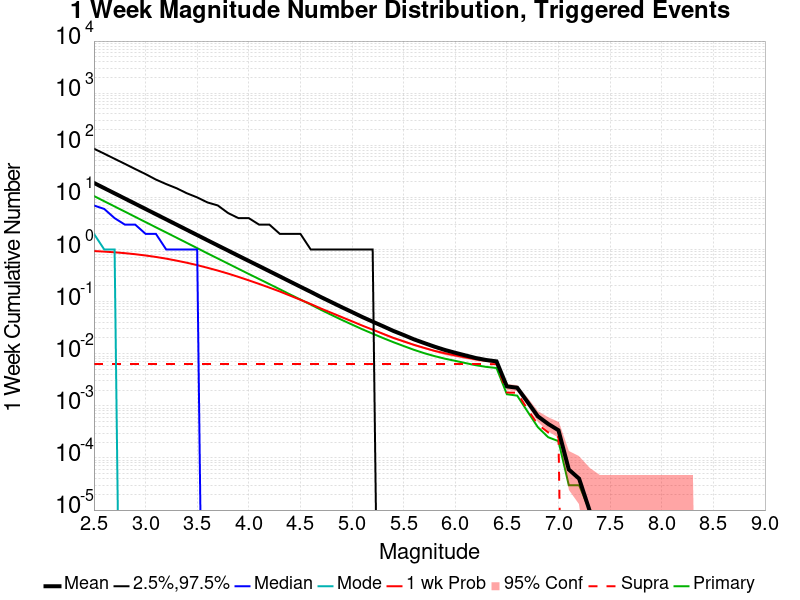

| Mag | Mean | 2.5 %ile | 97.5 %ile | Median | Mode | 1 wk Probability | 1 wk Prob 95% Conf | 1 wk Supra-Seis Prob | Primary Aftershocks Mean |
|-----|-----|-----|-----|-----|-----|-----|-----|-----|-----|
| **M&ge;2.5** | 18.787 | 0.000 | 88.000 | 7.000 | 2.000 | 0.934 (93.40%) | [93.10% 93.68%] | 6.41E-3 (0.64%) | 10.629 |
| **M&ge;2.6** | 14.929 | 0.000 | 71.000 | 6.000 | 1.000 | 0.912 (91.24%) | [90.91% 91.57%] | 6.41E-3 (0.64%) | 8.446 |
| **M&ge;2.7** | 11.856 | 0.000 | 56.000 | 4.000 | 1.000 | 0.885 (88.49%) | [88.12% 88.86%] | 6.41E-3 (0.64%) | 6.715 |
| **M&ge;2.8** | 9.425 | 0.000 | 45.000 | 3.000 | 0.000 | 0.851 (85.15%) | [84.73% 85.55%] | 6.41E-3 (0.64%) | 5.340 |
| **M&ge;2.9** | 7.492 | 0.000 | 35.000 | 3.000 | 0.000 | 0.811 (81.13%) | [80.67% 81.58%] | 6.41E-3 (0.64%) | 4.238 |
| **M&ge;3** | 5.939 | 0.000 | 29.000 | 2.000 | 0.000 | 0.766 (76.63%) | [76.14% 77.12%] | 6.41E-3 (0.64%) | 3.355 |
| **M&ge;3.1** | 4.716 | 0.000 | 23.000 | 2.000 | 0.000 | 0.719 (71.89%) | [71.37% 72.41%] | 6.41E-3 (0.64%) | 2.663 |
| **M&ge;3.2** | 3.747 | 0.000 | 19.000 | 1.000 | 0.000 | 0.667 (66.67%) | [66.13% 67.21%] | 6.41E-3 (0.64%) | 2.115 |
| **M&ge;3.3** | 2.975 | 0.000 | 15.000 | 1.000 | 0.000 | 0.612 (61.16%) | [60.59% 61.72%] | 6.41E-3 (0.64%) | 1.679 |
| **M&ge;3.4** | 2.359 | 0.000 | 12.000 | 1.000 | 0.000 | 0.557 (55.71%) | [55.14% 56.29%] | 6.41E-3 (0.64%) | 1.333 |
| **M&ge;3.5** | 1.875 | 0.000 | 10.000 | 0.000 | 0.000 | 0.499 (49.90%) | [49.32% 50.48%] | 6.41E-3 (0.64%) | 1.057 |
| **M&ge;3.6** | 1.489 | 0.000 | 8.000 | 0.000 | 0.000 | 0.444 (44.40%) | [43.83% 44.98%] | 6.41E-3 (0.64%) | 0.837 |
| **M&ge;3.7** | 1.184 | 0.000 | 7.000 | 0.000 | 0.000 | 0.392 (39.19%) | [38.63% 39.76%] | 6.41E-3 (0.64%) | 0.667 |
| **M&ge;3.8** | 0.943 | 0.000 | 6.000 | 0.000 | 0.000 | 0.342 (34.24%) | [33.70% 34.79%] | 6.41E-3 (0.64%) | 0.532 |
| **M&ge;3.9** | 0.755 | 0.000 | 5.000 | 0.000 | 0.000 | 0.298 (29.85%) | [29.32% 30.38%] | 6.41E-3 (0.64%) | 0.428 |
| **M&ge;4** | 0.602 | 0.000 | 4.000 | 0.000 | 0.000 | 0.257 (25.66%) | [25.16% 26.17%] | 6.41E-3 (0.64%) | 0.340 |
| **M&ge;4.1** | 0.482 | 0.000 | 3.000 | 0.000 | 0.000 | 0.220 (22.04%) | [21.57% 22.53%] | 6.41E-3 (0.64%) | 0.272 |
| **M&ge;4.2** | 0.383 | 0.000 | 3.000 | 0.000 | 0.000 | 0.187 (18.67%) | [18.22% 19.12%] | 6.41E-3 (0.64%) | 0.216 |
| **M&ge;4.3** | 0.306 | 0.000 | 2.000 | 0.000 | 0.000 | 0.158 (15.81%) | [15.40% 16.24%] | 6.41E-3 (0.64%) | 0.173 |
| **M&ge;4.4** | 0.244 | 0.000 | 2.000 | 0.000 | 0.000 | 0.132 (13.19%) | [12.80% 13.58%] | 6.41E-3 (0.64%) | 0.137 |
| **M&ge;4.5** | 0.193 | 0.000 | 2.000 | 0.000 | 0.000 | 0.109 (10.90%) | [10.54% 11.27%] | 6.41E-3 (0.64%) | 0.109 |
| **M&ge;4.6** | 0.154 | 0.000 | 1.000 | 0.000 | 0.000 | 0.090 (9.03%) | [8.70% 9.37%] | 6.41E-3 (0.64%) | 0.087 |
| **M&ge;4.7** | 0.122 | 0.000 | 1.000 | 0.000 | 0.000 | 0.073 (7.29%) | [6.99% 7.59%] | 6.41E-3 (0.64%) | 0.068 |
| **M&ge;4.8** | 0.097 | 0.000 | 1.000 | 0.000 | 0.000 | 0.060 (6.00%) | [5.73% 6.28%] | 6.41E-3 (0.64%) | 0.054 |
| **M&ge;4.9** | 0.078 | 0.000 | 1.000 | 0.000 | 0.000 | 0.050 (4.95%) | [4.71% 5.21%] | 6.41E-3 (0.64%) | 0.043 |
| **M&ge;5** | 0.063 | 0.000 | 1.000 | 0.000 | 0.000 | 0.041 (4.07%) | [3.85% 4.30%] | 6.41E-3 (0.64%) | 0.035 |
| **M&ge;5.1** | 0.050 | 0.000 | 1.000 | 0.000 | 0.000 | 0.034 (3.38%) | [3.18% 3.60%] | 6.41E-3 (0.64%) | 0.029 |
| **M&ge;5.2** | 0.041 | 0.000 | 1.000 | 0.000 | 0.000 | 0.028 (2.82%) | [2.64% 3.02%] | 6.41E-3 (0.64%) | 0.024 |
| **M&ge;5.3** | 0.034 | 0.000 | 0.000 | 0.000 | 0.000 | 0.024 (2.38%) | [2.21% 2.56%] | 6.41E-3 (0.64%) | 0.020 |
| **M&ge;5.4** | 0.028 | 0.000 | 0.000 | 0.000 | 0.000 | 0.019 (1.94%) | [1.78% 2.10%] | 6.41E-3 (0.64%) | 0.016 |
| **M&ge;5.5** | 0.023 | 0.000 | 0.000 | 0.000 | 0.000 | 0.017 (1.66%) | [1.52% 1.82%] | 6.41E-3 (0.64%) | 0.014 |
| **M&ge;5.6** | 0.020 | 0.000 | 0.000 | 0.000 | 0.000 | 0.015 (1.48%) | [1.34% 1.62%] | 6.41E-3 (0.64%) | 0.012 |
| **M&ge;5.7** | 0.017 | 0.000 | 0.000 | 0.000 | 0.000 | 0.013 (1.31%) | [1.19% 1.45%] | 6.41E-3 (0.64%) | 0.011 |
| **M&ge;5.8** | 0.014 | 0.000 | 0.000 | 0.000 | 0.000 | 0.012 (1.16%) | [1.04% 1.29%] | 6.41E-3 (0.64%) | 9.45E-3 |
| **M&ge;5.9** | 0.012 | 0.000 | 0.000 | 0.000 | 0.000 | 0.010 (1.03%) | [0.92% 1.16%] | 6.41E-3 (0.64%) | 8.38E-3 |
| **M&ge;6** | 0.011 | 0.000 | 0.000 | 0.000 | 0.000 | 9.48E-3 (0.95%) | [0.84% 1.07%] | 6.41E-3 (0.64%) | 7.52E-3 |
| **M&ge;6.1** | 9.83E-3 | 0.000 | 0.000 | 0.000 | 0.000 | 8.86E-3 (0.89%) | [0.78% 1.00%] | 6.41E-3 (0.64%) | 7.10E-3 |
| **M&ge;6.2** | 8.55E-3 | 0.000 | 0.000 | 0.000 | 0.000 | 8.10E-3 (0.81%) | [0.71% 0.92%] | 6.41E-3 (0.64%) | 6.45E-3 |
| **M&ge;6.3** | 7.79E-3 | 0.000 | 0.000 | 0.000 | 0.000 | 7.52E-3 (0.75%) | [0.66% 0.86%] | 6.41E-3 (0.64%) | 5.90E-3 |
| **M&ge;6.4** | 7.21E-3 | 0.000 | 0.000 | 0.000 | 0.000 | 7.03E-3 (0.70%) | [0.61% 0.81%] | 6.41E-3 (0.64%) | 5.55E-3 |
| **M&ge;6.5** | 2.38E-3 | 0.000 | 0.000 | 0.000 | 0.000 | 2.31E-3 (0.23%) | [0.18% 0.30%] | 1.83E-3 (0.18%) | 1.83E-3 |
| **M&ge;6.6** | 2.21E-3 | 0.000 | 0.000 | 0.000 | 0.000 | 2.14E-3 (0.21%) | [0.17% 0.28%] | 1.79E-3 (0.18%) | 1.69E-3 |
| **M&ge;6.7** | 1.17E-3 | 0.000 | 0.000 | 0.000 | 0.000 | 1.14E-3 (0.11%) | [0.08% 0.16%] | 7.93E-4 (0.08%) | 8.97E-4 |
| **M&ge;6.8** | 7.59E-4 | 0.000 | 0.000 | 0.000 | 0.000 | 7.59E-4 (0.08%) | [0.05% 0.12%] | 4.48E-4 (0.04%) | 5.86E-4 |
| **M&ge;6.9** | 5.17E-4 | 0.000 | 0.000 | 0.000 | 0.000 | 5.17E-4 (0.05%) | [0.03% 0.09%] | 2.76E-4 (0.03%) | 3.45E-4 |
| **M&ge;7** | 3.45E-4 | 0.000 | 0.000 | 0.000 | 0.000 | 3.45E-4 (0.03%) | [0.02% 0.07%] | 2.07E-4 (0.02%) | 2.76E-4 |
| **M&ge;7.1** | 3.45E-5 | 0.000 | 0.000 | 0.000 | 0.000 | 3.45E-5 (0.00%) | [0.00% 0.02%] | 0.000 (0.00%) | 3.45E-5 |
| **M&ge;7.2** | 3.45E-5 | 0.000 | 0.000 | 0.000 | 0.000 | 3.45E-5 (0.00%) | [0.00% 0.02%] | 0.000 (0.00%) | 3.45E-5 |
| **M&ge;7.3** | 0.000 | 0.000 | 0.000 | 0.000 | 0.000 | 0.000 (0.00%) | [0.00% 0.02%] | 0.000 (0.00%) | 0.000 |
| **M&ge;7.4** | 0.000 | 0.000 | 0.000 | 0.000 | 0.000 | 0.000 (0.00%) | [0.00% 0.02%] | 0.000 (0.00%) | 0.000 |
| **M&ge;7.5** | 0.000 | 0.000 | 0.000 | 0.000 | 0.000 | 0.000 (0.00%) | [0.00% 0.02%] | 0.000 (0.00%) | 0.000 |
| **M&ge;7.6** | 0.000 | 0.000 | 0.000 | 0.000 | 0.000 | 0.000 (0.00%) | [0.00% 0.02%] | 0.000 (0.00%) | 0.000 |
| **M&ge;7.7** | 0.000 | 0.000 | 0.000 | 0.000 | 0.000 | 0.000 (0.00%) | [0.00% 0.02%] | 0.000 (0.00%) | 0.000 |
| **M&ge;7.8** | 0.000 | 0.000 | 0.000 | 0.000 | 0.000 | 0.000 (0.00%) | [0.00% 0.02%] | 0.000 (0.00%) | 0.000 |
| **M&ge;7.9** | 0.000 | 0.000 | 0.000 | 0.000 | 0.000 | 0.000 (0.00%) | [0.00% 0.02%] | 0.000 (0.00%) | 0.000 |
| **M&ge;8** | 0.000 | 0.000 | 0.000 | 0.000 | 0.000 | 0.000 (0.00%) | [0.00% 0.02%] | 0.000 (0.00%) | 0.000 |
| **M&ge;8.1** | 0.000 | 0.000 | 0.000 | 0.000 | 0.000 | 0.000 (0.00%) | [0.00% 0.02%] | 0.000 (0.00%) | 0.000 |
| **M&ge;8.2** | 0.000 | 0.000 | 0.000 | 0.000 | 0.000 | 0.000 (0.00%) | [0.00% 0.02%] | 0.000 (0.00%) | 0.000 |
| **M&ge;8.3** | 0.000 | 0.000 | 0.000 | 0.000 | 0.000 | 0.000 (0.00%) | [0.00% 0.02%] | 0.000 (0.00%) | 0.000 |
| **M&ge;8.4** | 0.000 | 0.000 | 0.000 | 0.000 | 0.000 | 0.000 (0.00%) | [0.00% 0.02%] | 0.000 (0.00%) | 0.000 |
| **M&ge;8.5** | 0.000 | 0.000 | 0.000 | 0.000 | 0.000 | 0.000 (0.00%) | [0.00% 0.02%] | 0.000 (0.00%) | 0.000 |
| **M&ge;8.6** | 0.000 | 0.000 | 0.000 | 0.000 | 0.000 | 0.000 (0.00%) | [0.00% 0.02%] | 0.000 (0.00%) | 0.000 |
| **M&ge;8.7** | 0.000 | 0.000 | 0.000 | 0.000 | 0.000 | 0.000 (0.00%) | [0.00% 0.02%] | 0.000 (0.00%) | 0.000 |
| **M&ge;8.8** | 0.000 | 0.000 | 0.000 | 0.000 | 0.000 | 0.000 (0.00%) | [0.00% 0.02%] | 0.000 (0.00%) | 0.000 |
| **M&ge;8.9** | 0.000 | 0.000 | 0.000 | 0.000 | 0.000 | 0.000 (0.00%) | [0.00% 0.02%] | 0.000 (0.00%) | 0.000 |
| **M&ge;9** | 0.000 | 0.000 | 0.000 | 0.000 | 0.000 | 0.000 (0.00%) | [0.00% 0.02%] | 0.000 (0.00%) | 0.000 |

### 1 Day Magnitude Number Distribution
*[(top)](#table-of-contents)*

**Legend**
* **Mean** (thick black line): mean expected number across all 29000 catalogs
* **2.5%,97.5%** (thin black lines): expected number percentiles across all 29000 catalogs
* **Median** (thin blue line): median expected number across all 29000 catalogs
* **Mode** (thin cyan line): modal expected number across all 29000 catalogs
* **1 d Probability** (thin red line): 1 day probability calculated as the fraction of catalogs with at least 1 occurrence
* **1 d Supraseismogenic Probability** (thin dashed red line): same as above, but only for supraseismogenic ruptures on explicitly modeled UCERF3 faults
* **95% Conf** (light red shaded region): binomial 95% confidence bounds on probability
* **Primary** (thin green line): mean expected number from primary triggered aftershocks only (no secondary, tertiary, etc...) across all 29000 catalogs


| Mag | Mean | 2.5 %ile | 97.5 %ile | Median | Mode | 1 d Probability | 1 d Prob 95% Conf | 1 d Supra-Seis Prob | Primary Aftershocks Mean |
|-----|-----|-----|-----|-----|-----|-----|-----|-----|-----|
| **M&ge;2.5** | 12.249 | 0.000 | 58.000 | 5.000 | 1.000 | 0.908 (90.78%) | [90.44% 91.11%] | 4.55E-3 (0.46%) | 8.182 |
| **M&ge;2.6** | 9.735 | 0.000 | 47.000 | 4.000 | 1.000 | 0.880 (88.00%) | [87.62% 88.37%] | 4.55E-3 (0.46%) | 6.502 |
| **M&ge;2.7** | 7.730 | 0.000 | 37.000 | 3.000 | 1.000 | 0.846 (84.57%) | [84.15% 84.98%] | 4.55E-3 (0.46%) | 5.166 |
| **M&ge;2.8** | 6.148 | 0.000 | 30.000 | 2.000 | 0.000 | 0.805 (80.47%) | [80.00% 80.92%] | 4.55E-3 (0.46%) | 4.106 |
| **M&ge;2.9** | 4.889 | 0.000 | 24.000 | 2.000 | 0.000 | 0.759 (75.87%) | [75.37% 76.36%] | 4.55E-3 (0.46%) | 3.259 |
| **M&ge;3** | 3.873 | 0.000 | 19.000 | 1.000 | 0.000 | 0.707 (70.74%) | [70.21% 71.26%] | 4.55E-3 (0.46%) | 2.579 |
| **M&ge;3.1** | 3.074 | 0.000 | 15.000 | 1.000 | 0.000 | 0.656 (65.56%) | [65.01% 66.11%] | 4.55E-3 (0.46%) | 2.049 |
| **M&ge;3.2** | 2.445 | 0.000 | 13.000 | 1.000 | 0.000 | 0.599 (59.94%) | [59.38% 60.51%] | 4.55E-3 (0.46%) | 1.629 |
| **M&ge;3.3** | 1.938 | 0.000 | 10.000 | 1.000 | 0.000 | 0.542 (54.24%) | [53.66% 54.81%] | 4.55E-3 (0.46%) | 1.292 |
| **M&ge;3.4** | 1.537 | 0.000 | 8.000 | 0.000 | 0.000 | 0.486 (48.64%) | [48.06% 49.22%] | 4.55E-3 (0.46%) | 1.026 |
| **M&ge;3.5** | 1.219 | 0.000 | 7.000 | 0.000 | 0.000 | 0.429 (42.87%) | [42.30% 43.44%] | 4.55E-3 (0.46%) | 0.811 |
| **M&ge;3.6** | 0.964 | 0.000 | 6.000 | 0.000 | 0.000 | 0.376 (37.56%) | [37.00% 38.12%] | 4.55E-3 (0.46%) | 0.642 |
| **M&ge;3.7** | 0.767 | 0.000 | 5.000 | 0.000 | 0.000 | 0.328 (32.77%) | [32.23% 33.31%] | 4.55E-3 (0.46%) | 0.512 |
| **M&ge;3.8** | 0.611 | 0.000 | 4.000 | 0.000 | 0.000 | 0.283 (28.27%) | [27.75% 28.79%] | 4.55E-3 (0.46%) | 0.409 |
| **M&ge;3.9** | 0.492 | 0.000 | 3.000 | 0.000 | 0.000 | 0.244 (24.36%) | [23.86% 24.85%] | 4.55E-3 (0.46%) | 0.329 |
| **M&ge;4** | 0.391 | 0.000 | 3.000 | 0.000 | 0.000 | 0.208 (20.75%) | [20.29% 21.22%] | 4.55E-3 (0.46%) | 0.262 |
| **M&ge;4.1** | 0.314 | 0.000 | 2.000 | 0.000 | 0.000 | 0.176 (17.59%) | [17.15% 18.03%] | 4.55E-3 (0.46%) | 0.210 |
| **M&ge;4.2** | 0.249 | 0.000 | 2.000 | 0.000 | 0.000 | 0.147 (14.72%) | [14.32% 15.14%] | 4.55E-3 (0.46%) | 0.167 |
| **M&ge;4.3** | 0.198 | 0.000 | 2.000 | 0.000 | 0.000 | 0.122 (12.25%) | [11.87% 12.63%] | 4.55E-3 (0.46%) | 0.132 |
| **M&ge;4.4** | 0.159 | 0.000 | 1.000 | 0.000 | 0.000 | 0.102 (10.21%) | [9.87% 10.57%] | 4.55E-3 (0.46%) | 0.105 |
| **M&ge;4.5** | 0.126 | 0.000 | 1.000 | 0.000 | 0.000 | 0.084 (8.41%) | [8.09% 8.74%] | 4.55E-3 (0.46%) | 0.084 |
| **M&ge;4.6** | 0.101 | 0.000 | 1.000 | 0.000 | 0.000 | 0.069 (6.91%) | [6.62% 7.21%] | 4.55E-3 (0.46%) | 0.067 |
| **M&ge;4.7** | 0.079 | 0.000 | 1.000 | 0.000 | 0.000 | 0.055 (5.54%) | [5.28% 5.81%] | 4.55E-3 (0.46%) | 0.052 |
| **M&ge;4.8** | 0.063 | 0.000 | 1.000 | 0.000 | 0.000 | 0.045 (4.48%) | [4.24% 4.72%] | 4.55E-3 (0.46%) | 0.041 |
| **M&ge;4.9** | 0.050 | 0.000 | 1.000 | 0.000 | 0.000 | 0.036 (3.64%) | [3.43% 3.87%] | 4.55E-3 (0.46%) | 0.033 |
| **M&ge;5** | 0.041 | 0.000 | 1.000 | 0.000 | 0.000 | 0.030 (2.97%) | [2.78% 3.18%] | 4.55E-3 (0.46%) | 0.026 |
| **M&ge;5.1** | 0.033 | 0.000 | 0.000 | 0.000 | 0.000 | 0.025 (2.48%) | [2.30% 2.66%] | 4.55E-3 (0.46%) | 0.022 |
| **M&ge;5.2** | 0.027 | 0.000 | 0.000 | 0.000 | 0.000 | 0.021 (2.11%) | [1.95% 2.28%] | 4.55E-3 (0.46%) | 0.018 |
| **M&ge;5.3** | 0.023 | 0.000 | 0.000 | 0.000 | 0.000 | 0.018 (1.80%) | [1.65% 1.96%] | 4.55E-3 (0.46%) | 0.016 |
| **M&ge;5.4** | 0.019 | 0.000 | 0.000 | 0.000 | 0.000 | 0.015 (1.47%) | [1.33% 1.61%] | 4.55E-3 (0.46%) | 0.013 |
| **M&ge;5.5** | 0.016 | 0.000 | 0.000 | 0.000 | 0.000 | 0.012 (1.24%) | [1.12% 1.38%] | 4.55E-3 (0.46%) | 0.011 |
| **M&ge;5.6** | 0.013 | 0.000 | 0.000 | 0.000 | 0.000 | 0.011 (1.11%) | [0.99% 1.24%] | 4.55E-3 (0.46%) | 9.34E-3 |
| **M&ge;5.7** | 0.012 | 0.000 | 0.000 | 0.000 | 0.000 | 9.97E-3 (1.00%) | [0.89% 1.12%] | 4.55E-3 (0.46%) | 8.38E-3 |
| **M&ge;5.8** | 9.79E-3 | 0.000 | 0.000 | 0.000 | 0.000 | 8.62E-3 (0.86%) | [0.76% 0.98%] | 4.55E-3 (0.46%) | 7.21E-3 |
| **M&ge;5.9** | 8.62E-3 | 0.000 | 0.000 | 0.000 | 0.000 | 7.76E-3 (0.78%) | [0.68% 0.89%] | 4.55E-3 (0.46%) | 6.45E-3 |
| **M&ge;6** | 7.52E-3 | 0.000 | 0.000 | 0.000 | 0.000 | 6.93E-3 (0.69%) | [0.60% 0.80%] | 4.55E-3 (0.46%) | 5.72E-3 |
| **M&ge;6.1** | 6.93E-3 | 0.000 | 0.000 | 0.000 | 0.000 | 6.52E-3 (0.65%) | [0.56% 0.75%] | 4.55E-3 (0.46%) | 5.41E-3 |
| **M&ge;6.2** | 6.03E-3 | 0.000 | 0.000 | 0.000 | 0.000 | 5.93E-3 (0.59%) | [0.51% 0.69%] | 4.55E-3 (0.46%) | 4.86E-3 |
| **M&ge;6.3** | 5.59E-3 | 0.000 | 0.000 | 0.000 | 0.000 | 5.55E-3 (0.56%) | [0.47% 0.65%] | 4.55E-3 (0.46%) | 4.48E-3 |
| **M&ge;6.4** | 5.10E-3 | 0.000 | 0.000 | 0.000 | 0.000 | 5.10E-3 (0.51%) | [0.43% 0.60%] | 4.55E-3 (0.46%) | 4.14E-3 |
| **M&ge;6.5** | 1.83E-3 | 0.000 | 0.000 | 0.000 | 0.000 | 1.83E-3 (0.18%) | [0.14% 0.24%] | 1.41E-3 (0.14%) | 1.55E-3 |
| **M&ge;6.6** | 1.69E-3 | 0.000 | 0.000 | 0.000 | 0.000 | 1.69E-3 (0.17%) | [0.13% 0.23%] | 1.41E-3 (0.14%) | 1.41E-3 |
| **M&ge;6.7** | 9.31E-4 | 0.000 | 0.000 | 0.000 | 0.000 | 9.31E-4 (0.09%) | [0.06% 0.14%] | 6.90E-4 (0.07%) | 8.28E-4 |
| **M&ge;6.8** | 5.52E-4 | 0.000 | 0.000 | 0.000 | 0.000 | 5.52E-4 (0.06%) | [0.03% 0.09%] | 3.45E-4 (0.03%) | 5.17E-4 |
| **M&ge;6.9** | 3.45E-4 | 0.000 | 0.000 | 0.000 | 0.000 | 3.45E-4 (0.03%) | [0.02% 0.07%] | 1.72E-4 (0.02%) | 3.10E-4 |
| **M&ge;7** | 3.10E-4 | 0.000 | 0.000 | 0.000 | 0.000 | 3.10E-4 (0.03%) | [0.02% 0.06%] | 1.72E-4 (0.02%) | 2.76E-4 |
| **M&ge;7.1** | 3.45E-5 | 0.000 | 0.000 | 0.000 | 0.000 | 3.45E-5 (0.00%) | [0.00% 0.02%] | 0.000 (0.00%) | 3.45E-5 |
| **M&ge;7.2** | 3.45E-5 | 0.000 | 0.000 | 0.000 | 0.000 | 3.45E-5 (0.00%) | [0.00% 0.02%] | 0.000 (0.00%) | 3.45E-5 |
| **M&ge;7.3** | 0.000 | 0.000 | 0.000 | 0.000 | 0.000 | 0.000 (0.00%) | [0.00% 0.02%] | 0.000 (0.00%) | 0.000 |
| **M&ge;7.4** | 0.000 | 0.000 | 0.000 | 0.000 | 0.000 | 0.000 (0.00%) | [0.00% 0.02%] | 0.000 (0.00%) | 0.000 |
| **M&ge;7.5** | 0.000 | 0.000 | 0.000 | 0.000 | 0.000 | 0.000 (0.00%) | [0.00% 0.02%] | 0.000 (0.00%) | 0.000 |
| **M&ge;7.6** | 0.000 | 0.000 | 0.000 | 0.000 | 0.000 | 0.000 (0.00%) | [0.00% 0.02%] | 0.000 (0.00%) | 0.000 |
| **M&ge;7.7** | 0.000 | 0.000 | 0.000 | 0.000 | 0.000 | 0.000 (0.00%) | [0.00% 0.02%] | 0.000 (0.00%) | 0.000 |
| **M&ge;7.8** | 0.000 | 0.000 | 0.000 | 0.000 | 0.000 | 0.000 (0.00%) | [0.00% 0.02%] | 0.000 (0.00%) | 0.000 |
| **M&ge;7.9** | 0.000 | 0.000 | 0.000 | 0.000 | 0.000 | 0.000 (0.00%) | [0.00% 0.02%] | 0.000 (0.00%) | 0.000 |
| **M&ge;8** | 0.000 | 0.000 | 0.000 | 0.000 | 0.000 | 0.000 (0.00%) | [0.00% 0.02%] | 0.000 (0.00%) | 0.000 |
| **M&ge;8.1** | 0.000 | 0.000 | 0.000 | 0.000 | 0.000 | 0.000 (0.00%) | [0.00% 0.02%] | 0.000 (0.00%) | 0.000 |
| **M&ge;8.2** | 0.000 | 0.000 | 0.000 | 0.000 | 0.000 | 0.000 (0.00%) | [0.00% 0.02%] | 0.000 (0.00%) | 0.000 |
| **M&ge;8.3** | 0.000 | 0.000 | 0.000 | 0.000 | 0.000 | 0.000 (0.00%) | [0.00% 0.02%] | 0.000 (0.00%) | 0.000 |
| **M&ge;8.4** | 0.000 | 0.000 | 0.000 | 0.000 | 0.000 | 0.000 (0.00%) | [0.00% 0.02%] | 0.000 (0.00%) | 0.000 |
| **M&ge;8.5** | 0.000 | 0.000 | 0.000 | 0.000 | 0.000 | 0.000 (0.00%) | [0.00% 0.02%] | 0.000 (0.00%) | 0.000 |
| **M&ge;8.6** | 0.000 | 0.000 | 0.000 | 0.000 | 0.000 | 0.000 (0.00%) | [0.00% 0.02%] | 0.000 (0.00%) | 0.000 |
| **M&ge;8.7** | 0.000 | 0.000 | 0.000 | 0.000 | 0.000 | 0.000 (0.00%) | [0.00% 0.02%] | 0.000 (0.00%) | 0.000 |
| **M&ge;8.8** | 0.000 | 0.000 | 0.000 | 0.000 | 0.000 | 0.000 (0.00%) | [0.00% 0.02%] | 0.000 (0.00%) | 0.000 |
| **M&ge;8.9** | 0.000 | 0.000 | 0.000 | 0.000 | 0.000 | 0.000 (0.00%) | [0.00% 0.02%] | 0.000 (0.00%) | 0.000 |
| **M&ge;9** | 0.000 | 0.000 | 0.000 | 0.000 | 0.000 | 0.000 (0.00%) | [0.00% 0.02%] | 0.000 (0.00%) | 0.000 |

### 1 Hour Magnitude Number Distribution
*[(top)](#table-of-contents)*

**Legend**
* **Mean** (thick black line): mean expected number across all 29000 catalogs
* **2.5%,97.5%** (thin black lines): expected number percentiles across all 29000 catalogs
* **Median** (thin blue line): median expected number across all 29000 catalogs
* **Mode** (thin cyan line): modal expected number across all 29000 catalogs
* **1 hr Probability** (thin red line): 1 hour probability calculated as the fraction of catalogs with at least 1 occurrence
* **1 hr Supraseismogenic Probability** (thin dashed red line): same as above, but only for supraseismogenic ruptures on explicitly modeled UCERF3 faults
* **95% Conf** (light red shaded region): binomial 95% confidence bounds on probability
* **Primary** (thin green line): mean expected number from primary triggered aftershocks only (no secondary, tertiary, etc...) across all 29000 catalogs


| Mag | Mean | 2.5 %ile | 97.5 %ile | Median | Mode | 1 hr Probability | 1 hr Prob 95% Conf | 1 hr Supra-Seis Prob | Primary Aftershocks Mean |
|-----|-----|-----|-----|-----|-----|-----|-----|-----|-----|
| **M&ge;2.5** | 4.141 | 0.000 | 20.000 | 2.000 | 0.000 | 0.777 (77.69%) | [77.20% 78.16%] | 1.41E-3 (0.14%) | 3.605 |
| **M&ge;2.6** | 3.287 | 0.000 | 16.000 | 2.000 | 0.000 | 0.727 (72.74%) | [72.22% 73.25%] | 1.41E-3 (0.14%) | 2.858 |
| **M&ge;2.7** | 2.613 | 0.000 | 13.000 | 1.000 | 0.000 | 0.673 (67.32%) | [66.77% 67.86%] | 1.41E-3 (0.14%) | 2.273 |
| **M&ge;2.8** | 2.078 | 0.000 | 11.000 | 1.000 | 0.000 | 0.617 (61.74%) | [61.18% 62.30%] | 1.41E-3 (0.14%) | 1.812 |
| **M&ge;2.9** | 1.655 | 0.000 | 8.000 | 1.000 | 0.000 | 0.562 (56.16%) | [55.59% 56.73%] | 1.41E-3 (0.14%) | 1.441 |
| **M&ge;3** | 1.313 | 0.000 | 7.000 | 1.000 | 0.000 | 0.503 (50.34%) | [49.76% 50.92%] | 1.41E-3 (0.14%) | 1.143 |
| **M&ge;3.1** | 1.043 | 0.000 | 6.000 | 0.000 | 0.000 | 0.446 (44.60%) | [44.02% 45.17%] | 1.41E-3 (0.14%) | 0.906 |
| **M&ge;3.2** | 0.827 | 0.000 | 5.000 | 0.000 | 0.000 | 0.390 (39.01%) | [38.45% 39.58%] | 1.41E-3 (0.14%) | 0.718 |
| **M&ge;3.3** | 0.657 | 0.000 | 4.000 | 0.000 | 0.000 | 0.339 (33.94%) | [33.39% 34.49%] | 1.41E-3 (0.14%) | 0.570 |
| **M&ge;3.4** | 0.520 | 0.000 | 3.000 | 0.000 | 0.000 | 0.293 (29.30%) | [28.77% 29.82%] | 1.41E-3 (0.14%) | 0.452 |
| **M&ge;3.5** | 0.412 | 0.000 | 3.000 | 0.000 | 0.000 | 0.247 (24.73%) | [24.24% 25.24%] | 1.41E-3 (0.14%) | 0.357 |
| **M&ge;3.6** | 0.326 | 0.000 | 2.000 | 0.000 | 0.000 | 0.208 (20.83%) | [20.36% 21.30%] | 1.41E-3 (0.14%) | 0.283 |
| **M&ge;3.7** | 0.260 | 0.000 | 2.000 | 0.000 | 0.000 | 0.176 (17.59%) | [17.15% 18.03%] | 1.41E-3 (0.14%) | 0.226 |
| **M&ge;3.8** | 0.207 | 0.000 | 2.000 | 0.000 | 0.000 | 0.148 (14.76%) | [14.36% 15.18%] | 1.41E-3 (0.14%) | 0.181 |
| **M&ge;3.9** | 0.167 | 0.000 | 2.000 | 0.000 | 0.000 | 0.123 (12.33%) | [11.96% 12.72%] | 1.41E-3 (0.14%) | 0.145 |
| **M&ge;4** | 0.132 | 0.000 | 1.000 | 0.000 | 0.000 | 0.101 (10.12%) | [9.78% 10.48%] | 1.41E-3 (0.14%) | 0.114 |
| **M&ge;4.1** | 0.105 | 0.000 | 1.000 | 0.000 | 0.000 | 0.083 (8.35%) | [8.03% 8.67%] | 1.41E-3 (0.14%) | 0.091 |
| **M&ge;4.2** | 0.083 | 0.000 | 1.000 | 0.000 | 0.000 | 0.068 (6.83%) | [6.54% 7.13%] | 1.41E-3 (0.14%) | 0.072 |
| **M&ge;4.3** | 0.066 | 0.000 | 1.000 | 0.000 | 0.000 | 0.055 (5.52%) | [5.26% 5.79%] | 1.41E-3 (0.14%) | 0.057 |
| **M&ge;4.4** | 0.052 | 0.000 | 1.000 | 0.000 | 0.000 | 0.044 (4.44%) | [4.21% 4.68%] | 1.41E-3 (0.14%) | 0.045 |
| **M&ge;4.5** | 0.042 | 0.000 | 1.000 | 0.000 | 0.000 | 0.036 (3.60%) | [3.39% 3.83%] | 1.41E-3 (0.14%) | 0.037 |
| **M&ge;4.6** | 0.034 | 0.000 | 1.000 | 0.000 | 0.000 | 0.029 (2.94%) | [2.75% 3.14%] | 1.41E-3 (0.14%) | 0.029 |
| **M&ge;4.7** | 0.027 | 0.000 | 0.000 | 0.000 | 0.000 | 0.023 (2.35%) | [2.18% 2.53%] | 1.41E-3 (0.14%) | 0.023 |
| **M&ge;4.8** | 0.021 | 0.000 | 0.000 | 0.000 | 0.000 | 0.018 (1.84%) | [1.69% 2.00%] | 1.41E-3 (0.14%) | 0.018 |
| **M&ge;4.9** | 0.016 | 0.000 | 0.000 | 0.000 | 0.000 | 0.015 (1.46%) | [1.33% 1.60%] | 1.41E-3 (0.14%) | 0.014 |
| **M&ge;5** | 0.013 | 0.000 | 0.000 | 0.000 | 0.000 | 0.012 (1.17%) | [1.05% 1.30%] | 1.41E-3 (0.14%) | 0.011 |
| **M&ge;5.1** | 0.011 | 0.000 | 0.000 | 0.000 | 0.000 | 9.66E-3 (0.97%) | [0.86% 1.09%] | 1.41E-3 (0.14%) | 9.03E-3 |
| **M&ge;5.2** | 8.66E-3 | 0.000 | 0.000 | 0.000 | 0.000 | 7.93E-3 (0.79%) | [0.70% 0.90%] | 1.41E-3 (0.14%) | 7.41E-3 |
| **M&ge;5.3** | 7.34E-3 | 0.000 | 0.000 | 0.000 | 0.000 | 6.79E-3 (0.68%) | [0.59% 0.78%] | 1.41E-3 (0.14%) | 6.45E-3 |
| **M&ge;5.4** | 6.03E-3 | 0.000 | 0.000 | 0.000 | 0.000 | 5.62E-3 (0.56%) | [0.48% 0.66%] | 1.41E-3 (0.14%) | 5.38E-3 |
| **M&ge;5.5** | 4.97E-3 | 0.000 | 0.000 | 0.000 | 0.000 | 4.69E-3 (0.47%) | [0.40% 0.56%] | 1.41E-3 (0.14%) | 4.52E-3 |
| **M&ge;5.6** | 4.21E-3 | 0.000 | 0.000 | 0.000 | 0.000 | 4.00E-3 (0.40%) | [0.33% 0.48%] | 1.41E-3 (0.14%) | 3.83E-3 |
| **M&ge;5.7** | 3.72E-3 | 0.000 | 0.000 | 0.000 | 0.000 | 3.55E-3 (0.36%) | [0.29% 0.43%] | 1.41E-3 (0.14%) | 3.41E-3 |
| **M&ge;5.8** | 3.14E-3 | 0.000 | 0.000 | 0.000 | 0.000 | 3.00E-3 (0.30%) | [0.24% 0.37%] | 1.41E-3 (0.14%) | 2.83E-3 |
| **M&ge;5.9** | 2.72E-3 | 0.000 | 0.000 | 0.000 | 0.000 | 2.62E-3 (0.26%) | [0.21% 0.33%] | 1.41E-3 (0.14%) | 2.45E-3 |
| **M&ge;6** | 2.31E-3 | 0.000 | 0.000 | 0.000 | 0.000 | 2.21E-3 (0.22%) | [0.17% 0.28%] | 1.41E-3 (0.14%) | 2.03E-3 |
| **M&ge;6.1** | 2.14E-3 | 0.000 | 0.000 | 0.000 | 0.000 | 2.10E-3 (0.21%) | [0.16% 0.27%] | 1.41E-3 (0.14%) | 1.93E-3 |
| **M&ge;6.2** | 1.90E-3 | 0.000 | 0.000 | 0.000 | 0.000 | 1.90E-3 (0.19%) | [0.14% 0.25%] | 1.41E-3 (0.14%) | 1.79E-3 |
| **M&ge;6.3** | 1.79E-3 | 0.000 | 0.000 | 0.000 | 0.000 | 1.79E-3 (0.18%) | [0.14% 0.24%] | 1.41E-3 (0.14%) | 1.69E-3 |
| **M&ge;6.4** | 1.69E-3 | 0.000 | 0.000 | 0.000 | 0.000 | 1.69E-3 (0.17%) | [0.13% 0.23%] | 1.41E-3 (0.14%) | 1.62E-3 |
| **M&ge;6.5** | 6.90E-4 | 0.000 | 0.000 | 0.000 | 0.000 | 6.90E-4 (0.07%) | [0.04% 0.11%] | 4.48E-4 (0.04%) | 6.55E-4 |
| **M&ge;6.6** | 6.21E-4 | 0.000 | 0.000 | 0.000 | 0.000 | 6.21E-4 (0.06%) | [0.04% 0.10%] | 4.48E-4 (0.04%) | 5.86E-4 |
| **M&ge;6.7** | 3.45E-4 | 0.000 | 0.000 | 0.000 | 0.000 | 3.45E-4 (0.03%) | [0.02% 0.07%] | 2.07E-4 (0.02%) | 3.45E-4 |
| **M&ge;6.8** | 2.76E-4 | 0.000 | 0.000 | 0.000 | 0.000 | 2.76E-4 (0.03%) | [0.01% 0.06%] | 1.38E-4 (0.01%) | 2.76E-4 |
| **M&ge;6.9** | 1.38E-4 | 0.000 | 0.000 | 0.000 | 0.000 | 1.38E-4 (0.01%) | [0.00% 0.04%] | 3.45E-5 (0.00%) | 1.38E-4 |
| **M&ge;7** | 1.38E-4 | 0.000 | 0.000 | 0.000 | 0.000 | 1.38E-4 (0.01%) | [0.00% 0.04%] | 3.45E-5 (0.00%) | 1.38E-4 |
| **M&ge;7.1** | 3.45E-5 | 0.000 | 0.000 | 0.000 | 0.000 | 3.45E-5 (0.00%) | [0.00% 0.02%] | 0.000 (0.00%) | 3.45E-5 |
| **M&ge;7.2** | 3.45E-5 | 0.000 | 0.000 | 0.000 | 0.000 | 3.45E-5 (0.00%) | [0.00% 0.02%] | 0.000 (0.00%) | 3.45E-5 |
| **M&ge;7.3** | 0.000 | 0.000 | 0.000 | 0.000 | 0.000 | 0.000 (0.00%) | [0.00% 0.02%] | 0.000 (0.00%) | 0.000 |
| **M&ge;7.4** | 0.000 | 0.000 | 0.000 | 0.000 | 0.000 | 0.000 (0.00%) | [0.00% 0.02%] | 0.000 (0.00%) | 0.000 |
| **M&ge;7.5** | 0.000 | 0.000 | 0.000 | 0.000 | 0.000 | 0.000 (0.00%) | [0.00% 0.02%] | 0.000 (0.00%) | 0.000 |
| **M&ge;7.6** | 0.000 | 0.000 | 0.000 | 0.000 | 0.000 | 0.000 (0.00%) | [0.00% 0.02%] | 0.000 (0.00%) | 0.000 |
| **M&ge;7.7** | 0.000 | 0.000 | 0.000 | 0.000 | 0.000 | 0.000 (0.00%) | [0.00% 0.02%] | 0.000 (0.00%) | 0.000 |
| **M&ge;7.8** | 0.000 | 0.000 | 0.000 | 0.000 | 0.000 | 0.000 (0.00%) | [0.00% 0.02%] | 0.000 (0.00%) | 0.000 |
| **M&ge;7.9** | 0.000 | 0.000 | 0.000 | 0.000 | 0.000 | 0.000 (0.00%) | [0.00% 0.02%] | 0.000 (0.00%) | 0.000 |
| **M&ge;8** | 0.000 | 0.000 | 0.000 | 0.000 | 0.000 | 0.000 (0.00%) | [0.00% 0.02%] | 0.000 (0.00%) | 0.000 |
| **M&ge;8.1** | 0.000 | 0.000 | 0.000 | 0.000 | 0.000 | 0.000 (0.00%) | [0.00% 0.02%] | 0.000 (0.00%) | 0.000 |
| **M&ge;8.2** | 0.000 | 0.000 | 0.000 | 0.000 | 0.000 | 0.000 (0.00%) | [0.00% 0.02%] | 0.000 (0.00%) | 0.000 |
| **M&ge;8.3** | 0.000 | 0.000 | 0.000 | 0.000 | 0.000 | 0.000 (0.00%) | [0.00% 0.02%] | 0.000 (0.00%) | 0.000 |
| **M&ge;8.4** | 0.000 | 0.000 | 0.000 | 0.000 | 0.000 | 0.000 (0.00%) | [0.00% 0.02%] | 0.000 (0.00%) | 0.000 |
| **M&ge;8.5** | 0.000 | 0.000 | 0.000 | 0.000 | 0.000 | 0.000 (0.00%) | [0.00% 0.02%] | 0.000 (0.00%) | 0.000 |
| **M&ge;8.6** | 0.000 | 0.000 | 0.000 | 0.000 | 0.000 | 0.000 (0.00%) | [0.00% 0.02%] | 0.000 (0.00%) | 0.000 |
| **M&ge;8.7** | 0.000 | 0.000 | 0.000 | 0.000 | 0.000 | 0.000 (0.00%) | [0.00% 0.02%] | 0.000 (0.00%) | 0.000 |
| **M&ge;8.8** | 0.000 | 0.000 | 0.000 | 0.000 | 0.000 | 0.000 (0.00%) | [0.00% 0.02%] | 0.000 (0.00%) | 0.000 |
| **M&ge;8.9** | 0.000 | 0.000 | 0.000 | 0.000 | 0.000 | 0.000 (0.00%) | [0.00% 0.02%] | 0.000 (0.00%) | 0.000 |
| **M&ge;9** | 0.000 | 0.000 | 0.000 | 0.000 | 0.000 | 0.000 (0.00%) | [0.00% 0.02%] | 0.000 (0.00%) | 0.000 |


## Trigger Rupture Fault Map
*[(top)](#table-of-contents)*


## Fault Distances To Triggers
*[(top)](#table-of-contents)*

| Section Name | Strike, Dip, Rake | Hypocenter In Polygon? | Surface In Polygon? | Minimum Distance (km) | Minimum Poly Distance (km) |
|-----|-----|-----|-----|-----|-----|
| Carson Range (Genoa) | 352, 50, -90 | false | false | 2.691 | 0.233 |
| Incline Village 2011 CFM | 17, 50, -90 | false | false | 12.592 | 12.375 |
| North Tahoe 2011 CFM | 15, 50, -90 | false | false | 15.603 | 15.107 |

## Individual Simulated Catalog Maps
*[(top)](#table-of-contents)*

These are map plots of individual catalogs from the simulations, selected as the closest catalog to each of the given percentiles in terms of total number of events.

| Duration | p0.0 %-ile | p25.0 %-ile | p50.0 %-ile | p75.0 %-ile | p90.0 %-ile | p95.0 %-ile | p97.5 %-ile | p98.0 %-ile | p99.0 %-ile | p99.5 %-ile | p99.9 %-ile | p99.996552 %-ile |
|-----|-----|-----|-----|-----|-----|-----|-----|-----|-----|-----|-----|-----|
| **1 Week** |  |  |  |  |  |  |  |  |  |  | 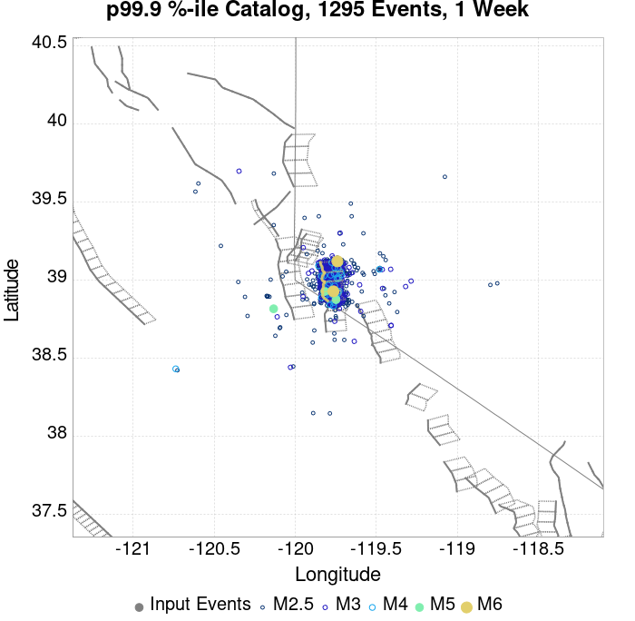 |  |
| **1 Month** |  |  |  |  |  |  |  |  |  |  |  |  |
| **1 Year** |  |  |  |  |  |  |  |  |  |  | 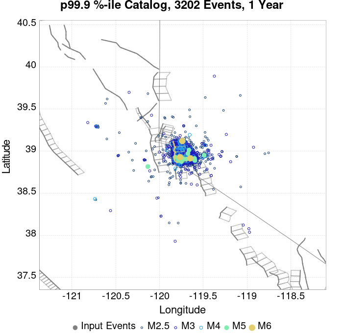 |  |
| **10 Year** |  |  |  |  |  | 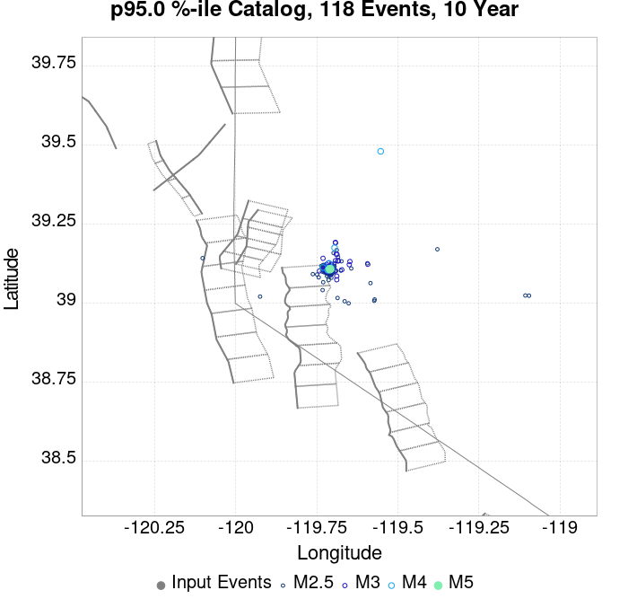 |  |  |  |  |  |  |

## ComCat Data Comparisons
*[(top)](#table-of-contents)*

These plots compare simulated sequences with data from ComCat. All plots only consider events with hypocenters inside the ComCat region defined in the JSON input file.

Last updated at 2020/03/21 04:33:59 UTC, 3 hours after the simulation start time.

Total matching ComCat events found: 0

### ComCat Magnitude-Number Distributions
*[(top)](#table-of-contents)*

| Incremental MND | Cumulative MND |
|-----|-----|
|  |  |

### ComCat Time-Dependent Mc
*[(top)](#table-of-contents)*

The following plots compare simulation results with ComCat data above a magnitude threshold. Plots labeled as *M&ge;Mc(t)* use the time-dependent magnitude of completeness (Mc) defined in Helmstetter et al. (2006), which is plotted below. In the case of multiple M&ge;5 ruptures, either as input to the simulation or in the comparison data, the maximum calculated time-dependent Mc is used. This time-dependent Mc function is plotted below.


### ComCat Cumulative Number Vs Time
*[(top)](#table-of-contents)*

| M&ge;Mc(t) | M&ge;3.5 | M&ge;4 | M&ge;4.5 | M&ge;5 |
|-----|-----|-----|-----|-----|
|  |  |  |  |  |

### ComCat Cumulative Number Simulation Percentiles
*[(top)](#table-of-contents)*


### ComCat Probability Spatial Distribution
*[(top)](#table-of-contents)*

*Note: maps labeled 'Forecast' are for a duration that extends into the future, only forecasted values are plotted (ComCat data omitted)*

|  | Current (3 Hour) | Forecast: 1 Day | Forecast: 1 Week | Forecast: 1 Month | Forecast: 1 Year |
|-----|-----|-----|-----|-----|-----|
| **M&ge;Mc(t)** |  |  |  |  |  |
|  | Prob: 71.07%, Actual: 0 | Prob: 80.93% | Prob: 85.51% | Prob: 87.71% | Prob: 90.19% |
| **M&ge;3.5** |  |  |  |  |  |
|  | Prob: 20.57%, Actual: 0 | Prob: 28.98% | Prob: 34.85% | Prob: 38.31% | Prob: 43.20% |
| **M&ge;4** |  |  |  |  | 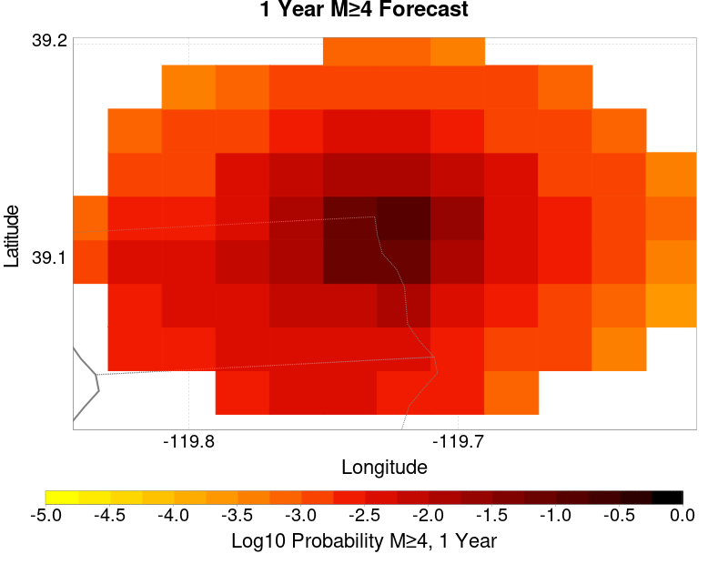 |
|  | Prob: 8.30%, Actual: 0 | Prob: 12.58% | Prob: 15.93% | Prob: 17.93% | Prob: 20.80% |
| **M&ge;4.5** |  |  |  |  |  |
|  | Prob: 2.91%, Actual: 0 | Prob: 4.57% | Prob: 5.98% | Prob: 6.94% | Prob: 8.39% |
| **M&ge;5** |  |  |  | 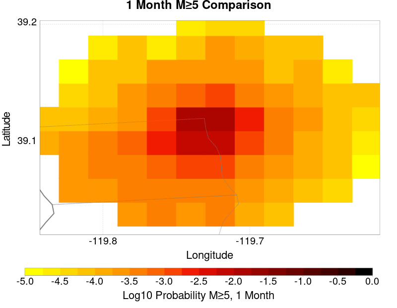 |  |
|  | Prob: 0.92%, Actual: 0 | Prob: 1.47% | Prob: 2.01% | Prob: 2.40% | Prob: 3.01% |
| **M&ge;5.5** | 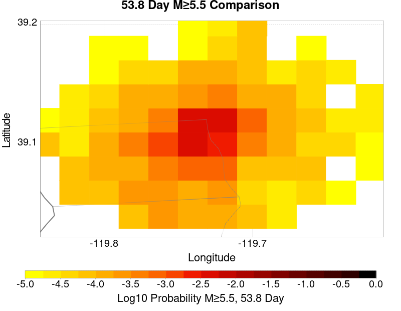 |  |  |  |  |
|  | Prob: 0.34%, Actual: 0 | Prob: 0.53% | Prob: 0.69% | Prob: 0.85% | Prob: 1.09% |

### ComCat Mean Expectation Spatial Distribution
*[(top)](#table-of-contents)*

*Note: maps labeled 'Forecast' are for a duration that extends into the future, only forecasted values are plotted (ComCat data omitted)*

|  | Current (3 Hour) | Forecast: 1 Day | Forecast: 1 Week | Forecast: 1 Month | Forecast: 1 Year |
|-----|-----|-----|-----|-----|-----|
| **M&ge;Mc(t)** |  |  |  |  |  |
|  | Mean: 2.840, Actual: 0 | Mean: 4.798 | Mean: 6.591 | Mean: 7.871 | Mean: 9.971 |
| **M&ge;3.5** |  |  |  |  |  |
|  | Mean: 0.296, Actual: 0 | Mean: 0.493 | Mean: 0.671 | Mean: 0.801 | Mean: 1.011 |
| **M&ge;4** | 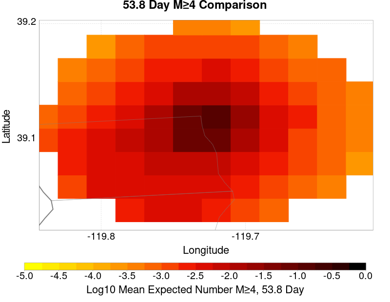 |  |  | 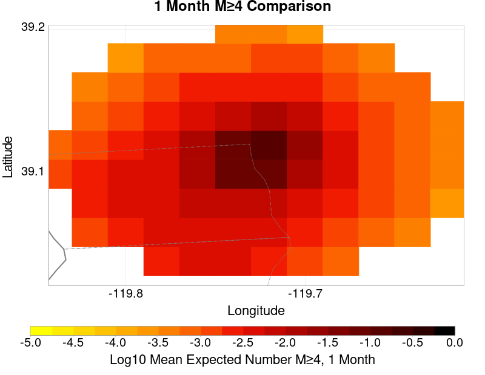 |  |
|  | Mean: 0.096, Actual: 0 | Mean: 0.160 | Mean: 0.218 | Mean: 0.259 | Mean: 0.324 |
| **M&ge;4.5** |  |  | 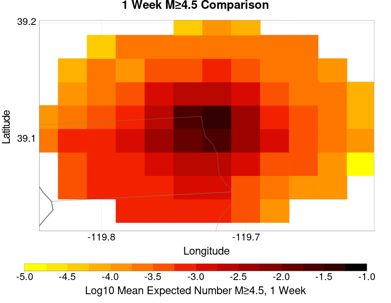 |  |  |
|  | Mean: 0.031, Actual: 0 | Mean: 0.050 | Mean: 0.068 | Mean: 0.082 | Mean: 0.103 |
| **M&ge;5** | 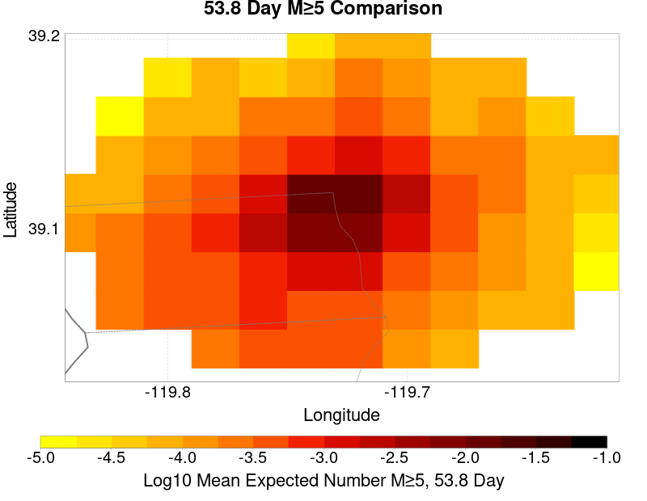 |  |  |  |  |
|  | Mean: 9.34E-3, Actual: 0 | Mean: 0.015 | Mean: 0.021 | Mean: 0.026 | Mean: 0.033 |
| **M&ge;5.5** |  |  | 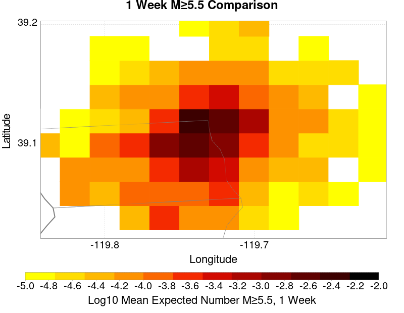 |  |  |
|  | Mean: 3.41E-3, Actual: 0 | Mean: 5.52E-3 | Mean: 7.10E-3 | Mean: 8.79E-3 | Mean: 0.011 |

### ComCat Depth Distribution
*[(top)](#table-of-contents)*

| M&ge;Mc(t) | M&ge;3.5 | M&ge;4 | M&ge;4.5 | M&ge;5 | M&ge;5.5 |
|-----|-----|-----|-----|-----|-----|
|  |  |  |  | 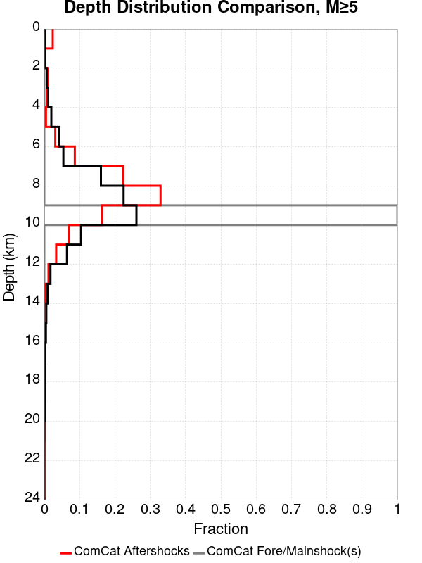 | 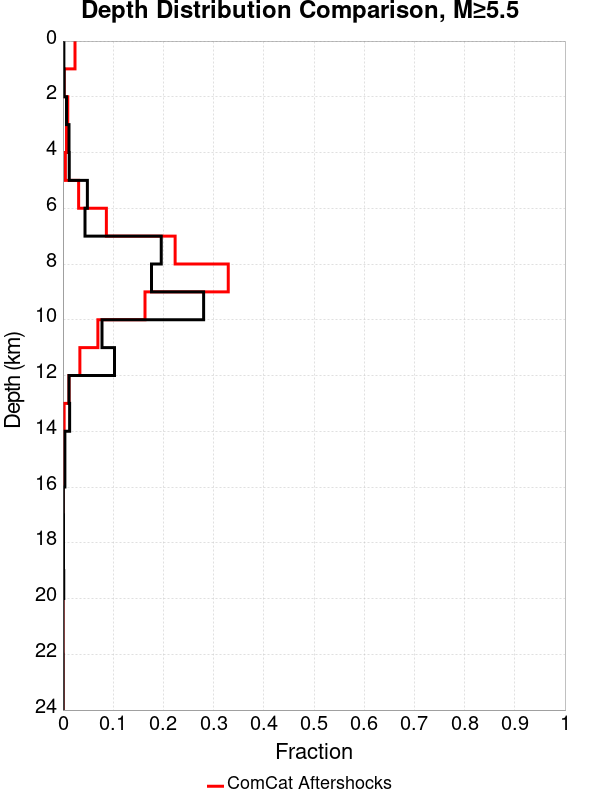 |


## JSON Input File
*[(top)](#table-of-contents)*

```
{
  "numSimulations": 100000,
  "duration": 10.0,
  "startTimeMillis": 1584754416370,
  "includeSpontaneous": false,
  "randomSeed": 1584754941936,
  "binaryOutput": true,
  "binaryOutputFilters": [
    {
      "prefix": "results_complete",
      "descendantsOnly": false
    },
    {
      "prefix": "results_m5_preserve_chain",
      "minMag": 5.0,
      "preserveChainBelowMag": true,
      "descendantsOnly": false
    }
  ],
  "forceRecalc": false,
  "simulationName": "ComCat M5.0 (nn00719663), Point Source, kCOV\u003d1.5",
  "numRetries": 3,
  "outputDir": "${ETAS_SIM_DIR}/2020_03_20-ComCatM5p0_nn00719663_PointSource_kCOV1p5",
  "treatTriggerCatalogAsSpontaneous": false,
  "triggerRuptures": [
    {
      "occurrenceTimeMillis": 1584754415370,
      "comcatEventID": "nn00719663",
      "mag": 5.0,
      "latitude": 39.113,
      "longitude": -119.7273,
      "depth": 9.1
    }
  ],
  "cacheDir": "${ETAS_LAUNCHER}/inputs/cache_fm3p1_ba",
  "fssFile": "${ETAS_LAUNCHER}/inputs/2013_05_10-ucerf3p3-production-10runs_COMPOUND_SOL_FM3_1_SpatSeisU3_MEAN_BRANCH_AVG_SOL.zip",
  "probModel": "FULL_TD",
  "applySubSeisForSupraNucl": true,
  "totRateScaleFactor": 1.14,
  "gridSeisCorr": true,
  "timeIndependentERF": false,
  "griddedOnly": false,
  "imposeGR": false,
  "includeIndirectTriggering": true,
  "gridSeisDiscr": 0.1,
  "catalogCompletenessModel": "RELAXED",
  "etas_k_cov": 1.5,
  "configCommand": "u3etas_comcat_event_config_builder.sh --event-id nn00719663 --mag-complete 3.5 --num-simulations 100000 --days-before 7 --etas-k-cov 1.5 --finite-surf-shakemap --finite-surf-shakemap-min-mag 5 --hpc-site USC_HPC --nodes 32 --hours 24",
  "configTime": 1584754941936,
  "comcatMetadata": {
    "region": {
      "centerLatitude": 39.113,
      "centerLongitude": -119.7273,
      "radius": 1.6982436524617426
    },
    "eventID": "nn00719663",
    "minDepth": -10.0,
    "maxDepth": 24.0,
    "minMag": 2.5,
    "startTime": 1584149615370,
    "endTime": 1584754415370,
    "magComplete": 3.5
  }
}
```

