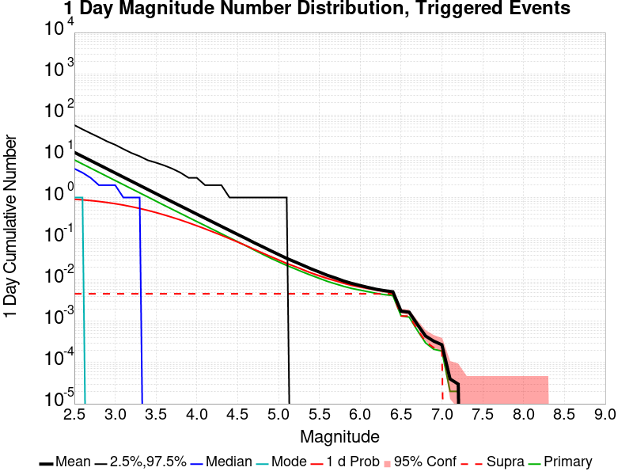
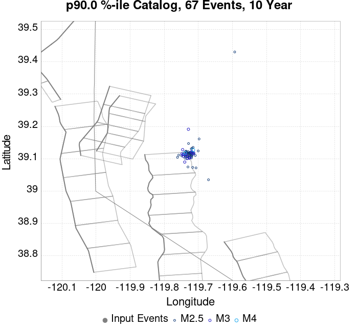
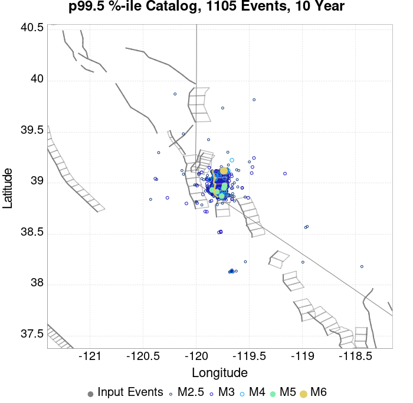
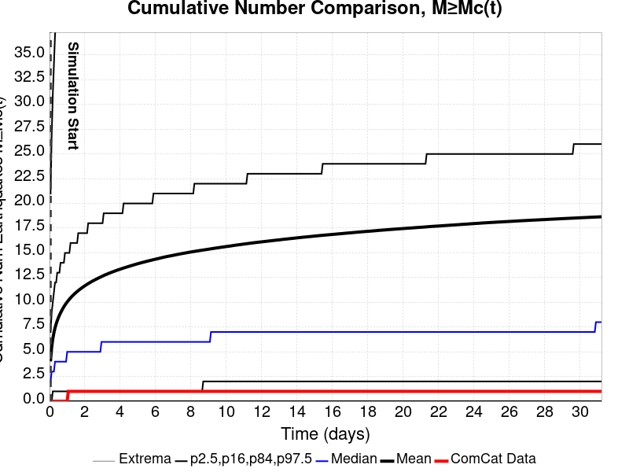
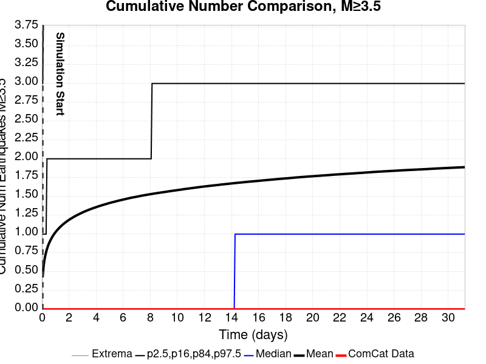
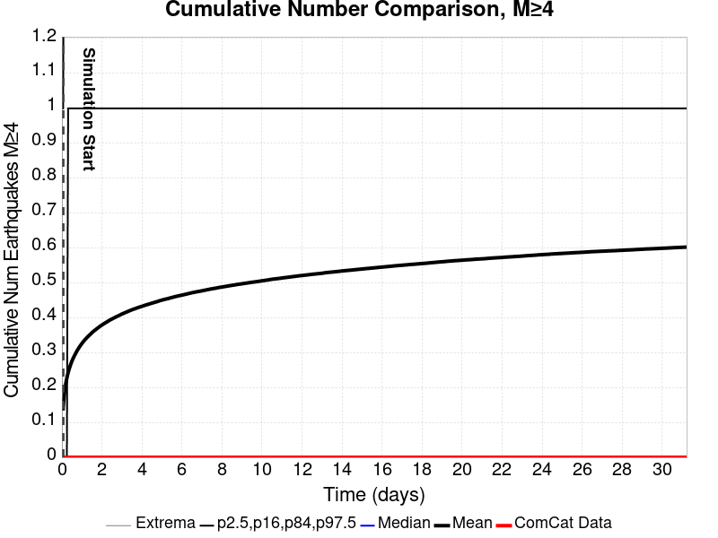
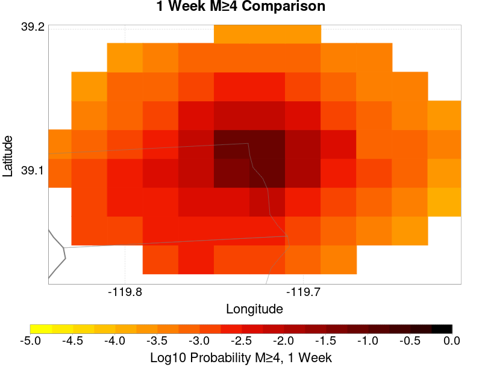
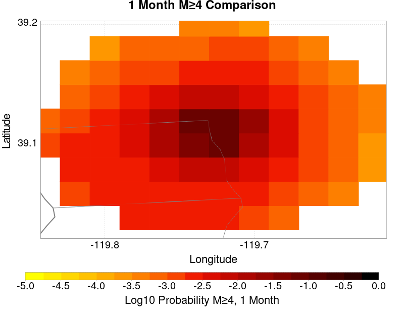
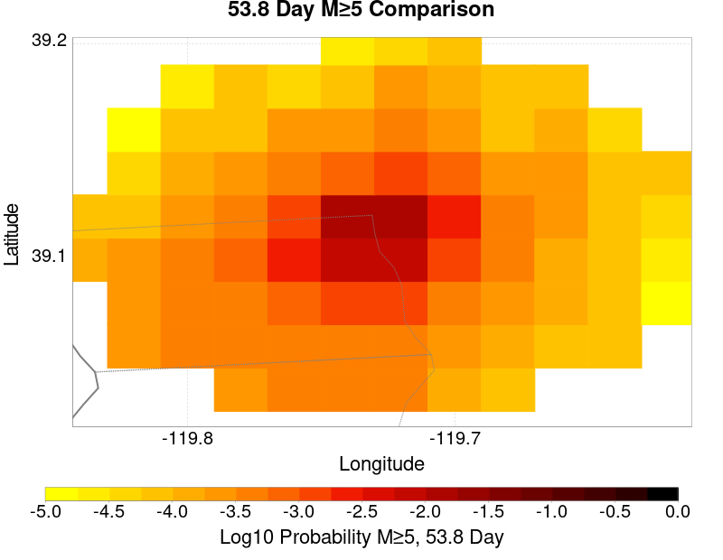
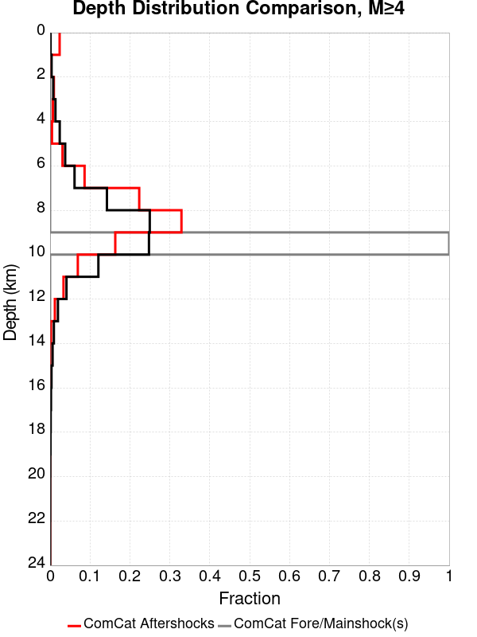

# ComCat M5.0 (nn00719663), Point Source, kCOV=1.5 Results

|   | ComCat M5.0 (nn00719663), Point Source, kCOV=1.5 |
|-----|-----|
| Num Simulations | 100000 |
| Start Time | 2020/03/21 01:33:36 UTC |
| Start Time Epoch Milliseconds | 1584754416370 |
| Duration | 10 Years |
| Includes Spontaneous? | false |
| Trigger Ruptures | *(none)* |
| Config Generated With | u3etas_comcat_event_config_builder.sh --event-id nn00719663 --mag-complete 3.5 --num-simulations 100000 --days-before 7 --etas-k-cov 1.5 --finite-surf-shakemap --finite-surf-shakemap-min-mag 5 --hpc-site USC_HPC --nodes 32 --hours 24 |

## Table Of Contents

* [Probabilities Summary Table](#probabilities-summary-table)
* [Magnitude Number Distribution](#magnitude-number-distribution)
  * [10 Year Magnitude Number Distribution](#10-year-magnitude-number-distribution)
  * [1 Year Magnitude Number Distribution](#1-year-magnitude-number-distribution)
  * [1 Month Magnitude Number Distribution](#1-month-magnitude-number-distribution)
  * [1 Week Magnitude Number Distribution](#1-week-magnitude-number-distribution)
  * [1 Day Magnitude Number Distribution](#1-day-magnitude-number-distribution)
  * [1 Hour Magnitude Number Distribution](#1-hour-magnitude-number-distribution)
* [Hazard Change Over Time](#hazard-change-over-time)
  * [M&ge;5.0 Hazard Change Over Time](#m50-hazard-change-over-time)
  * [M&ge;6.0 Hazard Change Over Time](#m60-hazard-change-over-time)
  * [M&ge;7.0 Hazard Change Over Time](#m70-hazard-change-over-time)
* [Trigger Rupture Fault Map](#trigger-rupture-fault-map)
* [Fault Distances To Triggers](#fault-distances-to-triggers)
* [Individual Simulated Catalog Maps](#individual-simulated-catalog-maps)
* [ComCat Data Comparisons](#comcat-data-comparisons)
  * [ComCat Magnitude-Number Distributions](#comcat-magnitude-number-distributions)
  * [ComCat Time-Dependent Mc](#comcat-time-dependent-mc)
  * [ComCat Cumulative Number Vs Time](#comcat-cumulative-number-vs-time)
  * [ComCat Cumulative Number Simulation Percentiles](#comcat-cumulative-number-simulation-percentiles)
  * [ComCat Probability Spatial Distribution](#comcat-probability-spatial-distribution)
  * [ComCat Mean Expectation Spatial Distribution](#comcat-mean-expectation-spatial-distribution)
  * [ComCat Depth Distribution](#comcat-depth-distribution)
* [JSON Input File](#json-input-file)

## Probabilities Summary Table
*[(top)](#table-of-contents)*

| Magnitude | 1 Hour Prob | 1 Day Prob | 1 Week Prob | 1 Month Prob | 1 Year Prob | 10 Year Prob |
|-----|-----|-----|-----|-----|-----|-----|
| **M&ge;3** | 0.502 (50.18%) | 0.709 (70.88%) | 0.768 (76.77%) | 0.798 (79.78%) | 0.832 (83.23%) | 0.854 (85.41%) |
| *95% Conf* | *[49.86% 50.49%]* | *[70.60% 71.17%]* | *[76.50% 77.03%]* | *[79.53% 80.03%]* | *[83.00% 83.46%]* | *[85.19% 85.63%]* |
| **M&ge;3.5** | 0.250 (24.96%) | 0.432 (43.21%) | 0.501 (50.15%) | 0.540 (54.01%) | 0.592 (59.21%) | 0.626 (62.64%) |
| *95% Conf* | *[24.69% 25.23%]* | *[42.90% 43.52%]* | *[49.84% 50.46%]* | *[53.70% 54.32%]* | *[58.90% 59.51%]* | *[62.34% 62.94%]* |
| **M&ge;4** | 0.101 (10.05%) | 0.207 (20.68%) | 0.256 (25.59%) | 0.287 (28.69%) | 0.330 (32.98%) | 0.361 (36.15%) |
| *95% Conf* | *[9.87% 10.24%]* | *[20.43% 20.93%]* | *[25.32% 25.86%]* | *[28.41% 28.97%]* | *[32.69% 33.27%]* | *[35.85% 36.45%]* |
| **M&ge;4.5** | 0.036 (3.60%) | 0.083 (8.34%) | 0.108 (10.84%) | 0.125 (12.53%) | 0.150 (15.03%) | 0.170 (17.03%) |
| *95% Conf* | *[3.49% 3.72%]* | *[8.17% 8.51%]* | *[10.65% 11.04%]* | *[12.33% 12.74%]* | *[14.81% 15.26%]* | *[16.79% 17.26%]* |
| **M&ge;5** | 0.012 (1.23%) | 0.031 (3.08%) | 0.042 (4.19%) | 0.050 (4.95%) | 0.062 (6.20%) | 0.072 (7.16%) |
| *95% Conf* | *[1.17% 1.30%]* | *[2.97% 3.19%]* | *[4.07% 4.32%]* | *[4.82% 5.09%]* | *[6.05% 6.35%]* | *[7.01% 7.33%]* |
| **M&ge;5.5** | 4.97E-3 (0.50%) | 0.013 (1.27%) | 0.017 (1.72%) | 0.021 (2.05%) | 0.027 (2.67%) | 0.031 (3.11%) |
| *95% Conf* | *[0.45% 0.54%]* | *[1.20% 1.34%]* | *[1.64% 1.81%]* | *[1.97% 2.14%]* | *[2.57% 2.77%]* | *[3.01% 3.22%]* |
| **M&ge;6** | 2.56E-3 (0.26%) | 6.80E-3 (0.68%) | 9.30E-3 (0.93%) | 0.011 (1.11%) | 0.014 (1.45%) | 0.017 (1.71%) |
| *95% Conf* | *[0.23% 0.29%]* | *[0.63% 0.73%]* | *[0.87% 0.99%]* | *[1.05% 1.18%]* | *[1.38% 1.53%]* | *[1.63% 1.79%]* |
| **M&ge;6.5** | 7.10E-4 (0.07%) | 1.76E-3 (0.18%) | 2.33E-3 (0.23%) | 2.77E-3 (0.28%) | 3.78E-3 (0.38%) | 4.52E-3 (0.45%) |
| *95% Conf* | *[0.06% 0.09%]* | *[0.15% 0.20%]* | *[0.20% 0.27%]* | *[0.25% 0.31%]* | *[0.34% 0.42%]* | *[0.41% 0.50%]* |
| **M&ge;7** | 1.10E-4 (0.01%) | 2.70E-4 (0.03%) | 3.40E-4 (0.03%) | 3.80E-4 (0.04%) | 5.10E-4 (0.05%) | 5.90E-4 (0.06%) |
| *95% Conf* | *[0.01% 0.02%]* | *[0.02% 0.04%]* | *[0.02% 0.05%]* | *[0.03% 0.05%]* | *[0.04% 0.07%]* | *[0.05% 0.08%]* |

## Magnitude Number Distribution
*[(top)](#table-of-contents)*

### 10 Year Magnitude Number Distribution
*[(top)](#table-of-contents)*

**Legend**
* **Mean** (thick black line): mean expected number across all 100000 catalogs
* **2.5%,97.5%** (thin black lines): expected number percentiles across all 100000 catalogs
* **Median** (thin blue line): median expected number across all 100000 catalogs
* **Mode** (thin cyan line): modal expected number across all 100000 catalogs
* **10 yr Probability** (thin red line): 10 year probability calculated as the fraction of catalogs with at least 1 occurrence
* **10 yr Supraseismogenic Probability** (thin dashed red line): same as above, but only for supraseismogenic ruptures on explicitly modeled UCERF3 faults
* **95% Conf** (light red shaded region): binomial 95% confidence bounds on probability
* **Primary** (thin green line): mean expected number from primary triggered aftershocks only (no secondary, tertiary, etc...) across all 100000 catalogs


| Mag | Mean | 2.5 %ile | 97.5 %ile | Median | Mode | 10 yr Probability | 10 yr Prob 95% Conf | 10 yr Supra-Seis Prob | Primary Aftershocks Mean |
|-----|-----|-----|-----|-----|-----|-----|-----|-----|-----|
| **M&ge;2.5** | 47.016 | 0.000 | 215.000 | 13.000 | 2.000 | 0.966 (96.64%) | [96.52% 96.75%] | 0.012 (1.19%) | 16.603 |
| **M&ge;2.6** | 37.334 | 0.000 | 171.000 | 10.000 | 2.000 | 0.952 (95.25%) | [95.11% 95.38%] | 0.012 (1.19%) | 13.187 |
| **M&ge;2.7** | 29.638 | 0.000 | 136.000 | 8.000 | 1.000 | 0.935 (93.50%) | [93.34% 93.65%] | 0.012 (1.19%) | 10.474 |
| **M&ge;2.8** | 23.549 | 0.000 | 109.000 | 6.000 | 1.000 | 0.913 (91.32%) | [91.14% 91.49%] | 0.012 (1.19%) | 8.328 |
| **M&ge;2.9** | 18.708 | 0.000 | 86.000 | 5.000 | 0.000 | 0.886 (88.60%) | [88.40% 88.79%] | 0.012 (1.19%) | 6.611 |
| **M&ge;3** | 14.861 | 0.000 | 69.000 | 4.000 | 0.000 | 0.854 (85.41%) | [85.19% 85.63%] | 0.012 (1.19%) | 5.253 |
| **M&ge;3.1** | 11.803 | 0.000 | 56.000 | 3.000 | 0.000 | 0.818 (81.77%) | [81.53% 82.01%] | 0.012 (1.19%) | 4.173 |
| **M&ge;3.2** | 9.377 | 0.000 | 44.000 | 2.000 | 0.000 | 0.777 (77.66%) | [77.40% 77.92%] | 0.012 (1.19%) | 3.317 |
| **M&ge;3.3** | 7.449 | 0.000 | 36.000 | 2.000 | 0.000 | 0.729 (72.92%) | [72.65% 73.20%] | 0.012 (1.19%) | 2.635 |
| **M&ge;3.4** | 5.918 | 0.000 | 29.000 | 1.000 | 0.000 | 0.679 (67.91%) | [67.61% 68.19%] | 0.012 (1.19%) | 2.093 |
| **M&ge;3.5** | 4.705 | 0.000 | 23.000 | 1.000 | 0.000 | 0.626 (62.64%) | [62.34% 62.94%] | 0.012 (1.19%) | 1.663 |
| **M&ge;3.6** | 3.735 | 0.000 | 18.000 | 1.000 | 0.000 | 0.572 (57.24%) | [56.94% 57.55%] | 0.012 (1.19%) | 1.320 |
| **M&ge;3.7** | 2.970 | 0.000 | 15.000 | 1.000 | 0.000 | 0.518 (51.85%) | [51.54% 52.16%] | 0.012 (1.19%) | 1.052 |
| **M&ge;3.8** | 2.362 | 0.000 | 12.000 | 0.000 | 0.000 | 0.464 (46.43%) | [46.12% 46.74%] | 0.012 (1.19%) | 0.837 |
| **M&ge;3.9** | 1.879 | 0.000 | 10.000 | 0.000 | 0.000 | 0.412 (41.20%) | [40.89% 41.50%] | 0.012 (1.19%) | 0.666 |
| **M&ge;4** | 1.495 | 0.000 | 8.000 | 0.000 | 0.000 | 0.361 (36.15%) | [35.85% 36.45%] | 0.012 (1.19%) | 0.531 |
| **M&ge;4.1** | 1.187 | 0.000 | 7.000 | 0.000 | 0.000 | 0.316 (31.57%) | [31.29% 31.86%] | 0.012 (1.19%) | 0.423 |
| **M&ge;4.2** | 0.944 | 0.000 | 5.000 | 0.000 | 0.000 | 0.273 (27.35%) | [27.07% 27.62%] | 0.012 (1.19%) | 0.337 |
| **M&ge;4.3** | 0.749 | 0.000 | 5.000 | 0.000 | 0.000 | 0.236 (23.57%) | [23.31% 23.84%] | 0.012 (1.19%) | 0.269 |
| **M&ge;4.4** | 0.596 | 0.000 | 4.000 | 0.000 | 0.000 | 0.201 (20.09%) | [19.85% 20.34%] | 0.012 (1.19%) | 0.214 |
| **M&ge;4.5** | 0.475 | 0.000 | 3.000 | 0.000 | 0.000 | 0.170 (17.03%) | [16.79% 17.26%] | 0.012 (1.19%) | 0.171 |
| **M&ge;4.6** | 0.377 | 0.000 | 3.000 | 0.000 | 0.000 | 0.144 (14.39%) | [14.17% 14.61%] | 0.012 (1.19%) | 0.137 |
| **M&ge;4.7** | 0.300 | 0.000 | 2.000 | 0.000 | 0.000 | 0.121 (12.11%) | [11.91% 12.31%] | 0.012 (1.19%) | 0.109 |
| **M&ge;4.8** | 0.240 | 0.000 | 2.000 | 0.000 | 0.000 | 0.102 (10.15%) | [9.96% 10.34%] | 0.012 (1.19%) | 0.087 |
| **M&ge;4.9** | 0.191 | 0.000 | 2.000 | 0.000 | 0.000 | 0.085 (8.49%) | [8.32% 8.66%] | 0.012 (1.19%) | 0.070 |
| **M&ge;5** | 0.154 | 0.000 | 1.000 | 0.000 | 0.000 | 0.072 (7.16%) | [7.01% 7.33%] | 0.012 (1.19%) | 0.057 |
| **M&ge;5.1** | 0.123 | 0.000 | 1.000 | 0.000 | 0.000 | 0.060 (6.00%) | [5.86% 6.15%] | 0.012 (1.19%) | 0.046 |
| **M&ge;5.2** | 0.100 | 0.000 | 1.000 | 0.000 | 0.000 | 0.051 (5.07%) | [4.94% 5.21%] | 0.012 (1.19%) | 0.038 |
| **M&ge;5.3** | 0.080 | 0.000 | 1.000 | 0.000 | 0.000 | 0.043 (4.31%) | [4.19% 4.44%] | 0.012 (1.19%) | 0.032 |
| **M&ge;5.4** | 0.064 | 0.000 | 1.000 | 0.000 | 0.000 | 0.036 (3.65%) | [3.53% 3.77%] | 0.012 (1.19%) | 0.026 |
| **M&ge;5.5** | 0.053 | 0.000 | 1.000 | 0.000 | 0.000 | 0.031 (3.11%) | [3.01% 3.22%] | 0.012 (1.19%) | 0.022 |
| **M&ge;5.6** | 0.043 | 0.000 | 1.000 | 0.000 | 0.000 | 0.027 (2.68%) | [2.58% 2.78%] | 0.012 (1.19%) | 0.018 |
| **M&ge;5.7** | 0.035 | 0.000 | 0.000 | 0.000 | 0.000 | 0.024 (2.35%) | [2.26% 2.45%] | 0.012 (1.19%) | 0.016 |
| **M&ge;5.8** | 0.029 | 0.000 | 0.000 | 0.000 | 0.000 | 0.021 (2.07%) | [1.98% 2.16%] | 0.012 (1.19%) | 0.014 |
| **M&ge;5.9** | 0.025 | 0.000 | 0.000 | 0.000 | 0.000 | 0.019 (1.86%) | [1.78% 1.95%] | 0.012 (1.19%) | 0.012 |
| **M&ge;6** | 0.022 | 0.000 | 0.000 | 0.000 | 0.000 | 0.017 (1.71%) | [1.63% 1.79%] | 0.012 (1.19%) | 0.011 |
| **M&ge;6.1** | 0.019 | 0.000 | 0.000 | 0.000 | 0.000 | 0.016 (1.57%) | [1.49% 1.65%] | 0.012 (1.19%) | 0.010 |
| **M&ge;6.2** | 0.016 | 0.000 | 0.000 | 0.000 | 0.000 | 0.014 (1.44%) | [1.37% 1.52%] | 0.012 (1.19%) | 9.24E-3 |
| **M&ge;6.3** | 0.015 | 0.000 | 0.000 | 0.000 | 0.000 | 0.014 (1.36%) | [1.29% 1.44%] | 0.012 (1.19%) | 8.66E-3 |
| **M&ge;6.4** | 0.014 | 0.000 | 0.000 | 0.000 | 0.000 | 0.013 (1.31%) | [1.24% 1.38%] | 0.012 (1.18%) | 8.26E-3 |
| **M&ge;6.5** | 4.83E-3 | 0.000 | 0.000 | 0.000 | 0.000 | 4.52E-3 (0.45%) | [0.41% 0.50%] | 3.44E-3 (0.34%) | 2.53E-3 |
| **M&ge;6.6** | 4.51E-3 | 0.000 | 0.000 | 0.000 | 0.000 | 4.27E-3 (0.43%) | [0.39% 0.47%] | 3.43E-3 (0.34%) | 2.39E-3 |
| **M&ge;6.7** | 2.35E-3 | 0.000 | 0.000 | 0.000 | 0.000 | 2.24E-3 (0.22%) | [0.20% 0.26%] | 1.64E-3 (0.16%) | 1.16E-3 |
| **M&ge;6.8** | 1.21E-3 | 0.000 | 0.000 | 0.000 | 0.000 | 1.18E-3 (0.12%) | [0.10% 0.14%] | 7.90E-4 (0.08%) | 5.80E-4 |
| **M&ge;6.9** | 8.40E-4 | 0.000 | 0.000 | 0.000 | 0.000 | 8.10E-4 (0.08%) | [0.06% 0.10%] | 5.50E-4 (0.06%) | 3.80E-4 |
| **M&ge;7** | 6.10E-4 | 0.000 | 0.000 | 0.000 | 0.000 | 5.90E-4 (0.06%) | [0.05% 0.08%] | 4.40E-4 (0.04%) | 3.10E-4 |
| **M&ge;7.1** | 1.20E-4 | 0.000 | 0.000 | 0.000 | 0.000 | 1.20E-4 (0.01%) | [0.01% 0.02%] | 2.00E-5 (0.00%) | 4.00E-5 |
| **M&ge;7.2** | 6.00E-5 | 0.000 | 0.000 | 0.000 | 0.000 | 6.00E-5 (0.01%) | [0.00% 0.01%] | 0.000 (0.00%) | 4.00E-5 |
| **M&ge;7.3** | 2.00E-5 | 0.000 | 0.000 | 0.000 | 0.000 | 2.00E-5 (0.00%) | [0.00% 0.01%] | 0.000 (0.00%) | 2.00E-5 |
| **M&ge;7.4** | 0.000 | 0.000 | 0.000 | 0.000 | 0.000 | 0.000 (0.00%) | [0.00% 0.00%] | 0.000 (0.00%) | 0.000 |
| **M&ge;7.5** | 0.000 | 0.000 | 0.000 | 0.000 | 0.000 | 0.000 (0.00%) | [0.00% 0.00%] | 0.000 (0.00%) | 0.000 |
| **M&ge;7.6** | 0.000 | 0.000 | 0.000 | 0.000 | 0.000 | 0.000 (0.00%) | [0.00% 0.00%] | 0.000 (0.00%) | 0.000 |
| **M&ge;7.7** | 0.000 | 0.000 | 0.000 | 0.000 | 0.000 | 0.000 (0.00%) | [0.00% 0.00%] | 0.000 (0.00%) | 0.000 |
| **M&ge;7.8** | 0.000 | 0.000 | 0.000 | 0.000 | 0.000 | 0.000 (0.00%) | [0.00% 0.00%] | 0.000 (0.00%) | 0.000 |
| **M&ge;7.9** | 0.000 | 0.000 | 0.000 | 0.000 | 0.000 | 0.000 (0.00%) | [0.00% 0.00%] | 0.000 (0.00%) | 0.000 |
| **M&ge;8** | 0.000 | 0.000 | 0.000 | 0.000 | 0.000 | 0.000 (0.00%) | [0.00% 0.00%] | 0.000 (0.00%) | 0.000 |
| **M&ge;8.1** | 0.000 | 0.000 | 0.000 | 0.000 | 0.000 | 0.000 (0.00%) | [0.00% 0.00%] | 0.000 (0.00%) | 0.000 |
| **M&ge;8.2** | 0.000 | 0.000 | 0.000 | 0.000 | 0.000 | 0.000 (0.00%) | [0.00% 0.00%] | 0.000 (0.00%) | 0.000 |
| **M&ge;8.3** | 0.000 | 0.000 | 0.000 | 0.000 | 0.000 | 0.000 (0.00%) | [0.00% 0.00%] | 0.000 (0.00%) | 0.000 |
| **M&ge;8.4** | 0.000 | 0.000 | 0.000 | 0.000 | 0.000 | 0.000 (0.00%) | [0.00% 0.00%] | 0.000 (0.00%) | 0.000 |
| **M&ge;8.5** | 0.000 | 0.000 | 0.000 | 0.000 | 0.000 | 0.000 (0.00%) | [0.00% 0.00%] | 0.000 (0.00%) | 0.000 |
| **M&ge;8.6** | 0.000 | 0.000 | 0.000 | 0.000 | 0.000 | 0.000 (0.00%) | [0.00% 0.00%] | 0.000 (0.00%) | 0.000 |
| **M&ge;8.7** | 0.000 | 0.000 | 0.000 | 0.000 | 0.000 | 0.000 (0.00%) | [0.00% 0.00%] | 0.000 (0.00%) | 0.000 |
| **M&ge;8.8** | 0.000 | 0.000 | 0.000 | 0.000 | 0.000 | 0.000 (0.00%) | [0.00% 0.00%] | 0.000 (0.00%) | 0.000 |
| **M&ge;8.9** | 0.000 | 0.000 | 0.000 | 0.000 | 0.000 | 0.000 (0.00%) | [0.00% 0.00%] | 0.000 (0.00%) | 0.000 |
| **M&ge;9** | 0.000 | 0.000 | 0.000 | 0.000 | 0.000 | 0.000 (0.00%) | [0.00% 0.00%] | 0.000 (0.00%) | 0.000 |

### 1 Year Magnitude Number Distribution
*[(top)](#table-of-contents)*

**Legend**
* **Mean** (thick black line): mean expected number across all 100000 catalogs
* **2.5%,97.5%** (thin black lines): expected number percentiles across all 100000 catalogs
* **Median** (thin blue line): median expected number across all 100000 catalogs
* **Mode** (thin cyan line): modal expected number across all 100000 catalogs
* **1 yr Probability** (thin red line): 1 year probability calculated as the fraction of catalogs with at least 1 occurrence
* **1 yr Supraseismogenic Probability** (thin dashed red line): same as above, but only for supraseismogenic ruptures on explicitly modeled UCERF3 faults
* **95% Conf** (light red shaded region): binomial 95% confidence bounds on probability
* **Primary** (thin green line): mean expected number from primary triggered aftershocks only (no secondary, tertiary, etc...) across all 100000 catalogs


| Mag | Mean | 2.5 %ile | 97.5 %ile | Median | Mode | 1 yr Probability | 1 yr Prob 95% Conf | 1 yr Supra-Seis Prob | Primary Aftershocks Mean |
|-----|-----|-----|-----|-----|-----|-----|-----|-----|-----|
| **M&ge;2.5** | 35.468 | 0.000 | 164.000 | 11.000 | 2.000 | 0.959 (95.86%) | [95.74% 95.99%] | 9.97E-3 (1.00%) | 14.700 |
| **M&ge;2.6** | 28.163 | 0.000 | 130.000 | 8.000 | 1.000 | 0.943 (94.29%) | [94.14% 94.43%] | 9.97E-3 (1.00%) | 11.677 |
| **M&ge;2.7** | 22.360 | 0.000 | 104.000 | 7.000 | 1.000 | 0.923 (92.29%) | [92.12% 92.45%] | 9.97E-3 (1.00%) | 9.276 |
| **M&ge;2.8** | 17.767 | 0.000 | 82.000 | 5.000 | 1.000 | 0.898 (89.81%) | [89.62% 90.00%] | 9.97E-3 (1.00%) | 7.374 |
| **M&ge;2.9** | 14.116 | 0.000 | 66.000 | 4.000 | 0.000 | 0.868 (86.77%) | [86.56% 86.98%] | 9.97E-3 (1.00%) | 5.852 |
| **M&ge;3** | 11.213 | 0.000 | 52.000 | 3.000 | 0.000 | 0.832 (83.23%) | [83.00% 83.46%] | 9.97E-3 (1.00%) | 4.649 |
| **M&ge;3.1** | 8.906 | 0.000 | 42.000 | 3.000 | 0.000 | 0.793 (79.29%) | [79.04% 79.54%] | 9.97E-3 (1.00%) | 3.694 |
| **M&ge;3.2** | 7.079 | 0.000 | 34.000 | 2.000 | 0.000 | 0.748 (74.84%) | [74.57% 75.10%] | 9.97E-3 (1.00%) | 2.937 |
| **M&ge;3.3** | 5.622 | 0.000 | 27.000 | 2.000 | 0.000 | 0.698 (69.84%) | [69.56% 70.13%] | 9.97E-3 (1.00%) | 2.333 |
| **M&ge;3.4** | 4.466 | 0.000 | 22.000 | 1.000 | 0.000 | 0.646 (64.60%) | [64.30% 64.89%] | 9.97E-3 (1.00%) | 1.853 |
| **M&ge;3.5** | 3.548 | 0.000 | 18.000 | 1.000 | 0.000 | 0.592 (59.21%) | [58.90% 59.51%] | 9.97E-3 (1.00%) | 1.472 |
| **M&ge;3.6** | 2.815 | 0.000 | 14.000 | 1.000 | 0.000 | 0.537 (53.71%) | [53.40% 54.02%] | 9.97E-3 (1.00%) | 1.168 |
| **M&ge;3.7** | 2.239 | 0.000 | 12.000 | 0.000 | 0.000 | 0.483 (48.34%) | [48.03% 48.65%] | 9.97E-3 (1.00%) | 0.932 |
| **M&ge;3.8** | 1.780 | 0.000 | 9.000 | 0.000 | 0.000 | 0.430 (42.96%) | [42.65% 43.26%] | 9.97E-3 (1.00%) | 0.741 |
| **M&ge;3.9** | 1.418 | 0.000 | 8.000 | 0.000 | 0.000 | 0.378 (37.81%) | [37.51% 38.11%] | 9.97E-3 (1.00%) | 0.590 |
| **M&ge;4** | 1.129 | 0.000 | 6.000 | 0.000 | 0.000 | 0.330 (32.98%) | [32.69% 33.27%] | 9.97E-3 (1.00%) | 0.470 |
| **M&ge;4.1** | 0.896 | 0.000 | 5.000 | 0.000 | 0.000 | 0.286 (28.59%) | [28.31% 28.88%] | 9.97E-3 (1.00%) | 0.374 |
| **M&ge;4.2** | 0.713 | 0.000 | 4.000 | 0.000 | 0.000 | 0.246 (24.59%) | [24.32% 24.85%] | 9.97E-3 (1.00%) | 0.299 |
| **M&ge;4.3** | 0.567 | 0.000 | 4.000 | 0.000 | 0.000 | 0.210 (21.05%) | [20.79% 21.30%] | 9.97E-3 (1.00%) | 0.238 |
| **M&ge;4.4** | 0.452 | 0.000 | 3.000 | 0.000 | 0.000 | 0.178 (17.83%) | [17.59% 18.07%] | 9.97E-3 (1.00%) | 0.190 |
| **M&ge;4.5** | 0.360 | 0.000 | 3.000 | 0.000 | 0.000 | 0.150 (15.03%) | [14.81% 15.26%] | 9.97E-3 (1.00%) | 0.152 |
| **M&ge;4.6** | 0.287 | 0.000 | 2.000 | 0.000 | 0.000 | 0.126 (12.64%) | [12.44% 12.85%] | 9.97E-3 (1.00%) | 0.122 |
| **M&ge;4.7** | 0.229 | 0.000 | 2.000 | 0.000 | 0.000 | 0.106 (10.58%) | [10.39% 10.77%] | 9.97E-3 (1.00%) | 0.097 |
| **M&ge;4.8** | 0.183 | 0.000 | 2.000 | 0.000 | 0.000 | 0.088 (8.84%) | [8.66% 9.02%] | 9.97E-3 (1.00%) | 0.078 |
| **M&ge;4.9** | 0.146 | 0.000 | 1.000 | 0.000 | 0.000 | 0.074 (7.36%) | [7.20% 7.53%] | 9.97E-3 (1.00%) | 0.062 |
| **M&ge;5** | 0.117 | 0.000 | 1.000 | 0.000 | 0.000 | 0.062 (6.20%) | [6.05% 6.35%] | 9.97E-3 (1.00%) | 0.051 |
| **M&ge;5.1** | 0.094 | 0.000 | 1.000 | 0.000 | 0.000 | 0.052 (5.18%) | [5.04% 5.32%] | 9.97E-3 (1.00%) | 0.041 |
| **M&ge;5.2** | 0.076 | 0.000 | 1.000 | 0.000 | 0.000 | 0.044 (4.36%) | [4.24% 4.49%] | 9.97E-3 (1.00%) | 0.034 |
| **M&ge;5.3** | 0.062 | 0.000 | 1.000 | 0.000 | 0.000 | 0.037 (3.69%) | [3.58% 3.81%] | 9.97E-3 (1.00%) | 0.028 |
| **M&ge;5.4** | 0.050 | 0.000 | 1.000 | 0.000 | 0.000 | 0.031 (3.11%) | [3.00% 3.22%] | 9.97E-3 (1.00%) | 0.023 |
| **M&ge;5.5** | 0.041 | 0.000 | 1.000 | 0.000 | 0.000 | 0.027 (2.67%) | [2.57% 2.77%] | 9.97E-3 (1.00%) | 0.020 |
| **M&ge;5.6** | 0.033 | 0.000 | 0.000 | 0.000 | 0.000 | 0.023 (2.29%) | [2.20% 2.38%] | 9.97E-3 (1.00%) | 0.017 |
| **M&ge;5.7** | 0.028 | 0.000 | 0.000 | 0.000 | 0.000 | 0.020 (2.00%) | [1.91% 2.09%] | 9.97E-3 (1.00%) | 0.014 |
| **M&ge;5.8** | 0.023 | 0.000 | 0.000 | 0.000 | 0.000 | 0.017 (1.75%) | [1.67% 1.83%] | 9.97E-3 (1.00%) | 0.012 |
| **M&ge;5.9** | 0.020 | 0.000 | 0.000 | 0.000 | 0.000 | 0.016 (1.58%) | [1.50% 1.66%] | 9.97E-3 (1.00%) | 0.011 |
| **M&ge;6** | 0.018 | 0.000 | 0.000 | 0.000 | 0.000 | 0.014 (1.45%) | [1.38% 1.53%] | 9.97E-3 (1.00%) | 0.010 |
| **M&ge;6.1** | 0.015 | 0.000 | 0.000 | 0.000 | 0.000 | 0.013 (1.33%) | [1.26% 1.40%] | 9.97E-3 (1.00%) | 9.16E-3 |
| **M&ge;6.2** | 0.014 | 0.000 | 0.000 | 0.000 | 0.000 | 0.012 (1.22%) | [1.16% 1.29%] | 9.97E-3 (1.00%) | 8.33E-3 |
| **M&ge;6.3** | 0.012 | 0.000 | 0.000 | 0.000 | 0.000 | 0.011 (1.15%) | [1.08% 1.22%] | 9.97E-3 (1.00%) | 7.79E-3 |
| **M&ge;6.4** | 0.012 | 0.000 | 0.000 | 0.000 | 0.000 | 0.011 (1.10%) | [1.04% 1.17%] | 9.93E-3 (0.99%) | 7.40E-3 |
| **M&ge;6.5** | 3.98E-3 | 0.000 | 0.000 | 0.000 | 0.000 | 3.78E-3 (0.38%) | [0.34% 0.42%] | 2.92E-3 (0.29%) | 2.32E-3 |
| **M&ge;6.6** | 3.73E-3 | 0.000 | 0.000 | 0.000 | 0.000 | 3.58E-3 (0.36%) | [0.32% 0.40%] | 2.91E-3 (0.29%) | 2.19E-3 |
| **M&ge;6.7** | 1.96E-3 | 0.000 | 0.000 | 0.000 | 0.000 | 1.88E-3 (0.19%) | [0.16% 0.22%] | 1.38E-3 (0.14%) | 1.06E-3 |
| **M&ge;6.8** | 9.90E-4 | 0.000 | 0.000 | 0.000 | 0.000 | 9.70E-4 (0.10%) | [0.08% 0.12%] | 6.60E-4 (0.07%) | 5.40E-4 |
| **M&ge;6.9** | 7.00E-4 | 0.000 | 0.000 | 0.000 | 0.000 | 6.80E-4 (0.07%) | [0.05% 0.09%] | 4.70E-4 (0.05%) | 3.60E-4 |
| **M&ge;7** | 5.30E-4 | 0.000 | 0.000 | 0.000 | 0.000 | 5.10E-4 (0.05%) | [0.04% 0.07%] | 4.00E-4 (0.04%) | 3.00E-4 |
| **M&ge;7.1** | 1.00E-4 | 0.000 | 0.000 | 0.000 | 0.000 | 1.00E-4 (0.01%) | [0.01% 0.02%] | 2.00E-5 (0.00%) | 4.00E-5 |
| **M&ge;7.2** | 5.00E-5 | 0.000 | 0.000 | 0.000 | 0.000 | 5.00E-5 (0.01%) | [0.00% 0.01%] | 0.000 (0.00%) | 4.00E-5 |
| **M&ge;7.3** | 2.00E-5 | 0.000 | 0.000 | 0.000 | 0.000 | 2.00E-5 (0.00%) | [0.00% 0.01%] | 0.000 (0.00%) | 2.00E-5 |
| **M&ge;7.4** | 0.000 | 0.000 | 0.000 | 0.000 | 0.000 | 0.000 (0.00%) | [0.00% 0.00%] | 0.000 (0.00%) | 0.000 |
| **M&ge;7.5** | 0.000 | 0.000 | 0.000 | 0.000 | 0.000 | 0.000 (0.00%) | [0.00% 0.00%] | 0.000 (0.00%) | 0.000 |
| **M&ge;7.6** | 0.000 | 0.000 | 0.000 | 0.000 | 0.000 | 0.000 (0.00%) | [0.00% 0.00%] | 0.000 (0.00%) | 0.000 |
| **M&ge;7.7** | 0.000 | 0.000 | 0.000 | 0.000 | 0.000 | 0.000 (0.00%) | [0.00% 0.00%] | 0.000 (0.00%) | 0.000 |
| **M&ge;7.8** | 0.000 | 0.000 | 0.000 | 0.000 | 0.000 | 0.000 (0.00%) | [0.00% 0.00%] | 0.000 (0.00%) | 0.000 |
| **M&ge;7.9** | 0.000 | 0.000 | 0.000 | 0.000 | 0.000 | 0.000 (0.00%) | [0.00% 0.00%] | 0.000 (0.00%) | 0.000 |
| **M&ge;8** | 0.000 | 0.000 | 0.000 | 0.000 | 0.000 | 0.000 (0.00%) | [0.00% 0.00%] | 0.000 (0.00%) | 0.000 |
| **M&ge;8.1** | 0.000 | 0.000 | 0.000 | 0.000 | 0.000 | 0.000 (0.00%) | [0.00% 0.00%] | 0.000 (0.00%) | 0.000 |
| **M&ge;8.2** | 0.000 | 0.000 | 0.000 | 0.000 | 0.000 | 0.000 (0.00%) | [0.00% 0.00%] | 0.000 (0.00%) | 0.000 |
| **M&ge;8.3** | 0.000 | 0.000 | 0.000 | 0.000 | 0.000 | 0.000 (0.00%) | [0.00% 0.00%] | 0.000 (0.00%) | 0.000 |
| **M&ge;8.4** | 0.000 | 0.000 | 0.000 | 0.000 | 0.000 | 0.000 (0.00%) | [0.00% 0.00%] | 0.000 (0.00%) | 0.000 |
| **M&ge;8.5** | 0.000 | 0.000 | 0.000 | 0.000 | 0.000 | 0.000 (0.00%) | [0.00% 0.00%] | 0.000 (0.00%) | 0.000 |
| **M&ge;8.6** | 0.000 | 0.000 | 0.000 | 0.000 | 0.000 | 0.000 (0.00%) | [0.00% 0.00%] | 0.000 (0.00%) | 0.000 |
| **M&ge;8.7** | 0.000 | 0.000 | 0.000 | 0.000 | 0.000 | 0.000 (0.00%) | [0.00% 0.00%] | 0.000 (0.00%) | 0.000 |
| **M&ge;8.8** | 0.000 | 0.000 | 0.000 | 0.000 | 0.000 | 0.000 (0.00%) | [0.00% 0.00%] | 0.000 (0.00%) | 0.000 |
| **M&ge;8.9** | 0.000 | 0.000 | 0.000 | 0.000 | 0.000 | 0.000 (0.00%) | [0.00% 0.00%] | 0.000 (0.00%) | 0.000 |
| **M&ge;9** | 0.000 | 0.000 | 0.000 | 0.000 | 0.000 | 0.000 (0.00%) | [0.00% 0.00%] | 0.000 (0.00%) | 0.000 |

### 1 Month Magnitude Number Distribution
*[(top)](#table-of-contents)*

**Legend**
* **Mean** (thick black line): mean expected number across all 100000 catalogs
* **2.5%,97.5%** (thin black lines): expected number percentiles across all 100000 catalogs
* **Median** (thin blue line): median expected number across all 100000 catalogs
* **Mode** (thin cyan line): modal expected number across all 100000 catalogs
* **1 mo Probability** (thin red line): 1 month probability calculated as the fraction of catalogs with at least 1 occurrence
* **1 mo Supraseismogenic Probability** (thin dashed red line): same as above, but only for supraseismogenic ruptures on explicitly modeled UCERF3 faults
* **95% Conf** (light red shaded region): binomial 95% confidence bounds on probability
* **Primary** (thin green line): mean expected number from primary triggered aftershocks only (no secondary, tertiary, etc...) across all 100000 catalogs


| Mag | Mean | 2.5 %ile | 97.5 %ile | Median | Mode | 1 mo Probability | 1 mo Prob 95% Conf | 1 mo Supra-Seis Prob | Primary Aftershocks Mean |
|-----|-----|-----|-----|-----|-----|-----|-----|-----|-----|
| **M&ge;2.5** | 24.395 | 0.000 | 111.000 | 8.000 | 2.000 | 0.946 (94.62%) | [94.48% 94.76%] | 7.57E-3 (0.76%) | 12.250 |
| **M&ge;2.6** | 19.373 | 0.000 | 88.000 | 7.000 | 1.000 | 0.927 (92.68%) | [92.52% 92.84%] | 7.57E-3 (0.76%) | 9.731 |
| **M&ge;2.7** | 15.386 | 0.000 | 70.000 | 5.000 | 1.000 | 0.903 (90.25%) | [90.07% 90.44%] | 7.57E-3 (0.76%) | 7.731 |
| **M&ge;2.8** | 12.231 | 0.000 | 56.000 | 4.000 | 1.000 | 0.873 (87.30%) | [87.09% 87.50%] | 7.57E-3 (0.76%) | 6.148 |
| **M&ge;2.9** | 9.719 | 0.000 | 45.000 | 3.000 | 0.000 | 0.838 (83.78%) | [83.55% 84.01%] | 7.57E-3 (0.76%) | 4.879 |
| **M&ge;3** | 7.720 | 0.000 | 36.000 | 3.000 | 0.000 | 0.798 (79.78%) | [79.53% 80.03%] | 7.57E-3 (0.76%) | 3.875 |
| **M&ge;3.1** | 6.133 | 0.000 | 29.000 | 2.000 | 0.000 | 0.754 (75.37%) | [75.11% 75.64%] | 7.57E-3 (0.76%) | 3.079 |
| **M&ge;3.2** | 4.876 | 0.000 | 23.000 | 2.000 | 0.000 | 0.704 (70.43%) | [70.14% 70.71%] | 7.57E-3 (0.76%) | 2.448 |
| **M&ge;3.3** | 3.873 | 0.000 | 19.000 | 1.000 | 0.000 | 0.651 (65.07%) | [64.77% 65.36%] | 7.57E-3 (0.76%) | 1.945 |
| **M&ge;3.4** | 3.076 | 0.000 | 15.000 | 1.000 | 0.000 | 0.596 (59.61%) | [59.31% 59.92%] | 7.57E-3 (0.76%) | 1.545 |
| **M&ge;3.5** | 2.444 | 0.000 | 12.000 | 1.000 | 0.000 | 0.540 (54.01%) | [53.70% 54.32%] | 7.57E-3 (0.76%) | 1.227 |
| **M&ge;3.6** | 1.940 | 0.000 | 10.000 | 0.000 | 0.000 | 0.485 (48.51%) | [48.20% 48.82%] | 7.57E-3 (0.76%) | 0.973 |
| **M&ge;3.7** | 1.542 | 0.000 | 8.000 | 0.000 | 0.000 | 0.432 (43.24%) | [42.94% 43.55%] | 7.57E-3 (0.76%) | 0.777 |
| **M&ge;3.8** | 1.228 | 0.000 | 7.000 | 0.000 | 0.000 | 0.381 (38.09%) | [37.79% 38.39%] | 7.57E-3 (0.76%) | 0.618 |
| **M&ge;3.9** | 0.977 | 0.000 | 6.000 | 0.000 | 0.000 | 0.332 (33.19%) | [32.89% 33.48%] | 7.57E-3 (0.76%) | 0.492 |
| **M&ge;4** | 0.778 | 0.000 | 5.000 | 0.000 | 0.000 | 0.287 (28.69%) | [28.41% 28.97%] | 7.57E-3 (0.76%) | 0.392 |
| **M&ge;4.1** | 0.620 | 0.000 | 4.000 | 0.000 | 0.000 | 0.247 (24.68%) | [24.41% 24.95%] | 7.57E-3 (0.76%) | 0.313 |
| **M&ge;4.2** | 0.493 | 0.000 | 3.000 | 0.000 | 0.000 | 0.210 (21.04%) | [20.79% 21.29%] | 7.57E-3 (0.76%) | 0.250 |
| **M&ge;4.3** | 0.393 | 0.000 | 3.000 | 0.000 | 0.000 | 0.179 (17.87%) | [17.63% 18.11%] | 7.57E-3 (0.76%) | 0.199 |
| **M&ge;4.4** | 0.312 | 0.000 | 2.000 | 0.000 | 0.000 | 0.150 (14.97%) | [14.75% 15.20%] | 7.57E-3 (0.76%) | 0.158 |
| **M&ge;4.5** | 0.249 | 0.000 | 2.000 | 0.000 | 0.000 | 0.125 (12.53%) | [12.33% 12.74%] | 7.57E-3 (0.76%) | 0.127 |
| **M&ge;4.6** | 0.199 | 0.000 | 2.000 | 0.000 | 0.000 | 0.104 (10.45%) | [10.26% 10.64%] | 7.57E-3 (0.76%) | 0.101 |
| **M&ge;4.7** | 0.158 | 0.000 | 1.000 | 0.000 | 0.000 | 0.086 (8.65%) | [8.47% 8.82%] | 7.57E-3 (0.76%) | 0.081 |
| **M&ge;4.8** | 0.126 | 0.000 | 1.000 | 0.000 | 0.000 | 0.072 (7.17%) | [7.01% 7.34%] | 7.57E-3 (0.76%) | 0.065 |
| **M&ge;4.9** | 0.101 | 0.000 | 1.000 | 0.000 | 0.000 | 0.059 (5.94%) | [5.79% 6.09%] | 7.57E-3 (0.76%) | 0.052 |
| **M&ge;5** | 0.081 | 0.000 | 1.000 | 0.000 | 0.000 | 0.050 (4.95%) | [4.82% 5.09%] | 7.57E-3 (0.76%) | 0.042 |
| **M&ge;5.1** | 0.065 | 0.000 | 1.000 | 0.000 | 0.000 | 0.041 (4.11%) | [3.99% 4.23%] | 7.57E-3 (0.76%) | 0.034 |
| **M&ge;5.2** | 0.053 | 0.000 | 1.000 | 0.000 | 0.000 | 0.034 (3.44%) | [3.32% 3.55%] | 7.57E-3 (0.76%) | 0.028 |
| **M&ge;5.3** | 0.043 | 0.000 | 1.000 | 0.000 | 0.000 | 0.029 (2.87%) | [2.77% 2.98%] | 7.57E-3 (0.76%) | 0.023 |
| **M&ge;5.4** | 0.035 | 0.000 | 0.000 | 0.000 | 0.000 | 0.024 (2.40%) | [2.31% 2.50%] | 7.57E-3 (0.76%) | 0.019 |
| **M&ge;5.5** | 0.029 | 0.000 | 0.000 | 0.000 | 0.000 | 0.021 (2.05%) | [1.97% 2.14%] | 7.57E-3 (0.76%) | 0.016 |
| **M&ge;5.6** | 0.024 | 0.000 | 0.000 | 0.000 | 0.000 | 0.018 (1.76%) | [1.68% 1.84%] | 7.57E-3 (0.76%) | 0.014 |
| **M&ge;5.7** | 0.020 | 0.000 | 0.000 | 0.000 | 0.000 | 0.015 (1.53%) | [1.46% 1.61%] | 7.57E-3 (0.76%) | 0.012 |
| **M&ge;5.8** | 0.017 | 0.000 | 0.000 | 0.000 | 0.000 | 0.013 (1.34%) | [1.27% 1.41%] | 7.57E-3 (0.76%) | 0.010 |
| **M&ge;5.9** | 0.015 | 0.000 | 0.000 | 0.000 | 0.000 | 0.012 (1.21%) | [1.15% 1.28%] | 7.57E-3 (0.76%) | 9.16E-3 |
| **M&ge;6** | 0.013 | 0.000 | 0.000 | 0.000 | 0.000 | 0.011 (1.11%) | [1.05% 1.18%] | 7.57E-3 (0.76%) | 8.33E-3 |
| **M&ge;6.1** | 0.011 | 0.000 | 0.000 | 0.000 | 0.000 | 0.010 (1.01%) | [0.95% 1.08%] | 7.57E-3 (0.76%) | 7.53E-3 |
| **M&ge;6.2** | 0.010 | 0.000 | 0.000 | 0.000 | 0.000 | 9.35E-3 (0.94%) | [0.88% 1.00%] | 7.57E-3 (0.76%) | 6.87E-3 |
| **M&ge;6.3** | 9.24E-3 | 0.000 | 0.000 | 0.000 | 0.000 | 8.77E-3 (0.88%) | [0.82% 0.94%] | 7.57E-3 (0.76%) | 6.40E-3 |
| **M&ge;6.4** | 8.61E-3 | 0.000 | 0.000 | 0.000 | 0.000 | 8.33E-3 (0.83%) | [0.78% 0.89%] | 7.54E-3 (0.75%) | 6.06E-3 |
| **M&ge;6.5** | 2.86E-3 | 0.000 | 0.000 | 0.000 | 0.000 | 2.77E-3 (0.28%) | [0.25% 0.31%] | 2.16E-3 (0.22%) | 1.90E-3 |
| **M&ge;6.6** | 2.69E-3 | 0.000 | 0.000 | 0.000 | 0.000 | 2.63E-3 (0.26%) | [0.23% 0.30%] | 2.15E-3 (0.21%) | 1.79E-3 |
| **M&ge;6.7** | 1.43E-3 | 0.000 | 0.000 | 0.000 | 0.000 | 1.41E-3 (0.14%) | [0.12% 0.17%] | 1.03E-3 (0.10%) | 8.80E-4 |
| **M&ge;6.8** | 7.20E-4 | 0.000 | 0.000 | 0.000 | 0.000 | 7.20E-4 (0.07%) | [0.06% 0.09%] | 4.90E-4 (0.05%) | 4.50E-4 |
| **M&ge;6.9** | 5.10E-4 | 0.000 | 0.000 | 0.000 | 0.000 | 5.10E-4 (0.05%) | [0.04% 0.07%] | 3.50E-4 (0.03%) | 3.00E-4 |
| **M&ge;7** | 3.80E-4 | 0.000 | 0.000 | 0.000 | 0.000 | 3.80E-4 (0.04%) | [0.03% 0.05%] | 2.90E-4 (0.03%) | 2.50E-4 |
| **M&ge;7.1** | 6.00E-5 | 0.000 | 0.000 | 0.000 | 0.000 | 6.00E-5 (0.01%) | [0.00% 0.01%] | 0.000 (0.00%) | 3.00E-5 |
| **M&ge;7.2** | 4.00E-5 | 0.000 | 0.000 | 0.000 | 0.000 | 4.00E-5 (0.00%) | [0.00% 0.01%] | 0.000 (0.00%) | 3.00E-5 |
| **M&ge;7.3** | 1.00E-5 | 0.000 | 0.000 | 0.000 | 0.000 | 1.00E-5 (0.00%) | [0.00% 0.01%] | 0.000 (0.00%) | 1.00E-5 |
| **M&ge;7.4** | 0.000 | 0.000 | 0.000 | 0.000 | 0.000 | 0.000 (0.00%) | [0.00% 0.00%] | 0.000 (0.00%) | 0.000 |
| **M&ge;7.5** | 0.000 | 0.000 | 0.000 | 0.000 | 0.000 | 0.000 (0.00%) | [0.00% 0.00%] | 0.000 (0.00%) | 0.000 |
| **M&ge;7.6** | 0.000 | 0.000 | 0.000 | 0.000 | 0.000 | 0.000 (0.00%) | [0.00% 0.00%] | 0.000 (0.00%) | 0.000 |
| **M&ge;7.7** | 0.000 | 0.000 | 0.000 | 0.000 | 0.000 | 0.000 (0.00%) | [0.00% 0.00%] | 0.000 (0.00%) | 0.000 |
| **M&ge;7.8** | 0.000 | 0.000 | 0.000 | 0.000 | 0.000 | 0.000 (0.00%) | [0.00% 0.00%] | 0.000 (0.00%) | 0.000 |
| **M&ge;7.9** | 0.000 | 0.000 | 0.000 | 0.000 | 0.000 | 0.000 (0.00%) | [0.00% 0.00%] | 0.000 (0.00%) | 0.000 |
| **M&ge;8** | 0.000 | 0.000 | 0.000 | 0.000 | 0.000 | 0.000 (0.00%) | [0.00% 0.00%] | 0.000 (0.00%) | 0.000 |
| **M&ge;8.1** | 0.000 | 0.000 | 0.000 | 0.000 | 0.000 | 0.000 (0.00%) | [0.00% 0.00%] | 0.000 (0.00%) | 0.000 |
| **M&ge;8.2** | 0.000 | 0.000 | 0.000 | 0.000 | 0.000 | 0.000 (0.00%) | [0.00% 0.00%] | 0.000 (0.00%) | 0.000 |
| **M&ge;8.3** | 0.000 | 0.000 | 0.000 | 0.000 | 0.000 | 0.000 (0.00%) | [0.00% 0.00%] | 0.000 (0.00%) | 0.000 |
| **M&ge;8.4** | 0.000 | 0.000 | 0.000 | 0.000 | 0.000 | 0.000 (0.00%) | [0.00% 0.00%] | 0.000 (0.00%) | 0.000 |
| **M&ge;8.5** | 0.000 | 0.000 | 0.000 | 0.000 | 0.000 | 0.000 (0.00%) | [0.00% 0.00%] | 0.000 (0.00%) | 0.000 |
| **M&ge;8.6** | 0.000 | 0.000 | 0.000 | 0.000 | 0.000 | 0.000 (0.00%) | [0.00% 0.00%] | 0.000 (0.00%) | 0.000 |
| **M&ge;8.7** | 0.000 | 0.000 | 0.000 | 0.000 | 0.000 | 0.000 (0.00%) | [0.00% 0.00%] | 0.000 (0.00%) | 0.000 |
| **M&ge;8.8** | 0.000 | 0.000 | 0.000 | 0.000 | 0.000 | 0.000 (0.00%) | [0.00% 0.00%] | 0.000 (0.00%) | 0.000 |
| **M&ge;8.9** | 0.000 | 0.000 | 0.000 | 0.000 | 0.000 | 0.000 (0.00%) | [0.00% 0.00%] | 0.000 (0.00%) | 0.000 |
| **M&ge;9** | 0.000 | 0.000 | 0.000 | 0.000 | 0.000 | 0.000 (0.00%) | [0.00% 0.00%] | 0.000 (0.00%) | 0.000 |

### 1 Week Magnitude Number Distribution
*[(top)](#table-of-contents)*

**Legend**
* **Mean** (thick black line): mean expected number across all 100000 catalogs
* **2.5%,97.5%** (thin black lines): expected number percentiles across all 100000 catalogs
* **Median** (thin blue line): median expected number across all 100000 catalogs
* **Mode** (thin cyan line): modal expected number across all 100000 catalogs
* **1 wk Probability** (thin red line): 1 week probability calculated as the fraction of catalogs with at least 1 occurrence
* **1 wk Supraseismogenic Probability** (thin dashed red line): same as above, but only for supraseismogenic ruptures on explicitly modeled UCERF3 faults
* **95% Conf** (light red shaded region): binomial 95% confidence bounds on probability
* **Primary** (thin green line): mean expected number from primary triggered aftershocks only (no secondary, tertiary, etc...) across all 100000 catalogs


| Mag | Mean | 2.5 %ile | 97.5 %ile | Median | Mode | 1 wk Probability | 1 wk Prob 95% Conf | 1 wk Supra-Seis Prob | Primary Aftershocks Mean |
|-----|-----|-----|-----|-----|-----|-----|-----|-----|-----|
| **M&ge;2.5** | 18.948 | 0.000 | 86.000 | 7.000 | 2.000 | 0.934 (93.36%) | [93.21% 93.52%] | 6.34E-3 (0.63%) | 10.618 |
| **M&ge;2.6** | 15.053 | 0.000 | 69.000 | 6.000 | 1.000 | 0.911 (91.13%) | [90.96% 91.31%] | 6.34E-3 (0.63%) | 8.436 |
| **M&ge;2.7** | 11.955 | 0.000 | 55.000 | 4.000 | 1.000 | 0.884 (88.38%) | [88.18% 88.58%] | 6.34E-3 (0.63%) | 6.703 |
| **M&ge;2.8** | 9.504 | 0.000 | 44.000 | 3.000 | 0.000 | 0.851 (85.06%) | [84.84% 85.28%] | 6.34E-3 (0.63%) | 5.329 |
| **M&ge;2.9** | 7.550 | 0.000 | 35.000 | 3.000 | 0.000 | 0.812 (81.19%) | [80.95% 81.44%] | 6.34E-3 (0.63%) | 4.228 |
| **M&ge;3** | 5.995 | 0.000 | 28.000 | 2.000 | 0.000 | 0.768 (76.77%) | [76.50% 77.03%] | 6.34E-3 (0.63%) | 3.358 |
| **M&ge;3.1** | 4.762 | 0.000 | 22.000 | 2.000 | 0.000 | 0.720 (71.99%) | [71.71% 72.27%] | 6.34E-3 (0.63%) | 2.668 |
| **M&ge;3.2** | 3.785 | 0.000 | 18.000 | 1.000 | 0.000 | 0.668 (66.78%) | [66.48% 67.07%] | 6.34E-3 (0.63%) | 2.121 |
| **M&ge;3.3** | 3.005 | 0.000 | 15.000 | 1.000 | 0.000 | 0.612 (61.19%) | [60.88% 61.49%] | 6.34E-3 (0.63%) | 1.687 |
| **M&ge;3.4** | 2.385 | 0.000 | 12.000 | 1.000 | 0.000 | 0.557 (55.68%) | [55.38% 55.99%] | 6.34E-3 (0.63%) | 1.340 |
| **M&ge;3.5** | 1.895 | 0.000 | 10.000 | 1.000 | 0.000 | 0.501 (50.15%) | [49.84% 50.46%] | 6.34E-3 (0.63%) | 1.063 |
| **M&ge;3.6** | 1.504 | 0.000 | 8.000 | 0.000 | 0.000 | 0.446 (44.58%) | [44.27% 44.89%] | 6.34E-3 (0.63%) | 0.842 |
| **M&ge;3.7** | 1.196 | 0.000 | 7.000 | 0.000 | 0.000 | 0.394 (39.41%) | [39.10% 39.71%] | 6.34E-3 (0.63%) | 0.672 |
| **M&ge;3.8** | 0.952 | 0.000 | 5.000 | 0.000 | 0.000 | 0.345 (34.46%) | [34.16% 34.75%] | 6.34E-3 (0.63%) | 0.535 |
| **M&ge;3.9** | 0.757 | 0.000 | 4.000 | 0.000 | 0.000 | 0.298 (29.82%) | [29.54% 30.11%] | 6.34E-3 (0.63%) | 0.426 |
| **M&ge;4** | 0.603 | 0.000 | 4.000 | 0.000 | 0.000 | 0.256 (25.59%) | [25.32% 25.86%] | 6.34E-3 (0.63%) | 0.339 |
| **M&ge;4.1** | 0.481 | 0.000 | 3.000 | 0.000 | 0.000 | 0.219 (21.86%) | [21.60% 22.12%] | 6.34E-3 (0.63%) | 0.271 |
| **M&ge;4.2** | 0.383 | 0.000 | 3.000 | 0.000 | 0.000 | 0.185 (18.54%) | [18.30% 18.78%] | 6.34E-3 (0.63%) | 0.217 |
| **M&ge;4.3** | 0.305 | 0.000 | 2.000 | 0.000 | 0.000 | 0.157 (15.67%) | [15.44% 15.89%] | 6.34E-3 (0.63%) | 0.173 |
| **M&ge;4.4** | 0.242 | 0.000 | 2.000 | 0.000 | 0.000 | 0.130 (13.03%) | [12.82% 13.24%] | 6.34E-3 (0.63%) | 0.137 |
| **M&ge;4.5** | 0.193 | 0.000 | 2.000 | 0.000 | 0.000 | 0.108 (10.84%) | [10.65% 11.04%] | 6.34E-3 (0.63%) | 0.110 |
| **M&ge;4.6** | 0.154 | 0.000 | 1.000 | 0.000 | 0.000 | 0.090 (9.00%) | [8.82% 9.18%] | 6.34E-3 (0.63%) | 0.088 |
| **M&ge;4.7** | 0.122 | 0.000 | 1.000 | 0.000 | 0.000 | 0.074 (7.36%) | [7.20% 7.52%] | 6.34E-3 (0.63%) | 0.069 |
| **M&ge;4.8** | 0.098 | 0.000 | 1.000 | 0.000 | 0.000 | 0.061 (6.09%) | [5.94% 6.24%] | 6.34E-3 (0.63%) | 0.056 |
| **M&ge;4.9** | 0.078 | 0.000 | 1.000 | 0.000 | 0.000 | 0.050 (5.04%) | [4.91% 5.18%] | 6.34E-3 (0.63%) | 0.045 |
| **M&ge;5** | 0.063 | 0.000 | 1.000 | 0.000 | 0.000 | 0.042 (4.19%) | [4.07% 4.32%] | 6.34E-3 (0.63%) | 0.036 |
| **M&ge;5.1** | 0.051 | 0.000 | 1.000 | 0.000 | 0.000 | 0.035 (3.46%) | [3.35% 3.58%] | 6.34E-3 (0.63%) | 0.029 |
| **M&ge;5.2** | 0.041 | 0.000 | 1.000 | 0.000 | 0.000 | 0.029 (2.89%) | [2.79% 3.00%] | 6.34E-3 (0.63%) | 0.024 |
| **M&ge;5.3** | 0.034 | 0.000 | 0.000 | 0.000 | 0.000 | 0.024 (2.42%) | [2.32% 2.51%] | 6.34E-3 (0.63%) | 0.020 |
| **M&ge;5.4** | 0.027 | 0.000 | 0.000 | 0.000 | 0.000 | 0.020 (2.02%) | [1.93% 2.11%] | 6.34E-3 (0.63%) | 0.017 |
| **M&ge;5.5** | 0.023 | 0.000 | 0.000 | 0.000 | 0.000 | 0.017 (1.72%) | [1.64% 1.81%] | 6.34E-3 (0.63%) | 0.014 |
| **M&ge;5.6** | 0.019 | 0.000 | 0.000 | 0.000 | 0.000 | 0.015 (1.48%) | [1.41% 1.56%] | 6.34E-3 (0.63%) | 0.012 |
| **M&ge;5.7** | 0.016 | 0.000 | 0.000 | 0.000 | 0.000 | 0.013 (1.29%) | [1.23% 1.37%] | 6.34E-3 (0.63%) | 0.010 |
| **M&ge;5.8** | 0.014 | 0.000 | 0.000 | 0.000 | 0.000 | 0.011 (1.13%) | [1.07% 1.20%] | 6.34E-3 (0.63%) | 8.99E-3 |
| **M&ge;5.9** | 0.012 | 0.000 | 0.000 | 0.000 | 0.000 | 0.010 (1.02%) | [0.96% 1.08%] | 6.34E-3 (0.63%) | 8.03E-3 |
| **M&ge;6** | 0.010 | 0.000 | 0.000 | 0.000 | 0.000 | 9.30E-3 (0.93%) | [0.87% 0.99%] | 6.34E-3 (0.63%) | 7.30E-3 |
| **M&ge;6.1** | 9.27E-3 | 0.000 | 0.000 | 0.000 | 0.000 | 8.51E-3 (0.85%) | [0.80% 0.91%] | 6.34E-3 (0.63%) | 6.61E-3 |
| **M&ge;6.2** | 8.26E-3 | 0.000 | 0.000 | 0.000 | 0.000 | 7.85E-3 (0.78%) | [0.73% 0.84%] | 6.34E-3 (0.63%) | 6.02E-3 |
| **M&ge;6.3** | 7.58E-3 | 0.000 | 0.000 | 0.000 | 0.000 | 7.31E-3 (0.73%) | [0.68% 0.79%] | 6.34E-3 (0.63%) | 5.59E-3 |
| **M&ge;6.4** | 7.13E-3 | 0.000 | 0.000 | 0.000 | 0.000 | 6.99E-3 (0.70%) | [0.65% 0.75%] | 6.32E-3 (0.63%) | 5.32E-3 |
| **M&ge;6.5** | 2.36E-3 | 0.000 | 0.000 | 0.000 | 0.000 | 2.33E-3 (0.23%) | [0.20% 0.27%] | 1.80E-3 (0.18%) | 1.67E-3 |
| **M&ge;6.6** | 2.23E-3 | 0.000 | 0.000 | 0.000 | 0.000 | 2.21E-3 (0.22%) | [0.19% 0.25%] | 1.79E-3 (0.18%) | 1.57E-3 |
| **M&ge;6.7** | 1.19E-3 | 0.000 | 0.000 | 0.000 | 0.000 | 1.18E-3 (0.12%) | [0.10% 0.14%] | 8.60E-4 (0.09%) | 7.80E-4 |
| **M&ge;6.8** | 6.30E-4 | 0.000 | 0.000 | 0.000 | 0.000 | 6.30E-4 (0.06%) | [0.05% 0.08%] | 4.40E-4 (0.04%) | 3.90E-4 |
| **M&ge;6.9** | 4.50E-4 | 0.000 | 0.000 | 0.000 | 0.000 | 4.50E-4 (0.04%) | [0.03% 0.06%] | 3.10E-4 (0.03%) | 2.50E-4 |
| **M&ge;7** | 3.40E-4 | 0.000 | 0.000 | 0.000 | 0.000 | 3.40E-4 (0.03%) | [0.02% 0.05%] | 2.50E-4 (0.03%) | 2.10E-4 |
| **M&ge;7.1** | 6.00E-5 | 0.000 | 0.000 | 0.000 | 0.000 | 6.00E-5 (0.01%) | [0.00% 0.01%] | 0.000 (0.00%) | 3.00E-5 |
| **M&ge;7.2** | 4.00E-5 | 0.000 | 0.000 | 0.000 | 0.000 | 4.00E-5 (0.00%) | [0.00% 0.01%] | 0.000 (0.00%) | 3.00E-5 |
| **M&ge;7.3** | 1.00E-5 | 0.000 | 0.000 | 0.000 | 0.000 | 1.00E-5 (0.00%) | [0.00% 0.01%] | 0.000 (0.00%) | 1.00E-5 |
| **M&ge;7.4** | 0.000 | 0.000 | 0.000 | 0.000 | 0.000 | 0.000 (0.00%) | [0.00% 0.00%] | 0.000 (0.00%) | 0.000 |
| **M&ge;7.5** | 0.000 | 0.000 | 0.000 | 0.000 | 0.000 | 0.000 (0.00%) | [0.00% 0.00%] | 0.000 (0.00%) | 0.000 |
| **M&ge;7.6** | 0.000 | 0.000 | 0.000 | 0.000 | 0.000 | 0.000 (0.00%) | [0.00% 0.00%] | 0.000 (0.00%) | 0.000 |
| **M&ge;7.7** | 0.000 | 0.000 | 0.000 | 0.000 | 0.000 | 0.000 (0.00%) | [0.00% 0.00%] | 0.000 (0.00%) | 0.000 |
| **M&ge;7.8** | 0.000 | 0.000 | 0.000 | 0.000 | 0.000 | 0.000 (0.00%) | [0.00% 0.00%] | 0.000 (0.00%) | 0.000 |
| **M&ge;7.9** | 0.000 | 0.000 | 0.000 | 0.000 | 0.000 | 0.000 (0.00%) | [0.00% 0.00%] | 0.000 (0.00%) | 0.000 |
| **M&ge;8** | 0.000 | 0.000 | 0.000 | 0.000 | 0.000 | 0.000 (0.00%) | [0.00% 0.00%] | 0.000 (0.00%) | 0.000 |
| **M&ge;8.1** | 0.000 | 0.000 | 0.000 | 0.000 | 0.000 | 0.000 (0.00%) | [0.00% 0.00%] | 0.000 (0.00%) | 0.000 |
| **M&ge;8.2** | 0.000 | 0.000 | 0.000 | 0.000 | 0.000 | 0.000 (0.00%) | [0.00% 0.00%] | 0.000 (0.00%) | 0.000 |
| **M&ge;8.3** | 0.000 | 0.000 | 0.000 | 0.000 | 0.000 | 0.000 (0.00%) | [0.00% 0.00%] | 0.000 (0.00%) | 0.000 |
| **M&ge;8.4** | 0.000 | 0.000 | 0.000 | 0.000 | 0.000 | 0.000 (0.00%) | [0.00% 0.00%] | 0.000 (0.00%) | 0.000 |
| **M&ge;8.5** | 0.000 | 0.000 | 0.000 | 0.000 | 0.000 | 0.000 (0.00%) | [0.00% 0.00%] | 0.000 (0.00%) | 0.000 |
| **M&ge;8.6** | 0.000 | 0.000 | 0.000 | 0.000 | 0.000 | 0.000 (0.00%) | [0.00% 0.00%] | 0.000 (0.00%) | 0.000 |
| **M&ge;8.7** | 0.000 | 0.000 | 0.000 | 0.000 | 0.000 | 0.000 (0.00%) | [0.00% 0.00%] | 0.000 (0.00%) | 0.000 |
| **M&ge;8.8** | 0.000 | 0.000 | 0.000 | 0.000 | 0.000 | 0.000 (0.00%) | [0.00% 0.00%] | 0.000 (0.00%) | 0.000 |
| **M&ge;8.9** | 0.000 | 0.000 | 0.000 | 0.000 | 0.000 | 0.000 (0.00%) | [0.00% 0.00%] | 0.000 (0.00%) | 0.000 |
| **M&ge;9** | 0.000 | 0.000 | 0.000 | 0.000 | 0.000 | 0.000 (0.00%) | [0.00% 0.00%] | 0.000 (0.00%) | 0.000 |

### 1 Day Magnitude Number Distribution
*[(top)](#table-of-contents)*

**Legend**
* **Mean** (thick black line): mean expected number across all 100000 catalogs
* **2.5%,97.5%** (thin black lines): expected number percentiles across all 100000 catalogs
* **Median** (thin blue line): median expected number across all 100000 catalogs
* **Mode** (thin cyan line): modal expected number across all 100000 catalogs
* **1 d Probability** (thin red line): 1 day probability calculated as the fraction of catalogs with at least 1 occurrence
* **1 d Supraseismogenic Probability** (thin dashed red line): same as above, but only for supraseismogenic ruptures on explicitly modeled UCERF3 faults
* **95% Conf** (light red shaded region): binomial 95% confidence bounds on probability
* **Primary** (thin green line): mean expected number from primary triggered aftershocks only (no secondary, tertiary, etc...) across all 100000 catalogs



| Mag | Mean | 2.5 %ile | 97.5 %ile | Median | Mode | 1 d Probability | 1 d Prob 95% Conf | 1 d Supra-Seis Prob | Primary Aftershocks Mean |
|-----|-----|-----|-----|-----|-----|-----|-----|-----|-----|
| **M&ge;2.5** | 12.439 | 0.000 | 57.000 | 5.000 | 1.000 | 0.907 (90.66%) | [90.47% 90.83%] | 4.64E-3 (0.46%) | 8.170 |
| **M&ge;2.6** | 9.884 | 0.000 | 45.000 | 4.000 | 1.000 | 0.878 (87.81%) | [87.61% 88.01%] | 4.64E-3 (0.46%) | 6.492 |
| **M&ge;2.7** | 7.852 | 0.000 | 36.000 | 3.000 | 0.000 | 0.843 (84.33%) | [84.10% 84.55%] | 4.64E-3 (0.46%) | 5.158 |
| **M&ge;2.8** | 6.240 | 0.000 | 29.000 | 2.000 | 0.000 | 0.803 (80.34%) | [80.09% 80.58%] | 4.64E-3 (0.46%) | 4.099 |
| **M&ge;2.9** | 4.958 | 0.000 | 23.000 | 2.000 | 0.000 | 0.759 (75.86%) | [75.59% 76.12%] | 4.64E-3 (0.46%) | 3.254 |
| **M&ge;3** | 3.935 | 0.000 | 19.000 | 2.000 | 0.000 | 0.709 (70.88%) | [70.60% 71.17%] | 4.64E-3 (0.46%) | 2.584 |
| **M&ge;3.1** | 3.125 | 0.000 | 15.000 | 1.000 | 0.000 | 0.656 (65.62%) | [65.33% 65.92%] | 4.64E-3 (0.46%) | 2.054 |
| **M&ge;3.2** | 2.484 | 0.000 | 12.000 | 1.000 | 0.000 | 0.600 (59.98%) | [59.67% 60.28%] | 4.64E-3 (0.46%) | 1.634 |
| **M&ge;3.3** | 1.971 | 0.000 | 10.000 | 1.000 | 0.000 | 0.543 (54.32%) | [54.01% 54.63%] | 4.64E-3 (0.46%) | 1.298 |
| **M&ge;3.4** | 1.565 | 0.000 | 8.000 | 0.000 | 0.000 | 0.487 (48.72%) | [48.41% 49.03%] | 4.64E-3 (0.46%) | 1.031 |
| **M&ge;3.5** | 1.242 | 0.000 | 7.000 | 0.000 | 0.000 | 0.432 (43.21%) | [42.90% 43.52%] | 4.64E-3 (0.46%) | 0.818 |
| **M&ge;3.6** | 0.985 | 0.000 | 6.000 | 0.000 | 0.000 | 0.379 (37.89%) | [37.59% 38.19%] | 4.64E-3 (0.46%) | 0.648 |
| **M&ge;3.7** | 0.783 | 0.000 | 5.000 | 0.000 | 0.000 | 0.330 (33.02%) | [32.73% 33.31%] | 4.64E-3 (0.46%) | 0.517 |
| **M&ge;3.8** | 0.624 | 0.000 | 4.000 | 0.000 | 0.000 | 0.285 (28.52%) | [28.24% 28.80%] | 4.64E-3 (0.46%) | 0.412 |
| **M&ge;3.9** | 0.497 | 0.000 | 3.000 | 0.000 | 0.000 | 0.244 (24.38%) | [24.11% 24.64%] | 4.64E-3 (0.46%) | 0.328 |
| **M&ge;4** | 0.395 | 0.000 | 3.000 | 0.000 | 0.000 | 0.207 (20.68%) | [20.43% 20.93%] | 4.64E-3 (0.46%) | 0.261 |
| **M&ge;4.1** | 0.315 | 0.000 | 2.000 | 0.000 | 0.000 | 0.174 (17.45%) | [17.21% 17.68%] | 4.64E-3 (0.46%) | 0.209 |
| **M&ge;4.2** | 0.251 | 0.000 | 2.000 | 0.000 | 0.000 | 0.146 (14.59%) | [14.38% 14.81%] | 4.64E-3 (0.46%) | 0.167 |
| **M&ge;4.3** | 0.200 | 0.000 | 2.000 | 0.000 | 0.000 | 0.122 (12.20%) | [12.00% 12.40%] | 4.64E-3 (0.46%) | 0.133 |
| **M&ge;4.4** | 0.160 | 0.000 | 1.000 | 0.000 | 0.000 | 0.101 (10.09%) | [9.91% 10.28%] | 4.64E-3 (0.46%) | 0.106 |
| **M&ge;4.5** | 0.127 | 0.000 | 1.000 | 0.000 | 0.000 | 0.083 (8.34%) | [8.17% 8.51%] | 4.64E-3 (0.46%) | 0.085 |
| **M&ge;4.6** | 0.102 | 0.000 | 1.000 | 0.000 | 0.000 | 0.069 (6.87%) | [6.71% 7.03%] | 4.64E-3 (0.46%) | 0.068 |
| **M&ge;4.7** | 0.081 | 0.000 | 1.000 | 0.000 | 0.000 | 0.056 (5.58%) | [5.43% 5.72%] | 4.64E-3 (0.46%) | 0.054 |
| **M&ge;4.8** | 0.065 | 0.000 | 1.000 | 0.000 | 0.000 | 0.046 (4.56%) | [4.43% 4.69%] | 4.64E-3 (0.46%) | 0.043 |
| **M&ge;4.9** | 0.052 | 0.000 | 1.000 | 0.000 | 0.000 | 0.037 (3.73%) | [3.62% 3.85%] | 4.64E-3 (0.46%) | 0.034 |
| **M&ge;5** | 0.042 | 0.000 | 1.000 | 0.000 | 0.000 | 0.031 (3.08%) | [2.97% 3.19%] | 4.64E-3 (0.46%) | 0.028 |
| **M&ge;5.1** | 0.034 | 0.000 | 1.000 | 0.000 | 0.000 | 0.025 (2.53%) | [2.43% 2.63%] | 4.64E-3 (0.46%) | 0.023 |
| **M&ge;5.2** | 0.028 | 0.000 | 0.000 | 0.000 | 0.000 | 0.021 (2.14%) | [2.05% 2.23%] | 4.64E-3 (0.46%) | 0.019 |
| **M&ge;5.3** | 0.023 | 0.000 | 0.000 | 0.000 | 0.000 | 0.018 (1.78%) | [1.70% 1.87%] | 4.64E-3 (0.46%) | 0.016 |
| **M&ge;5.4** | 0.019 | 0.000 | 0.000 | 0.000 | 0.000 | 0.015 (1.49%) | [1.41% 1.56%] | 4.64E-3 (0.46%) | 0.013 |
| **M&ge;5.5** | 0.016 | 0.000 | 0.000 | 0.000 | 0.000 | 0.013 (1.27%) | [1.20% 1.34%] | 4.64E-3 (0.46%) | 0.011 |
| **M&ge;5.6** | 0.013 | 0.000 | 0.000 | 0.000 | 0.000 | 0.011 (1.09%) | [1.03% 1.16%] | 4.64E-3 (0.46%) | 9.25E-3 |
| **M&ge;5.7** | 0.011 | 0.000 | 0.000 | 0.000 | 0.000 | 9.57E-3 (0.96%) | [0.90% 1.02%] | 4.64E-3 (0.46%) | 8.05E-3 |
| **M&ge;5.8** | 9.43E-3 | 0.000 | 0.000 | 0.000 | 0.000 | 8.33E-3 (0.83%) | [0.78% 0.89%] | 4.64E-3 (0.46%) | 7.00E-3 |
| **M&ge;5.9** | 8.25E-3 | 0.000 | 0.000 | 0.000 | 0.000 | 7.45E-3 (0.74%) | [0.69% 0.80%] | 4.64E-3 (0.46%) | 6.23E-3 |
| **M&ge;6** | 7.36E-3 | 0.000 | 0.000 | 0.000 | 0.000 | 6.80E-3 (0.68%) | [0.63% 0.73%] | 4.64E-3 (0.46%) | 5.69E-3 |
| **M&ge;6.1** | 6.59E-3 | 0.000 | 0.000 | 0.000 | 0.000 | 6.24E-3 (0.62%) | [0.58% 0.68%] | 4.64E-3 (0.46%) | 5.20E-3 |
| **M&ge;6.2** | 5.95E-3 | 0.000 | 0.000 | 0.000 | 0.000 | 5.77E-3 (0.58%) | [0.53% 0.63%] | 4.64E-3 (0.46%) | 4.75E-3 |
| **M&ge;6.3** | 5.52E-3 | 0.000 | 0.000 | 0.000 | 0.000 | 5.40E-3 (0.54%) | [0.50% 0.59%] | 4.64E-3 (0.46%) | 4.42E-3 |
| **M&ge;6.4** | 5.19E-3 | 0.000 | 0.000 | 0.000 | 0.000 | 5.14E-3 (0.51%) | [0.47% 0.56%] | 4.62E-3 (0.46%) | 4.20E-3 |
| **M&ge;6.5** | 1.76E-3 | 0.000 | 0.000 | 0.000 | 0.000 | 1.76E-3 (0.18%) | [0.15% 0.20%] | 1.34E-3 (0.13%) | 1.36E-3 |
| **M&ge;6.6** | 1.66E-3 | 0.000 | 0.000 | 0.000 | 0.000 | 1.66E-3 (0.17%) | [0.14% 0.19%] | 1.34E-3 (0.13%) | 1.26E-3 |
| **M&ge;6.7** | 8.40E-4 | 0.000 | 0.000 | 0.000 | 0.000 | 8.40E-4 (0.08%) | [0.07% 0.10%] | 6.30E-4 (0.06%) | 6.00E-4 |
| **M&ge;6.8** | 4.40E-4 | 0.000 | 0.000 | 0.000 | 0.000 | 4.40E-4 (0.04%) | [0.03% 0.06%] | 3.20E-4 (0.03%) | 3.00E-4 |
| **M&ge;6.9** | 3.30E-4 | 0.000 | 0.000 | 0.000 | 0.000 | 3.30E-4 (0.03%) | [0.02% 0.05%] | 2.30E-4 (0.02%) | 2.10E-4 |
| **M&ge;7** | 2.70E-4 | 0.000 | 0.000 | 0.000 | 0.000 | 2.70E-4 (0.03%) | [0.02% 0.04%] | 2.00E-4 (0.02%) | 1.90E-4 |
| **M&ge;7.1** | 4.00E-5 | 0.000 | 0.000 | 0.000 | 0.000 | 4.00E-5 (0.00%) | [0.00% 0.01%] | 0.000 (0.00%) | 2.00E-5 |
| **M&ge;7.2** | 3.00E-5 | 0.000 | 0.000 | 0.000 | 0.000 | 3.00E-5 (0.00%) | [0.00% 0.01%] | 0.000 (0.00%) | 2.00E-5 |
| **M&ge;7.3** | 0.000 | 0.000 | 0.000 | 0.000 | 0.000 | 0.000 (0.00%) | [0.00% 0.00%] | 0.000 (0.00%) | 0.000 |
| **M&ge;7.4** | 0.000 | 0.000 | 0.000 | 0.000 | 0.000 | 0.000 (0.00%) | [0.00% 0.00%] | 0.000 (0.00%) | 0.000 |
| **M&ge;7.5** | 0.000 | 0.000 | 0.000 | 0.000 | 0.000 | 0.000 (0.00%) | [0.00% 0.00%] | 0.000 (0.00%) | 0.000 |
| **M&ge;7.6** | 0.000 | 0.000 | 0.000 | 0.000 | 0.000 | 0.000 (0.00%) | [0.00% 0.00%] | 0.000 (0.00%) | 0.000 |
| **M&ge;7.7** | 0.000 | 0.000 | 0.000 | 0.000 | 0.000 | 0.000 (0.00%) | [0.00% 0.00%] | 0.000 (0.00%) | 0.000 |
| **M&ge;7.8** | 0.000 | 0.000 | 0.000 | 0.000 | 0.000 | 0.000 (0.00%) | [0.00% 0.00%] | 0.000 (0.00%) | 0.000 |
| **M&ge;7.9** | 0.000 | 0.000 | 0.000 | 0.000 | 0.000 | 0.000 (0.00%) | [0.00% 0.00%] | 0.000 (0.00%) | 0.000 |
| **M&ge;8** | 0.000 | 0.000 | 0.000 | 0.000 | 0.000 | 0.000 (0.00%) | [0.00% 0.00%] | 0.000 (0.00%) | 0.000 |
| **M&ge;8.1** | 0.000 | 0.000 | 0.000 | 0.000 | 0.000 | 0.000 (0.00%) | [0.00% 0.00%] | 0.000 (0.00%) | 0.000 |
| **M&ge;8.2** | 0.000 | 0.000 | 0.000 | 0.000 | 0.000 | 0.000 (0.00%) | [0.00% 0.00%] | 0.000 (0.00%) | 0.000 |
| **M&ge;8.3** | 0.000 | 0.000 | 0.000 | 0.000 | 0.000 | 0.000 (0.00%) | [0.00% 0.00%] | 0.000 (0.00%) | 0.000 |
| **M&ge;8.4** | 0.000 | 0.000 | 0.000 | 0.000 | 0.000 | 0.000 (0.00%) | [0.00% 0.00%] | 0.000 (0.00%) | 0.000 |
| **M&ge;8.5** | 0.000 | 0.000 | 0.000 | 0.000 | 0.000 | 0.000 (0.00%) | [0.00% 0.00%] | 0.000 (0.00%) | 0.000 |
| **M&ge;8.6** | 0.000 | 0.000 | 0.000 | 0.000 | 0.000 | 0.000 (0.00%) | [0.00% 0.00%] | 0.000 (0.00%) | 0.000 |
| **M&ge;8.7** | 0.000 | 0.000 | 0.000 | 0.000 | 0.000 | 0.000 (0.00%) | [0.00% 0.00%] | 0.000 (0.00%) | 0.000 |
| **M&ge;8.8** | 0.000 | 0.000 | 0.000 | 0.000 | 0.000 | 0.000 (0.00%) | [0.00% 0.00%] | 0.000 (0.00%) | 0.000 |
| **M&ge;8.9** | 0.000 | 0.000 | 0.000 | 0.000 | 0.000 | 0.000 (0.00%) | [0.00% 0.00%] | 0.000 (0.00%) | 0.000 |
| **M&ge;9** | 0.000 | 0.000 | 0.000 | 0.000 | 0.000 | 0.000 (0.00%) | [0.00% 0.00%] | 0.000 (0.00%) | 0.000 |

### 1 Hour Magnitude Number Distribution
*[(top)](#table-of-contents)*

**Legend**
* **Mean** (thick black line): mean expected number across all 100000 catalogs
* **2.5%,97.5%** (thin black lines): expected number percentiles across all 100000 catalogs
* **Median** (thin blue line): median expected number across all 100000 catalogs
* **Mode** (thin cyan line): modal expected number across all 100000 catalogs
* **1 hr Probability** (thin red line): 1 hour probability calculated as the fraction of catalogs with at least 1 occurrence
* **1 hr Supraseismogenic Probability** (thin dashed red line): same as above, but only for supraseismogenic ruptures on explicitly modeled UCERF3 faults
* **95% Conf** (light red shaded region): binomial 95% confidence bounds on probability
* **Primary** (thin green line): mean expected number from primary triggered aftershocks only (no secondary, tertiary, etc...) across all 100000 catalogs


| Mag | Mean | 2.5 %ile | 97.5 %ile | Median | Mode | 1 hr Probability | 1 hr Prob 95% Conf | 1 hr Supra-Seis Prob | Primary Aftershocks Mean |
|-----|-----|-----|-----|-----|-----|-----|-----|-----|-----|
| **M&ge;2.5** | 4.182 | 0.000 | 20.000 | 2.000 | 0.000 | 0.774 (77.38%) | [77.12% 77.64%] | 1.76E-3 (0.18%) | 3.596 |
| **M&ge;2.6** | 3.322 | 0.000 | 16.000 | 2.000 | 0.000 | 0.725 (72.50%) | [72.23% 72.78%] | 1.76E-3 (0.18%) | 2.855 |
| **M&ge;2.7** | 2.638 | 0.000 | 13.000 | 1.000 | 0.000 | 0.671 (67.12%) | [66.83% 67.41%] | 1.76E-3 (0.18%) | 2.267 |
| **M&ge;2.8** | 2.097 | 0.000 | 11.000 | 1.000 | 0.000 | 0.617 (61.69%) | [61.38% 61.99%] | 1.76E-3 (0.18%) | 1.803 |
| **M&ge;2.9** | 1.665 | 0.000 | 9.000 | 1.000 | 0.000 | 0.560 (55.96%) | [55.65% 56.26%] | 1.76E-3 (0.18%) | 1.431 |
| **M&ge;3** | 1.323 | 0.000 | 7.000 | 1.000 | 0.000 | 0.502 (50.18%) | [49.86% 50.49%] | 1.76E-3 (0.18%) | 1.137 |
| **M&ge;3.1** | 1.050 | 0.000 | 6.000 | 0.000 | 0.000 | 0.445 (44.52%) | [44.21% 44.83%] | 1.76E-3 (0.18%) | 0.903 |
| **M&ge;3.2** | 0.833 | 0.000 | 5.000 | 0.000 | 0.000 | 0.390 (38.97%) | [38.67% 39.27%] | 1.76E-3 (0.18%) | 0.716 |
| **M&ge;3.3** | 0.661 | 0.000 | 4.000 | 0.000 | 0.000 | 0.339 (33.86%) | [33.57% 34.15%] | 1.76E-3 (0.18%) | 0.568 |
| **M&ge;3.4** | 0.525 | 0.000 | 3.000 | 0.000 | 0.000 | 0.293 (29.27%) | [28.99% 29.55%] | 1.76E-3 (0.18%) | 0.452 |
| **M&ge;3.5** | 0.417 | 0.000 | 3.000 | 0.000 | 0.000 | 0.250 (24.96%) | [24.69% 25.23%] | 1.76E-3 (0.18%) | 0.359 |
| **M&ge;3.6** | 0.330 | 0.000 | 2.000 | 0.000 | 0.000 | 0.210 (21.02%) | [20.76% 21.27%] | 1.76E-3 (0.18%) | 0.284 |
| **M&ge;3.7** | 0.262 | 0.000 | 2.000 | 0.000 | 0.000 | 0.176 (17.65%) | [17.41% 17.89%] | 1.76E-3 (0.18%) | 0.226 |
| **M&ge;3.8** | 0.208 | 0.000 | 2.000 | 0.000 | 0.000 | 0.147 (14.74%) | [14.53% 14.97%] | 1.76E-3 (0.18%) | 0.180 |
| **M&ge;3.9** | 0.166 | 0.000 | 1.000 | 0.000 | 0.000 | 0.122 (12.18%) | [11.98% 12.39%] | 1.76E-3 (0.18%) | 0.144 |
| **M&ge;4** | 0.133 | 0.000 | 1.000 | 0.000 | 0.000 | 0.101 (10.05%) | [9.87% 10.24%] | 1.76E-3 (0.18%) | 0.115 |
| **M&ge;4.1** | 0.106 | 0.000 | 1.000 | 0.000 | 0.000 | 0.082 (8.24%) | [8.07% 8.41%] | 1.76E-3 (0.18%) | 0.091 |
| **M&ge;4.2** | 0.084 | 0.000 | 1.000 | 0.000 | 0.000 | 0.068 (6.77%) | [6.62% 6.93%] | 1.76E-3 (0.18%) | 0.073 |
| **M&ge;4.3** | 0.067 | 0.000 | 1.000 | 0.000 | 0.000 | 0.055 (5.52%) | [5.38% 5.66%] | 1.76E-3 (0.18%) | 0.058 |
| **M&ge;4.4** | 0.053 | 0.000 | 1.000 | 0.000 | 0.000 | 0.045 (4.45%) | [4.32% 4.58%] | 1.76E-3 (0.18%) | 0.046 |
| **M&ge;4.5** | 0.043 | 0.000 | 1.000 | 0.000 | 0.000 | 0.036 (3.60%) | [3.49% 3.72%] | 1.76E-3 (0.18%) | 0.037 |
| **M&ge;4.6** | 0.034 | 0.000 | 1.000 | 0.000 | 0.000 | 0.029 (2.92%) | [2.81% 3.02%] | 1.76E-3 (0.18%) | 0.030 |
| **M&ge;4.7** | 0.027 | 0.000 | 0.000 | 0.000 | 0.000 | 0.023 (2.31%) | [2.21% 2.40%] | 1.76E-3 (0.18%) | 0.023 |
| **M&ge;4.8** | 0.021 | 0.000 | 0.000 | 0.000 | 0.000 | 0.019 (1.87%) | [1.78% 1.95%] | 1.76E-3 (0.18%) | 0.018 |
| **M&ge;4.9** | 0.017 | 0.000 | 0.000 | 0.000 | 0.000 | 0.015 (1.51%) | [1.43% 1.58%] | 1.76E-3 (0.18%) | 0.015 |
| **M&ge;5** | 0.014 | 0.000 | 0.000 | 0.000 | 0.000 | 0.012 (1.23%) | [1.17% 1.30%] | 1.76E-3 (0.18%) | 0.012 |
| **M&ge;5.1** | 0.011 | 0.000 | 0.000 | 0.000 | 0.000 | 0.010 (1.01%) | [0.95% 1.07%] | 1.76E-3 (0.18%) | 9.61E-3 |
| **M&ge;5.2** | 9.39E-3 | 0.000 | 0.000 | 0.000 | 0.000 | 8.37E-3 (0.84%) | [0.78% 0.90%] | 1.76E-3 (0.18%) | 7.97E-3 |
| **M&ge;5.3** | 7.65E-3 | 0.000 | 0.000 | 0.000 | 0.000 | 6.87E-3 (0.69%) | [0.64% 0.74%] | 1.76E-3 (0.18%) | 6.56E-3 |
| **M&ge;5.4** | 6.37E-3 | 0.000 | 0.000 | 0.000 | 0.000 | 5.77E-3 (0.58%) | [0.53% 0.63%] | 1.76E-3 (0.18%) | 5.51E-3 |
| **M&ge;5.5** | 5.37E-3 | 0.000 | 0.000 | 0.000 | 0.000 | 4.97E-3 (0.50%) | [0.45% 0.54%] | 1.76E-3 (0.18%) | 4.73E-3 |
| **M&ge;5.6** | 4.53E-3 | 0.000 | 0.000 | 0.000 | 0.000 | 4.24E-3 (0.42%) | [0.39% 0.47%] | 1.76E-3 (0.18%) | 4.03E-3 |
| **M&ge;5.7** | 3.96E-3 | 0.000 | 0.000 | 0.000 | 0.000 | 3.72E-3 (0.37%) | [0.34% 0.41%] | 1.76E-3 (0.18%) | 3.55E-3 |
| **M&ge;5.8** | 3.38E-3 | 0.000 | 0.000 | 0.000 | 0.000 | 3.22E-3 (0.32%) | [0.29% 0.36%] | 1.76E-3 (0.18%) | 3.04E-3 |
| **M&ge;5.9** | 2.94E-3 | 0.000 | 0.000 | 0.000 | 0.000 | 2.83E-3 (0.28%) | [0.25% 0.32%] | 1.76E-3 (0.18%) | 2.67E-3 |
| **M&ge;6** | 2.64E-3 | 0.000 | 0.000 | 0.000 | 0.000 | 2.56E-3 (0.26%) | [0.23% 0.29%] | 1.76E-3 (0.18%) | 2.40E-3 |
| **M&ge;6.1** | 2.43E-3 | 0.000 | 0.000 | 0.000 | 0.000 | 2.39E-3 (0.24%) | [0.21% 0.27%] | 1.76E-3 (0.18%) | 2.24E-3 |
| **M&ge;6.2** | 2.20E-3 | 0.000 | 0.000 | 0.000 | 0.000 | 2.19E-3 (0.22%) | [0.19% 0.25%] | 1.76E-3 (0.18%) | 2.06E-3 |
| **M&ge;6.3** | 2.06E-3 | 0.000 | 0.000 | 0.000 | 0.000 | 2.05E-3 (0.21%) | [0.18% 0.24%] | 1.76E-3 (0.18%) | 1.92E-3 |
| **M&ge;6.4** | 1.97E-3 | 0.000 | 0.000 | 0.000 | 0.000 | 1.96E-3 (0.20%) | [0.17% 0.23%] | 1.75E-3 (0.18%) | 1.84E-3 |
| **M&ge;6.5** | 7.10E-4 | 0.000 | 0.000 | 0.000 | 0.000 | 7.10E-4 (0.07%) | [0.06% 0.09%] | 5.40E-4 (0.05%) | 6.60E-4 |
| **M&ge;6.6** | 6.70E-4 | 0.000 | 0.000 | 0.000 | 0.000 | 6.70E-4 (0.07%) | [0.05% 0.09%] | 5.40E-4 (0.05%) | 6.20E-4 |
| **M&ge;6.7** | 3.30E-4 | 0.000 | 0.000 | 0.000 | 0.000 | 3.30E-4 (0.03%) | [0.02% 0.05%] | 2.50E-4 (0.03%) | 2.90E-4 |
| **M&ge;6.8** | 1.70E-4 | 0.000 | 0.000 | 0.000 | 0.000 | 1.70E-4 (0.02%) | [0.01% 0.03%] | 1.30E-4 (0.01%) | 1.60E-4 |
| **M&ge;6.9** | 1.10E-4 | 0.000 | 0.000 | 0.000 | 0.000 | 1.10E-4 (0.01%) | [0.01% 0.02%] | 8.00E-5 (0.01%) | 1.00E-4 |
| **M&ge;7** | 1.10E-4 | 0.000 | 0.000 | 0.000 | 0.000 | 1.10E-4 (0.01%) | [0.01% 0.02%] | 8.00E-5 (0.01%) | 1.00E-4 |
| **M&ge;7.1** | 1.00E-5 | 0.000 | 0.000 | 0.000 | 0.000 | 1.00E-5 (0.00%) | [0.00% 0.01%] | 0.000 (0.00%) | 1.00E-5 |
| **M&ge;7.2** | 1.00E-5 | 0.000 | 0.000 | 0.000 | 0.000 | 1.00E-5 (0.00%) | [0.00% 0.01%] | 0.000 (0.00%) | 1.00E-5 |
| **M&ge;7.3** | 0.000 | 0.000 | 0.000 | 0.000 | 0.000 | 0.000 (0.00%) | [0.00% 0.00%] | 0.000 (0.00%) | 0.000 |
| **M&ge;7.4** | 0.000 | 0.000 | 0.000 | 0.000 | 0.000 | 0.000 (0.00%) | [0.00% 0.00%] | 0.000 (0.00%) | 0.000 |
| **M&ge;7.5** | 0.000 | 0.000 | 0.000 | 0.000 | 0.000 | 0.000 (0.00%) | [0.00% 0.00%] | 0.000 (0.00%) | 0.000 |
| **M&ge;7.6** | 0.000 | 0.000 | 0.000 | 0.000 | 0.000 | 0.000 (0.00%) | [0.00% 0.00%] | 0.000 (0.00%) | 0.000 |
| **M&ge;7.7** | 0.000 | 0.000 | 0.000 | 0.000 | 0.000 | 0.000 (0.00%) | [0.00% 0.00%] | 0.000 (0.00%) | 0.000 |
| **M&ge;7.8** | 0.000 | 0.000 | 0.000 | 0.000 | 0.000 | 0.000 (0.00%) | [0.00% 0.00%] | 0.000 (0.00%) | 0.000 |
| **M&ge;7.9** | 0.000 | 0.000 | 0.000 | 0.000 | 0.000 | 0.000 (0.00%) | [0.00% 0.00%] | 0.000 (0.00%) | 0.000 |
| **M&ge;8** | 0.000 | 0.000 | 0.000 | 0.000 | 0.000 | 0.000 (0.00%) | [0.00% 0.00%] | 0.000 (0.00%) | 0.000 |
| **M&ge;8.1** | 0.000 | 0.000 | 0.000 | 0.000 | 0.000 | 0.000 (0.00%) | [0.00% 0.00%] | 0.000 (0.00%) | 0.000 |
| **M&ge;8.2** | 0.000 | 0.000 | 0.000 | 0.000 | 0.000 | 0.000 (0.00%) | [0.00% 0.00%] | 0.000 (0.00%) | 0.000 |
| **M&ge;8.3** | 0.000 | 0.000 | 0.000 | 0.000 | 0.000 | 0.000 (0.00%) | [0.00% 0.00%] | 0.000 (0.00%) | 0.000 |
| **M&ge;8.4** | 0.000 | 0.000 | 0.000 | 0.000 | 0.000 | 0.000 (0.00%) | [0.00% 0.00%] | 0.000 (0.00%) | 0.000 |
| **M&ge;8.5** | 0.000 | 0.000 | 0.000 | 0.000 | 0.000 | 0.000 (0.00%) | [0.00% 0.00%] | 0.000 (0.00%) | 0.000 |
| **M&ge;8.6** | 0.000 | 0.000 | 0.000 | 0.000 | 0.000 | 0.000 (0.00%) | [0.00% 0.00%] | 0.000 (0.00%) | 0.000 |
| **M&ge;8.7** | 0.000 | 0.000 | 0.000 | 0.000 | 0.000 | 0.000 (0.00%) | [0.00% 0.00%] | 0.000 (0.00%) | 0.000 |
| **M&ge;8.8** | 0.000 | 0.000 | 0.000 | 0.000 | 0.000 | 0.000 (0.00%) | [0.00% 0.00%] | 0.000 (0.00%) | 0.000 |
| **M&ge;8.9** | 0.000 | 0.000 | 0.000 | 0.000 | 0.000 | 0.000 (0.00%) | [0.00% 0.00%] | 0.000 (0.00%) | 0.000 |
| **M&ge;9** | 0.000 | 0.000 | 0.000 | 0.000 | 0.000 | 0.000 (0.00%) | [0.00% 0.00%] | 0.000 (0.00%) | 0.000 |


## Hazard Change Over Time
*[(top)](#table-of-contents)*

These plots show how the probability of ruptures of various magnitudes within the region used to fetch ComCat trigger ruptures changes over time

### M&ge;5.0 Hazard Change Over Time
*[(top)](#table-of-contents)*


| Forecast Duration | UCERF3-ETAS [95% Conf] | UCERF3-ETAS Triggered Only | UCERF3-TD | UCERF3-ETAS/TD Gain | UCERF3-TI |
|-----|-----|-----|-----|-----|-----|
| 1 Hour | 0.011 [0.011 - 0.012] | 0.011 | 3.86E-7 | 29532.05 | 3.86E-7 |
| 1 Day | 0.028 [0.027 - 0.029] | 0.028 | 9.27E-6 | 3062.58 | 9.27E-6 |
| 1 Week | 0.039 [0.038 - 0.040] | 0.039 | 6.49E-5 | 598.26 | 6.49E-5 |
| 1 Month | 0.046 [0.045 - 0.047] | 0.046 | 2.78E-4 | 165.33 | 2.78E-4 |
| 1 Year | 0.060 [0.059 - 0.062] | 0.057 | 3.38E-3 | 17.79 | 3.38E-3 |
| 10 Years | 0.097 [0.095 - 0.098] | 0.066 | 0.033 | 2.9 | 0.033 |
| 30 Years | 0.156 [0.155 - 0.157] \* | \* | 0.097 | 1.61 \* | 0.097 |
| 100 Years | 0.334 [0.333 - 0.335] \* | \* | 0.287 | 1.16 \* | 0.287 |

\* *forecast duration is longer than simulation length, only ETAS ruptures from the first 10 years are included*
### M&ge;6.0 Hazard Change Over Time
*[(top)](#table-of-contents)*


| Forecast Duration | UCERF3-ETAS [95% Conf] | UCERF3-ETAS Triggered Only | UCERF3-TD | UCERF3-ETAS/TD Gain | UCERF3-TI |
|-----|-----|-----|-----|-----|-----|
| 1 Hour | 2.42E-3 [2.13E-3 - 2.75E-3] | 2.42E-3 | 2.82E-8 | 85819.37 | 2.82E-8 |
| 1 Day | 6.45E-3 [5.97E-3 - 6.97E-3] | 6.45E-3 | 6.77E-7 | 9531.45 | 6.77E-7 |
| 1 Week | 8.85E-3 [8.29E-3 - 9.46E-3] | 8.85E-3 | 4.74E-6 | 1869.09 | 4.74E-6 |
| 1 Month | 0.011 [9.97E-3 - 0.011] | 0.011 | 2.03E-5 | 521.6 | 2.03E-5 |
| 1 Year | 0.014 [0.013 - 0.015] | 0.014 | 2.47E-4 | 56.42 | 2.47E-4 |
| 10 Years | 0.019 [0.018 - 0.019] | 0.016 | 2.47E-3 | 7.53 | 2.47E-3 |
| 30 Years | 0.023 [0.023 - 0.024] \* | \* | 7.39E-3 | 3.17 \* | 7.39E-3 |
| 100 Years | 0.040 [0.039 - 0.041] \* | \* | 0.024 | 1.65 \* | 0.024 |

\* *forecast duration is longer than simulation length, only ETAS ruptures from the first 10 years are included*
### M&ge;7.0 Hazard Change Over Time
*[(top)](#table-of-contents)*


| Forecast Duration | UCERF3-ETAS [95% Conf] | UCERF3-ETAS Triggered Only | UCERF3-TD | UCERF3-ETAS/TD Gain | UCERF3-TI |
|-----|-----|-----|-----|-----|-----|
| 1 Hour | 1.10E-4 [5.79E-5 - 2.03E-4] | 1.10E-4 | 6.87E-10 | 160226.74 | 6.87E-10 |
| 1 Day | 2.70E-4 [1.82E-4 - 3.99E-4] | 2.70E-4 | 1.65E-8 | 16387.72 | 1.65E-8 |
| 1 Week | 3.40E-4 [2.39E-4 - 4.81E-4] | 3.40E-4 | 1.15E-7 | 2948.88 | 1.15E-7 |
| 1 Month | 3.80E-4 [2.73E-4 - 5.28E-4] | 3.80E-4 | 4.94E-7 | 769.76 | 4.94E-7 |
| 1 Year | 4.86E-4 [3.64E-4 - 6.48E-4] | 4.80E-4 | 6.02E-6 | 80.76 | 6.02E-6 |
| 10 Years | 5.90E-4 [4.61E-4 - 7.59E-4] | 5.30E-4 | 6.02E-5 | 9.81 | 6.02E-5 |
| 30 Years | 7.10E-4 [5.81E-4 - 8.79E-4] \* | \* | 1.81E-4 | 3.94 \* | 1.81E-4 |
| 100 Years | 1.13E-3 [1.00E-3 - 1.30E-3] \* | \* | 6.02E-4 | 1.88 \* | 6.02E-4 |

\* *forecast duration is longer than simulation length, only ETAS ruptures from the first 10 years are included*

## Trigger Rupture Fault Map
*[(top)](#table-of-contents)*


## Fault Distances To Triggers
*[(top)](#table-of-contents)*

| Section Name | Strike, Dip, Rake | Hypocenter In Polygon? | Surface In Polygon? | Minimum Distance (km) | Minimum Poly Distance (km) |
|-----|-----|-----|-----|-----|-----|
| Carson Range (Genoa) | 353, 50, -90 | false | false | 2.691 | 0.233 |
| Incline Village 2011 CFM | 17, 50, -90 | false | false | 12.592 | 12.375 |
| North Tahoe 2011 CFM | 17, 50, -90 | false | false | 15.603 | 15.107 |

## Individual Simulated Catalog Maps
*[(top)](#table-of-contents)*

These are map plots of individual catalogs from the simulations, selected as the closest catalog to each of the given percentiles in terms of total number of events.

| Duration | p0.0 %-ile | p25.0 %-ile | p50.0 %-ile | p75.0 %-ile | p90.0 %-ile | p95.0 %-ile | p97.5 %-ile | p98.0 %-ile | p99.0 %-ile | p99.5 %-ile | p99.9 %-ile | p99.999 %-ile |
|-----|-----|-----|-----|-----|-----|-----|-----|-----|-----|-----|-----|-----|
| **1 Week** |  |  |  |  |  |  |  |  |  |  |  |  |
| **1 Month** |  |  |  |  |  |  |  |  |  |  |  |  |
| **1 Year** |  |  |  |  |  |  |  |  |  |  |  |  |
| **10 Year** |  |  |  |  |  |  |  |  |  |  |  |  |

## ComCat Data Comparisons
*[(top)](#table-of-contents)*

These plots compare simulated sequences with data from ComCat. All plots only consider events with hypocenters inside the ComCat region defined in the JSON input file.

Last updated at 2020/03/22 03:33:34 UTC, 1.1 days after the simulation start time.

Total matching ComCat events found: 1

### ComCat Magnitude-Number Distributions
*[(top)](#table-of-contents)*

| Incremental MND | Cumulative MND |
|-----|-----|
|  |  |

### ComCat Time-Dependent Mc
*[(top)](#table-of-contents)*

The following plots compare simulation results with ComCat data above a magnitude threshold. Plots labeled as *M&ge;Mc(t)* use the time-dependent magnitude of completeness (Mc) defined in Helmstetter et al. (2006), which is plotted below. In the case of multiple M&ge;5 ruptures, either as input to the simulation or in the comparison data, the maximum calculated time-dependent Mc is used. This time-dependent Mc function is plotted below.


### ComCat Cumulative Number Vs Time
*[(top)](#table-of-contents)*

| M&ge;Mc(t) | M&ge;3.5 | M&ge;4 | M&ge;4.5 | M&ge;5 |
|-----|-----|-----|-----|-----|
|  |  |  |  |  |

### ComCat Cumulative Number Simulation Percentiles
*[(top)](#table-of-contents)*


### ComCat Probability Spatial Distribution
*[(top)](#table-of-contents)*

*Note: maps labeled 'Forecast' are for a duration that extends into the future, only forecasted values are plotted (ComCat data omitted)*

|  | 1 Day | Current (1.1 Day) | Forecast: 1 Week | Forecast: 1 Month | Forecast: 1 Year |
|-----|-----|-----|-----|-----|-----|
| **M&ge;Mc(t)** |  |  |  |  |  |
|  | Prob: 89.37%, Actual: 0 | Prob: 89.57%, Actual: 1 | Prob: 92.44% | Prob: 93.86% | Prob: 95.28% |
| **M&ge;3.5** |  |  |  |  |  |
|  | Prob: 41.20%, Actual: 0 | Prob: 41.50%, Actual: 0 | Prob: 48.03% | Prob: 51.84% | Prob: 57.04% |
| **M&ge;4** |  |  |  |  |  |
|  | Prob: 19.41%, Actual: 0 | Prob: 19.62%, Actual: 0 | Prob: 24.06% | Prob: 27.04% | Prob: 31.16% |
| **M&ge;4.5** |  |  |  |  |  |
|  | Prob: 7.73%, Actual: 0 | Prob: 7.84%, Actual: 0 | Prob: 10.05% | Prob: 11.62% | Prob: 13.94% |
| **M&ge;5** |  |  |  |  |  |
|  | Prob: 2.83%, Actual: 0 | Prob: 2.88%, Actual: 0 | Prob: 3.87% | Prob: 4.56% | Prob: 5.68% |
| **M&ge;5.5** |  |  |  |  |  |
|  | Prob: 1.18%, Actual: 0 | Prob: 1.20%, Actual: 0 | Prob: 1.61% | Prob: 1.91% | Prob: 2.47% |

### ComCat Mean Expectation Spatial Distribution
*[(top)](#table-of-contents)*

*Note: maps labeled 'Forecast' are for a duration that extends into the future, only forecasted values are plotted (ComCat data omitted)*

|  | 1 Day | Current (1.1 Day) | Forecast: 1 Week | Forecast: 1 Month | Forecast: 1 Year |
|-----|-----|-----|-----|-----|-----|
| **M&ge;Mc(t)** |  |  |  |  |  |
|  | Mean: 9.978, Actual: 0 | Mean: 10.165, Actual: 1 | Mean: 14.647 | Mean: 18.394 | Mean: 25.241 |
| **M&ge;3.5** |  |  |  |  |  |
|  | Mean: 1.019, Actual: 0 | Mean: 1.037, Actual: 0 | Mean: 1.486 | Mean: 1.863 | Mean: 2.545 |
| **M&ge;4** |  |  |  |  |  |
|  | Mean: 0.324, Actual: 0 | Mean: 0.331, Actual: 0 | Mean: 0.474 | Mean: 0.594 | Mean: 0.811 |
| **M&ge;4.5** |  |  |  |  |  |
|  | Mean: 0.105, Actual: 0 | Mean: 0.107, Actual: 0 | Mean: 0.153 | Mean: 0.191 | Mean: 0.260 |
| **M&ge;5** |  |  |  |  |  |
|  | Mean: 0.035, Actual: 0 | Mean: 0.035, Actual: 0 | Mean: 0.051 | Mean: 0.063 | Mean: 0.086 |
| **M&ge;5.5** |  |  |  |  |  |
|  | Mean: 0.013, Actual: 0 | Mean: 0.014, Actual: 0 | Mean: 0.019 | Mean: 0.024 | Mean: 0.032 |

### ComCat Depth Distribution
*[(top)](#table-of-contents)*

| M&ge;Mc(t) | M&ge;3.5 | M&ge;4 | M&ge;4.5 | M&ge;5 | M&ge;5.5 |
|-----|-----|-----|-----|-----|-----|
|  |  |  |  |  |  |


## JSON Input File
*[(top)](#table-of-contents)*

```
{
  "numSimulations": 100000,
  "duration": 10.0,
  "startTimeMillis": 1584754416370,
  "includeSpontaneous": false,
  "randomSeed": 1584754941936,
  "binaryOutput": true,
  "binaryOutputFilters": [
    {
      "prefix": "results_complete",
      "descendantsOnly": false
    },
    {
      "prefix": "results_m5_preserve_chain",
      "minMag": 5.0,
      "preserveChainBelowMag": true,
      "descendantsOnly": false
    }
  ],
  "forceRecalc": false,
  "simulationName": "ComCat M5.0 (nn00719663), Point Source, kCOV\u003d1.5",
  "numRetries": 3,
  "outputDir": "${ETAS_SIM_DIR}/2020_03_20-ComCatM5p0_nn00719663_PointSource_kCOV1p5",
  "treatTriggerCatalogAsSpontaneous": false,
  "triggerRuptures": [
    {
      "occurrenceTimeMillis": 1584754415370,
      "comcatEventID": "nn00719663",
      "mag": 5.0,
      "latitude": 39.113,
      "longitude": -119.7273,
      "depth": 9.1
    }
  ],
  "cacheDir": "${ETAS_LAUNCHER}/inputs/cache_fm3p1_ba",
  "fssFile": "${ETAS_LAUNCHER}/inputs/2013_05_10-ucerf3p3-production-10runs_COMPOUND_SOL_FM3_1_SpatSeisU3_MEAN_BRANCH_AVG_SOL.zip",
  "probModel": "FULL_TD",
  "applySubSeisForSupraNucl": true,
  "totRateScaleFactor": 1.14,
  "gridSeisCorr": true,
  "timeIndependentERF": false,
  "griddedOnly": false,
  "imposeGR": false,
  "includeIndirectTriggering": true,
  "gridSeisDiscr": 0.1,
  "catalogCompletenessModel": "RELAXED",
  "etas_k_cov": 1.5,
  "configCommand": "u3etas_comcat_event_config_builder.sh --event-id nn00719663 --mag-complete 3.5 --num-simulations 100000 --days-before 7 --etas-k-cov 1.5 --finite-surf-shakemap --finite-surf-shakemap-min-mag 5 --hpc-site USC_HPC --nodes 32 --hours 24",
  "configTime": 1584754941936,
  "comcatMetadata": {
    "region": {
      "centerLatitude": 39.113,
      "centerLongitude": -119.7273,
      "radius": 10
    },
    "eventID": "nn00719663",
    "minDepth": -10.0,
    "maxDepth": 24.0,
    "minMag": 2.5,
    "startTime": 1584149615370,
    "endTime": 1584754415370,
    "magComplete": 3.5
  }
}
```

