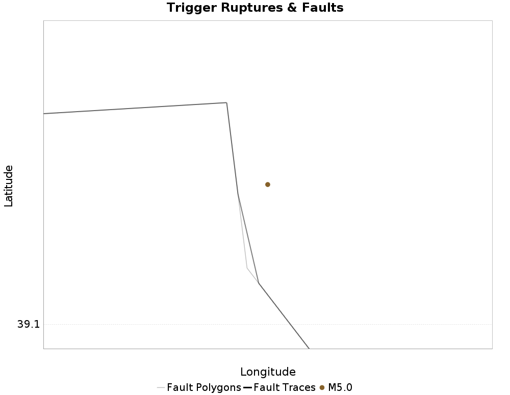

# ETAS Configuration for ComCat M5.0 (nn00719663), Point Source, kCOV=1.5

|   | ComCat M5.0 (nn00719663), Point Source, kCOV=1.5 |
|-----|-----|
| Num Simulations | 100000 |
| Start Time | 2020/03/21 01:33:36 UTC |
| Start Time Epoch Milliseconds | 1584754416370 |
| Duration | 10 Years |
| Includes Spontaneous? | false |
| Trigger Ruptures | *(none)* |
| Config Generated With | u3etas_comcat_event_config_builder.sh --event-id nn00719663 --mag-complete 3.5 --num-simulations 100000 --days-before 7 --etas-k-cov 1.5 --finite-surf-shakemap --finite-surf-shakemap-min-mag 5 --hpc-site USC_HPC --nodes 32 --hours 24 |

## Table Of Contents

* [Trigger Rupture Fault Map](#trigger-rupture-fault-map)
* [Fault Distances To Triggers](#fault-distances-to-triggers)
* [nn00719663 Possible Finite Rupture Subsection Mappings](#nn00719663-possible-finite-rupture-subsection-mappings)
* [JSON Input File](#json-input-file)

## Trigger Rupture Fault Map
*[(top)](#table-of-contents)*



## Fault Distances To Triggers
*[(top)](#table-of-contents)*

| Section Name | Strike, Dip, Rake | Hypocenter In Polygon? | Surface In Polygon? | Minimum Distance (km) | Minimum Poly Distance (km) |
|-----|-----|-----|-----|-----|-----|
| Carson Range (Genoa) | 353, 50, -90 | false | false | 2.691 | 0.233 |
| Incline Village 2011 CFM | 17, 50, -90 | false | false | 12.592 | 12.375 |
| North Tahoe 2011 CFM | 17, 50, -90 | false | false | 15.603 | 15.107 |

## nn00719663 Possible Finite Rupture Subsection Mappings
*[(top)](#table-of-contents)*

This gives any possible finite rupture surface subsection mappings. In the plot below, potentially suggested subsections are outlined in green, and all subsections for which any of this rupture is within the fault polygon are in gray. Suggested sections are those for which the area of the input rupture within the polygon is at least 50.0 % of the sub section area

Overlapping polygons are removed according to the mean distance of the actual subsection surface, with the polygons of closer sections masking out the polygons of further sections

As this is a point source, there will be no matches, but sections within 25km will be listed


| Section Index | Section Name | Suggested Match? | Section Area | Sect Distance To Rup | Hypocenter in Polygon? |
|-----|-----|-----|-----|-----|-----|
| 260 | Carson Range (Genoa), Subsection 3 | no | 116.03 | mean=24.51 [19.93 29.15] [km] | no |
| 261 | Carson Range (Genoa), Subsection 4 | no | 116.03 | mean=17.82 [12.83 24.07] [km] | no |
| 262 | Carson Range (Genoa), Subsection 5 | no | 116.03 | mean=11.72 [6.33 17.79] [km] | no |
| 263 | Carson Range (Genoa), Subsection 6 | no | 116.03 | mean=7.2 [2.74 13.36] [km] | no |
| 973 | Incline Village 2011 CFM, Subsection 0 | no | 90.71 | mean=17.91 [12.78 23.87] [km] | no |
| 974 | Incline Village 2011 CFM, Subsection 1 | no | 90.71 | mean=18.7 [12.79 25.21] [km] | no |
| 975 | Incline Village 2011 CFM, Subsection 2 | no | 90.71 | mean=21.83 [16.23 27.25] [km] | no |
| 1405 | North Tahoe 2011 CFM, Subsection 0 | no | 97.63 | mean=22.27 [17.18 28.08] [km] | no |
| 1406 | North Tahoe 2011 CFM, Subsection 1 | no | 97.63 | mean=20.96 [15.73 27.34] [km] | no |
| 1407 | North Tahoe 2011 CFM, Subsection 2 | no | 97.63 | mean=21.25 [15.72 27.61] [km] | no |
| 1408 | North Tahoe 2011 CFM, Subsection 3 | no | 97.63 | mean=24.36 [18.49 30.74] [km] | no |
| 2545 | West Tahoe, Subsection 2 | no | 128.54 | mean=30.94 [24.61 37.66] [km] | no |
| 2546 | West Tahoe, Subsection 3 | no | 128.54 | mean=28.01 [22.45 33.96] [km] | no |
| 2547 | West Tahoe, Subsection 4 | no | 128.54 | mean=27.01 [22.15 32.62] [km] | no |
| 2548 | West Tahoe, Subsection 5 | no | 128.54 | mean=26.84 [22.11 32.33] [km] | no |
| 2549 | West Tahoe, Subsection 6 | no | 128.54 | mean=30.37 [23.63 37.36] [km] | no |

## JSON Input File
*[(top)](#table-of-contents)*

```
{
  "numSimulations": 100000,
  "duration": 10.0,
  "startTimeMillis": 1584754416370,
  "includeSpontaneous": false,
  "randomSeed": 1584754941936,
  "binaryOutput": true,
  "binaryOutputFilters": [
    {
      "prefix": "results_complete",
      "descendantsOnly": false
    },
    {
      "prefix": "results_m5_preserve_chain",
      "minMag": 5.0,
      "preserveChainBelowMag": true,
      "descendantsOnly": false
    }
  ],
  "forceRecalc": false,
  "simulationName": "ComCat M5.0 (nn00719663), Point Source, kCOV\u003d1.5",
  "numRetries": 3,
  "outputDir": "${ETAS_SIM_DIR}/2020_03_20-ComCatM5p0_nn00719663_PointSource_kCOV1p5",
  "treatTriggerCatalogAsSpontaneous": false,
  "triggerRuptures": [
    {
      "occurrenceTimeMillis": 1584754415370,
      "comcatEventID": "nn00719663",
      "mag": 5.0,
      "latitude": 39.113,
      "longitude": -119.7273,
      "depth": 9.1
    }
  ],
  "cacheDir": "${ETAS_LAUNCHER}/inputs/cache_fm3p1_ba",
  "fssFile": "${ETAS_LAUNCHER}/inputs/2013_05_10-ucerf3p3-production-10runs_COMPOUND_SOL_FM3_1_SpatSeisU3_MEAN_BRANCH_AVG_SOL.zip",
  "probModel": "FULL_TD",
  "applySubSeisForSupraNucl": true,
  "totRateScaleFactor": 1.14,
  "gridSeisCorr": true,
  "timeIndependentERF": false,
  "griddedOnly": false,
  "imposeGR": false,
  "includeIndirectTriggering": true,
  "gridSeisDiscr": 0.1,
  "catalogCompletenessModel": "RELAXED",
  "etas_k_cov": 1.5,
  "configCommand": "u3etas_comcat_event_config_builder.sh --event-id nn00719663 --mag-complete 3.5 --num-simulations 100000 --days-before 7 --etas-k-cov 1.5 --finite-surf-shakemap --finite-surf-shakemap-min-mag 5 --hpc-site USC_HPC --nodes 32 --hours 24",
  "configTime": 1584754941936,
  "comcatMetadata": {
    "region": {
      "centerLatitude": 39.113,
      "centerLongitude": -119.7273,
      "radius": 1.6982436524617426
    },
    "eventID": "nn00719663",
    "minDepth": -10.0,
    "maxDepth": 24.0,
    "minMag": 2.5,
    "startTime": 1584149615370,
    "endTime": 1584754415370,
    "magComplete": 3.5
  }
}
```

