# Parent Section Magnitude-Probability Distributions

Only fault sections with at least one triggered aftershock are plotted. Sections are sorted by total supraseismogenic trigger rate (decreasing)

## Table Of Contents

* [Carson Range (Genoa)](#carson-range-genoa)
* [North Tahoe 2011 CFM](#north-tahoe-2011-cfm)
* [West Tahoe](#west-tahoe)
* [Monterey Bay-Tularcitos](#monterey-bay-tularcitos)
* [Robinson Creek](#robinson-creek)
* [Hat Creek-McArthur-Mayfield](#hat-creek-mcarthur-mayfield)
* [Calaveras (Central) 2011 CFM](#calaveras-central-2011-cfm)
* [Lost Hills](#lost-hills)
* [Calaveras (No) 2011 CFM](#calaveras-no-2011-cfm)
* [Honey Lake 2011 CFM](#honey-lake-2011-cfm)
* [San Gregorio (North) 2011 CFM](#san-gregorio-north-2011-cfm)
* [Reliz 2011 CFM](#reliz-2011-cfm)
* [Polaris 2011 CFM](#polaris-2011-cfm)
* [Hayward (So) 2011 CFM](#hayward-so-2011-cfm)

## Carson Range (Genoa)
*[(top)](#table-of-contents)*

| 1 Week | 1 Month | 1 Year | 10 Year |
|-----|-----|-----|-----|
| 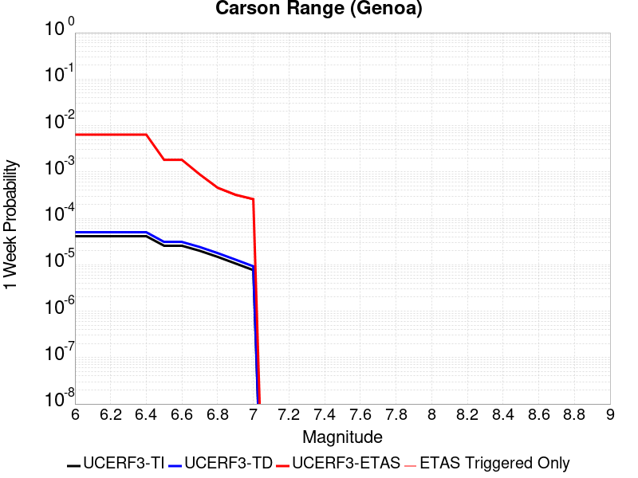 | 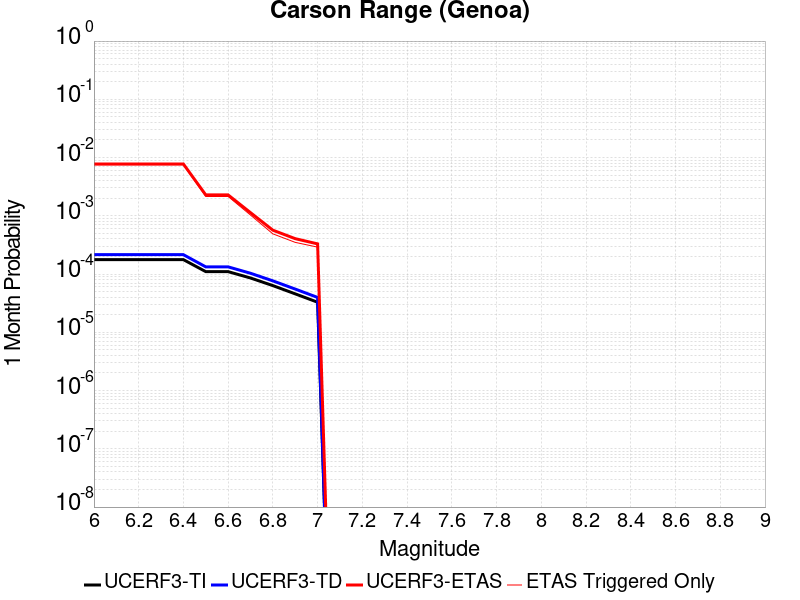 | 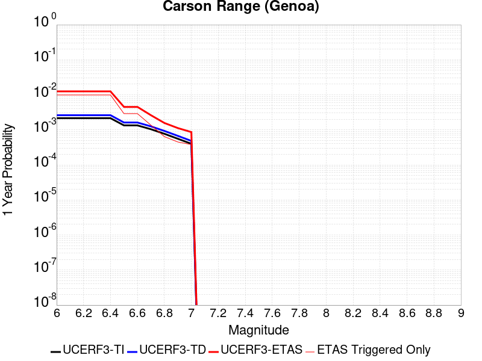 | 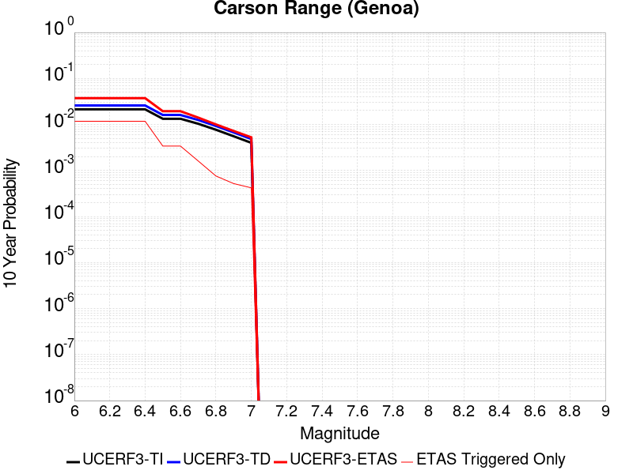 |

| Magnitude | 1 wk TI Prob | 1 wk TD Prob | 1 wk ETAS Prob | 1 wk ETAS/TD Gain | 1 wk ETAS Triggered Only | 1 mo TI Prob | 1 mo TD Prob | 1 mo ETAS Prob | 1 mo ETAS/TD Gain | 1 mo ETAS Triggered Only | 1 yr TI Prob | 1 yr TD Prob | 1 yr ETAS Prob | 1 yr ETAS/TD Gain | 1 yr ETAS Triggered Only | 10 yr TI Prob | 10 yr TD Prob | 10 yr ETAS Prob | 10 yr ETAS/TD Gain | 10 yr ETAS Triggered Only |
|-----|-----|-----|-----|-----|-----|-----|-----|-----|-----|-----|-----|-----|-----|-----|-----|-----|-----|-----|-----|-----|
| 6.0 | 4.1268457E-5 | 5.0199807E-5 | 0.006359883 | 126.691376 | 0.00631 | 1.7685282E-4 | 2.1512645E-4 | 0.0077435067 | 35.99514 | 0.00753 | 0.0021510567 | 0.0026164101 | 0.012490508 | 4.7739105 | 0.0099 | 0.02130354 | 0.025895784 | 0.03734151 | 1.4419918 | 0.01175 |
| 6.1 | 4.1268457E-5 | 5.0199807E-5 | 0.006359883 | 126.691376 | 0.00631 | 1.7685282E-4 | 2.1512645E-4 | 0.0077435067 | 35.99514 | 0.00753 | 0.0021510567 | 0.0026164101 | 0.012490508 | 4.7739105 | 0.0099 | 0.02130354 | 0.025895784 | 0.03734151 | 1.4419918 | 0.01175 |
| 6.2 | 4.1268457E-5 | 5.0199807E-5 | 0.006359883 | 126.691376 | 0.00631 | 1.7685282E-4 | 2.1512645E-4 | 0.0077435067 | 35.99514 | 0.00753 | 0.0021510567 | 0.0026164101 | 0.012490508 | 4.7739105 | 0.0099 | 0.02130354 | 0.025895784 | 0.03734151 | 1.4419918 | 0.01175 |
| 6.3 | 4.1268457E-5 | 5.0199807E-5 | 0.006359883 | 126.691376 | 0.00631 | 1.7685282E-4 | 2.1512645E-4 | 0.0077435067 | 35.99514 | 0.00753 | 0.0021510567 | 0.0026164101 | 0.012490508 | 4.7739105 | 0.0099 | 0.02130354 | 0.025895784 | 0.03734151 | 1.4419918 | 0.01175 |
| 6.4 | 4.1268457E-5 | 5.0199807E-5 | 0.006359883 | 126.691376 | 0.00631 | 1.7685282E-4 | 2.1512645E-4 | 0.0077435067 | 35.99514 | 0.00753 | 0.0021510567 | 0.0026164101 | 0.012490508 | 4.7739105 | 0.0099 | 0.02130354 | 0.025895784 | 0.03734151 | 1.4419918 | 0.01175 |
| 6.5 | 2.5677185E-5 | 3.100969E-5 | 0.0018209541 | 58.722103 | 0.00179 | 1.1004044E-4 | 1.328929E-4 | 0.0022826071 | 17.17629 | 0.00215 | 0.0013389189 | 0.0016169505 | 0.004512261 | 2.7905996 | 0.0029 | 0.0133088045 | 0.016069805 | 0.01940533 | 1.2075646 | 0.00339 |
| 6.6 | 2.5677185E-5 | 3.100969E-5 | 0.0018209541 | 58.722103 | 0.00179 | 1.1004044E-4 | 1.328929E-4 | 0.0022826071 | 17.17629 | 0.00215 | 0.0013389189 | 0.0016169505 | 0.004512261 | 2.7905996 | 0.0029 | 0.0133088045 | 0.016069805 | 0.01940533 | 1.2075646 | 0.00339 |
| 6.7 | 1.9969408E-5 | 2.4087698E-5 | 8.84067E-4 | 36.70201 | 8.6E-4 | 8.558037E-5 | 1.0322977E-4 | 0.0011331234 | 10.976711 | 0.00103 | 0.0010414429 | 0.0012562517 | 0.0026145433 | 2.0812256 | 0.00136 | 0.010365757 | 0.01250669 | 0.014096554 | 1.1271211 | 0.00161 |
| 6.8 | 1.4783156E-5 | 1.783553E-5 | 4.5782767E-4 | 25.66942 | 4.4E-4 | 6.335485E-5 | 7.6436474E-5 | 5.66399E-4 | 7.410062 | 4.9E-4 | 7.710722E-4 | 9.303472E-4 | 0.0015697518 | 1.6872753 | 6.4E-4 | 0.0076840227 | 0.009277336 | 0.010030285 | 1.0811601 | 7.6E-4 |
| 6.9 | 1.06660555E-5 | 1.2890135E-5 | 3.2288613E-4 | 25.04909 | 3.1E-4 | 4.5710865E-5 | 5.5242912E-5 | 4.0522357E-4 | 7.3353043 | 3.5E-4 | 5.5638765E-4 | 6.7249034E-4 | 0.0011221877 | 1.6687046 | 4.5E-4 | 0.005549967 | 0.0067158747 | 0.0072323824 | 1.0769085 | 5.2E-4 |
| 7.0 | 7.664838E-6 | 9.267758E-6 | 2.5926545E-4 | 27.97499 | 2.5E-4 | 3.2848893E-5 | 3.971896E-5 | 3.2970746E-4 | 8.301008 | 2.9E-4 | 3.998619E-4 | 4.8357836E-4 | 8.633946E-4 | 1.7854285 | 3.8E-4 | 0.0039914316 | 0.004835781 | 0.00525375 | 1.0864326 | 4.2E-4 |

## North Tahoe 2011 CFM
*[(top)](#table-of-contents)*

| 1 Week | 1 Month | 1 Year | 10 Year |
|-----|-----|-----|-----|
| 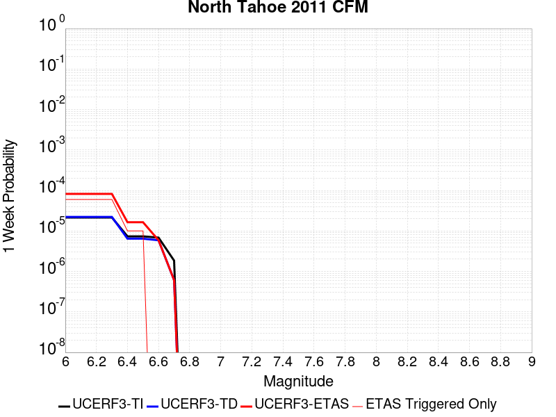 | 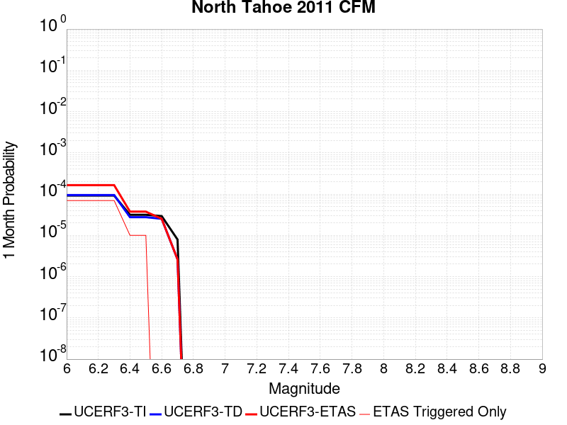 | 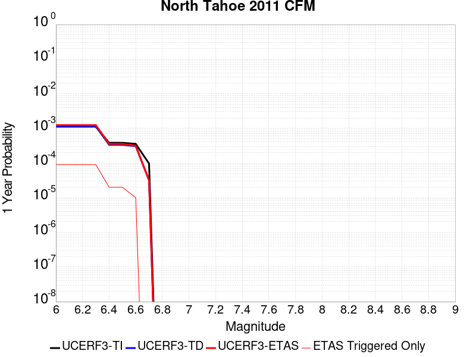 | 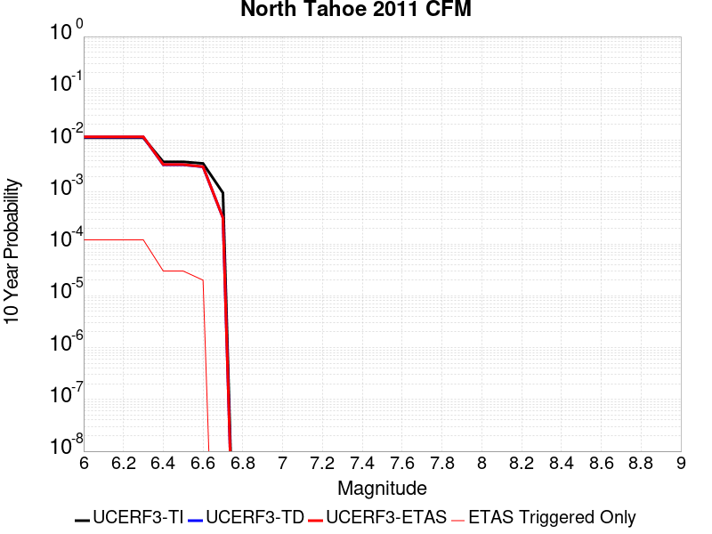 |

| Magnitude | 1 wk TI Prob | 1 wk TD Prob | 1 wk ETAS Prob | 1 wk ETAS/TD Gain | 1 wk ETAS Triggered Only | 1 mo TI Prob | 1 mo TD Prob | 1 mo ETAS Prob | 1 mo ETAS/TD Gain | 1 mo ETAS Triggered Only | 1 yr TI Prob | 1 yr TD Prob | 1 yr ETAS Prob | 1 yr ETAS/TD Gain | 1 yr ETAS Triggered Only | 10 yr TI Prob | 10 yr TD Prob | 10 yr ETAS Prob | 10 yr ETAS/TD Gain | 10 yr ETAS Triggered Only |
|-----|-----|-----|-----|-----|-----|-----|-----|-----|-----|-----|-----|-----|-----|-----|-----|-----|-----|-----|-----|-----|
| 6.0 | 2.150391E-5 | 2.2177239E-5 | 8.217591E-5 | 3.7054164 | 6.0E-5 | 9.215636E-5 | 9.504295E-5 | 1.650363E-4 | 1.7364391 | 7.0E-5 | 0.0011214261 | 0.0011567299 | 0.0012466258 | 1.0777155 | 9.0E-5 | 0.011157839 | 0.011526366 | 0.011644983 | 1.0102909 | 1.2E-4 |
| 6.1 | 2.150391E-5 | 2.2177239E-5 | 8.217591E-5 | 3.7054164 | 6.0E-5 | 9.215636E-5 | 9.504295E-5 | 1.650363E-4 | 1.7364391 | 7.0E-5 | 0.0011214261 | 0.0011567299 | 0.0012466258 | 1.0777155 | 9.0E-5 | 0.011157839 | 0.011526366 | 0.011644983 | 1.0102909 | 1.2E-4 |
| 6.2 | 2.150391E-5 | 2.2177239E-5 | 8.217591E-5 | 3.7054164 | 6.0E-5 | 9.215636E-5 | 9.504295E-5 | 1.650363E-4 | 1.7364391 | 7.0E-5 | 0.0011214261 | 0.0011567299 | 0.0012466258 | 1.0777155 | 9.0E-5 | 0.011157839 | 0.011526366 | 0.011644983 | 1.0102909 | 1.2E-4 |
| 6.3 | 2.150391E-5 | 2.2177239E-5 | 8.217591E-5 | 3.7054164 | 6.0E-5 | 9.215636E-5 | 9.504295E-5 | 1.650363E-4 | 1.7364391 | 7.0E-5 | 0.0011214261 | 0.0011567299 | 0.0012466258 | 1.0777155 | 9.0E-5 | 0.011157839 | 0.011526366 | 0.011644983 | 1.0102909 | 1.2E-4 |
| 6.4 | 7.3563056E-6 | 6.448525E-6 | 1.644846E-5 | 2.5507324 | 1.0E-5 | 3.1526644E-5 | 2.7636415E-5 | 3.763614E-5 | 1.3618314 | 1.0E-5 | 3.8376928E-4 | 3.3645198E-4 | 3.5644526E-4 | 1.0594238 | 2.0E-5 | 0.003831072 | 0.0033624258 | 0.003392325 | 1.0088922 | 3.0E-5 |
| 6.5 | 7.3563056E-6 | 6.448525E-6 | 1.644846E-5 | 2.5507324 | 1.0E-5 | 3.1526644E-5 | 2.7636415E-5 | 3.763614E-5 | 1.3618314 | 1.0E-5 | 3.8376928E-4 | 3.3645198E-4 | 3.5644526E-4 | 1.0594238 | 2.0E-5 | 0.003831072 | 0.0033624258 | 0.003392325 | 1.0088922 | 3.0E-5 |
| 6.6 | 6.8508816E-6 | 5.887394E-6 | 5.887394E-6 | 1.0 | 0.0 | 2.936059E-5 | 2.5231615E-5 | 2.5231615E-5 | 1.0 | 0.0 | 3.5740656E-4 | 3.07182E-4 | 3.1717893E-4 | 1.032544 | 1.0E-5 | 0.0035683226 | 0.0030705542 | 0.003090493 | 1.0064934 | 2.0E-5 |
| 6.7 | 1.8511148E-6 | 6.105409E-7 | 6.105409E-7 | 1.0 | 0.0 | 7.933325E-6 | 2.6166038E-6 | 2.6166038E-6 | 1.0 | 0.0 | 9.658395E-5 | 3.185715E-5 | 3.185715E-5 | 1.0 | 0.0 | 9.6541987E-4 | 3.1857152E-4 | 3.1857152E-4 | 1.0 | 0.0 |

## West Tahoe
*[(top)](#table-of-contents)*

| 1 Week | 1 Month | 1 Year | 10 Year |
|-----|-----|-----|-----|
| 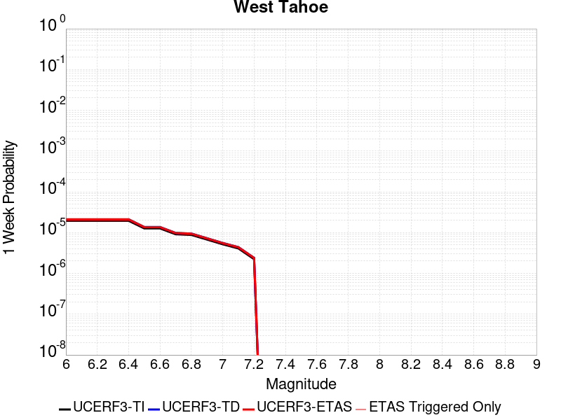 | 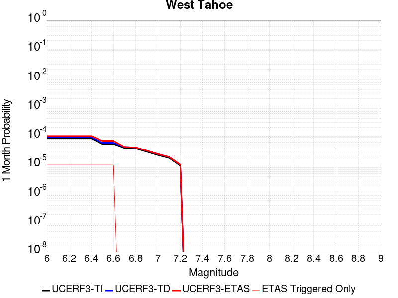 | 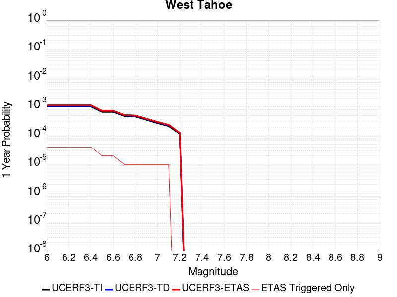 | 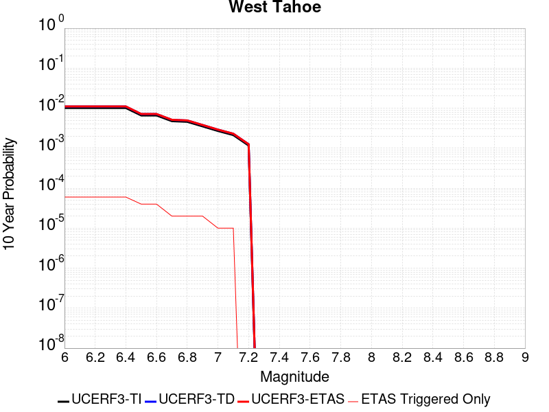 |

| Magnitude | 1 wk TI Prob | 1 wk TD Prob | 1 wk ETAS Prob | 1 wk ETAS/TD Gain | 1 wk ETAS Triggered Only | 1 mo TI Prob | 1 mo TD Prob | 1 mo ETAS Prob | 1 mo ETAS/TD Gain | 1 mo ETAS Triggered Only | 1 yr TI Prob | 1 yr TD Prob | 1 yr ETAS Prob | 1 yr ETAS/TD Gain | 1 yr ETAS Triggered Only | 10 yr TI Prob | 10 yr TD Prob | 10 yr ETAS Prob | 10 yr ETAS/TD Gain | 10 yr ETAS Triggered Only |
|-----|-----|-----|-----|-----|-----|-----|-----|-----|-----|-----|-----|-----|-----|-----|-----|-----|-----|-----|-----|-----|
| 6.0 | 1.952444E-5 | 2.119202E-5 | 2.119202E-5 | 1.0 | 0.0 | 8.367348E-5 | 9.082009E-5 | 1.0081918E-4 | 1.1100978 | 1.0E-5 | 0.0010182485 | 0.0011052284 | 0.0011451843 | 1.0361516 | 4.0E-5 | 0.010135954 | 0.011002808 | 0.011062148 | 1.0053931 | 6.0E-5 |
| 6.1 | 1.952444E-5 | 2.119202E-5 | 2.119202E-5 | 1.0 | 0.0 | 8.367348E-5 | 9.082009E-5 | 1.0081918E-4 | 1.1100978 | 1.0E-5 | 0.0010182485 | 0.0011052284 | 0.0011451843 | 1.0361516 | 4.0E-5 | 0.010135954 | 0.011002808 | 0.011062148 | 1.0053931 | 6.0E-5 |
| 6.2 | 1.952444E-5 | 2.119202E-5 | 2.119202E-5 | 1.0 | 0.0 | 8.367348E-5 | 9.082009E-5 | 1.0081918E-4 | 1.1100978 | 1.0E-5 | 0.0010182485 | 0.0011052284 | 0.0011451843 | 1.0361516 | 4.0E-5 | 0.010135954 | 0.011002808 | 0.011062148 | 1.0053931 | 6.0E-5 |
| 6.3 | 1.952444E-5 | 2.119202E-5 | 2.119202E-5 | 1.0 | 0.0 | 8.367348E-5 | 9.082009E-5 | 1.0081918E-4 | 1.1100978 | 1.0E-5 | 0.0010182485 | 0.0011052284 | 0.0011451843 | 1.0361516 | 4.0E-5 | 0.010135954 | 0.011002808 | 0.011062148 | 1.0053931 | 6.0E-5 |
| 6.4 | 1.952444E-5 | 2.119202E-5 | 2.119202E-5 | 1.0 | 0.0 | 8.367348E-5 | 9.082009E-5 | 1.0081918E-4 | 1.1100978 | 1.0E-5 | 0.0010182485 | 0.0011052284 | 0.0011451843 | 1.0361516 | 4.0E-5 | 0.010135954 | 0.011002808 | 0.011062148 | 1.0053931 | 6.0E-5 |
| 6.5 | 1.2685271E-5 | 1.3695958E-5 | 1.3695958E-5 | 1.0 | 0.0 | 5.4364315E-5 | 5.8695736E-5 | 6.8695146E-5 | 1.1703601 | 1.0E-5 | 6.616845E-4 | 7.1440276E-4 | 7.343885E-4 | 1.0279754 | 2.0E-5 | 0.0065971776 | 0.007122713 | 0.007162428 | 1.0055759 | 4.0E-5 |
| 6.6 | 1.2685271E-5 | 1.3695958E-5 | 1.3695958E-5 | 1.0 | 0.0 | 5.4364315E-5 | 5.8695736E-5 | 6.8695146E-5 | 1.1703601 | 1.0E-5 | 6.616845E-4 | 7.1440276E-4 | 7.343885E-4 | 1.0279754 | 2.0E-5 | 0.0065971776 | 0.007122713 | 0.007162428 | 1.0055759 | 4.0E-5 |
| 6.7 | 9.117886E-6 | 9.813502E-6 | 9.813502E-6 | 1.0 | 0.0 | 3.9076072E-5 | 4.205723E-5 | 4.205723E-5 | 1.0 | 0.0 | 4.756473E-4 | 5.1193364E-4 | 5.2192854E-4 | 1.0195237 | 1.0E-5 | 0.0047463053 | 0.005108262 | 0.0051281597 | 1.0038953 | 2.0E-5 |
| 6.8 | 8.786828E-6 | 9.46141E-6 | 9.46141E-6 | 1.0 | 0.0 | 3.7657293E-5 | 4.0548308E-5 | 4.0548308E-5 | 1.0 | 0.0 | 4.5838108E-4 | 4.935709E-4 | 5.0356594E-4 | 1.0202506 | 1.0E-5 | 0.0045743673 | 0.004925448 | 0.00494535 | 1.0040406 | 2.0E-5 |
| 6.9 | 6.7562123E-6 | 7.2664875E-6 | 7.2664875E-6 | 1.0 | 0.0 | 2.8954875E-5 | 3.1141746E-5 | 3.1141746E-5 | 1.0 | 0.0 | 3.5246857E-4 | 3.7908956E-4 | 3.8908576E-4 | 1.026369 | 1.0E-5 | 0.0035191004 | 0.0037849012 | 0.0038048255 | 1.0052642 | 2.0E-5 |
| 7.0 | 5.1792854E-6 | 5.569386E-6 | 5.569386E-6 | 1.0 | 0.0 | 2.2196748E-5 | 2.3868599E-5 | 2.3868599E-5 | 1.0 | 0.0 | 2.702119E-4 | 2.9056525E-4 | 3.0056233E-4 | 1.0344057 | 1.0E-5 | 0.0026988357 | 0.0029022289 | 0.0029121998 | 1.0034356 | 1.0E-5 |
| 7.1 | 4.090765E-6 | 4.3990403E-6 | 4.3990403E-6 | 1.0 | 0.0 | 1.7531731E-5 | 1.8852914E-5 | 1.8852914E-5 | 1.0 | 0.0 | 2.134279E-4 | 2.2951345E-4 | 2.3951115E-4 | 1.0435604 | 1.0E-5 | 0.0021322304 | 0.002293099 | 0.002303076 | 1.0043509 | 1.0E-5 |
| 7.2 | 2.2356758E-6 | 2.4032474E-6 | 2.4032474E-6 | 1.0 | 0.0 | 9.581432E-6 | 1.0299602E-5 | 1.0299602E-5 | 1.0 | 0.0 | 1.1664769E-4 | 1.2539233E-4 | 1.2539233E-4 | 1.0 | 0.0 | 0.0011658648 | 0.0012534016 | 0.0012534016 | 1.0 | 0.0 |

## Monterey Bay-Tularcitos
*[(top)](#table-of-contents)*

| 1 Week | 1 Month | 1 Year | 10 Year |
|-----|-----|-----|-----|
| 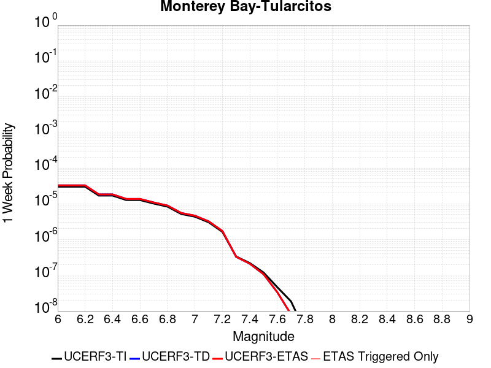 | 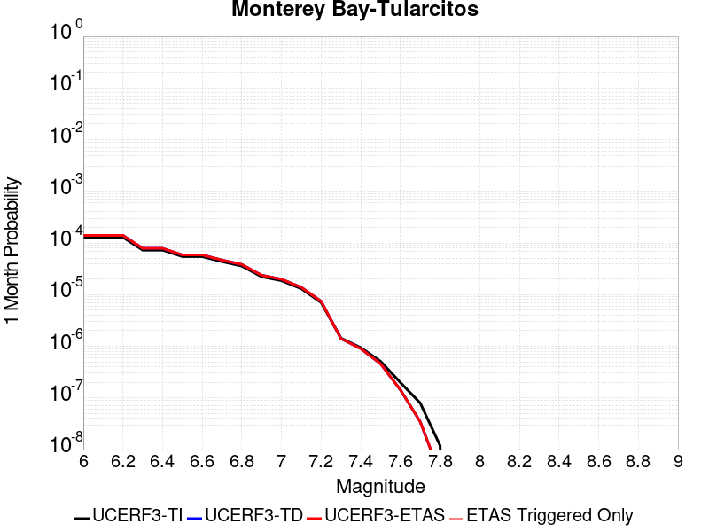 | 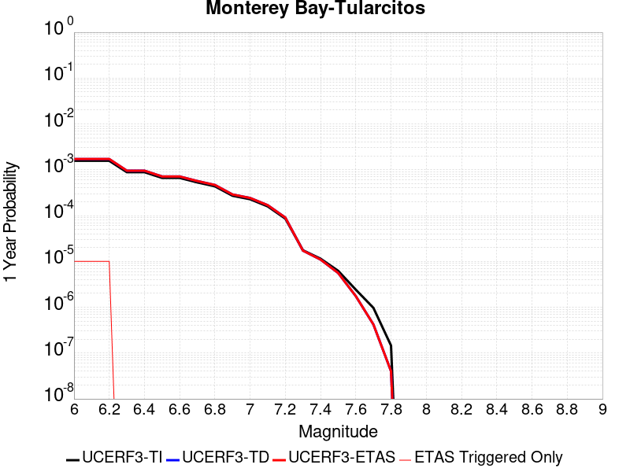 | 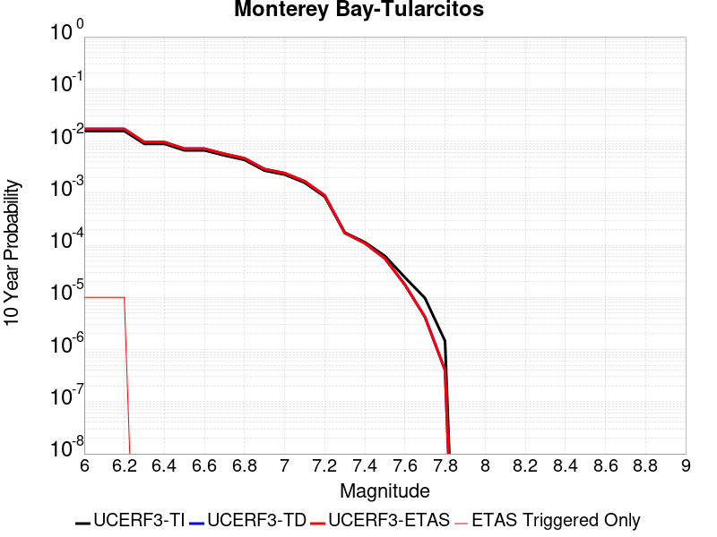 |

| Magnitude | 1 wk TI Prob | 1 wk TD Prob | 1 wk ETAS Prob | 1 wk ETAS/TD Gain | 1 wk ETAS Triggered Only | 1 mo TI Prob | 1 mo TD Prob | 1 mo ETAS Prob | 1 mo ETAS/TD Gain | 1 mo ETAS Triggered Only | 1 yr TI Prob | 1 yr TD Prob | 1 yr ETAS Prob | 1 yr ETAS/TD Gain | 1 yr ETAS Triggered Only | 10 yr TI Prob | 10 yr TD Prob | 10 yr ETAS Prob | 10 yr ETAS/TD Gain | 10 yr ETAS Triggered Only |
|-----|-----|-----|-----|-----|-----|-----|-----|-----|-----|-----|-----|-----|-----|-----|-----|-----|-----|-----|-----|-----|
| 6.0 | 3.0131365E-5 | 3.2813296E-5 | 3.2813296E-5 | 1.0 | 0.0 | 1.2912804E-4 | 1.4062143E-4 | 1.4062143E-4 | 1.0 | 0.0 | 0.001571 | 0.0017108269 | 0.0017208098 | 1.0058352 | 1.0E-5 | 0.015599402 | 0.016987378 | 0.016997209 | 1.0005786 | 1.0E-5 |
| 6.1 | 3.0131365E-5 | 3.2813296E-5 | 3.2813296E-5 | 1.0 | 0.0 | 1.2912804E-4 | 1.4062143E-4 | 1.4062143E-4 | 1.0 | 0.0 | 0.001571 | 0.0017108269 | 0.0017208098 | 1.0058352 | 1.0E-5 | 0.015599402 | 0.016987378 | 0.016997209 | 1.0005786 | 1.0E-5 |
| 6.2 | 3.0131365E-5 | 3.2813296E-5 | 3.2813296E-5 | 1.0 | 0.0 | 1.2912804E-4 | 1.4062143E-4 | 1.4062143E-4 | 1.0 | 0.0 | 0.001571 | 0.0017108269 | 0.0017208098 | 1.0058352 | 1.0E-5 | 0.015599402 | 0.016987378 | 0.016997209 | 1.0005786 | 1.0E-5 |
| 6.3 | 1.6998249E-5 | 1.833809E-5 | 1.833809E-5 | 1.0 | 0.0 | 7.28476E-5 | 7.858955E-5 | 7.858955E-5 | 1.0 | 0.0 | 8.865586E-4 | 9.564265E-4 | 9.564265E-4 | 1.0 | 0.0 | 0.0088303005 | 0.009525029 | 0.009525029 | 1.0 | 0.0 |
| 6.4 | 1.6998249E-5 | 1.833809E-5 | 1.833809E-5 | 1.0 | 0.0 | 7.28476E-5 | 7.858955E-5 | 7.858955E-5 | 1.0 | 0.0 | 8.865586E-4 | 9.564265E-4 | 9.564265E-4 | 1.0 | 0.0 | 0.0088303005 | 0.009525029 | 0.009525029 | 1.0 | 0.0 |
| 6.5 | 1.27470785E-5 | 1.3698534E-5 | 1.3698534E-5 | 1.0 | 0.0 | 5.4629192E-5 | 5.8706737E-5 | 5.8706737E-5 | 1.0 | 0.0 | 6.649074E-4 | 7.1453047E-4 | 7.1453047E-4 | 1.0 | 0.0 | 0.0066292146 | 0.007123384 | 0.007123384 | 1.0 | 0.0 |
| 6.6 | 1.2739422E-5 | 1.3690619E-5 | 1.3690619E-5 | 1.0 | 0.0 | 5.4596385E-5 | 5.867282E-5 | 5.867282E-5 | 1.0 | 0.0 | 6.645082E-4 | 7.1411784E-4 | 7.1411784E-4 | 1.0 | 0.0 | 0.0066252467 | 0.007119284 | 0.007119284 | 1.0 | 0.0 |
| 6.7 | 1.0160109E-5 | 1.0889799E-5 | 1.0889799E-5 | 1.0 | 0.0 | 4.35426E-5 | 4.6669775E-5 | 4.6669775E-5 | 1.0 | 0.0 | 5.300022E-4 | 5.680634E-4 | 5.680634E-4 | 1.0 | 0.0 | 0.005287399 | 0.0056668255 | 0.0056668255 | 1.0 | 0.0 |
| 6.8 | 8.349859E-6 | 8.935875E-6 | 8.935875E-6 | 1.0 | 0.0 | 3.578462E-5 | 3.8296075E-5 | 3.8296075E-5 | 1.0 | 0.0 | 4.3559066E-4 | 4.6616062E-4 | 4.6616062E-4 | 1.0 | 0.0 | 0.004347378 | 0.004652393 | 0.004652393 | 1.0 | 0.0 |
| 6.9 | 5.193639E-6 | 5.53845E-6 | 5.53845E-6 | 1.0 | 0.0 | 2.2258262E-5 | 2.3736016E-5 | 2.3736016E-5 | 1.0 | 0.0 | 2.7096065E-4 | 2.8895092E-4 | 2.8895092E-4 | 1.0 | 0.0 | 0.0027063051 | 0.0028860734 | 0.0028860734 | 1.0 | 0.0 |
| 7.0 | 4.359381E-6 | 4.6450764E-6 | 4.6450764E-6 | 1.0 | 0.0 | 1.8682927E-5 | 1.9907335E-5 | 1.9907335E-5 | 1.0 | 0.0 | 2.274409E-4 | 2.4234781E-4 | 2.4234781E-4 | 1.0 | 0.0 | 0.0022720827 | 0.0024211286 | 0.0024211286 | 1.0 | 0.0 |
| 7.1 | 3.0398533E-6 | 3.2322648E-6 | 3.2322648E-6 | 1.0 | 0.0 | 1.3027877E-5 | 1.3852505E-5 | 1.3852505E-5 | 1.0 | 0.0 | 1.5860285E-4 | 1.6864382E-4 | 1.6864382E-4 | 1.0 | 0.0 | 0.001584897 | 0.0016854162 | 0.0016854162 | 1.0 | 0.0 |
| 7.2 | 1.642335E-6 | 1.7340096E-6 | 1.7340096E-6 | 1.0 | 0.0 | 7.0385595E-6 | 7.4314603E-6 | 7.4314603E-6 | 1.0 | 0.0 | 8.569109E-5 | 9.047634E-5 | 9.047634E-5 | 1.0 | 0.0 | 8.5658056E-4 | 9.0459787E-4 | 9.0459787E-4 | 1.0 | 0.0 |
| 7.3 | 3.356842E-7 | 3.2970493E-7 | 3.2970493E-7 | 1.0 | 0.0 | 1.4386458E-6 | 1.4130203E-6 | 1.4130203E-6 | 1.0 | 0.0 | 1.7515373E-5 | 1.7203387E-5 | 1.7203387E-5 | 1.0 | 0.0 | 1.7513991E-4 | 1.7202065E-4 | 1.7202065E-4 | 1.0 | 0.0 |
| 7.4 | 2.1973483E-7 | 2.1022731E-7 | 2.1022731E-7 | 1.0 | 0.0 | 9.417204E-7 | 9.009739E-7 | 9.009739E-7 | 1.0 | 0.0 | 1.1465385E-5 | 1.0969302E-5 | 1.0969302E-5 | 1.0 | 0.0 | 1.1464794E-4 | 1.0968764E-4 | 1.0968764E-4 | 1.0 | 0.0 |
| 7.5 | 1.1944135E-7 | 1.0710092E-7 | 1.0710092E-7 | 1.0 | 0.0 | 5.118914E-7 | 4.5900384E-7 | 4.5900384E-7 | 1.0 | 0.0 | 6.23226E-6 | 5.5883575E-6 | 5.5883575E-6 | 1.0 | 0.0 | 6.2320854E-5 | 5.5882185E-5 | 5.5882185E-5 | 1.0 | 0.0 |
| 7.6 | 4.636058E-8 | 3.346971E-8 | 3.346971E-8 | 1.0 | 0.0 | 1.9868818E-7 | 1.4344161E-7 | 1.4344161E-7 | 1.0 | 0.0 | 2.419026E-6 | 1.7464001E-6 | 1.7464001E-6 | 1.0 | 0.0 | 2.4189996E-5 | 1.7463866E-5 | 1.7463866E-5 | 1.0 | 0.0 |
| 7.7 | 1.8588572E-8 | 8.064726E-9 | 8.064726E-9 | 1.0 | 0.0 | 7.9665305E-8 | 3.456311E-8 | 3.456311E-8 | 1.0 | 0.0 | 9.699246E-7 | 4.2080578E-7 | 4.2080578E-7 | 1.0 | 0.0 | 9.699204E-6 | 4.20805E-6 | 4.20805E-6 | 1.0 | 0.0 |
| 7.8 | 2.7960154E-9 | 7.7099993E-10 | 7.7099993E-10 | 1.0 | 0.0 | 1.1982923E-8 | 3.3042857E-9 | 3.3042857E-9 | 1.0 | 0.0 | 1.4589209E-7 | 4.022968E-8 | 4.022968E-8 | 1.0 | 0.0 | 1.4589199E-6 | 4.0229673E-7 | 4.0229673E-7 | 1.0 | 0.0 |

## Robinson Creek
*[(top)](#table-of-contents)*

| 1 Week | 1 Month | 1 Year | 10 Year |
|-----|-----|-----|-----|
| 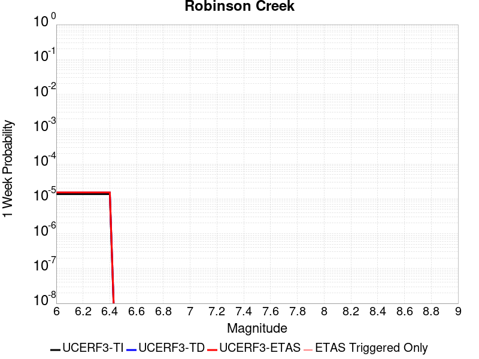 | 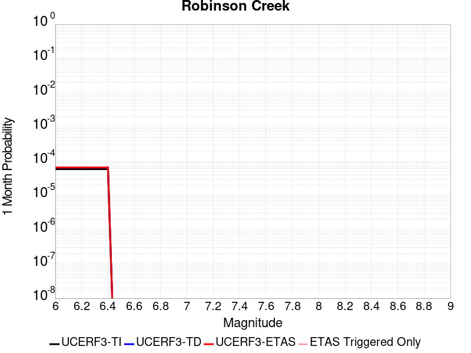 | 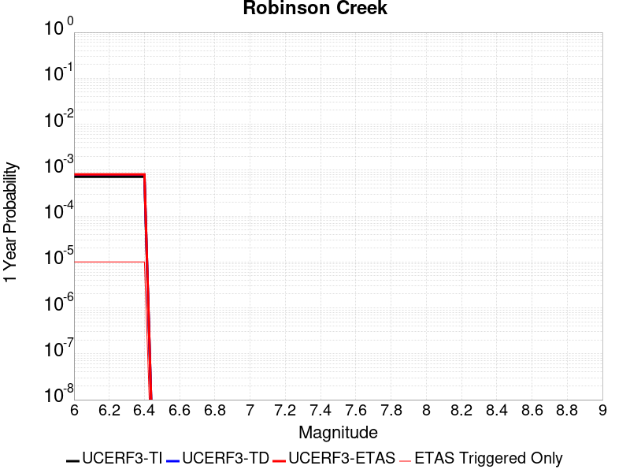 | 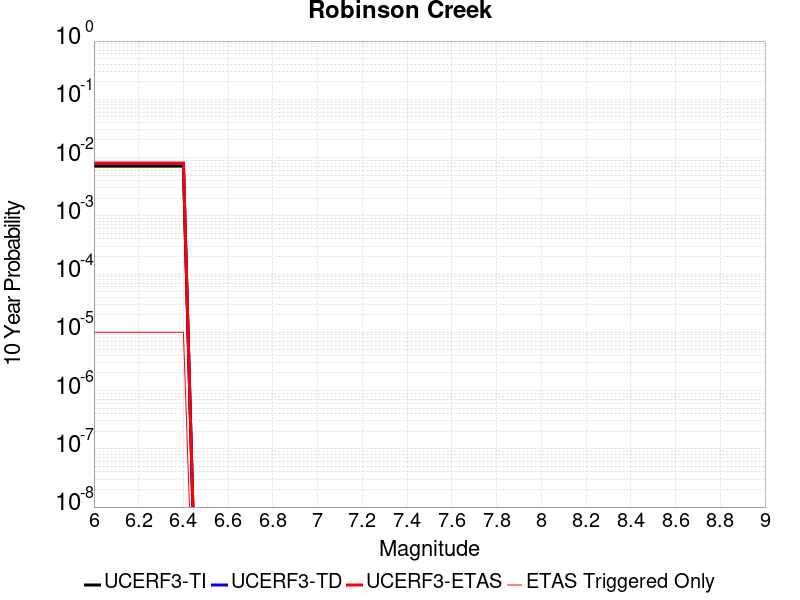 |

| Magnitude | 1 wk TI Prob | 1 wk TD Prob | 1 wk ETAS Prob | 1 wk ETAS/TD Gain | 1 wk ETAS Triggered Only | 1 mo TI Prob | 1 mo TD Prob | 1 mo ETAS Prob | 1 mo ETAS/TD Gain | 1 mo ETAS Triggered Only | 1 yr TI Prob | 1 yr TD Prob | 1 yr ETAS Prob | 1 yr ETAS/TD Gain | 1 yr ETAS Triggered Only | 10 yr TI Prob | 10 yr TD Prob | 10 yr ETAS Prob | 10 yr ETAS/TD Gain | 10 yr ETAS Triggered Only |
|-----|-----|-----|-----|-----|-----|-----|-----|-----|-----|-----|-----|-----|-----|-----|-----|-----|-----|-----|-----|-----|
| 6.0 | 1.3705327E-5 | 1.529366E-5 | 1.529366E-5 | 1.0 | 0.0 | 5.8735794E-5 | 6.5544256E-5 | 6.5544256E-5 | 1.0 | 0.0 | 7.1487366E-4 | 7.9800136E-4 | 8.0799335E-4 | 1.0125213 | 1.0E-5 | 0.0071257832 | 0.007980013 | 0.007989934 | 1.0012431 | 1.0E-5 |
| 6.1 | 1.3705327E-5 | 1.529366E-5 | 1.529366E-5 | 1.0 | 0.0 | 5.8735794E-5 | 6.5544256E-5 | 6.5544256E-5 | 1.0 | 0.0 | 7.1487366E-4 | 7.9800136E-4 | 8.0799335E-4 | 1.0125213 | 1.0E-5 | 0.0071257832 | 0.007980013 | 0.007989934 | 1.0012431 | 1.0E-5 |
| 6.2 | 1.3705327E-5 | 1.529366E-5 | 1.529366E-5 | 1.0 | 0.0 | 5.8735794E-5 | 6.5544256E-5 | 6.5544256E-5 | 1.0 | 0.0 | 7.1487366E-4 | 7.9800136E-4 | 8.0799335E-4 | 1.0125213 | 1.0E-5 | 0.0071257832 | 0.007980013 | 0.007989934 | 1.0012431 | 1.0E-5 |
| 6.3 | 1.3705327E-5 | 1.529366E-5 | 1.529366E-5 | 1.0 | 0.0 | 5.8735794E-5 | 6.5544256E-5 | 6.5544256E-5 | 1.0 | 0.0 | 7.1487366E-4 | 7.9800136E-4 | 8.0799335E-4 | 1.0125213 | 1.0E-5 | 0.0071257832 | 0.007980013 | 0.007989934 | 1.0012431 | 1.0E-5 |
| 6.4 | 1.3705327E-5 | 1.529366E-5 | 1.529366E-5 | 1.0 | 0.0 | 5.8735794E-5 | 6.5544256E-5 | 6.5544256E-5 | 1.0 | 0.0 | 7.1487366E-4 | 7.9800136E-4 | 8.0799335E-4 | 1.0125213 | 1.0E-5 | 0.0071257832 | 0.007980013 | 0.007989934 | 1.0012431 | 1.0E-5 |

## Hat Creek-McArthur-Mayfield
*[(top)](#table-of-contents)*

| 1 Week | 1 Month | 1 Year | 10 Year |
|-----|-----|-----|-----|
| 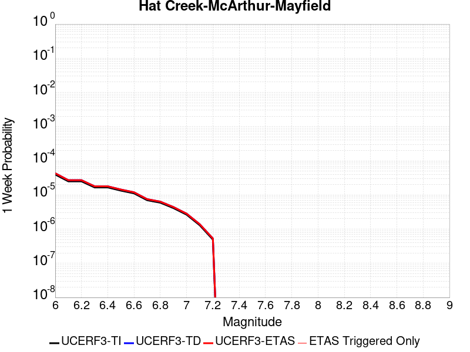 | 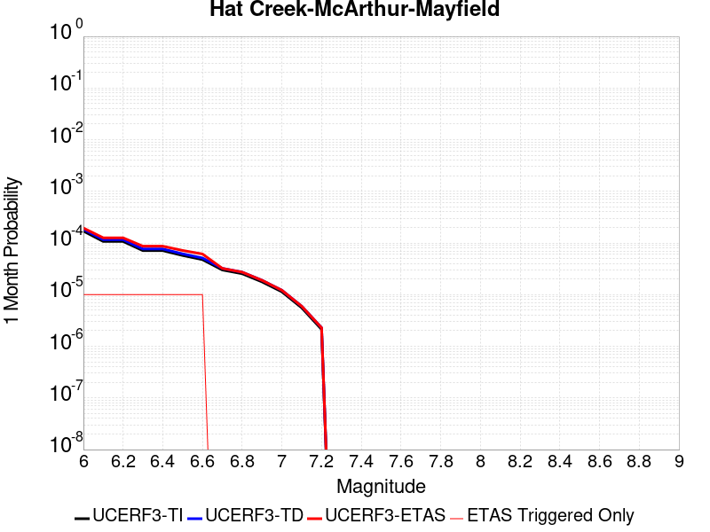 | 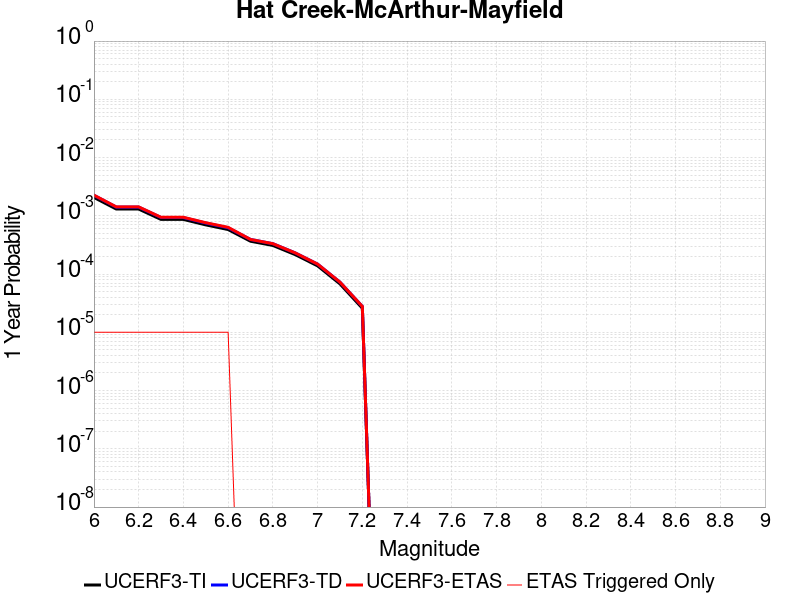 | 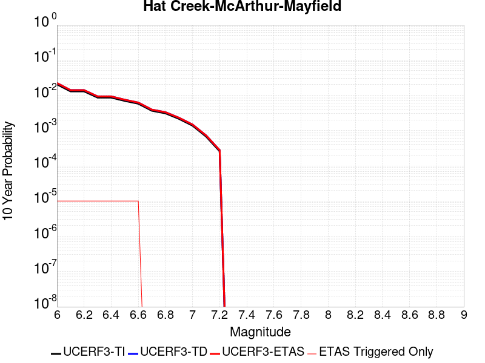 |

| Magnitude | 1 wk TI Prob | 1 wk TD Prob | 1 wk ETAS Prob | 1 wk ETAS/TD Gain | 1 wk ETAS Triggered Only | 1 mo TI Prob | 1 mo TD Prob | 1 mo ETAS Prob | 1 mo ETAS/TD Gain | 1 mo ETAS Triggered Only | 1 yr TI Prob | 1 yr TD Prob | 1 yr ETAS Prob | 1 yr ETAS/TD Gain | 1 yr ETAS Triggered Only | 10 yr TI Prob | 10 yr TD Prob | 10 yr ETAS Prob | 10 yr ETAS/TD Gain | 10 yr ETAS Triggered Only |
|-----|-----|-----|-----|-----|-----|-----|-----|-----|-----|-----|-----|-----|-----|-----|-----|-----|-----|-----|-----|-----|
| 6.0 | 3.967457E-5 | 4.3176995E-5 | 4.3176995E-5 | 1.0 | 0.0 | 1.7002279E-4 | 1.8503178E-4 | 1.9502993E-4 | 1.0540347 | 1.0E-5 | 0.002068062 | 0.002250549 | 0.0022605264 | 1.0044334 | 1.0E-5 | 0.02048922 | 0.022289943 | 0.02229972 | 1.0004387 | 1.0E-5 |
| 6.1 | 2.5044013E-5 | 2.7081951E-5 | 2.7081951E-5 | 1.0 | 0.0 | 1.0732707E-4 | 1.16060524E-4 | 1.2605936E-4 | 1.086152 | 1.0E-5 | 0.0013059238 | 0.0014121528 | 0.0014221387 | 1.0070714 | 1.0E-5 | 0.01298276 | 0.014035214 | 0.014045074 | 1.0007025 | 1.0E-5 |
| 6.2 | 2.5044013E-5 | 2.7081951E-5 | 2.7081951E-5 | 1.0 | 0.0 | 1.0732707E-4 | 1.16060524E-4 | 1.2605936E-4 | 1.086152 | 1.0E-5 | 0.0013059238 | 0.0014121528 | 0.0014221387 | 1.0070714 | 1.0E-5 | 0.01298276 | 0.014035214 | 0.014045074 | 1.0007025 | 1.0E-5 |
| 6.3 | 1.6624012E-5 | 1.7897775E-5 | 1.7897775E-5 | 1.0 | 0.0 | 7.124382E-5 | 7.670255E-5 | 8.670178E-5 | 1.1303638 | 1.0E-5 | 8.670483E-4 | 9.33462E-4 | 9.434527E-4 | 1.0107028 | 1.0E-5 | 0.008636732 | 0.0092963455 | 0.009306253 | 1.0010657 | 1.0E-5 |
| 6.4 | 1.6624012E-5 | 1.7897775E-5 | 1.7897775E-5 | 1.0 | 0.0 | 7.124382E-5 | 7.670255E-5 | 8.670178E-5 | 1.1303638 | 1.0E-5 | 8.670483E-4 | 9.33462E-4 | 9.434527E-4 | 1.0107028 | 1.0E-5 | 0.008636732 | 0.0092963455 | 0.009306253 | 1.0010657 | 1.0E-5 |
| 6.5 | 1.3394842E-5 | 1.4397402E-5 | 1.4397402E-5 | 1.0 | 0.0 | 5.7405203E-5 | 6.170173E-5 | 7.1701106E-5 | 1.16206 | 1.0E-5 | 6.986842E-4 | 7.5096515E-4 | 7.6095766E-4 | 1.0133061 | 1.0E-5 | 0.006964916 | 0.007484868 | 0.0074947933 | 1.0013261 | 1.0E-5 |
| 6.6 | 1.1137514E-5 | 1.1958854E-5 | 1.1958854E-5 | 1.0 | 0.0 | 4.7731326E-5 | 5.1251245E-5 | 6.1250736E-5 | 1.1951072 | 1.0E-5 | 5.809739E-4 | 6.238093E-4 | 6.338031E-4 | 1.0160205 | 1.0E-5 | 0.005794574 | 0.0062210043 | 0.0062309424 | 1.0015974 | 1.0E-5 |
| 6.7 | 7.0200663E-6 | 7.5269436E-6 | 7.5269436E-6 | 1.0 | 0.0 | 3.008565E-5 | 3.225794E-5 | 3.225794E-5 | 1.0 | 0.0 | 3.6623122E-4 | 3.926712E-4 | 3.926712E-4 | 1.0 | 0.0 | 0.0036562826 | 0.0039199367 | 0.0039199367 | 1.0 | 0.0 |
| 6.8 | 5.940172E-6 | 6.3677144E-6 | 6.3677144E-6 | 1.0 | 0.0 | 2.545763E-5 | 2.7289925E-5 | 2.7289925E-5 | 1.0 | 0.0 | 3.0990256E-4 | 3.3220547E-4 | 3.3220547E-4 | 1.0 | 0.0 | 0.0030947074 | 0.0033172173 | 0.0033172173 | 1.0 | 0.0 |
| 6.9 | 4.129831E-6 | 4.4250914E-6 | 4.4250914E-6 | 1.0 | 0.0 | 1.7699154E-5 | 1.8964545E-5 | 1.8964545E-5 | 1.0 | 0.0 | 2.154659E-4 | 2.3086966E-4 | 2.3086966E-4 | 1.0 | 0.0 | 0.002152571 | 0.0023063766 | 0.0023063766 | 1.0 | 0.0 |
| 7.0 | 2.6512955E-6 | 2.8383777E-6 | 2.8383777E-6 | 1.0 | 0.0 | 1.1362646E-5 | 1.2164422E-5 | 1.2164422E-5 | 1.0 | 0.0 | 1.3833142E-4 | 1.480922E-4 | 1.480922E-4 | 1.0 | 0.0 | 0.0013824535 | 0.0014799776 | 0.0014799776 | 1.0 | 0.0 |
| 7.1 | 1.2992575E-6 | 1.3914134E-6 | 1.3914134E-6 | 1.0 | 0.0 | 5.568235E-6 | 5.963188E-6 | 5.963188E-6 | 1.0 | 0.0 | 6.779115E-5 | 7.2599614E-5 | 7.2599614E-5 | 1.0 | 0.0 | 6.7770475E-4 | 7.257806E-4 | 7.257806E-4 | 1.0 | 0.0 |
| 7.2 | 4.968191E-7 | 5.3290364E-7 | 5.3290364E-7 | 1.0 | 0.0 | 2.1292228E-6 | 2.2838715E-6 | 2.2838715E-6 | 1.0 | 0.0 | 2.592298E-5 | 2.7805907E-5 | 2.7805907E-5 | 1.0 | 0.0 | 2.5919956E-4 | 2.7803663E-4 | 2.7803663E-4 | 1.0 | 0.0 |

## Calaveras (Central) 2011 CFM
*[(top)](#table-of-contents)*

| 1 Week | 1 Month | 1 Year | 10 Year |
|-----|-----|-----|-----|
| 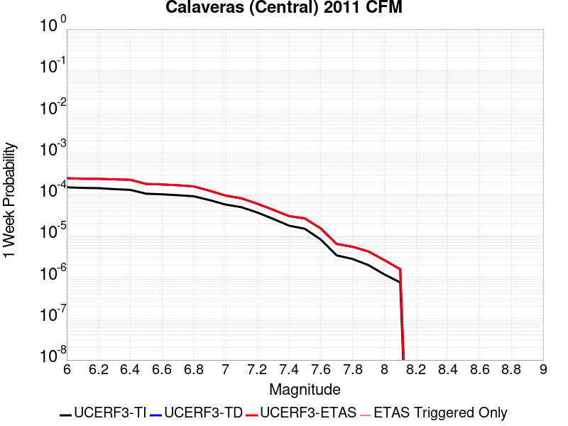 | 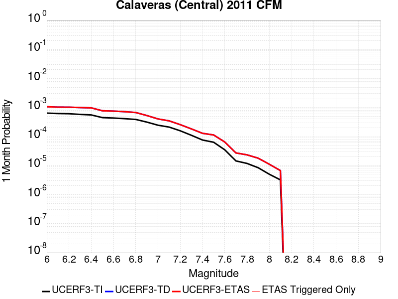 | 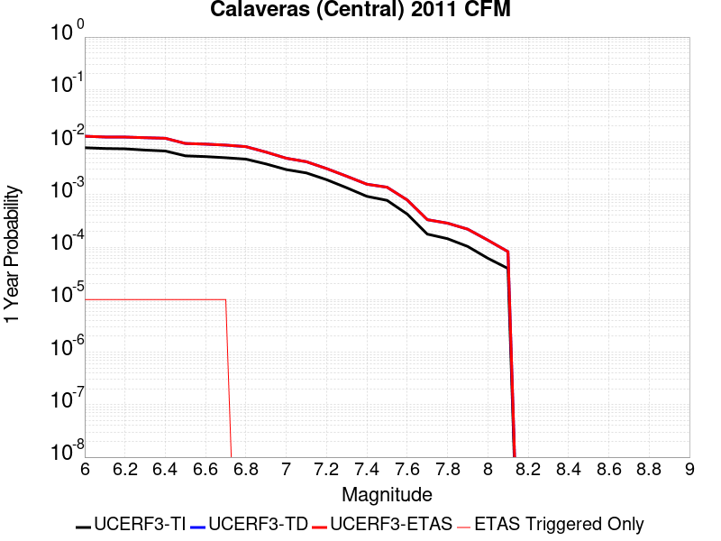 | 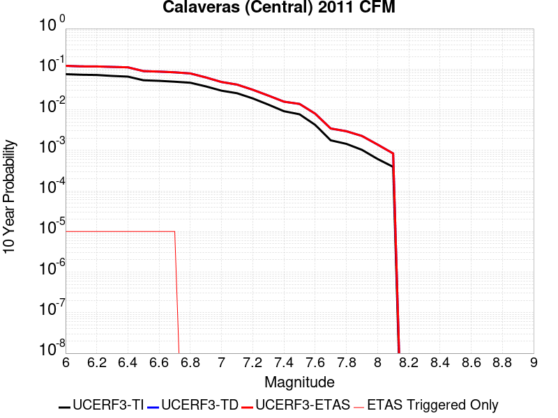 |

| Magnitude | 1 wk TI Prob | 1 wk TD Prob | 1 wk ETAS Prob | 1 wk ETAS/TD Gain | 1 wk ETAS Triggered Only | 1 mo TI Prob | 1 mo TD Prob | 1 mo ETAS Prob | 1 mo ETAS/TD Gain | 1 mo ETAS Triggered Only | 1 yr TI Prob | 1 yr TD Prob | 1 yr ETAS Prob | 1 yr ETAS/TD Gain | 1 yr ETAS Triggered Only | 10 yr TI Prob | 10 yr TD Prob | 10 yr ETAS Prob | 10 yr ETAS/TD Gain | 10 yr ETAS Triggered Only |
|-----|-----|-----|-----|-----|-----|-----|-----|-----|-----|-----|-----|-----|-----|-----|-----|-----|-----|-----|-----|-----|
| 6.0 | 1.5010907E-4 | 2.4922634E-4 | 2.4922634E-4 | 1.0 | 0.0 | 6.4316596E-4 | 0.0010676624 | 0.0010676624 | 1.0 | 0.0 | 0.0078024664 | 0.012912373 | 0.012922244 | 1.0007645 | 1.0E-5 | 0.07534136 | 0.12091891 | 0.1209277 | 1.0000727 | 1.0E-5 |
| 6.1 | 1.4521465E-4 | 2.408278E-4 | 2.408278E-4 | 1.0 | 0.0 | 6.222001E-4 | 0.0010316978 | 0.0010316978 | 1.0 | 0.0 | 0.0075490056 | 0.012481011 | 0.012490886 | 1.0007912 | 1.0E-5 | 0.07297657 | 0.11718679 | 0.11719562 | 1.0000753 | 1.0E-5 |
| 6.2 | 1.429998E-4 | 2.4012473E-4 | 2.4012473E-4 | 1.0 | 0.0 | 6.127123E-4 | 0.0010286873 | 0.0010286873 | 1.0 | 0.0 | 0.007434286 | 0.012444825 | 0.012454701 | 1.0007936 | 1.0E-5 | 0.07190444 | 0.116832815 | 0.116841644 | 1.0000756 | 1.0E-5 |
| 6.3 | 1.3536277E-4 | 2.3339082E-4 | 2.3339082E-4 | 1.0 | 0.0 | 5.799972E-4 | 9.998549E-4 | 9.998549E-4 | 1.0 | 0.0 | 0.0070386264 | 0.012098655 | 0.012108534 | 1.0008166 | 1.0E-5 | 0.0681982 | 0.113724954 | 0.11373382 | 1.000078 | 1.0E-5 |
| 6.4 | 1.2993296E-4 | 2.275843E-4 | 2.275843E-4 | 1.0 | 0.0 | 5.5673666E-4 | 9.74989E-4 | 9.74989E-4 | 1.0 | 0.0 | 0.006757223 | 0.011799297 | 0.01180918 | 1.0008376 | 1.0E-5 | 0.06555412 | 0.1109858 | 0.11099469 | 1.0000801 | 1.0E-5 |
| 6.5 | 1.0498927E-4 | 1.8082319E-4 | 1.8082319E-4 | 1.0 | 0.0 | 4.498764E-4 | 7.747257E-4 | 7.747257E-4 | 1.0 | 0.0 | 0.005463498 | 0.009391403 | 0.009401309 | 1.0010548 | 1.0E-5 | 0.053311124 | 0.08964192 | 0.089651026 | 1.0001016 | 1.0E-5 |
| 6.6 | 1.0157505E-4 | 1.7568469E-4 | 1.7568469E-4 | 1.0 | 0.0 | 4.35249E-4 | 7.5271697E-4 | 7.5271697E-4 | 1.0 | 0.0 | 0.0052862884 | 0.009125756 | 0.009135664 | 1.0010858 | 1.0E-5 | 0.05162293 | 0.08721433 | 0.08722346 | 1.0001047 | 1.0E-5 |
| 6.7 | 9.660386E-5 | 1.6825725E-4 | 1.6825725E-4 | 1.0 | 0.0 | 4.1395082E-4 | 7.20903E-4 | 7.20903E-4 | 1.0 | 0.0 | 0.0050282106 | 0.008741631 | 0.008751543 | 1.0011339 | 1.0E-5 | 0.049159497 | 0.083696514 | 0.08370567 | 1.0001094 | 1.0E-5 |
| 6.8 | 9.089927E-5 | 1.5735593E-4 | 1.5735593E-4 | 1.0 | 0.0 | 3.8951015E-4 | 6.742085E-4 | 6.742085E-4 | 1.0 | 0.0 | 0.0047319788 | 0.00817756 | 0.00817756 | 1.0 | 0.0 | 0.046324775 | 0.078574926 | 0.078574926 | 1.0 | 0.0 |
| 6.9 | 7.353187E-5 | 1.2375273E-4 | 1.2375273E-4 | 1.0 | 0.0 | 3.150985E-4 | 5.3026166E-4 | 5.3026166E-4 | 1.0 | 0.0 | 0.0038295772 | 0.0064369473 | 0.0064369473 | 1.0 | 0.0 | 0.037642512 | 0.06255567 | 0.06255567 | 1.0 | 0.0 |
| 7.0 | 5.746064E-5 | 9.457052E-5 | 9.457052E-5 | 1.0 | 0.0 | 2.4623662E-4 | 4.0523964E-4 | 4.0523964E-4 | 1.0 | 0.0 | 0.0029938098 | 0.0049227034 | 0.0049227034 | 1.0 | 0.0 | 0.02953797 | 0.04830782 | 0.04830782 | 1.0 | 0.0 |
| 7.1 | 4.9557195E-5 | 8.114551E-5 | 8.114551E-5 | 1.0 | 0.0 | 2.123707E-4 | 3.4772046E-4 | 3.4772046E-4 | 1.0 | 0.0 | 0.0025825473 | 0.004225342 | 0.004225342 | 1.0 | 0.0 | 0.0255274 | 0.041667935 | 0.041667935 | 1.0 | 0.0 |
| 7.2 | 3.687595E-5 | 6.005682E-5 | 6.005682E-5 | 1.0 | 0.0 | 1.5803022E-4 | 2.5736116E-4 | 2.5736116E-4 | 1.0 | 0.0 | 0.0019223199 | 0.0031288995 | 0.0031288995 | 1.0 | 0.0 | 0.01905776 | 0.03113879 | 0.03113879 | 1.0 | 0.0 |
| 7.3 | 2.5846984E-5 | 4.2879667E-5 | 4.2879667E-5 | 1.0 | 0.0 | 1.1076809E-4 | 1.8375716E-4 | 1.8375716E-4 | 1.0 | 0.0 | 0.0013477671 | 0.0022349658 | 0.0022349658 | 1.0 | 0.0 | 0.013396223 | 0.022373414 | 0.022373414 | 1.0 | 0.0 |
| 7.4 | 1.7747854E-5 | 3.0206456E-5 | 3.0206456E-5 | 1.0 | 0.0 | 7.6060016E-5 | 1.2944984E-4 | 1.2944984E-4 | 1.0 | 0.0 | 9.2563726E-4 | 0.0015749153 | 0.0015749153 | 1.0 | 0.0 | 0.009217911 | 0.01583916 | 0.01583916 | 1.0 | 0.0 |
| 7.5 | 1.4883479E-5 | 2.649587E-5 | 2.649587E-5 | 1.0 | 0.0 | 6.378478E-5 | 1.13548806E-4 | 1.13548806E-4 | 1.0 | 0.0 | 7.76303E-4 | 0.0013815828 | 0.0013815828 | 1.0 | 0.0 | 0.0077359667 | 0.013923771 | 0.013923771 | 1.0 | 0.0 |
| 7.6 | 8.166975E-6 | 1.5150449E-5 | 1.5150449E-5 | 1.0 | 0.0 | 3.5000852E-5 | 6.4928885E-5 | 6.4928885E-5 | 1.0 | 0.0 | 4.2605202E-4 | 7.902238E-4 | 7.902238E-4 | 1.0 | 0.0 | 0.004252361 | 0.008030134 | 0.008030134 | 1.0 | 0.0 |
| 7.7 | 3.3858064E-6 | 6.3805346E-6 | 6.3805346E-6 | 1.0 | 0.0 | 1.4510518E-5 | 2.7344862E-5 | 2.7344862E-5 | 1.0 | 0.0 | 1.7665124E-4 | 3.328729E-4 | 3.328729E-4 | 1.0 | 0.0 | 0.0017651088 | 0.003450429 | 0.003450429 | 1.0 | 0.0 |
| 7.8 | 2.7721615E-6 | 5.4751554E-6 | 5.4751554E-6 | 1.0 | 0.0 | 1.1880637E-5 | 2.3464741E-5 | 2.3464741E-5 | 1.0 | 0.0 | 1.4463716E-4 | 2.8564583E-4 | 2.8564583E-4 | 1.0 | 0.0 | 0.0014454306 | 0.002960609 | 0.002960609 | 1.0 | 0.0 |
| 7.9 | 1.9736292E-6 | 4.2087768E-6 | 4.2087768E-6 | 1.0 | 0.0 | 8.4583835E-6 | 1.803749E-5 | 1.803749E-5 | 1.0 | 0.0 | 1.0297595E-4 | 2.1958434E-4 | 2.1958434E-4 | 1.0 | 0.0 | 0.0010292825 | 0.0022626023 | 0.0022626023 | 1.0 | 0.0 |
| 8.0 | 1.1767289E-6 | 2.6024816E-6 | 2.6024816E-6 | 1.0 | 0.0 | 5.0431145E-6 | 1.1153445E-5 | 1.1153445E-5 | 1.0 | 0.0 | 6.139818E-5 | 1.3578477E-4 | 1.3578477E-4 | 1.0 | 0.0 | 6.1381224E-4 | 0.0013893885 | 0.0013893885 | 1.0 | 0.0 |
| 8.1 | 7.5112825E-7 | 1.5705431E-6 | 1.5705431E-6 | 1.0 | 0.0 | 3.2191172E-6 | 6.730882E-6 | 6.730882E-6 | 1.0 | 0.0 | 3.9192048E-5 | 8.194543E-5 | 8.194543E-5 | 1.0 | 0.0 | 3.9185135E-4 | 8.379923E-4 | 8.379923E-4 | 1.0 | 0.0 |

## Lost Hills
*[(top)](#table-of-contents)*

| 1 Week | 1 Month | 1 Year | 10 Year |
|-----|-----|-----|-----|
| 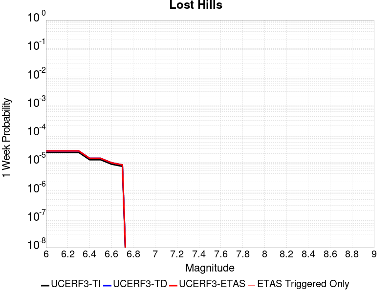 | 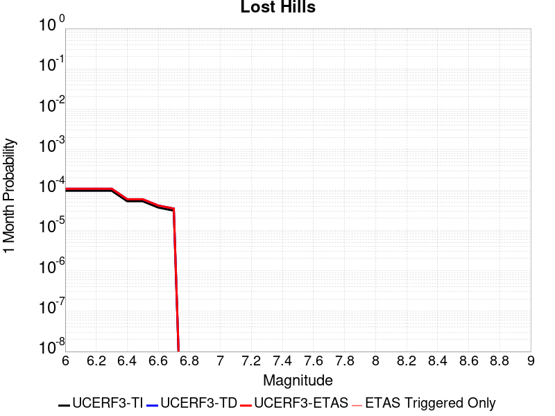 | 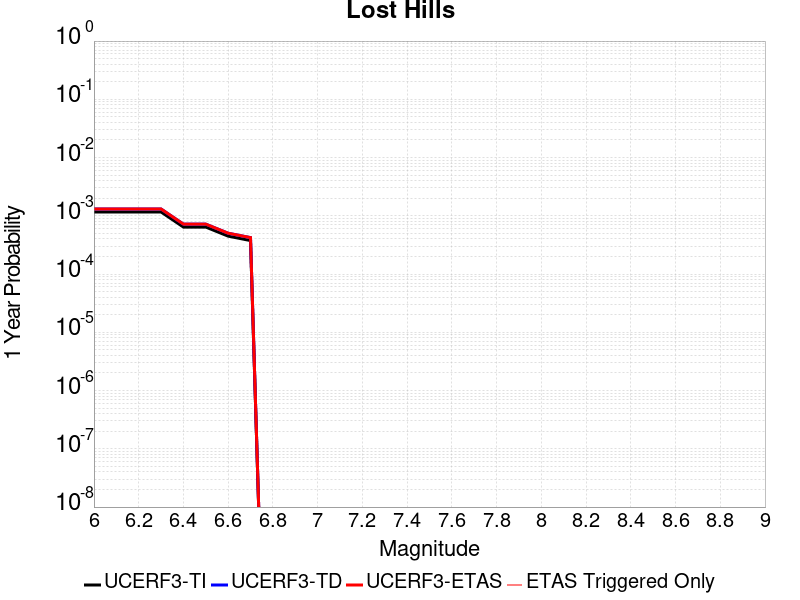 | 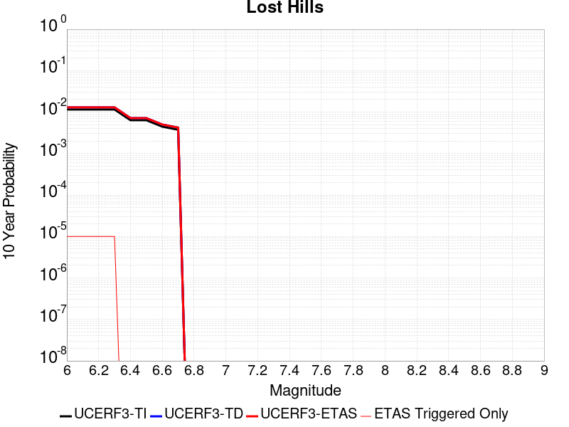 |

| Magnitude | 1 wk TI Prob | 1 wk TD Prob | 1 wk ETAS Prob | 1 wk ETAS/TD Gain | 1 wk ETAS Triggered Only | 1 mo TI Prob | 1 mo TD Prob | 1 mo ETAS Prob | 1 mo ETAS/TD Gain | 1 mo ETAS Triggered Only | 1 yr TI Prob | 1 yr TD Prob | 1 yr ETAS Prob | 1 yr ETAS/TD Gain | 1 yr ETAS Triggered Only | 10 yr TI Prob | 10 yr TD Prob | 10 yr ETAS Prob | 10 yr ETAS/TD Gain | 10 yr ETAS Triggered Only |
|-----|-----|-----|-----|-----|-----|-----|-----|-----|-----|-----|-----|-----|-----|-----|-----|-----|-----|-----|-----|-----|
| 6.0 | 2.233523E-5 | 2.5121875E-5 | 2.5121875E-5 | 1.0 | 0.0 | 9.571891E-5 | 1.0766168E-4 | 1.0766168E-4 | 1.0 | 0.0 | 0.0011647546 | 0.0013101611 | 0.0013101611 | 1.0 | 0.0 | 0.011586686 | 0.013040989 | 0.013050858 | 1.0007569 | 1.0E-5 |
| 6.1 | 2.233523E-5 | 2.5121875E-5 | 2.5121875E-5 | 1.0 | 0.0 | 9.571891E-5 | 1.0766168E-4 | 1.0766168E-4 | 1.0 | 0.0 | 0.0011647546 | 0.0013101611 | 0.0013101611 | 1.0 | 0.0 | 0.011586686 | 0.013040989 | 0.013050858 | 1.0007569 | 1.0E-5 |
| 6.2 | 2.233523E-5 | 2.5121875E-5 | 2.5121875E-5 | 1.0 | 0.0 | 9.571891E-5 | 1.0766168E-4 | 1.0766168E-4 | 1.0 | 0.0 | 0.0011647546 | 0.0013101611 | 0.0013101611 | 1.0 | 0.0 | 0.011586686 | 0.013040989 | 0.013050858 | 1.0007569 | 1.0E-5 |
| 6.3 | 2.233523E-5 | 2.5121875E-5 | 2.5121875E-5 | 1.0 | 0.0 | 9.571891E-5 | 1.0766168E-4 | 1.0766168E-4 | 1.0 | 0.0 | 0.0011647546 | 0.0013101611 | 0.0013101611 | 1.0 | 0.0 | 0.011586686 | 0.013040989 | 0.013050858 | 1.0007569 | 1.0E-5 |
| 6.4 | 1.2288092E-5 | 1.3789327E-5 | 1.3789327E-5 | 1.0 | 0.0 | 5.2662188E-5 | 5.9096303E-5 | 5.9096303E-5 | 1.0 | 0.0 | 6.409735E-4 | 7.193539E-4 | 7.193539E-4 | 1.0 | 0.0 | 0.006391279 | 0.0071794707 | 0.0071794707 | 1.0 | 0.0 |
| 6.5 | 1.2288092E-5 | 1.3789327E-5 | 1.3789327E-5 | 1.0 | 0.0 | 5.2662188E-5 | 5.9096303E-5 | 5.9096303E-5 | 1.0 | 0.0 | 6.409735E-4 | 7.193539E-4 | 7.193539E-4 | 1.0 | 0.0 | 0.006391279 | 0.0071794707 | 0.0071794707 | 1.0 | 0.0 |
| 6.6 | 8.58281E-6 | 9.63956E-6 | 9.63956E-6 | 1.0 | 0.0 | 3.6782953E-5 | 4.1312214E-5 | 4.1312214E-5 | 1.0 | 0.0 | 4.4774043E-4 | 5.0294347E-4 | 5.0294347E-4 | 1.0 | 0.0 | 0.0044683935 | 0.005026222 | 0.005026222 | 1.0 | 0.0 |
| 6.7 | 7.205685E-6 | 8.093165E-6 | 8.093165E-6 | 1.0 | 0.0 | 3.088114E-5 | 3.4684992E-5 | 3.4684992E-5 | 1.0 | 0.0 | 3.7591302E-4 | 4.2228977E-4 | 4.2228977E-4 | 1.0 | 0.0 | 0.0037527776 | 0.004222898 | 0.004222898 | 1.0 | 0.0 |

## Calaveras (No) 2011 CFM
*[(top)](#table-of-contents)*

| 1 Week | 1 Month | 1 Year | 10 Year |
|-----|-----|-----|-----|
| 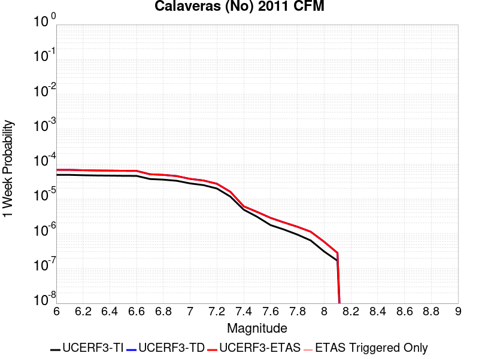 | 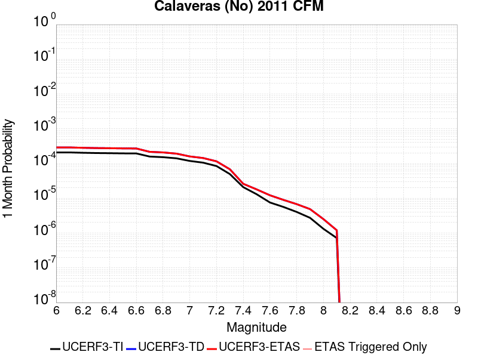 | 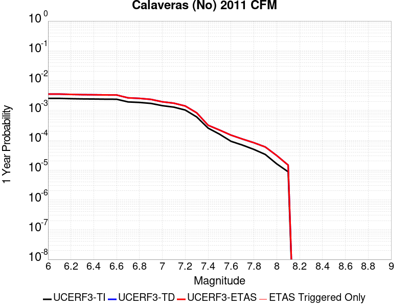 |  |

| Magnitude | 1 wk TI Prob | 1 wk TD Prob | 1 wk ETAS Prob | 1 wk ETAS/TD Gain | 1 wk ETAS Triggered Only | 1 mo TI Prob | 1 mo TD Prob | 1 mo ETAS Prob | 1 mo ETAS/TD Gain | 1 mo ETAS Triggered Only | 1 yr TI Prob | 1 yr TD Prob | 1 yr ETAS Prob | 1 yr ETAS/TD Gain | 1 yr ETAS Triggered Only | 10 yr TI Prob | 10 yr TD Prob | 10 yr ETAS Prob | 10 yr ETAS/TD Gain | 10 yr ETAS Triggered Only |
|-----|-----|-----|-----|-----|-----|-----|-----|-----|-----|-----|-----|-----|-----|-----|-----|-----|-----|-----|-----|-----|
| 6.0 | 4.8694856E-5 | 6.782227E-5 | 6.782227E-5 | 1.0 | 0.0 | 2.0867554E-4 | 2.9063533E-4 | 2.9063533E-4 | 1.0 | 0.0 | 0.0025376645 | 0.003532747 | 0.003532747 | 1.0 | 0.0 | 0.02508881 | 0.03494347 | 0.03495312 | 1.0002762 | 1.0E-5 |
| 6.1 | 4.8694856E-5 | 6.782227E-5 | 6.782227E-5 | 1.0 | 0.0 | 2.0867554E-4 | 2.9063533E-4 | 2.9063533E-4 | 1.0 | 0.0 | 0.0025376645 | 0.003532747 | 0.003532747 | 1.0 | 0.0 | 0.02508881 | 0.03494347 | 0.03495312 | 1.0002762 | 1.0E-5 |
| 6.2 | 4.7541962E-5 | 6.615034E-5 | 6.615034E-5 | 1.0 | 0.0 | 2.0373536E-4 | 2.8347148E-4 | 2.8347148E-4 | 1.0 | 0.0 | 0.0024776561 | 0.0034458276 | 0.0034458276 | 1.0 | 0.0 | 0.024502134 | 0.034103516 | 0.034113172 | 1.0002832 | 1.0E-5 |
| 6.3 | 4.6717287E-5 | 6.498194E-5 | 6.498194E-5 | 1.0 | 0.0 | 2.0020158E-4 | 2.7846513E-4 | 2.7846513E-4 | 1.0 | 0.0 | 0.0024347296 | 0.0033850765 | 0.0033850765 | 1.0 | 0.0 | 0.024082264 | 0.03351519 | 0.033524852 | 1.0002884 | 1.0E-5 |
| 6.4 | 4.6276386E-5 | 6.4342385E-5 | 6.4342385E-5 | 1.0 | 0.0 | 1.983123E-4 | 2.757249E-4 | 2.757249E-4 | 1.0 | 0.0 | 0.0024117786 | 0.0033518255 | 0.0033518255 | 1.0 | 0.0 | 0.02385771 | 0.03319353 | 0.0332032 | 1.0002912 | 1.0E-5 |
| 6.5 | 4.5720994E-5 | 6.3541695E-5 | 6.3541695E-5 | 1.0 | 0.0 | 1.9593239E-4 | 2.722942E-4 | 2.722942E-4 | 1.0 | 0.0 | 0.002382867 | 0.0033101938 | 0.0033101938 | 1.0 | 0.0 | 0.023574775 | 0.03279051 | 0.032800186 | 1.0002949 | 1.0E-5 |
| 6.6 | 4.549134E-5 | 6.319375E-5 | 6.319375E-5 | 1.0 | 0.0 | 1.949483E-4 | 2.7080328E-4 | 2.7080328E-4 | 1.0 | 0.0 | 0.0023709119 | 0.0032920972 | 0.0032920972 | 1.0 | 0.0 | 0.023457756 | 0.032615446 | 0.03262512 | 1.0002966 | 1.0E-5 |
| 6.7 | 3.701047E-5 | 5.0675895E-5 | 5.0675895E-5 | 1.0 | 0.0 | 1.5860666E-4 | 2.1716458E-4 | 2.1716458E-4 | 1.0 | 0.0 | 0.0019293258 | 0.0026408168 | 0.0026408168 | 1.0 | 0.0 | 0.019126613 | 0.026283123 | 0.026283123 | 1.0 | 0.0 |
| 6.8 | 3.5523568E-5 | 4.8653586E-5 | 4.8653586E-5 | 1.0 | 0.0 | 1.5223498E-4 | 2.0849895E-4 | 2.0849895E-4 | 1.0 | 0.0 | 0.0018518851 | 0.0025355634 | 0.0025355634 | 1.0 | 0.0 | 0.018365284 | 0.02525356 | 0.02525356 | 1.0 | 0.0 |
| 6.9 | 3.2946147E-5 | 4.4965873E-5 | 4.4965873E-5 | 1.0 | 0.0 | 1.4119013E-4 | 1.926969E-4 | 1.926969E-4 | 1.0 | 0.0 | 0.0017176344 | 0.0023436034 | 0.0023436034 | 1.0 | 0.0 | 0.017044188 | 0.02337132 | 0.02337132 | 1.0 | 0.0 |
| 7.0 | 2.7682381E-5 | 3.7317335E-5 | 3.7317335E-5 | 1.0 | 0.0 | 1.1863338E-4 | 1.5992181E-4 | 1.5992181E-4 | 1.0 | 0.0 | 0.0014434044 | 0.00194534 | 0.00194534 | 1.0 | 0.0 | 0.01434065 | 0.019459195 | 0.019459195 | 1.0 | 0.0 |
| 7.1 | 2.471967E-5 | 3.3573295E-5 | 3.3573295E-5 | 1.0 | 0.0 | 1.05937135E-4 | 1.4387778E-4 | 1.4387778E-4 | 1.0 | 0.0 | 0.0012890215 | 0.0017503342 | 0.0017503342 | 1.0 | 0.0 | 0.0128157 | 0.017530153 | 0.017530153 | 1.0 | 0.0 |
| 7.2 | 1.9748062E-5 | 2.7012975E-5 | 2.7012975E-5 | 1.0 | 0.0 | 8.463181E-5 | 1.15764895E-4 | 1.15764895E-4 | 1.0 | 0.0 | 0.0010299052 | 0.0014085503 | 0.0014085503 | 1.0 | 0.0 | 0.01025145 | 0.014150975 | 0.014150975 | 1.0 | 0.0 |
| 7.3 | 1.1603734E-5 | 1.5952353E-5 | 1.5952353E-5 | 1.0 | 0.0 | 4.9729337E-5 | 6.8365516E-5 | 6.8365516E-5 | 1.0 | 0.0 | 6.052865E-4 | 8.3204685E-4 | 8.3204685E-4 | 1.0 | 0.0 | 0.0060364045 | 0.00839478 | 0.00839478 | 1.0 | 0.0 |
| 7.4 | 4.885381E-6 | 6.0922966E-6 | 6.0922966E-6 | 1.0 | 0.0 | 2.0937177E-5 | 2.6109583E-5 | 2.6109583E-5 | 1.0 | 0.0 | 2.5488032E-4 | 3.1783798E-4 | 3.1783798E-4 | 1.0 | 0.0 | 0.0025458818 | 0.0032297373 | 0.0032297373 | 1.0 | 0.0 |
| 7.5 | 3.0571264E-6 | 4.2080273E-6 | 4.2080273E-6 | 1.0 | 0.0 | 1.3101904E-5 | 1.8034278E-5 | 1.8034278E-5 | 1.0 | 0.0 | 1.5950401E-4 | 2.1954533E-4 | 2.1954533E-4 | 1.0 | 0.0 | 0.0015938957 | 0.0022474362 | 0.0022474362 | 1.0 | 0.0 |
| 7.6 | 1.764948E-6 | 2.8457737E-6 | 2.8457737E-6 | 1.0 | 0.0 | 7.564041E-6 | 1.2196116E-5 | 1.2196116E-5 | 1.0 | 0.0 | 9.208831E-5 | 1.4847767E-4 | 1.4847767E-4 | 1.0 | 0.0 | 9.205016E-4 | 0.0015375497 | 0.0015375497 | 1.0 | 0.0 |
| 7.7 | 1.3173734E-6 | 2.1024548E-6 | 2.1024548E-6 | 1.0 | 0.0 | 5.645874E-6 | 9.0104895E-6 | 9.0104895E-6 | 1.0 | 0.0 | 6.873634E-5 | 1.09697205E-4 | 1.09697205E-4 | 1.0 | 0.0 | 6.8715087E-4 | 0.0011483581 | 0.0011483581 | 1.0 | 0.0 |
| 7.8 | 9.4429885E-7 | 1.5829007E-6 | 1.5829007E-6 | 1.0 | 0.0 | 4.0469886E-6 | 6.7838428E-6 | 6.7838428E-6 | 1.0 | 0.0 | 4.9270973E-5 | 8.2590166E-5 | 8.2590166E-5 | 1.0 | 0.0 | 4.926005E-4 | 8.671725E-4 | 8.671725E-4 | 1.0 | 0.0 |
| 7.9 | 6.388233E-7 | 1.138793E-6 | 1.138793E-6 | 1.0 | 0.0 | 2.7378112E-6 | 4.8805323E-6 | 4.8805323E-6 | 1.0 | 0.0 | 3.3332344E-5 | 5.9418868E-5 | 5.9418868E-5 | 1.0 | 0.0 | 3.3327343E-4 | 6.21615E-4 | 6.21615E-4 | 1.0 | 0.0 |
| 8.0 | 3.087986E-7 | 5.874935E-7 | 5.874935E-7 | 1.0 | 0.0 | 1.323422E-6 | 2.5178267E-6 | 2.5178267E-6 | 1.0 | 0.0 | 1.6112543E-5 | 3.065411E-5 | 3.065411E-5 | 1.0 | 0.0 | 1.6111376E-4 | 3.170878E-4 | 3.170878E-4 | 1.0 | 0.0 |
| 8.1 | 1.6725647E-7 | 2.803481E-7 | 2.803481E-7 | 1.0 | 0.0 | 7.168133E-7 | 1.2014914E-6 | 1.2014914E-6 | 1.0 | 0.0 | 8.7271665E-6 | 1.4628061E-5 | 1.4628061E-5 | 1.0 | 0.0 | 8.726824E-5 | 1.5168895E-4 | 1.5168895E-4 | 1.0 | 0.0 |

## Honey Lake 2011 CFM
*[(top)](#table-of-contents)*

| 1 Week | 1 Month | 1 Year | 10 Year |
|-----|-----|-----|-----|
| 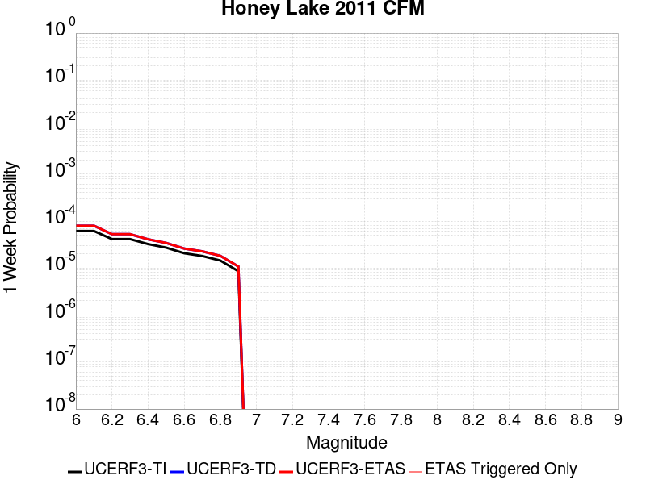 | 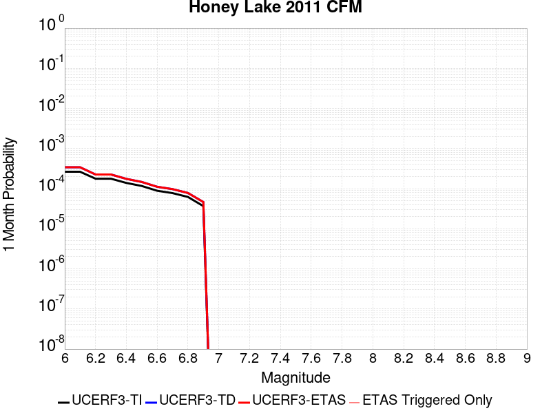 | 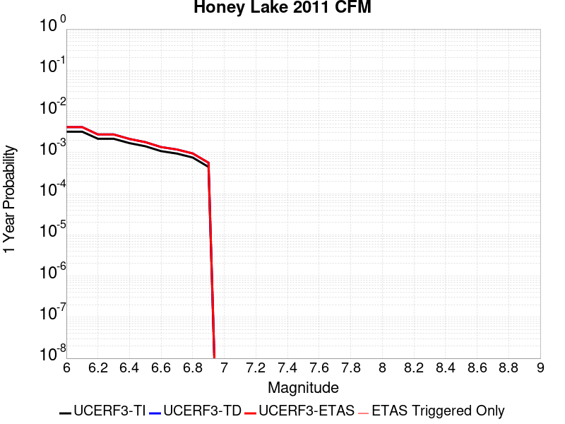 | 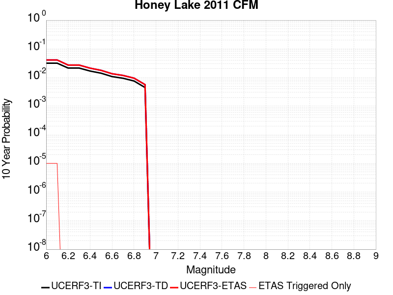 |

| Magnitude | 1 wk TI Prob | 1 wk TD Prob | 1 wk ETAS Prob | 1 wk ETAS/TD Gain | 1 wk ETAS Triggered Only | 1 mo TI Prob | 1 mo TD Prob | 1 mo ETAS Prob | 1 mo ETAS/TD Gain | 1 mo ETAS Triggered Only | 1 yr TI Prob | 1 yr TD Prob | 1 yr ETAS Prob | 1 yr ETAS/TD Gain | 1 yr ETAS Triggered Only | 10 yr TI Prob | 10 yr TD Prob | 10 yr ETAS Prob | 10 yr ETAS/TD Gain | 10 yr ETAS Triggered Only |
|-----|-----|-----|-----|-----|-----|-----|-----|-----|-----|-----|-----|-----|-----|-----|-----|-----|-----|-----|-----|-----|
| 6.0 | 6.155506E-5 | 7.96579E-5 | 7.96579E-5 | 1.0 | 0.0 | 2.6378073E-4 | 3.413494E-4 | 3.413494E-4 | 1.0 | 0.0 | 0.0032068014 | 0.004148454 | 0.004148454 | 1.0 | 0.0 | 0.03160919 | 0.040758412 | 0.040768005 | 1.0002353 | 1.0E-5 |
| 6.1 | 6.155506E-5 | 7.96579E-5 | 7.96579E-5 | 1.0 | 0.0 | 2.6378073E-4 | 3.413494E-4 | 3.413494E-4 | 1.0 | 0.0 | 0.0032068014 | 0.004148454 | 0.004148454 | 1.0 | 0.0 | 0.03160919 | 0.040758412 | 0.040768005 | 1.0002353 | 1.0E-5 |
| 6.2 | 4.1335024E-5 | 5.2645802E-5 | 5.2645802E-5 | 1.0 | 0.0 | 1.7713808E-4 | 2.2560626E-4 | 2.2560626E-4 | 1.0 | 0.0 | 0.0021545228 | 0.0027434463 | 0.0027434463 | 1.0 | 0.0 | 0.021337535 | 0.027111836 | 0.027111836 | 1.0 | 0.0 |
| 6.3 | 4.1335024E-5 | 5.2645802E-5 | 5.2645802E-5 | 1.0 | 0.0 | 1.7713808E-4 | 2.2560626E-4 | 2.2560626E-4 | 1.0 | 0.0 | 0.0021545228 | 0.0027434463 | 0.0027434463 | 1.0 | 0.0 | 0.021337535 | 0.027111836 | 0.027111836 | 1.0 | 0.0 |
| 6.4 | 3.2393702E-5 | 4.093951E-5 | 4.093951E-5 | 1.0 | 0.0 | 1.3882275E-4 | 1.7544394E-4 | 1.7544394E-4 | 1.0 | 0.0 | 0.0016888566 | 0.0021340416 | 0.0021340416 | 1.0 | 0.0 | 0.016760793 | 0.021146484 | 0.021146484 | 1.0 | 0.0 |
| 6.5 | 2.7205504E-5 | 3.425481E-5 | 3.425481E-5 | 1.0 | 0.0 | 1.1658981E-4 | 1.4679863E-4 | 1.4679863E-4 | 1.0 | 0.0 | 0.0014185566 | 0.0017859013 | 0.0017859013 | 1.0 | 0.0 | 0.014095354 | 0.017725006 | 0.017725006 | 1.0 | 0.0 |
| 6.6 | 2.069265E-5 | 2.5987782E-5 | 2.5987782E-5 | 1.0 | 0.0 | 8.867977E-5 | 1.1137193E-4 | 1.1137193E-4 | 1.0 | 0.0 | 0.0010791414 | 0.001355194 | 0.001355194 | 1.0 | 0.0 | 0.010739161 | 0.013477681 | 0.013477681 | 1.0 | 0.0 |
| 6.7 | 1.8060919E-5 | 2.268514E-5 | 2.268514E-5 | 1.0 | 0.0 | 7.7401644E-5 | 9.7218865E-5 | 9.7218865E-5 | 1.0 | 0.0 | 9.419576E-4 | 0.001183078 | 0.001183078 | 1.0 | 0.0 | 0.009379748 | 0.011775858 | 0.011775858 | 1.0 | 0.0 |
| 6.8 | 1.4474663E-5 | 1.8204133E-5 | 1.8204133E-5 | 1.0 | 0.0 | 6.203279E-5 | 7.8015815E-5 | 7.8015815E-5 | 1.0 | 0.0 | 7.5498753E-4 | 9.4950525E-4 | 9.4950525E-4 | 1.0 | 0.0 | 0.007524277 | 0.009462028 | 0.009462028 | 1.0 | 0.0 |
| 6.9 | 8.564552E-6 | 1.0816167E-5 | 1.0816167E-5 | 1.0 | 0.0 | 3.6704707E-5 | 4.6354555E-5 | 4.6354555E-5 | 1.0 | 0.0 | 4.4678818E-4 | 5.6428707E-4 | 5.6428707E-4 | 1.0 | 0.0 | 0.0044589094 | 0.0056350552 | 0.0056350552 | 1.0 | 0.0 |

## San Gregorio (North) 2011 CFM
*[(top)](#table-of-contents)*

| 1 Week | 1 Month | 1 Year | 10 Year |
|-----|-----|-----|-----|
| 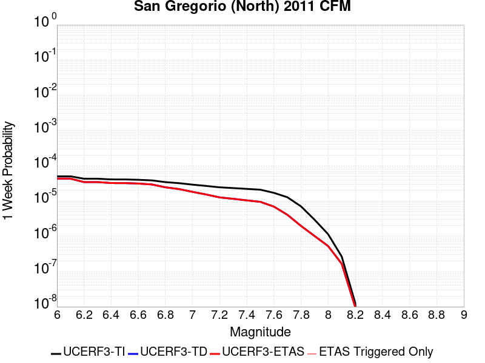 | 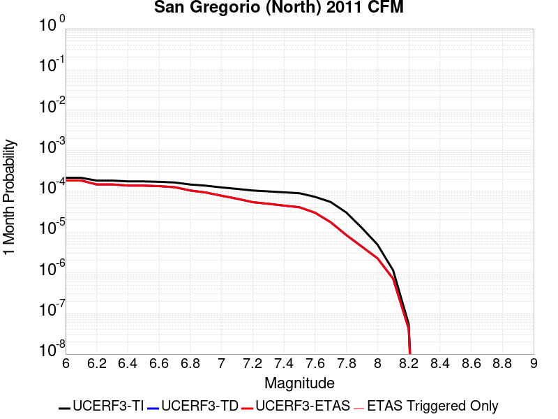 | 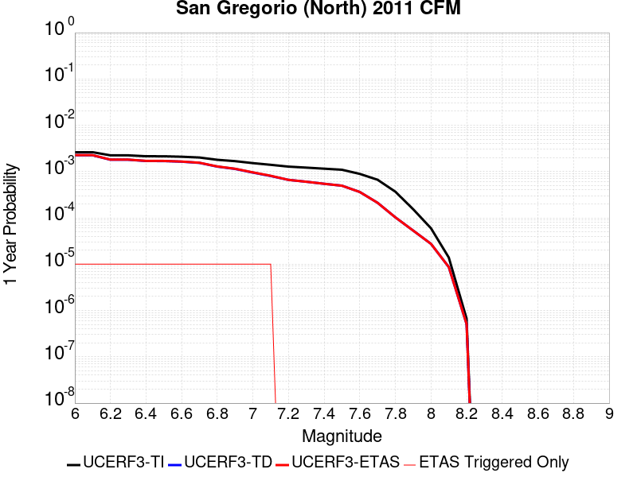 | 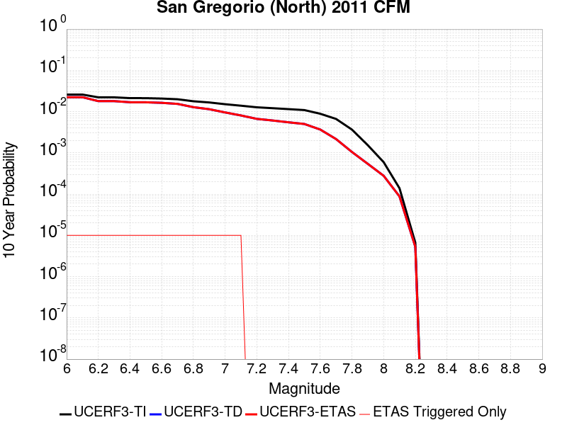 |

| Magnitude | 1 wk TI Prob | 1 wk TD Prob | 1 wk ETAS Prob | 1 wk ETAS/TD Gain | 1 wk ETAS Triggered Only | 1 mo TI Prob | 1 mo TD Prob | 1 mo ETAS Prob | 1 mo ETAS/TD Gain | 1 mo ETAS Triggered Only | 1 yr TI Prob | 1 yr TD Prob | 1 yr ETAS Prob | 1 yr ETAS/TD Gain | 1 yr ETAS Triggered Only | 10 yr TI Prob | 10 yr TD Prob | 10 yr ETAS Prob | 10 yr ETAS/TD Gain | 10 yr ETAS Triggered Only |
|-----|-----|-----|-----|-----|-----|-----|-----|-----|-----|-----|-----|-----|-----|-----|-----|-----|-----|-----|-----|-----|
| 6.0 | 5.0283932E-5 | 4.318002E-5 | 4.318002E-5 | 1.0 | 0.0 | 2.1548476E-4 | 1.8504418E-4 | 1.8504418E-4 | 1.0 | 0.0 | 0.0026203706 | 0.0022505987 | 0.0022605762 | 1.0044333 | 1.0E-5 | 0.02589687 | 0.022352232 | 0.022362009 | 1.0004374 | 1.0E-5 |
| 6.1 | 5.0283932E-5 | 4.318002E-5 | 4.318002E-5 | 1.0 | 0.0 | 2.1548476E-4 | 1.8504418E-4 | 1.8504418E-4 | 1.0 | 0.0 | 0.0026203706 | 0.0022505987 | 0.0022605762 | 1.0044333 | 1.0E-5 | 0.02589687 | 0.022352232 | 0.022362009 | 1.0004374 | 1.0E-5 |
| 6.2 | 4.2998647E-5 | 3.4552173E-5 | 3.4552173E-5 | 1.0 | 0.0 | 1.842669E-4 | 1.480724E-4 | 1.480724E-4 | 1.0 | 0.0 | 0.0022411412 | 0.0018013032 | 0.0018112852 | 1.0055416 | 1.0E-5 | 0.022186736 | 0.017944198 | 0.01795402 | 1.0005473 | 1.0E-5 |
| 6.3 | 4.2998647E-5 | 3.4552173E-5 | 3.4552173E-5 | 1.0 | 0.0 | 1.842669E-4 | 1.480724E-4 | 1.480724E-4 | 1.0 | 0.0 | 0.0022411412 | 0.0018013032 | 0.0018112852 | 1.0055416 | 1.0E-5 | 0.022186736 | 0.017944198 | 0.01795402 | 1.0005473 | 1.0E-5 |
| 6.4 | 4.1101295E-5 | 3.243446E-5 | 3.243446E-5 | 1.0 | 0.0 | 1.7613651E-4 | 1.3899748E-4 | 1.3899748E-4 | 1.0 | 0.0 | 0.0021423528 | 0.001690994 | 0.0017009771 | 1.0059037 | 1.0E-5 | 0.02121817 | 0.016857985 | 0.016867816 | 1.0005832 | 1.0E-5 |
| 6.5 | 4.1032585E-5 | 3.2352415E-5 | 3.2352415E-5 | 1.0 | 0.0 | 1.7584208E-4 | 1.3864589E-4 | 1.3864589E-4 | 1.0 | 0.0 | 0.0021387753 | 0.0016867202 | 0.0016967034 | 1.0059186 | 1.0E-5 | 0.021183075 | 0.0168159 | 0.016825732 | 1.0005847 | 1.0E-5 |
| 6.6 | 4.011629E-5 | 3.1372594E-5 | 3.1372594E-5 | 1.0 | 0.0 | 1.7191563E-4 | 1.3444711E-4 | 1.3444711E-4 | 1.0 | 0.0 | 0.0020910634 | 0.0016356785 | 0.001645662 | 1.0061036 | 1.0E-5 | 0.020714961 | 0.016314004 | 0.016323842 | 1.000603 | 1.0E-5 |
| 6.7 | 3.8583938E-5 | 2.9557277E-5 | 2.9557277E-5 | 1.0 | 0.0 | 1.6534925E-4 | 1.2666798E-4 | 1.2666798E-4 | 1.0 | 0.0 | 0.0020112682 | 0.0015411059 | 0.0015510905 | 1.0064789 | 1.0E-5 | 0.019931622 | 0.015380564 | 0.01539041 | 1.0006402 | 1.0E-5 |
| 6.8 | 3.44341E-5 | 2.4548268E-5 | 2.4548268E-5 | 1.0 | 0.0 | 1.4756636E-4 | 1.0520268E-4 | 1.0520268E-4 | 1.0 | 0.0 | 0.0017951399 | 0.0012801006 | 0.0012900877 | 1.0078019 | 1.0E-5 | 0.017807078 | 0.012803153 | 0.012813025 | 1.000771 | 1.0E-5 |
| 6.9 | 3.221199E-5 | 2.1868722E-5 | 2.1868722E-5 | 1.0 | 0.0 | 1.3804408E-4 | 9.371978E-5 | 9.371978E-5 | 1.0 | 0.0 | 0.0016793909 | 0.0011404493 | 0.0011504379 | 1.0087584 | 1.0E-5 | 0.01666756 | 0.011421024 | 0.01143091 | 1.0008656 | 1.0E-5 |
| 7.0 | 2.9186718E-5 | 1.8231263E-5 | 1.8231263E-5 | 1.0 | 0.0 | 1.2507994E-4 | 7.813167E-5 | 7.813167E-5 | 1.0 | 0.0 | 0.0015217843 | 9.508424E-4 | 9.6083287E-4 | 1.010507 | 1.0E-5 | 0.015114053 | 0.009542018 | 0.009551923 | 1.001038 | 1.0E-5 |
| 7.1 | 2.6840138E-5 | 1.5364962E-5 | 1.5364962E-5 | 1.0 | 0.0 | 1.1502409E-4 | 6.584819E-5 | 6.584819E-5 | 1.0 | 0.0 | 0.0013995186 | 8.014088E-4 | 8.1140077E-4 | 1.012468 | 1.0E-5 | 0.013907375 | 0.00805917 | 0.00806909 | 1.0012308 | 1.0E-5 |
| 7.2 | 2.453002E-5 | 1.26845825E-5 | 1.26845825E-5 | 1.0 | 0.0 | 1.05124425E-4 | 5.4361364E-5 | 5.4361364E-5 | 1.0 | 0.0 | 0.0012791384 | 6.616492E-4 | 6.616492E-4 | 1.0 | 0.0 | 0.012718005 | 0.006669731 | 0.006669731 | 1.0 | 0.0 |
| 7.3 | 2.3330727E-5 | 1.1564705E-5 | 1.1564705E-5 | 1.0 | 0.0 | 9.9985E-5 | 4.9562084E-5 | 4.9562084E-5 | 1.0 | 0.0 | 0.0012166376 | 6.0325174E-4 | 6.0325174E-4 | 1.0 | 0.0 | 0.012099981 | 0.006087668 | 0.006087668 | 1.0 | 0.0 |
| 7.4 | 2.2136466E-5 | 1.044332E-5 | 1.044332E-5 | 1.0 | 0.0 | 9.486712E-5 | 4.475632E-5 | 4.475632E-5 | 1.0 | 0.0 | 0.0011543952 | 5.4477225E-4 | 5.4477225E-4 | 1.0 | 0.0 | 0.011484168 | 0.0055044172 | 0.0055044172 | 1.0 | 0.0 |
| 7.5 | 2.0994974E-5 | 9.498769E-6 | 9.498769E-6 | 1.0 | 0.0 | 8.997535E-5 | 4.070838E-5 | 4.070838E-5 | 1.0 | 0.0 | 0.0010948994 | 4.9551204E-4 | 4.9551204E-4 | 1.0 | 0.0 | 0.010895205 | 0.005011914 | 0.005011914 | 1.0 | 0.0 |
| 7.6 | 1.7091823E-5 | 6.9512334E-6 | 6.9512334E-6 | 1.0 | 0.0 | 7.3248615E-5 | 2.979066E-5 | 2.979066E-5 | 1.0 | 0.0 | 8.9143694E-4 | 3.6264103E-4 | 3.6264103E-4 | 1.0 | 0.0 | 0.008878695 | 0.003679466 | 0.003679466 | 1.0 | 0.0 |
| 7.7 | 1.2772179E-5 | 4.061639E-6 | 4.061639E-6 | 1.0 | 0.0 | 5.473676E-5 | 1.7406908E-5 | 1.7406908E-5 | 1.0 | 0.0 | 6.6621625E-4 | 2.1190853E-4 | 2.1190853E-4 | 1.0 | 0.0 | 0.006642225 | 0.002159078 | 0.002159078 | 1.0 | 0.0 |
| 7.8 | 7.041923E-6 | 1.9669753E-6 | 1.9669753E-6 | 1.0 | 0.0 | 3.017932E-5 | 8.429866E-6 | 8.429866E-6 | 1.0 | 0.0 | 3.6737128E-4 | 1.02628794E-4 | 1.02628794E-4 | 1.0 | 0.0 | 0.0036676454 | 0.0010522631 | 0.0010522631 | 1.0 | 0.0 |
| 7.9 | 2.946768E-6 | 1.018827E-6 | 1.018827E-6 | 1.0 | 0.0 | 1.2628945E-5 | 4.366394E-6 | 4.366394E-6 | 1.0 | 0.0 | 1.5374656E-4 | 5.315955E-5 | 5.315955E-5 | 1.0 | 0.0 | 0.0015364023 | 5.42223E-4 | 5.42223E-4 | 1.0 | 0.0 |
| 8.0 | 1.1433375E-6 | 5.2703155E-7 | 5.2703155E-7 | 1.0 | 0.0 | 4.9000087E-6 | 2.2587046E-6 | 2.2587046E-6 | 1.0 | 0.0 | 5.965597E-5 | 2.7499384E-5 | 2.7499384E-5 | 1.0 | 0.0 | 5.963996E-4 | 2.7864333E-4 | 2.7864333E-4 | 1.0 | 0.0 |
| 8.1 | 2.6675295E-7 | 1.6626096E-7 | 1.6626096E-7 | 1.0 | 0.0 | 1.1432264E-6 | 7.1254675E-7 | 7.1254675E-7 | 1.0 | 0.0 | 1.3918692E-5 | 8.6752225E-6 | 8.6752225E-6 | 1.0 | 0.0 | 1.391782E-4 | 8.81471E-5 | 8.81471E-5 | 1.0 | 0.0 |
| 8.2 | 1.2704569E-8 | 9.732738E-9 | 9.732738E-9 | 1.0 | 0.0 | 5.444815E-8 | 4.1711733E-8 | 4.1711733E-8 | 1.0 | 0.0 | 6.629061E-7 | 5.0784024E-7 | 5.0784024E-7 | 1.0 | 0.0 | 6.629041E-6 | 5.2718874E-6 | 5.2718874E-6 | 1.0 | 0.0 |

## Reliz 2011 CFM
*[(top)](#table-of-contents)*

| 1 Week | 1 Month | 1 Year | 10 Year |
|-----|-----|-----|-----|
| 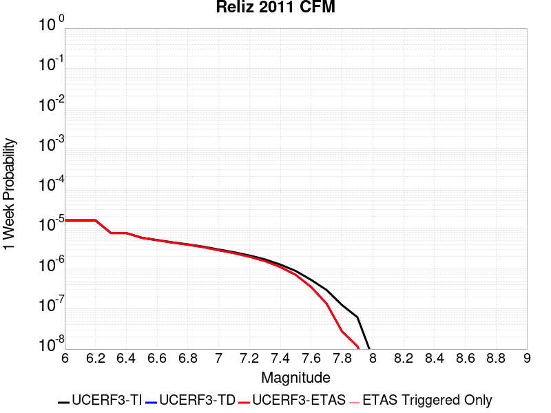 | 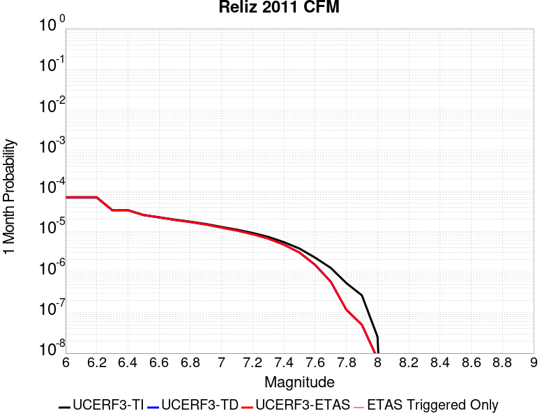 | 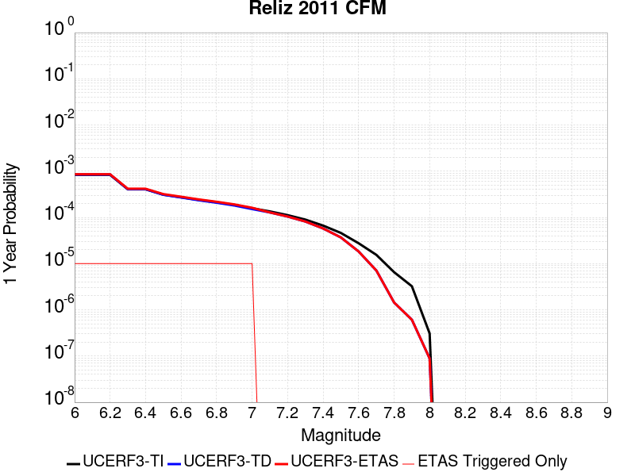 | 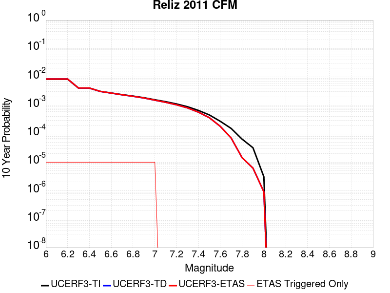 |

| Magnitude | 1 wk TI Prob | 1 wk TD Prob | 1 wk ETAS Prob | 1 wk ETAS/TD Gain | 1 wk ETAS Triggered Only | 1 mo TI Prob | 1 mo TD Prob | 1 mo ETAS Prob | 1 mo ETAS/TD Gain | 1 mo ETAS Triggered Only | 1 yr TI Prob | 1 yr TD Prob | 1 yr ETAS Prob | 1 yr ETAS/TD Gain | 1 yr ETAS Triggered Only | 10 yr TI Prob | 10 yr TD Prob | 10 yr ETAS Prob | 10 yr ETAS/TD Gain | 10 yr ETAS Triggered Only |
|-----|-----|-----|-----|-----|-----|-----|-----|-----|-----|-----|-----|-----|-----|-----|-----|-----|-----|-----|-----|-----|
| 6.0 | 1.6002472E-5 | 1.6286349E-5 | 1.6286349E-5 | 1.0 | 0.0 | 6.8580215E-5 | 6.979688E-5 | 6.979688E-5 | 1.0 | 0.0 | 8.3464425E-4 | 8.4946555E-4 | 8.59457E-4 | 1.0117621 | 1.0E-5 | 0.008315164 | 0.008464385 | 0.008474301 | 1.0011715 | 1.0E-5 |
| 6.1 | 1.6002472E-5 | 1.6286349E-5 | 1.6286349E-5 | 1.0 | 0.0 | 6.8580215E-5 | 6.979688E-5 | 6.979688E-5 | 1.0 | 0.0 | 8.3464425E-4 | 8.4946555E-4 | 8.59457E-4 | 1.0117621 | 1.0E-5 | 0.008315164 | 0.008464385 | 0.008474301 | 1.0011715 | 1.0E-5 |
| 6.2 | 1.6002472E-5 | 1.6286349E-5 | 1.6286349E-5 | 1.0 | 0.0 | 6.8580215E-5 | 6.979688E-5 | 6.979688E-5 | 1.0 | 0.0 | 8.3464425E-4 | 8.4946555E-4 | 8.59457E-4 | 1.0117621 | 1.0E-5 | 0.008315164 | 0.008464385 | 0.008474301 | 1.0011715 | 1.0E-5 |
| 6.3 | 7.792404E-6 | 7.80598E-6 | 7.80598E-6 | 1.0 | 0.0 | 3.339559E-5 | 3.3453776E-5 | 3.3453776E-5 | 1.0 | 0.0 | 4.0651546E-4 | 4.0722438E-4 | 4.1722032E-4 | 1.0245465 | 1.0E-5 | 0.0040577264 | 0.0040650615 | 0.0040750206 | 1.00245 | 1.0E-5 |
| 6.4 | 7.792404E-6 | 7.80598E-6 | 7.80598E-6 | 1.0 | 0.0 | 3.339559E-5 | 3.3453776E-5 | 3.3453776E-5 | 1.0 | 0.0 | 4.0651546E-4 | 4.0722438E-4 | 4.1722032E-4 | 1.0245465 | 1.0E-5 | 0.0040577264 | 0.0040650615 | 0.0040750206 | 1.00245 | 1.0E-5 |
| 6.5 | 5.9659374E-6 | 5.9306713E-6 | 5.9306713E-6 | 1.0 | 0.0 | 2.5568053E-5 | 2.5416917E-5 | 2.5416917E-5 | 1.0 | 0.0 | 3.1124658E-4 | 3.0940725E-4 | 3.1940415E-4 | 1.0323099 | 1.0E-5 | 0.00310811 | 0.0030899853 | 0.0030999545 | 1.0032263 | 1.0E-5 |
| 6.6 | 5.2350692E-6 | 5.1808242E-6 | 5.1808242E-6 | 1.0 | 0.0 | 2.2435817E-5 | 2.2203343E-5 | 2.2203343E-5 | 1.0 | 0.0 | 2.7312184E-4 | 2.702923E-4 | 2.8028962E-4 | 1.036987 | 1.0E-5 | 0.002727864 | 0.0026998487 | 0.0027098218 | 1.0036939 | 1.0E-5 |
| 6.7 | 4.580206E-6 | 4.5078677E-6 | 4.5078677E-6 | 1.0 | 0.0 | 1.9629308E-5 | 1.931929E-5 | 1.931929E-5 | 1.0 | 0.0 | 2.389606E-4 | 2.3518704E-4 | 2.451847E-4 | 1.0425093 | 1.0E-5 | 0.002387038 | 0.0023495862 | 0.0023595628 | 1.0042461 | 1.0E-5 |
| 6.8 | 4.0765017E-6 | 3.9899137E-6 | 3.9899137E-6 | 1.0 | 0.0 | 1.7470604E-5 | 1.7099519E-5 | 1.7099519E-5 | 1.0 | 0.0 | 2.1268385E-4 | 2.0816678E-4 | 2.181647E-4 | 1.0480283 | 1.0E-5 | 0.002124804 | 0.002079919 | 0.002089898 | 1.0047979 | 1.0E-5 |
| 6.9 | 3.5752896E-6 | 3.4741195E-6 | 3.4741195E-6 | 1.0 | 0.0 | 1.532258E-5 | 1.48889985E-5 | 1.48889985E-5 | 1.0 | 0.0 | 1.8653645E-4 | 1.812585E-4 | 1.9125668E-4 | 1.0551598 | 1.0E-5 | 0.0018637994 | 0.001811306 | 0.0018212879 | 1.0055109 | 1.0E-5 |
| 7.0 | 3.0259848E-6 | 2.9094663E-6 | 2.9094663E-6 | 1.0 | 0.0 | 1.2968442E-5 | 1.2469081E-5 | 1.2469081E-5 | 1.0 | 0.0 | 1.5787935E-4 | 1.5180052E-4 | 1.6179899E-4 | 1.0658659 | 1.0E-5 | 0.0015776722 | 0.0015171664 | 0.0015271512 | 1.0065812 | 1.0E-5 |
| 7.1 | 2.5861116E-6 | 2.4566264E-6 | 2.4566264E-6 | 1.0 | 0.0 | 1.1083288E-5 | 1.0528356E-5 | 1.0528356E-5 | 1.0 | 0.0 | 1.3493067E-4 | 1.281752E-4 | 1.281752E-4 | 1.0 | 0.0 | 0.0013484878 | 0.0012812103 | 0.0012812103 | 1.0 | 0.0 |
| 7.2 | 2.1482588E-6 | 2.0046243E-6 | 2.0046243E-6 | 1.0 | 0.0 | 9.20679E-6 | 8.591219E-6 | 8.591219E-6 | 1.0 | 0.0 | 1.12086906E-4 | 1.0459307E-4 | 1.0459307E-4 | 1.0 | 0.0 | 0.0011203039 | 0.0010456357 | 0.0010456357 | 1.0 | 0.0 |
| 7.3 | 1.7194744E-6 | 1.5624432E-6 | 1.5624432E-6 | 1.0 | 0.0 | 7.3691554E-6 | 6.696168E-6 | 6.696168E-6 | 1.0 | 0.0 | 8.971577E-5 | 8.15228E-5 | 8.15228E-5 | 1.0 | 0.0 | 8.967956E-4 | 8.151259E-4 | 8.151259E-4 | 1.0 | 0.0 |
| 7.4 | 1.2755178E-6 | 1.1068795E-6 | 1.1068795E-6 | 1.0 | 0.0 | 5.4664933E-6 | 4.74376E-6 | 4.74376E-6 | 1.0 | 0.0 | 6.655252E-5 | 5.7753754E-5 | 5.7753754E-5 | 1.0 | 0.0 | 6.6532596E-4 | 5.7758426E-4 | 5.7758426E-4 | 1.0 | 0.0 |
| 7.5 | 8.8463224E-7 | 7.069788E-7 | 7.069788E-7 | 1.0 | 0.0 | 3.7912755E-6 | 3.0299057E-6 | 3.0299057E-6 | 1.0 | 0.0 | 4.6157802E-5 | 3.688848E-5 | 3.688848E-5 | 1.0 | 0.0 | 4.6148215E-4 | 3.6902027E-4 | 3.6902027E-4 | 1.0 | 0.0 |
| 7.6 | 5.291355E-7 | 3.511326E-7 | 3.511326E-7 | 1.0 | 0.0 | 2.2677216E-6 | 1.5048531E-6 | 1.5048531E-6 | 1.0 | 0.0 | 2.760916E-5 | 1.8321432E-5 | 1.8321432E-5 | 1.0 | 0.0 | 2.760573E-4 | 1.8339495E-4 | 1.8339495E-4 | 1.0 | 0.0 |
| 7.7 | 2.9663357E-7 | 1.3586646E-7 | 1.3586646E-7 | 1.0 | 0.0 | 1.2712861E-6 | 5.8228466E-7 | 5.8228466E-7 | 1.0 | 0.0 | 1.5477797E-5 | 7.089293E-6 | 7.089293E-6 | 1.0 | 0.0 | 1.547672E-4 | 7.1077506E-5 | 7.1077506E-5 | 1.0 | 0.0 |
| 7.8 | 1.2509386E-7 | 2.7576526E-8 | 2.7576526E-8 | 1.0 | 0.0 | 5.3611643E-7 | 1.18185106E-7 | 1.18185106E-7 | 1.0 | 0.0 | 6.527198E-6 | 1.4389027E-6 | 1.4389027E-6 | 1.0 | 0.0 | 6.527006E-5 | 1.4547338E-5 | 1.4547338E-5 | 1.0 | 0.0 |
| 7.9 | 6.213493E-8 | 1.1708623E-8 | 1.1708623E-8 | 1.0 | 0.0 | 2.6629255E-7 | 5.017981E-8 | 5.017981E-8 | 1.0 | 0.0 | 3.242107E-6 | 6.10939E-7 | 6.10939E-7 | 1.0 | 0.0 | 3.2420594E-5 | 6.2424283E-6 | 6.2424283E-6 | 1.0 | 0.0 |
| 8.0 | 5.92383E-9 | 1.7031256E-9 | 1.7031256E-9 | 1.0 | 0.0 | 2.5387841E-8 | 7.2991106E-9 | 7.2991106E-9 | 1.0 | 0.0 | 3.0909692E-7 | 8.886666E-8 | 8.886666E-8 | 1.0 | 0.0 | 3.090965E-6 | 9.133264E-7 | 9.133264E-7 | 1.0 | 0.0 |

## Polaris 2011 CFM
*[(top)](#table-of-contents)*

| 1 Week | 1 Month | 1 Year | 10 Year |
|-----|-----|-----|-----|
|  | 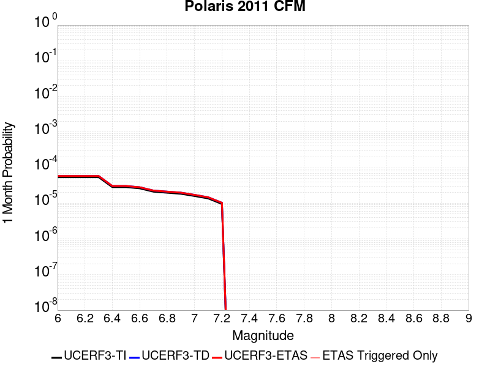 | 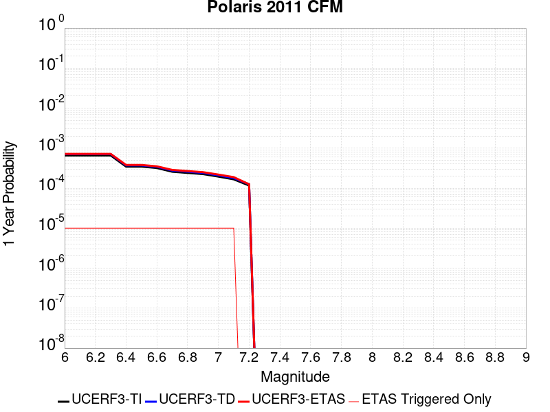 |  |

| Magnitude | 1 wk TI Prob | 1 wk TD Prob | 1 wk ETAS Prob | 1 wk ETAS/TD Gain | 1 wk ETAS Triggered Only | 1 mo TI Prob | 1 mo TD Prob | 1 mo ETAS Prob | 1 mo ETAS/TD Gain | 1 mo ETAS Triggered Only | 1 yr TI Prob | 1 yr TD Prob | 1 yr ETAS Prob | 1 yr ETAS/TD Gain | 1 yr ETAS Triggered Only | 10 yr TI Prob | 10 yr TD Prob | 10 yr ETAS Prob | 10 yr ETAS/TD Gain | 10 yr ETAS Triggered Only |
|-----|-----|-----|-----|-----|-----|-----|-----|-----|-----|-----|-----|-----|-----|-----|-----|-----|-----|-----|-----|-----|
| 6.0 | 1.2630823E-5 | 1.35879445E-5 | 1.35879445E-5 | 1.0 | 0.0 | 5.413098E-5 | 5.823304E-5 | 5.823304E-5 | 1.0 | 0.0 | 6.5884535E-4 | 7.088086E-4 | 7.188015E-4 | 1.0140982 | 1.0E-5 | 0.0065689543 | 0.007070591 | 0.0070805205 | 1.0014043 | 1.0E-5 |
| 6.1 | 1.2630823E-5 | 1.35879445E-5 | 1.35879445E-5 | 1.0 | 0.0 | 5.413098E-5 | 5.823304E-5 | 5.823304E-5 | 1.0 | 0.0 | 6.5884535E-4 | 7.088086E-4 | 7.188015E-4 | 1.0140982 | 1.0E-5 | 0.0065689543 | 0.007070591 | 0.0070805205 | 1.0014043 | 1.0E-5 |
| 6.2 | 1.2630823E-5 | 1.35879445E-5 | 1.35879445E-5 | 1.0 | 0.0 | 5.413098E-5 | 5.823304E-5 | 5.823304E-5 | 1.0 | 0.0 | 6.5884535E-4 | 7.088086E-4 | 7.188015E-4 | 1.0140982 | 1.0E-5 | 0.0065689543 | 0.007070591 | 0.0070805205 | 1.0014043 | 1.0E-5 |
| 6.3 | 1.2630823E-5 | 1.35879445E-5 | 1.35879445E-5 | 1.0 | 0.0 | 5.413098E-5 | 5.823304E-5 | 5.823304E-5 | 1.0 | 0.0 | 6.5884535E-4 | 7.088086E-4 | 7.188015E-4 | 1.0140982 | 1.0E-5 | 0.0065689543 | 0.007070591 | 0.0070805205 | 1.0014043 | 1.0E-5 |
| 6.4 | 6.642994E-6 | 7.109497E-6 | 7.109497E-6 | 1.0 | 0.0 | 2.8469662E-5 | 3.0468946E-5 | 3.0468946E-5 | 1.0 | 0.0 | 3.46563E-4 | 3.7090143E-4 | 3.8089772E-4 | 1.0269513 | 1.0E-5 | 0.0034602303 | 0.003703335 | 0.0037132981 | 1.0026903 | 1.0E-5 |
| 6.5 | 6.642994E-6 | 7.109497E-6 | 7.109497E-6 | 1.0 | 0.0 | 2.8469662E-5 | 3.0468946E-5 | 3.0468946E-5 | 1.0 | 0.0 | 3.46563E-4 | 3.7090143E-4 | 3.8089772E-4 | 1.0269513 | 1.0E-5 | 0.0034602303 | 0.003703335 | 0.0037132981 | 1.0026903 | 1.0E-5 |
| 6.6 | 6.1286296E-6 | 6.5584163E-6 | 6.5584163E-6 | 1.0 | 0.0 | 2.626529E-5 | 2.8107223E-5 | 2.8107223E-5 | 1.0 | 0.0 | 3.19733E-4 | 3.421565E-4 | 3.521531E-4 | 1.0292164 | 1.0E-5 | 0.0031927335 | 0.0034167727 | 0.0034267385 | 1.0029167 | 1.0E-5 |
| 6.7 | 4.9474666E-6 | 5.300093E-6 | 5.300093E-6 | 1.0 | 0.0 | 2.1203256E-5 | 2.2714503E-5 | 2.2714503E-5 | 1.0 | 0.0 | 2.5811905E-4 | 2.765168E-4 | 2.8651403E-4 | 1.0361542 | 1.0E-5 | 0.0025781945 | 0.0027620075 | 0.00277198 | 1.0036106 | 1.0E-5 |
| 6.8 | 4.616407E-6 | 4.9479986E-6 | 4.9479986E-6 | 1.0 | 0.0 | 1.978445E-5 | 2.1205551E-5 | 2.1205551E-5 | 1.0 | 0.0 | 2.4084905E-4 | 2.581497E-4 | 2.681471E-4 | 1.0387272 | 1.0E-5 | 0.0024058819 | 0.0025787626 | 0.0025887368 | 1.0038679 | 1.0E-5 |
| 6.9 | 4.320343E-6 | 4.6325194E-6 | 4.6325194E-6 | 1.0 | 0.0 | 1.8515624E-5 | 1.985352E-5 | 1.985352E-5 | 1.0 | 0.0 | 2.2540441E-4 | 2.416924E-4 | 2.5168998E-4 | 1.0413649 | 1.0E-5 | 0.0022517592 | 0.0024145523 | 0.0024245281 | 1.0041316 | 1.0E-5 |
| 7.0 | 3.7382292E-6 | 4.0109812E-6 | 4.0109812E-6 | 1.0 | 0.0 | 1.6020884E-5 | 1.718982E-5 | 1.718982E-5 | 1.0 | 0.0 | 1.950368E-4 | 2.0926834E-4 | 2.1926625E-4 | 1.0477755 | 1.0E-5 | 0.0019486571 | 0.0020909484 | 0.0021009275 | 1.0047725 | 1.0E-5 |
| 7.1 | 3.193576E-6 | 3.4289324E-6 | 3.4289324E-6 | 1.0 | 0.0 | 1.3686683E-5 | 1.46953535E-5 | 1.46953535E-5 | 1.0 | 0.0 | 1.6662262E-4 | 1.7890347E-4 | 1.8890169E-4 | 1.055886 | 1.0E-5 | 0.0016649774 | 0.0017878135 | 0.0017977956 | 1.0055834 | 1.0E-5 |
| 7.2 | 2.2356758E-6 | 2.4032474E-6 | 2.4032474E-6 | 1.0 | 0.0 | 9.581432E-6 | 1.0299602E-5 | 1.0299602E-5 | 1.0 | 0.0 | 1.1664769E-4 | 1.2539233E-4 | 1.2539233E-4 | 1.0 | 0.0 | 0.0011658648 | 0.0012534016 | 0.0012534016 | 1.0 | 0.0 |

## Hayward (So) 2011 CFM
*[(top)](#table-of-contents)*

| 1 Week | 1 Month | 1 Year | 10 Year |
|-----|-----|-----|-----|
| 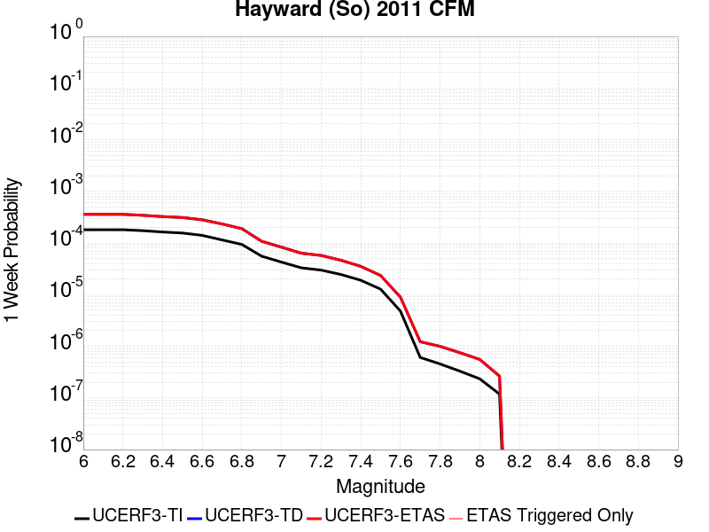 | 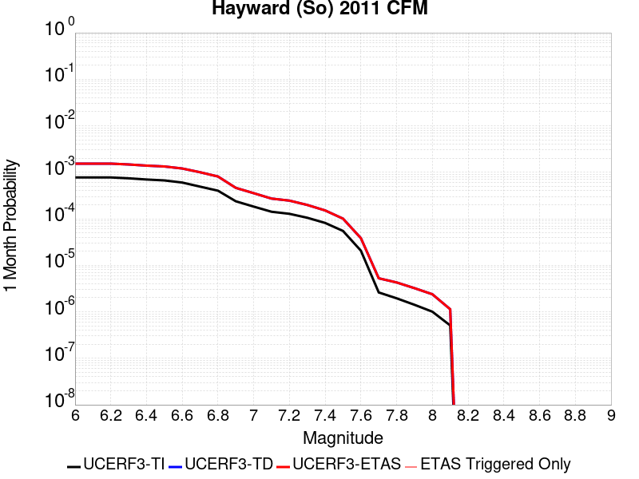 | 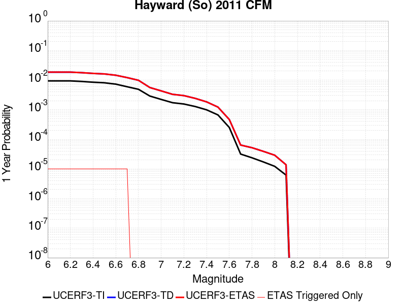 | 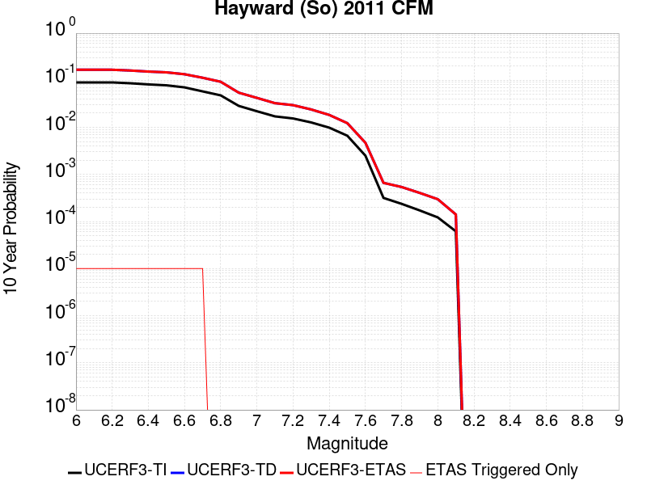 |

| Magnitude | 1 wk TI Prob | 1 wk TD Prob | 1 wk ETAS Prob | 1 wk ETAS/TD Gain | 1 wk ETAS Triggered Only | 1 mo TI Prob | 1 mo TD Prob | 1 mo ETAS Prob | 1 mo ETAS/TD Gain | 1 mo ETAS Triggered Only | 1 yr TI Prob | 1 yr TD Prob | 1 yr ETAS Prob | 1 yr ETAS/TD Gain | 1 yr ETAS Triggered Only | 10 yr TI Prob | 10 yr TD Prob | 10 yr ETAS Prob | 10 yr ETAS/TD Gain | 10 yr ETAS Triggered Only |
|-----|-----|-----|-----|-----|-----|-----|-----|-----|-----|-----|-----|-----|-----|-----|-----|-----|-----|-----|-----|-----|
| 6.0 | 1.8091932E-4 | 3.5849868E-4 | 3.5849868E-4 | 1.0 | 0.0 | 7.751381E-4 | 0.0015355283 | 0.0015355283 | 1.0 | 0.0 | 0.00939654 | 0.018537229 | 0.018547045 | 1.0005294 | 1.0E-5 | 0.090090066 | 0.16726671 | 0.16727504 | 1.0000498 | 1.0E-5 |
| 6.1 | 1.8091932E-4 | 3.5849868E-4 | 3.5849868E-4 | 1.0 | 0.0 | 7.751381E-4 | 0.0015355283 | 0.0015355283 | 1.0 | 0.0 | 0.00939654 | 0.018537229 | 0.018547045 | 1.0005294 | 1.0E-5 | 0.090090066 | 0.16726671 | 0.16727504 | 1.0000498 | 1.0E-5 |
| 6.2 | 1.8091932E-4 | 3.5849868E-4 | 3.5849868E-4 | 1.0 | 0.0 | 7.751381E-4 | 0.0015355283 | 0.0015355283 | 1.0 | 0.0 | 0.00939654 | 0.018537229 | 0.018547045 | 1.0005294 | 1.0E-5 | 0.090090066 | 0.16726671 | 0.16727504 | 1.0000498 | 1.0E-5 |
| 6.3 | 1.7322872E-4 | 3.4403213E-4 | 3.4403213E-4 | 1.0 | 0.0 | 7.4219756E-4 | 0.0014735999 | 0.0014735999 | 1.0 | 0.0 | 0.0089988755 | 0.01779578 | 0.017805602 | 1.0005519 | 1.0E-5 | 0.08643075 | 0.16120449 | 0.16121288 | 1.000052 | 1.0E-5 |
| 6.4 | 1.6334097E-4 | 3.2480914E-4 | 3.2480914E-4 | 1.0 | 0.0 | 6.998449E-4 | 0.0013913052 | 0.0013913052 | 1.0 | 0.0 | 0.008487372 | 0.016809603 | 0.016819436 | 1.0005848 | 1.0E-5 | 0.081704415 | 0.15308067 | 0.15308915 | 1.0000553 | 1.0E-5 |
| 6.5 | 1.5600289E-4 | 3.1152013E-4 | 3.1152013E-4 | 1.0 | 0.0 | 6.684125E-4 | 0.0013344116 | 0.0013344116 | 1.0 | 0.0 | 0.008107598 | 0.016127342 | 0.01613718 | 1.0006101 | 1.0E-5 | 0.078181036 | 0.14734097 | 0.14734949 | 1.0000578 | 1.0E-5 |
| 6.6 | 1.4046066E-4 | 2.81594E-4 | 2.81594E-4 | 1.0 | 0.0 | 6.018354E-4 | 0.0012062801 | 0.0012062801 | 1.0 | 0.0 | 0.0073027555 | 0.014589076 | 0.01459893 | 1.0006754 | 1.0E-5 | 0.07067384 | 0.1344076 | 0.13441625 | 1.0000644 | 1.0E-5 |
| 6.7 | 1.14696966E-4 | 2.3385801E-4 | 2.3385801E-4 | 1.0 | 0.0 | 4.914658E-4 | 0.0010018687 | 0.0010018687 | 1.0 | 0.0 | 0.0059671924 | 0.012130605 | 0.012140484 | 1.0008143 | 1.0E-5 | 0.058094822 | 0.11318045 | 0.11318932 | 1.0000783 | 1.0E-5 |
| 6.8 | 9.3874296E-5 | 1.895622E-4 | 1.895622E-4 | 1.0 | 0.0 | 4.0225635E-4 | 8.121602E-4 | 8.121602E-4 | 1.0 | 0.0 | 0.0048864787 | 0.009843961 | 0.009843961 | 1.0 | 0.0 | 0.047804173 | 0.092996486 | 0.092996486 | 1.0 | 0.0 |
| 6.9 | 5.551852E-5 | 1.0790643E-4 | 1.0790643E-4 | 1.0 | 0.0 | 2.3791482E-4 | 4.623748E-4 | 4.623748E-4 | 1.0 | 0.0 | 0.0028927654 | 0.0056150025 | 0.0056150025 | 1.0 | 0.0 | 0.028553981 | 0.054523014 | 0.054523014 | 1.0 | 0.0 |
| 7.0 | 4.2662363E-5 | 8.296558E-5 | 8.296558E-5 | 1.0 | 0.0 | 1.8282588E-4 | 3.555187E-4 | 3.555187E-4 | 1.0 | 0.0 | 0.0022236328 | 0.004319924 | 0.004319924 | 1.0 | 0.0 | 0.022015138 | 0.042296026 | 0.042296026 | 1.0 | 0.0 |
| 7.1 | 3.305886E-5 | 6.344046E-5 | 6.344046E-5 | 1.0 | 0.0 | 1.4167312E-4 | 2.7185943E-4 | 2.7185943E-4 | 1.0 | 0.0 | 0.0017235056 | 0.0033048843 | 0.0033048843 | 1.0 | 0.0 | 0.017101998 | 0.032651037 | 0.032651037 | 1.0 | 0.0 |
| 7.2 | 2.9856887E-5 | 5.7410092E-5 | 5.7410092E-5 | 1.0 | 0.0 | 1.2795182E-4 | 2.4602015E-4 | 2.4602015E-4 | 1.0 | 0.0 | 0.0015567001 | 0.002991198 | 0.002991198 | 1.0 | 0.0 | 0.015458403 | 0.029640952 | 0.029640952 | 1.0 | 0.0 |
| 7.3 | 2.4559737E-5 | 4.6302514E-5 | 4.6302514E-5 | 1.0 | 0.0 | 1.0525176E-4 | 1.9842431E-4 | 1.9842431E-4 | 1.0 | 0.0 | 0.0012806869 | 0.0024131527 | 0.0024131527 | 1.0 | 0.0 | 0.012733313 | 0.024006573 | 0.024006573 | 1.0 | 0.0 |
| 7.4 | 1.9002231E-5 | 3.5287638E-5 | 3.5287638E-5 | 1.0 | 0.0 | 8.143559E-5 | 1.5122401E-4 | 1.5122401E-4 | 1.0 | 0.0 | 9.910273E-4 | 0.0018396076 | 0.0018396076 | 1.0 | 0.0 | 0.009866194 | 0.018373145 | 0.018373145 | 1.0 | 0.0 |
| 7.5 | 1.2783333E-5 | 2.3499146E-5 | 2.3499146E-5 | 1.0 | 0.0 | 5.4784563E-5 | 1.0070677E-4 | 1.0070677E-4 | 1.0 | 0.0 | 6.667979E-4 | 0.0012254212 | 0.0012254212 | 1.0 | 0.0 | 0.006648007 | 0.012291708 | 0.012291708 | 1.0 | 0.0 |
| 7.6 | 4.8149627E-6 | 8.959291E-6 | 8.959291E-6 | 1.0 | 0.0 | 2.063539E-5 | 3.8396403E-5 | 3.8396403E-5 | 1.0 | 0.0 | 2.5120692E-4 | 4.673772E-4 | 4.673772E-4 | 1.0 | 0.0 | 0.0025092314 | 0.004715388 | 0.004715388 | 1.0 | 0.0 |
| 7.7 | 6.0838227E-7 | 1.2268276E-6 | 1.2268276E-6 | 1.0 | 0.0 | 2.6073499E-6 | 5.257822E-6 | 5.257822E-6 | 1.0 | 0.0 | 3.174402E-5 | 6.401211E-5 | 6.401211E-5 | 1.0 | 0.0 | 3.1739488E-4 | 6.6319684E-4 | 6.6319684E-4 | 1.0 | 0.0 |
| 7.8 | 4.5542808E-7 | 9.977003E-7 | 9.977003E-7 | 1.0 | 0.0 | 1.9518332E-6 | 4.2758516E-6 | 4.2758516E-6 | 1.0 | 0.0 | 2.376331E-5 | 5.205725E-5 | 5.205725E-5 | 1.0 | 0.0 | 2.3760769E-4 | 5.4106815E-4 | 5.4106815E-4 | 1.0 | 0.0 |
| 7.9 | 3.3016747E-7 | 7.5223073E-7 | 7.5223073E-7 | 1.0 | 0.0 | 1.4150027E-6 | 3.223842E-6 | 3.223842E-6 | 1.0 | 0.0 | 1.7227521E-5 | 3.924957E-5 | 3.924957E-5 | 1.0 | 0.0 | 1.7226185E-4 | 4.058549E-4 | 4.058549E-4 | 1.0 | 0.0 |
| 8.0 | 2.347038E-7 | 5.5677646E-7 | 5.5677646E-7 | 1.0 | 0.0 | 1.0058731E-6 | 2.3861826E-6 | 2.3861826E-6 | 1.0 | 0.0 | 1.2246436E-5 | 2.9051387E-5 | 2.9051387E-5 | 1.0 | 0.0 | 1.2245761E-4 | 2.9817407E-4 | 2.9817407E-4 | 1.0 | 0.0 |
| 8.1 | 1.18822804E-7 | 2.649948E-7 | 2.649948E-7 | 1.0 | 0.0 | 5.092405E-7 | 1.1356916E-6 | 1.1356916E-6 | 1.0 | 0.0 | 6.1999854E-6 | 1.3826958E-5 | 1.3826958E-5 | 1.0 | 0.0 | 6.199812E-5 | 1.4132493E-4 | 1.4132493E-4 | 1.0 | 0.0 |

